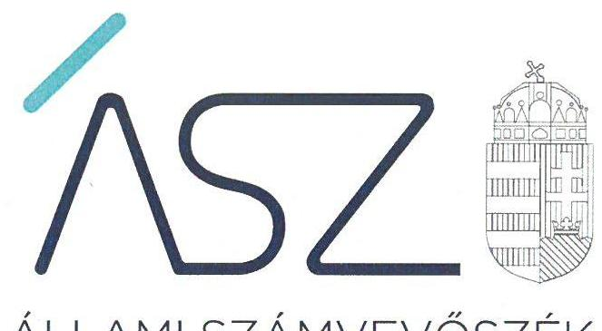
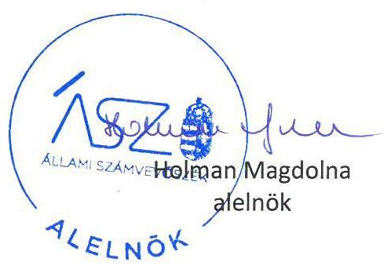

ÁLLAMI SZÁMVEVŐSZÉK

# JELENTÉS 

## Kampánypénzek ellenőrzése

Az időközi országgyűlési képviselő-választási kampányokra fordított pénzeszközök felhasználásának ellenőrzése
2021.

21070
www.asz.hu

---

ÁLLAMI SZÁMVEVŐSZÉK

# JELENTÉS 

## Kampánypénzek ellenőrzése

Az időközi országgyűlési képviselő-választási kampányokra fordított pénzeszközök felhasználásának ellenőrzése
2021. 08 . hó 09 . nap

21070
www.asz.hu

---

# AZ ELLENŐRZÉST FELÜGYELTE: 

KAKAS SÁNDOR ellenőrzésvezető
NEMESVÁRI-HORTHY ESZTER ellenőrzésvezető
HOFMEISTER LÁSZLÓ ellenőrzésvezető

A PROGRAM ÖSSZEÁLLÍTÁSÁÉRT FELELŐS:
TERLECZKYNÉ DR. EISELE EDIT projektvezető

A TÉMÁHOZ KAPCSOLÓDÓ KORÁBBI SZÁMVEVŐSZÉKI JELENTÉSEK:

- címe: Kampánypénzek ellenőrzése - Az időközi országgyűlési képviselő-választási kampányokra fordított pénzeszközök elszámolásának ellenőrzése
- sorszáma: 15200

Jelentéseink az Országgyúlés számítógépes
hálózatán és az interneten a www.asz.hu címen is olvashatóak.

IKTATÓSZÁM: EL-3311-001/2021.
TÉMASZÁM: 2568
ELLENŐRZÉS-AZONOSÍTÓ SZÁM: V 0912

---

# TARTALOMJEGYZÉK 

■ ÖSSZEGZÉS ..... 5
■ AZ ELLENŐRZÉS CÉLJA ..... 7
■ AZ ELLENŐRZÉS TERÜLETE ..... 8
■ AZ ELLENŐRZÉS HÁTTERE, INDOKOLTSÁGA ..... 11
■ A JELENTÉS LÉNYEGES KÉRDÉSKÖREI ..... 12
■ AZ ELLENŐRZÉS HATÓKÖRE ÉS MÓDSZEREI ..... 13
■ MEGÁLLAPÍTÁSOK ..... 16
■ MELLÉKLETEK ..... 21
I. sz. melléklet: Értelmező szótár ..... 21
■ FÜGGELÉK: ÉSZREVÉTELEK ..... 23
■ RÖVIDÍTÉSEK JEGYZÉKE ..... 25

---

.

---

# ÖSSZEGZÉS 

A 2020. évi időközi országgyűlési képviselő-választásokon mandátumot szerzett egyéni jelöltek, valamint jelölő szervezeteik a Magyar Közlönyben közzétett pénzügyi elszámolásaik, illetve az Állami Számvevőszék rendelkezésére bocsátott számviteli bizonylatok értékelése alapján a kampányra fordított pénzeszközök felhasználására vonatkozó előirásokat betartották. A Párbeszéd Magyarországért Párt a pénzügyi elszámolás nyilvánosságra hozatalára vonatkozó törvényi előirást nem tartotta be.

## Az ellenőrzés társadalmi indokoltsága

Az időközi országgyűlési képviselő-választáson induló egyéni jelöltek a kampányköltéseikre állami költségvetési támogatásban részesülnek. Ezen túlmenően az őket jelölő szervezetekként a pártok is hozzájárulnak a kampányuk finanszírozásához.

A központi költségvetésből és az egyéb forrásból az időközi országgyűlési képviselő-választásra felhasznált kampánypénz költések átláthatóságának biztosítása fontos társadalmi érdek. Ennek érvényesülése érdekében az Állami Számvevőszék az időközi országgyűlési képviselő-választáson képviselethez jutó egyéni jelöltek és a jelölő szervezetekként a pártok esetében a választást követő egy éven belül hivatalból ellenőrzi a választásra fordított állami és a pártok működéséről és gazdálkodásáról szóló 1989. évi XXXIII. törvényben meghatározott más pénzeszközök felhasználását, a finanszírozási korlátok és a jelöltenkénti 5 millió Ft-os korlátozás betartását.

## Főbb megállapítások, következtetések

A jelöltek és jelölő szervezetek - egy kivételével - az országgyűlési választást követő 60 napon belül törvényi előírás szerint a Magyar Közlönyben nyilvánosságra hozták a választásra fordított állami és más pénzeszközök, anyagi támogatások összegét, forrását és felhasználásának módját. A Párbeszéd Magyarországért Párt - a Kftv. 9. § (1) bekezdése előírása ellenére - az országgyűlési képviselő választást követő 60 napon belül nem hozta nyilvánosságra a Magyar Közlönyben - a választásra fordított állami és más pénzeszközök, anyagi támogatások összegét, forrását és felhasználásának módját.

Az Állami Számvevőszék a törvényi kötelezettsége szerint ellenőrzi az időközi országgyűlési képviselő-választáson mandátumot szerzett egyéni jelöltek részére juttatott központi költségvetési támogatás felhasználását, az egyéni jelöltek és jelölő szervezeteik esetében a választási kampánytevékenységgel összefüggő kiadások finanszírozására a törvényben meghatározott összeghatár betartását, valamint a jelölő szervezeteknél a Párttörvényben meghatározott finanszírozási korlátozás betartását.

Az Állami Számvevőszék a törvényi kötelezettsége szerint elvégzett ellenőrzése során a mandátumot szerzett egyéni jelöltek és jelölő szervezeteik által a Magyar Közlönyben nyilvánosságra hozott pénzügyi elszámolásaikat és az Állami Számvevőszék ellenőrzése részére rendelkezésre bocsátott számviteli bizonylatokat értékelte.

A 2020. évi dunaújvárosi időközi országgyűlési képviselő-választáson mandátumot szerzett Kálló Gergely egyéni jelölt a részére juttatott központi költségvetési támogatást szabályszerűen használta fel. A Jobbik-DK-LMP-MSZP-Momentum Mozgalom-Párbeszéd jelölő szervezetekkel együtt a Magyar Közlönyben nyilvánosságra hozott pénzügyi elszámolások, valamint az Állami Számvevőszék rendelkezésére bocsátott számviteli bizonylatok értékelése alapján a kampány költségeire vonatkozó korlátozást betartotta. A Jobbik, az MSZP és a Párbeszéd jelölő szervezetek esetében a Magyar Közlönyben nyilvánosságra hozott pénzügyi elszámolások, valamint az Állami Számvevőszék rendelkezésére bocsátott számviteli bizonylatok értékelése alapján a Párttörvény előírásainak be nem tartására utaló körülmény nem merült fel és hatósági megkereséssel az Állami Számvevőszékhez ellenőrzési bizonyíték sem érkezett.

---

A 2020. évi szerencsi időközi országgyűlési képviselő-választáson mandátumot szerzett dr. Koncz Zsófia egyéni jelölt a részére juttatott központi költségvetési támogatást szabályszerűen használta fel. A FIDESZ-KDNP jelölő szervezetekkel együtt a Magyar Közlönyben nyilvánosságra hozott pénzügyi elszámolások, valamint az Állami Számvevőszék rendelkezésére bocsátott számviteli bizonylatok értékelése alapján a kampány költségeire vonatkozó korlátozást betartotta. A FIDESZ jelölő szervezet esetében a Magyar Közlönyben nyilvánosságra hozott pénzügyi elszámolások, valamint az Állami Számvevőszék rendelkezésére bocsátott számviteli bizonylatok értékelése alapján a Párttörvény előírásainak be nem tartására utaló körülmény nem merült fel és hatósági megkereséssel az Állami Számvevőszékhez ellenőrzési bizonyíték sem érkezett.

---

# AZ ELLENŐRZÉS CÉLJA 

AZ ELLENŐRZÉS CÉLJA annak megállapítása volt, hogy
— az időközi országgyűlési képviselő-választásokon képviselethez jutott egyéni jelöltek és jelölő szervezetek, valamint az időközi országgyűlési képviselő választásokon képviselethez nem jutott, de más jelölt, vagy jelölő szervezet kérelmére ellenőrzött egyéni jelöltek és jelölő szervezetek betartották-e a Kftv. ${ }^{1}$ előírásait;
— a pártok, mint jelölő szervezetek a választási kampánytevékenység finanszírozása során betartották-e a Párttörvény ${ }^{2}$ 4. §-ában rögzített előírásokat.

---

# **AZ ELLENŐRZÉS TERÜLETE**

## **A 2020. évi időközi országgyűlési képviselő-választáson képviselethez jutott egyéni jelöltek és jelölő szervezeteik**

**AZ ORSZÁGGYŰLÉSI VÁLASZTÁSI KAMPÁNYOK KAMPÁNYKÖLTSÉGEI** átláthatóvá tételének, az esélyegyenlőség és a választások tisztasága biztosításának kereteit a Kftv. foglalja össze. A Kftv. előírásai szerint – az esélyegyenlőség és a választások tisztaságának elvével összhangban – az időközi országgyűlési képviselő-választások alkalmával minden egyéni választókerületi jelölt azonos összegű költségvetési támogatásra jogosult kampányköltségeik fedezésére, amely támogatás felhasználása szigorú elszámolási szabályok betartásával történhet. A Kftv. részletes indokolása szerint ennek a támogatásnak a célja, hogy minél több egyéni jelölt megmérettethesse magát, és a választópolgárok a lehető legtöbb jelölt közül választhassanak, illetve ne csak a nagyobb pártok rendelkezhessenek megfelelő forrásokkal, hogy egyéni választókerületi jelöltjeik választási programjaikat a választópolgárok számára bemutathassák.

Az időközi országgyűlési képviselő választáson induló egyéni jelöltek kampányát a részükre nyújtott állami támogatáson felül a pártok, mint jelölő szervezetek is támogathatják, azonban az egyéni jelöltnek és a jelölő szervezeteiknek együttesen be kell tartania a kampánytevékenységgel öszszefüggő kiadások finanszírozásával kapcsolatban a Kftv.-ben meghatározott összeghatárt.

Szintén az esélyegyenőség és a választások tisztasága elvének érvényesülését szolgálja, hogy a pártoknak a választási kampány finanszírozása során be kell tartaniuk a Párttörvény finanszírozási korlátait.

## **AZ IDŐKÖZI ORSZÁGGYŰLÉSI KÉPVISELŐ-VÁLASZTÁSI KAMPÁNYKÖLTSÉGEK ELLENŐRZÉSÉT**

A Kincstár3 és az ÁSZ4 végzi. A Kincstár ellenőrzi az időközi országgyűlési képviselő-választásokon az egyéni jelöltek részére nyújtott állami költségvetési támogatás felhasználását a választásokat követő 15 napon belül. Az ÁSZ az időközi országgyűlési-képviselő választásokat követő 1 éven belül a mandátumot szerzett egyéni jelölteknél hivatalból, míg más jelöltek esetében kérelemre ellenőrzi az állami költségvetési támogatás felhasználását, valamint az egyéni jelöltnél és jelölő szervezeteiknél a kampánytevékenységgel összefüggő kiadások finanszírozásával kapcsolatban a Kftv.-ben meghatározott összeghatár, a pártoknál a finanszírozási korlátok betartását.

---

1. táblázat

KÁLLÓ GERGELY KAMPÁNYÁRA FORDÍTOTT TÁMOGATÁS (M Ft)

|  Jelölt és jelölő   szervezet | Felhasználás  |
| --- | --- |
|  Kálló Gergely | 1,081  |
|  Jobbik | 3,816  |
|  MSZP | 0,296  |
|  Párbeszéd | 0,203  |
|  Forrás: Magyar Közlönyben közzétett elszámolások |   |
|  alapján ÁSZ szerkesztés |   |

1. táblázat

DR. KONCZ ZSÓFIA KAMPÁNYÁRA FORDÍTOTT TÁMOGATÁS (M Ft)

|  Jelölt és jelölő szer-   vezet | Felhasználás  |
| --- | --- |
|  dr. Koncz Zsófia | 1,076  |
|  FIDESZ | 3,504  |
|  Forrás: Magyar Közlönyben közzétett elszámolások |   |
|  alapján ÁSZ szerkesztés |   |

1. AZ EGYÉNI JELÖLTEK A KÖZPONTI KÖLTSÉGVETÉSBŐL JUTTATOTT 1 millió Ft ${ }^{5}$ összegű támogatást a Kincstárral kötött megállapodás alapján kártyafedezeti számlán kapják meg és a Kftv. előírásai szerint kizárólag a választási kampányidőszakban, a választási kampánytevékenységgel összefüggő kiadások finanszírozására fordíthatják. A jelöltek a Kincstár felé a támogatás felhasználásáról a nevükre kiállított, a Számv. tv. ${ }^{6}$ és az ÁFA tv. ${ }^{7}$ előírásainak megfelelő számlákkal kötelesek elszámolni.
2. A VÁLASZTÁSI KAMPÁNY KÖLTSÉGEINEK KORLÁTOZÁSÁT a Kftv. írja elő, amely szerint a választási kampányidőszak alatt, a választási kampánytevékenységgel összefüggő kiadások finanszírozására az egyéni jelöltek és azok jelölő szervezetei együttesen legfeljebb 5 millió $\mathrm{Ft}^{8}$-ot fordíthatnak. A Kftv. előírásai szerint a közös jelöltet állító pártok a finanszírozási korlát tekintetében egy pártnak tekintendők.
3. A PÁRTOK SZÁMÁRA A MŰKÖDÉSÜK TISZTASÁGÁT GARANTÁLÓ FINANSZÍROZÁSI KORLÁTOKAT a Párttörvény rögzíti, amely finanszírozási korlátokat a pártoknak a választási kampányidőszak során is be kell tartaniuk a választási kampány tisztaságának biztosítása érdekében. A pártok a Párttörvény rendelkezései értelmében jogi személytől, jogi személyiséggel nem rendelkező szervezettől, más államtól, külföldi szervezettől, nem magyar állampolgár magánszemélytől, névtelen adományozótól vagyoni hozzájárulást nem fogadhatnak el. Ezen előírás szerint a pártok nem pénzbeli vagyoni hozzájárulásként ingyenes, vagy piaci ár alatti szolgáltatást sem fogadhatnak el jogi személytől, vagy jogi személyiséggel nem rendelkező szervezettől.
4. ÉVBEN két alkalommal tartottak időközi országgyűlési képvi-selő-választást: Fejér megye 4. OEVK. ${ }^{9}$-ban 2020. február 16-án és Borsod-Abaúj-Zemplén megye 6. OEVK.-ban 2020. október 11-én.

FEJÉR MEGYE 4. OEVK.-BAN tartott időközi országgyűlési képviselő-választáson Kálló Gergely egyéni jelölt a Jobbik ${ }^{10}$, DK ${ }^{11}$, LMP ${ }^{12}$, MSZP ${ }^{13}$, Momentum Mozgalom és a Párbeszéd ${ }^{14}$ jelölő szervezetek közös jelöltje szerzett mandátumot. Kálló Gergely egyéni jelölt a Kincstárral megállapodást kötött az 1 millió Ft összegű központi költségvetési támogatásról. Az egyéni jelölt választási kampányát a Jobbik, az MSZP és a Párbeszéd jelölő szervezet támogatta, a DK, az LMP és a Momentum Mozgalom jelölő szervezet nyilatkozott arról, hogy a jelölt kampányához nem nyújtott anyagi támogatást. Az egyéni jelölt választási kampányára - a Magyar Közlönyben megjelent elszámolások szerint - az 1. táblázat szerinti összegeket fordították.

BORSOD-ABAÚJ-ZEMPLÉN MEGYE 6. OEVK.-BAN tartott időközi országgyűlési képviselő-választáson dr. Koncz Zsófia egyéni jelölt a FIDESZ ${ }^{15}$ és a KDNP ${ }^{16}$ jelölő szervezetek közös jelöltje szerzett mandátumot. Dr. Koncz Zsófia egyéni jelölt a Kincstárral megállapodást kötött

---

az 1 millió Ft összegű központi költségvetési támogatásról. Az egyéni jelölt választási kampányát a FIDESZ jelölő szervezet támogatta, a KDNP jelölő szervezet nyilatkozata szerint a jelölt kampányához nem nyújtott anyagi támogatást. Az egyéni jelölt választási kampányára - a Magyar Közlönyben megjelent elszámolások szerint - a 2. táblázat szerinti összegeket fordították.

---

# AZ ELLENŐRZÉS HÁTTERE, INDOKOLTSÁGA 

A Kftv. 8/B. § (1) bekezdése alapján az ÁSZ a választást követő egy éven belül hivatalból ellenőrzi az országgyűlési választáson országgyűlési képviselethez jutott egyéni jelöltek tekintetében a Kftv. 1. § szerinti központi költségvetési támogatás felhasználását a Kincstárnál, szükség esetén a jelöltnél.

A Kftv. 9. § (2) bekezdése alapján az ÁSZ a választásra fordított állami és a Párttörvényben meghatározott más pénzeszközök felhasználását a választást követő egy éven belül az országgyűlési képviselethez jutott jelöltek és jelölő szervezeteik tekintetében hivatalból, egyéb jelöltek és jelölő szervezeteik tekintetében más jelölt vagy jelölő szervezet kérelmére ellenőrzi.

A Párttörvény 10. § (1)-(2) bekezdései alapján az Állami Számvevőszék jogosult a pártok gazdálkodása törvényességének ellenőrzésére.

Az ellenőrzés eredményeként a társadalom objektív képet kap arról, hogy az időközi országgyűlési képviselő-választási kampányra fordított központi költségvetési támogatásokat az időközi országgyűlési választásokon képviselethez jutott jelöltek és jelölő szervezetek, valamint az időközi országgyűlési választásokon képviselethez nem jutott, de más jelölt, vagy jelölő szervezet kérelmére ellenőrzött egyéni jelöltek és jelölő szervezetek a vonatkozó jogszabályokban foglalt előírások szerint használták-e fel.

A jelöltek és jelölő szervezetek az időközi országgyűlési képviselő-választás során betartották-e a választási kampánytevékenységgel összefüggő kiadások finanszírozási korlátjára vonatkozó jogszabályi rendelkezéseket.

A pártok, mint jelölő szervezetek a választási kampánytevékenység finanszírozására kizárólag a jogszabályban engedélyezett forrásokat hasz-náltak-e fel.

Az ellenőrzést indokolja továbbá az időközi országgyűlési képviselő-választás kampányfinanszírozása törvényességi ellenőrzésének biztosítása, valamint a törvényekben meghatározott korlátok és tilalmak megsértése esetén a szankciók érvényesítésének szükségessége.

---

# A JELENTÉS LÉNYEGES KÉRDÉSKÖREI 

1.- Szabályszerú volt-e az időközi országgyúlési képviselő-választáson képviselethez jutott Kálló Gergely egyéni jelölt részére juttatott központi költségvetési támogatás felhasználása? Az ellenőrzöttek betartották-e az időközi országgyúlési képviselő-választási kampány költségeire vonatkozó korlátozást? Az ellenőrzött pártok betartották-e a kampánytevékenységgel összefüggő kiadások finanszirozásával kapcsolatban a Párttörvény 4. § (2)-(3) bekezdéseiben foglalt korlátozást?
2.- Szabályszerú volt-e az időközi országgyúlési képviselő-választáson képviselethez jutott dr. Koncz Zsófia egyéni jelölt részére juttatott központi költségvetési támogatás felhasználása? Az ellenőrzöttek betartották-e az időközi országgyúlési képviselő-választási kampány költségeire vonatkozó korlátozást? Az ellenőrzött pártok betartották-e a kampánytevékenységgel összefüggő kiadások finanszirozásával kapcsolatban a Párttörvény 4. § (2)-(3) bekezdéseiben foglalt korlátozást?

---

# AZ ELLENŐRZÉS HATÓKÖRE ÉS MÓDSZEREI 

## Az ellenőrzés típusa

Szabályszerúségi ellenőrzés.

## Az ellenőrzött időszak

Az időközi országgyűlési képviselő-választás Ve. ${ }^{17}$ 139. §-ában rögzített - a szavazás napját megelőző 50. naptól a szavazás befejezésének időpontjáig tartó - választási kampányidőszak, valamint az azt követő, a Kftv. 9. § (1) bekezdés szerinti elszámolási időszak.

## Az ellenőrzés tárgya

Az ellenőrzés keretében az ÁSZ értékelte, hogy:

- az időközi országgyűlési képviselő-választásokon (ideértve a szavazás előírt esetben történő megismétlését is) képviselethez jutott egyéni jelöltek, továbbá országgyűlési képviselethez nem jutott, kérelem alapján ellenőrizendő egyéni jelöltek a Kftv. 1. §-a alapján a központi költségvetésből juttatott támogatást a választási kampányidőszakban, a Ve. szerinti kampánytevékenységgel összefüggő dologi kiadások finanszírozására fordították-e;
- az időközi országgyűlési képviselő-választásokon képviselethez jutott független jelöltek, az egyéni jelöltek és jelölő szervezeteik, valamint a képviselethez nem jutott, kérelem alapján ellenőrizendő független jelöltek, az egyéni jelöltek és jelölő szervezeteik együttesen, továbbá a kérelem alapján ellenőrizendő jelölő szervezetek jelöltjeikkel együtt betartották-e együtt betartották-e a Kftv. 7. § ában a választási kampánytevékenységgel összefüggő kiadások finanszírozására meghatározott összeghatárt;
- a pártok, mint jelölő szervezetek a választási kampányidőszak alatt, a választási kampánytevékenységgel összefüggő kiadások finanszírozására a Párttörvény 4. §-ában meghatározott forrásokat vették-e igénybe.

## Az ellenőrzött szervezet

A 2020. évi időközi országgyűlési választásokon:

- a 2020. február 16-án megtartott időközi országgyűlési képviselőválasztáson képviselethez jutott Kálló Gergely egyéni jelölt, valamint a jelölő szervezetekként a Demokratikus Koalíció, a Jobbik Magyarországért Mozgalom, az LMP-Magyarország Zöld Pártja, a Magyar

---

Szocialista Párt, a Momentum Mozgalom, a Párbeszéd Magyarországért Párt;
a 2020. október 11-én megtartott időközi országgyűlési képviselőválasztáson képviselethez jutott dr. Koncz Zsófia egyéni jelölt, valamint a jelölő szervezetekként a FIDESZ-Magyar Polgári Szövetség és a Kereszténydemokrata Néppárt.

# Az ellenőrzés jogalapja 

Az ellenőrzés jogalapját a Kftv. 8/B. § (1) bekezdése, a Kftv. 9. § (2) bekezdése és a Párttörvény 10. § (1) bekezdése képezték.

## Az ellenőrzés módszerei

Az ellenőrzést az ellenőrzési program szempontjai, az ellenőrzött időszakban hatályos jogszabályok, az ellenőrzés általános szakmai szabályai és az ellenőrzésre irányadó ÁSZ módszertanok alapján végzi az ÁSZ.

Az ellenőrzés ideje alatt az ellenőrzött szervezetekkel, egyéni jelöltekkel történő kapcsolattartást az ÁSZ SZMSZ ${ }^{18}$-ének vonatkozó előírásai alapján biztosítja az ÁSZ.

Az ellenőrzéshez adatszolgáltatásra kéri fel az ÁSZ a Kincstárt. Az ellenőrzésre az egyéni jelöltek, jelölő szervezetek, továbbá a Kftv. 1. §-a alapján a központi költségvetésből juttatott támogatás tekintetében a Kincstár által szolgáltatott adatok alapján kerül sor.

Az ellenőrzési kérdések megválaszolásához szükséges bizonyítékok megszerzése a Kincstár, az egyéni jelöltek és a jelölő szervezetek által rendelkezésre bocsátott dokumentumokra, adatokra alapozva megfigyelés, szemle (szemrevételezés), kérdésfeltevés (információkérés), mintavételezés, valamint elemző eljárás útján történik.

Az ellenőrzési bizonyítékként felhasználható adatforrások közé tartoznak egyrészt az ellenőrzési program részletes szempontjainál felsorolt adatforrások, másrészt minden egyéb - az ellenőrzés folyamán feltárt, az ellenőrzés szempontjából információt tartalmazó - dokumentum.

Az ellenőrzés lefolytatásához az ellenőrzött szervezetek a tanúsítványok elektronikus kitöltésével, valamint az ÁSZ által kért dokumentumok elektronikus megküldésével szolgáltattak adatokat, amelyek valódiságát és teljes körűségét az ellenőrzött szervezetek vezetője által tett teljességi és hitelességi nyilatkozat igazolja. A rendelkezésre bocsátott adatok, információk kontrollja az ellenőrzés keretében történik.

Az egyéni jelöltek részére a Kftv. 1. §-a alapján a központi költségvetésből juttatott támogatás felhasználásának ellenőrzése a Kincstárhoz a jelöltek által beküldött elszámolások ellenőrzésével, valamint a másolatban rendelkezésre bocsátott dokumentumok mintavételes ellenőrzésével történik. A jelölő szervezeteknél az időközi országgyűlési képviselő-választás kampányára fordított források jogszabályi előírásoknak megfelelő felhasználásának ellenőrzése a felhasználást alátámasztó dokumentumok ellen-

---

őrzésével történik. Ezt támogatja a jelölő szervezeteknél a kampányfinanszírozásra felhasznált bevételi forrásokból és kiadásokból vett minta értékelése.

A minták kiválasztása során egyszerű véletlen mintavételi eljárást alkalmaz az ÁSZ. A vizsgált terület „szabályszerü", ha a minta ellenőrzésének eredménye alapján 95\%-os bizonyossággal a teljes sokaságban az átlagos hibaarány nem haladja meg a 10\%-ot, „nem szabályszerü", ha nagyobb, mint $10 \%$. Abban az esetben, ha a teljes sokaság tekintetében a 10\%-os hibaarányhoz való viszony megítélésének megbízhatósága nem éri el a 95\%-ot, annak elérése érdekében az értékelés további szempontokkal egészül ki, a feltárt hibák értéke is figyelembevételre kerül. Amennyiben a sokaság elemszáma nem haladja meg az előírt minta elemszámot, akkor a sokaság valamennyi elemének tételes ellenőrzésére kerül sor.

Az ÁSZ a kampányfinanszírozásra fordított pénzeszközök szabályszerű felhasználása kapcsán ellenőrzi:
a kampányidőszakban a kifizetések bizonylatait, az azokat alátámasztó egyéb dokumentumokat (pl.: szerződések, megállapodások a terület -, a helység -, a plakát, reklám hely stb. vonatkozásában; a bankszámlakivonatok, adományozók befizetését igazoló postai utalványok, számlák, kiadások, költségek elszámolási dokumentumait), továbbá az előző évi maradvány kimutatását tartalmazó dokumentumot és ezt igazoló nyilvántartást, a pártnak juttatott vagyoni hozzájárulások dokumentumait tekintettel a Párttörvény 4. § (2) és (3) bekezdésében foglaltakra);
a pénzügyi elszámolásokat, a Kincstárnak átadott elszámolásokat, a Magyar Közlönyben nyilvánosságra hozott adatokat;
$\longrightarrow$ képviselői nyilatkozatokat;
$\longrightarrow$ tanúsítványokat;
az alkalmazott áraknak a sajtótermékek által megküldött, az ÁSZ honlapján megjelentetett árjegyzékekkel, tájékoztatókkal való egyezőségét.

---

# MEGÁLLAPÍTÁSOK 

## 1. Szabályszerú volt-e az időközi országgyúlési képviselő-választáson képviselethez jutott Kálló Gergely egyéni jelölt részére juttatott központi költségvetési támogatás felhasználása? Az ellenőrzöttek betartották-e az időközi országgyúlési képviselöválasztási kampány költségeire vonatkozó korlátozást? Az ellenőrzött pártok betartották-e a kampánytevékenységgel összefüggő kiadások finanszírozásával kapcsolatban a Párttörvény 4. § (2)-(3) bekezdéseiben foglalt korlátozást?

Összegző megállapítás

A Magyar Közlönyben nyilvánosságra hozott pénzügyi elszámolások, valamint az ÁSZ rendelkezésére bocsátott számviteli bizonylatok alapján Kálló Gergely egyéni jelölt a központi költségvetési támogatást szabályszerűen használta fel, a Jobbik-DK-LMP-MSZP-Momentum Mozgalom-Párbeszéd jelölő szervezetekkel együttesen betartotta az időközi országgyúlési képviselő-választási kampány költségeire vonatkozó korlátozást, a Jobbik, az MSZP és a Párbeszéd jelölő szervezetek a kampánytevékenységgel összefüggő kiadások finanszírozásával kapcsolatban a Párttörvényben foglalt korlátozást betartották.
1.1. számú megállapítás

Kálló Gergely egyéni jelölt betartotta a kampányfinanszírozásra juttatott központi költségvetési támogatás felhasználásának szabályait.

Kálló Gergely egyéni jelölt a Magyar Közlönyben nyilvánosságra hozott pénzügyi elszámolása és az ÁSZ rendelkezésére bocsátott számviteli bizonylatok alapján a Kftv. 1. §-a szerinti támogatást - a Kftv. előírásaival összhangban - a választási kampányidőszak alatt a választási kampánytevékenységgel összefüggő kiadások finanszírozására fordította. A költségvetési támogatás felhasználását a Számv. tv.-ben előírt alaki és tartalmi kellékeknek megfelelő, az ÁFA tv.-ben előírt, hiteles bizonylatokkal, a nevére szóló számlákkal igazolta.

---

### 1.2. számú megállapítás

Kálló Gergely egyéni jelölt és a Jobbik-DK-LMP-MSZP-Momentum Mozgalom-Párbeszéd jelölő szervezetek a Magyar Közlönyben nyilvánosságra hozott pénzügyi elszámolások és az ÁSZ rendelkezésére bocsátott számviteli bizonylatok alapján együttesen betartották a kampánytevékenységgel összefüggő kiadások finanszírozásával kapcsolatban a Kftv.-ben meghatározott korlátozást.

Kálló Gergely egyéni jelölt és a Jobbik-DK-LMP-MSZP-Momentum Mozga-lom-Párbeszéd jelölő szervezet a Magyar Közlönyben nyilvánosságra hozott pénzügyi elszámolások és az ÁSZ rendelkezésére bocsátott számviteli bizonylatok alapján a választási kampányidőszak alatt, a választási kampánytevékenységgel összefüggő kiadásai - a Kftv. előírásai szerinti korlátozással összhangban - együttesen nem haladták meg az 5 millió Ft-ot.
1.3. számú megállapítás

A Jobbik, az MSZP és a Párbeszéd jelölő szervezetek a kampánytevékenységgel összefüggő kiadások finanszírozásával kapcsolatban a Magyar Közlönyben nyilvánosságra hozott pénzügyi elszámolások és az ÁSZ rendelkezésére bocsátott számviteli bizonylatok alapján a Párttörvényben foglalt korlátozást betartották.

A Jobbik jelölő szervezet esetében a Magyar Közlönyben nyilvánosságra hozott pénzügyi elszámolása és az ÁSZ rendelkezésére bocsátott számviteli bizonylatok alapján a kampány finanszírozása tekintetében a Párttörvényben foglalt finanszírozási korlátozás (azaz jogi személytől, jogi személyiséggel nem rendelkező szervezettől, más államtól, külföldi szervezettől és nem magyar állampolgár természetes személytől vagyoni hozzájárulás, valamint névtelen adomány elfogadására) be nem tartására utaló körülmény nem merült fel és hatósági megkereséssel az Állami Számvevőszékhez ellenőrzési bizonyíték sem érkezett.

Az MSZP jelölő szervezet esetében a Magyar Közlönyben nyilvánosságra hozott pénzügyi elszámolása és az ÁSZ rendelkezésére bocsátott számviteli bizonylatok alapján a kampány finanszírozása tekintetében a Párttörvényben foglalt finanszírozási korlátozás (azaz jogi személytől, jogi személyiséggel nem rendelkező szervezettől, más államtól, külföldi szervezettől és nem magyar állampolgár természetes személytől vagyoni hozzájárulás, valamint névtelen adomány elfogadására) be nem tartására utaló körülmény nem merült fel és hatósági megkereséssel az Állami Számvevőszékhez ellenőrzési bizonyíték sem érkezett.

A Párbeszéd jelölő szervezet esetében a Magyar Közlönyben nyilvánosságra hozott pénzügyi elszámolása és az ÁSZ rendelkezésére bocsátott számviteli bizonylatok alapján a kampány finanszírozása tekintetében a Párttörvényben foglalt finanszírozási korlátozás (azaz jogi személytől, jogi személyiséggel nem rendelkező szervezettől, más államtól, külföldi szervezettől és nem magyar állampolgár természetes személytől vagyoni hozzájárulás, valamint névtelen adomány elfogadására) be nem tartására utaló körülmény nem merült fel és hatósági megkereséssel az Állami Számvevőszékhez ellenőrzési bizonyíték sem érkezett.

---

# 2. Szabályszerű volt-e az időközi országgyűlési képviselő-választáson képviselethez jutott dr. Koncz Zsófia egyéni jelölt részére juttatott központi költségvetési támogatás felhasználása? Az ellenőrzöttek betartották-e az időközi országgyűlési képviselőválasztási kampány költségeire vonatkozó korlátozást? Az ellenőrzött pártok betartották-e a kampánytevékenységgel összefüggő kiadások finanszírozásával kapcsolatban a Párttörvény 4. § (2)-(3) bekezdéseiben foglalt korlátozást? 

Összegző megállapítás

A Magyar Közlönyben nyilvánosságra hozott pénzügyi elszámolások, valamint az ÁSZ rendelkezésére bocsátott számviteli bizonylatok alapján dr. Koncz Zsófia egyéni jelölt a központi költségvetési támogatást szabályszerűen használta fel, a FI-DESZ-KDNP jelölő szervezetekkel együttesen betartotta az időközi országgyűlési képviselő-választási kampány költségeire vonatkozó korlátozást, a FIDESZ jelölő szervezet a kampánytevékenységgel összefüggő kiadások finanszírozásával kapcsolatos Párttörvényben meghatározott korlátozást betartotta.
2.1. számú megállapítás

Dr. Koncz Zsófia egyéni jelölt betartotta a kampányfinanszírozásra juttatott központi költségvetési támogatás felhasználásának szabályait.

Dr. Koncz Zsófia egyéni jelölt a Magyar Közlönyben nyilvánosságra hozott pénzügyi elszámolása és az ÁSZ rendelkezésre bocsátott számviteli bizonylatok alapján a Kftv. 1. §-a szerinti támogatást - a Kftv. előírásaival összhangban - a választási kampányidőszak alatt a választási kampánytevékenységgel összefüggő kiadások finanszírozására fordította. A költségvetési támogatás felhasználását a Számv. tv.-ben előírt alaki és tartalmi kellékeknek megfelelő, az ÁFA tv.-ben előírt, hiteles bizonylatokkal, a nevére szóló számlákkal igazolta.
2.2. számú megállapítás

Dr. Koncz Zsófia egyéni jelölt és a FIDESZ-KDNP jelölő szervezet a Magyar Közlönyben nyilvánosságra hozott pénzügyi elszámolások, valamint az ÁSZ rendelkezésére bocsátott számviteli bizonylatok alapján együttesen betartották a kampánytevékenységgel összefüggő kiadások finanszírozásával kapcsolatban a Kftv.-ben meghatározott korlátozást.

Dr. Koncz Zsófia egyéni jelölt és a FIDESZ-KDNP jelölő szervezet a Magyar Közlönyben nyilvánosságra hozott pénzügyi elszámolások és az ÁSZ rendelkezésére bocsátott számviteli bizonylatok alapján a választási kampányidőszak alatt, a választási kampánytevékenységgel összefüggő kiadásai - a Kftv. előírásai szerinti korlátozással összhangban - együttesen nem haladták meg az 5 millió Ft-ot.

---

# 2.3. számú megállapítás 

A FIDESZ jelölő szervezet a kampánytevékenységgel összefüggő kiadások finanszírozásával kapcsolatban a Magyar Közlönyben nyilvánosságra hozott pénzügyi elszámolások, valamint az ÁSZ rendelkezésére bocsátott számviteli bizonylatok alapján a Párttörvényben foglalt korlátozást betartotta.

A FIDESZ jelölő szervezet esetében a Magyar Közlönyben nyilvánosságra hozott pénzügyi elszámolása és az ÁSZ rendelkezésére bocsátott számviteli bizonylatok alapján a kampány finanszírozása tekintetében a Párttörvényben foglalt finanszírozási korlátozás (azaz jogi személytől, jogi személyiséggel nem rendelkező szervezettől, más államtól, külföldi szervezettől és nem magyar állampolgár természetes személytől vagyoni hozzájárulás, valamint névtelen adomány elfogadására) be nem tartására utaló körülmény nem merült fel és hatósági megkereséssel az Állami Számvevőszékhez ellenőrzési bizonyíték sem érkezett.

---

.

---

# MELLÉKLETEK 

- I. SZ. MELLÉKLET: ÉRTELMEZŐ SZÓTÁR
egyéni jelölt
jelölő szervezet
kampányfinanszírozásra juttatott központi költségvetési támogatás
kampányidőszak
kampányköltségekre vonatkozó korlátozás
kampánytevékenység
Közzétett kampányráfordítások és forrásai

Az országgyűlési választásokon az egyéni választó-kerületben független jelöltként vagy párt jelöltjeként illetve két vagy több párt közös jelöltjeként induló személy (forrás: Okv. ${ }^{19}$ 5. §-a).
Az országgyűlési képviselők választásán a választás kitűzésekor a civil szervezetek bírósági nyilvántartásában jogerősen szereplő párt, továbbá az országos nemzetiségi önkormányzat, ha a választási bizottság a jelölő szervezetek nyilvántartásába felvette (forrás: Ve. 3. § 3. pontja).
Az országgyűlési képviselők általános és időközi választásán minden egyéni választókerületi képviselőjelölt (a továbbiakban: jelölt) egymillió forint összegű, a központi költségvetésből juttatott támogatásra jogosult. A támogatás összegét az országgyűlési képviselők e törvény hatálybalépését követő általános választását követő évtől kezdődően a Központi Statisztikai Hivatal által a tárgyévet megelőző évre megállapított fogyasztói árindexszel évente növelni kell. (forrás: Kftv. 1. § (1)-(2) bekezdései)
A szavazás napját megelőző 50. naptól a szavazás napján a szavazás befejezéséig tartó időszak (forrás: Ve. 139. §-a).
A választási kampányidőszak alatt, a választási kampánytevékenységgel összefüggő kiadások finanszírozására
a) a független jelölt,
b) a jelöltet vagy pártlistát állító párt és annak jelöltje együttesen jelöltenként,
c) az országgyűlési képviselők általános választásán nemzetiségi listát állító országos nemzetiségi önkormányzat jelöltenként
legfeljebb ötmillió forintot fordíthat.
Az összeget az országgyűlési képviselők e törvény hatálybalépését követő általános választását követő évtől kezdődően a Központi Statisztikai Hivatal által a tárgyévet megelőző évre megállapított fogyasztói árindexszel évente növelni kell. (forrás: Kftv. 7. § (1)-(2) bekezdései)

Kampánytevékenység a kampányeszközök kampányidőszakban történő felhasználása és minden egyéb kampányidőszakban folytatott tevékenység a választói akarat befolyásolása vagy ennek megkísérlése céljából (forrás: Ve. 141. §-a).
A jelöltek és jelölő szervezetek által a Kftv. 9. § (1) bekezdésének megfelelően a Magyar Közlönyben nyilvánosságra hozott, választásra fordított állami és más pénzeszközök, anyagi támogatások összege, forrása és felhasználásának módja

---

.

---

# FÜGGELÉK: ÉSZREVÉTELEK 

A jelentéstervezetet a Számvevőszék 15 napos észrevételezésre megküldte az egyéni jelöltek és ellenőrzött szervezetek vezetőinek az ÁSZ tv. 29. §* (1) bekezdése előírásának megfelelően.

Az egyéni jelöltek és a jelölő szervezetek vezetői a jelentéstervezet megállapításaira nem tettek észrevételt.

[^0]
[^0]:    * 29. § (1) Az Állami Számvevőszék az ellenőrzési megállapításait megküldi az ellenőrzött szervezet vezetőjének vagy az általa megbízott személynek, és annak, akinek személyes felelősségét állapította meg.
    (2) Az ellenőrzött szervezet vezetője és a felelősként megjelölt személy az ellenőrzés megállapításaira tizenöt napon belül írásban észrevételt tehet.
    (3) Az Állami Számvevőszék az észrevételre a beérkezésétől számított harminc napon belül írásban válaszol. A figyelembe nem vett észrevételeket köteles a jelentésben feltüntetni, és megindokolni, hogy azokat miért nem fogadta el.

---

.

---

# RÖVIDÍTÉSEK JEGYZÉKE 

${ }^{1}$ Kftv.
${ }^{2}$ Párttörvény
${ }^{3}$ Kincstár
${ }^{4}$ ÁSZ
${ }^{5} 1$ millió Ft
${ }^{6}$ Számv. tv.
${ }^{7}$ ÁFA tv.
${ }^{8} 5$ millió Ft
${ }^{9}$ OEVK
${ }^{10}$ Jobbik
${ }^{11}$ DK
${ }^{12}$ LMP
${ }^{13}$ MSZP
${ }^{14}$ Párbeszéd
${ }^{15}$ FIDESZ
${ }^{16}$ KDNP
${ }^{17}$ Ve.
${ }^{18}$ ÁSZ SZMSZ
${ }^{19}$ Okv.
2013. évi LXXXVII. törvény az országgyűlési képviselők választása kampányköltségeinek átláthatóvá tételéről (hatályos 2013. június 21-től)
1989. évi XXXIII. törvény a pártok működéséről és gazdálkodásáról (hatályos 1989. október 30-tól)
Magyar Államkincstár
Állami Számvevőszék
A 2020. évben a Központi Statisztikai Hivatal által a tárgyévet megelőző évre megállapított fogyasztói árindexszel növelt összeg 1089540 Ft.
2000. évi C. törvény a számvitelről (hatályos 2001. január 1-től)
2007. évi CXXVII. törvény az általános forgalmi adóról (hatályos 2008. január 1-től)

A 2020. évben a Központi Statisztikai Hivatal által a tárgyévet megelőző évre megállapított fogyasztói árindexszel növelt összeg 5447702 Ft.
országgyűlési egyéni választókerület
Jobbik Magyarországért Mozgalom
Demokratikus Koalíció
LMP-Magyarország Zöld Pártja
Magyar Szocialista Párt
Párbeszéd Magyarországért Párt
FIDESZ-Magyar Polgári Szövetség
Kereszténydemokrata Néppárt
2013. évi XXXVI. törvény a választási eljárásról (hatályos 2013. május 3-tól)
Állami Számvevőszék Szervezeti és Működési Szabályzata
az országgyűlési képviselők választásáról szóló 2011. évi CCIII. törvény (hatályos 2012. január 1-től)

---

# 1052 

1052 Budapest, Apáczai Cs. J. u. 10. I 1364 Budapest 4. Pf. 54 TEL: +36 14849100
email: szamvevoszek@asz.hu
web: www.asz.hu | www.aszhirportal.hu