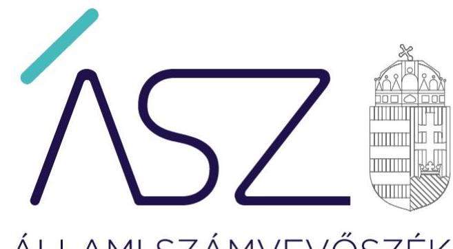
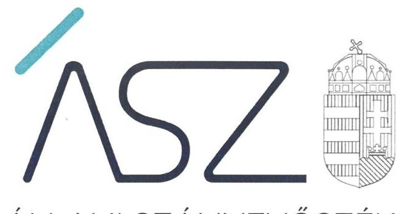
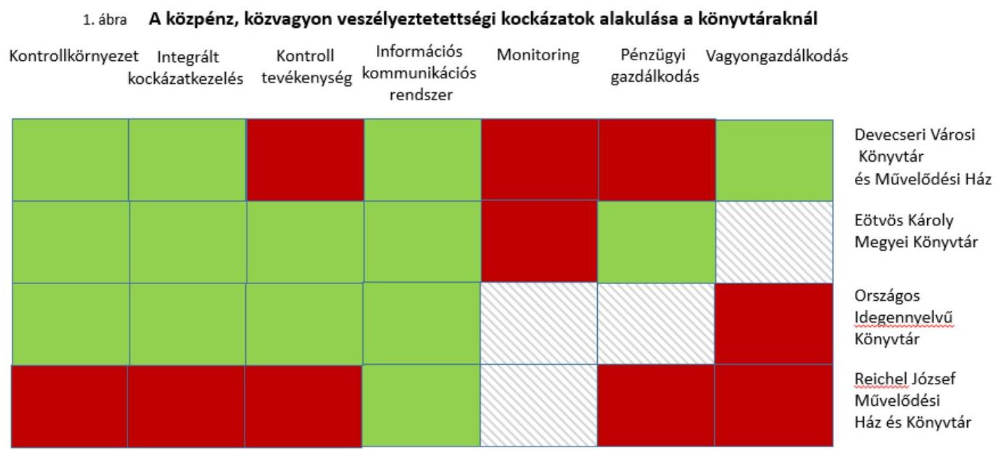
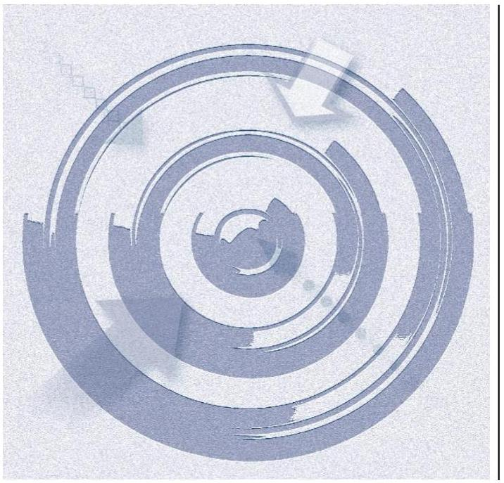

ÁLLAMI SZÁMVEVŐSZÉK

# JELENTÉS 

## Utóellenőrzések

A nyilvános könyvtári ellátás működésének utóellenőrzése
2021.

21071
www.asz.hu

---

ÁLLAMI SZÁMVEVŐSZÉK

# JELENTÉS 

## Utóellenőrzések

A nyilvános könyvtári ellátás működésének utóellenőrzése
2021. 08. hó 12. nap

21071
www.asz.hu

---

# AZ ELLENŐRZÉST FELÜGYELTE: 

KISTÓTH KRISZTINAellenőrzésvezető
DR. BENEDEK MÁRIA ellenőrzésvezető

A PROGRAM ÖSSZEÁLLÍTÁSÁÉRT FELELŐS:
TÓTPÁL SZABOLCS osztályvezető

## A TÉMÁHOZKAPCSOLÓDÓ KORÁBBISZÁMVEVŐSZÉKIJELENTÉSEK:

- címe: A nyilvános könyvtári ellátás müködésének ellenőrzése - Reichel József Múvelődési Ház és Könyvtár
- sorszáma: 18183
- címe: A nyilvános könyvtári ellátás müködésének ellenőrzése - Devecseri Városi Könyvtár és Múvelődési Ház
- sorszáma: 18184
- címe: A nyilvános könyvtári ellátás müködésének ellenőrzése - Országos Idegennyelvű Könyvtár
- sorszáma: 18232
- címe: A nyilvános könyvtári ellátás müködésének ellenőrzése - Eötvös Károly Megyei Könyvtár
- sorszáma: 18254

IKTATÓSZÁM: EL-3325-001/2021.
TÉMASZÁM: 2460
ELLENŐRZÉS-AZONOSÍTÓ SZÁM: V-080415

---

# TARTALOMJEGYZÉK 

■ ÖSSZEGZÉS ..... 5
■ AZ ELLENŐRZÉS CÉLJA ..... 8
■ AZ ELLENŐRZÉS TERÜLETE ..... 9
■ AZ ELLENŐRZÉS HÁTTERE, INDOKOLTSÁGA ..... 11
■ A JELENTÉS LÉNYEGES KÉRDÉSKÖRE ..... 12
■ ELLENŐRZÉS HATÓKÖRE ÉS MÓDSZEREI ..... 13
■ MEGÁLLAPÍTÁSOK ..... 16
■ MELLÉKLETEK. ..... 21
I. sz. melléklet: a Devecseri Városi Könyvtár és Múvelődési Ház, Devecser Város Önkormányzata, az Eötvös Károly Megyei Könyvtár, az Országos Idegennyelvü Könyvtár, a Reichel József Múvelődési Ház és Könyvtár, és Pilisborosjenő Község Önkormányzata intézkedésiterve végrehajtásának értékelése ..... 21
II. sz. melléklet: Értelmező szótár ..... 33
■ FÜGGELÉK: ÉSZREVÉTELEK ..... 35
■ RÖVIDÍTÉSEK JEGYZÉKE ..... 37

---

.

---

# ÖSSZEGZÉS 

Az utóellenőrzés értékelése alapján a négy könyvtárnál nőtt a közpénz, közvagyon veszélyeztetettségének kockázata, mivel nem volt biztositott a szabályszerű, átlátható gazdálkodás. Azonban a végrehajtott intézkedések hatására mind a négy könyvtárnál javult a müködés szabályozottsága.
Az Állami Számvevőszék kezdeményezésére az ellenőrzött időszakot követően három könyvtár és a két intézményfenntartó intézkedéseket tett, amivel a gazdálkodásában rejlő kockázatokat csökkentette, a közpénzügyi helyzet relevánsan javult. Egy könyvtár nem intézkedett a kockázatok csökkentése érdekében, így a feltárt jogszabálysértő gyakorlatok továbbra is magas kockázatot hordoznak a gazdálkodás elszámoltathatóságára és átláthatóságára.

## Az ellenőrzés társadalmi indokoltsága

A könyvtárak felbecsülhetetlen nemzeti értékeket, az egyetemes kultúrához kapcsolódó dokumentumokat, gyűjteményeket őriznek. A könyvtári ellátás fenntartása és fejlesztése az állampolgárok és a közösségek egészére nézve kiemelkedő közérdek. A helyi önkormányzati fenntartású közgyűjtemény a nemzeti vagyon körébe tartozik. Ezért az Állami Számvevőszék célja, hogy a könyvtárak működésében, gazdálkodásában rejlő kockázatok feltárásával, a hibák, hiányosságok megszüntetésének előmozdításával hozzájáruljon a közpénzek átlátható, rendezett módon való felhasználásához.

Az Állami Számvevőszék - a stratégiájában foglaltak szerint - folyamatosan ellenőrzi, hogy az ellenőrzött szervezet megvalósította-e a korábbi ellenőrzések által feltárt hibák és szabálytalanságok megszüntetése céljából elkészített intézkedési tervében meghatározott feladatokat. A rendszeres utóellenőrzések hozzájárulnak a szükséges intézkedések tényleges végrehajtásához, ezáltal a közpénzügyek rendezettségének javulásához.

## Főbb megállapítások, következtetések

Az Állami Számvevőszék az utóellenőrzésre kiválasztott négy könyvtárnál - a számvevőszéki jelentésben foglalt intézkedést igénylő megállapításokra - készített intézkedési tervben vállalt feladatok végrehajtását ellenőrizte. Az intézkedések végrehajtása vagy a végrehajtás elmaradása következtében továbbra is fennálló jogszabálysértő gyakorlat miatt a közpénz, közvagyon veszélyeztetettségi kockázat értékelését az 1. ábra mutatja.

---

A végrehajtott intézkedések hatására csökkent a kockázat több területen, melyeket zöld szín jelöli. A feladatok végrehajtásának elmaradása, a felelős vezetői magatartás hiánya, a nem szabályszerű működés miatt a közpénz és a közvagyon veszélyeztetettségi kockázatának növekedése valószínűsíthető, ezeket a területeket piros szín emeli ki. Voltak területek, amelyekhez nem kapcsolódott intézkedési feladat, ezt szürke csíkozás jelzi.

Az ellenőrzött négy könyvtár által vállalt 65 intézkedésből 35 nem végrehajtott intézkedés miatt a belső kontrollrendszer működtetése három könyvtárnál nem igazolt és a pénzügyi- és a vagyongazdálkodás területén három könyvtárnál fennmaradt a jogszabálysértő gyakorlat. Mindezeknek az ellenőrzött könyvtárak szerinti kockázati értékelését az 1. sz. ábra mutatja.

A könyvtárak kontrollkörnyezetének szabályozottsága a négyből három könyvtárnál javult. Az ellenőrzési nyomvonalak felülvizsgálata a munkafolyamatok, a hatásköri és felelősségi viszonyok egyértelmű meghatározása támogatta az elszámoltatható feladatellátást. A szervezeti és működési szabályzat, valamint az önköltségszámítási szabályzat, a számlarend aktualizálása biztosította a szabályszerű működés és gazdálkodás kereteit.

Az intézkedési tervekben rögzített feladatok keretében az integrált kockázatkezelési rendszer szabályozottsága három könyvtárnál javult, ugyanakkor egy könyvtárnál a kialakított eljárásrend működtetéséről az intézmény vezetője nem gondoskodott. A kontrolltevékenység szabályozottsága kettő könyvtárnál javult, két könyvtárnál azonban az intézmény vezető nem gondoskodott a teljesítések igazolásáról. Az információs és kommunikációs rendszer szabályozottsága mind a négy könyvtárnál javult, azonban két könyvtár vezetője az így kialakított rendszer működtetéséről nem gondoskodott. A monitoring rendszer vonatkozásában két könyvtár határozott meg intézkedési feladatot, ebből az egyik könyvtárnál a nyomon követési rendszer kialakításról, a másik könyvtárnál annak működtetéséről az intézmény vezetője nem gondoskodott. A belső kontrollrendszer nem szabályszerű működtetése kockázatot jelentett a forrásokkal való felelős, célszerű, eredményes és szabályszerű gazdálkodásra és az elszámoltathatóságra.

A pénzügyi gazdálkodás vonatkozásában két könyvtár vezetője dokumentáltan nem igazolta a teljesítésigazolás alkalmazását. Teljesítésigazolás hiányában nem volt biztosított a közpénzek szabályos felhasználása, a felelős gazdálkodás. A vagyongazdálkodás területén két könyvtár vezetője nem gondoskodott a beszámoló leltári alátámasztásáról. A leltárnak, mint a vagyonvédelem legfőbb eszközének hiányában fennáll a vagyonvesztés kockázata. Ezáltal a pénzügyi- és vagyongazdálkodás keretében nem volt biztosított a gazdálkodás alátámasztottsága, átláthatósága és elszámoltathatósága.

Két könyvtárnál az intézményfenntartó tevékenységéhez kapcsolódó intézkedések kerültek meghatározásra. A fenntartói irányítói tevékenységének szabályszerűsége az egyik fenntartónál javult, a másiknál a nem szabályszerű fenntartói feladatellátás kockázata továbbra is fennáll.

---

Az Állami Számvevőszék az ellenőrzés során feltárt jogszabálysértő gyakorlat megszüntetése érdekében figyelemfelhívó levéllel fordult a négy könyvtár és a két intézményfenntartó vezetője felé, és a figyelemfelhívással lehetőséget biztosított arra, hogy az ellenőrzött időszakot követően biztosítsák a szabályszerű múködést és gazdálkodást és erről az Állami Számvevőszék elnökét értesítsék. A feltárt jogszabálysértő gyakorlatokkal kapcsolatban, a figyelemfelhívó levelekre küldött értesítések alapján az Állami Számvevőszék az alábbi következtetést vonta le.

Három könyvtár és a két intézményfenntartó vezetője az ellenőrzött időszakot követően lépéseket tettek a feltárt jogszabálysértő gyakorlatok, szabálytalanságok megszüntetésére. Ezeknél az ellenőrzöttszervezeteknél az általuk jelzett intézkedéseket figyelembe véve csökkentek a kockázatok a működés szabályozottságára, a gazdálkodás elszámoltathatóságára és átláthatóságára vonatkozóan az ellenőrzött időszakot követően. A rendeltetésellenes közpénzfelhasználás kockázata alacsony és a közpénzügyi helyzet relevánsan javult. Ezeknél az ellenőrzötteknél a belső kontrollrendszer szabályszerű működése, valamint az átlátható és elszámoltatható pénzügyi és vagyongazdálkodás jövőbeni fenntartása akkor biztosítható, ha az ellenőrzöttek vezetői által jelzett intézkedések érvényesülnek az ellenőrzöttek múködésében és gazdálkodásában, továbbá kezelik a múködéshez, a gazdálkodáshoz kapcsolódó jogszabályok és a kialakított belső szabályozások betartásához kapcsolódó kockázatokat.

Egy könyvtár vezetőjénél (Reichel József Múvelődési Ház és Könyvtár) a felelős vezetői magatartás nem érvényesült, a figyelemfelhívó levélben foglaltakra nem küldött értesítést az Állami Számvevőszéknek, ezzel törvényi előírás szerinti intézkedési és értesítési kötelezettségének nem tett eleget. Ennél a könyvtárnál a kockázatok fennmaradtak a belső kontrollrendszer múködtetésére, a múködés szabályozottságára, a gazdálkodás elszámoltathatóságára és átláthatóságára vonatkozóan az ellenőrzött időszakot követően. A rendeltetésellenes közpénzfelhasználás kockázata magas, a közpénzügyi helyzet nem javult. Mindez veszélyeztetheti a könyvtár közfeladat ellátását, a közmúvelődési feladatainak gyakorlását, ezáltal a helyi lakosságnak a könyvtári és közmúvelődési szolgáltatásokhoz való hozzáférését.

---

# AZ ELLENŐRZÉS CÉLJA 

Az ellenőrzés célja annak értékelése volt, hogy a számvevőszéki jelentésben foglalt intézkedést igénylő megállapításokkal összhangban készített intézkedési tervben meghatározott feladatokat az ellenőrzött szervezet végrehajtotta-e.

---

# AZ ELLENŐRZÉS TERÜLETE

## A Devecseri Városi Könyvtár és Művelődési Ház, az Eötvös Károly Megyei Könyvtár, az Országos Idegennyelvű Könyvtár és a Reichel József Művelődési Ház és Könyvtár

Az ÁSZ1 a nyilvános könyvtárak pénzügyi és vagyongazdálkodása, a könyvtárak által kezelt vagyon nyilvántartása és megőrzése, az intézményfenntartói feladatok ellátása szabályszerűségét, valamint az integritás szemlélet érvényesülését 2014-2016. évek vonatkozásában ellenőrizte. A könyvtárak belső kontrollrendszer kialakításának és működtetésének értékelése a 2016. évre történt.

Az ÁSZ értékelését a Devecseri Városi Könyvtár és Művelődési Ház és fenntartója Devecser Város Önkormányzatáról a 18184.2 számú, az Eötvös Károly Megyei Könyvtárról a 18254.3 számú, az Országos Idegennyelvű Könyvtárról a 18232.4 számú, és a Reichel József Művelődési Ház és Könyvtár és fenntartója a Pilisborosjenő Község Önkormányzatról a 18183.5 számú jelentésekben hozta nyilvánosságra. Az ÁSZ által befogadott intézkedési tervek – a jelentésekben intézkedést igénylő megállapításokkal összhangban – a négy könyvtár vezetője és két esetben azok fenntartói vonatkozásában határoztak meg feladatokat.

Az utóellenőrzés időszakában a pénzügyi, gazdálkodási feladatokat a Reichel József Művelődési Ház és Könyvtárnála Pilisborosjenői Polgármesteri Hivatal, a Devecseri Városi Könyvtár és Művelődési Háznála Devecseri Polgármesteri Hivatal Pénzügyi Irodája végezte. Az Országos Idegennyelvű Könyvtár és az Eötvös Károly Megyei Könyvtár pénzügyi-gazdasági feladatait együttműködési megállapodás szerint a Petőfi irodalmi Múzeum gazdasági szervezete, valamint a Veszprémi Intézményi Szolgáltató Szervezet látta el.

Az utóellenőrzés időszakában személyi változásokra került sor. A Reichel József Művelődési Ház és Könyvtár hivatalban lévő intézmény vezetője 2020. november 16-ától, a Devecseri Városi Könyvtár és Művelődési Háza Intézmény vezetője 2020. november 1-től, az Eötvös Károly Megyei Könyvtár intézmény vezetője 2019. december 1-től látja el feladatait. Pilisborosjenő Község Önkormányzatának polgármestere személyében 2019. október 13-i, a Pilisborosjenő Polgármesteri Hivatal és a Devecseri Polgármesteri Hivatal jegyzője személyében a 2020. január 1-i, valamint 2020. június 15-i hatállyal történt változás.

Az ÁSZ jelentésekben foglalt javaslatokat megalapozó megállapításokhoz kapcsolódó intézkedési tervekben az ellenőrzött szervezetek összesen 65 intézkedést határoztak meg. Ebből 57 intézkedés esetében a könyvtár vezetője, míg 8-nál a fenntartó önkormányzat polgármestere vagy jegyzője volt a felelős. Jelen utóellenőrzés az intézkedési tervekben vállalt feladatok végrehajtását értékelte.

---

Az 1. táblázat a négy ellenőrzött könyvtár és két esetben azok fenntartója által az intézkedési tervben vállalt feladatok számát szemlélteti.

1. táblázat

# AZ INTÉZKEDÉSI TERVEKBEN VÁLLAT FELADATOK SZÁMA (DB) 

Ellenőrzött szervezet
Intézkedési tervben vállalt feladatok száma
Reichel József Művelődési Ház és Könyvtár ..... 17
Pilisborosjenő Község Önkormányzata (fenntartó) ..... 5
Devecseri Városi Könyvtár és Múvelődési Ház ..... 18
Devecser Város Önkormányzata (fenntartó) ..... 3
Országos Idegennyelvü Könyvtár ..... 9
Eötvös Károly Megyei Könyvtár ..... 13
Összesen ..... 65

---

# AZ ELLENŐRZÉS HÁTTERE, INDOKOLTSÁGA 

Az ÁSZ tv. ${ }^{6}$ 33. § (1) bekezdése értelmében a számvevőszéki jelentések intézkedést igénylő megállapításaihoz és javaslataihoz kapcsolódóan az ellenőrzött szervezet vezetője intézkedési tervet köteles összeállítani, és az ÁSZ részére megküldeni.

Az ÁSZ által befogadott intézkedési tervben foglaltak megvalósítását az ÁSZ tv. 33. § (7) bekezdésében foglaltak alapján - az ÁSZ utóellenőrzés keretében ellenőrizheti. Az utóellenőrzések keretében - az intézkedések értékelése során - az ÁSZ figyelembe veszi az ellenőrzött szervezetek múködési feltételeiben, valamint a jogszabályi előírásokban bekövetkezett változásokat.

Az utóellenőrzés során az ÁSZ értékeli, hogy az érintett számvevőszéki jelentésben foglalt javaslatokat megalapozó megállapításokkal és javaslatokkal összhangban, az ellenőrzött szervezet által készített intézkedési tervben meghatározott feladatokata feladatra kijelöltek végrehajtották-e.

Az intézkedések végrehajtásával az adott terület szabályszerű múködése vonatkozásában a kockázatok csökkenhetnek, azonban hosszabb távon az intézkedési tervben foglaltak végrehajtásával önmagában nem szűnnek meg, csak akkor, ha beépülnek az ellenőrzött szervezet múködésébe, azokat folyamatosan karban tartják, figyelembe véve, illetve kezelve a változásokat. Emellett az intézkedések végrehajtásáig újabb kockázatok merülhetnek fel a szabályszerű működés vonatkozásában, amelyek kezelése szintén kiemelten fontos az ellenőrzött szervezet számára.

Az ellenőrzött szervezet vezetője által készített intézkedési tervekben foglalt feladatok hiányos, illetve késedelmes végrehajtása, vagy annak elmaradása, a szabályszerűség és a felelős vezetői magatartás vonatkozásában kockázatot hordoz, ami azt mutatja, hogy az ellenőrzések során feltárt hibák, hiányosságok és szabálytalanságok kezelése nem kapott kellő hangsúlyt. Az utóellenőrzés során is fennálló szabálytalanságok esetén a közpénz, közvagyon veszélyeztetettségi kockázat valószínűsített hatásának értékelése további intézkedéseket vonhat maga után.

Az ellenőrzött szervezet szintjén az utóellenőrzés feltárja, hogy a szervezet az intézkedések végrehajtásával hasznosította-e a korábbi ellenőrzési jelentésben a hiányosságok megszüntetése, illetve a kockázatok kezelése érdekében megfogalmazott javaslatokat, illetve az intézkedések végrehajtása elmaradásának következtében továbbra is fennálló szabálytalanság esetén értékeli a közpénzek, közvagyon veszélyeztetettségét.

Az ÁSZ szintjén az utóellenőrzés visszacsatolást ad az ellenőrzési jelentések hasznosulásáról, az intézkedések elmaradásának vagy részleges megvalósulásának a közpénzek, közvagyon veszélyeztetettségére gyakorolt valószínűsített hatásának értékelése, további intézkedéseket vonhat maga után.

---

# A JELENTÉS LÉNYEGES KÉRDÉSKÖRE 

Az ellenőrzött szervezetek az intézkedésitervekben foglaltakat az előírt határidőben végrehajtották-e?

---

# ELLENŐRZÉS HATÓKÖRE ÉS MÓDSZEREI 

## Az ellenőrzés típusa

Megfelelőségi ellenőrzés.

## Az ellenőrzött időszak

Az utóellenőrzés alapját képező számvevőszéki jelentés közzétételének napjától az ellenőrzésről szóló kiértesítő levél keltének napjáig tartó időszak. A Devecseri Városi Könyvtár és Művelődési Ház, Devecser Város Önkormányzata, az Országos Idegennyelvű Könyvtár, a Reichel József Múvelődési Ház és Könyvtár és Pilisborosjenő Község Önkormányzata vonatkozásában 2018. szeptember 4-től, az Eötvös Károly Megyei Könyvtár vonatkozásában 2018. november 15-től a 2021. február 11. napjáig tartó időszak.

## Az ellenőrzés tárgya

A számvevőszéki jelentésben foglalt intézkedést igénylő megállapításokkal és javaslatokkal összhangban - az ellenőrzött szervezet által-készített intézkedési tervben foglaltak végrehajtásának ellenőrzése.

## Az ellenőrzött szervezet

A Devecseri Városi Könyvtár és Múvelődési Ház és Devecser Város Önkormányzata, az Eötvös Károly Megyei Könyvtár, az Országos Idegennyelvű Könyvtár, valamint a Reichel József Múvelődési Ház és Könyvtár és Pilisborosjenő Község Önkormányzata

## Az ellenőrzés jogalapja

Az ellenőrzés jogszabályi alapját az ÁSZtv. 33. § (1)-(2) és (7) bekezdésének előírásai képezik.

## Az ellenőrzés módszerei

Az ellenőrzést az ellenőrzött időszakban hatályos jogszabályok, az ellenőrzés szakmai szabályai, a jelen ellenőrzésre irányadó ÁSZ módszertanok, az ellenőrzési programban foglalt értékelési szempontok szerint, önállóan vagy ellenőrzéshez kapcsolódóan, annak részeként végzi az ÁSZ.

---

Az ellenőrzés ideje alatt az ellenőrzött szervezettel történő kapcsolattartást az ÁSZ SZMSZ²-ének vonatkozó előírásai alapján biztosítja az ÁSZ.

Az utóellenőrzés megállapításait az ÁSZ rendelkezésére álló dokumentumok, valamint az ÁSZ adatbekérése szerint, az ellenőrzött szervezetek által rendelkezésre bocsátott dokumentumok, adatok alapján kell megfogalmazni, amely indokolt esetén kiegészülhet az ellenőrzöttszervezet székhelyén történő adatbetekintéssel, helyszíni ellenőrzéssel is.

Az ellenőrzési kérdések megválaszolásához szükséges bizonyítékok megszerzése az ellenőrzött által rendelkezésre bocsátott dokumentumokra, adatokra alapozva megfigyelés, szemle (szemrevételezés), kérdésfeltevés (információkérés), mintavételezés, valamint elemző eljárás alkalmazásával történik. Az ellenőrzési bizonyítékként felhasználható adatforrások közé tartoznak egyrészt az ellenőrzési program részletes szempontjainál felsorolt adatforrások, másrészt minden - az ellenőrzés folyamán feltárt, az ellenőrzés szempontjából információt tartalmazó - dokumentum.

Az intézkedési tervekben előírt feladatokat azok végrehajthatósága, illetve végrehajtása szempontjából az alábbiak szerint értékel az ÁSZ:
$\longrightarrow$ „határidőben végrehajtott" a feladat, ha a teljesítés dokumentáltan, az intézkedési tervben előírt határidőben és tartalommal megtörtént;
$\longrightarrow$ „határidőn túl végrehajtott" a feladat, ha annak teljesítése az intézkedési tervben meghatározott módon, de az abban előírt határidőn túl történt meg;
$\longrightarrow$ „nem végrehajtott" a feladat, ha a végrehajtás nem történt meg, dokumentumokkal nem igazolt annak teljesítése;
$\longrightarrow$ „okafogyottá vált" a feladat, ha végrehajtására - meghatározott esemény bekövetkezése, továbbá külső körülmény, a működést érintő feltétel változása miatt - már nincs szükség, illetve lehetőség, és egyértelműen megállapítható, hogy az intézkedést szükségessé tevő körülmény a jövőben nem fordulhat elő;
$\longrightarrow$ „nem időszerű" az a feladat, amelynek ellenőrzési időszakon belüli végrehajtására azért nem került (kerülhetett) sor, mert az intézkedés alapjául szolgáló esemény nem következett be, de annak jövőbeni előfordulása lehetséges, a végrehajtása nem volt esedékes, vagy a végrehajtás határideje még nem járt le.
Az ellenőrzés lefolytatásához az ellenőrzött szervezet a tanúsítványok elektronikus kitöltésével, valamint az ÁSZ által kért dokumentumok elektronikus rendelkezésre bocsátásával szolgáltat adatokat, amelyek valódiságát és teljes körűségét az ellenőrzött szervezet vezetője által tett teljességi és hitelességi nyilatkozat igazolja. Az így rendelkezésre bocsátott adatok, információk kontrollja az ellenőrzés keretében történik.

A könyvtárak és az intézményfenntartók vezetői számára figyelemfelhívó levél került megküldésre az ellenőrzött időszakra vonatkozó jogszabálysértő gyakorlatokról, és az ÁSZ tv. előírásával összhangban 15 nap állt rendelkezésükre az ebben foglaltak elbírálására, a megfelelő intézkedések megtételére és erről az Állami Számvevőszék elnökének az értesítés megküldésére.

Az ellenőrzött könyvtárak vezetői által a figyelemfelhívó levélre küldött értesítések alapján az ÁSZ értékelte az ellenőrzött időszakra vonatkozóan

---

feltárt kockázatok vezetői kezelését. Amennyiben az ellenőrzött intézmények vezetői az ellenőrzési megállapítások alapján intézkedéseket fogalmaztak meg a jogszabálysértő gyakorlat megszűntetése érdekében az ÁSZ a múködés, a gazdálkodás lényeges területein korábban fennálló kockázatokról megállapította, hogy azokat csökkentették.

---

# MEGÁLLAPÍTÁSOK 

## Az ellenőrzött szervezetek az intézkedési tervekben foglaltakat az elöírt határidőben végrehajtották-e?

Összegző megállapítás

A négy könyvtárnál az intézkedési tervekben szereplő feladatok több mint felét nem hajtották végre.

## A DEVECSERI VÁROSI KÖNYVTÁR ÉS MÚVELŐDÉSI HÁZNÁL a kontrollkörnyezet javult. Az intézmény vezetöje ${ }^{8}$ intézkedett az SZMSZ ${ }^{9}$ vagyonnyilatkozat tételi kötelezettséggel való kiegészítéséről, elkészítette az ellenőrzési nyomvonalat ${ }^{10}$ és az etikai szabályzatot ${ }^{11}$.

Az integrált kockázat kezelés, valamint az információs és kommunikációs rendszer szabályozottsága javult. Az integrált kockázatkezelés eljárásrendje ${ }^{12}$ meghatározásra került. Ugyanakkor az intézmény vezetője ${ }_{1}$ nem gondoskodott a Bkr. 3. § b) pontjában előírtak ellenére az integrált kockázatkezelési rendszer múködtetéséről, teljességi hitelességi nyilatkozat szerint alátámasztó dokumentummal nem rendelkezett. Elkészült a közérdekú adatok megismerése és a kötelezően közzéteendő adatok nyilvánosságra hozatalának szabályzata ${ }^{13}$, azonban az intézmény vezetője ${ }_{1}$ a Bkr. 3. § d) pontjában foglaltak ellenére nem intézkedett a szervezet minden szintjén érvényesülő információs és kommunikációs rendszer kialakításáról és múködtetéséről.

A kontrolltevékenység, és a pénzügyi gazdálkodás vonatkozásában továbbra is fennáll a nem szabályszerű múködés kockázata. Az intézmény vezetője ${ }_{1}$ nem gondoskodott az Ávr. ${ }^{14}$ 57. § (1) és (3)-(4) bekezdésében előírtak szerinti teljesítés igazolásról, teljességi hitelességi nyilatkozata szerint alátámasztó dokumentummal nem rendelkezett. A pénzügyi gazdálkodás vonatkozásában továbbá a Számv. tv. 165. § (1)-(2) bekezdés előírása ellenére az intézmény vezetője ${ }_{1}$ és a pénzügyi-gazdasági feladatokat ellátó polgármesteri hivatal jegyzője ${ }_{1}{ }^{15}$ nem biztosította a bevételek szabályszerű bizonylatok alapján történő elszámolását. Fennmaradt a nem szabályszerű monitoring tevékenység kockázata, az intézmény vezetője ${ }_{1}$ nem gondoskodott a Bkr. 3. § e) pontban előírtak ellenére a nyomon követési rendszer kialakításáról és múködtetéséről.

A vagyongazdálkodás területén csökkent a nem szabályszerű múködés kockázata a könyvtár és a múvelődési ház tárgyi eszközeinek teljes körű mennyiségi leltározásával.

A fenntartói feladatok szabályszerűsége javult, az intézmény munkatervét, valamint a módosított szervezeti és múködési szabályzatát a fenntartó jóváhagyta.

AZ EÖTVÖS KÁROLY MEGYEI KÖNYVTÁR kontrollkörnyezetének szabályszerűségét javította az önköltségszámítási szabályzat ${ }^{16}$, valamint a számlarend ${ }_{2}{ }^{17}$ és az ellenőrzési nyomvonal ${ }_{3}{ }^{18}$ elkészítése.

---

Az integrált kockázatkezelés, a kontrolltevékenységek, valamint az információs és kommunikációs rendszer szabályozottsága javult. Az intézmény vezetője ${ }_{2}{ }^{19}$ a Belső Kontrollrendszer Szabályzatban ${ }^{20}$ intézkedett korrupciós kockázatokkal kapcsolatban szükséges intézkedések teljesítésének, nyomon követésének, valamint a szervezeti célok elérését veszélyeztető kockázatok csökkentésére irányuló kontrollok szabályozásáról. Kialakításra került az információs és kommunikációs rendszer ${ }^{21}$. Ugyanakkor az intézmény vezetője ${ }_{2}$ nem gondoskodott a Bkr. 3. § d) pontjában előírtak ellenére az információs és kommunikációs rendszer müködtetéséről.

A pénzügyi gazdálkodás bizonylati alátámasztottsága javult, az intézmény vezetője ${ }_{2}$ intézkedett a saját bevételek elszámolásához szabályszerű bizonylat kialakításáról. Ugyanakkor dokumentummal nem igazolta, hogy a saját bevételek esetén a Számv.tv. 165. § (1) bekezdés előírása szerinti bizonylatot kiállította, valamint, hogy az adatok bejegyzése a könyvviteli nyilvántartásokba a Számv.tv. 165. § (2) bekezdés előírása szerint, szabályszerűen kiállított bizonylat alapján történt.

A nem szabályszerű monitoring tevékenység kockázata továbbra is fennáll. Az intézmény vezetője ${ }_{2}$ nem gondoskodott a Bkr. 3. § e) pontjában illetve 10. §-ában előírtak ellenére a szervezet tevékenységének, a célok megvalósításának folyamatos és eseti nyomon követéséről, teljességi hitelességi nyilatkozata szerint alátámasztó dokumentummal nem rendelkezett.

# AZ ORSZÁGOS IDEGENNYELVŰ KÖNYVTÁR- 

NÁL a kontrollkörnyezet, az integrált kockázatkezelés és a kontrolltevékenység szabályozottsága javult. Az intézmény vezetője ${ }_{3}{ }^{22}$ gondoskodott az SZMSZ ${ }_{2}{ }^{23}$, a számlarend ${ }_{1}{ }^{24}$ és az ellenőrzési nyomvonal ${ }_{2}{ }^{25}$ szükséges módosításáról, valamint az integrált kockázatkezelési eljárásrend és a szervezeti célok elérését veszélyeztető kockázatok csökkentésére irányuló kontrollok kiépítéséről. Javult az információs és kommunikációs rendszer szabályszerűsége, mert az intézmény vezetője ${ }_{3}$ intézkedett a közzétételi listán meghatározott adatok közzétételéről. Ugyanakkor a belső kontrollrendszer minőségét értékelő nyilatkozatot az intézmény vezetője ${ }_{3}$ a Bkr. 11. § (2) bekezdésben foglaltak ellenére az irányító szerv részére nem küldte meg.

A nem szabályszerű vagyongazdálkodás kockázata továbbra is fennáll, mert az intézmény vezetője ${ }_{3}$ a Számv.tv. 69. § (1) bekezdésében foglaltak szerinti a 2018. évi beszámoló mérlegtételeit alátámasztó leltár összeállításáról nem gondoskodott.

## A REICHEL JÓZSEF MŰVELŐDÉSI HÁZ ÉS

KÖNYVTÁRNÁL az intézmény vezetője ${ }_{4}{ }^{26}$ nem intézkedett a szabályszerű kontrollkörnyezet kialakításáról. Nem gondoskodott a Bkr. ${ }^{27} 6$. § (1) bekezdés c) pontjában foglaltak ellenére, hogy az etikai elvárások meghatározottak, ismertek és elfogadottak legyenek a szervezet minden szintjén, valamint a Bkr. 6. § (3)-(4) bekezdésében előírtak ellenére az ellenőrzési nyomvonal és az integritást sértő események eljárásrendje elkészítéséről.

A nem szabályszerű integrált kockázatkezelés kockázata fennmaradt. Az intézmény vezetője ${ }_{4}$ nem intézkedett a Bkr. 3. § b) pontban és a 8. § (2) bekezdésben előírtak ellenére az integrált kockázatkezelési rendszer,

---

valamint a szervezeti célokat veszélyeztető kockázat csökkentésére irányuló kontrollok kialakításáról. A kontrolltevékenység és a pénzügyi gazdálkodás nem szabályszerű múködésének kockázata továbbra is fennáll, mert az Ávr. 57. § (1) és (3) bekezdésében előírtak ellenére az intézmény vezetője4 nem intézkedett a teljesítések igazolásáról teljességi hitelességi nyilatkozata szerint alátámasztó dokumentummal nem rendelkezett. A pénzügyi-gazdálkodási feladatokat ellátó polgármesteri hivatal jegyzője ${ }^{28}$ intézkedett a kötelezettségvállalásra, pénzügyi ellenjegyzésre, teljesítés igazolására, érvényesítésre, utalványozásra jogosult személyek aláírás-minta nyilvántartásáról ${ }^{29}$.

Az információs és kommunikációs rendszer szabályszerűsége javult, mert a polgármesteri hivatal jegyzője ${ }_{2}$ gondoskodott az adatvédelmi szabályzat ${ }^{30}$ elkészítéséről.

A nem szabályszerű vagyongazdálkodás kockázata továbbra is fennáll. Az intézmény vezetője4 nem intézkedett a Számv. tv. ${ }^{31} 14 . \S$ (5) bekezdésének a) pontjában előírtak ellenére a leltározási és leltárkészítési szabályzat elkészítéséről, valamint a Számv. tv. 69.§ (1) bekezdésében előírtak ellenére az éves beszámolói mérleg tételei leltári alátámasztásáról. A könyvtári állomány soron kívüli, teljes körű leltározása, a hiány és többletek kimutatása megtörtént.

A fenntartó nem szabályszerű feladatellátásának kockázata továbbra is fennáll, mert a polgármester ${ }^{32}$ nem gondoskodott a Kult. tv. ${ }^{33} 68 . \S$ (1) bekezdés d) és e) pontjában foglaltak ellenére az intézmény fejlesztési tervének jóváhagyásáról és az intézmény szakmai tevékenységének értékeléséről.

AZ INTÉZKEDÉSI TERVEKBEN szereplő összesen 65 feladatból az ellenőrzött szervezetek 13-at határidőben, 17-et határidőn túl hajtottak végre és 35 végrehajtásáról nem gondoskodtak. A könyvtárak és fenntartóik intézkedési terveiben vállalt feladatok végrehajtásának értékelési kategóriák szerinti megoszlását az 1. ábra szemlélteti. (Az ellenőrzött helyszínek rövidítése RJK ${ }^{34}$, DVK ${ }^{35}$, OIK $^{36}$ és EKMK ${ }^{37}$ ).

[^0]
[^0]:    1. ábra
    A helyszíneken a feladatok végrehajtásának értékelési kategóriák szerinti megoszlása (db)
    2. 

    3. 

    4. 

    5. 

    6. 

    7. 

    8. 

    9. 

    10. 

    11. 

    12. 

    13. 

    14. 

    15. 

    16. 

    17. 

    18. 

    19. 

    20. 

    21. 

    22. 

    23. 

    24. 

    25. 

    26. 

    27. 

    28. 

    29. 

    30. 

    31. 

    32. 

    33. 

    34. 

    35. 

    36. 

    37. 

    38. 

    39. 

    40. 

    41. 

    42. 

    43. 

    44. 

    45. 

    46. 

    47. 

    48. 

    49. 

    50. 

    51. 

    52. 

    53. 

    54. 

    55. 

    56. 

    57. 

    58. 

    59. 

    60. 

    61. 

    62. 

    63. 

    64. 

    65. 

    66. 

    67. 

    68. 

    69. 

    70. 

    71. 

    72. 

    73. 

    74. 

    75. 

    76. 

    77. 

    78. 

    79. 

    80. 

    81. 

    82. 

    83. 

    84. 

    85. 

    86. 

    87. 

    88. 

    89. 

    90. 

    91. 

    92. 

    93. 

    94. 

    95. 

    96. 

    97. 

    98. 

    99. 

    100. 

    101. 

    102. 

    103. 

    104. 

    105. 

    106. 

    107. 

    108. 

    109. 

    110. 

    111. 

    112. 

    113. 

    114. 

    115. 

    116. 

    117. 

    118. 

    119. 

    120. 

    121. 

    122. 

    123. 

    124. 

    125. 

    126. 

    127. 

    128. 

    129. 

    130. 

    131. 

    132. 

    133. 

    134. 

    135. 

    136. 

    137. 

    138. 

    139. 

    140. 

    141. 

    142. 

    143. 

    144. 

    145. 

    146. 

    147. 

    148. 

    149. 

    150. 

    151. 

    152. 

    153. 

    154. 

    155. 

    156. 

    157. 

    158. 

    159. 

    160. 

    161. 

    162. 

    163. 

    164. 

    165. 

    166. 

    167. 

    168. 

    169. 

    170. 

    171. 

    172. 

    173. 

    174. 

    175. 

    176. 

    177. 

    178. 

    179. 

    180. 

    181. 

    182. 

    183. 

    184. 

    185. 

    186. 

    187. 

    188. 

    189. 

    190. 

    191. 

    192. 

    193. 

    194. 

    195. 

    196. 

    197. 

    198. 

    199. 

    200. 

    201. 

    202. 

    203. 

    204. 

    205. 

    206. 

    207. 

    208. 

    209. 

    210. 

    211. 

    212. 

    213. 

    214. 

    215. 

    216. 

    217. 

    218. 

    219. 

    220. 

    221. 

    222. 

    223. 

    224. 

    225. 

    226. 

    227. 

    228. 

    229. 

    230. 

    231. 

    232. 

    233. 

    234. 

    235. 

    236. 

    237. 

    238. 

    239. 

    240. 

    241. 

    242. 

    243. 

    244. 

    245. 

    246. 

    247. 

    248. 

    249. 

    250. 

    251. 

    252. 

    253. 

    254. 

    255. 

    256. 

    257. 

    258. 

    259. 

    260. 

    261. 

    262. 

    263. 

    264. 

    265. 

    266. 

    267. 

    268. 

    269. 

    270. 

    271. 

    272. 

    273. 

    274. 

    275. 

    276. 

    277. 

    278. 

    279. 

    280. 

    281. 

    282. 

    283. 

    284. 

    285. 

    286. 

    287. 

    288. 

    289. 

    290. 

    291. 

    292. 

    293. 

    294. 

    295. 

    296. 

    297. 

    298. 

    299. 

    210. 

    211. 

    212. 

    213. 

    214. 

    215. 

    216. 

    217. 

    218. 

    219. 

    220. 

    221. 

    222. 

    223. 

    224. 

    225. 

    226. 

    227. 

    228. 

    229. 

    230. 

    231. 

    232. 

    233. 

    234. 

    235. 

    236. 

    237. 

    238. 

    239. 

    240. 

    241. 

    242. 

    243. 

    244. 

    245. 

    246. 

    247. 

    248. 

    249. 

    250. 

    251. 

    252. 

    253. 

    254. 

    255. 

    256. 

    257. 

    258. 

    259. 

    260. 

    261. 

    262. 

    263. 

    264. 

    265. 

    266. 

    267. 

    268. 

    269. 

    270. 

    271. 

    272. 

    273. 

    274. 

    275. 

    276. 

    277. 

    278. 

    279. 

    280. 

    281. 

    282. 

    283. 

    284. 

    285. 

    286. 

    287. 

    288. 

    289. 

    290. 

    291. 

    292. 

    293. 

    294. 

    295. 

    296. 

    297. 

    298. 

    299. 

    291. 

    292. 

    293. 

    294. 

    295. 

    296. 

    297. 

    298. 

    299. 

    291. 

    292. 

    293. 

    294. 

    295. 

    296. 

    297. 

    298. 

    299. 

    291. 

    292. 

    293. 

    294. 

    295. 

    296. 

    297. 

    298. 

    299. 

    291. 

    292. 

    293. 

    294. 

    295. 

    296. 

    297. 

    298. 

    299. 

    291. 

    292. 

    293. 

    294. 

    295. 

    296. 

    297. 

    298. 

    299. 

    291. 

    292. 

    293. 

    294. 

    295. 

    296. 

    297. 

    298. 

    299. 

    291. 

    292. 

    293. 

    294. 

    295. 

    296. 

    297. 

    298. 

    299. 

    291. 

    292. 

    293. 

    294. 

    295. 

    296. 

    297. 

    298. 

    299. 

    291. 

    292. 

    293. 

    294. 

    295. 

    296. 

    297. 

    298. 

    299. 

    291. 

    292. 

    293. 

    294. 

    295. 

    296. 

    297. 

    298. 

    299. 

    291. 

    292. 

    293. 

    294. 

    295. 

    296. 

    297. 

    298. 

    299. 

    291. 

    292. 

    293. 

    294. 

    295. 

    296. 

    297. 

    298. 

    299. 

    291. 

    292. 

    293. 

    294. 

    295. 

    296. 

    297. 

    298. 

    299. 

    291. 

    292. 

    293. 

    294. 

    295. 

    296. 

    297. 

    298. 

    299. 

    291. 

    292. 

    293. 

    294. 

    295. 

    296. 

    297. 

    298. 

    299. 

    291. 

    292. 

    293. 

    294. 

    295. 

    296. 

    297. 

    298. 

    299. 

    291. 

    292. 

    293. 

    294. 

    295. 

    296. 

    297. 

    298. 

    299. 

    291. 

    292. 

    293. 

    294. 

    295. 

    296. 

    297. 

    298. 

    299. 

    291. 

    292. 

    293. 

    294. 

    295. 

    296. 

    297. 

    298. 

    299. 

    291. 

    292. 

    293. 

    294. 

    295. 

    296. 

    297. 

    298. 

    299. 

    291. 

    292. 

    293. 

    294. 

    295. 

    296. 

    297. 

    298. 

    299. 

    291. 

    292. 

    293. 

    294. 

    295. 

    296. 

    297. 

    298. 

    299. 

    291. 

    292. 

    293. 

    294. 

    295. 

    296. 

    297. 

    298. 

    299. 

    291. 

    292. 

    293. 

    294. 

    295. 

    296. 

    297. 

    298. 

    299. 

    291. 

    292. 

    293. 

    294. 

    295. 

    296. 

    297. 

    298. 

    299. 

    291. 

    292. 

    293. 

    294. 

    295. 

    296. 

    297. 

    298. 

    299. 

    291. 

    292. 

    293. 

    294. 

    295. 

    296. 

    297. 

    298. 

    299. 

    291. 

    292. 

    293. 

    294. 

    295. 

    296. 

    297. 

    298. 

    299. 

    291. 

    292. 

    293. 

    294. 

    295. 

    296. 

    297. 

    298. 

    299. 

    291. 

    292. 

    293. 

    294. 

    295. 

    296. 

    297. 

    298. 

    299. 

    291. 

    292. 

    293. 

    294. 

    295. 

    296. 

    297. 

    298. 

    299. 

    291. 

    292. 

    293. 

    294. 

    295. 

    296. 

    297. 

    298. 

    299. 

    291. 

    292. 

    293. 

    294. 

    295. 

    296. 

    297. 

    298. 

    299. 

    291. 

    292. 

    293. 

    294. 

    295. 

    296. 

    297. 

    298. 

    299. 

    291. 

    292. 

    293. 

    294. 

    295. 

    296. 

    297. 

    298. 

    299. 

    291. 

    292. 

    293. 

    294. 

    295. 

    296. 

    297. 

    298. 

    299. 

    291. 

    292. 

    293. 

    294. 

    295. 

    296. 

    297. 

    298. 

    299. 

    291. 

    292. 

    293. 

    294. 

    295. 

    296. 

    297. 

    298. 

    299. 

    291. 

    292. 

    293. 

    294. 

    295. 

    296. 

    297. 

    298. 

    299. 

    291. 

    292. 

    293. 

    294. 

    295. 

    296. 

    297. 

    298. 

    299. 

    291. 

    292. 

    293. 

    294. 

    295. 

    296. 

    297. 

    298. 

    299. 

    291. 

    292. 

    293. 

    294. 

    295. 

    296. 

    297. 

    298. 

    299. 

    291. 

    292. 

    293. 

    294. 

    295. 

    296. 

    297. 

    298. 

    299. 

    291. 

    292. 

    293. 

    294. 

    295. 

    296. 

    297. 

    298. 

    299. 

    291. 

    292. 

    293. 

    294. 

    295. 

    296. 

    297. 

    298. 

    299. 

    291. 

    292. 

    293. 

    294. 

    295. 

    296. 

    297. 

    298. 

    299. 

    291. 

    292. 

    293. 

    294. 

    295. 

    296. 

    297. 

    298. 

    299. 

    291. 

    292. 

    293. 

    294. 

    295. 

    296. 

    297. 

    298. 

    299. 

    291. 

    292. 

    293. 

    294. 

    295. 

    296. 

    297. 

    298. 

    299. 

    291. 

    292. 

    293. 

    294. 

    295. 

    296. 

    297. 

    298. 

    299. 

    291. 

    292. 

    293. 

    294. 

    295. 

    296. 

    297. 

    298. 

    299. 

    291. 

    292. 

    293. 

    294. 

    295. 

    296. 

    297. 

    298. 

    299. 

    291. 

    292. 

    293. 

    294. 

    295. 

    296. 

    297. 

    298. 

    299. 

    291. 

    292. 

    293. 

    294. 

    295. 

    296. 

    297. 

    298. 

    299. 

    291. 

    292. 

    293. 

    294. 

    295. 

    296. 

    297. 

    298. 

    299. 

    291. 

    292. 

    293. 

    294. 

    295. 

    296. 

    297. 

    298. 

    299. 

    291. 

    292. 

    293. 

    294. 

    295. 

    296. 

    297. 

    298. 

    299. 

    291. 

    292. 

    293. 

    294. 

    295. 

    296. 

    297. 

    298. 

    299. 

    291. 

    292. 

    293. 

    294. 

    295. 

    296. 

    297. 

    298. 

    299. 

    291. 

    292. 

    293. 

    294. 

    295. 

    296. 

    297. 

    298. 

    299. 

    291. 

    292. 

    293. 

    294. 

    295. 

    296. 

    297. 

    298. 

    299. 

    291. 

    292. 

    293. 

    294. 

    295. 

    296. 

    297. 

    298. 

    299. 

    291. 

    292. 

    293. 

    294. 

    295. 

    296. 

    297. 

    298. 

    299. 

    291. 

    292. 

    293. 

    294. 

    295. 

    296. 

    297. 

    298. 

    299. 

    291. 

    292. 

    293. 

    294. 

    295. 

    296. 

    297. 

    298. 

    299. 

    291. 

    292. 

    293. 

    294. 

    295. 

    296. 

    297. 

    298. 

    299. 

    291. 

    292. 

    293. 

    294. 

    295. 

    296. 

    297. 

    298. 

    299. 

    291. 

    292. 

    293. 

    294. 

    295. 

    296. 

    297. 

    298. 

    299. 

    291. 

    292. 

    293. 

    294. 

    295. 

    296. 

    297. 

    298. 

    299. 

    291. 

    292. 

    293. 

    294. 

    295. 

    296. 

    297. 

    298. 

    299. 

    291. 

    292. 

    293. 

    294. 

    295. 

    296. 

    297. 

    298. 

    299. 

    291. 

    292. 

    293. 

    294. 

    295. 

    296. 

    297. 

    298. 

    299. 

    291. 

    292. 

    293. 

    294. 

    295. 

    296. 

    297. 

    298. 

    299. 

    291. 

    292. 

    293. 

    294. 

    295. 

    296. 

    297. 

    298. 

    299. 

    291. 

    292. 

    293. 

    294. 

    295. 

    296. 

    297. 

    298. 

    299. 

    291. 

    292. 

    293. 

    294. 

    295. 

    296. 

    297. 

    298. 

    299. 

    291. 

    292. 

    293. 

    294. 

    295. 

    296. 

    297. 

    298. 

    299. 

    291. 

    292. 

    293. 

    294. 

    295. 

    296. 

    297. 

    298. 

    299. 

    291. 

    292. 

    293. 

    294. 

    295. 

    296. 

    297. 

    298. 

    299. 

    291. 

    292. 

    293. 

    294. 

    295. 

    296. 

    297. 

    298. 

    299. 

    291. 

    292. 

    293. 

    294. 

    295. 

    296. 

    297. 

    298. 

    299. 

    291. 

    292. 

    293. 

    294. 

    295. 

    296. 

    297. 

    298. 

    299. 

    291. 

    292. 

    293. 

    294. 

    295. 

    296. 

    297. 

    298. 

    299. 

    291. 

    292. 

    293. 

    294. 

    295. 

    296. 

    297. 

    298. 

    299. 

    291. 

    292. 

    293. 

    294. 

    295. 

    296. 

    297. 

    298. 

    299. 

    291. 

    292. 

    293. 

    294. 

    295. 

    296. 

    297. 

    298. 

    299. 

    291. 

    292. 

    293. 

    294. 

    295. 

    296. 

    297. 

    298. 

    299. 

    291. 

    292. 

    293. 

    294. 

    295. 

    296. 

    297. 

    298. 

    299. 

    291. 

    292. 

    293. 

    294. 

    295. 

    296. 

    297. 

    298. 

    299. 

    291. 

    292. 

    293. 

    294. 

    295. 

    296. 

    297. 

    298. 

    299. 

    291. 

    292. 

    293. 

    294. 

    295. 

    296. 

    297. 

    298. 

    299. 

    291. 

    292. 

    292. 

    293. 

    294. 

    295. 

    296. 

    297. 

    298. 

    299. 

    291. 

    292. 

    292. 

    293. 

    294. 

    295. 

    296. 

    297. 

    298. 

    299. 

    291. 

    292. 

    292. 

    293. 

    294. 

    295. 

    296. 

    297. 

    298. 

    299. 

    291. 

    292. 

    293. 

    294. 

    295. 

    296. 

    297. 

    298. 

    299. 

    291. 

    292. 

    293. 

    294. 

    295. 

    296. 

    297. 

    298. 

    299. 

    291. 

    292. 

    293. 

    294. 

    295. 

    296. 

    297. 

    298. 

    299. 

    291. 

    292. 

    293. 

    294. 

    295. 

    296. 

    297. 

    298. 

    299. 

    291. 

    292. 

    293. 

    294. 

    295. 

    297. 

    298. 

    298. 

    299. 

    291. 

    292. 

    293. 

    294. 

    295. 

    297. 

    298. 

    299. 

    291. 

    292. 

    293. 

    294. 

    295. 

    296. 

    297. 

    298. 

    298. 

    299. 

    291. 

    292. 

    293. 

    294. 

    295. 

    298. 

    298. 

    298. 

    291. 

    292. 

    293. 

    294. 

    295. 

    298. 

    298. 

    298. 

    298. 

    298. 

    298. 

    298. 

    298. 

    298. 

    298. 

    298. 

    298. 

    298. 

    298. 

    298. 

    298. 

    298. 

    298. 

    298. 

    298. 

    298. 

    298. 

    298. 

    298. 

    298. 

    298. 

    298. 

    298. 

    298. 

    298. 

    298. 

    298. 

    298. 

    298. 

    298. 

    298. 

    298. 

    298. 

    298. 

    298. 

    298. 

    298. 

    298. 

    298. 

    298. 

    298. 

    298. 

    298. 

    298. 

    298. 

    298. 

    298. 

    298. 

    298. 

    298. 

    298. 

    298. 

    298. 

    298. 

    298. 

    298. 

    298. 

    298. 

    298. 

    298. 

    298. 

    298. 

    298. 

    298. 

    298. 

    298. 

    298. 

    298. 

    298. 

    298. 

    298. 

    298. 

    298. 

    298. 

    298. 

    298. 

    298. 

    298. 

    298. 

    298. 

    298. 

    298. 

    298. 

    298. 

    298. 

    298. 

    298. 

    298. 

    298. 

    298. 

    298. 

    298. 

    298. 

    298. 

    298. 

    298. 

    298. 

    298. 

    298. 

    298. 

    298. 

    298. 

    298. 

    298. 

    298. 

    298. 

    298. 

    298. 

    298. 

    298. 

    298. 

    298. 

    298. 

    298. 

    298. 

    298. 

    298. 

    298. 

    298. 

    298. 

    298. 

    298. 

    298. 

    298. 

    298. 

    298. 

    298. 

    298. 

    298. 

    298. 

    298. 

    298. 

    298. 

    298. 

    298. 

    298. 

    298. 

    298. 

    298. 

    298. 

    298. 

    298. 

    298. 

    298. 

    298. 

    298. 

    298. 

    298. 

    298. 

    298. 

    298. 

    298. 

    298. 

    298. 

    298. 

    298. 

    298. 

    298. 

    298. 

    298. 

    298. 

    298. 

    298. 

    298. 

    298. 

    298. 

    298. 

    298. 

    298. 

    298. 

    298. 

    298. 

    298. 

    298. 

    298. 

    298. 

    298. 

    298. 

    298. 

    298. 

    298. 

    298. 

    298. 

    298. 

    298. 

    298. 

    298. 

    298. 

    298. 

    298. 

    298. 

    298. 

    298. 

    298. 

    298. 

    298. 

    298. 

    298. 

    298. 

    298. 

    298. 

    298. 

    298. 

    298. 

    298. 

    298. 

    298. 

    298. 

    298. 

    298. 

    298. 

    298. 

    298. 

    298. 

    298. 

    298. 

    298. 

    298. 

    298. 

    298. 

    298. 

    298. 

    298. 

    298. 

    298. 

    298. 

    298. 

    298. 

    298. 

    298. 

    298. 

    298. 

    298. 

    298. 

    298. 

    298. 

    298. 

    298. 

    298. 

    298. 

    298. 

    298. 

    298. 

    298. 

    298. 

    298. 

    298. 

    298. 

    298. 

    298. 

    298. 

    298. 

    298. 

    298. 

    298. 

    298. 

    298. 

    298. 

    298. 

    298. 

    298. 

    298. 

    298. 

    298. 

    298. 

    298. 

    298. 

    298. 

    298. 

    298. 

    298. 

    298. 

    2

---

Az Országos Idegennyelvű Könyvtár és az Eötvös Károly Megyei Könyvtár az intézkedésiterveikben meghatározottfeladatok végrehajtásáról vezette a Bkr. 14. § (1) bekezdésben előírt nyilvántartást. A Reichel József Művelődési Ház és Könyvtár és fenntartója a Pilisborosjenő Község Önkormányzat, valamint a Devecseri Városi Könyvtár és Múvelődési Ház és fenntartója Devecser Város Önkormányzata a külső ellenőrzésekről nem rendelkezett a Bkr. 14. § (1) bekezdésében foglaltaknak megfelelő nyilvántartással, ezzel nem gondoskodott az intézkedések, a kapcsolódó kockázatok nyomon követéséről.

A feladatokat, a határidőket, a megjelölt felelősöket és a feladatok végrehajtásának egyedi értékelését az I. sz. melléklet mutatja be.

---

.

---

# MELLÉKLETEK

- I. SZ. MELLÉKLET: A DEVECSERI VÁROSI KÖNYVTÁR ÉS MŰVELŐDÉSI HÁZ, DEVECSER VÁROS ÖNKORMÁNYZATA, AZ EÖTVÖS KÁROLY MEGYEI KÖNYVTÁR, AZ ORSZÁGOS IDEGENNYELVŰ KÖNYVTÁR, A REICHEL JÓZSEF MŰVELŐDÉSI HÁZ ÉS KÖNYVTÁR, ÉS PILISBOROSIENŐ KÖZSÉG ÖNKORMÁNYZATA INTÉZKEDÉSI TERVE VÉGREHAJTÁSÁNAK ÉRTÉKELÉSE

|  SZTÁr | Az intézkedési tervben rogzített feladat | Az intézkedési tervben meghatározott határidő | Az intézkedési tervben meghatározott felelős | A feladat végrehajtása  |
| --- | --- | --- | --- | --- |
|  1. | 2. | 3. | 4. | 5.  |
|  Határidőben végrehajtott feladatok |  |  |  |   |
|  Országos Idegennyelvü Könyvtár |  |  |  |   |
|  1. | Elkészítjük a jogszabályi előirásoknak megfelelő tartalmú szervezeti és müködési szabályzatot. (Intézkedési terv 1. pontja.) | 2018. 02. 07-én | Országos Idegennyelvü Könyvtár főigazgató | Az Országos Idegennyelvü Könyvtár 2018. január 28-tól hatályos Szervezeti és Müködési Szabályzata tartalmazta az intézmény szervezetét, feladatai ellátásának részletes belső rendjét és módját, a szervezeti egységekre vonatkozó szabályokat.  |
|  2. | Intézkedünk a jogszabályi előirások változásának megfelelően a Könyvtár számlarendjének szükséges módosításáról. (Intézkedési terv 3. pontja.) | 2018. 12. 31. | Országos Idegennyelvü Könyvtár főigazgató, gazdasági igazgató | Az Országos idegennyelvü Könyvtár rendelkezett a rendkívüli bevételek, kiadások fogalomkörrel kapcsolatos változások átvezetésével aktualizált, 2018. december 28-tól hatályos számlarenddel.  |
|  3. | Gondoskodom a jogszabályi előirásoknak megfelelően az általános közzétételi listán meghatározott adatok közzétételéről. (Intézkedési terv 8. pontja.) | 2018. 12.31. | Országos Idegennyelvü Könyvtár főigazgató-helyettes | A Országos Idegennyelvü Könyvtár honlapján azáltalános közzétételi listán meghatározott adatok közzététele megtörtént.  |
|  Eötvös Károly Megyei Könyvtár |  |  |  |   |
|  4. | A belső kontrollrendszer szabályzat keretében az intézmény valamennyi müködési folyamatára kiterjedő ellenőrzési nyomvonal elkészítése. (Intézkedési terv 1. pontja.) | Jelenleg további teendő nincs, utána folyamatos aktualizálás | Eötvös Károly Megyei Könyvtár intézményvezető, osztályvezetők | Az Eötvös Károly Megyei Könyvtár a Belső Kontrollrendszer Szabályzat 2. sz. mellékleteként rendelkezett a 2017. november 1-től hatályos Az Eötvös Károly Megyei Könyvtár Szakmai Müködési Folyamatainak Ellenőrzési Nyomvonala szabályzattal. A szabályzat 2019. január 1-i hatállyal aktualizálásra került.  |
|  5 | A belső kontrollrendszer szabályzat keretében a szervezeti integritást sértő események kezelésének eljárásrendjének szabályozása. (Intézkedési terv 2. pontja.) | Jelenleg további teendő nincs, utána folyamatos aktualizálás | Eötvös Károly Megyei Könyvtár intézményvezető Közkapcsolati osztály vezetője | Az Eötvös Károly Megyei Könyvtár A szervezeti integritást sértő események kezelésének eljárásrendjét a 2017. november 1-től hatályos Belső Kontrollrendszer Szabályzat 3. sz. mellékleteként kiadmányozott „Szabályzat a  |

---

|  Sorszám | Az intézkedési tervben rögzített feladat | Az intézkedési tervben meghatározott határidő | Az intézkedési tervben meghatározott felelős | A feladat végrehajtása  |
| --- | --- | --- | --- | --- |
|  1. | 2. | 3. | 4. | 5.  |
|   |  |  |  | szervezeti integritást sértő eseményekre vonatkozó bejelentések fogadásáról és kivizsgálásáról" című szabályzatban rögzítette. A szabályozás aktualizálása a 2019. január 1-től megtörtént  |
|  6. | A Számviteli politika részeként az Önköltség számítási szabályzat elkészítése. (Intézkedési terv 3. pontja.) | Jelenleg további teendő nincs, utána folyamatos aktualizálás | Eötvös Károly Megyei Könyvtár intézményvezető, Közkapcsolati osztály vezetője, Veszprémi Intézményi Szolgáltató Szervezet (VEINSZOL), mint gazdasági szervezet | Az Eötvös Károly Megyei Könyvtár rendelkezett a Számviteli Politika részeként elkészített, 2018. október 1-től hatályos Önköltségszámítási szabályzattal.  |
|  7. | El kell készíteni az intézmény belső szabályzataiban a felelősségi körök meghatározásával a dokumentumokhoz, információkhoz való hozzáférés szabályozását. (Intézkedési terv 4. pontja.) | 2018. december 31., utána folyamatos aktualizálás és müködtetés | Eötvös Károly Megyei Könyvtár intézményvezető, intézményvezetőhelyettes | A Eötvös Károly Megyei Könyvtárnála dokumentumokhoz, információkhoz való hozzáférés felelősségi körök meghatározásával történő szabályozását a 2018. május 25-től hatályos Adatvédelmi és adatbiztonsági szabályzat tartalmazza.  |
|  8. | Az integrált kockázatkezelési rendszer kialakítása és müködtetése, ennek keretében korrupciós kockázatokkal kapcsolatban szükséges intézkedések teljesítésének, továbbá az intézkedések folyamatos nyomon követés módjának meghatározása. (Intézkedési terv 5. pontja.) | 2018. december 31., utána folyamatos aktualizálás és a rendszer működtetése | Eötvös Károly Megyei Könyvtár intézményvezető, osztályvezetők, mint a kockázatkezelési munkacsoport tagjai | A korrupciós kockázatokkal kapcsolatban szükséges intézkedések teljesítésének, nyomon követésének módja a 2018. december 19-én kiadmányozott, 2019. január 1-től hatályos Belső Kontrollrendszer Szabályzatban, az integrált kockázatkezelés keretében meghatározásra került.  |
|  9. | Az Eötvös Károly Megyei Könyvtár valamennyi tevékenységének vonatkozásában a szervezeti célok elérését veszélyeztető kockázatok csökkentésére irányuló kontrollok kiépítése. A belső kontrollrendszer szabályzat felülvizsgálata. (Intézkedési terv 6. pontja.) | 2018. december 31., utána folyamatos aktualizálás és müködtetés | Eötvös Károly Megyei Könyvtár intézményvezető, osztályvezetők, mint a kockázatkezelési munkacsoport tagjai | A 2018. december 19-én kiadmányozott, 2019. január 1-től hatályos Belső Kontrollrendszer Szabályzat tartalmazza a szervezeti célok elérését veszélyeztető kockázatok csökkentésére irányuló kontrollokat.  |
|  10. | Információs és kommunikációs rendszer kialakítása. (Intézkedési terv 7. pontja.) | 2018. december 31., utána a szabályzat folyamatos aktualizálása | Eötvös Károly Megyei Könyvtár intézményvezető | A 2018. december 1-vel hatályba lépett „Az Eötvös Károly Megyei Könyvtár belső és külső kommunikációs szabályzata" keretében kialakításra került az információs és kommunikációs rendszer.  |
|  11. | Közzétételi kötelezettségek teljes körűteljesítése. (Intézkedési terv 8. pontja.) | Jelenleg további teendő nincs, utána folyamatos közzétételi | Eötvös Károly Megyei Könyvtár intézményvezető, | Az Info tv ${ }^{10}$. 37. § (1) bekezdése szerinti közzététel Eötvös Károly Megyei Könyvtár honlapján megtörtént.  |

---

|  Sorszám | Az intézkedési tervben rögzített feladat | Az intézkedési tervben meghatározott határidő | Az intézkedési tervben meghatározott felelős | A feladat végrehajtása  |
| --- | --- | --- | --- | --- |
|  1. | 2. | 3. | 4. | 5.  |
|   |  | kötelezettség teljesítése | Közkapcsolati osztály vezetője,
Központi szolgáltató osztály vezetője |   |
|  12. | A Szervezeti és Müködési Szabályzat kiegészítése. (Intézkedési terv 10. pontja.) | Jelenleg további teendő nincs, utána folyamatos aktualizálás | Eötvös Károly Megyei Könyvtár intézményvezető | A 2018. október 1-től hatályos Szervezeti és Müködési Szabályzat kiegészítésre került Belső ellenőrzést végző szervezet feladataival.  |
|  13. | A Számviteli politika és a számlarend intézményre vonatkozóan elkészítése, hatályba helyezése. (Intézkedési terv 11. pontja.) | 2018. november 30., utána a szabályzatok folyamatos aktualizálása | Eötvös Károly Megyei Könyvtár intézményvezető,
VEINSZOL, mint gazdasági szervezet,
Közkapcsolati osztály vezetője | A Számviteli Politika, és a Számlarend 2018. november 29-én, 2018. december 1-ei hatályba lépéssel kiadmányozásra került.  |
|   |  | Határidőn túl végrehajtott feladatok |  |   |
|   |  | Reichel József Művelődési Ház és Könyvtár |  |   |
|  14. | A vagyonnal való szabályszerű gazdálkodás érdekében gondoskodik a 3/1975. KM-PM rendelet 204. § (1) bekezdése szerint 2018. évre vonatkozóan a könyvtári állomány időszaki leltározásáról. (Intézkedési terv 4. d) pontja.) | 2019. február 28. | Reichel József Művelődési Ház és Könyvtár vezetője | 2020. november 5-én leltározási záró jegyzőkönyvben rögzítették, hogy megtörtént a könyvtári állomány teljes körű, soron kívüli tényleges mennyiségi leltár felvétel és a fellelt állomány tételesen összehasonlítása a nyilvántartásokkal. A hiány és többlet kimutatásra került.  |
|  15. | A belső kontrollrendszer szabályszerű kialakítása és müködtetése érdekében intézkedik az Ávr. 60.§ (3) bekezdésére tekintettel a kötelezettségvállalást, pénzügyi ellenjegyzést, teljesítés igazolást, érvényesítést, utalványozást végző személyek aláírás-mintáinak naprakész nyilvántartásáról. (Intézkedési terv III. 1. a) pontja.) | 2018. január 1-e óta folyamatosan ellenőrizve van | Pilisborosjenő Község Önkormányzat jegyzője | A kötelezettségvállalást, pénzügyi ellenjegyzést, teljesítés igazolást, érvényesítést, utalványozást végző személyek aláírás-mintáinak naprakész nyilvántartása 2020. augusztus 1-től módosult, olyan formában, hogy azok folyamatosan nyomon követhetők legyenek. A Pilisborosjenő Község Önkormányzata és Intézményei kötelezettségvállalási, ellenjegyzési, teljesítésigazolási, utalványozási és érvényesítési rendjének szabályzata (2/2017.(VII.17.) számú polgármesteri és jegyzői együttes intézkedés) kiadmányozási időpontja 2020. augusztus 5., melynek 3. számú melléklete az aláírás minták nyilvántartása.  |
|  16. | A belső kontrollrendszer szabályszerű kialakítása és müködtetése érdekében intézkedik az Info tv. 7. § (3) | 2018. december 31. | Pilisborosjenő Község Önkormányzat jegyzője | Pilisborosjenő Önkormányzata: Adatvédelmi és adatbiztonsági szabályzat a 2020. augusztus 12-től hatályos.  |

---

|  1. | Az intézkedési tervben rögzített feladat | Az intézkedési tervben meghatározott határidő | Az intézkedési tervben meghatározott felelős | A feladat végrehajtása  |
| --- | --- | --- | --- | --- |
|  1. | 2. | 3. | 4. | 5.  |
|   | bekezdésére tekintettel az adatok védelméről szóló adatvédelmi szabályzat elkészítéséről és kihirdetéséről. (Intézkedési terv III. 1. b) pontja. |  |  |   |
|   |  | Devecseri Városi Könyvtár és Művelődési Ház |  |   |
|  17. | A belső kontrollrendszer szabályszerű kialakítása és müködtetése tekintetében: a) az etikai elvárások meghatározása (Intézkedési terv 1.3. a) pontja.) | 2019.03.05., folyamatos | Devecseri Városi Könyvtár és Művelődési Ház intézmény vezető | A Devecseri Városi Könyvtár és Művelődési Ház 2020. december 18-tól hatályos Etikai kódex-e tartalmazza az etikai elvárásokat.  |
|  18. | A belső kontrollrendszer szabályszerű kialakítása és müködtetése tekintetében: b) az integrált kockázatkezelés eljárásrendjének kialakítása (Intézkedési terv 1.3. b) pontja.) | 2019.03.05., folyamatos | Devecseri Városi Könyvtár és Művelődési Ház intézmény vezető | A Devecseri Városi Könyvtár és Művelődési Ház 2020. december 18-tól hatályos Integrált kockázatkezelési szabályzata tartalmazza az integrált kockázatkezelés eljárásrendjét.  |
|  19. | A belső kontrollrendszer szabályszerű kialakítása és müködtetése tekintetében: c) az ellenőrzési nyomvonal elkészítése (Intézkedési terv 1.3. c) pontja.) | 2019.03.05., folyamatos | Devecseri Városi Könyvtár és Művelődési Ház intézmény vezető | A Devecseri Városi Könyvtár és Művelődési Ház rendelkezett Ellenőrzési nyomvonallal, amely 2021. január 25-től hatályos.  |
|  20. | A belső kontrollrendszer szabályszerű kialakítása és müködtetése tekintetében: d) a kötelezően közzéteendő adatok nyilvánosságra hozatalára vonatkozó, valamint a közérdekű adatok megismerésére irányuló igények teljesítésére vonatkozó szabályozása (Intézkedési terv 1.3. d) pontja.) | 2019.03.05., folyamatos | Devecseri Városi Könyvtár és Művelődési Ház intézmény vezető | A Devecseri Városi Könyvtár és Művelődési Ház rendelkezett A közérdekű adatok megismerésére irányuló kérelmek intézésének és a kötelezően közzéteendő adatok nyilvánosságra hozatalának szabályzatával, a szabályzat 2020 december 18-tól hatályos.  |
|  21. | A belső kontrollrendszer szabályszerű kialakítása és müködtetése tekintetében: e) az integrált kockázatkezelési rendszer kialakítása (Intézkedési terv 1.3. e) pontja.) | 2019.03.05., folyamatos | Devecseri Városi Könyvtár és Művelődési Ház intézmény vezető | A Devecseri Városi Könyvtár és Művelődési Ház 2020. december 18-tól hatályos Integrált kockázatkezelési szabályzatában az intézmény vezetője gondoskodott az integrált kockázatkezelési rendszer kialakításáról.  |
|  22. | A belső kontrollrendszer szabályszerű kialakítása és müködtetése tekintetében: j) a reprezentációs kiadások elszámolásának szabályozása, valamint a kiküldetések elrendelésének és lebonyolításának szabályozása (Intézkedési terv 1.3. j) pontja.) | 2019.03.05., folyamatos | Devecseri Városi Könyvtár és Művelődési Ház intézmény vezető | A Devecseri Városi Könyvtár és Művelődési Ház rendelkezett 2020.12.18tól hatályos Reprezentációs szabályzattal, amely tartalmazza a reprezentációs kiadások elszámolási szabályait. Továbbá rendelkezett a 2020.12.18tól hatályos Belföldi és külföldi kiküldetések elrendelésének és lebonyolításának szabályzatával.  |

---

|  Sorszám | Az intézkedési tervben rögzített feladat | Az intézkedési tervben meghatározott határidő | Az intézkedési tervben meghatározott felelős | A feladat végrehajtása  |
| --- | --- | --- | --- | --- |
|  1. | 2. | 3. | 4. | 5.  |
|  23. | A belső kontrollrendszer szabályszerű kialakítása és müködtetése tekintetében: k) jogszabályi előírásoknak megfelelő tartalmú szervezeti és müködési szabályzat elkészítése. (Intézkedési terv 1.3. k) pontja.) | 2019.03.05., folyamatos | Devecseri Városi Könyvtár és Művelődési Ház intézmény vezető | A Devecseri Városi Könyvtár és Művelődési Ház 2021.01.22-től hatályos Szervezeti és müködési szabályzata a IV. fejezet 11. pontjában tartalmazza a vagyonnyilatkozat-tételi kötelezettségre vonatkozó 2007. évi CLII. tv. 4. § a) pontja szerinti előírásokat.  |
|  24. | A szabályszerű vagyongazdálkodás érdekében: c) a leltározás szabályszerű végrehajtása. (Intézkedési terv 1.4. c) pontja.) | azonnal, folyamatos | Devecseri Városi Könyvtár és Művelődési Ház intézmény vezető | A tárgyi eszközök tényleges mennyiségi leltárfelvétele a Devecseri Városi Könyvtár és Művelődési Ház könyvtárában 2020. október 30-i, a művelődési házban 2020. november 2-i időponttal készült.  |
|  25. | Devecseri Városi Könyvtár és Művelődési Ház éves munkatervének jóváhagyása. (Intézkedési terv 1. b) pontja.) | 2019. március 31. | Devecser Város Önkormányzata polgármester és jegyző | Devecser Város Önkormányzatának Képviselő-testülete a 16/2021.(I.26) Kt. határozatával 2021. január 26-án jóváhagyta Devecseri Városi Könyvtár és Művelődési Ház 2021. évi munkatervét.  |
|  26. | Devecseri Városi Könyvtár és Művelődési Ház jogszabályi előírásoknak megfelelő tartalmú szervezeti és müködési szabályzatának jóváhagyása. (Intézkedési terv 1. b) pontja.) | 2019. március 31. | Devecser Város Önkormányzata polgármester és jegyző | Devecser Város Önkormányzatának Képviselő-testülete a 14/2021.(I.22.) Kt. határozatával 2021. január 22-én jóváhagyta Devecseri Városi Könyvtár és Művelődési Ház Szervezeti és Müködési Szabályzatát, mely IV. fejezet 11. pontjában tartalmazta a vagyonnyilatkozat-tételi kötelezettségre vonatkozó 2007. évi CLII. tv. 4. § a) pontja szerinti előírásokat.  |
|  27. | Az Országos Idegennyelvű Könyvtár újrakészíti a Könyvtár jogszabályi előírásoknak megfelelő tartalmú ellenőrzési nyomvonalát. (Intézkedési terv 2. pontja.) | 2019.07.31. | Országos Idegennyelvű Könyvtár főigazgató | 2019. november 29-én került kiadásra az Országos Idegennyelvű Könyvtár szervezeti változásokkal aktualizált ellenőrzési nyomvonala.  |
|  28. | Intézkedem az integrált kockázatkezelés eljárásrendjének szabályozásáról. (Intézkedési terv 4. pontja.) | 2019.07.31. | Országos Idegennyelvű Könyvtár főigazgató | Országos Idegennyelvű Könyvtár főigazgatója 2019. október 24-i hatállyal kiadta az intézmény Integrált kockázatkezelési szabályzatát.  |
|  29. | Intézkedem a szervezeten belül olyan kontrolltevékenységek kialakításáról, amelyek biztosítják a kockázatok kezelését, hozzájárulnak a szervezet céljainak eléréséhez és erősítik a szervezet integritását. (Intézkedési terv 6. pontja.) | 2019.08.31. | Országos Idegennyelvű Könyvtár főigazgató | Az Országos Idegennyelvű Könyvtár 2019. október 24-étől hatályos Belső kontrollrendszer és belső kontrollrendszer működésének szabályzata összhangban a szervezeti célokkal és az Integrált kockázatkezelési szabályzatban meghatározottakkal - meghatározta a szervezeten belüli kontrolltevékenységeket.  |

---

|  1. | Az intézkedési tervben rögzített feladat | Az intézkedési tervben meghatározott határidő | Az intézkedési tervben meghatározott felelős | A feladat végrehajtása  |
| --- | --- | --- | --- | --- |
|  1. | 2. | 3. | 4. | 5.  |
|  30. | Biztosítom a Könyvtár minden tevékenységre vonatkozóan a szervezeti célok elérését veszélyeztető kockázatok csökkentésére irányuló kontrollok kiépítését. (Intézkedési terv 7. pontja.) | 2019. 08. 31. | Országos Idegennyelvű Könyvtár főigazgató | A 2019. október 24-étől hatályos Belső kontrollrendszer és belső kontrollrendszer működésének szabályzata és a 2019. november 29-től hatályos ellenőrzési nyomvonal tartalmazta szervezeti célok elérését veszélyeztető kockázatokat csökkentő kontrollokat.  |
|   |  |  | Nem végrehajtott feladat |   |
|   |  |  | Reichel József Művelődési Ház és Könyvtár |   |
|  31. | A belső kontrollrendszer szabályszerű kialakítása és müködtetése érdekében a Bkr. 6. § (1) bekezdés c) pontjában foglaltakra tekintettel elkészíti az intézmény etikai szabályzatát az etikai elvárások meghatározásáról és azokat az alkalmazottakkal megismerteti. (Intézkedési terv 1. a) pontja.) | 2018. december 31. | Reichel József Művelődési Ház és Könyvtár vezetője | Az Intézményvezető a feladat végrehajtásáról nem gondoskodott.  |
|  32. | A belső kontrollrendszer szabályszerű kialakítása és müködtetése érdekében a Bkr. 6. § (3) bekezdése alapján elkészíti az intézmény ellenőrzési nyomvonalát. (Intézkedési terv 1. b) pontja.) | 2018. december 31. | Reichel József Művelődési Ház és Könyvtár vezetője | Az Intézményvezető a feladat végrehajtásáról nem gondoskodott.  |
|  33. | A belső kontrollrendszer szabályszerű kialakítása és müködtetése érdekében a Bkr. 6. § (4) bekezdése alapján elkészíti az intézmény szervezeti integritást sértő események kezelésének eljárásrendjéről szóló szabályzatát és azokat az alkalmazottakkal megismerteti. (Intézkedési terv 1. c) pontja.) | 2018. december 31. | Reichel József Művelődési Ház és Könyvtár vezetője | Az Intézményvezető a feladat végrehajtásáról nem gondoskodott.  |
|  34. | A belső kontrollrendszer szabályszerű kialakítása és müködtetése érdekében az intézmény az Ltv. 9. § (4) bekezdésében előírt iratkezelési szabályzata a jelentéstervezet megküldését követően elkészült, és 2018. szeptember l-ével hatályba lépett. (Intézkedési terv 1. d) pontja.) | 2018. szeptember 01. | Reichel József Művelődési Ház és Könyvtár vezetője | Az Intézményvezető a feladat végrehajtásáról nem gondoskodott.  |
|  35. | A belső kontrollrendszer szabályszerű kialakítása és müködtetése érdekében elkészíti és kiadja az Ávr. 13. § (2) bekezdésének h) pontjában előírt, az intézmény | 2018. december 31. | Reichel József Művelődési Ház és Könyvtár vezetője | Az Intézményvezető a feladat végrehajtásáról nem gondoskodott.  |

---

|  1. | Az intézkedési tervben rögzített feladat | Az intézkedési tervben meghatározott határidő | Az intézkedési tervben meghatározott felelős | A feladat végrehajtása  |
| --- | --- | --- | --- | --- |
|  1. | 2. | 3. | 4. | 5.  |
|   | kötelezően közzéteendő adatok nyilvánosságra hozatali rendjéről szóló szabályzatát. (Intézkedési terv 1. e) pontja.) |  |  |   |
|  36. | A belső kontrollrendszer szabályszerű kialakítása és müködtetése érdekében a Bkr. 3. § b) pontja, és a 7. § (1) bekezdése alapján gondoskodik az intézmény integrált kockázatkezelési rendszerének kialakításáról és müködtetéséről. (Intézkedési terv 1. f) pontja.) | 2018. december 31. | Reichel József Művelődési Ház és Könyvtár vezetője | Az Intézményvezető a feladat végrehajtásáról nem gondoskodott.  |
|  37. | A belső kontrollrendszer szabályszerű kialakítása és müködtetése érdekében a Bkr. 8. § (2) bekezdésében elöírtakra tekintettel gondoskodik az intézmény szervezeti céljait veszélyeztető kockázatok csökkentésére irányuló kontrollok kiépítéséről. (Intézkedési terv 1. g) pontja.) | 2018. december 31. | Reichel József Művelődési Ház és Könyvtár vezetője | Az Intézményvezető a feladat végrehajtásáról nem gondoskodott.  |
|  38. | A belső kontrollrendszer szabályszerű kialakítása és müködtetése érdekében a Bkr. 9. § (1) és (2) bekezdésére tekintettel elkészíti az intézmény szervezeten belüli és szervezeten kívülre történő információátadásrendszerének kialakításáról, a beszámolási szintek, határidők és módok meghatározásáról szóló szabályzatát. (Intézkedési terv 1. h) pontja.) | 2018. december 31. | Reichel József Művelődési Ház és Könyvtár vezetője | Az Intézményvezető a feladat végrehajtásáról nem gondoskodott.  |
|  39. | A korrupciós kockázatok kezelésein a korrupciós veszélyek elhárítása érdekében az Info tv. 37. § (1) bekezdésére, valamint az Info tv. 1. mellékletének II./5. pontjában foglaltakra tekintettel elkészíti az intézmény által nyújtott közszolgáltatások igénybevételi feltételeinek megismerhetőségéről szóló szabályzatát. (Intézkedési terv 2. a) pontja.) | 2018. december 31. | Reichel József Művelődési Ház és Könyvtár vezetője | Az Intézményvezető a feladat végrehajtásáról nem gondoskodott.  |
|  40. | A korrupciós kockázatok kezelésein a korrupciós veszélyek elhárítása érdekében az Ávr. 13. § (2) bekezdés d) pontja alapján gondoskodik az anyag és esz- | 2018. október 31. | Reichel József Művelődési Ház és Könyvtár vezetője | Az Intézményvezető a feladat végrehajtásáról nem gondoskodott.  |

---

|  1. | Az intézkedési tervben rögzített feladat | Az intézkedési tervben meghatározott határidő | Az intézkedési tervben meghatározott felelős | A feladat végrehajtása  |
| --- | --- | --- | --- | --- |
|  1. | 2. | 3. | 4. | 5.  |
|   | közgazdálkodás számviteli politikában nem szabályozott kérdéseinek szabályozásáról. (Intézkedési terv 2. b) pontja.) |  |  |   |
|  41. | A korrupciós kockázatok kezelésein a korrupciós veszélyek elháritása érdekében az Ávr. 13. § (2) bekezdés c) pontja alapján gondoskodik belföldi kiküldetések elrendelésének, lebonyolításának és elszámolásának szabályozásáról, valamint az Ávr. 13. § (2) bekezdés e) pontja alapján reprezentációs kiadások felosztása és azok elszámolása rendjének kialakításáról. (Intézkedési terv 2. c) pontja.) | 2018. október 31. | Reichel József Művelődési Ház és Könyvtár vezetője | Az Intézményvezető a feladat végrehajtásáról nem gondoskodott.  |
|  42. | A korrupciós kockázatok kezelésein a korrupciós veszélyek elháritása érdekében a 2007. évi CLII. tv. 4. § a) pontja alapján gondoskodik az intézmény vagyonnyilatkozat tételre köteles személyek körének az Intézmény SZMSZ-ében történő meghatározásáról. (Intézkedési terv 2. d) pontja.) | 2018. október 31. | Reichel József Művelődési Ház és Könyvtár vezetője | Az Intézményvezető a feladat végrehajtásáról nem gondoskodott.  |
|  43. | Az Ávr. 57. § (1) és (3) bekezdései alapján a szabályszerű pénzügyi gazdálkodás érdekében gondoskodik a teljesítésigazolás szabályszerű gyakorlásáról. (Intézkedési terv 3. pontja.) | 2018. január 1-től | Reichel József Művelődési Ház és Könyvtár vezetője | Az Intézményvezető a feladat végrehajtásáról nem gondoskodott.  |
|  44. | A vagyonnal való szabályszerű gazdálkodás érdekében gondoskodik az Ávr. 33. § (1) bekezdésére tekintettel 2019-től az intézmény elemi költségvetésének jóváhagyásáról a 2019-es költségvetés elfogadásáig, 2019. február 28-ig, illetve azt követően minden év költségvetési rendeletének elfogadásáig. (Intézkedési terv 4. a) pontja.) | 2019. február 28. 2020. február 28. | Reichel József Művelődési Ház és Könyvtár vezetője | Az Intézményvezető a feladat végrehajtásáról nem gondoskodott.  |
|  45. | A vagyonnal való szabályszerű gazdálkodás érdekében gondoskodik a Számv. tv. 14. § (5) bekezdésének | 2018. október 31. | Reichel József Művelődési Ház és Könyvtár vezetője | Az Intézményvezető a feladat végrehajtásáról nem gondoskodott.  |

---

|  1. | Az intézkedési tervben rögzített feladat | Az intézkedési tervben meghatározott határidő | Az intézkedési tervben meghatározott felelős | A feladat végrehajtása  |
| --- | --- | --- | --- | --- |
|  1. | 2. | 3. | 4. | 5.  |
|  a) pontja alapján az eszközök és források leltárkészítési és leltározási szabályzatának elkészítéséről. (Intézkedési terv 4. b). pontja.) |  |  |  |   |
|  46. | A vagyonnal való szabályszerű gazdálkodás érdekében gondoskodik az Áhsz. ${ }^{40}$ 22. § és a a Számv. tv. 69, § (1) bekezdése alapján az éves költségvetési beszámoló mérlegének leltárral történő alátámasztásáról a 2018. évi beszámoló elkészítésénél - melynek a mérlegfordulónapja 2018. december 31-e. (Intézkedési terv 4. c). pontja.) | 2019. május 31. azaz a 2018. évi beszámoló elfogadása | Reichel József Múvelődési Ház és Könyvtár vezetője | Az Intézményvezető a feladat végrehajtásáról nem gondoskodott.  |
|  47. | Fenntartóifeladatai szabályszerű ellátása érdekében intézkedik az Intézmény a Kult.tv.68. §(1) bekezdés a) pontja alapján az ellenőrzött intézmény használati szabályzatának meghatározásáról. (Intézkedési terv II. 1. a) pontja.) | 2018. december 31. | Pillsborosjenő Kózség Önkormányzat polgármestere | A Polgármester a feladat végrehajtásáról nem gondoskodott.  |
|  48. | Fenntartóifeladatai szabályszerű ellátása érdekében intézkedik az Intézmény a Kult.tv.68. §(1) bekezdés d) pontja alapján az ellenőrzött intézmény fejlesztési tervének jóváhagyásáról. (Intézkedési terv II. 1. b) pontja.) | 2019. évtől | Pillsborosjenő Kózség Önkormányzat polgármestere | A Polgármester a feladat végrehajtásáról nem gondoskodott.  |
|  49. | Fenntartóifeladatai szabályszerű ellátása érdekében intézkedik az Intézmény a Kult.tv.68. §(1) bekezdés e) pontja alapján az ellenőrzött intézmény szakmai tevékenységének az országos könyvtári szakértői névjegyzékben szereplő szakértők közreműködésével történő értékeléséről. (Intézkedési terv II. 1. c) pontja.) | 2017. évben megtörtént | Pillsborosjenő Kózség Önkormányzat polgármestere | A Polgármester a feladat végrehajtásáról nem gondoskodott.  |

---

|  1. | Az intézkedési tervben rögzített feladat | Az intézkedési tervben meghatározott határidő | Az intézkedési tervben meghatározott felelős | A feladat végrehajtása  |
| --- | --- | --- | --- | --- |
|  1. | 2. | 3. | 4. | 5.  |
|  50. | A belső kontrollrendszer szabályszerű kialakítása és müködtetése tekintetében: e) az integrált kockázatkezelési rendszer müködtetése. (Intézkedési terv 1.3. e) pontja.) | 2019.03.05., folyamatos | Devecseri Városi Könyvtár és Művelődési Ház intézmény vezető | Az intézmény vezetője a feladat végrehajtásáról nem gondoskodott.  |
|  51. | A belső kontrollrendszer szabályszerű kialakítása és müködtetése tekintetében: f) a teljesítésigazolás jogszabályi és belső szabályozási előírásoknak megfelelő gyakorlása. (Intézkedési terv 1.3. f) pontja.) | azonnal, folyamatos | Devecseri Városi Könyvtár és Müvelődési Ház intézmény vezető | Az intézmény vezetője a feladat végrehajtásáról nem gondoskodott.  |
|  52. | A belső kontrollrendszer szabályszerű kialakítása és müködtetése tekintetében: g) a szervezet minden szintjén érvényesülő információs és kommunikációs rendszer kialakítása. (Intézkedési terv 1.3. g) pontja.) | 2019.03.05 | Devecseri Városi Könyvtár és Müvelődési Ház intézmény vezető | Az intézmény vezetője a feladat végrehajtásáról nem gondoskodott.  |
|  53. | A belső kontrollrendszer szabályszerű kialakítása és müködtetése tekintetében: g) a szervezet minden szintjén érvényesülő információs és kommunikációs rendszer müködtetése. (Intézkedési terv 1.3. g) pontja.) | 2019.03.05., folyamatos | Devecseri Városi Könyvtár és Müvelődési Ház intézmény vezető | Az intézmény vezetője a feladat végrehajtásáról nem gondoskodott.  |
|  54. | A belső kontrollrendszer szabályszerű kialakítása és müködtetése tekintetében: h) jogszabályi előírásoknak megfelelően a kötelezően közzéteendő közérdekű adatok, és az általános közzétételi listán meghatározott adatok közzététele és elérhetősége. (Intézkedési terv 1.3. h) pontja.) | azonnal, folyamatos | Devecseri Városi Könyvtár és Müvelődési Ház intézmény vezető | Az intézmény vezetője a feladat végrehajtásáról nem gondoskodott.  |
|  55. | A belső kontrollrendszer szabályszerű kialakítása és müködtetése tekintetében: i) a szervezet tevékenységének, a célok megvalósításának nyomon követését biztosító rendszer kialakítása. (Intézkedési terv 1.3. i) pontja.) | 2019.03.05 | Devecseri Városi Könyvtár és Müvelődési Ház intézmény vezető | Az intézmény vezetője a feladat végrehajtásáról nem gondoskodott.  |
|  56. | A belső kontrollrendszer szabályszerű kialakítása és müködtetése tekintetében: i) a szervezet tevékenységének, a célok megvalósításának nyomon követését | 2019.03.05., folyamatos | Devecseri Városi Könyvtár és Müvelődési Ház intézmény vezető | Az intézmény vezetője a feladat végrehajtásáról nem gondoskodott.  |

---

|  Sorszám | Az intézkedési tervben rögzített feladat | Az intézkedési tervben meghatározott határidő | Az intézkedési tervben meghatározott felelős | A feladat végrehajtása  |
| --- | --- | --- | --- | --- |
|  1. | 2. | 3. | 4. | 5.  |
|   | biztosító rendszer müködtetése. (Intézkedési terv 1.3. i) pontja.) |  |  |   |
|  57. | A szabályszerű vagyongazdálkodás érdekében: a) a bevételek beszedése során a bizonylatok jogszabályi előírásoknak megfelelő kiállítása. (Intézkedési terv 1.4. a) pontja.) | azonnal, folyamatos | Devecseri Városi Könyvtár és Művelődési Ház intézmény vezető | Az intézmény vezetője a feladat végrehajtásáról nem gondoskodott.  |
|  58. | A szabályszerű vagyongazdálkodás érdekében: b) a megrendelések jogszabályi előírásoknak megfelelő tartalmú írásba foglalása. (Intézkedési terv 1.4. b) pontja.) | azonnal, folyamatos | Devecseri Városi Könyvtár és Müvelődési Ház intézmény vezető | Az intézmény vezetője a feladat végrehajtásáról nem gondoskodott.  |
|  59. | A szabályszerű vagyongazdálkodás érdekében: d) az összesített nyilvántartásba vehető dokumentumok körének szabályszerű meghatározása. (Intézkedési terv 1.4. d) pontja.) | 2019.03.05., és folyamatos | Devecseri Városi Könyvtár és Müvelődési Ház intézmény vezető | Az intézmény vezetője a feladat végrehajtásáról nem gondoskodott.  |
|  60. | A bevételek szabályszerű számviteli elszámolásáról intézkedés. (Intézkedési terv 3.1. b) pontja.) | 2019. március 31. | Devecser Város Önkormányzata polgármester és jegyző | A polgármester és a jegyző a feladat végrehajtásáról nem gondoskodott.  |
|   |  | Országos Idegennyelvű Könyvtár |  |   |
|  61. | Intézkedem az Országos Idegennyelvű Könyvtár belső kontrollrendszerének minőségét értékelő nyilatkozata irányító szerv részére történő megküldéséről. (Intézkedési terv 5. pontja.) | 2017. február 28-án megtörtént. | Országos Idegennyelvű Könyvtár főigazgató | A belső kontrollrendszerének minőségét értékelő nyilatkozatot az Országos Idegennyelvű Könyvtár főigazgatója a 2016., a 2017., valamint a 2018 évekre elkészítette. Ugyanakkor a nyilatkozat irányító szerv részére történt megküldését alátámasztó dokumentum nem állt rendelkezésre.  |
|  62. | Intézkedem a szabályszerű gazdálkodás érdekében a Könyvtár beszámolóiban szereplő mérlegtételek alátámasztásáról. (Intézkedési terv 9. pontja.) | 2019.02.28. | Országos Idegennyelvű Könyvtár gazdasági igazgató | A 2018. évi beszámoló mérlegételeit alátámasztó leltár a Számv. tv. 69. § (1) bekezdésében foglaltak ellenére az immateriális javak, a tárgyi eszközök, valamint a passzív időbeli elhatárolások vonatkozásában nem mutatta be tételesen, ellenőrizhető módon az Országos Idegennyelvű Könyvtár a mérleg fordulónapján meglévő eszközeit és forrásait mennyiségben és értékben.  |

---

|  1. | Az intézkedési tervben rögzített feladat | Az intézkedési tervben meghatározott határidő | Az intézkedési tervben meghatározott felelős | A feladat végrehajtása  |
| --- | --- | --- | --- | --- |
|  1. | 2. | 3. | 4. | 5.  |
|  Eötvös Károly Megyei Könyvtár |  |  |  |   |
|  63. | Információs és kommunikációs rendszer müködtetése. (intézkedési terv 7. pontja.) | 2018. december 31., utána a rendszer müködtetése | Eötvös Károly Megyei Könyvtár intézményvezető, osztályvezetők | Az Eötvös Károly Megyei Könyvtár intézmény vezetője a feladat végrehajtásáról nem gondoskodott.  |
|  64. | Gondoskodni kell az Intézmény tevékenységének, a célok megvalósításának nyomon követését biztosító rendszeren belül az operatív tevékenységek keretében megvalósuló folyamatos és eseti nyomon követéséről. Az Eötvös Károly Megyei Könyvtár hatályos Belső kontrollrendszer szabályzata V. fejezete tartalmazza a Nyomon követési rendszer (monitoring) leírását. Az Intézmény tevékenységének, a célok megvalósításának nyomon követését biztosító rendszeren belül az operatív tevékenységek keretében megvalósuló folyamatos és eseti nyomon követéséről a felelősök külön szabályzatot készítenek.
(Intézkedési terv 9. pontja.) | 2018. december 31., utána a szabályzat folyamatos aktualizálása és a rendszer müködtetése | Eötvös Károly Megyei Könyvtár intézményvezető, osztályvezetők | Az Eötvös Károly Megyei Könyvtár intézmény vezetője a feladat végrehajtásáról nem gondoskodott.  |
|  65. | A saját bevételekhez kapcsolódóan szabályszerű bizonylatokat kell kiállítani. (intézkedési terv 12. pontja.) | Jelenleg további teendő nincs, utána folyamatos aktualizálás, működtetés | Eötvös Károly Megyei Könyvtár intézményvezető,
VEINSZOL, mint gazdasági szervezet,
Közkapcsolati osztály vezetője, ügyintézők | Az Eötvös Károly Megyei Könyvtár intézmény vezetője gondoskodott a saját bevételek alátámasztásához szigorú számadású, szabályszerű bizonylat kialakításáról. Azonban az intézmény vezetője nem igazolta, hogy a saját bevételek vonatkozásában a Számv. tv. 165. § (1) bekezdés előírása szerint, a bizonylat kiállítása megtörtént, illetve azt, hogy a Számv. tv. 165. § (2) bekezdés előírása szerint az adatok bejegyzése a könyvviteli nyilvántartásokba szabályszerűen kiállított bizonylat alapján történt.  |

---

# MELLÉKLETEK 

## ■ II. SZ. MELLÉKLET: ÉRTELMEZŐ SZÓTÁR

figyelemfelhívó levél
intézkedési terv
könyvtár
könyvtári dokumentum
könyvtári szakember
könyvtári szolgáltatási feladatok
kulturális javak
nyilvános könyvtári ellátás

Az Állami Számvevőszék elnöke az ellenőrzés során feltárt jogszabálysértő gyakorlat, illetve a vagyon rendeltetésellenes vagy pazarló felhasználásának megszüntetése érdekében -ha jogszabály súlyosabb jogkövetkezmény alkalmazását nem írja elő - figyelemfelhívó levéllel fordulhat az ellenőrzött szerv vezetőjéhez. A szerv vezetője a figyelemfelhívó levélben foglaltakat tizenöt napon belül-testületi szerv a soron következő ülésén-köteles elbírálni, a megfelelő intézkedést megtenni és erről az Állami Számvevőszék elnökét értesíteni. (ÁSZ tv. 33. § (6) bek.)

Az ellenőrzési javaslatok alapján az ellenőrzött szervezet, szervezeti egység által készített intézkedések végrehajtásának ütemezése a végrehajtásáért felelős személyek és a vonatkozó határidők megjelölésével. (Bkr. 2. § k) pont)

A muzeális intézményekről, a nyilvános könyvtári ellátásról és a közművelődésről szóló 1997. évi CXL törvényben (Kult. tv-ben) meghatározott könyvtári dokumentumok rendszeres gyűjtését, feltárását, megőrzését és használatát biztosító szervezet.

A könyvtár által állományba vett, alap - és kiegészítő feladatai ellátásához szükséges könyv, időszaki kiadvány, egyéb kiadvány, valamint minden szöveg-, kép-, adat- és hangrögzítés beleértve a könyvtár állományába vett elektronikus dokumentumot is kivéve az Ltv. ${ }^{41}$ hatálya alá tartozó, irattári jellegű levéltári anyagnak minősülő dokumentumot.

A könyvtáros, a könyvtári informatikus, a könyvtári asszisztens, a segéd könyvtáros továbbá a könyvtári feladatok ellátásához szükséges más felső- vagy középfokú végzettséggel rendelkező személy. A könyvtáros felsőfokú szakirányú végzettséggel rendelkező szakember.

A könyvtár gyüjteményének használókhoz való eljuttatása, a nyitva tartás, a könyvtári tájékoztatás, a könyvtárhoz kapcsolódó, a könyvtárhasználókat érintő bármely tevékenységforma, továbbá a könyvtár által nyújtott helybenivagy elektronikus szolgáltatások igénybe vétele, használata, a könyvtárak közönségkapcsolati és egyéb tevékenységével összefüggő feladatai, az intézmény kommunikációs tevékenysége és a formális, nem formális és informális képzésekben, továbbképzésekben való részvétele (51/2014. (XII. 10.) EMMI rendelet).

Az élettelen és élő természet keletkezésének, fejlődésének, az emberiség, a magyar nemzet, Magyarország történelmének kiemelkedő és jellemző tárgyi, képi, hangrögzített, írásos emlékei, és egyéb bizonyítékai - az ingatlanok kivételével -, a művészeti alkotások.

A nyilvános könyvtárak által nyújtott szolgáltatások és az e szolgáltatások nyújtását elősegítő központi szolgáltatások összessége, amelyek biztosítják az információhoz való szabad hozzáférést.

---

.

---

# FÜGGELÉK: ÉSZREVÉTELEK 

A jelentéstervezetet a Számvevőszék 15 napos észrevételezésre megküldte az ellenőrzött szervezetek vezetőinek az ÁSZ tv. 29. §* (1) bekezdése előírásának megfelelően.

Az ellenőrzött szervezetek vezetői a számvevőszéki jelentéstervezet megállapításaira nem tettek észrevételt.

[^0]
[^0]:    * 29. § (1) Az Állami Számvevőszék az ellenőrzési megállapításait megküldi az ellenőrzött szervezet vezetőjének vagy az általa megbízott személynek, és annak, akinek személyes felelősségét állapította meg.
    (2) Az ellenőrzött szervezet vezetője és a felelősként megjelölt személy az ellenőrzés megállapításaira tizenöt napon belül írásban észrevételt tehet.
    (3) Az Állami Számvevőszék az észrevételre a beérkezésétől számított harminc napon belül írásban válaszol. A figyelembe nem vett észrevételeket köteles a jelentésben feltüntetni, és megindokolni, hogy azokat miért nem fogadta el.

---

.

---

# RÖVIDÍTÉSEK JEGYZÉKE 

${ }^{1}$ ÁSZ
${ }^{2} 18184$.
${ }^{3} 18254$.
${ }^{4} 18232$.
${ }^{5} 18183$.
${ }^{6}$ ÁSZtv.
${ }^{7}$ ÁSZ SZMSZ
${ }^{8}$ intézményvezető ${ }_{1}$
${ }^{9}$ SZMSZ ${ }_{1}$
${ }^{10}$ ellenőrzési nyomvonal ${ }_{1}$
${ }^{11}$ etikai szabályzat
${ }^{12}$ integrált kockázatkezelés eljárásrendje
${ }^{13}$ közérdekü és közzéteendő adatok szabályzata
${ }^{14}$ Ávr.
${ }^{15}$ jegyző $_{1}$
${ }^{16}$ önköltségszámítási szabályzat
${ }^{17}$ számlarend $_{2}$
${ }^{18}$ ellenőrzési nyomvonal ${ }_{3}$
${ }^{19}$ intézményvezető ${ }_{2}$
${ }^{20}$ Belső Kontrollrendszer szabályzat
${ }^{21}$ információs és kommunikációs rendszer
${ }^{22}$ intézményvezető ${ }_{3}$
${ }^{23}$ SZMSZ $_{2}$
${ }^{24}$ számlarend $_{1}$

Állami Számvevőszék
Jelentés - A nyilvános könyvtári ellátás müködésének ellenőrzés - Devecseri Városi Könyvtár és Múvelődési Ház (2018. szeptember 04.)
Jelentés - A nyilvános könyvtári ellátás müködésének ellenőrzés - Eötvös Károly Megyei Könyvtár (2018. november 15.)
Jelentés - A nyilvános könyvtári ellátás müködésének ellenőrzés - Országos Idegennyelvü Könyvtár (2018. szeptember 04.)
Jelentés - A nyilvános könyvtári ellátás müködésének ellenőrzés-Reichel József Múvelődési Ház és Könyvtár (2018. szeptember 04.)
az Állami Számvevőszékről szóló 2011. évi LXVI. törvény
Állami Számvevőszék Szervezeti és Müködési Szabályzata
Devecseri Városi Könyvtár és Múvelődési Ház igazgatója
Devecseri Városi Könyvtár és Múvelődési Ház Szervezeti és Müködési Szabályzat (hatályos 2021. január 22-től)
Devecseri Városi Könyvtár és Múvelődési Ház Ellenőrzési nyomvonal (hatályos 2021. január 25-től)

Devecseri Városi Könyvtár és Múvelődési Ház Etikai kódex (hatályos 2020. december 18-tól)
Devecseri Városi Könyvtár és Múvelődési Ház Integrált Kockázatkezelési Szabályzat (hatályos 2020. december 18-tól)

Devecseri Városi Könyvtár és Múvelődési Ház A közérdekú adatok megismerésére irányuló kérelmek intézésének és a kötelezően közzéteendő adatok nyilvánosságra hozatalának szabályzata (hatályos 2020 december 18-tól) az államháztartásról szóló törvény végrehajtásáról szóló 368/2011. (XII. 31.) Korm. rendelet
Devecseri Polgármesteri Hivatal jegyzője
Eötvös Károly Megyei Könyvtár Önköltségszámítási szabályzat (hatályos 2018. október 1-től)
Eötvös Károly Megyei Könyvtár Számlarend (hatályos 2018. december 1-től)
Belső Kontrollrendszer szabályzat 2. sz. melléklete - Az Eötvös Károly Megyei Könyvtár Müködési folyamatainak ellenőrzési nyomvonala (hatályos 2017. november 1-től)
Eötvös Károly Megyei Könyvtár igazgatója
Belső Kontrollrendszer szabályzat (hatályos 2017. november 1-től, aktualizálva 2019. január 1-én)

Az Eötvös Károly Megyei Könyvtár belső és külső kommunikációs szabályzata (hatályos 2018. december 1-től)
Országos Idegennyelvü Könyvtár főigazgatója
Országos Idegennyelvü Könyvtár Szervezeti és müködési szabályzata (hatályos 2018. január 29-től)

Petőfi irodalmi Múzeum Számlarend (hatályos 2018. december 28-tól) hatálya kiterjed az Országos Idegennyelvü Könyvtárra, melynek gazdálkodását a Petőfi irodalmi Múzeum látja el

---

${ }^{25}$ ellenőrzési nyomvonal ${ }_{2}$
${ }^{26}$ intézményvezető ${ }_{4}$
${ }^{27}$ Bkr.
${ }^{28}$ jegyző $_{2}$
${ }^{29}$ aláírás-minta nyilvántartás
${ }^{30}$ adatvédelmi szabályzat
${ }^{31}$ Számv. tv.
${ }^{32}$ polgármester
${ }^{33}$ Kult. tv.
${ }^{34}$ RJK
${ }^{35}$ DVK
${ }^{36}$ OIK
${ }^{37}$ EKMK
${ }^{38}$ Info tv.
${ }^{39}$ 3/1975. KM-PM rendelet
${ }^{40}$ Áhsz.
${ }^{41}$ Ltv.

Országos Idegennyelvü Könyvtár (OIK) Ellenőrzési nyomvonal (hatályos 2019. november 29-től)
Reichel József Művelődési Ház és Könyvtár igazgatója
a költségvetési szervek belső kontrollrendszeréről és belső ellenőrzéséről szóló 370/2011. (XII. 31.) Korm. rendelet
Pilisborosjenői Polgármesteri Hivatal jegyzője
2/2017. (VII. 17.) számú polgármester és jegyzői intézkedés Pilisborosjenő Község Önkormányzata és intézményei kötelezettségvállalási, ellenjegyzési, teljesítésigazolási, utalványozási és érvényesítési rendjének szabályzatáról melléklete (hatályos 2017. augusztus 1-től)
Pilisborosjenő Önkormányzata Adatvédelmi és Adatbiztonsági Szabályzat (hatályos 2020. augusztus 12-től), a szabályzat hatálya kiterjed Pilisborosjenő Önkormányzata intézményeire (az óvodakivételével), ennek keretében a Reichel József Múvelődési Ház és Könyvtárra
a számvitelről szóló 2000. évi C. törvény
Pilisborosjenő Község Önkormányzat polgármestere
a muzeális intézményekről, a nyilvános könyvtári ellátásról és a közművelődésről szóló 1997. évi CXL. törvény
Reichel József Múvelődési Ház és Könyvtár
Devecseri Városi Könyvtár és Múvelődési Ház
Országos Idegennyelvü Könyvtár
Eötvös Károly Megyei Könyvtár
az információs önrendelkezési jogról és az információszabadságról szóló 2011. évi CXII. törvény
a könyvtári állomány ellenőrzéséről (leltározásáról) és az állományból történő törlésről szóló szabályzat kiadásáról szóló 3/1975. (VIII. 17.) KM-PMegyüttes rendelet
az államháztartás számviteléről szóló 4/2013. (I. 11.) Korm. rendelet
a köziratokról, a közlevéltárakról és a magánlevéltári anyag védelméről szóló 1995. évi LXVI. törvény

---

# ASZ 

ALLAMI SZAMVEVOSZEK
1052 Budapest, Apáczai Cs. J. u. 10. | 1364 Budapest 4. Pf. 54
TEL: +36 14849100
email: szamvevoszek@asz.hu
web: www.asz.hu | www.aszhirportal.hu