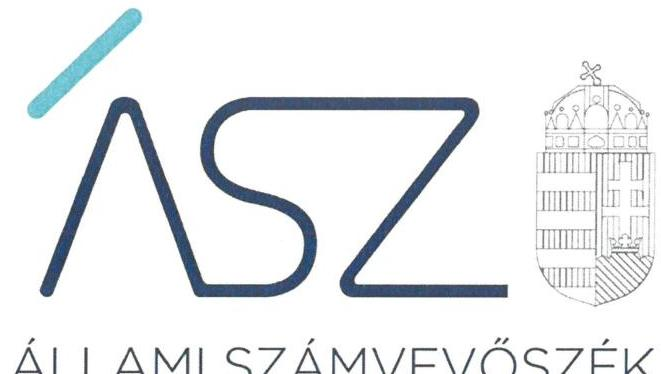
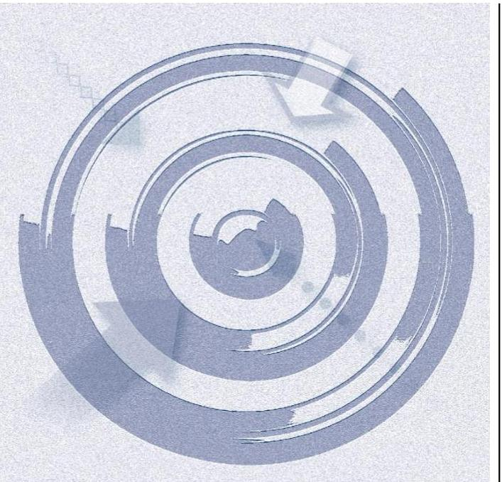

ÁLLAMI SZÁMVEVŐSZÉK

# JELENTÉS 

A költségvetési támogatásban részesülő számviteli törvény szerinti egyéb szervezetek ellenőrzése - Sportegyesületek, sportszövetségek ellenőrzése

Magyar Sí Szövetség
2021.

21072
www.asz.hu

---

ÁLLAMI SZÁMVEVŐSZÉK

# JELENTÉS 

A költségvetési támogatásban részesülő számviteli törvény szerinti egyéb szervezetek ellenőrzése - Sportegyesületek, sportszövetségek ellenőrzése

Magyar Sí Szövetség
2021. 10. hó 25. nap

21072
www.asz.hu

---

# AZ ELLENŐRZÉST FELÜGYELTE: 

SALAMON ILDIKÓ felügyeleti vezető

## AZ ELLENŐRZÉST VEZETTE ÉS A VÉGREHAJTÁSÁÉRT FELELŐS:

NEMESVÁRI-HORTHY ESZTER ellenőrzésvezető

A PROGRAM ÖSSZEÁLLÍTÁSÁÉRT FELELŐS:
FE KETE-NAGY ANDRÁS GÁBOR projektvezető

IKTATÓSZÁM: EL-3327-001/2021.
TÉMASZÁM: 2558
ELLENŐRZÉS-AZONOSÍTÓ SZÁM: V090202
Jelentéseink az Országgyúlés számítógépes hálózatán és az interneten a www.asz.hu címen is olvashatóak.

---

# TARTALOMJEGYZÉK 

- ÖSSZEGZÉS ..... 5
- AZ ELLENŐRZÉS CÉLJA ..... 7
- AZ ELLENŐRZÉS TERÜLETE ..... 8
- AZ ELLENŐRZÉS HÁTTERE, INDOKOLTSÁGA ..... 9
- A JELENTÉS LÉNYEGES KÉRDÉSKÖREI. ..... 10
- AZ ELLENŐRZÉS HATÓKÖRE ÉS MÓDSZEREI. ..... 11
- MEGÁLLAPÍTÁSOK ..... 13
- JAVASLATOK ..... 15
- MELLÉKLETEK. ..... 17
I. sz. melléklet: Értelmező szótár ..... 17
- FÜGGELÉK: ÉSZREVÉTELEK ..... 19
- RÖVIDÍTÉSEK JEGYZÉKE ..... 21

---

.

---

# ÖSSZEGZÉS 

A Magyar Si Szövetség nem biztositotta az átlátható és elszámoltatható közpénzfelhasználás alapvető feltételeit.

## Az ellenőrzés társadalmi indokoltsága

A sport a modern polgári társadalmakban egyre jobban az emberek mindennapi életének részévé, tömegessé válik, mint a testkultúra, az egészséges életmód része, a szabadidő eltöltésének hasznos módja, a prevenció és a rekreáció eszköze. A sportolás ebben az értelemben egyre inkább ún. második generációsállampolgári joggá válik. A szolgáltató állam kötelezettsége, hogy az ország gazdasági-társadalmi teherbíró-képességéhez igazodva-egyre bővülő mértékben - segítse elő, illetve tegye lehetővé a lakosság egészének a sportolás lehetőségét („a sport mindenkié").

A sportolás és a rendszeres testedzés támogatása az Alaptörvényben meghatározott, a testi és lelki egészséghez való alapvető jog érvényesülésének, biztosításának egyik segítő eszköze.

A jogszabályok lehetővé teszik, hogy a sportegyesületek - mint klasszikus sportszervezeti forma, több ezer sportegyesület müködik Magyarországon-nemcsak a sportszövetségeken keresztül, hanem önállóan is részesíthetők állami támogatásban. A sportszövetségek - az országos sportági szakszövetség, a sportági szövetségek, a szabadidősport szövetségek és a fogyatékosok sportszövetségei, a diák- és főiskolai-egyetemi sport sportszövetségei - a társadalmi szervezetek önálló formája, a sportszövetség sportszövetségi jellegét a bírósági nyilvántartásban kifejezetten fel kell tüntetni. A sportegyesületek és a sportszövetségek müködésükre és szakmai tevékenységük ellátására kapott költségvetési támogatást, illetve ingyenes vagyonjuttatást széles körű társadalmi érintettség következtében is, közérdeklődés övezi. Az Állami Számvevőszék még nem ellenőrizte ezt a területet.

Az Állami Számvevőszék ellenőrzései arra adnak választ, hogy a sportegyesületek, sportszövetségek az éves beszámolási kötelezettségüket és az államháztartásból kapott támogatásokkal kapcsolatos nyilvántartási kötelezettségüket szabályszerűen teljesítették-e, a szervezeti és gazdálkodási kereteket szabályszerűen kialakították-e. A szabályszerű gazdálkodás elengedhetetlen a közfeladatok szakmai céljainak megvalósításához, a közbizalom fenntartásához.

## Értékelés, következtetések, javaslatok

Alapvető elvárás, hogy a társadalom objektív képet alkothasson a költségvetési támogatásban részesülő számviteli törvény szerinti egyéb szervezetek, így a sportegyesületek, sportszövetségek müködéséről. Ennek alapfeltétele a közpénzekkel való gazdálkodás elszámoltathatósága, a támogatások felhasználásának átláthatósága, amelyek hiánya sérti a közélet tisztaságának elvét. Az objektív információk rendelkezésre állása érdekében törvény határozza meg azokat a lényeges számviteli, elszámolási szabályokat és szabályozási kötelezettségeket, amelyeknek hiánya akadályozza a törvény számviteli alapelveknek megfelelő végrehajtását, így a megbízható és valós helyzetet tükröző információk előállítását.

A számviteli politika és a keretében elkészítendő szabályzatok hiányában nem kerültek rögzítésre a számviteli elszámolás, az értékelés szempontjából a szervezet adottságainak, körülményeinek leginkább megfelelő szabályok, előírások, módszerek. Az eszközök és a források leltárkészítési és leltározási szabályzatának hiányában nem biztosított a szabályozott és szabályszerű leltározás és leltárkészítés, a leltárba kerülő adatok valódisága, ezáltal a mérleg alátámasztottsága. Az eszközök és a források értékelési szabályzatának, így a könyvekbe bejegyzésre kerülő eszközök és források értékelésére vonatkozó módszereknek és eljárásoknak a hiányában nem biztosított a beszámolóban kimutatott adatok törvényi előírásokkal való összhangja. A pénzkezelési szabályzat, és ezáltal a pénztárak, a bankszámlák használatának, a pénzmozgások bizonylati rendjének, a szigorú számadású bizonylatoknak, az értékpapírok megőrzésére és kezelésére vonatkozó szabályoknak a meghatározása hiányában a szervezet pénzkezeléssel kapcsolatos eljárásai, feladat- és felelősségi körei nem számon kérhetőek, a pénz kezelésének menete nem nyomon követhető.

---

Számlarend hiányában nem biztosított a szabályozott könyvvezetés, a törvényben előírt beszámoló készítéséhez szükséges adatok megbízhatósága, azok bizonylati alátámasztása.

A sportról szóló törvény értelmében szövetség egyik alapvető feladata - a sportág rendeltetésszerű működtetése érdekében - a szabályzatalkotás, amelynek nem tett eleget, nem alkotta meg az állami sportcélú támogatások felhasználására vonatkozó előírásokat tartalmazó gazdálkodási, pénzügyi szabályzatot.

A számviteli szabályozások hiánya is hozzájárult ahhoz, hogy a Magyar Sí Szövetség nyilvántartási (könyvvezetési) rendszerét nem részletezte olyan módon, hogy abból támogatásonként megállapítható és ellenőrizhető legyen a kapott támogatás felhasználása. Ezáltal nem biztosította a költségvetésből kapott támogatások átlátható és elszámoltatható igénybevételének és felhasználásának alapvető feltételeit, amely kockázatot jelent a már igénybe vett támogatások cél szerinti felhasználására, annak ellenőrizhetőségére.

A Magyar Sí Szövetség nem rendelkezett az átláthatóságot és az elszámoltathatóságot biztosító számviteli beszámolóval 2019. évre vonatkozóan.

A közpénzügyi kockázatot növelte, hogy a Magyar Sí Szövetség felügyelő szerve, az Ellenőrző Bizottság ügyrendjét nem állapította meg. Ennek következtében hiányzott a belső védelmi ellenőrző rendszer alapvető feltétele, amely a feltárt hibákat saját felelősségi körben megelőzhette volna.

A közpénzügyi helyzet javítása, a hibák jövőbeni elkerülése érdekében az Állami Számvevőszék öt javaslatot tett a Magyar Sí Szövetség képviseletére jogosult vezetőknek.

---

# AZ ELLENŐRZÉS CÉLJA

**AZ ELLENŐRZÉS CÉLJA** annak értékelése volt, hogy a Magyar Sí Szövetség az éves beszámolási kötelezettségét és az államháztartásból kapott támogatásokkal kapcsolatos nyilvántartási kötelezettségét szabályszerűen teljesítette-e, a szervezeti és gazdálkodási kereteit szabályszerűen kialakította-e.

---

# **AZ ELLENŐRZÉS TERÜLETE**

## **Magyar Sí Szövetség**

1. táblázat

|  TÁMOGATÁSOK ADATAI (M-Ft-ban) |  |   |
| --- | --- | --- |
|  Szerződés kelte | Támogatási | Felhasználás  |
|   | Összeg | 2019.  |
|  2018.09.10. | 20,0 | 1,8  |
|  2018.12.28. | 130,0 | 110,5  |
|  (módosítva: |  |   |
|  2019.12.30.) |  |   |
|  2019.07.03. | 8,3 | 1,3  |
|  2019.09.09. | 18,0 | 15,5  |
|  2019.12.03. | 100,0 | 43,6  |
|  (módosítva: |  |   |
|  2020.02.27.) |  |   |
|  Összesen: | 276,3 | 172,7  |
|  Forrás: ÁSZ szerkesztés Magyar Sí Szövetség adatszolgáltatása alapján |  |   |

**A MAGYAR SÍ SZÖVETSÉG** Magyarországon működő, a sí sportágban sporttevékenységet folytató jogi személyek és magánszemélyek tevékenységét összehangoló, munkájukat elősegítő, a sí sportágat irányító, önkormányzati elven alapuló, civil szervezetként tevékenykedő szervezet. A Sport tv.1 alapján működési formáját tekintve országos sportági szakszövetség. A Magyar Sí Szövetség általános jogutódja az 1913-ban 14 szervezet által alapított Magyar Sí Szövetségnek.

A Magyar Sí Szövetség célja az Alapszabály2 szerint az egyes sí és biatlon sportágak, tevékenység népszerűsítése, fejlesztése, szervezése, irányítása és ellenőrzése elsősorban az alpesi sí, biatlon (sílövészet), gyepsí, sífutás, síroller, síugrás, síturizmus és freestyle sportágakban folyó tevékenységeknek, továbbá a Snowboard Szövetséggel való kölcsönös együttműködés kiépítése. A Magyar Sí Szövetség képviseli a Snowboard Szövetséget a nemzetközi szervezetekben. A Magyar Sí Szövetség fontos feladatának tekinti a fogyatékkal élők bekapcsolását a szabadidő és versenysport területén egyaránt.

A Magyar Sí Szövetség közreműködik az állami sportfeladatok ellátásában is, így közfeladatot lát el, képviseli sportágának és tagjainak érdekeit, valamint részt vesz a hazai és nemzetközi sportszervezetek munkájában. Feladata a tevékenysége során a Sport tv. alapján az állam, illetőleg a helyi önkormányzat által ellátandó közfeladatok megvalósításáról is gondoskodni.

A Magyar Sí Szövetségnek az önkéntesség elve alapján tagjává olyan a sportági versenyrendszerben résztvevő sportegyesület, sportvállalkozás válhat, amely nyilatkozik belépési szándékáról, elfogadja az Alapszabályt és céljait, vállalja az Alapszabály alapján a tagokat terhelő kötelezettségek teljesítését.

A Magyar Sí Szövetség legfőbb szerve a tagok küldötteiből álló Küldöttgyűlés3. A két küldöttgyűlés közötti időszakban a Magyar Sí Szövetsége a 7 főből álló Elnökség4 irányította.

A 2019. évben a Magyar Sí Szövetség összesen 172,7 M Ft költségvetési támogatást használt fel őt, a 2018-2019. években az EMMI5-vel megkötött támogatási szerződéshez kapcsolódóan. A támogatási szerződésekben szereplő támogatási összegeket és a 2019. évi felhasználást a Magyar Sí Szövetség adatszolgáltatása alapján az 1. táblázat mutatja be.

---

# AZ ELLENŐRZÉS HÁTTERE, INDOKOLTSÁGA 

A sportegyesületek, sportszövetségek müködésükre és szakmai tevékenységük ellátására költségvetési támogatásban vagy ingyenes vagyonjuttatásban részesülhetnek, amelyre fokozott közérdeklődés irányul. Társadalmi elvárás a közpénzek értékelvű, rendeltetésszerű felhasználása, a közpénzekből nyújtott támogatások átláthatóságának megteremtése.

Az ÁSZ ${ }^{6}$ a sportegyesületeknél, sportszövetségeknél ellenőrzi a közpénzekkel való gazdálkodás alapvető szabályozási kereteit, a nyilvántartások vezetését, a beszámolási kötelezettség teljesítését. A felhasznált támogatások átláthatóságának, a közpénzekkel való gazdálkodás elszámoltathatóságának értékelésével az ÁSZ előmozdítja, hogy a társadalom objektív képet alkothasson a költségvetési támogatásban részesülő számviteli törvény szerinti egyéb szervezetek, így a sportegyesületek, sportszövetségek müködéséről. Az ÁSZ Stratégiában rögzített célkitűzése, hogy az államháztartáson kívülre nyújtott költségvetési támogatás és vagyonjuttatás ellenőrzésével hozzájáruljon ahhoz, hogy a közpénzeket a sportegyesületek, sportszövetségek is átlátható módon és célszerűen használják fel.

Az ellenőrzés eredményeinek célzott felhasználói a nyilvánosság, a jogalkotó, továbbá a sportegyesületek, sportszövetségek alapítói. Az ellenőrzés eredményeképp a törvényalkotás számára tapasztalatok állnak rendelkezésre a sportegyesületek, sportszövetségek gazdálkodása szabályozásához. Az ellenőrzött szervezetek szintjén gazdálkodásuk vonatkozásában a hiányosságok, szabálytalanságok feltárása, az ennek kapcsán megfogalmazott megállapítások elősegíthetik a sportegyesületek, sportszövetségek szabályszerű gazdálkodását. Az ellenőrzés a társadalom számára információt szolgáltat arról, hogy a sportegyesületek, sportszövetségek a közpénzek szabályszerű felhasználásának feltételeit kialakították-e.

---

# A JELENTÉS LÉNYEGES KÉRDÉSKÖREI 

1- A Magyar Sí Szövetség a szervezeti és gazdálkodási kereteit szabályszerűen kialakította-e?
2. A Magyar Sí Szövetség az államháztartásból kapott támogatásokkal kapcsolatos nyilvántartási kötelezettségét, valamint a beszámolási kötelezettségét szabályszerűen teljesítette-e?

---

# AZ ELLENŐRZÉS HATÓKÖRE ÉS MÓDSZEREI 

## Az ellenőrzés típusa

Szabályszerúségi ellenőrzés.

## Az ellenőrzött időszak

2019. év.

## Az ellenőrzés tárgya

A Magyar Sí Szövetség beszámolási kötelezettségeteljesítésének, az államháztartási forrásból kapott támogatással kapcsolatosan vezetett nyilvántartásának, valamint a gazdálkodása alapvető szabályozási keretei kialakításának ellenőrzésére terjed ki.

## Az ellenőrzött szervezet

Magyar Sí Szövetség

## Az ellenőrzés jogalapja

Az ÁSZ tv. ${ }^{7}$ 1. § (3) bekezdése, 5. § (3) bekezdése, valamint a Civil tv. ${ }^{8}$ 47. § előírásai.

## Az ellenőrzés módszerei

Az ellenőrzést az ellenőrzési program szempontjai, kérdései, az ellenőrzött időszakban hatályos jogszabályok, a nemzetközi standardokat irányadónak tekintve, az ellenőrzés szakmai szabályok és módszertanok figyelembevételével végzi az ÁSZ. A közpénzekkel való felelős gazdálkodás segítésére irányuló javaslatok kidolgozásakor a hatályos jogszabályok az irányadóak.

Az ellenőrzés alapvető feltétele az ellenőrizhetőség kérdése, a melyre az elkülönített nyilvántartás vizsgálatával ad választ az ÁSZ. Elszámoltatható és átlátható a szervezet akkor, ha beszámolási kötelezettségének szabályszerűen eleget tett.

Az ellenőrzési kérdések megválaszolásához szükséges bizonyítékok megszerzése az ellenőrzött által rendelkezésre bocsátott dokumentu-

---

mokra, adatokra alapozva megfigyelés, szemle (szemrevételezés), összehasonlítás, kérdésfeltevés (információkérés), valamint elemző eljárással történik.

Az ellenőrzési bizonyítékként felhasználható adatforrások közé tartoznak egyrészt a szakmai program részletes szempontjainál felsorolt adatforrások, másrészt minden - az ellenőrzés folyamán feltárt, az ellenőrzés szempontjából információt tartalmazó - dokumentum.

Az ellenőrzés lefolytatásához az ellenőrzött szervezet a kitöltött tanúsítvány, valamint az ÁSZ által kért dokumentumok elektronikus úton való megküldésével szolgáltat adatokat, információkat. Az így rendelkezésre bocsátott adatok, információk és a tanúsítványok adatai valódiságának kontrollja az ellenőrzés keretében történik.

Az egységes értelmezést támogatja a program mellékletét képező fogalomtár és rövidítésjegyzék.

Az ellenőrzés ideje alatt az ellenőrzött szervezettel történő kapcsolattartást az az ÁSZ SZMSZ ${ }^{9}$-ének vonatkozó előírásai alapján szükséges biztosítani.

---

# 1. A Magyar Sí Szövetség a szervezeti és gazdálkodási kereteit szabályszerűen kialakította-e? 

## Összegző megállapítás

A Magyar Sí Szövetség nem alakított ki szabályszerű szervezeti és gazdálkodási kereteket.

A Magyar Sí Szövetség rendelkezett a Ptk. ${ }^{10}$ szerint a Küldöttgyűlés által elfogadott Alapszabállyal. A Civil. tv előírásaival összhangban létrehozta felügyelő szervét, az Ellenőrző Bizottságot. Az Ellenőrző Bizottság a Civil.tv. 40. § (2) bekezdésében előírtak ellenére ügyrendjét nem állapította meg.

A Magyar Sí Szövetség nem készítette el a Számv. tv. ${ }^{11}$ 14. § (3) bekezdése ellenére a számviteli politikát és annak keretében a 14. § (5) bekezdés a), b) és d) pontjai előírásai ellenére az eszközök és a források leltárkészítési és leltározási szabályzatát, az értékelési szabályzatát, valamint a pénzkezelési szabályzatát. A számviteli politika és az annak keretében elkészítendő szabályzatok hiányában nem volt biztosított a Számv. tv.-ben rögzített számviteli alapelveknek megfelelő könyvvezetés és beszámoló készítés.

A Magyar Sí Szövetség a Számv. tv. 161. § (1) bekezdés előírása ellenére nem készített számlarendet.

A Magyar Sí Szövetség a Sport tv. 23. § (1) bekezdés f) pontjában foglaltak ellenére nem alkotta meg az állami sportcélú támogatások felhasználására vonatkozó előírásokat tartalmazó gazdálkodási, pénzügyi szabályzatát.

## 2. A Magyar Sí Szövetség az államháztartásból kapott támogatásokkal kapcsolatos nyilvántartási kötelezettségét, valamint a beszámolási kötelezettségét szabályszerűen teljesítette-e?

## Összegző megállapítás

2.1. számú megállapítás

A Magyar Sí Szövetség az államháztartásból kapott támogatásokkal és azok felhasználásával kapcsolatos nyilvántartási kötelezettségét és beszámolási kötelezettségét nem teljesítette.

A Magyar Sí Szövetség az államháztartásból kapott támogatások és azok felhasználása elkülönített nyilvántartását nem alakította ki.

A Magyar Sí Szövetség a Számv. tv. 161/A. § (2) bekezdésében és a Civilszr. ${ }^{12}$ 14. § (1) bekezdésében előírtak ellenére a közpénzek felhasználásának és a köztulajdon használatának nyilvánossága és ellenőrizhetősége érdekében nyilvántartási (könyvvezetési) rendszerét nem részletezte tovább annak érdekében, hogy a Civil tv. 20. § (4) bekezdése előírása szerint támogatásonként megállapítható és ellenőrizhető legyen a kapott támogatás felhasználása.

---

# 2.2. számú megállapítás 

A Magyar Sí Szövetség nem rendelkezett az átláthatóságot és az elszámoltathatóságot biztosító beszámolóval.

A Magyar Sí Szövetség nem rendelkezett számviteli beszámolóval, mivel nem teremtette meg a törvényes gazdálkodás és múködés feltételeit, továbbá a beszámoló elkészítése nem felelt meg a Számv. tv. előírásainak.

---

# JAVASLATOK 

Az ÁSZ tv. 33. § (1) bekezdésében foglaltak értelmében az ellenőrzött szervezet vezetője köteles a jelentésben foglalt megállapításokhoz kapcsolódó intézkedési tervet összeállítani és azt a jelentés kézhezvételétől számított 30 napon belül az ÁSZ részére megküldeni. Amennyiben az ellenőrzött szervezet vezetője nem küldi meg határidőben az intézkedési tervet, vagy továbbra sem elfogadható intézkedési tervet küld, az Állami Számvevőszék elnöke az ÁSZ tv. 33. § (3) bekezdése a) és b) pontjaiban foglaltakat érvényesítheti.

## a Magyar Sí Szövetség képviseletére jogosult vezetőknek

1. Kezdeményezze, hogy a Civil tv. előírásainak eleget téve az Ellenőrző Bizottság mint felügyelő szerv állapítsa meg ügyrendjét.
(1. sz. megállapítás 1. bekezdés 3. mondata alapján)
2. Intézkedjen a Számv. tv. előírásának megfelelően
a) a számviteli politika,
b) az eszközök és a források leltárkészítési és leltározási szabályzata,
c) az eszközök és a források értékelési szabályzata,
d) a pénzkezelési szabályzat, valamint
e) a számlarend
elkészitésére.
(1. sz. megállapítás 2. bekezdés 1. mondata, valamint a 3. bekezdése alapján)
3. Intézkedjen a Sport. tv. előírásainak megfelelően az állami sportcélú támogatások felhasználására vonatkozó előírásokat tartalmazó gazdálkodási, pénzügyi szabályzat megalkotására.
(1. sz. megállapítás 4. bekezdése alapján)
4. Intézkedjen - a Számv. tv., a Civil tv. és a Civilszr. előírásainak megfelelően, a közpénzek felhasználásának és a köztulajdon használatának nyilvánossága és ellenőrizhetősége érdekében - a nyilvántartási (könyvvezetési) rendszer részletezése érdekében, hogy támogatásonként megállapítható és ellenőrizhető legyen a kapott támogatás felhasználása.
(2.1. sz. megállapítás 1. bekezdése alapján)
5. Intézkedjen a jövőben a Számv. tv. előírásainak megfelelően a számviteli beszámoló elkészitésére.
(2.2. sz. megállapítás 1. bekezdése alapján)

---

.

---

# MELLÉKLETEK 

## I. SZ. MELLÉKLET: ÉRTELMEZŐ SZÓTÁR

átláthatóság
államháztartásból
származó forrás
civil szervezet
elszámoltathatóság
gazdálkodó tevékenység
gazdasági-vállalkozási tevékenység
költségvetési támogatás
közhasznú tevékenység
sportegyesület
sportszövetség

Előfeltétele az elszámoltathatóságnak, a célok elérése érdekében folytatott tevékenységekről, folyamatokról a fontos információk közzé- vagy hozzáférhetővé legyenek téve (Forrás: Az államháztartási belső kontroll standardok és gyakorlati útmutató, 28. oldal, NGM, 2017)
az államháztartás központi és önkormányzati alrendszeréből származó forrás
a civil társaság; a Magyarországon nyilvántartásba vett egyesület - a párt, a szakszervezet és a kölcsönös biztosító egyesület kivételével és - a közalapítvány és a pártalapítvány kivételével - az alapítvány. (Forrás: Civil tv. 2. § 6. pont a)-c) pontjai)
A vezető vagy a munkatárs felelős a tevékenységéért, az érintettek pedig jogosultak számonkérni azt, hogy a tevékenység valóban az ő érdekükben, és az elvártnak megfelelően történt (Forrás: Az államháztartási belső kontroll standardok és gyakorlati útmutató, 28. oldal, NGM, 2017)
azon tevékenységek összessége, amelyek a civil szervezet vagyoni, pénzügyi, jövedelmi helyzetére kiható gazdasági eseményt eredményeznek. (Forrás: Civil tv. 2. § 10. pont)
A jövedelem- és vagyonszerzésre irányuló vagy azt eredményező, üzletszerűen végzett gazdasági tevékenység, kivéve az adomány (ajándék) elfogadását, a létesítő okiratban meghatározott cél szerinti tevékenységet (ideértve a közhasznú tevékenységet is), 2015. november 28-tól - a pénzeszközök betétbe, értékpapírba, társasági részesedésbe történő elhelyezését és az ingatlan megszerzését, használatának átengedését és átruházását. (Forrás: Civil tv. 2. § 11. pont a)-d) pontjai)
az államháztartás alrendszerei terhére nyújtott pénzbeli vagy nem pénzbeli juttatás, amelyet a támogató nem elsősorban ellenszolgáltatás ellenében, de konkrét program megvalósítása vagy meghatározott időszakban a támogatott szervezet működtetése érdekében nyújt. Költségvetési támogatás különösen: a pályázat útján, valamint egyedi döntéssel kapott költségvetési támogatás; az Európai Unió strukturális alapjaiból, illetve a Kohéziós Alapból származó, a költségvetésből juttatott támogatás; az Európai Unió költségvetéséből vagy más államtól, nemzetközi szervezettől származó támogatás és a személyi jövedelemadó meghatározott részének az adózó rendelkezése szerint felajánlott összege. (Forrás: Civil tv. 2. § 15. pont)
minden olyan tevékenység, amely a létesítő okiratban megjelölt közfeladat teljesítését közvetlenül vagy közvetve szolgálja, ezzel hozzájárulva a társadalom és az egyén közös szükségleteinek kielégítéséhez. (Forrás: Civil tv. 2. § 20. pont)
Sportegyesület - a Sport törvényben megállapított eltérésekkel - az egyesülési jogról, a közhasznú jogállásról, valamint a civil szervezetek múködéséről és támogatásáról szóló törvény (a továbbiakban: Civil tv.) és a Polgári Törvénykönyv szabályai szerint működő olyan egyesület, amelynek alaptevékenysége a sporttevékenység szervezése, valamint a sporttevékenység feltételeinek megteremtése. A sportegyesület a magyar sport hagyományos szervezeti alapegysége, a versenysport, a tehetséggondozás, az utánpótlásnevelés és a szabadidősport múhelye. (Forrás: Sport tv. 16. § (1)-(2) bekezdés
A sportszövetségek meghatározott sporttevékenységek körében a sportversenyek szervezésére, a tagok érdekvédelmére és a részükre való szolgáltatásokra, valamint a nemzetközi kapcsolatok lebonyolítására létrehozott, jogi személyiséggel és önkormányzattal rendelkező, a Civil tv. és a Polgári Törvénykönyv alapján - az e törvényben foglalt eltérésekkel - különös formában múködő egyesületek. (Forrás: Sport tv. 19. § (1) bekezdés)

---

.

---

# FÜGGELÉK: ÉSZREVÉTELEK 

A jelentéstervezetet a Számvevőszék 15 napos észrevételezésre megküldte az ellenőrzött szervezet vezetőinek az ÁSZ tv. 29. §* (1) bekezdése elöírásának megfelelően.

A Magyar Sí Szövetség elnöke és fötitkára a jelentéstervezetre nem tett észrevételt.

[^0]
[^0]:    * 29. § (1) Az Állami Számvevőszék az ellenőrzési megállapításait megküldi az ellenőrzött szervezet vezetőjének vagy az általa megbízott személynek, és annak, akinek személyes felelősségét állapította meg.
    (2) Az ellenőrzött szervezet vezetője és a felelősként megjelölt személy az ellenőrzés megállapításaira tizenöt napon belül írásban észrevételt tehet.
    (3) Az Állami Számvevőszék az észrevételre a beérkezésétől számított harminc napon belül írásban válaszol. A figyelembe nem vett észrevételeket köteles a jelentésben feltüntetni, és megindokolni, hogy azokat miért nem fogadta el.

---

.

---

# RÖVIDÍTÉSEK JEGYZÉKE 

${ }^{1}$ Sport tv.
${ }^{2}$ Alapszabály
${ }^{3}$ Küldöttgyülés
${ }^{4}$ Elnökség
${ }^{5}$ EMMI
${ }^{6}$ ÁSZ
${ }^{7}$ ÁSZ tv.
${ }^{8}$ Civil tv.
${ }^{9}$ ÁSZ SZMSZ
${ }^{10}$ Ptk.
${ }^{11}$ Számv. tv.
${ }^{12}$ Civilszr.
2004. évi I. törvény a sportról (hatályos: 2004. március 13-tól)

A Magyar Sí Szövetség Alapszabálya (hatályos: 2017. november 20-tól 2019. május 23-ig, illetve hatályos: 2019. május 23-tól)

A Magyar Sí Szövetség Küldöttgyülése (Alapszabály; szerint Közgyűlés)
A Magyar Sí Szövetség elnöksége
Emberi Eröforrások Minisztériuma
Állami Számvevőszék
2011. évi LXVI. törvény az Állami Számvevőszékről (hatályos: 2011. július 1-jétől)
2011. évi CLXXV. törvény az egyesülési jogról, a közhasznú jogállásról, valamint a civil szervezetek müködéséről és támogatásáról (hatályos: 2011. december 22-től)

Az Állami Számvevőszék elnökének 3/2019. (XII. 23.) ÁSZ utasítása az Állami Számvevőszék Szervezeti és Müködési Szabályzatáról (hatályos: 2020. január 1-jétől)

Az Állami Számvevőszék elnökének 4/2020. (VII. 31.) ÁSZ utasítása az Állami Számvevőszék Szervezeti és Müködési Szabályzatáról (hatályos: 2020. augusztus 1-jétől)

Az Állami Számvevőszék elnökének 7/2020. (XII. 28.) ÁSZ utasítása az Állami Számvevőszék Szervezeti és Müködési Szabályzatáról (hatályos: 2021. január 1-jétől)
2013. évi V. törvény a Polgári Törvénykönyvről (hatályos: 2014. március 15-től) 2000. évi C. törvény a számvitelről (hatályos: 2001. január 1-jétől)

479/2016. (XII. 28.) Korm. rendelet a számviteli törvény szerinti egyes egyéb szervezetek beszámoló készítési és könyvvezetési kötelezettségének sajátosságairól (hatályos: 2017. január 1-jétől)

---

# ASZ 

1052 Budapest, Apáczai Cs. J. u. 10. | 1364 Budapest 4. Pf. 54 TEL: +36 14849100
email: szamvevoszek@asz.hu
web: www.asz.hu | www.aszhirportal.hu