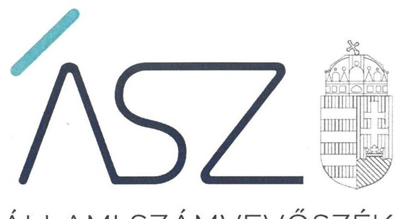
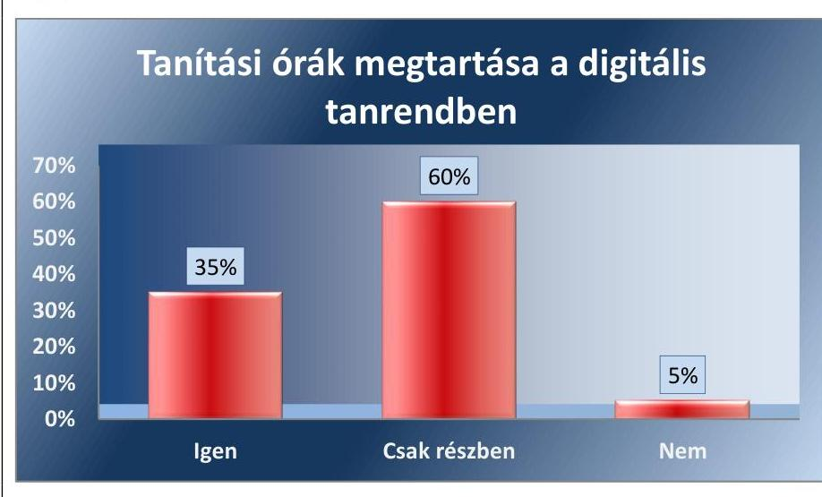
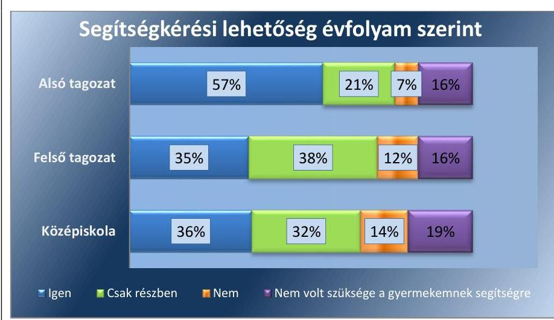
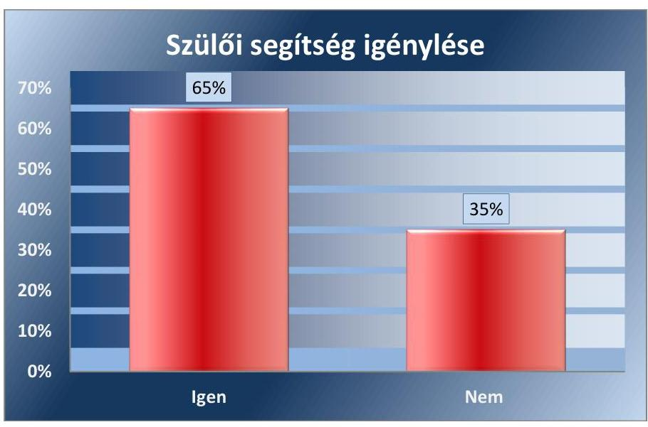
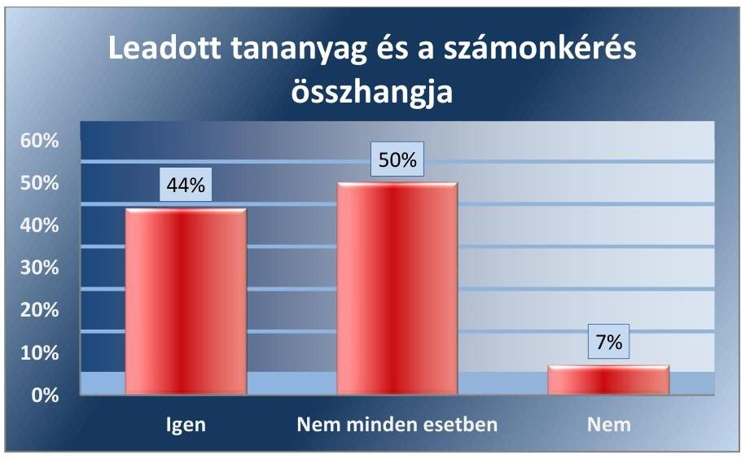
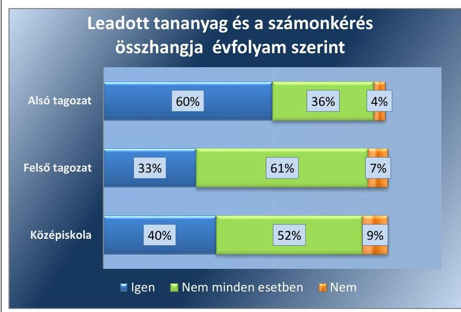

ÁLLAMI SZÁMVEVŐSZÉK

# JELENTÉS 

## Központi költségvetési szervek ellenőrzése

Tankerületi központok

2021.

21073
www.asz.hu

---

ÁLLAMI SZÁMVEVŐSZÉK

# JELENTÉS 

## Központi költségvetési szervek ellenőrzése

Tankerületi központok
2021. 08. hó 20. nap

21073
www.asz.hu

---

# AZ ELLENŐRZÉST FELÜGYELTE: 

MAKKAI MÁRIA felügyeleti vezető

## AZ ELLENŐRZÉST VEZETTE ÉS A VÉGREHAJTÁSÁÉRT FELELŐS:

NEMESVÁRI-HORTHY ESZTER ellenőrzésvezető
ÓDOR ZOLTÁN TAMÁS ellenőrzésvezető
HOFMEISTER LÁSZLÓ ellenőrzésvezető

## A PROGRAMOK ÖSSZEÁLLÍTÁSÁÉRT FELELŐS:

GÖRGÉNYI GÁBOR ellenőrzési program készítéséért felelős vezető
FEKETE-NAGY ANDRÁS GÁBOR ellenőrzési program készítéséért felelős vezető

Jelentéseink az Országgyűlés számítógépes hálózatán és az interneten a www.asz.hu címen is olvashatóak.

IKTATÓSZÁM: EL-3333-001/2021
TÉMASZÁM: 2549
ELLENŐRZÉS-AZONOSÍTÓ SZÁM: V089303

---

# TARTALOMJEGYZÉK 

■ ÖSSZEGZÉS ..... 5
■ AZ ELLENŐRZÉS CÉLJA ..... 8
■ AZ ELLENŐRZÉS TERÜLETE ..... 9
■ AZ ELLENŐRZÉS HÁTTERE, INDOKOLTSÁGA ..... 10
■ A JELENTÉS LÉNYEGES KÉRDÉSKÖREI ..... 11
■ AZ ELLENŐRZÉS HATÓKÖRE ÉS MÓDSZEREI ..... 12
■ MEGÁLLAPÍTÁSOK ..... 14
■ MELLÉKLETEK ..... 21
I. sz. melléklet: Értelmező szótár ..... 21
II. sz. melléklet: Az ellenőrzött tankerületi központok ..... 22
III. sz. melléklet: A figyelemfelhívó levelekre adott válaszok értékelése ..... 23
■ FÜGGELÉK: ÉSZREVÉTELEK ..... 31
■ RÖVIDÍTÉSEK JEGYZÉKE ..... 33

---

.

---

# ÖSSZEGZÉS 

Az ellenőrzött 60 tankerületi központ közül 56 szervezet kialakította az elszámoltatható gazdálkodás feltételeit. 30 tankerületi központ által működtetett kontrolltevékenység hiányossága kockázatot jelent a közpénzek szabályszerű felhasználására.
A tanulók szülei körében végeztetett közvélemény-kutatás eredményei alapján a digitális munkarendben megvalósuló oktatás 2021. március 8-a és 2021. március 31. között részben töltötte be a szerepét.
Az ÁSZ kezdeményezésére az ellenőrzött időszakot követően a gazdálkodás szabályozottsága széles körben javult. A kontrolltevékenységek területén azonban amellett, hogy itt is jelentős körben javulás tapasztalható, további lépéseket kell tenni a szabályszerűség biztosítása érdekében.
Előrevivő lépéseket tett az emberi erőforrások minisztere a szabályos gazdálkodás biztosítása, valamint a szülői igények figyelembevételével történő tanulói felzárkóztatás érdekében.

## Az ellenőrzés társadalmi indokoltsága

Az Alaptörvényben rögzített művelődéshez való jog biztosítja az ingyenes és kötelező alapfokú oktatást minden gyermek számára. Az elsajátítandó műveltségtartalmat a nemzeti alaptanterv biztosítja a kerettantervek által a nemzeti köznevelésről szóló törvény szerint. A kerettantervben meghatározott nevelési-oktatási célok elérése a társadalom minden tagjának érdeke, mert az oktatás hosszú távon meghatározza az ország versenyképességét.

A tankerületi központok célja, hogy a fenntartói feladatok ellátásával megteremtsék a köznevelési intézmények szabályszerű és gazdaságos működésének alapját, mely az egységes színvonalú, mindenki számára elérhető oktatás alapját képezi. A tankerületi központok gazdasági szervezettel rendelkező központi költségvetési szervek, melyeknek működésének forrásait a központi költségvetés biztosítja. A központi költségvetésből származó támogatás mértékéből adódóan társadalmi igény fogalmazódik meg a közpénzekkel, nemzeti vagyonnal való szabályos, átlátható gazdálkodás kialakítása tekintetében. Az ellenőrzés hozzájárulhat ahhoz, hogy a tankerületi központok a jogszabályi előírások szerint alakítsák ki gazdálkodásuk szabályozási kereteit, valamint a kockázatok feltárásával támogatást nyújt az ezen szervezetek felett irányítói, középirányítói feladatokat ellátó szervezetek számára.

A COVID-19 járvány következtében a köznevelési feladatok megszervezésében jelentős változások történtek. A jelenléti oktatásról a közoktatási intézmények a digitális munkarend szerinti oktatásra álltak át. Ez a szülők, a tanulók, pedagógusok számára jelentős változást okozott. Ezért volt indokolt a tankerületek ellenőrzéséhez kapcsolódóan ennek az oktatási formának a megvalósításával kapcsolatos szülői tapasztalatok megismerése. A felmérés eredménye hasznos információt nyújt az intézmény fenntartók, valamint a köznevelési intézmények feladatainak ellátásához.

## Főbb megállapítások, következtetések

A tankerületi központok rendelkeztek a szervezet feladatai ellátásának részletes rendjét rögzítő szervezeti és működési szabályzattal.

Valamennyi tankerületi központ rendelkezett továbbá számviteli politikával, valamint - két szervezet kivételével - eszközök és források leltárkészítési és leltározási szabályzatával, továbbá eszközök és források értékelési szabályzatával. Az elkészített számviteli szabályzatok ellenőrzése során az ÁSZ ${ }^{1}$ alapvető hibát nem tárt fel.

---

Az éves költségvetési beszámoló elkészítésének egy kivételével valamennyi szervezet eleget tett, beszámolójukat főkönyvi kivonattal alátámasztották. Kilenc szervezet nem gondoskodott a 2019. évi beszámoló mérlegtételeinek alátámasztása érdekében a leltárba kerülő adatok valódiságát alátámasztó leltározások elrendeléséről. Ez kockázatot jelentett a szabályszerű leltározásra és ezáltal arra, hogy az éves költségvetési beszámoló nem mutatott megbízható és valós képet a vagyoni helyzetről.

A 2019. évben hét, a 2020. évben három tankerületi központ nem vezetett a gazdálkodási jogkörök gyakorlására jogosult személyekről és aláírás-mintájukról szóló naprakész nyilvántartást. Ezzel nem biztosították a közpénzek célszerű, a tankerületi központok érdekében történő felhasználásának alapvető nyilvántartási feltételeit.

A 2020. évben az ellenőrzött 30 tankerületi központ személyi juttatások kifizetéséhez kapcsolódó kontrolltevékenysége nem volt szabályszerű, mert a kifizetést megelőzően nem rendelkeztek teljesítésigazolással, ennek következtében nem bizonyított, hogy minden tanítási órát a tanrendnek megfelelően megtartottak az intézményekben. Ennek hiányában felmerül annak kockázata, hogy a tanulók a megfelelő tudás megszerzéséhez nem kapják meg az elrendelt támogatást.

A monitoring rendszer keretében a belső kontrollrendszer minőségéről szóló vezetői nyilatkozatot a 2019. évre vonatkozóan három tankerületi központ nem készítette el. További két tankerületi központ vezetője nem a jogszabály szerinti nyilatkozatban értékelte a költségvetési szerv belső kontrollrendszerének minőségét. A nyilatkozatok nem tartalmazták a vezető értékelését azzal kapcsolatban, hogy a jogszabályi előírásoknak az integrált kockázatkezelési rendszer vonatkozásában miképp tettek eleget.

21 tankerületi központ ellenőrzése során alapvető hibát nem tárt fel az ÁSZ a gazdálkodásuk szabályozottsága és elszámoltathatósága terén a 2019. évben.

A szülői vélemények szerint a közoktatási intézményekben a tanulók több, mint felének az órarendi órákat részben, vagy egyáltalán nem tartották meg és a tanulók jelentős része számára a tanárok segítsége sem volt biztosított. A tanulók jelentős része szorult a szülők segítségére a tanuláshoz és a felkészüléshez. A tanulók felénél a szülőknek az volt a tapasztalata, hogy a számonkérés és a leadott tananyag között nem minden esetben volt összhang. A szülői vélemények azt mutatták, hogy 2021. március 8-a és 2021. március 31-e között a tantermen kívüli, digitális munkarendben megvalósuló oktatás során a köznevelési intézmények nem gondoskodtak arról, hogy valamennyi tanuló számára az elsajátítandó tananyaghoz való hozzájutás, annak elsajátításának és számon kérhetőségének feltételei biztosítottak legyenek.

Az ÁSZ 60 tankerületi központnál kezdeményezte, hogy az ellenőrzött időszakot követően, a 2021. évre vonatkozóan biztosítsák a szabályszerű működés feltételeit és erről az ÁSZ-t értesítsék.

A feltárt hiányosságokkal kapcsolatban, a figyelemfelhívó levelekre a tankerületek által adott válaszok alapján az alábbi következtetést lehet tenni.

A szabályozási terület az ellenőrzött szervezetek által tett intézkedések alapján a 2021. évre lényegesen jobb helyzetet mutatott. A számviteli politikát érintő hiányosságra megtett intézkedésekkel megalapozták a szervezet működési sajátosságaihoz igazodó, szabályszerű könyvvezetést, illetve a pénzügyi és vagyoni helyzetről megbízható és valós összképet mutató beszámoló elkészítését. Az eszközök és források leltárkészítési és leltározási szabályzatára, továbbá eszközök és források értékelési szabályzatára vonatkozóan tett intézkedések által biztosított a felelős és számonkérhető vagyongazdálkodás.

A beszámoló mérlegtételeinek leltárába kerülő adatokat alátámasztó leltározás elrendelése jobb helyzetet mutatott, így a szervezetek kezelésében lévő nemzeti vagyon védelme biztosított.

A gazdálkodási jogkörök gyakorlására jogosult személyekről és aláírás-mintájukról szóló naprakész nyilvántartás területe megfelelő intézkedés hiányában továbbra is kockázatos, amellyel sérül a cél szerinti közpénzfelhasználás szabályozottsága, és a vagyonnal történő felelős gazdálkodás.

A személyi juttatások kifizetéséhez kapcsolódó kontrolltevékenység területén 13 tankerületi központ intézkedett a kifizetést megelőző jogszabály szerinti teljesítésigazolás meglétének irányába, azonban 17 tankerület esetében továbbra is fennáll annak a kockázata, hogy nem bizonyított a személyi kifizetések alapját jelentő megfelelő teljesítés.

A monitoring rendszer keretében a belső kontrollrendszer minőségéről szóló vezetői nyilatkozat jogszabálynak megfelelő elkészítésének területén három tankerület esetében továbbra is fennáll annak a kockázata, hogy a belső kontrollrendszer minőségéről nem állnak rendelkezésre megbízható információk.

---

Az ellenőrzött szervezetek közül a Belső-Pesti Tankerületi Központnál a felelős vezetői magatartás nem érvényesült, a figyelemfelhívó levélben foglaltakra nem válaszolt, intézkedést még nem tett.

Előremutató az emberi erőforrások miniszterének ellenőrzés során adott tájékoztatása, amely szerint az intézményvezetők tudatában vannak az eltérő munkarendben megvalósuló oktatás során az „esetlegesen elmaradt munkanapok, tanórák pótlásához szükséges intézkedések szükségességének”. Ezt erősítette a 24/2021.(VI.02.) EMMI határozat, amely a törvényes képviselő előzetes kérése alapján történő kötelező felügyelet elrendelése mellett a nyári időszakban lehetőséget teremtett az intézmények számára a felzárkóztatás, pótlás megvalósítására. A tájékoztatás szerint az intézmények számára az ősszel kezdődő tanév során is lehetőség van a szükséges további pótlás megszervezésére, amelyre a szakmai tanévnyitókon felhívják az intézményvezetők figyelmét. Ez arra mutat rá, hogy a szülői igények figyelembevételével, a kiesett oktatásnak az intézményvezetők felelősségi körében való pótlása, párosulva a pedagógusok elkötelezettségével, biztosítja minden tanuló számára az elsajátítandó tananyaghoz való hozzájutást.

A gazdálkodási területen a közpénzügyi helyzet javulását mozdítja elő az emberi erőforrások miniszterének intézkedése. Ennek keretében a tájékoztatás szerint a miniszter kérte a Klebelsberg Központ elnökének intézkedését, hogy a belső ellenőrzés kiemelt ellenőrzésnek vesse alá az érintett területeket.

---

# AZ ELLENŐRZÉS CÉLJA 

Az ellenőrzés célja annak megállapítása volt, hogy a tankerületi központok kialakítottak-e a szabályszerű gazdálkodáshoz szükséges, jogszabály által előírt szabályzatokat, szabályozásokat, szabályszerűen alakították-e ki a jogszabály által előírt nyilvántartásokat, rendelkeztek-e a jogszabályban meghatározott éves beszámolóval, a leltárkészítési kötelezettség teljesítéséhez elrendelték-e a költségvetési szerv vagyonelemeinek számbavételét és a tankerületi központok vezetői szabályszerű nyilatkozatban értékeltek-e a költségvetési szerv belső kontrollrendszerének minőségét. Továbbá, a jogszabályban meghatározott nyilvántartások kialakítása, a köznevelési rendszerben - kiemelten a koronavírus járvány miatt kihirdetett veszélyhelyzet idején - a kifizetésekhez kapcsolódóan a gazdálkodási jogkörök gyakorlása szabályszerű volt-e.

---

# AZ ELLENŐRZÉS TERÜLETE 

## Tankerületi központok

2016. december 31-ig a KLIK ${ }^{2}$ volt az állami fenntartású köznevelési intézmények - ide nem értve a szakképzésért és felnőttképzésért felelős miniszter által fenntartott szakképző iskolákat és többcélú intézményeket - fenntartója.

A fenntartói és működtetői (települési önkormányzati feladat) feladatok összevonása következtében 2017. január 1-jével a KLIK területi szervei kiváltak és a jogutódjaiként létrejött tankerületi központokba olvadtak be. A KLIK 2017. január 1-jétől Klebelsberg Központ néven működik tovább.

A Kormány az Alaptörvényben és a Nkt. ${ }^{3}$-ben kapott felhatalmazás alapján 58 tankerületi központot jelölt ki az állami köznevelési közfeladat ellátásában fenntartóként részt vevő
szervnek. 2017. február 1-jétől és 2018. július 1-jétől kiválás útján további két tankerületi központ (Jászberényi Tankerületi Központ, Esztergomi Tankerületi Központ) jött létre.

A tankerületi központ gazdasági szervezettel rendelkező központi hivatalként működő központi költségvetési szerv, amelynek jogi személyiségű szervezeti egységeiként működnek tovább az egyes állami fenntartású köznevelési intézmények.

Az alapítói jog gyakorlója a Kormány, irányító szervük az EMMI ${ }^{4}$ és a középirányító szervük a Klebelsberg Központ.

A tankerületi központoknak 2019. évben összesen 2194 köznevelési intézménye volt. 2019. évi éves beszámolóik adatai alapján, együttesen 615844 M Ft bevétel mellett, kiadásaik 578748 M Ft összeget tettek ki. Mérlegfőösszegük 501725 M Ft volt.
2020. március 11-én a $\mathrm{WHO}^{5}$ több kontinensre kiterjedő világjárványnak, azaz pandémiának minősítette a COVID-19 koronavírus-fertőzést. Ezzel egyidejűleg Magyarország Kormánya az Alaptörvényben foglalt hatáskörében különleges jogrendet, veszélyhelyzetet vezetett be.

A veszélyhelyzettel összefüggésben a köznevelési intézmények működési rendjét az emberi erőforrások minisztere határozza meg. A tantermen kívüli, digitális munkarend szerinti oktatás bevezetésére első
 alkalommal 2020. március 16-ával a 3/2020. (III. 14.) EMMI határozattal ${ }^{6}$, majd a 14/2020. (XI. 10) EMMI határozattal ${ }^{7}$ került sor. A 2021. március 8-2021. március 31-e közötti időszakra az emberi erőforrások minisztere 17/2021. (III. 5.) EMMI határozatával ${ }^{8}$ szabályozta a köznevelési intézmények működési rendjét és rendelte el a tantermen kívüli digitális munkarendet.

Minderre való tekintettel az ÁSZ ${ }^{9}$ az ellenőrzéséhez kapcsolódóan a digitális, tantermen kívüli munkarendben megvalósuló oktatást érintően - a 2021. március 8-a és 2021. március 31-e közötti időszakra vonatkozóan - közvélemény-kutatást végeztetett az általános iskolás és középiskolás gyermekek szülei körében online, kérdőíves interjú segítségével. A kutatás célcsoportját azok a szülők alkották, akiknek legalább egy gyermekük tanul jelenleg általános iskolában vagy középiskolában.

---

# **AZ ELLENŐRZÉS HÁTTERE, INDOKOLTSÁGA**

A központi költségvetési szervek gazdálkodását és működését az ÁSZ törvényi felhatalmazás alapján ellenőrzi, annak érdekében, hogy a közpénzfelhasználás javulását, a nemzeti vagyonnal való gazdálkodás javulását előmozdítsa. Az ellenőrzéssel az ÁSZ elősegíti, hogy ezen szervezetek betöltsék funkciójukat, a jogszabályi előírásoknak megfelelően működjenek és gazdálkodjanak, valamint támogatást nyújt a tankerületi központok feletti irányítói, fenntartói feladatok ellátásához.

A köznevelési intézmények – az óvoda és a pedagógiai-szakmai szolgáltatás nyújtó intézmény kivételével – tantermen kívüli, digitális munkarendben működnek 2021. március 8-tól a 104/2021. (III. 5.) Korm. rendeletben foglaltak alapján. Az ellenőrzéshez kapcsolódóan az ÁSZ által a digitális munkarendben megvalósuló oktatásban résztvevő gyermekek szülei körében végeztetett közvélemény-kutatással az ÁSZ támogatást nyújt a köznevelési intézmények fenntartói számára a tantermen kívüli, digitális munkarendben megvalósuló oktatás kialakítása és megvalósítása területén.

---

# A JELENTÉS LÉNYEGES KÉRDÉSKÖREI 

1.     - A tankerületi központok kialakították-e a szabályszerű gazdálkodás jogszabály által előírt szabályozási kereteit?
2.     - A tankerületi központok rendelkeztek-e szabályszerűen elkészített beszámolóval, a leltárkészítési kötelezettség teljesítéséhez elrendelték-e a költségvetési szerv vagyonelemeinek számbavételét és kialakították-e a jogszabályban meghatározott nyilvántartást?
3.     - A tankerületi központok vezetői szabályszerű nyilatkozatban értékelték-e a költségvetési szerv belső kontrollrendszerének minőségét?
4. A 30 ellenőrzött tankerületi központnál történt kifizetések esetében szabályszerűen működött-e a kontrolltevékenység?
5. A köznevelési intézmények által biztosított tantermen kívüli, digitális munkarendben megvalósuló oktatásban részesülő tanulók szüleinek véleménye alapján a digitális oktatás betöltötte-e a szerepét a 2021. március 8-a és 2021. március 31-e közötti időszakban?

---

# AZ ELLENŐRZÉS HATÓKÖRE ÉS MÓDSZEREI 

## Az ellenőrzés típusa

Megfelelőségi ellenőrzés.

## Az ellenőrzött időszak

A 2019. év, valamint a szabályozási keretrendszer egyes elemeinek kialakításának, továbbá a személyi kiadások teljesítése szabályszerűségének ellenőrzése vonatkozásában a 2020. január 1-jétől 2020. június 30-ig tartó időszak.

A köznevelési intézményben a tantermen kívüli, digitális munkarendben megvalósuló oktatással kapcsolatos szülői vélemények felmérése eredményeinek értékelése a 2021. március 8-tól 2021. március 31-ig tartó időszakra terjedt ki.

## Az ellenőrzés tárgya

A tankerületi központok gazdálkodásának jogszabály által előírt szabályozási keretrendszerének szabályszerűsége, a jogszabályban meghatározott nyilvántartások kialakítása és az éves számviteli beszámoló elkészítése, jóváhagyása, a leltárkészítési kötelezettség teljesítéséhez a vagyonelemek számbavételének elrendelése, valamint a felelős vezető szabályszerű nyilatkozata a költségvetési szervnél kialakított belső kontrollrendszer minőségéről, továbbá a kiadások teljesítésének szabályszerűsége.

## Az ellenőrzött szervezetek

A II. mellékletben szereplő tankerületi központok

## Az ellenőrzés jogalapja

Az ÁSZ tv. ${ }^{10}$ 1. § (3) bekezdés, továbbá az 5. § (2) és (6) bekezdései, valamint az Áht. ${ }^{11}$ 61. § (2) bekezdése.

## Az ellenőrzés módszerei

Az ellenőrzésre az ellenőrzött időszakban hatályos jogszabályok, az ellenőrzés szakmai szabályai, a jelen ellenőrzésre irányadó ÁSZ módszertanok, az ellenőrzési programban foglalt értékelési szempontok szerint került sor.

---

Az ellenőrzést az ÁSZ az ellenőrzési program kérdéseire adott válaszok kiértékelésével, valamint az ellenőrzési programban ismertetett ellenőrzési kérdések, kritériumok, adatforrások között megjelölt adatforrások, továbbá az adott időszakban hatályos jogszabályok figyelembevételével folytatta le.

A kockázatértékelésen alapuló ellenőrzés a gazdálkodás lényeges területeire terjedt ki, és súlypontok meghatározásával lehetőséget biztosított a kockázatok beazonosítására. A lényeges ellenőrzési területként meghatározott kontrolltevékenység szabályszerűségét a 2020. I. félévi személyi jellegű kifizetések ellenőrzésén keresztül értékelte az ÁSZ harminc, egyszerű véletlen mintavétellel kijelölt tankerületi központ helyszíni ellenőrzése során. A kontrolltevékenységek szabályszerűségének ellenőrzése rétegzett mintavétel alapján történt. A vizsgált terület „szabályszerű" minősítést kapott, ha a minta ellenőrzésének eredménye alapján 95%-os bizonyossággal a teljes sokaságban az átlagos hibaarány nem haladta meg a 10%-ot, „nem szabályszerű" minősítést kapott, ha nagyobb volt, mint 10%.

Az ellenőrzés ideje alatt az ÁSZ az ellenőrzött szervezetekkel történő kapcsolattartást az ÁSZ szervezeti és működési szabályzatának vonatkozó előírásai alapján biztosította.

Az ellenőrzéshez kapcsolódóan végeztetett közvélemény-kutatás keretében online interjúk segítségével került sor annak felmérésére, elemzésére, hogy a szülőknek milyen tapasztalatai vannak a digitális munkarend szerinti oktatásról.

A felmérés során 342 szülőt kérdeztek meg gyermekük digitális munkarend szerinti oktatásának tapasztalatairól. Az érintett gyermekek száma 493. A mintába került válaszadók gyermekei közül 36% középiskolás, 33% általános iskola felső tagozatos, 31% általános iskola alsó tagozatos tanuló volt.

---

# 1. A tankerületi központok kialakították-e a szabályszerű gazdálkodás jogszabály által előírt szabályozási kereteit? 

Összegző megállapítás

56 tankerületi központ biztosította a szabályszerű gazdálkodás feltételeit a 2019. évben. A 2020. évben mind a 30 ellenőrzött tankerületi központ biztosította a szabályszerű gazdálkodás alapvető feltételeit.

SZERVEZETI ÉS MŰKÖDÉSI SZABÁLYZATTAL mind a 60 tankerületi központ rendelkezett, melyekben rögzítették az Ávr.-ben ${ }^{12}$ és a Vnytv.-ben ${ }^{13}$ előírt lényeges tartalmi elemeket.

SZÁMVITELI POLITIKÁVAL az Áhsz. ${ }^{14}$ 50. § (1) bekezdésben előírtnak megfelelően valamennyi tankerületi központ rendelkezett.

Két tankerületi központ nem rendelkezett az eszközök és források leltárkészítési és leltározási szabályzatával, valamint az eszközök és források értékelési szabályzatával a Számv. tv. ${ }^{15}$ 14. § (5) bekezdés a) és b) pontjai rendelkezésének ellenére.

Integrált kockázatkezelési eljárásrendet egy tankerületi központ nem alakított ki a Bkr. ${ }^{16}$ 6. § (4) bekezdés előírása ellenére a 2019. évben.

Két tankerületi központ nem rendelkezett a vagyonnyilatkozat átadására, nyilvántartására, a vagyonnyilatkozatban foglalt személyes adatok védelmére vonatkozó szabályzattal a Vnytv. 11. § (6) bekezdés rendelkezése ellenére a 2019. évben.

A gazdálkodás részletes rendjének szabályozását a 2020. évben mind a 30 ellenőrzött tankerületi központ vezetője kialakította.

---

# 2. A tankerületi központok rendelkeztek-e szabályszerűen elkészített beszámolóval, a leltárkészítési kötelezettség teljesítéséhez elrendelték-e a költségvetési szerv vagyonelemeinek számbavételét és kialakították-e a jogszabályban meghatározott nyilvántartást? 

Összegző megállapítás

Kilenc tankerületi központ esetében a leltározás elrendelésének hiánya jelentett kockázatot az éves költségvetési beszámoló megalapozottságára. A 2019. évben hét tankerületi központ, a 2020. évben az ellenőrzött 30 tankerületi központból három nem vezette a jogszabályban meghatározott nyilvántartást.

KÖLTSÉGVETÉSI BESZÁMOLÓVAL - egy szervezet kivételével - mind a 60 tankerületi központ rendelkezett a 2019. évre vonatkozóan. A beszámoló adatait az Áhsz. 5. § (1) bekezdésében előírtak szerint főkönyvi kivonattal alátámasztották.

Kilenc tankerületi központ esetében a tankerületi igazgató az eszközök és források leltározási és leltárkészítési szabályzata előírásának ellenére a 2019. évre vonatkozóan nem rendelte el a vagyonelemek számbavételét. Így kockázatot hordozott az éves költségvetési beszámoló szabályszerű leltárral való alátámasztása.

A 2019. évben öt tankerületi központ nem vezetett naprakész nyilvántartást a kötelezettségvállalásra és teljesítésigazolásra jogosult személyekről és aláírás-mintájukról az Ávr. 60. § (3) bekezdésben foglaltak ellenére. További két tankerületi központ nem vezetett naprakész nyilvántartást a teljesítésigazolási jogkört gyakorolni jogosult személyekről és aláírás-mintájukról a 2019. évben.

A 2020. évben két tankerületi központ nem vezetett naprakész nyilvántartást a kötelezettségvállalásra és teljesítésigazolásra jogosult személyekről és aláírás-mintájukról az Ávr. 60. § (3) bekezdésben foglaltak ellenére. További egy tankerületi központ nem vezetett naprakész nyilvántartást a kötelezettségvállalásra jogkört gyakorolni jogosult személyekről és aláírásmintájukról a 2020. évben.

## 3. A tankerületi központok vezetői szabályszerű nyilatkozatban értékelték-e a költségvetési szerv belső kontrollrendszerének minőségét?

Összegző megállapítás

Öt tankerületi központ nem rendelkezett a jogszabály szerinti, a belső kontrollrendszerének minőségét értékelő vezető nyilatkozattal a 2019. évre vonatkozóan.

Három tankerületi központ vezetője nem gondoskodott a Bkr. 11. § (1) bekezdése ellenére a 2019. évre vonatkozóan a költségvetési szerv belső

---

kontrollrendszere minőségének értékeléséről szóló nyilatkozat elkészítéséről.

Két tankerületi központ vezetője nem a Bkr. 1. melléklet szerinti nyilatkozatban értékelte a belső kontrollrendszer minőségét a 2019. évben. Mindkét nyilatkozatból hiányzott a vezető értékelése azzal kapcsolatban, hogy a jogszabályi előírásoknak az integrált kockázatkezelési rendszer vonatkozásában miképp tett eleget.

Hét tankerületi központ vezetője által szabályszerűen kiállított vezetői nyilatkozat egyes pontjaiban foglaltak nem álltak összhangban az ÁSZ megállapításaival. Az ellenőrzés hiányosságot tárt fel a jogszabályban meghatározott nyilvántartások kialakítása, naprakész vezetése vonatkozásában.

# 4. A 30 ellenőrzött tankerületi központnál történt kifizetések esetében szabályszerűen működött-e a kontrolltevékenység? 

## Összegző megállapítás

A 30 ellenőrzött tankerületi központ nem működtette szabályszerűen a teljesítésigazolási kontrollt.

A KIADÁSOK TELJESÍTÉSÉHEZ kapcsolódó kontrolltevékenység a 2020. január 1. és 2020. június 30. közötti időszakban nem volt szabályszerű a 30 ellenőrzött tankerületi központ esetében, mert a kifizetéseket megelőzően az Ávr. 57. § (1) bekezdésében előírtak ellenére nem rendelkeztek ellenőrizhető okmányokkal a személyi kiadások teljesítésének jogosságáról, összegszerűségéről.

A köznevelési intézményekben a megtartott tanítási órákat, azaz az elvégzett munkát elektronikus rendszerben vezetik. A rendszerben dokumentált vezetői kontrollt nem alakítottak ki, mivel nincs zárt rendszer kiépítve a megtartott órák rögzítésére.

## 5. A köznevelési intézmények által biztosított tantermen kívüli, digitális munkarendben megvalósuló oktatásban részesülő tanulók szüleinek véleménye alapján a digitális oktatás betöltötte-e a szerepét a 2021. március 8-a és 2021. március 31-e közötti időszakban?

## Összegző megállapítás

A köznevelési intézményekben a tantermen kívüli, digitális munkarendben megvalósuló oktatásban részesülő tanulók szüleinek többsége szerint a digitális oktatás nem töltötte be szerepét a 2021. március 8-a és 2021. március 31-e közötti időszakban.

| 1. ábra | Kritérium:   A köznevelési intézmény gondoskodik arról, hogy valamennyi tanuló számára az elsajátítandó tananyaghoz való hozzájutás, annak elsajátításának és számon kérhetőségének feltételei biztosítottak legyenek. |
| :--: | :--: |

AZ ESZKÖZELLÁTOTTSÁG, A FELTÉTELEK a digitális oktatáshoz 10-ből 9 megkérdezett család esetében biztosítottak voltak. Ahol a feltételek hiányoztak, a gyermekek harmadának segítséget nyújtott a köznevelési intézmény azok biztosításában.

---

TANÍTÁSI ÓRÁK MEGTARTÁSA kapcsán a vizsgált gyermekek többségére, 60%-ára nyilatkoztak úgy a megkérdezett szülők, hogy gyermekeiknek csak részben, 5%-ukra pedig úgy, hogy egyáltalán nem kerültek megtartásra az órarend szerinti tanítási órák. Mindössze 35%-uk esetében volt az a véleménye a szülőknek, hogy minden órarend szerinti tanítási óra megtartásra került.
2. ábra

Forrás. ÁSZ szerkesztés közvélemény-kutatás alapján
A tanítási órák részbeni megtartása a legnagyobb arányban a felső tagozaton és középiskolában tanuló gyermekeknél, legkisebb arányban az alsó tagozaton tanuló gyermekeknél fordult elő a szülői nyilatkozatok szerint.

SEGÍTSÉGKÉRÉSI LEHETŐSÉGE a napi oktatási időszak alatt - a megkérdezett szülők véleménye alapján - az alsó tagozatos gyermekek 57%-a esetében nyilatkozott úgy a szülő, hogy kaptak segítséget. A felső tagozatos gyermekek és a középiskolában tanuló gyermekek szülei közel azonos arányban 35, illetve 36%-ban
 vélekedtek úgy, hogy a gyermekük részére segítséget nyújtottak a pedagógusok a napi oktatási időszak alatt, amennyiben szükségük volt rá.
3. ábra

Forrás: ÁSZ szerkesztés közvélemény-kutatás alapján

---

SZÜLŐI SEGÍTSÉGRE a tanulók kétharmadának volt szüksége a tantermen kívüli digitális munkarendben.
4. ábra

Forrás: ÁSZ szerkesztés közvélemény-kutatás alapján
A legnagyobb mértékben a szülői segítséget az alsó tagozaton tanuló gyermekek igényeltek. A megkérdezett szülők az alsó tagozaton tanuló gyermekek 83%-ánál jelezték, hogy szülői segítségre volt gyermekeiknek szüksége. A felső tagozaton tanulók esetében is magas, 71%-os volt azoknak a gyermekeknek az aránya, akik esetében a szülők azt tapasztalták, hogy gyermekük az ő segítségükre szorul. A középiskolában tanuló gyermekek alig fele esetében jelezték azt, hogy gyermekük szülői segítséget igényelt a tanuláshoz, illetve felkészüléshez.

# A SZÁMONKÉRÉS ÉS A LEADOTT TANANYAG KÖZÖTTI ÖSSZHANG nem minden esetben volt biztosított a megkérdezett szülők gyermekeinek több mint felénél. 

5. ábra

Forrás: ÁSZ szerkesztés közvélemény-kutatás alapján

---

Az évfolyamok szerint egyértelműen megállapítható, hogy a legkedvezőbb véleménye az alsó tagozatos gyermekek szüleinek volt. A felső tagozatos és a középiskolában tanuló gyermekek esetében jelentős, 61, illetve 52% volt azon szülők aránya, akik úgy ítélték meg, hogy a leadott tananyaggal nem minden esetben van összhangban a gyermekük teljesítményének értékelése és a számonkérés.
6. ábra

Forrás: ÁSZ szerkesztés közvélemény-kutatás alapján

---

.

---

# MELLÉKLETEK 

- I. SZ. MELLÉKLET: ÉRTELMEZŐ SZÓTÁR
átláthatóság
belső kontrollrendszer
elszámoltathatóság
integrált kockázatkezelési rendszer
kockázat
kockázatelemzés

Előfeltétele az elszámoltathatóságnak, a célok elérése érdekében folytatott tevékenységekről, folyamatokról a fontos információk közzé- vagy hozzáférhetővé legyenek téve (Forrás: NGM, 2017)
A belső kontrollrendszer a kockázatok kezelése és tárgyilagos bizonyosság megszerzése érdekében kialakított folyamatrendszer, amely azt a célt szolgálja, hogy a működés és gazdálkodás során a tevékenységeket szabályszerűen, gazdaságosan, hatékonyan, eredményesen hajtsák végre, az elszámolási kötelezettségeket teljesítsék, megvédjék az erőforrásokat a veszteségektől, károktól és nem rendeltetésszerű használattól. (Forrás: Áht. 69. § (1) bekezdése)
A vezető vagy a munkatárs felelős a tevékenységéért, az érintettek pedig jogosultak számon kérni azt, hogy a tevékenység valóban az ő érdekükben, és az elvártnak megfelelően történt (Forrás: NGM, 2017)
Olyan folyamatalapú kockázatkezelési rendszer, amely a szervezet minden tevékenységére kiterjed, egységes módszertan és eljárások alkalmazásával, a szervezet célkitűzéseinek és értékeinek figyelembevételével biztosítja a szervezet kockázatainak teljes körű azonosítását, azok meghatározott kritériumok szerinti értékelését, valamint a kockázatok kezelésére vonatkozó intézkedési terv elkészítését és az abban foglaltak nyomon követését. (Forrás: Bkr. 2. § m) pontja, 2016. október 1-jétől)
A kockázat annak a valószínűségét jelenti, hogy egy vagy több esemény vagy intézkedés nem kívánt módon befolyásolja a rendszer működését, céljainak megvalósulását. (Forrás: Javaslatok a korrupciós kockázatok kezelésére - Kockázatkezelési és ellenőrzési módszertan 35. oldal, ÁSZ)
Objektív módszer az ellenőrizendő területek kiválasztására, mely meghatározza a költségvetési szerv tevékenységében és belső kontrollrendszerében rejlő kockázatokat. (Forrás: Bkr. 2. § I) pont)

---

|   | Ellenőrzött | Ellenőrzött év  |
| --- | --- | --- |
|  1. | Bajai Tankerületi Központ | 2019.  |
|  2. | Balassagyarmati Tankerületi Központ | 2019.  |
|  3. | Balatonfüredi Tankerületi Központ | 2019.  |
|  4. | Békéscsabai Tankerületi Központ | 2019-2020.  |
|  5. | Belső-Pesti Tankerületi Központ | 2019-2020.  |
|  6. | Berettyóújfalui Tankerületi Központ | 2019.  |
|  7. | Ceglédi Tankerületi Központ | 2019-2020.  |
|  8. | Debreceni Tankerületi Központ | 2019-2020.  |
|  9. | Dél-Budai Tankerületi Központ | 2019-2020.  |
|  10. | Dél-Pesti Tankerületi Központ | 2019-2020.  |
|  11. | Dunakeszi Tankerületi Központ | 2019-2020.  |
|  12. | Dunaújvárosi Tankerületi Központ | 2019.  |
|  13. | Egri Tankerületi Központ | 2019.  |
|  14. | Érdi Tankerületi Központ | 2019-2020.  |
|  15. | Észak-Budapesti Tankerületi Központ | 2019.  |
|  16. | Észak-Pesti Tankerületi Központ | 2019.  |
|  17. | Esztergomi Tankerületi Központ | 2019.  |
|  18. | Győri Tankerületi Központ | 2019.  |
|  19. | Gyulai Tankerületi Központ | 2019.  |
|  20. | Hajdúböszörményi Tankerületi Központ | 2019-2020.  |
|  21. | Hatvani Tankerületi Központ | 2019.  |
|  22. | Hódmezővásárhelyi Tankerületi Központ | 2019-2020.  |
|  23. | Jászberényi Tankerületi Központ | 2019.  |
|  24. | Kaposvári Tankerületi Központ | 2019-2020.  |
|  25. | Karcagi Tankerületi Központ | 2019.  |
|  26. | Kazincbarcikai Tankerületi Központ | 2019.  |
|  27. | Kecskeméti Tankerületi Központ | 2019-2020.  |
|  28. | Kelet-Pesti Tankerületi Központ | 2019-2020.  |
|  29. | Kiskőrösi Tankerületi Központ | 2019-2020.  |
|  30. | Kisvárdai Tankerületi Központ | 2019.  |

|   | Ellenőrzött | Ellenőrzött év  |
| --- | --- | --- |
|  31. | Közép-Budai Tankerületi Központ | 2019-2020.  |
|  32. | Közép-Pesti Tankerületi Központ | 2019.  |
|  33. | Külső-Pesti Tankerületi Központ | 2019.  |
|  34. | Mátészalkai Tankerületi Központ | 2019.  |
|  35. | Mezőkövesdi Tankerületi Központ | 2019-2020.  |
|  36. | Miskolci Tankerületi Központ | 2019.  |
|  37. | Mohácsi Tankerületi Központ | 2019-2020.  |
|  38. | Monori Tankerületi Központ | 2019.  |
|  39. | Nagykanizsai Tankerületi Központ | 2019.  |
|  40. | Nyíregyházi Tankerületi Központ | 2019-2020.  |
|  41. | Pápai Tankerületi Központ | 2019.  |
|  42. | Pécsi Tankerületi Központ | 2019-2020.  |
|  43. | Salgótarjáni Tankerületi Központ | 2019-2020.  |
|  44. | Sárospataki Tankerületi Központ | 2019-2020.  |
|  45. | Sárvári Tankerületi Központ | 2019.  |
|  46. | Siófoki Tankerületi Központ | 2019-2020.  |
|  47. | Soproni Tankerületi Központ | 2019-2020.  |
|  48. | Szegedi Tankerületi Központ | 2019-2020.  |
|  49. | Székesfehérvári Tankerületi Központ | 2019-2020.  |
|  50. | Szekszárdi Tankerületi Központ | 2019-2020.  |
|  51. | Szerencsi Tankerületi Központ | 2019-2020.  |
|  52. | Szigetszentmiklósi Tankerületi Központ | 2019.  |
|  53. | Szigetvári Tankerületi Központ | 2019-2020.  |
|  54. | Szolnoki Tankerületi Központ | 2019.  |
|  55. | Szombathelyi Tankerületi Központ | 2019.  |
|  56. | Tamási Tankerületi Központ | 2019.  |
|  57. | Tatabányai Tankerületi Központ | 2019-2020.  |
|  58. | Váci Tankerületi Központ | 2019-2020.  |
|  59. | Veszprémi Tankerületi Központ | 2019.  |
|  60. | Zalaegerszegi Tankerületi Központ | 2019.  |

---

# - III. SZ. MELLÉKLET: A FIGYELEMFELHÍVŐ LEVELEKRE ADOTT VÁLASZOK ÉRTÉKELÉSE 

Az ÁSZ az ellenőrzött 60 tankerületi központnak az ellenőrzés során feltárt szabálytalansággal összefüggésben elnöki figyelemfelhívó levelet küldött ki. Ebben az ÁSZ tv. alapján kérte a figyelemfelhívó levélben foglaltak 15 napon belüli elbírálását, a jövőre - 2021. évre - vonatkozóan a megfelelő intézkedés megtételét és az erről az ÁSZ értesítését.

A beérkezett válaszok alapján az ÁSZ azt értékelte, hogy az ellenőrzött szervezetek a tájékoztatás alapján a jelzett jogszabálysértő gyakorlat megszüntetése érdekében a megfelelő intézkedést megtették-e és ez alapján tapasztalható-e javulás az érintett területen. Az értékelés során súlyozottan került figyelembevételre a közpénzfelhasználás szabályszerűségét közvetlenül érintő, a jogszabályoknak megfelelő teljesítésigazolás. Ez alapján három elkülönülő csoport volt kialakítható, amelyek az alábbiak.

## - Magas kockázatú szervezet:

- Nem válaszoltak a figyelemfelhívó levélben foglaltakra. E szervezeteknél a jelzett hiányosság továbbra is fennáll. A felelős vezetői magatartás nem érvényesült.
- A jelzett területek egyike esetében sem intézkedtek.
- A teljesítésigazolás vonatkozásában nem intézkedtek.

## - Közepes kockázat:

- Nem minden jelzett hiányossággal kapcsolatban, de a teljesítésigazolás tekintetében intézkedtek.

## - Alacsony kockázat:

- Minden jelzett, hiányossággal érintett területre vonatkozóan a megfelelő intézkedést megtették.

## Az ellenőrzés során feltárt hiányosságok társadalmi relevanciája:

A számviteli politika a szervezet szabályszerű működési és gazdálkodási környezetének, - többek között - a központi költségvetésből kapott támogatások átlátható és elszámoltatható igénybevétele és felhasználása, a közvagyonnal való gazdálkodás feltételeinek kialakításához, a támogatásokkal való szabályszerű elszámoláshoz elengedhetetlen. Az abban rögzített gazdálkodóra jellemző szabályok nélkül nem ismerhetők meg azon sajátos eljárások és módszerek, melyeket a szervezet a könyvvezetés, és a beszámoló összeállítása során alkalmazott. Ez negatívan hat az Alaptörvényben előírt átláthatóság elveinek érvényesülésére.

A teljesítés igazolása során ellenőrizhető okmányok alapján igazolni kell a kiadások teljesítésének jogosságát, összegszerűségét. Amennyiben a teljesítésigazolás nem történik meg szabályszerűen, akkor nem bizonyított a kifizetések alapját jelentő megfelelő teljesítés, ezáltal nem igazolt a közpénz felhasználás jogossága és fennáll a közpénzek rendeltetésellenes felhasználásának kockázata.

A gazdálkodási jogkörök gyakorlóinak aláírás mintájáról vezetett nyilvántartás jogszabályoknak megfelelő vezetése feltétele a szabályszerű gazdálkodási környezetnek, a központi költségvetésből kapott támogatások átlátható és elszámoltatható igénybevételének és felhasználásának. Hiánya esetén nem biztosított a közpénz felhasználás szabályozottsága, a nemzeti vagyonnal történő felelős gazdálkodás, amely gyakorlat egyúttal felveti a jogosulatlan kifizetések lehetőségét is.

---

|  Ellenőrzött szervezet | Hiányosság | A figyelemfelhívó levélre nem válaszolt | A figyelemfelhívó levélre válaszolt |  |  |  | Kockázat  |
| --- | --- | --- | --- | --- | --- | --- | --- |
|   |  |  | Intézkedett | Nem intézkedett | Vitatta | Elismerte |   |
|  Bajai Tankerületi Központ | Számviteli politika nem rögzítette maradéktalanul a gazdálkodóra jellemző szabályokat |  | X |  |  | X | Alacsony  |
|  Balassagyarmati Tankerületi Központ | Számviteli politika nem rögzítette maradéktalanul a gazdálkodóra jellemző szabályokat |  | X |  |  | X | Alacsony  |
|  Balatonfüredi Tankerületi Központ | Számviteli politika nem rögzítette maradéktalanul a gazdálkodóra jellemző szabályokat |  | X |  |  | X | Alacsony  |
|  Békéscsabai Tankerületi Központ | Számviteli politika nem rögzítette maradéktalanul a gazdálkodóra jellemző szabályokat |  | X |  |  | X | Magas  |
|   | Teljesítésigazolás |  |  | X | X |  |   |
|  Belső-Pesti Tankerületi Központ | Számviteli politika nem rögzítette maradéktalanul a gazdálkodóra jellemző szabályokat
 | X |  |  |  |  | Magas*  |
|   | A 2019. évre vonatkozóan a vagyonelemek leltározásának elrendelése | X |  |  |  |  |   |
|   | Aláírás minták nyilvántartása - 2019-2020 | X |  |  |  |  |   |
|   | Teljesítésigazolás | X |  |  |  |  |   |
|  Berettyóújfalui Tankerületi Központ | Számviteli politika nem rögzítette maradéktalanul a gazdálkodóra jellemző szabályokat |  | X |  |  | X | Alacsony  |
|   | Aláírás minták nyilvántartása - 2019 |  | X |  |  | X |   |
|  Ceglédi Tankerületi Központ | Számviteli politika nem rögzítette maradéktalanul a gazdálkodóra jellemző szabályokat |  | X |  |  | X | Magas  |
|   | Aláírás minták nyilvántartása - nem teljes 2019-2020 |  |  | X | X |  |   |
|   | Teljesítésigazolás |  |  | X | X |  |   |
|  Debreceni Tankerületi Központ | Számviteli politika nem rögzítette maradéktalanul a gazdálkodóra jellemző szabályokat |  | X |  |  | X | Magas  |
|   | Integrált kockázatkezelési eljárásrend - 2019 |  |  | X | X |  |   |
|   | Aláírás minták nyilvántartása - nem teljes 2019-2020 |  |  | X | X |  |   |
|   | Belső kontroll nyilatkozat - 2019 |  |  | X | X |  |   |
|   | Teljesítésigazolás |  |  | X | X |  |   |
|  Dél-Budai Tankerületi Központ | Számviteli politika nem rögzítette maradéktalanul a gazdálkodóra jellemző szabályokat |  | X |  |  | X | Magas  |
|   | Aláírás minták nyilvántartása - 2019-2020 |  |  | X | X |  |   |
|   | Teljesítésigazolás |  |  | X | X |  |   |
|  Dél-Pesti Tankerületi Központ | Számviteli politika nem rögzítette maradéktalanul a gazdálkodóra jellemző szabályokat |  | X |  |  | X | Magas  |

- Az EMMI kérésére sem válaszolt a figyelemfelhívó levélre és nem intézkedett.

---

|  Ellenőrzött szervezet | Hiányosság | A figyelemfelhívó levélre nem válaszolt | A figyelemfelhívó levélre válaszolt |  |  |  | Kockázat  |
| --- | --- | --- | --- | --- | --- | --- | --- |
|   |  |  | Intézkedett | Nem intézkedett | Vitatta | Elismerte |   |
|   | Irányító szerv által jóváhagyott beszámoló - 2019 |  |  | X |  | X |   |
|   | A 2019. évre vonatkozóan a vagyonelemek leltározásának elrendelése |  |  | X | X |  |   |
|   | Teljesítésigazolás |  |  | X | X |  |   |
|  Dunakeszi Tankerületi Központ | Számviteli politika nem rögzítette maradéktalanul a gazdálkodóra jellemző szabályokat |  | X |  |  | X | Közepes  |
|   | Belső kontroll nyilatkozat - 2019 |  |  | X | X |  |   |
|   | Teljesítésigazolás |  | X |  |  | X |   |
|  Dunaújvárosi Tankerületi Központ | Számviteli politika nem rögzítette maradéktalanul a gazdálkodóra jellemző szabályokat |  | X |  |  |  | Alacsony*  |
|  Egri Tankerületi Központ | Számviteli politika nem rögzítette maradéktalanul a gazdálkodóra jellemző szabályokat |  | X |  |  | X | Alacsony  |
|  Érdi Tankerületi Központ | Számviteli politika nem rögzítette maradéktalanul a gazdálkodóra jellemző szabályokat |  | X |  |  | X | Alacsony  |
|   | Aláírás minták nyilvántartása - nem teljes 2019-2020 |  | X |  |  | X |   |
|   | Teljesítésigazolás |  | X |  |  | X |   |
|  Észak-Budapesti Tankerületi Központ | Számviteli politika nem rögzítette maradéktalanul a gazdálkodóra jellemző szabályokat |  | X |  |  | X | Alacsony  |
|   | Aláírás minták nyilvántartása - 2019 |  | X |  |  | X |   |
|  Észak-Pesti Tankerületi Központ | Számviteli politika nem rögzítette maradéktalanul a gazdálkodóra jellemző szabályokat |  | X |  |  | X | Alacsony  |
|   | Aláírás minták nyilvántartása - nem teljes 2019 |  | X |  |  | X |   |
|  Esztergomi Tankerületi Központ | Számviteli politika nem rögzítette maradéktalanul a gazdálkodóra jellemző szabályokat | X |  |  |  |  | Magas  |
|   | Leltározási és értékelési szabályzat - 2019 | X |  |  |  |  |   |
|   | Vagyonnyilatkozat-tételi szabályozás - 2019 | X |  |  |  |  |   |
|   | Belső kontroll nyilatkozat - 2019 |  |  | X | X |  |   |
|  Győri Tankerületi Központ | Számviteli politika nem rögzítette maradéktalanul a gazdálkodóra jellemző szabályokat |  | X |  |  | X | Alacsony  |
|  Gyulai Tankerületi Központ | Számviteli politika nem rögzítette maradéktalanul a gazdálkodóra jellemző szabályokat |  | X |  |  | X | Alacsony  |
|  Hajdúbószörményi Tankerületi Központ | Számviteli politika nem rögzítette maradéktalanul a gazdálkodóra jellemző szabályokat |  | X |  |  | X | Alacsony  |
|   | Teljesítésigazolás |  | X |  |  | X |   |

[^0]: [^0]: * Az EMMI kérésére a figyelemfelhívó levélre válaszolt és intézkedett.

---

|  Ellenőrzött szervezet | Hiányosság | A figyelemfelhívó levélre nem válaszolt | A figyelemfelhívó levélre válaszolt |  |  |  | Kockázat  |
| --- | --- | --- | --- | --- | --- | --- | --- |
|   |  |  | Intézkedett | Nem intézkedett | Vitatta | Elismerte |   |
|  Hatvani Tankerületi Központ | Számviteli politika nem rögzítette maradéktalanul a gazdálkodóra jellemző szabályokat |  | X |  |  | X | Alacsony  |
|   | Belső kontroll nyilatkozat - 2019 |  | X |  |  | X |   |
|  Hódmezővásárhelyi Tankerületi Központ | Számviteli politika nem rögzítette maradéktalanul a gazdálkodóra jellemző szabályokat |  | X |  |  | X | Magas  |
|   | A 2019. évre vonatkozóan a vagyonelemek leltározásának elrendelése |  | X |  |  | X |   |
|   | Teljesítésigazolás |  |  | X | X |  |   |
|  Jászberényi Tankerületi Központ | Számviteli politika nem rögzítette maradéktalanul a gazdálkodóra jellemző szabályokat |  | X |  |  | X | Alacsony  |
|   | Vagyonnyilatkozat-tételi szabályozás - 2019 |  | X |  |  | X |   |
|  Kaposvári Tankerületi Központ | Számviteli politika nem rögzítette maradéktalanul a gazdálkodóra jellemző szabályokat |  | X |  |  | X | Magas  |
|   | Aláírás minták nyilvántartása - nem teljes 2019-2020 |  | X |  |  | X |   |
|   | Teljesítésigazolás |  |  | X  |  | X |   |
|  Karcagi Tankerületi Központ | Számviteli politika nem rögzítette maradéktalanul a gazdálkodóra jellemző szabályokat |  | X |  |  | X | Alacsony  |
|  Kazincbarcikai Tankerületi Központ | Számviteli politika nem rögzítette maradéktalanul a gazdálkodóra jellemző szabályokat |  | X |  |  | X | Alacsony  |
|  Kecskeméti Tankerületi Központ | Számviteli politika nem rögzítette maradéktalanul a gazdálkodóra jellemző szabályokat |  | X |  |  | X | Alacsony  |
|   | Teljesítésigazolás |  | X |  |  | X |   |
|  Kelet-Pesti Tankerületi Központ | Számviteli politika nem rögzítette maradéktalanul a gazdálkodóra jellemző szabályokat |  | X |  |  | X | Magas  |
|   | Teljesítésigazolás |  |  | X | X |  |   |
|  Kiskőrösi Tankerületi Központ | Számviteli politika nem rögzítette maradéktalanul a gazdálkodóra jellemző szabályokat |  | X |  |  | X | Magas  |
|   | Aláírás minták nyilvántartása - 2019-2020 |  |  | X | X |  |   |
|   | Teljesítésigazolás |  |  | X | X |  |   |
|  Kisvárdai Tankerületi Központ | Számviteli politika nem rögzítette maradéktalanul a gazdálkodóra jellemző szabályokat |  | X |  |  | X | Alacsony  |
|  Közép-Budai Tankerületi Központ | Számviteli
 politika nem rögzítette maradéktalanul a gazdálkodóra jellemző szabályokat |  | X |  |  | X | Alacsony  |
|   | Teljesítésigazolás |  | X |  |  | X |   |
|  Közép-Pesti Tankerületi Központ | Számviteli politika nem rögzítette maradéktalanul a gazdálkodóra jellemző szabályokat |  | X |  |  | X | Alacsony  |
|  Külső-Pesti Tankerületi Központ | Számviteli politika nem rögzítette maradéktalanul a gazdálkodóra jellemző szabályokat |  | X |  |  | X | Alacsony  |

---

|  Ellenőrzött szervezet | Hiányosság | A figyelemfelhívó levélre nem válaszolt | A figyelemfelhívó levélre válaszolt |  |  |  | Kockázat  |
| --- | --- | --- | --- | --- | --- | --- | --- |
|   |  |  | Intézkedett | Nem intézkedett | Vitatta | Elismerte |   |
|   | A 2019. évre vonatkozóan a vagyonelemek leltározásának elrendelése |  | X |  |  | X |   |
|  Mátészalkai Tankerületi Központ | Számviteli politika nem rögzítette maradéktalanul a gazdálkodóra jellemző szabályokat |  | X |  |  | X | Alacsony  |
|  Mezőkövesdi Tankerületi Központ | Számviteli politika nem rögzítette maradéktalanul a gazdálkodóra jellemző szabályokat |  | X |  |  | X | Magas  |
|   | Teljesítésigazolás |  |  | X | X |  |   |
|  Miskolci Tankerületi Központ | Számviteli politika nem rögzítette maradéktalanul a gazdálkodóra jellemző szabályokat |  | X |  |  | X | Alacsony  |
|   | A 2019. évre vonatkozóan a vagyonelemek leltározásának elrendelése |  | X |  |  | X |   |
|   | Aláírás minták nyilvántartása - 2019 |  | X |  |  | X |   |
|  Mohácsi Tankerületi Központ | Számviteli politika nem rögzítette maradéktalanul a gazdálkodóra jellemző szabályokat |  | X |  |  | X | Alacsony  |
|   | Teljesítésigazolás |  | X |  |  | X |   |
|  Monori Tankerületi Központ | Számviteli politika nem rögzítette maradéktalanul a gazdálkodóra jellemző szabályokat |  | X |  |  | X | Közepes  |
|   | A 2019. évre vonatkozóan a vagyonelemek leltározásának elrendelése |  |  | X | X |  |   |
|   | Aláírás minták nyilvántartása - 2019 |  |  | X | X |  |   |
|  Nagykanizsai Tankerületi Központ | Számviteli politika nem rögzítette maradéktalanul a gazdálkodóra jellemző szabályokat |  | X |  |  | X | Alacsony  |
|  Nyíregyházi Tankerületi Központ | Számviteli politika nem rögzítette maradéktalanul a gazdálkodóra jellemző szabályokat |  |  | X |  | X | Magas  |
|   | Teljesítésigazolás |  |  | X |  | X |   |
|  Pápai Tankerületi Központ | Számviteli politika nem rögzítette maradéktalanul a gazdálkodóra jellemző szabályokat |  | X |  |  | X | Alacsony  |
|  Pécsi Tankerületi Központ | Számviteli politika nem rögzítette maradéktalanul a gazdálkodóra jellemző szabályokat |  | X |  |  | X | Magas  |
|   | Leltározási és értékelési szabályzat - 2019 |  | X |  |  | X |   |
|   | Teljesítésigazolás |  |  | X | X |  |   |
|  Salgótarjáni Tankerületi Központ | Számviteli politika nem rögzítette maradéktalanul a gazdálkodóra jellemző szabályokat |  | X |  |  | X | Magas  |
|   | Teljesítésigazolás |  |  | X | X |  |   |
|  Sárospataki Tankerületi Központ | Számviteli politika nem rögzítette maradéktalanul a gazdálkodóra jellemző szabályokat |  | X |  |  | X | Alacsony  |
|   | Teljesítésigazolás |  | X |  |  | X |   |
|  Sárvári Tankerületi Központ | Számviteli politika nem rögzítette maradéktalanul a gazdálkodóra jellemző szabályokat |  | X |  |  | X | Alacsony  |

---

|  Ellenőrzött szervezet | Hiányosság | A figyelemfelhívó levélre nem válaszolt | A figyelemfelhívó levélre válaszolt |  |  |  | Kockázat  |
| --- | --- | --- | --- | --- | --- | --- | --- |
|   |  |  | Intézkedett | Nem intézkedett | Vitatta | Elismerte |   |
|  Siófoki Tankerületi Központ | Számviteli politika nem rögzítette maradéktalanul a gazdálkodóra jellemző szabályokat |  | X |  |  | X | Közepes  |
|   | A 2019. évre vonatkozóan a vagyonelemek leltározásának elrendelése |  |  | X | X |  |   |
|   | Teljesítésigazolás |  | X |  |  | X |   |
|  Soproni Tankerületi Központ | Számviteli politika nem rögzítette maradéktalanul a gazdálkodóra jellemző szabályokat |  | X |  |  | X | Magas  |
|   | A 2019. évre vonatkozóan a vagyonelemek leltározásának elrendelése |  | X |  |  | X |   |
|   | Teljesítésigazolás |  |  | X | X |  |   |
|  Szegedi Tankerületi Központ | Számviteli politika nem rögzítette maradéktalanul a gazdálkodóra jellemző szabályokat |  | X |  |  | X | Alacsony  |
|   | Teljesítésigazolás |  | X |  | X |  |   |
|  Székesfehérvári Tankerületi Központ | Számviteli politika nem rögzítette maradéktalanul a gazdálkodóra jellemző szabályokat |  | X |  |  | X | Alacsony  |
|   | Teljesítésigazolás |  | X |  |  | X |   |
|  Szekszárdi Tankerületi Központ | Számviteli politika nem rögzítette maradéktalanul a gazdálkodóra jellemző szabályokat |  | X |  |  | X | Magas  |
|   | A 2019. évre vonatkozóan a vagyonelemek leltározásának elrendelése |  | X |  |  | X |   |
|   | Teljesítésigazolás |  |  | X |  | X |   |
|  Szerencsi Tankerületi Központ | Számviteli politika nem rögzítette maradéktalanul a gazdálkodóra jellemző szabályokat |  | X |  |  | X | Magas  |
|   | Teljesítésigazolás |  |  | X | X |  |   |
|  Szigetszentmiklósi Tankerületi Központ | Számviteli politika nem rögzítette maradéktalanul a gazdálkodóra jellemző szabályokat |  | X |  |  | X | Alacsony  |
|  Szigetvári Tankerületi Központ | Számviteli politika nem rögzítette maradéktalanul a gazdálkodóra jellemző szabályokat |  | X |  |  | X | Alacsony  |
|   | Teljesítésigazolás |  | X |  |  | X |   |
|  Szolnoki Tankerületi Központ | Számviteli politika nem rögzítette maradéktalanul a gazdálkodóra jellemző szabályokat |  | X |  |  | X | Alacsony  |
|  Szombathelyi Tankerületi Központ | Számviteli politika nem rögzítette maradéktalanul a gazdálkodóra jellemző szabályokat |  | X |  |  | X | Alacsony  |
|   | Belső kontroll nyilatkozat - 2019-2020 |  | X |  |  | X |   |
|  Tamási Tankerületi Központ | Számviteli politika nem rögzítette maradéktalanul a gazdálkodóra jellemző szabályokat |  | X |  |  | X | Alacsony  |
|  Tatabányai Tankerületi Központ | Számviteli politika nem rögzítette maradéktalanul a gazdálkodóra jellemző szabályokat |  | X |  |  | X | Alacsony  |
|   | Aláírás minták nyilvántartása - nem teljes 20192020 |  | X |  |  | X |   |

---

|  Ellenőrzött szervezet | Hiányosság | A figyelemfelhívó levélre nem válaszolt | A figyelemfelhívó levélre válaszolt |  |  |  | Kockázat  |
| --- | --- | --- | --- | --- | --- | --- | --- |
|   |  |  | Intézkedett | Nem intézkedett | Vitatta | Elismerte |   |
|   | Teljesítésigazolás |  | X |  |  | X |   |
|  Váci Tankerületi Központ | Számviteli politika nem rögzítette maradéktalanul a gazdálkodóra jellemző szabályokat |  | X |  |  | X | Alacsony  |
|   | Teljesítésigazolás |  | X |  |  | X |   |
|  Veszprémi Tankerületi Központ | Számviteli politika nem rögzítette maradéktalanul a gazdálkodóra jellemző szabályokat |  | X |  |  | X | Alacsony ${ }^{3}$  |
|  Zalaegerszegi Tankerületi Központ | Számviteli politika nem rögzítette maradéktalanul a gazdálkodóra jellemző szabályokat |  | X |  |  | X | Alacsony  |

[^0] [^0]: ${ }^{3}$ Az EMMI kérésére a figyelemfelhívó levélre válaszolt és intézkedett.

---

.

---

# FÜGGELÉK: ÉSZREVÉTELEK 

A jelentéstervezetet a Számvevőszék 15 napos észrevételezésre megküldte az ellenőrzött szervezetek vezetőinek az ÁSZ tv. 29.
 §5 (1) bekezdése előírásának megfelelően.

Az ÁSZ tv. 29. § (3) bekezdésével összhangban a függelék az alábbiakban tartalmazza az ellenőrzés megállapításaival kapcsolatban tett, figyelembe nem vett észrevételeket, és annak indoklását, hogy azokat az Állami Számvevőszék miért nem fogadta el.

[^0]
[^0]:    § 29. § (1) Az Állami Számvevőszék az ellenőrzési megállapításait megküldi az ellenőrzött szervezet vezetőjének vagy az általa megbízott személynek, és annak, akinek személyes felelősségét állapította meg.
    (2) Az ellenőrzött szervezet vezetője és a felelősként megjelölt személy az ellenőrzés megállapításaira tizenöt napon belül írásban észrevételt tehet.
    (3) Az Állami Számvevőszék az észrevételre a beérkezésétől számított harminc napon belül írásban válaszol. A figyelembe nem vett észrevételeket köteles a jelentésben feltüntetni, és megindokolni, hogy azokat miért nem fogadta el.

---

# Érdi Tankerületi Központ 

Az észrevétel szerint „a személyi kifizetések vonatkozásában a Tankerülethez tartozó intézményekben teljesítésigazolási joggal az intézményvezetők rendelkeznek. Ennek megfelelően minden esetben ők ellenőrzik, hogy a személyi kiadások teljesítése jogos, a feladatellátás megtörtént. Ez többek között a Kréta rendszer használatával történik. A Tankerületi Központhoz az intézményvezető által ellenőrzött, szakmailag megalapozott tevékenységekre vonatkozó teljesítésigazolások kerülnek beküldésre".
A levélben foglalt tájékoztatás nem cáfolja az Állami Számvevőszék megállapítását, amely a vonatkozó jogszabályi előírások alapján az ellenőrzés során rendelkezésre bocsátott dokumentumokon alapul.

## Sárospataki Tankerületi Központ

Az észrevétel szerint „a jogszabály szabályozási környezete a munkabér és illetmény kifizetés tekintetében fogalmilag zárja ki a számvevőszék által hivatkozott jogszabályhelyek alkalmazhatóságát, hiszen a személyi kifizetések munkajogi természetűek". Továbbá „a tankerület véleménye szerint a számvevőszék nem kellő megalapozottsággal terjeszti ki az Ávr. 57. § (1) bekezdésének alkalmazását ezen kifizetések tekintetében".

A vonatkozó jogszabályi előírások egyértelműek. A 368/2011. (XII. 31.) Korm. rendelet az államháztartásról szóló törvény végrehajtásáról 57. § (1) bekezdése ugyanis a következőket tartalmazza: „A teljesítés igazolása során ellenőrizhető okmányok alapján ellenőrizni és igazolni kell a kiadások teljesítésének jogosságát, összegszerűségét." E jogszabályi előírás érvényesítése a kiadások szabályszerű teljesítésének elengedhetetlen feltétele.

Az észrevételben megfogalmazott értelmezés nincs összhangban a jogszabályi rendelkezéssel, amely nem tesz különbséget egyes kiadási jogcímek között.

## Váci Tankerületi Központ

Az észrevétel szerint „a kinevezés vagy munkaszerződés alapján teljesített személyi jellegű kifizetések esetében a teljesítés igazolása nem értelmezhető".

A vonatkozó jogszabályi előírások egyértelműek. A 368/2011. (XII. 31.) Korm. rendelet az államháztartásról szóló törvény végrehajtásáról 57. § (1) bekezdése a következőket tartalmazza: „A teljesítés igazolása során ellenőrizhető okmányok alapján ellenőrizni és igazolni kell a kiadások teljesítésének jogosságát, összegszerűségét." E jogszabályi előírás érvényesítése a kiadások szabályszerű teljesítésének elengedhetetlen feltétele.

Az észrevételben foglaltak szerinti értelmezés nincs összhangban a jogszabályi rendelkezéssel, amely nem tesz különbséget egyes kiadási jogcímek között.

---

# RÖVIDÍTÉSEK JEGYZÉKE 

${ }^{1}$ ÁSZ
${ }^{2}$ KLIK
${ }^{3} \mathrm{Nkt}$.
${ }^{4}$ EMMI
${ }^{5}$ WHO
${ }^{6}$ 3/2020. (III.14.) EMMI határozata
${ }^{7}$ 14/2020. (XI. 10.) EMMI határozata
${ }^{8}$ 17/2021. (III. 5.) EMMI határozata
${ }^{9}$ ÁSZ
${ }^{10}$ ÁSZ tv.
${ }^{11}$ Áht.
${ }^{12}$ Ávr.
${ }^{13}$ Vnytv.
${ }^{14}$ Áhsz.
${ }^{15}$ Számv. tv.
${ }^{16}$ Bkr.

Állami Számvevőszék
Klebelsberg Intézményfenntartó Központ
2011. évi CXC. törvény a nemzeti köznevelésről
(hatályos: 2012. szeptember 1-jétől)
Emberi Erőforrások Minisztériuma
WHO - World Health Organization magyarul Egészségügyi Világszervezet
Az emberi erőforrások minisztere 3/2020. (III. 14.) EMMI határozata tantermen kívüli, digitális munkarend bevezetéséről a köznevelési intézményekben
Az emberi erőforrások minisztere 14/2020. (XI. 10.) EMMI határozata a tantermen kívüli, digitális munkarend bevezetéséről és a kollégiumi ellátással kapcsolatos eltérő szabályokról
Az emberi erőforrások minisztere 17/2021. (III. 5.) EMMI határozata a köznevelési intézményeket érintő egyes veszélyhelyzeti intézkedésekről
Állami Számvevőszék
LXVI. törvény az Állami Számvevőszékről (hatályos: 2011. július 1-jétől)
2011. évi CXCV. törvény az államháztartásról (hatályos: 2011. január 31-étől)

368/2011. (XII. 31.) Korm. rendelet az államháztartásról szóló törvény végrehajtásáról (hatályos: 2012. január 1-jétől)
2007. évi CLII. törvény az egyes vagyonnyilatkozat-tételi kötelezettségekről (hatályos: 2007. december 7-étől)
4/2013. (I. 11.) Korm. rendelet az államháztartás számviteléről (hatályos: 2014. január 1-jétől)
2000. évi C. törvény a számvitelről (hatályos: 2001. január 1-jétől)

370/2011. (XII. 31.) Korm. rendelet a költségvetési szervek belső
kontrollrendszeréről és belső ellenőrzéséről (hatályos: 2012. január 1-jétől)

---

# ASZ 

ÁLLAMI SZÁMVEVŐSZÉK
1052 Budapest, Apáczai Cs. J. u. 10. I 1364 Budapest 4. Pf. 54 TEL: +36 14849100
email: szamvevoszek@asz.hu
web: www.asz.hu | www.aszhirportal.hu

