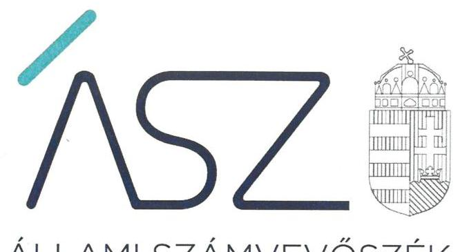
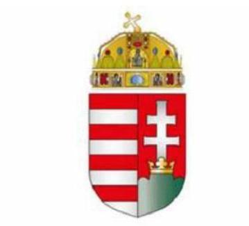

ÁLLAMI SZÁMVEVŐSZÉK

# JELENTÉS 

A költségvetési szervek irányítói, tulajdonosi feladatai ellátásának ellenőrzése

Honvédelmi Minisztérium
2021.

21074
www.asz.hu

---

ÁLLAMI SZÁMVEVŐSZÉK

# JELENTÉS 

A költségvetési szervek irányítói, tulajdonosi feladatai ellátásának ellenőrzése

Honvédelmi Minisztérium
2021. 08. hó 17. nap

21074
www.asz.hu

---

# AZ ELLENŐRZÉST FELÜGYELTE: 

MAKKAI MÁRIA felügyeleti vezető

## AZ ELLENŐRZÉST VEZETTE ÉS A VÉGREHAJTÁSÁÉRT FELELŐS:

BAJNAI ZSUZSANNA ellenőrzésvezető
JANIK JÓZSEF ellenőrzésvezető

A PROGRAM ÖSSZEÁLLÍTÁSÁÉRT FELELŐS:
DÁM-POLYÁK ORSOLYA projektvezető

IKTATÓSZÁM: EL-3334-001/2021
TÉMASZÁM: 2550
ELLENŐRZÉS-AZONOSÍTÓ SZÁM: V089402

---

# TARTALOMJEGYZÉK 

■ ÖSSZEGZÉS ..... 5
■ AZ ELLENŐRZÉS CÉLJA ..... 6
■ AZ ELLENŐRZÉS TERÜLETE ..... 7
■ AZ ELLENŐRZÉS HÁTTERE, INDOKOLTSÁGA ..... 8
■ A JELENTÉS LÉNYEGES KÉRDÉSKÖREI ..... 9
■ AZ ELLENŐRZÉS HATÓKÖRE ÉS MÓDSZEREI ..... 10
■ MEGÁLLAPÍTÁSOK ..... 12
■ MELLÉKLETEK ..... 15
I. sz. melléklet: Értelmező szótár ..... 15
■ FÜGGELÉK: ÉSZREVÉTELEK ..... 17
■ RÖVIDÍTÉSEK JEGYZÉKE ..... 19

---

.

---

# ÖSSZEGZÉS 

A Honvédelmi Minisztérium a szabályozási környezet kialakításával és a kontrolltevékenységek elvégzésével az irányítói és tulajdonosi feladatok átlátható, szabályszerű ellátását biztosította. Mindezzel hozzájárult a közpénzekkel és a nemzeti vagyonnal történő felelős, elszámoltatható gazdálkodáshoz.

## Az ellenőrzés társadalmi indokoltsága

A közfeladatok ellátásának biztosításában a minisztériumok kiemelt szerepet töltenek be. E cél megvalósítása érdekében a minisztériumok jelentős nagyságrendú költségvetési forrásokat használnak, ezáltal a gazdálkodásuk szabályszerűsége hatással van a központi költségvetés egyensúlyának fenntarthatóságára. Emellett az irányítási és tulajdonosi jogok gyakorlásán keresztül befolyásolják az állami vagyonnal való gazdálkodás minőségét, a közpénzfelhasználás szabályszerűségét, a kormányzati (szak)politikák végrehajtását, illetve a közfeladatok széleskörű ellátásán keresztül az állampolgárok életminőségét.

A minisztériumok irányító szervi, tulajdonosi feladatkörükben az államot, mint alapítót, tulajdonost képviselik. Az irányító szervi, tulajdonosi feladatok szabályszerű ellátása elősegíti az irányításuk alá tartozó intézmények, gazdasági társaságok közfeladatainak törvényes, szakszerű és hatékony ellátását. Ezzel hozzájárulnak ahhoz, hogy mind az intézményekre és gazdasági társaságokra, mind az irányító szervi feladatok ellátására fordított közpénz, valamint a rájuk bízott állami vagyon cél szerint hasznosuljon, múködésük átlátható és elszámoltatható legyen.

A minisztériumok által ellátott közfeladatok és az ezekre fordított közpénzek felhasználása szabályszerűségének biztosítása, a rájuk bízott nemzeti vagyon megőrzése alapvető társadalmi érdek. A közpénzügyek átláthatóságának előmozdítása és a közvagyon védelme érdekében indokolt a minisztériumok irányító szervi, tulajdonosi feladatellátásának ellenőrzése.

## Főbb megállapítások, következtetések

A Honvédelmi Minisztérium irányítási feladatellátásra és tulajdonosi joggyakorlásra vonatkozó kontrollkörnyezetének kialakítása a jogszabályi követelményekkel összhangban történt, az előírások szerinti szervezeti és folyamati szabályozások, ellenőrzési nyomvonalak rendelkezésre álltak. A feladatellátást szabályszerűen kialakított integrált kockázatkezelési rendszer, információs és kommunikációs rendszer, valamint monitoring rendszer támogatta.

Az irányító szervi, illetve tulajdonosi érdekek, követelmények érvényesülését szabályszerűen végzett kontrolltevékenységek biztosították.

A Honvédelmi Minisztérium az általa irányított költségvetési szervek vonatkozásában irányítási feladatait szabályszerűen látta el, a gazdasági társaságokat érintő tulajdonosi joggyakorláshoz kapcsolódó feladatai ellátása során a jogszabályi előírásoknak megfelelően járt el. Mindezzel hozzájárult a rá bízott közpénzek szabályszerű, átlátható és elszámoltatható felhasználásához, és a nemzeti vagyon megóvásához, felelős hasznosításához.

---

# AZ ELLENŐRZÉS CÉLJA 

AZ ELLENŐRZÉS CÉLJA annak értékelése, hogy az irányítói és tulajdonosi tevékenység belső kontrollrendszerének kialakítása és a kontrolltevékenységek gyakorlása szabályszerű volt-e, biztosította-e az irányítói és tulajdonosi feladatok átlátható, szabályszerű és eredményes ellátását. Az ellenőrzés értékeli, hogy adottak-e az irányítási, tulajdonosi tevékenységgel kapcsolatosan a teljesítmény mérés feltételei.

---

# **Az Ellenőrzés Területe**

## **Honvédelmi Minisztérium**

A Honvédelmi Minisztériumot a független felelős minisztérium alakításáról szóló 1848. évi III. törvénycikk 14. § g) pontja alapján 1848. április 11-én alapították. Átalakítására, megszüntetésére az Országgyűlés jogosult.

Közfeladatai közé tartozik a Magyarország katonai védelemre történő felkészítésének tervezésével, szervezésével kapcsolatos központi közigazgatási feladatok, az állam komplex védelmi célú hatósági, szakhatósági feladatainak ellátása, valamint a Magyar Honvédség irányítása, emellett a fegyverzet-ellenőrzéssel összefüggő, továbbá a bizalom- és biztonságerősítő intézkedésekkel kapcsolatos feladatok ellátása, a katonai, honvédelmi emlékek ápolása, emlékhelyek gondozása.

A Honvédelmi Minisztérium a 2019. évben a Magyar Honvédség Parancsnoksága középirányítása alá tartozókon kívül tíz költségvetési szerv felett gyakorolt közvetlen irányítási jogkört, ezek között a tábori lelkészi szolgálatok éppúgy megtalálhatók, mint a HM Hadtörténeti Intézet és Múzeum, valamint a Kratochvil Károly Honvéd Középiskola és Kollégium. Tulajdonosi jogkörgyakorló hat gazdasági társaság esetében volt a Honvédelmi Minisztérium, amelyek haditechnikai, térképészeti, logisztikai és vagyonkezelési területeken működtek. A 2019. évben két költségvetési szervet alapítottak, a Magyar Honvédség Parancsnokságát és a Magyar Honvédség Modernizációs Intézetet, költségvetési szerv megszüntetésére nem került sor.

A Honvédelmi Minisztérium vezetője a honvédelmi miniszter, akit a miniszterelnök javaslatára a köztársasági elnök nevez ki. A nemzetbiztonsági szolgálatokról szóló 1995. évi CXXV. törvény rendelkezései alapján a Kormány a honvédelmi miniszter útján irányítja a Katonai Nemzetbiztonsági Szolgálatot.

---

# AZ ELLENŐRZÉS HÁTTERE, INDOKOLTSÁGA 

A belső kontrollrendszer szabályszerű kialakítása és működtetése a közpénzek, a közvagyon átlátható, szabályos, gazdaságos, hatékony és eredményes felhasználásának alapfeltétele. A belső kontrollrendszer azt a célt szolgálja, hogy a költségvetési szervek múködésük és gazdálkodásuk során a tevékenységeket szabályszerűen hajtsák végre, teljesítsék elszámolási kötelezettségeiket és megvédjék az erőforrásokat a veszteségektől, a károktól és a nem rendeltetésszerű használattól. A belső kontrollrendszer magában foglalja mindazon elveket, eljárásokat és belső szabályzatokat, amelyek biztosítják, hogy a költségvetési szerv múködése szabályszerű és szabályozott legyen, valamennyi tevékenysége és célja összhangban álljon a gazdaságosság, hatékonyság és eredményesség követelményeivel, az eszközökkel és forrásokkal való gazdálkodásban ne kerüljön sor pazarlásra, visszaélésre, rendeltetésellenes felhasználásra. A teljesítménykövetelmények meghatározása és múködtetése megalapozhatja a központi költségvetési szervnél a teljesítmény-ellenőrzés lefolytatását.

A minisztériumok irányító szervi feladatellátását az ÁSZ ${ }^{1}$ folyamatosan figyelemmel kíséri és rendszeresen ellenőrzi. Az ellenőrzés kiemelt fókusza annak megítélése, hogy az irányítói, tulajdonosi funkciókat ellátó költségvetési szervek, szervezeti egységek miként alakították ki és múködtették a közszolgáltatások biztosításához elengedhetetlen irányítói, tulajdonosi feladatok gyakorlati megvalósításának rendszerét és annak ellenőrzését. Az irányítói, tulajdonosi feladatokat ellátó szervezetek ellenőrzésével az ÁSZ hozzájárul a teljes intézményrendszer feladatellátása, gazdálkodása szabályszerűségének, eredményességének és hatékonyságának javításához.

---

# A JELENTÉS LÉNYEGES KÉRDÉSKÖREI 

1. Szabályszerú volt-e a minisztérium irányítási feladatellátással és tulajdonosi joggyakorlással kapcsolatos belső kontrollrendszere egyes pilléreinek kialakítása?
2. Szabályszerú volt-e a minisztériumnál az irányítási feladatellátással és tulajdonosi joggyakorlással kapcsolatos kontrolltevékenységek végrehajtása?
3. Alakitottak-e ki a minisztériumnál a teljesítmény mérésére alkalmas követelményeket az irányítási és tulajdonosi tevékenységek eredményessége vonatkozásában?

---

# AZ ELLENŐRZÉS HATÓKÖRE ÉS MÓDSZEREI 

## Az ellenőrzés típusa

Megfelelőségi ellenőrzés.

## Az ellenőrzött időszak

A 2019. év.

## Az ellenőrzés tárgya

Az irányítási, tulajdonosi feladatok ellátása folyamatának szabályozása, a belső kontrollrendszer kialakítása és a kontrolltevékenységek működtetése az irányítási és tulajdonosi feladatellátás vonatkozásában, a teljesítmény mérés feltételeinek kialakítása.

## Az ellenőrzött szervezet

Honvédelmi Minisztérium

## Az ellenőrzés jogalapja

Az ellenőrzés jogszabályi alapját az ÁSZ tv. ${ }^{2} 1 . \S$ (3) bekezdése, az 5. § (2) és (6) bekezdésének előírásai, valamint az Áht. ${ }^{3} 61 . \S$ (2) bekezdésének előírásai képezték.

## Az ellenőrzés módszerei

Az ellenőrzést az ÁSZ az ellenőrzési program szempontjai, kérdései, az ellenőrzött időszakban hatályos jogszabályok alapján, a nemzetközi standardokat irányadónak tekintve, az ellenőrzés szakmai szabályok és módszertanok figyelembevételével végzi.

Az ellenőrzés ideje alatt az ellenőrzött szervezettel a kapcsolattartás az ÁSZ SZMSZ4-ének vonatkozó előírásai alapján történik.

Az ellenőrzési kérdések megválaszolásához szükséges bizonyítékok megszerzésére az ellenőrzött szervezet által rendelkezésre bocsátott dokumentumokra, adatokra alapozva megfigyelés, szemle (szemrevételezés), kérdésfeltevés (információkérés), interjú, egyszerű véletlen mintavételi eljárással történő mintavételezés, valamint elemző eljárás útján kerül sor.

---

Az ellenőrzési bizonyítékként felhasználható adatforrások közé tartoznak egyrészt a szakmai program részletes szempontjainál felsorolt adatforrások, másrészt minden - az ellenőrzés folyamán feltárt, az ellenőrzés szempontjából információt tartalmazó - dokumentum.

Az ellenőrzés lefolytatásához az ellenőrzött szervezet a tanúsítvány kitöltésével, hitelesítésével és az ÁSZ által kért dokumentumok megküldésével szolgáltat adatokat.

Az ÁSZ statisztikai módszereken alapuló mintavételt alkalmaz az irányítási feladatellátáshoz és a tulajdonosi joggyakorláshoz kapcsolódó kontrolltevékenységek szabályszerűségének megítélése érdekében.

Az irányító szerv irányítási kontroll-tevékenysége szabályszerűségének vizsgálata az általa 2019. évben alapított és megszüntetett költségvetési szervek vonatkozásában teljes körű ellenőrzéssel történik. Az irányító szerv tulajdonosi joggyakorlása, valamint irányítási kontroll-tevékenysége szabályszerűségének vizsgálata az alá tartozó gazdasági társaságok, valamint költségvetési szervek vonatkozásában egyszerű véletlen mintavétellel történik. A vizsgált terület „szabályszerü", ha a minta ellenőrzésének eredménye alapján 95\%-os bizonyossággal a teljes sokaságban az átlagos hibaarány nem haladja meg a 10\%-ot, „nem szabályszerű", ha nagyobb, mint 10\%. Abban az esetben, ha a teljes sokaság tekintetében a 10\%-os hibaarányhoz való viszony megítélésének megbízhatósága nem éri el a 95\%-ot, „szabályszerű" minősítést kap a terület, ha a minta alapján a teljes sokaság vonatkozásában a 10\% alatti hibaarány előfordulásának nagyobb a valószínűsége, „nem szabályszerű" minősítést, ha a 10\% felettinek. Amennyiben a sokaság elemszáma nem haladja meg az előírt minta elemszámot, a sokaság valamennyi elemének tételes ellenőrzésére kerül sor.

---

# 1. Szabályszerú volt-e a minisztérium irányítási feladatellátással és tulajdonosi joggyakorlással kapcsolatos belső kontrollrendszere egyes pilléreinek kialakítása? 

Összegző megállapítás

A Honvédelmi Minisztérium irányítási feladatellátással és tulajdonosi joggyakorlással kapcsolatos kontrollkörnyezetének, integrált kockázatkezelési, információs és kommunikációs, valamint monitoring rendszerének kialakítása szabályszerű volt.

A KONTROLLKÖRNYEZET keretében a Honvédelmi Minisztérium szervezeti és müködési szabályzata tartalmazta az irányítási és tulajdonosi joggyakorlás szervezeti felépítését és müködési rendjét. Az irányítási, illetve a gazdasági társaságokra vonatkozó tulajdonosi joggyakorlással összefüggő feladatokban érintett szervezeti egységek ügyrendjében az Ávr. ${ }^{5}$ előírásaival összhangban rögzítették az ellátott feladatokat, a munkafolyamatok leírását, továbbá a szervezeti egységek vezetőinek és alkalmazottainak feladat- és hatáskörét. Az ellenőrzési nyomvonalakat a Bkr. ${ }^{6}$ előírásai szerint alakították ki.

AZ INTEGRÁLT KOCKÁZATKEZELÉSI RENDSZER az irányítási és tulajdonosi feladatellátás vonatkozásában a Bkr. előírásai szerint biztosította a szervezet kockázatainak azonosítását, értékelését, nyomon követését.

AZ INFORMÁCIÓS ÉS KOMMUNIKÁCIÓS RENDSZER keretében az információ áramlás rendjét, az információkezelés szabályait kialakították, a közérdekú adatok megismerésére irányuló igények teljesítésének és a kötelezően közzéteendő adatok nyilvánosságra hozatalának rendjét az Ávr. előírásainak érvényesítésével szabályozták. Az adatvédelmi és adatbiztonsági szabályokat az Info tv. ${ }^{7}$-ben foglaltakkal összhangban határozták meg.

A MONITORING RENDSZER keretében meghatározták az irányítási hatáskör és a tulajdonosi jogok gyakorlásának folyamatos és eseti nyomon követéséhez kapcsolódó felelősségi és információs szinteket, kapcsolatokat, az irányítási és ellenőrzési folyamatokat. A nyomon követési rendszer részeként a belső ellenőrzést a Bkr. előírásai alapján kialakították, feladatait meghatározták. Az éves belső ellenőrzési terv mind az irányítási, mind a tulajdonosi feladatellátás vonatkozásában tartalmazott ellenőrzési feladatot.

---

# 2. Szabályszerű volt-e a minisztériumnál az irányítási feladatellátással és tulajdonosi joggyakorlással kapcsolatos kontrolltevékenységek végrehajtása? 

Összegző megállapítás

A Honvédelmi Minisztériumnál az irányítási feladatellátással és tulajdonosi joggyakorlással kapcsolatos kontrolltevékenységek végrehajtása szabályszerű volt.

A Honvédelmi Minisztérium a költségvetési szervek alapítása során szabályszerűen járt el, a 2019-ben alapított szervezetek alapító okiratainak tartalma az Áht. és az Ávr. követelményeivel összhangban állt.

Az irányítási feladatellátással kapcsolatos kontrolltevékenységeket szabályszerűen végezték el, az irányított szervezetek vezetői felett a munkáltatói jogkörök gyakorlása az Áht. előírásai szerint történt, az egyéb irányítási és ellenőrzési jogosultságokat a feladattal és hatáskörrel rendelkezők az Áht., az Ávr. és a Bkr. előírásaival összhangban gyakorolták.

A gazdasági társaságok feletti tulajdonosi jogok gyakorlásához kapcsolódó kontrolltevékenységek során a Ptk. ${ }^{8}$ előírásai szerint meghozták a gazdasági társaságok alapvető személyi kérdéseire vonatkozó tulajdonosi döntéseket, gondoskodtak a gazdasági társaságok könyvvizsgálójának megválasztásáról, a könyvvizsgálóval megkötésre kerülő szerződéshez kapcsolódó feltételek meghatározásáról, valamint az állami vagyont használó, vagyonkezelő, vagy haszonélvező gazdasági társaságoknál a tulajdonosi joggyakorló részére a Vtvr. ${ }^{9}$ előírásai szerinti ellenőrzési kötelezettségének teljesítéséhez szükséges jogosultságok biztosításáról.

## 3. Alakítottak-e ki a minisztériumnál a teljesítmény mérésére alkalmas követelményeket az irányítási és tulajdonosi tevékenységek eredményessége vonatkozásában?

Összegző megállapítás

A Honvédelmi Minisztériumnál az irányítási tevékenységek vonatkozásában meghatároztak szervezeti célokat, a tulajdonosi tevékenységek eredményessége vonatkozásában kialakítottak a teljesítmény mérésére alkalmas követelményeket.

A Honvédelmi Minisztériumnál az irányított szervezetek számára meghatároztak irányadó célokat, a tevékenységük során teljesítendő kritériumokat. A célok teljesülése kapcsán a mérhetőség biztosítása érdekében az irányítási feladatellátás keretében további intézkedések szükségesek.

A tulajdonosi joggyakorlással érintett gazdasági társaságok tekintetében a Honvédelmi Minisztérium a Bkr. rendelkezéseinek érvényesítése érdekében kialakított a rendelkezésre álló források eredményes felhasználására vonatkozó, a teljesítmény mérésére alkalmas követelményeket.

---

.

---

# MELLÉKLETEK 

- I. SZ. MELLÉKLET: ÉRTELMEZŐ SZÓTÁR
belső ellenőrzés
belső kontrollrendszer
irányító szerv
integrált kockázatkezelési rendszer
monitoring rendszer

Független, tárgyilagos bizonyosságot adó és tanácsadó tevékenység, amelynek célja, hogy az ellenőrzött szervezet működését fejlessze és eredményességét növelje, az ellenőrzött szervezet céljai elérése érdekében rendszerszemléletű megközelítéssel és módszeresen értékeli, illetve fejleszti az ellenőrzött szervezet irányítási és belső kontrollrendszerének hatékonyságát. (Forrás: Bkr. 2. § b) pontja)
A kockázatok kezelése és tárgyilagos bizonyosság megszerzése érdekében kialakított folyamatrendszer, amely azt a célt szolgálja, hogy a müködés és gazdálkodás során a tevékenységeket szabályszerűen, gazdaságosan, hatékonyan, eredményesen hajtsák végre, az elszámolási kötelezettségeket teljesítsék, megvédjék az erőforrásokat a veszteségektől, károktól és nem rendeltetésszerű használattól. (Forrás: Áht. 69. § (1) bekezdése)
A költségvetési szerv tekintetében az Áht-ban meghatározott irányítási hatáskört gyakorló szerv. (Forrás: Áht. 1. § 9. pontja)
Olyan folyamatalapú kockázatkezelési rendszer, amely a szervezet minden tevékenységére kiterjed, egységes módszertan és eljárások alkalmazásával, a szervezet célkitűzéseinek és értékeinek figyelembevételével biztosítja a szervezet kockázatainak teljes körű azonosítását, azok meghatározott kritériumok szerinti értékelését, valamint a kockázatok kezelésére vonatkozó intézkedési terv elkészítését és az abban foglaltak nyomon követését. (Forrás: Bkr. 2. § m) pontja)
A szervezet tevékenységének, a célok megvalósításának nyomon követését biztosító rendszer, amely az operatív tevékenységek keretében megvalósuló folyamatos és eseti nyomon követésből, valamint az operatív tevékenységektől független belső ellenőrzésből állhat. (Forrás: Bkr. 10. §)

---

.

---

# FÜGGELÉK: ÉSZREVÉTELEK 

A jelentéstervezetet a Számvevőszék 15 napos észrevételezésre megküldte az ellenőrzött szervezet vezetőjének az ÁSZ tv. 29. §* (1) bekezdése előírásának megfelelően.

A Honvédelmi Minisztérium minisztere az ellenőrzés megállapításaira észrevételt nem tett.

[^0]
[^0]:    * 29. § (1) Az Állami Számvevőszék az ellenőrzési megállapításait megküldi az ellenőrzött szervezet vezetőjének vagy az általa megbízott személynek, és annak, akinek személyes felelősségét állapította meg.
    (2) Az ellenőrzött szervezet vezetője és a felelősként megjelölt személy az ellenőrzés megállapításaira tizenöt napon belül írásban észrevételt tehet.
    (3) Az Állami Számvevőszék az észrevételre a beérkezésétől számított harminc napon belül írásban válaszol. A figyelembe nem vett észrevételeket köteles a jelentésben feltüntetni, és megindokolni, hogy azokat miért nem fogadta el.

---

.

---

# RÖVIDÍTÉSEK JEGYZÉKE 

${ }^{1}$ ÁSZ
${ }^{2}$ ÁSZ tv.
${ }^{3}$ Áht.
${ }^{4}$ ÁSZ SZMSZ
${ }^{5}$ Ávr.
${ }^{6}$ Bkr.
${ }^{7}$ Info tv.
${ }^{8}$ Ptk.
${ }^{9}$ Vtvr.

Állami Számvevőszék
az Állami Számvevőszékről szóló 2011. évi LXVI. törvény
az államháztartásról szóló 2011. évi CXCV. törvény
az Állami Számvevőszék Szervezeti és Működési Szabályzata
az államháztartásról szóló törvény végrehajtásáról szóló 368/2011. (XII. 31.) Korm. rendelet
a költségvetési szervek belső kontrollrendszeréről és belső ellenőrzéséről szóló 370/2011.
(XII. 31.) Korm. rendelet
az információs önrendelkezési jogról és az információszabadságról szóló 2011. évi
CXII törvény
a Polgári Törvénykönyvről szóló 2013. évi V. törvény
az állami vagyonnal való gazdálkodásról szóló 254/2007. (X.4.) Korm. rendelet

---

# 1052 

1052 Budapest, Apáczai Cs. J. u. 10. I 1364 Budapest 4. Pf. 54 TEL: +36 14849100
email: szamvevoszek@asz.hu
web: www.asz.hu | www.aszhirportal.hu