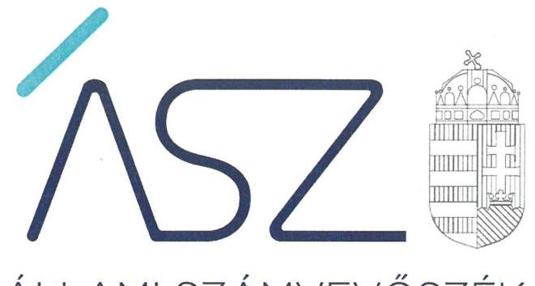

ÁLLAMI SZÁMVEVŐSZÉK

# JELENTÉS 

A központi költségvetési szervek ellenőrzése -
Vagyongazdálkodás

Egyenlő Bánásmód Hatóság
2021.

21075
www.asz.hu

---

ÁLLAMI SZÁMVEVŐSZÉK

# JELENTÉS 

A központi költségvetési szervek ellenőrzése -
Vagyongazdálkodás

Egyenlő Bánásmód Hatóság
2021. 08. hó 25. nap

21075
www.asz.hu

---

# AZ ELLENŐRZÉST VEZETTE ÉS A VÉGREHAJTÁSÁÉRT FELELŐS: 

DR. BENEDEK MÁRIA ellenőrzésvezető
NEMESVÁRI-HORTHY ESZTER ellenőrzésvezető
DORMÁN ISTVÁN ZOLTÁN ellenőrzésvezető

A PROGRAM ÖSSZEÁLLÍTÁSÁÉRT FELELŐS:
GÖRGÉNYI GÁBOR osztályvezető

IKTATÓSZÁM: EL-3343-001/2021.
TÉMASZÁM: 2549
ELLENŐRZÉS-AZONOSÍTÓ SZÁM: V089318
Jelentéseink az Országgyúlés számítógépes hálózatán és az interneten a www.asz.hu címen is olvashatóak.

---

# TARTALOMJEGYZÉK 

■ ÖSSZEGZÉS ..... 5
■ AZ ELLENŐRZÉS CÉLJA ..... 7
■ AZ ELLENŐRZÉS TERÜLETE ..... 8
■ AZ ELLENŐRZÉS HÁTTERE, INDOKOLTSÁGA ..... 9
■ A JELENTÉS LÉNYEGES KÉRDÉSKÖREI ..... 10
■ AZ ELLENŐRZÉS HATÓKÖRE ÉS MÓDSZEREI ..... 11
■ MEGÁLLAPÍTÁSOK ..... 13
■ MELLÉKLETEK ..... 15
I. sz. melléklet: Értelmező szótár ..... 15
■ FÜGGELÉK: ÉSZREVÉTELEK ..... 17
■ RÖVIDÍTÉSEK JEGYZÉKE ..... 19

---

.

---

# ÖSSZEGZÉS 

Az Egyenlő Bánásmód Hatóság a nemzeti vagyon értékének megőrzését, a vagyon védelmét és a vagyonnal való elszámoltathatóságot nem biztosította.
Az Állami Számvevőszék kezdeményezésére az ellenőrzött időszakot követően az Egyenlő Bánásmód Hatóság feladatait átvevő jogutód Alapvető Jogok Biztosa Hivatalának vezetőjeként az alapvető jogok biztosa intézkedéseket tett, amivel a gazdálkodásban rejlő kockázatokat csökkentette, a közpénzügyi helyzet jelentősen javult.

## Az ellenőrzés társadalmi indokoltsága

Az államháztartás központi alrendszerébe tartozó szervezet vagyona a nemzeti vagyon része. Magyarország Alaptörvénye rögzíti, hogy a vagyonnal való gazdálkodás célja a közérdek szolgálata. Előírja továbbá, hogy minden közpénzekkel gazdálkodó szervezet köteles a nyilvánosság előtt elszámolni a közpénzekre vonatkozó gazdálkodásával. A közpénzeket és a nemzeti vagyont az átláthatóság és a közélet tisztaságának elve szerint kell kezelni. A közpénzügyek átláthatóságának előmozdítása, a közvagyon védelme, a korrupció elleni védettség érdekében indokolt az államháztartás központi alrendszerébe tartozó szervezetek ellenőrzése.

A központi költségvetés alrendszerében zajló folyamatok holisztikus elemzéseivel, a kockázatelemzéssel kiválasztott szervezetek célzott ellenőrzéseivel az Állami Számvevőszék betölti a legfőbb gazdasági ellenőrző szerv küldetését. Az egyes ellenőrzések megállapításaival és egy időszak ellenőrzési eredményeinek elemzésével az Állami Számvevőszék ráirányíthatja a jogalkotók figyelmét a központi alrendszerben esetlegesen felmerülő pénzügyi, szabályozási feszültségekre. Az elvégzett ellenőrzések során az Állami Számvevőszék „jó gyakorlatokat" is azonosíthat, amelyeket tanácsadó funkciója keretében szélesebb körben is megismertethet az érintettekkel, ezáltal is hozzájárulva a költségvetési rendszer szabályozott, átlátható, kiegyensúlyozott és fenntartható működéséhez.

## Főbb megállapítások, következtetések

Az Egyenlő Bánásmód Hatóság 2017-2019. évi nemzeti vagyonnal való gazdálkodása értékelésének eredményét az 1. ábra szemlélteti.

1. ábra

| A vagyongazdálkodás értékelése az Egyenlő   Bánásmód Hatóságnál   2017-2019. |  |  |  |
| :--: | :--: | :--: | :--: |
| Értékelés | 2017. | 2018. | 2019. |
| Vagyongazdálkodás   szabályozottsága | Nem   szabályszerű | Nem   szabályszerű | Nem   szabályszerű |
| Nemzeti vagyon védelme | - | - | Nem   szabályszerű |
| Nemzeti vagyon kimutatása | Szabályszerű | Szabályszerű | Nem   szabályszerű |
| Teljesítménykövetelmények   kialakítása | Nem   dokumentált | Nem   dokumentált | Nem   dokumentált |

Forrás: ÁSZ szerkesztés ellenőrzési megállapítások alapján

---

Az Egyenlő Bánásmód Hatóság számviteli politikája, valamint számlarendje tartalmilag nem felelt meg a jogszabályi rendelkezéseknek, mert a jogszabályok által kötelezően előírt szabályozandó tárgykörökről nem tartalmaztak rendelkezéseket. A számviteli politikában nem kerültek rögzítésre azok a szabályok, hogy a számviteli elszámolás szempontjából mit tekint lényegesnek, nem lényegesnek, jelentősnek és nem jelentősnek, amelyek meghatározása nélkül a könyvvezetés és beszámoló elkészítése során a számviteli alapelvek érvényesülése, megfelelő végrehajtása kerül veszélybe. A számlarend kötelező tartalmi elemeinek hiánya a számviteli alapelveknek megfelelő könyvvezetést, beszámoló készítést akadályozza. A számlarend elkészítése alapozza meg az Egyenlő Bánásmód Hatóság sajátosságaihoz igazodó, szabályszerű könyvvezetést, illetve a pénzügyi és vagyoni helyzetről a megbízható és valós összképet mutató költségvetési beszámoló elkészítését. A jogszabályi előírásokat megsértve az eszköz- és készletgazdálkodás szabályai nem kerültek rögzítésre belső szabályzatban. Mindezek alapján a jogszabályi rendelkezéseknek megfelelő könyvvezetéshez és beszámoló elkészítéséhez szükséges alapvető szabályozási keretek, a vagyonnal való felelős és szabályszerű gazdálkodás feltételei nem voltak biztosítottak. Mindezen hiányosságok következtében a 2017-2019. évben az Egyenlő Bánásmód Hatóság nem biztosította a vagyon szabályszerű nyilvántartása, számbevétele és védelme érdekében szükséges szabályozási kereteket, a szabályszerű könyvvezetés és a vagyongazdálkodás alapvető feltételei nem álltak fenn.

A 2019. évben a vagyon védelme és kimutatása nem volt biztosított, mivel az Egyenlő Bánásmód Hatóság törvényi előírás ellenére a vagyoncsökkenésről nem állított ki számviteli bizonylatot. A Számvitelről szóló törvény általános alaptételként rögzíti, hogy minden gazdasági műveletről, eseményről, amely az eszközök, illetve az eszközök forrásának állományát vagy összetételét megváltoztatja, bizonylatot kell kiállítani. Amennyiben a gazdasági eseményről nem állítanak ki bizonylatot, a számviteli alapelvek, kiemelten a valódiság és a teljesség számviteli alapelve szerinti könyvvezetés és beszámoló készítés akadályozott. Az Egyenlő Bánásmód Hatóság a 2017-2018. évben a vagyon kimutatását szabályszerűen biztosította, a mérleg tételeit leltárral alátámasztotta.

Az Egyenlő Bánásmód Hatóság a feltárt hiányosságok következtében a nemzeti vagyon értékének megőrzése, a vagyon védelme és a vagyonnal való elszámoltathatóság alaptörvényi követelményeit nem biztosította. Az Állami Számvevőszék ellenőrzése keretében feltárt hiányosságok igazolják, hogy az Egyenlő Bánásmód Hatóság átszervezésére tett intézkedések indokoltak voltak.

Az Állami Számvevőszék az ellenőrzés során feltárt jogszabálysértő gyakorlat megszüntetése érdekében figyelemfelhívó levéllel fordult az Egyenlő Bánásmód Hatóság feladatait átvevő jogutód Alapvető Jogok Biztosa Hivatalának vezetőjeként az alapvető jogok biztosa felé, és a figyelemfelhívással lehetőséget biztosított arra, hogy az ellenőrzött időszakot követően biztosítsa a szabályszerű működést és gazdálkodást és erről az Állami Számvevőszék elnökét értesítse. A feltárt jogszabálysértő gyakorlatokkal kapcsolatban, a figyelemfelhívó levélre küldött értesítésben foglaltak alapján az Állami Számvevőszék az alábbi következtetést vonta le.

Az ellenőrzött időszakot követően az Egyenlő Bánásmód Hatóság jogutód szervezetének vezetőjeként az alapvető jogok biztosa lépéseket tett a feltárt jogszabálysértő gyakorlatok, szabálytalanságok megszüntetésére. Az általa jelzett intézkedéseket figyelembe véve csökkentek a kockázatok a nemzeti vagyon értékének megőrzésére, a vagyon védelmére és a vagyonnal való gazdálkodás elszámoltathatóságára és átláthatóságára vonatkozóan az ellenőrzött időszakot követően. Így a rendeltetésellenes gazdálkodás kockázata alacsony és a közpénzügyi helyzet jelentősen javult. Az Egyenlő Bánásmód Hatóság jogutód szervezeténél az átlátható és elszámoltatható pénzügyi és vagyongazdálkodás jövőbeni fenntartása akkor biztosítható, ha az alapvető jogok biztosa által jelzett intézkedések érvényesülnek a szervezet működésében és gazdálkodásában, továbbá kezeli a működéshez, a gazdálkodáshoz kapcsolódó jogszabályok és a kialakított belső szabályozások betartásához kapcsolódó kockázatokat.

---

# AZ ELLENŐRZÉS CÉLJA 

AZ ELLENŐRZÉS CÉLJA annak megállapítása volt, hogy a központi költségvetési szerv a jó gazda gondosságával biztosította-e a nemzeti vagyon értékének megőrzését, védelmét és szabályszerű kezelését. Az államháztartás központi alrendszerébe tartozó szervezet vagyongazdálkodása elszámoltatható volt-e és megfelelte annak az Alaptörvényben ${ }^{1}$ meghatározott alapvetésnek, hogy Magyarország a kiegyensúlyozott, átlátható és fenntartható költségvetési gazdálkodás elvét érvényesíti.

---

# **AZ ELLENŐRZÉS TERÜLETE**

## **Egyenlő Bánásmód Hatóság**

### **AZ EGYENLŐ BÁNÁSMÓD HATÓSÁG**

2005. január 1-jével létrejött gazdasági szervezettel rendelkező költségvetési szerv, amely az Országgyűlés költségvetési fejezeten belül önálló címet képezett.

### **KÖZFELADATÁT**

a 2003. évi CXXV. törvény2 határozta meg. Feladatát képezte kérelem alapján, illetve hivatalból vizsgálatot folytatni annak megállapítására, hogy megsértették-e az egyenlő bánásmód követelményét, valamint kérelem alapján vizsgálatot folytatni, hogy az arra kötelezett munkáltatók elfogadtak-e esélyegyenlőségi tervet. A közérdekű igényérvényesítés joga alapján pert indíthatott a jogaikban sértett személyek és csoportok jogainak védelmében. Véleményezési joga az egyenlő bánásmódot érintő jogszabályok, közjogi szervezetszabályozó eszközök és jelentések tervezeteire, javaslattételi joga az egyenlő bánásmódot érintő kormányzati döntésekre, jogi szabályozásra terjedt ki. Az egyenlő bánásmód megsértése elleni fellépés körében feladatát képezte az érintettek számára segítséget nyújtani és folyamatos tájékoztatást adni. Az egyenlő bánásmód érvényesülésével kapcsolatos helyzetről rendszeres tájékoztatási kötelezettsége volt a közvélemény és az Országgyűlés felé. Az egyenlő bánásmód követelményével kapcsolatban nemzetközi szervezetek, így különösen az Európai Tanács számára készülő kormányzati jelentések, továbbá az Európai Unió Bizottsága számára az egyenlő bánásmódra vonatkozó irányelvek harmonizációjáról szóló jelentések elkészítésében közreműködött.

### **AZ EGYENLŐ BÁNÁSMÓD KÖVETELMÉNYE HATÉKONYABB ÉRVÉNYESÍTÉSE ÉRDEKÉBEN**

a 2020. évi CXXVII. törvény3 előírása alapján az Egyenlő Bánásmód Hatóság feladatait az Alapvető Jogok Biztosának Hivatala vette át 2021. január 1-jétől. Az Egyenlő Bánásmód Hatóság az Áht.4 11. § (3) bekezdése alapján 2020. december 31-ével megszűnt és általános jogutódlással beolvadt az Alapvető Jogok Biztosna Hivatalába.

---

# AZ ELLENŐRZÉS HÁTTERE, INDOKOLTSÁGA 

Az államháztartás központi alrendszerébe tartozó szervezet vagyona a nemzeti vagyon része, mellyel történő gazdálkodás a közérdek szolgálata érdekében történik. Az ÁSZ³ ellenőrzi az éves költségvetési törvény végrehajtását, majd az ellenőrzés során feltárt kockázatok és a terület folyamatos kockázatelemzésével beazonosított kockázatok kezelése érdekében ráépülő ellenőrzésekkel ellenőrzi a költségvetési szervek gazdálkodását, működését. Ezáltal az ellenőrzések megállapításaival támogatja az ellenőrzött szervezetek szabályszerű gazdálkodását, javaslataival elősegíti az Alaptörvényben megfogalmazott alapvetések érvényesülését a mindennapi életben a szervezetek szintjén. A központi költségvetés rendszerében zajló folyamatok holisztikus elemzései, a kockázatok folyamatos figyelemmel kísérésének módszerével, az így kiválasztott szervezetek célzott, hatékony ellenőrzéseivel az ÁSZ betölti a legfőbb gazdasági ellenőrző szerv küldetését. Az egyes ellenőrzések megállapításaival és egy időszak ellenőrzési eredményeinek elemzésével az ÁSZ ráirányíthatja a jogalkotók figyelmét a központi alrendszerben vagy annak egy ágazatában esetlegesen felmerülő vagyongazdálkodási, szabályozási feszültségekre.

---

# A JELENTÉS LÉNYEGES KÉRDÉSKÖREI 

1.     - Biztosított volt-e a vagyongazdálkodás szabályozottsága?
2.     - A központi költségvetési szerv vagyonnal való gazdálkodása során biztosította-e a nemzeti vagyon védelmét? A nemzeti vagyon nyilvántartását és kimutatását a valóságnak megfelelő módon, szabályszerűen végezték-e?
3.     - A központi költségvetési szervnél a szervezeti teljesítmény mérés feltételeit kialakították-e?

---

# AZ ELLENŐRZÉS HATÓKÖRE ÉS MÓDSZEREI 

## Az ellenőrzés típusa

Megfelelőségi ellenőrzés.

## Az ellenőrzött időszak

2017-2019. évek

## Az ellenőrzés tárgya

A központi költségvetési szerv vagyongazdálkodási feltételeinek kialakítása, annak szabályszerűsége, az elszámoltathatóság biztosítása a szabályozás szintjén. Az intézménynél hozott vagyonváltozást eredményező döntések, a vagyonban bekövetkezett változások végrehajtásának, elszámolásának szabályszerűsége. Az intézmény könyveiben, mérlegében kimutatott nemzeti vagyon nyilvántartásának szabályszerűsége, vagyon kimutatása, értékelése és a mérleg leltárral való alátámasztásának szabályszerűsége.

## Az ellenőrzött szervezet

Egyenlő Bánásmód Hatóság

## Az ellenőrzés jogalapja

Az ellenőrzés jogszabályi alapját az ÁSZ tv. ${ }^{6} 1. \S$ (3) bekezdés, 5. § (2)-(3) és a (6) bekezdései, valamint az Áht. 61. § (2) bekezdésének előírásai képezték.

## Az ellenőrzés módszerei

Az ÁSZ az ellenőrzést az ellenőrzési program szempontjai, az ellenőrzött időszakban hatályos jogszabályok, az ellenőrzés szakmai szabályai, a jelen ellenőrzésre irányadó ÁSZ módszertanok figyelembevételével hajtja végre. Az ellenőrzési kérdések megválaszolásához szükséges bizonyítékok megszerzése az ellenőrzött szervezet által rendelkezésre bocsátott dokumentumokra és adatokra alapozva, továbbá megfigyelés, szemle (szemrevételezés), kérdésfeltevés (információkérés), érték alapján szűkített, lényeges sokaságon végrehajtott mintavétellel, valamint elemző eljáráson útján törté-

---

nik. Az ellenőrzési bizonyítékként felhasználható adatforrások közé tartoznak az ellenőrzési program részletes szempontjainál felsorolt adatforrások, valamint minden egyéb - az
 ellenőrzés folyamán feltárt, az ellenőrzés szempontjából információt tartalmazó dokumentum. Az ellenőrzés lefolytatásához az ellenőrzött szervezet tanúsítványok kitöltésével, valamint az ÁSZ által kért dokumentumok megküldésével szolgáltat adatokat, amelyekről az ellenőrzött szervezet vezetője teljességi és hitelességi nyilatkozatot állít ki. A rendelkezésre bocsátott dokumentumok, adatok és információk kontrollja az ellenőrzés keretében történik.

A 2019. évi vagyonnövekedések és vagyoncsökkenések elszámolásának szabályszerűségét, a nemzeti vagyon nyilvántartásának és év végi értékelésének szabályszerűségét lényeges sokaságból véletlen mintavételi eljárással kiválasztott tételek alapján ellenőrzi az ÁSZ. A mintavételi sokaságok esetében a mintavétel azokra a legnagyobb értékű tételekre – a lényeges sokaságra – terjed ki, melyek összértéke eléri a teljes sokaság összértékének 50%-át. Amennyiben valamely lényeges sokaság elemszáma kisebb, mint az előírt mintaelemszám, a lényeges sokaságot tételesen ellenőrzi az ÁSZ. A mintavétellel ellenőrzött területek esetében minden egyes tétel vonatkozásában a szabályszerűségre vonatkozó kérdéseket tesz fel az ÁSZ, amelyek eredménye összesítésre kerül. „Szabályszerűnek” értékel egy ellenőrzött területet, amennyiben 95%-os bizonyossággal a lényeges sokaságban az átlagos hibaarány legfeljebb 10%, „nem szabályszerűnek”, amennyiben 10%-nál magasabb arányt képviselt. Abban az esetben, ha a lényeges sokaság tekintetében a 10%-os hibaarányhoz való viszony megítélésének megbízhatósága nem éri el a 95%-ot, annak elérése érdekében az ÁSZ az értékelést további szempontokkal egészíti ki, és figyelembe veszi a feltárt hibák értékét.

A 2020. december 31-én megszűnt Egyenlő Bánásmód Hatóság feladatait átvevő jogutód Alapvető Jogok Biztosa Hivatalának vezetőjeként az alapvető jogok biztosa számára figyelemfelhívó levél került megküldésre az ellenőrzött időszakra vonatkozó jogszabálysértő gyakorlatokról, és az ÁSZ tv. előírásával összhangban 15 nap állt rendelkezésére az ebben foglaltak elbírálására, a megfelelő intézkedések megtételére és erről az Állami Számvevőszék elnökének az értesítés megküldésére.

Az alapvető jogok biztosának a figyelemfelhívó levélre küldött értesítésében foglaltak alapján az ÁSZ értékelte az ellenőrzött időszakra vonatkozóan feltárt kockázatok vezetői kezelését. Amennyiben az ellenőrzött szerv jogutód szervezetének vezetője az ellenőrzési megállapítások alapján intézkedéseket fogalmazott meg a jogszabálysértő gyakorlat megszűntetése érdekében az ÁSZ a működés, a gazdálkodás lényeges területein korábban fennálló kockázatokról megállapította, hogy azokat csökkentette.

---

# 1. Biztosított volt-e a vagyongazdálkodás szabályozottsága? 

## Összegző megállapítás

Az EBH7 vagyongazdálkodásának szabályozottsága 2017-2019. években nem volt biztosított.

Az EBH a 2017-2019. években a Számv. tv.8 és az Áhsz.9 előírásai szerint rendelkezett Számviteli politikával10, valamint Leltározási szabályzattal11 és Értékelési szabályzattal12. Az EBH a Számviteli politikában a saját szervezetére leginkább jellemző szabályokat nem rögzítette, mivel nem határozta meg, hogy a számviteli elszámolás, az értékelés szempontjából mit tekint lényegesnek, jelentősnek, nem lényegesnek, nem jelentősnek. Ezáltal a Számv. tv. szerinti könyvvezetéshez és a beszámoló elkészítéséhez szükséges sajátos, az EBH-ra jellemző és alkalmazandó szabályokat nem határozott meg.

Az EBH a 2017-2019. évben a Számv. tv. és az Áhsz. előírásai szerint rendelkezett Számlarenddel13. A Számlarend azonban a Számv. tv.-ben szereplő kötelező tartalmi elemek közül nem tartalmazta az alkalmazásra kijelölt számlák számjelét és megnevezését és a számlarendet alátámasztó bizonylati rendet. Ezen hiányosságai következtében a számlarend nem biztosította a Számv. tv. szerinti könyvvezetés és a beszámoló készítéséhez szükséges adatok rendelkezésre állását, bizonylati alátámasztottságát.

Az EBH az Ávr.14 előírása ellenére belső szabályzatban nem rendezte az anyag- és eszközgazdálkodás számviteli politikában nem szabályozott kérdéseit.

Az EBH az Áht. és az Ávr. előírásai szerint meghatározta a gazdálkodás részletes belső rendje keretében a tervezéssel, gazdálkodással összefüggő feladatokat, hatásköröket, valamint az ellenőrzési, adatszolgáltatási és beszámolási feladatok teljesítésével kapcsolatos belső előírásokat, feltételeket, valamint a gépjárművek igénybevételének és használatának rendjét.

---

# 2. A központi költségvetési szerv vagyonnal való gazdálkodása során biztosította-e a nemzeti vagyon védelmét? A nemzeti vagyon nyilvántartását és kimutatását a valóságnak megfelelő módon, szabályszerűen végezték-e? 

Összegző megállapítás

Az EBH a vagyonnal való gazdálkodás során a nemzeti vagyon védelmét 2019. évben nem biztosította. A nemzeti vagyon kimutatását 2017-2018. évben a valóságnak megfelelő módon, szabályszerűen, 2019-ben nem szabályszerűen végezte.

AZ EBH a 2017-2019. években a gazdálkodási jogkörök gyakorlására, így különösen a kötelezettségvállalásra, teljesítés igazolásra jogosult személyekről és aláírásuk mintájáról az Ávr.-ben rögzített követelmények szerinti naprakész nyilvántartást vezette.

Az EBH a 2017-2018. években a mérlegben szereplő eszközökről és forrásokról tételes és ellenőrizhető leltárt állított össze a Számv. tv.-ben és az Áhsz.-ben foglalt előírásokkal összhangban, ezáltal biztosította a nemzeti vagyon szabályszerű kimutatását.

Az EBH-nál a vagyoncsökkenés elszámolása a 2019. évben nem volt szabályszerű, mivel a ráfordítások (selejtezés) számviteli elszámolásához (nyilvántartásához) számviteli bizonylatokat nem állítottak ki, nem készítettek. Ezáltal a vagyon kimutatása a 2019. évben nem volt szabályszerű, a vagyon védelme nem volt biztosított.

## 3. A központi költségvetési szervnél a szervezeti teljesítmény mérés feltételeit kialakították-e?

## Összegző megállapítás

Az EBH elnöke nem igazolta, hogy a szervezeti teljesítmény mérésére alkalmas követelményeket kialakított.

Az EBH elnöke az ellenőrzött időszakra dokumentáltan nem igazolta, hogy a jogszabályban előírtak szerint kiadott olyan szabályzatokat, illetve kialakított olyan a szervezeti célok elérését szolgáló feladatok, folyamatok, tevékenységek mérését szolgáló indikátorokat, mérőszámokat, feladat- és teljesítménymutatókat, és olyan folyamatokat a szervezeten belül, amelyek alkalmasak a szervezeti tevékenység teljesítményének mérésére és amelyek biztosítják a rendelkezésre álló források szabályszerű, hatékony és eredményes felhasználását.

---

# MELLÉKLETEK 

- I. SZ. MELLÉKLET: ÉRTELMEZŐ SZÓTÁR
állami vagyon
állami vagyonnak minősül:
a) az állam tulajdonában lévő dolog, valamint a dolog módjára hasznosítható természeti erő,
b) az a) pont hatálya alá nem tartozó mindazon vagyon, amely vonatkozásában törvény az állam kizárólagos tulajdonjogát nevesíti,
c) az állam tulajdonában lévő tagsági jogviszonyt megtestesítő értékpapír, illetve az államot megillető egyéb társasági részesedés,
d) az államot megillető olyan immateriális, vagyoni értékkel rendelkező jogosultság, amelyet jogszabály vagyoni értékű jogként nevesít,
e) az állam tulajdonában lévő pénzügyi eszközök.
(Forrás: Vtv.15 1. § (2) bekezdése)
állami vagyon értékesítése
állami vagyon használója
állami vagyon kezelője /vagyonkezelő
beruházás
felújítás

Állami vagyonnak bármely jogcímen történő, visszterhes átruházása. (Forrás: Vtvr.16 1. § (7) bekezdés d) pontja)
Az a természetes vagy jogi személy, jogi személyiséggel nem rendelkező szervezet, aki, vagy amely törvény vagy szerződés alapján, bármely jogcímen (bérlet, haszonbérlet, használat stb.) állami vagyont birtokol, használ, szedi annak hasznait, hasznosít, ide nem értve a haszonélvezőt, a vagyonkezelőt és a tulajdonosi jogok gyakorlóját. (Forrás: Vtvr. 1. § (7) bekezdés a) pontja)
Az állami tulajdonában álló vagyon tekintetében - a nemzeti vagyonról szóló törvényben vagyonkezelőként meghatározott azon személy, amellyel az állami vagyon vagyonkezelésére a Magyar Nemzeti Vagyonkezelő Zrt. valamint annak jogelődje, vagy az állami tulajdonosi joggyakorlója vagyonkezelési szerződést kötött, továbbá akit törvény vagyonkezelőnek kijelölt. (Forrás: Vtvr. 1. § (7) bekezdés b) pontja és az Nvtv.17 3. § 19. a) pontja)
A tárgyi eszköz beszerzése, létesítése, saját előállítása, a beszerzett tárgyi eszköz üzembe helyezése, rendeltetésszerű használatba vétele érdekében az üzembe helyezésig, a rendeltetésszerű használatba vételig végzett tevékenység, beruházás a meglevő tárgyi eszköz bővítését, rendeltetésének megváltoztatását, átalakítása, élettartamának, teljesítőképességének közvetlen növelését eredményező tevékenység is, az előbbiekben felsorolt, e tevékenységhez hozzákapcsolható egyéb tevékenységekkel együtt. (Forrás: Számv. tv. 3. § (3) bekezdés 7. pontja)
Az elhasználódott tárgyi eszköz eredeti állaga (kapacitása, pontossága) helyreállítását szolgáló, időszakonként visszatérő olyan tevékenység, amely mindenképpen azzal jár, hogy az adott eszköz élettartama megnövekszik, eredeti műszaki állapota, teljesítőképessége megközelítőleg vagy teljesen visszaáll, az előállított termékek minősége vagy az adott eszköz használata jelentősen javul és így a felújítás pótlólagos ráfordításából a jövőben gazdasági előnyök származnak; felújítás a korszerűsítés is, ha az a korszerű technika alkalmazásával a tárgyi eszköz egyes részeinek az eredetitől eltérő megoldásával vagy kicserélésével a tárgyi eszköz üzembiztonságát, teljesítőképességét, használhatóságát vagy gazdaságosságát növeli; a tárgyi eszközt akkor kell felújítani, amikor a folyamatosan, rendszeresen elvégzett karbantartás mellett a tárgyi eszköz oly mértékben elhasználódott (szerkezeti elemei elöregedtek), amely elhasználódottság már a rendeltetésszerű használatot veszélyezteti; nem felújítás az elmaradt és felhalmozódó karbantartás egyidőben való elvégzése, függetlenül a költségek nagyságától. (Forrás: Számv. tv. 3. § (4) bekezdés 8. pontja)

---

múködtetés
nemzeti vagyon
tulajdonosi joggyakorló
vagyongazdálkodás
a nemzeti vagyon birtoklásából, használatából, hasznai szedéséből, a nemzeti vagyon fenntartásából és üzemeltetéséből álló tevékenységek együttese, amely – jogszabály vagy szerződés alapján – a nemzeti vagyon felújítására, fejlesztésére, a birtoklásának, használatának hasznai szedése jogának továbbengedésére is kiterjedhet. (Forrás: Nvtv. 3. § (1) bekezdés 10. pontja)
a) az állam vagy a helyi önkormányzat kizárólagos tulajdonában álló dolgok,
b) az a) pont hatálya alá nem tartozó, az állam vagy a helyi önkormányzat tulajdonában lévő dolog,
c) az állam vagy a helyi önkormányzat tulajdonában lévő pénzügyi eszközök, továbbá az államot vagy a helyi önkormányzatot megillető társasági részesedések,
d) az államot vagy a helyi önkormányzatot megillető bármely vagyoni értékkel rendelkező jogosultság, amelyet jogszabály vagyoni értékű jogként nevesít,
e) Magyarország határa által körbezárt terület feletti légtér,
f) az üvegházhatású gázok kibocsátási egységeinek kereskedelméről szóló törvény szerinti kibocsátási egység és légiközlekedési kibocsátási egység, valamint az ENSZ Éghajlatváltozási Keretegyezménye és annak Kiotói Jegyzőkönyve végrehajtási keretrendszeréről szóló törvény szerinti kiotói egység,
g) állami vagy helyi önkormányzati fenntartású közgyűjtemény (muzeális intézmény, levéltár, közgyűjteményként működő kép- és hangarchívum, valamint könyvtár) saját gyűjteményében nyilvántartott kulturális javak körébe tartozó dolog, kivéve, ha az állami vagy önkormányzati tulajdon jogszerű létrejötte kétséget kizáró módon nem bizonyítható és a dologra nézve más a tulajdonjogát bizonyítja vagy a kulturális javakra vonatkozó jogszabályokban meghatározott eljárás keretében valószínűsíti,
h) a régészeti lelet,
i) a nemzeti adatvagyon körébe tartozó állami nyilvántartások fokozottabb védelméről szóló törvény szerinti nemzeti adatvagyon (Forrás: Nvtv. 2. § (2) bekezdés a)-i) pontok).
Aki a nemzeti vagyon felett az államot vagy a helyi önkormányzatot megillető tulajdonosi jogok és kötelezettségek összességének gyakorlására jogosult. (Forrás: Nvtv. 3. § (1) bekezdés 17. pontja)

A nemzeti vagyongazdálkodás feladata a nemzeti vagyon rendeltetésének megfelelő, az állam, az önkormányzat mindenkori teherbíró képességéhez igazodó, elsődlegesen a közfeladatok ellátásához és a mindenkori társadalmi szükségletek kielégítéséhez szükséges, egységes elveken alapuló, átlátható, hatékony és költségtakarékos működtetése, értékének megőrzése, állagának védelme, értéknövelő használata, hasznosítása, gyarapítása, továbbá az állam vagy a helyi önkormányzat feladatának ellátása szempontjából feleslegessé váló vagyontárgyak elidegenítése. (Forrás: Nvtv. 7. § (2) bekezdése)

---

# FÜGGELÉK: ÉSZREVÉTELEK 

A jelentéstervezetet a Számvevőszék 15 napos észrevételezésre megküldte az ellenőrzött szervezet vezetőjének az ÁSZ tv. 29. § (1) bekezdése előírásának megfelelően.

Az Egyenlő Bánásmód Hatóság feladatait átvevő jogutód Alapvető Jogok Biztosa Hivatalának vezetője az ellenőrzés megállapításaira nem tett észrevételt.

[^0]
[^0]:    * 29. § (1) Az Állami Számvevőszék az ellenőrzési megállapításait megküldi az ellenőrzött szervezet vezetőjének vagy az általa megbízott személynek, és annak, akinek személyes felelősségét állapította meg.
    (2) Az ellenőrzött szervezet vezetője és a felelősként megjelölt személy az ellenőrzés megállapításaira tizenöt napon belül írásban észrevételt tehet.

    (3) Az Állami Számvevőszék az észrevételre a beérkezésétől számított harminc napon belül írásban válaszol. A figyelembe nem vett észrevételeket köteles a jelentésben feltüntetni, és megindokolni, hogy azokat miért nem fogadta el.

---

.

---

# RÖVIDÍTÉSEK JEGYZÉKE 

${ }^{1}$ Alaptörvény
${ }^{2}$ 2003. évi CXXV. törvény
${ }^{3}$ 2020. évi CXXVII. törvény
${ }^{4}$ Áht.
${ }^{5}$ ÁSZ
${ }^{6}$ ÁSZ tv.
${ }^{7}$ EBH
${ }^{8}$ Számv. tv.
${ }^{9}$ Áhsz.
${ }^{10}$ Számviteli politika
${ }^{11}$ Leltározási szabályzat
${ }^{12}$ Értékelési szabályzat
${ }^{13}$ Számlarend
${ }^{14}$ Ávr.
${ }^{15} \mathrm{Vtv}$.
${ }^{16} \mathrm{Vtvr}$.
${ }^{17} \mathrm{Nvtv}$.

Magyarország Alaptörvénye (kihirdetve 2011. április 25-én, hatályos 2012. január 1-jétől)
2003. évi CXXV. törvény az egyenlő bánásmódról és az esélyegyenlőség előmozdításáról (hatályos 2004. január 27-től)
2020. évi CXXVII. törvény egyes törvényeknek az egyenlő bánásmód követelménye hatékonyabb érvényesítését biztosító módosításáról (hatályos 2021. január 1-jétől, hatálytalan 2021. január 3-tól)
2011. évi CXCV. törvény az államháztartásról (hatályos 2011. december 31-től)

Állami Számvevőszék
2011. évi LXVI. törvény az Állami Számvevőszékről (hatályos 2011. július 1-jétől)

Egyenlő Bánásmód Hatóság
2000. évi C. törvény a számvitelről (hatályos: 2001. január 1-jétől)
4/2013. (I.11.) Korm. rendelet az államháztartás számvitelről (hatályos 2014. január 1-jétől)
Egyenlő Bánásmód Hatóság EBH/308/1/2016. sz. Számviteli Politikája (hatályos 2016. március 30-tól 2017. március 30-ig) és EBH/341/1/2017. sz. Számviteli Politikája (hatályos 2017. március 31-től)
Egyenlő Bánásmód Hatóság EBH/308/1/2016. sz. Számviteli Politikája 3. sz. mellékletét képező Leltározási Szabályzata (hatályos 2016. március 30-tól 2017. március 30-ig), EBH/341/1/2017. sz. Számviteli Politikája 3. sz. mellékletét képező Leltározási Szabályzata (hatályos 2017. március 31-től)
Egyenlő Bánásmód Hatóság EBH/308/1/2016. sz. Számviteli Politikája 2. sz. mellékletét képező Értékelési Szabályzata (hatályos 2016. március 30-tól 2017. március 30-ig), EBH/341/1/2017. sz. Számviteli Politikája 2. sz. mellékletét képező Értékelési Szabályzata (hatályos 2017. március 31-től)
Egyenlő Bánásmód Hatóság EBH 389/1/2016. sz. Számlarendje (hatályos 2016. március 30-tól 2017. március 30-ig) Egyenlő Bánásmód Hatóság EBH/342/1/2017. sz. Számlarendje (hatályos 2017. március 31-től)
368/2011. (XII. 31.) Korm. rendelet az államháztartásról szóló törvény végrehajtásáról (hatályos 2012. január 1-jétől)
2007. évi CVI. törvény - az állami vagyonról (hatályos 2007. szeptember 25-től) 254/2007. (X. 4.) Kormányrendelet az állami vagyonnal való gazdálkodásról (hatályos 2007. október 4-től)
2011. évi CXCVI. törvény a nemzeti vagyonról (hatályos 2011. december 31-től)

---

# ÁSZ 

ÁLLAMI SZÁMVEVŐSZÉK
1052 Budapest, Apáczai Cs. J. u. 10. I 1364 Budapest 4. Pf. 54 TEL: +36 14849100
email: szamvevoszek@asz.hu
web: www.asz.hu | www.aszhirportal.hu
