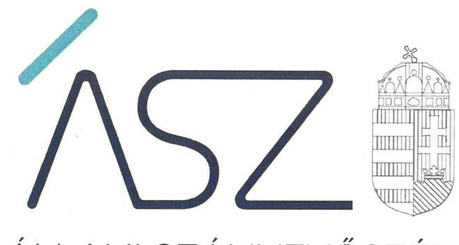
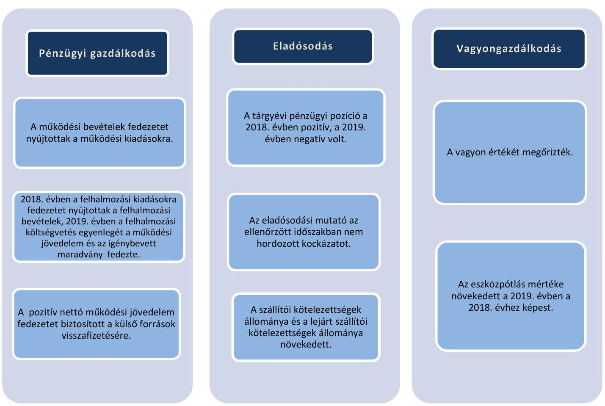
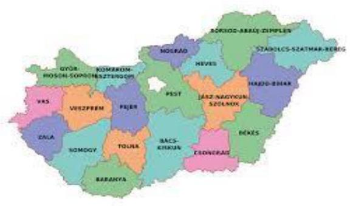
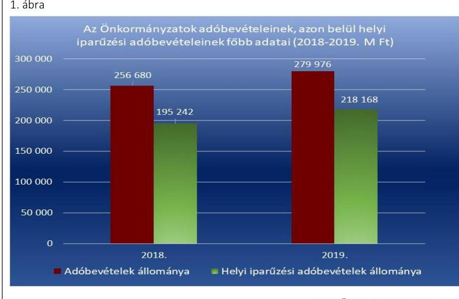
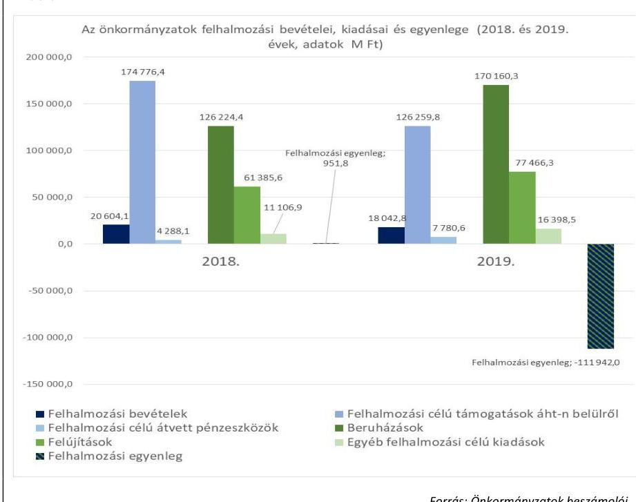
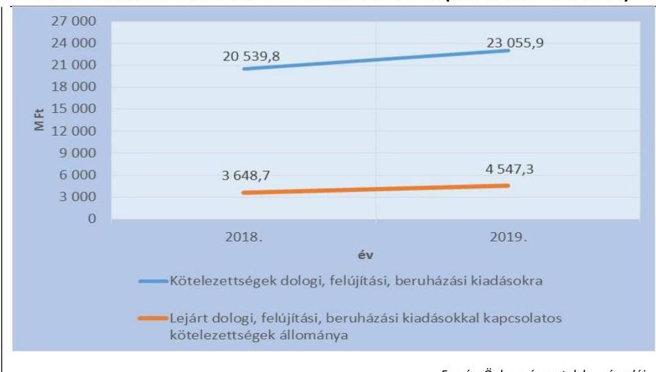
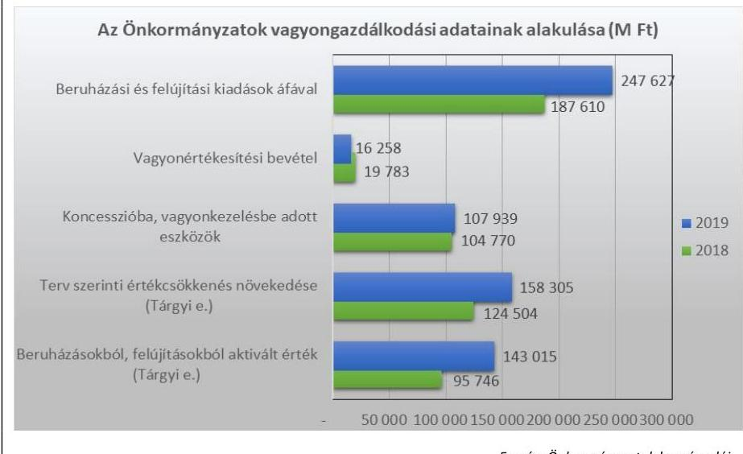
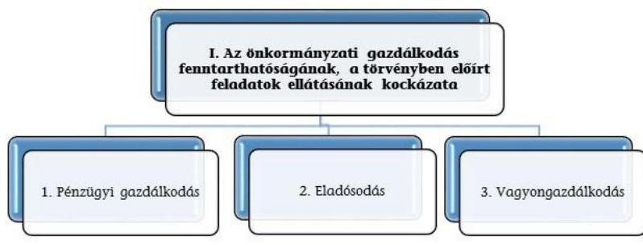
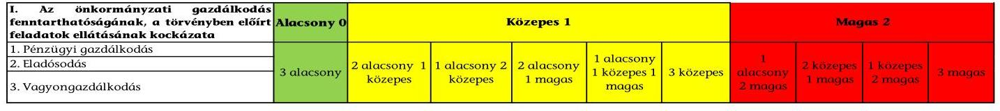

ÁLLAMI SZÁMVEVŐSZÉK

# JELENTÉS 

## Önkormányzatok pénzügyi monitoring alapján végzett ellenőrzése

Az Önkormányzatok - településtípusok szerinti - gazdálkodásának fenntarthatósága (322 város)
2021.

21076
www.asz.hu

---

ÁLLAMI SZÁMVEVŐSZÉK

# JELENTÉS 

## Önkormányzatok pénzügyi monitoring alapján végzett ellenőrzése

Az Önkormányzatok - településtípusok szerinti - gazdálkodásának fenntarthatósága (322 város)
2021. 10. hó 11. nap

21076
www.asz.hu

---

# AZ ELLENŐRZÉST FELÜGYELTE: 

DR. SIMON JÓZSEF felügyeleti vezető

## AZ ELLENŐRZÉST VEZETTE ÉS A VÉGREHAJTÁSÁÉRT FELELŐS:

## SZAPPANOS JÚLIA ellenőrzésvezető

## ÓDOR ZOLTÁN TAMÁS ellenőrzésvezető

## A PROGRAM ÖSSZEÁLLÍTÁSÁÉRT FELELŐS:

## HORVÁTH TÍMEA projektvezető

IKTATÓSZÁM: EL-3374-001/2021
TÉMASZÁM: 24
ELLENŐRZÉS-AZONOSÍTÓ SZÁM: V090302

---

# TARTALOMJEGYZÉK 

■ ÖSSZEGZÉS ..... 5
■ AZ ELLENŐRZÉS CÉLJA ..... 8
■ AZ ELLENŐRZÉS TERÜLETE ..... 9
■ AZ ELLENŐRZÉS HÁTTERE, INDOKOLTSÁGA ..... 10
■ A JELENTÉS LÉNYEGES KÉRDÉSKÖREI ..... 11
■ AZ ELLENŐRZÉS HATÓKÖRE ÉS MÓDSZEREI ..... 12
■ MEGÁLLAPÍTÁSOK ..... 14
■ MELLÉKLETEK ..... 21
I. sz. melléklet: Fogalomtár ..... 21
II. sz. melléklet: Az ellenőrzési kritériumok módszertana és értékelése ..... 25
III. sz. melléklet: Az eszközök és források alakulása kiemelt mérlegsoronként a 2018-2019. években (E Ft) ..... 27
IV. sz. melléklet: Pénzügyi egyensúlyi helyzet CLF módszer szerinti értékelése a 2018-2019. években (E Ft) ..... 28
V. sz. melléklet: Az Önkormányzatok 2018-2019. évi főbb mutatóinak és kockázati területeinek összefoglaló értékelése ..... 29
VI. sz. melléklet: Az Önkormányzatok 2018-2019. évi főbb mutatóinak és kockázati területeinek részletes értékelése ..... 30
VII. sz. melléklet: A magas kockázatot hordozó Önkormányzatok és a kockázatok kezelése ..... 32
VIII. sz. melléklet: A kockázatelemzés alá vont Önkormányzatok. ..... 33
■ FÜGGELÉK: ÉSZREVÉTELEK ..... 37
■ RÖVIDÍTÉSEK JEGYZÉKE ..... 39

---

.

---

# ÖSSZEGZÉS 

Az Állami Számvevőszék 322 városi önkormányzat gazdálkodásának kockázatait értékelte. Az önkormányzati éves beszámolók adatai szerint az önkormányzatok pénzügyi gazdálkodásának fenntarthatósága, az önkormányzatok pénzügyi egyensúlya biztosított volt a 20182019. években. Az önkormányzatok a könyvviteli mérlegben kimutatott vagyon értékét növelték, a szükséges eszközpótlások teljesitése javult a 2019. évben. Az Állami Számvevőszék 5 önkormányzat esetén jelzett kockázatot, amelyre felhívta az érintett önkormányzatok figyelmét.

## Az ellenőrzés társadalmi indokoltsága

A magyar települési és területi önkormányzatok jelentős része a 2000-es években tartalékait felélve egy olyan adósságspirálba került, amit önerőből már nem, csak külső források igénybevételével tudott finanszírozni. Ennek hatására a felhalmozott adósságállomány állami konszolidációjára a 2011. és 2014. évek között került sor. Az adósságkonszolidációk eredményeként, továbbá az önkormányzatok feladatellátása átstruktúrálásával, rendszerszinten pénzügyi helyzetük helyreállt, így az addig adósságot „termelő" alrendszer a fenntartható működés irányába mozdult el. Ugyanakkor az önkormányzatok gazdálkodásából eredő veszélyek miatt az ÁSZ továbbra is kiemelt figyelmet fordít az önkormányzatok pénzügyi egyensúlyi helyzetére ható kockázatok monitorizálására, a pénzügyi sérülékenységet okozó folyamatokra, az önkormányzati alrendszert veszélyeztető rendszeregyensúlyi kockázatokra annak érdekében, hogy a konszolidáció eredményei fenntarthatóak legyenek.

A Magyar Államkincstár központi információs rendszerében rendelkezésre álló önkormányzati éves költségvetési beszámolók adatait felhasználva, az önkormányzatok pénzügyi- és vagyongazdálkodási, valamint eladósodottság területen végzett monitoring riportok kiértékelésével az ÁSZ hozzájárul azon kockázatos területek feltárásához, amelyek rendszerszintű, vagy egyedi önkormányzati szintű beavatkozást igényelnek az önkormányzatok pénzügyi egyensúlyának fenntarthatósága érdekében.

A pénzügyi monitoringon alapuló ellenőrzés lehetőséget ad az önkormányzati alrendszer egyes településtípus szerinti csoportosítására és ezeknek a csoportoknak a pénzügyi-gazdasági helyzetének rendszerszintű értékelésére, és a kockázatforrást jelentő területek beazonosítására. Emellett a monitoring típusú ellenőrzés az ÁSZ erőforrásainak hatékony felhasználásával, az adatbekérések minimalizálásával, a kockázatokra fókuszáltan, széles lefedettséget képes biztosítani az önkormányzati alrendszer területén. Az ÁSZ ellenőrzés fókuszában áll a beazonosított kockázatok kezelésének előmozdítása önkormányzati és döntéshozói szinten is, támogatva ezzel a jól irányított állam elvének megvalósulását.

Az önkormányzatok által végrehajtott beruházások meghatározó jelentőségűek a helyi közszolgáltatások biztosítása tekintetében. A 2018-2019. években a 2014-2020. közötti uniós programozási ciklus felfutása következtében az önkormányzatok jelentős nagyságrendben indítottak beruházási programokat, amelyek miatt számottevően növekedtek a felhalmozási kiadások. Ezzel párhuzamosan ezen időszakban az önkormányzatok által saját forrásból megvalósított beruházások értéke is jelentősen emelkedett. Az önkormányzatok gazdálkodásának pénzügyi fenntarthatósága szempontjából a kockázatok értékelése során a beruházások értékének ciklikus változását szükséges figyelembe venni.

---

# Értékelések, következtetés 

A városi önkormányzatok gazdálkodása a 2018-2019. években a rendelkezésre álló jogszabályi környezet mellett fenntartható volt. A 2018-2019. évi beszámoló adatok alapján a városi önkormányzatoknál az eladósodás rendszerszintű kockázata nem állt fenn, a pénzügyi egyensúly a feladatok és gazdálkodási feltételek lényeges változása nélkül fenntartható, rövidtávon rendszerszintű beavatkozást nem igényel. A 2018-2019. évben az önkormányzatok vagyona növekedett, a beruházások révén az eszközpótlási mutató a 2019. évben javult.

Az önkormányzatok kiadásainak teljesítéséhez szükséges bevételek a 2018-2019. években rendelkezésre álltak. Az önkormányzatok költségvetésén belül mindkét évben a működési költségvetés egyenlege pozitív volt, ugyanakkor a felhalmozási költségvetés a 2019. évben hiányt mutatott. A felhalmozási költségvetés 2019. évi negatív egyenlegét az önkormányzatok által az uniós és saját forrásból történő fejlesztésekre fordított kiadások növekedése okozta. A felhalmozási költségvetés 2019. évi hiánya azonban nem hordozott kockázatot, mivel a felhalmozási bevételekhez képest nagyobb összegű felhalmozási kiadások finanszírozása a 2019. évben a működési jövedelemből, illetve az előző év pénzmaradványának igénybevételéből történt.

5 önkormányzat magas kockázatot hordozott, mivel ezen önkormányzatok nettó működési jövedelme a 2018. és a 2019. évben negatív volt. Ezen önkormányzatok esetén egyensúlyjavító intézkedések szükségesek.

Az Állami Számvevőszék a pozitív változások elindítása érdekében figyelemfelhívó levélben tájékoztatta az érintett önkormányzatok vezetőit a gazdálkodásukban rejlő kockázatokról és ehhez kapcsolódón kérte a kockázatok kezelése érdekében a szükséges intézkedések meghozatalát és ezek végrehajtását.

A figyelemfelhívásra adott válaszok alapján 4 önkormányzat (Hajdúnánás Városi Önkormányzat, Halásztelek Városi Önkormányzat, Szécsény Város Önkormányzat és Veresegyház Város Önkormányzata) vállalta, hogy számba veszi a müködési bevételeket és kiadásokat, valamint megfontolja az intézkedések megtételét.

1 önkormányzat (Püspökladány Város Önkormányzata) tudomásul vette a figyelemfelhívó levél tartalmát és rögzítette az ebben jelzett kockázatokat.

---

# Következtetés 

Az önkormányzatok számára a gazdálkodás fenntarthatóságának további megőrzése, illetve a pénzügyi sérülékenység kockázatának továbbra is alacsony szinten tartása érdekében a következő években meghatározó jelentőséggel bír a saját forrásból történő, illetve a saját forrást is igénylő beruházások indítása során a pénzügyi lehetőségek figyelembevétele, a beruházások megvalósításához szükséges források rendelkezésre állásának biztosítása.

---

# AZ ELLENŐRZÉS CÉLJA

**AZ ELLENŐRZÉS CÉLJA** az önkormányzatok központi információs rendszerében szereplő adatok értékelése alapján beazonosított kockázatok kezelésének előmozdítása.

---

# **AZ ELLENŐRZÉS TERÜLETE**

### **322 város önkormányzata**

Magyarország Alaptörvényében foglaltaknak megfelelően Magyarország területe fővárosra, megyékre, városokra és községekre tagozódik. A Mótv¹-ben rögzítettek alapján városi cím adható annak a községi önkormányzatnak, amely térségi szerepet tölt be és fejlettsége eléri az átlagos városi szintet. 2020. január 1-jén hazánkban 346 város volt, amelyek közül egy főváros, 18 megyeszékhely, illetve 5 megyei jogú város.

Jelen ellenőrzés a fővárosnak, megyeszékhelynek, megyei jogú városnak nem számító, összesen 322 város önkormányzatára (továbbiakban: önkormányzatok) terjedt ki.

Az állandó lakosok számát tekintve a 322 magyar városban 2018 január 1-jén 3 183 293 fő, míg 2019. január 1-jén 3 183 768 fő élt a Központi Statisztikai Hivatal Magyarország Közigazgatási Helynévkönyv adatai alapján. 2019. január 1-jén a városok átlagos népessége 9887 fő volt. A városok több mint fele 8000 fő alatti település volt, a legnagyobb város 43604 lakossal, a legkisebb 1034 lakossal rendelkezett.

Az egy lakosra jutó működési kiadás a 2018. évben 183,4 ezer Ft, míg az egy lakosra jutó adóbevétel 80,6 ezer Ft volt, a 2019. évben az egy lakosra jutó működési kiadás 200,0 ezer Ft, az egy lakosra jutó adóbevétel 87,9 ezer Ft volt.

A helyi önkormányzatok a költségvetésük alapján gazdálkodnak, annak keretében finanszírozzák a feladataik ellátását. Az Áht.² 6. § (2) bekezdése rögzíti, hogy a költségvetési bevételek és kiadások azok közgazdasági jellege szerint működési és felhalmozási bevételekre és kiadásokra, ezen belül kiemelt előirányzatokra oszthatók. Az Áht. 6. § (7) bekezdés ac) pontja alapján a finanszírozási bevételek közé tartozik a költségvetési maradvány, vállalkozási maradvány. Az önkormányzatok számára a pénzmaradvány ténylegesen rendelkezésre álló pénzügyi forrást jelent. A maradvány igénybevételének nevezzük az adott költségvetési évben az előző évi pénzmaradvány felhasználását.

Az önkormányzatok összevont költségvetési beszámolók szerint teljesített éves költségvetési bevétel és költségvetési kiadás, maradvány igénybevétele, a könyvviteli mérleg szerinti eszközök, a követelések és kötelezettségek állományi értékét az 1. táblázat mutatja be.

|  Év | Bevételek | Kiadások | Maradvány
igénybevétele | Eszközök | Követelések | Kötelezettségek  |
| --- | --- | --- | --- | --- | --- | --- |
|  2018. | 854 437 | 782 466 | 353 210 | 3 918 229 | 174 539 | 91 798  |
|  2019. | 837 728 | 900 710 | 438 134 | 3 787 818 | 126 544 | 72 951  |

*Forrás: összesített önkormányzati beszámolók*

---

# AZ ELLENŐRZÉS HÁTTERE, INDOKOLTSÁGA 

Az ÁSZ Stratégiájában célul tűzte ki, hogy az önkormányzatok ellenőrzése során azok pénzügyi-gazdasági helyzetét értékeli, kockázatait feltárja. Az új megközelítésű, elemzéssel alátámasztott mintavétellel, illetve ellenőrzési eljárásokkal csökkentse a helyszíni ellenőrzések számát. A monitoring rendszer az önkormányzatok éves költségvetési beszámolójának, időközi költségvetési jelentéseinek és mérlegjelentéseinek a központi információs rendszerben szereplő adatai értékelése alapján jelzi, hogy melyek azok az önkormányzatok, és melyek azok a területek, ahol olyan kedvezőtlen gazdasági folyamatok, vagy gazdasági események következtek be, amelyek ellenőrzés lefolytatását teszik indokolttá. Ennek az egyszerűsített ellenőrzési módszernek az eredményeként megtörténik az önkormányzatok pénzügyi, vagyoni helyzetének megítélése, a pénzügyi egyensúly minősítése, továbbá a változások hatásának értékelése.

Az önkormányzati alrendszerben megjelenő gazdálkodási nehézségek, likviditási problémák és az eladósodottság növekedése az ÁSZ figyelmét a 2011. évtől az önkormányzatok pénzügyi helyzetére irányította. Az önkormányzati feladatellátást érintő átalakítások meghatározó része a 2013. évben következett be azzal, hogy az igazgatási, az oktatási, az egészségügyi és a szociális ellátásban a feladatok jelentős hányadát átvette az állam. Az önkormányzati alrendszerben a 2013. évtől bevezetett feladatfinanszírozási rendszer keretein belül továbbra is megoldandó kérdés a pénzügyi egyensúly megteremtése, hosszú távú fenntartása. Ahhoz, hogy az önkormányzatok meg tudjanak felelni a számukra meghatározott - szigorúbb gazdálkodási szabályoknak, és az új feltételek mellett is biztosítható legyen a közszolgáltatások megfelelő színvonalú ellátása, szükséges volt a pénz-ügyi-gazdasági rendszerük alapjainak megszilárdítása, amely célt az adósságkonszolidáció szolgálta.

Az adósságkonszolidáció az önkormányzatok pénzügyi egyensúlyi helyzetére kedvező hatást gyakorolt, azonban a problémák kiváltó okait nem szüntette meg, ennek kezelése nélkül viszont az adósságállomány újratermelődhet. Erre tekintettel kiemelt fontosságú az önkormányzatok pénzügyi egyensúlyi helyzetére ható kockázatok feltárása.

---

# A JELENTÉS LÉNYEGES KÉRDÉSKÖREI 

1. Az önkormányzatok pénzügyi gazdálkodásának fenntarthatósága biztositott volt-e?
2.     - Fennállt-e az önkormányzatok eladósodásának kockázata?
3.     - Az önkormányzatok vagyongazdálkodása során biztositott volt-e a vagyon értékének a megőrzése?

---

# AZ ELLENŐRZÉS HATÓKÖRE ÉS MÓDSZEREI 

## Az ellenőrzés típusa

Helyénvalósági ellenőrzés.

## Az ellenőrzött időszak

A 2018-2019. évek.

## Az ellenőrzés tárgya

Az önkormányzati gazdálkodás fenntarthatósága, a törvényben előírt feladatok ellátása, az önkormányzatnál észlelt negatív tendenciák okainak feltárása. Az ellenőrzés kiterjed minden olyan körülményre és adatra, amely az ÁSZ jogszabályban meghatározott feladatainak teljesítéséhez, valamint a program végrehajtása folyamán felmerült újabb összefüggések feltárásához szükséges.

## Az ellenőrzött szervezet

A Kormány helyi önkormányzatokért felelős tagja által vezetett minisztérium, 322 városi önkormányzat (a VII. számú melléklet alapján).

## Az ellenőrzés jogalapja

Az ellenőrzés jogszabályi alapját az Állami Számvevőszékről szóló 2011. évi LXVI. törvény 1. § (3) bekezdésének, az 5. § (2)-(6) bekezdéseinek, valamint az államháztartásról szóló 2011. évi CXCV. törvény 61. § (2) bekezdésének előírásai képezik.

## Az ellenőrzés módszerei

Az ellenőrzést az ellenőrzési program ellenőrzési kérdései, az ellenőrzött időszakban hatályos jogszabályok, az ellenőrzés szakmai szabályok és módszertanok figyelembe vételével végezzük.

Az ellenőrzés ideje alatt az ellenőrzött szervezettel történő kapcsolattartást az ÁSZ SZMSZ³-ének vonatkozó előírásai alapján biztosítjuk.

Az ellenőrzési kérdések megválaszolásához szükséges bizonyítékok megszerzése a Magyar Államkincstár által rendelkezésre bocsátott

---

adatokra alapozva elemző eljárással történik, amelyeket a mintavétel alapján kontrollálni kell a hiteles forrásból származó nyilvántartásokban szereplő adatokkal.

Az ÁSZ az ellenőrzés előkészítése során meghatározta az ellenőrzési (helyénvalósági) kritériumokat, amelyek az ellenőrzési bizonyíték értékelésének, valamint a számvevőszéki jelentésben szereplő megállapítások és következtetések alapját képezik. A megállapításokban használt fogalmak értelmezését, forrását a fogalomtár, a mutatók helyénvalósági kritériumait, és a kockázatok értékelését az ellenőrzési kritériumok módszertana és értékelése tartalmazza.

Az ellenőrzési kérdésekre adott válaszok alapján értékelni kell, hogy az önkormányzat képes volt-e a törvényben meghatározott feladatait ellátni, gazdálkodása változatlan formában fenntartható-e.

---

# 1. Az önkormányzatok pénzügyi gazdálkodásának fenntarthatósága biztosított volt-e? 

## Összegző megállapítás

### 1.1. számú megállapítás

## 2. táblázat

## MUTATÓK ALAKULÁSA

| Mutatók (\%) | 2018. év | 2019. év |
| :-- | :--: | :--: |
| Múködési ki-   adások fede-   zettsége | $112,17 \%$ | 107,69 |
| Rendkívüli ön-   kormányzati tá-   mogatás aránya | $0,47 \%$ | $0,46 \%$ |

Forrás: Önkormányzatok beszámolói

Az önkormányzatok pénzügyi gazdálkodásának fenntarthatósága biztosított volt.

Az önkormányzatok által ellátott feladatok finanszírozása nem jelentett kockázatforrást a pénzügyi gazdálkodásra.

A működési bevételek fedezetet nyújtottak az önkormányzatok által ellátott feladatok működési kiadásaira a 2018-2019. években, működési finanszírozási kockázat egyik évben sem merült fel. A 2018. évben az ellátott feladatok működési kiadásaira a működési bevételek 112,17\%-ban, a 2019. évben 107,69\%-ban nyújtottak fedezetet. (2. táblázat)

A 2019. évben az önkormányzatok összes működési bevétele a 2018. évhez képest 4,72\%-kal (30 876,6 M Ft-tal), 685 645,0 M Ft-ra emelkedett. A bevételek növekedéséhez elsősorban a közhatalmi bevételek 9,47\%-os (24 493,5 M Ft-os) növekedése járult hozzá. A működési célú átvett pénzeszközök 52,93\%-kal emelkedtek, az államháztartáson belülről származó működési célú támogatások értéke csökkent.

A 2019. évben az önkormányzatok által ellátott feladatokra fordított működési kiadások a 2018. évhez képest, 9,07\%-kal emelkedtek. A működési kiadások emelkedését elsősorban a dologi kiadások 11,66 \%-os, a személyi juttatások 7,48 \%-os, illetve az egyéb működési célú kiadások 11,04\%-os növekedése okozta.

A dologi kiadások 2018. évről 2019. évre történő 24 190,2 M Ft-os emelkedését elsősorban a készletbeszerzések, valamint a szolgáltatási kiadások (vásárolt élelmezés, karbantartási szolgáltatások, szakmai tevékenységet segítő szolgáltatások, egyéb szolgáltatások) növekedése okozta.

Az önkormányzatok bevételein belül a rendkívüli támogatások aránya alacsony volt, és 2019-re kismértékben csökkent. A 2018. évben 3049,9 M Ft összeget tett ki az önkormányzati rendkívüli támogatás, amelyben az önkormányzatok 43\%-a részesült.

Az adóbevételek összege a 2018. évhez képest 23 295,9 M Ft-tal (9,08\%-kal) növekedett. Az adóbevételek működési bevételeken belüli aránya 39,20\%-ról 40,83\%-ra, vagyis 1,63 százalékponttal emelkedett. Az önkormányzatok adóbevételeinek - ezen belül kiemelten a helyi iparűzési adóból származó bevételeinek - alakulását az 1. ábra mutatja be.

---

# Megállapítások 

1. ábra

Forrás: Önkormányzatok beszámolói

Mindkét évben az önkormányzatok 83,5\%-ánál növekedtek a helyi iparúzési adóból származó bevételek a megelőző évhez képest.

## 1.2. számú megállapítás

3. táblázat

ADATOK ALAKULÁSA

| Adatok | 2018. év | 2019. év |
| :-- | --: | --: |
| Felhalmozási   költségvetés   egyenlege (M Ft) | 951,8 | -111 942,0 |
| Múködési jöve-   delem (M Ft) | 71019,2 | 48959,9 |
| Maradvány   igénybevétele   (M Ft) | 353209,7 | 438134,4 |

Forrás: önkormányzati beszámolók

A felhalmozási bevételek a 2018. évben meghaladták a felhalmozási kiadásokat. A 2019. évben a felhalmozási kiadások finanszírozása érdekében a működési jövedelem és az előző évi maradvány került bevonásra. (3. táblázat). Az önkormányzatok felhalmozási kiadásainak és bevételeinek egyenlege az ellenőrzött időszakban csökkent. A 2. ábra a felhalmozási egyenleg összetevőit, illetve azok változását mutatja.
2. ábra

Forrás: Önkormányzatok beszámolói

---

### 1.3. számú megállapítás

|  4. táblázat |  |   |
| --- | --- | --- |
|  MUTATÓK ALAKULÁSA |  |   |
|  Mutatók | 2018. év | 2019. év  |
|  Törlesztés
dezettségének
aránya | $32,00 \%$ | $55,40 \%$  |
|  Nettó múkö-
dési jövedelem
(M Ft) | 48289,7 | 21838,1  |

Forrás: önkormányzatok beszámolói

Az önkormányzatok a 2018. évben a költségvetési kiadások 25,40\%-át, a 2019. évben 29,31\%-át fordították beruházásokra, felújításokra, egyéb felhalmozási célú kiadásokra. A felhalmozási kiadásaik egy év alatt összesen 65 308,3 M Ft-tal, 32,87\%-kal növekedtek. A felhalmozási kiadások növekedéséhez legnagyobb arányban a beruházási kiadások növekedése járult hozzá. Az összes felhalmozási bevétel ugyanakkor 23,83\%-kal csökkent, amelynek oka elsősorban az államháztartáson belülről származó, felhalmozási célú támogatások 48 516,6 M Ft-os csökkenése volt.

A 2018. évben a tárgyévi felhalmozási bevételek 100,48\%-ban, a 2019. évben 57,60\%-ban nyújtottak fedezetet a tárgyévi felhalmozási kiadásokra. A 2019. évben a fejlesztések finanszírozásához a múködési jövedelem és a pénzmaradvány igénybevétele volt szükséges.

## Az önkormányzatok rendelkeztek a szükséges fedezettel az igénybevett külső források adósságszolgálatának teljesítéséhez.

Az önkormányzatok hiteltörlesztésének nagysága 27,16\%-kal növekedett, mivel a hiteltörlesztés értéke a 2018. évben 21 329,5 M Ft-ot, míg a 2019. évben 27 121,8 M Ft-ot tett ki. Az önkormányzatok rendelkeztek a külső források adósságszolgálatának teljesítéséhez megfelelő fedezettel. (4. táblázat)

Az önkormányzatok nettó múködési jövedelme mindkét évben pozitív volt, de összege a 2018. évről a 2019. évre csökkent. Az önkormányzatok által igénybevett külső források visszafizetése nem jelentett kockázatforrást a pénzügyi gazdálkodásban.

# 2. Fennállt-e az önkormányzatok eladósodásának kockázata? 

## Összegző megállapítás

5. táblázat

| MUTATÓK ALAKULÁSA |  |  |
| :--: | :--: | :--: |
| Mutatók | 2018. év | 2019. év |
| Eladósodási   mutató | $1,93 \%$ | $2,34 \%$ |
| Eladósodási   mutató válto-   zása százalék-   pontban | 0,22 | 0,42 |
| Tárgyévi pénz-   ügyi pozíció   változása | $-63,81 \%$ | $-152,68 \%$ |
| Tárgyévi pénz-   ügyi pozíció | 84 908,2 | $-44725,6$ |
| Múködési   jövedelem | 71019,2 | 48 959,9 |
| Felhalmozási   költségvetés   egyenlege | 951,8 | $-111942,0$ |
| Finanszíro-   zási költségve-   tés egyenlege | 12937,2 | 18256,5 |

Forrás: önkormányzatok beszámolói

## Az önkormányzatok pénzügyi egyensúlya biztosított volt.

Az önkormányzatok költségvetési bevételei a 2018. évben fedezetet nyújtottak a költségvetési kiadásokra, a 2019. évben a költségvetési hiány finanszírozásához, a pénzügyi egyensúly biztosításához az előző év maradványát is felhasználták. A maradvány igénybevétele 2018-ban 353 209,7 M Ft, 2019-ben 438 134,4 M Ft volt, amely összeg javította az önkormányzatok pénzügyi helyzetét.

A tárgyévi pénzügyi pozíció a 2019. évben negatív volt, amelyet döntően a felhalmozási költségvetés negatív egyenlege eredményezte, de változását a múködési jövedelem csökkenése is befolyásolta. (5. táblázat)

Az önkormányzatoknál az eladósodási mutató értéke nem hordozott kockázatot az ellenőrzött időszakban. Az eladósodási mutató a költségvetési évben/költségvetési évet követően esedékes kötelezettségek, ezen belül a szállítói, banki és egyéb kötelezettségek együttes növekedése miatt kedvezőtlenül változott.

Az önkormányzatok finanszírozási bevételei mindkét évben meghaladták a finanszírozási kiadásokat, a finanszírozási műveletek egyenlege 2018ban 12 937,2 M Ft, 2019-ben 41,12\%-kal magasabb összegű, 18 256,5 M Ft volt. Az egyenleg növekedését a hitelfelvétel összegének 44,62\%-os emelkedése okozta.

---

A költségvetési évben esedékes kötelezettségek aránya 3,2\%-kal, míg a költségvetési évet követő évben esedékes kötelezettségek aránya 46,8\%kal növekedett a 2018. évről a 2019. évre. A dologi kiadásokra vállalt kötelezettségek mintegy 30\%-ban emelkedtek mind az éven belüli, mind pedig az éven túli kötelezettségeket érintően. Emellett az éven túli beruházási kiadásokra vállalt kötelezettségek állománya 35,2\%-os, míg a finanszírozási kiadásokra vállalt kötelezettségek aránya 54,1\%-os növekedést mutatott a 2018. évről a 2019. évre.

Az önkormányzatok szállítói kötelezettségének állománya a 2018. évben 6,8\%-kal, a 2019. évben 12,2 \%-kal növekedett az előző időszakhoz képest, amelynek oka 2018-ban - többek között - a beruházásokra vállalt éven belül esedékes kötelezettségek 17,6\%-os, a felújításokra vállalt éven belül esedékes kötelezettségek 40,9\%-os, továbbá a felújításokra vállalt költségvetési évet követően esedékes kötelezettségek 41,9\%-os állománynövekedése volt.

A lejárt szállítói kötelezettségek nagysága kedvezőtlenül alakult a 2018-2019. években, mert a 2018. évben 1,5\%-kal (3 648,7 M Ft-ra), a 2019. évben 24,6\%-kal (4 547,3 M Ft-ra) növekedett az előző év adatához viszonyítva (4. ábra).
4. ábra

SZÁLLÍTÓI KÖTELEZETTSÉGEK ÉRTÉKÉNEK ÉS A LEJÁRT SZÁLLÍTÓI KÖTELEZETTSÉGEK ÉRTÉKÉNEK ALAKULÁSA A 2018-2019. ÉVEKBEN A 322 ÖNKORMÁNYZAT VONATKOZÁSÁBAN (ADATOK M FT-BAN)

Forrás: Önkormányzatok beszámolói

Az önkormányzatok a 2018. év végén 1 065,1 M Ft, a 2019. év végén 1 302,8 M Ft 90 napon túl lejárt tartozással rendelkeztek. A 90 napon túli lejárt kötelezettségek állományának aránya az összes kötelezettség állományból a 2018. évben 1,5\%, a 2019. évben 1,4\% volt, kismértékben csökkent.

Az év végén kimutatott 90 napon túl lejárt kötelezettség fennállásának az indokoltsága nem volt igazolt, mivel annak finanszírozására a likvid eszközök rendelkezésre álltak, így az átgondolt és felelős gazdálkodás nem érvényesült. Az önkormányzatoknál a 2018-2019. években a likvid eszközök - pénzeszközök, értékpapírok - (2018. évben 449 054,4 M Ft, 2019. évben 400 915,0 M Ft) a kötelezettségek teljesítésére fedezetet biztosítottak.

A banki kötelezettségek (rövid és hosszú lejáratú hitelek és kötvénykibocsátásból származó tartozások) 2018. évi 20 941,0 M Ft és 2019. évi

---

32 915,3 M Ft összegű állomány változása a 2018. évben 37,1\%, míg a 2019. évben 57,2\% volt az előző év adatához viszonyítva.

A 2018. évben 31 önkormányzat 15 428,3 M Ft összegben, összesen 49 db naptári éven túli futamidejű adósságot keletkeztető ügyletet kötött kormányzati jóváhagyással. Kormányzati hozzájáruláshoz nem kötött naptári éven túli futamidejű adósságot keletkeztető ügyletet 14 esetben 7 önkormányzat kötött a 2018. évben, összesen 85,7 M Ft összegben.

A 2019. évben kormányzati jóváhagyással 44 db naptári éven túli futamidejű adósságot keletkeztető ügyletet kötött, 11 031,1 M Ft összegben 30 önkormányzat. Kormányzati hozzájáruláshoz nem kötött naptári éven túli futamidejű adósságot keletkeztető ügyletet a 2019. évben 6 önkormányzat 1-1 esetben kötött 42,8 M Ft összegben.

A garancia- és kezességvállalásból származó függő kötelezettség állomány számottevően nem változott, 2018. december 31-én 2 930,3 M Ft (8 önkormányzatnál), 2019. december 31-én 3 054,1 M Ft (10 önkormányzatnál) volt.

# 3. Az önkormányzatok vagyongazdálkodása során biztosított volt-e a vagyon értékének a megőrzése? 

Összegző megállapítás

## 3.1. számú megállapítás

6. táblázat

MUTATÓK ALAKULÁSA

| Mutatók | 2018. év | 2019. év |
| :--: | :--: | :--: |
| Befektetett eszközök fedezettsége | 98,6\% | 95,7\% |
| Ingatlanok és kapcsolódó vagyoni értékú jogok állományának változása (M Ft) | $+7192,1$ | $+65154,6$ |
| Koncesszióba, vagyonkezelésbe adott eszközök állományának változása (M Ft) | $-2213,0$ | $+3168,4$ |

Forrás: Önkormányzatok beszámolói

Az önkormányzatok vagyongazdálkodása során a vagyon értékének megőrzése biztosított volt.

## A vagyon értéke a 2018. évről a 2019. évre növekedett.

Az önkormányzatok mérleg szerinti vagyona 2018. év január 1-jéről a 2019. év végére 3787 817,6 M Ft-ról 3918 229,2 M Ft-ra (3,4\%-kal) növekedett. A vagyonváltozás szerkezetén belül a nemzeti vagyonba tartozó befektetett eszközök állománya 3204 676,6 M Ft-ról a 2019. év végére 3332 039,3 M Ft-ra (4,0\%-kal) növekedett, míg a nemzeti vagyonba tartozó forgó eszközök 20 979,6 M Ft-os állománya a 2019. év végére 15 553,8 M Ft-ra (25,9\%-kal) csökkent. A 2018. év végéről a 2019. év végére 10\%-kal csökkenő pénzeszköz állomány mellett a követelések 37,9\%-kal növekedtek.

Az eszközök és források alakulását kiemelt mérlegsoronként a III. számú melléklet tartalmazza. A mutatók alakulását a 6. táblázat tartalmazza.

A nemzeti vagyonba tartozó befektetett eszközökön belül a tárgyi eszközök 2018. év végi 3 006034,3 M Ft-os állománya a 2019. év végére 3127 630,0 M Ft-ra (4,0\%-kal), az ingatlanok és kapcsolódó vagyoni értékú jogok könyv szerinti értéke 2790 784,5 M Ft-ról a 2019. év végére 2855 939,1 M Ft-ra (2,3\%-kal, 65 154,6 M Ft-tal) növekedett. A koncesszióba, vagyonkezelésbe adott eszközök könyv szerinti értéke a 2018. év végi 104 770,3 M Ft-ról a 2019. év végére 107 938,7 M Ft-ra (3,0\%-kal) emelkedett.

Az önkormányzatok ingatlanjainak, illetve vagyoni értékú jogainak 2018. év január 1-i 2783 592,4 M Ft-os könyv szerinti értéke a 2018. év végére 0,26\%-kal (7 192,1 M Ft-tal) növekedett.

Az önkormányzatok koncesszióba és vagyonkezelésbe adott vagyonának értéke a 2018. évben a 2018. január 1-jéhez képest 2 213,0 M Ft-tal volt több, összesen 104 770,3 M Ft, a 2019. évben a 2019. január 1-jéhez

---

# 3.2. számú megállapítás 

7. táblázat

| MUTATÓK ALAKULÁSA |  |  |
| :-- | --: | --: |
| Mutatók | $\mathbf{2 0 1 8 .} \mathbf{~ k v}$ | $\mathbf{2 0 1 9 .} \mathbf{~ k v}$ |
| Eszközpótlási mutató   (tárgyi eszközök ösz-   szesen) | $76,9 \%$ | $90,3 \%$ |
| Eszközpótlási mutató   (ingatlanok és kap-   csolódó vagyoni ér-   tékú jogokra) | $84,2 \%$ | $98,1 \%$ |

Fonrás: Önkormányzatok beszámolói
képest 3 168,4 M Ft-tal volt több, összesen 107 938,7 M Ft. A koncesszióba és vagyonkezelésbe adott eszközök állományának változása (növekmény) jelentős részét egészségügyi központ és szennyvízrendszer vagyonkezelésbe adása tette ki.

A vagyon értékesítéséből származó bevétel a 2018. évben 19 783,2 M Ft, a 2019. évben 16 257,5 M Ft volt.

## Az önkormányzatoknál a szükséges eszközpótlások elvégzéséhez kapcsolódó kockázat a 2019. évre csökkent.

Az önkormányzatok beruházási és felújítási kiadásainak összege a 2018. évben 187610 M Ft volt, amelyből 95 745,6 M Ft tárgyi eszközökhöz kapcsolódó beruházást és felújítást aktiváltak. A 2018. évben az ingatlanokra és kapcsolódó vagyoni értékű jogokra elszámolt terv szerinti értékcsökkenés 99 071,5 M Ft, a 2019. évben 132 031,5 M Ft volt.

Az önkormányzatok beruházási és felújítási kiadásainak összege a 2019. évben 247 626,7 M Ft volt, tárgyi eszközökre összesen 158 304,6 M Ft terv szerinti értékcsökkenést számoltak el a 2019. évben.

Az önkormányzatoknál az értékcsökkenések kompenzálásaként a szükséges vagyonpótlás nem történt meg, a tárgyi eszközök eszközpótlási mutatója két egymást követő évben (2018-2019. években) nem érte el a 100\%-ot. (7. táblázat) A 2018. évi kockázat mérséklődött a tárgyi eszközök pótlása esetén, mivel az eszközpótlási mutató értéke 13,44\% ponttal növekedett az előző évhez képest a 2019. évben.

Az önkormányzatok ingatlanjainak és kapcsolódó vagyoni értékű jogainak értéke 2018. évben a tárgyi eszközök értékének 92,8\%-át, a 2019. évben a tárgyi eszközök 91,3\%-át tették ki. Az önkormányzatok a 2018. évben összesen 99 071,5 M Ft-os terv szerinti értékcsökkenést, a 2019. évben összesen 132 031,5 M Ft-os terv szerinti értékcsökkenést számoltak el ingatlanjaik és kapcsolódó vagyoni értékú jogaik után. Ingatlanokkal és kapcsolódó vagyoni értékú jogokkal kapcsolatos beruházásokat és felújításokat a 2018. évben 83 431,2 M Ft, a 2019. évben 129 509,0 M Ft (+55,2\%) értékben aktiváltak a városi önkormányzatok.

Az önkormányzatok 2018-2019. évi főbb vagyongazdálkodási adatainak alakulását az 5. ábra mutatja.
5. ábra

---

A 2018. évben az elszámolt terv szerinti értékcsökkenés $84,2 \%$-át, a 2019. évben elszámolt terv szerinti értékcsökkenés $98,1 \%$-át tudták az önkormányzatok aktivált beruházásokkal és felújításokkal pótolni, az eszközpótlások elmaradása kockázatot jelez a vagyongazdálkodást érintően, ugyanakkor a pótlási arány értéke kedvező irányba változott.

---

# MELLÉKLETEK 

- I. SZ. MELLÉKLET: FOGALOMTÁR
adósságszolgálat
belső eladósodás kockázat-
forrás
beruházás
bevételi kitettség

CLF módszer
egy lakosra jutó felhalmo-
zási kiadás
egy lakosra jutó múködési
kiadás
eladósodás kockázatforrás
eladósodási mutató
eszközpótlási mutató
felhalmozási kiadás
felhalmozási kiadások és fi-
nanszírozása kockázatforrás

Az adósság tőkerészének és az esedékes kamat együttes összegének törlesztése. Kockázatforrást jelent, ha az értékcsökkenések kompenzálásaként a szükséges vagyonpótlás nem történt meg, ha romlott az eszközök állaga, mert az rejtett eladósodást jelent.
A tárgyi eszköz beszerzése, létesítése, saját vállalkozásban történő előállítása, a beszerzett tárgyi eszköz üzembe helyezése. A beruházás a meglévő tárgyi eszköz bővítését, rendeltetésének megváltoztatását, átalakítását, élettartamának, teljesítőképességének közvetlen növelését eredményező tevékenység. (Forrás: Számv. tv. ${ }^{4}$ 3. § (4) bekezdés 7. pontja)

Olyan függőségi viszony, ahol egy szervezet pénzügyi helyzetét meghatározó bevételek nagysága külső körülmények hatására azonnal és kedvezőtlen irányba változhat.
Az önkormányzatok költségvetése elemzésének módszere, amely a pénzügyi kapacitás (nettó múködési jövedelem) fogalmát helyezi a középpontba. A módszer következetesen elkülöníti a folyó és a felhalmozási költségvetés bevételeit és kiadásait, azok költségvetési egyenlegeit. Bizonyos mértékig a vállalati gazdálkodás logikai elemeit érvényesíti az önkormányzatok pénzügyi, jövedelmi helyzetének vizsgálata során.
Az egy főre jutó felhalmozási kiadások összege a megyék és a főváros állandó lakosságának számával került meghatározásra.
Az egy állandó lakosra jutó múködési kiadások összege a megyék és a főváros állandó lakosságának számával került meghatározásra
Az államháztartás önkormányzati alrendszerében felhalmozott adósság állam részéről történő kiegyenlítését, illetve átvállalását követően az önkormányzatok kiemelt feladata, egyben felelőssége az adósságállomány újratermelődésének megakadályozása. Kockázatforrást jelent, ha az önkormányzat kötelezettségei emelkednek, a mérlegben az idegen források aránya nő, az adósságkonszolidációt - helyi önkormányzatok adósságának állam által történő átvállalása - követően a gazdálkodás újra eladósodási pályára áll. Az eladósodás a pénzügyi gazdálkodás egyenes következménye, ugyanakkor hatással is van rá a folyó adósságszolgálat teljesítésén keresztül
Az önkormányzatok forrásainak összetételében az idegen források aránya
A tárgyi eszközállomány elemzéséhez használt mutató, amely megmutatja, hogy az üzembe helyezett beruházások milyen hányadát képezi az elszámolt értékcsökkenésnek. Számításakor tárgyévben üzembe helyezett beruházások, felújítások értékét a tárgyi eszközök tárgyévben elszámolt értékcsökkenéséhez kell viszonyítani. Két egymást követő évben 85\% alatti értékek magas, 100\% feletti értékek alacsony kockázatot jeleznek.
Az önkormányzatok tárgyévi felhalmozási célú költségvetési bevételei.
Az önkormányzatok tárgyévi felhalmozási célú költségvetési kiadásai.
Kockázatforrást jelent az erőn felüli beruházási aktivitás, illetve ha a folyamatban lévő felhalmozási feladatok finanszírozásához szükséges pénzügyi forrás nem áll az önkormányzat rendelkezésére.

---

felújítás
finanszírozás kockázatforrás
folyó bevétel
folyó kiadás
folyó költségvetés egyen-
lege
garancia- és kezességválla-
lás kockázatforrás
garanciavállalás
hasznosítás
helyénvalósági ellenőrzés
kezességvállalás
kockázatforrás
koncesszió

Az elhasználódott tárgyi eszköz eredeti állaga (kapacitása, pontossága) helyreállítását szolgáló időszakonként visszatérő olyan tevékenység, melynek során az eszköz élettartama megnövekszik, minősége, használata jelentősen javul, így a pótlólagos ráfordításból a jövőben gazdasági előnyök származnak. (Forrás: Számv. tv. 3. § (4) bekezdés 8. pontja)
Kockázatforrást jelent, ha az önkormányzat nem rendelkezik megfelelő fedezettel a külső források adósságszolgálatának teljesítéséhez, ami hosszútávon vagyonfeléléshez vagy adósságspirálhoz vezethet.
Az önkormányzatok tárgyévi múködési célú költségvetési bevételei
Az önkormányzatok tárgyévi múködési célú költségvetési kiadásai
A folyó költségvetés egyenlege, azaz a múködési jövedelem megmutatja, hogy az önkormányzat éves folyó bevétele fedezetet biztosít-e a kötelező és önként vállalt feladatellátáshoz kapcsolódó éves folyó kiadására. A múködési jövedelem negatív értéke pénzügyileg fenntarthatatlan helyzetet jelez. A mutató pozitív értéke megtakarítást mutat, amely forrásul szolgálhat az önkormányzat fennálló kötelezettségei megfizetéséhez, valamint fejlesztéseihez.
Kockázatforrást jelent, ha a szerződés kötelezettje a szerződésben vállalt kötelezettségeit nem teljesíti a jogosultnak, mert azokért a kezes köteles helytállni. A garanciaés kezességvállalások függő kötelezettségként kockázatot jelentenek az önkormányzat költségvetésére, ezen keresztül a közfeladatok ellátására.
Olyan kötelezettségvállalás, ahol a garanciát vállaló valamely jövőbeni esemény bekövetkezésekor, a szerződésben meghatározott feltételek beálltakor a garancia kedvezményezettje számára meghatározott összegig, meghatározott időpontig, felszólításra azonnal fizet.
A nemzeti vagyon birtoklásának, használatának, hasznok szedése jogának bármely a tulajdonjog átruházását nem eredményező - jogcímen történő átengedése, ide nem értve a vagyonkezelésbe adást, valamint a haszonélvezeti jog alapítását. (Forrás: Nvtv ${ }^{5}$. 3. § (1) bekezdés 4. pontja)
A helyénvalósági ellenőrzés a megfelelőségi ellenőrzés azon altípusa, amelyet azokban az esetekben kell alkalmazni, amelyekre jogszabályi előírások nem alkalmazhatóak, illetve amennyiben egyes kérdések megítélésénél nyilvánvaló jogszabályi hiányosságok vannak. Helyénvalósági ellenőrzés során a Számvevőszéknek a közszféra szilárd gazdálkodására és a köztisztviselők magatartására vonatkozó általános alapelvek mentén kell az ellenőrzést lefolytatni.
Szerződésben vállalt olyan kötelezettség, amelyben a kezes arra vállal kötelezettséget, hogy ha a szerződés kötelezettje nem teljesít a kezes maga fog helyette teljesíteni a jogosultnak. (Forrás: Ptk. ${ }^{6}$ 6:416.§).
A kockázatok kiváltó okait kockázatforrásnak nevezzük. Első lépésben azonosítjuk a nyomon követendő kockázatokat, majd a kockázatos területeket és a kiváltó okokat (kockázatforrásokat). Kockázatként azonosítjuk, ha az önkormányzat hosszú távon nem képes a törvényben meghatározott feladatait ellátni, költségvetése változatlan formában nem fenntartható. A kockázat értékelésének célja annak megállapítása, hogy a pénzügyi gazdálkodás, eladósodás, vagyongazdálkodás kockázati területek milyen mértékben befolyásolják, veszélyeztetik az önkormányzat múködését, a közfeladatok ellátását. A három kockázati terület minősítéséhez összesen 10 kockázatforrást rendelünk.
Az állam, illetőleg az önkormányzat (önkormányzati társulás) kizárólagos tulajdonában lévő vagyontárgyak birtoklásának, használatának és hasznosításának, valamint a koncesszió-köteles tevékenységek gyakorlásának jogát, visszterhes szerződéssel, időlegesen úgy engedi át, hogy a jogosultnak részleges piaci monopóliumot biztosít.

---

koncessziós szerződés
kötelezettség jellegű sajátos elszámolások
kötelező közszolgáltatás (az önkormányzati feladatokat érintően)
kötvény
közfeladat
közfeladatok finanszírozási struktúrája kockázatforrás
lényegesség
megfelelőségi ellenőrzés
nettó múködési jövedelem
önkormányzat
önkormányzat rendkívüli támogatása

A koncessziós szerződés olyan visszterhes szerződés, amelyben az állam vagy az önkormányzat a törvényben meghatározott tevékenységek gyakorlásának a jogát időlegesen úgy engedi át, hogy a jogosultnak részleges piaci monopóliumot biztosít.
Kötelezettség jellegű sajátos elszámolások között kell elszámolni a kapott előlegeket, továbbadási célból folyósított támogatásokat, ellátásokat, más szervezetet megillető bevételeket, vagyonkezelésbe vett eszközökkel kapcsolatos visszapótlási kötelezettségeket, nem társadalombiztosítási pénzügyi alapjait terhelő kifizetett ellátások megtérítését, a munkáltató által korengedményes nyugdíjhoz megfizetett hozzájárulást.
Az önkormányzat kötelezően vállalt feladatkörébe tartozó egyes - közszolgáltatás útján megvalósuló - közfeladatok ellátása, amelyeket külön jogszabály (törvény, helyi önkormányzati rendelet) határoz meg.
Hosszabb lejáratra szóló, hitelviszonyt megtestesítő kamatozó értékpapír. A kötvényben a kibocsátó arra kötelezi magát, hogy a kötvényben megjelölt pénzösszegnek az előre meghatározott kamatát vagy egyéb jutalékait, továbbá az adott pénzösszeget a kötvény mindenkori tulajdonosának, illetve jogosultjának a megjelölt időben és módon megfizeti.
A közfeladat a jogszabályban meghatározott állami vagy önkormányzati feladat. A közfeladatok ellátása költségvetési szervek alapításával és múködtetésével vagy az azok ellátásához szükséges pénzügyi fedezet e törvényben (Áht.) meghatározott eszközökkel, részben vagy egészben történő biztosításával valósul meg. A közfeladatok ellátásában államháztartáson kívüli szervezet jogszabályban meghatározott rendben közremúködhet. (Forrás: Áht. ${ }^{7}$ 3/A. § (1)-(2) bekezdés, 2015. január 1-jétől)
Kockázatforrást jelent, ha az önkormányzat pénzügyi helyzete jelentős függőséget mutat a külső körülményektől (adóbevételektől, kiegészítő állami támogatásoktól). A közfeladatok finanszírozási struktúrája nem kielégítő, ha a működési bevételek nem fedezik teljes mértékben az ellátott közfeladatokat.
Az a szintű információ vagy adat, ami az ellenőrzés eredményei célzott felhasználóinak döntéseit - az arról történő tudomásszerzést követően - valószínűsíthetően befolyásolja.
A számvevőszéki ellenőrzés azon típusa, amely annak megállapítására irányul, hogy az ellenőrzés tárgyát képező tevékenységek, pénzügyi műveletek, információk és adatok minden lényeges szempontból megfelelnek-e az ellenőrzött szervezetre vonatkozó szabályozásoknak és követelményeknek.
A nettó múködési jövedelem a jövedelemtermelő képességet méri. Megmutatja a múködési bevételekből a múködési kiadások és a hitelek tőketörlesztésének kifizetése után fennmaradó jövedelmet.
A helyi önkormányzat jogi személy. Az önkormányzati feladatok ellátását a képviselőtestület és szervei biztosítják. A képviselőtestület szervei: a polgármester, a főpolgármester, a megyei közgyűlés elnöke, a képviselő-testület bizottságai, a részönkormányzat testülete, a polgármesteri hivatal, a megyei önkormányzati hivatal, a közös önkormányzati hivatal, a jegyző, továbbá a társulás. A képviselő-testület a feladatkörébe tartozó közszolgáltatások ellátására - jogszabályban meghatározottak szerint - költségvetési szervet, a Polgári perrendtartásról szóló 1952. évi III. törvény szerinti gazdálkodó szervezetet (a továbbiakban: gazdálkodó szervezet), nonprofit szervezetet és egyéb szervezetet (a továbbiakban együtt: intézmény) alapíthat, továbbá szerződést köthet természetes és jogi személlyel vagy jogi személyiséggel nem rendelkező szervezettel. (Forrás: Mötv. 41. § (1), (2), (6) bekezdései)
A 2015-2016. években a megyei önkormányzatok rendkívüli támogatása, a települési önkormányzatok rendkívüli támogatása és a tartósan fizetésképtelen helyzetbe került helyi önkormányzatok adósságrendezésére irányuló hitelfelvétel visszterhes kamattámogatása, a pénzügyi gondnok díja.

---

pénzintézetek felé történő eladósodás kockázatforrás
pénzügyi kapacitás
szállítók felé történő eladósodás kockázatforrás
tárgyévi pénzügyi pozíció
többségi önkormányzati tulajdonban lévő gazdasági társaságok kockázatforrás vagyongazdálkodás
vagyonváltozás kockázatforrás

Kockázatforrásnak tekintettük, ha az önkormányzat (újból) adósságot keletkeztet, ami a kivételektől eltekintve a 2012. évtől kormányengedély-köteles. A pénzintézetekkel szemben fennálló kötelezettségek esetén olyan függőségi viszony jöhet létre, ahol az önkormányzat pénzügyi helyzete olyan külső körülmények hatására változhat, amely kizárólag a bank egyoldalú döntésén múlik.
A pénzügyi kapacitás az adósok hitelfelvételi képességének azon mértéke, ahol még növelni tudják az adósságot anélkül, hogy a fizetőképtelenség elkerülése érdekében csökkenteniük kellene akár az aktuális, akár a jövőben esedékes kiadásaikat.
Kockázatforrást jelent, ha az önkormányzat növeli a dologi, felújítási, beruházási kötelezettségeit (szállítókkal szemben fennálló tartozásait), ami burkolt hitelezésnek minősülhet, és az elismert kötelezettségeit átmenetileg vagy véglegesen nem tudja határidőre teljesíteni.
A folyó költségvetés egyenlege, müködési jövedelem, valamint a felhalmozási költségvetés egyenlege, továbbá a finanszírozási múveletek egyenlege. Kedvezőtlen, ha negatív, illetve a pozíció az előző évhez képest 25\%-ot meghaladóan csökken.
Kockázatforrást jelent, hogy az önkormányzati tulajdonban lévő gazdasági társaságok adósságállományáért a tulajdonos önkormányzatot helytállási kötelezettség terheli.

A nemzeti vagyongazdálkodás feladata a nemzeti vagyon rendeltetésének megfelelő, az állam, az önkormányzat mindenkori teherbíró képességéhez igazodó, elsődlegesen a közfeladatok ellátásához és a mindenkori társadalmi szükségletek kielégítéséhez szükséges, egységes elveken alapuló, átlátható, hatékony és költségtakarékos múködtetése, értékének megőrzése, állagának védelme, értéknövelő használata, hasznosítása, gyarapítása, továbbá az állam vagy a helyi önkormányzat feladatának ellátása szempontjából feleslegessé váló vagyontárgyak elidegenítése. (Forrás: Nvtv. 7. § (2) bekezdése)

Kockázatforrásként értékeltük, ha csökken a nemzeti vagyon, ha az önkormányzatok a vagyonértékesítésből származó bevételeket nem beruházásokra, a vagyon pótlására fordítják.

---

Az ellenőrzés tárgya: Az önkormányzati gazdálkodás fenntarthatósága, a törvényben előírt feladatok ellátása, az önkormányzatnál észlelt negatív tendenciák okainak feltárása, amely az ellenőrzési kritériumok alapján kerül értékelésre.
Az ellenőrzési kritériumok meghatározása során első lépésben azonosításra kerültek az önkormányzati gazdálkodás fenntarthatóságának, a törvényben előírt feladatok ellátásának kockázatos területei és a kiváltó okai (kockázatforrások), amelyekhez minden esetben mutatószám került hozzárendelésre. A mutatószámok között a viszonyszámok (relatív mutatószámok) és az abszolút adatok (abszolút mutatószámok) egyaránt megtalálhatóak, amelyekhez a Magyar Államkincstár által szolgáltatott adatállományok (költségvetési beszámolók, időközi költségvetési jelentések, mérlegjelentések adatait) kerültek felhasználásra.
Az egyes kockázati területek és kockázatforrások minősítése „pontozásos módszerrel" a mutatószámok értékelése alapján történt.

- Első lépésben a mutatószámok értékelésére és egy háromelemű skálán történő elhelyezésére került sor. Az értékelés (a kategória határok meghatározása) elsődlegesen a mutatószámok közgazdasági értelmezése alapján, az Állami Számvevőszék ellenőrzési tapasztalatait felhasználva történt. Az értékelések alapján egy-egy mutató alacsony besorolás esetén 0 pontot, közepes esetén 1 pontot, magas kockázatjelzés esetén 2 pontot kapott. (PI.: ha a működési kiadások fedezettsége mutató 90\% alatti volt, akkor magas kockázati besorolást, 2 pontot, ha 100\% feletti volt akkor alacsony besorolást, 0 pontot kapott.) A\%-ban kifejezett mutatók kockázati besorolására a pontos (több tizedes jegy) értékek alapján került sor, ugyanakkor az önkormányzati riport a mutatókat egy, illetve esetenként két tizedes számjegyig mutatja be.
- Annak érdekében, hogy a kockázatforrások minősítésénél a lényeges mutatók értéke legyen a meghatározó a jellegzetes mutatókéval szemben, a mutatószámok súlyozására került sor*. A súlyok mértékének megválasztásakor az elsődleges mutatókat középértéknek tekintve 1-es súly mellérendelése** történt. A főmutató súlya az elsődleges mutatók súlyának kétszeresében, míg a másodlagos mutatók súlya az elsődleges mutatók súlyának felében került meghatározásra. (PI.: a kockázatforrás minősítéséhez a működési kiadások fedezettségét főmutatóként vették figyelembe, ezért 2-es súlyt rendeltek hozzá. Így ha a mutató kockázati besorolása magas volt, a magas kockázati besoroláshoz rendelt 2 pontot szorozták a főmutatóhoz rendelt 2-es súlyszámmal és az elért pontszám 4, míg alacsony besorolás esetén a besoroláshoz rendelt 0 pontot szorozva a főmutatóhoz rendelt 2-es súlyszámmal elért pontszám 0 volt.)
- Ezt követően került sor az önkormányzati gazdálkodás fenntarthatóságának, a törvényben előírt feladatok ellátásának kockázatához rendelt kockázati területek és kockázatforrások értékelési ponthatárainak meghatározására oly módon, hogy kockázatforrásonként a mutatószámok súlyozott értékelésével elérhető összes pontszám három egyenlő részre (alacsony, közepes, magas) osztása történt meg. (PI.: A közfeladatok finanszírozási struktúrája kockázatforrás 1 db főmutató, 2 db elsődleges mutató és további 2 db másodlagos mutató alakulása alapján került értékelésre. A mutatók magas kockázati besorolása esetén - a súlyozást követően - elérhető legmagasabb pontszám 10 volt. Ezt három egyenlő részre osztva kerültek meghatározásra a közfeladatok finanszírozási struktúrájának értékelési ponthatárai, amely 0-3,32 pontig alacsony, 3,33-6,66 pontig közepes, 6,67-10 pont között magas kockázati minősítést kapott.)
- Az egyes kockázatforrások értékelésekor a kockázatforráshoz rendelt mutatószámok - súlyozással kapott - értékeinek összesítése és a kialakított értékelési ponthatárok szerinti minősítése történt meg. (PI.: egy önkormányzat minősítésekor a közfeladatok finanszírozási struktúrája kockázatforráshoz

[^0]
[^0]:    * A súlyozás kifejezi, hogy az alkalmazott mutatószámok egymáshoz képest milyen mértékben járulnak hozzá az adott kockázatforrás értékeléséhez.
    ** Egy esetben a banki kötelezettségállomány mérlegfőösszeghez mért nagysága mutatónál a kockázatforrás kiegyensúlyozottabb megítélése érdekében az 1-es súlyozás helyett 1,5-ös súlyozás került alkalmazásra.

---

rendelt 5 db mutató - fentiekben bemutatott - értékelésével elért összes pontszám 7 volt, akkor a kockázatforrás a hármas skálán a 6,67-10 pont közé került, így magas minősítést kapott.)

- Az egyes kockázati területek minősítése hasonlóan történt. Az egyes kockázati területeket meghatározó kockázatforrások pontjainak aggregálását követően, a kockázati területen elérhető összes pont három egyenlő részre osztásával kialakított skálán történő értékelésére került sor. Ha azonban a kockázatforrások közül legalább egy magas kockázati besorolást ért el, akkor a pontozás szerinti értékeléstől eltérően, a kockázati terület besorolása közepes kockázati minősítésűre módosult.

Az ellenőrzés tárgyának, az önkormányzati gazdálkodás fenntarthatóságának, a törvényben előírt feladatok ellátásának értékelése:

A három kockázati terület együttes értékelése alapján az alábbi mátrix segítségével kerül meghatározásra az önkormányzati gazdálkodás fenntarthatóságának, a törvényben előírt feladatok ellátásának értékelése a következők szerint:

---

II. SZ. MELLÉKLET: AZ ESZKÖZÖK ÉS FORRÁSOK ALAKULÁSA KIEMELT MÉRLEGSORONKÉNT A 2018-2019. ÉVEKBEN (E FT)

Az önkormányzatok 2018-2019. évi mérlegeinek adatai

| Megnevezés | 2018.01.01. | 2018.12.31. | 2019.12.31. |
| :--: | :--: | :--: | :--: |
| A) NEMZETI VAGYONBA TARTOZÓ BEFEKTETETT ESZKÖZÖK $(=\mathrm{A} / \mathrm{I}+\mathrm{A} / \mathrm{II}+\mathrm{A} / \mathrm{III}+\mathrm{A} / \mathrm{IV})$ | 3137105 350,9 | 3204676559,3 | 3332039 315,8 |
| B) NEMZETI VAGYONBA TARTOZÓ FORGÓESZKÖZÖK (= B/I+B/II) | 30035 919,1 | 20979565,7 | 15553769,7 |
| C) PÉNZESZKÖZÖK (=C/I+...+C/IV) | 346648 187,0 | 431208480,6 | 388148796,6 |
| D) KÖVETELÉSEK (=D/I+D/II+D/III) | 90908 494,9 | 126544315,0 | 174539475,2 |
| E) EGYÉB SAJÁTOS ELSZÁMOLÁSOK (=E/I+E/II+E/III) | 2098686,4 | 3149493,4 | 6592470,2 |
| F) AKTÍV IDŐBELI ELHATÁROLÁSOK (=F/1+F/2+F/3) | 1506747,1 | 1259 168,1 | 1355411,6 |
| ESZKÖZÖK ÖSSZESEN (=A+B+C+D+E+F) | 3608303 385,5 | 3787817 582,1 | 3918229 239,1 |
| G/ SAJÁT TÖKE (= G/I+...+G/VI) | 3091298 351,6 | 3159030 781,5 | 3190234 311,6 |
| H) KÖTELEZETTSÉGEK (=H/I+H/II+H/III) | 61463 036,5 | 72950 991,2 | 91797 992,9 |
| I) KINCSTÁRI SZÁMLAVEZETÉSSEL KAPCSOLATOS ELSZÁMOLÁSOK | 0,0 | 0,0 | 0,0 |
| J) PASSZÍV IDŐBELI ELHATÁROLÁSOK (=J/1+J/2+J/3) | 455541 997,3 | 555835 809,3 | 636196 934,6 |
| FORRÁSOK ÖSSZESEN (=G+H+I+J) | 3608303 385,5 | 3787817 582,1 | 3918229 239,1 |

---

IV. SZ. MELLÉKLET: PÉNZÜGYI EGYENSÜLYI HELYZET CLF MÓDSZER SZERINTI ÉRTÉKELÉSE A 2018-2019. ÉVEKBEN (E FT)

|  ÖKOMER 322 városi önkormányzat CLF kimutatása (eFt) |  |  |   |
| --- | --- | --- | --- |
|   | 2018 | 2019 | Változás (2019-
2018)/2018  |
|  1.1. Folyó bevételek (1.1.1.+1.1.2.+1.1.3.+1.1.4.+1.1.5.+1.1.6.+1.1.7.+1.1.8.+1.1.9.) | 654768371041 | 685644997554 | $4,72 \%$  |
|  1.1.1./A Saját müködési bevételek tulajdonosi bevételek nélkül | 329293594255 | 360431696475 | $9,46 \%$  |
|  1.1.2. Kültségvetési támogatások a müködőképesség megőrzését szolgáló kiegészítő támogatások | 209247373841 | 224985573584 | $-7,52 \%$  |
|  1.1.3. Átengedett bevételek | 10401188903 | 10977551845 | $5,54 \%$  |
|  1.1.4. Államháztartáson belülről kapott támogatások | 97526490857 | 79817866400 | $-18,16 \%$  |
|  1.1.5. EU-tól és külföldről kapott bevételek | 210092944 | 332933495 | $58,47 \%$  |
|  1.1.6. Államháztartáson kívülről kapott bevételek | 1382286561 | 1693174558 | $22,49 \%$  |
|  1.1.7. Hozam- és kamatbevételek | 1979257103 | 1584175118 | $-19,96 \%$  |
|  1.1.8. Kölcsönök visszatérülése, igénybevétele | 1678175455 | 2683810266 | $59,92 \%$  |
|  1.1.9. A müködőképesség megőrzését szolgáló kiegészítő támogatások | 3049911122 | 3138215813 | $2,90 \%$  |
|  1.2. Folyó kiadások (1.2.1.+1.2.2.+1.2.3.+1.2.4.+1.2.5.) | 583749177291 | 636685052186 | $9,07 \%$  |
|  1.2.1. Müködési kiadások kamatkiadások nélkül | 482040263256 | 525602228928 | $9,04 \%$  |
|  1.2.2. Államháztartáson belülre átadott pénzeszközök | 46942226259 | 49109688317 | $4,62 \%$  |
|  1.2.3. Transzferkiadások | 52371654593 | 59101543262 | $12,85 \%$  |
|  1.2.3.1. vállalkozásoknak | 24116163461 | 29425581659 | $22,02 \%$  |
|  1.2.3.2. EU-nak, illetve külföldre | 79052682 | 96527002 | $22,10 \%$  |
|  1.2.3.3. magánszemélyeknek | 9339018816 | 8803703230 | $-5,73 \%$  |
|  1.2.3.4. non-profit szervezeteknek | 18837419634 | 20775731371 | $10,29 \%$  |
|  1.2.4. Kamatkiadások | 964138071 | 987996434 | $2,47 \%$  |
|  1.2.5. Kölcsönök nyújtása, törlesztése | 1430895112 | 1883595245 | $31,64 \%$  |
|  1.3. Folyó költségvetés egyenlege, müködési jövedelem (1.1. - 1.2.) | 71019193750 | 48959945368 | $-31,06 \%$  |
|  2.1. Felhalmozási bevételek (2.1.1.+2.1.2+2.1.3+2.1.4.+2.1.5.+2.1.6.+2.1.7.) | 199668599834 | 152083157716 | $-23,83 \%$  |
|  2.1.1. Saját tőkebevételek | 20604068547 | 18042754414 | $-12,43 \%$  |
|  2.1.2. Költségvetési támogatások | 28077101021 | 27861784562 | $-0,77 \%$  |
|  2.1.3. Államháztartáson belülről kapott támogatások | 146478497122 | 98333950440 | $-32,87 \%$  |
|  2.1.4. EU-tól és külföldről kapott támogatások | 205839864 | 711691811 | $245,75 \%$  |
|  2.1.5. Államháztartáson kívülről kapott bevételek | 2493275248 | 5050697416 | $102,57 \%$  |
|  2.1.7. Kölcsönök visszatérülése, igénybevétele | 1809818032 | 2082279073 | $15,05 \%$  |
|  2.2. Felhalmozási kiadások (2.2.1.+2.2.2.+2.2.3.+2.2.4.+2.2.5.+2.2.6.+2.2.7.+2.2.8.+2.2.9.) | 198716825493 | 264025150200 | $32,87 \%$  |
|  2.2.1. Saját beruházási kiadás áfával | 123481158289 | 167152945551 | $35,37 \%$  |
|  2.2.2. Saját felújítási kiadás áfával | 61385592333 | 77466342048 | $26,20 \%$  |
|  2.2.3. Államháztartáson belülre átadott pénzeszközök | 2038758243 | 3969413133 | $94,70 \%$  |
|  2.2.4. EU-nak és külföldnek adott pénzeszközök | 42621035 | 208432095 | $389,04 \%$  |
|  2.2.5. Államháztartáson kívülre adott pénzeszközök | 6843028359 | 10017564136 | $46,39 \%$  |
|  2.2.6. Befektetéssel kapcsolatos kiadások | 2743218017 | 3007363391 | $9,63 \%$  |
|  2.2.8. Kölcsönök nyújtása, törlesztése | 2182449217 | 2203089846 | $0,95 \%$  |
|  2.3. Felhalmozási költségvetés egyenlege (2.1. - 2.2.) | 951774341 | 111941992484 | $-11861,40 \%$  |
|  3. FINANSZÍROZÁSI MÜVELETEK NÉLKÜLI (GFS) POZÍCIÓ (1.3.+2.3.) | 71970968091 | 62982047116 | $-187,51 \%$  |
|  4.1. Hítelfelvétel | 27224626536 | 39372116826 | $44,62 \%$  |
|  4.2. Hítelförlesztés | 21329520112 | 27121832950 | $27,16 \%$  |
|  4.3. Forgatási és befektetési célú értékpapírok kibocsátása | 1400000000 |  | $-100,00 \%$  |
|  4.4. Forgatási és befektetési célú értékpapírok beváltása | 1400000000 |  | $-100,00 \%$  |
|  4.5. Forgatási és befektetési célú értékpapírok értékesítése | 48258827934 | 21691541926 | $-55,05 \%$  |
|  4.6. Forgatási és befektetési célú értékpapírok vásárlása | 40895334027 | 18967597410 | $-53,62 \%$  |
|  4.7. Egyéb finanszírozási bevételek | 41677965412 | 36477164501 | $-12,48 \%$  |
|  4.8. Egyéb finanszírozási kiadások | 41999586061 | 33194939451 | $-20,96 \%$  |
|  4.9.Finanszírozási műveletek egyenlege(4.1.-4.2.+4.3.-4.4.+4.5.-4.6.+4.7.-4.8.) | 12937209682 | 18256453442 | $41,12 \%$  |
|  5. TÁRGYÉVI PÉNZÜGYI POZÍCIÓ (1.3.+2.3.+4.9.) | 84908177773 | 44725593674 | $-152,68 \%$  |
|  6. NETTÓ MÜKÖDÉSI JÖVEDELEM (működési jövedelem (1.3.) - tőketörlesztés (4.2+4.4)) | 48289673638 | 21838112418 | $-54,78 \%$  |

Az önkormányzatok bevételei nem tartalmazzák az előző évi pénzmaradvány igénybevételét.

|  Tájékoztató adat: Maradvány igénybevétele | 353209711,6 | 438134395,3 | 124,04\%  |
| --- | --- | --- | --- |
|  |   |   |   |

---

- V. SZ. MELLÉKLET: AZ ÖNKORMÁNYZATOK 2018-2019. ÉVI FŐBB MUTATÓINAK ÉS KOCKÁZATI TERÜLETEINEK ÖSSZEFOGLALÓ ÉRTÉKELÉSE

|  Összegző Jelentés |  |  |  |   |
| --- | --- | --- | --- | --- |
|  Önkormányzatok száma: | 322 ÖNKORMÁNYZAT |  |  |   |
|  Azonosított kockázatok
(értékelése: Magas=M / Közepes=K / Alacsony=A) | 2018 | 2018 | 2019 | 2019  |
|  I. Az önkormányzati gazdálkodás fenntarthatóságának, a törvényben előírt feladatok ellátásának kockázata |  | - |  | -  |
|  1. Pénzügyi gazdálkodás | A | 1,0 | K | 7,0  |
|  1.1 Közfeladatok finanszírozási struktúrája | A | 1,0 | A | 1,0  |
|  1.2 Felhalmozási kiadások és finanszírozása | A | 0,0 | M | 4,0  |
|  1.3 Finanszírozás | A | 0,0 | A | 2,0  |
|  2. Eladósodás | K | 22,0 | K | 22,0  |
|  2.1 Adósságkonszolidációt követő időszakban bekövetkező eladósodás | M | 8,0 | M | 8,0  |
|  2.2 Szállítók felé történő eladósodás | K | 6,0 | K | 6,0  |
|  2.3 Pénzintézet felé történő eladósodás | K | 6,0 | K | 6,0  |
|  2.4 Garancia- és kezességvállalás | K | 2,0 | K | 2,0  |
|  3. Vagyongazdálkodás | M | 8,0 | K | 6,0  |
|  3.1 Vagyonváltozás | K | 2,0 | K | 2,0  |
|  3.2 Belső eladósodás | M | 6,0 | K | 4,0  |

---

- VI. SZ. MELLÉKLET: AZ ÖNKORMÁNYZATOK 2018-2019. ÉVI FŐBB MUTATÓINAK ÉS KOCKÁZATI TERÜLETEINEK RÉSZLETES ÉRTÉKELÉSE

| RÉSZLETEZŐ JELENTÉS |  |  |  |  |
| :--: | :--: | :--: | :--: | :--: |
| ÖNKORMÁNYZATOK SZÁMA: |  | 322 DB ÖNKORMÁNYZAT |  |  |
| Kockázatok és alapinformációk*** | Mutató értéke 2018.12.31. | Kockázati besorolás 2018.12.31. | Mutató értéke 2019.12.31. | Kockázati besorolás 2019.12.31. |
| I. Az önkormányzati gazdálkodás fenntarthatóságának, a törvényben előirt feladatok ellátásának kockázata | - |  | - |  |
| 1. Pénzügyi gazdálkodás | - | A | - | K |
| 1.1 Közfeladatok finanszírozási struktúrája | - | A | - | A |
| Múködési kiadások fedezettsége | $112,17 \%$ | A | $107,69 \%$ | A |
| Önkormányzati rendkívüli támogatás aránya | $0,47 \%$ | K | $0,46 \%$ | K |
| Adóbevételek múködési bevételeken belüli arányának változása (százalékpontban) | 1,16 | A | 1,63 | A |
| Adóbevételek állományának változása | $8,40 \%$ | A | $9,08 \%$ | A |
| Helyi iparűzési adóbevételek állományának változása | $10,90 \%$ | A | $11,74 \%$ | A |
| 1.2 Felhalmozási kiadások és finanszírozása | - | A | - | M |
| Felhalmozási kiadások fedezettsége | $100,48 \%$ | A | $57,60 \%$ | M |
| 1.3 Finanszírozás | - | A | - | A |
| Törlesztés fedezettségének aránya | $32,00 \%$ | A | $55,40 \%$ | A |
| Nettó múködési jövedelem változása | $3,12 \%$ | A | $-54,78 \%$ | K |
| 2. Eladósodás | - | K | - | K |
| 2.1 Adósságkonszolidációt követő időszakban bekövetkező eladósodás | - | M | - | M |
| Eladósodási mutató | $1,93 \%$ | A | $2,34 \%$ | A |
| Eladósodási mutató változása (százalékpontban) | 0,22 | M | 0,42 | M |
| Tárgyévi pénzügyi pozíció változása | $-63,81 \%$ | M | $-152,68 \%$ | M |
| 2.2 Szállítók felé történő eladósodás | - | K | - | K |
| Kötelezettségek dologi, felújítási beruházási kiadásokra állomány változása | $6,83 \%$ | K | $12,25 \%$ | K |
| 90 napon túli lejárt kötelezettségek állományának aránya (az összes köt. állományból) | $1,46 \%$ | M | $1,42 \%$ | M |
| Lejárt dologi, felújítási beruházási kiadásokkal kapcsolatos kötelezettségek állomány aránya | $17,76 \%$ | K | $19,72 \%$ | K |

---

| Lejárt dologi, felújítási beruházási kiadásokkal kapcsolatos kötelezettségek állomány változása | $1,49 \%$ | K | $24,63 \%$ | K |
| :--: | :--: | :--: | :--: | :--: |
| Lejárt dologi kiadásokkal kapcsolatos kötelezettségek állomány aránya a dologi kiadások egy havi átlagához viszonyítva | $9,12 \%$ | K | $11,42 \%$ | K |
| 2.3 Pénzintézet felé történő eladósodás | - | K | - | K |
| Banki kötelezettségállomány mérlegfőösszeghez mért nagysága | $0,55 \%$ | A | $0,84 \%$ | A |
| Banki kötelezettségek (rövid és hosszúlejáratú hitelek és kötvénykibocsátásból származó tartozások) állományának változása | $37,14 \%$ | M | $57,18 \%$ | M |
| Tárgyévben kormányzati jóváhagyással megkötött naptári éven túli futamidejű adósságot keletkeztető ...úgyletek darabszáma | 49 | M | 300000046 | M |
| ... ügyletek értéke (E Ft) | 15418281,15 | A | 11067373,58 | A |
| Tárgyévben megkötött, kormányzati hozzájáruláshoz nem kötött, naptári éven túli futamidejü adósságot keletkeztető ... ügyletek darabszáma | 14 | M | 6 | M |
| ... ügyletek értéke (E Ft) | 85746,97 | A | 42833,15 | A |
| 2.4 Garancia- és kezességvállalás | - | K | - | K |
| Garancia és kezességvállalások állománya (E Ft) | 2930288,21 | K | 3054 128,21 | K |
| 3. Vagyongazdálkodás | - | M | - | K |
| 3.1 Vagyonváltozás | - | K | - | K |
| Befektetett eszközök fedezettsége | $98,58 \%$ | K | $95,74 \%$ | K |
| Ingatlanok és kapcsolódó vagyoni értékú jogok állományának változása (E Ft) | 7192 128,34 | A | 65154 606,94 | A |
| Koncesszióba, vagyonkezelésbe adott eszközök állományának változása (E Ft) | 2212 999,52 | M | 3168 369,63 | M |
| 3.2 Belső eladósodás | - | M | - | K |
| Eszközpótlási mutató (tárgyi eszközök összesen) | $76,90 \%$ | M | $90,34 \%$ | K |
| Eszközpótlási mutató (ingatlanok és kapcsolódó vagyoni értékú jogokra) | $84,21 \%$ | K | $98,09 \%$ | K |

---

# - VII. SZ. MELLÉKLET: A MAGAS KOCKÁZATOT HORDOZÓ ÖNKORMÁNYZATOK ÉS A KOCKÁZATOK KEZELÉSE

|  Sorszám | Önkormányzat megnevezése | Nettó múködési jövedelem a 2018. évben (Ft) | Nettó múködési jövedelem a 2019. évben (Ft) | Mindkét évben negatív nettó múködési jövedelem | Az ellenőrzött időszakot követően tett-e az önkormányzat lépéseket a kockázat kezelése érdekében?  |
| --- | --- | --- | --- | --- | --- |
|  1. | HAJDÚNÁNÁS VÁROSI ÖNKORMÁNYZAT | $-1177093609$ | $-1229520964$ | X | Lépéseket tett a kockázat csökkentése érdekében.  |
|  2. | HALÁSZTELEK VÁROS ÖNKORMÁNYZATA | $-28581931$ | $-32948148$ | X | Lépéseket tett a kockázat csökkentése érdekében.  |
|  3. | PÚSPÖKLADÁNY VÁROS ÖNKORMÁNYZATA | $-939015120$ | $-1240714796$ | X | Rögzítették a kockázatot.  |
|  4. | SZÉCSÉNY VÁROS ÖNKORMÁNYZATA | $-100175166$ | $-105087402$ | X | Lépéseket tett a kockázat csökkentése érdekében.  |
|  5. | VERESEGYHÁZ VÁROS ÖNKORMÁNYZATA | $-2926022691$ | $-2731381174$ | X | Lépéseket tett a kockázat csökkentése érdekében.  |

---

VIII. SZ. MELLÉKLET: A KOCKÁZATELEMZÉS ALÁ VONT ÖNKORMÁNYZATOK

|  sorszám | A település (Önkormányzat) neve: | sorszám | A település (Önkormányzat) neve:  |
| --- | --- | --- | --- |
|  1 | ABA VÁROS ÖNKORMÁNYZATA | 45 | BUDAKESZI VÁROS ÖNKORMÁNYZATA  |
|  2 | ABÁDSZALÓK VÁROS ÖNKORMÁNYZATA | 46 | BUDAÓRS VÁROS ÖNKORMÁNYZATA  |
|  3 | ABAÚJSZÁNTÓ VÁROS ÖNKORMÁNYZATA | 47 | BÜK VÁROS ÖNKORMÁNYZATA  |
|  4 | ABONY VÁROS ÖNKORMÁNYZATA | 48 | CEGLÉD VÁROS ÖNKORMÁNYZATA  |
|  5 | ÁCS VÁROS ÖNKORMÁNYZATA | 49 | CELLDÖMÖLK VÁROS ÖNKORMÁNYZATA  |
|  6 | ADONY VÁROS ÖNKORMÁNYZATA | 50 | CIGÁND VÁROS ÖNKORMÁNYZATA  |
|  7 | AJAK VÁROS ÖNKORMÁNYZATA | 51 | CSÁKVÁR VÁROS ÖNKORMÁNYZATA  |
|  8 | AJKA VÁROS ÖNKORMÁNYZATA | 52 | CSANÁDPALOTA VÁROSI ÖNKORMÁNYZAT  |
|  9 | ALBERTIRSA VÁROS ÖNKORMÁNYZATA | 53 | CSENGER VÁROS ÖNKORMÁNYZAT  |
|  10 | ALSÓZSOLCA VÁROS ÖNKORMÁNYZATA | 54 | CSEPREG VÁROS ÖNKORMÁNYZATA  |
|  11 | ASZÓD VÁROS ÖNKORMÁNYZATA | 55 | CSONGRÁD VÁROSI ÖNKORMÁNYZAT  |
|  12 | BÁBOLNA VÁROS ÖNKORMÁNYZATA | 56 | CSORNA VÁROS ÖNKORMÁNYZATA  |
|  13 | BÁCSALMÁS VÁROSI ÖNKORMÁNYZAT | 57 | CSORVÁS VÁROS ÖNKORMÁNYZATA  |
|  14 | BADACSONYTOMAJ VÁROS ÖNKORMÁNYZATA | 58 | CSURGÓ VÁROS ÖNKORMÁNYZATA  |
|  15 | BAJA VÁROS ÖNKORMÁNYZAT | 59 | DABAS VÁROS ÖNKORMÁNYZATA  |
|  16 | BAKTALÓRÁNTHÁZA VÁROS ÖNKORMÁNYZATA | 60 | DEMECSER VÁROS ÖNKORMÁNYZATA  |
|  17 | BALASSAGYARMAT VÁROS ÖNKORMÁNYZATA | 61 | DERECSKE VÁROS ÖNKORMÁNYZATA  |
|  18 | BALATONALMÁDI VÁROS ÖNKORMÁNYZATA | 62 | DÉVAVÁNYA VÁROS ÖNKORMÁNYZATA  |
|  19 | BALATONBOGLÁR VÁROSI ÖNKORMÁNYZAT | 63 | DEVECSER VÁROS ÖNKORMÁNYZATA  |
|  20 | BALATONFÖLDVÁR VÁROS ÖNKORMÁNYZATA | 64 | DIÓSD VÁROS ÖNKORMÁNYZAT  |
|  21 | BALATONFÜRED VÁROS ÖNKORMÁNYZATA | 65 | DOMBÓVÁR VÁROS ÖNKORMÁNYZATA  |
|  22 | BALATONFÜZFŐ VÁROS ÖNKORMÁNYZATA | 66 | DOMBRÁD VÁROS ÖNKORMÁNYZATA  |
|  23 | BALATONKENESE VÁROS ÖNKORMÁNYZATA | 67 | DOROG VÁROS ÖNKORMÁNYZATA  |
|  24 | BALATONLELLE VÁROS ÖNKORMÁNYZATA | 68 | DUNAFÖLDVÁR VÁROS ÖNKORMÁNYZATA  |
|  25 | BALKÁNY VÁROS ÖNKORMÁNYZATA | 69 | DUNAHARASZTI VÁROS ÖNKORMÁNYZATA  |
|  26 | BALMAZÚJVÁROS VÁROS ÖNKORMÁNYZATA | 70 | DUNAKESZI VÁROS ÖNKORMÁNYZATA  |
|  27 | BARCS VÁROS ÖNKORMÁNYZATA | 71 | DUNAVARSÁNY VÁROS ÖNKORMÁNYZATA  |
|  28 | BÁTASZÉK VÁROS ÖNKORMÁNYZATA | 72 | DUNAVECSE VÁROS ÖNKORMÁNYZATA  |
|  29 | BÁTONYTERENYE VÁROS ÖNKORMÁNYZATA | 73 | EDELÉNY VÁROS ÖNKORMÁNYZATA  |
|  30 | BATTONYA VÁROS ÖNKORMÁNYZATA | 74 | ELEK VÁROS ÖNKORMÁNYZATA  |
|  31 | BÉKÉS VÁROS ÖNKORMÁNYZATA | 75 | EMÓD VÁROS ÖNKORMÁNYZATA  |
|  32 | BÉLAPÁTFALVA VÁROS ÖNKORMÁNYZATA | 76 | ENCS VÁROS ÖNKORMÁNYZATA  |
|  33 | BELED VÁROS ÖNKORMÁNYZATA | 77 | ENYING VÁROS ÖNKORMÁNYZATA  |
|  34 | BERETTYÓÚJFALU VÁROS ÖNKORMÁNYZATA | 78 | ERCSI VÁROS ÖNKORMÁNYZAT  |
|  35 | BERHIDA VÁROS ÖNKORMÁNYZATA | 79 | ESZTERGOM VÁROS ÖNKORMÁNYZATA  |
|  36 | BESENYSZÓG VÁROS ÖNKORMÁNYZATA | 80 | FEGYVERNEK VÁROS ÖNKORMÁNYZATA  |
|  37 | BIATORBÁGY VÁROS ÖNKORMÁNYZATA | 81 | FEHÉRGYARMAT VÁROS ÖNKORMÁNYZATA  |
|  38 | BICSKE VÁROS ÖNKORMÁNYZATA | 82 | FELSŐZSOLCA VÁROS ÖNKORMÁNYZATA  |
|  39 | BIHARKERESZTES VÁROS ÖNKORMÁNYZATA | 83 | FERTÖD VÁROS ÖNKORMÁNYZATA  |
|  40 | BODAIK VÁROS ÖNKORMÁNYZAT | 84 | FERTÖSZENTMIKLÖS VÁROSI ÖNKORMÁNYZAT  |
|  41 | BÓLY VÁROS ÖNKORMÁNYZAT | 85 | FONYÓD VÁROS ÖNKORMÁNYZATA  |
|  42 | BONYHÁD VÁROS ÖNKORMÁNYZATA | 86 | FÖT VÁROS ÖNKORMÁNYZATA  |
|  43 | BORSODNÁDASD VÁROS ÖNKORMÁNYZATA | 87 | FÜZESABONY VÁROSI ÖNKORMÁNYZAT  |
|  44 | BUDAKALÁSZ VÁROS ÖNKORMÁNYZATA | 88 | FÜZESGYARMAT VÁROS ÖNKORMÁNYZATA  |

---

|  sorszám | A település (Önkormányzat) neve: | sorszám | A település (Önkormányzat) neve:  |
| --- | --- | --- | --- |
|  89 | GÁRDONY VÁROS ÖNKORMÁNYZAT | 133 | KENDERES VÁROSI ÖNKORMÁNYZAT  |
|  90 | GÖD VÁROS ÖNKORMÁNYZATA | 134 | KEREKEGYHÁZA VÁROS ÖNKORMÁNYZATA  |
|  91 | GÖDÖLLŐ VÁROS ÖNKORMÁNYZATA | 135 | KEREPES VÁROS ÖNKORMÁNYZATA  |
|  92 | GÖNC VÁROS ÖNKORMÁNYZATA | 136 | KESZTHELY VÁROS ÖNKORMÁNYZATA  |
|  93 | GYÁL VÁROS ÖNKORMÁNYZATA | 137 | KISBÉR VÁROS ÖNKORMÁNYZATA  |
|  94 | GYOMAENDRŐD VÁROS ÖNKORMÁNYZATA | 138 | KISKÖRE VÁROSI ÖNKORMÁNYZAT  |
|  95 | GYÖMRŐ VÁROS ÖNKORMÁNYZATA | 139 | KISKÖRÖS VÁROS ÖNKORMÁNYZATA  |
|  96 | GYÖNGYÖS VÁROSI ÖNKORMÁNYZAT | 140 | KISKUNFÉLEGYHÁZA VÁROS ÖNKORMÁNYZATA  |
|  97 | GYÖNGYÖSPATA VÁROS ÖNKORMÁNYZATA | 141 | KISKUNHALAS VÁROS ÖNKORMÁNYZATA  |
|  98 | GYÖNK VÁROS ÖNKORMÁNYZATA | 142 | KISKUNMAJSA VÁROSI ÖNKORMÁNYZAT  |
|  99 | GYULA VÁROS ÖNKORMÁNYZATA | 143 | KISTARCSA VÁROS ÖNKORMÁNYZATA  |
|  100 | HAJDÚBÖSZÖRMÉNY VÁROS ÖNKORMÁNYZATA | 144 | KISTELEK VÁROSI ÖNKORMÁNYZAT  |
|  101 | HAJDÚDOROG VÁROS ÖNKORMÁNYZATA | 145 | KISÚJSZÁLLÁS VÁROS ÖNKORMÁNYZATA  |
|  102 | HAJDÚHADHÁZ VÁROS ÖNKORMÁNYZATA | 146 | KISVÁRDA VÁROS ÖNKORMÁNYZATA  |
|  103 | HAJDÚNÁNÁS VÁROSI ÖNKORMÁNYZAT | 147 | KOMÁDI VÁROSI ÖNKORMÁNYZAT  |
|  104 | HAJDÚSÁMSON VÁROS ÖNKORMÁNYZATA | 148 | KOMÁROM VÁROS ÖNKORMÁNYZATA  |
|  105 | HAJDÚSZOBOSZLÓ VÁROS ÖNKORMÁNYZATA | 149 | KOMLO VÁROS ÖNKORMÁNYZAT  |
|  106 | HAJÓS VÁROS ÖNKORMÁNYZATA | 150 | KONDOROS VÁROS ÖNKORMÁNYZATA  |
|  107 | HALÁSZTELEK VÁROS ÖNKORMÁNYZATA | 151 | KOZÁRMISLENY VÁROS ÖNKORMÁNYZATA  |
|  108 | HARKÁNY VÁROS ÖNKORMÁNYZATA | 152 | KÖRMEND VÁROS ÖNKORMÁNYZATA  |
|  109 | HATVAN VÁROS ÖNKORMÁNYZATA | 153 | KÖRÖSLADÁNY VÁROS ÖNKORMÁNYZATA  |
|  110 | HEREND VÁROS ÖNKORMÁNYZATA | 154 | KÖSZEG VÁROS ÖNKORMÁNYZATA  |
|  111 | HEVES VÁROS ÖNKORMÁNYZATA | 155 | KUNHEGYES VÁROS ÖNKORMÁNYZATA  |
|  112 | HÉVÍZ VÁROS ÖNKORMÁNYZAT | 156 | KUNSZENTMÁRTON VÁROS ÖNKORMÁNYZATA  |
|  113 | IBRÁNY VÁROS ÖNKORMÁNYZATA | 157 | KUNSZENTMIKLÖS VÁROS ÖNKORMÁNYZAT  |
|  114 | IGAL VÁROS ÖNKORMÁNYZATA | 158 | LÁBATLAN VÁROS ÖNKORMÁNYZATA  |
|  115 | ISASZEG VÁROS ÖNKORMÁNYZAT | 159 | LAJOSMIZSE VÁROS ÖNKORMÁNYZATA  |
|  116 | IZSÁK VÁROS ÖNKORMÁNYZATA | 160 | LÉBÉNY VÁROS ÖNKORMÁNYZATA  |
|  117 | JÁNOSHALMA VÁROS ÖNKORMÁNYZATA | 161 | LENGYELTÓTI VÁROS ÖNKORMÁNYZATA  |
|  118 | JÁNOSHÁZA VÁROS ÖNKORMÁNYZATA | 162 | LENTI VÁROS ÖNKORMÁNYZATA  |
|  119 | JÁNOSSOMORJA VÁROS ÖNKORMÁNYZATA | 163 | LÉTAVÉRTES VÁROSI ÖNKORMÁNYZAT  |
|  120 | JÁSZAPÁTI VÁROSI ÖNKORMÁNYZAT | 164 | LETENYE VÁROS ÖNKORMÁNYZATA  |
|  121 | JÁSZÁROKSZÁLLÁS VÁROS ÖNKORMÁNYZATA | 165 | LŐRINCI VÁROSI ÖNKORMÁNYZAT  |
|  122 | JÁSZBERÉNY VÁROSI ÖNKORMÁNYZAT | 166 | MAGLÓD VÁROS ÖNKORMÁNYZATA  |
|  123 | JÁSZFÉNYSZARU VÁROSI ÖNKORMÁNYZAT | 167 | MÁGOCS VÁROS ÖNKORMÁNYZATA  |
|  124 | JÁSZKISÉR VÁROS ÖNKORMÁNYZATA | 168 | MAKÓ VÁROS ÖNKORMÁNYZATA  |
|  125 | KABA VÁROS ÖNKORMÁNYZATA | 169 | MÁNDOK VÁROS ÖNKORMÁNYZATA  |
|  126 | KADARKÚT VÁROS ÖNKORMÁNYZATA | 170 | MARCAU VÁROS ÖNKORMÁNYZATA  |
|  127 | KALOCSA VÁROS ÖNKORMÁNYZATA | 171 | MÁRIAPÓCS VÁROS ÖNKORMÁNYZATA  |
|  128 | KAPUVÁR VÁROSI ÖNKORMÁNYZAT | 172 | MARTFŰ VÁROS ÖNKORMÁNYZATA  |
|  129 | KARCAG VÁROSI ÖNKORMÁNYZAT | 173 | MARTONVÁSÁR VÁROS ÖNKORMÁNYZATA  |
|  130 | KAZINCBARCIKA VÁROS ÖNKORMÁNYZATA | 174 | MÁTÉSZALKA VÁROS ÖNKORMÁNYZATA  |
|  131 | KECEL VÁROS ÖNKORMÁNYZATA | 175 | MEDGYESEGYHÁZA VÁROSI ÖNKORMÁNYZAT  |
|  132 | KEMECSE VÁROS ÖNKORMÁNYZATA | 176 | MÉLYKÚT VÁROS ÖNKORMÁNYZAT  |

---

|  sorszám | A település (Önkormányzat) neve: | sorszám | A település (Önkormányzat) neve:  |
| --- | --- | --- | --- |
|  177 | MEZÖBERÉNY VÁROS ÖNKORMÁNYZATA | 222 | PÉCSVÁRAD VÁROS ÖNKORMÁNYZATA  |
|  178 | MEZÖCSÁT VÁROS ÖNKORMÁNYZATA | 223 | PÉTERVÁSÁRA VÁROSI ÖNKORMÁNYZAT  |
|  179 | MEZÖHEGYES VÁROSI ÖNKORMÁNYZAT | 224 | PILIS VÁROS ÖNKORMÁNYZAT  |
|  180 | MEZÖKERESZTES VÁROS ÖNKORMÁNYZATA | 225 | PILISCSABA VÁROS ÖNKORMÁNYZATA  |
|  181 | MEZÖKOVÁCSHÁZA VÁROS ÖNKORMÁNYZATA | 226 | PILISVÖRÖSVÁR VÁROS ÖNKORMÁNYZATA  |
|  182 | MEZÖKÖVESD VÁROS ÖNKORMÁNYZATA | 227 | POLGÁR VÁROS ÖNKORMÁNYZATA  |
|  183 | MEZÖTÚR VÁROS ÖNKORMÁNYZATA | 228 | POLGÁRDI VÁROS ÖNKORMÁNYZATA  |
|  184 | MINDSZENT VÁROS ÖNKORMÁNYZATA | 229 | POMÁZ VÁROS ÖNKORMÁNYZATA  |
|  185 | MOHÁCS VÁROS ÖNKORMÁNYZATA | 230 | PUSZTASZABOLCS VÁROS ÖNKORMÁNYZAT  |
|  186 | MONOR VÁROS ÖNKORMÁNYZATA | 231 | PUTNOK VÁROS ÖNKORMÁNYZATA  |
|  187 | MÖR VÁROSI ÖNKORMÁNYZAT | 232 | PÜSPÖKLADÁNY VÁROS ÖNKORMÁNYZATA  |
|  188 | MÖRAHALOM VÁROSI ÖNKORMÁNYZAT | 233 | RÁCALMÁS VÁROS ÖNKORMÁNYZAT  |
|  189 | MOSONMAGYARÓVÁR VÁROS ÖNKORMÁNYZATA | 234 | RÁCKEVE VÁROS ÖNKORMÁNYZATA  |
|  190 | NÁDUDVAR VÁROS ÖNKORMÁNYZATA | 235 | RAKAMAZ VÁROS ÖNKORMÁNYZATA  |
|  191 | NAGYATÁD VÁROS ÖNKORMÁNYZATA | 236 | RÁKÓCZIFALVA VÁROSI ÖNKORMÁNYZAT  |
|  192 | NAGYBAIOM VÁROS ÖNKORMÁNYZAT | 237 | RÉPCELAK VÁROS ÖNKORMÁNYZATA  |
|  193 | NAGYECSED VÁROS ÖNKORMÁNYZATA | 238 | RÉTSÁG VÁROS ÖNKORMÁNYZATA  |
|  194 | NAGYHALÁSZ VÁROS ÖNKORMÁNYZATA | 239 | RUDABÁNYA VÁROS ÖNKORMÁNYZATA  |
|  195 | NAGYKÁLLÓ VÁROS ÖNKORMÁNYZATA | 240 | SAJÓBÁBONY VÁROS ÖNKORMÁNYZAT  |
|  196 | NAGYKÁTA VÁROS ÖNKORMÁNYZATA | 241 | SAJÓSZENTPÉTER VÁROSI ÖNKORMÁNYZAT  |
|  197 | NAGYKÖRÖS VÁROS ÖNKORMÁNYZATA | 242 | SÁNDORFALVA VÁROSI ÖNKORMÁNYZAT  |
|  198 | NAGYMÁNYOK VÁROS ÖNKORMÁNYZATA | 243 | SÁRBOGÁRD VÁROS ÖNKORMÁNYZAT  |
|  199 | NAGYMAROS VÁROS ÖNKORMÁNYZATA | 244 | SARKAD VÁROS ÖNKORMÁNYZATA  |
|  200 | NYÉKLÁDHÁZA VÁROS ÖNKORMÁNYZATA | 245 | SÁROSPATAK VÁROS ÖNKORMÁNYZATA  |
|  201 | NYERGESÚJFALU VÁROS ÖNKORMÁNYZATA | 246 | SÁRVÁR VÁROS ÖNKORMÁNYZATA  |
|  202 | NYÍRADONY VÁROS ÖNKORMÁNYZATA | 247 | SÁSD VÁROS ÖNKORMÁNYZATA  |
|  203 | NYÍRBÁTOR VÁROS ÖNKORMÁNYZATA | 248 | SÁTORALIAÚJHELY VÁROS ÖNKORMÁNYZATA  |
|  204 | NYÍRLUGOS VÁROS ÖNKORMÁNYZATA | 249 | SELLYE VÁROS ÖNKORMÁNYZAT  |
|  205 | NYÍRMADA VÁROS ÖNKORMÁNYZATA | 250 | SIKLÓS VÁROS ÖNKORMÁNYZATA  |
|  206 | NYÍRTELEK VÁROS ÖNKORMÁNYZATA | 251 | SIMONTORNYA VÁROS ÖNKORMÁNYZATA  |
|  207 | ÓCSA VÁROS ÖNKORMÁNYZAT | 252 | SIÓFOK VÁROS ÖNKORMÁNYZATA  |
|  208 | ONGA VÁROS ÖNKORMÁNYZATA | 253 | SOLT VÁROS ÖNKORMÁNYZAT  |
|  209 | OROSHÁZA VÁROS ÖNKORMÁNYZATA | 254 | SOLTVADKERT VÁROS ÖNKORMÁNYZATA  |
|  210 | OROSZLÁNY VÁROS ÖNKORMÁNYZATA | 255 | SÚLYSÁP VÁROS ÖNKORMÁNYZATA  |
|  211 | ÖZD VÁROS ÖNKORMÁNYZATA | 256 | SÚMEG VÁROS ÖNKORMÁNYZATA  |
|  212 | ÖRBOTTYÁN VÁROS ÖNKORMÁNYZATA | 257 | SZABADSZÁLLÁS VÁROS ÖNKORMÁNYZATA  |
|  213 | ÖRISZENTPÉTER VÁROS ÖNKORMÁNYZATA | 258 | SZARVAS VÁROS ÖNKORMÁNYZATA  |
|  214 | ÖRKÉNY VÁROS ÖNKORMÁNYZATA | 259 | SZÁZHALOMBATTA VÁROS ÖNKORMÁNYZATA  |
|  215 | PACSA VÁROS ÖNKORMÁNYZATA | 260 | SZÉCSÉNY VÁROS ÖNKORMÁNYZATA  |
|  216 | PAKS VÁROS ÖNKORMÁNYZATA | 261 | SZEGHALOM VÁROS ÖNKORMÁNYZATA  |
|  217 | PÁLHÁZA VÁROS ÖNKORMÁNYZATA | 262 | SZENDRÓ VÁROS ÖNKORMÁNYZATA  |
|  218 | PANNONHALMA VÁROS ÖNKORMÁNYZATA | 263 | SZENTENDRE VÁROS ÖNKORMÁNYZAT  |
|  219 | PÁPA VÁROS ÖNKORMÁNYZATA | 264 | SZENTES VÁROS ÖNKORMÁNYZATA  |
|  220 | PÁSZTÓ VÁROSI ÖNKORMÁNYZAT | 265 | SZENTGOTTHÁRD VÁROS ÖNKORMÁNYZATA  |
|  221 | PÉCEL VÁROS ÖNKORMÁNYZATA | 266 | SZENTLŐRINC VÁROS ÖNKORMÁNYZAT  |

---

|  sorszám | A település (Önkormányzat) neve: | sorszám | A település (Önkormányzat) neve:  |
| --- | --- | --- | --- |
|  267 | SZERENCS VÁROS ÖNKORMÁNYZATA | 301 | ÚLLŐ VÁROS ÖNKORMÁNYZATA  |
|  268 | SZIGETHALOM VÁROS ÖNKORMÁNYZATA | 302 | VÁC VÁROS ÖNKORMÁNYZAT  |
|  269 | SZIGETSZENTMIKLÓS VÁROS ÖNKORMÁNYZATA | 303 | VAJA VÁROS ÖNKORMÁNYZAT  |
|  270 | SZIGETVÁR VÁROS ÖNKORMÁNYZAT | 304 | VÁMOSPÉRCS VÁROSI ÖNKORMÁNYZAT  |
|  271 | SZIKSZÓ VÁROS ÖNKORMÁNYZATA | 305 | VÁRPALOTA VÁROS ÖNKORMÁNYZATA  |
|  272 | SZOB VÁROS ÖNKORMÁNYZATA | 306 | VÁSÁROSNAMÉNY VÁROS ÖNKORMÁNYZATA  |
|  273 | TAB VÁROS ÖNKORMÁNYZATA | 307 | VASVÁR VÁROS ÖNKORMÁNYZATA  |
|  274 | TAMÁSI VÁROS ÖNKORMÁNYZATA | 308 | VECSÉS VÁROS ÖNKORMÁNYZATA  |
|  275 | TÁPIÓSZELE VÁROS ÖNKORMÁNYZATA | 309 | VELENCE VÁROS ÖNKORMÁNYZATA  |
|  276 | TAPOLCA VÁROS ÖNKORMÁNYZATA | 310 | VÉP VÁROS ÖNKORMÁNYZATA  |
|  277 | TÁT VÁROS ÖNKORMÁNYZATA | 311 | VERESEGYHÁZ VÁROS ÖNKORMÁNYZATA  |
|  278 | TATA VÁROS ÖNKORMÁNYZATA | 312 | VERPELÉT VÁROS ÖNKORMÁNYZATA  |
|  279 | TÉGLÁS VÁROS ÖNKORMÁNYZATA | 313 | VÉSZTŐ VÁROS ÖNKORMÁNYZATA  |
|  280 | TÉT VÁROS ÖNKORMÁNYZATA | 314 | VILLÁNY VÁROS ÖNKORMÁNYZAT  |
|  281 | TISZACSEGE VÁROS ÖNKORMÁNYZATA | 315 | VISEGRÁD VÁROS ÖNKORMÁNYZATA  |
|  282 | TISZAFÖLDVÁR VÁROS ÖNKORMÁNYZATA | 316 | ZÁHONY VÁROS ÖNKORMÁNYZATA  |
|  283 | TISZAFÜRED VÁROS ÖNKORMÁNYZATA | 317 | ZALAKAROS VÁROS ÖNKORMÁNYZATA  |
|  284 | TISZAKÉCSKE VÁROS ÖNKORMÁNYZATA | 318 | ZALALÖVŐ VÁROS ÖNKORMÁNYZATA  |
|  285 | TISZALÖK VÁROS ÖNKORMÁNYZATA | 319 | ZALASZENTGRÓT VÁROS ÖNKORMÁNYZATA  |
|  286 | TISZAÚJVÁROS VÁROS ÖNKORMÁNYZATA | 320 | ZAMÁRDI VÁROS ÖNKORMÁNYZATA  |
|  287 | TISZAVASVÁRI VÁROS ÖNKORMÁNYZATA | 321 | ZIRC VÁROSI ÖNKORMÁNYZAT  |
|  288 | TOKAI VÁROS ÖNKORMÁNYZATA | 322 | ZSÁMBÉK VÁROS ÖNKORMÁNYZATA  |
|  289 | TOLNA VÁROS ÖNKORMÁNYZATA |  |   |
|  290 | TOMPA VÁROS ÖNKORMÁNYZATA |  |   |
|  291 | TÓTKOMLÓS VÁROS ÖNKORMÁNYZATA |  |   |
|  292 | TÖKÖL VÁROS ÖNKORMÁNYZATA |  |   |
|  293 | TÖRÖKBÁLINT VÁROS ÖNKORMÁNYZAT |  |   |
|  294 | TÖRÖKSZENTMIKLÓS VÁROSI ÖNKORMÁNYZAT |  |   |
|  295 | TURA VÁROS ÖNKORMÁNYZATA |  |   |
|  296 | TÜRKEVE VÁROSI ÖNKORMÁNYZAT |  |   |
|  297 | ÚJFEHÉRTÓ VÁROS ÖNKORMÁNYZATA |  |   |
|  298 | ÚJHARTYÁN VÁROS ÖNKORMÁNYZATA |  |   |
|  299 | ÚJKÍGYÓS VÁROS ÖNKORMÁNYZATA |  |   |
|  300 | ÚJSZÁSZ VÁROSI ÖNKORMÁNYZAT |  |   |

---

# FÜGGELÉK: ÉSZREVÉTELEK 

A jelentéstervezetet a Számvevőszék 15 napos észrevételezésre megküldte az ellenőrzött szervezetek vezetőinek az ÁSZ tv. 29. § ${ }^{\dagger}$ (1) bekezdése előírásának megfelelően.

A Belügyminisztérium minisztere az ÁSZ tv. 29. § (2) bekezdésében foglalt észrevételezési jogával nem élt, a jelentéstervezetre észrevételt nem tett.

[^0]
[^0]:    ${ }^{+} 29. \S$ (1) Az Állami Számvevőszék az ellenőrzési megállapításait megküldi az ellenőrzött szervezet vezetőjének vagy az általa megbízott személynek, és annak, akinek személyes felelősségét állapította meg.
    (2) Az ellenőrzött szervezet vezetője és a felelősként megjelölt személy az ellenőrzés megállapításaira tizenöt napon belül írásban észrevételt tehet.
    (3) Az Állami Számvevőszék az észrevételre a beérkezésétől számított harminc napon belül írásban válaszol. A figyelembe nem vett észrevételeket köteles a jelentésben feltüntetni, és megindokolni, hogy azokat miért nem fogadta el.

---

.

---

# RÖVIDÍTÉSEK JEGYZÉKE 

${ }^{1}$ Mötv
${ }^{2}$ Áht.
${ }^{3}$ ÁSZ SZMSZ
${ }^{4}$ Számv. tv.
${ }^{5}$ Nvtv.
${ }^{6}$ Ptk.
${ }^{7}$ Áht.

Magyarország helyi önkormányzatairól szóló 2011. évi CXXXIX. törvény (hatályos: 2012. január 1-jétől)
2011. évi CXCV. törvény az államháztartásról

Az Állami Számvevőszék elnökének 7/2020. (XII.28.) ÁSZ utasítások az Állami Számvevőszék Szervezeti és Múködési Szabályzatáról
2000. évi C. törvény a számvitelről (hatályos: 2001. január 1-jétől)

A nemzeti vagyonról szóló 2011. évi CXCVI. törvény
(hatályos: 2011. december 31-től) 2011. évi CXCVI. törvény
2013. évi V. törvény a Polgári Törvénykönyvről (hatályos: 2014. március 15-től)
2011. évi CXCV. törvény az államháztartásról (hatályos: 2011. december 31-től)

---

# ASZ 

ALLAMI SZAMVEVOSZEK
1052 Budapest, Apáczai Cs. J. u. 10. I 1364 Budapest 4. Pf. 54 TEL: +36 14849100
email: szamvevoszek@asz.hu
web: www.asz.hu | www.aszhirportal.hu