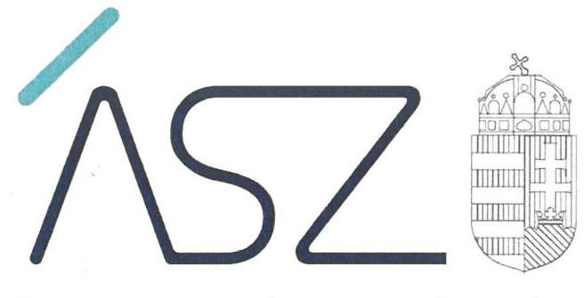
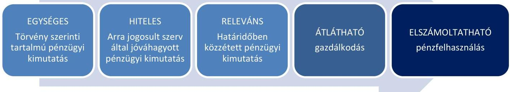

ÁLLAMI SZÁMVEVŐSZÉK

# JELENTÉS 

A rendszeres költségvetési támogatásban nem részesülő pártok ellenőrzése

13 párt

2021. 

21077
www.asz.hu

---

ÁLLAMI SZÁMVEVŐSZÉK

# JELENTÉS 

A rendszeres költségvetési támogatásban nem részesülő pártok ellenőrzése

13 párt
2021. 10. hó 06. nap

21077
www.asz.hu

---

# AZ ELLENŐRZÉST FELÜGYELTE: 

DR. NAGY IMRE felügyeleti vezető

## AZ ELLENŐRZÉST VEZETTE ÉS A VÉGREHAJTÁSÁÉRT FELELŐS:

DR. GÁL NÓRA ellenőrzésvezető

## A PROGRAM ÖSSZEÁLLÍTÁSÁÉRT FELELŐS:

TERLECZKYNÉ DR. EISELE EDIT projektvezető

IKTATÓSZÁM: EL-3385-001/2021.

TÉMASZÁM: 2542

ELLENŐRZÉS-AZONOSÍTÓ SZÁM: V0886

Jelentéseink az Országgyülés számítógépes hálózatán és az interneten a www.asz.hu címen is olvashatóak.

---

# TARTALOMJEGYZÉK 

■ ÖSSZEGZÉS ..... 5
■ AZ ELLENŐRZÉS CÉLJA ..... 7
■ AZ ELLENŐRZÉS TERÜLETE ..... 8
■ AZ ELLENŐRZÉS HÁTTERE, INDOKOLTSÁGA ..... 10
■ A JELENTÉS LÉNYEGES KÉRDÉSKÖREI ..... 11
■ AZ ELLENŐRZÉS HATÓKÖRE ÉS MÓDSZEREI ..... 12
■ ÉRTÉKELÉSEK ..... 14
■ MELLÉKLETEK ..... 15
I. sz. melléklet: Értelmező szótár ..... 15
■ RÖVIDÍTÉSEK JEGYZÉKE ..... 17

---

.

---

# ÖSSZEGZÉS 

Az ellenőrzött 13 pártból három párt 2017-2019. évekre eleget tett a törvényi előírások szerinti közzétételi kötelezettségének. A fennmaradó tíz pártból négy párt az Állami Számvevőszék 2021. évi felhívására már intézkedéseket tett a gazdálkodás átláthatóságának erősítésére. Hat pártnál magas a kockázata, hogy költségvetési támogatáshoz jutásuk esetén a kapott közpénzzel nem lesznek képesek elszámolni.

## Az ellenőrzés társadalmi indokoltsága

A 2014. és 2018. évi országgyűlési választások ellenőrzési tapasztalatai és a választásokhoz kapcsolódó állampolgári érdeklődés rámutatott a rendszeres költségvetési támogatásban nem részesülő pártok működésének és gazdálkodásának kockázataira. A társadalomban felerősödött az igény a pártok gazdálkodásának átláthatósága, a politikai élet tisztaságának biztosítása és a korrupciós kockázatok csökkentése iránt.

A magyarországi pártok többsége nem jogosult rendszeres központi költségvetési támogatásra, mivel az országgyűlési képviselőválasztásban részt vett választók szavazatának 1\%-át nem szerezték meg. Ugyanakkor a törvényi feltételek teljesítése esetén a pártok a választási kampányukhoz és a működésükhöz is költségvetési támogatásban részesülhetnek. Ezekben az esetekben kulcsfontosságú, hogy a demokratikus közhatalom gyakorlásában részt vevő és közpénzeket használó pártok a törvényi előírások betartásával járjanak el, gazdálkodásuk átlátható és más szervezetek számára is példamutató legyen.

Az Állami Számvevőszék a választók szavazatának 1\%-át el nem érő pártok esetében a választási kampányhoz kapcsolódóan kapott költségvetési támogatások felhasználását kérelemre ellenőrzi. A 2014. évi választásokhoz kapcsolódóan beérkezett kérelmek alapján történtek ilyen ellenőrzések, azonban a 2018. évi választások során erre irányuló kérelem nem érkezett, így erre az időszakra nem történt ellenőrzés.

A közelgő választásokra tekintettel az Állami Számvevőszék elérkezettnek látta az időt arra, hogy megtörténjen a választók szavazatának 1\%-át el nem érő pártok teljes körű átvilágítása, amely hatásos időben egy tisztulási folyamatot indíthat el, annak érdekében, hogy a következő választások során a potenciálisan rendszeres vagy nem rendszeres költségvetési támogatásra jogosult pártok alapvető gazdálkodási feltételei biztosítottak legyenek.

Az Állami Számvevőszék ellenőrzésének célja, hogy rámutasson a pártok gazdálkodásának átláthatóságát biztosító alapvető elvárásokra és az átláthatóságot veszélyeztető kockázatokra. Ezzel az Állami Számvevőszék előmozdíthatja a pártok jogkövető magatartását, erősítheti a pártok felkészültségét a közpénzek felhasználására, és hozzájárulhat a pártoknál a közpénzügyi helyzet javulásához.

## Értékelés

Az Állami Számvevőszék átfogó ellenőrzése 173 rendszeres költségvetési támogatásban nem részesülő pártra terjedt ki. Közülük 13 pártnál biztosítottak voltak az ellenőrizhetőség alapvető feltételei, jelen számvevőszéki jelentésben ezeknek a pártoknak az értékelése kerül bemutatásra. Az ellenőrizhetőségét nem biztosító 160 pártról külön számvevőszéki jelentés készült.

A rendszeres költségvetési támogatásban nem részesülő pártok ellenőrzése az átláthatóság legalapvetőbb, lényeges feltételeinek fennállását vizsgálta a 2017-2019. évekre vonatkozóan, amelyek hatással vannak a pártok gazdálkodásának elszámoltathatóságára.

A pártok átláthatóságának alapja a Magyar Közlönyben közzétett pénzügyi kimutatás rendelkezésre állása, amely a Párttörvényben rögzített tartalommal mutatja be a pártok gazdálkodásának lényeges elemeit. A pénzügyi kimutatás

---

biztosítja a pártok legfontosabb bevételi és kiadási adatainak megismerhetőségét, ezáltal a tagdíjakkal, az adományokkal és az esetleges közpénzekkel való elszámoltathatóság lehetőségét a pártok tagsága és a választópolgárok részéről.

Az ellenőrzés lényeges területeit és azok összefüggéseit az 1. ábra mutatja be.

1. ábra

**SZABÁLYSZERŰEN TELJESÍTETTE** a pénzügyi kimutatás készítési és közzétételi kötelezettségét három párt, az Alternatíva Párt, az AQUILA Párt és a Magyar Liberális Párt. Ezzel biztosították a gazdálkodásuk átláthatóságának alapvető feltételeit a párt tagsága és a választók felé. Költségvetési támogatáshoz jutásuk esetén alacsony annak a kockázata, hogy a kapott közpénzzel nem lesznek képesek elszámolni a törvényi előírások szerint.

**A GAZDÁLKODÁS ÁTLÁTHATÓSÁGA ERŐSÍTHETŐ** volt tíz pártnál a pénzügyi kimutatás jóváhagyására és közzétételére vonatkozó szabályok következetes betartása esetén. A törvény szerinti tartalmú pénzügyi kimutatás elkészítése és az arra jogosult szerv általi jóváhagyása biztosítja a pénzügyi kimutatásban szereplő bevételi és kiadási adatok megalapozottságának, hitelességének lényeges feltételeit. A pénzügyi kimutatás törvényi határidőben történő közzététele a Magyar Közlönyben biztosítja a releváns, aktuális adatok rendelkezésre állását, a gazdálkodás átláthatóságát a párt tagsága és a választók felé, egyben megteremti az elszámoltathatóság alapvető feltételét is. Ha a párt saját honlappal rendelkezik, a pénzügyi kimutatás közzététele a párt honlapján elősegítheti a bevételi és kiadásai adatok szélesebb körű megismerését. Az ellenőrzés tapasztalatainak hasznosításával a pártok erősíthetik a gazdálkodás átláthatóságát. Ezzel növelhetik a bizalmat a tagságuk és a választók felé, és egyúttal csökkenthetik annak a kockázatát, hogy költségvetési támogatáshoz jutásuk esetén a kapott közpénzzel nem lesznek képesek elszámolni a törvényi előírások szerint.

*Az Állami Számvevőszék az ellenőrzés tapasztalatai alapján a közpénzügyek átláthatóságának, rendezettségének mielőbbi előmozdítása érdekében 2021-ben figyelemfelhívó levéllel fordult tíz párt vezetője felé. Az Állami Számvevőszék a figyelemfelhívással lehetőséget biztosított arra, hogy a pártok lépéseket tegyenek a feltárt hiányosságok megszüntetésére.*

Három párt, a Magyar Munkáspárt, a Magyar Nemzeti Mozgalom és a Magyar Vállalkozók és Munkaadók Pártja élt az Állami Számvevőszék által biztosított lehetőséggel és intézkedéseket tett a feltárt hiányosságok megszüntetése érdekében. Költségvetési támogatáshoz jutásuk esetén a törvényi előírások és a gazdálkodásra vonatkozó belső szabályok jövőbeni betartása esélyt jelenthet az átlátható és elszámoltatható közpénzfelhasználásra. Egy párt, a Fiatalok Rendszerformáló Összetartó Civil Csoportja a 2017-2020. évekre vonatkozó pénzügyi kimutatások közzététele mellett a párt megszűnéséről adott tájékoztatást.

Hat párt, a Közös Értékek Pártja és a Változást Akaró Szavazók Pártja, a Magyar Demokrata Egységpárt, a Magyar Idealisták Szövetsége, a Népi Front Párt és az Összefogás a Civilekért Párt nem élt az Állami Számvevőszék által biztosított lehetőséggel, mivel felhívásra sem tett intézkedéseket a feltárt hiányosságok megszüntetése érdekében. Ezeknél a pártoknál magas a kockázata, hogy költségvetési támogatáshoz jutásuk esetén a kapott közpénzzel nem lesznek képesek elszámolni a törvényi előírások szerint.

---

# AZ ELLENŐRZÉS CÉLJA 

AZ ELLENŐRZÉS CÉLJA annak értékelése, hogy a rendszeres központi költségvetési támogatásban nem részesülő pártok eleget tettek-e a Párttörvény ${ }^{1}$ 9. § (1) bekezdésben előírt pénzügyi kimutatás készítési és közzétételi kötelezettségüknek.

---

# AZ ELLENŐRZÉS TERÜLETE 

## Alternatíva Párt, AQUILA Párt, Fiatalok Rendszerformáló Összetartó Civil Csoportja, Közös Értékek Pártja, Magyar Demokrata Egységpárt, Magyar Idealisták Szövetsége, Magyar Liberális Párt- Liberálisok, Magyar Munkáspárt, Magyar Nemzeti Mozgalom, Magyar Vállalkozók és Munkaadók Pártja, Népi Front Párt, Összefogás a Civilekért Párt, Változást Akaró Szavazók Pártja

Az ellenőrzött 13 pártból tizenkettő a teljes ellenőrzött időszakban (2017-2019. évek) működött, az Alternatíva Párt 2019. évben alakult. A Magyar Liberális Párt - Liberálisok csak a 2019. évben számított a rendszeres központi költségvetési támogatásban nem részesülő pártok közé, ezt megelőzően a 2017. és 2018. évben - a 2018. április 8-i választásokig - parlamenti képviselettel rendelkező párt volt és ezáltal 2017-ben és 2018-ban összesen 100,3 M Ft központi költségvetési támogatásban részesült.

A pártokra a Civil tv. ${ }^{2}$ és a Párttörvény rendelkezései voltak kötelező érvényűek. A pártok társadalmi rendeltetése, hogy a népakarat kialakításához és kinyilvánításához, valamint a politikai életben való állampolgári részvételhez szervezeti kereteket nyújtsanak. Az Országgyűlés ezért az állampolgárok egyesülési szabadságának és politikai jogainak érvényesülése, valamint a társadalomban meglévő különböző érdekek és értékek demokratikus megjelenítésének és érvényesítésének előmozdítása érdekében alkotta meg a Párttörvényt.

A törvény hatálya azokra az egyesületekre terjed ki, amelyek nyilvántartott tagsággal rendelkeznek, és amelyek a nyilvántartásba vételüket végző bíróság előtt kinyilvánítják, hogy e törvény rendelkezéseit magukra nézve kötelezőnek ismerik el.

Ennek megfelelően, a párttörvényben rögzített előírásokat minden pártnak be kell tartania. Ez közpénzügyi szempontból különös jelentőséggel bír azért, mert a pártok a Párttörvény rendelkezései szerint rendszeres, a kampányköltségek átláthatóvá tételéről szóló törvény³ által előírt törvényi feltételekkel pedig az országgyűlési választási kampányhoz kapcsolódóan nem rendszeres támogatásra jogosultak.

A központi költségvetésről szóló törvényben a pártok rendszeres támogatására fordítható összeg 25\%-a a parlamentben mandátumot szerzett pártokat illeti meg, a 75\%-nak megfelelő összeg pedig az országgyűlési választások eredménye alapján a pártra, illetőleg a párt jelöltjeire leadott szavazatok arányában illeti meg a pártokat. Nem jogosultak rendszeres költségvetési támogatásra azok a választáson részt vett pártok, amelyek a választók szavazatának 1\%-át sem szerezték meg. A jelen ellenőrzés ez utóbbi pártokra vonatkozik.

---

Az ellenőrzésre az Országos Bírósági Hivatal adatszolgáltatása, illetve a Magyar Közlöny Hivatalos Értesítőjében megjelent adatok alapján kijelölésre került az összes, az ellenőrzési időszakban a közhiteles nyilvántartásban megtalálható, a következő választáson potenciálisan költségvetési támogatásra jogosult párt. Emellett az ellenőrzés időszakát követően egyes pártok megszűnésére, átalakulására és új pártok alakulására kerülhetett és kerülhet sor a jövőben, amely változásokat jelen számvevőszéki jelentés nem tudott figyelembe venni.

Az ellenőrzés nem terjed ki a jelenleg rendszeres költségvetési támogatásban részesülő pártokra, vagyis azon hét pártra, amely a 2018. évi választásokon parlamenti mandátumot szereztek, illetve további két pártra, amelyek nem jutottak mandátumhoz, azonban a választók szavazatának több, mint egy százalékát megszerezték. Ezen pártokról az ÁSZ ${ }^{4}$ - törvényi kötelezettségét teljesítve - külön jelentést készít.

Az ellenőrzés nem terjed ki továbbá arra a 49 pártra, amelyek ellenőrzése az ellenőrzés időszakában felmerült objektív körülmények miatt (végelszámolás, vagy felszámolás folyamatban léte, egyesületté alakulás, törlés) okafogyottá vált.

A fennmaradt 173 pártból jelen ellenőrzés megállapításai 13 pártra vonatkoznak. A további 160 párt ellenőrzési megállapításairól külön jelentés készül.

Ezek a pártok és jelöltjeik a törvényi feltételeknek való megfelelés esetén az országgyűlési választási kampányhoz kapcsolódóan költségvetési támogatásban részesülhetnek, illetve a következő választás eredményétől függően rendszeres költségvetési támogatásra válhatnak jogosulttá. Ezért jelentős társadalmi érdek fűződik ahhoz, hogy a következő választások időszakára ezek a pártok a Párttörvényben előírt feltételeket teljesítő, jogkövető pártok legyenek, átláthatóságuk és elszámoltathatóságuk biztosított legyen.

---

# AZ ELLENŐRZÉS HÁTTERE, INDOKOLTSÁGA 

A magyarországi pártok többsége nem jogosult rendszeres központi költségvetési támogatásra, mivel az országgyűlési képviselőválasztásban részt vett választók szavazatának 1\%-át sem szerezték meg. A Párttörvény a rendszeres állami költségvetési támogatásban részesülő pártok esetében az ellenőrzést kétéves gyakorisággal írja elő, a rendszeres központi költségvetési támogatásban nem részesülő pártok ellenőrzésének gyakoriságára nincs jogszabályi rendelkezés. Ebből következően az ellenőrzés jelentőségét nem az ellenőrzött pártok gazdálkodásának nagyságrendje, hanem a jogállamiságból eredő azon garanciális követelmény indokolja, hogy valamennyi párt gazdálkodása törvényességének ellenőrzése biztosított legyen.
 legyen.

---

# A JELENTÉS LÉNYEGES KÉRDÉSKÖREI 

1. A párt a pénzügyi kimutatás készítési és közzétételi kötelezettségét szabályszerűen teljesítette-e?

---

# AZ ELLENŐRZÉS HATÓKÖRE ÉS MÓDSZEREI 

## Az ellenőrzés típusa

Szabályszerűségi ellenőrzés.

## Az ellenőrzött időszak

2017. január 1.-2019. december 31.

## Az ellenőrzés tárgya

A párt ellenőrzése során az ellenőrzés tárgyát képezi a 2017-2019. évekre vonatkozó pénzügyi kimutatások elkészítése és a Párttörvény szerinti közzététele szabályszerűségének ellenőrzése. A szabályszerűség vizsgálata a pénzügyi kimutatás elkészítésére és a Magyar Közlönyben történő határidőben való közzétételre, valamint - a saját honlappal rendelkező pártok esetében - a honlapon történő közzétételre terjed ki.

## Az ellenőrzött szervezet

- Alternatíva Párt (a 2019. év vonatkozásában)
- AQUILA Párt
- Fiatalok Rendszerformáló Összetartó Civil Csoportja
- Közös Értékek Pártja
- Magyar Demokrata Egységpárt
- Magyar Idealisták Szövetsége
- Magyar Liberális Párt - Liberálisok (2019. év vonatkozásában)
- Magyar Munkáspárt
- Magyar Nemzeti Mozgalom
- Magyar Vállalkozók és Munkaadók Pártja
- Népi Front Párt
- Összefogás a Civilekért Párt
- Változást Akaró Szavazók Pártja

## Az ellenőrzés jogalapja

Az ellenőrzés jogalapját az ÁSZ tv. ${ }^{5} 5$. § (11) bekezdés a) pontja, a Párttörvény 10. § (1) bekezdése képezik.

---

# Az ellenőrzés módszerei 

Az ellenőrzést az ÁSZ az ellenőrzési program szempontjai, az ellenőrzött időszakban hatályos jogszabályok, az ellenőrzés általános szakmai szabályai, az ellenőrzésre irányadó ÁSZ módszertanok figyelembevételével végzi.

A törvényi előírásokat, valamint az ÁSZ által meghirdetett, nyilvános módszertant figyelembe véve az ellenőrzés hatóköre kiegészülhet a kockázatjelzések alapján, a kockázatértékelés függvényében további lényeges ügyek szabályosságának ellenőrzésével az ellenőrzés megkezdésének időpontjáig.

Az ellenőrzés kiterjed minden olyan körülményre és adatra, amely az ÁSZ jogszabályban meghatározott feladatainak teljesítéséhez, valamint a program végrehajtása folyamán felmerült újabb összefüggések feltárásához szükséges.

Az ellenőrzés ideje alatt az ÁSZ az ellenőrzött párttal történő kapcsolattartást az ÁSZ SZMSZ ${ }^{\circledR}$-ének vonatkozó előírásai alapján biztosítja.

Az ellenőrzési bizonyítékként felhasználható adatforrások közé tartoznak egyrészt az ellenőrzési program részletes szempontjainál felsorolt adatforrások, másrészt minden egyéb az ellenőrzés folyamán feltárt, az ellenőrzés szempontjából információt tartalmazó dokumentum.

Az ellenőrzést az ellenőrzött szervezetek által rendelkezésre bocsátott dokumentumokra, adatokra kell alapozni. A rendelkezésre bocsátott adatok, információk kontrollja az ellenőrzés keretében történik. Az ellenőrzés céljának eléréséhez szükséges bizonyítékokat a számvevő az egyes adatok közvetlen, részletes elemzésével szerzi meg, a következő ellenőrzési eljárások alkalmazásával: megfigyelés, szemrevételezés, információkérés, megerősítés, valamint elemző eljárás.

---

# 1. A párt a pénzügyi kimutatás készítési és közzétételi kötelezettségét szabályszerűen teljesítette-e? 

Összegző értékelés Három párt a pénzügyi kimutatás készítési és közzétételi kötelezettségét szabályszerűen teljesítette. Tíz pártnál a pénzügyi kimutatások jóváhagyása és közzététele területén a gazdálkodás átláthatóságát befolyásoló hiányosságokat tárt fel az ellenőrzés.

A Magyar Közlönyben közzétett pénzügyi kimutatás 2019. évre mindegyik párt esetében rendelkezésre állt. A 2017. és 2018. évek tekintetében egy párt a 2017-2018. évre, egy párt pedig a 2018. évre nem tette közzé a pénzügyi kimutatását a Magyar Közlönyben.

SZABÁLYSZERŰEN TETT ELEGET közzétételi kötelezettségének három párt minden ellenőrzött évre vonatkozóan. A pénzügyi kimutatások a Párttörvény szerinti bontásban tartalmazták a bevételeket és a kiadásokat. A pénzügyi kimutatásaikat a jogszabályi előírás szerint elkészítették, azokat az arra jogosult szerv jóváhagyta. A pénzügyi kimutatásokat törvényi határidőben közzétették.

HATÁRIDŐBEN TELJESÍTETTE a pénzügyi kimutatásra vonatkozó közzétételi kötelezettségét négy párt. Kilenc párt esetében a törvényi határidő betartásával erősíthető a gazdálkodás átláthatósága. A pénzügyi kimutatás akkor tudja betölteni a szerepét a párt gazdálkodásának átláthatóságában, ha a párt betartja a törvényben a közzétételre előírt határidőt. Ez biztosítja, hogy a párt tagsága és a választópolgárok releváns, aktuális információkat kapnak a párt gazdálkodásának lényeges elemeiről.

AZ ARRA JOGOSULT SZERV hagyta jóvá a pénzügyi kimutatást 11 pártnál. Két párt nem igazolta, hogy a pénzügyi kimutatást az arra jogosult szerv hagyta volna jóvá. A pénzügyi kimutatás szabályszerű jóváhagyása kiemelten fontos a kimutatásban szereplő bevételi és kiadási adatok megalapozottsága szempontjából. A pénzügyi kimutatás belső szabályok szerinti jóváhagyása a párttagság és a választópolgárok hiteles tájékoztatásának alapvető feltétele.

A PÉNZÜGYI KIMUTATÁSOK HONLAPON TÖRTÉNŐ KÖZZÉTÉTELÉT az ellenőrzés időpontjában honlappal rendelkező tíz párt közül nyolc párt biztosította a párt honlapján. Két párt esetében a pénzügyi kimutatások saját honlapon történő közzététele nem volt igazolt. A pénzügyi kimutatás honlapon történő közzététele támogatja a pénzügyi kimutatás szélesebb körben való megismerhetőségét, ezáltal erősíti a párt gazdálkodásának átláthatóságát.

---

# MELLÉKLETEK 

- I. SZ. MELLÉKLET: ÉRTELMEZŐ SZÓTÁR
pénzügyi kimutatás
költségvetési támogatás

A Párt tv. 9. § (1) bekezdésében meghatározott, a törvény 1. számú melléklete szerinti pénzügyi kimutatás (hatályos 2014. május 6-ától), amelyet a pártok kötelesek minden év május 31-ig a Magyar Közlönyben, valamint saját honlappal rendelkező pártok a honlapjukon is közzétenni.
Az államháztartás alrendszerei terhére nyújtott pénzbeli vagy nem pénzbeli juttatás, amelyet a támogató nem elsősorban ellenszolgáltatás ellenében, de konkrét program megvalósítása vagy meghatározott időszakban a támogatott szervezet működtetése érdekében nyújt. (Civil tv. 2. § 15. pont)

---

.

---

# RÖVIDÍTÉSEK JEGYZÉKE 

${ }^{1}$ Párttörvény
${ }^{2}$ Civil tv.
${ }^{3}$ Kampányköltségek átláthatóságáról szóló törvény
${ }^{4}$ ÁSZ
${ }^{5}$ ÁSZ tv.
${ }^{6}$ ÁSZ SZMSZ
1989. évi XXXIII. törvény a pártok működéséről és gazdálkodásáról 2011. évi CLXXV. törvény - az egyesülési jogról, a közhasznú jogállásról, valamint a civil szervezetek működéséről és támogatásáról
2013. évi LXXXVII. törvény az országgyűlési képviselők választása kampányköltségeinek átláthatóvá tételéről
Állami Számvevőszék
2011. évi LXVI. törvény az Állami Számvevőszékről

Állami Számvevőszék Szervezeti és Működési Szabályzata

---

# ÁSZ 

ÁLLAMI SZÁMVEVŐSZÉK
1052 Budapest, Apáczai Cs. J. u. 10. I 1364 Budapest 4. Pf. 54 TEL: +36 14849100
email: szamvevoszek@asz.hu
web: www.asz.hu | www.aszhirportal.hu
