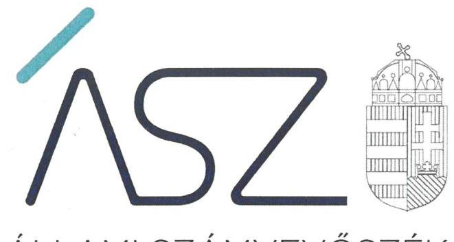
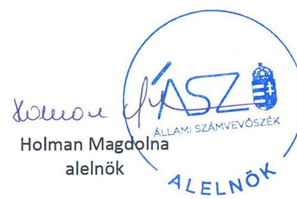
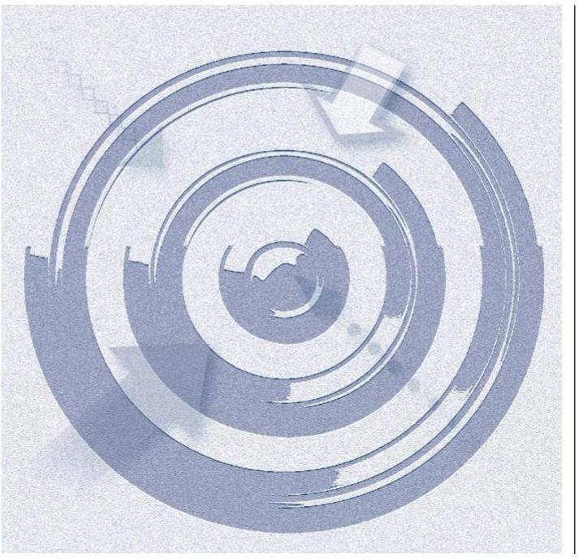

ÁLLAMI SZÁMVEVŐSZÉK

# JELENTÉS 

A rendszeres költségvetési támogatásban nem részesülő pártok ellenőrzése

160 párt

2021. 

21078
www.asz.hu

---

ÁLLAMI SZÁMVEVŐSZÉK

# JELENTÉS

A rendszeres költségvetési támogatásban nem részesülő pártok ellenőrzése

160 párt

2021. 10. hó 06. nap

21078
www.asz.hu

---

# AZ ELLENŐRZÉST FELÜGYELTE: 

DR. NAGY IMRE felügyeleti vezető

## AZ ELLENŐRZÉST VEZETTE ÉS A VÉGREHAJTÁSÁÉRT FELELŐS:

DR. GÁL NÓRA ellenőrzésvezető

## A PROGRAM ÖSSZEÁLLÍTÁSÁÉRT FELELŐS:

TERLECZKYNÉ DR. EISELE EDIT projektvezető

IKTATÓSZÁM: EL-3384-001/2021
TÉMASZÁM: 2542
ELLENŐRZÉS-AZONOSÍTÓ SZÁM: V0886

Jelentéseink az Országgyűlés számítógépes hálózatán és az interneten a www.asz.hu címen is olvashatóak.

---

# TARTALOMJEGYZÉK 

■ ÖSSZEGZÉS ..... 5
■ AZ ELLENŐRZÉS CÉLJA ..... 7
■ AZ ELLENŐRZÉS TERÜLETE ..... 8
■ AZ ELLENŐRZÉS HÁTTERE, INDOKOLTSÁGA ..... 10
■ A JELENTÉS LÉNYEGES KÉRDÉSKÖREI ..... 11
■ AZ ELLENŐRZÉS HATÓKÖRE ÉS MÓDSZEREI ..... 12
■ ÉRTÉKELÉSEK ..... 14
■ MELLÉKLETEK ..... 15
I. sz. melléklet: Értelmező szótár ..... 15
II. sz. melléklet: Ellenőrzéssel érintett pártok ..... 16
■ RÖVIDÍTÉSEK JEGYZÉKE ..... 19

---

.

---

# ÖSSZEGZÉS 

Az ellenőrzéssel érintett 160 párt a 2017-2019. évekre vonatkozóan nem tett eleget az ellenőrizhetőség követelményének. Közülük kilenc párt az Állami Számvevőszék 2021. évi felhívására már igazolta, 151 párt nem igazolta az ellenőrizhetőség és a törvényes gazdálkodás alapvető feltételeinek meglétét. A 151 pártnál költségvetési támogatáshoz jutásuk esetén nem biztosított a közpénz átlátható és elszámoltatható felhasználása.

## Az ellenőrzés társadalmi indokoltsága

A 2014. és 2018. évi országgyűlési választások ellenőrzési tapasztalatai és a választásokhoz kapcsolódó állampolgári érdeklődés rámutatott a rendszeres költségvetési támogatásban nem részesülő pártok működésének és gazdálkodásának kockázataira. A társadalomban felerősödött az igény a pártok gazdálkodásának átláthatósága, a politikai élet tisztaságának biztosítása és a korrupciós kockázatok csökkentése iránt.

A magyarországi pártok többsége nem jogosult rendszeres központi költségvetési támogatásra, mivel az országgyűlési képviselőválasztásban részt vett választók szavazatának 1%-át nem szerezték meg. Ugyanakkor a törvényi feltételek teljesítése esetén a pártok a választási kampányukhoz és a működésükhöz is költségvetési támogatásban részesülhetnek. Ezekben az esetekben kulcsfontosságú, hogy a demokratikus közhatalom gyakorlásában részt vevő és közpénzeket használó pártok a törvényi előírások betartásával járjanak el, gazdálkodásuk átlátható és más szervezetek számára is példamutató legyen.

Az Állami Számvevőszék a választók szavazatának 1%-át el nem érő pártok esetében a választási kampányhoz kapcsolódóan kapott költségvetési támogatások felhasználását kérelemre ellenőrzi. A 2014. évi választásokhoz kapcsolódóan beérkezett kérelmek alapján történtek ilyen ellenőrzések, azonban a 2018. évi választások során erre irányuló kérelem nem érkezett, így erre az időszakra nem történt ellenőrzés.

A közelgő választásokra tekintettel az Állami Számvevőszék elérkezettnek látta az időt arra, hogy megtörténjen a választók szavazatának 1%-át el nem érő pártok teljes körű átvilágítása, amely hatásos időben egy tisztulási folyamatot indíthat el, annak érdekében, hogy a következő választások során a potenciálisan rendszeres vagy nem rendszeres költségvetési támogatásra jogosult pártok alapvető gazdálkodási feltételei biztosítottak legyenek.

Az Állami Számvevőszék ellenőrzésének célja, hogy rámutasson a pártok gazdálkodásának átláthatóságát biztosító alapvető elvárásokra és az átláthatóságot veszélyeztető kockázatokra. Ezzel az Állami Számvevőszék előmozdíthatja a pártok jogkövető magatartását, erősítheti a pártok felkészültségét a közpénzek felhasználására, és hozzájárulhat a pártoknál a közpénzügyi helyzet javulásához.

## Tények és következtetések

Az Állami Számvevőszék átfogó ellenőrzése 173 rendszeres költségvetési támogatásban nem részesülő pártra terjedt ki. Közülük 160 pártnál nem voltak biztosítottak az ellenőrizhetőség alapvető feltételei, jelen számvevőszéki jelentésben az ezekkel a pártokkal összefüggésben feltárt tények, körülmények kerülnek bemutatásra. Az ellenőrizhetőségét biztosító 13 pártról külön számvevőszéki jelentés készült.

A rendszeres költségvetési támogatásban nem részesülő pártok ellenőrzése az átláthatóság legalapvetőbb, lényeges feltételeinek fennállását vizsgálta volna a 2017-2019. évekre vonatkozóan.

Nem rendelkezett törvényes képviselővel 56 párt, 60 párt pedig a bejegyzett székhelyén nem volt elérhető. Emellett 21 párt nem biztosította a gazdálkodása átláthatóságának ellenőrizhetőségét. A gazdálkodásának átláthatóságát nem biztosította a választók és saját tagsága felé 23 párt, mivel törvényi előírás ellenére nem tett eleget a pénzügyi kimutatás készítési és közzétételi kötelezettségének.

---

Az ellenőrzés során feltárt tények, körülmények felvetették annak a gyanúját, hogy az érintett pártoknál a törvényes működés nem biztosított. Emiatt az Állami Számvevőszék az ellenőrzés során feltárt tényekről, körülményekről tájékoztatta a pártok működése feletti törvényességi ellenőrzésre jogkörrel rendelkező, valamint törvényességi felügyeleti eljárás indítványozására jogosult ügyészséget.

Az ügyészség válaszában tájékoztatta az Állami Számvevőszéket, hogy a törvényes képviselővel nem rendelkező 56 párt, és a székhelyén nem elérhető 60 párt esetében megvizsgálták a törvényességi felügyeleti eljárás kezdeményezésének szükségességét, ugyanakkor az ügyészi eljárás a hatályos jogi szabályozásra tekintettel kizárólag a civil szervezetek bírósági nyilvántartásának adatait érintő nyilvántartási törvénysértésekre terjedt ki. Emellett az ügyészség a gazdálkodás átláthatóságát vagy annak ellenőrizhetőségét nem biztosító 23 illetve 21 pártra vonatkozóan jelezte, hogy a hatályos törvényi rendelkezések szerint a pártok gazdálkodása körében feltárt szabálytalanságok alapján ügyészi fellépésre nincs törvényes alap. Az ügyészség válaszában foglaltak alapján felvetődhet a pártok működésének törvényességi ellenőrzésére és felügyeletére vonatkozó jogszabályi előírások felülvizsgálatának mérlegelése.

Az Állami Számvevőszék az ellenőrzés tapasztalatai alapján a közpénzügyek átláthatóságának, rendezettségének mielőbbi előmozdítása érdekében 2021-ben figyelemfelhívó levéllel fordult a pártok vezetői felé. Az Állami Számvevőszék a figyelemfelhívással lehetőséget biztosított arra, hogy a párt a 2021. évre igazolja az ellenőrizhetőség és a törvényes gazdálkodás alapvető feltételeinek meglétét.

Kilenc párt élt az Állami Számvevőszék által biztosított lehetőséggel és dokumentumokkal igazolta, hogy 2021. évben az ellenőrizhetőség és a törvényes gazdálkodás alapvető feltételei fennállnak. Költségvetési támogatáshoz jutásuk esetén a törvényi előírások és a gazdálkodásra vonatkozó belső szabályok jövőbeni betartása esélyt jelenthet az átlátható és elszámoltatható közpénzfelhasználásra. Az érintett kilenc párt a következő:
$\qquad$ 1. Független Kisgazda-, Földmunkás- és Polgári Párt
$\qquad$ 2. Le az Adók 75%-ával Párt
$\qquad$ 3. Magyarországi Munkáspárt 2006 - EURÓPAI BALOLDAL
$\qquad$ 4. Magyar Szociális Párt
$\qquad$ 5. Mi Hazánk Mozgalom
$\qquad$ 6. Nemzeti Szolidaritás
$\qquad$ 7. Online Marketing Hálózat
$\qquad$ 8. Platón Párt
$\qquad$ 9. Zöldek, a Normális Emberek Pártja
151 párt nem élt az Állami Számvevőszék által biztosított lehetőséggel, mivel felhívásra sem igazolta, hogy 2021. évben az ellenőrizhetőség és a gazdálkodás alapvető feltételei fennállnak. Közülük 91 párt a bejegyzett székhelyén az elérhetőségét nem biztosította, 40 párt nem válaszolt a figyelemfelhívásra. További 20 párt a figyelemfelhívó levélre küldött válaszával nem igazolta 2021. évre a törvényes gazdálkodás alapvető feltételeinek meglétét. Ezeknél a pártoknál magas a kockázata, hogy költségvetési támogatáshoz jutásuk esetén a kapott közpénzzel nem lesznek képesek elszámolni a törvényi előírások szerint.

---

# AZ ELLENŐRZÉS CÉLJA 

AZ ELLENŐRZÉS CÉLJA annak értékelése, hogy a rendszeres központi költségvetési támogatásban nem részesülő pártok eleget tettek-e a Párttörvény ${ }^{1}$ 9. § (1) bekezdésben előírt pénzügyi kimutatás készítési és közzétételi kötelezettségüknek.

---

# **AZ ELLENŐRZÉS TERÜLETE**

## **160 rendszeres költségvetési támogatásban nem részesülő párt, a II. számú melléklet szerint**

A pártok a Civil tv.² és a Párttörvény rendelkezései alapján kötelesek működni.

A pártok társadalmi rendeltetése, hogy a népakarat kialakításához és kinyilvánításához, valamint a politikai életben való állampolgári részvételhez szervezeti kereteket nyújtsanak. Az Országgyűlés ezért az állampolgárok egyesülési szabadságának és politikai jogainak érvényesülése, valamint a társadalomban meglévő különböző érdekek és értékek demokratikus megjelenítésének és érvényesítésének előmozdítása érdekében alkotta meg a Párttörvényt.

A törvény hatálya azokra az egyesületekre terjed ki, amelyek nyilvántartott tagsággal rendelkeznek, és amelyek a nyilvántartásba vételüket végző bíróság előtt kinyilvánítják, hogy e törvény rendelkezéseit magukra nézve kötelezőnek ismerik el.

Ennek megfelelően, a Párttörvényben rögzített előírásokat minden pártnak be kell tartania. Ez közpénzügyi szempontból különös jelentőséggel bír azért, mert a pártok a Párttörvény rendelkezései szerint rendszeres, a kampányköltségek átláthatóvá tételéről szóló törvény³ rendelkezései szerint pedig törvényi feltételekkel az országgyűlési választási kampányhoz nem rendszeres költségvetési támogatásban részesülhetnek.

A központi költségvetésről szóló törvényben a pártok rendszeres támogatására fordítható összeg 25 %-a a parlamentben mandátumot szerzett pártokat illeti meg, a 75%-nak megfelelő összeg pedig az országgyűlési választások eredménye alapján a pártra, illetőleg a párt jelöltjeire leadott szavazatok arányában illeti meg a pártokat. Nem jogosultak rendszeres költségvetési támogatásra azok a választáson részt vett pártok, amelyek a választók szavazatának 1%-át sem szerezték meg. A jelen ellenőrzés ez utóbbi pártokra vonatkozik.

Az ellenőrzésre az Országos Bírósági Hivatal adatszolgáltatása, illetve a Magyar Közlöny Hivatalos Értesítőjében megjelent adatok alapján kijelölésre került az összes, az ellenőrzési időszakban a közhiteles nyilvántartásban megtalálható, a következő választáson potenciálisan költségvetési támogatásra jogosult párt. Emellett az ellenőrzés időszakát követően egyes pártok megszűnésére, átalakulására és új pártok alakulására kerülhetett és kerülhet sor a jövőben, amely változásokat jelen számvevőszéki jelentés nem tudott figyelembe venni.

Az ellenőrzés nem terjed ki a jelenleg rendszeres költségvetési támogatásban részesülő pártokra, vagyis azon hét pártra, amely a 2018. évi választásokon parlamenti mandátumot szereztek, illetve további két pártra, amelyek nem jutottak mandátumhoz, azonban a választók szavazatának több, mint egy százalékát megszerezték. Ezen pártokról az ÁSZ – törvényi kötelezettségét teljesítve – külön jelentést készít.

---

Az ellenőrzés nem terjed ki továbbá arra a 49 pártra, amelyek ellenőrzése az ellenőrzés időszakában felmerült objektív körülmények miatt (végelszámolás, vagy felszámolás folyamatban léte, egyesületté alakulás, törlés) okafogyottá vált.

A fennmaradt 173 ellenőrzött pártból hat olyan párt van, amelyek az előző választási kampányhoz kapcsolódóan összesen 1162 millió forint költségvetési támogatásban részesültek. A jelenleg rendszeres költségvetési támogatásra nem jogosult pártok tehát potenciálisan költségvetési támogatásra jogosultak, egyrészt a választási kampányhoz kapcsolódóan, másrészt a következő választás eredményétől függően, ezért jelentős társadalmi érdek fűződik ahhoz, hogy a következő választások időszakára ezek a pártok a Párttörvényben előírt feltételeket teljesítő, jogkövető pártok legyenek, átláthatóságuk és elszámoltathatóságuk biztosított legyen.

A jelen ellenőrzés 160 pártra vonatkozik. A további 13 párt ellenőrzési értékeléséről külön jelentés készül.

---

# AZ ELLENŐRZÉS HÁTTERE, INDOKOLTSÁGA 

A magyarországi pártok többsége nem jogosult rendszeres központi költségvetési támogatásra, mivel az országgyűlési képviselőválasztásban részt vett választók szavazatának 1%-át sem szerezték meg. A Párttörvény a rendszeres állami költségvetési támogatásban részesülő pártok esetében az ellenőrzést kétéves gyakorisággal írja elő, a központi költségvetési támogatásban nem részesülő pártok ellenőrzésének gyakoriságára nincs jogszabályi rendelkezés. Ebből következően az ellenőrzés jelentőségét nem az ellenőrzött pártok gazdálkodásának nagyságrendje, hanem a jogállamiságból eredő azon garanciális követelmény indokolja, hogy valamennyi párt gazdálkodása törvényességének ellenőrzése biztosított legyen.

---

# A JELENTÉS LÉNYEGES KÉRDÉSKÖREI 

1. A párt a pénzügyi kimutatás készítési és közzétételi kötelezettségét szabályszerűen teljesítette-e?

---

# AZ ELLENŐRZÉS HATÓKÖRE ÉS MÓDSZEREI 

## Az ellenőrzés típusa

Szabályszerűségi ellenőrzés.

## Az ellenőrzött időszak

2017. január 1.-2019. december 31.

## Az ellenőrzés tárgya

A párt ellenőrzése során az ellenőrzés tárgyát képezi a 2017 - 2019. évekre vonatkozó pénzügyi kimutatások elkészítése és a Párttörvény szerinti közzététele szabályszerűségének ellenőrzése. A szabályszerűség vizsgálata a pénzügyi kimutatás elkészítésére és a Magyar Közlönyben történő határidőben való közzétételre terjed ki.

## Az ellenőrzött szervezet

160 párt a II. számú mellékletben foglaltak szerint.

## Az ellenőrzés jogalapja

Az ellenőrzés jogalapját az ÁSZ tv. ${ }^{4}$ 5. § (11) bekezdés a) pontja, a Párttörvény 10. § (1) bekezdése képezik.

## Az ellenőrzés
 módszerei

Az ellenőrzést az ÁSZ az ellenőrzési program szempontjai, az ellenőrzött időszakban hatályos jogszabályok, az ellenőrzés általános szakmai szabályai, az ellenőrzésre irányadó ÁSZ módszertanok figyelembevételével végzi.

A törvényi előírásokat, valamint az ÁSZ által meghirdetett, nyilvános módszertant figyelembe véve az ellenőrzés hatóköre kiegészülhet a kockázatjelzések alapján, a kockázatértékelés függvényében további lényeges ügyek szabályosságának ellenőrzésével az ellenőrzés megkezdésének időpontjáig.

Az ellenőrzés kiterjed minden olyan körülményre és adatra, amely az ÁSZ jogszabályban meghatározott feladatainak teljesítéséhez, valamint a program végrehajtása folyamán felmerült újabb összefüggések feltárásához szükséges.

---

Az ellenőrzés ideje alatt az ÁSZ az ellenőrzött párttal történő kapcsolattartást az ÁSZ SZMSZ-ének vonatkozó előírásai alapján biztosítja.

Az ellenőrzési bizonyítékként felhasználható adatforrások közé tartoznak egyrészt az ellenőrzési program részletes szempontjainál felsorolt adatforrások, másrészt minden egyéb az ellenőrzés folyamán feltárt, az ellenőrzés szempontjából információt tartalmazó dokumentum.

Az ellenőrzést az ellenőrzött szervezetek által rendelkezésre bocsátott dokumentumokra, adatokra kell alapozni. A rendelkezésre bocsátott adatok, információk kontrollja az ellenőrzés keretében történik. Az ellenőrzés céljának eléréséhez szükséges bizonyítékokat a számvevő az egyes adatok közvetlen, részletes elemzésével szerzi meg, a következő ellenőrzési eljárások alkalmazásával: megfigyelés, szemrevételezés, információkérés, megerősítés, valamint elemző eljárás.

---

# 1. A párt a pénzügyi kimutatás készítési és közzétételi kötelezettségét szabályszerűen teljesítette-e? 

## Összegző értékelés

Az ellenőrzéssel érintett 160 párt egyike sem biztosította az ellenőrizhetőség alapvető feltételeit.

Az ellenőrzés 137 párt esetében az ellenőrizhetőség alapvető feltételeit érintő tényeket, körülményeket tárt fel.

A Ptk. ${ }^{6}$ előírja, hogy a jogi személynek, így a pártnak is bejegyzett székhellyel és törvényes képviselővel kell rendelkeznie. A párt bejegyzett székhelyen történő fellelhetőségének biztosítása hiányában a szervezet elérhetősége nem lehetséges, törvényes képviselő hiányában pedig ellehetetlenül, hogy a szervezet nevében eljárásra jogosult személy a szükséges jognyilatkozatokat megtegye. A székhelyen történő elérhetőséget 60 párt nem biztosította. További 56 párt nem rendelkezett törvényes képviselővel.

Az ellenőrizhetőség biztosítása érdekében a pártok kötelezettsége, hogy biztosítsák a gazdálkodásuk törvényességét igazoló dokumentumok rendelkezésre állását. 21 párt nem igazolta hitelt érdemlő módon a gazdálkodás törvényességét, így átláthatósága sem volt biztosított.

További 23 párt közül 16 párt a 2017-2019. évekre, három párt a 2018. évi alapítását követően a 2018-2019. évekre, míg négy párt a 2019. évi alapítását követően a 2019. évre vonatkozó pénzügyi kimutatás készítési és közzétételi kötelezettségét nem teljesítette, a Magyar Közlöny Hivatalos Értesítőjében nem tette közzé éves pénzügyi kimutatását.

Amennyiben a párt ellenőrizhetőségének alapvető feltételei nem biztosítottak, nem biztosított a párt által kapott közpénz szabályszerű felhasználása és elszámoltathatósága sem.

---

# MELLÉKLETEK 

- I. SZ. MELLÉKLET: ÉRTELMEZŐ SZÓTÁR
pénzügyi kimutatás
költségvetési támogatás

A Párt tv. 9. § (1) bekezdésében meghatározott, a törvény 1. számú melléklete szerinti pénzügyi kimutatás (hatályos 2014. május 6-ától), amelyet a pártok kötelesek minden év május 31-ig a Magyar Közlönyben, valamint saját honlappal rendelkező pártok a honlapjukon is közzétenni.
Az államháztartás alrendszerei terhére nyújtott pénzbeli vagy nem pénzbeli juttatás, amelyet a támogató nem elsősorban ellenszolgáltatás ellenében, de konkrét program megvalósítása vagy meghatározott időszakban a támogatott szervezet működtetése érdekében nyújt. (Civil tv. 2. § 15. pont)

---

# II. SZ. MELLÉKLET: ELLENŐRZÉSSEL ÉRINTETT PÁRTOK

|  1. | 3-Együtt az Egységért Párt | 55. | Kontroll Csoport | 109. | Négynap Párt  |
| --- | --- | --- | --- | --- | --- |
|  2. | A Haza Pártja | 56. | Konzervatív Néppárt | 110. | Nemzetegyesítő Mozgalom  |
|  3. | A MI Pártunk - IMA | 57. | Korrupció Nélküli Magyarországért Párt (KNMP) | 111. | Nemzeti Baloldal Párt  |
|  4. | Állatvédő Párt | 58. | Közlekedő Polgárok Pártja | 112. | Nemzeti Egységben Magyarországért Párt  |
|  5. | Alternatív Magyar Néppárt | 59. | Közös Jövő Párt | 113. | Nemzeti Együttműködés és Megbékélés Párt  |
|  6. | Áramlat Együttműködés a Jelen-létért és a Jövő-képért Párt | 60. | Közös Megoldás Magyarországért Mozgalom | 114. | Nemzeti Értékelvű Párt  |
|  7. | Demokrata Párt | 61. | Közös Nevező 2018 | 115. | Nemzeti Radikális Köztársasági Párt  |
|  8. | Demokrata Roma Nép Párt | 62. | Közösen Egymásért Demokratikus Néppárt | 116. | Nemzeti Szolidaritás  |
|  9. | Demokraták az emberi Jogokért Párt | 63. | Közösség a Társadalmi Igazságosságért Néppárt (KTI) | 117. | Nép Oldali Párt  |
|  10. | Demokraták Magyarországért Új Szövetség Párt | 64. | Le az Adók 75%-val | 118. | NÉPPÁRT.HU  |
|  11. | Demokraták Pártja | 65. | Lehetőség Magyarország Jövőjéért Párt | 119. | Nyitott Európai Magyarországért Párt  |
|  12. | Demokratikus Karta Párt | 66. | Lendülettel Magyarországért | 120. | Nyugdíjasok Pártja 50+  |
|  13. | Demokratikus Nemzeti Néppárt | 67. | Magunkért Demokrata Párt | 121. | Online Marketing Hálózat  |
|  14. | Dolgozók Magyarországi Pártja | 68. | Magyar Autósokért Párt | 122. | Opre Roma - Cigány Demokrata Néppárt  |
|  15. | Egyenlőség Roma Párt | 69. | Magyar Cigány Néppárt | 123. | ORIGÓ Párt  |
|  16. | Egyetemes Jogok Pártja | 70. | Magyar Családok Pártja | 124. | Oxigén Párt  |
|  17. | Egyetértés a Jobb Jövőért Párt | 71. | Magyar Demokráciáért és Hazáért Párt | 125. | Öreg Demokraták Szövetsége  |
|  18. | Együtt a Magyar Kisebbségekért és Hátrányos Helyzetűekért Párt | 72. | Magyar Demokratikus Unió | 126. | Összefogás a Fennmaradásért Szövetség  |
|  19. | Együtt az új Magyarországért 2018 Párt | 73. | Magyar Feltörekvés Párt | 127. | Párt a Magyar Szabadságért  |
|  20. | Együtt Magyarországért Unió | 74. | Magyar Gazdák és Polgárok Pártja | 128. | Platón Párt  |
|  21. | Elégedetlenek Pártja | 75. | Magyar Gazdaság Párt | 129. | Polgári Konzervatív Párt  |
|  22. | Elégedett Magyarországért Mozgalom | 76. | Magyar Gondolkodók Politikai Pártja | 130. | Polgári Világ Pártja  |
|  23. | Életet az Éveinknek Párt | 77. | Magyar Gyarapodás Párt | 131. | Rend És Elszámoltatás Párt  |
|  24. | Élhetőbb, Boldog Magyarországért Párt | 78. | Magyar Hajnal Mozgalom Párt | 132. | Rend és Igazságosság Pártja  |
|  25. | Elkötelezettség, Társadalmi Igazságosság Korrupcióellenesség Alapelveinek Pártja | 79. | Magyar Nemzeti Közép Párt | 133. | Romák a Romákért Párt  |
|  26. | Ellenzéki Párt | 80. | Magyar Nemzeti Párt (MNP) | 134. | Sportos és Egészséges Magyarországért Párt  |
|  27. | Élő Magyarország Párt | 81. | Magyar Népakarat Párt | 135. | Szabad Választók Pártja  |
|  28. | Ember az Emberekért Párt | 82. | Magyar Nyugdíjas Képviseleti Párt | 136. | Szabadság Népe Párt  |
|  29. | Emberek Magyarországi Pártja | 83. | Magyar Szociális Párt | 137. | Szabadságpárt  |
|  30. | Emigrációban Élő Magyarok Szövetsége | 84. | Magyar Szociális Zöld Párt | 138. | SZEGÉNYEKÉRT PÁRT  |
|  31. | Értékmentők Szövetsége | 85. | Magyarok a Demokráciáért Párt | 139. | Színes Demokratikus Párt  |
|  32. | ÉRTÜNK ÉRTETEK - a hiteles párt | 86. | Magyarok Egymásért Szövetsége | 140. | Szociáldemokraták Történelmi Pártja  |
|  33. | Észszerűség Pártja | 87. | Magyarországért Demokratikus Párt | 141. | Táncsics - Radikális Balpárt  |
|  34. | Európai Cigányok Demokratikus Pártja | 88. | Magyarország Cigányok Fóruma Összefogás Magyarországért Párt | 142. | Társadalmi Igazságosság Európai Demokrácia Párt  |
|  35. | Európai Független-Centrum Párt | 89. | Magyarország Hátrányos Helyzetűek Pártja | 143. | Tea Párt Magyarország  |
|  36. | Fiatalok és Idősek Társadalmi Integrációja Párt | 90. | Magyarországi Munkáspárt 2006 EURÓPAI BALOLDAL | 144. | Tenni Akarás Mozgalom  |
|  37. | Fordulat Párt - Szövetség Magyarországért | 91. | MagyarországI Nemzetiségek Pártja | 145. | Tenni Akarók Magyarországi Pártja  |

---

|  38. | Földművelők,- Gazdálkodók, és az Új Élet Rendszerváltó Pártja | 92. | Magyarországi Szociáldemokrata Párt | 146. | Tiszta Energiával Magyarországért Párt  |
| --- | --- | --- | --- | --- | --- |
|  39. | Független Kisgazda-, Földmunkás- és Polgári Párt | 93. | Maradj Itthon Mozgalom | 147. | Új Alternatíva Párt  |
|  40. | Függetlenek Választási Pártja | 94. | Más Alternatívát-Magyarországért Polgári Párt | 148. | Új Kezdet Párt  |
|  41. | Hajrá Magyarország! Párt | 95. | MCF Roma Összefogás Párt | 149. | Új Magyar Front Mozgalom Párt  |
|  42. | HALADÁS PÁRT | 96. | Megoldás:EGYIKSEM! Civilkontroll párt | 150. | Új MAGYARORSZÁGÉRT TÖREKVÉS 2018  |
|  43. | Haladó Magyarországért Párt | 97. | Mi Hazánk Mozgalom | 151. | Új TÁRSADALOM ÉS ÉLET PÁRTJA  |
|  44. | Határon Túli Magyarok Pártja | 98. | Mi Nők Párt | 152. | Útőképes Demokraták a Változásért Néppárt  |
|  45. | Hátrányos Helyzetű Emberek Pártja | 99. | MIÉP-Kisgazda Összefogás Magyarországért Párt | 153. | Vállalkozók Szövetsége a Reformokért  |
|  46. | Hátrányos Helyzetűek Pártja | 100. | Minden Szegényért Párt | 154. | Változás Kell Mozgalom Párt  |
|  47. | Haza Mindenkié Párt | 101. | Mindenki Pártja | 155. | Végső Esély Párt  |
|  48. | Hétköznapi Emberek a Társadalom Felemelkedéséért Párt | 102. | Mindenkor a Magyarokért Mozgalom | 156. | Velünk Van Jövője Párt  |
|  49. | Hiteles Párt | 103. | Mindent a Cigányokért Fórum Párt | 157. | Vesszen Trianon! Párt  |
|  50. | Hitelesen A Magyarországi Romákért Párt | 104. | Modern Magyarország Mozgalom Párt | 158. | Zöld Mozgalom  |
|  51. | IRÁNYTŰ Párt | 105. | MOSOLYPÁRT KÖZJÓLÉTI PÁRT | 159. | Zöldek Pártja  |
|  52. | Jó Út Magyar
 Polgári Párt | 106. | Most-Híd Párt | 160. | Zöldek, a Normális Emberek Pártja  |
|  53. | Jólét és Szabadság Demokrata Közösség | 107. | Mozdulj Magyarország Párt |  |   |
|  54. | Jóléti Magyarországot Párt | 108. | Munkások Pártja |  |   |

II/A. Azok a pártok, amelyek esetében az ügyészség tájékoztatása szerint nincs törvényes alap az ügyészi eljárásra:

|  1. | 3-Együtt az Egységért Párt | 31. | Közös Jövő Párt | 61. | Nép Oldali Párt  |
| --- | --- | --- | --- | --- | --- |
|  2. | A Haza Pártja | 32. | Közös Nevező 2018 | 62. | NÉPPÁRT.HU  |
|  3. | A MI Pártunk- IMA | 33. | Le az Adók 75%-val | 63. | Nyitott Európai Magyarországért Párt  |
|  4. | Állatvédő Párt | 34. | Lehetőség Magyarország Jövőjéért Párt | 64. | Nyugdíjasok Pártja 50+  |
|  5. | Áramlat Együttműködés a Jelen-létért és a Jövő-képért Párt | 35. | Magyar Demokráciáért és Hazáért Párt | 65. | Online Marketing Hálózat  |
|  6. | Demokrata Párt | 36. | Magyar Feltörekvés Párt | 66. | Öreg Demokraták Szövetsége  |
|  7. | Demokrata Roma Nép Párt | 37. | Magyar Gazdaság Párt | 67. | Párt a Magyar Szabadságért  |
|  8. | Demokraták Magyarországért Új Szövetség Párt | 38. | Magyar Gondolkodók Politikai Pártja | 68. | Platón Párt  |
|  9. | Demokratikus Karta Párt | 39. | Magyar Gyarapodás Párt | 69. | Rend és Elszámoltatás Párt  |
|  10. | Demokratikus Nemzeti Néppárt | 40. | Magyar Népakarat Párt | 70. | Rend és Igazságosság Pártja  |
|  11. | Egyenlőség Roma Párt | 41. | Magyar Nyugdíjas Képviseleti Párt | 71. | Romák a Romákért Párt  |
|  12. | Egyetemes Jogok Pártja | 42. | Magyar Szociális Párt | 72. | Sportos és Egészséges Magyarországért Párt  |
|  13. | Emberek Magyarországi Pártja | 43. | Magyar Szociális Zöld Párt | 73. | Szabadságpárt  |
|  14. | Emigrációban Élő Magyarok Szövetsége | 44. | Magyarok a Demokráciáért Párt | 74. | Színes Demokratikus Párt  |
|  15. | Észszerűség Pártja | 45. | Magyarország Munkáspárt 2006 EURÓPAI BALOLDAL | 75. | Társadalmi Igazságosság Európai Demokrácia Párt  |
|  16. | Európai Cigányok Demokratikus Pártja | 46. | Magyarországi Nemzetiségek Pártja | 76. | Tea Párt Magyarország  |
|  17. | Európai Független-Centrum Párt | 47. | Magyarország Szociáldemokrata Párt | 77. | Tenni Akarás Mozgalom  |
|  18. | Fordulat Párt - Szövetség Magyarországért | 48. | Maradj Itthon Mozgalom | 78. | Tiszta Energiával Magyarországért Párt  |
|  19. | Független Kisgazda-, Földmunkás- és Polgári Párt | 49. | Megoldás:EGYIKSEM! Civilkontroll párt | 79. | Új Alternatíva Párt  |
|  20. | Hátrányos Helyzetű Emberek Pártja | 50. | Mi Hazánk Mozgalom | 80. | Új Kezdet Párt  |
|  21. | Hátrányos Helyzetűek Pártja | 51. | MIÉP-Kisgazda Összefogás Magyarországért Párt | 81. | Új Magyar Front Mozgalom Párt  |

---

| 22. | Haza Mindenkié Párt | 52. | Minden Szegényért Párt | 82. | ÚJ MAGYARORSZÁGÉRT TÖREKVÉS   2018 |
| :-- | :-- | :-- | :-- | :-- | :-- |
| 23. | Hiteles Párt | 53. | Mindenkor a Magyarokért Mozgalom | 83. | Útőképes Demokraták a Változásért   Néppárt |
| 24. | Hitelesen A Magyarországi Romákért Párt | 54. | Mindent a Cigányokért Fórum Párt | 84. | Vállalkozók Szövetsége a Reformokért |
| 25. | IRÁNYTŰ Párt | 55. | Mozdulj Magyarország Párt | 85. | Változás Kell Mozgalom Párt |
| 26. | Jó Út Magyar Polgári Párt | 56. | Munkások Pártja | 86. | Végső Esély Párt |
| 27. | Jólét és Szabadság Demokrata Közösség | 57. | Nemzetegyesítő Mozgalom | 87. | Velünk Van Jövője Párt |
| 28. | Jóléti Magyarországot Párt | 58. | Nemzeti Értékelvű Párt | 88. | Vesszen Trianon! Párt |
| 29. | Kontroll Csoport | 59. | Nemzeti Realista Köztársasági Párt   (előző neve: Nemzeti Radikális Köztársasági Párt) | 89. | Zöld Mozgalom |
| 30. | Korrupció Nélküli Magyarországért Párt (KNMP) | 60. | Nemzeti Szolidaritás | 90. | Zöldek, a Normális Emberek Pártja |

---

# RÖVIDÍTÉSEK JEGYZÉKE 

${ }^{1}$ Párttörvény
${ }^{2}$ Civil tv.
${ }^{3}$ Kampányköltségek átláthatóságáról szóló törvény
${ }^{4}$ ÁSZ tv.
${ }^{5}$ ÁSZ SZMSZ
${ }^{6}$ Ptk.
1989. évi XXXIII. törvény a pártok működéséről és gazdálkodásáról 2011. évi CLXXV. törvény - az egyesülési jogról, a közhasznú jogállásról, valamint a civil szervezetek működéséről és támogatásáról
2013. évi LXXXVII. törvény az országgyűlési képviselők választása kampányköltségeinek átláthatóvá tételéről
2011. évi LXVI. törvény az Állami Számvevőszékről

Állami Számvevőszék Szervezeti és Működési Szabályzata
2013. évi V. törvény a Polgári Törvénykönyvről (3:1.§ (5) bekezdés)

---

# ÁSZ 

ÁLLAMI SZÁMVEVŐSZÉK
1052 Budapest, Apáczai Cs. J. u. 10. I 1364 Budapest 4. Pf. 54 TEL: +36 14849100
email: szamvevoszek@asz.hu
web: www.asz.hu | www.aszhirportal.hu
