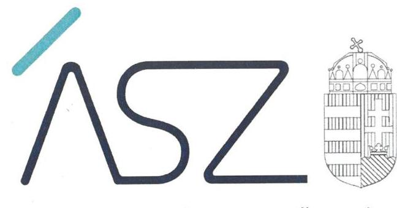
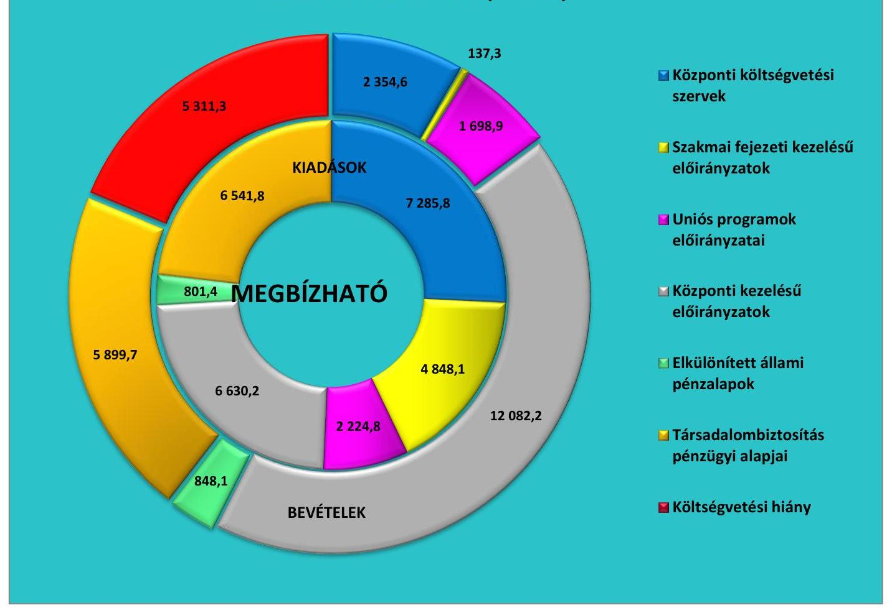
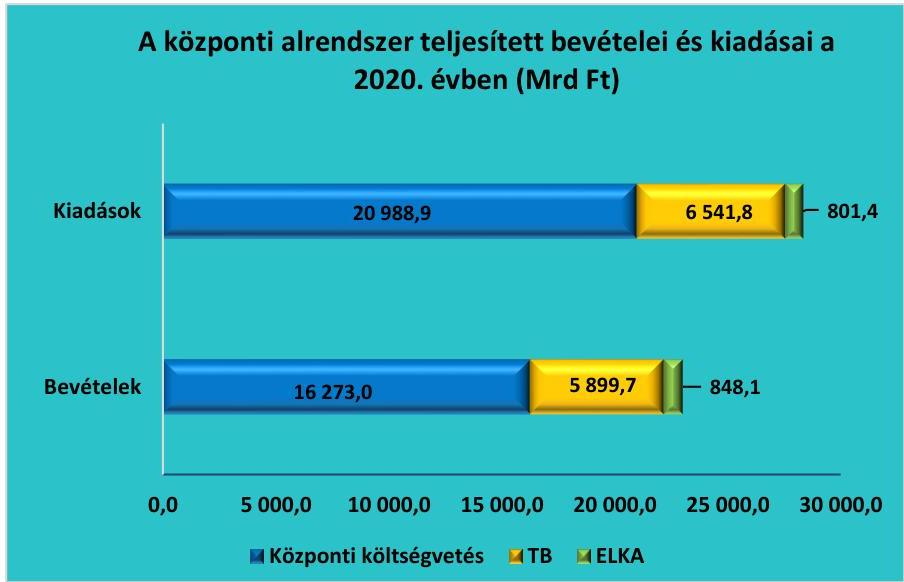
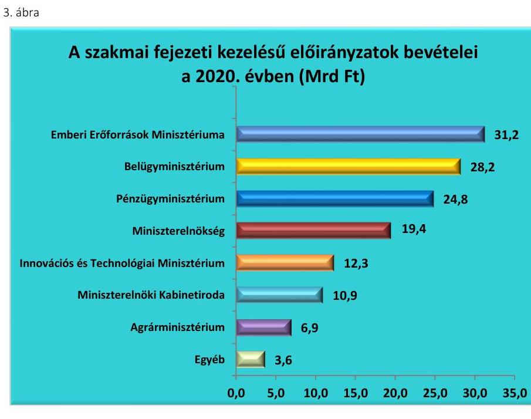
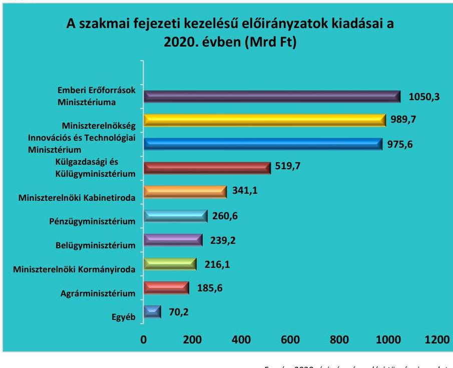
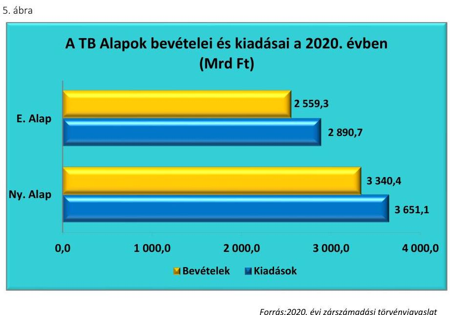
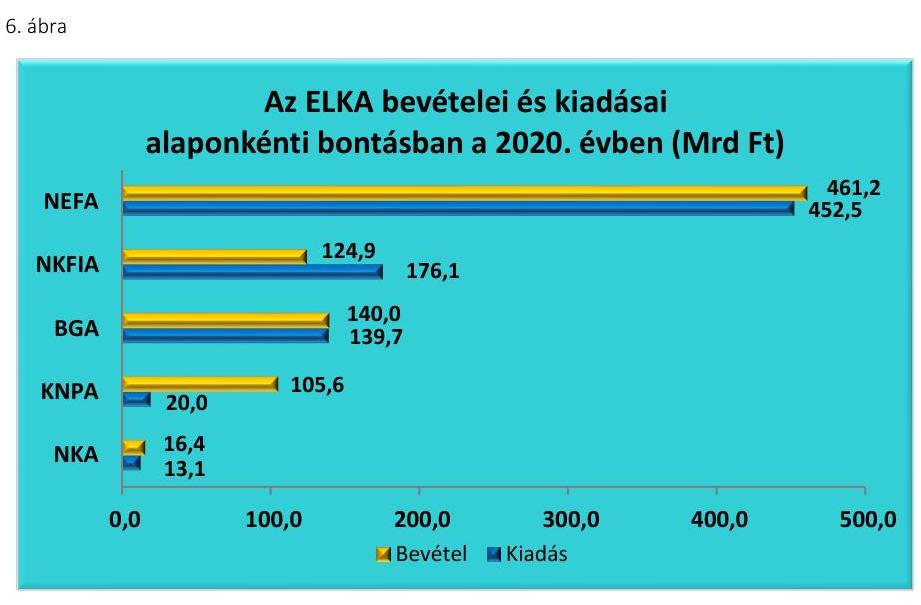
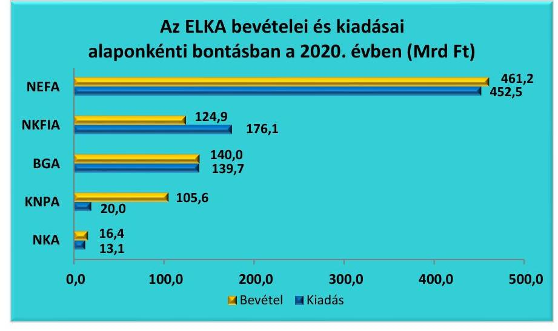
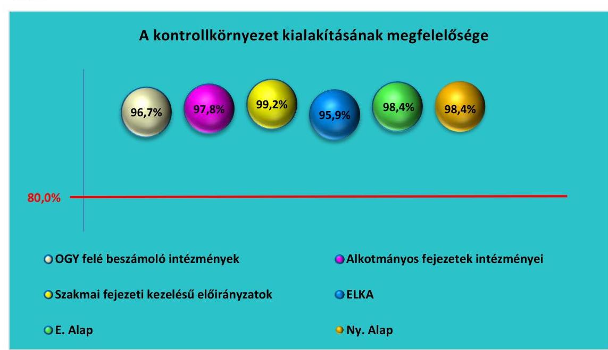
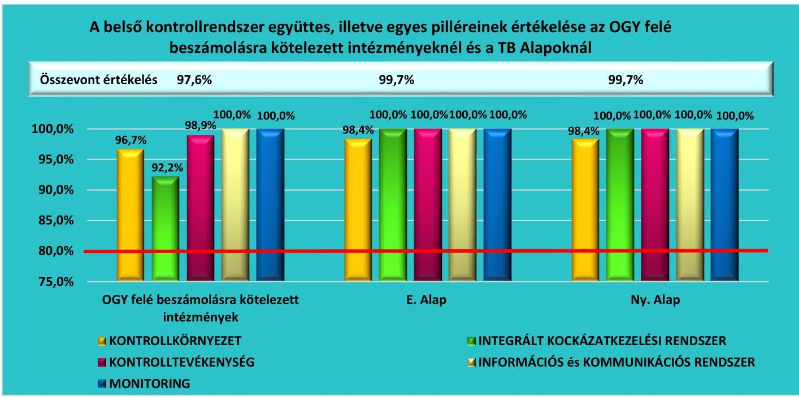

ÁLLAMI SZÁMVEVŐSZÉK

# JELENTÉS 

2020. évi zárszámadás

Magyarország 2020. évi központi költségvetése végrehajtásának ellenőrzése
2021.

21079
T/17188/1
www.asz.hu

---

ÁLLAMI SZÁMVEVŐSZÉK

# JELENTÉS 

2020. évi zárszámadás

Magyarország 2020. évi központi költségvetése végrehajtásának ellenőrzése
2021. 10. hó 10. nap

21079
T/17188/1
www.asz.hu

---

# AZ ELLENŐRZÉST FELÜGYELTE: 

MAKKAI MÁRIA felügyeleti vezető

## AZ ELLENŐRZÉST VEZETTE ÉS A VÉGREHAJTÁSÁÉRT FELELŐS:

DR. SIMON JÓZSEF ellenőrzésvezető

## A PROGRAM ÖSSZEÁLLÍTÁSÁÉRT FELELŐS:

HUSZÁR ANNA az ellenőrzési program készítéséért felelős vezető

## A TÉMÁHOZ KAPCSOLÓDÓ KORÁBBI SZÁMVEVŐSZÉKI JELENTÉSEK:

- címe: Jelentés Magyarország 2019. évi központi költségvetése végrehajtásának ellenőrzéséről
- sorszáma: 20204
- címe: Jelentés Magyarország 2018. évi központi költségvetése végrehajtásának ellenőrzéséről
- sorszáma: 19197

IKTATÓSZÁM: EL-3217-4865/2021
TÉMASZÁM: 2582
ELLENŐRZÉS-AZONOSÍTÓ SZÁM: V0925

---

# TARTALOMJEGYZÉK 

■ ÖSSZEGZÉS ..... 5
■ AZ ELLENŐRZÉS CÉLJA ..... 7
■ AZ ELLENŐRZÉS TERÜLETE ..... 8
■ AZ ELLENŐRZÉS HÁTTERE, INDOKOLTSÁGA ..... 10
■ A JELENTÉS LÉNYEGES KÉRDÉSKÖREI ..... 11
■ AZ ELLENŐRZÉS HATÓKÖRE ÉS MÓDSZEREI ..... 12
■ MEGÁLLAPÍTÁSOK ..... 14
■ MELLÉKLETEK ..... 23
I. sz. melléklet: Értelmező szótár ..... 23
II. sz. melléklet: A belső kontrollrendszer egyes elemeinek értékelése ..... 25
III. sz. melléklet: A járvány elleni védekezési alap, a gazdaságvédelmi alap, az Európai Unióból érkező járvány elleni támogatások alapja előirányzat-átcsoportosításai, módosításai szabályszerűségének ellenőrzése ..... 28
IV. sz. melléklet: Ellenőrzött fejezetek és szervezetek ..... 29
■ FÜGGELÉKEK ..... 33
I. sz. függelék: Észrevételek ..... 33
II. sz. függelék: Az Országgyűlés felé beszámolásra kötelezett intézmények összefoglaló értékelése ..... 34
■ RÖVIDÍTÉSEK JEGYZÉKE ..... 39

---

.

---

# ÖSSZEGZÉS 

A 2020. évi zárszámadási törvényjavaslatban szereplő teljesített költségvetési bevételi és kiadási adatok megbízhatóak. A zárszámadási törvényjavaslat szerkezete és tartalma a jogszabályi előírásokkal összhangban van. A 2020. évi központi költségvetés végrehajtásában jog- és hatáskörrel rendelkezők szabályszerűen gazdálkodtak a közpénzekkel.

## Az ellenőrzés társadalmi indokoltsága

Az Állami Számvevőszék törvényi kötelezettségének eleget téve minden évben ellenőrzi a központi költségvetés végrehajtásáról szóló törvényjavaslatot, amelynek keretében a központi alrendszer egészének bevételi és kiadási adatainak megbízhatóságát, valamint a hiány és az államadósság alakulására vonatkozó előírások betartását értékeli.

A zárszámadás ellenőrzése kiemelten támogatja a közpénzügyek átláthatóságát azáltal, hogy a központi költségvetés, ezen belül a központi és a fejezeti kezelésű előirányzatok, a társadalombiztosítás pénzügyi alapjai, az elkülönített állami pénzalapok, valamint az államháztartás központi alrendszerébe tartozó költségvetési szervek bevételi és kiadási előirányzatai teljesítésének ellenőrzésén keresztül a teljes központi alrendszer bevételi és kiadási adatainak megbízhatóságáról ad számot.

A törvényben előírt ellenőrzési kötelezettség végrehajtása, a zárszámadásról adott számvevőszéki értékelés támogatja az Országgyűlést a költségvetés végrehajtására vonatkozó törvényjavaslat megalapozott elfogadásában. Ezáltal az Állami Számvevőszék hozzájárul az elszámoltathatóság és az átláthatóság követelményének érvényesüléséhez, valamint a közpénzügyi helyzet folyamatos javulásához, és egyidejűleg tájékoztatja erről a széleskörű közvéleményt.

## Főbb megállapítások, következtetések

A 2020. évi zárszámadási törvényjavaslatban bemutatott, az államháztartás központi alrendszerébe tartozó központi és fejezeti kezelésű előirányzatok, a központi költségvetési szervek, a társadalombiztosítás pénzügyi alapjai és az elkülönített állami pénzalapok bevételi és kiadási előirányzatai megbízhatóak voltak és teljesítésük szabályszerű volt. A 2020. évi zárszámadási törvényjavaslatban szereplő bevételi és kiadási adatok valósághűek.

A 2020. évi zárszámadási törvényjavaslatot a Pénzügyminisztérium a jogszabályi előírások szerinti szerkezetben és tartalommal készítette el. A törvényjavaslat bemutatja a központi alrendszer hiányának a költségvetésben tervezett mértékétől való eltérésének okait, valamint a költségvetési hiány finanszírozásának módját.

A hiány és államadósság alakulására vonatkozó költségvetési szabályok felfüggesztésre kerültek a 2020. évben a Covid-19 világjárványból eredő gazdasági visszaesés miatt. Az államadósság-mutató értéke a 2020. év végén 77,2% volt. A kormányzati szektor uniós módszertan szerinti hiánya a bruttó hazai termék 8,0%-a volt. A központi alrendszer pénzforgalmi hiányának a bruttó hazai termék arányában kifejezett értéke a 2020. évben 11,1%-ot tett ki.

Az ellenőrzés során feltárt szabálytalanságok kapcsán összesen 23 ellenőrzött szervezet vezetője részére került sor figyelemfelhívó levél megküldésére. A figyelemfelhívásokban rögzített szabálytalanságok a kontrollkörnyezet, a belső kontrollrendszer minőségének értékelésére vonatkozó vezetői nyilatkozat, a kötelezettségvállalás, valamint a kifizetést megelőző kontrollok működésének témaköreit érintették.

A figyelemfelhívó levelekben rögzített hibák a lényegességi szintet nem érték el, így a zárszámadási törvényjavaslatban szereplő adatok megbízhatóságát, a központi költségvetés egésze végrehajtásának szabályszerűségét nem befolyásolták.

A 2020. évi bevételi és kiadási előirányzatok teljesítési adatait a központi alrendszerre vonatkozóan és ezek minősítését az 1. ábra mutatja be.

---

# A központi alrendszer 2020. évi bevételei és kiadásai (Mrd Ft) 

Forrás: 2020. évi zárszámadási törvényjavaslat

---

# AZ ELLENŐRZÉS CÉLJA 

Az ÁSZ¹ a zárszámadási törvényjavaslat megfelelőségét és az abban szereplő adatok megbízhatóságát ellenőrzi, amelynek célja, hogy észszerű bizonyosságot szerezzen arról, hogy
$\longrightarrow$ a zárszámadási törvényjavaslat tartalma, szerkezete megfelel-e a jogszabályi előírásoknak;
$\longrightarrow$ az Alaptörvény² és a Stabilitási tv. ${ }^{3}$ államadósságra vonatkozó előírásai érvényesültek-e, az államháztartás központi alrendszerében a hiány alakulása megfelelt-e a Kvtv. ${ }^{4}$ előírásainak;
$\longrightarrow$ az államháztartás bevételeit a Kvtv.-ben rögzítettekkel összhangban, a közpénzekkel való gazdálkodás jogszabályi követelményeinek megfelelően használták-e fel, a törvényjavaslat valósághűen mutatja-e be a költségvetés végrehajtására vonatkozó pénzügyi adatokat, információkat;
$\longrightarrow$ a központi költségvetés bevételi és kiadási előirányzatainak teljesítése megfelelt-e a jogszabályi előírásoknak és tartalmaz-e lényeges hibát;
$\longrightarrow$ a költségvetés végrehajtásában jog- és hatáskörrel rendelkezők a 2020. évi költségvetésben meghatározott pénzügyi keretek között szabályszerűen gazdálkodtak-e a közpénzekkel.
Az ellenőrzés kiterjed a 2021. évi költségvetési folyamatok nyomon követésére, kiemelten az államadósság alakulására ható tényezők monitoringjára is.

---

# **AZ ELLENŐRZÉS TERÜLETE**

## **2020. évi zárszámadás – Magyarország 2020. évi központi költségvetése végrehajtásának ellenőrzése**

Az Áht.5 előírásai alapján a Pénzügyminisztérium évente, az elfogadott költségvetéssel összehasonlítható módon zárszámadási törvényjavaslatot készít a költségvetés végrehajtásáról és a vagyoni helyzetről a központi és szakmai fejezeti kezelésű előirányzatok, a költségvetési szervek, a TB Alapok6 (E. Alap7 és Ny. Alap8), valamint az ELKA9 éves költségvetési beszámolói alapján.

Az államháztartás központi alrendszeréről az éves költségvetési beszámolók adataiból a Kincstár10 az Áhsz.11 előírásainak megfelelően összevont (konszolidált) beszámolót készít a zárszámadási törvényjavaslat Országgyűlés elé terjesztésének időpontját megelőző 30. napig, azaz augusztus 31-ig.

A 2020. évben a Kvtv. alapján az államháztartás központi alrendszerének tervezett bevételi főösszege 21 426,0 Mrd Ft, kiadási főösszege 21 793,0 Mrd Ft, amelyek alapján a tervezett pénzforgalmi hiánya 367,0 Mrd Ft volt. A 2020. évben a központi alrendszer teljesített bevételi főösszege 23 020,8 Mrd Ft, kiadási főösszege 28 332,1 Mrd Ft volt, így a központi alrendszer tényleges pénzforgalmi hiánya 5 311,3 Mrd Ft-ot tett ki.

A zárszámadási törvényjavaslat alapján a 2020. évben a központi alrendszeren belül a központi költségvetés, a társadalombiztosítási alapok és az elkülönített állami pénzalapok teljesített bevételeit, illetve kiadásait a 2. ábra szemlélteti.

*Forrás: 2020. évi zárszámadási törvényjavaslat*

---

Az ÁSZ elvégezte a belső kontrollrendszer értékelését az $\mathrm{OGY}^{12}$ felé beszámolásra kötelezett intézmények és a TB Alapok esetében, valamint a kontrollkörnyezet értékelését az alkotmányos fejezetek intézményei, a fejezeti kezelésű előirányzatok és az elkülönített állami pénzalapok esetében. Az értékelést a II. számú melléklet tartalmazza.

Az Alaptörvény 36. cikk (6) bekezdésében szereplő rendelkezés szerint az államadósság-szabálytól különleges jogrend idején, az azt kiváltó körülmények okozta következmények enyhítéséhez szükséges mértékben, vagy a nemzetgazdaság tartós és jelentős visszaesése esetén, a nemzetgazdasági egyensúly helyreállításához szükséges mértékben el lehet térni. A Covid-19 világjárvány okozta gazdasági visszaesés, illetve a különleges jogrend bevezetése miatt életbe lépett az adósságszabályhoz kapcsolódó mentesítési záradék. Erre tekintettel a bruttó hazai termék reálértékének csökkenése miatt a Stabilitási tv. 7. § (2) bekezdésében szereplő rendelkezés értelmében az államadósság legalább 0,1%-os csökkenésére vonatkozó szabályt nem kellett alkalmazni a 2020. évben.

A Covid-19 világjárvány okozta gazdasági hatások kezelése érdekében módosultak az uniós költségvetési keretszabályok is. Az életbe léptetett mentesítési záradék alapján az Európai Unió Tanácsa felfüggesztette a 3,0%-os költségvetési hiányra vonatkozó korlát, valamint az adósságszabály betartásának követelményét. Az uniós adósságszabály szerint, ha az adósság értéke meghaladja a GDP-hez viszonyított 60,0%-os értéket, akkor az uniós módszertan szerint számított adósság éves csökkenési üteme (az elmúlt három év átlagában) legalább el kell érje a GDP arányos adósság és a 60,0%-os érték különbségének egyhuszadát.

A járványügyi védekezés és a gazdaság újraindítása érdekében rendelkezésre álló hazai, illetve esetleges európai uniós források és kiadások teljesítése érdekében évközben létrejöttek a JEVA ${ }^{13}$, a GVA ${ }^{14}$ és az EUJEVA ${ }^{15}$ alapok. Ezen alapok vonatkozásában az előirányzat-átcsoportosítások, módosítások szabályszerűségének értékelését a III. számú melléklet tartalmazza.

---

# AZ ELLENŐRZÉS HÁTTERE, INDOKOLTSÁGA 

Az Alaptörvény szerint a központi költségvetés végrehajtásának ellenőrzését az ÁSZ végzi el. Az ÁSZ tv. ${ }^{16}$ előírásainak megfelelően a zárszámadási ellenőrzés végrehajtása az ÁSZ éves gyakorisággal elvégzendő feladata. Az ÁSZ törvényi kötelezettségének teljesítésével hozzájárul ahhoz, hogy az Országgyűlés a zárszámadási törvény elfogadásával kapcsolatban megalapozott döntést hozzon. Az ellenőrzés célja teljes és objektív képet adni a 2020. évi zárszámadási törvényjavaslatban szereplő adatok megbízhatóságáról, továbbá a megállapításokkal elősegíteni az ellenőrzöttek közpénzekkel való felelős gazdálkodását. Az ÁSZ az ellenőrzéssel hozzájárul az értékteremtő rend kialakításához és megőrzéséhez.

---

# A JELENTÉS LÉNYEGES KÉRDÉSKÖREI 

1. A zárszámadási törvényjavaslat tartalma, szerkezete összhangban volt-e a jogszabályi előírásokkal, érvényesültek-e az Alaptörvény és a Stabilitási törvény államadósságra vonatkozó előírásai, továbbá az államháztartás központi alrendszerében a hiány a törvényi előírások szerint alakult-e?
2. A zárszámadási törvényjavaslat valósághűen mutatja-e be a költségvetés végrehajtására vonatkozó pénzügyi adatokat, információkat, az abban szereplő bevételi és kiadási előirányzatok teljesítési adatai megbízhatóak-e?
3. A központi alrendszer bevételi és kiadási előirányzatainak teljesítése, az előirányzatok módosítása, a költségvetési maradvány megállapítása és az éves költségvetési beszámolók összeállítása során betartották-e a jogszabályi előírásokat?

---

# AZ ELLENŐRZÉS HATÓKÖRE ÉS MÓDSZEREI 

## Az ellenőrzés típusa

Megfelelőségi ellenőrzés.

## Az ellenőrzött időszak

2020. év.

## Az ellenőrzés tárgya

A zárszámadási ellenőrzés során az ÁSZ a zárszámadási törvényjavaslat megfelelőségét és az abban szereplő adatok megbízhatóságát ellenőrzi. A zárszámadási ellenőrzés keretében az ÁSZ valamennyi ellenőrzött területen (központi kezelésű előirányzatok; központi költségvetési szervek; fejezeti kezelésű előirányzatok, uniós és kapcsolódó költségvetési támogatások; ELKA; TB Alapok) a gazdálkodás és az előirányzat-felhasználás megfelelőségét (szabályszerűségét), a költségvetési gazdálkodásra vonatkozó szabályokkal való összhangját ellenőrzi.

## Az ellenőrzött szervezet

A PM ${ }^{17}$, Kincstár, NAV ${ }^{18}$, ÁKK Zrt. ${ }^{19}$, ÁEEK ${ }^{20}$, Eximbank, ${ }^{21}$ KAVOSZ, ${ }^{22}$ központi előirányzatok, TB Alapok (Nyugdíjbiztosítás Alap, Egészségbiztosítás Alap), ELKA, a mintavételezéssel kiválasztott fejezeti kezelésű előirányzatok és kezelő szerveik. Az alkotmányos fejezetek (OGYH ${ }^{23}$, KEH $^{24}$, AB $^{25}$, AJBH ${ }^{26}$, Ügyészségek, Bíróságok, $\mathrm{OBH}^{27}$, Kúria), az OGY részére a tevékenységükről beszámolásra kötelezett intézmények ( $\mathrm{KH}^{28}, \mathrm{NAIH}^{29}, \mathrm{EBH}^{30}, \mathrm{MEKSzH}^{31}$, $\mathrm{NVI}^{32}, \mathrm{NEBH}^{33}, \mathrm{NÉBIH}^{34}, \mathrm{GVH}^{35}, \mathrm{KSH}^{36}, \mathrm{MTA}^{37}, \mathrm{MMA}^{38}, \mathrm{NKFIH}^{39}$ ), továbbá a mintavételezéssel kiválasztott központi alrendszerbe tartozó intézmények. Az ellenőrzött szervezeteket a IV. számú melléklet tartalmazza.

## Az ellenőrzés jogalapja

Az ellenőrzés lefolytatásának jogalapját az ÁSZ tv. 5. § (7) bekezdése képezi.

---

# Az ellenőrzés módszerei 

Az ellenőrzést az ÁSZ az ellenőrzési program szempontjai, az ellenőrzött időszakban hatályos jogszabályok, az ellenőrzés szakmai szabályok és módszertanok figyelembevételével végzi.

Az ellenőrzés ideje alatt az ellenőrzött szervezetekkel történő kapcsolattartás

 az ÁSZ SZMSZ ${ }^{40}$-ének vonatkozó előírásai alapján történik.

Az ellenőrzési bizonyítékként felhasználható adatforrások közé tartoznak egyrészt az ellenőrzési program részletes szempontjainál felsorolt adatforrások, másrészt adatforrás lehet még - az ellenőrzés folyamán feltárt, az ellenőrzés szempontjából információt tartalmazó dokumentum. Az ellenőrzési kérdések megválaszolásához szükséges bizonyítékok megszerzése az ellenőrzött által rendelkezésre bocsátott dokumentumokra, adatokra alapozva megfigyelés, szemle (szemrevételezés), kérdésfeltevés (információkérés), mintavételezés, valamint elemző eljárás útján történik.

Az ÁSZ a zárszámadási törvényjavaslatban szereplő adatok megbízhatóságának ellenőrzése során a megbízhatóságot befolyásoló összes hiba összegét viszonyítja a lényegességi küszöbértékhez. Az ÁSZ a központi költségvetés esetén a megbízhatóság szempontjából viszonyítási alapként figyelembe vett lényegességi küszöbértéket a központi költségvetés bevételi, illetve kiadási főösszegének 2\%-ában határozta meg.

Az ÁSZ a 2020. évi zárszámadási törvényjavaslatban szereplő pénzforgalmi kiadások és bevételek teljesítésének a megfelelőségét statisztikai mintavételi módszer alapján értékeli. A kiértékelés célja, hogy az ÁSZ a mintavétel alapján 95\%-os megbízhatóság mellett megbecsülje az egyes mintavételi területeken előforduló hibák összegének felső korlátját, melyet mindig a mintavétel alapjául szolgáló sokaság összértékének 2\%-ához viszonyít.

---

# MEGÁLLAPÍTÁSOK 

## 1. A zárszámadási törvényjavaslat tartalma, szerkezete összhangban volt-e a jogszabályi előírásokkal, érvényesültek-e az Alaptörvény és a Stabilitási törvény államadósságra vonatkozó előírásai, továbbá az államháztartás központi alrendszerében a hiány a törvényi előírások szerint alakult-e?

Összegző megállapítás

A 2020. évi zárszámadási törvényjavaslat tartalma és szerkezete összhangban volt a jogszabályi előírásokkal. Az államadósság és az uniós módszertan szerinti hiány alakulására vonatkozó előírások felfüggesztésre kerültek.
1.1. számú megállapítás

A zárszámadási törvényjavaslat összeállítása szabályszerű volt.
A ZÁRSZÁMADÁSI TÖRVÉNYJAVASLAT a Kvtv.-vel összehasonlítható szerkezetben készült. Általános és részletes indokolása tartalmazta a jogszabályban meghatározott adatokat, információkat. A 2020. évi zárszámadási törvényjavaslatban bemutatásra kerültek a központi alrendszer hiányának a költségvetésben tervezett mértékétől való eltérés okai, továbbá az Áht. előírása alapján a költségvetési hiány finanszírozásának a módja.

A zárszámadási törvényjavaslat a törvényi előírásoknak megfelelően tartalmazta - többek között - az 1. táblázat szerinti adatokat.

1. táblázat

## A 2020. ÉVI ZÁRSZÁMADÁSI TÖRVÉNYJAVASLAT

## tartalmazta:

- a költségvetési mérlegeket alrendszerenként és összevontan, közgazdasági és funkcionális tagolásban;
- a költségvetési hiány finanszírozásának módját;
- az államadósságot és az államadósság állományának változását bemutató összegzést;
- a középtávú tervezés során figyelembe vett makrogazdasági és költségvetési előrejelzés értékelését;
- az állami kezességek, állami garanciák és állami viszontgaranciák állományát;
- az adóbevételekben érvényesülő közvetett támogatásokat;
- az államháztartás központi alrendszerében a finanszírozási bevételekről és kiadásokról készített összegzést.

Forrás: 2020. évi zárszámadási törvényjavaslat
A zárszámadási törvényjavaslat jogszabály szerinti összeállítását támogató informatikai rendszerek - KGR K11 ${ }^{61}$, KAR ${ }^{62}$ és $\mathrm{AHAB}^{63}$ - adatainak sértetlenségét, hitelességét, megfelelőségét befolyásoló főbb kontrollok kialakítása és működtetése megfelelő volt.

---

### 1.2. számú megállapítás

2. táblázat

A KÖZPONTI ALRENDSZER 2020. ÉVI PÉNZFORGALMI HIÁNYA ÉS ÖSSZETEVŐI (MRD FT)

|  Megnevezés | Összeg  |
| --- | --- |
|  Központi alrendszer hiánya | 5311,3  |
|  Ezen belül: |   |
|  Központi költségvetés hiánya | 4715,9  |
|  TB Alapok hiánya | 642,1  |
|  ELKA többlete | 46,7  |

Forrás: 2020. évi zárszámadási törvényjavaslat

A hiány és az államadósságra vonatkozó költségvetési szabályok a 2020. évben nem voltak érvényben.

AZ ÁLLAMHÁZTARTÁS hiánya folyó áron, pénzforgalmi szemléletben 5 422,5 Mrd Ft összegben teljesült, ami a 2020. évi GDP ${ }^{44}$ 11,3\%-a. A folyó áron számított GDP a 2020. évben 47 988,5 Mrd Ft-ot tett ki. A központi alrendszer 2020. évi pénzforgalmi hiánya 5 311,3 Mrd Ft volt, ami a GDP 11,1\%-ának felel meg. Az államháztartás központi alrendszere hiányának főbb összetevőit a 2. táblázat szemlélteti.

AZ ÁLLAMADÓSSÁG-MUTATÓ Stabilitási tv. szerinti értéke 2020. december 31-én 77,2\% volt. A mutató alakulása nem volt ellentétes a jogszabályi előírásokkal, mivel az Alaptörvény és a Stabilitási tv. előírása alapján életbe lépett mentesítési záradék ezt lehetővé tette.

## A KORMÁNYZATI SZEKTOR UNIÓS MÓDSZERTAN

SZERINTI GDP-ARÁNYOS HIÁNYA 8,0\%-ban teljesült. Ezen érték meghaladta a 3,0\% alatti értéket előíró maastrichti kritériumot, azonban ez a Covid-19 világjárvány miatt hatályba léptetett uniós mentesítési záradék, valamint a Stabilitási tv. 7. § (2) bekezdése miatt nem volt ellentétes a jogszabályi előírásokkal.

## A KORMÁNYZATI SZEKTOR UNIÓS MÓDSZERTAN

SZERINTI KONSZOLIDÁLT BRUTTÓ ADÓSSÁGA a 2020. év végén folyó áron 38 417,6 Mrd Ft-ot tett ki, amely a GDP 80,1\%-a volt. Ez azonban nem volt ellentétes a maastrichti kritériumokban rögzített szabállyal, mivel az uniós mentesítési záradék az uniós módszertan szerint számított adósságra is kiterjedt.

# 2. A zárszámadási törvényjavaslat valósághűen mutatja-e be a költségvetés végrehajtására vonatkozó pénzügyi adatokat, információkat, az abban szereplő bevételi és kiadási előirányzatok teljesítési adatai megbízhatóak-e?

Összegző megállapítás

### 2.1. számú megállapítás

3. táblázat

A KÖLTSÉGVETÉS KÖZVETLEN BEVÉTELEI ÉS KIADÁSAI A 2020. ÉVBEN (MRD FT)

|  Megnevezés | Kiadás | Bevétel  |
| --- | --- | --- |
|  Eredeti előirányzat: | 1613,4 | 12897,6  |
|  Teljesítés: | 1783,7 | 12795,1  |

Forrás: 2020. évi zárszámadási törvényjavaslat

A zárszámadási törvényjavaslat valósághűen mutatja be a költségvetés végrehajtására vonatkozó pénzügyi adatokat, információkat, az abban szereplő bevételi és kiadási előirányzatok teljesítési adatai megbízhatóak.

A központi költségvetés részét képező központi kezelésű előirányzatok teljesítési adatai megbízhatóak.

A KÖZPONTI KEZELÉSŰ ELŐIRÁNYZATOK bevételi és kiadási teljesítési adatai megbízhatóak. A költségvetés közvetlen bevételeit és kiadásait a 3. táblázat tartalmazza, illetve a központi kezelésű előirányzatok bevételeinek és kiadásainak alakulását a 4. táblázat mutatja be

---

4. táblázat

# A FŐBB KÖZPONTI KEZELÉSŰ ELŐIRÁNYZATOK BEVÉTELEI ÉS KIADÁSAI A 2020. ÉVBEN (MRD FT) 

| Megnevezés | Kiadás | Bevétel |
| :-- | :--: | :--: |
| Vállalkozások költségvetési befizetései | 0,8 | 1611,3 |
| Fogyasztáshoz kapcsolt adók | 0,0 | 6267,5 |
| Lakosság költségvetési befizetései | 0,0 | 2827,1 |
| Kezesség, viszont garancia érvényesítése és megtérülése | 14,0 | 3,3 |
| Önkormányzatok támogatásai | 824,8 | 0,0 |
| Nemzeti Család- és Szociálpolitikai Alap (NCSSZA) | 658,9 | 1,4 |
| Adósságszolgálat | 1272,2 | 247,2 |
| Állami vagyon | 1311,7 | 293,6 |

Forrás: 2020. évi zárszámadási törvényjavaslat

A teszteléssel ellenőrzött központosított adó- és adójellegű bevételi előirányzatok teljesítése, valamint központi kezelésű előirányzatok keretében teljesített kiadások megbízhatóak.

AZ ADÓSSÁGSZOLGÁLATTAL kapcsolatos kiadások elszámolása megbízható.

## A NEMZETI CSALÁD- ÉS SZOCIÁLPOLITIKAI

ALAP Családi támogatások jogcím terhére teljesített kiadások megbízhatóak. A korábbi években lefolytatott ÁSZ ellenőrzések keretében tett megállapítások alapján a hibák kijavításra kerültek.

AZ ÁLLAMI VAGYONNAL és a Nemzeti Földalappal kapcsolatos bevételek és kiadások teljesítése megbízható.

AZ ÁLLAM ÁLTAL VÁLLALT KEZESSÉG ÉS VISZONTGARANCIA érvényesítésével összefüggő bevételek és kiadások teljesítése megbízható.

## A HELYI ÉS A NEMZETISÉGI ÖNKORMÁNYZATOK részére történt kifizetések megbízhatóak.

### 2.2. számú megállapítás

A fejezeti kezelésű előirányzatok teljesítési adatai megbízhatóak.
5. táblázat

A SZAKMAI FEJEZETI KEZELÉSŰ ELŐIRÁNYZATOK BEVÉTELEINEK ÉS KIADÁSAINAK TELJESÍTÉSI ADATAI A 2020. ÉVBEN (MRD FT)

|  | Bevétel | Kiadás |
| :-- | :--: | :--: |
| Teljesítés értéke | 137,3 | 4848,1 |

Forrás: 2020. évi zárszámadási törvényjavaslat

A FEJEZETI KEZELÉSŰ ELŐIRÁNYZATOK bevételi és kiadási előirányzatainak teljesítése megbízható.

A szakmai fejezeti kezelésű előirányzatok kiadásait és bevételeit az 5. táblázat tartalmazza. A szakmai fejezeti kezelésű előirányzatok teljesített bevételeinek összetételét a 3. ábra szemlélteti.

---

Forrás: 2020. évi zárszámadási törvényjavaslat
A szakmai fejezeti kezelésű előirányzatok teljesített kiadásainak összetételét a 4. ábra szemlélteti:
4. ábra

Forrás: 2020. évi zárszámadási törvényjavaslat
AZ UNIÓS FEJLESZTÉSEK fejezet kiadási előirányzatainak teljesítése megbízható.

A 2014-2020 közötti kohéziós politikai operatív programok, valamint a Vidékfejlesztési és Halászati Programok esetében a kifizetések teljesítése és elszámolása összhangban volt a jogszabályi előírásokkal.

---

Az uniós fejlesztések fejezet 2020. évi teljesítési adatát a 6. táblázat tartalmazza.
6. táblázat

A XIX. UNIÓS FEJLESZTÉSEK 2020. ÉVI KIADÁSI ELŐIRÁNYZATAINAK TELJESÍTÉSI ADATAI (MRD FT)

| Megnevezés | Adat |
| :-- | --: |
| 2014-2020. közötti kohéziós politikai operatív programok | 1599,2 |
| Egyéb uniós programok kiadási előirányzatai | 343,5 |
| Vidékfejlesztési és Halászati Programok 2014 - 2020. | 251,5 |
| Nemzeti Stratégiai Referenciakeret | 14,9 |
| Európai Területi Együttműködés (2014-2020.) | 15,0 |
| Egyéb uniós előirányzatok* | 0,7 |
| Uniós fejlesztések fejezet teljesített kiadásai összesen: | $\mathbf{2 224,8}$ |
| *Svájci Alap, EGY**, Nervég Alap |  |

Forrás: 2020. évi zárszámadási törvényjavaslat

# 2.3. számú megállapítás 

A központi költségvetési intézmények teljesítési adatai megbízhatóak.

Az OGY felé beszámolásra kötelezett intézmények, az alkotmányos fejezetek intézményei és az egyéb költségvetési intézmények bevételi és kiadási adatai megbízhatóak.

A központi költségvetés intézményei bevételi és kiadási előirányzatainak teljesítési adatait a 7. táblázat mutatja be.
7. táblázat

A KÖZPONTI KÖLTSÉGVETÉSI INTÉZMÉNYEK TELJESÍTETT BEVÉTELEI ÉS KIADÁSAI A 2020. ÉVBEN (MRD FT)

|  | OGY felé   beszámolásra   kötelezett   intézmények | Alkotmányos   fejezetek   intézményei | Egyéb   költségvetési   intézmények | Mindösszesen |
| :-- | :--: | :--: | :--: | :--: |
| Bevétel | 39,2 | 8,5 | 2306,9 | 2354,6 |
| Kiadás | 89,2 | 245,9 | 6950,7 | 7285,8 |

Forrás: Intézményi beszámolók alapján ÁSZ szerkesztés
2.4. számú megállapítás
8. táblázat

A TB ALAPOK BEVÉTELEI ÉS KIADÁSAI A 2020. ÉVBEN (MRD FT)

| Megnevezés | Bevétel | Kiadás |
| :-- | :--: | :--: |
| TB Alapok | 5899,7 | 6541,8 |

Forrás: 2020. évi zárszámadási törvényjavaslat

A TB Alapok teljesítési adatai megbízhatóak.
A TB ALAPOK kiadási előirányzatainak teljesítése megbízható.
A TB Alapok bevételi és kiadási előirányzatainak teljesítését alaponkénti megoszlásban az 5. ábra, illetve az összesített adatokat a 8. táblázat mutatja be.

---

Forrás: 2020. évi zárszámadási törvényjavaslat
2.5. számú megállapítás

Az ELKA előirányzatok teljesítési adatai megbízhatóak.
9. táblázat

ELKA BEVÉTELE ÉS KIADÁSA A 2020. ÉVBEN (MRD FT)

| Megnevezés | Bevétel | Kiadás |
| :--: | :--: | :--: |
| ELKA | 848,1 | 801,4 |

6. ábra

Forrás: 2020. évi zárszámadási törvényjavaslat

AZ ELKA (BGA ${ }^{46}$, KNPA ${ }^{47}$, NEFA ${ }^{48}$, NKA ${ }^{49}$, NKFIA ${ }^{50}$ ) bevételi előirányzatainak teljesítése, kiadási előirányzatainak felhasználása megbízható.

Az ELKA bevételeit és kiadásait alaponként a 6. ábra, illetve az összesített adatokat a 9. táblázat mutatja be.
6. ábra

Forrás: 2020. évi zárszámadási törvényjavaslat

---

# 3. A központi alrendszer bevételi és kiadási előirányzatainak teljesítése, az előirányzatok módosítása, a költségvetési maradvány megállapítása és az éves költségvetési beszámolók összeállítása során betartották-e a jogszabályi előírásokat? 

Összegző megállapítás
3.1. számú megállapítás

A központi alrendszer bevételi és kiadási előirányzatainak teljesítése, az előirányzatok módosítása, a költségvetési maradvány megállapítása és az éves költségvetési beszámolók összeállítása összhangban volt a jogszabályi előírásokkal.

A központi kezelésű bevételi és kiadási előirányzatok teljesítése során betartották a jogszabályi előírásokat.

AZ ADÓSSÁGSZOLGÁLATTAL kapcsolatos forintban és devizában fennálló adósság, kamat és egyéb kiadások, valamint a bevételek elszámolása megfelelt a jogszabályi előírásoknak. Az adósságszolgálattal kapcsolatos kiadásokat és bevételeket a 10. táblázat tartalmazza.
10. táblázat

AZ ADÓSSÁGSZOLGÁLATTAL KAPCSOLATOS BEVÉTELEK ÉS KIADÁSOK ALAKULÁSA A 2020. ÉVBEN (MRD FT)

|  | Kiadás | Bevétel |
|

 :-- | :--: | :--: |
| Eredeti előirányzat | 1110,9 | 32,4 |
| Teljesítés | 1272,2 | 247,2 |

A2 ÁLLAMI VAGYONNAL kapcsolatos bevételek és a kiadások elszámolása megfelelt az Áht., az Ávr. ${ }^{51}$ és a Vtv. ${ }^{52}$ előírásainak.

AZ ÁLLAM ÁLTAL VÁLLALT KEZESSÉG ÉS VISZONTGARANCIA érvényesítésével összefüggő bevételek és kiadások teljesítése szabályszerű volt.

A HELYI ÉS A NEMZETISÉGI ÖNKORMÁNYZATOK támogatásaival kapcsolatos kiadások teljesítése a jogszabályi előírásokkal összhangban volt.

A NEMZETI CSALÁD- ÉS SZOCIÁLPOLITIKAI ALAP Családi támogatások jogcím terhére teljesített kiadások esetében az előirányzatok terhére történt folyósítások a jogszabályi előírásokkal összhangban valósultak meg.

---

### 3.2. számú megállapítás

11. táblázat

A KÖLTSÉGVETÉS KÖZVETLEN BEVÉTELEI ÉS KIADÁSAI FEJEZET UNIÓS BEVÉTELEKKEL KAPCSOLATOS 2020. ÉVI TELJESÍTÉSI ADATAI (MRD FT)

| Megnevezés | Adat |
| :-- | :--: |
| Uniós programok bevételei | 1681,1 |
| Egyéb uniós bevételek | 17,8 |

A központi költségvetés részét képező fejezeti kezelésű előirányzatok teljesítése, az előirányzatok módosítása, a költségvetési maradvány megállapítása és az éves költségvetési beszámolók összeállítása során betartották a jogszabályi előírásokat.

## A SZAKMAI FEJEZETI KEZELÉSŰ ELŐIRÁNYZATOK keretében a kiadási előirányzatok felhasználása és elszámolása, illetve a bevételi előirányzatok teljesítése és elszámolása szabályszerű volt. Az elszámolásokat hiteles és megbízható számviteli bizonylattal támasztották alá, a bevételeket a jogszabályi előírások szerinti nyilvántartási számlákon számolták el.

Az előirányzatok évközi módosításait az Áht. és az Ávr. előírásai alapján, szabályszerűen hajtották végre.

Az éves költségvetési beszámolókat az Áhsz. előírásaival összhangban állították össze. A maradvány kimutatás összeállítása megfelelt az Áhsz. előírásainak.

AZ UNIÓS FEJLESZTÉSEK fejezet pénzügyi forrásainak lekötése a 2020. évben a Kvtv. előírásai szerint, szabályszerűen valósult meg.

A 2014-2020. évi programozási időszakban finanszírozott kohéziós politikai operatív programok, valamint a Vidékfejlesztési és Halászati Programok forrásainak felhasználása a jogszabályi előírásokkal összhangban történt. A támogatások elbírálása, a támogatási szerződések ellenőrzése, a kedvezményezettek felé teljesített kifizetések elszámolása szabályszerű volt.

A költségvetés közvetlen bevételei és kiadásai fejezet uniós bevételekkel kapcsolatos 2020. évi teljesítési adatait a 11. táblázat szemlélteti.

A BELÜGYI ALAPOK keretében teljesített kiadások elszámolása során a jogszabályi előírásokat betartották.

A központi költségvetés intézményei bevételi és kiadási előirányzatainak teljesítése, az előirányzatok módosítása, a költségvetési maradvány megállapítása és az éves költségvetési beszámolók összeállítása során betartották a jogszabályi előírásokat.

AZ OGY FELÉ BESZÁMOLÁSRA KÖTELEZETT INTÉZMÉNYEK a bevételekkel és kiadásokkal szabályszerűen számoltak el.

Az intézmények az előirányzat-módosítások és a költségvetési maradvány megállapítása során betartották az Áht., az Ávr. és az Áhsz. előírásait. Az éves költségvetési beszámoló részét képező mérleg, eredménykimutatás és kiegészítő melléklet összeállítása a jogszabályi előírásokkal összhangban történt, az Áhsz. kötelező egyezőségekre vonatkozó rendelkezései érvényesültek.

AZ ALKOTMÁNYOS FEJEZETEK intézményei bevételeinek és a kiadásainak teljesítése szabályszerű volt.

---

Az előirányzat módosításra vonatkozó jogszabályi előírásokat betartották. A kötelezettségvállalással terhelt maradvány összegének megállapítása megfelelt az Ávr.-ben foglaltaknak, illetve az Áhsz. előírásainak megfelelően részletező analitikus nyilvántartással alátámasztották.

Az éves költségvetési beszámolókat, valamint annak részét képező költségvetési jelentéseket a jogszabályi előírásoknak megfelelően állították össze.

# A KÖZPONTI KÖLTSÉGVETÉS EGYÉB INTÉZMÉNYEI bevételeinek és kiadásainak teljesítése szabályszerű volt. Az előirányzatok módosítása és átcsoportosítása az Áhsz. és a Számv. tv. ${ }^{53}$ előírásaival összhangban történt. A központi költségvetés egyéb intézményeinél a maradvány megállapítása szabályszerű volt, a maradvány kimutatásokat az Áhsz. szerint előírt formában készítették el.

Az éves költségvetési beszámoló összeállítása során betartották a jogszabályi előírásokat.
3.4. számú megállapítás

A TB Alapok bevételi és kiadási előirányzatainak teljesítése, az előirányzatok módosítása, a költségvetési maradvány megállapítása és az éves költségvetési beszámolók összeállítása a jogszabályi előírásokkal összhangban történt.

A TB ALAPOK bevételi és kiadási előirányzatainak teljesítése szabályszerű volt.

A TB Alapok bevételi és kiadási előirányzatainak módosítása és a kötelezettségvállalással terhelt maradványának megállapítása a jogszabályi előírások szerint történt. A költségvetési beszámoló részét képező mérleget, eredménykimutatást és kiegészítő mellékletet a Kincstár, illetve a NEAK az Áhsz. és a Számv. tv. előírásainak megfelelően állította össze.

A TB Alapok éves költségvetési beszámolóját és vagyonának alakulását az alapkezelők - az Áhsz. és a Számv. tv. előírásaival összhangban - leltárral alátámasztották.

Az ELKA kiadási előirányzatainak teljesítése, az előirányzatok módosítása, a költségvetési maradvány megállapítása és az éves költségvetési beszámolók összeállítása során betartották a jogszabályi előírásokat.

AZ ELKA kiadási előirányzatai terhére teljesített kifizetések szabályszerűek voltak.

A költségvetési maradványok megállapítása megfelelt a jogszabályi előírásoknak. Az előirányzatok módosítása és átvezetése a számviteli nyilvántartásokon a jogszabályi előírások betartásával történt. A maradványokra vonatkozóan az éves költségvetési beszámolók, illetve az analitikus nyilvántartások egyezősége biztosított volt.

Az éves költségvetési beszámolókat az alapkezelők a jogszabályi előírásoknak megfelelően állították össze.

---

# MELLÉKLETEK 

- I. SZ. MELLÉKLET: ÉRTELMEZŐ SZÓTÁR
államadósság-mutató
államháztartás központi
alrendszere
belső kontrollrendszer

EDP jelentések

Elkülönített Állami
Pénzalapok
európai uniós forrás
fejezetet irányító szerv
fejezeti kezelésű előirányzat

Az Alaptörvény 36. cikk (4) és (5) bekezdésében, valamint 37. cikk (2) és (3) bekezdésében foglaltak végrehajtása során figyelembe veendő mindenkori államadósság mutatója olyan, százalékban kifejezett, egy tizedesig kerekített hányados, amely a) számlálójában az államadósságnak, b) nevezőjében a Közösségben a nemzeti és regionális számlák európai rendszeréről szóló tanácsi rendeletben meghatározottak szerint számított bruttó hazai terméknek e törvény szerinti értéke szerepel. (Forrás: Stabilitási tv. 2. §)
Az államháztartás központi és önkormányzati alrendszerből áll. Az államháztartás központi alrendszerébe tartozik az állam, a központi költségvetési szerv, a törvény által az államháztartás központi alrendszerébe sorolt köztestület, illetve az e köztestület által irányított köztestületi költségvetési szerv. (Forrás: Áht. 3. §)
A belső kontrollrendszer a kockázatok kezelése és tárgyilagos bizonyosság megszerzése érdekében kialakított folyamatrendszer, amely azt a célt szolgálja, hogy a működés és gazdálkodás során a tevékenységeket szabályszerűen, gazdaságosan, hatékonyan, eredményesen hajtsák végre, az elszámolási kötelezettségeket teljesítsék, megvédjék az erőforrásokat a veszteségektől, károktól és nem rendeltetésszerű használattól. (Forrás: Áht. 69. § (1) bekezdése)
Az Európai Unió Túlzott Hiány Eljárása (Excessive Deficit Procedure = EDP) keretében a tagországok évente kétszer adatszolgáltatásban (EDP Jelentés) jelentik a kormányzati szektor két kiemelt mutatójának: a kormányzati szektor hiányának és adósságának alakulását. Annak érdekében, hogy az uniós konvergencia kritériumok által meghatározott mutatók és az államháztartási mutatók módszertani megkülönböztetése egyértelmű legyen, az Áht. a kormányzati szektor hiánya, illetve adóssága elnevezéseket használja. A Konvergencia Programban használatos mutatók módszertana megegyezik az EDP jelentésével. (Forrás: PM honlap szerinti definíció)
Az elkülönített állami pénzalapok a közfeladatok ellátása során az állam nevében beszedendő költségvetési bevételek és teljesítendő költségvetési kiadások alapszerű elszámolására szolgálnak. Elkülönített állami pénzalapot közfeladat részben vagy egészben államháztartáson kívüli forrásból történő ellátásának biztosítása céljából törvény hozhat létre. Ide tartozik a Nemzeti Foglalkoztatási Alap, a Bethlen Gábor Alap, a Központi Nukleáris Pénzügyi Alap, a Nemzeti Kulturális Alap, valamint a Nemzeti Kutatási, Fejlesztési és Innovációs Alap. (Forrás: Áht. 6/A. § (5) bekezdés, Kvtv. 10. §)
Az Európai Unió költségvetéséből, az Európai Gazdasági Térség Európai Unión kívüli tagállamának költségvetéséből, valamint a Svájci Hozzájárulás programból származó forrás. (Forrás: Áht. 1. § 7. pont)
A fejezetet irányító szerv látja el a központi kezelésű előirányzatokhoz, a fejezeti kezelésű előirányzatokhoz, az elkülönített állami pénzalapokhoz és a társadalombiztosítás pénzügyi alapjaihoz kapcsolódó tervezési, gazdálkodási, ellenőrzési, adatszolgáltatási és beszámolási feladatokat. A fejezetet irányító szerveket az Ávr. 1. sz. melléklete határozza meg. (Forrás: Áht. 6/B. § (1) bekezdés, Ávr. 6. §)
A fejezeti kezelésű előirányzatok a fejezetet irányító szerv sajátos szakmai, ágazati feladatai ellátása, vagy az államnak a fejezethez tartozó költségvetési szervek tevékenységével kapcsolatban felmerülő, illetve szakmailag ahhoz kapcsolódó

---

|  | sajátos kötelezettségei teljesítése során felmerülő költségvetési bevételek és költségvetési kiadások elszámolására szolgálnak. (Forrás: Áht. 6/A. § (3) bek.) |
| :--: | :--: |
| Kincstári Egységes Számla | A Magyar Államkincstár a Magyar Nemzeti Banknál Kincstári Egységes Számla elnevezésű számlával rendelkezik. A Kincstári Egységes Számla az államháztartás központi alrendszerébe tartozó jogi személyek és előirányzatok részére végzett fizetési-számlavezetési tevékenységgel összefüggő pénzforgalom lebonyolítását szolgálja. (Forrás: Áht. 77. §, 79. §) |
| kockázatkezelési rendszer (integrált) | Olyan folyamatalapú kockázatkezelési rendszer, amely a szervezet minden tevékenységére kiterjed, egységes módszertan és eljárások alkalmazásával, a szervezet célkitűzéseinek és értékeinek figyelembevételével biztosítja a szervezet kockázatainak teljes körű azonosítását, azok meghatározott kritériumok szerinti értékelését, valamint a kockázatok kezelésére vonatkozó intézkedési terv elkészítését és az abban foglaltak nyomon követését. (Forrás: Bkr. ${ }^{54}$ 2. § m) pontja 2016. október 1-jétől) |
| konszolidált adósság | A kormányzati szektorba sorolt pénzügyi intézmény költségvetési év utolsó napján fennálló, az államháztartás központi alrendszerével, az államháztartás önkormányzati alrendszerével, és a kormányzati szektorba sorolt egyéb szervezetekkel szemben fennálló követelései és kötelezettségei kiszűrésével számított adósságállomány. (Forrás: Stabilitási törvény 9. § (4) bekezdés) |
| kontrollkörnyezet | Olyan kontrollkörnyezet, amelyben világos a szervezeti struktúra, a folyamatok átláthatóak, egyértelműek a felelősségi, hatásköri viszonyok és feladatok, meghatározottak, ismertek és elfogadottak az etikai elvárások a szervezet minden szintjén, átlátható a humánerőforrás-kezelés, biztosított a szervezeti célok és értékek irányában való elkötelezettség fejlesztése és elősegítése. (Forrás: Bkr. 6. § (1) bekezdés) |
| kontrolltevékenységek | Azok a szervezeten belüli tevékenységek, amelyek biztosítják a kockázatok kezelését, hozzájárulnak a szervezet céljainak eléréséhez és erősítik a szervezet integritását. (Forrás: Bkr. 8. §) |
| Konvergencia Program | A Kormány által évente elfogadott, adott időszakra vonatkozó gazdaságpolitikai célokat, makrogazdasági előrejelzéseket, az államháztartás egyenlege és az államadósság alakulására, az államháztartás folyamataira és rendszerére vonatkozó prognózisokat, követelményeket tartalmazó dokumentum, amely a költségvetési fegyelem biztosításának feltételrendszerét rögzíti. (Forrás: Magyarország Konvergencia Programja) |
| költségvetési bevételi és kiadási előirányzatok | A központi költségvetésről szóló törvényben a költségvetési bevételi előirányzatok és a költségvetési kiadási előirányzatok központi kezelésű előirányzatként, fejezeti kezelésű előirányzatként, társadalombiztosítás pénzügyi alapjai előirányzataiként, elkülönített állami pénzalapok előirányzataiként, az államháztartás központi alrendszerébe tartozó költségvetési szervek előirányzataiként jelennek meg. (Forrás: Áht. 6/A. § (1) bekezdés) |
| Maastrichti hiány és adósság | A Maastrichti Szerződés konvergencia-kritériumainak megfelelő hiány (3\%) és adósságráta (60\%) a GDP-hez viszonyítva. |
| monitoring rendszer | A szervezet tevékenységének, a célok megvalósításának nyomon követését biztosító rendszer, amely az operatív tevékenységek keretében megvalósuló folyamatos és eseti nyomon követésből, valamint az operatív tevékenységektől független belső ellenőrzésből állhat. (Forrás: Bkr. 10. §) |
| Rendkívüli jogrend | A Kormány a rendkívüli jogrend idején rendkívüli kormányrendeleteket alkothat, amellyel egyes törvények alkalmazását felfüggesztheti, törvényi rendelkezésektől eltérhet, valamint egyéb rendkívüli intézkedéseket hozhat. |
| Törvényszékek | A törvényszékek első és másodfokú bíróságként járnak el, az ügyek körét az eljárási törvények határozzák meg. Az Elnökök vezetése mellett 19 megyei és fővárosi törvényszék működik. |

---

# II. SZ. MELLÉKLET: A BELSŐ KONTROLLRENDSZER EGYES ELEMEINEK ÉRTÉKELÉSE 

Az ÁSZ a 2020. évi zárszámadás keretében a kontrollkörnyezet megfelelőségét az alkotmányos fejezetek intézményei, a fejezeti kezelésű előirányzatok és az elkülönített állami pénzalapok esetében értékelte. A teljes belső kontrollrendszer értékelését az ÁSZ az OGY felé beszámolásra kötelezett
 intézmények és a TB Alapok esetében végezte el.
A kontrollkörnyezet, illetve a belső kontrollrendszer megfelelőségének megítéléséhez az ÁSZ az alábbi kategóriákat alkalmazta:

- „megfelelő" minősítésű, ha a megfelelőség elérte a 80,0\%-os értéket;
- „nem megfelelő", ha a százalékos érték 80,0\% alatti volt.

A kontrollkörnyezet, illetve a belső kontrollrendszer megfelelő kialakítása meghatározó tényező a szervezetek gazdálkodása szempontjából, mivel ez a közpénzek átlátható és szabályszerű felhasználásának, továbbá a kapcsolódó kockázatok minimalizálásának nélkülözhetetlen feltételét jelenti.

## A kontrollkörnyezet kialakításának értékelése

A kontrollkörnyezet kialakítása az ELKA kezelő szervei, az alkotmányos fejezetek intézményei és a fejezeti kezelésű előirányzatok kezelő szervei mindegyikénél megfelelő volt. A szervezetek rendelkeztek a szervezeti kereteket meghatározó szervezeti és működési szabályzattal, számviteli politikával és annak keretében elkészítendő szabályzatokkal, valamint a gazdálkodás részletes rendjét meghatározó szabályzattal. Azon szervezeteknél, amelyek szervezeti és működési szabályzatát az irányító szervnek vagy jogszabály alapján más szervezetnek jóvá kell hagynia, e jogszabályi előírás teljeskörűen érvényesült.
A kontrollkörnyezet megfelelőségének minősítését az M1. ábra mutatja be.
M1. ábra

Forrás: ÁSZ kimutatás
A kontrollkörnyezet vonatkozásában az ÁSZ értékelte az alkotmányos fejezetek intézményeihez tartozó törvényszékeknél a büntetőeljárás keretében lefoglalt bűnjelek nyilvántartásának szabályszerűségét, valamint a vagyonnyilat-kozat-tétel szabályozási kereteinek kialakítását az alkotmányos fejezetek intézményeinél, a központi alrendszer intézményeinél, valamint az Országgyűlés felé tevékenységükről beszámolásra kötelezett intézményeknél.
A törvényszékek a Be. ${ }^{55}$, valamint a 11/2003. (V. 8) IM-BM-PM ${ }^{56}$ együttes rendeletben foglaltaknak megfelelően rendelkeztek a lefoglalt bizonyítási eszközök nyilvántartásának belső eljárásrendjével, amelyben meghatározták a bűn-

---

jelnyilvántartó könyv vezetésének módját. A bűnjelek nyilvántartását 11/2003. (V. 8) IM-BM-PM együttes rendeletben, valamint a 9/2018. (VI. 11.) IM rendelet ${ }^{57}$-ben foglaltaknak megfelelően vezették, az tartalmazta a bűnjelre vonatkozó, jogszabályban rögzített sajátosságokat.
A vagyonnyilatkozat-tételi kötelezettséggel járó munkaköröket az Országgyűlés felé beszámolásra kötelezett intézmények a Vnytv. ${ }^{58}$ előírásainak megfelelően szabályozták. Az alkotmányos fejezetekhez tartozó 32 intézményből 30 szervezet, illetve a központi alrendszer intézményei esetén az 55 kiválasztott intézmény közül 53 a jogszabályi előírások szerint meghatározta szervezeti és működési szabályzatában a vagyonnyilatkozat-tételi kötelezettséggel járó munkaköröket.

A kontrollkörnyezetet érintően az ÁSZ a 2020. évi zárszámadás keretében értékelte a TB Alapok, a fejezeti kezelésű előirányzatok, az alkotmányos fejezetek intézményei, az Országgyűlés felé beszámolásra kötelezett intézmények, valamint a központi alrendszer intézményei munkavállalóinak további munkavégzésre irányuló jogviszonyával kapcsolatos szabályok betartását.

A központi költségvetési szervek munkavállalóinak további munkavégzésre irányuló jogviszonyának létesítését a Kttv. ${ }^{59}$, a Kit. ${ }^{60}$, a Küt. ${ }^{61}$, a Kjt. ${ }^{62}$, az Mt. ${ }^{63}$, a Bjt. ${ }^{64}$, az Iasz. ${ }^{65}$, az Üsztv. ${ }^{66}$, a Hjt. ${ }^{67}$, a Haj. ${ }^{68}$ és a Hszt. ${ }^{69}$ szabályozza.
A munkaidőben végzett további, felsőoktatási intézményekhez kötődő tevékenység végzése esetén a munkavállalók a jogszabályi rendelkezéseknek megfelelően rendelkeztek a munkáltatói jogkör gyakorlójának előzetes engedélyével, azonban a munkáltató felé fennálló bejelentési kötelezettség teljesítése nem volt ellenőrizhető. Az ellenőrzött szervezetek az engedélyhez kötött további munkavégzésre irányuló jogviszonyokról minden esetben a jogszabályi előírás szerinti nyilvántartást vezettek.

# A belső kontrollrendszer értékelése a TB Alapok és az OGY felé beszámolásra kötelezett intézményeknél 

A TB Alapok és az OGY felé beszámolásra kötelezett intézmények esetében a belső kontrollrendszer egészének minősítése megfelelő értékelést kapott. E szervezetek rendelkeztek a működés szervezeti kereteit meghatározó szabályzatokkal, valamint a szabályszerű gazdálkodást meghatározó pénzügyi és számviteli szabályzatokkal. Elkészítették a jogszabályi előírásoknak megfelelő számviteli szabályzatokat, rendelkeztek a gazdálkodás részletes rendjét meghatározó szabályzattal, valamint a gazdálkodási jogkörök gyakorlására vonatkozó eljárásrenddel, illetve rendelkeztek ellenőrzési nyomvonallal.

A belső kontrollrendszer összevont - és ezen belül az egyes pillérek - megfelelőségének minősítését az M2. ábra tartalmazza.
M2. ábra

Forrás: ÁSZ kimutatás

---

# A belső kontrollrendszer megfelelőségének változása a 2019. évről a 2020. évre 

A belső kontrollrendszer megfelelősége javult a 2020. évben a 2019. évhez képest. Ehhez jelentősen hozzájárultak a szabályszerű működés érdekében tett lépések. Mindezek hatásai a 2020. évre vonatkozóan elvégzett értékelés alapján egyértelműen megfigyelhetőek az alkotmányos fejezetek intézményei, az OGY felé beszámolásra kötelezett intézmények, az ELKA kezelő szervei, a fejezeti kezelésű előirányzatok, valamint a TB Alapok esetében.

## A kötelezettségvállalás és teljesítésigazolás kontrollok működésének értékelése

A 2020. évi zárszámadás ellenőrzés keretében a kiadások esetén került sor a kötelezettségvállalás és a teljesítésigazolás vonatkozásában a jogosultságok, valamint ezen jogkörök gyakorlásához kapcsolódóan a szabályok betartásának ellenőrzésére.

A kötelezettségvállalás és a teljesítésigazolás kontrollok működését az ELKA kezelő szerveinél, a fejezeti kezelésű előirányzatokat kezelőknél, az európai uniós támogatásokhoz kapcsolódó előirányzatokat felhasználó szervezeteknél és az intézményi kör esetében (az alkotmányos fejezetek intézményei, az OGY felé beszámolásra kötelezett intézmények, valamint a központi alrendszerbe tartozó mintavétellel kiválasztott intézmények) csoportonként, a hozzájuk tartozó előirányzatokra vonatkozóan értékelte az ÁSZ. A társadalombiztosítás pénzügyi alapjait kezelő szervek csak a kötelezettségvállalási jogkör gyakorlása szabályszerűségének ellenőrzése vonatkozásában voltak érintettek.

Az OGY felé beszámolásra kötelezett intézmények, az alkotmányos fejezetek intézményei és a központi alrendszerbe tartozó mintavétellel kiválasztott intézmények, az ellenőrzött fejezeti kezelésű előirányzatokat kezelő szervezetek, és az elkülönített állami pénzalapok a kiadások teljesítése során a kötelezettségvállalás és teljesítésigazolás kontrollokat az Áht. és Ávr. előírásai szerint szabályszerűen működtették. A teljesítésigazolás kontroll működtetése esetén előfordult, hogy az Ávr. előírása ellenére a kiadáshoz kapcsolódó teljesítésigazolás nem minden esetben történt meg. Egyes intézmények nem igazolták a személyi kifizetések során a munkavégzés teljesítését, amely ezen esetekben felveti az igazolatlan közpénzfelhasználás kockázatát.

Az európai uniós támogatásokhoz kapcsolódó előirányzatok esetében a kötelezettségvállalás és a teljesítésigazolás kontrollok gyakorlása a jogszabályi előírások szerint történt. A 2014-2020. évi programozási időszak kohéziós politikai operatív programok, valamint a Vidékfejlesztési és Halászati Programok forrásainak felhasználása a 272/2014. (XI. 5.) Korm. rendelet ${ }^{70}$ előírásai szerint megkötött támogatási szerződések alapján valósult meg.

A TB Alapok esetén a kötelezettségvállalást az arra jogosult személy végezte, az erre irányuló kontrollok működése az Áht. és Ávr. előírásaival összhangban volt.

---

III. SZ. MELLÉKLET: A JÁRVÁNY ELLENI VÉDEKEZÉSI ALAP, A GAZDASÁGVÉDELMI ALAP, AZ EURÓPAI UNIÓBÓL ÉRKEZŐ JÁRVÁNY ELLENI TÁMOGATÁSOK ALAPJA ELŐIRÁNYZAT-ÁTCSOPORTOSÍTÁSAI, MÓDOSÍTÁSAI SZABÁLYSZERŰSÉGÉNEK ELLENŐRZÉSE

Az ÁSZ a 2020. évi zárszámadás ellenőrzés keretében értékelte a 92/2020. (IV. 6.) Korm. rend. ${ }^{71}$ értelmében 2020. április 6-án létrejött JEVA, GVA és EUJEVA alapoknál az előirányzat-átcsoportosítások, -módosítások szabályszerűségét. A JEVA és GVA alapok keretében végrehajtott előirányzat-átcsoportosítások, módosítások szabályszerűek voltak.

A JEVA a 92/2020. (IV. 6.) Korm. rendelet 1. számú melléklete alapján 633,5 Mrd Ft összegű forrás kerettel jött létre, melynek 60\%-át a Járvány Elleni Védekezés Központi Tartaléka tette ki.

A GVA a 92/2020. (IV. 6.) Korm. rendelet 1. számú melléklete alapján 1 345,7 Mrd Ft összegű forrás kerettel jött létre. A forrás 68,6\%-át a központi intézmények és programok 922,6 Mrd Ft összegű megtakarításai adták.

Az EUJEVA a járványügyi védekezés és a gazdaság újraindítása érdekében szükséges európai uniós források és kiadások elszámolására került létrehozásra. Az EUJEVA fejezet keretében a 2020. évben nem történt teljesítés a bevételeket, illetve a kiadásokat érintően.

---

# ORSZÁGGYŰLÉS FELÉ BESZÁMOLÁSI KÖTELEZETTSEGGEL TARTÓZÓ INTÉZMÉNYEK 

| Egyenlő Bánásmód Hatóság* | Gazdasági Versenyhivatal | Közbeszerzési Hatóság |
| :--: | :--: | :--: |
| Központi Statisztikai Hivatal | Magyar Energetikai és Közműszabályozási Hivatal | Magyar Művészeti Akadémia Titkársága |
| Magyar Tudományos Akadémia Titkársága | Nemzeti Adatvédelmi és Információszabadság Hatóság | Nemzeti Élelmiszerlánc-biztonsági Hivatal |
| Nemzeti Emlékezet Bizottságának Hivatala | Nemzeti Kutatási, Fejlesztési és Innovációs Hivatal | Nemzeti Választási Iroda |
| ALKOTMÁNYOS FEJEZETEK INTÉZMÉNYEI |  |  |
| Alapvető Jogok Biztosának Hivatala | Alkotmánybíróság | Balassagyarmati Törvényszék |
| Budapest Környéki Törvényszék | Debreceni Ítélőtábla | Debreceni Törvényszék |
| Egri Törvényszék | Fővárosi Ítélőtábla | Fővárosi Törvényszék |
| Győri Ítélőtábla | Győri Törvényszék | Gyulai Törvényszék |
| Kaposvári Törvényszék | Kecskeméti Törvényszék | Köztársasági Elnöki Hivatal |
| Kúria | Legfőbb Ügyészség | Miskolci Törvényszék |
| Nyíregyházi Törvényszék | Országgyűlés Hivatala | Országos Bírósági Hivatal |
| Pécsi Ítélőtábla | Pécsi Törvényszék | Szegedi Ítélőtábla |
| Szegedi Törvényszék | Szekszárdi Törvényszék | Székesfehérvári Törvényszék |
| Szolnoki Törvényszék | Szombathelyi Törvényszék | Tatabányai Törvényszék |
| Veszprémi Törvényszék | Zalaegerszegi Törvényszék |  |
| KÖZPONTI KEZELÉSŰ ELŐÍRÁNYZATOK |  |  |
| Agrár-Vállalkozási és Hitelgarancia Alapítvány | Államadósság Kezelő Központ Zrt. | Állami Egészségügyi Ellátó Központ** |
| Baranya Megyei Kormányhivatal | Bács-Kiskun Megyei Kormányhivatal | Belügyminisztérium |
| Békés Megyei Kormányhivatal | Beruházási, Műszaki Fejlesztési, Sportüzemeltetési és Közbeszerzési Zrt. | Bethlen Gábor Alapkezelő Zrt. |
| Borsod-Abaúj-Zemplén Megyei Kormányhivatal | Budapest Főváros Kormányhivatala | Csongrád-Csanád Megyei Kormányhivatal |
| Emberi Erőforrás Támogatáskezelő | Fejér Megyei Kormányhivatal | Garantiqa Hitelgarancia Zrt. |
| Győr-Moson-Sopron Megyei Kormányhivatal | Hajdú-Bihar Megyei Kormányhivatal | Heves Megyei Kormányhivatal |

---

| Innovációs és Technológiai Minisztérium | Jász-Nagykun-Szolnok Megyei   Kormányhivatal | KAVOSZ Vállalkozásfejlesztési Zrt. |
| :--: | :--: | :--: |
| Komárom-Esztergom Megyei   Kormányhivatal | Központi Statisztikai Hivatal | Külgazdasági és Külügyminisztérium |
| Magyar Államkincstár | Magyar Bányászati és Földtani Szolgálat | Magyar Export-Import Bank Zrt. |
| Magyar Exporthitel Biztosító Zrt. | Magyar Fejlesztési Bank Zrt. | Magyar Nemzeti Vagyonkezelő Zrt. |
| Magyar Turisztikai Ügynökség Zrt. | Miniszterelnöki Kormányiroda | Miniszterelnökség |
| Nemzeti Adó- és Vámhivatal | Nemzeti Egészségbiztosítási Alapkezelő | Nemzeti Eszközkezelő Zrt.*** |
| Nemzeti Földügyi Központ | Nemzeti Útdijfizetési Szolgáltató Zrt. | Nógrád Megyei Kormányhivatal |
| Pest Megyei Kormányhivatal | Pénzügyminisztérium | Somogy Megyei Kormányhivatal |
| Szabolcs-Szatmár-Bereg Megyei   Kormányhivatal | TLA Vagyonkezelő és -hasznosító Kft. | Tolna Megyei Kormányhivatal |
| Vas Megyei Kormányhivatal | Veszprém Megyei Kormányhivatal | Zala Megyei Kormányhivatal |
| KÖZPONTI ALRENDSZER KIVÁLASZTOTT INTÉZMÉNYEI |  |  |
| Atommagkutató Intézet | Bács-Kiskun Megyei   Rendőr-főkapitányság | Baranya Megyei Szakképzési Centrum |
| Békés Megyei Katasztrófavédelmi Igazgatóság | Bölcsészettudományi Kutatóközpont | Budapesti Gazdasági Szakképzési Centrum |
| Budapesti Gépészeti Szakképzési Centrum | Büntetés-végrehajtási Szervezet Oktatási,   Továbbképzési és Rehabilitációs Központ | Csongrád-Csanád Megyei Aranysziget   Otthon**** |
| Csongrád-Csanád Megyei Területi   Gyermekvédelmi Szakszolgálat | Duna-Dráva Nemzeti Park Igazgatóság | Emberi Erőforrások Minisztériuma   Rákospalotai Javítóintézete és Központi   Speciális Gyermekotthona |
| Észak-Borsodi Integrált Szociális Intézmény | Észak-Pesti Tankerületi Központ | Felső-Tisza-vidéki Vízügyi Igazgatóság |
| Fővárosi Katasztrófavédelmi Igazgatóság | Győr-Moson-Sopron Megyei Alpokalja   Szociális Központ | Győr-Moson-Sopron Megyei   Rendőr-főkapitányság |
| Gyulai Tankerületi Központ | Károlyi Sándor Kórház | „Kastély Otthon" Jász-Nagykun-Szolnok   Megyei Pszichiátriai és Szenvedélybetegek   Otthona és Rehabilitációs Intézménye |
| Kelet-Pesti Tankerületi Központ | Koch Róbert Kórház és Rendelőintézet | Komárom-Esztergom Megyei   Katasztrófavédelmi Igazgatóság |
| Körmendi Rendvédelmi Technikum | Közbeszerzési és Ellátási Főigazgatóság | Kratochvil Károly Honvéd Középiskola és  

 Kollégium |
| Magyar Imre Kórház | Magyar Képzőművészeti Egyetem | Margit Kórház Pásztó |
| Mátészalkai Szakképzési Centrum | Mozgássérült Emberek Rehabilitációs   Központja | Nemzeti Agrárkutatási és Innovációs   Központ |
| Nemzeti Biodiverzitás- és Génmegőrzési   Központ | Nemzeti Sportközpontok | Nemzeti Szakértői és Kutató Központ |

---

| Nógrád Megyei Gyermekvédelmi Központ Pálhalmai Országos Büntetés-végrehajtási és Területi Gyermekvédelmi Szakszolgálat Intézet | Pápai Szakképzési Centrum |  |
| :--: | :--: | :--: |
| Pest Megyei Gyermekvédelmi Központ és   Területi Gyermekvédelmi Szakszolgálat | Petz Aladár Megyei Oktató Kórház, Győr | Rendőrségi Oktatási és Kiképző Központ |
| Salgótarjáni Tankerületi Központ | Sárvári Tankerületi Központ | Somogy Megyei Gondviselés Szociális   Otthon |
| Somogy Megyei Kaposi Mór Oktató Kór-   ház | Somogy Megyei Kormányhivatal | Szabolcs-Szatmár-Bereg Megyei "Kikelet"   Egyesített Szociális Intézmény |
| Szegedi Tankerületi Központ | Szegedi Tudományegyetem | Szigetvári Kórház |
| Szombathelyi Tankerületi Központ | Vas Megyei Katasztrófavédelmi Igazgató-   ság | Veszprém Megyei Gyermekvédelmi Köz-   pont, Általános Iskola, Speciális Szakiskola,   Készségfejlesztő Speciális Szakiskola és Te-   rületi Gyermekvédelmi Szakszolgá-   lat |
| Zala Megyei Gondoskodás Egyesített   Szociális Intézmény |  |  |
| FEJEZETI KEZELÉSŰ ELŐÍRÁNYZATOK |  |  |
| Agrárminisztérium | Belügyminisztérium | Emberi Erőforrások Minisztériuma |
| Eötvös Loránd Kutatási Hálózat | Gazdaság Versenyhivatal | Honvédelmi Minisztérium |
| Igazságügyi Minisztérium | Innovációs és Technológiai Minisztérium | Központi Statisztikai Hivatal |
| Köztársasági Elnöki Hivatal | Külgazdasági és Külügyminisztérium | Legfőbb Ügyészség |
| Magyar Művészeti Akadémia | Magyar Tudományos Akadémia | Miniszterelnöki Kabinetiroda |
| Miniszterelnöki Kormányiroda | Miniszterelnökség | Nemzeti Kutatási Fejlesztési és   Innovációs Hivatal |
| Nemzeti Választási Iroda | Országgyűlés Hivatala | Országos Bírósági Hivatal |
| Pénzügyminisztérium |  |  |
| ELKÜLÖNÍTETT ÁLLAMI PÉNZALAPOK ÉS KEZELŐ SZERVEIK |  |  |
| Bethlen Gábor Alap -   Bethlen Gábor Alapkezelő Zrt. | Központi Nukleáris Pénzügyi Alap -   Innovációs és Technológiai Minisztérium | Nemzeti Foglalkoztatási Alap -   Innovációs és Technológiai Minisztérium |
| Nemzeti Kulturális Alap -   Emberi Erőforrás Támogatáskezelő | Nemzeti Kutatási, Fejlesztési és   Innovációs Alap - Nemzeti Kutatási,   Fejlesztési és Innovációs Hivatal | ELKA NAV bevételei (Nemzeti Adó- és   Vámhivatal, érintett alapkezelők, Magyar   Államkincstár) |
| TÁRSADALOMBIZTOSÍTÁSI ALAPOK |  |  |
| Egészségbiztosítási Alap - Nemzeti   Egészségbiztosítási Alapkezelő | Nyugdíjbiztosítási Alap -   Magyar Államkincstár | TB Alapok NAV bevételei (Nemzeti Adó- és   Vámhivatal, Magyar Államkincstár, Nem-   zeti Egészségbiztosítási Alapkezelő) |

---

* Egyenlő Bánásmód Hatóság, Az államháztartásról szóló 2011. évi CXCV. törvény 11. § (3) bekezdése alapján 2021. január 1. napjával az Egyenlő Bánásmód Hatóság általános jogutódlással beolvadt az Alapvető Jogok Biztosának Hivatalába.
** Állami Egészségügyi Ellátó Központ, az Országos Kórházi Főigazgatóság feladatairól szóló 516/2020. (XI.25.) Korm. rendelet 9. §-a szerint az Állami Egészségügyi Ellátó Központ az Országos Kórházi Főigazgatóságba történő beolvadással 2020. december 31-én megszűnt.
*** Nemzeti Eszközkezelő Zrt. 2020. október 31-én megszűnt, jogutódja a TLA Vagyonkezelő és -hasznosító Kft.
**** Csongrád-Csanád Megyei Aranysziget Otthon 2021. március 31-én jogutódlás nélkül megszűnt. A megszüntetett költségvetési szerv közfeladatait a Magyar Máltai Szeretetszolgálat Egyesület látja el.
***** Nemzeti Agrárkutatási és Innovációs Központ 2021. január 31-én megszűnt, jogutódja a Magyar Agrár- és Élettudományi Egyetem.
****** Szegedi Tudományegyetem 2021. július 31-én jogutód nélkül megszűnt.
******* Veszprém Megyei Gyermekvédelmi Központ, Általános Iskola, Speciális Szakiskola, Készségfejlesztő Speciális Szakiskola és Területi Gyermekvédelmi Szakszolgálat megnevezése 2021. július 1. napjától Veszprém Megyei Gyermekvédelmi Központ, Általános Iskola, Szakiskola, Készségfejlesztő Iskola.

---

# FÜGGELÉKEK 

- I. SZ. FÜGGELÉK: ÉSZREVÉTELEK

A jelentéstervezetet a Számvevőszék 15 napos észrevételezésre megküldte a pénzügyminiszternek az ÁSZ tv. 29. § (1) bekezdése előírásának megfelelően.

A pénzügyminiszter észrevételt nem tett.

---

# EGYENLŐ BÁNÁSMÓD HATÓSÁG (I. ORSZÁGGYŰLÉS, 22. CÍM) 

Az Egyenlő Bánásmód Hatóság belső kontrollrendszere szabályszerű volt, az Áht., az Ávr. és a Bkr. előírásainak megfelelt.

Az intézmény bevételi és kiadási adatai megbízhatóak voltak, bevételeinek és kiadásainak elszámolása szabályszerű volt.

Az intézmény az előirányzat-módosítás és a költségvetési maradvány kimutatása során az Áht., az Ávr. és az Áhsz. előírásait betartotta. Az intézmény a beszámoló részét képező mérleget, eredménykimutatást és kiegészítő mellékletet a jogszabályi előírásokkal összhangban állította össze. A beszámoló kötelező egyezőségeire vonatkozó Áhsz. előírások érvényesültek.

## GAZDASÁGI VERSENYHIVATAL (XXX. GAZDASÁGI VERSENYHIVATAL FEJEZET)

A Gazdasági Versenyhivatal belső kontrollrendszere szabályszerű volt, az Áht., az Ávr. és a Bkr. előírásainak megfelelt.
Az intézmény bevételi és kiadási adatai megbízhatóak voltak, bevételeinek és kiadásainak elszámolása szabályszerű volt.

Az intézmény az előirányzat-módosítás és a költségvetési maradvány kimutatása során az Áht., az Ávr. és az Áhsz. előírásait betartotta. Az intézmény a beszámoló részét képező mérleget, eredménykimutatást és kiegészítő mellékletet a jogszabályi előírásokkal összhangban állította össze. A beszámoló kötelező egyezőségeire vonatkozó Áhsz. előírások érvényesültek.

## GAZDASÁGI VERSENYHIVATAL FEJEZETI KEZELÉSŰ ELŐIRÁNYZATOK (XXX. GAZDASÁGI VERSENYHIVATAL FEJEZET, 2. CÍM)

A fejezeti kezelésű előirányzat belső kontrollkörnyezetének kialakítása szabályszerű volt. A fejezeti kezelésű előirányzatról készített költségvetési jelentés az Áhsz. előírásai szerint, főkönyvi kivonattal alátámasztva tartalmazta a bevételek és kiadások teljesítési adatait. A maradvány kimutatást a jogszabályi előírások alapján állították össze.

## KÖZBESZERZÉSI HATÓSÁG (I. ORSZÁGGYŰLÉS, 5. CÍM)

A Közbeszerzési Hatóság belső kontrollrendszere szabályszerű volt, az Áht., az Ávr. és a Bkr. előírásainak megfelelt.
Az intézmény bevételi és kiadási adatai megbízhatóak voltak, bevételeinek és kiadásainak elszámolása szabályszerű volt.

Az intézmény az előirányzat-módosítás és a költségvetési maradvány kimutatása során az Áht., az Ávr. és az Áhsz. előírásait betartotta. Az intézmény a beszámoló részét képező mérleget, eredménykimutatást és kiegészítő mellékletet a jogszabályi előírásokkal összhangban állította össze. A beszámoló kötelező egyezőségeire vonatkozó Áhsz. előírások érvényesültek.

## KÖZPONTI STATISZTIKAI HIVATAL (XXXI. KÖZPONTI STATISZTIKAI HIVATAL FEJEZET)

A Központi Statisztikai Hivatal belső kontrollrendszere szabályszerű volt, az Áht., az Ávr. és a Bkr. előírásainak megfelel.

Az intézmény bevételi és kiadási adatai megbízhatóak voltak, bevételeinek és kiadásainak elszámolása szabályszerű volt.

Az intézmény az előirányzat-módosítás és a költségvetési maradvány kimutatása során az Áht., az Ávr. és az Áhsz. előírásait betartotta. Az intézmény a beszámoló részét képező mérleget, eredménykimutatást és kiegészítő mellékletet a jogszabályi előírásokkal összhangban állította össze. A beszámoló kötelező egyezőségeire vonatkozó Áhsz. előírások érvényesültek.

---

# Függelékek 

KÖZPONTI STATISZTIKAI HIVATAL FEJEZETI KEZELÉSŰ ELŐIRÁNYZATOK (XXXI. KÖZPONTI STATISZTIKAI HIVATAL FEJEZET, 6. CÍM)

A fejezeti kezelésű előirányzat belső kontrollkörnyezetének kialakítása szabályszerű volt. A fejezeti kezelésű előirányzatról készített költségvetési jelentés az Áhsz. előírásai szerint, főkönyvi kivonattal alátámasztva tartalmazta a bevételek és kiadások teljesítési adatait. A maradvány kimutatást a jogszabályi előírások alapján állították össze.

## MAGYAR ENERGETIKAI ÉS KÖZMŰ-SZABÁLYOZÁSI HIVATAL (I. ORSZÁGGYŰLÉS, 23. CÍM)

A Magyar Energetikai és Közmű-szabályozási Hivatal belső kontrollrendszere szabályszerű volt, az Áht., az Ávr. és a Bkr. előírásainak megfelelt.

Az intézmény bevételi és kiadási adatai megbízhatóak voltak, bevételeinek és kiadásainak elszámolása szabályszerű volt.

Az intézmény az előirányzat-módosítás és a költségvetési maradvány kimutatása során az Áht., az Ávr. és az Áhsz. előírásait betartotta. Az intézmény a beszámoló részét képező mérleget, eredménykimutatást és kiegészítő mellékletet a jogszabályi előírásokkal összhangban állította össze. A beszámoló kötelező egyezőségeire vonatkozó Áhsz. előírások érvényesültek.

## MAGYAR TUDOMÁNYOS AKADÉMIA TITKÁRSÁGA (XXXIII. MAGYAR TUDOMÁNYOS AKADÉMIA FEJEZET 1. CÍM)

A Magyar Tudományos Akadémia Titkársága belső kontrollrendszere szabályszerű volt, az Áht., az Ávr. és a Bkr. előírásainak megfelelt.

Az intézmény bevételi és kiadási adatai megbízhatóak voltak, bevételeinek és kiadásainak elszámolása szabályszerű volt.

Az intézmény az előirányzat-módosítás és a költségvetési maradvány kimutatása során az Áht., az Ávr. és az Áhsz. előírásait betartotta. Az intézmény a beszámoló részét képező mérleget, eredménykimutatást és kiegészítő mellékletet a jogszabályi előírásokkal összhangban állította össze. A beszámoló kötelező egyezőségeire vonatkozó Áhsz. előírások érvényesültek.

## MAGYAR TUDOMÁNYOS AKADÉMIA FEJEZETI KEZELÉSŰ ELŐIRÁNYZATOK (XXXIII. MAGYAR TUDOMÁNYOS AKADÉMIA FEJEZET, 6. CÍM)

A fejezeti kezelésű előirányzat belső kontrollkörnyezetének kialakítása szabályszerű volt. A fejezeti kezelésű előirányzatról készített költségvetési jelentés az Áhsz. előírásai szerint, főkönyvi kivonattal alátámasztva tartalmazta a bevételek és kiadások teljesítési adatait. A maradvány kimutatást a jogszabályi előírások alapján állították össze.

## MAGYAR MŰVÉSZETI AKADÉMIA TITKÁRSÁGA (XXXIV. MAGYAR MŰVÉSZETI AKADÉMIA 1. CÍM)

A Magyar Művészeti Akadémia Titkársága belső kontrollrendszere szabályszerű volt, az Áht., az Ávr. és a Bkr. előírásainak megfelelt.

Az intézmény bevételi és kiadási adatai megbízhatóak voltak, bevételeinek és kiadásainak elszámolása szabályszerű volt.

Az intézmény az előirányzat-módosítás és a költségvetési maradvány kimutatása során az Áht., az Ávr. és az Áhsz. előírásait betartotta. Az intézmény a beszámoló részét képező mérleget, eredménykimutatást és kiegészítő mellékletet a jogszabályi előírásokkal összhangban állította össze. A beszámoló kötelező egyezőségeire vonatkozó Áhsz. előírások érvényesültek.

## MAGYAR MŰVÉSZETI AKADÉMIA FEJEZETI KEZELÉSŰ ELŐIRÁNYZATOK (XXXIV. MAGYAR MŰVÉSZETI AKADÉMIA FEJEZET 4. CÍM)

A fejezeti kezelésű előirányzat belső kontrollkörnyezetének kialakítása szabályszerű volt. A fejezeti kezelésű előirányzatról készített költségvetési jelentés az Áhsz. előírásai szerint, főkönyvi kivonattal alátámasztva tartalmazta a bevételek és kiadások teljesítési adatait. A maradvány kimutatást a jogszabályi előírások alapján állították össze.

---

# NEMZETI ADATVÉDELMI ÉS INFORMÁCIÓSZABADSÁG HATÓSÁG (I. ORSZÁGGYŰLÉS, 21. CÍM) 

A Nemzeti Adatvédelmi és Információszabadság Hatóság belső kontrollrendszere szabályszerű volt, az Áht., az Ávr. és a Bkr. előírásainak megfelelt.

Az intézmény bevételi és kiadási adatai megbízhatóak voltak, bevételeinek és kiadásainak elszámolása szabályszerű volt.

Az intézmény az előirányzat-módosítás és a költségvetési maradvány kimutatása során az Áht., az Ávr. és az Áhsz. előírásait betartotta. Az intézmény a beszámoló részét képező mérleget, eredménykimutatást és kiegészítő mellékletet a jogszabályi előírásokkal összhangban állította össze. A beszámoló kötelező egyezőségeire vonatkozó Áhsz. előírások érvényesültek.

## NEMZETI EMLÉKEZET BIZOTTSÁGÁNAK HIVATALA (I. ORSZÁGGYŰLÉS, 25. CÍM)

A Nemzeti Emlékezet Bizottságának Hivatala belső kontrollrendszere szabályszerű volt, az Áht., az Ávr. és a Bkr. előírásainak megfelelt.

Az intézmény bevételi és kiadási adatai megbízhatóak voltak, bevételeinek és kiadásainak elszámolása szabályszerű volt.

Az intézmény az előirányzat-módosítás és a költségvetési maradvány kimutatása során az Áht., az Ávr. és az Áhsz. előírásait betartotta. Az intézmény a beszámoló részét képező mérleget, eredménykimutatást és kiegészítő mellékletet a jogszabályi előírásokkal összhangban állította össze. A beszámoló kötelező egyezőségeire vonatkozó Áhsz. előírások érvényesültek.

## NEMZETI ÉLELMISZERLÁNC-BIZTONSÁGI HIVATAL (XII. AGRÁRMINISZTÉRIUM, 2. CÍM)

A Nemzeti Élelmiszerlánc-biztonsági Hivatal belső kontrollrendszere szabályszerű volt, az Áht., az Ávr. és a Bkr. előírásainak megfelelt.

Az intézmény bevételi és kiadási adatai megbízhatóak voltak, bevételeinek és kiadásainak elszámolása szabályszerű volt.

Az intézmény az előirányzat-módosítás és a költségvetési maradvány kimutatása során az Áht., az Ávr. és az Áhsz. előírásait betartotta. Az intézmény a beszámoló részét képező mérleget, eredménykimutatást és kiegészítő mellékletet a jogszabályi előírásokkal összhangban állította össze. A beszámoló kötelező egyezőségeire vonatkozó Áhsz. előírások érvényesültek.

## NEMZETI KUTATÁSI, FEJLESZTÉSI ÉS INNOVÁCIÓS
 HIVATAL (XXXV. NEMZETI KUTATÁSI, FEJLESZTÉSI ÉS INNOVÁCIÓS HIVATAL 1. CÍM)

A Nemzeti Kutatási, fejlesztési és Innovációs Hivatal belső kontrollrendszere szabályszerű volt, az Áht., az Ávr. és a Bkr. előírásainak megfelelt.

Az intézmény bevételi és kiadási adatai megbízhatóak voltak, bevételeinek és kiadásainak elszámolása szabályszerű volt.

Az intézmény az előirányzat-módosítás és a költségvetési maradvány kimutatása során az Áht., az Ávr. és az Áhsz. előírásait betartotta. Az intézmény a beszámoló részét képező mérleget, eredménykimutatást és kiegészítő mellékletet a jogszabályi előírásokkal összhangban állította össze. A beszámoló kötelező egyezőségeire vonatkozó Áhsz. előírások érvényesültek.

## NEMZETI KUTATÁSI, FEJLESZTÉSI ÉS INNOVÁCIÓS HIVATAL FEJEZETI KEZELÉSŰ ELŐIRÁNYZATOK (XXXV. NEMZETI KUTATÁSI, FEJLESZTÉSI ÉS INNOVÁCIÓS HIVATAL FEJEZET, 2. CÍM)

A fejezeti kezelésű előirányzat belső kontrollkörnyezetének kialakítása szabályszerű volt. A fejezeti kezelésű előirányzatról készített költségvetési jelentés az Áhsz. előírásai szerint, főkönyvi kivonattal alátámasztva tartalmazta a bevételek és kiadások teljesítési adatait. A maradvány kimutatást a jogszabályi előírások alapján állították össze.

---

# NEMZETI VÁLASZTÁSI IRODA (I. ORSZÁGGYŰLÉS, 24. CÍM) 

A Nemzeti Választási Iroda belső kontrollrendszere szabályszerű volt, az Áht., az Ávr. és a Bkr. előírásainak megfelelt. Az intézmény bevételi és kiadási adatai megbízhatóak voltak, bevételeinek és kiadásainak elszámolása szabályszerű volt.

Az intézmény az előirányzat-módosítás és a költségvetési maradvány kimutatása során az Áht., az Ávr. és az Áhsz. előírásait betartotta. Az intézmény a beszámoló részét képező mérleget, eredménykimutatást és kiegészítő mellékletet a jogszabályi előírásokkal összhangban állította össze. A beszámoló kötelező egyezőségeire vonatkozó Áhsz. előírások érvényesültek.
NEMZETI VÁLASZTÁSI IRODA FEJEZETI KEZELÉSŰ ELŐIRÁNYZATOK (I. ORSZÁGGYŰLÉS FEJEZET, 24. CÍM 2. ALCÍM)
A fejezeti kezelésű előirányzat belső kontrollkörnyezetének kialakítása szabályszerű volt. A fejezeti kezelésű előirányzatról készített költségvetési jelentés az Áhsz. előírásai szerint, főkönyvi kivonattal alátámasztva tartalmazta a bevételek és kiadások teljesítési adatait. A maradvány kimutatást a jogszabályi előírások alapján állították össze.

---

.

---

# RÖVIDÍTÉSEK JEGYZÉKE 

${ }^{1}$ ÁSZ
${ }^{2}$ Alaptörvény
${ }^{3}$ Stabilitási tv.
${ }^{4}$ Kvtv.
${ }^{5}$ Áht.
${ }^{6}$ TB Alapok
${ }^{7}$ E. Alap
${ }^{8}$ Ny. Alap
${ }^{9}$ ELKA
${ }^{10}$ Kincstár
${ }^{11}$ Áhsz.
${ }^{12}$ OGY
${ }^{13}$ JEVA
${ }^{14}$ GVA
${ }^{15}$ EUJEVA
${ }^{16}$ ÁSZ tv.
${ }^{17}$ PM
${ }^{18}$ NAV
${ }^{19}$ ÁKK Zrt.
${ }^{20}$ ÁEEK
${ }^{21}$ Eximbank
${ }^{22}$ KAVOSZ
${ }^{23}$ OGYH
${ }^{24}$ KEH
${ }^{25} \mathrm{AB}$
${ }^{26}$ AJBH
${ }^{27}$ OBH
${ }^{28} \mathrm{KH}$
${ }^{29}$ NAIH
${ }^{30} \mathrm{EBH}$
${ }^{31}$ MEKSzH
${ }^{32}$ NVI
${ }^{33}$ NEBH
${ }^{34}$ NÉBIH
${ }^{35}$ GVH
${ }^{36}$ KSH
${ }^{37}$ MTA
${ }^{38}$ MMA
${ }^{39}$ NKFIH
${ }^{40}$ SZMSZ
${ }^{41}$ KGR K11
${ }^{42} \mathrm{KAR}$

Állami Számvevőszék
Magyarország Alaptörvénye (hatályos: 2011. április 25.-től)
2011. évi CXCIV. törvény Magyarország gazdasági stabilitásáról (hatályos: 2011. december 31-től)
Magyarország 2020. évi központi költségvetéséről szóló 2019. évi LXXI. törvény 2011. évi CXCV. törvény az államháztartásról (hatályos: 2011. december 31-től) Társadalombiztosítási Alapok: Nyugdíjbiztosítási Alap és Egészségbiztosítási Alap Egészségbiztosítási Alap
Nyugdíjbiztosítási Alap
Elkülönített Állami Pénzalapok
Magyar Államkincstár
4/2013. (I. 11.) Korm. rendelet az államháztartás számviteléről (hatályos: 2014. január 1-jétől)
Országgyűlés
Járvány Elleni Védekezési Alap
Gazdaságvédelmi Alap
Európai Unióból Érkező Járvány Elleni Támogatások Alapja
2011. évi LXVI. törvény az Állami Számvevőszékről (hatályos: 2011. július 1-jétől)
Pénzügyminisztérium
Nemzeti Adó- és Vámhivatal
Államadósság Kezelő Központ Zártkörűen Működő Részvénytársaság
Állami Egészségügyi Ellátó Központ
Magyar Export Import Bank Zrt.
KAVOSZ Vállalkozásfejlesztési Zrt.
Országgyűlés Hivatala
Köztársasági Elnöki Hivatal
Alkotmánybíróság
Alapvető Jogok Biztosának Hivatala
Országos Bírósági Hivatal
Közbeszerzési Hatóság
Nemzeti Adatvédelmi és Információszabadság Hatóság
Egyenlő Bánásmód Hatóság
Magyar Energetikai és Közmű-szabályozási Hivatal
Nemzeti Választási Iroda
Nemzeti Emlékezet Bizottságának Hivatala
Nemzeti Élelmiszerlánc-biztonsági Hivatal
Gazdasági Versenyhivatal
Központi Statisztikai Hivatal
Magyar Tudományos Akadémia
Magyar Művészeti Akadémia
Nemzeti Kutatási, Fejlesztési és Innovációs Hivatal
Szervezeti és működési szabályzat
Költségvetés Gazdálkodási Rendszer K11 adatgyűjtő-beszámoló rendszer
Költségvetési Adatcserélő Rendszer

---

| ${ }^{43}$ AHAB | Államháztartási Adatbázis |
| :--: | :--: |
| ${ }^{44}$ GDP | Bruttó hazai termék |
| ${ }^{45}$ EGT | Európai Gazdasági Térség |
| ${ }^{46}$ BGA | Bethlen Gábor Alap |
| ${ }^{47}$ KNPA | Központi Nukleáris Pénzügyi Alap |
| ${ }^{48}$ NEFA | Nemzeti Foglalkoztatási Alap |
| ${ }^{49}$ NKA | Nemzeti Kulturális Alap |
| ${ }^{50}$ NKFIA | Nemzeti Kutatási, Fejlesztési és Innovációs Alap |
| ${ }^{51}$ Ávr. | 368/2011. (XII. 31.) Korm. rendelet az államháztartásról szóló törvény végrehajtásáról (hatályos: 2012. január 1-jétől) |
| ${ }^{52}$ Vtv. | 2007. évi CVI. törvény az állami vagyonról (hatályos: 2007. szeptember 25-től) |
| ${ }^{53}$ Számv. tv. | 2000. évi C. törvény a számvitelről (hatályos: 2001.január 1-jétől) |
| ${ }^{54}$ Bkr. | 370/2011. (XII. 31.) Korm. rendelet a költségvetési szervek belső kontrollrendszeréről és belső ellenőrzéséről (hatályos: 2012. január 1-jétől) |
| ${ }^{55}$ Be. | 2017. évi XC. törvény a büntetőeljárásról (hatályos: 2018. július 1-jétől) |
| ${ }^{56}$ 11/2003. (V. 8.) IM-BM-PM | 11/2003. (V. 8.) IM-BM-PM együttes rendelet a lefoglalás és a büntetőeljárás során lefoglalt dolgok kezelésének, együttes rendelet nyilvántartásának, előzetes értékesítésének és megsemmisítésének szabályairól, valamint az elkobzás végrehajtásáról (hatályos: 2003. július 1-jétől) |
| ${ }^{57}$ 9/2018. (VI. 11.) IM rendelet | 9/2018. (VI. 11.) IM rendelet a fogva tartott személy esetében a büntetőeljárás lefolytatása, továbbá a büntetőügyekben hozott határozatok végrehajtása során a bíróságokra és egyéb szervekre háruló feladatokról (hatályos: 2018. július 1-jétől) |
| ${ }^{58}$ Vnytv. | 2007. évi CLII. törvény egyes vagyonnyilatkozat-tételi kötelezettségekről (hatályos: 2007. december 7-től) |
| ${ }^{59}$ Kttv. | 2011. évi CXCIX. törvény a közszolgálati tisztviselőkről (hatályos: 2012. március 1-jétől) |
| ${ }^{60}$ Kit. | 2018. évi CXXV. törvény a kormányzati igazgatásról (hatályos: 2019. január 1-jétől) |
| ${ }^{61}$ Küt. | 2019. évi CVII. törvény a különleges jogállású szervekről és az általuk foglalkoztatottak jogállásáról (hatályos: 2020. január 1-jétől) |
| ${ }^{62}$ Kjt. | 1992. évi XXXIII. törvény a közalkalmazottak jogállásáról (1992. július 1-jétől) |
| ${ }^{63} \mathrm{Mt}$ | 2012. évi I. törvény a munka törvénykönyvéről (hatályos: 2012. július 1-jétől) |
| ${ }^{64}$ Bjt. | 2011. évi CLXII. törvény a bírák jogállásáról és javadalmazásáról (hatályos 2012. január 1-jétől) |
| ${ }^{65}$ Iasz. | 1997. évi LXVIII. törvény az igazságügyi alkalmazottak szolgálati jogviszonyáról (1997. október 1-jétől) |
| ${ }^{66}$ Üsztv. | 2011. évi CLXIV. törvény a legfőbb ügyész, az ügyészek és más ügyészségi alkalmazottak jogállásáról és az ügyészi életpályáról (hatályos: 2012. január 1-jétől) |
| ${ }^{67}$ Hjt. | 2012. évi CCV. törvény a honvédek jogállásáról (hatályos: 2012. december 30-tól) |
| ${ }^{68}$ Haj. | 2018. évi CXIV. törvény a honvédelmi alkalmazottak jogállásáról (hatályos: 2019. január 1-jétől) |
| ${ }^{69}$ Hszt. | 2015. évi XLII. törvény a rendvédelmi feladatokat ellátó szervek hivatásos állományának szolgálati jogviszonyáról (hatályos: 2015. április 24-től) |
| ${ }^{70}$ 272/2014. (XI. 5.) Korm. rendelet | 272/2014. (XI. 5.) Korm. rendelet a 2014-2020 programozási időszakban az egyes európai uniós alapokból származó támogatások felhasználásának rendjéről (hatályos: 2014. november 6-tól) |
| ${ }^{71}$ 92/2020. (IV. 6.) Korm. rend | 92/2020. (IV. 6.) Korm. rendelet a Magyarország 2020. évi központi költségvetésének a veszélyhelyzettel összefüggő eltérő szabályairól (hatályos: 2020. április 7-től 2020. június 17-ig) |

---

# ÁSZ 

ÁLLAMI SZÁMVEVŐSZÉK
1052 Budapest, Apáczai Cs. J. u. 10. I 1364 Budapest 4. Pf. 54 TEL: +36 14849100
email: szamvevoszek@asz.hu
web: www.asz.hu | www.aszhirportal.hu

