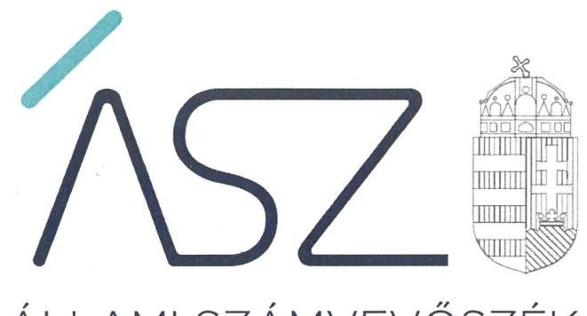
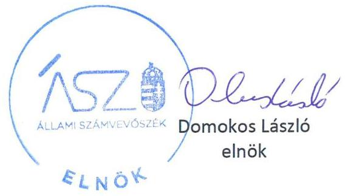
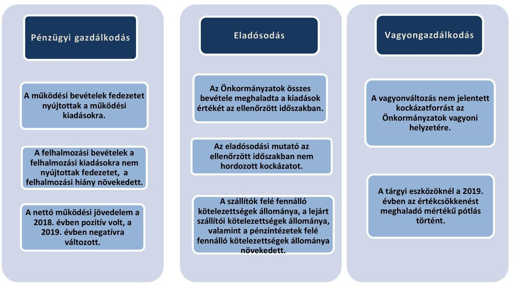
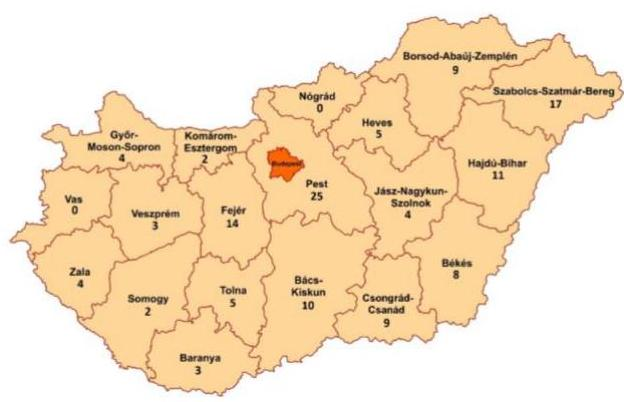
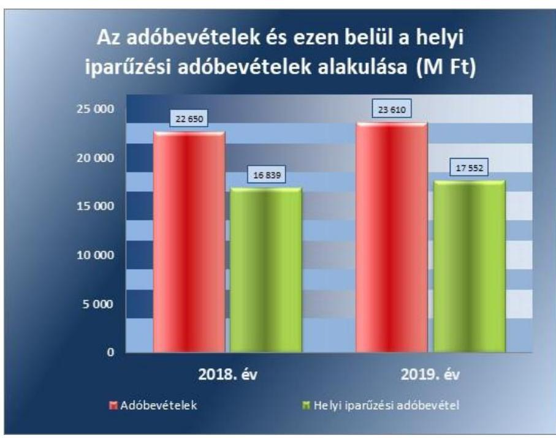
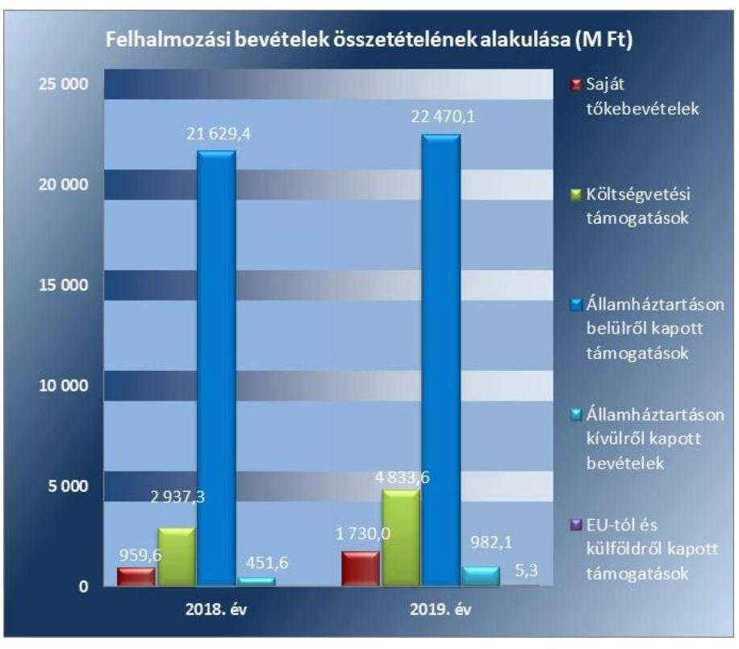
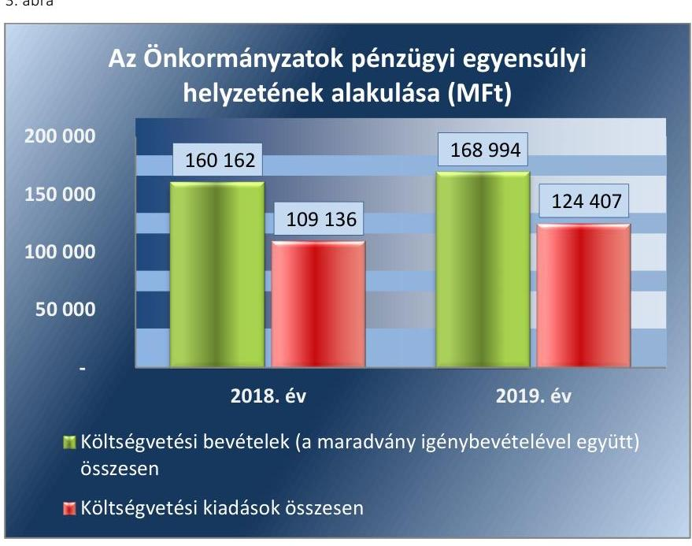
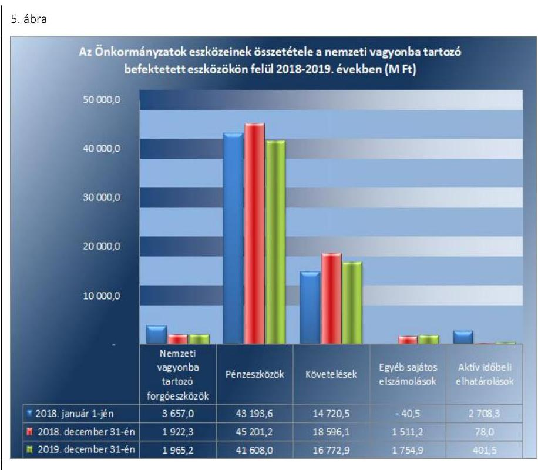
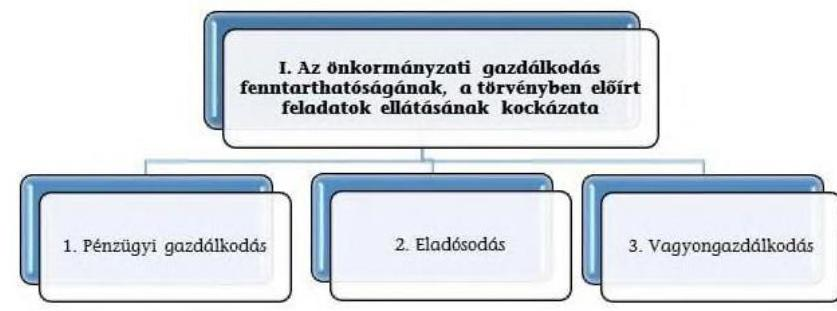

ÁLLAMI SZÁMVEVŐSZÉK

# JELENTÉS 

## Önkormányzatok pénzügyi monitoring alapján végzett ellenőrzése

Az Önkormányzatok - településtípusok szerinti - gazdálkodásának fenntarthatósága (135 nagyközség)
2021.

21080
www.asz.hu

---

ÁLLAMI SZÁMVEVŐSZÉK

# JELENTÉS

## Önkormányzatok pénzügyi monitoring alapján végzett ellenőrzése

Az Önkormányzatok – településtípusok szerinti – gazdálkodásának fenntarthatósága (135 nagyközség)

2021. 10. hó 11. nap

21080
www.asz.hu

---

# AZ ELLENŐRZÉST FELÜGYELTE: 

DR. SIMON JÓZSEF felügyeleti vezető

## AZ ELLENŐRZÉST VEZETTE ÉS A VÉGREHAJTÁSÁÉRT FELELŐS:

SZAPPANOS JÚLIA ellenőrzésvezető
ÓDOR ZOLTÁN TAMÁS ellenőrzésvezető

A PROGRAM ÖSSZEÁLLÍTÁSÁÉRT FELELŐS:
HORVÁTH TÍMEA projektvezető

IKTATÓSZÁM: EL-3388-001/2021
TÉMASZÁM: 24
ELLENŐRZÉS-AZONOSÍTÓ SZÁM: V090301

---

# TARTALOMJEGYZÉK 

■ ÖSSZEGZÉS ..... 5
■ AZ ELLENŐRZÉS CÉLJA ..... 8
■ AZ ELLENŐRZÉS TERÜLETE ..... 9
■ AZ ELLENŐRZÉS HÁTTERE, INDOKOLTSÁGA ..... 10
■ A JELENTÉS LÉNYEGES KÉRDÉSKÖREI ..... 11
■ AZ ELLENŐRZÉS HATÓKÖRE ÉS MÓDSZEREI ..... 12
■ MEGÁLLAPÍTÁSOK ..... 14
■ MELLÉKLETEK ..... 23
I. sz. melléklet: Értelmező szótár ..... 23
II. sz. melléklet: Az ellenőrzési kritériumok módszertana és értékelése ..... 26
III. sz. melléklet: Az eszközök és források alakulása kiemelt mérlegsoronként a 2018-2019. években (E FT) ..... 28
IV. sz. melléklet: Pénzügyi egyensúlyi helyzet CLF módszer szerinti értékelése a 2018-2019. években (E FT) ..... 29
V. sz. melléklet: Az önkormányzatok 2018-2019. évi főbb mutatóinak és kockázati területeinek összefoglaló értékelése ..... 31
VI. sz. melléklet: Az önkormányzatok 2018-2019. évi főbb mutatóinak és kockázati területeinek részletes értékelése ..... 32
VII. sz. melléklet: A magas kockázatot hordozó önkormányzatok és a kockázatok kezelése ..... 34
VIII. sz. melléklet: Monitoring alá vont önkormányzatok ..... 35
■ FÜGGELÉK: ÉSZREVÉTELEK ..... 37
■ RÖVIDÍTÉSEK JEGYZÉKE ..... 39

---

.

---

# ÖSSZEGZÉS 

Az Állami Számvevőszék 135 nagyközségi önkormányzat gazdálkodásának kockázatait értékelte. Az önkormányzati éves beszámolók adatai szerint az önkormányzatok pénzügyi gazdálkodásának fenntarthatósága, az önkormányzatok pénzügyi egyensúlya biztositott volt a 2018-2019. években. Az önkormányzatok a könyvviteli mérlegben kimutatott vagyon értékét növelték, a szükséges eszközpótlásról a 2019. évben gondoskodtak. Az Állami Számvevőszék 8 önkormányzat esetén jelzett kockázatot, amelyre felhívta az érintett önkormányzatok figyelmét.

## Az ellenőrzés társadalmi indokoltsága

A magyar települési és területi önkormányzatok jelentős része a 2000-es években tartalékait felélve egy olyan adósságspirálba került, amit önerőből már nem, csak külső források igénybevételével tudott finanszírozni. Ennek hatására a felhalmozott adósságállomány állami konszolidációjára a 2011. és 2014. évek között került sor. Az adósságkonszolidációk eredményeként, továbbá az önkormányzatok feladatellátása átstruktúrálásával, rendszerszinten pénzügyi helyzetük helyreállt, így az addig adósságot „termelő" alrendszer a fenntartható működés irányába mozdult el. Ugyanakkor az önkormányzatok gazdálkodásából eredő veszélyek miatt az ÁSZ továbbra is kiemelt figyelmet fordít az önkormányzatok pénzügyi egyensúlyi helyzetére ható kockázatok monitorizálására, a pénzügyi sérülékenységet okozó folyamatokra, az önkormányzati alrendszert veszélyeztető rendszeregyensúlyi kockázatokra annak érdekében, hogy a konszolidáció eredményei fenntarthatóak legyenek.

A Magyar Államkincstár központi információs rendszerében rendelkezésre álló önkormányzati éves költségvetési beszámolók adatait felhasználva, az önkormányzatok pénzügyi- és vagyongazdálkodási, valamint eladósodottság területen végzett monitoring riportok kiértékelésével az ÁSZ hozzájárul azon kockázatos területek feltárásához, amelyek rendszerszintű, vagy egyedi önkormányzati szintű beavatkozást igényelnek az önkormányzatok pénzügyi egyensúlyának fenntarthatósága érdekében.

A pénzügyi monitoringon alapuló ellenőrzés lehetőséget ad az önkormányzati alrendszer egyes településtípus szerinti csoportosítására és ezeknek a csoportoknak a pénzügyi-gazdasági helyzetének rendszerszintű értékelésére, és a kockázatforrást jelentő területek beazonosítására. Emellett a monitoring típusú ellenőrzés az ÁSZ erőforrásainak hatékony felhasználásával, az adatbekérések minimalizálásával, a kockázatokra fókuszáltan, széles lefedettséget képes biztosítani az önkormányzati alrendszer területén. Az ÁSZ ellenőrzés fókuszában áll a beazonosított kockázatok kezelésének előmozdítása önkormányzati és döntéshozói szinten is, támogatva ezzel a jól irányított állam elvének megvalósulását.

Az önkormányzatok által végrehajtott beruházások meghatározó jelentőségűek a helyi közszolgáltatások biztosítása tekintetében. A 2018-2019. években a 2014-2020. közötti uniós programozási ciklus felfutása következtében az önkormányzatok jelentős nagyságrendben indítottak beruházási programokat, amelyek miatt számottevően növekedtek a felhalmozási kiadások. Ezzel párhuzamosan ezen időszakban az önkormányzatok által saját forrásból megvalósított beruházások értéke is jelentősen emelkedett. Az önkormányzatok gazdálkodásának pénzügyi fenntarthatósága szempontjából a kockázatok értékelése során a beruházások értékének ciklikus változását szükséges figyelembe venni.

---

# Értékelések, következtetés 

A nagyközségi önkormányzatok gazdálkodása a 2018-2019. években a rendelkezésre álló jogszabályi környezet mellett fenntartható volt. A 2018-2019. évi beszámoló adatok alapján a nagyközségi önkormányzatoknál az eladósodás rendszerszintű kockázata nem állt fenn, a pénzügyi egyensúly a feladatok és gazdálkodási feltételek lényeges változása nélkül fenntartható, rövidtávon rendszerszintű beavatkozást nem igényel. Az eszközpótlásról a 2019. évben gondoskodtak, az önkormányzatok vagyona növekedett, ezáltal a vagyongazdálkodás területén kockázat nem merült fel.

Az önkormányzatok kiadásainak teljesítéséhez szükséges bevételek a 2018-2019. években rendelkezésre álltak. Az önkormányzatok költségvetésén belül mindkét évben a működési költségvetés egyenlege pozitív volt, ugyanakkor a felhalmozási költségvetés hiányt mutatott. A felhalmozási költségvetés negatív egyenlegének több mint 80\%-os emelkedését az önkormányzatok által az uniós és saját forrásból történő fejlesztésekre fordított kiadások növekedése okozta. A felhalmozási költségvetés hiánya azonban nem hordozott kockázatot, mivel a felhalmozási bevételekhez képest nagyobb összegű felhalmozási kiadások finanszírozása a 2018. évben a működési jövedelemből, illetve a 2019. évben az előző év pénzmaradványának igénybevételéből, illetve kisebb részben a működési jövedelemből történt.

8 önkormányzat magas kockázatot hordozott. 4 önkormányzat esetén a 2019. évben, illetve 4 önkormányzat esetén a 2018. és a 2019. évben negatív volt a nettó működési jövedelem. A mindkét évben negatív nettó működési jövedelemmel rendelkező önkormányzatok esetén egyensúlyjavító intézkedések szükségesek.

Az Állami Számvevőszék a pozitív változások elindítása érdekében figyelemfelhívó levélben tájékoztatta az érintett önkormányzatok vezetőit a gazdálkodásukban rejlő kockázatokról és ehhez kapcsolódón kérte a kockázatok kezelése érdekében a szükséges intézkedések meghozatalát és ezek végrehajtását.

A figyelemfelhívásra adott válaszok alapján 4 önkormányzat (Cibakháza Nagyközségi Önkormányzat, Nagymágocs Nagyközségi Önkormányzat, Sárosd Nagyközség Önkormányzata és Szászvár Nagyközség Önkormányzat) vállalta, hogy számba veszi a müködési bevételeket és kiadásokat, valamint megfontolja az intézkedések megtételét.

4 önkormányzat (Bősárkány Nagyközség Önkormányzata, Decs Nagyközség Önkormányzata, Egyek Nagyközség Önkormányzata és Gávavencsellő Nagyközség Önkormányzata) még nem intézkedett a figyelemfelhívásra adott válaszok alapján az ellenőrzött időszakot követően a gazdálkodásukban rejlő kockázatok csökkentése érdekében. Ezen önkormányzatok esetén a müködést veszélyeztető kockázatok továbbra is fennmaradtak. Mindez veszélyezteti ezen önkormányzatok esetén a közfeladatok ellátásának biztonságát.

---

# Következtetés 

Az önkormányzatok számára a gazdálkodás fenntarthatóságának további megőrzése, illetve a pénzügyi sérülékenység kockázatának továbbra is alacsony szinten tartása érdekében a következő években meghatározó jelentőséggel bír a saját forrásból történő, illetve a saját forrást is igénylő beruházások indítása során a pénzügyi lehetőségek figyelembevétele, a beruházások megvalósításához szükséges források rendelkezésre állásának biztosítása.

---

# AZ ELLENŐRZÉS CÉLJA

**AZ ELLENŐRZÉS CÉLJA** az önkormányzatok központi információs rendszerében szereplő adatok értékelése alapján beazonosított kockázatok kezelésének előmozdítása.

---

# **AZ ELLENŐRZÉS TERÜLETE**

## **A nagyközség településtípushoz tartozó 135 önkormányzat**

Az ellenőrzés a MÁK^{1} törzskönyvi nyilvántartásában 2020. szeptemberében szereplő adatok alapján nagyközség településtípus szerinti 135 önkormányzatral terjedt ki.

A 135 nagyközség állandó lakosságának száma 2018. január 1-jén 504 011 fő, 2019. január 1-jén 505 468 fő, 2020. január 1-jén 506 721 fő volt a Központi Statisztikai Hivatal Magyarország Közigazgatási Helynévkönyv adatai alapján. A települések 2019. január 1-jei népességszámát figyelembe véve 13 önkormányzat 1 001-2 000 fő közötti, 36 önkormányzat 2 001-3 000 fő közötti lakosság számmal rendelkezett, és 86 önkormányzat lakosságszáma haladta meg a 3 000 főt. 1 000 fő alatti lakosságszámú nagyközség nem volt.

Az önkormányzatok esetében az egy állandó lakosra jutó működési kiadások összege a 2018. évben 154,5 ezer Ft, a 2019. évben 168,3 ezer Ft volt.

Az egy főre jutó helyi adóbevételek összege az önkormányzatok esetében a 2018. évben 44,9 ezer Ft, a 2019. évben 46,7 ezer Ft volt.

2018. évben 46,7 ezetet, 2019. évben 42 önkormányzat részesült rendkívüli önkormányzati támogatásban.

A helyi önkormányzatok a költségvetésük alapján gazdálkodnak, annak keretében finanszírozzák a feladataik ellátását. Az Áht. 3 6. § (2) bekezdése rögzíti, hogy a költségvetési bevételek és kiadások azok közgazdasági jellege szerint működési és felhalmozási bevételekre és kiadásokra, ezen belül kiemelt előirányzatokra oszthatók. Az Áht. 6. § (7) bekezdés ac) pontja alapján a finanszírozási bevételek közé tartozik a költségvetési maradvány, vállalkozási maradvány. Az önkormányzatok számára a pénzmaradvány ténylegesen rendelkezésre álló pénzügyi forrást jelent. A maradvány igénybevételének nevezzük az adott költségvetési évben az előző évi pénzmaradvány felhasználását.

Az önkormányzatok összevont költségvetési beszámolók szerint teljesített éves költségvetési bevétel és költségvetési kiadás, maradvány igénybevétele, a könyvviteli mérleg szerinti eszközök, a követelések és kötelezettségek állományi értékét az 1. táblázat mutatja be.

|  Év | Bevételek | Kiadások | Maradvány igénybevétele | Eszközök | Követelések | Kötelezettségek  |
| --- | --- | --- | --- | --- | --- | --- |
|  2018. | 111 940,4 | 109 136,2 | 48 661,3 | 479 685,2 | 18 596,0 | 6 070,5  |
|  2019. | 116 196,7 | 124 407,4 | 52 797,1 | 498 696,0 | 16 772,9 | 8 115,7  |

*Forrás: összesített önkormányzati beszámolók*

---

# AZ ELLENŐRZÉS HÁTTERE, INDOKOLTSÁGA 

Az ÁSZ Stratégiájában célul tűzte ki, hogy az önkormányzatok ellenőrzése során azok pénzügyi-gazdasági helyzetét értékeli, kockázatait feltárja. Az új megközelítésű, elemzéssel alátámasztott mintavétellel, illetve ellenőrzési eljárásokkal csökkentse a helyszíni ellenőrzések számát. A monitoring rendszer az önkormányzatok éves költségvetési beszámolójának, időközi költségvetési jelentéseinek és mérlegjelentéseinek a központi információs rendszerben szereplő adatai értékelése alapján jelzi, hogy melyek azok az önkormányzatok, és melyek azok a területek, ahol olyan kedvezőtlen gazdasági folyamatok, vagy gazdasági események következtek be, amelyek ellenőrzés lefolytatását teszik indokolttá. Ennek az egyszerűsített ellenőrzési módszernek az eredményeként megtörténik az önkormányzatok pénzügyi, vagyoni helyzetének megítélése, a pénzügyi egyensúly minősítése, továbbá a változások hatásának értékelése.

Az önkormányzati alrendszerben megjelenő gazdálkodási nehézségek, likviditási problémák és az eladósodottság növekedése az ÁSZ figyelmét a 2011. évtől az önkormányzatok pénzügyi helyzetére irányította. Az önkormányzati feladatellátást érintő átalakítások meghatározó része a 2013. évben következett be azzal, hogy az igazgatási, az oktatási, az egészségügyi és a szociális ellátásban a feladatok jelentős hányadát átvette az állam. Az önkormányzati alrendszerben a 2013. évtől bevezetett feladatfinanszírozási rendszer keretein belül továbbra is megoldandó kérdés a pénzügyi egyensúly megteremtése, hosszú távú fenntartása. Ahhoz, hogy az önkormányzatok meg tudjanak felelni a számukra meghatározott - szigorúbb gazdálkodási szabályoknak, és az új feltételek mellett is biztosítható legyen a közszolgáltatások megfelelő színvonalú ellátása, szükséges volt a pénz-ügyi-gazdasági rendszerük alapjainak megszilárdítása, amely célt az adósságkonszolidáció szolgálta.

Az adósságkonszolidáció az önkormányzatok pénzügyi egyensúlyi helyzetére kedvező hatást gyakorolt, azonban a problémák kiváltó okait nem szüntette meg, ennek kezelése nélkül viszont az adósságállomány újratermelődhet. Erre tekintettel kiemelt fontosságú az önkormányzatok pénzügyi egyensúlyi helyzetére ható kockázatok feltárása.

---

# A JELENTÉS LÉNYEGES KÉRDÉSKÖREI 

1. Az önkormányzatok pénzügyi gazdálkodásának fenntarthatósága biztositott volt-e?
2.     - Fennállt-e az önkormányzatok eladósodásának kockázata?
3.     - Az önkormányzatok vagyongazdálkodása során biztositott volt-e a vagyon értékének megőrzése?

---

# AZ ELLENŐRZÉS HATÓKÖRE ÉS MÓDSZEREI 

## Az ellenőrzés típusa

Helyénvalósági ellenőrzés.

## Az ellenőrzött időszak

A 2018-2019. évek

## Az ellenőrzés tárgya

Az önkormányzati gazdálkodás fenntarthatósága, a törvényben előírt feladatok ellátása, az önkormányzatnál észlelt negatív tendenciák okainak feltárása. Az ellenőrzés kiterjed minden olyan körülményre és adatra, amely az ÁSZ jogszabályban meghatározott feladatainak teljesítéséhez, valamint a program végrehajtása folyamán felmerült újabb összefüggések feltárásához szükséges.

## Az ellenőrzött szervezet

A Kormány helyi önkormányzatokért felelős tagja által vezetett minisztérium, 135 nagyközségi önkormányzat (a VII. számú melléklet alapján).

## Az ellenőrzés jogalapja

Az ellenőrzés jogszabályi alapját az Állami Számvevőszékről szóló 2011. évi LXVI. törvény 1. § (3) bekezdésének, az 5. § (2)-(6) bekezdéseinek, valamint az államháztartásról szóló 2011. évi CXCV. törvény 61. § (2) bekezdésének előírásai képezik.

## Az ellenőrzés módszerei

Az ellenőrzést az ellenőrzési program ellenőrzési kérdései, az ellenőrzött időszakban hatályos jogszabályok, az ellenőrzés szakmai szabályok és módszertanok figyelembe vételével végezzük.

Az ellenőrzés ideje alatt az ellenőrzött szervezettel történő kapcsolattartást az ÁSZ SZMSZ²-ének vonatkozó előírásai alapján biztosítjuk.

---

Az ellenőrzési kérdések megválaszolásához szükséges bizonyítékok megszerzése a Magyar Államkincstár által rendelkezésre bocsátott adatokra alapozva elemző eljárással történik, amelyeket a mintavétel alapján kontrollálni kell a hiteles forrásból származó nyilvántartásokban szereplő adatokkal.

Az ÁSZ az ellenőrzés előkészítése során meghatározta az ellenőrzési (helyénvalósági) kritériumokat, amelyek az ellenőrzési bizonyíték értékelésének, valamint a számvevőszéki jelentésben szereplő megállapítások és következtetések alapját képezik. A megállapításokban használt fogalmak értelmezését, forrását a fogalomtár, a mutatók helyénvalósági kritériumait, és a kockázatok értékelését az ellenőrzési kritériumok módszertana és értékelése tartalmazza.

Az ellenőrzési kérdésekre adott válaszok alapján értékelni kell, hogy az önkormányzat képes volt-e a törvényben meghatározott feladatait ellátni, gazdálkodása változatlan formában fenntartható-e.

---

# 1. Az önkormányzatok pénzügyi gazdálkodásának fenntarthatósága biztosított volt-e? 

Összegző megállapítás

Az önkormányzatok pénzügyi gazdálkodásának egyensúlya biztosított volt a 2018-2019. években.

### 1.1. számú megállapítás

Az önkormányzati feladatok finanszírozási struktúrája a múködési kiadások növekedése ellenére a 2018-2019. években nem jelentett kockázatforrást a pénzügyi gazdálkodásra.

## 2. táblázat

| MUTATÓK ALAKULÁSA |  |  |
| :--: | :--: | :--: |
| Mutatók | 2018. év | 2019. év |
| Múködési kiadások fedezettsége | $109,50 \%$ | $101,09 \%$ |
| Önkormányzati rendkívüli támogatás aránya | $0,51 \%$ | $0,44 \%$ |
| Adóbevételek múködési bevételeken aránya | $26,56 \%$ | $27,45 \%$ |

Forrás: önkormányzati beszámolók

## A MÚKÖDÉSI BEVÉTELEK FEDEZETET NYÚJTOT-

TAK a 2018-2019. években az önkormányzatok által ellátott feladatok működési kiadásaira, ezért a működés területén finanszírozási kockázat egyik évben sem merült fel. A mutatók alakulását a 2. táblázat tartalmazza. A működési kiadások fedezettsége mutató az ellenőrzött időszakban 100\% feletti volt, a kötelező feladatok finanszírozása biztosított volt.

Az önkormányzatok működési bevételein belül az államháztartáson belülről származó működési célú támogatások értéke 6,07\%-kal növekedett, míg a közhatalmi bevételek 4,32\%-kal növekedtek a 2018. évhez képest a 2019. évben. A működési kiadásokon belül a 2018. évről a 2019. évre a személyi juttatásoknál 6,86\%-os, a dologi kiadásoknál 15,6\%-os, az egyéb működési célú kiadásoknál 8,04\%-os emelkedés mutatható ki.

A dologi kiadások 2018. évről 2019. évre történő 4 005,9 M Ft-os emelkedését elsősorban a készletbeszerzések (ezen belül kiemelten az üzemeltetési anyagok beszerzése), valamint a szolgáltatási kiadások növekedése okozta. A dologi kiadások az időszakban 115 önkormányzatnál növekedtek, 20 önkormányzatnál csökkentek.

## RENDKÍVÜLI ÖNKORMÁNYZATI TÁMOGATÁST a

2018. évben 46, a 2019. évben 42 önkormányzat kapott összesen 432,8 M Ft, illetve 381,6 M Ft értékben. A rendkívüli támogatás mértéke a 2018. évről a 2019. évre 11,83\%-kal csökkent.

A működési bevételek az önkormányzatok rendkívüli támogatása nélkül is fedezetet nyújtottak a működési kiadásokra a 2018-2019. években.

AZ ADÓBEVÉTELEK összege a 2018. évhez képest a 2019. évben kis mértékű növekedést mutatott, 4,24\%-kal volt magasabb az előző évhez képest. Az adóbevételek a növekedési ütem mérséklődése ellenére nem hordoztak kockázatot az önkormányzatok múködési költségvetésének egyenlege vonatkozásában. A helyi iparűzési adóból származó bevételek 2018. és 2019. évben is egyaránt az adóbevételek 74,34\%-át tették ki. A helyi iparűzési adóból származó bevétel a 2018. évben 16 838,9 M Ft volt, majd a 2019. évben 4,23\%-kal több, 17 551,8 M Ft összegben realizálódott.

---

Az adóbevételek - ezen belül a helyi iparűzési adóbevételek - alakulását az 1. ábra mutatja be.

1. ábra

Fonrás: Önkormányzati beszámolók

Az adóbevételek működési bevételeken belüli aránya a 2018. évi 26,56\%-ról a 2019. évben 27,45\%-ra növekedett.

### 1.2. számú megállapítás

3. táblázat

|  ADATOK ALAKULÁSA |  |   |
| --- | --- | --- |
|  Adatok | 2018. év | 2019. év  |
|  Felhalmozási költségvetés egyenlege (M Ft) | $-5042,1$ | $-9136,6$  |
|  Múködési jövedelem (M Ft) | 7396,4 | 925,9  |
|  Maradvány igénybevétele (M Ft) | 48676,1 | 52797,1  |

Fonrás: önkormányzati beszámolók

A felhalmozási költségvetés 2019. évi hiányára a múködési jövedelem mellett az előző évi maradvány nyújtott fedezetet.

A TÁRGYÉVI FELHALMOZÁSI BEVÉTELEK egyik évben sem nyújtottak fedezetet a felhalmozási kiadásokra, ezért azok finanszírozására a 2018. évben a múködési jövedelem, a 2019. évben a múködési jövedelem és az előző évi maradvány került bevonásra (3. táblázat).

A felhalmozási bevételek a 2018. évről a 2019. évre 15,1\%-kal 3 965,4 M Ft-tal növekedtek. A legjelentősebb növekedés a költségvetési támogatás és az államháztartáson belülről kapott felhalmozási célú támogatások vonatkozásában valósult meg, amelynek összege a 2018. évi 24 566,7 M Ft-ról 2019. évben 27 330,9 M Ft-ra emelkedett. A 2019. évben a saját tőkebevétel 80,0\%-kal, míg a felhalmozási célú költségvetési támogatások összege 64,6\%-kal emelkedett a 2018. évhez képest.

---

A 2018-2019. évek felhalmozási bevételeinek összetételét a 2. ábra mutatja be.
2. ábra

Forrás: Önkormányzati beszámolók
Az önkormányzatoknál a 2018. évhez viszonyítva a 2019. évben 24,6\%-kal növekedett a beruházási és felújítási kiadások összege. A 2018. évben 30 468,1 M Ft volt a beruházások és felújításokra fordított összeg, amely 2019. évben 37 962,2 M Ft-ra növekedett. A növekedést a beruházási kiadások 55,8\%-os emelkedése okozta, amely a 2018. évi 15 951,7 M Ft-ról 2019. évre 24 852,9 M Ft-ra emelkedett, a felújítások összege 2018. évről 2019. évre 9,76\%-kal csökkent. A felhalmozási kiadásokra az önkormányzatok a 2018. évben a költségvetési kiadások 28,65\%-át, a 2019. évben 31,61\%-át fordították.

A felhalmozási kiadások növekedése következtében az önkormányzatok felhalmozási hiánya 5 042,1 M Ft-ról 9 136,6 M Ft-ra növekedett.

A felhalmozási költségvetés - 5 042,1 M Ft forráshiányára a 2018. évben a múködési jövedelem fedezetet nyújtott, a múködési és a felhalmozási költségvetés összevont egyenlege 2018. év végén 2 354,3 M Ft volt. 2019. évben azonban a felhalmozási költségvetés - 9 136,6 M Ft forráshiányára a 925,9 M Ft összegű múködési jövedelem nem nyújtott fedezetet, a fennmaradó különbözetet az önkormányzatok az előző évi pénzmaradvány igénybevételével fedezték.

---

### 1.3. számú megállapítás

Az önkormányzatok nettó múködési jövedelme a 2019. évben negatív értékúre változott.

|  4. táblázat |  |   |
| --- | --- | --- |
|  MUTATÓK ALAKULÁSA |  |   |
|  Mutatók | 2018. év | 2019. év  |
|  Törlesztés fedezettségének aránya | $10,42 \%$ | $146,90 \%$  |
|  Nettó múködési jövedelem (M Ft) | 6625,7 | $-434,2$  |

Forrás: önkormányzati beszámolók

AZ ÖNKORMÁNYZATOK hitelfelvételének összege jelentősen növekedett, mivel a 2018. évben az Önkormányzatok hitelfelvétele 905,9 M Ft volt, a 2019. évben 134,1\%-kal (1 214,4 M Ft-tal) több, 2 120,3 M Ft hitelt vettek fel. Ennek hatására a hiteltörlesztésre fordított összeg is növekedett, amely 2018. évben 770,6 M Ft volt, 3,59\%-kal magasabb az előző évhez képest, 2019. évre pedig 76,50\%-kal 1 360,1 M Ft-ra emelkedett.

Az önkormányzatoknak 2018. évben 6 625,7 M Ft nettó múködési jövedelme keletkezett, amely a 2019. évre csökkent így - 434,2 M Ft-on realizálódott, ezáltal már nem nyújtott fedezetet a külső források adósságszolgálatának teljesítésére. (4. táblázat) A nettó múködési jövedelem csökkenését egyrészt a múködési jövedelem 2018. évről 2019. évre való csökkenése, illetve a hiteltörlesztésre fordított kiadások 76,5\%-os (589,5 M Ft összegű) növekedése okozta.

A nettó múködési jövedelem 2019. évi negatív értéke, a hitelfelvétel és a felhalmozási hiány növekedése kockázatot jelez az önkormányzatok pénzügyi gazdálkodása tekintetében.

# 2. Fennállt-e az önkormányzatok eladósodásának kockázata? 

Összegző megállapítás
5. táblázat

MUTATÓK ALAKULÁSA

| Mutatók | 2018. év | 2019. év |
| :--: | :--: | :--: |
| Eladósodási   mutató | $1,27 \%$ | $1,63 \%$ |
| Eladósodási   mutató válto-   zása százalék-   pontban | 0,003 | 0,36 |
| Tárgyévi pénz-   ügyi pozíció   változása | $-85,38 \%$ | $-280,99 \%$ |

Forrás: önkormányzati beszámolók

## Az önkormányzatok pénzügyi egyensúlya biztosított volt.

A PÉNZÜGYI EGYENSÚLY az önkormányzatoknál a 2018. és a 2019. évben biztosított volt, az önkormányzatok költségvetési bevételei a 2018. évben fedezetet nyújtottak a költségvetési kiadásokra. Az önkormányzatok esetében a maradvány igénybevételére a 2018. évben nem volt szükség. A 2019. évi kiadások finanszírozásához, a pénzügyi egyensúly biztosításához az előző évi pénzmaradványt is felhasználták.

A maradvány igénybevétele (2018. évben 48 671,6 M Ft, a 2019. évben 52 797,1 M Ft) javította az önkormányzatok pénzügyi helyzetét.

Az önkormányzatok pénzügyi egyensúlyi helyzetének alakulását a 3. ábra mutatja be. A mutatók alakulását az 5. táblázat tartalmazza.

---

6. táblázat

TÁRGYÉVI PÉNZÜGYI POZÍCIÓ ALAKULÁSA

|  Mutatók értéke (M Ft) | 2018. év | 2019. év  |
| --- | --- | --- |
|  Tárgyévi pénzügyi pozíció | 4102,2 | $-7424,3$  |
|  Müködési jövedelem | 7396,4 | 925,9  |
|  Felhalmozási költségvetés egyenlege | $-5042,1$ | $-9136,3$  |
|  Finanszírozási költségvetés egyenlege | 1747,9 | 786,4  |

Forrás: önkormányzati beszámolók 7. táblázat

MUTATÓK ALAKULÁSA

|  Mutatók | 2018
év | 2019
év  |
| --- | --- | --- |
|  Kötelezettségek dologi, felújítási beruházási kiadásokra állomány változása | $-6,57 \%$ | $24,16 \%$  |
|  Lejárt dologi, felújítási beruházási kiadásokkal kapcsolatos kötelezettségek állomány aránya | $6,47 \%$ | $8,15 \%$  |
|  Lejárt dologi, felújítási beruházási kiadásokkal kapcsolatos kötelezettségek állomány változása | $38,07 \%$ | $56,38 \%$  |
|  Lejárt dologi kiadásokkal kapcsolatos kötelezettségek állomány aránya a dologi kiadások egy havi átlagához viszonyítva | $4,14 \%$ | $4,82 \%$  |
|  90 napon túli lejárt kötelezettségek állományának aránya (az összes köt. állományból) | $0,45 \%$ | $0,57 \%$  |

Forrás: önkormányzati beszámolók 3. ábra

Forrás: Önkormányzati beszámolók

Az önkormányzatok működési és felhalmozási költségvetésének összesített egyenlege 2018. évben pozitív (2 354,3 M Ft), a 2019. évben negatív volt (-8 210,8 M Ft), amit a felhalmozási, valamint a működési kiadások növekedése okozott. 2018. évben pozitív volt a tárgyévi pénzügyi pozíció, a 2019. évben negatív volt (6. táblázat), amelyet döntőrészt a működési költségvetés pozitív egyenlegének csökkenése és a felhalmozási költségvetés hiányának növekedése eredményezett.

Az önkormányzatok forrásainak összetételében az idegen források aránya nem hordozott kockázatot, tekintettel arra, hogy az eladósodási mutató a 2018. évben számottevő mértékben nem változott, a 2019. évben 0,36 százalékponttal növekedett az előző évhez képest.

Az eladósodási mutató növekedését a 2019. évben a költségvetési évet követően esedékes kötelezettségek, ezen belül a beruházásokra, finanszírozási kiadásokra irányuló kötelezettségek növekedése okozta.

A finanszírozási műveletek nem hordoztak kockázatot. A 2018. évet követően a 2019. évben az értékpapírvásárlás értéke meghaladta az értékpapír értékesítés összegét. A 2018. évről a 2019. évre a hiteltörlesztés 76,5 \%-kal emelkedett, míg a hitelfelvétel 134,07 \%-kal.

A SZÁLLÍTÓI KÖTELEZETTSÉG állománya (az önkormányzatok dologi, beruházási és felújítási kiadásokkal kapcsolatos kötelezettsége) a 2018. évben 6,57\%-kal csökkent, a 2019. évben 24,16\%-kal növekedett az előző időszakhoz képest. A 2018. évi csökkenést a költségvetési évben esedékes dologi kiadásokra irányuló kötelezettségek állományának 758,8 M Ft-os csökkenése okozta. A 2019. évi emelkedés mögött a költségvetési évet követően esedékes beruházásokra vonatkozó szállítói kötelezettségek állományának növekedése állt 360,8 M Ft-tal.

A szállítói kötelezettség állomány alakulását a 4. ábra szemlélteti. A mutatók alakulását a 7. táblázat tartalmazza.

---

8. táblázat

|  MUTATÓK ALAKULÁSA |  |   |
| --- | --- | --- |
|  Múgetők | 2018. év | 2019. év  |
|  Banki kötelezettségállomány mérlegfőösszeghez mért nagysága | $0,12 \%$ | $0,28 \%$  |
|  Banki kötelezettségek állományának változása | $40,24 \%$ | $131,10 \%$  |
|  Garancia és kezességvállalások állománya (MFt) | 0 | 1,66  |

Forrás: önkormányzati beszámolók 4.ábra

|  Az Önkormányzatok szállítói kötelezettség állományának alakulása (MFt) |  |   |
| --- | --- | --- |
|  2500,0 |  |   |
|  2000,0 | 1926,2 | 2234,3  |
|  1500,0 |  |   |
|  1000,0 |  |   |
|  500,0 | 84,3 | 116,4  |
|  - |  | 182,1  |
|  2018.01.01 | 2018.12.31 | 2019.12.31  |
|  Szállítói állomány | Lejárt szállítói állomány |   |

Forrás: Önkormányzati beszámolók

A lejárt szállítói kötelezettség aránya a szállítói kötelezettségeken belül a 2019. évben kedvezőtlenül változott, 1,7 százalékponttal növekedett a 2018. évhez képest, az arány 2018. évben 6,47\%, a 2019. évben 8,15\% volt.

Az önkormányzatok 2018. év végén 27,5 M Ft, 2019. év végén 46,3 M Ft 90 napon túl lejárt tartozással rendelkeztek. Az ellenőrzött önkormányzatok közül 90 napon túl lejárt kötelezettsége 2018. évben 9, 2019. évben 11 önkormányzatnak volt. 7 önkormányzatnak mindkét évben volt 90 napon túl lejárt kötelezettsége, egy kivétellel minden esetben az állománya csökkent vagy stagnált.

Az év végén kimutatott 90 napon túl lejárt kötelezettség fennállásának az indokoltsága nem volt igazolt, mivel annak finanszírozására a likvid eszközök rendelkezésre álltak, így az átgondolt és felelős gazdálkodás nem érvényesült. Az önkormányzatoknál a 2018-2019. években a likvid eszközök (pénzeszközök, értékpapírok, követelések) a kötelezettségek teljesítésére fedezetet biztosítottak.

## A PÉNZINTÉZETEK FELÉ FENNÁLLÓ KÖTELE-

ZETTSÉG állománya a 2018. évben 40,24\%-kal, 2019. évben 131,10\%-kal növekedett az előző évi állapothoz képest, amely az önkormányzatok eladósodásának kockázatát növeli. A banki kötelezettség állományának növekedésére hatással volt, hogy mindkét évben nagyobb mértékben növekedett az önkormányzatok hitelfelvétele, mint a hiteltörlesztése (2019. évben a hitelfelvétel növekedése 134,07\%, a hiteltörlesztés növekedése 76,50\% volt). A mutatók alakulását a 8. táblázat tartalmazza. A banki kötelezettségállomány a 2018. év végén 596,3 M Ft volt, míg a 2019. év végén 1378,1 M Ft.

A 2018. évben kormányzati jóváhagyással 7 naptári éven túli futamidejű adósságot keletkeztető ügyletet, 7 önkormányzat kötött 478,8 M Ft öszszegben, 2019. évben 9 önkormányzat kötött 9 ügyletet, 1 126,1 M Ft öszszegben infrastrukturális és fejlesztési beruházásokra. Kormányzati hozzájárulást nem igénylő naptári éven túli futamidejű adósságot keletkeztető ügylet a 2018. évben nem volt, 2019. évben 2 önkormányzat kötött 2 ügyletet 9,8 M Ft összegben.

---

GARANCIA- ÉS KEZESSÉGVÁLLALÁSBÓL származó függő kötelezettség állomány 2018. december 31-én az önkormányzatoknak nem volt, a 2019. évben egy önkormányzat rendelkezett 1,67 M Ft volt összegű kezességvállalásból származó kötelezettséggel.

# 3. Az önkormányzatok vagyongazdálkodása során biztosított volt-e a vagyon értékének megőrzése? 

## Összegző megállapítás

Az önkormányzatok az eszközök pótlásáról a 2019. évben gondoskodtak, ezáltal biztosított volt a vagyon értékének megőrzése.

### 3.1. számú megállapítás

9. táblázat

| MUTATÓK ALAKULÁSA |  |  |
| :--: | :--: | :--: |
| Mutatók | 2018. év | 2019. év |
| Befektetett eszközök fedezettsége | $97,81 \%$ | $93,74 \%$ |
| Ingatlanok és kapcsolódó vagyoni értékú jogok állományának változása (M Ft) | 10581,1 | 13516,9 |
| Koncesszióba, vagyonkezelésbe adott eszközök állományának változása (M Ft) | $-1099,4$ | $-1380,8$ |
| Eszközpótlási mutató (tárgyi eszközök összesen) | $77,63 \%$ | $105,18 \%$ |
| Eszközpótlási mutató (ingatlanok és kapcsolódó vagyoni értékú jogokra) | $87,36 \%$ | $124,90 \%$ |

Forrás: önkormányzati beszámolók

A vagyonváltozás nem jelentett kockázatforrást az önkormányzatok vagyoni helyzetére.

AZ ÖNKORMÁNYZATOK mérleg szerinti vagyona 2018. január 1-jén 456 134,0 M Ft volt, mely értéke 2018. évben 479 685,2 M Ft-ra 5,16 \%-kal, míg 2019. évben 498 696,0 M Ft-ra, további 3,96 \%-kal növekedett.

A vagyon összetételében 2018. január 1-jéhez képest 2019. december 31-re a nemzeti vagyonba tartozó befektetett eszközök aránya 5,78 százalékponttal növekedett, míg a pénzeszközök aránya 3,67 százalékponttal és a nemzeti vagyonba tartozó forgóeszközök aránya 46,26 százalékponttal csökkent. 2018. január 1-jéről 2019. december 31-re a készletek aránya 84,34 százalékponttal, a követelések aránya pedig 13,94 százalékponttal növekedett.

Az eszközök és források alakulását kiemelt mérlegsoronként a 20182019. években a III. számú melléklet tartalmazza. A mutatók alakulását a 9. táblázat tartalmazza.

Az önkormányzatok nemzeti vagyonba tartozó befektetett eszközökön felüli eszközeinek összetételét a 2018-2019. években az 5. ábra szemlélteti.

---

*Forrás: Önkormányzati beszámolók*

Az önkormányzatok vagyonában a befektetett eszközök jelentették a legnagyobb értéket, azon belül is az ingatlanok és a vagyoni értékű jogok, amelyek a 2018. év végén 353 547,3 M Ft-ot, és a 2019. év végén 367 064,2 M Ft-ot képviseltek. Az önkormányzatoknál az ingatlanok és kapcsolódó vagyoni értékű jogok állománya a 2018. évben 10 581,1 M Ft-tal, majd a 2019. évben további 13 516,9 M Ft-tal növekedett. A növekedés a 2018. évben 0,74 %-kal alacsonyabb volt, mint a 2019. évben.

Az önkormányzatoknak a vagyon értékesítéséből származó bevételei a 2018. évben 946,9 M Ft-ot, ugyanakkor beruházásra és felújításra a 2018. évben 30 468,1 M Ft-ot, a 2019. évben 37 962,2 M Ft-ot fordítottak az önkormányzatok. Az értékesítést jelentősen meghaladták a beruházásra és felújításra fordított kiadások.

A koncesszióba és/vagy vagyonkezelésbe adott eszközök állománya a 2018. évben 1 099,4 M Ft-tal (4,40 %-kal), míg a 2019. évben 1 380,8 M Ft-tal (5,79 %-kal) csökkent. A koncesszióba, vagyonkezelésbe adott eszközök állományváltozása nem jelentett kockázatforrást az önkormányzatok gazdálkodására.

### 3.2. számú megállapítás

**Az önkormányzatok a 2019. évben a vagyon pótlásáról gondoskodtak.**

**AZ ÖNKORMÁNYZATOK** eszközeinek, azon belül a nemzeti vagyonba tartozó eszközeinek mérleg szerinti állománya az ellenőrzött időszakban növekedett.

Az önkormányzatoknál az értékcsökkenés kompenzálásaként szükséges vagyonpótlás a 2018. évben nem történt meg, azonban a 2019. évben már gondoskodtak a szükséges eszközpótlásról. A mutatók alakulását a 9. táblázat tartalmazza.

---

9. táblázat

|  MUTATÓK ALAKULÁSA |  |   |
| --- | --- | --- |
|  Mutatók | 2018. év | 2019. év  |
|  Befektetett eszközök fedezettsége | 97,81\% | 93,74\%  |
|  Ingatlanok és kapcsolódó vagyoni értékủ jogok állományának változása (M Ft) | 10581,1 | 13516,9  |
|  Koncesszióba, vagyonkezelésbe adott eszközök állományának változása (M Ft) | $-1099,4$ | $-1380,8$  |
|  Eszközpótlási mutató (tárgyi eszközök összesen) | 77,63\% | 105,18\%  |
|  Eszközpótlási mutató (ingatlanok és kapcsolódó vagyoni értékủ jogokra) | 87,36\% | 124,90\%  |

Forrás: önkormányzati beszámolók

Az önkormányzatok tárgyi eszközeinek legnagyobb részét (2018. évben 92,03\%-át, 2019. évben 89,66\%-át) az Ingatlanok és kapcsolódó vagyoni értékű jogok jelentették, amelynek eszközpótlási mutatója a 2018. évben kedvezőtlen volt, ugyanakkor ezen eszközöknél is megállapítható, hogy a 2019. évben már gondoskodtak az eszközpótlásról, a tárgyévben aktivált, használatba vett ingatlan beruházások és felújítások értéke már meghaladta az ingatlanállomány után elszámolt éves értékcsökkenés összegét $(124,9 \%)$.

Az eszközpótlások 2018. évi elmaradását követően a kedvező folyamatok már elkezdődtek a 2019. évben. A beruházási és felújítási kiadások aránya a befektetett eszközökhöz viszonyítva 2018. évben 7,42\% és 2019. évben 8,73\% volt, amely kedvező hatást gyakorolt a 2019. évben az eszközpótlási mutatókra.

A tárgyévben aktivált beruházások, felújítások összegét, a tárgyi eszközök elszámolt értékcsökkenését, valamint a felhalmozási és beruházási, felújítási kiadások összegét a 6. ábra mutatja. 6. ábra

A tárgyévben aktivált beruházások, felújítások, az elszámolt értékcsökkenés, a felhalmozási kiadások és a beruházási, felújítási kiadások alakulása (M Ft)

|  50000 |  |   |
| --- | --- | --- |
|  40000 |  | 3932438062  |
|  30000 |  |   |
|  20000 |  | 1822517327  |
|  10000 |  |   |
|   | 2018. év | 2019. év  |
|   | Tárgyévben aktivált beruházások, felújítások
Tárgyi eszközök tárgyévben elszámolt értékcsökkenés
Felhalmozási kiadások
Beruházások, felújítások |   |

Forrás: Önkormányzati beszámolók

---

# MELLÉKLETEK 

- I. SZ. MELLÉKLET: ÉRTELMEZŐ SZÓTÁR
adósságszolgálat
belső eladósodás kockázatforrás
beruházás
bevételi kitettség
CLF módszer
eladósodás kockázatforrás
eszközpótlási mutató
felhalmozási bevétel
felhalmozási kiadás
felhalmozási kiadások és finanszírozása kockázatforrás
felújítás
finanszírozás kockázatforrás
folyó bevétel
folyó kiadás
folyó költségvetés egyenlege

Az adósság tőkerészének és az esedékes kamat együttes összegének törlesztése.

Kockázatforrást jelent, ha az értékcsökkenések kompenzálásaként a szükséges vagyonpótlás nem történt meg, ha romlott az eszközök állaga, mert az rejtett eladósodást jelent.
A tárgyi eszköz beszerzése, létesítése, saját vállalkozásban történő előállítása, a beszerzett tárgyi eszköz üzembe helyezése. A beruházás a meglévő tárgyi eszköz bővítését, rendeltetésének megváltoztatását, átalakítását, élettartamának, teljesítőképességének közvetlen növelését eredményező tevékenység. (Forrás: Számv. tv. 3. § (4) bekezdés 7. pontja)
Olyan függőségi viszony, ahol egy szervezet pénzügyi helyzetét meghatározó bevételek nagysága külső körülmények hatására azonnal és kedvezőtlen irányba változhat.
Az önkormányzatok költségvetése elemzésének módszere, amely a pénzügyi kapacitás (nettó múködési jövedelem) fogalmát helyezi a középpontba. A módszer következetesen elkülöníti a folyó és a felhalmozási költségvetés bevételeit és kiadásait, azok költségvetési egyenlegeit. Bizonyos mértékig a vállalati gazdálkodás logikai elemeit érvényesíti az önkormányzatok pénzügyi, jövedelmi helyzetének vizsgálata során.
Az államháztartás önkormányzati alrendszerében felhalmozott adósság állam részéről történő kiegyenlítését, illetve átvállalását követően az önkormányzatok kiemelt feladata, egyben felelőssége az adósságállomány újratermelődésének megakadályozása. Kockázatforrást jelent, ha az önkormányzat kötelezettségei emelkednek, a mérlegben az idegen források aránya nő, az adósságkonszolidációt - helyi önkormányzatok adósságának állam által történő átvállalása - követően a gazdálkodás újra eladósodási pályára áll. Az eladósodás a pénzügyi gazdálkodás egyenes következménye, ugyanakkor hatással is van rá a folyó adósságszolgálat teljesítésén keresztül
A tárgyi eszközállomány elemzéséhez használt mutató, amely megmutatja, hogy az üzembe helyezett beruházások milyen hányadát képezi az elszámolt értékcsökkenésnek. Számításakor tárgyévben üzembe helyezett beruházások, felújítások értékét a tárgyi eszközök tárgyévben elszámolt értékcsökkenéséhez kell viszonyítani.
Az önkormányzatok tárgyévi felhalmozási célú költségvetési bevételei.
Az önkormányzatok tárgyévi felhalmozási célú költségvetési kiadásai.
Kockázatforrást jelent az erőn felüli beruházási aktivitás, illetve, ha a folyamatban lévő felhalmozási feladatok finanszírozásához szükséges pénzügyi forrás nem áll az önkormányzat rendelkezésére.
Az elhasználódott tárgyi eszköz eredeti állaga (kapacitása, pontossága) helyreállítását szolgáló időszakonként visszatérő olyan tevékenység, melynek során az eszköz élettartama megnövekszik, minősége, használata jelentősen javul, így a pótlólagos ráfordításból a jövőben gazdasági előnyök származnak. (Forrás: Számv. tv. ${ }^{\circ}$. § (4) bekezdés 8. pontja) Kockázatforrást jelent, ha az önkormányzat nem rendelkezik megfelelő fedezettel a külső források adósságszolgálatának teljesítéséhez, ami hosszútávon vagyonfeléléshez vagy adósságspirálhoz vezethet.
Az önkormányzatok tárgyévi múködési célú költségvetési bevételei
Az önkormányzatok tárgyévi múködési célú költségvetési kiadásai
A folyó költségvetés egyenlege, azaz a múködési jövedelem megmutatja, hogy az önkormányzat éves folyó bevétele fedezetet biztosít-e a kötelező és önként vállalt feladatellátáshoz kapcsolódó éves folyó kiadására. A múködési jövedelem negatív értéke pénzügyileg fenntarthatatlan helyzetet jelez. A mutató pozitív értéke megtakarítást mutat, amely forrásul szolgálhat az önkormányzat fennálló kötelezettségei megfizetéséhez, valamint fejlesztéseihez.

---

garancia- és kezességvállalás kockázatforrás
garanciavállalás
helyénvalósági ellenőrzés
kezességvállalás
kockázatforrás
koncesszió
közfeladat
közfeladatok finanszírozási struktúrája kockázatforrás
nettó múködési jövedelem
önkormányzat

Kockázatforrást jelent, ha a szerződés kötelezettje a szerződésben vállalt kötelezettségeit nem teljesíti a jogosultnak, mert azokért a kezes köteles helytállni. A garancia és kezességvállalások függő kötelezettségként kockázatot jelentenek az önkormányzat költségvetésére, ezen keresztül a közfeladatok ellátására.
Olyan kötelezettségvállalás, ahol a garanciát vállaló valamely jövőbeni esemény bekövetkezésekor, a szerződésben meghatározott feltételek beálltakor a garancia kedvezményezettje számára meghatározott összegig, meghatározott időpontig, felszólításra azonnal fizet.
A helyénvalósági ellenőrzés a megfelelőségi ellenőrzés azon altípusa, amelyet azokban az esetekben kell alkalmazni, amelyekre jogszabályi előírások nem alkalmazhatóak, illetve amennyiben egyes kérdések megítélésénél nyilvánvaló jogszabályi hiányosságok vannak. Helyénvalósági ellenőrzés során az ÁSZ a közszféra szilárd gazdálkodására és a köztisztviselők magatartására vonatkozó általános alapelvek mentén kell az ellenőrzést lefolytatni. Szerződésben vállalt olyan kötelezettség, amelyben a kezes arra vállal kötelezettséget, hogy ha a szerződés kötelezettje nem teljesít a kezes maga fog helyette teljesíteni a jogosultnak. (Forrás: Ptk. ${ }^{\text {VI }}$ 6:416).
A kockázatok kiváltó okait kockázatforrásnak nevezzük. Első lépésben azonosítjuk a nyomon követendő kockázatokat, majd a kockázatos területeket és a kiváltó okokat (kockázatforrásokat). Kockázatként azonosítjuk, ha az önkormányzat hosszú távon nem képes a törvényben meghatározott feladatait ellátni, költségvetése változatlan formában nem fenntartható. A kockázat értékelésének célja annak megállapítása, hogy a pénzügyi gazdálkodás, eladósodás, vagyongazdálkodás kockázati területek milyen mértékben befolyásolják, veszélyeztetik az önkormányzat múködését, a közfeladatok ellátását. A három kockázati terület minősítéséhez összesen 9 kockázatforrást rendelünk.
Az állam, illetőleg az önkormányzat (önkormányzati társulás) kizárólagos tulajdonában lévő vagyontárgyak birtoklásának, használatának és hasznosításának, valamint a koncesz-szió-köteles tevékenységek gyakorlásának jogát, visszterhes szerződéssel, időlegesen úgy engedi át, hogy a jogosultnak részleges piaci monopóliumot biztosít.
A közfeladat a jogszabályban meghatározott állami vagy önkormányzati feladat. A közfeladatok ellátása költségvetési szervek alapításával és múködtetésével vagy az azok ellátásához szükséges pénzügyi fedezet e törvényben (Áht.) meghatározott eszközökkel, részben vagy egészben történő biztosításával valósul meg. A közfeladatok ellátásában államháztartáson kívüli szervezet jogszabályban meghatározott rendben közremúködhet. (Forrás: Áht. ${ }^{\text {viI }} 3 /$ A. § (1)-(2) bekezdés, 2015. január 1-jétől)
Kockázatforrást jelent, ha az önkormányzat pénzügyi helyzete jelentős függőséget mutat a külső körülményektől (adóbevételektől, kiegészítő állami támogatásoktól). A közfeladatok finanszírozási struktúrája nem kielégítő, ha a múködési bevételek nem fedezik teljes mértékben az ellátott közfeladatokat.
A nettó múködési jövedelem a jövedelemtermelő képességet méri. Megmutatja a múködési bevételekből a múködési kiadások és a hitelek tőketörlesztésének kifizetése után fennmaradó jövedelmet.
A helyi önkormányzat jogi személy. Az önkormányzati feladatok ellátását a képviselőtestület és szervei biztosítják. A képviselőtestület szervei: a polgármester, a főpolgármester, a megyei közgyűlés elnöke, a képviselő-testület bizottságai, a részönkormányzat testülete, a polgármesteri hivatal, a megyei önkormányzati hivatal, a közös önkormányzati hivatal, a jegyző, továbbá a társulás. A képviselő-testület a feladatkörébe tartozó közszolgáltatások ellátására - jogszabályban meghatározottak szerint - költségvetési szervet, a Polgári perrendtartásról szóló 1952. évi III. törvény szerinti gazdálkodó szervezetet (a továbbiakban: gazdálkodó szervezet), nonprofit szervezetet és egyéb szervezetet (a továbbiakban együtt: intézmény) alapíthat, továbbá szerződést köthet természetes és jogi személlyel vagy jogi személyiséggel nem rendelkező szervezettel. (Forrás: Mötv. ${ }^{\text {viI }} 41 .$ § (1), (2), (6) bekezdései)

---

pénzintézetek felé történő eladósodás kockázatforrás
tárgyévi pénzügyi pozíció
szállítók felé történő eladósodás kockázatforrás
vagyongazdálkodás
vagyonváltozás kockázatforrás

Kockázatforrásnak tekintettük, ha az önkormányzat (újból) adósságot keletkeztet, ami a kivételektől eltekintve a 2012. évtől kormányengedély-köteles. A pénzintézetekkel szemben fennálló kötelezettségek esetén olyan függőségi viszony jöhet létre, ahol az önkormányzat pénzügyi helyzete olyan külső körülmények hatására változhat, amely kizárólag a bank egyoldalú döntésén múlik.
a tárgyévi múködési jövedelem, a felhalmozási költségvetés, a finanszírozási múveletek egyenlege
Kockázatforrást jelent, ha az önkormányzat növeli a dologi, felújítási, beruházási kötelezettségeit (szállítókkal szemben fennálló tartozásait), ami burkolt hitelezésnek minősülhet, és az elismert kötelezettségeit átmenetileg vagy véglegesen nem tudja határidőre teljesíteni.
A nemzeti vagyongazdálkodás feladata a nemzeti vagyon rendeltetésének megfelelő, az állam, az önkormányzat mindenkori teherbíró képességéhez igazodó, elsődlegesen a közfeladatok ellátásához és a mindenkori társadalmi szükségletek kielégítéséhez szükséges, egységes elveken alapuló, átlátható, hatékony és költségtakarékos múködtetése, értékének megőrzése, állagának védelme, értéknövelő használata, hasznosítása, gyarapítása, továbbá az állam vagy a helyi önkormányzat feladatának ellátása szempontjából feleslegessé váló vagyontárgyak elidegenítése. (Forrás: Nvtv ${ }^{\circ} 7 . \S$ (2) bekezdése)
Kockázatforrásként értékeltük, ha csökken a nemzeti vagyon, ha az önkormányzatok a vagyonértékesítésből származó bevételeket nem beruházásokra, a vagyon pótlására fordítják.

---

# Ellenőrzési (helyénvalósági) kritériumok módszertana 

Az ellenőrzés tárgya: Az önkormányzati gazdálkodás fenntarthatósága, a törvényben előírt feladatok ellátása, az önkormányzatnál észlelt negatív tendenciák okainak feltárása, amely az ellenőrzési kritériumok alapján kerül értékelésre.

Az ellenőrzési kritériumok meghatározása során első lépésben azonosításra kerültek az önkormányzati gazdálkodás fenntarthatóságának, a törvényben előírt feladatok ellátásának kockázatos területei és a kiváltó okai (kockázatforrások), amelyekhez minden esetben mutatószám került hozzárendelésre. A mutatószámok között a viszonyszámok (relatív mutatószámok) és az abszolút adatok (abszolút mutatószámok) egyaránt megtalálhatóak, amelyekhez a Magyar Államkincstár által szolgáltatott adatállományok (költségvetési beszámolók, időközi költségvetési jelentések, mérlegjelentések adatait) kerültek felhasználásra.

## Az egyes kockázati területek és kockázatforrások minősítése „pontozásos módszerrel" a mutatószámok értékelése alapján történt.

- Első lépésben a mutatószámok értékelésére és egy háromelemű skálán történő elhelyezésére került sor. Az értékelés (a kategória határok meghatározása) elsődlegesen a mutatószámok közgazdasági értelmezése alapján, az Állami Számvevőszék ellenőrzési tapasztalatait felhasználva történt. Az értékelések alapján egyegy mutató alacsony besorolás esetén 0 pontot, közepes esetén 1 pontot, magas kockázatjelzés esetén 2 pontot kapott. (PI.: ha a müködési kiadások fedezettsége mutató $90 \%$ alatti volt, akkor magas kockázati besorolást, 2 pontot, ha 100\% feletti volt akkor alacsony besorolást, 0 pontot kapott.) A \%-ban kifejezett mutatók kockázati besorolására a pontos (több tizedes jegy) értékek alapján került sor, ugyanakkor az önkormányzati riport a mutatókat egy, illetve esetenként két tizedes számjegyig mutatja be.
- Annak érdekében, hogy a kockázatforrások minősítésénél a lényeges mutatók értéke legyen a meghatározó a jellegzetes mutatókéval szemben, a mutatószámok súlyozására került sor ${ }^{1}$. A súlyok mértékének megválasztásakor az elsődleges mutatókat középértéknek tekintve 1-es súly mellérendelése= történt. A főmutató súlya az elsődleges mutatók súlyának kétszeresében, míg a másodlagos mutatók súlya az elsődleges mutatók súlyának felében került meghatározásra. (PI.: a kockázatforrás minősítéséhez a működési kiadások fedezettségét főmutatóként vették figyelembe, ezért 2-es súlyt rendeltek hozzá. Így, ha a mutató kockázati besorolása magas volt, a magas kockázati besoroláshoz rendelt 2 pontot szorozták a főmutatóhoz rendelt 2es súlyszámmal és az elért pontszám 4, míg alacsony besorolás esetén a besoroláshoz rendelt 0 pontot szorozva a főmutatóhoz rendelt 2-es súlyszámmal elért pontszám 0 volt.)
- Ezt követően került sor az önkormányzati gazdálkodás fenntarthatóságának, a törvényben előírt feladatok ellátásának kockázatához rendelt kockázati területek és kockázatforrások értékelési ponthatárainak meghatározására oly módon, hogy kockázatforrásonként a mutatószámok súlyozott értékelésével elérhető öszszes pontszám három egyenlő részre (alacsony, közepes, magas) osztása történt meg. (PI.: A közfeladatok finanszírozási struktúrája kockázatforrás 1 db főmutató, 2 db elsődleges mutató és további 2 db másodlagos mutató alakulása alapján került értékelésre. A mutatók magas kockázati besorolása esetén - a súlyozást követően - elérhető legmagasabb pontszám 10 volt. Ezt három egyenlő részre osztva kerültek meghatározásra a közfeladatok finanszírozási struktúrájának értékelési ponthatárai, amely 0-3,32 pontig alacsony, 3,33-6,66 pontig közepes, 6,67-10 pont között magas kockázati minősítést kapott.)
- Az egyes kockázatforrások értékelésekor a kockázatforráshoz rendelt mutatószámok - súlyozással kapottértékeinek összesítése és a kialakított értékelési ponthatárok szerinti minősítése történt meg. (PI.: egy önkormányzat minősítésekor a közfeladatok finanszírozási struktúrája kockázatforráshoz rendelt 5 db mutató

[^0]
[^0]:    ${ }^{1}$ A súlyozás kifejezi, hogy az alkalmazott mutatószámok egymáshoz képest milyen mértékben járulnak hozzá az adott kockázatforrás értékeléséhez.
    ${ }^{2}$ Egy esetben a banki kötelezettségállomány mérlegfőösszeghez mért nagysága mutatónál a kockázatforrás kiegyensúlyozottabb megítélése érdekében az 1-es súlyozás helyett 1,5-ös súlyozás került alkalmazásra.

---

- fentiekben bemutatott - értékelésével elért összes pontszám 7 volt, akkor a kockázatforrás a hármas skálán a 6,67-10 pont közé került, így magas minősítést kapott.)
- Az egyes kockázati területek minősítése hasonlóan történt. Az egyes kockázati területeket meghatározó kockázatforrások pontjainak aggregálását követően, a kockázati területen elérhető összes pont három egyenlő részre osztásával kialakított skálán történő értékelésére került sor. Ha azonban a kockázatforrások közül legalább egy magas kockázati besorolást ért el, akkor a pontozás szerinti értékeléstől eltérően, a kockázati terület besorolása közepes kockázati minősítésűre módosult.

Az ellenőrzés tárgyának, az önkormányzati gazdálkodás fenntarthatóságának, a törvényben előírt feladatok ellátásának értékelése:

A három kockázati terület együttes értékelése alapján az alábbi mátrix segítségével kerül meghatározásra az önkormányzati gazdálkodás fenntarthatóságának, a törvényben előírt feladatok ellátásának értékelése a következők szerint:

| 1. Az önkormányzati gazdálkodás fenntarthatóságának, a   törvényben elöirt feladatok ellátásának kockázata | Alacsony 0 | Közepes 1 |  |  |  |  | Magas 2 |  |  |  |
| :--: | :--: | :--: | :--: | :--: | :--: | :--: | :--: | :--: | :--: | :--: |
| 1. Pénzügyi gazdálkodás | 3 alacsony | 2 alacsony 1   közepes | 1 alacsony 2   közepes | 2 alacsony   1 magas | 1 alacsony   1 közepes 1   magas | 2 közepes   2őkeze | 2 közepes   1 magas | 1 közepes   2 magas | 2 magas | 2 magas |
| 2. Eladósodás |  |  |  |  |  |  |  |  |  |  |
| 3. Vagyongazdálkodás |  |  |  |  |  |  |  |  |  |  |

---

III. SZ. MELLÉKLET: AZ ESZKÖZÖK ÉS FORRÁSOK ALAKULÁSA KIEMELT MÉRLEGSORONKÉNT A 2018-2019. ÉVEKBEN (E FT)

|  Megnevezés | 2018. január 1. | 2018. december 31. | 2019. december 31.  |
| --- | --- | --- | --- |
|  NEMZETI VAGYONBA TARTOZÓ
BEFEKTETETT ESZKÖZÖK | 391895103 | 412376403 | 436193439  |
|  NEMZETI VAGYONBA TARTOZÓ
FORGÓESZKÖZÖK | 3656955 | 1922258 | 1965206  |
|  PÉNZESZKÖZÖK | 43193579 | 45201240 | 41607987  |
|  KÖVETELÉSEK | 14720529 | 18596140 | 16772936  |
|  EGYÉB SAJÁTOS ELSZÁMOLÁSOK | -40523 | 1511205 | 1754913  |
|  AKTÍV IDŐBELI ELHATÁROLÁSOK | 2708341 | 77994 | 401508  |
|  ESZKÖZÖK ÖSSZESEN | 456133983 | 479685240 | 498695989  |
|  SAJÁT TŐKE | 389714181 | 403343856 | 408901439  |
|  KÖTELEZETTSÉGEK | 5785565 | 6070469 | 8115664  |
|  KINCSTÁRI SZÁMLAVEZETÉSSEL
KAPCSOLATOS ELSZÁMOLÁSOK | - | - | -  |
|  PASSZÍV IDŐBELI ELHATÁROLÁ-
SOK | 60634237 | 70270914 | 81678886  |
|  FORRÁSOK ÖSSZESEN | 456133983 | 479685240 | 498695989  |

---

- IV. SZ. MELLÉKLET: PÉNZÜGYI EGYENSÚLYI HELYZET CLF MÓDSZER SZERINTI ÉRTÉKELÉSE A 2018-2019. ÉVEKBEN (E FT)

|  1. FOLYÓ KÖLTSÉGVETÉS | 2018. év | 2019. év | Változás \%
(2019-2018) / 2018  |
| --- | --- | --- | --- |
|  1.1.1. A Saját múködési bevételek tulajdonosi bevételek nélkül | 30993977 | 31272183 | $0,90 \%$  |
|  1.1.2. Költségvetési támogatások a múködőképesség megőrzését szolgáló kiegészítő támogatások nélkül | 36090336 | 37519328 | $3,96 \%$  |
|  1.1.3. Átengedett bevételek | 1508717 | 1593159 | $5,60 \%$  |
|  1.1.4. Államháztartáson belülről kapott támogatások | 15671137 | 14625927 | $-6,67 \%$  |
|  1.1.5. EU-tól és külföldről kapott bevételek | 11783 | 26360 | $123,72 \%$  |
|  1.1.6. Államháztartáson kívülről kapott bevételek | 228605 | 134008 | $-41,38 \%$  |
|  1.1.7. Hozam- és kamatbevételek | 145938 | 94663 | $-35,13 \%$  |
|  1.1.8. Kölcsönök visszatérülése, igénybevétele | 185706 | 362575 | $95,24 \%$  |
|  1.1.9. A múködőképesség megőrzését szolgáló kiegészítő támogatások | 432808 | 381588 | $-11,83 \%$  |
|  1.1. Folyó bevételek
(1.1.1.+1.1.2.+1.1.3.+1.1.4.+1.1.5.+1.1.6.+1.1.7. $+1.1 .8 .+1.1 .9$. | 85269006 | 86009791 | $0,87 \%$  |
|  1.2.1. Múködési kiadások kamatkiadások nélkül | 68141980 | 74923858 | $9,95 \%$  |
|  1.2.2. Államháztartáson belülre átadott pénzeszközök | 4293659 | 4554272 | $6,07 \%$  |
|  1.2.3. Transzferkiadások | 5245538 | 5412097 | $3,18 \%$  |
|  1.2.3.1. vállalkozásoknak | 1480753 | 1459706 | $-1,42 \%$  |
|  1.2.3.2. EU-nak, illetve külföldre | 600 | 650 | $8,33 \%$  |
|  1.2.3.3. magánszemélyeknek | 2339092 | 2386531 | 2,03\%  |
|  1.2.3.4. non-profit szervezeteknek | 1425093 | 1565210 | $9,83 \%$  |
|  1.2.4. Kamatkiadások | 55487 | 66276 | $19,44 \%$  |
|  1.2.5. Kölcsönök nyújtása, törlesztése | 135981 | 127391 | $-6,32 \%$  |
|  1.2. Folyó kiadások
(1.2.1.+1.2.2.+1.2.3.+1.2.4.+1.2.5.) | 77872644 | 85083894 | $9,26 \%$  |
|  1.3. Folyó költségvetés egyenlege, múködési jövedelem (1.1. - 1.2.) | 7396362 | 925897 | $-87,48 \%$  |
|  2. FELHALMOZÁSI KÖLTSÉGVETÉS |  |  |   |
|  2.1.1. Saját tőkebevételek | 959564 | 1729982 | 80,29\%  |
|  2.1.2. Költségvetési támogatások | 2937251 | 4833608 | $64,56 \%$  |
|  2.1.3. Államháztartáson belülről kapott támogatások | 21629445 | 22470090 | $3,89 \%$  |
|  2.1.4. EU-tól és külföldről kapott támogatások | - | 5290 | 100,00\%  |
|  2.1.5. Államháztartáson kívülről kapott bevételek | 451621 | 982061 | $117,45 \%$  |
|  2.1.7. Kölcsönök visszatérülése, igénybevétele | 243547 | 165828 | $-31,91 \%$  |
|  2.1. Felhalmozási bevételek
(2.1.1.+2.1.2+2.1.3+2.1.4.+2.1.5.+2.1.6.+2.1.7.) | 26221428 | 30186859 | $15,12 \%$  |
|  2.2.1. Saját beruházási kiadás áfával | 15830665 | 24752817 | $56,36 \%$  |

---

|  2.2.2. Saját felújítási kiadás áfával | 14637391 | 13209408 | $-9,76 \%$  |
| --- | --- | --- | --- |
|  2.2.3. Államháztartáson belülre átadott pénzeszközök | 24025 | 693059 | 2784,70\%  |
|  2.2.4. EU-nak és külföldnek adott pénzeszközök | 4242 | 8151 | 92,15\%  |
|  2.2.5. Államháztartáson kívülre adott pénzeszközök | 447344 | 498310 | 11,39\%  |
|  2.2.6. Befektetéssel kapcsolatos kiadások | 121001 | 100035 | $-17,33 \%$  |
|  2.2.8. Kölcsönök nyújtása, törlesztése | 198840 | 61722 | $-68,96 \%$  |
|  2.2. Felhalmozási kiadások
(2.2.1.+2.2.2.+2.2.3.+2.2.4.+2.2.5.+2.2.6.+2.2.7.
+2.2.8.+2.2.9.) | 31263507 | 39323501 | 25,78\%  |
|  2.3. Felhalmozási költségvetés egyenlege (2.1. 2.2.) | $-5042079$ | $-9136642$ | 81,21\%  |
|  3. FINANSZÍROZÁSI MŰVELETEK NÉLKÜLI (GFS) POZÍCIÓ (1.3.+2.3.) | 2354283 | $-8210745$ | $-448,76 \%$  |
|  4. FINANSZÍROZÁSI MŰVELETEK |  |  |   |
|  4.1. Hitelfelvétel | 905853 | 2120290 | 134,07\%  |
|  4.2. Hiteltörlesztés | 770632 | 1360138 | 76,50\%  |
|  4.3. Forgatási és befektetési célú értékpapírok kibocsátása | - | - | -  |
|  4.4. Forgatási és befektetési célú értékpapírok beváltása | - | - | -  |
|  4.5. Forgatási és befektetési célú értékpapírok értékesítése | 3884072 | 1291659 | $-66,74 \%$  |
|  4.6. Forgatási és befektetési célú értékpapírok vásárlása | 2258389 | 1344194 | $-40,48 \%$  |
|  4.7. Egyéb finanszírozási bevételek | 2749166 | 2876211 | 4,62\%  |
|  4.8. Egyéb finanszírozási kiadások | 2762206 | 2797387 | 1,27\%  |
|  4.9. Finanszírozási múveletek egyenlege (4.1.-
4.2.+4.3.-4.4.+4.5.-4.6.+4.7.-4.8.) | 1747865 | 786441 | $-55,01 \%$  |
|  5. TÁRGYÉVI PÉNZÜGYI POZÍCIÓ (1.3.+ 2.3.+4.9.) | 4102148 | $-7424304$ | $-280,99 \%$  |
|  6. NETTÓ MŰKÖDÉSI JÖVEDELEM (müködési jövedelem (1.3.) - töketörlesztés (4.2+4.4)) | 6625729 | $-434240$ | $-106,55 \%$  |
|  |   |   |   |
|  Az önkormányzatok bevételei nem tartalmazzák az előző évi pénzmaradvány igénybevételét. |  |  |   |
|  Tájékoztató adat: Maradvány igénybevétele | 48671632,4 | 52797137,0 | 108,48\%  |

---

- V. SZ. MELLÉKLET: AZ ÖNKORMÁNYZATOK 2018-2019. ÉVI FŐBB MUTATÓINAK ÉS KOCKÁZATI TERÜLETEINEK ÖSSZEFOGLALÓ ÉRTÉKELÉSE

| Azonosított kockázatok (értékelése: Magas=M / Közepes=K / Alacsony=A) | A kiválasztott önkormányzatok 2018. évi kockázati besorolása és pontozása | A kiválasztott önkormányzatok 2019. évi kockázati besorolása és pontozása |
| :--: | :--: | :--: |
| I. Az önkormányzati gazdálkodás fenntarthatóságának, a törvényben előírt feladatok ellátásának kockázata |  |  |
| 1. Pénzügyi gazdálkodás | K | 7 | 13 | K |
| 1.1 Közfeladatok finanszírozási struktúrája | A | 1 | 1 | A |
| 1.2 Felhalmozási kiadások és finanszírozása | M | 4 | 4 | M |
| 1.3 Finanszírozás | A | 2 | 8 | M |
| 2. Eladósodás | K | 15,5 | 24,5 | K |
| 2.1 Adósságkonszolidációt követő időszakban bekövetkező eladósodás | K | 6 | 8 | M |
| 2.2 Szállítók felé történő eladósodás | K | 4,5 | 6,5 | K |
| 2.3 Pénzintézet felé történő eladósodás | K | 5 | 8 | M |
| 2.4 Garancia- és kezességvállalás | A | 0 | 2 | K |
| 3. Vagyongazdálkodás | K | 7 | 2 | A |
| 3.1 Vagyonváltozás | A | 1 | 1 | A |
| 3.2 Belső eladósodás | M | 6 | 1 | A |

---

- VI. SZ. MELLÉKLET: AZ ÖNKORMÁNYZATOK 2018-2019. ÉVI FŐBB MUTATÓINAK ÉS KOCKÁZATI TERÜLETEINEK RÉSZLETES ÉRTÉKELÉSE

| Kockázatok és alapinformációk*** | Mutató értéke 2018.12.31 | Kockázati besorolás 2018.12.31 | Mutató értéke 2019.12.31 | Kockázati besorolás 2019.12.31 |
| :--: | :--: | :--: | :--: | :--: |
| I. Az önkormányzati gazdálkodás fenntarthatóságának, a törvényben elöírt feladatok ellátásának kockázata | - | K | - | 13 |
| 1. Pénzügyi gazdálkodás | - | K | - | K |
| 1.1 Közfeladatok finanszírozási struktúrája | - | A | - | A |
| Múködési kiadások fedezettsége | 109,50\% | A | 101,09\% | A |
| Önkormányzati rendkívüli támogatás aránya | $0,51 \%$ | K | $0,44 \%$ | K |
| Adóbevételek múködési bevételeken belüli arányának változása (százalékpontban) | $1,36 \%$ | A | $0,89 \%$ | A |
| Adóbevételek állományának változása | $9,86 \%$ | A | $4,24 \%$ | A |
| Helyi iparúzési adóbevételek állományának változása | $13,67 \%$ | A | $4,23 \%$ | A |
| 1.2 Felhalmozási kiadások és finanszírozása | - | M | - | M |
| Felhalmozási kiadások fedezettsége | $83,87 \%$ | M | $76,77 \%$ | M |
| 1.3 Finanszírozás | - | A | - | M |
| Törlesztés fedezettségének aránya | $10,42 \%$ | A | $146,90 \%$ | M |
| Nettó múködési jövedelem változása | $-13,51 \%$ | K | $-106,55 \%$ | M |
| 2. Eladósodás | - | K | - | K |
| 2.1 Adósságkonszolidációt követő időszakban bekövetkező eladósodás | - | K | - | M |
| Eladósodási mutató | 1,27\% | A | 1,63\% | A |
| Eladósodási mutató változása (százalékpontban) | $0,00 \%$ | K | $0,36 \%$ | M |
| Tárgyévi pénzügyi pozíció változása | $-85,38 \%$ | M | $-280,99 \%$ | M |
| 2.2 Szállítók felé történő eladósodás | - | K | - | K |
| Kötelezettségek dologi, felújítási beruházási kiadásokra állomány változása | $-6,57 \%$ | A | $24,16 \%$ | K |
| 90 napon túli lejárt kötelezettségek állományának aránya (az öszszes köt. állományból) | $0,45 \%$ | M | $0,57 \%$ | M |

---

| Lejárt dologi, felújítási beruházási kiadásokkal kapcsolatos kötelezettségek állomány aránya | $6,47 \%$ | K | $8,15 \%$ | K |
| :--: | :--: | :--: | :--: | :--: |
| Lejárt dologi, felújítási beruházási kiadásokkal kapcsolatos kötelezettségek állomány változása | $38,07 \%$ | M | $56,38 \%$ | M |
| Lejárt dologi kiadásokkal kapcsolatos kötelezettségek állomány aránya a dologi kiadások egy havi átlagához viszonyítva | $4,14 \%$ | K | $4,82 \%$ | K |
| 2.3 Pénzintézet felé történő eladósodás | - | K | - | M |
| Banki kötelezettségállomány mérlegfőösszeghez mért nagysága | $0,12 \%$ | A | $0,28 \%$ | A |
| Banki kötelezettségek (rövid és hosszúlejáratú hitelek és kötvénykibocsátásból származó tartozások) állományának változása | $40,24 \%$ | M | $131,10 \%$ | M |
| Tárgyévben kormányzati jóváhagyással megkötött naptári éven túli futamidejú adósságot kelet-   keztető   ...ügyletek darabszáma | 7 | M | 8 | M |
| ...ügyletek értéke (E Ft) | 478747368 | A | 947828831 | M |
| Tárgyévben megkötött, kormányzati hozzájáruláshoz nem kötött, naptári éven túli futamidejú adósságot keletkeztető ... ...ügyletek darabszáma | 0 | A | 2 | M |
| ...ügyletek értéke (E Ft) | 0 | A | 9781735 | M |
| 2.4 Garancia- és kezességvállalás | - | A | - | K |
| Garancia és kezességvállalások állománya (E Ft) | 0 | A | 1656735 | K |
| 3. Vagyongazdálkodás | - | K | - | K |
| 3.1 Vagyonváltozás | - | A | - | A |
| Befektetett eszközök fedezettsége | $97,81 \%$ | K | $93,74 \%$ | K |
| Ingatlanok és kapcsolódó vagyoni értékú jogok állományának változása (E Ft) | $\begin{gathered} 10581045 \\ 743 \end{gathered}$ | A | $\begin{gathered} 13516887 \\ 602 \end{gathered}$ | A |
| Koncesszióba, vagyonkezelésbe adott eszközök állományának változása (E Ft) | $\begin{gathered} -1099386 \\ 940 \end{gathered}$ | A | $\begin{gathered} -1380817 \\ 458 \end{gathered}$ | A |
| 3.2 Belső eladósodás | - | M | - | A |
| Eszközpótlási mutató (tárgyi eszközök összesen) | $77,63 \%$ | M | $105,18 \%$ | A |
| Eszközpótlási mutató (ingatlanok és kapcsolódó vagyoni értékú jogokra) | $87,36 \%$ | K | $124,90 \%$ | A |

---

|  Sorszám | Önkormányzat megnevezése | Nettó müködési jövedelem a 2018. évben (Ft) | Nettó müködési jövedelem a 2019. évben (Ft) | Mindkét évben negatív nettó müködési jövedelem | Az ellenőrzött időszakot követően tett-e az önkormányzat lépéseket a kockázat kezelése érdekében?  |
| --- | --- | --- | --- | --- | --- |
|  1. | BŐSÁRKÁNY NAGYKÖZSÉG
ÖNKORMÁNYZATA | $-265625451$ | $-65908943$ | X | Még nem intézkedett -
Továbbra is magas a kockázat.  |
|  2. | CIBAKHÁZA NAGYKÖZSÉGI ÖNKORMÁNYZAT | 29907252 | $-283852353$ |  | Lépéseket tett a kockázat csökkentése érdekében.  |
|  3. | DECS NAGYKÖZSÉG ÖNKORMÁNYZATA | 43109651 | $-117860144$ |  | Még nem intézkedett -
Továbbra is magas a kockázat.  |
|  4. | EGYEK NAGYKÖZSÉG ÖNKORMÁNYZATA | 20875889 | $-157946490$ |  | Még nem intézkedett -
Továbbra is magas a kockázat.  |
|  5. | GÁVAVENCSELLŐ NAGYKÖZSÉG ÖNKORMÁNYZATA | 13707552 | $-288477330$ |  | Még nem intézkedett -
Továbbra is magas a kockázat.  |
|  6. | NAGYMÁGOCS NAGYKÖZSÉGI ÖNKORMÁNYZAT | $-23149316$ | $-199646650$ | X | Lépéseket tett a kockázat csökkentése érdekében.  |
|  7. | SÁROSD NAGYKÖZSÉG ÖNKORMÁNYZATA | $-44619104$ | $-275551015$ | X | Lépéseket tett a kockázat csökkentése érdekében.  |
|  8. | SZÁSZVÁR NAGYKÖZSÉG ÖNKORMÁNYZAT | $-103214416$ | $-228260495$ | X | Lépéseket tett a kockázat csökkentése érdekében.  |

---

|  Sorsz. | Az önkormányzat megnevezése  |
| --- | --- |
|  1. | ALGYŐ NAGYKÖZSÉG ÖNKORMÁNYZATA  |
|  2. | ALSÖNÉMEDI NAGYKÖZSÉG ÖNKORMÁNYZATA  |
|  3. | ARLÓ NAGYKÖZSÉG ÖNKORMÁNYZATA  |
|  4. | ÁSOTTHALOM NAGYKÖZSÉGI ÖNKORMÁNYZAT  |
|  5. | BÁCSBOKOD NAGYKÖZSÉG ÖNKORMÁNYZATA  |
|  6. | BAG NAGYKÖZSÉG ÖNKORMÁNYZATA  |
|  7. | BAGAMÉR NAGYKÖZSÉG ÖNKORMÁNYZATA  |
|  8. | BAKONYCSERNYE NAGYKÖZSÉG ÖNKORMÁNYZATA  |
|  9. | BALATONSZÁRSZÓ NAGYKÖZSÉG ÖNKORMÁNYZATA  |
|  10. | BÉKÉSSZENTANDRÁS NAGYKÖZSÉG ÖNKORMÁNYZATA  |
|  11. | BEREMEND NAGYKÖZSÉG ÖNKORMÁNYZAT  |
|  12. | BERZENCE NAGYKÖZSÉG ÖNKORMÁNYZATA  |
|  13. | BORDÁNY NAGYKÖZSÉG ÖNKORMÁNYZATA  |
|  14. | BŐSÁRKÁNY NAGYKÖZSÉG ÖNKORMÁNYZATA  |
|  15. | BUGAC NAGYKÖZSÉGI ÖNKORMÁNYZAT  |
|  16. | BUGYI NAGYKÖZSÉG ÖNKORMÁNYZATA  |
|  17. | CECE NAGYKÖZSÉG ÖNKORMÁNYZATA  |
|  18. | CIBAKHÁZA NAGYKÖZSÉGI ÖNKORMÁNYZAT  |
|  19. | CSABACSÚD NAGYKÖZSÉG ÖNKORMÁNYZATA  |
|  20. | CSABRENDEK NAGYKÖZSÉG ÖNKORMÁNYZATA  |
|  21. | CSERSZEGTOMAJ NAGYKÖZSÉG ÖNKORMÁNYZATA  |
|  22. | CSÖKMŐ NAGYKÖZSÉG ÖNKORMÁNYZATA  |
|  23. | CSÖMÖR NAGYKÖZSÉG ÖNKORMÁNYZATA  |
|  24. | DECS NAGYKÖZSÉG ÖNKORMÁNYZATA  |
|  25. | DOBOZ NAGYKÖZSÉG ÖNKORMÁNYZATA  |
|  26. | DOMASZÉK NAGYKÖZSÉGI ÖNKORMÁNYZAT  |
|  27. | DOMBEGYHÁZ NAGYKÖZSÉG ÖNKORMÁNYZATA  |
|  28. | DÖMSÖD NAGYKÖZSÉG ÖNKORMÁNYZATA  |
|  29. | DUNAPATAJ NAGYKÖZSÉG ÖNKORMÁNYZATA  |
|  30. | ECSER NAGYKÖZSÉG ÖNKORMÁNYZATA  |
|  31. | EGYEK NAGYKÖZSÉG ÖNKORMÁNYZATA  |
|  32. | ELŐSZÁLLÁS NAGYKÖZSÉG ÖNKORMÁNYZATA  |
|  33. | ETYEK NAGYKÖZSÉG ÖNKORMÁNYZATA  |
|  34. | FADD NAGYKÖZSÉG ÖNKORMÁNYZATA  |
|  35. | FELSÖPAKONY NAGYKÖZSÉG ÖNKORMÁNYZATA  |
|  36. | FÖLDES NAGYKÖZSÉG ÖNKORMÁNYZATA  |
|  37. | GÁDOROS NAGYKÖZSÉG ÖNKORMÁNYZATA  |
|  38. | GÁVAVENCSELLŐ NAGYKÖZSÉG ÖNKORMÁNYZATA  |
|  39. | GYENESDIÁS NAGYKÖZSÉG ÖNKORMÁNYZATA  |
|  40. | HARTA NAGYKÖZSÉG ÖNKORMÁNYZATA  |
|  41. | HEGYESHALOM NAGYKÖZSÉGI ÖNKORMÁNYZAT  |
|  42. | HELVÉCIA NAGYKÖZSÉG ÖNKORMÁNYZATA  |

|  Sorsz. | Az önkormányzat megnevezése  |
| --- | --- |
|  43. | HERNÁD NAGYKÖZSÉG ÖNKORMÁNYZATA  |
|  44. | HERNÁDNÉMETI NAGYKÖZSÉG ÖNKORMÁNYZATA  |
|  45. | HODÁSZ NAGYKÖZSÉGI ÖNKORMÁNYZAT  |
|  46. | HORT NAGYKÖZSÉGI ÖNKORMÁNYZAT  |
|  47. | HOSSZÚPÁLYI NAGYKÖZSÉG ÖNKORMÁNYZATA  |
|  48. | HÖGYÉSZ NAGYKÖZSÉG ÖNKORMÁNYZATA  |
|  49. | INÁRCS NAGYKÖZSÉG ÖNKORMÁNYZATA  |
|  50. | IZSÓFALVA NAGYKÖZSÉG ÖNKORMÁNYZATA  |
|  51. | JÁSZLADÁNY NAGYKÖZSÉGI ÖNKORMÁNYZAT  |
|  52. | KÁL NAGYKÖZSÉGI ÖNKORMÁNYZAT  |
|  53. | KÁLLÓSEMIÉN NAGYKÖZSÉG ÖNKORMÁNYZATA  |
|  54. | KARTAL NAGYKÖZSÉG ÖNKORMÁNYZATA  |
|  55. | KÉTEGYHÁZA NAGYKÖZSÉG ÖNKORMÁNYZATA  |
|  56. | KEVERMES NAGYKÖZSÉG ÖNKORMÁNYZATA  |
|  57. | KISKUNLACHÁZA NAGYKÖZSÉG ÖNKORMÁNYZAT  |
|  58. | KISZOMBOR NAGYKÖZSÉG ÖNKORMÁNYZATA  |
|  59. | KÖLCSE NAGYKÖZSÉG ÖNKORMÁNYZATA  |
|  60. | KÖRÖSSZEGAPÁTI NAGYKÖZSÉGI ÖNKORMÁNYZAT  |
|  61. | KUNMADARAS NAGYKÖZSÉG ÖNKORMÁNYZATA  |
|  62. | LAJOSKOMÁROM NAGYKÖZSÉG ÖNKORMÁNYZAT  |
|  63. | LAKITELEK ÖNKORMÁNYZATA  |
|  64. | LEÁNYFALU NAGYKÖZSÉG ÖNKORMÁNYZATA  |
|  65. | LEPSÉNY NAGYKÖZSÉGI ÖNKORMÁNYZAT  |
|  66. | LEVELEK NAGYKÖZSÉG ÖNKORMÁNYZATA  |
|  67. | MÉRK NAGYKÖZSÉG ÖNKORMÁNYZAT  |
|  68. | MEZÖFALVA NAGYKÖZSÉG ÖNKORMÁNYZATA  |
|  69. | MOGYORÓD NAGYKÖZSÉG ÖNKORMÁNYZATA  |
|  70. | MUCSONY NAGYKÖZSÉG ÖNKORMÁNYZATA  |
|  71. | NAGYCENK NAGYKÖZSÉG ÖNKORMÁNYZATA  |
|  72. | NAGYDOROG NAGYKÖZSÉG ÖNKORMÁNYZATA  |
|  73. | NAGYIGMÁND NAGYKÖZSÉG ÖNKORMÁNYZATA  |
|  74. | NAGYKOVÁCSI NAGYKÖZSÉG ÖNKORMÁNYZATA  |
|  75. | NAGYMÁGOCS NAGYKÖZSÉGI ÖNKORMÁNYZAT  |
|  76. | NAGYRÁBÉ NAGYKÖZSÉG ÖNKORMÁNYZATA  |
|  77. | NAGYRÉDE NAGYKÖZSÉG ÖNKORMÁNYZATA  |
|  78. | NAGYSZÉNÁS NAGYKÖZSÉG ÖNKORMÁNYZATA  |
|  79. | NAGYVENYIM NAGYKÖZSÉG ÖNKORMÁNYZATA  |
|  80. | NAPKOR NAGYKÖZSÉG ÖNKORMÁNYZATA  |
|  81. | NYÁREGYHÁZA NAGYKÖZSÉG ÖNKORMÁNYZATA  |
|  82. | NYÍRÁBRÁNY NAGYKÖZSÉG ÖNKORMÁNYZATA  |
|  83. | NYÍRBÉLTEK NAGYKÖZSÉG ÖNKORMÁNYZATA  |
|  84. | NYÍRBOGÁT NAGYKÖZSÉG ÖNKORMÁNYZATA  |

---

|  Sorsz. | Az önkormányzat megnevezése  |
| --- | --- |
|  85. | NYÍRPAZONY NAGYKÖZSÉG ÖNKORMÁNYZAT  |
|  86. | ORGOVÁNY NAGYKÖZSÉG ÖNKORMÁNYZATA  |
|  87. | ÖCSÖD NAGYKÖZSÉGI ÖNKORMÁNYZAT  |
|  88. | ÖKÖRITÖFÜLPÖS NAGYKÖZSÉG ÖNKORMÁNYZATA  |
|  89. | PÁKOZD NAGYKÖZSÉG ÖNKORMÁNYZATA  |
|  90. | PÁRÁD NAGYKÖZSÉGI ÖNKORMÁNYZAT  |
|  91. | PERKÁTA NAGYKÖZSÉG ÖNKORMÁNYZATA  |
|  92. | PÉTFÜRDŐ NAGYKÖZSÉG ÖNKORMÁNYZATA  |
|  93. | PINCEHELY NAGYKÖZSÉG ÖNKORMÁNYZATA  |
|  94. | POCSAJ NAGYKÖZSÉG ÖNKORMÁNYZATA  |
|  95. | PORCSALMA NAGYKÖZSÉG ÖNKORMÁNYZATA  |
|  96. | RECSK NAGYKÖZSÉGI ÖNKORMÁNYZAT  |
|  97. | RÉVFÜLÖP NAGYKÖZSÉG ÖNKORMÁNYZATA  |
|  98. | RICSE NAGYKÖZSÉG ÖNKORMÁNYZATA  |
|  99. | SÁROSD NAGYKÖZSÉG ÖNKORMÁNYZATA  |
|  100. | SÁRRÉTUDVARI NAGYKÖZSÉG ÖNKORMÁNYZATA  |
|  101. | SEREGÉLYES NAGYKÖZSÉG ÖNKORMÁNYZATA  |
|  102. | SOLYMÁR NAGYKÖZSÉG ÖNKORMÁNYZAT  |
|  103. | SOPONYA NAGYKÖZSÉG ÖNKORMÁNYZAT  |
|  104. | SÜKÖSD NAGYKÖZSÉG ÖNKORMÁNYZATA  |
|  105. | SZABADBATTYÁN NAGYKÖZSÉGI ÖNKORMÁNYZAT  |
|  106. | SZADA NAGYKÖZSÉG ÖNKORMÁNYZAT  |
|  107. | SZANY NAGYKÖZSÉG ÖNKORMÁNYZATA  |
|  108. | SZÁSZVÁR NAGYKÖZSÉG ÖNKORMÁNYZAT  |
|  109. | SZEGVÁR NAGYKÖZSÉGI ÖNKORMÁNYZAT  |
|  110. | SZENTISTVÁN NAGYKÖZSÉG ÖNKORMÁNYZATA  |
|  111. | SZENTMÁRTONKÁTA NAGYKÖZSÉG ÖNKORMÁNYZATA  |
|  112. | SZIRMABESENYŐ NAGYKÖZSÉG ÖNKORMÁNYZATA  |
|  113. | SZŐDLIGET NAGYKÖZSÉG ÖNKORMÁNYZATA  |
|  114. | TÁBORFALVA NAGYKÖZSÉG ÖNKORMÁNYZATA  |
|  115. | TAKSONY NAGYKÖZSÉG ÖNKORMÁNYZATA  |
|  116. | TAKTAHARKÁNY NAGYKÖZSÉG ÖNKORMÁNYZATA  |
|  117. | TÁPIÓSZECSŐ NAGYKÖZSÉG ÖNKORMÁNYZATA  |
|  118. | TÁPIÓSZENTMÁRTON NAGYKÖZSÉG ÖNKORMÁNYZATA  |
|  119. | TÁRNOK NAGYKÖZSÉG ÖNKORMÁNYZATA  |
|  120. | TARPA NAGYKÖZSÉG ÖNKORMÁNYZATA  |
|  121. | TISZAALPÁR NAGYKÖZSÉGI ÖNKORMÁNYZAT  |
|  122. | TISZABECS NAGYKÖZSÉG ÖNKORMÁNYZATA  |
|  123. | TISZADOB NAGYKÖZSÉG ÖNKORMÁNYZATA  |
|  124. | TISZALÚC NAGYKÖZSÉG ÖNKORMÁNYZATA  |
|  125. | TOKOD NAGYKÖZSÉG ÖNKORMÁNYZATA  |
|  126. | TUZSÉR NAGYKÖZSÉGI ÖNKORMÁNYZAT  |
|  127. | TYÚKOD NAGYKÖZSÉG ÖNKORMÁNYZAT  |
|  128. | ÜLLÉS NAGYKÖZSÉGI ÖNKORMÁNYZAT  |

|  Sorsz. | Az önkormányzat megnevezése  |
| --- | --- |
|  129. | VAJSZLÓ NAGYKÖZSÉG ÖNKORMÁNYZAT  |
|  130. | VALKÓ NAGYKÖZSÉG ÖNKORMÁNYZATA  |
|  131. | VASKÚT NAGYKÖZSÉGI ÖNKORMÁNYZAT  |
|  132. | VONYARCVAȘHEGY NAGYKÖZSÉG ÖNKORMÁNYZATA  |
|  133. | ZALAKOMÁR NAGYKÖZSÉG ÖNKORMÁNYZATA  |
|  134. | ZSÁKA NAGYKÖZSÉGI ÖNKORMÁNYZAT  |
|  135. | ZSOMBO NAGYKÖZSÉG ÖNKORMÁNYZAT  |

---

# FÜGGELÉK: ÉSZREVÉTELEK 

A jelentéstervezetet a Számvevőszék 15 napos észrevételezésre megküldte az ellenőrzött szervezet vezetőjének az ÁSZ tv. 29. §7 (1) bekezdése előírásának megfelelően.

A Belügyminisztérium minisztere az ÁSZ tv. 29. § (2) bekezdésében foglalt észrevételezési jogával nem élt, a jelentéstervezetre észrevételt nem tett.

A Belügyminisztérium minisztere az ÁSZ tv. 29. § (2) bekezdésében foglalt észrevételezési jogával nem élt, a jelentéstervezetre észrevételt nem tett.

---

.

---

# RÖVIDÍTÉSEK JEGYZÉKE 

${ }^{1}$ MÁK
${ }^{2}$ Önkormányzatok
${ }^{3}$ Áht.
${ }^{4}$ ÁSZ SZMSZ
${ }^{v}$ Számv. tv.
${ }^{v i}$ Ptk.
${ }^{v i}$ Áht.
${ }^{v i i}$ Mötv.
${ }^{i k}$ Nvtv.

Magyar Államkincstár
135 nagyközség településtípus kategóriában szerepelő önkormányzat.
2011. évi CXCV. törvény az államháztartásról
az Állami Számvevőszék elnökének 3/2019. (XII.23.) ÁSZ utasítása az Állami Számvevőszék Szervezeti és Müködési Szabályzatáról
2000. évi C. törvény a számvitelről (hatályos: 2001. január 1-jétől)
2013. évi V. törvény a Polgári Törvénykönyvről (hatályos: 2014. március 15-től)
2011. évi CXCV. törvény az államháztartásról (hatályos: 2011. december 31-től)
2011. évi CLXXXIX. törvény Magyarország helyi önkormányzatairól (hatályos:
2012. január 1-jétől)
2011. évi CXCVI. törvény a nemzeti vagyonról (hatályos: 2011. december 31-től)

---

# ASZ 

ALLAMI SZAMVEVOSZEK
1052 Budapest, Apáczai Cs. J. u. 10. I 1364 Budapest 4. Pf. 54 TEL: +36 14849100
email: szamvevoszek@asz.hu
web: www.asz.hu | www.aszhirportal.hu