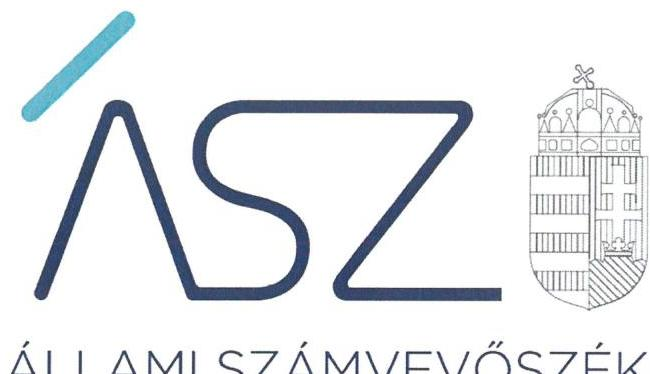
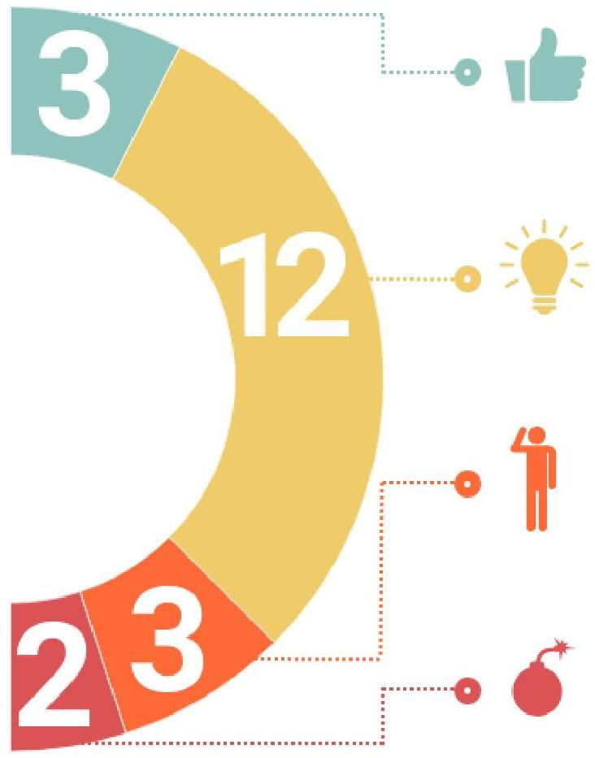
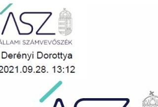

ÁLLAMI SZÁMVEVŐSZÉK

# JELENTÉS 

## Nem állami humánszolgáltatók ellenőrzése

A szociális humánszolgáltatást nyújtó intézmények, szolgáltatók államháztartáson kívüli fenntartói központi költségvetésből kapott támogatásai felhasználásának ellenőrzése
2021.

21081
www.asz.hu

---

ÁLLAMI SZÁMVEVŐSZÉK

# JELENTÉS 

## Nem állami humánszolgáltatók ellenőrzése

A szociális humánszolgáltatást nyújtó intézmények, szolgáltatók államháztartáson kívüli fenntartói központi költségvetésből kapott támogatásai felhasználásának ellenőrzése
2021. 12. hó 02. nap

21081
www.asz.hu

---

AZ ELLENŐRZÉST VEZETTE ÉS A VÉGREHAJTÁSÁÉRT FELELŐS:
SIPOSNÉ DÓCZI KLÁRA ellenőrzésvezető
KAKAS SÁNDOR ellenőrzésvezető
VARGA EDIT ellenőrzésvezető
A PROGRAM ÖSSZEÁLLÍTÁSÁÉRT FELELŐS:
GÖRGÉNYI GÁBOR osztályvezető

IKTATÓSZÁM: EL-3390-001/2021.
TÉMASZÁM: 2547
ELLENŐRZÉS-AZONOSÍTÓ SZÁM: V089102

Jelentéseink az Országgyúlés számítógépes hálózatán és az Interneten a www.asz.hu címen is olvashatóak.

---

# TARTALOMJEGYZÉK 

■ ÖSSZEGZÉS ..... 5
■ AZ ELLENŐRZÉS CÉLJA ..... 8
■ AZ ELLENŐRZÉS TERÜLETE ..... 9
■ AZ ELLENŐRZÉS HÁTTERE, INDOKOLTSÁGA ..... 10
■ A JELENTÉS LÉNYEGES KÉRDÉSKÖREI ..... 11
■ ELLENŐRZÉS HATÓKÖRE ÉS MÓDSZEREI ..... 12
■ ÉRTÉKELÉSEK ..... 14
■ JAVASLATOK ..... 16
■ MELLÉKLETEK ..... 17
I. sz. melléklet: Megállapítások ..... 17
II. sz. melléklet: Ellenőrzött fenntartók. ..... 18
III. sz. melléklet: Az ellenőrzött fenntartók kockázati besorolása ..... 19
IV. sz. melléklet: Értelmező szótár ..... 20
■ FÜGGELÉKEK ..... 21
I. sz. függelék: Az ellenőrzött fenntartók kockázati területeinek értékelése ..... 21
II. sz. függelék: Észrevételek ..... 22
■ RÖVIDÍTÉSEK JEGYZÉKE ..... 27

---

.

---

# ÖSSZEGZÉS 

Az ellenőrzött 20 szociális humánszolgáltatást nyújtó államháztartáson kívüli intézményfenntartó közül 17 esetében tárt fel lényeges hiányosságot az ellenőrzés az alapvető számviteli szabályozási, illetve nyilvántartási kötelezettségek teljesítésével kapcsolatban. A feltárt hiányosságok kockázatot hordoznak a közfeladatra kapott közpénzek elszámoltathatóságára és átláthatóságára.
15 fenntartó felelős vezetői magatartást tanúsított, intézkedéseket tett a feltárt hiányosságok megszüntetése érdekében, ezáltal javult a szabályozási és nyilvántartási kötelezettség teljesítése.
2 fenntartó nem tanúsított felelős vezetői magatartást, az intézkedések elmaradása miatt magas szintű kockázatok maradtak fenn az ellenőrzött időszakot követően a költségvetési támogatások felhasználásának és elszámoltathatóságának terén.

## Az ellenőrzés társadalmi indokoltsága

A szociális gondoskodást igénylők védelme, a kapcsolódó feladatok ellátása az Alaptörvényben ${ }^{1}$ meghatározott, a társadalom szempontjából fontos tevékenységek. Jogszabályok teszik lehetővé, hogy államháztartáson kívüli szervezetek, így például az alapítványok, gazdasági társaságok, egyesületek által fenntartott intézmények is végezzenek szociális és gyermekvédelmi feladatokat. Mindehhez a központi költségvetés évente jelentős összegű támogatással járul hozzá. Az államháztartáson kívüli, humánszolgáltatást végző intézmények az igényelt közpénzekből társadalmilag hasznos, közösségteremtő, közérdekű tevékenységet végeznek, illetve közfeladatokat látnak el.

Az intézményfenntartók ellenőrzésével az Állami Számvevőszék hozzájárul ahhoz, hogy ezen közpénzeket az államháztartáson kívüli szervezetek is ellenőrizhető, átlátható és elszámoltatható módon használják fel a közfeladatok ellátása során. Az ellenőrzések célja továbbá, hogy a nyilvánosság és az igénybevevők megfelelő tájékoztatást kapjanak az államháztartáson kívüli közfeladatot ellátók működéséről.

Az Állami Számvevőszék ellenőrzése arra ad választ, hogy az intézményfenntartók közpénz felhasználása hordozzon kockázatot. A közfeladat ellátás szakmai céljainak megvalósításához, valamint a társadalmi közbizalom fenntartásához elengedhetetlen, hogy a fenntartók a támogatásokat szabályszerűen használják fel.

## Értékelés

A 2017-2019. évekre vonatkozó ellenőrzés 20 nem állami, nem önkormányzati szociális humánszolgáltatási közfeladatokat ellátó intézményfenntartó gazdálkodásának azon lényeges területeit értékelte, amelyek érdemi kockázatot jelenthetnek az ellenőrzött szervezeteknek kifizetett közpénzek felhasználásának átláthatóságára és elszámoltathatóságára. Az ellenőrzött intézményfenntartóknál ilyen lényeges terület volt egyrészt a gazdálkodás alapvető szabályozási kereteinek megléte, másrészt a közpénzekre, a központi költségvetésből kapott támogatásokra vonatkozó nyilvántartási kötelezettségek teljesítése.

ALACSONY VOLT A KOCKÁZAT a kapott közpénzek elszámoltathatóságára és átláthatóságára vonatkozóan három intézményfenntartónál (LK OLTALOM Idősek Otthona Nonprofit Közhasznú Korlátolt Felelősségű Társaság, NAPHÁZ Gondozó Centrum Közhasznú Nonprofit Korlátolt Felelősségű Társaság, KOMOTTHON Komádi Idősek Otthona és Gyermekélelmezési Nonprofit Közhasznú Korlátolt Felelősségű Társaság). Az érintett fenntartók kialakították a gazdálkodáshoz előírt alapvető számviteli szabályozásokat, a közfeladat ellátásához kapott közpénzeket a

jogszabályi előírások szerint elkülönítve tartották nyilván, továbbá összeállították a számviteli beszámolójukat az ellenőrzött időszak minden évében.

**MAGAS VOLT A KOCKÁZAT** a kapott közpénzek elszámoltathatóságára és átláthatóságára vonatkozóan 17 intézményfenntartónál. Ezeknél az intézményfenntartóknál az alapvető szabályozások megléte, valamint a kapott közpénzek felhasználása, nyilvántartása tekintetében tárt fel lényeges hiányosságokat az ellenőrzés. Ezen intézményfenntartók esetében felmerül annak a kockázata, hogy a jövőben a kapott támogatásokat nem szabályszerűen használják fel, nem arra a közfeladatra fordítják, amire kapták, a közpénzeket nem átláthatóan kezelik.

A magas kockázati besorolású fenntartók vezetőinek szükséges volt a kockázatok csökkentése érdekében intézkedniük. A számviteli szabályozottság területén feltárt hiányosságok esetén a fenntartó vezetőjének indokolt volt intézkednie a hiányzó szabályozás(ok) elkészítése érdekében. Ez biztosítja az átlátható és elszámoltatható közpénzfelhasználás alapvető feltételeit. A számviteli beszámoló összeállítása tekintetében feltárt hiányosság esetén a fenntartó vezetőjének intézkednie kellett arra, hogy a jövőben a beszámoló a jogszabályi előírások szerint elkészüljön. A nyilvántartási kötelezettségek területén feltárt hiányosságok esetében a fenntartó vezetőjének szükséges volt intézkednie arra, hogy a jövőben a jogszabályi előírások szerint történjen a kapott költségvetési támogatások nyilvántartása, elkülönítése és a számviteli beszámolóban történő kimutatása. Ezek az intézkedések hozzájárulhatnak a szabályos, átlátható és elszámoltatható közpénzfelhasználáshoz.

3 fenntartó esetében az ellenőrzés **nem tárt fel kockázatot**.

12 fenntartó **felelős vezetői magatartást tanúsított**, az ÁSZ figyelemfelhívására intézkedéseket tett a feltárt hiányosságok megszüntetése érdekében.

3 fenntartó **felelős vezetői magatartást tanúsított**, a vagyonmegóvás kilátásba helyezésére intézkedéseket tett a feltárt hiányosságok megszüntetése érdekében.

2 fenntartó **nem tanúsított felelős vezetői magatartást**, az intézkedések elmaradása miatt magas szintű kockázatok maradtak fenn az ellenőrzött időszakot követően.

---

# Következtetések 

Az Alaptörvény szerint a közpénzekkel gazdálkodó minden szervezet köteles a nyilvánosság előtt elszámolni a közpénzekre vonatkozó gazdálkodásával. Az elszámoltathatóság érvényesülésének alapvető feltétele, hogy a hatályos jogszabályi előírások, továbbá a gazdálkodó szervezetek belső szabályozásai biztosítsák a felelős gazdálkodás kereteit, a gazdálkodásért való felelősségi viszonyok egyértelmű meghatározását. Ezen elv érvényesülését szem előtt tartva az Állami Számvevőszék már az ellenőrzés során felhívással élt és megszólította azon vezetőket, ahol hiányosságot tárt fel és egyúttal lehetőséget adott arra, hogy a jogszabálysértő gyakorlatot megszüntessék. Az Állami Számvevőszék célja a felhívásokkal az volt, hogy a fenntartók a működés és a költségvetési támogatás-felhasználás magas kockázatait csökkentsék, biztosítva ezzel a közfeladatra kapott közpénzek elszámoltathatóságát és átláthatóságát.
Az Állami Számvevőszék felhívására 15 fenntartó intézkedéseket tett az ellenőrzött időszakot követően a közpénzek elszámoltathatósága és átláthatósága terén feltárt magas kockázati szint csökkentése érdekében azzal, hogy szabályozási és nyilvántartási kötelezettségük teljesítésén javítottak.

Az Állami Számvevőszék felhívása ellenére 2 fenntartó (OMNIS Alapítvány - Nyíregyháza és "Megálló Csoport" Alapítvány Szenvedélybetegekért - Budapest) nem tanúsított felelős vezetői magatartást, nem intézkedett a jogszabálysértő gyakorlat megszüntetéséről, így fennmaradt a magas kockázat a költségvetési támogatások felhasználásának és elszámoltathatóságának vonatkozásában. Az Állami Számvevőszék OMNIS Alapítvány részére kettő, a "Megálló Csoport" Alapítvány Szenvedélybetegekért részére pedig egy javaslatot fogalmazott meg. A javaslatokat megalapozó megállapításokra az érintetteknek 30 napon belül intézkedési tervet kell készíteniük. Továbbá azoknál a fenntartóknál, ahol rendszerszintű - önmaga által nem kezelt - kockázatot azonosított az Állami Számvevőszék, új, részletekbe menő ellenőrzés válik indokolttá.

---

# AZ ELLENŐRZÉS CÉLJA 

Az ellenőrzés célja annak megállapítása volt, hogy a nem állami, nem önkormányzati szociális intézmények fenntartója biztosította-e a szabályszerű, átlátható és elszámoltatható közpénzfelhasználás alapvető feltételeit.

---

# **AZ ELLENŐRZÉS TERÜLETE**

## **20 nem állami, nem önkormányzati intézmény fenntartó**

Az ellenőrzés 20 kijelölt nem állami, nem önkormányzati szociális fenntartónál került lefolytatásra. A 20 fenntartó részére a 2017-2019. évekre vonatkozóan mindösszesen 2080,5 millió Ft közpénz került kiutalásra.

Nem állami, nem önkormányzati szociális intézményfenntartó lehet többek között az a magyarországi székhelyű jogi személy, amely a Szoc. tv.2-ben és más jogszabályokban meghatározott feltételek szerint szociális szolgáltatót, illetve szociális intézményt létesít és működtet. A szociális feladatellátáshoz kapcsolódó költségvetési támogatás iránti igényt a fenntartó nyújthatja be. Az Áht.3, az Ávr.4, és az Atr.5 előírásai szerint a Magyar Államkincstár a megítélt támogatásokat a fenntartó részére folyósítja.

Az ellenőrzött fenntartókra vonatkozó információkat – köztük a részükre 2017., 2018. és 2019. évben a Magyar Államkincstár által kiutalt költségvetési támogatások összegeit – az I. számú melléklet mutatja be.

---

# AZ ELLENŐRZÉS HÁTTERE, INDOKOLTSÁGA 

A szociális feladatokat ellátó nem állami intézményfenntartók részére közfeladataik ellátására évente jelentős összegű pénzügyi támogatást biztosítottak a mindenkori költségvetési törvények a bennük megfogalmazott feltételek mellett. A felhasználható állami támogatások Kvtv. ${ }^{6}$-ek szerinti előirányzata 2017. - 2019. években a szociális ágazatra 352,6 Mrd Ft volt. Az Országgyűlés módosította a Szoc. tv.-t, amely - többek között - 2012. január 1-jei hatállyal megfogalmazta a finanszírozási rendszerbe történő befogadással összefüggő szabályokat. A feladatfinanszírozási forma (átlagbéralapú támogatás) jelent meg, amely az államháztartáson kívüli intézményfenntartókra is vonatkozik.

A kockázat alapú ellenőrzés a közpénzekkel való gazdálkodás kereteinek biztosítására és a támogatások jogszabályokkal összhangban történő nyilvántartásának ellenőrzésére fókuszál a költségvetési támogatásokat felhasználó államháztartáson kívüli szervezetek körében. Az ellenőrzések indokoltságát az is alátámasztja, hogy az ÁSZ ${ }^{7}$ számos szervezetet még nem ellenőrzött ezen a területen.

Az ÁSZ stratégiájában foglaltak alapján is indokolt az ellenőrzés, amely a társadalom számára jelzi, hogy a közpénz államháztartáson kívüli felhasználása sem maradhat ellenőrizetlenül. Az államháztartáson kívülre nyújtott költségvetési támogatások ellenőrzésével az ÁSZ hozzájárul ahhoz, hogy a közpénzeket a nem állami humán fenntartók átlátható módon használják fel a közfeladatok ellátására kötött szerződésekben vállalt kötelezettségek teljesítése érdekében. Az ellenőrzés javaslataival hozzájárulhat az említett rendszerek szabályszerű támogatás felhasználásához, javíthatja a társadalmi-gazdasági döntések megalapozottságát, amely a „jól irányított állam működésének" feltétele.

---

# A JELENTÉS LÉNYEGES KÉRDÉSKÖREI 

1. Az államháztartáson kívüli fenntartók a jogszabályokkal összhangban alakították-e ki a közpénzekkel való gazdálkodás alapvető szabályozási kereteit?
2. Az államháztartáson kívüli fenntartók eleget tettek-e nyilvántartási kötelezettségeiknek?
3. Az államháztartáson kívüli fenntartó meghatározta-e az intézményi térítési dijat?

---

# ELLENŐRZÉS HATÓKÖRE ÉS MÓDSZEREI 

## Az ellenőrzés típusa

Megfelelőségi ellenőrzés.

## Az ellenőrzött időszak

2017. január 1. és 2019. december 31. közötti időszak azon évei, amelyben a nem állami, nem önkormányzati fenntartó szociális közfeladat-ellátásra az államháztartásból támogatást kapott és/vagy használt fel.

## Az ellenőrzés tárgya

Az ellenőrzés a szociális humánszolgáltatási közfeladatokat ellátó államháztartáson kívüli fenntartók gazdálkodása alapvető szabályozási kereteinek meglétére, valamint a humánszolgáltatási közfeladataik ellátásához a központi költségvetésből kapott támogatások és azok humánszolgáltatási közfeladatokra való fenntartó általi felhasználásával kapcsolatosan vezetett nyilvántartások ellenőrzésére terjedt ki.

Az ellenőrzés kiterjedt minden olyan körülményre és adatra, amely az ÁSZ jogszabályban meghatározott feladatainak teljesítéséhez, valamint a program végrehajtása folyamán felmerült újabb összefüggések feltárásához szükséges volt.

## Az ellenőrzött szervezetek

20 szociális humánszolgáltatási közfeladatokat ellátó államháztartáson kívüli fenntartó az II. melléklet szerint.

## Az ellenőrzés jogalapja

Az ellenőrzés jogszabályi alapját az ÁSZ tv. ${ }^{8}$ 1. § (3) bekezdésében, 5. § (3) bekezdésében foglalt előírások adják.

AZ ÁSZ az államháztartásból származó források felhasználásának keretében ellenőrzi az államháztartásból nyújtott támogatás felhasználását többek között - az államháztartáson kívüli humánszolgáltatók fenntartóinál. Amennyiben a kedvezményezett szervezet az államháztartásból támogatásban részesül, gazdálkodási tevékenységének egésze ellenőrizhető.

Az ÁSZ törvényességi szempontból ellenőrzi az egyházi jogi személyek vagy azok nevelési-oktatási, felsőoktatási, egészségügyi, karitatív, szociális, család-, gyermek- és ifjúságvédelmi, kulturális vagy sporttevékenység végzésére létrehozott, a bevett

 egyház belső szabálya szerint jogi személyiséggel nem rendelkező intézménye részére az államháztartásból nem hitéleti célra nyújtott támogatás felhasználását.

---

# Az ellenőrzés módszerei 

Az ellenőrzést az ellenőrzött időszakban hatályos jogszabályok, az ellenőrzés szakmai szabályai, a jelen ellenőrzésre irányadó ÁSZ módszertanok, az ellenőrzési programban foglalt értékelési szempontok szerint hajtja végre az ÁSZ. Az ellenőrzést az ÁSZ a program kérdéseire adott válaszok kiértékelésével, valamint a programban ismertetett ellenőrzési kérdések, kritériumok, adatforrások között megjelölt adatforrások, továbbá az adott időszakban hatályos jogszabályok figyelembevételével folytatja le. Az ellenőrzési bizonyítékként felhasználható adatforrások közé tartoznak az ellenőrzési programban felsorolt adatforrások, továbbá minden - az ellenőrzés folyamán - feltárt, az ellenőrzés szempontjából információkat tartalmazó dokumentum.

A kockázatértékelésen alapuló, új módszertanú ellenőrzés a pénzügyi gazdálkodás lényeges területeire terjed ki, és a súlypontok meghatározásával lehetőséget biztosít a kockázatok beazonosítására, valamint a kockázatos területeken a korábbi ellenőrzések által jelzettekhez képest bekövetkezett változások számbavételére. A törvényi előírásokat, valamint az ÁSZ által meghirdetett, nyilvános módszertant figyelembe véve az ellenőrzés hatóköre kiegészülhet kockázatjelzések alapján, a kockázatértékelés függvényében további lényeges területek szabályosságának ellenőrzésével az ellenőrzés megkezdésének időpontjáig.

Az ellenőrzött múltbeli időszakra vonatkozóan megállapított hiányosságok kockázatot jelenthetnek a közpénzek átlátható, elszámoltatható felhasználására vonatkozóan. Az ellenőrzött szervezetek kockázati besorolását az ÁSZ az alábbi szempontok figyelembevételével végzi el:

A kockázati besorolás az ellenőrzött szervezet esetében magas, amennyiben:
— számviteli beszámolóval az adott évben nem rendelkezett;
— számviteli politikával és annak keretében elkészített pénzkezelési szabályzattal együttesen az adott évben nem rendelkezett;
— az adott évben nem a jogszabályokkal összhangban alakította ki a közpénzekkel való gazdálkodás alapvető szabályozási kereteit;
— a szociális közfeladat ellátásra kapott támogatás felhasználásának adott évre vonatkozó elkülönített nyilvántartását igazoló dokumentummal nem rendelkezett, vagy a nyilvántartás nem a jogszabályi előírásoknak megfelelően történt.
Az ellenőrzés ideje alatt az ellenőrzött szervezetekkel történő kapcsolattartás az ÁSZ szervezeti és működési szabályzatának vonatkozó előírásai alapján történik.

A fenntartók felé az ÁSZ felhívással élt a 2019. évi - ellenőrzés során feltárt - szabálytalanságok vonatkozásában. A felhívásra adott válaszok alapján az ÁSZ értékelte a 2019. évre vonatkozóan feltárt kockázatok fenntartói kezelését, a kockázatok változását.

---

# 1. Az államháztartáson kívüli fenntartók a jogszabályokkal összhangban alakították-e ki a közpénzekkel való gazdálkodás alapvető szabályozási kereteit?

## Összegző értékelés

Az ellenőrzéssel érintett 20 fenntartó közül 2017. évben 15, 2018. és 2019. évben pedig 16-16 fenntartó a közpénzekkel való gazdálkodás alapvető szabályozási kereteit összességében a jogszabályokkal összhangban alakította ki.

A közpénzekkel való gazdálkodás szabályozási kereteinek jogszabályokkal összhangban történő kialakítása alapvető fontosságú a közpénzfelhasználás átláthatósága és elszámoltathatósága érdekében. Ezek a szabályzatok, dokumentumok szükségesek ahhoz, hogy a fenntartók el tudjanak számolni a kapott közpénzekkel való gazdálkodásukkal az Alaptörvénynek megfelelően. Az alapvető számviteli szabályzatok hiánya kockázatot jelent a közpénzek szabályszerű, átlátható és elszámoltatható felhasználására.

2017-ben kettő, 2018-ban pedig egy fenntartó nem alakította ki a közpénzekkel való gazdálkodás alapvető szabályozási kereteit, mert nem rendelkezett sem számviteli politikával, sem pedig az annak keretében elkészítendő pénzkezelési szabályzattal. 2017-ben és 2018-ban három-három, 2019-ben pedig négy fenntartó nem a jogszabályokkal összhangban alakította ki a közpénzekkel való gazdálkodás alapvető szabályozási kereteit. A szabályozási hiányosságok kockázatot jelentenek a szabályszerű, átlátható közpénzfelhasználásra.

2017-ben 15, 2018-ban és 2019-ben pedig 16-16 fenntartó összességében a jogszabályokkal összhangban alakította ki a közpénzekkel való gazdálkodás alapvető szabályozási kereteket.

Az ellenőrzött fenntartóknál feltárt hiányosságokat az 1. táblázat mutatja be.

|  Hiányosság | Érintett fenntartók száma |  |   |
| --- | --- | --- | --- |
|   | 2017. év | 2018. év | 2019. év  |
|  Nem rendelkezett számviteli politikával | 4 | 3 | 2  |
|  Nem rendelkezett eszközök és források leltárkészítési és leltározási szabályzatával | 1 | 1 | 1  |
|  Nem rendelkezett az eszközök és források értékelési szabályzatával | 3 | 3 | 3  |
|  Nem rendelkezett pénzkezelési szabályzattal | 2 | 1 | -  |
|  Nem rendelkezett számlarenddel | 7 | 7 | 8  |

---

# 2. Az államháztartáson kívüli fenntartók eleget tettek-e nyilvántartási kötelezettségeiknek? 

Összegző értékelés Az ellenőrzött 20 fenntartó közül a 2017., 2018. és 2019. években 17-17 fenntartó esetében tárt fel lényeges hiányosságokat az ellenőrzés a közpénzek felhasználásának nyilvántartása területén.

SZÁMVITELI BESZÁMOLÓVAL a 2017. és 2018. évben három-három, a 2019. évben pedig négy fenntartó nem rendelkezett. A beszámoló hiánya kockázatot jelent a közpénzekkel való gazdálkodás átláthatóságára. A 2017. és 2018. évben 17-17, és 2019. évben pedig 16 fenntartó rendelkezett számviteli beszámolóval.

A KAPOTT TÁMOGATÁSOK FELHASZNÁLÁSÁNAK ELLENŐRIZHETŐSÉGÉT a beszámolóval rendelkező fenntartók közül 2017., 2018. és 2019. évben négy-négy fenntartó nem biztosította. Ezek a fenntartók a jogszabályi kötelezettségük ellenére nem gondoskodtak arról, hogy az állami támogatások felhasználásának, a fenntartó és a nem önállóan gazdálkodó intézménye gazdálkodásának elkülönített elszámolására az adatok rendelkezésre álljanak. Az elkülönítés hiányában nem igazolt, hogy a fenntartók a közpénzt arra a közfeladatra fordították, amire kapták. A szociális közfeladat ellátásra kapott közpénzek felhasználásának elkülönített nyilvántartása hiánya kockázatot hordoz a közpénzek átlátható és elszámoltatható felhasználására, valamint a fenntartók beszámolójának megalapozottságára.

A 2017. és 2018. évben tíz-tíz, a 2019. évben pedig kilenc fenntartó a jogszabályi előírás ellenére az alapcél szerinti tevékenysége költségei, ráfordításai ellentételezésére kapott támogatásokról nem vezetett olyan elkülönített számviteli nyilvántartást, amelynek alapján támogatásonként megállapítható és ellenőrizhető a kapott támogatás felhasználása. A nyilvántartási kötelezettségek elmulasztása kockázatot jelent az átlátható és elszámoltatható közpénzfelhasználásra.

HÁROM FENNTARTÓ ELEGET TETT a 2017-2019. években a közpénzek felhasználására vonatkozó nyilvántartási kötelezettségeinek a jogszabályi előírások szerint.

## 3. Az államháztartáson kívüli fenntartó meghatározta-e az intézményi térítési díjat?

Összegző értékelés A fenntartók a 2017., 2018. és 2019. években az intézményi térítési díjakat meghatározták.

AZ INTÉZMÉNYI TÉRÍTÉSI DÍJAT a 2017., 2018. és 2019. években a fenntartók meghatározták. A térítési díj meghatározása biztosítja, hogy a szolgáltatásokat igénybevevő személyek azonos feltételek mellett juthassanak a szolgáltatásokhoz.

---

# JAVASLATOK 

Az ÁSZ tv. 33. § (1) bekezdésében foglaltak értelmében az ellenőrzött szervezet vezetője köteles a jelentésben foglalt megállapításokhoz kapcsolódó intézkedési tervet összeállítani és azt a jelentés kézhezvételétől számított 30 napon belül az ÁSZ részére megküldeni. Amennyiben az ellenőrzött szervezet vezetője nem küldi meg határidőben az intézkedési tervet, vagy továbbra sem elfogadható intézkedési tervet küld, az Állami Számvevőszék elnöke az ÁSZ tv. 33. § (3) bekezdése a) és b) pontjaiban foglaltakat érvényesítheti.

## "Megálló Csoport" Alapítvány Szenvedélybetegekért kuratóriuma elnökének

1. Gondoskodjon a jogszabályi előírásoknak megfelelő számviteli beszámoló elkészítéséről
(1. sz. melléklet, fenntartóra vonatkozó megállapítás 1. bekezdése alapján)

## OMNIS Alapítvány kuratóriuma elnökének

1. Gondoskodjon a jogszabályi előírásoknak megfelelő számlarend elkészítéséről
(1. sz. melléklet, fenntartóra vonatkozó megállapítás 1. bekezdése alapján)
2. Gondoskodjon az alapcél szerinti (közhasznú) tevékenysége költségei, ráfordításai ellentételezésére kapott támogatásokról szóló elkülönített számviteli nyilvántartás vezetéséről, amelynek alapján támogatásonként megállapítható és ellenőrizhető a kapott támogatás felhasználása.
(1. sz. melléklet, fenntartóra vonatkozó megállapítás 2. bekezdése alapján)

---

# MELLÉKLETEK 

I. SZ. MELLÉKLET: MEGÁLLAPÍTÁSOK

## "Megálló Csoport" Alapítvány Szenvedélybetegekért

A Fenntartó a számvitelről szóló 2000. évi C. törvény (továbbiakban: Számv. tv. ${ }^{9}$ ) 4. § (1) bekezdésének előírása ellenére nem készített a 2019. évre vonatkozóan - figyelemmel a Számv. tv. 20. § (6) bekezdésének előírására - számviteli beszámolót, amelyet az ÁSZ felhívására sem készített el.

## OMNIS Alapítvány

A Fenntartó a Számv. tv. 161. § (1) bekezdésének előírása ellenére számlarendet nem készített, amelyet az ÁSZ felhívására sem készített el.

A Fenntartó a Civil tv. ${ }^{10}$ 20. § (4) bekezdésének előírása ellenére az alapcél szerinti (közhasznú) tevékenysége költségei, ráfordításai ellentételezésére kapott támogatásokról nem vezetett olyan elkülönített számviteli nyilvántartást, amelynek alapján támogatásonként megállapítható és ellenőrizhető a kapott támogatás felhasználása. Az elkülönített nyilvántartást az ÁSZ felhívására sem vezette.

---

|  | Ellenőrzött szervezet | fenntartó szervezet formája | Ellátott közfeladat | fenntartott intézmények száma | Székhely (település) | Székhely (megye) | Költségvetési támogatás összege (millió Ft) |  |  |
| :--: | :--: | :--: | :--: | :--: | :--: | :--: | :--: | :--: | :--: |
|  |  |  |  |  |  |  | 2017. év | 2018. év | 2019. év |
| 1. | Léthatáron Alapítvány | alapítvány | hajléktalanok ellátása | 1 | Budapest | Budapest | 45,44 | 48,30 | 51,11 |
| 2. | LK OLTALOM Idősek Otthona Nonprofit Közhasznú Korlátolt Felelősségű Társaság | nonprofit gazdasági társaság | bentlakásos intézményi ellátás ápolás, gondozás | 1 | Lábatlan | Komárom-Esztergom | 43,28 | 46,84 | 52,27 |
| 3. | Miskolc - Avas Gesztenyéskerti Idősek Otthonáért Alapítvány | alapítvány | bentlakásos intézményi ellátás ápolás, gondozás | 1 | Miskolc | Borsod-Abaúj-Zemplén | 39,33 | 44,85 | 48,84 |
| 4. | Szent Anna Időseket Támogató Alapítvány | alapítvány | bentlakásos intézményi ellátás ápolás, gondozás | 1 | Telekgerendás | Békés | 38,91 | 42,67 | 48,39 |
| 5. | Bezerédj - Kastélyterápia Alapítvány | alapítvány | gyermekeknek otthont nyújtó ellátás | 1 | Pécs | Baranya | 26,30 | 33,06 | 67,68 |
| 6. | OMNIS Alapítvány | alapítvány | időskorúak nappali intézménye demens, fogyatékos személyek, pszichiátriai, szenvedélybetegek nappali ellátása | 3 | Nyíregyháza | Szabolcs-Szatmár-Bereg | 38,02 | 42,00 | 43,36 |
| 7. | Lelkierő Fiatalon a Fiatalokért Egyesület | egyesület | pszichiátriai betegek részére nyújtott közösségi alapellátás szenvedélybetegek részére nyújtott közösségi alapellátás támogató szolgáltatás szenvedélybetegek részére nyújtott alacsonyközcibbú ellátás | 4 | Debrecen | Hajdú-Bihar | 38,59 | 40,01 | 42,65 |
| 8. | Twist Oliver Alapítvány | alapítvány | hajléktalanok ellátása | 1 | Budapest | Budapest | 37,05 | 40,70 | 42,07 |
| 9. | "MIVA BÖLCSI" Szolgáltató Közhasznú Nonprofit Korlátolt Felelősségű Társaság | nonprofit gazdasági társaság | gyermekek napközbeni ellátása (bölcsőde) | 1 | Békéscsaba | Békés | 34,29 | 33,75 | 45,54 |
| 10. | Mérföldkő Egyesület | egyesület | pszichiátriai betegek, szenvedélybetegek, fogyatékos személyek rehabilitációs intézménye pszichiátriai betegek, szenvedélybetegek, fogyatékos személyek lakóotthona | 2 | Kovácsszénája | Baranya | 29,38 | 37,22 | 42,29 |
| 11. | "ÉCSI SEGÍTŐ KÉZ" Közhasznú Alapítvány | alapítvány | bentlakásos intézményi ellátás ápolás, gondozás | 1 | Écs | Győr-Moson-Sopron | 31,28 | 32,02 | 39,52 |
| 12. | NAPHÁZ Gondozó Centrum Közhasznú Nonprofit Korlátolt Felelősségű Társaság | nonprofit gazdasági társaság | bentlakásos intézményi ellátás ápolás, gondozás | 1 | Miskolc | Borsod-Abaúj-Zemplén |

 30,30 | 31,69 | 36,38 |
| 13. | "Megálló Csoport" Alapítvány Szenvedélybetegekért | alapítvány | demens, fogyatékos személyek, pszichiátriai, szenvedélybetegek nappali ellátása | 1 | Budapest | Budapest | 32,05 | 31,16 | 34,23 |
| 14. | Ebéd - Sziget Szociális Szolgáltató Közhasznú Nonprofit Korlátolt Felelősségű Társaság | nonprofit kft. | szociális étkeztetés | 1 | Békéscsaba | Békés | 29,29 | 31,65 | 33,24 |
| 15. | Magyar Sclerosis Multiplexes Betegekért Alapítvány | alapítvány | demens, fogyatékos személyek, pszichiátriai, szenvedélybetegek nappali ellátása | 1 | Nyíregyháza | Szabolcs-Szatmár-Bereg | 29,19 | 31,27 | 33,62 |
| 16. | KOMOTTHON Komádi Idősek Otthona és Gyermekélelmezési Nonprofit Közhasznú Korlátolt Felelősségű Társaság | nonprofit gazdasági társaság | bentlakásos intézményi ellátás ápolás, gondozás | 1 | Komádi | Hajdú-Bihar | 23,22 | 27,07 | 27,44 |
| 17. | Egri Autista Alapítvány | alapítvány | demens, fogyatékos személyek, pszichiátriai, szenvedélybetegek nappali ellátása | 1 | Eger | Heves | 21,96 | 24,91 | 26,06 |
| 18. | Területi összefogással a megelőzésért Alapítvány | alapítvány | szociális és gyermekvédelmi személyes gondozás és szakosított ellátás | - | Vác | Pest | 18,54 | 21,58 | 23,77 |
| 19. | Búzavirág Alapítvány | alapítvány | demens, fogyatékos személyek, pszichiátriai, szenvedélybetegek nappali ellátása bentlakásos intézményi ellátás - pszichiátriai betegek, szenvedélybetegek, fogyatékos személyek lakóotthona | 1 | Vámosújfalu | Borsod-Abaúj-   Zemplén | 17,71 | 19,35 | 23,99 |
| 20. | Jelenünkért és Jövőnkért Alapítvány | alapítvány | bentlakásos intézményi ellátás ápolás, gondozás | 1 | Gara | Bács-Kiskun | 16,05 | 16,96 | 20,87 |

Forrás: Fenntartói tanúsítványi adatszolgáltatás, Magyar Államkincstár adata a kiutalt támogatásokról

[^0]
[^0]:    * Az OMNIS ALAPÍTVÁNY által fenntartott Szent István" Nappali Intézmény időskorúak nappali intézménye 2017.01.31-ig működött

---

III. SZ. MELLÉKLET: AZ ELLENŐRZÖTT FENNTARTÓK KOCKÁZATI BESOROLÁSA
2019. évre vonatkozóan az ÁSZ az ellenőrzés során feltárt hiányosságok alapján az alábbi kockázati csoportba sorolta az ellenőrzött fenntartókat:

# Alacsony kockázatú fenntartók 

$\longrightarrow$ LK OLTALOM Idősek Otthona Nonprofit Közhasznú Korlátolt Felelősségű Társaság
$\longrightarrow$ NAPHÁZ Gondozó Centrum Közhasznú Nonprofit Korlátolt Felelősségű Társaság
$\longrightarrow$ KOMOTTHON Komádi Idősek Otthona és Gyermekélelmezési Nonprofit Közhasznú Korlátolt Felelősségű Társaság

## Magas kockázatú fenntartók

$\longrightarrow$ Léthatáron Alapítvány
$\longrightarrow$ Bezerédj - Kastélyterápia Alapítvány
$\longrightarrow$ OMNIS Alapítvány
$\longrightarrow$ Lelkierő Fiatalon a Fiatalokért Egyesület
$\longrightarrow$ Twist Oliver Alapítvány
$\longrightarrow$ Magyar Sclerosis Multiplexes Betegekért Alapítvány
$\longrightarrow$ Területi összefogással a megelőzésért Alapítvány
$\longrightarrow$ Búzavirág Alapítvány
$\longrightarrow$ Jelenünkért és Jövőnkért Alapítvány
$\longrightarrow$ Szent Anna Időseket Támogató Alapítvány
$\longrightarrow$ Mérföldkő Egyesület
$\longrightarrow$ "ÉCSI SEGÍTŐ KÉZ" Közhasznú Alapítvány
$\longrightarrow$ Ebéd-Sziget Szociális Szolgáltató Közhasznú Nonprofit Korlátolt Felelősségű Társaság
$\longrightarrow$ "Megálló Csoport" Alapítvány Szenvedélybetegekért
$\longrightarrow$ Egri Autista Alapítvány
$\longrightarrow$ "MIVA BÖLCSI" Szolgáltató Közhasznú Nonprofit Korlátolt Felelősségű Társaság
$\longrightarrow$ Miskolc-Avas Gesztenyéskerti Idősek Otthonáért Alapítvány
Az ellenőrzött fenntartók értékelése az ÁSZ felhívásaira adott válaszok alapján:

## Az ÁSZ felhívása alapján mérsékelték a kockázatot

$\longrightarrow$ Léthatáron Alapítvány
$\longrightarrow$ Bezerédj - Kastélyterápia Alapítvány
$\longrightarrow$ Lelkierő Fiatalon a Fiatalokért Egyesület
$\longrightarrow$ Twist Oliver Alapítvány
$\longrightarrow$ Magyar Sclerosis Multiplexes Betegekért Alapítvány
$\longrightarrow$ Területi összefogással a megelőzésért Alapítvány
$\longrightarrow$ Búzavirág Alapítvány
$\longrightarrow$ Szent Anna Időseket Támogató Alapítvány
$\longrightarrow$ Mérföldkő Egyesület
$\longrightarrow$ "ÉCSI SEGÍTŐ KÉZ" Közhasznú Alapítvány
$\longrightarrow$ Ebéd-Sziget Szociális Szolgáltató Közhasznú Nonprofit Korlátolt Felelősségű Társaság
$\longrightarrow$ Egri Autista Alapítvány
$\longrightarrow$ "MIVA BÖLCSI" Szolgáltató Közhasznú Nonprofit Korlátolt Felelősségű Társaság
$\longrightarrow$ Miskolc-Avas Gesztenyéskerti Idősek Otthonáért Alapítvány
$\longrightarrow$ Jelenünkért és Jövőnkért Alapítvány
Az ÁSZ felhívása alapján nem mérsékelték a kockázatot
$\longrightarrow$ OMNIS Alapítvány
$\longrightarrow$ "Megálló Csoport" Alapítvány Szenvedélybetegekért

---

# IV. SZ. MELLÉKLET: ÉRTELMEZŐ SZÓTÁR 

civil szervezet
humánszolgáltatás
költségvetési támogatás
nem állami, nem önkormányzati (államháztartáson kívüli) intézményfenntartó
szociális szolgáltató
szociális intézmény

A Civil tv. 2. § 6. pontja szerint civil szervezet a civil társaság, a Magyarországon nyilvántartásba vett egyesület (a párt, a szakszervezet és a kölcsönös biztosító egyesület kivételével), a közalapítvány és a pártalapítvány kivételével az alapítvány.
Külön törvényben meghatározott szociális, gyermekjóléti, gyermekvédelmi, közoktatási, felsőoktatási, kulturális közfeladatok (2014. évi Kvtv. 34. § (1), (4) bekezdés, 1. számú melléklet XX/20/2. alcím, 19. alcím, 2015. évi Kvtv. 43. § (1), (4) bekezdés, 1. számú melléklet XX/20/2/3. jogcím csoport, 19. alcím, 2016. évi Kvtv. 41. § (1), (4) bekezdés, 1. számú melléklet XX/20/2/3. jogcím csoport, 19. alcím).
a társadalombiztosítás pénzügyi alapjai kivételével az államháztartás központ i alrendszeréből ellenérték nélkül, pénzben nyújtott támogatások (Áht. 271. § 14. pont) A költségvetési törvényekben (2013. évi CCXXX. törvény 33-34. §, 2014. évi C. törvény 42-43. §, 2015. évi C. törvény 40-41. §) megállapított támogatás. Például a 2015. évi C. törvény 40-41. § szerint többek között: Az Országgyűlés a szociális, gyermekjóléti, gyermekvédelmi közfeladatot ellátó intézményt, szolgáltatást fenntartó egyházi jogi személy, civil szervezet, közalapítvány, országos nemzetiségi önkormányzat, települési vagy területi nemzetiségi önkormányzat, gazdasági társaság, és a humánszolgáltatást alaptevékenységként végző, az Szja tv. 28 hatálya alá tartozó egyéni vállalkozó (a továbbiakban együtt: nem állami szociális fenntartó) részére támogatást állapít meg a következők szerint: a támogatás a nem állami szociális fenntartót a települési önkormányzatok 2. melléklet III. pont 3. alpont c)-k) pontjában és III. pont 5. alpont a) pontjában meghatározott támogatásaival azonos jogcímeken, összegben és feltételek mellett illeti meg.
A szociális, gyermekjóléti és gyermekvédelmi közfeladatokat/humánszolgáltatásokat ellátó intézményt fenntartó egyházi jogi személy, társadalmi szervezet, alapítvány, közalapítvány, civil szervezet, országos nemzetiségi önkormányzat, nonprofit gazdasági társaság, gazdasági társaság és a humánszolgáltatást alaptevékenységként végző, Szja tv. hatálya alá tartozó egyéni vállalkozó. (2013. évi Kvtv. 35. § (1), (3) bekezdés, 2014. évi Kvtv. 33. §, 34. § (1), (4) bekezdés, 2015. évi Kvtv. 42. §, 43. § (1), (4) bekezdés, 2016. évi Kvtv. 40. §, 41. § (1), (4) bekezdés, 2017. évi Kvtv. 41. § (1), (4))
az a személy vagy szervezet, amely kizárólag a Szoc. tv. 60-65/E. §-ban meghatározott szociális alapszolgáltatásokat nyújtja. (Szoc. tv. 4. § (1) g) pont) (hatályos: 2005. január 1-től)
a Szoc. tv.-ben meghatározott nappali, illetve bentlakásos ellátást vagy támogatott lakhatást nyújtó szervezet; (Szoc. tv. 4. § (1) h) pont) (hatályos: 2013. január 2-től)

---

# FÜGGELÉKEK

I. SZ. FÜGGELÉK: AZ ELLENŐRZÖTT FENNTARTÓK KOCKÁZATI TERÜLETEINEK ÉRTÉKELÉSE

|  $\begin{aligned} & \text { ㅇ } \ & \text { ㅇ } \ & \text { ㅇ } \end{aligned}$ | Ellenőrzött szervezet | Kockázati értékelés | ÁSZ intézkedés | Ellenőrzött intézkedése | Ellenőrzött intézkedésének értékelését követő kockázati értékelés  |
| --- | --- | --- | --- | --- | --- |
|  1. | LK OLTALOM Idősek Otthona Nonprofit Közhasznú Korlátolt Felelősségű Társaság | A | - | - | A  |
|  2. | NAPHÁZ Gondozó Centrum Közhasznú Nonprofit Korlátolt Felelősségű Társaság | A | - | - | A  |
|  3. | KOMOTTHON Komádi Idősek Otthona és Gyermekélelmezési Nonprofit Közhasznú Korlátolt Felelősségű Társaság | A | - | - | A  |
|  4. | Léthatáron Alapítvány | M | Figyelemfelhívás | Dokumentumokkal alátámasztottan intézkedett | A  |
|  5. | Lelkierő Fiatalon a Fiatalokért Egyesület | M | Figyelemfelhívás | Dokumentumokkal alátámasztottan intézkedett | A  |
|  6. | Twist Oliver Alapítvány | M | Figyelemfelhívás | Dokumentumokkal alátámasztottan intézkedett | A  |
|  7. | Magyar Sclerosis Multiplexes Betegekért Alapítvány | M | Figyelemfelhívás | Dokumentumokkal alátámasztottan intézkedett | A  |
|  8. | Búzavirág Alapítvány | M | Figyelemfelhívás | Dokumentumokkal alátámasztottan intézkedett | A  |
|  9. | Szent Anna Időseket Támogató Alapítvány | M | Figyelemfelhívás | Dokumentumokkal alátámasztottan intézkedett | A  |
|  10. | Mérföldkő Egyesület | M | Figyelemfelhívás | Dokumentumokkal alátámasztottan intézkedett | A  |
|  11. | "ÉCSI SEGÍTŐ KÉZ" Közhasznú Alapítvány | M | Figyelemfelhívás | Dokumentumokkal alátámasztottan intézkedett | A  |
|  12. | Ebéd-Sziget Szociális Szolgáltató Közhasznú Nonprofit Korlátolt Felelősségű Társaság | M | Figyelemfelhívás | Dokumentumokkal alátámasztottan intézkedett | A  |
|  13. | Egri Autista Alapítvány | M | Figyelemfelhívás | Dokumentumokkal alátámasztottan intézkedett | A  |
|  14. | Bezerédj - Kastélyterápia Alapítvány | M | Figyelemfelhívás | Intézkedett | A  |
|  15. | Jelenünkért és Jövőnkért Alapítvány | M | Figyelemfelhívás | Dokumentumokkal alátámasztottan intézkedett | A  |
|  16. | OMNIS Alapítvány | M | Figyelemfelhívás | Nem intézkedett | M  |
|  17. | "Megálló Csoport" Alapítvány Szenvedélybetegekért | M | Figyelemfelhívás | Nem intézkedett | M  |
|  18. | "MIVA BÖLCSI" Szolgáltató Közhasznú Nonprofit Korlátolt Felelősségű Társaság | M | Vagyonmegóvás kilátásba helyezés | Intézkedett | A  |
|  19. | Területi összefogással a megelőzésért Alapítvány | M | Vagyonmegóvás kilátásba helyezés | Intézkedett | A  |
|  20. | Miskolc-Avas Gesztenyéskerti Idősek Otthonáért Alapítvány | M | Vagyonmegóvás kilátásba helyezés | Intézkedett | A  |

---

# II. SZ. FÜGGELÉK: ÉSZREVÉTELEK 

Az ellenőrzés megállapításait a Számvevőszék 15 napos észrevételezésre megküldte az OMNIS Alapítvány és a "Megálló Csoport" Alapítvány Szenvedélybetegekért kuratóriumi elnöke részére az ÁSZ tv. 29. § (1) bekezdése előírásának megfelelően.

Az OMNIS Alapítvány kuratóriumi elnöke az ellenőrzés megállapításaira nem tett észrevételt. A "Megálló Csoport" Alapítvány Szenvedélybetegekért kuratóriumi elnöke az ellenőrzés megállapításaira észrevételt tett.
Az ÁSZ tv. 29. § (3) bekezdésével összhangban az Állami Számvevőszék a Függelékben feltünteti az ellenőrzés megállapításaival kapcsolatban tett, figyelembe nem vett észrevételeket, és megindokolja, hogy azokat miért nem fogadta el.

[^0]
[^0]:    * 29. § (1) Az Állami Számvevőszék az ellenőrzési megállapításait megküldi az ellenőrzött szervezet vezetőjének vagy az általa megbízott személynek, és annak, akinek személyes felelősségét állapította meg.
    (2) Az ellenőrzött szervezet vezetője és a felelősként megjelölt személy az ellenőrzés megállapításaira tizenöt napon belül írásban észrevételt tehet.
    (3) Az Állami Számvevőszék az észrevételre a beérkezésétől számított harminc napon belül írásban válaszol. A figyelembe nem vett észrevételeket köteles a jelentésben feltüntetni, és megindokolni, hogy azokat miért nem fogadta el.

---

# Megálló Alapítvány Információ 

Feladó:
Küldve:
Címzett:
Másolatot kap:
Tárgy:
Mellékletek:

Megálló Alapítvány Információ <info@megallo.org> csütörtök 2021. szeptember 9 13:22
'szamvevoszek@asz.hu'; 'elnok@asz.hu'; 'elnokititkarsag@asz.hu'
'Agi Weber Gador'; '70kata@gmail.com'; 'Oláh Péter'; 'gadorgyuri@gmail.com' EL-3028-1277/2021
0430 érkeztetés email Megálló Csoport Alapítvány.pdf; 0531 2020. évi email Megálló Csoport Alapítvány.pdf; Civil szervezetek névjegyzéke (keresés) Magyarország Bíróságai.pdf; V0891_NÁH_Megálló Csoport_kiserolevel_15 N_j.pdf; 2021.04.30. válasz levél Megálló Csoport Alapítvány.pdf; beszámoló bíróság oldaláról letöltve Megálló Csoport Alapítvány.pdf; V0891
_FFL_Megálló_Csoport_Alapítvány 20210430.pdf; valasz_a_EB00334335_433867_ 1602218379.pdf

Tisztelt Domokos László elnök úr helyett eljáró Holman Magdolna alelnök asszony,
Átvettük levelüket, melyben tájékoztatnak az ellenőrzés eredményességéről.
Az ellenőrzés megállapítás mellékletben azt írják, hogy 2019. évre

 nem készítettük el a beszámolót. Erre már felhívták a figyelmünket, amikor is - mellékletben csatoljuk - válaszoltunk Önöknek (2021.04.30.), hogy de igen, a beszámolót beadtuk, a bíróság elfogadta és a honlapjukon is megtalálható, tehát Önök sajnos hibásan kommunikálják ezt újra felénk (csatoljuk a levelünkre az automata generálta üzenetet, hogy megkapták). Egy kollégájuk telefonált nekünk, május közepén, hogy miért nem válaszoltunk a korábbi levelükre, ahol elmondtuk, hogy de válaszoltunk, mikor, milyen csatornán, hol találják meg. Azt ígérte, hogy utána fognak nézni, azóta semmilyen válasz nem érkezett nekünk.

Továbbra is kérjük Önöket, hogy javítsák a dokumentációjukban, hogy Önök szerint nincs 2019-es beszámolónk, mert van és kérjük, hogy a helyreigazított mellékletet is küldjék meg számunkra.

Ezt a levelet a mellékletekkel megküldjük Önöknek postán is és elektronikus úton is.
Tisztelettel:
Oláh Péter és dr. Gádorné Wéber Ágnes

---

#    ÁLLAMI SZÁMVEVŐSZÉK 

Ikt. szám: EL-3028-1280/2021.

Oláh Péter úr
kuratóriumi elnök
"Megálló Csoport" Alapítvány Szenvedélybetegekért

## Budapest

Tisztelt Kuratóriumi Elnök Úr!

A „Nem állami humánszolgáltatók ellenőrzése - A szociális humánszolgáltatást nyújtó intézmények, szolgáltatók államháztartáson kívüli fenntartói központi költségvetésből kapott támogatásai felhasználásának ellenőrzése" című ellenőrzéssel kapcsolatos, 2021. szeptember 9-én kelt levélben megküldött észrevételét köszönettel megkaptam.

Remélem, hogy ellenőrzésünk során közvetíteni tudjuk azt az üzenetünket, amely szerint az Állami Számvevőszék (továbbiakban: ÁSZ) tevékenységének célja a közpénzügyi helyzet javulása, a pozitív változások elindítása.

Az ÁSZ észrevételre vonatkozó álláspontjáról az ellenőrzésvezető által készített részletes tájékoztatást csatoltan megküldöm.

Budapest, 2021. 09. 21.

Tisztelettel:

Domokos László s.k.

Melléklet: Tájékoztatás az észrevétel kezeléséről

---

# Tájékoztatás az észrevétel kezeléséről 

A „Nem állami humánszolgáltatók ellenőrzése - A szociális humánszolgáltatást nyújtó intézmények, szolgáltatók államháztartáson kívüli fenntartói központi költségvetésből kapott támogatásai felhasználásának ellenőrzése" című ellenőrzéssel kapcsolatos, 2021. szeptember 9-én kelt levélben megküldött észrevételét áttekintettem.

A beszámolóval kapcsolatos megállapításra tett észrevételével kapcsolatban az ÁSZ az alábbiakról tájékoztatja.
Kuratóriumi elnök úr észrevételében leírta, hogy a "Megálló Csoport" Alapítvány Szenvedélybetegekért (továbbiakban: Alapítvány) 2019. évre elkészítette és közzétette a beszámolóját. A beszámolót a bíróság elfogadta, az az adatbázisban megtalálható, ezt már 2021. áprilisában is igazolták az ÁSZ felé. Kuratóriumi elnök úr kérte az észrevételhez elektronikus úton megküldött beszámoló figyelembe vételét, a megállapítás módosítását.
Az ÁSZ a 2020. november 30-án kelt EL-3028-001/2020. iktatószámú adatbekérő levél 3. sz. melléklet I.3. pontjában „az államháztartáson kívüli fenntartó képviseletére jogosult személy által aláírt 2017-2019. évi - fenntartóra vonatkozó - számviteli beszámolói, az aláírások jogosságát és hitelességét tanúsító dokumentumok" rendelkezésre bocsátását kérte.
Kuratóriumi elnök úr által az adatszolgáltatás során a 2020. december 15-ei keltezésű teljességi és hitelességi nyilatkozattal rendelkezésre bocsátott 2017., 2018. és 2019. évi beszámolók a fenntartó képviseletére jogosult személy aláírását a számvitelről szóló 2000. évi C. törvény 20. § (6) bekezdésében foglaltak ellenére nem tartalmazták.

Tájékoztatom Kuratóriumi elnök urat, hogy az ÁSZ a megállapításait az ÁSZ felhívására az Állami Számvevőszékről szóló 2011. évi LXVI. törvény 28. § (2) bekezdésben meghatározott adatszolgáltatási időszakon belül megküldött és a teljességi és hitelességi nyilatkozatban szereplő dokumentumokra alapozza.
Az ÁSZ már az ellenőrzés során figyelemfelhívással élt és szólította meg azon Fenntartókat, ahol hiányosságot tárt fel és egyúttal lehetőséget adott arra, hogy a jogszabálysértő gyakorlatot megszüntessék, és erről beszámoljanak. A figyelemfelhívásra adott válaszlevelében foglaltak értékelése alapján az ÁSZ megállapította, hogy Ön a figyelemfelhívás ellenére, a levélben rögzített, az ellenőrzés során feltárt jogszabálysértő gyakorlat megszüntetése érdekében nem intézkedett.
Fentiekre tekintettel a számvevőszéki megállapítás megalapozott.
Budapest, 2021. 09. 21.

Varga Edit
ellenőrzésvezető s.k.

---

.

---

# RÖVIDÍTÉSEK JEGYZÉKE 

${ }^{1}$ Alaptörvény
${ }^{2}$ Szoc. tv.
${ }^{3}$ Áht.
${ }^{4}$ Ávr.
${ }^{5}$ Atr.
${ }^{6}$ Kvtv.-ek
${ }^{7}$ ÁSZ
${ }^{8}$ ÁSZ tv.
${ }^{9}$ Számv. tv.
${ }^{10}$ Civil tv.

Magyarország Alaptörvénye
1993. évi III. törvény a szociális igazgatásról és szociális ellátásokról
2011. évi CXCV. törvény az államháztartásról

368/2011. (XII. 31.) Korm. rendelet az államháztartásról szóló törvény végrehajtásáról
489/2013. (XII. 18.) Korm. rendelet az egyházi és nem állami fenntartású szociális, gyermekjóléti és gyermekvédelmi szolgáltatók, intézmények és hálózatok állami támogatásáról
2016. évi XC. törvény Magyarország 2017. évi központi költségvetéséről
2017. évi C. törvény Magyarország 2018. évi központi költségvetéséről
2018. évi L. törvény Magyarország 2019. évi központi költségvetéséről

Állami Számvevőszék
2011. évi LXVI. törvény az Állami Számvevőszékről
2000. évi C törvény a számvitelről
2011. évi CLXXV. törvény az egyesülési jogról, a közhasznú jogállásról, valamint a civil szervezetek működéséről és támogatásáról

---

1052 Budapest, Apáczai Cs. J. u. 10. | 1364 Budapest 4. Pf. 54
TEL: +36 14849100
email: szamvevoszek@asz.hu
web: www.asz.hu | www.aszhirportal.hu
