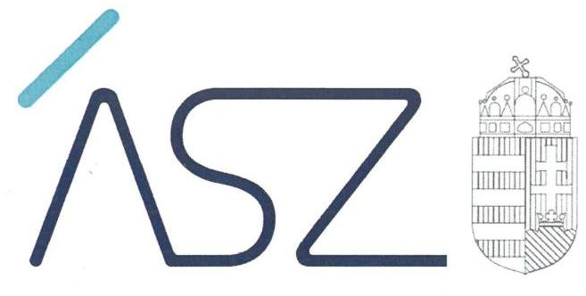
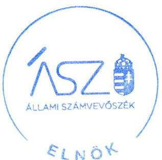
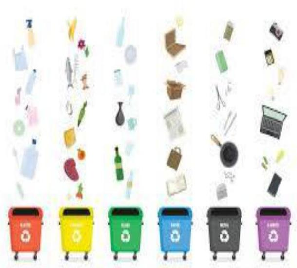
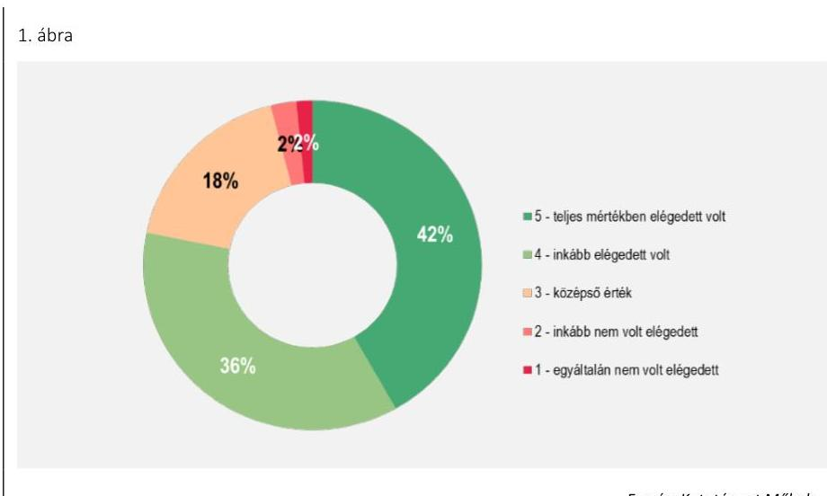
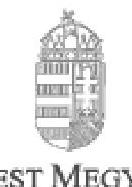
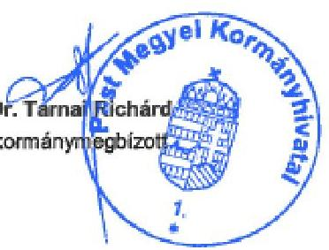
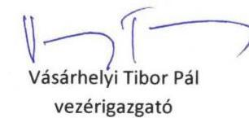
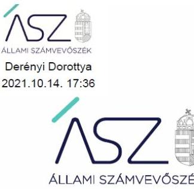

ÁLLAMI SZÁMVEVŐSZÉK

# JELENTÉS 

A hulladékgazdálkodás ellenőrzése

2021. 

21082
www.asz.hu

---

ÁLLAMI SZÁMVEVŐSZÉK

# JELENTÉS 

A hulladékgazdálkodás ellenőrzése

2021. 11. hó 03. nap

21082
www.asz.hu

Domokos László
elnök

---

# AZ ELLENŐRZÉST FELÜGYELTE: 

DR. PULAY GYULA ZOLTÁN felügyeleti vezető

## AZ ELLENŐRZÉST VEZETTE ÉS A VÉGREHAJTÁSÁÉRT FELELŐS:

LAJÓ ADRIENN ellenőrzésvezető
KISTÓTH KRISZTINA ellenőrzésvezető
SIPOSNÉ DÓCZI KLÁRA ellenőrzésvezető

A PROGRAM ÖSSZEÁLLÍTÁSÁÉRT FELELŐS:
POLYÁK ORSOLYA projektvezető
HORVÁTH TÍMEA projektvezető

Jelentéseink az Országgyúlés számítógépes hálózatán és az interneten a www.asz.hu címen is olvashatóak.

IKTATÓSZÁM: EL-3393-001/2021.
TÉMASZÁM: 2543
ELLENŐRZÉS-AZONOSÍTÓ SZÁM: V0887

---

# TARTALOMJEGYZÉK 

■ ÖSSZEGZÉS ..... 5
■ AZ ELLENŐRZÉS CÉLJA ..... 7
■ AZ ELLENŐRZÉS TERÜLETE ..... 8
■ AZ ELLENŐRZÉS HÁTTERE, INDOKOLTSÁGA ..... 10
■ A JELENTÉS LÉNYEGES KÉRDÉSKÖREI ..... 11
■ AZ ELLENŐRZÉS HATÓKÖRE ÉS MÓDSZEREI ..... 12
■ MEGÁLLAPÍTÁSOK ..... 15
■ JAVASLATOK ..... 22
■ MELLÉKLETEK ..... 25
I. sz. melléklet: A múanyaghulladék kezelés és hasznosítás jogszabályi környezete, a kapcsolódó tervek és stratégiák ..... 25
II. sz. melléklet: Értelmező szótár ..... 27
■ FÜGGELÉK: ÉSZREVÉTELEK ..... 29
■ RÖVIDÍTÉSEK JEGYZÉKE ..... 43

---

.

---

# ÖSSZEGZÉS 

A hulladékgazdálkodási közszolgáltatás országos megszervezése, valamint a müanyag csomagolási hulladék kezelése a 2019. évben eredményes volt, a kitüzött célok teljesültek. Ezáltal a hulladékgazdálkodás szabályozási és szervezeti rendszerének kialakítása és müködtetése támogatta a közfeladat eredményes ellátását. Az NHKV Nemzeti Hulladékgazdálkodási Koordináló és Vagyonkezelő Zrt. a jogszabályokban meghatározott egyes koordinátori feladatait nem az előirások szerint hajtotta végre, ezért nem biztositotta a közszolgáltatás hosszú távú pénzügyi fenntarthatóságát.

## Az ellenőrzés társadalmi indokoltsága

Magyarország lakosságának elismert és érvényesített joga van az egészséges környezethez, melyet Magyarország Alaptörvénye XXI. cikkében deklarál. A társadalom és gazdaság fenntarthatóságának egyik alappillére a környezetvédelem, valamint azon belül a keletkezett hulladékok elhelyezésének, ártalmatlanításának és újrahasznosításának megoldása. A hulladékgazdálkodásnak védenie kell a környezetet, az emberi egészséget, mérsékelnie kell a környezetterhelést és hasznosítania a keletkező hulladékot, így ez a téma a társadalom valamennyi tagját közvetlenül érinti.

A természetben nincs hulladék, minden keletkező anyag újra felhasználásra kerül, az ember azonban még nem tudta megvalósítani ezt a magas szintű körforgást. Az általunk termelt hulladék helytelen kezelésének eredményeként szennyező anyagok kerülhetnek a talajba, vízbe és levegőbe, ez pedig kockázatot jelent a társadalom egészségére. Nagyon fontos tehát a hulladék keletkezésének megelőzése.

A fenntartható fejlődés elve szerint olyan folyamatra van szükség, mely úgy szolgálja ki a mostani nemzedék szükségleteit, igényeit, hogy az ne veszélyeztesse a jövő generációinak életfeltételeit. Ennek elérése érdekében a hulladékgazdálkodás ellenőrzése nemcsak gazdasági, hanem környezeti és egészségügyi szempontból is kiemelt cél.

## Főbb megállapítások, következtetések, javaslatok

2019. évben a hulladékgazdálkodás szabályozását, szervezeti kereteit jogszabályok, valamint stratégiai és terv dokumentumok határozták meg. A hulladékgazdálkodási közszolgáltatás országos szintű megszervezése keretében megtörtént a közszolgáltatási feladatok egységesítése az adott területen minimálisan ellátandó közszolgáltatási feladatok meghatározásával.

Az NHKV Nemzeti Hulladékgazdálkodási Koordináló és Vagyonkezelő Zrt. a 2019. évi időhorizontú Országos Hulladékgazdálkodási Közszolgáltatási Tervre vonatkozó javaslatát késedelmesen küldte meg az ITM részére, amely azt nem terjesztette a Kormány elé. Így 2019-ben a 2017. évre szóló Országos Hulladékgazdálkodási Közszolgáltatási Terv volt hatályban, azaz elmaradt a célok és a feladatok aktualizálása.

A Pest Megyei Kormányhivatal Környezetvédelmi Hatóság közzétette a hulladékgazdálkodási közfeladatot ellátók részére az érvényesítendő követelményeket, minősítési feladatait szabályszerűen hajtotta végre. A Hatóság a hulladékgazdálkodási közfeladat ellátási rendszerben biztosította a feladatellátáshoz kapcsolódó követelmények átláthatóságát.

Az NHKV Nemzeti Hulladékgazdálkodási Koordináló és Vagyonkezelő Zrt. közzétette a hulladékgazdálkodási közfeladatot ellátók részére az érvényesítendő követelményeket. A beérkezett panaszok kezelése szabályszerű volt. Az NHKV Nemzeti Hulladékgazdálkodási Koordináló és Vagyonkezelő Zrt. nem szabályszerűen gondoskodott a hulladékgazdálkodási közszolgáltatáshoz kapcsolódó díjhátralékok beszedéséről és a kötelezettségállomány kezeléséről. A díjhátralékok beszedése érdekében előírt erőfeszítések elmulasztása veszélyeztette az állami közfeladat ellátás hoszszú távú pénzügyi fenntarthatóságát.

---

A hulladékgazdálkodás közszolgáltatás területi optimalizálása érdekében a hulladékgazdálkodás tervdokumentumai célokat, azokhoz mutatószámot és célértéket, intézkedéseket és annak felelősét is meghatározták. Az NHKV Nemzeti Hulladékgazdálkodási Koordináló és Vagyonkezelő Zrt., mint Koordináló szerv az elért eredményeket nyomon követte. A hulladékgazdálkodási közszolgáltatás országos szintű megszervezése a 2019. évben eredményes volt, a célként kitűzött 25 hulladékgazdálkodási régió méretgazdaságossági kritériumok szerinti kialakítása megtörtént. A lakosság körében végzett felmérés eredményeként a hulladékgazdálkodási közszolgáltatással a megkérdezettek $78 \%$-a elégedett volt.

A műanyaghulladék és ezen belül a műanyag csomagolási hulladék kezelése és hasznosítása vonatkozásában a jogszabályok és a hulladékgazdálkodási tervdokumentumok a 2019. évre is érvényes célokat határoztak meg, azokhoz mutatószámot és célértéket rendeltek. A műanyag csomagolási hulladék célok vonatkozásában a 2019. évre az Innovációs és Technológiai Minisztérium és az NHKV Nemzeti Hulladékgazdálkodási Koordináló és Vagyonkezelő Zrt. szerv adatot gyűjtött, az adatokat elemezték és értékelték. A műanyag csomagolási hulladék kezelése a 2019. évben eredményes volt, az elkülönítetten gyűjtött csomagolási hulladék mennyisége a célértéket - a $4 \mathrm{~kg} / \mathrm{fő} /$ év visszagyűjtési mennyiséget - jelentősen meghaladva 172\%-on teljesült.

Az érvényes megfelelőségi véleménnyel, valamint minősítési engedéllyel rendelkező közszolgáltatók biztosították a hulladékgazdálkodási közszolgáltatás országos lefedettségét, hogy a közszolgáltatáshoz való hozzáférés mindenki számára elérhető legyen.

A hulladékgazdálkodás országos megszervezése és műanyag csomagolási hulladék kezelés és hasznosítás szabályozási és a szervezeti rendszerének kialakítása biztosította a közfeladat eredményes ellátását, ezzel hozzájárulva a hulladék csökkentéséhez, megfelelő kezeléséhez, erőforrássá alakításához.

Az ellenőrzés megállapításai alapján a jelentés négy javaslatot fogalmaz meg az NHKV Nemzeti Hulladékgazdálkodási Koordináló és Vagyonkezelő Zrt. vezérigazgatója, és egy javaslatot a Pest Megyei Kormányhivatal Környezetvédelmi Hatóság vezetője részére. Az időközben bekövetkezett jogszabály-módosításokra tekintettel a jelentés az innovációs és technológiai miniszter részére nem fogalmaz meg javaslatot.

---

# AZ ELLENŐRZÉS CÉLJA 

Az ellenőrzés célja annak értékelése, hogy a hulladékgazdálkodás szabályozottsága, feladatellátás kereteinek kialakítása és múködtetése biztosította-e az állami hulladékgazdálkodási közfeladat szabályszerű megszervezését és ellátását, valamint a panaszkezelési rendszer szabályszerűen múködött-e.

Az ellenőrzés további célja annak értékelése, hogy a hulladékgazdálkodás szabályozási és szervezeti rendszerének kialakítása és múködtetése biztosítja-e a hulladékgazdálkodási közfeladat eredményes ellátását.

---

# Az ELLENŐRZÉS TERÜLETE 

## Innovációs és Technológiai Minisztérium, Pest Megyei Kormányhivatal Környezetvédelmi Hatóság, NHKV Nemzeti Hulladékgazdálkodási Koordináló és Vagyonkezelő Zártkörűen múködő Részvénytársaság

A hulladékról szóló 2012. évi CLXXXV. törvény (Ht. ${ }^{1}$ ) preambulumában rögzíti a hulladékgazdálkodás fő céljait. A célok elérése és a hulladékgazdálkodási elvek érvényesítése érdekében elkészült az Országos Hulladékgazdálkodási Terv² (továbbiakban OHT) és annak részeként az Országos Megelőzési Program ${ }^{3}$ (továbbiakban: OMP).

A Ht. szerint a hulladékgazdálkodásért felelős miniszter irányítja a törvényben vagy kormányrendeletben feladatkörébe utalt hulladékgazdálkodási tevékenységeket, a nemzetközi szerződésekből adódó hulladékgazdálkodási feladatok végrehajtását, a feladat- és hatáskörébe tartozó hulladékgazdálkodási igazgatást. A Kormány tagjainak feladat- és hatásköréről szóló 94/2018. (V. 22.) kormányrendelet szerint a 2019. évben az innovációért és a technológiáért felelős miniszter a Kormány hulladékgazdálkodásért felelős tagja, így a fenti feladatok ellátásának címzettje az Innovációs és Technológiai Minisztérium (továbbiakban: ITM).
A Ht.-ben megállapított célok elérése, továbbá az alapvető hulladékgazdálkodási elvek érvényesítése érdekében a környezetvédelmi igazgatási szerv - 2019-ben az ITM ${ }^{4}$ - az OHT és annak részét képező OMP készítésére, illetve annak törvény szerinti időpontban történő felülvizsgálatára volt kötelezett. Az OHT és az OMP a hulladékgazdálkodás hosszú távú, 7 évre szóló feladatait határozza meg, melyek tartalmi követelményeit a Ht. - az EK irányelveknek megfelelően - részletesen szabályozza.

A hulladékgazdálkodási közszolgáltatási tevékenység folyamatában az országos hatáskörrel rendelkező - a 71/2015. (III. 30.) Korm. rendeletben ${ }^{5}$ kijelölt - hatóság a Pest Megyei Kormányhivatal Környezetvédelmi Hatósága volt. A Hatóság ${ }^{6}$ jogosult a hulladékgazdálkodási közszolgáltatók minősítési eljárásának lefolytatására.

A közszolgáltatók hulladékgazdálkodási közszolgáltatási tevékenységüket a Ht. 62. § (2) bekezdése alapján minősítési engedély alapján végezhetik. A Hatóság a kérelmező hulladékgazdálkodási közszolgáltatási tevékenységét a Mtv. ${ }^{7}$ 3. §-a alapján a szolgáltatás biztonsága és a szolgáltatás színvonala alapján minősítési osztályba sorolja, egyben előírja a hulladékgazdálkodási közszolgáltatási tevékenység végzésével összefüggő feltételeket. A minősítési engedélyezési eljárások díjkötelesek, melynek mértékét, öszszegét, fizetés eljárásrendjét a 71/2013. (VIII. 15.) VM rendelet ${ }^{8}$ írja elő.

A Ht. 2015. évi módosítása az államot hulladékgazdálkodási közszolgáltatás országos terv - az $\mathrm{OHKT}^{9}$ - elkészítésére kötelezi, amely többek között meghatározza a közszolgáltatás ellátásának optimális területi lehatárolását

---

és az adott területen minimálisan ellátandó közszolgáltatási feladatokat. az Országos Hulladékgazdálkodási Közszolgáltatási Tervre vonatkozó részletes szabályokról szóló 68/2016. (III. 31.) Korm. rendelet (Ohktr. ${ }^{10}$ ) a Koordináló szervet ${ }^{11}$ kötelezi az OHKT-ra vonatkozó javaslat elkészítésére, és annak megküldésére az illetékes miniszternek (az ellenőrzött időszakban az innovációs és technológiai miniszter) a Kormány részére történő felterjesztés céljából. A rendelet értelmében az OHKT-ban rögzíteni kell annak időhorizontját. Az ellenőrzött időszakban a 2003/2017. (XII. 22.) Korm. határozattal elfogadott, a 2017. évre szóló Országos Hulladékgazdálkodási Közszolgáltatási Terv volt hatályban, melynek tervezési időhorizontja 2017 év.

Az OHT elkészítésében a Hatóság a 310/2013. (VIII. 16.) Korm. rendelet ${ }^{12}$ alapján észrevételezési, javaslattételi joggal vehet részt. Továbbá felkérés esetén részt vesz a Hatóság az OHKT előkészítésében a hulladékgazdálkodási közszolgáltatás minősítéssel kapcsolatos szakkérdések tekintetében Okhtr. alapján.

A Kormány 2016. április 1-től a Ht.-ban meghatározott feladatok ellátására a 69/2016. (III. 31.) Korm. rendelet ${ }^{13}$-ben Koordináló szervként a budapesti székhelyű NHKV Zrt. ${ }^{14}$-t jelölte ki. A Koordináló szerv a Ht. szerint javaslatot tesz az illetékes miniszter felé a hulladékgazdálkodási közszolgáltatás állami támogatásainak felhasználására, közszolgáltatási területek szerinti lehatárolására, szabályozására. A Koordináló szerv beszedi a közszolgáltatási díjat és kifizeti a közszolgáltatóknak a meghatározott szolgáltatási díjat és kezeli a közszolgáltatás keretében keletkező kintlévőségeket. Valamint előkészíti az OHKT-t és nyomon követi az abban foglaltak végrehajtását, javaslatot tesz a szolgáltatási díj, a díjalkalmazási feltételek, a díjmegfizetés rendjének, a közszolgáltatási díjfelosztási elvének meghatározására vonatkozóan.

Az NHKV Zrt. kizárólagos állami tulajdonban lévő egyszemélyes, zártkörűen működő részvénytársaság, felette a Magyar Államot megillető tulajdonosi jogokat a nemzeti vagyon kezeléséért felelős tárca nélküli miniszter, mint Alapító gyakorolta. A Koordináló szerv feladata a fenntartható hazai hulladékgazdálkodási rendszer, az országos hulladékgazdálkodási közszolgáltatás holding alapú megszervezésének kialakítása az állami hulladékgazdálkodási közfeladatok gyakorlására.

Az NHKV Zrt. Alapszabálya ${ }^{15}$ szerint a Társaság célja a fenntartható hazai hulladékgazdálkodási rendszer, az országos hulladékgazdálkodási közszolgáltatás holding alapú megszervezésének kialakítása az állami hulladékgazdálkodási közfeladatok gyakorlása volt.

Az NHKV Zrt.-nél a legfőbb szerv hatáskörébe tartozó kérdésekben az Alapító írásban határozott, megválasztotta a 3-5 tagból álló Igazgatóság elnökét és tagjait. Az NHKV Zrt. első számú vezető állású munkavállalója a vezérigazgató volt, aki általános képviseleti joggal rendelkezett. Az Igazgatóság elnökének személye 2019. február 8-ától, a vezérigazgató személye 2018. december 1-től az ellenőrzött időszak végéig változatlan volt.

---

# AZ ELLENŐRZÉS HÁTTERE, INDOKOLTSÁGA 

Az Alaptörvény szerint Magyarország elismeri és érvényesíti mindenki jogát az egészséges környezethez. Az ENSZ 193 tagállama által 2015 szeptemberében elfogadott új integrált fenntartható fejlődési és fejlesztési keretrendszer, az Agenda 2030 többek között a Föld környezeti rendszerének megóvásához fogalmaz meg célokat. A hulladékgazdálkodás meghatározó szerepet tölt be a környezet minőségének és a természeti erőforrásoknak a védelmében, a társadalom valamennyi rétegét közvetlenül érinti. A klímaváltozás veszélyeinek tudatosodásával a környezetvédelmi kérdések egyre nagyobb közérdeklődésre tartanak számot.

Az ellenőrzés rávilágít arra, hogy a hulladékgazdálkodási közszolgáltatási rendszer működése betölti-e a jogszabályokban meghatározott szerepét, szabályozottsága és a feladatellátás megszervezése biztosítja-e az állami közfeladat eredményes elvégzését, a célok megvalósulását, ezzel hozzájárul-e a hulladék csökkentéséhez, megfelelő kezeléséhez, erőforrássá alakításához. Az ellenőrzés feltárja, hogy szabályszerűen történt-e a panaszok kivizsgálása és kezelése. Az ellenőrzés tájékoztatást ad a társadalom, a jogalkotók, valamint a közfeladat ellátásában résztvevők számára a hazai hulladékgazdálkodási helyzetről, valamint felhívja a figyelmet a hiányosságokra, gyengeségekre, amelyek kezelésével, változtatásával a célok eredményesebben valósíthatók meg.

---

# A JELENTÉS LÉNYEGES KÉRDÉSKÖREI 

1. Az állami hulladékgazdálkodási közfeladat ellátásában résztvevő szervezetek eleget tettek-e a hulladékgazdálkodási közfeladat megvalósitását biztositó szabályozási feladataiknak?
2. Az állami hulladékgazdálkodási közfeladat ellátásában résztvevő szervezetek gondoskodtak-e az állami hulladékgazdálkodási közszolgáltatás szabályszerü müködtetéséről?
3. A Koordináló szerv szabályszerüen gondoskodott-e a hulladékgazdálkodási közszolgáltatáshoz kapcsolódó dijhátralékok beszedéséről és a szolgáltatási dijak kifizetéséről?
4. A Koordináló szerv gondoskodott-e a panaszkezelés szabályozási kereteinek kialakításáról és müködtetéséről?
5. A hulladékgazdálkodási közszolgáltatás országos szintü megszervezése eredményes volt-e?
6. A hulladékgazdálkodáson belül a múanyag hulladék, valamint a múanyag csomagolási hulladék hasznositása és kezelése közszolgáltatás eredményes volt-e?
7. A közszolgáltatók engedélyezésével, véleményezésével kapcsolatos feladatellátások hozzájárultak-e a hulladékgazdálkodás eredményes ellátásához?

---

# AZ ELLENŐRZÉS HATÓKÖRE ÉS MÓDSZEREI 

## Az ellenőrzés típusa

Megfelelőségi és teljesítményellenőrzés

## Az ellenőrzött időszak

Az ellenőrzött időszak: 2019. év.

## Az ellenőrzés tárgya

Az állami hulladékgazdálkodási közfeladat végrehajtását biztosító szabályozási feladatok ellátása, az országos szintű közszolgáltatás megszervezését biztosító irányítási, koordinálási és panaszkezelési tevékenységek, valamint a feladatok megvalósítását támogató ellenőrzési és hatósági tevékenységek szabályszerűsége.

A hulladékgazdálkodási közszolgáltatás országos szintű megszervezése. Ezen belül a közszolgáltatási feladatok egységesítésére, illetve a közszolgáltatások területi optimalizálására vonatkozó célok kitűzése, a célok nyomon követési rendszerének kialakítása, a tervezett intézkedések meghatározása, az intézkedések elvégzése, a célok megvalósulásának mérése, értékelése, a célok érvényesülésének értékelése. A lakosság elégedettsége a hulladékgazdálkodási közfeladat ellátásával. A hulladékgazdálkodási közszolgáltatók engedélyezésével, véleményezésével kapcsolatos feladatellátás hozzájárulása a hulladékgazdálkodási közszolgáltatás eredményes ellátásához.

## Az ellenőrzött szervezet

Innovációs és Technológiai Minisztérium, Pest Megyei Kormányhivatal Környezetvédelmi Hatóság, NHKV Nemzeti Hulladékgazdálkodási Koordináló és Vagyonkezelő Zrt.

## Az ellenőrzés jogalapja

Az ellenőrzés jogalapját az ÁSZ tv. ${ }^{16}$ 1. § (3) bekezdése és az 5. § (2)-(3) bekezdései képezik.

---

# Az ellenőrzés módszerei 

Az ÁSZ ${ }^{17}$ az ellenőrzést az ellenőrzési program ellenőrzési kérdései, az ellenőrzött időszakban hatályos jogszabályok, az ellenőrzés szakmai szabályok és módszertanok alapján, a nemzetközi standardok figyelembe vételével végzi. Az ÁSZ az ellenőrzés ideje alatt az ellenőrzött szervezetekkel történő kapcsolattartást az ÁSZ Szervezeti és Működési Szabályzatának vonatkozó előírásai alapján biztosítja.

Az ellenőrzési kérdések megválaszolásához szükséges bizonyítékok megszerzése a következő ellenőrzési eljárások alkalmazásával történik: megfigyelés, információkérés, összehasonlítás, valamint elemző eljárás. Az ellenőrzési bizonyítékként felhasználható adatforrások közé tartoznak az ellenőrzési programban felsorolt adatforrások, továbbá minden - az ellenőrzés folyamán - feltárt, az ellenőrzés szempontjából információkat tartalmazó dokumentum. Az ellenőrzést a kérdésekre adott válaszok kiértékelésével, valamint a megjelölt adatforrások, a csatolt tanúsítványok felhasználásával, továbbá az adott időszakban hatályos jogszabályok figyelembevételével kell lefolytatni.

Az ellenőrzés - a megfelelőségi ellenőrzés számvevőszéki alapelveiben rögzítettek szerint - a bizonyosság ésszerűen magas szintjének eléréséhez szükséges dokumentumok körének bekérését és értékelését követően arra irányul, hogy az állami hulladékgazdálkodási közfeladat ellátás szabályozottsága és megszervezése biztosította-e az irányítási, a hatósági, a koordinálási és panaszkezelési tevékenység szabályszerű ellátását, a jogszabályokban meghatározott célok megvalósulását.

A Hatóság minősítési feladatai, a Koordináló szerv szolgáltatási díj kifizetései, közszolgáltatási díj kinnlevőségeinek kezelése és a panaszkezelési eljárásainak szabályszerűsége egyszerű véletlen mintavétellel történt. A Koordináló szerv megfelelőségi véleményezési feladatainak szabályszerűsége rétegzett mintavétellel történt. A vizsgált terület „szabályszerű" minősítést kapott, ha a minta ellenőrzésének eredménye alapján 95\%-os bizonyossággal a teljes sokaságban az átlagos hibaarány nem haladta meg a 10\%-ot, „nem szabályszerű" minősítést kapott, ha nagyobb volt, mint 10\%. Abban az esetben, ha a teljes sokaság tekintetében a 10\%-os hibaarányhoz való viszony megítélésének megbízhatósága nem érte el a 95\%-ot, szabályszerűnek minősítettük a területet, ha a minta alapján a teljes sokaság vonatkozásában a 10\% alatti hibaarány előfordulásának nagyobb a valószínűsége, nem megfelelőnek, ha a 10\% felettinek.

A teljesítmény-ellenőrzés teljesítmény kategóriája az eredményesség. Az ellenőrzés a tényleges és a tervezett eredmények (hatások) összevetésével azt értékeli, hogy a hulladékgazdálkodási közszolgáltatás országos szintű megszervezéséért felelős szervezet számára/által a hulladékgazdálkodási közszolgáltatás országos szintű megszervezésén belül a közszolgáltatási feladatok egységesítése, illetve a közszolgáltatások területi optimalizálása érdekében kitűzött célokat és a szándékolt eredményeket a megvalósítás során elérték-e, eredményes volt-e a hulladékgazdálkodási közfeladat ellátása.

Az ellenőrzés megközelítése eredmény (kimenet-) alapú, mely során az ÁSZ azt értékeli, hogy az eredményeket, a „kimeneteket" a tervezettek szerint elérték-e, a szolgáltatások (közszolgáltatások) a tervezettek szerint

---

múködtek-e. Emellett az evalváció módszerével az ellenőrzés keretében a hulladékgazdálkodási közszolgáltatást közvetlenül igénybe vevő lakosság hulladékgazdálkodási közszolgáltatással összefüggő elégedettségének az értékelésére is sor kerül. A kérdőíves felmérésben a megkeresett 2000 főből azon 1089 fő (54\%) vett részt, akik közvetlenül igénybe vettek hulladékgazdálkodási közszolgáltatást a 2019. évben. Az elégedettség értékelésében részt vett 1089 főből 44\% férfi, 56\% nő volt. A résztvevők 8\%-a Budapesten, 15\%-a megyeszékhelyen, 36\%-a egyéb városban, 41\%-a községben élt.

Az egységes értelmezést támogatja a program mellékletét képező fogalomtár és rövidítésjegyzék.

---

# 1. Az állami hulladékgazdálkodási közfeladat ellátásában résztvevő szervezetek eleget tettek-e a hulladékgazdálkodási közfeladat megvalósítását biztosító szabályozási feladataiknak? 

Összegző megállapítás

1.1. számú megállapítás
1.2. számú megállapítás
1.3. számú megállapítás

Az ITM 2019. évi időhorizontú OHKT-t nem terjesztett elő a Kormánynak jóváhagyásra. 2019. évben a 2017. évre szóló Országos Közszolgáltatási Hulladékgazdálkodási Terv volt hatályban.
A Hatóság és az NHKV Zrt. közzétette a hulladékgazdálkodási közfeladatot ellátók részére az érvényesítendő követelményeket.

Az ITM a 2019. évi időhorizontú OHKT-t nem terjesztett elő a Kormánynak jóváhagyásra.
2019. évi tervezési időhorizontra vonatkozó, a Kormány által határozatban jóváhagyott OHKT nem volt. Az NHKV Zrt. - az OHKT felülvizsgálatáról szóló javaslatát késedelmesen - az Ohktkr. 3. § (2) bekezdésben előírt előző év október 31. helyett 2019. február 8-án - küldte meg az ITM részére. Az ITM a felülvizsgálat alapján készített 2019. évi időhorizontú OHKT-re vonatkozó javaslatot nem terjesztette a Kormány elé.

A Hatóság közzétette a hulladékgazdálkodási közfeladatot ellátók részére az érvényesítendő követelményeket.

A Hatóság a minősítési eljárásról szóló Mtv. 19. § (3) bekezdés előírásai szerint közzétette a minősítési eljáráshoz kapcsolódó nyomtatványokat és a kitöltési, módszertani útmutatókat az Országos Környezetvédelmi Információs Rendszer publikus felületén.

Az NHKV Zrt. a hulladékgazdálkodási közfeladatot ellátók részére az érvényesítendő követelményeket közzétette.

Az NHKV Zrt. honlapján közzétette a 13/2016. NFM rendelet ${ }^{18}$ előírásai szerint kialakított, az ellátásért felelős által kiadandó teljesítésigazolás tartalmi követelményeit.

---

# 2. Az állami hulladékgazdálkodási közfeladat ellátásában résztvevő szervezetek gondoskodtak-e az állami hulladékgazdálkodási közszolgáltatás szabályszerű működtetéséről? 

## Összegző megállapítás

2.1. számú megállapítás
2.2. számú megállapítás

A közfeladat ellátásban résztvevők nem gondoskodtak az állami hulladékgazdálkodási közszolgáltatás szabályszerű működtetéséről.
Az ITM a hulladékgazdálkodási igazgatási feladatait ellátta, de nem gondoskodott a hulladékgazdálkodási ágazat ellenőrzéséről.
Az ITM minisztere a Ht. 78. § (1) bekezdése ac) pontja szerinti, a feladatés hatáskörébe tartozó hulladékgazdálkodási igazgatási feladatait ellátta, a Ht. 87. § (1) bekezdésében foglalt, hulladéklerakással kapcsolatos jelentéstételi kötelezettségének eleget tett.

Az ITM a Bkr. ${ }^{19}$ 6. § (3) bekezdésének előírása ellenére nem készítette el a hulladékgazdálkodási közfeladat-ellátás szakmai irányítására vonatkozó ellenőrzési nyomvonalat.

Az ITM-nek a Bkr. 22. § (1) bekezdés b) pontja előírásai szerint elkészített és jóváhagyott 2019. évi ellenőrzési terve nem tartalmazott tervezett belső ellenőrzést a hulladékgazdálkodás szakterület tekintetében.

## A Hatóság szabályszerűen hajtotta végre minősítési feladatait.

A Hatóság a hulladékgazdálkodási közszolgáltatás minősítéssel összefüggő feladatait az Mtv. előírásai szerint, szabályszerűen hajtotta végre. A Hatóság a kérelem elbírálásához kapcsolódón a Bkr. 6. § (3) bekezdése ellenére nem rendelkezett a minősítések ügyintézésére vonatkozó ellenőrzési nyomvonallal.

## Az NHKV Zrt. nem szabályszerűen hajtotta végre a hulladékgazdálkodási közszolgáltatás múködéséhez kapcsolódó megfelelőségi és egyéb véleményezési feladatait.

Az NHKV Zrt. a 69/2016. (III. 31.) Korm. rendelet 4. § (3) bekezdésében foglalt, a hulladékgazdálkodási közszolgáltatási szerződések Ht. 92/B. § (2) bekezdés szerinti megfelelőségét megvizsgálta. A közszolgáltatási szerződésekre vonatkozó írásbeli véleményét az NHKV Zrt. a 69/2016. (III. 31.) Korm. rendelet 4. § (6) bekezdése előírása ellenére a közszolgáltatási szerződés beérkezését követő 15 napon túl küldte meg az ellátásért felelős részére. Az NHKV Zrt. által végzett véleményezés során megfelelőnek ítélt közszolgáltatási szerződések a 69/2016. (III. 31.) Korm. rendelet 4. § (5) bekezdése a) és b) pontja előírásai ellenére nem tartalmazták az NHKV Zrt.-re vonatkozó közszolgáltatási díjbeszedés és kintlévőség-kezelés rendelkezéseket.

A hulladékgazdálkodási közszolgáltatási rendszerelem fejlesztések OHKT-nak való megfelelőségére vonatkozó megállapítások kapcsán az NHKV Zrt. a 69/2016. (III. 31.) Korm. rendelet 6. § (3) és (5) bekezdése előírásai ellenére a papíralapú kérelem beérkezéséről 5 napon túl küldött

---

# 2.4. számú megállapítás 

elektronikus úton visszaigazolást és a beérkezését követő 15 napon túl végezte el a kérelem felülvizsgálatát. Az NHKV Zrt. a rendszerelem megfelelőségéről hozott döntéséről az ellátásért felelősnek a 69/2016. (III. 31.) Korm. rendelet 6. § (12) bekezdése előírása ellenére a kérelem beérkezését követő 15 napon túl küldött elektronikus úton értesítést.

Az NHKV Zrt. megvalósította a hulladékgazdálkodási közfeladat szereplői közötti koordinációt.

Az NHKV Zrt. a Ht. 32/A. § (2) bekezdése szerinti kijelölése értelmében ellátta a Ht. 32/A. § (1) bekezdés c) pontjában meghatározott, az önkormányzatok közötti és a regionális koordinációt, amelynek keretében gondoskodott a közszolgáltatás során elkülönítetten gyüjtött és a vegyes hulladék kezelése során keletkezett hasznosítható hulladék hasznosításának megszervezéséről.

Az NHKV Zrt. gondoskodott az OHKT végrehajtásának nyomon követéséről.

## 3. A Koordináló szerv szabályszerűen gondoskodott-e a hulladékgazdálkodási közszolgáltatáshoz kapcsolódó díjhátralékok beszedéséről és a szolgáltatási díjak kifizetéséről?

Összegző megállapítás

### 3.1. számú megállapítás

Az NHKV Zrt. nem szabályszerűen gondoskodott a hulladékgazdálkodási közszolgáltatáshoz kapcsolódó díjhátralékok beszedéséről és a szolgáltatási díjak kifizetéséről.

Az NHKV Zrt. nem biztosította az éves beszámoló szabályszerűségét.

Az NHKV Zrt. a 2019. évi éves beszámolója mérlegtételeinek alátámasztásához a Számv. tv. ${ }^{20}$ 69. § (1) bekezdése előírása ellenére nem állított össze olyan leltárt, amely tételesen, ellenőrizhető módon tartalmazta volna - az Immateriális javak, Tárgyi eszközök, Készletek, Követelések, Aktív időbeli elhatárolások, Saját tőke, Céltartalékok és Kötelezettségek - mérlegtételeknek a mérleg fordulónapján meglévő mennyiségét és értékét.

Az NHKV Zrt. nem gondoskodott a szállító állomány szabályszerű kezeléséről.

Az NHKV Zrt. könyvvezetésekor nem vette figyelembe a Számlarend előírásait. Mivel a könyvvezetése során a szállító állomány kezelésénél alkalmazott könyvviteli számlák elszámolásban történő használata nem volt összhangban a Számlarendben a - Számv. tv. 161. § (2) bekezdés b) pontja szerint - meghatározott számla kapcsolatokkal. A közvetített szolgáltatások elszámolásának korrekciója gazdasági esemény könyvelési tételeként a bizonylatokon a Számlarendben nem rögzített elszámolást tüntettek fel, így a könyvelés módjára, az érintett könyvviteli számlákra történő hivatkozás nem volt szabályszerű. Ezáltal a kötelezettség elszámolását alátámasztó számviteli bizonylatok a Számv. tv. 165. § (2) bekezdésében foglalt előírásoknak nem feleltek meg.

---

# 3.3. számú megállapítás 

Az NHKV Zrt. a közszolgáltatási díj hátralékokból származó kintlévőségeket nem szabályszerűen kezelte

Az NHKV Zrt. a behajthatatlan követelések mérlegkészítéskori, fordulónapra vonatkozó leírása (kivezetése) során a Számv. tv. 3. § (4) bekezdése 10. pontja előírása ellenére a Számviteli politikájában meghatározott értékhatárt meghaladó követelések esetében a behajthatatlanság tényét nem bizonyította. Az NHKV Zrt. nem igazolta, hogy a követelést eredményesen nem lehetett érvényesíteni, nem igazolta, hogy a fizetési meghagyásos eljárás vagy a végrehajtás veszteséget eredményezett volna vagy növelte volna a veszteséget.

Az NHKV Zrt. az első felszólításon túl nem intézkedett tovább a kiszámlázott és az ingatlanhasználó által határidőn belül ki nem fizetett közszolgáltatási díj behajtása érdekében, amivel megsértette a 69/2016. Korm. rendelet 12. §-ának valamint a Ht. 52. § (3) bekezdésének előírásait.

## 4. A Koordináló szerv gondoskodott-e a panaszkezelés szabályozási kereteinek kialakításáról és múködtetéséről?

Összegző megállapítás

Az. számú megállapítás
4.2. számú megállapítás

Az NHKV Zrt. nem biztosította a panaszkezelés jogszabályban előírt feltételeit, a beérkezett panaszokat szabályszerűen kezelte.

Az NHKV Zrt. nem szabályszerűen alakította ki a panaszkezelés jogszabályban előírt feltételeit.

Az NHKV Zrt. 2019.01.01. - 2019.11.10. között az Fgy.tv. ${ }^{21}$ 17/D. § (1) bekezdése előírása ellenére fogyasztóvédelmi referenst nem foglalkoztatott.

Az NHKV Zrt. az Fgy.tv. szerinti tájékoztatási és közzétételi kötelezettségének teljesülését az ellenőrzés során a Társaság honlapján biztosította. Melynek során az NHKV Zrt. a fogyasztókat az Fgy.tv. előírásai szerint a székhelyéről, a panaszügyintézés helyéről, a panaszkezelés módjáról, valamint a panaszok közlése érdekében az ügyfélszolgálat levelezési címéről és elektronikus levelezési és internetes címéről, telefonszámáról a Társaság honlapjának nyitóoldaláról közvetlenül elérhető, 2019. október 21-től közzétett adatokkal tájékoztatta.

Az NHKV Zrt. a beérkezett panaszokat szabályszerűen kezelte.
Az NHKV Zrt. a beérkezett panaszokra vonatkozóan a panaszkezelési eljárásokat az Fgy.tv. előírásának megfelelően közzétett Panaszkezelési Szabályzata szerint folytatta le.

A telefonon vagy elektronikus hírközlési szolgáltatás felhasználásával közölt szóbeli panaszokat az NHKV Zrt. az Fgy.tv. előírása szerint egyedi azonosítószámmal látta el.

Az NHKV Zrt. az írásbeli panaszt az Fgy.tv. 17/A. § (6) bekezdése szerint a beérkezését követően harminc napon belül írásban érdemben megválaszolta, és intézkedett annak közléséről.

---

# 5. A hulladékgazdálkodási közszolgáltatás országos szintű megszervezése eredményes volt-e? 

Összegző megállapítás

A hulladékgazdálkodási közszolgáltatás országos szintű megszervezése a 2019. évben eredményes volt. Az NHKV Zrt. a régiók kialakítása vonatkozásában a kitűzött célt teljesítette. A megkérdezett lakosság $78 \%$-a elégedett volt a hulladékgazdálkodási közszolgáltatással.

A jogszabályok és a tervdokumentumok 2019. évre a hulladékgazdálkodás közszolgáltatás országos szintű megszervezéséhez célokat határoztak meg. Az NHKV Zrt. a méretgazdaságos régiók kialakítására kitűzött célt dokumentáltan teljesítette.

A Ht. előírása szerint a hulladékgazdálkodás vonatkozásában az OHT-ben 2014-2020. időszakra meghatározott országos célok eredményes elérése érdekében kormányhatározattal ${ }^{22}$ jóváhagyott OHKT készült. Az OHKT - a Ht.-vel összhangban - meghatározta az adott területen minimálisan ellátandó közszolgáltatási feladatokat. Ezzel az NHKV Zrt. biztosította a közszolgáltatási feladatok egységesítését.

Az OHKT közszolgáltatási szakmapolitikai célkitűzéseket, mutatószámot és célértéket, valamint a szakterületi célok eléréséhez szükséges intézkedéseket határozott meg. Az OHKT a közszolgáltatás ellátásának optimális területi lehatárolása keretében 25 db hulladékgazdálkodási régió kialakítását célozta, amelyekhez méretgazdaságossági szempontból minimum 50000 fő, optimálisan 200000 fő feletti kiszolgálási számot határozott meg. Az önkormányzatok, társulások hulladékgazdálkodás céljából létrejött vagyonának költséghatékony üzemeltetésére az OHKT célul tűzte ki, hogy régiónként egy közszolgáltató végezze az üzemeltetést.

Az NHKV Zrt. 2019. szeptember 30-ai állapot szerint értékelte a 2019. évi hulladékgazdálkodás közszolgáltatás eredményeit. Az értékelés tartalmazta, hogy a 2019. évben 25 db hulladékgazdálkodási régió volt. A méretgazdaságosság szempontjából meghatározott minimum 50000 fős értéket minden hulladékgazdálkodási régió, míg az optimális 200000 fős határt 17 régió haladta meg. A 25 régióban 2019.évben 27 közszolgáltató müködött. A régiók 92\%-ában, megtörtént a közszolgáltatók koncentrációja, csak kettő olyan régió volt, ahol kettő nevesített közszolgáltató működött.

## 5.2. számú megállapítás

A lakosság körében a megkérdezettek 78 \%-a elégedett volt a hulladékgazdálkodási közszolgáltatással.

A lakosság körében végzett felmérés keretében a megkérdezettek 42\%-a teljes mértékben elégedett, 36\%-a, inkább elégedett volt az igénybe vett hulladékgazdálkodási közszolgáltatással a 2019. évben. Az értékelések átlaga 4,14 volt. A 1-től 5 -ig adott értékelések megoszlását az 1. ábra mutatja.

---

*Forrás: Kutatópont Műhely*

A megkérdezettek 88 százaléka gyűjti szelektíven a szemetet, a szelektív hulladék tárolására a közszolgáltató a megkérdezettek 85%-a részére biztosított gyűjtőedényt, vagy gyűjtőzsákot.

A válaszadók 94%-a szerint a vegyes és 91%-a szerint a szelektív hulladék elszállítása, míg a 70% szerint a lomtalanítás 2019. évben mindig a kijelölt napokon történt. Azonban 23% úgy tudta, hogy a közszolgáltató nem szervezte meg a lomtalanítást. A válaszadók magas aránya, 72%-a találkozott 2019-ben illegálisan lerakott hulladékkal a közvetlen környezetében.

## 6. A hulladékgazdálkodáson belül a műanyag hulladék, valamint a műanyag csomagolási hulladék hasznosítása és kezelése közszolgáltatás eredményes volt-e?

**Összegző megállapítás**

A műanyag csomagolási hulladék kezelése a 2019. évben eredményes volt. Az elkülönítetten gyűjtött műanyag csomagolási hulladék mennyisége a 2019. évben 72%-kal meghaladta az OHKT-ban kitűzött célértéket.

### 6.1. számú megállapítás

A műanyaghulladék, illetve a műanyag csomagolási hulladék kezelésére és hasznosítására 2019. évre a hulladékról szóló törvény és a hulladékgazdálkodás tervdokumentumai határoztak meg célokat.

A műanyaghulladék-kezelésre, hasznosításra a vonatkozó jogi szabályozások és tervdokumentumok a célokat és a végrehajtásáért felelős szervezeteket meghatározták. A műanyag hulladék kezelés és hasznosítás vonatkozásában a Ht. az elkülönített hulladékgyűjtési rendszer, valamint az újrahasználatra való előkészítés és az újrafeldolgozás tekintetében határozott meg célokat. A műanyag csomagolási hulladék vonatkozásában a 442/2012. (XII. 29.) Korm. rendelet23 hasznosítási, újrafeldolgozási arányt határozott meg a gyártók részére.

A 2014-2020. évekre készített OHT a műanyaghulladék vonatkozásában átfogó és stratégiai célkitűzéseket tartalmazott. A települési műanyaghulladék hasznosítására kitűzött célhoz mutatószámot és célértéket is rendelt.

---

A 2019. évben hatályban lévő OHKT az elkülönítetten gyűjtött műanyag csomagolási hulladék mennyiség visszagyűjtésére és hasznosítására rögzített mutatószámot és célértéket. Míg az OGyHT a termékdíj köteles műanyag csomagolási hulladék vonatkozásában határozott meg gyűjtésből származó, anyagában történő hasznosításra mennyiségi célt.
6.2. számú megállapítás

Az NHKV Zrt. és az ITM a műanyag csomagolási hulladék gyűjtése, hasznosítása tekintetében a tényadatokat gyüjtötte és elemezte. Az elkülönítetten gyüjtött műanyag csomagolási hulladékra kitűzött célmennyiség a 2019. évben teljesült.

Az NHKV Zrt. a közszolgáltatást nyújtók 2019. évre vonatkozó elkülönített gyűjtési és hasznosítási adatai alakulását nyomon követte, a PMFÜ frakciók ${ }^{26}$ esetében több kimutatást, elemzést végzett. Az adatok ellenőrzésére, validálására helyszíni ellenőrzéseken került sor.

Az elkülönítetten gyűjtött műanyag csomagolási hulladék mértéke 2019. évben $6,9 \mathrm{~kg} / \mathrm{fő}$ volt, ami $72 \%$-al meghaladta az OHKT-ban kitűzött $4 \mathrm{~kg} / \mathrm{fő} /$ év célértéket, míg a begyűjtött hulladék felhasználási aránya elmaradt a $90 \%$-os célértéktől. A hasznosításra átadott műanyag csomagolási hulladék mennyisége $3,5 \mathrm{~kg} / \mathrm{fő}$ volt, amely a $4 \mathrm{~kg} / \mathrm{fő}$ célértékhez képest $87,5 \%$-on, a tényleges gyűjtött mennyiséghez 50,7\%-on teljesült.

Az ITM a termékdíj köteles műanyag csomagolási hulladék kezelése és hasznosítása keretében a szerződött partnerek gyűjtés, előkezelés, hasznosítás mennyiségi adatait nyomon követte és ellenőrizte. Ugyanakkor az OGyHT szerinti 2019. évi műanyag csomagolási hulladék hasznosítási cél megvalósulásának értékelése nem történt meg. A tényleges és a tervezett eredmények jelentős eltérése esetén korrekciós lépéseket kell bevezetni, de összehasonlítás hiányában ehhez nem áll rendelkezésre információ. Ezért a termékdíj köteles műanyag csomagolási hulladék közszolgáltatás eredményessége tovább növelhető a célok megvalósulásának rendszeres értékelésével.

# 7. A közszolgáltatók engedélyezésével, véleményezésével kapcsolatos feladatellátások hozzájárultak-e a hulladékgazdálkodás eredményes ellátásához? 

Összegző megállapítás

A Hatóság közszolgáltatók engedélyezési és az NHKV Zrt. közszolgáltatók véleményezési tevékenysége hozzájárult a hulladékgazdálkodási közszolgáltatás eredményes ellátásához.

A 2019. évben a közszolgáltatók rendelkeztek a hulladékgazdálkodási feladat ellátására vonatkozó, az NHKV Zrt. által kiadott érvényes az OHKT-nak való megfelelőségi véleménnyel, valamint a Hatóság által kiadott minősítési engedéllyel.

Az érvényes megfelelőségi véleménnyel és minősítéssel rendelkező hulladékgazdálkodási közszolgáltatók 19 megyében és Budapesten biztosították a szolgáltatást. A közszolgáltatók területi illetékessége alapján biztosított volt a hulladékgazdálkodási közszolgáltatás országos lefedettsége.

---

# JAVASLATOK 

Az ÁSZ tv. 33. § (1) bekezdésében foglaltak értelmében az ellenőrzött szervezet vezetője köteles a jelentésben foglalt megállapításokhoz kapcsolódó intézkedési tervet összeállítani és azt a jelentés kézhezvételétől számított 30 napon belül az ÁSZ részére megküldeni. Amennyiben az ellenőrzött szervezet vezetője nem küldi meg határidőben az intézkedési tervet, vagy továbbra sem elfogadható intézkedési tervet küld, az Állami Számvevőszék elnöke az ÁSZ tv. 33. § (3) bekezdése a) és b) pontjaiban foglaltakat érvényesítheti.

## NHKV Nemzeti Hulladékgazdálkodási Koordinációs és Vagyonkezelő Zrt. vezérigazgatójának

1. Intézkedjen a hulladékgazdálkodási közszolgáltatás müködéséhez kapcsolódó megfelelőségi és egyéb véleményezési feladatai szabályszerű ellátásáról.
(2.3.sz. megállapítás alapján)
2. Intézkedjen a Számv. tv.-ben foglalt elöírásoknak megfelelően az éves költségvetési beszámoló mérleg tételeinek tételesen, ellenőrizhető módon, a mérlegben szereplő eszközöket és forrásokat mennyiségben és értékben tartalmazó leltárral történő alátámasztásáról.
(3.1. sz. megállapítás alapján)
3. Intézkedjen a szállítói állomány szabályszerű kezeléséről.
(3.2 sz. megállapítás alapján)
4. Intézkedjen a közszolgáltatási dij hátralékokból származó kintlévőségek szabályszerű kezeléséről.
(3.3 sz. megállapítás alapján)

---

# Pest Megyei Kormányhivatal Környezetvédelmi Hatóság vezetőjének 

1. Intézkedjen, hogy a Hatóság a kérelmek elbírálásához kapcsolódóan rendelkezzen a Bkr. 6. § (3) bekezdése szerinti, a minősitések ügyintézésére vonatkozó ellenőrzési nyomvonallal.
(2.2. sz. megállapítás alapján)

---

.

---

# MELLÉKLETEK 

- I. SZ. MELLÉKLET: A MŰANYAGHULLADÉK KEZELÉS ÉS HASZNOSÍTÁS JOGSZABÁLYI KÖRNYEZETE, A KAPCSOLÓDÓ TERVEK ÉS STRATÉGIÁK

## 1. Jogszabályi környezet

1.1. Magyarországon 2013. január 1-jén lépett hatályba a hulladékról szóló 2012. évi CLXXXV. törvény (továbbiakban: Ht.). A Ht. előírja, hogy a hulladékgazdálkodási célok és stratégiai célkitűzések elérésének, továbbá az alapvető hulladékgazdálkodási elvek érvényesítésének érdekében Országos Hulladékgazdálkodási Terv (továbbiakban: OHT) készül. Az OHT-ben meghatározott országos célok eredményes elérése érdekében az állam elkészíti az Országos Hulladékgazdálkodási Közszolgáltatási Tervet. (továbbiakban: OHKT).

A Ht a 2015. évi módosítása a hulladékgazdálkodást, mint közszolgáltatást határozta meg („közszolgáltatás körébe tartozó hulladék átvételét, gyűjtését, elszállítását, kezelését, valamint a hulladékgazdálkodási közszolgáltatással érintett hulladékgazdálkodási létesítmény fenntartását, üzemeltetését, vagyonkezelését és a hulladékgazdálkodási közszolgáltatás országos szintű megszervezését biztosító, kötelező jelleggel igénybe veendő szolgáltatás") és törvény írja elő az önkormányzati hulladékgazdálkodás közfeladatát. A törvény az önkormányzati hulladékgazdálkodási közfeladat tartalmát, a közszolgáltatási terület határait az OHKT-ban foglaltakkal összhangban szabályozza.

A Ht. tartalmazza, hogy műanyaghulladék kezelésére és hasznosítására 2015-ig elkülönített hulladékgyűjtési rendszert kell felállítani. A Ht. előírja, hogy a háztartásokból származó műanyaghulladék újrahasználatra történő előkészítésének és újrafeldolgozásának együttes mértékét a képződött mennyiséghez viszonyítva országos szinten 2020. december 31-ig legalább 50\%-ra kell növelni. Az elkülönített hulladékgyűjtési rendszert a közszolgáltatónak úgy kell kialakítania, hogy legalább a települési műanyaghulladék elkülönített gyűjtése biztosított legyen, vagy a házhoz menő gyűjtés minél több fajtájú és jellegű települési hulladék esetében biztosított legyen.

A Ht. rögzíti a hulladékhierarchiát, amely elsőbbségi sorrendet állít fel a hulladék kezelési beavatkozások között. A megelőzés (1), mint az erőforrások használatának fenntartható és leghatékonyabb módja, az első helyet foglalja el. Ezt követi a hulladék újrahasználatra előkészítése (2), a hulladék újrafeldolgozása (3), a hulladék egyéb hasznosítása, így különösen energetikai hasznosítása (4), valamint a hulladék ártalmatlanítása (5).

A Ht. tartalmazza, hogy a kiterjesztett gyártói felelősség alapján a gyártó felelős a visszavitt termék visszaváltásáért, visszavételéért, a termékből származó hulladék átvételéért, gyűjtéséért, valamint a környezetvédelmi termékdíjról szóló 2011. évi LXXXV törvényben meghatározott további hulladékgazdálkodási tevékenységek elvégzéséért.
1.2. A csomagolásról és a csomagolási hulladékkal kapcsolatos hulladékgazdálkodási tevékenységekről szóló 442/2012. (XII. 29.) Korm. rendelet a műanyag csomagolási hulladék vonatkozásában hasznosítási, újrafeldolgozási arányt határoz meg a gyártók részére. Eszerint az átvételi és visszavételi kötelezettség alapján a hulladékká vált műanyag csomagolás esetében az anyagfajta teljes tömegéhez viszonyítva a hasznosítás arányának a 22,5\%-ot el kell elérni, kizárólag azokat az anyagokat figyelembe véve, amelyeket újból műanyagokká dolgoznak fel.

## 2. Elkészült tervek, stratégiák

2.1. Az OHT-t a Kormány a 2014-2020 közötti időszakra szóló Országos Hulladékgazdálkodási Tervről szóló 2055/2013. (XII. 31.) Korm. határozattal fogadta el.

Az OHT tartalmazza a hulladékgazdálkodáshoz kapcsolódó átfogó célkitűzések meghatározását a 2014-2020. évek közötti időszakra az ország teljes területére vonatkozóan.
Az átfogó célkitűzések:

- hasznosítási arányok növelése
- hulladékképződés csökkentése
- elkülönített gyűjtés kialakítása és fejlesztése
- a hulladékká vált termékek újrahasználható összetevőinek elkülönítése, javítása és ismételt felhasználása.

---

Tartalmazza továbbá a műanyaghulladék kezelés és hasznosítás vonatkozásában meghatározott stratégiai célkitűzéseket:

- A hasznosítási arányok növelése
- Elkülönített gyűjtés kialakítása és fejlesztése
- Hulladékképződés csökkentése
- Az újra használat növelése
- A települési műanyaghulladék hasznosítását 2020-ra 50\%-ra kell növelni (korábbi 22,5\%)
- a növényvédő szerrel szennyezett csomagolóanyagok, göngyölegek gyűjtési arányának növelése
2.2. Az OHT-ben meghatározott országos célok eredményes elérése érdekében a Kormány a 2017-ben elfogadta az OHKT-t. Az OHKT többek között meghatározza a közszolgáltatás ellátásának optimális területi lehatárolását és az adott területen minimálisan ellátandó közszolgáltatási feladatokat.

Az OHKT a hazai közszolgáltatást érintő hulladékgazdálkodás eredményeit értékeli, valamint megfogalmazza a közszolgáltatási szakmapolitikai célkitűzéseket, a szakterületi célok eléréséhez szükséges intézkedéseket.

A hulladékgazdálkodási közszolgáltatási rendszer működtetésének alapvető célkitűzései között az OHKT feltünteti a települési hulladék részét képező műanyaghulladék hasznosításának elősegítését az előírt hasznosítási arányok teljesítése érdekében. A műanyag hulladék kezelés és hasznosítás minimálisan ellátandó közszolgáltatási kritériumaként jelöli meg, hogy elkülönítetten, vagy a házhoz menő elkülönített gyűjtéssel kell gyűjteni a műanyagot. A közszolgáltatás körébe tartozó elkülönítetten gyűjtött csomagolási hulladék körébe tartozó műanyag és társított csomagolásai esetében a közszolgáltatási területre kialakított elkülönített csomagolási hulladékgyűjtő rendszer akkor tekinthető megfelelőnek, ha a teljes lakosságszámra vetítve legalább a $4 \mathrm{~kg} / \mathrm{f} / \mathrm{év}$ csomagolási hulladék mennyiség visszagyűjtése/hasznosítása minimálisan 90\%-ban megvalósul évente.
2.3. Szorosan kapcsolódik az OHT-hoz az Országos Gyűjtési és Hasznosítási Terv (a továbbiakban: OGyHT). Az OGyHT-t a termékdíjköteles termékekből képződött hulladékok mennyiségének nyomon követésére, gyűjtésére, szállítására és hasznosítására vonatkozó feladatok teljesítése érdekében készül. A 2019. évre vonatkozó OGyHT a termékdíj köteles műanyag csomagolási hulladék vonatkozásában határozott meg mennyiségi célértéket (kg). A meghatározott célértékek a több forrású (lakossági-, ipari-, egyéni-, független-) gyűjtésből származó, anyagában történő hasznosításra vonatkoznak.

---

# II. SZ. MELLÉKLET: ÉRTELMEZŐ SZÓTÁR 

állami hulladékgazdálkodási közfeladat
Hatóság
hulladék
hulladékgazdálkodási közszolgáltatás
Koordináló szerv
közszolgáltató
közszolgáltatási feladatok egységesítése
közszolgáltatási rendszerelem
hulladékgazdálkodási közszolgáltatás minősítése
a hulladékgazdálkodási közszolgáltatás országos szintű megszervezése (Ht. 2. § (1) bekezdés 27b. pont)
Pest Megyei Kormányhivatal Országos Környezetvédelmi és Természetvédelmi Főosztály
(a környezetvédelmi és természetvédelmi hatósági és igazgatási feladatokat ellátó szervek kijelöléséről szóló 71/2015. (III.30) Korm. rendelet 8. $\S-a)$
bármely anyag vagy tárgy, amelytől birtokosa megválik, megválni szándékozik vagy megválni köteles (Ht. 2. § (1) bekezdés 23. pont)
a közszolgáltatás körébe tartozó hulladék átvételét, gyűjtését, elszállítását, kezelését, valamint a hulladékgazdálkodási közszolgáltatással érintett hulladékgazdálkodási létesítmény fenntartását, üzemeltetését, vagyonkezelését és a hulladékgazdálkodási közszolgáltatás országos szintű megszervezését biztosító, kötelező jelleggel igénybe veendő szolgáltatás (Ht. 2. § (1) bekezdés 27. pont)
az állami hulladékgazdálkodási közfeladat ellátására létrehozott szervezet kijelöléséről, feladatköréről, az adatkezelés módjáról, valamint az adatszolgáltatási kötelezettségek részletes szabályairól szóló 69/2016. (III. 31.) Korm. rendelet 3. § (1) bekezdése alapján a Kormány a Ht. 32/A. § (1) bekezdésben meghatározott feladatokra Koordináló szervként az NHKV Nemzeti Hulladékgazdálkodási Koordináló és Vagyonkezelő Zártkörűen Működő Részvénytársaságot jelöli ki.
az a hulladékgazdálkodási közszolgáltatási tevékenység minősítéséről szóló törvény szerint minősített nonprofit gazdasági társaság, amely a települési önkormányzattal kötött hulladékgazdálkodási közszolgáltatási szerződés alapján hulladékgazdálkodási közszolgáltatást lát el (Ht. 2. § (1) bekezdés 37. pont)

A közszolgáltatási feladatok egységesítése alatt a Koordináló szerv azon feladatellátását értjük, melynek keretében meg kell határoznia az adott területen minimálisan ellátandó közszolgáltatási feladatokat. (Ht. 32/A. § 1/d. pontja
Minden az ellátásért felelős tulajdonában lévő vagy fejlesztéssel tervezett, valamint egyéb módon a tulajdonába kerülő hulladékgazdálkodási létesítmény, továbbá minden olyan jármű, gép, berendezés és eszköz, amelyeket a közszolgáltatás körébe tartozó hulladékgazdálkodási feladatok elvégzésére az ellátásért felelős bevont.
Kérelemre induló közigazgatási hatósági eljárás, amelynek során a minősítő a végzett vagy végezni kívánt hulladékgazdálkodási közszolgáltatási tevékenységet az e törvényben foglalt követelmények alapján, a minősítési osztály meghatározását is magába foglalóan engedélyezi.

---

.

---

# FÜGGELÉK: ÉSZREVÉTELEK 

A jelentéstervezetet a Számvevőszék 15 napos észrevételezésre megküldte az ellenőrzött szervezetek vezetőinek az ÁSZ tv. 29. §* (1) bekezdése előirásának megfelelően.

Az Innovációs és Technológiai Minisztérium minisztere az ellenőrzés megállapításaira nem tett észrevételt. A Pest Megyei Kormányhivatal kormánymegbizottja és az NKHV Nemzeti Hulladékgazdálkodási Koordináló és Vagyonkezelő Zártkörüen Müködő Részvénytársaság vezérigazgatója az ellenőrzés megállapításaira észrevételt tett.
Az ÁSZ tv. 29. § (3) bekezdésével összhangban az ÁSZ a Függelékben feltünteti az ellenőrzés megállapításaival kapcsolatban tett, figyelembe nem vett észrevételeket, és megindokolja, hogy azokat miért nem fogadta el.)

[^0]
[^0]:    * 29. § (1) Az Állami Számvevőszék az ellenőrzési megállapításait megküldi az ellenőrzött szervezet vezetőjének vagy az általa megbízott személynek, és annak, akinek személyes felelősségét állapította meg.
    (2) Az ellenőrzött szervezet vezetője és a felelősként megjelölt személy az ellenőrzés megállapításaira tizenöt napon belül írásban észrevételt tehet.
    (3) Az Állami Számvevőszék az észrevételre a beérkezésétől számított harminc napon belül írásban válaszol. A figyelembe nem vett észrevételeket köteles a jelentésben feltüntetni, és megindokolni, hogy azokat miért nem fogadta el.

---

Ügyiratszám: PE/KTFO/01333-5/2021.
Ügyintéző: dr. Vörös Viktor
Telefon: (06-1) 224-9100

Tárgy: Észrevétel
Hiv. szám: EL-2968-176/2021.
Melléklet: Integrált Kockázatkezelési Szabályzatok, folyamatleírás és ellenőrzési nyomvonal

---

**Domokos László** elnök úr részére

**Állami Számvevőszék**
Budapest
Apáczal Csere János u. 10.
1052

**Tisztelt Elnök Úr!**

A Pest Megyei Kormányhivatal (a továbbiakban: Kormányhivatal) a 2021. augusztus 25. napján kelt Jelentéstervezetre az alábbi észrevételt teszi.

A Jelentéstervezet 2.2. pontjában jelzett megállapítás kapcsán kijelenthető, hogy a hiányosságként felmerült ellenőrzési nyomvonalakat az Országos Környezetvédelmi, Természetvédelmi és Hulladékgazdálkodási Főosztály a Pest Megyei Kormányhivatal integrált kockázatkezelési szabályzatáról, az integritási és korrupciós kockázatok felméréséről, az azok kezelését szolgáló intézkedési tervről, valamint az integritásjelentésről szóló 29/2020. számú kormánymegbízotti utasítás (továbbiakban: Szabályzat) rendelkezései szerint elkészítette.

A Kormányhivatal az ellenőrzési nyomvonalakat tartalmazó dokumentumokat 2020. október 21. napján 14 óra 54 perckor töltötte fel az Állami Számvevőszék Elektronikus Adatbekérési Rendszerébe. Az ellenőrzési nyomvonalak a "táblázat.docx" elnevezésű fájlokban találhatóak. Továbbá 2021. júniusában PE/KTFO/01333-3/2021. iktatószámú levelével megküldte az ellenőrzési időszakra vonatkozó Szabályzatot.

Fentiekre tekintettel kérem, a Jelentéstervezet 2.2. számú pontjába foglalt hiányosság alapján megállapított intézkedési kötelezettségtől történő eltekintését.

Kérem tájékoztatásom szíves elfogadását.

Budapest, 2021. szeptember A3

Üdvözlettel:

Kormánymegbízott 1052 Budapest, Városház u. 7.
Telefon: (06-1) 485-6900 Fax: (06-1) 485-6993 KIND: 022343716 E-mail: pest@pest.gov.hu Web: http://www.kormanyhivatal.hu/hu/pest

---

Dr. Tarnai Richárd úr
Ikt. szám: EL-2968-183/2021.
kormánymegbízott

Pest Megyei Kormányhivatal

# Budapest 

Tisztelt Kormánymegbízott Úr!
„A hulladékgazdálkodás ellenőrzése" című ellenőrzés megállapításaira tett, 2021. szeptember 13án kelt levelében megküldött észrevételét köszönettel megkaptam.

Remélem, hogy ellenőrzésünk során közvetíteni tudjuk azt az üzenetünket, amely szerint az Állami Számvevőszék tevékenységének célja a közpénzügyi helyzet javulása, a pozitív változások elindítása.

Az Állami Számvevőszék észrevételre vonatkozó - számvevőszéki jelentésben is megjelenő álláspontjáról a felügyeleti vezető által készített részletes tájékoztatást csatoltan megküldöm.

Budapest, 2021. 10. 13.

Tisztelettel:

Domokos László s.k.

Melléklet: Tájékoztatás az észrevétel kezeléséről

---

# Tájékoztatás az észrevétel kezeléséről 

„A hulladékgazdálkodás ellenőrzése" keretében az ellenőrzés megállapításaira az Állami Számvevőszékhez (továbbiakban: ÁSZ) 2021. szeptember 13-án beérkezett, PE/KTFO/01333-5/2021. iktatószámú levelében megküldött észrevételét áttekintettem. Az észrevétel kezeléséről az alábbi tájékoztatást adom.

A jelentéstervezet Megállapítások rész 2. pont 2.2. alpontjában az ellenőrzési nyomvonallal kapcsolatosan tett észrevétele kapcsán az Állami Számvevőszék az alábbiakról tájékoztatja.
Az Állami Számvevőszék (továbbiakban: ÁSZ) az EL-2968-002/2020. iktatószámú, 2020. október 14-én kelt levele 3. számú mellékletének 6. pontjában kérte a hulladékgazdálkodási közfeladat ellátáshoz kapcsolódóan a Pest Megyei Kormányhivatal Környezetvédelmi Hatósága - aláírt és hiteles - ellenőrzési nyomvonalát (Bkr. 6. § (3) bek).

Kormánymegbízott úr által aláírt, 2020. október 22-i keltezésú teljességi és hitelességi nyilatkozattal egyezően az ellenőrzés azt állapította meg, hogy a Pest Megyei Kormányhivatal ellenőrzési nyomvonalként a „minősítési osztály módosítás_abra.docx, a minősítési osztály módosítás.docx, a Minősítési eng. táblázat.docx, a Minősítési eng. kiadása_abra.docx, a Minősítési eng. kiadása.docx, a min osztály módosítás táblázat.docx, a Min eng_meghosszabbítása.docx, a Min eng_meghossz_abra.docx, a Min eng_meghossz táblázat.docx, a Min eng_adatváltozás bejelentése.docx, a Min eng_adatváltozás bejel táblázat.docx és a Min eng_adatv bejel_abra.docx" elnevezésű word típusú file-okat bocsátotta az ellenőrzés rendelkezésére. E file-ok szabadon szerkeszthetőek, utólagosan módosíthatóak, az elrendelő személyét és az elrendelés időpontját hitelt érdemlően nem igazolják, így azok nem tudták az ellenőrzési nyomvonal szerepét betölteni.
Megállapítottuk továbbá, hogy a 2021. június 17-én kelt, PE/KTFO/01333-3/2021. iktatószámú figyelemfelhívó levélre adott válaszlevéllel megküldött, a Pest Megyei Kormányhivatal vezetőjének 29/2020. (V.29.) utasítása a Pest Megyei Kormányhivatal Integrált Kockázatkezelési Szabályzatáról az ellenőrzés megállapításait nem érinti.

A fentiekre tekintettel az ellenőrzés megállapítása megalapozott, a jelentéstervezet módosítása nem indokolt.

Budapest, 2021. 10. 13.
Dr. Pulay Gyula s.k.
felügyeleti vezető

---

Iktatószám: KP/5580 - 55/2021
Ügyintéző: Kis-Faragó Tamás
Hivatkozási szám: EL-2968-177/2021.
Melléklet: -

Állami Számvevőszék
Domokos László
Elnök

Budapest 4.
PF.: 54.
1364

Tárgy: ellenőrzötti észrevétel

Tisztelt Elnök Úr!

Alulírott Vásárhelyi Tibor Pál, mint az NHKV Nemzeti Hulladékgazdálkodási Koordináló és Vagyonkezelő Zrt. vezérigazgatója a részemre 2021. augusztus 26. napján EL-2968-177/2021. iktatószámon, „A hulladékgazdálkodás ellenőrzése" tárgyú ellenőrzéssel összefüggésben megküldött jelentéstervezettel összefüggésben az Állami Számvevőszékről szóló 2011. évi LXVI. törvény 29. § (2) bekezdése alapján az alábbi észrevételt teszem:

A jelentéstervezet összegzésében rögzített azon következtetés, mely szerint az NHKV Zrt. „a jogszabályokban meghatározott egyes koordinátori feladatait nem az elöírások szerint hajtotta végre, ezért nem biztosította a közszolgáltatás hosszú távú pénzügyi fenntarthatóságát" álláspontom szerint a T. Állami Számvevőszék vizsgálata során feltárt tényekből nem következik. A Főbb megállapítások fejezet utolsó mondatában hivatkozott díjhátralékok beszedése érdekében előírt erőfeszítések elmulasztása és az ebből származó bevételkiesés és a közszolgáltatás hosszú távú pénzügyi fenntarthatósága között nincs közvetlen összefüggés.
A vizsgált időszak tekintetében elmondható, hogy a 2019-es év folyamán az NHKV Zrt. közszolgáltatási díjak tekintetében nettó 88.578 millió Ft-ot számlázott ki a törvényi előírások és a közszolgáltatói adatszolgáltatások alapján. A kiszámlázott díjak 95,374 \%-a térült, azaz 84.480 millió Ft. A még be nem szedett tartozás összege 4.098 millió Ft a vizsgált időszakban.
2019. év során a Koordináló szerv által fizetendő hulladékgazdálkodási szolgáltatási díjról szóló 13/2016. (V. 24.) NFM rendelet szerint kifizetendő szolgáltatási díj nettó 117.515 millió Ft volt. Ezen összeg, jelentősen meghaladja a jogszerűen kiszámlázható és kiszámlázott díjat.
A közszolgáltatás hosszú távú fenntarthatóságának alapvető feltétele, hogy egyrészt a közszolgáltatók valós közvetlen költségei megtérítésre kerüljenek, másrészt a közszolgáltatás finanszírozása vonatkozásában valamennyi költségnek fedezete meglegyen. Jelen szabályozási rendszerben ugyanakkor a közszolgáltatási díj bevételek és a haszonanyag árbevétele messze nem biztosítják a közszolgáltatás ellátásával felmerülő kiadásokat.

---

Ugyanakkor túl azon, hogy a 95,374 \%-os térülési arány kifejezetten jónak számít - nem csak a közszolgáltatói szférában, de ott különösen -, a jelentéstervezet azon megállapítása, mely szerint Társaságunk a díjhátralékok beszedése érdekében erőfeszítéseket mulasztott volna el megtenni, nem vonható le abból a tényből kiindulva, hogy az NHKV Zrt. 2019. év során a hulladékról szóló 2012. évi CLXXXV. törvény (továbbiakban: Ht.) 52. § (2) bekezdése szerint 1.645 .758 db fizetési felszólítást küldött ki. Továbbá hangsúlyozandó, hogy adók módjára behajtást kizárólag a természetes személy adós úgynevezett 4T adatai, vagy adóazonosító jele birtokában lehet megtenni. Ugyanakkor a hulladékgazdálkodási szabályok a közszolgáltatás igénybevételéhez külön írásbeli szerződéskötést nem írnak elő, továbbá ezen adatok kötelező megadása sem követelmény. Ennek megfelelően minden egyes esetben, mikor ezek nem állnak rendelkezésünkre annak beszerzéséről külön kell gondoskodni (számla kiállításához kizárólag a név és a lakcím adat szükséges, s áll rendelkezésre). Bár a Ht. 38. § (3) bekezdése lehetővé teszi a Társaságunk számára, hogy ezen adatokat az ingatlanhasználótól beszerezzük, ugyanakkor az adatszolgáltatás megtagadásának jogkövetkezménye nincs, az ingatlanhasználót a közszolgáltatásból kizárni nem lehet. Tájékoztatásul jelezzük, hogy Társaságunk a lehetőségekhez mérten folyamatosan gyűjti a behajtás érdekében az ingatlanhasználók azonosító adatait, azonban a 2021. év során ezen adatbekérések hatékonysága $10 \%$ volt.

Fentiek nyomán az álláspontom szerint önmagában az adóhatóság részére történő átadás elmulasztása és a közszolgáltatás finanszírozásának hosszú távú pénzügyi fenntarthatósága között összefüggés nincs.

A jelentés tervezet 2.3. számú megállapítása tekintetében a közszolgáltatási szerződések véleményezése körében Társaságunk nem ért egyet a megállapításokkal. A Társaságunk jogértelmezése és joggyakorlata alapján kizárólag abban az esetben él szignalizációval, és módosítási felhívással az NHKV Zrt., ha a közszolgáltatási szerződés nem tartalmazza a jogszabályi előírásokat. Társaságunk fenntartja azon álláspontját, mely szerint az állami hulladékgazdálkodási közfeladat ellátására létrehozott szervezet kijelöléséről, feladatköréről, az adatkezelés módjáról, valamint az adatszolgáltatási kötelezettségek részletes szabályairól szóló 69/2016. (III. 31.) Korm. rendelet (Korm. rendelet) 4. § (6) bekezdése nem értelmezhető önmagában, az kizárólag a (8) bekezdéssel együttesen értelmezendő.
A Korm. rendelet 4. § (8) bekezdése szerint, ha a Koordináló szerv a közszolgáltatási szerződés vagy a módosított közszolgáltatási szerződés tekintetében észleli, hogy az nem felel meg a jogszabályi elöírásoknak, azt jelzi az ellátásért felelösnek.
A Korm. rendelet 4. § (6) bekezdése ezen jogszabályi rendelkezéssel összefüggésben értelmezendő, és az kizárólag azt rögzíti, hogy a jogszabályi előírásoknak nem megfelelősségre vonatkozó írásbeli véleményét kell 15 napon belül írásban megküldenie az ellátásért felelősnek. Abból álláspontunk szerint nem fakad követelmény arra vonatkozóan, hogy a jogszerű szerződések esetén is szignalizációval kellene élni.
A Társaságunk jogértelmezése ugyanakkor meglátásunk szerint megfelel a jogalkotói célnak is, hisz jelen esetben nem arról van szó, hogy Társaságunk, mintegy hatóságként eljárva a közszolgáltatási szerződést jóváhagyná. A hatályos jogszabályi környezetben erről nincs szó, erre vonatkozóan felhatalmazással nem is rendelkezik. Feladata kizárólag arra irányul, hogy az állami hulladékgazdálkodási közszolgáltatásra vonatkozó közfeladattal összefüggésben ellenőrizze az erre vonatkozó jogszabályi rendelkezések közszolgáltatási szerződésbe történő előírását, s ennek hiánya esetén ezt jelezze.

---

Társaságunk részére 2019. év során megküldött közszolgáltatási szerződések tartalmazták a Korm. rendelet 4. § (5) bekezdésében, valamint a hulladékról szóló 2012. évi CLXXXV. törvény (Ht.) 92/B. § ban meghatározott követelményeket, így írásbeli szignalizációs kötelezettsége a Korm. rendelet hivatkozott szabályai alapján nem állt fenn.

Továbbá a hivatkozott megállapítás azon részével sem értünk egyet, mely szerint a megfelelőnek ítélt szerződések nem tartalmazták volna a jogszabályi követelményeket. A Társaságunk a T. Állami Számvevőszék - mintavételre vonatkozó - felhívására megküldte a kért közszolgáltatási szerződéseket. Társaságunk nyilatkozott egyebekben, hogy a kért közszolgáltatási szerződések mely rendelkezései tartalmazzák a Korm. rendelet 4. § (5) bekezdésében meghatározottakat. A megállapítás ugyanakkor nem tér ki arra, hogy valamennyi közszolgáltatási szerződés, vagy kizárólag a mintavétel során megküldött szerződések, vagy kizárólag egyes szerződések nem tartalmazzák a hivatkozott rendelkezéseket.
Társaságunk ennek ellenére továbbra is fenntartja azon álláspontját, mely szerint a 2019 év során megküldött szerződések tartalmazták a hiányolt jogszabályi követelményeket. Bár nem került megjelölésre, hogy melyik szerződés(ek) alapján jutott a T. Állami Számvevőszék a hivatkozott megállapítására, ugyanakkor a mintavétel során bekért szerződések tekintetében Társaságunk megküldi a figyelemfelhívó levélben hiányolt jogszabályi követelményeket tartalmazó szerződéses pontok megjelölését az alábbi táblázatba foglaltan:

| Iktató szám: | Korm.rendelet 4. § (5) bek. a) és b)   rendelkezések |
| :-- | :-- |
| KP/58548/2019 | 10.1., 11.4. pont |
| KP/58438/2019 | 10.1., 11.4. pont |
| KP/58230/2019 | 10.1., 11.4. pont |
| KP/57714/2019 | 10.1., 11.4. pont |
| KP/57672/2019 | 10.1., 11.4. pont |
| KP/40692/2019 | IV.1., IV.3.c) pont |
| KP/37136/2019 | 8.a), 8.g) pont |
| KP/37127/2019 | 8.a), 8.g) pont |
| KP/37103/2019 | 7.a), 7.g) pont |
| KP/37025/2019 | 11. pont |
| KP/37009/2019 | VIII.5. pont |
| KP/36266/2019 | 6.1. g), h) pont |
| KP/35672/2019 | III. 4.2., 4.5. pont |
| KP/35662/2019 | III. 4.2., 4.5. pont |
| KP/35644/2019 | III. 4.2., 4.5. pont |
| KP/35406/2019 | 2. második fr. bek., 4. pont 8-9. bek., |
| KP/33249/2019 | 1.3., 4.3.5., 6.2., 6.7., 9.11. pont |
| KP/5642/2019 | 10.1., 11.4. pont |
| KP/2511/2019 | 10.1., 11.4. pont |
| KP/790/2019 | 9.2. pont |
| KP/37040/2019 | VIII.5. pont |
| KP/35647/2019 | III. 4.2., 4.5. pont |

---

A szerződéses rendelkezésekkel összefüggésben továbbá hangsúlyozandó, hogy a Polgári Törvénykönyvről szóló 2013. évi V. törvény 6:95. § és 6:114. § rendelkezései alapján a Ht. és annak végrehajtási rendeleteiben meghatározott ágazati rendelkezésektől eltérő szerződéses rendelkezést érvényesen a felek egyebekben sem tudtak volna kikötni. Eképp a szerződés rendelkezéseit minden esetben így kell értelmezni, valamint a felek ennek megfelelően értelmezték.

A jelentés tervezetben ehhez a ponthoz megfogalmazott javaslatok tekintetében (1. pont) hangsúlyozandó, hogy a Ht. novelláris módosítását tartalmazó 2021. évi II. törvény 2021. március 1. napjától hatályon kívül helyezte a Ht. 92/B. §-át. Sajnálatos módon ugyanakkor a jogalkotó a Ht. jelentős módosítását követően annak végrehajtási rendeletei módosítását mai napig nem tette meg, így a ma hatályos Korm. rendeletben meghatározott feladat, mely szerint társaságunk feladata a közszolgáltatási szerződések Ht. 92/B. § (2) bekezdésben foglaltaknak megfelelősségének vizsgálata olyan követelményt ír elő, mely egy hatályon kívül helyezett jogszabályhelyre, s abban foglalt követelményekre utal.

A jelentéstervezet 3. számú pontjának összegző megállapításának utolsó részében tett azon megállapítással Társaságunk nem ért egyet, hogy az NHKV Zrt. nem szabályszerűen gondoskodott a szolgáltatási díjak kifizetéséről. A jelentéstervezet megállapításaiból ezen következtetés nem vonható le maradéktalanul. Társaságunk továbbra is fenntartja azon véleményét, amelyet korábban jelzett a T. Állami Számvevőszék számára, miszerint Társaságunk a szállítói számlákat minden esetben a Számviteli törvény, és az Általános forgalmi adóról szóló törvény (ÁFA tv.) szerint fogadja be. A közszolgáltatók által benyújtott szolgáltatási díj számlákat a számlarendben rögzített módon vezetjük a nyilvántartásainkban.
A szolgáltatási díjak felülvizsgálata során kiküldött értesítőnkben (szolgáltatási díjközlő) minden esetben felhívjuk a Közszolgáltatók figyelmét, hogy helyesbítő számlák befogadását csak az ÁFA tv. 170. § és 77-78. § alapján tudjuk elszámolni.

Megjegyezzük továbbá, hogy a mintavétel során talált tételek nagyságrendje a teljes sokasághoz képest nem éri el az 1 X-ot, így véleményünk szerint általánosságban nem jelenthető ki, hogy az NHKV Zrt. nem szabályszerűen gondoskodott a szolgáltatási díjak kifizetéséről.

A fentiek alapján javasoljuk a jelentéstervezet 3. számú pontja szerinti összegző megállapítás módosítását oly módon, hogy az NHKV Zrt. nem minden esetben gondoskodott szabályszerűen a hulladékgazdálkodási közszolgáltatáshoz kapcsolódó díjhátralékok beszedéséről és a szolgáltatási díjak kifizetéséről.

A jelentéstervezet azon része kapcsán, amelyben javaslatokat fogalmaz meg az NHKV Zrt. Vezérigazgatója részére, a következő észrevételt teszi Társaságunk. A 2.3.sz. megállapítás alapján tett 1. javaslat törlését javasoljuk, tekintettel arra, hogy ezen fejezet a jövőre nézve fogalmaz meg intézkedési javaslatot, azonban a Ht. 2021. március 1-től hatályos módosítása következtében a hulladékgazdálkodási közszolgáltatás működéséhez kapcsolódó megfelelőségi vélemény kiállításával összefüggő feladatokat a Magyar Energetikai és Közmű-szabályozási Hivatal (MEKH) látja el.

---

Kérem jelen levelemben tett észrevételeket a jelentéstervezet véglegesítése során szíveskedjenek figyelembe venni.

Budapest, 2021. szeptember 10.

Üdvözlettel:

Nezazed Eudoxikgazdákodási Koordináló
1036 Budapest, Lajos utca 103. | Levelezési cím: 1300 Budapest, Pf. 333 | e-mail: nhkv@nhkv.hu

---

ÁLLAMI SZÁMVEVŐSZÉK

Ikt. szám: EL-2968-184/2021.

Vásárhelyi Tibor Pál úr
vezérigazgató

NHKV Nemzeti Hulladékgazdálkodási Koordináló és Vagyonkezelő
Zártkörűen Működő Részvénytársaság

# Budapest 

Tisztelt Vezérigazgató Úr!
„A hulladékgazdálkodás ellenőrzése" című ellenőrzés megállapításaira tett, 2021. szeptember 10én kelt levelében megküldött észrevételeit köszönettel megkaptam.

Remélem, hogy ellenőrzésünk során közvetíteni tudjuk azt az üzenetünket, amely szerint az Állami Számvevőszék tevékenységének célja a közpénzügyi helyzet javulása, a pozitív változások elindítása.

Az Állami Számvevőszék észrevételre vonatkozó - számvevőszéki jelentésben is megjelenő álláspontjáról a felügyeleti vezető által készített részletes tájékoztatást csatoltan megküldöm.

Budapest, 2021. 10. 14.

Tisztelettel:

Domokos László s.k.

Melléklet: Tájékoztatás az észrevételek kezeléséről

---

# Tájékoztatás az észrevételek kezeléséről 

„A hulladékgazdálkodás ellenőrzése" keretében az ellenőrzés megállapításaira az Állami Számvevőszékhez 2021. szeptember 14-én beérkezett, KP-5580-55/2021. iktatószámú levelében megküldött észrevételeit áttekintettem. Az észrevételek kezeléséről az alábbi tájékoztatást adom.

1. A jelentéstervezet Főbb megállapítások, következtetések, javaslatok rész 4. bekezdésében a hulladékgazdálkodási közszolgáltatáshoz kapcsolódó dijhátralékok beszedésével és a kötelezettségállomány kezelésével kapcsolatos megállapításra tett észrevétel kapcsán az Állami Számvevőszék az alábbiakról tájékoztatja.
Vezérigazgató úr észrevételei is azt erősítik, hogy az NHKV Nemzeti Hulladékgazdálkodási Koordináló és Vagyonkezelő Zártkörűen Müködő Részvénytársaság (továbbiakban: Társaság) nem volt képes eredményes intézkedéseket tenni a dijhátralékok megfizetése érdekében. A 2019. évi évközi és mérlegkészítéskori, fordulónapra vonatkozóan 91090789 Ft összegben leírt behajthatatlan követelés leírása (kivezetése) során a számvitelről szóló 2000. évi C. törvény (továbbiakban: Számv.tv.) 3. § (4) bekezdése 10. pontja előírása ellenére a Számviteli politikában meghatározott értékhatárt meghaladó követelések esetében nem bizonyították a behajthatatlanság tényét. Nem igazolták, hogy a követelést eredményesen nem lehetett érvényesíteni, illetve azt sem, hogy a fizetési meghagyásos eljárás vagy a végrehajtás veszteséget eredményezett volna, vagy növelte volna a veszteséget. A kiszámlázott és az ingatlanhasználó által határidőn belül ki nem fizetett közszolgáltatási díjak behajtása iránt az első fizetési felszólításon túl további intézkedést nem foganatosítottak.
Mindezen körülmények felvetik annak kockázatát, hogy egyre kevesebben fogják a díjat megfizetni.
A fentiekre tekintettel az ellenőrzés megállapítása megalapozott, a jelentéstervezet módosítása nem indokolt.
2. A jelentéstervezet Megállapítások rész 2. pont 2.3. alpontjában a közszolgáltatási szerződések véleményezésével kapcsolatosan tett észrevétel kapcsán az Állami Számvevőszék az alábbiakról tájékoztatja.
A hulladékról szóló 2012. évi CLXXXV. törvény (továbbiakban: Ht.) 92/B. § 2) bekezdése - mely 2021. március 1-ig volt hatályban - rendelkezett arról, hogy az önkormányzatok 2016. június 30-ig módosítják a közszolgáltatási szerződéseiket oly módon, hogy azokból törlésre kerül a közszolgáltatási díjbeszedés és a kintlévőség-kezelés, valamint rögzítésre kerül, hogy a közszolgáltató részére a Koordináló szerv a közszolgáltatási szerződésben rögzített feladataiért szolgáltatási díjat fizet. A Ht. végrehajtási rendelete - az állami hulladékgazdálkodási közfeladat ellátására létrehozott szervezet kijelöléséről, feladatköréről, az adatkezelés módjáról, valamint az adatszolgáltatási kötelezettségek részletes szabályairól szóló 69/2016. (III. 31.) Korm. rendelet (továbbiakban: 69/2016. (III. 31.) Korm. rendelet) 4. § (6) bekezdése - alapján a közszolgáltatási szerződések felülvizsgálata a koordináló szerv, nevezetesen a Társaság feladata.
Vezérigazgató úr a KP/32712-28/2020 iktatószámú, 3. számú tanúsítványhoz adott nyilatkozatában megerősítette, hogy 2019. évben a közszolgáltatási szerződések felülvizsgálata eredményéről az ellátásra kötelezetteknek külön értesítést nem küldött, illetve kizárólag abban az esetben küldött

---

megkeresést, ha a közszolgáltatási szerződés nem felelt meg a törvényi feltételeknek. E gyakorlatuk azonban nem felelt meg a 69/2016. (III. 31.) Korm. rendelet 4. § (6) bekezdésében foglaltaknak, mivel a Társaság a közszolgáltatási szerződések felülvizsgálatáról 15 napon belül írásbeli vélemény megküldésére kötelezett az ellátásért felelős részére. Továbbá a 69/2016. (III. 31.) Korm. rendelet 4. § (6) bekezdésében és a (8) bekezdésében foglaltak Vezérigazgató úr álláspontjával ellentétben, együttesen nem értelmezhetők, mivel e rendelkezés 4. § (6) bekezdése a közszolgáltatási szerződések felülvizsgálatát, illetve arról írásbeli vélemény megküldését írja elő a Koordináló szerv feladataként, a 4. § (8) bekezdésében leírtak a közszolgáltatási szerződés felülvizsgálata eredményeként cselekvési szabályokat, illetve jogkövetkezményt határoznak meg. Nevezetesen, ha a közszolgáltatási szerződésben, illetve annak módosításában jogszabályoknak való meg nem felelést (hiba, hiányosság) észlel a Társaság, azt köteles jelezni az ellátásért felelősnek, illetve jogosult az illetékes hatóságnál eljárást kezdeményezni, ha jelzése ellenére az ellátásért felelős, a jelzés kézhezvételét követő 30 napon belül nem módosítja a közszolgáltatási szerződést.

A fentiekre tekintettel az ellenőrzés megállapítása megalapozott, a jelentéstervezet módosítása nem indokolt.
3. A jelentéstervezet Megállapítások rész 2. pont 2.3. alpontjában a megfelelőnek ítélt közszolgáltatási szerződésekkel kapcsolatosan tett észrevétel kapcsán az Állami Számvevőszék az alábbiakról tájékoztatja.
Az Állami Számvevőszék a Koordináló szerv hulladékgazdálkodási közszolgáltatás működéséhez kapcsolódó megfelelőségi és egyéb véleményezési feladatai végrehajtásának szabályszerűségét, a mintatételek alapján a statisztikai módszerek alkalmazásával, a statisztika szabályai szerint értékelte. Az értékelés módszere a jelentéstervezetben, az ellenőrzés módszerei résznél ismertetésre kerül.

A fentiekre tekintettel az ellenőrzés megállapítása megalapozott, a jelentéstervezet módosítása nem indokolt.
4. A jelentéstervezet Megállapítások rész 3. pont, összegző megállapítás utolsó részében, a szolgáltatási díjak kifizetésével kapcsolatos megállapításra tett észrevétel kapcsán az Állami Számvevőszék az alábbiakról tájékoztatja.
Az Állami Számvevőszék a Koordináló szerv szolgáltatási díjak kifizetéséhez, illetve a szállítói állomány kezeléséhez kapcsolódó feladatellátásának szabályszerűségét, a mintatételek alapján a statisztikai módszerek alkalmazásával, a statisztika szabályai szerint értékelte. Az értékelés módszere a jelentéstervezetben, az ellenőrzés módszerei résznél ismertetésre kerül.
A fentiekre tekintettel az ellenőrzés megállapítása megalapozott, a jelentéstervezet módosítása nem indokolt.
5. A jelentéstervezet Javaslatok 1. pontjában a közszolgáltatás müködéséhez kapcsolódó megfelelőségi és egyéb véleményezési feladatai szabályszerű ellátásával kapcsolatos javaslatra tett észrevétel kapcsán az Állami Számvevőszék az alábbiakról tájékoztatja.
Vezérigazgató úr a közszolgáltatás müködéséhez kapcsolódó megfelelőségi és egyéb véleményezési feladatok szabályszerű ellátásával kapcsolatosan tett megállapításra (2.3. sz. megállapítás) javasolt jövőbeni intézkedés törlését tartja indokoltnak a jogszabályi változásokra tekintettel.

---

A Ht.92/B. § rendelkezéseit, amely a Koordinációs szerv részére a közszolgáltatás működéséhez kapcsolódó megfelelőségi és egyéb véleményezési feladatok ellátását előírták az egyes energetikai és hulladékgazdálkodási tárgyú törvények módosításáról szóló 2021. évi II. törvény 2021. március 1-től hatályon kívül helyezte. A 69/2016. (III. 31.) Korm. rendelet azonban továbbra is megállapít koordinációs szabályokat, és a rendeletnek a 312/2021.(VI.7.) Korm. rendelettel történő módosítása 2021. június 22-i hatállyal új feladatot is megállapít a Koordináló szerv részére. A hulladékgazdálkodási közszolgáltatás múködéséhez kapcsolódó megfelelőségi vélemény kiállításával összefüggő feladatot a 69/2016. (III. 31.) Korm. rendelet új, 6. § (15) bekezdése tartalmazza, amely szerint, „A Koordináló szerv a közszolgáltató által a (14) bekezdésben meghatározott rendszerelem üzemeltetése, használata tényének a tudomására jutását követő 5 napon belül értesíti a Magyar Energetikai és Közmű-szabályozási Hivatalt (a továbbiakban: Hivatal). A Hivatal intézkedik a közszolgáltató megfelelőségi véleménynek visszavonása iránt."
A jelentéstervezetben megfogalmazott javaslat az adott megállapításhoz kapcsolódóan konkrét cselekvési folyamatot nem határoz meg, a jogkövető magatartás kialakításához a mindenkor hatályos jogszabályok alapján kell az intézkedési tervet elkészítenie, illetve azt végrehajtani a Társaságnak.

A fentiekre tekintettel a javaslat megalapozott, módosítása nem indokolt.
Budapest, 2021. 10. 14.

Dr. Pulay Gyula s.k.
felügyeleti vezető

---

.

---

# RÖVIDÍTÉSEK JEGYZÉKE 

${ }^{1} \mathrm{Ht}$.
${ }^{2}$ OHT
${ }^{3}$ OMP
${ }^{4}$ ITM
${ }^{5}$ 71/2015. (III. 30.) Korm. rendeletben
${ }^{6}$ Hatóság
${ }^{7}$ Mtv.
${ }^{8}$ 71/2013. (VIII. 15.) VM rendelet
${ }^{9}$ OHKT
${ }^{10}$ Ohktr.
${ }^{11}$ Koordináló szerv
${ }^{12} 310 / 2013$ (VIII. 16.) Korm. rendelet
${ }^{13} 69 / 2016$. (III. 31.) Korm. rendelet
${ }^{14}$ NHKV Zrt.
${ }^{15}$ Alapszabály
${ }^{16}$ ÁSZ tv.
${ }^{17}$ ÁSZ
${ }^{18} 13 / 2016$. NFM rendelet
${ }^{19}$ Bkr.
${ }^{20}$ Számv. tv.
${ }^{21}$ Fgy.tv.
${ }^{22}$ kormányhatározat
${ }^{23} 442 / 2012$. (XII. 29.) Korm. rendelet
${ }^{24}$ PMFÜ frakciók
2012. évi CLXXXV. törvény a hulladékról, hatályos 2013. január 1-től

Országos Hulladékgazdálkodási Terv - hatályos 2014-2020. években, kihirdetve a 2055/2013. (XII. 31.) Korm. határozattal
Országos Megelőzési Program, az Országos Hulladékgazdálkodási Terv 4. fejezete Innovációs és Technológiai Minisztérium
a környezetvédelmi és természetvédelmi hatósági és igazgatási feladatokat ellátó szervek kijelöléséről
Pest Megyei Kormányhivatal Környezetvédelmi Hatósága
A hulladékgazdálkodási közszolgáltatási tevékenység minősítéséről szóló 2013. évi CXXV. törvény
71/2013. (VIII. 15.) VM rendelet a hulladékgazdálkodási közszolgáltatási tevékenység minősítése iránti eljárásokért, valamint az igazgatási jellegű szolgáltatásért fizetendő igazgatási szolgáltatási díjakról
Országos Hulladékgazdálkodási Közszolgáltatási Terv
68/2016. (III. 31.) Korm. rendelet az Országos Hulladékgazdálkodási Közszolgáltatási Tervre vonatkozó részletes szabályokról
NHKV Nemzeti Hulladékgazdálkodási Koordináló és Vagyonkezelő Zártkörűen Müködő Részvénytársaság
310/2013 (VIII. 16.) Korm. rendelet a hulladékgazdálkodási tervekre és a megelőzési programokra vonatkozó részletes szabályokról
az állami hulladékgazdálkodási közfeladat ellátására létrehozott szervezet kijelöléséről, feladatköréről, az adatkezelés módjáról, valamint az adatszolgáltatási kötelezettségek részletes szabályairól
NHKV Nemzeti Hulladékgazdálkodási Koordináló és Vagyonkezelő Zártkörűen Müködő Részvénytársaság (Alapítva: 2015. december 23-án, Cégjegyzékszám: 01-10 048725)

Nemzeti Hulladékgazdálkodási Koordinációs és Vagyonkezelő Zártkörűen Müködő Részvénytársaság Alapszabálya
2011. évi LXVI. törvény az Állami Számvevőszékről

Állami Számvevőszék
13/2016. (V. 24.) NFM rendelet a Koordináló szerv által fizetendő hulladékgazdálkodási szolgáltatási dijról
370/2011. (XII. 31.) Kormányrendelet a költségvetési szervek belső
kontrollrendszeréről és belső ellenőrzéséről
2000. évi C. törvény a számvitelről
1997. évi CLV. törvény a fogyasztóvédelemről (hatályos: 2018. március 1-től)

2003/2017. (XII. 22.) Korm. határozat a 2017. évi Országos Hulladékgazdálkodási Közszolgáltatási Terv jóváhagyásáról
a csomagolásról és a csomagolási hulladékkal kapcsolatos hulladékgazdálkodási tevékenységekről szóló 442/2012. (XII. 29.) Korm. rendelet
papír, műanyag, fém, üveg hulladékok

---

# ASZ 

ALLAMI SZAMVEVOSZEK
1052 Budapest, Apáczai Cs. J. u. 10. I 1364 Budapest 4. Pf. 54 TEL: +36 14849100
email: szamvevoszek@asz.hu
web: www.asz.hu | www.aszhirportal.hu