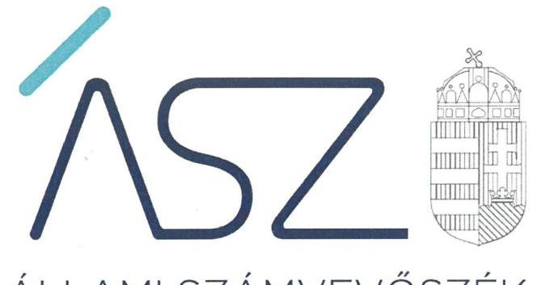
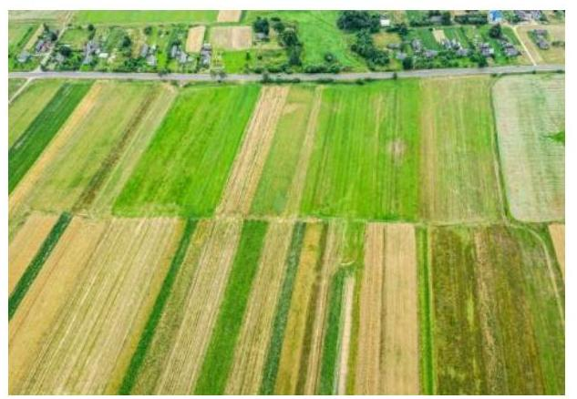

ÁLLAMI SZÁMVEVŐSZÉK

# JELENTÉS 

Az állami vagyon feletti tulajdonosi joggyakorlással kapcsolatos tevékenységek ellenőrzése

2021. 

21083
www.asz.hu

---

ÁLLAMI SZÁMVEVŐSZÉK

# JELENTÉS 

Az állami vagyon feletti tulajdonosi joggyakorlással kapcsolatos tevékenységek ellenőrzése
2021. 10. hó 18. nap

21083
www.asz.hu

---

# AZ ELLENŐRZÉST VEZETTE ÉS A VÉGREHAJTÁSÁÉRT FELELŐS: 

DR. BENEDEK MÁRIA ellenőrzésvezető
KISTÓTH KRISZTINA ellenőrzésvezető
FEKETE-NAGY ANDRÁS ellenőrzésvezető

## A PROGRAM ÖSSZEÁLLÍTÁSÁÉRT FELELŐS:

DR. FELFÖLDI IZABELLA projekt vezető

## A TÉMÁHOZ KAPCSOLÓDÓ KORÁBBI SZÁMVEVŐSZÉKI JELENTÉSEK:

- címe: Az állami vagyon feletti tulajdonosi joggyakorlással kapcsolatos tevékenységek ellenőrzése
- sorszáma: 20213
- címe: Az állami vagyon feletti tulajdonosi joggyakorlással kapcsolatos tevékenységek ellenőrzése
- sorszáma: 19202

IKTATÓSZÁM: EL-3408-001/2021.
TÉMASZÁM: 2573
ELLENŐRZÉS-AZONOSÍTÓ SZÁM: V0916

---

# TARTALOMJEGYZÉK 

■ ÖSSZEGZÉS ..... 5
■ AZ ELLENŐRZÉS CÉLJA ..... 6
■ AZ ELLENŐRZÉS TERÜLETE ..... 7
■ AZ ELLENŐRZÉS HÁTTERE, INDOKOLTSÁGA ..... 9
■ A JELENTÉS LÉNYEGES KÉRDÉSKÖREI ..... 10
■ AZ ELLENŐRZÉS HATÓKÖRE ÉS MÓDSZEREI ..... 11
■ MEGÁLLAPÍTÁSOK ..... 14
■ MELLÉKLETEK ..... 19
I. sz. melléklet: Értelmező szótár ..... 19
■ FÜGGELÉK: ÉSZREVÉTELEK ..... 21
■ RÖVIDÍTÉSEK JEGYZÉKE ..... 23

---

.

---

# ÖSSZEGZÉS 

A Magyar Nemzeti Vagyonkezelő Zrt. a Nemzeti Földügyi Központ, az Innovációs és Technológiai Minisztérium és a Külgazdasági és Külügyminisztérium - mint az állami vagyon felett tulajdonosi jogokat gyakorló szervezetek - feladatellátása során érvényesültek a jogszabályi előírások, ezzel hozzájárultak az állami vagyon megőrzéséhez, megóvásához.

## Az ellenőrzés társadalmi indokoltsága

Az Állami Számvevőszék a közvagyonnal való felelős gazdálkodás elősegítése érdekében, törvényi kötelezettségének is eleget téve minden évben ellenőrzi az állami vagyon feletti tulajdonosi joggyakorlással kapcsolatos tevékenységeket. Az ellenőrzéssel hozzájárul az állami vagyon feletti kontrollok, a felelős, szabályszerű vagyongazdálkodás erősítéséhez, az állami vagyon megóvását, a közjó érdekében való hasznosítását célzó feladatellátás javításához, valamint az annak jövőbeli fejlesztését célzó döntések megalapozott előkészítéséhez.

Ezzel az Állami Számvevőszék hozzájárul a jól irányított állam működéséhez, és objektív képet szolgáltat a társadalom részére a közvagyonnal való felelős gazdálkodás megvalósulásáról.

## Főbb megállapítások, következtetések

A tulajdonosi joggyakorló szervezetek a jogszabályi előírások szerint kialakították a tulajdonosi joggyakorlás szervezeti és szabályozási kereteit. Kiépített belső kontrollrendszerük támogatta az állami vagyon feletti szabályszerű tulajdonosi joggyakorlást, a nemzeti vagyonnal való átlátható és felelős gazdálkodást. Ugyanakkor az Innovációs és Technológiai Minisztérium, valamint a Külgazdasági és Külügyminisztérium integrált kockázatkezelési rendszerének múködtetése nem volt szabályszerű. A feltárt kockázatokkal kapcsolatban szükséges intézkedések hiányában nem biztosított a kockázatok csökkentése, ezáltal nem csökkent a tulajdonosi joggyakorlás vonatkozásában a hibák, szabálytalanságok bekövetkezésének lehetősége.

A tulajdonosi joggyakorlással összefüggő ellenőrzéseikkel a tulajdonosi joggyakorló szervezetek hozzájárultak a felelős vagyongazdálkodáshoz.

A tulajdonosi joggyakorló szervezetek az állami tulajdonú ingatlanok jogszabályokkal összhangban végzett vagyonkezelésbe adásával, értékesítésével, a társasági részesedések feletti szabályszerű tulajdonosi joggyakorlással hozzájárultak az állami vagyon megóvásához. A rábízott állami vagyonról a tulajdonosi joggyakorlók a jogszabályi előírásoknak megfelelően beszámoltak, az állami vagyon nyilvántartását szabályszerűen végezték.
2018. évhez képest a Magyar Nemzeti Vagyonkezelő Zrt. szabálytalan tulajdonosi joggyakorlási tevékenységének kockázata csökkent, mert az egységes nyilvántartási és lekérdezési rendszere biztosította_a vagyonkezelésbe adott állami vagyonnal kapcsolatos, jogszabályokban előírt adattartalmat. Az Állami Egészségügyi Ellátó Központ szabálytalan tulajdonosi joggyakorlási tevékenységének kockázata fennmaradt, mert a főigazgató a tulajdonosi joggyakorlása alá tartozó azon gazdasági társaságok esetében, ahol a saját tőke a törzstőke törvényben meghatározott minimális összeg alá csökkent, a Ptk. ${ }^{1}$ szerinti határozathozatalt nem kezdeményezett.

Az ellenőrzött szervezetek vezetői az ellenőrzött időszakot követően már lépéseket tettek a feltárt szabálytalanságok megszüntetésére.

---

# AZ ELLENŐRZÉS CÉLJA 

Az ellenőrzés célja annak értékelése, hogy az állami vagyon felett tulajdonosi jogokat gyakorló szervezeteknél kialakított kontrollok biztosították-e a szabályszerű tulajdonosi joggyakorlást, feladatellátásuk során érvényesülteke a jogszabályi előírások.

---

# AZ ELLENŐRZÉS TERÜLETE 

## Az állami vagyon feletti tulajdonosi joggyakorlással kapcsolatos tevékenységek

Az Alaptörvény² rögzíti a közvagyon meghatározó részét kitevő állami vagyonnal való felelős, átlátható és elszámoltatható gazdálkodás követelményét.

Az Nvtv. ${ }^{3}$ határozza meg többek között a nemzeti vagyon rendeltetését, kategóriáit és a vagyongazdálkodás keretszabályait.

Az állam tulajdonában álló vagyon feletti tulajdonosi joggyakorlás módját, a vagyon védelmének, hasznosításának, kezelésének, nyilvántartásának általánosan érvényes szabályait a Vtv. ${ }^{4}$ állapítja meg. A törvény szerint a tulajdonosi joggyakorlás feladata az állami vagyon rendeltetésének megfelelő, hatékony, költségtakarékos, értékmegőrző, értéknövelő felhasználásának, hasznosításának biztosítása, valamint gyarapítása.

Az ellenőrzés az állami vagyoni kör feletti tulajdonosi joggyakorlók közül kockázatelemzést követően kiválasztott joggyakorlók tevékenységére terjedt ki.

A Vtv. 3. § (1) bekezdése alapján az állami vagyon felett az államot megillető tulajdonosi jogok és kötelezettségek összességét tulajdonosi joggyakorlóként - ha a törvény vagy miniszteri rendelet eltérően nem rendelkezik - a Magyar Nemzeti Vagyonkezelő Zrt. (továbbiakban MNV Zrt.) gyakorolja. Az MNV Zrt. az állam által alapított zártkörűen működő részvénytársaság, amelyet az állam a Vtv. 17. §-ában felsorolt, valamint más jogszabályokban meghatározott állami feladatok ellátására hozott létre.

A Nemzeti Földalap az állam tulajdonában lévő termőföldek, mező-, erdőgazdasági művelés alatt álló belterületi földek, valamint a mező-, erdőgazdasági tevékenységet szolgáló vagy ahhoz szükséges művelés alól kivett földek összessége. A Nemzeti Földalap felett a Magyar Állam nevében a tulajdonosi jogokat és kötelezettségeket az agrárpolitikáért felelős miniszter a Nemzeti Földügyi Központ (a továbbiakban: NFK) útján gyakorolja. Az NFK a 2010. szeptember 1-jén alapított Nemzeti Földalapkezelő Szervezet általános jogutódjaként 2019. július 1-jétől jött létre. Az NFK az agrárpolitikáért felelős miniszter irányítása alatt álló központi költségvetési szerv.

Az Innovációs és Technológiai Minisztérium (továbbiakban ITM) tulajdonosi joggyakorlása alatt álló gazdasági társaságokkal kapcsolatos tulajdonosi jogok gyakorlásának rendjéről szóló 7/2020. (II. 13.) ITM utasítás 1. melléklete tartalmazza a miniszter tulajdonosi joggyakorlása alá tartozó gazdasági társaságok felsorolását. Ezek száma 2020. december 30-ig 19 volt. A gazdasági társaságok felett a tulajdonosi jogköröket a miniszter által átruházott hatáskörben a közigazgatási államtitkár gyakorolta.

A Külgazdasági és Külügyminisztérium (továbbiakban KKM) szakmai és igazgatási felügyelete alatt működő társaságok tevékenysége kapcsolódott a minisztérium tevékenységéhez, Magyarország külgazdasági kapcsolatai-

---

nak ösztönzése, támogatása volt a legtöbb társaság alapításának és tevékenységének a célja. A KKM az ellenőrzött időszak elején tíz, 2020 végén 12 állami többségi tulajdonú gazdasági társaság felett rendelkezett tulajdonosi jogosítványokkal. A KKM 2020. évben alapította a KKM Subsidium Kft-t és a CEI Közép-európai Befektetési Zrt-t.

Az utóellenőrzés az állami vagyon feletti tulajdonosi joggyakorlással kapcsolatos tevékenységek 2018-ra vonatkozó ellenőrzéséről készült, 19202 számú jelentés javaslatainak és megállapításainak hasznosulását értékelte az MNV Zrt., valamint az Országos Kórházi Főigazgatóság (továbbiakban OKF) vonatkozásában.

Az Állami Számvevőszék (továbbiakban ÁSZ) az állami vagyon feletti tulajdonosi joggyakorlással kapcsolatos tevékenységet az Állami Egészségügyi Ellátó Központnál (továbbiakban ÁEEK) ellenőrizte a 2018. év vonatkozásában. Azonban az OKF rendelet ${ }^{5}$ értelmében 2020. december 31-ével az ÁEEK megszűnt az OKF-be történő beolvadással, ezért az utóellenőrzésben az adatokat az OKF, mint az ÁEEK jogutódja bocsátotta az ÁSZ rendelkezésre. Az OKF az OKF rendelet alapján ellátja az országos gyógyintézetek és az országos társgyógyintézetek, valamint az állam fenntartásában, illetve tulajdonában lévő egészségügyi intézmények tekintetében a fenntartói és irányítási jogok, a gazdasági társaságok tekintetében a tagsági jogok, valamint az alapítványok esetében az alapítói jogok gyakorlásával kapcsolatos feladatokat. Az OKF középirányító szervként közreműködik az egészségügyért felelős miniszternek az egészségügyek fenntartásával és irányításával kapcsolatos feladatok ellátásában.

---

# AZ ELLENŐRZÉS HÁTTERE, INDOKOLTSÁGA 

Az állami vagyonról szóló 2007. évi CVI. törvény 3. § (4) bekezdése szerint az állami vagyon feletti tulajdonosi joggyakorlással kapcsolatos tevékenységeket az ÁSZ ${ }^{6}$ évente ellenőrzi. A Nemzeti Földalap feletti tulajdonosi joggyakorlással kapcsolatos tevékenység éves gyakorisággal történő ellenőrzéséről a Nemzeti Földalapról szóló 2010. évi LXXXVII. törvény 14. § (1) bekezdése rendelkezik.

Az ÁSZ törvényi kötelezettségének eleget téve, a közvagyonnal való felelős gazdálkodás előmozdítása érdekében ellenőrzi a nemzeti vagyon meghatározó részét kitevő állami vagyon felett tulajdonosi jogokat gyakorló szervezetek feladatellátást.

Az ellenőrzés eredményeként az ÁSZ véleményt formál arról, hogy a Magyar Állam tulajdonosi joggyakorlásában érintett szervezetek müködése és az állami vagyonnal való gazdálkodása összhangban volt-e az állami vagyonra vonatkozó jogszabályok rendelkezéseivel. Az ellenőrzés rámutathat az állami vagyon feletti joggyakorlás tevékenységeinek esetleges szabályozási problémáira és hiányosságaira, hozzájárulva az állami vagyon feletti kontrollok, a felelős, szabályszerű vagyongazdálkodás erősítéséhez, valamint az állami vagyon megóvását, a közjó érdekében való hasznosítását célzó feladatellátás javításához. Az ÁSZ ellenőrzésével támogatja a felelős, szabályszerű vagyongazdálkodást.

Az ellenőrzés során az ÁSZ feltárja, hogy a szervezetek hasznosították$\cdot$ e a korábbi ellenőrzési jelentésekben a hiányosságok megszüntetése, illetve a kockázatok kezelése érdekében megfogalmazott javaslatokat, illetve az intézkedések végrehajtása elmaradásának következtében továbbra is fennálló szabálytalanság esetén értékeli a közpénzek, közvagyon veszélyeztetettségét.

Az ellenőrzés tájékoztatást ad a törvényhozás, az érintett szervezetek és a társadalom részére az állami vagyon feletti tulajdonosi joggyakorlói feladatok ellátásáról, ezáltal hozzájárul az átláthatósághoz, a területet érintő döntések megalapozottságához. Az ÁSZ ellenőrzési megállapításaival támogatja az Országgyűlés törvényalkotó munkáját és a jól irányított állam müködését.

---

# A JELENTÉS LÉNYEGES KÉRDÉSKÖREI 

1.     - Az állam tulajdonosi jogait gyakorló szervezetek kialakították és müködtették-e a tulajdonosi joggyakorlással kapcsolatos tevékenységek szabályszerű ellátását biztosító kontrollrendszert?
2.     - Az állam tulajdonosi jogait gyakorló szervezetek tulajdonosi joggyakorlással kapcsolatos tevékenységüket szabályszerűen látták-e el?
3.     - Az állam tulajdonosi jogait gyakorló szervezetek szabályszerűen tartották-e nyilván az állami vagyont, a jogszabályokban elöirt beszámolási és adatszolgáltatási kötelezettségüket teljesi-tették-e?
4.     - Az állami vagyonnal való gazdálkodásról az Országgyülés felé történő beszámolás szabályszerűen megtörtént-e?
5. A 2018. évhez képest csökkent-e a tulajdonosi joggyakorló szervezetek szabálytalan müködésének kockázata?

---

# AZ ELLENŐRZÉS HATÓKÖRE ÉS MÓDSZEREI 

## Az ellenőrzés típusa

Megfelelőségi ellenőrzés.

## Az ellenőrzött időszak

Az állami vagyon feletti tulajdonosi joggyakorlás vonatkozásában a 2020. év.

Az utóellenőrzés vonatkozásában az utóellenőrzés alapját képező 19202 számú ÁSZ jelentés közzétételének napjától (2019. október 14.) az ellenőrzésről szóló kiértesítő levél keltének napjáig (2021. augusztus 4.) tartó időszak.

## Az ellenőrzés tárgya

A Magyar Állam tulajdonosi joggyakorlásában érintett szervezetek állami vagyonra vonatkozó tulajdonosi joggyakorlással kapcsolatos intézkedései és a tulajdonosi joggyakorlási feladatok szabályszerű ellátását támogató belső szabályozási, közzétételi kontrollok és a tulajdonosi ellenőrzési rendszer.

Az állami ingatlanvagyon vagyonkezelésbe adását és a tulajdonjogának átruházását az MNV Zrt. és az NFK, a többségi állami tulajdonú társasági részesedések feletti tulajdonosi jogok gyakorlását az MNV Zrt. esetében ellenőrzi az ÁSZ.

Az állami vagyonnal kapcsolatos nyilvántartások kialakítását és vezetését, az adatszolgáltatások, a beszámolási kötelezettség teljesítését az MNV Zrt. és az NFK szervezeteknél, a beszámolási kötelezettség teljesítését az Országgyűlés felé a Nemzeti vagyon kezeléséért felelős tárca nélküli miniszternél ellenőrzi az ÁSZ.

Az utóellenőrzés tekintetében az érintett számvevőszéki jelentésben foglalt megállapításokhoz kapcsolódó - az ellenőrzött szervezet vezetője által készített - intézkedési tervekben meghatározott feladatok végrehajtásának kockázatalapú ellenőrzése.

## Az ellenőrzött szervezet

A Magyar Nemzeti Vagyonkezelő Zrt., a Nemzeti Földügyi Központ, az Innovációs és Technológiai Minisztérium, valamint a Külgazdasági és Külügyminisztérium.Az Országgyűlés felé történő beszámolás tekintetében a Nemzeti vagyon kezeléséért felelős tárca nélküli miniszter.

---

Az utóellenőrzés tekintetében az MNV Zrt. és az Országos Kórházi Főigazgatóság, mint az Állami Egészségügyi Ellátó Központ jogutódja. Az utóellenőrzés alapjául szolgáló ÁSZ jelentés száma: 19202.

# Az ellenőrzés jogalapja 

Az ellenőrzés jogszabályi alapját az ÁSZ tv. ${ }^{7}$ 5. § (4) bekezdés a) pontja, a Vtv. 3. § (4) bekezdése és az Nfatv. ${ }^{8}$ 14. § (1) bekezdése képezik. Az utóellenőrzés jogszabályi alapját az ÁSZ tv. 1. § (3) bekezdése és 33. § (7) bekezdése képezi.

## Az ellenőrzés módszerei

Az ÁSZ az ellenőrzést az ellenőrzött időszakban hatályos jogszabályok, az ellenőrzés szakmai szabályai, a jelen ellenőrzésre irányadó ÁSZ módszertanok, az ellenőrzési programban foglalt értékelési szempontok szerint hajtja végre.

A tulajdonosi joggyakorlás belső szabályozási rendszerének és a tulajdonosi ellenőrzési rendszer kialakításának, működtetésének ellenőrzése az MNV Zrt. és az NFK szervezetekre vonatkozóan történik.

Az ellenőrzési kérdések megválaszolásához szükséges bizonyítékok megszerzése az ellenőrzött által rendelkezésre bocsátott dokumentumokra, adatokra alapozva megfigyelés, szemle (szemrevételezés), kérdésfeltevés (információkérés), mintavételezés, valamint elemző eljárás alkalmazásával történik.

Az állami vagyon feletti tulajdonosi joggyakorlással kapcsolatos tevékenységek ellenőrzése során a tulajdonosi ellenőrzéssel, a többségi állami tulajdonú társasági részesedések feletti tulajdonosi joggyakorlással, az állami tulajdonú ingatlanok vagyonkezelésbe adásával és az ezzel összefüggő nyilvántartási kötelezettséggel, valamint az állami tulajdonú ingatlanok értékesítésével kapcsolatos intézkedések szabályszerűségének ellenőrzése a tanúsítványokon bekért adatok alapján mintavétellel történik.

Ha az ellenőrzött sokaság elemszáma az előírt minta elemszám alatt van, teljes körű ellenőrzésre kerül sor, ha a sokaság elemszáma meghaladja az előírt minta elemszámot, a minta kiválasztása egyszerű véletlen, illetve rétegzett mintavétellel történik. Az adatbázisok ismeretében a mintavétel további rétegezéssel egészíthető ki. A vizsgált terület „szabályszerü" minősítést kapott, ha a minta ellenőrzésének eredménye alapján 95\%-os bizonyossággal a teljes sokaságban az átlagos hibaarány nem haladta meg a 10\%-ot, „nem szabályszerű" minősítést kapott, ha nagyobb volt, mint 10\%. Abban az esetben, ha az ellenőrzött sokaság tekintetében a 10\%-os hibaarányhoz való viszony megítélésnek megbízhatósága nem érte el a 95\%-ot, annak elérése érdekében az értékelés további szempontokkal egészült ki, figyelembe vételre került a feltárt hibák értéke.

Az ellenőrzött szervezetek belső kontrollrendszere egyes pilléreinek kialakítására és működtetésére vonatkozó értékelés:
$\longrightarrow$ „szabályszerű", amennyiben az értékelt területen az elért „igen" válaszok százalékban kifejezett, egész számra kerekített aránya legalább $85 \%$,

---

$\longrightarrow$ „nem szabályszerű", ha nem éri el a 85\%-ot.
Az ellenőrzési bizonyítékként felhasználható adatforrások közé tartoznak egyrészt a szakmai program részletes szempontjainál felsorolt adatforrások, másrészt minden - az ellenőrzés folyamán feltárt, az ellenőrzés szempontjából információt tartalmazó - dokumentum.

Az egységes értelmezést támogatja a jelentés 1. sz. mellékletét képező értelmező szótár.

Az ellenőrzés lefolytatásához az ellenőrzött szervezet a tanúsítványok elektronikus kitöltésével, valamint az ÁSZ által kért dokumentumok elektronikus megküldésével szolgáltat adatokat, amelyek valódiságát és teljes körűségét az ellenőrzött szervezet vezetője által tett teljességi és hitelességi nyilatkozat igazolja. A rendelkezésre bocsátott adatok, információk kontrollja az ellenőrzés keretében történik.

Az ÁSZ az utóellenőrzés során kockázati értékelésen alapuló ellenőrzési megközelítés alkalmazásával azt ellenőrzi, hogy az ÁSZ által kockázatosnak jelölt területeken feltárt hibák kijavítása megtörtént-e, csökkent-e a szervezet szabálytalan múködésének kockázata.

Az MNV Zrt., az NFK, az ITM, a KKM, az utóellenőrzés tekintetében az ÁEEK jogutódjaként az OKF vezetője számára figyelemfelhívó levél került megküldésre az ellenőrzött időszakra vonatkozó jogszabálysértő gyakorlatokról, és az ÁSZ tv. előírásával összhangban 15 nap állt rendelkezésükre az ebben foglaltak elbírálására, a megfelelő intézkedések megtételére és erről az Állami Számvevőszék elnökének az értesítés megküldésére.

---

# MEGÁLLAPÍTÁSOK 

## 1. Az állam tulajdonosi jogait gyakorló szervezetek kialakították és múködtették-e a tulajdonosi joggyakorlással kapcsolatos tevékenységek szabályszerű ellátását biztosító kontrollrendszert?

Összegző megállapítás

A 2020. évben az ellenőrzött négy tulajdonosi joggyakorló szervezet kialakította a tulajdonosi joggyakorlással kapcsolatos tevékenységek ellátását biztosító kontrollrendszert. A belső kontrollrendszer múködtetése az MNV Zrt.-nél és az NFK-nál szabályszerű volt, az ITM-nél és a KKM-nél nem volt szabályszerű.

Az MNV Zrt., az NFK, az ITM és a KKM a jogszabályi előírások szerint kialakította a tulajdonosi joggyakorlás rendjét.

A tulajdonosi joggyakorlás szervezeti és szabályzati kereteit az MNV Zrt., az NFK, az ITM, valamint a KKM szabályszerűen kialakította. Az ellenőrzési időszakban a tulajdonosi jogok gyakorlói rendelkeztek az Áht. ${ }^{9}$ és az Ávr. ${ }^{10}$ előírásai szerinti SZMSZ ${ }^{11}$-szel. Az SZMSZ tartalmazta a tulajdonosi joggyakorlással kapcsolatos feladatokat ellátó szervezeti egység megnevezését. Ezen egységek rendelkeztek a feladat és felelősségi köröket rögzítő, a működésükre vonatkozó ügyrenddel ${ }^{12}$.

Az MNV Zrt., az NFK és az ITM,és a KKM rendelkeztek a Számv. tv. ${ }^{13}$ szerint meghatározott számviteli szabályzatokkal ${ }^{14}$, melyben rögzítették a gazdálkodóra jellemző számviteli szabályokat, előírásokat és módszereket. A Vagyon-nyilvántartási szabályzatban ${ }^{15}$ a Vtv. vhr. ${ }^{16}$ előírása szerint meghatározták a vagyonnyilvántartás vezetésének szabályait, az adatszolgáltatás tartalmát, gyakoriságát, határidejét és módját.

Az MNV Zrt. és az NFK kialakította és múködtette a tulajdonosi joggyakorlási feladatok szabályszerű ellátását támogató belső kontrollokat. Az ITM és a KKM kialakította az integrált kockázatkezelési rendszert, de annak múködtetése nem volt szabályszerű. Az ITMnél az információs és kommunikációs rendszer nem került kialakításra.

Az ellenőrzött tulajdonosi joggyakorlók rendelkeztek a Bkr. ${ }^{17}$ előírásai szerinti integrált kockázatkezelés eljárásrenddel ${ }^{18}$. Az MNV Zrt.-nél, és az NFKnál felmérték a tevékenységben rejlő kockázatokat a tulajdonosi joggyakorlás vonatkozásában, valamint meghatározták a feltárt kockázatokkal kapcsolatban szükséges intézkedéseket. Ugyanakkor az ITM és a KKM a Bkr. 7. § (2) bekezdésben foglaltak ellenére az integrált kockázatkezelési

---

# 1.3. számú megállapítás 

rendszer működtetése során nem határozta meg az egyes feltárt kockázatokkal kapcsolatban szükséges intézkedéseket.

Az MNV Zrt., az NFK, az ITM és a KKM a Bkr. szerinti monitoring rendszert ${ }^{19}$ szabályszerűen kialakította, amely biztosította az Nvtv. és az Nfatv. vhr. ${ }^{20}$ szerint a tulajdonosi feladatellátásához kapcsolódóan a szervezet tevékenységének, a célok megvalósulásának nyomon követését.

Az MNV Zrt., az NFK és a KKM vezetője kialakította a szervezet információs és kommunikációs rendszerét ${ }^{21}$, amely tartalmazta a beszámolási szinteket, határidőket és módokat. Az ITM vezetője nem alakított ki a Bkr. 9. § (1) bekezdésében foglaltaknak megfelelően olyan információs és kommunikációs rendszert, amely biztosítja, hogy a megfelelő információk a megfelelő időben eljussanak az illetékes szervezeti egységhez, illetve személyhez.

Szabályozta továbbá az MNV Zrt., az NFK, az ITM és a KKM a közérdekű adatok megismerésére irányuló igények teljesítésének ${ }^{22}$, valamint a kötelezően közzéteendő adatok nyilvánosságra hozatalának rendjét ${ }^{23}$.

## A tulajdonosi joggyakorlással összefüggő ellenőrzési kötelezettségeiknek az ITM, a KKM, az MNV Zrt. és az NFK a jogszabályi előírásoknak és a belső szabályzatoknak megfelelően eleget tettek.

Az MNV Zrt., az NFK és a KKM a Vtv. vhr. előírásai szerint gondoskodtak a tulajdonosi joggyakorlással összefüggő ellenőrzések szabályainak ${ }^{24}$ kialakításáról.

Az MNV Zrt. elkészítette éves ellenőrzési tervét ${ }^{25}$. Az állami vagyonnal való gazdálkodás, a vagyonkezelőt, haszonélvezőt megillető jogok gyakorlásának a kötelezettségek teljesítésének szabályszerűsége vonatkozásában elvégzett ellenőrzésekről a 2020. évi tulajdonosi ellenőrzési beszámolót készített. Amelyet az MNV Zrt. a Vtv. vhr. szerint, határidőben megküldte a Nemzeti vagyon kezeléséért felelős tárca nélküli miniszter részére.

Az NFK az Nfatv. vhr. előírása szerinti éves ellenőrzési tervét elkészítette, az elvégzett ellenőrzések tapasztalatairól, és az azok nyomán tett intézkedésekről készített éves ellenőrzési jelentését határidőben megküldte az agrárminiszter részére.

Az ITM a Vtv. vhr. előírásával összhangban tulajdonosi ellenőrzése során vizsgálta a vagyonnal való gazdálkodást az előírt beszámolási, nyilvántartási, adatszolgáltatási kötelezettségek teljesítését.

---

# 2. Az állam tulajdonosi jogait gyakorló szervezetek tulajdonosi joggyakorlással kapcsolatos tevékenységüket szabályszerűen látták-e el? 

Összegző megállapítás

Az állam tulajdonosi jogait gyakorló szervezetek tulajdonosi joggyakorlással kapcsolatos tevékenységüket a 2020. évben szabályszerűen látták el.
2.1. számú megállapítás

Az MNV Zrt. és az NFK az állami tulajdonú ingatlanok vagyonkezelésbe adása során a jogszabályi előírásoknak megfelelően járt el.
Az állami tulajdonú ingatlanok vagyonkezelésbe adását a MNV Zrt. az Nvtv., a Vtv. valamint a Vtv. vhr. előírásainak megfelelően végezte.

Az NFK az Nvtv., az Nfatv., valamint az Nfatv. vhr. szerint szabályszerűen végezte az állami tulajdonú ingatlanok vagyonkezelésbe adását.

Az MNV Zrt. és az NFK a vagyonkezelési szerződéseket a vonatkozó jogszabályokban előírt tartalommal kötötte.
Az MNV Zrt. és az NFK az egyes állami tulajdonú ingatlanok tulajdonjogának átruházásával kapcsolatos feladataikat szabályszerűen végezték.
Az állami tulajdonú ingatlanok adásvételi szerződéseinek megkötése során az MNV Zrt. és az NFK a Ptk., valamint a Vtv. vhr. és a Nfatv. vhr. előírásaival összhangban, szabályszerűen jártak el.

Az ingatlanok értékesítését az MNV Zrt. és az NFK az Nvtv., a Vtv., valamint a Nfatv. előírásaival összhangban végezték.
Az MNV Zrt., az ITM és a KKM többségi állami tulajdonban álló társaságban lévő társasági részesedései feletti tulajdonosi joggyakorlása szabályszerű volt.
Az MNV Zrt., az ITM és a KKM a 2020. évben szabályszerűen járt el a tulajdonosi joggyakorlása alá helyezett többségi állami tulajdonú gazdasági társaságai létesítő okiratainak kiadásánál, a felügyelő bizottsági tagok és a könyvvizsgálók kijelölésénél, megalkotta a Tak. tv. ${ }^{26}$ 5. § (3) bekezdése szerinti szabályzatot.

A tulajdonosi joggyakorlásuk alá tartozó többségi állami tulajdonú gazdasági társaságok legfőbb szerveként eljárva az MNV Zrt., az ITM és a KKM szabályszerűen döntöttek az éves számviteli beszámolók elfogadásáról, az eredményfelosztásról.

---

# 3. Az állam tulajdonosi jogait gyakorló szervezetek szabályszerűen tartották-e nyilván az állami vagyont, a jogszabályokban előírt beszámolási és adatszolgáltatási kötelezettségüket teljesítették-e? 

Összegző megállapítás

Az 3.1. számú megállapítás
Az állam tulajdonosi jogait gyakorló szervezetek az állami vagyont szabályszerűen tartották nyilván, beszámolási és adatszolgáltatási kötelezettségüket teljesítették.

Az MNV Zrt., és az NFK a rábízott állami vagyonnal kapcsolatos nyilvántartási kötelezettségeiknek szabályszerűen eleget tettek.

Az MNV Zrt. és az NFK a rábízott vagyont az Áhsz. ${ }^{27}$, valamint az Nvtv. előírásai szerint szabályszerűen tartotta nyilván. A nyilvántartások tartalmazták az Áhsz., valamint a Vtv. vhr. előírásainak megfelelően a vagyonkezelés adatait.

Az MNV Zrt. az ÁSZ korábbi jelentésének ${ }^{28}$ megállapítására készített intézkedési tervében vállalta, hogy egységes nyilvántartási és lekérdezési rendszert alakít ki, amely biztosítja a vagyonkezelésbe adott állami vagyonnal kapcsolatos, jogszabályban előírt adattartalom lekérdezhetőségét. Az ellenőrzés megállapította, hogy az MNV Zrt. az egységes nyilvántartási rendszert kialakította, a nyilvántartás megfelelt az Áhsz. 14. melléklet IX.1. pontjában és a Vtv. vhr. 14. § (2) bekezdésében előírtaknak. Ezzel a 2018. évhez képest az MNV Zrt. szabálytalan tulajdonosi joggyakorlási tevékenységének kockázata csökkent.
3.2. számú megállapítás

Az MNV Zrt., az NFK, az ITM, és a KKM a rábízott állami vagyonra vonatkozó év végi beszámolási és adatszolgáltatási kötelezettségeiket a jogszabályi előírásokkal összhangban teljesítették.

Az MNV Zrt., az NFK, az ITM és a KKM elkészítette a rábízott állami vagyonról a 2019. évi költségvetési beszámolót. A tulajdonosi joggyakorlás alá tartozó állami vagyont a mérlegben az MNV Zrt. és az NFK az Áhsz. előírásának megfelelően mutatták ki.

Az NFK, az ITM és a KKM a Vtv. vhr. szerint, a rábízott állami vagyonról készített mérlegről, valamint a mérleg soraival megegyező, vagyonelemenkénti tételes adatokról adatszolgáltatását a 2020. december 31-i állományról az előírt határidőben megküldte az MNV Zrt. részére.

---

# 4. Az állami vagyonnal való gazdálkodásról az Országgyúlés felé történő beszámolás szabályszerűen megtörtént-e? 

## Összegző megállapítás

A Nemzeti vagyon kezeléséért felelős tárca nélküli miniszter a 2019. évi állami vagyonnal való gazdálkodásról az Országgyúlés felé beszámolt.

A Nemzeti vagyon kezeléséért felelős tárca nélküli miniszter - a Vtv. előírásaival összhangban - az állam nevében tulajdonosi jogokat gyakorló szervezetek 2019. évi múködéséről, az állami vagyon állományának alakulásáról, az állami vagyonnal való gazdálkodás folyamatairól a beszámolót elkészítette és azt az Országgyúlésnek beterjesztette.

## 5. A 2018. évhez képest csökkent-e a tulajdonosi joggyakorló szervezetek szabálytalan múködésének kockázata?

## Összegző megállapítás

A 2018. évhez képest az ÁEEK szabálytalan tulajdonosi joggyakorlásának kockázata fennmaradt.

Az ÁSZ korábbi jelentésének ${ }^{29}$ megállapítására tett intézkedés eredményeként az ÁEEK többségi tulajdonosi joggyakorlásába tartozó gazdasági társaságok 2019. évi beszámolójáról való döntés a felügyelőbizottság írásbeli jelentésének birtokában történt.

Ugyanakkor az ÁEEK főigazgatója azon gazdasági társaságok esetében, ahol a társaság saját tőkéje a törzstőke törvényben meghatározott minimális összege alá csökkent, a Ptk. 3:189 § (2) bekezdésében foglaltak szerint határozathozatalt dokumentáltan nem kezdeményezett.

A Ptk. szerinti határozathozatal kezdeményezése hiányában az ÁEEK szabálytalan tulajdonosi joggyakorlási tevékenységének kockázata fennmaradt.

---

# MELLÉKLETEK 

- I. SZ. MELLÉKLET: ÉRTELMEZŐ SZÓTÁR
állami vagyon
intézkedési terv
nemzeti vagyon
rábízott állami vagyon

A Vtv. alkalmazásában állami vagyonnak minősül:
a) az állam tulajdonában lévő dolog, valamint dolog módjára hasznosítható természeti erő;
b) az a) pont hatálya alá tartozó mindazon vagyon, amely vonatkozásában törvény az állam kizárólagos tulajdonjogát nevesíti;
c) az állam tulajdonában lévő tagsági jogviszonyt megtestesítő értékpapír, illetve az államot megillető egyéb társasági részesedés;
d) az államot megillető olyan immateriális, vagyoni értékkel rendelkező jogosultság, amelyet jogszabály vagyoni értékű jogként nevesít;
e) az állam tulajdonában lévő pénzügyi eszközök.
(Forrás: Vtv. 1. § (2) bekezdése)
Az ellenőrzött szervezet vezetője köteles a számvevőszéki jelentésben foglalt megállapításokhoz kapcsolódó intézkedési tervet összeállítani. (ÁSZ tv. 33. § (1) bekezdés)
Az ellenőrzési javaslatok alapján az ellenőrzött szervezet, szervezeti egység által készített intézkedések végrehajtásának ütemezése a végrehajtásáért felelős személyek és a vonatkozó határidők megjelölésével (Bkr. 2. § k) pont).
A nemzeti vagyonba tartozik:
a) az állam vagy a helyi önkormányzat kizárólagos tulajdonában álló dolgok,
b) az a) pont hatálya alá nem tartozó, az állam vagy a helyi önkormányzat tulajdonában lévő dolog,
c) az állam vagy a helyi önkormányzat tulajdonában lévő pénzügyi eszközök, továbbá az államot vagy a helyi önkormányzatot megillető társasági részesedések,
d) az államot vagy a helyi önkormányzatot megillető bármely vagyoni értékkel rendelkező jogosultság, amelyet jogszabály vagyoni értékű jogként nevesít,
e) Magyarország határa által körbezárt terület feletti légtér,
f) az üvegházhatású gázok kibocsátási egységeinek kereskedelméről szóló törvény szerinti kibocsátási egység és légiközlekedési kibocsátási egység, valamint az ENSZ Éghajlatváltozási Keretegyezménye és annak Kiotói Jegyzőkönyv végrehajtási keretrendszeréről szóló törvény szerinti kiotói egység,
g) állami vagy helyi önkormányzati fenntartású közgyűjtemény (muzeális intézmény, levéltár, közgyűjteményként működő kép- és hangarchívum, valamint könyvtár) saját gyűjteményében nyilvántartott kulturális javak körébe tartozó dolog, kivéve, ha a dolog más tulajdonában áll,
h) a régészeti lelet,
i) a nemzeti adatvagyon körébe tartozó állami nyilvántartások fokozottabb védelméről szóló törvény szerinti nemzeti adatvagyon.
(Forrás: Nvtv. 1. § (2) bekezdése)
Az Nfatv. 1. § (1) bekezdése szerint a Nemzeti Földalapba tartozó földvagyon tekinthető rábízott állami vagyonnak. (Forrás: Nfatv. 1. § (1) bekezdése)
A Vtv. 3. § (1) bekezdése értelmében a rábízott állami vagyon felett az államot megillető tulajdonosi jogok és kötelezettségek összességét tulajdonosi joggyakorlóként - ha törvény vagy miniszteri rendelet eltérően nem rendelkezik - az MNV Zrt. gyakorolja. Az MNV Zrt. rábízott állami vagyonnal való gazdálkodását el kell különíteni a saját vagyonával történő gazdálkodástól (Forrás: Vtv. 22. § (1) bekezdése)

---

tulajdonosi ellenőrzés

A Vtv. vhr. 20. §. (2) bekezdés alapján a tulajdonosi ellenőrzés célja az állami vagyonnal való gazdálkodás vizsgálata, ennek keretében a rendeltetésellenes, jogszerűtlen, szerződésellenes, vagy a tulajdonos érdekeit sértő, illetve a központi költségvetést hátrányosan érintő vagyongazdálkodási intézkedések feltárása és a jogszerű állapot helyreállítása, továbbá a vagyonnyilvántartás hitelességének, teljességének és helyességének biztosítása.
Az Nfatv. vhr. 47. § (2) bekezdése szerint a tulajdonosi ellenőrzés célja a földrészlettel való gazdálkodás vizsgálata, ennek keretében a rendeltetésellenes, jogszerűtlen, szerződésellenes, vagy a tulajdonos érdekeit sértő intézkedések feltárása és a jogszerű állapot helyreállítása, továbbá a vagyonnyilvántartás hitelességének, teljességének és helyességének biztosítása.
A 263/2010. (XI. 17.) Korm. rendelet 11. § (1) bekezdése szerint a vagyonkezelési szerződésben foglaltak betartását az NFK ellenőrzi.
(Forrás: Vtv. vhr. 20. §. (2) bekezdése, Nfatv. vhr. 47. § (2) bekezdése, 263/2010. (XI. 17.) Korm. rendelet 11. § (1) bekezdése)
tulajdonosi joggyakorlás és vagyongazdálkodás feladata

A Vtv. 2. § (1) bekezdése szerint az állami vagyon rendeltetésének megfelelő - az állami feladatok ellátásához, a társadalmi szükségletek kielégítéséhez, valamint a Kormány gazdaságpolitikája megvalósításának elősegítéséhez szükséges, egységes elveken alapuló, önálló ágazatként megjelenő - hatékony, költségtakarékos, értékmegőrző, értéknövelő felhasználásának biztosítása (közvetlen felhasználás), illetve közvetett hasznosítása (beleértve a vagyoni kör változását eredményező értékesítést), valamint az állami vagyon gyarapítása (ideértve a vagyoni kör bővítését is).
(Forrás: Vtv. 2. § (1) bekezdése)
tulajdonosi joggyakorló Nvtv. 3. § (1) bekezdés 17. pontja szerint, aki a nemzeti vagyon felett az államot vagy a helyi önkormányzatot megillető tulajdonosi jogok és kötelezettségek összességének gyakorlására jogosult.
(Forrás: Nvtv. 3. § (1) bekezdés 17. pontja)

---

# FÜGGELÉK: ÉSZREVÉTELEK 

A jelentéstervezetet a Számvevőszék 15 napos észrevételezésre megküldte az ellenőrzött szervezetek vezetőinek az ÁSZ tv. 29. §* (1) bekezdése előírásának megfelelően.

A Külgazdasági és Külügyminisztérium minisztere és az Országos Kórházi Főigazgatóság föigazgatója az ellenőrzés megállapításaira észrevételt tett. Az Innovációs és Technológiai Minisztérium minisztere az észrevételezési határidőn túl küldött levelet az ellenőrzés megállapításaival kapcsolatban. A Magyar Nemzeti Vagyonkezelő Zrt. vezérigazgatója, a Nemzeti Földügyi Központ elnöke és a Nemzeti vagyon kezeléséért felelős tárca nélküli miniszter az ellenőrzés megállapításaira nem tett észrevételt.
Az ÁSZ tv. 29. § (3) bekezdésével összhangban az ÁSZ a Függelékben feltünteti az ellenőrzés megállapításaival kapcsolatban tett, figyelembe nem vett észrevételeket, és megindokolja, hogy azokat miért nem fogadta el.

[^0]
[^0]:    * 29. § (1) Az Állami Számvevőszék az ellenőrzési megállapításait megküldi az ellenőrzött szervezet vezetőjének vagy az általa megbízott személynek, és annak, akinek személyes felelősségét állapította meg.
    (2) Az ellenőrzött szervezet vezetője és a felelősként megjelölt személy az ellenőrzés megállapításaira tizenöt napon belül írásban észrevételt tehet.
    (3) Az Állami Számvevőszék az észrevételre a beérkezésétől számított harminc napon belül írásban válaszol. A figyelembe nem vett észrevételeket köteles a jelentésben feltüntetni, és megindokolni, hogy azokat miért nem fogadta el.

---

# Külgazdasági és Külügyminisztérium 

A Külgazdasági és Külügyminisztérium (továbbiakban: KKM) minisztere észrevételt tett az ellenőrzés integrált kockázatkezelési rendszer múködtetésével kapcsolatos megállapítására.

Az ÁSZ az EL-3227-004/2020. iktatószámú adatbekérő levélben többek között az integrált kockázatkezelési rendszer kialakításához kapcsolódó belső szabályozást, valamint a tulajdonosi joggyakorlással kapcsolatos feladatellátásra vonatkozó kockázatok felmérése, a kockázatok meghatározott kritériumok szerinti értékelésének dokumentumai, az egyes kockázatokkal kapcsolatos intézkedések teljesítése folyamatos nyomon követésének dokumentumait kérte az ellenőrzés rendelkezésére bocsátani.

A KKM által a 2021. május 31-i keltezésű, Teljességi és hitelességi nyilatkozattal igazoltan az adatbekérés során rendelkezésre bocsátott „21_2020_KÁT_utasítás.pdf" megnevezésű dokumentum vonatkozásában az ÁSZ megállapította, hogy a KKM rendelkezik az integrált kockázatkezelési rendszer keretében feltárt kockázatokkal kapcsolatban a javasolt intézkedés konkrét megnevezéséről, leírásáról, vagyis 2021-ben biztosítja a kockázatkezelési rendszer szabályszerű működtetéséhez szükséges szabályozási feltételeket.

A „Kockázat dokumentumok.pdf" megnevezésű dokumentum ismételt felülvizsgálata során az ÁSZ megállapította, hogy a dokumentum a kockázati értékek meghatározását rögzíti a folyamatokban azonosított kockázatok tekintetében, ugyanakkor nem tartalmazza, nem határozza meg a KKM-nél az integrált kockázatkezelési rendszer múködtetése során, az egyes feltárt kockázatokkal kapcsolatban szükséges intézkedéseket.

A fentiekre tekintettel az ellenőrzés megállapítása megalapozott, a jelentéstervezet módosítása nem indokolt.

## Országos Kórházi Főigazgatóság

Az Országos Kórházi Főigazgatóság (továbbiakban: OKF) főigazgatója észrevételt tett az ellenőrzésnek a gazdasági társaság saját tőkéjének a törzs tőke törvényben meghatározott minimális összeg alá csökkenésével kapcsolatos megállapítására.

Az ÁSZ az EL-3227-006/2021. iktatószámú adatbekérő levélben többek között kérte az ellenőrzés rendelkezésére bocsátani „a Ptk. 3:189. § (2) bekezdése szerinti döntés 2020. évi dokumentuma azon gazdasági társaságokhoz kapcsolódóan, ahol saját tőke a törvényben meghatározott szint alá csökkent" dokumentumait.

Az OKF a 2021. május 31-i keltezésű Teljességi és hitelességi nyilatkozattal a „saját tőke levelek.pdf" fájlt bocsátotta az ÁSZ rendelkezésére a Kazincbarcikai Kórház Nonprofit Kft., a Nemzeti Egészségmegőrző Központ Nonprofit Kft. és a HKGYK Közép- és Kelet-Európai Hagyományos Kínai Gyógyászati, Oktató- és Kutatóközpont Nonprofit Kft. tekintetében.

A dokumentum ismételt felülvizsgálata során az ÁSZ megállapította, hogy a rendelkezésre bocsátott, az OKF jogelődjeként az Állami Egészségügyi Ellátó Központ főigazgatója által a három gazdasági társaság ügyvezetőinek írt levelekben felhívta a figyelmüket a jogszabályi előírások szerinti működésnek a biztosítása céljából a szükséges intézkedések haladéktalan megtételére. Az OKF észrevételében leírta a jogellenes állapot megszüntetésére, az egyes társaságok saját tőkéje és jegyzett tőkéje viszonyának rendezésére megtett intézkedéseket, azonban az ellenőrzési időszakra vonatkozóan az adatszolgáltatásra rendelkezésre álló idő alatt olyan dokumentumokat nem bocsátott az ÁSZ rendelkezésére, amik a Ptk. 3:189. § (2) bekezdése szerinti döntés 2020. évi dokumentumai lennének azon gazdasági társaságokhoz kapcsolódóan, ahol saját tőke a törvényben meghatározott szint alá csökkent.

A fentiekre tekintettel az ellenőrzés megállapítása megalapozott, a jelentéstervezet módosítása nem indokolt.

---

# RÖVIDÍTÉSEK JEGYZÉKE 

${ }^{1}$ Ptk.
${ }^{2}$ Alaptörvény
${ }^{3}$ Nvtv.
${ }^{4}$ Vtv.
${ }^{5}$ OKF rendelet
${ }^{6}$ ÁSZ
${ }^{7}$ ÁSZ tv.
${ }^{8}$ Nfatv.
${ }^{9}$ Áht.
${ }^{10}$ Ávr.
${ }^{11}$ SZMSZ
a Polgári Törvénykönyvről szóló 2013. évi V. törvény
Magyarország Alaptörvénye
a nemzeti vagyonról szóló 2011. évi CXCVI. törvény
Az állami vagyonról szóló 2007. évi CVI. törvény
516/2020. (XI. 25.) Korm. rendelete az Országos Kórházi Főigazgatóság feladatairól
Állami Számvevőszék
az Állami Számvevőszékről szóló 2011. évi LXVI. törvény
a Nemzeti Földalapról szóló 2010. évi LXXXVII. törvény
az államháztartásról szóló 2011. évi CXCV. törvény
az államháztartásról szóló törvény végrehajtásáról szóló 368/2011. (XII. 31.)
Korm. rendelet
Az MNV Zrt. Szervezeti és Múködési Szabályzata 197/2019. (V. 29.) sz. határozata, hatályos: 2019.07.01 - 2020.06.30-ig
Az MNV Zrt. Szervezeti és Múködési Szabályzata 223/2020. (VI. 24.) sz. határozata, hatályos: 2020.07.01-től
Nemzeti Földügyi Központ Elnökének 2/2019. (XI. 6.) NFK utasítása a Nemzeti Földügyi Központ Szervezeti és Múködési Szabályzatáról, hatályos 2020.01.01 - 2020.04.30. között
Nemzeti Földügyi Központ elnökének 1/2020. (IV. 20.) NFK utasítása a Nemzeti Földügyi Központ Szervezeti és Múködési Szabályzatáról, hatályos 2020.05.01 - 2020.08.31. között
Nemzeti Földügyi Központ elnökének 2/2020. (VIII. 31.) NFK utasítása a Nemzeti Földügyi Központ Szervezeti és Múködési Szabályzatáról, hatályos 2020.09.01 - 2020.12.31. között
ITM Szervezeti és Múködési Szabályzat a 4/2019. (II.28) ITM utasítás
4/2019. (III. 13.) KKM utasítás a Külgazdasági és Külügyminisztérium Szervezeti és Múködési Szabályzatáról, amit 2020-ban kétszer, 2020. február 1-én és augusztus 1-től módosítottak
${ }^{12}$ a tulajdonosi joggyakorlással kapcsolatos feladatokat ellátó szervezeti egység ügyrendje

MNV Zrt. Igazgatóságának ügyrendje az MNV Zrt. 22/2019. határozata, hatályos: 2019.01.23-tól
Nemzeti Földügyi Központ elnökének a 20/2019. (XII. 18.) NFK utasítása a Nemzeti Földügyi Központ egyes szervezeti egységeinek ügyrendjéről, hatályos 2020.01.01 - 2020.09.30. között
Nemzeti Földügyi Központ elnökének a Nemzeti Földügyi Központ egyes szervezeti egységeinek ügyrendjéről szóló 23/2020. (X. 1.) NFK utasítása, hatályos 2020.10.01 - 2020.12.31. között
ITM Társasági Portfolió Főosztály TPF/29736-1/2019-ITM iktatószámú ügyrendje KKM Társaságfelügyeleti szabályzat 18/2019 (XI. 11.) KKM KÁT utasítás, a Külgazdasági és Külügyminisztérium társaságfelügyeleti tevékenységéhez kapcsolódó feladatkörök meghatározásáról és gyakorlásáról, hatályos 2019. november 11. és 2020. május 6. között, valamint a 13/2020 (V. 06.) KKM KÁT utasítás, a Külgazdasági és Külügyminisztérium társaságfelügyeleti tevékenységéhez kapcsolódó feladatkörök meghatározásáról és gyakorlásáról, hatályos 2020. május 6-tól (tartalmazta a vagyon-nyilvántartási szabályokat)

---

${ }^{13}$ Számv. tv.
${ }^{14}$ számviteli szabályzatok
${ }^{15}$ Vagyon-nyilvántartási szabályzat
${ }^{16}$ Vtv. vhr.
${ }^{17}$ Bkr.
${ }^{18}$ integrált kockázatkezelés eljárásrendje
a számvitelről szóló 200. évi C. törvény
Az MNV Zrt. Számviteli Politika 74/2019 sz. vezérigazgatói utasítás, hatályos: 2019.01.01 - 2020.12.31-ig
MNV Zrt. Eszközök és források értékelési szabályzata, 76/2019. sz. vezérigazgatói utasítás, hatályos: 2019.01.01 - 2021.03.23-ig, az 5/2021. sz. vezérigazgatói utasítás 2021.03.24-től volt hatályos
MNV Zrt. Leltározási Szabályzat 99/2019 sz. vezérigazgatói utasítás, hatályos: 2019.12.18-tól
MNV Zrt. Számlarend 75/2019 sz. vezérigazgatói utasítása, hatályos: 2019.01.01 - 2021.03.23-ig
A Nemzeti Földügyi Központ elnökének a Nemzeti Földügyi Központ vagyonfejezetének Számviteli Politikájáról szóló 23/2019. (XII. 30)., hatályos 2019. december 30-tól
Nemzeti Földalapkezelő Szervezet vagyonfejezetének Értékelési Szabályzatáról szóló 4/2018. (IX. 04.) NFA utasítása
Nemzeti Földügyi Központ Leltározási és leltárkészítési szabályzat 9/2017. (VI. 30.) NFA utasítás 16. számú melléklete

Nemzeti Földügyi Központ Számlarend 9/2017. (VI. 30.) NFA utasítás 8. számú melléklete
Az ITM kezelésébe tartozó fejezeti és központi kezelésű előirányzatok, az ITM, mint tulajdonosi joggyakorló, valamint a Központi Nukleáris Pénzügyi Alap számviteli szabályzatai, hatályos 2020. január 1-től (tartalmazza a számviteli politikát, az annak keretében elkészítendő szabályzatokat, a számlarendet, a bizonylati szabályzatot, valamint a vagyon-nyilvántartási szabályzatot)
XVIII. Külgazdasági és Külügyminisztérium fejezet tulajdonosi joggyakorlás Számviteli politika, hatályos: 2020. január 1-től
XVIII. Külgazdasági és Külügyminisztérium fejezet tulajdonosi joggyakorlás Eszközök és források értékelési szabályzata, hatályos: 2020. január 1-től
XVIII. Külgazdasági és Külügyminisztérium Tulajdonosi joggyakorlás Leltározási és leltárkészítési Szabályzata, hatályos 2020. január 1-től
XVIII. Külgazdasági és Külügyminisztérium fejezet tulajdonosi joggyakorlás Számlarendje, hatályos: 2020. január 1-től
MNV Zrt. Vagyonnyilvántartási szabályzat 14/2019. sz. vezérigazgatói utasítása, hatályos: 2019.04.15 - 2020.08.06-ig
MNV Zrt. Vagyonnyilvántartási szabályzat 3/2020. sz. vezérigazgatói utasítása, hatályos: 2020.08.07-től
Nemzeti Földalapkezelő Szervezet elnökének a Nemzeti Földalapkezelő Szervezet Vagyon-nyilvántartási Szabályzatáról szóló 33/2017. (XII. 13.) NFA utasítása, hatályos 2017. december 13-tól
az állami vagyonnal való gazdálkodásról szóló 254/2007. (X. 4.) Korm. rendelet
a költségvetési szervek belső kontrollrendszeréről és belső ellenőrzéséről szóló 370/2011. (XII. 31.) Korm. rendelet
MNV Zrt. Belső kontroll kézikönyv 38/2019. sz. vezérigazgatói utasítás, hatályos: 2019.07.04-2020.10.13. között, a 10/2020. sz. vezérigazgatói utasítás, hatályos: 2020.10.14-től
Nemzeti Földalapkezelő Szervezet Kockázatelemzési eljárásrendjéről szóló 3/2018. (I. 2.) NFA utasítása, hatályos 2018. 01.04-től
Az Innovációs és Technológiai Minisztérium szervezeti integritást sértő eseményeinek kezelésével és az integrált kockázatkezeléssel kapcsolatos eljárásrendről szóló 33/2019. (IX. 12.) ITM utasítás

---

${ }^{19}$ monitoring rendszer
${ }^{20}$ Nfatv vhr.
${ }^{21}$ információs és kommunikációs rendszer
${ }^{22}$ közérdekú adatok megismerésére irányuló igények teljesítési rendje
${ }^{23}$ közzéteendő adatok nyilvánosságra hozatalának rendjét
21/2020. (VII. 16.) KKM KÁT utasítás a Külgazdasági és Külügyminisztérium integrált kockázatkezelési szabályzatáról, hatályos 2020. július 16-tól
MNV Zrt. Monitoring szabályzat a Belső kontroll kézikönyv része 38/2019. sz. vezérigazgatói utasítás, hatályos: 2019.07.04 - 2020.10.13. között, a 10/2020. sz. szabályzata, hatályos: 2020.10.14-től
Nemzeti Földalapba tartozó földrészletek hasznosításának részletes szabályairól szóló 262/2010. (XI. 17.) Korm. rendelet
MNV Zrt. Kommunikációs szabályzat 55/2019. sz vezérigazgatói utasítás, hatályos: 2019.07.12-től
MNV Zrt. Beszámoló-készítési és jelentéstételi kötelezettségek teljesítéséről szóló szabályzat 94/2019. sz. vezérigazgatói utasítás, hatályos: 2019.10.19 - 2020.12.17. között, valamint a 16/2020. sz. vezérigazgatói utasítás, hatályos 2020.12.18-tól 7/2020. (III. 23.) KKM KÁT utasítás szerint az előterjesztések egyeztetésének rendje
19/2020. (VII. 7.) KKM KÁT utasításban az Egyedi Iratkezelési Szabályzattól eltérő iratkezelés
49/2020. (XII. 17.) KÁT Körlevél a nyílt iratok kezelésének rendjéről
48/2020. (XI. 17.) KÁT Körlevél A Külképviseleti Projektkezelő Rendszer (KPR) elindítása
36/2020. (IX. 2.) KÁT Körlevél Elektronikus kötelezettségvállalási rendszer bevezetése
12/2020. (IV. 21.) KKM utasítás a külgazdasági és külügyminiszter hivatalos leveleinek előkészítéséről
12/2004. KüM utasítás a védett külügyi hálózat használatáról
Az MNV Zrt. Közérdekú adatok megismerésére irányuló igények teljesítésének rendje 36/2019. sz. vezérigazgatói utasítása, hatályos: 2019.07.01-től
Nemzeti Földalapkezelő Szervezet elnökének a közérdekú adatok megismerésére irányuló igények teljesítésnek rendjéről szóló 16/2016. (VIII. 14.) számú NFA utasítása, hatályos 2016. 08.14-től
34/2019. (IX. 12.) az ITM adatvédelmi, adatbiztonsági, valamint a közérdekú adatok megismerésére irányuló igények teljesítésére vonatkozó ITM utasítás 26/2016. (IX. 30.) KKM utasítás A közérdekú adatoknak, a közérdekből nyilvános adatoknak, valamint a jogszabálytervezeteknek és szabályozási koncepcióknak Külgazdasági és Külügyminisztérium honlapján történő közzétételéről, valamint a közérdekú adatok megismerésére irányuló igények teljesítési rendjének szabályairól
5/2020. (II. 21.) KKM utasítás A közérdekú adatoknak, a közérdekből nyilvános adatoknak, valamint a jogszabálytervezeteknek és szabályozási koncepcióknak Külgazdasági és Külügyminisztérium honlapján történő közzétételéről, valamint a közérdekú adatok megismerésére irányuló igények teljesítési rendjének szabályairól
Az MNV Zrt. A közérdekú adatok szolgáltatásának valamint közzétételének rendje, 36/2019. sz. vezérigazgatói utasítás, hatályos: 2019.07.01-től
Nemzeti Földalapkezelő Szervezet elnökének a Nemzeti Földalapkezelő Szervezetnél kötelezően közzéteendő adatok nyilvánosságra hozatalának rendéről szóló 33/2018. (IX. 30.) utasítása (Közzétételi Szabályzat)
A minisztérium által közzéteendő közérdekú és közérdekből nyilvános adatok kormányzati honlapon történő megjelentetésének rendjéről szóló 20/2019. (VI. 28.) ITM rendelet

---

${ }^{24}$ tulajdonosi joggyakorlással összefüggő ellenőrzések szabályai
${ }^{25}$ éves ellenőrzési terv
${ }^{26}$ Tak. tv.
${ }^{27}$ Áhsz.
${ }^{28}$ ÁSZ korábbi jelentése
${ }^{29}$ ÁSZ korábbi jelentése

MNV Zrt. Tulajdonosi ellenőrzési szabályzat 12/2019. sz. vezérigazgatói utasítás, hatályos: 2019.04.06-tól
Nemzeti Földügyi Központ elnökének a Nemzeti Földalapba tartozó földrészletek hasznosítására vonatkozó tulajdonosi ellenőrzések eljárási rendjéről szóló 21/2019. (XII. 18.) NFK utasítása
EFO/106251/2019-ITM iktatószámú belső ellenőrzési kézikönyv
KKM ellenőrzési nyomvonalának szabályzata 17/2017. (X. 30.) KKM KÁT utasítás
MNV Zrt. 2020. évi Tulajdonosi Ellenőrzési Terv
a köztulajdonban álló gazdasági társaságok takarékosabb múködéséről szóló 2009. évi CXXII. törvény
az államháztartás számviteléről szóló 4/2013. (I. 11.) Korm. rendelet
2019. október 14-én nyilvánosságra hozott 19202 számú ÁSZ jelentés
2019. október 14-én nyilvánosságra hozott 19202 számú ÁSZ jelentés

---

# ASZ 

ALLAMI SZAMVEVOSZEK
1052 Budapest, Apáczai Cs. J. u. 10. I 1364 Budapest 4. Pf. 54 TEL: +36 14849100
email: szamvevoszek@asz.hu
web: www.asz.hu | www.aszhirportal.hu