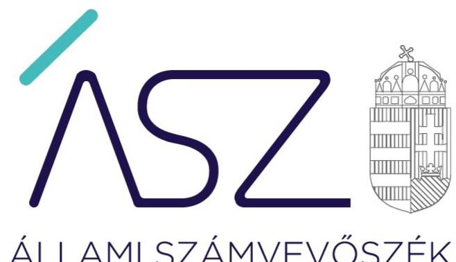
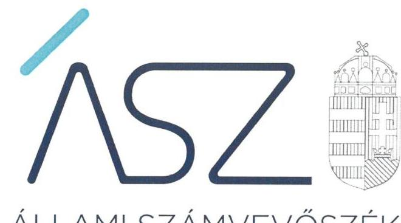

ÁLLAMI SZÁMVEVŐSZÉK

# JELENTÉS 

Az államháztartás központi alrendszere fejezeteinek ellenőrzése

Köztársasági Elnökség
2021.

21084
www.asz.hu

---

ÁLLAMI SZÁMVEVŐSZÉK

# JELENTÉS 

## Az államháztartás központi alrendszere fejezeteinek ellenőrzése

Köztársasági Elnökség
2021. 11. hó 08. nap

21084
www.asz.hu

---

# AZ ELLENŐRZÉST VEZETTE ÉS A VÉGREHAJTÁSÁÉRT FELELŐS: 

SALAMON ILDIKÓ ellenőrzésvezető
SZAPPANOS JÚLIA ellenőrzésvezető
ÁRPÁSI TIBOR ellenőrzésvezető

## A PROGRAM ÖSSZEÁLLÍTÁSÁÉRT FELELŐS:

GÖRGÉNYI GÁBOR ETAMO osztályvezető

## A TÉMÁHOZ KAPCSOLÓDÓ KORÁBBI SZÁMVEVŐSZÉKI JELENTÉSEK:

- címe: Jelentés a Köztársasági Elnökség fejezet müködésének ellenőrzéséről
- sorszáma: 0519

Jelentéseink az Országgyúlés számítógépes hálózatán és az interneten a www.asz.hu címen is olvashatóak.

IKTATÓSZÁM: EL-3416-001/2021.
TÉMASZÁM: 2553
ELLENŐRZÉS-AZONOSÍTÓ SZÁM: V089702

---

# TARTALOMJEGYZÉK 

■ ÖSSZEGZÉS ..... 5
■ AZ ELLENŐRZÉS CÉLJA ..... 6
■ AZ ELLENŐRZÉS TERÜLETE ..... 7
■ AZ ELLENŐRZÉS HÁTTERE, INDOKOLTSÁGA ..... 8
■ A JELENTÉS LÉNYEGES KÉRDÉSKÖREI ..... 9
■ AZ ELLENŐRZÉS HATÓKÖRE ÉS MÓDSZEREI ..... 10
■ MEGÁLLAPÍTÁSOK ..... 12
■ FOGALOMTÁR ..... 15
■ FÜGGELÉK: ÉSZREVÉTELEK ..... 19
■ RÖVIDÍTÉSEK JEGYZÉKE ..... 23

---

.

---

# ÖSSZEGZÉS 

A Köztársasági Elnöki Hivatalnál az irányító szervi és a fejezetet irányító szervi feladatok ellátása a 2017-2019. években összességében szabályszerű volt. A vagyongazdálkodás során érvényesült az elszámoltathatóság a 2017-2019. években.

## Az ellenőrzés társadalmi indokoltsága

Az államháztartási törvénynek megfelelően a központi költségvetés fejezetekre tagolódik. A fejezeteket az éves költségvetési törvény határozza meg. A központi költségvetésben fejezetet alkotnak a minisztériumok, az egyes országos hatáskörű szervei, a költségvetés elszámolásai.

Az ÁSZ ellenőrzi az éves költségvetési törvény végrehajtását, az ellenőrzés során feltárt kockázatok és a terület folyamatos értékelésével beazonosított kockázatok kezelése érdekében ellenőrzi többek között a költségvetési szervek gazdálkodását, múködését, hogy az ellenőrzések megállapításaival támogassa az ellenőrzött szervezetek szabályszerű gazdálkodását, javaslataival elősegítse az Alaptörvényben megfogalmazott alapvetések érvényesülését, a mindennapi életben a szervezetek szintjén. Az ÁSZ megállapításaival elősegíti az ellenőrzöttek közpénzekkel való felelős gazdálkodását.

A Köztársasági Elnökség ellenőrzése reális képet ad az irányítás, a fejezeti irányítás (vezetés), és a fejezethez tartozó központi költségvetési szerv vagyongazdálkodása szabályszerűségéről. Az ellenőrzés megállapításai alapján javulhat a költségvetési fejezetek, a fejezeti kezelésű előirányzat múködésének szabályszerűsége.

## Főbb megállapítások, következtetések

A Köztársasági Elnöki Hivatal vonatkozásában a 2017-2019. években az irányító szervi, a fejezetet irányító szervi jogkörök gyakorlása a jogszabályokkal összhangban történt.

A 2017-2019. években a fejezeti kezelésű előirányzatok felhasználási szabályait kialakították, azonban egy előirányzatot érintően nem a kifizetések szabályszerűségét biztosító hatályos jogszabályi rendelkezésekkel összhangban. Ez felveti a kockázatát, hogy a közcélú felajánlások, adományozások előirányzat terhére történt valamennyi kiadás teljesítésének igazolása - melynek az a célja, hogy a kiadások teljesítésének jogosságát, összegszerűségét, ellenszolgáltatást is magában foglaló kötelezettségvállalás esetében annak teljesítését ellenőrizze és igazolja - nem szabályszerűen történt.

A Köztársasági Elnöki Hivatal a vagyongazdálkodás kereteit a 2017-2019. években - egy szabályozás kivételével szabályszerűen kialakította, ezáltal biztosította a feltételeket a közpénzek szabályszerű kezeléséhez, a beszámoló szabályszerű elkészítéséhez. A kötelezettségvállalókra és a teljesítést igazolókra vonatkozó nyilvántartás naprakészségének, valamint a gazdálkodási jogkörgyakorlók aláírás-mintái nyilvántartásának hiányosságai felvetik a kockázatát annak, hogy egyes kifizetések nem a jogszabályi előírásokkal összhangban történtek.

A vagyongazdálkodás során a Köztársasági Elnöki Hivatal a jogszabályi előírásokat betartotta, amellyel hozzájárult a vagyon megőrzéséhez és az elszámoltathatóság biztosításához.

Az ellenőrzött időszakot követően az Állami Számvevőszék által jelzett területeken intézkedések történtek. A jelzett fejezeti kezelésű előirányzat költségvetési kiadási előirányzatai vonatkozásában a teljesítést igazoló szabályszerű kijelölése megtörtént. A Köztársasági Elnöki Hivatal főigazgatója jelezte továbbá, hogy a kötelezettségvállalókra és a teljesítést igazolókra vonatkozó nyilvántartás szabályszerűsége érdekében intézkedett a vonatkozó belső szabályozás felülvizsgálatára és a nyilvántartás kiegészítésére.

---

# AZ ELLENŐRZÉS CÉLJA 

AZ ELLENŐRZÉS CÉLJA annak megállapítása, hogy a költségvetési fejezeteknél az irányító szervi, a fejezetet irányító szervi és a fejezeti kezelésű előirányzatok feladatainak ellátása, valamint a hatáskörök gyakorlása szabályszerű volt-e, a fejezethez tartozó központi költségvetési szervek vagyongazdálkodása során érvényesült-e az átláthatóság és elszámoltathatóság.

---

# **AZ ELLENŐRZÉS TERÜLETE**

## **Köztársasági Elnökség fejezet, és a fejezetet irányító Köztársasági Elnöki Hivatal**

A központi költségvetés II. fejezete a Köztársasági Elnökség. Az Ávr.1 6. § és az 1. melléklet 2. pontja alapján a központi költségvetés II. fejezeténél irányító szerv, a fejezetet irányító szerv, valamint annak vezetője a Köztársasági Elnöki Hivatal és annak főigazgatója.

A fejezet költségvetési előirányzatai:

1. cím Köztársasági Elnöki Hivatal;
2. cím Fejezeti előirányzatokkal történő feladatellátások.

Célelőirányzatok:

- Állami kitüntetések: Kossuth-díj, Széchenyi-díj adományozása.
- Köztársasági elnök közcélú felajánlásai, adományai.
- Államfoj Protokoll kiadásai: Államfoj diplomáciai feladatokhoz kapcsolódó kiadások.
- Fejezeti tartalék.

A köztársasági elnök jogállásáról és javadalmazásáról szóló 2011. évi CX. törvényben foglaltaknak megfelelően a köztársasági elnököt feladatai ellátása, és hatásköreinek gyakorlása során a Köztársasági Elnöki Hivatal segíti. A Köztársasági Elnöki Hivatal alapítói jogait gyakorló szerve az Országgyűlés. A Köztársasági Elnöki Hivatal Alapító Okiratát és a Szervezeti és Működési Szabályzatát a köztársasági elnök adja ki. Az ellenőrzött időszakban a köztársasági elnök személyében és a főigazgató személyében nem történt változás.

|  A KÖZTÁRSASÁGI ELNÖKI HIVATAL FŐBB GAZDASÁGI MUTATÓI (EZER FT) |  |  |   |
| --- | --- | --- | --- |
|  Megnevezés | 2017 | 2018 | 2019  |
|  Saját tőke | 4 279 367,2 | 4 287 511,8 | 4 188 807,1  |
|  Befektetett eszközök | 4 147 775,6 | 4 124 359,9 | 4 143 023,0  |
|  Mérlegfőösszeg | 4 377 368,3 | 4 404 397,2 | 4 290 193,4  |
|  Költségvetési kiadások | 2 143 710,6 | 2 156 744,7 | 2 495 640,0  |
|  Költségvetési bevételek | 34 289,0 | 10 444,6 | 3 464,4  |
|  Finanszírozási bevételek | 2 243 601,7 | 2 328 427,1 | 2 493 375,6  |

*Forrás: Köztársasági Elnöki Hivatal 2017-2019. évi beszámoló adatai*

---

# AZ ELLENŐRZÉS HÁTTERE, INDOKOLTSÁGA 

Az ÁSZ ${ }^{2}$ ellenőrzi az éves költségvetési törvény végrehajtását, az ellenőrzés során feltárt kockázatok és a terület folyamatos értékelésével beazonosított kockázatok kezelése érdekében ellenőrzi többek között a költségvetési szervek gazdálkodását, működését, hogy az ellenőrzések megállapításaival támogassa az ellenőrzött szervezetek szabályszerű gazdálkodását, javaslataival elősegítse az Alaptörvényben megfogalmazott alapvetések érvényesülését a mindennapi életben a szervezetek szintjén. Az ÁSZ megállapításaival elősegíti az ellenőrzöttek közpénzekkel való felelős gazdálkodását.

Az államháztartás központi alrendszerébe tartozó szervezetek alapvető rendeltetése a társadalom javát szolgáló közfeladatok ellátásának hatékony, számon kérhető biztosítása. A közpénzek felhasználásában jelentős arányt képviselnek a központi költségvetés fejezetei és a fejezetekhez tartozó költségvetési szervek, amelyek gazdálkodásuk révén meghatározó hatást gyakorolhatnak a költségvetés egyensúlyának fenntartására.

Az államháztartás központi alrendszerébe tartozó szervezet vagyona a nemzeti vagyon része. A központi költségvetés II. fejezete a Köztársasági Elnökség, amely fejezetnek az ellenőrzése reális képet adhat a fejezet múködésének irányítottságáról, a költségvetési szerv vagyongazdálkodásának szabályszerűségéről.

---

# A JELENTÉS LÉNYEGES KÉRDÉSKÖREI 

1. Az irányító szerv, valamint a fejezetet irányító szerv feladat- és hatáskört ellátó vezetője, e hatáskör gyakorlása során betar-totta-e a jogszabályi és belső előírásokat?
2. A fejezethez tartozó központi költségvetési szerv a vagyongazdálkodása során betartotta-e a jogszabályi előírásokat?

---

# AZ ELLENŐRZÉS HATÓKÖRE ÉS MÓDSZEREI 

## Az ellenőrzés típusa

Megfelelőségi ellenőrzés.

## Az ellenőrzött időszak

A 2017-2019. évek

## Az ellenőrzés tárgya

A költségvetési fejezetek irányítási, fejezeti irányítási feladat- és hatáskör gyakorlásának, valamint a hozzá tartozó központi költségvetési szervek vagyongazdálkodásának és a fejezeti kezelésű előirányzatok ellenőrzése.
Az ellenőrzés kiterjedt minden olyan körülményre és adatra, amely az ÁSZ jogszabályban meghatározott feladatainak teljesítéséhez, valamint a program végrehajtása folyamán felmerült újabb összefüggések feltárásához szükséges volt.

## Az ellenőrzött szervezet

Köztársasági Elnöki Hivatal

## Az ellenőrzés jogalapja

Az ellenőrzés jogszabályi alapját az ÁSZ tv. ${ }^{3} 1$. § (3) bekezdése, 5. § (2)-(4) és (6) bekezdései, valamint az Áht. ${ }^{4} 61 . \S$ (2) bekezdésének előírásai képezték.

## Az ellenőrzés módszerei

Az ÁSZ az ellenőrzést az Ellenőrzési program szempontjai, az ellenőrzött időszakban hatályos jogszabályok, az ellenőrzés szakmai szabályai, a jelen ellenőrzésre irányadó ÁSZ módszertanok figyelembevételével végzi.

Az ÁSZ az ellenőrzés ideje alatt az ellenőrzött szervezettel történő kapcsolattartást az ÁSZ SZMSZ5-ének vonatkozó előírásai alapján biztosítja.

Az ellenőrzési kérdések megválaszolásához szükséges bizonyítékok megszerzése az ellenőrzött szervezet által rendelkezésre bocsátott dokumentumokra, adatokra alapozva megfigyelés, szemle (szemrevételezés), kérdésfeltevés (információkérés), valamint elemző eljárás útján történik.

---

Az ellenőrzési bizonyítékként felhasználható adatforrások közé tartoznak egyrészt az ellenőrzési program részletes szempontjainál felsorolt adatforrások, másrészt minden egyéb - az ellenőrzés folyamán feltárt, az ellenőrzés szempontjából információt tartalmazó - dokumentum. Az ellenőrzés lefolytatásához az ellenőrzött szervezet az ÁSZ által kért dokumentumok rendelkezésre bocsátásával szolgáltat adatokat, amelyekről az ellenőrzött szervezet vezetője által tett teljességi és hitelességi nyilatkozatot állít ki. Az így rendelkezésre bocsátott dokumentumok adatok, információk kontrollja az ellenőrzés keretében történik.

A vagyonnövekedések és vagyoncsökkenések esetében egyedi kockázat alapú kiválasztás az elsődleges. Kockázati alapú kiválasztás esetében az eredmények nem kivetíthetőek a teljes sokaságra. Ha nincs a sokaságban kockázatosnak minősített tétel, akkor a mintavétel azokra a legnagyobb értékű tételekre - a lényeges sokaságra - terjed ki, melyek összértéke eléri a teljes sokaság összértékének 50\%-át. Lényeges sokaságon alapuló mintavétel esetében a vizsgált terület „szabályszerű" minősítést kap, ha a minta ellenőrzésének eredménye alapján 95\%-os bizonyossággal a teljes sokaságban az átlagos hibaarány nem haladja meg a 10\%-ot, „nem szabályszerű" minősítést kap, ha nagyobb, mint 10\%. Abban az esetben, ha a lényeges sokaság tekintetében a 10\%-os hibaarányhoz való viszony megítélésének megbízhatósága nem éri el a 95\%-ot, annak elérése érdekében az értékelés további szempontokkal egészül ki, a feltárt hibák értéke is figyelembevételre kerül. Amennyiben a sokaság elemszáma nem haladja meg az előírt minta elemszámot, akkor a sokaság valamennyi elemének tételes ellenőrzésére sor kerül.

---

# 1. Az irányító szerv, valamint a fejezetet irányító szerv feladatés hatáskört ellátó vezetője, e hatáskör gyakorlása során be-tartotta-e a jogszabályi és belső előírásokat? 

Összegző megállapítás

A Köztársasági Elnöki Hivatal irányító szervi, fejezetet irányító szervi jogköreinek ellátása szabályszerű volt a 2017-2019. években.

Az irányító szervi hatáskör ellátása a jogszabályokkal összhangban történt, a Köztársasági Elnöki Hivatal rendelkezett a 2011. évi CX. törvény ${ }^{6}$ 15. § (2) bekezdés, valamint az Alaptörvény ${ }^{7}$ 9. cikk (3) bekezdés m) pontja alapján kiadott Alapító Okirattal ${ }_{1-2}{ }^{8}$.

A 2017-2019. években hatályos alapító okiratok 3.1.1. pontja alapján a Köztársasági Elnöki Hivatal irányító szerve a köztársasági elnök volt, amely nem felelt meg az Ávr. 1. számú melléklet jogszabályi rendelkezésének, amely szerint a központi költségvetés II. fejezeténél az irányítószerv, a fejezetet irányító szerv és annak vezetője a Köztársasági Elnöki Hivatal és annak főigazgatója.

A Köztársasági Elnöki Hivatal, mint fejezetet irányító szerv kontrollkörnyezetének kialakítása a 2017-2019. években szabályszerű volt. A Köztársasági Elnöki Hivatal SZMSZ ${ }_{1-4}{ }^{9}$-ének kiadmányozására a törvényben előírtak szerint került sor. Az SZMSZ ${ }_{1-4}$ az Ávr. előírásainak megfelelően tartalmazta a Köztársasági Elnöki Hivatal szervezeti felépítését és a müködési rendjét, a szervezeti egységeit, ezen belül a gazdasági egység feladatait. A Köztársasági Elnöki Hivatalnál a gazdálkodási feladatokat a főigazgató által kiadmányozott ügyrenddel ${ }_{1-2}{ }^{10}$ rendelkező Gazdasági Igazgatóság látta el. A Gazdálkodási Szabályzat ${ }_{1-5}{ }^{11}$ tartalmazta a Köztársasági Elnöki Hivatal költségvetési előirányzatainak tervezési, jóváhagyási, módosítási és felhasználási szabályait, valamint az Ávr. előírásaival összhangban szabályozta a kötelezettségvállalás és a teljesítésigazolás gyakorlásának módját, a kijelöléssel kapcsolatos belső előírásokat. Az adatszolgáltatási, beszámolási feladatokat a Köztársasági Elnöki Hivatal a Számviteli Politikában ${ }_{1-4}{ }^{12}$ határozta meg.

A 2017-2019. években a fejezeti kezelésű előirányzatok költségvetési kiadási előirányzatai felhasználásának szabályairól ${ }^{13}$ az 5/2016. számú KEH utasítás rendelkezett, amelyet a Köztársasági Elnöki Hivatal főigazgatója az Áht. előírása alapján az államháztartásért felelős miniszter egyetértésével adott ki. A szabályzat hatálya alá tartoztak a köztársasági elnök közcélú felajánlásai, adományai. A 2011. évi CX. törvény 14/A. § (1) bekezdése rögzíti, hogy a köztársasági elnök közcélú felajánlások, adományozások céljából a központi költségvetésről szóló törvényben a Köztársasági Elnökség fejezeten belül, külön soron tervezett - előirányzat feletti rendelkezésre jogosult. A törvény (4) bekezdése rögzíti továbbá, hogy az (1) bekezdés szerinti

---

előirányzat a köztársasági elnök előzetes írásos kötelezettségvállalása alapján a kedvezményezettel kötött külön szerződés nélkül is felhasználható. Az 5/2016. számú KEH utasítás a köztársasági elnök közcélú felajánlásait, adományait érintően úgy rendelkezett, hogy a teljesítés igazolását a Társadalmi Kapcsolatok Igazgatóságának igazgatója végzi. Ezáltal az Ávr. 57. § (4) bekezdésében foglaltak ellenére nem a kötelezettségvállaló jelölte ki írásban a teljesítés igazolására jogosult személyt.

A Köztársasági Elnöki Hivatal, mint fejezetet irányító szerv feladatellátása szabályszerű volt. A 2017-2019. években a Köztársasági Elnöki Hivatal elkészítette a költségvetési szerv elemi költségvetését és a 2017-2019. évekről a költségvetési beszámolókat. A Köztársasági Elnöki Hivatal az ellenőrzött időszakban az Áht.-ben foglaltak szerint a fejezetre megállapított tervezett kiadási főösszeg megtartásával tervezte meg - és egyeztette le az államháztartásért felelős miniszterrel - a fejezeti kezelésű előirányzat tervezett bevételeinek és kiadásainak összegét. Elkészítette továbbá az Áhsz. ${ }^{14}$ előírása szerint a 2017-2019.évekre vonatkozóan az általa kezelt fejezeti kezelésű előirányzatok vonatkozásában az éves költségvetési beszámolókat.

A főigazgató a 2017-2019. évekre vonatkozóan a Bkr. ${ }^{15}$ 11. § (1) bekezdésében előírt 1. számú melléklet szerint nyilatkozatban értékelte a Köztársasági Elnöki Hivatal belső kontrollrendszerének minőségét.

# 2. A fejezethez tartozó központi költségvetési szerv a vagyongazdálkodása során betartotta-e a jogszabályi előírásokat? 

Összegző megállapítás

A 2017-2019.években a Köztársasági Elnöki Hivatal vagyongazdálkodása szabályozásának kialakítása szabályszerű volt, a vagyongazdálkodás során betartotta a jogszabályi előírásokat.

A fejezethez tartozó központi költségvetési szerv, a Köztársasági Elnöki Hivatal a 2017-2019. évekről készített éves költségvetési beszámolóit szabályszerűen vezetett részletező nyilvántartásokkal támasztotta alá az immateriális javak, a tárgyi eszközök, a készletek, a követelések, a pénzeszközök és a sajátos elszámolások vonatkozásában. A 2017-2019. évekről készített beszámolóit leltárral támasztotta alá.

A vagyonértékesítés során az Nvtv. ${ }^{16}$ és a Számv. tv. ${ }^{17}$ előírásait betartották. A beruházások, felújítások végrehajtása szabályszerű volt, a kötelezettségvállalás és a szakmai teljesítésigazolás szabályszerűen történt.

A 2017-2019. években a Köztársasági Elnöki Hivatalnak az Ávr. 60. § (3) bekezdése szerinti, a kötelezettségvállalókra és a teljesítést igazolókra vonatkozóan vezetett nyilvántartása nem volt naprakész, mert olyan gazdálkodási jogkör (kötelezettségvállalás) ellátását is rögzítette, amely vonatkozásában az adott személy aláírása a gazdálkodás szabályairól szóló 8/2014. (III. 31.) KEH utasítás 6. b. számú melléklete szerinti Hirdetményben az aláírás-minták között nem szerepelt. Továbbá a Hirdetmény „pénzeszköz" tekintetében rögzítette a gazdálkodási jogkörök ellátására jogosult személyeket, ugyanakkor a Hirdetmény 2015. szeptember 22-étől érvényes kiegészítései a gazdálkodási jogkörgyakorlók (teljesítést igazolók) aláírás-mintáit kizárólag a házipénztár vonatkozásában tartalmazták.

---

A Köztársasági Elnöki Hivatal az ellenőrzött időszakban rendelkezett a Számv. tv. előírása szerint Számviteli politikával, Eszközök és források leltározásának és leltárkészítési rendjének szabályzatával ${ }^{18}{ }_{1-2}$, Eszközök és források minősítési és értékelési szabályzatával ${ }^{19}{ }_{1-2}$ és Pénz- és értékkezelési szabályzattal ${ }^{20}$.

---

# FOGALOMTÁR 

állami vagyon
fejezetet irányító szerv
fejezeti kezelésű előirányzatok
hasznosítás

Állami vagyonnak minősül:
a) az állam tulajdonában lévő dolog, valamint a dolog módjára hasznosítható természeti erő,
b) az a) pont hatálya alá nem tartozó mindazon vagyon, amely vonatkozásában törvény az állam kizárólagos tulajdonjogát nevesíti,
c) az állam tulajdonában lévő tagsági jogviszonyt megtestesítő értékpapír, illetve az államot megillető egyéb társasági részesedés,
d) az államot megillető olyan immateriális, vagyoni értékkel rendelkező jogosultság, amelyet jogszabály vagyoni értékű jogként nevesít.
e) az állam tulajdonában lévő pénzügyi eszközök (Forrás: Vtv. ${ }^{21}$ 1. § (2) bekezdés)
A fejezetet Irányító szerv látja el a fejezeti kezelésű előirányzatokhoz kapcsolódó tervezési, gazdálkodási, ellenőrzési, adatszolgáltatási és beszámolási feladatokat. A fejezetet irányító szerveket az Ávr. 1. sz. melléklete határozza meg. (Forrás: Áht. 6/B. § (1) bekezdés, Ávr. 6. §)
A fejezeti kezelésű előirányzatok a fejezetet irányító szerv sajátos szakmai, ágazati feladatai ellátása vagy az államnak a fejezethez tartozó költségvetési szervek tevékenységével kapcsolatban felmerülő, illetve szakmailag ahhoz kapcsolódó sajátos kötelezettségei teljesítése során felmerülő költségvetési bevételek és költségvetési kiadások elszámolására szolgálnak. (Forrás: Áht. 6/A. § (3) bekezdés)
A fejezeti kezelésű előirányzatok fejezetenként egy címet alkotnak. (Forrás: Áht. 15. § (3) bekezdés)
A fejezeti kezelésű előirányzatok jogi személyiséggel nem bírnak, munkáltatóként munkaerőt nem foglalkoztathatnak, saját tulajdonnal nem rendelkezhetnek. (Forrás: Ávr. 1/A. §)
az állami vagyon bármely - a tulajdonjog átruházását nem eredményező - módon, jogcímen történő átadása, átengedése, ide nem értve a haszonélvezeti jog létesítését, valamint a vagyonkezelésbe adást (Forrás: Vtvr. ${ }^{22}$ 1. § (7) bekezdés e) pont, hatályos 2012. január 1-jétől)

---

irányítási hatáskörök
a) a költségvetési szerv alapítása, átalakítása és megszüntetése, ideértve az alapító okirat és annak módosítása, valamint a megszüntető okirat kiadására vonatkozó hatáskör (a továbbiakban együtt: alapítói jogok) gyakorlását,
b) a költségvetési szerv szervezeti és múködési szabályzatának jóváhagyása,
c) a költségvetési szerv vezetésére kinevezés vagy megbízás adása, a költségvetési szerv vezetőjének felmentése vagy a vezetői megbízás visszavonása, és - ha törvény vagy kormányrendelet másként nem rendelkezik - a költségvetési szerv vezetőjével kapcsolatos egyéb munkáltatói jogok gyakorlása,
d) a költségvetési szerv gazdasági vezetőjének kinevezése vagy megbízása, felmentése vagy megbízásának visszavonása,
e) a költségvetési szerv tevékenységének törvényességi, szakszerűségi és hatékonysági ellenőrzése,
f) a költségvetési szerv döntésének megsemmisítése, szükség szerint új eljárás lefolytatására való utasítás,
g) jogszabályban meghatározott esetekben a költségvetési szerv döntéseinek előzetes vagy utólagos jóváhagyása,
h) egyedi utasítás kiadása feladat elvégzésére vagy mulasztás pótlására,
i) jelentéstételre vagy beszámolóra való kötelezés, és
j) a költségvetési szerv kezelésében lévő közérdekű adatok és közérdekből nyilvános adatok, valamint a c)-i) pont szerinti irányítási hatáskörök gyakorlásához szükséges, törvényben meghatározott személyes adatok kezelése.
(Forrás: Áht. 9. §)
irányító szerv
kezelő szerv
költségvetési szerv felügyelete
vagyongazdálkodás
a költségvetési szerv tekintetében az e törvényben meghatározott irányítási hatáskört gyakorló szerv (Forrás: Áht. 1. § 9. pontja)
A fejezeti kezelésű előirányzat esetében jogszabály a fejezetet irányító szerv (1) bekezdésben meghatározott feladatai ellátására - a tervezéssel, az előirányzatok módosításával, átcsoportosításával és az éves költségvetési beszámoló jóváhagyásával kapcsolatos feladatok kivételével - kezelő szervet jelölhet ki. (Forrás: Áht. 6/B. § (3) bek.)
A fejezeti kezelésű előirányzatokhoz kapcsolódó tervezési, gazdálkodási, ellenőrzési, adatszolgáltatási és beszámolási feladatokat a fejezetet irányító szerv látja el. (Forrás: Áht. 6/B. § (1) bek.)
ha jogszabály költségvetési szerv felügyeletét említi, azon
a) - ha törvény eltérően nem rendelkezik - az Áht. 9. § b)-d) pontjában,
b) a 9. § e) pontjában, és
c) - kizárólag az a) és b) ponttal összefüggésben - a 9. § i) és j) pontjában meghatározott hatáskörök együttesét kell érteni. (Forrás: Áht. 9/B. §
A nemzeti vagyongazdálkodás feladata a nemzeti vagyon rendeltetésének megfelelő, az állam, az önkormányzat mindenkori teherbíró képességéhez igazodó, elsődlegesen a közfeladatok ellátásához és a mindenkori társadalmi szükségletek kielégítéséhez szükséges, egységes elveken alapuló, átlátható, hatékony és költségtakarékos múködtetése, értékének megőrzése, állagának védelme, értéknövelő használata, hasznosítása, gyarapítása, továbbá az állam vagy a helyi önkormányzat feladatának ellátása szempontjából feleslegessé váló vagyontárgyak elidegenítése. (Forrás: Nvtv. 7. § (2) bekezdése)

---

nemzeti vagyon
tulajdonosi joggyakorló
vagyongazdálkodás
a) az állam vagy a helyi önkormányzat kizárólagos tulajdonában álló dolgok,
b) az a) pont hatálya alá nem tartozó, az állam vagy a helyi önkormányzat tulajdonában lévő dolog,
c) az állam vagy a helyi önkormányzat tulajdonában lévő pénzügyi eszközök, továbbá az államot vagy a helyi önkormányzatot megillető társasági részesedések,
d) az államot vagy a helyi önkormányzatot megillető bármely vagyoni értékkel rendelkező jogosultság, amelyet jogszabály vagyoni értékű jogként nevesít,
e) Magyarország határa által körbezárt terület feletti légtér,
f) az üvegházhatású gázok kibocsátási egységeinek kereskedelméről szóló törvény szerinti kibocsátási egység és légiközlekedési kibocsátási egység, valamint az ENSZ Éghajlatváltozási Keretegyezménye és annak Kiotói Jegyzőkönyve végrehajtási keretrendszeréről szóló törvény szerinti kiotói egység,
g) állami vagy helyi önkormányzati fenntartású közgyűjtemény (muzeális intézmény, levéltár, közgyűjteményként működő kép- és hangarchívum, valamint könyvtár) saját gyűjteményében nyilvántartott kulturális javak körébe tartozó dolog, kivéve, ha az állami vagy önkormányzati tulajdon jogszerű létrejötte kétséget kizáró módon nem bizonyítható és a dologra nézve más a tulajdonjogát bizonyítja vagy a kulturális javakra vonatkozó jogszabályokban meghatározott eljárás keretében valószínűsíti,
h) a régészeti lelet,
i) a nemzeti adatvagyon körébe tartozó állami nyilvántartások fokozottabb védelméről szóló törvény szerinti nemzeti adatvagyon (Forrás: Nvtv. 2. § (2) bekezdés a)-i) pontok).
Aki a nemzeti vagyon felett az államot vagy a helyi önkormányzatot megillető tulajdonosi jogok és kötelezettségek összességének gyakorlására jogosult. (Forrás: Nvtv. 3. § (1) bekezdés 17. pontja)
A nemzeti vagyongazdálkodás feladata a nemzeti vagyon rendeltetésének megfelelő, az állam, az önkormányzat mindenkori teherbíró képességéhez igazodó, elsődlegesen a közfeladatok ellátásához és a mindenkori társadalmi szükségletek kielégítéséhez szükséges, egységes elveken alapuló, átlátható, hatékony és költségtakarékos működtetése, értékének megőrzése, állagának védelme, értéknövelő használata, hasznosítása, gyarapítása, továbbá az állam vagy a helyi önkormányzat feladatának ellátása szempontjából feleslegessé váló vagyontárgyak elidegenítése. (Forrás: Nvtv. 7. § (2) bekezdése)

---

.

---

# FÜGGELÉK: ÉSZREVÉTELEK 

A jelentéstervezetet a Számvevőszék 15 napos észrevételezésre megküldte az ellenőrzött szervezet vezetőjének az ÁSZ tv. 29. §* (1) bekezdése előírásának megfelelően.

A Köztársasági Elnöki Hivatal föigazgatója az ellenőrzés megállapításaira észrevételt tett. Az ÁSZ tv. 29. § (3) bekezdésével összhangban az ÁSZ a Függelékben feltünteti az ellenőrzés megállapításaival kapcsolatban tett, figyelembe nem vett észrevételeket, és megindokolja, hogy azokat miért nem fogadta el.

[^0]
[^0]:    ** 29. § (1) Az Állami Számvevőszék az ellenőrzési megállapításait megküldi az ellenőrzött szervezet vezetőjének vagy az általa megbízott személynek, és annak, akinek személyes felelősségét állapította meg.
    (2) Az ellenőrzött szervezet vezetője és a felelősként megjelölt személy az ellenőrzés megállapításaira tizenöt napon belül írásban észrevételt tehet.
    (3) Az Állami Számvevőszék az észrevételre a beérkezésétől számított harminc napon belül írásban válaszol. A figyelembe nem vett észrevételeket köteles a jelentésben feltüntetni, és megindokolni, hogy azokat miért nem fogadta el.

---

Az ellenőrzés megállapításaival kapcsolatban a Köztársasági Elnöki Hivatal (továbbiakban: KEH) főigazgatója által 2021. szeptember 23-án-án tett el nem fogadott észrevételek és azok kezelésének indokolása.

# 1. A fejezeti kezelésú előirányzatok felhasználási szabályainak kialakításával kapcsolatos megállapításra tett észrevétel 

A főigazgató észrevétele szerint a teljesítésigazolás szabályozása szabályszerűen történt, a teljesítést igazoló szakmai vezető kijelölésére a Köztársasági Elnöki Hivatal főigazgatója jogosult volt, mivel a Köztársasági Elnök úr által 2017-ben aláírt Alapító Okiratnak - az irányítási jogokat főigazgató részére nevesítő - 3.2. b pontja, valamint szintén a Köztársasági Elnök úr által 2017-ben aláírt SZMSZ-nek - az elnöki adományokkal kapcsolatosan a főigazgatói feladatokat nevesítő - 4.1. (m) pontjának felhatalmazása és a Társadalmi Kapcsolatok Igazgatóságának az elnöki adományokkal kapcsolatos feladatainak kijelölése erre lehetőséget nyújtott.

A megállapításra vonatkozóan a KEH vezetője válaszlevelében végrehajtott intézkedésről számol be, amely szerint a 2020ban kiadott, jelenleg hatályos, a Köztársasági Elnök úr által aláírt SZMSZ kifejezetten nevesíti, hogy a közcélú adományok, felajánlások teljesítésigazolója a Társadalmi Kapcsolatok Igazgatóságának az igazgatója.

A köztársasági elnök jogállásáról és javadalmazásáról szóló 2011. évi CX. törvény 14/A. § (4) bekezdésében meghatározottak szerint a közcélú felajánlások, adományozások céljából - a központi költségvetésről szóló törvényben a Köztársasági Elnökség fejezeten belül, külön soron tervezett - előirányzat a köztársasági elnök előzetes írásos kötelezettségvállalása alapján használható fel. A kifizetések elrendelésére - az Áht. 38. § (1) bekezdésében előírtak alapján - a teljesítés igazolását követően kerülhet sor. Az Ávr. 57. § (4) bekezdése szerint a teljesítés igazolására a kötelezettségvállaló vagy az általa írásban kijelölt személy jogosult.

A KEH ellenőrzött időszakban hatályos Alapító Okirat és szervezeti és múködési szabályzata nem tartalmazott információkat a közcélú felajánlások, adományozások tekintetében a teljesítés igazolásra történő kijelölés vonatkozásában.

Az ÁSZ az ellenőrzéseit - így az éves zárszámadásra vonatkozó ellenőrzést is - a vonatkozó ellenőrzési program szempontjai, az ellenőrzött időszakban hatályos jogszabályok, az ellenőrzés szakmai szabályai, valamint az adott ellenőrzésre irányadó ÁSZ módszertanok figyelembevételével végzi. Az ellenőrzések esetében az adatbekérés során határidőben az ellenőrzés rendelkezésére bocsátott, teljességi és hitelességi nyilatkozatban feltüntetett, hatályos és hiteles dokumentumokat veszi figyelembe. Ebből következően az ellenőrzési megállapítások is az adott ellenőrzésre vonatkoznak, valamint az ÁSZ ellenőrzési tevékenysége során minden más szervezettől független.

A hiányosság megszüntetése érdekében az ellenőrzött időszakon túl történt intézkedés - az SZMSZ pontosítása - az ellenőrzött időszakra vonatkozón az ellenőrzési megállapítást nem módosítja, azt megerősíti.
2. A kötelezettségvállalókra és a teljesítést igazolókra vonatkozó nyilvántartás naprakészségével kapcsolatos megállapításra tett észrevétel

A főigazgató észrevétele szerint a KEH Gazdasági Igazgatóság munkatársai a 8/2014. (III.31.) KEH utasítás szerinti Nyilvántartást és a táblázatban iktatószámmal jelzett megbízások listáját naprakészen vezetik. A KEH utasítás alapján hivatalukban kiállításra kerül az ún. Hirdetmény dokumentum is, amely egy belső tájékoztató jellegű aláírásgyűjtemény. A Hirdetmény dokumentum a vizsgált időszakban csak az állandó jellegű megbízások aláírás-mintáit tartalmazta, a szabadságok idejére szóló néhány napos eseti jellegű megbízások csak a Nyilvántartásban kerültek rögzítésre. Az észrevétel szerint továbbá, az ellenőrzés rendelkezésére bocsátott Nyilvántartás pontosan tartalmazza a jogosult nevét és beosztását, a gazdálkodási jogkör típusát és időtartamát, és beazonosíthatóan megnevezi a jogosultságot eredeztető - a jogosult aláírását is tartalmazó - megbízást, annak pontos iktatószámával.

Az ÁSZ az EL-3116-001/2021. iktatószámú levele 2. számú mellékletében kérte be a kötelezettségvállalásra és teljesítés igazolására jogosult személyekről és aláírásmintájukról vezetett, az Ávr. 60. § (3) bekezdése szerinti nyilvántartást.

A KEH a 2021. március 12-i keltezésű teljességi és hitelességi nyilatkozattal - amelyben az átadott dokumentumok, adatok megbízhatóságáról és teljes körűségéről nyilatkozott - a „KEH_6_ÁSZ_2017_nyilvánt gazd. jogkör.pdf, a KEH_6_ÁSZ_2018_nyilvánt gazd. jogkör.pdf, a KEH_6_ÁSZ_2019_nyilvánt gazd. jogkör.pdf (továbbiakban: Nyilvántartás dokumentumok), a KEH_6_Hirdetmény_2017.pdf, a KEH_6_Hirdetmény_2018.pdf és a KEH_6_Hirdetmény_2019.pdf (továbbiakban: Hirdetmény dokumentumok)" elnevezésű dokumentumokat adta át. Az Állami Számvevőszék ellenőrzési

---

megállapításait az ellenőrzési adatbekérés során határidőben átadott, a teljességi és hitelességi nyilatkozatban feltüntetett, hiteles dokumentumok alapján tette meg.

Az ellenőrzés rendelkezésére bocsátott, a 2017-2019. évekre vonatkozó Nyilvántartás és Hirdetmény dokumentumok ismételt felülvizsgálata során megállapítottuk, hogy azok tartalma - amelyet a főigazgató észrevétele is megerősít - a kijelölések vonatkozásában eltért. Megállapítottuk továbbá, hogy a Nyilvántartás dokumentumok nem tartalmazták a kijelölt személyek aláírás-mintáit, csak megnevezték a jogosultságot eredeztető - főigazgató észrevétele alapján a jogosult aláírását is tartalmazó - megbízások dokumentumait. A jogosultak aláírását is tartalmazó megbízások dokumentumait az adatszolgáltatás keretében nem bocsátották az ellenőrzés rendelkezésére, így aláírás-mintákat csak a - Nyilvántartás dokumentumokkal nem megegyező tartalmú - Hirdetmény dokumentumok tartalmaztak. A jelentéstervezet megállapítása, miszerint a kötelezettségvállalókra és a teljesítést igazolókra vonatkozó nyilvántartás naprakészségének, valamint a gazdálkodási jogkörgyakorlók aláírás-mintái nyilvántartásának hiányosságai felvetik a kockázatát annak, hogy egyes kifizetések nem a jogszabályi előírásokkal összhangban történtek, helytálló.

A fentiek következtében az ellenőrzési megállapítások dokumentumokkal alátámasztottak, a kapcsolódó következtetések okszerűek és megalapozottak. Ebben felhívtuk a figyelmet a kötelezettségvállalókra és a teljesítést igazolókra vonatkozó kétféle nyilvántartás hiányosságaiból eredő kockázatokra.

A fentiekre tekintettel az ellenőrzés megállapítása megalapozott, a jelentéstervezet módosítása nem indokolt.

# 3. A 2017-2019. években hatályos alapító okiratokkal kapcsolatos megállapításra tett észrevétel 

A főigazgató észrevétele szerint az elmúlt években többször jelezték az ÁSZ felé, hogy az irányítói jogosultságok a KEH és a fejezet tekintetében az Alaptörvény és a jogszabályi rendelkezések miatt csakis a megfelelő sajátosságokat figyelembe véve értelmezendők. Megnyugtatónak tartja, hogy a jelentéstervezet visszaigazolta a korábbi álláspontjukat, miszerint a köztársasági elnöknek az ún. jogállási törvényben nevesített irányítói jogkörei mellett az irányítói jogköröket az Ávr.-rel összhangban a KEH főigazgatója gyakorolja. A megállapításra vonatkozóan a főigazgató a levelében végrehajtott intézkedésről számolt be, amely szerint a 2020. évben módosított Alapító Okiratban a köztársasági elnök a megosztott irányítási jogkört már úgy szabályozta, hogy az Alapító Okirat 3.1.1. pontjában a KEH-t nevezte meg irányító szervként, míg fenntartotta a 3.2. pontban annak részletezését, hogy mely konkrét irányítási jogköröket gyakorol közvetlenül a köztársasági elnök és mely irányítási jogköröket a főigazgató.

A főigazgató nem vitatta a 2017-2019. években hatályos alapító okiratokkal kapcsolatos megállapítást, amely szerint azok 3.1.1. pontja ellentétes az Ávr. 1. számú melléklet jogszabályi rendelkezésével, hanem azt magyarázta. Észrevételében tájékoztatott az ellenőrzött időszakot követően megtett intézkedésről, amely szerint a 2020-ban kiadott alapító okirat megfelel a hivatkozott jogszabályi rendelkezésének. Ez megerősítette a jelentéstervezet kapcsolódó megállapítását az ellenőrzött időszak vonatkozásában.

A fentiekre tekintettel az ellenőrzés megállapítása megalapozott, a jelentéstervezet módosítása nem indokolt.

---

.

---

# RÖVIDÍTÉSEK JEGYZÉKE 

${ }^{1}$ Ávr.
${ }^{2}$ ÁsZ
${ }^{3}$ ÁsZ tv.
${ }^{4}$ Áht.
${ }^{5}$ ÁsZ SZMSZ
${ }^{6}$ 2011. évi CX. törvény
${ }^{7}$ Alaptörvény
${ }^{8}$ Alapító Okirat ${ }_{1-2}$
${ }^{9}$ SZMSZ $_{1-4}$
${ }^{10}$ Gazdasági Igazgatóság ügyrendje ${ }_{1-2}$
${ }^{11}$ Gazdálkodási Szabályzat ${ }_{1-5}$
${ }^{12}$ Számviteli Politika $_{1-4}$
${ }^{13}$ A fejezeti kezelésű előirányzatok költségvetési kiadási előirányzatai felhasználásának szabályzata
${ }^{14}$ Áhsz.
${ }^{15}$ Bkr.
${ }^{16}$ Nvtv.
${ }^{17}$ Számv. tv.
${ }^{18}$ Eszközök és források leltározásának és leltárkészítési rendjének szabályzata ${ }_{1-2}$
${ }^{19}$ Eszközök és források minősítési és értékelési szabályzata ${ }_{1-3}$
${ }^{20}$ Pénz- és értékkezelési szabályzat
${ }^{21}$ Vtv.
${ }^{22}$ Vtvr.

368/2011. (XII. 31.) Korm. rendelet az államháztartásról szóló törvény végrehajtásáról Állami Számvevőszék
2011. évi LXVI. törvény az Állami Számvevőszékről (hatályos 2011. július 1-jétől)
2011. évi CXCV. törvény az államháztartásról (hatályos: 2011. december 31-től) az Állami Számvevőszék elnökének ÁSZ utasítása az Állami Számvevőszék Szervezeti és Múködési Szabályzatáról
a köztársasági elnök jogállásáról és javadalmazásáról
Magyarország Alaptörvénye (2011. április 25.)
Köztársasági Elnöki Hivatal Alapító Okirata ${ }_{1}$ (hatályos: 2015. január 1. napjától 2017. május 10. napjáig); Köztársasági Elnöki Hivatal Alapító Okirata ${ }_{2}$ (hatályos: 2017. május 11. napjától)
Köztársasági Elnöki Hivatal SZMSZ ${ }_{1}$ (hatályos: 2015. január 1-től 2017. május 10-ig), Köztársasági Elnöki Hivatal SZMSZ ${ }_{2}$ (hatályos: 2017. május 11-től 2018. július 4-ig), Köztársasági Elnöki Hivatal SZMSZ ${ }_{3}$ (hatályos: 2018. július 5-től 2019. február 10-ig), Köztársasági Elnöki Hivatal SZMSZ ${ }_{4}$ (hatályos: 2019. február 11-től)
Köztársasági Elnöki Hivatal Gazdasági Igazgatóság ügyrendje ${ }_{3}$ (hatályos: 2012. július 25-től 2017. október 19-ig.); Köztársasági Elnöki Hivatal Gazdasági Igazgatóság ügyrendje ${ }_{2}$ (hatályos: 2017. október 20-tól)
8/2014. (III. 31.) KEH utasítás a gazdálkodás szabályairól Gazdálkodási Szabályzat ${ }_{1}$ (Kiterjed a KE és a KEH valamennyi gazdálkodással kapcsolatos tevékenységére, hatályos: 2016. október 5-től 2017. szeptember 12-ig); Gazdálkodási Szabályzat ${ }_{2}$ (hatályos: 2017. szeptember 13-tól 2018. január 16-ig); Gazdálkodási Szabályzat ${ }_{3}$ (hatályos: 2018. január 17től 2019. január 29-ig); Gazdálkodási Szabályzat ${ }_{4}$ (hatályos: 2019. január 30-tól 2019. december 17-ig); Gazdálkodási Szabályzat ${ }_{5}$ (hatályos: 2019. december 18-tól)
3/2014. (III. 31.) KEH utasítás a Köztársasági Elnöki Hivatal számviteli politikájáról Számviteli Politika ${ }_{1}$ (hatályos: 2016.november 24-től 2017. december 31-ig); Számviteli Politika ${ }_{2}$ (hatályos: 2018. január 1-től 2018. január 16-ig); Számviteli Politika ${ }_{3}$ (hatályos: 2018. január 17-től 2019. július 2-ig); Számviteli Politika ${ }_{4}$ (hatályos: 2019. június 3-tól)
5/2016. (VI. 07.) KEH utasítás a fejezeti kezelésű előirányzatok költségvetési kiadási előirányzatai felhasználásának szabályairól (hatályos: 2016. június 8-tól)

4/2013. (I. 11.) Korm. rendelet az államháztartás számviteléről
370/2011. (XII. 31.) Korm. rendelet a költségvetési szervek belső kontrollrendszeréről és belső ellenőrzéséről (hatályos 2012. január 1-jétől)
2011. évi CXCVI. törvény a nemzeti vagyonról (hatályos: 2011. december 31-től)
2000. évi C. törvény a számvitelről
16/2016. (XII. 20.) KEH utasítás (2016. december 21-től hatályos) az Eszközök és források leltározásának és leltárkészítési rendjének szabályzata ${ }_{1} ; 14 / 2017$. (X. 19.) KEH utasítás (2018. október 20-tól hatályos) az Eszközök és források leltározásának és leltárkészítési rendjének szabályzata ${ }_{2}$
15/2016. (XII. 16.) KEH utasítás (2016. december 17-től hatályos) az Eszközök és források minősítési és értékelési szabályzata ${ }_{1} ; 11 / 2017$. (IX. 25.) KEH utasítás (2017. október 26-tól hatályos) az Eszközök és források minősítési és értékelési szabályzata ${ }_{2} ; 18 / 2017$. (XII. 20.) KEH utasítás (2018. január 1-től hatályos) az Eszközök és források minősítési és értékelési szabályzata ${ }_{3}$
4/2016. (IV. 14.) KEH utasítás (2016. április 15-től hatályos) a pénz- és értékkezelési szabályzata
2007. évi CVI. törvény az állami vagyonról

254/2007. (X. 4.) Korm. rendelet az állami vagyonnal való gazdálkodásról

---

# ASZ 

ALLAMI SZAMVEVOSZEK
1052 Budapest, Apáczai Cs. J. u. 10. I 1364 Budapest 4. Pf. 54 TEL: +36 14849100
email: szamvevoszek@asz.hu
web: www.asz.hu | www.aszhirportal.hu