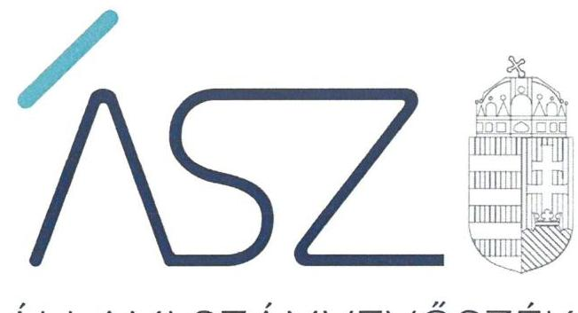
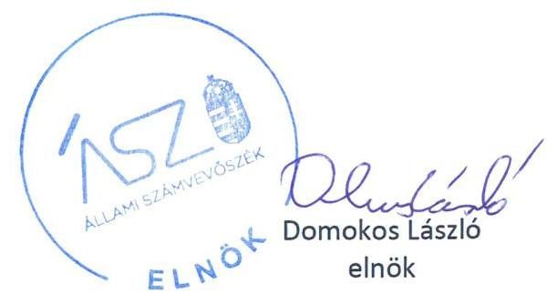
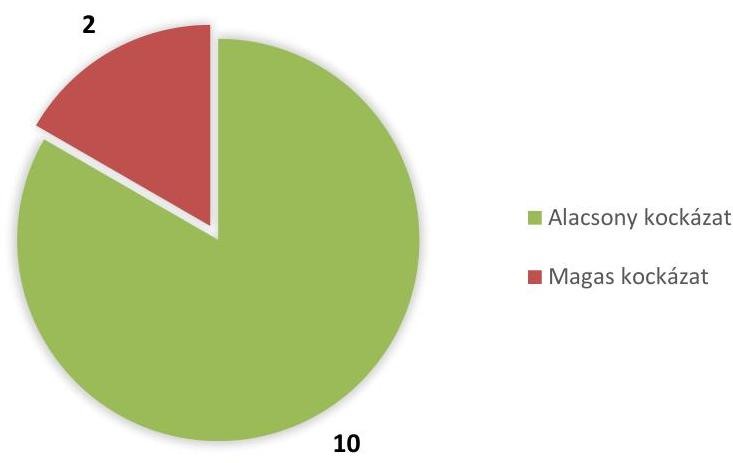
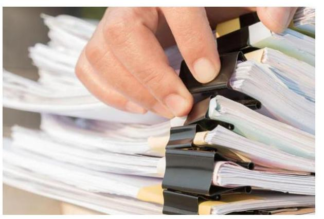

ÁLLAMI SZÁMVEVŐSZÉK

# JELENTÉS 

Nemzeti tulajdonú gazdasági társaságok vagyonellenőrzése

2021. 

21085
www.asz.hu

---

ÁLLAMI SZÁMVEVŐSZÉK

# JELENTÉS

Nemzeti tulajdonú gazdasági társaságok vagyonellenőrzése

2021. 12. hó 02. nap

21085
www.asz.hu

---

# AZ ELLENŐRZÉST FELÜGYELTE: 

MAKKAI MÁRIA felügyeleti vezető

## AZ ELLENŐRZÉST VEZETTE ÉS A VÉGREHAJTÁSÁÉRT FELELŐS:

ÁRPÁSI TIBOR ellenőrzésvezető

## A PROGRAM ÖSSZEÁLLÍTÁSÁÉRT FELELŐS:

FEKETE-NAGY ANDRÁS GÁBOR projektvezető

IKTATÓSZÁM: EL-3427-001/2021

TÉMASZÁM: 2535

ELLENŐRZÉS-AZONOSÍTÓ SZÁM: V0857, V0863

Jelentéseink az Országgyúlés számítógépes hálózatán és az interneten a www.asz.hu címen is olvashatóak.

---

# TARTALOMJEGYZÉK 

■ ÖSSZEGZÉS ..... 5
■ AZ ELLENŐRZÉS CÉLJA ..... 7
■ AZ ELLENŐRZÉS TERÜLETE ..... 8
■ AZ ELLENŐRZÉS HÁTTERE, INDOKOLTSÁGA ..... 9
■ A JELENTÉS LÉNYEGES KÉRDÉSKÖREI ..... 10
■ AZ ELLENŐRZÉS HATÓKÖRE ÉS MÓDSZEREI ..... 11
■ ÉRTÉKELÉSEK ..... 13
■ MELLÉKLETEK ..... 15
I. sz. melléklet: Az ellenőrzött gazdasági társaságok kockázati besorolása 2018. évben ..... 15
II. sz. melléklet: Ellenőrzött szervezetek ..... 17
III. sz. melléklet: Értelmező szótár ..... 18
■ RÖVIDÍTÉSEK JEGYZÉKE ..... 19

---

.

---

# ÖSSZEGZÉS 

Az ellenőrzött tizenhárom gazdasági társaság közül tíz biztositotta a jogszabályi elöírásokkal összhangban, hogy vagyonáról megbizható és hiteles információk álljanak rendelkezésre. Közülük egy társaság az ellenőrzött időszakban a vagyongazdálkodás lényeges területein eleget tett az alapvető jogszabályi követelményeknek, kilenc társaságnál az Állami Számvevőszék felhívására az ellenőrzött időszakot követően csökkentek a vagyongazdálkodási kockázatok. Kettő társaságnál nem intézkedtek a kockázatok csökkentésére, esetükben a feltárt szabálytalanságok kockázatot hordoznak az átlátható és elszámoltatható vagyongazdálkodás, a nemzeti vagyon védelme tekintetében. Egy társaság az ellenőrzött időszakot követően megszünt.

## Az ellenőrzés társadalmi indokoltsága

A nemzeti vagyon kezelésének, védelmének célja a közérdek szolgálata. Ezzel összhangban a társadalom alapvető érdeke a nemzeti vagyonnal való gazdálkodás során a részesedés értékének megőrzése. A nemzeti tulajdonú gazdasági társaságok ellenőrzése kiemelten fontos a nemzeti vagyon megőrzése, megóvása érdekében. Gazdálkodásuk jellemzően a közérdeklődés középpontjában áll, amihez hozzájárul a gazdálkodásuk körébe tartozó - a nemzeti vagyon részét képező - vagyon nagysága. A vezetői teljesítményértékelést érintő ellenőrzések lefolytatása a téma jellege, a vezetőknek a társaság múködése szempontjából meghatározó szerepe és a társadalmi érdeklődés miatt indokolt.

Fontos közérdek, hogy a nemzeti tulajdonban lévő társaságok számviteli törvény szerinti beszámolói a társaság vagyoni, pénzügyi és jövedelmi helyzetéről megbízható és valós képet mutassanak. A beszámolók tulajdonos általi elfogadása igazolja a tulajdonos egyetértését a vagyon számbavételének módjára, illetve a vagyon értékére vonatkozóan.

Az ellenőrzés rámutat a nemzeti tulajdonú gazdasági társaságok számviteli beszámoló készítésével kapcsolatos jó gyakorlatokra, valamint a kockázatok feltárásával támogatást nyújt a gazdasági társaságok számára a beszámolóval kapcsolatos jogszabályi követelmények teljesítéséhez. Erre tekintettel az ÁSZ nem a lényeges területek szabályszerűségére tesz megállapítást, hanem az ellenőrzött szervezetekre vonatkozó gazdálkodási kockázatokat azonosítja.

## Értékelés

Az ellenőrzött időszakra, a 2016-2018- évekre vonatkozóan az Állami Számvevőszék 13 nemzeti tulajdonú gazdasági társaság vagyongazdálkodásának azon lényeges területeit értékelte, amelyek releváns kockázatot jelentenek az ellenőrzött szervezet beszámolója vagyonról nyújtott információinak megbízhatóságára és hitelességére. Az ellenőrzött gazdasági társaságok esetében ilyen lényeges terület volt a beszámolók jóváhagyásához kapcsolódó tulajdonosi joggyakorlói tevékenység, valamint a számviteli törvény szerinti beszámoló mérlegében szereplő adatok megalapozottsága.

Az ellenőrzött időszakot követően a közpénzügyek átláthatóságának, rendezettségének, a vagyonnal való gazdálkodás szabályszerűségének mielőbbi előmozdítása érdekében az Állami Számvevőszék figyelemfelhívó levéllel fordult a gazdasági társaságok vezetői felé, azért, hogy az ellenőrzés folyamatában lépéseket tegyenek a feltárt hiányosságok megszüntetésére.

Az ellenőrzési tapasztalatok, valamint a számvevőszéki figyelemfelhívásokra érkezett válaszok értékelése alapján az ellenőrzött gazdasági társaságok az alábbiak szerint sorolhatók be a vagyonnal való gazdálkodásra vonatkozó kockázat mértéke alapján.

Az ellenőrzött gazdasági társaságok kockázati besorolását az 1. ábra mutatja be.

---

1. ábra

# GAZDASÁGI TÁRSASÁGOK KOCKÁZATI ÉRTÉKELÉSE 

ALACSONY A KOCKÁZAT a vagyonnal való gazdálkodás szabályszerűségére vonatkozóan 10 gazdasági társaságnál.

Közülük egy gazdasági társaságnál ("NAGYERDEI KULTÚRPARK" Közhasznú Nonprofit Korlátolt Felelősségű Társaság) az értékelt lényeges területek alapján az ellenőrzött időszakban biztosított volt a beszámolója vagyonról nyújtott információinak megbízhatósága és hitelessége. A társaság által összeállított számviteli beszámolót a tulajdonosi joggyakorló szabályszerűen elfogadta, a beszámoló mérlegében szereplő adatok leltárral alátámasztottak voltak.

A tíz gazdasági társaságból kilencnél az Állami Számvevőszék felhívására az ellenőrzött időszakot követően csökkentek a vagyongazdálkodási kockázatok. Ezeknél a gazdasági társaságoknál a beszámoló vagyonról nyújtott információinak megbízhatósága és hitelessége akkor biztosítható, ha a számvevőszéki felhívásra válaszul jelzett intézkedések érvényesülnek a gazdasági társaságok vagyongazdálkodásában.

MAGAS A KOCKÁZAT az átlátható és elszámoltatható vagyongazdálkodás tekintetében kettő gazdasági társaságnál. Ezeknél a gazdasági társaságoknál az ellenőrzött időszakot követően sem intézkedtek a feltárt hiányosságok megszüntetése érdekében, ezért a nemzeti vagyon védelmét érintő kockázatok fennmaradtak. Kettő (DEHUSZ Debreceni Humán Szolgáltató Közhasznú Nonprofit Korlátolt Felelősségű Társaság és Debreceni Sportcentrum Közhasznú Nonprofit Korlátolt Felelősségű Társaság) társaság magas kockázatúnak bizonyult a vagyonról nyújtott információk megbízhatóságát és hitelességét illetően, a leltározási szabályzat hiánya, valamint a mérlegtételeket alátámasztó leltár hiányosságai miatt. Leltározási és leltárkészítési szabályzat hiányában nem igazolt a beszámoló mérlegtételei alátámasztási kötelezettségének érvényesítése. Leltár hiányában a számviteli beszámoló nem biztosít valós információkat a tényleges vagyoni, pénzügyi és jövedelmi helyzetről.

A Nemzeti Eszközkezelő Zártkörűen Működő Részvénytársaság vagyongazdálkodása az ellenőrzött időszakban közepes kockázatot hordozott. A társaság az ellenőrzött időszakot követően megszűnt.

Az ellenőrzött gazdasági társaságok vezető tisztségviselőjének vezetői tevékenysége 2018-ban egy társaság esetében hordozott alacsony kockázatot a vagyon megőrzése és védelme tekintetében.

---

# AZ ELLENŐRZÉS CÉLJA 

Az ellenőrzés célja annak értékelése volt, hogy a tulajdonosi joggyakorlói tevékenység biztosította-e a számviteli törvény szerinti beszámoló szabályszerű elfogadását, a társaság számviteli törvény szerinti beszámolója alapján biztosított volt-e, hogy a társaság vagyonáról megbízható és hiteles információk álljanak rendelkezésre. Az ellenőrzés célja volt még a gazdasági társaság vezetője tevékenységében rejlő kockázatok azonosítása az egyes vezetői feladatok ellátásával összhangban.

---

# AZ ELLENŐRZÉS TERÜLETE 

## Nemzeti tulajdonú gazdasági társaságok

A kockázatelemzés alapján ellenőrzésre kijelölt 13 nemzeti tulajdonú gazdasági társaság közül 11 társaság kizárólagos - egy megyei, hat megyei jogú városi, egy fővárosi, három fővárosi kerületi - önkormányzati tulajdonban áll, míg két társaság tulajdonosa a Magyar Állam. Az állami tulajdonú társaságok tulajdonosi jogait a Magyar Nemzeti Vagyonkezelő Zrt., illetve az Emberi Erőforrások Minisztériuma gyakorolja.

Az ellenőrzött társaságok alapvetően az önkormányzatoktól átvállalt közfeladatokat látnak el, ami többek között kiterjed családsegítésre, időskorúak gondozására, környezetvédelemre, közterületek gondozására, a munkaerőpiacon hátrányos helyzetű rétegek képzésének, foglalkoztatásának elősegítésére, sportlétesítmények, szórakoztatópark üzemeltetésére, fiatal tehetséges művészek szakmai kiteljesedésének elősegítésére. Az állami tulajdonú társaságok lakhatási célú ingatlanok hasznosításával, fiatal tehetségek művészeti karrierjének menedzselésével foglalkoznak.

A 13 gazdasági társaságból 12 korlátolt felelősségű társaságként működik, egy pedig zártkörűen működő részvénytársaságként végzi tevékenységét.

A Nemzeti Eszközkezelő Zártkörűen Működő Részvénytársaság lebonyolítói feladatai a 2020. október 31-i megszűnésének időpontjától a Nemzeti Eszközkezelő Programban részt vevő természetes személyek otthonteremtésének biztosításáról szóló 2018. évi CIII. törvény 22/A. § (2) bekezdése alapján a TLA Vagyonkezelő és -hasznosító Kft-re (amely átalakult, 2021. október 1-jétől Maradványvagyon-hasznosító Zrt.) szálltak.

---

# AZ ELLENŐRZÉS HÁTTERE, INDOKOLTSÁGA 

A nemzeti vagyon értékének számbavételekor a gazdasági társaságokban meglévő részesedés értéke meghatározásának kiinduló pontja és leglényegesebb dokumentuma a társaságok számviteli törvény szerinti beszámolója. Ebből a megközelítésből az állam érdeke az, hogy a tulajdonában lévő társaságok számviteli törvény szerinti beszámolói a számvitelről szóló törvény előírásának megfelelően a társaság vagyoni, pénzügyi és jövedelmi helyzetéről megbízható és valós képet mutassanak. A beszámolónak a tulajdonos általi elfogadása igazolja a tulajdonos egyetértését a vagyon számbavételének módjára, illetve a vagyon értékére vonatkozóan.

Az ÁSZ ${ }^{1}$ csoportosan végrehajtott, kockázatokat jelző ellenőrzése hozzájárul a nemzeti vagyon védelméhez. Az ellenőrzés elősegíti, hogy a nemzeti tulajdonú gazdasági társaságok beszámolóit a tulajdonosi joggyakorlók szabályszerűen fogadják el, és a beszámolók megbízható és valós képet mutassanak a társaságok vagyoni, pénzügyi és jövedelmi helyzetéről. Az ellenőrzés rámutat a nemzeti tulajdonú gazdasági társaságok számviteli törvény szerinti beszámoló készítésével kapcsolatos jó gyakorlatokra és szabálytalanságokra is, továbbá felhívja a figyelmet a jogszabályi követelmények teljesítéséhez szükséges feltételek hiányosságaira.

A lényeges dokumentumok alapján végzett ellenőrzések alkalmasak az ellenőrzés időtartamának csökkentésére, az ellenőrzés hatékonyságának növelésére, ezáltal a nemzeti tulajdonú gazdasági társaságok ellenőrzésének nagyobb lefedettségére.

---

# A JELENTÉS LÉNYEGES KÉRDÉSKÖREI 

1.     - A tulajdonosi joggyakorlói tevékenység biztositotta-e a számviteli törvény szerinti beszámoló szabályszerü elfogadását?
2.     - A társaság számviteli törvény szerinti beszámolója alapján biz-tositott-e, hogy a társaság vagyonáról megbizható és hiteles információk álljanak rendelkezésre?
3.     - A társaság vezetőjének tevékenysége megfelelő volt-e?

---

# AZ ELLENŐRZÉS HATÓKÖRE ÉS MÓDSZEREI 

## Az ellenőrzés típusa

Szabályszerűségi ellenőrzés. A vezetői teljesítmény ellenőrzése esetében megfelelőségi ellenőrzés.

## Az ellenőrzött időszak

2016., 2017. és 2018. évek. A vezetői teljesítmény tekintetében az ellenőrzött időszak a 2018. év.

## Az ellenőrzés tárgya

A nemzeti tulajdonban levő gazdasági társaságok számviteli törvény szerinti beszámolója, a beszámoló tulajdonosi joggyakorló általi elfogadása.

A vezetői teljesítmény értékelése. A gazdasági társaság átlátható, szabályszerű, gazdaságos, hatékony, eredményes és felelős gazdálkodása feltételrendszerének kialakítása, a belső kontrollrendszer és humánpolitikai rendszer működtetése. Az integritásszemléletet érvényesítése, illetve a felelős vagyongazdálkodás biztosítása a nemzeti vagyon megőrzése és védelme érdekében.

## Az ellenőrzött szervezet

A kockázati alapon kiválasztott 13 nemzeti tulajdonban lévő gazdasági társaság és tulajdonosi joggyakorlóik a II. melléklet szerint.

## Az ellenőrzés jogalapja

Az ÁSZ. tv. ${ }^{2}$ 1. § (3), 5. § (3)-(5) bekezdése képezték.

## Az ellenőrzés módszerei

Az ellenőrzést az ellenőrzési program szempontjai, az ellenőrzött időszakban hatályos jogszabályok, a jelen ellenőrzésre irányadó ÁSZ módszertan figyelembevételével és a nemzetközi standardokat irányadónak tekintve végezte az ÁSZ.

Az ellenőrzési kérdések megválaszolásához szükséges bizonyítékok megszerzése a következő ellenőrzési eljárások alkalmazásával történt: megfigyelés, összehasonlítás, elemző eljárás. Az ellenőrzési bizonyítékként

---

felhasználható adatforrások közé tartoztak az ellenőrzési programban felsorolt adatforrások, továbbá minden - az ellenőrzés folyamán - feltárt, az ellenőrzés szempontjából információkat tartalmazó dokumentum.

Az ellenőrzés a kérdésekre adott válaszok kiértékelésével, valamint a megjelölt adatforrások felhasználásával, továbbá az adott időszakban hatályos jogszabályok figyelembevételével folytatta le az ÁSZ.

A kockázatértékelésen alapuló ellenőrzés a gazdasági társaságok vagyongazdálkodásának lényeges területeire terjedt ki, és súlypontok meghatározásával lehetőséget biztosított a kockázatok beazonosítására.

A kockázati területek értékelése alapján kerültek besorolásra az egyes gazdasági társaságok alacsony, közepes vagy magas kockázatú kategóriákba.

A lényeges dokumentumok alapján végzett ellenőrzés kiterjedt a számviteli törvény szerinti beszámoló tulajdonosi joggyakorló által történő elfogadására, valamint a számviteli törvény szerinti beszámoló alapján a társaság vagyonáról rendelkezésre álló információk értékelésére.

A gazdasági társaságok vezetői számára figyelemfelhívó levél került megküldésre a 2018. évre vonatkozó szabálytalanságokról, az ÁSZ tv. előírásával összhangban 15 nap állt rendelkezésükre az ebben foglaltak elbírálására, valamint a megfelelő intézkedések meghozatalára.

Az ellenőrzött társaságok vezetői által a figyelemfelhívó levélre adott válaszok alapján az ÁSZ értékelte a 2018. évre vonatkozóan feltárt hiányosságok kezelését. Amennyiben az ellenőrzött társaságok vezetői intézkedéseket fogalmaztak meg a hiányosság megszűntetése érdekében az ÁSZ a vagyongazdálkodás lényeges területein korábban fennálló kockázatokat úgy értékelte, hogy azokat csökkentették.

2018-ra vonatkozóan a vezetői teljesítmény ellenőrzési szempontjait a szabályszerűségi szempontok szerinti ellenőrzésben a jogszabályi előírások, belső utasítások, belső szabályozók, a tulajdonosi joggyakorlók elvárásai, előírásai, a helyénvalósági szempontok szerinti ellenőrzésben az ÁSZ által általánosan elfogadott, jó gyakorlat szerinti ajánlásai, értékelési kritériumai mentén kerültek meghatározásra. Az ellenőrzési kérdések szerint az összesített értékelés alapján az elért pontok az elérhető pontok minimum 70\%-át elérve, a társaság vezetője tevékenységét megfelelőnek, 70\% alatt nem megfelelőnek tekintette az ÁSZ.

Amennyiben a gazdasági társaság múködését és gazdálkodását alapvetően meghatározó dokumentum hiánya miatt, valamely lényeges kérdéskörre vonatkozóan az ÁSZ megállapítást tett, további ellenőrzési tevékenységek az adott kérdéskörrel és az azzal szoros logikai kapcsolatban lévő kérdéskörökkel - ráépülő jelleggel - nem kerültek végrehajtásra.

---

# 1. A tulajdonosi joggyakorlói tevékenység biztosította-e a számviteli törvény szerinti beszámoló szabályszerű elfogadását? 

Összegző értékelés

A tulajdonosi joggyakorlói tevékenység a 2016-2017. években
tizenkét, 2018. évben mind a tizenhárom gazdasági társaságnál biztosította a számviteli törvény szerinti beszámoló szabályszerű elfogadását.

A TULAJDONOSI JOGGYAKORLÓI tevékenységben rejlő kockázatok meghatározása során a számviteli beszámoló elfogadásának szabályszerűségét biztosító dokumentumok - elfogadó határozat, könyvvizsgálói jelentés, felügyelő bizottság jelentése - lényeges dokumentumnak minősülnek. A számviteli beszámolót elfogadó határozat hiánya esetében magas a kockázata annak, hogy a tulajdonosi joggyakorlás nem tölti be a szerepét, a gazdasági társaság nem rendelkezik jóváhagyott számviteli beszámolóval.

A tulajdonosi joggyakorlói tevékenység 2016-2017-ben 12 ellenőrzött társaság, 2018-ban mind a 13 társaság esetében alacsony kockázatokat hordozott. A tulajdonosi joggyakorlás az érintett társaságoknál betöltötte szerepét, a társaságok rendelkeztek jóváhagyott számviteli beszámolóval.

Egy-egy gazdasági társaságnál 2016-ban és 2017-ben magas kockázatot jelentett, hogy nem rendelkeztek a tulajdonosi joggyakorló számviteli beszámolót jóváhagyó határozatával.

## 2. A társaság számviteli törvény szerinti beszámolója alapján biz-tosított-e, hogy a társaság vagyonáról megbízható és hiteles információk álljanak rendelkezésre?

Összegző értékelés

A számviteli beszámoló alapján a 2016-2018. években egy gazdasági társaságnál biztosított, 12 esetében nem volt biztosított, hogy a vagyonról megbízható és hiteles információk álljanak rendelkezésre.

A VAGYONGAZDÁLKODÁS SZABÁLYOZOTTSÁGA alapvető követelmény a számviteli beszámolóban megjelenő adatok megalapozottságának biztosításához, a vagyon megóvásához. Az eszközök és források leltározási és leltárkészítési szabályzatának hiánya esetén magas a kockázata, hogy a vagyonról adott információk nem megalapozottak és nem hitelesek.

Két gazdasági társaság 2016-2018-ban nem rendelkezett az eszközök és források leltározási és leltárkészítési szabályzatával.

---

Az ellenőrzött években valamennyi társaság rendelkezett számviteli politikával, 11 társaság pedig az eszközök és források leltározási és leltárkészítési szabályzatával is. Ez alacsony kockázatot jelentett a vagyongazdálkodás átláthatóságára és elszámoltathatóságára.

SZÁMVITELI BESZÁMOLÓVAL és főkönyvi kivonattal mindegyik gazdasági társaság rendelkezett az ellenőrzött években, ami alacsony kockázatot jelentett a nemzeti vagyon védelmére, a gazdálkodás átláthatóságára.

A MÉRLEG TÉTELEIT 12 gazdasági társaság a Számv. tv. ${ }^{3}$ előírásai ellenére nem minden mérlegtételre vonatkozóan támasztotta alá leltárral az ellenőrzött években. Az ellenőrzés a 12 gazdasági társaságnál az egyeztetéssel történő leltározás során tárt fel hiányosságot. Ezek közül egy gazdasági társaság nem tett eleget mennyiségi felvétellel történő leltározási kötelezettségének sem. Egy gazdasági társaság a beszámoló mérlegtételeit szabályszerű leltározás alapján összeállított leltárral támasztotta alá 2016-2018. évekre vonatkozóan.

A leltárral való alátámasztás kockázati besorolásánál súlyponti kérdés a mennyiségi felvétellel leltározandó, a vagyon védelme tekintetében kulcsfontosságú vagyonelemek esetében a leltárak, az azokat alátámasztó leltárfelvétel megléte. Ennek elmaradása a nemzeti vagyon védelme szempontjából magas kockázatot jelent. Az egyeztetéssel leltározandó vagyonelemek leltárának, az azt alátámasztó leltározásnak hiánya a nemzeti vagyon védelmét érintően közepes szintű kockázatot jelent.

# 3. A társaság vezetőjének tevékenysége megfelelő volt-e? 

## Összegző értékelés

A "Nagyerdei Kultúrpark" Közhasznú Nonprofit Korlátolt Felelősségű Társaság vezetőjének 2018. évi vezetői tevékenysége volt értékelhető a 13 gazdasági társaságból, ami megfelelő volt.

A VEZETŐ TISZTSÉGVISELŐ tevékenysége a "Nagyerdei Kultúrpark" Közhasznú Nonprofit Korlátolt Felelősségű Társaságnál 2018ban biztosította a gazdálkodás átlátható működését és annak alapfeltételeit a nemzeti vagyon megőrzése és védelme érdekében. Kidolgozta a társaság középtávú stratégiáját, éves üzleti tervét, működtetett szervezeti teljesítményértékelési rendszert, meghatározta a társaság szervezeti és működési rendjét, a vagyongazdálkodással kapcsolatos feladat- és hatásköröket, felelősségi viszonyokat és az összeférhetetlenségi előírásokat.

A vagyongazdálkodás lényeges területein a 2018. évre vonatkozóan feltárt kockázatok arra mutatnak rá, hogy 11 gazdasági társaságnál a vezetői tevékenység során nem kapott kellő hangsúlyt, hogy a társaság vagyonáról megbízható kép álljon rendelkezésre.

A Kárpát-medencei Tehetséggondozó Nonprofit Korlátolt Felelősségű Társaság vezető tisztségviselőjének személye változott az ellenőrzött időszakban, ezért nem került sor a vezetői teljesítmény értékelésére.

---

# MELLÉKLETEK

■ I. SZ. MELLÉKLET: AZ ELLENŐRZÖTT GAZDASÁGI TÁRSASÁGOK KOCKÁZATI BESOROLÁSA 2018. ÉVBEN

|  Gazdasági társaság megnevezése | A tulajdonosi joggyakorlói tevékenység kockázati értékelése a számviteli beszámoló szabályszerű elfogadásában |  |  | A társaság vagyonáról a beszámoló nyújtotta megbízható és hiteles információk rendelkezésre állásának kockázati értékelése |  |  |  |  |   |
| --- | --- | --- | --- | --- | --- | --- | --- | --- | --- |
|   | A társaság segfőbb szervének a számviteli beszámolót jóváhagyó határozatának rendelkezésre állása | A könyvvizsgálói jelentés rendelkezésre állása a beszámolóról | A felügyelőbizottság beszámolóról készült rásbeli jelentésének rendelkezésre állása | A társaság számviteli politikájának rendelkezésre állása | A társaságnak az eszközök és források leitán készítési és leitározási szabályzata rendelkezésre állása | A társaság számviteli beszámolójának elkészítése | A társaság beszámolót alátámasztó főkönyvi kivonatának rendelkezésre állása | A társaság beszámolójának minden mérlegsorára vonatkozóan az egyen méregsorokat alátámasztó mennyiségi felvétellel és egyeztetéssel készült leltár rendelkezésre állása | A 2018. évtétnyhelyzet alapján összehített, a jövőre vonatkozó kockázati besorolás  |
|   | 2018. | 2018. | 2018. | 2018. | 2018. | 2018. | 2018. | 2018. |   |
|  "Munkalehetőség a Jövőért" Szolnok Nonprofit és Közhasznú Korlátolt Felelősségű Társaság |  |  |  |  |  |  |  |  |   |
|  BORA 94 Borsod-Abaúj-Zemplén Megyei Fejlesztési Ügynökség Nonprofit Korlátolt Felelősségű Társaság |  |  |  |  |  |  |  |  |   |
|  DEHUSZ Debreceni Humán Szolgáltató Közhasznú Nonprofit Korlátolt Felelősségű Társaság |  |  |  |  |  |  |  |  |   |
|  Kárpát-medencei Tehetséggondozó Nonprofit Korlátolt Felelősségű Társaság |  |  |  |  |  |  |  |  |   |
|  "NAGYERDEI KULTÚRPARK" Közhasznú Nonprofit Korlátolt Felelősségű Társaság |  |  |  |  |  |  |  |  |   |
|  Aba-Novák Agóra Kulturális Központ Nonprofit és Közhasznú Korlátolt Felelősségű Társaság |  |  |  |  |  |  |  |  |   |

---

|  Vazdasági társaság megnevezése | A tulajdonos függvétoltól és elvenyűig kockázati értékelése a számviteli beszámoló szabályszerű elfogadásában |  |  | A társaság vagyonáról a beszámoló nyújtotta megbízható és hiteles információk rendelkezésre állásának kockázati értékelése |  |  |  | A 2018. évi tényhelyzet alapján összeütett, a jövőre vonatkozó kockázati besorolás | Kockázati besorolás az ellenőrzőtt időszakot követően tett intézkedések hatására  |
| --- | --- | --- | --- | --- | --- | --- | --- | --- | --- |
|   | A társaság legfőbb szervének a számviteli beszámolót jóváhagyó határozatának rendelkezésre állása | A könyvvizsgálói jelentés rendelkezésre állása a beszámolóról | A felügyelőbizottság beszámolóról készült írásbeli jelentésének rendelkezésre állása | A társaság számviteli politikájának rendelkezésre állása | A társaságunkatáaz eszközök és források leltárkészítési és leltározási szabályzata rendelkezésre állása | A társaság beszámolót alátámasztó főkönyvi kivonatáinak rendelkezésre állása | A társaság beszámolót alátámasztó főkönyvi kivonatáinak rendelkezésre állása |  |   |
|   | 2018. | 2018. | 2018. | 2018. | 2018. | 2018. | 2018. | 2018. |   |
|  Aranytíz Kereskedelmi és Szolgáltató Korlátolt Felelősségű Társaság |  |  |  |  |  |  |  |  |   |
|  BUDAPEST ESÉLY Nonprofit Korlátolt Felelősségű Társaság |  |  |  |  |  |  |  |  |   |
|  Debreceni Sportcentrum Közhasznú Nonprofit Korlátolt Felelősségű Társaság |  |  |  |  |  |  |  |  |   |
|  Esély Győri Rehabilitációs és Foglalkoztatási Közhasznú Nonprofit Korlátolt Felelősségű Társaság |  |  |  |  |  |  |  |  |   |
|  FESZOFE Ferencvárosi Szociális Foglalkoztató- és Ellátó Nonprofit Korlátolt Felelősségű Társaság |  |  |  |  |  |  |  |  |   |
|  II. Kerületi Sport és Szabadidősport Nonprofit Korlátolt Felelősségű Társaság |  |  |  |  |  |  |  |  |   |
|  Nemzeti Eszközkezelő Zártkörűen Működő Részvénytársaság |  |  |  |  |  |  |  |  |   |

Förrás: ÁSZ szerkesztés

|  Ielmagyarázat: |  |  |  |  |  |  |  |  |  |  |  |  |  |  |  |  |  |  |  |  |  |  |  |  |  |  |  |  |  |  |  |  |  |  |  |  |  |  |  |  |  |  |  |  |  |  |  |  |  |  |  |  |  |  |  |  |  |  |  |  |  |  |  |  |  |  |  |  |  |  |  |  |  |  |  |  |  |  |  |  |  |  |  |  |  |  |  |  |  |  |  |  |  |  |  |  |  |  |  | 

---

| Gazdasági társaság | Székhely | Tulajdonosi joggyakorló |
| :--: | :--: | :--: |
| "Munkalehetőség a Jövőért" Szolnok Nonprofit és Közhasznú Korlátolt Felelősségű Társaság | Szolnok | Szolnok Megyei Jogú Város Önkormányzata |
| BORA 94 Borsod-Abaúj-Zemplén Megyei Fejlesztési Ügynökség Nonprofit Korlátolt Felelősségű Társaság | Miskolc | Borsod-Abaúj-Zemplén Megyei Önkormányzat |
| DEHUSZ Debreceni Humán Szolgáltató Közhasznú Nonprofit Korlátolt Felelősségű Társaság | Debrecen | Debrecen Megyei Jogú Város Önkormányzata |
| Kárpát-medencei Tehetséggondozó Nonprofit Korlátolt Felelősségű Társaság | Budapest | Emberi Erőforrások Minisztériuma |
| "NAGYERDEI KULTÚRPARK" Közhasznú Nonprofit Korlátolt Felelősségű Társaság | Debrecen | Debrecen Megyei Jogú Város Önkormányzata |
| Aba-Novák Agóra Kulturális Központ Nonprofit és Közhasznú Korlátolt Felelősségű Társaság | Szolnok | Szolnok Megyei Jogú Város Önkormányzata |
| Aranytíz Kereskedelmi és Szolgáltató Korlátolt Felelősségű Társaság | Budapest | Belváros-Lipótváros Budapest Főváros V. Kerületi Önkormányzat |
| BUDAPEST ESÉLY Nonprofit Korlátolt Felelősségű Társaság | Budapest | Budapest Főváros Önkormányzata |
| Debreceni Sportcentrum Közhasznú Nonprofit Korlátolt Felelősségű Társaság | Debrecen | Debrecen Megyei Jogú Város Önkormányzata |
| Esély Győri Rehabilitációs és Foglalkoztatási Közhasznú Nonprofit Korlátolt Felelősségű Társaság | Győr | Győr Megyei Jogú Város Önkormányzata |
| FESZOFE Ferencvárosi Szociális Foglalkoztató- és Ellátó Nonprofit Korlátolt Felelősségű Társaság | Budapest | Budapest Főváros IX. Kerület Ferencváros Önkormányzata |
| II. Kerületi Sport és Szabadidősport Nonprofit Korlátolt Felelősségű Társaság | Budapest | Budapest Főváros II. Kerületi Önkormányzata |
| Nemzeti Eszközkezelő Zártkörűen Működő Részvénytársaság | Budapest | Magyar Nemzeti Vagyonkezelő Zártkörűen Működő Részvénytársaság |

---

# ■ III. SZ. MELLÉKLET: ÉRTELMEZŐ SZÓTÁR 

gazdasági társaság
nemzeti vagyonba tartozó részesedés
nemzeti tulajdonú gazdasági társaság
tulajdonosi jogok gyakorlója
leltár
leltározás

A gazdasági társaságok üzletszerű közös gazdasági tevékenység folytatására, a tagok vagyoni hozzájárulásával létrehozott, jogi személyiséggel rendelkező vállalkozások, amelyekben a tagok a nyereségből közösen részesednek, és a veszteséget közösen viselik.
(Forrás: Ptk. 3:88. § (1) bekezdés)
Az államot vagy a helyi önkormányzatot megillető társasági részesedés (Forrás: Nvtv. ${ }^{4}$ 1. § (2) bekezdés c) pontja)

Olyan gazdasági társaság, amelyben az államnak vagy az önkormányzatnak részesedése van.
Aki a nemzeti vagyon felett az államot vagy a helyi önkormányzatot megillető tulajdonosi jogok és kötelezettségek összességének gyakorlására jogosult.
(Forrás: Nvtv. 3. § (1) bekezdés 17. pontja)
A társaságnak a mérleg fordulónapján meglévő eszközeit és forrásait mennyiségben és értékben tételesen, ellenőrizhető módon tartalmazó dokumentum, amely a mérleg tételeinek alátámasztására szolgál.
(Forrás: Számv.tv. 69. § (1) bekezdés)
Az a tevékenység, amelynek során az eszközöknél mennyiségi felvétellel vagy egyeztetés útján, a kötelezettségeknél egyeztetés útján a leltárba bekerülő adatok valódiságát igazolja a társaság.
(Forrás: Számv.tv. 69. § (3)-(4) bekezdés)

---

# RÖVIDÍTÉSEK JEGYZÉKE 

${ }^{1}$ ÁSZ
${ }^{2}$ Ász.tv.
${ }^{3}$ Számv.tv.
${ }^{4}$ Nvtv.

Állami Számvevőszék
2011. évi LXVI. törvény az Állami Számvevőszékről (hatályos 2011. július 1-től)
2000. évi C. törvény a számvitelről (hatályos: 2001. január 1-től)
2011. évi CXCVI. törvény a nemzeti vagyonról (hatályos 2011. december 31-től)

---

# ASZ 

ALLAMI SZAMVEVOSZEK
1052 Budapest, Apáczai Cs. J. u. 10. I 1364 Budapest 4. Pf. 54 TEL: +36 14849100
email: szamvevoszek@asz.hu
web: www.asz.hu | www.aszhirportal.hu