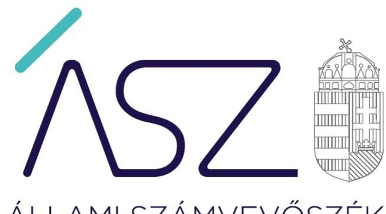
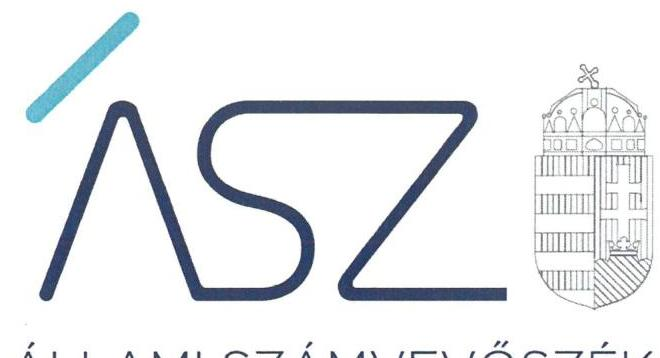
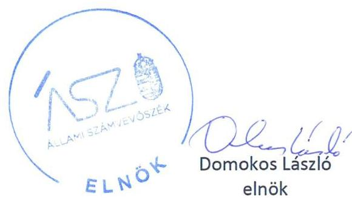

ÁLLAMI SZÁMVEVŐSZÉK

# JELENTÉS 

## Központi költségvetési szervek ellenőrzése

Országos Meteorológiai Szolgálat
2021.

21087
www.asz.hu

---

ÁLLAMI SZÁMVEVŐSZÉK

# JELENTÉS

## Központi költségvetési szervek ellenőrzése

Országos Meteorológiai Szolgálat

2021. 12. hó 08. nap

21087
www.asz.hu

---

# AZ ELLENŐRZÉST VEZETTE ÉS A VÉGREHAJTÁSÁÉRT FELELŐS: 

SALAMON ILDIKÓ ellenőrzésvezető
DR. GÁL NÓRA ellenőrzésvezető
SIPOSNÉ DÓCZI KLÁRA IBOLYA ellenőrzésvezető
A PROGRAM ÖSSZEÁLLÍTÁSÁÉRT FELELŐS:
GÖRGÉNYI GÁBOR ETAMO osztályvezető

IKTATÓSZÁM: EL-3443-001/2021.
TÉMASZÁM: 2549
ELLENŐRZÉS-AZONOSÍTÓ SZÁM: V0893

---

# TARTALOMJEGYZÉK 

- ÖSSZEGZÉS ..... 5
- AZ ELLENŐRZÉS CÉLJA ..... 7
- AZ ELLENŐRZÉS TERÜLETE ..... 8
- AZ ELLENŐRZÉS HÁTTERE, INDOKOLTSÁGA ..... 9
- A JELENTÉS LÉNYEGES KÉRDÉSKÖREI. ..... 10
- AZ ELLENŐRZÉS HATÓKÖRE ÉS MÓDSZEREI. ..... 11
- MEGÁLLAPÍTÁSOK ..... 13
- JAVASLATOK ..... 16
- MELLÉKLETEK. ..... 17
I. sz. melléklet: Értelmező szótár ..... 17
- FÜGGELÉK: ÉSZREVÉTELEK ..... 19
- RÖVIDÍTÉSEK JEGYZÉKE ..... 21

---

.

---

# ÖSSZEGZÉS 

Az Országos Meteorológiai Szolgálatnál 2017-2019. évekre lefolytatott ellenőrzésben feltárt hiányosságok megszüntetésére a vezető intézkedéseket tett. Az Országos Meteorológiai Szolgálat a 2021. évtől a vagyongazdálkodás és vagyonvédelem alapvető feltételeit megteremtette.

## Az ellenőrzés társadalmi indokoltsága

Az államháztartás központi alrendszerébe tartozó szervezet vagyona a nemzeti vagyon része, mellyel történő gazdálkodás a közérdek szolgálata érdekében történik. Az ÁSZ ellenőrzi az éves költségvetési törvény végrehajtását, majd az ellenőrzés során feltárt kockázatok és a terület folyamatos kockázatelemzésével beazonosított kockázatok kezelése érdekében ráépülő ellenőrzésekkel ellenőrzi a költségvetési szervek gazdálkodását, működését. Ezáltal az ellenőrzések megállapításaival támogatja az ellenőrzött szervezetek szabályszerű gazdálkodását, javaslataival elősegíti az Alaptörvényben megfogalmazott alapvetések érvényesülését a mindennapi életben a szervezetek szintjén. A központi költségvetés rendszerében zajló folyamatok holisztikus elemzései, a kockázatok folyamatos figyelemmel kísérésének módszerével, az így kiválasztott szervezetek célzott, hatékony ellenőrzéseivel az ÁSZ betölti a legfőbb gazdasági ellenőrző szerv küldetését. Az egyes ellenőrzések megállapításaival és egy időszak ellenőrzési eredményeinek elemzésével az ÁSZ ráirányíthatja a jogalkotók figyelmét a központi alrendszerben vagy annak egy ágazatában esetlegesen felmerülő vagyongazdálkodási, szabályozási feszültségekre.

Az Országos Meteorológiai Szolgálat a társadalom egészét érintő feladatokat lát el. Az Országos Meteorológiai Szolgálat preventív, időjárás-előrejelző tevékenységének ellátásához, valamint az időjárásra vonatkozó, általa kezelt adatvagyon értékteremtő hasznosításához a központi költségvetési szervnél lévő nemzeti vagyon biztosítja az alapot. A minőségi feladatellátás és szolgáltatásnyújtás alapvető feltétele, hogy a szervezet vagyongazdálkodása és az ennek alapját képező nyilvántartások és leltárak szabályszerűek legyenek, a szervezet naprakész információkkal rendelkezzen a nála lévő nemzeti vagyon állományáról. Ez teremti meg a vagyon védelmének és megőrzésének alapvető feltételét.

A vezetői teljesítmény ellenőrzés rávilágít a vezetői tevékenységben rejlő kockázatokra az egyes vezetői feladatok, kötelezettségek ellátásával összefüggésben. A kockázati tényezők felmérésén alapuló megállapítások hozzájárulnak az irányító szervek által végzett vezetői teljesítményértékelések fejlesztéséhez, a vezetői teljesítmény javításához, ezen keresztül a közpénzekkel való felelős gazdálkodáshoz.

## Főbb megállapítások, következtetések, javaslat

Az Országos Meteorológiai Szolgálat a szervezeti és működési szabályzattal és a gazdálkodás alapvető dokumentumaival rendelkezett, azonban számviteli politikája és a számlarendje nem tartalmazott olyan elemeket, melyek megléte szükséges az intézmény sajátosságainak megfelelő értékeléshez, elszámoláshoz.

Az Országos Meteorológiai Szolgálat nem rendelkezett a jogszabályi előírásoknak megfelelő tartalmú eszközök és a források leltárkészítési és leltározási szabályzatával, továbbá a 2017-2019. években mennyiségi leltárfelvételt nem végzett, a mérleg tételeit alátámasztó, szabályszerű leltárt nem készített.

Az Országos Meteorológiai Szolgálat vezetője a teljesítmény mérésének feltételeit nem alakította ki, így nem volt biztosítható a költségvetési szerv valamennyi tevékenységének és céljának a hatékonyság és az eredményesség követelményeivel való összhangja.

Az Országos Meteorológiai Szolgálat vezetőjének tevékenységében az ÁSZ magas kockázatot azonosított.
Az Állami Számvevőszék ismertette az Országos Meteorológiai Szolgálat elnökével a feltárt hibákat, hiányosságokat. Ennek eredményeként az elnök intézkedett a számviteli politika, a számlarend, valamint az eszközök és a források

---

leltárkészítési és leltározási szabályzata kijavítására, elrendelte a leltározást és a kapcsolódó egyeztetéseket. Tájékoztatást adott továbbá a gépjárművek igénybevételének és használatának rendje szabályozásáról, valamint a teljesítménymérés feltételeinek kialakítása érdekében tett intézkedéseiről. A vezető által megtett intézkedések a közpénzügyi helyzet javulását eredményezték, mivel azok a 2021. évtől megteremtik a vagyongazdálkodás szabályszerűségének, a vagyon védelmének és megőrzésének alapvető feltételeit.

A fennmaradt hiányosság javítása érdekében az Állami Számvevőszék egy javaslatot fogalmazott meg az Országos Meteorológiai Szolgálat elnöke számára.

---

# AZ ELLENŐRZÉS CÉLJA 

AZ ELLENŐRZÉS CÉLJA annak megállapítása, hogy a központi költségvetési szerv jó gazda gondosságával biztosította-e a nemzeti vagyon értékének megőrzését, védelmét és szabályszerű kezelését. Az államháztartás központi alrendszerébe tartozó szervezet vagyongazdálkodása elszámoltatható volt-e és megfelelt-e annak az Alaptörvényben ${ }^{1}$ meghatározott alapvetésnek, hogy Magyarország a kiegyensúlyozott, átlátható és fenntartható költségvetési gazdálkodás elvét érvényesíti.

A vezetői teljesítmény ellenőrzése körében az ellenőrzés célja a vezetői tevékenységben rejlő kockázatok azonosítása az egyes vezetői feladatok és kötelezettségek ellátásával összefüggésben. A kockázati tényezők felmérésén alapuló megállapítások hozzájárulnak az irányító szervek által végzett vezetői teljesítményértékelések fejlesztéséhez, a vezetői teljesítmény javításához, ezen keresztül a közpénzekkel való felelős gazdálkodáshoz.

---

# **AZ ELLENŐRZÉS TERÜLETE**

## **Országos Meteorológiai Szolgálat**

Az Országos Meteorológiai Szolgálat a környezetvédelemért felelős Agrárminiszter (2018. május 18-ig Földművelésügyi Miniszter) irányítása alá tartozó központi költségvetési szerv. Közfeladata az Országos Meteorológiai Szolgálatról szóló 277/2005. (XII.20.) Korm. rendeletben meghatározott feladatok ellátása. Az Országos Meteorológiai Szolgálat feladata a rendszeres időjárási megfigyelések végzése, az időjárás előrejelzése, a nyilvánosság tájékoztatása, illetőleg a mindezekhez szükséges infrastruktúrák működtetése. Az operatív tevékenységek mellett fejlesztési, kutatási és adatelemző klimatológiai feldolgozásokat is végez.

Az Országos Meteorológiai Szolgálat működési köre az ország egész területére kiterjed. Elnökét az agrárminiszter határozatlan időre nevezte ki és gyakorolta felette az egyéb munkáltatói jogokat. Az elnök személye az ellenőrzött időszakban nem változott, tevékenységét 2013. november 1-től látta el. Az Országos Meteorológiai Szolgálat az ellenőrzött időszakban saját gazdasági szervezettel rendelkezett, alaptevékenységén felül vállalkozási tevékenységet nem végzett.

Az Országos Meteorológiai Szolgálat beszámolóinak adatai szerint a központi költségvetési szerv mérlegfőösszege 2017. évben 3 280 millió Ft, 2018. évben 3 362 millió Ft, 2019. évben 3 975 millió Ft volt. A költségvetési bevételek 2017. évben 2 213 millió Ft-ot, 2018. évben 1 913 millió Ft-ot, a 2019. évben 1 785 millió Ft-ot, a költségvetési kiadások a 2017. évben 2 161 millió Ft-ot, a 2018. évben 2 571 millió Ft-ot, a 2019. évben 3 576 millió Ft-ot tettek ki. Az Országos Meteorológiai Szolgálatnál foglalkoztatottak létszáma 2017. évben 204 fő, 2018. évben 188 fő, 2019. évben 191 fő volt.

---

# AZ ELLENŐRZÉS HÁTTERE, INDOKOLTSÁGA 

Az államháztartás központi alrendszerébe tartozó szervezet vagyona a nemzeti vagyon része, mellyel történő gazdálkodás a közérdek szolgálata érdekében történik. Az ÁSZ ellenőrzi az éves költségvetési törvény végrehajtását, majd az ellenőrzés során feltárt kockázatok és a terület folyamatos kockázatelemzésével beazonosított kockázatok kezelése érdekében ráépülő ellenőrzésekkel ellenőrzi a költségvetési szervek gazdálkodását, működését. Ezáltal az ellenőrzések megállapításaival támogatja az ellenőrzött szervezetek szabályszerű gazdálkodását, javaslataival elősegíti az Alaptörvényben megfogalmazott alapvetések érvényesülését a mindennapi életben a szervezetek szintjén. A központi költségvetés rendszerében zajló folyamatok holisztikus elemzései, a kockázatok folyamatos figyelemmel kísérésének módszerével, az így kiválasztott szervezetek célzott, hatékony ellenőrzéseivel az ÁSZ betölti a legfőbb gazdasági ellenőrző szerv küldetését. Az egyes ellenőrzések megállapításaival és egy időszak ellenőrzési eredményeinek elemzésével az ÁSZ ráirányíthatja a jogalkotók figyelmét a központi alrendszerben vagy annak egy ágazatában esetlegesen felmerülő vagyongazdálkodási, szabályozási feszültségekre.

A „jól irányított állam" megteremtésével kapcsolatos céllal összhangban van, hogy olyan vezetői teljesítményértékelés rendszer kerüljön kialakításra és működtetésre, amely hozzájárul a szervezeti teljesítmény növeléséhez, a fejlődési lehetőségek kihasználásához. Az ÁSZ a rendszer kiépítésében vállalt aktív ellenőrzési, értékelési tevékenységével kíván hozzájárulni a „jól irányított állam" megteremtéséhez.

A vezetői értékeléseket megalapozó ellenőrzések lefolytatása a téma jellege, a vezetőknek a szervezet működése szempontjából meghatározó szerepe és a társadalmi érdeklődés miatt indokolt, melynek jogszabályi hátterét az ÁSZtv. biztosítja.

---

# A JELENTÉS LÉNYEGES KÉRDÉSKÖREI 

1.     - Biztosított volt-e a vagyongazdálkodás szabályozottsága?
2.     - A nemzeti vagyon nyilvántartását és kimutatását a valóságnak megfelelő módon, szabályszerűen végezték-e?
3.     - A központi költségvetési szerv vagyonnal való gazdálkodása során biztosította-e a nemzeti vagyon védelmét?
4.     - A központi költségvetési szervnél a szervezeti teljesítménymérés feltételeit kialakították-e?
5.     - Vezetői teljesítmény ellenőrzése

---

# AZ ELLENŐRZÉS HATÓKÖRE ÉS MÓDSZEREI 

## Az ellenőrzés típusa

| Megfelelőségi ellenőrzés.

## Az ellenőrzött időszak

2017., 2018., 2019. évek. A helyszíni szemle tekintetében 2019. január 1-jétől az utolsó helyszíni szemle időpontjáig tartó időszak. A vezetői teljesítmény ellenőrzése vonatkozásában a 2019. év.

## Az ellenőrzés tárgya

A központi költségvetési szerv vagyongazdálkodási feltételeinek kialakítása, annak szabályszerűsége, az elszámoltathatóság biztosítása a szabályozás szintjén. Az intézménynél hozott vagyonváltozást eredményező döntések, a vagyonban bekövetkezett változások végrehajtásának, elszámolásának szabályszerűsége. Az intézmény könyveiben, mérlegében kimutatott nemzeti vagyon nyilvántartásának szabályszerűsége, vagyon kimutatása, értékelése és a mérleg leltárral való alátámasztásának szabályszerűsége.

A vezetői teljesítmény ellenőrzés vonatkozásában az irányító szervnek megküldött, a belső kontrollrendszer minőségének értékelésére vonatkozó nyilatkozat, a szabályszerű gazdálkodás feltételeinek kialakítása és a kockázatkezelési rendszer kialakítása.

## Az ellenőrzött szervezet

Országos Meteorológiai Szolgálat

## Az ellenőrzés jogalapja

Az ellenőrzés jogszabályi alapját az ÁSZtv. ${ }^{2} 1 . \S$ (3) bekezdés, 5. § (2)-(3) és (6) bekezdései, valamint az Áht. ${ }^{3} 61 . \S$ (2) bekezdésének előírásai képezik.

---

# Az ellenőrzés módszerei 

Az ÁSZ az ellenőrzést az ellenőrzési program szempontjai, az ellenőrzött időszakban hatályos jogszabályok, az ellenőrzés szakmai szabályai, a jelen ellenőrzésre irányadó ÁSZ módszertanok figyelembevételével hajtja végre. Az ellenőrzési kérdések megválaszolásához szükséges bizonyítékok megszerzése az ellenőrzött szervezet által rendelkezésre bocsátott dokumentumokra és adatokra alapozva, továbbá megfigyelés, szemle (szemrevételezés), kérdésfeltevés (információkérés), érték alapján szűkített, lényeges sokaságon végrehajtott mintavétellel, valamint elemző eljárás útján történik. Az ellenőrzési bizonyítékként felhasználható adatforrások közé tartoznak az ellenőrzési program részletes szempontjainál felsorolt adatforrások, valamint minden egyéb - az ellenőrzés folyamán feltárt, az ellenőrzés szempontjából információt tartalmazó - dokumentum. Az ellenőrzés lefolytatásához az ellenőrzött szervezet tanúsítványok kitöltésével, valamint az ÁSZ által kért dokumentumok megküldésével szolgáltat adatokat, amelyekről az ellenőrzött szervezet vezetője teljességi és hitelességi nyilatkozatot állít ki. A rendelkezésre bocsátott dokumentumok, adatok és információk kontrollja az ellenőrzés keretében történik.

A 2019. évi vagyonnövekedések és vagyoncsökkenések elszámolásának szabályszerűségét, a nemzeti vagyon nyilvántartásának és év végi értékelésének szabályszerűségét lényeges sokaságból véletlen mintavételi eljárással kiválasztott tételek alapján ellenőrzi az ÁSZ. A mintavételi sokaságok esetében a mintavétel azokra a legnagyobb értékű tételekre - a lényeges sokaságra - terjed ki, melynek összértéke eléri a teljes sokaság összértékének 50\%-át. Amennyiben valamely lényeges sokaság elemszáma kisebb, mint az előírt minta elemszám, a lényeges sokaság tételesen kerül ellenőrzésre. A mintavétellel ellenőrzött területek esetében minden egyes tétel vonatkozásában a szabályszerűségre vonatkozó kérdéseket tesz fel az ÁSZ, amelyek eredménye összesítésre kerül. „Szabályszerűnek" értékeli az ÁSZ az ellenőrzött területet, amennyiben 95\%-os bizonyossággal a lényeges sokaságban az átlagos hibaarány legfeljebb 10\%, „nem szabályszerűnek", amennyiben 10\%-nál magasabb
 arányt képvisel. Abban az esetben, ha a lényeges sokaság tekintetében a 10\%-os hibaarányhoz való viszony megítélésének megbízhatósága nem éri el a 95\%-ot, annak elérése érdekében az értékelés további szempontokkal egészíthető ki, és figyelembe kell venni a feltárt hibák értékét.

---

# 1. Biztosított volt-e a vagyongazdálkodás szabályozottsága? 

## Összegző megállapítás

Az Országos Meteorológiai Szolgálat vagyongazdálkodásának szabályozottsága a 2017-2019. években nem volt biztosított.

Az Országos Meteorológiai Szolgálat vezetője a számviteli politikában ${ }^{4}$ az Áhsz. ${ }^{5}$ 50. § (1) bekezdésben és a Számv. tv. ${ }^{6}$ 14. § (4) bekezdésében foglaltak ellenére nem rögzítette azokat a gazdálkodóra jellemző szabályokat, előírásokat, módszereket, amelyekkel meghatározza, hogy mit tekint a számviteli elszámolás, az értékelés szempontjából lényegesnek, illetve nem lényegesnek.

Az Áhsz. 51. § (2) bekezdésében előírt számlarend ${ }^{7}$ a Számv. tv. 161. § (2) bekezdés a) pontjában foglaltak ellenére nem tartalmazta minden alkalmazásra kijelölt számla számjelét és megnevezését. Az Áhsz. 51.§ (3) bekezdésében foglaltak ellenére a számlarend nem tartalmazta a részletező nyilvántartások vezetésének módját, azoknak a kapcsolódó könyvviteli és nyilvántartási számlákkal való egyeztetését, annak dokumentálását, valamint a részletező nyilvántartások és az egységes rovatrend rovataihoz kapcsolódóan vezetett nyilvántartási számlák adataiból a pénzügyi könyvvezetéshez készült összesítő bizonylatok (feladások) elkészítésének rendjét, azok tartalmi és formai követelményeit.

Az Országos Meteorológiai Szolgálat leltározási szabályzatában ${ }^{8}$ a mennyiségi felvétellel történő leltározás gyakoriságának szabályozása ellentétes volt a Számv.tv. 69. § (3) bekezdésének, illetve az Áhsz. 22. § (2) bekezdésének előírásaival, mivel az ingatlanokra vonatkozóan a jogszabály által megengedett, maximális 3 év helyett ötévenkénti leltározási kötelezettséget írtak elő. Az Áhsz. 22. § (2) bekezdés b) pontjában foglaltak ellenére a leltározási szabályzat nem tartalmazta a használt, de a mérlegben értékkel nem szereplő immateriális javak, tárgyi eszközök, készletek leltározási módját.

Az Országos Meteorológiai Szolgálat az Ávr. ${ }^{9}$ 13. § (2) bekezdés f) pontjának előírása ellenére nem határozta meg a gépjárművek igénybevételének és használatának rendjét.

A 2017-2019. évekre vonatkozóan az Országos Meteorológiai Szolgálat rendelkezett a jogszabályi előírások szerinti értékelési szabályzattal ${ }^{10}$ és önköltségszámítási szabályzattal ${ }^{11}$, valamint SZMSZ${ }^{12}$-vel, gazdálkodási szabályzattal ${ }^{13}$-vel, illetve ügyrenddel ${ }^{14}$. Az Országos Meteorológiai Szolgálatnál a gazdálkodási jogkörgyakorlásra jogosult személyekről és aláírás mintáikról nyilvántartást vezettek, az ellenőrzési, adatszolgáltatási és beszámolási feladatok teljesítésével, valamint az anyag- és eszközgazdálkodással kapcsolatos belső szabályozásokat kialakították.

---

# 2. A nemzeti vagyon nyilvántartását és kimutatását a valóságnak megfelelő módon, szabályszerűen végezték-e? 

## Összegző megállapítás

Az Országos Meteorológiai Szolgálat a nemzeti vagyon nyilvántartását és kimutatását 2017-2019. években nem szabályszerűen végezte.

Az Országos Meteorológiai Szolgálat a 2017-2019. években nem készített az Áhsz. 5. § (1) bekezdésében és 22. § (1) bekezdésében, valamint a Számv. tv. 69. § (1) bekezdésében előírtak szerinti leltárt, amely tételesen és ellenőrizhető módon tartalmazta volna a mérlegben szereplő eszközöket és forrásokat mennyiségben és értékben.

Az Országos Meteorológiai Szolgálat a mérlegben kimutatott eszközeinek a 2017. évben a 34,9 %-áról, a 2018. évben a 32,8 %-áról, a 2019. évben a 21 %-áról nem készített leltárt. A mérlegében kimutatott eszközök közül a Pénzeszközök mérlegsoron kimutatott adatokat - amelyek a mérlegfőösszeg 20,9-28,9 %-át tették ki - az ellenőrzött évek egyikében sem, a Követelések mérlegsoron kimutatott adatokat a 2017-2018. években nem támasztották alá leltárral.

Az Országos Meteorológiai Szolgálat a mérlegben kimutatott forrásainak a 2017. évben a 81,3 %-át, a 2018. évben a 87,4 %-át, a 2019. évben a 7,6 %-át nem támasztotta alá leltárral. A források meghatározó részét (81,1-89,2 \%) képező Saját tőke mérlegsor leltárral történő alátámasztását csak a 2019. évben igazolták.

## 3. A központi költségvetési szerv vagyonnal való gazdálkodása során biztosította-e a nemzeti vagyon védelmét?

Összegző megállapítás

Az Országos Meteorológiai Szolgálat vezetője a vagyonnal való gazdálkodása során a nemzeti vagyon védelmét nem biztosította.

Az Országos Meteorológiai Szolgálat az Áhsz. 5. § (1) bekezdésében és 22. § (1) bekezdésében, valamint a Számv. tv. 69. § (1) bekezdésében előírt leltár hiányában a nemzeti vagyon nyilvántartását és kimutatását nem szabályszerűen végezte el a 2017-2019. években.

---

# 4. A központi költségvetési szervnél a szervezeti teljesítménymérés feltételeit kialakították-e? 

## Összegző megállapítás

Az Országos Meteorológiai Szolgálat vezetője a szervezeti teljesítménymérés feltételeit nem alakította ki.

Az Országos Meteorológiai Szolgálat vezetője nem alakította ki a szervezeti célok elérését szolgáló feladatok, folyamatok, tevékenységek mérését szolgáló indikátorokat, mérőszámokat, feladat- és teljesítménymutatókat, amelyek alkalmasak a szervezeti tevékenység teljesítményének mérésére a Bkr. ${ }^{15}$ 2. § g), i), j) pontjaiban meghatározott eredményesség, gazdaságosság és hatékonyság követelményeinek érvényesítése érdekében. A teljesítmény mérésének lehetőségét a vezető nem biztosította és nem teremtette meg annak előfeltételeit, hogy a Bkr. 4. § a) pontjának előírásaival összhangban biztosítsák a költségvetési szerv valamennyi tevékenységének és céljának a gazdaságosság, hatékonyság és eredményesség követelményeivel való összhangját.

## 5. Vezetői teljesítmény ellenőrzése

## Összegző megállapítás

Az Országos Meteorológiai Szolgálat vezetője nem biztosította a szabályszerű, átlátható és elszámoltatható gazdálkodás alapvető feltételeit, valamint a nemzeti vagyon védelmét, megőrzését a 2019. évben.

Az Országos Meteorológiai Szolgálat vezetője a vagyongazdálkodás szabályozottságát a 2019. évben nem biztosította.

Az Országos Meteorológiai Szolgálat vezetője elkészítette a belső kontrollrendszer minőségének értékelésére vonatkozó nyilatkozatát a 2019. évre vonatkozóan, azonban annak a Bkr. 11. § (2) bekezdésében előírtak szerinti, irányító szerv részére történő megküldését nem igazolta.

Az Országos Meteorológiai Szolgálat vezetője az integrált kockázatkezelési rendszer eljárásrendjének elkészítéséről nem gondoskodott a 2019. évben, így nem igazolta a vezetői nyilatkozatában foglaltakat.

Az Országos Meteorológiai Szolgálat vezetője az Áhsz. 5. § (1) bekezdésében és 22. § (1) bekezdésében, valamint a Számv. tv. 69. § (1) bekezdésében előírt leltár hiányában a nemzeti vagyon jogszabályi előírás szerinti nyilvántartásáról és kimutatásáról a 2019. évben nem gondoskodott.

Az Országos Meteorológiai Szolgálat vezetője a Pénzkezelési Szabályzat és az Iratkezelési Szabályzat elkészítéséről gondoskodott a 2019. évre vonatkozóan. Kijelölte továbbá az integrált kockázatkezelési rendszer koordinálásának felelősét.

---

# JAVASLATOK 

Az ÁSZ tv. 33. § (1) bekezdésében foglaltak értelmében az ellenőrzött szervezet vezetője köteles a jelentésben foglalt megállapításokhoz kapcsolódó intézkedési tervet összeállítani és azt a jelentés kézhezvételétől számított 30 napon belül az ÁSZ részére megküldeni. Amennyiben az ellenőrzött szervezet vezetője nem küldi meg határidőben az intézkedési tervet, vagy továbbra sem elfogadható intézkedési tervet küld, az Állami Számvevőszék elnöke az ÁSZ tv. 33. § (3) bekezdése a) és b) pontjaiban foglaltakat érvényesítheti.

## Az Országos Meteorológiai Szolgálat elnökének

1. Intézkedjen, hogy a jövőben a belső kontrollrendszer minőségének értékelésére vonatkozó vezetői nyilatkozata a jogszabályi előírásoknak megfelelően az irányító szerv részére igazoltan megküldésre kerüljön.
(5. sz. megállapítás 2. bekezdése alapján)

---

# MELLÉKLETEK 

- I. SZ. MELLÉKLET: ÉRTELMEZŐ SZÓTÁR
irányító szerv
működtetés
nemzeti vagyon
a költségvetési szerv tekintetében az e törvényben meghatározott irányítási hatáskört gyakorló szerv. (Forrás: Áht. 1. § 9. pontja)
a nemzeti vagyon birtoklásából, használatából, hasznai szedéséből, a nemzeti vagyon fenntartásából és üzemeltetéséből álló tevékenységek együttese, amely jogszabály vagy szerződés alapján - a nemzeti vagyon felújítására, fejlesztésére, a birtoklásának, használatának hasznai szedése jogának továbbengedésére is kiterjedhet. (Forrás: Nvtv. 3. § (1) bekezdés 10. pontja)
a) az állam vagy a helyi önkormányzat kizárólagos tulajdonában álló dolgok,
b) az a) pont hatálya alá nem tartozó, az állam vagy a helyi önkormányzat tulajdonában lévő dolog,
c) az állam vagy a helyi önkormányzat tulajdonában lévő pénzügyi eszközök, továbbá az államot vagy a helyi önkormányzatot megillető társasági részesedések,
d) az államot vagy a helyi önkormányzatot megillető bármely vagyoni értékkel rendelkező jogosultság, amelyet jogszabály vagyoni értékű jogként nevesít,
e) Magyarország határa által körbezárt terület feletti légtér,
f) az üvegházhatású gázok kibocsátási egységeinek kereskedelméről szóló törvény szerinti kibocsátási egység és légiközlekedési kibocsátási egység, valamint az ENSZ Éghajlatváltozási Keretegyezménye és annak Kiotói Jegyzőkönyve végrehajtási keretrendszeréről szóló törvény szerinti kiotói egység,
g) állami vagy helyi önkormányzati fenntartású közgyűjtemény (muzeális intézmény, levéltár, közgyűjteményként működő kép- és hangarchívum, valamint könyvtár) saját gyűjteményében nyilvántartott kulturális javak körébe tartozó dolog, kivéve, ha az állami vagy önkormányzati tulajdon jogszerű létrejötte kétséget kizáró módon nem bizonyítható és a dologra nézve más a tulajdonjogát bizonyítja vagy a kulturális javakra vonatkozó jogszabályokban meghatározott eljárás keretében valószínűsíti,
h) a régészeti lelet,
i) a nemzeti adatvagyon körébe tartozó állami nyilvántartások fokozottabb védelméről szóló törvény szerinti nemzeti adatvagyon (Forrás: Nvtv. 2. § (2) bekezdés a)-i) pontok).
vagyongazdálkodás
vezetői nyilatkozat

A nemzeti vagyongazdálkodás feladata a nemzeti vagyon rendeltetésének megfelelő, az állam, az önkormányzat mindenkori teherbíró képességéhez igazodó, elsődlegesen a közfeladatok ellátásához és a mindenkori társadalmi szükségletek kielégítéséhez szükséges, egységes elveken alapuló, átlátható, hatékony és költségtakarékos működtetése, értékének megőrzése, állagának védelme, értéknövelő használata, hasznosítása, gyarapítása, továbbá az állam vagy a helyi önkormányzat feladatának ellátása szempontjából feleslegessé váló vagyontárgyak elidegenítése. (Forrás: Nvtv. 7. § (2) bekezdése)
a költségvetési szerv vezetője köteles - az előírt tartalmú - nyilatkozatban értékelni a költségvetési szerv belső kontrollrendszerének minőségét és azt az éves költségvetési beszámolóval együtt megküldeni az irányító szervnek. (Forrás: Bkr. 11. § (1) és (2) bekezdés, Bkr. 1. számú melléklet)

---

.

---

# FÜGGELÉK: ÉSZREVÉTELEK 

A jelentéstervezetet a Számvevőszék 15 napos észrevételezésre megküldte az ellenőrzött szervezet vezetőjének az ÁSZ tv. 29. § (1) bekezdése előírásának megfelelően.

Az Országos Meteorológiai Szolgálat elnöke írásban jelezte, hogy az ellenőrzés megállapításaira nem tesz észrevételt.

[^0]
[^0]:    * 29. § (1) Az Állami Számvevőszék az ellenőrzési megállapításait megküldi az ellenőrzött szervezet vezetőjének vagy az általa megbízott személynek, és annak, akinek személyes felelősségét állapította meg.
    (2) Az ellenőrzött szervezet vezetője és a felelősként megjelölt személy az ellenőrzés megállapításaira tizenöt napon belül írásban észrevételt tehet.
    (3) Az Állami Számvevőszék az észrevételre a beérkezésétől számított harminc napon belül írásban válaszol. A figyelembe nem vett észrevételeket köteles a jelentésben feltüntetni, és megindokolni, hogy azokat miért nem fogadta el.

---

.

---

# RÖVIDÍTÉSEKJEGYZÉKE 

${ }^{1}$ Alaptörvény
${ }^{2}$ ÁSZtv.
${ }^{3}$ Áht.
${ }^{4}$ Számviteli politika
${ }^{5}$ Áhsz.
${ }^{6}$ Számv.tv.
${ }^{7}$ Számlarend
${ }^{8}$ Leltározási szabályzat
${ }^{9}$ Ávr.
${ }^{10}$ Értékelési szabályzat
${ }^{11}$ Önköltségszámítási szabályzat
${ }^{12}$ SZMSZ:

SZMSZ:

${ }^{13}$ Gazdálkodási szabályzat:

Gazdálkodási szabályzat:
${ }^{14}$ Ügyrend
${ }^{15}$ Bkr.

Magyarország Alaptörvénye (2011. április 25.)
2011. évi LXVI. törvény az Állami Számvevőszékről
2011. évi CXCV. törvény az államháztartásról

A számviteli politikáról szóló 9/2016. (VI. 16.) OMSZ utasítás (hatályos: 2016. január 1-től)
4/2013. (I. 11.) Korm. rendelet az államháztartás számviteléről (hatályos: 2014. január 1-től)
2000. évi C. törvény a számvitelről (hatályos: 2001. január 1-től)

A számlarendről szóló 3/2014. (I. 23.) OMSZ utasítás (hatályos: 2014. január 1-től) A leltározási szabályzatról szóló 10/2016. (VI.17.) OMSZ utasítás (hatályos: 2016. június 17-től)
368/2011. (XII.31.) Korm. rendelet az államháztartásról szóló törvény végrehajtásáról (hatályos: 2012. január 1-től)
A Szolgálat eszközeinek és forrásainak értékelési szabályzatáról szóló 6/2013. (IV.12.) OMSZ

 utasítás (hatályos: 2013. április 12-től)

Az Országos Meteorológiai Szolgálat önköltség-számítási szabályzatának kiadásáról szóló 14/2014. (VI. 20.) OMSZ utasítás (hatályos: 2014. június 20-tól)
A vidékfejlesztési miniszter 12/2011. (VII. 8.) VM utasítása az Országos Meteorológiai Szolgálat Szervezeti és Működési Szabályzatának kiadásáról (hatályos 2011. július 8-tól 2019. május 10-ig)
Az agrárminiszter 5/2019. (V. 10.) AM utasítása az Országos Meteorológiai Szolgálat Szervezeti és Működési Szabályzatának kiadásáról (hatályos 2019. május 11-től)
Az Országos Meteorológiai Szolgálat gazdálkodási szabályzatáról szóló 13/2014. (VI.16.) OMSZ utasítás (hatályos 2014. június 16-tól 2019. június 27-ig)

Az Országos Meteorológiai Szolgálat gazdálkodási szabályzatáról szóló 8/2019. (VI.28.) OMSZ utasítás (hatályos 2019. június 28-tól)

A főosztályok, valamint az elnök és az Elnökség ügyrendje tárgyában kiadott 2/2016. (I.5.) OMSZ utasítás (hatályos 2016. január 1-től)
370/2011. (XII. 31.) Korm. rendelet a költségvetési szervek belső
kontrollrendszeréről és belső ellenőrzéséről (hatályos 2012. január 1-től)

---

# ASZ 

ÁLLAMI SZÁMVEVŐSZÉK
1052 Budapest, Apáczai Cs. J. u. 10. | 1364 Budapest 4. Pf. 54
TEL: +36 14849100
email: szamvevoszek@asz.hu
web: www.asz.hu | www.aszhirportal.hu
