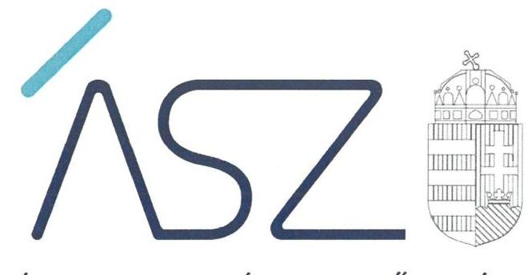
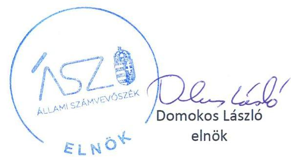
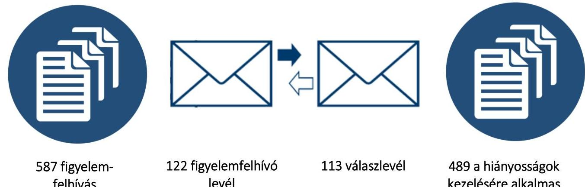
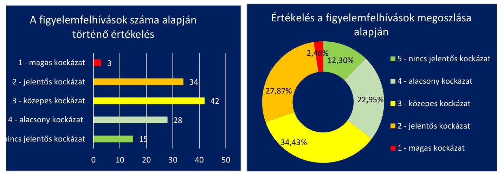
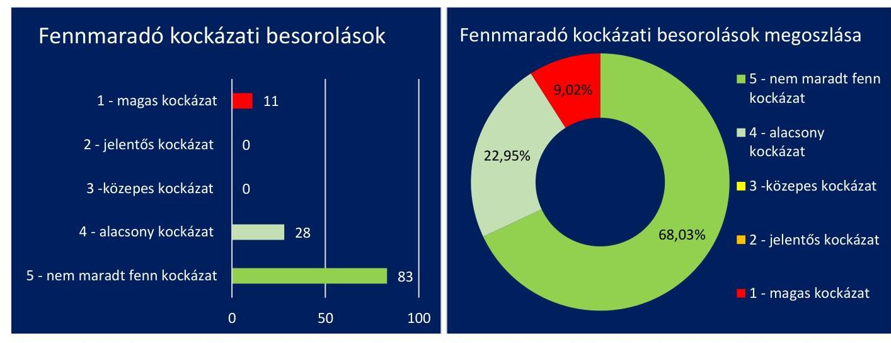
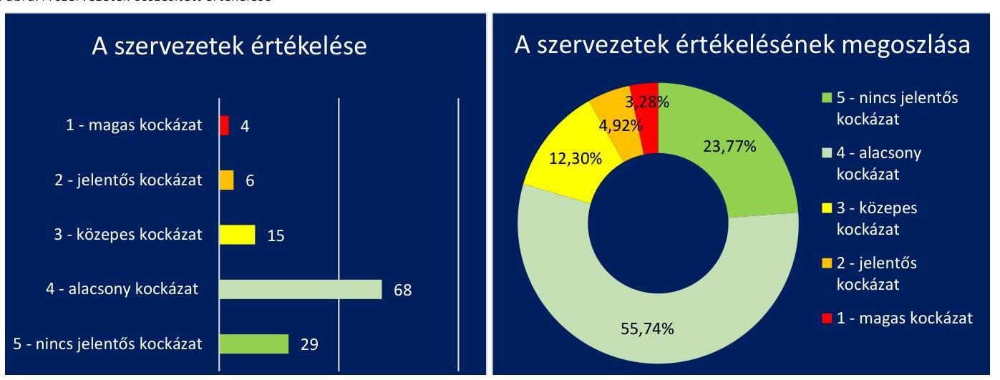

ÁLLAMI SZÁMVEVŐSZÉK

# JELENTÉS

Költségvetési szervek monitoring típusú ellenőrzése

2021.

21088
www.asz.hu

---

ÁLLAMI SZÁMVEVŐSZÉK

# JELENTÉS

Költségvetési szervek monitoring típusú ellenőrzése

2021. 11. hó 28. nap

21088
www.asz.hu

---

# AZ ELLENŐRZÉST FELÜGYELTE: 

DR. NÉMETH ERZSÉBET felügyeleti vezető

## AZ ELLENŐRZÉST VEZETTE ÉS A VÉGREHAJTÁSÁÉRT FELELŐS:

DORMÁN ISTVÁN ZOLTÁN ellenőrzésvezető
SZAPPANOS JÚLIA ellenőrzésvezető
KAKAS SÁNDOR ellenőrzésvezető

A PROGRAM ÖSSZEÁLLÍTÁSÁÉRT FELELŐS:
DÁM-POLYÁK ORSOLYA program készítésért felelős vezető

## IKTATÓSZÁM: EL-3452-001/2021.

## TÉMASZÁM: 2560

ELLENŐRZÉS-AZONOSÍTÓ SZÁM: V0904

---

# TARTALOMJEGYZÉK 

■ ÖSSZEGZÉS ..... 5
■ AZ ELLENŐRZÉS CÉLJA ..... 9
■ AZ ELLENŐRZÉS TERÜLETE ..... 10
■ AZ ELLENŐRZÉS HÁTTERE, INDOKOLTSÁGA ..... 11
■ A JELENTÉS LÉNYEGES KÉRDÉSKÖREI ..... 12
■ AZ ELLENŐRZÉS HATÓKÖRE ÉS MÓDSZEREI ..... 13
■ ÉRTÉKELÉSEK ..... 15
■ MELLÉKLETEK ..... 21
I. sz. melléklet: Értelmező szótár ..... 21
II. sz. melléklet: Értékelési keretrendszer ..... 22
III. sz. melléklet: Az ellenőrzött szervezetek felsorolása és értékelése ..... 25
■ RÖVIDÍTÉSEK JEGYZÉKE ..... 29

---

.

---

# ÖSSZEGZÉS 

Az Állami Számvevőszék új ellenőrzési megközelítést alkalmazva 127 költségvetési szerv ellenőrzésével, valamint tanácsadással támogatta az ellenőrzött költségvetési szervek közpénzekkel és a közvagyonnal való törvényes, átlátható működését és gazdálkodását.
Az ellenőrzött szervezetek többsége nem alakított ki olyan kontrollkörnyezetet, amely a vagyonelemek teljes körének szabályszerű számbavételét biztosította volna. A szervezetek vezetőinek nagy része emellett nem igazolta átlátható és ellenőrizhető módon az eredményesség követelményeinek érvényesítését. A költségvetési szervek többségénél a leltárkészítési kötelezettség teljesítéséhez elrendelték a vagyonelemek számbavételét.
Az Állami Számvevőszék figyelemfelhívó levélben fordult az ellenőrzött szervezetek vezetőihez, melyben intézkedésüket kérte az ellenőrzés által feltárt hiányosságok megszüntetése érdekében. Az Állami Számvevőszék tanácsadói tevékenységének eredményeként költségvetési szervek többségénél javult a közpénzekkel és a közvagyonnal való törvényes, átlátható működés kontrollkörnyezetének kialakítása, valamint az eredményesség követelményeinek érvényesítése.

## Az ellenőrzés társadalmi indokoltsága

Az Alaptörvény rögzíti, hogy minden közpénzekkel gazdálkodó szervezet köteles a nyilvánosság előtt elszámolni a közpénzekre vonatkozó gazdálkodásával. A közpénzeket és a nemzeti vagyont az átláthatóság és a közélet tisztaságának elve szerint kell kezelni. A közpénzügyek átláthatóságának előmozdítása, a közvagyon védelme, a korrupció elleni védettség érdekében indokolt az államháztartás központi alrendszerébe tartozó szervezetek ellenőrzése.

Az államháztartás központi alrendszerébe tartozó szervezetek alapvető rendeltetése a társadalom javát szolgáló közfeladatok ellátásának hatékony, számon kérhető, pazarlásmentes biztosítása. A közpénzek felhasználásában meghatározó arányt képviselő központi és köztestületi költségvetési szervek gazdálkodásuk révén jelentős hatást gyakorolhatnak a költségvetés egyensúlyának fenntartására, a közpénzek felelős, takarékos felhasználására, a nemzeti vagyon értékének megóvására, gyarapítására, társadalmi érdeknek megfelelő hasznosítására.

A szabályszerű, átlátható működés és az elszámoltatható közpénzfelhasználás alapfeltétele az integritás kontrollokat is magában foglaló belső kontrollrendszer kiépítettsége, a kontrollok érvényesítése, a közfeladat ellátását szolgáló vagyonelemek valósághű számbavétele, értékelése, naprakész nyilvántartása.

## Az ellenőrzés által feltárt hiányosságok bemutatása és azok kezelése érdekében megtett intézkedések értékelése

A köz érdekét a hatékonyan és eredményesen irányított állami szervek szolgálják. A költségvetési szerv vezetőjének a jogszabályi előírás szerint biztosítania kell a szervezeti célok elérését veszélyeztető kockázatok csökkentésére irányuló, illetve az eredményesség követelményeinek érvényesítését szolgáló kontrollok kiépítését. A vezetői kontroll akkor működik hatékonyan, ha a kontrollkörnyezet átlátható, szabályozott és ellenőrizhető. Az ellenőrzött költségvetési szervek vezetőinek többsége (120 szervezet vezetője) nem igazolta, hogy a kontrolltevékenység részeként biztosították a szervezeti célok elérését veszélyeztető kockázatok csökkentésére irányuló kontrollok kiépítését, a döntések eredményességi szempontú megalapozottságát. Az ÁSZ figyelemfelhívó levelei nyomán 83 költségvetési szerv veze-

---

tője tájékoztatta az ÁSZ-t olyan végrehajtott, vagy tervezett intézkedésekről, amelyek alkalmasak arra, hogy biztosítsák a rendelkezésre álló források átlátható, szabályszerű, szabályozott, gazdaságos, hatékony és eredményes felhasználását.

A költségvetési szervezetek a számviteli politika és az annak a keretén belül elkészítendő számviteli szabályzatok elkészítésével, azok folyamatos felülvizsgálatával és frissítésével biztosítják a pénzügyi- és vagyongazdálkodás átláthatóságának és elszámoltathatóságának feltételeit, kereteit.

Az ellenőrzés feltárta, hogy az ellenőrzött 127 költségvetési szervezetnél 122 esetben nem alakítottak ki olyan kontrollkörnyezetet, amely a vagyonelemek teljes körének szabályszerű számbavételét biztosította volna a 2020. évre vonatkozóan. Az ellenőrzött szervezetek rendelkeztek a vagyonelemek szabályszerű számbavételét biztosító szabályozó eszközökkel, gyakori hiányosság volt azonban, hogy a számviteli politikában nem rögzítették azokat a gazdálkodóra jellemző szabályokat, előírásokat, módszereket, amelyekkel meghatározták volna, hogy mit tekintenek a számviteli elszámolás, az értékelés szempontjából kivételes nagyságú vagy előfordulású bevételnek, költségnek, illetve ráfordításnak. A feltárt szabályozási hiányosságok kockázatot jelentettek a vagyon megőrzésére vonatkozóan. Az Állami Számvevőszék tanácsadói tevékenységének keretében úgy értékelte, hogy a figyelemfelhívó levélre adott ellenőrzötti válaszok alapján jelentősen csökkent a kontrollkörnyezetet érintő kockázatok száma, 95 szervezet intézkedett a vagyonelemek szabályszerű számbavétele érdekében. Az ÁSZ figyelemfelhívását követően 27 ellenőrzött szervezet esetében maradt fent a vagyonelemek szabályszerű számbavételének kontrollkörnyezetét érintő kockázat.

A vagyon védelme szempontjából az éves költségvetési beszámoló leltárral való alátámasztása alapvető fontosságú. Az ellenőrzés megállapította, hogy 2019-ben az ellenőrzött költségvetési szervezetek túlnyomó többsége (123 szervezet) rendelkezett leltárkészítési és leltározási szabályzattal, 16 esetben azonban nem gondoskodtak a 2019. évi beszámoló mérlegének leltárral való alátámasztása érdekében a mennyiségi felvétellel és egyeztetéssel történő leltározás szabályszerű elrendeléséről. Az ellenőrzött szervezetek válaszlevélben jelzett együttműködése és intézkedése nyomán csupán 3 intézmény esetében maradt fent a vagyonelemek szabályszerű leltározásának elrendelésére vonatkozó hiányosság.

### **Következtetések**

Az ellenőrzés alapján az Állami Számvevőszék 122 figyelemfelhívó levélben, összesen 587 figyelemfelhívást fogalmazott meg az ellenőrzött szervezetek vezetői számára. A figyelemfelhívó levelekre az ellenőrzött költségvetési szervek vezetőinek túlnyomó többsége (113 szervezet) válaszolt. A figyelemfelhívásokra adott válaszokat értékelve, az ellenőrzött szervezetek összesen 489 db olyan intézkedésről számoltak be, amelyek alkalmasak voltak a figyelemfelhívásban szereplő hiányosságok megszüntetésére. A figyelemfelhívó levelek, valamint az azokra adott válaszok, a figyelemfelhívások és az intézkedések számát az 1. ábra mutatja be.

1. ábra: Kimenő figyelemfelhívások és az arra érkező válaszok száma

---

Az Állami Számvevőszék ötfokú skálán értékelte az ellenőrzés során feltárt kockázatokat az egyes ellenőrzött intézmények esetén. Nem jelentős besorolást, azaz 5-ös osztályzatot kaptak azok a költségvetési szervezetek, amelyek vezetői legfeljebb két figyelemfelhívó jelzést kaptak, míg 1-est azok a szervezetek kapnak, amelyek hét vagy annál több figyelemfelhívásban részesültek. Az ellenőrzött szervezetek figyelemfelhívások száma alapján készített értékelésének megoszlását a 2. ábra mutatja. Az ellenőrzés által feltárt hiányosságok alapján történő értékelés (eredendő kockázati besorolás) számtani átlaga az ötfokú skálán: 3,1.
2. ábra: Az ellenőrzött szervezetek figyelemfelhívások száma alapján kiszámolt osztályzatai és azok megoszlása

Az Állami Számvevőszék emellett szintén egy ötfokú skálán értékelte a figyelemfelhívó levelekre adott válaszok alapján az ellenőrzöttek együttműködési készségét és ennek alapján a megküldött dokumentumokban jelzett intézkedések eredményességét. A legkedvezőbb értékelést (5) kapták azok a szervezetek, amelyek tizenöt napon belül minden figyelemfelhívás tekintetében megfelelő intézkedéseket tettek, és az Állami Számvevőszék elnökét erről értesítették, így a feltárt hiányosságokat kezelték. A legkedvezőtlenebb értékelést (1) azok a szervezetek kapták, amelyek az ÁSZ tv.-ben előírt együttműködési kötelezettségüknek nem tettek eleget, vagy intézkedésük az ellenőrzés által feltárt hiányosság szempontjából nem bizonyult megfelelőnek. (Az értékelési szempontokat részletesen a II. sz. melléklet tartalmazza).

A szervezetek megoszlását együttműködési készségük és a kockázatok csökkentésében elért eredményeik értékelése alapján a 3. ábra mutatja be.
3. ábra: A szervezetek együttműködési készsége és annak eredményességének értékelése

A figyelemfelhívásokra adott válaszok alapján a fennmaradó kockázatok értékelésének számtani átlaga: 4,4. Mindez azt jelzi, hogy az ÁSZ tanácsadó tevékenysége eredményes volt, hiszen a szervezetek 5 fokú skálán való értékelése mintegy 70 százalékponttal, 3,1-ről 4,4-re javult.

---

A szervezetek összesített értékelése az ellenőrzés során feltárt hiányosságok és a figyelemfelhívó levelekre adott válaszok értékelése alapján történt. A két ötfokú skálán (eredendő és fennmaradó kockázatok értékelése) kapott eredmények átlagát, köztes érték esetén a fennmaradó kockázatok értéke felé kerekítettük.
Az egyes szervezetek értékelését a III. sz. melléklet mutatja be, a szervezetek összesített értékelése a 4. ábrán látható.
4. ábra: A szervezetek összesített értékelése

---

# AZ ELLENŐRZÉS CÉLJA 

AZ ELLENŐRZÉS CÉLJA annak megállapítása volt, hogy a központi és köztestületi költségvetési szerveknél kialakították-e a vagyonelemek számbavételének kontrollkörnyezetét, elrendelték-e a költségvetési szervek vagyonelemeinek számbavételét, valamint kialakítottak-e olyan szabályozásokat, folyamatokat, amelyek biztosítják a költségvetési szerv tevékenységében az eredményesség követelményeinek érvényesítését.

---

# **AZ ELLENŐRZÉS TERÜLETE**

### **Központi és köztestületi költségvetési szervek**

Költségvetési szerv az Áht. alapján akkor alapítható, ha a közfeladat alaptevékenységként való ellátása ekként biztosítható; a működéséhez szükséges feltételek adottak; az ellátandó feladat hatékonyan teljesíthető; a költségvetési szerv működtetéséhez szükséges pénzügyi fedezet rendelkezésre áll.

A költségvetési szervek lehetnek központi költségvetési szervek, helyi önkormányzati költségvetési szervek, nemzetiségi önkormányzati költségvetési szervek és köztestületi költségvetési szervek.

Jelen ellenőrzésben az ÁSZ által korábban nem ellenőrzött központi költségvetési szervek (122) és köztestületi költségvetési szervek (5) monitoring alapú ellenőrzése kezdődött meg. Az ellenőrzés megkezdése előtt egy szervezet megszűnt, így 127 szervezet ellenőrzése történt meg. Az ellenőrzés elvégzése után további 5 szervezet szűnt meg, egy jogutóddal, négy pedig jogutód nélkül. Az Állami Számvevőszék összesen tehát 122 ellenőrzött számára küldött figyelemfelhívó levelet.

**KÖZÉPIRÁNYÍTÓ SZERV** alá tartozó szervezetek középirányítók szerinti csoportosításban történő monitoring ellenőrzésére került sor az alábbiak szerint:

Büntetés-végrehajtás Országos Parancsnoksága (12), Belügyminisztérium Országos Katasztrófavédelmi Főigazgatóság (2), Országos Rendőr- Főkapitányság (3)

Emberi Erőforrások Minisztériuma: Szociális és Gyermekvédelmi Főigazgatóság (53)

Honvédelmi Minisztérium: Magyar Honvédség Parancsnoksága (20), Magyar Honvédség Tartalékképző és Támogató Parancsnokság (8), Magyar Honvédség Transzformációs Parancsnokság (4)

**EGYES FEJEZETEK KERETÉBEN IRÁNYÍTOTT** költségvetési szervek:

Nemzeti vagyon kezeléséért felelős tárca nélküli miniszter (1), Emberi Erőforrások Minisztériuma (3), Országgyűlés Hivatala (1), Miniszterelnökség (1), Igazságügyi Minisztérium (1), Belügyminisztérium (3), Honvédelmi Minisztérium (8), Miniszterelnöki Kabinetiroda (1), Eötvös Loránd Kutatási Hálózat Titkársága (1),

A Rendszerváltás Történetét Kutató Intézet és Archívum 2020. december 31-én jogutód nélkül megszűnt, az ellenőrzés nem volt végrehajtható.

**EGYES FEJEZETHEZ TARTOZÓ KÖZTESTÜLETI KÖLTSÉGVETÉSI SZERVEK:** Magyar Tudományos Akadémia (4) és Magyar Művészeti Akadémia (1).

---

# AZ ELLENŐRZÉS HÁTTERE, INDOKOLTSÁGA 

A közfeladatok ellátása elsősorban költségvetési szervek alapításával és működtetésével valósul meg. A központi és köztestületi költségvetési szerv olyan jogi személy, amely közfeladat ellátására jött létre. Társadalmi elvárás, hogy a központi és köztestületi költségvetési szervek szabályszerűen, az elvárt alapelveknek, értékeknek megfelelve működjenek.

Az ÁSZ célja, hogy új ellenőrzési megközelítést alkalmazva támogassa a közpénzügyi helyzet javítását, a közpénzügyek fejlesztését, az eredmények fenntartását. Az ÁSZ a digitalizáció adta lehetőségek felhasználásával kíván helyzetképet adni a központi alrendszer egyes kiemelt területei szabályozottságáról, fennálló főbb hiányosságokról.

A közfeladatokat ellátó központi és köztestületi költségvetési szervek közpénzekkel és a közvagyonnal való törvényes, átlátható működése és gazdálkodása társadalmi érdek. Ebből következően alapvető társadalmi igény fogalmazódik meg a központi és köztestületi költségvetési szervekre bízott közpénzekkel és nemzeti vagyonnal való szabályszerű gazdálkodás külső ellenőrzése tekintetében. A szabályozások kialakítása és a közvagyon szabályszerű számbavétele alapvető feltétele annak, hogy a központi és köztestületi költségvetési szerv a rábízott közpénzekkel és a közvagyonnal szabályszerűen és átláthatóan gazdálkodjon, biztosítsa a közvagyonnal való felelős elszámolás alapfeltételeit. A monitoring típusú ellenőrzések elvégzését az is indokolja, hogy a most ellenőrzött költségvetési szerveket korábban ÁSZ ellenőrzés nem érintette.

Az ellenőrzéssel az ÁSZ az esetleges hiányosságok feltárásával ráirányíthatja
 mind az ellenőrzöttek, mind irányító szerveik figyelmét a központi és köztestületi költségvetési szervek működésének és gazdálkodásának alapvető hiányosságaira, egyben további ellenőrzéseket alapozhat meg.

---

# A JELENTÉS LÉNYEGES KÉRDÉSKÖREI 

1.     - A költségvetési szervek kialakították-e a vagyonelemek szabályszerű számbavételének kontrollkörnyezetét?
2.     - A költségvetési szerveknél a leltárkészítési kötelezettség teljesítéséhez elrendelték-e a költségvetési szerv vagyonelemeinek szabályszerű számbavételét?
3.     - A költségvetési szerveknél kialakítottak-e olyan szabályozásokat, folyamatokat, amelyek biztosítják a költségvetési szerv tevékenységében az eredményesség követelményeinek érvényesítését?

---

# AZ ELLENŐRZÉS HATÓKÖRE ÉS MÓDSZEREI 

## Az ellenőrzés típusa

Megfelelőségi ellenőrzés.

## Az ellenőrzött időszak

A 2020. év, a 2. és 3. fókuszkérdések vonatkozásában a 2019. év.

## Az ellenőrzés tárgya

A központi és köztestületi költségvetési szerv vagyonelemei szabályszerű számbavétele kontrollkörnyezetének kialakítása, valamint a költségvetési szervek tevékenységében az eredményesség követelményeinek kialakítása.

## Az ellenőrzött szervezet

A III. mellékletben szereplő központi és köztestületi költségvetési szervek.

## Az ellenőrzés jogalapja

Az ellenőrzés jogszabályi alapját az ÁSZ tv. 1. § (3) bekezdés, 5. § (2)-(3) bekezdései, (4) bekezdés a) pontja és (6) bekezdése, valamint az Áht. 61. § (2) bekezdésének előírásai képezik.

## Az ellenőrzés módszerei

Az ÁSZ, az ellenőrzést az ellenőrzött időszakban hatályos jogszabályok, az ellenőrzés szakmai szabályai, a jelen ellenőrzésre irányadó ÁSZ módszertanok, és az ellenőrzési programban foglalt értékelési szempontok szerint hajtja végre. Az ellenőrzést az ÁSZ a program kérdéseire adott válaszok kiértékelésével, továbbá az adott időszakban hatályos jogszabályok figyelembevételével folytatja le.

A törvényi előírásokat, valamint az ÁSZ által meghirdetett, nyilvános módszertant figyelembe véve az ellenőrzés hatóköre kiegészülhet kockázatjelzések alapján, a kockázatértékelés függvényében további lényeges területek szabályosságának ellenőrzésével.

---

Az ellenőrzési kérdések megválaszolásához szükséges bizonyítékok megszerzése a következő ellenőrzési eljárások alkalmazásával történik: megfigyelés, összehasonlítás, elemző eljárás. Az ellenőrzési bizonyítékként felhasználható adatforrások közé tartoznak az ellenőrzési programban felsorolt adatforrások, továbbá minden - az ellenőrzés folyamán - feltárt, az ellenőrzés szempontjából információkat tartalmazó dokumentum.

Az ellenőrzés a központi és köztestületi költségvetési szervek működésének lényeges szabályszerűségi területeire fókuszál, és súlypontok meghatározásával lehetőséget biztosít a hiányosságok beazonosítására, további ellenőrzések megalapozására.

Az ellenőrzés során az ellenőrzött szervezettel történő kapcsolattartást az ÁSZ Szervezeti és működési szabályzatának vonatkozó előírásai alapján biztosítja.

---

# 1. A költségvetési szervek kialakították-e a vagyonelemek szabályszerű számbavételének kontrollkörnyezetét? 

Összegző értékelés Az ellenőrzött költségvetési szervek többsége 2020-ban nem alakított ki olyan kontrollkörnyezetet, amely teljeskörűen biztosította volna a vagyonelemek szabályszerű számbavételét. A számvevőszéki tanácsadás eredményeként a vagyonelemek szabályszerű számbavételét érintő hiányosságok száma jelentősen csökkent.

Az ellenőrzött költségvetési szervek számviteli politikája 112 esetben nem felelt meg a jogszabályi előírásoknak. Jellemző hiányosság volt (95 szervezetnél), hogy az ellenőrzött költségvetési szervezetek a Számv. tv. 14. § (4) bekezdés előírása ellenére nem rögzítették azokat a gazdálkodóra jellemző szabályokat, előírásokat, módszereket, amelyekkel meghatározták volna, hogy mit tekintenek a számviteli elszámolás, az értékelés szempontjából kivételes nagyságú vagy előfordulású bevételnek, költségnek, illetve ráfordításnak. Gyakori hiba volt továbbá (60 szervezetnél), hogy az Áhsz. 50. § (7) bekezdésében előírása ellenére a számviteli politika nem tartalmazta az általános költségek, kiadások és bevételek tevékenységekre történő felosztásának módját, a felosztáshoz alkalmazott mutatókat és vetítési alapokat. A számviteli politikáknak az ellenőrzés során feltárt tartalmi hiányosságait az 1. táblázat tartalmazza.

Az ÁSZ tanácsadói tevékenysége nyomán javult az ellenőrzött szervezeteknél a számviteli politika tartalmának szabályszerűsége. A figyelemfelhívások, és a válaszlevelekben jelzett intézkedések számát az 1. táblázat mutatja.

---

| Számviteli politika tartalmi kérdéseit érintő hiányosságok | Figyelemfelhívások száma* | A figyelemfelhívásokra tett, megfelelő intézkedések száma |
| :--: | :--: | :--: |
| A számviteli politika a Számv. tv. 14. § (4) bekezdésében előírtak ellenére nem tartalmazta azokat a gazdálkodóra jellemző szabályokat, előírásokat, módszereket, amelyekkel meghatározza, hogy mit tekintenek a számviteli elszámolás, az értékelés szempontjából lényegesnek, nem lényegesnek. | 40 | 37 |
| A számviteli politika a Számv. tv. 14. § (4) bekezdésében előírtak ellenére nem tartalmazta azokat a gazdálkodóra jellemző szabályokat, előírásokat, módszereket, amelyekkel meghatározza, hogy mit tekintenek a számviteli elszámolás, az értékelés szempontjából jelentősnek, nem jelentősnek. | 1 | 0 |
| A számviteli politika a Számv. tv. 14. § (4) bekezdésében előírtak ellenére nem tartalmazta azokat a gazdálkodóra jellemző szabályokat, előírásokat, módszereket, amelyekkel meghatározza, hogy mit tekint a számviteli elszámolás, az értékelés szempontjából kivételes nagyságú vagy előfordulású bevételnek, költségnek, ráfordításnak. | 92 | 76 |
| A számviteli politika a Számv. tv. 14. § (4) bekezdésében előírtak ellenére nem határozta meg azt, hogy a törvényben biztosított választási, minősítési lehetőségek közül melyeket, milyen feltételek fennállása esetén alkalmaznak, az alkalmazott gyakorlatot milyen okok miatt kell megváltoztatni. | 25 | 21 |
| A számviteli politikában az Áhsz. 50. § (7) bekezdésében előírtak ellenére nem rögzítették az általános költségek, valamint az általános kiadások és bevételek tevékenységekre történő felosztásának módját, a felosztáshoz alkalmazott mutatókat, vetítési alapokat. | 60 | 51 |

A költségvetési szervek jellemzően (118 esetben) az Áhsz. valamint a Számv. tv. előírásaival összhangban alakították ki az eszközök és források leltárkészítési és leltározási szabályzataikat a 2020. évben, amelyek tartalmazták a mennyiségi felvétellel történő leltározás gyakoriságának szabályozását, továbbá a használt, de a mérlegben értékkel nem szereplő immateriális javak, tárgyi eszközök, készletek leltározási módját. 2 ellenőrzött szervezet nem rendelkezett 2020-ban hatályos eszközök és források leltárkészítési és leltározási szabályzatával. A feltárt hiányosságokat a 2. sz. táblázat szemlélteti.

Az ellenőrzött szervezetek a figyelemfelhívásra tett intézkedése eredményeként tovább növelték az eszközök és források leltárkészítési és leltározási szabályzatának szabályszerűségét, hozzájárulva ezáltal a vagyonelemek szabályszerű számbavételéhez. A figyelemfelhívások és az intézkedések számát a 2. táblázat mutatja be.

[^0]
[^0]:    * Összesen 122 figyelemfelhívó levél került kiküldésre 121 szervezet részére. Egy ellenőrzött szervezetnél a számvevőszéki ellenőrzés nem állapított meg kockázatot. Öt szervezet megszűnt, ebből egy jogutóddal (a jogutód szervezet a rá, illetve a beolvadó szervezetre vonatkozó ellenőrzési megállapításokat is megkapta).

---

| Eszközök és források leltárkészítési és leltározási szabályzat tartalmi kérdéseit érintő hiányosságok | Figyelemfelhívások száma | A figyelemfelhívásokra tett, megfelelő intézkedések száma |
| :--: | :--: | :--: |
| A költségvetési szerv a Számv. tv. 14. § (5) bekezdés b) pontjában, valamint az Áhsz. 50. § (1) bekezdésében előírtak ellenére nem rendelkezett 2020. évben hatályos eszközök és források leltárkészítési és leltározási szabályzatával. | 2 | 1 |
| Az eszközök és források leltárkészítési és leltározási szabályzata a Számv. tv. 69. § (3) bekezdésében előírtak ellenére nem tartalmazta a mennyiségi felvétellel történő leltározás gyakoriságának szabályozását. | 4 | 4 |
| Az eszközök és a források leltárkészítési és leltározási szabályzata az Áhsz. 22. § (2) bekezdés b) pontjában előírtak ellenére nem tartalmazta a használt, de a mérlegben értékkel nem szereplő immateriális javak, tárgyi eszközök, készletek leltározási módját. | 5 | 3 |

Az ellenőrzött költségvetési szervek több mint felénél (87 esetben) tartalmazta a 2020. évben hatályos eszközök és források értékelési szabályzata az Áhsz. 50. § (2) bekezdésében előírásokkal összhangban a követelések értékelésének elveit, szempontjait, továbbá követeléstípusonként a kis összegű követelések év végi meghatározásának elveit, dokumentálásának szabályait, valamint a szervezetnek a vagyonkezelésbe adott eszközök vagyonértékelése során alkalmazott értékelési eljárás elveit, módszerét, dokumentálásának szabályait, felelőseit. 36 szervezet eszközök és források értékelési szabályzata nem felelt meg a jogszabályi előírásoknak, 4 esetben pedig nem rendelkezett az ellenőrzött szervezet a szabályzattal.

Az ÁSZ a figyelemfelhívásra adott válaszok alapján úgy értékelte, hogy az ellenőrzött szervezetek intézkedései nyomán jelentős mértékben csökkentek az eszközök és a források értékelésének szabályozottságával kapcsolatos kockázatok. Az ellenőrzés során feltárt hiányosságokra vonatkozó figyelemfelhívásokat, és a figyelemfelhívásokra tett intézkedéseket a 3. táblázat mutatja be.
3. táblázat

| Eszközök és a források értékelési szabályzat tartalmi kérdéseit érintő hiányosságok | Figyelemfelhívások száma | A figyelemfelhívásokra tett, megfelelő intézkedések száma |
| :--: | :--: | :--: |
| A költségvetési szerv a Számv. tv. 14. § (5) bekezdés b) pontjában, valamint az Áhsz. 50. § (1) bekezdésében előírtak ellenére nem rendelkezett az eszközök és a források értékelési szabályzatával. | 3 | 3 |
| Az eszközök és a források értékelési szabályzata az Áhsz. 50. § (2) bekezdés a) pontjában előírtak ellenére nem tartalmazta a követelések értékelésének elveit, szempontjait. | 2 | 1 |
| Az eszközök és a források értékelési szabályzata az Áhsz. 50. § (2) bekezdés b) pontjában előírtak ellenére nem tartalmazta követeléstípusonként a kis összegű követelések év végi meghatározásának elveit, dokumentálásának szabályait. | 23 | 20 |
| Az eszközök és a források értékelési szabályzata az Áhsz. 50. § (2) bekezdés d) pontjában előírtak ellenére nem tartalmazta a vagyonkezelésbe adott eszközök vagyonértékelése során alkalmazott értékelési eljárás elveit, módszerét, dokumentálásának szabályait, felelőseit. | 24 | 21 |

---

A költségvetési szervek döntő többségénél (122 esetben) a 2020. évben hatályos pénzkezelési szabályzat a Számv. tv. előírásainak megfelelt, tartalmazva a jogszabályi előírásokkal összhangban a pénzkezelés személyi, tárgyi feltételeit, felelősségi szabályait, a pénzkezelési bizonylatok rendjét, a pénzforgalommal kapcsolatos nyilvántartási szabályokat, a készpénzállomány ellenőrzését és annak gyakoriságát, a pénzkezeléssel kapcsolatos bizonylatok rendjét, a pénzforgalommal kapcsolatos nyilvántartási szabályokat.

Az ellenőrzöttek intézkedése eredményeként a pénzkezelési szabályzatokkal kapcsolatban feltárt, nem jelentős számú hiányosságot sikerült teljesen megszüntetni. Az ellenőrzés során feltárt hiányosságokat és a figyelemfelhívásokra tett intézkedéseket a 4. táblázat fogalja össze.
4. táblázat

| Pénzkezelési szabályzat tartalmi kérdéseit érintő hiányosságok | Figyelemfelhívások száma | A figyelemfelhívásokra tett, megfelelő intézkedések száma |
| :--: | :--: | :--: |
| A pénzkezelési szabályzat a Számv. tv. 14. § (8) bekezdésében előírtak ellenére nem tartalmazta a pénzkezelés személyi és tárgyi feltételeit. | 1 | 1 |
| A pénzkezelési szabályzat a Számv. tv. 14. § (8) bekezdésében előírtak ellenére nem tartalmazta a pénzkezelés felelősségi szabályait. | 1 | 1 |
| A pénzkezelési szabályzat a Számv. tv. 14. § (8) bekezdésében előírtak ellenére nem tartalmazta a készpénzállomány ellenőrzésekor követendő eljárást, az ellenőrzés gyakoriságát. | 3 | 3 |
| A pénzkezelési szabályzat a Számv. tv. 14. § (8) bekezdésében előírtak ellenére nem tartalmazta a pénzkezeléssel kapcsolatos bizonylatok rendjét. | 1 | 1 |
| A pénzkezelési szabályzat a Számv. tv. 14. § (8) bekezdésében előírtak ellenére nem tartalmazta a pénzforgalommal kapcsolatos nyilvántartási szabályokat. | 3 | 3 |

A költségvetési szervek jellemzően (94 esetben) rendelkeztek az Ávr. szerinti kötelezettségvállalásra vagy a teljesítés igazolására jogosult személyekről és aláírás-mintájáról vezetett naprakész nyilvántartással a 2020. évben.

A kötelezettségvállalásra, teljesítésigazolására jogosult személyekről és aláírás mintájukról vezetett naprakész nyilvántartással kapcsolatos kockázatok az ÁSZ tanácsadó tevékenysége nyomán tovább csökkentek, a figyelemfelhívások nyomán 8 szervezet kivételével az
 összes ellenőrzött olyan intézkedésekről tájékoztatta az ÁSZ-t, amelyek alkalmasak voltak arra, hogy megszüntessék a feltárt hiányosságokat. A figyelemfelhívások számát és az azokra tett intézkedéseket az 5. táblázat szemlélteti.

---

|  Az Ávr. által előírt naprakész nyilvántartásokat érintő hiányosságok | Figyelemfelhívások száma | A figyelemfelhívásokra tett, megfelelő intézkedések száma  |
| --- | --- | --- |
|  A költségvetési szerv az Ávr. 60. § (3) bekezdés előírásai ellenére nem rendelkezett a kötelezettségvállalásra és teljesítés igazolására jogosult személyekről és aláírás mintájukról - elektronikus aláírás alkalmazása esetén a használt tanúsítványokról és az elektronikus aláíráshoz kapcsolódó tanúsítvány nyilvános adatairól - vezetett naprakész nyilvántartással. | 5 | 4  |
|  A költségvetési szervre vonatkozóan az Ávr. 60. § (3) bekezdés előírásai ellenére nem vezettek a kötelezettségvállalásra és teljesítés igazolására jogosult személyekről és aláírás mintájukról - elektronikus aláírás alkalmazása esetén a használt tanúsítványokról és az elektronikus aláíráshoz kapcsolódó tanúsítvány nyilvános adatairól - naprakész nyilvántartást. | 21 | 17  |
|  A költségvetési szervre vonatkozóan az Ávr. 60. § (3) bekezdésében előírtak ellenére nem vezettek a kötelezettségvállalásra jogosult személyekről és aláírás mintájukról - elektronikus aláírás alkalmazása esetén a használt tanúsítványokról és az elektronikus aláíráshoz kapcsolódó tanúsítvány nyilvános adatairól - naprakész nyilvántartást. | 1 | 1  |
|  A költségvetési szervre vonatkozóan az Ávr. 60. § (3) bekezdésében előírtak ellenére nem vezettek a teljesítés igazolására jogosult személyekről és aláírás mintájukról - elektronikus aláírás alkalmazása esetén a használt tanúsítványokról és az elektronikus aláíráshoz kapcsolódó tanúsítvány nyilvános adatairól - naprakész nyilvántartást. | 4 | 3  |

# 2. A költségvetési szerveknél a leltárkészítési kötelezettség teljesítéséhez elrendelték-e a költségvetési szerv vagyonelemeinek szabályszerű számbavételét?

## Összegző értékelés

A költségvetési szervek többségénél gondoskodtak a 2019. évi beszámoló mérlegének leltárral való alátámasztása érdekében a mennyiségi felvétellel és egyeztetéssel történő leltározás szabályszerű elrendeléséről.

A Számv. tv. előírásainak megfelelően a költségvetési szervek túlnyomó többsége (123 szervezet) rendelkezett a 2019. évben hatályos eszközök és források leltárkészítési és leltározási szabályzatával, ugyanakkor a szabályzatokban foglaltak ellenére 16 esetben a szervezetek vezetői nem rendelték el a vagyonelemek felleltározását 2019. évre vonatkozóan. 107 esetben a költségvetési szervek vezetői szabályszerűen elrendelték a leltározást a 2019. évi beszámoló mérlegének alátámasztása érdekében.

A leltár elrendelése biztosítja, hogy a mérleg leltárral való alátámasztása által az éves költségvetési beszámoló megalapozott legyen, ami a vagyon védelme szempontjából csökkenti a kockázatot. A leltár elrendelésének hiányában a költségvetési szervezetek kisebb részénél fennállt annak a kockázata, hogy a vagyonelemek szabályszerű számbavételére és a leltárkészítési kötelezettség teljesítésére nem került sor a törvényi előírásoknak megfelelően.

Az ellenőrzött szervezetek - 4 szervezet kivételével - olyan végrehajtott, vagy tervezett intézkedésekről tájékoztatták az ÁSZ-t, amelyek alkalmasak arra, hogy a beszámoló mérlegét az ellenőrzött szervezetek szabályszerű leltárral támasszák alá.

---

# 3. A költségvetési szerveknél kialakítottak-e olyan szabályozásokat, folyamatokat, amelyek biztosítják a költségvetési szerv tevékenységében az eredményesség követelményeinek érvényesítését? 

Összegző megállapítás

Az ellenőrzött szervezetek többsége nem igazolta ellenőrizhető és átlátható módon, hogy olyan szabályozásokat, folyamatokat alakított volna ki, amelyek biztosítják a költségvetési szerv tevékenységében az eredményesség követelményeinek érvényesítését.

A Bkr. 11. § (1) bekezdésében előírtaknak megfelelően a költségvetési szervek vezetői jellemzően értékelték (110 esetben) a költségvetési szerv belső kontrollrendszerének minőségét a 2019. évre vonatkozóan.

A Bkr. 6. § (2) bekezdés előírása szerint a költségvetési szerv vezetője köteles olyan szabályzatokat kiadni, folyamatokat kialakítani és működtetni a szervezeten belül, amelyek biztosítják a rendelkezésre álló források átlátható, szabályszerű, szabályozott, gazdaságos, hatékony és eredményes felhasználását. Az ellenőrzés az ellenőrzött szervezetektől az eredményesség követelménye érvényesítésének bizonyítékát kérte. A központi költségvetési szervek vezetői 120 esetben nem igazolták dokumentáltan, hogy a Bkr. 6. § (2) bekezdésében előírtak szerint kiadtak olyan szabályzatokat, illetve kialakítottak olyan folyamatokat a szervezeten belül, amelyek biztosítják a rendelkezésre álló források eredményes felhasználását.

A költségvetési szerv vezetőjének a Bkr. 8. § (2) bekezdés előírása szerint a kontroll-tevékenység részeként biztosítania szükséges a szervezeti célok elérését veszélyeztető kockázatok csökkentésére irányuló kontrollok kiépítését a döntések eredményességi szempontú megalapozottsága vonatkozásában. Az ellenőrzés során az ÁSZ ennek bizonyítékát kérte az ellenőrzött költségvetési szervezetektől. Az ellenőrzött szervezetek vezetői jellemzően (120 esetben) nem igazolták dokumentáltan, hogy a Bkr. 8. § (2) bekezdés b) pontjában előírtak szerint a kontrolltevékenység részeként biztosították a szervezeti célok elérését veszélyeztető kockázatok csökkentésére irányuló kontrollok kiépítését a döntések eredményességi szempontú megalapozottsága vonatkozásában.

Az Állami Számvevőszék a figyelemfelhívó levelekre érkezett válaszok alapján úgy értékelte, hogy az ellenőrzött szervezetek intézkedései alkalmasak arra, hogy jelentős mértékben megerősítsék a vezetői kontrollt, és csökkentsék az eredményesség követelményeinek érvényesítésével összefüggő kockázatokat. Összesen 28 szervezet esetében maradt fenn a területet érintő hiányosság,

---

# MELLÉKLETEK 

- I. SZ. MELLÉKLET: ÉRTELMEZŐ SZÓTÁR
átláthatóság
belső kontrollrendszer
elszámoltathatóság
eredményesség
nemzeti vagyon

Az átláthatóság az egyik előfeltétele az elszámoltathatóságnak, vagyis annak, hogy a felelősök tevékenységükért, döntéseikért elszámoltathatóak, felelősségre vonhatóak legyenek. Az érintettek igénylik, és részükre biztosítani szükséges, hogy a célok elérése érdekében folytatott tevékenységekről, folyamatokról, a rendszeres, vagy időközönkénti tájékoztatást, azaz valamilyen formában megbízható, időszerű, a tevékenység szempontjából fontos információkat közzé- vagy hozzáférhetővé legyenek téve. (forrás: Államháztartási belső kontroll standardok és gyakorlati útmutató, NGM, 2017)
A belső kontrollrendszer a kockázatok kezelése és tárgyilagos bizonyosság megszerzése érdekében kialakított folyamatrendszer, amely azt a célt szolgálja, hogy a működés és gazdálkodás során a tevékenységeket szabályszerűen, gazdaságosan, hatékonyan, eredményesen hajtsák végre, az elszámolási kötelezettségeket teljesítsék, megvédjék az erőforrásokat a veszteségektől, károktól és nem rendeltetésszerű használattól. (Forrás: Áht. 69. § (1) bekezdése)
Az elszámoltathatóság azt jelenti, hogy a vezető vagy a munkatárs felelős a tevékenységéért, a rábízott eszközök és források felhasználásáért, az érintettek pedig jogosultak számonkérni azt, hogy a felhasználás valóban az ő érdekükben, és az elvártnak megfelelően történt-e. (forrás: Államháztartási belső kontroll standardok és gyakorlati útmutató, NGM, 2017)
Annak követelménye, hogy a kitűzött célok - az elfogadott módosításokat, változó körülményeket figyelembe véve - megvalósuljanak, a tevékenység tervezett és tényleges hatása közötti különbség a lehető legkisebb mértékű legyen, vagy a tényleges hatás legyen kedvezőbb a tervezettnél (forrás: Bkr. 2. § g) pont)
a) az állam vagy a helyi önkormányzat kizárólagos tulajdonában álló dolgok,
b) az a) pont hatálya alá nem tartozó, az állam vagy a helyi önkormányzat tulajdonában lévő dolog,
c) az állam vagy a helyi önkormányzat tulajdonában lévő pénzügyi eszközök, továbbá az államot vagy a helyi önkormányzatot megillető társasági részesedések,
d) az államot vagy a helyi önkormányzatot megillető bármely vagyoni értékkel rendelkező jogosultság, amelyet jogszabály vagyoni értékű jogként nevesít,
e) Magyarország határa által körbezárt terület feletti légtér,
f) az üvegházhatású gázok kibocsátási egységeinek kereskedelméről szóló törvény szerinti kibocsátási egység és légiközlekedési kibocsátási egység, valamint az ENSZ Éghajlatváltozási Keretegyezménye és annak Kiotói Jegyzőkönyv végrehajtási keretrendszeréről szóló törvény szerinti kiotói egység,
g) állami vagy helyi önkormányzati fenntartású közgyűjtemény (muzeális intézmény, levéltár, közgyűjteményként működő kép- és hangarchívum, valamint könyvtár) saját gyűjteményében nyilvántartott kulturális javak körébe tartozó dolog, kivéve, ha az állami vagy önkormányzati tulajdon jogszerű létrejötte kétséget kizáró módon nem bizonyítható és a dologra nézve más a tulajdonjogát bizonyítja vagy a kulturális javakra vonatkozó jogszabályokban meghatározott eljárás keretében valószínűsíti,
h) a régészeti lelet,
i) a nemzeti adatvagyon körébe tartozó állami nyilvántartások fokozottabb védelméről szóló törvény szerinti nemzeti adatvagyon (Forrás: Nvtv. 2. § (2) bekezdés a)-i) pontok).

---

# A költségvetési szervek értékelés módszertanának keretrendszere 

Az ellenőrzött költségvetési szerveket az Állami Számvevőszék ötfokú skálán értékelte az alábbi fő szempontok szerint:

- egyrészt az ellenőrzés során tett megállapításokkal összefüggésben az ellenőrzött számára megküldött figyelemfelhívások száma és súlya alapján,
- másrészt annak alapján, hogy az ellenőrzött szervezetek milyen eredményesen működtek együtt a figyelemfelhívó levélben jelzett hiányosságok csökkentése érdekében.

Az ellenőrzött szervezetek értékelési csoportba való besorolása a következő értékek átlagolásával történt:

- a figyelemfelhívásokban jelzett úgynevezett eredendő kockázatokra adott osztályzat, valamint
- a figyelemfelhívó levelekre adott válaszok alapján képzett (az eredendő kockázatok csökkentését is figyelembe vevő) osztályzat.

Amennyiben az így kapott érték nem volt egész szám, úgy a figyelemfelhívásokra adott osztályzat felé kerekített értéket határozzuk meg az adott intézmény értékeként. Az 1-től 5-ig terjedő skálán kialakított besorolás szerint az 1-es érték a legmagasabb, az 5-ös érték a legalacsonyabb kockázati szintet jelöli.

## Az ellenőrzés során feltárt hiányosságok értékelése

Nem jelentős kockázati besorolást, 5-ös osztályzatot kaptak azok a költségvetési szervezetek, amelyek vezetői maximum kettő a szabályozás hiányosságára vonatkozó, vagy azzal egyenértékű kisebb súlyú hiányosságra vonatkozó figyelemfelhívó jelzést kaptak az Állami Számvevőszék elnökétől, míg magas kockázati besorolást, 1-es értékelést azok a szervezetek kapnak, amelyek hét vagy annál több figyelemfelhívásban részesültek.
Szabályzat hiánya esetén az ellenőrzött szervezet legfeljebb 3-as értékelést kaphatott.
A Bkr. 6. § (2) és a Bkr. 8. § (2) bekezdés b) pontjára vonatkozó figyelemfelhívások nem jogszabályi hiányosságra hívják fel a figyelmet, hanem arra, hogy „az ellenőrzött szervezetek az eredményesség követelményei érvényesítésének dokumentáltságát ellenőrzési bizonyítékokkal nem igazolták". Ezekben az esetekben az ÁSZ a figyelemfelhívást fél ponttal értékelte.

Az ellenőrzött szervezetek figyelemfelhívások száma alapján kiszámolt értékelési kategóriáit a 1. táblázat szemlélteti.

1. táblázat: Az ellenőrzött szervezetek figyelemfelhívások száma alapján kiszámolt értékelési kategóriái

| Kockázati értékelés | 5 | 4 | 3 | 2 | 1 |
| :--: | :--: | :--: | :--: | :--: | :--: |
| Figyelemfelhívások száma /szervezet | 2 | 3 | 4 | $5-6$ | 7- |
|  | nincs jelentős   kockázat | alacsony   kockázat | közepes   kockázat | jelentős kockázat áll   fenn | magas kockázat |

## Az intézkedések megfelelőségének vizsgálata

Amennyiben az ellenőrzött szervezet a figyelemfelhívó levélben megfogalmazott figyelemfelhívásokra válaszolva tájékoztatást küldött az ÁSZ elnökének, amelyben intézkedést vagy intézkedési tervet mutatott be (a figyelemfelhívások megalapozottságát nem vitatva), úgy meg kellett vizsgálni a válaszlevélben foglaltak megfelelőségét a jelzett hiányosságok megszüntetésre való alkalmasságuk tekintetében.

---

# Az intézkedés/intézkedési terv megfelelőségének értékelése 

A megfelelő intézkedés alkalmas arra, hogy végrehajtás esetén a megállapított szabálytalanság megszűnését eredményezze, így az ellenőrzés során feltárt hiányosságokat kiküszöbölje. A válaszlevél tartalmazza az intézkedés leírását és annak idejét, hatályát.
A megfelelő intézkedési terv tartalmazza:
a) a figyelemfelhívó levél alapján az ellenőrzött szervezet által tervezett intézkedési tervpont/feladat leírását, illetve a bemutatott intézkedés alkalmas arra, hogy végrehajtás esetén a megállapított szabálytalanság megszűnését eredményezze;
b) a végrehajtásáért felelős személyt (akinek megfelelő felhatalmazása, jogköre van a végrehajtás tekintetében);
c) valamint a végrehajtásra vonatkozó határidőt.

A Bkr. 6. § (2) és a Bkr. 8. § (2) bekezdés b) pontjára vonatkozó figyelemfelhívások nem szabálytalanságra hívják fel a figyelmet, hanem arra, hogy „az ellenőrzött szervezetek az eredményesség követelményei érvényesítésének dokumentáltságát ellenőrzési bizonyítékokkal nem igazolták". Ezekben az
 esetekben az Állami Számvevőszék bármilyen olyan intézkedést, nyilatkozatot, tanúsítványt vagy dokumentumot elfogadott, amely a figyelemfelhívásban megjelölt kockázat csökkentésére alkalmas lehet.

## Figyelemfelhívó levelekre adott válaszok értékelése

Minden megfelelőnek minősített intézkedést 1 ponttal értékelünk (kivéve a Bkr. 6. § (2) és a Bkr. 8. § (2) bekezdés b) pontjára vonatkozó figyelemfelhívásokat, amelyek esetében a megfelelő intézkedések fél-fél pontos kockázatcsökkentést eredményeztek).
Amennyiben az ellenőrzött szervezet nem reagált a figyelemfelhívó levélre, a fennmaradó kockázatok értékelése - a figyelemfelhívó jelzések számától függetlenül - magas kockázati besorolást (1-es) kapott.
Szabályzat hiányának kockázatként való fennmaradása esetén az ellenőrzött szervezet 3-as értékelésnél jobbat nem kaphatott.

Az ellenőrzés során feltárt hiányosságok értékelését követően került sor annak értékelésére, hogy az ellenőrzött együttműködése, illetve intézkedései milyen mértékben csökkentették az eredendő kockázatot, azaz mennyi a még fennmaradó, megfelelő intézkedéssel nem kezelt figyelemfelhívások száma és pontértéke (2. táblázat).
2. táblázat: Az ötfokú skála kialakítása és a besorolási kategóriák

| FF levelek válaszainak kiértékelése | 5 | 4 | 3 | 2 | 1 |
| :-- | :--: | :--: | :--: | :--: | :--: |
| Figyelemfelhívások ellenére fennmaradó hiányosságok számának pontértéke /szervezet | 0 | $1-2$ | 3 | 4 | $4<$ |
|  | nem maradt fenn kockázat | alacsony kockázat | közepes kockázat | jelentős kockázat | magas kockázat |

Nem maradt fenn kockázat (5-ös osztályzat): 5-ös értékelést kapnak azok a szervezetek, amelyek esetében nem állt fenn kockázat, valamint amelyek vezetői az ÁSZ tv. 33. § (6) bekezdésben rögzítetteknek megfelelően, a figyelemfelhívó levélben foglaltakkal összhangban tizenöt napon belül minden figyelemfelhívás tekintetében megfelelő intézkedést hoztak, és az Állami Számvevőszék elnökét erről értesítették, a feltárt kockázatokat így teljes mértékben megszüntették.
Alacsony kockázat (4-es osztályzat): 4-es értékelést kaptak azok a szervezetek, melyek vezetői az ÁSZ tv. 33. § (6) bekezdésben rögzítetteknek megfelelően, a figyelemfelhívó levélben foglaltakkal összhangban intézkedéseikről tizenöt napon belül értesítették az Állami Számvevőszék elnökét, a kiértékelés során pedig megállapítást nyert, hogy a fennmaradó kockázatok számának pontértéke nem haladja meg a kettőt.
Közepes kockázat (3-as osztályzat): 3-as értékelést kaptak azok a szervezetek, melyek vezetői az ÁSZ tv. 33. § (6) bekezdésben rögzítetteknek megfelelően, a figyelemfelhívó levélben foglaltakkal összhangban intézkedéseikről tizenöt napon belül értesítették az Állami Számvevőszék elnökét, a kiértékelés során pedig megállapítást nyert, hogy a fennmaradó kockázatok számának pontértéke három.
Jelentős kockázat (2-es osztályzat): 2-es értékelést kaptak azok a szervezetek, melyek vezetői az ÁSZ tv. 33. § (6) bekezdésben rögzítetteknek megfelelően, a figyelemfelhívó levélben foglaltakkal összhangban intézkedéseikről tizenöt napon belül értesítették az Állami Számvevőszék elnökét, a kiértékelés során pedig megállapítást nyert, hogy a fennmaradó kockázatok számának pontértéke négy.
Magas kockázat (1 osztályzat): 1-es értékelést kaptak azok a szervezetek, amelyek vezetői az ÁSZ tv.-ben előírt együttműködési kötelezettségüknek nem tett eleget, vagy az ÁSZ tv. 33. § (6) bekezdésben rögzítetteknek megfelelően, a figyelemfelhívó levélben foglaltakkal összhangban intézkedéseikről tizenöt napon belül értesítették az Állami Számvevőszék elnökét, ám a kiértékelés során megállapítást nyert, hogy a fennmaradó kockázatok számának pontértéke négynél nagyobb.

# A szervezetek összesített értékelése 

A szervezetek összesített értékelése az ellenőrzés során feltárt hiányosságok és a figyelemfelhívó levelekre adott válaszok értékelése alapján történt. A két ötfokú skálán (eredendő és fennmaradó kockázatok értékelése) kapott eredmények átlagát kiszámolva, köztes érték esetén a fennmaradó kockázatok értéke felé kerekítettük.

---

| Ssz. | Ellenőrzött szervezet neve | Kockázati értékelés |
| :--: | :--: | :--: |
| 1. | MAGYAR HONVÉDSÉG 1. HONVÉD TŰZSZERÉSZ ÉS HADIHAJÓS EZRED | 4 |
| 2. | MAGYAR HONVÉDSÉG 12. ARRABONA LÉGVÉDELMI RAKÉTAEZRED | 4 |
| 3. | MAGYAR HONVÉDSÉG 2. VITÉZ BERTALAN ÁRPÁD KÜLÖNLEGES RENDELTETÉSŰ DANDÁR | 4 |
| 4. | MAGYAR HONVÉDSÉG 24. BORNEMISSZA GERGELY FELDERÍTŐ EZRED | 4 |
| 5. | MAGYAR HONVÉDSÉG 25. KLAPKA GYÖRGY LÖVÉSZDANDÁR | 4 |
| 6. | MAGYAR HONVÉDSÉG 37. II. RÁKÓCZI FERENC MŰSZAKI EZRED | 5 |
| 7. | MAGYAR HONVÉDSÉG 43. NAGYSÁNDOR JÓZSEF HÍRADÓ ÉS VEZETÉSTÁMOGATÓ EZRED | 4 |
| 8. | MAGYAR HONVÉDSÉG 5. BOCSKAI ISTVÁN LÖVÉSZDANDÁR | 3 |
| 9. | MAGYAR HONVÉDSÉG 59. SZENTGYÖRGYI DEZSŐ REPÜLŐBÁZIS | 4 |
| 10. | MAGYAR HONVÉDSÉG 64. BOCONÁDI SZABÓ JÓZSEF LOGISZTIKAI EZRED | 4 |
| 11. | MAGYAR HONVÉDSÉG 86. SZOLNOK HELIKOPTER BÁZIS | 5 |
| 12. | MAGYAR HONVÉDSÉG 93. PETŐFI SÁNDOR VEGYIVÉDELMI ZÁSZLÓALJ | 4 |
| 13. | MAGYAR HONVÉDSÉG CIVIL-KATONAI EGYÜTTMŰKÖDÉSI ÉS LÉLEKTANI MŰVELETI KÖZPONT | 3 |
| 14. | MAGYAR HONVÉDSÉG KATONAI KÉPVISELŐ HIVATALA | 4 |
| 15. | MAGYAR HONVÉDSÉG MODERNIZÁCIÓS INTÉZET | 4 |
| 16. | MAGYAR HONVÉDSÉG NEMZETI KATONAI KÉPVISELET | 4 |
| 17. | MAGYAR HONVÉDSÉG NEMZETI ÖSSZEKÖTŐ KÉPVISELET | 4 |
| 18. | MAGYAR HONVÉDSÉG PÁPA BÁZISREPÜLŐTÉR | 4 |
| 19. | MAGYAR HONVÉDSÉG REKREÁCIÓS, KIKÉPZÉSI ÉS KONFERENCIA KÖZPONT | 4 |
| 20. | MAGYAR HONVÉDSÉG VITÉZ SZURMAY SÁNDOR BUDAPEST HELYŐRSÉG DANDÁR | 4 |
| 21. | MAGYAR HONVÉDSÉG 2. VITÉZ VATTAY ANTAL TERÜLETVÉDELMI EZRED | 4 |
| 22. | MAGYAR HONVÉDSÉG 6. SIPOS GYULA TERÜLETVÉDELMI EZRED | 3 |
| 23. | MAGYAR HONVÉDSÉG ANYAGELLÁTÓ RAKTÁRBÁZIS | 4 |
| 24. | MAGYAR HONVÉDSÉG GEOINFORMÁCIÓS SZOLGÁLAT | 4 |
| 25. | MAGYAR HONVÉDSÉG GÖRGEI ARTÚR VEGYIVÉDELMI INFORMÁCIÓS KÖZPONT | 2 |
| 26. | MAGYAR HONVÉDSÉG KATONAI KÖZLEKEDÉSI KÖZPONT | 4 |
| 27. | MAGYAR HONVÉDSÉG KATONAI RENDÉSZETI KÖZPONT | 3 |
| 28. | MAGYAR HONVÉDSÉG LÉGIJÁRMŰ JAVÍTÓÜZEM | 4 |
| 29. | MAGYAR HONVÉDSÉG ALTISZTI AKADÉMIA | 4 |
| 30. | MAGYAR HONVÉDSÉG BAKONY HARCKIKÉPZŐ KÖZPONT | 4 |
| 31. | MAGYAR HONVÉDSÉG BÉKETÁMOGATÓ KIKÉPZŐ KÖZPONT | 4 |
| 32. | MAGYAR HONVÉDSÉG LUDOVIKA ZÁSZLÓALJ | 4 |
| 33. | BELÜGYMINISZTÉRIUM ORSZÁGOS KATASZTRÓFAVÉDELMI FŐIGAZGATÓSÁG GAZDASÁGI ELLÁTÓ KÖZPONT | 4 |
| 34. | KATASZTRÓFAVÉDELMI OKTATÁSI KÖZPONT | 4 |
| 35. | BÁCS-KISKUN MEGYEI BÜNTETÉS-VÉGREHAJTÁSI INTÉZET | 5 |
| 36. | BARANYA MEGYEI BÜNTETÉS-VÉGREHAJTÁSI INTÉZET | 4 |
| 37. | BÜNTETÉS-VÉGREHAJTÁS EGÉSZSÉGÜGYI KÖZPONT (Ellenőrzés lefolytatását követően jogutód nélkül megszűnt a szervezet) |  |
| 38. | BÜNTETÉS-VÉGREHAJTÁSI SZERVEZET OKTATÁSI, TOVÁBBKÉPZÉSI ÉS REHABILITÁCIÓS KÖZPONTJA | 5 |
| 39. | IGAZSÁGÜGYI MEGFIGYELŐ ÉS ELMEGYÓGYÍTÓ INTÉZET | 4 |

---

|  Ssz. | Ellenőrzött szervezet neve | Kockázati értékelés  |
| --- | --- | --- |
|  40. | JÁSZ-NAGYKUN-SZOLNOK MEGYEI BÜNTETÉS-VÉGREHAJTÁSI INTÉZET | 3  |
|  41. | MÁRIANOSZTRAI FEGYHÁZ ÉS BÖRTÖN | 5  |
|  42. | SÁTORALJAÚJHELYI FEGYHÁZ ÉS BÖRTÖN | 3  |
|  43. | SZABOLCS-SZATMÁR-BEREG MEGYEI BÜNTETÉS-VÉGREHAJTÁSI INTÉZET | 3  |
|  44. | TOLNA MEGYEI BÜNTETÉS-VÉGREHAJTÁSI INTÉZET | 4  |
|  45. | VÁCI FEGYHÁZ ÉS BÖRTÖN | 5  |
|  46. | ZALA MEGYEI BÜNTETÉS-VÉGREHAJTÁSI INTÉZET | 5  |
|  47. | MISKOLCI RENDVÉDELMI TECHNIKUM | 4  |
|  48. | NEMZETKÖZI BÜNÜGYI EGYÜTTMŰKÖDÉSI KÖZPONT | 3  |
|  49. | RENDŐRSÉGI OKTATÁSI ÉS KIKÉPZŐ KÖZPONT | 5  |
|  50. | „FENYVES OTTHON" JÁSZ-NAGYKUN-SZOLNOK MEGYEI FOGYATÉKOSOK OTTHONA | 3  |
|  51. | „GÓLYAFÉSZEK OTTHON" JÁSZ-NAGYKUN SZOLNOK MEGYEI FOGYATÉKOSOK OTTHONA | 5  |
|  52. | „HARMÓNIA" INTEGRÁLT SZOCIÁLIS INTÉZMÉNY | 5  |
|  53. | ABAÚJ-ZEMPLÉNI INTEGRÁLT SZOCIÁLIS INTÉZMÉNY | 4  |
|  54. | BÁCS-KISKUN MEGYEI „BÁRKA" INTEGRÁLT SZOCIÁLIS INTÉZMÉNY | 5  |
|  55. | BÁCS-KISKUN MEGYEI „PLATÁN" INTEGRÁLT SZOCIÁLIS INTÉZMÉNY | 3  |
|  56. | BÁCS-KISKUN MEGYEI GYERMEKVÉDELMI KÖZPONT ÉS TERÜLETI GYERMEKVÉDELMI SZAKSZOLGÁLAT | 4  |
|  57. | BARANYA MEGYEI DÉL-ZSELIC EGYESÍTETT SZOCIÁLIS INTÉZMÉNY | 4  |
|  58. | BARANYA MEGYEI PLATÁNLIGET OTTHON | 5  |
|  59. | BÉKÉS MEGYEI HAJNAL ISTVÁN SZOCIÁLIS SZOLGÁLTATÓ CENTRUM | 5  |
|  60. | BÉKÉS MEGYEI KÖRÖS-MENTI SZOCIÁLIS CENTRUM | 5  |
|  61. | BOKRÉTA LAKÁSOTTHONI, GYERMEKOTTHONI KÖZPONT ÉS ÁLTALÁNOS ISKOLA | 2  |
|  62. | BOLYAI GYERMEKOTTHONI KÖZPONT | 4  |
|  63. | CSEPPKÖ GYERMEKOTTHONI KÖZPONT | 4  |
|  64. | CSONGRÁD-CSANÁD MEGYEI SZIVÁRVÁNY OTTHON | 5  |
|  65. | DEBRECENI REMÉNYSUGÁR GYERMEKOTTHON (Ellenőrzés lefolytatását követően jogutód nélkül megszűnt a szervezet) |   |
|  66. | DEBRECENI SZOCIÁLIS SZOLGÁLTATÓ KÖZPONT | 5  |
|  67. | DÉL-BORSODI INTEGRÁLT SZOCIÁLIS INTÉZMÉNY | 5  |
|  68. | ELEKI PSZICHIÁTRIAI BETEGEK OTTHONA | 4  |
|  69. | EMBERI ERŐFORRÁSOK MINISZTÉRIUMA BUDAPESTI JAVÍTÓINTÉZETE | 5  |
|  70. | EMBERI ERŐFORRÁSOK MINISZTÉRIUMA DEBRECENI JAVÍTÓINTÉZETE | 4  |
|  71. | EMBERI ERŐFORRÁSOK MINISZTÉRIUMA NAGYKANIZSAI JAVÍTÓINTÉZETE | 1  |
|  72. | ÉSZAK-BORSODI INTEGRÁLT SZOCIÁLIS INTÉZMÉNY | 4  |
|  73. | FEJÉR MEGYEI GESZTENYÉS EGYESÍTETT SZOCIÁLIS INTÉZMÉNY (Ellenőrzés lefolytatását követően jogutód nélkül megszűnt a szervezet) |   |
|  74. | FEJÉR MEGYEI INTEGRÁLT SZOCIÁLIS INTÉZMÉNY | 4  |
|  75. | FŐVÁROSI GYERMEKVÉDELMI INTÉZMÉNYEK ÜZEMELTETÉSI SZERVEZETE | 4  |
|  76. | FŐVÁROSI SZTEHLO GÁBOR GYERMEKOTTHON ÉS FOGYATÉKOSOKAT BEFOGADÓ OTTHONOK | 4  |
|  77. | GYŐR-MOSON-SOPRON MEGYEI GYERMEKVÉDELMI KÖZPONT | 4  |
|  78. | HAJDÚ-BIHAR MEGYEI TERÜLETI GYERMEKVÉDELMI SZAKSZOLGÁLAT | 5  |
|  79. | HEVES MEGYEI ARANYHÍD EGYESÍTETT SZOCIÁLIS INTÉZMÉNY | 3  |
|  80. | IPOLYPART ÁPOLÓ GONDOZÓ OTTHON ÉS REHABILITÁCIÓS INTÉZET | 4  |

---

| Ssz. | Ellenőrzött szervezet neve | Kockázati értékelés |
| :--: | :--: | :--: |
| 81. | JÁSZ-NAGYKUN-SZOLNOK MEGYEI „ANGOLKERT" IDŐSEK OTTHONA, PSZICHIÁTRIAI BETEGEK OTTHONA ÉS REHABILITÁCIÓS INTÉZMÉNYE | 3 |
| 82. | JÓZSEF ATTILA GYERMEKOTTHONI KÖZPONT | 4 |
| 83. | KÁROLYI ISTVÁN GYERMEKKÖZPONT | 4 |
| 84. | KOMÁROM-ESZTERGOM MEGYEI MENTÁLHIGIÉNÉS ÉS REHABILITÁCIÓS INTÉZMÉNY | 4 |
| 85. | KOSSUTH LAJOS GYERMEKOTTHONI KÖZPONT ÉS ÁLTALÁNOS ISKOLA | 1 |
| 86. | KÖRÖSLADÁNYI PSZICHIÁTRIAI BETEGEK OTTHONA | 4 |
| 87. | MOZGÁSSÉRÜLT EMBEREK REHABILITÁCIÓS KÖZPONTJA | 3 |
| 88. | NÓGRÁD MEGYEI REMÉNYSUGÁR EGYESÍTETT SZOCIÁLIS INTÉZMÉNY | 4 |
| 89. | PEST MEGYEI BOROSTYÁN EGYESÍTETT SZOCIÁLIS INTÉZMÉNY | 4 |
| 90. | PEST MEGYEI KÖRIS EGYESÍTETT SZOCIÁLIS INTÉZMÉNY | 4 |
| 91.
 | PEST MEGYEI ŐSZIRÓZSA EGYESÍTETT SZOCIÁLIS INTÉZMÉNY | 3 |
| 92. | PEST MEGYEI ZÖLDLIGET EGYESÍTETT SZOCIÁLIS INTÉZMÉNY | 5 |
| 93. | SOMOGY MEGYEI GONDVISELÉS SZOCIÁLIS OTTHON | 4 |
| 94. | SZABOLCS-SZATMÁR-BEREG MEGYEI „KIKELET" EGYESÍTETT SZOCIÁLIS INTÉZMÉNY (Ellenőrzés lefolytatását követően jogutód nélkül megszűnt a szervezet) |  |
| 95. | SZABOLCS-SZATMÁR-BEREG MEGYEI „VIKTÓRIA" EGYESÍTETT SZOCIÁLIS INTÉZMÉNY | 4 |
| 96. | SZABOLCS-SZATMÁR-BEREG MEGYEI „HARMÓNIA" EGYESÍTETT SZOCIÁLIS INTÉZMÉNY | 4 |
| 97. | SZABOLCS-SZATMÁR-BEREG MEGYEI TERÜLETI GYERMEKVÉDELMI SZAKSZOLGÁLAT (2021.06.30.-án megszűnt. Jogutód: Országos Gyermekvédelmi Szakszolgálat) |  |
| 98. | CSONGRÁD-CSANAD MEGYEI DR. WALTNER KÁROLY OTTHON | 5 |
| 99. | SZENTGOTTHÁRDI SZAKOSÍTOTT OTTHON | 4 |
| 100. | VAKOK ÁLLAMI INTÉZETE | 4 |
| 101. | VAS MEGYEI GYERMEKVÉDELMI KÖZPONT, ÁLTALÁNOS ISKOLA ÉS TERÜLETI GYERMEKVÉDELMI SZAKSZOLGÁLAT | 2 |
| 102. | ZALA MEGYEI SZIVÁRVÁNY EGYESÍTETT SZOCIÁLIS INTÉZMÉNY | 4 |
| 103. | ORSZÁGGYŰLÉSI ŐRSÉG | 5 |
| 104. | NEMZETI KOMMUNIKÁCIÓS HIVATAL | 5 |
| 105. | NEMZETI SZAKÉRTŐI ÉS KUTATÓ KÖZPONT | 5 |
| 106. | TÁMOGATOTT KUTATÓCSOPORTOK IRODÁJA | 1 |
| 107. | FELSŐBBFOKÚ TANULMÁNYOK INTÉZETE | 5 |
| 108. | KOPP MÁRIA INTÉZET A NÉPESEDÉSÉRT ÉS A CSALÁDOKÉRT | 4 |
| 109. | MÁDL FERENC ÖSSZEHASONLÍTÓ JOGI INTÉZET | 4 |
| 110. | HONVÉDELMI MINISZTÉRIUM TÁBORI LELKÉSZI SZOLGÁLAT KATOLIKUS TÁBORI LELKÉSZI SZOLGÁLATI ÁG, KATOLIKUS TÁBORI PÜSPÖKSÉG | 4 |
| 111. | HONVÉDELMI MINISZTÉRIUM TÁBORI LELKÉSZI SZOLGÁLAT PROTESTÁNS TÁBORI LELKÉSZI SZOLGÁLATI ÁG, PROTESTÁNS TÁBORI PÜSPÖKSÉG | 4 |
| 112. | HONVÉDELMI MINISZTÉRIUM TÁBORI LELKÉSZI SZOLGÁLAT ZSIDÓ TÁBORI LELKÉSZI SZOLGÁLATI ÁG, TÁBORI RABBINÁTUS | 4 |
| 113. | HONVÉDELMI MINISZTÉRIUM VÉDELEMGAZDASÁGI HIVATAL | 4 |
| 114. | MAGYAR HONVÉDSÉG PARANCSNOKSÁGA | 4 |
| 115. | MAGYARORSZÁG ÁLLANDÓ EBESZ KÉPVISELET, KATONAI KÉPVISELET | 2 |
| 116. | MAGYARORSZÁG ÁLLANDÓ NATO KÉPVISELET, VÉDELEMPOLITIKAI RÉSZLEG | 2 |
| 117. | SZERENCSEJÁTÉK FELÜGYELET | 5 |
| 118. | TÁRSADALMI ESÉLYTEREMTÉSI FŐIGAZGATÓSÁG | 4 |

---

|  Ssz. | Ellenőrzött szervezet neve | Kockázati értékelés  |
| --- | --- | --- |
|  119. | RENDSZERVÁLTÁS TÖRTÉNETÉT KUTATÓ INTÉZET ÉS ARCHÍVUM (2020. december 31-én jogutód nélkül megszűnt – ellenőrzést nem lehetett végrehajtani) |   |
|  120. | VERITAS TÖRTÉNETKUTATÓ INTÉZET ÉS LEVÉLTÁR | 2  |
|  121. | HONVÉDELMI MINISZTÉRIUM HADTÖRTÉNETI INTÉZET ÉS MÚZEUM | 4  |
|  122. | AKADÉMIAI ÓVODA ÉS BÖLCSŐDE (KÖZTESTÜLETI KÖLTSÉGVETÉSI SZERV) | 5  |
|  123. | MAGYAR TUDOMÁNYOS AKADÉMIA ÜDÜLÉSI KÖZPONT (KÖZTESTÜLETI KÖLTSÉGVETÉSI SZERV) | 4  |
|  124. | MAGYAR TUDOMÁNYOS AKADÉMIA LÉTESÍTMÉNYGAZDÁLKODÁSI KÖZPONT (KÖZTESTÜLETI KÖLTSÉGVETÉSI SZERV) | 4  |
|  125. | MAGYAR TUDOMÁNYOS AKADÉMIA TERÜLETI AKADÉMIAI BIZOTTSÁGOK TITKÁRSÁGA (KÖZTESTÜLETI KÖLTSÉGVETÉSI SZERV) | 5  |
|  126. | MAGYAR ÉPÍTÉSZETI MÚZEUM ÉS MŰEMLÉKVÉDELMI DOKUMENTÁCIÓS KÖZPONT (KÖZTESTÜLETI KÖLTSÉGVETÉSI SZERV) | 5  |
|  127. | HAGYOMÁNYOK HÁZA | 3  |
|  128. | X - (Az ellenőrzött szervezet nemzeti minősített adatot szolgáltatott, így megnevezése nem, csak az ellenőrzés során feltárt eredményei szerepelnek a jelentésben) | 1  |

---

# RÖVIDÍTÉSEK JEGYZÉKE 

| Alaptörvény | Magyarország Alaptörvénye (2011. április 25.) |
| :--: | :--: |
| Áhsz. | 4/2013. (I. 11.) Korm. rendelet az államháztartás számviteléről |
| Áht. | 2011. évi CXCV. törvény az államháztartásról |
| ÁSZ | Állami Számvevőszék |
|  | Az Állami Számvevőszék elnökének 3/2019. (XII. 23.), 4/2020. (VII.31.), 7/2020. (XII.28.), |
| ÁSZ SZMSZ | 3/2021. (VIII. 13.) ÁSZ utasítások az Állami Számvevőszék Szervezeti és Működési Szabályzatáról |
| ÁSZ tv. | 2011. évi LXVI. törvény az Állami Számvevőszékről |
| Ávr. | 368/2011. (XII. 31.) Korm. rendelet az államháztartásról szóló törvény végrehajtásáról |
| Bkr. | 370/2011. (XII.31.) Korm. rendelet a költségvetési szervek belső kontrollrendszeréről és belső ellenőrzéséről |
| Mötv. | 2011. évi CLXXXIX. törvény Magyarország helyi önkormányzatairól |
| Számv. tv. | 2000. évi C. törvény a számvitelről |

---

# ÁSZ 

ÁLLAMI SZÁMVEVŐSZÉK
1052 Budapest, Apáczai Cs. J. u. 10. I 1364 Budapest 4. Pf. 54 TEL: +36 14849100
email: szamvevoszek@asz.hu
web: www.asz.hu | www.aszhirportal.hu

