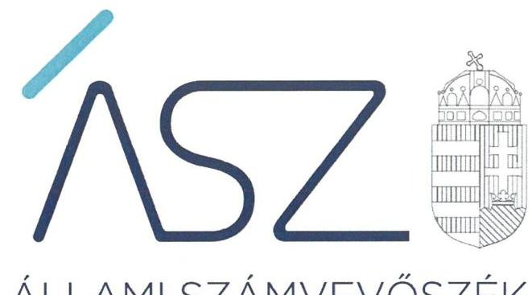
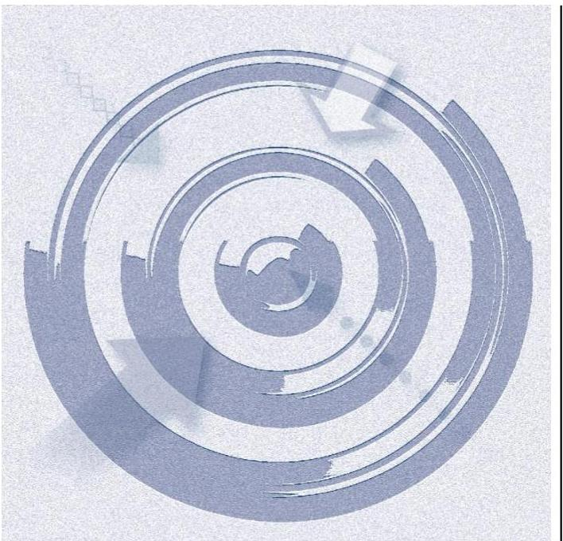
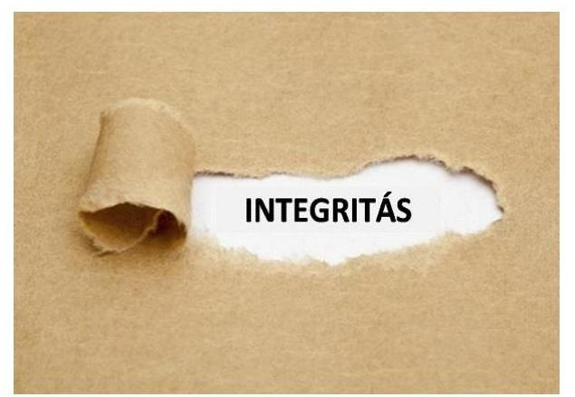

ÁLLAMI SZÁMVEVŐSZÉK

# JELENTÉS 

A többségi állami tulajdonú gazdasági társaságok integritásának ellenőrzése - 148 gazdasági társaságnál

2021. 

21089
www.asz.hu

---

ÁLLAMI SZÁMVEVŐSZÉK

# JELENTÉS 

A többségi állami tulajdonú gazdasági társaságok integritásának ellenőrzése - 148 gazdasági társaságnál
2021. 12. hó 14. nap

21089
www.asz.hu

---

# AZ ELLENŐRZÉST FELÜGYELTE: 

KLINGA LÁSZLÓ felügyeleti vezető

## AZ ELLENŐRZÉST VEZETTE ÉS A VÉGREHAJTÁSÁÉRT FELELŐS:

SZAPPANOS JÚLIA ellenőrzésvezető
HOFMEISTER LÁSZLÓ ellenőrzésvezető
ÓDOR ZOLTÁN TAMÁS ellenőrzésvezető

A PROGRAMOK ÖSSZEÁLLÍTÁSÁÉRT FELELŐS:
GÖRGÉNYI GÁBOR ellenőrzési program készítéséért felelős vezetö

Jelentéseink az Országgyúlés számítógépes hálózatán és az interneten a www.asz.hu címen is olvashatóak.

IKTATÓSZÁM: EL-3460-001/2021
TÉMASZÁM: 2557
ELLENŐRZÉS-AZONOSÍTÓ SZÁM: V090101

---

# TARTALOMJEGYZÉK 

■ ÖSSZEGZÉS ..... 5
■ ÉRTÉKELÉS ..... 6
■ AZ ELLENŐRZÉS CÉLJA ..... 8
■ AZ ELLENŐRZÉS TERÜLETE ..... 9
■ AZ ELLENŐRZÉS HÁTTERE, INDOKOLTSÁGA ..... 11
■ A JELENTÉS LÉNYEGES KÉRDÉSKÖREI. ..... 12
■ AZ ELLENŐRZÉS HATÓKÖRE ÉS MÓDSZEREI. ..... 13
■ ÉRTÉKELÉS ..... 15
■ MELLÉKLETEK. ..... 17
I. sz. melléklet: Értelmező szótár ..... 17
II. sz. melléklet: A számviteli törvény által meghatározott számviteli szabályzatok rendelkezése állására és tartalmára vonatkozó adatok ..... 18
III. sz. melléklet: A kötelező és elvárt integritási kontrollok rendelkezésre állására vonatkozó adatok ..... 19
IV. sz. melléklet: Az ellenőrzött gazdasági társaságok felsorolása ..... 20
V. sz. melléklet: Az ellenőrzött gazdasági társaságok értékelése ..... 23
■ RÖVIDÍTÉSEK JEGYZÉKE ..... 25

---

.

---

# ÖSSZEGZÉS 

A társadalmi, gazdasági súlyuk, üzemméretük következtében kiemelt szerepet játszó ellenőrzött 148 többségi állami tulajdonú gazdasági társaság közül 128 gazdasági társaság a 2020. évre vonatkozóan elkészítette az alapvető számviteli szabályozását és rendelkezett javadalmazással összefüggő szabályzattal. Az integritási veszélyekkel, korrupciós kockázatokkal szembeni ellenálló képességet erősító kontrollok értékelése alapján az elszámoltatható gazdálkodás és az integritás-tudatos szabályozási környezet alapvető feltételeinek kialakítását 35 társaság biztositotta már a 2020. évben.
Az Állami Számvevőszék tanácsadó tevékenysége eredménye alapján a 2021. évben az érintett gazdasági társaságok döntő részénél javult az integritás-tudatos szabályozási környezet alapvető feltételeinek és azok minőségi tartalmának a kialakítása, ami szorosan összefügg a társaságok vezetőinek az elszámoltathatóság és az átláthatóság iránti elkötelezettségével és a korrupciós veszélyeztetettség csökkentésének igényével. A társaságok tekintetében a közpénzügyi helyzet jelentősen javult.

## Az ellenőrzés társadalmi indokoltsága

Magyarország Alaptörvénye ${ }^{1}$ és a nemzeti vagyonról szóló törvény értelmében a közpénzeket és a nemzeti vagyont az átláthatóság és a közélet tisztaságának elve szerint kell kezelni. Az elvek a számvitelről szóló és a köztulajdonban álló gazdasági társaságok takarékosabb müködéséről szóló törvények rendelkezéseiben jelennek meg.

A közvagyonnal való felelős gazdálkodás és annak állapotáról - a tulajdonos állam, valamint a társadalom irányába - történő elszámolás a védelem kialakítását és müködtetését is megkívánja. Ezek az integritás kontrollok alkalmazásának szükségességét jelentik. Az integritás a szervezet társadalmi elvárásoknak megfelelő értékrendjét jelenti. A korrupciós kockázatoknak való kitettség elleni védelem kialakítása, illetve az azok mérséklésére hivatott kontrollok alkalmazása vezetői feladat és felelősség, amely a szervezeti müködés, a mindennapi feladatellátás szabályosságán túlmutat. Az integritás-elvű működés a korrupciómentesség szervezeti fellépésének eszköze, a feddhetetlenség igazolása.

A köztulajdonban álló gazdasági társaságok belső kontrollrendszeréről szóló kormányrendelet generális vezetői felelősséget fogalmaz meg a köztulajdonban álló gazdasági társaság első számú vezetője részére a belső kontrollrendszer - és ennek keretében a szervezeti integritás kontrollok-kialakítása és müködtetése érdekében.

Jelen ellenőrzés hozzájárul ahhoz, hogy az állami tulajdonú gazdasági társaságok a jogszabályi előírások szerint alakítsák ki gazdálkodásuk szabályozási kereteit, valamint a kockázatok feltárásával támogatást nyújt ezen szervezetek számára az integritás alapú, átlátható és elszámoltatható közpénzfelhasználás létrehozásában.

---

# ÉRTÉKELÉS

Az integritás alapú múködés megléte különösen fontos a társadalmi, gazdasági súlyuk következtében is kiemelt szerepet játszó köztulajdonban álló gazdasági társaságoknál. Az üzemméret, a mérlegfőösszeg, a közfeladat-ellátásban való múködés alapján nagyobb veszélyeztetettségnek és korrupciós kockázatoknak kitett többségi állami tulajdonú gazdasági társaságok közül a Gbkr. ${ }^{2}$ hatálya alá tartozó 148 többségi állami tulajdonú gazdasági társaságból 128 gazdasági társaság a 2020. évben rendelkezett a gazdálkodás elszámoltathatóságának alapvető feltételeit jelentő számviteli szabályozásokkal, valamint a jogszabály által előírt, javadalmazással összefüggő szabályzattal. A jogszabályban kötelezően előírt kontrollokat a társaságok többsége kialakította. A gazdasági társaságoknál a pénz- és vagyongazdálkodáshoz kapcsolódó alapvető szabályozási feltételek kialakítása, a szervezeti integritás, a múködés és a vezetés alapvető szabályozási feltételeinek kialakítása járul hozzá az integritás-elv érvényesüléséhez.

A gazdasági társaságok gazdálkodásával, valamint a szervezeti elvekkel, értékekkel összefüggő integritás kontrollok kiépítettségének értékelését az 1. táblázat mutatja be:

1. táblázat

|  Az integritás biztosításához szükséges szabályozási kör-
nyezet tényezőcsoportja, és értékelésük a 2020. évben | Összes szer-
vezet | Szabályzatok
Kialakította | Arány  |
| --- | --- | --- | --- |
|  1. Számviteli szabályzatok kialakítása | 148 | 128 | $86 \%$  |
|  2. Javadalmazással összefüggő szabályzat | 148 | 145 | $98 \%$  |
|  2021. évtől kötelező integritási szempontból lénye- |  |  |   |
|  3. ges szabályzatok | 148 | 104 | $70 \%$  |
|  4. Elvárt integritási szabályzatok | 148 | 104 | $70 \%$  |

A szabályozás kialakításával és annak alkalmazásával a vezető nemcsak a szabályos múködés feltételeit teremti meg, hanem hozzájárul a közpénzfelhasználás során az átláthatóság és elszámoltathatóság elveinek érvényesüléséhez.

A vezetői kontroll akkor tudja a szerepét betölteni, ha a kontrollkörnyezet szabályozott, átlátható és ellenőrizhető. A számviteli politika és az annak a keretén belül elkészítendő számviteli szabályzatok elkészítésével, azok folyamatos felülvizsgálatával biztosítható a pénzügyi- és vagyongazdálkodás átláthatósága és elszámoltathatósága. Az integritási szabályzatok a gazdasági társaságok integritási kockázatainak mérséklésére szolgáló kontrolljainak kiépítettségét erősítik.

Az integritási veszélyekkel szembeni állóképességet tovább erősítette 80 szervezet, amelyek a számviteli szabályozásban rögzítették azokat a gazdálkodóra vonatkozó kiemelt tartalmi elemeket, amelyek hozzájárulnak a szabályszerű múködés biztosításához, ezáltal a szabályzatok a funkciójukat betöltötték. A jogszabályban előírt, egyes lényeges követelmények szerinti tartalommal elkészített szabályzatokkal rendelkező szervezetek közül 56 gazdasági társaságnál már a 2020. évben kiépítettek olyan korrupció elleni védelemre szolgáló, jogszabályban előírt 2021. évtől kötelező, valamint 58 szervezetnél további elvárt szabályozásokat, amelyek megléte támogatja az Alaptörvényben rögzített, a közpénzek gazdálkodására vonatkozó átláthatóság és közélet tisztasága elvének megvalósulását.

A jogszabályok által előírt, valamint az integritási környezet részét képező elvárt szabályok által az elszámoltatható gazdálkodás és az integritás-tudatos szabályozási környezet, a korrupciós kockázatokkal szembeni ellenálló képesség alapvető feltételeinek kialakítását 35 társaság biztosította már a 2020. évben. A kiépített környezet által biztosítható az integritási kockázatok feltárása, kezelése, megelőzése.

20 gazdasági társaság a gazdálkodás alapvető szabályozási feltételeit nem alakította ki, mert nem rendelkezett a jogszabályban előírt számviteli szabályzatokkal, ennek következtében nem voltak biztosítottak a pénzügyi- és vagyongazdálkodás átláthatóságának alapvető feltételei, keretei.

A Gbkr. hatálya alá tartozó gazdasági társaságok esetében a jogszabályokkal összhangban kialakított szabályzatok elkészítése mellett elsősorban az alapvető integritás kontrollok kiépítését kell erősíteni a vezetőknek. A belső kontrollrendszer és az elvárt, a korrupció elleni védelmet szolgáló integritási szabályozások kialakítására vonatkozóan további lépések megtétele szükséges.

---

Az ÁSZ a 2021. évben az integritás alapú, átlátható és elszámoltatható közpénzfelhasználás elősegítése érdekében figyelemfelhívó levélben értesítette az érintett szervezetek vezetőit, hogy az ellenőrzés során feltárt szabálytalanságok megszüntetésére és a pozitív változások elindítására lépéseket tegyenek. A figyelemfelhívásban az ellenőrzés által feltárt hibák, hiányosságok felszámolására az ÁSZ a 2021. év tekintetében biztosított lehetőséget.

A figyelemfelhívással érintett és többségi állami tulajdonú gazdasági társaságként müködő 113 gazdasági társaság közül 111 tanúsított felelős vezetői magatartást azzal, hogy az ÁSZ tanácsadó tevékenységére figyelemmel intézkedett a szabályozásban rejlő hibák kijavításáról, megszüntetéséről. Ennek hatására jelentősen javult a Gbkr. hatálya alá tartozó gazdasági társaságoknál az integritás-tudatos szabályozási környezet alapvető feltételeinek a kialakítása, ami előmozdítja a közpénzügyi helyzet javulását.

A 2021. évben a 145 többségi állami tulajdonú gazdasági társaságból 143 a számviteli szabályozás kialakításával párhuzamosan gondoskodott azok minőségi tartalmának megteremtéséről. A javadalmazással összefüggő szabályzat és annak a követelmények szerinti tartalommal való elkészítése az ellenőrzött szervezetek tekintetében megvalósult. A Gbkr.-ben előírt - a 2021. évtől kötelező - integritási szempontból lényeges szabályzatokat 142 társaság, míg az elvárt integritási szabályzatokat szintén 142 társaság elkészítette. A hibát javító, felelős vezetői magatartást tanúsító társaságok vezetői a hiányzó szabályozás esetében pótolták azokat, emellett a tartalmi hiányosságok megszüntetése minőségi tartami javulást eredményezett.

Két Gbkr. hatálya alá tartozó állami tulajdonú gazdasági társaság esetében - Bay Zoltán Alkalmazott Kutatási Közhasznú Nonprofit Korlátolt Felelősségű Társaság, M A H A R T - PassNave Személyhajózási Korlátolt Felelősségű Társaság - a felelős vezetői magatartás nem érvényesült, mivel a figyelemfelhívó levélben foglaltakra a társaságok vezetői nem válaszoltak, a jelzett hibák felszámolására tett intézkedésről nem adtak tájékoztatást. Az ÁSZ elnöke a feltárt hiányosságok pótlása érdekében a tulajdonosi joggyakorlókhoz fordult.

---

# AZ ELLENŐRZÉS CÉLJA

Az ellenőrzés célja annak értékelése, hogy az ellenőrzött szervezetek a feladatellátásuk kapcsán meghatározták-e a szervezeti kultúra egységét biztosító értékeket, elveket, kiépítették-e az integritásirányítási, integritás-kockázatkezelési rendszert, ezen belül az integritási kockázatokat mérséklő integritáskontrollokat, és e kontrolleszközök ki-terjedtek-e a kockázatos folyamatokra, területekre.

---

# AZ ELLENŐRZÉS TERÜLETE 

## A többségi állami tulajdonú gazdaságitársaságok

A köztulajdonú gazdasági társaságok 2018. évi integritás helyzetéről készített ÁSZ ${ }^{3}$ elemzés szerint általános tendencia, hogy a nagyobb vállalati méret együtt jár az integritási veszélyek gyakoribbá válásával, ugyanakkor a nagyobb szervezeteknél a kialakított kontrollok szintje magasabb az átlagnál.

Az ellenőrzés az integritás alapú, átlátható és elszámoltatható közpénzfelhasználás elősegítése érdekében, 148 olyan többségi, állami tulajdonban lévő gazdasági társaság integritási kontrollok kiépítését értékelte, mely a Gbkr. hatálya alatt állt a 2020. évben. A Gbkr. 2020. január 1-jétől hatályos, ugyanakkor a jogalkotó több alkalommal módosította a rendelet alkalmazásának kezdő időpontját. Ennek eredményeképpen a köztulajdonban álló gazdasági társaság első számú vezetőjének 2021. január 1jétől a belső kontrollrendszert ki kell alakítania és azt müködtetnie kell.

Azon köztulajdonban álló gazdasági társaság - a Magyar Nemzeti Bank és annak felügyelete alá tartozó köztulajdonban álló gazdasági társaság kivételével - állt a Gbkr. hatálya alatt, amely esetében a 2020. évet megelőző két üzleti évben a mérlegforduló napján a következő három mutatóérték közül legalább kettő a társaság elfogadott (egyszerűsített) éves beszámolója, vagy - amennyiben konszolidált éves beszámolót is készít - a konszolidált éves beszámolója alapján meghaladja az alábbi határértéket:
$\longrightarrow$ a mérlegfőösszeg a 600 M Ft -ot;
$\longrightarrow$ az éves nettó árbevétel az 1,2 Mrd Ft-ot;
$\longrightarrow$ az átlagosan foglalkoztatottak száma a 100 főt.
Jelen ellenőrzés keretében ellenőrzött többségi állami tulajdonú gazdaságtársaságok mind mérlegfőösszegük, nettó árbevételük, foglalkoztatottjaik létszámának nagyságából, mind tevékenységükből, közfeladat-ellátásban betöltött szerepükből eredően kiemeltek. Az állami tulajdonú gazdasági társaságok az állam működésével közvetlenül összefüggő feladatokat látnak el.

A 2021. évben három gazdasági társaság (DEBRECENI UNIVERSITAS Nonprofit Közhasznú Korlátolt Felelősségű Társaság, Grand Tokaj Zártkörűen Müködő Részvénytársaság, TAEG Tanulmányi Erdőgazdaság Zártkörűen Müködő Részvénytársaság) tulajdonosi joggyakorlásában változás történt, így már nem többségi állami tulajdonú gazdasági társaságként látják el feladataikat. Egy esetben közhasznú szervezet, míg további két esetben vagyonkezelő alapítvány gyakorolja a tulajdonosi jogokat a többségi állami tulajdonlás megszűnését követően az érintett gazdasági társaságok felett.

---

Az ellenőrzött gazdasági társaságok által a 2020. évben ellátott főtevékenységeket a 2. táblázat mutatja be.
2. táblázat

| Sor-   szám | Főtevékenység megnevezése | Társaságok   száma   (dacab) | Társaságok   megoszlása   (\%) |
| :--: | :--: | :--: | :--: |
| 1. | Adminisztratív és szolgáltatást támogató tevékenység | 10 | $6,8 \%$ |
| 2. | Bányászat, kőfejtés | 1 | $0,7 \%$ |
| 3. | Építőipar | 4 | $2,7 \%$ |
| 4. | Feldolgozóipar | 16 | $10,8 \%$ |
| 5. | Humán-egészségügyi, szociális ellátás | 5 | $3,4 \%$ |
| 6. | Információ, kommunikáció | 11 | $7,4 \%$ |
| 7. | Ingatlanügyletek | 1 | $0,7 \%$ |
| 8. | Kereskedelem, gépjármújavitás | 2 | $1,4 \%$ |
| 9. | Közigazgatás, védelem; kötelező társadalombiztositás | 1 | $0,7 \%$ |
| 10. | Mezőgazdaság, erdőgazdálkodás, halászat | 29 | $19,6 \%$ |
| 11. | Művészet, szórakoztatás, szabadidő | 11 | $7,4 \%$ |
| 12. | Pénzügyi, biztosítási tevékenység | 3 | $2,0 \%$ |
| 13. | Szakmai, tudományos, műszaki tevékenység | 21 | $14,2 \%$ |
| 14. | Szállítás, raktározás | 14 | $9,5 \%$ |
| 15. | Villamosenergia-, gáz-, gőzellátás, légkondicionálás | 11 | $7,4 \%$ |
| 16. | Vizellátás; szennyvíz gyüjtése, kezelése, hulladékgazdálkodás, szennyeződésmentesítés | 8 | $5,4 \%$ |
|  | Összesen: | 148 | $100,0 \%$ |

Forrás: Gazdasági társaságok nyilvánosan elérhető adatai alapján, A52 szerkesztés

---

# AZ ELLENŐRZÉS HÁTTERE, INDOKOLTSÁGA 

Az Alaptörvény alapértékeket, elveket fogalmaz meg, amely szerint az állam tulajdonában álló szervezetek a törvényben meghatározott módon, önállóan és felelősen gazdálkodnak a törvényesség, célszerűség és az eredményesség követelményei szerint. A közpénzekkel gazdálkodó minden szervezet köteles a nyilvánosság előtt elszámolni e forrásból megvalósuló gazdálkodásával. A közpénzeket és a nemzeti vagyont az átláthatóság és a közélet tisztaságának elve szerint kell kezelni.

Az ÁSZ a 2016-2018. években a köztulajdonú gazdasági társaságok körében is végzett integritás felmérést, amelynek eredményei azt mutatták, hogy nagyon jelentősek a különbségek az egyes gazdasági társaságok között az integritási kontrollok kiépítettségének tekintetében, és e különbségek jelentős részben a társaságok menedzsmentjének az eltérő hozzáállására vezethetők vissza.

---

# A JELENTÉS LÉNYEGES KÉRDÉSKÖREI 

1. A gazdasági társaságok kialakították-e az integritásuk biztosításához szükséges szabályozási környezetet?
2. Csökkent-e az ellenőrzött szervezetek integritási kockázata?

---

# AZ ELLENŐRZÉS HATÓKÖRE ÉS MÓDSZEREI 

## Az ellenőrzés típusa

| Megfelelőségi ellenőrzés

## Az ellenőrzött időszak

| 2020. év

## Az ellenőrzés tárgya

A többségi állami tulajdonban lévő gazdasági társaságok gazdálkodásával, valamint a szervezeti elvekkel, értékekkel összefüggő integritás kontrollok kiépítettsége.

## Az ellenőrzött szervezetek

A IV. mellékletben szereplő, a Gbkr. hatálya alá tartozó többségi állami tulajdonban lévő gazdasági társaságok.

## Az ellenőrzés jogalapja

Az ÁSZ tv. ${ }^{4} 1 . \S$ (3) bekezdése.

## Az ellenőrzés módszerei

Az ellenőrzés lefolytatása az ellenőrzési program szempontjai, az ellenőrzött időszakban hatályos jogszabályok, a jelen ellenőrzésre irányadó ÁSZ módszertan figyelembevételével és a nemzetközi standardokat irányadónak tekintve történik.

Az ellenőrzési kérdések megválaszolásához szükséges bizonyítékok megszerzése a következő ellenőrzési eljárások alkalmazásával történik: megfigyelés, összehasonlítás, elemző eljárás. Az ellenőrzési bizonyítékként felhasználható adatforrások közé tartoztak az ellenőrzési programban felsorolt adatforrások, továbbá minden - az ellenőrzés folyamán - feltárt, az ellenőrzés szempontjából információkat tartalmazó dokumentum. Az ellenőrzés lefolytatása a kérdésekre adott válaszok kiértékelésével, valamint a megjelölt adatforrások felhasználásával, továbbá az adott időszakban hatályos jogszabályok, valamint az ÁSZ honlapján közzétett helyénvalósági kritériumok alapján történik.

---

A monitoring típusú ellenőrzés a gazdasági társaságok integritás alapú működésének lényeges területeire terjed ki, és súlypontok meghatározásával lehetőséget biztosít a kockázatok beazonosítására. A monitoring típusú ellenőrzés emellett már az ellenőrzés folyamatában - az ÁSZ figyelemfelhívásán keresztül - lehetőséget biztosít az integritási kontrollok kiépítettségének javítására.

Az integritás kontrollok kiépítettsége szintjének értékelése szabályszerűségi és helyénvalósági kritériumok alapján történik. Az ellenőrzés szabályszerűségi kritériumként alkalmazta azokban az esetekben, amikor a kontroll kiépítését jogszabály kötelezően előírta. Jogszabály által kötelezően nem előírt, elvárt kontrollok esetében az ÁSZ az Alaptörvényben megfogalmazott integritás elvek (törvényesség, célszerűség, eredményesség, átláthatóság, közélet tisztaságának elve) érvényesítése érdekében a kontrollok meglétét helyénvalósági kritériumként fogalmazza meg.

Az ÁSZ kiemelten fontosnak tartja az ellenőrzések során feltárt szabálytalanságok mielőbbi megszüntetését, a pozitív változások elindítását. Ezért a dokumentumok értékelését követően azokban az esetekben, ahol az ÁSZ hibát, hiányosságot tárt fel lehetőséget biztosított a társaság első számú vezetőjének, hogy a 2021. évre vonatkozóan, azok felszámolására lépéseket tegyen és erről az ÁSZ elnökét értesítse.

A jogszabályi követelmények teljesítése, valamint a belső kontrollrendszer kialakítása és működtetése, illetve az integritás-elvű működés értékelésének eredménye, továbbá a figyelemfelhívásra megtett, vagy megtenni kívánt intézkedések együttesen kerülnek kockázati értékelésre. Az értékelés szempontrendszerét és módját az V. sz. melléklet tartalmazza.

---

# 1. A gazdasági társaságok kialakították-e az integritásuk biztosításához szükséges szabályozási környezetet? 

Összegző értékelés Az ellenőrzött 148 többségi állami tulajdonú gazdasági társaság közül 128 gazdasági társaság rendelkezett a 2020. évben a jogszabályban előírt szabályozásokkal. A gazdálkodás elszámoltathatóságának alapvető feltételeit jelentő, továbbá az integritás szempontjából lényeges szabályokat 35 gazdasági társaság kialakította a 2020. évben. 20 szervezet esetében az alapvető számviteli kereteket nem alakították ki.

A 148 ellenőrzött többségi állami tulajdonú gazdasági társaság közül 128 gazdasági társaság kialakította az alapvető számviteli szabályozását a 2020. évben. 80 gazdasági társaság vonatkozásában fordult elő, hogy a számviteli szabályzatok nem tartalmazták a jogszabályi előírások alapján kötelező, következő tartalmi elemeket, az alábbiakban részletezettek szerint:
$\longrightarrow$ a számviteli politikában nem rögzítették azokat a gazdálkodóra jellemző szabályokat, előírásokat, módszereket, amelyekkel meghatározzák, hogy mit tekintenek a számviteli elszámolás, az értékelés szempontjából lényegesnek, nem lényegesnek, továbbá jelentősnek, nem jelentősnek;
$\longrightarrow$ az eszközök és a források leltárkészítési és leltározási szabályzatában a jogszabály által előírt legalább három évenkénti leltározás helyett azon túl határozták meg a tárgyi eszközök mennyiségi felvétellel történő leltározásának gyakoriságát;
$\longrightarrow$ a pénzkezelési szabályzatban nem határozták meg a pénzkezelés felelősségi szabályait, a készpénzállományt érintő pénzmozgások jogcímeit és eljárási rendjét, továbbá a készpénzállomány ellenőrzésekor követendő eljárást és az ellenőrzés gyakoriságát;
$\longrightarrow$ a számlarendben nem rögzítették a főkönyvi számla és az analitikus nyilvántartás kapcsolatát.
20 gazdasági társaság a gazdálkodás elszámoltathatóságát nem biztosította az alapvető számviteli keretek hiányában.

A Számv.tv. ${ }^{5}$ által meghatározott számviteli szabályzatok rendelkezésre állására és kiemelt tartalmi elemeire vonatkozó adatokat a II. számú melléklet mutatja be a 2020. év értékelése alapján.

A kötelezően elkészítendő, integritás szempontjából lényeges kontrollt jelentő, a Taktv. ${ }^{6}$ által előírt javadalmazással összefüggő szabályzatot ${ }^{7}$ 145 gazdasági társaság kialakította.

Az ellenőrzés a fenti, kötelező szabályozási keretek kialakítása mellett értékelte a korrupció megelőzését leginkább szolgáló - a 2021. évtől kötelező, valamit további elvárt - kontrolloknak a meglétét.

---

A jogszabályban előírt szabályozásokkal rendelkező szervezetek közül további, a korrupciós kockázatok csökkentésre szolgáló, elvárt integritás kontrollokkal 56 gazdasági társaság rendelkezett. Ezen társaságok további erőfeszítéseket tettek az integritás erősítése érdekében.

47 gazdasági társaság szintén kiépített a korrupció ellen ható kontrollokat, amelyek érdemi szerepüket a jogszabályi előírásoknak megfelelő szabályozási keretek kialakítását követően tudják betölteni.

A jogszabályban előírt szabályozásokkal rendelkező szervezetek közül a Gbkr. által meghatározott - a 2021. évtől kötelező - kontrollokat 58 gazdasági társaság kiépítette már a 2020. évben.

A gazdálkodás elszámoltathatóságának alapvető feltételeit jelentő számviteli szabályozást és a jogszabály által előírt, továbbá az integritás szempontjából lényeges szabályokat 35 gazdasági társaság kialakította a 2020. évben.

A 2021. évtől kötelező és az elvárt integritási kontrollokra vonatkozó adatokat a III. számú melléklet mutatja be a 2020. év értékelése alapján.

# 2. Csökkent-e az ellenőrzött szervezetek integritási kockázata? 

Összegző értékelés

Az ÁSZ tanácsadó tevékenységének eredményeképpen az értékelt társaságoknál az integritási kontrollok szintje kezelt kockázatú lett a 2021. évben. Az intézkedő társaságok hozzájárultak a feltárt hibák, hiányosságok felszámolásához, az integritási kockázatok csökkentéséhez. A közpénzügyi helyzet tekintetében jelentős javulás történt.

Az integritás biztosításához elengedhetetlen a szabályozási környezet kialakítása, ami szorosan összefügg a társaságok vezetőinek a szabályosság és az átláthatóság iránti elkötelezettségével. Fontos, hogy a feladatok ellátásának elszámoltatható rendjét, az erőforrások átlátható felhasználását biztosító, a visszaéléseket, a csalás lehetőségét minimálisra csökkentő belső szabályozás rendelkezésre álljon és betöltse szerepét. E célnak mielőbbi elérése érdekében lehetőséget biztosított az ÁSZ arra, hogy az értékelt területeken, a feltárt hibák, hiányosságok felszámolására intézkedést tegyenek a társaságok vezetői a 2021. évre vonatkozóan.

Az ÁSZ tanácsadó tevékenységének hatására megtett intézkedések a közpénzügyi helyzet tekintetében jelentős javulást eredményeztek. Két gazdasági társaságnál az elmaradt intézkedés következtében továbbra is fennállnak az integritást biztosító szabályzási hiányosságok, ami fokozza a korrupciós kitettség kockázatát.

Az értékelt Gbkr. hatálya alá tartozó állami tulajdonú gazdasági társaságok közel 99\%-a kialakította az integritás alapú működés alapvető feltételeit, emellett az értékelt társaságok kevesebb, mint 1,5\%-a további intézkedésekkel csökkentheti a korrupciós veszélyeztetettséget.

Az ÁSZ tanácsadó tevékenységét megelőzően 2020-ban, majd az ÁSZ tanácsadó tevékenységét követően 2021-ben az értékelt területek tekintetében az integritási környezet alakulását a II. sz. és a III. sz. melléklet részletezi.

---

# MELLÉKLETEK 

## I. SZ. MELLÉKLET: ÉRTELMEZŐ SZÓTÁR

ÁSZ Integritás Projekt
belső ellenőrzés
gazdasági társaság
integritás
integrált kockázatkezelési rendszer
kontrollkörnyezet
kontrolltevékenységek
szervezeti integritást sértő esemény

Az ÁSZ 2009-ben indította el a „Korrupciós kockázatok feltérképezése - Integritás alapú közigazgatási kultúra terjesztése" című, európai uniós forrásból megvalósított kiemelt projektjét (Integritás Projekt). Az Integritás Projekt célja, hogy felmérje a közszféra intézményei korrupciós kockázatoknak való kitettségét, illetőleg az azok mérséklésére hivatott kontrollok szintjét. Az ÁSZ a projekt révén az integritás szemlélet minél szélesebb körrel történő megismertetését, gyakorlatba ültetését kívánja elérni. Az integritás követelményeinek megfelelő szervezeti működést előnyben részesítő közigazgatási kultúra elterjesztését és a korrupció elleni fellépést az ÁSZ önmagára nézve is stratégiai jelentőségű célként fogalmazta meg. A projekt a felmérésben résztvevő intézmények számára helyzetükről egyfajta „tükörképet" mutat be, ami alapot teremt a jövőbeni pozitív irányú elmozduláshoz. (Forrás: a http://integritas.asz.hu honlapon közzétett, a 2013. évi Integritás felmérés eredményeiről készült összefoglaló tanulmány)
A belső ellenőrzés olyan független, objektív bizonyosságot adó eszköz és tanácsadói tevékenység, amely értéket ad a szervezet működéséhez és javítja annak minőségét. Módszeres és szabályozott eljárással értékeli és javítja a kockázatkezelési, a kontroll és az irányítási folyamatok hatékonyságát, ezáltal segíti a szervezeti célok megvalósítását. (Forrás: Gbkr. 2. § 1. pont)
A gazdasági társaságok üzletszerű közös gazdasági tevékenység folytatására, a tagok vagyoni hozzájárulásával létrehozott, jogi személyiséggel rendelkező vállalkozások, amelyekben a tagok a nyereségből közösen részesednek, és a veszteséget közösen viselik. (Forrás: Ptk. ${ }^{8}$ 3:88. § (1) bekezdés)
A köztulajdonban álló gazdasági társaság szabályszerű, a köztulajdonban álló gazdasági társaság célkitűzéseinek, értékeinek és elveinek megfelelő működése.
(Forrás: Gbkr. 2. § 5. pont)
Olyan folyamatalapú kockázatkezelési rendszer, amely a szervezet minden tevékenységére kiterjed, egységes módszertan és eljárások alkalmazásával, a szervezet célkitűzéseinek és értékeinek figyelembevételével biztosítja a szervezet kockázatainak teljes körű azonosítását, azok meghatározott kritériumok szerinti értékelését, valamint a kockázatok kezelésére vonatkozó intézkedési terv elkészítését és az abban foglaltak nyomon követését. (Forrás: Bkr. ${ }^{9}$ 2. § m) pont, 2016. október 1-jétől)
A vezető tisztségviselő vagy a vezető tisztségviselőkből álló testület vezetője által kialakított olyan elvek, eljárások, belső szabályzatok összessége, amelyben világos a szervezeti struktúra, a folyamatok átláthatók, egyértelműek a felelősségi, hatásköri viszonyok és feladatok, meghatározottak, ismertek és elfogadottak az etikai elvárások a szervezet minden szintjén, átlátható a humánerőforrás-kezelés, biztosított a szervezeti célok és értékek irányában való elkötelezettség fejlesztése és elősegítése.
(Forrás: Bkr. 6. § (1) bekezdés)
A vezető tisztségviselő vagy a vezető tisztségviselőkből álló testület vezetője által a szervezeten belül kialakított (kontroll) tevékenységek, melyek biztosítják a kockázatok kezelését, hozzájárulnak a szervezet céljainak eléréséhez és erősítik a szervezet integritását. (Forrás: Bkr. 8. § (1) bekezdés)
Minden olyan esemény, amely a köztulajdonban álló gazdasági társaságra vonatkozó jogszabályoktól, belső szabályzatoktól, valamint a köztulajdonban álló gazdasági társaság célkitűzéseinek, értékeinek és elveinek megfelelő működéstől eltér.
(Forrás: Gbkr. 2. § 7. pont)

---

II. SZ. MELLÉKLET: A SZÁMVITEU TÖRVÉNY ÁLTAL MEGHATÁROZOTT SZÁMVITELI SZABÁLYZATOK RENDELKEZÉSRE ÁLLÁSÁRA ÉS TARTALMÁRA VONATKOZÓ ADATOK

|  | Az értékelt terület megnevezése | Gazdasági társaságok száma |  |
| :--: | :--: | :--: | :--: |
| Ssz. | Számviteli szabályzatok | Tanácsadó tevékenységet megelőzően 2020-ban (148 társaság) | Tanácsadó tevékenységet követően 2021-ben (145 társaság) |
| 1. | Kialakították a számviteli politikát. | 141 | 144 |
| 2. | A számviteli politikában rögzítették azokat a gazdálkodóra jellemző szabályokat, előírásokat, módszereket, amelyekkel meghatározzák, hogy mit tekintenek a számviteli elszámolás, az értékelés szempontjából lényegesnek, nem lényegesnek. | 78 | 144 |
| 3. | A számviteli politikában rögzítették azokat a gazdálkodóra jellemző szabályokat, előírásokat, módszereket, amelyekkel meghatározzák, hogy mit tekintenek a számviteli elszámolás, az értékelés szempontjából jelentősnek, nem jelentősnek. | 140 | 144 |
| 4. | Kialakították a z eszközök és a források leltárkészítési és leltározási szabályzatát. | 137 | 144 |
| 5. | Az eszközök és források leltárkészítési és leltározási szabályzatában a jogszabályban elóírtakkal összhangban határozták meg a mennyiségi felvétellel történő leltározás gyakoriságát. | 133 | 144 |
| 6. | Kialakították az eszközök és a források értékelési szabályzatát. | 140 | 143 |
| 7. | Kialakították a pénzkezelési szabályzatot. | 142 | 144 |
| 8. | A pénzkezelési szabályzatban rögzítették a pénzkezelés felelősségi szabályait. | 140 | 144 |
| 9. | A pénzkezelési szabályzat tartalmazta a készpénzállomány ellenőrzésekor követendő eljárást és az ellenőrzés gyakoriságát. | 132 | 143 |
| 10. | A pénzkezelési szabályzat tartalmazta a készpénzállományt érintő pénzmozgások jogcímeit és eljárási rendjét. | 119 | 143 |
| 11. | Kialakították a számlarendet. | 137 | 144 |
| 12. | A számlarendben meghatározták a főkönyvi számla és az analitikus nyilvántartás kapcsolatát. | 123 | 144 |

---

III. SZ. MELLÉKLET: A KÖTELEZŐ ÉS ELVÁRT INTEGRITÁSI KONTROLLOK RENDELKEZÉSRE ÁLLÁSÁRA VONATKOZÓ ADATOK

|  | Az értékelt terület megnevezése | Gazdasági társaságok száma |  |
| :-- | :-- | :--: | :--: |
| Ssz. | Javadalmazással összefüggő szabályzat | Tanácsadó tevékenységet   megelőzően 2020-ban   (148 társaság) | Tanácsadó tevékenységet   követően 2021-ben   (145 társaság) |
| 1. | Kialakították a javadalmazással összefüggő szabályzatot. | 145 | 145 |
| 2. | A javadalmazással összefüggő szabályzat tartalmazza a törvény-   ben előírt, a vezető tisztségviselők, felügyelőbázottsági tagok,   valamint a vezető állású munkavállalók javadalmazása módját,   mértékének elveit, annak rendszerét. | 144 | 145 |
| 3. | A javadalmazással összefüggő szabályzat tartalmazza a törvény-   ben előírt jogviszony megszűnése esetére biztosított juttatások   módját, mértékének elveit, rendszerét. | 137 | 145 |

|  | Az értékelt terület megnevezése | Gazdasági társaságok száma |  |
| :-- | :-- | :--: | :--: |
| Ssz. | 2021. évtől kötelező integritási szempontból lényeges   szabályzatok | Tanácsadó tevékenységet   megelőzően 2020-ban   (148 társaság) | Tanácsadó tevékenységet   követően 2021-ben (145   társaság) |
| 1. | Az etikai elvárásokat rögzítették | 144 | 145 |
| 2. | Rendelkeztek integrált kockázatkezelés eljárásrenddel | 136 | 145 |
| 3. | Kialakították a szervezeti integritást sértő események és pana-   szok bejelentő rendszerét | 132 | 144 |
| 4. | Kialakították az integritást sértő események kezelésének eljá-   rásrendjét | 130 | 144 |
| 5. | Biztosították a szervezeten belüli összeférhetetlenség megelő-   zését és ellenőrzését | 111 | 142 |

|  | Az értékelt terület megnevezése | Gazdasági társaságok száma |  |
| :-- | :-- | :--: | :--: |
| Ssz. | Elvárt integritási szabályzatok | Tanácsadó tevékenységet   megelőzően 2020-ban   (148 társaság) | Tanácsadó tevékenységet   követően 2021-ben   (145 társaság) |
| 1. | Rendelkeztek az ajándékok elfogadására vonatkozó szabályo-   zással. | 143 | 145 |
| 2. | Kialakították a beszerzési eljárásokkal kapcsolatos szabályozást. | 141 | 145 |
| 3. | Kialakították a munkatársak gazdasági összeférhetetlenségét ki-   záró szabályozást. | 136 | 144 |
| 4. | Kialakították a külső panaszokat kezelő eljárásrendet. | 135 | 144 |
| 5. | Kialakították a munkáltatói visszaélés-bejelentési rendszert. | 132 | 142 |
| 6. | Rendelkeztek a vezető tisztségviselökre és hozzátartozójukra   vonatkozó összeférhetetlenség megelőzésére és biztosításának   ellenőrzésére vonatkozó szabályozással. | 125 | 144 |

---

# IV. SZ. MELLÉKLET: AZ ELLENŐRZÖTT GAZDASÁGI TÁRSASÁGOK FELSOROLÁSA

|  Sorszám | Társaság megnevezése  |
| --- | --- |
|  1. | AEROPLEX Közép-Európai Légijármú Müszaki Központ Korlátolt Felelősségű Társaság  |
|  2. | Állampusztai Mezőgazdasági és Kereskedelmi Korlátolt Felelősségű Társaság  |
|  3. | Annamajori Mezőgazdasági és Kereskedelmi Korlátolt Felelősségű Társaság  |
|  4. | ATEV Fehérjefeldolgozó Zártkörűen Müködő Részvénytársaság  |
|  5. | ATOMIX Kereskedelmi és Szolgáltató Korlátolt Felelősségű Társaság  |
|  6. | Bakonyerdő Erdészeti és Faipari Zártkörűen Müködő Részvénytársaság  |
|  7. | Balatoni Hajózási Zártkörűen müködő Részvénytársaság  |
|  8. | Bay Zoltán Alkalmazott Kutatási Közhasznú Nonprofit Korlátolt Felelősségű Társaság  |
|  9. | Belügyminisztérium HEROS Javító, Gyártó, Szolgáltató és Kereskedelmi Zártkörűen Müködő Részvénytársaság  |
|  10. | Bethlen Gábor Alapkezelő Közhasznú Nonprofit Zártkörűen Müködő Részvénytársaság  |
|  11. | BMSK Beruházási, Müszaki Fejlesztési, Sportüzemeltetési és Közbeszerzési Zártkörűen Müködő Részvénytársaság  |
|  12. | Budapesti Erdőgazdaság Zártkörűen Müködő Részvénytársaság  |
|  13. | Bv. Holding Korlátolt Felelősségű Társaság  |
|  14. | CONCORDIA KÖZRAKTÁR Kereskedelmi Zártkörűen Müködő Részvénytársaság  |
|  15. | DALERD Délalföldi Erdészeti Zártkörűen Müködő Részvénytársaság  |
|  16. | DEBRECENI UNIVERSITAS Nonprofit Közhasznú Korlátolt Felelősségű Társaság  |
|  17. | Dijbeszedő Holding Zártkörűen Müködő Részvénytársaság  |
|  18. | DMRV Duna Menti Regionális Vízmú Zártkörűen Müködő Részvénytársaság  |
|  19. | DUNA PAPÍR Termelő, Kereskedelmi és Szolgáltató Korlátolt Felelősségű Társaság  |
|  20. | Dunántúli Regionális Vízmú Zártkörűen Müködő Részvénytársaság  |
|  21. | EGERERDŐ Erdészeti Zártkörűen Müködő Részvénytársaság  |
|  22. | Élelmiszerlánc-biztonsági Centrum Nonprofit Korlátolt Felelősségű Társaság  |
|  23. | ELI-HU Kutatási és Fejlesztési Nonprofit Közhasznú Korlátolt Felelősségű Társaság  |
|  24. | ÉMI Építésügyi Minőségellenőrző Innovációs Nonprofit Korlátolt Felelősségű Társaság  |
|  25. | EPDB Nyomtatási Központ Zártkörűen Müködő Részvénytársaság  |
|  26. | ERFO Rehabilitációs Foglalkoztató Közhasznú Nonprofit Korlátolt Felelősségű Társaság  |
|  27. | ÉRV. Északmagyarországi Regionális Vízmúvek Zártkörűen Müködő Részvénytársaság  |
|  28. | Északdunántúli Vízmú Zártkörűen Müködő Részvénytársaság  |
|  29. | ÉSZAKERDŐ Erdőgazdasági Zártkörűen Müködő Részvénytársaság  |
|  30. | Eszterháza Kulturális, Kutató- és Fesztiválközpont Közhasznú Nonprofit Korlátolt Felelősségű Társaság  |
|  31. | FÖKEFE Rehabilitációs Foglalkoztató Ipari Közhasznú Nonprofit Korlátolt Felelősségű Társaság  |
|  32. | Gabonakutató Nonprofit Közhasznú Korlátolt Felelősségű Társaság  |
|  33. | Gemenci Erdő- és Vadgazdaság Zártkörűen Müködő Részvénytársaság  |
|  34. | Gödöllői Királyi Kastély Közhasznú Nonprofit Korlátolt Felelősségű Társaság  |
|  35. | Grand Tokaj Zártkörűen Müködő Részvénytársaság  |
|  36. | Győr-Sopron-Ebenfurti Vasút Zártkörűen Müködő Részvénytársaság  |
|  37. | Gyulaj Erdészeti és Vadászati Zártkörűen Müködő Részvénytársaság  |
|  38. | Harkányi Termál Rehabilitációs Centrum Közhasznú Nonprofit Korlátolt Felelősségű Társaság  |
|  39. | Helikon Kastélymúzeum Közhasznú Nonprofit Korlátolt Felelősségű Társaság  |
|  40. | HM ArmCom Kommunikációtechnikai Zártkörűen Müködő Részvénytársaság  |
|  41. | HM ARZENÁL Elektromechanikai zártkörűen müködő Részvénytársaság  |
|  42. | HM CURRUS Gödöllői Harcjárműtechnikai Zártkörűen Müködő Részvénytársaság  |
|  43. | HM Elektronikai, Logisztikai és Vagyonkezelő Zártkörűen Müködő Részvénytársaság  |
|  44. | HM ZRÍNYI Térképészeti és Kommunikációs Szolgáltató Közhasznú Nonprofit Korlátolt Felelősségű Társaság  |
|  45. | Hortobágyi Halgazdaság Zártkörűen Müködő Részvénytársaság  |
|  46. | Hortobágyi Természetvédelmi és Génmegőrző Nonprofit Korlátolt Felelősségű Társaság  |
|  47. | HSSC Szolgáltató Központ Korlátolt Felelősségű Társaság  |
|  48. | HungaroControl Magyar Légiforgalmi Szolgálat Zártkörűen Müködő Részvénytársaság  |
|  49. | HUNGARORING Sport Zártkörűen Müködő Részvénytársaság  |

---

|  50. | HUPX Magyar Szervezett Villamosenergia-piac Zártkörűen Működő Részvénytársaság  |
| --- | --- |
|  51. | IdomSoft Informatikai Zártkörűen Működő Részvénytársaság  |
|  52. | Ipoly Cipőgyár Termelő és Szolgáltató Korlátolt Felelősségű Társaság  |
|  53. | IPOLY ERDŐ Zártkörűen Működő Részvénytársaság  |
|  54. | KASZÓ Erdőgazdaság Zártkörűen Működő Részvénytársaság  |
|  55. | Kazincbarcikai Kórház Nonprofit Korlátolt Felelősségű Társaság  |
|  56. | KEFAG Kiskunsági Erdészeti és Faipari Zártkörűen Működő Részvénytársaság  |
|  57. | KÉZMŰ Fővárosi Kézműipari Közhasznú Nonprofit Korlátolt Felelősségű Társaság  |
|  58. | Kisalföldi Erdőgazdaság Zártkörűen Működő Részvénytársaság  |
|  59. | KIVING Ingatlangazdálkodó és Beruházásszervező Korlátolt Felelősségű Társaság  |
|  60. | KOPINT-DATORG Informatikai és Vagyonkezelő Kft.  |
|  61. | Könyvtárellátó Közhasznú Nonprofit Korlátolt Felelősségű Társaság  |
|  62. | KTI Közlekedéstudományi Intézet Nonprofit Korlátolt Felelősségű Társaság  |
|  63. | Lechner Tudásközpont Nonprofit Korlátolt Felelősségű Társaság  |
|  64. | M A H A R T - PassNave Személyhajózási Korlátolt Felelősségű Társaság  |
|  65. | Magyar Földgázkereskedő Zártkörűen Működő Részvénytársaság (új név: MVM CEEnergy
Zártkörűen Működő Részvénytársaság)  |
|  66. | Magyar Földgáztároló Zártkörűen Működő Részvénytársaság  |
|  67. | Magyar Közlöny Lap- és Könyvkiadó Korlátolt Felelősségű Társaság  |
|  68. | Magyar Közút Nonprofit Zártkörűen Működő Részvénytársaság  |
|  69. | Magyar Lóversenyfogadást - szervező Korlátolt Felelősségű Társaság  |
|  70. | Magyar Nemzeti Vagyonkezelő Zártkörűen működő Részvénytársaság  |
|  71. | Magyar Pénzverő Zártkörűen Működő Részvénytársaság  |
|  72. | Magyar Posta Zártkörűen Működő Részvénytársaság  |
|  73. | Magyar Tejgazdasági Kísérleti Intézet Korlátolt Felelősségű Társaság  |
|  74. | Magyar Turisztikai Ügynökség Zártkörűen Működő Részvénytársaság  |
|  75. | MÁV FKG Felépítménykarbantartó és Gépjavító Korlátolt Felelősségű Társaság  |
|  76. | MÁV Magyar Államvasutak Zártkörűen Működő Részvénytársaság  |
|  77. | MÁV NOSZTALGIA Idegenforgalmi, Kereskedelmi és Szolgáltató Koltátolt Felelősségű Társaság "végelszámolás alatt"  |
|  78. | MÁV Szolgáltató Központ Zártkörűen Működő Részvénytársaság  |
|  79. | MÁV-HÉV Helyiérdekű Vasút Zártkörűen Működő Részvénytársaság  |
|  80. | MAVIR Magyar Villamosenergia-ipari Átvireli Rendszerirányító Zártkörűen Működő Részvénytársaság  |
|  81. | MÁV-START Vasúti Személyszállító Zártkörűen Működő Részvénytársaság  |
|  82. | MECSEKÉRC Környezetvédelmi Zártkörűen Működő Részvénytársaság  |
|  83. | Mecsekerdő Zártkörűen Működő Részvénytársaság  |
|  84. | MNF Magyar Nemzeti Filharmonikus Zenekar, Énekkar és Kottatár Nonprofit Korlátolt Felelősségű Társaság  |
|  85. | Müpa Budapest - Művészetek Palotája Nonprofit Korlátolt Felelősségű Társaság  |
|  86. | MVM GTER Gázturbinás Erőmű Zártkörűen Működő Részvénytársaság (új név: MVM Balance
Zártkörűen Működő Részvénytársaság)  |
|  87. | MVM Magyar Villamos Művek Zártkörűen Működő Részvénytársaság (új név: MVM Energetika
Zártkörűen Működő Részvénytársaság)  |
|  88. | MVM MIFŰ Miskolci Fütőerőmű Korlátolt Felelősségű Társaság  |
|  89. | MVM OVIT Országos Villamostávvezeték Zártkörűen Működő Részvénytársaság  |
|  90. | Paks II. Atomerőmű Zártkörűen Működő Részvénytársaság  |
|  91. | MVM Paksi Atomerőmű Zrt.  |
|  92. | MVM Partner Energiakereskedelmi Zártkörűen Működő Részvénytársaság  |
|  93. | NKM Nemzeti Közművek Zártkörűen Működő Részvénytársaság (új név: MVM Services Zártkörűen Működő Részvénytársaság)  |
|  94. | MVMI Informatika Zártkörűen Működő Részvénytársaság  |
|  95. | NEFAG Nagykunsági Erdészeti és Faipari Zártkörűen Működő Részvénytársaság  |
|  96. | Nemzeti Artista- Előadó- és Cirkuszművészeti Központ Nonprofit Korlátolt Felelősségű Társaság  |
|  97. | Nemzeti Filmintézet Közhasznú Nonprofit Zártkörűen Működő Részvénytársaság  |
|  98. | Nemzeti Fogyatékosságügyi- és Szociálpolitikai Központ Közhasznú Nonprofit Korlátolt Felelősségű Társaság (új név: Szociálpolitikai Innovációs Közhasznú Nonprofit Korlátolt Felelősségű Társaság)  |

---

|  99. | Nemzeti Ménesbirtok és Tangazdaság Zártkörűen Működő Részvénytársaság  |
| --- | --- |
|  100. | Nemzeti Mobilizetési Zártkörűen Működő Részvénytársaság  |
|  101. | Nemzeti Színház Közhasznú Nonprofit Zártkörűen Működő Részvénytársaság  |
|  102. | Nemzeti Útdíjfizetési Szolgáltató Zártkörűen Működő Részvénytársaság  |
|  103. | Nemzeti Üzleti Szolgáltató Zártkörűen Működő Részvénytársaság  |
|  104. | NETI Informatikai Tanácsadó Korlátolt Felelősségű Társaság  |
|  105. | NFP Nemzeti Fejlesztési Programiroda Nonprofit Korlátolt Felelősségű Társaság  |
|  106. | NFSI Nemzeti Fejlesztési és Stratégiai Intézet Nonprofit Korlátolt Felelősségű Társaság "végelszámolás alatt"  |
|  107. | NHKV Nemzeti Hulladékgazdálkodási Koordináló és Vagyonkezelő Zártkörűen Működő Részvénytársaság  |
|  108. | NHSZ Miskolc Környezetvédelmi és Hulladékgazdálkodási Korlátolt Felelősségű Társaság  |
|  109. | NIF Nemzeti Infrastruktúra Fejlesztő Zártkörűen Működő Részvénytársaság  |
|  110. | NISZ Nemzeti Infokommunikációs Szolgáltató Zártkörűen Működő Részvénytársaság  |
|  111. | NKM Áramhálózati Kft. (Új név: MVM DÉMÁSZ Áramhálózati Kft.)  |
|  112. | NKM Észak-Dél Földgázhálózati Zrt. (új név: MVM Égáz-Dégáz Földgázhálózati Zrt.)  |
|  113. | NKM Földgázhálózati Kft. (új név: MVM Főgáz Földgázhálózati Kft.)  |
|  114. | NÖF Nemzeti Örökségvédelmi Fejlesztési Nonprofit Korlátolt Felelősségű Társaság  |
|  115. | NYÍRERDŐ Nyírségi Erdészeti Zártkörűen Működő Részvénytársaság  |
|  116. | OFA Országos Foglalkoztatási Közhasznú Nonprofit Korlátolt Felelősségű Társaság  |
|  117. | OMSZI Intézményfenntartó Közhasznú Nonprofit Korlátolt Felelősségű Társaság  |
|  118. | Országos Fordító és Fordításhitelesítő Iroda Zártkörűen Működő Részvénytársaság  |
|  119. | Pálhalmai Agrospeciál Mezőgazdasági Termelő, Értékesítő és Szolgáltató Korlátolt Felelősségű Társaság  |
|  120. | Pénzjegynyomda Zártkörűen Működő Részvénytársaság  |
|  121. | Pilisi Parkerdő Zártkörűen Működő Részvénytársaság  |
|  122. | Pillér Informatikai Korlátolt Felelősségű Társaság  |
|  123. | PRIV-DAT Dokumentum Archiváló és Tároló Korlátolt Felelősségű Társaság  |
|  124. | Pro-M Professzionális Mobilrádió Zártkörűen Működő Részvénytársaság  |
|  125. | Rába Járműipari Holding Nyrt.  |
|  126. | Radioaktív Hulladékokat Kezelő Közhasznú Nonprofit Korlátolt Felelősségű Társaság  |
|  127. | Római Irodaház Korlátolt Felelősségű Társaság  |
|  128. | SEFAG Erdészeti és Faipari Zártkörűen Működő Részvénytársaság  |
|  129. | Sopronkőhidai Ipari és Szolgáltató Kft.  |
|  130. | Széchenyi Programiroda Tanácsadó és Szolgáltató Nonprofit Korlátolt Felelősségű Társaság  |
|  131. | Szegedi SZEFO Fonalfeldolgozó "zártkörűen működő" Részvénytársaság  |
|  132. | Szerencsejáték Zártkörűen Működő Részvénytársaság  |
|  133. | Szombathelyi Erdészeti Zártkörűen Működő Részvénytársaság  |
|  134. | TAEG Tanulmányi Erdőgazdaság Zártkörűen Működő Részvénytársaság  |
|  135. | Tiszamenti Regionális Vízművek Zártkörűen működő Részvénytársaság  |
|  136. | Tiszaviz Vizerőmű Energetikai Korlátolt Felelősségű Társaság  |
|  137. | Új Világ Nonprofit Szolgáltató Korlátolt Felelősségű Társaság  |
|  138. | Univerzál Beszerző Korlátolt Felelősségű Társaság  |
|  139. | URBS PRO PATIENTE Egészségügyi Fejlesztő és Üzemeltető Közhasznú Nonprofit Korlátolt Felelősségű Társaság  |
|  140. | VADEX Mezőföldi Erdő- és Vadgazdálkodási Zártkörűen Működő Részvénytársaság  |
|  141. | Vasútegészségügyi Szolgáltató Nonprofit Közhasznú Korlátolt Felelősségű Társaság  |
|  142. | VERGA Veszprémi Erdőgazdaság Zártkörűen Működő Részvénytársaság  |
|  143. | Vérteserdő Zártkörűen Működő Részvénytársaság  |
|  144. | VIZITERV Environ Környezetvédelmi és Vízügyi Tervező, Tanácsadó és Szolgáltató Korlátolt Felelősségű Társaság  |
|  145. | VOLÁN Buszpark Kereskedelmi és Szolgáltató Korlátolt Felelősségű Társaság (jogutód: VOLÁNBUSZ Közlekedési zártkörűen működő Részvénytársaság)  |
|  146. | VOLÁNBUSZ Közlekedési zártkörűen működő Részvénytársaság  |
|  147. | Zalaerdő Erdészeti Zártkörűen Működő Részvénytársaság  |
|  148. | ZKI Zöldségtermesztési Kutató Intézet Zártkörűen Működő Részvénytársaság  |

---

# V. SZ. MELLÉKLET: AZ ELLENŐRZÖTT GAZDASÁGI TÁRSASÁGOK ÉRTÉKELÉSE 

Az ellenőrzött gazdasági társaságok esetében a 2020. évre vonatkozóan megállapított hiányosságok, illetve a figyelemfelhívásokra tett intézkedések alapján az ÁSZ értékelte a fennálló kockázatot a közpénzek felhasználásnak átláthatóságára, elszámoltathatóságára tekintettel. Az ellenőrzés az intézmények múködésének és gazdálkodásának azon lényeges területeit tekintette át, amelyek érdemi kockázatot jelentenek a társaságok integritási helyzetére.

Az egyes kockázati területek és kockázatforrások minősítése az ellenőrzés rendelkezésére bocsátott dokumentumok kapcsán megállapított hiányosságok és a vezetői magatartás tényhelyzetének értékelése alapján történt. Az értékelt dokumentumokhoz, kockázati besorolásokhoz minden esetben pontszám került hozzárendelésre, amelyek értéke alapján kockázati csoportba kerültek besorolásra magas kockázattól, a kockázatos és alacsony kockázatig tartó skálán.
$\longrightarrow$ Első lépésben az ellenőrzés rendelkezésére bocsátott dokumentumok kockázati kritériumainak meghatározása, majd a hibák értékelése történt meg valamennyi ellenőrzött szervezet vonatkozásában.
$\longrightarrow$ Második lépésben a figyelemfelhívó levelekre adott válaszok kockázati kritériumainak meghatározása, majd a felelős vezetői magatartás értékelése történt meg.

---

.

---

# RÖVIDÍTÉSEKJEGYZÉKE 

${ }^{1}$ Alaptörvény
${ }^{2}$ Gbkr.
${ }^{3}$ ÁSZ
${ }^{4}$ Ász tv.
${ }^{5}$ Számv. tv.
${ }^{6}$ Taktv.
${ }^{7}$ javadalmazási szabályzat
${ }^{8}$ Ptk.
${ }^{9}$ Bkr.

Magyarország Alaptörvénye (hatályos 2012. január 1-jétől)
339/2019. (XII. 23) Korm. rendelet a köztulajdonban állógazdasági társaságok
belső kontrollrendszeréről (hatályos 2020. január 1-jétől)
Állami Számvevőszék
2011. évi LXVI. törvény az Állami Számvevőszékről (hatályos 2011. július 1-jétől)
2000. évi C. törvény a számvitelről (hatályos 2001. január 1-jétől)
2009. évi CXXII. törvény a köztulajdonban álló gazdasági társaságok takarékosabb
működéséről (hatályos 2009. november 26-ától)
a vezető tisztségviselők, a felügyelőbizottságitagok és az Mt. 208. §-ának hatálya alá eső munkavállalók javadalmazása, valamint a jogviszony megszűnése esetére biztosított juttatások módjának, mértékének elveiről, annak rendszeréről szóló szabályzata
2013. évi V. törvény a Polgári Törvénykönyvről (hatályos: 2014. március 15-étől)
370/2011. (XII. 31.) Korm. rendelet a költségvetési szervek belső
kontrollrendszeréről és belső ellenőrzéséről (hatályos 2012. január 1-jétől)

---

# ASZ 

ALLAMI SZAMVEVOSZEK
1052 Budapest, Apáczai Cs. J. u. 10. | 1364 Budapest 4. Pf. 54
TEL: +36 14849100
email: szamvevoszek@asz.hu
web: www.asz.hu | www.aszhirportal.hu