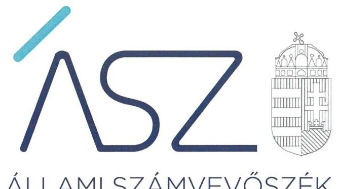

ÁLLAMI SZÁMVEVŐSZÉK

# JELENTÉS 

## Pártok gazdálkodása

A költségvetési támogatásban részesülő pártok 2019-2020. évi gazdálkodása törvényességének ellenőrzése a Párbeszéd Magyarországért Pártnál
2021.

21090
www.asz.hu

---

ÁLLAMI SZÁMVEVŐSZÉK

# JELENTÉS 

Pártok gazdálkodása

A költségvetési támogatásban részesülő pártok 2019-2020. évi gazdálkodása törvényességének ellenőrzése a Párbeszéd Magyarországért Pártnál
2021. 12. hó 23. nap

21090
www.asz.hu

---

# AZ ELLENŐRZÉST FELÜGYELTE: 

DR. BENEDEK MÁRIA felügyeleti vezető

## AZ ELLENŐRZÉST VEZETTE ÉS A VÉGREHAJTÁSÁÉRT FELELŐS:

DR. NAGY IMRE ellenőrzésvezető
DR. SIMON JÓZSEF ellenőrzésvezető
VARGA EDIT ellenőrzésvezető

## A PROGRAM ÖSSZEÁLLÍTÁSÁÉRT FELELŐS:

DR. KÁDÁR KRISZTA az ellenőrzési program készítéséért felelős vezető beosztás

A TÉMÁHOZ KAPCSOLÓDÓ KORÁBBI SZÁMVEVŐSZÉKI JELENTÉSEK:
Jelentéseink az Országgyúlés számítógépes hálózatán és az interneten a www.asz.hu címen is olvashatóak.

- címe: A költségvetési támogatásban részesülő pártok 20172018. évi gazdálkodása törvényességének ellenőrzése a Párbeszéd Magyarországért Pártnál
- sorszáma: 20169

IKTATÓSZÁM: EL-3475-001/2021.
TÉMASZÁM: 2580
ELLENŐRZÉS-AZONOSÍTÓ SZÁM: V092304

---

# TARTALOMJEGYZÉK 

■ ÖSSZEGZÉS ..... 5
■ AZ ELLENŐRZÉS CÉLJA ..... 7
■ AZ ELLENŐRZÉS TERÜLETE ..... 8
■ AZ ELLENŐRZÉS HÁTTERE, INDOKOLTSÁGA ..... 9
■ A JELENTÉS LÉNYEGES KÉRDÉSKÖREI ..... 10
■ AZ ELLENŐRZÉS HATÓKÖRE ÉS MÓDSZEREI ..... 11
■ MEGÁLLAPÍTÁSOK ..... 13
■ JAVASLATOK ..... 15
■ MELLÉKLETEK ..... 17
I. sz. melléklet: Értelmező szótár ..... 17
■ FÜGGELÉK: ÉSZREVÉTELEK ..... 19
■ RÖVIDÍTÉSEK JEGYZÉKE ..... 21

---

.

---

# ÖSSZEGZÉS 

A Párbeszéd Magyarországért Párt a 2019-2020. években a törvényes gazdálkodás alapvető feltételeit nem biztositotta. A 2019-2020. évi könyvvezetése és gazdálkodása során a jogszabályi előírásokat nem tartotta be, emiatt a pénzügyi kimutatásai nem voltak megalapozottak. A Párbeszéd Magyarországért Párt gazdálkodása során 2019-ben és 2020-ban nem tett eleget az Alaptörvényben és a Párttörvényben előírt alapvető követelményeknek, gazdálkodása nem volt átlátható.

## Az ellenőrzés társadalmi indokoltsága

A pártok múködése a társadalomban meglévő érdekek és értékek demokratikus megjelenítésének és érvényesítésének alapfeltétele.

A pártok múködéséről és gazdálkodásáról szóló törvény (Párttörvény) állapítja meg a pártok gazdálkodására vonatkozó szabályokat. A törvény szerint azok a pártok, mint sajátos egyesületek nyújthatnak szervezeti kereteket a népakarat kialakításához és kinyilvánításához, a politikai életben való állampolgári részvételhez, amelyek kinyilvánítják, hogy a törvény rendelkezéseit magukra nézve kötelezőnek ismerik el.

A Párttörvény egyben a politikai élet tisztasága érdekében biztosítja a pártok részére azt a jogosultságot, hogy az állami költségvetésből támogatásban részesüljenek. Magyarország Alaptörvénye szerint a központi költségvetésből csak olyan szervezet részére nyújtható támogatás, amelynek a támogatás felhasználására irányuló tevékenysége átlátható. Ezáltal a pártok múködésének és költségvetési támogatásának alapja, hogy gazdálkodásuk törvényes és átlátható legyen.

A pártoknak évente be kell számolniuk a törvényi keretek szerinti gazdálkodásukról. Törvényi előírás alapján az Állami Számvevőszék a költségvetési támogatásban részesült pártok gazdálkodását kétévente ellenőrzi. A pártok pénzügyi beszámolása alapján az ellenőrzés visszajelzést ad arról, hogy a pártok eleget tettek-e az Alaptörvényben és a Párttörvényben a pártként való múködéshez előírt alapvető követelményeknek, gazdálkodásuk törvényes és átlátható volt-e.

## Összegző értékelés, javaslatok

A Párbeszéd Magyarországért Párt a gazdálkodás törvényességét nem biztosította. A párt nem készített törvény szerinti leltárt, ezáltal a pénzügyi kimutatás alapjául szolgáló könyvvezetési adatok megbízhatóságáról a könyvek üzleti év végi zárásakor nem győződött meg.

A Párbeszéd Magyarországért Párt könyvvezetése nem volt törvényes, mivel a számviteli nyilvántartásaiba nem a törvényi előírások szerinti bizonylatok alapján jegyzett be adatokat, így a könyvvezetés adatainak valódiságát a bizonylatok nem támasztották alá. Ezért a pénzügyi kimutatásaiban szereplő adatokat megbízható könyvvezetéssel nem támasztotta alá. Mindezek alapján a 2019. és 2020. évi pénzügyi kimutatások nem biztosították a Párbeszéd Magyarországért Párt gazdálkodásának átláthatóságát.

Az Állami Számvevőszék a megállapítások alapján a Párbeszéd Magyarországért Párt társelnökeinek öt javaslatot fogalmazott meg.

---

# Következtetések: 

Az Állami Számvevőszék a Párbeszéd Magyarországért Párt gazdálkodását korábban több alkalommal ellenőrizte. A 2019-2020. évekre vonatkozó jelen ellenőrzés visszatérő hiányosságként azonosította, hogy a Párbeszéd Magyarországért Párt könyvvezetésének törvényessége, pénzügyi kimutatásainak megalapozottsága nem felel meg a jogszabályi előírásoknak. Ezáltal a Párbeszéd Magyarországért Párt nem biztosította a közpénzek felhasználásának elszámoltathatóságát a tagság és az állampolgárok felé.

A párt gazdálkodásában azonosított visszatérő szabálytalanságok arra mutatnak rá, hogy a Párbeszéd Magyarországért Párt nem gondoskodott a korábbi ellenőrzések során feltárt hiányosságok megszüntetéséről, a párt törvényes és átlátható gazdálkodásának biztosításáról, annak ellenére, hogy ezt a párt az ellenőrzési megállapításokra készített intézkedési terveiben vállalta.

A gazdálkodás törvényessége és átláthatósága területén feltárt lényeges és visszatérő törvénysértések alapján felvetődhet a kérdés: eleget tesz-e a pártként való müködéshez előírt alapvető követelményeknek a Párbeszéd Magyarországért Párt?

---

# AZ ELLENŐRZÉS CÉLJA 

AZ ELLENŐRZÉS CÉLJA, hogy az ÁSZ ${ }^{1}$ - mint az Országgyűlés legfőbb ellenőrző szerve - független és szakmailag megalapozott véleményt adjon a pártok, mint ellenőrzött szervezetek gazdálkodásának törvényességéről. Annak értékelése, hogy a közzétett pénzügyi kimutatások a törvényi előírásoknak megfeleltek-e, a könyvvezetés és gazdálkodás során betartották-e a vonatkozó jogszabályi és belső előírásokat; a párt a múködéséhez szabályszerűen igénybe vehető forrásokat használt-e fel. Az ellenőrzés célja a kockázatjelzés alapján lényegesre kijelölt ügyek szabályosságának értékelése.

---

# AZ ELLENŐRZÉS TERÜLETE 

## Párbeszéd Magyarországért Párt

A Párbeszéd Magyarországért Párt 2013. július 9-én létrejött olyan egyesület, amely nyilvántartott tagsággal rendelkezik, és a nyilvántartásba vételét végző bíróság előtt kinyilvánította, hogy a Párttörvény ${ }^{2}$ rendelkezéseit magára nézve kötelezőnek ismeri el a Párttörvény 1. §-a alapján.

A Párbeszéd Magyarországért Párt döntéshozó szervei az Alapszabály $3^{-3}$ szerint a Kongresszus ${ }^{4}$ és az Országos Elnökség ${ }^{5}$, amelyekből az utóbbi egyben a Párbeszéd Magyarországért Párt ügyintéző szerve. A Párbeszéd Magyarországért Párt alakulása óta töltik be tisztségüket a jelenlegi társelnökök.

A Párbeszéd Magyarországért Párt által készített és a Magyar Közlöny mellékletét képező, Hivatalos Értesítő 2020. évi 30. számában, illetve a 2021. évi 27. számában közzétett pénzügyi kimutatások szerint a 2019. évben 91,0 M Ft, a 2020. évben 45,5 M Ft központi költségvetési támogatásban részesült. A Párbeszéd Magyarországért Párt által közzétett 2019. évi pénzügyi kimutatásában $118,4 \mathrm{M}$ Ft bevételt, valamint 123,7 M Ft kiadást számolt el. A 2020. évre vonatkozóan közzétett pénzügyi kimutatása szerint az összes bevétele 213,6 M Ft, a teljesített kiadások összege 98,0 M Ft volt.

A Párbeszéd Magyarországért Párt az ellenőrzött időszak alatt gazdasági társaságot nem alapított. A Párbeszéd Magyarországért Párt 2014 júniusában hozta létre a „Megújuló Magyarországért" elnevezésű alapítványt, illetve 2016. január 9-én a „Zöld Front Egyesület" elnevezésű ifjúsági szervezetet. A Párbeszéd Magyarországért Párt a 2018. decemberében megalapította a „Társadalmi Igazságosság Alapítvány"-t.

---

# AZ ELLENŐRZÉS HÁTTERE, INDOKOLTSÁGA 

Az Állami Számvevőszékről szóló 2011. évi LXVI. törvény 5. § (11) bekezdés a) pontja, valamint a pártok múködéséről és gazdálkodásáról szóló 1989. évi XXXIII. törvény 10. § (1) bekezdése alapján a pártok gazdálkodása törvényességének ellenőrzésére az ÁSZ jogosult. Törvényi előírás alapján az ÁSZ kétévente ellenőrzi azoknak a pártoknak a gazdálkodását, amelyek rendszeres költségvetési támogatásban részesültek.

A gazdálkodás szabályszerűségének, a felhasznált közpénzek nagyságának bemutatásával a társadalom objektív képet alkothat a pártok múködéséről. Az ellenőrzés megállapításai a gazdálkodás megfelelőségének bemutatásával elősegíthetik, hogy a törvényalkotók konkrét lépéseket tegyenek a pártok finanszírozására vonatkozó szabályozások megváltoztatása, átláthatóbbá, ellenőrizhetőbbé tétele irányába. Az ellenőrzés rámutat a pártok gazdálkodásával kapcsolatos jó gyakorlatokra és szabálytalanságokra. A hiányosságok, szabálytalanságok feltárása, az ennek kapcsán megfogalmazott megállapítások hozzájárulnak a törvényi rendelkezések betartásához.

---

# A JELENTÉS LÉNYEGES KÉRDÉSKÖREI 

1.     - A Párbeszéd Magyarországért Párt gazdálkodásának törvényessége biztositott volt-e?
2.     - A Párbeszéd Magyarországért Párt pénzügyi kimutatása meg-felelt-e a jogszabályi elöírásoknak, közzétételi kötelezettségét szabályszerüen teljesitette-e?
3.     - A Párbeszéd Magyarországért Párt könyvvezetése és gazdálkodása során a vonatkozó jogszabályi rendelkezéseket és belső elöírásokat betartotta-e?

---

# AZ ELLENŐRZÉS HATÓKÖRE ÉS MÓDSZEREI 

## Az ellenőrzés típusa

Szabályszerúségi ellenőrzés.

## Az ellenőrzött időszak

2019-2020. évek.

## Az ellenőrzés tárgya

A párt ellenőrzése során az ellenőrzés tárgyát képezik a 2019. és a 2020. évre vonatkozó pénzügyi kimutatás elkészítésére, jóváhagyására, közzétételére, a párt könyvvezetésére, gazdálkodására, ennek keretében a számviteli szabályozás kialakítására, a bizonylati rend, bizonylati fegyelem betartására, egyéb gazdálkodási, ellenőrzési és pénzügyi-számviteli informatikai feladatok ellátására irányuló tevékenységek. Az ellenőrzés tárgya még a Párttörvény szerinti források elszámolása és felhasználása, valamint a vagyon jogszabályi előírásoknak megfelelő hasznosítása.

Az ellenőrzés kiterjed minden olyan körülményre és adatra, amely az ÁSZ jogszabályban meghatározott feladatainak teljesítéséhez, valamint a program végrehajtása folyamán felmerült újabb összefüggések feltárásához szükséges.

## Az ellenőrzött szervezet

Párbeszéd Magyarországért Párt

## Az ellenőrzés jogalapja

Az ellenőrzés jogalapját az ÁSZ tv. 5. § (11) bekezdés a) pontja, a Párttörvény 4. § (4)-(5) bekezdései, valamint 10. § (1), (3)-(4) bekezdései képezik.

## Az ellenőrzés módszerei

Az ellenőrzést az ellenőrzési program szempontjai, az ellenőrzött időszakban hatályos jogszabályok, az ellenőrzés általános szakmai szabályai, az ellenőrzésre irányadó ÁSZ módszertanok figyelembevételével végzi az ÁSZ.

---

A gazdálkodás hibáinak kijavítására irányuló javaslatok kidolgozásakor a hatályos jogszabályok az irányadóak.

A törvényi előírásokat, valamint az ÁSZ által meghirdetett, nyilvános módszertant figyelembe véve az ellenőrzés hatóköre kiegészülhet kockázatjelzések alapján, a kockázatértékelés függvényében további lényeges ügyek szabályosságának ellenőrzésével az ellenőrzés megkezdésének időpontjáig. Jelen ellenőrzéshez kapcsolódóan nem került sor kockázatjelzésre, így további ügyek ellenőrzésére sem.

Az ellenőrzés ideje alatt az ellenőrzött párttal történő kapcsolattartást az ÁSZ SZMSZ-ének vonatkozó előírásai alapján biztosítja.

Az ellenőrzési bizonyítékként felhasználható adatforrások közé tartoznak egyrészt az ellenőrzési program részletes szempontjainál felsorolt adatforrások, másrészt minden egyéb az ellenőrzés folyamán feltárt, az ellenőrzés szempontjából információt tartalmazó dokumentum.

Az ellenőrzést az ellenőrzött szervezet által rendelkezésre bocsátott dokumentumokra, adatokra kell alapozni. A rendelkezésre bocsátott adatok, információk kontrollja az ellenőrzés keretében történik. Az ellenőrzés céljának eléréséhez szükséges bizonyítékokat a számvevő az egyes adatok közvetlen, részletes elemzésével szerzi meg, a következő ellenőrzési eljárások alkalmazásával: megfigyelés, szemrevételezés, információkérés, megerősítés, valamint elemző eljárás.

Az ÁSZ a tételes ellenőrzés mellett statisztikai alapú mintavételezést és értékelést alkalmaz. A minták kiválasztása rétegzett mintavételezéssel történik. A hozzájárulások, adományok és egyéb bevételek, valamint a személyi juttatások (működési kiadáson belül), eszközbeszerzések és a működési kiadások további tételei, politikai tevékenység kiadásai, egyéb kiadások mintatételeinek értékelése „szabályszerű", ha a minta ellenőrzésének eredménye alapján 95\%-os bizonyossággal a teljes sokaságban az átlagos hibaarány nem haladja meg a 10\%-ot, „nem szabályszerű", ha nagyobb, mint 10\%. Abban az esetben, ha a teljes sokaság tekintetében a 10\%-os hibaarányhoz való viszony megítélésének megbízhatósága nem éri el a 95\%-ot, annak elérése érdekében az értékelés további szempontokkal egészül ki, a feltárt hibák értéke is figyelembevételre kerül.

---

# 1. A Párbeszéd Magyarországért Párt gazdálkodásának törvényessége biztosított volt-e? 

Összegző megállapítás

A Párbeszéd Magyarországért Párt gazdálkodásának törvényessége a 2019. és a 2020. évben nem volt biztosított.

A Párt ${ }^{6}$ az ellenőrzött időszakban rendelkezett a Számv. tv. ${ }^{7}$ által előírt számviteli szabályzatokkal. Ennek keretében rendelkezett Számviteli poli-tiká ${ }^{8}$-val, Értékelési szabályzat ${ }^{9}$-tal, Leltározási és leltározási szabályzat ${ }^{10}$ tal, Pénzkezelési szabályzat ${ }^{11}$-tal, valamint Számlarend ${ }^{12}$-del.

A Ptk. ${ }^{13}$ előírása szerint elkészített Alapszabály ${ }_{1-3}$ tartalmazta a gazdálkodással kapcsolatos folyamatokat, a kapcsolódó feladat- és hatásköröket, felelősségi viszonyokat. A Párt a nem pénzbeli vagyoni hozzájárulás értékének meghatározását az Értékelési szabályzat II. pontjában írta elő.

A Számv. tv. 69. § (1) bekezdésében foglaltak ellenére a Párt nem állított össze leltárt, amely tételesen, ellenőrizhető módon tartalmazta volna a mérleg fordulónapján meglévő valamennyi eszközét és forrását mennyiségben és értékben.

## 2. A Párbeszéd Magyarországért Párt pénzügyi kimutatása meg-felelt-e a jogszabályi előírásoknak, közzétételi kötelezettségét szabályszerűen teljesítette-e?

## Összegző megállapítás

A Párbeszéd Magyarországért Párt 2019. és 2020. évi pénzügyi kimutatása nem felelt meg a jogszabályi előírásoknak.

A Párt a 2019. évi, illetve a 2020. évi pénzügyi kimutatást a Felügyelőbizottság általi elfogadást követően a Párttörvény előírása szerinti határidőn belül, a tárgyévet követő év május 31-ig a Hivatalos Értesítőben és a saját honlapján közzétette.

A Párt a 2019. és 2020. évi pénzügyi kimutatásának adatait a Számv. tv. 4. § (1) bekezdésének előírása ellenére törvényben meghatározott könyvvezetéssel nem támasztotta alá, mert a 3. pontban részletezettek szerint a gazdálkodása során az egyéb hozzájárulásokhoz, adományokhoz kapcsolódó bevételeket, illetve az egyéb bevételeket nem szabályszerűen számolta el.

---

# 3. A Párbeszéd Magyarországért Párt könyvvezetése és gazdálkodása során a vonatkozó jogszabályi rendelkezéseket és belső előírásokat betartotta-e? 

Összegző megállapítás

A Párbeszéd Magyarországért Párt a 2019. és 2020. évi könyvvezetése és gazdálkodása során a jogszabályi rendelkezéseket és a belső előírásokat nem tartotta be.

A Párbeszéd Magyarországért Pártnál az egyéb hozzájárulások, adományok, valamint az egyéb bevételek elszámolása nem volt szabályszerű, mivel
$\longrightarrow$ az egyéb hozzájárulások, adományok könyvviteli elszámolását közvetlenül alátámasztó bizonylatok a 2019. évben a Számv. tv. 167. § (1) bekezdés c) pontjában foglaltak ellenére nem tartalmazták az utalványozó személy aláírását;
$\longrightarrow$ a 2019. és a 2020. évben az egyéb hozzájárulások, adományok és az egyéb bevételek elszámolását közvetlenül alátámasztó bizonylatokon a Számv. tv. 167. § (1) bekezdés i) pontjában foglaltak ellenére nem került feltüntetésre a könyvviteli nyilvántartásokban való rögzítés időpontja,
$\longrightarrow$ az egyéb hozzájárulások, adományok, valamint az egyéb bevételek tekintetében a pénzeszközöket érintő gazdasági műveletek bizonylatainak adatait a 2019. évben a Számv.tv. 165. § (3) bekezdés a) pontjában előírt határidőn belül a Párt nem rögzítette a főkönyvi nyilvántartásában.
Emiatt a Párt a 2019. és a 2020. évi pénzügyi kimutatásának adatait a Számv. tv. 4. § (1) bekezdésének előírása ellenére törvényben meghatározott könyvvezetéssel nem támasztotta alá.
A Párt a 2019. és a 2020. évi személyi jellegű kifizetések elszámolása során a jogszabályi előírásokat betartotta. A kifizetések elszámolása a Számv. tv., a Munka tv. ${ }^{14}$, illetve az Szja tv. ${ }^{15}$ előírásai szerint történt. Az eszközbeszerzések, valamint a múködési és egyéb kiadások elszámolása során a Párt a 2019. és a 2020. évben betartotta a Számv. tv. és a Párttörvény előírásait.

---

# JAVASLATOK 

Az ÁSZ tv. 33. § (1) bekezdésében foglaltak értelmében az ellenőrzött szervezet vezetője köteles a jelentésben foglalt megállapításokhoz kapcsolódó intézkedési tervet összeállítani és azt a jelentés kézhezvételétől számított 30 napon belül az ÁSZ részére megküldeni. Amennyiben az ellenőrzött szervezet vezetője nem küldi meg határidőben az intézkedési tervet, vagy továbbra sem elfogadható intézkedési tervet küld, az Állami Számvevőszék elnöke az ÁSZ tv. 33. § (3) bekezdése a) és b) pontjaiban foglaltakat érvényesítheti.

## Párbeszéd Magyarországért Párt társelnökei részére

1. Intézkedjen a jövőben a jogszabályi előirás szerint leltár összeállításáról, amely tételesen, ellenőrizhető módon tartalmazza a mérleg fordulónapján meglévő eszközeit és forrásait mennyiségben és értékben.
(1. sz. megállapítás 3. bekezdése alapján)
2. Intézkedjen a jövőben a jogszabályi előirások szerinti, könyvvezetéssel alátámasztott pénzügyi kimutatás készitéséről.
(2. sz. megállapítás 2. bekezdése alapján)
3. Intézkedjen a jövőben az egyéb hozzájárulások, adományok könyvviteli elszámolását közvetlenül alátámasztó bizonylatokon az utalványozó személy aláírásának feltüntetéséről a jogszabályi előirás szerint.
(3. sz. megállapítás 1. bekezdés 1. francia bekezdése alapján)
4. Intézkedjen a jövőben az egyéb hozzájárulások, adományok és az egyéb bevételek elszámolását közvetlenül alátámasztó bizonylatokon a könyvviteli nyilvántartásokban való rögzités időpontjának feltüntetéséről jogszabályi előirás szerint.
(3. sz. megállapítás 1. bekezdés 2. francia bekezdése alapján)
5. Intézkedjen a jövőben az egyéb hozzájárulások, adományok, valamint az egyéb bevételek tekintetében a pénzeszközöket érintő gazdasági múveletek bizonylatai adatainak határidőn belül történő rögzitéséről a fökönyvi nyilvántartásában a jogszabályi előírások szerint.
(3. sz. megállapítás 1. bekezdés 3. francia bekezdése alapján)

---

.

---

# MELLÉKLETEK 

- I. SZ. MELLÉKLET: ÉRTELMEZŐ SZÓTÁR
pénzügyi kimutatás
a párt gazdasági-vállalkozási tevékenysége
költségvetési támogatás
nem pénzbeli támogatás

A Párttörvény 9. § (1) bekezdésében meghatározott, a törvény 1. számú melléklete szerinti pénzügyi kimutatás (hatályos 2014. május 6-ától), amelyet a pártok kötelesek minden év május 31-ig a Magyar Közlönyben, valamint saját honlappal rendelkező pártok a honlapjukon is közzétenni.
A Párttörvény 6. § (1) bekezdésének megfelelően a párt a költségeinek fedezése és vagyonának gyarapítása érdekében a következő gazdasági-vállalkozási tevékenységeket folytathatja:
a) politikai céljainak és tevékenységének megismertetése érdekében kiadványokat jelentethet meg és terjeszthet, a pártot szimbolizáló jelvényeket és más ilyen célú tárgyakat árusíthat, és pártrendezvényeket szervezhet;
b) a tulajdonában álló ingatlanokat és ingókat díj ellenében hasznosíthatja és elidegenítheti.
Az államháztartás alrendszerei terhére nyújtott pénzbeli vagy nem pénzbeli juttatás, amelyet a támogató nem elsősorban ellenszolgáltatás ellenében, de konkrét program megvalósítása, vagy meghatározott időszakban a támogatott szervezet működtetése érdekében nyújt. (Civil tv. ${ }^{16}$ 2. § 15. pont)
Vagyoni értékkel rendelkező forgalomképes dolog, szellemi alkotás, illetve vagyoni értékű jog részben vagy egészében, véglegesen vagy ideiglenesen, teljesen vagy részben ingyenesen történő átruházása, vagy átengedése, illetve szolgáltatás biztosítása. (Civil tv. 2. § 25. pont)

---

.

---

# FÜGGELÉK: ÉSZREVÉTELEK 

A jelentéstervezetet a Számvevőszék 15 napos észrevételezésre megküldte az ellenőrzött szervezet vezetőjének az ÁSZ tv. 29. §* (1) bekezdése előírásának megfelelően.

A Párbeszéd Magyarországért Párt társelnöke az ellenőrzés megállapításaira észrevételt tett. Az ÁSZ tv. 29. § (3) bekezdésével összhangban az ÁSZ a Függelékben feltünteti a jelentéstervezet megállapításaival kapcsolatban tett, figyelembe nem vett észrevételeket, és megindokolja, hogy azokat miért nem fogadta el.

[^0]
[^0]:    * 29. § (1) Az Állami Számvevőszék az ellenőrzési megállapításait megküldi az ellenőrzött szervezet vezetőjének vagy az általa megbízott személynek, és annak, akinek személyes felelősségét állapította meg.
    (2) Az ellenőrzött szervezet vezetője és a felelősként megjelölt személy az ellenőrzés megállapításaira tizenöt napon belül írásban észrevételt tehet.
    (3) Az Állami Számvevőszék az észrevételre a beérkezésétől számított harminc napon belül írásban válaszol. A figyelembe nem vett észrevételeket köteles a jelentésben feltüntetni, és megindokolni, hogy azokat miért nem fogadta el.

---

# 1. A Párbeszéd Magyarországért Párt társelnöke az 1. számú észrevételében a leltár összeállításával kapcsolatos ellenőrzési megállapításra tett észrevételt. 

A számvitelről szóló 2000. évi C. törvény (a továbbiakban: Számv.tv.) rendelkezései alapján a könyvek üzleti év végi zárásához olyan leltárt kell összeállítani, amely tételesen, ellenőrizhető módon tartalmazza a Pártnak a mérleg fordulónapján meglévő eszközeit és forrásait mennyiségben és értékben.

A törvényi előírás alapján a Pártnak a mérleg fordulónapjára vonatkozó 2019. és 2020. évi leltárakat a könyvek zárásához kell összeállítania. Az ellenőrzés rendelkezésére bocsátott dokumentumok nem igazolták, hogy a tárgyi eszközök tekintetében a leltárak a könyvek 2019. és 2020. évi zárásakor rendelkezésre álltak. Ezen túl a követelések, az adott előlegek, a rövidlejáratú kötelezettségek, és a hosszúlejáratú kötelezettségek esetében az ellenőrzés rendelkezésére bocsátott dokumentumok nem igazolták az analitikus nyilvántartásokkal való egyeztetés megtörténtét, ezáltal a szabályos leltározás végrehajtását és a törvényi előírások szerinti leltár összeállítását.

Mindezek alapján az ÁSZ az észrevételt nem vette figyelembe, az ellenőrzés megállapításának módosítása nem volt indokolt.
2. A Párbeszéd Magyarországért Párt társelnöke a 2-3. számú észrevételeiben a pénzügyi kimutatással, továbbá a könyvvezetéssel és gazdálkodással kapcsolatos ellenőrzési megállapításra tett észrevételt.

A Számv.tv. meghatározza a könyvviteli elszámolást közvetlenül alátámasztó bizonylatok általános alaki és tartalmi kellékeit. Ezek közé tartozik, hogy a bizonylatnak tartalmaznia kell az utalványozó személy aláírását és a könyvviteli nyilvántartásokban történt rögzítés időpontját. A bizonylatok tartalmára vonatkozó előírások betartása azért elengedhetetlen, mert a törvény előírása szerint a számviteli nyilvántartásokba csak szabályszerűen kiállított bizonylat alapján szabad adatokat bejegyezni. A bizonylatokra vonatkozó előírások betartása a törvény szerinti pénzügyi kimutatás alátámasztását biztosító szabályszerű könyvvezetés alapvető feltétele.

A Társelnök észrevételével érintett megállapítások a bizonylatokkal kapcsolatos fenti törvényi előírások betartására vonatkoznak. Ezért a Társelnök által jelzett körülmény, amely szerint az ellenőrzés rendelkezésére bocsátott főkönyvi adatállomány a főkönyvben történő rögzítés időpontját nem mutatja, az ellenőrzési megállapításokat nem érinti.

Mindezek alapján az ÁSZ az észrevételeit nem vette figyelembe, az ellenőrzés megállapításainak módosítása nem volt indokolt.

---

# RÖVIDÍTÉSEK JEGYZÉKE 

${ }^{1}$ ÁSZ
${ }^{2}$ Párttörvény
${ }^{3}$ Alapszabály ${ }_{1}$

Alapszabályz

Alapszabályz
${ }^{4}$ Kongresszus
${ }^{5}$ Országos Elnökség
${ }^{6}$ Párt
${ }^{7}$ Számv. tv.
${ }^{8}$ Számviteli politika
${ }^{9}$ Értékelési szabályzat
${ }^{10}$ Leltárkészítési és leltározási szabályzat
${ }^{11}$ Pénzkezelési szabályzat
${ }^{12}$ Számlarend
${ }^{13}$ Ptk.
${ }^{14}$ Munka tv.
${ }^{15}$ Szja tv.
${ }^{16}$ Civil tv.

Állami Számvevőszék
1989. évi XXXIII. törvény a pártok működéséről és gazdálkodásáról (hatályos 1989. október 30-ától)
Párbeszéd Magyarországért Párt Alapszabálya (hatályos 2018. május 27-től 2019. február 23-ig)
Párbeszéd Magyarországért Párt Alapszabálya (hatályos 2019. február 24-től 2020. szeptember 12-ig)
Párbeszéd Magyarországért Párt Alapszabálya (hatályos 2020. szeptember 13-tól)
Párbeszéd Magyarországért Párt Kongresszus
Párbeszéd Magyarországért Párt Országos Elnökség
Párbeszéd Magyarországért Párt
2000. évi C. törvény a számvitelről (hatályos 2001. január 1-jétől)

Párbeszéd Magyarországért Párt Számviteli politika (hatályos 2019. január 1-jétől, aktualizálva 2019. október 1-jén, illetve 2020. december 11-től)
Párbeszéd Magyarországért Párt Eszközök és források értékelési szabályzata (hatályos 2019. január 1-jétől, aktualizálva 2019. október 1-jén, illetve 2020. december 11-től)
Párbeszéd Magyarországért Párt Eszközök és források Leltárkészítési és leltározási szabályzata (hatályos 2019. január 1-jétől, aktualizálva 2019. október 1-jén, illetve 2020. december 11-től)

Párbeszéd Magyarországért Párt Pénzkezelési szabályzata (hatályos 2019. január 1-jétől, aktualizálva 2019. október 1-jén, illetve 2020. december 11-től)
Párbeszéd Magyarországért Párt Számlarend (hatályos 2019. január 1-jétől, aktualizálva 2019. október 1-jén, illetve 2020. december 11-től)
A Polgári Törvénykönyvről szóló 2013. évi V. törvény (hatályos: 2014. március 15 -tól)
2012. évi I. törvény a munka törvénykönyvéről (hatályos 2012. január 6-tól)
1995. évi CXVII. törvény a személyi jövedelemadóról (hatályos 1996. január 1-jétől)
2011. évi CLXXV. törvény az egyesülési jogról, a közhasznú jogállásról, valamint a civil szervezetek müködéséről és támogatásáról (hatályos 2011. december 22-től)

---

# ASZ 

ALLAMI SZAMVEVOSZEK
1052 Budapest, Apáczai Cs. J. u. 10. I 1364 Budapest 4. Pf. 54 TEL: +36 14849100
email: szamvevoszek@asz.hu
web: www.asz.hu | www.aszhirportal.hu