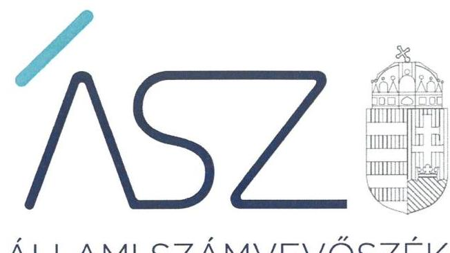
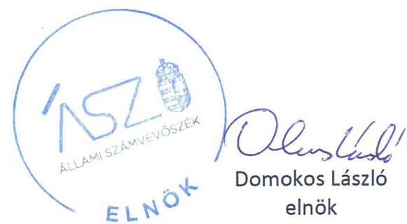

ÁLLAMI SZÁMVEVŐSZÉK

# JELENTÉS 

## Az önkormányzati intézmények ellenőrzése

Az önkormányzat és társulás irányítása alá tartozó intézmények integritásának monitoring típusú ellenőrzése - társulások irányítása alá tartozó 378 intézmény
2021.

21091
www.asz.hu

---

ÁLLAMI SZÁMVEVŐSZÉK

# JELENTÉS

## Az önkormányzati intézmények ellenőrzése

Az önkormányzat és társulás irányítása alá tartozó intézmények integritásának monitoring típusú ellenőrzése – társulások irányítása alá tartozó 378 intézmény

2021. 12. hó 06. nap

21091
www.asz.hu

---

# AZ ELLENŐRZÉST FELÜGYELTE: 

SALAMON ILDIKÓ felügyeleti vezető

## AZ ELLENŐRZÉST VEZETTE ÉS A VÉGREHAJTÁSÁÉRT FELELŐS:

D R. GÁL NÓRA ellenőrzésvezető
KLINGA LÁSZLÓ ellenőrzésvezető
D R. SZELECZKI ZSUZSANNA JUDIT ellenőrzésvezető
FE KETE-NAGY ANDRÁS GÁBOR ellenőrzésvezető
ÁRPÁSI TIBOR ellenőrzésvezető
DORMÁN ISTVÁNZOLTÁN ellenőrzésvezető

## A PROGRAM ÖSSZEÁLLÍTÁSÁÉRT FELELŐS:

D R. FELFÖLDI IZABELLA programkészítésért felelősvezető

IKTATÓSZÁM: EL-3461-001/2021.
TÉMASZÁM: 2568
ELLENŐRZÉS-AZONOSÍTÓ SZÁM: V0928

---

# TARTALOMJEGYZÉK 

■ ÖSSZEGZÉS ..... 5
■ AZ ELLENŐRZÉS JELENTŐSÉGE, AKTUALITÁSA, TÁRSADALMI SZEREPE, SZEMPONTJAI ..... 7
■ AZ ELLENŐRZÉS TERÜLETE ..... 8
■ ELLENŐRZÉS HATÓKÖRE ÉS MÓDSZERE ..... 9
■ MELLÉKLETEK. ..... 11
I. sz. melléklet: Az értékelés módszertana ..... 11
II. sz. melléklet: Értelmező szótár ..... 13
■ FÜGGELÉKEK ..... 15
I. sz. függelék: Az ellenőrzött szervezetek és azok kockázati értékelése ..... 15
■ RÖVIDÍTÉSEK JEGYZÉKE ..... 43

---

.

---

# ÖSSZEGZÉS 

Az Állami Számvevőszék figyelemfelhívásának és tanácsadásának eredményeként a társulások irányítása alatt álló 378 ellenőrzött intézmény közül 191 intézménynél az intézményvezető már 2021-ben intézkedett, vagy intézkedéseket rendelt el az integritást biztosító alapvető feltételek megerősitése, illetve kiépitése érdekében. Ezeknek az intézményeknek javult az integritása, erősödtek a csalásmentes müködés feltételei.
168 intézménynél további intézkedések szükségesek az integritást biztositó alapvető feltételek kiépitése, illetve kiegészitése érdekében. Ezeknek az intézményeknek a vezetői az Állami Számvevőszék intézkedési kötelemmel járó figyelemfelhívására nem intézkedtek, ezért az azonosított kockázatok növekedtek, vagy intézkedéseik nem fedték le a kockázatos területeket, így az azonosított kockázatok nem változtak.
A fenntartó társulás egy intézmény megszüntetéséről döntött az ellenőrzött időszakban.

## Értékelések

Az Állami Számvevőszék önkormányzati társulás által irányított 378 intézmény belső kontrollrendszerének lényeges elemei kialakítását ellenőrizte a 2021. évre vonatkozóan. Az ellenőrzés a súlypontok meghatározásával lehetőséget biztosított a szervezeti integritás, müködés és vezetés, valamint a gazdálkodás területén a kockázatok azonosítására.

A szervezeti integritás alapvető feltétele a szabályozottság, azaz a jogszabályokban előírt belső szabályzatok megléte, azok - hatályos jogszabályoknak - megfelelő tartalma és gyakorlati alkalmazhatósága. Az integritási kockázatok szervezeti szinten csökkenthetők azáltal, hogy az intézményvezetők kialakítják a szervezeti és müködési kereteket, a gazdálkodásra vonatkozó alapvető szabályozási környezetet, valamint a kontrolltevékenységek szabályszerű gyakorlásának, az integrált kockázatkezelésnek és az integritást sértő események kezelésének a feltételeit.

A szervezeti integritás, a müködés és a vezetés alapvető szabályozási feltételeinek kialakítása hozzájárul a csalásmentes integritási környezet megteremtéséhez.

A szervezeti és müködési szabályzat teremti meg a szervezet szabályszerű müködésének alapjait, illetve rögzíti a szervezeten belüli felelősségi viszonyokat. A szabályzat biztosítja a szervezeti müködés szabályozottságát, ezáltal a szervezet tevékenységének átláthatóságát, a szervezeti célokkal összhangban történő müködés feltételeit és annak ellenőrizhetőségét. Az ellenőrzöttek közül 320 intézmény rendelkezett szervezeti és müködési szabályzattal a 2021. évben.

A jogszabályi előírásoknak eleget téve, nyilatkozatban értékelte az intézmény belső kontrollrendszerének minőségét 249 intézmény vezetője. Ezek közül 106 intézménynél alakítottak ki olyan szabályozásokat, folyamatokat, amelyek biztosítják a költségvetési szerv tevékenységében a rendelkezésre álló források átlátható, szabályszerű, szabályozott, gazdaságos, hatékony és eredményes felhasználása követelményeinek érvényesítését.

Az integrált kockázatkezelés eljárásrendjét 254, a szervezeti integritást sértő események kezelésének eljárásrendjét szintén 254 intézménynél alakították ki az intézményvezetők. Az integrált kockázatkezelés eljárásrendje biztosítja a szervezet müködésében rejlő kockázatok azonosításának és kezelésének feltételeit. A szervezet müködési kockázatai veszélyeztethetik a közpénzekkel való átlátható, elszámoltatható és felelős gazdálkodást. Az integritást sértő események kezelésének eljárásrendje jelenti a szervezet tekintetében felmerülő és a szervezeten belül bekövetkező integritást sértő események kezelésének alapjait. Az eljárásrend kialakításával az intézmény vezetője támogatja az integritást sértő eseményekkel kapcsolatosan azonosított kockázatok bekövetkezése esetén azok hatékony kezelését, illetve a következmények enyhítését.

A pénz- és vagyongazdálkodáshoz kapcsolódó alapvető szabályozások és nyilvántartások- így a számviteli politika és a keretében elkészítendő szabályzatok, a számlarend, a beszerzések szabályozása, valamint a kötelezettségválla-

---

lásra és a teljesítés igazolására jogosultak és aláírásmintáik nyilvántartása - előmozdítják a közpénzügyek átláthatóságát, rendezettségét. Az intézményvezető ezen szabályzatok elkészítésével, nyilvántartások vezetésével és folyamatos karbantartásával az alapfeltételét biztosítja a pénzügyi- és vagyongazdálkodásátláthatóságának, a közpénzekkel és közvagyonnal való elszámoltathatóságnak. Az ellenőrzöttek közül 264 intézménynél a számviteli politika, 221 intézménynél a számlarend, 251 intézménynél a beszerzések lebonyolításával kapcsolatos eljárásrend rendelkezésre állt.

Az ellenőrzöttek közül 18 intézmény vezetője tett eleget az ellenőrzött területek mindegyikén az integritási kontrollok alapvető feltételeit jelentő, a jogszabályban előírt szabályozási kötelezettségének. Közülük öt intézmény vezetője a jogszabályi előírásokon túl további erőfeszítéseket is tett az integritás erősítése érdekében, felismerte további olyan integritási kontrollok kialakításának indokoltságát, amelyet jogszabály nem ír elő, így szervezeti szinten hozzájárul a korrupcióval szembeni védettség megszilárdításához.

372 intézmény esetében az intézményvezető intézkedése volt szükséges a kockázatok csökkentése érdekében, mivel 66 intézménynél a jogszabályok által előírt kontrollok területén, 293 intézménynél a jogszabályok által előírt és a további, jogszabály által nem előírt integritási kontrollok területén egyaránt, 13 intézménynél utóbbi kontrollok területén voltak hiányosságok. A dokumentumok kiértékelése alapján - az integritás további fejlesztése érdekében - az Állami Számvevőszék azonosította a lényeges kockázati területeket, és már az ellenőrzés lefolytatásával párhuzamosan, a 2021. évre vonatkozóan a kockázatok csökkentésére hívta fel az intézményvezetők figyelmét.

# Következtetések 

Az érintett 359 intézmény közül 283 intézmény vezetője válaszolt az Állami Számvevőszék figyelemfelhívására. Közülük 225 teljeskörűen, 32 részben egyetértett a kockázatos területeken teendő intézkedések indokoltságával. Az intézményvezetők közül 205 arról tájékoztatta az Állami Számvevőszéket, hogy valamennyi kockázatos területen, 40 pedig a kockázatos területek egy részénél már tett, illetve a jövőben tesz intézkedést a jelzett kockázatok csökkentése érdekében. A jogszabályi előírásokon túli integritási kontrollok területén az érintett 306 intézmény közül 178 intézmény vezetője a jelzett kockázatok teljes körű, 7 pedig azok részbeni felszámolásáról adott számot. Ezek eredményeként a 372 vezetői levélben jelzett 2412 kockázati terület közül 1413 esetben már történt, illetve tervezett az intézkedés, így javulás várható a feltárt kockázatos területek 58,6\%-ánál.

Az intézkedések eredményeként az ellenőrzött 378 intézmény közül összesen 127 intézménynél a kockázatok alacsony szintűek, illetve - a tervezett intézkedések végrehajtásával - a kockázatok alacsony szintre csökkennek.

A szabályozások és nyilvántartások kialakításának célja nem önmagában a jogszabályi rendelkezések betartása, hanem az intézmény szabályozottságán keresztül a szabályszerű és csalásmentes gazdálkodás feltételeinek megteremtése, ezáltal az Alaptörvényben előírt átláthatóság és elszámoltathatóság elvének érvényesítése. Ezeknek az alapelveknek érvényesülése hozzájárulhat ahhoz, hogy az intézmények, mint közszolgáltatást nyújtó szervezetek felé a közszolgáltatásokat igénybe vevők, és általuk az állampolgárok általános bizalma is erősödjön.

Az Állami Számvevőszék figyelemfelhívására nem válaszoló, illetve a jelzett kockázatokra nem, vagy csak részben intézkedő intézményvezetők által vezetett intézményeknél rendszerszintű kockázatok maradtak fenn. Az integritás elvű működés erősítése érdekében további kockázatcsökkentő lépések szükségesek a vezetés-irányítás, valamint a pénzügyi- és a vagyongazdálkodás szabályszerű feltételeinek kialakítása terén. Ezen intézmények integritásának kiépítését következő lépésként az irányító szerv bevonásával támogatja az Állami Számvevőszék.

---

# AZ ELLENŐRZÉS JELENTŐSÉGE, AKTUALITÁSA, TÁRSADALMI SZEREPE, SZEMPONTJAI 

Az Alaptörvény alapértékeket, elveket fogalmaz meg, amely szerint a közpénzekkel gazdálkodó minden szervezet köteles a nyilvánosság előtt elszámolni a közpénzekre vonatkozó gazdálkodásával. A közpénzeket és a nemzeti vagyont az átláthatóság és a közélet tisztaságának elve szerint kell kezelni.

Magyarország helyi önkormányzatairól szóló törvény ${ }^{1}$ a helyi közhatalom gyakorlás széleskörű érvényesítésével összhangban tág teret ad a helyi önkormányzatoknak a feladataik, a közszolgáltatások legkülönbözőbb formákban történő ellátására. Ekként általános jelleggel elismeri az önkormányzatok társulási szabadságát. Így a helyi önkormányzatok széleskörű lehetőséggel rendelkeznek a tekintetben, hogy a feladataikat önként létrehozott társulások útján lássák el.

A helyi önkormányzatok, önkormányzati társulások intézményei szerteágazó közszolgáltatásokat nyújtanak. Az intézmények működtetése közvetlenül érinti a társadalom valamennyi rétegét, a közfeladatot ellátó intézmények működésének minősége közvetlen hatással van az azokat igénybe vevő állampolgárok életére.

Az intézmények szabályszerű és eredményes működésének és gazdálkodásának alapfeltétele a belső kontrollrendszer - benne az integritási kontrollok - megfelelő kialakítása. Az ÁSZ² a törvényi felhatalmazással élve ellenőrzi az önkormányzati intézményeket, hogy megállapításaival támogassa az ellenőrzött szervezetek szabályszerű gazdálkodását, müködését.

A helyi önkormányzatok, önkormányzati társulások intézményei által ellátott feladatok, a bölcsődei, óvodai ellátás, a gyermekétkeztetés, a betegek és idősek gondozása, a közművelődési intézmények, könyvtárak működtetése által a lakosság ezeken a területeken találkozik legszélesebb körben az önkormányzatok által nyújtott szolgáltatásokkal. A szolgáltatásokat igénybe vevők jelentős száma, a feladatellátáshoz használt nemzeti vagyon és az erre fordított közpénz nagysága indokolja, hogy az ÁSZ további, az előző ellenőrzésekre épülő ellenőrzéseket végezzen ezen a területen, illetve további olyan területeken, ahol az önkormányzati szolgáltatást a lakosság széles köre veszi igénybe.

Az ellenőrzés célja annak értékelése, hogy a helyi önkormányzatok, a társulások irányítása alá tartozó intézmények megteremtették-e az integritás biztosításához szükséges feltételeket, kialakították-e az alapvető a szervezeti kereteket, az integritási kontrollokhoz kapcsolódó, valamint a korrupció elleni védelmet szolgáló szabályozásokat. Továbbá, hogy az intézményvezető gondoskodott-e a szervezeti teljesítmény mérés alapfeltételeinek kialakításáról az eredményességi szempontoknak való megfelelés megalapozottsága biztosítása érdekében. A monitoring típusú ellenőrzés célja hatékonyan támogatni az ellenőrzött szervezeteket, ezáltal növelve az ÁSZtanácsadó szerepét, elősegítve a „jól irányított állam" müködését.

Az ÁSZ célja, hogy új ellenőrzési megközelítést alkalmazva támogassa a közpénzügyi helyzet javítását; a monitoring típusú ellenőrzéssel jelen időben adjon helyzetképet az integritási szemlélet érvényesítéséről, rávilágítson az integritási kontrollok kiépítettségére, illetve további fejlesztésére. Napjainkban mindez kiemelt fontosságúvá vált. Minden szervezetnek fel kell készülnie arra, hogy a koronavírus járvány okozta társadalmi és gazdasági válság növelni fogja a korrupciós nyomást. Az ÁSZ ebben a helyzetben is alapvető kötelességének tartja, hogy a közpénzek őre legyen, és ellenőrzéseit az önkormányzati alrendszer intézményei körében is folytassa.

Fontos, hogy az intézmények vezetői felismerjék az integritás kockázatokat, azokat ismételten mérjék fel, és alakítsanak ki átlátható, jól szabályozott rendszereket, döntési mechanizmusokat. Az integritási kockázatok feltárása, megismerése elengedhetetlenül fontos, mert ezt követően tehetők meg azok a lépések, amelyek a kockázatok csökkentését, felszámolását és kezelését célozzák. A belső kontrollrendszer - benne az integritás kontrollok - megfelelő kialakítása, müködése a helyi önkormányzatok, önkormányzati társulások irányítása alatt álló intézményeknél is hozzájárul a társadalmi közbizalom erősítéséhez.

Az ellenőrzés rámutat az integritási jó gyakorlatokra is, továbbá felhívja a figyelmet a jogszabályi követelmények teljesítéséhez szükséges lépésekre is.

---

# AZ ELLENŐRZÉS TERÜLETE 

## Az önkormányzati társulások által irányított intézmények

Helyi önkormányzati költségvetési szervet az államháztartásról szóló 2011. évi CXCV törvény (Áht. ${ }^{3}$ ) szerint a helyi önkormányzat, a helyi önkormányzatok társulása, a térségi fejlesztési tanács, az átalakult nemzetiségi önkormányzat alapíthat, a költségvetési szerv alapító okiratában meghatározott önkormányzati közfeladatok ellátására. A költségvetési szervek önálló jogi személyek, éves költségvetésükből gazdálkodva látják el feladataikat. A költségvetési szervek gazdasági szervezettel rendelkeznek, ha azonban a költségvetési szerv éves átlagos statisztikai állományi létszáma a 100 főt nem éri el, a gazdasági szervezet feladatait az önkormányzati hivatal, vagy az irányító szerv döntése alapján az irányító szerv irányítása alá tartozó, gazdasági szervezettel rendelkező más költségvetési szerv látja el.

Az államháztartásról szóló törvény végrehajtásáról szóló 368/2011. (XII. 31.) Korm. rendelet (Ávr. ${ }^{4}$ ) 1. melléklete szerint, az államháztartás önkormányzati alrendszerében a társulás által irányított költségvetési szerv esetében az irányító szervi feladatokat a társulási tanács és annak elnöke gyakorolja.

Az ellenőrzés a helyi önkormányzati társulások által irányított, az I. sz. Függelékben felsorolt költségvetési szervekre terjedt ki.

A feladatellátásuk szerint az ellenőrzött költségvetési szervek egy része óvoda, bölcsőde, egészségügyi intézmény, konyha, művelődési ház, múzeum, oktatási központ, kulturális központ, idősek otthona, gondozási központ, sportközpont intézményként müködik.

Az ellenőrzött 378 intézmény közül 20 rendelkezik saját gazdasági szervezettel.

Egy intézmény az ellenőrzött időszakban megszűnt.

---

# ELLENŐRZÉS HATÓKÖRE ÉS MÓDSZERE 

## Az ellenőrzés típusa

| Megfelelőségi ellenőrzés.

## Az ellenőrzött időszak

A 2021. év, a Bkr. ${ }^{5}$ szerinti vezetői nyilatkozat, valamint annak alátámasztottsága vonatkozásában a 2020. év.

## Az ellenőrzés tárgya

A szervezeti keretekkel, a múködéssel és gazdálkodással kapcsolatos szabályzatok, szabályozások, valamint a szervezeti elvekkel, értékekkel összefüggő integritás kontrollok kiépítettsége, a szervezeti teljesítmény mérés alapfeltételeinek kialakítása.

## Az ellenőrzött szervezetek

Az ellenőrzött intézményeket az I. sz. Függelék tartalmazza.

## Az ellenőrzés jogalapja

Az ellenőrzés jogszabályi alapját az ÁSZ tv. ${ }^{6}$ 1. § (3) bekezdése, 5. § (6) bekezdése, valamint az Áht. 61. § (2) bekezdése képezik.

## Az ellenőrzés módszerei

Az ÁSZ az ellenőrzést az ellenőrzési program szempontjai, az ellenőrzött időszakban hatályos jogszabályok, a jelen ellenőrzésre irányadó ÁSZ módszertan figyelembevételével és a nemzetközi standardokat irányadónak tekintve végzi.

Az ellenőrzés ideje alatt az ÁSZ az ellenőrzött szervezetekkel történő kapcsolattartást az ÁSZSZMSZ7-ének vonatkozó előírásai alapján biztosítja.

Az ellenőrzési kérdések megválaszolásához szükséges bizonyítékok megszerzése a következő ellenőrzési eljárások alkalmazásával történik: megfigyelés, összehasonlítás, elemző eljárás. Az ellenőrzési bizonyítékként felhasználható adatforrások közé tartoznak az ellenőrzési programban felsorolt adatforrások, továbbá minden - az ellenőrzés folyamán - feltárt, az ellenőrzés szempontjából információkat tartalmazó dokumentum.

---

Az ÁSZ az ellenőrzést a kérdésekre adott válaszok kiértékelésével, valamint a megjelölt adatforrások, továbbá az adott időszakban hatályos jogszabályok, valamint az ÁSZ honlapján közzétett helyénvalósági kritériumok figyelembevételével folytat ja le.

A monitoring típusú ellenőrzés a társulás irányítása alá tartozó intézmények integritás alapú múködésének lényeges területeire és a közpénzügyi helyzet javítása érdekében az elért eredmények fenntartására fókuszál. Lehetőséget biztosít az integritási kontrollok kiépítettségében lévő hiányosságok, a szervezeti teljesítmény mérés alapfeltételei kialakításának hiánya beazonosítására az eredményességi szempontoknak való megfelelés megalapozottsága biztosítása érdekében, az önkormányzatok, társulások irányítása alá tartozó intézmények integritásának elemzésére, részletes ellenőrzések megalapozására.

---

# MELLÉKLETEK 

## I. SZ. MELLÉKLET: AZ ÉRTÉKELÉS MÓDSZERTANA

Az egyes kockázati területek és kockázatforrások minősítése „pontozásos módszerrel", az integritás „jelző" dokumentumai és a vezetői magatartás ellenőrzéshez kapcsolódóan tanúsított tényhelyzeteinek értékelése alapján történt.

Az értékelt dokumentumokhoz, nyilvántartásokhoz, kockázati besorolásokhoz minden esetben pontszám került hozzárendelésre, amelyek értéke alapján az ellenőrzött szervezetek kockázati csoportba kerültek besorolásra:

- Alacsony kockázatú - az elérhető összes pontszám legalább 80\%-a
- Közepes kockázatú - az elérhető pontszám 50-79\%-a között
- Magas kockázatú - az elérhető pontszám 50\%-a alatt

Az első lépésben azonosításra kerültek azok az intézményi szabályozások és nyilvántartások, amelyek meglétét jogszabály írja elő, hiánya pedig felveti a csalás és korrupció kockázatát.

Második lépésben az adatoknak az ellenőrzés rendelkezésére bocsátása kockázati kritériumainak meghatározása, majd értékelése történt meg.

Harmadik lépésben a figyelemfelhívó levelekre adott válaszok kockázati kritériumainak meghatározása, majd értékelése történt meg.

Az összesített kockázati értékelést javította, amennyiben

- az intézmény rendelkezett olyan szabályozással, amely kötelező meglétét jogszabály nem írja elő, de segíti a csalás és a korrupció megelőzését (helyénvalósági dokumentumok).

Az összesített kockázati értékelést rontotta, amennyiben

- az integritás szempontjából meghatározó dokumentum - az intézményi SZMSZ - hiányzott, és javítása érdekében a figyelemfelhívó levél hatására sem történt intézkedés.

A figyelemfelhívó levelekre adott válaszok értékelése alapján:

- A kockázat csökkent, amennyiben a figyelemfelhívó levélre adott válasza a figyelemfelhívással összhangban volt, valamennyi kockázati területen intézkedett vagy intézkedést tervezett.
- A kockázat változatlan, amennyiben a figyelemfelhívó levélben foglaltaktól eltérő magatartást tanúsított, intézkedése a figyelemfelhívással részben volt összhangban, a kockázati területeken részben intézkedett vagy intézkedést tervezett.
- A kockázat nőtt, amennyiben nem volt együttműködő, a figyelemfelhívó levélre nem válaszolt, vagy válasza alapján nem intézkedett és nem tervezett intézkedést.

---

# A társulások irányítása alá tartozó intézmények kockázati csoportba sorolásának értékelési keretrendszere 

I. Dokumentumokkal rendelkezés lényeges dokumentumok, amelyek hiánya felveti a csalás és korrupció kockázatát
I.1. A szervezeti integritás, müködés és vezetés alapvető szabályozási feltételei

- intézmény SZMSZ-e
- vezetői nyilatkozat a 2020. évre vonatkozóan az intézmény belső kontrollrendszer minőségének értékeléséről, valamint a nyilatkozat megalapozottságát bizonyító dokumentumok
- integrált kockázatkezelés eljárásrendje
- az integritást sértő események kezelésének eljárásrendje
I.2. A pénz- és vagyongazdálkodáshoz kapcsolódó alapvető szabályozások
- számviteli politika
- az eszközök és a források leltárkészittési és leltározási szabályzata
- az eszközök és a források értékelési szabályzata
- pénzkezelési szabályzat
- számlarend
- beszerzések lebonyolításával kapcsolatos eljárásrend
- a kötelezettségvállalásra, teljesítés igazolására jogosult személyekről és aláírás-mintájukról vezetett nyilvántartás
II. Az adatoknak az ellenőrzés rendelkezésére bocsátása
II.1. A megnevezett adatokkal rendelkezett és a törvényi határidőn belül hiánytalanul rendelkezésre bocsátotta. Figyelem-, illetve figyelmet felhívó levél nem volt indokolt.
II.2. A megnevezett adatokat nem bocsátotta rendelkezésre.
III. Figyelemfelhívó levelekre adott válaszok kockázati értékelése
III.1. Kockázat csökkent: együttmüködése a figyelemfelhívó levéllel összhangban volt.
III.2. Kockázat változatlan: a figyelemfelhívó levélben foglaltaktól eltérő együttmüködést tanúsított.
III.3. Kockázat nőtt: nem reagált, nem intézkedett, így nem volt együttmüködő.

---

# II. SZ. MELLÉKLET: ÉRTELMEZŐ SZÓTÁR 

belső kontrollrendszer

belső kontrollrendszer területei
integrált kockázatkezelési rendszer
integritás

Integritási kockázatok
kockázat
kontrollkörnyezet
kontrollkörnyezet
kockázat
kontrollkörnyezet
kolltségvetési szerv vezetője által kialakított olyan elvek, eljárások, belső szabályzatok összessége, amelyben világos a szervezeti struktúra, a folyamatok átláthatók, egyértelműek a felelősségi, hatásköri viszonyok és feladatok, meghatározottak, ismertek és elfogadottak az etikai elvárások a szervezet minden szintjén, átlátható a humánerőforrás-kezelés, biztosított a szervezeti célok és értékek irányában való elkötelezettség fejlesztése és elősegítése. (Forrás: Bkr. 6. § (1) bekezdés)
A költségvetési szerv vezetője által a szervezeten belül kialakított (kontroll) tevékenységek, melyek biztosítják a kockázatok kezelését, hozzájárulnak a szervezet céljainak eléréséhez és erősítik a szervezet integritását. (Forrás: Bkr. 8. § (1) bekezdés)
A helyi önkormányzatok irányítása alátartozó költségvetési szervek. (A képviselő-testület a feladatkörébe tartozó közszolgáltatások ellátására - jogszabályban meghatározottak szerint - költségvetési szervet (önkormányzati intézmény) alapíthat; Forrás: Mötv. 41. § (6) bekezdés)

---

.

---

# FÜGGELÉKEK

- I. SZ. FÜGGELÉK: AZ ELLENŐRZÖTT SZERVEZETEK ÉS AZOK KOCKÁZATI ÉRTÉKELÉSE

|  Sorszám | Ellenőrzött szervezet megnevezése (kísbetús) | Irányító szerv (társulás) megnevezése | Helység | Megye | Tanácsadást megelőző kockázati besorolás | Intézkedést követően a kockázati értékelés változása | A kockázati szint alacsonyra csökkent-e  |
| --- | --- | --- | --- | --- | --- | --- | --- |
|  1. | Hartai Hársfavirág Szociális Központ | Harta-Dunatetétlen Intézményfenntartó Társulás | Harta | Bács-Kiskun | KÖZEPES | CSÖKKENT | I  |
|  2. | Bácsalmás Kistérségi Többcélú Társulás Óvoda - Bölcsődéje | Bácsalmás Kistérségi Többcélú Társulás | Bácsalmás | Bács-Kiskun | MAGAS | CSÖKKENT | N  |
|  3. | Dávod Gondozási Központ | Dávod-Dunafalva Szociális Intézményfenntartó Társulás | Dávod | Bács-Kiskun | KÖZEPES | NEM VÁLTOZOTT | N  |
|  4. | Kerekegyházi Bóbita Óvoda | Kerekegyháza és Térsége Feladatellátó Társulás | Kerekegyháza | Bács-Kiskun | MAGAS | NEM VÁLTOZOTT | N  |
|  5. | Kerekegyháza és Térsége Feladatellátó Társulás Humán Szolgáltató Központja | Kerekegyháza és Térsége Feladatellátó Társulás | Kerekegyháza | Bács-Kiskun | MAGAS | NEM VÁLTOZOTT | N  |
|  6. | Halasi Többcélú Kistérségi Társulás Szociális Szolgáltató Központ | Halasi Többcélú Kistérségi Társulás | Kiskunhalas | Bács-Kiskun | KÖZEPES | CSÖKKENT | I  |
|  7. | Lajosmizse Város Önkormányzata Egészségügyi, Gyermekjóléti és Szociális Intézménye | Lajosmizse és Felsőlajos Köznevelési, Egészségügyi és Szociális Közszolgáltató Társulás | Lajosmizse | Bács-Kiskun | KÖZEPES | CSÖKKENT | I  |
|  8. | Meserét Lajosmizsei Napközi Otthonos Óvoda és Bölcsőde | Lajosmizse és Felsőlajos Köznevelési, Egészségügyi és Szociális Közszolgáltató Társulás | Lajosmizse | Bács-Kiskun | KÖZEPES | CSÖKKENT | I  |
|  9. | Szent László Alapszolgáltatási Központ | JászszentlászlóMóricgát Községi Önkormányzatok Társulása | Jászszentlászló | Bács-Kiskun | MAGAS | NÖTT | N  |
|  10. | Szent László Óvoda és Bölcsőde | JászszentlászlóMóricgát Községi Önkormányzatok Társulása | Jászszentlászló | Bács-Kiskun | MAGAS | NÖTT | N  |

---

| Sorszám | Ellenőrzött szervezet megnevezése (kisbetűs) | Irányító szerv (társulás) megnevezése | Helység | Megye | Tanácsadást megelőző kockázati besorolás | Intézkedést követően a kockázati értékelés változása | A kockázati szint alacsonyra csökkent-e |
| :--: | :--: | :--: | :--: | :--: | :--: | :--: | :--: |
| 11. | Szociális Szolgáltató Központ | Bugac és Bugacpusztaháza Intézményfenntartó Társulás | Bugac | Bács-Kiskun | MAGAS | CSÖKKENT | N |
| 12. | Rigó József Általános Müvelődési Központ és Könyvtár | Bugac és Bugacpusztaháza Intézményfenntartó Társulás | Bugac | Bács-Kiskun | MAGAS | CSÖKKENT | N |
| 13. | Térségi Családsegítő és Gyermekjóléti Szolgálat | Térségi Családsegítő és Gyermekjóléti Szolgálat Intézményfenntartó Társulás | Dunapataj | Bács-Kiskun | KÖZEPES | CSÖKKENT | I |
| 14. | Helvéciai Mikrotérségi Szociális Szolgáltató Központ | Helvécia és Mikrotérsége Szociális és Gyermekjóléti Feladatellátó Társulás | Helvécia | Bács-Kiskun | MAGAS | CSÖKKENT | N |
| 15. | Harkányi Óvoda, Mini Bölcsőde és Konyha | Harkányi Körzeti Óvodai Társulás | Harkány | Baranya | ALACSONY | NEM VOLT SZABÁLYSZERÜ-   SÉGI HIBA | I |
| 16. | Hetvehelyi Óvoda | Hetvehelyi Óvodai Önkormányzati Társulás | Hetvehely | Baranya | MAGAS | NÖTT | N |
| 17. | Komló Térségi Integrált Szociális Szolgáltató Központ | Komlói Kistérség Többcélú Önkormányzati Társulás | Komló | Baranya | KÖZEPES | NEM VÁLTO-   ZOTT | N |
| 18. | Komló Térségi   Családsegítő és   Gyermekjóléti   Szolgálat | Komlói Kistérség Többcélú Önkormányzati Társulás | Komló | Baranya | MAGAS | NEM VÁLTOZOTT | N |
| 19. | Mindszentgodisai Óvoda, Mini Bölcsőde és Konyha | Mindszentgodisai Oktatási és Szociális Étkeztetést Ellátó Társulás | Mindszentgodisa | Baranya | MAGAS | CSÖKKENT | N |
| 20. | MTKT Gondozási Központja Lippó | Mohácsi Többcélú Kistérségi Társulás | Lippó | Baranya | MAGAS | CSÖKKENT | N |
| 21. | Sombereki Szociális Otthon | Mohácsi Többcélú Kistérségi Társulás | Somberek | Baranya | KÖZEPES | NÖTT | N |
| 22. | MTKT Idősek   Klubja Hímesháza | Mohácsi Többcélú Kistérségi Társulás | Himesháza | Baranya | MAGAS | CSÖKKENT | N |
| 23. | MTKT Idősek   Klubja Majo | Mohácsi Többcélú Kistérségi Társulás | Majo | Baranya | MAGAS | CSÖKKENT | N |
| 24. | Bólyi Gyermekjóléti és Családsegítő Szolgálat | Bólyi Szociális és Gyermekjóléti Társulás | Bóly | Baranya | MAGAS | CSÖKKENT | N |
| 25. | Bólyi Integrált   Szociális Központ | Bólyi Szociális és Gyermekjóléti Társulás | Bóly | Baranya | MAGAS | CSÖKKENT | N |
| 26. | Szederinda Óvoda és Konyha | Nagypeterd és Környéke Intézményfenntartó Társulás | Nagypeterd | Baranya | MAGAS | CSÖKKENT | N |

---

| Sorszám | Ellenőrzött szervezet megnevezése (kísbetűs) | Irányító szerv (társulás) megnevezése | Helység | Megye | Tanácsadást megelőző kockázati besorolás | Intézkedést követően a kockázati értékelés változása | A kockázati szint alacsonyra csökkent-e |
| :--: | :--: | :--: | :--: | :--: | :--: | :--: | :--: |
| 27. | Vásárosdombói Mesevár Óvoda | Vásárosdombói Intézményfenntartó Társulás | Vásárosdombó | Baranya | KÖZEPES | NÖTT | N |
| 28. | Pécsváradi Gondozási Központ | Pécsváradi Szociális Társulás | Pécsvárad | Baranya | KÖZEPES | CSÖKKENT | I |
| 29. | Alapszolgáltatási Központ Beremend | Beremendi Gyermekjóléti és Szociális Társulás | Beremend | Baranya | MAGAS | NÖTT | N |
| 30. | Berkesdi Óvoda és Konyha | Berkesdi Óvodafenntartó Társulás | Berkesd | Baranya | KÖZEPES | CSÖKKENT | I |
| 31. | Dél-Zselic Óvodái, Bölcsődéje és Konyhái | Szigetvár-Dél-Zselic Többcélú Kistérségi Társulás | Szigetvár | Baranya | KÖZEPES | NÖTT | N |
| 32. | Egyházaskozári Óvoda, Mini Bölcsőde és Konyha | Egyházaskozári Óvodafenntartó Társulás | Egyházaskozár | Baranya | KÖZEPES | NÖTT | N |
| 33. | Játékország Óvoda és Konyha | Somogyapáti és Környéke Intézményfenntartó Társulás | Somogyapáti | Baranya | MAGAS | CSÖKKENT | N |
| 34. | Mohács Kistérségi   Családsegítő és   Gyermekjóléti   Szolgálat | Mohácsi Többcélú Kistérségi Társulás | Mohács | Baranya | MAGAS | NÖTT | N |
| 35. | MTKT Idősek Klubja Véménd | Mohácsi Többcélú Kistérségi Társulás | Véménd | Baranya | MAGAS | CSÖKKENT | N |
| 36. | Orfüi Fekete István Óvoda és Konyha | Orfüi Óvodafenntartó Társulás | Orfü | Baranya | MAGAS | NÖTT | N |
| 37. | Ormánsági Tücsök Óvoda, Mini Bölcsőde és Konyha | Ormánsági Tücsök Óvoda, Bölcsőde és Konyha | Sellye | Baranya | MAGAS | CSÖKKENT | N |
| 38. | Siklósi Szociális és Gyermekjóléti Szolgáltatási Központ | Siklósi Mikrotérségi Szociális és Gyermekjóléti Társulás | Siklós | Baranya | MAGAS | CSÖKKENT | N |
| 39. | Olaszi Óvoda | Olaszi Óvodai Társulás | Olasz | Baranya | MAGAS | CSÖKKENT | N |
| 40. | Szalántai Óvoda és Konyha | Szalántai Óvoda és Konyha Társulás | Szalánta | Baranya | MAGAS | NEM VALTO-   ZOTT | N |
| 41. | Tormási Óvoda és Konyha | Tormási Óvodafenntartó Intézményi Társulás | Tormás | Baranya | MAGAS | NÖTT | N |
| 42. | Szederkényi   Óvoda, Mini Böl-   csőde és Gyer-   mekétkeztetési   Intézmény | Szederkényi Óvodai Társulás | Szederkény | Baranya | MAGAS | CSÖKKENT | N |
| 43. | Napraforgó   Óvoda, Mini Bölcsőde és Konyha | Kétújfalu és Térsége Óvodafenntartó Társulás | Kétújfalu | Baranya | MAGAS | NÖTT | N |

---

| Sorszám | Ellenőrzött szervezet megnevezése (kisbetűs) | Irányító szerv (társulás) megnevezése | Helység | Megye | Tanácsadást megelőző kockázati besorolás | Intézkedést követően a kockázati értékelés változása | A kockázati szint alacsonyra csökkent-e |
| :--: | :--: | :--: | :--: | :--: | :--: | :--: | :--: |
| 44. | Sombereki Óvoda és Konyha | Somberek és Görcsónydoboka Óvodafenntartó Társulás | Somberek | Baranya | KÖZEPES | CSÖKKENT | N |
| 45. | Újpetrei Óvoda | Újpetrei Óvodai Intézményi Társulás | Újpetre | Baranya | KÖZEPES | NÖTT | N |
| 46. | Vokányi Óvoda és Konyha | Vokányi Óvodai Társulás | Vokány | Baranya | KÖZEPES | NÖTT | N |
| 47. | Házi Segítségnyúj-   tást és Szociális   Étkeztetést Bizto-   sító Alapintéz-   mény | Kétújfalu Környéki Szociális Intézményfenntartó Társulás | Kétújfalu | Baranya | MAGAS | NÖTT | N |
| 48. | Mozsgói Óvoda és Konyha | Mozsgói Intézményfenntartó Önkormányzati Társulás | Mozsgó | Baranya | MAGAS | NÖTT | N |
| 49. | Mohácsi Egyesült Intézmény | Mohácsi Többcélú Kistérségi Társulás | Mohács | Baranya | MAGAS | CSÖKKENT | N |
| 50. | Bólyi Családok Átmeneti Otthona | Bólyi Szociális és Gyermekjóléti Társulás | Bóly | Baranya | MAGAS | CSÖKKENT | N |
| 51. | Görcsönyi Óvoda és Mini Bölcsőde | Görcsönyi Intézményfenntartó Társulás | Görcsöny | Baranya | MAGAS | NÖTT | N |
| 52. | Ligeti Mikrotérség Óvodái és Mini Bölcsődéi | Ligeti Mikrotérségi Önkormányzati és Óvodai Társulás | Magyarszék | Baranya | MAGAS | CSÖKKENT | N |
| 53. | Mohács Térségi Óvodaközpont, Bölcsőde és Családi Bölcsőde | Mohács-Bár-Homorúd-SátorhelySzékelyszabar Köznevelési Intézményfenntartó Társulás | Mohács | Baranya | KÖZEPES | CSÖKKENT | I |
| 54. | Kunágotai Óvoda és Mini Bölcsőde | Kunágota-Almás-   kamarás Óvoda   Társulás | Kunágota | Békés | KÖZEPES | CSÖKKENT | I |
| 55. | Térségi Szociális Gondozási Központ Gyomaendrőd, Csárdaszállás, Hunya | Gyomaendrőd-   Csárdaszállás-Hu-   nya Települési Ön-   kormányzati Társul  ás | Gyomaend-   rőd | Békés | KÖZEPES | CSÖKKENT | I |
| 56. | Békéscsabai Kistérségi Intézményellátó Központ | Békéscsaba és Térsége Többcélú Önkormányzati Kistérségi Társulás | Békéscsaba | Békés | KÖZEPES | CSÖKKENT | I |
| 57. | Orosházi Kistérség   Egyesült Központja és Család-   segítő Szolgálata | Orosházi Kistérségi Többcélú Társulás | Orosháza | Békés | KÖZEPES | CSÖKKENT | I |
| 58. | Békési Kistérségi   Óvoda és Böl-   csőde | Békési Kistérségi Intézményfenntartó Társulás | Békés | Békés | KÖZEPES | NÖTT | N |

---

| Sorszám | Ellenőrzött szervezet megnevezése (kísbetűs) | Irányító szerv (társulás) megnevezése | Helység | Megye | Tanácsadást megelőző kockázati besorolás | Intézkedést követően a kockázati értékelés változása | A kockázati szint alacsonyra csökkent-e |
| :--: | :--: | :--: | :--: | :--: | :--: | :--: | :--: |
| 59. | Sarkad és Környéke Többcélú Kistérségi Társulás Kistérségi Humán Szolgáltató Központ | Sarkad és Környéke Többcélú Kistérségi Társulás | Sarkad | Békés | KÖZEPES | CSÖKKENT | I |
| 60. | Békéscsabai Kistérségi Egyesített Szociális Központ | Békéscsaba és Térsége Többcélú Önkormányzati Kistérségi Társulás | Békéscsaba | Békés | KÖZEPES | NEM VÁLTO-   ZOTT | N |
| 61. | Békés Városi Szociális Szolgáltató Központ | Békési Kistérségi Intézményfenntartó Társulás | Békés | Békés | KÖZEPES | NÖTT | N |
| 62. | Bucsa Község Napközi Otthonos Óvoda | Bucsa és Kertészsziget Önkormányzat Napközi Otthonos Óvoda Intézményfenntartó Társulása | Bucsa | Békés | KÖZEPES | CSÖKKENT | I |
| 63. | Bucsa Község   Napközis Konyha | Bucsa és Kertészsziget Önkormányzat Napközi Otthonos Óvoda Intézményfenntartó Társulása | Bucsa | Békés | KÖZEPES | CSÖKKENT | I |
| 64. | Hársliget Óvoda   Csabacsúd-Ör-   ménykút | Csabacsúd-Ör-   ménykút Köznevelési Intézményi   Társulás | Csabacsúd | Békés | KÖZEPES | CSÖKKENT | I |
| 65. | Gyomaendrőd-   Csárdaszállás-Hu-   nya Kistérségi   Óvoda | Gyomaendrőd,   Csárdaszállás, Hunya Települési Önkormányzati Társulás | Gyomaendrőd | Békés | ALACSONY | NEM VOLT SZABÁLYSZERÜ-   SÉGI HIBA | I |
| 66. | Boldvai Mesevár   Óvoda-Bölcsöde | Boldva Ziliz Községek Köznevelési Intézményfenntartó Társulása | Boldva | Borsod-Abaúj-Zemplén | MAGAS | NÖTT | N |
| 67. | Gesztelyi Gondozási Központ | Gesztely és Társult Települések   Szociális, Gyermekvédelmi és Óvodai Társulása | Gesztely | Borsod-Abaúj-Zemplén | KÖZEPES | CSÖKKENT | I |
| 68. | Mezőcsáti Kistérség Humánszolgáltató Központ | Mezőcsát Kistérség Többcélú Társulása | Mezőcsát | Borsod-Abaúj-Zemplén | KÖZEPES | NÖTT | N |
| 69. | Mezőkövesdi Kistérségi Szociális   Szolgáltató és   Gyermekjóléti   Központ | Mezőkövesdi   Többcélú Kistérségi   Társulás | Mezőkövesd | Borsod-Abaúj-Zemplén | KÖZEPES | CSÖKKENT | I |
| 70. | Múcsony és Társult Települései   Család- és Gyermekjóléti Szolgá-   lat | Múcsony és Társult Települései Családés Gyermekjóléti Intézményfenntartó Társulás | Múcsony | Borsod-Abaúj-Zemplén | KÖZEPES | CSÖKKENT | N |

---

| Sorszám | Ellenőrzött szervezet megnevezése (kisbetűs) | Irányító szerv (társulás) megnevezése | Helység | Megye | Tanácsadást megelőző kockázati besorolás | Intézkedést követően a kockázati értékelés változása | A kockázati szint alacsonyra csökkent-e |
| :--: | :--: | :--: | :--: | :--: | :--: | :--: | :--: |
| 71. | Tállyai Zempléni Árpád Óvoda és Általános Művelődési Központ | Tállya és Golop   Községek Óvodai   Nevelési és Szociális Alapszolgáltatási Társulása | Tállya | Borsod-Abaúj-Zemplén | KÖZEPES | CSÖKKENT | I |
| 72. | Sajószentpéteri   Területi Szociális   Központ és Bölcsőde | Sajószentpéter   Környéki Önkormányzati Társulás | Sajószentpéter | Borsod-Abaúj-Zemplén | ALACSONY | CSÖKKENT | I |
| 73. | Özd és Térsége   Szociális, Egész-   ségügyi és Gyer-   mekjóléti Integ-   rált Intézmény | Özd Kistérség Többcélú Társulása | Özd | Borsod-Abaúj-Zemplén | KÖZEPES | CSÖKKENT | I |
| 74. | Bózsva-Parti Óvoda | Mikóházai Többcélú Intézményi Társulás | Mikóháza | Borsod-Abaúj-Zemplén | KÖZEPES | NEM VÁLTO-   ZOTT | N |
| 75. | Hegyközi Tündérvarázs Óvoda és Mini Bölcsőde | Hegyközi Területfejlesztési és Alapellátási Társulás | Pálháza | Borsod-Abaúj-Zemplén | MAGAS | CSÖKKENT | N |
| 76. | Bodrogközi Többcélú Kistérségi Társulás Szociális Szolgáltató Központ | Bodrogközi Többcélú Kistérségi Társulás | Cigánd | Borsod-Abaúj-Zemplén | KÖZEPES | NÖTT | N |
| 77. | Tibolddaróci Meseerdő Óvoda és Központi Konyha | Tibolddaróc és Kács Községek Önkormányzatainak Óvodai Társulása | Tibolddaróc | Borsod-Abaúj-Zemplén | KÖZEPES | CSÖKKENT | N |
| 78. | Ongai Szociális   Szolgáltató Köz-   pont | Ongai és Társult   Települések Szoci-   ális és Gyermekjól-   éti Társulása | Onga | Borsod-Abaúj-Zemplén | KÖZEPES | CSÖKKENT | I |
| 79. | Berecz Károly Napsugár Művészeti Óvoda és Mini Bölcsőde | Alsóberecki Felsőberecki Óvodafenntartó Intézményi Társulás | Alsóberecki | Borsod-Abaúj-Zemplén | MAGAS | NÖTT | N |
| 80. | Erdőbényei Nap Szarvas Óvoda | Erdőbényei Nap-   Szarvas Óvoda | Erdőbénye | Borsod-Abaúj-Zemplén | KÖZEPES | NÖTT | N |
| 81. | Putnok Járási Szociális Központ | Putnok és Térsége Önkormányzati Társulás | Putnok | Borsod-Abaúj-Zemplén | KÖZEPES | CSÖKKENT | I |
| 82. | Pálházai Körzeti   Alapszolgáltatási   Központ | Hegyközi Területfejlesztési és Alapellátási Társulás | Pálháza | Borsod-Abaúj-Zemplén | MAGAS | NEM VÁLTO-   ZOTT | N |
| 83. | Bódvaszilasi Körzeti Családsegitő és Gyermekjóléti Szolgálat | Bódvaszilas Környéki Családsegitő és Gyermekjóléti Intézményfenntartó Társulás | Bódvaszilas | Borsod-Abaúj-Zemplén | KÖZEPES | NÖTT | N |
| 84. | Boldvai Szociális   Alapszolgáltató   Központ | Boldva Körzeti Szociális és Gyermekjóléti Intézményfenntartó Társulása | Boldva | Borsod-Abaúj-Zemplén | KÖZEPES | NÖTT | N |

---

| Sorszám | Ellenőrzött szervezet megnevezése (kísbetűs) | Irányító szerv (társulás) megnevezése | Helység | Megye | Tanácsadást megelőző kockázati besorolás | Intézkedést követően a kockázati értékelés változása | A kockázati szint alacsonyra csökkent-e |
| :--: | :--: | :--: | :--: | :--: | :--: | :--: | :--: |
| 85. | Gesztelyi "Gyermekálom" Nap-közi-Otthonos Óvoda | Gesztely és Társult Települések Szociális, Gyermekvédelmi és Óvodai Társulása | Gesztely | Borsod-Abaúj-Zemplén | MAGAS | CSÖKKENT | N |
| 86. | Nagyrozvágyi Általános Művelődési Központ | Nagyrozvágy-Kis-rozvágy Óvodai Intézményfenntartó Társulás | Nagyrozvágy | Borsod-Abaúj-Zemplén | KÖZEPES | NÖTT | N |
| 87. | Szalonnai Gólyafészek Óvoda | Szalonna, Martonyi, Meszes Községi Önkormányzatok Óvodai és Egészségügyi Társulása | Szalonna | Borsod-Abaúj-Zemplén | ALACSONY | CSÖKKENT | I |
| 88. | Városi Szociális Szolgáltató Központ és ÁrpádHázi Szent Erzsébet Időskorúak Átmeneti Gondozóháza | Szendrői Szociális Szolgáltató és Gyermekjóléti Intézményfenntartó Társulás | Szendrő | Borsod-Abaúj-Zemplén | KÖZEPES | CSÖKKENT | I |
| 89. | Tiszadorogmai Óvoda | Tiszadorogmai Óvodai Intézményfenntartó Társulás | Tiszadorogma | Borsod-Abaúj-Zemplén | MAGAS | CSÖKKENT | N |
| 90. | Felsőzsolcai Szociális Szolgáltató Központ | Felsőzsolcai Szociális és Gyermekjóléti Intézményfenntartó Társulás | Felsőzsolca | Borsod-Abaúj-Zemplén | KÖZEPES | NÖTT | N |
| 91. | Fonyi Gondozási Központ | Fonyi Szociális Intézményi Társulás | Fony | Borsod-Abaúj-Zemplén | KÖZEPES | NÖTT | N |
| 92. | Ináncsi ÓvodaBölcsőde | Ináncs, Csobád Községek Köznevelési Intézményfenntartó Társulása | Ináncs | Borsod-Abaúj-Zemplén | KÖZEPES | NÖTT | N |
| 93. | Ináncs-Forró-Fan-csal Mikrotérség Szociális Alapszolgáltatási Központ | Ináncs-Forró-Fan-csal Mikrotérség Szociális Alapszolgáltató Intézményfenntartó Társulása | Ináncs | Borsod-Abaúj-Zemplén | MAGAS | NÖTT | N |
| 94. | Abaújszántói Gondozási Központ | Abaújszántó és Térsége Szociális és Gyermekjóléti Alapellátási Társulása | Abaújszántó | Borsod-Abaúj-Zemplén | KÖZEPES | CSÖKKENT | N |
| 95. | ABAÚJSZÁNTÓI   ÓVODA, BÖL-   CSÖDE ÉS   KONYHA | Abaújszántói Óvo-dai Intézményfenntartó Társulás | Abaújszántó | Borsod-Abaúj-Zemplén | KÖZEPES | CSÖKKENT | N |

---

| Sorszám | Ellenőrzött szervezet megnevezése (kisbetűs) | Irányító szerv (társulás) megnevezése | Helység | Megye | Tanácsadást megelőző kockázati besorolás | Intézkedést követően a kockázati értékelés változása | A kockázati szint alacsonyra csökkent-e |
| :--: | :--: | :--: | :--: | :--: | :--: | :--: | :--: |
| 96. | Sajókazai Nappali   Szociális Központ | Dédestapolcsány-Sajógalgóc-Sajói-vánka-SajókazaSzuhakálló-Vadna Nappali Szociális Központ Intézményfenntartó Társulás | Sajókaza | Borsod-Abaúj-Zemplén | KÖZEPES | NÖTT | N |
| 97. | Prügy Községi Szociális Szolgáltató Központ | Prügy Környéki Szociális Alapellátó és Gyermekjóléti Társulás | Prügy | Borsod-Abaúj-Zemplén | MAGAS | NÖTT | N |
| 98. | Esély Szociális Alapellátási Központ | Alsó-Tisza-menti Önkormányzati Társulás | Csongrád | CsongrádCsanád | KÖZEPES | NÖTT | N |
| 99. | Gondozási Központ Rózsafüzér Szociális Otthon | Alsó-Tisza-menti Önkormányzati Társulás | Tömörkény | CsongrádCsanád | KÖZEPES | CSÖKKENT | I |
| 100. | Remény Szociális Alapszolgáltató Központ | Alsó-Tisza-menti Önkormányzati Társulás | Csanytelek | CsongrádCsanád | MAGAS | NÖTT | N |
| 101. | Szociális Központ és Gyermekjóléti Szolgálat | Kistelek Környéki Települések Többcélú Társulása | Kistelek | CsongrádCsanád | KÖZEPES | NÖTT | N |
| 102. | Szegedi Kistérség Többcélú Társulása Koordinációs Központ | Szegedi Kistérség Többcélú Társulása | Szeged | CsongrádCsanád | KÖZEPES | CSÖKKENT | I |
| 103. | Szegedi Kistérség Többcélú Társulása Szociális Szolgáltató Központ | Szegedi Kistérség Többcélú Társulása | Szeged | CsongrádCsanád | KÖZEPES | CSÖKKENT | N |
| 104. | Kisteleki Óvoda, Bölcsőde és Mini Bölcsőde | Térségi Intézményi Társulás | Kistelek | CsongrádCsanád | KÖZEPES | NÖTT | N |
| 105. | Csanádpalota Térségi Napsugár Óvoda és Bölcsőde Többcélú Közös Igazgatású Köznevelési Intézmény | Csanádpalota Térségi Köznevelési Önkormányzati Társulás | Csanádpalota | CsongrádCsanád | KÖZEPES | NÖTT | N |
| 106. | Pitvaros Térségi Óvoda | Pitvaros Térségi Óvodai Nevelési Intézményi Társulás | Pitvaros | CsongrádCsanád | MAGAS | CSÖKKENT | N |
| 107. | Nagyér Térségi Szociális Intézmény | Nagyér Térségi Szociális Önkormányzati Társulás | Nagyér | CsongrádCsanád | MAGAS | NEM VÁLTOZOTT | N |
| 108. | Alapi Óvoda-Mini Bölcsőde | Alap - Sáregres Óvodai Intézményi Társulás | Alap | Fejér | KÖZEPES | NÖTT | N |
| 109. | Gondozási Központ és Idősek Otthona | Csákvári Önkormányzati Társulás | Csákvár | Fejér | KÖZEPES | NEM VÁLTOZOTT | N |

---

| Sorszám | Ellenőrzött szervezet megnevezése (kísbetűs) | Irányító szerv (társulás) megnevezése | Helység | Megye | Tanácsadást megelőző kockázati besorolás | Intézkedést követően a kockázati értékelés változása | A kockázati szint alacsonyra csökkent-e |
| :--: | :--: | :--: | :--: | :--: | :--: | :--: | :--: |
| 110. | Humán Család - és   Gyermekjóléti   Szolgálat | Humán Család-és   Gyermekjóléti   Szolgálat Intézményi Társulás | Velence | Fejér | KÖZEPES | CSÖKKENT | N |
| 111. | Sárbogárdi Egyesített Szociális Intézmény | Sárbogárd-Hantos-   Nagylók Szociális és Gyermekjóléti Társulás | Sárbogárd | Fejér | KÖZEPES | CSÖKKENT | I |
| 112. | Enyingi Egyesített   Szociális Intézmény | Enying Mikrokörzeti Szociális és Gyermekjóléti Intézményi Társulás | Enying | Fejér | MAGAS | CSÖKKENT | N |
| 113. | Adonyi Szociális Központ | Adonyi Szociális Intézményfenntartó Társulás | Adony | Fejér | KÖZEPES | CSÖKKENT | I |
| 114. | Szent László Völgye Segítő Szolgálat | Szent László Völgye Többcélú Kistérségi Társulás | Martonvásár | Fejér | KÖZEPES | CSÖKKENT | I |
| 115. | Iszkaszentgyörgyi   Szociális Alapszolgáltatási Intézmény | Iszkaszentgyörgyi   Szociális Intézményi Társulás | Iszkaszentgyörgy | Fejér | MAGAS | NÖTT | N |
| 116. | Nádasdladányi   Sün Balázs Óvoda és Mini Bölcsőde | Nádasdladány-Sárkeszi Köznevelési Intézményi Társulás | Nádasdladány | Fejér | KÖZEPES | NÖTT | N |
| 117. | Beledi Egyesített   Szociális Központ | Beledi Szociális és Gyermekjóléti Társulás | Beled | Győr-Moson-   Sopron | ALACSONY | CSÖKKENT | I |
| 118. | Dénesfai Rózsadomb Óvoda | Dénesfai Rózsadomb Óvodai Társulás | Dénesfa | Győr-Moson-   Sopron | KÖZEPES | CSÖKKENT | I |
| 119. | Jánossomorjai   Aranykapu Óvoda | Jánossomorjai   Aranykapu Óvoda Intézményfenntartó Társulás | Jánossomorja | Győr-Moson-   Sopron | KÖZEPES | CSÖKKENT | I |
| 120. | Sopron és Környéke Család és Gyermekjóléti El-   látás Intézete | Sopron és Kör-   nyéke Szociális-   Gyermekjóléti In-   tézményfenntartó   Társulás | Sopron | Győr-Moson-   Sopron | KÖZEPES | CSÖKKENT | I |
| 121. | Veszprémvarsányi   Fekete István   Óvoda és Böl-   csőde | Veszprémvarsány,   Sikátor, Bakonypéterd, és Lázi Önkormányzat Intézményfenntartó Társulása | Veszprém-   varsány | Győr-Moson-   Sopron | MAGAS | NÖTT | N |
| 122. | Tarjánpusztai   Napsugár Óvoda és Bölcsőde | Tarjánpuszta és   Győrasszonyfa Önkormányzat Intézményfenntartó Társulása | Tarjánpuszta | Győr-Moson-   Sopron | MAGAS | NÖTT | N |
| 123. | Kistérségi Egyesített Szociális Intézmény | Mosonmagyaróvár Térségi Társulás | Mosonmagyaróvár | Győr-Moson-   Sopron | KÖZEPES | CSÖKKENT | I |

---

| Sorszám | Ellenőrzött szervezet megnevezése (kisbetűs) | Irányító szerv (társulás) megnevezése | Helység | Megye | Tanácsadást megelőző kockázati besorolás | Intézkedést követően a kockázati értékelés változása | A kockázati szint alacsonyra csökkent-e |
| :--: | :--: | :--: | :--: | :--: | :--: | :--: | :--: |
| 124. | Nyitott Kapu-Vár Térségi Szociális Szolgáltató Központ | Kapuvár Térségi Szociális és Gyermekjóléti Szolgálat Társulás | Kapuvár | Győr-Moson-   Sopron | ALACSONY | NEM VOLT SZABÁLYSZERÜ-   SÉGI HIBA | I |
| 125. | Család - és Gyermekjóléti Központ | Mosonmagyaróvár Térségi Társulás | Mosonma-   gyaróvár | Győr-Moson-   Sopron | KÖZEPES | NÖTT | N |
| 126. | Sokorópátkai Óvoda, Mini Bölcsőde Általános Művelődési Központ | Sokorópátka, Bakonytamási, Gic Községek Önkormányzata Óvodai Bölcsődei Nevelési Intézményfenntartó Társulás | Sokorópátka | Győr-Moson-   Sopron | MAGAS | CSÖKKENT | N |
| 127. | Szili Mesevár Körzeti Óvoda | Szili Körzeti Óvodai Társulás | Szil | Győr-Moson-   Sopron | KÖZEPES | CSÖKKENT | I |
| 128. | Bősárkányi Tündérfátyol Óvoda | Bősárkányi Térségi Társulás | Bősárkány | Győr-Moson-   Sopron | MAGAS | CSÖKKENT | N |
| 129. | Rábapordányi Levendulakert Óvoda | Rábapordányi Óvodai Társulás | Rábapordány | Győr-Moson-   Sopron | KÖZEPES | CSÖKKENT | I |
| 130. | Pannonhalma Többcélú Kistérségi Társulás Szociális és Gyermekjóléti Központ, Napraforgó Családi Bölcsőde Hálózat | Pannonhalma Többcélú Kistérségi Társulás | Pannon-   halma | Győr-Moson-   Sopron | KÖZEPES | CSÖKKENT | I |
| 131. | Rábca Menti Szociális Szolgáltató Ház | Rábca Menti Községek Önkormányzatainak Család és Gyermekjóléti Társulás | Abda | Győr-Moson-   Sopron | ALACSONY | NEM VOLT SZABÁLYSZERÜ-   SÉGI HIBA | I |
| 132. | Mézeskalács Körzeti Napközi Otthonos Óvoda és Bölcsőde | Rábca Menti Községek Önkormányzatainak Köznevelési Intézményfenntartó Társulás | Abda | Győr-Moson-   Sopron | ALACSONY | NEM VOLT SZABÁLYSZERÜ-   SÉGI HIBA | I |
| 133. | Farádi és Bogyoszlói Meseerdő Óvoda, Mini Bölcsőde, Konyha | Farádi Óvodai Társulás | Farád | Győr-Moson-   Sopron | ALACSONY | NEM VOLT SZABÁLYSZERÜ-   SÉGI ÉS HELYÉNVALÓSÁGI   HIBA | i |
| 134. | Téti Kistérség Sokoróaljai Önkormányzatainak Gyermekjóléti és Szociális Intézménye és Napocska Családi Bölcsőde Hálózat | Téti Kistérség Sokoróaljai Önkormányzatainak Többcélú Társulása | Tét | Győr-Moson-   Sopron | MAGAS | CSÖKKENT | N |
| 135. | Családsegítő és Gyermekjóléti Szolgálat, Lövő | Családsegítő és Gyermekjóléti Szolgálati Társulás | Lövő | Győr-Moson-   Sopron | ALACSONY | CSÖKKENT | I |

---

| Sorszám | Ellenőrzött szervezet megnevezése (kísbetűs) | Irányító szerv (társulás) megnevezése | Helység | Megye | Tanácsadást megelőző kockázati besorolás | Intézkedést követően a kockázati értékelés változása | A kockázati szint alacsonyra csökkent-e |
| :--: | :--: | :--: | :--: | :--: | :--: | :--: | :--: |
| 136. | Nagyszentjánosi   Bakony-Ér Gyermekjóléti és Családsegítő Intézmény | Nagyszentjánosi   Bakony-Ér Több-   célú Társulás | Nagyszentjános | Győr-Moson-   Sopron | KÖZEPES | CSÖKKENT | I |
| 137. | Halászi Óvoda és Bölcsőde | Halászi és Püski Községek Óvodát Fenntartó Társulása | Halászi | Győr-Moson-   Sopron | MAGAS | NÖTT | N |
| 138. | Gólyavár Körzeti Napköziotthonos Óvoda, Mini Bölcsőde és Konyha | Darnózseli Köznevelési Önkormányzati Társulás | Darnózseli | Győr-Moson-   Sopron | MAGAS | NÖTT | N |
| 139. | Biharkeresztesi   Egyesített Szociális Intézmények | Szociális és Gyermekjóléti Társulás | Biharkeresztes | Hajdú-Bihar | MAGAS | CSÖKKENT | N |
| 140. | Biharkeresztesi   Szivárvány Óvoda és Bölcsőde | Óvodai Társulás | Biharkeresztes | Hajdú-Bihar | KÖZEPES | CSÖKKENT | I |
| 141. | Furtai Általános Múvelődési Központ | Furta-Darvas-Bakonszeg Mikro-térségi Köznevelési Intézményi Társulás | Furta | Hajdú-Bihar | KÖZEPES | NEM VÁLTO-   ZOTT | N |
| 142. | Nyíradonyi Szociális és Gyermekjóléti Szolgáltatási Központ | Nyíradonyi Szociális és Gyermekjóléti Társulás | Nyíradony | Hajdú-Bihar | KÖZEPES | NÖTT | N |
| 143. | Pocsaj-Kismarja Óvoda | Pocsaj-Kismarja Önkormányzati Óvodai Intézményfenntartó Társulás | Pocsaj | Hajdú-Bihar | KÖZEPES | NEM VÁLTOZOTT | N |
| 144. | Segítő Kezek Szociális Szolgáltató Központ, Családés Gyermekjóléti Szolgálat és Központ | Segítő Kezek Szociális Szolgáltató Központ, Családés Gyermekjóléti Szolgálat és Központ Intézményfenntartó Társulás | Püspökladány | Hajdú-Bihar | MAGAS | CSÖKKENT | N |
| 145. | Vámospércsi Mikrotérségi Családés Gyermekjóléti Szolgálat | Vámospércsi Mikrotérségi Intézményfenntartó Társulás | Vámospércs | Hajdú-Bihar | KÖZEPES | CSÖKKENT | I |
| 146. | Körösmenti   Óvoda | Körösmenti Óvodai Köznevelési Társulás | Magyarhomorog | Hajdú-Bihar | KÖZEPES | CSÖKKENT | I |
| 147. | Dél-Bihari Szociális Szolgáltató Központ | Dél-Bihar Négycentrum Területés Vidékfejlesztési Társulás | Komádi | Hajdú-Bihar | KÖZEPES | NÖTT | N |
| 148. | Nádudvari Szociális Intézményfenntartó Társulás Szociális Szolgáltató Központ | Nádudvari Szociális Intézményfenntartó Társulás | Nádudvar | Hajdú-Bihar | KÖZEPES | CSÖKKENT | I |

---

| Sorszám | Ellenőrzött szervezet megnevezése (kisbetűs) | Irányító szerv (társulás) megnevezése | Helység | Megye | Tanácsadást megelőző kockázati besorolás | Intézkedést követően a kockázati értékelés változása | A kockázati szint alacsonyra csökkent-e |
| :--: | :--: | :--: | :--: | :--: | :--: | :--: | :--: |
| 149. | Család- és Gyermekjóléti Szolgálat, Központ és Városi Bölcsőde | Hajdúnánás-Folyás-Tiszagyulaháza-Újtikos Szociális és Gyermekjóléti Önkormányzati Társulás | Hajdúnánás | Hajdú-Bihar | MAGAS | NÖTT | N |
| 150. | Hajdúszoboszlói Kistérségi Szociális, Család- és Gyermekjóléti Központ | Hajdúszoboszlói Kistérségi Többcélú Társulás | Hajdúszoboszló | Hajdú-Bihar | MAGAS | NÖTT | N |
| 151. | Nagyrábéi ÓvodaBölcsőde, Családés Gyermekjóléti Szolgálat | Nagyrábé-Bihardancsháza Önkormányzati Társulás | Nagyrábé | Hajdú-Bihar | KÖZEPES | NÖTT | N |
| 152. | TÁMASZ Szociális Alapszolgáltatási Központ | Kabai Támasz Családsegítő és Gyermekjóléti Társulás | Kaba | Hajdú-Bihar | MAGAS | NEM VÁLTO-   ZOTT | N |
| 153. | Bihari Szociális   Szolgáltató Központ | Bihari Önkormányzatok Többcélú Kistérségi Társulása | Berettyóújfalu | Hajdú-Bihar | KÖZEPES | CSÖKKENT | I |
| 154. | Kompolt-Nagyút Gyermekkertész Óvoda | Kompolt-NagyútKápolna Intézményfenntartó Mikrotársulás | Kompolt | Heves | KÖZEPES | NÖTT | N |
| 155. | Aldebrő-Tófalu Közös Konyha | Aldebrő-Tófalu Községek Közös Konyhát Fenntartó Társulása | Aldebrő | Heves | MAGAS | NÖTT | N |
| 156. | Domoszlói Szociális Alapszolgáltatási Központ | Domoszlói Szociális Alapszolgáltatási Intézményi Társulás | Domoszló | Heves | KÖZEPES | CSÖKKENT | I |
| 157. | Füzesabonyi Pöttömke Óvoda és Bölcsőde | Füzesabony-Dormánd Köznevelési Intézményfenntartó Mikrotársulás | Füzesabony | Heves | KÖZEPES | NÖTT | N |
| 158. | Alapszolgáltatási Szociális Központ | Egercsehi-Eger-bocs-Szúcs-Bátor Községek Szociális Intézményfenntartó Társulás | Egercsehi | Heves | MAGAS | CSÖKKENT | N |
| 159. | Füzesabony-Sziha lom Szociális, Csa-lád-és Gyermekjóléti Központ | Füzesabony-Szihalom Szociális, Család- és Gyermekjóléti Intézményfenntartó Társulás | Füzesabony | Heves | KÖZEPES | CSÖKKENT | I |
| 160. | Tarnaleleszi Idősek Szociális Otthona | Tarnaleleszi Köznevelési, Közművelődési és Szociális Intézményfenntartó Társulás | Tarnalelesz | Heves | KÖZEPES | NÖTT | N |
| 161. | Verpeléti Gyöngyszem Óvoda | Verpelét-Tarnaszentmária Óvoda fenntartó Társulás | Verpelét | Heves | KÖZEPES | NÖTT | N |

---

| Sorszám | Ellenőrzött szervezet megnevezése (kísbetűs) | Irányító szerv (társulás) megnevezése | Helység | Megye | Tanácsadást megelőző kockázati besorolás | Intézkedést követően a kockázati értékelés változása | A kockázati szint alacsonyra csökkent-e |
| :--: | :--: | :--: | :--: | :--: | :--: | :--: | :--: |
| 162. | Verpeléti Család és Gyermekjóléti Szolgálat | Verpeléti Gyermekjóléti és Családsegítő Szolgálat Társulás | Verpelét | Heves | KÖZEPES | CSÖKKENT | I |
| 163. | Kápolnai Tündérkert Óvoda | Aldebrő-KápolnaTófalu Települések Intézményfenntartó Társulása | Kápolna | Heves | MAGAS | NÖTT | N |
| 164. | Tarnaleleszi Általános Művelődési Központ | Tarnaleleszi Köznevelési, Közművelődési és Szociális Intézményfenntartó Társulás | Tarnalelesz | Heves | MAGAS | NÖTT | N |
| 165. | Gyermekvilág Óvoda | Jászszentandrás és Jászovány Óvodai Nevelési Intézményfenntartó Társulás | Jászszentandrás | Jász-Nagy-kun-Szolnok | KÖZEPES | CSÖKKENT | I |
| 166. | Karcagi Többcélú Kistérségi Társulás Szociális Szolgáltató Központ | Karcagi Többcélú Kistérségi Társulás | Karcag | Jász-Nagy-kun-Szolnok | KÖZEPES | NEM VÁLTO-   ZOTT | N |
| 167. | Kisújszállási Térségi Szociális Otthon és Alapszolgáltatási Központ | Karcagi Többcélú Kistérségi Társulás | Kisújszállás | Jász-Nagy-kun-Szolnok | ALACSONY | NEM VOLT SZA-   BÁLYSZERÜ-   SÉGI HIBA | N |
| 168. | Kunhegyesi   Mikro-Térségi   Szociális Intézmény | Kunhegyesi Mikrotérségi Szociális Társulás | Kunhegyes | Jász-Nagy-kun-Szolnok | KÖZEPES | NEM VÁLTOZOTT | N |
| 169. | Mezőtúri Városi Intézmény -   Csoda-Vár Központi Óvoda | Mezőtúr-Mesterszállás Óvodai Társulás | Mezőtúr | Jász-Nagy-kun-Szolnok | KÖZEPES | CSÖKKENT | I |
| 170. | Szolnoki Kistérség Többcélú Társulása Gyermekjóléti és Szociális Szolgáltató Központ | Szolnoki Kistérség Többcélú Társulása | Rákóczifalva | Jász-Nagy-kun-Szolnok | KÖZEPES | NÖTT | N |
| 171. | Szolnoki Kistérség Többcélú Társulása Szociális Szolgáltató Besenyszögi Központja | Szolnoki Kistérség Többcélú Társulása | Besenyszög | Jász-Nagy-kun-Szolnok | KÖZEPES | CSÖKKENT | I |
| 172. | Szolnoki Kistérség Többcélú Társulása Zagyva Menti Integrált Központja | Szolnoki Kistérség Többcélú Társulása | Újszász | Jász-Nagy-kun-Szolnok | KÖZEPES | NÖTT | N |
| 173. | Szolnoki Kistérség Többcélú Társulása Humán Szolgáltató Központ | Szolnoki Kistérség Többcélú Társulása | Szolnok | Jász-Nagy-kun-Szolnok | ALACSONY | NEM VOLT SZA-   BÁLYSZERÜ-   SÉGI ÉS HE-   LYÉNVALÓSÁGI   HIBA | I |

---

| Sorszám | Ellenőrzött szervezet megnevezése (kisbetűs) | Irányító szerv (társulás) megnevezése | Helység | Megye | Tanácsadást megelőző kockázati besorolás | Intézkedést követően a kockázati értékelés változása | A kockázati szint alacsonyra csökkent-e |
| :--: | :--: | :--: | :--: | :--: | :--: | :--: | :--: |
| 174. | Berettyó-Körös Többcélú Társulás Idősek Otthona | Berettyó-Körös Többcélú Társulás | Túrkeve | Jász-Nagy-kun-Szolnok | KÖZEPES | CSÖKKENT | I |
| 175. | Berettyó-Körös Többcélú Társulás Szociális Szolgáltató Központ | Berettyó-Körös Többcélú Társulás | Túrkeve | Jász-Nagy-kun-Szolnok | KÖZEPES | CSÖKKENT | I |
| 176. | Karcagi Többcélú Kistérségi Társulás Bölcsőde Intézménye | Karcagi Többcélú Kistérségi Társulás | Karcag | Jász-Nagy-kun-Szolnok | MAGAS | NEM VÁLTO-   ZOTT | N |
| 177. | Jászsági Szenvedélybeteg-Segítő Szolgálat | Jászsági Szociális   Szolgáltató Társulás | Jászladány | Jász-Nagy-kun-Szolnok | MAGAS | NÖTT | N |
| 178. | Jászsági Szociális Alapszolgáltató Központ | Jászsági Szociális   Szolgáltató Társulás | Jászjákó-   halma | Jász-Nagy-kun-Szolnok | MAGAS | NÖTT | N |
| 179. | Besenyszögi Eszterlánc Óvoda | Besenyszög-Szász-berek Óvoda fenntartó Társulás | Besenyszög | Jász-Nagy-kun-Szolnok | KÖZEPES | CSÖKKENT | I |
| 180. | Csolnok és Környéke Körzeti Óvoda-Bölcsőde | Csolnok és Környéke Közoktatási Intézményfenntartó Társulás | Csolnok | Komárom-   Esztergom | KÖZEPES | NÖTT | N |
| 181. | Dorog és Térsége   Szociális Alapel-   látó Szolgálat | Dorogi Többcélú Kistérségi Társulás | Dorog | Komárom-   Esztergom | ALACSONY | NEM VOLT SZABÁLYSZERÜ-   SÉGI HIBA | I |
| 182. | Kisbéri Kistérségi   Szociális és Gyermekjóléti Alapellátási Központ | Kisbéri Többcélú Kistérségi Társulás | Kisbér | Komárom-   Esztergom | MAGAS | NÖTT | N |
| 183. | Tát Város Önkormányzati Napköziotthonos Óvoda | Tát-Mogyorósbánya Óvoda és Bölcsőde Intézményfenntartó Társulás | Tát | Komárom-   Esztergom | MAGAS | CSÖKKENT | N |
| 184. | Ácsteszéri Meseerdő Óvoda és Bölcsőde | Ácsteszér, Bakony szombathely, Csatka Óvodai Feladatok Ellátását Szolgáló Társulás | Ácsteszér | Komárom-   Esztergom | MAGAS | CSÖKKENT | N |
| 185. | Nagyigmándi Kincseskert Óvoda | Nagyigmánd és Környéke Közoktatási és Szociális Társulás | Nagyigmánd | Komárom-   Esztergom | KÖZEPES | CSÖKKENT | I |
| 186. | Nagyigmándi Területi Szociális Gondozási Központ | Nagyigmánd és Környéke Közoktatási és Szociális Társulás | Nagyigmánd | Komárom-   Esztergom | KÖZEPES | CSÖKKENT | I |
| 187. | Balassagyarmat Kistérség Szociális Szolgáltató Központ | Balassagyarmat Kistérség Többcélú Társulása | Balassagyarmat | Nógrád | KÖZEPES | CSÖKKENT | I |

---

| Sorszám | Ellenőrzött szervezet megnevezése (kísbetűs) | Irányító szerv (társulás) megnevezése | Helység | Megye | Tanácsadást megelőző kockázati besorolás | Intézkedést követően a kockázati értékelés változása | A kockázati szint alacsonyra csökkent-e |
| :--: | :--: | :--: | :--: | :--: | :--: | :--: | :--: |
| 188. | Mátrai Önkormányzati Társulás Óvodája és Aprajafalva Bölcsődéje | Mátrai önkormányzati Társulás | Mátraterenye | Nógrád | KÖZEPES | CSÖKKENT | I |
| 189. | Tereskei Zöld Udvar Óvoda és Konyha | Tereskei Zöld Udvar Óvoda és Konyha Intézményfenntartói Társulása | Tereske | Nógrád | KÖZEPES | CSÖKKENT | I |
| 190. | Nézsa Csodakert Óvoda és Bölcsőde | Nézsa- AlsópetényLegénd Óvoda Intézményfenntartó Társulás | Nézsa | Nógrád | MAGAS | NEM VÁLTO-   ZOTT | N |
| 191. | Berceli „BelsőCserhát" Családés Gyermekjóléti Szolgálat | Berceli „Belső-   Cserhát" Család-és   Gyermekjóléti Tár-   sulás | Bercel | Nógrád | MAGAS | NÖTT | N |
| 192. | Nézsa Óvodai Konyha | Nézsa- AlsópetényLegénd Óvoda Intézményfenntartó Társulás | Nézsa | Nógrád | MAGAS | NEM VÁLTO-   ZOTT | N |
| 193. | Ceredi Gesztenyéskert Óvoda | Ceredi Gesztenyéskert Óvoda Intézményfenntartó Társulása | Cered | Nógrád | MAGAS | NÖTT | N |
| 194. | Nagylóci Szociális Alapszolgáltatási Központ | Nagylóci Szociális Alapszolgáltatási Intézményfenntartó Társulás | Nagylóc | Nógrád | MAGAS | NÖTT | N |
| 195. | Vizslási Bóbita Óvoda | Vizslási Kerekerdő Óvodafenntartó Társulás | Vizslás | Nógrád | MAGAS | NÖTT | N |
| 196. | Szentei Bóbita Óvoda, Bölcsőde és Konyha | Szentei Bóbita Óvoda, Bölcsőde és Konyha Intézményfenntartói Társulása | Szente | Nógrád | KÖZEPES | CSÖKKENT | I |
| 197. | Veresegyházi Kistérség Önkormányzatainak Többcélú Társulása ESÉLY Szociális Alapellátási Központ | Veresegyházi Kistérség Önkormányzatainak Többcélú Társulása | Erdőkertes | Pest | MAGAS | CSÖKKENT | N |
| 198. | Kertváros Szociális Központ | "Kertváros" Önkormányzati Társulás | Gyál | Pest | KÖZEPES | NÖTT | N |
| 199. | Dunakanyari Család-és Gyermekjóléti Intézmény | Dunakanyari Család-és Gyermekjóléti Intézményfenntartó Társulás | Szentendre | Pest | KÖZEPES | NEM VÁLTO-   ZOTT | N |

---

| Sorszám | Ellenőrzött szervezet megnevezése (kisbetűs) | Irányító szerv (társulás) megnevezése | Helység | Megye | Tanácsadást megelőző kockázati besorolás | Intézkedést követően a kockázati értékelés változása | A kockázati szint alacsonyra csökkent-e |
| :--: | :--: | :--: | :--: | :--: | :--: | :--: | :--: |
| 200. | Albertirsai Kistérségi Szociális Segítőház | Humánszolgáltató Társulás | Albertirsa | Pest | KÖZEPES | CSÖKKENT | I |
| 201. | Kistérségi Gondozási Központ, Nagykáta | Tápió-Vidéki Többcélú Kistérségi Társulás | Nagykáta | Pest | KÖZEPES | NÖTT | N |
| 202. | Kistérségi Gondozási Központ | Aszód és Társult Önkormányzatok Szociális és Gyermekjóléti Társulása | Aszód | Pest | KÖZEPES | CSÖKKENT | I |
| 203. | Gyömrő és Környéke Szociális   Szolgáltató Köz-   pont | Gyömrő és Környéke Társulás | Gyömrő | Pest | MAGAS | CSÖKKENT | N |
| 204. | Ráckeve és Környéke Család- és Gyermekjóléti Központ | Ráckeve és Környéke Gyermekjóléti és Családsegítő Intézményfenntartó Társulás | Ráckeve | Pest | KÖZEPES | NEM VÁLTO-   ZOTT | N |
| 205. | Galgamácsai Hétszínvirág Óvoda | Galgamácsa és   Vácegres Napközi   Otthonos Óvodai   Társulás | Galgamácsa | Pest | MAGAS | NEM VÁLTOZOTT | N |
| 206. | Monor és Térsége Integrált Családés Gyermekjóléti Központ és Szolgálat | Monor és Térsége Többcélú Önkormányzati Kistérségi Társulás | Monor | Pest | MAGAS | CSÖKKENT | N |
| 207. | Örbottyáni Napsugár Óvoda | Örbottyán és Kisnémedi Települések Köznevelési Társulása | Örbottyán | Pest | MAGAS | CSÖKKENT | N |
| 208. | Ceglédi Többcélú Kistérségi Társulás Humán Szolgáltató Központja | Ceglédi Többcélú Kistérségi Társulás | ABONY | Pest | KÖZEPES | NÖTT | N |
| 209. | Városi Napos Oldal Szociális Központ, Pilisvörösvár | Pilisvörösvár és Környéke Szociális Intézményfenntartó Társulás | Pilisvörösvár | Pest | KÖZEPES | CSÖKKENT | N |
| 210. | "Gondoskodás Összefogással"   Szociális Alapszolgáltatási és Szakositott Ellátásokat Biztosító Központ | Szobi Kistérség Önkormányzatainak Többcélú Társulása | Bernecebaráti | Pest | KÖZEPES | CSÖKKENT | N |
| 211. | Szob Járási Család- és Gyermekjóléti Központ | Szobi Kistérség Önkormányzatainak Többcélú Társulása | Szob | Pest | KÖZEPES | CSÖKKENT | N |
| 212. | Esély Szociális   Szolgálat | Társult Önkormányzatok | Örkény | Pest | KÖZEPES | CSÖKKENT | I |

---

| Sorszám | Ellenőrzött szervezet megnevezése (kísbetűs) | Irányító szerv (társulás) megnevezése | Helység | Megye | Tanácsadást megelőző kockázati besorolás | Intézkedést követően a kockázati értékelés változása | A kockázati szint alacsonyra csökkent-e |
| :--: | :--: | :--: | :--: | :--: | :--: | :--: | :--: |
| 213. | Nagybajomi Szociális és Gyermekjóléti Alapszolgáltatási Központ | Nagybajomi Szociális és Gyermekjóléti Alapszolgáltatási Központot Fenntartó Társulás | Nagybajom | Somogy | MAGAS | NEM VÁLTO-   ZOTT | N |
| 214. | Csurgó Járási Csa-lád- és Gyermekjóléti Központ és Szolgálat | Csurgó Kistérségi Többcélú Társulás | Csurgó | Somogy | KÖZEPES | NEM VÁLTOZOTT | N |
| 215. | Csurgói Napsugár Szociális Intézmény | Csurgó Kistérségi Többcélú Társulás | Csurgó | Somogy | KÖZEPES | NEM VÁLTOZOTT | N |
| 216. | Porrogi Aprajafalva Óvoda | Porrog, Porrogszentkirály, Porrogszentpál, Somogybükkösd Óvodafenntartó Társulás | Porrog | Somogy | KÖZEPES | NEM VÁLTO-   ZOTT | N |
| 217. | Fonyódi Járás Szociális, Család- és Gyermekjóléti Központ | Fonyód-Balatonfenyves Szociális Társulása | Fonyód | Somogy | ALACSONY | NEM VOLT SZABÁLYSZERÜ-   SÉGI ÉS HELYÉNVALÓSÁGI HIBA | I |
| 218. | Inkei Szociális Alapfeladatok El- látásának Intézménye | Inke Központú Mikrotérségi Társulás | Inke | Somogy | ALACSONY | CSÖKKENT | I |
| 219. | Kapolyi Alapszolgáltatási Központ | Kapoly Környéki Szociális Intézményfenntartó Társulás | Kapoly | Somogy | KÖZEPES | CSÖKKENT | I |
| 220. | Marcali Óvodai Központ | Marcali Kistérségi Többcélú Társulás | Marcali | Somogy | KÖZEPES | CSÖKKENT | I |
| 221. | Zselici Vadvirág Óvoda Simonfa | Zselici Vadvirág Óvoda Intézményfenntartó Társulás | Simonfa | Somogy | KÖZEPES | NEM VÁLTOZOTT | N |
| 222. | Kányai Kányafészek Óvoda és Konyha | Kánya és Térsége Óvodafenntartó Társulás | Kánya | Somogy | MAGAS | NEM VÁLTOZOTT | N |
| 223. | Marcali Szociális és Egészségügyi Szolgáltató Központ | Marcali Szociális És Egészségügyi Szolgáltató Központ | Marcali | Somogy | KÖZEPES | CSÖKKENT | I |
| 224. | Mernyei Integrált Szociális Központ | Mernyei Szociális Társulás | Mernye | Somogy | KÖZEPES | CSÖKKENT | I |
| 225. | Mosdósi Mackóvár Óvoda | Kaposmenti Óvodafenntartó Társulás | Mosdós | Somogy | KÖZEPES | NEM VÁLTOZOTT | N |
| 226. | Pogányvölgyi Alapszolgáltatási Központ | Pogányvölgyi Többcélú Kistérségi Társulás | Lengyeltóti | Somogy | KÖZEPES | CSÖKKENT | N |
| 227. | Ságvári Bóbita Óvoda és Bölcsőde | Ságvár és Környéke Önkormányzati Feladatellátó Társulás | Ságvár | Somogy | MAGAS | NÖTT | N |

---

| Sorszám | Ellenőrzött szervezet megnevezése (kisbetűs) | Irányító szerv (társulás) megnevezése | Helység | Megye | Tanácsadást megelőző kockázati besorolás | Intézkedést követően a kockázati értékelés változása | A kockázati szint alacsonyra csökkent-e |
| :--: | :--: | :--: | :--: | :--: | :--: | :--: | :--: |
| 228. | Szennai Fekete László Óvoda | Szennai Óvodai Intézményfenntartó Társulás | Szenna | Somogy | KÖZEPES | NEM VÁLTO-   ZOTT | N |
| 229. | Zselici Szociális Alapszolgáltatási Központ | Zselici Szociális   Alapszolgáltatási   Központot Fenntartó Intézményi Társulás | Kaposszerdahely | Somogy | KÖZEPES | NÖTT | N |
| 230. | Balatonszentgyörgyi "Margaréta" Óvoda | Balatonszentgyörgy Környéki Önkormányzatok Társulása | Balatonszentgyörgy | Somogy | MAGAS | NÖTT | N |
| 231. | Balatonlellei Közös Család-és Gyermekjóléti Szolgálat | Balatonlellei Közös   Család-és Gyermekjóléti Szolgálat és Belsőellenőrzési Társulás | Balatonlelle | Somogy | MAGAS | CSÖKKENT | N |
| 232. | Csökölyi Napköziotthonos Óvoda és Konyha | Csökölyi Köznevelési Intézményfenntartó Társulás | Csököly | Somogy | KÖZEPES | NEM VÁLTO-   ZOTT | N |
| 233. | Csurgói Városi Óvodák | Csurgói Óvodai Intézményfenntartó Társulás | Csurgó | Somogy | KÖZEPES | CSÖKKENT | I |
| 234. | Csurgói Városi   Szociális Intézmény | Csurgó Központú   Szociális És Gyermekjóléti Társulás | Csurgó | Somogy | KÖZEPES | CSÖKKENT | I |
| 235. | Drávamenti Alapszolgáltatási Központ | Barcsi Többcélú Kistérségi Társulás | Csokonyavisonta | Somogy | KÖZEPES | NÖTT | N |
| 236. | Drávamenti Óvodák, Családsegítő és Gyermekjóléti Szolgálat | Barcsi Többcélú Kistérségi Társulás | Darány | Somogy | KÖZEPES | NÖTT | N |
| 237. | Balatonföldvári   Többcélú Kistér-   ségi Társulás   Pénzügyi Gond-   noksága | Balatonföldvári   Többcélú Kistérségi Társulás | Balatonföldvár | Somogy | ALACSONY | NEM VOLT SZABÁLYSZERÜ-   SÉGI HIBA | I |
| 238. | Látrányi Óvoda és Mini Bölcsőde | Látrányi Óvoda Intézményfenntartói Társulás | Látrány | Somogy | KÖZEPES | CSÖKKENT | I |
| 239. | Somogyjádi Alapszolgáltatási Központ és "Együtt Könnyebb" Időskorúak Otthona | Somogyjádi Mikrotérségi Szociális Társulás | Somogyjád | Somogy | ALACSONY | NEM VOLT SZABÁLYSZERÜ-   SÉGI ÉS HELYÉNVALÓSÁGI   HIBA | I |
| 240. | Somogyjádi Mikrotérségi Mesevár Óvoda és Mini Bölcsőde | Somogyjádi Mikrotérségi Óvodai Társulás | Somogyjád | Somogy | ALACSONY | NEM VOLT SZABÁLYSZERÜ-   SÉGI ÉS HELYÉNVALÓSÁGI   HIBA | I |

---

| Sorszám | Ellenőrzött szervezet megnevezése (kísbetűs) | Irányító szerv (társulás) megnevezése | Helység | Megye | Tanácsadást megelőző kockázati besorolás | Intézkedést követően a kockázati értékelés változása | A kockázati szint alacsonyra csökkent-e |
| :--: | :--: | :--: | :--: | :--: | :--: | :--: | :--: |
| 241. | Surján-Völgyi Mesevár Óvoda | Surján-Völgyi Mesevár Óvodafenntartó Önkormányzati Társulás | Gálosfa | Somogy | KÖZEPES | CSÖKKENT | I |
| 242. | Taranyi Mesevár Óvoda és Konyha | Tarany-Bakháza   Nevelési Intézményfenntartó Társulás | Tarany | Somogy | MAGAS | NÖTT | N |
| 243. | Zselici Magonc Óvoda | Zselici Magonc Óvodafenntartó Önkormányzati Társulás | Szentbalázs | Somogy | KÖZEPES | CSÖKKENT | I |
| 244. | Balatonszemesi Nyitnikék Óvoda és Mini Bölcsőde | Balatonszemes-Ba-latonőszöd-Somogytúr Óvoda Intézményfenntartó Társulás | Balatonszemes | Somogy | MAGAS | NÖTT | N |
| 245. | Rinyamenti Szociális Szolgáltató Központ | Rinyamenti Kistérség Többcélú Önkormányzati Társulása | Nagyatád | Somogy | KÖZEPES | CSÖKKENT | I |
| 246. | Igal és Környéke Alapszolgáltatási Központ | Igal és Környéke Alapszolgáltatási Központot Fenn-tartó Társulás | Igal | Somogy | MAGAS | CSÖKKENT | N |
| 247. | Balatonkeresztúri Alapszolgáltatási Központ | Balatoni Szociális Társulás | Balatonkeresztúr | Somogy | KÖZEPES | CSÖKKENT | N |
| 248. | Hetesi Mese-Vár Óvoda | Hetes-Csombárd Községi Önkormányzatok Óvodai Társulása | Hetes | Somogy | KÖZEPES | NÖTT | N |
| 249. | Kadarkúti Gyermekkert Óvoda és Mini Bölcsőde | Kadarkút és Térsége Óvodafenntartó Társulás | Kadarkút | Somogy | KÖZEPES | CSÖKKENT | I |
| 250. | "Aranyévek" Szociális Gondozási Központ | Rakamaz és Térsége Szociális Társulás | Rakamaz | Szabolcs-Szatmár-Bereg | KÖZEPES | NÖTT | N |
| 251. | Baktalórántházai   Zengő Erdő   Óvoda, Bölcsőde és Mini Bölcsőde | BaktalórántházaNyírjákó Óvodai Társulás | Baktalórántháza | Szabolcs-Szatmár-Bereg | MAGAS | NÖTT | N |
| 252. | Magosligeti Bölcsőde, Óvoda és Konyha | Magosligeti Intézményfenntartó Társulás | Magosliget | Szabolcs-Szatmár-Bereg | MAGAS | CSÖKKENT | N |
| 253. | Tiszakerecsenyi Kisdió Óvoda | Tiszakerecsenyi Óvoda Társulás | Tiszakerecseny | Szabolcs-Szatmár-Bereg | KÖZEPES | NÖTT | N |
| 254. | Baktalórántházai Kistérségi Szociális Központ | Baktalórántházai Szociális Segítő Szolgálat Társulás | Baktalórántháza | Szabolcs-Szatmár-Bereg | MAGAS | NÖTT | N |

---

| Sorszám | Ellenőrzött szervezet megnevezése (kisbetűs) | Irányító szerv (társulás) megnevezése | Helység | Megye | Tanácsadást megelőző kockázati besorolás | Intézkedést követően a kockázati értékelés változása | A kockázati szint alacsonyra csökkent-e |
| :--: | :--: | :--: | :--: | :--: | :--: | :--: | :--: |
| 255. | Buji Szociális Alapszolgáltatási Központ | Szociális Alapszolgáltatási Központ Társulás | Buj | Szabolcs-Szatmár-Bereg | MAGAS | NEM VÁLTO-   ZOTT | N |
| 256. | Kisszekeresi Körzeti Óvoda | Kisszekeresi Körzeti Óvodai Társulás | Kisszekeres | Szabolcs-Szatmár-Bereg | MAGAS | CSÖKKENT | N |
| 257. | Mikrokörzeti Humánszolgáltató Központ | Nagyhalászi Humánszolgáltató Társulás | Nagyhalász | Szabolcs-Szatmár-Bereg | KÖZEPES | CSÖKKENT | I |
| 258. | Cégénydányádi Óvoda | Szamosmenti Óvodafenntartó Társulás | Cégénydányád | Szabolcs-Szatmár-Bereg | KÖZEPES | CSÖKKENT | I |
| 259. | Milotai Napköziotthonos Óvoda | Milota-TiszakóródTiszacsécse Község Önkormányzatok Óvodai Köznevelési Társulása | Milota | Szabolcs-Szatmár-Bereg | MAGAS | NEM VÁLTOZOTT | N |
| 260. | Ramocsaháza-Nyírkércs-   Nyíribrony Községi Óvoda | Ramocsaháza-Nyír-kércs-Nyíribrony Intézményfenntartó Társulás | Ramocsa-   háza | Szabolcs-Szatmár-Bereg | KÖZEPES | NÖTT | N |
| 261. | Nyírmadai Humán   Szolgáltató Köz-   pont | Nyírmadai Szociális   Támogató, Család-   segítő és Gyermek-   jóléti Szolgálat Tá-   sulás | Nyírmada | Szabolcs-Szatmár-Bereg | MAGAS | CSÖKKENT | N |
| 262. | Öfehértói Gondozási Központ | Öfehértói Gondozási Társulás | Öfehértó | Szabolcs-Szatmár-Bereg | MAGAS | NÖTT | N |
| 263. | Nyírtura-Sényő   Szociális Szolgáltató Központ | Nyírtura-Sényő Intézményfenntartó Társulás | Sényő | Szabolcs-Szatmár-Bereg | KÖZEPES | NEM VÁLTO-   ZOTT | N |
| 264. | Tyukodi Csodák   Világa Óvoda | Tyukod és Ura Társulása Óvodai Nevelési Feladat Ellátására | Tyukod | Szabolcs-Szatmár-Bereg | KÖZEPES | CSÖKKENT | N |
| 265. | Nyírségi Napfény   Összevont Intézmény | Mikrotérségi Szociális Intézményfenntartó Társulás | Ramocsa-   háza | Szabolcs-Szatmár-Bereg | MAGAS | NÖTT | N |
| 266. | Vásárosnaményi   Játékország Óvodái | Olcsva Község   Óvoda Fenntartó   Társulása | Vásárosnamény | Szabolcs-Szatmár-Bereg | MAGAS | CSÖKKENT | N |
| 267. | Mándoki Térségi   Szociális Központ | Záhony és Térsége   Többcélú Kistérségi   Társulás | Mándok | Szabolcs-Szatmár-Bereg | ALACSONY | CSÖKKENT | I |
| 268. | Városi Szociális   Központ | Felső-Tisza Vidéki   Gyermekjóléti és   Szociális Intézmény-   fenntartó Társulás | Fehérgyarmat | Szabolcs-Szatmár-Bereg | KÖZEPES | NEM VÁLTO-   ZOTT | N |
| 269. | Csenger Kistérségi   Szociális Szolgáltató Központ | Csenger Többcélú Kistérségi Társulás | Csenger | Szabolcs-Szatmár-Bereg | KÖZEPES | NEM VÁLTOZOTT | N |

---

| Sorszám | Ellenőrzött szervezet megnevezése (kísbetűs) | Irányító szerv (társulás) megnevezése | Helység | Megye | Tanácsadást megelőző kockázati besorolás | Intézkedést követően a kockázati értékelés változása | A kockázati szint alacsonyra csökkent-e |
| :--: | :--: | :--: | :--: | :--: | :--: | :--: | :--: |
| 270. | Demecseri Tündérkert Óvoda és Bölcsőde | Demecseri Óvodai Társulás | Demecser | Szabolcs-Szatmár-Bereg | KÖZEPES | NÖTT | N |
| 271. | Kistérségi Szociális és Egészségügyi Szolgáltató Központ | Kelet-Nyírségi Többcélú Kistérségi Társulás | Nyírbátor | Szabolcs-Szatmár-Bereg | KÖZEPES | NEM VÁLTO-   ZOTT | N |
| 272. | Kölcsey Ferenc Általános Művelődési Központ | Kölcse, Sonkád és Fülesd Önkormányzatok Intézményfenntartó Társulása | Kölcse | Szabolcs-Szatmár-Bereg | KÖZEPES | NEM VÁLTOZOTT | N |
| 273. | Mándoki Gyermekkert Óvoda és Bölcsőde | Mándok-Benk Óvodai Intézményi Társulás | Mándok | Szabolcs-Szatmár-Bereg | MAGAS | NÖTT | N |
| 274. | Méhteleki Óvoda és Konyha | Méhtelek-Garbolc-Nagyhódos-Kishódos Önkormányzatok Óvodafenntartó Társulása | Méhtelek | Szabolcs-Szatmár-Bereg | MAGAS | CSÖKKENT | N |
| 275. | Nyírbélteki   Gyöngyszem   Óvoda, Konyha és   Községi Könyvtár | Nyírbéltek-Ömböly Intézményfenntartó Társulás | Nyírbéltek | Szabolcs-Szatmár-Bereg | KÖZEPES | NÖTT | N |
| 276. | Rozsályi Szociális Alapszolgáltatási Központ | Rozsályi Szociális Alapszolgáltatási Intézményi Társulás | Rozsály | Szabolcs-Szatmár-Bereg | MAGAS | NÖTT | N |
| 277. | Tármelléki Erdőhát Szociális Alapszolgáltatási Központ | Tármelléki Erdőhát Mikro Körzet Szociális Alapszolgáltatási Intézményi Társulás | Méhtelek | Szabolcs-Szatmár-Bereg | MAGAS | NEM VÁLTOZOTT | N |
| 278. | Leveleki Szociális Intézmény | Leveleki Szociális Társulás | Levelek | Szabolcs-Szatmár-Bereg | MAGAS | NÖTT | N |
| 279. | Szatmári Egyesített Szociális és Egészségügyi Alapellátási Intézmények | Szatmári Egyesített Szociális és Egészségügyi Alapellátási Intézményi Társulás | Mátészalka | Szabolcs-Szatmár-Bereg | KÖZEPES | CSÖKKENT | I |
| 280. | Bereg-Nyírség Integrált Szociális Társulás Idősek Otthona | Bereg-Nyírség Integrált Szociális Társulás | Lónya | Szabolcs-Szatmár-Bereg | KÖZEPES | NÖTT | N |
| 281. | SONKÁD ÉS   MIKRO-KÖRZETE   SZOCIÁLIS ALAP-   SZOLGÁLTATÁSI   KÖZPONT | Sonkád és Mikrokörzete Szociális Alapszolgáltatási Társulás | Sonkád | Szabolcs-Szatmár-Bereg | KÖZEPES | CSÖKKENT | N |
| 282. | Záhonyi Hétszínvirág Óvoda és Bölcsőde | Nevelési Intézményi Társulás Záhony-Győröcske | Záhony | Szabolcs-Szatmár-Bereg | KÖZEPES | CSÖKKENT | I |

---

| Sorszám | Ellenőrzött szervezet megnevezése (kisbetűs) | Irányító szerv (társulás) megnevezése | Helység | Megye | Tanácsadást megelőző kockázati besorolás | Intézkedést követően a kockázati értékelés változása | A kockázati szint alacsonyra csökkent-e |
| :--: | :--: | :--: | :--: | :--: | :--: | :--: | :--: |
| 283. | Riskó Ignác Óvoda | Csenger Mikro-Térségi Óvodai Társulás | Csenger | Szabolcs-Szatmár-Bereg | KÖZEPES | CSÖKKENT | I |
| 284. | Szatmári Kistérségi Szociális Alapszolgáltatási Központ Nagyecsed | Szatmári Kistérségi   Szociális Alapszolgáltatási Intézményi Társulás, Nagyecsed | Nagyecsed | Szabolcs-Szatmár-Bereg | MAGAS | NÖTT | N |
| 285. | Gondozási Központ Bátaszék | Bátaszék és Környéke Önkormányzatainak Egészségügyi, Szociális és Gyermekjóléti In-tézmény-Fenntartó Társulása | Bátaszék | Tolna | KÖZEPES | NEM VÁLTO-   ZOTT | N |
| 286. | BogyisZói Kistarisznya Óvoda és Mini Bölcsőde | BogyisZó-Fácánkert Óvodafenntartó Társulás | BogyisZó | Tolna | ALACSONY | NEM VOLT SZABÁLYSZERÜ-   SÉGI HIBA | N |
| 287. | Gyönki Szivárvány Óvoda és Mini Bölcsőde | Gyönki Óvodafenntartó Társulás | Gyönk | Tolna | MAGAS | NÖTT | N |
| 288. | Kocsolai Gyermeklánc Óvoda és Konyha | Kocsolai Óvodai Intézményfenntartó Társulás | Kocsola | Tolna | MAGAS | NÖTT | N |
| 289. | Simontornyai   Öszikék Szociális   Szolgáltató Köz-   pont | Simontornya és Térsége Szociális Alapszolgáltatásokat Biztosító Társulása | Simontornya | Tolna | KÖZEPES | NÖTT | N |
| 290. | Tamási és A Városkörnyéki Önkormányzatok Szociális Integrációs Központja | Dám Önkormányzati Társulás | Tamási | Tolna | KÖZEPES | CSÖKKENT | I |
| 291. | Kurdi Napsugár Óvoda és Konyha | Kurd-Csibrák Önkormányzatok Óvodai Társulása | Kurd | Tolna | KÖZEPES | CSÖKKENT | I |
| 292. | Ozorai Mesevár Óvoda | Ozora-Fürged-Magyarkeszi Községek Óvoda Fenntartó Társulása | Ozora | Tolna | MAGAS | CSÖKKENT | N |
| 293. | Diósberényi Napraforgó Óvoda és Konyha | Diósberényi Óvodafenntartó Társulás | Diósberény | Tolna | KÖZEPES | CSÖKKENT | I |
| 294. | Paks Kistérségi   Szociális Központ | Paksi Többcélú Kistérségi Társulás | Paks | Tolna | KÖZEPES | CSÖKKENT | I |
| 295. | Zombai Körzeti Óvoda és Mini Bölcsőde | Zomba Körzeti Intézményi Társulás | Zomba | Tolna | KÖZEPES | CSÖKKENT | I |
| 296. | Bátaszéki Mikrotérségi Óvoda, Bölcsőde és Konyha | Mikrotérségi   Óvoda és Bölcsőde   Intézmény-Fenntartó Társulása | Bátaszék | Tolna | KÖZEPES | NEM VÁLTO-   ZOTT | N |

---

| Sorszám | Ellenőrzött szervezet megnevezése (kísbetűs) | Irányító szerv (társulás) megnevezése | Helység | Megye | Tanácsadást megelőző kockázati besorolás | Intézkedést követően a kockázati értékelés változása | A kockázati szint alacsonyra csökkent-e |
| :--: | :--: | :--: | :--: | :--: | :--: | :--: | :--: |
| 297. | Bonyhádi Gondozási Központ | Völgységi Önkormányzatok Társulása | Bonyhád | Tolna | KÖZEPES | NÖTT | N |
| 298. | Dombóvári Egyesített Humán Szolgáltató Intézmény | Dombóvári Szociális és Gyermekjóléti Intézményfenntartó Társulás | Dombóvár | Tolna | KÖZEPES | NÖTT | N |
| 299. | Vak Bottyán Övoda és Bölcsőde | Simontornyai Köznevelési Társulás | Simontornya | Tolna | KÖZEPES | NÖTT | N |
| 300. | Váraljai Öszikék Szociális Intézmény | Váralja Község és Nagymányok Város Szociális Intézményeinek Intézményfenntartó Társulása | Váralja | Tolna | KÖZEPES | NÖTT | N |
| 301. | Kertészkert Művészeti Övoda | Kám, Szemenye, Egervölgy Övodafenntartó Társulás | Kám | Vas | KÖZEPES | NÖTT | N |
| 302. | Gyöngyös-Sorok   Menti Szociális   Alapellátó | Táplánszentkereszti Mikrotérségi Társulás | Táplánszentkereszt | Vas | MAGAS | NÖTT | N |
| 303. | Csipkereki Önkormányzati Övoda | Csipkerek, Csehi Övodafenntartó Társulás | Csipkerek | Vas | ALACSONY | NÖTT | N |
| 304. | Gércei Övoda | Gérce és Térsége Önkormányzati Társulás | Gérce | Vas | KÖZEPES | CSÖKKENT | I |
| 305. | Körmendi Szociális Szolgáltató és Információs Központ | Körmend és Kistérsége Önkormányzati Társulás | Körmend | Vas | MAGAS | CSÖKKENT | N |
| 306. | Csepregi Övoda és Bölcsőde Közös Igazgatású Köznevelési Intézmény | Közép-Répcementi Intézményfenntartó Társulás | Csepreg | Vas | KÖZEPES | NÖTT | N |
| 307. | Celldömölki Városi Övoda | Celldömölk és Környéke Közoktatási Intézményfenntartó Társulás | Celldömölk | Vas | MAGAS | NEM VÁLTOZOTT | N |
| 308. | Gyöngyös-Kert Övoda | Gyöngyös-Kert Övoda Fenntartó Társulás | Gencsapáti | Vas | KÖZEPES | NEM VÁLTOZOTT | N |
| 309. | Kemenesmagasi Manóvár Övoda | KemenesmagasiSzergény Övodafenntartó Társulás | Kemenesmagasi | Vas | KÖZEPES | CSÖKKENT | I |
| 310. | Dr. Batthyányné Coreth Mária Övoda és Bölcsőde | Körmend és Mikrotérsége Köznevelési Intézményfenntartó Társulás | Körmend | Vas | KÖZEPES | CSÖKKENT | I |
| 311. | Szeleste, Ölbö, Pósfa Községek Övodái | Szeleste, Ölbö, Pósfa Önkormányzatok Intézményfenntartó Társulása | Szeleste | Vas | KÖZEPES | CSÖKKENT | I |

---

| Sorszám | Ellenőrzött szervezet megnevezése (kisbetűs) | Irányító szerv (társulás) megnevezése | Helység | Megye | Tanácsadást megelőző kockázati besorolás | Intézkedést követően a kockázati értékelés változása | A kockázati szint alacsonyra csökkent-e |
| :--: | :--: | :--: | :--: | :--: | :--: | :--: | :--: |
| 312. | Nyögéri Csicsergő Óvoda | Nyögér és Térsége Önkormányzati Társulás | Nyögér | Vas | KÖZEPES | CSÖKKENT | I |
| 313. | Sorkifaludi Bokréta Óvoda | Sorkifalud, Nemeskolta és Gyanógeregye Községek Óvodai Intézményfenntartó Társulása | Sorkifalud | Vas | KÖZEPES | CSÖKKENT | I |
| 314. | Toronyi Csicsergő Óvoda | "Csicsergő Óvoda fenntartására szóló" Intézményfenntartó Társulás | Torony | Vas | KÖZEPES | CSÖKKENT | N |
| 315. | Pipitér Közös   Fenntartású Napkózi Otthonos   Óvoda, Mini Böl-   csőde és Bölcsőde | Badacsonytomaj Város és Ábrahámhegy, Salföld Községek Napközi Otthonos Óvodai Ellátását Biztosító Intézményi Társulása | Badacsonytomaj | Veszprém | KÖZEPES | CSÖKKENT | I |
| 316. | Sümegprágai Aranyalma Óvoda | Sümegprága és Bazsi Óvodafenntartó Társulása | Sümegprága | Veszprém | MAGAS | NEM VÁLTO-   ZOTT | N |
| 317. | Térségi Népjóléti Gondozási Központ | Várpalota Kisténség Többcélú Társulása | Várpalota | Veszprém | MAGAS | NEM VÁLTOZOTT | N |
| 318. | Nyárád Székhelyű Közös Fenntartású Napközi-otthonos Óvoda | Nyárád, Pápadereske Óvoda Fenntartó Társulás | Nyárád | Veszprém | MAGAS | NÖTT | N |
| 319. | Somló-Környéki Feladatellátó Intézmény | Somló-Környéki Többcélú Kistérségi Társulás | Somlóvásárhely | Veszprém | KÖZEPES | NÖTT | N |
| 320. | "Együtt Egymásért" Szociális és Gyermekjóléti Szolgálat | "Lesencéktől A Balatonig" Szociális és Gyermekjóléti Alapszolgáltató Társulás | Lesencetomaj | Veszprém | MAGAS | NÖTT | N |
| 321. | Balaton-felvidéki Szociális, Gyermekjóléti és Háziorvosi Ügyeleti Szolgálat | Tapolca Környéki Önkormányzati Társulás | Tapolca | Veszprém | MAGAS | CSÖKKENT | N |
| 322. | Százholdas Pagony Közös Fenntartású Napköziotthonos Óvoda | Lesenceistvánd, Uzsa Községek Önkormányzatainak Óvodafenntartó Társulása | Lesenceistvánd | Veszprém | MAGAS | NÖTT | N |
| 323. | Berhidai Szociális és Gyermekjóléti Szolgálat | Berhidai Szociális Társulás | Berhida | Veszprém | KÖZEPES | CSÖKKENT | N |
| 324. | Hétszínvirág Nap-kózi-Otthonos Óvoda és Bölcsőde | Berhidai Köznevelési Társulás | Berhida | Veszprém | KÖZEPES | CSÖKKENT | I |

---

| Sorszám | Ellenőrzött szervezet megnevezése (kísbetűs) | Irányító szerv (társulás) megnevezése | Helység | Megye | Tanácsadást megelőző kockázati besorolás | Intézkedést követően a kockázati értékelés változása | A kockázati szint alacsonyra csökkent-e |
| :--: | :--: | :--: | :--: | :--: | :--: | :--: | :--: |
| 325. | Balatonfüredi Kiserdei Óvoda | Balatonfüredi Közoktatási Intézményfenntartó Társulás | Balatonfüred | Veszprém | KÖZEPES | CSÖKKENT | I |
| 326. | Balatonfüredi Tündérkert Óvoda | Balatonfüredi Közoktatási Intézményfenntartó Társulás | Balatonfüred | Veszprém | ALACSONY | NEM VOLT SZABÁLYSZERÜ-   SÉGI HIBA | I |
| 327. | Balatonfüredi Szociális Alapszolgáltatási Központ | Balatonfüredi Többcélú Társulás | Balatonfüred | Veszprém | KÖZEPES | CSÖKKENT | I |
| 328. | Tüskevári Óvoda | Tüskevári Óvodafenntartó Társulás | Tüskevár | Veszprém | MAGAS | NEM VÁLTO-   ZOTT | N |
| 329. | Bakonyszentkirályi Kerekerdő Óvoda | Bakonyszentkirályi   Köznevelési és Egészségügyi Társulás | Bakonyszentkirály | Veszprém | KÖZEPES | CSÖKKENT | I |
| 330. | Balatonfüredi Övárosi Óvoda | Balatonfüredi Közoktatási Intézményfenntartó Társulás | Balatonfüred | Veszprém | KÖZEPES | CSÖKKENT | I |
| 331. | Nivegy-Völgyi Óvoda | Nivegy-Völgyi Önkormányzatok Övodafenntartó Társulása | Szentantalfa | Veszprém | MAGAS | NEM VÁLTO-   ZOTT | N |
| 332. | Gógánfai Tündérkert Óvoda | Gógánfai Óvodafenntartó Társulás | Gógánfa | Veszprém | KÖZEPES | CSÖKKENT | I |
| 333. | Pápakörnyéki Önkormányzatok Feladatellátó Intézménye | Pápakörnyéki Önkormányzatok Feladatellátó Társulása | Pápa | Veszprém | KÖZEPES | CSÖKKENT | I |
| 334. | Takácsi Bóbitia Óvoda | Takácsi-Magyargencs Óvodafenntartó Társulás | Takácsi | Veszprém | KÖZEPES | CSÖKKENT | I |
| 335. | Zirci Benedek Elek Óvoda és Bölcsőde | Zirc és Lókút Óvodatársulás | Zirc | Veszprém | KÖZEPES | NÖTT | N |
| 336. | Zirci Járás Szociális Szolgáltató Központ | Zirci Járás Önkormányzati Társulása | Zirc | Veszprém | KÖZEPES | NEM VÁLTOZOTT | N |
| 337. | Herend Környéki Önkormányzatok Család és Gyermekjóléti Szolgálata | Herend Környéki Önkormányzatok Család és Gyermekjóléti Szolgálatot Fenntartó Társulása | Herend | Veszprém | KÖZEPES | CSÖKKENT | I |
| 338. | Mesevirág Óvoda és Bölcsőde | Monostorapáti és Hegyesd Községek Óvodai Intézményfenntartó Társulása | Monostorapáti | Veszprém | MAGAS | NÖTT | N |

---

| Sorszám | Ellenőrzött szervezet megnevezése (kísbetűs) | Irányító szerv (társulás) megnevezése | Helység | Megye | Tanácsadást megelőző kockázati besorolás | Intézkedést követően a kockázati értékelés változása | A kockázati szint alacsonyra csökkent-e |
| :--: | :--: | :--: | :--: | :--: | :--: | :--: | :--: |
| 339. | Nemesgulácsi   Napsugár Óvoda | Nemesgulács, Káptalantóti és Kisapáti Községek Óvodai Intézményfenntartó Társulása | Nemesgulács | Veszprém | KÖZEPES | CSÖKKENT | I |
| 340. | Adászteveli Óvoda | Adásztevel, Bakonyjákó és Németbánya Óvoda fenntartó Társulása | Adásztevel | Veszprém | MAGAS | CSÖKKENT | N |
| 341. | Kertai Közös   Fenntartású   Óvoda | Kertai Intézményirányító Társulás | Kerta | Veszprém | MAGAS | NÖTT | N |
| 342. | Révfülöp és Térsége Napközi Otthonos Óvoda | Révfülöp és Térsége Óvodai Intézményfenntartó Társulása | Révfülöp | Veszprém | ALACSONY | NEM VOLT SZABÁLYSZERŰSÉGI HIBA | N |
| 343. | Csivitelő Óvoda és Bölcsőde | Litéri Óvodai Nevelés és Bölcsődei Ellátás Társulása | Litér | Veszprém | KÖZEPES | CSÖKKENT | I |
| 344. | Vaszari Napsugár Óvoda és Bölcsőde | Vaszar, Gecse Intézményfenntartó Társulás | Vaszar | Veszprém | KÖZEPES | CSÖKKENT | I |
| 345. | Köveskáli Közös   Fenntartású Nap-   közi-Otthonos   Óvoda | Köveskál és Térsége Óvoda Társulás | Köveskál | Veszprém | KÖZEPES | CSÖKKENT | I |
| 346. | Kanizsatérségi Hu-   mán Szolgáltató   Központ | Nagykanizsa és Térsége Önkormányzati Társulás | Nagykanizsa | Zala | KÖZEPES | NEM VÁLTO-   ZOTT | N |
| 347. | Zalaapáti Csupa   Csoda Óvoda és   Mini Bölcsőde | Zalaapáti Óvoda, Mini Bölcsőde Intézményi Társulás | Zalaapáti | Zala | KÖZEPES | CSÖKKENT | I |
| 348. | Rédicsi Napköziotthonos Óvoda | Rédicsi Térségi Önkormányzati Feladatellátó Társulás | Rédics | Zala | KÖZEPES | CSÖKKENT | I |
| 349. | Zalaszentgróti   Szociális, Család-   és Gyermekjóléti   Központ | Zalaszentgrót és Környező Települések Intézményfenntartó Társulása | Zalaszentgrót | Zala | KÖZEPES | NÖTT | N |
| 350. | Tófeji "Mesesziget" Óvoda | Tófeji Intézményfenntartó Társulás | Tófej | Zala | MAGAS | NÖTT | N |
| 351. | Csonkahegyháti   Bóbita Óvoda | Csonkahegyháti Intézményi Társulás | Csonkahegyhát | Zala | KÖZEPES | NÖTT | N |
| 352. | Zalakomári Napköziotthonos Óvoda | Zalakomár, Miháld, Pat és Sand Községek Napközi Otthonos Óvodai Intézményi Társulása | Zalakomár | Zala | Megszűnt intézmény | Megszűnt intézmény | Megszűnt intézmény |

---

| Sorszám | Ellenőrzött szervezet megnevezése (kísbetűs) | Irányító szerv (társulás) megnevezése | Helység | Megye | Tanácsadást megelőző kockázati besorolás | Intézkedést követően a kockázati értékelés változása | A kockázati szint alacsonyra csökkent-e |
| :--: | :--: | :--: | :--: | :--: | :--: | :--: | :--: |
| 353. | Szociális, Családés Gyermekjóléti Szolgálat Pacsa | Közép-Zalai Szociális és Gyermekjóléti Társulás | Pacsa | Zala | MAGAS | CSÖKKENT | N |
| 354. | TÁMASZ Alapszolgáltatási Intézmény | Bocföldei Szociális Intézményfenntartó Társulás | Bocfölde | Zala | MAGAS | NÖTT | N |
| 355. | Nagybakónaki Idösek Klubja | Nagybakónak, Murakeresztúr, Nagyrécse Községek Szociális Intézményfenntartó Társulás | Nagybakónak | Zala | KÖZEPES | CSÖKKENT | N |
| 356. | Nagykanizsai   Egyesített Szociális Intézmény | Nagykanizsa - Surd   - Zalakomár Szociális Társulása | Nagykanizsa | Zala | MAGAS | CSÖKKENT | N |
| 357. | Lovászi Gondozási Központ | Lovászi Intézményirányító Társulás | Lovászi | Zala | KÖZEPES | CSÖKKENT | N |
| 358. | Búcsúszentlászlói Napközi Otthonos Óvoda | Búcsúszentlászlói Óvodai Intézményfenntartó Társulás | Búcsúszentlászló | Zala | KÖZEPES | NEM VÁLTO-   ZOTT | N |
| 359. | Bucsutai Gondozási Központ | Bucsutai Szociális Szolgáltató Társulás | Bucsuta | Zala | MAGAS | NEM VÁLTOZOTT | N |
| 360. | Csesztregi Tündérkert Óvoda | Intézményfenntartó Társulás Csesztreg | Csesztreg | Zala | MAGAS | CSÖKKENT | N |
| 361. | Galamboki Mesevár Óvoda | Galambok és Zalaszentjakab Községek Önkormányzatának Intézményfenntartó Társulása | Galambok | Zala | MAGAS | CSÖKKENT | N |
| 362. | Pacsai Napsugár Óvoda | Pacsai Óvodafenntartó Intézményi Társulás | Pacsa | Zala | MAGAS | NEM VÁLTO-   ZOTT | N |
| 363. | Türjei Szent László   Óvoda-Bölcsőde | Türjei Szent László Óvoda-Bölcsőde Intézményfenntartó Társulás | Türje | Zala | KÖZEPES | CSÖKKENT | I |
| 364. | Vonyarcvashegyi Nyitnikék Óvoda | Vonyarcvashegyi Nyitnikék Óvoda Intézményfenntartó Társulás | Vonyarcvashegy | Zala | ALACSONY | NEM VOLT SZABÁLYSZERÜ-   SÉGI HIBA | N |
| 365. | Zalabaksai Napköziotthonos Óvoda | Zalabaksai Köznevelési Társulás | Zalabaksa | Zala | ALACSONY | CSÖKKENT | I |
| 366. | Pölöskei Óvoda | Pölöskei Óvoda Intézményfenntartó Társulása | Pölöske | Zala | KÖZEPES | CSÖKKENT | I |
| 367. | Zalaegerszegi   Gondozási Köz-   pont | Zalaegerszegi Szociális Társulás | Zalaegerszeg | Zala | KÖZEPES | CSÖKKENT | I |

---

| Sorszám | Ellenőrzött szervezet megnevezése (kisbetűs) | Irányító szerv (társulás) megnevezése | Helység | Megye | Tanácsadást megelöző kockázati besorolás | Intézkedést követően a kockázati értékelés változása | A kockázati szint alacsonyra csökkent-e |
| :--: | :--: | :--: | :--: | :--: | :--: | :--: | :--: |
| 368. | Lovászi Óvoda | Lovászi Intézményirányító Társulás | Lovászi | Zala | KÖZEPES | CSÖKKENT | N |
| 369. | Keszthely és Környéke Kistérségi Többcélú Társulás Szociális Szolgáltató Központ | Keszthely és Környéke Kistérségi Többcélú Társulás | Keszthely | Zala | ALACSONY | NEM VOLT SZABÁLYSZERÜ-   SÉGI HIBA | I |
| 370. | Pákai Óveges JózsefÓvoda-Bölcsőde | Pákai Óveges JózsefÓvodát Fenn tartó Intézményi Társulás | Páka | Zala | KÖZEPES | NÖTT | N |
| 371. | Nagykapornaki Óvoda | Nagykapornaki Óvodafenntartó Társulás | Nagykapornak | Zala | MAGAS | CSÖKKENT | N |
| 372. | Térségi Közterü-let-Felügyeleti és Mezőőri Szolgálat | Térségi Közterületfelügyeleti és Mezőőri Szolgálati Társulás | Szepetnek | Zala | MAGAS | CSÖKKENT | N |
| 373. | Zalacsébi Napköziotthonos Óvoda | Zalacsébi Óvodai Intézményfenn tartó Társulás | Zalacséb | Zala | MAGAS | CSÖKKENT | N |
| 374. | Városkörnyéki Ügyeleti Intézmény | Városkörnyéki Ügyeleti Társulás | Szepetnek | Zala | MAGAS | CSÖKKENT | N |
| 375. | Orosztonyi Napköziotthonos Óvoda | Orosztonyi Napköziotthonos Óvoda Intézményfenn tartó Társulása | Orosztony | Zala | MAGAS | CSÖKKENT | N |
| 376. | Bázakerettyei Óvoda | Bázakerettyei Óvoda Intézményfenntartó Társulás | Bázakerettye | Zala | MAGAS | CSÖKKENT | N |
| 377. | Felsőrajki Arany János Napköziotthonos Óvoda | Felsőrajki Arany János Napköziotthonos Óvoda Intézményi Társulása | Felsőrajk | Zala | KÖZEPES | CSÖKKENT | I |
| 378. | Muraszemenyei Napköziotthonos Óvoda | Muraszemenye, Csörnyeföld, Kerkaszentkirály, Szentmargitfalva Községek Köznevelési Intézményi Társulása | Muraszeme-   nye | Zala | MAGAS | CSÖKKENT | N |
| Alacsony kockázatú |  |  |  | 26 |  |  |
| Közepes kockázatú |  |  |  | 214 |  |  |
| Magas kockázatú |  |  |  | 137 |  |  |
| Megszűnt intézmény |  |  |  | 1 | 1 | 1 |
| Kockázat csökkent |  |  |  |  | 191 |  |
| Kockázat nemváltozott |  |  |  |  | 52 |  |
| Kockázat nőtt |  |  |  |  | 116 |  |
| Nem volt indokolt figyelemfelhívó levél (szabályszerüségi vagy szabályszerűségi és helyénvalósági hiba hiányában) |  |  |  |  | 18 |  |
| Kockázat alacsonyszintre csökkent |  |  |  |  |  | 127 |
| Kockázat nem csökkent alacsony szintre |  |  |  |  |  | 250 |
| Összesen |  |  |  | 378 | 378 | 378 |

---

# RÖVIDÍTÉSEKJEGYZÉKE 

${ }^{1}$ Mötv.
${ }^{2}$ ÁSZ
${ }^{3}$ Áht.
${ }^{4}$ Ávr.
${ }^{5}$ Bkr.
${ }^{6}$ ÁSZtv.
${ }^{7}$ ÁSZ SZMSZ
${ }^{8}$ Büntető Törvénykönyv
2011. évi CLXXXIX. törvény - Magyarország helyi önkormányzatairól(hatályos: 2012. január 1-jétől)

Állami Számvevőszék
2011. évi CXCV. törvény az államháztartásról (hatályos 2011. december 31-étől) 368/2011. (XII. 31.) Korm. rendelet az államháztartásról szóló törvény végrehajtásáról (hatályos 2012. január 1-jétől)
370/2011. (XII. 31.) Korm. rendelet a költségvetési szervek belső kontrollrendszeréről és belső ellenőrzésről (hatályos 2012. január 1-jétől)
2011. évi LXVI. törvény az Állami Számvevőszékről (hatályos 2011. július 1-jétől) Az Állami Számvevőszék Szervezeti és Müködési Szabályzata
2012. évi C. törvény a Büntető Törvénykönyvről (hatályos 2013. július 1-jétől)

---

# ASZ 

ALLAMI SZAMVEVOSZEK
1052 Budapest, Apáczai Cs. J. u. 10. | 1364 Budapest 4. Pf. 54
TEL: +36 14849100
email: szamvevoszek@asz.hu
web: www.asz.hu | www.aszhirportal.hu