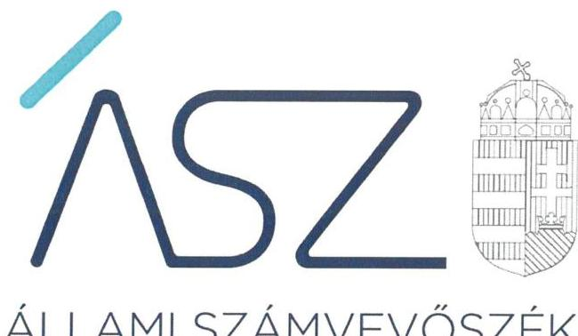
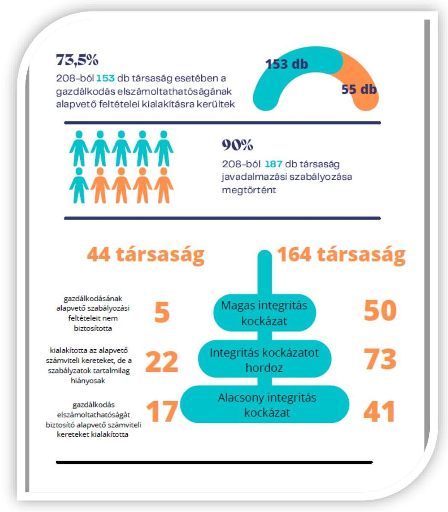
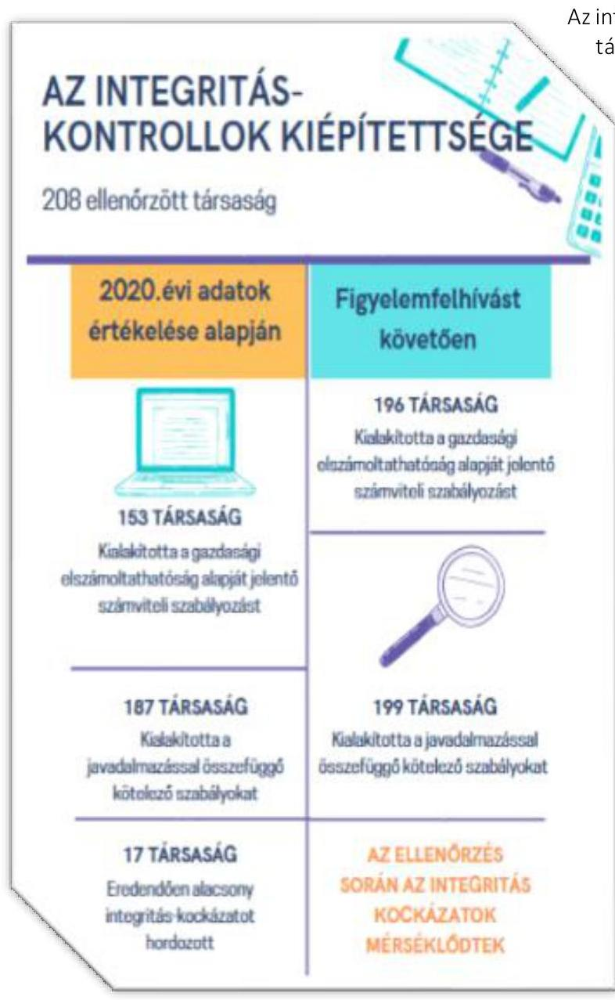
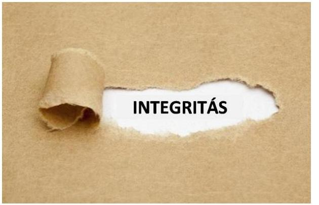
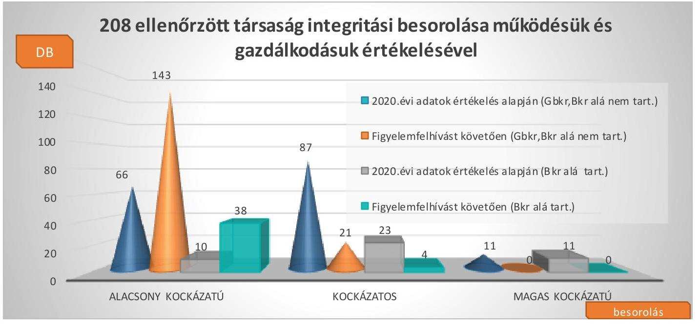

ÁLLAMI SZÁMVEVŐSZÉK

# JELENTÉS 

A többségi állami tulajdonú gazdasági társaságok integritásának ellenőrzése - 208 gazdasági társaságnál

2021. 

21092
www.asz.hu

---

ÁLLAMI SZÁMVEVŐSZÉK

# JELENTÉS 

A többségi állami tulajdonú gazdasági társaságok integritásának ellenőrzése - 208 gazdasági társaságnál
2021. 12. hó 16. nap

21092
www.asz.hu

---

# AZ ELLENŐRZÉST FELÜGYELTE: 

LAJÓ ADRIENN ellenőrzésvezető

## AZ ELLENŐRZÉST VEZETTE ÉS A VÉGREHAJTÁSÁÉRT FELELŐS:

KLINGA LÁSZLÓ ellenőrzésvezető
ÓD ORSOLYA ZOLTÁN TAMÁS ellenőrzésvezető

## A PROGRAM ÖSSZEÁLLÍTÁSÁÉRT FELELŐS:

GÖRGÉNYI GÁBOR ETAMO osztályvezető

IKTATÓSZÁM: EL-3465-001/2021
TÉMASZÁM: 2557
ELLENŐRZÉS-AZONOSÍTÓ SZÁM: V090104; V090105

---

# TARTALOMJEGYZÉK 

- ÖSSZEGZÉS ..... 5
- ÉRTÉKELÉS ..... 6
- AZ ELLENŐRZÉS CÉLJA ..... 9
- AZ ELLENŐRZÉS TERÜLETE ..... 10
- AZ ELLENŐRZÉS HÁTTERE, INDOKOLTSÁGA ..... 11
- A JELENTÉS LÉNYEGES KÉRDÉSKÖREI. ..... 12
- AZ ELLENŐRZÉS HATÓKÖRE ÉS MÓDSZEREI. ..... 13
- ÉRTÉKELÉS ..... 15
MELLÉKLETEK. ..... 19
I. sz. melléklet: Értelmező szótár ..... 19
II. sz. melléklet: A Számviteli törvény által meghatározott számviteli szabályzatok és a javadalmazási szabályzat rendelkezésre állására és kiemelt tartalmi elemeire vonatkozó adatok ..... 20
III. sz. melléklet: A Bkr. hatálya alá tartozó 44 gazdasági társaság kötelező és elvárt integritási kontrollok rendelkezésre állására vonatkozó adatok ..... 21
IV. sz. melléklet: A B kr. és a G bkr. hatálya alá nem tartozó 164 gazdasági társaság elvárt integritási kontrollok rendelkezésre állására vonatkozó adatok ..... 22
V. sz. melléklet: Az ellenőrzött gazdasági társaságok ..... 23
VI. sz. melléklet: Az ellenőrzött intézmények besorolásának koncepciója ..... 26
- RÖVIDÍTÉSEK JEGYZÉKE ..... 27

---

.

---

# ÖSSZEGZÉS 

Az ellenőrzött 2020. évben az ellenőrzött 208 többségi állami tulajdonú gazdasági társaság közül 153 kialakította a gazdálkodás elszámoltathatóságának alapvető feltételeit jelentő számviteli szabályozást és 187 társaság rendelkezett a javadalmazással összefüggő szabályzatokkal. 17 gazdasági társaság alacsony integritási kockázatot hordoz, mivel a jogszabályok által előírt, valamint az integritási környezet részét képező elvárt helyénvalósági szabályokat a 2020. évben kialakította, ezzel biztosítva az elszámoltatható gazdálkodás és az integritás-tudatos szabályozási környezet alapvető feltételeit.
Az Állami Számvevőszék ellenőrzésének és tanácsadó tevékenységének eredményeképpen a 2021. évben az integritás-tudatos szabályozási környezet alapvető feltételeinek és azok minőségi tartalmának kialakítása számottevően javult: a gazdasági elszámoltathatóság vonatkozásában a számviteli szabályozást 196 társaság, míg a javadalmazással összefüggő szabályokat 199 társaság alakította ki.

## Az ellenőrzés társadalmi indokoltsága

Magyarország Alaptörvénye ${ }^{1}$ és a nemzeti vagyonról szóló törvény értelmében a közpénzeket és a nemzeti vagyont az átláthatóság és a közélet tisztaságának elve szerint kell kezelni. Az elvek a számvitelről szóló és a köztulajdonban álló gazdasági társaságok takarékosabb működéséről szóló törvények rendelkezéseiben jelennek meg.

A közvagyonnal való felelős gazdálkodás és annak állapotáról - a tulajdonos állam, valamint a társadalom irányába - történő elszámolás a védelem kialakítását és működtetését is megkívánja. Ezek az integritás kontrollok alkalmazásának szükségességét jelentik. Az integritás a szervezet társadalmi elvárásoknak megfelelő értékrendjét jelenti. A korrupciós kockázatoknak való kitettség elleni védelem kialakítása, illetve az azok mérséklésére hivatott kontrollok alkalmazása vezetői feladat és felelősség, amely a szervezeti működés, a mindennapi feladatellátás szabályosságán túlmutat. Az integritás-elvű működés a korrupciómentesség szervezeti fellépésének eszköze, a feddhetetlenség igazolása.

A köztulajdonban álló gazdasági társaságok belső kontrollrendszeréről szóló kormányrendelet generális vezetői felelősséget fogalmaz meg a köztulajdonban álló gazdasági társaság első számú vezetője részére a belső kontrollrendszer - és ennek keretében a szervezeti integritás kontrollok - kialakítása és működtetése érdekében.

Jelen ellenőrzés hozzájárul ahhoz, hogy az állami tulajdonú gazdasági társaságok a jogszabályi előírások szerint alakítsák ki gazdálkodásuk szabályozási kereteit, valamint a kockázatok feltárásával támogatást nyújt ezen szervezetek számára az integritás alapú, átlátható és elszámoltatható közpénzfelhasználás létrehozásában.

---

# ÉRTÉKELÉS 

A Bkr. ${ }^{2}$ hatálya alá tartozó 44 és a Bkr. és a Gbkr. ${ }^{3}$ hatálya alá nem tartozó 164, összesen 208 állami tulajdonú gazdasági társaságból 153 gazdasági társaság kialakította a gazdálkodás elszámoltathatóságának alapvető feltételeit jelentő számviteli szabályozást. A szervezet irányítás feltételeinek kialakítása és az elszámoltatható működés alapvető feltételei 55 gazdasági társaságnál nem voltak biztosítottak. A számviteli szabályozást kialakító gazdasági társaságok közül 95 gazdasági társaságnál a számviteli szabályzatok, azok tartalmi hiányosságai miatt nem töltötték be szerepüket. A jogszabályban előírt javadalmazási szabályzattal rendelkező 187 gazdasági társaság közül 183 szabályszerűen, a törvényben meghatározott tartalommal kialakította a javadalmazással összefüggő szabályokat.

1. ábra: 208 állami tulajdonú gazdasági társaság 2020. évi gazdálkodásával, szervezeti elvekkel, értékekkel összefüggő integritás kontroll kiépítettsége

A Bkr. hatálya alá tartozó 44 gazdasági társaság tekintetében a 2020. évben 17 gazdasági társaság kialakította a gazdálkodás elszámoltathatóságát biztosító alapvető számviteli kereteket. Közülük négy társaság rendelkezett kötelezően előírt és elvárt integritási kontrollokkal, ezen társaságok az integritási kockázatukat csökkenteni tudták és alacsony integritási kockázatot hordoztak. A Bkr.-ben előírt belső kontrollrendszer kialakításáról 29 gazdasági társaság vezetője gondoskodott.

---

22 gazdasági társaság kialakította az alapvető számviteli kereteket, de gazdálkodásának elszámoltathatósága kockázatot hordoz a nem szabályszerű, tartalmilag hiányos számviteli szabályzatok miatt. Közülük 12 társaság rendelkezett kötelezően előírt és elvárt integritási kontrollokkal.

Öt gazdasági társaság a gazdálkodásának alapvető szabályozási feltételeit nem biztosította, mert nem rendelkezett a jogszabályban előírt számviteli szabályzatokkal, ennek következtében hiányoztak az átlátható, elszámoltatható működés alapvető feltételei.

A Gbkr. és a Bkr. hatálya alá nem tartozó 164 gazdasági társaság tekintetében a 2020. évben 41 gazdasági társaság kialakította a gazdálkodás elszámoltathatóságát biztosító alapvető számviteli kereteket. Közülük 13 társaság rendelkezett elvárt integritási kontrollokkal, ezen társaságok az integritási kockázatukat csökkenteni tudták és alacsony integritási kockázatot hordoztak.

73 gazdasági társaság kialakította az alapvető számviteli kereteket, de gazdálkodásának elszámoltathatósága kockázatot hordoz a nem szabályszerű, tartalmilag hiányos számviteli szabályzatok miatt. Közülük 24 társaság rendelkezett elvárt integritási kontrollokkal.

50 gazdasági társaság a gazdálkodásának alapvető szabályozási feltételeit nem biztosította, mert nem rendelkezett a jogszabályban előírt számviteli szabályzatokkal, ennek következtében hiányoztak az átlátható, elszámoltatható működés alapvető feltételei.

Az integritás alapú működés megléte különösen fontos a társadalmi, gazdasági súlyuk következtében is kiemelt szerepet játszó köztulajdonban álló gazdasági társaságoknál. A vagyonkezelésben lévő közvagyon, felhasznált vagy gazdálkodáshoz szükséges közpénz, a közfeladat-ellátásban való működés alapján nagyobb veszélyeztetettségnek és korrupciós kockázatoknak vannak kitéve. A jogszabályban kötelezően előírt kontrollokat a társaságok többsége kialakította. A gazdasági társaságoknál a pénz- és vagyongazdálkodáshoz kapcsolódó alapvető szabályozási feltételek kialakítása, a szervezeti integritás, a működés és a vezetés alapvető szabályozási feltételeinek kialakítása járul hozzá az integritás elv érvényesüléséhez.
Az elszámoltathatóság érvényesülésének alapvető feltétele, hogy a hatályos jogszabályi előírások, továbbá a gazdálkodó szervezetek belső szabályozásai biztosítsák a felelős gazdálkodás kereteit, a gazdálkodásért való felelősségi viszonyok egyértelmű meghatározását. Ezen elv érvényesülését szem előtt tartva az Állami Számvevőszék már az ellenőrzés során felhívással élt és megszólította azon vezetőket, ahol hiányosságot tárt fel és egyúttal lehetőséget adott arra, hogy a jogszabálysértő gyakorlatot megszüntessék. Az Állami Számvevőszék célja a felhívásokkal az volt, hogy az társaságok a működés magas integritás-kockázatait csökkentsék, biztosítva ezzel a közfeladatra kapott közpénzek elszámoltathatóságát és átláthatóságát.

---

A Bkr. hatálya alá tartozó és a Bkr. és a Gbkr. hatálya alá nem tartozó gazdasági társaságok esetében a jogszabályokban előírt szabályzatok kialakításán és tartalmi megfelelésén túl elsősorban az integritás kontrollok kiépítését kell erősíteni a vezetőknek. Az integritás biztosításához elengedhetetlen a szabályozási környezet kialakítása, ami szorosan összefügg a vezetésnek a szabályosság és az átláthatóság iránti elkötelezettségével, amely támogatja az Alaptörvényben rögzített, a közpénzek gazdálkodására vonatkozó átláthatóság és közélet tisztasága elvének megvalósulását. A szabályozás kialakításával és annak alkalmazásával a vezető nemcsak a szabályos működés feltételeit teremti meg, hanem hozzájárul a közpénzfelhasználás során az átláthatóság és elszámoltathatóság elveinek érvényesüléséhez.

A szabályozások és nyilvántartások kialakításának célja nem kizárólag a jogszabályi rendelkezések betartása, hanem a társaságok szabályozottságán keresztül a szabályszerű és csalásmentes gazdálkodás feltételeinek megteremtése, ezáltal az Alaptörvényben előírt átláthatóság és elszámoltathatóság elvének érvényesítése. Az integritás szempontjából lényeges dokumentumok ellenőrzésének eredménye, valamint az adatszolgáltatás és a figyelemfelhívásokra történt intézkedések kockázati értékelésének figyelembevételével az ellenőrzött intézmények integritásának fennálló állapota együttesen jelentősen javult.

Az ellenőrzés során az ellenőrzött társaságok 79%-a - 165 ellenőrzött - lépéseket tett a jogszabályok által előírt, valamint az integritási környezet részét képező elvárt helyénvalósági szabályok 2021. évi kialakítására, javítására. A Bkr. hatálya alá tartozó 44 gazdasági társaság és a Bkr. és a Gbkr. hatálya alá nem tartozó 164 gazdasági társaság esetében az ÁSZ figyelemfelhívását követően a főbb szabályzatok kialakítása és azok tartalmi megfelelősége a következőképpen alakult:

|  Szabályzat | Szabályzat elkészült | Tartalmilag megfelelő  |
| --- | --- | --- |
|  Számviteli politika | 205 | 185  |
|  Eszközök és források leltározási és
leltárkészítése szabályzata | 204 | 203  |
|  Pénzkezelési szabályzat | 204 | 197  |
|  Javadalmazási szabályzat | 199 | 194  |

1. ábra: 208 állami tulajdonú gazdasági társaság 2020. évi gazdálkodásával, szervezeti elvekkel, értékekkel összefüggő integritás kontroll kiépítettségének figyelemfelhívást követő állapota

---

# AZ ELLENŐRZÉS CÉLJA 

Az ellenőrzés célja annak értékelése, hogy az ellenőrzött szervezetek a feladatellátásuk kapcsán meghatározták-e a szervezeti kultúra egységét biztosító értékeket, elveket, kiépítették-e az integritásirányítási, integritáskockázatkezelési rendszert, ezen belül az integritási kockázatokat mérséklő integritáskontrollokat, és e kontrolleszközök kiterjedtek-e a kockázatos folyamatokra, területekre.

---

# AZ ELLENŐRZÉS TERÜLETE 

## A többségi állami tulajdonú gazdasági társaságok

Az ellenőrzés az integritás alapú, átlátható és elszámoltatható közpénzfelhasználás elősegítése érdekében, 208 többségi állami tulajdonban lévő gazdasági társaság integritása biztosításához szükséges szabályozási környezet kiépítését értékelte.

Ezen gazdasági társaságok közül a 2020. évben 44, a PM közlemény ${ }^{4}$ alapján kormányzati szektorba sorolt egyéb szervezetnek minősült. A Bkr. 54/A. §-a szerint a kormányzati szektorba sorolt egyéb szervezetre a jogszabály 1-10. §-ait kell alkalmazni. Ennek eredményeképpen a gazdasági társaság első számú vezetőjének a belső kontrollrendszert ki kell alakítania és azt működtetnie kell.

Az ellenőrzött további 164 többségi állami tulajdonban lévő gazdasági társaság nem tartozott sem a Gbkr., sem a Bkr. hatálya alá.

A köztulajdonú gazdasági társaságok 2018. évi integritás helyzetéről készített ÁSZ elemzés szerint általános tendencia, hogy a nagyobb vállalati méret együtt jár az integritási veszélyek gyakoribbá válásával, ugyanakkor a nagyobb szervezeteknél a kialakított kontrollok szintje magasabb az átlagnál.

---

# AZ ELLENŐRZÉS HÁTTERE, INDOKOLTSÁGA 

Az Alaptörvény alapértékeket, elveket fogalmaz meg, amely szerint az állam tulajdonában álló szervezetek a törvényben meghatározott módon, önállóan és felelősen gazdálkodnak a törvényesség, célszerűség és az eredményesség követelményei szerint. A közpénzekkel gazdálkodó minden szervezet köteles a nyilvánosság előtt elszámolni e forrásból megvalósuló gazdálkodásával. A közpénzeket és a nemzeti vagyont az átláthatóság és a közélet tisztaságának elve szerint kell kezelni.

Az ÁSZ a 2016-2018. években a köztulajdonú gazdasági társaságok körében is végzett integritás felmérést, amelynek eredményei azt mutatták, hogy nagyon jelentősek a különbségek az egyes gazdasági társaságok között az integritási kontrollok kiépítettségének tekintetében, és e különbségek jelentős részben a társaságok menedzsmentjének az eltérő hozzáállására vezethetők vissza.

---

# A JELENTÉS LÉNYEGES KÉRDÉSKÖREI 

1. 
   - A gazdasági társaságok kialakították-e az integritásuk biztosításához szükséges szabályozási környezetet?
2.     - Milyen kockázatot hordoz a szervezetek fennálló integritása az ÁSZ figyelemfelhívását követően?

---

# AZ ELLENŐRZÉS HATÓKÖRE ÉS MÓDSZEREI 

## Az ellenőrzés típusa

| Megfelelőségi ellenőrzés.

## Az ellenőrzött időszak

| 2020. év

## Az ellenőrzés tárgya

A többségi állami tulajdonban lévő gazdasági társaságok gazdálkodásával, valamint a szervezeti elvekkel, értékekkel összefüggő integritás kontrollok kiépítettsége.

## Az ellenőrzött szervezetek

Az V. mellékletben szereplő többségi állami tulajdonban lévő gazdasági társaságok.

## Az ellenőrzés jogalapja

Az ÁSZ tv. ${ }^{6}$ 1. § (3) bekezdése

## Az ellenőrzés módszerei

Az ellenőrzés lefolytatása az ellenőrzési program szempontjai, az ellenőrzött időszakban hatályos jogszabályok, a jelen ellenőrzésre irányadó ÁSZ módszertan figyelembevételével és a nemzetközi standardokat irányadónak tekintve történik.

Az ellenőrzési kérdések megválaszolásához szükséges bizonyítékok megszerzése a következő ellenőrzési eljárások alkalmazásával történik: megfigyelés, összehasonlítás, elemző eljárás. Az ellenőrzési bizonyítékként felhasználható adatforrások közé tartoztak az ellenőrzési programban felsorolt adatforrások, továbbá minden - az ellenőrzés folyamán - feltárt, az ellenőrzés szempontjából információkat tartalmazó dokumentum. Az ellenőrzés lefolytatása a kérdésekre adott válaszok kiértékelésével, valamint a megjelölt adatforrások felhasználásával, továbbá az adott időszakban hatályos jogszabályok, valamint az ÁSZ honlapján közzétett helyénvalósági kritériumok alapján történik.

---

A monitoring típusú ellenőrzés a gazdasági társaságok integritás alapú működésének lényeges területeire terjed ki, és súlypontok meghatározásával lehetőséget biztosít a kockázatok beazonosítására. Emellett a monitoring típusú ellenőrzés már az ellenőrzés folyamatában az ÁSZ figyelemfelhívásán keresztül - lehetőséget biztosít a kockázatok csökkentésére és az integritási környezet javítására az ellenőrzött társaságoknak.

Az integritás kontrollok kiépítettsége szintjének értékelése szabályszerűségi és helyénvalósági kritériumok alapján történik. Az ellenőrzés szabályszerűségi kritériumként alkalmazta azokban az esetekben, amikor a kontroll kiépítését jogszabály kötelezően előírta. Jogszabály által kötelezően nem előírt, elvárt kontrollok esetében az ÁSZ az Alaptörvényben megfogalmazott integritás elvek (törvényesség, célszerűség, eredményesség, átláthatóság, közélet tisztaságának elve) érvényesítése érdekében a kontrollok meglétét helyénvalósági kritériumként fogalmazza meg.

A jogszabályi követelmények teljesítése, valamint a belső kontrollrendszer kialakítása és működtetése, illetve az integritás elvű működés értékelésének eredménye, továbbá a figyelemfelhívásra megtett, vagy megtenni kívánt intézkedések együttesen történő kockázati értékelésének figyelembevételével kerül sor a V. sz. mellékletben szereplő társaságok integritási szempontból történő besorolására.

Az értékelés szempontrendszerét és módját a VI. sz. melléklet tartalmazza.

---

# 1. A gazdasági társaságok kialakították-e az integritásuk biztosításához szükséges szabályozási környezetet? 

Összegző értékelés Az ellenőrzött 208 társaság közül a számviteli szabályozást 153 társaság, a javadalmazással összefüggő szabályokat 187 társaság kialakította. 17 gazdasági társaság a jogszabályok által előírt, valamint az integritási környezet részét képező elvárt szabályokat a 2020. évben kialakította.

AZ ALAPVETŐ SZÁMVITELI SZABÁLYOZÁST a 208 ellenőrzött többségi állami tulajdonú gazdasági társaság közül 153 gazdasági társaság kialakította a 2020. évben. Az alapvető számviteli keretek kialakításának hiányában 55 gazdasági társaság a gazdálkodás elszámoltathatóságát nem biztosította. A számviteli szabályzatokkal rendelkező gazdasági társaságok közül 95-nél a szabályzatok nem tartalmazták a jogszabályi előírások alapján kötelező tartalmi elemeket a következő esetekben:

- a számviteli politikában nem rögzítették azokat a gazdálkodóra jellemző szabályokat, előírásokat, módszereket, amelyekkel meghatározzák, hogy mit tekintenek a számviteli elszámolás, az értékelés szempontjából lényegesnek, nem lényegesnek, továbbá jelentősnek, nem jelentősnek;
- az eszközök és források leltárkészítési és leltározási szabályzatában a jogszabály által előírt legalább három évenkénti mennyiségi leltározás helyett, azt meghaladó periódusban határozták meg a tárgyi eszközök mennyiségi felvétellel történő leltározásának gyakoriságát;
- a pénzkezelési szabályzatban nem határozták meg a pénzkezelés felelősségi szabályait, a készpénzállományt érintő pénzmozgások jogcímeit és eljárási rendjét, továbbá a készpénzállomány ellenőrzésekor követendő eljárást és az ellenőrzés gyakoriságát;
- a számlarendben nem rögzítették a főkönyvi számla és az analitikus nyilvántartás kapcsolatát.
A kötelező integritási kontrollt jelentő, a Taktv. ${ }^{7}$ által előírt javadalmazási szabályzattal rendelkező 187 gazdasági társaság közül 183 a törvényben meghatározottakkal összhangban kialakította a szabályozást.

A Számv. tv. ${ }^{8}$ által meghatározott számviteli szabályzatok és a Taktv.ben előírt javadalmazási szabályzat rendelkezésre állására és kiemelt tartalmi elemeire vonatkozó adatokat a II. számú melléklet mutatja be a 2020. év értékelése alapján.

A BKR. HATÁLYA ALÁ TARTOZÓ 44 gazdasági társaság közül 29 gazdasági társaság vezetője gondoskodott a Bkr.-ben előírt belső kontrollrendszer kialakításáról, így elkészítette az integritás szempontjából

---

lényeges tevékenységekre, eljárásokra, magatartásra vonatkozó szabályokat.

A Bkr. hatálya alá tartozó gazdasági társaságok kevesebb, mint fele, 19 gazdasági társaság alakított ki integritás szempontjából lényeges és az ÁSZ által kihirdetett és elvárt helyénvalósági szabályokat.

A gazdálkodás elszámoltathatóságának alapvető feltételeit jelentő számviteli szabályozást 39 gazdasági társaság kialakította, azonban 22 gazdasági társaság esetében azok tartalmi hiányosságai miatt nem töltötték be funkciójukat. A gazdálkodás elszámoltathatóságának alapvető feltételeit jelentő számviteli szabályozást és a jogszabály által előírt, továbbá az integritás szempontjából lényeges szabályokat négy gazdasági társaság kialakította a 2020. évben.

A Bkr. hatálya alá tartozó 44 gazdasági társaság számára a kötelezően előírt és elvárt integritási kontrollok rendelkezésre állását bemutató adatokat a III. számú melléklet tartalmazza a 2020. év értékelése alapján.

# A GBKR. ÉS A BKR. HATÁLYA ALÁ NEM TARTOZÓ 

164 gazdasági társaság közül az integritás szempontjából lényeges és az ÁSZ által kihirdetett és elvárt helyénvalósági szabályokat 39 társaság alakított ki.

A Bkr. és a Gbkr. hatálya alá nem tartozó 164 gazdasági társaság közül a gazdálkodás elszámoltathatóságának alapvető feltételeit jelentő számviteli szabályozást 114 gazdasági társaság kialakította, azonban 73 gazdasági társaság esetében azok tartalmi hiányosságai miatt nem töltötték be funkciójukat. A gazdálkodás elszámoltathatóságának alapvető feltételeit jelentő számviteli szabályozást, továbbá az integritás szempontjából lényeges szabályokat 13 gazdasági társaság kialakította a 2020. évben.

A Bkr. és a Gbkr. hatálya alá nem tartozó 164 gazdasági társaságtól elvárt integritási kontrollok rendelkezésre állását a IV. számú melléklet mutatja be a 2020. év értékelése alapján.

## 2. Milyen kockázatot hordoz a szervezetek fennálló integritása az ÁSZ figyelemfelhívását követően?

Összegző értékelés

165 gazdasági társaság intézkedett a jogszabályok által előírt, valamint az integritási környezet részét képező, integritás szempontjából lényeges és az ÁSZ által kihirdetett és elvárt helyénvalósági szabályok 2021. évi kialakítására, javítására. Az integritási kontrollok szintje a 2021. évre javult.

Az ellenőrzés során feltárásra került, hogy a dokumentumok hiányossága okán azok jogszabályokban előírtak szerinti szabályozó szerepüket nem tudják betölteni, ezért az ellenőrzés során a gazdasági társaságok felelős vezetői lehetőséget kaptak a feltárt hiányosságok kijavítására. A 2021. évben ennek eredményeként 165 ellenőrzöttnél javultak az integritás alapvető feltételei. 17 gazdasági társaság a 2020. év vonatkozásában a jogszabályok által előírt, valamint az integritási környezet

---

részét képező elvárt szabályokat a 2020. évben kialakította, ezért alacsony integritáskockázatot hordozott.

A szabályozottsági hiányosságok megszüntetése érdekében nem vagy nem megfelelően intézkedő 18 gazdasági társaság és az ÁSZ elvárt integritáskontrollok érvényesítése kapcsán eddig nem intézkedő 7 ellenőrzöttnek is - összesen 25 - lehetősége van 2021-ben a felelős vezetői magatartás körében a szükséges intézkedéseket megtenni és ezzel a korrupciós kockázatokat csökkenteni.

Az ellenőrzés eredményeképpen a gazdasági elszámoltathatóság vonatkozásában a számviteli szabályozást (számlarend, eszközök és források értékelése, leltár, pénzkezelés) 196 társaság alakította ki megfelelően, míg a javadalmazással összefüggő szabályokat 199 társaság készítette el (Id. 2.és 3.sz. ábra).

Az ÁSZ tanácsadó tevékenységének hatására megtett intézkedések a közpénzügyi helyzet tekintetében jelentős javulást eredményeztek. Magas kockázatú besorolási csoportba a figyelemfelhívást követő intézkedések hatására nem került ellenőrzött társaság. E javulást, a 208 ellenőrzött 44 Bkr . hatálya alá tartozó és 164 Bkr . és Gbkr. hatálya alá nem tartozó egyéb - gazdasági társaság integritási környezetének és területeinek értékelésére vonatkozóan a 4. sz. ábra mutatja be.

Az ÁSZ tanácsadó tevékenységét megelőzően 2020-ban, majd az ÁSZ tanácsadó tevékenységét követően 2021-ben az újraértékelt területek tekintetében az integritási környezet alakulását a III. sz. és a IV. sz. melléklet részletezi.

4. ábra: 208 állami tulajdonú gazdasági társaság 2020. évi gazdálkodásával, szervezeti elvekkel, értékekkel összefüggő integritás kontroll kiépítettségének figyelemfelhívást követő állapota

---

.

---

# MELLÉKLETEK 

I. SZ. MELLÉKLET: ÉRTELMEZŐ SZÓTÁR

ÁSZ Integritás Projekt
belső ellenőrzés
gazdasági társaság
integritás
integrált kockázatkezelési rendszer
kontrollkörnyezet
kontrolltevékenységek
szervezeti integritást sértő esemény

Az ÁSZ 2009-ben indította el a „Korrupciós kockázatok feltérképezése - Integritás alapú közigazgatási kultúra terjesztése" című, európai uniós forrásból megvalósított kiemelt projektjét (Integritás Projekt). Az Integritás Projekt célja, hogy felmérje a közszféra intézményei korrupciós kockázatoknak való kitettségét, illetőleg az azok mérséklésére hivatott kontrollok szintjét. Az ÁSZ a projekt révén az integritás szemlélet minél szélesebb körrel történő megismertetését, gyakorlatba ültetését kívánja elérni. Az integritás követelményeinek megfelelő szervezeti működést előnyben részesítő közigazgatási kultúra elterjesztését és a korrupció elleni fellépést az ÁSZ önmagára nézve is stratégiai jelentőségű célként fogalmazta meg. A projekt a felmérésben résztvevő intézmények számára helyzetükről egyfajta „tükörképet" mutat be, ami alapot teremt a jövőbeni pozitív irányú elmozduláshoz. (Forrás: a http://integritas.asz.hu honlapon közzétett, a 2013. évi Integritás felmérés eredményeiről készült összefoglaló tanulmány)
Független, tárgyilagos bizonyosságot adó és tanácsadó tevékenység, amelynek célja, hogy az ellenőrzött szervezet működését fejlessze és eredményességét növelje, az ellenőrzött szervezet céljai elérése érdekében rendszerszemléletű megközelítéssel és módszeresen értékeli, illetve fejleszti az ellenőrzött szervezet irányítási és belső kontrollrendszerének hatékonyságát. (Forrás: Bkr. 2. § b. pont)
A gazdasági társaságok üzletszerű közös gazdasági tevékenység folytatására, a tagok vagyoni hozzájárulásával létrehozott, jogi személyiséggel rendelkező vállalkozások, amelyekben a tagok a nyereségből közösen részesednek, és a veszteséget közösen viselik. (Forrás: Ptk. ${ }^{9}$ 3:88. § (1) bekezdés)
A köztulajdonban álló gazdasági társaság szabályszerű, a köztulajdonban álló gazdasági társaság célkitűzéseinek, értékeinek és elveinek megfelelő működése.
(Forrás: Gbkr. 2. § 5. pont)
Olyan folyamatalapú kockázatkezelési rendszer, amely a szervezet minden tevékenységére kiterjed, egységes módszertan és eljárások alkalmazásával, a szervezet célkitűzéseinek és értékeinek figyelembevételével biztosítja a szervezet kockázatainak teljes körű azonosítását, azok meghatározott kritériumok szerinti értékelését, valamint a kockázatok kezelésére vonatkozó intézkedési terv elkészítését és az abban foglaltak nyomon követését. (Forrás: Bkr. 2. § m) pont)
A vezető tisztségviselő vagy a vezető tisztségviselőkből álló testület vezetője által kialakított olyan elvek, eljárások, belső szabályzatok összessége, amelyben világos a szervezeti struktúra, a folyamatok átláthatók, egyértelműek a felelősségi, hatásköri viszonyok és feladatok, meghatározottak, ismertek és elfogadottak az etikai elvárások a szervezet minden szintjén, átlátható a humánerőforrás-kezelés, biztosított a szervezeti célok és értékek irányában való elkötelezettség fejlesztése és elősegítése. (Forrás: Bkr. 6. § (1) bekezdés)
A vezető tisztségviselő vagy a vezető tisztségviselőkből álló testület vezetője által a szervezeten belül kialakított (kontroll) tevékenységek, melyek biztosítják a kockázatok kezelését, hozzájárulnak a szervezet céljainak eléréséhez és erősítik a szervezet integritását. (Forrás: Bkr. 8. § (1) bekezdés)
minden olyan esemény, amely a szervezetre vonatkozó szabályoktól, valamint a jogszabályi keretek között a költségvetési szerv vezetője és az irányító szerv által meghatározott szervezeti célkitűzéseknek, értékeknek és elveknek megfelelő működéstől eltér.
(Forrás: Bkr. 2. § u. pont)

---

# II. SZ. MELLÉKLET: A SZÁMVITELI TÖRVÉNY ÁLTAL MEGHATÁROZOTT SZÁMVITELI SZABÁLYZATOK ÉS A
 JAVADALMAZÁSI SZABÁLYZAT RENDELKEZÉSRE ÁLLÁSÁRA ÉS KIEMELT TARTALMI ELEMEIRE VONATKOZÓ ADATOK

|  Ssz. | Számviteli politika | Gazdasági társaságok száma |   |
| --- | --- | --- | --- |
|   |  | Az ellenőrzéskor | Figyelemfelhívást követően  |
|  1. | Kialakították számviteli politikájukat | 187 | 205  |
|  2. | A számviteli politikában rögzítették azokat a gazdálkodóra jellemző szabályokat, előírásokat, módszereket, amelyekkel meghatározzák, hogy mit tekintenek a számviteli elszámolás, az értékelés szempontjából jelentősnek, nem jelentősnek. | 182 | 205  |
|  3. | A számviteli politikában rögzítették azokat a gazdálkodóra jellemző szabályokat, előírásokat, módszereket, amelyekkel meghatározzák, hogy mit tekintenek a számviteli elszámolás, az értékelés szempontjából lényegesnek, nem lényegesnek. | 93 | 185  |

|  Ssz. | Javadalmazási szabályzat | Gazdasági társaságok száma |   |
| --- | --- | --- | --- |
|   |  | Az ellenőrzéskor | Figyelemfelhívást követően  |
|  1. | Kialakították javadalmazási szabályzatukat | 187 | 199  |
|  2. | A javadalmazási szabályzat tartalmazta a törvényben előírt a vezető tisztségviselők, felügyelőbizottsági tagok, valamint a vezető állású munkavállalók javadalmazása módját, mértékének elveit, annak rendszerét. | 184 | 196  |
|  3. | A javadalmazási szabályzat tartalmazta a törvényben előírt jogviszony megszűnése esetére biztosított juttatások módját, mértékének elveit, rendszerét. | 183 | 194  |

|  Ssz. | Eszközök és források leltárkészítési és leltározási szabályzata | Gazdasági társaságok száma |   |
| --- | --- | --- | --- |
|   |  | Az ellenőrzéskor | Figyelemfelhívást követően  |
|  1. | Kialakították eszközök és források leltárkészítési és leltározási szabályzatukat | 183 | 204  |
|  2. | Az eszközök és források leltárkészítési és leltározási szabályzatában a jogszabályban előírtakkal összhangban határozták meg a mennyiségi felvétellel történő leltározás gyakoriságát. | 181 | 203  |

|  Ssz. | Eszközök és források értékelési szabályzata | Gazdasági társaságok száma |   |
| --- | --- | --- | --- |
|   |  | Figyelemfelhívást követően | Figyelemfelhívást követően  |
|  1. | Kialakították az eszközök és források értékelési szabályzatukat | 183 | 203  |

|  Ssz. | Pénzkezelési szabályzat | Gazdasági társaságok száma |   |
| --- | --- | --- | --- |
|   |  | Az ellenőrzéskor | Figyelemfelhívást követően  |
|  1. | Kialakították pénzkezelési szabályzatukat | 184 | 204  |
|  2. | A pénzkezelési szabályzatban rögzítették a pénzkezelés felelősségi szabályait. | 182 | 204  |
|  3. | A pénzkezelési szabályzat tartalmazta a készpénzállományt érintő pénzmozgások jogcímeit és eljárási rendjét. | 182 | 204  |
|  4. | A pénzkezelési szabályzat tartalmazta a tartalmazza a készpénzállomány ellenőrzésekor követendő eljárást és az ellenőrzés gyakoriságát. | 158 | 197  |

|  Ssz. | Számlarend | Gazdasági társaságok száma |   |
| --- | --- | --- | --- |
|   |  | Figyelemfelhívást követően | Figyelemfelhívást követően  |
|  1. | Kialakították számlarendjüket | 164 | 198  |
|  2. | A számlarendben meghatározták a főkönyvi számla és az analitikus nyilvántartás kapcsolatát. | 153 | 196  |

---

# Mellekletek 

III. SZ. MELLÉKLET: A BKR. HATÁLYA ALÁ TARTOZÓ 44 GAZDASÁGI TÁRSASÁG KÖTELEZŐ ÉS ELVÁRT INTEGRITÁSI KONTROLLOK RENDELKEZÉSRE ÁLLÁSÁRA VONATKOZÓ ADATOK

| Ssz. | Bkr. szerinti kötelező integritási szabályok | Gazdasági társaságok száma |  |
| :-- | :--: | :--: | :--: |
|  |  | Az ellenőrzéskor | Figyelemfelhívást   követően |
| 1. | Rendelkeztek/rendelkeznek integrált kockázatkezelés eljárásrenddel | 34 | 39 |
| 2. | Az etikai elvárásokat rögzítették /rögzítik | 36 | 40 |
| 3. | Kialakították / kialakítják az integritást sértő események kezelésének   eljárásrendjét | 36 | 41 |

| Ssz. | Elvárt integritási szabályzatok | Gazdasági társaságok száma |  |
| :-- | :--: | :-- | :--: |
|  |  | Az ellenőrzéskor | Figyelemfelhívást   követően |
| 1. | Rendelkeztek az ajándékok elfogadására vonatkozó szabályozással vagy   intézkednek erre vonatkozóan | 39 | 43 |
| 2. | Kialakították a beszerzési eljárásokkal kapcsolatos szabályozást vagy intézkednek   erre vonatkozóan | 42 | 43 |
| 3. | Kialakították a munkatársak gazdasági összeférhetetlenségét kizáró szabályozást   vagy intézkednek erre vonatkozóan | 35 | 42 |
| 4. | Kialakították a külső panaszokat kezelő eljárásrendet vagy intézkednek erre   vonatkozóan | 28 | 42 |
| 5. | Kialakították a munkáltatói visszaélés-bejelentési rendszert vagy intézkednek   erre vonatkozóan | 29 | 40 |
| 6. | Rendelkeztek a vezető tisztségviselőkre és hozzátartozójukra vonatkozó   összeférhetetlenség megelőzésére és biztosításának ellenőrzésére vonatkozó   szabályozással vagy intézkednek erre vonatkozóan | 40 | 42 |
| 7. | Kialakították a szervezeti integritást sértő események és panaszok bejelentő   rendszerét vagy intézkednek erre vonatkozóan | 34 | 42 |
| 8. | Biztosították a szervezeten belüli összeférhetetlenség megelőzését és   ellenőrzését vagy intézkednek erre vonatkozóan | 37 | 41 |

---

|  Ssz. | Elvárt integritási szabályok | Gazdasági társaságok száma |  |  |   |
| --- | --- | --- | --- | --- | --- |
|   |  | Az ellenőrzéskor | Figyelemfelhívást követően |  |   |
|  1. | Rendelkeztek integrált kockázatkezelés eljárásrenddel | 74 | 117 |  |   |
|  2. | Az etikai elvárásokat rögzítették | 105 | 133 |  |   |
|  3. | Kialakították az integritást sértő események kezelésének eljárásrendjét | 86 | 123 |  |   |
|  4. | Kialakították a szervezeti integritást sértő események és panaszok bejelentő rendszerét | 85 | 124 |  |   |
|  5. | Biztosították a szervezeten belüli összeférhetetlenség megelőzését és ellenőrzését | 81 | 122 |  |   |
|  6. | Rendelkeztek az ajándékok elfogadására vonatkozó szabályozással | 107 | 134 |  |   |
|  7. | Kialakították a beszerzési eljárásokkal kapcsolatos szabályozást | 119 | 137 |  |   |
|  8. | Kialakították a munkatársak gazdasági összeférhetetlenségét kizáró szabályozást | 100 | 134 |  |   |
|  9. | Kialakították a külső panaszokat kezelő eljárásrendet | 90 | 122 |  |   |
|  10. | Kialakították a munkáltatói visszaélés-bejelentési rendszert | 91 | 131 |  |   |
|  11. | Rendelkeztek a vezető tisztségviselőkre és hozzátartozójukra vonatkozó összeférhetetlenség megelőzésére és biztosításának ellenőrzésére vonatkozó szabályozással | 96 | 129 |  |   |

---

|  1 | Adria Port Zártkörűen Működő Részvénytársaság  |
| --- | --- |
|  2 | Agrármarketing Centrum Nonprofit Korlátolt Felelősségű  |
|  3 | Társaság  |
|  4 | Agro Rehab Nonprofit Korlátolt Felelősségű Társaság  |
|  5 | AK Nyomda Korlátolt Felelősségű Társaság  |
|  6 | Aktív- és Ökoturisztikai Fejlesztési Központ Nonprofit Korlátolt  |
|  7 | Felelősségű Társaság  |
|  8 | Államadósság Kezelő Központ Zártkörűen Működő  |
|  9 | Részvénytársaság  |
|  10 | Általános Vagyonkezelő Kft.  |
|  11 | ANTENNA HUNGÁRIA Magyar Műsorszórő és Rádióhírközlési  |
|  12 | Zártkörűen Működő Részvénytársaság  |
|  13 | Autóipari Próbapálya Zala Korlátolt Felelősségű Társaság  |
|  14 | AVE Magyarország Hulladékgazdálkodási Korlátolt Felelősségű  |
|  15 | Társaság  |
|  16 | ÁVNY- Állami Vagyonnyilvántartási Korlátolt Felelősségű  |
|  17 | Társaság  |
|  18 | Balatoni Halgazdálkodási Nonprofit Zártkörűen Működő  |
|  19 | Részvénytársaság  |
|  20 | Bányavagyon-hasznosító Nonprofit Közhasznú Korlátolt  |
|  21 | Felelősségű Társaság  |
|  22 | BÉKÉS AIRPORT Repülőtér Működtető Fejlesztő Korlátolt  |
|  23 | Felelősségű Társaság  |
|  24 | BFA Budapest Fejlesztési Központ Nonprofit Zártkörűen Működő  |
|  25 | Részvénytársaság  |
|  26 | BISZ Központi Hitelinformációs Zártkörűen Működő  |
|  27 | Részvénytársaság  |
|  28 | BTTF Badacsony és térsége Turisztikai Fejlesztő Nonprofit  |
|  29 | Zártkörűen Működő Részvénytársaság  |
|  30 | Budakeszi Vadaspark Közhasznú Nonprofit Korlátolt Felelősségű  |
|  31 | Társaság  |
|  32 | Budapest Institute of Banking Zártkörűen Működő  |
|  33 | Részvénytársaság  |
|  34 | CED Közép-európai Gazdaságfejlesztési Hálózat Nonprofit  |
|  35 | Korlátolt Felelősségű Társaság  |
|  36 | Comitatus Üzletviteli és Tanácsadó Korlátolt Felelősségű  |
|  37 | Társaság  |
|  38 | Comitatus-Energia Beruházási Kereskedelmi és Szolgáltató  |
|  39 | Zártkörűen Működő Részvénytársaság  |
|  40 | Concerto Akadémia Nonprofit Korlátolt Felelősségű Társaság  |
|  41 | CORDATE Gazdaságfejlesztő és Elátó Központ Zártkörűen  |
|  42 | Működő Részvénytársaság "végelszámolás alatt"  |
|  43 | Corvinus Nemzetközi Befektetési Zártkörűen Működő  |
|  44 | Részvénytársaság  |
|  45 | DABIC Dél-Állöldi Bio-Innovációs Centrum Nonprofit Korlátolt  |
|  46 | Felelősségű Társaság  |
|  47 | DBC Dél-budai Centrum Projekt Beruházó és Ingatlanfejlesztő  |
|  48 | Zártkörűen Működő Részvénytársaság  |
|  49 | DDRF Dél-Dunántúli Regionális Fejlesztési Zártkörűen Működő  |
|  50 | Részvénytársaság  |
|  51 | Debreceni Nyári Egyetem Oktatási Szolgáltató Nonprofit  |
|  52 | Közhasznú Korlátolt Felelősségű Társaság  |
|  53 | Dél-Pest Megyei Térségi Integrált Szakképző Központ Nonprofit  |
|  54 | Korlátolt Felelősségű Társaság  |
|  55 | Diákhitel Központ Zártkörűen Működő Részvénytársaság  |
|  56 | Digitális Jólét Nonprofit Korlátolt Felelősségű Társaság  |
|  57 | Digitális Kormányzati Ügynökség Zártkörűen Működő  |
|  58 |

 Részvénytársaság  |
|  59 | Duna Paletta Kulturális Közhasznú Nonprofit Korlátolt Felelősségű  |
|  60 | Társaság (új név: Duna Művészegyüttes Közhasznú Nonprofit  |
|  61 | Korlátolt Felelősségű Társaság)  |
|  62 | DUNA-MIX Ipari Kereskedelmi Szolgáltató Korlátolt Felelősségű  |
|  63 | Társaság  |

|  64 | EFeT Egészségügyi Fejlesztéseket Támogató Nonprofit Korlátolt  |
| --- | --- |
|  65 | Felelősségű Társaság  |
|  66 | Egészségügyi Szolgáltató Zártkörűen Működő Részvénytársaság  |
|  67 | Egy a Természettel Nonprofit Korlátolt Felelősségű Társaság  |
|  68 | Egyetemi Centrum Szolgáltató Korlátolt Felelősségű Társaság  |
|  69 | EH Ügyelet Egészségügyi Szolgáltató Nonprofit Korlátolt  |
|  70 | Felelősségű Társaság  |
|  71 | ENERGO-MERKUR Villamosenergiaipari Kereskedelmi és  |
|  72 | Szolgáltató Korlátolt Felelősségű Társaság (új név: MVM  |
|  73 | ENERGO-MERKUR Villamosenergiaipari Kereskedelmi és  |
|  74 | Szolgáltató Korlátolt Felelősségű Társaság)  |
|  75 | Erdőgazdasági Hőtermelő Korlátolt Felelősségű Társaság  |
|  76 | ERV.-SZOLG Kereskedelmi és Szolgáltató Korlátolt Felelősségű  |
|  77 | Társaság  |
|  78 | Euripus Szolgáltató Korlátolt Felelősségű Társaság  |
|  79 | EXPO 2020 Magyarország Nonprofit Korlátolt Felelősségű  |
|  80 | Társaság  |
|  81 | EXPO PARK Ingatlanfejlesztő, Kereskedelmi és Szolgáltató  |
|  82 | Korlátolt Felelősségű Társaság  |
|  83 | Fertővidéki Helyi Érdekű Vasút Zártkörűen Működő  |
|  84 | Részvénytársaság  |
|  85 | FILANTROP Környezetvédelmi és Fűtéstechnikai Nonprofit  |
|  86 | Korlátolt Felelősségű Társaság  |
|  87 | Filharmónia Magyarország Koncert és Fesztiválszervező  |
|  88 | Nonprofit Korlátolt Felelősségű Társaság  |
|  89 | FLOGISTON Gázmérőgyártó, Javító, Hitelesítő és Kereskedelmi  |
|  90 | Korlátolt Felelősségű Társaság  |
|  91 | FORGÁCS INTÉZET Egészségügyi és Szolgáltató Korlátolt  |
|  92 | Felelősségű Társaság  |
|  93 | Forum Hungaricum Nonprofit Korlátolt Felelősségű Társaság  |
|  94 | GAK Oktatási és Üzemeltetési Nonprofit Közhasznú Korlátolt  |
|  95 | Felelősségű Társaság  |
|  96 | Gandhi Gimnázium Közhasznú Nonprofit Korlátolt Felelősségű  |
|  97 | Társaság  |
|  98 | Garantiga Hitelgarancia Zártkörűen Működő Részvénytársaság  |
|  99 | GIRO Elszámolásforgalmi Zártkörűen Működő Részvénytársaság  |
|  100 | Gönc és Térsége Egészségéért Egészségügyi Szolgáltató  |
|  101 | Közhasznú Nonprofit Korlátolt Felelősségű Társaság  |
|  102 | HDT Védelmi Ipari Korlátolt Felelősségű Társaság  |
|  103 | HEPA Magyar Exportfejlesztési Ügynökség Nonprofit Zártkörűen  |
|  104 | Működő Részvénytársaság  |
|  105 | Herman Ottó Intézet Nonprofit Korlátolt Felelősségű Társaság  |
|  106 | HIPA Nemzeti Befektetési Ügynökség Nonprofit Zártkörűen  |
|  107 | Működő Részvénytársaság  |
|  108 | Hiventures Kockázati Tőkealap-kezelő Zártkörűen Működő  |
|  109 | Részvénytársaság  |
|  110 | HKGYK Közép- és Kelet-Európai Hagyományos Kínai Gyógyászati,  |
|  111 | Oktató- és Kutatóközpont Nonprofit Korlátolt Felelősségű  |
|  112 | Társaság  |
|  113 | Holloházi Hungarikum Nonprofit Korlátolt Felelősségű Társaság  |
|  114 | Honvéd Együttes Művészeti Nonprofit Korlátolt Felelősségű  |
|  115 | Társaság  |
|  116 | HUDEX Magyar Derivativ Energiatózsde Zártkörűen Működő  |
|  117 | Részvénytársaság  |
|  118 | VALOR HUNGARIAE Zártkörűen Működő Részvénytársaság (új  |
|  119 | név: HUMDA Magyar Autó-Motorsport és Zöld Mobilitás-  |
|  120 | fejlesztési Ügynökség Zártkörűen Működő Részvénytársaság)  |
|  121 | Hungarofest Nemzeti Rendezvényszervező Nonprofit Korlátolt  |
|  122 | Felelősségű Társaság (új név: Turisztikai Vagyonkezelő és  |
|  123 | Ingatlanüzemeltető Nonprofit Korlátolt Felelősségű Társaság)  |
|  124 | Hungary Helps Ügynökség Nonprofit Zártkörűen Működő  |
|  125 | Részvénytársaság  |

---

|  70 | IFKA Iparfejlesztési Közhasznú Nonprofit Korlátolt Felelősségű Társaság  |
| --- | --- |
|   | IKK Innovatív Képzéstámogató Központ Zártkörűen Működő  |
|  71 | Részvénytársaság  |
|   | INNOVA Észak-Alföldi Regionális Fejlesztési és Innovációs  |
|  72 | Ügynökség Nonprofit Korlátolt Felelősségű Társaság  |
|   | "KAÁLI" Ambuláns Nőgyógyászati Intézet Korlátolt Felelősségű Társaság  |
|  73 | Társaság  |
|  74 | KAÁLI REK Reprodukciós Központ Korlátolt Felelősségű Társaság  |
|   | Kárpát-medencei Tehetséggondozó Nonprofit Korlátolt  |
|  75 | Felelősségű Társaság  |
|   | Katonai Emlékpark Közhasznú Nonprofit Korlátolt Felelősségű  |
|  76 | Társaság  |
|  77 | KELER Központi Értéktár Zártkörűen Működő Részvénytársaság  |
|   | KELER KSZF Központi Szerződő Fél Zártkörűen Működő  |
|  78 | Részvénytársaság  |
|   | Kincsem Nemzeti Löverseny és Lovas Stratégiai Korlátolt  |
|  79 | Felelősségű Társaság  |
|   | KINCSINFO Kincstári Informatikai Nonprofit Korlátolt Felelősségű  |
|  80 | Társaság  |
|   | Kisfaludy2030 Turisztikai Fejlesztő Nonprofit Zártkörűen Működő  |
|  81 | Részvénytársaság  |
|   | KKM Oktatási és Rekreációs Korlátolt Felelősségű Társaság (új  |
|  82 | név: KKM Magyar Diplomáciai Akadémia Korlátolt Felelősségű  |
|   | Társaság)  |
|  83 | KLIMA MEDI STUDIÓ-K Korlátolt Felelősségű Társaság  |
|   | "KlinKoord" Klinikai Kutatási Koordinációs Központ Korlátolt  |
|  84 | Felelősségű Társaság "végekszámolás alatt"  |
|   | "KMF" Közép-magyarországi Fejlesztési Zártkörűen Működő  |
|  85 | Részvénytársaság  |
|   | Központi Humánfejlesztési Nonprofit Korlátolt Felelősségű  |
|  86 | Társaság  |
|  87 | Kreatív Európa Nonprofit Korlátolt Felelősségű Társaság  |
|   | MAFILM-PROFILM Reklám Korlátolt Felelősségű Társaság (új név:  |
|  88 | Location Office Korlátolt Felelősségű Társaság)  |
|  89 | MAFILMRENT Kölcsönző Korlátolt Felelősségű Társaság  |
|   | Magyar Divat & Design Ügynökség Nonprofit Zártkörűen  |
|  90 | Működő Részvénytársaság  |
|   | Magyar Exporthitel Biztosító Zártkörűen működő  |
|  91 | Részvénytársaság  |
|   | Magyar Export-Import Bank Zártkörűen Működő  |
|  92 | Részvénytársaság  |
|  93 | "Magyar Főmlabor Services" Korlátolt Felelősségű Társaság  |
|   | Magyar Házak Közhasznú Nonprofit Korlátolt Felelősségű  |
|  94 | Társaság  |
|  95 | Magyar Légimentő Nonprofit Korlátolt Felelősségű Társaság  |
|  96 | Magyar Posta Ingatlankezelő Korlátolt Felelősségű Társaság  |
|   | Magyar Posta Kártyaközpont Zártkörűen Működő  |
|  97 | Részvénytársaság  |
|   | Magyar Rádió Művészeti Együttesei Nonprofit Korlátolt  |
|  98 | Felelősségű Társaság  |
|  99 | MAHART Magyar Hajózási Zártkörűen Működő Részvénytársaság  |
|  100 | MAHART-Szabadkikötő Zrt.  |
|  101 | MANEVI Zártkörű Részvénytársaság  |
|   | MANK Magyar Alkotóművészeti Közhasznú Nonprofit Korlátolt  |
|  102 | Felelősségű Társaság  |
|   | MATRAÉRC Bányászati Zártkörűen Működő Részvénytársaság (új  |
|  103 | név: Hunatom Innovációs és Gazdaságfejlesztési Zártkörűen  |
|   | Működő Részvénytársaság)  |
|   | MÁV Központi Felépítményvizsgáló Korlátolt Felelősségű  |
|  104 | Társaság  |
|   | MEDICOPUS Egészségügyi Szolgáltató Közhasznú Nonprofit  |
|  105 | Korlátolt Felelősségű Társaság  |
|   | MFB Invest Befektetési és Vagyonkezelő Zártkörűen Működő  |
|  106 | Részvénytársaság  |

|  107 | MFB Magyar Fejlesztési Bank Zártkörűen Működő  |
| --- | --- |
|   | Részvénytársaság  |
|  108 | MFB-Ingatlanfejlesztő Zártkörűen Működő Részvénytársaság  |
|   | MFK Magyar Fejlesztési Központ Nonprofit Korlátolt Felelősségű  |
|  109 | Társaság  |
|   | Millenáris Tudományos Kulturális Nonprofit Korlátolt Felelősségű  |
|  110 | Társaság  |
|   | MKK Magyar Követeléskezelő Zártkörűen Működő  |
|  111 | Részvénytársaság  |
|   | MÁSZN Magyar Kertészeti Szaporítóanyag Nonprofit Korlátolt  |
|  112 | Felelősségű Társaság  |
|   | MNB-Biztonsági Szolgáltatások Zártkörűen Működő  |
|  113 | Részvénytársaság  |
|   | MÖKÉP-PANNONIA Főngyártó- és Forgalmazó Korlátolt  |
|  114 | Felelősségű Társaság  |
|   | Molekuláris-Ujjlenyomat Kutató Közhasznú Nonprofit Korlátolt  |
|   | Felelősségű Társaság (új név: Molekuláris-Ujjlenyomat Kutató  |
|  115 | Központ Nonprofit Korlátolt Felelősségű Társaság)  |
|   | Monostori Erőd Hadkultúra Központ Műemlékhelyreállító,  |
|   | Ingatlanfenntartó és -hasznosító Nonprofit Közhasznú Korlátolt  |
|  116 | Felelősségű Társaság  |
|   | MPP Felügyeleti Szolgáltató Korlátolt Felelősségű Társaság (új  |
|   | név: DÁTRAK Digitalis Adattranzakciós Központ Korlátolt  |
|  117 | Felelősségű Társaság)  |
|  118 | MTVA Digitalizációs Műhely Korlátolt Felelősségű Társaság  |
|  119 | MVM ESCO Zártkörűen Működő Részvénytársaság  |
|  120 | MVM HOTEL PANORÁMA Korlátolt Felelősségű Társaság  |
|  121 | NKM Mobilitás Kft. (új név: MVM Mobilitás Kft.)  |
|  122 | MVM Titán Zártkörűen Működő Részvénytársaság  |
|  123 | Nagyerdei Stadion Rekonstrukciós Korlátolt Felelősségű Társaság  |
|   | Nagyfa-Alföldi Mezőgazdasági és Vegyesipari Korlátolt  |
|  124 | Felelősségű Társaság  |
|   | ND Nemzeti Dohánykereskedelmi Nonprofit Zártkörűen Működő  |
|  125 | Részvénytársaság  |
|   | NEG Nemzeti Energiagazdálkodási Zártkörűen Működő  |
|  126 | Részvénytársaság  |
|   | NEKSZT Nemzeti Elektronikus Közbeszerzési Szolgáltató és  |
|   | Tanácsadó Kft. (jogutódja: Új Világ Nonprofit Szolgáltató

  |
|  127 | Korlátolt Felelősségű Társaság |
|  128 | Nemzeti Adatközpont Korlátolt Felelősségű Társaság |
|   | Nemzeti Dokumentumkezelő Nonprofit Zártkörűen Működő |
|  129 | Részvénytársaság |
|   | Nemzeti Egészségmegőrző Központ Nonprofit Korlátolt |
|  130 | Felelősségű Társaság |
|   | Nemzeti Eszközgazdálkodási Zártkörűen Működő |
|  131 | Részvénytársaság |
|  132 | Nemzeti Főszínház Nonprofit Korlátolt Felelősségű Társaság |
|  133 | Nemzeti Konténerterminál Hálózat Fejlesztő és Üzemeltető |
|  134 | Korlátolt Felelősségű Társaság |
|   | Nemzeti MAL-A Alumíniumtermelő Zártkörűen Működő |
|  135 | Részvénytársaság |
|  136 | Nemzeti Reorganizációs Nonprofit Korlátolt Felelősségű Társaság |
|  137 | Nemzeti Sportügynökség Nonprofit Korlátolt Felelősségű |
|  138 | Társaság |
|  139 | Nemzeti Táncszínház Nonprofit Korlátolt Felelősségű Társaság |
|  140 | Nemzeti Tehetség Központ Nonprofit Korlátolt Felelősségű |
|  141 | Nett Életjáradék Zártkörűen Működő Részvénytársaság |
|   | Neumann János Nonprofit Közhasznú Korlátolt Felelősségű |
|  142 | Társaság |
|  143 | NHSZ Csobánc Korlátolt Felelősségű Társaság |

---

|  | NHSZ Gyöngyösi Regionális Hulladékkezelő Korlátolt Felelősségű Társaság | Regionális Fejlesztési Holding Zártkörűen Működő Részvénytársaság |
| :--: | :--: | :--: |
| 144 | NHSZ Nemzeti Hulladékgazdálkodási Szolgáltató Korlátolt Felelősségű Társaság | 178 Részvénytársaság |
| 145 | NHSZ Tapolca Nonprofit Korlátolt Felelősségű Társaság | 179 Robert Capa Kortárs Fotográfiai Központ Nonprofit Kft. |
| 146 | NHSZ TISZA Nonprofit Korlátolt Felelősségű Társaság | 180 SEFAG Mag-Csemete Termelő és Kereskedelmi Korlátolt Felelősségű Társaság |
| 147 | NHSZ Zöldfok Településgazdálkodási és Kommunális Zártkörűen | 181 Skanzenért Nonprofit Korlátolt Felelősségű Társaság |
| 148 | Működő Részvénytársaság | 182 Smart Future Lab Zártkörűen Működő Részvénytársaság (új név: |
| 149 | NIPÜF Nemzeti Iparifűtő Üzemeltető és Fejlesztő Zártkörűen Működő Részvénytársaság | 182 MVM Smart Future Lab Zártkörűen Működő Részvénytársaság |
| 150 | Nítokémia Környezetvédelmi Tanácsadó és Szolgáltató | 183 Somogy megyei Beruházásszervező és Mérnöki Korlátolt |
| 151 | Zártkörűen Működő Részvénytársaság | 183 Felelősségű Társaság |
| 151 | NKM Optimum Zártkörűen Működő Részvénytársaság (új név: MVM Optimum Zrt.) | Sopron-Fertő Turisztikai Fejlesztő Nonprofit Zártkörűen Működő |
| 152 | NKM Plusz Zártkörűen Működő Részvénytársaság (új név: MVM | 184 Részvénytársaság |
| 153 | Othon Plusz Zrt.) | STATEK Statisztikai Elemző Központ Korlátolt Felelősségű |
| 153 | NKÖV Nemzeti Kulturális Örökség Védelmi Nonprofit Korlátolt Felelősségű Társaság | 185 Társaság |
| 154 | NOSTRA Vegyesipari Kereskedelmi és Szolgáltató Korlátolt Felelősségű Társaság | Polgári Kezelőfegyver- és Lőszervizsgáló Korlátolt Felelősségű |
| 155 | NRG Finance Korlátolt Felelősségű Társaság | 166 Társaság |
| 156 | Nyugat-Balkáni Zöld Központ Nonprofit Korlátolt Felelősségű Társaság | Posta InIT Informatikai Infrastruktúra Szolgáltató Zártkörűen |
| 157 | Öbudai Egyetem Szolgáltató Nonprofit Korlátolt Felelősségű Társaság | 167 Működő Részvénytársaság |
| 157 | Öpusztaszeri Nemzeti Történeti Emlékpark Közhasznú | Posta Közbeszerzési Szolgáltató és Kereskedelmi Korlátolt |
| 158 | Nonprofit Korlátolt Felelősségű Társaság | 168 Felelősségű Társaság Végelszámolás alatt |
| 159 | Pannon Reprodukciós Intézet Egészségügyi és Szolgáltató | 169 Posta Paletta Zártkörűen Működő Részvénytársaság |
| 160 | Korlátolt Felelősségű Társaság | 173 Pro Populo Carpathico Nonprofit Korlátolt Felelősségű Társaság |
| 160 | PÉCSI TUDÁSKÖZPONT Korlátolt Felelősségű Társaság | 174 Társaság |
| 161 | Pénzügyi Stabilitási és Felszámoló Nonprofit Korlátolt Felelősségű Társaság | PTE Politechnika Kutató, Fejlesztő és Tervező Korlátolt |
| 162 | Pesti Vigadó Nonprofit Korlátolt Felelősségű Társaság | 175 Felelősségű Társaság |
| 163 | Petőfi Irodalmi Ügynökség Nonprofit Korlátolt Felelősségű Társaság (új név: Petőfi Kulturális Ügynökség Nonprofit | Récsei Holdings Ingatlanhasznosító Korlátolt Felelősségű Társaság |
| 164 | Zártkörűen Működő Részvénytársaság | 176 Társaság |
| 164 | PIP Közép-Duna Menti Térségfejlesztési Nonprofit Korlátolt Felelősségű Társaság | 177 Társaság |
| 165 | PM-TÉR6 Beruházásszervező és Lebonyolító Nonprofit Korlátolt Felelősségű Társaság | 178 Széchenyi Tőkealap-kezelő Zártkörűen Működő Részvénytársaság (új név: Széchenyi Alapok Kockázati Tőkealap |
| 166 | Polgári Kezelőfegyver- és Lőszervizsgáló Korlátolt Felelősségű Társaság | 169 kezelő Zártkörűen Működő Részvénytársaság) |
| 167 | Posta InIT Informatikai Infrastruktúra Szolgáltató Zártkörűen Működő Részvénytársaság | 171 Szempont Gazdasági Korlátolt Felelősségű Társaság |
| 168 | Posta Közbeszerzési Szolgáltató és Kereskedelmi Korlátolt Felelősségű Társaság (új név: Petőfi Kulturális Ügynökség Nonprofit | 192 Szociális Esély Nonprofit Korlátolt Felelősségű Társaság |
| 169 | Posta Paletta Zártkörűen Működő Részvénytársaság | 193 Tanpálya Vezetéstechnikai Centrum Korlátolt Felelősségű |
| 170 | Postaautó Duna Gépjármű-kereskedelmi és Szolgáltató | 193 Társaság |
| 171 | Zártkörűen Működő Részvénytársaság | 194 Társadalmi Infrastruktúra Fejlesztő Nonprofit Korlátolt |
| 172 | POSTAFLOTTA Szolgáltató Korlátolt Felelősségű Társaság | 195 Felelősségű Társaság |
| 173 | POWERFORUM Zártkörűen Működő Részvénytársaság | Thermal Consulting Ingatlanhasznosító Korlátolt Felelősségű |
| 174 | Pro Populo Carpathico Nonprofit Korlátolt Felelősségű Társaság | 195 Társaság (jogutód nélkül megszűnt 2021.09.28.) |
| 175 | PTE Politechnika Kutató, Fejlesztő és Tervező Korlátolt | TLA Vagyonkezelő és -hasznosító Korlátolt Felelősségű Társaság |
| 176 | Felelősségű Társaság | (jogutódja: Maradványvagyon-hasznosító Zártkörűen Működő |
| 177 | Récsei Holdings Ingatlanhasznosító Korlátolt Felelősségű Társaság | 196 Részvénytársaság |
| 178 | Regionális Fejlesztési Finanszírozó Zártkörűen Működő Részvénytársaság | 197 Toll Service Zártkörűen Működő Részvénytársaság |
| 179 | Részvénytársaság | 198 TRANSHUMAN Fuvarozó és Egészségügyi Szociális Szolgáltató |
| 180 | PTE Politechnika Kutató, Fejlesztő és Tervező Korlátolt | 198 Korlátolt Felelősségű Társaság |
| 181 | Felelősségű Társaság | 199 Turisztikai Marketingkommunikációs Ügynökség Nonprofit |
| 182 | Récsei Holdings Ingatlanhasznosító Korlátolt Felelősségű Társaság | 200 Zártkörűen Működő Részvénytársaság (új név: Visit Hungary |
| 183 | Szakképző Központ Nonprofit Közhasznú Korlátolt Felelősségű Társaság | 199 Nemzeti Turisztikai Szervezet Nonprofit Zrt.) |
| 184 | Széchenyi Tőkealap-kezelő Zártkörűen Működő Részvénytársaság (új név: Széchenyi Alapok Kockázati Tőkealapkezelő Zártkörűen Működő Részvénytársaság) | 200 UDTUTI Tudományos, Technológiai és Innovációs Park Nonprofit |
| 185 | Szempont Gazdasági Korlátolt Felelősségű Társaság | 201 Korlátolt Felelősségű Társaság |
| 186 | Szociális Esély Nonprofit Korlátolt Felelősségű Társaság | 202 Várkapitányság Integrált Területfejlesztési Központ Nonprofit |
| 187 |  | 203 Zártkörűen Működő Részvénytársaság |
| 188 |  | 204 Városliget Ingatlanfejlesztő Zártkörűen Működő | 205 Városliget Ingatlanfejlesztő Zártkörűen Működő |
| 189 |  | 205 Vásúti Műszaki Vizsgálóközpont Zártkörűen Működő | 206 Vásúti Műszaki Vizsgálóközpont Zártkörűen Működő |
| 190 |  | 206 Részvénytársaság (új név: Express Innovation Agency VMV | 207 Részvénytársaság (új név: Express Innovation Agency VMV |
| 191 |  | 204 Nonprofit Zártkörűen Működő Részvénytársaság | 208 Záhony és térsége Fejlesztési Korlátolt Felelősségű Társaság |
| 192 |  | Védelmi Beszerzési Ügynökség Zártkörűen Működő Részvénytársaság | 209 "végelszámolás alatt" |

---

# V1. SZ. MELLÉKLET: AZ ELLENŐRZÖTT INTÉZMÉNYEK BESOROLÁSÁNAK KONCEPCIÓJA 

Az ellenőrzött gazdasági társaságok vonatkozásában a 2020. évre vonatkozóan megállapított hiányosságok, illetve a figyelemfelhívásokra tett intézkedések alapján az ÁSZ értékelte a fennálló kockázatot a közpénzek felhasználásának átláthatóságára, elszámoltathatóságára vonatkozóan. Az ellenőrzés az intézmények működésének és gazdálkodásának azon lényeges területeit tekintette át, amelyek érdemi kockázatot jelentenek a társaságok integritási helyzetére.

Az egyes kockázatiterületek és kockázatforrások minősítése az ellenőrzés rendelkezésére bocsátott dokumentumok kapcsán megállapított hiányosságok és a vezetői magatartás tényhelyzetének értékelése alapján történt. Az értékelt dokumentumokhoz, kockázati besorolásokhoz minden esetben pontszám került hozzárendelésre, amelyek értéke alapján kockázati csoportba kerültek besorolásra magas kockázattól, a kockázatos és alacsony kockázatig tartó skálán.

Először az ellenőrzés rendelkezésére bocsátott dokumentumok kockázati kritériumainak meghatározása, majd a hibák értékelése történt meg valamennyi ellenőrzött szervezet vonatkozásában.

Második lépésben a figyelemfelhívó levelekre adott válaszok kockázati kritériumainak meghatározása, majd a felelős vezetői magatartás értékelése történt meg.

---

# RÖVIDÍTÉSEKJEGYZÉKE 

${ }^{1}$ Alaptörvény
${ }^{2}$ Bkr.
${ }^{3}$ Gbkr.
${ }^{4}$ PM közlemény
${ }^{5}$ ÁSZ
${ }^{6}$ ÁSZ tv.
${ }^{7}$ Taktv.
${ }^{8}$ Számv. tv.
${ }^{9}$ Ptk.

Magyarország Alaptörvénye (hatályos 2012. január 1-jétől) szervezetekről 370/2011. (XII. 31.) Korm. rendelet a költségvetési szervek belső kontrollrendszeréről és belső ellenőrzéséről (hatályos 2012. január 1-jétől) 339/2019. (XII. 23) Korm. rendelet a köztulajdonban álló gazdasági társaságok belső kontrollrendszeréről (hatályos 2020. január 1-jétől)
A pénzügyminiszter közleménye a kormányzati szektorba sorolt egyéb szervezetekről (Hivatalos értesítő 67. szám, hatályos 2019. december 19-étől) Állami Számvevőszék
2011. évi LXVI. törvény az Állami Számvevőszékről (hatályos 2011. július 1-jétől) 2009. évi CXXII. törvény a köztulajdonban álló gazdasági társaságok takarékosabb működéséről (hatályos 2009. november 26-ától)
2000. évi C. törvény a számvitelről (hatályos 2001. január 1-jétől)
2013. évi V. törvény a Polgári Törvénykönyvről (hatályos: 2014. március 15-étől)

---

# ASZ 

ÁLLAMI SZÁMVEVŐSZÉK
1052 Budapest, Apáczai Cs. J. u. 10. | 1364 Budapest 4. Pf. 54
TEL: +36 14849100
email: szamvevoszek@asz.hu
web: www.asz.hu | www.aszhirportal.hu

