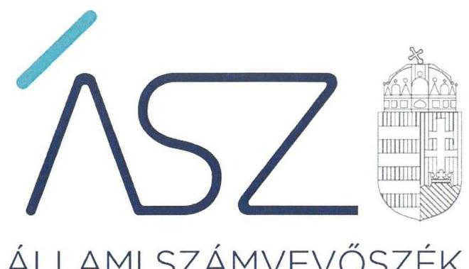
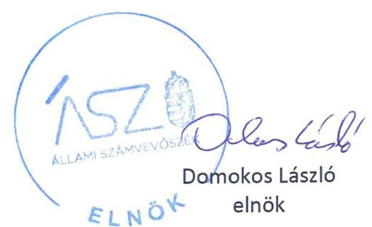
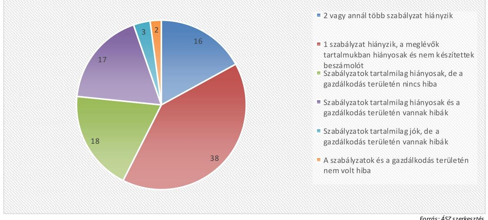
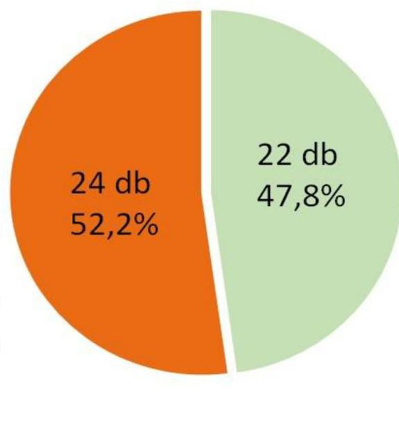
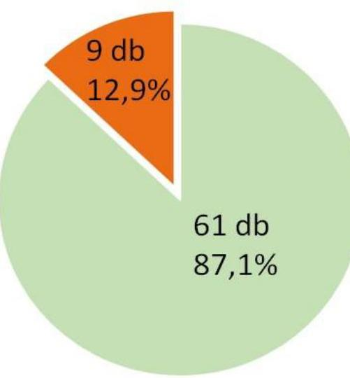
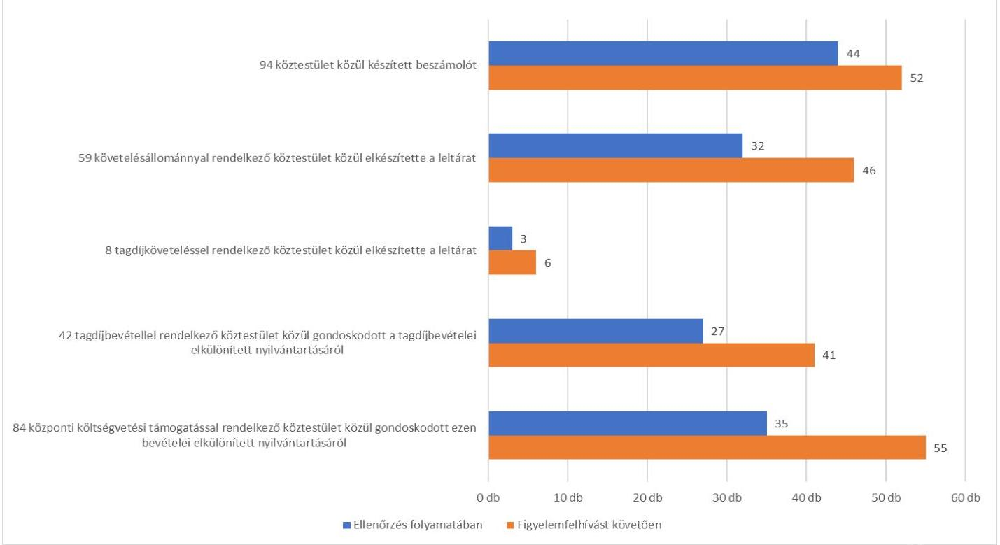
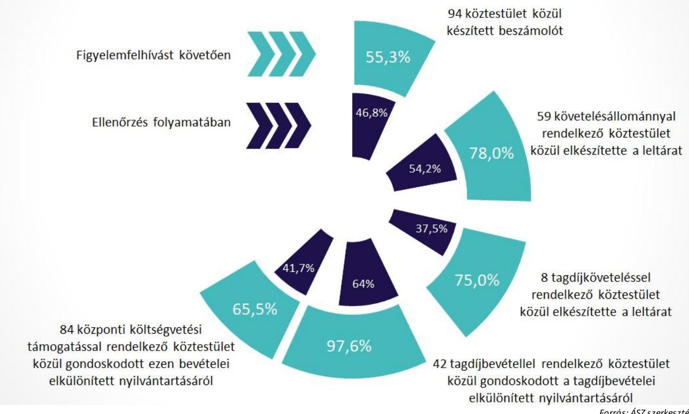

ÁLLAMI SZÁMVEVŐSZÉK

# JELENTÉS 

## Köztestületek monitoring típusú ellenőrzése

Országos Bírósági Hivatal nyilvántartásában szereplő köztestületek ellenőrzése Önkormányzati tűzoltóságok, szakmai, gazdasági, érdekképviseletet ellátók és egyéb köztestületek
2021.

21093
www.asz.hu

---

ÁLLAMI SZÁMVEVŐSZÉK

# JELENTÉS 

## Köztestületek monitoring típusú ellenőrzése

Országos Bírósági Hivatal nyilvántartásában szereplő köztestületek ellenőrzése Önkormányzati tűzoltóságok, szakmai, gazdasági, érdekképviseletet ellátók és egyéb
köztestületek
2021. 12. hó 20. nap

21093
www.asz.hu

---

# AZ ELLENŐRZÉST VEZETTE ÉS A VÉGREHAJTÁSÁÉRT FELELŐS: 

DR. BENEDEK MÁRIA ellenőrzésvezető
NEMESVÁRI-HORTHY ESZTER ellenőrzésvezető
HOFMEISTER LÁSZLÓ ellenőrzésvezető

A PROGRAM ÖSSZEÁLLÍTÁSÁÉRT FELELŐS:
DÁM-POLYÁK ORSOLYA projektvezető

IKTATÓSZÁM: EL-3467-001/2021.
TÉMASZÁM: 2575
ELLENŐRZÉS-AZONOSÍTÓ SZÁM: V 091802

---

# TARTALOMJEGYZÉK 

- ÖSSZEGZÉS ..... 5
- AZ ELLENŐRZÉS CÉLJA ..... 10
- AZ ELLENŐRZÉS TERÜLETE ..... 11
- AZ ELLENŐRZÉS HÁTTERE, INDOKOLTSÁGA ..... 12
- A JELENTÉS LÉNYEGES KÉRDÉSKÖREI. ..... 13
- AZ ELLENŐRZÉS HATÓKÖRE ÉS MÓDSZEREI. ..... 14
- ÉRTÉKELÉS ..... 16
MELLÉKLETEK. ..... 19
I. sz. melléklet: Értelmező szótár ..... 19
II. sz. melléklet: Ellenőrzött köztestületek. ..... 20
III. sz. melléklet: Az ellenőrzés keretében értékelt lényeges dokumentumok. ..... 22
IV. sz. melléklet: Ellenőrzött egyéb köztestületek létrehozó, feladatellátásukat ..... 23
meghatározó törvények. ..... 23
- RÖVIDÍTÉSEK JEGYZÉKE ..... 25

---

.

---

# ÖSSZEGZÉS 

Az Országos Bírósági Hivatal nyilvántartásában szereplő ellenőrzött 94 köztestület közül 7 kialakította a működés és gazdálkodás szabályozási kereteit. További 57 köztestület készített szabályzatokat a működése és a gazdálkodása alapvető szabályozási kereteinek kialakítása érdekében, akik a szabályozási kereteik megerősítésére további lépéseket tehettek a szabályzataik tartalmának kijavításával. 20 köztestület az értékelt lényeges dokumentumai alapján gondoskodott a gazdálkodása átláthatóságáról és elszámoltathatóságáról, amely hozzájárul közfeladataik magasabb színvonalú elvégzéséhez is.
Az ellenőrzés során 71 köztestületnél pozitív irányú változások indultak el a források szabályszerű, átlátható és elszámoltatható felhasználása alapvető feltételeit biztosító működés és gazdálkodás szabályozása terén. 6 köztestület nem tett lépéseket a pozitív változások elindítására, esetükben a források átlátható, elszámoltatható felhasználása alapvető feltételeit biztosító jogszabálykövető magatartás nem javult.

## Az ellenőrzés társadalmi indokoltsága

A köztestületek létrehozását törvények rendelik el. A köztestületek a végzett tevékenységükhöz kapcsolódóan közfeladatokat látnak el. A köztestületek által ellátott feladatok a társadalom széles rétegét érintik, ezért közérdeklődésre tartanak számot.

A köztestületek ellenőrzésével az Állami Számvevőszék hozzájárul ahhoz, hogy a köztestületek a közpénzeket és a tagdíjakat átlátható és elszámoltatható módon kezeljék. Az ellenőrzések célja továbbá, hogy a nyilvánosság és a működéshez forrást biztosító tagok megfelelő tájékoztatást kapjanak a közfeladatot ellátó köztestületek működéséről.

Az Állami Számvevőszék köztestületeket érintő ellenőrzése a köztestületek működése és gazdálkodása alapvető szabályozási kereteinek kialakítására, valamint a feladatellátást biztosító forrásokkal való gazdálkodásra terjed ki.

A közfeladatokat ellátó köztestületek szabályszerű gazdálkodása elengedhetetlen közfeladataik ellátása érdekében megfogalmazott szakmai céljaik megvalósításához, valamint a társadalmi közbizalom fenntartásához és erősítéséhez.

## Értékelés

Az Állami Számvevőszék módszertana szerint monitoring típusú ellenőrzése keretében jelen állapotban hatályos lényeges dokumentumaikra fókuszálva értékelte 94 köztestületnél a forrásaik szabályszerű, átlátható és elszámoltatható felhasználása alapvető feltételeit.

Az Állami Számvevőszék ellenőrzése megállapította, hogy 94 köztestület közül 7 köztestület kialakította a működésére és gazdálkodására vonatkozó alapvető szabályokat. 57 köztestület szintén rendelkezett a lényeges dokumentumok keretében értékelt, kötelezően elkészítendő szabályzatokkal, azonban azok tartalmának kijavítása érdekében tett intézkedésekkel tovább erősíthették a működésük és gazdálkodásuk szabályozási kereteit. Összesen 30 köztestületnek szükséges intézkedést tenni a működés és gazdálkodás alapvető szabályozási keretei kialakítása érdekében, 16-nak két, vagy annál több, 14 köztestületnek egy-egy számviteli szabályzat elkészítésével.

A gazdálkodás területén értékelt lényeges dokumentumok alapján 20 köztestület esetében nem tárt fel az ellenőrzés hiányosságot, mivel beszámoló készítési kötelezettségüknek eleget tettek, követelések esetében a leltárak elkészítéséről, tagdíjból, illetve központi költségvetésből származó bevételek esetében azok elkülönített nyilvántartásáról gondoskodtak. 44 köztestület készített beszámolót, 32 köztestület a követelésekről, 3 a tagdíjkövetelésekről

---

leltárat. 27 tagdíjbevétellel és 35 központi költségvetési támogatással rendelkező gondoskodott azok elkülönített nyilvántartásáról.

A 94 ellenőrzött köztestület csoportosítását a lényeges dokumentumok értékelése alapján az 1. ábra szemlélteti. 1. ábra

# Köztestületek csoportosítása a lényeges dokumentumok értékelése alapján 

A köztestületek szabályszerű működésének és gazdálkodásának alapvető kereteit biztosító szabályzatok - a számviteli politika és az annak keretében elkészítendő, az eszközök és a források leltárkészítési és leltározási szabályzata, az eszközök és a források értékelési szabályzata, a pénzkezelési szabályzat, a kettős könyvvitelt vezetők esetében a számlarend - elkészítését a Számv. tv. írja elő. A Számv. tv. előírásainak megfelelő tartalmú számviteli politika, az annak keretében elkészítendő szabályzatok, valamint a kettős könyvvitelt vezető gazdálkodók esetében a számlarend az alapvető szabályzatok a jogszabályi előírásoknak megfelelő, szabályszerű, átlátható és elszámoltatható működés biztosítása érdekében.

A köztestületek a Számv. tv. és a 479/2016. (XII. 28.) Korm. rendelet előírásai alapján a vagyoni és pénzügyi helyzetüket bemutató beszámoló készítésére kötelezettek. A beszámoló kiemelt jelentőséggel bír, annak elkészítése elengedhetetlen feltétele más szervezetek, a szervezet tagsága, a közvélemény felé a köztestületek átláthatóságának és elszámoltathatóságának biztosításához. Az elszámoltatható beszámoló elkészítéséhez a köztestület vagyonát leltározással szükséges számba venni, a mérleg tételeit leltárral alátámasztani. A tagdíjakból és az állami költségvetési támogatásból származó forrásokról - Számv. tv. előírása szerint - nyilvántartási (könyvvezetési) rendszerét a köztestület köteles oly módon tovább részletezni, hogy abból az egyéb bevételeken belül a tagdíjak, valamint a kapott támogatások összege bemutatásra kerüljön. A tagdíjak, a kapott költségvetési támogatások elkülönített nyilvántartása biztosítja a beszámoló részét képező eredménykimutatás adatainak megalapozottságát, ezáltal a beszámoló megalapozottságát.

A köztestületek a lényeges dokumentumok értékelése alapján feltárt hiányosságokra tett intézkedésekkel, a hibák kijavításával lépéseket tehettek az átláthatóság, az elszámoltathatóság megteremtésére, így a közpénzügyi helyzet javítására, a közfeladataikat igénybe vevők megelégedése növelésére. Ennek a lehetőségnek a biztosítása érdekében 92 köztestület vezetője számára figyelemfelhívó levél került megküldésre az ellenőrzött időszakra vonatkozóan feltárt hiányosságokról. Két köztestületnél az Állami Számvevőszék nem tárt fel hibát, ezért vezetőik részére nem küldött figyelemfelhívó levelet.

---

# Következtetés 

Az Önkormányzati tűzoltóságok, az Országos Magyar Vadászkamara és területi szervezetei, továbbá a Szakmai, gazdasági, érdekképviseletet ellátók és egyéb köztestületek közös jellemzője, hogy jogszabály által delegált közfeladatokat látnak el és jogszabályi rendelkezés alapján biztosított bevételre jogosultak. A köztestületek szerepe kiemelt jelentőségű: a működésük szerinti szakmai területeken közfeladatot látnak el és sok esetben szakmai, etikai felügyeletet gyakorolnak tagjaik felett. A köztestületek által ellátott feladatok a társadalom széles rétegét érintik, ezért közérdeklődésre tartanak számot. A közfeladatokat ellátó köztestületek szabályszerű gazdálkodása elengedhetetlen közfeladataik ellátása érdekében megfogalmazott szakmai céljaik megvalósításához, valamint a társadalmi közbizalom fenntartásához és erősítéséhez. Velük szemben társadalmi elvárás, hogy a közfeladat ellátásához biztosított pénzügyi fedezetet és a kötelező tagsághoz kapcsolódó tagdíjat átlátható és elszámoltatható módon kezeljék, azokat rendeltetésszerűen használják fel.

Így mindegyik ellenőrzött területen a közfeladat-ellátás javításának és a közbizalom erősítésének folyamatos elvárásnak kell lennie, melyhez az Állami Számvevőszék elsősorban tanácsadó jellegű monitoring ellenőrzési megközelítéssel járul hozzá. Ennek érvényesülését szem előtt tartva az Állami Számvevőszék már az ellenőrzés során felhívással élt és megszólította 92 köztestületek vezetőjét a hiányosságok vonatkozásában lehetőséget biztosítva arra, hogy azokat megszüntessék. Az Állami Számvevőszék célja a felhívásokkal az volt, hogy már az ellenőrzés folyamatában előmozdítsa a pozitív irányú változásokat és javuljon a köztestületeknél a közfeladat ellátásához biztosított, törvény által előírt pénzügyi források, és a tagság által fizetett tagdíjak szabályszerű, átlátható és elszámoltatható felhasználása alapvető feltételeit biztosító működés és gazdálkodás szabályozása.
2. ábra

## A szabályzatok vonatkozásában pozitív irányú változások az OBH nyilvántartásában szereplő 94 ellenőrzött köztestületnél

Az ellenőrzés folyamatában szabályzat hiánnyal érintett köztestületek száma összesen 46 darab

A figyelemfelhívást követően a hiányzó szabályzatok elkészítésére intézkedést tettek, vagy intézkedést terveztek
vagy még nem terveztek intézkedést

A figyelemfelhívást követően a hiányzó szabályzatok elkészítésére intézkedést tettek, vagy intézkedést terveztek

---

# A szabályzatok vonatkozásában pozitív irányú változások az OBH nyilvántartásában szereplő 94 ellenőrzött köztestületnél 

Az ellenőrzés folyamatában szabályzat tartalmi hiányossággal érintett köztestületek száma összesen 70 darab

A figyelemfelhívást követően a tartalmi hiányosságok megszüntetése érdekében még nem tettek vagy még nem terveztek intézkedést

A figyelemfelhívást követően a tartalmi hiányosságok megszüntetése érdekében intézkedést tettek, vagy intézkedést terveztek

Forrás: ÁSZ szerkesztés
4. ábra

Pozitív irányú változások az OBH nyilvántartásában szereplő 94 ellenőrzött köztestületnél

Forrás: ÁSZ szerkesztés

---

# Köztestületek monitoring típusú ellenőrzése - Országos Bírósági Hivatal nyilvántartásában szereplő köztestületek ellenőrzése 

A figyelemfelhívásra 86 köztestület vezetője válaszolt, akik közül 71 köztestület vezetője tett lépéseket a pozitív változások elindítására: 38 vezető valamennyi feltárt hiányosság kijavítására tett intézkedéseket, 33 nem teljeskörűen intézkedett. Esetükben a megtett intézkedések pozitív változásokat indítottak el a források szabályszerű, átlátható, elszámoltatható felhasználása alapvető feltételeit biztosító működés és gazdálkodás szabályozottsága terén a szabályok kialakítása, a korábbi hiányosságok javítása és ezáltal a közfeladat-ellátás javítása terén. 9 köztestület vezetője válaszolt a figyelemfelhívó levélre, akik azonban a feltárt hiányosságok többségének kijavítására nem tettek intézkedést, nem éltek az Állami Számvevőszék által biztosított lehetőséggel, a felhívásra sem tettek elegendő intézkedést a feltárt hiányosságok javítása érdekében, az átláthatóság, az elszámoltathatóság megteremtésére, így a közpénzügyi helyzet javítására, a közfeladataikat igénybe vevők megelégedése növelésére.

6 köztestület vezetője válaszolt a figyelemfelhívó levélre, azonban nem tett lépéseket a pozitív változások elindítására a felhívásra sem. 6 köztestület vezetője nem is válaszolt a figyelemfelhívó levélre, nem élt az Állami Számvevőszék által biztosított lehetőséggel, a felhívásra sem intézkedett a feltárt hiányosságok javítása érdekében. Esetükben a források szabályszerű, átlátható, elszámoltatható felhasználása alapvető feltételeit biztosító működés és gazdálkodás szabályozottsága, ezáltal a közfeladat-ellátás nem javult.

---

# AZ ELLENŐRZÉS CÉLJA 

AZ ELLENŐRZÉS CÉLJA annak értékelése, hogy a köztestület a feladatellátását biztosító források szabályszerű, átlátható és elszámoltatható felhasználásának alapvető feltételeit biztosította-e a működés és gazdálkodás szabályozásával. Az ellenőrzés célja továbbá a minimum vezetői kontrollpontok kialakításának támogatása.

---

# **AZ ELLENŐRZÉS TERÜLETE**

## **Országos Bírósági Hivatal nyilvántartásában szereplő köztestületek – Önkormányzati tűzoltóságok és szakmai, gazdasági, érdekképviseletet ellátók és egyéb köztestületek**

**A KÖZTESTÜLET** az Áhtm.1 8/A.§ (1) bekezdése alapján önkormányzattal és nyilvántartott tagsággal rendelkező szervezet, amelynek létrehozását törvény rendeli el. A köztestület a tagságához, illetve a tagsága által végzett tevékenységhez kapcsolódó közfeladatot lát el. A köztestület jogi személy. Az Áhtm. 8/A.§ (3) bekezdése alapján törvény meghatározhat olyan közfeladatot, amelyet a köztestület köteles ellátni. A köztestület a közfeladat ellátásához szükséges - törvényben meghatározott - jogosítványokkal rendelkezik, és ezeket önigazgatása útján érvényesíti. Az ellenőrzött 94 köztestületet a II. számú melléklet sorolja fel.

### **AZ ÖNKORMÁNYZATI TŰZOLTÓSÁGOK** az 1996. évi XXXI. törvény2 értelmében a települési önkormányzat vagy az önkormányzati társulás és az önkéntes tűzoltó egyesület által közösen vagy a települési önkormányzat vagy az önkormányzati társulás által önállóan alapított köztestületek, amelyek a települési önkormányzat vagy az önkormányzati társulás közigazgatási területén, a hivatásos tűzoltósággal kötött együttműködési megállapodás és annak szakmai iránymutatása alapján tűzoltási és műszaki mentési célokra folyamatosan igénybe vehető készenléti szolgálatot látnak el és közreműködnek közvetlen tűz- és robbanásveszély esetén a biztonsági intézkedések végrehajtásában. Az önkormányzati tűzoltóság kérheti közhasznúsági nyilvántartásba vételét. A tűzoltósági tevékenység központi irányítását a belügyminiszter a központi katasztrófavédelmi szerv vezetője útján gyakorolja. A jelen ellenőrzésben

 értékelt 60 önkormányzati tűzoltóságot a II. sz. melléklet sorolja fel.

### **AZ ORSZÁGOS MAGYAR VADÁSZKAMARA** az 1997. évi XLVI. törvény előírásai szerint a hivatásos, valamint a sportvadászok önkormányzattal rendelkező, közfeladatokat, továbbá általános szakmai érdekképviseleti feladatokat is ellátó köztestület. Az Országos Magyar Vadászkamara feladatait az alapszabályában meghatározott területen működő területi szervezetei és országos szervezete útján látja el. A kamara törvényességi felügyeletét a vadgazdálkodásért felelős miniszterként a földművelésügyi miniszter látja el. A jelen ellenőrzésben értékelt 20 vadászati kamarai szervezetet a II. sz. melléklet sorolja fel.

A jelen ellenőrzés keretében értékelt további 14 köztestület felsorolását a II. sz. melléklet, létrehozásukról rendelkező törvényüket, illetve a feladatukkal, működésükkel kapcsolatos alapvető előírásokat tartalmazó jogszabályok felsorolását a IV. sz. melléklet tartalmazza.

---

# AZ ELLENŐRZÉS HÁTTERE, INDOKOLTSÁGA 

A köztestületek szerepe kiemelt jelentőségű a működésük szerinti szakmai területeken, közfeladatot látnak el, sok esetben szakmai, etikai felügyeletet gyakorolnak tagjaik felett. Elvárás, hogy a közfeladat ellátásához biztosított pénzügyi támogatást és a kötelező tagsághoz kapcsolódó tagdíjat átlátható és elszámoltatható módon kezeljék. A szabályozások kialakítása alapvető feltétele annak, hogy a köztestület a feladatellátását biztosító forrásokkal szabályszerűen és átláthatóan gazdálkodjon, biztosítsa a felelős elszámolás alapfeltételeit. A feladatellátást biztosító források értékelvű, rendeltetésszerű felhasználása, átláthatóságának megteremtése társadalmi elvárás, amelyhez az ÁSZ ${ }^{4}$ az alapvető működési és gazdasági feltételek ellenőrzésével kíván hozzájárulni.

Az ÁSZ célja, hogy új ellenőrzési megközelítést alkalmazva támogassa a közpénzügyi helyzet javítását, a közpénzügyek fejlesztését, az eredmények fenntartását. Az ÁSZ a digitalizáció adta lehetőségek felhasználásával kíván helyzetképet adni a köztestületek alapvető szabályozottságáról, fennálló főbb hiányosságokról. Az ellenőrzés által az ÁSZ erősíti hozzáadott értéket teremtő tevékenységét és tanácsadó szerepét.

Új ellenőrzési megközelítést alkalmazva az ÁSZ értékelésével támogatja az ellenőrzött szervezetek szabályszerű működés és gazdálkodás alapvető feltételeinek kialakítását.

---

# A JELENTÉS LÉNYEGES KÉRDÉSKÖREI 

1.     - A köztestületek kialakították-e a működés és gazdálkodás alapvető szabályozási kereteit?
2.     - A köztestületek rendelkeztek-e beszámolóval, gondoskodtak-e a követelések leltárának elkészítéséről, valamint a bevételek elkülönített nyilvántartásáról?

---

# AZ ELLENŐRZÉS HATÓKÖRE ÉS MÓDSZEREI 

## Az ellenőrzés típusa

| Megfelelőségi ellenőrzés.

## Az ellenőrzött időszak

A működés és gazdálkodás alapvető feltételeinek biztosítása tekintetében 2021. év. A működés és gazdálkodás tekintetében az utolsó beszámolóval lezárt gazdasági év.

## Az ellenőrzés tárgya

Az ellenőrzés tárgya kiterjed a köztestületnél a működéssel és gazdálkodással kapcsolatos alapvető szabályzatok és a belső szabályozási rendszer kialakítására, a beszámoló és a követelések leltárának elkészítésére, valamint a bevételek elkülönített nyilvántartására.

## Az ellenőrzött szervezet

Azon Országos Bírósági Hivatal által nyilvántartott köztestületek, amelyek jogi személyek (országos vagy területi szervek) és jogszabály alapján beszámoló készítésére kötelezettek. Az ellenőrzött 94 köztestület felsorolását a II. sz. melléklet tartalmazza.

## Az ellenőrzés jogalapja

Az ellenőrzés jogszabályi alapját az ÁSZ tv. ${ }^{5}$ 1. § (3) bekezdés, 5. § (3) bekezdés előírásai képezik.

## Az ellenőrzés módszerei

Az ellenőrzést az ÁSZ a program kérdéseire adott válaszok kiértékelésével és a vonatkozó időszakban hatályos jogszabályok alapján folytatja le. A törvényi előírásokat, valamint az ÁSZ által meghirdetett, nyilvános módszertant figyelembe véve az ellenőrzés hatóköre kiegészülhet kockázatjelzés alapján, a kockázatértékelés függvényében további lényeges területek szabályosságának ellenőrzésével.

Az ellenőrzési kérdések megválaszolásához szükséges bizonyítékok megszerzése a következő ellenőrzési eljárások alkalmazásával történik:

---

megfigyelés, összehasonlítás, elemző eljárás. Az ellenőrzési bizonyítékként felhasználható adatforrások közé tartoznak az ellenőrzési program részletes szempontjainál felsorolt adatforrások, valamint minden egyéb - az ellenőrzés folyamán feltárt, az ellenőrzés szempontjából információt tartalmazó - dokumentum.

Az ellenőrzés a program kérdéseire adott válaszok kiértékelésével, valamint a programban ismertetett ellenőrzési kérdések, kritériumok, adatforrások figyelembevételével kerül lefolytatásra.

Az ellenőrzés során az ellenőrzött szervezettel történő kapcsolattartást az ÁSZ a szervezeti és működési szabályzatának vonatkozó előírásai alapján biztosítja.

A monitoring típusú ellenőrzés - a jelen állapot lényeges dokumentumaira fókuszálva - a kiválasztott szempontok alapján valós idejű értékelést végez.

Az Országos Bírósági Hivatal nyilvántartásában szereplő 94 köztestület vezetője közül 92 számára figyelemfelhívó levél került megküldésre az ellenőrzött időszakra vonatkozó hiányosságokról, és az ÁSZ tv. előírásával összhangban 15 nap állt rendelkezésükre az ebben foglaltak elbírálására, a megfelelő intézkedések megtételére és erről az Állami Számvevőszék elnökének az értesítés megküldésére.

---

# 1. A köztestületek kialakították-e a működés és gazdálkodás alapvető szabályozási kereteit? 

Összegző értékelés

A 94 ellenőrzött köztestület közül 7 alakította ki a működés és gazdálkodás alapvető szabályozási kereteit, további 57 köztestület rendelkezett a működés és gazdálkodás alapvető szabályzataival.

SZÁMVITELI POLITIKÁVAL ÉS AZ ANNAK KERETÉBEN ELKÉSZÍTENDŐ SZABÁLYZATOKKAL, amelyek a szabályszerű működés és gazdálkodás alapvető feltételei megteremtése szempontjából lényegesek, 7 köztestület rendelkezett. Esetükben számviteli politikájuk és az annak keretében elkészített szabályzataik és a kettős könyvvitelt vezetők számlarendje tartalmazta a Számv. tv. ${ }^{6}$-ben meghatározott lényeges tartalmi előírásokat. 57 köztestület rendelkezett számviteli politikával és az annak keretében elkészítendő szabályzatokkal, kettős könyvvitel vezetése esetén számlarenddel, azonban azok tartalmát a Számv. tv. előírásaiban foglaltakkal összhangban szükséges módosítani. 14 köztestület - valamely, a Számv. tv. előírásai szerint kötelezően elkészítendő szabályzat kivételével - szintén rendelkezett a szabályszerű működés és a gazdálkodás feltételei megteremtését biztosító számviteli politikával és annak keretében elkészítendő szabályzattal, illetve kettős könyvvitel vezetése esetén számlarenddel. 16 köztestület nem rendelkezett a Számv. tv. előírásai ellenére kötelezően elkészítendő szabályzatokkal, ami veszélyeztette a szabályszerű, törvényes gazdálkodás vitelét. 30 köztestület intézkedést tehetett a hiányzó szabályzatai elkészítésére, illetve 70 köztestület szabályzatai tartalmának kijavítására.

A Számv. tv.-ben meghatározott számviteli politikában és az annak keretében kötelezően elkészítendő, az eszközök és a források leltárkészítés és leltározási, valamint az eszközök és a források értékelési szabályzatában, továbbá a pénzkezelési szabályzatban, kettős könyvvitelt vezetőknek a számlarendben rögzítendők a gazdálkodás, a könyvvezetés és a beszámoló készítés gazdálkodónál alkalmazandó részletszabályai, amely szabályzatok megléte fontos feltétele a szabályszerű könyvvezetésnek és beszámoló készítésnek, így az elszámoltatható gazdálkodásnak.

---

# 2. A köztestületek rendelkeztek-e beszámolóval, gondoskodtak-e a követelések leltárának elkészítéséről, valamint a bevételek elkülönített nyilvántartásáról? 

Összegző értékelés

20 köztestület gazdálkodásának lényeges dokumentumai értékelése alapján nem tárt fel hiányosságot az ellenőrzés. 44 köztestület készített beszámolót, 32 köztestület a követelésekről, 3 a tagdíjkövetelésekről leltárat. 27 tagdíjbevétellel és 35 központi költségvetési támogatással rendelkező köztestület gondoskodott azok elkülönített nyilvántartásáról.

A gazdálkodás értékelt lényeges területein 20 köztestületnél nem tárt fel az ÁSZ ellenőrzése hiányosságot. A 20 köztestület elkészítette a Számv. tv. és a 479/2016. (XII. 28.) Korm. rendelet ${ }^{7}$ előírásai szerint beszámolóját, a követeléssel, tagdíjköveteléssel rendelkezők a Számv. tv. előírásai szerint azokat leltárral alátámasztották. A tagdíjból, állami költségvetési támogatásból származó bevétellel rendelkezők gondoskodtak a Számv. tv. előírásai szerinti elkülönített nyilvántartásukról.

BESZÁMOLÓT a Számv. tv. és a 479/2016. (XII. 28.) Korm. rendelet előírásai szerint 44 köztestület készített, biztosítva ezzel az elszámoltathatóságát. Az ellenőrzöttek közül 50 köztestület nem készítette el a Számv. tv. és a 479/2016. (XII. 28.) Korm. rendelet előírása ellenére beszámolóját, nem volt elszámoltatható. A jövőben az érintett 50 köztestületnek kiemelt figyelmet szükséges fordítania beszámolója elkészítésére, amely az elszámoltathatóság alapvető feltétele.

A beszámoló elkészítése egy lezárt gazdasági évről a gazdálkodó működéséről, vagyoni, pénzügyi és jövedelmi helyzetéről ad tájékoztatást a köztestület vezetősége, a köztestület tagsága és a közvélemény számára.

A KÖVETELÉSEK LELTÁRÁT a követelésekkel rendelkezők közül 32 köztestület, a tagdíjkövetelésekkel rendelkezők közül 3 köztestület készített a Számv. tv. előírása szerint. A követelések leltárát 30 köztestületnek kell elkészítenie.

A leltározás eredményeként a mérlegben a követeléseket alátámasztó leltár biztosítja, hogy a beszámolóba felvett tételek a valóságban is megtalálhatóak, bizonyíthatóak, kívülállók által is megállapíthatóak legyenek. Ennek alapvető feltétele az, hogy a Számv. tv. szerint készüljön el a beszámolót alátámasztó leltár. Így a leltár hozzájárul a vagyon védelméhez. A köztestület a követelések leltárának elkészítésével biztosítja, hogy átlátható és elszámoltatható legyen a tartozások kezelése. A leltár biztosítja a beszámoló mérlegének valódiságát, a vagyon védelmét.

## A BEVÉTELEK ELKÜLÖNÍTETT NYILVÁNTARTÁ-

SÁRÓL a tagdíjbevétellel rendelkező köztestületek közül 27, a központi költségvetési támogatásból bevételhez jutó köztestület közül 35 gondoskodott a Számv. tv. előírásai szerint. 19 köztestületnek a tagdíjakból, 35 köztestületnek az állami költségvetésből származó bevételek elkülönített nyilvántartását kell kialakítania.

---

Az elkülönített nyilvántartás vezetése a közpénzek nyilvánossága és ellenőrizhetősége, az állami költségvetési támogatásokkal, a tagdíjakkal való átlátható és elszámoltatható gazdálkodása érdekében fontos. Az elkülönített nyilvántartás biztosítja, hogy a köztestület a közpénzek és a tagok által befizetett tagdíjak felhasználásáról számot tudjon adni.

---

# MELLÉKLETEK 

- I. SZ. MELLÉKLET: ÉRTELMEZŐ SZÓTÁR
államháztartás
költségvetési támogatás
köztestület
az államháztartás a közfeladatok ellátásának egységes szervezeti, tervezési, gazdálkodási, ellenőrzési, finanszírozási, adatszolgáltatási és beszámolási szabályok szerint működő rendszere, amely központi és önkormányzati alrendszerből áll.
(Forrás: Áht. ${ }^{8}$ 2. §, 3. § (1) bekezdés 2015. január 1-től)
az államháztartás alrendszerei terhére nyújtott pénzbeli vagy nem pénzbeli juttatás, amelyet a támogató nem elsősorban ellenszolgáltatás ellenében, de konkrét program megvalósítása vagy meghatározott időszakban a támogatott szervezet működtetése érdekében nyújt. Költségvetési támogatás különösen: a pályázat útján, valamint egyedi döntéssel kapott költségvetési támogatás; az Európai Unió strukturális alapjaiból, illetve a Kohéziós Alapból származó, a költségvetésből juttatott támogatás; az Európai Unió költségvetéséből vagy más államtól, nemzetközi szervezettől származó támogatás és a személyi jövedelemadó meghatározott részének az adózó rendelkezése szerint felajánlott összege.
(Forrás: Ectv. ${ }^{9}$ 2. § 15. pont. Hatályos: 2020. június 30-ig)
a társadalombiztosítás pénzügyi alapjai kivételével az államháztartás központi alrendszeréből ellenérték nélkül, pénzben nyújtott támogatások
(Forrás: Áht. 1. § 14. pont)
A köztestület önkormányzattal és nyilvántartott tagsággal rendelkező szervezet, amelynek létrehozását törvény rendeli el. A köztestület a tagságához, illetőleg a tagsága által végzett tevékenységhez kapcsolódó közfeladatot lát el. A köztestület jogi személy. Törvény előírhatja, hogy valamely közfeladatot kizárólag köztestület láthat el, illetve, hogy meghatározott tevékenység csak köztestület tagjaként folytatható. (Forrás: 2006. évi LXV. törvény ${ }^{10}$ 8/A. § (1), (4) bekezdés)

---

|  | ELLENŐRZÖTT KÖZTESTÜLETEK |  |
|  | Sorszám | Köztestület neve | Székhelye |
|  |  | Önkormányzati tűzoltóságok |  |
|  | 1. | Ács Önkormányzati Tűzoltóparancsnokság | Ács |
|  | 2. | Bácsalmás Önkormányzati Tűzoltó Parancsnokság | Bácsalmás |
|  | 3. | Balatonfüredi Önkormányzati Tűzoltóság | Balatonfüred |
|  | 4. | Bátaszéki Önkormányzati Tűzoltóság Köztestület | Bátaszék |
|  | 5. | Békési Önkormányzati Tűzoltóság | Békés |
|  | 6. | Bélapátfalva Önkormányzati Tűzoltóság | Bélapátfalva |
|  | 7. | Bicskei Önkormányzati Tűzoltóság | Bicske |
|  | 8. | Celldömölki Önkormányzati Tűzoltóság | Celldömölk |
|  | 9. | Csengeri Önkormányzati Tűzoltóság | Csenger |
|  | 10. | Csepregi Önkormányzati Tűzoltóság | Csepreg |
|  | 11. | Hunyai, Csárdaszállási, Gyomaendrődi Önkormányzati Tűzoltóság | Gyomaendrőd |
|  | 12. | Jánoshalma Város Önkormányzati Tűzoltó Parancsnokság | Jánoshalma |
|

  | 13. | Jászárokszállási Önkormányzati Tűzoltó Parancsnokság | Jászárokszállás |
|  | 14. | Jászkiséri Önkormányzati Tűzoltóság | Jászkisér |
|  | 15. | Kecel Önkormányzati Tűzoltó Parancsnokság | Kecel |
|  | 16. | Kerekegyházi Önkormányzati Tűzoltó-parancsnokság | Kerekegyháza |
|  | 17. | Kisújszállási Önkormányzati Tűzoltó-parancsnokság | Kisújszállás |
|  | 18. | Komádi Városi Önkormányzati Tűzoltóság | Komádi |
|  | 19. | Kőszegi Önkormányzati Tűzoltóság | Kőszeg |
|  | 20. | Kunhegyesi Önkormányzati Tűzoltó-parancsnokság | Kunhegyes |
|  | 21. | Kunszentmiklós Önkormányzati Tűzoltó Parancsnokság | Kunszentmiklós |
|  | 22. | Lajosmizse Önkormányzati Tűzoltó Parancsnokság | Lajosmizse |
|  | 23. | Móri Önkormányzati Tűzoltóság | Mór |
|  | 24. | Nagyigmánd Önkormányzati Tűzoltó-parancsnokság | Nagyigmánd |
|  | 25. | Oroszlány Önkormányzati Tűzoltó-Parancsnokság | Oroszlány |
|  | 26. | Önkormányzati Önkéntes Tűzoltóság | Pomáz |
|  | 27. | Önkormányzati Tűzoltó-parancsnokság | Abádszalók |
|  | 28. | Önkormányzati Tűzoltóság Balatonboglár-Balatonlelle Köztestülete | Balatonboglár |
|  | 29. | Önkormányzati Tűzoltóság Balmazújváros | Balmazújváros |
|  | 30. | Önkormányzati Tűzoltóság Böhönye | Böhönye |
|  | 31. | Önkormányzati Tűzoltóság, Csurgó | Csurgó |
|  | 32. | Önkormányzati Tűzoltóság Egyek | Egyek |
|  | 33. | Önkormányzati Tűzoltóság Ibrány | Ibrány |
|  | 34. | Önkormányzati Tűzoltóság, Kadarkút | Kadarkút |
|  | 35. | Önkormányzati Tűzoltóság Létavértes | Létavértes |
|  | 36. | Önkormányzati Tűzoltóság Nagykörös | Nagykörös |
|  | 37. | Önkormányzati Tűzoltóság Ráckeve | Ráckeve |
|  | 38. | Önkormányzati Tűzoltóság Szakoly | Szakoly |
|  | 39. | Önkormányzati Tűzoltóság | Tab |
|  | 40. | Önkormányzati Tűzoltóság Tiszanána | Tiszanána |
|  | 41. | Önkormányzati Tűzoltóság Tiszavasvári | Tiszavasvári |
|  | 42. | Önkormányzati Tűzoltóság Újfehértó | Újfehértó |
|  | 43. | Önkormányzati Tűzoltóság Vámosmikola | Vámosmikola |
|  | 44. | Önkormányzati Tűzoltóság Vásárosnamény | Vásárosnamény |
|  | 45. | Önkormányzati Tűzoltóság Vasvár | Vasvár |
|  | 46. | Önkormányzati Tűzoltóság Zalaszentgrót | Zalaszentgrót |
|  | 47. | Polgárdi Önkormányzati Tűzoltóság | Polgárdi |
|  | 48. | Répcelaki Önkormányzati Tűzoltóság | Répcelak |
|  | 49. | Soltvadkert Város Önkormányzati Tűzoltó Parancsnoksága | Soltvadkert |

---

| Sorszám | Köztestület neve | Székhelye |
| :--: | :--: | :--: |
| 50. | Szabadszállás Önkormányzati Tűzoltó Parancsnokság | Szabadszállás |
| 51. | Tamási Önkormányzati Tűzoltóság | Tamási |
| 52. | Tapolcai Önkormányzati Tűzoltóság | Tapolca |
| 53. | Térségi Önkormányzati Tűzoltóság Sümeg | Sümeg |
| 54. | Tiszaföldvári Önkormányzati Tűzoltó Parancsnokság | Tiszaföldvár |
| 55. | Tiszakécske Önkormányzati Tűzoltó Parancsnokság | Tiszakécske |
| 56. | Tolnai Önkormányzati Tűzoltóság | Tolna |
| 57. | Tótkomlósi Önkormányzati Tűzoltóság | Tótkomlós |
| 58. | Törökszentmiklósi Önkormányzati Tűzoltó-parancsnokság | Törökszentmiklós |
| 59. | Vál Önkormányzati Tűzoltóság | Vál |
| 60. | Zirci Önkormányzati Tűzoltóság | Zirc |
| Országos Magyar Vadászkamara és területiszervezetei |  |  |
| 1. | Országos Magyar Vadászkamara | Budapest |
| 2. | Országos Magyar Vadászkamara Bács-Kiskun Megyei Területi Szervezete | Kecskemét |
| 3. | Országos Magyar Vadászkamara Baranya Megyei Területi Szervezete | Pécs |
| 4. | Országos Magyar Vadászkamara Békés Megyei Területi Szervezete | Békéscsaba |
| 5. | Országos Magyar Vadászkamara Borsod-Abaúj-Zemplén Megyei   Területi Szervezete | Miskolc |
| 6. | Országos Magyar Vadászkamara Csongrád-Csanád Megyei Területi Szervezete | Hódmezővásárhely |
| 7. | Országos Magyar Vadászkamara Fejér Megyei Területi Szervezete | Székesfehérvár |
| 8. | Országos Magyar Vadászkamara Fővárosi és Pest Megyei Területi Szervezete | Budapest |
| 9. | Országos Magyar Vadászkamara Győr-Moson-Sopron Megyei   Területi Szervezete | Abda |
| 10. | Országos Magyar Vadászkamara Hajdú-Bihar Megyei Területi Szervezete | Debrecen |
| 11. | Országos Magyar Vadászkamara Heves Megyei Területi Szervezete | Eger |
| 12. | Országos Magyar Vadászkamara Jász-Nagykun-Szolnok Megyei   Területi Szervezete | Szolnok |
| 13. | Országos Magyar Vadászkamara Komárom-Esztergom Megyei   Területi Szervezete | Tatabánya |
| 14. | Országos Magyar Vadászkamara Nógrád Megyei Területi Szervezete | Salgótarján |
| 15. | Országos Magyar Vadászkamara Somogy Megyei Területi Szervezete | Kaposvár |
| 16. | Országos Magyar Vadászkamara Szabolcs-Szatmár-Bereg Megyei   Területi Szervezete | Nyíregyháza |
| 17. | Országos Magyar Vadászkamara Tolna Megyei Területi Szervezete | Szekszárd |
| 18. | Országos Magyar Vadászkamara Vas Megyei Területi Szervezete | Szombathely |
| 19. | Országos Magyar Vadászkamara Veszprém Megyei Területi Szervezete | Veszprém |
| 20. | Országos Magyar Vadászkamara Zala Megyei Területi Szervezete | Zalaegerszeg |
| Szakmai, gazdasági, érdekképviseletet ellátók és egyéb köztestületek |  |  |
| 1. | Személy-, Vagyonvédelmi és Magánnyomozói Szakmai Kamara | Budapest |
| 2. | Magyar Rendvédelmi Kar | Budapest |
| 3. | Magyar Kormánytisztviselői Kar | Budapest |
| 4. | Nemzeti Pedagógus Kar | Budapest |
| 5. | Magyar Rektori Konferencia | Budapest |
| 6. | Hegyközségek Nemzeti Tanácsa | Budapest |
| 7. | Magyar Corvin-lánc Testület | Budapest |
| 8. | Magyar Olimpiai Bizottság | Budapest |
| 9. | Magyar Paralimpiai Bizottság | Budapest |
| 10. | Nemzeti Diák-, Hallgatói és Szabadidősport Szövetség | Budapest |
| 11. | Nemzeti Versenysport Szövetség | Budapest |
| 12. | Honvédelmi Sportszövetség | Budapest |
| 13. | Országos Polgárőr Szövetség | Budapest |
| 14. | Pálinka Nemzeti Tanács | Budapest |

---

# Az ellenőrzés keretében értékelt lényeges dokumentumok 

Az Állami Számvevőszék V0918-as ellenőrzés-azonosító számú „Köztestületek monitoring típusú ellenőrzése - Országos Bírósági Hivatal nyilvántartásában szereplő köztestületek ellenőrzése" című ellenőrzési programja alapján értékelt lényeges dokumentumok

## A működés és gazdálkodás alapvető szabályozási kereteinek megteremtésénél értékelt lényeges dokumentumok

- A számviteli politika
- Az eszközök és a források leltárkészítési és leltározási szabályzata
- A pénzkezelési szabályzat
- Kettős könyvvitelet vezetők számlarendje

A gazdálkodás szabályos vitelének megítéléséhez értékelt dokumentumok

- Számv. tv. szerinti beszámoló
- követelések, tagdíjkövetelések mérlegtételt alátámasztó leltár
- tagdíjból származó bevételek elkülönített nyilvántartása
- állami költségvetési támogatásból származó bevételek elkülönített nyilvántartása

---

# - IV. SZ. MELLÉKLET: ELLENŐRZÖTT EGYÉB KÖZTESTÜLETEK LÉTREHOZÓ, FELADATELLÁTÁSUKAT MEGHATÁROZÓ TÖRVÉNYEK 

| Szakmai, gazdasági, érdekképviseletet ellátók és egyéb köztestületek |  | Létrehozó törvénye |
| :--: | :--: | :--: |
| 1. | Személy-, Vagyonvédelmi és Magánnyomozói Szakmai Kamara | 2005. évi CXXXIII. törvény a személy és vagyonvédelmi, valamint magánnyomozói tevékenység szabályairól (hatályos 2005. december 30-tól) |
| 2. | Magyar Rendvédelmi Kar | 1996. évi XLIII. törvény a fegyveres szervek hivatásos állományú tagjainak szolgálati viszonyáról (hatálytalan 2015. július 1-től) |
| 3. | Magyar Kormánytisztviselői Kar | 2015. évi XLII. törvény a rendvédelmi feladatokat ellátó szervek hivatásos állományának szolgálati jogviszonyáról (hatályos 2015. július 1-től) |
| 4. | Nemzeti Pedagógus Kar | 2011. évi CXCIX. törvény a közszolgálati tisztviselőkről (a Magyar Kormánytisztviselői Karra vonatkozó rendelkezései hatályosak 2012. július 1-től 2018. december 31-ig) |
| 5. | Magyar Rektori Konferencia | 2018. évi CXXV. törvény a kormányzati igazgatásról (hatályos 2019. január 1-től) |
| 6. | Hegyközségek Nemzeti Tanácsa | 2011. évi CXC. törvény a nemzeti köznevelésről (hatályos 2012. szeptember 1-től, a Nemzeti Pedagógus Karra vonatkozó rendelkezései 2013. szeptember 1-től) |
| 7. | Magyar Corvin-lánc Testület | 2011. évi CXC. törvény a nemzeti köznevelésről (hatályos 2012. január 1-től, a Magyar Rektori Konferenciára vonatkozó rendelkezése hatályosak 2012. szeptember 1-től) |
| 8. | Magyar Olimpiai Bizottság | 2012. évi CCXIX. törvény a hegyközségekről (hatályos 2013. január 1-től) |
| 9. | Magyar Paralimpiai Bizottság | 2016. évi CXLI. törvény a Magyar Corvin-lánc Testületről (hatályos 2017. január 1-től) |
| 10. | Nemzeti Diák-, Hallgatói és Szabadidősport Szövetség | 2004. évi I. törvény a sportról (hatályos 2004. március 13-tól, a Magyar Olimpiai Bizottságra, Magyar Paralimpiai Bizottságra, Nemzeti Diák-, Hallgatói és Szabadidősport Szövetségre és a Nemzeti Versenysport Szövetségre vonatkozó rendelkezései hatályosak 2017. január 1-től) |
| 11. | Nemzeti Versenysport Szövetség | 2016. évi CXXXII. törvény a Honvédelmi Sportszövetségről (hatályos 2017. január 1-től) |
| 12. | Honvédelmi Sportszövetség | 2011. évi CLXV. törvény a polgárőrségről és a polgárőri tevékenység szabályairól (hatályos 2012. február 1-től) |
| 13. | Országos Polgárőr Szövetség | 2008. évi LXXIII. törvény a pálinkáról, a törkölypálinkáról és a Pálinka Nemzeti Tanácsról (hatályos 2008. december 15-től) |
| 14. | Pálinka Nemzeti Tanács |  |

---

.

---

# RÖVIDÍTÉSEKJEGYZÉKE 

${ }^{1}$ Áhtm.
${ }^{2}$ 1996. évi XXXI. törvény
${ }^{3}$ 1997. évi LXVI. törvény
${ }^{4}$ ÁSZ
${ }^{5}$ ÁSZtv.
${ }^{6}$ Számv.tv.
${ }^{7}$ 479/2016. (XII. 28.) Korm. rendelet
${ }^{8}$ Áht.
${ }^{9}$ Ectv.
${ }^{10}$ 2006. évi LXV. törvény

2006. évi LXV. törvény az államháztartásról szóló 1992. évi XXXVIII. törvény és egyes kapcsolódó törvények módosításáról (hatályos 2006. augusztus 24-tól)
1996. évi XXXI. törvény a tűz elleni védekezésről, a műszaki mentésről és a tűzoltóságról (hatályos 1996. augusztus 1-től)
1997. évi XLVI. törvény az Országos Magyar Vadászkamaráról (hatályos 1997. július 5-től)
Állami Számvevőszék
2011. évi LXVI. törvény az Állami Számvevőszékről (hatályos 2011. július 1-jétől)
2000. évi C. törvény a számvitelről (hatályos 2001. január 1-től)

479/2016. (XII. 28.) Korm. rendelet a számviteli törvény szerinti egyes egyéb szervezetek beszámoló készítési és könyvvezetési kötelezettségének sajátosságairól
az államháztartásról szóló 2011. évi CXCV. törvény
2011. évi CLXXV. törvény az egyesülési jogról, a közhasznú jogállásról, valamint a civil szervezetek működéséről és támogatásáról
az államháztartásról szóló 1992. évi XXXVIII. törvény és egyes kapcsolódó törvények módosításáról

---

# ÁSZ 

ÁLLAMI SZÁMVEVŐSZÉK
1052 Budapest, Apáczai Cs. J. u. 10. | 1364 Budapest 4. Pf. 54
TEL: +36 14849100
email: szamvevoszek@asz.hu
web: www.asz.hu | www.aszhirportal.hu

