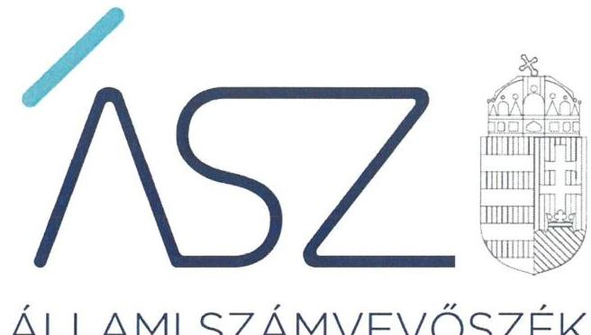
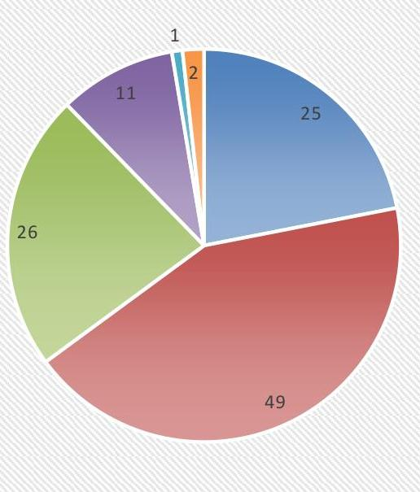
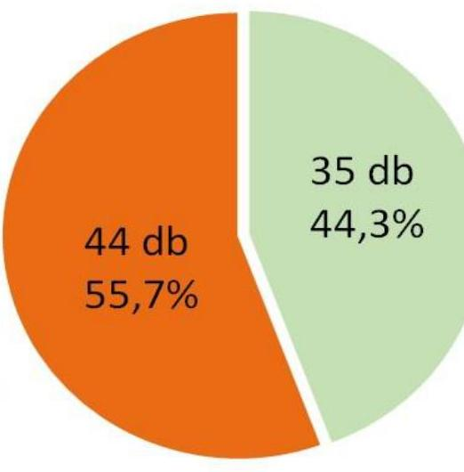
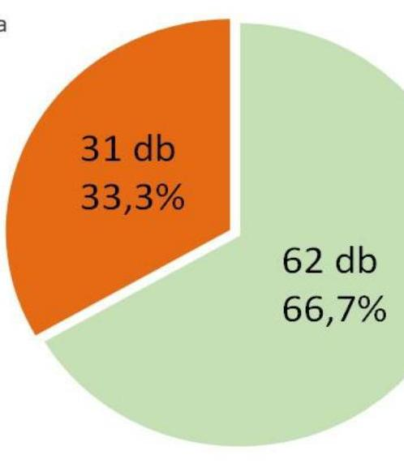
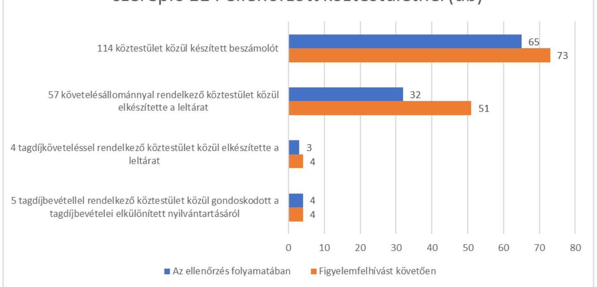
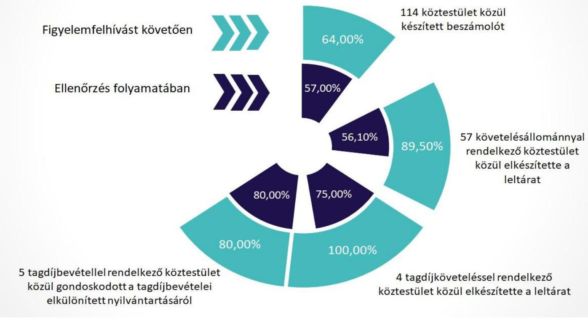

ÁLLAMI SZÁMVEVŐSZÉK

# JELENTÉS 

## Köztestületek monitoring típusú ellenőrzése

Országos Bírósági Hivatal nyilvántartásában szereplő köztestületek ellenőrzése Hegyközségek, hegyközségi tanácsok
2021.

21094
www.asz.hu

---

ÁLLAMI SZÁMVEVŐSZÉK

# JELENTÉS 

## Köztestületek monitoring típusú ellenőrzése

Országos Bírósági Hivatal nyilvántartásában szereplő köztestületek ellenőrzése Hegyközségek, hegyközségi tanácsok
2021. 12. hó 20. nap

21094
www.asz.hu

---

# AZ ELLENŐRZÉST VEZETTE ÉS A VÉGREHAJTÁSÁÉRT FELELŐS: 

DR. BENEDEK MÁRIA ellenőrzésvezető
NEMESVÁRI-HORTHY ESZTER ellenőrzésvezető
KUSZINGER ANDREA ellenőrzésvezető
A PROGRAM ÖSSZEÁLLÍTÁSÁÉRT FELELŐS:
DÁM-POLYÁK ORSOLYA projektvezető

IKTATÓSZÁM: EL-3468-001/2021.
TÉMASZÁM: 2575
ELLENŐRZÉS-AZONOSÍTÓ SZÁM: V 091803

---

# TARTALOMJEGYZÉK 

- ÖSSZEGZÉS ..... 5
- AZ ELLENŐRZÉS CÉLJA ..... 10
- AZ ELLENŐRZÉS TERÜLETE ..... 11
- AZ ELLENŐRZÉS HÁTTERE, INDOKOLTSÁGA ..... 13
- A JELENTÉS LÉNYEGES KÉRDÉSKÖREI. ..... 14
- AZ ELLENŐRZÉS HATÓKÖRE ÉS MÓDSZEREI. ..... 15
- ÉRTÉKELÉS ..... 17
MELLÉKLETEK. ..... 19
I. sz. melléklet: Értelmező szótár ..... 19
II. sz. melléklet: Az ellenőrzött köztestületek. ..... 20
III. sz. melléklet: Az ellenőrzés keretében értékelt lényeges dokumentumok. ..... 23
- RÖVIDÍTÉSEK JEGYZÉKE ..... 25

---

.

---

# ÖSSZEGZÉS 

Az Országos Bírósági Hivatal nyilvántartásában szereplő ellenőrzött 115 köztestület közül egy köztestület nem volt ellenőrizhető. 3 köztestület kialakította a müködés és gazdálkodás szabályozási kereteit. 56 köztestület rendelkezett a müködés és gazdálkodás szabályozási keretei kialakítására szabályzatokkal, akik a szabályozási kereteik megerősitésére további lépéseket tehettek a szabályzataik tartalmának kijavításával. 42 köztestület értékelt lényeges dokumentumai alapján gondoskodott a gazdálkodása átláthatósága és elszámoltathatósága biztositásáról, amely hozzájárul közfeladataik magasabb szinvonalú elvégzéséhez is.
Az ellenőrzés során 71 köztestületnél pozitív irányú változások indultak el a források szabályszerű, átlátható és elszámoltatható felhasználása alapvető feltételeit biztositó müködés és gazdálkodás szabályozása terén. 32 köztestület nem tett lépéseket a pozitív változások elindítására, esetükben a források átlátható, elszámoltatható felhasználása alapvető feltételeit biztositójogszabálykövető magatartás nem javult.

## Az ellenőrzés társadalmi indokoltsága

Magyarországon a köztestületi formában működő hegyközségi szervezetek 1995-ben alakultak meg, tevékenységük beépült az ágazat mindennapi életébe. Magyarország Európai Unióhoz történő csatlakozásával, valamint az Európai Unió borpiaci reformjával a hegyközségeket érintő feladatok jelentős mértékben átalakultak. A borpiaci reform új eredetvédelmi szabályai a korábbiaknál is jelentősebb és nagyobb felelősséggel járó munkát követelnek meg a hegybíróktól. Az eredetvédelemmel rendelkező, vagy a földrajzi jelzés nélküli, de szőlőfajtával jelölt borok esetében a szőlőültetvénytől a forgalomba hozatalig a hegybíró a teljes borkészítési folyamat során a termékleírás előírásainak betartását igazolja. A hegybíró munkájára épül a borászati termékek forgalomba hozatali eljárása.

A hegyközségi szervezetek múködése és gazdálkodása alapvető szabályozási kereteinek kialakítására, valamint a feladatellátást biztosító forrásokkal való gazdálkodásra kiterjedő ellenőrzésével az Állami Számvevőszék hozzájárul ahhoz, hogy a hegyközségek a közpénzeket és a tagdijakat átlátható és elszámoltatható módon kezeljék. Az ellenőrzés célja továbbá, hogy a nyilvánosság és a müködéshez forrást biztosító tagok megfelelő tájékoztatást kapjanak a közfeladatot ellátó köztestületek müködéséről.

A közfeladatokat ellátó hegyközségek szabályszerű gazdálkodása elengedhetetlen közfeladataik ellátása érdekében megfogalmazott szakmai céljaik megvalósításához, valamint a társadalmi közbizalom fenntartásához és erősítéséhez.

## Értékelés

Az Állami Számvevőszék módszertana szerint monitoring típusú ellenőrzése keretében köztestületek jelen állapotban hatályos lényeges dokumentumaira fókuszálva értékelte a forrásaik szabályszerű, átlátható és elszámoltatható felhasználása alapvető feltételeit.

A 115 köztestület közül egy köztestület nem volt ellenőrizhető, így nem volt átlátható és elszámoltatható. Az Állami Számvevőszék ellenőrzése alapján 3 köztestület kialakította a müködésére és gazdálkodására vonatkozó alapvető szabályokat. 56 köztestület szintén rendelkezett a lényeges dokumentumok keretében értékelt, kötelezően elkészítendő szabályzatokkal, azonban azok tartalmának kijavítása érdekében tett intézkedésekkel tovább erősíthették a müködésük és gazdálkodásuk szabályozási kereteit. Összesen 55 köztestületnek szükséges intézkedést tennie a hiányzó szabályzatai elkészítésére 25-nek két, vagy annál több, 30 köztestületnek egy-egy számviteli szabályzat elkészítésével.

---

A gazdálkodás területén értékelt lényeges dokumentumok alapján 42 köztestület esetében nem tárt fel az ellenőrzés hiányosságot, mivel beszámoló készítési kötelezettségüknek eleget tettek, követelések esetében a leltárak elkészítéséről, tagdíjból, illetve központi költségvetésből származó bevételek esetében azok elkülönített nyilvántartásáról gondoskodtak. 65 köztestület készített beszámolót, 32 köztestület a követelésekről, 3 a tagdíjkövetelésekről a Számv. tv. ${ }^{1}$ előírása szerint elkészítette a leltárat. 4 köztestület a tagdíjból, 3 a központi költségvetési támogatásból bevételei elkülönített nyilvántartásáról gondoskodott a Számv. tv. előírásai szerint.

A 114 ellenőrzött köztestület csoportosításáta lényeges dokumentumok értékelése alapján az 1. ábra szemlélteti. 1. ábra

# Köztestületek csoportosítása a lényeges dokumentumok értékelése alapján 

- 2 vagy annál több szabályzat hiányzik
- 1 szabályzat hiányzik, a meglévők tartalmukban hiányosak és nem készítettek beszámolót
- Szabályzatok tartalmilag hiányosak, de a gazdálkodás területén nincs hiba
- Szabályzatok tartalmilag hiányosak és a gazdálkodás területén vannak hibák
- Szabályzatok tartalmilagjók, de a gazdálkodás területén vannak hibák
- A szabályzatok és a gazdálkodás területén nem volt hiba

Forrás: ÁSZ szerkesztés
A köztestületek szabályszerű múködésének és gazdálkodásának alapvető kereteit biztosító szabályzatok - a számviteli politika és az annak keretében elkészítendő, az eszközök és a források leltárkészítési és leltározási szabályzata, az eszközök és a források értékelési szabályzata, a pénzkezelési szabályzat, a kettős könyvvitelt vezetők esetében a számlarend - elkészítését a Számv. tv. írja elő. A Számv. tv. előírásainak megfelelő tartalmú számviteli politika, az annak keretében elkészítendő szabályzatok, valamint a kettős könyvvitelt vezető gazdálkodók esetében a számlarend az alapvető szabályzatok a jogszabályi előírásoknak megfelelő, szabályszerű, átlátható és elszámoltatható múködés biztosítása érdekében.

A köztestületek a Számv.tv. és a 479/2016. (XII. 28.) Korm. rendelet ${ }^{2}$ előírásai alapján a vagyoni és pénzügyi helyzetüket bemutató beszámoló készítésére kötelezettek. A beszámoló kiemelt jelentőséggel bír, annak elkészítése elengedhetetlen feltétele más szervezetek, a szervezet tagsága, a közvélemény felé a köztestületek átlátható ságának és elszámoltathatóságának biztosításához. Az elszámoltatható beszámoló elkészítéséhez a köztestület vagyonát leltározással szükséges számba venni, a mérleg tételeit leltárral alátámasztani. A tagdíjakból és az állami költségvetési támogatásból származó forrásokról - Számv.tv. előírása szerint - nyilvántartási (könyvvezetési) rendszerét a köztestület köteles oly módon tovább részletezni, hogy abból az egyéb bevételeken belül a tagdíjak, valamint a kapott támogatások összege bemutatásra kerüljön. A tagdíjak, a kapott költségvetési támogatások elkülönített nyilvántartása biztosítja a beszámoló részét képező eredménykimutatás adatainak megalapozottságát, ezáltal a beszámoló megalapozottságát.

A köztestületek a lényeges dokumentumok értékelése alapján feltárthiányosságokra tett intézkedésekkel, a hibák kijavításával lépéseket tehettek az átláthatóság, az elszámoltathatóság megteremtésére, így a közpénzügyi helyzet javítására, a közfeladataikat igénybe vevők megelégedése növelésére. Ennek a lehetőségnek a biztosítása érdekében

---

112 köztestület vezetője számára figyelemfelhívó levél került megküldésre az ellenőrzött időszakra vonatkozóan feltárt hiányosságokról. Két köztestületnél az Állami Számvevőszék nem tárt fel hibát, ezért vezetőik részére nem küldött figyelemfelhívó levelet.

# Következtetés 

A Hegyközségek, a Hegyközségi Tanácsok és Borrégiós Tanácsok közös jellemzője, hogy jogszabály által delegált közfeladatokat látnak el: a hazai szőlőművelés érdekeinek előmozdítása, a bortermelés színvonalának emelése, termékei piacképességének javítása, valamint a korszerű származás- és minőségvédelem fejlesztése érdekében, továbbá jogszabályi rendelkezés alapján biztosított bevételre jogosultak. A köztestületek szerepe kiemelt jelentőségű: a működésük szerinti szakmai területeken közfeladatot látnak el. A köztestületek által ellátott feladatok a társadalom széles rétegét érintik, ezért közérdeklődésre tartanak számot. A közfeladatokat ellátó köztestületek szabályszerű gazdálkodása elengedhetetlen közfeladataik ellátása érdekében megfogalmazott szakmai céljaik megvalósításához, valamint a társadalmi közbizalom fenntartásához és erősítéséhez. Velük szemben társadalmi elvárás, hogy a közfeladat ellátásához biztosított pénzügyi fedezetet és a kötelező tagsághoz kapcsolódó hegyközségi járulékot átlátható és elszámoltatható módon kezeljék, azokat rendeltetésszerűen használják fel.

Így mindegyik ellenőrzött területen a közfeladat-ellátás javításának és a közbizalom erősítésének folyamatos elvárásnak kell lennie, melyhez az Állami Számvevőszék elsősorban tanácsadó jellegű monitoring ellenőrzési megközelítéssel járul hozzá. Ennek érvényesülését szem előtt tartva az Állami Számvevőszék már az ellenőrzés során felhívással élt és megszólította 112 köztestület vezetőjét a hiányosságok vonatkozásában lehetőséget biztosítva arra, hogy azokat megszüntessék. Az Állami Számvevőszék célja a felhívásokkal az volt, hogy már az ellenőrzés folyamatában előmozdítsa a pozitív irányú változásokat és javuljon a köztestületeknél a közfeladat ellátásához biztosított, törvény által előírt pénzügyi források, és a tagság által fizetett hegyközségi járulékok szabályszerű, átlátható és elszámoltatható felhasználása alapvető feltételeit biztosító müködés és gazdálkodás szabályozása.
2. ábra

## A szabályzatok vonatkozásában pozitív irányú változások az OBH nyilvántartásában szereplő 114 ellenőrzött köztestületnél

Az ellenőrzés folyamatában a szabályzat hiányával érintett köztestületek száma összesen 79 darab

A figyelemfelhívást követően a hiányzó szabályzatok elkészítésére még nem tettek vagy még nem terveztek intézkedést

A figyelemfelhívást követően a hiányzó szabályzatok elkészítésére intézkedést tettek, vagy intézkedést terveztek

---

# A szabályzatok vonatkozásában pozitív irányú változások az OBH nyilvántartásában szereplő 114 ellenőrzött köztestületnél 

Az ellenőrzés folyamatában szabályzat tartalmi hiányossággal érintett köztestületek száma összesen 93 darab

A figyelemfelhívást követően a
tartalmi hiányosságok megszüntetése érdekében még nem tettek vagy még nem terveztek intézkedést

A figyelemfelhívást követően a tartalmi hiányosságok megszüntetése érdekében intézkedést tettek, vagy intézkedést terveztek

Forrás: ÁSZ szerkesztés
4. ábra

Pozitív irányú változások az OBH nyilvántartásában szereplő 114 ellenőrzött köztestületnél (db)

---

# Pozitív irányú változások az OBH nyilvántartásában szereplő 114 ellenőrzött köztestületnél 

A figyelemfelhívásra 80 köztestület vezetője válaszolt, akik közül 71 köztestület vezetője tett lépéseket a pozitív változások elindítására: 45 vezető valamennyi feltárt hiányosság kijavítására tett intézkedéseket, 26 nem teljeskörűen intézkedett. Esetükben a megtett intézkedések pozitív változásokat indítottak el a források szabályszerű, átlátható, elszámoltatható felhasználása alapvető feltételeit biztosító múködés és gazdálkodás szabályozottsága terén a szabályok kialakítása, a korábbi hiányosságok javítása és ezáltal a közfeladat-ellátás javítása terén. 4 köztestület vezetője válaszolt a figyelemfelhívó levélre, akik azonban a feltárt hiányosságok többségének kijavítására nem tettek intézkedést, nem éltek az Állami Számvevőszék által biztosított lehetőséggel, a felhívásra sem tettek elegendő intézkedést a feltárt hiányosságok javítása érdekében, az átláthatóság, az elszámoltathatóság megteremtésére, így a közpénzügyi helyzet javítására, a közfeladataikat igénybe vevők megelégedése növelésére.

5 köztestület vezetője válaszolt a figyelemfelhívó levélre, azonban nem tett lépéseket a pozitív változások elindítására a felhívásra sem. 32 köztestület vezetője nem is válaszolt a figyelemfelhívó levélre, nem élt az Állami Számvevőszék által biztosított lehetőséggel, a felhívásra sem intézkedett a feltárt hiányosságok javítása érdekében. Esetükben a források szabályszerű, átlátható, elszámoltatható felhasználása alapvető feltételeit biztosító múködés és gazdálkodás szabályozottsága, ezáltal a közfeladat-ellátás nem javult.

---

# AZ ELLENŐRZÉS CÉLJA 

AZ ELLENŐRZÉS CÉLJA annak értékelése, hogy a köztestület a feladatellátását biztosító források szabályszerű, átlátható és elszámoltatható felhasználásának alapvető feltételeit biztosította-e a múködés és gazdálkodás szabályozásával. Az ellenőrzés célja továbbá a minimum vezetői kontrollpontok kialakításának támogatása.

---

# AZ ELLENŐRZÉS TERÜLETE 

## Országos Bírósági Hivatal nyilvántartásában szereplő köztestületek - Hegyközségek és hegyközségi tanácsok

A KÖZTESTÜLET az Áhtm. ${ }^{3}$ 8/A.§ (1) bekezdése alapján önkormányzattal és nyilvántartott tagsággal rendelkező szervezet, amelynek létrehozását törvény rendeli el. A köztestület a tagságához, illetve a tagsága által végzett tevékenységhez kapcsolódó közfeladatot lát el. A köztestület jogi személy. Az Áhtm. 8/A.§ (3) bekezdése alapján törvény meghatározhat olyan közfeladatot, amelyet a köztestület köteles ellátni. A köztestület a közfeladat ellátásához szükséges - törvényben meghatározott - jogosítványokkal rendelkezik, és ezeket önigazgatása útján érvényesíti.

## A HEGYKÖZSÉGEK, HEGYKÖZSÉGI TANÁCSOKÉS BORRÉGIÓS TANÁCSOK

tületek, amelyeknek szervezetük és müködésük alapvető szabályait a Hktv. ${ }^{4}$, határozza meg. A jelen ellenőrzés keretében ellenőrzött hegyközségeket, hegyközségi tanácsokat és a borrégiós tanácsokat a II. sz. melléklet sorolja fel.

A HEGYKÖZSÉG egy borvidék egy vagy több településének szőlészeti és borászati termelői által e tevékenységükhöz fűződő közös érdekeik előmozdítására, valamint az általuk előállított termékek származás-, minőség- és eredetvédelmére létrehozott köztestülete. Hegyközségi tagságra a szőlészeti és borászati termelő kötelezett, aki tevékenységét a hegyközség müködési területén végzi. A hegyközség legfelsőbb önkormányzati testülete a közgyűlés, amely a tagok összességéből áll. A hegyközség tisztségviselői: az elnök, az ellenőrző bizottság elnöke, a küldött, valamint az alapszabályáltal létesített más tisztséget betöltő személy. A hegyközség választott operatív vezetője a hegybíró.

A hegyközség feladata a minőségvédelem érdekében a tagjai szőlészeti és borászati szakmai tevékenységének összehangolása, szolgáltatásokkal és szaktanácsadással tagjai gazdálkodásának segítése, a hegyközség szőlészeti és borászati termelői érdekeinek védelme és tájékoztatása a tagok tevékenységét segítő, közérdekű információkról, tagjainál a hegyközség feladatkörét érintő rendtartási előírások betartásának ellenőrzése, rendezvények, borversenyek szervezése.

Bevételei közül e legfontosabb a tagoktól, valamint a szőlészeti és borászati felvásárlóktól beszedett hegyközségi járulék. Ezen túlmenően bevételei közé tartozik az általa nyújtott szolgáltatásért fizetendő díjak, a részére törvény által átadott feladatok ellátásához szükséges, költségvetési pénzeszközök, a tagokra szabályszegés esetén a rendtartásban vagy az

---

alapszabályban meghatározott esetben kiszabott pénzbírságokból származó bevételek, az adományok, pályázatból származó bevétel, egyéb, az alapszabályban meghatározott bevételek adják.

HEGYKÖZSÉGI TANÁCSOT a hegyközségek borvidékenként alakítanak. A hegyközségi tanács élére elnököt és amennyiben szükséges alelnököt választ a küldöttgyűlés. Az érdekvédelmi feladatok ellátására borvidéki titkárt alkalmazhatnak.

A hegyközségi tanácsnak kizárólagos hatáskörébe tartozik a borvidék területére vagy annak egy részére kiterjedő termőterülettel rendelkező oltalom alatt álló eredetmegjelölések és földrajzi jelzések 2011. december 31-ig benyújtott termékleírásával, borvidéki rendtartással, a borvidék kö-zép- és hosszú távú stratégiájának kidolgozásával, a borvidéket érintő közéleti eseményekkel kapcsolatos feladatok ellátása.

Bevételi forrása a hegyközségi tanács által a borvidék területén múködő hegyközségek számára megállapított fenntartási hozzájárulás.

BORRÉGIÓS TANÁCSOT a hegyközségi tanácsok alkotnak. A Tokaji Borvidék Hegyközségi Tanácsa a Hktv. szerint egyben borrégiós tanácsnak minősül. A borrégiós tanács tagjai a hegyközségi tanácsok által megválasztott küldöttek.

A borrégiós tanács hatáskörébe tartozik a borrégió közép- és hosszú távú stratégiájának kidolgozása, a borrégiót alkotó borvidékeken átívelő oltalom alatt álló eredetmegjelölések és földrajzi jelzések termékleírásaival kapcsolatos feladatok ellátása; és a borrégiót alkotó valamely hegyközségi tanácsáltal átadott feladatok ellátása.

---

# AZ ELLENŐRZÉS HÁTTERE, INDOKOLTSÁGA 

A köztestületek szerepe kiemelt jelentőségű a működésük szerinti szakmai területeken, közfeladatot látnak el, sok esetben szakmai, etikai felügyeletet gyakorolnak tagjaik felett. Elvárás, hogy a közfeladat ellátásához biztosított pénzügyi támogatást és a kötelező tagsághoz kapcsolódó tagdíjat átlátható és elszámoltatható módon kezeljék. A szabályozások kialakítása alapvető feltétele annak, hogy a köztestület a feladatellátását biztosító forrásokkal szabályszerűen és átláthatóan gazdálkodjon, biztosítsa a felelős elszámolás alapfeltételeit. A feladatellátást biztosító források értékelvű, rendeltetésszerű felhasználása, átláthatóságának megteremtése társadalmi elvárás, amelyhez az ÁSZ ${ }^{5}$ az alapvető működési és gazdasági feltételek ellenőrzésével kíván hozzájárulni.

Az ÁSZ célja, hogy új ellenőrzési megközelítést alkalmazva támogassa a közpénzügyi helyzet javítását, a közpénzügyek fejlesztését, az eredmények fenntartását. Az ÁSZ a digitalizáció adta lehetőségek felhasználásával kíván helyzetképet adni a köztestületek alapvető szabályozottságáról, fennálló főbb hiányosságokról. Az ellenőrzés által az ÁSZ erősíti hozzáadott értéket teremtő tevékenységét és tanácsadó szerepét.

Új ellenőrzési megközelítést alkalmazva az ÁSZ értékelésével támogatja az ellenőrzött szervezetek szabályszerű működés és gazdálkodás alapvető feltételeinek kialakítását.

---

# A JELENTÉS LÉNYEGES KÉRDÉSKÖREI 

1.     - A köztestületek kialakították-e a müködés és gazdálkodás alapvető szabályozási kereteit?
2.     - A köztestületek rendelkeztek-e beszámolóval, gondoskodtak-e a követelések leltárának elkészítéséről, valamint a bevételek elkülönített nyilvántartásáról?

---

# AZ ELLENŐRZÉS HATÓKÖRE ÉS MÓDSZEREI 

## Az ellenőrzés típusa

| Megfelelőségi ellenőrzés.

## Az ellenőrzött időszak

A múködés és gazdálkodás alapvető feltételeinek biztosítása tekintetében 2021. év. A múködés és gazdálkodás tekintetében az utolsó beszámolóval lezárt gazdasági év.

## Az ellenőrzés tárgya

Az ellenőrzés tárgya kiterjed a köztestületnél a múködéssel és gazdálkodással kapcsolatos alapvető szabályzatok és a belső szabályozási rendszer kialakítására, a beszámoló és a követelések leltárának elkészítésére, valamint a bevételek elkülönített nyilvántartására.

## Az ellenőrzött szervezet

Azon Országos Bírósági Hivatal által nyilvántartott köztestületek, amelyek jogi személyek (országos vagy területi szervek) és jogszabály alapján beszámoló készítésére kötelezettek. Az ellenőrzött 115 hegyközség, hegyközségi tanács, borrégiós tanács felsorolását a II. sz. melléklet tartalmazza.

## Az ellenőrzés jogalapja

Az ellenőrzés jogszabályi alapját az ÁSZ tv. ${ }^{6}$ 1. § (3) bekezdés, 5. § (3) bekezdés előírásai képezik.

## Az ellenőrzés módszerei

Az ellenőrzést az ÁSZ a program kérdéseire adott válaszok kiértékelésével és a vonatkozó időszakban hatályos jogszabályok alapján folytatja le. A törvényi előírásokat, valamint az ÁSZ által meghirdetett, nyilvános módszertant figyelembe véve az ellenőrzés hatóköre kiegészülhet kockázatjelzés alapján, a kockázatértékelés függvényében további lényeges területek szabályosságának ellenőrzésével.

---

Az ellenőrzési kérdések megválaszolásához szükséges bizonyítékok megszerzése a következő ellenőrzési eljárások alkalmazásával történik: megfigyelés, összehasonlítás, elemző eljárás. Az ellenőrzési bizonyítékként felhasználható adatforrások közé tartoznak az ellenőrzési program részletes szempontjainál felsorolt adatforrások, valamint minden egyéb - az ellenőrzés folyamán feltárt, az ellenőrzés szempontjából információt tartalmazó-dokumentum.

Az ellenőrzés a program kérdéseire adott válaszok kiértékelésével, valamint a programban ismertetett ellenőrzési kérdések, kritériumok, adatforrások figyelembevételével kerül lefolytatásra.

Az ellenőrzés során az ellenőrzött szervezettel történő kapcsolattartást az ÁSZa szervezeti és múködési szabályzatának vonatkozó előírásai alapján biztosítja.

A monitoring típusú ellenőrzés - a jelen állapot lényeges dokumentumaira fókuszálva - a kiválasztott szempontok alapján valós idejű értékelést végez.

Az Országos Bírósági Hivatal nyilvántartásában szereplő 115 köztestület vezetője közül 112 számára figyelemfelhívó levél került megküldésre az ellenőrzött időszakra vonatkozó hiányosságokról, és az ÁSZ tv. előírásával összhangban 15 nap állt rendelkezésükre az ebben foglaltak elbírálására, a megfelelő intézkedések megtételére és erről az Állami Számvevőszék elnökének az értesítés megküldésére.

---

# 1. A köztestületek kialakították-e a müködés és gazdálkodás alapvető szabályozási kereteit? 

Összegző értékelés

A 114 köztestület közül három gondoskodott a müködés és gazdálkodás alapvető szabályozási keretei kialakításáról, további 56 szervezet rendelkezett a müködés és gazdálkodás szabályozási keretei kialakítására szabályzatokkal.

SZÁMVITELI POLITIKÁVAL ÉS AZ ANNAK KERETÉBEN ELKÉSZÍTENDŐ SZABÁLYZATOKKAL, amelyek a szabályszerű múködés és gazdálkodás alapvető feltételei megteremtése szempontjából lényegesek, 3 köztestület rendelkezett. Esetükben számviteli politikájuk és az annak keretében elkészített szabályzataik és a kettős könyvvitelt vezetők számlarendje tartalmazta a Számv. tv. -ben meghatározott lényeges tartalmi előírásokat. 56 köztestület rendelkezett számviteli politikával és az annak keretében elkészítendő szabályzatokkal, kettős könyvvitel vezetése esetén számlarenddel, azonban azok tartalmát a Számv. tv. előírásaiban foglaltakkal összhangban szükséges módosítani. 30 szervezet - valamely, a Számv. tv. előírásai szerint kötelezően elkészítendő szabályzat kivételével - szintén rendelkezett a szabályszerű múködés és a gazdálkodás feltételei megteremtését biztosító számviteli politikával és annak keretében elkészítendő szabályzattal, illetve kettős könyvvitel vezetése esetén számlarenddel. 25 köztestület nem rendelkezett a Számv. tv. előírásai ellenére kötelezően elkészítendő szabályzatokkal, ami veszélyeztette a szabályszerű, törvényes gazdálkodás vitelét. 55 köztestület intézkedést tehetett a hiányzó szabályzatai elkészítésére, illetve 56 köztestület szabályzatai tartalmának kijavítására.

A Számv. tv.-ben meghatározott számviteli politikában és az annak keretében kötelezően elkészítendő, az eszközök és a források leltárkészítési és leltározási, valamint az eszközök és a források értékelési szabályzatában, továbbá a pénzkezelési szabályzatban, kettős könyvvitelt vezetőknek a számlarendben rögzítendők a gazdálkodás, a könyvvezetés és a beszámoló készítés gazdálkodónál alkalmazandó részletszabályai, amely szabályzatok megléte fontos feltétele a szabályszerű könyvvezetésnek és beszámoló készítésnek, így az elszámoltatható gazdálkodásnak.

---

# 2. A köztestületek rendelkeztek-e beszámolóval, gondoskodtak-e a követelések leltárának elkészítéséről, valamint a bevételek elkülönített nyilvántartásáról? 

Összegző értékelés

42 köztestület gazdálkodásában a gazdálkodás lényeges dokumentumai értékelése alapján nem tárt fel hiányosságot az ellenőrzés.

A gazdálkodás értékelt lényeges területein 42 köztestületnél nem tárt fel az ÁSZ ellenőrzése hiányosságot, mivel elkészítették a Számv. tv. és a 479/2016. (XII. 28.) Korm. rendelet előírásai szerint beszámolójukat. Amennyiben rendelkeztek követelésekkel, a Számv. tv. előírásai szerint azokat leltárral alátámasztották.

BESZÁMOLÓT a Számv. tv. és a 479/2016. (XII. 28.) Korm. rendelet előírásai szerint 65 köztestület készített, biztosítva ezzel az elszámoltathatóságát. Az ellenőrzöttek közül 49 köztestület nem készítette el a Számv. tv. és a 479/2016. (XII. 28.) Korm. rendelet előírása ellenére beszámolóját, nem volt elszámoltatható. A jövőben az érintett 49 köztestületnek kiemelt figyelmet szükséges fordítania beszámolója elkészítésére, amely az elszámoltathatóság alapvető feltétele.

A beszámoló elkészítése egy lezárt gazdasági évről a gazdálkodó működéséről, vagyoni, pénzügyi és jövedelmi helyzetéről ad tájékoztatást a köztestület vezetősége, a köztestület tagsága és a közvélemény számára.

A KÖVETELÉSEK LELTÁRÁT 57 követelésállománnyal rendelkező köztestület közül 32 köztestület a Számv. tv. előírása szerint elkészítette. A 4 tagdíjköveteléssel rendelkező köztestület közül 3 a tagdíjkövetelések leltárát elkészítette.

A leltározás eredményeként a mérlegben a követeléseket alátámasztó leltár biztosítja, hogy a beszámolóba felvett tételek a valóságban is megtalálhatóak, bizonyíthatóak, kívülállók által is megállapíthatóak legyenek. Ennek alapvető feltétele az, hogy a Számv. tv. szerint készüljön el a beszámolót alátámasztó leltár. Így a leltár hozzájárul a vagyon védelméhez. A köztestület a követelések leltárának elkészítésével biztosítja, hogy átlátható és elszámoltatható legyen a tartozások kezelése. A leltár biztosítja a beszámoló mérlegének valódiságát, a vagyon védelmét.

## A BEVÉTELEK ELKÜLÖNÍTETT NYILVÁNTARTÁ-

SÁRÓL az 5 tagdíjbevétellel rendelkező köztestületek közül 4, a 3 központi költségvetési támogatásból bevételhez jutó köztestület mindegyike gondoskodott a Számv. tv. előírásai szerint.

Az elkülönített nyilvántartás vezetése a közpénzek nyilvánossága és ellenőrizhetősége, az állami költségvetési támogatásokkal, a tagdíjakkal való átlátható és elszámoltatható gazdálkodása érdekében fontos. Az elkülönített nyilvántartás biztosítja, hogy a köztestület a köz pénzek és a tagokáltal befizetett tagdíjak felhasználásáról számot tudjon adni.

---

# MELLÉKLETEK 

- I. SZ. MELLÉKLET: ÉRTELMEZŐ SZÓTÁR
államháztartás
költségvetési támogatás
köztestület
az államháztartás a közfeladatok ellátásának egységes szervezeti, tervezési, gazdálkodási, ellenőrzési, finanszírozási, adatszolgáltatási és beszámolási szabályok szerint működő rendszere, amely központi és önkormányzati alrendszerből áll.
(Forrás: Áht. ${ }^{7}$ 2. §, 3. § (1) bekezdés 2015. január 1-től)
az államháztartás alrendszerei terhére nyújtott pénzbeli vagy nem pénzbeli juttatás, amelyet a támogató nem elsősorban ellenszolgáltatás ellenében, de konkrét program megvalósítása vagy meghatározott időszakban a támogatott szervezet múködtetése érdekében nyújt. Költségvetési támogatás különösen: a pályázat útján, valamint egyedi döntéssel kapott költségvetési támogatás; az Európai Unió strukturális alapjaiból, illetve a Kohéziós Alapból származó, a költségvetésből juttatott támogatás; az Európai Unió költségvetéséből vagy más államtól, nemzetközi szervezettől származó támogatás és a személyi jövedelemadó meghatározott részének az adózó rendelkezése szerint felajánlott összege.
(Forrás: Ectv. ${ }^{8}$ 2. § 15. pont. Hatályos: 2020. június 30-ig)
a társadalombiztosítás pénzügyi alapjai kivételével az államháztartás központi alrendszeréből ellenérték nélkül, pénzben nyújtott támogatások
(Forrás: Áht. 1. § 14. pont)
A köztestület önkormányzattal és nyilvántartott tagsággal rendelkező szervezet, amelynek létrehozását törvény rendeli el. A köztestület a tagságához, illetőleg a tagsága által végzett tevékenységhez kapcsolódó közfeladatot lát el. A köztestület jogi személy. Törvény előírhatja, hogy valamely közfeladatot kizárólag köztestület láthat el, illetve, hogy meghatározott tevékenység csak köztestület tagjaként folytatható. (Forrás: Áhtm. 8/A. § (1), (4) bekezdés)

---

| ELLENŐRZÖTT KÖZTESTÜLETEK |  |  |
| :--: | :--: | :--: |
| Sorszám | Köztestület neve | Székhelye |
|  | Borrégiós tanácsok |  |
| 1. | Balaton Borrégió Borrégiós Tanácsa | Badacsonytomaj |
| 2. | Pannon Borrégió Tanácsa | Bonyhád |
| 3. | Tokaji Borvidék Hegyközségi Tanácsa* | Tarcal |
|  | Hegyközségi tanácsok |  |
| 1. | Badacsonyi Borvidék Hegyközségi Tanácsa | Badacsony |
| 2. | Balatonboglári Hegyközségi Tanács | Balatonlelle |
| 3. | Balatonfüred-Csopaki Borvidék Hegyközségi Tanácsa | Balatonfüred |
| 4. | Bükki Borvidék Hegyközségi Tanácsa | Bogács |
| 5. | Csongrádi Borvidék Hegyközségi Tanácsa | Csongrád |
| 6. | Egri Borvidék Hegyközségi Tanácsa | Eger |
| 7. | Etyek - Budai Borvidék Hegyközségi Tanácsa | Etyek |
| 8. | Hajós-Bajai Hegyközségi Tanács | Baja |
| 9. | Hegyközségi Tanács Szekszárd | Szekszárd |
| 10. | Kunsági Borvidék Hegyközségi Tanácsa | Kecskemét |
| 11. | Mátrai Hegyközségi Tanács | Gyöngyös |
| 12. | Pécsi Borvidék Hegyközségeinek Tanácsa | Pécs |
| 13. | Soproni Borvidék Hegyközségi Tanácsa | Sopron |
| 14. | Tolnai Borvidék Hegyközségi Tanács | Bonyhád |
| 15. | Villányi Borvidék Hegyközségi Tanácsa | Siklós |
| 16. | Zalai Borvidék Hegyközségi Tanács | Nagyrada |
|  | Hegyközségek |  |
| 1. | Abasári Hegyközség | Abasár |
| 2. | Akasztó Hegyközség | Akasztó |
| 3. | Andornaktályai Hegyközség | Andornaktálya |
| 4. | Badacsony Hegyközség | Badacsony |
| 5. | Badacsonyi Borfalvak Hegyközsége | Badacsonytomaj |
| 6. | Bajai Hegyközség | Baja |
| 7. | Balatonboglári Hegyközség | Balatonboglár |
| 8. | Balaton-felvidéki Borvidék Hegyközsége | Balatonederics |
| 9. | Balatonfüred-Szőlősi Hegyközség | Balatonfüred |
| 10. | Balatonlellei Hegyközség | Balatonlelle |
| 11. | Bátaszék Térségi Hegyközség | Bátaszék |
| 12. | Bócsai Hegyközség | Bócsa |
| 13. | Bodrogkeresztúr-Bodrogkisfalud-Szegi Hegyközség | Bodrogkeresztúr |
| 14. | Bükkalja Hegyközség | Bogács |
| 15. | Cegléd és Környéke Hegyközség | Ceglédbercel |
| 16. | Császártöltési Hegyközség | Császártöltés |
| 17. | Csengőd Hegyközség | Csengőd |
| 18. | Csongrádi Hegyközség | Csongrád |
| 19. | Csopak és környéke - Balatonaliga - Balatonfőkajár Hegyközség | Csopak |
| 20. | Debrői Hárs Hegyközség | Feldebrő |
| 21. | Délkelet Mátrai Hegyközség | Markaz |
| 22. | Délnyugat-Balatoni Hegyközség | Marcali |

[^0]
[^0]:    * A Hkt. 26. § (1) bekezdése szerint a Tokaji Borvidék Hegyközségi Tanácsa borrégiós tanácsnak minősül.

---

| Sorszám |  |  |
| :--: | :--: | :--: |
| 23. | Dél-Zalai Hegyközség | Nagyrada |
| 24. | Demjéni Hegyközség | Demjén |
| 25. | Ecsédi Hegyközség | Ecséd |
| 26. | Eger Város Hegyközsége | Eger |
| 27. | Egerszalóki Hegyközség | Egerszalók |
| 28. | Egerszóláti Hegyközség | Egerszólát |
| 29. | Észak-Tolnai Hegyközség | Tamási |
| 30. | Etyeki Hegyközség | Etyek |
| 31. | Felső-Bácskai Hegyközség | Jánoshalma |
| 32. | Gyöngyösi Hegyközség | Gyöngyös |
| 33. | Gyöngyöspatai Hegyközség | Gyöngyöspata |
| 34. | Gyöngyöstarjáni Hegyközség | Gyöngyöstarján |
| 35. | Hajósi Hegyközség | Hajós |
| 36. | Halasi Hegyközség | Kiskunhalas |
| 37. | Hármashatár Hegyközség Szúcsi | Szúcsi |
| 38. | Hegyközség Paks | Paks |
| 39. | Hegyközség Szekszárd | Szekszárd |
| 40. | Helvéciai Hegyközség | Helvécia |
| 41. | Homokgyöngye Hegyközség | Szabadszállás |
| 42. | Imrehegyi Hegyközség | Imrehegy |
| 43. | Izsáki Hegyközség | Izsák |
| 44. | Káptalantóti - Csobánc Hegyközség | Káptalantóti |
| 45. | Kaskantyú Hegyközség | Kaskantyú |
| 46. | Kecel Város Hegyközsége | Kecel |
| 47. | Kecskemét Mathiász János Hegyközség | Kecskemét |
| 48. | Kiskőrös Város Hegyközsége | Kiskörös |
| 49. | Kiskunmajsai Hegyközség | Kiskunmajsa |
| 50. | Köszeg és Környéke-Vaskeresztes és Környéke Hegyközség | Köszeg |
| 51. | Kötcse-Szólád Közös Hegyközség | Szólád |
| 52. | Látrány-Somogytúr-Visz Közös Hegyközség | Látrány |
| 53. | Mád Hegyközség | Mád |
| 54. | Miskolc és Környéke Hegyközség | Mályi |
| 55. | Mogyoródi Hegyközség | Mogyoród |
| 56. | Monor és Környéke Hegyközség | Monorierdó |
| 57. | Mórahalmi-Pusztamérgesi Hegyközség (2020. augusztus 18-tól a Mórahalmi és a Pusztamérgesi Hegyközségekből jött létre) | Mórahalom |
| 58. | Móri Borvidék Hegyközsége | Mór |
| 59. | Nagy Somlói Borvidék Hegyközsége | Somlóvásárhely |
| 60. | Nagyrédei Hegyközség | Nagyréde |
| 61. | Nagytálya-Maklár Hegyközség | Nagytálya |
| 62. | Neszmélyi Borvidék Hegyközsége | Tata |
| 63. | Nivegy-völgyi Hegyközség | Balatoncsicsó |
| 64. | Noszvaj-Szomolya Hegyközség | Szomolya |
| 65. | Novaji Hegyközség | Novaj |
| 66. | Nyakas Hegyközség | Tök |
| 67. | Olaszliszka Hegyközség | Olaszliszka |
| 68. | Orgoványi Hegyközség | Orgovány |
| 69. | Ostorosi Hegyközség | Ostoros |
| 70. | Páhi Hegyközség | Páhi |
| 71. | Pannonhalmi Borvidék Hegyközsége | Győrújbarát |
| 72. | Pécs Vidéke Hegyközség | Pécs |

---

| Sorszám |  | Székhelye |
| :--: | :--: | :--: |
| 73. | Rátka Hegyközség | Szerencs |
| 74. | Sárospatak Hegyközség | Sárospatak |
| 75. | Soltszentimre Hegyközség | Soltszentimre |
| 76. | Soltvadkerti Hegyközség | Soltvadkert |
| 77. | Solymosi Hegyközség | Gyöngyössolymos |
| 78. | Sopron Fertőmenti Hegyközség | Sopron |
| 79. | Szederkényi Hegyközség | Szederkény |
| 80. | Szent György-hegy Hegyközség | Tapolca |
| 81. | Szentkirály-Lakitelek Hegyközség | Szentkirály |
| 82. | Sziget Hegyközség | Szigetcsép |
| 83. | Szőlősgyöröki Hegyközség | Szőlősgyörök |
| 84. | Tabdi Hegyközség | Tabdi |
| 85. | Tállya-Golop Hegyközség | Tállya |
| 86. | Tarcal Hegyközség | Tarcal |
| 87. | Tenkes Hegyközség | Siklós |
| 88. | Tibolddaróc-Kácsi Hegyközség | Tibolddaróc |
| 89. | Tiszazugi Hegyközségek | Tiszakürt |
| 90. | Tolcsva-Erdőhorváti Hegyközség | Tolcsva |
| 91. | Velencei-tó Körzeti Hegyközség | Pázmánd |
| 92. | Verpeléti Hegyközség | Verpelét |
| 93. | Villány Hegyközség | Villány |
| 94. | Visontai Hegyközség | Visonta |
| 95. | Völgységi Hegyközség | Bonyhád |
| 96. | Zalaszentgróti Hegyközség | Zalaszentgrót |

---

# Az ellenőrzés keretében értékelt lényeges dokumentumok 

Az Állami Számvevőszék V0918-as ellenőrzés-azonosító számú „Köztestületek monitoring típusú ellenőrzése - Országos Bírósági Hivatal nyilvántartásában szereplő köztestületek ellenőrzése" című ellenőrzési programja alapján értékelt lényeges dokumentumok

## A múködés és gazdálkodás alapvető szabályozási kereteinek megteremtésénél értékelt lényeges dokumentumok

## A számviteli politika

-Az eszközök és a forrásokleltárkészítési és leltározási szabályzata
-A pénzkezelési szabályzat
-Kettős könyvvitelet vezetők számlarendje

A gazdálkodás szabályos vitelének megítéléséhez értékelt dokumentumok

- Számv. tv. szerinti beszámoló
-követelések, tagdíjkövetelések mér legtételt a látámasztó leltár
-tagdijböl származó bevételek el különített nyilvántartása
-állami költségvetési támogatásból származó bevételek el különített nyilvántartása

---

.

---

# RÖVIDÍTÉSEKJEGYZÉKE 

${ }^{1}$ Számv. tv.
${ }^{2}$ 479/2016. (XII. 28.) Korm. rendelet
${ }^{3}$ Áhtm.
${ }^{4}$ Hktv.
${ }^{5}$ ÁSZ
${ }^{6}$ ÁSZ tv.
${ }^{7}$ Áht.
${ }^{8}$ Ectv.
2000. évi C. törvény a számvitelről (hatályos 2001. január 1-től)

479/2016. (XII. 28.) Korm. rendelet a számviteli törvény szerinti egyes egyéb szervezetek beszámoló készítési és könyvvezetési kötelezettségének sajátosságairól
2006. évi LXV. törvény az államháztartásról szóló 1992. évi XXXVIII. törvény és egyes kapcsolódó törvények módosításáról (hatályos 2006. augusztus 24-től)
2012. CCXIX. törvény a hegyközségekről (hatályos 2013. január 1-től)

Állami Számvevőszék
2011. évi LXVI. törvény az Állami Számvevőszékről (hatályos 2011. július 1-jétől) az államháztartásról szóló 2011. évi CXCV. törvény
2011. évi CLXXV. törvény az egyesülési jogról, a közhasznú jogállásról, valamint a civil szervezetek müködéséről és támogatásáról

---

# ASZ 

ALLAMI SZAMVEVOSZEK
1052 Budapest, Apáczai Cs. J. u. 10. | 1364 Budapest 4. Pf. 54
TEL: +36 14849100
email: szamvevoszek@asz.hu
web: www.asz.hu | www.aszhirportal.hu