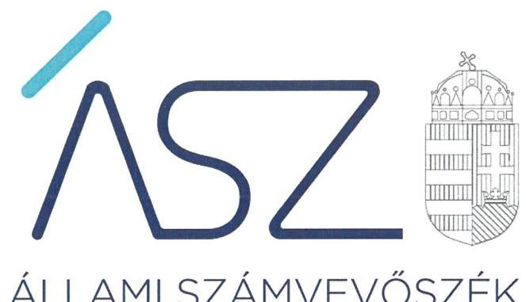
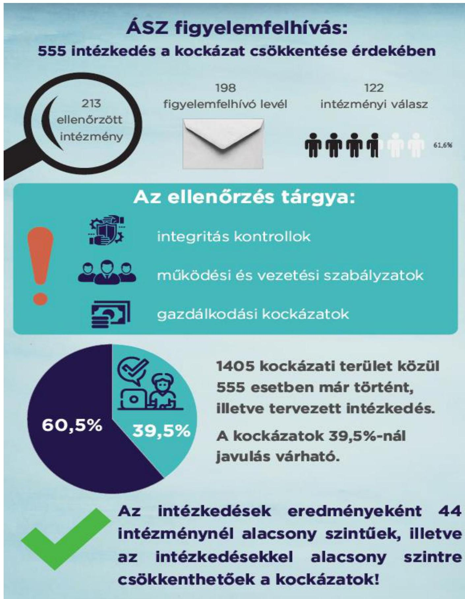

ÁLLAMI SZÁMVEVŐSZÉK

# JELENTÉS 

## Az önkormányzati intézmények ellenőrzése

Az önkormányzat és társulás irányítása alá tartozó intézmények integritásának monitoring típusú ellenőrzése - társulások irányítása alá tartozó 213 intézmény
2021.

21095
www.asz.hu

---

ÁLLAMI SZÁMVEVŐSZÉK

# JELENTÉS 

## Az önkormányzati intézmények ellenőrzése

Az önkormányzat és társulás irányítása alá tartozó intézmények integritásának monitoring típusú ellenőrzése - társulások irányítása alá tartozó 213 intézmény
2021. 12. hó 28. nap

21095
www.asz.hu

---

# AZ ELLENŐRZÉST FELÜGYELTE: 

SALAMON ILDIKÓ felügyeleti vezető

## AZ ELLENŐRZÉST VEZETTE ÉS A VÉGREHAJTÁSÁÉRT FELELŐS:

DR. GÁL NÓRA ellenőrzésvezető
LAJÓ ADRIENN ellenőrzésvezető
DORMÁN ISTVÁN ZOLTÁN ellenőrzésvezető

A PROGRAM ÖSSZEÁLLÍTÁSÁÉRT FELELŐS:
DR. FELFÖLDI IZABELLA programkészítésért felelős vezető

Jelentéseink az Országgyúlés számítógépes hálózatán és az interneten a www.asz.hu címen is olvashatóak.

IKTATÓSZÁM: EL-3461-002/2021.
TÉMASZÁM: 2568
ELLENŐRZÉS-AZONOSÍTÓ SZÁM: V0928

---

# TARTALOMJEGYZÉK 

■ ÖSSZEGZÉS ..... 5
■ AZ ELLENŐRZÉS JELENTŐSÉGE, AKTUALITÁSA, TÁRSADALMI SZEREPE, SZEMPONTJAI ..... 8
■ AZ ELLENŐRZÉS TERÜLETE ..... 9
■ ELLENŐRZÉS HATÓKÖRE ÉS MÓDSZERE ..... 10
■ MELLÉKLETEK ..... 13
I. sz. melléklet: Az értékelés módszertana ..... 13
II. sz. melléklet: Értelmező szótár ..... 15
■ FÜGGELÉKEK ..... 17
I. sz. függelék: Az ellenőrzött szervezetek és azok kockázati értékelése ..... 17
■ RÖVIDÍTÉSEK JEGYZÉKE ..... 31

---

.

---

# ÖSSZEGZÉS 

Az Állami Számvevőszék figyelemfelhívásának és tanácsadásának eredményeként a társulások irányítása alatt álló 213 ellenőrzött intézmény közül 59 intézménynél az intézményvezető már 2021-ben intézkedett, vagy intézkedéseket rendelt el az integritást biztositó alapvető feltételek megerősitése, illetve kiépitése érdekében. Ezeknek az intézményeknek javult az integritása, erősödtek a csalásmentes müködés feltételei.
139 intézménynél további intézkedések szükségesek az integritást biztositó alapvető feltételek kiépitése, illetve kiegészitése érdekében. Ezeknek az intézményeknek a vezetői az Állami Számvevőszék intézkedési kötelemmel járó figyelemfelhívására nem intézkedtek, ezért az azonosított kockázatok növekedtek, vagy intézkedéseik nem fedték le a kockázatos területeket, így az azonosított kockázatok nem változtak.
A fenntartó társulás egy intézmény megszüntetéséről döntött az ellenőrzött időszakban.

## Értékelések

Az Állami Számvevőszék önkormányzati társulás által irányított 213 intézmény belső kontrollrendszerének lényeges elemei kialakítását ellenőrizte a 2021. évre vonatkozóan. Az ellenőrzés a súlypontok meghatározásával lehetőséget biztosított a szervezeti integritás, működés és vezetés, valamint a gazdálkodás területén a kockázatok azonosítására.

A szervezeti integritás alapvető feltétele a szabályozottság, azaz a jogszabályokban előírt belső szabályzatok megléte, azok - hatályos jogszabályoknak - megfelelő tartalma és gyakorlati alkalmazhatósága. Az integritási kockázatok szervezeti szinten csökkenthetők azáltal, hogy az intézményvezetők kialakítják a szervezeti és múködési kereteket, a gazdálkodásra vonatkozó alapvető szabályozási környezetet, valamint a kontrolltevékenységek szabályszerű gyakorlásának, az integrált kockázatkezelésnek és az integritást sértő események kezelésének a feltételeit.

A szervezeti integritás, a múködés és a vezetés alapvető szabályozási feltételeinek kialakítása hozzájárul a csalásmentes integritási környezet megteremtéséhez.

A szervezeti és múködési szabályzat teremti meg a szervezet szabályszerű múködésének alapjait, illetve rögzíti a szervezeten belüli felelősségi viszonyokat. A szabályzat biztosítja a szervezeti múködés szabályozottságát, ezáltal a szervezet tevékenységének átláthatóságát, a szervezeti célokkal összhangban történő múködés feltételeit és annak ellenőrizhetőségét. Az ellenőrzöttek közül 178 intézmény rendelkezett szervezeti és múködési szabályzattal a 2021. évben.

A jogszabályi előírásoknak eleget téve, nyilatkozatban értékelte az intézmény belső kontrollrendszerének minőségét 136 intézmény vezetője. Ezek közül 63 intézménynél alakítottak ki olyan szabályozásokat, folyamatokat, amelyek biztosítják a költségvetési szerv tevékenységében a rendelkezésre álló források átlátható, szabályszerű, szabályozott, gazdaságos, hatékony és eredményes felhasználása követelményeinek érvényesítését.

Az integrált kockázatkezelés eljárásrendjét 138, a szervezeti integritást sértő események kezelésének eljárásrendjét 129 intézménynél alakították ki az intézményvezetők. Az integrált kockázatkezelés eljárásrendje biztosítja a szervezet múködésében rejlő kockázatok azonosításának és kezelésének feltételeit. A szervezet múködési kockázatai veszélyeztethetik a közpénzekkel való átlátható, elszámoltatható és felelős gazdálkodást. Az integritást sértő események kezelésének eljárásrendje jelenti a szervezet tekintetében felmerülő és a szervezeten belül bekövetkező integritást sértő események kezelésének alapjait. Az eljárásrend kialakításával az intézmény vezetője támogatja az integritást sértő eseményekkel kapcsolatosan azonosított kockázatok bekövetkezése esetén azok hatékony kezelését, illetve a következmények enyhítését.

A pénz- és vagyongazdálkodáshoz kapcsolódó alapvető szabályozások és nyilvántartások - így a számviteli politika és a keretében elkészítendő szabályzatok, a számlarend, a beszerzések szabályozása, valamint a kötelezettségválla-

---

lásra és a teljesítés igazolására jogosultak és aláírásmintáik nyilvántartása - előmozdítják a közpénzügyek átláthatóságát, rendezettségét. Az intézményvezető ezen szabályzatok elkészítésével, nyilvántartások vezetésével és folyamatos karbantartásával az alapfeltételét biztosítja a pénzügyi- és vagyongazdálkodás átláthatóságának, a közpénzekkel és közvagyonnal való elszámoltathatóságnak. Az ellenőrzöttek közül 142 intézménynél a számviteli politika, 124 intézménynél a számlarend, 136 intézménynél a beszerzések lebonyolításával kapcsolatos eljárásrend rendelkezésre állt.

Az ellenőrzöttek közül 14 intézmény vezetője tett eleget az ellenőrzött területek mindegyikén az integritási kontrollok alapvető feltételeit jelentő, a jogszabályban előírt szabályozási kötelezettségének. Közülük 4 intézmény vezetője a jogszabályi előírásokon túl további erőfeszítéseket is tett az integritás erősítése érdekében, felismerte további olyan integritási kontrollok kialakításának indokoltságát, amelyet jogszabály nem ír elő, így szervezeti szinten hozzájárul a korrupcióval szembeni védettség megszilárdításához.

208 intézmény esetében az intézményvezető intézkedése volt szükséges a kockázatok csökkentése érdekében, mivel 27 intézménynél a jogszabályok által előírt kontrollok területén, 171 intézménynél a jogszabályok által előírt és a további, jogszabály által nem előírt integritási kontrollok voltak hiányosságok, 10 intézménynél a lágy integritási kontrollok területén voltak hiányosságok. A dokumentumok kiértékelése alapján - az integritás további fejlesztése érdekében - az Állami Számvevőszék azonosította a lényeges kockázati területeket, és már az ellenőrzés lefolytatásával párhuzamosan, a 2021. évre vonatkozóan a kockázatok csökkentésére hívta fel az intézményvezetők figyelmét.

# Következtetések 

Az érintett 198 intézmény közül 122 intézmény vezetője válaszolt határidőben az Állami Számvevőszék figyelemfelhívására. Közülük 71 teljeskörűen, 30 részben egyetértett a kockázatos területeken teendő intézkedések indokoltságával. Az intézményvezetők közül 69 arról tájékoztatta az Állami Számvevőszéket, hogy valamennyi kockázatos területen, 31 pedig a kockázatos területek egy részénél már tett, illetve a jövőben tesz intézkedést a jelzett kockázatok csökkentése érdekében. A jogszabályi előírásokon túli integritási kontrollok területén az érintett 181 intézmény közül 63 intézmény vezetője a jelzett kockázatok teljes körű, 11 pedig azok részbeni felszámolásáról adott számot. Ezek eredményeként a 208 vezetői levélben jelzett 1405 kockázati terület közül 555 esetben már történt, illetve tervezett az intézkedés, így javulás várható a feltárt kockázatos területek 39,5\%-ánál.

Az intézkedések eredményeként az ellenőrzött 213 intézmény közül összesen 44 intézménynél a kockázatok alacsony szintűek, illetve - a tervezett intézkedések végrehajtásával - a kockázatok alacsony szintre csökkentek.

A szabályozások és nyilvántartások kialakításának célja nem önmagában a jogszabályi rendelkezések betartása, hanem az intézmény szabályozottságán keresztül a szabályszerű és csalásmentes gazdálkodás feltételeinek megteremtése, ezáltal az Alaptörvényben előírt átláthatóság és elszámoltathatóság elvének érvényesítése. Ezeknek az alapelveknek érvényesülése hozzájárulhat ahhoz, hogy az intézmények, mint közszolgáltatást nyújtó szervezetek felé a közszolgáltatásokat igénybe vevők, és általuk az állampolgárok általános bizalma is erősödjön.

Az Állami Számvevőszék figyelemfelhívására nem válaszoló, illetve a jelzett kockázatokra nem, vagy csak részben intézkedő intézményvezetők által vezetett intézményeknél rendszerszintű kockázatok maradtak fenn. Az integritás elvű működés erősítése érdekében további kockázatcsökkentő lépések szükségesek a vezetés-irányítás, valamint a pénzügyi- és a vagyongazdálkodás szabályszerű feltételeinek kialakítása terén. Ezen intézmények integritásának kiépítését következő lépésként az irányító szerv bevonásával támogatja az Állami Számvevőszék.

---

# ÁSZ figyelemfelhívás:
## 555 intézkedés a kockázat csökkentése érdekében

- 213 ellenőrzött intézmény
- 198 figyelemfelhívó levél
- 122 intézményi válasz

**Az ellenőrzés tárgya:**

- Integritás kontrollok
- Működési és vezetési szabályzatok
- Gazdálkodási kockázatok

**Az intézkedések eredményeként 44 intézménynél alacsony szintűek, illetve az intézkedésekkel alacsony szintre csökkenthetőek a kockázatok!**

**60,5%**

**39,5%**

**1405 kockázati terület közül 555 esetben már történt, illetve tervezett intézkedés.**

**A kockázatok 39,5%-nál javulás várható.**

**Az intézkedések eredményeként 44 intézménynél alacsony szintűek, illetve az intézkedésekkel alacsony szintre csökkenthetőek a kockázatok!**

---

# AZ ELLENŐRZÉS JELENTŐSÉGE, AKTUALITÁSA, TÁRSADALMI SZEREPE, SZEMPONTJAI 

Az Alaptörvény alapértékeket, elveket fogalmaz meg, amely szerint a közpénzekkel gazdálkodó minden szervezet köteles a nyilvánosság előtt elszámolni a közpénzekre vonatkozó gazdálkodásával. A közpénzeket és a nemzeti vagyont az átláthatóság és a közélet tisztaságának elve szerint kell kezelni.

Magyarország helyi önkormányzatairól szóló törvény ${ }^{1}$ a helyi közhatalom gyakorlás széleskörű érvényesítésével összhangban tág teret ad a helyi önkormányzatoknak a feladataik, a közszolgáltatások legkülönbözőbb formákban történő ellátására. Ekként általános jelleggel elismeri az önkormányzatok társulási szabadságát. Így a helyi önkormányzatok széleskörű lehetőséggel rendelkeznek a tekintetben, hogy a feladataikat önként létrehozott társulások útján lássák el.

A helyi önkormányzatok, önkormányzati társulások intézményei szerteágazó közszolgáltatásokat nyújtanak. Az intézmények működtetése közvetlenül érinti a társadalom valamennyi rétegét, a közfeladatot ellátó intézmények működésének minősége közvetlen hatással van az azokat igénybe vevő állampolgárok életére.

Az intézmények szabályszerű és eredményes müködésének és gazdálkodásának alapfeltétele a belső kontrollrendszer - benne az integritási kontrollok - megfelelő kialakítása. Az ÁSZ² a törvényi felhatalmazással élve ellenőrzi az önkormányzati intézményeket, hogy megállapításaival támogassa az ellenőrzött szervezetek szabályszerű gazdálkodását, müködését.

A helyi önkormányzatok, önkormányzati társulások intézményei által ellátott feladatok, a bölcsődei, óvodai ellátás, a gyermekétkeztetés, a betegek és idősek gondozása, a közművelődési intézmények, könyvtárak működtetése által a lakosság ezeken a területeken találkozik legszélesebb körben az önkormányzatok által nyújtott szolgáltatásokkal. A szolgáltatásokat igénybe vevők jelentős száma, a feladatellátáshoz használt nemzeti vagyon és az erre fordított közpénz nagysága indokolja, hogy az ÁSZ további, az előző ellenőrzésekre épülő ellenőrzéseket végezzen ezen a területen, illetve további olyan területeken, ahol az önkormányzati szolgáltatást a lakosság széles köre veszi igénybe.

Az ellenőrzés célja annak értékelése, hogy a helyi önkormányzatok, a társulások irányítása alá tartozó intézmények megteremtették-e az integritás biztosításához szükséges feltételeket, kialakították-e az alapvető a szervezeti kereteket, az integritási kontrollokhoz kapcsolódó, valamint a korrupció elleni védelmet szolgáló szabályozásokat. Továbbá, hogy az intézményvezető gondoskodott-e a szervezeti teljesítmény mérés alapfeltételeinek kialakításáról az eredményességi szempontoknak való megfelelés megalapozottsága biztosítása érdekében. A monitoring típusú ellenőrzés célja hatékonyan támogatni az ellenőrzött szervezeteket, ezáltal növelve az ÁSZ tanácsadó szerepét, elősegítve a „jól irányított állam" müködését.

Az ÁSZ célja, hogy új ellenőrzési megközelítést alkalmazva támogassa a közpénzügyi helyzet javítását; a monitoring típusú ellenőrzéssel jelen időben adjon helyzetképet az integritási szemlélet érvényesítéséről, rávilágítson az integritási kontrollok kiépítettségére, illetve további fejlesztésére. Napjainkban mindez kiemelt fontosságúvá vált. Minden szervezetnek fel kell készülnie arra, hogy a koronavírus járvány okozta társadalmi és gazdasági válság növelni fogja a korrupciós nyomást. Az ÁSZ ebben a helyzetben is alapvető kötelességének tartja, hogy a közpénzek őre legyen, és ellenőrzéseit az önkormányzati alrendszer intézményei körében is folytassa.

Fontos, hogy az intézmények vezetői felismerjék az integritás kockázatokat, azokat ismételten mérjék fel, és alakítsanak ki átlátható, jól szabályozott rendszereket, döntési mechanizmusokat. Az integritási kockázatok feltárása, megismerése elengedhetetlenül fontos, mert ezt követően tehetők meg azok a lépések, amelyek a kockázatok csökkentését, felszámolását és kezelését célozzák. A belső kontrollrendszer - benne az integritás kontrollok - megfelelő kialakítása, müködése a helyi önkormányzatok, önkormányzati társulások irányítása alatt álló intézményeknél is hozzájárul a társadalmi közbizalom erősítéséhez.

Az ellenőrzés rámutat az integritási jó gyakorlatokra is, továbbá felhívja a figyelmet a jogszabályi követelmények teljesítéséhez szükséges lépésekre is.

---

# AZ ELLENŐRZÉS TERÜLETE 

## Az önkormányzati társulások által irányított intézmények

Helyi önkormányzati költségvetési szervet az államháztartásról szóló 2011. évi CXCV törvény (Áht. ${ }^{3)}$ szerint a helyi önkormányzat, a helyi önkormányzatok társulása, a térségi fejlesztési tanács, az átalakult nemzetiségi önkormányzat alapíthat, a költségvetési szerv alapító okiratában meghatározott önkormányzati közfeladatok ellátására. A költségvetési szervek önálló jogi személyek, éves költségvetésükből gazdálkodva látják el feladataikat. A költségvetési szervek gazdasági szervezettel rendelkeznek, ha azonban a költségvetési szerv éves átlagos statisztikai állományi létszáma a 100 főt nem éri el, a gazdasági szervezet feladatait az önkormányzati hivatal, vagy az irányító szerv döntése alapján az irányító szerv irányítása alá tartozó, gazdasági szervezettel rendelkező más költségvetési szerv látja el.

Az államháztartásról szóló törvény végrehajtásáról szóló 368/2011. (XII. 31.) Korm. rendelet (Ávr. ${ }^{4}$ ) 1. melléklete szerint, az államháztartás önkormányzati alrendszerében a társulás által irányított költségvetési szerv esetében az irányító szervi feladatokat a társulási tanács és annak elnöke gyakorolja.

Az ellenőrzés a helyi önkormányzati társulások által irányított, az I. sz. Függelékben felsorolt költségvetési szervekre terjedt ki.

A feladatellátásuk szerint az ellenőrzött költségvetési szervek egy része óvoda, bölcsőde, egészségügyi intézmény, konyha, művelődési ház, múzeum, kulturális központ, idősek otthona, gondozási központ intézményként működik.

Az ellenőrzött 213 intézmény közül egy rendelkezik saját gazdasági szervezettel.

Egy intézmény az ellenőrzött időszakban megszűnt.

---

# ELLENŐRZÉS HATÓKÖRE ÉS MÓDSZERE 

## Az ellenőrzés típusa

Megfelelőségi ellenőrzés.

## Az ellenőrzött időszak

A 2021. év, a Bkr. ${ }^{5}$ szerinti vezetői nyilatkozat, valamint annak alátámasztottsága vonatkozásában a 2020. év.

## Az ellenőrzés tárgya

A szervezeti keretekkel, a működéssel és gazdálkodással kapcsolatos szabályzatok, szabályozások, valamint a szervezeti elvekkel, értékekkel összefüggő integritás kontrollok kiépítettsége, a szervezeti teljesítmény mérés alapfeltételeinek kialakítása.

## Az ellenőrzött szervezetek

Az ellenőrzött intézményeket az I. sz. Függelék tartalmazza.

## Az ellenőrzés jogalapja

Az ellenőrzés jogszabályi alapját az ÁSZ tv. ${ }^{6}$ 1. § (3) bekezdése, 5. § (6) bekezdése, valamint az Áht. 61. § (2) bekezdése képezik.

## Az ellenőrzés módszerei

Az ÁSZ az ellenőrzést az ellenőrzési program szempontjai, az ellenőrzött időszakban hatályos jogszabályok, a jelen ellenőrzésre irányadó ÁSZ módszertan figyelembevételével és a nemzetközi standardokat irányadónak tekintve végzi.

Az ellenőrzés ideje alatt az ÁSZ az ellenőrzött szervezetekkel történő kapcsolattartást az ÁSZ SZMSZ7-ének vonatkozó előírásai alapján biztosítja.

Az ellenőrzési kérdések megválaszolásához szükséges bizonyítékok megszerzése a következő ellenőrzési eljárások alkalmazásával történik: megfigyelés, összehasonlítás, elemző eljárás. Az ellenőrzési bizonyítékként felhasználható adatforrások közé tartoznak az ellenőrzési programban felsorolt adatforrások, továbbá minden - az ellenőrzés folyamán - feltárt, az ellenőrzés szempontjából információkat tartalmazó dokumentum.

---

Az ÁSZ az ellenőrzést a kérdésekre adott válaszok kiértékelésével, valamint a megjelölt adatforrások, továbbá az adott időszakban hatályos jogszabályok, valamint az ÁSZ honlapján közzétett helyénvalósági kritériumok figyelembevételével folytatja le.

A monitoring típusú ellenőrzés a társulás irányítása alá tartozó intézmények integritás alapú múködésének lényeges területeire és a közpénzügyi helyzet javítása érdekében az elért eredmények fenntartására fókuszál. Lehetőséget biztosít az integritási kontrollok kiépítettségében lévő hiányosságok, a szervezeti teljesítmény mérés alapfeltételei kialakításának hiánya beazonosítására az eredményességi szempontoknak való megfelelés megalapozottsága biztosítása érdekében, az önkormányzatok, társulások irányítása alá tartozó intézmények integritásának elemzésére, részletes ellenőrzések megalapozására.

---

.

---

# MELLÉKLETEK 

I. SZ. MELLÉKLET: AZ ÉRTÉKELÉS MÓDSZERTANA

Az egyes kockázati területek és kockázatforrások minősítése „pontozásos módszerrel", az integritás „jelző" dokumentumai és a vezetői magatartás ellenőrzéshez kapcsolódóan tanúsított tényhelyzeteinek értékelése alapján történt.

Az értékelt dokumentumokhoz, nyilvántartásokhoz, kockázati besorolásokhoz minden esetben pontszám került hozzárendelésre, amelyek értéke alapján az ellenőrzött szervezetek kockázati csoportba kerültek besorolásra:

- Alacsony kockázatú - az elérhető összes pontszám legalább 80\%-a
- Közepes kockázatú - az elérhető pontszám 50-79\%-a között
- Magas kockázatú - az elérhető pontszám 50\%-a alatt

Az első lépésben azonosításra kerültek azok az intézményi szabályozások és nyilvántartások, amelyek meglétét jogszabály írja elő, hiánya pedig felveti a csalás és korrupció kockázatát.

Második lépésben az adatoknak az ellenőrzés rendelkezésére bocsátása kockázati kritériumainak meghatározása, majd értékelése történt meg.

Harmadik lépésben a figyelemfelhívó levelekre adott válaszok kockázati kritériumainak meghatározása, majd értékelése történt meg.

Az összesített kockázati értékelést javította, amennyiben

- az intézmény rendelkezett olyan szabályozással, amely kötelező meglétét jogszabály nem írja elő, de segíti a csalás és a korrupció megelőzését (helyénvalósági dokumentumok).

Az összesített kockázati értékelést rontotta, amennyiben

- az integritás szempontjából meghatározó dokumentum - az intézményi SZMSZ - hiányzott, és javítása érdekében a figyelemfelhívó levél hatására sem történt intézkedés.

A figyelemfelhívó levelekre adott válaszok értékelése alapján:

- A kockázat csökkent, amennyiben a figyelemfelhívó levélre adott válasza a figyelemfelhívással összhangban volt, valamennyi kockázati területen intézkedett vagy intézkedést tervezett.
- A kockázat változatlan, amennyiben a figyelemfelhívó levélben foglaltaktól eltérő magatartást tanúsított, intézkedése a figyelemfelhívással részben volt összhangban, a kockázati területeken részben intézkedett vagy intézkedést tervezett.
- A kockázat nőtt, amennyiben nem volt együttműködő, a figyelemfelhívó levélre nem válaszolt, vagy válasza alapján nem intézkedett és nem tervezett intézkedést.

---

# A társulások irányítása alá tartozó intézmények kockázati csoportba sorolásának értékelési keretrendszere 

I. Dokumentumokkal rendelkezés lényeges dokumentumok, amelyek hiánya felveti a csalás és korrupció kockázatát
I.1. A szervezeti integritás, müködés és vezetés alapvető szabályozási feltételei

- intézmény SZMSZ-e
- vezetői nyilatkozat a 2020. évre vonatkozóan az intézmény belső kontrollrendszer minőségének értékeléséről, valamint a nyilatkozat megalapozottságát bizonyító dokumentumok
- integrált kockázatkezelés eljárásrendje
- az integritást sértő események kezelésének eljárásrendje
I.2. A pénz- és vagyongazdálkodáshoz kapcsolódó alapvető szabályozások
- számviteli politika
- az eszközök és a források leltárkészittési és leltározási szabályzata
- az eszközök és a források értékelési szabályzata
- pénzkezelési szabályzat
- számlarend
- beszerzések lebonyolításával kapcsolatos eljárásrend
- a kötelezettségvállalásra, teljesítés igazolására jogosult személyekről és aláírás-mintájukról vezetett nyilvántartás
II. Az adatoknak az ellenőrzés rendelkezésére bocsátása
II.1. A megnevezett adatokkal rendelkezett és a törvényi határidőn belül hiánytalanul rendelkezésre bocsátotta. Figyelem-, illetve figyelmet felhívó levél nem volt indokolt.
II.2. A megnevezett adatokat nem bocsátotta rendelkezésre.
III. Figyelemfelhívó levelekre adott válaszok kockázati értékelése
III.1. Kockázat csökkent: együttmüködése a figyelemfelhívó levéllel összhangban volt.
III.2. Kockázat változatlan: a figyelemfelhívó levélben foglaltaktól eltérő együttműködést tanúsított.
III.3. Kockázat nőtt: nem reagált, nem intézkedett, így nem volt együttmüködő.

---

# II. SZ. MELLÉKLET: ÉRTELMEZŐ SZÓTÁR 

belső kontrollrendszer

belső kontrollrendszer területei
integrált kockázatkezelési rendszer
integritás

Integritási kockázatok
kockázat
kontrollkörnyezet
kontrollkörnyezet
kockázat
kontrollkörnyezet
kontrolltevékenységek
intézmény

A belső kontrollrendszer a kockázatok kezelése és tárgyilagos bizonyosság megszerzése érdekében kialakított folyamatrendszer, amely azt a célt szolgálja, hogy a múködés és gazdálkodás során a tevékenységeket szabályszerűen, gazdaságosan, hatékonyan, eredményesen hajtsák végre, az elszámolási kötelezettségeket teljesítsék, megvédjék az erőforrásokat a veszteségektől, károktól és nem rendeltetésszerű használattól. (Forrás: Áht. 69. § (1) bekezdése)
A kontrollkörnyezet, az integrált kockázatkezelési rendszer, a kontrolltevékenységek, az információs és kommunikációs rendszer, valamint a nyomon követési (monitoring) rendszer. (Forrás: Bkr. 3. §-a)
Olyan folyamatalapú kockázatkezelési rendszer, amely a szervezet minden tevékenységére kiterjed, egységes módszertan és eljárások alkalmazásával, a szervezet célkitűzéseinek és értékeinek figyelembevételével biztosítja a szervezet kockázatainak teljes körű azonosítását, azok meghatározott kritériumok szerinti értékelését, valamint a kockázatok kezelésére vonatkozó intézkedési terv elkészítését és az abban foglaltak nyomon követését. (Forrás: Bkr. 2. § m) pontja)
Az integritás az elvek, értékek, cselekvések, módszerek, intézkedések konzisztenciáját jelenti, vagyis olyan magatartásmódot, amely meghatározott értékeknek megfelel. (Forrás: Nemzetgazdasági Minisztérium: Államháztartási belső kontroll standardok és gyakorlati útmutató 1.1.3. pontja, 2017. szeptember)
Integritási kockázatnak minősül a szervezet célkitűzéseit, értékeit, elveit sértő vagy veszélyeztető visszaélés, szabálytalanság, vagy egyéb esemény lehetősége. A korrupciós kockázat olyan integritási kockázat, amely korrupciós cselekmény bekövetkezésének lehetőségét jelenti. Minden korrupciós kockázat egyben integritási kockázat is. Korrupciós cselekményeknek nevezzük azokat a vesztegetésszerű cselekményeket, amelyeket általában a Büntető Törvénykönyv ${ }^{8}$ is büntetéssel fenyeget.
A kockázat annak a valószínűségét jelenti, hogy egy vagy több esemény, vagy intézkedés nem kívánt módon befolyásolja a rendszer múködését, céljainak megvalósulását. (Forrás: Javaslatok a korrupciós kockázatok kezelésére - Kockázatkezelési és ellenőrzési módszertan 35. oldal, ÁSZ)
A költségvetési szerv vezetője által kialakított olyan elvek, eljárások, belső szabályzatok összessége, amelyben világos a szervezeti struktúra, a folyamatok átláthatók, egyértelműek a felelősségi, hatásköri viszonyok és feladatok, meghatározottak, ismertek és elfogadottak az etikai elvárások a szervezet minden szintjén, átlátható a humánerőforrás-kezelés, biztosított a szervezeti célok és értékek irányában való elkötelezettség fejlesztése és elősegítése. (Forrás: Bkr. 6. § (1) bekezdés)
A költségvetési szerv vezetője által a szervezeten belül kialakított (kontroll) tevékenységek, melyek biztosítják a kockázatok kezelését, hozzájárulnak a szervezet céljainak eléréséhez és erősítik a szervezet integritását. (Forrás: Bkr. 8. § (1) bekezdés)
A helyi önkormányzatok irányítása alá tartozó költségvetési szervek. (A képviselő-testület a feladatkörébe tartozó közszolgáltatások ellátására - jogszabályban meghatározottak szerint - költségvetési szervet (önkormányzati intézmény) alapíthat; Forrás: Mötv. 41. § (6) bekezdés)

---

.

---

# FÜGGELÉKEK

I. 5Z. FÜGGELÉK: AZ ELLENŐRZÖTT SZERVEZETEK ÉS AZOK KOCKÁZATI ÉRTÉKELÉSE

|  Sorszám | Ellenőrzött szervezet megnevezése | Irányító szerv (társulás) megnevezése | Helység | Megye | Tanácsadást megelőző kockázati besorolás | Intézkedést követően a kockázati értékelés változása | A kockázati szint alacsonyra csökkent-e  |
| --- | --- | --- | --- | --- | --- | --- | --- |
|  1. | Bajai Kistérségi Család-segitő- és Gyermekjóléti Szolgálat | Bajai kistérségi Családsegítő és Gyermekjóléti Intézményfenntartó Társulás | Baja | Bács-Kiskun | KÖZEPES | NÖTT | N  |
|  2. | Kistérségi Egyesített Szociális Intézmény | Felső-Kiskunsági és Dunamelléki Többcélú Kistérségi Társulás | Kunszentmiklós | Bács-Kiskun | KÖZEPES | CSÖKKENT | I  |
|  3. | Baksai Óvoda | Baksai Intézményfenntartó Társulás | Baksa | Baranya | MAGAS | NÖTT | N  |
|  4. | Borjádi Óvoda | Borjádi Óvodai Társulás | Borjád | Baranya | MAGAS | CSÖKKENT | N  |
|  5. | Csányoszrói Napsugár Óvoda | Csányoszró Térségi Intézményfenntartó Társulás | Csányoszró | Baranya | MAGAS | NÖTT | N  |
|  6. | Dencsházai Társult Óvodák és Konyha | Dencsháza Község, Hobol Község, Szentegát Község Köznevelési Intézményfenntartó Társulása | Dencsháza | Baranya | KÖZEPES | NÖTT | N  |
|  7. | Drávafoki Mosoly Óvoda | Drávafoki Óvodai Társulás | Drávafok | Baranya | MAGAS | NEM VÁLTOZOTT | N  |
|  8. | Dráva Kincse Óvoda és Konyha | Drávaszabolcs, Drávacsehi, Drávapalkonya, Gordisa Óvoda Fenntartó és Szociális Étkeztetést Ellátó Társulás | Drávaszabolcs | Baranya | KÖZEPES | NÖTT | N  |
|  9. | Egyházasharaszti Óvoda és Bölcsőde | Egyházasharaszti Óvoda Fenntartói Társulás | Egyházasharaszti | Baranya | KÖZEPES | NEM VÁLTOZOTT | N  |
|  10. | Erzsébeti Gyermekszív Óvoda és Konyha | Erzsébeti Gyermekszív Óvoda Fenntartó Társulás | Erzsébet | Baranya | MAGAS | NEM VÁLTOZOTT | N  |
|  11. | Felsőszentmártoni Horvát Nemzetiségi Óvoda | Felsőszentmártoni Óvodai Társulás | Felsőszentmárton | Baranya | MAGAS | NÖTT | N  |
|  12. | Gyódi Óvoda | Gyód és Keszü Községek Intézményfenntartó Társulása | Gyód | Baranya | KÖZEPES | NÖTT | N  |
|  13. | Himesházi Napsugár Német Nemzetiségi Óvoda és Konyha | Himesháza, Szűr, Erdősmárok, Maráza és Szebény Óvodafenntartó Társulás | Himesháza | Baranya | MAGAS | NÖTT | N  |
|  14. | Kisharsányi Óvoda | Kisharsányi Óvoda Fenntartói Társulás | Kisharsány | Baranya | KÖZEPES | NEM VÁLTOZOTT | N  |
|  15. | Kisvaszari Napovi és Főzökonyha | Kisvaszari Intézményfenntartó Társulás | Kisvaszar | Baranya | KÖZEPES | CSÖKKENT | I  |
|  16. | Lippói Óvoda és Konyha | Lippói Intézményfenntartó Társulás | Lippó | Baranya | MAGAS | CSÖKKENT | N  |
|  17. | Mágocsi Tündérkert Óvoda-Bölcsőde | Mágocsi Óvodafenntartó Társulás | Mágocs | Baranya | MAGAS | NÖTT | N  |

---

| Sorszám | Ellenőrzött szervezet megnevezése | Irányító szerv (társulás) megnevezése | Helység | Megye | Tanácsadást megelőző kockázati besorolás | Intézkedést követően a kockázati értékelés változása | A kockázati szint alacsonyra csökkent-e |
| :--: | :--: | :--: | :--: | :--: | :--: | :--: | :--: |
| 18. | Magyarbólyi Óvoda, Mini Bölcsőde és Konyha | Magyarbólyi Óvoda Fenntartói Társulás | Magyarbóly | Baranya | ALACSONY | NEM VOLT SZABÁLYSZERÚSÉGI HIBA | I |
| 19. | Magyarmecskei Óvoda és Konyha | Magyarmecske Térségi Intézményfenntartó Társulás | Magyarmecske | Baranya | MAGAS | NÖTT | N |
| 20. | Mecseknádasdi Gondozási Központ | Mecseknádasd-Hidas Szociális Intézményfenntartó Társulás | Mecseknádasd | Baranya | KÖZEPES | NÖTT | N |
| 21. | Nagydobszai Óvoda és Konyha | Nagydobsza és Térsége Óvoda és Konyha Intézményfenntartó Társulás | Nagydobsza | Baranya | MAGAS | NÖTT | N |
| 22. | Nagyharsányi Mini Bölcsőde | Nagyharsányi Intézményi Társulás | Nagyharsány | Baranya | KÖZEPES | CSÖKKENT | N |
| 23. | Nagyharsányi Óvoda, Könyvtár és Konyha | Nagyharsányi Intézményi Társulás | Nagyharsány | Baranya | KÖZEPES | CSÖKKENT | I |
| 24. | Nagypalli Német Nemzetiségi Óvoda és Konyha | Nagypalli Német Nemzetiségi Óvoda Fenntartó Társulás | Nagypall | Baranya | MAGAS | CSÖKKENT | N |
| 25. | Ófalui Német Nemzetiségi Kétnyelvű Óvoda és Mini Bölcsőde | Ófalui Óvodai Társulás | Ófalu | Baranya | KÖZEPES | NÖTT | N |
| 26. | Ormánsági Aprófalva Óvoda és Konyha | Kémesi Óvodai Társulás | Kémes | Baranya | MAGAS | NÖTT | N |
| 27. | Esztergár Lajos Családés Gyermekjóléti Szolgálat és Központ | Pécsi Többcélú Agglomerációs Társulás | Pécs | Baranya | ALACSONY | NEM VOLT SZABÁLYSZERÚSÉGI HIBA | N |
| 28. | Integrált Nappali Szociális Intézmény | Pécsi Többcélú Agglomerációs Társulás | Pécs | Baranya | KÖZEPES | NÖTT | N |
| 29. | Pécs és Környéke Szociális Alapszolgáltatási és Gyermekjóléti Alapellátási Központ és Családi Bölcsőde Hálózat | Pécsi Többcélú Agglomerációs Társulás | Pécs | Baranya | KÖZEPES | NEM VÁLTOZOTT | N |
| 30. | Romonyai Óvoda | Bogád-Romonya Intézményfenntartó Társulás | Romonya | Baranya | KÖZEPES | CSÖKKENT | I |
| 31. | Sásdi Szociális Szolgálat | Sásdi Szociális Társulás | Sásd | Baranya | KÖZEPES | CSÖKKENT | N |
| 32. | Szászvári Hársvirág Óvoda | Szászvári Óvoda Intézményfenntartó Társulás | Szászvár | Baranya | MAGAS | NÖTT | N |
| 33. | Szentlászló-Almamellék-Somogyhárságy Óvodái és Konyhái | Szentlászlói Intézményfenntartó Önkormányzati Társulás | Szentlászló | Baranya | KÖZEPES | CSÖKKENT | I |
| 34. | Szentlőrinci Kistérségi Óvoda és Bölcsőde | Szentlőrinci Kistérség Többcélú Önkormányzati Társulás | Szentlőrinc | Baranya | MAGAS | NÖTT | N |
| 35. | Vajszlói Aprófalva Óvoda | Vajszlói Aprófalva Óvoda Intézményfenntartó Társulás | Vajszló | Baranya | KÖZEPES | CSÖKKENT | I |
| 36. | Villányi Kikerics Óvoda, Mini Bölcsőde és Főzökonyha | Villányi Óvodai Intézményfenntartó Társulás | Villány | Baranya | KÖZEPES | NÖTT | N |
| 37. | Villányi Szociális és Gyermekjóléti Szolgálat | Villányi Mikrotérségi Szociális és Gyermekjóléti Társulás | Villány | Baranya | KÖZEPES | NÖTT | N |

---

| Sorszám | Ellenőrzött szervezet megnevezése | Irányító szerv (társulás) megnevezése | Helység | Megye | Tanácsadást megelőző kockázati besorolás | Intézkedést követően a kockázati értékelés változása | A kockázati szint alacsonyra csökkent-e |
| :--: | :--: | :--: | :--: | :--: | :--: | :--: | :--: |
| 38. | Aggteleki Óvoda | Aggtelek-Jósvafő Óvodafenntartó Társulás | Aggtelek | Borsod-AbaújZemplén | KÖZEPES | NÖTT | N |
| 39. | Berentei Tündérkert Óvoda | Berente-Alacska Települések Óvodai Intézményfenntartó Társulása | Berente | Borsod-AbaújZemplén | ALACSONY | NEM VOLT SZABÁLYSZERŰSÉGI HIBA | N |
| 40. | Bodroghalmi Mesepalota Óvoda | Bodroghalmi Óvodai Társulás | Bodroghalom | Borsod-AbaújZemplén | KÖZEPES | NÖTT | N |
| 41. | Egerlövő-Borsodivánka Napköziotthonos Óvoda | Egerlövő-Borsodivánka Óvodafenntartó Társulás | Egerlövő | Borsod-AbaújZemplén | KÖZEPES | CSÖKKENT | I |
| 42. | Felsőnyárádi Nyárfácska Óvoda | Felsőnyárád-Felsőkele-csény-Alsószuha települések Óvodai Köznevelési Intézményfenntartó Társulása | Felsőnyárád | Borsod-AbaújZemplén | KÖZEPES | NÖTT | N |
| 43. | Fulókércsi Óvoda | Fulókércsi Óvodafenntartó Társulás | Fulókércs | Borsod-AbaújZemplén | MAGAS | NÖTT | N |
| 44. | Abaúj-Hegyközi Gyermekjóléti és Szociális Alapszolgáltatási Körzet | Abaúj-Hegyközi Többcélú Kistérségi Társulás | Gönc | Borsod-AbaújZemplén | KÖZEPES | CSÖKKENT | I |
| 45. | Halmaji Kastély Óvoda és Konyha | Halmaj, Kiskinizs Községek Önkormányzatainak Intézményfenntartó Társulása | Halmaj | Borsod-AbaújZemplén | MAGAS | NEM VÁLTOZOTT | N |
| 46. | Hernádnémeti Alapszolgáltatási Központ (Hak) | Hernádnémeti-Újcsanálos Intézményfenntartó Társulás | Hernádnémeti | Borsod-AbaújZemplén | KÖZEPES | NÖTT | N |
| 47. | Hernádnémeti Napközi Otthonos Óvoda és Bölcsőde | Hernádnémeti-Újcsanálos Intézményfenntartó Társulás | Hernádnémeti | Borsod-AbaújZemplén | KÖZEPES | NÖTT | N |
| 48. | Hernádvécsei Napsugár Óvoda | Hernádvécse-Hernád-petri-Pusztaradvány Községek Köznevelési Intézményfenntartó Társulás | Hernádvécse | Borsod-AbaújZemplén | KÖZEPES | NÖTT | N |
| 49. | Jákfalvai Százszorszép Óvoda | Jákfalva-Dövény települések Óvodai Köznevelési Intézményfenntartó Társulása | Jákfalva | Borsod-AbaújZemplén | KÖZEPES | NÖTT | N |
| 50. | Kázsmárki Szivárvány Óvoda-Bölcsőde és Konyha | Kázsmárk - Rásonysápberencs Községek Köznevelési Intézményfenntartó Társulás | Kázsmárk | Borsod-AbaújZemplén | MAGAS | NÖTT | N |
| 51. | Mezőcsáti Gyerekesély Iroda | Mezőcsát Kistérség Többcélú Társulása | Mezőcsát | Borsod-AbaújZemplén | MAGAS | NEM VÁLTOZOTT | N |
| 52. | Novajidrányi Csicsergő Óvoda | Novajidrány Garadna Községek Köznevelési Intézményfenntartó Társulás | Novajidrány | Borsod-AbaújZemplén | KÖZEPES | NÖTT | N |
| 53. | Pitypalatty-Völgyi Csicsergő Óvoda | Parasznya-Radostyán Óvadafenntartó Társulás | Parasznya | Borsod-AbaújZemplén | KÖZEPES | NÖTT | N |
| 54. | Ragályi Óvoda | Ragály-Imola-SzuhafőTrizs települések Óvodai Köznevelési Intézményfenntartó Társulása | Ragály | Borsod-AbaújZemplén | KÖZEPES | NÖTT | N |

---

| Sorszám | Ellenőrzött szervezet megnevezése | Irányító szerv (társulás) megnevezése | Helység | Megye | Tanácsadást megelőző kockázati besorolás | Intézkedést követően a kockázati értékelés változása | A kockázati szint alacsonyra csökkent-e |
| :--: | :--: | :--: | :--: | :--: | :--: | :--: | :--: |
| 55. | Rudabányai Szociális Szolgáltató Intézmény | Rudabánya és környéke Szociális Szolgáltató Önkormányzati Társulás | Rudabánya | Borsod-AbaújZemplén | KÖZEPES | NEM VÁLTOZOTT | N |
| 56. | Szikszói Szociális Szolgáltató Központ | Szikszói Kistérségi Többcélú Társulás | Szikszó | Borsod-AbaújZemplén | KÖZEPES | NÖTT | N |
| 57. | Gyulai Kistérség Egységes Szociális és Gyermekjóléti Intézménye | Gyula és Környéke Többcélú Kistérségi Társulása | Gyula | Békés | KÖZEPES | NÖTT | N |
| 58. | Kondorosi Többsincs Óvoda és Bölcsőde | Kondoros-Kardos Köznevelési Intézményfenntartó Társulás | Kondoros | Békés | MAGAS | CSÖKKENT | N |
| 59. | Szeghalom Kistérség Egységes Szociális és Gyermekjóléti Intézmény | Szeghalom Kistérség Többcélú Társulás | Szeghalom | Békés | KÖZEPES | CSÖKKENT | I |
| 60. | Alsó-Tisza-menti Többcélú Óvodák és Mini Bölcsődék | Alsó-Tisza-menti Önkormányzati Társulás | Felgyő | Csong-rád-Csanád | KÖZEPES | NÖTT | N |
| 61. | Földeáki Egyesített Egészségügyi és Szociális Intézmény | Földeák Térségi Szociális, Egészségügyi, Gyermekjóléti és Óvodai Önkormányzati Társulás | Földeák | Csong-rád-Csanád | KÖZEPES | NÖTT | N |
| 62. | Hódmezővásárhelyi Többcélú Kistérségi Társulás Kapcsolat Központ | Hódmezővásárhelyi Többcélú Kistérségi Társulás | Hódmezővásárhely | Csong-rád-Csanád | KÖZEPES | NÖTT | N |
| 63. | Homokháti Kistérség Többcélú Társulása Integrált Szociális és Gyermekjóléti Központ | Homokháti Kistérség Többcélú Társulása | Zákányszék | Csong-rád-Csanád | ALACSONY | NEM VÁLTOZOTT | N |
| 64. | Cecei Óvoda és Bölcsőde | Dél-Mezőföldi Többcélú Társulás | Cece | Fejér | MAGAS | NÖTT | N |
| 65. | Háló Dél-Mezőföldi Szociális és Gyermekjóléti Szolgálat | Dél-Mezőföldi Többcélú Társulás | Cece | Fejér | KÖZEPES | NÖTT | N |
| 66. | Vértesalja Óvoda | Vértesalja Önkormányzati Társulás | Csákberény | Fejér | MAGAS | NÖTT | N |
| 67. | Meseház Óvoda-Bölcsőde | "Móri" Többcélú Kistérségi Társulás | Mór | Fejér | KÖZEPES | NÖTT | N |
| 68. | Szociális Alapszolgáltatási Központ | Mór Mikrokörzeti Szociális Intézményi Társulás | Mór | Fejér | KÖZEPES | NÖTT | N |
| 69. | Sárosd-Sárkeresztúr Szociális Alapellátó Központ és Konyha | Sárosd-Sárkeresztúr Önkormányzati Társulás | Sárosd | Fejér | KÖZEPES | CSÖKKENT | I |
| 70. | Mihályi Napfény Óvoda | Mihályi-Vadosfa Óvodai Társulás | Mihályi | Győr-MosonSopron | MAGAS | CSÖKKENT | N |
| 71. | Bakonyszentlászlói Szent László Óvoda | Bakonyszentlászló, Bakonygyirót, Fenyőfő és Románd Önkormányzat Intézményfenntartó Társulása | Bakonyszentlászló | Győr-MosonSopron | KÖZEPES | CSÖKKENT | I |
| 72. | Fertőd Mikro-térségi Szociális Szolgáltató Központ | Fertőd Mikro-térségi Szociális Intézményi Társulás | Fertőd | Győr-MosonSopron | MAGAS | CSÖKKENT | N |

---

| Sorszám | Ellenőrzött szervezet megnevezése | Irányító szerv (társulás) megnevezése | Helység | Megye | Tanácsadást megelőző kockázati besorolás | Intézkedést követően a kockázati értékelés változása | A kockázati szint alacsonyra csökkent-e |
| :--: | :--: | :--: | :--: | :--: | :--: | :--: | :--: |
| 73. | Kisfaludi Gólyafészek Óvoda | Kisfalud-Hövej Óvodai Társulás | Kisfalud | Győr-MosonSopron | MAGAS | CSÖKKENT | N |
| 74. | Kónyi Szociális és Gyermekjóléti Alapszolgáltatási Központ és "Csiribiri" Családi Bölcsőde Hálózat | Szociális és Gyermekjóléti Feladatokat Ellátó Társulás | Kóny | Győr-MosonSopron | KÖZEPES | NÖTT | N |
| 75. | Rábatamási Körzeti Napköziotthonos Óvoda | Rábatamási-Magyarkeresztúr-Jobaháza Önkormányzatainak Óvodafenntartó Társulása | Rábatamási | Győr-MosonSopron | KÖZEPES | NÖTT | N |
| 76. | Balmazújvárosi Kistérség Humán Szolgáltató Központ | Balmazújvárosi Kistérség Többcélú Társulása | Balmazújváros | Hajdú-Bihar | KÖZEPES | $\begin{gathered} \text { NEM VÁLTO- } \\ \text { ZOTT } \end{gathered}$ | N |
| 77. | Hajdúhadházi Mikrotérségi Szociális Gondozási Központ | Hajdúhadházi Mikrotérségi Szociális Gondozási Intézményfenntartó Társulás | Hajdúhadház | Hajdú-Bihar | MAGAS | NÖTT | N |
| 78. | Hosszúpályi Mikrotérség Családsegítő és Gyermekjóléti Szolgálat | Hosszúpályi Mikrotérség Családsegítő és Gyermekjóléti Alapszolgáltatási Intézményi Társulás | Hosszúpályi | Hajdú-Bihar | MAGAS | CSÖKKENT | N |
| 79. | Integrált Szociális Intézmény | Abasári Szociális és Gyermekjóléti Intézményfenntartó Társulás | Abasár | Heves | MAGAS | NÖTT | N |
| 80. | Bélapátfalvai Százszorszép Óvoda, Bölcsőde és Konyha | Bélapátfalva-Bükkszent-márton-Mónosbél Köznevelési Intézményfenntartó Társulás | Bélapátfalva | Heves | KÖZEPES | NÖTT | N |
| 81. | Bélapátfalvai Gyermekjóléti és Szociális Intézmény | Bélapátfalvai Gyermekjóléti és Szociális Társulás | Bélapátfalva | Heves | ALACSONY | NÖTT | N |
| 82. | Kistérségi Humán Szolgáltató Központ | Gyöngyös Körzete Kistérség Többcélú Társulása | Gyöngyös | Heves | KÖZEPES | CSÖKKENT | N |
| 83. | Tarna-Menti Szociális Központ | Tarna-Menti Szociális Intézményfenntartó Mikrotársulás | Kál | Heves | KÖZEPES | CSÖKKENT | I |
| 84. | Szociális Ellátó - és Gyermekjóléti Intézmény | Lő́rinci Szociális Ellátó és Gyermekjóléti Intézményt Fenntartó Társulás | Lőrinci | Heves | MAGAS | NÖTT | N |
| 85. | Laskó-Rima-menti Szociális Ellátó- és Gyermekjóléti Intézmény | Laskó-Rima-menti Szociális Ellátó- és Gyermekjóléti Intézményfenntartó Mikrotársulás | Mezőtárkány | Heves | ALACSONY | NEM VOLT SZABÁLYSZERÚSÉGI HIBA | I |
| 86. | Mezőtárkányi Mesevár Óvoda | Mezőtárkány-Egerfarmos Köznevelési Mikrotársulás | Mezőtárkány | Heves | ALACSONY | NEM VOLT SZABÁLYSZERÚSÉGI HIBA | I |
| 87. | Pétervásárai Napköziotthonos Óvoda és Bölcsőde | Pétervására város, Váraszó és Kisfüzes községek önkormányzatai Óvodafenntartó Társulása | Pétervására | Heves | MAGAS | NÖTT | N |

---

| Sorszám | Ellenőrzött szervezet megnevezése | Irányító szerv (társulás) megnevezése | Helység | Megye | Tanácsadást megelőző kockázati besorolás | Intézkedést követően a kockázati értékelés változása | A kockázati szint alacsonyra csökkent-e |
| :--: | :--: | :--: | :--: | :--: | :--: | :--: | :--: |
| 88. | Pétervásárai Egészségügyi Központ | Pétervására város, Váraszó és Kisfüzes községek Társult Képviselőtestülete és Erdőkövesd, Ivád községek Önkormányzatainak Egészségügyi Intézményfenntartó Társulása | Pétervására | Heves | MAGAS | NÖTT | N |
| 89. | "Aranykapu" Humán Szolgáltató Központ | Pétervásárai Járás Többcélú Társulás | Pétervására | Heves | MAGAS | NÖTT | N |
| 90. | Poroszlói Napsugár Óvoda és Bölcsőde | Poroszló-Újlőrincfalva Köznevelési Intézményfenntartó Társulás | Poroszló | Heves | KÖZEPES | $\begin{gathered} \text { NEM VÁLTO- } \\ \text { ZOTT } \end{gathered}$ | N |
| 91. | Tisza-mente Települési Önkormányzatok Mikro-térségi Társulás Szociális,- és Gyermekjóléti Intézménye | Tisza-mente Települési Önkormányzatok Mikrotérségi Társulása | Poroszló | Heves | MAGAS | CSÖKKENT | N |
| 92. | Szilvásváradi Manóvár Óvoda | Szilvásvárad és Nagyvisnyó Községek Óvodai Társulás | Szilvásvárad | Heves | MAGAS | NÖTT | N |
| 93. | Szilvásváradi Szociális Szolgáltató Központ | Szilvásvárad és Térsége Szociális Társulás | Szilvásvárad | Heves | MAGAS | CSÖKKENT | N |
| 94. | Csorba Mikro-térségi Szociális Alapszolgáltatási Központ | Csorba Mikro-térségi Szociális Intézményfenntartó Társulás | Fegyvernek | Jász-NagykunSzolnok | MAGAS | NEM VÁLTOZOTT | N |
| 95. | Karcagi Többcélú Kistérségi Társulás Idősek Otthona és Háziorvosi Intézmény | Karcagi Többcélú Kistérségi Társulás | Karcag | Jász-NagykunSzolnok | MAGAS | NÖTT | N |
| 96. | Tiszafüred Kistérség Többcélú Társulás Szociális Szolgáltató Központja | Tiszafüred Kistérség Többcélú Társulás | Tiszafüred | Jász-NagykunSzolnok | MAGAS | CSÖKKENT | N |
| 97. | Bakonysárkányi Csukás István Óvoda | Aka-Bakonysárkány-Vérteskethely Köznevelési Intézményfenntartó Társulás | Bakonysárkány | Komá-rom-Esztergom | MAGAS | NÖTT | N |
| 98. | Szomódi Százszorszép Óvoda | Szomód-Dunaszentmiklós Községek Közoktatási Intézményi Társulás | Szomód | Komá-rom-Esztergom | KÖZEPES | NEM VÁLTOZOTT | N |
| 99. | Tárkány-Ete Közös Fenntartású Napraforgó Óvoda és Konyhája | Tárkány-Ete Köznevelési Társulás | Tárkány | Komá-rom-Esztergom | MAGAS | NÖTT | N |
| 100. | Szociális Alapellátó Intézmény | Tatai Kistérségi Többcélú Társulás | Tata | Komá-rom-Esztergom | KÖZEPES | NEM VÁLTOZOTT | N |
| 101. | Tatai Kistérségi Időskorúak Otthona | Tatai Kistérségi Többcélú Társulás | Tata | Komá-rom-Esztergom | KÖZEPES | NÖTT | N |
| 102. | Tatabányai Járási Egyesített Szociális Intézmények | Tatabányai Többcélú Kistérségi Társulás | Tatabánya | Komá-rom-Esztergom | KÖZEPES | CSÖKKENT | N |
| 103. | Csitár-lliny Községek Társult Idősek Klubja | Csitár-lliny Községek Intézményfenntartó Társulása | Csitár | Nógrád | KÖZEPES | CSÖKKENT | I |

---

| Sorszám | Ellenőrzött szervezet megnevezése | Irányító szerv (társulás) megnevezése | Helység | Megye | Tanácsadást megelőző kockázati besorolás | Intézkedést követően a kockázati értékelés változása | A kockázati szint alacsonyra csökkent-e |
| :--: | :--: | :--: | :--: | :--: | :--: | :--: | :--: |
| 104. | Lucfalva-Nagykeresztúr-Márkháza-Kisbárkány Köznevelési Intézményi Társulás "Fészek" Óvodája | Lucfalva-Nagykeresztúr-Márkháza-Kisbárkány Köznevelési Intézményi Társulás | Lucfalva | Nógrád | KÖZEPES | CSÖKKENT | N |
| 105. | Nagyoroszi Közös Szociális Szolgáltató Központ | Nagyoroszi Közös Szociális Szolgáltató Társulás | Nagyoroszi | Nógrád | KÖZEPES | CSÖKKENT | I |
| 106. | Nyugat - Nógrád Családés Gyermekjóléti Szolgálat | Nyugat-Nógrád Családés Gyermekjóléti Szolgáltatási Társulás | Nagyoroszi | Nógrád | MAGAS | NÖTT | N |
| 107. | Palotási Gyermeklánc Óvoda | Palotás és Kisbágyon Óvodai Intézményfenntartó Társulás | Palotás | Nógrád | MAGAS | NÖTT | N |
| 108. | Salgótarján és Térsége Egészségügyi-Szociális Központja | Salgótarján és Térsége Önkormányzatainak Társulása | Salgótarján | Nógrád | KÖZEPES | NÖTT | N |
| 109. | Szécsény és Térsége   Humánszolgáltató Központ | Szécsény Térsége Humánszolgáltató Intézményfenntartó Társulás | Szécsény | Nógrád | MAGAS | CSÖKKENT | N |
| 110. | Híd Szociális, Család és Gyermekjóléti Szolgálat és Központ | Budakörnyéki Önkormányzati Társulás | Budakeszi | Pest | KÖZEPES | NÖTT | N |
| 111. | Budakörnyéki Közterület-Felügyelet | Budakörnyéki Önkormányzati Társulás | Budakeszi | Pest | KÖZEPES | CSÖKKENT | I |
| 112. | Esély Szociális Társulás   Szociális és Gyermekjóléti Központ | Esély Szociális Társulás | Budaörs | Pest | MAGAS | $\begin{gathered} \text { NEM VÁLTO- } \\ \text { ZOTT } \end{gathered}$ | N |
| 113. | Ceglédi Kistérségi Szociális Szolgáltató és Gyermekjóléti Központ | Ceglédi Többcélú Kistérségi Társulás | Cegléd | Pest | KÖZEPES | NÖTT | N |
| 114. | Dabasi Család- és Gyermekjóléti Szolgálat és Központ | Társult Önkormányzatok "Együtt" Segítőszolgálata | Dabas | Pest | ALACSONY | CSÖKKENT | I |
| 115. | "Reménysugár" Fogyatékosok Napközi Otthona | Ország Közepe Többcélú Kistérségi Társulás | Dabas | Pest | ALACSONY | CSÖKKENT | I |
| 116. | Dömsöd-Áporka-Apaj   Családsegítő és Gyermekjóléti Szolgálat | Dömsöd-Áporka-Apaj Gyermekjóléti és Családsegítő Intézményi Társulása | Dömsöd | Pest | KÖZEPES | NÖTT | N |
| 117. | Dunavarsány és Környéke Család- és Gyermekjóléti Szolgálat | Dunavarsány és Környéke Család- és Gyermekjóléti Szolgálat Intézményfenntartó Társulás | Dunavarsány | Pest | ALACSONY | CSÖKKENT | I |
| 118. | Mosoly Család- és Gyermekjóléti Szolgálat, Családi Bölcsőde | Dunakanyar Mikrotérségi Gyermekvédelmi- és Szociális Alapellátási Társulás | Nagymaros | Pest | KÖZEPES | NÖTT | N |
| 119. | Vecsés és Környéke   Család- és Gyermekjóléti Szolgálat és Központ | Vecsés és Környéke Társulás | Vecsés | Pest | ALACSONY | NEM VOLT SZABÁLYSZERŰSÉGI HIBA | I |
| 120. | Balatonföldvári Kistérségi Óvoda | Balatonföldvári Többcélú Kistérségi Társulás | Balatonföldvár | Somogy | KÖZEPES | NEM VÁLTOZOTT | N |

---

| Sorszám | Ellenőrzött szervezet megnevezése | Irányító szerv (társulás) megnevezése | Helység | Megye | Tanácsadást megelőző kockázati besorolás | Intézkedést követően a kockázati értékelés változása | A kockázati szint alacsonyra csökkent-e |
| :--: | :--: | :--: | :--: | :--: | :--: | :--: | :--: |
| 121. | Balatonföldvári Többcélú Kistérségi Társulás Fenntartásában Lévó Balatonszárszói Székhellyel Müködő Szociális és Gyermekjóléti Szolgálat | Balatonföldvári Többcélú Kistérségi Társulás | Balatonszárszó | Somogy | KÖZEPES | NÖTT | N |
| 122. | Balatonszárszói Százszorszép Óvoda és Mini Bölcsőde | Balatonszárszói Óvodafenntartó Társulás | Balatonszárszó | Somogy | MAGAS | NÖTT | N |
| 123. | Böhönyei Gézengúz Óvoda és Bóbita Bölcsőde | Böhönye és Környéke Önkormányzatai Társulása | Böhönye | Somogy | MAGAS | CSÖKKENT | N |
| 124. | Böhönyei Szociális Alapszolgáltatási Központ | Böhönye és Környéke Önkormányzatai Társulása | Böhönye | Somogy | MAGAS | NÖTT | N |
| 125. | Gyékényesi Gondozási Központ | Gyékényes Központú Mikrotérségi Szociális Társulás | Gyékényes | Somogy | ALACSONY | NEM VOLT SZABÁLYSZERÚSÉGI HIBA | I |
| 126. | Igali Margaréta Óvoda | Igal és Környéke Köznevelési Intézményfenntartó Társulás | Igal | Somogy | KÖZEPES | CSÖKKENT | I |
| 127. | Kaposmérői Szociális Alapszolgáltatási Központ | Kaposmérő és Környéke Szociális Társulás | Kaposmérő | Somogy | MAGAS | NÖTT | N |
| 128. | Kaposvári Szociális Központ | Kaposvár-Sántos Szociális Intézményfenntartó Társulás | Kaposvár | Somogy | KÖZEPES | CSÖKKENT | I |
| 129. | Kéthelyi Szociális Szolgáltató Központ | Kéthely és Környéke Szociális Társulás | Kéthely | Somogy | ALACSONY | NEM VOLT SZABÁLYSZERÚSÉGI HIBA | I |
| 130. | Kéthelyi Napsugár Óvoda és Bölcsőde | Kéthelyi Óvoda Intézményfenntartó Társulás | Kéthely | Somogy | KÖZEPES | NÖTT | N |
| 131. | Kutas Központú Családés Gyermekjóléti Szolgálat | Kutas Központú Szociális Alapszolgáltató Társulás | Kutas | Somogy | MAGAS | NÖTT | N |
| 132. | Mesztegnyői Szociális és Gyermekjóléti Intézmény | Mesztegnyő Környéki Önkormányzatok Társulása | Mesztegnyó | Somogy | KÖZEPES | NÖTT | N |
| 133. | Mesztegnyői Óvoda | Mesztegnyő Környéki Önkormányzatok Társulása | Mesztegnyó | Somogy | KÖZEPES | NÖTT | N |
| 134. | Koppány-Völgyi Alapszolgáltatási Központ | Koppány-Völgye Többcélú Kistérségi Társulás | Tab | Somogy | KÖZEPES | NÖTT | N |
| 135. | Törökkoppányi Napköziotthonos Óvoda | Értény-Kára-Koppány-szántó-Miklósi-Somogy-accia-Somogydöröcske-Szorosad-Törökkoppány Községek Óvodafenntartó Társulása | Törökkoppány | Somogy | MAGAS | NÖTT | N |
| 136. | Tóháti Integrált Szociális Központ | Tóháti Integrált Szociális Intézményfenntartói Társulás | Beregsurány | Szabolcs-SzatmárBereg | KÖZEPES | NÖTT | N |

---

| Sorszám | Ellenőrzött szervezet megnevezése | Irányító szerv (társulás) megnevezése | Helység | Megye | Tanácsadást megelőző kockázati besorolás | Intézkedést követően a kockázati értékelés változása | A kockázati szint alacsonyra csökkent-e |
| :--: | :--: | :--: | :--: | :--: | :--: | :--: | :--: |
| 137. | Csaholci Társulás Napköziotthonos Óvoda és Konyha | Csaholc, Vámosoroszi, Túrricse, Kisnamény Önkormányzatok Köznevelési Intézményfenntartó Társulás | Csaholc | Szabolcs-SzatmárBereg | KÖZEPES | $\begin{aligned} & \text { NEM VÁLTO- } \\ & \text { ZOTT } \end{aligned}$ | N |
| 138. | "Csarodai Közös" Óvoda | Csaroda és Környéke Óvodai Társulás | Csaroda | Szabolcs-SzatmárBereg | KÖZEPES | NEM VÁLTOZOTT | N |
| 139. | Géberjén Örökzöld Óvoda és Konyha | Géberjén és Fülpösdaróc Községek Köznevelési Intézményfenntartó Társulása | Géberjén | Szabolcs-SzatmárBereg | MAGAS | NÖTT | N |
| 140. | Szatmári Kistérségi Családsegítő és Gyermekjóléti Szolgálat Győrtelek | Szatmári Kistérségi Családsegítő és Gyermekjóléti Szolgálat Társulás Győrtelek | Győrtelek | Szabolcs-SzatmárBereg | MAGAS | NEM VÁLTO-   ZOTT | N |
| 141. | Kéki Szociális Alapszolgáltatási Központ | Kéki Szociális Alapszolgáltatási Intézményi Társulás | Kék | Szabolcs-SzatmárBereg | KÖZEPES | CSÖKKENT | N |
| 142. | Kisari Bóbita Óvoda, Bölcsőde és Konyha | Kisar-Tivadar Önkormányzatok Óvodai Társulása | Kisar | Szabolcs-SzatmárBereg | KÖZEPES | CSÖKKENT | I |
| 143. | Kisvárdai Család- és Gyermekjóléti Központ | Szociális és Gyermekjóléti Intézményfenntartó Társulás | Kisvárda | Szabolcs-SzatmárBereg | ALACSONY | NEM VOLT SZABÁLYSZERÚSÉGI HIBA | I |
| 144. | Nábrádi Napközi Otthonos Óvoda és Konyha | Nábrád-Kérsemjén Önkormányzati Intézményfenntartó Társulás | Nábrád | Szabolcs-SzatmárBereg | KÖZEPES | NEM VÁLTOZOTT | N |
| 145. | Szatmári Kistérségi Bölcsőde | Szatmári Kistérségi Bölcsődei Intézményi Társulás, Nagyecsed | Nagyecsed | Szabolcs-SzatmárBereg | MAGAS | CSÖKKENT | N |
| 146. | Pindur Palota Bölcsőde | Dél-Nyírségi Többcélú Önkormányzati Kistérségi Társulás | Nagykálló | Szabolcs-SzatmárBereg | KÖZEPES | NÖTT | N |
| 147. | Dél-Nyírségi Szociális és Gyermekjóléti Szolgáltató Központ | Dél-Nyírségi Többcélú Önkormányzati Kistérségi Társulás | Nagykálló | Szabolcs-SzatmárBereg | KÖZEPES | NÖTT | N |
| 148. | Nyírcsászári-BátorligetTerem Községek Közös Óvoda | Nyírcsászári-BátorligetTerem Községek Közoktatási Intézményfenntartó Társulás | Nyírcsászári | Szabolcs-SzatmárBereg | MAGAS | NÖTT | N |
| 149. | Ököritófülpösi Gyöngyszem Óvoda | Ököritófülpös és Rápolt Községek Köznevelési Intézményfenntartó Társulása | Ököritófülpös | Szabolcs-SzatmárBereg | MAGAS | NÖTT | N |
| 150. | Panyolai Napközi Otthonos Óvoda és Konyha | Panyola-Olcsvaapáti Önkormányzati Intézményfenntartó Társulás | Panyola | Szabolcs-SzatmárBereg | KÖZEPES | NEM VÁLTOZOTT | N |
| 151. | Szociális Alapszolgáltatási Központ Pap | Szociális Intézményfenntartó Társulás Pap | Pap | Szabolcs-SzatmárBereg | KÖZEPES | CSÖKKENT | I |
| 152. | Penyigei Eszterlánc Óvoda és Konyha | Penyige és Mánd Önkormányzatok Óvodai Társulása | Penyige | Szabolcs-SzatmárBereg | KÖZEPES | NEM VÁLTOZOTT | N |
| 153. | Szamossályi Bóbita Óvoda | Szamossályi-Hermánszeg Községek Alapfokú Köznevelési Intézményfenntartó Társulása | Szamossályi | Szabolcs-SzatmárBereg | MAGAS | NEM VÁLTOZOTT | N |

---

| Sorszám | Ellenőrzött szervezet megnevezése | Irányító szerv (társulás) megnevezése | Helység | Megye | Tanácsadást megelőző kockázati besorolás | Intézkedést követően a kockázati értékelés változása | A kockázati szint alacsonyra csökkent-e |
| :--: | :--: | :--: | :--: | :--: | :--: | :--: | :--: |
| 154. | Szamosszegi Napközi Otthonos Óvoda | Szamosszeg és Szamoskér Önkormányzatok Óvodai Társulása | Szamosszeg | Szabolcs-   Szatmár-   Bereg | KÖZEPES | NÖTT | N |
| 155. | Szatmári Szociális Gondozási Központ | Szatmári Szociális Társulás | Túristvándi | Szabolcs-   Szatmár-   Bereg | MAGAS | NÖTT | N |
| 156. | Dél-Nyírségi Többcélú Önkormányzati Kistérségi Társulás Újfehértói Szociális Szolgáltató Központ | Dél-Nyírségi Többcélú Önkormányzati Kistérségi Társulás | Újfehértó | Szabolcs-   Szatmár-   Bereg | MAGAS | NÖTT | N |
| 157. | Györkönyi Napsugár Óvoda és Konyha | Györkönyi Köznevelési Társulás | Györköny | Tolna | KÖZEPES | NEM VOLT SZABÁLYSZERÚSÉGI HIBA | N |
| 158. | Hőgyészi Somvirág Óvoda | Hőgyészi Óvodafenntartó Társulás | Hőgyész, | Tolna | MAGAS | NEM VÁLTOZOTT | N |
| 159. | Szekszárd Megyei Jogú Város Humánszolgáltató Központja | Szekszárd és Környéke Alapellátási és Szakosított Ellátási Társulás | Szekszárd | Tolna | MAGAS | NEM VÁLTOZOTT | N |
| 160. | Szekszárd Megyei Jogú Város Szociális Központja | Szekszárd és Környéke Szociális Alapszolgáltatási és Szakosított Ellátási Társulás | Szekszárd | Tolna | MAGAS | NEM VÁLTOZOTT | N |
| 161. | Szekszárdi 2. Számú Óvoda-Bölcsőde | Szekszárd és Szedres Óvodafenntartó Társulás | Szekszárd | Tolna | MAGAS | NEM VÁLTOZOTT | N |
| 162. | Teveli Szivárvány Óvodák és Konyha | Tevel-Závod-Lengyel Óvodafenntartó Társulás | Tevel | Tolna | MAGAS | NÖTT | N |
| 163. | Családsegítő Központ | Tolna és Környéke Szociális Alapszolgáltatási és Gyermekjóléti Társulása | Tolna | Tolna | ALACSONY | NEM VOLT SZABÁLYSZERÚSÉGI HIBA | N |
| 164. | Acsádi Mézeskalács Óvoda | Acsádi Óvodafenntartó Társulás | Acsád | Vas | KÖZEPES | CSÖKKENT | I |
| 165. | Bajánsenyei Pöttömsziget Óvoda és Mini Bölcsőde | Bajánsenye, Kercaszomor, Kerkáskápolna, Magyarszombatfa, Velemér Községek Önkormányzatának Intézményfenntartó Társulása | Bajánsenye | Vas | ALACSONY | NEM VOLT SZABÁLYSZERÚSÉGI HIBA | N |
| 166. | Bői Óvoda | Bői Óvodafenntartó Társulás | Bő | Vas | KÖZEPES | CSÖKKENT | I |
| 167. | Népjóléti Szolgálat | Kemenesaljai Szociális, Gyermekjóléti és Egészségügyi Intézményfenntartó Társulás | Celldömölk | Vas | MAGAS | NEM VÁLTOZOTT | N |
| 168. | Felsőcsatári Óvoda-Cuvarnica | Óvoda-Cuvarnica Felsőcsatár Intézményfenntartó Társulás | Felsőcsatár | Vas | KÖZEPES | NÖTT | N |
| 169. | Hegyháti Cseperedő Óvoda | Hegyháti Cseperedő Óvoda Intézményfenntartó Társulás | Gersekarát | Vas | KÖZEPES | NÖTT | N |
| 170. | Batthyány Lajos Általános Művelődési Központ | Jánosháza és Térsége Intézményfenntartó Társulás | Jánosháza | Vas | KÖZEPES | NEM VOLT SZABÁLYSZERÚSÉGI HIBA | N |

---

| Sorszám | Ellenőrzött szervezet megnevezése | Irányító szerv (társulás) megnevezése | Helység | Megye | Tanácsadást megelőző kockázati besorolás | Intézkedést követően a kockázati értékelés változása | A kockázati szint alacsonyra csökkent-e |
| :--: | :--: | :--: | :--: | :--: | :--: | :--: | :--: |
| 171. | Kenyeri Egyesített Szociális Intézmény | Kenyeri Szociális Intézményfenntartó Társulás | Kenyeri | Vas | ALACSONY | NEM VOLT SZABÁLYSZERÚSÉGI HIBA | I |
| 172. | Lukácsházi Gyöngyház Óvoda, Bölcsőde és Konyha | Lukácsházi Óvodafenntartó Társulás | Lukácsháza | Vas | MAGAS | NEM VÁLTO-   ZOTT | N |
| 173. | Nádasdi Hétszínvirág Óvoda | Nádasd és Környéke Intézményfenntartó Társulás | Nádasd | Vas | MAGAS | CSÖKKENT | N |
| 174. | Nemesbődi Gyöngyvirág Óvoda | Nemesbődi Óvodafenntartó Társulás | Nemesbőd | Vas | KÖZEPES | CSÖKKENT | I |
| 175. | Őriszentpéteri Katica Óvoda és Mini Bölcsőde | Őriszentpéteri Katica   Egységes Óvoda-böl-   csőde Intézményfen-   tartó Társulás | Őriszentpéter | Vas | KÖZEPES | CSÖKKENT | I |
| 176. | Pankasz, Kisrákos, Viszák Óvodája | Pankasz-Kisrákos-Viszák községek Intézményfenntartó Társulása | Pankasz | Vas | KÖZEPES | NÖTT | N |
| 177. | Pecöli Bóbita Művészeti Óvoda | Pecöl-Kenéz-Megyehíd Önkormányzati Társulás | Pecöl | Vas | KÖZEPES | CSÖKKENT | I |
| 178. | Répcelaki Százszorszép Óvoda | Répcelak és Térsége Önkormányzati Társulás | Répcelak | Vas | KÖZEPES | CSÖKKENT | I |
| 179. | Család- és Gyermekjóléti Központ Szentgotthárd | Szentgotthárd és Térsége Önkormányzati Társulás | Szentgotthárd | Vas | KÖZEPES | NEM VÁLTOZOTT | N |
| 180. | Szentgotthárd és Kistérsége Egyesített Óvodák és Bölcsőde | Szentgotthárd és Térsége Önkormányzati Társulás | Szentgotthárd | Vas | KÖZEPES | NEM VÁLTOZOTT | N |
| 181. | Városi Gondozási Központ Szentgotthárd | Szentgotthárd és Térsége Önkormányzati Társulás | Szentgotthárd | Vas | KÖZEPES | NEM VÁLTOZOTT | N |
| 182. | Hét Kastély Kertje Múvészeti Óvoda és Bölcsőde | Táplánszentkereszt és Környéke Óvodai Intézményfenntartó Társulás | Táplánszentkereszt | Vas | KÖZEPES | CSÖKKENT | I |
| 183. | Vasvári Szociális és Gyermekjóléti Központ | Vasi Hegyhát Önkormányzati Társulás | Vasvár | Vas | KÖZEPES | CSÖKKENT | I |
| 184. | Vasszécsenyi Tündérország Óvoda és Körzeti Bölcsőde | Vasszécseny, Tanakajd és Csempeszkopács Községek Óvodai Intézményfenntartó Társulása | Vasszécsény | Vas | KÖZEPES | CSÖKKENT | I |
| 185. | Gondos Panni Családés Gyermekjóléti Központ és Szociális Szolgálat | Balatonalmádi Szociális Társulás | Balatonalmádi | Veszprém | KÖZEPES | CSÖKKENT | I |
| 186. | Kippkopp Óvoda és Bölcsőde | Balatonkenese-Küngös   Köznevelési Intézményi   Társulás | Balatonkenese | Veszprém | KÖZEPES | NEM VÁLTOZOTT | N |
| 187. | Tátorján Szociális Szolgáltató Intézmény | Balatonkenese, Balatonfőkajár, Balatonvilágos, Csajág, Küngös, Balatonakarattya Intézményfenntartó Társulás | Balatonkenese | Veszprém | MAGAS | NÖTT | N |

---

| Sorszám | Ellenőrzött szervezet megnevezése | Irányító szerv (társulás) megnevezése | Helység | Megye | Tanácsadást megelőző kockázati besorolás | Intézkedést követően a kockázati értékelés változása | A kockázati szint alacsonyra csökkent-e |
| :--: | :--: | :--: | :--: | :--: | :--: | :--: | :--: |
| 188. | Közös Fenntartású Családsegítő és Gyermekjóléti Szolgálat | Csabrendek és Környéke Szociális Társulás | Csabrendek | Veszprém | MAGAS | NÖTT | N |
| 189. | Csajági Csicsergő Óvoda és Mini Bölcsőde | Csajág-Küngös Óvodai Intézményfenntartó Társulás | Csajág | Veszprém | MAGAS | NÖTT | N |
| 190. | Csetényi Óvoda és Mini Bölcsőde | Csetény-Szápár Önkormányzatok Óvodai Intézményi Társulása | Csetény | Veszprém | MAGAS | NÖTT | N |
| 191. | Csöglei Óvoda | Csöglei Intézményirányító Társulás | Csögle | Veszprém | MAGAS | NÖTT | N |
| 192. | Kővágóörsi Napköziotthonos Óvoda | Kővágóörs és Kékkút Községek Óvodai Nevelést Biztosító Intézményfenntartó Társulás | Kővágóörs | Veszprém | KÖZEPES | CSÖKKENT | I |
| 193. | Lesencetomaji Mesevár Óvoda | Óvodai és Védőnői Önkormányzati Társulás Balatonederics | Lesencetomaj | Veszprém | KÖZEPES | NÖTT | N |
| 194. | Kastélykerti Óvoda és Mini Bölcsőde | Lovászpatona, Nagydém és Vanyola Óvodafenntartó Társulása | Lovászpatona | Veszprém | MAGAS | NÖTT | N |
| 195. | Tengelic Természetvédő Óvoda | Mezőlak, Nagyacsád Óvodafenntartó Társulás | Mezőlak | Veszprém | MAGAS | NÖTT | N |
| 196. | Nemesszalóki Napköziotthonos Óvoda | Nemesszalóki Köznevelési Intézményfenntartó Társulás | Nemesszalók | Veszprém | KÖZEPES | NÖTT | N |
| 197. | Pápakovácsi Mesevár Német Nemzetiségi Óvoda | Óvodafenntartó Intézményi Társulás | Pápakovácsi | Veszprém | KÖZEPES | NÖTT | N |
| 198. | Esterházy Óvoda | Pápateszér, Bakonyság és Bakonyszentiván Óvodafenntartó Társulása | Pápateszér | Veszprém | MAGAS | NEM VÁLTOZOTT | N |
| 199. | Szociális és Egészségügyi Alapellátási Intézet | Tapolcai Szociális Alapszolgáltatási Intézményi Társulás | Tapolca | Veszprém | MAGAS | NEM VÁLTOZOTT | N |
| 200. | Hajnal Óvoda és Bölcsőde | Tótvázsony és Hidegkút Önkormányzatok Óvodája és Bölcsődéje Társulás | Tótvázsony | Veszprém | KÖZEPES | CSÖKKENT | I |
| 201. | Közös Fenntartású Ugodi Óvoda és Mini Bölcsőde | Ugod-Bakonyszücs-Bakonykoppány-Nagytevel Óvodafenntartó Társulás | Ugod | Veszprém | KÖZEPES | NÖTT | N |
| 202. | "Kacagó" Napközi Otthonos Óvoda és Főzökonyha | Zalahaláp, Sáska Községek Önkormányzatainak Óvoda, - és Főzőkonyha Fenntartó Társulása | Zalahaláp | Veszprém | MAGAS | NEM VÁLTOZOTT | N |
| 203. | Kétnyelvű Német Nemzetiségi Óvoda-Bölcsőde | Zánka és Térsége Oktatási Intézményi Társulás | Zánka | Veszprém | MAGAS | NEM VÁLTOZOTT | N |
| 204. | Alsónemesapáti Maci Óvoda | Alsónemesapáti Óvodai Intézményfenntartó Társulás | Alsónemesapáti | Zala | MAGAS | CSÖKKENT | N |

---

| Sorszám | Ellenőrzött szervezet megnevezése | Irányító szerv (társulás) megnevezése | Helység | Megye | Tanácsadást megelőző kockázati besorolás | Intézkedést követően a kockázati értékelés változása | A kockázati szint alacsonyra csökkent-e |
| :--: | :--: | :--: | :--: | :--: | :--: | :--: | :--: |
| 205. | Gócsej Kapuja Bak Óvoda és Általános Múvelődési Központ | Baki Köznevelési és Közművelődési Társulás | Bak | Zala | KÖZEPES | NÖTT | N |
| 206. | Gelsei Szivárvány Óvoda | Gelsei Szivárvány Óvodafenntartó Társulás | Gelse | Zala | MAGAS | NÖTT | N |
| 207. | Molnári Községi Horvát Nemzetiségi Óvoda | Molnári-Semjénháza Községi Önkormányzat Képviselőtestületek Intézményfenntartó Társulása | Molnári | Zala | KÖZEPES | CSÖKKENT | I |
| 208. | Nagykanizsa Központi Óvoda | Nagykanizsa és Térsége Óvodafenntartó Társulása | Nagykanizsa | Zala | KÖZEPES | $\begin{gathered} \text { NEM VÁLTO- } \\ \text { ZOTT } \end{gathered}$ | N |
| 209. | Surdi Napköziotthonos Óvoda | Surd, Nemespátró és Belezna Községi Önkormányzatok Intézményfenntartó Társulása | Surd | Zala | KÖZEPES | NÖTT | N |
| 210. | Szociális Alapellátó Szolgálat | Zalakaros Kistérség Többcélú Társulása | Zalakaros | Zala | MAGAS | NEM VÁLTOZOTT | N |
| 211. | Zalalövői Borostyán Óvoda és Mini Bölcsőde | Zalalövői Óvodafenntartó Társulás | Zalalövő | Zala | MAGAS | NEM VÁLTOZOTT | N |
| 212. | Zalamenti és Őrségi Szociális Alapszolgáltatási Intézmény | Zalamenti és Örségi Önkormányzatok Szociális és Gyermekjóléti Társulás | Zalalövő | Zala | Megszűnt intézmény | Megszűnt intézmény | Megszűnt intézmény |
| 213. | Zalaszántói Család- és Gyermekjóléti Szolgálat | Zalaszántói Család- és Gyermekjóléti Szolgálat Társulás | Zalaszántó | Zala | KÖZEPES | CSÖKKENT | I |
| Alacsony kockázatú |  |  |  | 17 |  |  |  |
| Közepes kockázatú |  |  |  | 114 |  |  |  |
| Magas kockázatú |  |  |  | 81 |  |  |  |
| Megszűnt intézmény |  |  |  | 1 | 1 | 1 |  |
| Kockázat csökkent |  |  |  |  | 59 |  |  |
| Kockázat nem változott |  |  |  |  | 39 |  |  |
| Kockázat nőtt |  |  |  |  | 100 |  |  |
| Nem volt indokolt figyelemfelhívó levél (szabályszerúségi vagy szabályszerűségi és helyénvalósági hiba hiányában) |  |  |  |  | 14 |  |  |
| Kockázat alacsony szintre csökkent |  |  |  |  |  | 44 |  |
| Kockázat nem csökkent alacsony szintre |  |  |  |  |  | 168 |  |
| Összesen |  |  |  | 213 | 213 | 213 |  |

---

.

---

# RÖVIDÍTÉSEK JEGYZÉKE 

${ }^{1}$ Mötv.
${ }^{2}$ ÁSZ
${ }^{3}$ Áht.
${ }^{4}$ Ávr.
${ }^{5}$ Bkr.
${ }^{6}$ ÁSZ tv.
${ }^{7}$ ÁSZ SZMSZ
${ }^{8}$ Büntető Törvénykönyv
2011. évi CLXXXIX. törvény - Magyarország helyi önkormányzatairól (hatályos: 2012. január 1-jétől)

Állami Számvevőszék
2011. évi CXCV. törvény az államháztartásról (hatályos 2011. december 31-étől) 368/2011. (XII. 31.) Korm. rendelet az államháztartásról szóló törvény végrehajtásáról (hatályos 2012. január 1-jétől)
370/2011. (XII. 31.) Korm. rendelet a költségvetési szervek belső kontrollrendszeréről és belső ellenőrzésről (hatályos 2012. január 1-jétől)
2011. évi LXVI. törvény az Állami Számvevőszékről (hatályos 2011. július 1-jétől)

Az Állami Számvevőszék Szervezeti és Működési Szabályzata
2012. évi C. törvény a Büntető Törvénykönyvről (hatályos 2013. július 1-jétől)

---

# ASZ 

ALLAMI SZAMVEVOSZEK
1052 Budapest, Apáczai Cs. J. u. 10. I 1364 Budapest 4. Pf. 54
TEL: +36 14849100
email: szamvevoszek@asz.hu
web: www.asz.hu | www.aszhirportal.hu