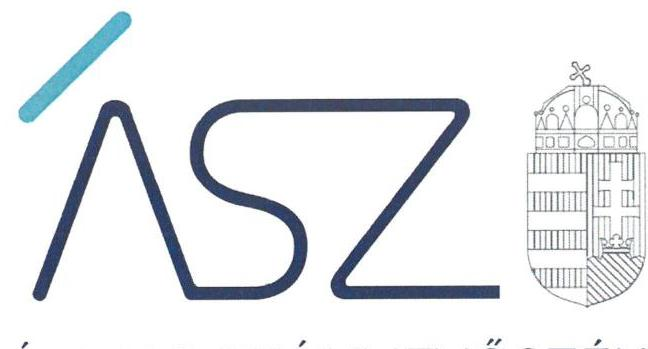
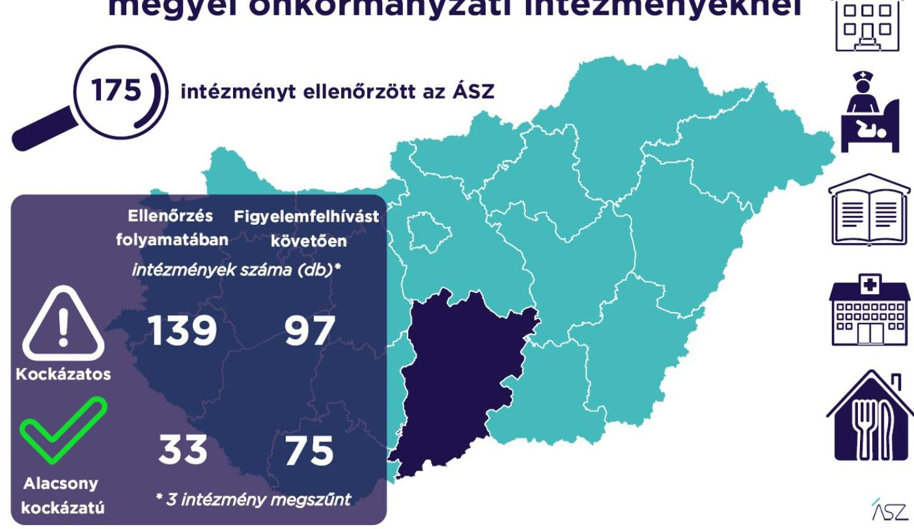

ÁLLAMI SZÁMVEVŐSZÉK

# JELENTÉS 

## A Bács-Kiskun megyei önkormányzati intézmények ellenőrzése

Az önkormányzat és társulás irányítása alá tartozó intézmények integritásának monitoring típusú ellenőrzése - 175 intézmény
2021.

21096
www.asz.hu

---

ÁLLAMI SZÁMVEVŐSZÉK

# JELENTÉS 

## A Bács-Kiskun megyei önkormányzati intézmények ellenőrzése

Az önkormányzat és társulás irányítása alá tartozó intézmények integritásának monitoring típusú ellenőrzése - 175 intézmény
2021. 12. hó 21. nap

21096
www.asz.hu

---

# AZ ELLENŐRZÉST FELÜGYELTE: 

SALAMON ILDIKÓ felügyeleti vezető

## AZ ELLENŐRZÉST VEZETTE ÉS A VÉGREHAJTÁSÁÉRT FELELŐS:

SZAPPANOS JÚLIA ellenőrzésvezető
ÓDOR ZOLTÁN TAMÁS ellenőrzésvezető

## A PROGRAM ÖSSZEÁLLÍTÁSÁÉRT FELELŐS:

DR. FELFÖLDI IZABELLA programkészítésért felelős vezető

## IKTATÓSZÁM: EL-3461-003/2021.

## TÉMASZÁM: 2568

ELLENŐRZÉS-AZONOSÍTÓ SZÁM: V0928

---

# TARTALOMJEGYZÉK 

■ ÖSSZEGZÉS ..... 5
■ AZ ELLENŐRZÉS JELENTŐSÉGE, AKTUALITÁSA, TÁRSADALMI SZEREPE, SZEMPONTJAI ..... 8
■ AZ ELLENŐRZÉS TERÜLETE ..... 9
■ ELLENŐRZÉS HATÓKÖRE ÉS MÓDSZERE ..... 10
■ MELLÉKLETEK ..... 13
I. sz. melléklet: Az értékelés módszertana ..... 13
II. sz. melléklet: Értelmező szótár ..... 15
■ FÜGGELÉKEK ..... 17
I. sz. függelék: Az ellenőrzött szervezetek és azok kockázati értékelése ..... 17
■ RÖVIDÍTÉSEK JEGYZÉKE ..... 27

---

.

---

# ÖSSZEGZÉS 

Az Állami Számvevőszék figyelemfelhívásának és tanácsadásának eredményeként a Bács-Kiskun megyei önkormányzatok irányítása alatt álló 175 ellenőrzött intézmény közül 69 intézménynél az intézményvezető már 2021-ben intézkedett, vagy intézkedéseket rendelt el az integritást biztosító alapvető feltételek megerősítése, illetve kiépítése érdekében. Ezeknek az intézményeknek javult az integritása, erősödtek a csalásmentes működés feltételei.
82 intézménynél további intézkedések szükségesek az integritást biztosító alapvető feltételek kiépítése, illetve kiegészítése érdekében. Ezeknek az intézményeknek a vezetői az Állami Számvevőszék intézkedési kötelemmel járó figyelemfelhívására nem intézkedtek, ezért az azonosított kockázatok növekedtek, vagy intézkedéseik nem fedték le a kockázatos területeket, így az azonosított kockázatok nem változtak.
Az irányító önkormányzat három intézmény megszüntetéséről döntött az ellenőrzött időszakban.

## Értékelések

Az Állami Számvevőszék a Bács-Kiskun megyei önkormányzatok irányítása alá tartozó 175 intézmény belső kontrollrendszerének lényeges elemei kialakítását ellenőrizte a 2021. évre vonatkozóan. Az ellenőrzés a súlypontok meghatározásával lehetőséget biztosított a szervezeti integritás, működés és vezetés, valamint a gazdálkodás területén a kockázatok azonosítására.

A szervezeti integritás alapvető feltétele a szabályozottság, azaz a jogszabályokban előírt belső szabályzatok megléte, azok - hatályos jogszabályoknak - megfelelő tartalma és gyakorlati alkalmazhatósága. Az integritási kockázatok szervezeti szinten csökkenthetők azáltal, hogy az intézményvezetők kialakítják a szervezeti és működési kereteket, a gazdálkodásra vonatkozó alapvető szabályozási környezetet, valamint a kontrolltevékenységek szabályszerű gyakorlásának, az integrált kockázatkezelésnek és az integritást sértő események kezelésének a feltételeit.

A szervezeti integritás, a működés és a vezetés alapvető szabályozási feltételeinek kialakítása hozzájárul a csalásmentes integritási környezet megteremtéséhez.

A szervezeti és működési szabályzat teremti meg a szervezet szabályszerű működésének alapjait, illetve rögzíti a szervezeten belüli felelősségi viszonyokat. A szabályzat biztosítja a szervezeti működés szabályozottságát, ezáltal a szervezet tevékenységének átláthatóságát, a szervezeti célokkal összhangban történő működés feltételeit és annak ellenőrizhetőségét. Az ellenőrzöttek közül 153 intézmény rendelkezett szervezeti és működési szabályzattal a 2021. évben.

A jogszabályi előírásoknak eleget téve, nyilatkozatban értékelte az intézmény belső kontrollrendszerének minőségét 137 intézmény vezetője. Ezek közül 85 intézménynél alakítottak ki olyan szabályozásokat, folyamatokat, amelyek biztosítják a költségvetési szerv tevékenységében a rendelkezésre álló források átlátható, szabályszerű, szabályozott, gazdaságos, hatékony és eredményes felhasználása követelményeinek érvényesítését.

Az integrált kockázatkezelés eljárásrendjét 121, a szervezeti integritást sértő események kezelésének eljárásrendjét 122 intézménynél alakították ki az intézményvezetők. Az integrált kockázatkezelés eljárásrendje biztosítja a szervezet működésében rejlő kockázatok azonosításának és kezelésének feltételeit. A szervezet működési kockázatai veszélyeztethetik a közpénzekkel való átlátható, elszámoltatható és felelős gazdálkodást. Az integritást sértő események kezelésének eljárásrendje jelenti a szervezet tekintetében felmerülő és a szervezeten belül bekövetkező integritást sértő események kezelésének alapjait. Az eljárásrend kialakításával az intézmény vezetője támogatja az integritást sértő eseményekkel kapcsolatosan azonosított kockázatok bekövetkezése esetén azok hatékony kezelését, illetve a következmények enyhítését.

---

A pénz- és vagyongazdálkodáshoz kapcsolódó alapvető szabályozások és nyilvántartások - így a számviteli politika és a keretében elkészítendő szabályzatok, a számlarend, a beszerzések szabályozása, valamint a kötelezettségvállalásra és a teljesítés igazolására jogosultak és aláírásmintáik nyilvántartása - előmozdítják a közpénzügyek átláthatóságát, rendezettségét. Az intézményvezető ezen szabályzatok elkészítésével, nyilvántartások vezetésével és folyamatos karbantartásával az alapfeltételét biztosítja a pénzügyi- és vagyongazdálkodás átláthatóságának, a közpénzekkel és közvagyonnal való elszámoltathatóságnak. Az ellenőrzöttek közül 141 intézménynél a számviteli politika, 131 intézménynél a számlarend, 129 intézménynél a beszerzések lebonyolításával kapcsolatos eljárásrend rendelkezésre állt.

Az ellenőrzöttek közül 21 intézmény vezetője tett eleget az ellenőrzött területek mindegyikén az integritási kontrollok alapvető feltételeit jelentő, a jogszabályban előírt szabályozási kötelezettségének. Közülük 12 intézmény vezetője a jogszabályi előírásokon túl további erőfeszítéseket is tett az integritás erősítése érdekében, felismerte további olyan integritási kontrollok kialakításának indokoltságát, amelyet jogszabály nem ír elő, így szervezeti szinten hozzájárul a korrupcióval szembeni védettség megszilárdításához.

157 intézmény esetében az intézményvezető intézkedése volt szükséges a kockázatok csökkentése érdekében, mivel 43 intézménynél a jogszabályok által előírt kontrollok területén, 105 intézménynél a jogszabályok által előírt és a további, jogszabály által nem előírt integritási kontrollok területén egyaránt, kilenc intézménynél utóbbi kontrollok területén voltak hiányosságok. A dokumentumok kiértékelése alapján - az integritás további fejlesztése érdekében - az Állami Számvevőszék azonosította a lényeges kockázati területeket, és már az ellenőrzés lefolytatásával párhuzamosan, a 2021. évre vonatkozóan a kockázatok csökkentésére hívta fel az intézményvezetők figyelmét.

# Következtetések 

Az érintett 148 intézmény közül 105 intézmény vezetője válaszolt határidőben az Állami Számvevőszék figyelemfelhívására. Közülük 85 teljeskörűen, 15 részben egyetértett a kockázatos területeken teendő intézkedések indokoltságával. Az intézményvezetők közül 71 arról tájékoztatta az Állami Számvevőszéket, hogy valamennyi kockázatos területen, 20 pedig a kockázatos területek egy részénél már tett, illetve a jövőben tesz intézkedést a jelzett kockázatok csökkentése érdekében. A jogszabályi előírásokon túli integritási kontrollok területén az érintett 114 intézmény közül 55 intézmény vezetője a jelzett kockázatok teljes körű, 4 pedig azok részbeni felszámolásáról adtak számot. Ezek eredményeként a 157 vezetői levélben jelzett 873 kockázati terület közül 387 esetben már történt, illetve tervezett az intézkedés, így javulás várható a feltárt kockázatos területek 44,3%-ánál.

Az intézkedések eredményeként az ellenőrzött 175 intézmény közül összesen 75 intézménynél a kockázatok alacsony szintűek, illetve - a tervezett intézkedések végrehajtásával - a kockázatok alacsony szintre csökkennek.

A szabályozások és nyilvántartások kialakításának célja nem önmagában a jogszabályi rendelkezések betartása, hanem az intézmény szabályozottságán keresztül a szabályszerű és csalásmentes gazdálkodás feltételeinek megteremtése, ezáltal az Alaptörvényben előírt átláthatóság és elszámoltathatóság elvének érvényesítése. Ezeknek az alapelveknek érvényesülése hozzájárulhat ahhoz, hogy az intézmények, mint közszolgáltatást nyújtó szervezetek felé a közszolgáltatásokat igénybe vevők, és általuk az állampolgárok általános bizalma is erősödjön.

Az Állami Számvevőszék figyelemfelhívására nem válaszoló, illetve a jelzett kockázatokra nem, vagy csak részben intézkedő intézményvezetők által vezetett intézményeknél rendszerszintű kockázatok maradtak fenn. Vezetési-irányítási kockázatot jelez, amennyiben az intézményvezetőnek címzett figyelemfelhívásra az intézményvezető helyett más személy válaszolt. Felelősségi és hatásköri kockázatot jelez, amennyiben az intézmény pénzügyi- és vagyongazdálkodásának alapvető szabályzatait a kontrollrendszer kialakításáért felelős intézményvezető helyett egy másik költségvetési szerv vezetője alakította ki, határozta meg. További kockázatot jelent a szabályok alkalmazottak általi megismerésére és alkalmazására, az intézmény mindennapi működésének integritására. Mindezek egyrészt az intézmény pénzügyi és vagyongazdálkodásának szabályszerűségét, másrészt a vezetői nyilatkozatok hitelességét, valóságtartalmát is megkérdőjelezi. A jelzett kockázatok arra mutatnak rá, hogy ezeknél az intézményeknél sérül a vezetői felelősség elve, és ezzel a felelős vezetésre épülő intézményi önállóság működése.

Az integritás elvű működés erősítése érdekében további kockázatcsökkentő lépések szükségesek a vezetés-irányítás, valamint a pénzügyi- és a vagyongazdálkodás szabályszerű feltételeinek kialakítása terén. Ezen intézmények integritásának kiépítését következő lépésként az irányító szerv bevonásával támogatja az Állami Számvevőszék.

---

# Erősödött a csalásmentesség a Bács-Kiskun megyei önkormányzati intézményeknél

---

# AZ ELLENŐRZÉS JELENTŐSÉGE, AKTUALITÁSA, TÁRSADALMI SZEREPE, SZEMPONTJAI 

Az Alaptörvény alapértékeket, elveket fogalmaz meg, amely szerint a közpénzekkel gazdálkodó minden szervezet köteles a nyilvánosság előtt elszámolni a közpénzekre vonatkozó gazdálkodásával. A közpénzeket és a nemzeti vagyont az átláthatóság és a közélet tisztaságának elve szerint kell kezelni.

Magyarország helyi önkormányzatairól szóló törvény ${ }^{1}$ a helyi közhatalom gyakorlás széleskörű érvényesítésével összhangban tág teret ad a helyi önkormányzatoknak a feladataik, a közszolgáltatások legkülönbözőbb formákban történő ellátására, így széleskörű lehetőséggel rendelkeznek intézmények alapítására.

A helyi önkormányzatok irányítása alá tartozó intézmények szerteágazó közszolgáltatásokat nyújtanak. Az intézmények működtetése közvetlenül érinti a társadalom valamennyi rétegét, a közfeladatot ellátó intézmények működésének minősége közvetlen hatással van az azokat igénybe vevő állampolgárok életére.

Az intézmények szabályszerű és eredményes működésének és gazdálkodásának alapfeltétele a belső kontrollrendszer - benne az integritási kontrollok - megfelelő kialakítása. Az ÁSZ² a törvényi felhatalmazással élve ellenőrzi az önkormányzati intézményeket, hogy megállapításaival támogassa az ellenőrzött szervezetek szabályszerű gazdálkodását, működését.

A helyi önkormányzatok intézményei által ellátott feladatok, a bölcsődei, óvodai ellátás, a gyermekétkeztetés, a betegek és idősek gondozása, a közművelődési intézmények, könyvtárak működtetése által a lakosság ezeken a területeken találkozik legszélesebb körben az önkormányzatok által nyújtott szolgáltatásokkal. A szolgáltatásokat igénybe vevők jelentős száma, a feladatellátáshoz használt nemzeti vagyon és az erre fordított közpénz nagysága indokolja, hogy az ÁSZ további, az előző ellenőrzésekre épülő ellenőrzéseket végezzen ezen a területen, illetve további olyan területeken, ahol az önkormányzati szolgáltatást a lakosság széles köre veszi igénybe.

Az ellenőrzés célja annak értékelése, hogy a helyi önkormányzatok irányítása alá tartozó intézmények megteremtették-e az integritás biztosításához szükséges feltételeket, kialakították-e az alapvető, a szervezeti kereteket, az integritási kontrollokhoz kapcsolódó, valamint a korrupció elleni védelmet szolgáló szabályozásokat. Továbbá, hogy az intézményvezető gondoskodott-e a szervezeti teljesítmény mérés alapfeltételeinek kialakításáról az eredményességi szempontoknak való megfelelés megalapozottsága biztosítása érdekében. A monitoring típusú ellenőrzés célja hatékonyan támogatni az ellenőrzött szervezeteket, ezáltal növelve az ÁSZ tanácsadó szerepét, elősegítve a „jól irányított állam" működését.

Az ÁSZ célja, hogy új ellenőrzési megközelítést alkalmazva támogassa a közpénzügyi helyzet javítását; a monitoring típusú ellenőrzéssel jelen időben adjon helyzetképet az integritási szemlélet érvényesítéséről, rávilágítson az integritási kontrollok kiépítettségére, illetve további fejlesztésére. Napjainkban mindez kiemelt fontosságúvá vált. Minden szervezetnek fel kell készülnie arra, hogy a koronavírus járvány okozta társadalmi és gazdasági válság növelni fogja a korrupciós nyomást. Az ÁSZ ebben a helyzetben is alapvető kötelességének tartja, hogy a közpénzek őre legyen, és ellenőrzéseit az önkormányzati alrendszer intézményei körében is folytassa.

Fontos, hogy az intézmények vezetői felismerjék az integritás kockázatokat, azokat ismételten mérjék fel, és alakítsanak ki átlátható, jól szabályozott rendszereket, döntési mechanizmusokat. Az integritási kockázatok feltárása, megismerése elengedhetetlenül fontos, mert ezt követően tehetők meg azok a lépések, amelyek a kockázatok csökkentését, felszámolását és kezelését célozzák. A belső kontrollrendszer - benne az integritás kontrollok - megfelelő kialakítása, működése a helyi önkormányzatok irányítása alatt álló intézményeknél is hozzájárul a társadalmi közbizalom erősítéséhez.

Az ellenőrzés rámutat az integritási jó gyakorlatokra is, továbbá
 felhívja a figyelmet a jogszabályi követelmények teljesítéséhez szükséges lépésekre is.

---

# AZ ELLENŐRZÉS TERÜLETE 

## Az önkormányzatok irányítása alá tartozó intézmények

Helyi önkormányzati költségvetési szervet az államháztartásról szóló 2011. évi CXCV törvény (Áht. ${ }^{3}$ ) szerint a helyi önkormányzat, a helyi önkormányzatok társulása, a térségi fejlesztési tanács, az átalakult nemzetiségi önkormányzat alapíthat, a költségvetési szerv alapító okiratában meghatározott önkormányzati közfeladatok ellátására. A költségvetési szervek önálló jogi személyek, éves költségvetésükből gazdálkodva látják el feladataikat. A költségvetési szervek gazdasági szervezettel rendelkeznek, ha azonban a költségvetési szerv éves átlagos statisztikai állományi létszáma a 100 főt nem éri el, a gazdasági szervezet feladatait az önkormányzati hivatal, vagy az irányító szerv döntése alapján az irányító szerv irányítása alá tartozó, gazdasági szervezettel rendelkező más költségvetési szerv látja el.

Az államháztartásról szóló törvény végrehajtásáról szóló 368/2011. (XII. 31.) Korm. rendelet (Ávr. ${ }^{4}$ ) 1. melléklete szerint, az államháztartás önkormányzati alrendszerében a helyi önkormányzat által irányított költségvetési szerv esetében az irányító szerv hatáskörét a képviselőtestület, közgyűlés gyakorolja, és annak vezetője a polgármester, főpolgármester, megyei közgyűlés elnöke.

Az ellenőrzés a Bács-Kiskun megyei önkormányzatok irányítása alá tartozó, az I. sz. Függelékben felsorolt költségvetési szervekre terjedt ki.

A feladatellátásuk szerint az ellenőrzött költségvetési szervek egy része óvoda, bölcsőde, egészségügyi intézmény, konyha, művelődési ház, múzeum, oktatási központ, kulturális központ, idősek otthona, gondozási központ, gyermekjóléti intézmény, sportközpont intézményként működik.

Az ellenőrzött 175 intézmény közül öt rendelkezik saját gazdasági szervezettel.

Az ellenőrzés 173 intézmény esetében lefolytatásra került. Kettő intézmény esetében az ellenőrzés adatszolgáltatás hiányában nem volt lefolytatható, az ÁSZ ezeknek az ellenőrzötteknek az integritási kockázatát kiemelten magasnak értékelte.

Három intézmény az ellenőrzött időszakban megszűnt.

---

# ELLENŐRZÉS HATÓKÖRE ÉS MÓDSZERE 

## Az ellenőrzés típusa

Megfelelőségi ellenőrzés.

## Az ellenőrzött időszak

A 2021. év, a Bkr. ${ }^{5}$ szerinti vezetői nyilatkozat, valamint annak alátámasztottsága vonatkozásában a 2020. év.

## Az ellenőrzés tárgya

A szervezeti keretekkel, a működéssel és gazdálkodással kapcsolatos szabályzatok, szabályozások, valamint a szervezeti elvekkel, értékekkel összefüggő integritás kontrollok kiépítettsége, a szervezeti teljesítmény mérés alapfeltételeinek kialakítása.

## Az ellenőrzött szervezetek

Az ellenőrzött intézményeket az I. sz. Függelék tartalmazza.

## Az ellenőrzés jogalapja

Az ellenőrzés jogszabályi alapját az ÁSZ tv. ${ }^{6}$ 1. § (3) bekezdése, 5. § (6) bekezdése, valamint az Áht. 61. § (2) bekezdése képezik.

## Az ellenőrzés módszerei

Az ÁSZ az ellenőrzést az ellenőrzési program szempontjai, az ellenőrzött időszakban hatályos jogszabályok, a jelen ellenőrzésre irányadó ÁSZ módszertan figyelembevételével és a nemzetközi standardokat irányadónak tekintve végzi.

Az ellenőrzés ideje alatt az ÁSZ az ellenőrzött szervezetekkel történő kapcsolattartást az ÁSZ SZMSZ${ }^{7}$-ének vonatkozó előírásai alapján biztosítja.

Az ellenőrzési kérdések megválaszolásához szükséges bizonyítékok megszerzése a következő ellenőrzési eljárások alkalmazásával történik: megfigyelés, összehasonlítás, elemző eljárás. Az ellenőrzési bizonyítékként felhasználható adatforrások közé tartoznak az ellenőrzési programban felsorolt adatforrások, továbbá minden - az ellenőrzés folyamán - feltárt, az ellenőrzés szempontjából információkat tartalmazó dokumentum.

---

Az ÁSZ az ellenőrzést a kérdésekre adott válaszok kiértékelésével, valamint a megjelölt adatforrások, továbbá az adott időszakban hatályos jogszabályok, valamint az ÁSZ honlapján közzétett helyénvalósági kritériumok figyelembevételével folytatja le.

A monitoring típusú ellenőrzés az önkormányzatok irányítása alá tartozó intézmények integritás alapú működésének lényeges területeire és a közpénzügyi helyzet javítása érdekében az elért eredmények fenntartására fókuszál. Lehetőséget biztosít az integritási kontrollok kiépítettségében lévő hiányosságok, a szervezeti teljesítmény mérés alapfeltételei kialakításának hiánya beazonosítására az eredményességi szempontoknak való megfelelés megalapozottsága biztosítása érdekében, az önkormányzatok, társulások irányítása alá tartozó intézmények integritásának elemzésére, részletes ellenőrzések megalapozására.

---

.

---

# MELLÉKLETEK 

I. SZ. MELLÉKLET: AZ ÉRTÉKELÉS MÓDSZERTANA

Az egyes kockázati területek és kockázatforrások minősítése „pontozásos módszerrel", az integritás „jelző" dokumentumai és a vezetői magatartás ellenőrzéshez kapcsolódóan tanúsított tényhelyzeteinek értékelése alapján történt.

Az értékelt dokumentumokhoz, nyilvántartásokhoz, kockázati besorolásokhoz minden esetben pontszám került hozzárendelésre, amelyek értéke alapján az ellenőrzött szervezetek kockázati csoportba kerültek besorolásra:

- Alacsony kockázatú - az elérhető összes pontszám legalább 80\%-a
- Közepes kockázatú - az elérhető pontszám 50-79\%-a között
- Magas kockázatú - az elérhető pontszám 50\%-a alatt

Az első lépésben azonosításra kerültek azok az intézményi szabályozások és nyilvántartások, amelyek meglétét jogszabály írja elő, hiánya pedig felveti a csalás és korrupció kockázatát.

Második lépésben az adatoknak az ellenőrzés rendelkezésére bocsátása kockázati kritériumainak meghatározása, majd értékelése történt meg.

Harmadik lépésben a figyelemfelhívó levelekre adott válaszok kockázati kritériumainak meghatározása, majd értékelése történt meg.

Az összesített kockázati értékelést javította, amennyiben

- az intézmény rendelkezett olyan szabályozással, amely kötelező meglétét jogszabály nem írja elő, de segíti a csalás és a korrupció megelőzését (helyénvalósági dokumentumok).

Az összesített kockázati értékelést rontotta, amennyiben

- az integritás szempontjából meghatározó dokumentum - az intézményi SZMSZ - hiányzott, és javítása érdekében a figyelemfelhívó levél hatására sem történt intézkedés.

A figyelemfelhívó levelekre adott válaszok értékelése alapján:

- A kockázat csökkent, amennyiben a figyelemfelhívó levélre adott válasza a figyelemfelhívással összhangban volt, valamennyi kockázati területen intézkedett vagy intézkedést tervezett.
- A kockázat változatlan, amennyiben a figyelemfelhívó levélben foglaltaktól eltérő magatartást tanúsított, intézkedése a figyelemfelhívással részben volt összhangban, a kockázati területeken részben intézkedett vagy intézkedést tervezett.
- A kockázat nőtt, amennyiben nem volt együttműködő, a figyelemfelhívó levélre nem válaszolt, vagy válasza alapján nem intézkedett és nem tervezett intézkedést.

---

# Az önkormányzatok irányítása alá tartozó intézmények kockázati csoportba sorolásának értékelési keretrendszere 

I. Dokumentumokkal rendelkezés
lényeges dokumentumok, amelyek hiánya felveti a csalás és korrupció kockázatát
I.1. A szervezeti integritás, működés és vezetés alapvető szabályozási feltételei

- intézmény SZMSZ-e
- vezetői nyilatkozat a 2020. évre vonatkozóan az intézmény belső kontrollrendszer minőségének értékeléséről, valamint a nyilatkozat megalapozottságát bizonyító dokumentumok
- integrált kockázatkezelés eljárásrendje
- az integritást sértő események kezelésének eljárásrendje
I.2. A pénz- és vagyongazdálkodáshoz kapcsolódó alapvető szabályozások
- számviteli politika
- az eszközök és a források leltárkészítési és leltározási szabályzata
- az eszközök és a források értékelési szabályzata
- pénzkezelési szabályzat
- számlarend
- beszerzések lebonyolításával kapcsolatos eljárásrend
- a kötelezettségvállalásra, teljesítés igazolására jogosult személyekről és aláírás-mintájukról vezetett nyilvántartás
II. Az adatoknak az ellenőrzés rendelkezésére bocsátása
II.1. A megnevezett adatokkal rendelkezett és a törvényi határidőn belül hiánytalanul rendelkezésre bocsátotta. Figyelem-, illetve figyelmet felhívó levél nem volt indokolt.
II.2. A megnevezett adatokat nem bocsátotta rendelkezésre.
III. Figyelemfelhívó levelekre adott válaszok kockázati értékelése
III.1. Kockázat csökkent: együttműködése a figyelemfelhívó levéllel összhangban volt.
III.2. Kockázat változatlan: a figyelemfelhívó levélben foglaltaktól eltérő együttműködést tanúsított.
III.3. Kockázat nőtt: nem reagált, nem intézkedett, így nem volt együttműködő.

---

.

---

# FÜGGELÉKEK

I. SZ. FÜGGELÉK: AZ ELLENŐRZÖTT SZERVEZETEK ÉS AZOK KOCKÁZATI ÉRTÉKELÉSE

|  Sorszám | Ellenőrzött szervezet megnevezése | Irányító szerv (önkormányzat) megnevezése | Helység | Tanácsadást megelőző kockázati besorolás | Intézkedést követően a kockázati értékelés változása | A kockázati szint alacsonyra csökkent-e  |
| --- | --- | --- | --- | --- | --- | --- |
|  1. | Fajszi Mesevonat Óvoda | Fajsz Község Önkormányzata | Fajsz | KÖZEPES | CSÖKKENT | I  |
|  2. | Szivárvány Szociális Szolgáltató | Fajsz Község Önkormányzata | Fajsz | MAGAS | NÖTT | N  |
|  3. | Kiskunhalasi Bóbita Óvoda és Bölcsőde | Kiskunhalas Város Önkormányzata | Kiskunhalas | KÖZEPES | CSÖKKENT | I  |
|  4. | Százszorszép Óvodák | Kiskunhalas Város Önkormányzata | Kiskunhalas | MEGSZÜNT INTÉZMÉNY | MEGSZÜNT INTÉZMÉNY | MEGSZÜNT INTÉZMÉNY  |
|  5. | Kiskunhalasi Napsugár Óvodák | Kiskunhalas Város Önkormányzata | Kiskunhalas | KÖZEPES | NÖTT | N  |
|  6. | Kiskunhalas Város Önkormányzatának Martonosi Pál Városi Könyvtára | Kiskunhalas Város Önkormányzata | Kiskunhalas | KÖZEPES | NÖTT | N  |
|  7. | Kiskunhalas Város Önkormányzatának Bölcsődéje | Kiskunhalas Város Önkormányzata | Kiskunhalas | KÖZEPES | CSÖKKENT | I  |
|  8. | Kiskunhalas Város Önkormányzatának Thorma János Múzeuma | Kiskunhalas Város Önkormányzata | Kiskunhalas | KÖZEPES | CSÖKKENT | I  |
|  9. | Pöttömkert Óvoda | Apostag Község Önkormányzata | Apostag | KÖZEPES | CSÖKKENT | I  |
|  10. | Foktő Község Óvodája és Szociális Szolgáltatója | Foktő Község Önkormányzata | Foktő | ALACSONY | CSÖKKENT | I  |
|  11. | Harkakötönyi Önkormányzati Konyha | Harkakötöny Község Önkormányzata | Harkakötöny | MAGAS | NEM VÁLTOZOTT | N |

---

# II. SZ. MELLÉKLET: ÉRTELMEZŐ SZÓTÁR 

belső kontrollrendszer

belső kontrollrendszer területei
integrált kockázatkezelési rendszer
integritás

Integritási kockázatok
kockázat
kontrollkörnyezet
kontrollkörnyezet
kockázat
kontrollkörnyezet
kontrolltevékenységek
intézmény

A belső kontrollrendszer a kockázatok kezelése és tárgyilagos bizonyosság megszerzése érdekében kialakított folyamatrendszer, amely azt a célt szolgálja, hogy a működés és gazdálkodás során a tevékenységeket szabályszerűen, gazdaságosan, hatékonyan, eredményesen hajtsák végre, az elszámolási kötelezettségeket teljesítsék, megvédjék az erőforrásokat a veszteségektől, károktól és nem rendeltetésszerű használattól. (Forrás: Áht. 69. § (1) bekezdése)
A kontrollkörnyezet, az integrált kockázatkezelési rendszer, a kontrolltevékenységek, az információs és kommunikációs rendszer, valamint a nyomon követési (monitoring) rendszer. (Forrás: Bkr. 3. §-a)
Olyan folyamatalapú kockázatkezelési rendszer, amely a szervezet minden tevékenységére kiterjed, egységes módszertan és eljárások alkalmazásával, a szervezet célkitűzéseinek és értékeinek figyelembevételével biztosítja a szervezet kockázatainak teljes körű azonosítását, azok meghatározott kritériumok szerinti értékelését, valamint a kockázatok kezelésére vonatkozó intézkedési terv elkészítését és az abban foglaltak nyomon követését. (Forrás: Bkr. 2. § m) pontja)
Az integritás az elvek, értékek, cselekvések, módszerek, intézkedések konzisztenciáját jelenti, vagyis olyan magatartásmódot, amely meghatározott értékeknek megfelel. (Forrás: Nemzetgazdasági Minisztérium: Államháztartási belső kontroll standardok és gyakorlati útmutató 1.1.3. pontja, 2017. szeptember)
Integritási kockázatnak minősül a szervezet célkitűzéseit, értékeit, elveit sértő vagy veszélyeztető visszaélés, szabálytalanság, vagy egyéb esemény lehetősége. A korrupciós kockázat olyan integritási kockázat, amely korrupciós cselekmény bekövetkezésének lehetőségét jelenti. Minden korrupciós kockázat egyben integritási kockázat is. Korrupciós cselekményeknek nevezzük azokat a vesztegetésszerű cselekményeket, amelyeket általában a Büntető Törvénykönyv ${ }^{8}$ is büntetéssel fenyeget.
A kockázat annak a valószínűségét jelenti, hogy egy vagy több esemény, vagy intézkedés nem kívánt módon befolyásolja a rendszer működését, céljainak megvalósulását. (Forrás: Javaslatok a korrupciós kockázatok kezelésére - Kockázatkezelési és ellenőrzési módszertan 35. oldal, ÁSZ)
A költségvetési szerv vezetője által kialakított olyan elvek, eljárások, belső szabályzatok összessége, amelyben világos a szervezeti struktúra, a folyamatok átláthatók, egyértelműek a felelősségi, hatásköri viszonyok és feladatok, meghatározottak, ismertek és elfogadottak az etikai elvárások a szervezet minden szintjén, átlátható a humánerőforrás-kezelés, biztosított a szervezeti célok és értékek irányában való elkötelezettség fejlesztése és elősegítése. (Forrás: Bkr. 6. § (1) bekezdés)
A költségvetési szerv vezetője által a szervezeten belül kialakított (kontroll) tevékenységek, melyek biztosítják a kockázatok kezelését, hozzájárulnak a szervezet céljainak eléréséhez és erősítik a szervezet integritását. (Forrás: Bkr. 8. § (1) bekezdés)
A helyi önkormányzatok irányítása alá tartozó költségvetési szervek. (A képviselő-testület a feladatkörébe tartozó közszolgáltatások ellátására - jogszabályban meghatározottak szerint - költségvetési szervet (önkormányzati intézmény) alapíthat; Forrás: Mötv. 41. § (6) bekezdés)

---

.

 VÁLTOZOTT | N  |
|  12. | Kalocsai Művelődési Központ és Könyvtár | Kalocsa Város Önkormányzata | Kalocsa | MEGSZÜNT INTÉZ-
MÉNY | MEGSZÜNT INTÉZ-
MÉNY | MEGSZÜNT
INTÉZMÉNY  |
|  13. | Viski Károly Múzeum Kalocsa | Kalocsa Város Önkormányzata | Kalocsa | MAGAS | NÖTT | N  |
|  14. | Kalocsa Város Óvodája és Bölcsődéje | Kalocsa Város Önkormányzata | Kalocsa | MAGAS | NEM VÁLTOZOTT | N  |
|  15. | Kalocsa Város Önkormányzata Szociális Központ | Kalocsa Város Önkormányzata | Kalocsa | MAGAS | NEM VÁLTOZOTT | N  |
|  16. | Bajai Egyesített Bölcsődék | Baja Város Önkormányzat | Baja | KÖZEPES | NEM VÁLTOZOTT | N  |
|  17. | Ady Endre Városi Könyvtár | Baja Város Önkormányzat | Baja | KÖZEPES | NÖTT | N  |
|  18. | Bajai Óvodaigazgatóság | Baja Város Önkormányzat | Baja | KÖZEPES | NEM VÁLTOZOTT | N  |
|  19. | Túrr István Múzeum és Bácskai Művelődési Központ | Baja Város Önkormányzat | Baja | KÖZEPES | NEM VÁLTOZOTT | N  |

---

| Sorszám | Ellenőrzött szervezet megnevezése | Irányító szerv (önkormányzat) megnevezése | Helység | Tanácsadást megelőző kockázati besorolás | Intézkedést követően a kockázati értékelés változása | A kockázati szint alacsonyra csökkent-e |
| :--: | :--: | :--: | :--: | :--: | :--: | :--: |
| 20. | Bóbita Óvoda | Bócsa Község Önkormányzat | Bócsa | MAGAS | NEM VÁLTOZOTT | N |
| 21. | Bócsai Szociális Központ | Bócsa Község Önkormányzat | Bócsa | MAGAS | NEM VÁLTOZOTT | N |
| 22. | Kicsi Vagyok Én Napköziotthonos Óvoda | Borota Községi Önkormányzat | Borota | KÖZEPES | NÖTT | N |
| 23. | Dunaegyházi Mákszem Óvoda | Dunaegyháza Község Önkormányzata | Dunaegyháza | KÖZEPES | CSÖKKENT | I |
| 24. | Községi Könyvtár | Fülöpszállás Községi Önkormányzat | Fülöpszállás | KÖZEPES | CSÖKKENT | N |
| 25. | Fülöpszállási Mesevár Óvoda | Fülöpszállás Községi Önkormányzat | Fülöpszállás | KÖZEPES | NEM VÁLTOZOTT | N |
| 26. | Garai Nemzetiségi Óvoda és Bölcsőde | Gara Községi Önkormányzat | Gara | KÖZEPES | NÖTT | N |
| 27. | Izsák Város Gyermekjóléti- és Családsegítő Szolgálat | Izsák Város Önkormányzata | Izsák | KÖZEPES | NÖTT | N |
| 28. | Gondozási Központ | Izsák Város Önkormányzata | Izsák | KÖZEPES | NÖTT | N |
| 29. | Izsák Város Önkormányzat Egészségügyi Szolgálat | Izsák Város Önkormányzata | Izsák | KÖZEPES | NÖTT | N |
| 30. | Izsáki Általános Művelődési Központ | Izsák Város Önkormányzata | Izsák | KÖZEPES | NÖTT | N |
| 31. | Gyermeklánc Óvoda és Bölcsőde, Család és Gyermekjóléti Központ | Jánoshalma Városi Önkormányzat | Jánoshalma | MAGAS | NEM VÁLTOZOTT | N |
| 32. | Imre Zoltán Művelődési Központ és Könyvtár | Jánoshalma Városi Önkormányzat | Jánoshalma | KÖZEPES | CSÖKKENT | I |
| 33. | Katymár Község Önkormányzat Szociális Szolgáltató Központ | Katymár Községi Önkormányzat | Katymár | MAGAS | CSÖKKENT | N |
| 34. | Katymár Községi Óvoda | Katymár Községi Önkormányzat | Katymár | KÖZEPES | NÖTT | N |
| 35. | Bács-Kiskun Megyei Katona József Könyvtár | Kecskemét Megyei Jogú Város Önkormányzata | Kecskemét | ALACSONY | NEM VOLT SZABÁLYSZERŰSÉGI HIBA | I |
| 36. | Kecskeméti Katona József Múzeum | Kecskemét Megyei Jogú Város Önkormányzata | Kecskemét | ALACSONY | NEM VOLT SZABÁLYSZERŰSÉGI HIBA | I |
| 37. | Kecskeméti Katona József Nemzeti Színház | Kecskemét Megyei Jogú Város Önkormányzata | Kecskemét | ALACSONY | NEM VOLT SZABÁLYSZERŰSÉGI HIBA | N |
| 38. | Egészségügyi és Szociális Intézmények Igazgatósága Szegedi Tudományegyetem Háziorvosi Oktató Központja | Kecskemét Megyei Jogú Város Önkormányzata | Kecskemét | KÖZEPES | CSÖKKENT | I |
| 39. | Ciróka Bábszínház | Kecskemét Megyei Jogú Város Önkormányzata | Kecskemét | KÖZEPES | CSÖKKENT | I |

---

| Sorszám | Ellenőrzött szervezet megnevezése | Irányító szerv (önkormányzat) megnevezése | Helység | Tanácsadást megelőző kockázati besorolás | Intézkedést követően a kockázati értékelés változása | A kockázati szint alacsonyra csökkent-e |
| :--: | :--: | :--: | :--: | :--: | :--: | :--: |
| 40. | Kecskeméti Planetárium Művelődési Ház | Kecskemét Megyei Jogú Város Önkormányzata | Kecskemét | MAGAS | CSÖKKENT | N |
| 41. | Őszirózsa Időskorúak Gondozóháza | Kecskemét Megyei Jogú Város Önkormányzata | Kecskemét | KÖZEPES | CSÖKKENT | I |
| 42. | Kálmán Lajos Óvoda | Kecskemét Megyei Jogú Város Önkormányzata | Kecskemét | MAGAS | CSÖKKENT | N |
| 43. | Ferenczy Ida Óvoda | Kecskemét Megyei Jogú Város Önkormányzata | Kecskemét | KÖZEPES | CSÖKKENT | I |
| 44. | Corvina Óvoda | Kecskemét Megyei Jogú Város Önkormányzata | Kecskemét | MAGAS | CSÖKKENT | N |
| 45. | Katona József Művelődési Ház és Könyvtár | Kerekegyháza Város Önkormányzata | Kerekegyháza | MAGAS | NEM VÁLTOZOTT | N |
| 46. | Kerekegyerdő Bölcsőde | Kerekegyháza Város Önkormányzata | Kerekegyháza | MAGAS | NEM VÁLTOZOTT | N |
| 47. | Petőfi Szülőház és Emlékmúzeum | Kiskőrös Város Önkormányzata | Kiskőrös | MAGAS | NEM VÁLTOZOTT | N |
| 48. | Petőfi Sándor Városi Könyvtár | Kiskőrös Város Önkormányzata | Kiskőrös | MAGAS | NEM VÁLTOZOTT | N |
| 49. | Kiskőrösi Óvodák | Kiskőrös Város Önkormányzata | Kiskőrös | MAGAS | NEM VÁLTOZOTT | N |
| 50. | "Szivárvány" Szociális Szolgáltató Központ | Kunbaja Község Önkormányzata | Kunbaja | ALACSONY | NEM VOLT SZABÁLYSZERŰSÉGI HIBA | I |
| 51. | Aranyfürt Óvoda és Mini Bölcsőde | Kunbaja Község Önkormányzata | Kunbaja | KÖZEPES | CSÖKKENT | I |
| 52. | Varga Domokos Általános Művelődési Központ | Kunszentmiklós Város Önkormányzata | Kunszentmiklós | MAGAS | NÖTT | N |
| 53. | Miklóssy János Sportközpont | Kunszentmiklós Város Önkormányzata | Kunszentmiklós | MAGAS | NÖTT | N |
| 54. | Egészségügyi Központ | Kunszentmiklós Város Önkormányzata | Kunszentmiklós | MAGAS | NÖTT | N |
| 55. | Napsugár Bölcsőde Kunszentmiklós | Kunszentmiklós Város Önkormányzata | Kunszentmiklós | MAGAS | NÖTT | N |
| 56. | Gondozási Központ | Lakitelek Önkormányzata | Lakitelek | KÖZEPES | NÖTT | N |
| 57. | Községi Könyvtár | Lakitelek Önkormányzata | Lakitelek | KÖZEPES | NEM VÁLTOZOTT | N |
| 58. | Lakiteleki Szivárvány Óvoda és Bölcsőde | Lakitelek Önkormányzata | Lakitelek | KÖZEPES | CSÖKKENT | I |
| 59. | Mesevár Óvoda és Mini Bölcsőde | Solt Város Önkormányzat | Solt | KÖZEPES | CSÖKKENT | N |
| 60. | Vécsey Károly Művelődési Ház és Könyvtár | Solt Város Önkormányzat | Solt | MAGAS | NÖTT | N |
| 61. | Solt Város Önkormányzat Alapszolgáltatási Központ | Solt Város Önkormányzat | Solt | MAGAS | NÖTT | N |

---

| Sorszám | Ellenőrzött szervezet megnevezése | Irányító szerv (önkormányzat) megnevezése | Helység | Tanácsadást megelőző kockázati besorolás | Intézkedést követően a kockázati értékelés változása | A kockázati szint alacsonyra csökkent-e |
| :--: | :--: | :--: | :--: | :--: | :--: | :--: |
| 62. | Soltvadkerti Óvodák és Bölcsőde | Soltvadkert Város Önkormányzata | Soltvadkert | KÖZEPES | NÖTT | N |
| 63. | Gyöngyház Kulturális Központ és Könyvtár | Soltvadkert Város Önkormányzata | Soltvadkert | KÖZEPES | NÖTT | N |
| 64. | Egyesített Szociális Intézmény | Soltvadkert Város Önkormányzata | Soltvadkert | KÖZEPES | NÖTT | N |
| 65. | Alapszolgáltatási Központ | Szabadszállás Város Önkormányzata | Szabadszállás | KÖZEPES | CSÖKKENT | N |
| 66. | Szabadszállási Általános Művelődési Központ | Szabadszállás Város Önkormányzata | Szabadszállás | ALACSONY | CSÖKKENT | I |
| 67. | Márk Ilona Hétszínvirág Óvoda és Mini Bölcsőde | Tass Község Önkormányzata | Tass | ALACSONY | NEM VOLT SZABÁLYSZERŰSÉGI HIBA | N |
| 68. | Gondozási Központ | Tiszaalpár Nagyközségi Önkormányzat | Tiszaalpár | KÖZEPES | NÖTT | N |
| 69. | Tündérrózsa Napközi Otthonos Óvoda | Tiszaalpár Nagyközségi Önkormányzat | Tiszaalpár | KÖZEPES | CSÖKKENT | I |
| 70. | Tiszaalpári Pejtsik Béla Nagyközségi és Iskolai Könyvtár | Tiszaalpár Nagyközségi Önkormányzat | Tiszaalpár | KÖZEPES | CSÖKKENT | I |
| 71. | Egyesített Szociális Intézmény és Egészségügyi Központ | Tiszakécske Város Önkormányzata | Tiszakécske | KÖZEPES | CSÖKKENT | I |
| 72. | Tiszakécske Város Önkormányzatának Városgondnoksága | Tiszakécske Város Önkormányzata | Tiszakécske | KÖZEPES | CSÖKKENT | I |
| 73. | Városi Óvodák és Bölcsőde | Tiszakécske Város Önkormányzata | Tiszakécske | KÖZEPES | NEM VÁLTOZOTT | N |
| 74. | Arany János Művelődési Központ és Városi Könyvtár | Tiszakécske Város Önkormányzata | Tiszakécske | KÖZEPES | NÖTT | N |
| 75. | Mohácsy Ferenc IKSZT - Szociális, Gondozási és Sportolási Központ | Ágasegyháza Község Önkormányzata | Ágasegyháza | MAGAS | NÖTT | N |
| 76. | Ágasegyháza Napközi Otthonos Óvoda | Ágasegyháza Község Önkormányzata | Ágasegyháza | MAGAS | NÖTT | N |
| 77. | Akasztó Napközi Otthonos Óvoda | Akasztó Község Önkormányzata | Akasztó | KÖZEPES | CSÖKKENT | I |
| 78. | Faluház Akasztó | Akasztó Község Önkormányzata | Akasztó | KÖZEPES | NEM VÁLTOZOTT | N |
| 79. | Idősek Napközi Otthona | Akasztó Község Önkormányzata | Akasztó | KÖZEPES | NÖTT | N |
| 80. | Bácsalmás Városi Önkormányzat Alapszolgáltatási Központ | Bácsalmás Város Önkormányzata | Bácsalmás | KÖZEPES | CSÖKKENT | I |
| 81. | Vörösmarty Mihály Városi Könyvtár és Művelődési Központ | Bácsalmás Város Önkormányzata | Bácsalmás | MAGAS | NÖTT | N |
| 82. | Bácsbokodi Óvoda és Bölcsőde | Bácsbokod Nagyközség Önkormányzata | Bácsbokod | ALACSONY | NEM VOLT SZABÁLYSZERŰSÉGI HIBA | I |

---

| Sorszám | Ellenőrzött szervezet megnevezése | Irányító szerv (önkormányzat) megnevezése | Helység | Tanácsadást megelőző kockázati besorolás | Intézkedést követően a kockázati értékelés

 változása | A kockázati szint alacsonyra csökkent-e |
| :--: | :--: | :--: | :--: | :--: | :--: | :--: |
| 83. | Bácsbokodi Idősek Klubja | Bácsbokod Nagyközség Önkormányzata | Bácsbokod | ALACSONY | CSÖKKENT | I |
| 84. | Ballószógi Csillagszem Óvoda | Ballószög Nagyközség Önkormányzata | Ballószög | MAGAS | NÖTT | N |
| 85. | Balotaszállási Napköziotthonos Óvoda | Balotaszállás Községi Önkormányzat | Balotaszállás | KÖZEPES | CSÖKKENT | I |
| 86. | Balotaszállási Községi Könyvtár és Közösségi Szintér | Balotaszállás Községi Önkormányzat | Balotaszállás | KÖZEPES | CSÖKKENT | I |
| 87. | Bátmonostori Bölcsőde és Konyha | Bátmonostor Községi Önkormányzat | Bátmonostor | KÖZEPES | CSÖKKENT | N |
| 88. | Bátya Község Egészségügyi és Szociális Intézménye | Bátya Község Önkormányzata | Bátya | KÖZEPES | CSÖKKENT | I |
| 89. | Bátyai Óvoda | Bátya Község Önkormányzata | Bátya | ALACSONY | NEM VOLT SZABÁLYSZERŰSÉGI HIBA | I |
| 90. | Császártöltési Idősek Otthona | Császártöltés Község Önkormányzata | Császártöltés | KIEMELTEN MAGAS | NEM VÁLTOZOTT | N |
| 91. | Csátalja Óvoda | Csátalja Község Önkormányzata | Csátalja | ALACSONY | NÖTT | N |
| 92. | Csávolyi Napközi Otthonos Óvoda | Csávoly Községi Önkormányzat | Csávoly | KÖZEPES | NÖTT | N |
| 93. | Csengőd Község Önkormányzatának Familia Szociális Alapszolgáltatási Központja | Csengőd Község Önkormányzata | Csengőd | KÖZEPES | CSÖKKENT | I |
| 94. | Csengődi Napközi Otthonos Óvoda | Csengőd Község Önkormányzata | Csengőd | KÖZEPES | CSÖKKENT | I |
| 95. | Csólyospálosi Nyitnikék Óvoda és Mini Bölcsőde | Csólyospálos Község Önkormányzata | Csólyospálos | ALACSONY | NEM VOLT SZABÁLYSZERŰSÉGI HIBA | I |
| 96. | Dávodi Forrás Óvoda | Dávod Önkormányzat | Dávod | KÖZEPES | NÖTT | N |
| 97. | Dunafalvi Katica Napköziotthonos Óvoda | Dunafalva Községi Önkormányzat | Dunafalva | KÖZEPES | NÖTT | N |
| 98. | Szivárvány Óvoda, Bölcsőde és Könyvtár | Dunapataj Nagyközség Önkormányzata | Dunapataj | KÖZEPES | CSÖKKENT | I |
| 99. | Dunaszentbenedeki Konyha | Dunaszentbenedek Község Önkormányzata | Dunaszentbenedek | ALACSONY | NEM VOLT SZABÁLYSZERŰSÉGI HIBA | I |
| 100. | Százszorszép Óvoda | Dunavecse Város Önkormányzata | Dunavecse | KÖZEPES | CSÖKKENT | I |
| 101. | Vikár Béla Könyvtár | Dunavecse Város Önkormányzata | Dunavecse | KÖZEPES | CSÖKKENT | I |
| 102. | Dunavecse Város Önkormányzat Dr. Kolozs Gergely Kistérségi Egészségügyi Centrum | Dunavecse Város Önkormányzata | Dunavecse | KÖZEPES | NÖTT | N |
| 103. | Dr. Kolozs Gergely „Tipegő" Bölcsőde | Dunavecse Város Önkormányzata | Dunavecse | KÖZEPES | CSÖKKENT | I |
| 104. | Dunavecsei Művelődési Ház | Dunavecse Város Önkormányzata | Dunavecse | KÖZEPES | CSÖKKENT | I |

---

| Sorszám | Ellenőrzött szervezet megnevezése | Irányító szerv (önkormányzat) megnevezése | Helység | Tanácsadást megelőző kockázati besorolás | Intézkedést követően a kockázati értékelés változása | A kockázati szint alacsonyra csökkent-e |
| :--: | :--: | :--: | :--: | :--: | :--: | :--: |
| 105. | Gondozási Központ | Dusnok Község Önkormányzata | Dusnok | KÖZEPES | NÖTT | N |
| 106. | Dusnoki Óvoda és Bölcsőde | Dusnok Község Önkormányzata | Dusnok | ALACSONY | NÖTT | N |
| 107. | Érsekcsanádi Napköziotthonos Óvoda és Mini Bölcsőde | Érsekcsanád Község Önkormányzata | Érsekcsanád | KÖZEPES | NEM VÁLTOZOTT | N |
| 108. | Érsekhalmi Német Nemzetiségi Óvoda | Érsekhalma Község Önkormányzata | Érsekhalma | KÖZEPES | CSÖKKENT | I |
| 109. | Felsőszentiváni Napközi Otthonos Óvoda és Bölcsőde | Felsőszentiván Községi Önkormányzat | Felsőszentiván | KÖZEPES | NÖTT | N |
| 110. | Fülöpjakabi Napsugár Óvoda | Fülöpjakab Község Önkormányzata | Fülöpjakab | KÖZEPES | NÖTT | N |
| 111. | Gátéri Liget Óvoda és Szociális Szolgáltató | Gátér Község Önkormányzata | Gátér | ALACSONY | NEM VOLT SZABÁLYSZERŰSÉGI HIBA | I |
| 112. | Hajós Környéki Családsegítő és Gyermekjóléti Szolgálat | Hajós Város Önkormányzata | Hajós | KÖZEPES | CSÖKKENT | I |
| 113. | Helvéciai Napvirág Óvoda és Bölcsőde | Helvécia Nagyközség Önkormányzata | Helvécia | MAGAS | NÖTT | N |
| 114. | Homokmégy Kéknefelejcs Óvoda | Homokmégy Községi Önkormányzat | Homokmégy | KÖZEPES | CSÖKKENT | I |
| 115. | Jakabszállási Óvoda és Bölcsőde | Jakabszállás Község Önkormányzata | Jakabszállás | MAGAS | NÖTT | N |
| 116. | Kaskantyúi Napköziotthonos Óvoda | Kaskantyú Község Önkormányzata | Kaskantyú | KÖZEPES | CSÖKKENT | I |
| 117. | Kecel Város Önkormányzat Óvodája és Bölcsődéje | Kecel Város Önkormányzata | Kecel | ALACSONY | NEM VOLT SZABÁLYSZERŰSÉGI HIBA | I |
| 118. | Városi Könyvtár és Művelődési Ház | Kecel Város Önkormányzata | Kecel | ALACSONY | NEM VOLT SZABÁLYSZERŰSÉGI HIBA | I |
| 119. | Kelebia Község Önkormányzata Szent Erzsébet Otthonház | Kelebia Község Önkormányzata | Kelebia | ALACSONY | CSÖKKENT | I |
| 120. | Gézengúz Óvoda és Bölcsőde | Kelebia Község Önkormányzata | Kelebia | KÖZEPES | CSÖKKENT | N |
| 121. | Szivárvány Személyes Gondoskodást Nyújtó Intézmény | Kiskunfélegyháza Város Önkormányzata | Kiskunfélegyháza | ALACSONY | NEM VOLT SZABÁLYSZERŰSÉGI HIBA | I |
| 122. | Kiskunfélegyházi Napköziotthonos Óvoda | Kiskunfélegyháza Város Önkormányzata | Kiskunfélegyháza | ALACSONY | NEM VOLT SZABÁLYSZERŰSÉGI HIBA | I |
| 123. | Kiskunfélegyházi Petőfi Sándor Városi Könyvtár | Kiskunfélegyháza Város Önkormányzata | Kiskunfélegyháza | ALACSONY | NEM VOLT SZABÁLYSZERŰSÉGI HIBA | N |
| 124. | Kapocs Szociális és Gyermekvédelmi Intézmény | Kiskunfélegyháza Város Önkormányzata | Kiskunfélegyháza | KÖZEPES | CSÖKKENT | I |
| 125. | Kiskunfélegyházi Védőnői Szolgálat | Kiskunfélegyháza Város Önkormányzata | Kiskunfélegyháza | KÖZEPES | NÖTT | N |
| 126. | Kiskunfélegyháza Város Önkormányzatának Kiskun Múzeuma | Kiskunfélegyháza Város Önkormányzata | Kiskunfélegyháza | ALACSONY | NEM VOLT SZABÁLYSZERŰSÉGI HIBA | N |

---

| Sorszám | Ellenőrzött szervezet megnevezése | Irányító szerv (önkormányzat) megnevezése | Helység | Tanácsadást megelőző kockázati besorolás | Intézkedést követően a kockázati értékelés változása | A kockázati szint alacsonyra csökkent-e |
| :--: | :--: | :--: | :--: | :--: | :--: | :--: |
| 127. | Móra Ferenc Művelődési Központ | Kiskunfélegyháza Város Önkormányzata | Kiskunfélegyháza | ALACSONY | NEM VOLT SZABÁLYSZERŰSÉGI HIBA | N |
| 128. | Konecsni György Művelődési Központ, Tájház és Városi Könyvtár | Kiskunmajsa Város Önkormányzata | Kiskunmajsa | KÖZEPES | CSÖKKENT | I |
| 129. | Városgazdálkodási Intézmény | Kiskunmajsa Város Önkormányzata | Kiskunmajsa | KÖZEPES | CSÖKKENT | I |
| 130. | Kiskunmajsai Napsugár Óvoda | Kiskunmajsa Város Önkormányzata | Kiskunmajsa | KÖZEPES | NÖTT | N |
| 131. | Kiskunmajsai Gyermekjóléti, Szociális és Egészségügyi Szolgáltató Intézmény | Kiskunmajsa Város Önkormányzata | Kiskunmajsa | KÖZEPES | NÖTT | N |
| 132. | Kisszállás Község Önkormányzat Napraforgó Óvoda és Mini Bölcsőde | Kisszállás Község Önkormányzata | Kisszállás | KÖZEPES | CSÖKKENT | I |
| 133. | Kisszállás Község Önkormányzat Művelődési Ház és Könyvtár | Kisszállás Község Önkormányzata | Kisszállás | KÖZEPES | CSÖKKENT | I |
| 134. | Kunadacsi Igazgyöngy Óvoda | Kunadacs Község Önkormányzata | Kunadacs | MAGAS | NÖTT | N |
| 135. | Kunbaracs Óvoda | Kunbaracs Község Önkormányzata | Kunbaracs | MAGAS | NEM VÁLTOZOTT | N |
| 136. | Mosolyvár Óvoda és Mini Bölcsőde | Kunfehértó Község Önkormányzata | Kunfehértó | MAGAS | NEM VÁLTOZOTT | N |
| 137. | Kunpeszéri Napközi-Otthonos Óvoda | Kunpeszér Község Önkormányzata | Kunpeszér | KÖZEPES | NÖTT | N |
| 138. | Kunszállási Mosolyvár Óvoda | Kunszállás Község Önkormányzata | Kunszállás | ALACSONY | NEM VOLT SZABÁLYSZERŰSÉGI HIBA | I |
| 139. | Ladánybenei Csiribiri Óvoda | Ladánybene Község Önkormányzata | Ladánybene | KÖZEPES | NÖTT | N |
| 140. | Lajosmizse Város Művelődési Háza és Könyvtára | Lajosmizse Város Önkormányzata | Lajosmizse | KÖZEPES | CSÖKKENT | I |
| 141. | "Gondviselés Háza" Gondozási Központ | Madaras Község Önkormányzata | Madaras | MAGAS | CSÖKKENT | N |
| 142. | Madarasi Szivárvány Óvoda | Madaras Község Önkormányzata | Madaras | KÖZEPES | CSÖKKENT | I |
| 143. | Mélykút Város Önkormányzat Gondozási Központja | Mélykút Város Önkormányzat | Mélykút | ALACSONY | CSÖKKENT | I |
| 144. | Mélykút Város Önkormányzat Óvodája | Mélykút Város Önkormányzat | Mélykút | KÖZEPES | CSÖKKENT | I |
| 145. | Miskei Óvoda | Miske Község Önkormányzata | Miske | ALACSONY | NEM VOLT SZABÁLYSZERŰSÉGI HIBA | I |
| 146. | Nemesnádudvari Községi Könyvtár | Nemesnádudvar Község Önkormányzata | Nemesnádudvar | KÖZEPES | NÖTT | N |
| 147. | Kincskereső Óvoda és Bölcsőde | Nyárlőrinc Községi Önkormányzat | Nyárlőrinc | KÖZEPES | CSÖKKENT | I |
| 148. | Orgoványi Napköziotthonos Óvoda és Bölcsőde | Orgovány Nagyközség Önkormányzata | Orgovány | MAGAS | NÖTT | N |

---

| Sorszám | Ellenőrzött szervezet megnevezése | Irányító szerv (önkormányzat) megnevezése | Helység | Tanácsadást megelőző kockázati besorolás | Intézkedést követően a kockázati értékelés változása | A kockázati szint alacsonyra csökkent-e |
| :--: | :--: | :--: | :--: | :--: | :--: | :--: |
| 149. | Orgoványi Művelődési Ház | Orgovány Nagyközség Önkormányzata | Orgovány | KIEMELTEN MAGAS | NEM VÁLTOZOTT | N |
| 150. | Öregcsertő Község Óvodája | Öregcsertő Községi Önkormányzat | Öregcsertő | ALACSONY | CSÖKKENT | I |
| 151. | Páhi Tündérkert Óvoda és Konyha | Páhi Község Önkormányzata | Páhi | KÖZEPES | NÖTT | N |
| 152. | Pálmonostorai Napsugár Óvoda és Szociális Szolgáltató | Pálmonostora Község Önkormányzata | Pálmonostora | KÖZEPES | NÖTT | N |
| 153. | Petőfiszállási Csicsergő Óvoda | Petőfiszállás Községi Önkormányzat | Petőfiszállás | ALACSONY | CSÖKKENT | I |
| 154. | Rémi Szivárvány Napközi Otthonos Óvoda | Rém Község Önkormányzata | Rém | KÖZEPES | NÖTT | N |
| 155. | Soltszentimrei Szivárvány Óvoda és Konyha | Soltszentimre Község Önkormányzata |

 | Soltszentimre | KÖZEPES | CSÖKRENT | I |
| 156. | Sükösdi Általános Művelődési Központ | Sükösd Nagyközség Önkormányzata | Sükösd | ALACSONY | NEM VOLT SZABÁLYSZERŰSÉGI HIBA | I |
| 157. | Borostyán Gondozóház | Sükösd Nagyközség Önkormányzata | Sükösd | KÖZEPES | NÖTT | N |
| 158. | Szakmár Község Óvodája és Szociális Étkezője | Szakmár Község Önkormányzata | Szakmár | ALACSONY | NEM VOLT SZABÁLYSZERŰSÉGI HIBA | I |
| 159. | Szalkszentmárton Község Önkormányzata Szalkszentmártoni Bóbita Óvoda és Mini Bölcsőde | Szalkszentmárton Község Önkormányzata | Szalkszentmárton | KÖZEPES | CSÖKRENT | I |
| 160. | Szentkirályi Napközi Otthonos Óvoda | Szentkirály Község Önkormányzata | Szentkirály | MAGAS | NEM VÁLTOZOTT | N |
| 161. | Szeremlei Bóbita Napköziotthonos Óvoda és Szociális Szolgáltató | Szeremle Községi Önkormányzat | Szeremle | MAGAS | NÖTT | N |
| 162. | Tabdi Napköziotthonos Óvoda és Mini Bölcsőde | Tabdi Községi Önkormányzat | Tabdi | KÖZEPES | CSÖKRENT | I |
| 163. | Tataházi Mosolyvár Napközi Otthonos Óvoda | Tataháza Községi Önkormányzat | Tataháza | KÖZEPES | NÖTT | N |
| 164. | Tázlári Mini Bölcsőde | Tázlár Község Önkormányzata | Tázlár | KÖZEPES | CSÖKRENT | I |
| 165. | Berecz Skolasztika Szociális Intézmény | Tiszaug Község Önkormányzata | Tiszaug | KÖZEPES | NÖTT | N |
| 166. | Tiszaugi Óvoda | Tiszaug Község Önkormányzata | Tiszaug | MAGAS | NÖTT | N |
| 167. | Bokréta Önkormányzati Óvoda és Bölcsőde | Tompa Város Önkormányzata | Tompa | KÖZEPES | NÖTT | N |
| 168. | Tompai Múvelődési Ház | Tompa Város Önkormányzata | Tompa | MAGAS | NÖTT | N |
| 169. | Kék-Sziget Óvoda és Szociális Étkeztetés | Uszód Községi Önkormányzat | Uszód | ALACSONY | CSÖKRENT | I |
| 170. | Városföldi Múvelődési Ház és Könyvtár | Városföld Község Önkormányzata | Városföld | ALACSONY | CSÖKRENT | I |

---

| Sorszám | Ellenőrzött szervezet megnevezése | Irányító szerv (önkormányzat) megnevezése | Helység | Tanácsadást megelőző kockázati besorolás | Intézkedést követően a kockázati értékelés változása | A kockázati szint alacsonyra csökkent-e |
| :--: | :--: | :--: | :--: | :--: | :--: | :--: |
| 171. | Városföldi Óvoda | Városföld Község Önkormányzata | Városföld | ALACSONY | CSÖKKENT | I |
| 172. | Vaskúti Idősek Otthona | Vaskút Nagyközségi Önkormányzat | Vaskút | KÖZEPES | CSÖKKENT | I |
| 173. | Nyugalom Idősek Otthona | Zsana Önkormányzata | Zsana | MEGSZÜNT INTÉZ-   MÉNY | MEGSZÜNT INTÉZ-   MÉNY | MEGSZÜNT   INTÉZMÉNY |
| 174. | Duruzsoló Óvoda és Mini Bölcsőde | Zsana Önkormányzata | Zsana | KÖZEPES | CSÖKKENT | I |
| 175. | Ady Endre Művelődési Ház és Könyvtár | Zsana Önkormányzata | Zsana | KÖZEPES | CSÖKKENT | I |
| Alacsony kockázatú |  |  |  | 33 |  |  |
| Közepes kockázatú |  |  |  | 99 |  |  |
| Magas kockázatú |  |  |  | 38 |  |  |
| Kiemelten magas kockázatú |  |  |  | 2 |  |  |
| Megszűnt intézmény |  |  |  | 3 | 3 | 3 |
| Kockázat csökkent |  |  |  |  | 69 |  |
| Kockázat nem változott |  |  |  |  | 24 |  |
| Kockázat nőtt |  |  |  |  | 58 |  |
| Nem volt indokolt figyelemfelhívó levél (szabályszerűségi vagy szabályszerűségi és helyénvalósági hiba hiányában) |  |  |  |  | 21 |  |
| Kockázat alacsony szintre csökkent |  |  |  |  |  | 75 |
| Kockázat nem csökkent alacsony szintre |  |  |  |  |  | 97 |
| Összesen |  |  |  | 175 | 175 | 175 |

---

.

---

# RÖVIDÍTÉSEK JEGYZÉKE 

${ }^{1}$ Mötv.
${ }^{2}$ ÁSZ
${ }^{3}$ Áht.
${ }^{4}$ Ávr.
${ }^{5}$ Bkr.
${ }^{6}$ ÁSZ tv.
${ }^{7}$ ÁSZ SZMSZ
${ }^{8}$ Büntető Törvénykönyv
2011. évi CLXXXIX. törvény - Magyarország helyi önkormányzatairól (hatályos: 2012. január 1-jétől)

Állami Számvevőszék
2011. évi CXCV. törvény az államháztartásról (hatályos 2011. december 31-étől) 368/2011. (XII. 31.) Korm. rendelet az államháztartásról szóló törvény végrehajtásáról (hatályos 2012. január 1-jétől)
370/2011. (XII. 31.) Korm. rendelet a költségvetési szervek belső kontrollrendszeréről és belső ellenőrzésről (hatályos 2012. január 1-jétől)
2011. évi LXVI. törvény az Állami Számvevőszékről (hatályos 2011. július 1-jétől)

Az Állami Számvevőszék Szervezeti és Működési Szabályzata
2012. évi C. törvény a Büntető Törvénykönyvről (hatályos 2013. július 1-jétől)

---

# ASZ 

ÁLLAMI SZÁMVEVŐSZÉK
1052 Budapest, Apáczai Cs. J. u. 10. I 1364 Budapest 4. Pf. 54 TEL: +36 14849100
email: szamvevoszek@asz.hu
web: www.asz.hu | www.aszhirportal.hu

