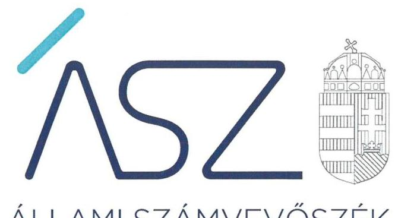
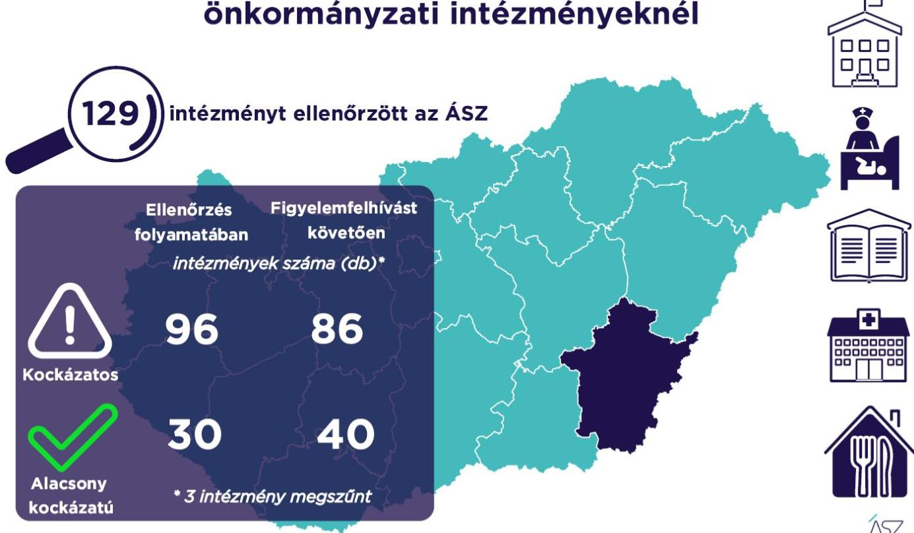

ÁLLAMI SZÁMVEVŐSZÉK

# JELENTÉS 

## A Békés megyei önkormányzati intézmények ellenőrzése

Az önkormányzat és társulás irányítása alá tartozó intézmények integritásának monitoring típusú ellenőrzése - 129 intézmény
2021.

21098
www.asz.hu

---

ÁLLAMI SZÁMVEVŐSZÉK

# JELENTÉS 

## A Békés megyei önkormányzati intézmények ellenőrzése

Az önkormányzat és társulás irányítása alá tartozó intézmények integritásának monitoring típusú ellenőrzése - 129 intézmény
2021. 12. hó 29. nap

21098
www.asz.hu

---

# AZ ELLENŐRZÉST FELÜGYELTE: 

SALAMON ILDIKÓ felügyeleti vezető

## AZ ELLENŐRZÉST VEZETTE ÉS A VÉGREHAJTÁSÁÉRT FELELŐS:

BALÁZSNÉ ANTONI ERIKA ellenőrzésvezető
SIPOSNÉ DÓCZI KLÁRA ellenőrzésvezető

A PROGRAM ÖSSZEÁLLÍTÁSÁÉRT FELELŐS:
DR. FELFÖLDI IZABELLA programkészítésért felelős vezető

IKTATÓSZÁM: EL-3461-005/2021.
TÉMASZÁM: 2568
ELLENŐRZÉS-AZONOSÍTÓ SZÁM: V0928

---

# TARTALOMJEGYZÉK 

■ ÖSSZEGZÉS ..... 5
■ AZ ELLENŐRZÉS JELENTŐSÉGE, AKTUALITÁSA, TÁRSADALMI SZEREPE, SZEMPONTJAI ..... 8
■ AZ ELLENŐRZÉS TERÜLETE ..... 9
■ ELLENŐRZÉS HATÓKÖRE ÉS MÓDSZERE ..... 10
■ MELLÉKLETEK ..... 13
I. sz. melléklet: Az értékelés módszertana ..... 13
II. sz. melléklet: Értelmező szótár ..... 15
■ FÜGGELÉKEK ..... 17
I. sz. függelék: Az ellenőrzött szervezetek és azok kockázati értékelése ..... 17
■ RÖVIDÍTÉSEK JEGYZÉKE ..... 23

---

.

---

# ÖSSZEGZÉS 

Az Állami Számvevőszék figyelemfelhívásának és tanácsadásának eredményeként a Békés megyei önkormányzatok irányítása alatt álló 129 ellenőrzött intézmény közül 36 intézménynél az intézményvezető már 2021-ben intézkedett, vagy intézkedéseket rendelt el az integritást biztosító alapvető feltételek megerősítése, illetve kiépítése érdekében. Ezeknek az intézményeknek javult az integritása, erősödtek a csalásmentes működés feltételei.
62 intézménynél további intézkedések szükségesek az integritást biztosító alapvető feltételek kiépítése, illetve kiegészítése érdekében. Ezeknek az intézményeknek a vezetői az Állami Számvevőszék intézkedési kötelemmel járó figyelemfelhívására nem intézkedtek, ezért az azonosított kockázatok növekedtek, vagy intézkedéseik nem fedték le a kockázatos területeket, így az azonosított kockázatok nem változtak.
Az irányító önkormányzat három intézmény megszüntetéséről döntött az ellenőrzött időszakban.

## Értékelések

Az Állami Számvevőszék a Békés megyei önkormányzatok irányítása alá tartozó 129 intézmény belső kontrollrendszerének lényeges elemei kialakítását ellenőrizte a 2021. évre vonatkozóan. Az ellenőrzés a súlypontok meghatározásával lehetőséget biztosított a szervezeti integritás, működés és vezetés, valamint a gazdálkodás területén a kockázatok azonosítására.

A szervezeti integritás alapvető feltétele a szabályozottság, azaz a jogszabályokban előírt belső szabályzatok megléte, azok - hatályos jogszabályoknak - megfelelő tartalma és gyakorlati alkalmazhatósága. Az integritási kockázatok szervezeti szinten csökkenthetők azáltal, hogy az intézményvezetők kialakítják a szervezeti és működési kereteket, a gazdálkodásra vonatkozó alapvető szabályozási környezetet, valamint a kontrolltevékenységek szabályszerű gyakorlásának, az integrált kockázatkezelésnek és az integritást sértő események kezelésének a feltételeit.

A szervezeti integritás, a működés és a vezetés alapvető szabályozási feltételeinek kialakítása hozzájárul a csalásmentes integritási környezet megteremtéséhez.

A szervezeti és működési szabályzat teremti meg a szervezet szabályszerű működésének alapjait, illetve rögzíti a szervezeten belüli felelősségi viszonyokat. A szabályzat biztosítja a szervezeti működés szabályozottságát, ezáltal a szervezet tevékenységének átláthatóságát, a szervezeti célokkal összhangban történő működés feltételeit és annak ellenőrizhetőségét. Az ellenőrzöttek közül 114 intézmény rendelkezett szervezeti és működési szabályzattal a 2021. évben.

A jogszabályi előírásoknak eleget téve, nyilatkozatban értékelte az intézmény belső kontrollrendszerének minőségét 100 intézmény vezetője. Ezek közül 77 intézménynél alakítottak ki olyan szabályozásokat, folyamatokat, amelyek biztosítják a költségvetési szerv tevékenységében a rendelkezésre álló források átlátható, szabályszerű, szabályozott, gazdaságos, hatékony és eredményes felhasználása követelményeinek érvényesítését.

Az integrált kockázatkezelés eljárásrendjét 94, a szervezeti integritást sértő események kezelésének eljárásrendjét 93 intézménynél alakították ki az intézményvezetők. Az integrált kockázatkezelés eljárásrendje biztosítja a szervezet működésében rejlő kockázatok azonosításának és kezelésének feltételeit. A szervezet működési kockázatai veszélyeztethetik a közpénzekkel való átlátható, elszámoltatható és felelős gazdálkodást. Az integritást sértő események kezelésének eljárásrendje jelenti a szervezet tekintetében felmerülő és a szervezeten belül bekövetkező integritást sértő események kezelésének alapjait. Az eljárásrend kialakításával az intézmény vezetője támogatja az integritást sértő eseményekkel kapcsolatosan azonosított kockázatok bekövetkezése esetén azok hatékony kezelését, illetve a következmények enyhítését.

---

A pénz- és vagyongazdálkodáshoz kapcsolódó alapvető szabályozások és nyilvántartások - így a számviteli politika és a keretében elkészítendő szabályzatok, a számlarend, a beszerzések szabályozása, valamint a kötelezettségvállalásra és a teljesítés igazolására jogosultak és aláírásmintáik nyilvántartása - előmozdítják a közpénzügyek átláthatóságát, rendezettségét. Az intézményvezető ezen szabályzatok elkészítésével, nyilvántartások vezetésével és folyamatos karbantartásával az alapfeltételét biztosítja a pénzügyi- és vagyongazdálkodás átláthatóságának, a közpénzekkel és közvagyonnal való elszámoltathatóságnak. Az ellenőrzöttek közül 98 intézménynél a számviteli politika, 88 intézménynél a számlarend, 95 intézménynél a beszerzések lebonyolításával kapcsolatos eljárásrend rendelkezésre állt.

Az ellenőrzöttek közül 28 intézmény vezetője tett eleget az ellenőrzött területek mindegyikén az integritási kontrollok alapvető feltételeit jelentő, a jogszabályban előírt szabályozási kötelezettségének. Közülük kilenc intézmény vezetője a jogszabályi előírásokon túl további erőfeszítéseket is tett az integritás erősítése érdekében, felismerte további olyan integritási kontrollok kialakításának indokoltságát, amelyet jogszabály nem ír elő, így szervezeti szinten hozzájárul a korrupcióval szembeni védettség megszilárdításához.

116 intézmény esetében az intézményvezető intézkedése volt szükséges a kockázatok csökkentése érdekében, mivel 23 intézménynél a jogszabályok által előírt kontrollok területén, 74 intézménynél a jogszabályok által előírt és a további, jogszabály által nem előírt integritási kontrollok területén egyaránt, 19 intézménynél utóbbi kontrollok területén voltak hiányosságok. A dokumentumok kiértékelése alapján - az integritás további fejlesztése érdekében - az Állami Számvevőszék azonosította a lényeges kockázati területeket, és már az ellenőrzés lefolytatásával párhuzamosan, a 2021. évre vonatkozóan a kockázatok csökkentésére hívta fel az intézményvezetők figyelmét.

# Következtetések 

Az érintett 97 intézmény közül 79 intézmény vezetője válaszolt határidőben az Állami Számvevőszék figyelemfelhívására. Közülük 46 teljeskörűen, 22 részben egyetértett a kockázatos területeken teendő intézkedések indokoltságával. Az intézményvezetők közül 43 arról tájékoztatta az Állami Számvevőszéket, hogy valamennyi kockázatos területen, 22 pedig a kockázatos területek egy részénél már tett, illetve a jövőben tesz intézkedést a jelzett kockázatok csökkentése érdekében. A jogszabályi előírásokon túli integritási kontrollok területén az érintett 93 intézmény közül 41 intézmény vezetője a jelzett kockázatok teljes körű, öt pedig azok részbeni felszámolásáról adtak számot. Ezek eredményeként a 116 vezetői levélben jelzett 635 kockázati terület közül 291 esetben már történt, illetve tervezett az intézkedés, így javulás várható a feltárt kockázatos területek 45,8%-ánál.

Az intézkedések eredményeként az ellenőrzött 129 intézmény közül összesen 40 intézménynél a kockázatok alacsony szintűek, illetve - a tervezett intézkedések végrehajtásával - a kockázatok alacsony szintre csökkennek.

A szabályozások és nyilvántartások kialakításának célja nem önmagában a jogszabályi rendelkezések betartása, hanem az intézmény szabályozottságán keresztül a szabályszerű és csalásmentes gazdálkodás feltételeinek megteremtése, ezáltal az Alaptörvényben előírt átláthatóság és elszámoltathatóság elvének érvényesítése. Ezeknek az alapelveknek érvényesülése hozzájárulhat ahhoz, hogy az intézmények, mint közszolgáltatást nyújtó szervezetek felé a közszolgáltatásokat igénybe vevők, és általuk az állampolgárok általános bizalma is erősödjön.

Az Állami Számvevőszék figyelemfelhívására nem válaszoló, illetve a jelzett kockázatokra nem, vagy csak részben intézkedő intézményvezetők által vezetett intézményeknél rendszerszintű kockázatok maradtak fenn. Vezetési-irányítási kockázatot jelez, amennyiben az intézményvezetőnek címzett figyelemfelhívásra az intézményvezető helyett más személy válaszolt. Felelősségi és hatásköri kockázatot jelez, amennyiben az intézmény pénzügyi- és vagyongazdálkodásának alapvető szabályzatait a kontrollrendszer kialakításáért felelős intézményvezető helyett egy másik költségvetési szerv vezetője alakította ki, határozta meg. További kockázatot jelent a szabályok alkalmazottak általi megismerésére és alkalmazására, az intézmény mindennapi működésének integritására. Mindezek egyrészt az intézmény pénzügyi és vagyongazdálkodásának szabályszerűségét, másrészt a vezetői nyilatkozatok hitelességét, valóságtartalmát is megkérdőjelezi. A jelzett kockázatok arra mutatnak rá, hogy ezeknél az intézményeknél sérül a vezetői felelősség elve, és ezzel a felelős vezetésre épülő intézményi önállóság működése.

Az integritás elvű működés erősítése érdekében további kockázatcsökkentő lépések szükségesek a vezetés-irányítás, valamint a pénzügyi- és a vagyongazdálkodás szabályszerű feltételeinek kialakítása terén. Ezen intézmények integritásának kiépítését következő lépésként az irányító szerv bevonásával támogatja az Állami Számvevőszék.

---

# Erősödött a csalásmentesség a Békés megyei önkormányzati intézményeknél 

---

# AZ ELLENŐRZÉS JELENTŐSÉGE, AKTUALITÁSA, TÁRSADALMI SZEREPE, SZEMPONTJAI 

Az Alaptörvény alapértékeket, elveket fogalmaz meg, amely szerint a közpénzekkel gazdálkodó minden szervezet köteles a nyilvánosság előtt elszámolni a közpénzekre vonatkozó gazdálkodásával. A közpénzeket és a nemzeti vagyont az átláthatóság és a közélet tisztaságának elve szerint kell kezelni.

Magyarország helyi önkormányzatairól szóló törvény ${ }^{1}$ a helyi közhatalom gyakorlás széleskörű érvényesítésével összhangban tág teret ad a helyi önkormányzatoknak a feladataik, a közszolgáltatások legkülönbözőbb formákban történő ellátására, így széleskörű lehetőséggel rendelkeznek intézmények alapítására.

A helyi önkormányzatok irányítása alá tartozó intézmények szerteágazó közszolgáltatásokat nyújtanak. Az intézmények működtetése közvetlenül érinti a társadalom valamennyi rétegét, a közfeladatot ellátó intézmények működésének minősége közvetlen hatással van az azokat igénybe vevő állampolgárok életére.

Az intézmények szabályszerű és eredményes működésének és gazdálkodásának alapfeltétele a belső kontrollrendszer - benne az integritási kontrollok - megfelelő kialakítása. Az ÁSZ² a törvényi felhatalmazással élve ellenőrzi az önkormányzati intézményeket, hogy megállapításaival támogassa az ellenőrzött szervezetek szabályszerű gazdálkodását, működését.

A helyi önkormányzatok intézményei által ellátott feladatok, a bölcsődei, óvodai ellátás, a gyermekétkeztetés, a betegek és idősek gondozása, a közművelődési intézmények, könyvtárak működtetése által a lakosság ezeken a területeken találkozik legszélesebb körben az önkormányzatok által nyújtott szolgáltatásokkal. A szolgáltatásokat igénybe vevők jelentős száma, a feladatellátáshoz használt nemzeti vagyon és az erre fordított közpénz nagysága indokolja, hogy az ÁSZ további, az előző ellenőrzésekre épülő ellenőrzéseket végezzen ezen a területen, illetve további olyan területeken, ahol az önkormányzati szolgáltatást a lakosság széles köre veszi igénybe.

Az ellenőrzés célja annak értékelése, hogy a helyi önkormányzatok irányítása alá tartozó intézmények megteremtették-e az integritás biztosításához szükséges feltételeket, kialakították-e az alapvető, a szervezeti kereteket, az integritási kontrollokhoz kapcsolódó, valamint a korrupció elleni védelmet szolgáló szabályozásokat. Továbbá, hogy az intézményvezető gondoskodott-e a szervezeti teljesítmény mérés alapfeltételeinek kialakításáról az eredményességi szempontoknak való megfelelés megalapozottsága biztosítása érdekében. A monitoring típusú ellenőrzés célja hatékonyan támogatni az ellenőrzött szervezeteket, ezáltal növelve az ÁSZ tanácsadó szerepét, elősegítve a „jól irányított állam" működését.

Az ÁSZ célja, hogy új ellenőrzési megközelítést alkalmazva támogassa a közpénzügyi helyzet javítását; a monitoring típusú ellenőrzéssel jelen időben adjon helyzetképet az integritási szemlélet érvényesítéséről, rávilágítson az integritási kontrollok kiépítettségére, illetve további fejlesztésére. Napjainkban mindez kiemelt fontosságúvá vált. Minden szervezetnek fel kell készülnie arra, hogy a koronavírus járvány okozta társadalmi és gazdasági válság növelni fogja a korrupciós nyomást. Az ÁSZ ebben a helyzetben is alapvető kötelességének tartja, hogy a közpénzek őre legyen, és ellenőrzéseit az önkormányzati alrendszer intézményei körében is folytassa.

Fontos, hogy az intézmények vezetői felismerjék az integritás kockázatokat, azokat ismételten mérjék fel, és alakítsanak ki átlátható, jól szabályozott rendszereket, döntési mechanizmusokat. Az integritási kockázatok feltárása, megismerése elengedhetetlenül fontos, mert ezt követően tehetők meg azok a lépések, amelyek a kockázatok csökkentését, felszámolását és kezelését célozzák. A belső kontrollrendszer - benne az integritás kontrollok - megfelelő kialakítása, működése a helyi önkormányzatok irányítása alatt álló intézményeknél is hozzájárul a társadalmi közbizalom erősítéséhez.

Az ellenőrzés rámutat az integritási jó gyakorlatokra is, továbbá
 felhívja a figyelmet a jogszabályi követelmények teljesítéséhez szükséges lépésekre is.

---

# AZ ELLENŐRZÉS TERÜLETE 

## Az önkormányzatok irányítása alá tartozó intézmények

Helyi önkormányzati költségvetési szervet az államháztartásról szóló 2011. évi CXCV törvény (Áht. ${ }^{3}$ ) szerint a helyi önkormányzat, a helyi önkormányzatok társulása, a térségi fejlesztési tanács, az átalakult nemzetiségi önkormányzat alapíthat, a költségvetési szerv alapító okiratában meghatározott önkormányzati közfeladatok ellátására. A költségvetési szervek önálló jogi személyek, éves költségvetésükből gazdálkodva látják el feladataikat. A költségvetési szervek gazdasági szervezettel rendelkeznek, ha azonban a költségvetési szerv éves átlagos statisztikai állományi létszáma a 100 főt nem éri el, a gazdasági szervezet feladatait az önkormányzati hivatal, vagy az irányító szerv döntése alapján az irányító szerv irányítása alá tartozó, gazdasági szervezettel rendelkező más költségvetési szerv látja el.

Az államháztartásról szóló törvény végrehajtásáról szóló 368/2011. (XII. 31.) Korm. rendelet (Ávr. ${ }^{4}$ ) 1. melléklete szerint, az államháztartás önkormányzati alrendszerében a helyi önkormányzat által irányított költségvetési szerv esetében az irányító szerv hatáskörét a képviselő-testület, közgyűlés gyakorolja, és annak vezetője a polgármester, főpolgármester, megyei közgyűlés elnöke.

Az ellenőrzés a Békés megyei önkormányzatok irányítása alá tartozó, az I. sz. Függelékben felsorolt költségvetési szervekre terjedt ki.

A feladatellátásuk szerint az ellenőrzött költségvetési szervek egy része óvoda, bölcsőde, egészségügyi intézmény, konyha, művelődési ház, múzeum, kulturális központ, idősek otthona, gondozási központ, gyermekjóléti intézmény, sportközpont intézményként működik.

Az ellenőrzött 129 intézmény közül három rendelkezik saját gazdasági szervezettel.

Az ellenőrzés 128 intézmény esetében lefolytatásra került. Egy intézmény esetében az ellenőrzés adatszolgáltatás hiányában nem volt lefolytatható, az ÁSZ az ellenőrzött integritási kockázatát kiemelten magasnak értékelte.

Három intézmény az ellenőrzött időszakban megszűnt.

---

# ELLENŐRZÉS HATÓKÖRE ÉS MÓDSZERE 

## Az ellenőrzés típusa

Megfelelőségi ellenőrzés.

## Az ellenőrzött időszak

A 2021. év, a Bkr. ${ }^{5}$ szerinti vezetői nyilatkozat, valamint annak alátámasztottsága vonatkozásában a 2020. év.

## Az ellenőrzés tárgya

A szervezeti keretekkel, a működéssel és gazdálkodással kapcsolatos szabályzatok, szabályozások, valamint a szervezeti elvekkel, értékekkel összefüggő integritás kontrollok kiépítettsége, a szervezeti teljesítmény mérés alapfeltételeinek kialakítása.

## Az ellenőrzött szervezetek

Az ellenőrzött intézményeket az I. sz. Függelék tartalmazza.

## Az ellenőrzés jogalapja

Az ellenőrzés jogszabályi alapját az ÁSZ tv. ${ }^{6}$ 1. § (3) bekezdése, 5. § (6) bekezdése, valamint az Áht. 61. § (2) bekezdése képezik.

## Az ellenőrzés módszerei

Az ÁSZ az ellenőrzést az ellenőrzési program szempontjai, az ellenőrzött időszakban hatályos jogszabályok, a jelen ellenőrzésre irányadó ÁSZ módszertan figyelembevételével és a nemzetközi standardokat irányadónak tekintve végzi.

Az ellenőrzés ideje alatt az ÁSZ az ellenőrzött szervezetekkel történő kapcsolattartást az ÁSZ SZMSZ${ }^{7}$-ének vonatkozó előírásai alapján biztosítja.

Az ellenőrzési kérdések megválaszolásához szükséges bizonyítékok megszerzése a következő ellenőrzési eljárások alkalmazásával történik: megfigyelés, összehasonlítás, elemző eljárás. Az ellenőrzési bizonyítékként felhasználható adatforrások közé tartoznak az ellenőrzési programban felsorolt adatforrások, továbbá minden - az ellenőrzés folyamán - feltárt, az ellenőrzés szempontjából információkat tartalmazó dokumentum.

---

Az ÁSZ az ellenőrzést a kérdésekre adott válaszok kiértékelésével, valamint a megjelölt adatforrások, továbbá az adott időszakban hatályos jogszabályok, valamint az ÁSZ honlapján közzétett helyénvalósági kritériumok figyelembevételével folytatja le.

A monitoring típusú ellenőrzés az önkormányzatok irányítása alá tartozó intézmények integritás alapú működésének lényeges területeire és a közpénzügyi helyzet javítása érdekében az elért eredmények fenntartására fókuszál. Lehetőséget biztosít az integritási kontrollok kiépítettségében lévő hiányosságok, a szervezeti teljesítmény mérés alapfeltételei kialakításának hiánya beazonosítására az eredményességi szempontoknak való megfelelés megalapozottsága biztosítása érdekében, az önkormányzatok, társulások irányítása alá tartozó intézmények integritásának elemzésére, részletes ellenőrzések megalapozására.

---

.

---

# MELLÉKLETEK 

I. SZ. MELLÉKLET: AZ ÉRTÉKELÉS MÓDSZERTANA

Az egyes kockázati területek és kockázatforrások minősítése „pontozásos módszerrel", az integritás „jelző" dokumentumai és a vezetői magatartás ellenőrzéshez kapcsolódóan tanúsított tényhelyzeteinek értékelése alapján történt.

Az értékelt dokumentumokhoz, nyilvántartásokhoz, kockázati besorolásokhoz minden esetben pontszám került hozzárendelésre, amelyek értéke alapján az ellenőrzött szervezetek kockázati csoportba kerültek besorolásra:

- Alacsony kockázatú - az elérhető összes pontszám legalább 80\%-a
- Közepes kockázatú - az elérhető pontszám 50-79\%-a között
- Magas kockázatú - az elérhető pontszám 50\%-a alatt

Az első lépésben azonosításra kerültek azok az intézményi szabályozások és nyilvántartások, amelyek meglétét jogszabály írja elő, hiánya pedig felveti a csalás és korrupció kockázatát.

Második lépésben az adatoknak az ellenőrzés rendelkezésére bocsátása kockázati kritériumainak meghatározása, majd értékelése történt meg.

Harmadik lépésben a figyelemfelhívó levelekre adott válaszok kockázati kritériumainak meghatározása, majd értékelése történt meg.

Az összesített kockázati értékelést javította, amennyiben

- az intézmény rendelkezett olyan szabályozással, amely kötelező meglétét jogszabály nem írja elő, de segíti a csalás és a korrupció megelőzését (helyénvalósági dokumentumok).

Az összesített kockázati értékelést rontotta, amennyiben

- az integritás szempontjából meghatározó dokumentum - az intézményi SZMSZ - hiányzott, és javítása érdekében a figyelemfelhívó levél hatására sem történt intézkedés.

A figyelemfelhívó levelekre adott válaszok értékelése alapján:

- A kockázat csökkent, amennyiben a figyelemfelhívó levélre adott válasza a figyelemfelhívással összhangban volt, valamennyi kockázati területen intézkedett vagy intézkedést tervezett.
- A kockázat változatlan, amennyiben a figyelemfelhívó levélben foglaltaktól eltérő magatartást tanúsított, intézkedése a figyelemfelhívással részben volt összhangban, a kockázati területeken részben intézkedett vagy intézkedést tervezett.
- A kockázat nőtt, amennyiben nem volt együttműködő, a figyelemfelhívó levélre nem válaszolt, vagy válasza alapján nem intézkedett és nem tervezett intézkedést.

---

# Az önkormányzatok irányítása alá tartozó intézmények kockázati csoportba sorolásának értékelési keretrendszere 

I. Dokumentumokkal rendelkezés
lényeges dokumentumok, amelyek hiánya felveti a csalás és korrupció kockázatát
I.1. A szervezeti integritás, működés és vezetés alapvető szabályozási feltételei

- intézmény SZMSZ-e
- vezetői nyilatkozat a 2020. évre vonatkozóan az intézmény belső kontrollrendszer minőségének értékeléséről, valamint a nyilatkozat megalapozottságát bizonyító dokumentumok
- integrált kockázatkezelés eljárásrendje
- az integritást sértő események kezelésének eljárásrendje
I.2. A pénz- és vagyongazdálkodáshoz kapcsolódó alapvető szabályozások
- számviteli politika
- az eszközök és a források leltárkészítési és leltározási szabályzata
- az eszközök és a források értékelési szabályzata
- pénzkezelési szabályzat
- számlarend
- beszerzések lebonyolításával kapcsolatos eljárásrend
- a kötelezettségvállalásra, teljesítés igazolására jogosult személyekről és aláírás-mintájukról vezetett nyilvántartás
II. Az adatoknak az ellenőrzés rendelkezésére bocsátása
II.1. A megnevezett adatokkal rendelkezett és a törvényi határidőn belül hiánytalanul rendelkezésre bocsátotta. Figyelem-, illetve figyelmet felhívó levél nem volt indokolt.
II.2. A megnevezett adatokat nem bocsátotta rendelkezésre.
III. Figyelemfelhívó levelekre adott válaszok kockázati értékelése
III.1. Kockázat csökkent: együttműködése a figyelemfelhívó levéllel összhangban volt.
III.2. Kockázat változatlan: a figyelemfelhívó levélben foglaltaktól eltérő együttműködést tanúsított.
III.3. Kockázat nőtt: nem reagált, nem intézkedett, így nem volt együttműködő.

---

belső kontrollrendszer

Belső kontrollrendszer területei
integrált kockázatkezelési rendszer
integritás

Integritási kockázatok

A belső kontrollrendszer a kockázatok kezelése és tárgyilagos bizonyosság megszerzése érdekében kialakított folyamatrendszer, amely azt a célt szolgálja, hogy a működés és gazdálkodás során a tevékenységeket szabályszerűen, gazdaságosan, hatékonyan, eredményesen hajtsák végre, az elszámolási kötelezettségeket teljesítsék, megvédjék az erőforrásokat a veszteségektől, károktól és nem rendeltetésszerű használattól. (Forrás: Áht. 69. § (1) bekezdése)
A kontrollkörnyezet, az integrált kockázatkezelési rendszer, a kontrolltevékenységek, az információs és kommunikációs rendszer, valamint a nyomon követési (monitoring) rendszer. (Forrás: Bkr. 3. §-a)
Olyan folyamatalapú kockázatkezelési rendszer, amely a szervezet minden tevékenységére kiterjed, egységes módszertan és eljárások alkalmazásával, a szervezet célkitűzéseinek és értékeinek figyelembevételével biztosítja a szervezet kockázatainak teljes körű azonosítását, azok meghatározott kritériumok szerinti értékelését, valamint a kockázatok kezelésére vonatkozó intézkedési terv elkészítését és az abban foglaltak nyomon követését. (Forrás: Bkr. 2. § m) pontja)
Az integritás az elvek, értékek, cselekvések, módszerek, intézkedések konzisztenciáját jelenti, vagyis olyan magatartásmódot, amely meghatározott értékeknek megfelel. (Forrás: Nemzetgazdasági Minisztérium: Államháztartási belső kontroll standardok és gyakorlati útmutató 1.1.3. pontja, 2017. szeptember)
A szervezeti integritás a szervezet védekezőképessége a korrupció lehetőségével szemben. Az integritás erősítése - mint preventív eszközrendszer - a korrupció megelőzésére fókuszál. A szervezeti integritás a működés, a szervezeti kultúra minőségét is jelzi.
Az ellenőrzés megközelítése szerint az integritás a szervezet értékeinek és célkitűzéseinek megfelelő működést jelenti. Minél magasabb színvonalú egy szervezet integritása, az annál ellenállóbb a korrupcióval, a korrupciós veszélyekkel szemben, vagyis az integritás erősítése - elsősorban az egyes szervezetek szintjén - a korrupciós kockázatok mérséklésének egyik fontos eszköze. Az integritás ugyanakkor tágabb jelentésű fogalom, nemcsak a korrupciótól, hanem más helytelen magatartásoktól (például csalás, önkényesség) való mentességet és a szervezet céljainak követését is jelenti. Egy szervezet integritását úgy is meghatározhatjuk, mint a szervezet ellenállóképességét annak a veszélynek, hogy dolgozói helytelen magatartásukkal kárt okozzanak.
Az integritás megerősítése és fenntartása elsősorban a szervezet elsőszámú vezetőjének felelőssége.
Integritási kockázatnak minősül a szervezet célkitűzéseit, értékeit, elveit sértő vagy veszélyeztető visszaélés, szabálytalanság, vagy egyéb esemény lehetősége. A korrupciós kockázat olyan integritási kockázat, amely korrupciós cselekmény bekövetkezésének lehetőségét jelenti. Minden korrupciós kockázat egyben integritási kockázat is. Korrupciós cselekményeknek nevezzük azokat a vesztegetésszerű cselekményeket, amelyeket általában a Büntető Törvénykönyv ${ }^{8}$ is büntetéssel fenyeget.
Az integritási kockázat alatt az integritás megsértésének esélyét értjük. Az integritási kockázatok olyan helyzetek, folyamatok, amelyek során fennáll a korrupciós befolyás lehetősége. Így integritási kockázatok jelentkeznek például a köz- és a magánszféra közötti üzleti tranzakciók során, a köztisztviselők által hozott döntések, a mérlegelési szabadság körében, illetve abban az esetben, ha egy közszolgáltatás iránt nagyobb a kereslet, mint a kielégítéséhez rendelkezésre álló erőforrások. Az integritási kockázat értelemszerűen nem egyenlő magával az integritás sérelmével, vagy a korrupció be-

---

kockázat
kontrollkörnyezet
kontrolltevékenységek
intézmény
következésével. Az integritási kockázatokkal szemben megfelelő kontrollok kiépítésével lehet védekezni. Amennyiben az integritási kontrollok szintje elmarad a kockázatok mértékétől, kockázati kitettségről beszélünk. A kontrollok kialakításának és működtetésének mérlegelésekor minden esetben vizsgálni kell a kockázatok szintjét is, a túlszabályozottság egyfelől költséges, másfelől a túlzott bürokrácia maga is lehet a korrupciós veszély hordozója.
A kockázat annak a valószínűségét jelenti, hogy egy vagy több esemény, vagy intézkedés nem kívánt módon befolyásolja a rendszer működését, céljainak megvalósulását. (Forrás: Javaslatok a korrupciós kockázatok kezelésére - Kockázatkezelési és ellenőrzési módszertan 35. oldal, ÁSZ)
A költségvetési szerv vezetője által kialakított olyan elvek, eljárások, belső szabályzatok összessége, amelyben világos a szervezeti struktúra, a folyamatok átláthatók, egyértelműek a felelősségi, hatásköri viszonyok és feladatok, meghatározottak, ismertek és elfogadottak az etikai elvárások a szervezet minden szintjén, átlátható a humánerőforrás-kezelés, biztosított a szervezeti célok és értékek irányában való elkötelezettség fejlesztése és elősegítése. (Forrás: Bkr. 6. § (1) bekezdés)
A költségvetési szerv vezetője által a szervezeten belül kialakított (kontroll) tevékenységek, melyek biztosítják a kockázatok kezelését, hozzájárulnak a szervezet céljainak eléréséhez és erősítik a szervezet integritását. (Forrás: Bkr. 8. § (1) bekezdés)
A helyi önkormányzatok irányítása alá tartozó költségvetési szervek. (A képviselő-testület a feladatkörébe tartozó közszolgáltatások ellátására - jogszabályban meghatározottak szerint - költségvetési szervet (önkormányzati intézmény) alapíthat; Forrás: Mötv. 41. § (6) bekezdés)

---

# FÜGGELÉKEK

I. SZ. FÜGGELÉK: AZ ELLENŐRZÖTT SZERVEZETEK ÉS AZOK KOCKÁZATI ÉRTÉKELÉSE

|  Sorszám | Ellenőrzött szervezet megnevezése | Irányító szerv (önkormányzat) megnevezése | Helység | Tanácsadást megelőző kockázati besorolás | Intézkedést követően a kockázati értékelés változása | A kockázati szint

 alacsonyra csökkent-e  |
| --- | --- | --- | --- | --- | --- | --- |
|  1. | Zsadány Község Önkormányzat Napközi Otthonos Konyha | Zsadány Község Önkormányzata | Zsadány | KÖZEPES | NÖTT | N  |
|  2. | Zsadányi Tündérkert Óvoda | Zsadány Község Önkormányzata | Zsadány | KÖZEPES | NÖTT | N  |
|  3. | Muronyi Önkormányzati Óvoda | Murony Község Önkormányzata | Murony | KÖZEPES | CSÖKKENT | N  |
|  4. | Pusztaottlakai Humán Szolgáltató Központ | Pusztaottlaka Község Önkormányzata | Pusztaottlaka | FIEMELTEN MAGAS | NEM VÁLTOZOTT | N  |
|  5. | Muronyi Alapszolgáltatási Központ | Murony Község Önkormányzata | Murony | KÖZEPES | NEM VÁLTOZOTT | N  |
|  6. | Füzesgyarmati "Lurkófalva" Óvoda | Füzesgyarmat Város Önkormányzata | Füzesgyarmat | MAGAS | NÖTT | N  |
|  7. | Mezőgyáni Községi Óvoda | Mezőgyán Község Önkormányzata | Mezőgyán | MAGAS | NEM VÁLTOZOTT | N  |
|  8. | Geszti Mesevilág Óvoda | Geszt Község Önkormányzata | Geszt | KÖZEPES | NÖTT | N  |
|  9. | Hegyesi János Városi Könyvtár és Közművelődési Intézmény | Füzesgyarmat Város Önkormányzata | Füzesgyarmat | MAGAS | NÖTT | N  |
|  10. | Kötegyán Község Önkormányzatának Óvoda és Konyha Intézménye | Kötegyán Község Önkormányzata | Kötegyán | ALACSONY | NEM VOLT SZABÁLYSZERŰSÉGI HIBA | I  |
|  11. | Füzesgyarmati Gyógycentrum Egészségügyi Szolgáltató | Füzesgyarmat Város Önkormányzata | Füzesgyarmat | MAGAS | NÖTT | N  |
|  12. | Mezőgyán Község Önkormányzatának Konyhája | Mezőgyán Község Önkormányzata | Mezőgyán | KÖZEPES | NÖTT | N  |
|  13. | Geszt Község Önkormányzatának Konyhája | Geszt Község Önkormányzata | Geszt | MAGAS | NÖTT | N  |
|  14. | Telekgerendás Községi Önkormányzat Hétszínvirág Óvoda és Bölcsőde | Telekgerendás Község Önkormányzata | Telekgerendás | KÖZEPES | CSÖKKENT | N  |
|  15. | Dérczy Ferenc Könyvtár és Közösségi Ház | Kondoros Város Önkormányzata | Kondoros | MAGAS | NÖTT | N  |
|  16. | Sarkadkeresztúr Község Önkormányzata Óvoda Intézménye | Sarkadkeresztúr Község Önkormányzata | Sarkadkeresztúr | KÖZEPES | NÖTT | N  |
|  17. | Sarkadkeresztúr Önkormányzati Konyha | Sarkadkeresztúr Község Önkormányzata | Sarkadkeresztúr | MAGAS | CSÖKKENT | N  |
|  18. | Békés Megyei Könyvtár | Békéscsaba Megyei Jogú Város Önkormányzata | Békéscsaba | KÖZEPES | CSÖKKENT | I  |
|  19. | Békéscsabai Jókai Színház | Békéscsaba Megyei Jogú Város Önkormányzata | Békéscsaba | ALACSONY | NEM VOLT SZABÁLYSZERŰSÉGI HIBA | N  |
|  20. | Városi Humánsegítő és Szociális Szolgálat | Mezőberény Város Önkormányzata | Mezőberény | ALACSONY | NEM VOLT SZABÁLYSZERŰSÉGI HIBA | I  |
|  21. | Sarkad Város Önkormányzat Városgazdálkodási Irodája | Sarkad Város Önkormányzata | Sarkad | KÖZEPES | NEM VÁLTOZOTT | N  |
|  22. | Békési Gyógyászati Központ és Gyógyfürdő | Békés Város Önkormányzata | Békés | KÖZEPES | CSÖKKENT | I  |
|  23. | Békéscsabai Gyermekélelmezési Intézmény | Békéscsaba Megyei Jogú Város Önkormányzata | Békéscsaba | MAGAS | NÖTT | N  |

---

| Sorszám | Ellenőrzött szervezet megnevezése | Irányító szerv (önkormányzat) megnevezése | Helység | Tanácsadást megelőző kockázati besorolás | Intézkedést követően a kockázati értékelés változása | A kockázati szint alacsonyra csökkent-e |
| :--: | :--: | :--: | :--: | :--: | :--: | :--: |
| 24. | Munkácsy Mihály Múzeum | Békéscsaba Megyei Jogú Város Önkormányzata | Békéscsaba | KÖZEPES | CSÖKKENT | I |
| 25. | Nagyszénási Önkormányzati Óvoda és Könyvtár | Nagyszénás Nagyközség Önkormányzata | Nagyszénás | KÖZEPES | CSÖKKENT | I |
| 26. | Orosháza Város Önkormányzat Egységes Szociális Központ | Orosháza Város Önkormányzata | Orosháza | ALACSONY | $\begin{gathered} \text { NEM VOLT SZABÁLYSZERŰSÉGI } \\ \text { HIBA } \end{gathered}$ | N |
| 27. | Sarkad Város Önkormányzatának Közétkeztetési Intézménye | Sarkad Város Önkormányzata | Sarkad | KÖZEPES | NEM VÁLTOZOTT | N |
| 28. | Csorvás Város Önkormányzatának Egyesített Szociális Intézménye | Csorvás Város Önkormányzata | Csorvás | MAGAS | NÖTT | N |
| 29. | Békés Városi Kecskeméti Gábor Kulturális, Sport és Turisztikai Központ | Békés Város Önkormányzata | Békés | KÖZEPES | CSÖKKENT | I |
| 30. | Orlai Petrics Soma Könyvtár, Muzeális Gyűjtemény és Múvelődési Központ | Mezőberény Város Önkormányzata | Mezőberény | KÖZEPES | NÖTT | N |
| 31. | Békéscsabai Napsugár Bábszínház | Békéscsaba Megyei Jogú Város Önkormányzata | Békéscsaba | ALACSONY | NEM VOLT SZABÁLYSZERŰSÉGI HIBA | I |
| 32. | Sarkad Város Önkormányzata Bartók Béla Művelődési Központ és Könyvtár | Sarkad Város Önkormányzata | Sarkad | KÖZEPES | NÖTT | N |
| 33. | Sarkad Város Önkormányzat Mazsola Bölcsőde | Sarkad Város Önkormányzata | Sarkad | MAGAS | NEM VÁLTOZOTT | N |
| 34. | Közös Igazgatású Óvodai és Bölcsődei Intézmény | Újkiigyós Város Önkormányzata | Újkígyós | KÖZEPES | CSÖKKENT | N |
| 35. | "Ezüstág Gondozási Központ" | Újkígyós Város Önkormányzata | Újkígyós | KÖZEPES | CSÖKKENT | N |
| 36. | Petőfi Sándor Művelődési Ház és Könyvtár | Újkígyós Város Önkormányzata | Újkígyós | KÖZEPES | NEM VÁLTOZOTT | N |
| 37. | Medgyesegyházi Varázserdő Óvoda és Mini Bölcsőde | Medgyesegyháza Városi Önkormányzat | Medgyesegyháza | KÖZEPES | CSÖKKENT | I |
| 38. | Medgyesegyháza Városi Önkormányzat Gondozási Központ | Medgyesegyháza Városi Önkormányzat | Medgyesegyháza | KÖZEPES | CSÖKKENT | I |
| 39. | Hajnal-Lenkey-Jázmin Utcai Általános Művelődési Központ | Békéscsaba Megyei Jogú Város Önkormányzata | Békéscsaba | ALACSONY | NEM VOLT SZABÁLYSZERŰSÉGI HIBA | I |
| 40. | Kölcsey Utcai és Ligeti Sori Óvoda | Békéscsaba Megyei Jogú Város Önkormányzata | Békéscsaba | ALACSONY | NEM VOLT SZABÁLYSZERŰSÉGI HIBA | I |
| 41. | Penza Lakótelepi és Dr. Becsey Oszkár Utcai Óvoda | Békéscsaba Megyei Jogú Város Önkormányzata | Békéscsaba | KÖZEPES | CSÖKKENT | I |
| 42. | Mackó-Kuckó Óvoda | Békéscsaba Megyei Jogú Város Önkormányzata | Békéscsaba | KÖZEPES | NÖTT | N |
| 43. | Békéscsabai Tündérkert Óvoda | Békéscsaba Megyei Jogú Város Önkormányzata | Békéscsaba | KÖZEPES | CSÖKKENT | I |
| 44. | Százszorszép Művészeti Bázisóvoda | Békéscsaba Megyei Jogú Város Önkormányzata | Békéscsaba | ALACSONY | NEM VOLT SZABÁLYSZERŰSÉGI HIBA | I |
| 45. | Békéscsabai Egészségügyi Alapellátási Intézmény | Békéscsaba Megyei Jogú Város Önkormányzata | Békéscsaba | ALACSONY | NEM VOLT SZABÁLYSZERŰSÉGI HIBA | N |

---

|  Sorszám | Ellenőrzött szervezet megnevezése | Irányító szerv (önkormányzat) megnevezése | Helység | Tanácsadást megelőző kockázati besorolás | Intézkedést követően a kockázati értékelés változása | A kockázati szint alacsonyra csökkent-e  |
| --- | --- | --- | --- | --- | --- | --- |
|  46. | Köröstarcsa Község Önkormányzata Alapszolgáltatási Központ | Köröstarcsa Község Önkormányzata | Köröstarcsa | KÖZEPES | NÖTT | N  |
|  47. | Köröstarcsa Község Önkormányzata Szabó Károly Művelődési Ház és Könyvtár, Közszolgáltató Intézmény | Köröstarcsa Község Önkormányzata | Köröstarcsa | KÖZEPES | NEM VÁLTOZOTT | N  |
|  48. | Köröstarcsa Község Önkormányzata Napköziotthonos Óvoda és Bölcsőde | Köröstarcsa Község Önkormányzata | Köröstarcsa | MAGAS | NEM VÁLTOZOTT | N  |
|  49. | Gondozási Központ Nagyszénás | Nagyszénás Nagyközség Önkormányzata | Nagyszénás | KÖZEPES | CSÖKKENT | I  |
|  50. | Szabadkígyós Község Önkormányzatának Általános Művelődési Központja | Szabadkígyós Község Önkormányzata | Szabadkígyós | MAGAS | NÖTT | N  |
|  51. | Orosháza Város Önkormányzat Nagy Gyula Területi Múzeuma | Orosháza Város Önkormányzata | Orosháza | KÖZEPES | NEM VÁLTOZOTT | N  |
|  52. | Orosháza Városi Önkormányzat Napköziotthonos Óvodája | Orosháza Város Önkormányzata | Orosháza | KÖZEPES | CSÖKKENT | I  |
|  53. | Battonya Városi Önkormányzat Városellátó Szervezet | Battonya Város Önkormányzata | Battonya | ALACSONY | NEM VOLT SZABÁLYSZERŰSÉGI HIBA | N  |
|  54. | Battonya Városi Önkormányzat Egészségügyi és Szociális Ellátó Szervezet | Battonya Város Önkormányzata | Battonya | ALACSONY | NEM VOLT SZABÁLYSZERŰSÉGI HIBA | N  |
|  55. | Battonyai Városi Könyvtár | Battonya Város Önkormányzata | Battonya | Megszűnt intézmény | Megszűnt intézmény | Megszűnt intézmény  |
|  56. | Békés Városi Jantyik Mátyás Múzeum | Békés Város Önkormányzata | Békés | MAGAS | CSÖKKENT | N  |
|  57. | Békés Városi Püski Sándor Könyvtár | Békés Város Önkormányzata | Békés | MAGAS | CSÖKKENT | N  |
|  58. | Szabadkígyós Község Önkormányzatának Szociális Alapszolgáltatási Központ | Szabadkígyós Község Önkormányzata | Szabadkígyós | MAGAS | NÖTT | N  |
|  59. | Humán Szolgáltató Központ Magyarbánhegyes | Magyarbánhegyes Község Önkormányzata | Magyarbánhegyes | MAGAS | NÖTT | N  |
|  60. | Kaszaperi Humán Szolgáltató és Gondozási Központ | Kaszaper Község Önkormányzata | Kaszaper | MAGAS | NÖTT | N  |
|  61. | Csabagyöngye Kulturális Központ | Békéscsaba Megyei Jogú Város Önkormányzata | Békéscsaba | KÖZEPES | CSÖKKENT | I  |
|  62. | Lencsési Óvoda | Békéscsaba Megyei Jogú Város Önkormányzata | Békéscsaba | KÖZEPES | NEM VÁLTOZOTT | N  |
|  63. | Szigligeti Utcai és Kazinczy-Lakótelepi Óvoda | Békéscsaba Megyei Jogú Város Önkormányzata | Békéscsaba | KÖZEPES | NEM VÁLTOZOTT | N  |
|  64. | Magyarbánhegyesi Mesevár Óvoda és Bölcsőde | Magyarbánhegyes Község Önkormányzata | Magyarbánhegyes | MAGAS | NEM VÁLTOZOTT | N  |
|  65. | Sarkad Város Önkormányzat Óvoda | Sarkad Város Önkormányzata | Sarkad | KÖZEPES | NEM VÁLTOZOTT | N  |
|  66. | Csorvás Város Önkormányzatának Óvodája és Bölcsődéje | Csorvás Város Önkormányzata | Csorvás | KÖZEPES |

 CSÖKKENT | N  |
|  67. | Bélmegyeri Óvoda | Bélmegyer Község Önkormányzata | Bélmegyer | ALACSONY | NEM VOLT SZABÁLYSZERŰSÉGI HIBA | N  |
|  68. | Mezőberény Város Óvodai Intézménye | Mezőberény Város Önkormányzata | Mezőberény | KÖZEPES | CSÖKKENT | I  |
|  69. | Medgyesbodzási Mesekuckó Óvoda | Medgyesbodzás Község Önkormányzata | Medgyesbodzás | Megszűnt intézmény | Megszűnt intézmény | Megszűnt intézmény  |

---

| Sorszám | Ellenőrzött szervezet megnevezése | Irányító szerv (önkormányzat) megnevezése | Helység | Tanácsadást megelőző kockázati besorolás | Intézkedést követően a kockázati értékelés változása | A kockázati szint alacsonyra csökkent-e |
| :--: | :--: | :--: | :--: | :--: | :--: | :--: |
| 70. | Sinka István Művelődési Központ, Népfőiskola és Városi Könyvtár | Vésztő Város Önkormányzata | Vésztő | MAGAS | NEM VÁLTOZOTT | N |
| 71. | Vésztői Négyszínvirág Óvoda és Bölcsőde | Vésztő Város Önkormányzata | Vésztő | MAGAS | NEM VÁLTOZOTT | N |
| 72. | Békéscsabai Életfa Idősek Otthona | Békéscsaba Megyei Jogú Város Önkormányzata | Békéscsaba | KÖZEPES | CSÖKKENT | I |
| 73. | Békéscsabai Családsegítő és Gyermekjóléti Központ | Békéscsaba Megyei Jogú Város Önkormányzata | Békéscsaba | ALACSONY | NEM VOLT SZABÁLYSZERŰSÉGI HIBA | I |
| 74. | Vésztő-Mágor Történelmi Emlékhely Múzeum | Vésztő Város Önkormányzata | Vésztő | ALACSONY | NEM VOLT SZABÁLYSZERŰSÉGI HIBA | I |
| 75. | Medgyesegyháza Városi Önkormányzat Művelődési Ház és Könyvtár | Medgyesegyháza Városi Önkormányzat | Medgyesegyháza | KÖZEPES | NÖTT | N |
| 76. | Kertészsziget Község Napközi Otthonos Óvoda | Kertészsziget Község Önkormányzata | Kertészsziget | KÖZEPES | NÖTT | N |
| 77. | Kóti Árpád Faluház és Könyvtár | Bucsa Község Önkormányzata | Bucsa | KÖZEPES | CSÖKKENT | I |
| 78. | Mezőhegyes Városi Önkormányzat József Attila Általános Művelődési Központja | Mezőhegyes Városi Önkormányzat | Mezőhegyes | KÖZEPES | CSÖKKENT | N |
| 79. | Szeghalmi Művelődési és Szabadidőközpont, Könyvtár és Közérdekű Muzeális Gyűjtemény | Szeghalom Város Önkormányzata | Szeghalom | KÖZEPES | CSÖKKENT | N |
| 80. | Városi Egészségügyi Intézmény | Gyomaendrőd Város Önkormányzata | Gyomaendrőd | ALACSONY | NEM VOLT SZABÁLYSZERŰSÉGI HIBA | I |
| 81. | Gyulai Egészségügyi Alapellátási Intézmény | Gyula Város Önkormányzata | Gyula | KÖZEPES | CSÖKKENT | I |
| 82. | Szarvas Város Óvodája és Bölcsődéje | Szarvas Város Önkormányzata | Szarvas | KÖZEPES | NÖTT | N |
| 83. | Gyula Város Egyesített Óvodája | Gyula Város Önkormányzata | Gyula | KÖZEPES | NEM VÁLTOZOTT | N |
| 84. | Dévaványai Általános Művelődési Központ és Bölcsőde | Dévaványa Város Önkormányzata | Dévaványa | KÖZEPES | CSÖKKENT | I |
| 85. | Elek Város Óvoda - Bölcsőde | Elek Város Önkormányzata | Elek | KÖZEPES | NEM VÁLTOZOTT | N |
| 86. | Lőkösháza Községi Önkormányzat Óvoda - Bölcsőde | Lőkösháza Község Önkormányzata | Lőkösháza | MAGAS | NEM VÁLTOZOTT | N |
| 87. | Lőkösháza Községi Önkormányzat Napközi Konyha | Lőkösháza Község Önkormányzata | Lőkösháza | KÖZEPES | NEM VÁLTOZOTT | N |
| 88. | Dobozi Gondozási Központ | Doboz Nagyközség Önkormányzata | Doboz | ALACSONY | NÖTT | N |
| 89. | Dobozi Közösségi Ház és Könyvtár | Doboz Nagyközség Önkormányzata | Doboz | KÖZEPES | NÖTT | N |
| 90. | Dobozi Mesekert Óvoda és Konyha | Doboz Nagyközség Önkormányzata | Doboz | KÖZEPES | NEM VÁLTOZOTT | N |
| 91. | Hollósy Kornélia Óvoda | Dombegyház Nagyközség Önkormányzata | Dombegyház | KÖZEPES | NEM VÁLTOZOTT | N |
| 92. | Gondozási Központ Dombegyház | Dombegyház Nagyközség Önkormányzata | Dombegyház | KÖZEPES | CSÖKKENT | I |
| 93. | Szeghalmi Tündérkert Óvoda és Bölcsőde | Szeghalom Város Önkormányzata | Szeghalom | KÖZEPES | CSÖKKENT | N |
| 94. | Gádoros Nagyközség Önkormányzata Képviselő-Testületének Napközi Otthonos Óvodája | Gádoros Nagyközség Önkormányzata | Gádoros | ALACSONY | NEM VOLT SZABÁLYSZERŰSÉGI HIBA | I |

---

| Sorszám | Ellenőrzött szervezet megnevezése | Irányító szerv (önkormányzat) megnevezése | Helység | Tanácsadást megelőző kockázati besorolás | Intézkedést követően a kockázati értékelés változása | A kockázati szint alacsonyra csökkent-e |
| :--: | :--: | :--: | :--: | :--: | :--: | :--: |
| 95. | Gádoros Nagyközség Önkormányzata Képviselő-Testületének Gondozási Központja | Gádoros Nagyközség Önkormányzata | Gádoros | ALACSONY | NEM VOLT SZABÁLYSZERŰSÉGI HIBA | I |
| 96. | Gádoros Nagyközség Önkormányzata Képviselő-Testületének Justh Zsigmond Művelődési Háza és Könyvtára | Gádoros Nagyközség Önkormányzata | Gádoros | KÖZEPES | CSÖKKENT | I |
| 97. | Tótkomlósi Szociális Szolgáltató Központ | Tótkomlós Város Önkormányzata | Tótkomlós | ALACSONY | NEM VOLT SZABÁLYSZERŰSÉGI HIBA | I |
| 98. | Kardoskúti Napköziotthonos Óvoda | Kardoskút Község Önkormányzata | Kardoskút | ALACSONY | NEM VOLT SZABÁLYSZERŰSÉGI HIBA | N |
| 99. | Békéssámson Községi Óvoda | Békéssámson Község Önkormányzata | Békéssámson | MAGAS | NEM VÁLTOZOTT | N |
| 100. | Gyöngyfüzér Szociális Szolgáltató Központ | Csanádapáca Község Önkormányzata | Csanádapáca | ALACSONY | NEM VOLT SZABÁLYSZERŰSÉGI HIBA | N |
| 101. | Mezőkovácsházi Humán Szolgáltató Központ | Mezőkovácsháza Város Önkormányzata | Mezőkovácsháza | MAGAS | NEM VÁLTOZOTT | N |
| 102. | Mezőkovácsházi Négy Évszak Óvoda és Bölcsőde | Mezőkovácsháza Város Önkormányzata | Mezőkovácsháza | MAGAS | NEM VÁLTOZOTT | N |
| 103. | Nagykamarás Gondozási Központ | Nagykamarás Község Önkormányzata | Nagykamarás | KÖZEPES | CSÖKKENT | I |
| 104. | Tótkomlósi Ligeti Óvoda | Tótkomlós Város Önkormányzata | Tótkomlós | ALACSONY | NEM VOLT SZABÁLYSZERŰSÉGI HIBA | I |
| 105. | Kállai Ferenc Művelődési Központ | Gyomaendrőd Város Önkormányzata | Gyomaendrőd | ALACSONY | NEM VOLT SZABÁLYSZERŰSÉGI HIBA | I |
| 106. | Kétegyházi Táncsics Mihály Művelődési Ház | Kétegyháza Nagyközség Önkormányzata | Kétegyháza | ALACSONY | NEM VOLT SZABÁLYSZERŰSÉGI HIBA | N |
| 107. | Kevermesi Családsegítő, Gondozási és Szociális Központ | Kevermes Nagyközség Önkormányzata | Kevermes | KÖZEPES | NEM VÁLTOZOTT | N |
| 108. | Reibel Mihály Városi Művelődési Ház és Könyvtár | Elek Város Önkormányzata | Elek | KÖZEPES | NEM VÁLTOZOTT | N |
| 109. | Tessedik Sámuel Múzeum és Szárazmalom, Városi Könyvtár | Szarvas Város Önkormányzata | Szarvas | KÖZEPES | NÖTT | N |
| 110. | Körösladányi Általános Művelődési Központ | Körösladány Város Önkormányzata | Körösladány | KÖZEPES | CSÖKKENT | I |
| 111. | Körös Művelődési Ház és Könyvtár | Békésszentandrás Nagyközség Önkormányzata | Békésszentandrás | KÖZEPES | NÖTT | N |
| 112. | Békésszentandrás Nagyközség Önkormányzatának Gondozási Központja | Békésszentandrás Nagyközség Önkormányzata | Békésszentandrás | KÖZEPES | NÖTT | N |
| 113. | Naplemente Idősek Otthona | Elek Város Önkormányzata | Elek | KÖZEPES | NEM VÁLTOZOTT | N |
| 114. | Körösladány Város Önkormányzat Körösladányi Egyesített Szociális Intézménye | Körösladány Város Önkormányzata | Körösladány | ALACSONY | NEM VOLT SZABÁLYSZERŰSÉGI HIBA | I |
| 115. | Okány Község Önkormányzata Óvoda Intézménye | Okány Község Önkormányzata | Okány | KÖZEPES | CSÖKKENT | N |
| 116. | Kétegyházi Napsugár Óvoda | Kétegyháza Nagyközség Önkormányzata | Kétegyháza | ALACSONY | NEM VOLT SZABÁLYSZERŰSÉGI HIBA | N |
| 117. | Ecsegfalvi Óvoda | Ecsegfalva Község Önkormányzata | Ecsegfalva | KÖZEPES | NÖTT | N |
| 118. | Körösújfalui Meseerdő Óvoda, Mini Bölcsőde és Konyha | Körösújfalu Község Önkormányzata | Körösújfalu | MAGAS | NEM VÁLTOZOTT | N |

---

| Sorszám | Ellenőrzött szervezet megnevezése | Irányító szerv (önkormányzat) megnevezése | Helység | Tanácsadást megelőző kockázati besorolás | Intézkedést követően a kockázati értékelés változása | A kockázati szint alacsonyra csökkent-e |
| :--: | :--: | :--: | :--: | :--: | :--: | :--: |
| 119. | Szent Antal Népház és Művelődési Ház | Gyomaendrőd Város Önkormányzata | Gyomaendrőd | KÖZEPES | NÖTT | N |
| 120. | Szarvasi Család- és Gyermekjóléti Központ | Szarvas Város Önkormányzata | Szarvas | KÖZEPES | NÖTT | N |
| 121. | Békésszentandrás Nagyközség Önkormányzatának Bölcsődéje | Békésszentandrás Nagyközség Önkormányzata | Békésszentandrás | MAGAS | NÖTT | N |
| 122. | Okányi Gondozási Központ | Okány Község Önkormányzata | Okány | KÖZEPES | CSÖKKENT | N |
| 123. | Gyomaendrődi Család- és Gyermekjóléti Központ | Gyomaendrőd Város Önkormányzata | Gyomaendrőd | ALACSONY | NEM VOLT SZABÁLYSZERŰSÉGI HIBA | I |
| 124. | Csabacsűdi Szociális Intézmény és Konyha | Csabacsűd Nagyközség Önkormányzata | Csabacsűd | KÖZEPES | CSÖKKENT | I |
| 125. | Biharugra Önkormányzati Konyha | Biharugra Község Önkormányzata | Biharugra | KÖZEPES | NÖTT | N |
| 126. | Kunágotai Szociális Szolgáltató Központ és Konyha | Kunágota Község Önkormányzata | Kunágota | ALACSONY | CSÖKKENT | I |
| 127. | Margaréta Egységes Szociális és Gyermekjóléti Intézmény | Dévaványa Város Önkormányzata | Dévaványa | ALACSONY | NEM VOLT SZABÁLYSZERŰSÉGI HIBA | N |
| 128. | Tótkomlósi Művelődési Központ és Városi Könyvtár | Tótkomlós Város Önkormányzata | Tótkomlós | ALACSONY | NEM VOLT SZABÁLYSZERŰSÉGI HIBA | I |
| 129. | Mezőhegyes Város Képviselőtestületének Alapszolgáltatási Központja | Mezőhegyes Városi Önkormányzat | Mezőhegyes | Megszűnt intézmény | Megszűnt intézmény | Megszűnt intézmény |
| Alacsony kockázatú |  |  | 30 |  |  |  |
| Közepes kockázatú |  |  | 69 |  |  |  |
| Magas kockázatú |  |  | 26 |  |  |  |
| Kiemelten magas kockázatú |  |  | 1 |  |  |  |
| Megszűnt intézmény |  |  | 3 | 3 | 3 |  |
| Kockázat csökkent |  |  |  | 36 |  |  |
| Kockázat nem változott |  |  |  | 29 |  |  |
| Kockázat nőtt |  |  |  | 33 |  |  |
| Nem
 volt indokolt figyelemfelhívó levél (szabályszerűségi vagy szabályszerűségi és helyénvalósági hiba hiányában) |  |  |  | 28 |  |  |
| Kockázat alacsony szintre csökkent |  |  |  |  | 40 |  |
| Kockázat nem csökkent alacsony szintre |  |  |  |  | 86 |  |
| Összesen |  |  | 129 | 129 | 129 |  |

---

# RÖVIDÍTÉSEK JEGYZÉKE 

${ }^{1}$ Mőtv.
${ }^{2}$ ÁSZ
${ }^{3}$ Áht.
${ }^{4}$ Ávr.
${ }^{5}$ Bkr.
${ }^{6}$ ÁSZ tv.
${ }^{7}$ ÁSZ SZMSZ
${ }^{8}$ Büntető Törvénykönyv
2011. évi CLXXXIX. törvény - Magyarország helyi önkormányzatairól (hatályos: 2012. január 1-jétől)

Állami Számvevőszék
2011. évi CXCV. törvény az államháztartásról (hatályos 2011. december 31-étől) 368/2011. (XII. 31.) Korm. rendelet az államháztartásról szóló törvény végrehajtásáról (hatályos 2012. január 1-jétől)
370/2011. (XII. 31.) Korm. rendelet a költségvetési szervek belső kontrollrendszeréről és belső ellenőrzésről (hatályos 2012. január 1-jétől)
2011. évi LXVI. törvény az Állami Számvevőszékről (hatályos 2011. július 1-jétől)

Az Állami Számvevőszék Szervezeti és Működési Szabályzata
2012. évi C. törvény a Büntető Törvénykönyvről (hatályos 2013. július 1-jétől)

---

# ÁSZ 

ÁLLAMI SZÁMVEVŐSZÉK
1052 Budapest, Apáczai Cs. J. u. 10. I 1364 Budapest 4. Pf. 54 TEL: +36 14849100
email: szamvevoszek@asz.hu
web: www.asz.hu | www.aszhirportal.hu

