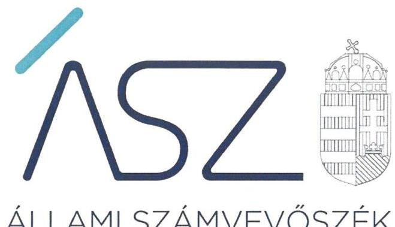
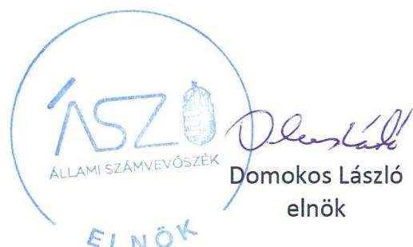
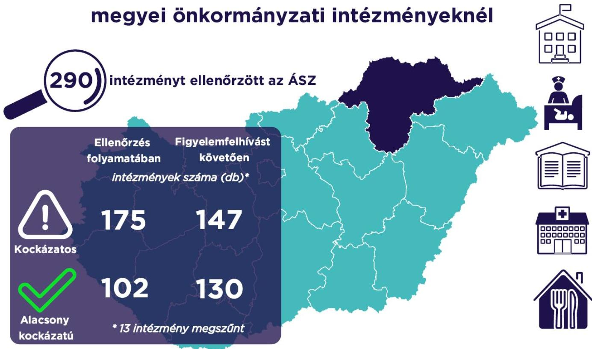

ÁLLAMI SZÁMVEVŐSZÉK

# JELENTÉS 

## A Borsod-Abaúj-Zemplén megyei önkormányzati intézmények ellenőrzése

Az önkormányzat és társulás irányítása alá tartozó intézmények integritásának monitoring típusú ellenőrzése - 290 intézmény
2021.

21099
www.asz.hu

---

ÁLLAMI SZÁMVEVŐSZÉK

# JELENTÉS

A Borsod-Abaúj-Zemplén megyei önkormányzati intézmények ellenőrzése

Az önkormányzat és társulás irányítása alá tartozó intézmények integritásának monitoring típusú ellenőrzése – 290 intézmény

2021.

12. hó 29. nap

21099
www.asz.hu

---

# AZ ELLENŐRZÉST FELÜGYELTE: 

SALAMON ILDIKÓ felügyeleti vezető

## AZ ELLENŐRZÉST VEZETTE ÉS A VÉGREHAJTÁSÁÉRT FELELŐS:

BALÁZSNÉ ANTONI ERIKA ellenőrzésvezető

BAJNAI ZSUZSANNA ellenőrzésvezető

A PROGRAM ÖSSZEÁLLÍTÁSÁÉRT FELELŐS:
DR. FELFÖLDI IZABELLA programkészítésért felelős vezető

IKTATÓSZÁM: EL-3461-006/2021.
TÉMASZÁM: 2568
ELLENŐRZÉS-AZONOSÍTÓ SZÁM: V0928

---

# TARTALOMJEGYZÉK 

■ ÖSSZEGZÉS ..... 5
■ AZ ELLENŐRZÉS JELENTŐSÉGE, AKTUALITÁSA, TÁRSADALMI SZEREPE, SZEMPONTJAI ..... 8
■ AZ ELLENŐRZÉS TERÜLETE ..... 9
■ ELLENŐRZÉS HATÓKÖRE ÉS MÓDSZERE ..... 10
■ MELLÉKLETEK ..... 13
I. sz. melléklet: Az értékelés módszertana ..... 13
II. sz. melléklet: Értelmező szótár ..... 15
■ FÜGGELÉKEK ..... 17
I. sz. függelék: Az ellenőrzött szervezetek és azok kockázati értékelése ..... 17
■ RÖVIDÍTÉSEK JEGYZÉKE ..... 31

---

.

---

# ÖSSZEGZÉS 

Az Állami Számvevőszék figyelemfelhívásának és tanácsadásának eredményeként a Borsod-Abaúj-Zemplén megyei önkormányzatok irányítása alatt álló 290 ellenőrzött intézmény közül 74 intézménynél az intézményvezető már 2021-ben intézkedett, vagy intézkedéseket rendelt el az integritást biztosító alapvető feltételek megerősítése, illetve kiépítése érdekében. Ezeknek az intézményeknek javult az integritása, erősödtek a csalásmentes működés feltételei.
137 intézménynél további intézkedések szükségesek az integritást biztosító alapvető feltételek kiépítése, illetve kiegészítése érdekében. Ezeknek az intézményeknek a vezetői az Állami Számvevőszék intézkedési kötelemmel járó figyelemfelhívására nem intézkedtek, ezért az azonosított kockázatok növekedtek, vagy intézkedéseik nem fedték le a kockázatos területeket, így az azonosított kockázatok nem változtak.
Az irányító önkormányzat 13 intézmény megszüntetéséről döntött az ellenőrzött időszakban.

## Értékelések

Az Állami Számvevőszék a Borsod-Abaúj-Zemplén megyei önkormányzatok irányítása alá tartozó 290 intézmény belső kontrollrendszerének lényeges elemei kialakítását ellenőrizte a 2021. évre vonatkozóan. Az ellenőrzés a súlypontok meghatározásával lehetőséget biztosított a szervezeti integritás, működés és vezetés, valamint a gazdálkodás területén a kockázatok azonosítására.

A szervezeti integritás alapvető feltétele a szabályozottság, azaz a jogszabályokban előírt belső szabályzatok megléte, azok - hatályos jogszabályoknak - megfelelő tartalma és gyakorlati alkalmazhatósága. Az integritási kockázatok szervezeti szinten csökkenthetők azáltal, hogy az intézményvezetők kialakítják a szervezeti és működési kereteket, a gazdálkodásra vonatkozó alapvető szabályozási környezetet, valamint a kontrolltevékenységek szabályszerű gyakorlásának, az integrált kockázatkezelésnek és az integritást sértő események kezelésének a feltételeit.

A szervezeti integritás, a működés és a vezetés alapvető szabályozási feltételeinek kialakítása hozzájárul a csalásmentes integritási környezet megteremtéséhez.

A szervezeti és működési szabályzat teremti meg a szervezet szabályszerű működésének alapjait, illetve rögzíti a szervezeten belüli felelősségi viszonyokat. A szabályzat biztosítja a szervezeti működés szabályozottságát, ezáltal a szervezet tevékenységének átláthatóságát, a szervezeti célokkal összhangban történő működés feltételeit és annak ellenőrizhetőségét. Az ellenőrzöttek közül 250 intézmény rendelkezett szervezeti és működési szabályzattal a 2021. évben.

A jogszabályi előírásoknak eleget téve, nyilatkozatban értékelte az intézmény belső kontrollrendszerének minőségét 216 intézmény vezetője. Ezek közül 182 intézménynél alakítottak ki olyan szabályozásokat, folyamatokat, amelyek biztosítják a költségvetési szerv tevékenységében a rendelkezésre álló források átlátható, szabályszerű, szabályozott, gazdaságos, hatékony és eredményes felhasználása követelményeinek érvényesítését.

Az integrált kockázatkezelés eljárásrendjét 242, a szervezeti integritást sértő események kezelésének eljárásrendjét 235 intézménynél alakították ki az intézményvezetők. Az integrált kockázatkezelés eljárásrendje biztosítja a szervezet működésében rejlő kockázatok azonosításának és kezelésének feltételeit. A szervezet működési kockázatai veszélyeztethetik a közpénzekkel való átlátható, elszámoltatható és felelős gazdálkodást. Az integritást sértő események kezelésének eljárásrendje jelenti a szervezet tekintetében felmerülő és a szervezeten belül bekövetkező integritást sértő események kezelésének alapjait. Az eljárásrend kialakításával az intézmény vezetője támogatja az integritást sértő eseményekkel kapcsolatosan azonosított kockázatok bekövetkezése esetén azok hatékony kezelését, illetve a következmények enyhítését.

---

A pénz- és vagyongazdálkodáshoz kapcsolódó alapvető szabályozások és nyilvántartások - így a számviteli politika és a keretében elkészítendő szabályzatok, a számlarend, a beszerzések szabályozása, valamint a kötelezettségvállalásra és a teljesítés igazolására jogosultak és aláírásmintáik nyilvántartása - előmozdítják a közpénzügyek átláthatóságát, rendezettségét. Az intézményvezető ezen szabályzatok elkészítésével, nyilvántartások vezetésével és folyamatos karbantartásával az alapfeltételét biztosítja a pénzügyi- és vagyongazdálkodás átláthatóságának, a közpénzekkel és közvagyonnal való elszámoltathatóságnak. Az ellenőrzöttek közül 253 intézménynél a számviteli politika, 204 intézménynél a számlarend, 233 intézménynél a beszerzések lebonyolításával kapcsolatos eljárásrend rendelkezésre állt.

Az ellenőrzöttek közül 66 intézmény vezetője tett eleget az ellenőrzött területek mindegyikén az integritási kontrollok alapvető feltételeit jelentő, a jogszabályban előírt szabályozási kötelezettségének. Közülük 61 intézmény vezetője a jogszabályi előírásokon túl további erőfeszítéseket is tett az integritás erősítése érdekében, felismerte további olyan integritási kontrollok kialakításának indokoltságát, amelyet jogszabály nem ír elő, így szervezeti szinten hozzájárul a korrupcióval szembeni védettség megszilárdításához.

213 intézmény esetében az intézményvezető intézkedése volt szükséges a kockázatok csökkentése érdekében, mivel 142 intézménynél a jogszabályok által előírt kontrollok területén, 66 intézménynél a jogszabályok által előírt és a további, jogszabály által nem előírt integritási kontrollok területén egyaránt, öt intézménynél utóbbi kontrollok területén voltak hiányosságok. A dokumentumok kiértékelése alapján - az integritás további fejlesztése érdekében - az Állami Számvevőszék azonosította a lényeges kockázati területeket, és már az ellenőrzés lefolytatásával párhuzamosan, a 2021. évre vonatkozóan a kockázatok csökkentésére hívta fel az intézményvezetők figyelmét.

# Következtetések 

Az érintett 208 intézmény közül 147 intézmény vezetője válaszolt határidőben az Állami Számvevőszék figyelemfelhívására. Közülük 102 teljeskörűen, 20 részben egyetértett a kockázatos területeken teendő intézkedések indokoltságával. Az intézményvezetők közül 83 arról tájékoztatta az Állami Számvevőszéket, hogy valamennyi kockázatos területen, 29 pedig a kockázatos területek egy részénél már tett, illetve a jövőben tesz intézkedést a jelzett kockázatok csökkentése érdekében. A jogszabályi előírásokon túli integritási kontrollok területén az érintett 71 intézmény közül 18 intézmény vezetője a jelzett kockázatok teljes körű, hat pedig azok részbeni felszámolásáról adott számot. Ezek eredményeként a 213 vezetői levélben jelzett 858 kockázati terület közül 288 esetben már történt, illetve tervezett az intézkedés, így javulás várható a feltárt kockázatos területek 33,6%-ánál.

Az intézkedések eredményeként az ellenőrzött 290 intézmény közül összesen 130 intézménynél a kockázatok alacsony szintűek, illetve - a tervezett intézkedések végrehajtásával - a kockázatok alacsony szintre csökkennek.

A szabályozások és nyilvántartások kialakításának célja nem önmagában a jogszabályi rendelkezések betartása, hanem az intézmény szabályozottságán keresztül a szabályszerű és csalásmentes gazdálkodás feltételeinek megteremtése, ezáltal az Alaptörvényben előírt átláthatóság és elszámoltathatóság elvének érvényesítése. Ezeknek az alapelveknek érvényesülése hozzájárulhat ahhoz, hogy az intézmények, mint közszolgáltatást nyújtó szervezetek felé a közszolgáltatásokat igénybe vevők, és általuk az állampolgárok általános bizalma is erősödjön.

Az Állami Számvevőszék figyelemfelhívására nem válaszoló, illetve a jelzett kockázatokra nem, vagy csak részben intézkedő intézményvezetők által vezetett intézményeknél rendszerszintű kockázatok maradtak fenn. Vezetési-irányítási kockázatot jelez, amennyiben az intézményvezetőnek címzett figyelemfelhívásra az intézményvezető helyett más személy válaszolt. Felelősségi és hatásköri kockázatot jelez, amennyiben az intézmény pénzügyi- és vagyongazdálkodásának alapvető szabályzatait a kontrollrendszer kialakításáért felelős intézményvezető helyett egy másik költségvetési szerv vezetője alakította ki, határozta meg. További kockázatot jelent a szabályok alkalmazottak általi megismerésére és alkalmazására, az intézmény mindennapi működésének integritására. Mindezek egyrészt az intézmény pénzügyi és vagyongazdálkodásának szabályszerűségét, másrészt a vezetői nyilatkozatok hitelességét, valóságtartalmát is megkérdőjelezi. A jelzett kockázatok arra mutatnak rá, hogy ezeknél az intézményeknél sérül a vezetői felelősség elve, és ezzel a felelős vezetésre épülő intézményi önállóság működése.

Az integritás elvű működés erősítése érdekében további kockázatcsökkentő lépések szükségesek a vezetés-irányítás, valamint a pénzügyi- és a vagyongazdálkodás szabályszerű feltételeinek kialakítása terén. Ezen intézmények integritásának kiépítését következő lépésként az irányító szerv bevonásával támogatja az Állami Számvevőszék.

---

# Erősödött a csalásmentesség a Borsod-Abaúj-Zemplén megyei önkormányzati intézményeknél 

---

# AZ ELLENŐRZÉS JELENTŐSÉGE, AKTUALITÁSA, TÁRSADALMI SZEREPE, SZEMPONTJAI 

Az Alaptörvény alapértékeket, elveket fogalmaz meg, amely szerint a közpénzekkel gazdálkodó minden szervezet köteles a nyilvánosság előtt elszámolni a közpénzekre vonatkozó gazdálkodásával. A közpénzeket és a nemzeti vagyont az átláthatóság és a közélet tisztaságának elve szerint kell kezelni.

Magyarország helyi önkormányzatairól szóló törvény ${ }^{1}$ a helyi közhatalom gyakorlás széleskörű érvényesítésével összhangban tág teret ad a helyi önkormányzatoknak a feladataik, a közszolgáltatások legkülönbözőbb formákban történő ellátására, így széleskörű lehetőséggel rendelkeznek intézmények alapítására.

A helyi önkormányzatok irányítása alá tartozó intézmények szerteágazó közszolgáltatásokat nyújtanak. Az intézmények működtetése közvetlenül érinti a társadalom valamennyi rétegét, a közfeladatot ellátó intézmények működésének minősége közvetlen hatással van az azokat igénybe vevő állampolgárok életére.

Az intézmények szabályszerű és eredményes működésének és gazdálkodásának alapfeltétele a belső kontrollrendszer - benne az integritási kontrollok - megfelelő kialakítása. Az ÁSZ² a törvényi felhatalmazással élve ellenőrzi az önkormányzati intézményeket, hogy megállapításaival támogassa az ellenőrzött szervezetek szabályszerű gazdálkodását, működését.

A helyi önkormányzatok intézményei által ellátott feladatok, a bölcsődei, óvodai ellátás, a gyermekétkeztetés, a betegek és idősek gondozása, a közművelődési intézmények, könyvtárak működtetése által a lakosság ezeken a területeken találkozik legszélesebb körben az önkormányzatok által nyújtott szolgáltatásokkal. A szolgáltatásokat igénybe vevők jelentős száma, a feladatellátáshoz használt nemzeti vagyon és az erre fordított közpénz nagysága indokolja, hogy az ÁSZ további, az előző ellenőrzésekre épülő ellenőrzéseket végezzen ezen a területen, illetve további olyan területeken, ahol az önkormányzati szolgáltatást a lakosság széles köre veszi igénybe.

Az ellenőrzés célja annak értékelése, hogy a helyi önkormányzatok irányítása alá tartozó intézmények megteremtették-e az integritás biztosításához szükséges feltételeket, kialakították-e az alapvető, a szervezeti kereteket, az integritási kontrollokhoz kapcsolódó, valamint a korrupció elleni védelmet szolgáló szabályozásokat. Továbbá, hogy az intézményvezető gondoskodott-e a szervezeti teljesítmény mérés alapfeltételeinek kialakításáról az eredményességi szempontoknak való megfelelés megalapozottsága biztosítása érdekében. A monitoring típusú ellenőrzés célja hatékonyan támogatni az ellenőrzött szervezeteket, ezáltal növelve az ÁSZ tanácsadó szerepét, elősegítve a „jól irányított állam" működését.

Az ÁSZ célja, hogy új ellenőrzési megközelítést alkalmazva támogassa a közpénzügyi helyzet javítását; a monitoring típusú ellenőrzéssel jelen időben adjon helyzetképet az integritási szemlélet érvényesítéséről, rávilágítson az integritási kontrollok kiépítettségére, illetve további fejlesztésére. Napjainkban mindez kiemelt fontosságúvá vált. Minden szervezetnek fel kell készülnie arra, hogy a koronavírus járvány okozta társadalmi és gazdasági válság növelni fogja a korrupciós nyomást. Az ÁSZ ebben a helyzetben is alapvető kötelességének tartja, hogy a közpénzek őre legyen, és ellenőrzéseit az önkormányzati alrendszer intézményei körében is folytassa.

Fontos, hogy az intézmények vezetői felismerjék az integritás kockázatokat, azokat ismételten mérjék fel, és alakítsanak ki átlátható, jól szabályozott rendszereket, döntési mechanizmusokat. Az integritási kockázatok feltárása, megismerése elengedhetetlenül fontos, mert ezt követően tehetők meg azok a lépések, amelyek a kockázatok csökkentését, felszámolását és kezelését célozzák. A belső kontrollrendszer - benne az integritás kontrollok - megfelelő kialakítása, működése a helyi önkormányzatok irányítása alatt álló intézményeknél is hozzájárul a társadalmi közbizalom erősítéséhez.

Az ellenőrzés rámutat az integritási jó gyakorlatokra is, továbbá felhívja a figyelmet a jogszabályi
 követelmények teljesítéséhez szükséges lépésekre is.

---

# AZ ELLENŐRZÉS TERÜLETE 

## Az önkormányzatok irányítása alá tartozó intézmények

Helyi önkormányzati költségvetési szervet az államháztartásról szóló 2011. évi CXCV törvény (Áht. ${ }^{3}$ ) szerint a helyi önkormányzat, a helyi önkormányzatok társulása, a térségi fejlesztési tanács, az átalakult nemzetiségi önkormányzat alapíthat, a költségvetési szerv alapító okiratában meghatározott önkormányzati közfeladatok ellátására. A költségvetési szervek önálló jogi személyek, éves költségvetésükből gazdálkodva látják el feladataikat. A költségvetési szervek gazdasági szervezettel rendelkeznek, ha azonban a költségvetési szerv éves átlagos statisztikai állományi létszáma a 100 főt nem éri el, a gazdasági szervezet feladatait az önkormányzati hivatal, vagy az irányító szerv döntése alapján az irányító szerv irányítása alá tartozó, gazdasági szervezettel rendelkező más költségvetési szerv látja el.

Az államháztartásról szóló törvény végrehajtásáról szóló 368/2011. (XII. 31.) Korm. rendelet (Ávr. ${ }^{4}$ ) 1. melléklete szerint, az államháztartás önkormányzati alrendszerében a helyi önkormányzat által irányított költségvetési szerv esetében az irányító szerv hatáskörét a képviselőtestület, közgyűlés gyakorolja, és annak vezetője a polgármester, főpolgármester, megyei közgyűlés elnöke.

Az ellenőrzés a Borsod-Abaúj-Zemplén megyei önkormányzatok irányítása alá tartozó, az I. sz. Függelékben felsorolt költségvetési szervekre terjedt ki.

A feladatellátásuk szerint az ellenőrzött költségvetési szervek egy része óvoda, bölcsőde, közoktatási intézmény, egészségügyi intézmény, konyha, művelődési ház, központ, múzeum, kulturális központ, idősek otthona, gondozási központ, gyermekjóléti intézmény (szolgálat), sportközpont intézményként működik.

Az ellenőrzött 290 intézmény közül öt rendelkezik saját gazdasági szervezettel.

Az ellenőrzés 287 intézmény esetében lefolytatásra került. Három intézmény esetében az ellenőrzés adatszolgáltatás hiányában nem volt lefolytatható, az ÁSZ ezeknek az ellenőrzötteknek az integritási kockázatát kiemelten magasnak értékelte.

Továbbá 13 intézmény az ellenőrzött időszakban megszűnt.

---

# ELLENŐRZÉS HATÓKÖRE ÉS MÓDSZERE 

## Az ellenőrzés típusa

Megfelelőségi ellenőrzés.

## Az ellenőrzött időszak

A 2021. év, a Bkr. ${ }^{5}$ szerinti vezetői nyilatkozat, valamint annak alátámasztottsága vonatkozásában a 2020. év.

## Az ellenőrzés tárgya

A szervezeti keretekkel, a működéssel és gazdálkodással kapcsolatos szabályzatok, szabályozások, valamint a szervezeti elvekkel, értékekkel összefüggő integritás kontrollok kiépítettsége, a szervezeti teljesítmény mérés alapfeltételeinek kialakítása.

## Az ellenőrzött szervezetek

Az ellenőrzött intézményeket az I. sz. Függelék tartalmazza.

## Az ellenőrzés jogalapja

Az ellenőrzés jogszabályi alapját az ÁSZ tv. ${ }^{6}$ 1. § (3) bekezdése, 5. § (6) bekezdése, valamint az Áht. 61. § (2) bekezdése képezik.

## Az ellenőrzés módszerei

Az ÁSZ az ellenőrzést az ellenőrzési program szempontjai, az ellenőrzött időszakban hatályos jogszabályok, a jelen ellenőrzésre irányadó ÁSZ módszertan figyelembevételével és a nemzetközi standardokat irányadónak tekintve végzi.

Az ellenőrzés ideje alatt az ÁSZ az ellenőrzött szervezetekkel történő kapcsolattartást az ÁSZ SZMSZ${ }^{7}$-ének vonatkozó előírásai alapján biztosítja.

Az ellenőrzési kérdések megválaszolásához szükséges bizonyítékok megszerzése a következő ellenőrzési eljárások alkalmazásával történik: megfigyelés, összehasonlítás, elemző eljárás. Az ellenőrzési bizonyítékként felhasználható adatforrások közé tartoznak az ellenőrzési programban felsorolt adatforrások, továbbá minden - az ellenőrzés folyamán - feltárt, az ellenőrzés szempontjából információkat tartalmazó dokumentum.

---

Az ÁSZ az ellenőrzést a kérdésekre adott válaszok kiértékelésével, valamint a megjelölt adatforrások, továbbá az adott időszakban hatályos jogszabályok, valamint az ÁSZ honlapján közzétett helyénvalósági kritériumok figyelembevételével folytatja le.

A monitoring típusú ellenőrzés az önkormányzatok irányítása alá tartozó intézmények integritás alapú működésének lényeges területeire és a közpénzügyi helyzet javítása érdekében az elért eredmények fenntartására fókuszál. Lehetőséget biztosít az integritási kontrollok kiépítettségében lévő hiányosságok, a szervezeti teljesítmény mérés alapfeltételei kialakításának hiánya beazonosítására az eredményességi szempontoknak való megfelelés megalapozottsága biztosítása érdekében, az önkormányzatok, társulások irányítása alá tartozó intézmények integritásának elemzésére, részletes ellenőrzések megalapozására.

---

.

---

# MELLÉKLETEK 

I. SZ. MELLÉKLET: AZ ÉRTÉKELÉS MÓDSZERTANA

Az egyes kockázati területek és kockázatforrások minősítése „pontozásos módszerrel", az integritás „jelző" dokumentumai és a vezetői magatartás ellenőrzéshez kapcsolódóan tanúsított tényhelyzeteinek értékelése alapján történt.

Az értékelt dokumentumokhoz, nyilvántartásokhoz, kockázati besorolásokhoz minden esetben pontszám került hozzárendelésre, amelyek értéke alapján az ellenőrzött szervezetek kockázati csoportba kerültek besorolásra:

- Alacsony kockázatú - az elérhető összes pontszám legalább 80\%-a
- Közepes kockázatú - az elérhető pontszám 50-79\%-a között
- Magas kockázatú - az elérhető pontszám 50\%-a alatt

Az első lépésben azonosításra kerültek azok az intézményi szabályozások és nyilvántartások, amelyek meglétét jogszabály írja elő, hiánya pedig felveti a csalás és korrupció kockázatát.

Második lépésben az adatoknak az ellenőrzés rendelkezésére bocsátása kockázati kritériumainak meghatározása, majd értékelése történt meg.

Harmadik lépésben a figyelemfelhívó levelekre adott válaszok kockázati kritériumainak meghatározása, majd értékelése történt meg.

Az összesített kockázati értékelést javította, amennyiben

- az intézmény rendelkezett olyan szabályozással, amely kötelező meglétét jogszabály nem írja elő, de segíti a csalás és a korrupció megelőzését (helyénvalósági dokumentumok).

Az összesített kockázati értékelést rontotta, amennyiben

- az integritás szempontjából meghatározó dokumentum - az intézményi SZMSZ - hiányzott, és javítása érdekében a figyelemfelhívó levél hatására sem történt intézkedés.

A figyelemfelhívó levelekre adott válaszok értékelése alapján:

- A kockázat csökkent, amennyiben a figyelemfelhívó levélre adott válasza a figyelemfelhívással összhangban volt, valamennyi kockázati területen intézkedett vagy intézkedést tervezett.
- A kockázat változatlan, amennyiben a figyelemfelhívó levélben foglaltaktól eltérő magatartást tanúsított, intézkedése a figyelemfelhívással részben volt összhangban, a kockázati területeken részben intézkedett vagy intézkedést tervezett.
- A kockázat nőtt, amennyiben nem volt együttműködő, a figyelemfelhívó levélre nem válaszolt, vagy válasza alapján nem intézkedett és nem tervezett intézkedést.

---

# Az önkormányzatok irányítása alá tartozó intézmények kockázati csoportba sorolásának értékelési keretrendszere 

I. Dokumentumokkal rendelkezés
lényeges dokumentumok, amelyek hiánya felveti a csalás és korrupció kockázatát
I.1. A szervezeti integritás, működés és vezetés alapvető szabályozási feltételei

- intézmény SZMSZ-e
- vezetői nyilatkozat a 2020. évre vonatkozóan az intézmény belső kontrollrendszer minőségének értékeléséről, valamint a nyilatkozat megalapozottságát bizonyító dokumentumok
- integrált kockázatkezelés eljárásrendje
- az integritást sértő események kezelésének eljárásrendje
I.2. A pénz- és vagyongazdálkodáshoz kapcsolódó alapvető szabályozások
- számviteli politika
- az eszközök és a források leltárkészítési és leltározási szabályzata
- az eszközök és a források értékelési szabályzata
- pénzkezelési szabályzat
- számlarend
- beszerzések lebonyolításával kapcsolatos eljárásrend
- a kötelezettségvállalásra, teljesítés igazolására jogosult személyekről és aláírás-mintájukról vezetett nyilvántartás
II. Az adatoknak az ellenőrzés rendelkezésére bocsátása
II.1. A megnevezett adatokkal rendelkezett és a törvényi határidőn belül hiánytalanul rendelkezésre bocsátotta. Figyelem-, illetve figyelmet felhívó levél nem volt indokolt.
II.2. A megnevezett adatokat nem bocsátotta rendelkezésre.
III. Figyelemfelhívó levelekre adott válaszok kockázati értékelése
III.1. Kockázat csökkent: együttműködése a figyelemfelhívó levéllel összhangban volt.
III.2. Kockázat változatlan: a figyelemfelhívó levélben foglaltaktól eltérő együttműködést tanúsított.
III.3. Kockázat nőtt: nem reagált, nem intézkedett, így nem volt együttműködő.

---

belső kontrollrendszer

Belső kontrollrendszer területei
integrált kockázatkezelési rendszer
integritás

Integritási kockázatok

A belső kontrollrendszer a kockázatok kezelése és tárgyilagos bizonyosság megszerzése érdekében kialakított folyamatrendszer, amely azt a célt szolgálja, hogy a működés és gazdálkodás során a tevékenységeket szabályszerűen, gazdaságosan, hatékonyan, eredményesen hajtsák végre, az elszámolási kötelezettségeket teljesítsék, megvédjék az erőforrásokat a veszteségektől, károktól és nem rendeltetésszerű használattól. (Forrás: Áht. 69. § (1) bekezdése)
A kontrollkörnyezet, az integrált kockázatkezelési rendszer, a kontrolltevékenységek, az információs és kommunikációs rendszer, valamint a nyomon követési (monitoring) rendszer. (Forrás: Bkr. 3. §-a)
Olyan folyamatalapú kockázatkezelési rendszer, amely a szervezet minden tevékenységére kiterjed, egységes módszertan és eljárások alkalmazásával, a szervezet célkitűzéseinek és értékeinek figyelembevételével biztosítja a szervezet kockázatainak teljes körű azonosítását, azok meghatározott kritériumok szerinti értékelését, valamint a kockázatok kezelésére vonatkozó intézkedési terv elkészítését és az abban foglaltak nyomon követését. (Forrás: Bkr. 2. § m) pontja)
Az integritás az elvek, értékek, cselekvések, módszerek, intézkedések konzisztenciáját jelenti, vagyis olyan magatartásmódot, amely meghatározott értékeknek megfelel. (Forrás: Nemzetgazdasági Minisztérium: Államháztartási belső kontroll standardok és gyakorlati útmutató 1.1.3. pontja, 2017. szeptember)
A szervezeti integritás a szervezet védekezőképessége a korrupció lehetőségével szemben. Az integritás erősítése - mint preventív eszközrendszer - a korrupció megelőzésére fókuszál. A szervezeti integritás a működés, a szervezeti kultúra minőségét is jelzi.
Az ellenőrzés megközelítése szerint az integritás a szervezet értékeinek és célkitűzéseinek megfelelő működést jelenti. Minél magasabb színvonalú egy szervezet integritása, az annál ellenállóbb a korrupcióval, a korrupciós veszélyekkel szemben, vagyis az integritás erősítése - elsősorban az egyes szervezetek szintjén - a korrupciós kockázatok mérséklésének egyik fontos eszköze. Az integritás ugyanakkor tágabb jelentésű fogalom, nemcsak a korrupciótól, hanem más helytelen magatartásoktól (például csalás, önkényesség) való mentességet és a szervezet céljainak követését is jelenti. Egy szervezet integritását úgy is meghatározhatjuk, mint a szervezet ellenállóképességét annak a veszélynek, hogy dolgozói helytelen magatartásukkal kárt okozzanak.
Az integritás megerősítése és fenntartása elsősorban a szervezet elsőszámú vezetőjének felelőssége.
Integritási kockázatnak minősül a szervezet célkitűzéseit, értékeit, elveit sértő vagy veszélyeztető visszaélés, szabálytalanság, vagy egyéb esemény lehetősége. A korrupciós kockázat olyan integritási kockázat, amely korrupciós cselekmény bekövetkezésének lehetőségét jelenti. Minden korrupciós kockázat egyben integritási kockázat is. Korrupciós cselekményeknek nevezzük azokat a vesztegetésszerű cselekményeket, amelyeket általában a Büntető Törvénykönyv ${ }^{8}$ is büntetéssel fenyeget.
Az integritási kockázat alatt az integritás megsértésének esélyét értjük. Az integritási kockázatok olyan helyzetek, folyamatok, amelyek során fennáll a korrupciós befolyás lehetősége. Így integritási kockázatok jelentkeznek például a köz- és a magánszféra közötti üzleti tranzakciók során, a köztisztviselők által hozott döntések, a mérlegelési szabadság körében, illetve abban az esetben, ha egy közszolgáltatás iránt nagyobb a kereslet, mint a kielégítéséhez rendelkezésre álló erőforrások. Az integritási kockázat értelemszerűen nem egyenlő magával az integritás sérelmével, vagy a korrupció be-

---

kockázat
kontrollkörnyezet
kontrolltevékenységek
intézmény
következésével. Az integritási kockázatokkal szemben megfelelő kontrollok kiépítésével lehet védekezni. Amennyiben az integritási kontrollok szintje elmarad a kockázatok mértékétől, kockázati kitettségről beszélünk. A kontrollok kialakításának és működtetésének mérlegelésekor minden esetben vizsgálni kell a kockázatok szintjét is, a túlszabályozottság egyfelől költséges, másfelől a túlzott bürokrácia maga is lehet a korrupciós veszély hordozója.
A kockázat annak a valószínűségét jelenti, hogy egy vagy több esemény, vagy intézkedés nem kívánt módon befolyásolja a rendszer működését, céljainak megvalósulását. (Forrás: Javaslatok a korrupciós kockázatok kezelésére - Kockázatkezelési és ellenőrzési módszertan 35. oldal, ÁSZ)
A költségvetési szerv vezetője által kialakított olyan elvek, eljárások, belső szabályzatok összessége, amelyben világos a szervezeti struktúra, a folyamatok átláthatók, egyértelműek a felelősségi, hatásköri viszonyok és feladatok, meghatározottak, ismertek és elfogadottak az etikai elvárások a szervezet minden szintjén, átlátható a humánerőforrás-kezelés, biztosított a szervezeti célok és értékek irányában való elkötelezettség fejlesztése és elősegítése. (Forrás: Bkr. 6. § (1) bekezdés)
A költségvetési szerv vezetője által a szervezeten belül kialakított (kontroll) tevékenységek, melyek biztosítják a kockázatok kezelését, hozzájárulnak a szervezet céljainak eléréséhez és erősítik a szervezet integritását. (Forrás: Bkr. 8. § (1) bekezdés)
A helyi önkormányzatok irányítása alá tartozó költségvetési szervek. (A képviselő-testület a feladatkörébe tartozó közszolgáltatások ellátására - jogszabályban meghatározottak szerint - költségvetési szervet (önkormányzati intézmény) alapíthat; Forrás: Mötv. 41. § (6) bekezdés)

---

# FÜGGELÉKEK

I. SZ. FÜGGELÉK: AZ ELLENŐRZÖTT SZERVEZETEK ÉS AZOK KOCKÁZATI ÉRTÉKELÉSE

|  Sorszám | Ellenőrzött szervezet megnevezése | Irányító szerv (önkormányzat) megnevezése | Helység | Tanácsadást megelőző kockázati besorolás | Intézkedést követően a kockázati értékelés változása | A

 kockázati szint alacsonyra csökkent-e  |
| --- | --- | --- | --- | --- | --- | --- |
|  1. | Borsodivánka Község Ellátó és Élelmezési Központ | Borsodivánka Község Önkormányzata | Borsodivánka | MAGAS | NÖTT | N  |
|  2. | Bükkszentkereszti Szlovák Nemzetiségi Óvoda és Konyha | Bükkszentkereszt Község Önkormányzata | Bükkszentkereszt | KÖZEPES | CSÖKKENT | I  |
|  3. | Gagyvendégi Napsugár Óvoda | Gagyvendégi Községi Önkormányzat | Gagyvendégi | KÖZEPES | CSÖKKENT | I  |
|  4. | Karcsai Óvoda | Karcsa Község Önkormányzata | Karcsa | MAGAS | NÖTT | N  |
|  5. | Karcsai Főzökonyha | Karcsa Község Önkormányzata | Karcsa | MAGAS | NÖTT | N  |
|  6. | Mezőkövesd Városi Önkormányzat Rendelőintézete | Mezőkövesd Város Önkormányzata | Mezőkövesd | ALACSONY | NEM VOLT SZABÁLYSZERŰSÉGI HIBA | I  |
|  7. | Mezőkövesdi Óvoda-Bölcsőde és Élelmezési Központ | Mezőkövesd Város Önkormányzata | Mezőkövesd | ALACSONY | NEM VOLT SZABÁLYSZERŰSÉGI HIBA | I  |
|  8. | II. Rákóczi Ferenc Megyei és Városi Könyvtár | Miskolc Megyei Jogú Város Önkormányzata | Miskolc | ALACSONY | NEM VOLT SZABÁLYSZERŰSÉGI HIBA | I  |
|  9. | Herman Ottó Múzeum | Miskolc Megyei Jogú Város Önkormányzata | Miskolc | KÖZEPES | NEM VÁLTOZOTT | N  |
|  10. | Miskolci Eszterlánc Néphagyományőrző Óvoda | Miskolc Megyei Jogú Város Önkormányzata | Miskolc | MEGSZÜNT INTÉZMÉNY | MEGSZÜNT INTÉZMÉNY | MEGSZÜNT INTÉZMÉNY  |
|  11. | Miskolci Napraforgó Óvoda | Miskolc Megyei Jogú Város Önkormányzata | Miskolc | MEGSZÜNT INTÉZMÉNY | MEGSZÜNT INTÉZMÉNY | MEGSZÜNT INTÉZMÉNY  |
|  12. | Miskolci József Úti Óvoda | Miskolc Megyei Jogú Város Önkormányzata | Miskolc | MEGSZÜNT INTÉZMÉNY | MEGSZÜNT INTÉZMÉNY | MEGSZÜNT INTÉZMÉNY  |
|  13. | Miskolci Belvárosi Óvoda | Miskolc Megyei Jogú Város Önkormányzata | Miskolc | MEGSZÜNT INTÉZMÉNY | MEGSZÜNT INTÉZMÉNY | MEGSZÜNT INTÉZMÉNY  |
|  14. | Miskolci Százszorszép Óvoda | Miskolc Megyei Jogú Város Önkormányzata | Miskolc | MEGSZÜNT INTÉZMÉNY | MEGSZÜNT INTÉZMÉNY | MEGSZÜNT INTÉZMÉNY  |
|  15. | Miskolci Avastetői Óvoda | Miskolc Megyei Jogú Város Önkormányzata | Miskolc | MEGSZÜNT INTÉZMÉNY | MEGSZÜNT INTÉZMÉNY | MEGSZÜNT INTÉZMÉNY  |
|  16. | Miskolci Nyitnikék Óvoda | Miskolc Megyei Jogú Város Önkormányzata | Miskolc | MEGSZÜNT INTÉZMÉNY | MEGSZÜNT INTÉZMÉNY | MEGSZÜNT INTÉZMÉNY  |
|  17. | Miskolci Diósgyőri Óvoda | Miskolc Megyei Jogú Város Önkormányzata | Miskolc | MEGSZÜNT INTÉZMÉNY | MEGSZÜNT INTÉZMÉNY | MEGSZÜNT INTÉZMÉNY  |
|  18. | Miskolci Integrált Óvodai Intézmény | Miskolc Megyei Jogú Város Önkormányzata | Miskolc | KÖZEPES | NEM VÁLTOZOTT | N  |

---

| Sorszám | Ellenőrzött szervezet megnevezése | Irányító szerv (önkormányzat) megnevezése | Helység | Tanácsadást megelőző kockázati besorolás | Intézkedést követően a kockázati értékelés változása | A kockázati szint alacsonyra csökkent-e |
| :--: | :--: | :--: | :--: | :--: | :--: | :--: |
| 19. | Miskolci Önkormányzati Rendészet | Miskolc Megyei Jogú Város Önkormányzata | Miskolc | ALACSONY | NEM VOLT SZABÁLYSZERŰSÉGI HIBA | I |
| 20. | Miskolci Egyesített Szociális, Egészségügyi és Gyermekjóléti Intézmény | Miskolc Megyei Jogú Város Önkormányzata | Miskolc | ALACSONY | NÖTT | N |
| 21. | Miskolci Egészségfejlesztési Intézet | Miskolc Megyei Jogú Város Önkormányzata | Miskolc | KÖZEPES | NÖTT | N |
| 22. | Monoki Micimackó Óvoda és Konyha | Monok Község Önkormányzata | Monok | ALACSONY | NEM VOLT SZABÁLYSZERŰSÉGI HIBA | I |
| 23. | Nagybarca Községi Önkormányzat Főzökonyhája | Nagybarca Községi Önkormányzat | Nagybarca | KÖZEPES | NEM VÁLTOZOTT | N |
| 24. | Nagybarcai Tündérkert Óvoda | Nagybarca Községi Önkormányzat | Nagybarca | KÖZEPES | NEM VÁLTOZOTT | N |
| 25. | Szögligeti Napköziotthonos Óvoda | Szögliget Község Önkormányzata | Szögliget | ALACSONY | CSÖKKENT | I |
| 26. | Tiszacsermelyi Tiszavirág Óvoda és Konyha | Tiszacsermely Község Önkormányzata | Tiszacsermely | MAGAS | NEM VÁLTOZOTT | N |
| 27. | Tiszakarádi Általános Művelődési Központ | Tiszakarád Község Önkormányzata | Tiszakarád | MAGAS | NÖTT | N |
| 28. | Tiszavalk Községi Önkormányzat Idősek Otthona | Tiszavalk Község Önkormányzata | Tiszavalk | MAGAS | NEM VÁLTOZOTT | N |
| 29. | Vilmányi Óvoda | Vilmány Község Önkormányzata | Vilmány | MAGAS | NÖTT | N |
| 30. | Vilmányi Konyha | Vilmány Község Önkormányzata | Vilmány | MAGAS | NÖTT | N |
| 31. | Aszalói Óvoda, Bölcsőde és Konyha | Aszaló Község Önkormányzata | Aszaló | KÖZEPES | CSÖKKENT | I |
| 32. | Bükkzsérci Napköziotthonos Óvoda | Bükkzsérc Község Önkormányzata | Bükkzsérc | MAGAS | NÖTT | N |
| 33. | Cserépfalui Napköziotthonos Óvoda és Konyha | Cserépfalu Község Önkormányzata | Cserépfalu | KÖZEPES | CSÖKKENT | I |
| 34. | Gönci Barackvirág Napköziotthonos Óvoda, Bölcsőde és Konyha | Gönc Város Önkormányzata | Gönc | KÖZEPES | NÖTT | N |
| 35. | Városi Könyvtár | Gönc Város Önkormányzata | Gönc | KÖZEPES | NÖTT | N |
| 36. | Putnoki Városgondnokság | Putnok Város Önkormányzata | Putnok | KÖZEPES | CSÖKKENT | I |
| 37. | Putnoki Humán Szolgáltató Központ | Putnok Város Önkormányzata | Putnok | KÖZEPES | NÖTT | N |
| 38. | Putnoki Soldos Emília ÓvodaBölcsőde | Putnok Város Önkormányzata | Putnok | ALACSONY | NEM VOLT SZABÁLYSZERŰSÉGI HIBA | N |
| 39. | Rudolftelepi Huncutkák Óvodája | Rudolftelep Községi Önkormányzat | Rudolftelep | ALACSONY | NEM VÁLTOZOTT | N |
| 40. | Rudolftelepi Községi Konyha | Rudolftelep Községi Önkormányzat | Rudolftelep | KÖZEPES | NEM VÁLTOZOTT | N |

---

| Sorszám | Ellenőrzött szervezet megnevezése | Irányító szerv (önkormányzat) megnevezése | Helység | Tanácsadást megelőző kockázati besorolás | Intézkedést követően a kockázati értékelés változása | A kockázati szint alacsonyra csökkent-e |
| :--: | :--: | :--: | :--: | :--: | :--: | :--: |
| 41. | Serényfalvai Játéksziget Óvoda | Serényfalva Község Önkormányzata | Serényfalva | KÖZEPES | NÖTT | N |
| 42. | Alsóvadászi Napsugár Óvoda és Konyha | Alsóvadász Község Önkormányzata | Alsóvadász | ALACSONY | CSÖKKENT | I |
| 43. | Bánhorváti Szivárvány ÓvodaBölcsőde és Szociális Konyha | Bánhorváti Községi Önkormányzat | Bánhorváti | KÖZEPES | NÖTT | N |
| 44. | Berentei Múvelődési Ház és Könyvtár | Berente Község Önkormányzata | Berente | ALACSONY | CSÖKKENT | I |
| 45. | Bodrogolaszi Óvoda | Bodrogolaszi Község Önkormányzata | Bodrogolaszi | MAGAS | NEM VÁLTOZOTT | N |
| 46. | Bódvaszilasi Napköziotthonos Óvoda | Bódvaszilas Község Önkormányzata | Bódvaszilas | ALACSONY | CSÖKKENT | I |
| 47. | Hernád Óvoda-Bölcsőde, Napközi Konyha | Bőcs Község Önkormányzata | Bőcs | ALACSONY | NEM VOLT SZABÁLYSZERŰSÉGI HIBA | I |
| 48. | Encsi Múvelődési és Sportközpont, Könyvtár | Encs Város Önkormányzata | Encs | KÖZEPES | CSÖKKENT | I |
| 49. | Encsi Csoda-Vár Óvoda és Bölcsőde | Encs Város Önkormányzata | Encs | KÖZEPES | CSÖKKENT | I |
| 50. | Encsi Területi Egészségügyi Központ | Encs Város Önkormányzata | Encs | KÖZEPES | CSÖKKENT | I |
| 51. | Pax Hálózatfejlesztő - Gondozási Központ | Encs Város Önkormányzata | Encs | KÖZEPES | NEM VÁLTOZOTT | N |
| 52. | Erdőhorváti Óvoda és Konyha | Erdőhorváti Községi Önkormányzat | Erdőhorváti | KÖZEPES | CSÖKKENT | N |
| 53. | Forrói Napközi Otthonos Óvoda | Forró Községi Önkormányzat | Forró | ALACSONY | NÖTT | N |
| 54. | Forrói Központi Konyha | Forró Községi Önkormányzat | Forró | KÖZEPES | NÖTT | N |
| 55. | Hejőszalontai Napsugár Óvoda | Hejőszalonta Község Önkormányzata | Hejőszalonta | KÖZEPES | CSÖKKENT | I |
| 56. | Hernádkak Községi Óvoda | Hernádkak Község Önkormányzata | Hernádkak | KÖZEPES | NÖTT | N |
| 57. | Hidasnémeti Napközi Otthonos Óvoda, Mini Bölcsőde és Konyha | Hidasnémeti Község Önkormányzata | Hidasnémeti | KÖZEPES | NÖTT | N |
| 58. | Ináncsi Önkormányzati Konyha | Ináncs Község Önkormányzata | Ináncs | KIEMELTEN MAGAS | NEM VÁLTOZOTT | N |
| 59. | Kesznyéteni Mesevár Óvoda és Községi Konyha | Kesznyéten Község Önkormányzata | Kesznyéten | MAGAS | NÖTT | N |
| 60. | Kistokaji Óvoda, Bölcsőde és Konyha | Kistokaj Község Önkormányzata | Kistokaj | KÖZEPES | NÖTT | N |
| 61. | Kondói Harica-Völgyi Óvoda | Kondó Község Önkormányzata | Kondó | ALACSONY | NEM VOLT SZABÁLYSZERŰSÉGI HIBA | I |
| 62. | Krasznokvajdai Óvoda | Krasznokvajda Község Önkormányzata | Krasznokvajda | KÖZEPES | CSÖKKENT | I |

---

| Sorszám | Ellenőrzött szervezet megnevezése | Irányító szerv (önkormányzat) megnevezése | Helység | Tanácsadást megelőző kockázati besorolás | Intézkedést követően a kockázati értékelés változása | A kockázati szint alacsonyra csökkent-e |
| :--: | :--: | :--: | :--: | :--: | :--: | :--: |
| 63. | Legyesbényei Óvoda és Konyha | Legyesbénye Község Önkormányzata | Legyesbénye | ALACSONY | NEM VOLT SZABÁLYSZERŰSÉGI HIBA | I |
| 64. | Léhi Ringató Óvoda és Konyha | Léh Községi Önkormányzat | Léh | KÖZEPES | NÖTT | N |
| 65. | Makkoshotykai Óvoda és Konyha | Makkoshotyka Község Önkormányzata | Makkoshotyka | MAGAS | NEM VÁLTOZOTT | N |
| 66. | Mályinka Község Önkormányzata Főzőkonyhája | Mályinka Község Önkormányzata | Mályinka | KÖZEPES | NÖTT | N |
| 67. | Megyaszói Idősek Klubja és Konyha | Megyaszó Község Önkormányzata | Megyaszó | ALACSONY | CSÖKKENT | I |
| 68. | Mackó Kuckó Bölcsőde és Napköziotthonos Óvoda | Megyaszó Község Önkormányzata | Megyaszó | ALACSONY | CSÖKKENT | I |
| 69. | Megyaszói Általános Művelődési Központ | Megyaszó Község Önkormányzata | Megyaszó | ALACSONY | CSÖKKENT | I |
| 70. | Mezőnyárádi Óvoda Bölcsőde és Konyha |
 | Mezőnyárád Község Önkormányzata | Mezőnyárád | MAGAS | CSÖKKENT | N |
| 71. | Mezőzombori Bóbita Óvoda | Mezőzombor Község Önkormányzata | Mezőzombor | KÖZEPES | NEM VÁLTOZOTT | N |
| 72. | Kapocs Családsegítő és Gyermekjóléti Szolgálat | Mezőzombor Község Önkormányzata | Mezőzombor | KÖZEPES | NEM VÁLTOZOTT | N |
| 73. | Muhi Pöttömkert Óvoda | Muhi Község Önkormányzata | Muhi | KÖZEPES | NÖTT | N |
| 74. | Nemesbikk Nefelejcs Óvoda | Nemesbikk Község Önkormányzata | Nemesbikk | KÖZEPES | NEM VÁLTOZOTT | N |
| 75. | Pácini Bárókert Óvoda, Mini Bölcsőde és Konyha | Pácin Község Önkormányzata | Pácin | KÖZEPES | NÖTT | N |
| 76. | Rátkai Gyermekkert Óvoda, Mini Bölcsőde és Konyha | Rátkai Német Nemzetiségi Települési Önkormányzat | Rátka | ALACSONY | CSÖKKENT | I |
| 77. | Sajóládi Gyöngyszem Óvoda | Sajólád Község Önkormányzata | Sajólád | KÖZEPES | NÖTT | N |
| 78. | Sajóládi Közösségi Ház | Sajólád Község Önkormányzata | Sajólád | KÖZEPES | NÖTT | N |
| 79. | Sajólászlófalvai Kuckó Községi Óvoda | Sajólászlófalva Község Önkormányzata | Sajólászlófalva | ALACSONY | NEM VOLT SZABÁLYSZERŰSÉGI HIBA | I |
| 80. | Sajóörösi Hétszínvirág Napköziotthonos Óvoda | Sajóörös Község Önkormányzata | Sajóörös | KÖZEPES | NÖTT | N |
| 81. | Sajópálfalai Vackor Óvoda és Mini Bölcsőde | Sajópálfala Község Önkormányzata | Sajópálfala | KÖZEPES | NÖTT | N |
| 82. | Sajóvelezdi Napközi Otthonos Óvoda | Sajóvelezd Község Önkormányzata | Sajóvelezd | MAGAS | NÖTT | N |
| 83. | Sárospatak Város Rendelőintézete | Sárospatak Város Önkormányzata | Sárospatak | ALACSONY | NÖTT | N |
| 84. | A Művelődés Háza és Könyvtára Művelődési Központ és Népfőiskola | Sárospatak Város Önkormányzata | Sárospatak | ALACSONY | NÖTT | N |

---

| Sorszám | Ellenőrzött szervezet megnevezése | Irányító szerv (önkormányzat) megnevezése | Helység | Tanácsadást megelőző kockázati besorolás | Intézkedést követően a kockázati értékelés változása | A kockázati szint alacsonyra csökkent-e |
| :--: | :--: | :--: | :--: | :--: | :--: | :--: |
| 85. | Sárospataki Kommunális Szervezet | Sárospatak Város Önkormányzata | Sárospatak | ALACSONY | NEM VOLT SZABÁLYSZERŰSÉGI HIBA | N |
| 86. | Sárospataki Gondozási Központ | Sárospatak Város Önkormányzata | Sárospatak | ALACSONY | NEM VOLT SZABÁLYSZERŰSÉGI HIBA | I |
| 87. | Sárospataki Carolina Óvoda és Bölcsőde | Sárospatak Város Önkormányzata | Sárospatak | ALACSONY | NEM VOLT SZABÁLYSZERŰSÉGI HIBA | I |
| 88. | Szakáldi Manócskák Óvoda | Szakáld Község Önkormányzata | Szakáld | ALACSONY | CSÖKKENT | I |
| 89. | Szalaszendi Napközi Otthonos Óvoda és Főzőkonyha | Szalaszend Község Önkormányzata | Szalaszend | KÖZEPES | NÖTT | N |
| 90. | Szentistváni Gézengúz Óvoda | Szentistván Nagyközség Önkormányzata | Szentistván | KÖZEPES | NÖTT | N |
| 91. | Tardonai Méhecske Óvoda és Bölcsőde | Tardona Község Önkormányzata | Tardona | KÖZEPES | NEM VÁLTOZOTT | N |
| 92. | Tornyosnémeti Margaréta Napköziotthonos Óvoda | Tornyosnémeti Község Önkormányzata | Tornyosnémeti | MAGAS | NÖTT | N |
| 93. | Vajdácska Óvoda és Mini Bölcsőde | Vajdácska Község Önkormányzata | Vajdácska | MAGAS | NEM VÁLTOZOTT | N |
| 94. | Varbói Napközi Otthonos Óvoda | Varbó Község Önkormányzata | Varbó | ALACSONY | NEM VÁLTOZOTT | N |
| 95. | Abaújkér Községi Önkormányzat Művelődési Ház | Abaújkér Község Önkormányzata | Abaújkér | KIEMELTEN MAGAS | NEM VÁLTOZOTT | N |
| 96. | Abaújkéri Napköziotthonos Óvoda | Abaújkér Község Önkormányzata | Abaújkér | KÖZEPES | NÖTT | N |
| 97. | Öszi Napfény Idősek Otthona | Abaújszántó Város Önkormányzata | Abaújszántó | KÖZEPES | NEM VÁLTOZOTT | N |
| 98. | Alsódobszai Óvoda, Mini Bölcsőde és Konyha | Alsódobsza Község Önkormányzata | Alsódobsza | KÖZEPES | CSÖKKENT | I |
| 99. | Alsószuhai Konyha | Alsószuha Község Önkormányzata | Alsószuha | KÖZEPES | NÖTT | N |
| 100. | Alsózsolcai 2. sz. Óvoda és Konyha | Alsózsolca Város Önkormányzata | Alsózsolca | KÖZEPES | NÖTT | N |
| 101. | Fekete István Óvoda és Bölcsőde | Alsózsolca Város Önkormányzata | Alsózsolca | KÖZEPES | NÖTT | N |
| 102. | Alsózsolcai Közösségi Ház és Könyvtár | Alsózsolca Város Önkormányzata | Alsózsolca | KÖZEPES | NEM VÁLTOZOTT | N |
| 103. | Alsózsolcai Gondozási Központ | Alsózsolca Város Önkormányzata | Alsózsolca | ALACSONY | NÖTT | N |
| 104. | Arlói Tengerszem Óvoda | Arló Nagyközség Önkormányzata | Arló | ALACSONY | NEM VOLT SZABÁLYSZERŰSÉGI HIBA | N |
| 105. | Arlói Szociális Alapszolgáltatási Központ | Arló Nagyközség Önkormányzata | Arló | ALACSONY | NEM VOLT SZABÁLYSZERŰSÉGI HIBA | N |
| 106. | Arnóti Napközi Otthonos Óvoda és Mini Bölcsőde | Arnót Község Önkormányzata | Arnót | ALACSONY | NEM VOLT SZABÁLYSZERŰSÉGI HIBA | I |

---

| Sorszám | Ellenőrzött szervezet megnevezése | Irányító szerv (önkormányzat) megnevezése | Helység | Tanácsadást megelőző kockázati besorolás | Intézkedést követően a kockázati értékelés változása | A kockázati szint alacsonyra csökkent-e |
| :--: | :--: | :--: | :--: | :--: | :--: | :--: |
| 107. | Ároktői Óvoda | Ároktő Község Önkormányzata | Ároktő | KÖZEPES | NÖTT | N |
| 108. | Baktakéki Napköziotthonos Óvoda | Baktakék Községi Önkormányzat | Baktakék | MAGAS | NÖTT | N |
| 109. | Baktakéki Gondozási Központ | Baktakék Községi Önkormányzat | Baktakék | MAGAS | NÖTT | N |
| 110. | Balajti Óvoda és Mini Bölcsőde | Balajt Község Önkormányzata | Balajt | KÖZEPES | NÖTT | N |
| 111. | Bekecsi Általános Művelődési Központ, Lurkő-Ház Óvoda és Bölcsőde, Művelődési Ház | Bekecs Község Önkormányzata | Bekecs | ALACSONY | NEM VOLT SZABÁLYSZERŰSÉGI HIBA | I |
| 112. | Berzéki Perczel Mór Óvoda | Berzék Község Önkormányzata | Berzék | KÖZEPES | CSÖKKENT | I |
| 113. | Bodrogkeresztúri Nyitnikék Óvoda, Bölcsőde és Konyha | Bodrogkeresztúr Község Önkormányzata | Bodrogkeresztúr | KÖZEPES | CSÖKKENT | I |
| 114. | Faluház | Bodrogkeresztúr Község Önkormányzata | Bodrogkeresztúr | KÖZEPES | CSÖKKENT | I |
| 115. | Nyugdijasház és Konyha Bodrogkisfalud | Bodrogkisfalud Község Önkormányzata | Bodrogkisfalud | ALACSONY | CSÖKKENT | I |
| 116. | Bogácsi Bagolyvár Óvoda és Bölcsőde | Bogács Község Önkormányzata | Bogács | KÖZEPES | NÖTT | N |
| 117. | Borsodbótai Napközi Otthonos Óvoda és Konyha | Borsodbóta Község Önkormányzata | Borsodbóta | ALACSONY | NEM VOLT SZABÁLYSZERŰSÉGI HIBA | I |
| 118. | Borsodnádasdi Szociális Alapszolgáltatási Központ | Borsodnádasd Város Önkormányzata | Borsodnádasd | ALACSONY | NEM VOLT SZABÁLYSZERŰSÉGI HIBA | I |
| 119. | Borsodnádasdi Közösségi Ház és Könyvtár | Borsodnádasd Város Önkormányzata | Borsodnádasd | ALACSONY | NEM VOLT SZABÁLYSZERŰSÉGI HIBA | I |
| 120. | Borsodnádasdi Mesekert Óvoda | Borsodnádasd Város Önkormányzata | Borsodnádasd | ALACSONY | NEM VOLT SZABÁLYSZERŰSÉGI HIBA | I |
| 121. | Borsodsziráki Bartók Béla Általános Művelődési Központ | Borsodszirák Község Önkormányzata | Borsodszirák | KÖZEPES | NEM VÁLTOZOTT | N |
| 122. | Bükkábrányi Napsugár Óvoda Bölcsőde és Konyha | Bükkábrány Község Önkormányzata | Bükkábrány | ALACSONY | NEM VOLT SZABÁLYSZERŰSÉGI HIBA | I |
| 123. | Bükkaranyos Kincsei Bölcsőde, Óvoda és Konyha | Bükkaranyos Község Önkormányzata | Bükkaranyos | ALACSONY | CSÖKKENT | I |
| 124. | Cigándi Tündérkert Óvoda és Bölcsőde | Cigánd Város Önkormányzata | Cigánd | KÖZEPES | CSÖKKENT | I |
| 125. | Cigánd Városi Művelődési Központ | Cigánd Város Önkormányzata | Cigánd | KÖZEPES | CSÖKKENT | I |
| 126. | Csenyéte Óvoda | Csenyéte Község Önkormányzata | Csenyéte | KÖZEPES | CSÖKKENT | I |
| 127. | Csernelyi Óvoda | Csernely Községi Önkormányzat | Csernely | KÖZEPES | NÖTT | N |
| 128. | Csobaji Óvoda és Konyha | Csobaj Község Önkormányzata | Csobaj | KÖZEPES | NÖTT | N |

---

| Sorszám | Ellenőrzött szervezet megnevezése | Irányító szerv (önkormányzat) megnevezése | Helység | Tanácsadást megelőző kockázati besorolás | Intézkedést követően a kockázati értékelés változása | A kockázati szint alacsonyra csökkent-e |
| :--: | :--: | :--: | :--: | :--: | :--: | :--: |
| 129. | Csokvaomány Óvoda és Konyha és Mini Bölcsőde | Csokvaomány Községi Önkormányzat | Csokvaomány | KÖZEPES | NÖTT | N |
| 130. | Dédestapolcsányi Hétszínvirág Óvoda, Mini Bölcsőde és Konyha | Dédestapolcsány Község Önkormányzata | Dédestapolcsány | ALACSONY | NEM VOLT SZABÁLYSZERŰSÉGI HIBA | I |
| 131. | Domaházi Óvoda | Domaháza Község Önkormányzata | Domaháza | ALACSONY | NEM VOLT SZABÁLYSZERŰSÉGI HIBA | I |
| 132. | Edelényi Szociális Szolgáltató Központ | Edelény Város Önkormányzata | Edelény | KÖZEPES | CSÖKKENT | I |
| 133. | Hadobás Pál Művelődési Központ, Könyvtár és Közérdekű Muzeális Kiállítóhely | Edelény Város Önkormányzata | Edelény | ALACSONY | NEM VOLT SZABÁLYSZERŰSÉGI HIBA | I |
| 134. | Edelényi Mátyás Óvoda és Bölcsőde | Edelény Város Önkormányzata | Edelény | ALACSONY | NEM VOLT SZABÁLYSZERŰSÉGI HIBA | I |
| 135. | Emődi Gyermekálom Óvoda és Bölcsőde | Emőd Város Önkormányzata | Emőd | KÖZEPES | NÖTT | N |
| 136. | Emődi Szociális Szolgáltató Központ | Emőd Város Önkormányzata | Emőd | KÖZEPES | NÖTT | N |
| 137. | Emődi Művelődési Ház és Könyvtár | Emőd Város Önkormányzata | Emőd | MAGAS | NÖTT | N |
| 138. | Farkaslyuki Napköziotthonos Óvoda | Farkaslyuk Község Önkormányzata | Farkaslyuk | KÖZEPES | NÖTT | N |
| 139. | Felsővadászi Óvoda | Felsővadász Községi Önkormányzat | Felsővadász | KÖZEPES | CSÖKKENT | I |
| 140. | Felsőzsolcai Közösségi Ház és Városi Könyvtár | Felsőzsolca Város Önkormányzata | Felsőzsolca | KÖZEPES | NÖTT | N |
| 141. | Felsőzsolcai Napközi Otthonos Óvoda | Felsőzsolca Város Önkormányzata | Felsőzsolca | KÖZEPES | CSÖKKENT | I |
| 142. | Fulókércsi Étkeztetés | Fulókércs
 Község Önkormányzata | Fulókércs | KÖZEPES | NÖTT | N |
| 143. | Füzéri Várgondnokság | Füzér Község Önkormányzata | Füzér | KÖZEPES | NÖTT | N |
| 144. | Füzéri Óvoda és Kisdedóvó Mini Bölcsőde és Konyha | Füzér Község Önkormányzata | Füzér | KÖZEPES | NÖTT | N |
| 145. | Gadnai Óvoda | Gadna Községi Önkormányzat | Gadna | KÖZEPES | CSÖKKENT | I |
| 146. | Geleji Tündérkert Óvoda | Gelej Község Önkormányzata | Gelej | KÖZEPES | NEM VÁLTOZOTT | N |
| 147. | Györgytarlói Óvoda és Konyha | Györgytarló Község Önkormányzata | Györgytarló | KÖZEPES | NEM VÁLTOZOTT | N |
| 148. | Hangácsi Óvoda | Hangács Község Önkormányzata | Hangács | KÖZEPES | NEM VÁLTOZOTT | N |
| 149. | Hangonyi Csicsergő Óvoda | Hangony Községi Önkormányzat | Hangony | MEGSZÜNT INTÉZMÉNY | MEGSZÜNT INTÉZMÉNY | MEGSZÜNT   INTÉZMÉNY |
| 150. | Harsányi Hársfavirág Óvoda, Bölcsőde és Konyha | Harsány Község Önkormányzata | Harsány | ALACSONY | NEM VÁLTOZOTT | N |

---

| Sorszám | Ellenőrzött szervezet megnevezése | Irányító szerv (önkormányzat) megnevezése | Helység | Tanácsadást megelőző kockázati besorolás | Intézkedést követően a kockázati értékelés változása | A kockázati szint alacsonyra csökkent-e |
| :--: | :--: | :--: | :--: | :--: | :--: | :--: |
| 151. | Hejőbábai Mesevár Óvoda és Konyha | Hejőbába Községi Önkormányzat | Hejőbába | KÖZEPES | CSÖKKENT | I |
| 152. | Hejőkeresztúri Gesztenyéskert Óvoda és Konyha | Hejőkeresztúr Község Önkormányzata | Hejőkeresztúr | KÖZEPES | NÖTT | N |
| 153. | Hejőpapi Hétszínvirág Óvoda | Hejőpapi Község Önkormányzata | Hejőpapi | ALACSONY | NEM VOLT SZABÁLYSZERŰSÉGI HIBA | I |
| 154. | Hercegkút Gyöngyszem Német Nemzetiségi Óvoda | Hercegkút Község Önkormányzata | Hercegkút | MAGAS | NEM VÁLTOZOTT | N |
| 155. | Hidvégardói Napközi Otthonos Óvoda | Hidvégardó Község Önkormányzata | Hidvégardó | ALACSONY | NEM VOLT SZABÁLYSZERŰSÉGI HIBA | I |
| 156. | Igrici Százszorszép Óvoda | Igrici Község Önkormányzata | Igrici | KÖZEPES | NÖTT | N |
| 157. | Igrici Konyha | Igrici Község Önkormányzata | Igrici | KÖZEPES | NÖTT | N |
| 158. | Izsófalvai Szivárvány Óvoda | Izsófalva Nagyközség Önkormányzata | Izsófalva | ALACSONY | NEM VOLT SZABÁLYSZERŰSÉGI HIBA | I |
| 159. | Járdánházi Óvoda | Járdánháza Község Önkormányzata | Járdánháza | MEGSZÜNT INTÉZMÉNY | MEGSZÜNT INTÉZMÉNY | MEGSZÜNT INTÉZMÉNY |
| 160. | Karosi Főzőkonyha | Karos Község Önkormányzata | Karos | MAGAS | NÖTT | N |
| 161. | Kazincbarcikai Szociális Szolgáltató Központ | Kazincbarcika Város Önkormányzata | Kazincbarcika | ALACSONY | NEM VOLT SZABÁLYSZERŰSÉGI HIBA | I |
| 162. | Kazincbarcikai Összevont Óvodák | Kazincbarcika Város Önkormányzata | Kazincbarcika | KÖZEPES | NÖTT | N |
| 163. | Kenézlői Óvoda és Konyha | Kenézlő Község Önkormányzata | Kenézlő | ALACSONY | NEM VOLT SZABÁLYSZERŰSÉGI HIBA | I |
| 164. | Királdi Napközi Otthonos Óvoda - Bölcsőde | Királd Község Önkormányzata | Királd | ALACSONY | CSÖKKENT | I |
| 165. | Kisgyőri Szociális Intézmény | Kisgyőr Község Önkormányzata | Kisgyőr | ALACSONY | NÖTT | N |
| 166. | Kisgyőri Óvoda és Bölcsőde | Kisgyőr Község Önkormányzata | Kisgyőr | ALACSONY | NEM VOLT SZABÁLYSZERŰSÉGI HIBA | I |
| 167. | Komlóskai Ruszin Nemzetiségi Óvoda és Konyha | Komlóska Község Önkormányzata | Komlóska | MAGAS | NEM VÁLTOZOTT | N |
| 168. | Körömi Antall József Napközi Otthonos Óvoda | Köröm Község Önkormányzata | Köröm | KÖZEPES | NÖTT | N |
| 169. | Kurityáni Kisvakond Óvoda | Kurityán Község Önkormányzata | Kurityán | KÖZEPES | CSÖKKENT | I |
| 170. | Mádi Napköziotthonos Óvoda és Bölcsőde | Mád Község Önkormányzata | Mád | KÖZEPES | CSÖKKENT | I |
| 171. | Mályi Gézengúz Óvoda | Mályi Község Önkormányzata | Mályi | ALACSONY | CSÖKKENT | I |

---

| Sorszám | Ellenőrzött szervezet megnevezése | Irányító szerv (önkormányzat) megnevezése | Helység | Tanácsadást megelőző kockázati besorolás | Intézkedést követően a kockázati értékelés változása | A kockázati szint alacsonyra csökkent-e |
| :--: | :--: | :--: | :--: | :--: | :--: | :--: |
| 172. | Mályi Móra Ferenc Közösségi Ház és Könyvtár | Mályi Község Önkormányzata | Mályi | ALACSONY | CSÖKKENT | I |
| 173. | Mályi Településüzemeltetési és Közszolgáltató Intézmény | Mályi Község Önkormányzata | Mályi | KÖZEPES | CSÖKKENT | I |
| 174. | Mályi Tündérkert Bölcsőde | Mályi Község Önkormányzata | Mályi | KÖZEPES | CSÖKKENT | I |
| 175. | Mérai Óvoda | Méra Község Önkormányzata | Méra | ALACSONY | NÖTT | N |
| 176. | Mezőcsáti Napocska Óvoda | Mezőcsát Város Önkormányzata | Mezőcsát | ALACSONY | NEM VOLT SZABÁLYSZERŰSÉGI HIBA | I |
| 177. | Mezőcsáti Művelődési Központ és Könyvtár | Mezőcsát Város Önkormányzata | Mezőcsát | ALACSONY | NEM VOLT SZABÁLYSZERŰSÉGI HIBA | I |
| 178. | Mezőkeresztesi Harmatcsepp Óvoda és Bölcsőde | Mezőkeresztes Város Önkormányzata | Mezőkeresztes | MAGAS | CSÖKKENT | N |
| 179. | Mezőkeresztesi Egyesített Szociális Intézmény | Mezőkeresztes Város Önkormányzata | Mezőkeresztes | KÖZEPES | NEM VÁLTOZOTT | N |
| 180. | Mezőkeresztes Városi Önkormányzat Központi Konyha | Mezőkeresztes Város Önkormányzata | Mezőkeresztes | MAGAS | CSÖKKENT | N |
| 181. | Mezőnagymihályi Mesevár Óvoda és Konyha | Mezőnagymihály Község Önkormányzata | Mezőnagymihály | MAGAS | NEM VÁLTOZOTT | N |
| 182. | Múcsonyi Általános Művelődési Központ, Bölcsőde és Konyha | Múcsony Nagyközség Önkormányzat | Múcsony | KÖZEPES | CSÖKKENT | I |
| 183. | Nagycsécsi Micimackó Óvoda | Nagycsécs Község Önkormányzata | Nagycsécs | KÖZEPES | NÖTT | N |
| 184. | Nekézsenyi Napraforgó Óvoda | Nekézseny Község Önkormányzata | Nekézseny | KÖZEPES | NÖTT | N |
| 185. | Szociális Alapellátást Biztosító Intézmény és Gyermekjóléti Szolgálat, Konyha | Novajidrány Község Önkormányzata | Novajidrány | KÖZEPES | NÖTT | N |
| 186. | Dargay Attila Gyermekvarázs Óvoda és Bölcsőde | Nyékládháza Város Önkormányzata | Nyékládháza | ALACSONY | NEM VOLT SZABÁLYSZERŰSÉGI HIBA | I |
| 187. | Nyékládházi Gondozási Központ | Nyékládháza Város Önkormányzata | Nyékládháza | ALACSONY | NEM VOLT SZABÁLYSZERŰSÉGI HIBA | I |
| 188. | Furmann Imre Művelődési Ház és Könyvtár | Nyékládháza Város Önkormányzata | Nyékládháza | ALACSONY | NEM VOLT SZABÁLYSZERŰSÉGI HIBA | I |
| 189. | Olaszliszkai Kerekerdő Óvoda és Bölcsőde | Olaszliszka Község Önkormányzata | Olaszliszka | MAGAS | NÖTT | N |
| 190. | Bársonyos Óvoda és Bölcsőde | Onga Város Önkormányzata | Onga | ALACSONY | NEM VOLT SZABÁLYSZERŰSÉGI HIBA | I |
| 191. | Önodi Homokvár Óvoda | Önod Község Önkormányzata | Önod | KÖZEPES | NÖTT | N |
| 192. | Ormosbánya Idősek Klubja | Ormosbánya Községi Önkormányzat | Ormosbánya | ALACSONY | NEM VOLT SZABÁLYSZERŰSÉGI HIBA | I |

---

| Sorszám | Ellenőrzött szervezet megnevezése | Irányító szerv (önkormányzat) megnevezése | Helység | Tanácsadást megelőző kockázati besorolás | Intézkedést követően a kockázati értékelés változása | A kockázati szint alacsonyra csökkent-e |
| :--: | :--: | :--: | :--: | :--: | :--: | :--: |
| 193. | Ormosbányai Százszorszép Óvoda | Ormosbánya Községi Önkormányzat | Ormosbánya | ALACSONY | NEM VOLT SZABÁLYSZERŰSÉGI HIBA | I |
| 194. | Özdi Városi Könyvtár | Özd Város Önkormányzata | Özd | ALACSONY | NEM VOLT SZABÁLYSZERŰSÉGI HIBA | I |
| 195. | Özd Városi Rendészet | Özd Város Önkormányzata | Özd | MAGAS | NEM VÁLTOZOTT | N |
| 196. | Özdi Béke Telepi Óvodák | Özd Város Önkormányzata | Özd | MEGSZÜNT INTÉZMÉNY | MEGSZÜNT INTÉZMÉNY | MEGSZÜNT   INTÉZMÉNY |
| 197. | Özdi Városi Óvodák | Özd Város Önkormányzata | Özd | ALACSONY | NEM VOLT SZABÁLYSZERŰSÉGI HIBA | I |
| 198. | Özdi Sajóvárkonyi-Táblai Összevont Óvoda | Özd Város Önkormányzata | Özd | MEGSZÜNT INTÉZMÉNY | MEGSZÜNT INTÉZMÉNY | MEGSZÜNT   INTÉZMÉNY |
| 199. | Özdi Petőfi Úti-Csépányi Összevont Óvoda | Özd Város Önkormányzata | Özd | MEGSZÜNT INTÉZMÉNY | MEGSZÜNT INTÉZMÉNY | MEGSZÜNT   INTÉZMÉNY |
| 200. | Perei Napközi-Otthonos Óvoda és Mini Bölcsőde | Pere Község Önkormányzata | Pere | MAGAS | NÖTT | N |
| 201. | Perkupai Pitypang Óvoda | Perkupa Község Önkormányzata | Perkupa | KÖZEPES | CSÖKKENT | I |
| 202. | Prügyi Mesevár Napköziotthonos Óvoda | Prügy Község Önkormányzat | Prügy | KÖZEPES | CSÖKKENT | I |
| 203. | Rakacai Szent Antal Óvoda és Központi Konyha | Rakaca Község Önkormányzata | Rakaca | MAGAS | NÖTT | N |
| 204. | Répáshutai Szlovák Nemzetiségi Óvoda és Konyha | Répáshuta Község Önkormányzata | Répáshuta | KÖZEPES | CSÖKKENT | I |
| 205. | Révleányvár Óvoda és Bölcsőde | Révleányvár Község Önkormányzata | Révleányvár | KÖZEPES | NEM VÁLTOZOTT | N |
| 206. | Révleányvár Konyha | Révleányvár Község Önkormányzata | Révleányvár | KÖZEPES | NÖTT | N |
| 207. | Ricsei II. Rákóczi Ferenc Óvoda, Mini Bölcsőde és Konyha | Ricse Nagyközség Önkormányzata | Ricse | ALACSONY | NEM VOLT SZABÁLYSZERŰSÉGI HIBA | I |
| 208. | Napfény Ricsei Idősek Otthona | Ricse Nagyközség Önkormányzata | Ricse | ALACSONY | NEM VOLT SZABÁLYSZERŰSÉGI HIBA | I |
| 209. | Rudabánya Bóbita Óvoda és Konyha | Rudabánya Város Önkormányzata | Rudabánya | ALACSONY | CSÖKKENT | I |
| 210. | Bányászattörténeti Múzeum | Rudabánya Város Önkormányzata | Rudabánya | KÖZEPES | CSÖKKENT | I |
| 211. | Déryné Szabadidőközpont és Városi Könyvtár | Sajóbábony Város Önkormányzata | Sajóbábony | ALACSONY | CSÖKKENT | I |
| 212. | Sajóbábonyi Szivárvány Óvoda, Bölcsőde és Konyha | Sajóbábony Város Önkormányzata | Sajóbábony | ALACSONY | CSÖKKENT | I |
| 213. | Sajóecsegi "Pitypang" Óvoda és Mini Bölcsőde | Sajóecseg Község Önkormányzata | Sajóecseg | KÖZEPES | NÖTT |

 | N |

---

| Sorszám | Ellenőrzött szervezet megnevezése | Irányító szerv (önkormányzat) megnevezése | Helység | Tanácsadást megelőző kockázati besorolás | Intézkedést követően a kockázati értékelés változása | A kockázati szint alacsonyra csökkent-e |
| :--: | :--: | :--: | :--: | :--: | :--: | :--: |
| 214. | Sajóhídvégi Rákóczi Julianna Óvoda | Sajóhídvég Község Önkormányzata | Sajóhídvég | KÖZEPES | CSÖKKENT | I |
| 215. | Sajóivánkai Községi Konyha | Sajóivánka Község Önkormányzata | Sajóivánka | ALACSONY | NEM VOLT SZABÁLYSZERŰSÉGI HIBA | I |
| 216. | Sajókazai Gézengúz Napköziotthonos Óvoda | Sajókaza Községi Önkormányzat | Sajókaza | KÖZEPES | NÖTT | N |
| 217. | Radvánszky Béla Művelődési Ház és Könyvtár | Sajókaza Községi Önkormányzat | Sajókaza | KÖZEPES | NÖTT | N |
| 218. | Csoda-Vár Óvoda és Mini Bölcsőde Sajókeresztúr | Sajókeresztúr Község Önkormányzata | Sajókeresztúr | KÖZEPES | NÖTT | N |
| 219. | Művelődési Ház, Községi és Iskolai Könyvtár | Sajókeresztúr Község Önkormányzata | Sajókeresztúr | KÖZEPES | NÖTT | N |
| 220. | Sajónémeti Napköziotthonos Óvoda | Sajónémeti Község Önkormányzata | Sajónémeti | ALACSONY | NEM VOLT SZABÁLYSZERŰSÉGI HIBA | I |
| 221. | Sajópetri Nefelejcs Napköziotthonos Óvoda | Sajópetri Község Önkormányzata | Sajópetri | ALACSONY | NEM VOLT SZABÁLYSZERŰSÉGI HIBA | I |
| 222. | Sajósenyei Aprajafalva Óvoda és Mini Bölcsőde | Sajósenye Község Önkormányzata | Sajósenye | KÖZEPES | CSÖKKENT | I |
| 223. | Sajószentpéteri Gyógyító-Megelőző Intézmény | Sajószentpéter Városi Önkormányzat | Sajószentpéter | ALACSONY | NEM VOLT SZABÁLYSZERŰSÉGI HIBA | I |
| 224. | Sajószentpéteri Művelődési és Sportközpont, Városi Könyvtár | Sajószentpéter Városi Önkormányzat | Sajószentpéter | ALACSONY | NEM VOLT SZABÁLYSZERŰSÉGI HIBA | I |
| 225. | Sajószentpéteri Központi Napközi Otthonos Óvoda | Sajószentpéter Városi Önkormányzat | Sajószentpéter | ALACSONY | NEM VOLT SZABÁLYSZERŰSÉGI HIBA | I |
| 226. | Sajószögedi Általános Művelődési Központ- Család és Gyermekjóléti Szolgálat - Konyha Művelődési Ház és Könyvtár | Sajószöged Községi Önkormányzat | Sajószöged | KÖZEPES | NÖTT | N |
| 227. | Sajószögedi Zöld Sziget Bölcsőde | Sajószöged Községi Önkormányzat | Sajószöged | KÖZEPES | NÖTT | N |
| 228. | Sajóvámosi Kincses Sziget Óvoda és Konyha | Sajóvámos Község Önkormányzata | Sajóvámos | KÖZEPES | NEM VÁLTOZOTT | N |
| 229. | Sajóvámosi Szivárvány Bölcsőde | Sajóvámos Község Önkormányzata | Sajóvámos | KÖZEPES | NEM VÁLTOZOTT | N |
| 230. | Sályi Hétszínvirág Óvoda és Konyha | Sály Község Önkormányzata | Sály | MAGAS | CSÖKKENT | N |
| 231. | Sátai Napköziotthonos Óvoda és Konyha | Sáta Község Önkormányzata | Sáta | KÖZEPES | NÖTT | N |
| 232. | Sátoraljaújhelyi Egyesített Szociális Intézmény | Sátoraljaújhely Város Önkormányzata | Sátoraljaújhely | ALACSONY | NEM VOLT SZABÁLYSZERŰSÉGI HIBA | I |
| 233. | Sátoraljaújhelyi Hétszínvirág Óvoda Szlovák és Német Nemzetiségi Óvoda, Bölcsőde | Sátoraljaújhely Város Önkormányzata | Sátoraljaújhely | ALACSONY | NEM VOLT SZABÁLYSZERŰSÉGI HIBA | I |
| 234. | Sátoraljaújhelyi Kossuth Lajos Művelődési Központ | Sátoraljaújhely Város Önkormányzata | Sátoraljaújhely | ALACSONY | NÖTT | N |

---

| Sorszám | Ellenőrzött szervezet megnevezése | Irányító szerv (önkormányzat) megnevezése | Helység | Tanácsadást megelőző kockázati besorolás | Intézkedést követően a kockázati értékelés változása | A kockázati szint alacsonyra csökkent-e |
| :--: | :--: | :--: | :--: | :--: | :--: | :--: |
| 235. | Magas-Hegyi Turisztikai és Sportközpont | Sátoraljaújhely Város Önkormányzata | Sátoraljaújhely | ALACSONY | NEM VÁLTOZOTT | N |
| 236. | Szemerei Mesekastély Óvoda és Főzökonyha | Szemere Község Önkormányzata | Szemere | MAGAS | NÖTT | N |
| 237. | Szendrői Közművelődési Központ és Könyvtár | Szendrő Város Önkormányzata | Szendrő | KÖZEPES | CSÖKKENT | I |
| 238. | Szent Kamill Idősek Otthona | Szendrőlád Község Önkormányzata | Szendrőlád | KÖZEPES | CSÖKKENT | I |
| 239. | Szendrőládi Óvoda | Szendrőlád Község Önkormányzata | Szendrőlád | KÖZEPES | CSÖKKENT | I |
| 240. | Szántó J. Endre Egyesített Szociális és Egészségügyi Intézet | Szerencs Város Önkormányzata | Szerencs | ALACSONY | CSÖKKENT | I |
| 241. | Szerencsi Óvoda és Bölcsőde | Szerencs Város Önkormányzata | Szerencs | ALACSONY | CSÖKKENT | I |
| 242. | Zempléni Múzeum | Szerencs Város Önkormányzata | Szerencs | KÖZEPES | CSÖKKENT | I |
| 243. | Szerencsi Művelődési Központ és Könyvtár | Szerencs Város Önkormányzata | Szerencs | KÖZEPES | CSÖKKENT | I |
| 244. | Szikszói Városi Óvoda és Bölcsőde | Szikszó Város Önkormányzata | Szikszó | ALACSONY | NEM VOLT SZABÁLYSZERŰSÉGI HIBA | I |
| 245. | Szikszói Városi Szabadidő Központ és Könyvtár | Szikszó Város Önkormányzata | Szikszó | ALACSONY | NEM VOLT SZABÁLYSZERŰSÉGI HIBA | I |
| 246. | Szin Napköziotthonos Óvoda | Szin Községi Önkormányzat | Szin | ALACSONY | NEM VOLT SZABÁLYSZERŰSÉGI HIBA | I |
| 247. | Szirmabesenyői Napsugár Óvoda és Bölcsőde | Szirmabesenyő Nagyközség Önkormányzata | Szirmabesenyő | ALACSONY | CSÖKKENT | I |
| 248. | Szomolyai Cseresznyeszem Óvoda | Szomolya Község Önkormányzata | Szomolya | KÖZEPES | NÖTT | N |
| 249. | Szuhakállói Községi Konyha | Szuhakálló Község Önkormányzata | Szuhakálló | KÖZEPES | NEM VÁLTOZOTT | N |
| 250. | Szuhogyi Nyitnikék Óvoda | Szuhogy Község Önkormányzata | Szuhogy | KÖZEPES | CSÖKKENT | I |
| 251. | Taktabáji "Kék Ibolya" Óvoda | Taktabáj Község Önkormányzata | Taktabáj | KÖZEPES | NEM VÁLTOZOTT | N |
| 252. | Taktabáji Szociális Szolgáltató Központ, Konyha | Taktabáj Község Önkormányzata | Taktabáj | KÖZEPES | NEM VÁLTOZOTT | N |
| 253. | Taktaharkányi Szociális Szolgáltató Központ | Taktaharkány Nagyközség Önkormányzata | Taktaharkány | KÖZEPES | NÖTT | N |
| 254. | Taktaharkányi Szivárvány Óvoda és Bölcsőde | Taktaharkány Nagyközség Önkormányzata | Taktaharkány | KÖZEPES | NÖTT | N |
| 255. | Taktakenézi Bóbita Óvoda és Konyha | Taktakenéz Község Önkormányzata | Taktakenéz | KÖZEPES | NÖTT | N |
| 256. | Taktaszadai Micimackó Óvoda-Bölcsőde-Konyha | Taktaszada Község Önkormányzata | Taktaszada | KÖZEPES | CSÖKKENT | I |

---

| Sorszám | Ellenőrzött szervezet megnevezése | Irányító szerv (önkormányzat) megnevezése | Helység | Tanácsadást megelőző kockázati besorolás | Intézkedést követően a kockázati értékelés változása | A kockázati szint alacsonyra csökkent-e |
| :--: | :--: | :--: | :--: | :--: | :--: | :--: |
| 257. | Idősek Klubja | Tarcal Község Önkormányzata | Tarcal | KÖZEPES | NÖTT | N |
| 258. | Bükk Kincsei Napközi-Otthonos Óvoda és Konyha | Tard Község Önkormányzata | Tard | KÖZEPES | NÖTT | N |
| 259. | Telkibányai Napköziotthonos Óvoda és Konyha | Telkibánya Község Önkormányzata | Telkibánya | ALACSONY | NEM VOLT SZABÁLYSZERŰSÉGI HIBA | I |
| 260. | Tiszabábolna Község Ellátó és Élelmezési Központ | Tiszabábolna Község Önkormányzata | Tiszabábolna | MAGAS | NEM VÁLTOZOTT | N |
| 261. | Tiszadorogmai Élelmezési Központ | Tiszadorogma Község Önkormányzata | Tiszadorogma | KÖZEPES | NÖTT | N |
| 262. | Tiszakeszi Hétszínvirág Óvoda | Tiszakeszi Község Önkormányzata | Tiszakeszi | KÖZEPES | NEM VÁLTOZOTT | N |
| 263. | Tiszaladányi Konyha | Tiszaladány Községi Önkormányzat | Tiszaladány | ALACSONY | CSÖKKENT | I |
| 264. | Tiszaladányi Fecskefészek Óvoda | Tiszaladány Községi Önkormányzat | Tiszaladány | ALACSONY | CSÖKKENT | I |
| 265. | Tiszalúci Önálló Napközi Otthonos Óvoda | Tiszalúc Nagyközség Önkormányzata | Tiszalúc | ALACSONY | CSÖKKENT | I |
| 266. | Tiszalúci Élelmezési Központ | Tiszalúc Nagyközség Önkormányzata | Tiszalúc | KÖZEPES | CSÖKKENT | I |
| 267. | Tiszapalkonyai Napsugár Óvoda | Tiszapalkonya Község Önkormányzata | Tiszapalkonya | MAGAS | NÖTT | N |
| 268. | Tiszatarjáni Micimackó Napközi Otthonos Óvoda és Bölcsőde | Tiszatarján Község Önkormányzata | Tiszatarján | KÖZEPES | CSÖKKENT | I |
| 269. | Tiszaújvárosi Városi Rendelőintézet | Tiszaújváros Város Önkormányzata | Tiszaújváros | ALACSONY | NEM VOLT SZABÁLYSZERŰSÉGI HIBA | I |
| 270. | Tiszaújvárosi Napközi Otthonos Óvoda | Tiszaújváros Város Önkormányzata | Tiszaújváros | ALACSONY | NEM VOLT SZABÁLYSZERŰSÉGI HIBA | I |
| 271. | Tiszaújvárosi Művelődési Központ és Könyvtár | Tiszaújváros Város Önkormányzata | Tiszaújváros | ALACSONY | NEM VOLT SZABÁLYSZERŰSÉGI HIBA | I |
| 272. | Tiszaújvárosi Humánszolgáltató Központ | Tiszaújváros Város Önkormányzata | Tiszaújváros | ALACSONY | NEM VOLT SZABÁLYSZERŰSÉGI HIBA | I |
| 273. | Tiszaújvárosi Intézményműködtető Központ | Tiszaújváros Város Önkormányzata | Tiszaújváros | KÖZEPES | NÖTT | N |
| 274. | Kulturális Központ, Németi Ferenc Városi Könyvtár | Tokaj Város Önkormányzata | Tokaj | ALACSONY | NEM VOLT SZABÁLYSZERŰSÉGI HIBA | I |
| 275. | Tokaji Gyermekkert Óvoda és Bölcsőde | Tokaj Város Önkormányzata | Tokaj | KÖZEPES | NÖTT | N |
| 276. | Szent Lázár Időskorúak Otthona Tokaj | Tokaj Város Önkormányzata | Tokaj | ALACSONY | NEM VOLT SZABÁLYSZERŰSÉGI HIBA | I |
| 277. | Tokaji Múzeum | Tokaj Város Önkormányzata | Tokaj | ALACSONY | NEM VOLT SZABÁLYSZERŰSÉGI HIBA | I |

---

|  Sorszám | Ellenőrzött szervezet megnevezése | Irányító szerv (önkormányzat) megnevezése | Helység | Tanácsadást megelőző kockázati besorolás | Intézkedést követően a kockázati értékelés változása | A kockázati szint alacsonyra csökkent-e  |
| --- | --- | --- | --- | --- | --- | --- |
|  278. | Tolcsvai Óvoda | Tolcsva Község Önkormányzata | Tolcsva | KÖZEPES | CSÖKKENT | I  |
|  279. | Mikro-Térségi Integrált Szolgáltató Központ | Tolcsva Község Önkormányzata | Tolcsva | KÖZEPES | CSÖKKENT | I  |
|  280. | Tolcsvai Szirmay-Waldbott Kastély Látogatóközpont | Tolcsva Község Önkormányzata | Tolcsva | KÖZEPES | CSÖKKENT | I  |
|  281. | Tornanádaskai Napköziotthonos Óvoda | Tornanádaska Község Önkormányzata | Tornanádaska | ALACSONY | NEM VOLT SZABÁLYSZERŰSÉGI HIBA | I  |
|  282. | Vadnai Csodavár Óvoda és Konyha | Vadna Község Önkormányzata | Vadna | ALACSONY | NEM VÁLTOZOTT | N  |

 VOLT SZABÁLYSZERŰSÉGI HIBA | I  |
|  283. | Vámosújfalui Óvodai, Bölcsődei, Nevelési Intézmény és Művelődési Központ | Vámosújfalu Község Önkormányzata | Vámosújfalu | MAGAS | CSÖKKENT | N  |
|  284. | Vattai Tündérkert Óvoda és Konyha | Vatta Község Önkormányzata | Vatta | KÖZEPES | NÖTT | N  |
|  285. | Vissi Óvoda és Konyha | Viss Község Önkormányzata | Viss | KÖZEPES | NÖTT | N  |
|  286. | Vizsolyi Főzőkonyha | Vizsoly Község Önkormányzata | Vizsoly | KÖZEPES | NÖTT | N  |
|  287. | Művelődési Ház és Könyvtár | Vizsoly Község Önkormányzata | Vizsoly | KIEMELTEN MAGAS | NEM VÁLTOZOTT | N  |
|  288. | Zádorfalva Óvoda | Zádorfalva Község Önkormányzata | Zádorfalva | ALACSONY | NÖTT | N  |
|  289. | Zemplénagárd Óvoda | Zemplénagárd Községi Önkormányzat | Zemplénagárd | ALACSONY | NEM VOLT SZABÁLYSZERŰSÉGI HIBA | I  |
|  290. | Zubogyi Pamacska Óvoda | Zubogy Község Önkormányzata | Zubogy | KÖZEPES | NÖTT | N  |

|  Alacsony kockázatú | 102 |  |   |
| --- | --- | --- | --- |
|  Közepes kockázatú | 138 |  |   |
|  Magas kockázatú | 34 |  |   |
|  Kiemelten magas kockázatú | 3 |  |   |
|  Megszűnt intézmény | 13 | 13 | 13  |
|  Kockázat csökkent |  | 74 |   |
|  Kockázat nem változott |  | 41 |   |
|  Kockázat nőtt |  | 96 |   |
|  Nem volt indokolt figyelemfelhívó levél (szabályszerűségi vagy szabályszerűségi és helyénvalósági hiba hiányában) |  | 66 |   |
|  Kockázat alacsony szintre csökkent |  |  | 130  |
|  Kockázat nem csökkent alacsony szintre |  |  | 147  |
|  Összesen | 290 | 290 | 290  |

---

# RÖVIDÍTÉSEK JEGYZÉKE 

${ }^{1}$ Mötv.
${ }^{2}$ ÁSZ
${ }^{3}$ Áht.
${ }^{4}$ Ávr.
${ }^{5}$ Bkr.
${ }^{6}$ ÁSZ tv.
${ }^{7}$ ÁSZ SZMSZ
${ }^{8}$ Büntető Törvénykönyv
2011. évi CLXXXIX. törvény - Magyarország helyi önkormányzatairól (hatályos: 2012. január 1-jétől)
Állami Számvevőszék
2011. évi CXCV. törvény az államháztartásról (hatályos: 2011. december 31-étől) 368/2011. (XII. 31.) Korm. rendelet az államháztartásról szóló törvény végrehajtásáról (hatályos: 2012. január 1-jétől)
370/2011. (XII. 31.) Korm. rendelet a költségvetési szervek belső kontrollrendszeréről és belső ellenőrzésről (hatályos: 2012. január 1-jétől) 2011. évi LXVI. törvény az Állami Számvevőszékről (hatályos: 2011. július 1-jétől) Az Állami Számvevőszék Szervezeti és Működési Szabályzata 2012. évi C. törvény a Büntető Törvénykönyvről (hatályos: 2013. július 1-jétől)

---

# ASZ 

ÁLLAMI SZÁMVEVŐSZÉK
1052 Budapest, Apáczai Cs. J. u. 10. I 1364 Budapest 4. Pf. 54 TEL: +36 14849100
email: szamvevoszek@asz.hu
web: www.asz.hu | www.aszhirportal.hu

