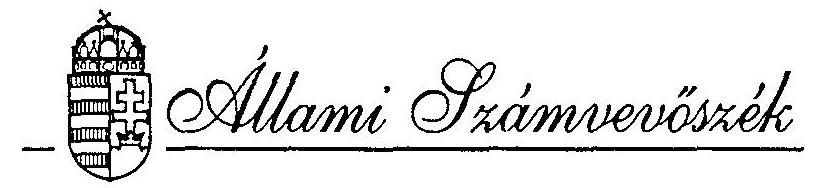
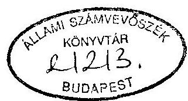
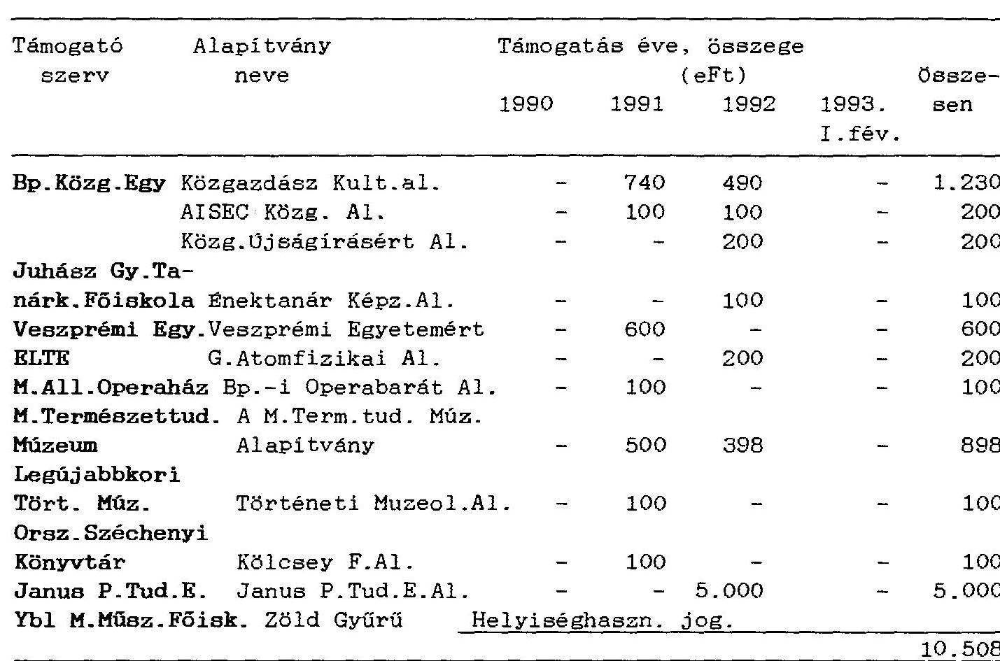

# JELENTÉS 

a központi költségvetési szerveknél az alapítványoknak juttatott állami pénzek és vagyon ellenôrzésérôl

---

A vizsgálatot vezette:

| Kolossváry György | igazgatóhelyettes |
| :-- | :-- |

A vizsgálatot végezték:

Csizmadia József
dr. Horváth Gyula
Tolnai Károly
külső szakértő
külső szakértő
külső szakértő

---

# JELENTÉS 

## a központi költségvetési szerveknél az alapítványoknak juttatott állami pénzek és vagyon ellenőrzéséröl

Az ellenőrzés célja az alapítványokba való pénz- és vagyonátadások törvényességének, szabályszerűségének értékelése, illetve annak megállapítása volt, hogy a hozzájárulások során érvényesült-e az állami vagyon és a költségvetési eszközök védelme.

Az ellenőrzés jogszabályi alapját az 1989. évi XXXVIII. törvény 2.§. (3) és (5) bekezdése képezte.

Az ellenőrzés - céljának megfelelően - a támogató költségvetési szervekre irányult.
A költségvetési fejezetek teljes körére kiterjedően kérdốives felmérést végeztünk és ennek alapján (figyelemmel a támogatások gyakoriságára és nagyságrendjére) jelöltük ki a helyszíni vizsgálatba vontak körét. Helyszíni ellenőrzést a Miniszterelnöki Hivatalnál, és annak közigazgatási államtitkára felügyelete alá tartozó címeknél, az Országos Műszaki Fejlesztési Bizottságnál, valamint a Belügyminisztérium, a Népjóléti Minisztérium, a Munkaügyi Minisztérium, a Földművelésügyi Minisztérium, a Közlekedési, Hírközlési és Vízügyi Minisztérium, a Művelődési és Közoktatásügyi Minisztérium, valamint az Igazságügyi Minisztérium fejezeteknél folytattunk le.

A vizsgálat az 1989. január 1 - 1993. június 30. közötti időszakra terjedt ki.

---

# I. 

Részletes megállapítások

## 1. Az alapítványok támogatásának általános jellemzői

A beérkezett 614 db támogatásokról szóló tanúsítvány szerint a vizsgált időszakban (1989. január 1. - 1993. június 30.) 194 központi költségvetési szerv összesen 491 alapítványt támogatott. A fejezetek $40 \%$-ban alapítóként, $35 \%$-ban adományozóként és $25 \%$-ban csatlakozóként támogatták az alapítványokat. Elsősorban szociális, művészeti és közművelődési célú alapítványokat támogattak, de jelentős volt az egészségügyi és az oktatási célokhoz való hozzájárulás is.

A költségvetési fejezetek és a fejezeti jogkörrel rendelkező címek közül kilencen nemleges tanúsítványt állítottak ki, amely szerint a vizsgált időszakban alapítványt nem támogattak (1.sz. melléklet).

A helyszíni ellenőrzések tapasztalatai szerint a tanúsítványok helyenként pontatlanok voltak, de a 4,5 éves vizsgálati időszak egészében a nagyságrendeket jól mutatják.

A központi költségvetési szervek a vizsgált időszakban összesen 14,7 Mrd Ft értékű pénzbeni és tárgyi eszközzel támogatták az alapítványokat (2.sz. melléklet). A támogatások döntő része pénzátadás volt. A pénzbeni támogatások $71 \%$-ban az alapítványi működéshez, $29 \%$-ban az alapítványok létrehozásához kapcsolódtak. A működési támogatások folyamatosan növekvő irányzatot mutatnak.

Az alapítványok pénzbeni és vagyoni támogatására jellemző, hogy azt $96 \%$-ban a minisztériumok, országos hatáskörű szervek folyósították, míg az intézmények $4 \%$-kal részesedtek. (3., 4. sz. melléklet)

A fejezetek általában a költségvetési pénzeszközökből - helyenként az elkülönített állami pénzalapokból - támogatták az alapítványokat. A támogatások az éves kiadásoknak általában 1-4\%-át tették ki. Ezen belül egyes költségvetési szervek jelentősebb összegű támogatást is folyósítottak. Tízmillió forintot meghaladó összeggel 1990-ben 4 szerv 12 alapítványt, 1991-ben 4 szerv 10 alapítványt, 1992-ben 7 szerv 30 alapítványt és 1993. I. félévében 7 szerv 26 alapítványt támogatott ( 5 .sz. melléklet).

A költségvetési szervek tárgyi (ingó és ingatlan) vagyonnal kisebb mértékben támogatták az alapítványokat, összes hozzájárulásaiknak a $11 \%$-át tette ki, 1,6

---

milliárd Ft értékben. Ebből a "Művészeti és Szabadművelődési Alapítvány"-nak juttatott ingatlan értéke 1,5 milliárd Ft.

# 2. A támogatások törvényessége, szabályszerűsége és célszerűsége 

a.) A költségvetési szervek gazdálkodására vonatkozó korábbi szabályok - az 1979. évi II. törvény, a 23/1979./VI.28./MT sz. rendelet, valamint a 19/1980./IX.27./ PM sz. rendelet - nem korlátozták alapítványok részére a pénz és vagyonátadást. Az alapítványok korlátozás nélküli támogatására 1990. november 22-ig volt lehetőség. Az 1989-90. években ezzel a lehetőséggel mérsékeltebben éltek a költségvetési szervek, összesen 777 millió Ft összegű pénzt és tárgyi vagyont adtak át az alapítványoknak, ami a vizsgált 4,5 év hozzájárulásának $6 \%$-át reprezentálja.

A minisztériumok kezelésében, valamint használatában lévő ingatlanok felméréséről és zárolásáról szóló 3303/1990. Korm. határozat és a vagyonfelméréssel és zárolással kapcsolatos további feladatokról szóló 3457/1990. Korm. határozat új feltételeket teremtett az alapítványok támogatásában 1990. november 22-től. A kormányhatározat a pénzügyminiszter előzetes véleményének figyelembevételével a Kormány engedélyéhez kötötte a központi költségvetési szervek részéről az alapítványok létrehozását és támogatását, valamint ingatlanaik kezelői - vagy tulajdonjogának elidegenítését.

A vizsgált fejezeteket irányító szervek többségében felhívták a felügyelet alá tartozó intézmények figyelmét a korlátozó rendelkezésekre. A Miniszterelnöki Hivatal és az Igazságügyi Minisztérium részéről erre nem került sor.

Az alapítványok létrehozásához, támogatásához a kormányengedély szükségességét 1991. december 31-ig írta elő a 4/1991./II.13./ PM sz. rendelet, majd az államháztartásról szóló 1992. évi XXXVIII. törvény (Áht.) is fenntartotta ezt a szabályt.

A jogszabályi előírások ellenére jelentős azoknak a költségvetési szerveknek a száma, amelyek kormányengedély nélkül támogatták az alapítványokat a költségvetési pénzekből. A helyszíni vizsgálat által érintett körben 60 szerv összesen 54 millió Ft összegủ támogatást folyósított kormányengedély nélkül (6. sz. melléklet). A fejezetek teljes köréből beérkezett tanúsítványok 29\%-ánál az erre vonatkozó kérdés nem volt kitöltve. Ugyanakkor tapasztaltuk azt is, hogy

---

nem minden támogatásról állítottak ki tanúsítványt (pl. az MKM-nél). A fejezetek egészét tekintve így a jogszabályi előírásoknak nem megfelelő támogatások pontos mértékét nem lehetett megállapítani.

Az új jogszabályi rendelkezések hatályba lépését követően is előfordult, hogy egyes intézmények a Polgári Törvénykönyvre, vagy a Pénzügyi Törvényre és végrehajtási rendelkezéseire hivatkozva támogattak alapítványokat (MKM, IMBVOP.). A jogi szabályozás helytelen értelmezésére utal, hogy egyes intézmények megengedhetőnek ítélték érdekeltségi alapjuk terhére az alapítványok támogatását, holott a korlátozó rendelkezések a költségvetési szerv egészére vonatkoznak és nem tesznek különbséget annak előirányzatai szerint (KHVM néhány intézménye).

A Belügyminisztérium fejezetnél 1991. évi támogatásokat utólag, 1992. évben engedélyezte a Kormány (3233/1992. Korm. sz. határozat).

A Békés megyei Tűzoltó-parancsnokság az "Önkéntes Tüzoltózenekarok Fennmaradásáért Alapítvány"-nak 1991. évben alapításhoz 70 eFt-ot, müködéshez 12 eFt-ot utalt át, az átadáskor kormányengedély nélkül.

A Magyar Közigazgatási Intézet a "Demokratikus Helyi Közigazgatás Fejlesztéséért Alapítvány" alapításához 1991-ben 1 millió Ft-tal járult hozzá úgy, hogy az átadáskor kormányengedéllyel nem rendelkezett.

Az alapítványok támogatásáról szóló kormányhatározatok nem voltak következetesek a támogatás forrásának meghatározásánál, mert több esetben nem rendelkeztek erről. Az MKM fejezetnél gyakran csak a kormányelőterjesztések tartalmazták a támogatások forrását.

Az alapítványok támogatására elkülönített, címzett előirányzatokat első alkalommal az 1992. évi fejezeti költségvetések tartalmaztak, a költségvetési törvény által jóváhagyva. A fejezetek 1992. évben összesen 5.123 millió Ft pénzbeni támogatást nyújtottak az alapítványoknak, amelynek csak egyharmadát képezte a költségvetési törvényben meghatározott 1.731 millió Ft összegű előirányzat. E mellett a költségvetésből folyósított támogatások forrása volt a pénzmaradvány, a többletbevételek és egyes kiadási előirányzatok átcsoportosítása. A vizsgált esetekben az előirányzatok átcsoportosítására vonatkozó szabályokat betartották. Helyenként előfordult, hogy a letéti számlán kezelt költségvetésen kívüli pénzeszközökből támogattak alapítványokat, így e pénzeket céljuktól eltérően, rendeltetésellenesen használták fel (Miniszterelnöki Hivatal, FM, BVOP).

---

A részletesen vizsgált támogatások körében kiemelkedő nagyságrendű és jelentőségű a "Hungária TV Alapítvány", a "Magyar Nemzeti Üdülési Alapítvány" és a "Művészeti és Szabadművelődési alapítvány" létrehozása, illetve támogatása.

A Kormány az 1057/1992./X.9./ Korm.határozattal létrehozta a "Hungária Televízió Alapítványt". Az alapítvány támogatására 1992. évben a "Költségvetési fejezetek támogatása kiadási számláról" 300 millió Ft-ot utaltak át. Ennek kapcsán felmerül a jelenlegi szabályozás ellentmondásossága, amely szerint a Kormány, mint alapító az állami pénzekből korlátozás nélkül juttathat a nem állami szerveknek, az alapítványoknak. Ennek gyakorlata, pénzügyi rendje nincs szabályozva. A Kormány ilyen támogatási igényeit az éves költségvetés nem tartalmazza, az év során pedig a költségvetés általános tartalékát elhatározása szerint használja fel. Indokolt e támogatásokat az éves költségvetésben megtervezni.

A 3029/1993. kormányhatározat szerint 1993. évre a Hungária Televízió Alapítvány részére 2 milliárd Ft előirányzatot állapítottak meg, amelyből 1.140 millió Ft müködési, 860 millió Ft beruházási célt szolgált. Ezek a támogatási előirányzatok a Miniszterelnökség fejezet - 1993. évi LXXII. törvénnyel elfogadott 1993. évi pótköltségvetésébe beépítésre kerültek. Az 1O62/1993./IX.9./ Korm.határozat alapján a beruházási előirányzatból 400 millió Ft-ot átcsoportosítottak működési kiadásokra. Az 1993. évben június 30 -ig működési célra 870 millió Ft-ot utaltak át az alapítványnak. Az alapítvány támogatása 1992. évben kormányhatározat, 1993. évben a pótköltségvetésről szóló törvény alapján szabályszerű volt.

A 2008/1991. Korm.határozat a kedvezményes üdültetés lebonyolítására - amely korábban a Népjóléti Minisztérium fejezet költségvetésében tervezett állami feladat volt - a "Nemzeti Üdülési Alapítvány" létrehozásáról döntött. A feladatot 1992. év végén adták alapítványi kezelésbe. A Kormány határozata alapján zárolták a Népjóléti Minisztérium fejezethez tartozó Üdülési és Szanatóriumi Főigazgatóság cím 70,3 millió Ft összegű felhasználatlan előirányzatát, az alapítvány működéséhez pedig 24,8 millió Ft támogatást folyósítottak 1992. évben. A Népjóléti Minisztérium fejezet 1992. évi LXXX. törvénnyel jóváhagyott 1993. évi költségvetésében a fejezeti kezelésű előirányzatok között a "Központi szociális programok" alcímnél az alapítvány támogatására címzetten 760,6 millió Ft előirányzatot biztosítottak, amelyet az I. félévben átutaltak. A támogatások folyósításánál a jogszabályi előirásokat betartották.

---

A tárgyi vagyon átadásáról, illetve annak lebonyolításáról az 1992. évi LI. törvény intézkedett. Ennek végrehajtása, tulajdonjogi rendezése a vizsgálat idópontjáig nem történt meg.

A "Múvészeti és Szabadmúvelődési Alapítványról" szóló 3535/1992. sz. Korm.határozat engedélyezte az alapítvány javára az MKM 1991. évi jóváhagyott pénzmaradványából 1 millió Ft-nak mint törzsvagyonnak az átadását, valamint a fejezet költségvetése egyes előirányzatainak az átcsoportosítását. Ennek alapján az 1993. évi fejezeti költségvetés "7. Közművelődési céltámogatások", valamint a "8. Munkahelyi, területi közművelődés céltámogatása" elő-irányzat-csoportok terhére 232,8 millió Ft-ot, illetve 300,4 millió Ft-ot, összesen 533,2 millió Ft-ot adtak át az alapítvány részére. A pénzeszközökkel együtt az eredeti célok szerinti állami feladatokat is átadták az alapítványnak.

A Korm.határozat az alapítvány létrehozásával egyidejüleg megszűnő Pesti Vigadó korábbi vagyonát megosztotta és ingyenesen az alapítványra ruházta a Vörösmarty tér 1. sz. alatti irodaházat 1.500 millió Ft értékben. Mivel az államháztartási törvény előírásai nem egyértelműek, a vagyonátadás törvényességét illetően más a kormányzati szervek és más az Állami Számvevőszék álláspontja (7. sz. melléklet). Véleményünk szerint az állami vagyon megkülönböztetett védelme megkívánja az Áht. szigorúbb értelmezését, így az irodaház ingyenes átadásához külön törvényi engedélyre lett volna szükség.

Nem egyértelmű a vagyonátadás törvényességének megítélése a "Puskás Tivadar Alapítvány" esetében sem. Az alapítvány a 3664/1992. Korm.határozat alapján jött létre. A Kormány képviseletére teljes jogkörrel a nemzetközi gazdasági kapcsolatok miniszterét hatalmazta fel. A határozat egyidejüleg megszüntette az NGKM felügyelete alatt állt Nemzetközi technológiai Együttmüködési Iroda költségvetési szervet, amelynek feladatait az alapítvány keretében létrejött Nemzetközi Technológiai Intézet vette át. A határozat alapján a költségvetési szerv ingó vagyonát 12,7 millió Ft értékben 1992. december 31-ével az alapítványnak adták át.
b.) Az OMFB-nél és a MüM-nél csaknem teljes egészében az elkülönített állami pénzalapok terhére támogatták az alapítványokat. A 3457/1990. Korm.határozat, valamint a 4/1991./II.13/ PM sz. rendelet 42.§. (3) bekezdése tiltó rendelkezésének hatálya az alapokra nem terjed ki. Erre az esetre az alapokra vonatkozó különböző törvények képezik a jogszabályi hátteret. Az Áht 59.§. (1) bekezdése szerint az alap terhére alapítvány nem alapítható. Az 1993. január 1-i módosítás

---

értelmében azonban ez törvényi engedély alapján lehetővé vált. Az alapítástól külön választandó a támogatás, amelyet az egyes alapokról szóló törvények lehetővé tesznek.

#### Abstract

A Központi Müszaki Fejlesztési Alapról szóló 1988. évi XI. törvény 11.§. d/ pontja a múszaki fejlesztés céljait szolgáló alapítványokhoz való hozzájárulást, a foglalkoztatás elösegitéséröl és a munkanélküliség ellátásáról szóló 1991. évi IV. törvény 10.§. (2) bekezdés c/ pontja a Foglalkoztatási Alapból foglalkoztatási célú alapítványhoz való hozzájárulást, valamint az ezt módosító 1991. évi LXXXIX. törvény 10/A.§. e/ pontja a képzési célú alapítványokhoz való hozzájárulást tette lehetővé.

A Munkaügyi Minisztérium a Foglalkoztatási alapból az 1991-1993.I. félév között 1.404,5 millió Ft-ot fordított az alapítványok támogatására. A támogatások az Országos Képzési Tanács és a munkaerőpiaci bizottságok döntései alapján képzési és foglalkoztatási célokat szolgáltak, így megfeleltek a törvényi előírásoknak.

Az Országos Műszaki Fejlesztési Bizottság a Központi Műszaki Fejlesztési Alapból a vizsgált időszakban 1.395 millió Ft-tal támogatta az alapítványokat. A szúrópróbaszerű ellenőrzés szerint néhány esetben a támogatás nem a műszaki fejlesztés céljait szolgálta, így nem felelt meg a törvény előírásainak.

A "Magyar Vegyészeti Múzeum Alapitvány"-nak folyósított támogatás (1991-ben 1 millió Ft, 1992-ben 1,3 millió Ft) a múzeum fenntartását, kiállítások szervezését szolgálta.

A "Design Alapitvány"-nak - amelynek célja többek között az exportképes termékek körének bővítése, az európai piachoz való felzárkózás elősegítése -1991-ben, illetve 1993-ban Moholy Nagy László ípari formatervezési ösztöndijára 2,7 millió Ft, a II. Nemzetközi Minta Triennálé rendezési költségeire pedig 1 millió Ft támogatást nyújtottak.

A "Bliss Alapitvány"-nak 1992. és 1993. évben összesen 4 millió Ft-ot utaltak át. Az alapítvány célja a halmozottan sérült, beszédképteien gyermekek oktatási kommunikációs nehézségein való segités. A támogatás humán jellegü, az oktatás módszertani feltételeinek javítását szolgálta és nem müszaki fejlesztési célú volt.

---

c.) Az alapítványokkal kapcsolatos kiadások elszámolásának rendjét kedvezőtlenül érintette, hogy kormányzati intézkedés csak 1992. évtől írta elő az alapítványi támogatások elkülönített kimutatását a költségvetési beszámolóban. Ezért a korábbi időszakra a támogatások fejezet szintű adatai nem álltak rendelkezésre. (A KHVM-nél még 1992. évre sem.) Így az ilyen címen kiáramló pénzek megfigyeléséhez szükséges információt csak külön kigyűjtéssel lehetett biztosítani.

A Munkaügyi Minisztérium költségvetési beszámolójában az "Alapítványok támogatása" címen kimutatott kiadási adat - különböző elszámolásbeli, számviteli hiányosságok következtében - nem felelt meg a tényleges támogatásnak. A beszámoló nem adott reális képet az alapítványok támogatásának éves összegéről.

A Foglalkoztatási Alapból 1992. évben 1.006,7 millió Ft-tal támogatták az alapítványokat. Ebből azonban csak 54 millió Ft-ot mutattak ki az alapítványok támogatásaként, míg 952,7 millió Ft-ot Átképzési támogatás címén számoltak el.
d.) Az alapítványok létrehozásánál, támogatásánál nem volt jellemző a költségvetési tehervállalás kiváltása. Az Alapítványok támogatásának indítéka nagyrészt a működőképességük megőrzéséhez szükséges pótlólagos forrás bevonás volt. Az alapítványok inkább kiegészítői, mint kiváltói a költségvetésben finanszírozott feladatoknak. Az alapítványi támogatások sokirányóak voltak - sokszor külső kezdeményezéshez csatlakozva - és jelentős részben az állami feladatok társadalmi összefogással való segítését szolgálták. E mellett gyakori volt a karitatív célok támogatása. Az alapítványok támogatása egyes költségvetési szervek megszüntetése, tevékenységük alapítványi keretek közé helyezése és ágazati szakmai program alapítványnak való átadása esetén mérsékelte a költségvetési terheket.

Ezzel járt a Vigadó, a Film Föigazgatóság, a Művészeti Alap, az Üdülési és Szanatóriumi Fölgazgatóság, a Nemzetközi Technológiai Együttmüködési Iroda megszüntetése, valamint a Népjöléti Minisztérium fejezet "Ifjúsági és Szabadidósport" szakmai programjának átadása a "Nemzeti Ifjúsági és Szabadidósport az Egészséges Életmódért Alapítvány" részére. Ezekben az esetekben az érintett minisztériumok a költségvetési tehervállalás fokozatos csökkenését jelzik.

Helyenként egymáshoz közel álló - vagy hasonló - célokra több alapítványt (illetve alapítványt és elkülönített állami pénzalapot) hoztak létre, ami nem teszi

---

lehetővé a nyújtott szolgáltatások, valamint a felhasználható pénzeszközök összehangolását.

A Népjöléti Minisztérium által támogatott "Jóléti Alapítvány", "Gyorssegély Alapítvány" és a "Hajléktalanokért Alapítvány" lényegében egyaránt az elszegényedett családok, a munkanélküliek, illetve a hajléktalanok segitését szolgálja. A "Segitő Jobb Alapitvány" és a "Mocsáry Lajos Alapítvány" egyformán a határon túli magyarság részére nyújt életfeltételeiket javító (egészségügyi, szociális) szolgáltatást.

Hasonló célt szolgál a Müvelődési és Közoktatási Minisztérium által támogatott "Alapítvány a Magyar Felsőoktatásért és Kutatásért", valamint az 1993. évi XXI. törvénnyel létrehozott Felzárkózás az Európai Felsőoktatáshoz elkülönített állami pénzalap.

# II. 

Következtetések, javaslatok

A Központi költségvetési szervek a vizsgált időszakban jelentős nagyságrendű, 14,7 milliárd Ft értékủ pénzbeni és tárgyi eszközzel támogatták az alapítványok létrehozását és múködését. A támogatások $95 \%$-a a jogszabályi korlátozással érintett 1991-1993. I. félévi időszakra esett, ami az alapítványi forma, a pénzforrások társadalmi bázison való kiszélesítése iránti fokozott várakozást jelzi. Ez azonban többségében nem járt a költségvetés tehermentesítésével, az állami feladatok kiváltásával, inkább csak a különböző közcélok és feladatok pénzalapjainak kiegészítését eredményezte.

Az alapítványok támogatásánál a korlátozó rendelkezéseket, a jogszabályi előírásokat több esetben nem tartották be.

Az esetenkénti vagyonátadásokat ( $1,6 \mathrm{md}$ Ft értékben) kormányhatározatok alapján hajtották végre. Ezek a vagyonátadások az állami vagyon ingyenes átruházását jelentették nem állami szerveknek. A vagyonátadás gyakorlata megítélésünk szerint nem volt összhangban az Áht.-nak az állami vagyon megkülönböztetett védelmét szolgáló céljával. Véleményünk szerint az állami (kincstári) vagyonnal való gazdálkodásra, annak ingyenes átruházására egyértelmű és szigorú szabályokat kell érvényesíteni.

---

Mivel az állami vagyon átadásánál a kormányzati szervek az Áht.-t "puhábban" értelmezik, különösen indokolt lett volna a kincstári vagyonról szóló törvény életbe léptetése.

A Kormány az alapítványokat jelenleg megkötés nélkül támogathatja. Indokolt lenne ezt megfelelően szabályozni, hiszen a Kormány az állam pénzéből - nagyrészt a költségvetés általános tartalékából - nem állami szervnek adományoz. Ez a tény a költségvetés felhasználási jogosultságának szigorúbb megállapítását tételezi fel, mint az általános tartalék állami célú igénybevétele esetén.

A kormányzat az alapítványi támogatások költségvetési beszámolóban való elkülönített kimutatására késve intézkedett, így az ilyen kiadások fejezet szintű áttekintése csak 1992-tól vált lehetővé.

Az ellenőrzés tapasztalatai alapján a következőket javasoljuk:

# 1. Az Országgyülés 

- vizsgálja meg az állami vagyon kezelésének Áht. szerinti szabályozását és szükség szerint pontosítsa azt (mindaddig amíg az Áht. módosítására, valamint a kincstári vagyonról szóló törvény megalkotására nem kerül sor, az ellenőrzés megállapításaira figyelemmel - a jogalkotásról szóló 1987. évi XI. törvény alapján - értelmezze annak az állami vagyonra, valamint az alapítványok támogatására vonatkozó előírásait és azt elvi állásfoglalásban tegye közzé);
- az Áht. módosítása keretében írja elő a Kormány részére, hogy a közalapítványok létrehozását, támogatását az éves költségvetésben irányozza elő, a nem tervezett hozzájárulásokról pedig soron kívül tájékoztassa a Parlamentet.

## 2. A Kormány

- vizsgálja meg a jelentés megállapításai alapján a törvényi előírásoknak nem megfelelő támogatásokért való felelősséget;
- az 1993. évi XCII. törvény alapján tekintse át az alapítványok közalapítvánnyá való átalakítását, illetve létrehozását és arról a Parlamentnek számoljon be;
- gondoskodjon arról, hogy a nem közalapítványok létrehozásáról, támogatásáról szóló kormányhatározatok a támogatás forrását minden esetben tartalmazzák.

---

3. Az érintett miniszterek (országos hatáskörű szerv vezetője)

- a szabálytalan alapítványi támogatások, valamint az Állami Számvevőszéknek adott pontatlan és hiányos adatszolgáltatások (tanúsítványok) esetén vizsgálják meg a személyes felelősséget;
- mérlegeljék az 1993. évi XCII. törvény 7.§. (2) bekezdése alapján az általuk alapított és hasonló célú alapítványok egyesítését.

Budapest, 1994. június

Hagelmayer István

Melléklet: 15 lap

---

1989. január 1 - 1993. június 30. között az alapítványokat nem támogató költségvetési fejezetek és fejezeti jogkörrel rendelkező címek:

Köztársasági Elnökség
Alkotmánybíróság Legfelsőbb Bíróság
Magyar Köztársaság Ügyészsége
Állami Számvevőszék
Biztonsági Szolgálatok
Magyar Rádió
Gazdasági Versenyhivatal
Központi Földtani Hivatal

---

A költségvetési fejezetek alapítványoknak nyújtott támogatásai (mindösszesen)
ezer Ft-ban

| Megnevezés / év | 1989 | 1990 | 1991 | 1992 | 1993   I. félév | $\begin{gathered} \text { Rv }+ \\ \text { nélkül } \end{gathered}$ | 1989-1993   I. félév   összesen | 1993.   I. félév   megosz-   1989 lása $\%$. |  |
| :--: | :--: | :--: | :--: | :--: | :--: | :--: | :--: | :--: | :--: |
| Tárgyi vagyon alapításhoz: | 788 | 7.921 | 1.207 | 27.500 | 1,510.500 | 9.600 | 1,557.516 | 1.917 |  |
| Tárgyi vagyon müködéshez: | 0 | 0 | 105 | 2.368 | 0 | 11 | 2.484 |  |  |
| Tárgyi vagyon juttatás összesen: | 788 | 7.921 | 1.312 | 29.868 | 1,510.500 | 9.611 | 1,560.000 | 1.917 | 11 |
| Pénzátadás alapításhoz: | 29.035 | 652.936 | 455.408 | 2,372.035 | 287.298 | 10.600 | 3,807.312 | 10 |  |
| Pénzátadás müködéshez: | 12.155 | 74.210 | 1,109.123 | 2,751.096 | 5,367.398 | 100 | 9,314.082 | 442 |  |
| Pénzátadás össz.: | 41.190 | 727.146 | 1,564.531 | 5,123.131 | 5,654.696 | 10.700 | 13,121.394 | 137 | 89 |
| Tárgyi vagyon és pénzátadás együtt: | 41.978 | 735.067 | 1,565.843 | 5,152.999 | 7,165.196 | 20.311 | 14,681.394 | 171 | 100 |

+/ Megjegyzés: egyes költségvetési szervek tanúsítványai a támogatás idöpontját nem tartalmazták.

---

A minisztériumok, országos hatáskörü szervek alapítványoknak nyújtott támogatásai
ezer Ft-ban

| Megnevezés / év | 1989 | 1990 | 1991 | 1992 | 1993   I. félév | $\begin{gathered} \text { Bv }+/ \\ \text { nélkül } \end{gathered}$ | 1989-1993   I. félév összesen | 1993.   I. félév   1989 | Támogatás   I. félév megoszlása $\%$. |
| :--: | :--: | :--: | :--: | :--: | :--: | :--: | :--: | :--: | :--: |
| Tárgyi vagyon alapításhoz: | 600 | 0 | 0 | 27.500 | 1,510.500 | 9.600 | 1,548.200 | 2.518 |  |
| Tárgyi vagyon müködéshez: | 0 | 0 | 0 | 0 | 0 | 11 | 11 |  |  |
| Tárgyi vagyon juttatás összesen: | 600 | 0 | 0 | 27.500 | 1,510.500 | 9.611 | 1,548.211 | 2.518 | 11 |
| Pénzátadás alapításhoz: | 22.950 | 574.546 | 448.362 | 2,347.410 | 266.150 | 10.000 | 3,669.418 | 12 |  |
| Pénzátadás müködéshez: | 12.050 | 63.747 | 1,095.360 | 2.513.216 | 5,160.724 | 0 | 8.845 .097 | 428 |  |
| Pénzátadás össz.: | 35.000 | 638.293 | 1,543.722 | 4,860.626 | 5,426.874 | 10.000 | 12.514 .515 | 155 | 89 |
| Tárgyi vagyon és pénzátadás együtt: | 35.600 | 638.293 | 1.543 .722 | 4,888.126 | 6,937.374 | 19.611 | 14,062.726 | 195 | 100 |

+/ Megjegyzés: egyes költségvetési szervek tanúsítványai a támogatás idöpontját nem tartalmazták.

---

A minisztériumok, országos hatáskörü szervek felügyelete alá tartozó intézmények alapítványoknak nyújtott támogatásai
ezer Ft-ban

| Megnevezés / év | 1989 | 1990 | 1991 | 1992 | 1993   I. félév | $\begin{gathered} \text { Ev } \\ \text { nélkül } \end{gathered}$ | 1989-1993   I. félév összesen | 1993.   I. félév   összesen | Támogatás   I. félév megoszlása $\%$. |
| :--: | :--: | :--: | :--: | :--: | :--: | :--: | :--: | :--: | :--: |
| Tárgyi vagyon alapításhoz: | 188 | 7.921 | 1.207 | 0 | 0 | 0 |  | 9.316 |  |
| Tárgyi vagyon múködéshez: | 0 | 0 | 105 | 2.368 | 0 | 0 |  | 2.473 |  |
| Tárgyi vagyon juttatás összesen: | 188 | 7.921 | 1.312 | 2.368 | 0 | 0 |  | 11.789 | 2,0 |
| Pénzátadás alapításhoz: | 6.085 | 78.390 | 7.046 | 24.625 | 21.148 | 600 |  | 137.894 | 4 |
| Pénzátadás múködéshez: | 105 | 10.463 | 13.763 | 237.880 | 206.674 | 100 |  | 468.985 | 1.968 |
| Pénzátadás össz.: | 6.190 | 88.853 | 20.809 | 262.505 | 227.822 | 700 |  | 606.879 | 37 |
| Tárgyi vagyon és pénzátadás együtt: | 6.378 | 96.774 | 22.121 | 264.873 | 227.822 | 700 |  | 618.668 | 36 |

+/ Megjegyzés: egyes költségvetési szervek tanúsítványai a támogatás idõpontját nem tartalmazták.

---

5. sz. melléklet

Bvi 10 millió Ft-ot meghaladó alapítványi támogatások 1990 - 1993. I. félévben

| Támogató | Támogatott | 1990 | 1991 | 1992 | 1993 |
| :--: | :--: | :--: | :--: | :--: | :--: |
| kv-iszerv | alapítvány |  | MFt |  | I. f. év |

7. Miniszterelnöks.fejezet:

- Minisztereln. Teleki László - - 179 121

Hivatal llyés - - 30 300
Hungária TV - - 300870
A mo-i nemz.és etni-
kai kisebbség 20 - 90100
Nemz.Pető Al. - - 162 -
Nemz.Gyerm.és Ifj. - - - 125
Európai Utas 10 - - -
Soros - - 44 -
- Orsz.Testn.és Pro Renovanda

Sporthivatal: Kultúra Hungar. 10 - - -
- OMFB (KMUFA- Ipar a korszerú ból) mérnökképzésért - 72 - -
Magy.-Koreai Müsz.
Együttmük.Közp. - - 10 -
Bay Zoltán Alk.
Kutatási - - 601600
Puskás Tivadar - - - 65
8. Belügyminiszt.
fejezet

- BM Szab.harcosokért - - 216244

Nemzeti Panteon - - - 25
10. Nemz. Gazd. Kapcs.

Min. fejezet:

- NGKM: Puskás Tivadar - - - 154

---

| Támogató | Támogatott | 1990 | 1991 | 1992 | 1993 |
| :-- | :-- | :-- | :--: | :--: | :--: |
| kv-iszerv | alapítvány |  | MFt | I.f.év |  |

11. Népjól.Min. fejezet:

- Népj.Min.: | Magy.Nemz. Udülési | - | - | 25 | 761 |
| :-- | :-- | :-- | :-- | --: | --: |
| Mocsáry Lajos | - | - | 22 | 20 |
| Gyorssegély | - | 100 | 45 | 40 |
| Segító Jobb | - | - | - | 60 |
| Jóléti Szolgálat | 10 | - | 70 | 30 |
| Nemz.Ifj.és Szabad- |  |  |  |  |
| idô Sport az Egész- |  |  |  |  |
| saiges Eletmódért | - | - | 239 | 300 |

15. Földmüv.ügyi

Min. fejezet:

- FM: Agrár-Vállalkozási

| Hitelgarancia | - | 200 | - | - |
| :-- | :-- | :-- | :-- | :-- |
| Magy.Vállalk.fejl. 20 | - | - | - |  |
| Pro Agricult. |  |  |  |  |
| Pannonia | 10 | - | - | - |
| Otthonteremtõ Tanya | - | 10 | - | - |
| Human Agrape | - | - | 10 | - |

16. Munkaügyi Min.
fejezet:

- MũM: Ozdi Foglalkozt. - 500320
(Foglalkozta- Orsz.Foglalkozt. - 321200
tási Alapból) Rehabilitációs képz. - 49
Magyar Távoktatási - - 31
Ozdi Vállalkozói
Közp. és Inkubátor - 15 - -
Euro-Contact Edu-
cation - - 15 -
Vállalk.és Egzisztenc.teremtést Elősegítő
(Székesfehérvár) - - 10 -

---

| Támogató | Támogatott | 1990 | 1991 | 1992 | 1993 |
| :-- | :-- | :-- | :--: | :--: | :--: |
| kv-iszerv | alapítvány |  | MFt | I.f.év |  |

18. Müv.és Közokt.

Min.fejezet :

- MKM: | Magy.Alkotómüvészeti | - | - | 92 | 150 |
| :-- | :-- | :-- | :-- | --: | --: |
|  | Gandhi | - | - | 39 | 80 |
|  | Magyaro-i németek | 40 | 40 | 40 | - |
|  | Feszty-körkép | 50 | 50 | 50 | 46 |
|  | Osztrák-Magyar |  |  |  |  |
|  | Akció Tudományos | - | - | 12 | 12 |
|  | Alapítv.az Okológia |  |  |  |  |
|  | Kultúra Fejl.-ért | - | - | - | 15 |
|  | Pro Renovanda Cul- |  |  |  |  |
|  | tura Hungariae | 795 | - | - | - |
|  | Eötvös József | 12 | 13 | - | 14 |
|  | Magyar Kultúra | - | - | 60 | - |
|  | Magyar Könyv | - | - | 100 | 100 |
|  | Nemz.Pető András | - | - | 90 | 253 |
|  | Magyar Mozgókép | 10 | 25 | 880 | 883 |
|  | Márton Aron | 28 | - | - | - |
|  | Fórum film | - | 300 | - | - |
|  | Al.a Magy.Felsóokt. |  |  |  |  |
|  | és Kutatásért | 250 | 50 | 23 | - |

19. Ipari és Ker.

Min.fejezet:

- IKM: | Fogyasztók Tisz- |  |  |  |
| :-- | :-- | :-- | :-- | :-- | --: |
|  | tességes tájékoztatásáért | - | - | 20 | - |

| Támogató szervek száma össz.: | 5 | 5 | 8 | 7 |
| :-- | :-- | :-- | :-- | :-- | :-- |
| Támogatott alapítv.száma össz.: | 13 | 11 | 32 | 27 |

---

K I M U T A T A S
az ellenőrzött fejezetek által az alapítványoknak
Kormány engedély nélkül folyósított támogatásokról

| Támogató szerv | Alapítvány neve | Támogatás éve, összege (eFt) |  |  |  | össze-   sen |
| :--: | :--: | :--: | :--: | :--: | :--: | :--: |
|  |  | 1990 | 1991 | 1992 | 1993.   I. fév. |  |
| Miniszter- | Frater Julianus Al. | - | 1.000 | - | - | 1.000 |
| elnöki Hi- | Elő Kövek Al. | - | 350 | - | - | 350 |
| vatal: | Magya.Nagyassz.Al. | - | 100 | - | - | 100 |
|  |  |  |  |  |  | 1.450 |
| IM fejezet: |  |  |  |  |  |  |
| Büntetés- | Segitő Kezek Al. | - | - | 1.305 | - | 1.305 |
| Végrehajtás OP: | Al.a szabadságvesztésböl szab.társ-i beilleszkedéséhez | 6.000 | 4.094 | 10.000 |  | 20.094 |
|  |  |  |  |  |  | 21.399 |

KHVM fejezet:
Föv.Közl.
Felügy. Aerocaritas

- 320200
- 520

Kaposvári
Közúti Ig. Aerocaritas

- 20
- 20
Sport Alapitv.
Eletért, a csontvelőbetegekért
- 200
- 200

Békéscsabai
Közúti Ig. Munkavéd.Nyugalomért

- 10
- 10 Debreceni
Közúti Ig. Hajdú-Bi.Fejl-ért
- 100
- 100

Tatabányai
Közúti Ig. Tatab.Közbizt.-ért

- 100
- 100

Orsz.Vizü-
gyí Ig. Bp.Ker.és Ip.kamara

- 20
- 20

Arviz.és Bel- SOS Gyermekfalu Ma-
vizvéd.Közp. gyar Egy.

-     -         - 10 10

Repülösegély Al.

- 5020
- 30 30

Bünmegelőzési Al.

---

| Támogató | Alapítvány neve | Támogatás |  | összege (eFt) |  | Össze- |
| :--: | :--: | :--: | :--: | :--: | :--: | :--: |
|  |  | 1990 | 1991 | 1992 | 1993.   I. fév. | $\begin{aligned} & \text { sen } \\ & \text { sen } \end{aligned}$ |
| Dunántúli |  |  |  |  |  |  |
| Vizügyi Ig. | Visszatérés | - | 80 | - | - | 80 |
|  | Tubes Kilátó | - | 18 | - | - | 18 |
|  | A végtaghiányos |  |  |  |  |  |
|  | gyermekekért | - | 10 | - | - | 10 |
|  | Gulyás Péter csontvelő |  |  |  |  |  |
|  | mütétjét elősegitő Al. | - | 10 | - | - | 10 |
| Közép-Dunántúli Vízú. Ig. | Mayer Alapítvány | - | - | 30 | - | 30 |
|  | Havranek József Tüzvéd. Al. |  | 10 | 10 | - | 20 |
|  | Természetbúvár Al. | - | 10 | - | - | 10 |
|  | Vagyonvédelmi Al. | - | - | 20 | - | 20 |
|  |  |  |  |  |  | 1.478 |
| FM fejezet: |  |  |  |  |  |  |
| Földm. Min. | otthonteremtõ Tanya. Al. | - | 10.000 | - | - | 10.000 |
|  | Arutözsde Al. | - | 1.000 | - | - | 1.000 |
|  | Egészs. Körny. Nemzetk. |  |  |  |  |  |
|  | Magyar-Osztr.Körny.véd. Al.- |  | 3.000 | - | - | 3.000 |
| Pannon Agr.tud. | Gulyás Péter csont- |  |  |  |  |  |
| Egy. Georgikon | velõ müt.elöse- |  |  |  |  |  |
| Mezög.T.Kar. | gitő Al. | - | 5 | - | - | 5 |
| Jász-Nagykun- |  |  |  |  |  |  |
| Szolnok m.Földh. | -" | - | 5 | - | - | 5 |
| Erdész.és Faip. Egy. |  |  |  |  |  |  |
| Sz.fehérv.Föi.Kar. | -"- átültetését | - | 42 | - | - | 42 |
|  | Secretary General Institut- |  | - | - | 4 | 4 |
|  | Otthonteremtõ Tanya Al. | - | - | - | 20 | 20 |
| Kert.és | Blelmisz.ip. Magyar Szôlõ |  |  |  |  |  |
| Egy.Kísérl.Özeme | és Borkultúra | - | - | - | 50 | 50 |
| KAE Arborét.Szarvas | Ruzicskay Al. | - | - | - | 1 | 1 |
| Erdészeti és Faip. |  |  |  |  |  |  |
| Egyetem Sopron |  | - | - | 20 | - | 20 |
| Mezög. Középi.Szakokt. |  |  |  |  |  |  |
| Továbbk.és Szakta- |  |  |  |  |  |  |
| nácsadó Int. | Gyulai Mentöal. | - | - | - | 3 | 3 |
| Jász-Nagykun-Szolnok |  | FICE Nevelõotth. |  |  |  |  |
| m. Földhiv. | Nemzetk.szöv.Mo-i Egy. | - | - | - | 10 | 10 |
|  | Jászsági Telefonfejl.Al. | - | - | 30 | - | 30 |
|  | Mozgáskorl.Jász-N-Szol- |  |  |  |  |  |
|  | nok Megyei Egyesülete | - | 10 | - | - | 10 |

---

| Támogató szerv | Alapítvány neve | Támogatás éve, (eFt) 1990 | összege (eFt) |  |  | Össze-   sen |
| :--: | :--: | :--: | :--: | :--: | :--: | :--: |
|  |  |  | 1991 | 1992 | 1993.   I. fév. |  |
| FM Erdörend. Szolg. | HUNGIS Al. | - | - | - | 25 | 25 |
| Gödöllöi Agr.E. Agr. Nemzetk.Kapcs. Al. |  | - | 200 |  | 200 |  |
| PATE Mezög.Tud. Kar. | Pro Agricultura |  |  |  |  |  |
| Mosonmagyaróvár | Pannoniae Al. 2.000 |  | - | - | - | 2.000 |
| Allatteny.és Takarm. | Agrocenter |  |  |  |  |  |
| Kutató Közp. | Gödöllö Al. 200 |  | - | - | - | 200 |
| PATE Takarmányterm. |  |  |  |  |  |  |
| Kutató Intézet |  |  |  |  |  |  |
| Iregszemose | Pro Agricultura Al. 1.000 |  | - | - | - | 1.000 |
| GATE-MSZKI Gödöllö A | Környezetki- |  |  |  |  |  |
|  | mélö agrokémiáért Al. 200 |  | - | - | - | 200 |
| Kertészeti | Dél-Dunántúl |  |  |  |  |  |
| és B.E. | Tud.Tám. Al. 30 |  | - | - | - | 30 |
|  |  |  |  |  |  | 17.855 |

MüM Fejezet:
Oraz.Munkavéd.
Föfelügyelöség Eletmentés Al. - - 1515
Sportbiztonság Al. - - - 1010
Somogy m.Münka-
ügyi Központ Szolidaritás Alp. - - - 5050
MFM Fejezet:
Müv.és Közokt. Forgatókönyv Al. - 400 - - 400
Minisztérium Theátrum Al. - 1000 - - 1000
Dunaújvárosi ME
Fölsk. Kar. Kerpely Kollégium - - 100 - 100
Bp.Regionális Nemzeti Al. a Ma-
Okt. Közp. gyar Zene Kult. - - - 2020
Bp.Tanítók.Fölsk. Anyanyelvünkért Al. - 15075 - 225
Hajdúbösz.Tanító- Határainkon túli
képzõ fölsk. Magyarságért - 10 - - 10
Miskolci Egy. Micro Cad Pro MVSEG - 25 - - 25

---

NM fejezet:
Pécsi Orvostud. Al.az epebeteg-
Egyetem ségben szenv.megsegítésére - - 147 - 147
Gulyás Péter Al.
/csonveló mütét/ - 5 - - 5
Szív Alapítvány - 26 - - 26
Juhász Pál Al. - 40 - - 40
Sántha Kálmán Al. - 40 - - 40
Gyermek radiológia fejl.- 250 - - 250
Fogd a kezem Al. - 2 - - 2
Trombosis és Haemostasis A.- 9 - - 9
Szent-Györgyi Al- Pharmacia Al. - 100 - - 100
bert Orv.tud.Egy. Sabre.Hungary Al. - 100 - - 100
Kossuth-Zs.Eü.Al. - - 20 - 20
Juhász Gyula Al. - - 10 - 10
Orsz. Frédéric Budafok-Tétény
Joliot-Curia Tüzvédelemért
Sugárb. Kut. Int. Alapítvány - - - 10 10

---

| Támogató | Alapitvány | Támogatás |  | öszege |  |  |
| :--: | :--: | :--: | :--: | :--: | :--: | :--: |
| szerv | neve | (eFt) |  |  |  |  |
|  |  | 1990 | 1991 | 1992 | 1993. | sen |
|  |  |  |  |  | I. fév. |  |

| ANTSZ Jász-nagy- Müvelt gyerme- |  |  |  |  |  |  |
| :--: | :--: | :--: | :--: | :--: | :--: | :--: |
| kun Szolnok m.Int. kekert Al. |  | - | - | 100 | - | 100 |
| Orsz.Pszichiátriai Depresszió és ön- |  |  |  |  |  |  |
| és Neurológiai I. gyilkosság.Elleni A. |  | - | 50 |  | - | 50 |
| Lóránd Blanka Al. |  | - | 50 |  | - | 50 |
| All.Eü.és Tisztiorv. Autisztikus Gyer- |  |  |  |  |  |  |
| Szolg. Baranya m.I. mekekért Baranyában |  | - | - | 10 | - | 10 |
| ABTSZ Békés m. Békés m.ápolónők |  |  |  |  |  |  |
| Intézete egészségeért Al. |  | - | 5 | - | - | 5 |
| ANTSZ Csongrád Csongrád megyei |  |  |  |  |  |  |
| m. Intézete PARLAGFO Al. |  | - | - | 10 | - | 10 |
|  |  |  |  |  |  | 984 |

BM fejezet:
Jász-Nagykun, Pest, Nóg- MONFODI
rád m.Közt.Megb.Hív. Alapítvány - - - 3030
Tolna m. Rendör- Szekszárd Város és
főkapitányság Környéke Közbiztons.A. - - 10 - 10
Baranya m.Közl. Kulturált közl-sel
bizt. Tanács a gyermekekért Al. - - 50 - 50
Vas m. TAKISZ Vas m. Sziv Al. - 5 - - 5
Vas m.Rendör- Vasi Vagyonvé-
fökapítányság delmi Al. - 120 - - 120
Szabolcs-Szatm. Bünmegelözési
m. Rendör-fökap. Alapítvány - 25 - - 25
240
összesen: 60 szerv
53.989

---

# Az alapítványoknak való ingyenes vagyonátadással kapcsolatos eltérő álláspontok 

## 1. Az Állami Számvevőszék álláspontja

A számvevőszéki ellenőrzés a központi költségvetéshez és az elkülönített állami pénzalapokhoz kapcsolódva érintette az államháztartás alrendszereihez tartozó vagyon kérdését.

Az Állami Számvevőszék (ÁSZ) feladata az, hogy a vagyonnal való felelős és rendeltetésszerủ gazdálkodást - az Országgyűlés ellenőrzési funkciójának közvetett módon történő érvényre juttatásával - ellenőrizze.

Az Államháztartási törvény (Áht) 94. § (1) bekezdésében foglalt rendelkezés szerint "a költségvetési szerv alapítványhoz csak a Kormány..... engedélyével járulhat hozzá".

Az ÁSZ álláspontja az, hogy e rendelkezés önmagában nem nyújt lehetőséget a nyilvánvalóan közérdek szolgálatra rendelt vagyon "törvényes átruházására". A törvény (Áht) egyéb rendelkezéseinek - így a vagyonnal való gazdálkodásra vonatkozó előírások - figyelembe vétele nem mellőzhető.

E zömmel garanciális jellegű szabályok a következők szerint összegezhetők:
-A 104. § (1) bekezdése többek között kimondja, hogy "a vagyonról az Országgyűlés törvények útján rendelkezik. A kincstári vagyon köréről, annak változásáról törvény rendelkezik."
— A 108. § (2) bekezdése szerint az államháztartás alrendszereihez kapcsolódó vagyont ingyenesen átruházni csak a törvényben meghatározott esetekben és módon lehet.
— A 104. § (4) bekezdése előírja, hogy "a kincstári vagyon e törvényben nem szabályozott részleteit külön törvény tartalmazza".

E szabályok részletezése, a vagyon körének, tárgyainak meghatározása, a vagyon jellegétől, a vagyon rendeltetésétől függő működtetés alapvető szabályainak

---

megfogalmazása a kincstári vagyonról szóló - mai napig meg nem születő törvény feladata lett volna.
(Mint ismeretes a kincstári vagyonról szóló törvény-tervezetek tartalmaztak is rendelkezéseket a kincstári vagyon elidegenítésére vonatkozóan. Ez is olyan törvényhozói szándékot mutat, amely osztja a számvevőszéki álláspontot.)

A törvény nevesítésétől függetlenül is tény azonban, hogy az Áht 108. § (2) bekezdés - a vagyonátruházás eseteit és módját illetően - meghatározta a szabályozási szintet. Ebből pedig az következik, hogy az ingyenes vagyonátruházás lehetőségétől törvényben kellett volna rendelkezni.

Az Áht - mint az államháztartás működésének alapvető szabályait összegző törvény- rendeltetéséből adódóan csak a keretszabályok deklarálását tűzhette ki célul.

A közpénzekkel való hatékony és ellenőrizhető gazdálkodás garanciájának megteremtése, a nyilvánosság olyan törvényi alapelvek, amelyek a számvevőszék jogalkalmazói értelmezésének helyességét támasztják alá.

# 2. A kormányzati szervek álláspontja 

Az alapítványoknak való ingyenes vagyonátadással kapcsolatban az ÁSZ-tól eltérő álláspontot képvisel a Művelődési és Közoktatási Minisztérium, a Nemzetközi Gazdasági Kapcsolatok Minisztériuma, a Miniszterelnöki Hivatal és a Pénzügyminisztérium.

Az álláspontok általánosítható vonása, hogy az Áht. nem tesz különbséget attól függően, hogy a hozzájárulás pénzben vagy vagyontárggyal történik-e. Az Áht.108.§. (2) bekezdése a vagyonnal való általános követelményeket (az államháztartás alrendszereihez kapcsolódó vagyont ingyenesen átruházni csak törvényben meghatározott módon lehet) fogalmazza meg, míg a 94.§. ebben a vonatkozásban speciális szabályokat állapít meg. Felhatalmazza a Kormányt arra, hogy engedélyezhesse a költségvetési szerveknek alapítványokhoz való hozzájárulásait, függetlenül attól, hogy az pénzbeni vagy vagyontárggyal való hozzájárulás.

Véleményük szerint nem elfogadható az az álláspont, mely szerint az Áht. 108.§. (2) bekezdésében említett törvény csak a kincstári vagyonról szóló törvény lehet. Ez nem következik az Áht. 104.§. (4) bekezdéséből sem. Az előző álláspont akkor lenne helytálló, ha az Áht. 108.§. (2) bekezdése kifejezetten a kincstári vagyonról szóló törvényre, vagy legalább külön törvényre utalna. Az Áht. 108.§. (2) bekezdése csak azt tartalmazza, hogy a vagyon ingyenes átruházása módját

---

és esetét törvényben kell meghatározni. E jogszabályhely a jogalkotás adott forrását - jelen esetben a törvényi szintet - írta elő. Nem tartalmaz azonban további megkülönböztetéseket az egyes törvények között. Márpedig az Áht. vitathatatlanul törvény, így megfelel a 108.§. (2) bekezdése feltételeinek, hiszen az egyetlen ott támasztott feltétel az, hogy a szabályozás forrása a törvény legyen. Az Áht. kimondja, hogy a központi költségvetési szervek a Kormány engedélyével alapítványhoz hozzájárulhatnak (94.§. (1) bekezdés). Az ingyenes átruházás "esete" a központi költségvetési szerv alapítványhoz való hozzájárulása, a "módja" a Kormány engedélye.

A Miniszterelnöki Hivatal szerint nem lehet azonosulni azzal, hogy az Áht. csak a IX. fejezetében tartalmazna vagyonra vonatkozó szabályokat és ebből következően az alapítványi vagyonjuttatásokra csak az Áht. IX. fejezetének szabályait lehetne alkalmazni.

Az NGKM megjegyzi, hogy a jogi érveket alátámasztják a gazdasági érvek is. Nem kétséges, hogy az alapítványt el kell látni a müködéséhez szükséges vagyonnal. Az ÁSZ által képviselt álláspontot feltételezve, de el nem fogadva, arra következtetésre lehet jutni, hogy a Kormánynak nagyobb összegủ pénzbeni hozzájárulást kellett volna engedélyezni. Ennek a hozzájárulásnak olyan nagyságrendünek kellett volna lennie, hogy az alapítvány a céljait elláthassa, tehát - a vagyontárgyak átadásának mellőzése esetén, a pénzbeni hozzájárulásnak elegendőnek kellett volna lennie arra is, hogy az alapítvány a szükséges eszközöket beszerezze. Az Áht-ból következik, hogy a megszünt költségvetési szerv vagyonát - mivel az az állami feladatok szempontjából feleslegessé vált értékesíteni kellene. Ennek szabályait határozza meg az Áht. 108.§. (1) bekezdése, amikor úgy rendelkezik, hogy az államháztartás alrendszereihez kapcsolódó - a költségvetési törvényben meghatározott értékhatár feletti - vagyont elidegeniteni, ha a törvény kivételt nem tesz, csak nyilvános versenytárgyalás útján lehet. Az MK. 1992. évi költségvetéséről és az államháztartás vitelének 1992. évi szabályairól szóló 1991. évi XCI. törvény azonban sem az ingó dolgokra, sem az ingatlanra vonatkozóan nem írt elő versenytárgyalási értékhatárt. Ebből eredően az alapítványnak átadott eszközök minden megkötés nélkül értékesítésre kerülhettek volna, akár értéküknél jóval alacsonyabb áron, miközben az alapítvány létrehozóját terhelte volna a vagyonnal ellátás követelménye, azaz a szükséges tárgyi eszközök beszerzésére is fedezetet nyújtó pénzbeni hozzájárulás biztosítása.