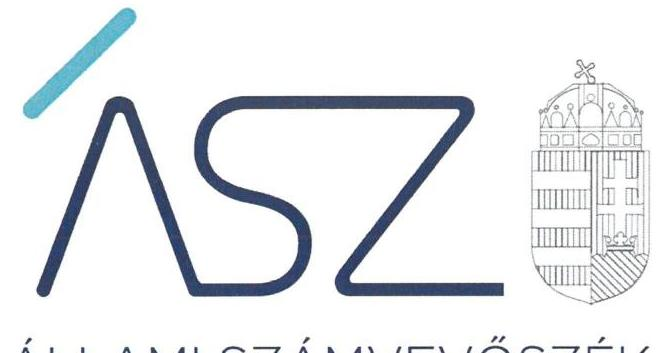
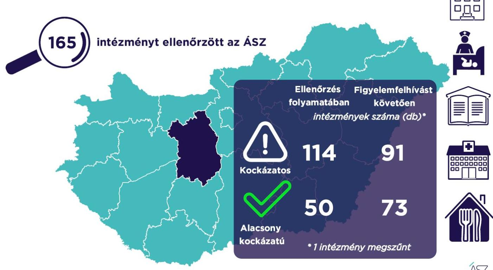

ÁLLAMI SZÁMVEVŐSZÉK

# JELENTÉS 

## A Fejér megyei önkormányzati intézmények ellenőrzése

Az önkormányzat és társulás irányítása alá tartozó intézmények integritásának monitoring típusú ellenőrzése - 165 intézmény
2021.

21101
www.asz.hu

---

ÁLLAMI SZÁMVEVŐSZÉK

# JELENTÉS

A Fejér megyei önkormányzati intézmények ellenőrzése

Az önkormányzat és társulás irányítása alá tartozó intézmények integritásának monitoring típusú ellenőrzése – 165 intézmény

2021. 12. hó 23. nap

21101
www.asz.hu

Domokos László
elnök

---

# AZ ELLENŐRZÉST FELÜGYELTE: 

SALAMON ILDIKÓ felügyeleti vezető

## AZ ELLENŐRZÉST VEZETTE ÉS A VÉGREHAJTÁSÁÉRT FELELŐS:

BALÁZSNÉ ANTONI ERIKA ellenőrzésvezető
SIPOSNÉ DÓCZI KLÁRA ellenőrzésvezető

A PROGRAM ÖSSZEÁLLÍTÁSÁÉRT FELELŐS:
DR. FELFÖLDI IZABELLA Programkészítésért felelős vezető

## IKTATÓSZÁM: EL-3461-008/2021.

## TÉMASZÁM: 2568

ELLENŐRZÉS-AZONOSÍTÓ SZÁM: V0928

---

# TARTALOMJEGYZÉK 

■ ÖSSZEGZÉS ..... 5
■ AZ ELLENŐRZÉS JELENTŐSÉGE, AKTUALITÁSA, TÁRSADALMI SZEREPE, SZEMPONTJAI ..... 8
■ AZ ELLENŐRZÉS TERÜLETE ..... 9
■ ELLENŐRZÉS HATÓKÖRE ÉS MÓDSZERE ..... 10
■ MELLÉKLETEK ..... 13
I. sz. melléklet: Az értékelés módszertana ..... 13
II. sz. melléklet: Értelmező szótár ..... 15
■ FÜGGELÉKEK ..... 17
I. sz. függelék: Az ellenőrzött szervezetek és azok kockázati értékelése ..... 17
■ RÖVIDÍTÉSEK JEGYZÉKE ..... 25

---

.

---

# ÖSSZEGZÉS 

Az Állami Számvevőszék figyelemfelhívásának és tanácsadásának eredményeként a Fejér megyei önkormányzatok irányítása alatt álló 165 ellenőrzött intézmény közül 59 intézménynél az intézményvezető már 2021-ben intézkedett, vagy intézkedéseket rendelt el az integritást biztosító alapvető feltételek megerősítése, illetve kiépítése érdekében. Ezeknek az intézményeknek javult az integritása, erősödtek a csalásmentes működés feltételei.
71 intézménynél további intézkedések szükségesek az integritást biztosító alapvető feltételek kiépítése, illetve kiegészítése érdekében. Ezeknek az intézményeknek a vezetői az Állami Számvevőszék intézkedési kötelemmel járó figyelemfelhívására nem intézkedtek, ezért az azonosított kockázatok növekedtek, vagy intézkedéseik nem fedték le a kockázatos területeket, így az azonosított kockázatok nem változtak.
Az irányító önkormányzat egy intézmény megszüntetéséről döntött az ellenőrzött időszakban.

## Értékelések

Az Állami Számvevőszék a Fejér megyei önkormányzatok irányítása alá tartozó 165 intézmény belső kontrollrendszerének lényeges elemei kialakítását ellenőrizte a 2021. évre vonatkozóan. Az ellenőrzés a súlypontok meghatározásával lehetőséget biztosított a szervezeti integritás, működés és vezetés, valamint a gazdálkodás területén a kockázatok azonosítására.

A szervezeti integritás alapvető feltétele a szabályozottság, azaz a jogszabályokban előírt belső szabályzatok megléte, azok - hatályos jogszabályoknak - megfelelő tartalma és gyakorlati alkalmazhatósága. Az integritási kockázatok szervezeti szinten csökkenthetők azáltal, hogy az intézményvezetők kialakítják a szervezeti és működési kereteket, a gazdálkodásra vonatkozó alapvető szabályozási környezetet, valamint a kontrolltevékenységek szabályszerű gyakorlásának, az integrált kockázatkezelésnek és az integritást sértő események kezelésének a feltételeit.

A szervezeti integritás, a működés és a vezetés alapvető szabályozási feltételeinek kialakítása hozzájárul a csalásmentes integritási környezet megteremtéséhez.

A szervezeti és működési szabályzat teremti meg a szervezet szabályszerű működésének alapjait, illetve rögzíti a szervezeten belüli felelősségi viszonyokat. A szabályzat biztosítja a szervezeti működés szabályozottságát, ezáltal a szervezet tevékenységének átláthatóságát, a szervezeti célokkal összhangban történő működés feltételeit és annak ellenőrizhetőségét. Az ellenőrzöttek közül 141 intézmény rendelkezett szervezeti és működési szabályzattal a 2021. évben.

A jogszabályi előírásoknak eleget téve, nyilatkozatban értékelte az intézmény belső kontrollrendszerének minőségét 133 intézmény vezetője. Ezek közül 88 intézménynél alakítottak ki olyan szabályozásokat, folyamatokat, amelyek biztosítják a költségvetési szerv tevékenységében a rendelkezésre álló források átlátható, szabályszerű, szabályozott, gazdaságos, hatékony és eredményes felhasználása követelményeinek érvényesítését.

Az integrált kockázatkezelés eljárásrendjét 133, a szervezeti integritást sértő események kezelésének eljárásrendjét 137 intézménynél alakították ki az intézményvezetők. Az integrált kockázatkezelés eljárásrendje biztosítja a szervezet működésében rejlő kockázatok azonosításának és kezelésének feltételeit. A szervezet működési kockázatai veszélyeztethetik a közpénzekkel való átlátható, elszámoltatható és felelős gazdálkodást. Az integritást sértő események kezelésének eljárásrendje jelenti a szervezet tekintetében felmerülő és a szervezeten belül bekövetkező integritást sértő események kezelésének alapjait. Az eljárásrend kialakításával az intézmény vezetője támogatja az integritást sértő eseményekkel kapcsolatosan azonosított kockázatok bekövetkezése esetén azok hatékony kezelését, illetve a következmények enyhítését.

---

A pénz- és vagyongazdálkodáshoz kapcsolódó alapvető szabályozások és nyilvántartások - így a számviteli politika és a keretében elkészítendő szabályzatok, a számlarend, a beszerzések szabályozása, valamint a kötelezettségvállalásra és a teljesítés igazolására jogosultak és aláírásmintáik nyilvántartása - előmozdítják a közpénzügyek átláthatóságát, rendezettségét. Az intézményvezető ezen szabályzatok elkészítésével, nyilvántartások vezetésével és folyamatos karbantartásával az alapfeltételét biztosítja a pénzügyi- és vagyongazdálkodás átláthatóságának, a közpénzekkel és közvagyonnal való elszámoltathatóságnak. Az ellenőrzöttek közül 136 intézménynél a számviteli politika, 125 intézménynél a számlarend, 130 intézménynél a beszerzések lebonyolításával kapcsolatos eljárásrend rendelkezésre állt.

Az ellenőrzöttek közül 34 intézmény vezetője tett eleget az ellenőrzött területek mindegyikén az integritási kontrollok alapvető feltételeit jelentő, a jogszabályban előírt szabályozási kötelezettségének. Közülük 19 intézmény vezetője a jogszabályi előírásokon túl további erőfeszítéseket is tett az integritás erősítése érdekében, felismerte további olyan integritási kontrollok kialakításának indokoltságát, amelyet jogszabály nem ír elő, így szervezeti szinten hozzájárul a korrupcióval szembeni védettség megszilárdításához.

144 intézmény esetében az intézményvezető intézkedése volt szükséges a kockázatok csökkentése érdekében, mivel 50 intézménynél a jogszabályok által előírt kontrollok területén, 79 intézménynél a jogszabályok által előírt és a további, jogszabály által nem előírt integritási kontrollok területén egyaránt, 15 intézménynél utóbbi kontrollok területén voltak hiányosságok. A dokumentumok kiértékelése alapján - az integritás további fejlesztése érdekében - az Állami Számvevőszék azonosította a lényeges kockázati területeket, és már az ellenőrzés lefolytatásával párhuzamosan, a 2021. évre vonatkozóan a kockázatok csökkentésére hívta fel az intézményvezetők figyelmét.

# Következtetések 

Az érintett 129 intézmény közül 87 intézmény vezetője válaszolt határidőben az Állami Számvevőszék figyelemfelhívására. Közülük 71 teljeskörűen, kilenc részben egyetértett a kockázatos területeken teendő intézkedések indokoltságával. Az intézményvezetők közül 62 arról tájékoztatta az Állami Számvevőszéket, hogy valamennyi kockázatos területen, 13 pedig a kockázatos területek egy részénél már tett, illetve a jövőben tesz intézkedést a jelzett kockázatok csökkentése érdekében. A jogszabályi előírásokon túli integritási kontrollok területén az érintett 94 intézmény közül 47 intézmény vezetője a jelzett kockázatok teljes körű, három pedig azok részbeni felszámolásáról adtak számot. Ezek eredményeként a 144 vezetői levélben jelzett 643 kockázati terület közül 263 esetben már történt, illetve tervezett az intézkedés, így javulás várható a feltárt kockázatos területek 40,9%-ánál.

Az intézkedések eredményeként az ellenőrzött 165 intézmény közül összesen 73 intézménynél a kockázatok alacsony szintűek, illetve - a tervezett intézkedések végrehajtásával - a kockázatok alacsony szintre csökkennek.

A szabályozások és nyilvántartások kialakításának célja nem önmagában a jogszabályi rendelkezések betartása, hanem az intézmény szabályozottságán keresztül a szabályszerű és csalásmentes gazdálkodás feltételeinek megteremtése, ezáltal az Alaptörvényben előírt átláthatóság és elszámoltathatóság elvének érvényesítése. Ezeknek az alapelveknek érvényesülése hozzájárulhat ahhoz, hogy az intézmények, mint közszolgáltatást nyújtó szervezetek felé a közszolgáltatásokat igénybe vevők, és általuk az állampolgárok általános bizalma is erősödjön.

Az Állami Számvevőszék figyelemfelhívására nem válaszoló, illetve a jelzett kockázatokra nem, vagy csak részben intézkedő intézményvezetők által vezetett intézményeknél rendszerszintű kockázatok maradtak fenn. Vezetési-irányítási kockázatot jelez, amennyiben az intézményvezetőnek címzett figyelemfelhívásra az intézményvezető helyett más személy válaszolt. Felelősségi és hatásköri kockázatot jelez, amennyiben az intézmény pénzügyi- és vagyongazdálkodásának alapvető szabályzatait a kontrollrendszer kialakításáért felelős intézményvezető helyett egy másik költségvetési szerv vezetője alakította ki, határozta meg. További kockázatot jelent a szabályok alkalmazottak általi megismerésére és alkalmazására, az intézmény mindennapi működésének integritására. Mindezek egyrészt az intézmény pénzügyi és vagyongazdálkodásának szabályszerűségét, másrészt a vezetői nyilatkozatok hitelességét, valóságtartalmát is megkérdőjelezi. A jelzett kockázatok arra mutatnak rá, hogy ezeknél az intézményeknél sérül a vezetői felelősség elve, és ezzel a felelős vezetésre épülő intézményi önállóság működése.

Az integritás elvű működés erősítése érdekében további kockázatcsökkentő lépések szükségesek a vezetés-irányítás, valamint a pénzügyi- és a vagyongazdálkodás szabályszerű feltételeinek kialakítása terén. Ezen intézmények integritásának kiépítését következő lépésként az irányító szerv bevonásával támogatja az Állami Számvevőszék.

---

# Erősödött a csalásmentesség a Fejér megyei önkormányzati intézményeknél 

---

# AZ ELLENŐRZÉS JELENTŐSÉGE, AKTUALITÁSA, TÁRSADALMI SZEREPE, SZEMPONTJAI 

Az Alaptörvény alapértékeket, elveket fogalmaz meg, amely szerint a közpénzekkel gazdálkodó minden szervezet köteles a nyilvánosság előtt elszámolni a közpénzekre vonatkozó gazdálkodásával. A közpénzeket és a nemzeti vagyont az átláthatóság és a közélet tisztaságának elve szerint kell kezelni.

Magyarország helyi önkormányzatairól szóló törvény ${ }^{1}$ a helyi közhatalom gyakorlás széleskörű érvényesítésével összhangban tág teret ad a helyi önkormányzatoknak a feladataik, a közszolgáltatások legkülönbözőbb formákban történő ellátására, így széleskörű lehetőséggel rendelkeznek intézmények alapítására.

A helyi önkormányzatok irányítása alá tartozó intézmények szerteágazó közszolgáltatásokat nyújtanak. Az intézmények működtetése közvetlenül érinti a társadalom valamennyi rétegét, a közfeladatot ellátó intézmények működésének minősége közvetlen hatással van az azokat igénybe vevő állampolgárok életére.

Az intézmények szabályszerű és eredményes működésének és gazdálkodásának alapfeltétele a belső kontrollrendszer - benne az integritási kontrollok - megfelelő kialakítása. Az ÁSZ² a törvényi felhatalmazással élve ellenőrzi az önkormányzati intézményeket, hogy megállapításaival támogassa az ellenőrzött szervezetek szabályszerű gazdálkodását, működését.

A helyi önkormányzatok intézményei által ellátott feladatok, a bölcsődei, óvodai ellátás, a gyermekétkeztetés, a betegek és idősek gondozása, a közművelődési intézmények, könyvtárak működtetése által a lakosság ezeken a területeken találkozik legszélesebb körben az önkormányzatok által nyújtott szolgáltatásokkal. A szolgáltatásokat igénybe vevők jelentős száma, a feladatellátáshoz használt nemzeti vagyon és az erre fordított közpénz nagysága indokolja, hogy az ÁSZ további, az előző ellenőrzésekre épülő ellenőrzéseket végezzen ezen a területen, illetve további olyan területeken, ahol az önkormányzati szolgáltatást a lakosság széles köre veszi igénybe.

Az ellenőrzés célja annak értékelése, hogy a helyi önkormányzatok irányítása alá tartozó intézmények megteremtették-e az integritás biztosításához szükséges feltételeket, kialakították-e az alapvető, a szervezeti kereteket, az integritási kontrollokhoz kapcsolódó, valamint a korrupció elleni védelmet szolgáló szabályozásokat. Továbbá, hogy az intézményvezető gondoskodott-e a szervezeti teljesítmény mérés alapfeltételeinek kialakításáról az eredményességi szempontoknak való megfelelés megalapozottsága biztosítása érdekében. A monitoring típusú ellenőrzés célja hatékonyan támogatni az ellenőrzött szervezeteket, ezáltal növelve az ÁSZ tanácsadó szerepét, elősegítve a „jól irányított állam" működését.

Az ÁSZ célja, hogy új ellenőrzési megközelítést alkalmazva támogassa a közpénzügyi helyzet javítását; a monitoring típusú ellenőrzéssel jelen időben adjon helyzetképet az integritási szemlélet érvényesítéséről, rávilágítson az integritási kontrollok kiépítettségére, illetve további fejlesztésére. Napjainkban mindez kiemelt fontosságúvá vált. Minden szervezetnek fel kell készülnie arra, hogy a koronavírus járvány okozta társadalmi és gazdasági válság növelni fogja a korrupciós nyomást. Az ÁSZ ebben a helyzetben is alapvető kötelességének tartja, hogy a közpénzek őre legyen, és ellenőrzéseit az önkormányzati alrendszer intézményei körében is folytassa.

Fontos, hogy az intézmények vezetői felismerjék az integritás kockázatokat, azokat ismételten mérjék fel, és alakítsanak ki átlátható, jól szabályozott rendszereket, döntési mechanizmusokat. Az integritási kockázatok feltárása, megismerése elengedhetetlenül fontos, mert ezt követően tehetők meg azok a lépések, amelyek a kockázatok csökkentését, felszámolását és kezelését célozzák. A belső kontrollrendszer - benne az integritás kontrollok - megfelelő kialakítása, működése a helyi önkormányzatok irányítása alatt álló intézményeknél is hozzájárul a társadalmi közbizalom erősítéséhez.

Az ellenőrzés rámutat az integritási jó gyakorlatokra is, továbbá
 felhívja a figyelmet a jogszabályi követelmények teljesítéséhez szükséges lépésekre is.

---

# AZ ELLENŐRZÉS TERÜLETE 

## Az önkormányzatok irányítása alá tartozó intézmények

Helyi önkormányzati költségvetési szervet az államháztartásról szóló 2011. évi CXCV törvény (Áht. ${ }^{3}$ ) szerint a helyi önkormányzat, a helyi önkormányzatok társulása, a térségi fejlesztési tanács, az átalakult nemzetiségi önkormányzat alapíthat, a költségvetési szerv alapító okiratában meghatározott önkormányzati közfeladatok ellátására. A költségvetési szervek önálló jogi személyek, éves költségvetésükből gazdálkodva látják el feladataikat. A költségvetési szervek gazdasági szervezettel rendelkeznek, ha azonban a költségvetési szerv éves átlagos statisztikai állományi létszáma a 100 főt nem éri el, a gazdasági szervezet feladatait az önkormányzati hivatal, vagy az irányító szerv döntése alapján az irányító szerv irányítása alá tartozó, gazdasági szervezettel rendelkező más költségvetési szerv látja el.

Az államháztartásról szóló törvény végrehajtásáról szóló 368/2011. (XII. 31.) Korm. rendelet (Ávr. ${ }^{4}$ ) 1. melléklete szerint, az államháztartás önkormányzati alrendszerében a helyi önkormányzat által irányított költségvetési szerv esetében az irányító szerv hatáskörét a képviselő-testület, közgyűlés gyakorolja, és annak vezetője a polgármester, főpolgármester, megyei közgyűlés elnöke.

Az ellenőrzés a Fejér megyei önkormányzatok irányítása alá tartozó, az I. sz. Függelékben felsorolt költségvetési szervekre terjedt ki.

A feladatellátásuk szerint az ellenőrzött költségvetési szervek egy része óvoda, bölcsőde, közoktatási intézmény, egészségügyi intézmény, konyha, művelődési központ (ház), múzeum, kulturális központ, színház, idősek otthona, gondozási központ, gyermekjóléti intézmény, sportcsarnok intézményként működik.

Az ellenőrzött 165 intézmény közül öt rendelkezik saját gazdasági szervezettel.

Az ellenőrzés 164 intézmény esetében lefolytatásra került. Egy intézmény esetében az ellenőrzés adatszolgáltatás hiányában nem volt lefolytatható, az ÁSZ az ellenőrzött integritási kockázatát kiemelten magasnak értékelte.

Továbbá egy intézmény az ellenőrzött időszakban megszűnt.

---

# ELLENŐRZÉS HATÓKÖRE ÉS MÓDSZERE 

## Az ellenőrzés típusa

Megfelelőségi ellenőrzés.

## Az ellenőrzött időszak

A 2021. év, a Bkr. ${ }^{5}$ szerinti vezetői nyilatkozat, valamint annak alátámasztottsága vonatkozásában a 2020. év.

## Az ellenőrzés tárgya

A szervezeti keretekkel, a működéssel és gazdálkodással kapcsolatos szabályzatok, szabályozások, valamint a szervezeti elvekkel, értékekkel összefüggő integritás kontrollok kiépítettsége, a szervezeti teljesítmény mérés alapfeltételeinek kialakítása.

## Az ellenőrzött szervezetek

Az ellenőrzött intézményeket az I. sz. Függelék tartalmazza.

## Az ellenőrzés jogalapja

Az ellenőrzés jogszabályi alapját az ÁSZ tv. ${ }^{6}$ 1. § (3) bekezdése, 5. § (6) bekezdése, valamint az Áht. 61. § (2) bekezdése képezik.

## Az ellenőrzés módszerei

Az ÁSZ az ellenőrzést az ellenőrzési program szempontjai, az ellenőrzött időszakban hatályos jogszabályok, a jelen ellenőrzésre irányadó ÁSZ módszertan figyelembevételével és a nemzetközi standardokat irányadónak tekintve végzi.

Az ellenőrzés ideje alatt az ÁSZ az ellenőrzött szervezetekkel történő kapcsolattartást az ÁSZ SZMSZ${ }^{7}$-ének vonatkozó előírásai alapján biztosítja.

Az ellenőrzési kérdések megválaszolásához szükséges bizonyítékok megszerzése a következő ellenőrzési eljárások alkalmazásával történik: megfigyelés, összehasonlítás, elemző eljárás. Az ellenőrzési bizonyítékként felhasználható adatforrások közé tartoznak az ellenőrzési programban felsorolt adatforrások, továbbá minden - az ellenőrzés folyamán - feltárt, az ellenőrzés szempontjából információkat tartalmazó dokumentum.

---

Az ÁSZ az ellenőrzést a kérdésekre adott válaszok kiértékelésével, valamint a megjelölt adatforrások, továbbá az adott időszakban hatályos jogszabályok, valamint az ÁSZ honlapján közzétett helyénvalósági kritériumok figyelembevételével folytatja le.

A monitoring típusú ellenőrzés az önkormányzatok irányítása alá tartozó intézmények integritás alapú működésének lényeges területeire és a közpénzügyi helyzet javítása érdekében az elért eredmények fenntartására fókuszál. Lehetőséget biztosít az integritási kontrollok kiépítettségében lévő hiányosságok, a szervezeti teljesítmény mérés alapfeltételei kialakításának hiánya beazonosítására az eredményességi szempontoknak való megfelelés megalapozottsága biztosítása érdekében, az önkormányzatok, társulások irányítása alá tartozó intézmények integritásának elemzésére, részletes ellenőrzések megalapozására.

---

.

---

# MELLÉKLETEK 

I. SZ. MELLÉKLET: AZ ÉRTÉKELÉS MÓDSZERTANA

Az egyes kockázati területek és kockázatforrások minősítése „pontozásos módszerrel", az integritás „jelző" dokumentumai és a vezetői magatartás ellenőrzéshez kapcsolódóan tanúsított tényhelyzeteinek értékelése alapján történt.

Az értékelt dokumentumokhoz, nyilvántartásokhoz, kockázati besorolásokhoz minden esetben pontszám került hozzárendelésre, amelyek értéke alapján az ellenőrzött szervezetek kockázati csoportba kerültek besorolásra:

- Alacsony kockázatú - az elérhető összes pontszám legalább 80\%-a
- Közepes kockázatú - az elérhető pontszám 50-79\%-a között
- Magas kockázatú - az elérhető pontszám 50\%-a alatt

Az első lépésben azonosításra kerültek azok az intézményi szabályozások és nyilvántartások, amelyek meglétét jogszabály írja elő, hiánya pedig felveti a csalás és korrupció kockázatát.

Második lépésben az adatoknak az ellenőrzés rendelkezésére bocsátása kockázati kritériumainak meghatározása, majd értékelése történt meg.

Harmadik lépésben a figyelemfelhívó levelekre adott válaszok kockázati kritériumainak meghatározása, majd értékelése történt meg.

Az összesített kockázati értékelést javította, amennyiben

- az intézmény rendelkezett olyan szabályozással, amely kötelező meglétét jogszabály nem írja elő, de segíti a csalás és a korrupció megelőzését (helyénvalósági dokumentumok).

Az összesített kockázati értékelést rontotta, amennyiben

- az integritás szempontjából meghatározó dokumentum - az intézményi SZMSZ - hiányzott, és javítása érdekében a figyelemfelhívó levél hatására sem történt intézkedés.

A figyelemfelhívó levelekre adott válaszok értékelése alapján:

- A kockázat csökkent, amennyiben a figyelemfelhívó levélre adott válasza a figyelemfelhívással összhangban volt, valamennyi kockázati területen intézkedett vagy intézkedést tervezett.
- A kockázat változatlan, amennyiben a figyelemfelhívó levélben foglaltaktól eltérő magatartást tanúsított, intézkedése a figyelemfelhívással részben volt összhangban, a kockázati területeken részben intézkedett vagy intézkedést tervezett.
- A kockázat nőtt, amennyiben nem volt együttműködő, a figyelemfelhívó levélre nem válaszolt, vagy válasza alapján nem intézkedett és nem tervezett intézkedést.

---

# Az önkormányzatok irányítása alá tartozó intézmények kockázati csoportba sorolásának értékelési keretrendszere 

I. Dokumentumokkal rendelkezés
lényeges dokumentumok, amelyek hiánya felveti a csalás és korrupció kockázatát
I.1. A szervezeti integritás, működés és vezetés alapvető szabályozási feltételei

- intézmény SZMSZ-e
- vezetői nyilatkozat a 2020. évre vonatkozóan az intézmény belső kontrollrendszer minőségének értékeléséről, valamint a nyilatkozat megalapozottságát bizonyító dokumentumok
- integrált kockázatkezelés eljárásrendje
- az integritást sértő események kezelésének eljárásrendje
I.2. A pénz- és vagyongazdálkodáshoz kapcsolódó alapvető szabályozások
- számviteli politika
- az eszközök és a források leltárkészítési és leltározási szabályzata
- az eszközök és a források értékelési szabályzata
- pénzkezelési szabályzat
- számlarend
- beszerzések lebonyolításával kapcsolatos eljárásrend
- a kötelezettségvállalásra, teljesítés igazolására jogosult személyekről és aláírás-mintájukról vezetett nyilvántartás
II. Az adatoknak az ellenőrzés rendelkezésére bocsátása
II.1. A megnevezett adatokkal rendelkezett és a törvényi határidőn belül hiánytalanul rendelkezésre bocsátotta. Figyelem-, illetve figyelmet felhívó levél nem volt indokolt.
II.2. A megnevezett adatokat nem bocsátotta rendelkezésre.
III. Figyelemfelhívó levelekre adott válaszok kockázati értékelése
III.1. Kockázat csökkent: együttműködése a figyelemfelhívó levéllel összhangban volt.
III.2. Kockázat változatlan: a figyelemfelhívó levélben foglaltaktól eltérő együttműködést tanúsított.
III.3. Kockázat nőtt: nem reagált, nem intézkedett, így nem volt együttműködő.

---

belső kontrollrendszer

Belső kontrollrendszer területei
integrált kockázatkezelési rendszer
integritás

Integritási kockázatok

A belső kontrollrendszer a kockázatok kezelése és tárgyilagos bizonyosság megszerzése érdekében kialakított folyamatrendszer, amely azt a célt szolgálja, hogy a működés és gazdálkodás során a tevékenységeket szabályszerűen, gazdaságosan, hatékonyan, eredményesen hajtsák végre, az elszámolási kötelezettségeket teljesítsék, megvédjék az erőforrásokat a veszteségektől, károktól és nem rendeltetésszerű használattól. (Forrás: Áht. 69. § (1) bekezdése)
A kontrollkörnyezet, az integrált kockázatkezelési rendszer, a kontrolltevékenységek, az információs és kommunikációs rendszer, valamint a nyomon követési (monitoring) rendszer. (Forrás: Bkr. 3. §-a)
Olyan folyamatalapú kockázatkezelési rendszer, amely a szervezet minden tevékenységére kiterjed, egységes módszertan és eljárások alkalmazásával, a szervezet célkitűzéseinek és értékeinek figyelembevételével biztosítja a szervezet kockázatainak teljes körű azonosítását, azok meghatározott kritériumok szerinti értékelését, valamint a kockázatok kezelésére vonatkozó intézkedési terv elkészítését és az abban foglaltak nyomon követését. (Forrás: Bkr. 2. § m) pontja)
Az integritás az elvek, értékek, cselekvések, módszerek, intézkedések konzisztenciáját jelenti, vagyis olyan magatartásmódot, amely meghatározott értékeknek megfelel. (Forrás: Nemzetgazdasági Minisztérium: Államháztartási belső kontroll standardok és gyakorlati útmutató 1.1.3. pontja, 2017. szeptember)
A szervezeti integritás a szervezet védekezőképessége a korrupció lehetőségével szemben. Az integritás erősítése - mint preventív eszközrendszer - a korrupció megelőzésére fókuszál. A szervezeti integritás a működés, a szervezeti kultúra minőségét is jelzi.
Az ellenőrzés megközelítése szerint az integritás a szervezet értékeinek és célkitűzéseinek megfelelő működést jelenti. Minél magasabb színvonalú egy szervezet integritása, az annál ellenállóbb a korrupcióval, a korrupciós veszélyekkel szemben, vagyis az integritás erősítése - elsősorban az egyes szervezetek szintjén - a korrupciós kockázatok mérséklésének egyik fontos eszköze. Az integritás ugyanakkor tágabb jelentésű fogalom, nemcsak a korrupciótól, hanem más helytelen magatartásoktól (például csalás, önkényesség) való mentességet és a szervezet céljainak követését is jelenti. Egy szervezet integritását úgy is meghatározhatjuk, mint a szervezet ellenállóképességét annak a veszélynek, hogy dolgozói helytelen magatartásukkal kárt okozzanak.
Az integritás megerősítése és fenntartása elsősorban a szervezet elsőszámú vezetőjének felelőssége.
Integritási kockázatnak minősül a szervezet célkitűzéseit, értékeit, elveit sértő vagy veszélyeztető visszaélés, szabálytalanság, vagy egyéb esemény lehetősége. A korrupciós kockázat olyan integritási kockázat, amely korrupciós cselekmény bekövetkezésének lehetőségét jelenti. Minden korrupciós kockázat egyben integritási kockázat is. Korrupciós cselekményeknek nevezzük azokat a vesztegetésszerű cselekményeket, amelyeket általában a Büntető Törvénykönyv ${ }^{8}$ is büntetéssel fenyeget.
Az integritási kockázat alatt az integritás megsértésének esélyét értjük. Az integritási kockázatok olyan helyzetek, folyamatok, amelyek során fennáll a korrupciós befolyás lehetősége. Így integritási kockázatok jelentkeznek például a köz- és a magánszféra közötti üzleti tranzakciók során, a köztisztviselők által hozott döntések, a mérlegelési szabadság körében, illetve abban az esetben, ha egy közszolgáltatás iránt nagyobb a kereslet, mint a kielégítéséhez rendelkezésre álló erőforrások. Az integritási kockázat értelemszerűen nem egyenlő magával az integritás sérelmével, vagy a korrupció be-

---

kockázat
kontrollkörnyezet
kontrolltevékenységek
intézmény
következésével. Az integritási kockázatokkal szemben megfelelő kontrollok kiépítésével lehet védekezni. Amennyiben az integritási kontrollok szintje elmarad a kockázatok mértékétől, kockázati kitettségről beszélünk. A kontrollok kialakításának és működtetésének mérlegelésekor minden esetben vizsgálni kell a kockázatok szintjét is, a túlszabályozottság egyfelől költséges, másfelől a túlzott bürokrácia maga is lehet a korrupciós veszély hordozója.
A kockázat annak a valószínűségét jelenti, hogy egy vagy több esemény, vagy intézkedés nem kívánt módon befolyásolja a rendszer működését, céljainak megvalósulását. (Forrás: Javaslatok a korrupciós kockázatok kezelésére - Kockázatkezelési és ellenőrzési módszertan 35. oldal, ÁSZ)
A költségvetési szerv vezetője által kialakított olyan elvek, eljárások, belső szabályzatok összessége, amelyben világos a szervezeti struktúra, a folyamatok átláthatók, egyértelműek a felelősségi, hatásköri viszonyok és feladatok, meghatározottak, ismertek és elfogadottak az etikai elvárások a szervezet minden szintjén, átlátható a humánerőforrás-kezelés, biztosított a szervezeti célok és értékek irányában való elkötelezettség fejlesztése és elősegítése. (Forrás: Bkr. 6. § (1) bekezdés)
A költségvetési szerv vezetője által a szervezeten belül kialakított (kontroll) tevékenységek, melyek biztosítják a kockázatok kezelését, hozzájárulnak a szervezet céljainak eléréséhez és erősítik a szervezet integritását. (Forrás: Bkr. 8. § (1) bekezdés)
A helyi önkormányzatok irányítása alá tartozó költségvetési szervek. (A képviselő-testület a feladatkörébe tartozó közszolgáltatások ellátására - jogszabályban meghatározottak szerint - költségvetési szervet (önkormányzati intézmény) alapíthat; Forrás: Mötv. 41. § (6) bekezdés)

---

# FÜGGELÉKEK

I. SZ. FÜGGELÉK: AZ ELLENŐRZÖTT SZERVEZETEK ÉS AZOK KOCKÁZATI ÉRTÉKELÉSE

|  Sorszám | Ellenőrzött szervezet megnevezése | Irányító szerv (önkormányzat) megnevezése | Helység | Tanácsadást megelőző kockázati besorolás | Intézkedést követően a kockázati értékelés

 változása | A kockázati szint alacsonyra csökkent-e  |
| --- | --- | --- | --- | --- | --- | --- |
|  1. | Zámolyi Mesevár Óvoda | Zámoly Község Önkormányzata | Zámoly | ALACSONY | NEM VOLT SZABÁLYSZERŰSÉGI HIBA | I  |
|  2. | Kőszárhegyi Csemetekert Óvoda | Kőszárhegy Község Önkormányzata | Kőszárhegy | MAGAS | CSÖKKENT | N  |
|  3. | Kulcsi Százholdas Pagony Óvoda és Bölcsőde | Kulcs Községi Önkormányzat | Kulcs | MAGAS | NÖTT | N  |
|  4. | Községi és Iskolai Könyvtár | Zichyújfalu Község Önkormányzata | Zichyújfalu | MAGAS | NÖTT | N  |
|  5. | Táci Százszorszép Óvoda és Mini Bölcsőde | Tác Község Önkormányzata | Tác | KÖZEPES | NÖTT | N  |
|  6. | Hantosi Gesztenyés Kert Óvoda-Mini Bölcsőde, Konyha | Hantos Község Önkormányzata | Hantos | KÖZEPES | CSÖKKENT | I  |
|  7. | Besnyői Pöttömsziget Óvoda | Besnyő Község Önkormányzata | Besnyő | KÖZEPES | NEM VÁLTOZOTT | N  |
|  8. | Ercsi Eötvös József Művelődési Ház és Könyvtár | Ercsi Város Önkormányzata | Ercsi | KÖZEPES | NÖTT | N  |
|  9. | Ercsi Napfény Óvoda | Ercsi Város Önkormányzata | Ercsi | KÖZEPES | NÖTT | N  |
|  10. | Ercsi Hétszínvirág Óvoda | Ercsi Város Önkormányzata | Ercsi | KÖZEPES | NÖTT | N  |
|  11. | Ercsi Egészségügyi Központ | Ercsi Város Önkormányzata | Ercsi | KÖZEPES | NÖTT | N  |
|  12. | Ercsi Szociális Szolgálat | Ercsi Város Önkormányzata | Ercsi | KÖZEPES | NÖTT | N  |
|  13. | Fülemüle Óvoda | Füle Község Önkormányzata | Füle | KÖZEPES | CSÖKKENT | I  |
|  14. | Hétmérföldes Óvoda | Jenő Község Önkormányzata | Jenő | MAGAS | NÖTT | N  |
|  15. | Móri Napsugár Óvoda | Mór Városi Önkormányzata | Mór | ALACSONY | NEM VOLT SZABÁLYSZERŰSÉGI HIBA | I  |
|  16. | Nefelejcs Bölcsőde | Mór Városi Önkormányzata | Mór | KÖZEPES | NÖTT | N  |
|  17. | Lamberg-Kastély Művelődési Központ, Könyvtár és Muzeális Kiállítóhely | Mór Városi Önkormányzata | Mór | ALACSONY | NEM VOLT SZABÁLYSZERŰSÉGI HIBA | I  |
|  18. | Móri Pitypang Óvoda | Mór Városi Önkormányzata | Mór | ALACSONY | NEM VOLT SZABÁLYSZERŰSÉGI HIBA | I  |
|  19. | Pátkai Csemetekert Óvoda | Pátka Község Önkormányzata | Pátka | ALACSONY | NEM VOLT SZABÁLYSZERŰSÉGI HIBA | I  |
|  20. | Bakonycsernyei Bóbita Óvoda - Mini Bölcsőde | Bakonycsernye Nagyközség Önkormányzata | Bakonycsernye | KÖZEPES | NEM VÁLTOZOTT | N  |
|  21. | Iváncsai Mesepalota Művészeti Óvoda-Mini Bölcsőde | Iváncsa Községi Önkormányzat | Iváncsa | MAGAS | NÖTT | N  |
|  22. | Kálozi Aranyalma Óvoda és Bölcsőde | Káloz Község Önkormányzata | Káloz | KÖZEPES | CSÖKKENT | I  |
|  23. | Kislángi Csicsergő Óvoda-Mini Bölcsőde és Konyha | Kisláng Község Önkormányzata | Kisláng | KÖZEPES | CSÖKKENT | I  |

---

| Sorszám | Ellenőrzött szervezet megnevezése | Irányító szerv (önkormányzat) megnevezése | Helység | Tanácsadást megelőző kockázati besorolás | Intézkedést követően a kockázati értékelés változása | A kockázati szint alacsonyra csökkent-e |
| :--: | :--: | :--: | :--: | :--: | :--: | :--: |
| 24. | Soponyai Mesevár Óvoda | Soponya Nagyközség Önkormányzata | Soponya | KIEMELTEN MAGAS | NEM VÁLTOZOTT | N |
| 25. | Iszkaszentgyörgyi Vackor Óvoda - Mini Bölcsőde és Konyha | Iszkaszentgyörgy Község Önkormányzata | Iszkaszentgyörgy | ALACSONY | CSÖKKENT | I |
| 26. | Lovasberényi Csicsergő Óvoda és Konyha | Lovasberény Község Önkormányzata | Lovasberény | MAGAS | NEM VÁLTOZOTT | N |
| 27. | Polgárdi Város Családsegítő és Gyermekjóléti Szolgálata | Polgárdi Város Önkormányzata | Polgárdi | KÖZEPES | CSÖKKENT | N |
| 28. | Polgárdi Gondozási Központ | Polgárdi Város Önkormányzata | Polgárdi | ALACSONY | NEM VOLT SZABÁLYSZERŰSÉGI HIBA | N |
| 29. | Polgárdi Eszterlánc Napközi Otthonos Óvoda | Polgárdi Város Önkormányzata | Polgárdi | ALACSONY | NEM VOLT SZABÁLYSZERŰSÉGI HIBA | N |
| 30. | Batthyány Gyula Művelődési Ház és Könyvtár | Polgárdi Város Önkormányzata | Polgárdi | ALACSONY | NEM VOLT SZABÁLYSZERŰSÉGI HIBA | N |
| 31. | Sárszentmihályi Csicsergő Óvoda | Sárszentmihály Községi Önkormányzat | Sárszentmihály | KÖZEPES | NÖTT | N |
| 32. | Baracsi Négy Vándor Óvoda | Baracs Község Önkormányzata | Baracs | ALACSONY | NEM VOLT SZABÁLYSZERŰSÉGI HIBA | I |
| 33. | Tipegő Bölcsőde | Sárszentmihály Községi Önkormányzat | Sárszentmihály | KÖZEPES | NÖTT | N |
| 34. | Pázmándi Pitypang Óvoda és Bölcsőde | Pázmánd Község Önkormányzata | Pázmánd | MAGAS | CSÖKKENT | N |
| 35. | Előszállási Patakparti Óvoda | Előszállás Nagyközség Önkormányzata | Előszállás | KÖZEPES | CSÖKKENT | N |
| 36. | Iváncsai Könyvtár és Művelődési Központ | Iváncsa Községi Önkormányzat | Iváncsa | MAGAS | NÖTT | N |
| 37. | Baracska Bóbita Óvoda | Baracska Község Önkormányzata | Baracska | ALACSONY | CSÖKKENT | I |
| 38. | Baracsi Népjóléti Intézmény | Baracs Község Önkormányzata | Baracs | ALACSONY | NEM VOLT SZABÁLYSZERŰSÉGI HIBA | I |
| 39. | Dégi Bóbita Óvoda És Konyha | Dég Község Önkormányzata | Dég | MAGAS | CSÖKKENT | N |
| 40. | Dégi Festetics Művelődési Ház és Könyvtár | Dég Község Önkormányzata | Dég | MAGAS | CSÖKKENT | N |
| 41. | Vörösmarty Mihály Könyvtár | Székesfehérvár Megyei Jogú Város Önkormányzata | Székesfehérvár | ALACSONY | NEM VOLT SZABÁLYSZERŰSÉGI HIBA | I |
| 42. | Szent István Király Múzeum | Székesfehérvár Megyei Jogú Város Önkormányzata | Székesfehérvár | KÖZEPES | NÖTT | N |
| 43. | Székesfehérvári Közösségi és Kulturális Központ | Székesfehérvár Megyei Jogú Város Önkormányzata | Székesfehérvár | KÖZEPES | NÖTT | N |
| 44. | Kossuth Zsuzsanna Szociális Intézmény | Székesfehérvár Megyei Jogú Város Önkormányzata | Székesfehérvár | ALACSONY | NEM VOLT SZABÁLYSZERŰSÉGI HIBA | N |
| 45. | Vörösmarty Színház | Székesfehérvár Megyei Jogú Város Önkormányzata | Székesfehérvár | ALACSONY | NEM VOLT SZABÁLYSZERŰSÉGI HIBA | N |
| 46. | Bölcsődék Igazgatósága Dunaújváros | Dunaújváros Megyei Jogú Város Önkormányzata | Dunaújváros | KÖZEPES | CSÖKKENT | I |

---

| Sorszám | Ellenőrzött szervezet megnevezése | Irányító szerv (önkormányzat) megnevezése | Helység | Tanácsadást megelőző kockázati besorolás | Intézkedést követően a kockázati értékelés változása | A kockázati szint alacsonyra csökkent-e |
| :--: | :--: | :--: | :--: | :--: | :--: | :--: |
| 47. | Egyesített Szociális Intézmény és Árpád-Házi Szent Erzsébet Idősek Otthonai | Dunaújváros Megyei Jogú Város Önkormányzata | Dunaújváros | ALACSONY | NEM VOLT SZABÁLYSZERŰSÉGI HIBA | I |
| 48. | Bartók Kamaraszínház és Művészetek Háza | Dunaújváros Megyei Jogú Város Önkormányzata | Dunaújváros | KÖZEPES | NEM VÁLTOZOTT | N |
| 49. | Sárbogárdi Zengő Óvoda | Sárbogárd Város Önkormányzata | Sárbogárd | KÖZEPES | NÖTT | N |
| 50. | Enyingi Szirombontogató Óvoda | Enying Város Önkormányzata | Enying | KÖZEPES | CSÖKKENT | I |
| 51. | Székesfehérvár Megyei Jogú Város Önkormányzata Kríziskezelő Központ | Székesfehérvár Megyei Jogú Város Önkormányzata | Székesfehérvár | ALACSONY | NEM VOLT SZABÁLYSZERŰSÉGI HIBA | N |
| 52. | Útkeresés Segítő Szolgálat | Dunaújváros Megyei Jogú Város Önkormányzata | Dunaújváros | ALACSONY | CSÖKKENT | I |
| 53. | Egészségmegőrzési Központ | Dunaújváros Megyei Jogú Város Önkormányzata | Dunaújváros | ALACSONY | CSÖKKENT | I |
| 54. | Perkátai Általános Művelődési Központ | Perkáta Nagyközség Önkormányzata | Perkáta | KÖZEPES | NEM VÁLTOZOTT | N |
| 55. | Csákvári Mese-Vár Óvoda és Bölcsőde | Csákvár Város Önkormányzata | Csákvár | KÖZEPES | NEM VÁLTOZOTT | N |
| 56. | Dunaújvárosi Óvoda | Dunaújváros Megyei Jogú Város Önkormányzata | Dunaújváros | KÖZEPES | CSÖKKENT | I |
| 57. | Floriana Könyvtár és Közösségi Ház | Csákvár Város Önkormányzata | Csákvár | KÖZEPES | NEM VÁLTOZOTT | N |
| 58. | Szabadbattyáni Cifrakert Óvoda | Szabadbattyán Nagyközségi Önkormányzata | Szabadbattyán | KÖZEPES | CSÖKKENT | I |
| 59. | Városi Levéltár és Kutatóintézet | Székesfehérvár Megyei Jogú Város Önkormányzata | Székesfehérvár | MAGAS | NÖTT | N |
| 60. | Nagyvenyimi Nefelejcs Óvoda és Fecskefészek Bölcsőde | Nagyvenyim Nagyközség Önkormányzata | Nagyvenyim | ALACSONY | NEM VOLT SZABÁLYSZERŰSÉGI HIBA | I |
| 61. | Palágyi József Művelődési Ház és Könyvtár | Nagyvenyim Nagyközség Önkormányzata | Nagyvenyim | ALACSONY | NEM VOLT SZABÁLYSZERŰSÉGI HIBA | I |
| 62. | Segítő Kéz Szociális Alapszolgáltató Intézmény | Etyek Nagyközség Önkormányzata | Etyek | KÖZEPES | NÖTT | N |
| 63. | Magyar-Kút Könyvtár és Művelődési Ház | Etyek Nagyközség Önkormányzata | Etyek | KÖZEPES | NÖTT | N |
| 64. | Nefelejcs Német Nemzetiségi Óvoda | Etyek Nagyközség Önkormányzata | Etyek | ALACSONY | CSÖKKENT | I |
| 65. | Adonyi Hóvirág Óvoda | Adony Város Önkormányzata | Adony | KÖZEPES | NÖTT | N |
| 66. | Bálint Ágnes Művelődési Ház és Könyvtár | Adony Város Önkormányzata | Adony | KÖZEPES | NÖTT | N |
| 67. | Egészségügyi Központ | Adony Város Önkormányzata | Adony | KÖZEPES | NÖTT | N |
| 68. | Szociális, Családsegítő és Gyermekjóléti Intézmény | Mezőfalva Nagyközség Önkormányzata | Mezőfalva | MAGAS | NÖTT | N |
| 69. | Mezőfalvai Tündérkert Óvoda | Mezőfalva Nagyközség Önkormányzata | Mezőfalva | MAGAS | NÖTT | N |
| 70. | Könyvtár és Művelődési Ház | Pusztaszabolcs Város Önkormányzata | Pusztaszabolcs | KÖZEPES | CSÖKKENT | I |

---

| Sorszám | Ellenőrzött szervezet megnevezése | Irányító szerv (önkormányzat) megnevezése |

 Helység | Tanácsadást megelőző kockázati besorolás | Intézkedést követően a kockázati értékelés változása | A kockázati szint alacsonyra csökkent-e |
| :--: | :--: | :--: | :--: | :--: | :--: | :--: |
| 71. | Rácalmási Manóvár Óvoda és Bölcsőde | Rácalmás Város Önkormányzat | Rácalmás | KÖZEPES | CSÖKKENT | I |
| 72. | Rácalmási Művelődési Ház és Könyvtár | Rácalmás Város Önkormányzat | Rácalmás | KÖZEPES | CSÖKKENT | I |
| 73. | Sárbogárdi Hársfavirág Bölcsőde | Sárbogárd Város Önkormányzat | Sárbogárd | KÖZEPES | NÖTT | N |
| 74. | Tanka János Közösségi Ház és Városi Könyvtár | Aba Város Önkormányzata | Aba | MAGAS | NÖTT | N |
| 75. | Csóri Csivitelő Óvoda | Csór Község Önkormányzat | Csór | KÖZEPES | CSÖKKENT | I |
| 76. | Fókusz Szociális Szolgálat Alapszolgáltatási Központ és Család és Gyermekjóléti Központ | Gárdony Város Önkormányzat | Gárdony | KÖZEPES | CSÖKKENT | I |
| 77. | Gárdonyi Óvoda | Gárdony Város Önkormányzat | Gárdony | KÖZEPES | NÖTT | N |
| 78. | Brunszvik Teréz Óvoda | Martonvásár Város Önkormányzata | Martonvásár | ALACSONY | CSÖKKENT | I |
| 79. | Pákozdi Nyitnikék Óvoda | Pákozd Nagyközség Önkormányzata | Pákozd | KÖZEPES | CSÖKKENT | I |
| 80. | Sárkeresztesi Ficánkoló Óvoda | Sárkeresztes Község Önkormányzata | Sárkeresztes | KÖZEPES | NÖTT | N |
| 81. | Seregélyesi Művelődési Ház és Könyvtár | Seregélyes Nagyközség Önkormányzata | Seregélyes | MAGAS | NÖTT | N |
| 82. | Velencei Meseliget Óvoda | Velence Város Önkormányzata | Velence | KÖZEPES | CSÖKKENT | I |
| 83. | Hauszmann Alajos Egységes Közművelődési Intézményközpont és Könyvtár | Velence Város Önkormányzata | Velence | KÖZEPES | CSÖKKENT | I |
| 84. | Mányi Mesevár Óvoda és Mini Bölcsőde | Mány Község Önkormányzata | Mány | KÖZEPES | NÖTT | N |
| 85. | Kastély Óvoda és Bölcsőde | Felcsút Községi Önkormányzat | Felcsút | ALACSONY | CSÖKKENT | I |
| 86. | Szabadhídvégi Napsugár Óvoda | Szabadhídvég Község Önkormányzata | Szabadhídvég | MAGAS | NÖTT | N |
| 87. | Vértesboglár Általános Művelődési Központ | Vértesboglár Község Önkormányzata | Vértesboglár | KÖZEPES | NÖTT | N |
| 88. | Mátyásdombi Eszterlánc Óvoda | Mátyásdomb Község Önkormányzata | Mátyásdomb | MAGAS | CSÖKKENT | N |
| 89. | Székesfehérvár Megyei Jogú Város Önkormányzata Százszorszép Bölcsőde | Székesfehérvár Megyei Jogú Város Önkormányzata | Székesfehérvár | KÖZEPES | NEM VÁLTOZOTT | N |
| 90. | Székesfehérvár Megyei Jogú Város Önkormányzata Mesevilág Bölcsőde | Székesfehérvár Megyei Jogú Város Önkormányzata | Székesfehérvár | KÖZEPES | NEM VÁLTOZOTT | N |
| 91. | Székesfehérvár Megyei Jogú Város Önkormányzata Napraforgó Bölcsőde | Székesfehérvár Megyei Jogú Város Önkormányzata | Székesfehérvár | KÖZEPES | NÖTT | N |
| 92. | Székesfehérvár Megyei Jogú Város Önkormányzata Nyitnikék Bölcsőde | Székesfehérvár Megyei Jogú Város Önkormányzata | Székesfehérvár | KÖZEPES | NEM VÁLTOZOTT | N |

---

| Sorszám | Ellenőrzött szervezet megnevezése | Irányító szerv (önkormányzat) megnevezése | Helység | Tanácsadást megelőző kockázati besorolás | Intézkedést követően a kockázati értékelés változása | A kockázati szint alacsonyra csökkent-e |
| :--: | :--: | :--: | :--: | :--: | :--: | :--: |
| 93. | Székesfehérvár Megyei Jogú Város Önkormányzata Szeder Bölcsőde | Székesfehérvár Megyei Jogú Város Önkormányzata | Székesfehérvár | KÖZEPES | NEM VÁLTOZOTT | N |
| 94. | Székesfehérvár Megyei Jogú Város Önkormányzata Tündérkert Bölcsőde | Székesfehérvár Megyei Jogú Város Önkormányzata | Székesfehérvár | MAGAS | NEM VÁLTOZOTT | N |
| 95. | Székesfehérvár Megyei Jogú Város Önkormányzata Frim Jakab Képességfejlesztő Szakosított Otthon | Székesfehérvár Megyei Jogú Város Önkormányzata | Székesfehérvár | KÖZEPES | NÖTT | N |
| 96. | Felsővárosi Óvoda | Székesfehérvár Megyei Jogú Város Önkormányzata | Székesfehérvár | KÖZEPES | NÖTT | N |
| 97. | Hosszúsétatéri Óvoda | Székesfehérvár Megyei Jogú Város Önkormányzata | Székesfehérvár | ALACSONY | NEM VOLT SZABÁLYSZERŰSÉGI HIBA | I |
| 98. | Árpád Úti Óvoda | Székesfehérvár Megyei Jogú Város Önkormányzata | Székesfehérvár | ALACSONY | NEM VOLT SZABÁLYSZERŰSÉGI HIBA | I |
| 99. | Maroshegyi Óvoda | Székesfehérvár Megyei Jogú Város Önkormányzata | Székesfehérvár | KÖZEPES | NEM VÁLTOZOTT | N |
| 100. | Rákóczi Utcai Óvoda | Székesfehérvár Megyei Jogú Város Önkormányzata | Székesfehérvár | ALACSONY | NEM VOLT SZABÁLYSZERŰSÉGI HIBA | I |
| 101. | Tolnai Utcai Óvoda | Székesfehérvár Megyei Jogú Város Önkormányzata | Székesfehérvár | KÖZEPES | CSÖKKENT | I |
| 102. | Székesfehérvári Napsugár Óvoda | Székesfehérvár Megyei Jogú Város Önkormányzata | Székesfehérvár | KÖZEPES | CSÖKKENT | I |
| 103. | Gyöngyvirág Óvoda - Székesfehérvár | Székesfehérvár Megyei Jogú Város Önkormányzata | Székesfehérvár | KÖZEPES | NÖTT | N |
| 104. | Székesfehérvári Szivárvány Óvoda | Székesfehérvár Megyei Jogú Város Önkormányzata | Székesfehérvár | ALACSONY | NEM VOLT SZABÁLYSZERŰSÉGI HIBA | I |
| 105. | Belvárosi Brunszvik Teréz Óvoda | Székesfehérvár Megyei Jogú Város Önkormányzata | Székesfehérvár | KÖZEPES | NÖTT | N |
| 106. | Ligetsori Óvoda | Székesfehérvár Megyei Jogú Város Önkormányzata | Székesfehérvár | ALACSONY | NEM VOLT SZABÁLYSZERŰSÉGI HIBA | I |
| 107. | Mezőszentgyörgyi Gesztenyés Óvoda | Mezőszentgyörgy Község Önkormányzata | Mezőszentgyörgy | MAGAS | NÖTT | N |
| 108. | Eötvös Károly Községi Könyvtár és Művelődési Ház | Mezőszentgyörgy Község Önkormányzata | Mezőszentgyörgy | MAGAS | NÖTT | N |
| 109. | Enyingi Városi Bölcsőde | Enying Város Önkormányzata | Enying | MAGAS | CSÖKKENT | N |
| 110. | Vas Gereben Művelődési Ház és Könyvtár | Enying Város Önkormányzata | Enying | KÖZEPES | CSÖKKENT | I |
| 111. | Óbarki Kisvakond Óvoda | Óbarok Község Önkormányzat | Óbarok | ALACSONY | NEM VOLT SZABÁLYSZERŰSÉGI HIBA | I |
| 112. | Alba Bástya Család- és Gyermekjóléti Központ | Székesfehérvár Megyei Jogú Város Önkormányzata | Székesfehérvár | ALACSONY | NEM VOLT SZABÁLYSZERŰSÉGI HIBA | I |

---

| Sorszám | Ellenőrzött szervezet megnevezése | Irányító szerv (önkormányzat) megnevezése | Helység | Tanácsadást megelőző kockázati besorolás | Intézkedést követően a kockázati értékelés változása | A kockázati szint alacsonyra csökkent-e |
| :--: | :--: | :--: | :--: | :--: | :--: | :--: |
| 113. | Jankovich-Kúria Rendezvény és Turisztikai Központ | Rácalmás Város Önkormányzat | Rácalmás | KÖZEPES | CSÖKKENT | I |
| 114. | Lepsényi Napraforgó Óvoda | Lepsény Nagyközségi Önkormányzat | Lepsény | KÖZEPES | CSÖKKENT | N |
| 115. | Háromhárs Óvoda | Alcsútdoboz Település Önkormányzat | Alcsútdoboz | ALACSONY | CSÖKKENT | I |
| 116. | Bicskei Gazdasági Szervezet | Bicske Város Önkormányzata | Bicske | ALACSONY | NEM VOLT SZABÁLYSZERŰSÉGI HIBA | I |
| 117. | Gárdonyi Géza Könyvtár és Kulturális Központ | Gárdony Város Önkormányzat | Gárdony | KÖZEPES | CSÖKKENT | I |
| 118. | Váli Mesevölgy Óvoda | Vál Község Önkormányzat | Vál | ALACSONY | CSÖKKENT | I |
| 119. | Egyesített Családsegítő és Gondozási Központ-Kapcsolat Központ | Bicske Város Önkormányzata | Bicske | ALACSONY | CSÖKKENT | I |
| 120. | Bicskei Egységes Művelődési Központ és Könyvtár | Bicske Város Önkormányzata | Bicske | ALACSONY | NEM VOLT SZABÁLYSZERŰSÉGI HIBA | I |
| 121. | Bicske Városi Óvoda | Bicske Város Önkormányzata | Bicske | ALACSONY | NEM VOLT SZABÁLYSZERŰSÉGI HIBA | I |
| 122. | Szabadegyházai Kincsem Óvoda-Mini Bölcsőde és Konyha | Szabadegyháza Község Önkormányzata | Szabadegyháza | KÖZEPES | NÖTT | N |
| 123. | Pusztaszabolcsi Városi Óvoda és Bölcsőde | Pusztaszabolcs Város Önkormányzat | Pusztaszabolcs | KÖZEPES | CSÖKKENT | I |
| 124. | Intercisa Múzeum | Dunaújváros Megyei Jogú Város Önkormányzata | Dunaújváros | ALACSONY | CSÖKKENT | I |
| 125. | Sukorói Óvoda | Sukoró Község Önkormányzata | Sukoró | KÖZEPES | CSÖKKENT | I |
| 126. | Nagylóki Csicsergő Óvoda-Bölcsőde és Konyha | Nagylók Község Önkormányzat | Nagylók | KÖZEPES | CSÖKKENT | I |
| 127. | Dr. Végh János Óvoda | Mezőszilas Község Önkormányzat | Mezőszilas | KÖZEPES | CSÖKKENT | I |
| 128. | Nadapi Kerekerdő Óvoda | Nadap Község Önkormányzata | Nadap | ALACSONY | NEM VOLT SZABÁLYSZERŰSÉGI HIBA | I |
| 129. | Pusztaszabolcsi Szociális és Gyermekjóléti Intézmény | Pusztaszabolcs Város Önkormányzat | Pusztaszabolcs | ALACSONY | NEM VOLT SZABÁLYSZERŰSÉGI HIBA | I |
| 130. | Daruszentmiklósi Szederinda Óvoda és Mini Bölcsőde | Daruszentmiklós Község Önkormányzata | Daruszentmiklós | KÖZEPES | CSÖKKENT | I |
| 131. | Gánti Német Nemzetiségi Óvoda | Gánt Község Önkormányzata | Gánt | KÖZEPES | NEM VÁLTOZOTT | N |
| 132. | Úrhidai Tündérkert Óvoda és Bölcsőde | Úrhida Község Önkormányzat | Úrhida | ALACSONY | NEM VOLT SZABÁLYSZERŰSÉGI HIBA | I |
| 133. | Kajászói Gyöngysor Óvoda | Kajászó Község Önkormányzata | Kajászó | KÖZEPES | NÖTT | N |

---

| Sorszám | Ellenőrzött szervezet megnevezése | Irányító szerv (önkormányzat) megnevezése | Helység | Tanácsadást megelőző kockázati besorolás | Intézkedést követően a kockázati értékelés változása | A kockázati szint alacsonyra csökkent-e |
| :--: | :--: | :--: | :--: | :--: | :--: | :--: |
| 134. | Kápolnásnyéki Napsugár Óvoda | Kápolnásnyék Község Önkormányzata | Kápolnásnyék | ALACSONY | CSÖKKENT | I |
| 135. | Mezőkomáromi Sióparti Óvoda | Mezőkomárom Község Önkormányzata | Mezőkomárom | MAGAS | NÖTT | N |
| 136. | Abai Hétszínvirág Óvoda és Bölcsőde | Aba Város Önkormányzata | Aba | MAGAS | NÖTT | N |
| 137. | Sárszentágotai Meseerdő Óvoda | Sárszentágota Község Önkormányzata | Sárszentágota | MAGAS | CSÖKKENT | N |
| 138. | Igari Csipet Óvoda | Igar Község Önkormányzata | Igar | KÖZEPES | CSÖKKENT | I |
| 139. | Nagykarácsonyi Örökzöld Óvoda | Nagykarácsony Község Önkormányzata | Nagykarácsony | KÖZEPES | NÖTT | N |
| 140. | Kisapostagi Mosolykert Óvoda | Kisapostag Község Önkormányzata | Kisapostag | ALACSONY |

 | CSÖKKENT | I |
| 141. | Ráckeresztúri Mosoly Óvoda | Ráckeresztúr Község Önkormányzata | Ráckeresztúr | ALACSONY | CSÖKKENT | I |
| 142. | Perkátai Szociális Központ | Perkáta Nagyközség Önkormányzata | Perkáta | KÖZEPES | NEM VÁLTOZOTT | N |
| 143. | Abai Idősek Otthona | Aba Város Önkormányzata | Aba | MAGAS | NÖTT | N |
| 144. | Sárkeresztúri Napraforgó Óvoda | Sárkeresztúr Község Önkormányzata | Sárkeresztúr | KÖZEPES | NÖTT | N |
| 145. | Csabdi Napraforgó Óvoda | Csabdi Község Önkormányzata | Csabdi | ALACSONY | NEM VOLT SZABÁLYSZERŰSÉGI HIBA | I |
| 146. | Agárdi Tündérkert Bölcsőde | Gárdony Város Önkormányzata | Gárdony | ALACSONY | NEM VOLT SZABÁLYSZERŰSÉGI HIBA | I |
| 147. | Alba Regia Szimfonikus Zenekar | Székesfehérvár Megyei Jogú Város Önkormányzata | Székesfehérvár | KÖZEPES | NÖTT | N |
| 148. | Enyingi Család-és Gyermekjóléti Központ | Enying Város Önkormányzata | Enying | MAGAS | CSÖKKENT | N |
| 149. | Szabadbattyáni Móricz Zsigmond Művelődési Ház és Könyvtár | Szabadbattyán Nagyközségi Önkormányzata | Szabadbattyán | KÖZEPES | CSÖKKENT | I |
| 150. | Lepsényi Petőfi Sándor Művelődési Ház és Könyvtár | Lepsény Nagyközségi Önkormányzata | Lepsény | KÖZEPES | CSÖKKENT | N |
| 151. | Bodajki Zengő Óvoda - Mini Bölcsőde | Bodajk Város Önkormányzata | Bodajk | KÖZEPES | CSÖKKENT | I |
| 152. | Gyúrói Főzőkonyha | Gyúró Község Önkormányzata | Gyúró | MAGAS | NÖTT | N |
| 153. | Mányi Községi Művelődési Ház | Mány Község Önkormányzata | Mány | MAGAS | NÖTT | N |
| 154. | Csőszi Vadvirág Óvoda | Csősz Község Önkormányzata | Csősz | KÖZEPES | CSÖKKENT | N |
| 155. | Gyúrói Gézengúz Óvoda | Gyúró Község Önkormányzata | Gyúró | KÖZEPES | NÖTT | N |

---

| Sorszám | Ellenőrzött szervezet megnevezése | Irányító szerv (önkormányzat) megnevezése | Helység | Tanácsadást megelőző kockázati besorolás | Intézkedést követően a kockázati értékelés változása | A kockázati szint alacsonyra csökkent-e |
| :--: | :--: | :--: | :--: | :--: | :--: | :--: |
| 156. | Tordasi Mesevár Óvoda | Tordas Község Önkormányzata | Tordas | MAGAS | NÖTT | N |
| 157. | Sportlétesítmény és Szabadidőközpont Üzemeltető | Bicske Város Önkormányzata | Bicske | ALACSONY | NEM VOLT SZABÁLYSZERŰSÉGI HIBA | I |
| 158. | Szabadbattyáni Napocska Mini Bölcsőde | Szabadbattyán Nagyközségi Önkormányzata | Szabadbattyán | KÖZEPES | NÖTT | N |
| 159. | Kisapostagi Nyolc Törpe Mini Bölcsőde | Kisapostag Község Önkormányzata | Kisapostag | KÖZEPES | CSÖKKENT | I |
| 160. | Rácalmási Rendezvényközpont és Sportcsarnok | Rácalmás Város Önkormányzata | Rácalmás | ALACSONY | CSÖKKENT | I |
| 161. | Székesfehérvári Balett Színház | Székesfehérvár Megyei Jogú Város Önkormányzata | Székesfehérvár | ALACSONY | NEM VOLT SZABÁLYSZERŰSÉGI HIBA | N |
| 162. | Sukorói Manó Mini Bölcsőde | Sukoró Község Önkormányzata | Sukoró | KÖZEPES | CSÖKKENT | I |
| 163. | Siklósi Gyula Várostörténeti Kutatóközpont | Székesfehérvár Megyei Jogú Város Önkormányzata | Székesfehérvár | KÖZEPES | NÖTT | N |
| 164. | Seregélyesi Szociális Intézmény | Seregélyes Nagyközség Önkormányzata | Seregélyes | ALACSONY | NÖTT | N |
| 165. | Abai Hétszínvirág Bölcsőde | Aba Város Önkormányzata | Aba | MEGSZÜNT INTÉZMÉNY | MEGSZÜNT INTÉZMÉNY | MEGSZÜNT INTÉZMÉNY |
| Alacsony kockázatú |  |  |  | 50 |  |  |
| Közepes kockázatú |  |  |  | 84 |  |  |
| Magas kockázatú |  |  |  | 29 |  |  |
| Kiemelten magas kockázatú |  |  |  | 1 |  |  |
| Megszűnt intézmény |  |  |  | 1 | 1 | 1 |
| Kockázat csökkent |  |  |  |  | 59 |  |
| Kockázat nem változott |  |  |  |  | 16 |  |
| Kockázat nőtt |  |  |  |  | 55 |  |
| Nem volt indokolt figyelemfelhívó levél (szabályszerűségi vagy szabályszerűségi és helyénvalósági hiba hiányában) |  |  |  |  | 34 |  |
| Kockázat alacsony szintre csökkent |  |  |  |  |  | 73 |
| Kockázat nem csökkent alacsony szintre |  |  |  |  |  | 91 |
| Összesen |  |  |  | 165 | 165 | 165 |

---

# RÖVIDÍTÉSEK JEGYZÉKE 

${ }^{1}$ Mötv.
${ }^{2}$ ÁSZ
${ }^{3}$ Áht.
${ }^{4}$ Ávr.
${ }^{5}$ Bkr.
${ }^{6}$ ÁSZ tv.
${ }^{7}$ ÁSZ SZMSZ
${ }^{8}$ Büntető Törvénykönyv
2011. évi CLXXXIX. törvény - Magyarország helyi önkormányzatairól (hatályos: 2012. január 1-jétől)

Állami Számvevőszék
2011. évi CXCV. törvény az államháztartásról (hatályos 2011. december 31-étől) 368/2011. (XII. 31.) Korm. rendelet az államháztartásról szóló törvény végrehajtásáról (hatályos 2012. január 1-jétől)
370/2011. (XII. 31.) Korm. rendelet a költségvetési szervek belső kontrollrendszeréről és belső ellenőrzésről (hatályos 2012. január 1-jétől)
2011. évi LXVI. törvény az Állami Számvevőszékről (hatályos 2011. július 1-jétől)

Az Állami Számvevőszék Szervezeti és Működési Szabályzata
2012. évi C. törvény a Büntető Törvénykönyvről (hatályos 2013. július 1-jétől)

---

# ÁSZ 

ÁLLAMI SZÁMVEVŐSZÉK
1052 Budapest, Apáczai Cs. J. u. 10. I 1364 Budapest 4. Pf. 54 TEL: +36 14849100
email: szamvevoszek@asz.hu
web: www.asz.hu | www.aszhirportal.hu

