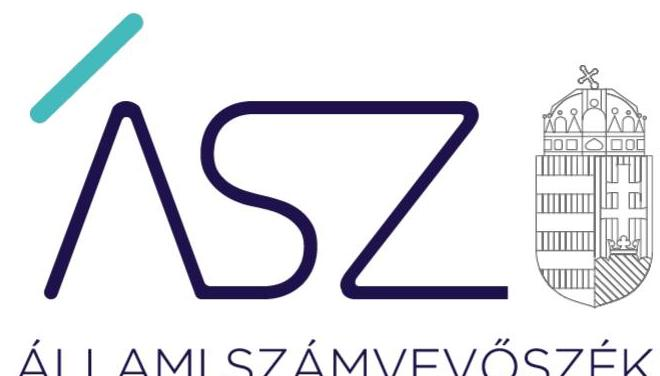
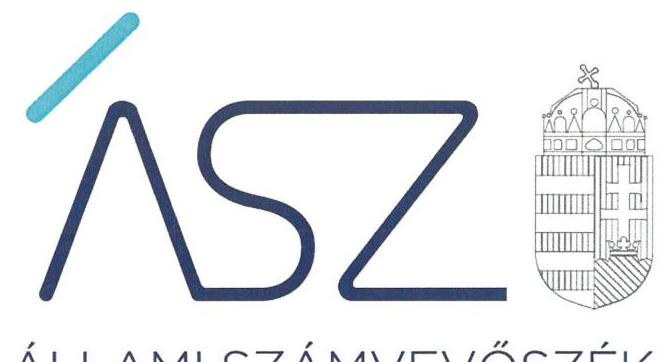
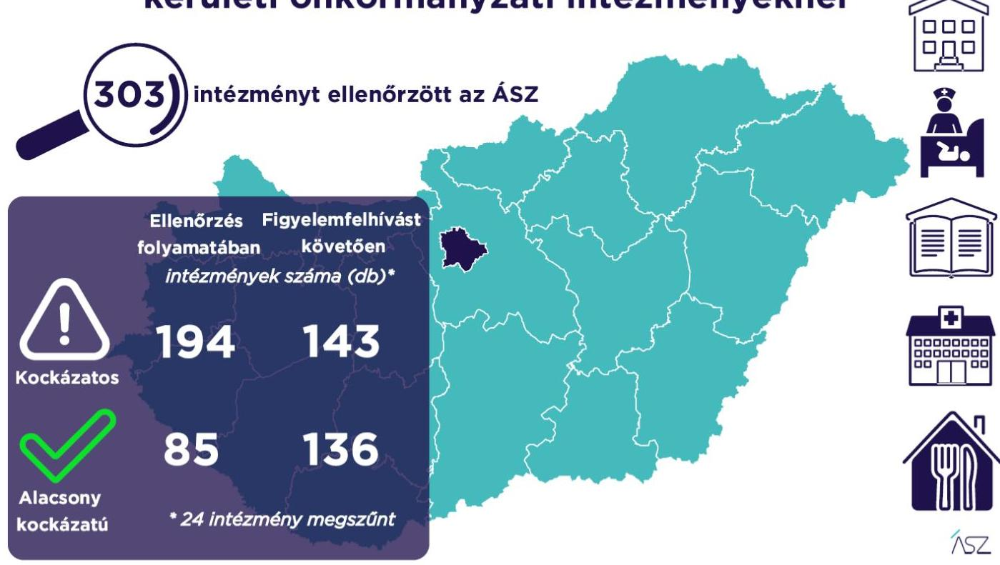

ÁLLAMI SZÁMVEVŐSZÉK

# JELENTÉS 

## A Budapest fővárosi és kerületi önkormányzati intézmények ellenőrzése

Az önkormányzat és társulás irányítása alá tartozó intézmények integritásának monitoring típusú ellenőrzése - 303 intézmény
2021.

21102
www.asz.hu

---

ÁLLAMI SZÁMVEVŐSZÉK

# JELENTÉS 

## A Budapest fővárosi és kerületi önkormányzati intézmények ellenőrzése

Az önkormányzat és társulás irányítása alá tartozó intézmények integritásának monitoring típusú ellenőrzése - 303 intézmény
2021. 12. hó 29. nap

21102
www.asz.hu

---

# AZ ELLENŐRZÉST FELÜGYELTE: 

SALAMON ILDIKÓ felügyeleti vezető

## AZ ELLENŐRZÉST VEZETTE ÉS A VÉGREHAJTÁSÁÉRT FELELŐS:

SZAPPANOS JÚLIA ellenőrzésvezető
VALASTYÁNNÉ DR. VÍZHÁNYÓ JÚLIA ellenőrzésvezető

A PROGRAM ÖSSZEÁLLÍTÁSÁÉRT FELELŐS:
DR. FELFÖLDI IZABELLA Programkészítésért felelős vezető

IKTATÓSZÁM: EL-3461-009/2021.
TÉMASZÁM: 2568
ELLENŐRZÉS-AZONOSÍTÓ SZÁM: V0928

---

# TARTALOMJEGYZÉK 

■ ÖSSZEGZÉS ..... 5
■ AZ ELLENŐRZÉS JELENTŐSÉGE, AKTUALITÁSA, TÁRSADALMI SZEREPE, SZEMPONTJAI ..... 8
■ AZ ELLENŐRZÉS TERÜLETE ..... 9
■ ELLENŐRZÉS HATÓKÖRE ÉS MÓDSZERE ..... 10
■ MELLÉKLETEK ..... 13
I. sz. melléklet: Az értékelés módszertana ..... 13
II. sz. melléklet: Értelmező szótár ..... 15
■ FÜGGELÉKEK ..... 17
I. sz. függelék: Az ellenőrzött szervezetek és azok kockázati értékelése ..... 17
■ RÖVIDÍTÉSEK JEGYZÉKE ..... 35

---

.

---

# ÖSSZEGZÉS 

Az Állami Számvevőszék figyelemfelhívásának és tanácsadásának eredményeként a Budapest fővárosi és kerületi önkormányzatok irányítása alatt álló 303 ellenőrzött intézmény közül 86 intézménynél az intézményvezető már 2021-ben intézkedett, vagy intézkedéseket rendelt el az integritást biztosító alapvető feltételek megerősitése, illetve kiépitése érdekében. Ezeknek az intézményeknek javult az integritása, erősödtek a csalásmentes müködés feltételei.
131 intézménynél további intézkedések szükségesek az integritást biztositó alapvető feltételek kiépitése, illetve kiegészitése érdekében. Ezeknek az intézményeknek a vezetői az Állami Számvevőszék intézkedési kötelemmel járó figyelemfelhívására nem intézkedtek, ezért az azonosított kockázatok növekedtek, vagy intézkedéseik nem fedték le a kockázatos területeket, így az azonosított kockázatok nem változtak.
Az irányító önkormányzat 24 intézmény megszüntetéséről döntött az ellenőrzött időszakban.

## Értékelések

Az Állami Számvevőszék a Budapest fővárosi és kerületi önkormányzatok irányítása alá tartozó 303 intézmény belső kontrollrendszerének lényeges elemei kialakítását ellenőrizte a 2021. évre vonatkozóan. Az ellenőrzés a súlypontok meghatározásával lehetőséget biztosított a szervezeti integritás, működés és vezetés, valamint a gazdálkodás területén a kockázatok azonosítására.

A szervezeti integritás alapvető feltétele a szabályozottság, azaz a jogszabályokban előírt belső szabályzatok megléte, azok - hatályos jogszabályoknak - megfelelő tartalma és gyakorlati alkalmazhatósága. Az integritási kockázatok szervezeti szinten csökkenthetők azáltal, hogy az intézményvezetők kialakítják a szervezeti és múködési kereteket, a gazdálkodásra vonatkozó alapvető szabályozási környezetet, valamint a kontrolltevékenységek szabályszerű gyakorlásának, az integrált kockázatkezelésnek és az integritást sértő események kezelésének a feltételeit.

A szervezeti integritás, a múködés és a vezetés alapvető szabályozási feltételeinek kialakítása hozzájárul a csalásmentes integritási környezet megteremtéséhez.

A szervezeti és múködési szabályzat teremti meg a szervezet szabályszerű működésének alapjait, illetve rögzíti a szervezeten belüli felelősségi viszonyokat. A szabályzat biztosítja a szervezeti múködés szabályozottságát, ezáltal a szervezet tevékenységének átláthatóságát, a szervezeti célokkal összhangban történő múködés feltételeit és annak ellenőrizhetőségét. Az ellenőrzöttek közül 298 intézmény rendelkezett szervezeti és múködési szabályzattal a 2021. évben.

A jogszabályi előírásoknak eleget téve, nyilatkozatban értékelte az intézmény belső kontrollrendszerének minőségét 270 intézmény vezetője. Ezek közül 218 intézménynél alakítottak ki olyan szabályozásokat, folyamatokat, amelyek biztosítják a költségvetési szerv tevékenységében a rendelkezésre álló források átlátható, szabályszerű, szabályozott, gazdaságos, hatékony és eredményes felhasználása követelményeinek érvényesítését.

Az integrált kockázatkezelés eljárásrendjét 266, a szervezeti integritást sértő események kezelésének eljárásrendjét 279 intézménynél alakították ki az intézményvezetők. Az integrált kockázatkezelés eljárásrendje biztosítja a szervezet múködésében rejlő kockázatok azonosításának és kezelésének feltételeit. A szervezet múködési kockázatai veszélyeztethetik a közpénzekkel való átlátható, elszámoltatható és felelős gazdálkodást. Az integritást sértő események kezelésének eljárásrendje jelenti a szervezet tekintetében felmerülő és a szervezeten belül bekövetkező integritást sértő események kezelésének alapjait. Az eljárásrend kialakításával az intézmény vezetője támogatja az integritást sértő eseményekkel kapcsolatosan azonosított kockázatok bekövetkezése esetén azok hatékony kezelését, illetve a következmények enyhítését.

---

A pénz- és vagyongazdálkodáshoz kapcsolódó alapvető szabályozások és nyilvántartások - így a számviteli politika és a keretében elkészítendő szabályzatok, a számlarend, a beszerzések szabályozása, valamint a kötelezettségvállalásra és a teljesítés igazolására jogosultak és aláírásmintáik nyilvántartása - előmozdítják a közpénzügyek átláthatóságát, rendezettségét. Az intézményvezető ezen szabályzatok elkészítésével, nyilvántartások vezetésével és folyamatos karbantartásával az alapfeltételét biztosítja a pénzügyi- és vagyongazdálkodás átláthatóságának, a közpénzekkel és közvagyonnal való elszámoltathatóságnak. Az ellenőrzöttek közül 201 intézménynél a számviteli politika, 188 intézménynél a számlarend, 212 intézménynél a beszerzések lebonyolításával kapcsolatos eljárásrend rendelkezésre állt.

Az ellenőrzöttek közül 62 intézmény vezetője tett eleget az ellenőrzött területek mindegyikén az integritási kontrollok alapvető feltételeit jelentő, a jogszabályban előírt szabályozási kötelezettségének. Közülük 39 intézmény vezetője a jogszabályi előírásokon túl további erőfeszítéseket is tett az integritás erősítése érdekében, felismerte további olyan integritási kontrollok kialakításának indokoltságát, amelyet jogszabály nem ír elő, így szervezeti szinten hozzájárul a korrupcióval szembeni védettség megszilárdításához.

240 intézmény esetében az intézményvezető intézkedése volt szükséges a kockázatok csökkentése érdekében, mivel 103 intézménynél a jogszabályok által előírt kontrollok területén, 114 intézménynél a jogszabályok által előírt és a további, jogszabály által nem előírt integritási kontrollok területén egyaránt, 23 intézménynél utóbbi kontrollok területén voltak hiányosságok. A dokumentumok kiértékelése alapján - az integritás további fejlesztése érdekében - az Állami Számvevőszék azonosította a lényeges kockázati területeket, és már az ellenőrzés lefolytatásával párhuzamosan, a 2021. évre vonatkozóan a kockázatok csökkentésére hívta fel az intézményvezetők figyelmét.

# Következtetések 

Az érintett 217 intézmény közül 201 intézmény vezetője válaszolt határidőben az Állami Számvevőszék figyelemfelhívására. Közülük 100 teljeskörűen, 45 részben egyetértett a kockázatos területeken teendő intézkedések indokoltságával. Az intézményvezetők közül 92 arról tájékoztatta az Állami Számvevőszéket, hogy valamennyi kockázatos területen, 41 pedig a kockázatos területek egy részénél már tett, illetve a jövőben tesz intézkedést a jelzett kockázatok csökkentése érdekében. A jogszabályi előírásokon túli integritási kontrollok területén az érintett 137 intézmény közül 92 intézmény vezetője a jelzett kockázatok teljes körű, hat pedig azok részbeni felszámolásáról adott számot. Ezek eredményeként a 240 vezetői levélben jelzett 1155 kockázati terület közül 390 esetben már történt, illetve tervezett az intézkedés, így javulás várható a feltárt kockázatos területek 33,8\%-ánál.

Az intézkedések eredményeként az ellenőrzött 303 intézmény közül összesen 136 intézménynél a kockázatok alacsony szintűek, illetve - a tervezett intézkedések végrehajtásával - a kockázatok alacsony szintre csökkennek.

A szabályozások és nyilvántartások kialakításának célja nem önmagában a jogszabályi rendelkezések betartása, hanem az intézmény szabályozottságán keresztül a szabályszerű és csalásmentes gazdálkodás feltételeinek megteremtése, ezáltal az Alaptörvényben előírt átláthatóság és elszámoltathatóság elvének érvényesítése. Ezeknek az alapelveknek érvényesülése hozzájárulhat ahhoz, hogy az intézmények, mint közszolgáltatást nyújtó szervezetek felé a közszolgáltatásokat igénybe vevők, és általuk az állampolgárok általános bizalma is erősödjön.

Az Állami Számvevőszék figyelemfelhívására nem válaszoló, illetve a jelzett kockázatokra nem, vagy csak részben intézkedő intézményvezetők által vezetett intézményeknél rendszerszintű kockázatok maradtak fenn. Vezetési-irányítási kockázatot jelez, amennyiben az intézményvezetőnek címzett figyelemfelhívásra az intézményvezető helyett más személy válaszolt. Felelősségi és hatásköri kockázatot jelez, amennyiben az intézmény pénzügyi- és vagyongazdálkodásának alapvető szabályzatait a kontrollrendszer kialakításáért felelős intézményvezető helyett egy másik költségvetési szerv vezetője alakította ki, határozta meg. További kockázatot jelent a szabályok alkalmazottak általi megismerésére és alkalmazására, az intézmény mindennapi működésének integritására. Mindezek egyrészt az intézmény pénzügyi és vagyongazdálkodásának szabályszerűségét, másrészt a vezetői nyilatkozatok hitelességét, valóságtartalmát is megkérdőjelezi. A jelzett kockázatok arra mutatnak rá, hogy ezeknél az intézményeknél sérül a vezetői felelősség elve, és ezzel a felelős vezetésre épülő intézményi önállóság működése.

Az integritás elvű működés erősítése érdekében további kockázatcsökkentő lépések szükségesek a vezetés-irányítás, valamint a pénzügyi- és a vagyongazdálkodás szabályszerű feltételeinek kialakítása terén. Ezen intézmények integritásának kiépítését következő lépésként az irányító szerv bevonásával támogatja az Állami Számvevőszék.

---

# Erősödött a csalásmentesség a Budapest fővárosi és 

kerületi önkormányzati intézményeknél

---

# AZ ELLENŐRZÉS JELENTŐSÉGE, AKTUALITÁSA, TÁRSADALMI SZEREPE, SZEMPONTJAI 

Az Alaptörvény alapértékeket, elveket fogalmaz meg, amely szerint a közpénzekkel gazdálkodó minden szervezet köteles a nyilvánosság előtt elszámolni a közpénzekre vonatkozó gazdálkodásával. A közpénzeket és a nemzeti vagyont az átláthatóság és a közélet tisztaságának elve szerint kell kezelni.

Magyarország helyi önkormányzatairól szóló törvény ${ }^{1}$ a helyi közhatalom gyakorlás széleskörű érvényesítésével összhangban tág teret ad a helyi önkormányzatoknak a feladataik, a közszolgáltatások legkülönbözőbb formákban történő ellátására, így széleskörű lehetőséggel rendelkeznek intézmények alapítására.

A helyi önkormányzatok irányítása alá tartozó intézmények szerteágazó közszolgáltatásokat nyújtanak. Az intézmények működtetése közvetlenül érinti a társadalom valamennyi rétegét, a közfeladatot ellátó intézmények működésének minősége közvetlen hatással van az azokat igénybe vevő állampolgárok életére.

Az intézmények szabályszerű és eredményes működésének és gazdálkodásának alapfeltétele a belső kontrollrendszer - benne az integritási kontrollok - megfelelő kialakítása. Az ÁSZ² a törvényi felhatalmazással élve ellenőrzi az önkormányzati intézményeket, hogy megállapításaival támogassa az ellenőrzött szervezetek szabályszerű gazdálkodását, müködését.

A helyi önkormányzatok intézményei által ellátott feladatok, a bölcsődei, óvodai ellátás, a gyermekétkeztetés, a betegek és idősek gondozása, a közművelődési intézmények, könyvtárak működtetése által a lakosság ezeken a területeken találkozik legszélesebb körben az önkormányzatok által nyújtott szolgáltatásokkal. A szolgáltatásokat igénybe vevők jelentős száma, a feladatellátáshoz használt nemzeti vagyon és az erre fordított közpénz nagysága indokolja, hogy az ÁSZ további, az előző ellenőrzésekre épülő ellenőrzéseket végezzen ezen a területen, illetve további olyan területeken, ahol az önkormányzati szolgáltatást a lakosság széles köre veszi igénybe.

Az ellenőrzés célja annak értékelése, hogy a helyi önkormányzatok irányítása alá tartozó intézmények megterem-tették-e az integritás biztosításához szükséges feltételeket, kialakították-e az alapvető, a szervezeti kereteket, az integritási kontrollokhoz kapcsolódó, valamint a korrupció elleni védelmet szolgáló szabályozásokat. Továbbá, hogy az intézményvezető gondoskodott-e a szervezeti teljesítmény mérés alapfeltételeinek kialakításáról az eredményességi szempontoknak való megfelelés megalapozottsága biztosítása érdekében. A monitoring típusú ellenőrzés célja hatékonyan támogatni az ellenőrzött szervezeteket, ezáltal növelve az ÁSZ tanácsadó szerepét, elősegítve a „jól irányított állam" müködését.

Az ÁSZ célja, hogy új ellenőrzési megközelítést alkalmazva támogassa a közpénzügyi helyzet javítását; a monitoring típusú ellenőrzéssel jelen időben adjon helyzetképet az integritási szemlélet érvényesítéséről, rávilágítson az integritási kontrollok kiépítettségére, illetve további fejlesztésére. Napjainkban mindez kiemelt fontosságúvá vált. Minden szervezetnek fel kell készülnie arra, hogy a koronavírus járvány okozta társadalmi és gazdasági válság növelni fogja a korrupciós nyomást. Az ÁSZ ebben a helyzetben is alapvető kötelességének tartja, hogy a közpénzek őre legyen, és ellenőrzéseit az önkormányzati alrendszer intézményei körében is folytassa.

Fontos, hogy az intézmények vezetői felismerjék az integritás kockázatokat, azokat ismételten mérjék fel, és alakítsanak ki átlátható, jól szabályozott rendszereket, döntési mechanizmusokat. Az integritási kockázatok feltárása, megismerése elengedhetetlenül fontos, mert ezt követően tehetők meg azok a lépések, amelyek a kockázatok csökkentését, felszámolását és kezelését célozzák. A belső kontrollrendszer - benne az integritás kontrollok - megfelelő kialakítása, működése a helyi önkormányzatok irányítása alatt álló intézményeknél is hozzájárul a társadalmi közbizalom erősítéséhez.

Az ellenőrzés rámutat az integritási jó gyakorlatokra is, továbbá felhívja a figyelmet a jogszabályi követelmények teljesítéséhez szükséges lépésekre is.

---

# AZ ELLENŐRZÉS TERÜLETE 

## Az önkormányzatok irányítása alá tartozó intézmények

Helyi önkormányzati költségvetési szervet az államháztartásról szóló 2011. évi CXCV törvény (Áht. ${ }^{3}$ ) szerint a helyi önkormányzat, a helyi önkormányzatok társulása, a térségi fejlesztési tanács, az átalakult nemzetiségi önkormányzat alapíthat, a költségvetési szerv alapító okiratában meghatározott önkormányzati közfeladatok ellátására. A költségvetési szervek önálló jogi személyek, éves költségvetésükből gazdálkodva látják el feladataikat. A költségvetési szervek gazdasági szervezettel rendelkeznek, ha azonban a költségvetési szerv éves átlagos statisztikai állományi létszáma a 100 főt nem éri el, a gazdasági szervezet feladatait az önkormányzati hivatal, vagy az irányító szerv döntése alapján az irányító szerv irányítása alá tartozó, gazdasági szervezettel rendelkező más költségvetési szerv látja el.

Az államháztartásról szóló törvény végrehajtásáról szóló 368/2011. (XII. 31.) Korm. rendelet (Ávr. ${ }^{4}$ ) 1. melléklete szerint, az államháztartás önkormányzati alrendszerében a helyi önkormányzat által irányított költségvetési szerv esetében az irányító szerv hatáskörét a képviselőtestület, közgyűlés gyakorolja, és annak vezetője a polgármester, főpolgármester, megyei közgyűlés elnöke.

Az ellenőrzés a Budapest fővárosi és kerületi önkormányzatok irányítása alá tartozó, az I. sz. Függelékben felsorolt költségvetési szervekre terjedt ki.

A feladatellátásuk szerint az ellenőrzött költségvetési szervek egy része óvoda, bölcsőde, egészségügyi intézmény, konyha, művelődési ház, múzeum, oktatási központ, kulturális központ, idősek otthona, gondozási központ, gyermekjóléti intézmény, sportközpont intézményként működik.

Az ellenőrzött 303 intézmény közül 32 rendelkezik saját gazdasági szervezettel.

Az ellenőrzött időszakban 24 intézmény megszűnt.

---

# ELLENŐRZÉS HATÓKÖRE ÉS MÓDSZERE 

## Az ellenőrzés típusa

Megfelelőségi ellenőrzés.

## Az ellenőrzött időszak

A 2021. év, a Bkr. ${ }^{5}$ szerinti vezetői nyilatkozat, valamint annak alátámasztottsága vonatkozásában a 2020. év.

## Az ellenőrzés tárgya

A szervezeti keretekkel, a működéssel és gazdálkodással kapcsolatos szabályzatok, szabályozások, valamint a szervezeti elvekkel, értékekkel összefüggő integritás kontrollok kiépítettsége, a szervezeti teljesítmény mérés alapfeltételeinek kialakítása.

## Az ellenőrzött szervezetek

Az ellenőrzött intézményeket az I. sz. Függelék tartalmazza.

## Az ellenőrzés jogalapja

Az ellenőrzés jogszabályi alapját az ÁSZ tv. ${ }^{6}$ 1. § (3) bekezdése, 5. § (6) bekezdése, valamint az Áht. 61. § (2) bekezdése képezik.

## Az ellenőrzés módszerei

Az ÁSZ az ellenőrzést az ellenőrzési program szempontjai, az ellenőrzött időszakban hatályos jogszabályok, a jelen ellenőrzésre irányadó ÁSZ módszertan figyelembevételével és a nemzetközi standardokat irányadónak tekintve végzi.

Az ellenőrzés ideje alatt az ÁSZ az ellenőrzött szervezetekkel történő kapcsolattartást az ÁSZ SZMSZ7-ének vonatkozó előírásai alapján biztosítja.

Az ellenőrzési kérdések megválaszolásához szükséges bizonyítékok megszerzése a következő ellenőrzési eljárások alkalmazásával történik: megfigyelés, összehasonlítás, elemző eljárás. Az ellenőrzési bizonyítékként felhasználható adatforrások közé tartoznak az ellenőrzési programban felsorolt adatforrások, továbbá minden - az ellenőrzés folyamán - feltárt, az ellenőrzés szempontjából információkat tartalmazó dokumentum.

---

Az ÁSZ az ellenőrzést a kérdésekre adott válaszok kiértékelésével, valamint a megjelölt adatforrások, továbbá az adott időszakban hatályos jogszabályok, valamint az ÁSZ honlapján közzétett helyénvalósági kritériumok figyelembevételével folytatja le.

A monitoring típusú ellenőrzés az önkormányzatok irányítása alá tartozó intézmények integritás alapú múködésének lényeges területeire és a közpénzügyi helyzet javítása érdekében az elért eredmények fenntartására fókuszál. Lehetőséget biztosít az integritási kontrollok kiépítettségében lévő hiányosságok, a szervezeti teljesítmény mérés alapfeltételei kialakításának hiánya beazonosítására az eredményességi szempontoknak való megfelelés megalapozottsága biztosítása érdekében, az önkormányzatok, társulások irányítása alá tartozó intézmények integritásának elemzésére, részletes ellenőrzések megalapozására.

---

.

---

# MELLÉKLETEK 

I. SZ. MELLÉKLET: AZ ÉRTÉKELÉS MÓDSZERTANA

Az egyes kockázati területek és kockázatforrások minősítése „pontozásos módszerrel", az integritás „jelző" dokumentumai és a vezetői magatartás ellenőrzéshez kapcsolódóan tanúsított tényhelyzeteinek értékelése alapján történt.

Az értékelt dokumentumokhoz, nyilvántartásokhoz, kockázati besorolásokhoz minden esetben pontszám került hozzárendelésre, amelyek értéke alapján az ellenőrzött szervezetek kockázati csoportba kerültek besorolásra:

- Alacsony kockázatú - az elérhető összes pontszám legalább 80\%-a
- Közepes kockázatú - az elérhető pontszám 50-79\%-a között
- Magas kockázatú - az elérhető pontszám 50\%-a alatt

Az első lépésben azonosításra kerültek azok az intézményi szabályozások és nyilvántartások, amelyek meglétét jogszabály írja elő, hiánya pedig felveti a csalás és korrupció kockázatát.

Második lépésben az adatoknak az ellenőrzés rendelkezésére bocsátása kockázati kritériumainak meghatározása, majd értékelése történt meg.

Harmadik lépésben a figyelemfelhívó levelekre adott válaszok kockázati kritériumainak meghatározása, majd értékelése történt meg.

Az összesített kockázati értékelést javította, amennyiben

- az intézmény rendelkezett olyan szabályozással, amely kötelező meglétét jogszabály nem írja elő, de segíti a csalás és a korrupció megelőzését (helyénvalósági dokumentumok).

Az összesített kockázati értékelést rontotta, amennyiben

- az integritás szempontjából meghatározó dokumentum - az intézményi SZMSZ - hiányzott, és javítása érdekében a figyelemfelhívó levél hatására sem történt intézkedés.

A figyelemfelhívó levelekre adott válaszok értékelése alapján:

- A kockázat csökkent, amennyiben a figyelemfelhívó levélre adott válasza a figyelemfelhívással összhangban volt, valamennyi kockázati területen intézkedett vagy intézkedést tervezett.
- A kockázat változatlan, amennyiben a figyelemfelhívó levélben foglaltaktól eltérő magatartást tanúsított, intézkedése a figyelemfelhívással részben volt összhangban, a kockázati területeken részben intézkedett vagy intézkedést tervezett.
- A kockázat nőtt, amennyiben nem volt együttműködő, a figyelemfelhívó levélre nem válaszolt, vagy válasza alapján nem intézkedett és nem tervezett intézkedést.

---

# Az önkormányzatok irányítása alá tartozó intézmények kockázati csoportba sorolásának értékelési keretrendszere 

I. Dokumentumokkal rendelkezés
lényeges dokumentumok, amelyek hiánya felveti a csalás és korrupció kockázatát
I.1. A szervezeti integritás, müködés és vezetés alapvető szabályozási feltételei

- intézmény SZMSZ-e
- vezetői nyilatkozat a 2020. évre vonatkozóan az intézmény belső kontrollrendszer minőségének értékeléséről, valamint a nyilatkozat megalapozottságát bizonyító dokumentumok
- integrált kockázatkezelés eljárásrendje
- az integritást sértő események kezelésének eljárásrendje
I.2. A pénz- és vagyongazdálkodáshoz kapcsolódó alapvető szabályozások
- számviteli politika
- az eszközök és a források leltárkészítési és leltározási szabályzata
- az eszközök és a források értékelési szabályzata
- pénzkezelési szabályzat
- számlarend
- beszerzések lebonyolításával kapcsolatos eljárásrend
- a kötelezettségvállalásra, teljesítés igazolására jogosult személyekről és aláírás-mintájukról vezetett nyilvántartás
II. Az adatoknak az ellenőrzés rendelkezésére bocsátása
II.1. A megnevezett adatokkal rendelkezett és a törvényi határidőn belül hiánytalanul rendelkezésre bocsátotta. Figyelem-, illetve figyelmet felhívó levél nem volt indokolt.
II.2. A megnevezett adatokat nem bocsátotta rendelkezésre.
III. Figyelemfelhívó levelekre adott válaszok kockázati értékelése
III.1. Kockázat csökkent: együttmüködése a figyelemfelhívó levéllel összhangban volt.
III.2. Kockázat változatlan: a figyelemfelhívó levélben foglaltaktól eltérő együttműködést tanúsított.
III.3. Kockázat nőtt: nem reagált, nem intézkedett, így nem volt együttmüködő.

---

belső kontrollrendszer

Belső kontrollrendszer területei
integrált kockázatkezelési rendszer
integritás

Integritási kockázatok

A belső kontrollrendszer a kockázatok kezelése és tárgyilagos bizonyosság megszerzése érdekében kialakított folyamatrendszer, amely azt a célt szolgálja, hogy a müködés és gazdálkodás során a tevékenységeket szabályszerűen, gazdaságosan, hatékonyan, eredményesen hajtsák végre, az elszámolási kötelezettségeket teljesítsék, megvédjék az erőforrásokat a veszteségektől, károktól és nem rendeltetésszerű használattól. (Forrás: Áht. 69. § (1) bekezdése)
A kontrollkörnyezet, az integrált kockázatkezelési rendszer, a kontrolltevékenységek, az információs és kommunikációs rendszer, valamint a nyomon követési (monitoring) rendszer. (Forrás: Bkr. 3. §-a)
Olyan folyamatalapú kockázatkezelési rendszer, amely a szervezet minden tevékenységére kiterjed, egységes módszertan és eljárások alkalmazásával, a szervezet célkitűzéseinek és értékeinek figyelembevételével biztosítja a szervezet kockázatainak teljes körű azonosítását, azok meghatározott kritériumok szerinti értékelését, valamint a kockázatok kezelésére vonatkozó intézkedési terv elkészítését és az abban foglaltak nyomon követését. (Forrás: Bkr. 2. § m) pontja)
Az integritás az elvek, értékek, cselekvések, módszerek, intézkedések konzisztenciáját jelenti, vagyis olyan magatartásmódot, amely meghatározott értékeknek megfelel. (Forrás: Nemzetgazdasági Minisztérium: Államháztartási belső kontroll standardok és gyakorlati útmutató 1.1.3. pontja, 2017. szeptember)
A szervezeti integritás a szervezet védekezőképessége a korrupció lehetőségével szemben. Az integritás erősítése - mint preventív eszközrendszer - a korrupció megelőzésére fókuszál. A szervezeti integritás a müködés, a szervezeti kultúra minőségét is jelzi.
Az ellenőrzés megközelítése szerint az integritás a szervezet értékeinek és célkitüzéseinek megfelelő müködést jelenti. Minél magasabb színvonalú egy szervezet integritása, az annál ellenállóbb a korrupcióval, a korrupciós veszélyekkel szemben, vagyis az integritás erősítése - elsősorban az egyes szervezetek szintjén - a korrupciós kockázatok mérséklésének egyik fontos eszköze. Az integritás ugyanakkor tágabb jelentésű fogalom, nemcsak a korrupciótól, hanem más helytelen magatartásoktól (például csalás, önkényesség) való mentességet és a szervezet céljainak követését is jelenti. Egy szervezet integritását úgy is meghatározhatjuk, mint a szervezet ellenállóképességét annak a veszélynek, hogy dolgozói helytelen magatartásukkal kárt okozzanak.
Az integritás megerősítése és fenntartása elsősorban a szervezet elsőszámú vezetőjének felelőssége.
Integritási kockázatnak minősül a szervezet célkitűzéseit, értékeit, elveit sértő vagy veszélyeztető visszaélés, szabálytalanság, vagy egyéb esemény lehetősége. A korrupciós kockázat olyan integritási kockázat, amely korrupciós cselekmény bekövetkezésének lehetőségét jelenti. Minden korrupciós kockázat egyben integritási kockázat is. Korrupciós cselekményeknek nevezzük azokat a vesztegetésszerű cselekményeket, amelyeket általában a Büntető Törvénykönyv ${ }^{8}$ is büntetéssel fenyeget.
Az integritási kockázat alatt az integritás megsértésének esélyét értjük. Az integritási kockázatok olyan helyzetek, folyamatok, amelyek során fennáll a korrupciós befolyás lehetősége. Így integritási kockázatok jelentkeznek például a köz- és a magánszféra közötti üzleti tranzakciók során, a köztisztviselők által hozott döntések, a mérlegelési szabadság körében, illetve abban az esetben, ha egy közszolgáltatás iránt nagyobb a kereslet, mint a kielégítéséhez rendelkezésre álló eröforrások. Az integritási kockázat értelemszerűen nem egyenlő magával az integritás sérelmével, vagy a korrupció be-

---

kockázat
kontrollkörnyezet
kontrolltevékenységek
intézmény
következésével. Az integritási kockázatokkal szemben megfelelő kontrollok kiépítésével lehet védekezni. Amennyiben az integritási kontrollok szintje elmarad a kockázatok mértékétől, kockázati kitettségről beszélünk. A kontrollok kialakításának és müködtetésének mérlegelésekor minden esetben vizsgálni kell a kockázatok szintjét is, a túlszabályozottság egyfelől költséges, másfelől a túlzott bürokrácia maga is lehet a korrupciós veszély hordozója.
A kockázat annak a valószínűségét jelenti, hogy egy vagy több esemény, vagy intézkedés nem kívánt módon befolyásolja a rendszer múködését, céljainak megvalósulását. (Forrás: Javaslatok a korrupciós kockázatok kezelésére - Kockázatkezelési és ellenőrzési módszertan 35. oldal, ÁSZ)
A költségvetési szerv vezetője által kialakított olyan elvek, eljárások, belső szabályzatok összessége, amelyben világos a szervezeti struktúra, a folyamatok átláthatók, egyértelműek a felelősségi, hatásköri viszonyok és feladatok, meghatározottak, ismertek és elfogadottak az etikai elvárások a szervezet minden szintjén, átlátható a humánerőforrás-kezelés, biztosított a szervezeti célok és értékek irányában való elkötelezettség fejlesztése és elősegítése. (Forrás: Bkr. 6. § (1) bekezdés)
A költségvetési szerv vezetője által a szervezeten belül kialakított (kontroll) tevékenységek, melyek biztosítják a kockázatok kezelését, hozzájárulnak a szervezet céljainak eléréséhez és erősítik a szervezet integritását. (Forrás: Bkr. 8. § (1) bekezdés)
A helyi önkormányzatok irányítása alá tartozó költségvetési szervek. (A képviselő-testület a feladatkörébe tartozó közszolgáltatások ellátására - jogszabályban meghatározottak szerint - költségvetési szervet (önkormányzati intézmény) alapíthat; Forrás: Mötv. 41. § (6) bekezdés)

---

# FÜGGELÉKEK

I. SZ. FÜGGELÉK: AZ ELLENŐRZÖTT SZERVEZETEK ÉS AZOK KOCKÁZATI ÉRTÉKELÉSE

|  Sorszám | Ellenőrzött szervezet megnevezése | Irányító szerv (önkormányzat) megnevezése | Helység | Tanácsadást megelőző kockázati besorolás | Intézkedést követően a kockázati értékelés változása | A kockázati szint alacsonyra csökkent-e  |
| --- | --- | --- | --- | --- | --- | --- |
|  1. | Táncsics Mihály Művelődési Ház | Budapest Főváros XXIII. Kerület Soroksár Önkormányzata | Budapest | ALACSONY | NEM VOLT SZABÁLYSZERÜSÉGI HIBA | I  |
|  2. | Budapest Főváros XXIII. Kerület Soroksár Önkormányzatának Dr. Nádor Ödön Egészségügyi Intézménye | Budapest Főváros XXIII. Kerület Soroksár Önkormányzata | Budapest | KÖZEPES | NÖTT | N  |
|  3. | I. sz. Összevont Óvoda | Budapest Főváros XXIII. Kerület Soroksár Önkormányzata | Budapest | KÖZEPES | CSÖKKENT | I  |
|  4. | II. sz. Napsugár Óvoda és Konyha | Budapest Főváros XXIII. Kerület Soroksár Önkormányzata | Budapest | KÖZEPES | CSÖKKENT | I  |
|  5. | III. sz. Összevont Óvoda | Budapest Főváros XXIII. Kerület Soroksár Önkormányzata | Budapest | ALACSONY | CSÖKKENT | I  |
|  6. | Budapest Főváros XXIII. Kerület Soroksár Önkormányzatának Szociális és Gyermekjóléti Intézménye | Budapest Főváros XXIII. Kerület Soroksár Önkormányzata | Budapest | KÖZEPES | CSÖKKENT | I  |
|  7. | Budapest Főváros II. Kerületi Önkormányzat Egészségügyi Szolgálata | Budapest Főváros II. Kerületi Önkormányzat | Budapest | KÖZEPES | CSÖKKENT | N  |
|  8. | Újpest Önkormányzatának Szociális Intézménye | Budapest Főváros IV. Kerület Újpest Önkormányzata | Budapest | MAGAS | NÖTT | N  |
|  9. | Belváros-Lipótváros Egészségügyi Szolgálat | Belváros-Lipótváros Budapest Főváros V. Kerület Önkormányzata | Budapest | ALACSONY | CSÖKKENT | I  |
|  10. | Erzsébetváros Rendészeti Igaz gatósága | Budapest Főváros VII. Kerület Erzsébetváros Önkormányzata | Budapest | KÖZEPES | NEM VÁLTOZOTT | N  |
|  11. | Bischitz Johanna Integrált Humán Szolgáltató Központ | Budapest Főváros VII. Kerület Erzsébetváros Önkormányzata | Budapest | KÖZEPES | NÖTT | N  |
|  12. | Józsefvárosi Szent Kozma Egészségügyi Központ | Budapest Főváros VIII. Kerület Józsefvárosi Önkormányzat | Budapest | ALACSONY | NEM VOLT SZABÁLYSZERÜSÉGI HIBA | I  |
|  13. | Ferencvárosi Művelődési Központ és Intézményei | Budapest Főváros IX. Kerület Ferencváros Önkormányzata | Budapest | KÖZEPES | NEM VÁLTOZOTT | N  |
|  14. | Ferencvárosi Egyesült Bülcsődei Intézmények | Budapest Főváros IX. Kerület Ferencváros Önkormányzata | Budapest | ALACSONY | NEM VOLT SZABÁLYSZERÜSÉGI HIBA | I  |
|  15. | Ferencvárosi Csicsergő Óvoda | Budapest Főváros IX. Kerület Ferencváros Önkormányzata | Budapest | ALACSONY | NÖTT | N  |
|  16. | Ferencvárosi Epres Óvoda | Budapest Főváros IX. Kerület Ferencváros Önkormányzata | Budapest | ALACSONY | NEM VOLT SZABÁLYSZERÜSÉGI HIBA | I  |
|  17. | Ferencvárosi Szociális és Gyermekjóléti Intézmények Igazgatósága | Budapest Főváros IX. Kerület Ferencváros Önkormányzata | Budapest | ALACSONY | NEM VOLT SZABÁLYSZERÜSÉGI HIBA | I  |

---

| Sorszám | Ellenőrzött szervezet megnevezése | Irányító szerv (önkormányzat) megnevezése | Helység | Tanácsadást megelőző kockázati besorolás | Intézkedést követően a kockázati értékelés változása | A kockázati szint alacsonyra csökkent-e |
| :--: | :--: | :--: | :--: | :--: | :--: | :--: |
| 18. | Budapest Főváros XV. Kerületi Önkormányzat Dr. Vass László Egészségügyi Intézmény | Budapest Főváros XV. Kerület Rákospalota, Pestújhely, Úlpalota Önkormányzata | Budapest | ALACSONY | NEM VOLT SZABÁLYSZERÚSÉGI HIBA | I |
| 19. | Budapest Főváros XV. Kerületi Önkormányzat Egyesített Bölcsődék | Budapest Főváros XV. Kerület Rákospalota, Pestújhely, Úlpalota Önkormányzata | Budapest | KÖZEPES | NÖTT | N |
| 20. | Budapest Főváros XV. Kerületi Önkormányzat Egyesített Szociális Intézménye | Budapest Főváros XV. Kerület Rákospalota, Pestújhely, Úlpalota Önkormányzata | Budapest | KÖZEPES | CSÖKKENT | N |
| 21. | XVI. Kerület Kertvárosi Egészségügyi Szolgálata | Budapest Főváros XVI. Kerületi Önkormányzat | Budapest | ALACSONY | NEM VOLT SZABÁLYSZERÚSÉGI HIBA | I |
| 22. | KMO Művelődési Központ és Könyvtár | Budapest Főváros XIX. Kerület Kispest Önkormányzata | Budapest | KÖZEPES | NÖTT | N |
| 23. | Budapest Főváros XIX. Kerület Kispest Önkormányzata Kispesti Uszoda | Budapest Főváros XIX. Kerület Kispest Önkormányzata | Budapest | KÖZEPES | NÖTT | N |
| 24. | Budapest Főváros XIX. Kerület Önkormányzat Segítő Kéz Kispesti Gondozó Szolgálat | Budapest Főváros XIX. Kerület Kispest Önkormányzata | Budapest | KÖZEPES | NEM VÁLTOZOTT | N |
| 25. | Budapest Főváros XIX. Kerület Kispest Önkormányzata Kispesti Egészségügyi Intézete | Budapest Főváros XIX. Kerület Kispest Önkormányzata | Budapest | KÖZEPES | CSÖKKENT | I |
| 26. | Budapest XXI. Kerület Csepel Önkormányzata Tóth Ilona Egészségügyi Szolgálat | Budapest XXI. Kerület Csepel Önkormányzata | Budapest | ALACSONY | NEM VOLT SZABÁLYSZERÚSÉGI HIBA | I |
| 27. | Budapest Főváros II. Kerületi Önkormányzat II. Kerületi Egyesített Bölcsődék | Budapest Főváros II. Kerületi Önkormányzat | Budapest | ALACSONY | NEM VOLT SZABÁLYSZERÚSÉGI HIBA | I |
| 28. | Budapest Főváros II. Kerületi Önkormányzat Budakeszi Úti Óvoda | Budapest Főváros II. Kerületi Önkormányzat | Budapest | ALACSONY | NEM VOLT SZABÁLYSZERÚSÉGI HIBA | I |
| 29. | Budapest Főváros II. Kerületi Önkormányzat Pitypang Utcai Óvoda | Budapest Főváros II. Kerületi Önkormányzat | Budapest | ALACSONY | NEM VOLT SZABÁLYSZERÚSÉGI HIBA | I |
| 30. | Budapest Főváros II. Kerületi Önkormányzat Bolyai Utcai Óvoda | Budapest Főváros II. Kerületi Önkormányzat | Budapest | ALACSONY | NÖTT | N |
| 31. | Budapest Főváros II. Kerületi Önkormányzat Szemlőhegy Utcai Óvoda | Budapest Főváros II. Kerületi Önkormányzat | Budapest | ALACSONY | NÖTT | N |
| 32. | Budapest Főváros II. Kerületi Önkormányzat Törökvész Úti Kézmúves Óvoda | Budapest Főváros II. Kerületi Önkormányzat | Budapest | ALACSONY | NÖTT | N |
| 33. | Budapest Főváros II. Kerületi Önkormányzat Budapest II. Kerületi Százszorszép Óvoda | Budapest Főváros II. Kerületi Önkormányzat | Budapest | ALACSONY | NEM VOLT SZABÁLYSZERÚSÉGI HIBA | I |
| 34. | Budapest II. Kerületi Önkormányzat Kitaibel Pál Utcai Óvoda | Budapest Főváros II. Kerületi Önkormányzat | Budapest | ALACSONY | NEM VOLT SZABÁLYSZERÚSÉGI HIBA | I |
| 35. | Budapest Főváros II. Kerületi Önkormányzat Községház Utcai Óvoda | Budapest Főváros II. Kerületi Önkormányzat | Budapest | ALACSONY | NEM VOLT SZABÁLYSZERÚSÉGI HIBA | N |

---

| Sorszám | Ellenőrzött szervezet megnevezése | Irányító szerv (önkormányzat) megnevezése | Helység | Tanácsadást megelőző kockázati besorolás | Intézkedést követően a kockázati értékelés változása | A kockázati szint alacsonyra csökkent-e |
| :--: | :--: | :--: | :--: | :--: | :--: | :--: |
| 36. | Budapest Főváros II. Kerületi Önkormányzat Kolozsvár Utcaí Óvoda | Budapest Főváros II. Kerületi Önkormányzat | Budapest | ALACSONY | NEM VOLT SZABÁLYSZERÜSÉGI HIBA | I |
| 37. | Budapest Főváros II. Kerületi Önkormányzat Hűvösvölgyi Gesztenyéskert Óvoda | Budapest Főváros II. Kerületi Önkormányzat | Budapest | ALACSONY | NEM VOLT SZABÁLYSZERÜSÉGI HIBA | I |
| 38. | Budapest Fővárosi II. Kerületi Önkormányzat Virág Árok Óvoda | Budapest Főváros II. Kerületi Önkormányzat | Budapest | ALACSONY | NEM VOLT SZABÁLYSZERÜSÉGI HIBA | I |
| 39. | Budapest Főváros II. Kerületi Önkormányzat I. Számú Gondozási Központ | Budapest Főváros II. Kerületi Önkormányzat | Budapest | ALACSONY | NEM VOLT SZABÁLYSZERÜSÉGI HIBA | I |
| 40. | Budapest Főváros II. Kerületi Önkormányzat II. Számú Gondozási Központ | Budapest Főváros II. Kerületi Önkormányzat | Budapest | ALACSONY | NEM VOLT SZABÁLYSZERÜSÉGI HIBA | I |
| 41. | Budapest Főváros II. Kerületi Önkormányzat III. Számú Gondozási Központ | Budapest Főváros II. Kerületi Önkormányzat | Budapest | ALACSONY | NEM VOLT SZABÁLYSZERÜSÉGI HIBA | I |
| 42. | Budapest Főváros II. Kerületi Önkormányzat Értelmi Fogyatékosok Nappali Otthona | Budapest Főváros II. Kerületi Önkormányzat | Budapest | KÖZEPES | NÖTT | N |
| 43. | Budapest Főváros II. Kerületi Önkormányzat Család- és Gyermekjöléti Központ | Budapest Főváros II. Kerületi Önkormányzat | Budapest | KÖZEPES | NÖTT | N |
| 44. | Újpesti Aranyalma Óvoda | Budapest Főváros IV. Kerület Újpest Önkormányzata | Budapest | MAGAS | NÖTT | N |
| 45. | Újpesti Viola Óvoda | Budapest Főváros IV. Kerület Újpest Önkormányzata | Budapest | MAGAS | NEM VÁLTOZOTT | N |
| 46. | Újpesti Aradi Óvoda | Budapest Főváros IV. Kerület Újpest Önkormányzata | Budapest | MAGAS | NÖTT | N |
| 47. | Újpesti Játék-Mozgás-Kommunikáció Óvoda | Budapest Főváros IV. Kerület Újpest Önkormányzata | Budapest | KÖZEPES | CSÖKKENT | I |
| 48. | Újpesti Virág Óvoda | Budapest Főváros IV. Kerület Újpest Önkormányzata | Budapest | KÖZEPES | NÖTT | N |
| 49. | Újpesti Nyár Óvoda | Budapest Főváros IV. Kerület Újpest Önkormányzata | Budapest | KÖZEPES | NÖTT | N |
| 50. | Újpesti Ambrus Óvoda | Budapest Főváros IV. Kerület Újpest Önkormányzata | Budapest | ALACSONY | NEM VOLT SZABÁLYSZERÜSÉGI HIBA | N |
| 51. | Újpesti Liget Óvoda | Budapest Főváros IV. Kerület Újpest Önkormányzata | Budapest | ALACSONY | NEM VOLT SZABÁLYSZERÜSÉGI HIBA | N |
| 52. | Újpesti Dalos Ovi Óvoda | Budapest Főváros IV. Kerület Újpest Önkormányzata | Budapest | KÖZEPES | NÖTT | N |
| 53. | Újpesti Deák Óvoda | Budapest Főváros IV. Kerület Újpest Önkormányzata | Budapest | KÖZEPES | NEM VÁLTOZOTT | N |
| 54. | Újpesti Bőrfestő Óvoda | Budapest Főváros IV. Kerület Újpest Önkormányzata | Budapest | KÖZEPES | CSÖKKENT | I |

---

| Sorszám | Ellenőrzött szervezet megnevezése | Irányító szerv (önkormányzat) megnevezése | Helység | Tanácsadást megelőző kockázati besorolás | Intézkedést követően a kockázati értékelés változása | A kockázati szint alacsonyra csökkent-e |
| :--: | :--: | :--: | :--: | :--: | :--: | :--: |
| 55. | Újpesti Park Óvoda | Budapest Főváros IV. Kerület Újpest Önkormányzata | Budapest | KÖZEPES | NÖTT | N |
| 56. | Újpesti Homoktövis Óvoda | Budapest Főváros IV. Kerület Újpest Önkormányzata | Budapest | KÖZEPES | NÖTT | N |
| 57. | Újpesti Önkormányzati Bölcsődék Intézménye | Budapest Főváros IV. Kerület Újpest Önkormányzata | Budapest | ALACSONY | NEM VOLT SZABÁLYSZERÚSÉGI HIBA | I |
| 58. | Balaton Óvoda | Belváros-Lipótváros Budapest Főváros V. ker. Önkormányzata | Budapest | ALACSONY | CSÖKKENT | I |
| 59. | Belváros-Lipótváros Budapest Főváros V. Ker. Önkormányzat Tesz-Vesz Óvoda | Belváros-Lipótváros Budapest Főváros V. ker. Önkormányzata | Budapest | KÖZEPES | CSÖKKENT | I |
| 60. | Belváros-Lipótváros Budapest Főváros V. Kerület Önkormányzat Egyesített Bölcsődék | Belváros-Lipótváros Budapest Főváros V. ker. Önkormányzata | Budapest | KÖZEPES | CSÖKKENT | I |
| 61. | Bástya Óvoda | Belváros-Lipótváros Budapest Főváros V. ker. Önkormányzata | Budapest | KÖZEPES | CSÖKKENT | I |
| 62. | Belváros-Lipótváros Budapest Főváros V. Kerület Önkormányzat Egyesített Szociális Intézmény | Belváros-Lipótváros Budapest Főváros V. ker. Önkormányzata | Budapest | KÖZEPES | CSÖKKENT | N |
| 63. | Játékkal-Mesével Óvoda | Belváros-Lipótváros Budapest Főváros V. ker. Önkormányzata | Budapest | KÖZEPES | NÖTT | N |
| 64. | Erzsébetvárosi Brunszvik Teréz Óvoda | Budapest Főváros VII. ker. Erzsébetváros Önkormányzata | Budapest | KÖZEPES | CSÖKKENT | I |
| 65. | Erzsébetvárosi Magonc Óvoda | Budapest Főváros VII. ker. Erzsébetváros Önkormányzata | Budapest | KÖZEPES | CSÖKKENT | I |
| 66. | Erzsébetvárosi Bóbita Óvoda | Budapest Főváros VII. ker. Erzsébetváros Önkormányzata | Budapest | KÖZEPES | CSÖKKENT | I |
| 67. | Erzsébetvárosi Csicsergő Óvoda | Budapest Főváros VII. ker. Erzsébetváros Önkormányzata | Budapest | KÖZEPES | CSÖKKENT | I |
| 68. | Erzsébetvárosi Dob Óvoda | Budapest Főváros VII. ker. Erzsébetváros Önkormányzata | Budapest | KÖZEPES | CSÖKKENT | I |
| 69. | Erzsébetvárosi Nefelejcs Óvoda | Budapest Főváros VII. ker. Erzsébetváros Önkormányzata | Budapest | KÖZEPES | CSÖKKENT | I |
| 70. | Erzsébetvárosi Kópévár Óvoda | Budapest Főváros VII. ker. Erzsébetváros Önkormányzata | Budapest | KÖZEPES | CSÖKKENT | I |
| 71. | Józsefvárosi Egyesített Bölcsődék | Budapest Főváros VIII. Kerület Józsefvárosi Önkormányzat | Budapest | ALACSONY | NÖTT | N |
| 72. | Ferencvárosi Kicsi Bocs Óvoda | Budapest Főváros IX. Kerület Ferencváros Önkormányzata | Budapest | KÖZEPES | NÖTT | N |
| 73. | Ferencvárosi Liliom Óvoda | Budapest Főváros IX. Kerület Ferencváros Önkormányzata | Budapest | KÖZEPES | CSÖKKENT | I |

---

| Sorszám | Ellenőrzött szervezet megnevezése | Irányító szerv (önkormányzat) megnevezése | Helység | Tanácsadást megelőző kockázati besorolás | Intézkedést követően a kockázati értékelés változása | A kockázati szint alacsonyra csökkent-e |
| :--: | :--: | :--: | :--: | :--: | :--: | :--: |
| 74. | Ferencvárosi Kerekerdő Óvoda | Budapest Főváros IX. Kerület Ferencváros Önkormányzata | Budapest | ALACSONY | NÖTT | N |
| 75. | Ferencvárosi Ugrifüles Óvoda | Budapest Főváros IX. Kerület Ferencváros Önkormányzata | Budapest | ALACSONY | NEM VOLT SZABÁLYSZERÜSÉGI HIBA | I |
| 76. | Ferencvárosi Méhecske Óvoda | Budapest Főváros IX. Kerület Ferencváros Önkormányzata | Budapest | ALACSONY | NEM VOLT SZABÁLYSZERÜSÉGI HIBA | I |
| 77. | Ferencvárosi Napfény Óvoda | Budapest Főváros IX. Kerület Ferencváros Önkormányzata | Budapest | ALACSONY | NEM VOLT SZABÁLYSZERÜSÉGI HIBA | I |
| 78. | Ferencvárosi Csudafa Óvoda | Budapest Főváros IX. Kerület Ferencváros Önkormányzata | Budapest | ALACSONY | NEM VOLT SZABÁLYSZERÜSÉGI HIBA | I |
| 79. | Kőbányai Mászóka Óvoda | Budapest Főváros X. Kerület Kőbányai Önkormányzat | Budapest | KÖZEPES | NÖTT | N |
| 80. | Kőbányai Kékvirág Óvoda | Budapest Főváros X. Kerület Kőbányai Önkormányzat | Budapest | KÖZEPES | NÖTT | N |
| 81. | Kőbányai Gépmadár Óvoda | Budapest Főváros X. Kerület Kőbányai Önkormányzat | Budapest | ALACSONY | NEM VOLT SZABÁLYSZERÜSÉGI HIBA | N |
| 82. | Kőbányai Bóbita Óvoda | Budapest Főváros X. Kerület Kőbányai Önkormányzat | Budapest | KÖZEPES | NÖTT | N |
| 83. | Kőbányai Mocorgó Óvoda | Budapest Főváros X. Kerület Kőbányai Önkormányzat | Budapest | KÖZEPES | NÖTT | N |
| 84. | Kőbányai Gesztenye Óvoda | Budapest Főváros X. Kerület Kőbányai Önkormányzat | Budapest | KÖZEPES | NÖTT | N |
| 85. | Kőbányai Csodapók Óvoda | Budapest Főváros X. Kerület Kőbányai Önkormányzat | Budapest | KÖZEPES | CSÖKKENT | N |
| 86. | Kőbányai Gyöngyike Óvoda | Budapest Főváros X. Kerület Kőbányai Önkormányzat | Budapest | KÖZEPES | NEM VÁLTOZOTT | N |
| 87. | Kőbányai Hárslevelű Óvoda | Budapest Főváros X. Kerület Kőbányai Önkormányzat | Budapest | KÖZEPES | NEM VÁLTOZOTT | N |
| 88. | Kőbányai Aprók Háza Óvoda | Budapest Főváros X. Kerület Kőbányai Önkormányzat | Budapest | KÖZEPES | NÖTT | N |
| 89. | Kőbányai Csodafa Óvoda | Budapest Főváros X. Kerület Kőbányai Önkormányzat | Budapest | KÖZEPES | NÖTT | N |
| 90. | Kőbányai Gézengúz Óvoda | Budapest Főváros X. Kerület Kőbányai Önkormányzat | Budapest | KÖZEPES | NÖTT | N |
| 91. | Kőbányai Zsivaj Óvoda | Budapest Főváros X. Kerület Kőbányai Önkormányzat | Budapest | KÖZEPES | NÖTT | N |
| 92. | Kőbányai Rece-Fice Óvoda | Budapest Főváros X. Kerület Kőbányai Önkormányzat | Budapest | KÖZEPES | CSÖKKENT | I |

---

| Sorszám | Ellenőrzött szervezet megnevezése | Irányító szerv (önkormányzat) megnevezése | Helység | Tanácsadást megelőző kockázati besorolás | Intézkedést követően a kockázati értékelés változása | A kockázati szint alacsonyra csökkent-e |
| :--: | :--: | :--: | :--: | :--: | :--: | :--: |
| 93. | Kőbányai Egyesített Bölcsődék | Budapest Főváros X. Kerület Kőbányai Önkormányzat | Budapest | KÖZEPES | NÖTT | N |
| 94. | Kőbányai Kiskakas Óvoda | Budapest Főváros X. Kerület Kőbányai Önkormányzat | Budapest | ALACSONY | NEM VOLT SZABÁLYSZERŰSÉGI HIBA | I |
| 95. | Süni Óvodák | Budapest Főváros XII. Kerület Hegyvidéki Önkormányzat | Budapest | KÖZEPES | CSÖKKENT | I |
| 96. | Mackós Óvoda | Budapest Főváros XII. Kerület Hegyvidéki Önkormányzat | Budapest | KÖZEPES | CSÖKKENT | I |
| 97. | Normafa Óvoda | Budapest Főváros XII. Kerület Hegyvidéki Önkormányzat | Budapest | KÖZEPES | CSÖKKENT | I |
| 98. | Városmajori Óvodák | Budapest Főváros XII. Kerület Hegyvidéki Önkormányzat | Budapest | KÖZEPES | CSÖKKENT | I |
| 99. | Táltos Óvoda | Budapest Főváros XII. Kerület Hegyvidéki Önkormányzat | Budapest | KÖZEPES | NEM VÁLTOZOTT | N |
| 100. | Zugliget Óvoda | Budapest Főváros XII. Kerület Hegyvidéki Önkormányzat | Budapest | KÖZEPES | NEM VÁLTOZOTT | N |
| 101. | Budapest Főváros XII. Kerület Hegyvidéki Önkormányzat Krisztinavárosi Bölcsőde | Budapest Főváros XII. Kerület Hegyvidéki Önkormányzat | Budapest | ALACSONY | NEM VOLT SZABÁLYSZERŰSÉGI HIBA | I |
| 102. | Budapest Főváros XII. Kerület Hegyvidéki Önkormányzat Zugligeti Bölcsőde | Budapest Főváros XII. Kerület Hegyvidéki Önkormányzat | Budapest | KÖZEPES | NEM VÁLTOZOTT | N |
| 103. | Budapest Főváros XII. Kerület Hegyvidéki Önkormányzat Svábhegyi Bölcsőde | Budapest Főváros XII. Kerület Hegyvidéki Önkormányzat | Budapest | KÖZEPES | CSÖKKENT | I |
| 104. | Budapest Főváros XII. Kerület Hegyvidéki Önkormányzat Hegyvidéki Szociális Központ | Budapest Főváros XII. Kerület Hegyvidéki Önkormányzat | Budapest | KÖZEPES | CSÖKKENT | I |
| 105. | KIMBI Óvoda | Budapest Főváros XII. Kerület Hegyvidéki Önkormányzat | Budapest | KÖZEPES | NEM VÁLTOZOTT | N |
| 106. | Orbánhegyi Óvodák | Budapest Főváros XII. Kerület Hegyvidéki Önkormányzat | Budapest | ALACSONY | CSÖKKENT | I |
| 107. | Budapest Főváros XII. Kerület Hegyvidéki Önkormányzat Családsegítő és Gyermekjóléti Központ | Budapest Főváros XII. Kerület Hegyvidéki Önkormányzat | Budapest | KÖZEPES | CSÖKKENT | I |
| 108. | Budapest Főváros XII. Kerület Hegyvidéki Önkormányzat Fejlesztő Napközi Otthon | Budapest Főváros XII. Kerület Hegyvidéki Önkormányzat | Budapest | KÖZEPES | CSÖKKENT | I |
| 109. | Hegyvidék Lapkiadó | Budapest Főváros XII. Kerület Hegyvidéki Önkormányzat | Budapest | KÖZEPES | CSÖKKENT | I |
| 110. | Szentmihályi Játszókert Óvoda | Budapest Főváros XVI. Kerületi Önkormányzat | Budapest | KÖZEPES | NÖTT | N |
| 111. | Budapest XVI. Kerületi Gyerekkuckó Óvoda | Budapest Főváros XVI. Kerületi Önkormányzat | Budapest | MAGAS | NÖTT | N |

---

| Sorszám | Ellenőrzött szervezet megnevezése | Irányító szerv (önkormányzat) megnevezése | Helység | Tanácsadást megelőző kockázati besorolás | Intézkedést követően a kockázati értékelés változása | A kockázati szint alacsonyra csökkent-e |
| :--: | :--: | :--: | :--: | :--: | :--: | :--: |
| 112. | Budapest XVI. Kerületi Napsugár Óvoda | Budapest Főváros XVI. Kerületi Önkormányzat | Budapest | KÖZEPES | NÖTT | N |
| 113. | Cinkotai Huncutka Óvoda | Budapest Főváros XVI. Kerületi Önkormányzat | Budapest | KÖZEPES | NÖTT | N |
| 114. | Sashalmi Manoda Óvoda | Budapest Főváros XVI. Kerületi Önkormányzat | Budapest | KÖZEPES | NÖTT | N |
| 115. | Budapest XVI. Kerületi Margaréta Óvoda | Budapest Főváros XVI. Kerületi Önkormányzat | Budapest | KÖZEPES | NÖTT | N |
| 116. | Mátyásföldi Fecskefészek Óvoda | Budapest Főváros XVI. Kerületi Önkormányzat | Budapest | KÖZEPES | NÖTT | N |
| 117. | Budapest Főváros XVI. Kerületi Önkormányzat Területi Szociális Szolgálat | Budapest Főváros XVI. Kerületi Önkormányzat | Budapest | KÖZEPES | NÖTT | N |
| 118. | Napraforgó Család- és Gyermekjóléti Központ | Budapest Főváros XVI. Kerületi Önkormányzat | Budapest | KÖZEPES | NÖTT | N |
| 119. | Corvin Múvelődési Ház | Budapest Főváros XVI. Kerületi Önkormányzat | Budapest | KÖZEPES | NÖTT | N |
| 120. | XVI. Kerületi Kertvárosi Egyesített Bölcsőde | Budapest Főváros XVI. Kerületi Önkormányzat | Budapest | KÖZEPES | NÖTT | N |
| 121. | Kispesti Tarka-Barka Óvoda | Budapest Főváros XIX. Kerület Kispest Önkormányzata | Budapest | KÖZEPES | NEM VÁLTOZOTT | N |
| 122. | Kispesti Árnyas Óvoda | Budapest Főváros XIX. Kerület Kispest Önkormányzata | Budapest | KÖZEPES | NEM VÁLTOZOTT | N |
| 123. | Kispesti Napraforgó Óvoda | Budapest Főváros XIX. Kerület Kispest Önkormányzata | Budapest | KÖZEPES | NÖTT | N |
| 124. | Kispesti Mézeskalács Múvészeti Modell Óvoda | Budapest Főváros XIX. Kerület Kispest Önkormányzata | Budapest | MAGAS | NEM VÁLTOZOTT | N |
| 125. | Kispesti Gyöngykagyló Óvoda | Budapest Főváros XIX. Kerület Kispest Önkormányzata | Budapest | KÖZEPES | NEM VÁLTOZOTT | N |
| 126. | Kispesti Zöld Ágacska Óvoda | Budapest Főváros XIX. Kerület Kispest Önkormányzata | Budapest | KÖZEPES | NEM VÁLTOZOTT | N |
| 127. | Kispesti Hársfa Óvoda | Budapest Főváros XIX. Kerület Kispest Önkormányzata | Budapest | KÖZEPES | NÖTT | N |
| 128. | Kispesti Egyesített BölcsődékCsillagfény Bölcsőde | Budapest Főváros XIX. Kerület Kispest Önkormányzata | Budapest | KÖZEPES | NÖTT | N |
| 129. | Kispesti Bóbita Óvoda | Budapest Főváros XIX. Kerület Kispest Önkormányzata | Budapest | KÖZEPES | NÖTT | N |
| 130. | Kispesti Százszorszép Óvoda | Budapest Főváros XIX. Kerület Kispest Önkormányzata | Budapest | KÖZEPES | NÖTT | N |
| 131. | Kispesti Mese-Vár Óvoda | Budapest Főváros XIX. Kerület Kispest Önkormányzata | Budapest | MAGAS | NEM VÁLTOZOTT | N |

---

| Sorszám | Ellenőrzőtt szervezet megnevezése | Irányító szerv (önkormányzat) megnevezése | Helység | Tanácsadást megelőző kockázati besorolás | Intézkedést követően a kockázati értékelés változása | A kockázati szint alacsonyra csökkent-e |
| :--: | :--: | :--: | :--: | :--: | :--: | :--: |
| 132. | Kispesti Szivárvány Óvoda | Budapest Főváros XIX. Kerület Kispest Önkormányzata | Budapest | KÖZEPES | NÖTT | N |
| 133. | Kispesti Arany Óvoda | Budapest Főváros XIX. Kerület Kispest Önkormányzata | Budapest | KÖZEPES | NEM VÁLTOZOTT | N |
| 134. | Budapest Főváros XIX. Kerület Önkormányzat Kispesti Szociális Szolgáltató Centrum | Budapest Főváros XIX. Kerület Kispest Önkormányzata | Budapest | KÖZEPES | NEM VÁLTOZOTT | N |
| 135. | Budapest XXI. Kerület Csepel Önkormányzata Csepeli Csodakút Egyesített Óvoda | Budapest XXI. Kerület Csepel Önkormányzata | Budapest | ALACSONY | NEM VOLT SZABÁLYSZERÚSÉGI HIBA | I |
| 136. | Budapest XXI. Kerület Csepel Önkormányzata Humán Szolgáltatások Igazgatósága | Budapest XXI. Kerület Csepel Önkormányzata | Budapest | ALACSONY | NEM VÁLTOZOTT | I |
| 137. | Belváros-Lipótváros Budapest Főváros V. Ker. Önkormányzata Közterület-Felügyelet | Belváros-Lipótváros Budapest Főváros V. ker. Önkormányzata | Budapest | KÖZEPES | NEM VÁLTOZOTT | N |
| 138. | Hegyvidéki Mesevár Óvoda | Budapest Főváros XII. Kerület Hegyvidéki Önkormányzat | Budapest | KÖZEPES | CSÖKKENT | I |
| 139. | Józsefvárosi Szociális Szolgáltató és Gyermekjóléti Központ | Budapest Főváros VIII. Kerület Józsefvárosi Önkormányzat | Budapest | ALACSONY | NEM VOLT SZABÁLYSZERÚSÉGI HIBA | I |
| 140. | Budapest Főváros XV. Kerületi Rákospalota, Pestújhely, Újpalota Önkormányzat Gazdasági Müködtetési Központ | Budapest Főváros XV. Kerület Rákospalota, Pestújhely, Újpalota Önkormányzata | Budapest | ALACSONY | NEM VOLT SZABÁLYSZERÚSÉGI HIBA | I |
| 141. | Újpesti Karinthy Frigyes Óvoda | Budapest Főváros IV. Kerület Újpest Önkormányzata | Budapest | KÖZEPES | NÖTT | N |
| 142. | Kőbányai Gyermekek Háza Óvoda | Budapest Főváros X. Kerület Kőbányai Önkormányzat | Budapest | KÖZEPES | NÖTT | N |
| 143. | Budapest XXI. Kerület Csepel Önkormányzata KözterületFelügyelete | Budapest XXI. Kerület Csepel Önkormányzata | Budapest | MAGAS | NÖTT | N |
| 144. | Bárka Kőbányai Humánszolgáltató Központ | Budapest Főváros X. Kerület Kőbányai Önkormányzat | Budapest | KÖZEPES | NÖTT | N |
| 145. | Normafa Park Fenntartó és Üzemeltető Intézmény | Budapest Főváros XII. Kerület Hegyvidéki Önkormányzat | Budapest | KÖZEPES | CSÖKKENT | I |
| 146. | Budapest Főváros II. Kerületi Önkormányzat Völgy Utcai Ökumenikus Óvoda | Budapest Főváros II. Kerületi Önkormányzat | Budapest | ALACSONY | CSÖKKENT | I |
| 147. | Budapest Főváros XV. Kerület Rákospalota, Pestújhely, Újpalota Önkormányzat Csokonai Kulturális Központ | Budapest Főváros XV. Kerület Rákospalota, Pestújhely, Újpalota Önkormányzata | Budapest | ALACSONY | NEM VOLT SZABÁLYSZERÚSÉGI HIBA | N |
| 148. | Kocsis Sándor Sportközpont | Budapest Főváros X. Kerület Kőbányai Önkormányzat | Budapest | KÖZEPES | CSÖKKENT | N |
| 149. | Józsefvárosi Óvodák | Budapest Főváros VIII. Kerület Józsefvárosi Önkormányzat | Budapest | KÖZEPES | CSÖKKENT | I |
| 150. | Kertvárosi Helytörténeti és Emlékezet Központ | Budapest Főváros XVI. Kerületi Önkormányzat | Budapest | KÖZEPES | NÖTT | N |

---

| Sorszám | Ellenőrzött szervezet megnevezése | Irányító szerv (önkormányzat) megnevezése | Helység | Tanácsadást megelőző kockázati besorolás | Intézkedést követően a kockázati értékelés változása | A kockázati szint alacsonyra csökkent-e |
| :--: | :--: | :--: | :--: | :--: | :--: | :--: |
| 151. | Budapest Főváros XII. Kerület Hegyvidéki Önkormányzat Hegyvidéki Egészségügyi Központ | Budapest Főváros XII. Kerület Hegyvidéki Önkormányzat | Budapest | KÖZEPES | CSÖKKENT | I |
| 152. | Budapest Főváros XV. Kerületi Önkormányzat Újpalotai Öszszevont Óvoda | Budapest Főváros XV. Kerület Rákospalota, Pestújhely, Újpalota Önkormányzata | Budapest | KÖZEPES | CSÖKKENT | I |
| 153. | Budapest Főváros XV. Kerületi Önkormányzat Hétszínvirág Összevont Óvoda | Budapest Főváros XV. Kerület Rákospalota, Pestújhely, Újpalota Önkormányzata | Budapest | KÖZEPES | CSÖKKENT | N |
| 154. | Budapest Főváros XV. Kerületi Önkormányzat Rákospalotai Összevont Óvoda | Budapest Főváros XV. Kerület Rákospalota, Pestújhely, Újpalota Önkormányzata | Budapest | KÖZEPES | CSÖKKENT | I |
| 155. | Ferencvárosi Pinceszínház | Budapest Főváros IX. Kerület Ferencváros Önkormányzata | Budapest | MAGAS | NÖTT | N |
| 156. | Fővárosi Önkormányzat Baross Utcai Idősek Otthona | Budapest Főváros Önkormányzata | Budapest | ALACSONY | NEM VOLT SZABÁLYSZERŰSÉGI HIBA | N |
| 157. | Fővárosi Önkormányzat Kamaraerdei Úti Idősek Otthona | Budapest Főváros Önkormányzata | Budapest | KÖZEPES | NÖTT | N |
| 158. | Budapesti Művelődési Központ | Budapest Főváros Önkormányzata | Budapest | MAGAS | NEM VÁLTOZOTT | N |
| 159. | Budapesti Történeti Múzeum | Budapest Főváros Önkormányzata | Budapest | ALACSONY | CSÖKKENT | I |
| 160. | Fővárosi Állat- és Növénykert | Budapest Főváros Önkormányzata | Budapest | ALACSONY | NEM VOLT SZABÁLYSZERŰSÉGI HIBA | I |
| 161. | Budapest Főváros Levéltára | Budapest Főváros Önkormányzata | Budapest | KÖZEPES | NÖTT | N |
| 162. | Fővárosi Szabó Ervin Könyvtár | Budapest Főváros Önkormányzata | Budapest | KÖZEPES | CSÖKKENT | I |
| 163. | Fővárosi Önkormányzat Alacskai Úti Idősek Otthona | Budapest Főváros Önkormányzata | Budapest | ALACSONY | NEM VOLT SZABÁLYSZERŰSÉGI HIBA | I |
| 164. | Fővárosi Önkormányzat Halom Utcai Idősek Otthona | Budapest Főváros Önkormányzata | Budapest | KÖZEPES | NÖTT | N |
| 165. | Fővárosi Önkormányzat Pesti Úti Idősek Otthona | Budapest Főváros Önkormányzata | Budapest | ALACSONY | NEM VOLT SZABÁLYSZERŰSÉGI HIBA | I |
| 166. | Fővárosi Önkormányzat Vázsonyi Vilmos Idősek Otthona | Budapest Főváros Önkormányzata | Budapest | KÖZEPES | NÖTT | N |
| 167. | Fővárosi Önkormányzat Gödöllői Idősek Otthona | Budapest Főváros Önkormányzata | Gödöllő | KÖZEPES | NÖTT | N |
| 168. | Fővárosi Önkormányzat Gyulai Idősek Otthona | Budapest Főváros Önkormányzata | Gyula | KÖZEPES | NÖTT | N |
| 169. | Fővárosi Önkormányzat Vámosmikolai Idősek Otthona | Budapest Főváros Önkormányzata | Vámosmikola | ALACSONY | NEM VOLT SZABÁLYSZERŰSÉGI HIBA | I |

---

| Sorszám | Ellenőrzőtt szervezet megnevezése | Irányító szerv (önkormányzat) megnevezése | Helység | Tanácsadást megelőző kockázati besorolás | Intézkedést követően a kockázati értékelés változása | A kockázati szint alacsonyra csökkent-e |
| :--: | :--: | :--: | :--: | :--: | :--: | :--: |
| 170. | Fővárosi Önkormányzat Szombathelyi Idősek Otthona | Budapest Főváros Önkormányzata | Szombathely | KÖZEPES | CSÖKKENT | I |
| 171. | Fővárosi Önkormányzat Kútvölgyi Úti Idősek Otthona | Budapest Főváros Önkormányzata | Budapest | ALACSONY | NEM VOLT SZABÁLYSZERÚSÉGI HIBA | I |
| 172. | Fővárosi Önkormányzati Rendészeti Igazgatóság | Budapest Főváros Önkormányzata | Budapest | KÖZEPES | CSÖKKENT | I |
| 173. | Bartók Béla Emlékház | Budapest Főváros Önkormányzata | Budapest | KÖZEPES | NÖTT | N |
| 174. | Budapesti Módszertani Szociális Központ és Intézményei | Budapest Főváros Önkormányzata | Budapest | KÖZEPES | NÖTT | N |
| 175. | Fővárosi Önkormányzat Óvodája | Budapest Főváros Önkormányzata | Budapest | MAGAS | NEM VÁLTOZOTT | N |
| 176. | Márai Sándor Múvelődési Ház | Budapest I. Kerület Budavári Önkormányzat | Budapest | MAGAS | NÖTT | N |
| 177. | Budapest I. Kerület Budavári Önkormányzat Egészségügyi Szolgálata | Budapest I. Kerület Budavári Önkormányzat | Budapest | KÖZEPES | CSÖKKENT | I |
| 178. | Óbudai Társaskör Múvelődési Ház | Budapest Főváros III. kerület, Óbuda-Békásmegyer Önkormányzat | Budapest | KÖZEPES | NÖTT | N |
| 179. | Óbudai Rehabilitációs és Foglalkoztatási Központ | Budapest Főváros III. kerület, Óbuda-Békásmegyer Önkormányzat | Budapest | KÖZEPES | CSÖKKENT | I |
| 180. | Óbudai Egyesített Bölcsődék | Budapest Főváros III. kerület, Óbuda-Békásmegyer Önkormányzat | Budapest | KÖZEPES | CSÖKKENT | I |
| 181. | Óbudai Szociális Szolgáltató Intézmény | Budapest Főváros III. kerület, Óbuda-Békásmegyer Önkormányzat | Budapest | KÖZEPES | NÖTT | N |
| 182. | Óbudai Családi Tanácsadó és Gyermekvédelmi Központ | Budapest Főváros III. kerület, Óbuda-Békásmegyer Önkormányzat | Budapest | KÖZEPES | NÖTT | N |
| 183. | Budapest Főváros III. Kerületi Óbuda-Békásmegyer Önkormányzat Óbuda-Békásmegyer Közterület-Felügyelet | Budapest Főváros III. kerület, Óbuda-Békásmegyer Önkormányzat | Budapest | KÖZEPES | NEM VÁLTOZOTT | N |
| 184. | Terézvárosi Egészségügyi Szolgálat | Budapest Főváros VI. Kerület Terézváros Önkormányzata | Budapest | ALACSONY | NEM VOLT SZABÁLYSZERÚSÉGI HIBA | I |
| 185. | Terézvárosi Gondozó Szolgálat | Budapest Főváros VI. Kerület Terézváros Önkormányzata | Budapest | ALACSONY | NEM VOLT SZABÁLYSZERÚSÉGI HIBA | I |
| 186. | Budapest Főváros VI. Kerület Terézváros Önkormányzat Értelmi Fogyatékosok Napközi Otthona | Budapest Főváros VI. Kerület Terézváros Önkormányzata | Budapest | ALACSONY | NEM VOLT SZABÁLYSZERÚSÉGI HIBA | I |
| 187. | Terézvárosi Egyesített Bölcsődék | Budapest Főváros VI. Kerület Terézváros Önkormányzata | Budapest | KÖZEPES | NÖTT | N |
| 188. | Zuglói Egészségügyi Szolgálat | Budapest Főváros XIV. Kerület Zugló Önkormányzata | Budapest | ALACSONY | NEM VÁLTOZOTT | I |
| 189. | Vigyázó Sándor Múvelődési Központ | Budapest Főváros XVII. Kerület Rákosmente Önkormányzata | Budapest | ALACSONY | NEM VÁLTOZOTT | I |

---

| Sorszám | Ellenőrzött szervezet megnevezése | Irányító szerv (önkormányzat) megnevezése | Helység | Tanácsadást megelőző kockázati besorolás | Intézkedést követően a kockázati értékelés változása | A kockázati szint alacsonyra csökkent-e |
| :--: | :--: | :--: | :--: | :--: | :--: | :--: |
| 190. | Kondor Béla Közösségi Ház és Intézményei | Budapest Főváros XVIII.   Kerület PestszentlőrincPestszentimre Önkormányzata | Budapest | KÖZEPES | CSÖKKENT | N |
| 191. | Pesterzsébet Önkormányzata Gazdasági Működtető és Ellátó Szervezet | Budapest Főváros XX.   Kerület Pesterzsébet Önkormányzata | Budapest | KÖZEPES | CSÖKKENT | I |
| 192. | Pesterzsébet Önkormányzatának Szociális Foglalkoztatója | Budapest Főváros XX.   Kerület Pesterzsébet Önkormányzata | Budapest | ALACSONY | NEM VOLT SZABÁLYSZERŰSÉGI HIBA | I |
| 193. | Csili Művelődési Központ | Budapest Főváros XX.   Kerület Pesterzsébet Önkormányzata | Budapest | KÖZEPES | CSÖKKENT | I |
| 194. | Pesterzsébet Önkormányzatának Humán Szolgáltatások Intézménye | Budapest Főváros XX.   Kerület Pesterzsébet Önkormányzata | Budapest | ALACSONY | NEM VOLT SZABÁLYSZERŰSÉGI HIBA | I |
| 195. | Czakó Utcai Sport- és Szabadidőközpont | Budapest I. Kerület Budavári Önkormányzat | Budapest | ALACSONY | CSÖKKENT | I |
| 196. | Budapest I. Kerület Budavári Önkormányzat Egyesített Bölcsőde | Budapest I. Kerület Budavári Önkormányzat | Budapest | ALACSONY | CSÖKKENT | I |
| 197. | Budapest I. Kerület Budavári Önkormányzat Szociális és Gyermekjóléti Szolgáltatási Központ | Budapest I. Kerület Budavári Önkormányzat | Budapest | ALACSONY | CSÖKKENT | I |
| 198. | Öbudai Vackor Óvoda | Budapest Főváros III. kerület, Óbuda-Békásmegyer Önkormányzat | Budapest | KÖZEPES | CSÖKKENT | I |
| 199. | Ágoston Múvészeti Óvoda | Budapest Főváros III. kerület, Óbuda-Békásmegyer Önkormányzat | Budapest | KÖZEPES | NEM VÁLTOZOTT | N |
| 200. | Öbudai Mesevilág Óvoda | Budapest Főváros III. kerület, Óbuda-Békásmegyer Önkormányzat | Budapest | KÖZEPES | CSÖKKENT | I |
| 201. | Öbudai Hétpettyes Óvoda | Budapest Főváros III. kerület, Óbuda-Békásmegyer Önkormányzat | Budapest | KÖZEPES | NEM VÁLTOZOTT | N |
| 202. | Pitypang Múvészeti Óvoda | Budapest Főváros III. kerület, Óbuda-Békásmegyer Önkormányzat | Budapest | KÖZEPES | CSÖKKENT | I |
| 203. | Cseresznyevirág Múvészeti Óvoda | Budapest Főváros III. kerület, Óbuda-Békásmegyer Önkormányzat | Budapest | KÖZEPES | CSÖKKENT | I |
| 204. | Öbudai Százszorszép Óvoda | Budapest Főváros III. kerület, Óbuda-Békásmegyer Önkormányzat | Budapest | KÖZEPES | CSÖKKENT | I |
| 205. | Öbudai Almáskert Óvoda | Budapest Főváros III. kerület, Óbuda-Békásmegyer Önkormányzat | Budapest | KÖZEPES | CSÖKKENT | I |
| 206. | Öbudai Meseerdő Óvoda | Budapest Főváros III. kerület, Óbuda-Békásmegyer Önkormányzat | Budapest | ALACSONY | NEM VOLT SZABÁLYSZERŰSÉGI HIBA | I |
| 207. | Öbudai Gyermekvilág Óvoda | Budapest Főváros III. kerület, Óbuda-Békásmegyer Önkormányzat | Budapest | KÖZEPES | NEM VÁLTOZOTT | N |
| 208. | Gyermeksziget Montessori Óvoda | Budapest Főváros III. kerület, Óbuda-Békásmegyer Önkormányzat | Budapest | KÖZEPES | NEM VÁLTOZOTT | N |

---

| Sorszám | Ellenőrzőtt szervezet megnevezése | Irányító szerv (önkormányzat) megnevezése | Helység | Tanácsadást megelőző kockázati besorolás | Intézkedést követően a kockázati értékelés változása | A kockázati szint alacsonyra csökkent-e |
| :--: | :--: | :--: | :--: | :--: | :--: | :--: |
| 209. | Óbuda-Békásmegyer Védőnői Szolgálata | Budapest Főváros III. kerület, Óbuda-Békásmegyer Önkormányzat | Budapest | KÖZEPES | NEM VÁLTOZOTT | N |
| 210. | Terézvárosi Önkormányzat Játékvár Óvodája | Budapest Főváros VI. Kerület Terézváros Önkormányzata | Budapest | KÖZEPES | NEM VÁLTOZOTT | N |
| 211. | Terézvárosi Önkormányzat Mesevilág Óvodája | Budapest Főváros VI. Kerület Terézváros Önkormányzata | Budapest | KÖZEPES | NÖTT | N |
| 212. | Terézvárosi Önkormányzat Fasori Kicsinyek Óvodája | Budapest Főváros VI. Kerület Terézváros Önkormányzata | Budapest | KÖZEPES | NEM VÁLTOZOTT | N |
| 213. | Terézvárosi Önkormányzat Kincseskert Óvodája | Budapest Főváros VI. Kerület Terézváros Önkormányzata | Budapest | KÖZEPES | NEM VÁLTOZOTT | N |
| 214. | Terézvárosi Önkormányzat Szív Óvoda | Budapest Főváros VI. Kerület Terézváros Önkormányzata | Budapest | KÖZEPES | NÖTT | N |
| 215. | Terézvárosi Család- és Gyermekjóléti Központ | Budapest Főváros VI. Kerület Terézváros Önkormányzata | Budapest | ALACSONY | NEM VOLT SZABÁLYSZERŰSÉGI HIBA | N |
| 216. | Újbudai Bölcsődei Intézmények | Budapest Főváros XI. Kerület Újbuda Önkormányzata | Budapest | ALACSONY | NEM VOLT SZABÁLYSZERŰSÉGI HIBA | I |
| 217. | Újbudai Szociális Szolgálat | Budapest Főváros XI. Kerület Újbuda Önkormányzata | Budapest | ALACSONY | NEM VOLT SZABÁLYSZERŰSÉGI HIBA | I |
| 218. | Újbudai Idősek Háza | Budapest Főváros XI. Kerület Újbuda Önkormányzata | Budapest | ALACSONY | NÖTT | N |
| 219. | Újbudai Humán Szolgáltató Központ | Budapest Főváros XI. Kerület Újbuda Önkormányzata | Budapest | ALACSONY | NEM VOLT SZABÁLYSZERŰSÉGI HIBA | I |
| 220. | Budapest Főváros XIII. Kerületi Önkormányzat Gondozónáz | Budapest Főváros XIII. Kerületi Önkormányzat | Budapest | KÖZEPES | NÖTT | N |
| 221. | Budapest Főváros XIII. Kerületi Önkormányzat Szociális Szolgáltató Központ | Budapest Főváros XIII. Kerületi Önkormányzat | Budapest | KÖZEPES | NÖTT | N |
| 222. | Budapest Főváros XIII. Kerületi Önkormányzat Prevenciós Központ és Családi Bölcsődei Hálózat | Budapest Főváros XIII. Kerületi Önkormányzat | Budapest | KÖZEPES | NÖTT | N |
| 223. | Budapest Főváros XIII. Kerületi Önkormányzat Egyesített Óvoda | Budapest Főváros XIII. Kerületi Önkormányzat | Budapest | KÖZEPES | NÖTT | N |
| 224. | Zuglói Aprófalva Óvoda | Budapest Főváros XIV. Kerület Zugló Önkormányzata | Budapest | MEGSZÜNT INTÉZMÉNY | MEGSZÜNT INTÉZMÉNY | MEGSZÜNT INTÉZMÉNY |
| 225. | Zuglói Napköziotthonos Óvoda | Budapest Főváros XIV. Kerület Zugló Önkormányzata | Budapest | MEGSZÜNT INTÉZMÉNY | MEGSZÜNT INTÉZMÉNY | MEGSZÜNT INTÉZMÉNY |
| 226. | Zuglói Hétszínvirág Óvoda | Budapest Főváros XIV. Kerület Zugló Önkormányzata | Budapest | MEGSZÜNT INTÉZMÉNY | MEGSZÜNT INTÉZMÉNY | MEGSZÜNT INTÉZMÉNY |
| 227. | Zuglói Napraforgó Óvoda | Budapest Főváros XIV. Kerület Zugló Önkormányzata | Budapest | MEGSZÜNT INTÉZMÉNY | MEGSZÜNT INTÉZMÉNY | MEGSZÜNT INTÉZMÉNY |

---

| Sorszám | Ellenőrzött szervezet megnevezése | Irányító szerv (önkormányzat) megnevezése | Helység | Tanácsadást megelőző kockázati besorolás | Intézkedést követően a kockázati értékelés változása | A kockázati szint alacsonyra csökkent-e |
| :--: | :--: | :--: | :--: | :--: | :--: | :--: |
| 228. | Zuglói Túcsóktanya Óvoda | Budapest Főváros XIV. Kerület Zugló Önkormányzata | Budapest | MEGSZÜNT INTÉZMÉNY | MEGSZÜNT INTÉZMÉNY | MEGSZÜNT   INTÉZ-   MÉNY |
| 229. | Zuglói Tündérkert Óvoda | Budapest Főváros XIV. Kerület Zugló Önkormányzata | Budapest | MEGSZÜNT INTÉZMÉNY | MEGSZÜNT INTÉZMÉNY | MEGSZÜNT   INTÉZ-   MÉNY |
| 230. | Zuglói Kerékgyártó Óvoda | Budapest Főváros XIV. Kerület Zugló Önkormányzata | Budapest | MEGSZÜNT INTÉZMÉNY | MEGSZÜNT INTÉZMÉNY | MEGSZÜNT   INTÉZ-   MÉNY |
| 231. | Zuglói Cseperedő Óvoda | Budapest Főváros XIV. Kerület Zugló Önkormányzata | Budapest | MEGSZÜNT INTÉZMÉNY | MEGSZÜNT INTÉZMÉNY | MEGSZÜNT   INTÉZ-   MÉNY |
| 232. | Zuglói Mályva Óvoda | Budapest Főváros XIV. Kerület Zugló Önkormányzata | Budapest | MEGSZÜNT INTÉZMÉNY | MEGSZÜNT INTÉZMÉNY | MEGSZÜNT   INTÉZ-   MÉNY |
| 233. | Zuglói Kincskereső Óvoda | Budapest Főváros XIV. Kerület Zugló Önkormányzata | Budapest | MEGSZÜNT INTÉZMÉNY | MEGSZÜNT INTÉZMÉNY | MEGSZÜNT   INTÉZ-   MÉNY |
| 234. | Zuglói Napsugár Óvoda | Budapest Főváros XIV. Kerület Zugló Önkormányzata | Budapest | MEGSZÜNT INTÉZMÉNY | MEGSZÜNT INTÉZMÉNY | MEGSZÜNT   INTÉZ-   MÉNY |
| 235. | Zuglói Meseház Óvoda | Budapest Főváros XIV. Kerület Zugló Önkormányzata | Budapest | MEGSZÜNT INTÉZMÉNY | MEGSZÜNT INTÉZMÉNY | MEGSZÜNT   INTÉZ-   MÉNY |
| 236. | Zuglói Mókavár Óvoda | Budapest Főváros XIV. Kerület Zugló Önkormányzata | Budapest | MEGSZÜNT INTÉZMÉNY | MEGSZÜNT INTÉZMÉNY | MEGSZÜNT   INTÉZ-   MÉNY |
| 237. | Zuglói Rózsavár Óvoda | Budapest Főváros XIV. Kerület Zugló Önkormányzata | Budapest | MEGSZÜNT INTÉZMÉNY | MEGSZÜNT INTÉZMÉNY | MEGSZÜNT   INTÉZ-   MÉNY |
| 238. | Zuglói Tihany Óvoda | Budapest Főváros XIV. Kerület Zugló Önkormányzata | Budapest | MEGSZÜNT INTÉZMÉNY | MEGSZÜNT INTÉZMÉNY | MEGSZÜNT   INTÉZ-   MÉNY |
| 239. | Zuglói Játékszín Óvoda | Budapest Főváros XIV. Kerület Zugló Önkormányzata | Budapest | MEGSZÜNT INTÉZMÉNY | MEGSZÜNT INTÉZMÉNY | MEGSZÜNT   INTÉZ-   MÉNY |
| 240. | Zuglói Pöttöm Park Óvoda | Budapest Főváros XIV. Kerület Zugló Önkormányzata | Budapest | MEGSZÜNT INTÉZMÉNY | MEGSZÜNT INTÉZMÉNY | MEGSZÜNT   INTÉZ-   MÉNY |
| 241. | Zuglói Örökzöld Óvoda | Budapest Főváros XIV. Kerület Zugló Önkormányzata | Budapest | MEGSZÜNT INTÉZMÉNY | MEGSZÜNT INTÉZMÉNY | MEGSZÜNT   INTÉZ-   MÉNY |
| 242. | Zuglói Család- és Gyermekjó-   léti Központ | Budapest Főváros XIV. Kerület Zugló Önkormányzata | Budapest | KÖZEPES | CSÖKKENT | I |
| 243. | Zuglói Egyesített Bölcsődék | Budapest Főváros XIV. Kerület Zugló Önkormányzata | Budapest | KÖZEPES | NEM VÁLTOZOTT | N |
| 244. | Zuglói Szociális Szolgáltató   Központ | Budapest Főváros XIV. Kerület Zugló Önkormányzata | Budapest | MAGAS | NEM VÁLTOZOTT | N |
| 245. | Zuglói Óperenciás Óvoda | Budapest Főváros XIV. Kerület Zugló Önkormányzata | Budapest | MEGSZÜNT INTÉZMÉNY | MEGSZÜNT INTÉZMÉNY | MEGSZÜNT   INTÉZ-   MÉNY |
| 246. | Zuglói Csicsergő Óvoda | Budapest Főváros XIV. Kerület Zugló Önkormányzata | Budapest | MEGSZÜNT INTÉZMÉNY | MEGSZÜNT INTÉZMÉNY | MEGSZÜNT   INTÉZ-   MÉNY |

---

| Sorszám | Ellenőrzött szervezet megnevezése | Irányító szerv (önkormányzat) megnevezése | Helység | Tanácsadást megelőző kockázati besorolás | Intézkedést követően a kockázati értékelés változása | A kockázati szint alacsonyra csökkent-e |
| :--: | :--: | :--: | :--: | :--: | :--: | :--: |
| 247. | Zuglói Zöld Lurkók Óvoda | Budapest Főváros XIV.   Kerület Zugló Önkormányzata | Budapest | MEGSZÜNT INTÉZMÉNY | MEGSZÜNT INTÉZMÉNY | MEGSZÜNT   INTÉZ-   MÉNY |
| 248. | Zuglói Narancs Óvoda | Budapest Főváros XIV.   Kerület Zugló Önkormányzata | Budapest | MEGSZÜNT INTÉZMÉNY | MEGSZÜNT INTÉZMÉNY | MEGSZÜNT   INTÉZ-   MÉNY |
| 249. | Zuglói Herminka Óvoda | Budapest Főváros XIV.   Kerület Zugló Önkormányzata | Budapest | MEGSZÜNT INTÉZMÉNY | MEGSZÜNT INTÉZMÉNY | MEGSZÜNT   INTÉZ-   MÉNY |
| 250. | Zuglói Bóbita Óvoda | Budapest Főváros XIV.   Kerület Zugló Önkormányzata | Budapest | MEGSZÜNT INTÉZMÉNY | MEGSZÜNT INTÉZMÉNY | MEGSZÜNT   INTÉZ-   MÉNY |
| 251. | Rákosmenti Micimackó Óvoda | Budapest Főváros XVII.   Kerület Rákosmente Önkormányzata | Budapest | KÖZEPES | CSÖKKENT | I |
| 252. | Rákosmenti Bóbita Óvoda | Budapest Főváros XVII.   Kerület Rákosmente Önkormányzata | Budapest | KÖZEPES | CSÖKKENT | I |
| 253. | Rákosmenti Csicsergő Óvoda | Budapest Főváros XVII.   Kerület Rákosmente Önkormányzata | Budapest | KÖZEPES | CSÖKKENT | I |
| 254. | Rákosmenti Hétszínvirág Óvoda | Budapest Főváros XVII.   Kerület Rákosmente Önkormányzata | Budapest | KÖZEPES | CSÖKKENT | I |
| 255. | Rákosmenti Aprófalva Óvoda | Budapest Főváros XVII.   Kerület Rákosmente Önkormányzata | Budapest | MAGAS | NEM VÁLTOZOTT | N |
| 256. | Rákosmenti Összefogás Óvoda | Budapest Főváros XVII.   Kerület Rákosmente Önkormányzata | Budapest | MAGAS | NEM VÁLTOZOTT | N |
| 257. | Rákosmenti Hófehérke Óvoda | Budapest Főváros XVII.   Kerület Rákosmente Önkormányzata | Budapest | KÖZEPES | NÖTT | N |
| 258. | Rákosmenti Napsugár Óvoda | Budapest Főváros XVII.   Kerület Rákosmente Önkormányzata | Budapest | KÖZEPES | CSÖKKENT | I |
| 259. | Rákosmenti Piroska Óvoda | Budapest Főváros XVII.   Kerület Rákosmente Önkormányzata | Budapest | KÖZEPES | NÖTT | N |
| 260. | Rákosmenti Kuckó Óvoda | Budapest Főváros XVII.   Kerület Rákosmente Önkormányzata | Budapest | KÖZEPES | CSÖKKENT | I |
| 261. | Rákosmenti Százszorszép Óvoda | Budapest Főváros XVII.   Kerület Rákosmente Önkormányzata | Budapest | KÖZEPES | NEM VÁLTOZOTT | N |
| 262. | Rákosmenti Robogó Óvoda | Budapest Főváros XVII.   Kerület Rákosmente Önkormányzata | Budapest | KÖZEPES | CSÖKKENT | I |
| 263. | Rákosmenti Csillagszem Óvoda | Budapest Főváros XVII.   Kerület Rákosmente Önkormányzata | Budapest | KÖZEPES | NÖTT | N |
| 264. | Rákosmenti Mézeskalács Óvoda | Budapest Főváros XVII.   Kerület Rákosmente Önkormányzata | Budapest | MAGAS | NEM VÁLTOZOTT | N |
| 265. | Rákosmenti Mákvirág Óvoda | Budapest Főváros XVII.   Kerület Rákosmente Önkormányzata | Budapest | KÖZEPES | CSÖKKENT | I |

---

| Sorszám | Ellenőrzött szervezet megnevezése | Irányító szerv (önkormányzat) megnevezése | Helység | Tanácsadást megelőző kockázati besorolás | Intézkedést követően a kockázati értékelés változása | A kockázati szint alacsonyra csökkent-e |
| :--: | :--: | :--: | :--: | :--: | :--: | :--: |
| 266. | Rákosmenti Életfa Humán Segítő Szolgálat | Budapest Főváros XVII. Kerület Rákosmente Önkormányzata | Budapest | KÖZEPES | NEM VÁLTOZOTT | N |
| 267. | Budapest Főváros XVII. Kerület Rákosmente Önkormányzatának Piacfelügyelete | Budapest Főváros XVII. Kerület Rákosmente Önkormányzata | Budapest | KÖZEPES | NÖTT | N |
| 268. | Budapest Főváros XVIII. Kerület Pestszentlőrinc-Pestszentimre Önkormányzata Egyesített Bölcsődék | Budapest Főváros XVIII. Kerület PestszentlőrincPestszentimre Önkormányzata | Budapest | ALACSONY | NEM VOLT SZABÁLYSZERÜSÉGI HIBA | I |
| 269. | Budapest Főváros XVIII. Kerület Pestszentlőrinc-Pestszentimre Önkormányzata Csibész Család- és Gyermekjóléti Központ | Budapest Főváros XVIII. Kerület PestszentlőrincPestszentimre Önkormányzata | Budapest | ALACSONY | NEM VOLT SZABÁLYSZERÜSÉGI HIBA | I |
| 270. | Budapest Főváros XVIII. Kerület Pestszentlőrinc-Pestszentimre Önkormányzata   Egyesített Óvoda | Budapest Főváros XVIII. Kerület PestszentlőrincPestszentimre Önkormányzata | Budapest | ALACSONY | NEM VOLT SZABÁLYSZERÜSÉGI HIBA | I |
| 271. | Pesterzsébeti Baross Német Nemzetiségi Óvoda | Budapest Főváros XX. Kerület Pesterzsébet Önkormányzata | Budapest | ALACSONY | NEM VOLT SZABÁLYSZERÜSÉGI HIBA | I |
| 272. | Pesterzsébeti Gézengúz Óvoda | Budapest Főváros XX. Kerület Pesterzsébet Önkormányzata | Budapest | ALACSONY | NEM VOLT SZABÁLYSZERÜSÉGI HIBA | I |
| 273. | Pesterzsébeti Lurkóház Óvoda | Budapest Főváros XX. Kerület Pesterzsébet Önkormányzata | Budapest | ALACSONY | CSÖKKENT | I |
| 274. | Pesterzsébeti Nyitnikék Óvoda | Budapest Főváros XX. Kerület Pesterzsébet Önkormányzata | Budapest | KÖZEPES | CSÖKKENT | I |
| 275. | Pesterzsébeti Gyermekmosoly Óvoda | Budapest Főváros XX. Kerület Pesterzsébet Önkormányzata | Budapest | ALACSONY | CSÖKKENT | I |
| 276. | Pesterzsébeti Kerekerdő Óvoda | Budapest Főváros XX. Kerület Pesterzsébet Önkormányzata | Budapest | ALACSONY | NEM VOLT SZABÁLYSZERÜSÉGI HIBA | I |
| 277. | Pesterzsébeti Múzeum | Budapest Főváros XX. Kerület Pesterzsébet Önkormányzata | Budapest | KÖZEPES | CSÖKKENT | I |
| 278. | XXII. Kerületi Egyesített Óvoda | Budafok-Tétény Budapest XXII. Kerület Önkormányzata | Budapest | ALACSONY | NEM VOLT SZABÁLYSZERÜSÉGI HIBA | I |
| 279. | Egyesített Bölcsőde | Budafok-Tétény Budapest XXII. Kerület Önkormányzata | Budapest | ALACSONY | NEM VOLT SZABÁLYSZERÜSÉGI HIBA | I |
| 280. | Budafok-Tétényi Család- és Gyermekjóléti Központ | Budafok-Tétény Budapest XXII. Kerület Önkormányzata | Budapest | KÖZEPES | NEM VÁLTOZOTT | N |
| 281. | Budafok-Tétény Budapest XXII. Kerület Önkormányzatának Szociális Szolgálata | Budafok-Tétény Budapest XXII. Kerület Önkormányzata | Budapest | ALACSONY | NEM VOLT SZABÁLYSZERÜSÉGI HIBA | I |
| 282. | Védőnői Szolgálat 22. | Budafok-Tétény Budapest XXII. Kerület Önkormányzata | Budapest | KÖZEPES | CSÖKKENT | I |

---

| Sorszám | Ellenőrzött szervezet megnevezése | Irányító szerv (önkormányzat) megnevezése | Helység | Tanácsadást megelőző kockázati besorolás | Intézkedést követően a kockázati értékelés változása | A kockázati szint alacsonyra csökkent-e |
| :--: | :--: | :--: | :--: | :--: | :--: | :--: |
| 283. | Budapest Főváros XI. Kerület Újbuda Önkormányzata Közte-rület-Felügyelet | Budapest Főváros XI. Kerület Újbuda Önkormányzata | Budapest | KÖZEPES | CSÖKKENT | N |
| 284. | Öbudai Múzeum | Budapest Főváros III. Kerület, Öbuda-Békásmegyer Önkormányzat | Budapest | KÖZEPES | NÖTT | N |
| 285. | Budapest Főváros XVIII. Kerület Pestszentlőrinc-Pestszentimre Önkormányzata Egyesített Szociális Intézmény | Budapest Főváros XVIII. Kerület PestszentlőrincPestszentimre Önkormányzata | Budapest | KÖZEPES | NÖTT | N |
| 286. | Klauzál Gábor Budafok-Tétényi Művelődési Központ | Budafok-Tétény Budapest XXII. Kerület Önkormányzata | Budapest | ALACSONY | CSÖKKENT | I |
| 287. | Romano Kher Budapesti Roma Müvelődési Ház | Budapest Főváros Önkormányzata | Budapest | MAGAS | NÖTT | N |
| 288. | Budapest Főváros XIII. Kerületi Közterület-Felügyelet | Budapest Főváros XIII. Kerületi Önkormányzat | Budapest | MAGAS | NEM VÁLTOZOTT | N |
| 289. | Brunszvik Teréz Budavári Övodák | Budapest I. Kerület Budavári Önkormányzat | Budapest | KÖZEPES | CSÖKKENT | I |
| 290. | Cseppkő Óvoda | Budapest Főváros Önkormányzata | Budapest | MAGAS | NÖTT | N |
| 291. | Zuglói Önkormányzati Rendészet | Budapest Főváros XIV. Kerület Zugló Önkormányzata | Budapest | KÖZEPES | NÖTT | N |
| 292. | Deák17 Gyermek és Ifjúsági Művészeti Galéria | Budapest Főváros Önkormányzata | Budapest | KÖZEPES | NÖTT | N |
| 293. | Szentimrevárosi Óvoda | Budapest Főváros XI. Kerület Újbuda Önkormányzata | Budapest | KÖZEPES | CSÖKKENT | I |
| 294. | Észak-Kelenföldi Óvoda | Budapest Főváros XI. Kerület Újbuda Önkormányzata | Budapest | KÖZEPES | CSÖKKENT | I |
| 295. | Lágymányosi Óvoda | Budapest Főváros XI. Kerület Újbuda Önkormányzata | Budapest | ALACSONY | NEM VOLT SZABÁLYSZERŰSÉGI HIBA | I |
| 296. | Dél-Kelenföldi Óvoda | Budapest Főváros XI. Kerület Újbuda Önkormányzata | Budapest | KÖZEPES | NEM VÁLTOZOTT | N |
| 297. | Albertfalvai Óvoda | Budapest Főváros XI. Kerület Újbuda Önkormányzata | Budapest | KÖZEPES | CSÖKKENT | I |
| 298. | Gazdagréti Óvoda | Budapest Főváros XI. Kerület Újbuda Önkormányzata | Budapest | KÖZEPES | CSÖKKENT | I |
| 299. | Sasadi Óvoda | Budapest Főváros XI. Kerület Újbuda Önkormányzata | Budapest | ALACSONY | CSÖKKENT | I |
| 300. | Kelenvölgy-Örmezei Óvoda | Budapest Főváros XI. Kerület Újbuda Önkormányzata | Budapest | ALACSONY | NEM VOLT SZABÁLYSZERŰSÉGI HIBA | I |

---

| Sorszám | Ellenőrzőtt szervezet megnevezése | Irányító szerv (önkormányzat) megnevezése | Helység | Tanácsadást megelőző kockázati besorolás | Intézkedést követően a kockázati értékelés változása | A kockázati szint alacsonyra csökkent-e |
| :--: | :--: | :--: | :--: | :--: | :--: | :--: |
| 301. | Rákosmenti Védőnői Szolgálat | Budapest Főváros XVII.   Kerület Rákosmente Önkormányzata | Budapest | KÖZEPES | CSÖKKENT | I |
| 302. | Rákosmenti Egyesített Bölcsődék | Budapest Főváros XVII.   Kerület Rákosmente Önkormányzata | Budapest | KÖZEPES | NEM VÁLTOZOTT | N |
| 303. | Tomory Lajos Múzeum | Budapest Főváros XVIII.   Kerület PestszentlőrincPestszentimre Önkormányzata | Budapest | ALACSONY | NEM VOLT SZABÁLYSZERŰSÉGI HIBA | I |
| Alacsony kockázatú |  |  |  | 85 |  |  |
| Közepes kockázatú |  |  |  | 175 |  |  |
| Magas kockázatú |  |  |  | 19 |  |  |
| Megszűnt intézmény |  |  |  | 24 | 24 | 24 |
| Kockázat csökkent |  |  |  |  | 86 |  |
| Kockázat nem változott |  |  |  |  | 45 |  |
| Kockázat nőtt |  |  |  |  | 86 |  |
| Nem volt indokolt figyelemfelhívó levél (szabályszerüségi vagy szabályszerűségi és helyénvalósági hiba hiányában) |  |  |  |  | 62 |  |
| Kockázat alacsony szintre csökkent |  |  |  |  |  | 136 |
| Kockázat nem csökkent alacsony szintre |  |  |  |  |  | 143 |
| Összesen |  |  |  | 303 | 303 | 303 |

---

.

---

# RÖVIDÍTÉSEK JEGYZÉKE 

${ }^{1}$ Mötv.
${ }^{2}$ ÁSZ
${ }^{3}$ Áht.
${ }^{4}$ Ávr.
${ }^{5}$ Bkr.
${ }^{6}$ ÁSZ tv.
${ }^{7}$ ÁSZ SZMSZ
${ }^{8}$ Büntető Törvénykönyv
2011. évi CLXXXIX. törvény - Magyarország helyi önkormányzatairól (hatályos: 2012. január 1-jétől)

Állami Számvevőszék
2011. évi CXCV. törvény az államháztartásról (hatályos 2011. december 31-étől) 368/2011. (XII. 31.) Korm. rendelet az államháztartásról szóló törvény végrehajtásáról (hatályos 2012. január 1-jétől)
370/2011. (XII. 31.) Korm. rendelet a költségvetési szervek belső kontrollrendszeréről és belső ellenőrzésről (hatályos 2012. január 1-jétől)
2011. évi LXVI. törvény az Állami Számvevőszékről (hatályos 2011. július 1-jétől)

Az Állami Számvevőszék Szervezeti és Működési Szabályzata
2012. évi C. törvény a Büntető Törvénykönyvről (hatályos 2013. július 1-jétől)

---

# ASZ 

ALLAMI SZAMVEVOSZEK
1052 Budapest, Apáczai Cs. J. u. 10. I 1364 Budapest 4. Pf. 54 TEL: +36 14849100
email: szamvevoszek@asz.hu
web: www.asz.hu | www.aszhirportal.hu