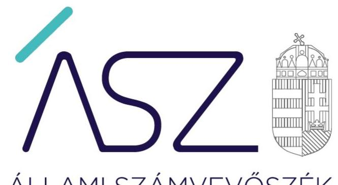
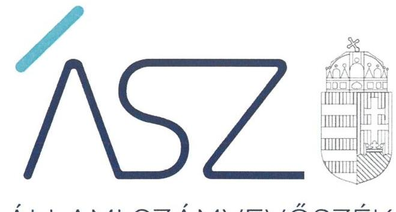
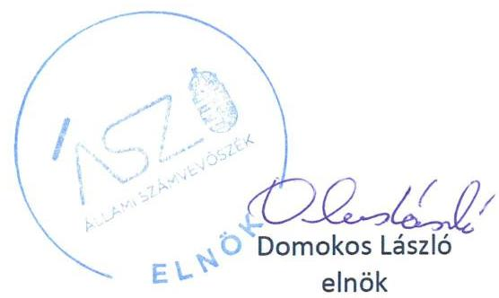
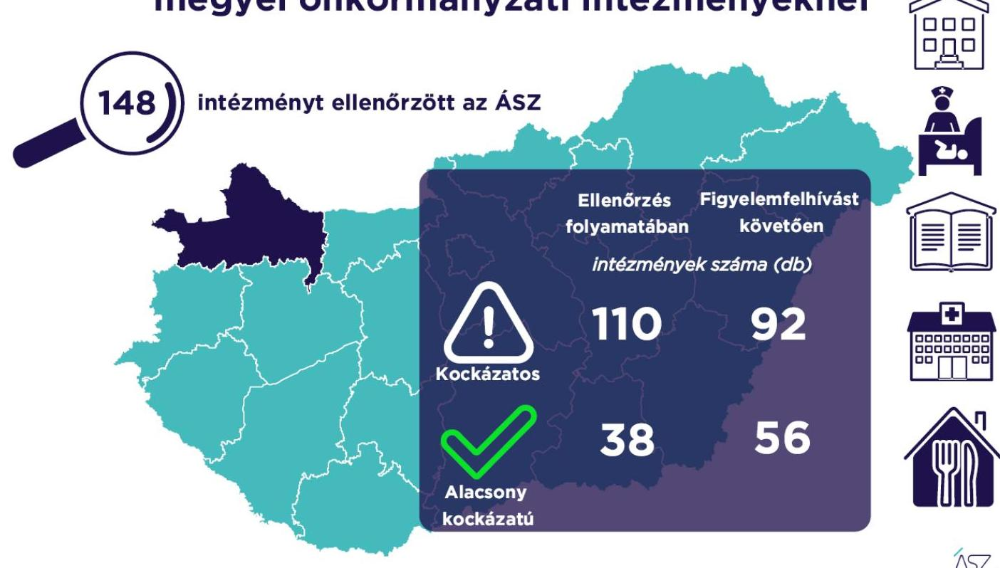

ÁLLAMI SZÁMVEVŐSZÉK

# JELENTÉS 

## A Győr-Moson-Sopron megyei önkormányzati intézmények ellenőrzése

Az önkormányzat és társulás irányítása alá tartozó intézmények integritásának monitoring típusú ellenőrzése - 148 intézmény
2021.

21103
www.asz.hu

---

ÁLLAMI SZÁMVEVŐSZÉK

# JELENTÉS

A Győr-Moson-Sopron megyei önkormányzati intézmények ellenőrzése

Az önkormányzat és társulás irányítása alá tartozó intézmények integritásának monitoring típusú ellenőrzése – 148 intézmény

2021. 12. hó 29. nap

21103
www.asz.hu

---

# AZ ELLENŐRZÉST FELÜGYELTE: 

SALAMON ILDIKŐ felügyeleti vezető

## AZ ELLENŐRZÉST VEZETTE ÉS A VÉGREHAJTÁSÁÉRT FELELŐS:

BALÁZSNÉ ANTONI ERIKA ellenőrzésvezető
SIPOSNÉ DÓCZI KLÁRA ellenőrzésvezető

A PROGRAM ÖSSZEÁLLÍTÁSÁÉRT FELELŐS:
DR. FELFÖLDI IZABELLA programkészítésért felelős vezető

IKTATÓSZÁM: EL-3461-010/2021.
TÉMASZÁM: 2568
ELLENŐRZÉS-AZONOSÍTÓ SZÁM: V0928

---

# TARTALOMJEGYZÉK 

■ ÖSSZEGZÉS ..... 5
■ AZ ELLENŐRZÉS JELENTŐSÉGE, AKTUALITÁSA, TÁRSADALMI SZEREPE, SZEMPONTJAI ..... 8
■ AZ ELLENŐRZÉS TERÜLETE ..... 9
■ ELLENŐRZÉS HATÓKÖRE ÉS MÓDSZERE ..... 10
■ MELLÉKLETEK ..... 13
I. sz. melléklet: Az értékelés módszertana ..... 13
II. sz. melléklet: Értelmező szótár ..... 15
■ FÜGGELÉKEK ..... 17
I. sz. függelék: Az ellenőrzött szervezetek és azok kockázati értékelése ..... 17
■ RÖVIDÍTÉSEK JEGYZÉKE ..... 25

---

.

---

# ÖSSZEGZÉS 

Az Állami Számvevőszék figyelemfelhívásának és tanácsadásának eredményeként a Győr-Moson-Sopron megyei önkormányzatok irányítása alatt álló 148 ellenőrzött intézmény közül 42 intézménynél az intézményvezető már 2021-ben intézkedett, vagy intézkedéseket rendelt el az integritást biztosító alapvető feltételek megerősítése, illetve kiépítése érdekében. Ezeknek az intézményeknek javult az integritása, erősödtek a csalásmentes működés feltételei.
76 intézménynél további intézkedések szükségesek az integritást biztosító alapvető feltételek kiépítése, illetve kiegészítése érdekében. Ezeknek az intézményeknek a vezetői az Állami Számvevőszék intézkedési kötelemmel járó figyelemfelhívására nem intézkedtek, ezért az azonosított kockázatok növekedtek, vagy intézkedéseik nem fedték le a kockázatos területeket, így az azonosított kockázatok nem változtak.

## Értékelések

Az Állami Számvevőszék a Győr-Moson-Sopron megyei önkormányzatok irányítása alá tartozó 148 intézmény belső kontrollrendszerének lényeges elemei kialakítását ellenőrizte a 2021. évre vonatkozóan. Az ellenőrzés a súlypontok meghatározásával lehetőséget biztosított a szervezeti integritás, működés és vezetés, valamint a gazdálkodás területén a kockázatok azonosítására.

A szervezeti integritás alapvető feltétele a szabályozottság, azaz a jogszabályokban előírt belső szabályzatok megléte, azok - hatályos jogszabályoknak - megfelelő tartalma és gyakorlati alkalmazhatósága. Az integritási kockázatok szervezeti szinten csökkenthetők azáltal, hogy az intézményvezetők kialakítják a szervezeti és működési kereteket, a gazdálkodásra vonatkozó alapvető szabályozási környezetet, valamint a kontrolltevékenységek szabályszerű gyakorlásának, az integrált kockázatkezelésnek és az integritást sértő események kezelésének a feltételeit.

A szervezeti integritás, a működés és a vezetés alapvető szabályozási feltételeinek kialakítása hozzájárul a csalásmentes integritási környezet megteremtéséhez.

A szervezeti és működési szabályzat teremti meg a szervezet szabályszerű működésének alapjait, illetve rögzíti a szervezeten belüli felelősségi viszonyokat. A szabályzat biztosítja a szervezeti működés szabályozottságát, ezáltal a szervezet tevékenységének átláthatóságát, a szervezeti célokkal összhangban történő működés feltételeit és annak ellenőrizhetőségét. Az ellenőrzöttek közül 118 intézmény rendelkezett szervezeti és működési szabályzattal a 2021. évben.

A jogszabályi előírásoknak eleget téve, nyilatkozatban értékelte az intézmény belső kontrollrendszerének minőségét 116 intézmény vezetője. Ezek közül 88 intézménynél alakítottak ki olyan szabályozásokat, folyamatokat, amelyek biztosítják a költségvetési szerv tevékenységében a rendelkezésre álló források átlátható, szabályszerű, szabályozott, gazdaságos, hatékony és eredményes felhasználása követelményeinek érvényesítését.

Az integrált kockázatkezelés eljárásrendjét 121, a szervezeti integritást sértő események kezelésének eljárásrendjét 120 intézménynél alakították ki az intézményvezetők. Az integrált kockázatkezelés eljárásrendje biztosítja a szervezet működésében rejlő kockázatok azonosításának és kezelésének feltételeit. A szervezet működési kockázatai veszélyeztethetik a közpénzekkel való átlátható, elszámoltatható és felelős gazdálkodást. A szervezeti integritást sértő események kezelésének eljárásrendje jelenti a szervezet tekintetében felmerülő és a szervezeten belül bekövetkező integritást sértő események kezelésének alapjait. Az eljárásrend kialakításával az intézmény vezetője támogatja az integritást sértő eseményekkel kapcsolatosan azonosított kockázatok bekövetkezése esetén azok hatékony kezelését, illetve a következmények enyhítését.

A pénz- és vagyongazdálkodáshoz kapcsolódó alapvető szabályozások és nyilvántartások - így a számviteli politika és a keretében elkészítendő szabályzatok, a számlarend, a beszerzések szabályozása, valamint a kötelezettségvállalásra és a teljesítés igazolására jogosultak és aláírásmintáik nyilvántartása - előmozdítják a közpénzügyek átlátható-

---

ságát, rendezettségét. Az intézményvezető ezen szabályzatok elkészítésével, nyilvántartások vezetésével és folyamatos karbantartásával az alapfeltételét biztosítja a pénzügyi- és vagyongazdálkodás átláthatóságának, a közpénzekkel és közvagyonnal való elszámoltathatóságnak. Az ellenőrzöttek közül 117 intézménynél a számviteli politika, 104 intézménynél a számlarend, 102 intézménynél a beszerzések lebonyolításával kapcsolatos eljárásrend rendelkezésre állt.

Az ellenőrzöttek közül 30 intézmény vezetője tett eleget az ellenőrzött területek mindegyikén az integritási kontrollok alapvető feltételeit jelentő, a jogszabályban előírt szabályozási kötelezettségének. Közülük 23 intézmény vezetője a jogszabályi előírásokon túl további erőfeszítéseket is tett az integritás erősítése érdekében, felismerte további olyan integritási kontrollok kialakításának indokoltságát, amelyet jogszabály nem ír elő, így szervezeti szinten hozzájárul a korrupcióval szembeni védettség megszilárdításához.

121 intézmény esetében az intézményvezető intézkedése volt szükséges a kockázatok csökkentése érdekében, mivel 39 intézménynél a jogszabályok által előírt kontrollok területén, 75 intézménynél a jogszabályok által előírt és a további, jogszabály által nem előírt integritási kontrollok területén egyaránt, hét intézménynél utóbbi kontrollok területén voltak hiányosságok. A dokumentumok kiértékelése alapján - az integritás további fejlesztése érdekében - az Állami Számvevőszék azonosította a lényeges kockázati területeket, és már az ellenőrzés lefolytatásával párhuzamosan, a 2021. évre vonatkozóan a kockázatok csökkentésére hívta fel az intézményvezetők figyelmét.

# Következtetések 

Az érintett 114 intézmény közül 90 intézmény vezetője válaszolt határidőben az Állami Számvevőszék figyelemfelhívására. Közülük 50 teljeskörűen, 23 részben egyetértett a kockázatos területeken teendő intézkedések indokoltságával. Az intézményvezetők közül 49 arról tájékoztatta az Állami Számvevőszéket, hogy valamennyi kockázatos területen, 21 pedig a kockázatos területek egy részénél már tett, illetve a jövőben tesz intézkedést a jelzett kockázatok csökkentése érdekében. A jogszabályi előírásokon túli integritási kontrollok területén az érintett 82 intézmény közül 44 intézmény vezetője a jelzett kockázatok teljes körű, egy pedig azok részbeni felszámolásáról adtak számot. Ezek eredményeként a 121 vezetői levélben jelzett 583 kockázati terület közül 311 esetben már történt, illetve tervezett az intézkedés, így javulás várható a feltárt kockázatos területek 53,3%-ánál.

Az intézkedések eredményeként az ellenőrzött 148 intézmény közül összesen 56 intézménynél a kockázatok alacsony szintűek, illetve - a tervezett intézkedések végrehajtásával - a kockázatok alacsony szintre csökkennek.

A szabályozások és nyilvántartások kialakításának célja nem önmagában a jogszabályi rendelkezések betartása, hanem az intézmény szabályozottságán keresztül a szabályszerű és csalásmentes gazdálkodás feltételeinek megteremtése, ezáltal az Alaptörvényben előírt átláthatóság és elszámoltathatóság elvének érvényesítése. Ezeknek az alapelveknek érvényesülése hozzájárulhat ahhoz, hogy az intézmények, mint közszolgáltatást nyújtó szervezetek felé a közszolgáltatásokat igénybe vevők, és általuk az állampolgárok általános bizalma is erősödjön.

Az Állami Számvevőszék figyelemfelhívására nem válaszoló, illetve a jelzett kockázatokra nem, vagy csak részben intézkedő intézményvezetők által vezetett intézményeknél rendszerszintű kockázatok maradtak fenn. Vezetési-irányítási kockázatot jelez, amennyiben az intézményvezetőnek címzett figyelemfelhívásra az intézményvezető helyett más személy válaszolt. Felelősségi és hatásköri kockázatot jelez, amennyiben az intézmény pénzügyi- és vagyongazdálkodásának alapvető szabályzatait a kontrollrendszer kialakításáért felelős intézményvezető helyett egy másik költségvetési szerv vezetője alakította ki, határozta meg. További kockázatot jelent a szabályok alkalmazottak általi megismerésére és alkalmazására, az intézmény mindennapi működésének integritására. Mindezek egyrészt az intézmény pénzügyi és vagyongazdálkodásának szabályszerűségét, másrészt a vezetői nyilatkozatok hitelességét, valóságtartalmát is megkérdőjelezi. A jelzett kockázatok arra mutatnak rá, hogy ezeknél az intézményeknél sérül a vezetői felelősség elve, és ezzel a felelős vezetésre épülő intézményi önállóság működése.

Az integritás elvű működés erősítése érdekében további kockázatcsökkentő lépések szükségesek a vezetés-irányítás, valamint a pénzügyi- és a vagyongazdálkodás szabályszerű feltételeinek kialakítása terén. Ezen intézmények integritásának kiépítését következő lépésként az irányító szerv bevonásával támogatja az Állami Számvevőszék.

---

# Erősödött a csalásmentesség a Győr-Moson-Sopron megyei önkormányzati intézményeknél

---

# AZ ELLENŐRZÉS JELENTŐSÉGE, AKTUALITÁSA, TÁRSADALMI SZEREPE, SZEMPONTJAI 

Az Alaptörvény alapértékeket, elveket fogalmaz meg, amely szerint a közpénzekkel gazdálkodó minden szervezet köteles a nyilvánosság előtt elszámolni a közpénzekre vonatkozó gazdálkodásával. A közpénzeket és a nemzeti vagyont az átláthatóság és a közélet tisztaságának elve szerint kell kezelni.

Magyarország helyi önkormányzatairól szóló törvény ${ }^{1}$ a helyi közhatalom gyakorlás széleskörű érvényesítésével összhangban tág teret ad a helyi önkormányzatoknak a feladataik, a közszolgáltatások legkülönbözőbb formákban történő ellátására, így széleskörű lehetőséggel rendelkeznek intézmények alapítására.

A helyi önkormányzatok irányítása alá tartozó intézmények szerteágazó közszolgáltatásokat nyújtanak. Az intézmények működtetése közvetlenül érinti a társadalom valamennyi rétegét, a közfeladatot ellátó intézmények működésének minősége közvetlen hatással van az azokat igénybe vevő állampolgárok életére.

Az intézmények szabályszerű és eredményes működésének és gazdálkodásának alapfeltétele a belső kontrollrendszer - benne az integritási kontrollok - megfelelő kialakítása. Az ÁSZ² a törvényi felhatalmazással élve ellenőrzi az önkormányzati intézményeket, hogy megállapításaival támogassa az ellenőrzött szervezetek szabályszerű gazdálkodását, működését.

A helyi önkormányzatok intézményei által ellátott feladatok, a bölcsődei, óvodai ellátás, a gyermekétkeztetés, a betegek és idősek gondozása, a közművelődési intézmények, könyvtárak működtetése által a lakosság ezeken a területeken találkozik legszélesebb körben az önkormányzatok által nyújtott szolgáltatásokkal. A szolgáltatásokat igénybe vevők jelentős száma, a feladatellátáshoz használt nemzeti vagyon és az erre fordított közpénz nagysága indokolja, hogy az ÁSZ további, az előző ellenőrzésekre épülő ellenőrzéseket végezzen ezen a területen, illetve további olyan területeken, ahol az önkormányzati szolgáltatást a lakosság széles köre veszi igénybe.

Az ellenőrzés célja annak értékelése, hogy a helyi önkormányzatok irányítása alá tartozó intézmények megteremtették-e az integritás biztosításához szükséges feltételeket, kialakították-e az alapvető, a szervezeti kereteket, az integritási kontrollokhoz kapcsolódó, valamint a korrupció elleni védelmet szolgáló szabályozásokat. Továbbá, hogy az intézményvezető gondoskodott-e a szervezeti teljesítmény mérés alapfeltételeinek kialakításáról az eredményességi szempontoknak való megfelelés megalapozottsága biztosítása érdekében. A monitoring típusú ellenőrzés célja hatékonyan támogatni az ellenőrzött szervezeteket, ezáltal növelve az ÁSZ tanácsadó szerepét, elősegítve a „jól irányított állam" működését.

Az ÁSZ célja, hogy új ellenőrzési megközelítést alkalmazva támogassa a közpénzügyi helyzet javítását; a monitoring típusú ellenőrzéssel jelen időben adjon helyzetképet az integritási szemlélet érvényesítéséről, rávilágítson az integritási kontrollok kiépítettségére, illetve további fejlesztésére. Napjainkban mindez kiemelt fontosságúvá vált. Minden szervezetnek fel kell készülnie arra, hogy a koronavírus járvány okozta társadalmi és gazdasági válság növelni fogja a korrupciós nyomást. Az ÁSZ ebben a helyzetben is alapvető kötelességének tartja, hogy a közpénzek őre legyen, és ellenőrzéseit az önkormányzati alrendszer intézményei körében is folytassa.

Fontos, hogy az intézmények vezetői felismerjék az integritás kockázatokat, azokat ismételten mérjék fel, és alakítsanak ki átlátható, jól szabályozott rendszereket, döntési mechanizmusokat. Az integritási kockázatok feltárása, megismerése elengedhetetlenül fontos, mert ezt követően tehetők meg azok a lépések, amelyek a kockázatok csökkentését, felszámolását és kezelését célozzák. A belső kontrollrendszer - benne az integritás kontrollok - megfelelő kialakítása, működése a helyi önkormányzatok irányítása alatt álló intézményeknél is hozzájárul a társadalmi közbizalom erősítéséhez.

Az ellenőrzés rámutat az integritási jó gyakorlatokra is, továbbá felhívja a figyelmet a jogszabályi követelmények teljesítéséhez szükséges lépésekre is.

---

# AZ ELLENŐRZÉS TERÜLETE
 ## Az önkormányzatok irányítása alá tartozó intézmények

Helyi önkormányzati költségvetési szervet az államháztartásról szóló 2011. évi CXCV törvény (Áht. ${ }^{3}$ ) szerint a helyi önkormányzat, a helyi önkormányzatok társulása, a térségi fejlesztési tanács, az átalakult nemzetiségi önkormányzat alapíthat, a költségvetési szerv alapító okiratában meghatározott önkormányzati közfeladatok ellátására. A költségvetési szervek önálló jogi személyek, éves költségvetésükből gazdálkodva látják el feladataikat. A költségvetési szervek gazdasági szervezettel rendelkeznek, ha azonban a költségvetési szerv éves átlagos statisztikai állományi létszáma a 100 főt nem éri el, a gazdasági szervezet feladatait az önkormányzati hivatal, vagy az irányító szerv döntése alapján az irányító szerv irányítása alá tartozó, gazdasági szervezettel rendelkező más költségvetési szerv látja el.

Az államháztartásról szóló törvény végrehajtásáról szóló 368/2011. (XII. 31.) Korm. rendelet (Ávr. ${ }^{4}$ ) 1. melléklete szerint, az államháztartás önkormányzati alrendszerében a helyi önkormányzat által irányított költségvetési szerv esetében az irányító szerv hatáskörét a képviselő-testület, közgyűlés gyakorolja, és annak vezetője a polgármester, főpolgármester, megyei közgyűlés elnöke.

Az ellenőrzés a Győr-Moson-Sopron megyei önkormányzatok irányítása alá tartozó, az I. sz. Függelékben felsorolt költségvetési szervekre terjedt ki.

A feladatellátásuk szerint az ellenőrzött költségvetési szervek egy része óvoda, bölcsőde, közoktatási intézmény, egészségügyi intézmény, konyha, művelődési ház, múzeum, kulturális központ, idősek otthona, gondozási központ, gyermekjóléti intézményként működik.

Az ellenőrzött 148 intézmény közül kettő rendelkezik saját gazdasági szervezettel.

Az ellenőrzés 144 intézmény esetében lefolytatásra került. Négy intézmény esetében az ellenőrzés adatszolgáltatás hiányában nem volt lefolytatható, az ÁSZ ezen ellenőrzött szervezetek integritási kockázatát kiemelten magasnak értékelte.

---

# ELLENŐRZÉS HATÓKÖRE ÉS MÓDSZERE 

## Az ellenőrzés típusa

Megfelelőségi ellenőrzés.

## Az ellenőrzött időszak

A 2021. év, a $8 \mathrm{kr} .{ }^{5}$ szerinti vezetői nyilatkozat, valamint annak alátámasztottsága vonatkozásában a 2020. év.

## Az ellenőrzés tárgya

A szervezeti keretekkel, a működéssel és gazdálkodással kapcsolatos szabályzatok, szabályozások, valamint a szervezeti elvekkel, értékekkel összefüggő integritás kontrollok kiépítettsége, a szervezeti teljesítmény mérés alapfeltételeinek kialakítása.

## Az ellenőrzött szervezetek

Az ellenőrzött intézményeket az I. sz. Függelék tartalmazza.

## Az ellenőrzés jogalapja

Az ellenőrzés jogszabályi alapját az ÁSZ tv. ${ }^{6}$ 1. § (3) bekezdése, 5. § (6) bekezdése, valamint az Áht. 61. § (2) bekezdése képezik.

## Az ellenőrzés módszerei

Az ÁSZ az ellenőrzést az ellenőrzési program szempontjai, az ellenőrzött időszakban hatályos jogszabályok, a jelen ellenőrzésre irányadó ÁSZ módszertan figyelembevételével és a nemzetközi standardokat irányadónak tekintve végzi.

Az ellenőrzés ideje alatt az ÁSZ az ellenőrzött szervezetekkel történő kapcsolattartást az ÁSZ SZMSZ${ }^{7}$-ének vonatkozó előírásai alapján biztosítja.

Az ellenőrzési kérdések megválaszolásához szükséges bizonyítékok megszerzése a következő ellenőrzési eljárások alkalmazásával történik: megfigyelés, összehasonlítás, elemző eljárás. Az ellenőrzési bizonyítékként felhasználható adatforrások közé tartoznak az ellenőrzési programban felsorolt adatforrások, továbbá minden - az ellenőrzés folyamán - feltárt, az ellenőrzés szempontjából információkat tartalmazó dokumentum.

---

Az ÁSZ az ellenőrzést a kérdésekre adott válaszok kiértékelésével, valamint a megjelölt adatforrások, továbbá az adott időszakban hatályos jogszabályok, valamint az ÁSZ honlapján közzétett helyénvalósági kritériumok figyelembevételével folytatja le.

A monitoring típusú ellenőrzés az önkormányzatok irányítása alá tartozó intézmények integritás alapú működésének lényeges területeire és a közpénzügyi helyzet javítása érdekében az elért eredmények fenntartására fókuszál. Lehetőséget biztosít az integritási kontrollok kiépítettségében lévő hiányosságok, a szervezeti teljesítmény mérés alapfeltételei kialakításának hiánya beazonosítására az eredményességi szempontoknak való megfelelés megalapozottsága biztosítása érdekében, az önkormányzatok, társulások irányítása alá tartozó intézmények integritásának elemzésére, részletes ellenőrzések megalapozására.

---

.

---

# MELLÉKLETEK 

I. SZ. MELLÉKLET: AZ ÉRTÉKELÉS MÓDSZERTANA

Az egyes kockázati területek és kockázatforrások minősítése „pontozásos módszerrel", az integritás „jelző" dokumentumai és a vezetői magatartás ellenőrzéshez kapcsolódóan tanúsított tényhelyzeteinek értékelése alapján történt.

Az értékelt dokumentumokhoz, nyilvántartásokhoz, kockázati besorolásokhoz minden esetben pontszám került hozzárendelésre, amelyek értéke alapján az ellenőrzött szervezetek kockázati csoportba kerültek besorolásra:

- Alacsony kockázatú - az elérhető összes pontszám legalább 80\%-a
- Közepes kockázatú - az elérhető pontszám 50-79\%-a között
- Magas kockázatú - az elérhető pontszám 50\%-a alatt

Az első lépésben azonosításra kerültek azok az intézményi szabályozások és nyilvántartások, amelyek meglétét jogszabály írja elő, hiánya pedig felveti a csalás és korrupció kockázatát.

Második lépésben az adatoknak az ellenőrzés rendelkezésére bocsátása kockázati kritériumainak meghatározása, majd értékelése történt meg.

Harmadik lépésben a figyelemfelhívó levelekre adott válaszok kockázati kritériumainak meghatározása, majd értékelése történt meg.

Az összesített kockázati értékelést javította, amennyiben

- az intézmény rendelkezett olyan szabályozással, amely kötelező meglétét jogszabály nem írja elő, de segíti a csalás és a korrupció megelőzését (helyénvalósági dokumentumok).

Az összesített kockázati értékelést rontotta, amennyiben

- az integritás szempontjából meghatározó dokumentum - az intézményi SZMSZ - hiányzott, és javítása érdekében a figyelemfelhívó levél hatására sem történt intézkedés.

A figyelemfelhívó levelekre adott válaszok értékelése alapján:

- A kockázat csökkent, amennyiben a figyelemfelhívó levélre adott válasza a figyelemfelhívással összhangban volt, valamennyi kockázati területen intézkedett vagy intézkedést tervezett.
- A kockázat változatlan, amennyiben a figyelemfelhívó levélben foglaltaktól eltérő magatartást tanúsított, intézkedése a figyelemfelhívással részben volt összhangban, a kockázati területeken részben intézkedett vagy intézkedést tervezett.
- A kockázat nőtt, amennyiben nem volt együttműködő, a figyelemfelhívó levélre nem válaszolt, vagy válasza alapján nem intézkedett és nem tervezett intézkedést.

---

# Az önkormányzatok irányítása alá tartozó intézmények kockázati csoportba sorolásának értékelési keretrendszere 

I. Dokumentumokkal rendelkezés
lényeges dokumentumok, amelyek hiánya felveti a csalás és korrupció kockázatát
I.1. A szervezeti integritás, működés és vezetés alapvető szabályozási feltételei

- intézmény SZMSZ-e
- vezetői nyilatkozat a 2020. évre vonatkozóan az intézmény belső kontrollrendszer minőségének értékeléséről, valamint a nyilatkozat megalapozottságát bizonyító dokumentumok
- integrált kockázatkezelés eljárásrendje
- az integritást sértő események kezelésének eljárásrendje
I.2. A pénz- és vagyongazdálkodáshoz kapcsolódó alapvető szabályozások
- számviteli politika
- az eszközök és a források leltárkészítési és leltározási szabályzata
- az eszközök és a források értékelési szabályzata
- pénzkezelési szabályzat
- számlarend
- beszerzések lebonyolításával kapcsolatos eljárásrend
- a kötelezettségvállalásra, teljesítés igazolására jogosult személyekről és aláírás-mintájukról vezetett nyilvántartás
II. Az adatoknak az ellenőrzés rendelkezésére bocsátása
II.1. A megnevezett adatokkal rendelkezett és a törvényi határidőn belül hiánytalanul rendelkezésre bocsátotta. Figyelem-, illetve figyelmet felhívó levél nem volt indokolt.
II.2. A megnevezett adatokat nem bocsátotta rendelkezésre.
III. Figyelemfelhívó levelekre adott válaszok kockázati értékelése
III.1. Kockázat csökkent: együttműködése a figyelemfelhívó levéllel összhangban volt.
III.2. Kockázat változatlan: a figyelemfelhívó levélben foglaltaktól eltérő együttműködést tanúsított.
III.3. Kockázat nőtt: nem reagált, nem intézkedett, így nem volt együttműködő.

---

belső kontrollrendszer

Belső kontrollrendszer területei
integrált kockázatkezelési rendszer
integritás

Integritási kockázatok

A belső kontrollrendszer a kockázatok kezelése és tárgyilagos bizonyosság megszerzése érdekében kialakított folyamatrendszer, amely azt a célt szolgálja, hogy a működés és gazdálkodás során a tevékenységeket szabályszerűen, gazdaságosan, hatékonyan, eredményesen hajtsák végre, az elszámolási kötelezettségeket teljesítsék, megvédjék az erőforrásokat a veszteségektől, károktól és nem rendeltetésszerű használattól. (Forrás: Áht. 69. § (1) bekezdése)
A kontrollkörnyezet, az integrált kockázatkezelési rendszer, a kontrolltevékenységek, az információs és kommunikációs rendszer, valamint a nyomon követési (monitoring) rendszer. (Forrás: Bkr. 3. §-a)
Olyan folyamatalapú kockázatkezelési rendszer, amely a szervezet minden tevékenységére kiterjed, egységes módszertan és eljárások alkalmazásával, a szervezet célkitűzéseinek és értékeinek figyelembevételével biztosítja a szervezet kockázatainak teljes körű azonosítását, azok meghatározott kritériumok szerinti értékelését, valamint a kockázatok kezelésére vonatkozó intézkedési terv elkészítését és az abban foglaltak nyomon követését. (Forrás: Bkr. 2. § m) pontja)
Az integritás az elvek, értékek, cselekvések, módszerek, intézkedések konzisztenciáját jelenti, vagyis olyan magatartásmódot, amely meghatározott értékeknek megfelel. (Forrás: Nemzetgazdasági Minisztérium: Államháztartási belső kontroll standardok és gyakorlati útmutató 1.1.3. pontja, 2017. szeptember)
A szervezeti integritás a szervezet védekezőképessége a korrupció lehetőségével szemben. Az integritás erősítése - mint preventív eszközrendszer - a korrupció megelőzésére fókuszál. A szervezeti integritás a működés, a szervezeti kultúra minőségét is jelzi.
Az ellenőrzés megközelítése szerint az integritás a szervezet értékeinek és célkitűzéseinek megfelelő működést jelenti. Minél magasabb színvonalú egy szervezet integritása, az annál ellenállóbb a korrupcióval, a korrupciós veszélyekkel szemben, vagyis az integritás erősítése - elsősorban az egyes szervezetek szintjén - a korrupciós kockázatok mérséklésének egyik fontos eszköze. Az integritás ugyanakkor tágabb jelentésű fogalom, nemcsak a korrupciótól, hanem más helytelen magatartásoktól (például csalás, önkényesség) való mentességet és a szervezet céljainak követését is jelenti. Egy szervezet integritását úgy is meghatározhatjuk, mint a szervezet ellenállóképességét annak a veszélynek, hogy dolgozói helytelen magatartásukkal kárt okozzanak.
Az integritás megerősítése és fenntartása elsősorban a szervezet elsőszámú vezetőjének felelőssége.
Integritási kockázatnak minősül a szervezet célkitűzéseit, értékeit, elveit sértő vagy veszélyeztető visszaélés, szabálytalanság, vagy egyéb esemény lehetősége. A korrupciós kockázat olyan integritási kockázat, amely korrupciós cselekmény bekövetkezésének lehetőségét jelenti. Minden korrupciós kockázat egyben integritási kockázat is. Korrupciós cselekményeknek nevezzük azokat a vesztegetésszerű cselekményeket, amelyeket általában a Büntető Törvénykönyv ${ }^{8}$ is büntetéssel fenyeget.
Az integritási kockázat alatt az integritás megsértésének esélyét értjük. Az integritási kockázatok olyan helyzetek, folyamatok, amelyek során fennáll a korrupciós befolyás lehetősége. Így integritási kockázatok jelentkeznek például a köz- és a magánszféra közötti üzleti tranzakciók során, a köztisztviselők által hozott döntések, a mérlegelési szabadság körében, illetve abban az esetben, ha egy közszolgáltatás iránt nagyobb a kereslet, mint a kielégítéséhez rendelkezésre álló erőforrások. Az integritási kockázat értelemszerűen nem egyenlő magával az integritás sérelmével, vagy a korrupció be-

---

kockázat
kontrollkörnyezet
kontrolltevékenységek
intézmény
következésével. Az integritási kockázatokkal szemben megfelelő kontrollok kiépítésével lehet védekezni. Amennyiben az integritási kontrollok szintje elmarad a kockázatok mértékétől, kockázati kitettségről beszélünk. A kontrollok kialakításának és működtetésének mérlegelésekor minden esetben vizsgálni kell a kockázatok szintjét is, a túlszabályozottság egyfelől költséges, másfelől a túlzott bürokrácia maga is lehet a korrupciós veszély hordozója.
A kockázat annak a valószínűségét jelenti, hogy egy vagy több esemény, vagy intézkedés nem kívánt módon befolyásolja a rendszer működését, céljainak megvalósulását. (Forrás: Javaslatok a korrupciós kockázatok kezelésére - Kockázatkezelési és ellenőrzési módszertan 35. oldal, ÁSZ)
A költségvetési szerv vezetője által kialakított olyan elvek, eljárások, belső szabályzatok összessége, amelyben világos a szervezeti struktúra, a folyamatok átláthatók, egyértelműek a felelősségi, hatásköri viszonyok és feladatok, meghatározottak, ismertek és elfogadottak az etikai elvárások a szervezet minden szintjén, átlátható a humánerőforrás-kezelés, biztosított a szervezeti célok és értékek irányában való elkötelezettség fejlesztése és elősegítése. (Forrás: Bkr. 6. § (1) bekezdés)
A költségvetési szerv vezetője által a szervezeten belül kialakított (kontroll) tevékenységek, melyek biztosítják a kockázatok kezelését, hozzájárulnak a szervezet céljainak eléréséhez és erősítik a szervezet integritását. (Forrás: Bkr. 8. § (1) bekezdés)
A helyi önkormányzatok irányítása alá tartozó költségvetési szervek. (A képviselő-testület a feladatkörébe tartozó közszolgáltatások ellátására - jogszabályban meghatározottak szerint - költségvetési szervet (önkormányzati intézmény) alapíthat; Forrás: Mötv. 41. § (6) bekezdés)

---

# FÜGGELÉKEK

I. SZ. FÜGGELÉK: AZ ELLENŐRZÖTT SZERVEZETEK ÉS AZOK KOCKÁZATI ÉRTÉKELÉSE

|  Sorszám | Ellenőrzött szervezet megnevezése | Irányító szerv (önkormányzat) megnevezése | Helység | Tanácsadást megelőző kockázati besorolás | Intézkedést követően a kockázati értékelés változása | A kockázati szint alacsonyra csökkent-e  |
| --- | --- | --- | --- | --- | ---

 | --- |
|  1. | Bágyogszovát Napköziotthonos Óvoda | Bágyogszovát Község Önkormányzata | Bágyogszovát | KÖZEPES | NEM VÁLTOZOTT | N  |
|  2. | Bágyogszováti Idősek Otthona | Bágyogszovát Község Önkormányzata | Bágyogszovát | MAGAS | CSÖKKENT | N  |
|  3. | Győrladaméri Bóbita Óvoda és Bölcsőde | Győrladamér Község Önkormányzata | Győrladamér | KÖZEPES | CSÖKKENT | I  |
|  4. | Kimlei Nemzetiségi Óvoda és Mini Bölcsőde | Kimle Község Önkormányzata | Kimle | KÖZEPES | CSÖKKENT | N  |
|  5. | Napközi Otthonos Óvoda Sopronhorpács | Sopronhorpács Község Önkormányzata | Sopronhorpács | MAGAS | NEM VÁLTOZOTT | N  |
|  6. | Vámosszabadi Vackor Óvoda és Bölcsőde | Vámosszabadi Község Önkormányzata | Vámosszabadi | MAGAS | CSÖKKENT | N  |
|  7. | Gyömörei Gesztenyés Óvoda és Bölcsőde | Gyömöre Község Önkormányzata | Gyömöre | KÖZEPES | NÖTT | N  |
|  8. | Hédervári Mini Manó Mini Bölcsőde | Hédervár Község Önkormányzata | Hédervár | MAGAS | NÖTT | N  |
|  9. | Kisbajcsi Nefelejcs Napközi Otthonos Óvoda | Kisbajcs Község Önkormányzata | Kisbajcs | KÖZEPES | CSÖKKENT | N  |
|  10. | Nagybajcsi Napsugár Óvoda és Bölcsőde | Nagybajcs Község Önkormányzata | Nagybajcs | KÖZEPES | CSÖKKENT | N  |
|  11. | Öttevényi Mackó-Kuckó Napköziotthonos Óvoda és Bölcsőde | Öttevény Község Önkormányzata | Öttevény | KÖZEPES | NÖTT | N  |
|  12. | Pázmándfalui Napsugár Óvoda | Pázmándfalu Község Önkormányzata | Pázmándfalu | MAGAS | NÖTT | N  |
|  13. | Péri Vadvirág Óvoda | Pér Község Önkormányzata | Pér | KÖZEPES | NÖTT | N  |
|  14. | Bőnyi Szivárvány Óvoda és Mini Bölcsőde | Bőny Község Önkormányzata | Bőny | MAGAS | NEM VÁLTOZOTT | N  |
|  15. | Ciráki Napköziotthonos Óvoda | Cirák Község Önkormányzata | Cirák | MAGAS | NÖTT | N  |
|  16. | Fertődi Tündérkert Óvoda és Bölcsőde | Fertőd Város Önkormányzata | Fertőd | KÖZEPES | CSÖKKENT | I  |
|  17. | Fertődi Művelődési Ház és Szabadidőközpont | Fertőd Város Önkormányzata | Fertőd | MAGAS | NÖTT | N  |
|  18. | Fertőrákosi Óvoda és Bölcsőde Kindergarten Und Kinderkrippe Kroisbach | Fertőrákos Községi Önkormányzat | Fertőrákos | MAGAS | NEM VÁLTOZOTT | N  |
|  19. | Gyarmati Aranydió Óvoda | Gyarmat Községi Önkormányzat | Gyarmat | KÖZEPES | NÖTT | N  |
|  20. | Felpéci Mesevilág Óvoda | Felpéc Község Önkormányzata | Felpéc | KÖZEPES | NÖTT | N  |
|  21. | Dr. Kovács Pál Könyvtár és Közösségi Tér | Győr Megyei Jogú Város Önkormányzata | Győr | KÖZEPES | CSÖKKENT | I  |
|  22. | Egyesített Egészségügyi és Szociális Intézmény Győr | Győr Megyei Jogú Város Önkormányzata | Győr | KÖZEPES | NÖTT | N  |
|  23. | Győri Nemzeti Színház | Győr Megyei Jogú Város Önkormányzata | Győr | KÖZEPES | NÖTT | N  |
|  24. | Győr Megyei Jogú Város Gyermektábora | Győr Megyei Jogú Város Önkormányzata | Győrújbarát | KÖZEPES | NÖTT | N  |

---

| Sorszám | Ellenőrzött szervezet megnevezése | Irányító szerv (önkormányzat) megnevezése | Helység | Tanácsadást megelőző kockázati besorolás | Intézkedést követően a kockázati értékelés változása | A kockázati szint alacsonyra csökkent-e |
| :--: | :--: | :--: | :--: | :--: | :--: | :--: |
| 25. | Győr Megyei Jogú Város Útkezelő Szervezete | Győr Megyei Jogú Város Önkormányzata | Győr | KÖZEPES | CSÖKKENT | I |
| 26. | Hajléktalanokat Segítő Szolgálat Győr | Győr Megyei Jogú Város Önkormányzata | Győr | MAGAS | NEM VÁLTOZOTT | N |
| 27. | Egyesített Bölcsődei Intézményhálózat Győr | Győr Megyei Jogú Város Önkormányzata | Győr | KÖZEPES | NÖTT | N |
| 28. | Család- és Gyermekjóléti Központ Győr | Győr Megyei Jogú Város Önkormányzata | Győr | KÖZEPES | NÖTT | N |
| 29. | Győri Filharmonikus Zenekar | Győr Megyei Jogú Város Önkormányzata | Győr | KÖZEPES | NEM VÁLTOZOTT | N |
| 30. | Rómer Flóris Művészeti és Történeti Múzeum | Győr Megyei Jogú Város Önkormányzata | Győr | KÖZEPES | NÖTT | N |
| 31. | Vaskakas Bábszínház | Győr Megyei Jogú Város Önkormányzata | Győr | KÖZEPES | NÖTT | N |
| 32. | Újvárosi Művelődési Ház | Győr Megyei Jogú Város Önkormányzata | Győr | KÖZEPES | NÖTT | N |
| 33. | Győri Balett | Győr Megyei Jogú Város Önkormányzata | Győr | KÖZEPES | NÖTT | N |
| 34. | Generációk Művelődési Háza | Győr Megyei Jogú Város Önkormányzata | Győr | KÖZEPES | NÖTT | N |
| 35. | Molnár Vid Bertalan Művelődési Központ | Győr Megyei Jogú Város Önkormányzata | Győr | KÖZEPES | NÖTT | N |
| 36. | Győr Megyei Jogú Város Leváltára | Győr Megyei Jogú Város Önkormányzata | Győr | KÖZEPES | CSÖKKENT | N |
| 37. | Bartók Óvoda | Győr Megyei Jogú Város Önkormányzata | Győr | ALACSONY | CSÖKKENT | I |
| 38. | Sün Balázs Óvoda | Győr Megyei Jogú Város Önkormányzata | Győr | ALACSONY | NEM VOLT SZABÁLYSZERŰSÉGI HIBA | I |
| 39. | Ménfőcsanaki Óvoda | Győr Megyei Jogú Város Önkormányzata | Győr | ALACSONY | NEM VOLT SZABÁLYSZERŰSÉGI HIBA | I |
| 40. | Erzsébet Ligeti Óvoda | Győr Megyei Jogú Város Önkormányzata | Győr | ALACSONY | NÖTT | N |
| 41. | Tárogató Óvoda | Győr Megyei Jogú Város Önkormányzata | Győr | KÖZEPES | NÖTT | N |
| 42. | Szentiváni Óvoda | Győr Megyei Jogú Város Önkormányzata | Győr | ALACSONY | NEM VOLT SZABÁLYSZERŰSÉGI HIBA | I |
| 43. | Ménfőcsanak-Gyirmóti Művelődési Központ | Győr Megyei Jogú Város Önkormányzata | Győr | KÖZEPES | NÖTT | N |
| 44. | Gyárvárosi Óvoda | Győr Megyei Jogú Város Önkormányzata | Győr | ALACSONY | NEM VOLT SZABÁLYSZERŰSÉGI HIBA | I |
| 45. | Győri Mosolyvár Óvoda | Győr Megyei Jogú Város Önkormányzata | Győr | ALACSONY | NEM VOLT SZABÁLYSZERŰSÉGI HIBA | I |
| 46. | Bisinger Óvoda | Győr Megyei Jogú Város Önkormányzata | Győr | ALACSONY | NEM VOLT SZABÁLYSZERŰSÉGI HIBA | I |

---

| Sorszám | Ellenőrzött szervezet megnevezése | Irányító szerv (önkormányzat) megnevezése | Helység | Tanácsadást megelőző kockázati besorolás | Intézkedést követően a kockázati értékelés változása | A kockázati szint alacsonyra csökkent-e |
| :--: | :--: | :--: | :--: | :--: | :--: | :--: |
| 47. | Márvány Óvoda | Győr Megyei Jogú Város Önkormányzata | Győr | KÖZEPES | NEM VÁLTOZOTT | N |
| 48. | Városrendészet Győr | Győr Megyei Jogú Város Önkormányzata | Győr | ALACSONY | NEM VOLT SZABÁLYSZERŰSÉGI HIBA | N |
| 49. | Mezőőri és Parkőri Szolgálat Győr | Győr Megyei Jogú Város Önkormányzata | Győr | ALACSONY | NEM VOLT SZABÁLYSZERŰSÉGI HIBA | N |
| 50. | Nagybácsai Óvoda | Győr Megyei Jogú Város Önkormányzata | Győr | ALACSONY | NEM VOLT SZABÁLYSZERŰSÉGI HIBA | I |
| 51. | Kovács Margit Óvoda | Győr Megyei Jogú Város Önkormányzata | Győr | ALACSONY | CSÖKKENT | I |
| 52. | Himodi Napköziotthonos Óvoda | Himod Község Önkormányzata | Himod | MAGAS | NÖTT | N |
| 53. | Himodi Főzökonyha | Himod Község Önkormányzata | Himod | MAGAS | NÖTT | N |
| 54. | Mórichidai Napközi Otthonos Óvoda | Mórichida Község Önkormányzata | Mórichida | KÖZEPES | NÖTT | N |
| 55. | Rábapatonai Katica Óvoda | Rábapatona Község Önkormányzata | Rábapatona | KÖZEPES | NEM VÁLTOZOTT | N |
| 56. | Rajkai Napköziotthonos Óvoda és Bölcsőde | Rajka Község Önkormányzata | Rajka | KIEMELTEN MAGAS | NEM VÁLTOZOTT | N |
| 57. | Tényői Szent Erzsébet Óvoda és Bölcsőde | Tényő Község Önkormányzata | Tényő | KIEMELTEN MAGAS | NEM VÁLTOZOTT | N |
| 58. | Ágfalvi Szivárvány Mini Bölcsőde | Ágfalva Községi Önkormányzat | Ágfalva | KÖZEPES | CSÖKKENT | I |
| 59. | Agyagosszergényi Csicsergő Óvoda | Agyagosszergény Község Önkormányzata | Agyagosszergény | KÖZEPES | CSÖKKENT | I |
| 60. | Ásványrárói Tündérkert Óvoda és Mini Bölcsőde | Ásványráró Község Önkormányzata | Ásványráró | ALACSONY | NEM VOLT SZABÁLYSZERŰSÉGI HIBA | I |
| 61. | Bakonyszentlászlói Idősek Otthona | Bakonyszentlászló Község Önkormányzata | Bakonyszentlászló | KÖZEPES | CSÖKKENT | I |
| 62. | Barbacsi Vadgesztenye Óvoda és Konyha | Barbacs Községi Önkormányzat | Barbacs | KÖZEPES | CSÖKKENT | I |
| 63. | Beledi Általános Művelődési Központ | Beled Város Önkormányzata | Beled | ALACSONY | NEM VOLT SZABÁLYSZERŰSÉGI HIBA | I |
| 64. | Bezenyei Százszorszép Óvoda | Bezenye Községi Önkormányzat | Bezenye | KÖZEPES | CSÖKKENT | I |
| 65. | Csapodi Kerekerdő Óvoda | Csapod Község Önkormányzata | Csapod | ALACSONY | NEM VOLT SZABÁLYSZERŰSÉGI HIBA | I |
| 66. | Szociális és Gyermekjóléti Központ | Csorna Város Önkormányzata | Csorna | MAGAS | CSÖKKENT | N |
| 67. | Csornai Városi Művelődési Központ és Könyvtár | Csorna Város Önkormányzata | Csorna | MAGAS | CSÖKKENT | N |
| 68. | Csornai Napközi Otthonos Óvoda | Csorna Város Önkormányzata | Csorna | MAGAS | CSÖKKENT | N |

---

| Sorszám | Ellenőrzött szervezet megnevezése | Irányító szerv (önkormányzat) megnevezése | Helység | Tanácsadást megelőző kockázati besorolás | Intézkedést követően a kockázati értékelés változása | A kockázati szint alacsonyra csökkent-e |
| :--: | :--: | :--: | :--: | :--: | :--: | :--: |
| 69. | Döri Napközi Otthonos Óvoda | Dör Községi Önkormányzat | Dör | KÖZEPES | CSÖKKENT | I |
| 70.

 | Kiserdei Óvoda | Dunakiliti Község Önkormányzata | Dunakiliti | MAGAS | NÖTT | N |
| 71. | Dunaszegi Napközi Otthonos Óvoda és Bölcsőde | Dunaszeg Község Önkormányzata | Dunaszeg | KÖZEPES | CSÖKKENT | I |
| 72. | Duna-Gyöngye Óvoda | Dunaszentpál Község Önkormányzata | Dunaszentpál | KÖZEPES | CSÖKKENT | N |
| 73. | Écsi Napraforgó Óvoda és Bölcsőde | Écs Községi Önkormányzat | Écs | MAGAS | CSÖKKENT | N |
| 74. | Simonyi Károly Óvoda | Egyházasfalu Község Önkormányzata | Egyházasfalu | MAGAS | NEM VÁLTOZOTT | N |
| 75. | Tündérkastély Óvoda | Enese Község Önkormányzata | Enese | KÖZEPES | NÖTT | N |
| 76. | Fertőendrédi Kva-Gyöngye Óvoda | Fertőendréd Község Önkormányzata | Fertőendréd | ALACSONY | NEM VOLT SZABÁLYSZERŰSÉGI HIBA | I |
| 77. | Gondozási Központ Fertőszentmiklós | Fertőszentmiklós Városi Önkormányzat | Fertőszentmiklós | MAGAS | CSÖKKENT | N |
| 78. | Fertőszentmiklósi Bezerédj Amália Óvoda és Bölcsőde | Fertőszentmiklós Városi Önkormányzat | Fertőszentmiklós | KÖZEPES | CSÖKKENT | I |
| 79. | Szabadidőközpont és Könyvtár Fertőszentmiklós | Fertőszentmiklós Városi Önkormányzat | Fertőszentmiklós | KÖZEPES | CSÖKKENT | I |
| 80. | Fertőszéplaki Margaréta Óvoda | Fertőszéplak Községi Önkormányzat | Fertőszéplak | ALACSONY | NEM VOLT SZABÁLYSZERŰSÉGI HIBA | I |
| 81. | Gönyűi Kék Duna Óvoda és Bölcsőde | Gönyű Község Önkormányzata | Gönyű | KÖZEPES | NÖTT | N |
| 82. | Gönyűi Szociális Alapszolgáltatási Intézmény | Gönyű Község Önkormányzata | Gönyű | KÖZEPES | CSÖKKENT | I |
| 83. | Győrsági Kincseskert Óvoda és Konyha | Győrság Község Önkormányzata | Győrság | KIEMELTEN MAGAS | NEM VÁLTOZOTT | N |
| 84. | Győrsövényházi Központi Konyha | Győrsövényház Község Önkormányzata | Győrsövényház | ALACSONY | NEM VOLT SZABÁLYSZERŰSÉGI HIBA | I |
| 85. | Győrszemerei Óvoda-Bölcsőde | Győrszemere Községi Önkormányzat | Győrszemere | MAGAS | NÖTT | N |
| 86. | Baráti Bölcsőde | Győrújbarát Község Önkormányzata | Győrújbarát | ALACSONY | NEM VOLT SZABÁLYSZERŰSÉGI HIBA | N |
| 87. | Győrújbaráti Pitypang Óvoda és Konyha | Győrújbarát Község Önkormányzata | Győrújbarát | KÖZEPES | NÖTT | N |
| 88. | Győrzámolyi Tündérrózsa Óvoda és Bölcsőde | Győrzámoly Község Önkormányzata | Győrzámoly | ALACSONY | NEM VOLT SZABÁLYSZERŰSÉGI HIBA | I |
| 89. | Harkai Kerekerdő Óvoda | Harka Község Önkormányzata | Harka | KÖZEPES | NÖTT | N |
| 90. | Hegyeshalmi Napsugár Óvoda és Bölcsőde | Hegyeshalom Nagyközségi Önkormányzat | Hegyeshalom | KÖZEPES | CSÖKKENT | I |

---

| Sorszám | Ellenőrzött szervezet megnevezése | Irányító szerv (önkormányzat) megnevezése | Helység | Tanácsadást megelőző kockázati besorolás | Intézkedést követően a kockázati értékelés változása | A kockázati szint alacsonyra csökkent-e |
| :--: | :--: | :--: | :--: | :--: | :--: | :--: |
| 91. | Hegyeshalom Nagyközségi Könyvtár | Hegyeshalom Nagyközségi Önkormányzat | Hegyeshalom | KÖZEPES | CSÖKKENT | I |
| 92. | Hegykői Tündérrózsa Óvoda | Hegykő Község Önkormányzata | Hegykő | ALACSONY | CSÖKKENT | I |
| 93. | Iváni Napköziotthonos Óvoda és Konyha | Iván Községi Önkormányzat | Iván | MAGAS | NEM VÁLTOZOTT | N |
| 94. | Kék Bagoly Bölcsőde | Jánossomorja Város Önkormányzata | Jánossomorja | ALACSONY | NEM VOLT SZABÁLYSZERŰSÉGI HIBA | I |
| 95. | Balassi Bálint Múvelődési Ház és Könyvtár | Jánossomorja Város Önkormányzata | Jánossomorja | KÖZEPES | NÖTT | N |
| 96. | Jobaházi Konyha | Jobaháza Község Önkormányzata | Jobaháza | KÖZEPES | NÖTT | N |
| 97. | Rábaközi Múvelődési Központ Városi Könyvtár és Muzeális Kiállítóhely | Kapuvár Városi Önkormányzat | Kapuvár | ALACSONY | NEM VOLT SZABÁLYSZERŰSÉGI HIBA | I |
| 98. | Király-Tó Óvoda és Bölcsőde | Kapuvár Városi Önkormányzat | Kapuvár | ALACSONY | NEM VOLT SZABÁLYSZERŰSÉGI HIBA | I |
| 99. | Kónyi Tündér-Tavi Óvoda | Kóny Község Önkormányzata | Kóny | ALACSONY | NEM VOLT SZABÁLYSZERŰSÉGI HIBA | I |
| 100. | Koroncói Tulipános Napközi Otthonos Óvoda | Koroncó Község Önkormányzata | Koroncó | KÖZEPES | CSÖKKENT | I |
| 101. | Tündérvár Óvoda | Kunsziget Község Önkormányzata | Kunsziget | KÖZEPES | NEM VÁLTOZOTT | N |
| 102. | Lébényi Óvoda-Bölcsőde | Lébény Város Önkormányzata | Lébény | KÖZEPES | NEM VÁLTOZOTT | N |
| 103. | Levélfalvi Manók Óvoda és Bölcsőde | Levél Községi Önkormányzat | Levél | KÖZEPES | CSÖKKENT | I |
| 104. | Lövői Napsugár Óvoda | Lövő Község Önkormányzata | Lövő | ALACSONY | NEM VOLT SZABÁLYSZERŰSÉGI HIBA | I |
| 105. | Máriakálnoki Csicsergő Óvoda | Máriakálnok Község Önkormányzata | Máriakálnok | KÖZEPES | NÖTT | N |
| 106. | Mosonmagyaróvár Egyesített Bölcsődék Intézménye | Mosonmagyaróvár Város Önkormányzata | Mosonmagyaróvár | KÖZEPES | NEM VÁLTOZOTT | N |
| 107. | Mosonmagyaróvári Őzikés Óvoda | Mosonmagyaróvár Város Önkormányzata | Mosonmagyaróvár | KÖZEPES | NEM VÁLTOZOTT | N |
| 108. | Mosonmagyaróvári Kékcinke Óvoda | Mosonmagyaróvár Város Önkormányzata | Mosonmagyaróvár | KÖZEPES | NEM VÁLTOZOTT | N |
| 109. | Mosonmagyaróvári Lurkóvár Óvoda | Mosonmagyaróvár Város Önkormányzata | Mosonmagyaróvár | KÖZEPES | NEM VÁLTOZOTT | N |
| 110. | Ostermayer Óvoda | Mosonmagyaróvár Város Önkormányzata | Mosonmagyaróvár | KÖZEPES | NEM VÁLTOZOTT | N |
| 111. | Mosonmagyaróvári Vackor Óvoda | Mosonmagyaróvár Város Önkormányzata | Mosonmagyaróvár | KÖZEPES | NEM VÁLTOZOTT | N |
| 112. | Mosonmagyaróvári Bóbita Óvoda | Mosonmagyaróvár Város Önkormányzata | Mosonmagyaróvár | KÖZEPES | NEM VÁLTOZOTT | N |

---

| Sorszám | Ellenőrzött szervezet megnevezése | Irányító szerv (önkormányzat) megnevezése | Helység | Tanácsadást megelőző kockázati besorolás | Intézkedést követően a kockázati értékelés változása | A kockázati szint alacsonyra csökkent-e |
| :--: | :--: | :--: | :--: | :--: | :--: | :--: |
| 113. | Majoroki Óvoda | Mosonmagyaróvár Város Önkormányzata | Mosonmagyaróvár | KÖZEPES | NEM VÁLTOZOTT | N |
| 114. | Mosonszentmiklósi Kormos István Óvoda, Bölcsőde és Konyha | Mosonszentmiklós Község Önkormányzata | Mosonszentmiklós | KÖZEPES | CSÖKKENT | I |
| 115. | Hansági Múzeum | Mosonmagyaróvár Város Önkormányzata | Mosonmagyaróvár | KÖZEPES | NEM VÁLTOZOTT | N |
| 116. | Mosonmagyaróvári Önkormányzati Rendészet | Mosonmagyaróvár Város Önkormányzata | Mosonmagyaróvár | MAGAS | NEM VÁLTOZOTT | N |
| 117. | Mosonszolnoki Napköziotthonos Óvoda és Konyha | Mosonszolnok Község Önkormányzata | Mosonszolnok | ALACSONY | CSÖKKENT | I |
| 118. | Mosonszolnoki Múvelődési Ház | Mosonszolnok Község Önkormányzata | Mosonszolnok | ALACSONY | NEM VOLT SZABÁLYSZERŰSÉGI HIBA | I |
| 119. | Nagycenki Aranypatak Óvoda és Mini Bölcsőde | Nagycenk Nagyközség Önkormányzata | Nagycenk | ALACSONY | NEM VÁLTOZOTT | I |
| 120. | Nagylózsi Virágfüzér Óvoda és Bölcsőde | Nagylózs Község Önkormányzata | Nagylózs | KÖZEPES | CSÖKKENT | I |
| 121. | Nagyszentjánosi Tarka Lepke Óvoda és Konyha | Nagyszentjános Község Önkormányzata | Nagyszentjános | MAGAS | NEM VÁLTOZOTT | N |
| 122. | Aranykapu Óvoda és Bölcsőde | Nyúl Község Önkormányzata | Nyúl | ALACSONY | NÖTT | N |
| 123. | Önkormányzati Konyha Páli | Páli Község Önkormányzata | Páli | KÖZEPES | NÖTT | N |
| 124. | Pannonhalmi Játék-Vár Óvoda és Bölcsőde | Pannonhalma Város Önkormányzata | Pannonhalma | KÖZEPES | NÖTT | N |
| 125. | Peresztegi Napközi Otthonos Óvoda és Mini Bölcsőde | Pereszteg Község Önkormányzat | Pereszteg | KÖZEPES | NÖTT | N |
| 126. | Petőházi Kincseskert Óvoda | Petőháza Község Önkormányzata | Petőháza | ALACSONY | CSÖKKENT | I |
| 127. | Rábakecöli Vadgesztenye Óvoda és Mini Bölcsőde | Rábakecöl Községi Önkormányzat | Rábakecöl | ALACSONY | NEM VOLT SZABÁLYSZERŰSÉGI HIBA | I |
| 128. | Ravazdi Nyitnikék Óvoda | Ravazd Község Önkormányzata | Ravazd | MAGAS | NEM VÁLTOZOTT | N |
| 129. | Idősek Otthona | Répceszemere Községi Önkormányzat | Répceszemere | ALACSONY | NEM VOLT SZABÁLYSZERŰSÉGI HIBA | I |
| 130. | Rétalapi Brunszvik Teréz Óvoda | Rétalap Község Önkormányzata | Rétalap | MAGAS | CSÖKKENT | N |
| 131. | Röjtökmuzsaji Akácvirág Óvoda és Konyha | Röjtökmuzsaj Község Önkormányzata | Röjtökmuzsaj | ALACSONY | NEM VOLT SZABÁLYSZERŰSÉGI HIBA | I |
| 132. | Sobori Központi Konyha | Sobor Község Önkormányzata | Sobor | MAGAS | NÖTT | N |
| 133. | Sopron Megyei Jogú Város Egyesített Bölcsődék | Sopron Megyei Jogú Város Önkormányzata | Sopron | KÖZEPES | NEM VÁLTOZOTT | N |
| 134. | Széchenyi István Városi Könyvtár | Sopron Megyei Jogú Város Önkormányzata | Sopron | KÖZEPES | NÖTT | N |

---

| Sorszám | Ellenőrzött szervezet megnevezése | Irányító szerv (önkormányzat) megnevezése | Helység | Tanácsadást megelőző kockázati besorolás | Intézkedést követően a kockázati értékelés változása | A kockázati szint alacsonyra csökkent-e |
| :--: | :--: | :--: | :--: | :--: | :--: | :--: |
| 135. | Bánfalvi Óvoda - Kindergarten Wandorf | Sopron Megyei Jogú Város Önkormányzata | Sopron | ALACSONY | NEM VOLT SZABÁLYSZERŰSÉGI HIBA | I |
| 136. | Hermann Alice Óvoda | Sopron Megyei Jogú Város Önkormányzata | Sopron | ALACSONY | NEM VOLT SZABÁLYSZERŰSÉGI HIBA | I |
| 137. | Trefort Téri Óvoda | Sopron Megyei Jogú Város Önkormányzata | Sopron | KÖZEPES | NÖTT | N |
| 138. | Soproni Szociális Intézmény | Sopron Megyei Jogú Város Önkormányzata | Sopron | KÖZEPES | CSÖKKENT | I |
| 139. | Soproni Múzeum | Sopron Megyei Jogú Város Önkormányzata | Sopron | ALACSONY | NEM VOLT SZABÁLYSZERŰSÉGI HIBA | N |
| 140. | Sopronkövesdi Nefelejcs Óvoda | Sopronkövesd Községi Önkormányzat | Sopronkövesd | ALACSONY | NEM VOLT SZABÁLYSZERŰSÉGI HIBA | I |
| 141. | Szárföldi Búzavirág Óvoda és Konyha | Szárföld Község Önkormányzata | Szárföld | KÖZEPES | CSÖKKENT | I |
| 142. | Szilsárkányi Zöld Óvoda | Szilsárkány Község Önkormányzata | Szilsárkány | KÖZEPES | NÖTT | N |
| 143. | Tápszentmiklósi Mocorgó Óvoda és
 Mini Bölcsőde | Tápszentmiklós Község Önkormányzata | Tápszentmiklós | MAGAS | NÖTT | N |
| 144. | Téti Kisfaludy Károly Óvoda-Bölcsőde | Tét Város Önkormányzata | Tét | KÖZEPES | CSÖKKENT | I |
| 145. | Töltéstavai Napraforgó Óvoda | Töltéstava Község Önkormányzata | Töltéstava | KIEMELTEN MAGAS | NEM VÁLTOZOTT | N |
| 146. | Újkéri Mocorgó Óvoda | Újkér Község Önkormányzata | Újkér | KÖZEPES | NEM VÁLTOZOTT | N |
| 147. | Vitnyédi Berekerdő Óvoda | Vitnyéd Községi Önkormányzata | Vitnyéd | KÖZEPES | CSÖKKENT | I |
| 148. | Zsirai Napköziotthonos Óvoda | Zsira Község Önkormányzata | Zsira | KÖZEPES | NEM VÁLTOZOTT | N |
| Alacsony kockázatú |  |  | 38 |  |  |  |
| Közepes kockázatú |  |  | 79 |  |  |  |
| Magas kockázatú |  |  | 27 |  |  |  |
| Kiemelten magas kockázatú |  |  | 4 |  |  |  |
| Kockázat csökkent |  |  |  | 42 |  |  |
| Kockázat nem változott |  |  |  | 32 |  |  |
| Kockázat nőtt |  |  |  | 44 |  |  |
| Nem volt indokolt figyelemfelhívó levél (szabályszerűségi vagy szabályszerűségi és helyénvalósági hiba hiányában) |  |  |  | 30 |  |  |
| Kockázat alacsony szintre csökkent |  |  |  |  | 56 |  |
| Kockázat nem csökkent alacsony szintre |  |  |  |  | 92 |  |
| Összesen |  |  | 148 | 148 | 148 |  |

---

.

---

# RÖVIDÍTÉSEK JEGYZÉKE 

${ }^{1}$ Mötv.
${ }^{2}$ ÁSZ
${ }^{3}$ Áht.
${ }^{4}$ Ávr.
${ }^{5}$ Bkr.
${ }^{6}$ ÁSZ tv.
${ }^{7}$ ÁSZ SZMSZ
${ }^{8}$ Büntető Törvénykönyv
2011. évi CLXXXIX. törvény - Magyarország helyi önkormányzatairól (hatályos: 2012. január 1-jétől)

Állami Számvevőszék
2011. évi CXCV. törvény az államháztartásról (hatályos 2011. december 31-étől) 368/2011. (XII. 31.) Korm. rendelet az államháztartásról szóló törvény végrehajtásáról (hatályos 2012. január 1-jétől)
370/2011. (XII. 31.) Korm. rendelet a költségvetési szervek belső kontrollrendszeréről és belső ellenőrzésről (hatályos 2012. január 1-jétől)
2011. évi LXVI. törvény az Állami Számvevőszékről (hatályos 2011. július 1-jétől)

Az Állami Számvevőszék Szervezeti és Működési Szabályzata
2012. évi C. törvény a Büntető Törvénykönyvről (hatályos 2013. július 1-jétől)

---

# ÁSZ 

ÁLLAMI SZÁMVEVŐSZÉK
1052 Budapest, Apáczai Cs. J. u. 10. I 1364 Budapest 4. Pf. 54
TEL: +36 14849100
email: szamvevoszek@asz.hu
web: www.asz.hu | www.aszhirportal.hu

