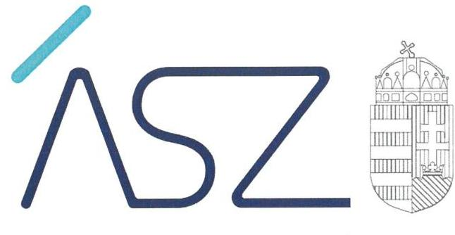
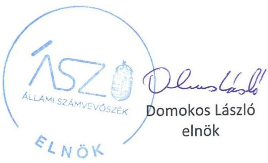
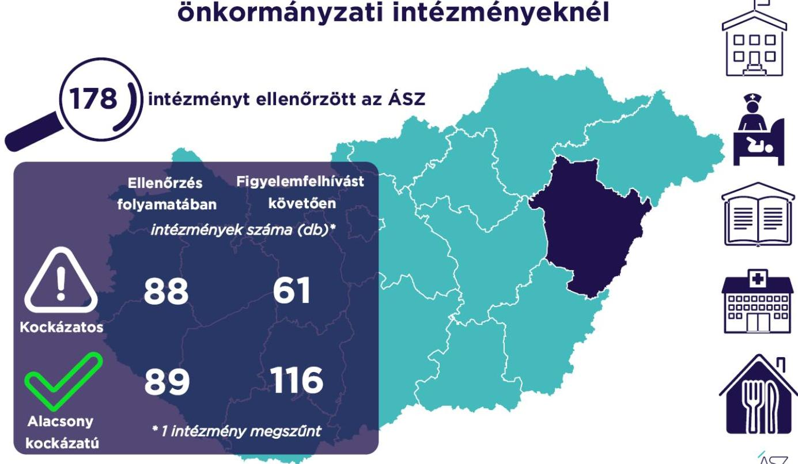

ÁLLAMI SZÁMVEVŐSZÉK

# JELENTÉS 

## A Hajdú-Bihar megyei önkormányzati intézmények ellenőrzése

Az önkormányzat és társulás irányítása alá tartozó intézmények integritásának monitoring típusú ellenőrzése - 178 intézmény
2021.

21104
www.asz.hu

---

ÁLLAMI SZÁMVEVŐSZÉK

# JELENTÉS 

## A Hajdú-Bihar megyei önkormányzati intézmények ellenőrzése

Az önkormányzat és társulás irányítása alá tartozó intézmények integritásának monitoring típusú ellenőrzése - 178 intézmény
2021. 12. hó 29. nap

21104
www.asz.hu

---

# AZ ELLENŐRZÉST FELÜGYELTE: 

SALAMON ILDIKŐ felügyeleti vezető

## AZ ELLENŐRZÉST VEZETTE ÉS A VÉGREHAJTÁSÁÉRT FELELŐS:

BALÁZSNÉ ANTONI ERIKA ellenőrzésvezető

BAJNAI ZSUZSANNA ellenőrzésvezető

A PROGRAM ÖSSZEÁLLÍTÁSÁÉRT FELELŐS:
DR. FELFÖLDI IZABELLA programkészítésért felelős vezető

IKTATÓSZÁM: EL-3461-011/2021.
TÉMASZÁM: 2568
ELLENŐRZÉS-AZONOSÍTÓ SZÁM: V0928

---

# TARTALOMJEGYZÉK 

■ ÖSSZEGZÉS ..... 5
■ AZ ELLENŐRZÉS JELENTŐSÉGE, AKTUALITÁSA, TÁRSADALMI SZEREPE, SZEMPONTJAI ..... 8
■ AZ ELLENŐRZÉS TERÜLETE ..... 9
■ ELLENŐRZÉS HATÓKÖRE ÉS MÓDSZERE ..... 10
■ MELLÉKLETEK ..... 13
I. sz. melléklet: Az értékelés módszertana ..... 13
II. sz. melléklet: Értelmező szótár ..... 15
■ FÜGGELÉKEK ..... 17
I. sz. függelék: Az ellenőrzött szervezetek és azok kockázati értékelése ..... 17
■ RÖVIDÍTÉSEK JEGYZÉKE ..... 27

---

.

---

# ÖSSZEGZÉS 

Az Állami Számvevőszék figyelemfelhívásának és tanácsadásának eredményeként a HajdúBihar megyei önkormányzatok irányítása alatt álló 178 ellenőrzött intézmény közül 60 intézménynél az intézményvezető már 2021-ben intézkedett, vagy intézkedéseket rendelt el az integritást biztositó alapvető feltételek megerősitése, illetve kiépitése érdekében. Ezeknek az intézményeknek javult az integritása, erősödtek a csalásmentes müködés feltételei.
53 intézménynél további intézkedések szükségesek az integritást biztositó alapvető feltételek kiépitése, illetve kiegészitése érdekében. Ezeknek az intézményeknek a vezetői az Állami Számvevőszék intézkedési kötelemmel járó figyelemfelhívására nem intézkedtek, ezért az azonosított kockázatok növekedtek, vagy intézkedéseik nem fedték le a kockázatos területeket, így az azonosított kockázatok nem változtak.
Az irányító önkormányzat egy intézmény megszüntetéséről döntött az ellenőrzött időszakban.

## Értékelések

Az Állami Számvevőszék a Hajdú-Bihar megyei önkormányzatok irányítása alá tartozó 178 intézmény belső kontrollrendszerének lényeges elemei kialakítását ellenőrizte a 2021. évre vonatkozóan. Az ellenőrzés a súlypontok meghatározásával lehetőséget biztosított a szervezeti integritás, múködés és vezetés, valamint a gazdálkodás területén a kockázatok azonosítására.

A szervezeti integritás alapvető feltétele a szabályozottság, azaz a jogszabályokban előírt belső szabályzatok megléte, azok - hatályos jogszabályoknak - megfelelő tartalma és gyakorlati alkalmazhatósága. Az integritási kockázatok szervezeti szinten csökkenthetők azáltal, hogy az intézményvezetők kialakítják a szervezeti és múködési kereteket, a gazdálkodásra vonatkozó alapvető szabályozási környezetet, valamint a kontrolltevékenységek szabályszerű gyakorlásának, az integrált kockázatkezelésnek és az integritást sértő események kezelésének a feltételeit.

A szervezeti integritás, a múködés és a vezetés alapvető szabályozási feltételeinek kialakítása hozzájárul a csalásmentes integritási környezet megteremtéséhez.

A szervezeti és múködési szabályzat teremti meg a szervezet szabályszerű múködésének alapjait, illetve rögzíti a szervezeten belüli felelősségi viszonyokat. A szabályzat biztosítja a szervezeti múködés szabályozottságát, ezáltal a szervezet tevékenységének átláthatóságát, a szervezeti célokkal összhangban történő működés feltételeit és annak ellenőrizhetőségét. Az ellenőrzöttek közül 173 intézmény rendelkezett szervezeti és múködési szabályzattal a 2021. évben.

A jogszabályi előírásoknak eleget téve, nyilatkozatban értékelte az intézmény belső kontrollrendszerének minőségét 152 intézmény vezetője. Ezek közül 134 intézménynél alakítottak ki olyan szabályozásokat, folyamatokat, amelyek biztosítják a költségvetési szerv tevékenységében a rendelkezésre álló források átlátható, szabályszerű, szabályozott, gazdaságos, hatékony és eredményes felhasználása követelményeinek érvényesítését.

Az integrált kockázatkezelés eljárásrendjét 142, a szervezeti integritást sértő események kezelésének eljárásrendjét 140 intézménynél alakították ki az intézményvezetők. Az integrált kockázatkezelés eljárásrendje biztosítja a szervezet múködésében rejlő kockázatok azonosításának és kezelésének feltételeit. A szervezet múködési kockázatai veszélyeztethetik a közpénzekkel való átlátható, elszámoltatható és felelős gazdálkodást. Az integritást sértő események kezelésének eljárásrendje jelenti a szervezet tekintetében felmerülő és a szervezeten belül bekövetkező integritást sértő események kezelésének alapjait. Az eljárásrend kialakításával az intézmény vezetője támogatja az integritást sértő eseményekkel kapcsolatosan azonosított kockázatok bekövetkezése esetén azok hatékony kezelését, illetve a következmények enyhítését.

---

A pénz- és vagyongazdálkodáshoz kapcsolódó alapvető szabályozások és nyilvántartások - így a számviteli politika és a keretében elkészítendő szabályzatok, a számlarend, a beszerzések szabályozása, valamint a kötelezettségvállalásra és a teljesítés igazolására jogosultak és aláírásmintáik nyilvántartása - előmozdítják a közpénzügyek átláthatóságát, rendezettségét. Az intézményvezető ezen szabályzatok elkészítésével, nyilvántartások vezetésével és folyamatos karbantartásával az alapfeltételét biztosítja a pénzügyi- és vagyongazdálkodás átláthatóságának, a közpénzekkel és közvagyonnal való elszámoltathatóságnak. Az ellenőrzöttek közül 158 intézménynél a számviteli politika, 145 intézménynél a számlarend, szintén 145 intézménynél a beszerzések lebonyolításával kapcsolatos eljárásrend rendelkezésre állt.

Az ellenőrzöttek közül 64 intézmény vezetője tett eleget az ellenőrzött területek mindegyikén az integritási kontrollok alapvető feltételeit jelentő, a jogszabályban előírt szabályozási kötelezettségének. Közülük 54 intézmény vezetője a jogszabályi előírásokon túl további erőfeszítéseket is tett az integritás erősítése érdekében, felismerte további olyan integritási kontrollok kialakításának indokoltságát, amelyet jogszabály nem ír elő, így szervezeti szinten hozzájárul a korrupcióval szembeni védettség megszilárdításához.

123 intézmény esetében az intézményvezető intézkedése volt szükséges a kockázatok csökkentése érdekében, mivel 70 intézménynél a jogszabályok által előírt kontrollok területén, 43 intézménynél a jogszabályok által előírt és a további, jogszabály által nem előírt integritási kontrollok területén egyaránt, tíz intézménynél utóbbi kontrollok területén voltak hiányosságok. A dokumentumok kiértékelése alapján - az integritás további fejlesztése érdekében - az Állami Számvevőszék azonosította a lényeges kockázati területeket, és már az ellenőrzés lefolytatásával párhuzamosan, a 2021. évre vonatkozóan a kockázatok csökkentésére hívta fel az intézményvezetők figyelmét.

# Következtetések 

Az érintett 113 intézmény közül 98 intézmény vezetője válaszolt határidőben az Állami Számvevőszék figyelemfelhívására. Közülük 74 teljeskörűen, kilenc részben egyetértett a kockázatos területeken teendő intézkedések indokoltságával. Az intézményvezetők közül 65 arról tájékoztatta az Állami Számvevőszéket, hogy valamennyi kockázatos területen, 15 pedig a kockázatos területek egy részénél már tett, illetve a jövőben tesz intézkedést a jelzett kockázatok csökkentése érdekében. A jogszabályi előírásokon túli integritási kontrollok területén az érintett 53 intézmény közül 35 intézmény vezetője a jelzett kockázatok teljes körű, három pedig azok részbeni felszámolásáról adott számot. Ezek eredményeként a 123 vezetői levélben jelzett 456 kockázati terület közül 276 esetben már történt, illetve tervezett az intézkedés, így javulás várható a feltárt kockázatos területek 60,5\%-ánál.

Az intézkedések eredményeként az ellenőrzött 178 intézmény közül összesen 116 intézménynél a kockázatok alacsony szintűek, illetve - a tervezett intézkedések végrehajtásával - a kockázatok alacsony szintre csökkennek.

A szabályozások és nyilvántartások kialakításának célja nem önmagában a jogszabályi rendelkezések betartása, hanem az intézmény szabályozottságán keresztül a szabályszerű és csalásmentes gazdálkodás feltételeinek megteremtése, ezáltal az Alaptörvényben előírt átláthatóság és elszámoltathatóság elvének érvényesítése. Ezeknek az alapelveknek érvényesülése hozzájárulhat ahhoz, hogy az intézmények, mint közszolgáltatást nyújtó szervezetek felé a közszolgáltatásokat igénybe vevők, és általuk az állampolgárok általános bizalma is erősödjön.

Az Állami Számvevőszék figyelemfelhívására nem válaszoló, illetve a jelzett kockázatokra nem, vagy csak részben intézkedő intézményvezetők által vezetett intézményeknél rendszerszintű kockázatok maradtak fenn. Vezetési-irányítási kockázatot jelez, amennyiben az intézményvezetőnek címzett figyelemfelhívásra az intézményvezető helyett más személy válaszolt. Felelősségi és hatásköri kockázatot jelez, amennyiben az intézmény pénzügyi- és vagyongazdálkodásának alapvető szabályzatait a kontrollrendszer kialakításáért felelős intézményvezető helyett egy másik költségvetési szerv vezetője alakította ki, határozta meg. További kockázatot jelent a szabályok alkalmazottak általi megismerésére és alkalmazására, az intézmény mindennapi működésének integritására. Mindezek egyrészt az intézmény pénzügyi és vagyongazdálkodásának szabályszerűségét, másrészt a vezetői nyilatkozatok hitelességét, valóságtartalmát is megkérdőjelezi. A jelzett kockázatok arra mutatnak rá, hogy ezeknél az intézményeknél sérül a vezetői felelősség elve, és ezzel a felelős vezetésre épülő intézményi önállóság működése.

Az integritás elvű működés erősítése érdekében további kockázatcsökkentő lépések szükségesek a vezetés-irányítás, valamint a pénzügyi- és a vagyongazdálkodás szabályszerű feltételeinek kialakítása terén. Ezen intézmények integritásának kiépítését következő lépésként az irányító szerv bevonásával támogatja az Állami Számvevőszék.

---

# Erősödött a csalásmentesség a Hajdú-Bihar megyei önkormányzati intézményeknél 

---

# AZ ELLENŐRZÉS JELENTŐSÉGE, AKTUALITÁSA, TÁRSADALMI SZEREPE, SZEMPONTJAI 

Az Alaptörvény alapértékeket, elveket fogalmaz meg, amely szerint a közpénzekkel gazdálkodó minden szervezet köteles a nyilvánosság előtt elszámolni a közpénzekre vonatkozó gazdálkodásával. A közpénzeket és a nemzeti vagyont az átláthatóság és a közélet tisztaságának elve szerint kell kezelni.

Magyarország helyi önkormányzatairól szóló törvény ${ }^{1}$ a helyi közhatalom gyakorlás széleskörű érvényesítésével összhangban tág teret ad a helyi önkormányzatoknak a feladataik, a közszolgáltatások legkülönbözőbb formákban történő ellátására, így széleskörű lehetőséggel rendelkeznek intézmények alapítására.

A helyi önkormányzatok irányítása alá tartozó intézmények szerteágazó közszolgáltatásokat nyújtanak. Az intézmények működtetése közvetlenül érinti a társadalom valamennyi rétegét, a közfeladatot ellátó intézmények működésének minősége közvetlen hatással van az azokat igénybe vevő állampolgárok életére.

Az intézmények szabályszerű és eredményes működésének és gazdálkodásának alapfeltétele a belső kontrollrendszer - benne az integritási kontrollok - megfelelő kialakítása. Az ÁSZ² a törvényi felhatalmazással élve ellenőrzi az önkormányzati intézményeket, hogy megállapításaival támogassa az ellenőrzött szervezetek szabályszerű gazdálkodását, müködését.

A helyi önkormányzatok intézményei által ellátott feladatok, a bölcsődei, óvodai ellátás, a gyermekétkeztetés, a betegek és idősek gondozása, a közművelődési intézmények, könyvtárak működtetése által a lakosság ezeken a területeken találkozik legszélesebb körben az önkormányzatok által nyújtott szolgáltatásokkal. A szolgáltatásokat igénybe vevők jelentős száma, a feladatellátáshoz használt nemzeti vagyon és az erre fordított közpénz nagysága indokolja, hogy az ÁSZ további, az előző ellenőrzésekre épülő ellenőrzéseket végezzen ezen a területen, illetve további olyan területeken, ahol az önkormányzati szolgáltatást a lakosság széles köre veszi igénybe.

Az ellenőrzés célja annak értékelése, hogy a helyi önkormányzatok irányítása alá tartozó intézmények megterem-tették-e az integritás biztosításához szükséges feltételeket, kialakították-e az alapvető, a szervezeti kereteket, az integritási kontrollokhoz kapcsolódó, valamint a korrupció elleni védelmet szolgáló szabályozásokat. Továbbá, hogy az intézményvezető gondoskodott-e a szervezeti teljesítmény mérés alapfeltételeinek kialakításáról az eredményességi szempontoknak való megfelelés megalapozottsága biztosítása érdekében. A monitoring típusú ellenőrzés célja hatékonyan támogatni az ellenőrzött szervezeteket, ezáltal növelve az ÁSZ tanácsadó szerepét, elősegítve a „jól irányított állam" müködését.

Az ÁSZ célja, hogy új ellenőrzési megközelítést alkalmazva támogassa a közpénzügyi helyzet javítását; a monitoring típusú ellenőrzéssel jelen időben adjon helyzetképet az integritási szemlélet érvényesítéséről, rávilágítson az integritási kontrollok kiépítettségére, illetve további fejlesztésére. Napjainkban mindez kiemelt fontosságúvá vált. Minden szervezetnek fel kell készülnie arra, hogy a koronavírus járvány okozta társadalmi és gazdasági válság növelni fogja a korrupciós nyomást. Az ÁSZ ebben a helyzetben is alapvető kötelességének tartja, hogy a közpénzek őre legyen, és ellenőrzéseit az önkormányzati alrendszer intézményei körében is folytassa.

Fontos, hogy az intézmények vezetői felismerjék az integritás kockázatokat, azokat ismételten mérjék fel, és alakítsanak ki átlátható, jól szabályozott rendszereket, döntési mechanizmusokat. Az integritási kockázatok feltárása, megismerése elengedhetetlenül fontos, mert ezt követően tehetők meg azok a lépések, amelyek a kockázatok csökkentését, felszámolását és kezelését célozzák. A belső kontrollrendszer - benne az integritás kontrollok - megfelelő kialakítása, müködése a helyi önkormányzatok irányítása alatt álló intézményeknél is hozzájárul a társadalmi közbizalom erősítéséhez.

Az ellenőrzés rámutat az integritási jó gyakorlatokra is, továbbá felhívja a figyelmet a jogszabályi követelmények teljesítéséhez szükséges lépésekre is.

---

# AZ ELLENŐRZÉS TERÜLETE 

## Az önkormányzatok irányítása alá tartozó intézmények

Helyi önkormányzati költségvetési szervet az államháztartásról szóló 2011. évi CXCV törvény (Áht. ${ }^{3}$ ) szerint a helyi önkormányzat, a helyi önkormányzatok társulása, a térségi fejlesztési tanács, az átalakult nemzetiségi önkormányzat alapíthat, a költségvetési szerv alapító okiratában meghatározott önkormányzati közfeladatok ellátására. A költségvetési szervek önálló jogi személyek, éves költségvetésükből gazdálkodva látják el feladataikat. A költségvetési szervek gazdasági szervezettel rendelkeznek, ha azonban a költségvetési szerv éves átlagos statisztikai állományi létszáma a 100 főt nem éri el, a gazdasági szervezet feladatait az önkormányzati hivatal, vagy az irányító szerv döntése alapján az irányító szerv irányítása alá tartozó, gazdasági szervezettel rendelkező más költségvetési szerv látja el.

Az államháztartásról szóló törvény végrehajtásáról szóló 368/2011. (XII. 31.) Korm. rendelet (Ávr. ${ }^{4}$ ) 1. melléklete szerint, az államháztartás önkormányzati alrendszerében a helyi önkormányzat által irányított költségvetési szerv esetében az irányító szerv hatáskörét a képviselő-testület, közgyűlés gyakorolja, és annak vezetője a polgármester, főpolgármester, megyei közgyűlés elnöke.

Az ellenőrzés a Hajdú-Bihar megyei önkormányzatok irányítása alá tartozó, az I. sz. Függelékben felsorolt költségvetési szervekre terjedt ki.

A feladatellátásuk szerint az ellenőrzött költségvetési szervek egy része óvoda, bölcsőde, közoktatási intézmény, egészségügyi intézmény, konyha, művelődési ház, központ, múzeum, oktatási központ, kulturális központ, színház, bábszínház, idősek otthona, gondozási központ, gyermekjólétigyermekvédelmi intézményként működik.

Az ellenőrzött 178 intézmény közül három rendelkezik saját gazdasági szervezettel.

Egy intézmény az ellenőrzött időszakban megszűnt.

---

# ELLENŐRZÉS HATÓKÖRE ÉS MÓDSZERE 

## Az ellenőrzés típusa

Megfelelőségi ellenőrzés.

## Az ellenőrzött időszak

A 2021. év, a Bkr. ${ }^{5}$ szerinti vezetői nyilatkozat, valamint annak alátámasztottsága vonatkozásában a 2020. év.

## Az ellenőrzés tárgya

A szervezeti keretekkel, a működéssel és gazdálkodással kapcsolatos szabályzatok, szabályozások, valamint a szervezeti elvekkel, értékekkel összefüggő integritás kontrollok kiépítettsége, a szervezeti teljesítmény mérés alapfeltételeinek kialakítása.

## Az ellenőrzött szervezetek

Az ellenőrzött intézményeket az I. sz. Függelék tartalmazza.

## Az ellenőrzés jogalapja

Az ellenőrzés jogszabályi alapját az ÁSZ tv. ${ }^{6}$ 1. § (3) bekezdése, 5. § (6) bekezdése, valamint az Áht. 61. § (2) bekezdése képezik.

## Az ellenőrzés módszerei

Az ÁSZ az ellenőrzést az ellenőrzési program szempontjai, az ellenőrzött időszakban hatályos jogszabályok, a jelen ellenőrzésre irányadó ÁSZ módszertan figyelembevételével és a nemzetközi standardokat irányadónak tekintve végzi.

Az ellenőrzés ideje alatt az ÁSZ az ellenőrzött szervezetekkel történő kapcsolattartást az ÁSZ SZMSZ7-ének vonatkozó előírásai alapján biztosítja.

Az ellenőrzési kérdések megválaszolásához szükséges bizonyítékok megszerzése a következő ellenőrzési eljárások alkalmazásával történik: megfigyelés, összehasonlítás, elemző eljárás. Az ellenőrzési bizonyítékként felhasználható adatforrások közé tartoznak az ellenőrzési programban felsorolt adatforrások, továbbá minden - az ellenőrzés folyamán - feltárt, az ellenőrzés szempontjából információkat tartalmazó dokumentum.

---

Az ÁSZ az ellenőrzést a kérdésekre adott válaszok kiértékelésével, valamint a megjelölt adatforrások, továbbá az adott időszakban hatályos jogszabályok, valamint az ÁSZ honlapján közzétett helyénvalósági kritériumok figyelembevételével folytatja le.

A monitoring típusú ellenőrzés az önkormányzatok irányítása alá tartozó intézmények integritás alapú múködésének lényeges területeire és a közpénzügyi helyzet javítása érdekében az elért eredmények fenntartására fókuszál. Lehetőséget biztosít az integritási kontrollok kiépítettségében lévő hiányosságok, a szervezeti teljesítmény mérés alapfeltételei kialakításának hiánya beazonosítására az eredményességi szempontoknak való megfelelés megalapozottsága biztosítása érdekében, az önkormányzatok, társulások irányítása alá tartozó intézmények integritásának elemzésére, részletes ellenőrzések megalapozására.

---

.

---

# MELLÉKLETEK 

I. SZ. MELLÉKLET: AZ ÉRTÉKELÉS MÓDSZERTANA

Az egyes kockázati területek és kockázatforrások minősítése „pontozásos módszerrel", az integritás „jelző" dokumentumai és a vezetői magatartás ellenőrzéshez kapcsolódóan tanúsított tényhelyzeteinek értékelése alapján történt.

Az értékelt dokumentumokhoz, nyilvántartásokhoz, kockázati besorolásokhoz minden esetben pontszám került hozzárendelésre, amelyek értéke alapján az ellenőrzött szervezetek kockázati csoportba kerültek besorolásra:

- Alacsony kockázatú - az elérhető összes pontszám legalább 80\%-a
- Közepes kockázatú - az elérhető pontszám 50-79\%-a között
- Magas kockázatú - az elérhető pontszám 50\%-a alatt

Az első lépésben azonosításra kerültek azok az intézményi szabályozások és nyilvántartások, amelyek meglétét jogszabály írja elő, hiánya pedig felveti a csalás és korrupció kockázatát.

Második lépésben az adatoknak az ellenőrzés rendelkezésére bocsátása kockázati kritériumainak meghatározása, majd értékelése történt meg.

Harmadik lépésben a figyelemfelhívó levelekre adott válaszok kockázati kritériumainak meghatározása, majd értékelése történt meg.

Az összesített kockázati értékelést javította, amennyiben

- az intézmény rendelkezett olyan szabályozással, amely kötelező meglétét jogszabály nem írja elő, de segíti a csalás és a korrupció megelőzését (helyénvalósági dokumentumok).

Az összesített kockázati értékelést rontotta, amennyiben

- az integritás szempontjából meghatározó dokumentum - az intézményi SZMSZ - hiányzott, és javítása érdekében a figyelemfelhívó levél hatására sem történt intézkedés.

A figyelemfelhívó levelekre adott válaszok értékelése alapján:

- A kockázat csökkent, amennyiben a figyelemfelhívó levélre adott válasza a figyelemfelhívással összhangban volt, valamennyi kockázati területen intézkedett vagy intézkedést tervezett.
- A kockázat változatlan, amennyiben a figyelemfelhívó levélben foglaltaktól eltérő magatartást tanúsított, intézkedése a figyelemfelhívással részben volt összhangban, a kockázati területeken részben intézkedett vagy intézkedést tervezett.
- A kockázat nőtt, amennyiben nem volt együttműködő, a figyelemfelhívó levélre nem válaszolt, vagy válasza alapján nem intézkedett és nem tervezett intézkedést.

---

# Az önkormányzatok irányítása alá tartozó intézmények kockázati csoportba sorolásának értékelési keretrendszere 

I. Dokumentumokkal rendelkezés
lényeges dokumentumok, amelyek hiánya felveti a csalás és korrupció kockázatát
I.1. A szervezeti integritás, müködés és vezetés alapvető szabályozási feltételei

- intézmény SZMSZ-e
- vezetői nyilatkozat a 2020. évre vonatkozóan az intézmény belső kontrollrendszer minőségének értékeléséről, valamint a nyilatkozat megalapozottságát bizonyító dokumentumok
- integrált kockázatkezelés eljárásrendje
- az integritást sértő események kezelésének eljárásrendje
I.2. A pénz- és vagyongazdálkodáshoz kapcsolódó alapvető szabályozások
- számviteli politika
- az eszközök és a források leltárkészítési és leltározási szabályzata
- az eszközök és a források értékelési szabályzata
- pénzkezelési szabályzat
- számlarend
- beszerzések lebonyolításával kapcsolatos eljárásrend
- a kötelezettségvállalásra, teljesítés igazolására jogosult személyekről és aláírás-mintájukról vezetett nyilvántartás
II. Az adatoknak az ellenőrzés rendelkezésére bocsátása
II.1. A megnevezett adatokkal rendelkezett és a törvényi határidőn belül hiánytalanul rendelkezésre bocsátotta. Figyelem-, illetve figyelmet felhívó levél nem volt indokolt.
II.2. A megnevezett adatokat nem bocsátotta rendelkezésre.
III. Figyelemfelhívó levelekre adott válaszok kockázati értékelése
III.1. Kockázat csökkent: együttmüködése a figyelemfelhívó levéllel összhangban volt.
III.2. Kockázat változatlan: a figyelemfelhívó levélben foglaltaktól eltérő együttműködést tanúsított.
III.3. Kockázat nőtt: nem reagált, nem intézkedett, így nem volt együttmüködő.

---

belső kontrollrendszer

Belső kontrollrendszer területei
integrált kockázatkezelési rendszer
integritás

Integritási kockázatok

A belső kontrollrendszer a kockázatok kezelése és tárgyilagos bizonyosság megszerzése érdekében kialakított folyamatrendszer, amely azt a célt szolgálja, hogy a müködés és gazdálkodás során a tevékenységeket szabályszerűen, gazdaságosan, hatékonyan, eredményesen hajtsák végre, az elszámolási kötelezettségeket teljesítsék, megvédjék az erőforrásokat a veszteségektől, károktól és nem rendeltetésszerű használattól. (Forrás: Áht. 69. § (1) bekezdése)
A kontrollkörnyezet, az integrált kockázatkezelési rendszer, a kontrolltevékenységek, az információs és kommunikációs rendszer, valamint a nyomon követési (monitoring) rendszer. (Forrás: Bkr. 3. §-a)
Olyan folyamatalapú kockázatkezelési rendszer, amely a szervezet minden tevékenységére kiterjed, egységes módszertan és eljárások alkalmazásával, a szervezet célkitűzéseinek és értékeinek figyelembevételével biztosítja a szervezet kockázatainak teljes körű azonosítását, azok meghatározott kritériumok szerinti értékelését, valamint a kockázatok kezelésére vonatkozó intézkedési terv elkészítését és az abban foglaltak nyomon követését. (Forrás: Bkr. 2. § m) pontja)
Az integritás az elvek, értékek, cselekvések, módszerek, intézkedések konzisztenciáját jelenti, vagyis olyan magatartásmódot, amely meghatározott értékeknek megfelel. (Forrás: Nemzetgazdasági Minisztérium: Államháztartási belső kontroll standardok és gyakorlati útmutató 1.1.3. pontja, 2017. szeptember)
A szervezeti integritás a szervezet védekezőképessége a korrupció lehetőségével szemben. Az integritás erősítése - mint preventív eszközrendszer - a korrupció megelőzésére fókuszál. A szervezeti integritás a müködés, a szervezeti kultúra minőségét is jelzi.
Az ellenőrzés megközelítése szerint az integritás a szervezet értékeinek és célkitüzéseinek megfelelő müködést jelenti. Minél magasabb színvonalú egy szervezet integritása, az annál ellenállóbb a korrupcióval, a korrupciós veszélyekkel szemben, vagyis az integritás erősítése - elsősorban az egyes szervezetek szintjén - a korrupciós kockázatok mérséklésének egyik fontos eszköze. Az integritás ugyanakkor tágabb jelentésű fogalom, nemcsak a korrupciótól, hanem más helytelen magatartásoktól (például csalás, önkényesség) való mentességet és a szervezet céljainak követését is jelenti. Egy szervezet integritását úgy is meghatározhatjuk, mint a szervezet ellenállóképességét annak a veszélynek, hogy dolgozói helytelen magatartásukkal kárt okozzanak.
Az integritás megerősítése és fenntartása elsősorban a szervezet elsőszámú vezetőjének felelőssége.
Integritási kockázatnak minősül a szervezet célkitűzéseit, értékeit, elveit sértő vagy veszélyeztető visszaélés, szabálytalanság, vagy egyéb esemény lehetősége. A korrupciós kockázat olyan integritási kockázat, amely korrupciós cselekmény bekövetkezésének lehetőségét jelenti. Minden korrupciós kockázat egyben integritási kockázat is. Korrupciós cselekményeknek nevezzük azokat a vesztegetésszerű cselekményeket, amelyeket általában a Büntető Törvénykönyv ${ }^{8}$ is büntetéssel fenyeget.
Az integritási kockázat alatt az integritás megsértésének esélyét értjük. Az integritási kockázatok olyan helyzetek, folyamatok, amelyek során fennáll a korrupciós befolyás lehetősége. Így integritási kockázatok jelentkeznek például a köz- és a magánszféra közötti üzleti tranzakciók során, a köztisztviselők által hozott döntések, a mérlegelési szabadság körében, illetve abban az esetben, ha egy közszolgáltatás iránt nagyobb a kereslet, mint a kielégítéséhez rendelkezésre álló eröforrások. Az integritási kockázat értelemszerűen nem egyenlő magával az integritás sérelmével, vagy a korrupció be-

---

kockázat
kontrollkörnyezet
kontrolltevékenységek
intézmény
következésével. Az integritási kockázatokkal szemben megfelelő kontrollok kiépítésével lehet védekezni. Amennyiben az integritási kontrollok szintje elmarad a kockázatok mértékétől, kockázati kitettségről beszélünk. A kontrollok kialakításának és müködtetésének mérlegelésekor minden esetben vizsgálni kell a kockázatok szintjét is, a túlszabályozottság egyfelől költséges, másfelől a túlzott bürokrácia maga is lehet a korrupciós veszély hordozója.
A kockázat annak a valószínűségét jelenti, hogy egy vagy több esemény, vagy intézkedés nem kívánt módon befolyásolja a rendszer múködését, céljainak megvalósulását. (Forrás: Javaslatok a korrupciós kockázatok kezelésére - Kockázatkezelési és ellenőrzési módszertan 35. oldal, ÁSZ)
A költségvetési szerv vezetője által kialakított olyan elvek, eljárások, belső szabályzatok összessége, amelyben világos a szervezeti struktúra, a folyamatok átláthatók, egyértelmúek a felelősségi, hatásköri viszonyok és feladatok, meghatározottak, ismertek és elfogadottak az etikai elvárások a szervezet minden szintjén, átlátható a humánerőforrás-kezelés, biztosított a szervezeti célok és értékek irányában való elkötelezettség fejlesztése és elősegítése. (Forrás: Bkr. 6. § (1) bekezdés)
A költségvetési szerv vezetője által a szervezeten belül kialakított (kontroll) tevékenységek, melyek biztosítják a kockázatok kezelését, hozzájárulnak a szervezet céljainak eléréséhez és erősítik a szervezet integritását. (Forrás: Bkr. 8. § (1) bekezdés)
A helyi önkormányzatok irányítása alá tartozó költségvetési szervek. (A képviselő-testület a feladatkörébe tartozó közszolgáltatások ellátására - jogszabályban meghatározottak szerint - költségvetési szervet (önkormányzati intézmény) alapíthat; Forrás: Mötv. 41. § (6) bekezdés)

---

# FÜGGELÉKEK

I. SZ. FÜGGELÉK: AZ ELLENŐRZÖTT SZERVEZETEK ÉS AZOK KOCKÁZATI ÉRTÉKELÉSE

|  Sorszám | Ellenőrzött szervezet megnevezése | Irányító szerv (önkormányzat) megnevezése | Helység | Tanácsadást megelőző kockázati besorolás | Intézkedést követően a kockázati értékelés változása | A kockázati szint alacsonyra csökkent-e  |
| --- | --- | --- | --- | --- | --- | --- |
|  1. | Fazekas Gábor Idősek Otthona | Hajdúböszörmény Város Önkormányzata | Hajdúböször-
mény | ALACSONY | NEM VOLT SZABÁLYSZERÜSÉGI HIBA | I  |
|  2. | Magyarhomorogi Idősek Otthona és Konyha | Magyarhomorog Községi Önkormányzat | Magyarhomorog | ALACSONY | NEM VOLT SZABÁLYSZERÜSÉGI HIBA | I  |
|  3. | Napsugár Óvoda | Hajdúböszörmény Város Önkormányzata | Hajdúböször-
mény | KÖZEPES | NEM VÁLTOZOTT | N  |
|  4. | Hosszúpályi Szociális Szolgáltató Központ | Hosszúpályi Nagyközség Önkormányzata | Hosszúpályi | KÖZEPES | NÖTT | N  |
|  5. | Alapszolgáltatási és Bentlakást Nyújtó Szociális Központ | Nyíracsád Község Önkormányzata | Nyíracsád | KÖZEPES | CSÖKKENT | I  |
|  6. | Akácliget Óvoda Nyíracsád | Nyíracsád Község Önkormányzata | Nyíracsád | ALACSONY | NEM VOLT SZABÁLYSZERÜSÉGI HIBA | I  |
|  7. | Városi Bölcsőde | Hajdúböszörmény Város Önkormányzata | Hajdúböször-
mény | KÖZEPES | NEM VÁLTOZOTT | N  |
|  8. | Szociális Szolgáltatási Központ | Hajdúböszörmény Város Önkormányzata | Hajdúböször-
mény | ALACSONY | CSÖKKENT | I  |
|  9. | Csillagvár Óvoda | Hajdúböszörmény Város Önkormányzata | Hajdúböször-
mény | KÖZEPES | CSÖKKENT | I  |
|  10. | Hajdúböszörményi Kincskereső Óvoda | Hajdúböszörmény Város Önkormányzata | Hajdúböször-
mény | MAGAS | CSÖKKENT | N  |
|  11. | Városüzemeltetési Intézmény | Hajdúböszörmény Város Önkormányzata | Hajdúböször-
mény | KÖZEPES | CSÖKKENT | I  |
|  12. | Nyíracsádi Művelődési Ház és Könyvtár | Nyíracsád Község Önkormányzata | Nyíracsád | KÖZEPES | CSÖKKENT | I  |
|  13. | Epreskert Óvoda és Mini Bölcsőde | Esztár Község Önkormányzata | Esztár | ALACSONY | NEM VOLT SZABÁLYSZERÜSÉGI HIBA | I  |
|  14. | Hosszúpályi Óvoda és Mini Bölcsőde | Hosszúpályi Nagyközség Önkormányzata | Hosszúpályi | KÖZEPES | NÖTT | N  |
|  15. | Hajdúsági Múzeum | Hajdúböszörmény Város Önkormányzata | Hajdúböször-
mény | MAGAS | CSÖKKENT | N  |
|  16. | Sápi Óvoda | Sáp Községi Önkormányzat | Sáp | MAGAS | NÖTT | N  |
|  17. | Hosszúpályi Roma Nemzetiségi Óvoda | Hosszúpályi Nagyközség Önkormányzata | Hosszúpályi | KÖZEPES | NÖTT | N  |
|  18. | Veres Péter Kulturális Központ | Balmazújváros Város Önkormányzata | Balmazújváros | KÖZEPES | NÖTT | N  |
|  19. | Egyesített Óvoda és Bölcsőde Intézmény | Balmazújváros Város Önkormányzata | Balmazújváros | KÖZEPES | CSÖKKENT | I  |

---

| Sorszám | Ellenőrzött szervezet megnevezése | Irányító szerv (önkormányzat) megnevezése | Helység | Tanácsadást megelőző kockázati besorolás | Intézkedést követően a kockázati értékelés változása | A kockázati szint alacsonyra csökkent-e |
| :--: | :--: | :--: | :--: | :--: | :--: | :--: |
| 20. | Balmazújvárosi Nefelejcs Idősek Otthona | Balmazújváros Város Önkormányzata | Balmazújváros | KÖZEPES | CSÖKKENT | I |
| 21. | Hencidai Napközi Otthonos Óvoda és Konyha | Hencida Község Önkormányzata | Hencida | KÖZEPES | CSÖKKENT | I |
| 22. | Szociális Gondozási Központ | Görbeháza Község Önkormányzata | Görbeháza | MAGAS | NEM VÁLTOZOTT | N |
| 23. | Gólyafészek Óvoda és Bölcsőde | Görbeháza Község Önkormányzata | Görbeháza | MAGAS | CSÖKKENT | N |
| 24. | Méliusz Juhász Péter Könyvtár | Debrecen Megyei Jogú Város Önkormányzata | Debrecen | ALACSONY | NEM VOLT SZABÁLYSZERŰSÉGI HIBA | I |
| 25. | Déri Múzeum | Debrecen Megyei Jogú Város Önkormányzata | Debrecen | KÖZEPES | CSÖKKENT | I |
| 26. | Benedek Elek Óvoda és Bölcsőde | Ebes Községi Önkormányzat | Ebes | MAGAS | NEM VÁLTOZOTT | N |
| 27. | Püspökladányi Egyesített Óvodai Intézmény | Püspökladány Város Önkormányzata | Püspökladány | MAGAS | NEM VÁLTOZOTT | N |
| 28. | Karácsony Sándor Közösségi Ház | Földes Nagyközség Önkormányzata | Földes | KÖZEPES | CSÖKKENT | I |
| 29. | Kállay László Óvoda | Földes Nagyközség Önkormányzata | Földes | KÖZEPES | CSÖKKENT | I |
| 30. | Debreceni Közterület Felügyelet | Debrecen Megyei Jogú Város Önkormányzata | Debrecen | KÖZEPES | CSÖKKENT | I |
| 31. | Ifjúság Utcai Óvoda | Debrecen Megyei Jogú Város Önkormányzata | Debrecen | KÖZEPES | NÖTT | N |
| 32. | Kodály Filharmónia Debrecen | Debrecen Megyei Jogú Város Önkormányzata | Debrecen | KÖZEPES | NÖTT | N |
| 33. | Debrecen Megyei Jogú Város   Egyesített Bölcsődei Intézménye | Debrecen Megyei Jogú Város Önkormányzata | Debrecen | ALACSONY | NEM VOLT SZABÁLYSZERŰSÉGI HIBA | N |
| 34. | Csokonai Színház | Debrecen Megyei Jogú Város Önkormányzata | Debrecen | ALACSONY | NEM VOLT SZABÁLYSZERŰSÉGI HIBA | I |
| 35. | Hajdúszováti Óvoda és Mini Bölcsőde | Hajdúszovát Község Önkormányzata | Hajdúszovát | KÖZEPES | NEM VÁLTOZOTT | N |
| 36. | Zsákai Kastélykerti Általános Müvelődési Központ | Zsáka Nagyközségi Önkormányzat | Zsáka | MAGAS | NÖTT | N |
| 37. | Létavértesi Család és Gyermekjóléti Szolgálat | Létavértes Városi Önkormányzat | Létavértes | ALACSONY | NEM VOLT SZABÁLYSZERŰSÉGI HIBA | I |
| 38. | Létavértes Városi Könyvtár és Müvelődési Ház | Létavértes Városi Önkormányzat | Létavértes | ALACSONY | NEM VOLT SZABÁLYSZERŰSÉGI HIBA | I |
| 39. | Létavértesi Gyermeksziget Óvoda-Bölcsőde | Létavértes Városi Önkormányzat | Létavértes | ALACSONY | NEM VOLT SZABÁLYSZERŰSÉGI HIBA | I |
| 40. | Földesi Szociális és Gyermekjóléti Szolgáltató Központ | Földes Nagyközség Önkormányzata | Földes | KÖZEPES | CSÖKKENT | I |
| 41. | Napfény Óvoda és Bölcsőde | Nádudvar Város Önkormányzata | Nádudvar | ALACSONY | CSÖKKENT | I |

---

|  Sorszám | Ellenőrzött szervezet megnevezése | Irányító szerv (önkormányzat) megnevezése | Helység | Tanácsadást megelőző kockázati besorolás | Intézkedést követően a kockázati értékelés változása | A kockázati szint alacsonyra csökkent-e  |
| --- | --- | --- | --- | --- | --- | --- |
|  42. | Ady Endre Művelődési Központ és Városi Könyvtár | Nádudvar Város Önkormányzata | Nádudvar | KÖZEPES | CSÖKKENT | I  |
|  43. | Szerepi Kelemen Hétpettyes Óvoda és Mini Bölcsőde | Szerep Községi Önkormányzat | Szerep | MAGAS | NÖTT | N  |
|  44. | Újszentmargitai Hétszínvirág Óvoda és Bölcsőde | Újszentmargita Község Önkormányzata | Újszentmargita | KÖZEPES | NEM VÁLTOZOTT | N  |
|  45. | Püspökladányi Tájékoztató és Közművelődési Központ, Könyvtár, Múzeum | Püspökladány Város Önkormányzata | Püspökladány | KÖZEPES | NÖTT | N  |
|  46. | Liget Óvoda | Debrecen Megyei Jogú Város Önkormányzata | Debrecen | ALACSONY | CSÖKKENT | I  |
|  47. | Sinay Miklós Utcai Óvoda | Debrecen Megyei Jogú Város Önkormányzata | Debrecen | KÖZEPES | CSÖKKENT | I  |
|  48. | Görgey Utcai Óvoda | Debrecen Megyei Jogú Város Önkormányzata | Debrecen | KÖZEPES | CSÖKKENT | I  |
|  49. | Lehel Utcai Óvoda | Debrecen Megyei Jogú Város Önkormányzata | Debrecen | ALACSONY | NEM VOLT SZABÁLYSZERŰSÉGI HIBA | I  |
|  50. | Mosolykert Óvoda | Debrecen Megyei Jogú Város Önkormányzata | Debrecen | KÖZEPES | NEM VÁLTOZOTT | N  |
|  51. | Ispotály Utcai Óvoda | Debrecen Megyei Jogú Város Önkormányzata | Debrecen | ALACSONY | NEM VOLT SZABÁLYSZERŰSÉGI HIBA | I  |
|  52. | Levendula Óvoda | Debrecen Megyei Jogú Város Önkormányzata | Debrecen | ALACSONY | NÖTT | N  |
|  53. | Közép Utcai Óvoda | Debrecen Megyei Jogú Város Önkormányzata | Debrecen | ALACSONY | NEM VOLT SZABÁLYSZERŰSÉGI HIBA | N  |
|  54. | Szivárvány Óvoda | Debrecen Megyei Jogú Város Önkormányzata | Debrecen | ALACSONY | CSÖKKENT | I  |
|  55. | Áchim András Utcai Óvoda | Debrecen Megyei Jogú Város Önkormányzata | Debrecen | ALACSONY | NEM VOLT SZABÁLYSZERŰSÉGI HIBA | I  |
|  56. | Százszorszép Óvoda | Debrecen Megyei Jogú Város Önkormányzata | Debrecen | ALACSONY | NEM VOLT SZABÁLYSZERŰSÉGI HIBA | I  |
|  57. | Thaly Kálmán Utcai Óvoda | Debrecen Megyei Jogú Város Önkormányzata | Debrecen | KÖZEPES | NEM VÁLTOZOTT | N  |
|  58. | Simonyi Úti Óvoda | Debrecen Megyei Jogú Város Önkormányzata | Debrecen | ALACSONY | NEM VOLT SZABÁLYSZERŰSÉGI HIBA | I  |
|  59. | Pósa Utcai Óvoda | Debrecen Megyei Jogú Város Önkormányzata | Debrecen | ALACSONY | NEM VOLT SZABÁLYSZERŰSÉGI HIBA | I  |
|  60. | Debreceni Arany János Óvoda | Debrecen Megyei Jogú Város Önkormányzata | Debrecen | ALACSONY | CSÖKKENT | I  |
|  61. | Nagyerdei Óvoda | Debrecen Megyei Jogú Város Önkormányzata | Debrecen | ALACSONY | NEM VOLT SZABÁLYSZERŰSÉGI HIBA | I  |
|  62. | Alsójózsai Kerekerdő Óvoda | Debrecen Megyei Jogú Város Önkormányzata | Debrecen | ALACSONY | NEM VOLT SZABÁLYSZERŰSÉGI HIBA | I  |

---

| Sorszám | Ellenőrzőtt szervezet megnevezése | Irányító szerv (önkormányzat) megnevezése | Helység | Tanácsadást megelőző kockázati besorolás | Intézkedést követően a kockázati értékelés változása | A kockázati szint alacsonyra csökkent-e |
| :--: | :--: | :--: | :--: | :--: | :--: | :--: |
| 63. | Gönczy Pál Utcai Óvoda | Debrecen Megyei Jogú Város Önkormányzata | Debrecen | ALACSONY | NEM VOLT SZABÁLYSZERŰSÉGI HIBA | I |
| 64. | Sípos Utcai Óvoda | Debrecen Megyei Jogú Város Önkormányzata | Debrecen | ALACSONY | NEM VOLT SZABÁLYSZERŰSÉGI HIBA | I |
| 65. | Szabadságtelepi Óvoda | Debrecen Megyei Jogú Város Önkormányzata | Debrecen | ALACSONY | NEM VOLT SZABÁLYSZERŰSÉGI HIBA | I |
| 66. | Faragó Utcai Óvoda | Debrecen Megyei Jogú Város Önkormányzata | Debrecen | ALACSONY | CSÖKKENT | I |
| 67. | Mesekert Óvoda | Debrecen Megyei Jogú Város Önkormányzata | Debrecen | ALACSONY | NEM VOLT SZABÁLYSZERŰSÉGI HIBA | I |
| 68. | Karácsony György Utcai Óvoda | Debrecen Megyei Jogú Város Önkormányzata | Debrecen | KÖZEPES | NÖTT | N |
| 69. | Kemény Zsigmond Utcai Óvoda | Debrecen Megyei Jogú Város Önkormányzata | Debrecen | ALACSONY | NEM VOLT SZABÁLYSZERŰSÉGI HIBA | I |
| 70. | Táncsics Mihály Utcai Óvoda | Debrecen Megyei Jogú Város Önkormányzata | Debrecen | KÖZEPES | CSÖKKENT | I |
| 71. | Angyalkert Óvoda | Debrecen Megyei Jogú Város Önkormányzata | Debrecen | ALACSONY | CSÖKKENT | I |
| 72. | Újkerti Manófalva Óvoda | Debrecen Megyei Jogú Város Önkormányzata | Debrecen | ALACSONY | NEM VOLT SZABÁLYSZERŰSÉGI HIBA | I |
| 73. | Tócóskerti Óvoda | Debrecen Megyei Jogú Város Önkormányzata | Debrecen | ALACSONY | NEM VOLT SZABÁLYSZERŰSÉGI HIBA | I |
| 74. | Margit Téri Óvoda | Debrecen Megyei Jogú Város Önkormányzata | Debrecen | ALACSONY | NEM VOLT SZABÁLYSZERŰSÉGI HIBA | I |
| 75. | Kuruc Utcai Óvoda | Debrecen Megyei Jogú Város Önkormányzata | Debrecen | ALACSONY | NEM VOLT SZABÁLYSZERŰSÉGI HIBA | I |
| 76. | Debrecen Megyei Jogú Város Gyermekvédelmi Intézménye | Debrecen Megyei Jogú Város Önkormányzata | Debrecen | ALACSONY | NEM VOLT SZABÁLYSZERŰSÉGI HIBA | I |
| 77. | Debrecen Megyei Jogú Város Család- és Gyermekjóléti Központja | Debrecen Megyei Jogú Város Önkormányzata | Debrecen | KÖZEPES | CSÖKKENT | I |
| 78. | Vojtina Bábszínház | Debrecen Megyei Jogú Város Önkormányzata | Debrecen | KÖZEPES | CSÖKKENT | N |
| 79. | Debrecen Megyei Jogú Város Városi Szociális Szolgálat | Debrecen Megyei Jogú Város Önkormányzata | Debrecen | KÖZEPES | NEM VÁLTOZOTT | N |
| 80. | Fehér Liliom Gondozási Központ | Újszentmargita Község Önkormányzata | Újszentmargita | KÖZEPES | CSÖKKENT | I |
| 81. | Városi Művelődési Ház és Könyvtár | Biharkeresztes Város Önkormányzata | Biharkeresztes | KÖZEPES | NÖTT | N |
| 82. | Wass Albert Közösségi Ház és Könyvtár | Mikepércs Községi Önkormányzat | Mikepércs | KÖZEPES | CSÖKKENT | I |
| 83. | Mikepércs Önkormányzat Ét-kezö-Konyha | Mikepércs Községi Önkormányzat | Mikepércs | KÖZEPES | CSÖKKENT | I |

---

| Sorszám | Ellenőrzött szervezet megnevezése | Irányító szerv (önkormányzat) megnevezése | Helység | Tanácsadást megelőző kockázati besorolás | Intézkedést követően a kockázati értékelés változása | A kockázati szint alacsonyra csökkent-e |
| :--: | :--: | :--: | :--: | :--: | :--: | :--: |
| 84. | Ebesi Alapszolgáltatási Központ és Idősek Otthona | Ebes Községi Önkormányzat | Ebes | MAGAS | NEM VÁLTOZOTT | N |
| 85. | Boldogfalva Óvoda | Debrecen Megyei Jogú Város Önkormányzata | Debrecen | ALACSONY | NEM VOLT SZABÁLYSZERŰSÉGI HIBA | I |
| 86. | Tárkányi Béla Könyvtár és Múvelődési Ház | Egyek Nagyközség Önkormányzata | Egyek | MAGAS | CSÖKKENT | N |
| 87. | Homokkerti Pitypang Óvoda | Debrecen Megyei Jogú Város Önkormányzata | Debrecen | KÖZEPES | NÖTT | N |
| 88. | Csodavár Óvoda | Mikepércs Községi Önkormányzat | Mikepércs | KÖZEPES | CSÖKKENT | I |
| 89. | Bagaméri Napközi Otthonos Óvoda | Bagamér Nagyközség Önkormányzata | Bagamér | KÖZEPES | CSÖKKENT | I |
| 90. | Hortobágyi Nyitnikék Óvoda | Hortobágy Község Önkormányzata | Hortobágy | KÖZEPES | NÖTT | N |
| 91. | Mikepércsi Bölcsőde | Mikepércs Községi Önkormányzat | Mikepércs | KÖZEPES | CSÖKKENT | I |
| 92. | Bagaméri Szociális Alapszolgáltatási Központ | Bagamér Nagyközség Önkormányzata | Bagamér | MAGAS | CSÖKKENT | N |
| 93. | Szalay János Rendelőintézet | Hajdúnánás Városi Önkormányzat | Hajdúnánás | MAGAS | CSÖKKENT | N |
| 94. | Járóbeteg-Ellátó Centrum | Hajdúszoboszló Város Önkormányzata | Hajdúszoboszló | ALACSONY | NEM VOLT SZABÁLYSZERŰSÉGI HIBA | I |
| 95. | Kovács Máté Városi Múvelődési Központ és Könyvtár | Hajdúszoboszló Város Önkormányzata | Hajdúszoboszló | ALACSONY | NEM VOLT SZABÁLYSZERŰSÉGI HIBA | I |
| 96. | "Kerek Egy Ég Alatt" Óvoda és Bölcsőde | Komádi Városi Önkormányzat | Komádi | KÖZEPES | NÖTT | N |
| 97. | Hajdúnánási Óvoda | Hajdúnánás Városi Önkormányzat | Hajdúnánás | ALACSONY | NÖTT | N |
| 98. | Faluház és Könyvtár | Csökmő Nagyközség Önkormányzata | Csökmő | ALACSONY | CSÖKKENT | I |
| 99. | Hajdúszoboszlói Városi Televízió | Hajdúszoboszló Város Önkormányzata | Hajdúszoboszló | KÖZEPES | NEM VÁLTOZOTT | N |
| 100. | Hajdúszoboszlói Egyesített Óvoda | Hajdúszoboszló Város Önkormányzata | Hajdúszoboszló | ALACSONY | NEM VOLT SZABÁLYSZERŰSÉGI HIBA | I |
| 101. | Derecske Városi Múvelődési Központ és Könyvtár | Derecske Város Önkormányzata | Derecske | ALACSONY | NEM VOLT SZABÁLYSZERŰSÉGI HIBA | I |
| 102. | Vass Jenő Óvoda és Bölcsőde | Berettyóújfalu Város Önkormányzata | Berettyóújfalu | ALACSONY | NEM VOLT SZABÁLYSZERŰSÉGI HIBA | I |
| 103. | Tündérkert Óvoda és Bölcsőde | Nagyhegyes Község Önkormányzata | Nagyhegyes | ALACSONY | NEM VOLT SZABÁLYSZERŰSÉGI HIBA | I |
| 104. | Idősek Háza | Nagyhegyes Község Önkormányzata | Nagyhegyes | ALACSONY | NEM VOLT SZABÁLYSZERŰSÉGI HIBA | I |

---

|  Sorszám | Ellenőrzött szervezet megnevezése | Irányító szerv (önkormányzat) megnevezése | Helység | Tanácsadást megelőző kockázati besorolás | Intézkedést követően a kockázati értékelés változása | A kockázati szint alacsonyra csökkent-e  |
| --- | --- | --- | --- | --- | --- | --- |
|  105. | Közösségi Ház és Városi Könyvtár | Komádi Városi Önkormányzat | Komádi | KÖZEPES | NEM VÁLTOZOTT | N  |
|  106. | Hajdúdorogi Egyesített Napközi Otthonos Óvodák | Hajdúdorog Város Önkormányzata | Hajdúdorog | ALACSONY | CSÖKKENT | I  |
|  107. | Görög Demeter Művelődési Ház | Hajdúdorog Város Önkormányzata | Hajdúdorog | ALACSONY | CSÖKKENT | I  |
|  108. | Mészáros Károly Városi Könyvtár | Hajdúdorog Város Önkormányzata | Hajdúdorog | ALACSONY | CSÖKKENT | I  |
|  109. | Görögh Péter Szociális Központ | Hajdúdorog Város Önkormányzata | Hajdúdorog | KÖZEPES | NEM VÁLTOZOTT | N  |
|  110. | Hajdúdorogi Család- és Gyermekjóléti Szolgálat | Hajdúdorog Város Önkormányzata | Hajdúdorog | ALACSONY | CSÖKKENT | I  |
|  111. | Hajdúhadházi Városi Óvoda | Hajdúhadház Város Önkormányzata | Hajdúhadház | ALACSONY | NEM VOLT SZABÁLYSZERŰSÉGI HIBA | I  |
|  112. | Eszterlánc Óvoda | Hajdúsámson Város Önkormányzata | Hajdúsámson | MEGSZÜNT INTÉZMÉNY | MEGSZÜNT INTÉZMÉNY | MEGSZÜNT INTÉZMÉNY  |
|  113. | Petőfi Sándor Városi Könyvtár, Múvelődési Ház és Kiállítóhely | Hajdúsámson Város Önkormányzata | Hajdúsámson | ALACSONY | NEM VOLT SZABÁLYSZERŰSÉGI HIBA | I  |
|  114. | Móricz Zsigmond Múvelődési Ház és Városi Könyvtár | Nyíradony Város Önkormányzata | Nyíradony | KÖZEPES | NÖTT | N  |
|  115. | Nyírábrányi Csicsergő Óvoda és Mini Bölcsőde | Nyírábrány Nagyközség Önkormányzata | Nyírábrány | ALACSONY | NEM VOLT SZABÁLYSZERŰSÉGI HIBA | I  |
|  116. | Honestas Nyírábrányi Idősek Otthona | Nyírábrány Nagyközség Önkormányzata | Nyírábrány | ALACSONY | CSÖKKENT | I  |
|  117. | Ady Endre Múvelődési Központ és Könyvtár | Polgár Város Önkormányzata | Polgár | ALACSONY | NEM VOLT SZABÁLYSZERŰSÉGI HIBA | I  |
|  118. | Napsugár Óvoda és Bölcsőde | Polgár Város Önkormányzata | Polgár | ALACSONY | NEM VOLT SZABÁLYSZERŰSÉGI HIBA | I  |
|  119. | Tiszacsegei Városi Óvoda és Bölcsőde | Tiszacsege Város Önkormányzata | Tiszacsege | MAGAS | NÖTT | N  |
|  120. | Vámospércsi Szociális Szolgáltató Központ | Vámospércs Városi Önkormányzat | Vámospércs | ALACSONY | NÖTT | N  |
|  121. | Vámospércsi Múvelődési Ház és Könyvtár | Vámospércs Városi Önkormányzat | Vámospércs | ALACSONY | NÖTT | N  |
|  122. | Nyírmártonfalvi Általános Múvelődési Központ | Nyírmártonfalva Községi Önkormányzat | Nyírmártonfalva | ALACSONY | NÖTT | N  |
|  123. | Balassa Iván Múvelődési Ház és Könyvtár | Báránd Községi Önkormányzat | Báránd | ALACSONY | NEM VOLT SZABÁLYSZERŰSÉGI HIBA | I  |
|  124. | Kossuth Lajos Múvelődési Ház és Könyvtár | Nagyrábé Nagyközség Önkormányzata | Nagyrábé | ALACSONY | CSÖKKENT | I  |
|  125. | Napsugár Óvoda és Bölcsőde Egyesített Intézmény | Sárrétudvari Nagyközség Önkormányzata | Sárrétudvari | KÖZEPES | NÖTT | N  |

---

| Sorszám | Ellenőrzött szervezet megnevezése | Irányító szerv (önkormányzat) megnevezése | Helység | Tanácsadást megelőző kockázati besorolás | Intézkedést követően a kockázati értékelés változása | A kockázati szint alacsonyra csökkent-e |
| :--: | :--: | :--: | :--: | :--: | :--: | :--: |
| 126. | Berekböszörményi Óvoda, Könyvtár, Konyha, Faluház, Müvelődési Ház | Berekböszörmény Község Önkormányzata | Berekböszörmény | KÖZEPES | NÖTT | N |
| 127. | Fülöpi Óvoda | Fülöp Község Önkormányzata | Fülöp | ALACSONY | NEM VOLT SZABÁLYSZERÜSÉGI HIBA | I |
| 128. | Gondozási Központ | Újiráz Községi Önkormányzat | Újiráz | KÖZEPES | CSÖKKENT | I |
| 129. | Chernel József Önkormányzati Óvoda | Álmosd Község Önkormányzata | Álmosd | KÖZEPES | CSÖKKENT | I |
| 130. | Gondozási Központ és Községi Könyvtár | Monostorpályi Község Önkormányzata | Monostorpályi | ALACSONY | NÖTT | N |
| 131. | Felnőtt Fogyatékosok és Pszichiátriai Gondozottak Otthona | Tépe Község Önkormányzata | Tépe | ALACSONY | NEM VOLT SZABÁLYSZERÜSÉGI HIBA | I |
| 132. | Mese-Vár Óvoda és Bölcsőde | Derecske Város Önkormányzata | Derecske | ALACSONY | NEM VOLT SZABÁLYSZERÜSÉGI HIBA | I |
| 133. | Bárczay Anna Városi Óvoda | Téglás Város Önkormányzata | Téglás | ALACSONY | NEM VOLT SZABÁLYSZERÜSÉGI HIBA | I |
| 134. | Téglási Városi Könyvtár és Müvelődési Ház | Téglás Város Önkormányzata | Téglás | ALACSONY | NEM VOLT SZABÁLYSZERÜSÉGI HIBA | I |
| 135. | Hajdúszoboszlói Gyermeksziget Bölcsőde | Hajdúszoboszló Város Önkormányzata | Hajdúszoboszló | ALACSONY | NEM VOLT SZABÁLYSZERÜSÉGI HIBA | I |
| 136. | Polgár Város Önkormányzatának Szociális Szolgáltató Központja | Polgár Város Önkormányzata | Polgár | ALACSONY | NEM VOLT SZABÁLYSZERÜSÉGI HIBA | I |
| 137. | Bocskaikerti Humánszolgáltató Központ | Bocskaikert Községi Önkormányzat | Bocskaikert | ALACSONY | NEM VÁLTOZOTT | I |
| 138. | Hajdúhadházi Bölcsőde | Hajdúhadház Város Önkormányzata | Hajdúhadház | ALACSONY | NEM VOLT SZABÁLYSZERÜSÉGI HIBA | I |
| 139. | Móricz Pál Városi Könyvtár és Helytörténeti Gyüjtemény | Hajdúnánás Városi Önkormányzat | Hajdúnánás | KÖZEPES | CSÖKKENT | I |
| 140. | Szivárvány Idősek Otthona | Tetétlen Községi Önkormányzat | Tetétlen | KÖZEPES | CSÖKKENT | I |
| 141. | Müvelődési és Ifjúsági Ház, Könyvtár, Kurucz Albert Falumúzeum | Konyár Község Önkormányzata | Konyár | KÖZEPES | NEM VÁLTOZOTT | N |
| 142. | Berettyó Kulturális Központ | Berettyóújfalu Város Önkormányzata | Berettyóújfalu | ALACSONY | NEM VOLT SZABÁLYSZERÜSÉGI HIBA | I |
| 143. | Lorántffy Zsuzsanna Szociális Intézmény | Pocsaj Nagyközség Önkormányzata | Pocsaj | MAGAS | NEM VÁLTOZOTT | N |
| 144. | Újlétai Napsugár Óvoda | Újléta Község Önkormányzata | Újléta | ALACSONY | NEM VOLT SZABÁLYSZERÜSÉGI HIBA | I |
| 145. | Vámospércsi Óvoda és Mini Bölcsőde | Vámospércs Városi Önkormányzat | Vámospércs | ALACSONY | NÖTT | N |
| 146. | Idősek Otthona Hajdúbagos | Hajdúbagos Község Önkormányzata | Hajdúbagos | KÖZEPES | CSÖKKENT | I |

---

| Sorszám | Ellenőrzött szervezet megnevezése | Irányító szerv (önkormányzat) megnevezése | Helység | Tanácsadást megelőző kockázati besorolás | Intézkedést követően a kockázati értékelés változása | A kockázati szint alacsonyra csökkent-e |
| :--: | :--: | :--: | :--: | :--: | :--: | :--: |
| 147. | Szücs Sándor Általános Múvelődési Központ | Biharnagybajom Községi Önkormányzat | Biharnagybajom | KÖZEPES | NÖTT | N |
| 148. | Bocskaikerti Napsugár Óvoda | Bocskaikert Községi Önkormányzat | Bocskaikert | ALACSONY | NEM VÁLTOZOTT | I |
| 149. | Kismarjai Idősek Otthona | Kismarja Község Önkormányzata | Kismarja | KÖZEPES | NÖTT | N |
| 150. | Kokad Napközi Otthonos Óvoda | Kokad Községi Önkormányzat | Kokad | KÖZEPES | NÖTT | N |
| 151. | Játéksziget Óvoda és Mini Bölcsőde | Csökmő Nagyközség Önkormányzata | Csökmő | ALACSONY | CSÖKKENT | I |
| 152. | Tündérkert Óvoda | Újiráz Községi Önkormányzat | Újiráz | ALACSONY | NEM VOLT SZABÁLYSZERÚSÉGI HIBA | I |
| 153. | Mácsai Sándor Múvelődési Ház és Városi Könyvtár | Kaba Város Önkormányzata | Kaba | KÖZEPES | CSÖKKENT | I |
| 154. | Szentpéterszeg Mesevilág Óvoda | Szentpéterszeg Községi Önkormányzat | Szentpéterszeg | KÖZEPES | CSÖKKENT | N |
| 155. | Gáborjáni Mocorgó Óvoda és Mini Bölcsőde | Gáborján Község Önkormányzata | Gáborján | KÖZEPES | CSÖKKENT | I |
| 156. | Bihartordai Óvoda és Mini Bölcsőde | Bihartorda Községi Önkormányzat | Bihartorda | MAGAS | NÖTT | N |
| 157. | Tiszagyulaházi Aprajafalva Óvoda | Tiszagyulaháza Község Önkormányzata | Tiszagyulaháza | KÖZEPES | CSÖKKENT | I |
| 158. | Újtikosi Lurkö-Kuckó Óvoda és Szociális Szolgáltató | Újtikos Községi Önkormányzat | Újtikos | MAGAS | NEM VÁLTOZOTT | N |
| 159. | Hajdúbagosi Óvoda és Bölcsőde | Hajdúbagos Község Önkormányzata | Hajdúbagos | ALACSONY | NEM VOLT SZABÁLYSZERÚSÉGI HIBA | I |
| 160. | Monostorpályi Óvoda-Bölcsőde | Monostorpályi Község Önkormányzata | Monostorpályi | KÖZEPES | NÖTT | N |
| 161. | Nyíradonyi Szivárvány Önkormányzati Óvoda | Nyíradony Város Önkormányzata | Nyíradony | KÖZEPES | CSÖKKENT | I |
| 162. | Bocskai István Múzeum | Hajdúszoboszló Város Önkormányzata | Hajdúszoboszló | ALACSONY | NEM VOLT SZABÁLYSZERÚSÉGI HIBA | I |
| 163. | Bárándi Napsugár Óvoda | Báránd Községi Önkormányzat | Báránd | ALACSONY | NEM VOLT SZABÁLYSZERÚSÉGI HIBA | I |
| 164. | Zichy Géza Óvoda | Tetétlen Községi Önkormányzat | Tetétlen | KÖZEPES | CSÖKKENT | I |
| 165. | Kabai Óvoda | Kaba Város Önkormányzata | Kaba | KÖZEPES | CSÖKKENT | I |
| 166. | Váncsodi Mesevilág Óvoda | Váncsod Községi Önkormányzat | Váncsod | ALACSONY | CSÖKKENT | I |
| 167. | Tépei Óvoda | Tépe Község Önkormányzata | Tépe | ALACSONY | NEM VOLT SZABÁLYSZERÚSÉGI HIBA | I |
| 168. | Konyári Óvoda | Konyár Község Önkormányzata | Konyár | KÖZEPES | CSÖKKENT | I |

---

| Sorszám | Ellenőrzött szervezet megnevezése | Irányító szerv (önkormányzat) megnevezése | Helység | Tanácsadást megelőző kockázati besorolás | Intézkedést követően a kockázati értékelés változása | A kockázati szint alacsonyra csökkent-e |
| :--: | :--: | :--: | :--: | :--: | :--: | :--: |
| 169. | Sárándi Napsugár Óvoda és Mini Bölcsőde | Sáránd Község Önkormányzata | Sáránd | KÖZEPES | CSÖKKENT | I |
| 170. | Hajdúhadházi Család- és Gyermekjóléti Központ | Hajdúhadház Város Önkormányzata | Hajdúhadház | ALACSONY | NEM VOLT SZABÁLYSZERŰSÉGI HIBA | I |
| 171. | Derecskei Szociális, Család- és Gyermekjóléti Központ | Derecske Város Önkormányzata | Derecske | ALACSONY | NEM VOLT SZABÁLYSZERŰSÉGI HIBA | I |
| 172. | Téglási Bölcsőde, Családsegítőés Gyermekjóléti Szolgálat | Téglás Város Önkormányzata | Téglás | ALACSONY | NEM VOLT SZABÁLYSZERŰSÉGI HIBA | I |
| 173. | Mezősasi Önkormányzati Konyha | Mezősas Községi Önkormányzat | Mezősas | KÖZEPES | NÖTT | N |
| 174. | Körösszegapáti Önkormányzati Konyha | Körösszegapáti Nagyközségi Önkormányzat | Körösszegapáti | ALACSONY | NEM VOLT SZABÁLYSZERŰSÉGI HIBA | I |
| 175. | Nagyrábéi Önkormányzati Konyha | Nagyrábé Nagyközség Önkormányzata | Nagyrábé | ALACSONY | NEM VOLT SZABÁLYSZERŰSÉGI HIBA | I |
| 176. | Kismarja Konyha | Kismarja Község Önkormányzata | Kismarja | KÖZEPES | NÖTT | N |
| 177. | Nyíradonyért Szolgáltató Intézmény | Nyíradony Város Önkormányzata | Nyíradony | KÖZEPES | NEM VÁLTOZOTT | N |
| 178. | Rickl Antal Vilmos Könyvtár | Nagyhegyes Község Önkormányzata | Nagyhegyes | ALACSONY | NEM VOLT SZABÁLYSZERŰSÉGI HIBA | I |
| Alacsony kockázatú |  |  | 89 |  |  |  |
| Közepes kockázatú |  |  | 71 |  |  |  |
| Magas kockázatú |  |  | 17 |  |  |  |
| Megszűnt intézmény |  |  | 1 | 1 | 1 |  |
| Kockázat csökkent |  |  |  | 60 |  |  |
| Kockázat nem változott |  |  |  | 20 |  |  |
| Kockázat nőtt |  |  |  | 33 |  |  |
| Nem volt indokolt figyelemfelhívó levél (szabályszerúségi vagy szabályszerűségi és helyénvalósági hiba hiányában) |  |  |  | 64 |  |  |
| Kockázat alacsony szintre csökkent |  |  |  |  | 116 |  |
| Kockázat nem csökkent alacsony szintre |  |  |  |  | 61 |  |
| Összesen |  |  | 178 | 178 | 178 |  |

---

.

---

# RÖVIDÍTÉSEK JEGYZÉKE 

${ }^{1}$ Mötv.
${ }^{2}$ ÁSZ
${ }^{3}$ Áht.
${ }^{4}$ Ávr.
${ }^{5}$ Bkr.
${ }^{6}$ ÁSZ tv.
${ }^{7}$ ÁSZ SZMSZ
${ }^{8}$ Büntető Törvénykönyv
2011. évi CLXXXIX. törvény - Magyarország helyi önkormányzatairól (hatályos: 2012. január 1-jétől)

Állami Számvevőszék
2011. évi CXCV. törvény az államháztartásról (hatályos 2011. december 31-étől) 368/2011. (XII. 31.) Korm. rendelet az államháztartásról szóló törvény végrehajtásáról (hatályos 2012. január 1-jétől)
370/2011. (XII. 31.) Korm. rendelet a költségvetési szervek belső kontrollrendszeréről és belső ellenőrzésről (hatályos 2012. január 1-jétől)
2011. évi LXVI. törvény az Állami Számvevőszékről (hatályos 2011. július 1-jétől)

Az Állami Számvevőszék Szervezeti és Működési Szabályzata
2012. évi C. törvény a Büntető Törvénykönyvről (hatályos 2013. július 1-jétől)

---

# ASZ 

ALLAMI SZAMVEVOSZEK
1052 Budapest, Apáczai Cs. J. u. 10. I 1364 Budapest 4. Pf. 54 TEL: +36 14849100
email: szamvevoszek@asz.hu
web: www.asz.hu | www.aszhirportal.hu