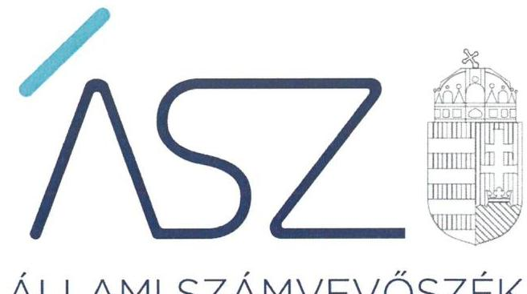
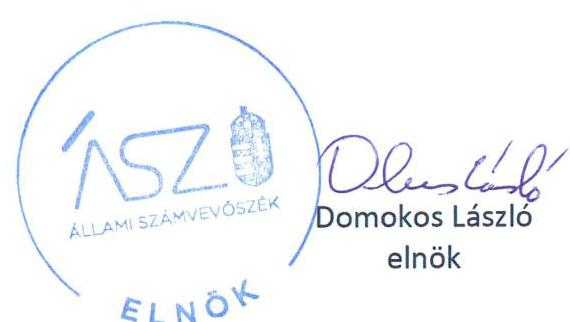
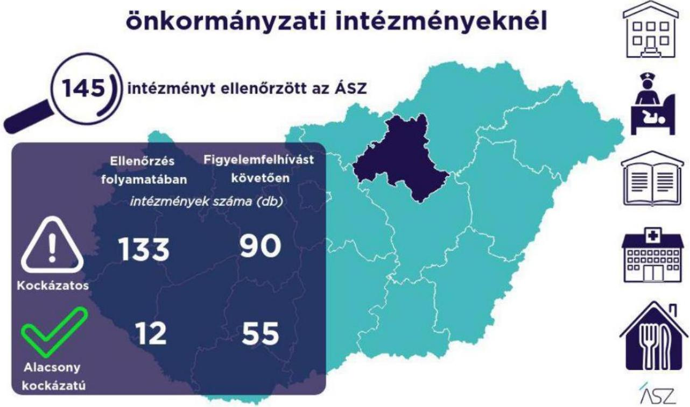

ÁLLAMI SZÁMVEVŐSZÉK

# JELENTÉS 

A Heves megyei önkormányzati intézmények ellenőrzése

Az önkormányzat és társulás irányítása alá tartozó intézmények integritásának monitoring típusú ellenőrzése - 145 intézmény
2021.

21105
www.asz.hu

---

ÁLLAMI SZÁMVEVŐSZÉK

# JELENTÉS

A Heves megyei önkormányzati intézmények ellenőrzése

Az önkormányzat és társulás irányítása alá tartozó intézmények integritásának monitoring típusú ellenőrzése – 145 intézmény

2021. 12. hó 15. nap

21105
www.asz.hu

---

# AZ ELLENŐRZÉST FELÜGYELTE: 

SALAMON ILDIKÓ felügyeleti vezető

## AZ ELLENŐRZÉST VEZETTE ÉS A VÉGREHAJTÁSÁÉRT FELELŐS:

SZAPPANOS JÚLIA ellenőrzésvezető
JANIK JÓZSEF LÁSZLÓ ellenőrzésvezető
ÓD OR ZOLTÁN TAMÁS ellenőrzésvezető

A PROGRAM ÖSSZEÁLLÍTÁSÁÉRT FELELŐS:
DR. FELFÖLDI IZABELLA programkészítésért felelősvezető

Jelentéseink az Országgyúlés számítógépes hálózatán és az interneten a www.asz.hu címen is olvashatóak.

IKTATÓSZÁM: EL-3461-012/2021.
TÉMASZÁM: 2568
ELLENŐRZÉS-AZONOSÍTÓ SZÁM: V0928

---

# TARTALOMJEGYZÉK 

$\square$ ÖSSZEGZÉS ..... 5
$\square$ AZ ELLENŐRZÉS JELENTŐSÉGE, AKTUALITÁSA, TÁRSADALMI SZEREPE, SZEMPONTJAI ..... 8
$\square$ AZ ELLENŐRZÉS TERÜLETE ..... 9
$\square$ ELLENŐRZÉS HATÓKÖRE ÉS MÓDSZERE ..... 10
$\square$ MELLÉKLETEK. ..... 13
I. sz. melléklet: Az értékelés módszertana ..... 13
II. sz. melléklet: Értelmező szótár ..... 15
$\square$ FÜGGELÉKEK ..... 17
I. sz. függelék: Az ellenőrzött szervezetek és azok kockázati értékelése ..... 17
$\square$ RÖVIDÍTÉSEK JEGYZÉKE ..... 25

---

.

---

# ÖSSZEGZÉS 

Az Állami Számvevőszék figyelemfelhívásának és tanácsadásának eredményeként a Heves megyei önkormányzatok irányítása alatt álló 145 ellenőrzött intézmény közül 58 intézménynél az intézményvezető már 2021-ben intézkedett, vagy intézkedéseket rendelt el az integritást biztositó alapvető feltételek megerősitése, illetve kiépitése érdekében. Ezeknek az intézményeknek javult az integritása, erősödtek a csalásmentes müködés feltételei.
78 intézménynél további intézkedések szükségesek az integritást biztositó alapvető feltételek kiépitése, illetve kiegészitése érdekében. Ezeknek az intézményeknek a vezetői az Állami Számvevőszék intézkedési kötelemmel járó figyelemfelhívására nem intézkedtek, ezért az azonosított kockázatok növekedtek, vagy intézkedéseik nem fedték le a kockázatos területeket, így az azonosított kockázatok nem változtak.

## Értékelések

Az Állami Számvevőszék a Heves megyei önkormányzatok irányítása alá tartozó 145 intézmény belső kontrollrendszerének lényeges elemei kialakítását ellenőrizte a 2021. évre vonatkozóan. Az ellenőrzés a súlypontok meghatározásával lehetőséget biztosított a szervezeti integritás, müködés és vezetés, valamint a gazdálkodás területén a kockázatok azonosítására.

A szervezeti integritás alapvető feltétele a szabályozottság, azaz a jogszabályokban előírt belső szabályzatok megléte, azok - hatályos jogszabályoknak - megfelelő tartalma és gyakorlati alkalmazhatósága. Az integritási kockázatok szervezeti szinten csökkenthetők azáltal, hogy az intézményvezetők kialakítják a szervezeti és müködési kereteket, a gazdálkodásra vonatkozó alapvető szabályozási környezetet, valamint a kontrolltevékenységek szabályszerű gyakorlásának, az integrált kockázatkezelésnek és az integritást sértő események kezelésének a feltételeit.

A szervezeti integritás, a müködés és a vezetés alapvető szabályozási feltételeinek kialakítása hozzájárul a csalásmentes integritási környezet megteremtéséhez.

A szervezeti és müködési szabályzat teremt i meg a szervezet szabályszerű müködésének alapjait, illetve rögzíti a szervezeten belüli felelősségi viszonyokat. A szabályzat biztosítja a szervezeti müködés szabályozottságát, ezáltal a szervezet tevékenységének átláthatóságát, a szervezeti célokkal összhangban történő müködés feltételeit és annak ellenőrizhetőségét. Az ellenőrzöttek közül 135 intézmény rendelkezett szervezeti és müködési szabályzattal a 2021. évben.

A jogszabályi előírásoknak eleget téve, nyilatkozatban értékelte az intézmény belső kontrollrendszerének minőségét 99 intézmény vezetője. Ezek közül 16 intézménynél alakítottak ki olyan szabályozásokat, folyamatokat, amelyek biztosítják a költségvetési szerv tevékenységében a rendelkezésre álló források átlátható, szabályszerű, szabályozott, gazdaságos, hatékony és eredményes felhasználása követelményeinek érvényesítését.

Az integrált kockázatkezelés eljárásrendjét 100, a szervezeti integritást sértő események kezelésének eljárásrendjét 107 intézménynél alakították ki az intézményvezetők. Az integrált kockázatkezelés eljárásrendje biztosítja a szervezet müködésében rejlő kockázatok azonosításának és kezelésének feltételeit. A szervezet müködési kockázatai veszélyeztethetik a közpénzekkel való átlátható, elszámoltatható és felelős gazdálkodást. Az integritást sértő események kezelésének eljárásrendje jelenti a szervezet tekintetében felmerülő és a szervezeten belül bekövetkező integritást sértő események kezelésének alapjait. Az eljárásrend kialakításával az intézmény vezetője támogatja az integritást sértő eseményekkel kapcsolatosan azonosított kockázatok bekövetkezése esetén azok hatékony kezelését, illetve a következmények enyhítését.

A pénz- és vagyongazdálkodáshoz kapcsolódó alapvető szabályozások és nyilvántartások- így a számviteli politika és a keretében elkészítendő szabályzatok, a számlarend, a beszerzések szabályozása, vala mint a kötelezettségválla-

---

lásra és a teljesítés igazolására jogosultak és aláírásmintáik nyilvántartása - előmozdítják a közpénzügyek átláthatóságát, rendezettségét. Az intézményvezető ezen szabályzatok elkészítésével, nyilvántartások vezetésével és folyamatos karbantartásával az alapfeltételét biztosítja a pénzügyi- és vagyongazdálkodásátláthatóságának, a közpénzekkel és közvagyonnal való elszámoltathatóságnak. Az ellenőrzöttek közül 101 intézménynél a számviteli politika, 84 intézménynél a számlarend, 106 intézménynél a beszerzések lebonyolításával kapcsolatos eljárásrend rendelkezésre állt.

Az ellenőrzöttek közül 9 intézmény vezetője tett eleget az ellenőrzött területek mindegyikén az integritási kontrollok alapvető feltételeit jelentő, a jogszabályban előírt szabályozási kötelezettségének. Közülük 6 intézmény vezetője a jogszabályi előírásokon túl további erőfeszítéseket is tett az integritás erősítése érdekében, felismerte további olyan integritási kontrollok kialakításának indokoltságát, amelyet jogszabály nem ír elő, így szervezeti szinten hozzájárul a korrupcióval szembeni védettség megszilárdításához.

139 intézmény esetében az intézményvezető intézkedése volt szükséges a kockázatok csökkentése érdekében, mivel 30 intézménynél a jogszabályok által előírt kontrollok területén, 106 intézménynél a jogszabályok által előírt és a további, jogszabály által nem előírt integritási kontrollok területén egyaránt, 3 intézménynél utóbbi kontrollok területén voltak hiányosságok. A dokumentumok kiértékelése alapján - az integritás további fejlesztése érdekében az Állami Számvevőszék azonosította a lényeges kockázati területeket, és már az ellenőrzés lefolytatásával párhuzamosan, a 2021. évre vonatkozóan a kockázatok csökkentésére hívta fel az intézményvezetők figyelmét.

# Következtetések 

Az érintett 136 intézmény közül 109 intézmény vezetője válaszolt határidőben az Állami Számvevőszék figyelemfelhívására. Közülük 73 teljeskörűen, 26 részben egyetértett a kockázatos területeken teendő intézkedések indokoltságával. Az intézményvezetők közül 68 arról tájékoztatta az Állami Számvevőszéket, hogy valamennyi kockázatos területen, 24 pedig a kockázatos területek egy részénél már tett, illetve a jövőben tesz intézkedést a jelzett kockázatok csökkentése érdekében. A jogszabályi előírásokon túli integritási kontrollok területén az érintett 109 intézmény közül 56 intézmény vezetője a jelzett kockázatok teljes körű, 4 pedig azok részbeni felszámolásáról adott számot. Ezek eredményeként a 139 vezetői levélben jelzett 934 kockázati terület közül 435 esetben már történt, illetve tervezett az intézkedés, így javulás várható a feltárt kockázatos területek 46,6\%-ánál.

Az intézkedések eredményeként az ellenőrzött 145 intézmény közül összesen 55 intézménynél a kockázatok alacsony szintűek, illetve - a tervezett intézkedések végrehajtásával - a kockázatok alacsony szintre csökkennek.

A szabályozások és nyilvántartások kialakításának célja nem önmagában a jogszabályi rendelkezések betartása, hanem az intézmény szabályozottságán keresztül a szabályszerű és csalásmentes gazdálkodás feltételeinek megteremtése, ezáltal az Alaptörvényben előírt átláthatóság és elszámoltathatóság elvének érvényesítése. Ezeknek az alapelveknek érvényesülése hozzájárulhat ahhoz, hogy az intézmények, mint közszolgáltatást nyújtó szervezetek felé a közszolgáltatásokat igénybe vevők, és általuk az állampolgárok általános bizalma is erősödjön.

Az Állami Számvevőszék figyelemfelhívására nem válaszoló, illetve a jelzett kockázatokra nem, vagy csak részben intézkedő intézményvezetők által vezetett intézményeknél rendszerszintű kockázatok maradtak fenn. Az integritás elvű működés erősítése érdekében további kockázatcsökkentő lépések szükségesek a vezetés-irányítás, valamint a pénzügyi- és a vagyongazdálkodás szabályszerű feltételeinek kialakítása terén. Ezen intézmények integritásának kiépítését következő lépésként az irányító szerv bevonásával támogatja az Állami Számvevőszék.

---

# Erősödött a csalásmentesség a Heves megyei önkormányzati intézményeknél 

---

# AZ ELLENŐRZÉS JELENTŐSÉGE, AKTUALITÁSA, TÁRSADALMI SZEREPE, SZEMPONTJAI 

Az Alaptörvény alapértékeket, elveket fogalmaz meg, amely szerint a közpénzekkel gazdálkodó minden szervezet köteles a nyilvánosság előtt elszámolni a közpénzekre vonatkozó gazdálkodásával. A közpénzeket és a nemzeti vagyont az átláthatóság és a közélet tisztaságának elve szerint kell kezelni.

Magyarország helyi önkormányzatairól szóló törvény ${ }^{1}$ a helyi közhatalom gyakorlás széleskörű érvényesítésével összhangban tág teret ad a helyi önkormányzatoknak a feladataik, a közszolgáltatások legkülönbözőbb formákban történő ellátására, így széleskörű lehetőséggel rendelkeznek intézmények alapítására.

A helyi önkormányzatok irányítása alá tartozó intézmények szerteágazó közszolgáltatásokat nyújtanak. Az intézmények működtetése közvetlenül érinti a társadalom valamennyi rétegét, a közfeladatot ellátó intézmények működésének minősége közvetlen hatással van az azokat igénybe vevő állampolgárok életére.

Az intézmények szabályszerű és eredményes működésének és gazdálkodásának alapfeltétele a belső kontrollrendszer - benne az integritási kontrollok - megfelelő kialakítása. Az ÁSZ² a törvényi felhatalmazással élve ellenőrzi az önkormányzati intézményeket, hogy megállapításaival támogassa az ellenőrzött szervezetek szabályszerű gazdálkodását, müködését.

A helyi önkormányzatok intézményei által ellátott feladatok, a bölcsődei, óvodai ellátás, a gyermekétkeztetés, a betegek és idősek gondozása, a közművelődési intézmények, könyvtárak működtetése által a lakosság ezeken a területeken találkozik legszélesebb körben az önkormányzatok által nyújtott szolgáltatásokkal. A szolgáltatásokat igénybe vevők jelentős száma, a feladatellátáshoz használt nemzeti vagyon és az erre fordított közpénz nagysága indokolja, hogy az ÁSZ további, az előző ellenőrzésekre épülő ellenőrzéseket végezzen ezen a területen, illetve további olyan területeken, ahol az önkormányzati szolgáltatást a lakosság széles köre veszi igénybe.

Az ellenőrzés célja annak értékelése, hogy a helyi önkormányzatok irányítása alá tartozó intézmények megterem-tették-e az integritás biztosításához szükséges feltételeket, kialakították-e az alapvető, a szervezeti kereteket, az integritási kontrollokhoz kapcsolódó, valamint a korrupció elleni védelmet szolgáló szabályozásokat. Továbbá, hogy az intézményvezető gondoskodott-e a szervezeti teljesítmény mérés alapfeltételeinek kialakításáról az eredményességi szempontoknak való megfelelés megalapozottsága biztosítása érdekében. A monitoring típusú ellenőrzés célja hatékonyan támogatni az ellenőrzött szervezeteket, ezáltal növelve az ÁSZtanácsadó szerepét, elősegítve a „jól irányított állam" müködését.

Az ÁSZ célja, hogy új ellenőrzési megközelítést alkalmazva támogassa a közpénzügyi helyzet javítását; a monitoring típusú ellenőrzéssel jelen időben adjon helyzetképet az integritási szemlélet érvényesítéséről, rávilágítson az integritási kontrollok kiépítettségére, illetve további fejlesztésére. Napjainkban mindez kiemelt fontosságúvá vált. Minden szervezetnek fel kell készülnie arra, hogy a koronavírus járvány okozta társadalmi és gazdasági válság növelni fogja a korrupciós nyomást. Az ÁSZ ebben a helyzetben is alapvető kötelességének tartja, hogy a közpénzek őre legyen, és ellenőrzéseit az önkormányzati alrendszer intézményei körében is folytassa.

Fontos, hogy az intézmények vezetői felismerjék az integritás kockázatokat, azokat ismételten mérjék fel, és alakítsanak ki átlátható, jól szabályozott rendszereket, döntési mechanizmusokat. Az integritási kockázatok feltárása, megismerése elengedhetetlenül fontos, mert ezt követően tehetők meg azok a lépések, amelyek a kockázatok csökkentését, felszámolását és kezelését célozzák. A belső kontrollrendszer - benne az integritás kontrollok - megfelelő kialakítása, müködése a helyi önkormányzatok irányítása alatt álló intézményeknél is hozzájárul a társadalmi közbizalom erősítéséhez.

Az ellenőrzés rámutat az integritási jó gyakorlatokra is, továbbá felhívja a figyelmet a jogszabályi követelmények teljesítéséhez szükséges lépésekre is.

---

# AZ ELLENŐRZÉS TERÜLETE 

## Az önkormányzatok irányítása alá tartozó intézmények

Helyi önkormányzati költségvetési szervet az államháztartásról szóló 2011. évi CXCV törvény (Áht. ${ }^{3}$ ) szerint a helyi önkormányzat, a helyi önkormányzatok társulása, a térségi fejlesztési tanács, az átalakult nemzetiségi önkormányzat alapíthat, a költségvetési szerv alapító okiratában meghatározott önkormányzati közfeladatok ellátására. A költségvetési szervek önálló jogi személyek, éves költségvetésükből gazdálkodva látják el feladataikat. A költségvetési szervek gazdasági szervezettel rendelkeznek, ha azonban a költségvetési szerv éves átlagos statisztikai állományi létszáma a 100 főt nem éri el, a gazdasági szervezet feladatait az önkormányzati hivatal, vagy az irányító szerv döntése alapján az irányító szerv irányítása alá tartozó, gazdasági szervezettel rendelkező más költségvetési szerv látja el.

Az államháztartásról szóló törvény végrehajtásáról szóló 368/2011. (XII. 31.) Korm. rendelet (Ávr. ${ }^{4}$ ) 1. melléklete szerint, az államháztartás önkormányzati alrendszerében a helyi önkormányzat által irányított költségvetési szerv esetében az irányító szerv hatáskörét a képviselő-testület, közgyűlés gyakorolja, és annak vezetője a polgármester, főpolgármester, megyei közgyűlés elnöke.

Az ellenőrzés a Heves megyei önkormányzatok irányítása alá tartozó, az I. sz. Függelékben felsorolt költségvetési szervekre terjedt ki.

A feladatellátásuk szerint az ellenőrzött költségvetési szervek egy része óvodaként, bölcsődeként, gyermekjóléti intézményként, közoktatási intézményként, egészségügyi intézményként, konyha, művelődési ház, múzeum, oktatási központ, kulturális központ, idősek otthona, gondozási központ intézményként müködik.

---

# ELLENŐRZÉS HATÓKÖRE ÉS MÓDSZERE 

## Az ellenőrzés típusa

| Megfelelőségi ellenőrzés.

## Az ellenőrzött időszak

A 2021. év, a Bkr. ${ }^{5}$ szerinti vezetői nyilatkozat, valamint annak alátámasztottsága vonatkozásában a 2020. év.

## Az ellenőrzés tárgya

A szervezeti keretekkel, a múködéssel és gazdálkodással kapcsolatos szabályzatok, szabályozások, valamint a szervezeti elvekkel, értékekkel összefüggő integritás kontrollok kiépítettsége, a szervezeti teljesítmény mérés alapfeltételeinek kialakítása.

## Az ellenőrzött szervezetek

Az ellenőrzött intézményeket az I. sz. Függelék tartalmazza.

## Az ellenőrzés jogalapja

Az ellenőrzés jogszabályi alapját az ÁSZ tv. ${ }^{6}$ 1. § (3) bekezdése, 5. § (6) bekezdése, valamint az Áht. 61. § (2) bekezdése képezik.

## Az ellenőrzés módszerei

Az ÁSZ az ellenőrzést az ellenőrzési program szempontjai, az ellenőrzött időszakban hatályos jogszabályok, a jelen ellenőrzésre irányadó ÁSZ módszertan figyelembevételével és a nemzetközi standardokat irányadónak tekintve végzi.

Az ellenőrzés ideje alatt az ÁSZ az ellenőrzött szervezetekkel történő kapcsolattartást azÁSZSZMSZ7-ének vonatkozó előírásai alapján biztosítja.

Az ellenőrzési kérdések megválaszolásához szükséges bizonyítékok megszerzése a következő ellenőrzési eljárások alkalmazásával történik: megfigyelés, összehasonlítás, elemző eljárás. Az ellenőrzési bizonyítékként felhasználható adatforrások közé tartoznak az ellenőrzési programban felsorolt adatforrások, továbbá minden - az ellenőrzés folyamán - feltárt, az ellenőrzés szempontjából információkat tartalmazó dokumentum.

---

Az ÁSZ az ellenőrzést a kérdésekre adott válaszok kiértékelésével, valamint a megjelölt adatforrások, továbbá az adott időszakban hatályos jogszabályok, valamint az ÁSZ honlapján közzétett helyénvalósági kritériumok figyelembevételével folytatja le.

A monitoring típusú ellenőrzés az önkormányzatok irányítása alá tartozó intézmények integritás alapú múködésének lényeges területeire és a közpénzügyi helyzet javítása érdekében az elért eredmények fenntartására fókuszál. Lehetőséget biztosít az integritási kontrollok kiépítettségében lévő hiányosságok, a szervezeti teljesítmény mérés alapfeltételei kialakításának hiánya beazonosítására az eredményességi szempontoknak való megfelelés megalapozottsága biztosítása érdekében, az önkormányzatok, társulások irányítása alá tartozó intézmények integritásának elemzésére, részletes ellenőrzések megalapozására.

---

.

---

# MELLÉKLETEK 

I. SZ. MELLÉKLET: AZ ÉRTÉKELÉS MÓDSZERTANA

Az egyes kockázati területek és kockázatforrások minősítése „pontozásos módszerrel", az integritás „jelző" dokumentumai és a vezetői magatartás ellenőrzéshez kapcsolódóan tanúsított tényhelyzeteinek értékelése alapján történt.

Az értékelt dokumentumokhoz, nyilvántartásokhoz, kockázati besorolásokhoz minden esetben pontszám került hozzárendelésre, amelyek értéke alapján az ellenőrzött szervezetek kockázati csoportba kerültek besorolásra:

- Alacsony kockázatú - az elérhető összes pontszám legalább 80\%-a
- Közepes kockázatú - az elérhető pontszám 50-79\%-a között
- Magas kockázatú - az elérhető pontszám 50\%-a alatt

Az első lépésben azonosításra kerültek azok az intézményi szabályozások és nyilvántartások, amelyek meglétét jogszabály írja elő, hiánya pedig felveti a csalás és korrupció kockázatát.

Második lépésben az adatoknak az ellenőrzés rendelkezésére bocsátása kockázati kritériumainak meghatározása, majd értékelése történt meg.

Harmadik lépésben a figyelemfelhívó levelekre adott válaszok kockázati kritériumainak meghatározása, majd értékelése történt meg.

Az összesített kockázati értékelést javította, amennyiben

- az intézmény rendelkezett olyan szabályozással, amely kötelező meglétét jogszabály nem írja elő, de segíti a csalás és a korrupció megelőzését (helyénvalósági dokumentumok).

Az összesített kockázati értékelést rontotta, amennyiben

- az integritás szempontjából meghatározó dokumentum - az intézményi SZMSZ - hiányzott, és javítása érdekében a figyelemfelhívó levél hatására sem történt intézkedés.

A figyelemfelhívó levelekre adott válaszok értékelése alapján:

- A kockázat csökkent, amennyiben a figyelemfelhívó levélre adott válasza a figyelemfelhívással összhangban volt, valamennyi kockázati területen intézkedett vagy intézkedést tervezett.
- A kockázat változatlan, amennyiben a figyelemfelhívó levélben foglaltaktól eltérő magatartást tanúsított, intézkedése a figyelemfelhívással részben volt összhangban, a kockázati területeken részben intézkedett vagy intézkedést tervezett.
- A kockázat nőtt, amennyiben nem volt együttműködő, a figyelemfelhívó levélre nem válaszolt, vagy válasza alapján nem intézkedett és nem tervezett intézkedést.

---

# Az önkormányzatok irányítása alá tartozó intézmények kockázati csoportba sorolásának értékelési keretrendszere 

I. Dokumentumokkal rendelkezés
lényeges dokumentumok, amelyek hiánya felveti a csalás és korrupció kockázatát
I.1. A szervezeti integritás, müködés és vezetés alapvető szabályozási feltételei

- intézmény SZMSZ-e
- vezetői nyilatkozat a 2020. évre vonatkozóan az intézmény belső kontrollrendszer minőségének értékeléséről, valamint a nyilatkozat megalapozottságát bizonyító dokumentumok
- integrált kockázatkezelés eljárásrendje
- az integritást sértő események kezelésének eljárásrendje
I.2. A pénz- és vagyongazdálkodáshoz kapcsolódó alapvető szabályozások
- számviteli politika
- az eszközök és a források leltárkészittési és leltározási szabályzata
- az eszközök és a források értékelési szabályzata
- pénzkezelési szabályzat
- számlarend
- beszerzések lebonyolításával kapcsolatos eljárásrend
- a kötelezettségvállalásra, teljesítés igazolására jogosult személyekről és aláírás-mintájukról vezetett nyilvántartás
II. Az adatoknak az ellenőrzés rendelkezésére bocsátása
II.1. A megnevezett adatokkal rendelkezett és a törvényi határidőn belül hiánytalanul rendelkezésre bocsátotta. Figyelem-, illetve figyelmet felhívó levél nem volt indokolt.
II.2. A megnevezett adatokat nem bocsátotta rendelkezésre.
III. Figyelemfelhívó levelekre adott válaszok kockázati értékelése
III.1. Kockázat csökkent: együttmüködése a figyelemfelhívó levéllel összhangban volt.
III.2. Kockázat változatlan: a figyelemfelhívó levélben foglaltaktól eltérő együttmüködést tanúsított.
III.3. Kockázat nőtt: nem reagált, nem intézkedett, így nem volt együttmüködő.

---

# II. SZ. MELLÉKLET: ÉRTELMEZŐ SZÓTÁR 

belső kontrollrendszer

belső kontrollrendszer területei
integrált kockázatkezelési rendszer
integritás

Integritási kockázatok
kockázat
kontrollkörnyezet
kontrollkörnyezet
kockázat
kontrollkörnyezet
kolltségvetési szerv vezetője által kialakított olyan elvek, eljárások, belső szabályzatok összessége, amelyben világos a szervezeti struktúra, a folyamatok átláthatók, egyértelműek a felelősségi, hatásköri viszonyok és feladatok, meghatározottak, ismertek és elfogadottak az etikai elvárások a szervezet minden szintjén, átlátható a humánerőforrás-kezelés, biztosított a szervezeti célok és értékek irányában való elkötelezettség fejlesztése és elősegítése. (Forrás: Bkr. 6. § (1) bekezdés)
A költségvetési szerv vezetője által a szervezeten belül kialakított (kontroll) tevékenységek, melyek biztosítják a kockázatok kezelését, hozzájárulnak a szervezet céljainak eléréséhez és erősítik a szervezet integritását. (Forrás: Bkr. 8. § (1) bekezdés)
A helyi önkormányzatok irányítása alátartozó költségvetési szervek. (A képviselő-testület a feladatkörébe tartozó közszolgáltatások ellátására - jogszabályban meghatározottak szerint - költségvetési szervet (önkormányzati intézmény) alapíthat; (Forrás: Mötv. 41. § (6) bekezdés)

---

.

---

# FÜGGELÉKEK

- I. SZ. FÜGGELÉK: AZ ELLENŐRZÖTT SZERVEZETEK ÉS AZOK KOCKÁZATI ÉRTÉKELÉSE

|  Sorszám | Ellenőrzött szervezet megnevezése | Irányító szerv (önkormányzat) megnevezése | Helység | Tanácsadást megelőző kockázati besorolás | Intézkedést követően a kockázati értékelés változása | A kockázati szint alacsonyra csökkent-e  |
| --- | --- | --- | --- | --- | --- | --- |
|  1. | Árnyaskert Óvoda | Atkár Község Önkormányzata | Atkár | MAGAS | NÖTT | N  |
|  2. | Benedek Elek Hagyományőrző és Természetbarát Óvoda | Hort Nagyközségi Önkormányzat | Hort | MAGAS | CSÖKKENT | N  |
|  3. | Horti Szociális Ellátó Intézmény | Hort Nagyközségi Önkormányzat | Hort | KÖZEPES | NÖTT | N  |
|  4. | Hort Nagyközség Önkormányzatának Kulturális Centruma: Könyvtár, Közösségi Ház És Helytörténeti Kiállítóhely | Hort Nagyközségi Önkormányzat | Hort | MAGAS | NÖTT | N  |
|  5. | Heves Városi Óvodák és Bölcsőde Köznevelési Intézmény | Heves Város Önkormányzata | Heves | KÖZEPES | NÖTT | N  |
|  6. | Heves Városi Múvelődési, Közgyűjteményi Intézmény, Helytörténeti és Sakktörténeti Gyűjtemény, Kő Pál Szobrászművész Állandó Kiállítás | Heves Város Önkormányzata | Heves | MAGAS | NEM VÁLTOZOTT | N  |
|  7. | Mezőszemerei Óvoda | Mezőszemere Községi Önkormányzat | Mezőszemere | KÖZEPES | NÖTT | N  |
|  8. | Gondozási Központ | Mezőszemere Köz-
ségi Önkormányzat | Mezőszemere | KÖZEPES | NÖTT | N  |
|  9. | Dr. Fél Edit Közösségi Tér | Átány Községi Önkormányzat | Átány | KÖZEPES | CSÖKKENT | I  |
|  10. | Szajlai Mákvirág Óvoda | Szajla Községi Önkormányzat | Szajla | KÖZEPES | CSÖKKENT | I  |
|  11. | Átányi Óvoda | Átány Községi Önkormányzat | Átány | KÖZEPES | CSÖKKENT | I  |
|  12. | Hevesvezekényi Gyermeksziget Óvoda | Hevesvezekény Köz-
ségi Önkormányzat | Hevesvezekény | KÖZEPES | CSÖKKENT | I  |
|  13. | Heves Város Gyermekjóléti Központja és Családsegítő Szolgálata | Heves Város Önkormányzata | Heves | MAGAS | NEM VÁLTO-
ZOTT | N  |

---

| Sorszám | Ellenőrzött szervezet megnevezése | Irányító szerv (önkormányzat) megnevezése | Helység | Tanácsadást megelőző kockázati besorolás | Intézkedést követően a kockázati értékelés változása | A kockázati szint alacsonyra csökkent-e |
| :--: | :--: | :--: | :--: | :--: | :--: | :--: |
| 14. | Berekerdő Óvoda | Kerecsend Község Önkormányzata | Kerecsend | MAGAS | NEM VÁLTO-   ZOTT | N |
| 15. | Solymosy Óvoda | Gyöngyössolymos Községi Önkormányzat | Gyöngyössolymos | MAGAS | NÖTT | N |
| 16. | Gárdonyi Géza Művelődési Házés Könyvtár | Gyöngyössolymos Községi Önkormányzat | Gyöngyössolymos | MAGAS | NÖTT | N |
| 17. | Bükkszenterzsébeti Százszorszép Óvoda | Bükkszenterzsébet Községi Önkormányzat | Bükkszenterzsébet | MAGAS | CSÖKKENT | N |
| 18. | Istenmezejei Tündérkert Óvoda | Istenmezeje Község Önkormányzata | Istenmezeje | KÖZEPES | CSÖKKENT | N |
| 19. | Abasári Napsugár Óvoda | Abasár Községi Önkormányzat | Abasár | KÖZEPES | CSÖKKENT | I |
| 20. | Saári Közösségi Házés Könyvtár | Abasár Községi Önkormányzat | Abasár | MAGAS | NÖTT | N |
| 21. | Együtt Bükkszenterzsébetért Idősek Otthona | Bükkszenterzsébet Községi Önkormányzat | Bükkszenterzsébet | MAGAS | NÖTT | N |
| 22. | Lőrinci "Napsugár"Óvoda és Bölcsőde | Lőrinci Városi Önkormányzat | Lőrinci | MAGAS | NEM VÁLTOZOTT | N |
| 23. | Boldogi Csicsergő Óvoda és Mini Bölcsőde | Boldog Község Önkormányzata | Boldog | ALACSONY | CSÖKKENT | I |
| 24. | "Százszorszép" Napköziotthonos Óvoda | Kál Nagyközségi Önkormányzat | Kál | MAGAS | NEM VÁLTOZOTT | N |
| 25. | Kál Nagyközség Önkormányzatának Konyhája | Kál Nagyközségi Önkormányzat | Kál | MAGAS | NEM VÁLTOZOTT | N |
| 26. | Falugondnoki Szolgálat | Újlőrincfalva Községi Önkormányzat | Újlőrincfalva | MAGAS | NÖTT | N |
| 27. | Erki Óvoda | Erk Községi Önkormányzat | Erk | MAGAS | NÖTT | N |
| 28. | Tarnaörsi Óvoda, Közművelődési Intézmény és Község Könyvtár | Tarnaörs Község Önkormányzata | Tarnaörs | MAGAS | NÖTT | N |
| 29. | Noszvaji Cseperedő Óvoda | Noszvaj Községi Önkormányzat | Noszvaj | KÖZEPES | NEM VÁLTOZOTT | N |
| 30. | Felsőtárkányi Óvoda és Bölcsőde | Felsőtárkány Község Önkormányzata | Felsőtárkány | KÖZEPES | CSÖKKENT | I |
| 31. | Felsőtárkányi Szociális és Gyermekjóléti Intézmény | Felsőtárkány Község Önkormányzata | Felsőtárkány | KÖZEPES | CSÖKKENT | I |
| 32. | Demjéni Varázs Óvoda | Demjén Község Önkormányzata | Demjén | KÖZEPES | CSÖKKENT | I |
| 33. | Bródy Sándor Megyei és Városi Könyvtár | Eger Megyei Jogú Város Önkormányzata | Eger | ALACSONY | Nem volt szabályszerűségi hiba | I |
| 34. | Dobó István Vármúzeum | Eger Megyei Jogú Város Önkormányzata | Eger | KÖZEPES | CSÖKKENT | I |
| 35. | Egri Szociális Szolgáltató Intézmény | Eger Megyei Jogú Város Önkormányzata | Eger | KÖZEPES | CSÖKKENT | I |

---

| Sorszám | Ellenőrzött szervezet megnevezése | Irányító szerv (önkormányzat) megnevezése | Helység | Tanácsadást megelőző kockázati besorolás | Intézkedést követően a kockázati értékelés változása | A kockázati szint alacsonyra csökkent-e |
| :--: | :--: | :--: | :--: | :--: | :--: | :--: |
| 36. | Besenyőteleki Bóbita Óvoda és Bölcsőde | Besenyőtelek Községi Önkormányzat | Besenyőtelek | KÖZEPES | CSÖKKENT | I |
| 37. | Gárdonyi Géza Színház | Eger Megyei Jogú Város Önkormányzata | Eger | KÖZEPES | NEM VÁLTOZOTT | N |
| 38. | Egri Kulturális és Müvészeti Központ | Eger Megyei Jogú Város Önkormányzata | Eger | KÖZEPES | CSÖKKENT | I |
| 39. | Ostoros Alapszolgáltatási Központ | Ostoros Községi Önkormányzat | Ostoros | KÖZEPES | NEM VÁLTO-   ZOTT | N |
| 40. | Ostorosi Szőlőfúrt Óvoda és Mini Bölcsőde | Ostoros Községi Önkormányzat | Ostoros | KÖZEPES | NEM VÁLTOZOTT | N |
| 41. | Egri Városi Sportiskola | Eger Megyei Jogú Város Önkormányzata | Eger | KÖZEPES | CSÖKKENT | I |
| 42. | Csány Község Önkormányzata Képviselőtestületének Napközi Otthonos Óvodája | Csány Község Önkormányzata | Csány | KÖZEPES | NÖTT | N |
| 43. | Detki Benedek Elek Óvoda | Detk Községi Önkormányzat | Detk | KÖZEPES | NÖTT | N |
| 44. | Ecsédi Gyöngyszem Óvoda és Kölyök Minibölcsőde | Ecséd Községi Önkormányzat | Ecséd | MAGAS | NÖTT | N |
| 45. | Gyöngyöspatai Bokréta Óvoda és Bölcsőde | Gyöngyöspata Város Önkormányzata | Gyöngyöspata | MAGAS | NÖTT | N |
| 46. | Kisnánai Mesevár Óvoda | Kisnána Községi Önkormányzat | Kisnána | KÖZEPES | CSÖKKENT | I |
| 47. | Markazi Többcélú Közoktatási Intézmény | Markaz Községi Önkormányzat | Markaz | MAGAS | NÖTT | N |
| 48. | Nagyrédei Kastély Óvoda | Nagyréde Nagyközség Önkormányzata | Nagyréde | KÖZEPES | CSÖKKENT | I |
| 49. | Visontai Szivárvány Óvoda És Konyha | Visonta Községi Önkormányzat | Visonta | KÖZEPES | NÖTT | N |
| 50. | Andornaktályai Mesevár Óvoda | Andornaktálya Községi Önkormányzat | Andornaktálya | MAGAS | NEM VÁLTOZOTT | N |
| 51. | Csengővár Óvoda és Mini Bölcsőde | Recsk Nagyközségi Önkormányzat | Recsk | ALACSONY | Nem volt szabályszerűségi hiba | I |
| 52. | Recski Szociális Ellátó és Gyermekjóléti Intézmény | Recsk Nagyközségi Önkormányzat | Recsk | ALACSONY | Nem volt szabályszerűségi hiba | I |
| 53. | Verpeléti Alapszolgáltatási Központ | Verpelét Város Önkormányzata | Verpelét | KÖZEPES | CSÖKKENT | I |
| 54. | Pétervásárai Időskorúak Otthona | Pétervására Városi Önkormányzat | Pétervására | MAGAS | NÖTT | N |
| 55. | Szántó Vezekényi István Múvelődés Háza és Könyvtár | Pétervására Városi Önkormányzat | Pétervására | MAGAS | NÖTT | N |
| 56. | Erdőtelki Múvelődési Ház és Könyvtár | Erdőtelek Községi Önkormányzat | Erdőtelek | KÖZEPES | NÖTT | N |

---

| Sorszám | Ellenőrzött szervezet megnevezése | Irányító szerv (önkormányzat) megnevezése | Helység | Tanácsadást megelőző kockázati besorolás | Intézkedést követően a kockázati értékelés változása | A kockázati szint alacsonyra csökkent-e |
| :--: | :--: | :--: | :--: | :--: | :--: | :--: |
| 57. | Erdőtelki Gondozási Központ és Konyha | Erdőtelek Községi Önkormányzat | Erdőtelek | KÖZEPES | CSÖKKENT | I |
| 58. | Tarnaszentmiklósi Óvoda és Konyha | Tarnaszentmiklós Község Önkormányzata | Tarnaszentmiklós | KÖZEPES | CSÖKKENT | I |
| 59. | Fekete István Könyvtár és Müvelődési Ház | Tiszanána Község Önkormányzata | Tiszanána | KÖZEPES | CSÖKKENT | I |
| 60. | Egri Kertvárosi Óvoda | Eger Megyei Jogú Város Önkormányzata | Eger | KÖZEPES | CSÖKKENT | I |
| 61. | Benedek Elek Óvoda | Eger Megyei Jogú Város Önkormányzata | Eger | KÖZEPES | NEM VÁLTO-   ZOTT | N |
| 62. | Szivárvány Óvoda | Eger Megyei Jogú Város Önkormányzata | Eger | ALACSONY | Nem volt szabályszerűségi hiba | I |
| 63. | Gyermekjóléti és Bölcsődei Igazgatóság | Eger Megyei Jogú Város Önkormányzata | Eger | KÖZEPES | NEM VÁLTOZOTT | N |
| 64. | Gyöngyöshalászi Általános Müvelődési Központ | Gyöngyöshalász Köz-   ség Önkormányzata | Gyöngyöshalász | KÖZEPES | CSÖKKENT | I |
| 65. | Visonta Úti Bölcsőde és   Családi Bölcsőde Hálózat | Gyöngyös Városi Önkormányzat | Gyöngyös | MAGAS | NEM VÁLTO-   ZOTT | N |
| 66. | Dobó Úti Bölcsőde | Gyöngyös Városi Önkormányzat | Gyöngyös | MAGAS | NEM VÁLTOZOTT | N |
| 67. | Gyöngyös Város Óvodái | Gyöngyös Városi Önkormányzat | Gyöngyös | MAGAS | NEM VÁLTOZOTT | N |
| 68. | Herédi Óvoda | Heréd Községi Önkormányzat | Heréd | KÖZEPES | CSÖKKENT | I |
| 69. | Községi Müvelődési Ház, Könyvtár és Iskolai Könyvtár, Teleház | Szihalom Községi Önkormányzat | Szihalom | KÖZEPES | CSÖKKENT | N |
| 70. | Harlekin Bábszínház | Eger Megyei Jogú Város Önkormányzata | Eger | KÖZEPES | CSÖKKENT | I |
| 71. | Szépvölgyi Napköziotthonos Óvoda | Halmajugra Községi Önkormányzat | Halmajugra | MAGAS | NÖTT | N |
| 72. | Kerekharaszti Csillagfény Óvoda | Kerekharaszt Községi Önkormányzat | Kerekharaszt | KÖZEPES | NÖTT | N |
| 73. | Zaránki Idősek Otthona Gondozási Központ | Zaránk Községi Önkormányzat | Zaránk | KÖZEPES | CSÖKKENT | I |
| 74. | Margaréta Óvoda és Bölcsőde | Domoszló Községi Önkormányzat | Domoszló | KÖZEPES | CSÖKKENT | I |
| 75. | Pálos Óvoda | Pálosvörösmart Községi Önkormányzat | Pálosvörösmart | KÖZEPES | CSÖKKENT | I |
| 76. | Egerszalóki Faluház | Egerszalók Községi Önkormányzat | Egerszalók | ALACSONY | CSÖKKENT | I |
| 77. | Egercsehi Napköziotthonos Óvoda | Egercsehi Községi Önkormányzat | Egercsehi | MAGAS | CSÖKKENT | N |

---

| Sorszám | Ellenőrzött szervezet megnevezése | Irányító szerv (önkormányzat) megnevezése | Helység | Tanácsadást megelőző kockázati besorolás | Intézkedést követően a kockázati értékelés változása | A kockázati szint alacsonyra csökkent-e |
| :--: | :--: | :--: | :--: | :--: | :--: | :--: |
| 78. | Egerbocsi Iciri-Piciri Óvoda | Egerbocs Községi Önkormányzat | Egerbocs | MAGAS | NÖTT | N |
| 79. | Novaji Napközi Otthonos Óvoda | Novaj Községi Önkormányzat | Novaj | KÖZEPES | NÖTT | N |
| 80. | Tiszanánai Tündérkert Óvoda | Tiszanána Község Önkormányzata | Tiszanána | KÖZEPES | NEM VÁLTOZOTT | N |
| 81. | Verpeléti Petőfi Sándor Közösségi Házés Könyvtár | Verpelét Város Önkormányzata | Verpelét | KÖZEPES | CSÖKKENT | I |
| 82. | Erdőtelki Kerekerdő Óvoda És Manócska Családi Bölcsőde | Erdőtelek Községi Önkormányzat | Erdőtelek | KÖZEPES | CSÖKKENT | I |
| 83. | Tarnazsadányi Óvoda | Tarnazsadány Községi Önkormányzat | Tarnazsadány | KÖZEPES | CSÖKKENT | I |
| 84. | Mátraballai Csodaszarvas Óvoda | Mátraballa Községi Önkormányzat | Mátraballa | MAGAS | NÖTT | N |
| 85. | Mátraderecskei Szivárvány Óvoda | Mátraderecske Községi Önkormányzat | Mátraderecske | MAGAS | NÖTT | N |
| 86. | Sarudi Tavirózsa Óvoda | Sarud Községi Önkormányzat | Sarud | MAGAS | NÖTT | N |
| 87. | Szihalmi Óvoda, Családi Bölcsőde | Szihalom Községi Önkormányzat | Szihalom | KÖZEPES | CSÖKKENT | I |
| 88. | Viszneki Óvoda és Konyha | Visznek Községi Önkormányzat | Visznek | ALACSONY | Nem volt szabályszerűségi hiba | I |
| 89. | Erdőkövesdi Napköziotthonos Óvoda | Erdőkövesd Községi Önkormányzat | Erdőkövesd | MAGAS | NÖTT | N |
| 90. | Ivádi Napköziotthonos Óvoda | Ivád Községi Önkormányzat | Ivád | MAGAS | NÖTT | N |
| 91. | Pélyi Óvoda és Konyha | Pély Község Önkormányzata | Pély | MAGAS | CSÖKKENT | N |
| 92. | Vécsi Kisvakond Óvoda | Vécs Községi Önkormányzat | Vécs | KÖZEPES | CSÖKKENT | I |
| 93. | Tenki Csicsergő Óvoda és Konyha | Tenk Községi Önkormányzat | Tenk | MAGAS | NÖTT | N |
| 94. | Egerszalóki Szivárvány Óvoda | Egerszalók Községi Önkormányzat | Egerszalók | KÖZEPES | CSÖKKENT | I |
| 95. | Markazi Könyvtár és Közművelődési Intézmény | Markaz Községi Önkormányzat | Markaz | MAGAS | NÖTT | N |
| 96. | Nagyrédei Gondozási Központ | Nagyréde Nagyközség Önkormányzata | Nagyréde | KÖZEPES | CSÖKKENT | I |
| 97. | Sarud Község Önkormányzati Konyha | Sarud Községi Önkormányzat | Sarud | MAGAS | NÖTT | N |

---

| Sorszám | Ellenőrzött szervezet megnevezése | Irányító szerv (önkormányzat) megnevezése | Helység | Tanácsadást megelőző kockázati besorolás | Intézkedést követően a kockázati értékelés változása | A kockázati szint alacsonyra csökkent-e |
| :--: | :--: | :--: | :--: | :--: | :--: | :--: |
| 98. | Vachott Sándor Városi Könyvtár, Kiállítóhely és Mujeális Gyűjtemény | Gyöngyös Városi Önkormányzat | Gyöngyös | KÖZEPES | NEM VÁLTOZOTT | N |
| 99. | Nagykökényesi Kökényvirág Óvoda | Nagykökényes Községi Önkormányzat | Nagykökényes | KÖZEPES | CSÖKKENT | I |
| 100. | Adácsi Óvoda és Mini Bölcsőde | Adács Község Önkormányzata | Adács | MAGAS | NÖTT | N |
| 101. | Gondozási Központ | Adács Község Önkormányzata | Adács | KÖZEPES | NEM VÁLTOZOTT | N |
| 102. | Apci Gyöngyszem Óvoda | Apc Községi Önkormányzat | Apc | KÖZEPES | CSÖKKENT | I |
| 103. | "Öszörözsa" Gondozási Központ | Rózsaszentmárton Községi Önkormányzat | Rózsaszentmárton | ALACSONY | Nem volt szabályszerűségi hiba | N |
| 104. | Egerbaktai Óvoda | Egerbakta Községi Önkormányzat | Egerbakta | ALACSONY | CSÖKKENT | I |
| 105. | Kölyökvár Óvoda | Sirok Községi Önkormányzat | Sirok | KÖZEPES | CSÖKKENT | I |
| 106. | Siroki Szociális és Gyermekjóléti Alapszolgáltatási Központ | Sirok Községi Önkormányzat | Sirok | KÖZEPES | CSÖKKENT | I |
| 107. | Bendegúz Óvoda, Gyermekjóléti és Alapszolgáltató Intézmény | Parád Nagyközségi Önkormányzat | Parád | KÖZEPES | CSÖKKENT | I |
| 108. | Tarnamérai Napsugár Óvoda | Tarnaméra Községi Önkormányzat | Tarnaméra | KÖZEPES | NÖTT | N |
| 109. | Kiskörei Óv-Lak Óvoda és Mini Bölcsőde | Kisköre Városi Önkormányzat | Kisköre | ALACSONY | Nem volt szabályszerűségi hiba | I |
| 110. | Petőfibányai Mini Manó Óvoda és Bölcsőde | Petőfibánya Községi Önkormányzat | Petőfibánya | KÖZEPES | NÖTT | N |
| 111. | Ludas Község Óvodája | Ludas Községi Önkormányzat | Ludas | MAGAS | NEM VÁLTOZOTT | N |
| 112. | Zagyvaszántói Gesztenyevirág Óvoda és Konyha | Zagyvaszántó Községi Önkormányzat | Zagyvaszántó | ALACSONY | Nem volt szabályszerűségi hiba | N |
| 113. | Szociális, Gyermekjóléti és Egészségügyi Szolgálat | Hatvan Város Önkormányzata | Hatvan | KÖZEPES | NEM VÁLTOZOTT | N |
| 114. | Átányi Gondozási Központ | Átány Községi Önkormányzat | Átány | KÖZEPES | CSÖKKENT | I |
| 115. | Egészségügyi Központ | Füzesabony Városi Önkormányzat | Füzesabony | KÖZEPES | CSÖKKENT | N |
| 116. | Ady Endre Könyvtár | Hatvan Város Önkormányzata | Hatvan | KÖZEPES | NEM VÁLTOZOTT | N |
| 117. | Grassalkovich Müvelődési Ház | Hatvan Város Önkormányzata | Hatvan | KÖZEPES | CSÖKKENT | I |
| 118. | Hatvani Csicsergő Óvoda | Hatvan Város Önkormányzata | Hatvan | KÖZEPES | NEM VÁLTOZOTT | N |

---

| Sorszám | Ellenőrzött szervezet megnevezése | Irányító szerv (önkormányzat) megnevezése | Helység | Tanácsadást megelőző kockázati besorolás | Intézkedést követően a kockázati értékelés változása | A kockázati szint alacsonyra csökkent-e |
| :--: | :--: | :--: | :--: | :--: | :--: | :--: |
| 119. | Hatvani Gesztenyéskert Óvoda | Hatvan Város Önkormányzata | Hatvan | KÖZEPES | NEM VÁLTO-   ZOTT | N |
| 120. | Hatvani Varázskapu Óvoda | Hatvan Város Önkormányzata | Hatvan | KÖZEPES | NEM VÁLTOZOTT | N |
| 121. | Hatvani Brunszvik Teréz Óvoda | Hatvan Város Önkormányzata | Hatvan | KÖZEPES | NEM VÁLTOZOTT | N |
| 122. | Hatvani Napsugár Óvoda | Hatvan Város Önkormányzata | Hatvan | KÖZEPES | NEM VÁLTOZOTT | N |
| 123. | Hatvani Százszorszép Óvoda | Hatvan Város Önkormányzata | Hatvan | KÖZEPES | NEM VÁLTOZOTT | N |
| 124. | Hatvani Vörösmarty Téri Óvoda | Hatvan Város Önkormányzata | Hatvan | KÖZEPES | NEM VÁLTOZOTT | N |
| 125. | Nagyfügedi Csicsergők Óvoda | Nagyfüged Községi Önkormányzat | Nagyfüged | KÖZEPES | NÖTT | N |
| 126. | Gyöngyösoroszi Általános Művelődési Központ | Gyöngyösoroszi Községi Önkormányzat | Gyöngyösoroszi | KÖZEPES | NÖTT | N |
| 127. | HevesaranyosiÓvoda | Hevesaranyos Községi Önkormányzat | Hevesaranyos | KÖZEPES | NEM VÁLTOZOTT | N |
| 128. | Szúcsi Zöldliget Óvoda | Szúcs Községi Önkormányzat | Szúcs | MAGAS | CSÖKKENT | N |
| 129. | Rózsaszentmártoni Labdarózsa Óvoda, Mini Bölcsőde és Konyha | Rózsaszentmárton   Községi Önkormányzat | Rózsaszentmárton | ALACSONY | Nem volt szabályszerűségi hiba | N |
| 130. | Szúcsi Óvoda | Szúcsi Községi Önkormányzat | Szúcsi | KÖZEPES | CSÖKKENT | I |
| 131. | Mosolyfalva Óvoda | Gyöngyöstarján Község Önkormányzata | Gyöngyöstarján | KÖZEPES | NEM VÁLTOZOTT | N |
| 132. | Kömlői Óvoda | Kömlő Községi Önkormányzat | Kömlő | KÖZEPES | NÖTT | N |
| 133. | Nagytályai Szivárvány Óvoda | Nagytálya Község Önkormányzata | Nagytálya | MAGAS | NÖTT | N |
| 134. | Maklári Napsugár Óvoda | Maklár Község Önkormányzata | Maklár | MAGAS | NÖTT | N |
| 135. | Füzesabonyi Hétszínvirág Óvoda és Bölcsőde | Füzesabony Városi Önkormányzat | Füzesabony | KÖZEPES | NEM VÁLTOZOTT | N |
| 136. | Füzesabonyi Könyvtár és Közösségi Ház | Füzesabony Városi Önkormányzat | Füzesabony | KÖZEPES | CSÖKKENT | I |
| 137. | Integrált Könyvtár és Muzeális Gyüjtemény | Hatvan Város Önkormányzata | Hatvan | KÖZEPES | NEM VÁLTOZOTT | N |

---

| Sorszám | Ellenőrzött szervezet megnevezése | Irányító szerv (önkormányzat) megnevezése | Helység | Tanácsadást megelőző kockázati besorolás | Intézkedést követően a kockázati értékelés változása | A kockázati szint alacsonyra csökkent-e |
| :--: | :--: | :--: | :--: | :--: | :--: | :--: |
| 138. | Apci Szociális Szolgáltató Intézmény | Apc Községi Önkormányzat | Apc | KÖZEPES | CSÖKKENT | I |
| 139. | Bükkszéki Napköziotthonos Óvoda | Bükkszék Község Önkormányzata | Bükkszék | KÖZEPES | CSÖKKENT | I |
| 140. | Bekölcei Mini Manó Óvoda | Bekölce Községi Önkormányzat | Bekölce | MAGAS | NÖTT | N |
| 141. | Mikófalvai Tündérkert Óvoda | Mikófalva Községi Önkormányzat | Mikófalva | MAGAS | NÖTT | N |
| 142. | Egerszóláti Bóbita Óvoda | Egerszólát Községi Önkormányzat | Egerszólát | KÖZEPES | CSÖKKENT | I |
| 143. | Kömlői Napközi Konyha | Kömlő Községi Önkormányzat | Kömlő | KÖZEPES | CSÖKKENT | N |
| 144. | Gesztenyéskerti Napköziotthonos Óvoda és Mini Bölcsőde | Karácsond Községi Önkormányzat | Karácsond | MAGAS | NEM VÁLTOZOTT | N |
| 145. | Karácsondi Múvelődési Ház Könyvtár, Információs és Közösségi Hely | Karácsond Községi Önkormányzat | Karácsond | KÖZEPES | CSÖKKENT | I |

| Alacsony kockázatú | 12 |  |  |
| :--: | :--: | :--: | :--: |
| Közepeskockázatú | 87 |  |  |
| Magaskockázatú | 46 |  |  |
| Kockázat csökkent |  | 58 |  |
| Kockázat nem változott |  | 34 |  |
| Kockázat nőtt |  | 44 |  |
| Nem volt indokolt figyelemfelhívólevél (szabályszerüségi vagy szabályszerüségi és helyénvalósági hiba hiányában) |  | 9 |  |
| Kockázat alacsony szintre csökkent |  |  | 55 |
| Kockázat nem csökkent alacsony szintre |  |  | 90 |
| Összesen | 145 | 145 | 145 |

---

# RÖVIDÍTÉSEKJEGYZÉKE 

${ }^{1}$ Mötv.
${ }^{2}$ ÁSZ
${ }^{3}$ Áht.
${ }^{4}$ Ávr.
${ }^{5}$ Bkr.
${ }^{6}$ ÁSZtv.
${ }^{7}$ ÁSZ SZMSZ
${ }^{8}$ Büntető Törvénykönyv
2011. évi CLXXXIX. törvény - Magyarország helyi önkormányzatairól(hatályos: 2012. január 1-jétől)

Állami Számvevőszék
2011. évi CXCV. törvény az államháztartásról (hatályos 2011. december 31-étől) 368/2011. (XII. 31.) Korm. rendelet az államháztartásról szóló törvény végrehajtásáról (hatályos 2012. január 1-jétől)
370/2011. (XII. 31.) Korm. rendelet a költségvetési szervek belső kontrollrendszeréről és belső ellenőrzésről (hatályos 2012. január 1-jétől)
2011. évi LXVI. törvény az Állami Számvevőszékről (hatályos 2011. július 1-jétől) Az Állami Számvevőszék Szervezeti és Müködési Szabályzata
2012. évi C. törvény a Büntető Törvénykönyvről (hatályos 2013. július 1-jétől)

---

# ASZ 

ALLAMI SZAMVEVOSZEK
1052 Budapest, Apáczai Cs. J. u. 10. | 1364 Budapest 4. Pf. 54
TEL: +36 14849100
email: szamvevoszek@asz.hu
web: www.asz.hu | www.aszhirportal.hu