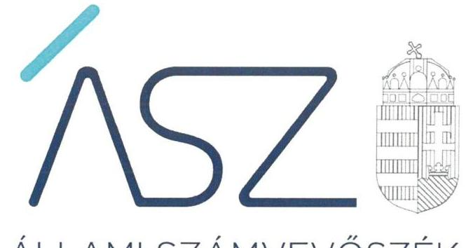
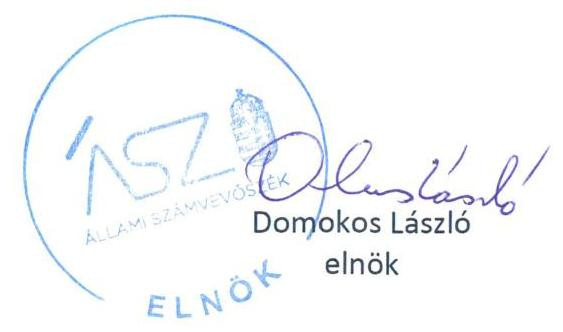
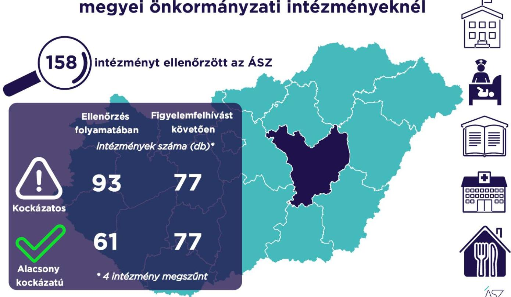

ÁLLAMI SZÁMVEVŐSZÉK

# JELENTÉS 

A Jász-Nagykun-Szolnok megyei önkormányzati intézmények ellenőrzése

Az önkormányzat és társulás irányítása alá tartozó intézmények integritásának monitoring típusú ellenőrzése - 158 intézmény
2021.

21106
www.asz.hu

---

ÁLLAMI SZÁMVEVŐSZÉK

# JELENTÉS 

## A Jász-Nagykun-Szolnok megyei önkormányzati intézmények ellenőrzése

Az önkormányzat és társulás irányítása alá tartozó intézmények integritásának monitoring típusú ellenőrzése - 158 intézmény
2021. 12. hó 15. nap

21106
www.asz.hu

---

# AZ ELLENŐRZÉST FELÜGYELTE: 

SALAMON ILDIKÓ felügyeleti vezető

## AZ ELLENŐRZÉST VEZETTE ÉS A VÉGREHAJTÁSÁÉRT FELELŐS:

BALÁZSNÉ ANTONI ERIKA ellenőrzésvezető

BAJNAI ZSUZSANNAellenőrzésvezető

A PROGRAM ÖSSZEÁLLÍTÁSÁÉRT FELELŐS:
DR. FELFÖLDI IZABELLA programkészítésért felelős vezető

## IKTATÓSZÁM: EL-3461-013/2021.

## TÉMASZÁM: 2568

ELLENŐRZÉS-AZONOSÍTÓ SZÁM: V0928

---

# TARTALOMJEGYZÉK 

$\square$ ÖSSZEGZÉS ..... 5
$\square$ AZ ELLENŐRZÉS JELENTŐSÉGE, AKTUALITÁSA, TÁRSADALMI SZEREPE, SZEMPONTJAI ..... 8
$\square$ AZ ELLENŐRZÉS TERÜLETE ..... 9
$\square$ ELLENŐRZÉS HATÓKÖRE ÉS MÓDSZERE ..... 10
$\square$ MELLÉKLETEK. ..... 13
I. sz. melléklet: Az értékelés módszertana ..... 13
II. sz. melléklet: Értelmező szótár ..... 15
$\square$ FÜGGELÉKEK ..... 17
I. sz. függelék: Az ellenőrzött szervezetek és azok kockázati értékelése ..... 17
$\square$ RÖVIDÍTÉSEK JEGYZÉKE ..... 25

---

.

---

# ÖSSZEGZÉS 

Az Állami Számvevőszék figyelemfelhívásának és tanácsadásának eredményeként a Jász-Nagykun-Szolnok megyei önkormányzatok irányítása alatt álló 158 ellenőrzött intézmény közül 46 intézménynél az intézményvezető már 2021-ben intézkedett, vagy intézkedéseket rendelt el az integritást biztositó alapvető feltételek megerősitése, illetve kiépitése érdekében. Ezeknek az intézményeknek javult az integritása, erősödtek a csalásmentes müködés feltételei.
66 intézménynél további intézkedések szükségesek az integritást biztositó alapvető feltételek kiépitése, illetve kiegészitése érdekében. Ezeknek az intézményeknek a vezetői az Állami Számvevőszék intézkedési kötelemmel járó figyelemfelhívására nem intézkedtek, ezért az azonositott kockázatok növekedtek, vagy intézkedéseik nem fedték le a kockázatos területeket, igy az azonositott kockázatok nem változtak.
Az irányitó önkormányzat négy intézmény megszüntetéséről döntött az ellenőrzött időszakban.

## Értékelések

Az Állami Számvevőszék a Jász-Nagykun-Szolnok megyei önkormányzatok irányítása alá tartozó 158 intézmény belső kontrollrendszerének lényeges elemei kialakítását ellenőrizte a 2021. évre vonatkozóan. Az ellenőrzés a súlypontok meghatározásával lehetőséget biztosított a szervezeti integritás, müködés és vezetés, valamint a gazdálkodás területén a kockázatok azonosítására.

A szervezeti integritás alapvető feltétele a szabályozottság, azaz a jogszabályokban előírt belső szabályzatok megléte, azok - hatályos jogszabályoknak - megfelelő tartalma és gyakorlati alkalmazhatósága. Az integritási kockázatok szervezeti szinten csökkenthetők azáltal, hogy az intézményvezetők kialakítják a szervezeti és müködési kereteket, a gazdálkodásra vonatkozó alapvető szabályozási környezetet, valamint a kontrolltevékenységek szabályszerű gyakorlásának, az integrált kockázatkezelésnek és az integritást sértő események kezelésének a feltételeit.

A szervezeti integritás, a müködés és a vezetés alapvető szabályozási feltételeinek kialakítása hozzájárul a csalásmentes integritási környezet megteremtéséhez.

A szervezeti és müködési szabályzat teremti meg a szervezet szabályszerű müködésének alapjait, illetve rögzíti a szervezeten belüli felelősségi viszonyokat. A szabályzat biztosítja a szervezeti müködés szabályozottságát, ezáltal a szervezet tevékenységének átláthatóságát, a szervezeti célokkal összhangban történő müködés feltételeit és annak ellenőrizhetőségét. Az ellenőrzöttek közül 150 intézmény rendelkezett szervezeti és müködési szabályzattal a 2021. évben.

A jogszabályi előírásoknak eleget téve, nyilatkozatban értékelte az intézmény belső kontrollrendszerének minőségét 114 intézmény vezetője. Ezek közül 94 intézménynél alakítottak ki olyan szabályozásokat, folyamatokat, amelyek biztosítják a költségvetési szerv tevékenységében a rendelkezésre álló források átlátható, szabályszerű, szabályozott, gazdaságos, hatékony és eredményes felhasználása követelményeinek érvényesítését.

Az integrált kockázatkezelés eljárásrendjét 125, a szervezeti integritást sértő események kezelésének eljárásrendjét 126 intézménynél alakították ki az intézményvezetők. Az integrált kockázatkezelés eljárásrendje biztosítja a szervezet müködésében rejlő kockázatok azonosításának és kezelésének feltételeit. A szervezet müködési kockázatai veszélyeztethetik a közpénzekkel való átlátható, elszámoltatható és felelős gazdálkodást. Az integritást sértő események kezelésének eljárásrendje jelenti a szervezet tekintetében felmerülő és a szervezeten belül bekövetkező integritást sértő események kezelésének alapjait. Az eljárásrend kialakításával az intézmény vezetője támogatja az integritást sértő eseményekkel kapcsolatosan azonosított kockázatok bekövetkezése esetén azok hatékony kezelését, illetve a következmények enyhítését.

---

A pénz- és vagyongazdálkodáshoz kapcsolódó alapvető szabályozások és nyilvántartások - így a számviteli politika és a keretében elkészítendő szabályzatok, a számlarend, a beszerzések szabályozása, valamint a kötelezettségvállalásra és a teljesítés igazolására jogosultak és aláírásmintáik nyilvántartása - előmozdítják a közpénzügyek átláthatóságát, rendezettségét. Az intézményvezető ezen szabályzatok elkészítésével, nyilvántartások vezetésével és folyamatos karbantartásával az alapfeltételét biztosítja a pénzügyi- és vagyongazdálkodás átláthatóságának, a közpénzekkel és közvagyonnal való elszámoltathatóságnak. Az ellenőrzöttek közül 118 intézménynél a számviteli politika, 107 intézménynél a számlarend, 130 intézménynél a beszerzések lebonyolításával kapcsolatos eljárásrend rendelkezésre állt.

Az ellenőrzöttek közül 42 intézmény vezetője tett eleget az ellenőrzött területek mindegyikén az integritási kontrollok alapvető feltételeit jelentő, a jogszabályban előírt szabályozási kötelezettségének. Közülük 36 intézmény vezetője a jogszabályi előírásokon túl további erőfeszítéseket is tett az integritás erősítése érdekében, felismerte további olyan integritási kontrollok kialakításának indokoltságát, amelyet jogszabály nem ír elő, így szervezeti szinten hozzájárul a korrupcióval szembeni védettség megszilárdításához.

117 intézmény esetében az intézményvezető intézkedése volt szükséges a kockázatok csökkentése érdekében, mivel 64 intézménynél a jogszabályok által előírt kontrollok területén, 47 intézménynél a jogszabályokáltal előírt és a további, jogszabályáltal nem előírt integritási kontrollok területén egyaránt, 6 intézménynél utóbbi kontrollok területén voltak hiányosságok. A dokumentumok kiértékelése alapján - az integritás további fejlesztése érdekében az Állami Számvevőszék azonosította a lényeges kockázati területeket, és már az ellenőrzés lefolytatásával párhuzamosan, a 2021. évre vonatkozóan a kockázatok csökkentésére hívta fel az intézményvezetők figyelmét.

# Következtetések 

Az érintett 111 intézmény közül 85 intézmény vezetője válaszolt határidőben az Állami Számvevőszék figyelemfelhívására. Közülük 58 teljeskörűen, 9 részben egyetértett a kockázatos területeken teendő intézkedések indokoltságával. Az intézményvezetők közül 46 arról tájékoztatta az Állami Számvevőszéket, hogy valamennyi kockázatos területen, 18 pedig a kockázatos területek egy részénél már tett, illetve a jövőben tesz intézkedést a jelzett kockázatok csökkentése érdekében. A jogszabályi előírásokon túli integritási kontrollok területén az érintett 53 intézmény közül 20 intézmény vezetője a jelzett kockázatok teljes körű, 9 pedig azok részbeni felszámolásáról adtak számot. Ezek eredményeként a 117 vezetői levélben jelzett 593 kockázati terület közül 209 esetben már történt, illetve tervezett az intézkedés, így javulás várható a feltárt kockázatos területek 35,2\%-ánál.

Az intézkedések eredményeként az ellenőrzött 158 intézmény közül összesen 77 intézménynél a kockázatok alacsony szintűek, illetve - a tervezett intézkedések végrehajtásával - a kockázatok alacsony szintre csökkennek.

A szabályozások és nyilvántartások kialakításának célja nem önmagában a jogszabályi rendelkezések betartása, hanem az intézmény szabályozottságán keresztül a szabályszerű és csalásmentes gazdálkodás feltételeinek megteremtése, ezáltal az Alaptörvényben előírt átláthatóság és elszámoltathatóság elvének érvényesítése. Ezeknek az alapelveknek érvényesülése hozzájárulhat ahhoz, hogy az intézmények, mint közszolgáltatást nyújtó szervezetek felé a közszolgáltatásokat igénybe vevők, és általuk az állampolgárok általános bizalma is erősödjön.

Az Állami Számvevőszék figyelemfelhívására nem válaszoló, illetve a jelzett kockázatokra nem, vagy csak részben intézkedő intézményvezetők által vezetett intézményeknél rendszerszintű kockázatok maradtak fenn. Az integritás elvű működés erősítése érdekében további kockázatcsökkentő lépések szükségesek a vezetés-irányítás, valamint a pénzügyi- és a vagyongazdálkodás szabályszerű feltételeinek kialakítása terén. Ezen intézmények integritásának kiépítését következő lépésként az irányító szerv bevonásával támogatja az Állami Számvevőszék.

---

# Erősödött a csalásmentesség a Jász-Nagykun-Szolnok megyei önkormányzati intézményeknél

---

# AZ ELLENŐRZÉS JELENTŐSÉGE, AKTUALITÁSA, TÁRSADALMI SZEREPE, SZEMPONTJAI 

Az Alaptörvény alapértékeket, elveket fogalmaz meg, amely szerint a közpénzekkel gazdálkodó minden szervezet köteles a nyilvánosság előtt elszámolni a közpénzekre vonatkozó gazdálkodásával. A közpénzeket és a nemzeti vagyont az átláthatóság és a közélet tisztaságának elve szerint kell kezelni.

Magyarország helyi önkormányzatairól szóló törvény ${ }^{1}$ a helyi közhatalom gyakorlás széleskörű érvényesítésével összhangban tág teret ad a helyi önkormányzatoknak a feladataik, a közszolgáltatások legkülönbözőbb formákban történő ellátására, így széleskörű lehetőséggel rendelkeznek intézmények alapítására.

A helyi önkormányzatok irányítása alá tartozó intézmények szerteágazó közszolgáltatásokat nyújtanak. Az intézmények működtetése közvetlenül érinti a társadalom valamennyi rétegét, a közfeladatot ellátó intézmények működésének minősége közvetlen hatással van az azokat igénybe vevő állampolgárok életére.

Az intézmények szabályszerű és eredményes működésének és gazdálkodásának alapfeltétele a belső kontrollrendszer - benne az integritási kontrollok - megfelelő kialakítása. Az ÁSZ² a törvényi felhatalmazással élve ellenőrzi az önkormányzati intézményeket, hogy megállapításaival támogassa az ellenőrzött szervezetek szabályszerű gazdálkodását, müködését.

A helyi önkormányzatok intézményei által ellátott feladatok, a bölcsődei, óvodai ellátás, a gyermekétkeztetés, a betegek és idősek gondozása, a közművelődési intézmények, könyvtárak működtetése által a lakosság ezeken a területeken találkozik legszélesebb körben az önkormányzatok által nyújtott szolgáltatásokkal. A szolgáltatásokat igénybe vevők jelentős száma, a feladatellátáshoz használt nemzeti vagyon és az erre fordított közpénz nagysága indokolja, hogy az ÁSZ további, az előző ellenőrzésekre épülő ellenőrzéseket végezzen ezen a területen, illetve további olyan területeken, ahol az önkormányzati szolgáltatást a lakosság széles köre veszi igénybe.

Az ellenőrzés célja annak értékelése, hogy a helyi önkormányzatok irányítása alá tartozó intézmények megterem-tették-e az integritás biztosításához szükséges feltételeket, kialakították-e az alapvető, a szervezeti kereteket, az integritási kontrollokhoz kapcsolódó, valamint a korrupció elleni védelmet szolgáló szabályozásokat. Továbbá, hogy az intézményvezető gondoskodott-e a szervezeti teljesítmény mérés alapfeltételeinek kialakításáról az eredményességi szempontoknak való megfelelés megalapozottsága biztosítása érdekében. A monitoring típusú ellenőrzés célja hatékonyan támogatni az ellenőrzött szervezeteket, ezáltal növelve az ÁSZtanácsadó szerepét, elősegítve a „jól irányított állam" müködését.

Az ÁSZ célja, hogy új ellenőrzési megközelítést alkalmazva támogassa a közpénzügyi helyzet javítását; a monitoring típusú ellenőrzéssel jelen időben adjon helyzetképet az integritási szemlélet érvényesítéséről, rávilágítson az integritási kontrollok kiépítettségére, illetve további fejlesztésére. Napjainkban mindez kiemelt fontosságúvá vált. Minden szervezetnek fel kell készülnie arra, hogy a koronavírus járvány okozta társadalmi és gazdasági válság növelni fogja a korrupciós nyomást. Az ÁSZ ebben a helyzetben is alapvető kötelességének tartja, hogy a közpénzek őre legyen, és ellenőrzéseit az önkormányzati alrendszer intézményei körében is folytassa.

Fontos, hogy az intézmények vezetői felismerjék az integritás kockázatokat, azokat ismételten mérjék fel, és alakítsanak ki átlátható, jól szabályozott rendszereket, döntési mechanizmusokat. Az integritási kockázatok feltárása, megismerése elengedhetetlenül fontos, mert ezt követően tehetők meg azok a lépések, amelyek a kockázatok csökkentését, felszámolását és kezelését célozzák. A belső kontrollrendszer - benne az integritás kontrollok - megfelelő kialakítása, müködése a helyi önkormányzatok irányítása alatt álló intézményeknél is hozzájárul a társadalmi közbizalom erősítéséhez.

Az ellenőrzés rámutat az integritási jó gyakorlatokra is, továbbá felhívja a figyelmet a jogszabályi követelmények teljesítéséhez szükséges lépésekre is.

---

# AZ ELLENŐRZÉS TERÜLETE 

## Az önkormányzatok irányítása alá tartozó intézmények

Helyi önkormányzati költségvetési szervet az államháztartásról szóló 2011. évi CXCV törvény (Áht. ${ }^{3}$ ) szerint a helyi önkormányzat, a helyi önkormányzatok társulása, a térségi fejlesztési tanács, az átalakult nemzetiségi önkormányzat alapíthat, a költségvetési szerv alapító okiratában meghatározott önkormányzati közfeladatok ellátására. A költségvetési szervek önálló jogi személyek, éves költségvetésükből gazdálkodva látják el feladataikat. A költségvetési szervek gazdasági szervezettel rendelkeznek, ha azonban a költségvetési szerv éves átlagos statisztikai állományi létszáma a 100 főt nem éri el, a gazdasági szervezet feladatait az önkormányzati hivatal, vagy az irányító szerv döntése alapján az irányító szerv irányítása alá tartozó, gazdasági szervezettel rendelkező más költségvetési szerv látja el.

Az államháztartásról szóló törvény végrehajtásáról szóló 368/2011. (XII. 31.) Korm. rendelet (Ávr. ${ }^{4}$ ) 1. melléklete szerint, az államháztartás önkormányzati alrendszerében a helyi önkormányzat által irányított költségvetési szerv esetében az irányító szerv hatáskörét a képviselő-testület, közgyűlés gyakorolja, és annak vezetője a polgármester, főpolgármester, megyei közgyűlés elnöke.

Az ellenőrzés a Jász-Nagykun-Szolnok megyei önkormányzatok irányítása alá tartozó, az I. sz. Függelékben felsorolt költségvetési szervekre terjedt ki.

A feladatellátásuk szerint az ellenőrzött költségvetési szervek egy része óvoda, bölcsőde, egészségügyi intézmény, konyha, művelődési ház, múzeum, kulturális központ, idősek otthona, gondozási központ, gyermekjóléti intézmény, sportközpont intézményként működik.

Az ellenőrzött 158 intézmény közül kettő rendelkezik saját gazdasági szervezettel.

Az ellenőrzés 157 intézmény esetében lefolytatásra került. Egy intézmény esetében az ellenőrzés adatszolgáltatás hiányában nem volt lefolytatható, az ÁSZ az ellenőrzött integritási kockázatát kiemelten magasnak értékelte. Négy intézmény az ellenőrzött időszakban megszűnt.

---

# ELLENŐRZÉS HATÓKÖRE ÉS MÓDSZERE 

## Az ellenőrzés típusa

| Megfelelőségi ellenőrzés.

## Az ellenőrzött időszak

A 2021. év, a Bkr. ${ }^{5}$ szerinti vezetői nyilatkozat, valamint annak alátámasztottsága vonatkozásában a 2020. év.

## Az ellenőrzés tárgya

A szervezeti keretekkel, a múködéssel és gazdálkodással kapcsolatos szabályzatok, szabályozások, valamint a szervezeti elvekkel, értékekkel összefüggő integritás kontrollok kiépítettsége, a szervezeti teljesítmény mérés alapfeltételeinek kialakítása.

## Az ellenőrzött szervezetek

Az ellenőrzött intézményeket az I. sz. Függelék tartalmazza.

## Az ellenőrzés jogalapja

Az ellenőrzés jogszabályi alapját az ÁSZ tv. ${ }^{6}$ 1. § (3) bekezdése, 5. § (6) bekezdése, valamint az Áht. 61. § (2) bekezdése képezik.

## Az ellenőrzés módszerei

Az ÁSZ az ellenőrzést az ellenőrzési program szempontjai, az ellenőrzött időszakban hatályos jogszabályok, a jelen ellenőrzésre irányadó ÁSZ módszertan figyelembevételével és a nemzetközi standardokat irányadónak tekintve végzi.

Az ellenőrzés ideje alatt az ÁSZ az ellenőrzött szervezetekkel történő kapcsolattartást azÁSZSZMSZ7-ének vonatkozó előírásai alapján biztosítja.

Az ellenőrzési kérdések megválaszolásához szükséges bizonyítékok megszerzése a következő ellenőrzési eljárások alkalmazásával történik: megfigyelés, összehasonlítás, elemző eljárás. Az ellenőrzési bizonyítékként felhasználható adatforrások közé tartoznak az ellenőrzési programban felsorolt adatforrások, továbbá minden - az ellenőrzés folyamán - feltárt, az ellenőrzés szempontjából információkat tartalmazó dokumentum.

---

Az ÁSZ az ellenőrzést a kérdésekre adott válaszok kiértékelésével, valamint a megjelölt adatforrások, továbbá az adott időszakban hatályos jogszabályok, valamint az ÁSZ honlapján közzétett helyénvalósági kritériumok figyelembevételével folytatja le.

A monitoring típusú ellenőrzés az önkormányzatok irányítása alá tartozó intézmények integritás alapú múködésének lényeges területeire és a közpénzügyi helyzet javítása érdekében az elért eredmények fenntartására fókuszál. Lehetőséget biztosít az integritási kontrollok kiépítettségében lévő hiányosságok, a szervezeti teljesítmény mérés alapfeltételei kialakításának hiánya beazonosítására az eredményességi szempontoknak való megfelelés megalapozottsága biztosítása érdekében, az önkormányzatok, társulások irányítása alá tartozó intézmények integritásának elemzésére, részletes ellenőrzések megalapozására.

---

.

---

# MELLÉKLETEK 

I. SZ. MELLÉKLET: AZ ÉRTÉKELÉS MÓDSZERTANA

Az egyes kockázati területek és kockázatforrások minősítése „pontozásos módszerrel", az integritás „jelző" dokumentumai és a vezetői magatartás ellenőrzéshez kapcsolódóan tanúsított tényhelyzeteinek értékelése alapján történt.

Az értékelt dokumentumokhoz, nyilvántartásokhoz, kockázati besorolásokhoz minden esetben pontszám került hozzárendelésre, amelyek értéke alapján az ellenőrzött szervezetek kockázati csoportba kerültek besorolásra:

- Alacsony kockázatú - az elérhető összes pontszám legalább 80\%-a
- Közepes kockázatú - az elérhető pontszám 50-79\%-a között
- Magas kockázatú - az elérhető pontszám 50\%-a alatt

Az első lépésben azonosításra kerültek azok az intézményi szabályozások és nyilvántartások, amelyek meglétét jogszabály írja elő, hiánya pedig felveti a csalás és korrupció kockázatát.

Második lépésben az adatoknak az ellenőrzés rendelkezésére bocsátása kockázati kritériumainak meghatározása, majd értékelése történt meg.

Harmadik lépésben a figyelemfelhívó levelekre adott válaszok kockázati kritériumainak meghatározása, majd értékelése történt meg.

Az összesített kockázati értékelést javította, amennyiben

- az intézmény rendelkezett olyan szabályozással, amely kötelező meglétét jogszabály nem írja elő, de segíti a csalás és a korrupció megelőzését (helyénvalósági dokumentumok).

Az összesített kockázati értékelést rontotta, amennyiben

- az integritás szempontjából meghatározó dokumentum - az intézményi SZMSZ - hiányzott, és javítása érdekében a figyelemfelhívó levél hatására sem történt intézkedés.

A figyelemfelhívó levelekre adott válaszok értékelése alapján:

- A kockázat csökkent, amennyiben a figyelemfelhívó levélre adott válasza a figyelemfelhívással összhangban volt, valamennyi kockázati területen intézkedett vagy intézkedést tervezett.
- A kockázat változatlan, amennyiben a figyelemfelhívó levélben foglaltaktól eltérő magatartást tanúsított, intézkedése a figyelemfelhívással részben volt összhangban, a kockázati területeken részben intézkedett vagy intézkedést tervezett.
- A kockázat nőtt, amennyiben nem volt együttműködő, a figyelemfelhívó levélre nem válaszolt, vagy válasza alapján nem intézkedett és nem tervezett intézkedést.

---

# Az önkormányzatok irányítása alá tartozó intézmények kockázati csoportba sorolásának értékelési keretrendszere 

I. Dokumentumokkal rendelkezés
lényeges dokumentumok, amelyek hiánya felveti a csalás és korrupció kockázatát
I.1. A szervezeti integritás, müködés és vezetés alapvető szabályozási feltételei

- intézmény SZMSZ-e
- vezetői nyilatkozat a 2020. évre vonatkozóan az intézmény belső kontrollrendszer minőségének értékeléséről, valamint a nyilatkozat megalapozottságát bizonyító dokumentumok
- integrált kockázatkezelés eljárásrendje
- az integritást sértő események kezelésének eljárásrendje
I.2. A pénz- és vagyongazdálkodáshoz kapcsolódó alapvető szabályozások
- számviteli politika
- az eszközök és a források leltárkészítési és leltározási szabályzata
- az eszközök és a források értékelési szabályzata
- pénzkezelési szabályzat
- számlarend
- beszerzések lebonyolításával kapcsolatos eljárásrend
- a kötelezettségvállalásra, teljesítés igazolására jogosult személyekről és aláírás-mintájukról vezetett nyilvántartás
II. Az adatoknak az ellenőrzés rendelkezésére bocsátása
II.1. A megnevezett adatokkal rendelkezett és a törvényi határidőn belül hiánytalanul rendelkezésre bocsátotta. Figyelem-, illetve figyelmet felhívó levél nem volt indokolt.
II.2. A megnevezett adatokat nem bocsátotta rendelkezésre.
III. Figyelemfelhívó levelekre adott válaszok kockázati értékelése
III.1. Kockázat csökkent: együttmüködése a figyelemfelhívó levéllel összhangban volt.
III.2. Kockázat változatlan: a figyelemfelhívó levélben foglaltaktól eltérő együttmüködést tanúsított.
III.3. Kockázat nőtt: nem reagált, nem intézkedett, így nem volt együttmüködő.

---

# II. SZ. MELLÉKLET: ÉRTELMEZŐ SZÓTÁR 

belső kontrollrendszer

belső kontrollrendszer területei
integrált kockázatkezelési rendszer
integritás

Integritási kockázatok
kockázat
kontrollkörnyezet
kontrollkörnyezet
kockázat
kontrollkörnyezet
kolltségvetési szerv vezetője által kialakított olyan elvek, eljárások, belső szabályzatok összessége, amelyben világos a szervezeti struktúra, a folyamatok átláthatók, egyértelműek a felelősségi, hatásköri viszonyok és feladatok, meghatározottak, ismertek és elfogadottak az etikai elvárások a szervezet minden szintjén, átlátható a humánerőforrás-kezelés, biztosított a szervezeti célok és értékek irányában való elkötelezettség fejlesztése és elősegítése. (Forrás: Bkr. 6. § (1) bekezdés)
A költségvetési szerv vezetője által a szervezeten belül kialakított (kontroll) tevékenységek, melyek biztosítják a kockázatok kezelését, hozzájárulnak a szervezet céljainak eléréséhez és erősítik a szervezet integritását. (Forrás: Bkr. 8. § (1) bekezdés)
A helyi önkormányzatok irányítása alá tartozó költségvetési szervek. (A képviselő-testület a feladatkörébe tartozó közszolgáltatások ellátására - jogszabályban meghatározottak szerint - költségvetési szervet (önkormányzati intézmény) alapíthat; Forrás: Mötv. 41. § (6) bekezdés)

---

.

---

# FÜGGELÉKEK

- I. SZ. FÜGGELÉK: AZ ELLENŐRZÖTT SZERVEZETEK ÉS AZOK KOCKÁZATI ÉRTÉKELÉSE

|  Sorszám | Ellenőrzött szervezet megnevezése | Irányító szerv (önkormányzat) megnevezése | Helység | Tanácsadást megelöző kockázati besorolás | Intézkedést követően a kockázati értékelés változása | A kockázati szint alacsonyra csökkent-e  |
| --- | --- | --- | --- | --- | --- | --- |
|  1. | Móricz Zsigmond Művelődési Ház | Kenderes Városi Önkormányzat | Kenderes | KÖZEPES | NÖTT | N  |
|  2. | Tőszegi Óvoda | Tőszeg Községi Önkormányzat | Tőszeg | ALACSONY | Nem volt szabályszerűségi hiba | I  |
|  3. | Jászteleki Százszorszép Óvoda | Jásztelek Községi Önkormányzat | Jásztelek | KÖZEPES | NÖTT | N  |
|  4. | Jászboldogházai Mesevár Óvoda és Bölcsőde | Jászboldogháza Községi Önkormányzat | Jászboldogháza | ALACSONY | CSÖKKENT | I  |
|  5. | Kenderesi Gondozási Központ, Család- és Gyermekjóléti Szolgálat | Kenderes Városi Önkormányzat | Kenderes | KÖZEPES | NÖTT | N  |
|  6. | Tőszegi Konyha | Tőszeg Községi Önkormányzat | Tőszeg | KÖZEPES | CSÖKKENT | I  |
|  7. | Jászboldogháza Konyha | Jászboldogháza Községi Önkormányzat | Jászboldogháza | KÖZEPES | NÖTT | N  |
|  8. | Ozoróczky Mária Szociális Központ | Jászladány Nagyközségi Önkormányzat | Jászladány | MAGAS | NÖTT | N  |
|  9. | Cserkeszőlő Fürdő és Gyógyászati Központ | Cserkeszőlő Községi Önkormányzat | Cserkeszőlő | MAGAS | NÖTT | N  |
|  10. | Nagyközség Üzemeltetési és Vagyonkezelő Intézmény | Jászladány Nagyközségi Önkormányzat | Jászladány | MAGAS | NÖTT | N  |
|  11. | Kengyeli József Attila Müvelődési Ház és Könyvtár | Kengyel Községi Önkormányzat | Kengyel | KÖZEPES | NÖTT | N  |
|  12. | Virágoskert Óvoda és Bölcsőde | Rákóczifalva Városi Önkormányzat | Rákóczifalva | ALACSONY | Nem volt szabályszerűségi hiba | I  |
|  13. | Jászkiséri Városi Óvoda | Jászkisér Város Önkormányzata | Jászkisér | MAGAS | NÖTT | N  |
|  14. | Alapszolgáltatási Központ | Jászkisér Város Önkormányzata | Jászkisér | MAGAS | NÖTT | N  |
|  15. | A Jászkiséri Müvelődési Ház és Könyvtár | Jászkisér Város Önkormányzata | Jászkisér | MAGAS | NÖTT | N  |
|  16. | Városi Bölcsőde | Jászkisér Város Önkormányzata | Jászkisér | MAGAS | NÖTT | N  |
|  17. | Jászladányi Óvoda és Bölcsőde | Jászladány Nagyközségi Önkormányzat | Jászladány | KÖZEPES | NÖTT | N  |
|  18. | Napsugár Müvészeti Modellóvoda és Minibölcsőde | Kengyel Községi Önkormányzat | Kengyel | KÖZEPES | NÖTT | N  |
|  19. | Móricz Zsigmond Müvelődési Ház és Könyvtár | Zagyvarékas Község Önkormányzata | Zagyvarékas | MAGAS | NEM VÁLTOZOTT | N  |
|  20. | Zagyvarékas Községi Bölcsőde | Zagyvarékas Község Önkormányzata | Zagyvarékas | KÖZEPES | NEM VÁLTOZOTT | N  |
|  21. | Nagyközségi József Attila Müvelődési Ház És Könyvtár | Jászladány Nagyközségi Önkormányzat | Jászladány | MAGAS | NÖTT | N  |
|  22. | Nagykörűi Müvelődési Ház | Nagykörü Községi Önkormányzat | Nagykörü | MAGAS | CSÖKKENT | N  |
|  23. | Nagykörüi Bölcsőde | Nagykörü Községi Önkormányzat | Nagykörü | MAGAS | NÖTT | N  |
|  24. | Varsány Közösségi Ház és Könyvtár | Rákóczifalva Városi Önkormányzat | Rákóczifalva | KÖZEPES | NÖTT | N  |

---

| Sorszám | Ellenőrzött szervezet megnevezése | Irányító szerv (önkormányzat) megnevezése | Helység | Tanácsadást megelőző kockázati besorolás | Intézkedést követően a kockázati értékelés változása | A kockázati szint alacsonyra csökkent-e |
| :--: | :--: | :--: | :--: | :--: | :--: | :--: |
| 25. | Petőfi Sándor Általános Müvelődési Központ Cserkeszőló | Cserkeszőló Községi Önkormányzat | Cserkeszőló | KÖZEPES | CSÖKKENT | I |
| 26. | Zagyvarékasi Égszínkék Óvoda és Konyha | Zagyvarékas Község Önkormányzata | Zagyvarékas | KÖZEPES | NEM VÁLTOZOTT | N |
| 27. | Mezőhéki Óvoda | Mezőhék Község Önkormányzata | Mezőhék | KÖZEPES | NÖTT | N |
| 28. | Kengyeli Egyesített Szociális Intézmény | Kengyel Községi Önkormányzat | Kengyel | KÖZEPES | NÖTT | N |
| 29. | Gyöngyvirág Művészeti Óvoda | Tiszatenyő Községi Önkormányzat | Tiszatenyő | MAGAS | NÖTT | N |
| 30. | Tiszatenyő Szociális Szolgáltató Központ | Tiszatenyő Községi Önkormányzat | Tiszatenyő | MAGAS | NÖTT | N |
| 31. | Szent Ferenc Egyesített Szociális Intézmény | Jászberény Városi Önkormányzat | Jászberény | ALACSONY | NÖTT | N |
| 32. | Városi Önkormányzat Városgondnoksága | Karcag Városi Önkormányzat | Karcag | KÖZEPES | NÖTT | N |
| 33. | Törökszentmiklós Városi Önkormányzat Egyesített Gyógyító-Megelőző Intézet | Törökszentmiklós Városi Önkormányzat | Törökszentmiklós | ALACSONY | Nem volt szabályszerűségi hiba | I |
| 34. | Déryné Kulturális, Turisztikai, Sport Központ és Könyvtár | Karcag Városi Önkormányzat | Karcag | MAGAS | NÖTT | N |
| 35. | Jászárokszállási Városi Óvoda | Jászárokszállás Város Önkormányzata | Jászárokszállás | ALACSONY | Nem volt szabályszerűségi hiba | I |
| 36. | Városgondnokság Jászárokszállás | Jászárokszállás Város Önkormányzata | Jászárokszállás | ALACSONY | Nem volt szabályszerűségi hiba | I |
| 37. | Madarász Imre Egyesített Óvoda | Karcag Városi Önkormányzat | Karcag | KÖZEPES | NÖTT | N |
| 38. | Kisújszállási Müvelődési Központ és Könyvtár | Kisújszállás Város Önkormányzata | Kisújszállás | ALACSONY | CSÖKKENT | I |
| 39. | Tóth József Alapszolgáltatási Központ | Öcsöd Nagyközségi Önkormányzat | Öcsöd | MAGAS | NÖTT | N |
| 40. | Tiszapúspöki Óvoda | Tiszapúspöki Községi Önkormányzat | Tiszapúspöki | ALACSONY | CSÖKKENT | I |
| 41. | Törökszentmiklósi Szociális Szolgáltató Központ | Törökszentmiklós Városi Önkormányzat | Törökszentmiklós | KÖZEPES | NÖTT | N |
| 42. | Hat Szín Virág Óvoda | Abádszalók Város Önkormányzata | Abádszalók | Megszűnt intézmény | Megszűnt intézmény | Megszűnt intézmény |
| 43. | Törökszentmiklósi Óvodai Intézmény | Törökszentmiklós Városi Önkormányzat | Törökszentmiklós | ALACSONY | Nem volt szabályszerűségi hiba | I |
| 44. | Törökszentmiklós Város Bölcsődéje | Törökszentmiklós Városi Önkormányzat | Törökszentmiklós | ALACSONY | Nem volt szabályszerűségi hiba | I |
| 45. | Ipolyi Arnold Müvelődési Központ, Könyvtár és Butyka Béla Helytörténeti Gyüjtemény | Törökszentmiklós Városi Önkormányzat | Törökszentmiklós | ALACSONY | Nem volt szabályszerűségi hiba | I |
| 46. | Szent Norbert Idősek Klubja | Jánoshida Községi Önkormányzat | Jánoshida | KÖZEPES | NÖTT | N |
| 47. | Jászalsószentgyörgy Községi Bölcsőde | Jászalsószentgyörgy Községi Önkormányzat | Jászalsószentgyörgy | MAGAS | NEM VÁLTOZOTT | N |
| 48. | Városi Könyvtár Jászárokszállás | Jászárokszállás Város Önkormányzata | Jászárokszállás | ALACSONY | Nem volt szabályszerűségi hiba | I |
| 49. | Petőfi Müvelődési Ház Jászárokszállás | Jászárokszállás Város Önkormányzata | Jászárokszállás | KÖZEPES | NÖTT | N |
| 50. | Gondozási Központ Jászárokszállás | Jászárokszállás Város Önkormányzata | Jászárokszállás | ALACSONY | Nem volt szabályszerűségi hiba | I |

---

| Sorszám | Ellenőrzött szervezet megnevezése | Irányító szerv (önkormányzat) megnevezése | Helység | Tanácsadást megelőző kockázati besorolás | Intézkedést követően a kockázati értékelés változása | A kockázati szint alacsonyra csökkent-e |
| :--: | :--: | :--: | :--: | :--: | :--: | :--: |
| 51. | Petőfi Sándor Müvelődési Ház és Könyvtár Jászfényszaru | Jászfényszaru Város Önkormányzata | Jászfényszaru | ALACSONY | Nem volt szabályszerűségi hiba | I |
| 52. | Jászfényszarui Napfény Óvoda | Jászfényszaru Város Önkormányzata | Jászfényszaru | KÖZEPES | NEM VÁLTOZOTT | N |
| 53. | Jászfényszaru Város Gondozási Központja | Jászfényszaru Város Önkormányzata | Jászfényszaru | KÖZEPES | NÖTT | N |
| 54. | Öcsödi Szivárvány Óvoda és Bölcsőde | Öcsöd Nagyközségi Önkormányzat | Öcsöd | MAGAS | NEM VÁLTOZOTT | N |
| 55. | Wesniczky Antal Müvelődési Ház és Könyvtár Besenyszög | Besenyszög Város Önkormányzata | Besenyszög | ALACSONY | Nem volt szabályszerűségi hiba | I |
| 56. | Rákócziújfalui Mesevár Óvoda | Rákócziújfalu Községi Önkormányzat | Rákócziújfalu | KÖZEPES | CSÖKKENT | N |
| 57. | Abádszalók Városi Önkormányzati Bölcsőde és Főzökonyha | Abádszalók Város Önkormányzata | Abádszalók | KÖZEPES | NEM VÁLTOZOTT | N |
| 58. | Jászberény Városi Önkormányzati Bölcsőde és Védőnői Szolgálat | Jászberény Városi Önkormányzat | Jászberény | ALACSONY | CSÖKKENT | I |
| 59. | Jászberény Város Óvodai Intézménye | Jászberény Városi Önkormányzat | Jászberény | KÖZEPES | CSÖKKENT | I |
| 60. | Alkony Gondozási Központ Idősek Klubja és Bentlakásos Otthona | Tiszasas Községi Önkormányzat | Tiszasas | KÖZEPES | NEM VÁLTOZOTT | N |
| 61. | Idősek Klubja Alattyán | Alattyán Község Önkormányzata | Alattyán | KÖZEPES | NÖTT | N |
| 62. | Jász Múzeum | Jászberény Városi Önkormányzat | Jászberény | ALACSONY | NÖTT | N |
| 63. | Hétszínvirág Óvoda | Szelevény Községi Önkormányzat | Szelevény | KÖZEPES | NÖTT | N |
| 64. | Tiszasasi Általános Müvelődési Központ | Tiszasas Községi Önkormányzat | Tiszasas | KÖZEPES | NÖTT | N |
| 65. | Tiszakúrit Óvoda, Bölcsőde és Konyha | Tiszakúrt Község Önkormányzat | Tiszakúrt | KÖZEPES | NÖTT | N |
| 66. | Györffy István Nagykun Múzeum | Karcag Városi Önkormányzat | Karcag | MAGAS | NÖTT | N |
| 67. | Alattyáni Óvoda | Alattyán Község Önkormányzata | Alattyán | KÖZEPES | NÖTT | N |
| 68. | Jánoshidai Napsugár Óvoda És Mini Bölcsőde | Jánoshida Községi Önkormányzat | Jánoshida | KÖZEPES | NÖTT | N |
| 69. | Tiszaszentimrei Napsugár Óvoda | Tiszaszentimre Községi Önkormányzat | Tiszaszentimre | ALACSONY | Nem volt szabályszerűségi hiba | N |
| 70. | Tündérkert Művészeti Óvoda és Önkormányzati Konyha | Pusztamonostor Községi Önkormányzat | Pusztamonostor | KÖZEPES | CSÖKKENT | I |
| 71. | Nagyrévi Tündérkert Óvoda és Konyha | Nagyrév Község Önkormányzat | Nagyrév | ALACSONY | Nem volt szabályszerűségi hiba | I |
| 72. | Tiszapüspöki Szolgáltató Központ | Tiszapüspöki Községi Önkormányzat | Tiszapüspöki | ALACSONY | Nem volt szabályszerűségi hiba | I |
| 73. | Törökszentmiklósi Családés Gyermekjóléti Központ | Törökszentmiklós Városi Önkormányzat | Törökszentmiklós | ALACSONY | Nem volt szabályszerűségi hiba | I |
| 74. | Jászberényi Család- és Gyermekjóléti Központ | Jászberény Városi Önkormányzat | Jászberény | ALACSONY | CSÖKKENT | I |
| 75. | Jászágó Községi Önkormányzat Konyhája | Jászágó Községi Önkormányzat | Jászágó | KÖZEPES | NEM VÁLTOZOTT | N |
| 76. | Tiszaszentimrei Központi Konyha | Tiszaszentimre Községi Önkormányzat | Tiszaszentimre | KÖZEPES | NÖTT | N |

---

| Sorszám | Ellenőrzött szervezet megnevezése | Irányító szerv (önkormányzat) megnevezése | Helység | Tanácsadást megelőző kockázati besorolás | Intézkedést követően a kockázati értékelés változása | A kockázati szint alacsonyra csökkent-e |
| :--: | :--: | :--: | :--: | :--: | :--: | :--: |
| 77. | Jászfelsőszentgyörgyi Óvoda | Jászfelsőszentgyörgy Községi Önkormányzat | Jászfelsőszentgyörgy | ALACSONY | NÖTT | N |
| 78. | Jászágó Községi Önkormányzat Óvodája | Jászágó Községi Önkormányzat | Jászágó | KÖZEPES | CSÖKKENT | I |
| 79. | Poldermann Júlia Óvoda | Jászjákóhalma Községi Önkormányzat | Jászjákóhalma | KÖZEPES | NEM VÁLTOZOTT | N |
| 80. | Rákócziújfalui Manóvár Bölcsőde | Rákócziújfalu Községi Önkormányzat | Rákócziújfalu | ALACSONY | Nem volt szabályszerűségi hiba | I |
| 81. | Abádi Benedek Művelődési Ház | Abádszalók Város Önkormányzata | Abádszalók | KÖZEPES | NEM VÁLTOZOTT | N |
| 82. | Besenyszögi Napsugár Bölcsőde | Besenyszög Város Önkormányzata | Besenyszög | KÖZEPES | CSÖKKENT | I |
| 83. | Zagyvaparti Idősek Ottnona | Újszász Városi Önkormányzat | Újszász | ALACSONY | Nem volt szabályszerűségi hiba | I |
| 84. | Szolnok Megyei Jogú Város Önkormányzat Egészségügyi és Bölcsődei Igazgatósága | Szolnok Megyei Jogú Város Önkormányzata | Szolnok | KÖZEPES | NÖTT | N |
| 85. | Kunszentmártoni Önkormányzat Városgondnoksága | Kunszentmárton Város Önkormányzata | Kunszentmárton | ALACSONY | Nem volt szabályszerűségi hiba | N |
| 86. | Kuthy Elek Egészségügyi Intézmény | Tiszafüred Város Önkormányzata | Tiszafüred | KÖZEPES | CSÖKKENT | I |
| 87. | Fegyverneki Tiszavirág Óvoda és Bölcsőde | Fegyvernek Város Önkormányzata | Fegyvernek | MAGAS | CSÖKKENT | N |
| 88. | Fegyverneki Múvelődési Központ és Könyvtár | Fegyvernek Város Önkormányzata | Fegyvernek | MAGAS | CSÖKKENT | N |
| 89. | Túrkevei Óvodai Igazgatóság és Bölcsőde | Túrkeve Városi Önkormányzat | Túrkeve | MAGAS | CSÖKKENT | N |
| 90. | Madarász Károly Múvelődési Ház és Városi Könyvtár | Túrkeve Városi Önkormányzat | Túrkeve | KÖZEPES | CSÖKKENT | I |
| 91. | Önálló Óvodai Intézmény Jászapáti | Jászapáti Városi Önkormányzat | Jászapáti | ALACSONY | Nem volt szabályszerűségi hiba | I |
| 92. | Fegyverneki Orvosi Rendelő | Fegyvernek Város Önkormányzata | Fegyvernek | MAGAS | CSÖKKENT | N |
| 93. | Fegyverneki Mezőgazdasági, Városüzemeltetési és Fejlesztési Intézmény | Fegyvernek Város Önkormányzata | Fegyvernek | MAGAS | CSÖKKENT | N |
| 94. | Cibakházi Napsugár Óvoda | Cibakháza Nagyközségi Önkormányzat | Cibakháza | KÖZEPES | CSÖKKENT | I |
| 95. | Városi Egészségügyi Központ Kunszentmárton | Kunszentmárton Város Önkormányzata | Kunszentmárton | KÖZEPES | CSÖKKENT | I |
| 96. | Verseghy Ferenc Könyvtár és Közmúvelődési Intézmény | Szolnok Megyei Jogú Város Önkormányzata | Szolnok | ALACSONY | Nem volt szabályszerűségi hiba | I |
| 97. | Damjanich János Múzeum | Szolnok Megyei Jogú Város Önkormányzata | Szolnok | ALACSONY | Nem volt szabályszerűségi hiba | I |
| 98. | Martfü Városi Múvelődési Központ és Könyvtár | Martfü Város Önkormányzata | Martfü | ALACSONY | Nem volt szabályszerűségi hiba | I |
| 99. | Játékvár Óvoda és Bölcsőde | Martfü Város Önkormányzata | Martfü | ALACSONY | Nem volt szabályszerűségi hiba | I |

---

| Sorszám | Ellenőrzött szervezet megnevezése | Irányító szerv (önkormányzat) megnevezése | Helység | Tanácsadást megelőző kockázati besorolás | Intézkedést követően a kockázati értékelés változása | A kockázati szint alacsonyra csökkent-e |
| :--: | :--: | :--: | :--: | :--: | :--: | :--: |
| 100. | Tiszafüredi Óvodák | Tiszafüred Város Önkormányzata | Tiszafüred | ALACSONY | Nem volt szabályszerűségi hiba | I |
| 101. | Kunhegyes Városi Könyvtár és Közművelődési Intézmény | Kunhegyes Város Önkormányzata | Kunhegyes | ALACSONY | Nem volt szabályszerűségi hiba | I |
| 102. | Benedek Gábor Városi Sportcsarnok és Szabadidőközpont | Tiszafüred Város Önkormányzata | Tiszafüred | ALACSONY | Nem volt szabályszerűségi hiba | I |
| 103. | Újszász Városi Óvoda és Bölcsőde | Újszász Városi Önkormányzat | Újszász | ALACSONY | CSÖKKENT | I |
| 104. | Kunszentmártoni Szociális Ellátási Központ | Kunszentmárton Város Önkormányzata | Kunszentmárton | ALACSONY | Nem volt szabályszerűségi hiba | I |
| 105. | Madarasi Településellátó, Beruházó és Szolgáltató Szervezet | Kunmadaras Nagyközség Önkormányzata | Kunmadaras | KÖZEPES | CSÖKKENT | N |
| 106. | Egyesített Szociális Intézmény Tiszaföldvár | Tiszaföldvár Város Önkormányzata | Tiszaföldvár | ALACSONY | Nem volt szabályszerűségi hiba | I |
| 107. | Városi Bölcsőde Tiszaföldvár | Tiszaföldvár Város Önkormányzata | Tiszaföldvár | ALACSONY | Nem volt szabályszerűségi hiba | I |
| 108. | Szolnok Városi Óvodák | Szolnok Megyei Jogú Város Önkormányzata | Szolnok | KÖZEPES | CSÖKKENT | I |
| 109. | Kunszentmártoni Általános Művelődési Központ | Kunszentmárton Város Önkormányzata | Kunszentmárton | ALACSONY | Nem volt szabályszerűségi hiba | I |
| 110. | Kovács Pál Müvelődési Központ | Tiszafüred Város Önkormányzata | Tiszafüred | ALACSONY | CSÖKKENT | I |
| 111. | Arany János Általános Müvelődési Központ | Kétpó Község Önkormányzata | Kétpó | KÖZEPES | CSÖKKENT | I |
| 112. | Szajoli Tiszavirág Óvoda | Szajol Községi Önkormányzat | Szajol | KÖZEPES | CSÖKKENT | I |
| 113. | Szajoli Közösségi Házés Könyvtár | Szajol Községi Önkormányzat | Szajol | MAGAS | NEM VÁLTOZOTT | N |
| 114. | Városi Könyvtár és Müvelődési Központ | Jászapáti Városi Önkormányzat | Jászapáti | ALACSONY | NÖTT | N |
| 115. | Jászapáti Egyesített Szociális Intézmény | Jászapáti Városi Önkormányzat | Jászapáti | ALACSONY | Nem volt szabályszerűségi hiba | I |
| 116. | "Erdős" Alapszolgáltatási Központ | Jászdózsa Községi Önkormányzat | Jászdózsa | KÖZEPES | NEM VÁLTOZOTT | N |
| 117. | Nagyközségi Önkormányzati Bölcsőde Cibakháza | Cibakháza Nagyközség Önkormányzat | Cibakháza | KÖZEPES | CSÖKKENT | I |
| 118. | Nagyközségi Szociális Gondozási Központ | Cibakháza Nagyközség Önkormányzat | Cibakháza | KÖZEPES | CSÖKKENT | I |
| 119. | Cibakháza Nagyközségi Müvelődési Ház | Cibakháza Nagyközség Önkormányzat | Cibakháza | KÖZEPES | CSÖKKENT | I |
| 120. | Cibakháza Nagyközségi Könyvtári, Információs és Közösségi Hely | Cibakháza Nagyközség Önkormányzat | Cibakháza | KÖZEPES | CSÖKKENT | I |
| 121. | Öszikék Egyesített Szociális Intézmény | Csépa Községi Önkormányzat | Csépa | ALACSONY | Nem volt szabályszerűségi hiba | I |
| 122. | Kunhegyes Város Óvodai Intézmény, Bölcsőde és Konyha | Kunhegyes Város Önkormányzata | Kunhegyes | ALACSONY | Nem volt szabályszerűségi hiba | I |

---

| Sorszám | Ellenőrzött szervezet megnevezése | Irányító szerv (önkormányzat) megnevezése | Helység | Tanácsadást megelőző kockázati besorolás | Intézkedést követően a kockázati értékelés változása | A kockázati szint alacsonyra csökkent-e |
| :--: | :--: | :--: | :--: | :--: | :--: | :--: |
| 123. | Városi Művelődési Ház Tiszaföldvár | Tiszaföldvár Város Önkormányzata | Tiszaföldvár | ALACSONY | Nem volt szabályszerűségi hiba | I |
| 124. | Belterületi Óvoda | Tiszaföldvár Város Önkormányzata | Tiszaföldvár | KÖZEPES | NÖTT | N |
| 125. | Homoki Óvoda | Tiszaföldvár Város Önkormányzata | Tiszaföldvár | ALACSONY | Nem volt szabályszerűségi hiba | I |
| 126. | Vadárvácska Óvoda | Tiszaföldvár Város Önkormányzata | Tiszaföldvár | ALACSONY | Nem volt szabályszerűségi hiba | I |
| 127. | Kunmadarasi Összevont Óvoda és Bölcsőde | Kunmadaras Nagyközség Önkormányzata | Kunmadaras | ALACSONY | CSÖKKENT | I |
| 128. | Szivárvány Gondozási Központ | Tiszabura Községi Önkormányzat | Tiszabura | ALACSONY | NÖTT | N |
| 129. | Tiszafüredi Bölcsőde | Tiszafüred Város Önkormányzata | Tiszafüred | ALACSONY | Nem volt szabályszerűségi hiba | I |
| 130. | Tiszavárkonyi Óvoda | Tiszavárkony Község Önkormányzata | Tiszavárkony | KÖZEPES | NÖTT | N |
| 131. | Berekfürdő Községi Önkormányzat Csicsergő Óvoda | Berekfürdő Községi Önkormányzat | Berekfürdő | ALACSONY | CSÖKKENT | I |
| 132. | Községi Könyvtár és Szabadidőközpont Tiszaszőlős | Tiszaszőlős Községi Önkormányzat | Tiszaszőlős | KIEMELTEN MA GAS | NEM VÁLTOZOTT | N |
| 133. | Család És Gyermekjóléti Szolgálat Kunmadaras | Kunmadaras Nagyközség Önkormányzata | Kunmadaras | KÖZEPES | CSÖKKENT | I |
| 134. | József Attila Múvelődési Ház és Nagyközségi Könyvtár | Kunmadaras Nagyközség Önkormányzata | Kunmadaras | KÖZEPES | CSÖKKENT | I |
| 135. | Kommunális Szolgáltató és Közfoglalkoztatási Intézmény | Cibakháza Nagyközségi Önkormányzat | Cibakháza | KÖZEPES | CSÖKKENT | I |
| 136. | Martfü Város Önkormányzata Gyermekjóléti és Szociális Szolgáltató Központ | Martfü Város Önkormányzata | Martfü | KÖZEPES | CSÖKKENT | I |
| 137. | Tiszazugi Földrajzi Múzeum | Tiszaföldvár Város Önkormányzata | Tiszaföldvár | ALACSONY | Nem volt szabályszerűségi hiba | I |
| 138. | Tiszainokai Tiszavirág Óvoda | Tiszainoka Község Önkormányzat | Tiszainoka | KÖZEPES | CSÖKKENT | I |
| 139. | Finta Múzeum | Túrkeve Városi Önkormányzat | Túrkeve | ALACSONY | NÖTT | N |
| 140. | Kiss Pál Múzeum | Tiszafüred Város Önkormányzata | Tiszafüred | ALACSONY | Nem volt szabályszerűségi hiba | I |
| 141. | Vackor Művészeti Óvoda | Csépa Községi Önkormányzat | Csépa | ALACSONY | CSÖKKENT | I |
| 142. | Platánfa Óvoda és Konyha | Tiszagyenda Községi Önkormányzat | Tiszagyenda | ALACSONY | NÖTT | N |
| 143. | Jászdózsai Mocorgó Óvoda és Mini Bölcsőde | Jászdózsa Községi Önkormányzat | Jászdózsa | ALACSONY | CSÖKKENT | I |
| 144. | Tiszasúlyi Vackor Óvoda és Konyha | Tiszasúly Községi Önkormányzat | Tiszasúly | KÖZEPES | CSÖKKENT | I |

---

| Sorszám | Ellenőrzött szervezet megnevezése | Irányító szerv (önkormányzat) megnevezése | Helység | Tanácsadást megelőző kockázati besorolás | Intézkedést követően a kockázati értékelés változása | A kockázati szint alacsonyra csökkent-e |
| :--: | :--: | :--: | :--: | :--: | :--: | :--: |
| 145. | Tiszaszólősi Cseperedő Óvoda | Tiszaszólős Községi Önkormányzat | Tiszaszólós | Megszűnt intézmény | Megszűnt intézmény | Megszűnt intézmény |
| 146. | Vezseny Községi Óvoda | Vezseny Községi Önkormányzat | Vezseny | KÖZEPES | CSÖKKENT | N |
| 147. | Tiszainokai Szociális Gondozási Központ | Tiszainoka Község Önkormányzat | Tiszainoka | KÖZEPES | CSÖKKENT | I |
| 148. | Jászapáti Család- és Gyermekjóléti Központ | Jászapáti Városi Önkormányzat | Jászapáti | KÖZEPES | NÖTT | N |
| 149. | Nagyiváni Élelmezési Intézmény | Nagyiván Községi Önkormányzat | Nagyiván | MAGAS | NÖTT | N |
| 150. | Tiszaroffi Bölcsőde és Főzökonyha | Tiszaroff Községi Önkormányzat | Tiszaroff | KÖZEPES | CSÖKKENT | I |
| 151. | Tiszaörsi Konyha | Tiszaörs Községi Önkormányzat | Tiszaörs | ALACSONY | Nem volt szabályszerűségi hiba | I |
| 152. | Szolnoki Bartók Béla Kamarakórus | Szolnok Megyei Jogú Város Önkormányzata | Szolnok | ALACSONY | Nem volt szabályszerűségi hiba | I |
| 153. | Tiszaörsi Sárgarigó Óvoda | Tiszaörs Községi Önkormányzat | Tiszaörs | KÖZEPES | NEM VÁLTOZOTT | N |
| 154. | Tomajmonostorai Csillagszem Óvoda | Tomajmonostora Községi Önkormányzat | Tomajmonostora | ALACSONY | CSÖKKENT | I |
| 155. | Nagyiváni Óvoda | Nagyiván Községi Önkormányzat | Nagyiván | MAGAS | NÖTT | N |
| 156. | Tiszaderzsi Napsugár Óvoda | Tiszaderzs Községi Önkormányzat | Tiszaderzs | Megszűnt intézmény | Megszűnt intézmény | Megszűnt intézmény |
| 157. | Tiszaigari Óvoda | Tiszaigar Községi Önkormányzat | Tiszaigar | Megszűnt intézmény | Megszűnt intézmény | Megszűnt intézmény |
| 158. | Tiszaderzs Községi Önkormányzat Szociális Konyha | Tiszaderzs Községi Önkormányzat | Tiszaderzs | MAGAS | NÖTT | N |
| Alacsony kockázatú |  |  | 61 |  |  |  |
| Közepes kockázatú |  |  | 65 |  |  |  |
| Magas kockázatú |  |  | 27 |  |  |  |
| Kiemelten magas kockázatú |  |  | 1 |  |  |  |
| Megszünt intézmény |  |  | 4 | 4 |  | 4 |
| Kockázat csökkent |  |  |  | 46 |  |  |
| Kockázat nem változott |  |  |  | 15 |  |  |
| Kockázat nőtt |  |  |  | 51 |  |  |
| Nem volt indokolt figyelemfelhívó levél (szabályszerűségi vagy szabályszerűségi és helyénvalósági hiba hiányában) |  |  |  | 42 |  |  |
| Kockázat alacsony szintre csökkent |  |  |  |  |  | 77 |
| Kockázat nem csökkent alacsony szintre |  |  |  |  |  | 77 |
| Összesen |  |  | 158 | 158 |  | 158 |

---

.

---

# RÖVIDÍTÉSEKJEGYZÉKE 

${ }^{1}$ Mötv.
${ }^{2}$ ÁSZ
${ }^{3}$ Áht.
${ }^{4}$ Ávr.
${ }^{5}$ Bkr.
${ }^{6}$ ÁSZtv.
${ }^{7}$ ÁSZ SZMSZ
${ }^{8}$ Büntető Törvénykönyv
2011. évi CLXXXIX. törvény - Magyarország helyi önkormányzatairól(hatályos: 2012. január 1-jétől)

Állami Számvevőszék
2011. évi CXCV. törvény az államháztartásról (hatályos 2011. december 31-étől) 368/2011. (XII. 31.) Korm. rendelet az államháztartásról szóló törvény végrehajtásáról (hatályos 2012. január 1-jétől)
370/2011. (XII. 31.) Korm. rendelet a költségvetési szervek belső kontrollrendszeréről és belső ellenőrzésről (hatályos 2012. január 1-jétől)
2011. évi LXVI. törvény az Állami Számvevőszékről (hatályos 2011. július 1-jétől) Az Állami Számvevőszék Szervezeti és Müködési Szabályzata
2012. évi C. törvény a Büntető Törvénykönyvről (hatályos 2013. július 1-jétől)

---

# ASZ 

ALLAMI SZAMVEVOSZEK
1052 Budapest, Apáczai Cs. J. u. 10. | 1364 Budapest 4. Pf. 54
TEL: +36 14849100
email: szamvevoszek@asz.hu
web: www.asz.hu | www.aszhirportal.hu