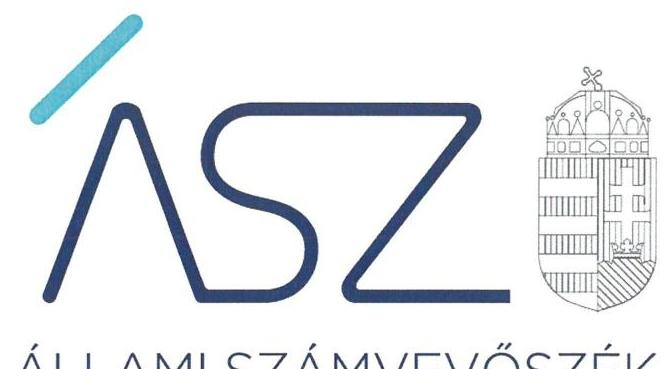
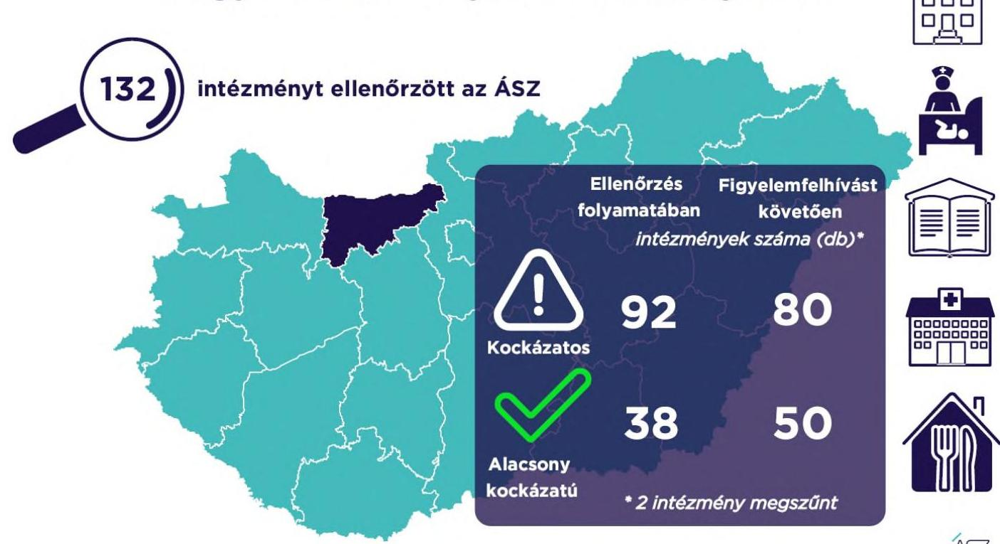

ÁLLAMI SZÁMVEVŐSZÉK

# JELENTÉS 

## A Komárom-Esztergom megyei önkormányzati intézmények ellenőrzése

Az önkormányzat és társulás irányítása alá tartozó intézmények integritásának monitoring típusú ellenőrzése - 132 intézmény
2021.

21107
www.asz.hu

---

ÁLLAMI SZÁMVEVŐSZÉK

# JELENTÉS 

## A Komárom-Esztergom megyei önkormányzati intézmények ellenőrzése

Az önkormányzat és társulás irányítása alá tartozó intézmények integritásának monitoring típusú ellenőrzése - 132 intézmény
2021. 12. hó 29. nap

21107
www.asz.hu

---

# AZ ELLENŐRZÉST FELÜGYELTE: 

SALAMON ILDIKÓ felügyeleti vezető

## AZ ELLENŐRZÉST VEZETTE ÉS A VÉGREHAJTÁSÁÉRT FELELŐS:

BALÁZSNÉ ANTONI ERIKA ellenőrzésvezető
SIPOSNÉ DÓCZI KLÁRA ellenőrzésvezető

A PROGRAM ÖSSZEÁLLÍTÁSÁÉRT FELELŐS:
DR. FELFÖLDI IZABELLA programkészítésért felelős vezető

IKTATÓSZÁM: EL-3461-014/2021.
TÉMASZÁM: 2568
ELLENŐRZÉS-AZONOSÍTÓ SZÁM: V0928

---

# TARTALOMJEGYZÉK 

■ ÖSSZEGZÉS ..... 5
■ AZ ELLENŐRZÉS JELENTŐSÉGE, AKTUALITÁSA, TÁRSADALMI SZEREPE, SZEMPONTJAI ..... 8
■ AZ ELLENŐRZÉS TERÜLETE ..... 9
■ ELLENŐRZÉS HATÓKÖRE ÉS MÓDSZERE ..... 10
■ MELLÉKLETEK ..... 13
I. sz. melléklet: Az értékelés módszertana ..... 13
II. sz. melléklet: Értelmező szótár ..... 15
■ FÜGGELÉKEK ..... 17
I. sz. függelék: Az ellenőrzött szervezetek és azok kockázati értékelése ..... 17
■ RÖVIDÍTÉSEK JEGYZÉKE ..... 25

---

.

---

# ÖSSZEGZÉS 

Az Állami Számvevőszék figyelemfelhívásának és tanácsadásának eredményeként a Komárom-Esztergom megyei önkormányzatok irányítása alatt álló 132 ellenőrzött intézmény közül 30 intézménynél az intézményvezető már 2021-ben intézkedett, vagy intézkedéseket rendelt el az integritást biztosító alapvető feltételek megerősítése, illetve kiépítése érdekében. Ezeknek az intézményeknek javult az integritása, erősödtek a csalásmentes működés feltételei.
62 intézménynél további intézkedések szükségesek az integritást biztosító alapvető feltételek kiépítése, illetve kiegészítése érdekében. Ezeknek az intézményeknek a vezetői az Állami Számvevőszék intézkedési kötelemmel járó figyelemfelhívására nem intézkedtek, ezért az azonosított kockázatok növekedtek, vagy intézkedéseik nem fedték le a kockázatos területeket, így az azonosított kockázatok nem változtak.
Az irányító önkormányzat kettő intézmény megszüntetéséről döntött az ellenőrzött időszakban.

## Értékelések

Az Állami Számvevőszék a Komárom-Esztergom megyei önkormányzatok irányítása alá tartozó 132 intézmény belső kontrollrendszerének lényeges elemei kialakítását ellenőrizte a 2021. évre vonatkozóan. Az ellenőrzés a súlypontok meghatározásával lehetőséget biztosított a szervezeti integritás, működés és vezetés, valamint a gazdálkodás területén a kockázatok azonosítására.

A szervezeti integritás alapvető feltétele a szabályozottság, azaz a jogszabályokban előírt belső szabályzatok megléte, azok - hatályos jogszabályoknak - megfelelő tartalma és gyakorlati alkalmazhatósága. Az integritási kockázatok szervezeti szinten csökkenthetők azáltal, hogy az intézményvezetők kialakítják a szervezeti és működési kereteket, a gazdálkodásra vonatkozó alapvető szabályozási környezetet, valamint a kontrolltevékenységek szabályszerű gyakorlásának, az integrált kockázatkezelésnek és az integritást sértő események kezelésének a feltételeit.

A szervezeti integritás, a működés és a vezetés alapvető szabályozási feltételeinek kialakítása hozzájárul a csalásmentes integritási környezet megteremtéséhez.

A szervezeti és működési szabályzat teremti meg a szervezet szabályszerű működésének alapjait, illetve rögzíti a szervezeten belüli felelősségi viszonyokat. A szabályzat biztosítja a szervezeti működés szabályozottságát, ezáltal a szervezet tevékenységének átláthatóságát, a szervezeti célokkal összhangban történő működés feltételeit és annak ellenőrizhetőségét. Az ellenőrzöttek közül 125 intézmény rendelkezett szervezeti és működési szabályzattal a 2021. évben.

A jogszabályi előírásoknak eleget téve, nyilatkozatban értékelte az intézmény belső kontrollrendszerének minőségét 114 intézmény vezetője. Ezek közül 96 intézménynél alakítottak ki olyan szabályozásokat, folyamatokat, amelyek biztosítják a költségvetési szerv tevékenységében a rendelkezésre álló források átlátható, szabályszerű, szabályozott, gazdaságos, hatékony és eredményes felhasználása követelményeinek érvényesítését.

Az integrált kockázatkezelés eljárásrendjét 105, a szervezeti integritást sértő események kezelésének eljárásrendjét 112 intézménynél alakították ki az intézményvezetők. Az integrált kockázatkezelés eljárásrendje biztosítja a szervezet működésében rejlő kockázatok azonosításának és kezelésének feltételeit. A szervezet működési kockázatai veszélyeztethetik a közpénzekkel való átlátható, elszámoltatható és felelős gazdálkodást. Az integritást sértő események kezelésének eljárásrendje jelenti a szervezet tekintetében felmerülő és a szervezeten belül bekövetkező integritást sértő események kezelésének alapjait. Az eljárásrend kialakításával az intézmény vezetője támogatja az integritást sértő eseményekkel kapcsolatosan azonosított kockázatok bekövetkezése esetén azok hatékony kezelését, illetve a következmények enyhítését.

---

A pénz- és vagyongazdálkodáshoz kapcsolódó alapvető szabályozások és nyilvántartások - így a számviteli politika és a keretében elkészítendő szabályzatok, a számlarend, a beszerzések szabályozása, valamint a kötelezettségvállalásra és a teljesítés igazolására jogosultak és aláírásmintáik nyilvántartása - előmozdítják a közpénzügyek átláthatóságát, rendezettségét. Az intézményvezető ezen szabályzatok elkészítésével, nyilvántartások vezetésével és folyamatos karbantartásával az alapfeltételét biztosítja a pénzügyi- és vagyongazdálkodás átláthatóságának, a közpénzekkel és közvagyonnal való elszámoltathatóságnak. Az ellenőrzöttek közül 98 intézménynél a számviteli politika, 94 intézménynél a számlarend, 92 intézménynél a beszerzések lebonyolításával kapcsolatos eljárásrend rendelkezésre állt.

Az ellenőrzöttek közül 38 intézmény vezetője tett eleget az ellenőrzött területek mindegyikén az integritási kontrollok alapvető feltételeit jelentő, a jogszabályban előírt szabályozási kötelezettségének. Közülük 11 intézmény vezetője a jogszabályi előírásokon túl további erőfeszítéseket is tett az integritás erősítése érdekében, felismerte további olyan integritási kontrollok kialakításának indokoltságát, amelyet jogszabály nem ír elő, így szervezeti szinten hozzájárul a korrupcióval szembeni védettség megszilárdításához.

119 intézmény esetében az intézményvezető intézkedése volt szükséges a kockázatok csökkentése érdekében, mivel 14 intézménynél a jogszabályok által előírt kontrollok területén, 78 intézménynél a jogszabályok által előírt és a további, jogszabály által nem előírt integritási kontrollok területén egyaránt, 27 intézménynél utóbbi kontrollok területén voltak hiányosságok. A dokumentumok kiértékelése alapján - az integritás további fejlesztése érdekében - az Állami Számvevőszék azonosította a lényeges kockázati területeket, és már az ellenőrzés lefolytatásával párhuzamosan, a 2021. évre vonatkozóan a kockázatok csökkentésére hívta fel az intézményvezetők figyelmét.

# Következtetések 

Az érintett 92 intézmény közül 75 intézmény vezetője válaszolt határidőben az Állami Számvevőszék figyelemfelhívására. Közülük 39 teljeskörűen, 27 részben egyetértett a kockázatos területeken teendő intézkedések indokoltságával. Az intézményvezetők közül 31 arról tájékoztatta az Állami Számvevőszéket, hogy valamennyi kockázatos területen, 26 pedig a kockázatos területek egy részénél már tett, illetve a jövőben tesz intézkedést a jelzett kockázatok csökkentése érdekében. A jogszabályi előírásokon túli integritási kontrollok területén az érintett 105 intézmény közül 59 intézmény vezetője a jelzett kockázatok teljes körű, négy pedig azok részbeni felszámolásáról adott számot. Ezek eredményeként a 119 vezetői levélben jelzett 611 kockázati terület közül 278 esetben már történt, illetve tervezett az intézkedés, így javulás várható a feltárt kockázatos területek 45,5%-ánál.

Az intézkedések eredményeként az ellenőrzött 132 intézmény közül összesen 50 intézménynél a kockázatok alacsony szintűek, illetve - a tervezett intézkedések végrehajtásával - a kockázatok alacsony szintre csökkennek.

A szabályozások és nyilvántartások kialakításának célja nem önmagában a jogszabályi rendelkezések betartása, hanem az intézmény szabályozottságán keresztül a szabályszerű és csalásmentes gazdálkodás feltételeinek megteremtése, ezáltal az Alaptörvényben előírt átláthatóság és elszámoltathatóság elvének érvényesítése. Ezeknek az alapelveknek érvényesülése hozzájárulhat ahhoz, hogy az intézmények, mint közszolgáltatást nyújtó szervezetek felé a közszolgáltatásokat igénybe vevők, és általuk az állampolgárok általános bizalma is erősödjön.

Az Állami Számvevőszék figyelemfelhívására nem válaszoló, illetve a jelzett kockázatokra nem, vagy csak részben intézkedő intézményvezetők által vezetett intézményeknél rendszerszintű kockázatok maradtak fenn. Vezetési-irányítási kockázatot jelez, amennyiben az intézményvezetőnek címzett figyelemfelhívásra az intézményvezető helyett más személy válaszolt. Felelősségi és hatásköri kockázatot jelez, amennyiben az intézmény pénzügyi- és vagyongazdálkodásának alapvető szabályzatait a kontrollrendszer kialakításáért felelős intézményvezető helyett egy másik költségvetési szerv vezetője alakította ki, határozta meg. További kockázatot jelent a szabályok alkalmazottak általi megismerésére és alkalmazására, az intézmény mindennapi működésének integritására. Mindezek egyrészt az intézmény pénzügyi és vagyongazdálkodásának szabályszerűségét, másrészt a vezetői nyilatkozatok hitelességét, valóságtartalmát is megkérdőjelezi. A jelzett kockázatok arra mutatnak rá, hogy ezeknél az intézményeknél sérül a vezetői felelősség elve, és ezzel a felelős vezetésre épülő intézményi önállóság működése.

Az integritás elvű működés erősítése érdekében további kockázatcsökkentő lépések szükségesek a vezetés-irányítás, valamint a pénzügyi- és a vagyongazdálkodás szabályszerű feltételeinek kialakítása terén. Ezen intézmények integritásának kiépítését következő lépésként az irányító szerv bevonásával támogatja az Állami Számvevőszék.

---

# Erősödött a csalásmentesség a Komárom-Esztergom megyei önkormányzati intézményeknél

---

# AZ ELLENŐRZÉS JELENTŐSÉGE, AKTUALITÁSA, TÁRSADALMI SZEREPE, SZEMPONTJAI 

Az Alaptörvény alapértékeket, elveket fogalmaz meg, amely szerint a közpénzekkel gazdálkodó minden szervezet köteles a nyilvánosság előtt elszámolni a közpénzekre vonatkozó gazdálkodásával. A közpénzeket és a nemzeti vagyont az átláthatóság és a közélet tisztaságának elve szerint kell kezelni.

Magyarország helyi önkormányzatairól szóló törvény ${ }^{1}$ a helyi közhatalom gyakorlás széleskörű érvényesítésével összhangban tág teret ad a helyi önkormányzatoknak a feladataik, a közszolgáltatások legkülönbözőbb formákban történő ellátására, így széleskörű lehetőséggel rendelkeznek intézmények alapítására.

A helyi önkormányzatok irányítása alá tartozó intézmények szerteágazó közszolgáltatásokat nyújtanak. Az intézmények működtetése közvetlenül érinti a társadalom valamennyi rétegét, a közfeladatot ellátó intézmények működésének minősége közvetlen hatással van az azokat igénybe vevő állampolgárok életére.

Az intézmények szabályszerű és eredményes működésének és gazdálkodásának alapfeltétele a belső kontrollrendszer - benne az integritási kontrollok - megfelelő kialakítása. Az ÁSZ² a törvényi felhatalmazással élve ellenőrzi az önkormányzati intézményeket, hogy megállapításaival támogassa az ellenőrzött szervezetek szabályszerű gazdálkodását, működését.

A helyi önkormányzatok intézményei által ellátott feladatok, a bölcsődei, óvodai ellátás, a gyermekétkeztetés, a betegek és idősek gondozása, a közművelődési intézmények, könyvtárak működtetése által a lakosság ezeken a területeken találkozik legszélesebb körben az önkormányzatok által nyújtott szolgáltatásokkal. A szolgáltatásokat igénybe vevők jelentős száma, a feladatellátáshoz használt nemzeti vagyon és az erre fordított közpénz nagysága indokolja, hogy az ÁSZ további, az előző ellenőrzésekre épülő ellenőrzéseket végezzen ezen a területen, illetve további olyan területeken, ahol az önkormányzati szolgáltatást a lakosság széles köre veszi igénybe.

Az ellenőrzés célja annak értékelése, hogy a helyi önkormányzatok irányítása alá tartozó intézmények megteremtették-e az integritás biztosításához szükséges feltételeket, kialakították-e az alapvető, a szervezeti kereteket, az integritási kontrollokhoz kapcsolódó, valamint a korrupció elleni védelmet szolgáló szabályozásokat. Továbbá, hogy az intézményvezető gondoskodott-e a szervezeti teljesítmény mérés alapfeltételeinek kialakításáról az eredményességi szempontoknak való megfelelés megalapozottsága biztosítása érdekében. A monitoring típusú ellenőrzés célja hatékonyan támogatni az ellenőrzött szervezeteket, ezáltal növelve az ÁSZ tanácsadó szerepét, elősegítve a „jól irányított állam" működését.

Az ÁSZ célja, hogy új ellenőrzési megközelítést alkalmazva támogassa a közpénzügyi helyzet javítását; a monitoring típusú ellenőrzéssel jelen időben adjon helyzetképet az integritási szemlélet érvényesítéséről, rávilágítson az integritási kontrollok kiépítettségére, illetve további fejlesztésére. Napjainkban mindez kiemelt fontosságúvá vált. Minden szervezetnek fel kell készülnie arra, hogy a koronavírus járvány okozta társadalmi és gazdasági válság növelni fogja a korrupciós nyomást. Az ÁSZ ebben a helyzetben is alapvető kötelességének tartja, hogy a közpénzek őre legyen, és ellenőrzéseit az önkormányzati alrendszer intézményei körében is folytassa.

Fontos, hogy az intézmények vezetői felismerjék az integritás kockázatokat, azokat ismételten mérjék fel, és alakítsanak ki átlátható, jól szabályozott rendszereket, döntési mechanizmusokat. Az integritási kockázatok feltárása, megismerése elengedhetetlenül fontos, mert ezt követően tehetők meg azok a lépések, amelyek a kockázatok csökkentését, felszámolását és kezelését célozzák. A belső kontrollrendszer - benne az integritás kontrollok - megfelelő kialakítása, működése a helyi önkormányzatok irányítása alatt álló intézményeknél is hozzájárul a társadalmi közbizalom erősítéséhez.

Az ellenőrzés rámutat az integritási jó gyakorlatokra is, továbbá felhívja a
 figyelmet a jogszabályi követelmények teljesítéséhez szükséges lépésekre is.

---

# AZ ELLENŐRZÉS TERÜLETE 

## Az önkormányzatok irányítása alá tartozó intézmények

Helyi önkormányzati költségvetési szervet az államháztartásról szóló 2011. évi CXCV törvény (Áht. ${ }^{3}$ ) szerint a helyi önkormányzat, a helyi önkormányzatok társulása, a térségi fejlesztési tanács, az átalakult nemzetiségi önkormányzat alapíthat, a költségvetési szerv alapító okiratában meghatározott önkormányzati közfeladatok ellátására. A költségvetési szervek önálló jogi személyek, éves költségvetésükből gazdálkodva látják el feladataikat. A költségvetési szervek gazdasági szervezettel rendelkeznek, ha azonban a költségvetési szerv éves átlagos statisztikai állományi létszáma a 100 főt nem éri el, a gazdasági szervezet feladatait az önkormányzati hivatal, vagy az irányító szerv döntése alapján az irányító szerv irányítása alá tartozó, gazdasági szervezettel rendelkező más költségvetési szerv látja el.

Az államháztartásról szóló törvény végrehajtásáról szóló 368/2011. (XII. 31.) Korm. rendelet (Ávr. ${ }^{4}$ ) 1. melléklete szerint, az államháztartás önkormányzati alrendszerében a helyi önkormányzat által irányított költségvetési szerv esetében az irányító szerv hatáskörét a képviselőtestület, közgyűlés gyakorolja, és annak vezetője a polgármester, főpolgármester, megyei közgyűlés elnöke.

Az ellenőrzés a Komárom-Esztergom megyei önkormányzatok irányítása alá tartozó, az I. sz. Függelékben felsorolt költségvetési szervekre terjedt ki.

A feladatellátásuk szerint az ellenőrzött költségvetési szervek egy része óvoda, bölcsőde, egészségügyi intézmény, konyha, művelődési ház, múzeum, kulturális központ, idősek otthona, gondozási központ, gyermekjóléti intézmény, sportközpont intézményként működik.

Az ellenőrzött 132 intézmény nem rendelkezik saját gazdasági szervezettel.

Kettő intézmény az ellenőrzött időszakban megszűnt.

---

# ELLENŐRZÉS HATÓKÖRE ÉS MÓDSZERE 

## Az ellenőrzés típusa

Megfelelőségi ellenőrzés.

## Az ellenőrzött időszak

A 2021. év, a Bkr. ${ }^{5}$ szerinti vezetői nyilatkozat, valamint annak alátámasztottsága vonatkozásában a 2020. év.

## Az ellenőrzés tárgya

A szervezeti keretekkel, a működéssel és gazdálkodással kapcsolatos szabályzatok, szabályozások, valamint a szervezeti elvekkel, értékekkel összefüggő integritás kontrollok kiépítettsége, a szervezeti teljesítmény mérés alapfeltételeinek kialakítása.

## Az ellenőrzött szervezetek

Az ellenőrzött intézményeket az I. sz. Függelék tartalmazza.

## Az ellenőrzés jogalapja

Az ellenőrzés jogszabályi alapját az ÁSZ tv. ${ }^{6}$ 1. § (3) bekezdése, 5. § (6) bekezdése, valamint az Áht. 61. § (2) bekezdése képezik.

## Az ellenőrzés módszerei

Az ÁSZ az ellenőrzést az ellenőrzési program szempontjai, az ellenőrzött időszakban hatályos jogszabályok, a jelen ellenőrzésre irányadó ÁSZ módszertan figyelembevételével és a nemzetközi standardokat irányadónak tekintve végzi.

Az ellenőrzés ideje alatt az ÁSZ az ellenőrzött szervezetekkel történő kapcsolattartást az ÁSZ SZMSZ${ }^{7}$-ének vonatkozó előírásai alapján biztosítja.

Az ellenőrzési kérdések megválaszolásához szükséges bizonyítékok megszerzése a következő ellenőrzési eljárások alkalmazásával történik: megfigyelés, összehasonlítás, elemző eljárás. Az ellenőrzési bizonyítékként felhasználható adatforrások közé tartoznak az ellenőrzési programban felsorolt adatforrások, továbbá minden - az ellenőrzés folyamán - feltárt, az ellenőrzés szempontjából információkat tartalmazó dokumentum.

---

Az ÁSZ az ellenőrzést a kérdésekre adott válaszok kiértékelésével, valamint a megjelölt adatforrások, továbbá az adott időszakban hatályos jogszabályok, valamint az ÁSZ honlapján közzétett helyénvalósági kritériumok figyelembevételével folytatja le.

A monitoring típusú ellenőrzés az önkormányzatok irányítása alá tartozó intézmények integritás alapú működésének lényeges területeire és a közpénzügyi helyzet javítása érdekében az elért eredmények fenntartására fókuszál. Lehetőséget biztosít az integritási kontrollok kiépítettségében lévő hiányosságok, a szervezeti teljesítmény mérés alapfeltételei kialakításának hiánya beazonosítására az eredményességi szempontoknak való megfelelés megalapozottsága biztosítása érdekében, az önkormányzatok, társulások irányítása alá tartozó intézmények integritásának elemzésére, részletes ellenőrzések megalapozására.

---

.

---

# MELLÉKLETEK 

I. SZ. MELLÉKLET: AZ ÉRTÉKELÉS MÓDSZERTANA

Az egyes kockázati területek és kockázatforrások minősítése „pontozásos módszerrel", az integritás „jelző" dokumentumai és a vezetői magatartás ellenőrzéshez kapcsolódóan tanúsított tényhelyzeteinek értékelése alapján történt.

Az értékelt dokumentumokhoz, nyilvántartásokhoz, kockázati besorolásokhoz minden esetben pontszám került hozzárendelésre, amelyek értéke alapján az ellenőrzött szervezetek kockázati csoportba kerültek besorolásra:

- Alacsony kockázatú - az elérhető összes pontszám legalább 80\%-a
- Közepes kockázatú - az elérhető pontszám 50-79\%-a között
- Magas kockázatú - az elérhető pontszám 50\%-a alatt

Az első lépésben azonosításra kerültek azok az intézményi szabályozások és nyilvántartások, amelyek meglétét jogszabály írja elő, hiánya pedig felveti a csalás és korrupció kockázatát.

Második lépésben az adatoknak az ellenőrzés rendelkezésére bocsátása kockázati kritériumainak meghatározása, majd értékelése történt meg.

Harmadik lépésben a figyelemfelhívó levelekre adott válaszok kockázati kritériumainak meghatározása, majd értékelése történt meg.

Az összesített kockázati értékelést javította, amennyiben

- az intézmény rendelkezett olyan szabályozással, amely kötelező meglétét jogszabály nem írja elő, de segíti a csalás és a korrupció megelőzését (helyénvalósági dokumentumok).

Az összesített kockázati értékelést rontotta, amennyiben

- az integritás szempontjából meghatározó dokumentum - az intézményi SZMSZ - hiányzott, és javítása érdekében a figyelemfelhívó levél hatására sem történt intézkedés.

A figyelemfelhívó levelekre adott válaszok értékelése alapján:

- A kockázat csökkent, amennyiben a figyelemfelhívó levélre adott válasza a figyelemfelhívással összhangban volt, valamennyi kockázati területen intézkedett vagy intézkedést tervezett.
- A kockázat változatlan, amennyiben a figyelemfelhívó levélben foglaltaktól eltérő magatartást tanúsított, intézkedése a figyelemfelhívással részben volt összhangban, a kockázati területeken részben intézkedett vagy intézkedést tervezett.
- A kockázat nőtt, amennyiben nem volt együttműködő, a figyelemfelhívó levélre nem válaszolt, vagy válasza alapján nem intézkedett és nem tervezett intézkedést.

---

# Az önkormányzatok irányítása alá tartozó intézmények kockázati csoportba sorolásának értékelési keretrendszere 

I. Dokumentumokkal rendelkezés
lényeges dokumentumok, amelyek hiánya felveti a csalás és korrupció kockázatát
I.1. A szervezeti integritás, működés és vezetés alapvető szabályozási feltételei

- intézmény SZMSZ-e
- vezetői nyilatkozat a 2020. évre vonatkozóan az intézmény belső kontrollrendszer minőségének értékeléséről, valamint a nyilatkozat megalapozottságát bizonyító dokumentumok
- integrált kockázatkezelés eljárásrendje
- az integritást sértő események kezelésének eljárásrendje
I.2. A pénz- és vagyongazdálkodáshoz kapcsolódó alapvető szabályozások
- számviteli politika
- az eszközök és a források leltárkészítési és leltározási szabályzata
- az eszközök és a források értékelési szabályzata
- pénzkezelési szabályzat
- számlarend
- beszerzések lebonyolításával kapcsolatos eljárásrend
- a kötelezettségvállalásra, teljesítés igazolására jogosult személyekről és aláírás-mintájukról vezetett nyilvántartás
II. Az adatoknak az ellenőrzés rendelkezésére bocsátása
II.1. A megnevezett adatokkal rendelkezett és a törvényi határidőn belül hiánytalanul rendelkezésre bocsátotta. Figyelem-, illetve figyelmet felhívó levél nem volt indokolt.
II.2. A megnevezett adatokat nem bocsátotta rendelkezésre.
III. Figyelemfelhívó levelekre adott válaszok kockázati értékelése
III.1. Kockázat csökkent: együttműködése a figyelemfelhívó levéllel összhangban volt.
III.2. Kockázat változatlan: a figyelemfelhívó levélben foglaltaktól eltérő együttműködést tanúsított.
III.3. Kockázat nőtt: nem reagált, nem intézkedett, így nem volt együttműködő.

---

belső kontrollrendszer

Belső kontrollrendszer területei
integrált kockázatkezelési rendszer
integritás

Integritási kockázatok

A belső kontrollrendszer a kockázatok kezelése és tárgyilagos bizonyosság megszerzése érdekében kialakított folyamatrendszer, amely azt a célt szolgálja, hogy a működés és gazdálkodás során a tevékenységeket szabályszerűen, gazdaságosan, hatékonyan, eredményesen hajtsák végre, az elszámolási kötelezettségeket teljesítsék, megvédjék az erőforrásokat a veszteségektől, károktól és nem rendeltetésszerű használattól. (Forrás: Áht. 69. § (1) bekezdése)
A kontrollkörnyezet, az integrált kockázatkezelési rendszer, a kontrolltevékenységek, az információs és kommunikációs rendszer, valamint a nyomon követési (monitoring) rendszer. (Forrás: Bkr. 3. §-a)
Olyan folyamatalapú kockázatkezelési rendszer, amely a szervezet minden tevékenységére kiterjed, egységes módszertan és eljárások alkalmazásával, a szervezet célkitűzéseinek és értékeinek figyelembevételével biztosítja a szervezet kockázatainak teljes körű azonosítását, azok meghatározott kritériumok szerinti értékelését, valamint a kockázatok kezelésére vonatkozó intézkedési terv elkészítését és az abban foglaltak nyomon követését. (Forrás: Bkr. 2. § m) pontja)
Az integritás az elvek, értékek, cselekvések, módszerek, intézkedések konzisztenciáját jelenti, vagyis olyan magatartásmódot, amely meghatározott értékeknek megfelel. (Forrás: Nemzetgazdasági Minisztérium: Államháztartási belső kontroll standardok és gyakorlati útmutató 1.1.3. pontja, 2017. szeptember)
A szervezeti integritás a szervezet védekezőképessége a korrupció lehetőségével szemben. Az integritás erősítése - mint preventív eszközrendszer - a korrupció megelőzésére fókuszál. A szervezeti integritás a működés, a szervezeti kultúra minőségét is jelzi.
Az ellenőrzés megközelítése szerint az integritás a szervezet értékeinek és célkitűzéseinek megfelelő működést jelenti. Minél magasabb színvonalú egy szervezet integritása, az annál ellenállóbb a korrupcióval, a korrupciós veszélyekkel szemben, vagyis az integritás erősítése - elsősorban az egyes szervezetek szintjén - a korrupciós kockázatok mérséklésének egyik fontos eszköze. Az integritás ugyanakkor tágabb jelentésű fogalom, nemcsak a korrupciótól, hanem más helytelen magatartásoktól (például csalás, önkényesség) való mentességet és a szervezet céljainak követését is jelenti. Egy szervezet integritását úgy is meghatározhatjuk, mint a szervezet ellenállóképességét annak a veszélynek, hogy dolgozói helytelen magatartásukkal kárt okozzanak.
Az integritás megerősítése és fenntartása elsősorban a szervezet elsőszámú vezetőjének felelőssége.
Integritási kockázatnak minősül a szervezet célkitűzéseit, értékeit, elveit sértő vagy veszélyeztető visszaélés, szabálytalanság, vagy egyéb esemény lehetősége. A korrupciós kockázat olyan integritási kockázat, amely korrupciós cselekmény bekövetkezésének lehetőségét jelenti. Minden korrupciós kockázat egyben integritási kockázat is. Korrupciós cselekményeknek nevezzük azokat a vesztegetésszerű cselekményeket, amelyeket általában a Büntető Törvénykönyv ${ }^{8}$ is büntetéssel fenyeget.
Az integritási kockázat alatt az integritás megsértésének esélyét értjük. Az integritási kockázatok olyan helyzetek, folyamatok, amelyek során fennáll a korrupciós befolyás lehetősége. Így integritási kockázatok jelentkeznek például a köz- és a magánszféra közötti üzleti tranzakciók során, a köztisztviselők által hozott döntések, a mérlegelési szabadság körében, illetve abban az esetben, ha egy közszolgáltatás iránt nagyobb a kereslet, mint a kielégítéséhez rendelkezésre álló erőforrások. Az integritási kockázat értelemszerűen nem egyenlő magával az integritás sérelmével, vagy a korrupció be-

---

kockázat
kontrollkörnyezet
kontrolltevékenységek
intézmény
következésével. Az integritási kockázatokkal szemben megfelelő kontrollok kiépítésével lehet védekezni. Amennyiben az integritási kontrollok szintje elmarad a kockázatok mértékétől, kockázati kitettségről beszélünk. A kontrollok kialakításának és működtetésének mérlegelésekor minden esetben vizsgálni kell a kockázatok szintjét is, a túlszabályozottság egyfelől költséges, másfelől a túlzott bürokrácia maga is lehet a korrupciós veszély hordozója.
A kockázat annak a valószínűségét jelenti, hogy egy vagy több esemény, vagy intézkedés nem kívánt módon befolyásolja a rendszer működését, céljainak megvalósulását. (Forrás: Javaslatok a korrupciós kockázatok kezelésére - Kockázatkezelési és ellenőrzési módszertan 35. oldal, ÁSZ)
A költségvetési szerv vezetője által kialakított olyan elvek, eljárások, belső szabályzatok összessége, amelyben világos a szervezeti struktúra, a folyamatok átláthatók, egyértelműek a felelősségi, hatásköri viszonyok és feladatok, meghatározottak, ismertek és elfogadottak az etikai elvárások a szervezet minden szintjén, átlátható a humánerőforrás-kezelés, biztosított a szervezeti célok és értékek irányában való elkötelezettség fejlesztése és elősegítése. (Forrás: Bkr. 6. § (1) bekezdés)
A költségvetési szerv vezetője által a szervezeten belül kialakított (kontroll) tevékenységek, melyek biztosítják a kockázatok kezelését, hozzájárulnak a szervezet céljainak eléréséhez és erősítik a szervezet integritását. (Forrás: Bkr. 8. § (1) bekezdés)
A helyi önkormányzatok irányítása alá tartozó költségvetési szervek. (A képviselő-testület a feladatkörébe tartozó közszolgáltatások ellátására - jogszabályban meghatározottak szerint - költségvetési szervet (önkormányzati intézmény) alapíthat; Forrás: Mötv. 41. § (6) bekezdés)

---

# FÜGGELÉKEK

I. SZ. FÜGGELÉK: AZ ELLENŐRZÖTT SZERVEZETEK ÉS AZOK KOCKÁZATI ÉRTÉKELÉSE

|  Sorszám | Ellenőrzött szervezet megnevezése | Irányító szerv (önkormányzat) megnevezése | Helység | Tanácsadást megelőző kockázati besorolás | Intézkedést követően a kockázati értékelés változása | A kockázati szint alacsonyra csökkent-e  |
| --- | --- | --- | --- | --- | --- | --- |
|  1. | Bársonyos-Pervatpuszta Időskorúak Szociális Otthona | Bársonyos Község
 Önkormányzata | Bársonyos | ALACSONY | NEM VOLT SZABÁLYSZERŰSÉGI HIBA | I  |
|  2. | Banai Bóbita Óvoda | Bana Község Önkormányzata | Bana | KÖZEPES | NÖTT | N  |
|  3. | Bajnai Napközi Otthonos Óvoda | Bajna Község Önkormányzata | Bajna | ALACSONY | NEM VOLT SZABÁLYSZERŰSÉGI HIBA | I  |
|  4. | Tündérkert Eplői Napközi Otthonos Óvoda | Epöl Község Önkormányzata | Epöl | ALACSONY | NEM VOLT SZABÁLYSZERŰSÉGI HIBA | I  |
|  5. | Héregi Mesevár Óvoda | Héreg Község Önkormányzata | Héreg | KÖZEPES | NÖTT | N  |
|  6. | Bársonyos Bóbita Óvoda | Bársonyos Község Önkormányzata | Bársonyos | ALACSONY | NEM VOLT SZABÁLYSZERŰSÉGI HIBA | I  |
|  7. | Tatabánya Megyei Jogú Város József Attila Megyei és Városi Könyvtár | Tatabánya Megyei Jogú Város Önkormányzata | Tatabánya | MAGAS | NÖTT | N  |
|  8. | Tatabánya Megyei Jogú Város Jászai Mari Színház, Népház | Tatabánya Megyei Jogú Város Önkormányzata | Tatabánya | ALACSONY | NEM VOLT SZABÁLYSZERŰSÉGI HIBA | N  |
|  9. | Komárom Város Egészségügyi Alapellátási Szolgálata | Komárom Város Önkormányzata | Komárom | KÖZEPES | CSÖKKENT | I  |
|  10. | Tatabánya Megyei Jogú Város Levéltára | Tatabánya Megyei Jogú Város Önkormányzata | Tatabánya | MAGAS | NÖTT | N  |
|  11. | Tatabányai Gyermekkert Óvoda | Tatabánya Megyei Jogú Város Önkormányzata | Tatabánya | KÖZEPES | NEM VÁLTOZOTT | N  |
|  12. | Komáromi Kistáltos Óvoda | Komárom Város Önkormányzata | Komárom | ALACSONY | NEM VOLT SZABÁLYSZERŰSÉGI HIBA | I  |
|  13. | Komáromi Gesztenyés Óvoda | Komárom Város Önkormányzata | Komárom | ALACSONY | NEM VOLT SZABÁLYSZERŰSÉGI HIBA | N  |
|  14. | Komáromi Szivárvány Óvoda | Komárom Város Önkormányzata | Komárom | ALACSONY | NEM VOLT SZABÁLYSZERŰSÉGI HIBA | I  |
|  15. | Komáromi Napsugár Óvoda | Komárom Város Önkormányzata | Komárom | ALACSONY | NEM VOLT SZABÁLYSZERŰSÉGI HIBA | I  |
|  16. | Komáromi Szőnyi Színes Óvoda | Komárom Város Önkormányzata | Komárom | KÖZEPES | CSÖKKENT | I  |
|  17. | Komáromi Tóparti Óvoda | Komárom Város Önkormányzata | Komárom | KÖZEPES | NEM VÁLTOZOTT | N  |
|  18. | Komáromi Csillag Óvoda | Komárom Város Önkormányzata | Komárom | ALACSONY | NEM VOLT SZABÁLYSZERŰSÉGI HIBA | I  |

---

| Sorszám | Ellenőrzött szervezet megnevezése | Irányító szerv (önkormányzat) megnevezése | Helység | Tanácsadást megelőző kockázati besorolás | Intézkedést követően a kockázati értékelés változása | A kockázati szint alacsonyra csökkent-e |
| :--: | :--: | :--: | :--: | :--: | :--: | :--: |
| 19. | Komárom Város Egyesített Szociális Intézménye | Komárom Város Önkormányzata | Komárom | ALACSONY | NEM VOLT SZABÁLYSZERŰSÉGI HIBA | I |
| 20. | Komáromi Aprótalpak Bölcsőde | Komárom Város Önkormányzata | Komárom | KÖZEPES | CSÖKKENT | I |
| 21. | Komáromi Tám-Pont Családés Gyermekjóléti Intézmény | Komárom Város Önkormányzata | Komárom | ALACSONY | NEM VOLT SZABÁLYSZERŰSÉGI HIBA | I |
| 22. | Pilismaróti Mesevár Óvoda | Pilismarót Község Önkormányzata | Pilismarót | ALACSONY | NEM VOLT SZABÁLYSZERŰSÉGI HIBA | N |
| 23. | Jókai Mór Városi Könyvtár | Komárom Város Önkormányzata | Komárom | ALACSONY | NEM VOLT SZABÁLYSZERŰSÉGI HIBA | I |
| 24. | Tatabányai Sárberki Óvoda | Tatabánya Megyei Jogú Város Önkormányzata | Tatabánya | MAGAS | NÖTT | N |
| 25. | Tatabánya Megyei Jogú Város Tatabányai Múzeum | Tatabánya Megyei Jogú Város Önkormányzata | Tatabánya | MAGAS | NÖTT | N |
| 26. | Tatabányai Benedek Elek Óvoda | Tatabánya Megyei Jogú Város Önkormányzata | Tatabánya | MAGAS | NEM VÁLTOZOTT | N |
| 27. | Tatabányai Kodály Zoltán Óvoda | Tatabánya Megyei Jogú Város Önkormányzata | Tatabánya | KÖZEPES | NEM VÁLTOZOTT | N |
| 28. | Tatabányai Kertvárosi Óvoda | Tatabánya Megyei Jogú Város Önkormányzata | Tatabánya | KÖZEPES | NÖTT | N |
| 29. | Tatabányai Turul Óvoda | Tatabánya Megyei Jogú Város Önkormányzata | Tatabánya | KÖZEPES | NÖTT | N |
| 30. | Tatabányai Egyesített Bölcsődék | Tatabánya Megyei Jogú Város Önkormányzata | Tatabánya | KÖZEPES | NÖTT | N |
| 31. | Tatabányai Arany János Óvoda | Tatabánya Megyei Jogú Város Önkormányzata | Tatabánya | KÖZEPES | NÖTT | N |
| 32. | Tatabányai Német Nemzetiségi Óvoda | Tatabánya Megyei Jogú Város Önkormányzata | Tatabánya | KÖZEPES | NEM VÁLTOZOTT | N |
| 33. | Komáromi Klapka György Múzeum | Komárom Város Önkormányzata | Komárom | KÖZEPES | NÖTT | N |
| 34. | Öszi Napfény Idősek Otthona | Kisbér Város Önkormányzata | Kisbér | MAGAS | NÖTT | N |
| 35. | Szent György Otthon - Szent János Ispotály | Tát Város Önkormányzata | Tát | MAGAS | NEM VÁLTOZOTT | N |
| 36. | Dr. Magyar Károly Városi Bölcsőde | Dorog Város Önkormányzata | Dorog | ALACSONY | NEM VOLT SZABÁLYSZERŰSÉGI HIBA | I |
| 37. | Esztergomi Belvárosi Óvoda | Esztergom Város Önkormányzata | Esztergom | MAGAS | NEM VÁLTOZOTT | N |
| 38. | Esztergomi Bánomi Óvoda | Esztergom Város Önkormányzata | Esztergom | MAGAS | NEM VÁLTOZOTT | N |
| 39. | Esztergomi Angyalkert Óvoda | Esztergom Város Önkormányzata | Esztergom | MAGAS | NEM VÁLTOZOTT | N |
| 40. | Esztergomi Aranyhegyi Óvoda | Esztergom Város Önkormányzata | Esztergom | KÖZEPES | NEM VÁLTOZOTT | N |

---

| Sorszám | Ellenőrzött szervezet megnevezése | Irányító szerv (önkormányzat) megnevezése | Helység | Tanácsadást megelőző kockázati besorolás | Intézkedést követően a kockázati értékelés változása | A kockázati szint alacsonyra csökkent-e |
| :--: | :--: | :--: | :--: | :--: | :--: | :--: |
| 41. | Esztergomi Honvéd Utcai Óvoda | Esztergom Város Önkormányzata | Esztergom | MAGAS | NEM VÁLTOZOTT | N |
| 42. | Helischer József Városi Könyvtár, Esztergom | Esztergom Város Önkormányzata | Esztergom | MAGAS | NEM VÁLTOZOTT | N |
| 43. | Esztergomi Kertvárosi Óvoda | Esztergom Város Önkormányzata | Esztergom | KÖZEPES | NEM VÁLTOZOTT | N |
| 44. | Esztergomi Szentgyörgymezei Óvoda | Esztergom Város Önkormányzata | Esztergom | MAGAS | NEM VÁLTOZOTT | N |
| 45. | Esztergomi Erzsébet Királyné Óvoda | Esztergom Város Önkormányzata | Esztergom | MAGAS | NEM VÁLTOZOTT | N |
| 46. | Esztergomi Zöld Óvoda | Esztergom Város Önkormányzata | Esztergom | MAGAS | NEM VÁLTOZOTT | N |
| 47. | Féja Géza Közösségi Ház, Esztergom | Esztergom Város Önkormányzata | Esztergom | MAGAS | NEM VÁLTOZOTT | N |
| 48. | Szent István Strandfürdő, Esztergom | Esztergom Város Önkormányzata | Esztergom | MAGAS | NEM VÁLTOZOTT | N |
| 49. | Aprófalva Bölcsőde, Esztergom | Esztergom Város Önkormányzata | Esztergom | MAGAS | NEM VÁLTOZOTT | N |
| 50. | Szentgyörgymezői Olvasókör, Esztergom | Esztergom Város Önkormányzata | Esztergom | MAGAS | NEM VÁLTOZOTT | N |
| 51. | Kossuth Lajos Művelődési Ház és Könyvtár | Csolnok Község Önkormányzata | Csolnok | MAGAS | CSÖKKENT | N |
| 52. | Dorog Város Művelődési Ház és Könyvtár | Dorog Város Önkormányzata | Dorog | KÖZEPES | CSÖKKENT | I |
| 53. | Dorogi Szociális Szolgáltató Központ | Dorog Város Önkormányzata | Dorog | ALACSONY | NEM VOLT SZABÁLYSZERŰSÉGI HIBA | I |
| 54. | Dorogi Zrínyi Ilona Óvoda | Dorog Város Önkormányzata | Dorog | ALACSONY | NEM VOLT SZABÁLYSZERŰSÉGI HIBA | I |
| 55. | Nyergesújfalui Bóbita Óvoda és Bölcsőde | Nyergesújfalu Város Önkormányzata | Nyergesújfalu | ALACSONY | NEM VOLT SZABÁLYSZERŰSÉGI HIBA | N |
| 56. | Ady Endre Művelődési Központ és Könyvtár | Nyergesújfalu Város Önkormányzata | Nyergesújfalu | KÖZEPES | NÖTT | N |
| 57. | Kálmánfi Béla Művelődési Ház és Könyvtár | Piliscsév Község Önkormányzata | Piliscsév | ALACSONY | NEM VOLT SZABÁLYSZERŰSÉGI HIBA | I |
| 58. | Kék Duna Óvoda | Dunaalmás Község Önkormányzata | Dunaalmás | ALACSONY | NEM VOLT SZABÁLYSZERŰSÉGI HIBA | I |
| 59. | Neszmélyi Cseperedő Napköziotthonos Óvoda | Neszmély Község Önkormányzata | Neszmély | KÖZEPES | CSÖKKENT | I |
| 60. | Tát Város Önkormányzat Kultúrház és Könyvtár | Tát Város Önkormányzata | Tát | MAGAS | NEM VÁLTOZOTT | N |
| 61. | Kisbéri Gyöngyszem Óvoda és Bölcsőde | Kisbér Város Önkormányzata | Kisbér | MAGAS | NÖTT | N |
| 62. | Wass Albert Művelődési Központ és Városi Könyvtár | Kisbér Város Önkormányzata | Kisbér | MAGAS | NÖTT | N |

---

| Sorszám | Ellenőrzött szervezet megnevezése | Irányító szerv (önkormányzat) megnevezése | Helység | Tanácsadást megelőző kockázati besorolás | Intézkedést követően a kockázati értékelés változása | A kockázati szint alacsonyra csökkent-e |
| :--: | :--: | :--: | :--: | :--: | :--: | :--: |
| 63. | Dorog Város Egyesített Sportintézménye | Dorog Város Önkormányzata | Dorog | KÖZEPES | CSÖKKENT | I |
| 64. | Kocsi Mesekert Óvoda és Bölcsőde | Kocs Község Önkormányzata | Kocs | KÖZEPES | NÖTT | N |
| 65. | Piliscsévi "Aranykapu" ÓvodaBölcsőde | Piliscsév Község Önkormányzata | Piliscsév | ALACSONY | NEM VOLT SZABÁLYSZERŰSÉGI HIBA | I |
| 66. | Kesztölci Kiserdei Óvoda | Kesztölc Község Önkormányzata | Kesztölc | KÖZEPES | NEM VÁLTOZOTT | N |
| 67. | Császári Nyitnikék Óvoda | Császár Község Önkormányzata | Császár | KÖZEPES | NÖTT | N |
| 68. | Sári Óvoda és Mini Bölcsőde | Sárisáp Község Önkormányzata | Sárisáp | KÖZEPES | NÖTT | N |
| 69. | Dorogi Hétszínvirág Óvoda | Dorog Város Önkormányzata | Dorog | ALACSONY | NEM VOLT SZABÁLYSZERŰSÉGI HIBA | I |
| 70. | Dorogi Petőfi
 Sándor Óvoda | Dorog Város Önkormányzata | Dorog | ALACSONY | NEM VOLT SZABÁLYSZERŰSÉGI HIBA | I |
| 71. | Nyergesújfalui Benedek Elek Óvoda | Nyergesújfalu Város Önkormányzata | Nyergesújfalu | ALACSONY | NEM VOLT SZABÁLYSZERŰSÉGI HIBA | N |
| 72. | Nyergesújfalui Napsugár Óvoda | Nyergesújfalu Város Önkormányzata | Nyergesújfalu | ALACSONY | NEM VOLT SZABÁLYSZERŰSÉGI HIBA | N |
| 73. | Híd Szociális, Család- és Gyermekjóléti Központ | Esztergom Város Önkormányzata | Esztergom | KÖZEPES | NEM VÁLTOZOTT | N |
| 74. | Kuny Domokos Múzeum | Tata Város Önkormányzata | Tata | ALACSONY | NEM VOLT SZABÁLYSZERŰSÉGI HIBA | I |
| 75. | Oroszlány Város Óvodái | Oroszlány Város Önkormányzata | Oroszlány | KÖZEPES | CSÖKKENT | I |
| 76. | Önkormányzati Szociális Szolgálat | Oroszlány Város Önkormányzata | Oroszlány | KÖZEPES | CSÖKKENT | I |
| 77. | Szépkorúak Idősek Otthona | Süttő Község Önkormányzata | Süttő | MAGAS | NÖTT | N |
| 78. | Bábolna Városi Könyvtár, Művelődési- és Sportközpont | Bábolna Város Önkormányzata | Bábolna | KÖZEPES | NEM VÁLTOZOTT | N |
| 79. | Petőfi Sándor Kulturális Szabadidő Központ és Könyvtár | Almásfüzitő Község Önkormányzata | Almásfüzitő | KÖZEPES | CSÖKKENT | I |
| 80. | Szárligeti Hétszínvirág Óvoda | Szárliget Község Önkormányzata | Szárliget | ALACSONY | NEM VOLT SZABÁLYSZERŰSÉGI HIBA | N |
| 81. | Tatai Bartók Béla Óvoda | Tata Város Önkormányzata | Tata | KÖZEPES | CSÖKKENT | N |
| 82. | Tatai Kincseskert Óvoda | Tata Város Önkormányzata | Tata | KÖZEPES | CSÖKKENT | I |
| 83. | Tatai Fürdő Utcai Néphagyományőrző Óvoda | Tata Város Önkormányzata | Tata | MEGSZÜNT INTÉZMÉNY | MEGSZÜNT INTÉZMÉNY | MEGSZÜNT   INTÉZ-   MÉNY |

---

| Sorszám | Ellenőrzött szervezet megnevezése | Irányító szerv (önkormányzat) megnevezése | Helység | Tanácsadást megelőző kockázati besorolás | Intézkedést követően a kockázati értékelés változása | A kockázati szint alacsonyra csökkent-e |
| :--: | :--: | :--: | :--: | :--: | :--: | :--: |
| 84. | Tatai Geszti Óvoda | Tata Város Önkormányzata | Tata | KÖZEPES | NÖTT | N |
| 85. | Tatai Kertvárosi Óvoda | TATA VÁROS ÖNKORMÁNYZATA | Tata | KÖZEPES | CSÖKKENT | N |
| 86. | Móricz Zsigmond Városi Könyvtár | Tata Város Önkormányzata | Tata | KÖZEPES | CSÖKKENT | I |
| 87. | Csillagsziget Bölcsőde | Tata Város Önkormányzata | Tata | ALACSONY | NEM VOLT SZABÁLYSZERŰSÉGI HIBA | N |
| 88. | Almásfüzitői Sún Balázs Óvoda | Almásfüzitő Község Önkormányzata | Almásfüzitő | KÖZEPES | CSÖKKENT | I |
| 89. | Ácsi Bartók Béla Művelődési Ház, Könyvtár és Városi Sportcsarnok | Ács Város Önkormányzata | Ács | KÖZEPES | NÖTT | N |
| 90. | Ácsi Szociális Alapszolgáltatási Központ | Ács Város Önkormányzata | Ács | KÖZEPES | NÖTT | N |
| 91. | Bábolnai Alapszolgáltatási Központ | Bábolna Város Önkormányzata | Bábolna | KÖZEPES | CSÖKKENT | I |
| 92. | Bábolnai Százszorszép Óvoda és Bölcsőde | Bábolna Város Önkormányzata | Bábolna | KÖZEPES | CSÖKKENT | I |
| 93. | Mocsai Kiscsillag Óvoda és Bölcsőde | MOCSA KÖZSÉG ÖNKORMÁNYZATA | Mocsa | KÖZEPES | NEM VÁLTOZOTT | N |
| 94. | Magos Művelődési Ház és Könyvtár | Nagyigmánd Nagyközség Önkormányzata | Nagyigmánd | KÖZEPES | CSÖKKENT | I |
| 95. | Lábatlani Zengő Óvoda és Bölcsőde | Lábatlan Város Önkormányzata | Lábatlan | KÖZEPES | NÖTT | N |
| 96. | Lábatlani Gerenday Közösségi Ház És Könyvtár | Lábatlan Város Önkormányzata | Lábatlan | ALACSONY | NEM VOLT SZABÁLYSZERŰSÉGI HIBA | N |
| 97. | Lábatlani Kuckó Család- és Gyermekjóléti Szolgálat | Lábatlan Város Önkormányzata | Lábatlan | ALACSONY | NEM VOLT SZABÁLYSZERŰSÉGI HIBA | N |
| 98. | Gondozási Központ | Lábatlan Város Önkormányzata | Lábatlan | ALACSONY | NEM VOLT SZABÁLYSZERŰSÉGI HIBA | N |
| 99. | Tausendschön Zweisprachiger Kindergarten, Kinderkrippe Százszorszép Kétnyelvű Óvoda, Bölcsőde | Süttő Község Önkormányzata | Süttő | KÖZEPES | CSÖKKENT | N |
| 100. | Napköziotthonos Óvoda és Bölcsőde | Naszály Község Önkormányzata | Naszály | ALACSONY | NEM VOLT SZABÁLYSZERŰSÉGI HIBA | N |
| 101. | Tardosi Hétszínvirág Óvoda | Tardos Község Önkormányzata | Tardos | KÖZEPES | CSÖKKENT | I |
| 102. | Környei Vackor Óvoda és Bölcsőde | Környe Község Önkormányzata | Környe | MAGAS | NÖTT | N |
| 103. | Vértesszőlősi Samufalvi Óvoda és Bölcsőde | Vértesszőlős Község Önkormányzata | Vértesszőlős | ALACSONY | NEM VOLT SZABÁLYSZERŰSÉGI HIBA | I |
| 104. | Dömösi Szivárvány Óvoda és Mini Bölcsőde | Dömös Község Önkormányzata | Esztergom | MAGAS | NEM VÁLTOZOTT | N |

---

| Sorszám | Ellenőrzött szervezet megnevezése | Irányító szerv (önkormányzat) megnevezése | Helység | Tanácsadást megelőző kockázati besorolás | Intézkedést követően a kockázati értékelés változása | A kockázati szint alacsonyra csökkent-e |
| :--: | :--: | :--: | :--: | :--: | :--: | :--: |
| 105. | Szomori Napköziotthonos Óvoda | Szomor Község Önkormányzata | Szomor | KÖZEPES | NÖTT | N |
| 106. | Várgesztes Faluház | Várgesztes Község Önkormányzata | Várgesztes | MAGAS | NÖTT | N |
| 107. | Tokodaltárói Bányász Művelődési Ház | Tokodaltáró Község Önkormányzata | Tokodaltáró | MEGSZÜNT INTÉZMÉNY | MEGSZÜNT INTÉZMÉNY | MEGSZÜNT   INTÉZ-   MÉNY |
| 108. | Almásfüzitői Szociális Alapellátási Intézmény | Almásfüzitő Község Önkormányzata | Almásfüzitő | KÖZEPES | CSÖKKENT | I |
| 109. | Ácsi Bóbita Óvoda | Ács Város Önkormányzata | Ács | KÖZEPES | NÖTT | N |
| 110. | Tokodi Mesevár Óvoda - Mini Bölcsőde | Tokod Nagyközség Önkormányzata | Tokod | KÖZEPES | NÖTT | N |
| 111. | Tokodaltárói Brunszvik Teréz Óvoda - Mini Bölcsőde | Tokodaltáró Község Önkormányzata | Tokodaltáró | KÖZEPES | CSÖKKENT | I |
| 112. | Kömlődi Gézengúz Napközi Otthonos Óvoda | Kömlőd Község Önkormányzata | Kömlőd | ALACSONY | NEM VOLT SZABÁLYSZERŰSÉGI HIBA | N |
| 113. | Vértessomlói Német Nemzetiségi Óvoda és Bölcsőde | VÉRTESSOMLÓ KÖZSÉG ÖNKORMÁNYZATA | Vértessomló | KÖZEPES | CSÖKKENT | I |
| 114. | Várgesztesi Német Nemzetiségi Óvoda | Várgesztes Község Önkormányzata | Várgesztes | KÖZEPES | NÖTT | N |
| 115. | Leányvári Cseresznyefa Óvoda | Leányvár Község Önkormányzata | Leányvár | KÖZEPES | CSÖKKENT | I |
| 116. | Dadi Nefelejcs Óvoda és Mini Bölcsőde | Dad Község Önkormányzata | Dad | KÖZEPES | CSÖKKENT | I |
| 117. | Dr. Nemere Zoltán Óvoda és Bölcsőde | Bokod Község Önkormányzata | Bokod | ALACSONY | NEM VOLT SZABÁLYSZERŰSÉGI HIBA | I |
| 118. | Kecskédi Napközi Otthonos Óvoda | Kecskéd Község Önkormányzata | Kecskéd | MAGAS | NEM VÁLTOZOTT | N |
| 119. | Szákszendi Kiskuckó Napközi Otthonos Óvoda | Szákszend Község Önkormányzata | Szákszend | KÖZEPES | NÖTT | N |
| 120. | Vértestolnai Katicabogár Német Nemzetiségi Óvoda | Vértestolna Község Önkormányzata | Vértestolna | KÖZEPES | CSÖKKENT | I |
| 121. | Tarjáni Német Nemzetiségi Óvoda | Tarján Község Önkormányzata | Tarján | MAGAS | NÖTT | N |
| 122. | Nagysápi Napsugár Óvoda | Nagysáp Község Önkormányzata | Nagysáp | ALACSONY | NEM VOLT SZABÁLYSZERŰSÉGI HIBA | I |
| 123. | Ászári Kuckó Óvoda | Ászár Község Önkormányzat | Ászár | ALACSONY | NEM VOLT SZABÁLYSZERŰSÉGI HIBA | I |
| 124. | Kerékteleki Micimackó Óvoda | Kerékteleki Községi Önkormányzat | Kerékteleki | KÖZEPES | CSÖKKENT | I |
| 125. | Dági Óvoda-Bölcsőde | Dág Község Önkormányzata | Dág | KÖZEPES | NÖTT | N |
| 126. | Únyi Óvoda | Úny Község Önkormányzata | Úny | KÖZEPES | NÖTT | N |

---

| Sorszám | Ellenőrzött szervezet megnevezése | Irányító szerv (önkormányzat) megnevezése | Helység | Tanácsadást megelőző kockázati besorolás | Intézkedést követően a kockázati értékelés változása | A kockázati szint alacsonyra csökkent-e |
| :--: | :--: | :--: | :--: | :--: | :--: | :--: |
| 127. | Gyermelyi Kippkopp Napközi Otthonos Óvoda | Gyermely Község Önkormányzata | Gyermely | KÖZEPES | CSÖKKENT | I |
| 128. | Máriahalomi Napköziotthonos Óvoda | Máriahalom Község Önkormányzata | Máriahalom | KÖZEPES | CSÖKKENT | I |
| 129. | Kölcsey Ferenc Művelődési Központ és Könyvtár Oroszlány | Oroszlány Város Önkormányzata | Oroszlány | KÖZEPES | CSÖKKENT | I |
| 130. | Réde-Bakonybánk Körzeti Óvoda | Réde Község Önkormányzata | Réde | ALACSONY | NEM VOLT SZABÁLYSZERŰSÉGI HIBA | N |
| 131. | Tarjáni Önkormányzati Konyha | Tarján Község Önkormányzata | Tarján | MAGAS | NÖTT | N |
| 132. | Szákszendi Szociális és Gyermekjóléti Alapszolgáltatási Központ | Szákszend Község Önkormányzata | Szákszend | KÖZEPES | NÖTT | N |
| Alacsony kockázatú |  |  | 38 |  |  |  |
| Közepes kockázatú |  |  | 62 |  |  |  |
| Magas kockázatú |  |  | 30 |  |  |  |
| Megszűnt intézmény |  |  | 2 | 2 | 2 |  |
| Kockázat csökkent |  |  |  | 30 |  |  |
| Kockázat nem változott |  |  |  | 27 |  |  |
| Kockázat nőtt |  |  |  | 35 |  |  |
| Nem volt indokolt figyelemfelhívó levél (szabályszerűségi vagy szabályszerűségi és helyénvalósági hiba hiányában) |  |  |  | 38 |  |  |
| Kockázat alacsony szintre csökkent |  |  |  |  | 50 |  |
| Kockázat nem csökkent alacsony szintre |  |  |  |  | 80 |  |
| Összesen |  |  | 132 | 132 | 132 |  |

---

.

---

# RÖVIDÍTÉSEK JEGYZÉKE 

${ }^{1}$ Mötv.
${ }^{2}$ ÁSZ
${ }$
 }^{3}$ Áht.
${ }^{4}$ Ávr.
${ }^{5}$ Bkr.
${ }^{6}$ ÁSZ tv.
${ }^{7}$ ÁSZ SZMSZ
${ }^{8}$ Büntető Törvénykönyv
2011. évi CLXXXIX. törvény - Magyarország helyi önkormányzatairól (hatályos: 2012. január 1-jétől)

Állami Számvevőszék
2011. évi CXCV. törvény az államháztartásról (hatályos 2011. december 31-étől) 368/2011. (XII. 31.) Korm. rendelet az államháztartásról szóló törvény végrehajtásáról (hatályos 2012. január 1-jétől)
370/2011. (XII. 31.) Korm. rendelet a költségvetési szervek belső kontrollrendszeréről és belső ellenőrzésről (hatályos 2012. január 1-jétől)
2011. évi LXVI. törvény az Állami Számvevőszékről (hatályos 2011. július 1-jétől)

Az Állami Számvevőszék Szervezeti és Működési Szabályzata
2012. évi C. törvény a Büntető Törvénykönyvről (hatályos 2013. július 1-jétől)

---

# ÁSZ 

ÁLLAMI SZÁMVEVŐSZÉK
1052 Budapest, Apáczai Cs. u. 10. I 1364 Budapest 4. Pf. 54 TEL: +36 14849100
email: szamvevoszek@asz.hu
web: www.asz.hu | www.aszhirportal.hu
