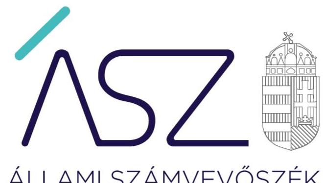
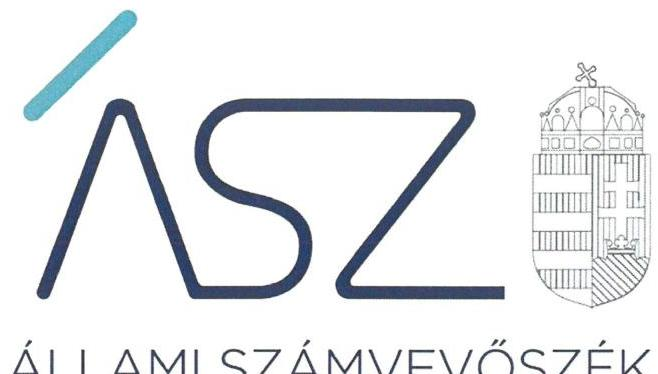
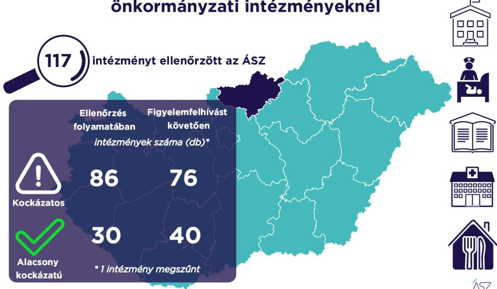

ÁLLAMI SZÁMVEVŐSZÉK

# JELENTÉS 

## A Nógrád megyei önkormányzati intézmények ellenőrzése

Az önkormányzat és társulás irányítása alá tartozó intézmények integritásának monitoring típusú ellenőrzése - 117 intézmény
2021.

21108
www.asz.hu

---

ÁLLAMI SZÁMVEVŐSZÉK

# JELENTÉS

A Nógrád megyei önkormányzati intézmények ellenőrzése

Az önkormányzat és társulás irányítása alá tartozó intézmények integritásának monitoring típusú ellenőrzése – 117 intézmény

2021.

12. hó 23. nap

21108
www.asz.hu

Domokos László
elnök

---

# AZ ELLENŐRZÉST FELÜGYELTE: 

SALAMON ILDIKŐ felügyeleti vezető

## AZ ELLENŐRZÉST VEZETTE ÉS A VÉGREHAJTÁSÁÉRT FELELŐS:

BALÁZSNÉ ANTONI ERIKA ellenőrzésvezető

BAJNAI ZSUZSANNA ellenőrzésvezető

A PROGRAM ÖSSZEÁLLÍTÁSÁÉRT FELELŐS:
DR. FELFÖLDI IZABELLA programkészítésért felelős vezető

## IKTATÓSZÁM: EL-3461-015/2021.

## TÉMASZÁM: 2568

ELLENŐRZÉS-AZONOSÍTÓ SZÁM: V0928

---

# TARTALOMJEGYZÉK 

■ ÖSSZEGZÉS ..... 5
■ AZ ELLENŐRZÉS JELENTŐSÉGE, AKTUALITÁSA, TÁRSADALMI SZEREPE, SZEMPONTJAI ..... 8
■ AZ ELLENŐRZÉS TERÜLETE ..... 9
■ ELLENŐRZÉS HATÓKÖRE ÉS MÓDSZERE ..... 10
■ MELLÉKLETEK ..... 13
I. sz. melléklet: Az értékelés módszertana ..... 13
II. sz. melléklet: Értelmező szótár ..... 15
■ FÜGGELÉKEK ..... 17
I. sz. függelék: Az ellenőrzött szervezetek és azok kockázati értékelése ..... 17
■ RÖVIDÍTÉSEK JEGYZÉKE ..... 23

---

.

---

# ÖSSZEGZÉS 

Az Állami Számvevőszék figyelemfelhívásának és tanácsadásának eredményeként a Nógrád megyei önkormányzatok irányítása alatt álló 117 ellenőrzött intézmény közül 28 intézménynél az intézményvezető már 2021-ben intézkedett, vagy intézkedéseket rendelt el az integritást biztositó alapvető feltételek megerősitése, illetve kiépitése érdekében. Ezeknek az intézményeknek javult az integritása, erősödtek a csalásmentes müködés feltételei.
69 intézménynél további intézkedések szükségesek az integritást biztositó alapvető feltételek kiépitése, illetve kiegészitése érdekében. Ezeknek az intézményeknek a vezetői az Állami Számvevőszék intézkedési kötelemmel járó figyelemfelhívására nem intézkedtek, ezért az azonosított kockázatok növekedtek, vagy intézkedéseik nem fedték le a kockázatos területeket, így az azonosított kockázatok nem változtak.
Az irányító önkormányzat egy intézmény megszüntetéséről döntött az ellenőrzött időszakban.

## Értékelések

Az Állami Számvevőszék a Nógrád megyei önkormányzatok irányítása alá tartozó 117 intézmény belső kontrollrendszerének lényeges elemei kialakítását ellenőrizte a 2021. évre vonatkozóan. Az ellenőrzés a súlypontok meghatározásával lehetőséget biztosított a szervezeti integritás, működés és vezetés, valamint a gazdálkodás területén a kockázatok azonosítására.

A szervezeti integritás alapvető feltétele a szabályozottság, azaz a jogszabályokban előírt belső szabályzatok megléte, azok - hatályos jogszabályoknak - megfelelő tartalma és gyakorlati alkalmazhatósága. Az integritási kockázatok szervezeti szinten csökkenthetők azáltal, hogy az intézményvezetők kialakítják a szervezeti és múködési kereteket, a gazdálkodásra vonatkozó alapvető szabályozási környezetet, valamint a kontrolltevékenységek szabályszerű gyakorlásának, az integrált kockázatkezelésnek és az integritást sértő események kezelésének a feltételeit.

A szervezeti integritás, a múködés és a vezetés alapvető szabályozási feltételeinek kialakítása hozzájárul a csalásmentes integritási környezet megteremtéséhez.

A szervezeti és múködési szabályzat teremti meg a szervezet szabályszerű működésének alapjait, illetve rögzíti a szervezeten belüli felelősségi viszonyokat. A szabályzat biztosítja a szervezeti múködés szabályozottságát, ezáltal a szervezet tevékenységének átláthatóságát, a szervezeti célokkal összhangban történő működés feltételeit és annak ellenőrizhetőségét. Az ellenőrzöttek közül 104 intézmény rendelkezett szervezeti és múködési szabályzattal a 2021. évben.

A jogszabályi előírásoknak eleget téve, nyilatkozatban értékelte az intézmény belső kontrollrendszerének minőségét 66 intézmény vezetője. Ezek közül 52 intézménynél alakítottak ki olyan szabályozásokat, folyamatokat, amelyek biztosítják a költségvetési szerv tevékenységében a rendelkezésre álló források átlátható, szabályszerű, szabályozott, gazdaságos, hatékony és eredményes felhasználása követelményeinek érvényesítését.

Az integrált kockázatkezelés eljárásrendjét 83, a szervezeti integritást sértő események kezelésének eljárásrendjét 78 intézménynél alakították ki az intézményvezetők. Az integrált kockázatkezelés eljárásrendje biztosítja a szervezet múködésében rejlő kockázatok azonosításának és kezelésének feltételeit. A szervezet múködési kockázatai veszélyeztethetik a közpénzekkel való átlátható, elszámoltatható és felelős gazdálkodást. Az integritást sértő események kezelésének eljárásrendje jelenti a szervezet tekintetében felmerülő és a szervezeten belül bekövetkező integritást sértő események kezelésének alapjait. Az eljárásrend kialakításával az intézmény vezetője támogatja az integritást sértő eseményekkel kapcsolatosan azonosított kockázatok bekövetkezése esetén azok hatékony kezelését, illetve a következmények enyhítését.

---

A pénz- és vagyongazdálkodáshoz kapcsolódó alapvető szabályozások és nyilvántartások - így a számviteli politika és a keretében elkészítendő szabályzatok, a számlarend, a beszerzések szabályozása, valamint a kötelezettségvállalásra és a teljesítés igazolására jogosultak és aláírásmintáik nyilvántartása - előmozdítják a közpénzügyek átláthatóságát, rendezettségét. Az intézményvezető ezen szabályzatok elkészítésével, nyilvántartások vezetésével és folyamatos karbantartásával az alapfeltételét biztosítja a pénzügyi- és vagyongazdálkodás átláthatóságának, a közpénzekkel és közvagyonnal való elszámoltathatóságnak. Az ellenőrzöttek közül 94 intézménynél a számviteli politika, 75 intézménynél a számlarend, 83 intézménynél a beszerzések lebonyolításával kapcsolatos eljárásrend rendelkezésre állt.

Az ellenőrzöttek közül 19 intézmény vezetője tett eleget az ellenőrzött területek mindegyikén az integritási kontrollok alapvető feltételeit jelentő, a jogszabályban előírt szabályozási kötelezettségének. Közülük 17 intézmény vezetője a jogszabályi előírásokon túl további erőfeszítéseket is tett az integritás erősítése érdekében, felismerte további olyan integritási kontrollok kialakításának indokoltságát, amelyet jogszabály nem ír elő, így szervezeti szinten hozzájárul a korrupcióval szembeni védettség megszilárdításához.

99 intézmény esetében az intézményvezető intézkedése volt szükséges a kockázatok csökkentése érdekében, mivel 44 intézménynél a jogszabályok által előírt kontrollok területén, 53 intézménynél a jogszabályok által előírt és a további, jogszabály által nem előírt integritási kontrollok területén egyaránt, két intézménynél utóbbi kontrollok területén voltak hiányosságok. A dokumentumok kiértékelése alapján - az integritás további fejlesztése érdekében az Állami Számvevőszék azonosította a lényeges kockázati területeket, és már az ellenőrzés lefolytatásával párhuzamosan, a 2021. évre vonatkozóan a kockázatok csökkentésére hívta fel az intézményvezetők figyelmét.

# Következtetések 

Az érintett 97 intézmény közül 59 intézmény vezetője válaszolt határidőben az Állami Számvevőszék figyelemfelhívására. Közülük 38 teljeskörűen, 12 részben egyetértett a kockázatos területeken teendő intézkedések indokoltságával. Az intézményvezetők közül 29 arról tájékoztatta az Állami Számvevőszéket, hogy valamennyi kockázatos területen, 15 pedig a kockázatos területek egy részénél már tett, illetve a jövőben tesz intézkedést a jelzett kockázatok csökkentése érdekében. A jogszabályi előírásokon túli integritási kontrollok területén az érintett 55 intézmény közül 15 intézmény vezetője a jelzett kockázatok teljes körű, 2 pedig azok részbeni felszámolásáról adott számot. Ezek eredményeként a 99 vezetői levélben jelzett 541 kockázati terület közül 161 esetben már történt, illetve tervezett az intézkedés, így javulás várható a feltárt kockázatos területek 29,8\%-ánál.

Az intézkedések eredményeként az ellenőrzött 117 intézmény közül összesen 40 intézménynél a kockázatok alacsony szintűek, illetve - a tervezett intézkedések végrehajtásával - a kockázatok alacsony szintre csökkennek.

A szabályozások és nyilvántartások kialakításának célja nem önmagában a jogszabályi rendelkezések betartása, hanem az intézmény szabályozottságán keresztül a szabályszerű és csalásmentes gazdálkodás feltételeinek megteremtése, ezáltal az Alaptörvényben előírt átláthatóság és elszámoltathatóság elvének érvényesítése. Ezeknek az alapelveknek érvényesülése hozzájárulhat ahhoz, hogy az intézmények, mint közszolgáltatást nyújtó szervezetek felé a közszolgáltatásokat igénybe vevők, és általuk az állampolgárok általános bizalma is erősödjön.

Az Állami Számvevőszék figyelemfelhívására nem válaszoló, illetve a jelzett kockázatokra nem, vagy csak részben intézkedő intézményvezetők által vezetett intézményeknél rendszerszintű kockázatok maradtak fenn. Vezetési-irányítási kockázatot jelez, amennyiben az intézményvezetőnek címzett figyelemfelhívásra az intézményvezető helyett más személy válaszolt. Felelősségi és hatásköri kockázatot jelez, amennyiben az intézmény pénzügyi- és vagyongazdálkodásának alapvető szabályzatait a kontrollrendszer kialakításáért felelős intézményvezető helyett egy másik költségvetési szerv vezetője alakította ki, határozta meg. További kockázatot jelent a szabályok alkalmazottak általi megismerésére és alkalmazására, az intézmény mindennapi müködésének integritására. Mindezek egyrészt az intézmény pénzügyi és vagyongazdálkodásának szabályszerűségét, másrészt a vezetői nyilatkozatok hitelességét, valóságtartalmát is megkérdőjelezi. A jelzett kockázatok arra mutatnak rá, hogy ezeknél az intézményeknél sérül a vezetői felelősség elve, és ezzel a felelős vezetésre épülő intézményi önállóság működése.

Az integritás elvű működés erősítése érdekében további kockázatcsökkentő lépések szükségesek a vezetés-irányítás, valamint a pénzügyi- és a vagyongazdálkodás szabályszerű feltételeinek kialakítása terén. Ezen intézmények integritásának kiépítését következő lépésként az irányító szerv bevonásával támogatja az Állami Számvevőszék.

---

# Erősödött a csalásmentesség a Nógrád megyei önkormányzati intézményeknél 

---

# AZ ELLENŐRZÉS JELENTŐSÉGE, AKTUALITÁSA, TÁRSADALMI SZEREPE, SZEMPONTJAI 

Az Alaptörvény alapértékeket, elveket fogalmaz meg, amely szerint a közpénzekkel gazdálkodó minden szervezet köteles a nyilvánosság előtt elszámolni a közpénzekre vonatkozó gazdálkodásával. A közpénzeket és a nemzeti vagyont az átláthatóság és a közélet tisztaságának elve szerint kell kezelni.

Magyarország helyi önkormányzatairól szóló törvény ${ }^{1}$ a helyi közhatalom gyakorlás széleskörű érvényesítésével összhangban tág teret ad a helyi önkormányzatoknak a feladataik, a közszolgáltatások legkülönbözőbb formákban történő ellátására, így széleskörű lehetőséggel rendelkeznek intézmények alapítására.

A helyi önkormányzatok irányítása alá tartozó intézmények szerteágazó közszolgáltatásokat nyújtanak. Az intézmények működtetése közvetlenül érinti a társadalom valamennyi rétegét, a közfeladatot ellátó intézmények működésének minősége közvetlen hatással van az azokat igénybe vevő állampolgárok életére.

Az intézmények szabályszerű és eredményes működésének és gazdálkodásának alapfeltétele a belső kontrollrendszer - benne az integritási kontrollok - megfelelő kialakítása. Az ÁSZ² a törvényi felhatalmazással élve ellenőrzi az önkormányzati intézményeket, hogy megállapításaival támogassa az ellenőrzött szervezetek szabályszerű gazdálkodását, müködését.

A helyi önkormányzatok intézményei által ellátott feladatok, a bölcsődei, óvodai ellátás, a gyermekétkeztetés, a betegek és idősek gondozása, a közművelődési intézmények, könyvtárak működtetése által a lakosság ezeken a területeken találkozik legszélesebb körben az önkormányzatok által nyújtott szolgáltatásokkal. A szolgáltatásokat igénybe vevők jelentős száma, a feladatellátáshoz használt nemzeti vagyon és az erre fordított közpénz nagysága indokolja, hogy az ÁSZ további, az előző ellenőrzésekre épülő ellenőrzéseket végezzen ezen a területen, illetve további olyan területeken, ahol az önkormányzati szolgáltatást a lakosság széles köre veszi igénybe.

Az ellenőrzés célja annak értékelése, hogy a helyi önkormányzatok irányítása alá tartozó intézmények megterem-tették-e az integritás biztosításához szükséges feltételeket, kialakították-e az alapvető, a szervezeti kereteket, az integritási kontrollokhoz kapcsolódó, valamint a korrupció elleni védelmet szolgáló szabályozásokat. Továbbá, hogy az intézményvezető gondoskodott-e a szervezeti teljesítmény mérés alapfeltételeinek kialakításáról az eredményességi szempontoknak való megfelelés megalapozottsága biztosítása érdekében. A monitoring típusú ellenőrzés célja hatékonyan támogatni az ellenőrzött szervezeteket, ezáltal növelve az ÁSZ tanácsadó szerepét, elősegítve a „jól irányított állam" müködését.

Az ÁSZ célja, hogy új ellenőrzési megközelítést alkalmazva támogassa a közpénzügyi helyzet javítását; a monitoring típusú ellenőrzéssel jelen időben adjon helyzetképet az integritási szemlélet érvényesítéséről, rávilágítson az integritási kontrollok kiépítettségére, illetve további fejlesztésére. Napjainkban mindez kiemelt fontosságúvá vált. Minden szervezetnek fel kell készülnie arra, hogy a koronavírus járvány okozta társadalmi és gazdasági válság növelni fogja a korrupciós nyomást. Az ÁSZ ebben a helyzetben is alapvető kötelességének tartja, hogy a közpénzek őre legyen, és ellenőrzéseit az önkormányzati alrendszer intézményei körében is folytassa.

Fontos, hogy az intézmények vezetői felismerjék az integritás kockázatokat, azokat ismételten mérjék fel, és alakítsanak ki átlátható, jól szabályozott rendszereket, döntési mechanizmusokat. Az integritási kockázatok feltárása, megismerése elengedhetetlenül fontos, mert ezt követően tehetők meg azok a lépések, amelyek a kockázatok csökkentését, felszámolását és kezelését célozzák. A belső kontrollrendszer - benne az integritás kontrollok - megfelelő kialakítása, müködése a helyi önkormányzatok irányítása alatt álló intézményeknél is hozzájárul a társadalmi közbizalom erősítéséhez.

Az ellenőrzés rámutat az integritási jó gyakorlatokra is, továbbá felhívja a figyelmet a jogszabályi követelmények teljesítéséhez szükséges lépésekre is.

---

# AZ ELLENŐRZÉS TERÜLETE 

## Az önkormányzatok irányítása alá tartozó intézmények

Helyi önkormányzati költségvetési szervet az államháztartásról szóló 2011. évi CXCV törvény (Áht. ${ }^{3}$ ) szerint a helyi önkormányzat, a helyi önkormányzatok társulása, a térségi fejlesztési tanács, az átalakult nemzetiségi önkormányzat alapíthat, a költségvetési szerv alapító okiratában meghatározott önkormányzati közfeladatok ellátására. A költségvetési szervek önálló jogi személyek, éves költségvetésükből gazdálkodva látják el feladataikat. A költségvetési szervek gazdasági szervezettel rendelkeznek, ha azonban a költségvetési szerv éves átlagos statisztikai állományi létszáma a 100 főt nem éri el, a gazdasági szervezet feladatait az önkormányzati hivatal, vagy az irányító szerv döntése alapján az irányító szerv irányítása alá tartozó, gazdasági szervezettel rendelkező más költségvetési szerv látja el.

Az államháztartásról szóló törvény végrehajtásáról szóló 368/2011. (XII. 31.) Korm. rendelet (Ávr. ${ }^{4}$ ) 1. melléklete szerint, az államháztartás önkormányzati alrendszerében a helyi önkormányzat által irányított költségvetési szerv esetében az irányító szerv hatáskörét a képviselő-testület, közgyűlés gyakorolja, és annak vezetője a polgármester, főpolgármester, megyei közgyűlés elnöke.

Az ellenőrzés a Nógrád megyei önkormányzatok irányítása alá tartozó, az I. sz. Függelékben felsorolt költségvetési szervekre terjedt ki.

A feladatellátásuk szerint az ellenőrzött költségvetési szervek egy része óvoda, bölcsőde, közoktatási intézmény, egészségügyi intézmény, konyha, művelődési ház, múzeum, idősek otthona, gondozási központ, gyermekjóléti intézmény, sportközpont intézményként működik.

Az ellenőrzött 117 intézmény közül egy rendelkezik saját gazdasági szervezettel.

Egy intézmény az ellenőrzött időszakban megszűnt.

---

# ELLENŐRZÉS HATÓKÖRE ÉS MÓDSZERE 

## Az ellenőrzés típusa

Megfelelőségi ellenőrzés.

## Az ellenőrzött időszak

A 2021. év, a Bkr. ${ }^{5}$ szerinti vezetői nyilatkozat, valamint annak alátámasztottsága vonatkozásában a 2020. év.

## Az ellenőrzés tárgya

A szervezeti keretekkel, a működéssel és gazdálkodással kapcsolatos szabályzatok, szabályozások, valamint a szervezeti elvekkel, értékekkel összefüggő integritás kontrollok kiépítettsége, a szervezeti teljesítmény mérés alapfeltételeinek kialakítása.

## Az ellenőrzött szervezetek

Az ellenőrzött intézményeket az I. sz. Függelék tartalmazza.

## Az ellenőrzés jogalapja

Az ellenőrzés jogszabályi alapját az ÁSZ tv. ${ }^{6}$ 1. § (3) bekezdése, 5. § (6) bekezdése, valamint az Áht. 61. § (2) bekezdése képezik.

## Az ellenőrzés módszerei

Az ÁSZ az ellenőrzést az ellenőrzési program szempontjai, az ellenőrzött időszakban hatályos jogszabályok, a jelen ellenőrzésre irányadó ÁSZ módszertan figyelembevételével és a nemzetközi standardokat irányadónak tekintve végzi.

Az ellenőrzés ideje alatt az ÁSZ az ellenőrzött szervezetekkel történő kapcsolattartást az ÁSZ SZMSZ7-ének vonatkozó előírásai alapján biztosítja.

Az ellenőrzési kérdések megválaszolásához szükséges bizonyítékok megszerzése a következő ellenőrzési eljárások alkalmazásával történik: megfigyelés, összehasonlítás, elemző eljárás. Az ellenőrzési bizonyítékként felhasználható adatforrások közé tartoznak az ellenőrzési programban felsorolt adatforrások, továbbá minden - az ellenőrzés folyamán - feltárt, az ellenőrzés szempontjából információkat tartalmazó dokumentum.

---

Az ÁSZ az ellenőrzést a kérdésekre adott válaszok kiértékelésével, valamint a megjelölt adatforrások, továbbá az adott időszakban hatályos jogszabályok, valamint az ÁSZ honlapján közzétett helyénvalósági kritériumok figyelembevételével folytatja le.

A monitoring típusú ellenőrzés az önkormányzatok irányítása alá tartozó intézmények integritás alapú múködésének lényeges területeire és a közpénzügyi helyzet javítása érdekében az elért eredmények fenntartására fókuszál. Lehetőséget biztosít az integritási kontrollok kiépítettségében lévő hiányosságok, a szervezeti teljesítmény mérés alapfeltételei kialakításának hiánya beazonosítására az eredményességi szempontoknak való megfelelés megalapozottsága biztosítása érdekében, az önkormányzatok, társulások irányítása alá tartozó intézmények integritásának elemzésére, részletes ellenőrzések megalapozására.

---

.

---

# MELLÉKLETEK 

I. SZ. MELLÉKLET: AZ ÉRTÉKELÉS MÓDSZERTANA

Az egyes kockázati területek és kockázatforrások minősítése „pontozásos módszerrel", az integritás „jelző" dokumentumai és a vezetői magatartás ellenőrzéshez kapcsolódóan tanúsított tényhelyzeteinek értékelése alapján történt.

Az értékelt dokumentumokhoz, nyilvántartásokhoz, kockázati besorolásokhoz minden esetben pontszám került hozzárendelésre, amelyek értéke alapján az ellenőrzött szervezetek kockázati csoportba kerültek besorolásra:

- Alacsony kockázatú - az elérhető összes pontszám legalább 80\%-a
- Közepes kockázatú - az elérhető pontszám 50-79\%-a között
- Magas kockázatú - az elérhető pontszám 50\%-a alatt

Az első lépésben azonosításra kerültek azok az intézményi szabályozások és nyilvántartások, amelyek meglétét jogszabály írja elő, hiánya pedig felveti a csalás és korrupció kockázatát.

Második lépésben az adatoknak az ellenőrzés rendelkezésére bocsátása kockázati kritériumainak meghatározása, majd értékelése történt meg.

Harmadik lépésben a figyelemfelhívó levelekre adott válaszok kockázati kritériumainak meghatározása, majd értékelése történt meg.

Az összesített kockázati értékelést javította, amennyiben

- az intézmény rendelkezett olyan szabályozással, amely kötelező meglétét jogszabály nem írja elő, de segíti a csalás és a korrupció megelőzését (helyénvalósági dokumentumok).

Az összesített kockázati értékelést rontotta, amennyiben

- az integritás szempontjából meghatározó dokumentum - az intézményi SZMSZ - hiányzott, és javítása érdekében a figyelemfelhívó levél hatására sem történt intézkedés.

A figyelemfelhívó levelekre adott válaszok értékelése alapján:

- A kockázat csökkent, amennyiben a figyelemfelhívó levélre adott válasza a figyelemfelhívással összhangban volt, valamennyi kockázati területen intézkedett vagy intézkedést tervezett.
- A kockázat változatlan, amennyiben a figyelemfelhívó levélben foglaltaktól eltérő magatartást tanúsított, intézkedése a figyelemfelhívással részben volt összhangban, a kockázati területeken részben intézkedett vagy intézkedést tervezett.
- A kockázat nőtt, amennyiben nem volt együttműködő, a figyelemfelhívó levélre nem válaszolt, vagy válasza alapján nem intézkedett és nem tervezett intézkedést.

---

# Az önkormányzatok irányítása alá tartozó intézmények kockázati csoportba sorolásának értékelési keretrendszere 

I. Dokumentumokkal rendelkezés
lényeges dokumentumok, amelyek hiánya felveti a csalás és korrupció kockázatát
I.1. A szervezeti integritás, müködés és vezetés alapvető szabályozási feltételei

- intézmény SZMSZ-e
- vezetői nyilatkozat a 2020. évre vonatkozóan az intézmény belső kontrollrendszer minőségének értékeléséről, valamint a nyilatkozat megalapozottságát bizonyító dokumentumok
- integrált kockázatkezelés eljárásrendje
- az integritást sértő események kezelésének eljárásrendje
I.2. A pénz- és vagyongazdálkodáshoz kapcsolódó alapvető szabályozások
- számviteli politika
- az eszközök és a források leltárkészítési és leltározási szabályzata
- az eszközök és a források értékelési szabályzata
- pénzkezelési szabályzat
- számlarend
- beszerzések lebonyolításával kapcsolatos eljárásrend
- a kötelezettségvállalásra, teljesítés igazolására jogosult személyekről és aláírás-mintájukról vezetett nyilvántartás
II. Az adatoknak az ellenőrzés rendelkezésére bocsátása
II.1. A megnevezett adatokkal rendelkezett és a törvényi határidőn belül hiánytalanul rendelkezésre bocsátotta. Figyelem-, illetve figyelmet felhívó levél nem volt indokolt.
II.2. A megnevezett adatokat nem bocsátotta rendelkezésre.
III. Figyelemfelhívó levelekre adott válaszok kockázati értékelése
III.1. Kockázat csökkent: együttmüködése a figyelemfelhívó levéllel összhangban volt.
III.2. Kockázat változatlan: a figyelemfelhívó levélben foglaltaktól eltérő együttműködést tanúsított.
III.3. Kockázat nőtt: nem reagált, nem intézkedett, így nem volt együttmüködő.

---

belső kontrollrendszer

Belső kontrollrendszer területei
integrált kockázatkezelési rendszer
integritás

Integritási kockázatok

A belső kontrollrendszer a kockázatok kezelése és tárgyilagos bizonyosság megszerzése érdekében kialakított folyamatrendszer, amely azt a célt szolgálja, hogy a müködés és gazdálkodás során a tevékenységeket szabályszerűen, gazdaságosan, hatékonyan, eredményesen hajtsák végre, az elszámolási kötelezettségeket teljesítsék, megvédjék az erőforrásokat a veszteségektől, károktól és nem rendeltetésszerű használattól. (Forrás: Áht. 69. § (1) bekezdése)
A kontrollkörnyezet, az integrált kockázatkezelési rendszer, a kontrolltevékenységek, az információs és kommunikációs rendszer, valamint a nyomon követési (monitoring) rendszer. (Forrás: Bkr. 3. §-a)
Olyan folyamatalapú kockázatkezelési rendszer, amely a szervezet minden tevékenységére kiterjed, egységes módszertan és eljárások alkalmazásával, a szervezet célkitűzéseinek és értékeinek figyelembevételével biztosítja a szervezet kockázatainak teljes körű azonosítását, azok meghatározott kritériumok szerinti értékelését, valamint a kockázatok kezelésére vonatkozó intézkedési terv elkészítését és az abban foglaltak nyomon követését. (Forrás: Bkr. 2. § m) pontja)
Az integritás az elvek, értékek, cselekvések, módszerek, intézkedések konzisztenciáját jelenti, vagyis olyan magatartásmódot, amely meghatározott értékeknek megfelel. (Forrás: Nemzetgazdasági Minisztérium: Államháztartási belső kontroll standardok és gyakorlati útmutató 1.1.3. pontja, 2017. szeptember)
A szervezeti integritás a szervezet védekezőképessége a korrupció lehetőségével szemben. Az integritás erősítése - mint preventív eszközrendszer - a korrupció megelőzésére fókuszál. A szervezeti integritás a müködés, a szervezeti kultúra minőségét is jelzi.
Az ellenőrzés megközelítése szerint az integritás a szervezet értékeinek és célkitüzéseinek megfelelő müködést jelenti. Minél magasabb színvonalú egy szervezet integritása, az annál ellenállóbb a korrupcióval, a korrupciós veszélyekkel szemben, vagyis az integritás erősítése - elsősorban az egyes szervezetek szintjén - a korrupciós kockázatok mérséklésének egyik fontos eszköze. Az integritás ugyanakkor tágabb jelentésű fogalom, nemcsak a korrupciótól, hanem más helytelen magatartásoktól (például csalás, önkényesség) való mentességet és a szervezet céljainak követését is jelenti. Egy szervezet integritását úgy is meghatározhatjuk, mint a szervezet ellenállóképességét annak a veszélynek, hogy dolgozói helytelen magatartásukkal kárt okozzanak.
Az integritás megerősítése és fenntartása elsősorban a szervezet elsőszámú vezetőjének felelőssége.
Integritási kockázatnak minősül a szervezet célkitűzéseit, értékeit, elveit sértő vagy veszélyeztető visszaélés, szabálytalanság, vagy egyéb esemény lehetősége. A korrupciós kockázat olyan integritási kockázat, amely korrupciós cselekmény bekövetkezésének lehetőségét jelenti. Minden korrupciós kockázat egyben integritási kockázat is. Korrupciós cselekményeknek nevezzük azokat a vesztegetésszerű cselekményeket, amelyeket általában a Büntető Törvénykönyv ${ }^{8}$ is büntetéssel fenyeget.
Az integritási kockázat alatt az integritás megsértésének esélyét értjük. Az integritási kockázatok olyan helyzetek, folyamatok, amelyek során fennáll a korrupciós befolyás lehetősége. Így integritási kockázatok jelentkeznek például a köz- és a magánszféra közötti üzleti tranzakciók során, a köztisztviselők által hozott döntések, a mérlegelési szabadság körében, illetve abban az esetben, ha egy közszolgáltatás iránt nagyobb a kereslet, mint a kielégítéséhez rendelkezésre álló eröforrások. Az integritási kockázat értelemszerűen nem egyenlő magával az integritás sérelmével, vagy a korrupció be-

---

kockázat
kontrollkörnyezet
kontrolltevékenységek
intézmény
következésével. Az integritási kockázatokkal szemben megfelelő kontrollok kiépítésével lehet védekezni. Amennyiben az integritási kontrollok szintje elmarad a kockázatok mértékétől, kockázati kitettségről beszélünk. A kontrollok kialakításának és müködtetésének mérlegelésekor minden esetben vizsgálni kell a kockázatok szintjét is, a túlszabályozottság egyfelől költséges, másfelől a túlzott bürokrácia maga is lehet a korrupciós veszély hordozója.
A kockázat annak a valószínűségét jelenti, hogy egy vagy több esemény, vagy intézkedés nem kívánt módon befolyásolja a rendszer múködését, céljainak megvalósulását. (Forrás: Javaslatok a korrupciós kockázatok kezelésére - Kockázatkezelési és ellenőrzési módszertan 35. oldal, ÁSZ)
A költségvetési szerv vezetője által kialakított olyan elvek, eljárások, belső szabályzatok összessége, amelyben világos a szervezeti struktúra, a folyamatok átláthatók, egyértelműek a felelősségi, hatásköri viszonyok és feladatok, meghatározottak, ismertek és elfogadottak az etikai elvárások a szervezet minden szintjén, átlátható a humánerőforrás-kezelés, biztosított a szervezeti célok és értékek irányában való elkötelezettség fejlesztése és elősegítése. (Forrás: Bkr. 6. § (1) bekezdés)
A költségvetési szerv vezetője által a szervezeten belül kialakított (kontroll) tevékenységek, melyek biztosítják a kockázatok kezelését, hozzájárulnak a szervezet céljainak eléréséhez és erősítik a szervezet integritását. (Forrás: Bkr. 8. § (1) bekezdés)
A helyi önkormányzatok irányítása alá tartozó költségvetési szervek. (A képviselő-testület a feladatkörébe tartozó közszolgáltatások ellátására - jogszabályban meghatározottak szerint - költségvetési szervet (önkormányzati intézmény) alapíthat; Forrás: Mötv. 41. § (6) bekezdés)

---

# FÜGGELÉKEK

I. SZ. FÜGGELÉK: AZ ELLENŐRZÖTT SZERVEZETEK ÉS AZOK KOCKÁZATI ÉRTÉKELÉSE

|  Sorszám | Ellenőrzött szervezet megnevezése | Irányító szerv (önkormányzat) megnevezése | Helység | Tanácsadást megelőző kockázati besorolás | Intézkedést követően a kockázati értékelés változása | A kockázati szint alacsonyra csökkent-e  |
| --- | --- | --- | --- | --- | --- | --- |
|  1. | Kállói Napraforgó Óvoda-Bölcsőde | Kálló Község Önkormányzata | Kálló | MAGAS | NÖTT | N  |
|  2. | Mátraszőlősi Szőlőszem Óvoda | Mátraszőlős Község Önkormányzata | Mátraszőlős | MAGAS | NÖTT | N  |
|  3. | Szügyi Csupakaland Óvoda és Bölcsőde | Szügy Község Önkormányzata | Szügy | MAGAS | NÖTT | N  |
|  4. | Nógrádmarcali Óvoda | Nógrádmarcal Község Önkormányzata | Nógrádmarcal | MAGAS | NÖTT | N  |
|  5. | Csesztvei Szentjánosbogár Óvoda | Csesztve Község Önkormányzata | Csesztve | MAGAS | NÖTT | N  |
|  6. | Karancssági Kerekerdő Óvoda | Karancsság Község Önkormányzata | Karancsság | MAGAS | NEM VÁLTOZOTT | N  |
|  7. | Ságújfalui Makkocska Óvoda | Ságújfalu Község Önkormányzata | Ságújfalu | KÖZEPES | NÖTT | N  |
|  8. | Berceli Csemete-Kert Óvoda és Mini-Bölcsőde | Bercel Község Önkormányzata | Bercel | KÖZEPES | CSÖKKENT | I  |
|  9. | Terényi Kistenyér Óvoda | Terény Község Önkormányzata | Terény | KÖZEPES | CSÖKKENT | I  |
|  10. | Kishartyáni Micimackó Óvoda | Kishartyán Község Önkormányzata | Kishartyán | MAGAS | NEM VÁLTOZOTT | N  |
|  11. | Nógrádkövesdi Csicsergő Óvoda | Nógrádkövesd Község Önkormányzata | Nógrádkövesd | KÖZEPES | NEM VÁLTOZOTT | N  |
|  12. | Etesi Óvoda | Etes Község Önkormányzata | Etes | MAGAS | NÖTT | N  |
|  13. | Endrefalvai Napsugár Óvoda | Endrefalva Község Önkormányzata | Endrefalva | MAGAS | NÖTT | N  |
|  14. | Erdőtarcsai Kerekerdő Óvoda | Erdőtarcsa Község Önkormányzata | Erdőtarcsa | MAGAS | NÖTT | N  |
|  15. | Szent Erzsébet Idősek Otthona | Balassagyarmat Város Önkormányzata | Balassagyarmat | KÖZEPES | CSÖKKENT | I  |
|  16. | Városi Művelődési Központ és Könyvtár | Rétság Város Önkormányzata | Rétság | MAGAS | CSÖKKENT | N  |
|  17. | Örhalmi Óvoda | Örhalom Község Önkormányzata | Örhalom | KÖZEPES | NEM VÁLTOZOTT | N  |
|  18. | Madách Imre Városi Könyvtár | Balassagyarmat Város Önkormányzata | Balassagyarmat | ALACSONY | Nem volt szabályszerűségi hiba | I  |
|  19. | Mikszáth Kálmán Művelődési Központ | Balassagyarmat Város Önkormányzata | Balassagyarmat | KÖZEPES | NÖTT | N  |
|  20. | Balassagyarmati Központi Óvoda | Balassagyarmat Város Önkormányzata | Balassagyarmat | KÖZEPES | NÖTT | N  |

---

| Sorszám | Ellenőrzött szervezet megnevezése | Irányító szerv (önkormányzat) megnevezése | Helység | Tanácsadást megelőző kockázati besorolás | Intézkedést követően a kockázati értékelés változása | A kockázati szint alacsonyra csökkent-e |
| :--: | :--: | :--: | :--: | :--: | :--: | :--: |
| 21. | Bujáki Cseperedő Óvoda | Buják Község Önkormányzata | Buják | KÖZEPES | CSÖKKENT | I |
| 22. | Szurdokpúspöki Óvoda | Szurdokpúspöki Község Önkormányzata | Szurdokpúspöki | KÖZEPES | NEM VÁLTOZOTT | N |
| 23. | Vanyarci Napsugár Óvoda | Vanyarc Község Önkormányzata | Vanyarc | MAGAS | NÖTT | N |
| 24. | Hollókői Óvoda | Hollókő Község Önkormányzata | Hollókő | KÖZEPES | NEM VÁLTOZOTT | N |
| 25. | Szécsényfelfalu Méhecskék Óvodája | Szécsényfelfalu Község Önkormányzata | Szécsényfelfalu | MAGAS | NEM VÁLTOZOTT | N |
| 26. | Borsosberényi Gesztenyéskert Óvoda | Borsosberény Község Önkormányzata | Borsosberény | MAGAS | CSÖKKENT | N |
| 27. | Napközi Otthonos Óvoda | Rétság Város Önkormányzata | Rétság | MAGAS | NÖTT | N |
| 28. | Aranydió Óvoda-Bölcsőde | Diósjenő Község Önkormányzata | Diósjenő | KÖZEPES | NÖTT | N |
| 29. | Hugyagi Óvoda | Hugyag Község Önkormányzata | Hugyag | KÖZEPES | CSÖKKENT | I |
| 30. | Egyházasgergei Napraforgó Óvoda | Egyházasgerge Község Önkormányzata | Egyházasgerge | MAGAS | NEM VÁLTOZOTT | N |
| 31. | Sóshartyáni Szivárvány Óvoda és Bölcsőde | Sóshartyán Község Önkormányzata | Sóshartyán | MAGAS | NÖTT | N |
| 32. | Héhalmi Óvoda | Héhalom Község Önkormányzata | Héhalom | MAGAS | NÖTT | N |
| 33. | Sziráki Aprófalva Óvoda | Szirák Község Önkormányzata | Szirák | MAGAS | NÖTT | N |
| 34. | Varsányi Játékkuckó Óvoda | Varsány Község Önkormányzata | Varsány | MAGAS | NÖTT | N |
| 35. | Mikszáth Kálmán Könyvtár és Faluház | Szurdokpúspöki Község Önkormányzata | Szurdokpúspöki | KÖZEPES | NEM VÁLTOZOTT | N |
| 36. | Balassagyarmat Városi Bölcsőde | Balassagyarmat Város Önkormányzata | Balassagyarmat | ALACSONY | NÖTT | N |
| 37. | Szécsényi Cseperedő Óvoda és Bölcsőde | Szécsény Város Önkormányzata | Szécsény | KÖZEPES | CSÖKKENT | I |
| 38. | Litkei Óvoda | Litke Község Önkormányzata | Litke | MAGAS | NÖTT | N |
| 39. | Becskei Kerek-Perec Óvoda | Becske Község Önkormányzata | Becske | KÖZEPES | CSÖKKENT | N |
| 40. | Galgagutai Manóvár Óvoda | Galgaguta Község Önkormányzata | Galgaguta | KÖZEPES | CSÖKKENT | I |
| 41. | Egyházasdengelegi Óvoda | Egyházasdengeleg Község Önkormányzata | Egyházasdengeleg | MAGAS | NÖTT | N |
| 42. | Béri Angyalkert Óvoda | Bér Község Önkormányzata | Bér | MAGAS | NÖTT | N |
| 43. | Kazári Napraforgó Óvoda | Kazár Község Önkormányzata | Kazár | ALACSONY | CSÖKKENT | I |

---

| Sorszám | Ellenőrzött szervezet megnevezése | Irányító szerv (önkormányzat) megnevezése | Helység | Tanácsadást megelőző kockázati besorolás | Intézkedést követően a kockázati értékelés változása | A kockázati szint alacsonyra csökkent-e |
| :--: | :--: | :--: | :--: | :--: | :--: | :--: |
| 44. | Tolmácsi Kisbagoly Óvoda | Tolmács Község Önkormányzata | Tolmács | MAGAS | NÖTT | N |
| 45. | Somoskőújfalui Gesztenyekert Óvoda | Somoskőújfalu Község Önkormányzata | Somoskőújfalu | MAGAS | NÖTT | N |
| 46. | Mihálygergei Csicsergő Óvoda | Mihálygerge Község Önkormányzata | Mihálygerge | MAGAS | NÖTT | N |
| 47. | Rétsági Család- és Gyermekjóléti Központ | Rétság Város Önkormányzata | Rétság | MAGAS | CSÖKKENT | N |
| 48. | Balassi Bálint Megyei Könyvtár | Salgótarján Megyei Jogú Város Önkormányzata | Salgótarján | ALACSONY | Nem volt szabályszerűségi hiba | I |
| 49. | Dornyay Béla Múzeum | Salgótarján Megyei Jogú Város Önkormányzata | Salgótarján | ALACSONY | Nem volt szabályszerűségi hiba | I |
| 50. | Salgótarján Megyei Jogú Város Önkormányzat Csarnok-és Piacigazgatósága | Salgótarján Megyei Jogú Város Önkormányzata | Salgótarján | KÖZEPES | NEM VÁLTOZOTT | N |
| 51. | Aranyalma Óvoda | Romhány Község Önkormányzata | Romhány | ALACSONY | Nem volt szabályszerűségi hiba | I |
| 52. | Romhány Község Önkormányzata Szociális Szolgáltató Központ | Romhány Község Önkormányzata | Romhány | KÖZEPES | NÖTT | N |
| 53. | Bátonyterenye Városi Szociális és Gyermekjóléti Központ | Bátonyterenye Város Önkormányzata | Bátonyterenye | ALACSONY | Nem volt szabályszerűségi hiba | I |
| 54. | Berkenyei Wunderland Óvoda és Bölcsőde | Berkenye Község Önkormányzata | Berkenye | ALACSONY | Nem volt szabályszerűségi hiba | I |
| 55. | Mihályfi Ernő Művelődési Ház és Könyvtár | Palotás Község Önkormányzata | Palotás | MAGAS | NÖTT | N |
| 56. | Szarvasgedei Csicsergő Óvoda | Szarvasgede Község Önkormányzata | Szarvasgede | MAGAS | NÖTT | N |
| 57. | Cserhátsurány Önkormányzati Konyha | Cserhátsurány Község Önkormányzata | Cserhátsurány | ALACSONY | Nem volt szabályszerűségi hiba | I |
| 58. | Érsekvadkerti Ary Erzsébet Óvoda és Mini Bölcsőde | Érsekvadkert Község Önkormányzata | Érsekvadkert | KÖZEPES | NÖTT | N |
| 59. | Mikszáth Kálmán Közművelődési Intézmény Könyvtár és Ifjusági Ház | Érsekvadkert Község Önkormányzata | Érsekvadkert | KÖZEPES | NÖTT | N |
| 60. | Érsekvadkerti Öregek Egyesített Szociális Intézménye | Érsekvadkert Község Önkormányzata | Érsekvadkert | KÖZEPES | NÖTT | N |
| 61. | Ecsegi Napraforgó Óvoda | Ecseg Község Önkormányzata | Ecseg | KÖZEPES | NÖTT | N |
| 62. | Kodály Zoltán Óvoda Jobbágyi | Jobbágyi Község Önkormányzata | Jobbágyi | MAGAS | NÖTT | N |
| 63. | Tari Örökzöld Óvoda és Konyha | Tar Község Önkormányzata | Tar | KÖZEPES | CSÖKKENT | I |
| 64. | Bárnai Csicsergő Óvoda-Mini Bölcsőde | Bárna Község Önkormányzata | Bárna | KÖZEPES | NÖTT | N |

---

| Sorszám | Ellenőrzött szervezet megnevezése | Irányító szerv (önkormányzat) megnevezése | Helység | Tanácsadást megelőző kockázati besorolás | Intézkedést követően a kockázati értékelés változása | A kockázati szint alacsonyra csökkent-e |
| :--: | :--: | :--: | :--: | :--: | :--: | :--: |
| 65. | Karancslapujtői Kastélykert Óvoda | Karancslapujtő Község Önkormányzata | Karancslapujtő | KÖZEPES | CSÖKKENT | I |
| 66. | Ludányhalászi Mesekert Óvoda | Ludányhalászi Község Önkormányzata | Ludányhalászi | KÖZEPES | NÖTT | N |
| 67. | Felsőpetényi Óvoda | Felsőpetény Község Önkormányzata | Felsőpetény | ALACSONY | NÖTT | N |
| 68. | Ősagárdi Óvoda | Ősagárd Község Önkormányzata | Ösagárd | ALACSONY | CSÖKKENT | I |
| 69. | Nagyoroszi Nefelejcs Óvoda és Bölcsőde | Nagyoroszi Község Önkormányzata | Nagyoroszi | ALACSONY | Nem volt szabályszerűségi hiba | I |
| 70. | Angyalvár Óvoda | Nógrád Község Önkormányzata | Nógrád | KÖZEPES | NÖTT | N |
| 71. | Nőtincsi Vár-Lak Óvoda és Bölcsőde | Nőtincs Község Önkormányzata | Nőtincs | ALACSONY | Nem volt szabályszerűségi hiba | I |
| 72. | Erdőkürti Nefelejcs Óvoda | Erdőkürt Község Önkormányzata | Erdőkürt | MAGAS | NEM VÁLTOZOTT | N |
| 73. | Karancsaljai Napfény Óvoda | Karancsalja Község Önkormányzata | Karancsalja | KÖZEPES | NEM VÁLTOZOTT | N |
| 74. | Pásztói Gondozási Központ | Pásztó Város Önkormányzata | Pásztó | KÖZEPES | NEM VÁLTOZOTT | N |
| 75. | Teleki László Városi Könyvtár és Művelődési Központ | Pásztó Város Önkormányzata | Pásztó | MAGAS | NEM VÁLTOZOTT | N |
| 76. | Pásztó Városi Óvoda és Bölcsőde | Pásztó Város Önkormányzata | Pásztó | KÖZEPES | NÖTT | N |
| 77. | Salgótarjáni Összevont Óvoda és Bölcsőde | Salgótarján Megyei Jogú Város Önkormányzata | Salgótarján | ALACSONY | NÖTT | N |
| 78. | Bátonyterenye Városi Bölcsőde | Bátonyterenye Város Önkormányzata | Bátonyterenye | ALACSONY | Nem volt szabályszerűségi hiba | I |
| 79. | Érsekvadkerti Intézmények Konyhája | Érsekvadkert Község Önkormányzata | Érsekvadkert | KÖZEPES | NÖTT | N |
| 80. | Bátonyterenyei Egészségügyi Szolgálat | Bátonyterenye Város Önkormányzata | Bátonyterenye | ALACSONY | Nem volt szabályszerűségi hiba | I |
| 81. | Ipolytarnóci Kerekerdő Óvoda | Ipolytarnóc Község Önkormányzata | Ipolytarnóc | MAGAS | NÖTT | N |
| 82. | Nagylóci Csicsergő Óvoda és Konyha | Nagylóc Község Önkormányzata | Nagylóc | ALACSONY | Nem volt szabályszerűségi hiba | I |
| 83. | Tessedik Sámuel Óvoda | Cserhátsurány Község Önkormányzata | Cserhátsurány | ALACSONY | NÖTT | N |
| 84. | Herencsényi Napsugár Óvoda | Herencsény Község Önkormányzata | Herencsény | ALACSONY | NÖTT | N |
| 85. | Zichy Márta Óvoda | Mohora Község Önkormányzata | Mohora | KÖZEPES | NÖTT | N |
| 86. | Keszegi Óvoda | Keszeg Községi Önkormányzat | Keszeg | KÖZEPES | CSÖKKENT | N |

---

| Sorszám | Ellenőrzött szervezet megnevezése | Irányító szerv (önkormányzat) megnevezése | Helység | Tanácsadást megelőző kockázati besorolás | Intézkedést követően a kockázati értékelés változása | A kockázati szint alacsonyra csökkent-e |
| :--: | :--: | :--: | :--: | :--: | :--: | :--: |
| 87. | Cserháthalápi Csemete Óvoda | Cserháthaláp Község Önkormányzata | Cserháthaláp | KÖZEPES | NÖTT | N |
| 88. | Magyarnándori Varázskert Óvoda | Magyarnándor Község Önkormányzata | Magyarnándor | KÖZEPES | NÖTT | N |
| 89. | Pásztói Múzeum | Pásztó Városi Önkormányzat | Pásztó | KÖZEPES | NEM VÁLTOZOTT | N |
| 90. | Szandai Pitypang Óvoda | Szanda Község Önkormányzata | Szanda | KÖZEPES | NÖTT | N |
| 91. | Nógrádsápi Hétszínvirág Óvoda és Mini Bölcsőde | Nógrádsáp Község Önkormányzata | Nógrádsáp | ALACSONY | CSÖKKENT | I |
| 92. | Pilinyi Napraforgó Óvoda | Piliny Község Önkormányzata | Piliny | KÖZEPES | NÖTT | N |
| 93. | Nógrádszakáli Játék Óvoda | Nógrádszakál Községi Önkormányzat | Nógrádszakál | KÖZEPES | NÖTT | N |
| 94. | Nógrádmegyeri Napsugár Óvoda és Mini Bölcsőde | Nógrádmegyer Község Önkormányzata | Nógrádmegyer | ALACSONY | Nem volt szabályszerűségi hiba | I |
| 95. | Rimóci Nyulacska Óvoda | Rimóc Község Önkormányzata | Rimóc | ALACSONY | Nem volt szabályszerűségi hiba | I |
| 96. | Honti Óvoda | Hont Község Önkormányzata | Hont | KÖZEPES | CSÖKKENT | I |
| 97. | Drégelypalánki Apródfalva Óvoda | Drégelypalánk Község Önkormányzata | Drégelypalánk | KÖZEPES | NÖTT | N |
| 98. | Pataki Óvoda | Patak Község Önkormányzata | Patak | KÖZEPES | CSÖKKENT | I |
| 99. | Dejtári Kikelet Óvoda | Dejtár Község Önkormányzata | Dejtár | KÖZEPES | CSÖKKENT | I |
| 100. | Csécsei Gézengúz Óvoda | Csécse Község Önkormányzata | Csécse | ALACSONY | Nem volt szabályszerűségi hiba | I |
| 101. | Rákóczibányai Vadvirág Óvoda | Rákóczibánya Község Önkormányzata | Rákóczibánya | ALACSONY | CSÖKKENT | I |
| 102. | Magyargéci Szivárvány Óvoda és Konyha | Magyargéc Község Önkormányzata | Magyargéc | ALACSONY | Nem volt szabályszerűségi hiba | I |
| 103. | Karancskeszi Százszorszép Óvoda | Karancskeszi Község Önkormányzata | Karancskeszi | ALACSONY | NÖTT | N |
| 104. | Bátonyterenyei Városi Óvoda | Bátonyterenye Város Önkormányzata | Bátonyterenye | ALACSONY | Nem volt szabályszerűségi hiba | I |
| 105. | Sámsonházai Szlovák Nemzetiségi Óvoda | Sámsonháza Község Önkormányzata | Sámsonháza | KÖZEPES | CSÖKKENT | I |
| 106. | Nagybárkányi Manóvár Óvoda | Nagybárkány Községi Önkormányzat | Nagybárkány | KÖZEPES | CSÖKKENT | I |
| 107. | Mátramindszenti Kerekerdő Óvoda | Mátramindszent Község Önkormányzata | Mátramindszent | ALACSONY | Nem volt szabályszerűségi hiba | I |
| 108. | Dorogházi Fenyőliget Óvoda | Dorogháza Község Önkormányzata | Dorogháza | KÖZEPES | NÖTT | N |

---

| Sorszám | Ellenőrzött szervezet megnevezése | Irányító szerv (önkormányzat) megnevezése | Helység | Tanácsadást megelőző kockázati besorolás | Intézkedést követően a kockázati értékelés változása | A kockázati szint alacsonyra csökkent-e |
| :--: | :--: | :--: | :--: | :--: | :--: | :--: |
| 109. | Szuhai Kikerics Óvoda | Szuha Község Önkormányzata | Szuha | ALACSONY | CSÖKKENT | I |
| 110. | Mátraverebély Községi Katica Óvoda | Mátraverebély Község Önkormányzata | Mátraverebély | MAGAS | NEM VÁLTOZOTT | N |
| 111. | Bánki Törpe Óvoda | Bánk Község Önkormányzata | Bánk | MAGAS | CSÖKKENT | N |
| 112. | Nemti Községi Gesztenyefa Óvoda | Nemti Község Önkormányzata | Nemti | KÖZEPES | NÖTT | N |
| 113. | Dorogháza Önkormányzati Konyha | Dorogháza Község Önkormányzata | Dorogháza | ALACSONY | Nem volt szabályszerűségi hiba | N |
| 114. | Ipolyvecei Eperfalva Óvoda | Ipolyvece Község Önkormányzata | Ipolyvece | KÖZEPES | CSÖKKENT | I |
| 115. | Tereskei Napsugár Mini-Bölcsőde | Tereske Község Önkormányzata | Tereske | KÖZEPES | CSÖKKENT | I |
| 116. | Nagyoroszi Bölcsőde | Nagyoroszi Község Önkormányzata | Nagyoroszi | MEGSZÜNT   INTÉZMÉNY | MEGSZÜNT   INTÉZMÉNY | MEGSZÜNT   INTÉMÉNY |
| 117. | Nagyoroszi Művelődési Ház és Könyvtár | Nagyoroszi Község Önkormányzata | Nagyoroszi | KÖZEPES | CSÖKKENT | I |

| Alacsony kockázatú | 30 |  |  |
| :-- | :-- | :-- | :-- |
| Közepes kockázatú | 51 |  |  |
| Magas kockázatú | 35 |  |  |
| Megszűnt intézmény | 1 | 1 | 1 |
| Kockázat csökkent |  | 28 |  |
| Kockázat nem változott |  | 16 |  |
| Kockázat nőtt |  | 53 |  |
| Nem volt indokolt figyelemfelhívó levél (szabályszerűségi vagy szabályszerűségi és   helyénvalósági hiba hiányában) |  | 19 |  |
| Kockázat alacsony szintre csökkent |  |  | 40 |
| Kockázat nem csökkent alacsony szintre |  |  | 76 |
| Összesen | 117 | 117 | 117 |

---

# RÖVIDÍTÉSEK JEGYZÉKE 

${ }^{1}$ Mötv.
${ }^{2}$ ÁSZ
${ }^{3}$ Áht.
${ }^{4}$ Ávr.
${ }^{5}$ Bkr.
${ }^{6}$ ÁSZ tv.
${ }^{7}$ ÁSZ SZMSZ
${ }^{8}$ Büntető Törvénykönyv
2011. évi CLXXXIX. törvény - Magyarország helyi önkormányzatairól (hatályos: 2012. január 1-jétől)
Állami Számvevőszék
2011. évi CXCV. törvény az államháztartásról (hatályos: 2011. december 31-étől) 368/2011. (XII. 31.) Korm. rendelet az államháztartásról szóló törvény végrehajtásáról (hatályos: 2012. január 1-jétől)
370/2011. (XII. 31.) Korm. rendelet a költségvetési szervek belső kontrollrendszeréről és belső ellenőrzésről (hatályos: 2012. január 1-jétől) 2011. évi LXVI. törvény az Állami Számvevőszékről (hatályos: 2011. július 1-jétől) Az Állami Számvevőszék Szervezeti és Működési Szabályzata 2012. évi C. törvény a Büntető Törvénykönyvről (hatályos: 2013. július 1-jétől)

---

# ASZ 

ALLAMI SZAMVEVOSZEK
1052 Budapest, Apáczai Cs. J. u. 10. I 1364 Budapest 4. Pf. 54 TEL: +36 14849100
email: szamvevoszek@asz.hu
web: www.asz.hu | www.aszhirportal.hu