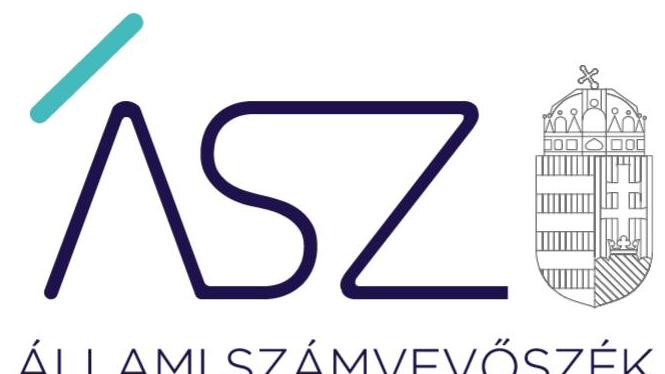
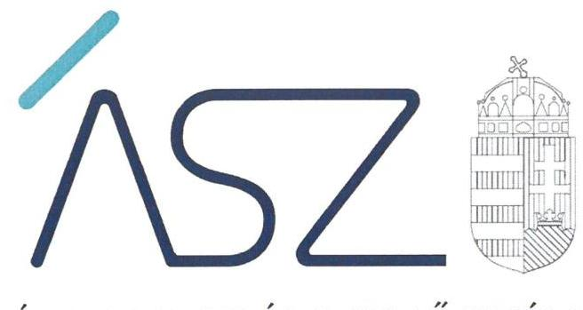
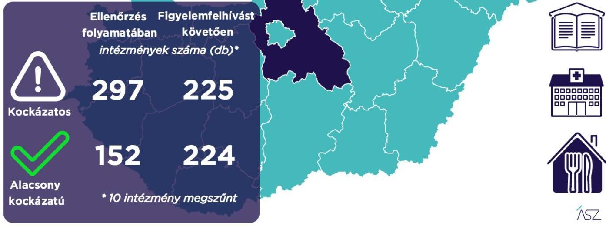

ÁLLAMI SZÁMVEVŐSZÉK

# JELENTÉS 

## A Pest megyei önkormányzati intézmények ellenőrzése

Az önkormányzat és társulás irányítása alá tartozó intézmények integritásának monitoring típusú ellenőrzése - 459 intézmény
2021.

21109
www.asz.hu

---

ÁLLAMI SZÁMVEVŐSZÉK

# JELENTÉS 

## A Pest megyei önkormányzati intézmények ellenőrzése

Az önkormányzat és társulás irányítása alá tartozó intézmények integritásának monitoring típusú ellenőrzése - 459 intézmény
2021. 12. hó 29. nap

21109
www.asz.hu

---

# AZ ELLENŐRZÉST FELÜGYELTE: 

SALAMON ILDIKŐ felügyeleti vezető

## AZ ELLENŐRZÉST VEZETTE ÉS A VÉGREHAJTÁSÁÉRT FELELŐS:

SZAPPANOS JÚLIA ellenőrzésvezető
VALASTYÁNNÉ DR VÍZHÁNYÓ JÚLIA ellenőrzésvezető

## A PROGRAM ÖSSZEÁLLÍTÁSÁÉRT FELELŐS:

DR. FELFÖLDI IZABELLA programkészítésért felelős vezető

## IKTATÓSZÁM: EL-3461-016/2021.

## TÉMASZÁM: 2568

ELLENŐRZÉS-AZONOSÍTÓ SZÁM: V0928

---

# TARTALOMJEGYZÉK 

■ ÖSSZEGZÉS ..... 5
■ AZ ELLENŐRZÉS JELENTŐSÉGE, AKTUALITÁSA, TÁRSADALMI SZEREPE, SZEMPONTJAI ..... 8
■ AZ ELLENŐRZÉS TERÜLETE ..... 9
■ ELLENŐRZÉS HATÓKÖRE ÉS MÓDSZERE ..... 10
■ MELLÉKLETEK ..... 13
I. sz. melléklet: Az értékelés módszertana ..... 13
II. sz. melléklet: Értelmező szótár ..... 15
■ FÜGGELÉKEK ..... 17
I. sz. függelék: Az ellenőrzött szervezetek és azok kockázati értékelése ..... 17
■ RÖVIDÍTÉSEK JEGYZÉKE ..... 39

---

.

---

# ÖSSZEGZÉS 

Az Állami Számvevőszék figyelemfelhívásának és tanácsadásának eredményeként a Pest megyei önkormányzatok irányítása alatt álló 459 ellenőrzött intézmény közül 153 intézménynél az intézményvezető már 2021-ben intézkedett, vagy intézkedéseket rendelt el az integritást biztosító alapvető feltételek megerősitése, illetve kiépitése érdekében. Ezeknek az intézményeknek javult az integritása, erősödtek a csalásmentes müködés feltételei.
199 intézménynél további intézkedések szükségesek az integritást biztosító alapvető feltételek kiépitése, illetve kiegészitése érdekében. Ezeknek az intézményeknek a vezetői az Állami Számvevőszék intézkedési kötelemmel járó figyelemfelhívására nem intézkedtek, ezért az azonosított kockázatok növekedtek, vagy intézkedéseik nem fedték le a kockázatos területeket, így az azonosított kockázatok nem változtak.
Az irányító önkormányzatok 10 intézmény megszüntetéséről döntöttek az ellenőrzött időszakban.

## Értékelések

Az Állami Számvevőszék a Pest megyei önkormányzatok irányítása alá tartozó 459 intézmény belső kontrollrendszerének lényeges elemei kialakítását ellenőrizte a 2021. évre vonatkozóan. Az ellenőrzés a súlypontok meghatározásával lehetőséget biztosított a szervezeti integritás, működés és vezetés, valamint a gazdálkodás területén a kockázatok azonosítására.

A szervezeti integritás alapvető feltétele a szabályozottság, azaz a jogszabályokban előírt belső szabályzatok megléte, azok - hatályos jogszabályoknak - megfelelő tartalma és gyakorlati alkalmazhatósága. Az integritási kockázatok szervezeti szinten csökkenthetők azáltal, hogy az intézményvezetők kialakítják a szervezeti és múködési kereteket, a gazdálkodásra vonatkozó alapvető szabályozási környezetet, valamint a kontrolltevékenységek szabályszerű gyakorlásának, az integrált kockázatkezelésnek és az integritást sértő események kezelésének a feltételeit.

A szervezeti integritás, a múködés és a vezetés alapvető szabályozási feltételeinek kialakítása hozzájárul a csalásmentes integritási környezet megteremtéséhez.

A szervezeti és múködési szabályzat teremti meg a szervezet szabályszerű működésének alapjait, illetve rögzíti a szervezeten belüli felelősségi viszonyokat. A szabályzat biztosítja a szervezeti múködés szabályozottságát, ezáltal a szervezet tevékenységének átláthatóságát, a szervezeti célokkal összhangban történő múködés feltételeit és annak ellenőrizhetőségét. Az ellenőrzöttek közül 421 intézmény rendelkezett szervezeti és múködési szabályzattal a 2021. évben.

A jogszabályi előírásoknak eleget téve, nyilatkozatban értékelte az intézmény belső kontrollrendszerének minőségét 383 intézmény vezetője. Ezek közül 278 intézménynél alakítottak ki olyan szabályozásokat, folyamatokat, amelyek biztosítják a költségvetési szerv tevékenységében a rendelkezésre álló források átlátható, szabályszerű, szabályozott, gazdaságos, hatékony és eredményes felhasználása követelményeinek érvényesítését.

Az integrált kockázatkezelés eljárásrendjét 384, a szervezeti integritást sértő események kezelésének eljárásrendjét 377 intézménynél alakították ki az intézményvezetők. Az integrált kockázatkezelés eljárásrendje biztosítja a szervezet múködésében rejlő kockázatok azonosításának és kezelésének feltételeit. A szervezet múködési kockázatai veszélyeztethetik a közpénzekkel való átlátható, elszámoltatható és felelős gazdálkodást. Az integritást sértő események kezelésének eljárásrendje jelenti a szervezet tekintetében felmerülő és a szervezeten belül bekövetkező integritást sértő események kezelésének alapjait. Az eljárásrend kialakításával az intézmény vezetője támogatja az integritást sértő eseményekkel kapcsolatosan azonosított kockázatok bekövetkezése esetén azok hatékony kezelését, illetve a következmények enyhítését.

---

A pénz- és vagyongazdálkodáshoz kapcsolódó alapvető szabályozások és nyilvántartások - így a számviteli politika és a keretében elkészítendő szabályzatok, a számlarend, a beszerzések szabályozása, valamint a kötelezettségvállalásra és a teljesítés igazolására jogosultak és aláírásmintáik nyilvántartása - előmozdítják a közpénzügyek átláthatóságát, rendezettségét. Az intézményvezető ezen szabályzatok elkészítésével, nyilvántartások vezetésével és folyamatos karbantartásával az alapfeltételét biztosítja a pénzügyi- és vagyongazdálkodás átláthatóságának, a közpénzekkel és közvagyonnal való elszámoltathatóságnak. Az ellenőrzöttek közül 386 intézménynél a számviteli politika, 365 intézménynél a számlarend, 347 intézménynél a beszerzések lebonyolításával kapcsolatos eljárásrend rendelkezésre állt.

Az ellenőrzöttek közül 97 intézmény vezetője tett eleget az ellenőrzött területek mindegyikén az integritási kontrollok alapvető feltételeit jelentő, a jogszabályban előírt szabályozási kötelezettségének. Közülük 61 intézmény vezetője a jogszabályi előírásokon túl további erőfeszítéseket is tett az integritás erősítése érdekében, felismerte további olyan integritási kontrollok kialakításának indokoltságát, amelyet jogszabály nem ír elő, így szervezeti szinten hozzájárul a korrupcióval szembeni védettség megszilárdításához.

387 intézmény esetében az intézményvezető intézkedése volt szükséges a kockázatok csökkentése érdekében, mivel 149 intézménynél a jogszabályok által előírt kontrollok területén, 202 intézménynél a jogszabályok által előírt és a további, jogszabály által nem előírt integritási kontrollok területén egyaránt, 36 intézménynél utóbbi kontrollok területén voltak hiányosságok. A dokumentumok kiértékelése alapján - az integritás további fejlesztése érdekében - az Állami Számvevőszék azonosította a lényeges kockázati területeket, és már az ellenőrzés lefolytatásával párhuzamosan, a 2021. évre vonatkozóan a kockázatok csökkentésére hívta fel az intézményvezetők figyelmét.

# Következtetések 

Az érintett 351 intézmény közül 283 intézmény vezetője válaszolt határidőben az Állami Számvevőszék figyelemfelhívására. Közülük 198 teljeskörűen, 59 részben egyetértett a kockázatos területeken teendő intézkedések indokoltságával. Az intézményvezetők közül 161 arról tájékoztatta az Állami Számvevőszéket, hogy valamennyi kockázatos területen, 80 pedig a kockázatos területek egy részénél már tett, illetve a jövőben tesz intézkedést a jelzett kockázatok csökkentése érdekében. A jogszabályi előírásokon túli integritási kontrollok területén az érintett 238 intézmény közül 137 intézmény vezetője a jelzett kockázatok teljes körű, 13 pedig azok részbeni felszámolásáról adtak számot. Ezek eredményeként a 387 vezetői levélben jelzett 1725 kockázati terület közül 900 esetben már történt, illetve tervezett az intézkedés, így javulás várható a feltárt kockázatos területek 52,2\%-ánál.

Az intézkedések eredményeként az ellenőrzött 459 intézmény közül összesen 224 intézménynél a kockázatok alacsony szintűek, illetve - a tervezett intézkedések végrehajtásával - a kockázatok alacsony szintre csökkennek.

A szabályozások és nyilvántartások kialakításának célja nem önmagában a jogszabályi rendelkezések betartása, hanem az intézmény szabályozottságán keresztül a szabályszerű és csalásmentes gazdálkodás feltételeinek megteremtése, ezáltal az Alaptörvényben előírt átláthatóság és elszámoltathatóság elvének érvényesítése. Ezeknek az alapelveknek érvényesülése hozzájárulhat ahhoz, hogy az intézmények, mint közszolgáltatást nyújtó szervezetek felé a közszolgáltatásokat igénybe vevők, és általuk az állampolgárok általános bizalma is erősödjön.

Az Állami Számvevőszék figyelemfelhívására nem válaszoló, illetve a jelzett kockázatokra nem, vagy csak részben intézkedő intézményvezetők által vezetett intézményeknél rendszerszintű kockázatok maradtak fenn. Vezetési-irányítási kockázatot jelez, amennyiben az intézményvezetőnek címzett figyelemfelhívásra az intézményvezető helyett más személy válaszolt. Felelősségi és hatásköri kockázatot jelez, amennyiben az intézmény pénzügyi- és vagyongazdálkodásának alapvető szabályzatait a kontrollrendszer kialakításáért felelős intézményvezető helyett egy másik költségvetési szerv vezetője alakította ki, határozta meg. További kockázatot jelent a szabályok alkalmazottak általi megismerésére és alkalmazására, az intézmény mindennapi működésének integritására. Mindezek egyrészt az intézmény pénzügyi és vagyongazdálkodásának szabályszerűségét, másrészt a vezetői nyilatkozatok hitelességét, valóságtartalmát is megkérdőjelezi. A jelzett kockázatok arra mutatnak rá, hogy ezeknél az intézményeknél sérül a vezetői felelősség elve, és ezzel a felelős vezetésre épülő intézményi önállóság múködése.

Az integritás elvű működés erősítése érdekében további kockázatcsökkentő lépések szükségesek a vezetés-irányítás, valamint a pénzügyi- és a vagyongazdálkodás szabályszerű feltételeinek kialakítása terén. Ezen intézmények integritásának kiépítését következő lépésként az irányító szerv bevonásával támogatja az Állami Számvevőszék.

---

# Erősödött a csalásmentesség a Pest megyei önkormányzati intézményeknél 

459 intézményt ellenőrzött az ÁSZ

---

# AZ ELLENŐRZÉS JELENTŐSÉGE, AKTUALITÁSA, TÁRSADALMI SZEREPE, SZEMPONTJAI 

Az Alaptörvény alapértékeket, elveket fogalmaz meg, amely szerint a közpénzekkel gazdálkodó minden szervezet köteles a nyilvánosság előtt elszámolni a közpénzekre vonatkozó gazdálkodásával. A közpénzeket és a nemzeti vagyont az átláthatóság és a közélet tisztaságának elve szerint kell kezelni.

Magyarország helyi önkormányzatairól szóló törvény ${ }^{1}$ a helyi közhatalom gyakorlás széleskörű érvényesítésével összhangban tág teret ad a helyi önkormányzatoknak a feladataik, a közszolgáltatások legkülönbözőbb formákban történő ellátására, így széleskörű lehetőséggel rendelkeznek intézmények alapítására.

A helyi önkormányzatok irányítása alá tartozó intézmények szerteágazó közszolgáltatásokat nyújtanak. Az intézmények működtetése közvetlenül érinti a társadalom valamennyi rétegét, a közfeladatot ellátó intézmények működésének minősége közvetlen hatással van az azokat igénybe vevő állampolgárok életére.

Az intézmények szabályszerű és eredményes működésének és gazdálkodásának alapfeltétele a belső kontrollrendszer - benne az integritási kontrollok - megfelelő kialakítása. Az ÁSZ² a törvényi felhatalmazással élve ellenőrzi az önkormányzati intézményeket, hogy megállapításaival támogassa az ellenőrzött szervezetek szabályszerű gazdálkodását, müködését.

A helyi önkormányzatok intézményei által ellátott feladatok, a bölcsődei, óvodai ellátás, a gyermekétkeztetés, a betegek és idősek gondozása, a közművelődési intézmények, könyvtárak működtetése által a lakosság ezeken a területeken találkozik legszélesebb körben az önkormányzatok által nyújtott szolgáltatásokkal. A szolgáltatásokat igénybe vevők jelentős száma, a feladatellátáshoz használt nemzeti vagyon és az erre fordított közpénz nagysága indokolja, hogy az ÁSZ további, az előző ellenőrzésekre épülő ellenőrzéseket végezzen ezen a területen, illetve további olyan területeken, ahol az önkormányzati szolgáltatást a lakosság széles köre veszi igénybe.

Az ellenőrzés célja annak értékelése, hogy a helyi önkormányzatok irányítása alá tartozó intézmények megterem-tették-e az integritás biztosításához szükséges feltételeket, kialakították-e az alapvető, a szervezeti kereteket, az integritási kontrollokhoz kapcsolódó, valamint a korrupció elleni védelmet szolgáló szabályozásokat. Továbbá, hogy az intézményvezető gondoskodott-e a szervezeti teljesítmény mérés alapfeltételeinek kialakításáról az eredményességi szempontoknak való megfelelés megalapozottsága biztosítása érdekében. A monitoring típusú ellenőrzés célja hatékonyan támogatni az ellenőrzött szervezeteket, ezáltal növelve az ÁSZ tanácsadó szerepét, elősegítve a „jól irányított állam" müködését.

Az ÁSZ célja, hogy új ellenőrzési megközelítést alkalmazva támogassa a közpénzügyi helyzet javítását; a monitoring típusú ellenőrzéssel jelen időben adjon helyzetképet az integritási szemlélet érvényesítéséről, rávilágítson az integritási kontrollok kiépítettségére, illetve további fejlesztésére. Napjainkban mindez kiemelt fontosságúvá vált. Minden szervezetnek fel kell készülnie arra, hogy a koronavírus járvány okozta társadalmi és gazdasági válság növelni fogja a korrupciós nyomást. Az ÁSZ ebben a helyzetben is alapvető kötelességének tartja, hogy a közpénzek őre legyen, és ellenőrzéseit az önkormányzati alrendszer intézményei körében is folytassa.

Fontos, hogy az intézmények vezetői felismerjék az integritás kockázatokat, azokat ismételten mérjék fel, és alakítsanak ki átlátható, jól szabályozott rendszereket, döntési mechanizmusokat. Az integritási kockázatok feltárása, megismerése elengedhetetlenül fontos, mert ezt követően tehetők meg azok a lépések, amelyek a kockázatok csökkentését, felszámolását és kezelését célozzák. A belső kontrollrendszer - benne az integritás kontrollok - megfelelő kialakítása, müködése a helyi önkormányzatok irányítása alatt álló intézményeknél is hozzájárul a társadalmi közbizalom erősítéséhez.

Az ellenőrzés rámutat az integritási jó gyakorlatokra is, továbbá felhívja a figyelmet a jogszabályi követelmények teljesítéséhez szükséges lépésekre is.

---

# AZ ELLENŐRZÉS TERÜLETE 

## Az önkormányzatok irányítása alá tartozó intézmények

Helyi önkormányzati költségvetési szervet az államháztartásról szóló 2011. évi CXCV törvény (Áht. ${ }^{3}$ ) szerint a helyi önkormányzat, a helyi önkormányzatok társulása, a térségi fejlesztési tanács, az átalakult nemzetiségi önkormányzat alapíthat, a költségvetési szerv alapító okiratában meghatározott önkormányzati közfeladatok ellátására. A költségvetési szervek önálló jogi személyek, éves költségvetésükből gazdálkodva látják el feladataikat. A költségvetési szervek gazdasági szervezettel rendelkeznek, ha azonban a költségvetési szerv éves átlagos statisztikai állományi létszáma a 100 főt nem éri el, a gazdasági szervezet feladatait az önkormányzati hivatal, vagy az irányító szerv döntése alapján az irányító szerv irányítása alá tartozó, gazdasági szervezettel rendelkező más költségvetési szerv látja el.

Az államháztartásról szóló törvény végrehajtásáról szóló 368/2011. (XII. 31.) Korm. rendelet (Ávr. ${ }^{4}$ ) 1. melléklete szerint, az államháztartás önkormányzati alrendszerében a helyi önkormányzat által irányított költségvetési szerv esetében az irányító szerv hatáskörét a képviselőtestület, közgyűlés gyakorolja, és annak vezetője a polgármester, főpolgármester, megyei közgyűlés elnöke.

Az ellenőrzés a Pest megyei önkormányzatok irányítása alá tartozó, az I. sz. Függelékben felsorolt költségvetési szervekre terjedt ki.

A feladatellátásuk szerint az ellenőrzött költségvetési szervek egy része óvoda, bölcsőde, egészségügyi intézmény, konyha, művelődési ház, múzeum, oktatási központ, kulturális központ, idősek otthona, gondozási központ, gyermekjóléti intézmény, sportközpont intézményként működik.

Az ellenőrzött 459 intézmény közül 14 rendelkezik saját gazdasági szervezettel.

Az ellenőrzés 458 intézmény esetében lefolytatásra került. Egy intézmény esetében az ellenőrzés adatszolgáltatás hiányában nem volt lefolytatható, az ÁSZ az ellenőrzött integritási kockázatát kiemelten magasnak értékelte.

Az ellenőrzött időszakban 10 intézmény megszűnt.

---

# ELLENŐRZÉS HATÓKÖRE ÉS MÓDSZERE 

## Az ellenőrzés típusa

Megfelelőségi ellenőrzés.

## Az ellenőrzött időszak

A 2021. év, a Bkr. ${ }^{5}$ szerinti vezetői nyilatkozat, valamint annak alátámasztottsága vonatkozásában a 2020. év.

## Az ellenőrzés tárgya

A szervezeti keretekkel, a működéssel és gazdálkodással kapcsolatos szabályzatok, szabályozások, valamint a szervezeti elvekkel, értékekkel összefüggő integritás kontrollok kiépítettsége, a szervezeti teljesítmény mérés alapfeltételeinek kialakítása.

## Az ellenőrzött szervezetek

Az ellenőrzött intézményeket az I. sz. Függelék tartalmazza.

## Az ellenőrzés jogalapja

Az ellenőrzés jogszabályi alapját az ÁSZ tv. ${ }^{6}$ 1. § (3) bekezdése, 5. § (6) bekezdése, valamint az Áht. 61. § (2) bekezdése képezik.

## Az ellenőrzés módszerei

Az ÁSZ az ellenőrzést az ellenőrzési program szempontjai, az ellenőrzött időszakban hatályos jogszabályok, a jelen ellenőrzésre irányadó ÁSZ módszertan figyelembevételével és a nemzetközi standardokat irányadónak tekintve végzi.

Az ellenőrzés ideje alatt az ÁSZ az ellenőrzött szervezetekkel történő kapcsolattartást az ÁSZ SZMSZ7-ének vonatkozó előírásai alapján biztosítja.

Az ellenőrzési kérdések megválaszolásához szükséges bizonyítékok megszerzése a következő ellenőrzési eljárások alkalmazásával történik: megfigyelés, összehasonlítás, elemző eljárás. Az ellenőrzési bizonyítékként felhasználható adatforrások közé tartoznak az ellenőrzési programban felsorolt adatforrások, továbbá minden - az ellenőrzés folyamán - feltárt, az ellenőrzés szempontjából információkat tartalmazó dokumentum.

---

Az ÁSZ az ellenőrzést a kérdésekre adott válaszok kiértékelésével, valamint a megjelölt adatforrások, továbbá az adott időszakban hatályos jogszabályok, valamint az ÁSZ honlapján közzétett helyénvalósági kritériumok figyelembevételével folytatja le.

A monitoring típusú ellenőrzés az önkormányzatok irányítása alá tartozó intézmények integritás alapú múködésének lényeges területeire és a közpénzügyi helyzet javítása érdekében az elért eredmények fenntartására fókuszál. Lehetőséget biztosít az integritási kontrollok kiépítettségében lévő hiányosságok, a szervezeti teljesítmény mérés alapfeltételei kialakításának hiánya beazonosítására az eredményességi szempontoknak való megfelelés megalapozottsága biztosítása érdekében, az önkormányzatok, társulások irányítása alá tartozó intézmények integritásának elemzésére, részletes ellenőrzések megalapozására.

---

.

---

# MELLÉKLETEK 

I. SZ. MELLÉKLET: AZ ÉRTÉKELÉS MÓDSZERTANA

Az egyes kockázati területek és kockázatforrások minősítése „pontozásos módszerrel", az integritás „jelző" dokumentumai és a vezetői magatartás ellenőrzéshez kapcsolódóan tanúsított tényhelyzeteinek értékelése alapján történt.

Az értékelt dokumentumokhoz, nyilvántartásokhoz, kockázati besorolásokhoz minden esetben pontszám került hozzárendelésre, amelyek értéke alapján az ellenőrzött szervezetek kockázati csoportba kerültek besorolásra:

- Alacsony kockázatú - az elérhető összes pontszám legalább 80\%-a
- Közepes kockázatú - az elérhető pontszám 50-79\%-a között
- Magas kockázatú - az elérhető pontszám 50\%-a alatt

Az első lépésben azonosításra kerültek azok az intézményi szabályozások és nyilvántartások, amelyek meglétét jogszabály írja elő, hiánya pedig felveti a csalás és korrupció kockázatát.

Második lépésben az adatoknak az ellenőrzés rendelkezésére bocsátása kockázati kritériumainak meghatározása, majd értékelése történt meg.

Harmadik lépésben a figyelemfelhívó levelekre adott válaszok kockázati kritériumainak meghatározása, majd értékelése történt meg.

Az összesített kockázati értékelést javította, amennyiben

- az intézmény rendelkezett olyan szabályozással, amely kötelező meglétét jogszabály nem írja elő, de segíti a csalás és a korrupció megelőzését (helyénvalósági dokumentumok).

Az összesített kockázati értékelést rontotta, amennyiben

- az integritás szempontjából meghatározó dokumentum - az intézményi SZMSZ - hiányzott, és javítása érdekében a figyelemfelhívó levél hatására sem történt intézkedés.

A figyelemfelhívó levelekre adott válaszok értékelése alapján:

- A kockázat csökkent, amennyiben a figyelemfelhívó levélre adott válasza a figyelemfelhívással összhangban volt, valamennyi kockázati területen intézkedett vagy intézkedést tervezett.
- A kockázat változatlan, amennyiben a figyelemfelhívó levélben foglaltaktól eltérő magatartást tanúsított, intézkedése a figyelemfelhívással részben volt összhangban, a kockázati területeken részben intézkedett vagy intézkedést tervezett.
- A kockázat nőtt, amennyiben nem volt együttműködő, a figyelemfelhívó levélre nem válaszolt, vagy válasza alapján nem intézkedett és nem tervezett intézkedést.

---

# Az önkormányzatok irányítása alá tartozó intézmények kockázati csoportba sorolásának értékelési keretrendszere 

I. Dokumentumokkal rendelkezés
lényeges dokumentumok, amelyek hiánya felveti a csalás és korrupció kockázatát
I.1. A szervezeti integritás, müködés és vezetés alapvető szabályozási feltételei

- intézmény SZMSZ-e
- vezetői nyilatkozat a 2020. évre vonatkozóan az intézmény belső kontrollrendszer minőségének értékeléséről, valamint a nyilatkozat megalapozottságát bizonyító dokumentumok
- integrált kockázatkezelés eljárásrendje
- az integritást sértő események kezelésének eljárásrendje
I.2. A pénz- és vagyongazdálkodáshoz kapcsolódó alapvető szabályozások
- számviteli politika
- az eszközök és a források leltárkészítési és leltározási szabályzata
- az eszközök és a források értékelési szabályzata
- pénzkezelési szabályzat
- számlarend
- beszerzések lebonyolításával kapcsolatos eljárásrend
- a kötelezettségvállalásra, teljesítés igazolására jogosult személyekről és aláírás-mintájukról vezetett nyilvántartás
II. Az adatoknak az ellenőrzés rendelkezésére bocsátása
II.1. A megnevezett adatokkal rendelkezett és a törvényi határidőn belül hiánytalanul rendelkezésre bocsátotta. Figyelem-, illetve figyelmet felhívó levél nem volt indokolt.
II.2. A megnevezett adatokat nem bocsátotta rendelkezésre.
III. Figyelemfelhívó levelekre adott válaszok kockázati értékelése
III.1. Kockázat csökkent: együttmüködése a figyelemfelhívó levéllel összhangban volt.
III.2. Kockázat változatlan: a figyelemfelhívó levélben foglaltaktól eltérő együttműködést tanúsított.
III.3. Kockázat nőtt: nem reagált, nem intézkedett, így nem volt együttmüködő.

---

belső kontrollrendszer

Belső kontrollrendszer területei
integrált kockázatkezelési rendszer
integritás

Integritási kockázatok

A belső kontrollrendszer a kockázatok kezelése és tárgyilagos bizonyosság megszerzése érdekében kialakított folyamatrendszer, amely azt a célt szolgálja, hogy a müködés és gazdálkodás során a tevékenységeket szabályszerűen, gazdaságosan, hatékonyan, eredményesen hajtsák végre, az elszámolási kötelezettségeket teljesítsék, megvédjék az erőforrásokat a veszteségektől, károktól és nem rendeltetésszerű használattól. (Forrás: Áht. 69. § (1) bekezdése)
A kontrollkörnyezet, az integrált kockázatkezelési rendszer, a kontrolltevékenységek, az információs és kommunikációs rendszer, valamint a nyomon követési (monitoring) rendszer. (Forrás: Bkr. 3. §-a)
Olyan folyamatalapú kockázatkezelési rendszer, amely a szervezet minden tevékenységére kiterjed, egységes módszertan és eljárások alkalmazásával, a szervezet célkitűzéseinek és értékeinek figyelembevételével biztosítja a szervezet kockázatainak teljes körű azonosítását, azok meghatározott kritériumok szerinti értékelését, valamint a kockázatok kezelésére vonatkozó intézkedési terv elkészítését és az abban foglaltak nyomon követését. (Forrás: Bkr. 2. § m) pontja)
Az integritás az elvek, értékek, cselekvések, módszerek, intézkedések konzisztenciáját jelenti, vagyis olyan magatartásmódot, amely meghatározott értékeknek megfelel. (Forrás: Nemzetgazdasági Minisztérium: Államháztartási belső kontroll standardok és gyakorlati útmutató 1.1.3. pontja, 2017. szeptember)
A szervezeti integritás a szervezet védekezőképessége a korrupció lehetőségével szemben. Az integritás erősítése - mint preventív eszközrendszer - a korrupció megelőzésére fókuszál. A szervezeti integritás a müködés, a szervezeti kultúra minőségét is jelzi.
Az ellenőrzés megközelítése szerint az integritás a szervezet értékeinek és célkitüzéseinek megfelelő müködést jelenti. Minél magasabb színvonalú egy szervezet integritása, az annál ellenállóbb a korrupcióval, a korrupciós veszélyekkel szemben, vagyis az integritás erősítése - elsősorban az egyes szervezetek szintjén - a korrupciós kockázatok mérséklésének egyik fontos eszköze. Az integritás ugyanakkor tágabb jelentésű fogalom, nemcsak a korrupciótól, hanem más helytelen magatartásoktól (például csalás, önkényesség) való mentességet és a szervezet céljainak követését is jelenti. Egy szervezet integritását úgy is meghatározhatjuk, mint a szervezet ellenállóképességét annak a veszélynek, hogy dolgozói helytelen magatartásukkal kárt okozzanak.
Az integritás megerősítése és fenntartása elsősorban a szervezet elsőszámú vezetőjének felelőssége.
Integritási kockázatnak minősül a szervezet célkitűzéseit, értékeit, elveit sértő vagy veszélyeztető visszaélés, szabálytalanság, vagy egyéb esemény lehetősége. A korrupciós kockázat olyan integritási kockázat, amely korrupciós cselekmény bekövetkezésének lehetőségét jelenti. Minden korrupciós kockázat egyben integritási kockázat is. Korrupciós cselekményeknek nevezzük azokat a vesztegetésszerű cselekményeket, amelyeket általában a Büntető Törvénykönyv ${ }^{8}$ is büntetéssel fenyeget.
Az integritási kockázat alatt az integritás megsértésének esélyét értjük. Az integritási kockázatok olyan helyzetek, folyamatok, amelyek során fennáll a korrupciós befolyás lehetősége. Így integritási kockázatok jelentkeznek például a köz- és a magánszféra közötti üzleti tranzakciók során, a köztisztviselők által hozott döntések, a mérlegelési szabadság körében, illetve abban az esetben, ha egy közszolgáltatás iránt nagyobb a kereslet, mint a kielégítéséhez rendelkezésre álló erőforrások. Az integritási kockázat értelemszerűen nem egyenlő magával az integritás sérelmével, vagy a korrupció be-

---

kockázat
kontrollkörnyezet
kontrolltevékenységek
intézmény
következésével. Az integritási kockázatokkal szemben megfelelő kontrollok kiépítésével lehet védekezni. Amennyiben az integritási kontrollok szintje elmarad a kockázatok mértékétől, kockázati kitettségről beszélünk. A kontrollok kialakításának és müködtetésének mérlegelésekor minden esetben vizsgálni kell a kockázatok szintjét is, a túlszabályozottság egyfelől költséges, másfelől a túlzott bürokrácia maga is lehet a korrupciós veszély hordozója.
A kockázat annak a valószínűségét jelenti, hogy egy vagy több esemény, vagy intézkedés nem kívánt módon befolyásolja a rendszer múködését, céljainak megvalósulását. (Forrás: Javaslatok a korrupciós kockázatok kezelésére - Kockázatkezelési és ellenőrzési módszertan 35. oldal, ÁSZ)
A költségvetési szerv vezetője által kialakított olyan elvek, eljárások, belső szabályzatok összessége, amelyben világos a szervezeti struktúra, a folyamatok átláthatók, egyértelmúek a felelősségi, hatásköri viszonyok és feladatok, meghatározottak, ismertek és elfogadottak az etikai elvárások a szervezet minden szintjén, átlátható a humánerőforrás-kezelés, biztosított a szervezeti célok és értékek irányában való elkötelezettség fejlesztése és elősegítése. (Forrás: Bkr. 6. § (1) bekezdés)
A költségvetési szerv vezetője által a szervezeten belül kialakított (kontroll) tevékenységek, melyek biztosítják a kockázatok kezelését, hozzájárulnak a szervezet céljainak eléréséhez és erősítik a szervezet integritását. (Forrás: Bkr. 8. § (1) bekezdés)
A helyi önkormányzatok irányítása alá tartozó költségvetési szervek. (A képviselő-testület a feladatkörébe tartozó közszolgáltatások ellátására - jogszabályban meghatározottak szerint - költségvetési szervet (önkormányzati intézmény) alapíthat; Forrás: Mötv. 41. § (6) bekezdés)

---

# FÜGGELÉKEK

I. SZ. FÜGGELÉK: AZ ELLENŐRZÖTT SZERVEZETEK ÉS AZOK KOCKÁZATI ÉRTÉKELÉSE

|  Sorszám | Ellenőrzött szervezet megnevezése | Irányító szerv (önkormányzat) megnevezése | Helység | Tanácsadást megelőző kockázati besorolás | Intézkedést követően a kockázati értékelés változása | A kockázati szint alacsonyra csökkent-e  |
| --- | --- | --- | --- | --- | --- | --- |
|  1. | Tormay Károly Egészségügyi Központ Gödöllő | Gödöllő Város Önkormányzata | Gödöllő | KÖZEPES | CSÖKKENT | I  |
|  2. | Gödöllői Egyesített Szociális Intézmény | Gödöllő Város Önkormányzata | Gödöllő | KÖZEPES | CSÖKKENT | I  |
|  3. | Gödöllői Forrás Szociális Segítő és Gyermekjóléti Központ | Gödöllő Város Önkormányzata | Gödöllő | KÖZEPES | CSÖKKENT | I  |
|  4. | Gödöllői Városi Könyvtár és Információs Központ | Gödöllő Város Önkormányzata | Gödöllő | KÖZEPES | CSÖKKENT | I  |
|  5. | Budajenői Óvoda | Budajenő Község Önkormányzata | Budajenő | ALACSONY | NEM VOLT SZABÁLYSZERÜSÉGI HIBA | N  |
|  6. | Nagykovácsi Kispatak Óvoda | Nagykovácsi Nagyközség Önkormányzata | Nagykovácsi | ALACSONY | NEM VOLT SZABÁLYSZERÜSÉGI HIBA | I  |
|  7. | Öregiskola Közösségi Ház és Könyvtár | Nagykovácsi Nagyközség Önkormányzata | Nagykovácsi | ALACSONY | NEM VOLT SZABÁLYSZERÜSÉGI HIBA | I  |
|  8. | Dánszentmiklósi Mosolygó Alma Óvoda és Mini Bölcsőde | Dánszentmiklós Község Önkormányzata | Dánszentmiklós | ALACSONY | NEM VOLT SZABÁLYSZERÜSÉGI HIBA | I  |
|  9. | Művelődési és Sportház, Könyvtár | Dánszentmiklós Község Önkormányzata | Dánszentmiklós | ALACSONY | NEM VOLT SZABÁLYSZERÜSÉGI HIBA | I  |
|  10. | Alsónémedi Szivárvány Napkóziotthonos Óvoda | Alsónémedi Nagyközség Önkormányzata | Alsónémedi | KÖZEPES | NÖTT | N  |
|  11. | Halászy Károly Művelődési Ház és Könyvtár | Alsónémedi Nagyközség Önkormányzata | Alsónémedi | ALACSONY | NEM VOLT SZABÁLYSZERÜSÉGI HIBA | I  |
|  12. | Csömöri Nefelejcs Művészeti Óvoda | Csömör Nagyközség Önkormányzata | Csömör | KÖZEPES | NEM VÁLTOZOTT | N  |
|  13. | Szociális Alapszolgáltatási Központ | Csömör Nagyközség Önkormányzata | Csömör | KÖZEPES | NEM VÁLTOZOTT | N  |
|  14. | Petőfi Sándor Művelődési Ház | Csömör Nagyközség Önkormányzata | Csömör | KÖZEPES | NÖTT | N  |
|  15. | Isaszegi Hétszínvirág Óvoda | Isaszeg Város Önkormányzat | Isaszeg | KÖZEPES | CSÖKKENT | I  |
|  16. | Jókai Mór Városi Könyvtár | Isaszeg Város Önkormányzat | Isaszeg | KÖZEPES | NEM VÁLTOZOTT | N  |
|  17. | Isaszegi Bóbita Óvoda | Isaszeg Város Önkormányzat | Isaszeg | KÖZEPES | CSÖKKENT | I  |
|  18. | Isaszegi Művelődési Ház és Múzeumi Kiállítóhely | Isaszeg Város Önkormányzat | Isaszeg | KÖZEPES | NEM VÁLTOZOTT | N  |
|  19. | Isaszegi Humánszolgáltató Központ | Isaszeg Város Önkormányzat | Isaszeg | KÖZEPES | NEM VÁLTOZOTT | N  |

---

| Sorszám | Ellenőrzött szervezet megnevezése | Irányító szerv (önkormányzat) megnevezése | Helység | Tanácsadást megelőző kockázati besorolás | Intézkedést követően a kockázati értékelés változása | A kockázati szint alacsonyra csökkent-e |
| :--: | :--: | :--: | :--: | :--: | :--: | :--: |
| 20. | Pilisszentkereszti Közösségi Ház és Könyvtár | Pilisszentkereszt Község Önkormányzata | Pilisszentkereszt | KÖZEPES | CSÖKKENT | I |
| 21. | Vácrátóti Mókus Óvoda-Bölcsőde | Vácrátót Község Önkormányzata | Vácrátót | KÖZEPES | NEM VÁLTOZOTT | N |
| 22. | Gödöllői Kastélykert Óvoda | Gödöllő Város Önkormányzata | Gödöllő | MEGSZÜNT INTÉZMÉNY | MEGSZÜNT INTÉZMÉNY | MEGSZÜNT   INTÉZ-   MÉNY |
| 23. | Gödöllői Mesék Háza Óvoda | Gödöllő Város Önkormányzata | Gödöllő | MEGSZÜNT INTÉZMÉNY | MEGSZÜNT INTÉZMÉNY | MEGSZÜNT   INTÉZ-   MÉNY |
| 24. | Gödöllői Mosolygó Óvoda | Gödöllő Város Önkormányzata | Gödöllő | MEGSZÜNT INTÉZMÉNY | MEGSZÜNT INTÉZMÉNY | MEGSZÜNT   INTÉZ-   MÉNY |
| 25. | Gödöllői Palotakert Óvoda | Gödöllő Város Önkormányzata | Gödöllő | MEGSZÜNT INTÉZMÉNY | MEGSZÜNT INTÉZMÉNY | MEGSZÜNT   INTÉZ-   MÉNY |
| 26. | Gödöllői Zöld Óvoda | Gödöllő Város Önkormányzata | Gödöllő | MEGSZÜNT INTÉZMÉNY | MEGSZÜNT INTÉZMÉNY | MEGSZÜNT   INTÉZ-   MÉNY |
| 27. | Gödöllői Egyesített Palotakert Bölcsőde | Gödöllő Város Önkormányzata | Gödöllő | KÖZEPES | NEM VÁLTOZOTT | N |
| 28. | Gödöllői Mesevilág Bölcsőde | Gödöllő Város Önkormányzata | Gödöllő | MEGSZÜNT INTÉZMÉNY | MEGSZÜNT INTÉZMÉNY | MEGSZÜNT   INTÉZ-   MÉNY |
| 29. | Gödöllői Fenyőliget Óvoda | Gödöllő Város Önkormányzata | Gödöllő | MEGSZÜNT INTÉZMÉNY | MEGSZÜNT INTÉZMÉNY | MEGSZÜNT   INTÉZ-   MÉNY |
| 30. | Gödöllői Kikelet Óvoda | Gödöllő Város Önkormányzata | Gödöllő | MEGSZÜNT INTÉZMÉNY | MEGSZÜNT INTÉZMÉNY | MEGSZÜNT   INTÉZ-   MÉNY |
| 31. | Pilisszentkereszti Szlovák Nemzetiségi Óvoda és Főzőkonyha | Pilisszentkereszt Község Önkormányzata | Pilisszentkereszt | KÖZEPES | CSÖKKENT | I |
| 32. | Pilisjászfalui Somvirág Óvoda és Bölcsőde | Pilisjászfalu Község Önkormányzata | Pilisjászfalu | KÖZEPES | CSÖKKENT | I |
| 33. | Gödöllői Városi Múzeum | Gödöllő Város Önkormányzata | Gödöllő | KÖZEPES | CSÖKKENT | I |
| 34. | Szadai Szociális Alapszolgáltatási Központ | Szada Nagyközség Önkormányzat | Szada | ALACSONY | NEM VOLT SZABÁLYSZERÚSÉGI HIBA | I |
| 35. | Székely Bertalan Művelődési Ház és Könyvtár | Szada Nagyközség Önkormányzat | Szada | KÖZEPES | NÖTT | N |
| 36. | Székely Bertalan Óvoda-Bölcsőde | Szada Nagyközség Önkormányzat | Szada | KÖZEPES | CSÖKKENT | I |
| 37. | Nyársapáti Általános Művelődési Központ | Nyársapát Község Önkormányzata | Nyársapát | MAGAS | NEM VÁLTOZOTT | N |
| 38. | Lenvirág Bölcsőde és Védőnői Szolgálat | Nagykovácsi Nagyközség Önkormányzata | Nagykovácsi | ALACSONY | NEM VOLT SZABÁLYSZERÚSÉGI HIBA | I |
| 39. | Csömöri Községgondnokság | Csömör Nagyközség Önkormányzata | Csömör | KÖZEPES | NÖTT | N |
| 40. | Isaszegi Aprók Falva Bölcsőde | Isaszeg Város Önkormányzat | Isaszeg | KÖZEPES | NEM VÁLTOZOTT | N |

---

| Sorszám | Ellenőrzött szervezet megnevezése | Irányító szerv (önkormányzat) megnevezése | Helység | Tanácsadást megelőző kockázati besorolás | Intézkedést követően a kockázati értékelés változása | A kockázati szint alacsonyra csökkent-e |
| :--: | :--: | :--: | :--: | :--: | :--: | :--: |
| 41. | Idősek Otthona és Klubja | Vác Város Önkormányzat | Vác | KÖZEPES | NÖTT | N |
| 42. | Madách Imre Múvelődési Központ | Vác Város Önkormányzat | Vác | KÖZEPES | NÖTT | N |
| 43. | Bölcsődék és Fogyatékosok Intézménye | Vác Város Önkormányzat | Vác | KÖZEPES | NEM VÁLTOZOTT | N |
| 44. | Szociális Szolgáltatások Háza | Vác Város Önkormányzat | Vác | MEGSZÜNT INTÉZMÉNY | MEGSZÜNT INTÉZMÉNY | MEGSZÜNT INTÉZMÉNY |
| 45. | Kocséri Általános Múvelődési Központ | Kocsér Község Önkormányzata | Kocsér | KÖZEPES | NEM VÁLTOZOTT | N |
| 46. | Mogyoródi Pillangós Óvoda | Mogyoród Nagyközség Önkormányzata | Mogyoród | KÖZEPES | NÖTT | N |
| 47. | Juhász Jácint Múvelődési HázKönyvtár | Mogyoród Nagyközség Önkormányzata | Mogyoród | MAGAS | NÖTT | N |
| 48. | Váci Deákvári Óvoda | Vác Város Önkormányzat | Vác | KÖZEPES | NEM VÁLTOZOTT | N |
| 49. | Váci Kisvác-Középvárosi Óvoda | Vác Város Önkormányzat | Vác | ALACSONY | CSÖKKENT | I |
| 50. | Katona Lajos Városi Könyvtár | Vác Város Önkormányzat | Vác | MAGAS | NÖTT | N |
| 51. | Váci Alsóvárosi Óvoda | Vác Város Önkormányzat | Vác | KÖZEPES | CSÖKKENT | I |
| 52. | Vác Város Levéltára | Vác Város Önkormányzat | Vác | KÖZEPES | NÖTT | N |
| 53. | Tragor Ignác Múzeum | Vác Város Önkormányzat | Vác | MAGAS | NÖTT | N |
| 54. | Penci Tarkarét Óvoda | Penc Község Önkormányzata | Penc | KÖZEPES | CSÖKKENT | N |
| 55. | Váci Család- és Gyermekjóléti Központ | Vác Város Önkormányzat | Vác | KÖZEPES | CSÖKKENT | I |
| 56. | Mogyoródi Család- és Gyermekjóléti Szolgálat | Mogyoród Nagyközség Önkormányzata | Mogyoród | MAGAS | NEM VÁLTOZOTT | N |
| 57. | Dobó Sándor Óvoda | Kiskunlacháza Város Önkormányzata | Kiskunlacháza | ALACSONY | CSÖKKENT | I |
| 58. | Petőfi Múvelődési Központ és Könyvtár | Kiskunlacháza Város Önkormányzata | Kiskunlacháza | ALACSONY | NEM VOLT SZABÁLYSZERÜSÉGI HIBA | I |
| 59. | Ürömi Napraforgó Óvoda | Üröm Község Önkormányzata | Üröm | KÖZEPES | NEM VÁLTOZOTT | N |
| 60. | Idősek Klubja | Üröm Község Önkormányzata | Üröm | KÖZEPES | NEM VÁLTOZOTT | N |
| 61. | Kossuth Lajos Közösségi Ház és Könyvtár | Üröm Község Önkormányzata | Üröm | KÖZEPES | NEM VÁLTOZOTT | N |
| 62. | Községi Gondozási Központ | Tápiógyörgye Község Önkormányzata | Tápiógyörgye | MAGAS | NÖTT | N |

---

| Sorszám | Ellenőrzött szervezet megnevezése | Irányító szerv (önkormányzat) megnevezése | Helység | Tanácsadást megelőző kockázati besorolás | Intézkedést követően a kockázati értékelés változása | A kockázati szint alacsonyra csökkent-e |
| :--: | :--: | :--: | :--: | :--: | :--: | :--: |
| 63. | Tápiószőlős Község Önkormányzatának Központi Konyhája | Tápiószőlős Község Önkormányzata | Tápiószőlős | MAGAS | CSÖKKENT | N |
| 64. | Idősek Gondozási Központja | Tápiószőlős Község Önkormányzata | Tápiószőlős | KÖZEPES | CSÖKKENT | I |
| 65. | Nagymarosi Napköziotthonos Óvoda | Nagymaros Város Önkormányzata | Nagymaros | KÖZEPES | NEM VÁLTOZOTT | N |
| 66. | Gondozási Központ | Nagymaros Város Önkormányzata | Nagymaros | KÖZEPES | NEM VÁLTOZOTT | N |
| 67. | Nagymaros Városi Könyvtár és Múvelődési Ház | Nagymaros Város Önkormányzata | Nagymaros | MAGAS | NÖTT | N |
| 68. | Csemeteliget Napközi Otthonos Óvoda és Mini Bölcsőde | Sződliget Nagyközség Önkormányzata | Sződliget | ALACSONY | NÖTT | N |
| 69. | Gondozási Központ | Sződliget Nagyközség Önkormányzata | Sződliget | MAGAS | NÖTT | N |
| 70. | Herceghalmi Csicsergő Óvoda | Herceghalom Község Önkormányzata | Herceghalom | KÖZEPES | CSÖKKENT | N |
| 71. | Vácdukai Brunszvik Teréz Óvoda-Mini Bölcsőde | Vácduka Község Önkormányzata | Vácduka | KÖZEPES | NEM VÁLTOZOTT | N |
| 72. | Kistarcsai Gesztenyés Óvoda | Kistarcsa Város Önkormányzata | Kistarcsa | MAGAS | NÖTT | N |
| 73. | Alapszolgáltatási Központ | Kistarcsa Város Önkormányzata | Kistarcsa | MAGAS | NÖTT | N |
| 74. | Ürömi Családsegítő és Gyermekjóléti Szolgálat | Üröm Község Önkormányzata | Üröm | KÖZEPES | CSÖKKENT | I |
| 75. | Tápiógyörgyei Községi Könyvtár és Múvelődési Ház | Tápiógyörgye Község Önkormányzata | Tápiógyörgye | MAGAS | NÖTT | N |
| 76. | Ürömi Hóvirág Bölcsőde | Üröm Község Önkormányzata | Üröm | KÖZEPES | CSÖKKENT | I |
| 77. | Herceghalom Községi Könyvtára | Herceghalom Község Önkormányzata | Herceghalom | KÖZEPES | NEM VÁLTOZOTT | N |
| 78. | Tápiógyörgye Községi Konyha és Étterem | Tápiógyörgye Község Önkormányzata | Tápiógyörgye | MAGAS | NÖTT | N |
| 79. | Tápiógyörgye Kastélykert Óvoda és Mini Bölcsőde | Tápiógyörgye Község Önkormányzata | Tápiógyörgye | MAGAS | NÖTT | N |
| 80. | Nagybörzsönyi Apróka Óvoda | Nagybörzsöny Község Önkormányzata | Nagybörzsöny | KÖZEPES | NÖTT | N |
| 81. | Kiskunlacházi Család- és Gyermekjóléti Szolgálat | Kiskunlacháza Város Önkormányzata | Kiskunlacháza | ALACSONY | NEM VOLT SZABÁLYSZERÚSÉGI HIRA | I |
| 82. | Nagybörzsöny Konyha | Nagybörzsöny Község Önkormányzata | Nagybörzsöny | KÖZEPES | NÖTT | N |
| 83. | Kistarcsai Tipegő Bölcsőde | Kistarcsa Város Önkormányzata | Kistarcsa | MAGAS | NÖTT | N |
| 84. | Budaörsi Jókai Mór Múvelődési Ház | Budaörs Város Önkormányzata | Budaörs | KÖZEPES | CSÖKKENT | I |

---

|  Sorszám | Ellenőrzött szervezet megnevezése | Irányító szerv (önkormányzat) megnevezése | Helység | Tanácsadást megelőző kockázati besorolás | Intézkedést követően a kockázati értékelés változása | A kockázati szint alacsonyra csökkent-e  |
| --- | --- | --- | --- | --- | --- | --- |
|  85. | Ráckeve Város Szakorvosi Rendelőintézete | Ráckeve Város Önkormányzata | Ráckeve | KÖZEPES | CSÖKKENT | I  |
|  86. | Városi Könyvtár és Közösségi Ház | Szigetszentmiklós Város Önkormányzata | Szigetszentmiklós | KÖZEPES | CSÖKKENT | N  |
|  87. | Szob Város Szakorvosi Rendelőintézete | Szob Város Önkormányzata | Szob | ALACSONY | NEM VOLT SZABÁLYSZERÜSÉGI HIBA | I  |
|  88. | Fóti Boglárka Óvoda-Bölcsőde | Fót Város Önkormányzata | Fót | ALACSONY | NEM VOLT SZABÁLYSZERÜSÉGI HIBA | I  |
|  89. | Veresegyház Városi Önkormányzat Idősek Otthona | Veresegyház Város Önkormányzata | Veresegyház | ALACSONY | NEM VOLT SZABÁLYSZERÜSÉGI HIBA | I  |
|  90. | Budaörsi Latinovits Színház | Budaörs Város Önkormányzata | Budaörs | KÖZEPES | NEM VÁLTOZOTT | N  |
|  91. | Apponyi Franciska Óvoda | Fót Város Önkormányzata | Fót | ALACSONY | NEM VOLT SZABÁLYSZERÜSÉGI HIBA | I  |
|  92. | Fót Város Egyesített Szociális és Egészségügyi Intézmény | Fót Város Önkormányzata | Fót | KÖZEPES | NÖTT | N  |
|  93. | Fóti Közművelődési és Közgyűjteményi Központ | Fót Város Önkormányzata | Fót | KÖZEPES | NÖTT | N  |
|  94. | Nagykőrösi Humánszolgáltató Központ | Nagykőrös Város Önkormányzata | Nagykőrös | ALACSONY | NEM VOLT SZABÁLYSZERÜSÉGI HIBA | I  |
|  95. | Ráckeve Város Intézményi Gazdasági Iroda | Ráckeve Város Önkormányzata | Ráckeve | ALACSONY | CSÖKKENT | I  |
|  96. | Biatorbágyi Benedek Elek Óvoda | Biatorbágy Város Önkormányzata | Biatorbágy | ALACSONY | NEM VOLT SZABÁLYSZERÜSÉGI HIBA | I  |
|  97. | Biatorbágyi Juhász Ferenc Művelődési Központ | Biatorbágy Város Önkormányzata | Biatorbágy | ALACSONY | NEM VOLT SZABÁLYSZERÜSÉGI HIBA | I  |
|  98. | Biatorbágyi Családsegítő és Gyermekjóléti Szolgálat | Biatorbágy Város Önkormányzata | Biatorbágy | ALACSONY | NEM VOLT SZABÁLYSZERÜSÉGI HIBA | I  |
|  99. | Budaörsi Csíccsergő Óvoda | Budaörs Város Önkormányzata | Budaörs | ALACSONY | NEM VOLT SZABÁLYSZERÜSÉGI HIBA | I  |
|  100. | Budaörsi Vackor Óvoda | Budaörs Város Önkormányzata | Budaörs | KÖZEPES | CSÖKKENT | I  |
|  101. | Budaörsi Csillagfürt Óvoda | Budaörs Város Önkormányzata | Budaörs | KÖZEPES | CSÖKKENT | I  |
|  102. | Farkasréti Pagony Óvoda | Budaörs Város Önkormányzata | Budaörs | ALACSONY | NEM VOLT SZABÁLYSZERÜSÉGI HIBA | N  |
|  103. | Zippel-Zappel Német Nemzetiségi Óvoda | Budaörs Város Önkormányzata | Budaörs | KÖZEPES | CSÖKKENT | I  |
|  104. | Kamaraerdei Óvoda | Budaörs Város Önkormányzata | Budaörs | ALACSONY | CSÖKKENT | I  |
|  105. | Budaörs Város Önkormányzat Egyesített Bölcsődei Intézmények | Budaörs Város Önkormányzata | Budaörs | ALACSONY | NEM VOLT SZABÁLYSZERÜSÉGI HIBA | I  |

---

| Sorszám | Ellenőrzött szervezet megnevezése | Irányító szerv (önkormányzat) megnevezése | Helység | Tanácsadást megelőző kockázati besorolás | Intézkedést követően a kockázati értékelés változása | A kockázati szint alacsonyra csökkent-e |
| :--: | :--: | :--: | :--: | :--: | :--: | :--: |
| 106. | Mesevár Óvoda | Tárnok Nagyközség Önkormányzata | Tárnok | KÖZEPES | NÖTT | N |
| 107. | Tárnoki Szociális és Védőnői Szolgálat | Tárnok Nagyközség Önkormányzata | Tárnok | KÖZEPES | NÖTT | N |
| 108. | Zsámbéki Tündérkert Óvoda és Konyha | Zsámbék Város Önkormányzata | Zsámbék | ALACSONY | NEM VOLT SZABÁLYSZERÚSÉGI HIBA | I |
| 109. | Pátyolgató Óvoda | Páty Község Önkormányzata | Páty | ALACSONY | NEM VOLT SZABÁLYSZERÚSÉGI HIBA | I |
| 110. | Perbál Község Önkormányzat Mézeskalács Óvoda és Konyha | Perbál Község Önkormányzata | Perbál | KÖZEPES | NÖTT | N |
| 111. | Pilisszentiváni Német Nemzetiségi Óvoda | Pilisszentiván Község Önkormányzata | Pilisszentiván | KÖZEPES | CSÖKKENT | I |
| 112. | Dimbes-Dombos Óvoda | Sóskút Község Önkormányzat | Sóskút | MAGAS | NEM VÁLTOZOTT | N |
| 113. | Déryné Művelődési Központ és Könyvtár | Törtel Község Önkormányzata | Törtel | KÖZEPES | CSÖKKENT | I |
| 114. | Törteli Tulipán Óvoda és Mini Bölcsőde | Törtel Község Önkormányzata | Törtel | MAGAS | NEM VÁLTOZOTT | N |
| 115. | Boglárka Néphagyományőrző Óvoda és Konyha | Inárcs Nagyközség Önkormányzata | Inárcs | KÖZEPES | NEM VÁLTOZOTT | N |
| 116. | Zrumeczky Dezső Művelődési Ház és Könyvtár | Inárcs Nagyközség Önkormányzata | Inárcs | KÖZEPES | NÖTT | N |
| 117. | Dányi Nefelejcs Óvoda | Dány Község Önkormányzata | Dány | KÖZEPES | CSÖKKENT | I |
| 118. | Kölcsey Ferenc Városi Könyvtár | Veresegyház Város Önkormányzata | Veresegyház | KÖZEPES | CSÖKKENT | I |
| 119. | Váci Mihály Müvelődési Központ | Veresegyház Város Önkormányzata | Veresegyház | KÖZEPES | NÖTT | N |
| 120. | Kéz a Kézben Óvoda | Veresegyház Város Önkormányzata | Veresegyház | ALACSONY | NÖTT | N |
| 121. | Rábai Miklós Müvelődési és Közösségi Ház, Könyvtár | Ecser Nagyközség Önkormányzata | Ecser | KÖZEPES | CSÖKKENT | I |
| 122. | Ecseri Cserfa Kuckó Óvoda | Ecser Nagyközség Önkormányzata | Ecser | KÖZEPES | CSÖKKENT | I |
| 123. | Ecseri Andrássy Utcai Óvoda | Ecser Nagyközség Önkormányzata | Ecser | KÖZEPES | CSÖKKENT | I |
| 124. | Gyömrő Város Önkormányzat Mesevár, Varázskert, Kastély-domb- és Tündérsziget Óvoda | Gyömrő Város Önkormányzata | Gyömrő | MAGAS | CSÖKKENT | N |
| 125. | Gyömrő Város Önkormányzat Bóbiła, Arany- és Fejlesztő Óvoda | Gyömrő Város Önkormányzata | Gyömrő | MAGAS | CSÖKKENT | N |
| 126. | Gyömrő Város Önkormányzat Bölcsődéje | Gyömrő Város Önkormányzata | Gyömrő | MAGAS | CSÖKKENT | N |
| 127. | Hankó István Müvészeti Központ, Müvelődési Ház, Képző- | Gyömrő Város Önkormányzata | Gyömrő | MAGAS | NEM VÁLTOZOTT | N |

---

| Sorszám | Ellenőrzött szervezet megnevezése | Irányító szerv (önkormányzat) megnevezése | Helység | Tanácsadást megelőző kockázati besorolás | Intézkedést követően a kockázati értékelés változása | A kockázati szint alacsonyra csökkent-e |
| :--: | :--: | :--: | :--: | :--: | :--: | :--: |
|  | és Fotóművészeti Galéria és Könyvtár |  |  |  |  |  |
| 128. | Mende Mesevár Óvoda-Bölcsőde | Mende Község Önkormányzata | Mende | KÖZEPES | NEM VÁLTOZOTT | N |
| 129. | Vasadi Napközi Otthonos Óvoda | Vasad Község Önkormányzata | Vasad | ALACSONY | NEM VOLT SZABÁLYSZERÜSÉGI HIBA | N |
| 130. | Farmos Községi Óvoda | Farmos Község Önkormányzata | Farmos | MAGAS | NEM VÁLTOZOTT | N |
| 131. | Kókai Községi Óvoda | Kóka Község Önkormányzata | Kóka | ALACSONY | NEM VOLT SZABÁLYSZERÜSÉGI HIBA | I |
| 132. | Szentlőrinckátai Gesztenyefa Óvoda és Konyha | Szentlőrinckáta Község Önkormányzata | Szentlőrinckáta | KÖZEPES | NEM VÁLTOZOTT | N |
| 133. | Szentmártonkátai Aprajafalva Óvoda és Konyha | Szentmártonkáta Nagyközség Önkormányzata | Szentmártonkáta | ALACSONY | CSÖKKENT | I |
| 134. | Általános Művelődési Központ | Újszilvás Község Önkormányzata | Újszilvás | KÖZEPES | NÖTT | N |
| 135. | Szigetszentmiklósi Napraforgó Óvoda | Szigetszentmiklós Város Önkormányzata | Szigetszentmiklós | KÖZEPES | CSÖKKENT | I |
| 136. | Szigetszentmiklósi Csicsergő Óvoda | Szigetszentmiklós Város Önkormányzata | Szigetszentmiklós | KÖZEPES | CSÖKKENT | I |
| 137. | Szigetszentmiklósi Mocorgó Óvoda | Szigetszentmiklós Város Önkormányzata | Szigetszentmiklós | KÖZEPES | CSÖKKENT | I |
| 138. | Szigetszentmiklósi Napsugár Óvoda | Szigetszentmiklós Város Önkormányzata | Szigetszentmiklós | KÖZEPES | NEM VÁLTOZOTT | N |
| 139. | Szigetszentmiklósi Apróka Bölcsőde | Szigetszentmiklós Város Önkormányzata | Szigetszentmiklós | KÖZEPES | NEM VÁLTOZOTT | N |
| 140. | Vadgesztenye Szociális Intézmény | Szigetszentmiklós Város Önkormányzata | Szigetszentmiklós | KÖZEPES | CSÖKKENT | I |
| 141. | Dunabogdányi Német Nemzetiségi Óvoda | Dunabogdány Község Önkormányzata | Dunabogdány | KÖZEPES | NÖTT | N |
| 142. | Tahitótfalui Óvodák, Bölcsőde és Konyha | Tahitótfalu Község Önkormányzata | Tahitótfalu | KÖZEPES | CSÖKKENT | I |
| 143. | Gödi Kincsem Óvoda | Göd Város Önkormányzata | Göd | MAGAS | CSÖKKENT | N |
| 144. | Gödi Kastély Óvoda | Göd Város Önkormányzata | Göd | MAGAS | NEM VÁLTOZOTT | N |
| 145. | Gödi Szivárvány Bölcsőde | Göd Város Önkormányzata | Göd | MAGAS | NEM VÁLTOZOTT | N |
| 146. | Gödi Alapszolgáltatási Központ | Göd Város Önkormányzata | Göd | MAGAS | NEM VÁLTOZOTT | N |
| 147. | József Attila Múvelődési Ház | Göd Város Önkormányzata | Göd | MAGAS | NEM VÁLTOZOTT | N |
| 148. | Idősek Klubja Verőce | Verőce Község Önkormányzata | Verőce | KÖZEPES | NÖTT | N |

---

| Sorszám | Ellenőrzött szervezet megnevezése | Irányító szerv (önkormányzat) megnevezése | Helység | Tanácsadást megelőző kockázati besorolás | Intézkedést követően a kockázati értékelés változása | A kockázati szint alacsonyra csökkent-e |
| :--: | :--: | :--: | :--: | :--: | :--: | :--: |
| 149. | Kosdi Csoda-Vár Óvoda és Bölcsőde | Kosd Község Önkormányzat | Kosd | ALACSONY | NEM VOLT SZABÁLYSZERÚSÉGI HIBA | N |
| 150. | Váchartyáni Óvoda | Váchartyán Község Önkormányzata | Váchartyán | MAGAS | NEM VÁLTOZOTT | N |
| 151. | Szokolya Községi Börzsöny Gyöngye Óvoda és Bölcsőde | Szokolya Község Önkormányzata | Szokolya | KÖZEPES | NEM VÁLTOZOTT | N |
| 152. | Pilisborosjenő Mesevölgy Óvoda és Bölcsőde | Pilisborosjenő Község Önkormányzata | Pilisborosjenő | MAGAS | NEM VÁLTOZOTT | N |
| 153. | Vácszentlászlói Napköziotthonos Óvoda és Konyha | Vácszentlászló Község Önkormányzata | Vácszentlászló | ALACSONY | NEM VOLT SZABÁLYSZERÚSÉGI HIBA | I |
| 154. | Arany János Művelődési Ház | Vácszentlászló Község Önkormányzata | Vácszentlászló | ALACSONY | NEM VOLT SZABÁLYSZERÚSÉGI HIBA | I |
| 155. | Püspökszilágyi Általános Múvelődési és Nevelési Központ | Püspökszilágy Község Önkormányzata | Püspökszilágy | MAGAS | NÖTT | N |
| 156. | Napköziotthonos Óvoda | Pusztazámor Községi Önkormányzat | Pusztazámor | MAGAS | NEM VÁLTOZOTT | N |
| 157. | Kerepesi Napközi-Otthonos Óvoda | Kerepes Város Önkormányzata | Kerepes | ALACSONY | CSÖKKENT | I |
| 158. | Gólyafészek Bölcsőde | Ráckeve Város Önkormányzata | Ráckeve | KÖZEPES | CSÖKKENT | I |
| 159. | Ráckevei Szivárvány Óvoda | Ráckeve Város Önkormányzata | Ráckeve | ALACSONY | NEM VOLT SZABÁLYSZERÚSÉGI HIBA | I |
| 160. | Ács Károly Múvelődési Központ | Ráckeve Város Önkormányzata | Ráckeve | KÖZEPES | NÖTT | N |
| 161. | Skarica Máté Városi Könyvtár | Ráckeve Város Önkormányzata | Ráckeve | ALACSONY | CSÖKKENT | I |
| 162. | Meseliget Városi Önkormányzati Bölcsőde | Veresegyház Város Önkormányzata | Veresegyház | KÖZEPES | NEM VÁLTOZOTT | N |
| 163. | Nagykőrösi Arany János Kulturális Központ, Könyvtár és Muzeális Gyüjtemény | Nagykőrös Város Önkormányzata | Nagykőrös | ALACSONY | NEM VOLT SZABÁLYSZERÚSÉGI HIBA | I |
| 164. | Szobi József Attila Múvelődési Ház és Szabadidő Központ | Szob Város Önkormányzata | Szob | KÖZEPES | CSÖKKENT | I |
| 165. | Szigetszentmiklós Család- és Gyermekjóléti Központ | Szigetszentmiklós Város Önkormányzata | Szigetszentmiklós | KÖZEPES | NÖTT | N |
| 166. | Holdfény Utcai Óvoda | Budaörs Város Önkormányzata | Budaörs | ALACSONY | NEM VOLT SZABÁLYSZERÚSÉGI HIBA | I |
| 167. | Acsai Pitypang Óvoda | Acsa Község Önkormányzata | Acsa | KÖZEPES | NEM VÁLTOZOTT | N |
| 168. | Kerepes Város Szociális Alapszolgáltatási Központ | Kerepes Város Önkormányzata | Kerepes | KÖZEPES | CSÖKKENT | I |
| 169. | Ceglédberceli Általános Múvelődési Központ | Ceglédbercel Község Önkormányzata | Ceglédbercel | ALACSONY | NEM VOLT SZABÁLYSZERÚSÉGI HIBA | I |

---

| Sorszám | Ellenőrzött szervezet megnevezése | Irányító szerv (önkormányzat) megnevezése | Helység | Tanácsadást megelőző kockázati besorolás | Intézkedést követően a kockázati értékelés változása | A kockázati szint alacsonyra csökkent-e |
| :--: | :--: | :--: | :--: | :--: | :--: | :--: |
| 170. | Vasadi Könyvtár és Művelődési Ház | Vasad Község Önkormányzata | Vasad | KÖZEPES | NEM VÁLTOZOTT | N |
| 171. | Apróka Bölcsőde | Zsámbék Város Önkormányzata | Zsámbék | ALACSONY | NEM VOLT SZABÁLYSZERŰSÉGI HIBA | I |
| 172. | Múvelődési Ház, Iskolai és Községi Könyvtár | Páty Község Önkormányzata | Páty | ALACSONY | NEM VOLT SZABÁLYSZERŰSÉGI HIBA | I |
| 173. | Zsámbéki Közművelődési Intézet és Könyvtár | Zsámbék Város Önkormányzata | Zsámbék | ALACSONY | NEM VOLT SZABÁLYSZERŰSÉGI HIBA | I |
| 174. | Vackor Integrált Bölcsőde | Szigetszentmiklós Város Önkormányzata | Szigetszentmiklós | KÖZEPES | CSÖKKENT | I |
| 175. | Múvelődési Ház Dunabogdány | Dunabogdány Község Önkormányzata | Dunabogdány | KÖZEPES | NEM VÁLTOZOTT | N |
| 176. | Szalajka Integrált Közösségi Szolgáltató Tér - Községi Könyvtár, Mányoki Ádám Múvelődési Ház és Viski-Mányoki Emlékszoba | Szokolya Község Önkormányzata | Szokolya | KÖZEPES | NEM VÁLTOZOTT | N |
| 177. | Szigetszentmiklósi Pitypang Óvoda | Szigetszentmiklós Város Önkormányzata | Szigetszentmiklós | KÖZEPES | NÖTT | N |
| 178. | Biatorbágyi Gólyafészek Bölcsőde | Biatorbágy Város Önkormányzata | Biatorbágy | ALACSONY | NEM VOLT SZABÁLYSZERŰSÉGI HIBA | I |
| 179. | Szabó Magda Nagyközségi Könyvtár és Múvelődési Ház | Szentmártonkáta Nagyközség Önkormányzata | Szentmártonkáta | KÖZEPES | CSÖKKENT | I |
| 180. | Csemői Nefelejcs Óvoda és Mini Bölcsőde | Csemő Község Önkormányzata | Csemő | KÖZEPES | NEM VÁLTOZOTT | N |
| 181. | Dányi Bóbita Szociális és Gyermekjóléti Alapszolgáltatási Központ | Dány Község Önkormányzata | Dány | ALACSONY | NÖTT | N |
| 182. | Szobi Napsugár Óvoda és Bölcsőde | Szob Város Önkormányzata | Szob | KÖZEPES | CSÖKKENT | I |
| 183. | Börzsöny Közérdekú Muzeális Gyüjtemény | Szob Város Önkormányzata | Szob | KÖZEPES | CSÖKKENT | I |
| 184. | Csővári Óvoda | Csővár Község Önkormányzata | Csővár | KÖZEPES | NEM VÁLTOZOTT | N |
| 185. | Budaörsi Mákszem Óvoda | Budaörs Város Önkormányzata | Budaörs | ALACSONY | NEM VOLT SZABÁLYSZERŰSÉGI HIBA | I |
| 186. | Budaörsi Kincskereső Óvoda | Budaörs Város Önkormányzata | Budaörs | ALACSONY | NEM VOLT SZABÁLYSZERŰSÉGI HIBA | I |
| 187. | Szigetbecsei Tóparti Óvoda | Szigetbecse Község Önkormányzat | Szigetbecse | KÖZEPES | NÖTT | N |
| 188. | Inárcsi Tipegő Bölcsőde | Inárcs Nagyközség Önkormányzata | Inárcs | KÖZEPES | NÖTT | N |
| 189. | Kerepesi Babaliget Bölcsőde | Kerepes Város Önkormányzata | Kerepes | KÖZEPES | NÖTT | N |

---

| Sorszám | Ellenőrzött szervezet megnevezése | Irányító szerv (önkormányzat) megnevezése | Helység | Tanácsadást megelőző kockázati besorolás | Intézkedést követően a kockázati értékelés változása | A kockázati szint alacsonyra csökkent-e |
| :--: | :--: | :--: | :--: | :--: | :--: | :--: |
| 190. | Apaji Pitypang Óvoda | Apaj Község Önkormányzata | Apaj | KÖZEPES | CSÖKKENT | I |
| 191. | Vasadi Bölcsőde | Vasad Község Önkormányzata | Vasad | ALACSONY | CSÖKKENT | I |
| 192. | Újszilvás Idősek Otthona | Újszilvás Község Önkormányzata | Újszilvás | ALACSONY | NEM VOLT SZABÁLYSZERÚSÉGI HIBA | I |
| 193. | Árpád Múzeum | Ráckeve Város Önkormányzata | Ráckeve | ALACSONY | CSÖKKENT | I |
| 194. | Rendelőintézeti Gazdasági Ellátó Szervezet | Ráckeve Város Önkormányzata | Ráckeve | KÖZEPES | CSÖKKENT | I |
| 195. | Nagykőrösi Városi Óvoda | Nagykőrös Város Önkormányzata | Nagykőrös | ALACSONY | NEM VOLT SZABÁLYSZERÚSÉGI HIBA | I |
| 196. | Vámosmikolai Vackor Óvoda | Vámosmikola Község Önkormányzata | Vámosmikola | KÖZEPES | NÖTT | N |
| 197. | Bernecebaráti Barátcinege Óvoda | Bernecebaráti Község Önkormányzata | Bernecebaráti | KÖZEPES | NÖTT | N |
| 198. | Kemencei Kisbence Óvoda | Kemence Község Önkormányzata | Kemence | KÖZEPES | NÖTT | N |
| 199. | Szigetszentmiklósi Akácliget Óvoda | Szigetszentmiklós Város Önkormányzata | Szigetszentmiklós | KÖZEPES | CSÖKKENT | I |
| 200. | Szobi Városüzemeltetési és Közétkeztetési Intézmény | Szob Város Önkormányzata | Szob | KÖZEPES | CSÖKKENT | I |
| 201. | Bernecebaráti Konyha | Bernecebaráti Község Önkormányzata | Bernecebaráti | MAGAS | NÖTT | N |
| 202. | Szent Ilona Idősek Otthona | Ceglédbercel Község Önkormányzata | Ceglédbercel | ALACSONY | NEM VOLT SZABÁLYSZERÚSÉGI HIBA | I |
| 203. | Dédelgető Bölcsőde | Páty Község Önkormányzata | Páty | KÖZEPES | NÖTT | N |
| 204. | Dr. Halász Géza Szakorvosi Rendelőintézet | Dabas Város Önkormányzata | Dabas | ALACSONY | CSÖKKENT | I |
| 205. | Ceglédi Városi Könyvtár | Cegléd Város Önkormányzata | Cegléd | ALACSONY | NEM VOLT SZABÁLYSZERÚSÉGI HIBA | I |
| 206. | Dr. Romics László Egészségügyi Intézmény | Érd Megyei Jogú Város Önkormányzata | Érd | ALACSONY | NEM VOLT SZABÁLYSZERÚSÉGI HIBA | I |
| 207. | Szentendre Város Egészségügyi Intézményei | Szentendre Város Önkormányzat | Szentendre | KÖZEPES | CSÖKKENT | I |
| 208. | Ferenczy Múzeumi Centrum | Szentendre Város Önkormányzat | Szentendre | KÖZEPES | CSÖKKENT | I |
| 209. | Pilisvörösvári Szakrendelő | Pilisvörösvár Város Önkormányzata | Pilisvörösvár | ALACSONY | NEM VOLT SZABÁLYSZERÚSÉGI HIBA | I |
| 210. | Erkel Ferenc Művelődési Központ | Budakeszi Város Önkormányzata | Budakeszi | ALACSONY | NEM VOLT SZABÁLYSZERÚSÉGI HIBA | I |

---

| Sorszám | Ellenőrzött szervezet megnevezése | Irányító szerv (önkormányzat) megnevezése | Helység | Tanácsadást megelőző kockázati besorolás | Intézkedést követően a kockázati értékelés változása | A kockázati szint alacsonyra csökkent-e |
| :--: | :--: | :--: | :--: | :--: | :--: | :--: |
| 211. | Szepes Gyula Művelődési Központ | Érd Megyei Jogú Város Önkormányzata | Érd | KÖZEPES | CSÖKKENT | I |
| 212. | Kossuth Múvelődési Központ és Halász Boldizsár Városi Könyvtár | Dabas Város Önkormányzata | Dabas | ALACSONY | CSÖKKENT | I |
| 213. | Apáczai Csere János Múvelődési Ház és Könyvtár | Solymár Nagyközség Önkormányzat | Solymár | KÖZEPES | NEM VÁLTOZOTT | N |
| 214. | Pilisvörösvári Német Nemzetiségi Óvoda | Pilisvörösvár Város Önkormányzata | Pilisvörösvár | ALACSONY | NEM VOLT SZABÁLYSZERÜSÉGI HIBA | I |
| 215. | Pilisi Játékország Óvoda | Pilis Város Önkormányzat | Pilis | ALACSONY | CSÖKKENT | I |
| 216. | Diósdi Dió Óvoda | Diósd Város Önkormányzat | Diósd | KÖZEPES | CSÖKKENT | I |
| 217. | Városi Családsegítő és Gondozási Központ | Százhalombatta Város Önkormányzata | Százhalombatta | ALACSONY | NEM VOLT SZABÁLYSZERÜSÉGI HIBA | I |
| 218. | Solymári Óvoda-Bölcsőde | Solymár Nagyközség Önkormányzat | Solymár | ALACSONY | CSÖKKENT | I |
| 219. | Szociális Gondozó Központ | Érd Megyei Jogú Város Önkormányzata | Érd | KÖZEPES | CSÖKKENT | I |
| 220. | Városi Egészségügyi Központ | Gyál Város Önkormányzata | Gyál | ALACSONY | CSÖKKENT | I |
| 221. | Érdi Közterület-Fenntartó Intézmény | Érd Megyei Jogú Város Önkormányzata | Érd | KÖZEPES | NÖTT | N |
| 222. | Múvészetek Háza - Kulturális Központ és Városi Könyvtár, Pilisvörösvár | Pilisvörösvár Város Önkormányzata | Pilisvörösvár | KÖZEPES | NÖTT | N |
| 223. | Pitypang Sport Óvoda | Budakeszi Város Önkormányzata | Budakeszi | ALACSONY | NEM VOLT SZABÁLYSZERÜSÉGI HIBA | I |
| 224. | Budakeszi Szivárvány Óvoda | Budakeszi Város Önkormányzata | Budakeszi | ALACSONY | CSÖKKENT | I |
| 225. | Budakeszi Bölcsőde | Budakeszi Város Önkormányzata | Budakeszi | ALACSONY | NÖTT | N |
| 226. | Múvelődési Információs Központ és Könyvtár | Piliscsaba Város Önkormányzata | Piliscsaba | MAGAS | CSÖKKENT | N |
| 227. | Ezüstkor Szociális Gondozó Központ | Solymár Nagyközség Önkormányzat | Solymár | ALACSONY | CSÖKKENT | I |
| 228. | Törökbálint Város Önkormányzat Segítő Kéz Szolgálat | Törökbálint Város Önkormányzata | Törökbálint | KÖZEPES | NÖTT | N |
| 229. | Walla József Óvoda | Törökbálint Város Önkormányzata | Törökbálint | ALACSONY | NEM VOLT SZABÁLYSZERÜSÉGI HIBA | I |
| 230. | Törökbálinti Bóbita Óvoda | Törökbálint Város Önkormányzata | Törökbálint | KÖZEPES | NÖTT | N |
| 231. | Törökbálinti Nyitnikék Óvoda | Törökbálint Város Önkormányzata | Törökbálint | KÖZEPES | CSÖKKENT | I |
| 232. | Volf György Könyvtár és Helytörténeti Gyűjtemény | Törökbálint Város Önkormányzata | Törökbálint | KÖZEPES | NEM VÁLTOZOTT | N |

---

| Sorszám | Ellenőrzött szervezet megnevezése | Irányító szerv (önkormányzat) megnevezése | Helység | Tanácsadást megelőző kockázati besorolás | Intézkedést követően a kockázati értékelés változása | A kockázati szint alacsonyra csökkent-e |
| :--: | :--: | :--: | :--: | :--: | :--: | :--: |
| 233. | Munkácsy Mihály Múvelődési Ház | Törökbálint Város Önkormányzata | Törökbálint | KÖZEPES | NÖTT | N |
| 234. | Varga István Városi Sportcsarnok | Abony Város Önkormányzata | Abony | KÖZEPES | CSÖKKENT | I |
| 235. | Lurkó Bölcsőde | Albertirsa Város Önkormányzata | Albertirsa | ALACSONY | NEM VOLT SZABÁLYSZERÚSÉGI HIBA | I |
| 236. | Albertirsai Napsugár Óvoda | Albertirsa Város Önkormányzata | Albertirsa | KÖZEPES | CSÖKKENT | I |
| 237. | Móra Ferenc Múvelődési Ház és Könyvtár | Albertirsa Város Önkormányzata | Albertirsa | ALACSONY | NEM VOLT SZABÁLYSZERÚSÉGI HIBA | I |
| 238. | Petőfi Múvelődési Ház és Könyvtár | Jászkarajenő Község Önkormányzata | Jászkarajenő | MAGAS | NEM VÁLTOZOTT | N |
| 239. | Jászkarajenői Idősek Klubja | Jászkarajenő Község Önkormányzata | Jászkarajenő | KÖZEPES | NEM VÁLTOZOTT | N |
| 240. | Jászkarajenői Mesekert Óvoda és Mini Bölcsőde | Jászkarajenő Község Önkormányzata | Jászkarajenő | KÖZEPES | NEM VÁLTOZOTT | N |
| 241. | Bugyi Nagyközség Önkormányzatának Településfejlesztési-Ellátási és Üzemeltetési Szerve | Bugyi Nagyközség Önkormányzata | Bugyi | ALACSONY | CSÖKKENT | I |
| 242. | Bugyi Nagyközségi Napköziotthonos Óvoda | Bugyi Nagyközség Önkormányzata | Bugyi | KÖZEPES | CSÖKKENT | I |
| 243. | Bessenyei György Múvelődési Ház és Könyvtár | Bugyi Nagyközség Önkormányzata | Bugyi | KÖZEPES | CSÖKKENT | I |
| 244. | Ócsai Nefelejcs Napközi Otthonos Központi Óvoda és Manóvár Bölcsőde | Ócsa Város Önkormányzat | Ócsa | ALACSONY | NEM VOLT SZABÁLYSZERÚSÉGI HIBA | I |
| 245. | Örkényi Manócska Óvoda | Örkény Város Önkormányzata | Örkény | ALACSONY | CSÖKKENT | I |
| 246. | Örkényi Szabadidő Központ és Könyvtár | Örkény Város Önkormányzata | Örkény | KÖZEPES | CSÖKKENT | I |
| 247. | Tatárszentgyörgyi Általános Múvelődési Központ | Tatárszentgyörgy Község Önkormányzata | Tatárszentgyörgy | KÖZEPES | NÖTT | N |
| 248. | Aszódi Napsugár Óvoda | Aszód Város Önkormányzata | Aszód | ALACSONY | NEM VOLT SZABÁLYSZERÚSÉGI HIBA | I |
| 249. | Aszód Város Könyvtára, Múvelődési Háza és Muzeális Gyüjteménye | Aszód Város Önkormányzata | Aszód | ALACSONY | NEM VOLT SZABÁLYSZERÚSÉGI HIBA | I |
| 250. | "Aranykapu" Bölcsőde | Aszód Város Önkormányzata | Aszód | ALACSONY | NEM VOLT SZABÁLYSZERÚSÉGI HIBA | I |
| 251. | Aszód Város Önkormányzat Gyermekétkeztetési Intézménye | Aszód Város Önkormányzata | Aszód | ALACSONY | NEM VÁLTOZOTT | I |
| 252. | Iglice Napközi Otthonos Óvoda | Bag Nagyközség Önkormányzata | Bag | KÖZEPES | NÖTT | N |
| 253. | Dózsa György Múvelődési Ház és Könyvtár | Bag Nagyközség Önkormányzata | Bag | MAGAS | NÖTT | N |

---

| Sorszám | Ellenőrzött szervezet megnevezése | Irányító szerv (önkormányzat) megnevezése | Helység | Tanácsadást megelőző kockázati besorolás | Intézkedést követően a kockázati értékelés változása | A kockázati szint alacsonyra csökkent-e |
| :--: | :--: | :--: | :--: | :--: | :--: | :--: |
| 254. | Ki Akarok Nyilni Óvoda | Erdőkertes Község Önkormányzata | Erdőkertes | KÖZEPES | NÖTT | N |
| 255. | Erdőkertesi Faluház és Könyvtár | Erdőkertes Község Önkormányzata | Erdőkertes | KÖZEPES | NÖTT | N |
| 256. | Galgahévizi Csemetekert Óvoda, Mini Bölcsőde és Konyha | Galgahévíz Község Önkormányzata | Galgahévíz | KÖZEPES | NÖTT | N |
| 257. | Galgahévizi Kodály Zoltán Múvelődési Ház | Galgahévíz Község Önkormányzata | Galgahévíz | KÖZEPES | NÖTT | N |
| 258. | Játéksziget Napköziotthonos Óvoda és Konyha | Kartal Nagyközség Önkormányzata | Kartal | KÖZEPES | NÖTT | N |
| 259. | Kartal Nagyközségi Múvelődési Ház | Kartal Nagyközség Önkormányzata | Kartal | KÖZEPES | CSÖKKENT | I |
| 260. | Nagytarcsai Csillagszem Óvoda | Nagytarcsa Község Önkormányzata | Nagytarcsa | KÖZEPES | NEM VÁLTOZOTT | N |
| 261. | Nagytarcsai Szociális Segítő Szolgálat | Nagytarcsa Község Önkormányzata | Nagytarcsa | KÖZEPES | CSÖKKENT | I |
| 262. | Lázár Ervin Városi Könyvtár és Szemere Pál Múvelődési Ház | Pécel Város Önkormányzata | Pécel | MAGAS | NEM VÁLTOZOTT | N |
| 263. | Péceli Család- és Gyermekjóléti Szolgálat | Pécel Város Önkormányzata | Pécel | MAGAS | NÖTT | N |
| 264. | Pécel Város Óvodái | Pécel Város Önkormányzata | Pécel | MAGAS | NEM VÁLTOZOTT | N |
| 265. | Bartók Béla Múvelődési Ház és Könyvtár | Tura Város Önkormányzata | Tura | MAGAS | NÖTT | N |
| 266. | Kastélykerti Óvoda és Konyha | Tura Város Önkormányzata | Tura | ALACSONY | NEM VOLT SZABÁLYSZERÜSÉGI HIBA | I |
| 267. | Valkói Napköziotthonos Óvoda | Valkó Nagyközség Önkormányzata | Valkó | KÖZEPES | NEM VÁLTOZOTT | N |
| 268. | Múvelődési Ház, Könyvtár és Múzeum | Verseg Község Önkormányzata | Verseg | KIEMELTEN MAGAS | NEM VÁLTOZOTT | N |
| 269. | Gombai Gólyafészek Óvoda és Mini Bölcsőde | Gomba Község Önkormányzata | Gomba | KÖZEPES | CSÖKKENT | N |
| 270. | Hétszínvirág Múvészeti Óvoda | Maglód Város Önkormányzata | Maglód | KÖZEPES | CSÖKKENT | I |
| 271. | Napsugár Óvoda | Maglód Város Önkormányzata | Maglód | KÖZEPES | NÖTT | N |
| 272. | Monori Kossuth Lajos Óvoda | Monor Város Önkormányzata | Monor | ALACSONY | CSÖKKENT | I |
| 273. | Monori Bölcsőde | Monor Város Önkormányzata | Monor | KÖZEPES | NÖTT | N |
| 274. | Monori Gondozási Központ | Monor Város Önkormányzata | Monor | ALACSONY | NEM VOLT SZABÁLYSZERÜSÉGI HIBA | I |
| 275. | Dr. Borzsák István Városi Könyvtár és Helytörténeti Kiállítás | Monor Város Önkormányzata | Monor | KÖZEPES | NEM VÁLTOZOTT | N |

---

| Sorszám | Ellenőrzött szervezet megnevezése | Irányító szerv (önkormányzat) megnevezése | Helység | Tanácsadást megelőző kockázati besorolás | Intézkedést követően a kockázati értékelés változása | A kockázati szint alacsonyra csökkent-e |
| :--: | :--: | :--: | :--: | :--: | :--: | :--: |
| 276. | Kármán József Városi Könyvtár és Közösségi Ház | Pilis Város Önkormányzat | Pilis | ALACSONY | NEM VOLT SZABÁLYSZERŰSÉGI HIBA | I |
| 277. | Sülysápi Csicsergő Óvoda | Sülysáp Város Önkormányzata | Sülysáp | ALACSONY | NEM VOLT SZABÁLYSZERŰSÉGI HIBA | N |
| 278. | Dr. Gáspár István Humánszolgáltató Központ | Sülysáp Város Önkormányzata | Sülysáp | ALACSONY | NEM VOLT SZABÁLYSZERŰSÉGI HIBA | N |
| 279. | Wass Albert Művelődési Központ és Könyvtár | Sülysáp Város Önkormányzata | Sülysáp | KÖZEPES | NÖTT | N |
| 280. | Vecsési Mosolyország Óvoda | Vecsés Város Önkormányzata | Vecsés | ALACSONY | NEM VOLT SZABÁLYSZERŰSÉGI HIBA | I |
| 281. | Vecsési Tündérkert Óvoda | Vecsés Város Önkormányzata | Vecsés | KÖZEPES | NÖTT | N |
| 282. | Semmelweis Bölcsőde | Vecsés Város Önkormányzata | Vecsés | ALACSONY | NEM VOLT SZABÁLYSZERŰSÉGI HIBA | N |
| 283. | Vecsési Egészségügyi Szolgálat | Vecsés Város Önkormányzata | Vecsés | ALACSONY | NEM VOLT SZABÁLYSZERŰSÉGI HIBA | I |
| 284. | Bálint Ágnes Kulturális Központ | Vecsés Város Önkormányzata | Vecsés | ALACSONY | NÖTT | N |
| 285. | Róder Imre Városi Könyvtár | Vecsés Város Önkormányzata | Vecsés | ALACSONY | NEM VOLT SZABÁLYSZERŰSÉGI HIBA | I |
| 286. | Oktatási Intézmények Központi Konyhája | Vecsés Város Önkormányzata | Vecsés | KÖZEPES | CSÖKKENT | I |
| 287. | Gondozási Központ | Vecsés Város Önkormányzata | Vecsés | KÖZEPES | CSÖKKENT | N |
| 288. | Vecsési Falusi Nemzetiségi Óvoda | Vecsés Város Önkormányzata | Vecsés | ALACSONY | CSÖKKENT | I |
| 289. | Bálint Ágnes Óvoda | Vecsés Város Önkormányzata | Vecsés | ALACSONY | NEM VOLT SZABÁLYSZERŰSÉGI HIBA | I |
| 290. | Nagykátai Család- és Gyermekjóléti Központ | Nagykáta Város Önkormányzata | Nagykáta | ALACSONY | NEM VOLT SZABÁLYSZERŰSÉGI HIBA | I |
| 291. | Nagykáta Városi Napközi Otthonos Óvoda | Nagykáta Város Önkormányzata | Nagykáta | KÖZEPES | NÖTT | N |
| 292. | Nagykátai Városi Könyvtár és Müvelődési Központ | Nagykáta Város Önkormányzata | Nagykáta | KÖZEPES | NÖTT | N |
| 293. | Pánd Községi Óvoda | Pánd Község Önkormányzata | Pánd | KÖZEPES | NÖTT | N |
| 294. | Tápióbicskei Gyermeklánc Óvoda | Tápióbicske Község Önkormányzata | Tápióbicske | KÖZEPES | CSÖKKENT | N |
| 295. | Tápiószecsői Pöttöm Óvoda | Tápiószecső Nagyközség Önkormányzata | Tápiószecső | MAGAS | CSÖKKENT | N |
| 296. | Tápiószecsőı Idősek Klubja | Tápiószecső Nagyközség Önkormányzata | Tápiószecső | KÖZEPES | CSÖKKENT | I |

---

| Sorszám | Ellenőrzött szervezet megnevezése | Irányító szerv (önkormányzat) megnevezése | Helység | Tanácsadást megelőző kockázati besorolás | Intézkedést követően a kockázati értékelés változása | A kockázati szint alacsonyra csökkent-e |
| :--: | :--: | :--: | :--: | :--: | :--: | :--: |
| 297. | Tápiószelei Csicserke ÓvodaBölcsőde | Tápiószele Város Önkormányzata | Tápiószele | KÖZEPES | NEM VÁLTOZOTT | N |
| 298. | Tápiószentmártoni Sportcsarnok és Tanuszoda | Tápiószentmárton Nagyközség Önkormányzata | Tápiószentmárton | KÖZEPES | CSÖKKENT | I |
| 299. | Tóalmási Mesevár Óvoda és Konyha | Tóalmás Község Önkormányzat | Tóalmás | ALACSONY | NEM VOLT SZABÁLYSZERÜSÉGI HIBA | I |
| 300. | Dömsödi Nagyközségi Óvoda | Dömsöd Nagyközség Önkormányzata | Dömsöd | ALACSONY | NÖTT | N |
| 301. | Petőfi Sándor Oktatási és Múvelődési Központ-Nagyközségi Könyvtár | Dömsöd Nagyközség Önkormányzata | Dömsöd | ALACSONY | NÖTT | N |
| 302. | Dunaharaszti Mese Óvoda | Dunaharaszti Város Önkormányzata | Dunaharaszti | ALACSONY | CSÖKKENT | I |
| 303. | Dunaharaszti Városi Bölcsőde | Dunaharaszti Város Önkormányzata | Dunaharaszti | ALACSONY | CSÖKKENT | I |
| 304. | Dunavarsány Város Önkormányzat Weöres Sándor Óvoda | Dunavarsány Város Önkormányzata | Dunavarsány | ALACSONY | CSÖKKENT | I |
| 305. | Dunavarsány Város Önkormányzat Petőfi Múvelődési Ház és Könyvtár | Dunavarsány Város Önkormányzata | Dunavarsány | ALACSONY | NÖTT | N |
| 306. | Szigetszentmártoni Gesztenyés Óvoda | Szigetszentmárton Község Önkormányzata | Szigetszentmárton | MAGAS | NÖTT | N |
| 307. | Tököl Város Önkormányzatának Napsugár Napközi Otthonos Óvodája | Tököl Város Önkormányzata | Tököl | KÖZEPES | CSÖKKENT | N |
| 308. | Tököl Város Önkormányzatának Szivárvány Napközi Otthonos Óvodája | Tököl Város Önkormányzata | Tököl | KÖZEPES | CSÖKKENT | N |
| 309. | Tököl Város Önkormányzatának Horvát Nyelv Ápolásáért Napközi Otthonos Óvodája | Tököl Város Önkormányzata | Tököl | MAGAS | NEM VÁLTOZOTT | N |
| 310. | Tököl Város Önkormányzatának Hagyományőrző Napközi Otthonos Óvodája | Tököl Város Önkormányzata | Tököl | KÖZEPES | CSÖKKENT | N |
| 311. | Tököl Város Önkormányzatának Bölcsődéje | Tököl Város Önkormányzata | Tököl | KÖZEPES | CSÖKKENT | N |
| 312. | Tököl Város Önkormányzatának Múvelődési Központja és Könyvtára | Tököl Város Önkormányzata | Tököl | KÖZEPES | CSÖKKENT | N |
| 313. | Halásztelki Tündérkert Óvoda | Halásztelek Város Önkormányzata | Halásztelek | ALACSONY | NEM VOLT SZABÁLYSZERÜSÉGI HIBA | I |
| 314. | Szigethalom Négyszínvirág Óvoda | Szigethalom Város Önkormányzat | Szigethalom | MAGAS | NEM VÁLTOZOTT | N |
| 315. | Szigethalom Egyesített Népjóléti Intézmény | Szigethalom Város Önkormányzat | Szigethalom | MAGAS | NEM VÁLTOZOTT | N |
| 316. | Petőfi Sándor Múvelődési Ház és Könyvtár | Taksony Nagyközség Önkormányzata | Taksony | ALACSONY | NEM VOLT SZABÁLYSZERÜSÉGI HIBA | I |
| 317. | Budakalászi Telepi Óvoda | Budakalász Város Önkormányzata | Budakalász | KÖZEPES | NEM VÁLTOZOTT | N |

---

| Sorszám | Ellenőrzött szervezet megnevezése | Irányító szerv (önkormányzat) megnevezése | Helység | Tanácsadást megelőző kockázati besorolás | Intézkedést követően a kockázati értékelés változása | A kockázati szint alacsonyra csökkent-e |
| :--: | :--: | :--: | :--: | :--: | :--: | :--: |
| 318. | Budakalászi Nyitnikék Óvoda | Budakalász Város Önkormányzata | Budakalász | KÖZEPES | CSÖKKENT | I |
| 319. | Budakalászi Bölcsőde | Budakalász Város Önkormányzata | Budakalász | ALACSONY | CSÖKKENT | I |
| 320. | Fekete István Mesesziget Óvoda, Mini Bölcsőde és Konyha | Kisoroszi Község Önkormányzata | Kisoroszi | KÖZEPES | CSÖKKENT | I |
| 321. | Leányfalu Tündérkert Óvoda és Konyha | Leányfalu Nagyközség Önkormányzata | Leányfalu | ALACSONY | NEM VOLT SZABÁLYSZERŰSÉGI HIBA | I |
| 322. | Faluház és Ravasz László Könyvtár Leányfalu | Leányfalu Nagyközség Önkormányzata | Leányfalu | ALACSONY | CSÖKKENT | I |
| 323. | Pilisszántói Napköziotthonos Óvoda | Pilisszántó Község Önkormányzata | Pilisszántó | KÖZEPES | CSÖKKENT | I |
| 324. | Pilisszentlászlói Vadvirág Óvoda | Pilisszentlászló Község Önkormányzata | Pilisszentlászló | KÖZEPES | NÖTT | N |
| 325. | Pócsmegyer Község Barangoló Óvoda | Pócsmegyer Község Önkormányzat | Pócsmegyer | ALACSONY | NEM VOLT SZABÁLYSZERŰSÉGI HIBA | I |
| 326. | Pomázi Múvelődési Ház és Könyvtár | Pomáz Város Önkormányzata | Pomáz | ALACSONY | CSÖKKENT | I |
| 327. | Szigetmonostori Nyitnikék Óvoda és Konyha | Szigetmonostor Község Önkormányzata | Szigetmonostor | KÖZEPES | CSÖKKENT | I |
| 328. | Visegrádi Fellegvár Óvoda | Visegrád Város Önkormányzata | Visegrád | KÖZEPES | CSÖKKENT | I |
| 329. | Mátyás Király Múvelődési Ház és Városi Könyvtár | Visegrád Város Önkormányzata | Visegrád | KÖZEPES | CSÖKKENT | I |
| 330. | Múvelődési Ház és Könyvtár Örbottyán | Örbottyán Város Önkormányzata | Örbottyán | MAGAS | NÖTT | N |
| 331. | Rádi Napközi-Otthonos Óvoda, Bölcsőde és Konyha | Rád Község Önkormányzata | Rád | KÖZEPES | NEM VÁLTOZOTT | N |
| 332. | Sződi Csupafúl Óvoda | Sződ Község Önkormányzata | Sződ | KÖZEPES | CSÖKKENT | I |
| 333. | Zebegényi Napraforgó Óvoda és Konyha | Zebegény Község Önkormányzata | Zebegény | ALACSONY | NEM VOLT SZABÁLYSZERŰSÉGI HIBA | I |
| 334. | Szentendre Városi Óvodák | Szentendre Város Önkormányzat | Szentendre | MAGAS | NEM VÁLTOZOTT | N |
| 335. | Püspökmajor Lakótelepi Bölcsőde | Szentendre Város Önkormányzat | Szentendre | KÖZEPES | CSÖKKENT | I |
| 336. | Érdi Kincses Óvoda | Érd Megyei Jogú Város Önkormányzata | Érd | KÖZEPES | NÖTT | N |
| 337. | Magyar Földrajzi Múzeum | Érd Megyei Jogú Város Önkormányzata | Érd | KÖZEPES | NEM VÁLTOZOTT | N |
| 338. | Érdi Szivárvány Óvoda | Érd Megyei Jogú Város Önkormányzata | Érd | KÖZEPES | NÖTT | N |
| 339. | Hamvas Béla Múvelődési Ház és Könyvtár | Hernád Nagyközség Önkormányzata | Hernád | KÖZEPES | NÖTT | N |

---

| Sorszám | Ellenőrzött szervezet megnevezése | Irányító szerv (önkormányzat) megnevezése | Helység | Tanácsadást megelőző kockázati besorolás | Intézkedést követően a kockázati értékelés változása | A kockázati szint alacsonyra csökkent-e |
| :--: | :--: | :--: | :--: | :--: | :--: | :--: |
| 340. | Hernádi Pitypang Óvoda | Hernád Nagyközség Önkormányzata | Hernád | KÖZEPES | NEM VÁLTOZOTT | N |
| 341. | Kacó Napközi Otthonos Óvoda és Konyha | Zsámbok Község Önkormányzata | Zsámbok | ALACSONY | CSÖKKENT | I |
| 342. | Művelődési Ház és Integrált Közösségi Szolgáltató Tér | Kismaros Község Önkormányzata | Kismaros | MAGAS | NEM VÁLTOZOTT | N |
| 343. | Hévizgyörki Sún Balázs Óvoda Bölcsőde | Hévizgyörk Község Önkormányzata | Hévizgyörk | KÖZEPES | NÖTT | N |
| 344. | Csévharaszti Csicsergő Napközi Otthonos Óvoda | Csévharaszt Község Önkormányzata | Csévharaszt | ALACSONY | NEM VOLT SZABÁLYSZERŰSÉGI HIBA | I |
| 345. | Kakucsi Kökörcsin Óvoda és Konyha | Kakucs Község Önkormányzata | Kakucs | KÖZEPES | NÖTT | N |
| 346. | Táborfalvai Napraforgó Óvoda és Bölcsőde | Táborfalva Nagyközség Önkormányzata | Táborfalva | MAGAS | CSÖKKENT | N |
| 347. | Gyáli Tátika Óvoda | Gyál Város Önkormányzata | Gyál | ALACSONY | NEM VOLT SZABÁLYSZERŰSÉGI HIBA | I |
| 348. | Dabasi Egyesített Óvodák | Dabas Város Önkormányzata | Dabas | ALACSONY | CSÖKKENT | I |
| 349. | Felsőpakonyi Mesevár Napköziotthonos Óvoda | Felsőpakony Nagyközség Önkormányzata | Felsőpakony | MAGAS | NEM VÁLTOZOTT | N |
| 350. | Szabó Magda Könyvtár és Közösségi Ház | Felsőpakony Nagyközség Önkormányzata | Felsőpakony | MAGAS | NÖTT | N |
| 351. | Újlengyeli Napköziotthonos Óvoda | Újlengyel Község Önkormányzata | Újlengyel | KÖZEPES | NÖTT | N |
| 352. | Domonyi Kiscsillag Óvoda | Domony Község Önkormányzat | Domony | ALACSONY | NEM VOLT SZABÁLYSZERŰSÉGI HIBA | I |
| 353. | Délegyházi Napsugár Óvoda | Délegyháza Község Önkormányzata | Délegyháza | KÖZEPES | CSÖKKENT | I |
| 354. | Majosházai Napraforgó Óvoda | Majosháza Község Önkormányzata | Majosháza | KÖZEPES | NÖTT | N |
| 355. | Bénye Káva Tündérkert Óvoda | Bénye Község Önkormányzata | Bénye | ALACSONY | NEM VOLT SZABÁLYSZERŰSÉGI HIBA | I |
| 356. | Záhonyi Hugóné Óvoda | Szigetcsép Községi Önkormányzat | Szigetcsép | MAGAS | NEM VÁLTOZOTT | N |
| 357. | Regenbogen Német Nemzetiségi Óvoda-Bölcsőde | Szigetújfalu Község Önkormányzata | Szigetújfalu | ALACSONY | NEM VOLT SZABÁLYSZERŰSÉGI HIBA | I |
| 358. | Csomádi Napsugár Óvoda-Bölcsőde | Csomád Község Önkormányzata | Csomád | KÖZEPES | NEM VÁLTOZOTT | N |
| 359. | Telki Zöldmanó Óvoda | Telki Község Önkormányzat | Telki | ALACSONY | NEM VOLT SZABÁLYSZERŰSÉGI HIBA | I |
| 360. | Nyáregyházi Napsugár Óvoda | Nyáregyháza Nagyközség Önkormányzata | Nyáregyháza | KÖZEPES | CSÖKKENT | I |
| 361. | Dabas-Sári Óvoda | Dabas Város Önkormányzata | Dabas | KÖZEPES | CSÖKKENT | I |

---

| Sorszám | Ellenőrzött szervezet megnevezése | Irányító szerv (önkormányzat) megnevezése | Helység | Tanácsadást megelőző kockázati besorolás | Intézkedést követően a kockázati értékelés változása | A kockázati szint alacsonyra csökkent-e |
| :--: | :--: | :--: | :--: | :--: | :--: | :--: |
| 362. | Széchenyi Úti Óvoda | Cegléd Város Önkormányzata | Cegléd | ALACSONY | NEM VOLT SZABÁLYSZERŰSÉGI HIBA | I |
| 363. | Pesti Úti Óvoda | Cegléd Város Önkormányzata | Cegléd | ALACSONY | NEM VOLT SZABÁLYSZERŰSÉGI HIBA | I |
| 364. | Lövész Utcai Óvoda | Cegléd Város Önkormányzata | Cegléd | ALACSONY | NEM VOLT SZABÁLYSZERŰSÉGI HIBA | I |
| 365. | Vargha Gyula Városi Könyvtár | Üllő Város Önkormányzata | Üllő | KÖZEPES | CSÖKKENT | I |
| 366. | Abonyi Szivárvány Óvoda és Bölcsőde | Abony Város Önkormányzata | Abony | KÖZEPES | CSÖKKENT | I |
| 367. | Abonyi Gyöngyszemek Óvoda | Abony Város Önkormányzata | Abony | KÖZEPES | NÖTT | N |
| 368. | Abonyi Pingvines Óvoda és Bölcsőde | Abony Város Önkormányzata | Abony | KÖZEPES | CSÖKKENT | I |
| 369. | Abonyi Lajos Művelődési Ház, Könyvtár és Múzeumi Kiállítóhely | Abony Város Önkormányzata | Abony | KÖZEPES | CSÖKKENT | I |
| 370. | Gyáli Bóbita Bölcsőde | Gyál Város Önkormányzata | Gyál | ALACSONY | CSÖKKENT | I |
| 371. | Gyáli Tulipán Óvoda | Gyál Város Önkormányzata | Gyál | ALACSONY | CSÖKKENT | I |
| 372. | Gyáli Liliom Óvoda | Gyál Város Önkormányzata | Gyál | ALACSONY | CSÖKKENT | I |
| 373. | Arany János Közösségi Ház és Városi Könyvtár | Gyál Város Önkormányzata | Gyál | ALACSONY | NEM VOLT SZABÁLYSZERŰSÉGI HIBA | I |
| 374. | Százhalombattai Szivárvány Óvoda | Százhalombatta Város Önkormányzata | Százhalombatta | ALACSONY | NEM VOLT SZABÁLYSZERŰSÉGI HIBA | I |
| 375. | Százhalombattai Pitypangos Óvoda | Százhalombatta Város Önkormányzata | Százhalombatta | ALACSONY | CSÖKKENT | I |
| 376. | Százhalombattai Kipp-Kopp Óvoda | Százhalombatta Város Önkormányzata | Százhalombatta | KÖZEPES | NEM VÁLTOZOTT | N |
| 377. | Százhalombattai Napsugár Óvoda | Százhalombatta Város Önkormányzata | Százhalombatta | ALACSONY | CSÖKKENT | I |
| 378. | Százhalombattai Százszorszép Óvoda | Százhalombatta Város Önkormányzata | Százhalombatta | ALACSONY | NEM VÁLTOZOTT | I |
| 379. | Barátság Kulturális Központ | Százhalombatta Város Önkormányzata | Százhalombatta | KÖZEPES | CSÖKKENT | I |
| 380. | Hamvas Béla Városi Könyvtár | Százhalombatta Város Önkormányzata | Százhalombatta | KÖZEPES | CSÖKKENT | I |
| 381. | "Matrica" Múzeum | Százhalombatta Város Önkormányzata | Százhalombatta | KÖZEPES | CSÖKKENT | I |
| 382. | Pomázi Hétszínvirág ÓvodaBölcsőde | Pomáz Város Önkormányzata | Pomáz | ALACSONY | NÖTT | N |
| 383. | Monorierdői Csicsergő Óvoda és Konyha | Monorierdő Község Önkormányzata | Monorierdő | KÖZEPES | NÖTT | N |

---

| Sorszám | Ellenőrzött szervezet megnevezése | Irányító szerv (önkormányzat) megnevezése | Helység | Tanácsadást megelőző kockázati besorolás | Intézkedést követően a kockázati értékelés változása | A kockázati szint alacsonyra csökkent-e |
| :--: | :--: | :--: | :--: | :--: | :--: | :--: |
| 384. | Bölcsődei és Védőnői Igazgatóság | Cegléd Város Önkormányzata | Cegléd | KÖZEPES | NÖTT | N |
| 385. | Szociális Szolgáltatási Központ | Pomáz Város Önkormányzata | Pomáz | KÖZEPES | NEM VÁLTOZOTT | N |
| 386. | Városi Szabadidőközpont | Szigethalom Város Önkormányzat | Szigethalom | KÖZEPES | NEM VÁLTOZOTT | N |
| 387. | Kós Károly Művelődési Ház és Könyvtár | Budakalász Város Önkormányzata | Budakalász | KÖZEPES | CSÖKKENT | I |
| 388. | Kismarosi Kis Morgó Óvoda | Kismaros Község Önkormányzata | Kismaros | KÖZEPES | NEM VÁLTOZOTT | N |
| 389. | Kalászi Idősek Klubja | Budakalász Város Önkormányzata | Budakalász | KÖZEPES | CSÖKKENT | I |
| 390. | Többsincs Óvoda-Bölcsőde | Tura Város Önkormányzata | Tura | ALACSONY | NÖTT | N |
| 391. | Szigetmonostor Faluház | Szigetmonostor Község Önkormányzata | Szigetmonostor | MAGAS | NÖTT | N |
| 392. | "Zsebi-Baba" Családi Bölcsőde | Délegyháza Község Önkormányzata | Délegyháza | KÖZEPES | CSÖKKENT | I |
| 393. | Községi Könyvtár és Közösségi Ház | Csévharaszt Község Önkormányzata | Csévharaszt | ALACSONY | NÖTT | N |
| 394. | Piliscsabai Napsugár Óvoda | Piliscsaba Város Önkormányzata | Piliscsaba | KÖZEPES | NÖTT | N |
| 395. | Gondozási Központ Szentendre | Szentendre Város Önkormányzat | Szentendre | MAGAS | NEM VÁLTOZOTT | N |
| 396. | Dr. Kostyán Andor Rendelőintézet | Abony Város Önkormányzata | Abony | KÖZEPES | CSÖKKENT | I |
| 397. | Csörögi Csiri-Biri Óvoda és Bölcsőde | Csörög Község Önkormányzata | Csörög | MEGSZÜNT INTÉZMÉNY | MEGSZÜNT INTÉZMÉNY | MEGSZÜNT INTÉZMÉNY |
| 398. | Gólyahir Bölcsőde | Súlysáp Város Önkormányzata | Súlysáp | ALACSONY | NEM VOLT SZABÁLYSZERÜSÉGI HIBA | N |
| 399. | Játéksziget Bölcsőde és Konyha | Kartal Nagyközség Önkormányzata | Kartal | KÖZEPES | NÖTT | N |
| 400. | Dunaharaszti Család- és Gyermekjóléti Szolgálat | Dunaharaszti Város Önkormányzata | Dunaharaszti | ALACSONY | CSÖKKENT | I |
| 401. | Kék Géza Múvelődési Ház és Könyvtár | Diósd Város Önkormányzat | Diósd | KÖZEPES | NÖTT | N |
| 402. | Márai Sándor Közművelődési Intézmény és Városi Könyvtár | Halásztelek Város Önkormányzata | Halásztelek | ALACSONY | NEM VOLT SZABÁLYSZERÜSÉGI HIBA | I |
| 403. | Borostyán Természetvédő Óvoda | Csobánka Község Önkormányzata | Csobánka | MAGAS | NÖTT | N |
| 404. | Péteri Aprók Háza Óvoda | Péteri Község Önkormányzata | Péteri | ALACSONY | NÖTT | N |
| 405. | Dunakeszi Óvodai és Humán Szolgáltató Központ és Könyvtár | Dunakeszi Város Önkormányzata | Dunakeszi | KÖZEPES | NEM VÁLTOZOTT | N |

---

| Sorszám | Ellenőrzött szervezet megnevezése | Irányító szerv (önkormányzat) megnevezése | Helység | Tanácsadást megelőző kockázati besorolás | Intézkedést követően a kockázati értékelés változása | A kockázati szint alacsonyra csökkent-e |
| :--: | :--: | :--: | :--: | :--: | :--: | :--: |
| 406. | Dunakeszi Város Sportigazgatósága | Dunakeszi Város Önkormányzata | Dunakeszi | KÖZEPES | NEM VÁLTOZOTT | N |
| 407. | Taksony Önkormányzat Szociális és Gyermekjóléti Szolgálat | Taksony Nagyközség Önkormányzata | Taksony | ALACSONY | NEM VOLT SZABÁLYSZERÚSÉGI HIBA | I |
| 408. | Úri Napsugár Óvoda | Úri Község Önkormányzata | Úri | ALACSONY | NEM VOLT SZABÁLYSZERÚSÉGI HIBA | I |
| 409. | Mikebudai Óvoda | Mikebuda Község Önkormányzata | Mikebuda | KÖZEPES | NÖTT | N |
| 410. | Márianosztrai Kistücsök Óvoda | Márianosztra Község Önkormányzat | Márianosztra | KÖZEPES | NÖTT | N |
| 411. | Kóspallagi Csiga-Biga Óvoda | Kóspallag Község Önkormányzata | Kóspallag | KÖZEPES | NEM VÁLTOZOTT | N |
| 412. | Letkési Napköziotthonos Óvoda | Letkés Község Önkormányzat | Letkés | KÖZEPES | CSÖKKENT | I |
| 413. | Kossuth Múzeum | Cegléd Város Önkormányzata | Cegléd | KÖZEPES | CSÖKKENT | I |
| 414. | Váckisújfalui Kisvakond Óvoda | Váckisújfalu Község Önkormányzata | Váckisújfalu | KÖZEPES | NÖTT | N |
| 415. | Felsőpakonyi Szociális, Család és Gyermekjóléti Szolgálat | Felsőpakony Nagyközség Önkormányzata | Felsőpakony | MAGAS | NÖTT | N |
| 416. | Monori Tesz-Vesz Óvoda | Monor Város Önkormányzata | Monor | ALACSONY | CSÖKKENT | I |
| 417. | Monori Szivárvány Óvoda | Monor Város Önkormányzata | Monor | ALACSONY | CSÖKKENT | I |
| 418. | Monori Petőfi Óvoda | Monor Város Önkormányzata | Monor | ALACSONY | NEM VOLT SZABÁLYSZERÚSÉGI HIBA | I |
| 419. | Monori Napsugár Óvoda | Monor Város Önkormányzata | Monor | ALACSONY | NEM VOLT SZABÁLYSZERÚSÉGI HIBA | I |
| 420. | Galgagyörki Liget Óvoda | Galgagyörk Község Önkormányzat | Galgagyörk | KÖZEPES | NEM VÁLTOZOTT | N |
| 421. | Dunaharaszti Hétszínvirág Óvoda | Dunaharaszti Város Önkormányzata | Dunaharaszti | ALACSONY | CSÖKKENT | I |
| 422. | Zöldfa Bölcsőde | Diósd Város Önkormányzat | Diósd | KÖZEPES | NÖTT | N |
| 423. | Pusztavacsi Óvoda | Pusztavacs Község Önkormányzata | Pusztavacs | KÖZEPES | NÖTT | N |
| 424. | Püspökhatvani Eszterlánc Óvoda és Bölcsőde | Püspökhatvan Község Önkormányzata | Püspökhatvan | KÖZEPES | NÖTT | N |
| 425. | Makádi Hóvirág Óvoda és Minibölcsőde | Makád Község Önkormányzat | Makád | KÖZEPES | NEM VÁLTOZOTT | N |
| 426. | Versegi Napköziotthonos Óvoda | Verseg Község Önkormányzata | Verseg | KÖZEPES | NEM VÁLTOZOTT | N |
| 427. | Tápiósági Gézengúz Óvoda és Mini Bölcsőde | Tápióság Község Önkormányzata | Tápióság | ALACSONY | NEM VOLT SZABÁLYSZERÚSÉGI HIBA | I |

---

| Sorszám | Ellenőrzött szervezet megnevezése | Irányító szerv (önkormányzat) megnevezése | Helység | Tanácsadást megelőző kockázati besorolás | Intézkedést követően a kockázati értékelés változása | A kockázati szint alacsonyra csökkent-e |
| :--: | :--: | :--: | :--: | :--: | :--: | :--: |
| 428. | Tápiószentmártoni Napsugár Óvoda | Tápiószentmárton Nagyközség Önkormányzata | Tápiószentmárton | KÖZEPES | CSÖKKENT | I |
| 429. | Halásztelki Humánszolgáltató Központ | Halásztelek Város Önkormányzata | Halásztelek | KÖZEPES | CSÖKKENT | I |
| 430. | Mosolyvár Bölcsőde | Budakeszi Város Önkormányzata | Budakeszi | ALACSONY | NÖTT | N |
| 431. | Nobilis Humán Szolgáltató | Szigethalom Város Önkormányzat | Szigethalom | KÖZEPES | NEM VÁLTOZOTT | N |
| 432. | Lövéte Utcai Óvoda | Maglód Város Önkormányzata | Maglód | ALACSONY | NEM VOLT SZABÁLYSZERŰSÉGI HIBA | I |
| 433. | Szigetmonostori Bölcsőde | Szigetmonostor Község Önkormányzata | Szigetmonostor | KÖZEPES | CSÖKKENT | N |
| 434. | Pilisvörösvári Tipegő Bölcsőde | Pilisvörösvár Város Önkormányzata | Pilisvörösvár | ALACSONY | NEM VOLT SZABÁLYSZERŰSÉGI HIBA | I |
| 435. | Nebuló Közétkeztetési Intézmény | Szigethalom Város Önkormányzat | Szigethalom | KÖZEPES | CSÖKKENT | I |
| 436. | Sünivár Bölcsőde | Taksony Nagyközség Önkormányzata | Taksony | ALACSONY | NEM VOLT SZABÁLYSZERŰSÉGI HIBA | I |
| 437. | Szérűskert Bölcsőde | Törökbálint Város Önkormányzata | Törökbálint | ALACSONY | CSÖKKENT | I |
| 438. | Áporkai Nyitnikék Óvoda | Áporka Község Önkormányzata | Áporka | ALACSONY | NEM VOLT SZABÁLYSZERŰSÉGI HIBA | I |
| 439. | Gosztonyi Konyha | Galgagyörk Község Önkormányzat | Galgagyörk | KÖZEPES | NÖTT | N |
| 440. | Kós Károly Művelődési Központ és Könyvtár | Tápiószecső Nagyközség Önkormányzata | Tápiószecső | KÖZEPES | CSÖKKENT | I |
| 441. | Újhartyáni Egyesített Múvelődési Ház és Könyvtár | Újhartyán Város Önkormányzata | Újhartyán | MAGAS | NÖTT | N |
| 442. | Dunaharaszti József Attila Múvelődési Ház | Dunaharaszti Város Önkormányzata | Dunaharaszti | ALACSONY | CSÖKKENT | I |
| 443. | Dunaharaszti Szivárvány Óvoda | Dunaharaszti Város Önkormányzata | Dunaharaszti | ALACSONY | CSÖKKENT | I |
| 444. | Hernádi Alapszolgáltatási Központ | Hernád Nagyközség Önkormányzata | Hernád | MAGAS | NEM VÁLTOZOTT | N |
| 445. | Őrbottyáni Segítő Kéz Szociális Szolgálat | Örbottyán Város Önkormányzata | Örbottyán | MAGAS | NÖTT | N |
| 446. | Maglód Városi Bölcsőde | Maglód Város Önkormányzata | Maglód | ALACSONY | NEM VOLT SZABÁLYSZERŰSÉGI HIBA | I |
| 447. | Tápiószentmártoni Múvelődési Ház és Könyvtár | Tápiószentmárton Nagyközség Önkormányzata | Tápiószentmárton | KÖZEPES | CSÖKKENT | I |
| 448. | Révész István Helytörténeti Gyűjtemény | Dunakeszi Város Önkormányzata | Dunakeszi | KÖZEPES | NEM VÁLTOZOTT | N |

---

| Sorszám | Ellenőrzött szervezet megnevezése | Irányító szerv (önkormányzat) megnevezése | Helység | Tanácsadást megelőző kockázati besorolás | Intézkedést követően a kockázati értékelés változása | A kockázati szint alacsonyra csökkent-e |
| :--: | :--: | :--: | :--: | :--: | :--: | :--: |
| 449. | Tápiószelei Simonffy Kálmán Művelődési Ház és Városi Könyvtár | Tápiószele Város Önkormányzata | Tápiószele | KÖZEPES | NÖTT | N |
| 450. | Szentendrei Rendészeti Igazgatóság | Szentendre Város Önkormányzat | Szentendre | MAGAS | NÖTT | N |
| 451. | Budakeszi Egészségügyi Központ | Budakeszi Város Önkormányzata | Budakeszi | ALACSONY | NEM VOLT SZABÁLYSZERÚSÉGI HIBA | I |
| 452. | Eperke Bölcsőde Újhartyán | Újhartyán Város Önkormányzata | Újhartyán | KÖZEPES | NEM VÁLTOZOTT | N |
| 453. | Péceli Napsugár Bölcsőde | Pécel Város Önkormányzata | Pécel | MAGAS | NÖTT | N |
| 454. | Nagykáta Városi Bölcsőde | Nagykáta Város Önkormányzata | Nagykáta | ALACSONY | NEM VOLT SZABÁLYSZERÚSÉGI HIBA | I |
| 455. | Kodolányi János Közösségi Ház és Könyvtár | Telki Község Önkormányzat | Telki | KÖZEPES | NEM VÁLTOZOTT | N |
| 456. | Jászkarajenői Gyermekélelmezési Konyha | Jászkarajenő Község Önkormányzata | Jászkarajenő | KÖZEPES | CSÖKKENT | I |
| 457. | Délegyházi Vackor Bölcsőde | Délegyháza Község Önkormányzata | Délegyháza | KÖZEPES | CSÖKKENT | I |
| 458. | Bugyi Nagyközségi Csemete Bölcsőde | Bugyi Nagyközség Önkormányzata | Bugyi | KÖZEPES | CSÖKKENT | I |
| 459. | Sződi Ringató Mini Bölcsőde | Sződ Község Önkormányzata | Sződ | KÖZEPES | NEM VÁLTOZOTT | N |
| Alacsony kockázatú |  |  |  | 152 |  |  |
| Közepes kockázatú |  |  |  | 236 |  |  |
| Magas kockázatú |  |  |  | 60 |  |  |
| Kiemelten magas kockázatú |  |  |  | 1 |  |  |
| Megszűnt intézmény |  |  |  | 10 | 10 | 10 |
| Kockázat csökkent |  |  |  |  | 153 |  |
| Kockázat nem változott |  |  |  |  | 88 |  |
| Kockázat nőtt |  |  |  |  | 111 |  |
| Nem volt indokolt figyelemfelhívó levél (szabályszerüségi vagy szabályszerűségi és helyénvalósági hiba hiányában) |  |  |  |  | 97 |  |
| Kockázat alacsony szintre csökkent |  |  |  |  |  | 224 |
| Kockázat nem csökkent alacsony szintre |  |  |  |  |  | 225 |
| Összesen |  |  |  | 459 | 459 | 459 |

---

# RÖVIDÍTÉSEK JEGYZÉKE 

${ }^{1}$ Mötv.
${ }^{2}$ ÁSZ
${ }^{3}$ Áht.
${ }^{4}$ Ávr.
${ }^{5}$ Bkr.
${ }^{6}$ ÁSZ tv.
${ }^{7}$ ÁSZ SZMSZ
${ }^{8}$ Büntető Törvénykönyv
2011. évi CLXXXIX. törvény - Magyarország helyi önkormányzatairól (hatályos: 2012. január 1-jétől)

Állami Számvevőszék
2011. évi CXCV. törvény az államháztartásról (hatályos 2011. december 31-étől) 368/2011. (XII. 31.) Korm. rendelet az államháztartásról szóló törvény végrehajtásáról (hatályos 2012. január 1-jétől)
370/2011. (XII. 31.) Korm. rendelet a költségvetési szervek belső kontrollrendszeréről és belső ellenőrzésről (hatályos 2012. január 1-jétől)
2011. évi LXVI. törvény az Állami Számvevőszékről (hatályos 2011. július 1-jétől)

Az Állami Számvevőszék Szervezeti és Működési Szabályzata
2012. évi C. törvény a Büntető Törvénykönyvről (hatályos 2013. július 1-jétől)

---

# ASZ 

ALLAMI SZAMVEVOSZEK
1052 Budapest, Apáczai Cs. J. u. 10. I 1364 Budapest 4. Pf. 54 TEL: +36 14849100
email: szamvevoszek@asz.hu
web: www.asz.hu | www.aszhirportal.hu