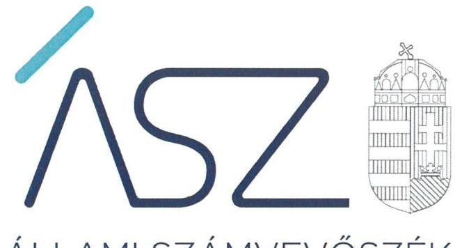
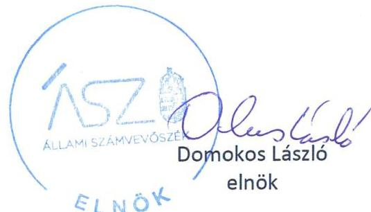
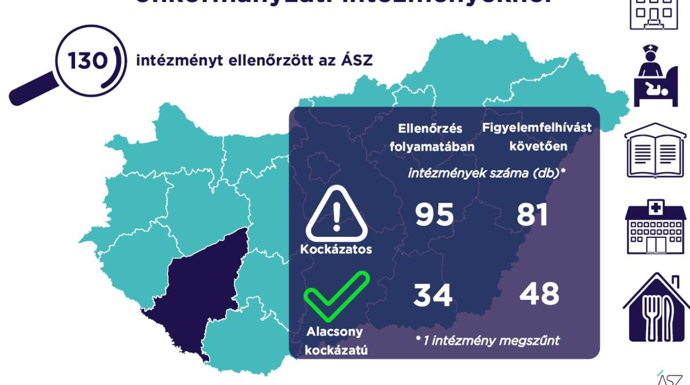

ÁLLAMI SZÁMVEVŐSZÉK

# JELENTÉS 

A Somogy megyei önkormányzati intézmények ellenőrzése

Az önkormányzat és társulás irányítása alá tartozó intézmények integritásának monitoring típusú ellenőrzése - 130 intézmény
2021.

21110
www.asz.hu

---

ÁLLAMI SZÁMVEVŐSZÉK

# JELENTÉS

## A Somogy megyei önkormányzati intézmények ellenőrzése

Az önkormányzat és társulás irányítása alá tartozó intézmények integritásának monitoring típusú ellenőrzése – 130 intézmény

2021. 12. hó 15. nap

21110
www.asz.hu

---

# AZ ELLENŐRZÉST FELÜGYELTE: 

SALAMON ILDIKÓ felügyeleti vezető

## AZ ELLENŐRZÉST VEZETTE ÉS A VÉGREHAJTÁSÁÉRT FELELŐS:

BALÁZSNÉ ANTONI ERIKA ellenőrzésvezető
SIPOSNÉ DÓCZI KLÁRA ellenőrzésvezető

A PROGRAM ÖSSZEÁLLÍTÁSÁÉRT FELELŐS:
DR. FELFÖLDI IZABELLA programkészítésért felelős vezető

## IKTATÓSZÁM: EL-3461-017/2021.

## TÉMASZÁM: 2568

ELLENŐRZÉS-AZONOSÍTÓ SZÁM: V0928

---

# TARTALOMJEGYZÉK 

$\square$ ÖSSZEGZÉS ..... 5
$\square$ AZ ELLENŐRZÉS JELENTŐSÉGE, AKTUALITÁSA, TÁRSADALMI SZEREPE, SZEMPONTJAI ..... 8
$\square$ AZ ELLENŐRZÉS TERÜLETE ..... 9
$\square$ ELLENŐRZÉS HATÓKÖRE ÉS MÓDSZERE ..... 10
$\square$ MELLÉKLETEK. ..... 13
I. sz. melléklet: Az értékelés módszertana ..... 13
II. sz. melléklet: Értelmező szótár ..... 15
$\square$ FÜGGELÉKEK ..... 17
I. sz. függelék: Az ellenőrzött szervezetek és azok kockázati értékelése ..... 17
$\square$ RÖVIDÍTÉSEK JEGYZÉKE ..... 23

---

.

---

# ÖSSZEGZÉS 

Az Állami Számvevőszék figyelemfelhívásának és tanácsadásának eredményeként a Somogy megyei önkormányzatok irányítása alatt álló 130 ellenőrzött intézmény közül 34 intézménynél az intézményvezető már 2021-ben intézkedett, vagy intézkedéseket rendelt el az integritást biztositó alapvető feltételek megerősitése, illetve kiépitése érdekében. Ezeknek az intézményeknek javult az integritása, erősödtek a csalásmentes müködés feltételei.
74 intézménynél további intézkedések szükségesek az integritást biztositó alapvető feltételek kiépitése, illetve kiegészitése érdekében. Ezeknek az intézményeknek a vezetői az Állami Számvevőszék intézkedési kötelemmel járó figyelemfelhívására nem intézkedtek, ezért az azonosított kockázatok növekedtek, vagy intézkedéseik nem fedték le a kockázatos területeket, így az azonosított kockázatok nem változtak.
Az irányító önkormányzat egy intézmény megszüntetéséről döntött az ellenőrzött időszakban.

## Értékelések

Az Állami Számvevőszék a Somogy megyei önkormányzatok irányítása alá tartozó 130 intézmény belső kontrollrendszerének lényeges elemei kialakítását ellenőrizte a 2021. évre vonatkozóan. Az ellenőrzés a súlypontok meghatározásával lehetőséget biztosított a szervezeti integritás, müködés és vezetés, valamint a gazdálkodás területén a kockázatok azonosítására.

A szervezeti integritás alapvető feltétele a szabályozottság, azaza jogszabályokban előírt belső szabályzatok megléte, azok - hatályos jogszabályoknak - megfelelő tartalma és gyakorlati alkalmazhatósága. Az integritási kockázatok szervezeti szinten csökkenthetők azáltal, hogy az intézményvezetők kialakítják a szervezeti és müködési kereteket, a gazdálkodásra vonatkozó alapvető szabályozási környezetet, valamint a kontrolltevékenységek szabályszerű gyakorlásának, az integrált kockázatkezelésnek és az integritást sértő események kezelésének a feltételeit.

A szervezeti integritás, a müködés és a vezetés alapvető szabályozási feltételeinek kialakítása hozzájárul a csalásmentes integritási környezet megteremtéséhez.

A szervezeti és müködési szabályzat teremti meg a szervezet szabályszerű müködésének alapjait, illetve rögzíti a szervezeten belüli felelősségi viszonyokat. A szabályzat biztosítja a szervezeti müködés szabályozottságát, ezáltal a szervezet tevékenységének átláthatóságát, a szervezeti célokkal összhangban történő müködés feltételeit és annak ellenőrizhetőségét. Az ellenőrzöttek közül 109 intézmény rendelkezett szervezeti és müködési szabályzattal a 2021. évben.

A jogszabályi előírásoknak eleget téve, nyilatkozatban értékelte az intézmény belső kontrollrendszerének minőségét 98 intézmény vezetője. Ezek közül 81 intézménynél alakítottak ki olyan szabályozásokat, folyamatokat, amelyek biztosítják a költségvetési szerv tevékenységében a rendelkezésre álló források átlátható, szabályszerű, szabályozott, gazdaságos, hatékony és eredményes felhasználása követelményeinek érvényesítését.

Az integrált kockázatkezelés eljárásrendjét 92, a szervezeti integritást sértő események kezelésének eljárásrendjét 89 intézménynél alakították ki az intézményvezetők. Az integrált kockázatkezelés eljárásrendje biztosítja a szervezet müködésében rejlő kockázatok azonosításának és kezelésének feltételeit. A szervezet müködési kockázatai veszélyeztethetik a közpénzekkel való átlátható, elszámoltatható és felelős gazdálkodást. Az integritást sértő események kezelésének eljárásrendje jelenti a szervezet tekintetében felmerülő és a szervezeten belül bekövetkező integritást sértő események kezelésének alapjait. Az eljárásrend kialakításával az intézmény vezetője támogatja az integritást sértő eseményekkel kapcsolatosan azonosított kockázatok bekövetkezése esetén azok hatékony kezelését, illetve a következmények enyhítését.

---

A pénz- és vagyongazdálkodáshoz kapcsolódó alapvető szabályozások és nyilvántartások - így a számviteli politika és a keretében elkészítendő szabályzatok, a számlarend, a beszerzések szabályozása, va lamint a kötelezettségvállalásra és a teljesítés igazolására jogosultak és aláírásmintáik nyilvántartása - előmozdítják a közpénzügyek átláthatóságát, rendezettségét. Az intézményvezető ezen szabályzatok elkészítésével, nyilvántartások vezetésével és folyamatos karbantartásával az alapfeltételét biztosítja a pénzügyi- és vagyongazdálkodásátláthatóságának, a közpénzekkel és közvagyonnal való elszámoltathatóságnak. Az ellenőrzöttek közül 97 intézménynél a számviteli politika, 91 intézménynél a számlarend, és szintén 91 intézménynél a beszerzések lebonyolításával kapcsolatos eljárásrend rendelkezésre állt.

Az ellenőrzöttek közül 22 intézmény (köztük a megszűnt intézmény) vezetője tett eleget az ellenőrzött területek mindegyikén az integritási kontrollok alapvető feltételeit jelentő, a jogszabályban előírt szabályozási kötelezettségének. Közülük 17 intézmény vezetője a jogszabályi előírásokon túl további erőfeszítéseket is tett az integritás erősítése érdekében, felismerte további olyan integritási kontrollok kialakításának indokoltságát, amelyet jogszabály nem ír elő, így szervezeti szinten hozzájárul a korrupcióval szembeni védettség megszilárdításához.

112 intézmény esetében az intézményvezető intézkedése volt szükséges a kockázatok csökkentése érdekében, mivel 36 intézménynél a jogszabályok által előírt kontrollok területén, 71 intézménynél a jogszabályokáltal előírt és a további, jogszabály által nem előírt integritási kontrollok területén egyaránt, 5 intézménynél utóbbi kontrollok területén voltak hiányosságok. A dokumentumok kiértékelése alapján - az integritás további fejlesztése érdekében az Állami Számvevőszék azonosította a lényeges kockázati területeket, és már az ellenőrzés lefolytatásával párhuzamosan, a 2021. évre vonatkozóan a kockázatok csökkentésére hívta fel az intézményvezetők figyelmét.

# Következtetések 

Az érintett 107 intézmény közül 72 intézmény vezetője válaszolt határidőben az Állami Számvevőszék figyelemfelhívására. Közülük 45 teljeskörűen, 17 részben egyetértett a kockázatos területeken teendő intézkedések indokoltságával. Az intézményvezetők közül 38 arról tájékoztatta az Állami Számvevőszéket, hogy valamennyi kockázatos területen, 14 pedig a kockázatos területek egy részénél már tett, illetve a jövőben tesz intézkedést a jelzett kockázatok csökkentése érdekében. A jogszabályi előírásokon túli integritási kontrollok területén az érintett 76 intézmény közül 28 intézmény vezetője a jelzett kockázatok teljes körű, 5 pedig azok részbeni felszámolásáról adtak számot. Ezek eredményeként a 112 vezetői levélben jelzett 582 kockázati terület közül 181 esetben már történt, illetve tervezett az intézkedés, így javulás várható a feltárt kockázatos területek 31,1\%-ánál.

Az intézkedések eredményeként az ellenőrzött 130 intézmény közül összesen 48 intézménynél a kockázatok alacsony szintűek, illetve - a tervezett intézkedések végrehajtásával - a kockázatok alacsony szintre csökkennek.

A szabályozások és nyilvántartások kialakításának célja nem önmagában a jogszabályi rendelkezések betartása, hanem az intézmény szabályozottságán keresztül a szabályszerű és csalásmentes gazdálkodás feltételeinek megteremtése, ezáltal az Alaptörvényben előírt átláthatóság és elszámoltathatóság elvének érvényesítése. Ezeknek az alapelveknek érvényesülése hozzájárulhat ahhoz, hogy az intézmények, mint közszolgáltatást nyújtó szervezetek felé a közszolgáltatásokat igénybe vevők, és általuk az állampolgárok általános bizalma is erősödjön.

Az Állami Számvevőszék figyelemfelhívására nem válaszoló, illetve a jelzett kockázatokra nem, vagy csak részben intézkedő intézményvezetők által vezetett intézményeknél rendszerszintű kockázatok maradtak fenn. Az integritás elvű működés erősítése érdekében további kockázatcsökkentő lépések szükségesek a vezetés-irányítás, valamint a pénzügyi- és a vagyongazdálkodás szabályszerű feltételeinek kialakítása terén. Ezen intézmények integritásának kiépítését következő lépésként az irányító szerv bevonásával támogatja az Állami Számvevőszék.

---

# Erősödött a csalásmentesség a Somogy megyei önkormányzati intézményeknél

---

# AZ ELLENŐRZÉS JELENTŐSÉGE, AKTUALITÁSA, TÁRSADALMI SZEREPE, SZEMPONTJAI 

Az Alaptörvény alapértékeket, elveket fogalmaz meg, amely szerint a közpénzekkel gazdálkodó minden szervezet köteles a nyilvánosság előtt elszámolni a közpénzekre vonatkozó gazdálkodásával. A közpénzeket és a nemzeti vagyont az átláthatóság és a közélet tisztaságának elve szerint kell kezelni.

Magyarország helyi önkormányzatairól szóló törvény ${ }^{1}$ a helyi közhatalom gyakorlás széleskörű érvényesítésével összhangban tág teret ad a helyi önkormányzatoknak a feladataik, a közszolgáltatások legkülönbözőbb formákban történő ellátására, így széleskörű lehetőséggel rendelkeznek intézmények alapítására.

A helyi önkormányzatok irányítása alá tartozó intézmények szerteágazó közszolgáltatásokat nyújtanak. Az intézmények működtetése közvetlenül érinti a társadalom valamennyi rétegét, a közfeladatot ellátó intézmények működésének minősége közvetlen hatással van az azokat igénybe vevő állampolgárok életére.

Az intézmények szabályszerű és eredményes működésének és gazdálkodásának alapfeltétele a belső kontrollrendszer - benne az integritási kontrollok - megfelelő kialakítása. Az ÁSZ² a törvényi felhatalmazással élve ellenőrzi az önkormányzati intézményeket, hogy megállapításaival támogassa az ellenőrzött szervezetek szabályszerű gazdálkodását, müködését.

A helyi önkormányzatok intézményei által ellátott feladatok, a bölcsődei, óvodai ellátás, a gyermekétkeztetés, a betegek és idősek gondozása, a közművelődési intézmények, könyvtárak működtetése által a lakosság ezeken a területeken találkozik legszélesebb körben az önkormányzatok által nyújtott szolgáltatásokkal. A szolgáltatásokat igénybe vevők jelentős száma, a feladatellátáshoz használt nemzeti vagyon és az erre fordított közpénz nagysága indokolja, hogy az ÁSZ további, az előző ellenőrzésekre épülő ellenőrzéseket végezzen ezen a területen, illetve további olyan területeken, ahol az önkormányzati szolgáltatást a lakosság széles köre veszi igénybe.

Az ellenőrzés célja annak értékelése, hogy a helyi önkormányzatok irányítása alá tartozó intézmények megterem-tették-e az integritás biztosításához szükséges feltételeket, kialakították-e az alapvető, a szervezeti kereteket, az integritási kontrollokhoz kapcsolódó, valamint a korrupció elleni védelmet szolgáló szabályozásokat. Továbbá, hogy az intézményvezető gondoskodott-e a szervezeti teljesítmény mérés alapfeltételeinek kialakításáról az eredményességi szempontoknak való megfelelés megalapozottsága biztosítása érdekében. A monitoring típusú ellenőrzés célja hatékonyan támogatni az ellenőrzött szervezeteket, ezáltal növelve az ÁSZtanácsadó szerepét, elősegítve a „jól irányított állam" müködését.

Az ÁSZ célja, hogy új ellenőrzési megközelítést alkalmazva támogassa a közpénzügyi helyzet javítását; a monitoring típusú ellenőrzéssel jelen időben adjon helyzetképet az integritási szemlélet érvényesítéséről, rávilágítson az integritási kontrollok kiépítettségére, illetve további fejlesztésére. Napjainkban mindez kiemelt fontosságúvá vált. Minden szervezetnek fel kell készülnie arra, hogy a koronavírus járvány okozta társadalmi és gazdasági válság növelni fogja a korrupciós nyomást. Az ÁSZ ebben a helyzetben is alapvető kötelességének tartja, hogy a közpénzek őre legyen, és ellenőrzéseit az önkormányzati alrendszer intézményei körében is folytassa.

Fontos, hogy az intézmények vezetői felismerjék az integritás kockázatokat, azokat ismételten mérjék fel, és alakítsanak ki átlátható, jól szabályozott rendszereket, döntési mechanizmusokat. Az integritási kockázatok feltárása, megismerése elengedhetetlenül fontos, mert ezt követően tehetők meg azok a lépések, amelyek a kockázatok csökkentését, felszámolását és kezelését célozzák. A belső kontrollrendszer - benne az integritás kontrollok - megfelelő kialakítása, müködése a helyi önkormányzatok irányítása alatt álló intézményeknél is hozzájárul a társadalmi közbizalom erősítéséhez.

Az ellenőrzés rámutat az integritási jó gyakorlatokra is, továbbá felhívja a figyelmet a jogszabályi követelmények teljesítéséhez szükséges lépésekre is.

---

# AZ ELLENŐRZÉS TERÜLETE 

## Az önkormányzatok irányítása alá tartozó intézmények

Helyi önkormányzati költségvetési szervet az államháztartásról szóló 2011. évi CXCV törvény (Áht. ${ }^{3}$ ) szerint a helyi önkormányzat, a helyi önkormányzatok társulása, a térségi fejlesztési tanács, az átalakult nemzetiségi önkormányzat alapíthat, a költségvetési szerv alapító okiratában meghatározott önkormányzati közfeladatok ellátására. A költségvetési szervek önálló jogi személyek, éves költségvetésükből gazdálkodva látják el feladataikat. A költségvetési szervek gazdasági szervezettel rendelkeznek, ha azonban a költségvetési szerv éves átlagos statisztikai állományi létszáma a 100 főt nem éri el, a gazdasági szervezet feladatait az önkormányzati hivatal, vagy az irányító szerv döntése alapján az irányító szerv irányítása alá tartozó, gazdasági szervezettel rendelkező más költségvetési szerv látja el.

Az államháztartásról szóló törvény végrehajtásáról szóló 368/2011. (XII. 31.) Korm. rendelet (Ávr. ${ }^{4}$ ) 1. melléklete szerint, az államháztartás önkormányzati alrendszerében a helyi önkormányzat által irányított költségvetési szerv esetében az irányító szerv hatáskörét a képviselő-testület, közgyűlés gyakorolja, és annak vezetője a polgármester, főpolgármester, megyei közgyűlés elnöke.

Az ellenőrzés a Somogy megyei önkormányzatok irányítása alá tartozó, az I. sz. Függelékben felsorolt költségvetési szervekre terjedt ki.

A feladatellátásuk szerint az ellenőrzött költségvetési szervek egy része óvoda, bölcsőde, egészségügyi intézmény, konyha, művelődési ház, múzeum, kulturális központ, gondozási központ, gyermekjóléti intézmény, sportközpont intézményként működik.

Az ellenőrzött 130 intézmény közül három rendelkezik saját gazdasági szervezettel.

Az ellenőrzés 129 intézmény esetében lefolytatásra került. Egy intézmény esetében az ellenőrzés adatszolgáltatás hiányában nem volt lefolytatható, az ÁSZ az ellenőrzött integritási kockázatát kiemelten magasnak értékelte. Egy intézmény az ellenőrzött időszakban megszűnt.

---

# ELLENŐRZÉS HATÓKÖRE ÉS MÓDSZERE 

## Az ellenőrzés típusa

| Megfelelőségi ellenőrzés.

## Az ellenőrzött időszak

A 2021. év, a Bkr. ${ }^{5}$ szerinti vezetői nyilatkozat, valamint annak alátámasztottsága vonatkozásában a 2020. év.

## Az ellenőrzés tárgya

A szervezeti keretekkel, a múködéssel és gazdálkodással kapcsolatos szabályzatok, szabályozások, valamint a szervezeti elvekkel, értékekkel összefüggő integritás kontrollok kiépítettsége, a szervezeti teljesítmény mérés alapfeltételeinek kialakítása.

## Az ellenőrzött szervezetek

Az ellenőrzött intézményeket az I. sz. Függelék tartalmazza.

## Az ellenőrzés jogalapja

Az ellenőrzés jogszabályi alapját az ÁSZ tv. ${ }^{6}$ 1. § (3) bekezdése, 5. § (6) bekezdése, valamint az Áht. 61. § (2) bekezdése képezik.

## Az ellenőrzés módszerei

Az ÁSZ az ellenőrzést az ellenőrzési program szempontjai, az ellenőrzött időszakban hatályos jogszabályok, a jelen ellenőrzésre irányadó ÁSZ módszertan figyelembevételével és a nemzetközi standardokat irányadónak tekintve végzi.

Az ellenőrzés ideje alatt az ÁSZ az ellenőrzött szervezetekkel történő kapcsolattartást azÁSZSZMSZ7-ének vonatkozó előírásai alapján biztosítja.

Az ellenőrzési kérdések megválaszolásához szükséges bizonyítékok megszerzése a következő ellenőrzési eljárások alkalmazásával történik: megfigyelés, összehasonlítás, elemző eljárás. Az ellenőrzési bizonyítékként felhasználható adatforrások közé tartoznak az ellenőrzési programban felsorolt adatforrások, továbbá minden - az ellenőrzés folyamán - feltárt, az ellenőrzés szempontjából információkat tartalmazó dokumentum.

---

Az ÁSZ az ellenőrzést a kérdésekre adott válaszok kiértékelésével, valamint a megjelölt adatforrások, továbbá az adott időszakban hatályos jogszabályok, valamint az ÁSZ honlapján közzétett helyénvalósági kritériumok figyelembevételével folytatja le.

A monitoring típusú ellenőrzés az önkormányzatok irányítása alá tartozó intézmények integritás alapú múködésének lényeges területeire és a közpénzügyi helyzet javítása érdekében az elért eredmények fenntartására fókuszál. Lehetőséget biztosít az integritási kontrollok kiépítettségében lévő hiányosságok, a szervezeti teljesítmény mérés alapfeltételei kialakításának hiánya beazonosítására az eredményességi szempontoknak való megfelelés megalapozottsága biztosítása érdekében, az önkormányzatok, társulások irányítása alá tartozó intézmények integritásának elemzésére, részletes ellenőrzések megalapozására.

---

.

---

# MELLÉKLETEK 

I. SZ. MELLÉKLET: AZ ÉRTÉKELÉS MÓDSZERTANA

Az egyes kockázati területek és kockázatforrások minősítése „pontozásos módszerrel", az integritás „jelző" dokumentumai és a vezetői magatartás ellenőrzéshez kapcsolódóan tanúsított tényhelyzeteinek értékelése alapján történt.

Az értékelt dokumentumokhoz, nyilvántartásokhoz, kockázati besorolásokhoz minden esetben pontszám került hozzárendelésre, amelyek értéke alapján az ellenőrzött szervezetek kockázati csoportba kerültek besorolásra:

- Alacsony kockázatú - az elérhető összes pontszám legalább 80\%-a
- Közepes kockázatú - az elérhető pontszám 50-79\%-a között
- Magas kockázatú - az elérhető pontszám 50\%-a alatt

Az első lépésben azonosításra kerültek azok az intézményi szabályozások és nyilvántartások, amelyek meglétét jogszabály írja elő, hiánya pedig felveti a csalás és korrupció kockázatát.

Második lépésben az adatoknak az ellenőrzés rendelkezésére bocsátása kockázati kritériumainak meghatározása, majd értékelése történt meg.

Harmadik lépésben a figyelemfelhívó levelekre adott válaszok kockázati kritériumainak meghatározása, majd értékelése történt meg.

Az összesített kockázati értékelést javította, amennyiben

- az intézmény rendelkezett olyan szabályozással, amely kötelező meglétét jogszabály nem írja elő, de segíti a csalás és a korrupció megelőzését (helyénvalósági dokumentumok).

Az összesített kockázati értékelést rontotta, amennyiben

- az integritás szempontjából meghatározó dokumentum - az intézményi SZMSZ - hiányzott, és javítása érdekében a figyelemfelhívó levél hatására sem történt intézkedés.

A figyelemfelhívó levelekre adott válaszok értékelése alapján:

- A kockázat csökkent, amennyiben a figyelemfelhívó levélre adott válasza a figyelemfelhívással összhangban volt, valamennyi kockázati területen intézkedett vagy intézkedést tervezett.
- A kockázat változatlan, amennyiben a figyelemfelhívó levélben foglaltaktól eltérő magatartást tanúsított, intézkedése a figyelemfelhívással részben volt összhangban, a kockázati területeken részben intézkedett vagy intézkedést tervezett.
- A kockázat nőtt, amennyiben nem volt együttműködő, a figyelemfelhívó levélre nem válaszolt, vagy válasza alapján nem intézkedett és nem tervezett intézkedést.

---

# Az önkormányzatok irányítása alá tartozó intézmények kockázati csoportba sorolásának értékelési keretrendszere 

I. Dokumentumokkal rendelkezés
lényeges dokumentumok, amelyek hiánya felveti a csalás és korrupció kockázatát
I.1. A szervezeti integritás, müködés és vezetés alapvető szabályozási feltételei

- intézmény SZMSZ-e
- vezetői nyilatkozat a 2020. évre vonatkozóan az intézmény belső kontrollrendszer minőségének értékeléséről, valamint a nyilatkozat megalapozottságát bizonyító dokumentumok
- integrált kockázatkezelés eljárásrendje
- az integritást sértő események kezelésének eljárásrendje
I.2. A pénz- és vagyongazdálkodáshoz kapcsolódó alapvető szabályozások
- számviteli politika
- az eszközök és a források leltárkészítési és leltározási szabályzata
- az eszközök és a források értékelési szabályzata
- pénzkezelési szabályzat
- számlarend
- beszerzések lebonyolításával kapcsolatos eljárásrend
- a kötelezettségvállalásra, teljesítés igazolására jogosult személyekről és aláírás-mintájukról vezetett nyilvántartás
II. Az adatoknak az ellenőrzés rendelkezésére bocsátása
II.1. A megnevezett adatokkal rendelkezett és a törvényi határidőn belül hiánytalanul rendelkezésre bocsátotta. Figyelem-, illetve figyelmet felhívó levél nem volt indokolt.
II.2. A megnevezett adatokat nem bocsátotta rendelkezésre.
III. Figyelemfelhívó levelekre adott válaszok kockázati értékelése
III.1. Kockázat csökkent: együttmüködése a figyelemfelhívó levéllel összhangban volt.
III.2. Kockázat változatlan: a figyelemfelhívó levélben foglaltaktól eltérő együttmüködést tanúsított.
III.3. Kockázat nőtt: nem reagált, nem intézkedett, így nem volt együttmüködő.

---

# II. SZ. MELLÉKLET: ÉRTELMEZŐ SZÓTÁR 

belső kontrollrendszer

belső kontrollrendszer területei
integrált kockázatkezelési rendszer
integritás

Integritási kockázatok
kockázat
kontrollkörnyezet
kontrollkörnyezet
kockázat
kontrollkörnyezet
kolltségvetési szerv vezetője által kialakított olyan elvek, eljárások, belső szabályzatok összessége, amelyben világos a szervezeti struktúra, a folyamatok átláthatók, egyértelműek a felelősségi, hatásköri viszonyok és feladatok, meghatározottak, ismertek és elfogadottak az etikai elvárások a szervezet minden szintjén, átlátható a humánerőforrás-kezelés, biztosított a szervezeti célok és értékek irányában való elkötelezettség fejlesztése és elősegítése. (Forrás: Bkr. 6. § (1) bekezdés)
A költségvetési szerv vezetője által a szervezeten belül kialakított (kontroll) tevékenységek, melyek biztosítják a kockázatok kezelését, hozzájárulnak a szervezet céljainak eléréséhez és erősítik a szervezet integritását. (Forrás: Bkr. 8. § (1) bekezdés)
A helyi önkormányzatok irányítása alátartozó költségvetési szervek. (A képviselő-testület a feladatkörébe tartozó közszolgáltatások ellátására - jogszabályban meghatározottak szerint - költségvetési szervet (önkormányzati intézmény) alapíthat; Forrás: Mötv. 41. § (6) bekezdés)

---

.

---

# FÜGGELÉKEK 

I. SZ. FÜGGELÉK: AZ ELLENŐRZÖTT SZERVEZETEK ÉS AZOK KOCKÁZATI ÉRTÉKELÉSE

| Sorszám | Ellenőrzött szervezet megnevezése | Irányító szerv (önkormányzat) megnevezése | Helység | Tanácsadást megelőző kockázati besorolás | Intézkedést követően a kockázati értékelés változása | A kockázati szint alacsonyra csökkent-e |
| :--: | :--: | :--: | :--: | :--: | :--: | :--: |
| 1. | Karádi Napközi Otthonos Óvoda | Karád Község Önkormányzata | Karád | ALACSONY | Nem volt szabályszerűségi hiba | I |
| 2. | Balatonboglári Dr. Török Sándor Egészségügyi Központ | Balatonboglár Városi Önkormányzat | Balatonboglár | KÖZEPES | nött | N |
| 3. | Balatonboglár Város Önkormányzat Platán Szociális Alapszolgáltatási Központ | Balatonboglár Városi Önkormányzat | Balatonboglár | KÖZEPES | CSÖKKENT | I |
| 4. | Balatonboglári Hétszínvirág Óvoda és Bölcsőde | Balatonboglár Városi Önkormányzat | Balatonboglár | ALACSONY | Nem volt szabályszerűségi hiba | I |
| 5. | Ordacsehi Napsugár Óvoda | Ordacsehi Község Önkormányzata | Ordacsehi | KÖZEPES | NÖTT | N |
| 6. | Balatonboglári Varga Béla Városi Kulturális Központ | Balatonboglár Városi Önkormányzat | Balatonboglár | KÖZEPES | NÖTT | N |
| 7. | Berzencei Zrínyi Miklós Müvelődési Ház | Berzence Nagyközség Önkormányzata | Berzence | MAGAS | nött | N |
| 8. | Arany János Nevelési és Müvelődési Intézmény Szenta | Szenta Község Önkormányzata | Szenta | ALACSONY | Nem volt szabályszerűségi hiba | I |
| 9. | Berzencei Szent Antal Óvoda, Bölcsőde és Konyha | Berzence Nagyközség Önkormányzata | Berzence | MAGAS | NÖTT | N |
| 10. | Lábodi Csicsergő Óvoda és Konyha | Lábod Község Önkormányzata | Lábod | KÖZEPES | NÖTT | N |
| 11. | Somogysámsoni Bernáth Aurél Általános Müvelődési Központ | Somogysámson Község Önkormányzata | Somogysámson | MAGAS | NÖTT | N |
| 12. | Balatonlellei Városüzemeltetési Szervezet | Balatonlelle Város Önkormányzata | Balatonlelle | KÖZEPES | CSÖKKENT | I |
| 13. | Kisbárapáti Napköziotthonos Óvoda | Kisbárapáti Község Önkormányzata | Kisbárapáti | MAGAS | NÖTT | N |
| 14. | Balatonlellei Napközi Otthonos Óvoda | Balatonlelle Város Önkormányzata | Balatonlelle | MAGAS | CSÖKKENT | N |
| 15. | Andocsi Szent Ferenc Mini Bölcsőde és Óvoda | Andocs Község Önkormányzata | Andocs | MAGAS | NÖTT | N |
| 16. | Somogyszobi Óvoda | Somogyszob Községi Önkormányzat | Somogyszob | MAGAS | NÖTT | N |
| 17. | Balatonlellei Városi Müvelődési Házés Könyvtár | Balatonlelle Város Önkormányzata | Balatonlelle | KÖZEPES | CSÖKKENT | I |
| 18. | Balatonszárszói József Attila Müvelődési Ház | Balatonszárszó Nagyközség Önkormányzata | Balatonszárszó | KIEMELTEN   MAGAS | NEM VÁLTOZOTT | N |
| 19. | Nagykorpádi Pöttömpark Napköziotthonos Óvoda | Nagykorpád Község Önkormányzata | Nagykorpád | KÖZEPES | NEM VÁLTOZOTT | N |
| 20. | Görgetegi Napköziotthonos Óvoda | Görgeteg Község Önkormányzata | Görgeteg | KÖZEPES | NÖTT | N |
| 21. | Rinyaszentkirályi Mini Manó Óvoda | Rinyaszentkirály Köz-   ség Önkormányzata | Rinyaszentkirály | KÖZEPES | NEM VÁLTOZOTT | N |

---

| Sorszám | Ellenőrzött szervezet megnevezése | Irányító szerv (önkormányzat) megnevezése | Helység | Tanácsadást megelőző kockázati besorolás | Intézkedést követően a kockázati értékelés változása | A kockázati szint alacsonyra csökkent-e |
| :--: | :--: | :--: | :--: | :--: | :--: | :--: |
| 22. | Kaposmérői Bokréta Óvoda és Mini Bölcsőde | Kaposmérő Községi Önkormányzat | Kaposmérő | MAGAS | NEM VÁLTOZOTT | N |
| 23. | Nágocsi Hétszínvirág Óvoda | Nágocs Község Önkormányzata | Nágocs | MAGAS | NÖTT | N |
| 24. | Háromfai Tarkarét Óvoda és Konyha | Háromfa Község Önkormányzata | Háromfa | KÖZEPES | NÖTT | N |
| 25. | Balatonlellei Füles Mackó Bölcsőde | Balatonlelle Város Önkormányzata | Balatonlelle | KÖZEPES | NÖTT | N |
| 26. | Kisbárapáti Önkormányzati Konyha | Kisbárapáti Község Önkormányzata | Kisbárapáti | MAGAS | NÖTT | N |
| 27. | Tabi Gazdasági Műszaki Ellátó és Szolgáltató Szervezet | Tab Város Önkormányzata | Tab | KÖZEPES | NÖTT | N |
| 28. | Marcali Művelődési Központ | Marcali Város Önkormányzata | Marcali | ALACSONY | Nem volt szabályszerűségi hiba | I |
| 29. | Együd Árpád Kulturális Központ | Kaposvár Megyei Jogú Város Önkormányzata | Kaposvár | MEGSZÜNT INTÉZ-   MÉNY | MEGSZÜNT INTÉZ-   MÉNY | MEGSZÜNT   INÉTZMÉNY |
| 30. | Kaposvári Sportközpont és Sportiskola | Kaposvár Megyei Jogú Város Önkormányzata | Kaposvár | ALACSONY | NÖTT | N |
| 31. | Marcali Városi Önkormányzat Gazdasági Müszaki Ellátó és Szolgáltató Szervezete | Marcali Város Önkormányzata | Marcali | KÖZEPES | NÖTT | N |
| 32. | Városi Könyvtár Tab | Tab Város Önkormányzata | Tab | ALACSONY | Nem volt szabályszerűségi hiba | I |
| 33. | Marcali Városi Fürdő és Szabadidőközpont | Marcali Város Önkormányzata | Marcali | KÖZEPES | CSÖKKENT | I |
| 34. | Tapsony Községi Önkormányzat Óvodája | Tapsony Község Önkormányzata | Tapsony | KÖZEPES | NÖTT | N |
| 35. | Rippl-Rónai Megyei Hatókörü Városi Múzeum | Kaposvár Megyei Jogú Város Önkormányzata | Kaposvár | ALACSONY | Nem volt szabályszerűségi hiba | I |
| 36. | Balatonszemesi Latinovits Zoltán Müvelődési Ház, Könyvtár és Múzeum | Balatonszemes Községi Önkormányzat | Balatonszemes | MAGAS | nött | N |
| 37. | Zamárdi Tourinform Iroda, Közösségi Ház és Városi Könyvtár | Zamárdi Város Önkormányzata | Zamárdi | KÖZEPES | NEM VÁLTOZOTT | N |
| 38. | Zamárdi Napköziotthonos Óvoda és Bölcsőde | Zamárdi Város Önkormányzata | Zamárdi | KÖZEPES | NÖTT | N |
| 39. | Göllei Napközi Otthonos Óvoda | Gölle Községi Önkormányzat | Gölle | KÖZEPES | CSÖKKENT | I |
| 40. | Kadarkúti Szociális Alapszolgáltatási Központ | Kadarkút Város Önkormányzata | Kadarkút | KÖZEPES | NEM VÁLTOZOTT | N |
| 41. | Kaposvári Petőfi Sándor Központi Óvoda | Kaposvár Megyei Jogú Város Önkormányzata | Kaposvár | ALACSONY | Nem volt szabályszerűségi hiba | I |
| 42. | Kaposvári Rét Utcai Központi Óvoda | Kaposvár Megyei Jogú Város Önkormányzata | Kaposvár | KÖZEPES | NÖTT | N |
| 43. | Kaposvári Fésűs Éva Központi Óvoda | Kaposvár Megyei Jogú Város Önkormányzata | Kaposvár | KÖZEPES | NÖTT | N |
| 44. | Kaposvári Festetics Karolina Központi Óvoda | Kaposvár Megyei Jogú Város Önkormányzata | Kaposvár | ALACSONY | Nem volt szabályszerűségi hiba | I |

---

| Sorszám | Ellenőrzött szervezet megnevezése | Irányító szerv (önkormányzat) megnevezése | Helység | Tanácsadást megelőző kockázati besorolás | Intézkedést követően a kockázati értékelés változása | A kockázati szint alacsonyra csökkent-e |
| :--: | :--: | :--: | :--: | :--: | :--: | :--: |
| 45. | Kaposvári Tar Csatár Központi Óvoda | Kaposvár Megyei Jogú Város Önkormányzata | Kaposvár | ALACSONY | Nem volt szabályszerűségi hiba | I |
| 46. | Kaposvári Nemzetőr Sori Központi Óvoda | Kaposvár Megyei Jogú Város Önkormányzata | Kaposvár | ALACSONY | Nem volt szabályszerűségi hiba | I |
| 47. | Örtilosi Lurkö Kuckó Óvoda | Örtilos Község Önkormányzata | Örtilos | KÖZEPES | NÖTT | N |
| 48. | Zákány Napsugár Óvoda és Konyha | Zákány Község Önkormányzata | Zákány | KÖZEPES | CSÖKKENT | I |
| 49. | Marcali Múzeum | Marcali Város Önkormányzata | Marcali | ALACSONY | Nem volt szabályszerűségi hiba | I |
| 50. | Somogyszentpáli Tündérróza Óvoda | Somogyszentpál Község Önkormányzata | Somogyszentpál | KÖZEPES | NÖTT | N |
| 51. | Zichy Mihály Művelődési Központ Tab | Tab Város Önkormányzata | Tab | ALACSONY | Nem volt szabályszerűségi hiba | I |
| 52. | Zákányfalu Hársvirág Óvoda és Konyha | Zákányfalu Község Önkormányzata | Zákányfalu | ALACSONY | NÖTT | N |
| 53. | Gamási Napközi Otthonos Óvoda | Gamás Község Önkormányzata | Gamás | KÖZEPES | CSÖKKENT | I |
| 54. | Id. Kapoli Antal Múvelődési Ház | Kadarkút Város Önkormányzata | Kadarkút | KÖZEPES | NEM VÁLTOZOTT | N |
| 55. | Balatonszabadi Aranyalma Óvodája és Bölcsődéje | Balatonszabadi Községi Önkormányzat | Balatonszabad | KÖZEPES | NÖTT | N |
| 56. | Balatonvilágosi Szivárvány Óvoda | Balatonvilágos Község Önkormányzata | Balatonvilágos | ALACSONY | Nem volt szabályszerűségi hiba | I |
| 57. | Somogyvári Tündérkert Óvoda | Somogyvár Község Önkormányzata | Somogyvár | MAGAS | NEM VÁLTOZOTT | N |
| 58. | Nagyberényi Pillangó Óvoda és Konyha | Nagyberény Község Önkormányzata | Nagyberény | KÖZEPES | NÖTT | N |
| 59. | Vései Óvoda | Vése Községi Önkormányzat | Vése | MAGAS | NÖTT | N |
| 60. | Ádándi Kippkopp Óvoda és Bölcsőde | Ádánd Község Önkormányzata | Ádánd | MAGAS | NEM VÁLTOZOTT | N |
| 61. | Segesdi Tündérkert Óvoda | Segesd Község Önkormányzata | Segesd | ALACSONY | CSÖKKENT | I |
| 62. | Szőlősgyöröki Lurkő Óvoda | Szőlősgyörök Község Önkormányzata | Szőlősgyörök | MAGAS | NÖTT | N |
| 63. | Kutasi Micimackó Óvoda, Zsebibaba Mini Bölcsőde | Kutas Község Önkormányzata | Kutas | KÖZEPES | NÖTT | N |
| 64. | Belegi Pitypang Óvoda | Beleg Község Önkormányzata | Beleg | ALACSONY | CSÖKKENT | I |
| 65. | Rinyabesenyői Napköziotthonos Óvoda | Rinyabesenyő Község Önkormányzata | Rinyabesenyő | KÖZEPES | NÖTT | N |
| 66. | Jákói Óvoda | Jákó Község Önkormányzata | Jákó | MAGAS | CSÖKKENT | N |
| 67. | Nemesdédi Óvoda | Nemesdéd Községi Önkormányzat | Nemesdéd | MAGAS | NÖTT | N |
| 68. | Pogányszentpéteri Micimackó Óvoda | Pogányszentpéter Község Önkormányzata | Pogányszentpéter | ALACSONY | CSÖKKENT | I |
| 69. | Nagybajomi Mesevár Óvoda és Bölcsőde | Nagybajom Város Önkormányzat | Nagybajom | MAGAS | NÖTT | N |
| 70. | Pálmajori Nefelejcs Óvoda | Pálmajor Község Önkormányzata | Pálmajor | MAGAS | CSÖKKENT | N |

---

| Sorszám | Ellenőrzött szervezet megnevezése | Irányító szerv (önkormányzat) megnevezése | Helység | Tanácsadást megelőző kockázati besorolás | Intézkedést követően a kockázati értékelés változása | A kockázati szint alacsonyra csökkent-e |
| :--: | :--: | :--: | :--: | :--: | :--: | :--: |
| 71. | Ötvöskónyi Szivárvány Óvoda | Ötvöskónyi Község Önkormányzata | Ötvöskónyi | ALACSONY | CSÖKKENT | I |
| 72. | Kiskorpádi Szivárványpalota Óvoda | Kiskorpád Község Önkormányzata | Kiskorpád | KÖZEPES | CSÖKKENT | N |
| 73. | Bábonymegyeri Napsugár Óvoda | Bábonymegyer Köz. ség Önkormányzata | Bábonymegyer | KÖZEPES | NÖTT | N |
| 74. | Tabi Takáts Gyula Óvoda és Bölcsőde Többcélú Intézmény | Tab Város Önkormányzata | Tab | ALACSONY | Nem volt szabályszerűségi hiba | I |
| 75. | Kapolyi Óvoda | Kapoly Község Önkormányzata | Kapoly | KÖZEPES | NÖTT | N |
| 76. | Kaposfői Napsugár Óvoda | Kaposfő Község Önkormányzata | Kaposfő | MAGAS | NEM VÁLTOZOTT | N |
| 77. | Büssüi Tarkabarka Óvoda | Büssü Községi Önkormányzat | Büssü | ALACSONY | CSÖKKENT | I |
| 78. | Nagybajomi Kulturális Intézmény, Múvelődési Ház és Könyvtár | Nagybajom Város Önkormányzat | Nagybajom | KÖZEPES | CSÖKKENT | I |
| 79. | Mikei Mesevár Óvoda | Mike Községi Önkormányzat | Mike | MAGAS | NÖTT | N |
| 80. | Niklai Mézengúz Óvoda | Nikla Községi Önkormányzat | Nikla | KÖZEPES | NÖTT | N |
| 81. | Tabi Családsegítő és Gyermekjóléti Központ | Tab Város Önkormányzata | Tab | KÖZEPES | CSÖKKENT | I |
| 82. | Ádándi Konyha | Ádánd Község Önkormányzata | Ádánd | MAGAS | CSÖKKENT | N |
| 83. | Kányai Kányafészek Bölcsőde | Kánya Község Önkormányzata | Kánya | MAGAS | CSÖKKENT | N |
| 84. | Balatonkeresztúr Községi Önkormányzat Képviselő-Testületének Szolgáltató Szervezete | Balatonkeresztúr Község Önkormányzata | Balatonkeresztúr | KÖZEPES | CSÖKKENT | I |
| 85. | Móricz Zsigmond Múvelődési Központ és Dráva Közérdekü Muzeális Kiállítóhely | Barcs Város Önkormányzata | Barcs | KÖZEPES | NEM VÁLTOZOTT | N |
| 86. | Barcsi Szociális Központ | Barcs Város Önkormányzata | Barcs | KÖZEPES | NÖTT | N |
| 87. | Kistérségi Járóbetegellátó Központ | Barcs Város Önkormányzata | Barcs | KÖZEPES | CSÖKKENT | I |
| 88. | Taszári Napsugár Óvoda és Bölcsőde | Taszár Községi Önkormányzat | Taszár | ALACSONY | Nem volt szabályszerűségi hiba | I |
| 89. | Inkei Napsugár Óvoda | Inke Község Önkormányzata | Inke | ALACSONY | Nem volt szabályszerűségi hiba | I |
| 90. | Nagyatád Város Önkormányzata Városgondnoksága | Nagyatád Város Önkormányzata | Nagyatád | KÖZEPES | CSÖKKENT | I |
| 91. | Barcs Városi Önkormányzat Városgazdálkodási Igazgatósága | Barcs Város Önkormányzata | Barcs | KÖZEPES | NÖTT | N |
| 92. | Barcs Város Óvodája és Bölcsődéje | Barcs Város Önkormányzata | Barcs | ALACSONY | Nem volt szabályszerűségi hiba | I |
| 93. | Nagyatádi Óvodák | Nagyatád Város Önkormányzata | Nagyatád | KÖZEPES | CSÖKKENT | N |
| 94. | Fonyódi Múvelődési Központ, Könyvtár és Muzeális Gyüjtemény | Fonyód Város Önkormányzata | Fonyód | ALACSONY | Nem volt szabályszerűségi hiba | I |

---

| Sorszám | Ellenőrzött szervezet megnevezése | Irányító szerv (önkormányzat) megnevezése | Helység | Tanácsadást megelőző kockázati besorolás | Intézkedést követően a kockázati értékelés változása | A kockázati szint alacsonyra csökkent-e |
| :--: | :--: | :--: | :--: | :--: | :--: | :--: |
| 95. | Fecskepart Óvoda és Bölcsőde | Fonyód Város Önkormányzata | Fonyód | ALACSONY | Nem volt szabályszerűségi hiba | I |
| 96. | Lengyeltóti Városi Művelődési Házés Könyvtár | Lengyeltóti Város Önkormányzata | Lengyeltóti | KÖZEPES | NÖTT | N |
| 97. | Pusztakovácsi Pipitér Óvoda | Pusztakovácsi Község Önkormányzata | Pusztakovácsi | KÖZEPES | NEM VÁLTOZOTT | N |
| 98. | Siófok Város Gondozási Központja | Siófok Város Önkormányzata | Siófok | KÖZEPES | NEM VÁLTOZOTT | N |
| 99. | Kálmán Imre Múvelődési Központ | Siófok Város Önkormányzata | Siófok | MAGAS | NÖTT | N |
| 100. | Gyékényesi "CsemetékKertje" Óvoda | Gyékényes Község Önkormányzata | Gyékényes | ALACSONY | CSÖKKENT | I |
| 101. | Somogyudvarhelyi Napközi Otthonos Óvoda és Konyha | Somogyudvarhely Község Önkormányzat | Somogyudvarhely | ALACSONY | CSÖKKENT | I |
| 102. | Nagyatád Város Önkormányzata Nagyatádi Kulturális és Sport Központ | Nagyatád Város Önkormányzata | Nagyatád | KÖZEPES | CSÖKKENT | I |
| 103. | Balatonfenyvesi Kisfenyő Óvoda és Mini Bölcsőde | Balatonfenyves Község Önkormányzata | Balatonfenyves | ALACSONY | NÖTT | N |
| 104. | Nagyatádi Fürdők | Nagyatád Város Önkormányzata | Nagyatád | ALACSONY | Nem volt szabályszerűségi hiba | I |
| 105. | Balatoni Regionális Történeti Kutatóintézet, Könyvtár és Kálmán Imre Emlékház | Siófok Város Önkormányzata | Siófok | KÖZEPES | NEM VÁLTOZOTT | N |
| 106. | Ezüstjuhar Szociális Központ | Hetes Község Önkormányzata | Hetes | ALACSONY | Nem volt szabályszerűségi hiba | I |
| 107. | Táskai Tőzike Óvoda | Táska Község Önkormányzata | Táska | MAGAS | NÖTT | N |
| 108. | Hács Napsugár Óvoda | Hács Községi Önkormányzat | Hács | KÖZEPES | CSÖKKENT | I |
| 109. | Lengyeltóti Kincsem Óvoda | Lengyeltóti Város Önkormányzata | Lengyeltóti | KÖZEPES | CSÖKKENT | I |
| 110. | Nagyatádi Intézmények Ellátó Szervezete | Nagyatád Város Önkormányzata | Nagyatád | ALACSONY | CSÖKKENT | I |
| 111. | Somogyvámosi Tarkarét Óvoda | Somogyvámos Községi Önkormányzat | Somogyvámos | KÖZEPES | NÖTT | N |
| 112. | Siófoki Napsugár Óvoda | Siófok Város Önkormányzata | Siófok | ALACSONY | NÖTT | N |
| 113. | Öreglaki Kerekerdő Óvoda | Öreglak Község Önkormányzata | Öreglak | KÖZEPES | NÖTT | N |
| 114. | Nagyberki Manó Tanoda Óvoda | Nagyberki Község Önkormányzata | Nagyberki | KÖZEPES | NÖTT | N |
| 115. | Balatonendrédi Kerekerdő Óvoda | Balatonendréd Község Önkormányzata | Balatonendréd | MAGAS | NÖTT | N |
| 116. | Buzsáki Tulipán Óvoda | Buzsák Község Önkormányzata | Buzsák | MAGAS | NÖTT | N |
| 117. | Kisbajomi Gyöngyszem Napköziotthonos Óvoda | Kisbajom Község Önkormányzata | Kisbajom | KÖZEPES | NÖTT | N |
| 118. | Szabási Kispipitér Napköziotthonos Óvoda | Szabás Község Önkormányzata | Szabás | KÖZEPES | NÖTT | N |
| 119. | Iharosberényi Gesztenyevirág Óvoda | Iharosberény Község Önkormányzata | Iharosberény | KÖZEPES | CSÖKKENT | I |
| 120. | Iharosi Kerekerdő Óvoda | Iharos Községi Önkormányzat | Iharos | ALACSONY | CSÖKKENT | I |

---

| Sorszám | Ellenőrzött szervezet megnevezése | Irányító szerv (önkormányzat) megnevezése | Helység | Tanácsadást megelőző kockázati besorolás | Intézkedést követően a kockázati értékelés változása | A kockázati szint alacsonyra csökkent-e |
| :--: | :--: | :--: | :--: | :--: | :--: | :--: |
| 121. | Mezőcsokonyai Mesevár Óvoda és Mini Bölcsőde | Mezőcsokonya Község Önkormányzata | Mezőcsokonya | MAGAS | NÖTT | N |
| 122. | Somogysárdi "Hétszínvirág" Óvoda | Somogysárd Község Önkormányzat | Somogysárd | MAGAS | NÖTT | N |
| 123. | Somogyfajszi Bújj, Bújj Zöldág Óvoda | Somogyfajsz Község Önkormányzata | Somogyfajsz | MAGAS | NEM VÁLTOZOTT | N |
| 124. | Kaposszerdahelyi Óvoda, Mini Bölcsőde és Konyha | Kaposszerdahely   Községi Önkormányzat | Kaposszerdahely | MAGAS | NEM VÁLTOZOTT | N |
| 125. | Arany János Müvelődési Ház és Könyvtár | Igal Város Önkormányzata | Igal | KÖZEPES | CSÖKKENT | I |
| 126. | Kőröshegyi Szivárvány Müvészeti Modellóvoda | Kőröshegy Község Önkormányzata | Kőröshegy | KÖZEPES | CSÖKKENT | I |
| 127. | Bárdudvarnoki Mesepalota Óvoda | Bárdudvarnok Köz. ségi Önkormányzat | Bárdudvarnok | KÖZEPES | NEM VÁLTOZOTT | N |
| 128. | Szennai Közkonyha | Szenna Község Önkormányzata | Szenna | KÖZEPES | NEM VÁLTOZOTT | N |
| 129. | Gigei Gerlefészek Óvoda | Gige Község Önkormányzat | Gige | KÖZEPES | NÖTT | N |
| 130. | Siófok Város Csicsergő Bölcsődéje | Siófok Város Önkormányzata | Siófok | KÖZEPES | NEM VÁLTOZOTT | N |
| Alacsony kockázatú |  |  |  | 34 |  |  |
| Közepeskockázatú |  |  |  | 63 |  |  |
| Magaskockázatú |  |  |  | 31 |  |  |
| Kiemelten magas kockázatú |  |  |  | 1 |  |  |
| Megszünt intézmény |  |  |  | 1 | 1 | 1 |
| Kockázat csökkent |  |  |  |  | 34 |  |
| Kockázat nem változott |  |  |  |  | 19 |  |
| Kockázat nőtt |  |  |  |  | 55 |  |
| Nem volt indokolt figyelemfelhívólevél (szabályszerüségi vagy szabályszerűségi és helyénvalósági hiba hiányában) |  |  |  |  | 21 |  |
| Kockázat alacsony szintre csökkent |  |  |  |  |  | 48 |
| Kockázat nem csökkent alacsony szintre |  |  |  |  |  | 81 |
| Összesen |  |  |  | 130 | 130 | 130 |

---

# RÖVIDÍTÉSEKJEGYZÉKE 

${ }^{1}$ Mötv.
${ }^{2}$ ÁSZ
${ }^{3}$ Áht.
${ }^{4}$ Ávr.
${ }^{5}$ Bkr.
${ }^{6}$ ÁSZtv.
${ }^{7}$ ÁSZ SZMSZ
${ }^{8}$ Büntető Törvénykönyv
2011. évi CLXXXIX. törvény - Magyarország helyi önkormányzatairól(hatályos: 2012. január 1-jétől)

Állami Számvevőszék
2011. évi CXCV. törvény az államháztartásról (hatályos 2011. december 31-étől) 368/2011. (XII. 31.) Korm. rendelet az államháztartásról szóló törvény végrehajtásáról (hatályos 2012. január 1-jétől)
370/2011. (XII. 31.) Korm. rendelet a költségvetési szervek belső kontrollrendszeréről és belső ellenőrzésről (hatályos 2012. január 1-jétől)
2011. évi LXVI. törvény az Állami Számvevőszékről (hatályos 2011. július 1-jétől) Az Állami Számvevőszék Szervezeti és Működési Szabályzata
2012. évi C. törvény a Büntető Törvénykönyvről (hatályos 2013. július 1-jétől)

---

# ASZ 

ALLAMI SZAMVEVOSZEK
1052 Budapest, Apáczai Cs. J. u. 10. | 1364 Budapest 4. Pf. 54
TEL: +36 14849100
email: szamvevoszek@asz.hu
web: www.asz.hu | www.aszhirportal.hu