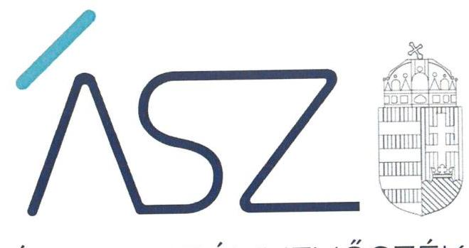
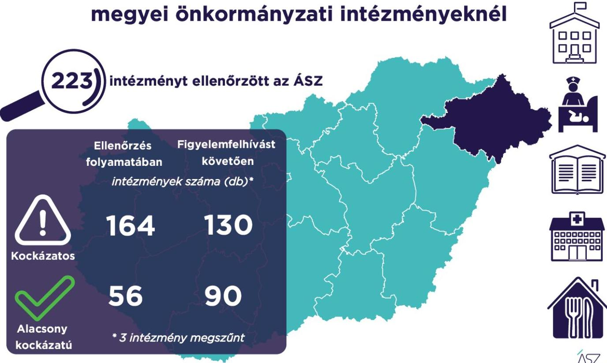

ÁLLAMI SZÁMVEVŐSZÉK

# JELENTÉS 

## A Szabolcs-Szatmár-Bereg megyei önkormányzati intézmények ellenőrzése

Az önkormányzat és társulás irányítása alá tartozó intézmények integritásának monitoring típusú ellenőrzése - 223 intézmény
2021.

21111
www.asz.hu

---

ÁLLAMI SZÁMVEVŐSZÉK

# JELENTÉS 

## A Szabolcs-Szatmár-Bereg megyei önkormányzati intézmények ellenőrzése

Az önkormányzat és társulás irányítása alá tartozó intézmények integritásának monitoring típusú ellenőrzése - 223 intézmény
2021. 12. hó 21. nap

21111
www.asz.hu

---

# AZ ELLENŐRZÉST FELÜGYELTE: 

SALAMON ILDIKÓ felügyeleti vezető

## AZ ELLENŐRZÉST VEZETTE ÉS A VÉGREHAJTÁSÁÉRT FELELŐS:

SZAPPANOS JÚLIA ellenőrzésvezető
ÓDOR ZOLTÁN TAMÁS ellenőrzésvezető

## A PROGRAM ÖSSZEÁLLÍTÁSÁÉRT FELELŐS:

DR. FELFÖLDI IZABELLA programkészítésért felelős vezető

## IKTATÓSZÁM: EL-3461-018/2021.

## TÉMASZÁM: 2568

ELLENŐRZÉS-AZONOSÍTÓ SZÁM: V0928

---

# TARTALOMJEGYZÉK 

■ ÖSSZEGZÉS ..... 5
■ AZ ELLENŐRZÉS JELENTŐSÉGE, AKTUALITÁSA, TÁRSADALMI SZEREPE, SZEMPONTJAI ..... 8
■ AZ ELLENŐRZÉS TERÜLETE ..... 9
■ ELLENŐRZÉS HATÓKÖRE ÉS MÓDSZERE ..... 10
■ MELLÉKLETEK ..... 13
I. sz. melléklet: Az értékelés módszertana ..... 13
II. sz. melléklet: Értelmező szótár ..... 15
■ FÜGGELÉKEK ..... 17
I. sz. függelék: Az ellenőrzött szervezetek és azok kockázati értékelése ..... 17
■ RÖVIDÍTÉSEK JEGYZÉKE ..... 29

---

.

---

# ÖSSZEGZÉS 

Az Állami Számvevőszék figyelemfelhívásának és tanácsadásának eredményeként a Szabolcs-Szatmár-Bereg megyei önkormányzatok irányítása alatt álló 223 ellenőrzött intézmény közül 70 intézménynél az intézményvezető már 2021-ben intézkedett, vagy intézkedéseket rendelt el az integritást biztosító alapvető feltételek megerősítése, illetve kiépítése érdekében. Ezeknek az intézményeknek javult az integritása, erősödtek a csalásmentes működés feltételei.
112 intézménynél további intézkedések szükségesek az integritást biztosító alapvető feltételek kiépítése, illetve kiegészítése érdekében. Ezeknek az intézményeknek a vezetői az Állami Számvevőszék intézkedési kötelemmel járó figyelemfelhívására nem intézkedtek, ezért az azonosított kockázatok növekedtek, vagy intézkedéseik nem fedték le a kockázatos területeket, így az azonosított kockázatok nem változtak.
Az irányító önkormányzat három intézmény megszüntetéséről döntött az ellenőrzött időszakban.

## Értékelések

Az Állami Számvevőszék a Szabolcs-Szatmár-Bereg megyei önkormányzatok irányítása alá tartozó 223 intézmény belső kontrollrendszerének lényeges elemei kialakítását ellenőrizte a 2021. évre vonatkozóan. Az ellenőrzés a súlypontok meghatározásával lehetőséget biztosított a szervezeti integritás, működés és vezetés, valamint a gazdálkodás területén a kockázatok azonosítására.

A szervezeti integritás alapvető feltétele a szabályozottság, azaz a jogszabályokban előírt belső szabályzatok megléte, azok - hatályos jogszabályoknak - megfelelő tartalma és gyakorlati alkalmazhatósága. Az integritási kockázatok szervezeti szinten csökkenthetők azáltal, hogy az intézményvezetők kialakítják a szervezeti és működési kereteket, a gazdálkodásra vonatkozó alapvető szabályozási környezetet, valamint a kontrolltevékenységek szabályszerű gyakorlásának, az integrált kockázatkezelésnek és az integritást sértő események kezelésének a feltételeit.

A szervezeti integritás, a működés és a vezetés alapvető szabályozási feltételeinek kialakítása hozzájárul a csalásmentes integritási környezet megteremtéséhez.

A szervezeti és működési szabályzat teremti meg a szervezet szabályszerű működésének alapjait, illetve rögzíti a szervezeten belüli felelősségi viszonyokat. A szabályzat biztosítja a szervezeti működés szabályozottságát, ezáltal a szervezet tevékenységének átláthatóságát, a szervezeti célokkal összhangban történő működés feltételeit és annak ellenőrizhetőségét. Az ellenőrzöttek közül 192 intézmény rendelkezett szervezeti és működési szabályzattal a 2021. évben.

A jogszabályi előírásoknak eleget téve, nyilatkozatban értékelte az intézmény belső kontrollrendszerének minőségét 155 intézmény vezetője. Ezek közül 92 intézménynél alakítottak ki olyan szabályozásokat, folyamatokat, amelyek biztosítják a költségvetési szerv tevékenységében a rendelkezésre álló források átlátható, szabályszerű, szabályozott, gazdaságos, hatékony és eredményes felhasználása követelményeinek érvényesítését.

Az integrált kockázatkezelés eljárásrendjét 175, a szervezeti integritást sértő események kezelésének eljárásrendjét 168 intézménynél alakították ki az intézményvezetők. Az integrált kockázatkezelés eljárásrendje biztosítja a szervezet működésében rejlő kockázatok azonosításának és kezelésének feltételeit. A szervezet működési kockázatai veszélyeztethetik a közpénzekkel való átlátható, elszámoltatható és felelős gazdálkodást. Az integritást sértő események kezelésének eljárásrendje jelenti a szervezet tekintetében felmerülő és a szervezeten belül bekövetkező integritást sértő események kezelésének alapjait. Az eljárásrend kialakításával az intézmény vezetője támogatja az integritást sértő eseményekkel kapcsolatosan azonosított kockázatok bekövetkezése esetén azok hatékony kezelését, illetve a következmények enyhítését.

---

A pénz- és vagyongazdálkodáshoz kapcsolódó alapvető szabályozások és nyilvántartások - így a számviteli politika és a keretében elkészítendő szabályzatok, a számlarend, a beszerzések szabályozása, valamint a kötelezettségvállalásra és a teljesítés igazolására jogosultak és aláírásmintáik nyilvántartása - előmozdítják a közpénzügyek átláthatóságát, rendezettségét. Az intézményvezető ezen szabályzatok elkészítésével, nyilvántartások vezetésével és folyamatos karbantartásával az alapfeltételét biztosítja a pénzügyi- és vagyongazdálkodás átláthatóságának, a közpénzekkel és közvagyonnal való elszámoltathatóságnak. Az ellenőrzöttek közül 180 intézménynél a számviteli politika, 152 intézménynél a számlarend, 171 intézménynél a beszerzések lebonyolításával kapcsolatos eljárásrend rendelkezésre állt.

Az ellenőrzöttek közül 38 intézmény vezetője tett eleget az ellenőrzött területek mindegyikén az integritási kontrollok alapvető feltételeit jelentő, a jogszabályban előírt szabályozási kötelezettségének. Közülük 22 intézmény vezetője a jogszabályi előírásokon túl további erőfeszítéseket is tett az integritás erősítése érdekében, felismerte további olyan integritási kontrollok kialakításának indokoltságát, amelyet jogszabály nem ír elő, így szervezeti szinten hozzájárul a korrupcióval szembeni védettség megszilárdításához.

197 intézmény esetében az intézményvezető intézkedése volt szükséges a kockázatok csökkentése érdekében, mivel 80 intézménynél a jogszabályok által előírt kontrollok területén, 101 intézménynél a jogszabályok által előírt és a további, jogszabály által nem előírt integritási kontrollok területén egyaránt, 16 intézménynél utóbbi kontrollok területén voltak hiányosságok. A dokumentumok kiértékelése alapján - az integritás további fejlesztése érdekében - az Állami Számvevőszék azonosította a lényeges kockázati területeket, és már az ellenőrzés lefolytatásával párhuzamosan, a 2021. évre vonatkozóan a kockázatok csökkentésére hívta fel az intézményvezetők figyelmét.

# Következtetések 

Az érintett 181 intézmény közül 133 intézmény vezetője válaszolt határidőben az Állami Számvevőszék figyelemfelhívására. Közülük 99 teljeskörűen, 25 részben egyetértett a kockázatos területeken teendő intézkedések indokoltságával. Az intézményvezetők közül 72 arról tájékoztatta az Állami Számvevőszéket, hogy valamennyi kockázatos területen, 39 pedig a kockázatos területek egy részénél már tett, illetve a jövőben tesz intézkedést a jelzett kockázatok csökkentése érdekében. A jogszabályi előírásokon túli integritási kontrollok területén az érintett 117 intézmény közül 65 intézmény vezetője a jelzett kockázatok teljes körű, 1 pedig azok részbeni felszámolásáról adott számot. Ezek eredményeként a 197 vezetői levélben jelzett 966 kockázati terület közül 434 esetben már történt, illetve tervezett az intézkedés, így javulás várható a feltárt kockázatos területek 44,9%-ánál.

Az intézkedések eredményeként az ellenőrzött 223 intézmény közül összesen 90 intézménynél a kockázatok alacsony szintűek, illetve - a tervezett intézkedések végrehajtásával - a kockázatok alacsony szintre csökkennek.

A szabályozások és nyilvántartások kialakításának célja nem önmagában a jogszabályi rendelkezések betartása, hanem az intézmény szabályozottságán keresztül a szabályszerű és csalásmentes gazdálkodás feltételeinek megteremtése, ezáltal az Alaptörvényben előírt átláthatóság és elszámoltathatóság elvének érvényesítése. Ezeknek az alapelveknek érvényesülése hozzájárulhat ahhoz, hogy az intézmények, mint közszolgáltatást nyújtó szervezetek felé a közszolgáltatásokat igénybe vevők, és általuk az állampolgárok általános bizalma is erősödjön.

Az Állami Számvevőszék figyelemfelhívására nem válaszoló, illetve a jelzett kockázatokra nem, vagy csak részben intézkedő intézményvezetők által vezetett intézményeknél rendszerszintű kockázatok maradtak fenn. Vezetési-irányítási kockázatot jelez, amennyiben az intézményvezetőnek címzett figyelemfelhívásra az intézményvezető helyett más személy válaszolt. Felelősségi és hatásköri kockázatot jelez, amennyiben az intézmény pénzügyi- és vagyongazdálkodásának alapvető szabályzatait a kontrollrendszer kialakításáért felelős intézményvezető helyett egy másik költségvetési szerv vezetője alakította ki, határozta meg. További kockázatot jelent a szabályok alkalmazottak általi megismerésére és alkalmazására, az intézmény mindennapi működésének integritására. Mindezek egyrészt az intézmény pénzügyi és vagyongazdálkodásának szabályszerűségét, másrészt a vezetői nyilatkozatok hitelességét, valóságtartalmát is megkérdőjelezi. A jelzett kockázatok arra mutatnak rá, hogy ezeknél az intézményeknél sérül a vezetői felelősség elve, és ezzel a felelős vezetésre épülő intézményi önállóság működése.

Az integritás elvű működés erősítése érdekében további kockázatcsökkentő lépések szükségesek a vezetés-irányítás, valamint a pénzügyi- és a vagyongazdálkodás szabályszerű feltételeinek kialakítása terén. Ezen intézmények integritásának kiépítését következő lépésként az irányító szerv bevonásával támogatja az Állami Számvevőszék.

---

# Erősödött a csalásmentesség a Szabolcs-Szatmár-Bereg megyei önkormányzati intézményeknél

223 **intézményt ellenőrzött az ÁSZ**

- Ellenőrzés
- Figyelemfelhívást
- Folyamatában
- Követően
- Intézmények száma (db)*
- Kockázatos
- 164
- 130
- 56
- 90

* 3 intézmény megszűnt

---

# AZ ELLENŐRZÉS JELENTŐSÉGE, AKTUALITÁSA, TÁRSADALMI SZEREPE, SZEMPONTJAI 

Az Alaptörvény alapértékeket, elveket fogalmaz meg, amely szerint a közpénzekkel gazdálkodó minden szervezet köteles a nyilvánosság előtt elszámolni a közpénzekre vonatkozó gazdálkodásával. A közpénzeket és a nemzeti vagyont az átláthatóság és a közélet tisztaságának elve szerint kell kezelni.

Magyarország helyi önkormányzatairól szóló törvény ${ }^{1}$ a helyi közhatalom gyakorlás széleskörű érvényesítésével összhangban tág teret ad a helyi önkormányzatoknak a feladataik, a közszolgáltatások legkülönbözőbb formákban történő ellátására, így széleskörű lehetőséggel rendelkeznek intézmények alapítására.

A helyi önkormányzatok irányítása alá tartozó intézmények szerteágazó közszolgáltatásokat nyújtanak. Az intézmények működtetése közvetlenül érinti a társadalom valamennyi rétegét, a közfeladatot ellátó intézmények működésének minősége közvetlen hatással van az azokat igénybe vevő állampolgárok életére.

Az intézmények szabályszerű és eredményes működésének és gazdálkodásának alapfeltétele a belső kontrollrendszer - benne az integritási kontrollok - megfelelő kialakítása. Az ÁSZ² a törvényi felhatalmazással élve ellenőrzi az önkormányzati intézményeket, hogy megállapításaival támogassa az ellenőrzött szervezetek szabályszerű gazdálkodását, működését.

A helyi önkormányzatok intézményei által ellátott feladatok, a bölcsődei, óvodai ellátás, a gyermekétkeztetés, a betegek és idősek gondozása, a közművelődési intézmények, könyvtárak működtetése által a lakosság ezeken a területeken találkozik legszélesebb körben az önkormányzatok által nyújtott szolgáltatásokkal. A szolgáltatásokat igénybe vevők jelentős száma, a feladatellátáshoz használt nemzeti vagyon és az erre fordított közpénz nagysága indokolja, hogy az ÁSZ további, az előző ellenőrzésekre épülő ellenőrzéseket végezzen ezen a területen, illetve további olyan területeken, ahol az önkormányzati szolgáltatást a lakosság széles köre veszi igénybe.

Az ellenőrzés célja annak értékelése, hogy a helyi önkormányzatok irányítása alá tartozó intézmények megteremtették-e az integritás biztosításához szükséges feltételeket, kialakították-e az alapvető, a szervezeti kereteket, az integritási kontrollokhoz kapcsolódó, valamint a korrupció elleni védelmet szolgáló szabályozásokat. Továbbá, hogy az intézményvezető gondoskodott-e a szervezeti teljesítmény mérés alapfeltételeinek kialakításáról az eredményességi szempontoknak való megfelelés megalapozottsága biztosítása érdekében. A monitoring típusú ellenőrzés célja hatékonyan támogatni az ellenőrzött szervezeteket, ezáltal növelve az ÁSZ tanácsadó szerepét, elősegítve a „jól irányított állam" működését.

Az ÁSZ célja, hogy új ellenőrzési megközelítést alkalmazva támogassa a közpénzügyi helyzet javítását; a monitoring típusú ellenőrzéssel jelen időben adjon helyzetképet az integritási szemlélet érvényesítéséről, rávilágítson az integritási kontrollok kiépítettségére, illetve további fejlesztésére. Napjainkban mindez kiemelt fontosságúvá vált. Minden szervezetnek fel kell készülnie arra, hogy a koronavírus járvány okozta társadalmi és gazdasági válság növelni fogja a korrupciós nyomást. Az ÁSZ ebben a helyzetben is alapvető kötelességének tartja, hogy a közpénzek őre legyen, és ellenőrzéseit az önkormányzati alrendszer intézményei körében is folytassa.

Fontos, hogy az intézmények vezetői felismerjék az integritás kockázatokat, azokat ismételten mérjék fel, és alakítsanak ki átlátható, jól szabályozott rendszereket, döntési mechanizmusokat. Az integritási kockázatok feltárása, megismerése elengedhetetlenül fontos, mert ezt követően tehetők meg azok a lépések, amelyek a kockázatok csökkentését, felszámolását és kezelését célozzák. A belső kontrollrendszer - benne az integritás kontrollok - megfelelő kialakítása, működése a helyi

 önkormányzatok irányítása alatt álló intézményeknél is hozzájárul a társadalmi közbizalom erősítéséhez.

Az ellenőrzés rámutat az integritási jó gyakorlatokra is, továbbá felhívja a figyelmet a jogszabályi követelmények teljesítéséhez szükséges lépésekre is.

---

# AZ ELLENŐRZÉS TERÜLETE 

## Az önkormányzatok irányítása alá tartozó intézmények

Helyi önkormányzati költségvetési szervet az államháztartásról szóló 2011. évi CXCV törvény (Áht. ${ }^{3}$ ) szerint a helyi önkormányzat, a helyi önkormányzatok társulása, a térségi fejlesztési tanács, az átalakult nemzetiségi önkormányzat alapíthat, a költségvetési szerv alapító okiratában meghatározott önkormányzati közfeladatok ellátására. A költségvetési szervek önálló jogi személyek, éves költségvetésükből gazdálkodva látják el feladataikat. A költségvetési szervek gazdasági szervezettel rendelkeznek, ha azonban a költségvetési szerv éves átlagos statisztikai állományi létszáma a 100 főt nem éri el, a gazdasági szervezet feladatait az önkormányzati hivatal, vagy az irányító szerv döntése alapján az irányító szerv irányítása alá tartozó, gazdasági szervezettel rendelkező más költségvetési szerv látja el.

Az államháztartásról szóló törvény végrehajtásáról szóló 368/2011. (XII. 31.) Korm. rendelet (Ávr. ${ }^{4}$ ) 1. melléklete szerint, az államháztartás önkormányzati alrendszerében a helyi önkormányzat által irányított költségvetési szerv esetében az irányító szerv hatáskörét a képviselő-testület, közgyűlés gyakorolja, és annak vezetője a polgármester, főpolgármester, megyei közgyűlés elnöke.

Az ellenőrzés a Szabolcs-Szatmár-Bereg megyei önkormányzatok irányítása alá tartozó, az I. sz. Függelékben felsorolt költségvetési szervekre terjedt ki.

A feladatellátásuk szerint az ellenőrzött költségvetési szervek egy része óvoda, bölcsőde, közoktatási intézmény, egészségügyi intézmény, konyha, művelődési ház, múzeum, kulturális központ, idősek otthona, gondozási központ, gyermekjóléti intézmény, sportközpont intézményként működik.

Az ellenőrzött 223 intézmény közül három rendelkezik saját gazdasági szervezettel.

Az ellenőrzés 222 intézmény esetében lefolytatásra került. Egy intézmény esetében az ellenőrzés adatszolgáltatás hiányában nem volt lefolytatható, az ÁSZ az ellenőrzött integritási kockázatát kiemelten magasnak értékelte.

Három intézmény az ellenőrzött időszakban megszűnt.

---

# ELLENŐRZÉS HATÓKÖRE ÉS MÓDSZERE 

## Az ellenőrzés típusa

Megfelelőségi ellenőrzés.

## Az ellenőrzött időszak

A 2021. év, a Bkr. ${ }^{5}$ szerinti vezetői nyilatkozat, valamint annak alátámasztottsága vonatkozásában a 2020. év.

## Az ellenőrzés tárgya

A szervezeti keretekkel, a működéssel és gazdálkodással kapcsolatos szabályzatok, szabályozások, valamint a szervezeti elvekkel, értékekkel összefüggő integritás kontrollok kiépítettsége, a szervezeti teljesítmény mérés alapfeltételeinek kialakítása.

## Az ellenőrzött szervezetek

Az ellenőrzött intézményeket az I. sz. Függelék tartalmazza.

## Az ellenőrzés jogalapja

Az ellenőrzés jogszabályi alapját az ÁSZ tv. ${ }^{6}$ 1. § (3) bekezdése, 5. § (6) bekezdése, valamint az Áht. 61. § (2) bekezdése képezik.

## Az ellenőrzés módszerei

Az ÁSZ az ellenőrzést az ellenőrzési program szempontjai, az ellenőrzött időszakban hatályos jogszabályok, a jelen ellenőrzésre irányadó ÁSZ módszertan figyelembevételével és a nemzetközi standardokat irányadónak tekintve végzi.

Az ellenőrzés ideje alatt az ÁSZ az ellenőrzött szervezetekkel történő kapcsolattartást az ÁSZ SZMSZ${ }^{7}$-ének vonatkozó előírásai alapján biztosítja.

Az ellenőrzési kérdések megválaszolásához szükséges bizonyítékok megszerzése a következő ellenőrzési eljárások alkalmazásával történik: megfigyelés, összehasonlítás, elemző eljárás. Az ellenőrzési bizonyítékként felhasználható adatforrások közé tartoznak az ellenőrzési programban felsorolt adatforrások, továbbá minden - az ellenőrzés folyamán - feltárt, az ellenőrzés szempontjából információkat tartalmazó dokumentum.

---

Az ÁSZ az ellenőrzést a kérdésekre adott válaszok kiértékelésével, valamint a megjelölt adatforrások, továbbá az adott időszakban hatályos jogszabályok, valamint az ÁSZ honlapján közzétett helyénvalósági kritériumok figyelembevételével folytatja le.

A monitoring típusú ellenőrzés az önkormányzatok irányítása alá tartozó intézmények integritás alapú működésének lényeges területeire és a közpénzügyi helyzet javítása érdekében az elért eredmények fenntartására fókuszál. Lehetőséget biztosít az integritási kontrollok kiépítettségében lévő hiányosságok, a szervezeti teljesítmény mérés alapfeltételei kialakításának hiánya beazonosítására az eredményességi szempontoknak való megfelelés megalapozottsága biztosítása érdekében, az önkormányzatok, társulások irányítása alá tartozó intézmények integritásának elemzésére, részletes ellenőrzések megalapozására.

---

.

---

# MELLÉKLETEK 

I. SZ. MELLÉKLET: AZ ÉRTÉKELÉS MÓDSZERTANA

Az egyes kockázati területek és kockázatforrások minősítése „pontozásos módszerrel", az integritás „jelző" dokumentumai és a vezetői magatartás ellenőrzéshez kapcsolódóan tanúsított tényhelyzeteinek értékelése alapján történt.

Az értékelt dokumentumokhoz, nyilvántartásokhoz, kockázati besorolásokhoz minden esetben pontszám került hozzárendelésre, amelyek értéke alapján az ellenőrzött szervezetek kockázati csoportba kerültek besorolásra:

- Alacsony kockázatú - az elérhető összes pontszám legalább 80\%-a
- Közepes kockázatú - az elérhető pontszám 50-79\%-a között
- Magas kockázatú - az elérhető pontszám 50\%-a alatt

Az első lépésben azonosításra kerültek azok az intézményi szabályozások és nyilvántartások, amelyek meglétét jogszabály írja elő, hiánya pedig felveti a csalás és korrupció kockázatát.

Második lépésben az adatoknak az ellenőrzés rendelkezésére bocsátása kockázati kritériumainak meghatározása, majd értékelése történt meg.

Harmadik lépésben a figyelemfelhívó levelekre adott válaszok kockázati kritériumainak meghatározása, majd értékelése történt meg.

Az összesített kockázati értékelést javította, amennyiben

- az intézmény rendelkezett olyan szabályozással, amely kötelező meglétét jogszabály nem írja elő, de segíti a csalás és a korrupció megelőzését (helyénvalósági dokumentumok).

Az összesített kockázati értékelést rontotta, amennyiben

- az integritás szempontjából meghatározó dokumentum - az intézményi SZMSZ - hiányzott, és javítása érdekében a figyelemfelhívó levél hatására sem történt intézkedés.

A figyelemfelhívó levelekre adott válaszok értékelése alapján:

- A kockázat csökkent, amennyiben a figyelemfelhívó levélre adott válasza a figyelemfelhívással összhangban volt, valamennyi kockázati területen intézkedett vagy intézkedést tervezett.
- A kockázat változatlan, amennyiben a figyelemfelhívó levélben foglaltaktól eltérő magatartást tanúsított, intézkedése a figyelemfelhívással részben volt összhangban, a kockázati területeken részben intézkedett vagy intézkedést tervezett.
- A kockázat nőtt, amennyiben nem volt együttműködő, a figyelemfelhívó levélre nem válaszolt, vagy válasza alapján nem intézkedett és nem tervezett intézkedést.

---

# Az önkormányzatok irányítása alá tartozó intézmények kockázati csoportba sorolásának értékelési keretrendszere 

I. Dokumentumokkal rendelkezés
lényeges dokumentumok, amelyek hiánya felveti a csalás és korrupció kockázatát
I.1. A szervezeti integritás, működés és vezetés alapvető szabályozási feltételei

- intézmény SZMSZ-e
- vezetői nyilatkozat a 2020. évre vonatkozóan az intézmény belső kontrollrendszer minőségének értékeléséről, valamint a nyilatkozat megalapozottságát bizonyító dokumentumok
- integrált kockázatkezelés eljárásrendje
- az integritást sértő események kezelésének eljárásrendje
I.2. A pénz- és vagyongazdálkodáshoz kapcsolódó alapvető szabályozások
- számviteli politika
- az eszközök és a források leltárkészítési és leltározási szabályzata
- az eszközök és a források értékelési szabályzata
- pénzkezelési szabályzat
- számlarend
- beszerzések lebonyolításával kapcsolatos eljárásrend
- a kötelezettségvállalásra, teljesítés igazolására jogosult személyekről és aláírás-mintájukról vezetett nyilvántartás
II. Az adatoknak az ellenőrzés rendelkezésére bocsátása
II.1. A megnevezett adatokkal rendelkezett és a törvényi határidőn belül hiánytalanul rendelkezésre bocsátotta. Figyelem-, illetve figyelmet felhívó levél nem volt indokolt.
II.2. A megnevezett adatokat nem bocsátotta rendelkezésre.
III. Figyelemfelhívó levelekre adott válaszok kockázati értékelése
III.1. Kockázat csökkent: együttműködése a figyelemfelhívó levéllel összhangban volt.
III.2. Kockázat változatlan: a figyelemfelhívó levélben foglaltaktól eltérő együttműködést tanúsított.
III.3. Kockázat nőtt: nem reagált, nem intézkedett, így nem volt együttműködő.

---

.

---

# FÜGGELÉKEK

I. SZ. FÜGGELÉK: AZ ELLENŐRZÖTT SZERVEZETEK ÉS AZOK KOCKÁZATI ÉRTÉKELÉSE

|  Sorszám | Ellenőrzött szervezet megnevezése | Irányító szerv (önkormányzat) megnevezése | Helység | Tanácsadást megelőző kockázati besorolás | Intézkedést követően a kockázati értékelés változása | A kockázati szint alacsonyra csökkent-e  |
| --- | --- | --- | --- | --- | --- | --- |
|  1. | Kocsordi Gyöngyfüzér Óvoda | Kocsord Község Önkormányzata | Kocsord | KÖZEPES | CSÖKKENT | I  |
|  2. | Nyírtassi Egyesített Szociális Intézmény | Nyírtass Község Önkormányzata | Nyírtass | ALACSONY | NEM VOLT SZABÁLYSZERŰSÉGI HIBA | N  |
|  3. | Nyírtassi Hétszínvirág Óvoda | Nyírtass Község Önkormányzata | Nyírtass | ALACSONY | NEM VOLT SZABÁLYSZERŰSÉGI HIBA | I  |
|  4. | Paposi Tündérkert Óvoda | Papos Község Önkormányzata | Papos | KÖZEPES | NEM VÁLTOZOTT | N  |
|  5. | Szorgalmatos, Mesekert Óvoda, Bölcsőde és Konyha | Szorgalmatos Község Önkormányzata | Szorgalmatos | KÖZEPES | CSÖKKENT | I  |
|  6. | Tiszalöki Napköziotthonos Óvoda, Napos Bölcsőde | Tiszalök Város Önkormányzata | Tiszalök | KÖZEPES | CSÖKKENT | I  |
|  7. | Városi Könyvtár és Művelődési Ház | Tiszalök Város Önkormányzata | Tiszalök | KÖZEPES | NEM VÁLTOZOTT | N  |
|  8. | Tiszalök Város Önkormányzata | Tiszalök Város Önkormányzata | Tiszalök | KÖZEPES | NEM VÁLTOZOTT | N  |
|  9. | Tunyogmatolcsi Óvoda | Tunyogmatolcs Község Önkormányzata | Tunyogmatolcs | KÖZEPES | CSÖKKENT | I  |
|  10. | Tunyogmatolcsi Szociális Központ | Tunyogmatolcs Község Önkormányzata | Tunyogmatolcs | KÖZEPES | CSÖKKENT |
 | I  |
|  11. | Botpalád Község Napköziotthonos Óvoda és Főzőkonyha | Botpalád Község Önkormányzata | Botpalád | MEGSZÜNT INTÉZMÉNY | MEGSZÜNT INTÉZMÉNY | MEGSZÜNT INTÉZMÉNY  |
|  12. | Buji Aranyalma Óvoda, Bölcsőde és Konyha | Buj Község Önkormányzata | Buj | KÖZEPES | CSÖKKENT | I  |
|  13. | Tiszabecsi Napköziotthonos Óvoda és Főzőkonyha | Tiszabecs Nagyközség Önkormányzata | Tiszabecs | KÖZEPES | NÖTT | N  |
|  14. | Beszterec Napsugár Óvoda | Beszterec Község Önkormányzata | Beszterec | KÖZEPES | NÖTT | N  |
|  15. | Általános Művelődési Központ Fábiánháza | Fábiánháza Község Önkormányzata | Fábiánháza | MAGAS | NEM VÁLTOZOTT | N  |
|  16. | Napközi Otthonos Óvoda Fábiánháza | Fábiánháza Község Önkormányzata | Fábiánháza | MAGAS | NEM VÁLTOZOTT | N  |
|  17. | Fábiánháza Község Önkormányzatának Gondozási Központja | Fábiánháza Község Önkormányzata | Fábiánháza | MAGAS | NEM VÁLTOZOTT | N  |
|  18. | Gondozási Központ Jánkmajtis | Jánkmajtis Község Önkormányzata | Jánkmajtis | MAGAS | NÖTT | N  |
|  19. | Leveleki Kastélykert Óvoda és Konyha | Levelek Nagyközség Önkormányzata | Levelek | KÖZEPES | NÖTT | N  |

---

| Sorszám | Ellenőrzött szervezet megnevezése | Irányító szerv (önkormányzat) megnevezése | Helység | Tanácsadást megelőző kockázati besorolás | Intézkedést követően a kockázati értékelés változása | A kockázati szint alacsonyra csökkent-e |
| :--: | :--: | :--: | :--: | :--: | :--: | :--: |
| 20. | Mandula Néni Óvodája | Paszab Község Önkormányzata | Paszab | KÖZEPES | NÖTT | N |
| 21. | Paszabi Mesekert Bölcsőde | Paszab Község Önkormányzata | Paszab | MAGAS | NÖTT | N |
| 22. | Tiszaeszlári Óvoda és Konyha | Tiszaeszlár Község Önkormányzata | Tiszaeszlár | ALACSONY | NEM VOLT SZABÁLYSZERŰSÉGI HIBA | I |
| 23. | Tiszarád Szivárvány Óvoda | Tiszarád Község Önkormányzata | Tiszarád | KÖZEPES | NÖTT | N |
| 24. | Tiszatelek Községi Könyvtár | Tiszatelek Község Önkormányzata | Tiszatelek | MAGAS | NEM VÁLTOZOTT | N |
| 25. | Tiszateleki Játéksziget Óvoda és Konyha | Tiszatelek Község Önkormányzata | Tiszatelek | MAGAS | NEM VÁLTOZOTT | N |
| 26. | Tornyospálcai Mesekert Óvoda és Konyha | Tornyospálca Község Önkormányzata | Tornyospálca | MAGAS | CSÖKKENT | N |
| 27. | Anarcsi Czóbel Minka Óvoda, Bölcsőde és Konyha | Anarcs Község Önkormányzata | Anarcs | KÖZEPES | CSÖKKENT | I |
| 28. | Dégenfeld Múvelődési Központ, Könyvtár és Kastélymúzeum | Baktalórántháza Város Önkormányzata | Baktalórántháza | KÖZEPES | CSÖKKENT | I |
| 29. | Balkányi Barackvirág Óvoda | Balkány Város Önkormányzata | Balkány | KÖZEPES | CSÖKKENT | I |
| 30. | Balkány Városi Könyvtár és Múvelődési Ház | Balkány Város Önkormányzata | Balkány | KÖZEPES | NÖTT | N |
| 31. | Balkányi Bóbita Bölcsőde | Balkány Város Önkormányzata | Balkány | MAGAS | NÖTT | N |
| 32. | Beregsurányi Gyermekélelmezési Konyha | Beregsurány Község Önkormányzata | Beregsurány | MAGAS | NÖTT | N |
| 33. | Besenyődi Óvoda | Besenyőd Község Önkormányzata | Besenyőd | KÖZEPES | NÖTT | N |
| 34. | Cégénydányád Gondozási Központ | Cégénydányád Község Önkormányzata | Cégénydányád | KÖZEPES | NÖTT | N |
| 35. | Gacsály Napközi Otthonos Óvoda | Gacsály Község Önkormányzata | Gacsály | KÖZEPES | NÖTT | N |
| 36. | Hodászi Szociális Szolgáltató Központ | Hodász Nagyközségi Önkormányzat | Hodász | MAGAS | NÖTT | N |
| 37. | Hodászi Eszterlánc Óvoda és Mini Bölcsőde | Hodász Nagyközségi Önkormányzat | Hodász | MAGAS | NÖTT | N |
| 38. | Jármi Játéksziget Óvoda | Jármi Község Önkormányzata | Jármi | MAGAS | NÖTT | N |
| 39. | "Rákos Sándor" Szociális Intézmény Kálmánháza | Kálmánháza Község Önkormányzata | Kálmánháza | ALACSONY | NEM VOLT SZABÁLYSZERŰSÉGI HIBA | N |
| 40. | Kálmánházi Benedek Elek Óvoda | Kálmánháza Község Önkormányzata | Kálmánháza | KÖZEPES | CSÖKKENT | N |
| 41. | Kálmánházi Tipegő Mini Bölcsőde | Kálmánháza Község Önkormányzata | Kálmánháza | KÖZEPES | NÖTT | N |

---

| Sor-
szám | Ellenőrzött szervezet megnevezése | Irányító szerv (önkormányzat) megnevezése | Helység | Tanácsadást megelőző kockázati besorolás | Intézkedést követően a kockázati értékelés változása | A kockázati szint alacsonyra csökkent-e |
| :--: | :--: | :--: | :--: | :--: | :--: | :--: |
| 42. | "Alkonytáj" Szociális Szolgáltató Központ Kisnamény | Kisnamény Község Önkormányzata | Kisnamény | KÖZEPES | NEM VÁLTOZOTT | N |
| 43. | Gondozási Központ Kótaj | Kótaj Község Önkormányzata | Kótaj | KIEMELTEN MAGAS | NEM VÁLTOZOTT | N |
| 44. | Kömörő Óvoda | Kömörő Községi Önkormányzat | Kömörő | KÖZEPES | NEM VÁLTOZOTT | N |
| 45. | Laskodi Nefelejcs Óvoda | Laskod Község Önkormányzata | Laskod | MAGAS | NÖTT | N |
| 46. | Petőfi Sándor Múvelődési Ház és Könyvtár Mándok | Mándok Város Önkormányzata | Mándok | MAGAS | NÖTT | N |
| 47. | Mérki Szivárvány Óvoda és Múvelődési Ház | Mérk Nagyközség Önkormányzat | Mérk | KÖZEPES | NEM VÁLTOZOTT | N |
| 48. | Mezőladányi Tiszavirág Óvoda és Konyha | Mezőladány Község Önkormányzata | Mezőladány | KÖZEPES | CSÖKKENT | I |
| 49. | Nagyecsedi Óvoda | Nagyecsed Város Önkormányzata | Nagyecsed | MAGAS | NÖTT | N |
| 50. | II. Rákóczi Ferenc Múvelődési Ház- és Könyvtár | Nagyecsed Város Önkormányzata | Nagyecsed | MAGAS | NÖTT | N |
| 51. | Nagykállói Brunszvik Teréz Óvoda | Nagykálló Város Önkormányzata | Nagykálló | ALACSONY | NEM VOLT SZABÁLYSZERŰSÉGI HIBA | I |
| 52. | Nagykállói Család- és Gyermekjóléti Központ | Nagykálló Város Önkormányzata | Nagykálló | ALACSONY | NEM VOLT SZABÁLYSZERŰSÉGI HIBA | I |
| 53. | Nyírbátori Kerekerdő Óvoda | Nyírbátor Város Önkormányzata | Nyírbátor | ALACSONY | NEM VOLT SZABÁLYSZERŰSÉGI HIBA | I |
| 54. | Nyírbátor Város Szociális Szolgálata | Nyírbátor Város Önkormányzata | Nyírbátor | ALACSONY | NEM VOLT SZABÁLYSZERŰSÉGI HIBA | I |
| 55. | Eszterlánc Északi Óvoda | Nyíregyháza Megyei Jogú Város Önkormányzata | Nyíregyháza | ALACSONY | NEM VOLT SZABÁLYSZERŰSÉGI HIBA | I |
| 56. | Gyermekek Háza Déli Óvoda | Nyíregyháza Megyei Jogú Város Önkormányzata | Nyíregyháza | ALACSONY | NEM VOLT SZABÁLYSZERŰSÉGI HIBA | I |
| 57. | Móricz Zsigmond Megyei és Városi Könyvtár | Nyíregyháza Megyei Jogú Város Önkormányzata | Nyíregyháza | ALACSONY | NEM VOLT SZABÁLYSZERŰSÉGI HIBA | I |
| 58. | Jósa András Múzeum | Nyíregyháza Megyei Jogú Város Önkormányzata | Nyíregyháza | ALACSONY | NEM VOLT SZABÁLYSZERŰSÉGI HIBA | I |
| 59. | Egészségügyi Alapellátási Igazgatóság | Nyíregyháza Megyei Jogú Város Önkormányzata | Nyíregyháza | KÖZEPES | CSÖKKENT | I |
| 60. | Tündérkert Keleti Óvoda | Nyíregyháza Megyei Jogú Város Önkormányzata | Nyíregyháza | KÖZEPES | CSÖKKENT | I |
| 61. | Nyíregyházi Cantemus Kórus | Nyíregyháza Megyei Jogú Város Önkormányzata | Nyíregyháza | ALACSONY | NÖTT | N |

---

| Sorszám | Ellenőrzött szervezet megnevezése | Irányító szerv (önkormányzat) megnevezése | Helység | Tanácsadást megelőző kockázati besorolás | Intézkedést követően a kockázati értékelés változása | A kockázati szint alacsonyra csökkent-e |
| :--: | :--: | :--: | :--: | :--: | :--: | :--: |
| 62. | Büzaszem Nyugati Óvoda | Nyíregyháza Megyei Jogú Város Önkormányzata | Nyíregyháza | KÖZEPES | CSÖKKENT | I |
| 63. | Nyíregyházi Család- és Gyermekjóléti Központ | Nyíregyháza Megyei Jogú Város Önkormányzata | Nyíregyháza | ALACSONY | NEM VOLT SZABÁLYSZERŰSÉGI HIBA | I |
| 64. | Váci Mihály Kulturális Központ | Nyíregyháza Megyei Jogú Város Önkormányzata | Nyíregyháza | ALACSONY | NEM VOLT SZABÁLYSZERŰSÉGI HIBA | I |
| 65. | Nyíregyházi Szociális Gondozási Központ | Nyíregyháza Megyei Jogú Város Önkormányzata | Nyíregyháza | KÖZEPES | NEM VÁLTOZOTT | N |
| 66. | Nyíregyházi Gyermekjóléti Alapellátási Intézmény | Nyíregyháza Megyei Jogú Város Önkormányzata | Nyíregyháza | KÖZEPES | NEM VÁLTOZOTT | N |
| 67. | Nyírgelsei Nyitnikék Óvoda és Konyha | Nyírgelse Község Önkormányzata | Nyírgelse | MAGAS | NÖTT | N |
| 68. | Szent György Idősek Otthona | Nyírgelse Község Önkormányzata | Nyírgelse | MAGAS | NEM VÁLTOZOTT | N |
| 69. | Nyírgyulaji Gesztenye Óvoda, Bölcsőde és Szociális Szolgáltató Központ | Nyírgyulaj Község Önkormányzata | Nyírgyulaj | KÖZEPES | NÖTT | N |
| 70. | Nyírmihálydi Eszterlánc Óvoda és Konyha | Nyírmihálydi Község Önkormányzat | Nyírmihálydi | MAGAS | NÖTT | N |
| 71. | Nyírmihálydi Község Idősek Klubja | Nyírmihálydi Község Önkormányzat | Nyírmihálydi | MAGAS | NÖTT | N |
| 72. | Nyírteleki Kastélykert Óvoda és Bölcsőde | Nyírtelek Város Önkormányzata | Nyírtelek | KÖZEPES | CSÖKKENT | I |
| 73. | Nyírteleki Szociális Szolgáltató Központ | Nyírtelek Város Önkormányzata | Nyírtelek | ALACSONY | NEM VOLT SZABÁLYSZERŰSÉGI HIBA | N |
| 74. | Nyírtéti Óvoda, Konyha és Múvelődési Központ | Nyírtét Község Önkormányzata | Nyírtét | MAGAS | NEM VÁLTOZOTT | N |
| 75. | Öfehértói Kastélykert Óvoda, Konyha, Könyvtár és Múvelődési Ház | Öfehértó Község Önkormányzata | Öfehértó | MEGSZÜNT INTÉZMÉNY | MEGSZÜNT INTÉZMÉNY | MEGSZÜNT INTÉZMÉNY |
| 76. | Penészleki Micimackó Óvoda | Penészlek Község Önkormányzata | Penészlek | MAGAS | NÖTT | N |
| 77. | Rozsály Napközi Otthonos Óvoda | Rozsály Község Önkormányzata | Rozsály | KÖZEPES | NÖTT | N |
| 78. | Szabolcsbákai Hársfa Óvoda és Konyha | Szabolcsbáka Község Önkormányzata | Szabolcsbáka | KÖZEPES | NÖTT | N |
| 79. | Szabolcsveresmarti Óvoda | Szabolcsveresmart Község Önkormányzata | Szabolcsveresmart | KÖZEPES | CSÖKKENT | I |
| 80. | Szamosszeg Község Konyha | Szamosszeg Község Önkormányzata | Szamosszeg | KÖZEPES | NÖTT | N |
| 81. | Tiszadobi Napsugár Napközi Otthonos Óvoda és Konyha | Tiszadob Nagyközség Önkormányzata |

 Tiszadob | KÖZEPES | NEM VÁLTOZOTT | N |
| 82. | Tiszakóródi Idősek Otthona | Tiszakóród Község Önkormányzata | Tiszakóród | KÖZEPES | NÖTT | N |

---

| Sor-   szám | Ellenőrzött szervezet megnevezése | Irányító szerv (önkormányzat) megnevezése | Helység | Tanácsadást megelőző kockázati besorolás | Intézkedést követően a kockázati értékelés változása | A kockázati szint alacsonyra csökkent-e |
| :--: | :--: | :--: | :--: | :--: | :--: | :--: |
| 83. | Túristvándi Óvoda és Konyha | Túristvándi Község Önkormányzata | Túristvándi | KÖZEPES | NEM VÁLTOZOTT | N |
| 84. | Vállaj Német Nemzetiségi Óvoda és Konyha | Vállaj Község Önkormányzata | Vállaj | MAGAS | NÖTT | N |
| 85. | Ajaki Alapszolgáltatási Központ | Ajak Város Önkormányzata | Ajak | MAGAS | CSÖKKENT | N |
| 86. | Apagyi Napsugár Óvoda és Bölcsőde, Mini Bölcsőde, Szociális Étkeztetés | Apagy Község Önkormányzata | Apagy | KÖZEPES | NÖTT | N |
| 87. | Apagyi Idősek Otthona | Apagy Község Önkormányzata | Apagy | KÖZEPES | NÖTT | N |
| 88. | Aranyosapáti Napsugár Óvoda és Bölcsőde | Aranyosapáti Község Önkormányzata | Aranyosapáti | ALACSONY | CSÖKKENT | I |
| 89. | Meseház Óvoda Balsa | Balsa Község Önkormányzata | Balsa | KÖZEPES | NÖTT | N |
| 90. | Bátorliget Önkormányzat Konyhája | Bátorliget Község Önkormányzata | Bátorliget | KÖZEPES | NÖTT | N |
| 91. | Beregdaróc Napközi Otthonos Óvoda | Beregdaróc Község Önkormányzata | Beregdaróc | MAGAS | NÖTT | N |
| 92. | Beregdaróci Szociális Konyha | Beregdaróc Község Önkormányzata | Beregdaróc | KÖZEPES | NÖTT | N |
| 93. | Bökönyi Barota Mihály Óvoda és Konyha | Bököny Község Önkormányzata | Bököny | KÖZEPES | CSÖKKENT | I |
| 94. | Bökönyi Szociális Szolgáltató Intézmény | Bököny Község Önkormányzata | Bököny | ALACSONY | NEM VOLT SZABÁLYSZERŰSÉGI HIBA | I |
| 95. | Csarodai Gyermekjóléti és Családsegítő Szolgálat, Napközi Konyha | Csaroda Község Önkormányzata | Csaroda | ALACSONY | CSÖKKENT | I |
| 96. | Csenger Város Önkormányzata Népjóléti és Szociális Alapszolgáltatási Központ | Csenger Város Önkormányzata | Csenger | KÖZEPES | CSÖKKENT | I |
| 97. | Csengersimai Hétszínvirág Óvoda | Csengersima Község Önkormányzata | Csengersima | ALACSONY | CSÖKKENT | I |
| 98. | Csengerújfalu Önkormányzati Konyha | Csengerújfalu Község Önkormányzata | Csengerújfalu | ALACSONY | CSÖKKENT | I |
| 99. | Csengerújfalu Mesevilág Óvoda | Csengerújfalu Község Önkormányzata | Csengerújfalu | ALACSONY | NEM VOLT SZABÁLYSZERŰSÉGI HIBA | I |
| 100. | Szivárvány Óvoda és Bölcsőde | Dombrád Város Önkormányzata | Dombrád | MAGAS | NEM VÁLTOZOTT | N |
| 101. | Dombrád és Térsége Szociális Alapszolgáltatási Központ | Dombrád Város Önkormányzata | Dombrád | KÖZEPES | NEM VÁLTOZOTT | N |
| 102. | Dögei Meserét Óvoda, Mini Bölcsőde, Család- és Gyermekjóléti Szolgálat | Döge Község Önkormányzata | Döge | KÖZEPES | CSÖKKENT | I |
| 103. | Encsencsi Százszorszép Óvoda és Konyha | Encsencs Község Önkormányzata | Encsencs | KÖZEPES | CSÖKKENT | I |

---

| Sorszám | Ellenőrzött szervezet megnevezése | Irányító szerv (önkormányzat) megnevezése | Helység | Tanácsadást megelőző kockázati besorolás | Intézkedést követően a kockázati értékelés változása | A kockázati szint alacsonyra csökkent-e |
| :--: | :--: | :--: | :--: | :--: | :--: | :--: |
| 104. | Eperjeskei Kastélykert Óvoda és Konyha | Eperjeske Község Önkormányzata | Eperjeske | KÖZEPES | NÖTT | N |
| 105. | Hajlika Népi Hagyományőrző Óvoda és Konyha | Érpatak Község Önkormányzata | Érpatak | KÖZEPES | NÖTT | N |
| 106. | Fehérgyarmati Móricz Zsigmond Művelődési Ház és Könyvtár | Fehérgyarmat Város Önkormányzata | Fehérgyarmat | KÖZEPES | NEM VÁLTOZOTT | N |
| 107. | Fehérgyarmat Város Önkormányzata Közétkeztetési Intézménye | Fehérgyarmat Város Önkormányzata | Fehérgyarmat | KÖZEPES | CSÖKKENT | I |
| 108. | Fehérgyarmati Eszterlánc Óvoda és Bölcsőde | Fehérgyarmat Város Önkormányzata | Fehérgyarmat | KÖZEPES | NEM VÁLTOZOTT | N |
| 109. | Fényeslitkei Ligetszépe Óvoda és Bölcsőde | Fényeslitke Község Önkormányzata | Fényeslitke | KÖZEPES | NÖTT | N |
| 110. | Gávavencsellői Csicsergő Óvoda és Mini Bölcsőde | Gávavencsellő Nagyközség Önkormányzata | Gávavencsellő | KÖZEPES | NÖTT | N |
| 111. | Gávavencsellői Önkormányzati Konyha | Gávavencsellő Nagyközség Önkormányzata | Gávavencsellő | ALACSONY | NEM VOLT SZABÁLYSZERŰSÉGI HIBA | I |
| 112. | Gávavencsellői Múvelődési Ház és Községi Könyvtár | Gávavencsellő Nagyközség Önkormányzata | Gávavencsellő | ALACSONY | NEM VOLT SZABÁLYSZERŰSÉGI HIBA | N |
| 113. | Gégény Napsugár Óvoda, Bölcsőde és Konyha | Gégény Község Önkormányzata | Gégény | KÖZEPES | CSÖKKENT | I |
| 114. | Gulács Község Önkormányzat Gondozási Központja | Gulács Község Önkormányzata | Gulács | KÖZEPES | CSÖKKENT | I |
| 115. | Győrteleki Napsugár Óvoda és Konyha | Győrtelek Község Önkormányzata | Győrtelek | KÖZEPES | NÖTT | N |
| 116. | Idősek Ápoló-Gondozó Otthona | Gyulaháza Község Önkormányzata | Gyulaháza | MAGAS | CSÖKKENT | N |
| 117. | Gyulaházai Életfa Óvoda | Gyulaháza Község Önkormányzata | Gyulaháza | MAGAS | NEM VÁLTOZOTT | N |
| 118. | Ibrány Város és Térsége Gyermekjóléti Szolgálat és Családsegítő Szolgálat | Ibrány Város Önkormányzata | Ibrány | KÖZEPES | CSÖKKENT | I |
| 119. | Ibrány Városi Óvoda | Ibrány Város Önkormányzata | Ibrány | KÖZEPES | CSÖKKENT | I |
| 120. | Ibrányi László Múvelődési Központ, Könyvtár és Sportcentrum | Ibrány Város Önkormányzata | Ibrány | KÖZEPES | CSÖKKENT | I |
| 121. | Ilki Aprók Háza Óvoda és Konyha | Ilk Község Önkormányzata | Ilk | KÖZEPES | NÖTT | N |
| 122. | Ficánka Óvoda, Mini Bölcsőde és Konyha | Kállósemjén Nagyközség Önkormányzata | Kállósemjén | MAGAS | CSÖKKENT | N |
| 123. | Kántorjánosi Csicsergő Óvoda | Kántorjánosi Község Önkormányzata | Kántorjánosi | KÖZEPES | CSÖKKENT | I |
| 124. | Kántorjánosi Gyermekjóléti és Szociális Intézmény | Kántorjánosi Község Önkormányzata | Kántorjánosi | KÖZEPES | NÖTT | N |

---

| Sor-
szám | Ellenőrzött szervezet megnevezése | Irányító szerv (önkormányzat) megnevezése | Helység | Tanácsadást megelőző kockázati besorolás | Intézkedést követően a kockázati értékelés változása | A kockázati szint alacsonyra csökkent-e |
| :--: | :--: | :--: | :--: | :--: | :--: | :--: |
| 125. | Kéki Mesekert Óvoda | Kék Község Önkormányzata | Kék | KÖZEPES | NÖTT | N |
| 126. | Kéki Idősek Otthona | Kék Község Önkormányzata | Kék | KÖZEPES | NEM VÁLTOZOTT | N |
| 127. | Törpi-Kék Bölcsőde | Kék Község Önkormányzata | Kék | KÖZEPES | CSÖKKENT | N |
| 128. | Kékcsei Arany Laci Művészeti Óvoda és Bölcsőde | Kékcse Község Önkormányzata | Kékcse | ALACSONY | CSÖKKENT | I |
| 129. | Kékcsei Alapszolgáltatási Központ | Kékcse Község Önkormányzata | Kékcse | ALACSONY | NEM VOLT SZABÁLYSZERŰSÉGI HIBA | I |
| 130. | Kemecsei Családsegítő- és Gyermekjóléti Központ | Kemecse Város Önkormányzata | Kemecse | KÖZEPES | NÖTT | N |
| 131. | Kislétai Gyöngyszem Óvoda | Kisléta Község Önkormányzata | Kisléta | ALACSONY | NEM VOLT SZABÁLYSZERŰSÉGI HIBA | I |
| 132. | Kisléta Község Önkormányzat Egyesített Szociális Intézménye | Kisléta Község Önkormányzata | Kisléta | ALACSONY | NÖTT | N |
| 133. | Kispaládi Napközi Otthonos Óvoda és Konyha | Kispalád Község Önkormányzata | Kispalád | MEGSZÜNT INTÉZMÉNY | MEGSZÜNT INTÉZMÉNY | MEGSZÜNT INTÉZMÉNY |
| 134. | Kisvárdai Várszínház és Művelődési Központ | Kisvárda Város Önkormányzata | Kisvárda | ALACSONY | NEM VOLT SZABÁLYSZERŰSÉGI HIBA | I |
| 135. | Városi Egészségügyi Alapellátás | Kisvárda Város Önkormányzata | Kisvárda | ALACSONY | NEM VOLT SZABÁLYSZERŰSÉGI HIBA | I |
| 136. | Kisvárdai Egyesített Óvoda | Kisvárda Város Önkormányzata | Kisvárda | KÖZEPES | CSÖKKENT | I |
| 137. | Rétközi Múzeum | Kisvárda Város Önkormányzata | Kisvárda | KÖZEPES | CSÖKKENT | I |
| 138. | Komorói Mosolysziget Óvoda és Konyha | Komoró Község Önkormányzata | Komoró | ALACSONY | CSÖKKENT | I |
| 139. | Egészségügyi és Szociális Szolgálat Lövőpetri | Lövőpetri Község Önkormányzata | Lövőpetri | ALACSONY | NEM VOLT SZABÁLYSZERŰSÉGI HIBA | I |
| 140. | Máriapócsi Művelődési Ház és Városi Könyvtár | Máriapócs Város Önkormányzata | Máriapócs | MAGAS | CSÖKKENT | N |
| 141. | Négy Évszak Óvoda | Mátészalka Város Önkormányzata | Mátészalka | KÖZEPES | CSÖKKENT | I |
| 142. | Szatmári Múzeum | Mátészalka Város Önkormányzata | Mátészalka | KÖZEPES | CSÖKKENT | I |
| 143. | Somvirág Óvoda | Nagyar Községi Önkormányzata | Nagyar | KÖZEPES | CSÖKKENT | I |
| 144. | Nagycserkeszi Nyitnikék Óvoda és Konyha | Nagycserkesz Község Önkormányzata | Nagycserkesz | KÖZEPES | CSÖKKENT | I |
| 145. | Nagycserkeszi Szociális Szolgáltató Központ | Nagycserkesz Község Önkormányzata | Nagycserkesz | ALACSONY | NEM VOLT SZABÁLYSZERŰSÉGI HIBA | I |

---

| Sorszám | Ellenőrzött szervezet megnevezése | Irányító szerv (önkormányzat) megnevezése | Helység | Tanácsadást megelőző kockázati besorolás | Intézkedést követően a kockázati értékelés változása | A kockázati szint alacsonyra csökkent-e |
| :--: | :--: | :--: | :--: | :--: | :--: | :--: |
| 146. | Nagydobosi Önkormányzati Konyha | Nagydobos Község Önkormányzata | Nagydobos | KÖZEPES | NEM VÁLTOZOTT | N |
| 147. | Nagyhalászi Petőfi Sándor Művelődési Ház | Nagyhalász Város Önkormányzata | Nagyhalász | ALACSONY | CSÖKKENT | I |
| 148. | Napkori Napsugár Óvoda | Napkor Nagyközség Önkormányzata | Napkor | ALACSONY | NEM VOLT SZABÁLYSZERŰSÉGI HIBA | I |
| 149. | Ficánka Mini Bölcsőde | Napkor Nagyközség Önkormányzata | Napkor | KÖZEPES | CSÖKKENT | N |
| 150. | Napkori Gyermekétkeztetési Intézmény | Napkor Nagyközség Önkormányzata | Napkor | KÖZEPES | CSÖKKENT | N |
| 151. | Napkori Idősek Nappali Klubja | Napkor Nagyközség Önkormányzata | Napkor | ALACSONY | CSÖKKENT |
 I |
| 152. | Nyírbéltek Nagyközségi Önkormányzat Alapszolgáltatási Központja és Idősek Otthona | Nyírbéltek Nagyközség Önkormányzata | Nyírbéltek | ALACSONY | NEM VOLT SZABÁLYSZERŰSÉGI HIBA | I |
| 153. | Egyesített Szociális Intézmény | Nyírbogát Város Önkormányzata | Nyírbogát | ALACSONY | NEM VOLT SZABÁLYSZERŰSÉGI HIBA | I |
| 154. | Nyírbogáti Mesekert Óvoda Bölcsőde | Nyírbogát Város Önkormányzata | Nyírbogát | ALACSONY | NEM VOLT SZABÁLYSZERŰSÉGI HIBA | I |
| 155. | Nyírcsaholyi Hétszínvirág Óvoda és Bölcsőde | Nyírcsaholy Község Önkormányzata | Nyírcsaholy | ALACSONY | NÖTT | N |
| 156. | Nyírcsaholyi Idősek Klubja | Nyírcsaholy Község Önkormányzata | Nyírcsaholy | ALACSONY | CSÖKKENT | I |
| 157. | Idősek Otthona Nyírkarász | Nyírkarász Községi Önkormányzat | Nyírkarász | ALACSONY | NEM VOLT SZABÁLYSZERŰSÉGI HIBA | I |
| 158. | Nyírkarászi Óvoda | Nyírkarász Községi Önkormányzat | Nyírkarász | ALACSONY | NEM VOLT SZABÁLYSZERŰSÉGI HIBA | I |
| 159. | Nyírkátai Bajza József Óvoda, Könyvtár és Művelődési Ház | Nyírkáta Község Önkormányzata | Nyírkáta | MAGAS | NÖTT | N |
| 160. | Nyírlövői Óvoda, Bölcsőde és Konyha | Nyírlövő Község Önkormányzata | Nyírlövő | ALACSONY | CSÖKKENT | I |
| 161. | Nyírmadai Napsugár Óvoda | Nyírmada Város Önkormányzata | Nyírmada | MAGAS | NEM VÁLTOZOTT | N |
| 162. | Nyírmadai Művelődési Ház és Könyvtár Közművelődési Intézmény | Nyírmada Város Önkormányzata | Nyírmada | MAGAS | NEM VÁLTOZOTT | N |
| 163. | Nyírmadai Szociális Ápolási Gondozási Központ | Nyírmada Város Önkormányzata | Nyírmada | MAGAS | NÖTT | N |
| 164. | Nyírmeggyes Község Önkormányzat "Nyitnikék" Óvodája és Konyhája | Nyírmeggyes Község Önkormányzat | Nyírmeggyes | KÖZEPES | CSÖKKENT | N |
| 165. | Nyírparasznya Napközi Otthonos Óvoda | Nyírparasznya Község Önkormányzata | Nyírparasznya | KÖZEPES | CSÖKKENT | I |
| 166. | Nyírpazonyi Aranyalma Óvoda | Nyírpazony Nagyközség Önkormányzat | Nyírpazony | ALACSONY | NEM VOLT SZABÁLYSZERŰSÉGI HIBA | I |

---

| Sor-   szám | Ellenőrzött szervezet megnevezése | Irányító szerv (önkormányzat) megnevezése | Helység | Tanácsadást megelőző kockázati besorolás | Intézkedést követően a kockázati értékelés változása | A kockázati szint alacsonyra csökkent-e |
| :--: | :--: | :--: | :--: | :--: | :--: | :--: |
| 167. | Nyírturai Móra Ferenc Óvoda, Mini Bölcsőde, Konyha, Közösségi Ház és Könyvtár | Nyírtura Község Önkormányzata | Nyírtura | KÖZEPES | NÖTT | N |
| 168. | Nyírvasvári Óvoda, Konyha és Bölcsőde | Nyírvasvári Község Önkormányzata | Nyírvasvári | MAGAS | NEM VÁLTOZOTT | N |
| 169. | Ópályi Mesevár Óvoda | Ópályi Község Önkormányzata | Ópályi | KÖZEPES | NEM VÁLTOZOTT | N |
| 170. | Ör Napközi Otthonos Óvoda | Ör Község Önkormányzata | Ör | KÖZEPES | CSÖKKENT | I |
| 171. | Pap Csemetekert Óvoda és Bölcsőde | Pap Község Önkormányzata | Pap | ALACSONY | CSÖKKENT | I |
| 172. | Csillagszem Óvoda | Pátroha Községi Önkormányzat | Pátroha | MAGAS | NEM VÁLTOZOTT | N |
| 173. | Pátyodi Dr. Antall József Közétkeztetési Intézmény | Pátyod Község Önkormányzata | Pátyod | KÖZEPES | NEM VÁLTOZOTT | N |
| 174. | Petneházai Óvoda és Bölcsőde | Petneháza Község Önkormányzata | Petneháza | ALACSONY | CSÖKKENT | I |
| 175. | Piricsei Mesevár Óvoda, Bölcsőde és Konyha | Piricse Község Önkormányzata | Piricse | MAGAS | CSÖKKENT | N |
| 176. | Gondozási Központ Pócspetri | Pócspetri Község Önkormányzata | Pócspetri | MAGAS | CSÖKKENT | N |
| 177. | Porcsalmai Mesekert Óvoda és Mini Bölcsőde | Porcsalma Nagyközség Önkormányzata | Porcsalma | ALACSONY | NEM VOLT SZABÁLYSZERŰSÉGI HIBA | I |
| 178. | Pusztadobosi Óvoda, Konyha és Mini Bölcsőde | Pusztadobos Község Önkormányzata | Pusztadobos | KÖZEPES | CSÖKKENT | I |
| 179. | Rakamazi Városi Művelődési Központ és Könyvtár | Rakamaz Város Önkormányzata | Rakamaz | KÖZEPES | NEM VÁLTOZOTT | N |
| 180. | Rakamazi Mesevár Óvoda és Mini Bölcsőde | Rakamaz Város Önkormányzata | Rakamaz | KÖZEPES | NEM VÁLTOZOTT | N |
| 181. | Rétközberencsi Mesevár Óvoda | Rétközberencs Község Önkormányzata | Rétközberencs | ALACSONY | NÖTT | N |
| 182. | Rohod Mese-Vár Óvoda | Rohod Község Önkormányzata | Rohod | ALACSONY | CSÖKKENT | I |
| 183. | Sényői Kölcsey Ferenc Általános Művelődési Központ | Sényő Község Önkormányzata | Sényő | KÖZEPES | NÖTT | N |
| 184. | Szabolcsi Árpád Fejedelem Napközi Otthonos Óvoda | Szabolcs Község Önkormányzata | Szabolcs | KÖZEPES | NÖTT | N |
| 185. | Szakolyi Micimackó Óvoda | Szakoly Község Önkormányzata | Szakoly | KÖZEPES | NÖTT | N |
| 186. | Szakolyi Petőfi Sándor Művelődési Ház és Könyvtár | Szakoly Község Önkormányzata | Szakoly | KÖZEPES | NÖTT | N |
| 187. | Szamossályi Község Önkormányzat Gondozási Központja és Demens Ellátást Biztosító Intézménye | Szamossályi Község Önkormányzata | Szamossályi | KÖZEPES | CSÖKKENT | I |
| 188. | Szatmárcsekei Kölcsey Ferenc Óvoda | Szatmárcseke Község Önkormányzata | Szatmárcseke | KÖZEPES | NEM VÁLTOZOTT | N |

---

| Sorszám | Ellenőrzött szervezet megnevezése | Irányító szerv (önkormányzat) megnevezése | Helység | Tanácsadást megelőző kockázati besorolás | Intézkedést követően a kockázati értékelés változása | A kockázati szint alacsonyra csökkent-e |
| :--: | :--: | :--: | :--: | :--: | :--: | :--: |
| 189. | Kölcsey Ferenc Turisztikai és Vendéglátó Központ | Szatmárcseke Község Önkormányzata | Szatmárcseke | MAGAS | NEM VÁLTOZOTT | N |
| 190. | Tarpai Kiskuruc Óvoda, Bölcsőde és Konyha | Tarpa Nagyközség Önkormányzata | Tarpa | KÖZEPES | CSÖKKENT | I |
| 191. | II. Rákóczi Ferenc Művelődési Ház és Könyvtár | Tarpa Nagyközség Önkormányzata | Tarpa | MAGAS | NEM VÁLTOZOTT | N |
| 192. | Terem Önkormányzat Konyhája | Terem Község Önkormányzata | Terem | KÖZEPES | CSÖKKENT | I |
| 193. | Timári Napköziotthonos Óvoda | Timár Község Önkormányzata | Timár | KÖZEPES | NÖTT | N |
| 194. | Tiszaberceli Mesevár Óvoda | Tiszabercel Község Önkormányzata | Tiszabercel | KÖZEPES | NÖTT | N |
| 195. | Tiszabezdédi Óvoda, Bölcsőde és Konyha | Tiszabezdéd Község Önkormányzata | Tiszabezdéd | KÖZEPES | CSÖKKENT | I |
| 196. | Tiszadadai Könyvtár | Tiszadada Község Önkormányzata | Tiszadada | ALACSONY | NEM VOLT SZABÁLYSZERŰSÉGI HIBA | I |
| 197. | Tiszadadai Gondozási Központ | Tiszadada Község Önkormányzata | Tiszadada | KÖZEPES | NÖTT | N |
| 198. | Tiszadadai Nyitnikék Óvoda és Konyha | Tiszadada Község Önkormányzata | Tiszadada | KÖZEPES | NÖTT | N |
| 199. | Tiszakanyári Sún Balázs Napköziotthonos Óvoda | Tiszakanyár Község Önkormányzata | Tiszakanyár | KÖZEPES | CSÖKKENT | I |
| 200. | Tiszamogyorósi Tündérkert Óvoda és Konyha | Tiszamogyorós Község Önkormányzata | Tiszamogyorós | KÖZEPES | NÖTT | N |
| 201. | Tiszanagyfalui Óvoda | Tiszanagyfalu Község Önkormányzata | Tiszanagyfalu | KÖZEPES | NÖTT | N |
| 202. | Tiszaszalka Önkormányzat Idősek Otthona | Tiszaszalka Község Önkormányzata | Tiszaszalka | KÖZEPES | NÖTT | N |
| 203. | Tiszavasvári Egyesített Óvodai Intézmény | Tiszavasvári Város Önkormányzata | Tiszavasvári | KÖZEPES | CSÖKKENT | I |
| 204. | Kornisné Liptay Elza Szociális és Gyermekjóléti Központ | Tiszavasvári Város Önkormányzata | Tiszavasvári | KÖZEPES | NÖTT | N |
| 205. | Tiszavasvári Bölcsőde | Tiszavasvári Város Önkormányzata | Tiszavasvári | KÖZEPES | NEM VÁLTOZOTT | N |
| 206. | Egyesített Közművelődési Intézmény és Könyvtár | Tiszavasvári Város Önkormányzata | Tiszavasvári | ALACSONY | CSÖKKENT | I |
| 207. | Aranyalma Óvoda és Konyha | Tisztaberek Község Önkormányzata | Tisztaberek | KÖZEPES | NÖTT | N |
| 208. | Bentlakásos Szociális Otthon | Túrricse Községi Önkormányzat | Túrricse | KÖZEPES | NEM VÁLTOZOTT | N |
| 209. | Tuzséri Lónyay Pálma Napköziotthonos Óvoda és Konyha | Tuzsér Nagyközségi Önkormányzat | Tuzsér | ALACSONY | NEM VOLT SZABÁLYSZERŰSÉGI HIBA | I |
| 210. | Újdombrádi Napsugár Óvoda | Újdombrád Község Önkormányzata | Újdombrád | MAGAS | NEM VÁLTOZOTT | N |

---

| Sor-
szám | Ellenőrzött szervezet megnevezése | Irányító szerv (önkormányzat) megnevezése | Helység | Tanácsadást megelőző kockázati besorolás | Intézkedést követően a kockázati értékelés változása | A kockázati szint alacsonyra csökkent-e |
| :--: | :--: | :--: | :--: | :--: | :--: | :--: |
| 211. | Újfehértói Játékvár Bölcsőde | Újfehértó Város Önkormányzata | Újfehértó | MAGAS | NEM VÁLTOZOTT | N |
| 212. | Lengyel Laura Óvoda | Újfehértó Város Önkormányzata | Újfehértó | MAGAS | NEM VÁLTOZOTT | N |
| 213. | Zajta Ferenc Művelődési Ház, Könyvtár és Helytörténeti Gyűjtemény | Újfehértó Város Önkormányzata | Újfehértó | MAGAS | NÖTT | N |
| 214. | Újkenézi Mesevár Óvoda és Konyha | Újkenéz Község Önkormányzata | Újkenéz | KÖZEPES | CSÖKKENT | I |
| 215. | Ura Önkormányzat Konyhája | Ura Község Önkormányzata | Ura | KÖZEPES | CSÖKKENT | N |
| 216. | Egyesített Szociális Intézmények Vaja | Vaja Város Önkormányzata | Vaja | KÖZEPES | NÖTT | N |
| 217. | Tulipán Bölcsőde Vaja | Vaja Város Önkormányzata | Vaja | KÖZEPES | NÖTT | N |
| 218. | Vaja Tavirózsa Óvoda és Konyha | Vaja Város Önkormányzat | Vaja | ALACSONY | NEM VOLT SZABÁLYSZERŰSÉGI HIBA | I |
| 219. | Vásárosnaményi Humán Szolgáltató Központ | Vásárosnamény Város Önkormányzata | Vásárosnamény | ALACSONY | NEM VOLT SZABÁLYSZERŰSÉGI HIBA | I |
| 220. | Balázs József Városi Könyvtár és Művelődési Központ | Vásárosnamény Város Önkormányzata | Vásárosnamény | KÖZEPES | NÖTT | N |
| 221. | Beregi Múzeum | Vásárosnamény Város Önkormányzata | Vásárosnamény | ALACSONY | NEM VOLT SZABÁLYSZERŰSÉGI HIBA | N |
| 222. | Zajta Napközi Otthonos Óvoda | Zajta Község Önkormányzata | Zajta | KÖZEPES | NÖTT | N |
| 223. | Csupaszív Óvoda és Konyha | Zsurk Község Önkormányzata | Zsurk | KÖZEPES | CSÖKKENT |

 | I |

| Alacsony kockázatú | 56 |  |  |
| :-- | :-- | :-- | :-- |
| Közepes kockázatú | 118 |  |  |
| Magas kockázatú | 45 |  |  |
| Kiemelten magas kockázatú | 1 |  |  |
| Megszűnt intézmény | 3 | 3 | 3 |
| Kockázat csökkent |  | 70 |  |
| Kockázat nem változott |  | 41 |  |
| Kockázat nőtt |  | 71 |  |
| Nem volt indokolt figyelemfelhívó levél (szabályszerűségi vagy szabályszerűségi és helyénvalósági hiba hiányában) |  | 38 |  |
| Kockázat alacsony szintre csökkent |  |  | 90 |
| Kockázat nem csökkent alacsony szintre |  |  | 130 |
| Összesen | 223 | 223 | 223 |

---

.

---

# RÖVIDÍTÉSEK JEGYZÉKE 

${ }^{1}$ Mőtv.
${ }^{2}$ ÁSZ
${ }^{3}$ Áht.
${ }^{4}$ Ávr.
${ }^{5}$ Bkr.
${ }^{6}$ ÁSZ tv.
${ }^{7}$ ÁSZ SZMSZ
${ }^{8}$ Büntető Törvénykönyv
2011. évi CLXXXIX. törvény - Magyarország helyi önkormányzatairól (hatályos: 2012. január 1-jétől)

Állami Számvevőszék
2011. évi CXCV. törvény az államháztartásról (hatályos 2011. december 31-étől) 368/2011. (XII. 31.) Korm. rendelet az államháztartásról szóló törvény végrehajtásáról (hatályos 2012. január 1-jétől)
370/2011. (XII. 31.) Korm. rendelet a költségvetési szervek belső kontrollrendszeréről és belső ellenőrzésről (hatályos 2012. január 1-jétől)
2011. évi LXVI. törvény az Állami Számvevőszékről (hatályos 2011. július 1-jétől)

Az Állami Számvevőszék Szervezeti és Működési Szabályzata
2012. évi C. törvény a Büntető Törvénykönyvről (hatályos 2013. július 1-jétől)

---

# ÁSZ 

ÁLLAMI SZÁMVEVŐSZÉK
1052 Budapest, Apáczai Cs. J. u. 10. I 1364 Budapest 4. Pf. 54 TEL: +36 14849100
email: szamvevoszek@asz.hu
web: www.asz.hu | www.aszhirportal.hu

