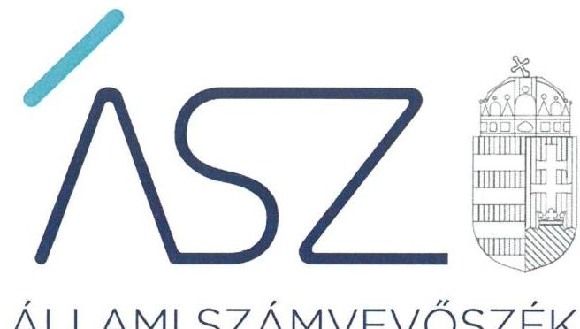
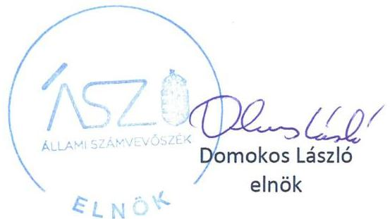
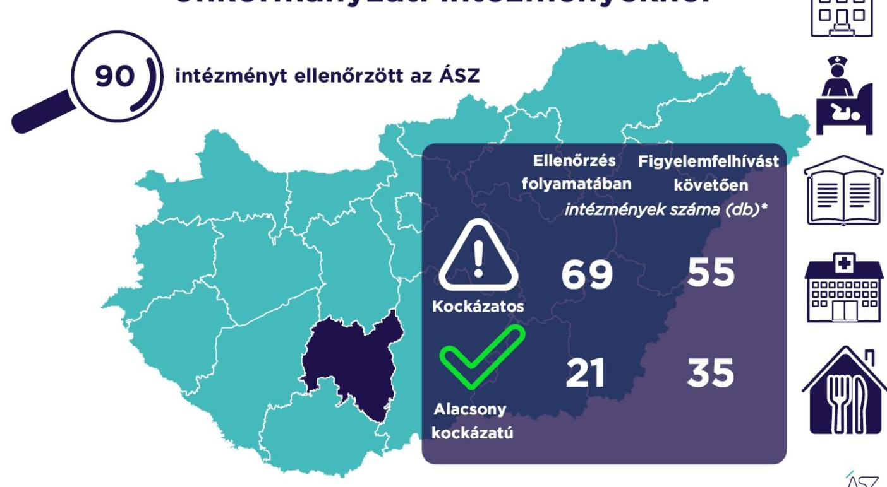

ÁLLAMI SZÁMVEVŐSZÉK

# JELENTÉS 

## A Tolna megyei önkormányzati intézmények ellenőrzése

Az önkormányzat és társulás irányítása alá tartozó intézmények integritásának monitoring típusú ellenőrzése - 90 intézmény
2021.

21112
www.asz.hu

---

ÁLLAMI SZÁMVEVŐSZÉK

# JELENTÉS

A Tolna megyei önkormányzati intézmények ellenőrzése

Az önkormányzat és társulás irányítása alá tartozó intézmények integritásának monitoring típusú ellenőrzése – 90 intézmény

2021. 12. hó 21. nap

21112
www.asz.hu

---

# AZ ELLENŐRZÉST FELÜGYELTE: 

SALAMON ILDIKŐ felügyeleti vezető

## AZ ELLENŐRZÉST VEZETTE ÉS A VÉGREHAJTÁSÁÉRT FELELŐS:

SZAPPANOS JÚLIA ellenőrzésvezető
VALASTYÁNNÉ DR VÍZHÁNYÓ JÚLIA ellenőrzésvezető

## A PROGRAM ÖSSZEÁLLÍTÁSÁÉRT FELELŐS:

DR. FELFÖLDI IZABELLA programkészítésért felelős vezető

## IKTATÓSZÁM: EL-3461-019/2021.

## TÉMASZÁM: 2568

ELLENŐRZÉS-AZONOSÍTÓ SZÁM: V0928

---

# TARTALOMJEGYZÉK 

■ ÖSSZEGZÉS ..... 5
■ AZ ELLENŐRZÉS JELENTŐSÉGE, AKTUALITÁSA, TÁRSADALMI SZEREPE, SZEMPONTJAI ..... 8
■ AZ ELLENŐRZÉS TERÜLETE ..... 9
■ ELLENŐRZÉS HATÓKÖRE ÉS MÓDSZERE ..... 10
■ MELLÉKLETEK ..... 13
I. sz. melléklet: Az értékelés módszertana ..... 13
II. sz. melléklet: Értelmező szótár ..... 15
■ FÜGGELÉKEK ..... 17
I. sz. függelék: Az ellenőrzött szervezetek és azok kockázati értékelése ..... 17
■ RÖVIDÍTÉSEK JEGYZÉKE ..... 23

---

.

---

# ÖSSZEGZÉS 

Az Állami Számvevőszék figyelemfelhívásának és tanácsadásának eredményeként a Tolna megyei önkormányzatok irányítása alatt álló 90 ellenőrzött intézmény közül 32 intézménynél az intézményvezető már 2021-ben intézkedett, vagy intézkedéseket rendelt el az integritást biztosító alapvető feltételek megerősitése, illetve kiépitése érdekében. Ezeknek az intézményeknek javult az integritása, erősödtek a csalásmentes müködés feltételei.
51 intézménynél további intézkedések szükségesek az integritást biztosító alapvető feltételek kiépitése, illetve kiegészitése érdekében. Ezeknek az intézményeknek a vezetői az Állami Számvevőszék intézkedési kötelemmel járó figyelemfelhívására nem intézkedtek, ezért az azonosított kockázatok növekedtek, vagy intézkedéseik nem fedték le a kockázatos területeket, így az azonosított kockázatok nem változtak.

## Értékelések

Az Állami Számvevőszék a Tolna megyei önkormányzatok irányítása alá tartozó 90 intézmény belső kontrollrendszerének lényeges elemei kialakítását ellenőrizte a 2021. évre vonatkozóan. Az ellenőrzés a súlypontok meghatározásával lehetőséget biztosított a szervezeti integritás, működés és vezetés, valamint a gazdálkodás területén a kockázatok azonosítására.

A szervezeti integritás alapvető feltétele a szabályozottság, azaz a jogszabályokban előírt belső szabályzatok megléte, azok - hatályos jogszabályoknak - megfelelő tartalma és gyakorlati alkalmazhatósága. Az integritási kockázatok szervezeti szinten csökkenthetők azáltal, hogy az intézményvezetők kialakítják a szervezeti és működési kereteket, a gazdálkodásra vonatkozó alapvető szabályozási környezetet, valamint a kontrolltevékenységek szabályszerű gyakorlásának, az integrált kockázatkezelésnek és az integritást sértő események kezelésének a feltételeit.

A szervezeti integritás, a működés és a vezetés alapvető szabályozási feltételeinek kialakítása hozzájárul a csalásmentes integritási környezet megteremtéséhez.

A szervezeti és működési szabályzat teremti meg a szervezet szabályszerű működésének alapjait, illetve rögzíti a szervezeten belüli felelősségi viszonyokat. A szabályzat biztosítja a szervezeti működés szabályozottságát, ezáltal a szervezet tevékenységének átláthatóságát, a szervezeti célokkal összhangban történő működés feltételeit és annak ellenőrizhetőségét. Az ellenőrzöttek közül 78 intézmény rendelkezett szervezeti és működési szabályzattal a 2021. évben.

A jogszabályi előírásoknak eleget téve, nyilatkozatban értékelte az intézmény belső kontrollrendszerének minőségét 66 intézmény vezetője. Ezek közül 35 intézménynél alakítottak ki olyan szabályozásokat, folyamatokat, amelyek biztosítják a költségvetési szerv tevékenységében a rendelkezésre álló források átlátható, szabályszerű, szabályozott, gazdaságos, hatékony és eredményes felhasználása követelményeinek érvényesítését.

Az integrált kockázatkezelés eljárásrendjét 55, a szervezeti integritást sértő események kezelésének eljárásrendjét 57 intézménynél alakították ki az intézményvezetők. Az integrált kockázatkezelés eljárásrendje biztosítja a szervezet működésében rejlő kockázatok azonosításának és kezelésének feltételeit. A szervezet működési kockázatai veszélyeztethetik a közpénzekkel való átlátható, elszámoltatható és felelős gazdálkodást. Az integritást sértő események kezelésének eljárásrendje jelenti a szervezet tekintetében felmerülő és a szervezeten belül bekövetkező integritást sértő események kezelésének alapjait. Az eljárásrend kialakításával az intézmény vezetője támogatja az integritást sértő eseményekkel kapcsolatosan azonosított kockázatok bekövetkezése esetén azok hatékony kezelését, illetve a következmények enyhítését.

A pénz- és vagyongazdálkodáshoz kapcsolódó alapvető szabályozások és nyilvántartások - így a számviteli politika és a keretében elkészítendő szabályzatok, a számlarend, a beszerzések szabályozása, valamint a kötelezettségválla-

---

lásra és a teljesítés igazolására jogosultak és aláírásmintáik nyilvántartása - előmozdítják a közpénzügyek átláthatóságát, rendezettségét. Az intézményvezető ezen szabályzatok elkészítésével, nyilvántartások vezetésével és folyamatos karbantartásával az alapfeltételét biztosítja a pénzügyi- és vagyongazdálkodás átláthatóságának, a közpénzekkel és közvagyonnal való elszámoltathatóságnak. Az ellenőrzöttek közül 69 intézménynél a számviteli politika, 68 intézménynél a számlarend, 58 intézménynél a beszerzések lebonyolításával kapcsolatos eljárásrend rendelkezésre állt.

Az ellenőrzöttek közül hét intézmény vezetője tett eleget az ellenőrzött területek mindegyikén az integritási kontrollok alapvető feltételeit jelentő, a jogszabályban előírt szabályozási kötelezettségének. Közülük hat intézmény vezetője a jogszabályi előírásokon túl további erőfeszítéseket is tett az integritás erősítése érdekében, felismerte további olyan integritási kontrollok kialakításának indokoltságát, amelyet jogszabály nem ír elő, így szervezeti szinten hozzájárul a korrupcióval szembeni védettség megszilárdításához.

84 intézmény esetében az intézményvezető intézkedése volt szükséges a kockázatok csökkentése érdekében, mivel 24 intézménynél a jogszabályok által előírt kontrollok területén, 59 intézménynél a jogszabályok által előírt és a további, jogszabály által nem előírt integritási kontrollok területén egyaránt, egy intézménynél utóbbi kontrollok területén voltak hiányosságok. A dokumentumok kiértékelése alapján - az integritás további fejlesztése érdekében az Állami Számvevőszék azonosította a lényeges kockázati területeket, és már az ellenőrzés lefolytatásával párhuzamosan, a 2021. évre vonatkozóan a kockázatok csökkentésére hívta fel az intézményvezetők figyelmét.

# Következtetések 

Az érintett 83 intézmény közül 61 intézmény vezetője válaszolt határidőben az Állami Számvevőszék figyelemfelhívására. Közülük 37 teljeskörűen, 14 részben egyetértett a kockázatos területeken teendő intézkedések indokoltságával. Az intézményvezetők közül 32 arról tájékoztatta az Állami Számvevőszéket, hogy valamennyi kockázatos területen, 15 pedig a kockázatos területek egy részénél már tett, illetve a jövőben tesz intézkedést a jelzett kockázatok csökkentése érdekében. A jogszabályi előírásokon túli integritási kontrollok területén az érintett 60 intézmény közül 27 intézmény vezetője a jelzett kockázatok teljes körű felszámolásáról adott számot. Ezek eredményeként a 84 vezetői levélben jelzett 489 kockázati terület közül 157 esetben már történt, illetve tervezett az intézkedés, így javulás várható a feltárt kockázatos területek 32,1\%-ánál.

Az intézkedések eredményeként az ellenőrzött 90 intézmény közül összesen 35 intézménynél a kockázatok alacsony szintűek, illetve - a tervezett intézkedések végrehajtásával - a kockázatok alacsony szintre csökkennek.

A szabályozások és nyilvántartások kialakításának célja nem önmagában a jogszabályi rendelkezések betartása, hanem az intézmény szabályozottságán keresztül a szabályszerű és csalásmentes gazdálkodás feltételeinek megteremtése, ezáltal az Alaptörvényben előírt átláthatóság és elszámoltathatóság elvének érvényesítése. Ezeknek az alapelveknek érvényesülése hozzájárulhat ahhoz, hogy az intézmények, mint közszolgáltatást nyújtó szervezetek felé a közszolgáltatásokat igénybe vevők, és általuk az állampolgárok általános bizalma is erősödjön.

Az Állami Számvevőszék figyelemfelhívására nem válaszoló, illetve a jelzett kockázatokra nem, vagy csak részben intézkedő intézményvezetők által vezetett intézményeknél rendszerszintű kockázatok maradtak fenn. Vezetési-irányítási kockázatot jelez, amennyiben az intézményvezetőnek címzett figyelemfelhívásra az intézményvezető helyett más személy válaszolt. Felelősségi és hatásköri kockázatot jelez, amennyiben az intézmény pénzügyi- és vagyongazdálkodásának alapvető szabályzatait a kontrollrendszer kialakításáért felelős intézményvezető helyett egy másik költségvetési szerv vezetője alakította ki, határozta meg. További kockázatot jelent a szabályok alkalmazottak általi megismerésére és alkalmazására, az intézmény mindennapi működésének integritására. Mindezek egyrészt az intézmény pénzügyi és vagyongazdálkodásának szabályszerűségét, másrészt a vezetői nyilatkozatok hitelességét, valóságtartalmát is megkérdőjelezi. A jelzett kockázatok arra mutatnak rá, hogy ezeknél az intézményeknél sérül a vezetői felelősség elve, és ezzel a felelős vezetésre épülő intézményi önállóság működése.

Az integritás elvű működés erősítése érdekében további kockázatcsökkentő lépések szükségesek a vezetés-irányítás, valamint a pénzügyi- és a vagyongazdálkodás szabályszerű feltételeinek kialakítása terén. Ezen intézmények integritásának kiépítését következő lépésként az irányító szerv bevonásával támogatja az Állami Számvevőszék.

---

# Erősödött a csalásmentesség a Tolna megyei önkormányzati intézményeknél

---

# AZ ELLENŐRZÉS JELENTŐSÉGE, AKTUALITÁSA, TÁRSADALMI SZEREPE, SZEMPONTJAI 

Az Alaptörvény alapértékeket, elveket fogalmaz meg, amely szerint a közpénzekkel gazdálkodó minden szervezet köteles a nyilvánosság előtt elszámolni a közpénzekre vonatkozó gazdálkodásával. A közpénzeket és a nemzeti vagyont az átláthatóság és a közélet tisztaságának elve szerint kell kezelni.

Magyarország helyi önkormányzatairól szóló törvény ${ }^{1}$ a helyi közhatalom gyakorlás széleskörű érvényesítésével összhangban tág teret ad a helyi önkormányzatoknak a feladataik, a közszolgáltatások legkülönbözőbb formákban történő ellátására, így széleskörű lehetőséggel rendelkeznek intézmények alapítására.

A helyi önkormányzatok irányítása alá tartozó intézmények szerteágazó közszolgáltatásokat nyújtanak. Az intézmények működtetése közvetlenül érinti a társadalom valamennyi rétegét, a közfeladatot ellátó intézmények működésének minősége közvetlen hatással van az azokat igénybe vevő állampolgárok életére.

Az intézmények szabályszerű és eredményes működésének és gazdálkodásának alapfeltétele a belső kontrollrendszer - benne az integritási kontrollok - megfelelő kialakítása. Az ÁSZ² a törvényi felhatalmazással élve ellenőrzi az önkormányzati intézményeket, hogy megállapításaival támogassa az ellenőrzött szervezetek szabályszerű gazdálkodását, müködését.

A helyi önkormányzatok intézményei által ellátott feladatok, a bölcsődei, óvodai ellátás, a gyermekétkeztetés, a betegek és idősek gondozása, a közművelődési intézmények, könyvtárak működtetése által a lakosság ezeken a területeken találkozik legszélesebb körben az önkormányzatok által nyújtott szolgáltatásokkal. A szolgáltatásokat igénybe vevők jelentős száma, a feladatellátáshoz használt nemzeti vagyon és az erre fordított közpénz nagysága indokolja, hogy az ÁSZ további, az előző ellenőrzésekre épülő ellenőrzéseket végezzen ezen a területen, illetve további olyan területeken, ahol az önkormányzati szolgáltatást a lakosság széles köre veszi igénybe.

Az ellenőrzés célja annak értékelése, hogy a helyi önkormányzatok irányítása alá tartozó intézmények megterem-tették-e az integritás biztosításához szükséges feltételeket, kialakították-e az alapvető, a szervezeti kereteket, az integritási kontrollokhoz kapcsolódó, valamint a korrupció elleni védelmet szolgáló szabályozásokat. Továbbá, hogy az intézményvezető gondoskodott-e a szervezeti teljesítmény mérés alapfeltételeinek kialakításáról az eredményességi szempontoknak való megfelelés megalapozottsága biztosítása érdekében. A monitoring típusú ellenőrzés célja hatékonyan támogatni az ellenőrzött szervezeteket, ezáltal növelve az ÁSZ tanácsadó szerepét, elősegítve a „jól irányított állam" müködését.

Az ÁSZ célja, hogy új ellenőrzési megközelítést alkalmazva támogassa a közpénzügyi helyzet javítását; a monitoring típusú ellenőrzéssel jelen időben adjon helyzetképet az integritási szemlélet érvényesítéséről, rávilágítson az integritási kontrollok kiépítettségére, illetve további fejlesztésére. Napjainkban mindez kiemelt fontosságúvá vált. Minden szervezetnek fel kell készülnie arra, hogy a koronavírus járvány okozta társadalmi és gazdasági válság növelni fogja a korrupciós nyomást. Az ÁSZ ebben a helyzetben is alapvető kötelességének tartja, hogy a közpénzek őre legyen, és ellenőrzéseit az önkormányzati alrendszer intézményei körében is folytassa.

Fontos, hogy az intézmények vezetői felismerjék az integritás kockázatokat, azokat ismételten mérjék fel, és alakítsanak ki átlátható, jól szabályozott rendszereket, döntési mechanizmusokat. Az integritási kockázatok feltárása, megismerése elengedhetetlenül fontos, mert ezt követően tehetők meg azok a lépések, amelyek a kockázatok csökkentését, felszámolását és kezelését célozzák. A belső kontrollrendszer - benne az integritás kontrollok - megfelelő kialakítása, működése a helyi önkormányzatok irányítása alatt álló intézményeknél is hozzájárul a társadalmi közbizalom erősítéséhez.

Az ellenőrzés rámutat az integritási jó gyakorlatokra is, továbbá felhívja a figyelmet a jogszabályi követelmények teljesítéséhez szükséges lépésekre is.

---

# AZ ELLENŐRZÉS TERÜLETE 

## Az önkormányzatok irányítása alá tartozó intézmények

Helyi önkormányzati költségvetési szervet az államháztartásról szóló 2011. évi CXCV törvény (Áht. ${ }^{3}$ ) szerint a helyi önkormányzat, a helyi önkormányzatok társulása, a térségi fejlesztési tanács, az átalakult nemzetiségi önkormányzat alapíthat, a költségvetési szerv alapító okiratában meghatározott önkormányzati közfeladatok ellátására. A költségvetési szervek önálló jogi személyek, éves költségvetésükből gazdálkodva látják el feladataikat. A költségvetési szervek gazdasági szervezettel rendelkeznek, ha azonban a költségvetési szerv éves átlagos statisztikai állományi létszáma a 100 főt nem éri el, a gazdasági szervezet feladatait az önkormányzati hivatal, vagy az irányító szerv döntése alapján az irányító szerv irányítása alá tartozó, gazdasági szervezettel rendelkező más költségvetési szerv látja el.

Az államháztartásról szóló törvény végrehajtásáról szóló 368/2011. (XII. 31.) Korm. rendelet (Ávr. ${ }^{4}$ ) 1. melléklete szerint, az államháztartás önkormányzati alrendszerében a helyi önkormányzat által irányított költségvetési szerv esetében az irányító szerv hatáskörét a képviselő-testület, közgyűlés gyakorolja, és annak vezetője a polgármester, főpolgármester, megyei közgyűlés elnöke.

Az ellenőrzés a Tolna megyei önkormányzatok irányítása alá tartozó, az I. sz. Függelékben felsorolt költségvetési szervekre terjedt ki.

A feladatellátásuk szerint az ellenőrzött költségvetési szervek egy része óvoda, bölcsőde, egészségügyi intézmény, konyha, művelődési ház, múzeum, kulturális központ, idősek otthona, gondozási központ, gyermekjóléti intézmény, sportközpont intézményként működik.

Az ellenőrzött 90 intézmény közül egy rendelkezik saját gazdasági szervezettel.

---

# ELLENŐRZÉS HATÓKÖRE ÉS MÓDSZERE 

## Az ellenőrzés típusa

Megfelelőségi ellenőrzés.

## Az ellenőrzött időszak

A 2021. év, a Bkr. ${ }^{5}$ szerinti vezetői nyilatkozat, valamint annak alátámasztottsága vonatkozásában a 2020. év.

## Az ellenőrzés tárgya

A szervezeti keretekkel, a működéssel és gazdálkodással kapcsolatos szabályzatok, szabályozások, valamint a szervezeti elvekkel, értékekkel összefüggő integritás kontrollok kiépítettsége, a szervezeti teljesítmény mérés alapfeltételeinek kialakítása.

## Az ellenőrzött szervezetek

Az ellenőrzött intézményeket az I. sz. Függelék tartalmazza.

## Az ellenőrzés jogalapja

Az ellenőrzés jogszabályi alapját az ÁSZ tv. ${ }^{6}$ 1. § (3) bekezdése, 5. § (6) bekezdése, valamint az Áht. 61. § (2) bekezdése képezik.

## Az ellenőrzés módszerei

Az ÁSZ az ellenőrzést az ellenőrzési program szempontjai, az ellenőrzött időszakban hatályos jogszabályok, a jelen ellenőrzésre irányadó ÁSZ módszertan figyelembevételével és a nemzetközi standardokat irányadónak tekintve végzi.

Az ellenőrzés ideje alatt az ÁSZ az ellenőrzött szervezetekkel történő kapcsolattartást az ÁSZ SZMSZ7-ének vonatkozó előírásai alapján biztosítja.

Az ellenőrzési kérdések megválaszolásához szükséges bizonyítékok megszerzése a következő ellenőrzési eljárások alkalmazásával történik: megfigyelés, összehasonlítás, elemző eljárás. Az ellenőrzési bizonyítékként felhasználható adatforrások közé tartoznak az ellenőrzési programban felsorolt adatforrások, továbbá minden - az ellenőrzés folyamán - feltárt, az ellenőrzés szempontjából információkat tartalmazó dokumentum.

---

Az ÁSZ az ellenőrzést a kérdésekre adott válaszok kiértékelésével, valamint a megjelölt adatforrások, továbbá az adott időszakban hatályos jogszabályok, valamint az ÁSZ honlapján közzétett helyénvalósági kritériumok figyelembevételével folytatja le.

A monitoring típusú ellenőrzés az önkormányzatok irányítása alá tartozó intézmények integritás alapú múködésének lényeges területeire és a közpénzügyi helyzet javítása érdekében az elért eredmények fenntartására fókuszál. Lehetőséget biztosít az integritási kontrollok kiépítettségében lévő hiányosságok, a szervezeti teljesítmény mérés alapfeltételei kialakításának hiánya beazonosítására az eredményességi szempontoknak való megfelelés megalapozottsága biztosítása érdekében, az önkormányzatok, társulások irányítása alá tartozó intézmények integritásának elemzésére, részletes ellenőrzések megalapozására.

---

.

---

# MELLÉKLETEK 

I. SZ. MELLÉKLET: AZ ÉRTÉKELÉS MÓDSZERTANA

Az egyes kockázati területek és kockázatforrások minősítése „pontozásos módszerrel", az integritás „jelző" dokumentumai és a vezetői magatartás ellenőrzéshez kapcsolódóan tanúsított tényhelyzeteinek értékelése alapján történt.

Az értékelt dokumentumokhoz, nyilvántartásokhoz, kockázati besorolásokhoz minden esetben pontszám került hozzárendelésre, amelyek értéke alapján az ellenőrzött szervezetek kockázati csoportba kerültek besorolásra:

- Alacsony kockázatú - az elérhető összes pontszám legalább 80\%-a
- Közepes kockázatú - az elérhető pontszám 50-79\%-a között
- Magas kockázatú - az elérhető pontszám 50\%-a alatt

Az első lépésben azonosításra kerültek azok az intézményi szabályozások és nyilvántartások, amelyek meglétét jogszabály írja elő, hiánya pedig felveti a csalás és korrupció kockázatát.

Második lépésben az adatoknak az ellenőrzés rendelkezésére bocsátása kockázati kritériumainak meghatározása, majd értékelése történt meg.

Harmadik lépésben a figyelemfelhívó levelekre adott válaszok kockázati kritériumainak meghatározása, majd értékelése történt meg.

Az összesített kockázati értékelést javította, amennyiben

- az intézmény rendelkezett olyan szabályozással, amely kötelező meglétét jogszabály nem írja elő, de segíti a csalás és a korrupció megelőzését (helyénvalósági dokumentumok).

Az összesített kockázati értékelést rontotta, amennyiben

- az integritás szempontjából meghatározó dokumentum - az intézményi SZMSZ - hiányzott, és javítása érdekében a figyelemfelhívó levél hatására sem történt intézkedés.

A figyelemfelhívó levelekre adott válaszok értékelése alapján:

- A kockázat csökkent, amennyiben a figyelemfelhívó levélre adott válasza a figyelemfelhívással összhangban volt, valamennyi kockázati területen intézkedett vagy intézkedést tervezett.
- A kockázat változatlan, amennyiben a figyelemfelhívó levélben foglaltaktól eltérő magatartást tanúsított, intézkedése a figyelemfelhívással részben volt összhangban, a kockázati területeken részben intézkedett vagy intézkedést tervezett.
- A kockázat nőtt, amennyiben nem volt együttműködő, a figyelemfelhívó levélre nem válaszolt, vagy válasza alapján nem intézkedett és nem tervezett intézkedést.

---

# Az önkormányzatok irányítása alá tartozó intézmények kockázati csoportba sorolásának értékelési keretrendszere 

I. Dokumentumokkal rendelkezés
lényeges dokumentumok, amelyek hiánya felveti a csalás és korrupció kockázatát
I.1. A szervezeti integritás, müködés és vezetés alapvető szabályozási feltételei

- intézmény SZMSZ-e
- vezetői nyilatkozat a 2020. évre vonatkozóan az intézmény belső kontrollrendszer minőségének értékeléséről, valamint a nyilatkozat megalapozottságát bizonyító dokumentumok
- integrált kockázatkezelés eljárásrendje
- az integritást sértő események kezelésének eljárásrendje
I.2. A pénz- és vagyongazdálkodáshoz kapcsolódó alapvető szabályozások
- számviteli politika
- az eszközök és a források leltárkészítési és leltározási szabályzata
- az eszközök és a források értékelési szabályzata
- pénzkezelési szabályzat
- számlarend
- beszerzések lebonyolításával kapcsolatos eljárásrend
- a kötelezettségvállalásra, teljesítés igazolására jogosult személyekről és aláírás-mintájukról vezetett nyilvántartás
II. Az adatoknak az ellenőrzés rendelkezésére bocsátása
II.1. A megnevezett adatokkal rendelkezett és a törvényi határidőn belül hiánytalanul rendelkezésre bocsátotta. Figyelem-, illetve figyelmet felhívó levél nem volt indokolt.
II.2. A megnevezett adatokat nem bocsátotta rendelkezésre.
III. Figyelemfelhívó levelekre adott válaszok kockázati értékelése
III.1. Kockázat csökkent: együttmüködése a figyelemfelhívó levéllel összhangban volt.
III.2. Kockázat változatlan: a figyelemfelhívó levélben foglaltaktól eltérő együttműködést tanúsított.
III.3. Kockázat nőtt: nem reagált, nem intézkedett, így nem volt együttmüködő.

---

# II. SZ. MELLÉKLET: ÉRTELMEZŐ SZÓTÁR 

belső kontrollrendszer

belső kontrollrendszer területei
integrált kockázatkezelési rendszer
integritás

Integritási kockázatok
kockázat
kontrollkörnyezet
kontrollkörnyezet
kockázat
kontrollkörnyezet
kontrolltevékenységek
intézmény

A belső kontrollrendszer a kockázatok kezelése és tárgyilagos bizonyosság megszerzése érdekében kialakított folyamatrendszer, amely azt a célt szolgálja, hogy a müködés és gazdálkodás során a tevékenységeket szabályszerűen, gazdaságosan, hatékonyan, eredményesen hajtsák végre, az elszámolási kötelezettségeket teljesítsék, megvédjék az erőforrásokat a veszteségektől, károktól és nem rendeltetésszerű használattól. (Forrás: Áht. 69. § (1) bekezdése)
A kontrollkörnyezet, az integrált kockázatkezelési rendszer, a kontrolltevékenységek, az információs és kommunikációs rendszer, valamint a nyomon követési (monitoring) rendszer. (Forrás: Bkr. 3. §-a)
Olyan folyamatalapú kockázatkezelési rendszer, amely a szervezet minden tevékenységére kiterjed, egységes módszertan és eljárások alkalmazásával, a szervezet célkitűzéseinek és értékeinek figyelembevételével biztosítja a szervezet kockázatainak teljes körű azonosítását, azok meghatározott kritériumok szerinti értékelését, valamint a kockázatok kezelésére vonatkozó intézkedési terv elkészítését és az abban foglaltak nyomon követését. (Forrás: Bkr. 2. § m) pontja)
Az integritás az elvek, értékek, cselekvések, módszerek, intézkedések konzisztenciáját jelenti, vagyis olyan magatartásmódot, amely meghatározott értékeknek megfelel. (Forrás: Nemzetgazdasági Minisztérium: Államháztartási belső kontroll standardok és gyakorlati útmutató 1.1.3. pontja, 2017. szeptember)
Integritási kockázatnak minősül a szervezet célkitűzéseit, értékeit, elveit sértő vagy veszélyeztető visszaélés, szabálytalanság, vagy egyéb esemény lehetősége. A korrupciós kockázat olyan integritási kockázat, amely korrupciós cselekmény bekövetkezésének lehetőségét jelenti. Minden korrupciós kockázat egyben integritási kockázat is. Korrupciós cselekményeknek nevezzük azokat a vesztegetésszerű cselekményeket, amelyeket általában a Büntető Törvénykönyv ${ }^{8}$ is büntetéssel fenyeget.
A kockázat annak a valószínűségét jelenti, hogy egy vagy több esemény, vagy intézkedés nem kívánt módon befolyásolja a rendszer müködését, céljainak megvalósulását. (Forrás: Javaslatok a korrupciós kockázatok kezelésére - Kockázatkezelési és ellenőrzési módszertan 35. oldal, ÁSZ)
A költségvetési szerv vezetője által kialakított olyan elvek, eljárások, belső szabályzatok összessége, amelyben világos a szervezeti struktúra, a folyamatok átláthatók, egyértelműek a felelősségi, hatásköri viszonyok és feladatok, meghatározottak, ismertek és elfogadottak az etikai elvárások a szervezet minden szintjén, átlátható a humánerőforrás-kezelés, biztosított a szervezeti célok és értékek irányában való elkötelezettség fejlesztése és elősegítése. (Forrás: Bkr. 6. § (1) bekezdés)
A költségvetési szerv vezetője által a szervezeten belül kialakított (kontroll) tevékenységek, melyek biztosítják a kockázatok kezelését, hozzájárulnak a szervezet céljainak eléréséhez és erősítik a szervezet integritását. (Forrás: Bkr. 8. § (1) bekezdés)
A helyi önkormányzatok irányítása alá tartozó költségvetési szervek. (A képviselő-testület a feladatkörébe tartozó közszolgáltatások ellátására - jogszabályban meghatározottak szerint - költségvetési szervet (önkormányzati intézmény) alapíthat; Forrás: Mötv. 41. § (6) bekezdés)

---

.

---

# FÜGGELÉKEK

I. SZ. FÜGGELÉK: AZ ELLENŐRZÖTT SZERVEZETEK ÉS AZOK KOCKÁZATI ÉRTÉKELÉSE

|  Sorszám | Ellenőrzött szervezet megnevezése | Irányító szerv (önkormányzat) megnevezése | Helység | Tanácsadást megelőző kockázati besorolás | Intézkedést követően a kockázati értékelés változása | A kockázati szint alacsonyra csökkent-e  |
| --- | --- | --- | --- | --- | --- | --- |
|  1. | Iregszemcsei Nefelejcs Óvoda és Közétkeztetési Konyha | Iregszemcse Község Önkormányzata | Iregszemcse | KÖZEPES | NEM VÁLTOZOTT | N  |
|  2. | Dombóvári Művelődési Ház, Könyvtár és Helytörténeti Gyűjtemény | Dombóvár Város Önkormányzata | Dombóvár | ALACSONY | CSÖKKENT | I  |
|  3. | Dombóvári Szivárvány Óvoda | Dombóvár Város Önkormányzata | Dombóvár | ALACSONY | CSÖKKENT | I  |
|  4. | Simontornyai Városi Könyvtár | Simontornya Város Önkormányzata | Simontornya | MAGAS | NÖTT | N  |
|  5. | Értényi Szivárvány Óvoda és Főzőkonyha | Értény Község Önkormányzata | Értény | KÖZEPES | NEM VÁLTOZOTT | N  |
|  6. | Simontornyai Vár | Simontornya Város Önkormányzata | Simontornya | MAGAS | NÖTT | N  |
|  7. | Bátai Pitypang Óvoda és Bölcsőde | Bába Község Önkormányzata | Bába | MAGAS | NÖTT | N  |
|  8. | Újiregi Gesztenye Óvoda | Újireg Község Önkormányzata | Újireg | KÖZEPES | NEM VÁLTOZOTT | N  |
|  9. | Bátai Ízek Konyhája | Bába Község Önkormányzata | Bába | MAGAS | NÖTT | N  |
|  10. | Dombóvári Százszorszép Óvoda és Bölcsőde | Dombóvár Város Önkormányzata | Dombóvár | ALACSONY | CSÖKKENT | I  |
|  11. | Medinai Sió Kincse Óvoda és Mini Bölcsőde | Medina Község Önkormányzat | Medina | ALACSONY | nem volt szabályszerűségi hiba | I  |
|  12. | Ozora Konyha | Ozora Község Önkormányzata | Ozora | ALACSONY | nem volt szabályszerűségi hiba | I  |
|  13. | Csodakert Óvoda és Mini Bölcsőde | Dunaszentgyörgy Község Önkormányzata | Dunaszentgyörgy | MAGAS | NÖTT | N  |
|  14. | Németkéri Szivárvány Óvoda | Németkér Község Önkormányzata | Németkér | MAGAS | NÖTT | N  |
|  15. | Dunaszentgyörgyi Önkormányzati Konyha | Dunaszentgyörgy Község Önkormányzata | Dunaszentgyörgy | MAGAS | NÖTT | N  |
|  16. | Pincehely Nagyközség Önkormányzatának Gondozási Központja | Pincehely Nagyközség Önkormányzata | Pincehely | MAGAS | NEM VÁLTOZOTT | N  |
|  17. | Decs Tesz-Vesz Óvoda és Mini Bölcsőde | Decs Nagyközség Önkormányzata | Decs | KÖZEPES | CSÖKKENT | I  |
|  18. | Nak Községi Óvoda | Nak Község Önkormányzata | Nak | MAGAS | NÖTT | N  |
|  19. | Gyönki Múvelődési Ház és Könyvtár | Gyönk Város Önkormányzata | Gyönk | KÖZEPES | NÖTT | N  |
|  20. | Gerjeni Önkormányzati Konyha | Gerjen Község Önkormányzata | Gerjen | KÖZEPES | NÖTT | N  |

---

| Sorszám | Ellenőrzött szervezet megnevezése | Irányító szerv (önkormányzat) megnevezése | Helység | Tanácsadást megelőző kockázati besorolás | Intézkedést követően a kockázati értékelés változása | A kockázati szint alacsonyra csökkent-e |
| :--: | :--: | :--: | :--: | :--: | :--: | :--: |
| 21. | Várlak Óvoda-Bölcsőde | Gerjen Község Önkormányzata | Gerjen | MAGAS | NÖTT | N |
| 22. | Faddi Kismanók Óvoda és Bölcsőde | Fadd Nagyközség Önkormányzata | Fadd | ALACSONY | NÖTT | N |
| 23. | Dunaföldvári Művelődési Központ és Könyvtár | Dunaföldvár Város Önkormányzata | Dunaföldvár | KÖZEPES | NÖTT | N |
| 24. | Várdombi Bölcsőde, Óvoda és Konyha | Várdomb Község Önkormányzata | Várdomb | MAGAS | NÖTT | N |
| 25. | Községi Önkormányzat Vízmúve Aparhant | Aparhant Község Önkormányzata | Aparhant | KÖZEPES | NÖTT | N |
| 26. | Madocsa Alapszolgáltatási Központ | Madocsa Község Önkormányzata | Madocsa | KÖZEPES | CSÖKKENT | I |
| 27. | Napsugár Idősek Otthona | Dunaföldvár Város Önkormányzata | Dunaföldvár | KÖZEPES | CSÖKKENT | I |
| 28. | Attalai Aprók Hája Óvoda | Attala Község Önkormányzat | Attala | ALACSONY | NÖTT | N |
| 29. | Dunaföldvár Család- és Gyermekjóléti Szolgálat és Alapszolgáltatási Központ | Dunaföldvár Város Önkormányzata | Dunaföldvár | KÖZEPES | CSÖKKENT | I |
| 30. | Szálkai Óvoda | Szálka Község Önkormányzata | Szálka | MAGAS | NÖTT | N |
| 31. | Gyulaji Idősek Gondozó Otthona és Napközis Konyha, Ebédlő | Gyulaj Községi Önkormányzat | Gyulaj | KÖZEPES | CSÖKKENT | N |
| 32. | Dunaföldvári Eszterlánc Óvoda, Bölcsőde és Konyha | Dunaföldvár Város Önkormányzata | Dunaföldvár | KÖZEPES | NÖTT | N |
| 33. | Madocsai Csillagvirág Óvoda és Mini Bölcsőde | Madocsa Község Önkormányzata | Madocsa | KÖZEPES | CSÖKKENT | I |
| 34. | Aparhanti Felhőcske Óvoda | Aparhant Község Önkormányzata | Aparhant | KÖZEPES | CSÖKKENT | I |
| 35. | Fürged Konyha | Fürged Község Önkormányzata | Fürged | MAGAS | NÖTT | N |
| 36. | Nagydorogi Szivárvány Óvoda, Mini Bölcsőde és Konyha | Nagydorog Nagyközség Önkormányzata | Nagydorog | KÖZEPES | NÖTT | N |
| 37. | Vörösmarty Mihály Múvelődési Központ | Bonyhád Város Önkormányzata | Bonyhád | KÖZEPES | NEM VÁLTOZOTT | N |
| 38. | Cikói Óvoda | Cikó Község Önkormányzata | Cikó | KÖZEPES | NÖTT | N |
| 39. | Mórágyi Óvoda | Mórágy Község Önkormányzata | Mórágy | ALACSONY | nem volt szabályszerúségi hiba | I |
| 40. | Wosinsky Mór Megyei Múzeum | Szekszárd Megyei Jogú Város Önkormányzata | Szekszárd | MAGAS | NEM VÁLTOZOTT | N |
| 41. | Wosinsky Mór Óvoda | Tolna Város Önkormányzata | Tolna | KÖZEPES | CSÖKKENT | I |
| 42. | Szekszárd Megyei Jogú Város Önkormányzata Egészségügyi Gondnoksága | Szekszárd Megyei Jogú Város Önkormányzata | Szekszárd | MAGAS | NEM VÁLTOZOTT | N |

---

| Sor-   szám | Ellenőrzött szervezet megnevezése | Irányító szerv (önkormányzat) megnevezése | Helység | Tanácsadást megelőző kockázati besorolás | Intézkedést követően a kockázati értékelés változása | A kockázati szint alacsonyra csökkent-e |
| :--: | :--: | :--: | :--: | :--: | :--: | :--: |
| 43. | Paksi Gyógyászati Központ | Paks Város Önkormányzata | Paks | KÖZEPES | CSÖKKENT | I |
| 44. | Szekszárdi 1. Számú Óvoda Kindergarten | Szekszárd Megyei Jogú Város Önkormányzata | Szekszárd | MAGAS | NEM VÁLTOZOTT | N |
| 45. | Szekszárdi Gyermeklánc Óvoda | Szekszárd Megyei Jogú Város Önkormányzata | Szekszárd | MAGAS | NEM VÁLTOZOTT | N |
| 46. | Völgységi Múzeum | Bonyhád Város Önkormányzata | Bonyhád | KÖZEPES | NÖTT | N |
| 47. | Paksi Városi Múzeum | Paks Város Önkormányzata | Paks | ALACSONY | nem volt szabályszerűségi hiba | I |
| 48. | Paksi Napsugár Óvoda | Paks Város Önkormányzata | Paks | KÖZEPES | CSÖKKENT | I |
| 49. | Paksi Benedek Elek Óvoda | Paks Város Önkormányzata | Paks | KÖZEPES | CSÖKKENT | N |
| 50. | Szekszárd Megyei Jogú Város Önkormányzatának Városi Bölcsődéje | Szekszárd Megyei Jogú Város Önkormányzata | Szekszárd | MAGAS | NEM VÁLTOZOTT | N |
| 51. | Paksi Bóbita Bölcsőde és Konyha | Paks Város Önkormányzata | Paks | KÖZEPES | CSÖKKENT | I |
| 52. | Tolnai Kulturális Központ és Könyvtár | Tolna Város Önkormányzata | Tolna | KÖZEPES | NÖTT | N |
| 53. | Bátaapáti Óvoda és Konyha | Bátaapáti Község Önkormányzata | Bátaapáti | KÖZEPES | CSÖKKENT | I |
| 54. | Öcsényi Tarkabarka Óvoda és Családi Bölcsőde | Öcsény Község Önkormányzata | Öcsény | MAGAS | NÖTT | N |
| 55. | Bonyhádi Varázskapu Bölcsőde és Óvoda | Bonyhád Város Önkormányzata | Bonyhád | ALACSONY | CSÖKKENT | I |
| 56. | Kakasdi Bezerédj Amália Óvoda és Mini Bölcsőde | Kakasd Község Önkormányzata | Kakasd | ALACSONY | NÖTT | N |
| 57. | Tengelici Mézeskalács Óvoda és Mini Bölcsőde | Tengelic Község Önkormányzata | Tengelic | MAGAS | NÖTT | N |
| 58. | Nagymányoki Pitypang Óvoda és Bölcsőde | Nagymányok Város Önkormányzata | Nagymányok | KÖZEPES | NEM VÁLTOZOTT | N |
| 59. | Nagymányoki Közművelődési Központ | Nagymányok Város Önkormányzata | Nagymányok | KÖZEPES | NÖTT | N |
| 60. | Szakcsi Óvoda és Konyha | Szakcs Község Önkormányzata | Szakcs | KÖZEPES | CSÖKKENT | I |
| 61. | Kajdacsi Százszorszép Óvoda, Mini Bölcsőde és Konyha | Kajdacs Községi Önkormányzat | Kajdacs | ALACSONY | nem volt szabályszerűségi hiba | I |
| 62. | Döbröközi Mesevilág Óvoda | Döbrököz Község Önkormányzata | Döbrököz | MAGAS | NÖTT | N |
| 63. | Kaposszekcsői Csillagvirág Óvoda | Kaposszekcső Község Önkormányzata | Kaposszekcső | KÖZEPES | NÖTT | N |
| 64. | Nagykónyi Óvoda és Főzökonyha | Nagykónyi Község Önkormányzata | Nagykónyi | ALACSONY | nem volt szabályszerűségi hiba | I |

---

| Sorszám | Ellenőrzött szervezet megnevezése | Irányító szerv (önkormányzat) megnevezése | Helység | Tanácsadást megelőző kockázati besorolás | Intézkedést követően a kockázati értékelés változása | A kockázati szint alacsonyra csökkent-e |
| :--: | :--: | :--: | :--: | :--: | :--: | :--: |
| 65. | Pusztahencsei Óvoda és Konyha | Pusztahencse Községi Önkormányzat | Pusztahencse | KÖZEPES | NÖTT | N |
| 66. | Tamási Aranyerdő Óvoda és Bölcsőde | Tamási Város Önkormányzata | Tamási | KÖZEPES | NEM VÁLTOZOTT | N |
| 67. | Szakályi Százszorszép Óvoda | Szakály Község Önkormányzata | Szakály | KÖZEPES | CSÖKKENT | N |
| 68. | Nagyszokolyi Kismackó Óvoda | Nagyszokoly Község Önkormányzata | Nagyszokoly | ALACSONY | CSÖKKENT | I |
| 69. | Sárpilisi Tündérkert Óvoda | Sárpilis Község Önkormányzata | Sárpilis | ALACSONY | CSÖKKENT | I |
| 70. | Paksi Életfa Idősek Otthona | Paks Város Önkormányzata | Paks | MAGAS | CSÖKKENT | N |
| 71. | Öcsényi Konyha | Öcsény Község Önkormányzata | Öcsény | MAGAS | NÖTT | N |
| 72. | Felsőnyéki Szirombontogató Óvoda és Konyha | Felsőnyék Községi Önkormányzat | Felsőnyék | KÖZEPES | NÖTT | N |
| 73. | Tamási Művelődési Központ és Könnyü László Könyvtár | Tamási Város Önkormányzata | Tamási | KÖZEPES | CSÖKKENT | I |
| 74. | Harc Község Konyhája | Harc Község Önkormányzata | Harc | ALACSONY | nem volt szabály. szerúségi hiba | I |
| 75. | Nagyszékely Községi Önkormányzat Konyhája | Nagyszékely Községi Önkormányzat | Nagyszékely | KÖZEPES | CSÖKKENT | I |
| 76. | Tolnanémedi Község Önkormányzata Konyhája | Tolnanémedi Község Önkormányzata | Tolnanémedi | KÖZEPES | CSÖKKENT | I |
| 77. | Zomba Község Önkormányzat Konyhája | Zomba Község Önkormányzata | Zomba | KÖZEPES | CSÖKKENT | I |
| 78. | Mucsi Község Konyhája | Mucsi Község Önkormányzata | Mucsi | KÖZEPES | NÖTT | N |
| 79. | Kistormási Katica Óvoda | Kistormás Községi Önkormányzat | Kistormás | ALACSONY | CSÖKKENT | I |
| 80. | Harci Kincsesláda Óvoda és Mini Bölcsőde | Harc Község Önkormányzata | Harc | KÖZEPES | NÖTT | N |
| 81. | Kölesdi Mesevár Óvoda | Kölesd Községi Önkormányzat | Kölesd | KÖZEPES | NÖTT | N |
| 82. | Sióagárdi Kisfecskék Óvoda és Mini Bölcsőde | Sióagárd Község Önkormányzata | Sióagárd | MAGAS | NÖTT | N |
| 83. | Bölcskei Mesevár Óvoda és Bölcsőde | Bölcske Községi Önkormányzat | Bölcske | ALACSONY | CSÖKKENT | I |
| 84. | Bonyhádi Sportcentrum | Bonyhád Város Önkormányzata | Bonyhád | ALACSONY | CSÖKKENT | I |
| 85. | Györei Kútvölgy Óvoda | Györe Község Önkormányzata | Györe | KÖZEPES | CSÖKKENT | I |
| 86. | Bölcskei Szociális Alapszolgáltatási Központ | Bölcske Községi Önkormányzat | Bölcske | ALACSONY | CSÖKKENT | I |

---

| Sorszám | Ellenőrzött szervezet megnevezése | Irányító szerv (önkormányzat) megnevezése | Helység | Tanácsadást megelőző kockázati besorolás | Intézkedést követően a kockázati értékelés változása | A kockázati szint alacsonyra csökkent-e |
| :--: | :--: | :--: | :--: | :--: | :--: | :--: |
| 87. | Hőgyészi Gyermekélelmezési Intézmény | Hőgyész Nagyközség Önkormányzata | Hőgyész | KÖZEPES | NEM VÁLTOZOTT | N |
| 88. | Szakály Község Konyhája | Szakály Község Önkormányzata | Szakály | MAGAS | NEM VÁLTOZOTT | N |
| 89. | Magyarkeszi Község Önkormányzata Konyhája | Magyarkeszi Község Önkormányzata | Magyarkeszi | KÖZEPES | NEM VÁLTOZOTT | N |
| 90. | Bonyhádi Védőnői Szolgálat | Bonyhád Város Önkormányzata | Bonyhád | ALACSONY | CSÖKKENT | I |
| Alacsony kockázatú |  |  |  | 21 |  |  |
| Közepes kockázatú |  |  |  | 44 |  |  |
| Magas kockázatú |  |  |  | 25 |  |  |
| Kockázat csökkent |  |  |  |  | 32 |  |
| Kockázat nem változott |  |  |  |  | 15 |  |
| Kockázat nőtt |  |  |  |  | 36 |  |
| Nem volt indokolt figyelemfelhívó levél (szabályszerüségi vagy szabályszerűségi és helyénvalósági hiba hiányában) |  |  |  |  | 7 |  |
| Kockázat alacsony szintre csökkent |  |  |  |  |  | 35 |
| Kockázat nem csökkent alacsony szintre |  |  |  |  |  | 55 |
| Összesen |  |  |  | 90 | 90 | 90 |

---

.

---

# RÖVIDÍTÉSEK JEGYZÉKE 

${ }^{1}$ Mötv.
${ }^{2}$ ÁSZ
${ }^{3}$ Áht.
${ }^{4}$ Ávr.
${ }^{5}$ Bkr.
${ }^{6}$ ÁSZ tv.
${ }^{7}$ ÁSZ SZMSZ
${ }^{8}$ Büntető Törvénykönyv
2011. évi CLXXXIX. törvény - Magyarország helyi önkormányzatairól (hatályos: 2012. január 1-jétől)

Állami Számvevőszék
2011. évi CXCV. törvény az államháztartásról (hatályos 2011. december 31-étől) 368/2011. (XII. 31.) Korm. rendelet az államháztartásról szóló törvény végrehajtásáról (hatályos 2012. január 1-jétől)
370/2011. (XII. 31.) Korm. rendelet a költségvetési szervek belső kontrollrendszeréről és belső ellenőrzésről (hatályos 2012. január 1-jétől)
2011. évi LXVI. törvény az Állami Számvevőszékről (hatályos 2011. július 1-jétől)

Az Állami Számvevőszék Szervezeti és Működési Szabályzata
2012. évi C. törvény a Büntető Törvénykönyvről (hatályos 2013. július 1-jétől)

---

# ASZ 

ALLAMI SZAMVEVOSZEK
1052 Budapest, Apáczai Cs. J. u. 10. I 1364 Budapest 4. Pf. 54 TEL: +36 14849100
email: szamvevoszek@asz.hu
web: www.asz.hu | www.aszhirportal.hu