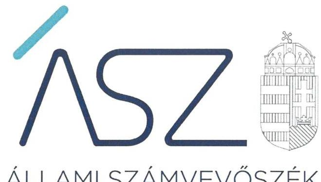
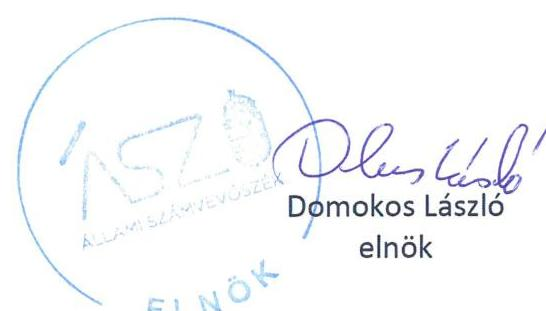
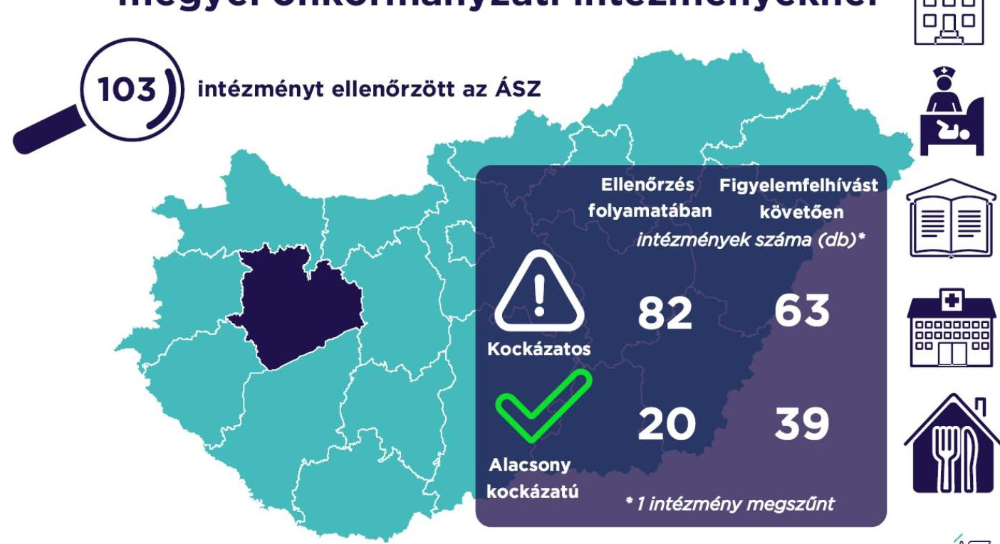

ÁLLAMI SZÁMVEVŐSZÉK

# JELENTÉS 

A Veszprém megyei önkormányzati intézmények ellenőrzése

Az önkormányzat és társulás irányítása alá tartozó intézmények integritásának monitoring típusú ellenőrzése - 103 intézmény
2021.

21114
www.asz.hu

---

ÁLLAMI SZÁMVEVŐSZÉK

# JELENTÉS

A Veszprém megyei önkormányzati intézmények ellenőrzése

Az önkormányzat és társulás irányítása alá tartozó intézmények integritásának monitoring típusú ellenőrzése – 103 intézmény

2021. 12. hó 21. nap

21114
www.asz.hu

---

# AZ ELLENŐRZÉST FELÜGYELTE: 

SALAMON ILDIKÓ felügyeleti vezető

## AZ ELLENŐRZÉST VEZETTE ÉS A VÉGREHAJTÁSÁÉRT FELELŐS:

SZAPPANOS JÚLIA ellenőrzésvezető
JANIK JÓZSEF LÁSZLÓ ellenőrzésvezető
ÓDOR ZOLTÁN TAMÁS ellenőrzésvezető

A PROGRAM ÖSSZEÁLLÍTÁSÁÉRT FELELŐS:
DR. FELFÖLDI IZABELLA programkészítésért felelős vezető

Jelentéseink az Országgyúlés számítógépes hálózatán és az interneten a www.asz.hu címen is olvashatóak.

IKTATÓSZÁM: EL-3461-021/2021.
TÉMASZÁM: 2568
ELLENŐRZÉS-AZONOSÍTÓ SZÁM: V0928

---

# TARTALOMJEGYZÉK 

■ ÖSSZEGZÉS ..... 5
■ AZ ELLENŐRZÉS JELENTŐSÉGE, AKTUALITÁSA, TÁRSADALMI SZEREPE, SZEMPONTJAI ..... 8
■ AZ ELLENŐRZÉS TERÜLETE ..... 9
■ ELLENŐRZÉS HATÓKÖRE ÉS MÓDSZERE ..... 10
■ MELLÉKLETEK ..... 13
I. sz. melléklet: Az értékelés módszertana ..... 13
II. sz. melléklet: Értelmező szótár ..... 15
■ FÜGGELÉKEK ..... 17
I. sz. függelék: Az ellenőrzött szervezetek és azok kockázati értékelése ..... 17
■ RÖVIDÍTÉSEK JEGYZÉKE ..... 23

---

.

---

# ÖSSZEGZÉS 

Az Állami Számvevőszék figyelemfelhívásának és tanácsadásának eredményeként a Veszprém megyei önkormányzatok irányítása alatt álló 103 ellenőrzött intézmény közül 34 intézménynél az intézményvezető már 2021-ben intézkedett, vagy intézkedéseket rendelt el az integritást biztosító alapvető feltételek megerősítése, illetve kiépítése érdekében. Ezeknek az intézményeknek javult az integritása, erősödtek a csalásmentes működés feltételei.
53 intézménynél további intézkedések szükségesek az integritást biztosító alapvető feltételek kiépítése, illetve kiegészítése érdekében. Ezeknek az intézményeknek a vezetői az Állami Számvevőszék intézkedési kötelemmel járó figyelemfelhívására nem intézkedtek, ezért az azonosított kockázatok növekedtek, vagy intézkedéseik nem fedték le a kockázatos területeket, így az azonosított kockázatok nem változtak.
Az irányító önkormányzat egy intézmény megszüntetéséről döntött az ellenőrzött időszakban.

## Értékelések

Az Állami Számvevőszék a Veszprém megyei önkormányzatok irányítása alá tartozó 103 intézmény belső kontrollrendszerének lényeges elemei kialakítását ellenőrizte a 2021. évre vonatkozóan. Az ellenőrzés a súlypontok meghatározásával lehetőséget biztosított a szervezeti integritás, működés és vezetés, valamint a gazdálkodás területén a kockázatok azonosítására.

A szervezeti integritás alapvető feltétele a szabályozottság, azaz a jogszabályokban előírt belső szabályzatok megléte, azok - hatályos jogszabályoknak - megfelelő tartalma és gyakorlati alkalmazhatósága. Az integritási kockázatok szervezeti szinten csökkenthetők azáltal, hogy az intézményvezetők kialakítják a szervezeti és működési kereteket, a gazdálkodásra vonatkozó alapvető szabályozási környezetet, valamint a kontrolltevékenységek szabályszerű gyakorlásának, az integrált kockázatkezelésnek és az integritást sértő események kezelésének a feltételeit.

A szervezeti integritás, a működés és a vezetés alapvető szabályozási feltételeinek kialakítása hozzájárul a csalásmentes integritási környezet megteremtéséhez.

A szervezeti és működési szabályzat teremti meg a szervezet szabályszerű működésének alapjait, illetve rögzíti a szervezeten belüli felelősségi viszonyokat. A szabályzat biztosítja a szervezeti működés szabályozottságát, ezáltal a szervezet tevékenységének átláthatóságát, a szervezeti célokkal összhangban történő működés feltételeit és annak ellenőrizhetőségét. Az ellenőrzöttek közül 94 intézmény rendelkezett szervezeti és működési szabályzattal a 2021. évben.

A jogszabályi előírásoknak eleget téve, nyilatkozatban értékelte az intézmény belső kontrollrendszerének minőségét 81 intézmény vezetője. Ezek közül 39 intézménynél alakítottak ki olyan szabályozásokat, folyamatokat, amelyek biztosítják a költségvetési szerv tevékenységében a rendelkezésre álló források átlátható, szabályszerű, szabályozott, gazdaságos, hatékony és eredményes felhasználása követelményeinek érvényesítését.

Az integrált kockázatkezelés eljárásrendjét 66, a szervezeti integritást sértő események kezelésének eljárásrendjét 76 intézménynél alakították ki az intézményvezetők. Az integrált kockázatkezelés eljárásrendje biztosítja a szervezet működésében rejlő kockázatok azonosításának és kezelésének feltételeit. A szervezet működési kockázatai veszélyeztethetik a közpénzekkel való átlátható, elszámoltatható és felelős gazdálkodást. Az integritást sértő események kezelésének eljárásrendje jelenti a szervezet tekintetében felmerülő és a szervezeten belül bekövetkező integritást sértő események kezelésének alapjait. Az eljárásrend kialakításával az intézmény vezetője támogatja az integritást sértő eseményekkel kapcsolatosan azonosított kockázatok bekövetkezése esetén azok hatékony kezelését, illetve a következmények enyhítését.

---

A pénz- és vagyongazdálkodáshoz kapcsolódó alapvető szabályozások és nyilvántartások - így a számviteli politika és a keretében elkészítendő szabályzatok, a számlarend, a beszerzések szabályozása, valamint a kötelezettségvállalásra és a teljesítés igazolására jogosultak és aláírásmintáik nyilvántartása - előmozdítják a közpénzügyek átláthatóságát, rendezettségét. Az intézményvezető ezen szabályzatok elkészítésével, nyilvántartások vezetésével és folyamatos karbantartásával az alapfeltételét biztosítja a pénzügyi- és vagyongazdálkodás átláthatóságának, a közpénzekkel és közvagyonnal való elszámoltathatóságnak. Az ellenőrzöttek közül 74 intézménynél a számviteli politika, 59 intézménynél a számlarend, 70 intézménynél a beszerzések lebonyolításával kapcsolatos eljárásrend rendelkezésre állt.

Az ellenőrzöttek közül 15 intézmény vezetője tett eleget az ellenőrzött területek mindegyikén az integritási kontrollok alapvető feltételeit jelentő, a jogszabályban előírt szabályozási kötelezettségének. Közülük hat intézmény vezetője a jogszabályi előírásokon túl további erőfeszítéseket is tett az integritás erősítése érdekében, felismerte további olyan integritási kontrollok kialakításának indokoltságát, amelyet jogszabály nem ír elő, így szervezeti szinten hozzájárul a korrupcióval szembeni védettség megszilárdításához.

96 intézmény esetében az intézményvezető intézkedése volt szükséges a kockázatok csökkentése érdekében, mivel 24 intézménynél a jogszabályok által előírt kontrollok területén, 63 intézménynél a jogszabályok által előírt és a további, jogszabály által nem előírt integritási kontrollok területén egyaránt, kilenc intézménynél utóbbi kontrollok területén voltak hiányosságok. A dokumentumok kiértékelése alapján - az integritás további fejlesztése érdekében - az Állami Számvevőszék azonosította a lényeges kockázati területeket, és már az ellenőrzés lefolytatásával párhuzamosan, a 2021. évre vonatkozóan a kockázatok csökkentésére hívta fel az intézményvezetők figyelmét.

# Következtetések 

Az érintett 87 intézmény közül 68 intézmény vezetője válaszolt határidőben az Állami Számvevőszék figyelemfelhívására. Közülük 44 teljeskörűen, 11 részben egyetértett a kockázatos területeken teendő intézkedések indokoltságával. Az intézményvezetők közül 37 arról tájékoztatta az Állami Számvevőszéket, hogy valamennyi kockázatos területen, 14 pedig a kockázatos területek egy részénél már tett, illetve a jövőben tesz intézkedést a jelzett kockázatok csökkentése érdekében. A jogszabályi előírásokon túli integritási kontrollok területén az érintett 72 intézmény közül 39 intézmény vezetője a jelzett kockázatok teljes körű, egy pedig azok részbeni felszámolásáról adott számot. Ezek eredményeként a 96 vezetői levélben jelzett 597 kockázati terület közül 225 esetben már történt, illetve tervezett az intézkedés, így javulás várható a feltárt kockázatos területek 37,7%-ánál.

Az intézkedések eredményeként az ellenőrzött 103 intézmény közül összesen 39 intézménynél a kockázatok alacsony szintűek, illetve - a tervezett intézkedések végrehajtásával - a kockázatok alacsony szintre csökkennek.

A szabályozások és nyilvántartások kialakításának célja nem önmagában a jogszabályi rendelkezések betartása, hanem az intézmény szabályozottságán keresztül a szabályszerű és csalásmentes gazdálkodás feltételeinek megteremtése, ezáltal az Alaptörvényben előírt átláthatóság és elszámoltathatóság elvének érvényesítése. Ezeknek az alapelveknek érvényesülése hozzájárulhat ahhoz, hogy az intézmények, mint közszolgáltatást nyújtó szervezetek felé a közszolgáltatásokat igénybe vevők, és általuk az állampolgárok általános bizalma is erősödjön.

Az Állami Számvevőszék figyelemfelhívására nem válaszoló, illetve a jelzett kockázatokra nem, vagy csak részben intézkedő intézményvezetők által vezetett intézményeknél rendszerszintű kockázatok maradtak fenn. Vezetési-irányítási kockázatot jelez, amennyiben az intézményvezetőnek címzett figyelemfelhívásra az intézményvezető helyett más személy válaszolt. Felelősségi és hatásköri kockázatot jelez, amennyiben az intézmény pénzügyi- és vagyongazdálkodásának alapvető szabályzatait a kontrollrendszer kialakításáért felelős intézményvezető helyett egy másik költségvetési szerv vezetője alakította ki, határozta meg. További kockázatot jelent a szabályok alkalmazottak általi megismerésére és alkalmazására, az intézmény mindennapi működésének integritására. Mindezek egyrészt az intézmény pénzügyi és vagyongazdálkodásának szabályszerűségét, másrészt a vezetői nyilatkozatok hitelességét, valóságtartalmát is megkérdőjelezi. A jelzett kockázatok arra mutatnak rá, hogy ezeknél az intézményeknél sérül a vezetői felelősség elve, és ezzel a felelős vezetésre épülő intézményi önállóság működése.

Az integritás elvű működés erősítése érdekében további kockázatcsökkentő lépések szükségesek a vezetés-irányítás, valamint a pénzügyi- és a vagyongazdálkodás szabályszerű feltételeinek kialakítása terén. Ezen intézmények integritásának kiépítését következő lépésként az irányító szerv bevonásával támogatja az Állami Számvevőszék.

---

# Erősödött a csalásmentesség a Veszprém megyei önkormányzati intézményeknél

---

# AZ ELLENŐRZÉS JELENTŐSÉGE, AKTUALITÁSA, TÁRSADALMI SZEREPE, SZEMPONTJAI 

Az Alaptörvény alapértékeket, elveket fogalmaz meg, amely szerint a közpénzekkel gazdálkodó minden szervezet köteles a nyilvánosság előtt elszámolni a közpénzekre vonatkozó gazdálkodásával. A közpénzeket és a nemzeti vagyont az átláthatóság és a közélet tisztaságának elve szerint kell kezelni.

Magyarország helyi önkormányzatairól szóló törvény ${ }^{1}$ a helyi közhatalom gyakorlás széleskörű érvényesítésével összhangban tág teret ad a helyi önkormányzatoknak a feladataik, a közszolgáltatások legkülönbözőbb formákban történő ellátására, így széleskörű lehetőséggel rendelkeznek intézmények alapítására.

A helyi önkormányzatok irányítása alá tartozó intézmények szerteágazó közszolgáltatásokat nyújtanak. Az intézmények működtetése közvetlenül érinti a társadalom valamennyi rétegét, a közfeladatot ellátó intézmények működésének minősége közvetlen hatással van az azokat igénybe vevő állampolgárok életére.

Az intézmények szabályszerű és eredményes működésének és gazdálkodásának alapfeltétele a belső kontrollrendszer - benne az integritási kontrollok - megfelelő kialakítása. Az ÁSZ² a törvényi felhatalmazással élve ellenőrzi az önkormányzati intézményeket, hogy megállapításaival támogassa az ellenőrzött szervezetek szabályszerű gazdálkodását, működését.

A helyi önkormányzatok intézményei által ellátott feladatok, a bölcsődei, óvodai ellátás, a gyermekétkeztetés, a betegek és idősek gondozása, a közművelődési intézmények, könyvtárak működtetése által a lakosság ezeken a területeken találkozik legszélesebb körben az önkormányzatok által nyújtott szolgáltatásokkal. A szolgáltatásokat igénybe vevők jelentős száma, a feladatellátáshoz használt nemzeti vagyon és az erre fordított közpénz nagysága indokolja, hogy az ÁSZ további, az előző ellenőrzésekre épülő ellenőrzéseket végezzen ezen a területen, illetve további olyan területeken, ahol az önkormányzati szolgáltatást a lakosság széles köre veszi igénybe.

Az ellenőrzés célja annak értékelése, hogy a helyi önkormányzatok irányítása alá tartozó intézmények megteremtették-e az integritás biztosításához szükséges feltételeket, kialakították-e az alapvető, a szervezeti kereteket, az integritási kontrollokhoz kapcsolódó, valamint a korrupció elleni védelmet szolgáló szabályozásokat. Továbbá, hogy az intézményvezető gondoskodott-e a szervezeti teljesítmény mérés alapfeltételeinek kialakításáról az eredményességi szempontoknak való megfelelés megalapozottsága biztosítása érdekében. A monitoring típusú ellenőrzés célja hatékonyan támogatni az ellenőrzött szervezeteket, ezáltal növelve az ÁSZ tanácsadó szerepét, elősegítve a „jól irányított állam" működését.

Az ÁSZ célja, hogy új ellenőrzési megközelítést alkalmazva támogassa a közpénzügyi helyzet javítását; a monitoring típusú ellenőrzéssel jelen időben adjon helyzetképet az integritási szemlélet érvényesítéséről, rávilágítson az integritási kontrollok kiépítettségére, illetve további fejlesztésére. Napjainkban mindez kiemelt fontosságúvá vált. Minden szervezetnek fel kell készülnie arra, hogy a koronavírus járvány okozta társadalmi és gazdasági válság növelni fogja a korrupciós nyomást. Az ÁSZ ebben a helyzetben is alapvető kötelességének tartja, hogy a közpénzek őre legyen, és ellenőrzéseit az önkormányzati alrendszer intézményei körében is folytassa.

Fontos, hogy az intézmények vezetői felismerjék az integritás kockázatokat, azokat ismételten mérjék fel, és alakítsanak ki átlátható, jól szabályozott rendszereket, döntési mechanizmusokat. Az integritási kockázatok feltárása, megismerése elengedhetetlenül fontos, mert ezt követően tehetők meg azok a lépések, amelyek a kockázatok csökkentését, felszámolását és kezelését célozzák. A belső kontrollrendszer - benne az integritás kontrollok - megfelelő kialakítása, működése a helyi önkormányzatok irányítása alatt álló intézményeknél is hozzájárul a társadalmi közbizalomhoz.
 erősítéséhez.

Az ellenőrzés rámutat az integritási jó gyakorlatokra is, továbbá felhívja a figyelmet a jogszabályi követelmények teljesítéséhez szükséges lépésekre is.

---

# AZ ELLENŐRZÉS TERÜLETE 

## Az önkormányzatok irányítása alá tartozó intézmények

Helyi önkormányzati költségvetési szervet az államháztartásról szóló 2011. évi CXCV törvény (Áht. ${ }^{3}$ ) szerint a helyi önkormányzat, a helyi önkormányzatok társulása, a térségi fejlesztési tanács, az átalakult nemzetiségi önkormányzat alapíthat, a költségvetési szerv alapító okiratában meghatározott önkormányzati közfeladatok ellátására. A költségvetési szervek önálló jogi személyek, éves költségvetésükből gazdálkodva látják el feladataikat. A költségvetési szervek gazdasági szervezettel rendelkeznek, ha azonban a költségvetési szerv éves átlagos statisztikai állományi létszáma a 100 főt nem éri el, a gazdasági szervezet feladatait az önkormányzati hivatal, vagy az irányító szerv döntése alapján az irányító szerv irányítása alá tartozó, gazdasági szervezettel rendelkező más költségvetési szerv látja el.

Az államháztartásról szóló törvény végrehajtásáról szóló 368/2011. (XII. 31.) Korm. rendelet (Ávr. ${ }^{4}$ ) 1. melléklete szerint, az államháztartás önkormányzati alrendszerében a helyi önkormányzat által irányított költségvetési szerv esetében az irányító szerv hatáskörét a képviselő-testület, közgyűlés gyakorolja, és annak vezetője a polgármester, főpolgármester, megyei közgyűlés elnöke.

Az ellenőrzés a Veszprém megyei önkormányzatok irányítása alá tartozó, az I. sz. Függelékben felsorolt költségvetési szervekre terjedt ki.

A feladatellátásuk szerint az ellenőrzött költségvetési szervek egy része óvoda, bölcsőde, egészségügyi intézmény, konyha, művelődési ház, múzeum, kulturális központ, idősek otthona, gondozási központ, gyermekjóléti intézmény, intézményként működik.

Az ellenőrzött 103 intézmény közül hat rendelkezik saját gazdasági szervezettel.

Egy intézmény az ellenőrzött időszakban megszűnt.

---

# ELLENŐRZÉS HATÓKÖRE ÉS MÓDSZERE 

## Az ellenőrzés típusa

Megfelelőségi ellenőrzés.

## Az ellenőrzött időszak

A 2021. év, a Bkr. ${ }^{5}$ szerinti vezetői nyilatkozat, valamint annak alátámasztottsága vonatkozásában a 2020. év.

## Az ellenőrzés tárgya

A szervezeti keretekkel, a működéssel és gazdálkodással kapcsolatos szabályzatok, szabályozások, valamint a szervezeti elvekkel, értékekkel összefüggő integritás kontrollok kiépítettsége, a szervezeti teljesítmény mérés alapfeltételeinek kialakítása.

## Az ellenőrzött szervezetek

Az ellenőrzött intézményeket az I. sz. Függelék tartalmazza.

## Az ellenőrzés jogalapja

Az ellenőrzés jogszabályi alapját az ÁSZ tv. ${ }^{6}$ 1. § (3) bekezdése, 5. § (6) bekezdése, valamint az Áht. 61. § (2) bekezdése képezik.

## Az ellenőrzés módszerei

Az ÁSZ az ellenőrzést az ellenőrzési program szempontjai, az ellenőrzött időszakban hatályos jogszabályok, a jelen ellenőrzésre irányadó ÁSZ módszertan figyelembevételével és a nemzetközi standardokat irányadónak tekintve végzi.

Az ellenőrzés ideje alatt az ÁSZ az ellenőrzött szervezetekkel történő kapcsolattartást az ÁSZ SZMSZ${ }^{7}$-ének vonatkozó előírásai alapján biztosítja.

Az ellenőrzési kérdések megválaszolásához szükséges bizonyítékok megszerzése a következő ellenőrzési eljárások alkalmazásával történik: megfigyelés, összehasonlítás, elemző eljárás. Az ellenőrzési bizonyítékként felhasználható adatforrások közé tartoznak az ellenőrzési programban felsorolt adatforrások, továbbá minden - az ellenőrzés folyamán - feltárt, az ellenőrzés szempontjából információkat tartalmazó dokumentum.

---

Az ÁSZ az ellenőrzést a kérdésekre adott válaszok kiértékelésével, valamint a megjelölt adatforrások, továbbá az adott időszakban hatályos jogszabályok, valamint az ÁSZ honlapján közzétett helyénvalósági kritériumok figyelembevételével folytatja le.

A monitoring típusú ellenőrzés az önkormányzatok irányítása alá tartozó intézmények integritás alapú működésének lényeges területeire és a közpénzügyi helyzet javítása érdekében az elért eredmények fenntartására fókuszál. Lehetőséget biztosít az integritási kontrollok kiépítettségében lévő hiányosságok, a szervezeti teljesítmény mérés alapfeltételei kialakításának hiánya beazonosítására az eredményességi szempontoknak való megfelelés megalapozottsága biztosítása érdekében, az önkormányzatok, társulások irányítása alá tartozó intézmények integritásának elemzésére, részletes ellenőrzések megalapozására.

---

.

---

# MELLÉKLETEK 

I. SZ. MELLÉKLET: AZ ÉRTÉKELÉS MÓDSZERTANA

Az egyes kockázati területek és kockázatforrások minősítése „pontozásos módszerrel", az integritás „jelző" dokumentumai és a vezetői magatartás ellenőrzéshez kapcsolódóan tanúsított tényhelyzeteinek értékelése alapján történt.

Az értékelt dokumentumokhoz, nyilvántartásokhoz, kockázati besorolásokhoz minden esetben pontszám került hozzárendelésre, amelyek értéke alapján az ellenőrzött szervezetek kockázati csoportba kerültek besorolásra:

- Alacsony kockázatú - az elérhető összes pontszám legalább 80\%-a
- Közepes kockázatú - az elérhető pontszám 50-79\%-a között
- Magas kockázatú - az elérhető pontszám 50\%-a alatt

Az első lépésben azonosításra kerültek azok az intézményi szabályozások és nyilvántartások, amelyek meglétét jogszabály írja elő, hiánya pedig felveti a csalás és korrupció kockázatát.

Második lépésben az adatoknak az ellenőrzés rendelkezésére bocsátása kockázati kritériumainak meghatározása, majd értékelése történt meg.

Harmadik lépésben a figyelemfelhívó levelekre adott válaszok kockázati kritériumainak meghatározása, majd értékelése történt meg.

Az összesített kockázati értékelést javította, amennyiben

- az intézmény rendelkezett olyan szabályozással, amely kötelező meglétét jogszabály nem írja elő, de segíti a csalás és a korrupció megelőzését (helyénvalósági dokumentumok).

Az összesített kockázati értékelést rontotta, amennyiben

- az integritás szempontjából meghatározó dokumentum - az intézményi SZMSZ - hiányzott, és javítása érdekében a figyelemfelhívó levél hatására sem történt intézkedés.

A figyelemfelhívó levelekre adott válaszok értékelése alapján:

- A kockázat csökkent, amennyiben a figyelemfelhívó levélre adott válasza a figyelemfelhívással összhangban volt, valamennyi kockázati területen intézkedett vagy intézkedést tervezett.
- A kockázat változatlan, amennyiben a figyelemfelhívó levélben foglaltaktól eltérő magatartást tanúsított, intézkedése a figyelemfelhívással részben volt összhangban, a kockázati területeken részben intézkedett vagy intézkedést tervezett.
- A kockázat nőtt, amennyiben nem volt együttműködő, a figyelemfelhívó levélre nem válaszolt, vagy válasza alapján nem intézkedett és nem tervezett intézkedést.

---

# Az önkormányzatok irányítása alá tartozó intézmények kockázati csoportba sorolásának értékelési keretrendszere 

I. Dokumentumokkal rendelkezés
lényeges dokumentumok, amelyek hiánya felveti a csalás és korrupció kockázatát
I.1. A szervezeti integritás, működés és vezetés alapvető szabályozási feltételei

- intézmény SZMSZ-e
- vezetői nyilatkozat a 2020. évre vonatkozóan az intézmény belső kontrollrendszer minőségének értékeléséről, valamint a nyilatkozat megalapozottságát bizonyító dokumentumok
- integrált kockázatkezelés eljárásrendje
- az integritást sértő események kezelésének eljárásrendje
I.2. A pénz- és vagyongazdálkodáshoz kapcsolódó alapvető szabályozások
- számviteli politika
- az eszközök és a források leltárkészítési és leltározási szabályzata
- az eszközök és a források értékelési szabályzata
- pénzkezelési szabályzat
- számlarend
- beszerzések lebonyolításával kapcsolatos eljárásrend
- a kötelezettségvállalásra, teljesítés igazolására jogosult személyekről és aláírás-mintájukról vezetett nyilvántartás
II. Az adatoknak az ellenőrzés rendelkezésére bocsátása
II.1. A megnevezett adatokkal rendelkezett és a törvényi határidőn belül hiánytalanul rendelkezésre bocsátotta. Figyelem-, illetve figyelmet felhívó levél nem volt indokolt.
II.2. A megnevezett adatokat nem bocsátotta rendelkezésre.
III. Figyelemfelhívó levelekre adott válaszok kockázati értékelése
III.1. Kockázat csökkent: együttműködése a figyelemfelhívó levéllel összhangban volt.
III.2. Kockázat változatlan: a figyelemfelhívó levélben foglaltaktól eltérő együttműködést tanúsított.
III.3. Kockázat nőtt: nem reagált, nem intézkedett, így nem volt együttműködő.

---

belső kontrollrendszer

## belső kontrollrendszer területei

integrált kockázatkezelési rendszer
integritás

Integritási kockázatok
kockázat
kontrollkörnyezet
kontrollkörnyezet
kontrolltevékenységek
intézmény

A belső kontrollrendszer a kockázatok kezelése és tárgyilagos bizonyosság megszerzése érdekében kialakított folyamatrendszer, amely azt a célt szolgálja, hogy a működés és gazdálkodás során a tevékenységeket szabályszerűen, gazdaságosan, hatékonyan, eredményesen hajtsák végre, az elszámolási kötelezettségeket teljesítsék, megvédjék az erőforrásokat a veszteségektől, károktól és nem rendeltetésszerű használattól. (Forrás: Áht. 69. § (1) bekezdése)
A kontrollkörnyezet, az integrált kockázatkezelési rendszer, a kontrolltevékenységek, az információs és kommunikációs rendszer, valamint a nyomon követési (monitoring) rendszer. (Forrás: Bkr. 3. §-a)
Olyan folyamatalapú kockázatkezelési rendszer, amely a szervezet minden tevékenységére kiterjed, egységes módszertan és eljárások alkalmazásával, a szervezet célkitűzéseinek és értékeinek figyelembevételével biztosítja a szervezet kockázatainak teljes körű azonosítását, azok meghatározott kritériumok szerinti értékelését, valamint a kockázatok kezelésére vonatkozó intézkedési terv elkészítését és az abban foglaltak nyomon követését. (Forrás: Bkr. 2. § m) pontja)
Az integritás az elvek, értékek, cselekvések, módszerek, intézkedések konzisztenciáját jelenti, vagyis olyan magatartásmódot, amely meghatározott értékeknek megfelel. (Forrás: Nemzetgazdasági Minisztérium: Államháztartási belső kontroll standardok és gyakorlati útmutató 1.1.3. pontja, 2017. szeptember)
Integritási kockázatnak minősül a szervezet célkitűzéseit, értékeit, elveit sértő vagy veszélyeztető visszaélés, szabálytalanság, vagy egyéb esemény lehetősége. A korrupciós kockázat olyan integritási kockázat, amely korrupciós cselekmény bekövetkezésének lehetőségét jelenti. Minden korrupciós kockázat egyben integritási kockázat is. Korrupciós cselekményeknek nevezzük azokat a vesztegetésszerű cselekményeket, amelyeket általában a Büntető Törvénykönyv ${ }^{8}$ is büntetéssel fenyeget.
A kockázat annak a valószínűségét jelenti, hogy egy vagy több esemény, vagy intézkedés nem kívánt módon befolyásolja a rendszer működését, céljainak megvalósulását. (Forrás: Javaslatok a korrupciós kockázatok kezelésére - Kockázatkezelési és ellenőrzési módszertan 35. oldal, ÁSZ)
A költségvetési szerv vezetője által kialakított olyan elvek, eljárások, belső szabályzatok összessége, amelyben világos a szervezeti struktúra, a folyamatok átláthatók, egyértelműek a felelősségi, hatásköri viszonyok és feladatok, meghatározottak, ismertek és elfogadottak az etikai elvárások a szervezet minden szintjén, átlátható a humánerőforrás-kezelés, biztosított a szervezeti célok és értékek irányában való elkötelezettség fejlesztése és elősegítése. (Forrás: Bkr. 6. § (1) bekezdés)
A költségvetési szerv vezetője által a szervezeten belül kialakított (kontroll) tevékenységek, melyek biztosítják a kockázatok kezelését, hozzájárulnak a szervezet céljainak eléréséhez és erősítik a szervezet integritását. (Forrás: Bkr. 8. § (1) bekezdés)
A helyi önkormányzatok irányítása alá tartozó költségvetési szervek. (A képviselő-testület a feladatkörébe tartozó közszolgáltatások ellátására - jogszabályban meghatározottak szerint - költségvetési szervet (önkormányzati intézmény) alapíthat; Forrás: Mötv. 41. § (6) bekezdés)

---

.

---

# FÜGGELÉKEK

I. SZ. FÜGGELÉK: AZ ELLENŐRZÖTT SZERVEZETEK ÉS AZOK KOCKÁZATI ÉRTÉKELÉSE

|  Sorszám | Ellenőrzött szervezet megnevezése | Irányító szerv (önkormányzat) megnevezése | Helység | Tanácsadást megelőző kockázati besorolás | Intézkedést követően a kockázati értékelés változása | A kockázati szint alacsonyra csökkent-e  |
| --- | --- | --- | --- | --- | --- | --- |
|  1. | Somlóvásárhelyi Napköziotthonos Óvoda és Bölcsőde | Somlóvásárhely Község Önkormányzata | Somlóvásárhely | KÖZEPES | NÖTT | N  |
|  2. | Közművelődési Intézmény És Könyvtár | Balatonkenese Város Önkormányzata | Balatonkenese | MAGAS | NEM VÁLTOZOTT | N  |
|  3. | Mese-Domb Óvoda és Bölcsőde | Csabrendek Nagyközség Önkormányzata | Csabrendek | MAGAS | NEM VÁLTOZOTT | N  |
|  4. | Bakonybéli Szent Gellért Napköziotthonos Óvoda | Bakonybél Község Önkormányzata | Bakonybél | MAGAS | NEM VÁLTOZOTT | N  |
|  5. | Porvai Nefelejcs Német Nemzetiségi Óvoda | Porva Községi Önkormányzat | Porva | MAGAS | NÖTT | N  |
|  6. | Zalagyömörői Cifrapalota Óvoda | Zalagyömörö Község Önkormányzata | Zalagyömörö | KÖZEPES | CSÖKKENT | I  |
|  7. | Homokbödöge Óvoda | Homokbödöge Község Önkormányzata | Homokbödöge | KÖZEPES | NÖTT | N  |
|  8. | Dudari Melegkonyha | Dudar Község Önkormányzata | Dudar | MAGAS | NÖTT | N  |
|  9. | Gógánfai Főzőkonyha | Gógánfa Község Önkormányzata | Gógánfa | KÖZEPES | CSÖKKENT | I  |
|  10. | Kiskópé Óvoda és Mini Bölcsőde Dudar | Dudar Község Önkormányzata | Dudar | MAGAS | NÖTT | N  |
|  11. | Lovászpatonai Önkormányzati Konyha | Lovászpatona Község Önkormányzata | Lovászpatona | MAGAS | NÖTT | N  |
|  12. | Mandulavirág Óvoda | Csopak Község Önkormányzata | Csopak | KÖZEPES | CSÖKKENT | I  |
|  13. | Noszlopi Óvoda
 | Noszlop Község Önkormányzata | Noszlop | KÖZEPES | NÖTT | N  |
|  14. | Vadrózsa Német Nemzetiségi Óvoda | Kup Község Önkormányzata | Kup | MAGAS | NEM VÁLTOZOTT | N  |
|  15. | Kuntich Etelka Napköziotthonos Óvoda | Olaszfalu Község Önkormányzata | Olaszfalu | MAGAS | NEM VÁLTOZOTT | N  |
|  16. | Agóra Veszprém Kulturális Központ | Veszprém Megyei Jogú Város Önkormányzata | Veszprém | ALACSONY | nem volt szabályszerűségi hiba | I  |
|  17. | Laczkó Dezső Múzeum | Veszprém Megyei Jogú Város Önkormányzata | Veszprém | KÖZEPES | NEM VÁLTOZOTT | N  |
|  18. | Veszprémi Petőfi Színház | Veszprém Megyei Jogú Város Önkormányzata | Veszprém | ALACSONY | nem volt szabályszerűségi hiba | N  |
|  19. | Nemesvámosi Csillagvirág Óvoda és Bölcsőde | Nemesvámos Község Önkormányzata | Nemesvámos | KÖZEPES | CSÖKKENT | I  |
|  20. | Nyirádi Szociális Segítő Központ | Nyirád Község Önkormányzata | Nyirád | KÖZEPES | NEM VÁLTOZOTT | N  |

---

| Sorszám | Ellenőrzött szervezet megnevezése | Irányító szerv (önkormányzat) megnevezése | Helység | Tanácsadást megelőző kockázati besorolás | Intézkedést követően a kockázati értékelés változása | A kockázati szint alacsonyra csökkent-e |
| :--: | :--: | :--: | :--: | :--: | :--: | :--: |
| 21. | Művészetek Háza Veszprém Művelődési Ház és Kiállítóhely | Veszprém Megyei Jogú Város Önkormányzata | Veszprém | ALACSONY | nem volt szabályszerűségi hiba | I |
| 22. | Nagyalásonyi Napköziotthonos Óvoda | Nagyalásony Község Önkormányzata | Nagyalásony | MAGAS | CSÖKKENT | N |
| 23. | Kisfaludy Sándor Művelődési Központ, Könyvtár És Emlékház | Sümeg Város Önkormányzata | Sümeg | MAGAS | CSÖKKENT | N |
| 24. | Kompanik Zsófia Óvoda és Bölcsőde | Sümeg Város Önkormányzata | Sümeg | MAGAS | CSÖKKENT | N |
| 25. | Napfény Segítő Központ | Sümeg Város Önkormányzata | Sümeg | KÖZEPES | CSÖKKENT | I |
| 26. | Wass Albert Könyvtár és Múzeum | Tapolca Város Önkormányzata | Tapolca | MAGAS | CSÖKKENT | N |
| 27. | Veszprémi Ringató Körzeti Óvoda | Veszprém Megyei Jogú Város Önkormányzata | Veszprém | ALACSONY | nem volt szabályszerűségi hiba | N |
| 28. | Veszprémi Bóbita Körzeti Óvoda | Veszprém Megyei Jogú Város Önkormányzata | Veszprém | ALACSONY | nem volt szabályszerűségi hiba | I |
| 29. | Veszprémi Vadvirág Körzeti Óvoda | Veszprém Megyei Jogú Város Önkormányzata | Veszprém | KÖZEPES | NÖTT | N |
| 30. | Veszprémi Egry Úti Körzeti Óvoda | Veszprém Megyei Jogú Város Önkormányzata | Veszprém | KÖZEPES | NÖTT | N |
| 31. | Veszprémi Kastélykert Körzeti Óvoda | Veszprém Megyei Jogú Város Önkormányzata | Veszprém | KÖZEPES | CSÖKKENT | I |
| 32. | Veszprémi Csillag Úti Körzeti Óvoda | Veszprém Megyei Jogú Város Önkormányzata | Veszprém | KÖZEPES | CSÖKKENT | I |
| 33. | Veszprémi Bölcsődei és Egészségügyi Alapellátási Integrált Intézmény | Veszprém Megyei Jogú Város Önkormányzata | Veszprém | KÖZEPES | NÖTT | N |
| 34. | Veszprémi Családsegítő és Gyermekjóléti Integrált Intézmény | Veszprém Megyei Jogú Város Önkormányzata | Veszprém | ALACSONY | nem volt szabályszerűségi hiba | I |
| 35. | Pétfürdői Gondozási Központ | Pétfürdő Nagyközség Önkormányzata | Pétfürdő | KÖZEPES | NÖTT | N |
| 36. | Panelkuckó Napköziotthonos Óvoda | Pétfürdő Nagyközség Önkormányzata | Pétfürdő | KÖZEPES | NÖTT | N |
| 37. | Pétfürdői Közösségi Ház és Könyvtár | Pétfürdő Nagyközség Önkormányzata | Pétfürdő | ALACSONY | CSÖKKENT | I |
| 38. | Kabóca Bábszínház | Veszprém Megyei Jogú Város Önkormányzata | Veszprém | ALACSONY | nem volt szabályszerűségi hiba | N |
| 39. | Tapolcai Kertvárosi Óvoda | Tapolca Város Önkormányzata | Tapolca | MAGAS | NÖTT | N |
| 40. | Öskü Község Önkormányzat Napsugár Óvoda és Bölcsőde | Öskü Község Önkormányzata | Öskü | KÖZEPES | NÖTT | N |

---

| Sorszám | Ellenőrzött szervezet megnevezése | Irányító szerv (önkormányzat) megnevezése | Helység | Tanácsadást megelőző kockázati besorolás | Intézkedést követően a kockázati értékelés változása | A kockázati szint alacsonyra csökkent-e |
| :--: | :--: | :--: | :--: | :--: | :--: | :--: |
| 41. | Szépkorúak Otthona Várpalota | Várpalota Város Önkormányzata | Várpalota | MAGAS | NÖTT | N |
| 42. | Ringató Bölcsőde | Várpalota Város Önkormányzata | Várpalota | MAGAS | NÖTT | N |
| 43. | Várpalotai Összevont Óvoda és Bölcsőde | Várpalota Város Önkormányzata | Várpalota | MAGAS | NÖTT | N |
| 44. | Napraforgó Óvoda és Bölcsőde | Alsóörs Község Önkormányzata | Alsóörs | KÖZEPES | CSÖKKENT | I |
| 45. | Fenyves Óvoda | Szentgál Község Önkormányzata | Szentgál | KÖZEPES | NÖTT | N |
| 46. | Bakony-Völgye Óvoda és Mini Bölcsőde | Kislőd Község Önkormányzat | Kislőd | MAGAS | NEM VÁLTOZOTT | N |
| 47. | Göllesz Viktor Fogyatékos Személyek Nappali Intézménye | Veszprém Megyei Jogú Város Önkormányzata | Veszprém | ALACSONY | nem volt szabályszerűségi hiba | N |
| 48. | Nyirádi Nyitnikék Óvoda és Bölcsőde | Nyirád Község Önkormányzata | Nyirád | KÖZEPES | CSÖKKENT | I |
| 49. | Fészek Német Nemzetiségi Óvoda és Mini Bölcsőde | Nagyesztergár Község Önkormányzata | Nagyesztergár | KÖZEPES | NÖTT | N |
| 50. | Eplényi Napköziotthonos Óvoda | Eplény Községi Önkormányzat | Eplény | KÖZEPES | NEM VÁLTOZOTT | N |
| 51. | Dákai Meseház Óvoda | Dáka Község Önkormányzata | Dáka | MAGAS | NÖTT | N |
| 52. | Pápasalamoni Margaréta Óvoda | Pápasalamon Község Önkormányzata | Pápasalamon | MAGAS | NÖTT | N |
| 53. | Úrküti Törpikék Mini Bölcsőde | Úrkút Község Önkormányzata | Úrkút | MAGAS | NEM VÁLTOZOTT | N |
| 54. | Pápa Város Önkormányzatának Egyesített Szociális Intézménye | Pápa Város Önkormányzata | Pápa | ALACSONY | nem volt szabályszerűségi hiba | N |
| 55. | Nagy László Városi Könyvtár és Szabadidő Központ | Ajka Város Önkormányzata | Ajka | KÖZEPES | CSÖKKENT | I |
| 56. | Pápa Város Önkormányzatának Városgondnoksága és Köz-terület-Felügyelete | Pápa Város Önkormányzata | Pápa | KÖZEPES | CSÖKKENT | I |
| 57. | Szociális Szolgáltató és Gondozási Központ | Ajka Város Önkormányzata | Ajka | KÖZEPES | CSÖKKENT | I |
| 58. | Szigligeti Napközi Otthonos Óvoda | Szigliget Község Önkormányzata | Szigliget | KÖZEPES | NÖTT | N |
| 59. | Reguly Antal Múzeum és Népi Kézmúves Alkotóház | Zirc Városi Önkormányzat | Zirc | KÖZEPES | NÖTT | N |
| 60. | Békefi Antal Városi Könyvtár, Múvelődési Ház és Stúdió KB | Zirc Városi Önkormányzat | Zirc | KÖZEPES | NEM VÁLTOZOTT | N |

---

| Sorszám | Ellenőrzött szervezet megnevezése | Irányító szerv (önkormányzat) megnevezése | Helység | Tanácsadást megelőző kockázati besorolás | Intézkedést követően a kockázati értékelés változása | A kockázati szint alacsonyra csökkent-e |
| :--: | :--: | :--: | :--: | :--: | :--: | :--: |
| 61. | Pápai Városi Óvodák | Pápa Város Önkormányzata | Pápa | ALACSONY | nem volt szabályszerűségi hiba | I |
| 62. | Ajka Városi Óvoda | Ajka Város Önkormányzata | Ajka | KÖZEPES | CSÖKKENT | I |
| 63. | Pápai Egyesített Bölcsődék | Pápa Város Önkormányzata | Pápa | KÖZEPES | NÖTT | N |
| 64. | Pápa Város Önkormányzatának Egészségügyi Alapellátási Intézete | Pápa Város Önkormányzata | Pápa | KÖZEPES | NÖTT | N |
| 65. | Gyulakeszi Százszorszép Óvoda | Gyulakeszi Község Önkormányzat | Gyulakeszi | MAGAS | NÖTT | N |
| 66. | Süni Napközi-Otthonos Óvoda | Berhida Város Önkormányzata | Berhida | KÖZEPES | CSÖKKENT | I |
| 67. | Berhidai Művelődési Ház és Könyvtár | Berhida Város Önkormányzata | Berhida | KÖZEPES | CSÖKKENT | I |
| 68. | Regenbogen Német Nemzetiségi Óvoda és Művelődési Ház | Ajka Város Önkormányzata | Ajka | MAGAS | NÖTT | N |
| 69. | Herendi Hétszínvilág Óvoda És Bölcsőde | Herend Város Önkormányzata | Herend | KÖZEPES | CSÖKKENT | I |
| 70. | Badacsonytomaj Város Önkormányzat Kulturális Intézménye | Badacsonytomaj Város Önkormányzata | Badacsonytomaj | KÖZEPES | CSÖKKENT | I |
| 71. | Kerekfenyves Óvoda | Taliándörögd Község Önkormányzata | Taliándörögd | MAGAS | NÖTT | N |
| 72. | Balatonfőkajári Mesevilág Óvoda és Mini Bölcsőde | Balatonfőkajár Község Önkormányzata | Balatonfőkajár | Megszűnt intézmény | Megszűnt intézmény | Megszűnt intézmény |
| 73. | Pesovár Ernő Múvelődési Ház | Herend Város Önkormányzata | Herend | KÖZEPES | CSÖKKENT | I |
| 74. | Nagyvázsonyi Mesevár Óvoda és Bölcsőde | Nagyvázsony Község Önkormányzata | Nagyvázsony | KÖZEPES | NEM VÁLTOZOTT | N |
| 75. | Visszhang Óvoda | Tihany Község Önkormányzata | Tihany | ALACSONY | nem volt szabályszerűségi hiba | I |
| 76. | Németh László Múvelődési Ház | Tihany Község Önkormányzata | Tihany | KÖZEPES | CSÖKKENT | I |
| 77. | Miske Óvoda és Bölcsőde | Felsőörs Község Önkormányzata | Felsőörs | ALACSONY | CSÖKKENT | I |
| 78. | Balatonfüredi Városi Bölcsőde és Mini Bölcsőde | Balatonfüred Város Önkormányzata | Balatonfüred | ALACSONY | nem volt szabályszerűségi hiba | I |
| 79. | Balatonfüredi Városi Szakorvosi Rendelőintézet | Balatonfüred Város Önkormányzata | Balatonfüred | KÖZEPES | CSÖKKENT | I |

---

|  Sorszám | Ellenőrzött szervezet megnevezése | Irányító szerv (önkormányzat) megnevezése | Helység | Tanácsadást megelőző kockázati besorolás | Intézkedést követően a kockázati értékelés változása | A kockázati szint alacsonyra csökkent-e  |
| --- | --- | --- | --- | --- | --- | --- |
|  80. | Lipták Gábor Városi Könyvtár | Balatonfüred Város Önkormányzata | Balatonfüred | ALACSONY | nem volt szabályszerűségi hiba |
 hiba | I  |
|  81. | Balatonfűzfő Város Önkormányzata Szivárvány Óvoda és Bölcsőde | Balatonfűzfő Város Önkormányzata | Balatonfűzfő | KÖZEPES | CSÖKKENT | I  |
|  82. | Vágfalvi Ottó Művelődési Ház, Könyvtár és Turisztikai Központ | Balatonfűzfő Város Önkormányzata | Balatonfűzfő | MAGAS | NÖTT | N  |
|  83. | Almádi Magocskák Óvoda és Bölcsőde | Balatonalmádi Város Önkormányzata | Balatonalmádi | ALACSONY | nem volt szabályszerűségi hiba | I  |
|  84. | Pannónia Kulturális Központ és Könyvtár | Balatonalmádi Város Önkormányzata | Balatonalmádi | ALACSONY | NÖTT | N  |
|  85. | Szentkirályszabadjai Szivárvány Óvoda És Mini Bölcsőde | Szentkirályszabadja Község Önkormányzata | Szentkirályszabadja | MAGAS | NÖTT | N  |
|  86. | Városi Bölcsőde | Ajka Város Önkormányzata | Ajka | KÖZEPES | CSÖKKENT | I  |
|  87. | Bánd Község Önkormányzata Német Nemzetiségi Napköziotthonos Óvodája | Bánd Község Önkormányzata | Bánd | KÖZEPES | NEM VÁLTOZOTT | N  |
|  88. | Hárskúti Német Nemzetiségi Óvoda | Hárskút Község Önkormányzata | Hárskút | ALACSONY | NEM VÁLTOZOTT | N  |
|  89. | Jásdi Mesevár Óvoda | Jásd Község Önkormányzata | Jásd | KÖZEPES | NÖTT | N  |
|  90. | Balatonakali Napköziotthonos Óvoda | Balatonakali Község Önkormányzata | Balatonakali | KÖZEPES | NEM VÁLTOZOTT | N  |
|  91. | Badacsonytördemici Rózsakő Óvoda | Badacsonytördemic Község Önkormányzata | Badacsonytördemic | KÖZEPES | NÖTT | N  |
|  92. | Káli-Medence Idősek Otthona Mindszentkálla | Mindszentkálla Község Önkormányzata | Mindszentkálla | KÖZEPES | CSÖKKENT | I  |
|  93. | Csóti Csodavilág Óvoda és Mini Bölcsőde | Csót Község Önkormányzata | Csót | MAGAS | NÖTT | N  |
|  94. | Vackor Művészeti Modell Óvoda és Mini Bölcsőde | Devecser Város Önkormányzata | Devecser | KÖZEPES | NÖTT | N  |
|  95. | Gólyafészek Óvoda és Mini Bölcsőde | Ősi Község Önkormányzata | Ősi | ALACSONY | nem volt szabályszerűségi hiba | I  |
|  96. | Lurkö Óvoda | Hajmáskér Község Önkormányzata | Hajmáskér | KÖZEPES | CSÖKKENT | I  |
|  97. | Káptalanfai Napközi Otthonos Óvoda | Káptalanfa Község Önkormányzata | Káptalanfa | MAGAS | CSÖKKENT | N  |
|  98. | Tési Napsugár Óvoda | Tés Község Önkormányzata | Tés | KÖZEPES | NÖTT | N  |
|  99. | Ajkai Család- és Gyermekjóléti Központ | Ajka Város Önkormányzata | Ajka | ALACSONY | CSÖKKENT | I  |

---

| Sorszám | Ellenőrzött szervezet megnevezése | Irányító szerv (önkormányzat) megnevezése | Helység | Tanácsadást megelőző kockázati besorolás | Intézkedést követően a kockázati értékelés változása | A kockázati szint alacsonyra csökkent-e |
| :--: | :--: | :--: | :--: | :--: | :--: | :--: |
| 100. | Nagygyimóti Mesevilág Óvoda | Nagygyimót Község Önkormányzata | Nagygyimót | MAGAS | NÖTT | N |
| 101. | Herendi Városüzemeltetési Közszolgáltató Intézmény | Herend Város Önkormányzata | Herend | KÖZEPES | CSÖKKENT | I |
| 102. | Balatonakarattyai Szilfa Óvoda | Balatonakarattya Község Önkormányzata | Balatonakarattya | KÖZEPES | CSÖKKENT | I |
| 103. | Zirci Önkormányzati Szolgáltató Központ | Zirc Városi Önkormányzat | Zirc | KÖZEPES | NÖTT | N |

| Alacsony kockázatú | 20 |  |  |
| :-- | :-- | :-- | :-- |
| Közepes kockázatú | 53 |  |  |
| Magas kockázatú | 29 |  |  |
| Megszűnt intézmény | 1 | 1 | 1 |
| Kockázat csökkent |  | 34 |  |
| Kockázat nem változott |  | 15 |  |
| Kockázat nőtt |  | 38 |  |
| Nem volt indokolt figyelemfelhívó levél (szabályszerüségi vagy szabályszerűségi és helyénvalósági hiba hiányában) |  | 15 |  |
| Kockázat alacsony szintre csökkent |  |  | 39 |
| Kockázat nem csökkent alacsony szintre |  |  | 63 |
| Összesen | 103 | 103 | 103 |

---

# RÖVIDÍTÉSEK JEGYZÉKE 

${ }^{1}$ Mötv.
${ }^{2}$ ÁSZ
${ }^{3}$ Áht.
${ }^{4}$ Ávr.
${ }^{5}$ Bkr.
${ }^{6}$ ÁSZ tv.
${ }^{7}$ ÁSZ SZMSZ
${ }^{8}$ Büntető Törvénykönyv
2011. évi CLXXXIX. törvény - Magyarország helyi önkormányzatairól (hatályos: 2012. január 1-jétől)

Állami Számvevőszék
2011. évi CXCV. törvény az államháztartásról (hatályos 2011. december 31-étől) 368/2011. (XII. 31.) Korm. rendelet az államháztartásról szóló törvény végrehajtásáról (hatályos 2012. január 1-jétől)
370/2011. (XII. 31.) Korm. rendelet a költségvetési szervek belső kontrollrendszeréről és belső ellenőrzésről (hatályos 2012. január 1-jétől)
2011. évi LXVI. törvény az Állami Számvevőszékről (hatályos 2011. július 1-jétől)

Az Állami Számvevőszék Szervezeti és Működési Szabályzata
2012. évi C. törvény a Büntető Törvénykönyvről (hatályos 2013. július 1-jétől)

---

# ASZ 

ÁLLAMI SZÁMVEVŐSZÉK
1052 Budapest, Apáczai Cs. J. u. 10. I 1364 Budapest 4. Pf. 54 TEL: +36 14849100
email: szamvevoszek@asz.hu
web: www.asz.hu | www.aszhirportal.hu

