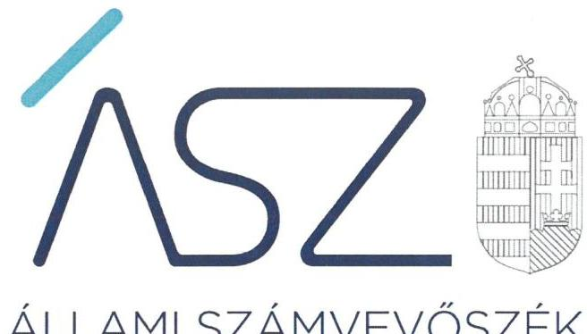
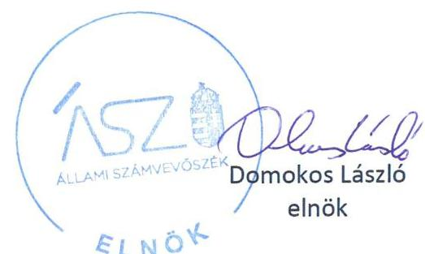
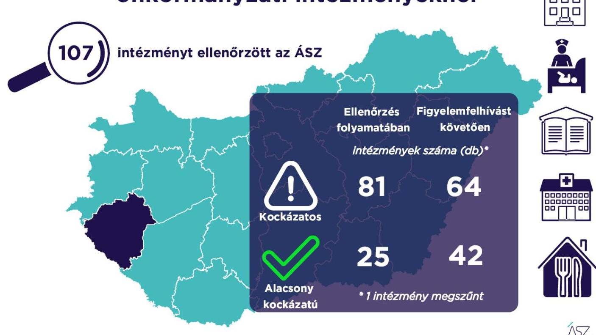

ÁLLAMI SZÁMVEVŐSZÉK

# JELENTÉS 

## A Zala megyei önkormányzati intézmények ellenőrzése

Az önkormányzat és társulás irányítása alá tartozó intézmények integritásának monitoring típusú ellenőrzése - 107 intézmény
2021.

21115
www.asz.hu

---

ÁLLAMI SZÁMVEVŐSZÉK

# JELENTÉS

A Zala megyei önkormányzati intézmények ellenőrzése

Az önkormányzat és társulás irányítása alá tartozó intézmények integritásának monitoring típusú ellenőrzése – 107 intézmény

2021. 12. hó 16. nap

21115
www.asz.hu

---

# AZ ELLENŐRZÉST FELÜGYELTE: 

SALAMON ILDIKÓ felügyeleti vezető

## AZ ELLENŐRZÉST VEZETTE ÉS A VÉGREHAJTÁSÁÉRT FELELŐS:

SZAPPANOS JÚLIA ellenőrzésvezető
JANIK JÓZSEF LÁSZLÓ ellenőrzésvezető
ÓD OR ZOLTÁN TAMÁS ellenőrzésvezető

A PROGRAM ÖSSZEÁLLÍTÁSÁÉRT FELELŐS:
DR. FELFÖLDI IZABELLA programkészítésért felelősvezető

Jelentéseink az Országgyúlés számítógépes hálózatán és az interneten a www.asz.hu címen is olvashatóak.

IKTATÓSZÁM: EL-3461-022/2021.
TÉMASZÁM: 2568
ELLENŐRZÉS-AZONOSÍTÓ SZÁM: V0928

---

# TARTALOMJEGYZÉK 

$\square$ ÖSSZEGZÉS ..... 5
$\square$ AZ ELLENŐRZÉS JELENTŐSÉGE, AKTUALITÁSA, TÁRSADALMI SZEREPE, SZEMPONTJAI ..... 8
$\square$ AZ ELLENŐRZÉS TERÜLETE ..... 9
$\square$ ELLENŐRZÉS HATÓKÖRE ÉS MÓDSZERE ..... 10
$\square$ MELLÉKLETEK. ..... 13
I. sz. melléklet: Az értékelés módszertana ..... 13
II. sz. melléklet: Értelmező szótár ..... 15
$\square$ FÜGGELÉKEK ..... 17
I. sz. függelék: Az ellenőrzött szervezetek és azok kockázati értékelése ..... 17
$\square$ RÖVIDÍTÉSEK JEGYZÉKE ..... 23

---

.

---

# ÖSSZEGZÉS 

Az Állami Számvevőszék figyelemfelhívásának és tanácsadásának eredményeként a Zala megyei önkormányzatok irányítása alatt álló 107 ellenőrzött intézmény közül 53 intézménynél az intézményvezető már 2021-ben intézkedett, vagy intézkedéseket rendelt el az integritást biztositó alapvető feltételek megerősitése, illetve kiépitése érdekében. Ezeknek az intézményeknek javult az integritása, erősödtek a csalásmentes müködés feltételei.
43 intézménynél további intézkedések szükségesek az integritást biztositó alapvető feltételek kiépitése, illetve kiegészitése érdekében. Ezeknek az intézményeknek a vezetői az Állami Számvevőszék intézkedési kötelemmel járó figyelemfelhívására nem intézkedtek, ezért az azonosított kockázatok növekedtek, vagy intézkedéseik nem fedték le a kockázatos területeket, így az azonosított kockázatok nem változtak.
Az irányító önkormányzat egy intézmény megszüntetéséről döntött az ellenőrzött időszakban.

## Értékelések

Az Állami Számvevőszék a Zala megyei önkormányzatok irányítása alá tartozó 107 intézmény belső kontrollrendszerének lényeges elemei kialakítását ellenőrizte a 2021. évre vonatkozóan. Az ellenőrzés a súlypontok meghatározásával lehetőséget biztosított a szervezeti integritás, müködés és vezetés, valamint a gazdálkodás területén a kockázatok azonosítására.

A szervezeti integritás alapvető feltétele a szabályozottság, azaz a jogszabályokban előírt belső szabályzatok megléte, azok - hatályos jogszabályoknak - megfelelő tartalma és gyakorlati alkalmazhatósága. Az integritási kockázatok szervezeti szinten csökkenthetők azáltal, hogy az intézményvezetők kialakítják a szervezeti és müködési kereteket, a gazdálkodásra vonatkozó alapvető szabályozási környezetet, valamint a kontrolltevékenységek szabályszerű gyakorlásának, az integrált kockázatkezelésnek és az integritást sértő események kezelésének a feltételeit.

A szervezeti integritás, a müködés és a vezetés alapvető szabályozási feltételeinek kialakítása hozzájárul a csalásmentes integritási környezet megteremtéséhez.

A szervezeti és müködési szabályzat teremti meg a szervezet szabályszerű müködésének alapjait, illetve rögzíti a szervezeten belüli felelősségi viszonyokat. A szabályzat biztosítja a szervezeti müködés szabályozottságát, ezáltal a szervezet tevékenységének átláthatóságát, a szervezeti célokkal összhangban történő működés feltételeit és annak ellenőrizhetőségét. Az ellenőrzöttek közül 97 intézmény rendelkezett szervezeti és müködési szabályzattal a 2021. évben.

A jogszabályi előírásoknak eleget téve, nyilatkozatban értékelte az intézmény belső kontrollrendszerének minőségét 76 intézmény vezetője. Ezek közül 35 intézménynél alakítottak ki olyan szabályozásokat, folyamatokat, amelyek biztosítják a költségvetési szerv tevékenységében a rendelkezésre álló források átlátható, szabályszerű, szabályozott, gazdaságos, hatékony és eredményes felhasználása követelményeinek érvényesítését.

Az integrált kockázatkezelés eljárásrendjét 89, a szervezeti integritást sértő események kezelésének eljárásrendjét 85 intézménynél alakították ki az intézményvezetők. Az integrált kockázatkezelés eljárásrendje biztosítja a szervezet működésében rejlő kockázatok azonosításának és kezelésének feltételeit. A szervezet müködési kockázatai veszélyeztethetik a közpénzekkel való átlátható, elszámoltatható és felelős gazdálkodást. Az integritást sértő események kezelésének eljárásrendje jelenti a szervezet tekintetében felmerülő és a szervezeten belül bekövetkező integritást sértő események kezelésének alapjait. Az eljárásrend kialakításával az intézmény vezetője támogatja az integritást sértő eseményekkel kapcsolatosan azonosított kockázatok bekövetkezése esetén azok hatékony kezelését, illetve a következmények enyhítését.

---

A pénz- és vagyongazdálkodáshoz kapcsolódó alapvető szabályozások és nyilvántartások - így a számviteli politika és a keretében elkészítendő szabályzatok, a számlarend, a beszerzések szabályozása, valamint a kötelezettségvállalásra és a teljesítés igazolására jogosultak és aláírásmintáik nyilvántartása - előmozdítják a közpénzügyek átláthatóságát, rendezettségét. Az intézményvezető ezen szabályzatok elkészítésével, nyilvántartások vezetésével és folyamatos karbantartásával az alapfeltételét biztosítja a pénzügyi- és vagyongazdálkodás átláthatóságának, a közpénzekkel és közvagyonnal való elszámoltathatóságnak. Az ellenőrzöttek közül 84 intézménynél a számviteli politika, 78 intézménynél a számlarend, 89 intézménynél a beszerzések lebonyolításával kapcsolatos eljárásrend rendelkezésre állt.

Az ellenőrzöttek közül 10 intézmény vezetője tett eleget az ellenőrzött területek mindegyikén az integritási kontrollok alapvető feltételeit jelentő, a jogszabályban előírt szabályozási kötelezettségének. Közülük 5 intézmény vezetője a jogszabályi előírásokon túl további erőfeszítéseket is tett az integritás erősítése érdekében, felismerte további olyan integritási kontrollok kialakításának indokoltságát, amelyet jogszabály nem ír elő, így szervezeti szinten hozzájárul a korrupcióval szembeni védettség megszilárdításához.

101 intézmény esetében az intézményvezető intézkedése volt szükséges a kockázatok csökkentése érdekében, mivel 30 intézménynél a jogszabályok által előírt kontrollok területén, 66 intézménynél a jogszabályokáltal előírt és a további, jogszabályáltal nem előírt integritási kontrollok területén egyaránt, 5 intézménynél utóbbi kontrollok területén voltak hiányosságok. A dokumentumok kiértékelése alapján - az integritás további fejlesztése érdekében az Állami Számvevőszék azonosította a lényeges kockázati területeket, és már az ellenőrzés lefolytatásával párhuzamosan, a 2021. évre vonatkozóan a kockázatok csökkentésére hívta fel az intézményvezetők figyelmét.

# Következtetések 

Az érintett 96 intézmény közül 77 intézmény vezetője válaszolt határidőben az Állami Számvevőszék figyelemfelhívására. Közülük 61 teljeskörűen, 8 részben egyetértett a kockázatos területeken teendő intézkedések indokoltságával. Az intézményvezetők közül 54 arról tájékoztatta az Állami Számvevőszéket, hogy valamennyi kockázatos területen, 12 pedig a kockázatos területek egy részénél már tett, illetve a jövőben tesz intézkedést a jelzett kockázatok csökkentése érdekében. A jogszabályi előírásokon túli integritási kontrollok területén az érintett 71 intézmény közül 43 intézmény vezetője a jelzett kockázatok teljes körű, három pedig azok részbeni felszámolásáról adtak számot. Ezek eredményeként a 101 vezetői levélben jelzett 499 kockázati terület közül 288 esetben már történt, illetve tervezett az intézkedés, így javulás várható a feltárt kockázatos területek 57,7\%-ánál.

Az intézkedések eredményeként az ellenőrzött 107 intézmény közül összesen 42 intézménynél a kockázatok alacsony szintűek, illetve - a tervezett intézkedések végrehajtásával - a kockázatok alacsony szintre csökkennek.

A szabályozások és nyilvántartások kialakításának célja nem önmagában a jogszabályi rendelkezések betartása, hanem az intézmény szabályozottságán keresztül a szabályszerű és csalásmentes gazdálkodás feltételeinek megteremtése, ezáltal az Alaptörvényben előírt átláthatóság és elszámoltathatóság elvének érvényesítése. Ezeknek az alapelveknek érvényesülése hozzájárulhat ahhoz, hogy az intézmények, mint közszolgáltatást nyújtó szervezetek felé a közszolgáltatásokat igénybe vevők, és általuk az állampolgárok általános bizalma is erősödjön.

Az Állami Számvevőszék figyelemfelhívására nem válaszoló, illetve a jelzett kockázatokra nem, vagy csak részben intézkedő intézményvezetők által vezetett intézményeknél rendszerszintű kockázatok maradtak fenn. Az integritás elvű működés erősítése érdekében további kockázatcsökkentő lépések szükségesek a vezetés-irányítás, valamint a pénzügyi- és a vagyongazdálkodás szabályszerű feltételeinek kialakítása terén. Ezen intézmények integritásának kiépítését következő lépésként az irányító szerv bevonásával támogatja az Állami Számvevőszék.

---

# Erősödött a csalásmentesség a Zala megyei önkormányzati intézményeknél

---

# AZ ELLENŐRZÉS JELENTŐSÉGE, AKTUALITÁSA, TÁRSADALMI SZEREPE, SZEMPONTJAI 

Az Alaptörvény alapértékeket, elveket fogalmaz meg, amely szerint a közpénzekkel gazdálkodó minden szervezet köteles a nyilvánosság előtt elszámolni a közpénzekre vonatkozó gazdálkodásával. A közpénzeket és a nemzeti vagyont az átláthatóság és a közélet tisztaságának elve szerint kell kezelni.

Magyarország helyi önkormányzatairól szóló törvény ${ }^{1}$ a helyi közhatalom gyakorlás széleskörű érvényesítésével összhangban tág teret ad a helyi önkormányzatoknak a feladataik, a közszolgáltatások legkülönbözőbb formákban történő ellátására, így széleskörű lehetőséggel rendelkeznek intézmények alapítására.

A helyi önkormányzatok irányítása alá tartozó intézmények szerteágazó közszolgáltatásokat nyújtanak. Az intézmények működtetése közvetlenül érinti a társadalom valamennyi rétegét, a közfeladatot ellátó intézmények működésének minősége közvetlen hatással van az azokat igénybe vevő állampolgárok életére.

Az intézmények szabályszerű és eredményes működésének és gazdálkodásának alapfeltétele a belső kontrollrendszer - benne az integritási kontrollok - megfelelő kialakítása. Az ÁSZ² a törvényi felhatalmazással élve ellenőrzi az önkormányzati intézményeket, hogy megállapításaival támogassa az ellenőrzött szervezetek szabályszerű gazdálkodását, müködését.

A helyi önkormányzatok intézményei által ellátott feladatok, a bölcsődei, óvodai ellátás, a gyermekétkeztetés, a betegek és idősek gondozása, a közművelődési intézmények, könyvtárak működtetése által a lakosság ezeken a területeken találkozik legszélesebb körben az önkormányzatok által nyújtott szolgáltatásokkal. A szolgáltatásokat igénybe vevők jelentős száma, a feladatellátáshoz használt nemzeti vagyon és az erre fordított közpénz nagysága indokolja, hogy az ÁSZ további, az előző ellenőrzésekre épülő ellenőrzéseket végezzen ezen a területen, illetve további olyan területeken, ahol az önkormányzati szolgáltatást a lakosság széles köre veszi igénybe.

Az ellenőrzés célja annak értékelése, hogy a helyi önkormányzatok irányítása alá tartozó intézmények megterem-tették-e az integritás biztosításához szükséges feltételeket, kialakították-e az alapvető, a szervezeti kereteket, az integritási kontrollokhoz kapcsolódó, valamint a korrupció elleni védelmet szolgáló szabályozásokat. Továbbá, hogy az intézményvezető gondoskodott-e a szervezeti teljesítmény mérés alapfeltételeinek kialakításáról az eredményességi szempontoknak való megfelelés megalapozottsága biztosítása érdekében. A monitoring típusú ellenőrzés célja hatékonyan támogatni az ellenőrzött szervezeteket, ezáltal növelve az ÁSZtanácsadó szerepét, elősegítve a „jól irányított állam" müködését.

Az ÁSZ célja, hogy új ellenőrzési megközelítést alkalmazva támogassa a közpénzügyi helyzet javítását; a monitoring típusú ellenőrzéssel jelen időben adjon helyzetképet az integritási szemlélet érvényesítéséről, rávilágítson az integritási kontrollok kiépítettségére, illetve további fejlesztésére. Napjainkban mindez kiemelt fontosságúvá vált. Minden szervezetnek fel kell készülnie arra, hogy a koronavírus járvány okozta társadalmi és gazdasági válság növelni fogja a korrupciós nyomást. Az ÁSZ ebben a helyzetben is alapvető kötelességének tartja, hogy a közpénzek őre legyen, és ellenőrzéseit az önkormányzati alrendszer intézményei körében is folytassa.

Fontos, hogy az intézmények vezetői felismerjék az integritás kockázatokat, azokat ismételten mérjék fel, és alakítsanak ki átlátható, jól szabályozott rendszereket, döntési mechanizmusokat. Az integritási kockázatok feltárása, megismerése elengedhetetlenül fontos, mert ezt követően tehetők meg azok a lépések, amelyek a kockázatok csökkentését, felszámolását és kezelését célozzák. A belső kontrollrendszer - benne az integritás kontrollok - megfelelő kialakítása, müködése a helyi önkormányzatok irányítása alatt álló intézményeknél is hozzájárul a társadalmi közbizalom erősítéséhez.

Az ellenőrzés rámutat az integritási jó gyakorlatokra is, továbbá felhívja a figyelmet a jogszabályi követelmények teljesítéséhez szükséges lépésekre is.

---

# AZ ELLENŐRZÉS TERÜLETE 

## Az önkormányzatok irányítása alá tartozó intézmények

Helyi önkormányzati költségvetési szervet az államháztartásról szóló 2011. évi CXCV törvény (Áht. ${ }^{3}$ ) szerint a helyi önkormányzat, a helyi önkormányzatok társulása, a térségi fejlesztési tanács, az átalakult nemzetiségi önkormányzat alapíthat, a költségvetési szerv alapító okiratában meghatározott önkormányzati közfeladatok ellátására. A költségvetési szervek önálló jogi személyek, éves költségvetésükből gazdálkodva látják el feladataikat. A költségvetési szervek gazdasági szervezettel rendelkeznek, ha azonban a költségvetési szerv éves átlagos statisztikai állományi létszáma a 100 főt nem éri el, a gazdasági szervezet feladatait az önkormányzati hivatal, vagy az irányító szerv döntése alapján az irányító szerv irányítása alá tartozó, gazdasági szervezettel rendelkező más költségvetési szerv látja el.

Az államháztartásról szóló törvény végrehajtásáról szóló 368/2011. (XII. 31.) Korm. rendelet (Ávr. ${ }^{4}$ ) 1. melléklete szerint, az államháztartás önkormányzati alrendszerében a helyi önkormányzat által irányított költségvetési szerv esetében az irányító szerv hatáskörét a képviselő-testület, közgyűlés gyakorolja, és annak vezetője a polgármester, főpolgármester, megyei közgyűlés elnöke.

Az ellenőrzés a Zala megyei önkormányzatok irányítása alá tartozó, az I. sz. Függelékben felsorolt költségvetési szervekre terjedt ki.

A feladatellátásuk szerint az ellenőrzött költségvetési szervek egy része óvoda, bölcsőde, egészségügyi intézmény, konyha, művelődési ház, múzeum, kulturális központ, idősek otthona, gyermekjóléti intézmény, sportlétesítmény intézményként müködik.

Az ellenőrzött 107 intézmény közül 4 rendelkezik saját gazdasági szervezettel.

Egy intézmény az ellenőrzött időszakban megszűnt.

---

# ELLENŐRZÉS HATÓKÖRE ÉS MÓDSZERE 

## Az ellenőrzés típusa

| Megfelelőségi ellenőrzés.

## Az ellenőrzött időszak

A 2021. év, a Bkr. ${ }^{5}$ szerinti vezetői nyilatkozat, valamint annak alátámasztottsága vonatkozásában a 2020. év.

## Az ellenőrzés tárgya

A szervezeti keretekkel, a múködéssel és gazdálkodással kapcsolatos szabályzatok, szabályozások, valamint a szervezeti elvekkel, értékekkel összefüggő integritás kontrollok kiépítettsége, a szervezeti teljesítmény mérés alapfeltételeinek kialakítása.

## Az ellenőrzött szervezetek

Az ellenőrzött intézményeket az I. sz. Függelék tartalmazza.

## Az ellenőrzés jogalapja

Az ellenőrzés jogszabályi alapját az ÁSZ tv. ${ }^{6}$ 1. § (3) bekezdése, 5. § (6) bekezdése, valamint az Áht. 61. § (2) bekezdése képezik.

## Az ellenőrzés módszerei

Az ÁSZ az ellenőrzést az ellenőrzési program szempontjai, az ellenőrzött időszakban hatályos jogszabályok, a jelen ellenőrzésre irányadó ÁSZ módszertan figyelembevételével és a nemzetközi standardokat irányadónak tekintve végzi.

Az ellenőrzés ideje alatt az ÁSZ az ellenőrzött szervezetekkel történő kapcsolattartást azÁSZSZMSZ7-ének vonatkozó előírásai alapján biztosítja.

Az ellenőrzési kérdések megválaszolásához szükséges bizonyítékok megszerzése a következő ellenőrzési eljárások alkalmazásával történik: megfigyelés, összehasonlítás, elemző eljárás. Az ellenőrzési bizonyítékként felhasználható adatforrások közé tartoznak az ellenőrzési programban felsorolt adatforrások, továbbá minden - az ellenőrzés folyamán - feltárt, az ellenőrzés szempontjából információkat tartalmazó dokumentum.

---

Az ÁSZ az ellenőrzést a kérdésekre adott válaszok kiértékelésével, valamint a megjelölt adatforrások, továbbá az adott időszakban hatályos jogszabályok, valamint az ÁSZ honlapján közzétett helyénvalósági kritériumok figyelembevételével folytatja le.

A monitoring típusú ellenőrzés az önkormányzatok irányítása alá tartozó intézmények integritás alapú múködésének lényeges területeire és a közpénzügyi helyzet javítása érdekében az elért eredmények fenntartására fókuszál. Lehetőséget biztosít az integritási kontrollok kiépítettségében lévő hiányosságok, a szervezeti teljesítmény mérés alapfeltételei kialakításának hiánya beazonosítására az eredményességi szempontoknak való megfelelés megalapozottsága biztosítása érdekében, az önkormányzatok, társulások irányítása alá tartozó intézmények integritásának elemzésére, részletes ellenőrzések megalapozására.

---

.

---

# MELLÉKLETEK 

I. SZ. MELLÉKLET: AZ ÉRTÉKELÉS MÓDSZERTANA

Az egyes kockázati területek és kockázatforrások minősítése „pontozásos módszerrel", az integritás „jelző" dokumentumai és a vezetői magatartás ellenőrzéshez kapcsolódóan tanúsított tényhelyzeteinek értékelése alapján történt.

Az értékelt dokumentumokhoz, nyilvántartásokhoz, kockázati besorolásokhoz minden esetben pontszám került hozzárendelésre, amelyek értéke alapján az ellenőrzött szervezetek kockázati csoportba kerültek besorolásra:

- Alacsony kockázatú - az elérhető összes pontszám legalább 80\%-a
- Közepes kockázatú - az elérhető pontszám 50-79\%-a között
- Magas kockázatú - az elérhető pontszám 50\%-a alatt

Az első lépésben azonosításra kerültek azok az intézményi szabályozások és nyilvántartások, amelyek meglétét jogszabály írja elő, hiánya pedig felveti a csalás és korrupció kockázatát.

Második lépésben az adatoknak az ellenőrzés rendelkezésére bocsátása kockázati kritériumainak meghatározása, majd értékelése történt meg.

Harmadik lépésben a figyelemfelhívó levelekre adott válaszok kockázati kritériumainak meghatározása, majd értékelése történt meg.

Az összesített kockázati értékelést javította, amennyiben

- az intézmény rendelkezett olyan szabályozással, amely kötelező meglétét jogszabály nem írja elő, de segíti a csalás és a korrupció megelőzését (helyénvalósági dokumentumok).

Az összesített kockázati értékelést rontotta, amennyiben

- az integritás szempontjából meghatározó dokumentum - az intézményi SZMSZ - hiányzott, és javítása érdekében a figyelemfelhívó levél hatására sem történt intézkedés.

A figyelemfelhívó levelekre adott válaszok értékelése alapján:

- A kockázat csökkent, amennyiben a figyelemfelhívó levélre adott válasza a figyelemfelhívással összhangban volt, valamennyi kockázati területen intézkedett vagy intézkedést tervezett.
- A kockázat változatlan, amennyiben a figyelemfelhívó levélben foglaltaktól eltérő magatartást tanúsított, intézkedése a figyelemfelhívással részben volt összhangban, a kockázati területeken részben intézkedett vagy intézkedést tervezett.
- A kockázat nőtt, amennyiben nem volt együttműködő, a figyelemfelhívó levélre nem válaszolt, vagy válasza alapján nem intézkedett és nem tervezett intézkedést.

---

# Az önkormányzatok irányítása alá tartozó intézmények kockázati csoportba sorolásának értékelési keretrendszere 

I. Dokumentumokkal rendelkezés
lényeges dokumentumok, amelyek hiánya felveti a csalás és korrupció kockázatát
I.1. A szervezeti integritás, müködés és vezetés alapvető szabályozási feltételei

- intézmény SZMSZ-e
- vezetői nyilatkozat a 2020. évre vonatkozóan az intézmény belső kontrollrendszer minőségének értékeléséről, valamint a nyilatkozat megalapozottságát bizonyító dokumentumok
- integrált kockázatkezelés eljárásrendje
- az integritást sértő események kezelésének eljárásrendje
I.2. A pénz- és vagyongazdálkodáshoz kapcsolódó alapvető szabályozások
- számviteli politika
- az eszközök és a források leltárkészittési és leltározási szabályzata
- az eszközök és a források értékelési szabályzata
- pénzkezelési szabályzat
- számlarend
- beszerzések lebonyolításával kapcsolatos eljárásrend
- a kötelezettségvállalásra, teljesítés igazolására jogosult személyekről és aláírás-mintájukról vezetett nyilvántartás
II. Az adatoknak az ellenőrzés rendelkezésére bocsátása
II.1. A megnevezett adatokkal rendelkezett és a törvényi határidőn belül hiánytalanul rendelkezésre bocsátotta. Figyelem-, illetve figyelmet felhívó levél nem volt indokolt.
II.2. A megnevezett adatokat nem bocsátotta rendelkezésre.
III. Figyelemfelhívó levelekre adott válaszok kockázati értékelése
III.1. Kockázat csökkent: együttmüködése a figyelemfelhívó levéllel összhangban volt.
III.2. Kockázat változatlan: a figyelemfelhívó levélben foglaltaktól eltérő együttmüködést tanúsított.
III.3. Kockázat nőtt: nem reagált, nem intézkedett, így nem volt együttmüködő.

---

# II. SZ. MELLÉKLET: ÉRTELMEZŐ SZÓTÁR 

belső kontrollrendszer

belső kontrollrendszer területei
integrált kockázatkezelési rendszer
integritás

Integritási kockázatok
kockázat
kontrollkörnyezet
kontrollkörnyezet
kockázat
kontrollkörnyezet
kolltségvetési szerv vezetője által kialakított olyan elvek, eljárások, belső szabályzatok összessége, amelyben világos a szervezeti struktúra, a folyamatok átláthatók, egyértelműek a felelősségi, hatásköri viszonyok és feladatok, meghatározottak, ismertek és elfogadottak az etikai elvárások a szervezet minden szintjén, átlátható a humánerőforrás-kezelés, biztosított a szervezeti célok és értékek irányában való elkötelezettség fejlesztése és elősegítése. (Forrás: Bkr. 6. § (1) bekezdés)
A költségvetési szerv vezetője által a szervezeten belül kialakított (kontroll) tevékenységek, melyek biztosítják a kockázatok kezelését, hozzájárulnak a szervezet céljainak eléréséhez és erősítik a szervezet integritását. (Forrás: Bkr. 8. § (1) bekezdés)
A helyi önkormányzatok irányítása alátartozó költségvetési szervek. (A képviselő-testület a feladatkörébe tartozó közszolgáltatások ellátására - jogszabályban meghatározottak szerint - költségvetési szervet (önkormányzati intézmény) alapíthat; Forrás: Mötv. 41. § (6) bekezdés)

---

.

---

# FÜGGELÉKEK

I. SZ. FÜGGELÉK: AZ ELLENŐRZÖTT SZERVEZETEK ÉS AZOK KOCKÁZATI ÉRTÉKELÉSE

|  Sorszám | Ellenőrzött szervezet megnevezése | Irányító szerv (önkormányzat) megnevezése | Helység | Tanácsadást megelőző kockázati besorolás | Intézkedést követően a kockázati értékelés változása | A kockázati szint alacsonyra csökkent-e  |
| --- | --- | --- | --- | --- | --- | --- |
|  1. | Zalakarosi Óvoda és Bölcsőde | Zalakaros Város Önkormányzata | Zalakaros | KÖZEPES | CSÖKKENT | I  |
|  2. | Zalabéri Kastélykert Óvoda | Zalabér Község Önkormányzata | Zalabér | MAGAS | NÖTT | N  |
|  3. | Kehidakustányi Deák Ferenc Napköziotthonos Óvoda | Kehidakustány Község Önkormányzata | Kehidakustány | MAGAS | NÖTT | N  |
|  4. | Alsópáhoki Szivárvány Óvoda | Alsópáhok Község Önkormányzata | Alsópáhok | KÖZEPES | CSÖKKENT | N  |
|  5. | Csapi Kis Herceg Térségi Óvoda és Konyha | Csapi Község Önkormányzata | Csapi | KÖZEPES | NÖTT | N  |
|  6. | Tótszerdahelyi Óvoda és Konyha | Tótszerdahely Községi Önkormányzat | Tótszerdahely | KÖZEPES | NÖTT | N  |
|  7. | Tótszentmártoni Napköziotthonos Óvoda | Tótszentmártoni Községi Önkormányzat | Tótszentmárton | MAGAS | NEM VÁLTOZOTT | N  |
|  8. | Zalavári Óvoda | Zalavár Község Önkormányzata | Zalavár | MAGAS | CSÖKKENT | N  |
|  9. | Zalakarosi Közösségi Ház és Könyvtár | Zalakaros Város Önkormányzata | Zalakaros | MAGAS | CSÖKKENT | N  |
|  10. | Goldmark Károly Müvelődési Központ | Keszthely Város Önkormányzata | Keszthely | ALACSONY | CSÖKKENT | I  |
|  11. | Keszthely Város Önkormányzat Egyesített Szociális Intézménye | Keszthely Város Önkormányzata | Keszthely | ALACSONY | NEM VOLT SZABÁLYSZERÜSÉGI HIBA | I  |
|  12. | Gyenesdiási Bölcsőde és Óvoda | Gyenesdiás Nagyközség Önkormányzata | Gyenesdiás | KÖZEPES | CSÖKKENT | I  |
|  13. | József Attila Müvelődési Ház és Könyvtár | Gyenesdiás Nagyközség Önkormányzata | Gyenesdiás | KÖZEPES | NEM VÁLTOZOTT | N  |
|  14. | Gróf I. Festetics György Müvelődési Központ, Városi Könyvtár és Muzeális Gyüjtemény | Hévíz Város Önkormányzat | Hévíz | KÖZEPES | CSÖKKENT | I  |
|  15. | Keszthelyi Életfa Óvoda | Keszthely Város Önkormányzata | Keszthely | ALACSONY | NEM VOLT SZABÁLYSZERÜSÉGI HIBA | I  |
|  16. | Keszthely Város Önkormányzata Alapellátási Intézete | Keszthely Város Önkormányzata | Keszthely | ALACSONY | CSÖKKENT | I  |
|  17. | Brunszvik Teréz Napközi Otthonos Óvoda | Hévíz Város Önkormányzat | Hévíz | KÖZEPES | NÖTT | N  |
|  18. | Teréz Anya Szociális Integrált Intézmény | Hévíz Város Önkormányzat | Hévíz | KÖZEPES | NÖTT | N  |

---

| Sorszám | Ellenőrzött szervezet megnevezése | Irányító szerv (önkormányzat) megnevezése | Helység | Tanácsadást megelőző kockázati besorolás | Intézkedést követően a kockázati értékelés változása | A kockázati szint alacsonyra csökkent-e |
| :--: | :--: | :--: | :--: | :--: | :--: | :--: |
| 19. | Nemesbüki Óvoda | Nemesbük Község Önkormányzata | Nemesbük | MAGAS | CSÖKKENT | N |
| 20. | Balatoni Múzeum | Keszthely Város Önkormányzata | Keszthely | ALACSONY | CSÖKKENT | I |
| 21. | Pakodi Szivárvány ÓvodaBölcsőde | Pakod Község Önkormányzata | Pakod | MAGAS | NEM VÁLTOZOTT | N |
| 22. | Keszthelyi Család - és Gyermekjóléti Központ | Keszthely Város Önkormányzata | Keszthely | ALACSONY | NEM VOLT SZABÁLYSZERÜSÉGI HIBA | I |
| 23. | "Életfa" Nagylengyeli ÓvodaBölcsőde | Nagylengyel Község Önkormányzata | Nagylengyel | KÖZEPES | CSÖKKENT | N |
| 24. | Zalacsányi Csány László Óvoda | Zalacsány Község Önkormányzata | Zalacsány | MAGAS | CSÖKKENT | N |
| 25. | Borsfai Kisvuk Óvoda | Borsfa Község Önkormányzata | Borsfa | MAGAS | CSÖKKENT | N |
| 26. | Egervári Mesevár Óvoda és Mini Bölcsőde | Egervár Község Önkormányzata | Egervár | MAGAS | NEM VÁLTOZOTT | N |
| 27. | Gellénházi Óvoda-Bölcsőde | Gellénháza Község Önkormányzata | Gellénháza | MAGAS | CSÖKKENT | N |
| 28. | Borsfai Közétkeztetési Intézmény | Borsfa Község Önkormányzata | Borsfa | MAGAS | CSÖKKENT | N |
| 29. | Gellénházi Önkormányzati Konyha | Gellénháza Község Önkormányzata | Gellénháza | MAGAS | CSÖKKENT | N |
| 30. | "Salla" Művelődési Központ és Könyvtár | Zalalövő Város Önkormányzata | Zalalövő | MAGAS | NEM VÁLTOZOTT | N |
| 31. | Sümegcsehi Lurkö Óvoda | Sümegcsehi Község Önkormányzata | Sümegcsehi | MAGAS | NÖTT | N |
| 32. | Idősek Otthona | Szentgyörgyvölgy Község Önkormányzata | Szentgyörgyvölgy | MAGAS | CSÖKKENT | N |
| 33. | Újudvari Móra Ferenc Óvoda | Újudvar Község Önkormányzata | Újudvar | KÖZEPES | CSÖKKENT | N |
| 34. | Cserszegtomaji Pipacs Óvoda-Bölcsőde | Cserszegtomaj Nagyközség Önkormányzata | Cserszegtomaj | KÖZEPES | CSÖKKENT | I |
| 35. | Óhíd-Mihályfa Napköziotthonos Óvoda | Óhíd Község Önkormányzata | Óhíd | MAGAS | NÖTT | N |
| 36. | Integrált Szociális Intézmény | Zalaszentlászló Község Önkormányzata | Zalaszentlászló | KÖZEPES | NÖTT | N |
| 37. | Királyi Pál Óvoda és Általános Müvelődési Központ Szepetnek | Szepetnek Községi Önkormányzat | Szepetnek | KÖZEPES | NÖTT | N |
| 38. | Nagykutasi Napköziotthonos Óvoda | Nagykutas Község Önkormányzata | Nagykutas | KÖZEPES | NÖTT | N |
| 39. | Halis István Városi Könyvtár | Nagykanizsa Megyei Jogú Város Önkormányzata | Nagykanizsa | KÖZEPES | NÖTT | N |
| 40. | Nagykanizsa Megyei Jogú Város Önkormányzata Egészségügyi Alapellátási Intézménye | Nagykanizsa Megyei Jogú Város Önkormányzata | Nagykanizsa | KÖZEPES | CSÖKKENT | I |
| 41. | Nagykanizsai Család-és Gyermekjóléti Központ | Nagykanizsa Megyei Jogú Város Önkormányzata | Nagykanizsa | KÖZEPES | NÖTT | N |

---

| Sorszám | Ellenőrzött szervezet megnevezése | Irányító szerv (önkormányzat) megnevezése | Helység | Tanácsadást megelőző kockázati besorolás | Intézkedést követően a kockázati értékelés változása | A kockázati szint alacsonyra csökkent-e |
| :--: | :--: | :--: | :--: | :--: | :--: | :--: |
| 42. | Nagykanizsai Egyesített Bölcsőde | Nagykanizsa Megyei Jogú Város Önkormányzata | Nagykanizsa | KÖZEPES | CSÖKKENT | I |
| 43. | Zalaszentgyörgyi Napköziotthonos Óvoda | Zalaszentgyörgy Község Önkormányzata | Zalaszentgyörgy | KÖZEPES | NÖTT | N |
| 44. | Szentpéterúri Mazsola Óvoda-Bölcsőde | Szentpéterúr Községi Önkormányzat | Szentpéterúr | MAGAS | CSÖKKENT | N |
| 45. | Kanizsai Kulturális Központ | Nagykanizsa Megyei Jogú Város Önkormányzata | Nagykanizsa | MAGAS | NÖTT | N |
| 46. | Zalaszentlászlói Kerekerdő Óvoda-Bölcsőde | Zalaszentlászló Község Önkormányzata | Zalaszentlászló | KÖZEPES | NÖTT | N |
| 47. | Lakhegy Erdőszéli Óvoda | Lakhegy Község Önkormányzata | Lakhegy | KÖZEPES | NEM VÁLTOZOTT | N |
| 48. | Pusztamagyaródi Óvoda és Konyha | Pusztamagyaród Község Önkormányzata | Pusztamagyaród | MAGAS | NÖTT | N |
| 49. | Gutorföldi Játék-Vár Óvoda | Gutorfölde Község Önkormányzata | Gutorfölde | ALACSONY | CSÖKKENT | I |
| 50. | Thúry György Múzeum | Nagykanizsa Megyei Jogú Város Önkormányzata | Nagykanizsa | KÖZEPES | NEM VÁLTOZOTT | N |
| 51. | Bánokszentgyörgyi Pitypang Óvoda | Bánokszentgyörgy Község Önkormányzata | Bánokszentgyörgy | MAGAS | CSÖKKENT | N |
| 52. | Csukás István Óvoda, Bölcsőde és Tanuszoda | Teskánd Község Önkormányzata | Teskánd | MAGAS | CSÖKKENT | N |
| 53. | Becsvölgyei Nyitnikék Óvoda | Becsvölgye Községi Önkormányzat | Becsvölgye | KÖZEPES | NEM VÁLTOZOTT | N |
| 54. | Csodavilág Mini Bölcsőde Csesztreg | Csesztreg Község Önkormányzata | Csesztreg | KÖZEPES | CSÖKKENT | N |
| 55. | Gócseji Múzeum | Zalaegerszeg Megyei Jogú Város Önkormányzata | Zalaegerszeg | ALACSONY | NEM VOLT SZABÁLYSZERÜSÉGI HIBA | I |
| 56. | Hevesi Sándor Színház | Zalaegerszeg Megyei Jogú Város Önkormányzata | Zalaegerszeg | KÖZEPES | CSÖKKENT | I |
| 57. | Városi Önkormányzat Egészségügyi Központja | Zalaszentgrót Város Önkormányzata | Zalaszentgrót | ALACSONY | NEM VOLT SZABÁLYSZERÜSÉGI HIBA | N |
| 58. | Dr. Hetés Ferenc Szakorvosi Rendelőintézet | Lenti Város Önkormányzata | Lenti | KÖZEPES | NÖTT | N |
| 59. | Városi Sportlétesítmény Gondnokság Intézménye | Zalaegerszeg Megyei Jogú Város Önkormányzata | Zalaegerszeg | KÖZEPES | CSÖKKENT | I |
| 60. | Zalaszentgróti Napköziotthonos Óvoda - Bölcsőde | Zalaszentgrót Város Önkormányzata | Zalaszentgrót | KÖZEPES | NÖTT | N |
| 61. | Városi Könyvtár és Müvelő-dési-Felnőttképzési Központ | Zalaszentgrót Város Önkormányzata | Zalaszentgrót | KÖZEPES | CSÖKKENT | I |
| 62. | Zalaszántói Kópékuckó Óvoda | Zalaszántó Község Önkormányzata | Zalaszántó | KÖZEPES | CSÖKKENT | I |

---

| Sorszám | Ellenőrzött szervezet megnevezése | Irányító szerv (önkormányzat) megnevezése | Helység | Tanácsadást megelőző kockázati besorolás | Intézkedést követően a kockázati értékelés változása | A kockázati szint alacsonyra csökkent-e |
| :--: | :--: | :--: | :--: | :--: | :--: | :--: |
| 63. | Zöldgólya Óvoda és Bölcsőde | Sármellék Község Önkormányzata | Sármellék | ALACSONY | NEM VOLT SZABÁLYSZERÚSÉGI HIBA | I |
| 64. | Művelődési Ház és Könyvtár Vonyarcvashegy | Vonyarcvashegy Nagyközség Önkormányzata | Vonyarcvashegy | KÖZEPES | NÖTT | N |
| 65. | Önkiszolgáló Étterem és Turistaszálló | Lovászi Község Önkormányzata | Lovászi | KÖZEPES | NÖTT | N |
| 66. | Időskorúak Otthona Nagykapornak | Nagykapornak Község Önkormányzata | Nagykapornak | KÖZEPES | CSÖKKENT | I |
| 67. | Hahóti Napköziotthonos Óvoda | Hahót Község Önkormányzata | Hahót | ALACSONY | CSÖKKENT | I |
| 68. | Bertha Bulcsú Múvelődési Házés Könyvtár | Balatongyörök Község Önkormányzata | Balatongyörök | KÖZEPES | NEM VÁLTOZOTT | N |
| 69. | Zalaszentbalázsi Napköziotthonos Óvoda | Zalaszentbalázs Község Önkormányzata | Zalaszentbalázs | KÖZEPES | CSÖKKENT | I |
| 70. | Griff Bábszínház | Zalaegerszeg Megyei Jogú Város Önkormányzata | Zalaegerszeg | KÖZEPES | CSÖKKENT | I |
| 71. | Karmacsi Napközi Otthonos Óvoda | Karmacs Község Önkormányzata | Karmacs | ALACSONY | NEM VOLT SZABÁLYSZERÚSÉGI HIBA | I |
| 72. | Városi Múvelődési Központ Lenti | Lenti Város Önkormányzata | Lenti | ALACSONY | NEM VOLT SZABÁLYSZERÚSÉGI HIBA | I |
| 73. | Városi Könyvtár Lenti | Lenti Város Önkormányzata | Lenti | ALACSONY | NEM VOLT SZABÁLYSZERÚSÉGI HIBA | I |
| 74. | Keresztury Dezső Városi Múvelődési Központ | Zalaegerszeg Megyei Jogú Város Önkormányzata | Zalaegerszeg | KÖZEPES | CSÖKKENT | I |
| 75. | Zalaegerszegi Turisztikai Hi-   vatal és Információs Iroda | Zalaegerszeg Megyei Jogú Város Önkormányzata | Zalaegerszeg | ALACSONY | CSÖKKENT | I |
| 76. | Letenyei Hóvirág Óvoda | Letenye Város Önkormányzata | Letenye | ALACSONY | NÖTT | N |
| 77. | Fáklya Múvelődési Ház és Könyvtár | Letenye Város Önkormányzata | Letenye | ALACSONY | NÖTT | N |
| 78. | Söjtöri Óvoda | Söjtör Község Önkormányzata | Söjtör | MAGAS | CSÖKKENT | N |
| 79. | Zalaegerszegi Egészségügyi Alapellátási Intézmény | Zalaegerszeg Megyei Jogú Város Önkormányzata | Zalaegerszeg | MAGAS | NÖTT | N |
| 80. | Zalaegerszegi Család- és   Gyermekjóléti Központ | Zalaegerszeg Megyei Jogú Város Önkormányzata | Zalaegerszeg | KÖZEPES | CSÖKKENT | I |
| 81. | Zalaegerszegi Egyesített Bölcsődék | Zalaegerszeg Megyei Jogú Város Önkormányzata | Zalaegerszeg | KÖZEPES | CSÖKKENT | I |
| 82. | Zalaegerszegi Belvárosi I. Számú Óvoda | Zalaegerszeg Megyei Jogú Város Önkormányzata | Zalaegerszeg | KÖZEPES | NÖTT | N |

---

| Sorszám | Ellenőrzött szervezet megnevezése | Irányító szerv (önkormányzat) megnevezése | Helység | Tanácsadást megelőző kockázati besorolás | Intézkedést követően a kockázati értékelés változása | A kockázati szint alacsonyra csökkent-e |
| :--: | :--: | :--: | :--: | :--: | :--: | :--: |
| 83. | Zalaegerszegi Belvárosi II. Számú Óvoda | Zalaegerszeg Megyei Jogú Város Önkormányzata | Zalaegerszeg | ALACSONY | NÖTT | N |
| 84. | Zalaegerszegi Kertvárosi Óvoda | Zalaegerszeg Megyei Jogú Város Önkormányzata | Zalaegerszeg | KÖZEPES | NÖTT | N |
| 85. | Zalaegerszegi Landorhegyi Óvoda | Zalaegerszeg Megyei Jogú Város Önkormányzata | Zalaegerszeg | ALACSONY | NEM VÁLTOZOTT | I |
| 86. | Bölcsőde Lenti | Lenti Város Önkormányzata | Lenti | KÖZEPES | NÖTT | N |
| 87. | Lenti Mesevár Óvoda | Lenti Város Önkormányzata | Lenti | ALACSONY | NEM VOLT SZABÁLYSZERŰSÉGI HIBA | I |
| 88. | Napköziotthonos Óvoda Zalaszabar | Zalaszabar Község Önkormányzata | Zalaszabar | MAGAS | CSÖKKENT | N |
| 89. | Magyarszerdahelyi Napköziotthonos Óvoda | Magyarszerdahely Község Önkormányzata | Magyarszerdahely | ALACSONY | CSÖKKENT | I |
| 90. | Micimackó Bölcsőde Bagod | Bagod Község Önkormányzata | Bagod | Megszűnt intézmény | Megszűnt intézmény | Megszűnt intézmény |
| 91. | Zalakomári MűvelődésiHáz | Zalakomár Nagyközség Önkormányzata | Zalakomár | KÖZEPES | CSÖKKENT | I |
| 92. | ZalaszentivániCseperedő Bölcsőde | Zalaszentiván Község Önkormányzata | Zalaszentiván | KÖZEPES | NÖTT | N |
| 93. | Icinke-Picinke Óvoda és Bölcsőde Rezi | Rezi Község Önkormányzata | Rezi | KÖZEPES | NÖTT | N |
| 94. | Fityeházi Óvoda | Fityeház Község Önkormányzata | Fityeház | KÖZEPES | CSÖKKENT | I |
| 95. | Murakeresztúri Óvoda | Murakeresztúr Község Önkormányzata | Murakeresztúr | ALACSONY | CSÖKKENT | I |
| 96. | Bagodi Napsugár Óvoda és Bölcsőde | Bagod Község Önkormányzata | Bagod | KÖZEPES | NEM VÁLTOZOTT | N |
| 97. | Zalaszentiváni Fúles Mackó Óvoda | Zalaszentiván Község Önkormányzata | Zalaszentiván | MAGAS | NEM VÁLTOZOTT | N |
| 98. | Pusztaszentlászlói Óvoda -   Bölcsőde | Pusztaszentlászló Község Önkormányzata | Pusztaszentlászló | ALACSONY | CSÖKKENT | I |
| 99. | Pókaszepetki Vackor Óvoda | Pókaszepetk Község Önkormányzata | Pókaszepetk | MAGAS | CSÖKKENT | N |
| 100. | Zalaistvándi Eperke Óvoda | Zalaistvánd Község Önkormányzata | Zalaistvánd | MAGAS | CSÖKKENT | N |
| 101. | Eszteregnyei Kerekvár Óvoda | Eszteregnye Község Önkormányzata | Eszteregnye | KÖZEPES | CSÖKKENT | I |
| 102. | Aprófalva Óvoda Várvölgy | Várvölgy Község Önkormányzata | Várvölgy | KÖZEPES | CSÖKKENT | I |
| 103. | Becsehelyi Harmatcsepp Óvoda | Becsehely Község Önkormányzata | Becsehely | MAGAS | CSÖKKENT | N |

---

| Sorszám | Ellenőrzött szervezet megnevezése | Irányító szerv (önkormányzat) megnevezése | Helység | Tanácsadást megelőző kockázati besorolás | Intézkedést követően a kockázati értékelés változása | A kockázati szint alacsonyra csökkent-e |
| :--: | :--: | :--: | :--: | :--: | :--: | :--: |
| 104. | Letenyei Család- és Gyermekjóléti Központ | Letenye Város Önkormányzata | Letenye | ALACSONY | NÖTT | N |
| 105. | "Napsugár" Család- és Gyermekjóléti Központ és Szolgálat Lenti | Lenti Város Önkormányzata | Lenti | ALACSONY | CSÖKKENT | I |
| 106. | Becsehelyi Önkormányzati Konyha | Becsehely Község Önkormányzata | Becsehely | KÖZEPES | CSÖKKENT | I |
| 107. | Túrje Község Önkormányzat Fözőkonyhája | Túrje Község Önkormányzata | Túrje | KÖZEPES | CSÖKKENT | I |
| Alacsony kockázatú |  |  |  | 25 |  |  |
| Közepeskockázatú |  |  |  | 52 |  |  |
| Magas kockázatú |  |  |  | 29 |  |  |
| Megszünt intézmény |  |  |  | 1 | 1 | 1 |
| Kockázat csökkent |  |  |  |  | 53 |  |
| Kockázat nem változott |  |  |  |  | 12 |  |
| Kockázat nőtt |  |  |  |  | 31 |  |
| Nem volt indokolt figyelemfelhívólevél (szabályszerúségi vagy szabályszerűségi és helyénvalósági hitta hiányában) |  |  |  |  | 10 |  |
| Kockázat alacsony szintre csökkent |  |  |  |  |  | 42 |
| Kockázat nem csökkent alacsony szintre |  |  |  |  |  | 64 |
| Összesen |  |  |  | 107 | 107 | 107 |

---

# RÖVIDÍTÉSEKJEGYZÉKE 

${ }^{1}$ Mötv.
${ }^{2}$ ÁSZ
${ }^{3}$ Áht.
${ }^{4}$ Ávr.
${ }^{5}$ Bkr.
${ }^{6}$ ÁSZtv.
${ }^{7}$ ÁSZ SZMSZ
${ }^{8}$ Büntető Törvénykönyv
2011. évi CLXXXIX. törvény - Magyarország helyi önkormányzatairól(hatályos: 2012. január 1-jétől)

Állami Számvevőszék
2011. évi CXCV. törvény az államháztartásról (hatályos 2011. december 31-étől) 368/2011. (XII. 31.) Korm. rendelet az államháztartásról szóló törvény végrehajtásáról (hatályos 2012. január 1-jétől)
370/2011. (XII. 31.) Korm. rendelet a költségvetési szervek belső kontrollrendszeréről és belső ellenőrzésről (hatályos 2012. január 1-jétől)
2011. évi LXVI. törvény az Állami Számvevőszékről (hatályos 2011. július 1-jétől)

Az Állami Számvevőszék Szervezeti és Müködési Szabályzata
2012. évi C. törvény a Büntető Törvénykönyvről (hatályos 2013. július 1-jétől)

---

# ASZ 

ALLAMI SZAMVEVOSZEK
1052 Budapest, Apáczai Cs. J. u. 10. | 1364 Budapest 4. Pf. 54
TEL: +36 14849100
email: szamvevoszek@asz.hu
web: www.asz.hu | www.aszhirportal.hu