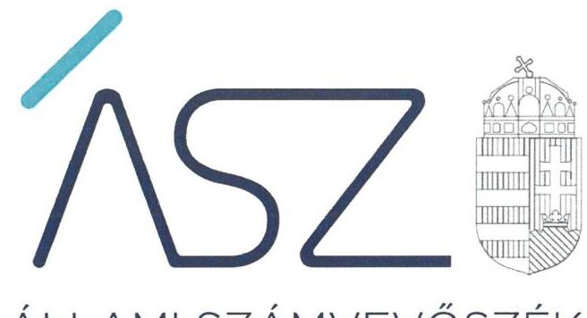

ÁLLAMI SZÁMVEVŐSZÉK

# JELENTÉS 

Nemzeti tulajdonú gazdasági társaságok ellenőrzése

A nemzeti tulajdonú gazdasági társaságoknál a fizetőképességet veszélyeztető helyzet bekövetkezése kockázatainak ellenőrzése
2021.

21116
www.asz.hu

---

ÁLLAMI SZÁMVEVŐSZÉK

# JELENTÉS 

## Nemzeti tulajdonú gazdasági társaságok ellenőrzése

A nemzeti tulajdonú gazdasági társaságoknál a fizetőképességet veszélyeztető helyzet bekövetkezése kockázatainak ellenőrzése
2021. 12. hó 27. nap

21116
www.asz.hu

---

# AZ ELLENŐRZÉST VEZETTE ÉS A VÉGREHAJTÁSÁÉRT FELELŐS: 

DR. BENEDEK MÁRIA ellenőrzésvezető
KISTÓTH KRISZTINA ellenőrzésvezető
FEKETE-NAGY ANDRÁS ellenőrzésvezető

A PROGRAM ÖSSZEÁLLÍTÁSÁÉRT FELELŐS:
DR. FELFÖLDI IZABELLA projekt vezető

IKTATÓSZÁM: EL-3469-001/2021.
TÉMASZÁM: 2565
ELLENŐRZÉS-AZONOSÍTÓ SZÁM: V0909

Jelentéseink az Országgyúlés számítógépes hálózatán és az interneten a www.asz.hu címen is olvashatóak.

---

# TARTALOMJEGYZÉK 

■ ÖSSZEGZÉS ..... 5
■ AZ ELLENŐRZÉS AKTUALITÁSA, TÁRSADALMI SZEREPE, SZEMPONTJA ..... 8
■ AZ ELLENŐRZÉS TERÜLETE ..... 9
■ ELLENŐRZÉS HATÓKÖRE ÉS MÓDSZERE ..... 10
■ MELLÉKLETEK ..... 13
I. sz. melléklet: Értelmező szótár ..... 13
■ RÖVIDÍTÉSEK JEGYZÉKE ..... 15

---

.

---

# ÖSSZEGZÉS 

Az értékelt 11 nemzeti tulajdonú gazdasági társaságból háromnál a vagyonmegőrzés biztosított volt. Ötnél a vagyonmegőrzést veszélyeztető kockázatot azonosítottak, de a felelős intézkedés és annak nyomon követése hiányában a kockázat fennmaradt. Három gazdasági társaságnál az Állami Számvevőszék tárta fel a vagyonmegőrzés egyik elemének, a fizetőképességet veszélyeztető helyzet kialakulásának kockázatát. A kockázatok kezelésére, megszüntetésére a gazdasági társaságok vezető tisztségviselőinek és tulajdonosi joggyakorlóinak egyaránt intézkedéseket kellett tenniük a nemzeti vagyon megőrzése, megóvása érdekében.
Az Állami Számvevőszék kezdeményezésére az ellenőrzött időszakot követően négy gazdasági társaságnál pozitív irányú változások indultak el, ezáltal csökkenhetnek a vagyonmegőrzést, valamint annak egyik elemeként a fizetőképességet veszélyeztető helyzet kialakulásának kockázatai. Kettő gazdasági társaság nem tett intézkedéseket, aminek következtében a fizetőképességet veszélyeztető helyzet kialakulása kockázata fennmaradt, amely egyidejüleg a vagyonvesztés kockázatát is hordozza.

## Az ellenőrzés jelentősége

A nemzeti tulajdonú gazdasági társaságnál amennyiben fizetőképességi problémákkal küzd, a likviditás biztosítása érdekében vagyontárgyai kényszer értékesítése válhat szükségessé, amely vagyonvesztési kockázattal járhat, ezzel veszélyeztetve a nemzeti vagyon megőrzését. A fizetőképességet, ezáltal a vagyonmegőrzést veszélyeztető jelenségek korai feltárásával, értékelésével az ÁSZ támogatja a vagyonvesztés megelőzését, hozzájárulva ezzel a nemzeti vagyon megóvásához, a közfeladat ellátásának zavartalan biztosításához.

## Értékelés

A 2020. évben a 11 értékelt közül három gazdasági társaság vagyonmegőrzésének egyik eleme, a fizetőképessége biztosított volt. Öt gazdasági társaság vezető tisztségviselője - a 2019. évi beszámolóik adatai szerint - a társaság saját tőkéjének a törzstőke jogszabályban meghatározott minimális összeg alá csökkenését, mint a társaság fizetőképességét veszélyeztető jelenséget azonosította, melyről a tulajdonosi joggyakorlót dokumentáltan értesítette. Az ötből kettő gazdasági társaság vezető tisztségviselője a veszélyeztetettség kezelésére a tőle elvárható gondossággal dokumentáltan nem intézkedett. Kettő intézkedett, azonban az intézkedés nem volt eredményes, a fizetőképességet veszélyeztető jelenség továbbra is fennállt. Egy társaság vezető tisztségviselője a kialakult helyzetet eredményesen kezelte, a veszélyeztetettség csökkent, de az intézkedések megvalósulásának nyomon követéséről nem gondoskodott. A fizetőképességet veszélyeztető jelenségek kezelése, nyomon követése és a felelős vezetői magatartás hiányában fennállt a vagyonvesztés bekövetkezésének kockázata.

A 11-ből kettő gazdasági társaság vezető tisztségviselője nem gondoskodott a követelések, kötelezettségek szabályszerű nyilvántartásáról, ezért nem rendelkezett információval a fizetőképességre veszélyt jelentő jelenségek korai felismeréséhez. Egy további gazdasági társaság vezető tisztségviselője nem gondoskodott az esedékes tartozások határidőben történő kiegyenlítéséről, de ezt a fizetőképességet veszélyeztető jelenséget nem ismerte fel, nem azonosította. A veszélyeztetettség korai felismerésének hiánya hátráltatja a vagyonvesztés megelőzését szolgáló intézkedések megtételét. A szabályszerű nyilvántartás hiányát, valamint, hogy a gazdálkodó szervezet nem volt képes kötelezettségét esedékességkor kiegyenlíteni, az ÁSZ a fizetőképességet veszélyeztető helyzet kialakulása kockázatának értékelte.

---

# Következtetés 

A vagyonmegőrzéshez és annak egyik elemeként a fizetőképességet veszélyeztető helyzet kialakulása kockázatának csökkentéséhez, a közpénzügyi helyzet javításához a nyolc nemzeti tulajdonú gazdasági társaság vezető tisztségviselőjének és tulajdonosi joggyakorlójának - a tőle elvárható gondossággal - intézkedéseket kellett tennie. Ezáltal biztosítható a nemzeti vagyon célszerű felhasználása, megóvása, a társaságok folyamatos, átlátható múködése, valamint a közszolgáltatás jó minőségének fenntartása.

Az ellenőrzés során a 11 értékelt közül öt nemzeti tulajdonú gazdasági társaságból beolvadás útján egy gazdasági társaság jött létre az ellenőrzött időszakot követően, hat gazdasági társaság változatlan cégformában múködött tovább. Így hét nemzeti tulajdonú gazdasági társaságra terjedt ki az ÁSZ értékelése. A hétből egy gazdasági társaságnál az ÁSZ nem tárt fel fizetőképességet veszélyeztető helyzetet, a vagyonmegőrzés biztosított volt, ezért a vezető tisztségviselője részére nem küldött figyelemfelhívást.

Hat nemzeti tulajdonú gazdasági társaság vezetőjének intézkedéseket kellett tennie. Az Állami Számvevőszék már az ellenőrzés során felhívással élt és megszólította a hat gazdasági társaság vezetőjét a szabálytalanságok, kockázatok vonatkozásában, hogy azokat megszüntessék. Az Állami Számvevőszék célja a felhívásokkal az volt, hogy már az ellenőrzés folyamatában előmozdítsa a pozitív irányú változásokat: a vagyonmegőrzésnek, és annak egyik elemeként a fizetőképességet veszélyeztető helyzet kialakulása kockázatának csökkentését, támogassa az azonosított kockázatok hatásos időben történő felismerését, a közpénzügyi helyzetnek, a közpénzügyek átláthatóságának és rendezettségének javulását.

A figyelemfelhívásra négy gazdasági társaság vezetője válaszolt, akik közül három vezető intézkedéseket tett valamennyi szabálytalanság és kockázat csökkentésére. Egy gazdasági társaság vezetője - egy feltárt kockázat kivételével - a kockázatok csökkentésére intézkedéseket tett. A vezetők által jelzett intézkedéseket figyelembe véve csökkenhetnek a vagyonmegőrzést és annak egyik elemeként a fizetőképességet veszélyeztető helyzet kialakulásának kockázatai, ezáltal biztosítható a nemzeti vagyon célszerű felhasználása, megóvása, a társaságok folyamatos, átlátható múködése, a felelős gazdálkodás megerősítése, valamint a közfeladatellátás jó minőségének fenntartása.

Kettő gazdasági társaság vezetője nem is válaszolt a figyelemfelhívásra, egy pedig nem tett megfelelő hatásosságú intézkedést a feltárt kockázatok csökkentése, megszüntetése érdekében. Esetükben a vagyonmegőrzést, és annak egyik elemeként a fizetőképességet veszélyeztető kockázat fennmaradt, a közpénzügyi helyzet nem javult, a nemzeti vagyon célszerű felhasználása, megóvása nem biztosított. Ezért az ÁSZ a három gazdasági társaság tulajdonosi joggyakorlója felé felhívással élt az azonosított kockázatok csökkentése érdekében.

---

A társaság legfőbb
szervének értesítése

A Ptk. szerinti esemény
bekövetkezése esetén a
legfőbb szerv ülésének
összehívása

A veszélyeztetettség
elemzése, értékelése

Az intézkedések,
eredmények
nyomonkövetése

A tulajdonosi joggyakorló értesül az FB
ügyvezetést ellenőrző
tevékenységéről

Pénzügyi terv és
évközi cash flow
készítése

Szabályszerü
nyilvántartás

Szabályszerü
nyilvántartás

Vagyoni, pénzügyi,
jóvedelmi helyzet,
likviditás
értékelése

Kötelezettségek
kiegyenlítésének
figyelése

---

# AZ ELLENŐRZÉS AKTUALITÁSA, TÁRSADALMI SZEREPE, SZEMPONTJA 

Magyarország Alaptörvénye alapján a nemzeti vagyon kezelésének, védelmének célja a közérdek szolgálata, a közös szükségletek kielégítése és a természeti erőforrások megóvása, valamint a jövő nemzedékek szükségleteinek figyelembevétele. A közfeladatok ellátása nagyrészt önkormányzati tulajdonba tartozó gazdasági társaságok útján valósul meg. A közérdek szolgálata elsősorban a közfeladatok elvárt színvonalú biztosítását jelenti, ideértve a lakosság közszolgáltatásokkal való ellátását, melyhez nemzeti vagyonra van szüksége az azokat ellátó gazdasági társaságoknak.

Amennyiben egy önkormányzati tulajdonban levő gazdasági társaság fizetőképessége veszélyeztetetté válik, sérülhet a lakosság közszolgáltatással való ellátásának minősége, hatékonysága, zavartalan biztosítása, továbbá a feladatellátáshoz rendelkezésére álló önkormányzati, ezen keresztül nemzeti vagyon megőrzését is veszélyezteti. Mindezekre tekintettel elengedhetetlen az önkormányzati tulajdonú gazdasági társaságok első számú vezetőinek gondos, felelős feladatellátása a társaságok pénzügyi stabilitásának, fenntartható finanszírozásának biztosítására.

Az önkormányzati tulajdonban levő gazdasági társaság vagyonvesztése, pénzügyi kockázata a tulajdonosi joggyakorló önkormányzat pénzügyi kockázatává alakulhat át, mert az önkormányzati és ezen keresztül a nemzeti vagyon pótlása közpénzből, a tulajdonos önkormányzat rendelkezésére bocsátott forrásokból rendezhető. Az ÁSZ folyamatosan figyelemmel kíséri az önkormányzatok pénzügyi helyzetét, és az eladósodás megelőzése érdekében rendszeresen értékeli az önkormányzatok pénzügyi egyensúlyi helyzetét és az arra ható kockázatokat. Ezen kockázatok jelentős része a nemzeti, ezen belül többségi önkormányzati tulajdonban álló gazdasági társaságoknál azonosítható.

Az ÁSZ ellenőrzésével felhívja a figyelmet a többségi tulajdonban álló önkormányzati tulajdonú gazdasági társaságoknál a fizetőképességet veszélyeztető helyzetre, annak érdekében, hogy a vagyonvesztés megelőzhetővé váljon. Az ÁSZ ellenőrzésével támogatja az önkormányzati tulajdonú gazdasági társaság vezető tisztségviselőjét és tulajdonosi joggyakorlóját a felelős gazdálkodás megerősítésében.

A nemzeti vagyon megőrzését befolyásoló veszélyeztető körülmények közül a fizetőképesség értékelése során az ÁSZ lényeges területként azonosította a fizetőképesség nyomon követésének és fenntartásának preventív eszközeit. Ennek keretében a követelések, kötelezettségek nyilvántartását, a tartozások és kintlévőségek esedékességének elemzését, az évközi cash flow és az üzleti tervezés keretében a pénzügyi terv készítését. Mindezek hiányában a vezető nem rendelkezik információval a fizetőképességet, vagyonmegőrzést veszélyeztető jelenségek korai felismeréséhez. Az ÁSZ további lényeges területként értékelte a gazdasági társaság fizetési készségét, azt, hogy a vezető tisztségviselő gondoskodott-e arról, hogy a társaság a fizetési kötelezettségének határidőben eleget tegyen.

Az ÁSZ a nemzeti vagyon megőrzését veszélyeztető kockázatot növelő tényezőként értékelte, ha a gazdasági társaság vezető tisztségviselője nem gondoskodott a fizetőképesség fenntartása preventív eszközeinek alkalmazásáról. Továbbá, ha nem gondoskodott arról, hogy fizetési határidőn belül, de legfeljebb a fizetési határidőt követő 90 napon belül ki legyenek egyenlítve a társaság részére kiállított számlák.

Az azonosított vagyonmegőrzés, ezen belül a fizetőképességet veszélyeztető helyzet esetén az ÁSZ a kockázatot csökkentő tényezőként értékelte, ha a gazdasági társaság vezető tisztségviselője a helyzet kezelésére eredményesen intézkedett és a megtett intézkedéseket dokumentáltan nyomon követte.

---

# AZ ELLENŐRZÉS TERÜLETE 

## 11 nemzeti tulajdonú gazdasági társaság és azok tulajdonosi joggyakorlói

Az önkormányzati tulajdonú gazdasági társaságok gazdálkodásuk során jelentős nagyságú vagyont működtetnek, az általuk ellátott közszolgáltatások minősége és hatékonysága jelentős mértékben érintik a lakosság életminőségét, egészségét, biztonságát, ezen keresztül a lakosság jólétét.

Az ÁSZ ${ }^{1}$ a többségi önkormányzati tulajdonú gazdasági társaságok korábban lefolytatott ellenőrzései során többek között értékelte a társaságok integritás- és belső kontrollját. Jelen ellenőrzés kockázatértékelés alapján kiválasztott olyan 11 önkormányzati tulajdonú gazdasági társaságra terjedt ki, melyeknél az ÁSZ integritási kockázatot azonosított. A társaságok közszolgáltatást végeztek, fő tevékenységük közterületek, köztemetők fenntartása, a településtisztaság biztosítása; hulladékgazdálkodási, kéményseprő-ipari, valamint közművelődési tevékenység volt. Az ellenőrzés során a 11 ellenőrzött közül öt nemzeti tulajdonú gazdasági társaságból beolvadás útján egy gazdasági társaság jött létre, hat gazdasági társaság változatlan cégformában múködött tovább. Így a felhívást követően hét nemzeti tulajdonú gazdasági társaságra terjedt ki az ÁSZ értékelése.

Amennyiben egy többségi tulajdonban lévő gazdasági társaságnál a gazdálkodási és kockázatkezelésre vonatkozó alapvető szabályozás terén integritási kockázat azonosítható, indokolt értékelni a bevételek beszedését és elszámolását, tekintettel arra, hogy ez az adott társaság fizetőképességére közvetlenül hatást gyakorol. A fizetőképesség pedig a nemzeti vagyon megőrzésének egyik kiemelt eleme. Amennyiben beigazolódik, hogy a bevételeiket, ezen belül kiemelten követeléseiket nem a jogszabályi előírások szerint kezelik a társaságok, a beazonosított kockázatokra tekintettel szükséges és indokolt a fizetőképesség veszélyének bekövetkezését megvizsgálni és arra a tulajdonos figyelmét felhívni. Az ellenőrzéssel érintett gazdasági társaságoknál a fizetőképességet veszélyeztető kockázati tényezők értékelését végzi el az ÁSZ.

Az ellenőrzést kockázatalapú ellenőrzési megközelítéssel hajtja végre az ÁSZ, melynek keretében azokat a lényeges területeket értékeli, amelyek érdemi kockázatot jelenthetnek az önkormányzati tulajdonú társaságok fizetőképességére és nemzeti vagyona megőrzésére. Súlypontok meghatározásán keresztül lehetőséget biztosít az ellenőrzés ezen területeket veszélyeztető kockázatok beazonosítására. Az önkormányzati tulajdonú gazdasági társaságok fizetőképességét veszélyeztető helyzet bekövetkezésére utaló jelek hatásos időben való felismerésével, megfelelő intézkedéseket tud tenni a társaság vezetője vagy tulajdonosa a gazdálkodás stabilitásának helyreállítása érdekében, hozzájárulva ezzel a közfeladatai megbízható ellátásához, a nemzeti vagyon megőrzéséhez.

---

# ELLENŐRZÉS HATÓKÖRE ÉS MÓDSZERE 

## Az ellenőrzés típusa

Megfelelőségi ellenőrzés.

## Az ellenőrzött időszak

Az ellenőrzött időszak a 2020. január 01-től 2020. október 31-ig terjedő időszak.

## Az ellenőrzés tárgya

Az ellenőrzés tárgyát képezi a többségi nemzeti tulajdonban álló gazdasági társaságok vezető tisztségviselőjének eljárása a társaság fizetőképességét veszélyeztető jelenségek felmérése, azonosítása, elemzése, kezelése és nyomon követése tekintetében, a cash-flow kimutatások figyelemmel kísérése és a társaság esedékes/lejárt tartozásainak kiegyenlítéséről való gondoskodás vonatkozásában. Mindezek mellett a vezető tisztségviselő által a fizető készség biztosítása a fizetőképességet veszélyeztető jelenségek kezelése, intézkedések kezdeményezése és nyomon követése által. Az ellenőrzés kiterjed továbbá a tulajdonosi joggyakorló értesülésére, tudomás szerzésére a társaságot fenyegető fizetésképtelenségről, a tulajdonosi ellenőrzés eszközének működtetésére az ügyvezetés tevékenysége ellenőrzésének vonatkozásában, valamint az intézkedés megtételének kezdeményezésére, egyszemélyes társaság esetében alapítói határozat meghozására a fizetőképesség fenntartása/helyreállítása érdekében.

## Az ellenőrzött szervezetek

11 többségi nemzeti tulajdonban álló gazdasági társaság és azok tulajdonosi joggyakorlói

## Az ellenőrzés jogalapja

Az ÁSZ tv. ${ }^{2}$ 1. § (3), 5. § (3)-(5) bekezdése képezik.

## Az ellenőrzés módszerei

Az ellenőrzést az ellenőrzési program szempontjai, az ellenőrzött időszakban hatályos jogszabályok, a jelen ellenőrzésre irányadó ÁSZ módszertan figyelembe vételével és a nemzetközi standardokat irányadónak tekintve kell elvégezni. Az ÁSZ az ellenőrzés ideje alatt az

---

ellenőrzött szervezettel történő kapcsolattartást az ÁSZ SZMSZ³-ének vonatkozó előírásai alapján biztosítja.

Az ellenőrzési kérdések megválaszolásához szükséges bizonyítékok megszerzése a következő ellenőrzési eljárások alkalmazásával történik: megfigyelés, összehasonlítás, elemző eljárás. Az ellenőrzési bizonyítékként felhasználható adatforrások közé tartoznak az ellenőrzési programban felsorolt adatforrások, továbbá minden - az ellenőrzés folyamán - feltárt, az ellenőrzés szempontjából információkat tartalmazó dokumentum.

Az ÁSZ az ellenőrzést a kérdésekre adott válaszok kiértékelésével, valamint a megjelölt adatforrások továbbá az adott időszakban hatályos jogszabályok, valamint az ÁSZ honlapján közzétett helyénvalósági kritériumok figyelembevételével folytatja le. Az utóbbiakra vonatkozó értékelések a jelentésben dőlt betűvel szerepelnek.

A program ellenőrzési kérdései a helyénvalósági kritériumok szerinti ellenőrzésben a társaságok vezető tisztségviselőitől, tulajdonosi joggyakorlóitól elvárható gondosság mellett alkalmazott jó gyakorlat alapján kerültek meghatározásra. Ezen kritériumok betartását nem írja elő társaságok számára kötelező jelleggel jogszabály, azonban alkalmazásukkal pozitív változások indulhatnak el a társaságok pénzügyi és vagyoni helyzetében, ezért ezek alkalmazására tesz javaslatot az ÁSZ.

A törvényi előírásokat, valamint az ÁSZ által meghirdetett, nyilvános módszertant figyelembe véve az ellenőrzés hatóköre kiegészülhet kockázatjelzések alapján, a kockázatértékelés függvényében további lényeges területek szabályosságának ellenőrzésével az ellenőrzés megkezdésének időpontjáig.

Az ÁSZ jelentésében bemutatja az ellenőrzés során feltárt jelenségek, helyzetek összegző értékelését. Részletes értékelését az ellenőrzött szervezetek vezető tisztségviselőivel megismerteti, annak érdekében, hogy előmozdítsa a szükséges intézkedések megtételét a vagyonmegőrzés, a közszolgáltatás stabilitása érdekében. Az egyes ellenőrzött gazdasági társaság fizetőképességére vonatkozó értékelés közzététele üzleti érdeket, üzleti titkot sérthet, ezért ezeket az ÁSZ bizalmasan kezeli.

Hat nemzeti tulajdonú gazdasági társaság vezetője számára levélben adott tájékoztatást az ÁSZ azokról a helyénvalósági kritériumokról, amelyeket azért dolgozott ki, hogy támogassa a nemzeti vagyon megőrzését, a felelős gazdálkodást, a címzett gazdasági társaság fenntarthatóbb működését. Egyidejűleg az ÁSZ jelezte az értékelés során azonosított kockázatokat, azoknak a hatásos időben való felismerését támogatva, annak érdekében, hogy a gazdasági társaság vezető tisztségviselője elvárható gondossággal megfelelő intézkedéseket tudjon tenni a szabályos múködés, a felelős gazdálkodás megerősítése érdekében.

A hatból kettő gazdasági társaság vezetője számára küldött levélben az ÁSZ jelzést adott az értékelt időszakra feltárt szabálytalanságokról is, és ezek vonatkozásában az ÁSZ tv. előírásával összhangban 15 nap állt rendelkezésükre az ebben foglaltak elbírálására, a megfelelő intézkedések megtételére és erről az ÁSZ elnökének az értesítés megküldésére.

---

.

---

# MELLÉKLETEK 

## I. SZ. MELLÉKLET: ÉRTELMEZŐ SZÓTÁR

Cash-flow kimutatás
fizetőképesség
gazdasági társaság
nemzeti vagyon
többségi tulajdonú gazdasági társaság
többségi befolyás
vezető tisztségviselő

A társaság működése, befektetései és pénzügyi tevékenysége által generált pénzáramlásokat tartalmazó kimutatás. A társaság pénzügyi helyzetében bekövetkezett változásokat mutatja be, mely pénzügyi előrejelzést jelent és a pénzügyi terv része.
A likviditás időpontbeli állapota, melyet az éppen esedékes kötelezettségek és a kiegyenlítésükhöz - likvid, fizetésre alkalmas - eszközök viszonya jellemez. A priori (előzetes) vizsgálata: előrejelzés, becslés a jövőbeni likviditási állapotokra vonatkozóan, a posteriori (utólagos) vizsgálat már konkrét tényszámokon alapszik.
A gazdasági társaságok üzletszerű közös gazdasági tevékenység folytatására, a tagok vagyoni hozzájárulásával létrehozott, jogi személyiséggel rendelkező vállalkozások, amelyekben a tagok a nyereségből közösen részesednek, és a veszteséget közösen viselik. (Forrás: Ptk. ${ }^{4}$ 3:88. § (1) bekezdés)
Nvtv. ${ }^{5}$ 1. § (2) bekezdése szerint nemzeti vagyonba tartozik többek között: az állam vagy a helyi önkormányzat tulajdonában lévő pénzügyi eszközök, továbbá az államot vagy a helyi önkormányzatot megillető társasági részesedések.
Többségi tulajdonú az a társaság, ahol a tulajdonosi joggyakorló a Ptk. 8:2. § (1) bekezdés szerinti többségi befolyással rendelkezik.
Az olyan kapcsolat, amelynek révén a befolyással rendelkező egy jogi személyben a szavazatok több mint ötven százalékával - közvetlenül vagy a jogi személyben szavazati joggal rendelkező más jogi személy (köztes vállalkozás) szavazati jogán keresztül - rendelkezik, azzal, hogy a közvetett módon való rendelkezés meghatározása során a jogi személyben szavazati joggal rendelkező más jogi személyt (köztes vállalkozást) megillető szavazati hányadot meg kell szorozni a befolyással rendelkezőnek a köztes vállalkozásban, illetve vállalkozásokban fennálló szavazati hányadával, ha azonban a köztes vállalkozásban fennálló szavazatainak hányada az ötven százalékot meghaladja, akkor azt egy egészként kell figyelembe venni. A befolyás számításánál nem kell figyelembe venni a huszonöt százalékot el nem érő közvetett befolyást. (Forrás: Taktv. ${ }^{6}$ 1. § b) pont).
A jogi személy irányításával kapcsolatos olyan döntések meghozatalára, amelyek nem tartoznak a tagok vagy az alapítók hatáskörébe, egy vagy több vezető tisztségviselő vagy a vezető tisztségviselőkből álló testület jogosult. A vezető tisztségviselő ügyvezetési tevékenységét a jogi személy érdekének megfelelően köteles ellátni. A jogi személy első vezető tisztségviselőit a jogi személy létesítő okiratában kell kijelölni. A jogi személy létrejöttét követően a vezető tisztségviselőket a jogi személy tagjai, tagság nélküli jogi személyek esetén a jogi személy alapítói választják meg, nevezik ki, vagy hívják vissza. A vezető tisztségviselői megbízás a tisztségnek a kijelölt, megválasztott vagy kinevezett személy által történő elfogadásával jön létre. (Forrás: Ptk. 3:21. §)

---

.

---

# RÖVIDÍTÉSEK JEGYZÉKE 

${ }^{1}$ ÁSZ
${ }^{2}$ ÁSZ tv.
${ }^{3}$ ÁSZ SZMSZ
${ }^{4}$ Ptk.
${ }^{5}$ Nvtv.
${ }^{6}$ Taktv.

Állami Számvevőszék
az Állami Számvevőszékről szóló 2011. évi LXVI. törvény
Állami Számvevőszék Szervezeti és Működési Szabályzata
a Polgári Törvénykönyvről szóló 2013. évi V. törvény
a nemzeti vagyonról szóló 2011. évi CXCVI. törvény
a köztulajdonban álló gazdasági társaságok takarékosabb müködéséről szóló 2009. évi CXXII. törvény

---

# ASZ 

ALLAMI SZAMVEVOSZEK
1052 Budapest, Apáczai Cs. J. u. 10. I 1364 Budapest 4. Pf. 54 TEL: +36 14849100
email: szamvevoszek@asz.hu
web: www.asz.hu | www.aszhirportal.hu