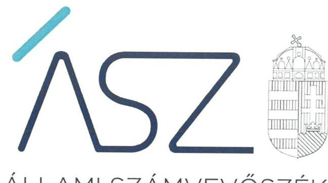
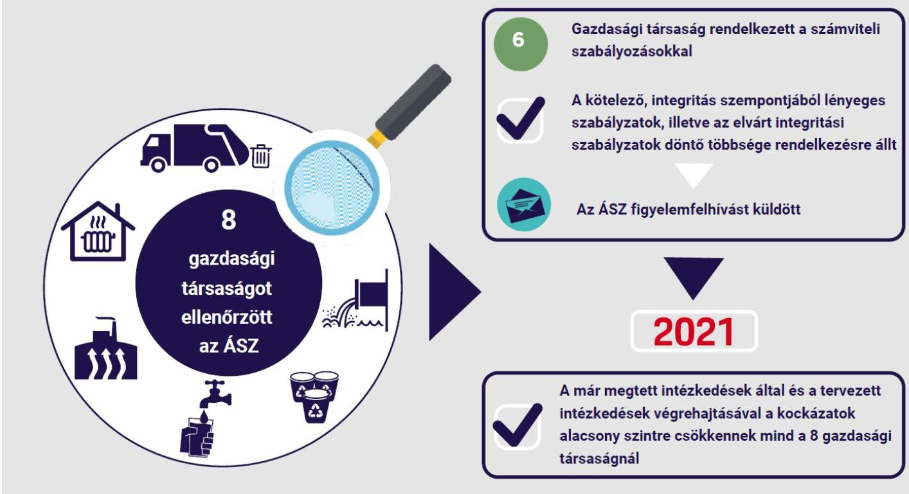

ÁLLAMI SZÁMVEVŐSZÉK

# JELENTÉS 

A többségi önkormányzati tulajdonú gazdasági társaságok integritásának ellenőrzése - 8 gazdasági társaságnál
$\qquad$
2021.

21117
www.asz.hu

---

ÁLLAMI SZÁMVEVŐSZÉK

# JELENTÉS 

A többségi önkormányzati tulajdonú gazdasági társaságok integritásának ellenőrzése - 8 gazdasági társaságnál
2021. 12. hó 31. nap

21117
www.asz.hu

---

# AZ ELLENŐRZÉST FELÜGYELTE: 

MAKKAI MÁRIA felügyeleti vezető

## AZ ELLENŐRZÉST VEZETTE ÉS A VÉGREHAJTÁSÁÉRT FELELŐS:

ÓDOR TAMÁS ZOLTÁN ellenőrzésvezető

VARGA EDIT ellenőrzésvezető

A PROGRAM ÖSSZEÁLLÍTÁSÁÉRT FELELŐS:
GÖRGÉNYI GÁBOR osztályvezető

IKTATÓSZÁM: EL-3471-001/2021
TÉMASZÁM: 2557
ELLENŐRZÉS-AZONOSÍTÓ SZÁM: V090107

---

# TARTALOMJEGYZÉK 

■ ÖSSZEGZÉS ..... 5
■ AZ ELLENŐRZÉS JELENTŐSÉGE, AKTUALITÁSA, TÁRSADALMI SZEREPE, SZEMPONTJAI ..... 7
■ AZ ELLENŐRZÉS TERÜLETE ..... 8
■ AZ ELLENŐRZÉS HATÓKÖRE ÉS MÓDSZEREI ..... 9
■ RÖVIDÍTÉSEK JEGYZÉKE ..... 11

---

.

---

# ÖSSZEGZÉS 

Az Állami Számvevőszék figyelemfelhívásának és tanácsadásának eredményeként az ellenőrzött nyolc többségi önkormányzati tulajdonú gazdasági társaság 2021-ben intézkedett, vagy intézkedéseket rendelt el a gazdálkodás elszámoltathatóságának alapvető feltételeit jelentő számviteli és integritástudatos szabályozási környezet kialakítására. Mindez esélyt ad a szabályos gazdálkodásra, valamint a szervezeti integritás biztosítására.

## Értékelés

Az ellenőrzött 2020. évre vonatkozóan az ÁSZ ${ }^{1}$ nyolc, a Gbkr. ${ }^{2}$ hatálya alá tartozó többségi önkormányzati tulajdonú gazdasági társaság szabályozási környezetének azon lényeges területeit értékelte, amelyek releváns kockázatot jelentenek a szervezeti integritást biztosító kontrollok 2021. évtől kötelező kialakítására és működtetésére. Ilyen lényeges terület volt a számviteli szabályzatok megléte, valamint a javadalmazással összefüggő szabályzat kialakítása. Az ellenőrzés értékelte továbbá a 2021. évtől kötelező, integritási szempontból lényeges és a nem kötelező, de elvárt integritási szabályozási környezet meglétét is.

Az integritás alapú múködéshez elengedhetetlen a jogszabályokban előírt belső szabályzatok megléte és azok tartalmának a hatályos jogszabályoknak való megfelelése. Az integritási kockázatok azáltal csökkenthetők, ha a gazdasági társaságoknál biztosított a gazdálkodás és az integritás-tudatos szabályozási környezet.

A számviteli politika és az annak keretében elkészítendő szabályzatok, valamint a számlarend biztosítja a jogszabályi előírásoknak és a számviteli alapelveknek megfelelő könyvvezetést, azok alapján a beszámoló elkészítését, a pénzügyi- és vagyongazdálkodás átláthatóságát, elszámoltathatóságát.

A 2020. évben hat gazdasági társaság rendelkezett a számviteli szabályozásokkal. A számviteli szabályzatok integritási szempontból lényeges tartalmi elemei alapvetően szerepeltek az ellenőrzött szervezetek szabályzataiban. Jellemző hiányosság volt, hogy a szabályzatokban nem rögzítették a gazdasági társaságok adottságaihoz illeszkedően, hogy a számviteli elszámolás szempontjából mit tekintenek jelentősnek, nem jelentősnek és lényegesnek, nem lényegesnek. Ezek meghatározása előmozdítja az értékelési, illetve tájékoztatási folyamatok átláthatóságát, amely hatással van a beszámoló adatait felhasználók döntéseire.

A vezető tisztségviselők, felügyelőbizottsági tagok, valamint vezető állású munkavállalók javadalmazása, valamint a jogviszony megszűnése esetére biztosított juttatások módjának, mértékének elveiről, annak rendszeréről szóló szabályzat megléte az átláthatóságot erősíti és csökkenti az integritási kockázatokat. E szabályzattal a 2020. évben hat gazdasági társaság rendelkezett.

A 2021. évtől kötelező integritási szempontból lényeges szabályzatok - az etikai elvárás, az integrált kockázatkezelés eljárásrendje, a szervezeti integritást sértő események és panaszok bejelentő rendszere, az integritást sértő események kezelésének eljárásrendje és a szervezeten belüli összeférhetetlenség megelőzésének és ellenőrzésének szabályozása - biztosítják, hogy a szervezet tevékenységében a társadalmi elvárásoknak megfelelő értékrend alakuljon ki. A kötelező előírások mellett az elvárt, de jogszabály által elő nem írt integritási szabályozások - az ajándékok elfogadásának, a beszerzési eljárásoknak, a munkatársak gazdasági összeférhetetlenségének szabályozása, a külső panaszokat kezelő eljárásrend, a munkáltatói visszaélés-bejelentési rendszer, valamint a vezető tisztségviselőkre és hozzátartozóikra vonatkozó összeférhetetlenségi szabályozás - megléte szolgálja, hogy az integritási kockázatok csökkentése érdekében azok kezelésére megfelelő védelem alakuljon ki. A 2021. évtől kötelező integritás szempontjából lényeges szabályzatok, illetve az elvárt integritási szabályzatok döntő többsége rendelkezésre állt. Három gazdasági társaság már 2020-ban kialakította a jogszabályban előírt, 2021. évtől kötelező, az integritást erősítő valamennyi szabályzatot. Két gazdasági társaság rendelkezett az elvárt szabályzatok mindegyikével.

---

Az integritás fejlesztése érdekében az ÁSZ azonosította a kockázati területeket, és az ellenőrzés folyamatában a kockázatok csökkentésére hívta fel a gazdasági társaságok vezetőinek figyelmét. A figyelemfelhívások témái az alapvető számviteli szabályozások, a 2021. évtől kötelező integritást erősítő, illetve az elvárt szabályozások meglétére és a meglévő szabályozások tartalmi elemeire irányultak.

# Következtetés 

Az ÁSZ figyelemfelhívására az ellenőrzött szervezetek mindegyike válaszolt és egyetértett a kockázatos területeken teendő intézkedések indokoltságával. A gazdasági társaságok vezetőinek tájékoztatása szerint a kockázatos területek egy részénél tettek, illetve a jövőben tesznek intézkedést a kockázatok csökkentése érdekében. Ezek eredményeként a kockázatok alacsony szintűek négy gazdasági társaságnál, illetve a további négy táraságnál - a már megtett intézkedések által és a tervezett intézkedések végrehajtásával - a kockázatok alacsony szintre csökkennek. Mindez esélyt ad a szabályszerű, az integritási szempontokat érvényesítő gazdálkodásra.

## Biztosítottak a szabályos gazdálkodás és a szervezeti integritás feltételei 8 önkormányzati tulajdonú gazdasági társaságnál

---

# AZ ELLENŐRZÉS JELENTŐSÉGE, AKTUALITÁSA, TÁRSADALMI SZEREPE, SZEMPONTJAI 

Magyarország Alaptörvénye és a nemzeti vagyonról szóló törvény értelmében a közpénzeket és a nemzeti vagyont az átláthatóság és a közélet tisztaságának elve szerint kell kezelni. A közvagyonnal való felelős gazdálkodás és annak állapotáról történő elszámolás a vagyonvédelem kialakítását és múködtetését is megkívánja, amely az integritáskontrollok alkalmazásának szükségességét jelenti. Az integritás a szervezet társadalmi elvárásoknak megfelelő értékrendjét jelenti. Az integritás kontrollok megfelelő kialakítása és múködtetése vezetői feladat és felelősség, ami hozzájárul a társadalmi közbizalom erősítéséhez.

Az ÁSZ a 2016-2018. években a köztulajdonú gazdasági társaságok körében integritás felmérést végzett. Ennek eredményei azt mutatták, hogy jelentősek a különbségek az egyes gazdasági társaságok között az integritási kontrollok kiépítettségének tekintetében, amelyek jelentős részben a gazdasági társaságok menedzsmentjének az eltérő hozzáállására vezethetők vissza.

Az ellenőrzés célja az, hogy rámutasson a többségi önkormányzati tulajdonú gazdasági társaságok integritásával kapcsolatos alapvető elvárásokra, a szabályszerű múködést, valamint az integritást veszélyeztető kockázatokra. A számvevőszéki ellenőrzés arra fókuszál, hogy az ellenőrzött gazdasági társaságok vezetői hogyan teremtették meg a szervezet integritása érdekében a gazdasági társaságok feladatellátásához a szervezeti kultúra egységét biztosító értékeket, elveket, az integritásirányítási rendszert. Az ellenőrzés kiterjed a gazdasági társaságok számviteli politikájára és az annak keretében kialakítandó szabályzatokra, a számlarendre, a javadalmazással összefüggő szabályzatra, valamint a kötelező és elvárt integritási kontrollokra. Ezek teremtik meg az átlátható és elszámoltatható elvek szerinti múködés és gazdálkodás kereteit, valamint az integritási szemlélet érvényesülésének alapfeltételeit.

Az ellenőrzött köztulajdonban álló gazdasági társaságok vezetőinek 2021. január 1-től ki kell alakítaniuk és múködtetniük a belső kontrollrendszert és felelősek annak fejlesztéséért. Az ellenőrzés hozzájárulhat ahhoz, hogy a gazdasági társaságok a jogszabályi előírások szerint alakítsák ki gazdálkodásuk szabályozási kereteit, valamint a kockázatok feltárásával támogatást nyújt ezen szervezetek számára az integritás alapú, átlátható és elszámoltatható közpénzfelhasználás létrehozásában.

Az integritás kialakítása azért fontos, mert ezáltal átlátható és elszámoltatható egy szervezet múködése, amely elősegíti a korrupció és egyéb visszaélések megelőzését. A szervezeti integritásnak alapvető feltétele a szabályozottság, azaz a jogszabályokban előírt belső szabályzatok és nyilvántartások megléte, azok megfelelő tartalma és gyakorlati alkalmazhatósága. Emellett a jogszabályokban előírt szabályzatokon túlmenően indokolt, olyan korrupció elleni védelemre szolgáló szabályozásoknak az elkészítése, amelyek támogatják az Alaptörvényben rögzített alapértékek, elvek érvényesülését.

---

# AZ ELLENŐRZÉS TERÜLETE 

## A többségi önkormányzati tulajdonú gazdasági társaságok

A köztulajdonú gazdasági társaságok 2018. évi integritás helyzetéről készített ÁSZ elemzés szerint általános tendencia, hogy a nagyobb vállalati méret együtt jár az integritási veszélyek gyakoribbá válásával, ugyanakkor a nagyobb szervezeteknél a kialakított kontrollok szintje magasabb az átlagnál.

Az ellenőrzés az integritás alapú, átlátható és elszámoltatható közpénzfelhasználás elősegítése érdekében nyolc olyan többségi, önkormányzati tulajdonban lévő gazdasági társaság integritási kontrollok kiépítését értékelte, mely a Gbkr. hatálya alatt állt a 2020. évben. A Gbkr. 2021. január 1-jétől hatályos előírásai alapján a köztulajdonban álló gazdasági társaság első számú vezetőjének a belső kontrollrendszert ki kell alakítania és azt működtetnie kell.

Azon köztulajdonban álló gazdasági társaság állt a Gbkr. hatálya alatt, amely esetében a 2020. évet megelőző két üzleti évben a mérlegforduló napján a következő három mutatóérték közül legalább kettő a gazdasági társaság elfogadott (egyszerűsített) éves beszámolója, vagy - amennyiben konszolidált éves beszámolót is készít - a konszolidált éves beszámolója alapján meghaladja az alábbi határértéket:
$\longrightarrow$ a mérlegfőösszeg a 600 M Ft-ot;
$\longrightarrow$ az éves nettó árbevétel az 1,2 Mrd Ft-ot;
$\longrightarrow$ az átlagosan foglalkoztatottak száma a 100 főt.
Jelen ellenőrzés keretében ellenőrzött többségi önkormányzati tulajdonú gazdasági társaságok mérlegfőösszege, nettó árbevétele, foglalkoztatottjaik létszáma meghaladta a jogszabály által előírt határértéket.

---

# AZ ELLENŐRZÉS HATÓKÖRE ÉS MÓDSZEREI 

## Az ellenőrzés típusa

Megfelelőségi ellenőrzés.

## Az ellenőrzött időszak

2020. év

## Az ellenőrzés tárgya

A többségi önkormányzati tulajdonban lévő gazdasági társaságok gazdálkodásával, valamint a szervezeti elvekkel, értékekkel összefüggő integritás kontrollok kiépítettsége.

## Az ellenőrzött szervezetek

A Gbkr. hatálya alá tartozó többségi önkormányzati tulajdonban lévő következő gazdasági társaságok:

- MiReHu Miskolci Regionális Hulladékgazdálkodási Nonprofit Korlátolt Felelősségű Társaság,
- Dél-Kom Dél-Dunántúli Kommunális Szolgáltató Nonprofit Korlátolt Felelősségű Társaság,
- VASIVÍZ Vas megyei Víz- és Csatornamű Zártkörűen Működő Részvénytársaság,
- Debreceni Hőszolgáltató Zártkörűen Múködő Részvénytársaság,
- Szegedi Távfűtő Korlátolt Felelősségű Társaság,
- Szekszárdi Távhőszolgáltató Nonprofit Korlátolt Felelősségű Társaság,
- Zalai Közszolgáltató Nonprofit Korlátolt Felelősségű Társaság,
- NYÍRSÉGVÍZ Nyíregyháza és Térsége Víz- és Csatornamű Zártkörűen Múködő Részvénytársaság.

## Az ellenőrzés jogalapja

Az ÁSZ tv. ${ }^{3} 1 . \S$ (3) bekezdése

---

# Az ellenőrzés módszerei 

Az ellenőrzés lefolytatása az ellenőrzési program szempontjai, az ellenőrzött időszakban hatályos jogszabályok, a jelen ellenőrzésre irányadó ÁSZ módszertan figyelembevételével és a nemzetközi standardokat irányadónak tekintve történik.

Az ellenőrzési kérdések megválaszolásához szükséges bizonyítékok megszerzése a következő ellenőrzési eljárások alkalmazásával történik: megfigyelés, összehasonlítás, elemző eljárás. Az ellenőrzési bizonyítékként felhasználható adatforrások közé tartoznak az ellenőrzési programban felsorolt adatforrások, továbbá minden - az ellenőrzés folyamán - feltárt, az ellenőrzés szempontjából információkat tartalmazó dokumentum. Az ellenőrzés lefolytatása a kérdésekre adott válaszok kiértékelésével, valamint a megjelölt adatforrások felhasználásával, továbbá az adott időszakban hatályos jogszabályok, valamint az ÁSZ honlapján közzétett helyénvalósági kritériumok alapján történik.

A monitoring típusú ellenőrzés a gazdasági társaságok integritás alapú múködésének lényeges területeire terjed ki, és súlypontok meghatározásával lehetőséget biztosít a kockázatok beazonosítására.

Az integritás kontrollok kiépítettsége szintjének értékelése szabályszerűségi és helyénvalósági kritériumok alapján történik. Az ellenőrzés szabályszerűségi kritériumként alkalmazta azokban az esetekben, amikor a kontroll kiépítését jogszabály kötelezően előírta. Jogszabály által kötelezően nem előírt, elvárt kontrollok esetében az ÁSZ az Alaptörvényben megfogalmazott integritás elvek (törvényesség, célszerűség, eredményesség, átláthatóság, közélet tisztaságának elve) érvényesítése érdekében a kontrollok meglétét helyénvalósági kritériumként fogalmazza meg.

---

# RÖVIDÍTÉSEK JEGYZÉKE 

${ }^{1}$ ÁSZ
${ }^{2}$ Gbkr.
${ }^{3}$ ÁSZ tv.

Állami Számvevőszék
339/2019. (XII. 23) Korm. rendelet a köztulajdonban álló gazdasági társaságok belső kontrollrendszeréről (hatályos 2020. január 1-jétől)
2011. évi LXVI. törvény az Állami Számvevőszékről (hatályos 2011. július 1-jétől)

---

# ASZ 

ALLAMI SZAMVEVOSZEK
1052 Budapest, Apáczai Cs. J. u. 10. I 1364 Budapest 4. Pf. 54 TEL: +36 14849100
email: szamvevoszek@asz.hu
web: www.asz.hu | www.aszhirportal.hu