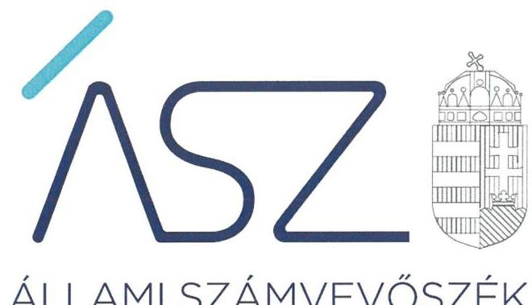

ÁLLAMI SZÁMVEVŐSZÉK

# JELENTÉS 

Pártok gazdálkodása

A költségvetési támogatásban részesülő pártok 2019-2020. évi gazdálkodása törvényességének ellenőrzése a Jobbik Magyarországért Mozgalomnál
2021.

21118
www.asz.hu

---

# JELENTÉS 

Pártok gazdálkodása

A költségvetési támogatásban részesülő pártok 2019-2020. évi gazdálkodása törvényességének ellenőrzése a Jobbik Magyarországért Mozgalomnál
2021. 12. hó 23. nap

21118
www.asz.hu

---

# AZ ELLENŐRZÉST FELÜGYELTE: 

DR. NAGY IMRE felügyeleti vezető

## AZ ELLENŐRZÉST VEZETTE ÉS A VÉGREHAJTÁSÁÉRT FELELŐS:

DR. SIMON JÓZSEF ellenőrzésvezető
VARGA EDIT ellenőrzésvezető
BAJNAI ZSUZSANNA ellenőrzésvezető

## A PROGRAM ÖSSZEÁLLÍTÁSÁÉRT FELELŐS:

DR. KÁDÁR KRISZTA az ellenőrzési program készítéséért felelős vezető

Jelentéseink az Országgyűlés számítógépes hálózatán és az interneten a www.asz.hu címen is olvashatóak.

IKTATÓSZÁM: EL-3479-001/2021
TÉMASZÁM: 2580
ELLENŐRZÉS-AZONOSÍTÓ SZÁM: V092302

---

# TARTALOMJEGYZÉK 

■ ÖSSZEGZÉS ..... 5
■ AZ ELLENŐRZÉS CÉLJA ..... 7
■ AZ ELLENŐRZÉS TERÜLETE ..... 8
■ AZ ELLENŐRZÉS HÁTTERE, INDOKOLTSÁGA ..... 9
■ A JELENTÉS LÉNYEGES KÉRDÉSKÖREI ..... 10
■ AZ ELLENŐRZÉS HATÓKÖRE ÉS MÓDSZEREI ..... 11
■ MEGÁLLAPÍTÁSOK ..... 13
■ JAVASLATOK ..... 16
■ MELLÉKLETEK ..... 19
I. sz. melléklet: Értelmező szótár ..... 19
■ FÜGGELÉK: ÉSZREVÉTELEK ..... 21
■ RÖVIDÍTÉSEK JEGYZÉKE ..... 23

---

.

---

# ÖSSZEGZÉS 

A Jobbik Magyarországért Mozgalom a 2019-2020. években a törvényes gazdálkodás alapvető feltételeit nem biztosította. A 2019-2020. évi könyvvezetése és gazdálkodása során a jogszabályi előírásokat nem tartotta be, emiatt a pénzügyi kimutatásai nem voltak megalapozottak. A Jobbik Magyarországért Mozgalom gazdálkodása során 2019-ben és 2020-ban nem tett eleget az Alaptörvényben és a Párttörvényben előírt alapvető követelményeknek, gazdálkodása nem volt átlátható.

## Az ellenőrzés társadalmi indokoltsága

A pártok működése a társadalomban meglévő érdekek és értékek demokratikus megjelenítésének és érvényesítésének alapfeltétele.

A pártok működéséről és gazdálkodásáról szóló törvény (Párttörvény) állapítja meg a pártok gazdálkodására vonatkozó szabályokat. A törvény szerint azok a pártok, mint sajátos egyesületek nyújthatnak szervezeti kereteket a népakarat kialakításához és kinyilvánításához, a politikai életben való állampolgári részvételhez, amelyek kinyilvánítják, hogy a törvény rendelkezéseit magukra nézve kötelezőnek ismerik el.

A Párttörvény egyben a politikai élet tisztasága érdekében biztosítja a pártok részére azt a jogosultságot, hogy az állami költségvetésből támogatásban részesüljenek. Magyarország Alaptörvénye szerint a központi költségvetésből csak olyan szervezet részére nyújtható támogatás, amelynek a támogatás felhasználására irányuló tevékenysége átlátható. Ezáltal a pártok működésének és költségvetési támogatásának alapja, hogy gazdálkodásuk törvényes és átlátható legyen.

A pártoknak évente be kell számolniuk a törvényi keretek szerinti gazdálkodásukról. Törvényi előírás alapján az Állami Számvevőszék a költségvetési támogatásban részesült pártok gazdálkodását kétévente ellenőrzi. A pártok pénzügyi beszámolása alapján az ellenőrzés visszajelzést ad arról, hogy a pártok eleget tettek-e az Alaptörvényben és a Párttörvényben a pártként való működéshez előírt alapvető követelményeknek, gazdálkodásuk törvényes és átlátható volt-e.

## Összegző értékelés, javaslatok

A Jobbik Magyarországért Mozgalom a törvényes gazdálkodás kereteit nem alakította ki. A párt számviteli szabályozása nem biztosította a szabályszerű könyvvezetés és a megalapozott pénzügyi kimutatás elkészítésének feltételeit. A Jobbik Magyarországért Mozgalom ellenőrzési rendszere nem biztosította a pénzkezelés szabályosságának, és a 2019. évi pénzügyi kimutatásnak az ellenőrzését. A párt nem készített törvény szerinti leltárt, ezáltal a pénzügyi kimutatás alapjául szolgáló könyvvezetési adatok megbízhatóságáról a könyvek üzleti év végi zárásakor nem győződött meg.

A Jobbik Magyarországért Mozgalom könyvvezetése nem volt törvényes, mivel nem biztosította, hogy az a valóságnak megfelelően, folyamatosan, zárt rendszerben, áttekinthetően mutassa az eszközeiben és a forrásaiban bekövetkezett változásokat.

Emellett a Jobbik Magyarországért Mozgalom pénzügyi kimutatásaiban szereplő adatokat a könyvvezetés adatai nem támasztották alá. Mindezek alapján a 2019. és 2020. évi pénzügyi kimutatások nem biztosították a Jobbik Magyarországért Mozgalom gazdálkodásának átláthatóságát.

Az Állami Számvevőszék a megállapítások alapján a Jobbik Magyarországért Mozgalom elnökének kilenc javaslatot fogalmazott meg.

---

# Következtetések 

Az Állami Számvevőszék a Jobbik Magyarországért Mozgalom gazdálkodását korábban több alkalommal ellenőrizte. A 2019-2020. évekre vonatkozó jelen ellenőrzés visszatérő hiányosságként azonosította, hogy a Jobbik Magyarországért Mozgalom ellenőrzési rendszerének működtetése, könyvvezetésének törvényessége, pénzügyi kimutatásainak megalapozottsága nem felel meg a jogszabályi előírásoknak. Ezáltal a Jobbik Magyarországért Mozgalom nem biztosította a közpénzek felhasználásának elszámoltathatóságát a tagság és az állampolgárok felé.

A párt gazdálkodásában azonosított visszatérő szabálytalanságok arra mutatnak rá, hogy a Jobbik Magyarországért Mozgalom nem gondoskodott a korábbi ellenőrzések során feltárt hiányosságok megszüntetéséről, a párt törvényes és átlátható gazdálkodásának biztosításáról, annak ellenére, hogy ezt a párt az ellenőrzési megállapításokra készített intézkedési terveiben vállalta.

A gazdálkodás törvényessége és átláthatósága területén feltárt lényeges és visszatérő törvénysértések alapján felvetődhet a kérdés: eleget tesz-e a pártként való működéshez előírt alapvető követelményeknek a Jobbik Magyarországért Mozgalom?

---

# AZ ELLENŐRZÉS CÉLJA 

AZ ELLENŐRZÉS CÉLJA, hogy az ÁSZ ${ }^{1}$ - mint az Országgyűlés legfőbb ellenőrző szerve - független és szakmailag megalapozott véleményt adjon a pártok, mint ellenőrzött szervezetek gazdálkodásának törvényességéről. Annak értékelése, hogy a közzétett pénzügyi kimutatások a törvényi előírásoknak megfeleltek-e, a könyvvezetés és gazdálkodás során betartották-e a vonatkozó jogszabályi és belső előírásokat; a párt a működéséhez szabályszerűen igénybe vehető forrásokat használt-e fel. Az ellenőrzés célja a kockázatjelzés alapján lényegesre kijelölt ügyek szabályosságának értékelése.

---

# AZ ELLENŐRZÉS TERÜLETE 

## Jobbik Magyarországért Mozgalom

A Jobbik Magyarországért Mozgalom 2003. október 2-án létrejött olyan egyesület, amely nyilvántartott tagsággal rendelkezett, és a nyilvántartásba vételét végző bíróság előtt kinyilvánította, hogy a Párttörvény ${ }^{2}$ rendelkezéseit magára nézve kötelezőnek ismeri el a Párttörvény 1. §-a alapján.

Az Alapszabály ${ }_{1-3}{ }^{3}$ alapján a Jobbik Magyarországért Mozgalom döntéshozó testülete a Kongresszus ${ }^{4}$, döntéshozatali szervei az Országos Választmány ${ }^{5}$ és az Országos Elnökség ${ }^{6}$ volt.

A Jobbik Magyarországért Mozgalom a Magyar Közlöny mellékletét képező, Hivatalos Értesítő 2020. évi 30. számában, illetve a 2021. évi 27. számában tette közzé a 2019. és a 2020. évi pénzügyi kimutatását.

A Jobbik Magyarországért Mozgalom az ellenőrzött időszak alatt gazdasági társaságot nem alapított. A Jobbik Magyarországért Mozgalom a Párttörvény alapján biztosított lehetőséggel élve 2011. évben alapította meg a Gyarapodó Magyarországért Alapítványt, amelynek elnevezése a 2015. évben Jobbik Magyarországért Alapítványra változott.

---

# AZ ELLENŐRZÉS HÁTTERE, INDOKOLTSÁGA 

Az Állami Számvevőszékről szóló 2011. évi LXVI. törvény 5. § (11) bekezdés a) pontja, valamint a pártok működéséről és gazdálkodásáról szóló 1989. évi XXXIII. törvény 10. § (1) bekezdése alapján a pártok gazdálkodása törvényességének ellenőrzésére az ÁSZ jogosult. Törvényi előírás alapján az ÁSZ kétévente ellenőrzi azoknak a pártoknak a gazdálkodását, amelyek rendszeres költségvetési támogatásban részesültek.

A gazdálkodás szabályszerűségének, a felhasznált közpénzek nagyságának bemutatásával a társadalom objektív képet alkothat a pártok működéséről. Az ellenőrzés megállapításai a gazdálkodás megfelelőségének bemutatásával elősegíthetik, hogy a törvényalkotók konkrét lépéseket tegyenek a pártok finanszírozására vonatkozó szabályozások megváltoztatása, átláthatóbbá, ellenőrizhetőbbé tétele irányába. Az ellenőrzés rámutat a pártok gazdálkodásával kapcsolatos jó gyakorlatokra és szabálytalanságokra. A hiányosságok, szabálytalanságok feltárása, az ennek kapcsán megfogalmazott megállapítások hozzájárulnak a törvényi rendelkezések betartásához.

---

# A JELENTÉS LÉNYEGES KÉRDÉSKÖREI 

1.     - A Jobbik Magyarországért Mozgalom gazdálkodásának törvényessége biztosított volt-e?
2.     - A Jobbik Magyarországért Mozgalom pénzügyi kimutatása megfelelte a jogszabályi előírásoknak, közzétételi kötelezettségét szabályszerűen teljesítette-e?
3.     - A Jobbik Magyarországért Mozgalom könyvvezetése és gazdálkodása során a vonatkozó jogszabályi rendelkezéseket és belső előírásokat betartotta-e?

---

# AZ ELLENŐRZÉS HATÓKÖRE ÉS MÓDSZEREI 

## Az ellenőrzés típusa

Szabályszerűségi ellenőrzés

## Az ellenőrzött időszak

2019-2020. évek

## Az ellenőrzés tárgya

A párt ellenőrzése során az ellenőrzés tárgyát képezik a 2019. és a 2020. évre vonatkozó pénzügyi kimutatás elkészítésére, jóváhagyására, közzétételére, a párt könyvvezetésére, gazdálkodására, ennek keretében a számviteli szabályozás kialakítására, a bizonylati rend, bizonylati fegyelem betartására, egyéb gazdálkodási, ellenőrzési és pénzügyi-számviteli informatikai feladatok ellátására irányuló tevékenységek. Az ellenőrzés tárgya még a Párttörvény szerinti források elszámolása és felhasználása, valamint a vagyon jogszabályi előírásoknak megfelelő hasznosítása.

Az ellenőrzés kiterjed minden olyan körülményre és adatra, amely az ÁSZ jogszabályban meghatározott feladatainak teljesítéséhez, valamint a program végrehajtása folyamán felmerült újabb összefüggések feltárásához szükséges.

## Az ellenőrzött szervezet

Jobbik Magyarországért Mozgalom

## Az ellenőrzés jogalapja

Az ellenőrzés jogalapját az ÁSZ tv. 5. § (11) bekezdés a) pontja, a Párttörvény 4. § (4)-(5) bekezdései, valamint 10. § (1), (3)-(4) bekezdései képezik.

## Az ellenőrzés módszerei

Az ellenőrzést az ellenőrzési program szempontjai, az ellenőrzött időszakban hatályos jogszabályok, az ellenőrzés általános szakmai szabályai, az ellenőrzésre irányadó ÁSZ módszertanok figyelembevételével végzi az ÁSZ.

---

A gazdálkodás hibáinak kijavítására irányuló javaslatok kidolgozásakor a hatályos jogszabályok az irányadóak.

A törvényi előírásokat, valamint az ÁSZ által meghirdetett, nyilvános módszertant figyelembe véve az ellenőrzés hatóköre kiegészülhet kockázatjelzések alapján, a kockázatértékelés függvényében további lényeges ügyek szabályosságának ellenőrzésével az ellenőrzés megkezdésének időpontjáig. Jelen ellenőrzéshez kapcsolódóan nem került sor kockázatjelzésre, így további ügyek ellenőrzésére sem.

Az ellenőrzés ideje alatt az ellenőrzött párttal történő kapcsolattartást az ÁSZ SZMSZ-ének vonatkozó előírásai alapján biztosítja.

Az ellenőrzési bizonyítékként felhasználható adatforrások közé tartoznak egyrészt az ellenőrzési program részletes szempontjainál felsorolt adatforrások, másrészt minden egyéb az ellenőrzés folyamán feltárt, az ellenőrzés szempontjából információt tartalmazó dokumentum.

Az ellenőrzést az ellenőrzött szervezet által rendelkezésre bocsátott dokumentumokra, adatokra kell alapozni. A rendelkezésre bocsátott adatok, információk kontrollja az ellenőrzés keretében történik. Az ellenőrzés céljának eléréséhez szükséges bizonyítékokat a számvevő az egyes adatok közvetlen, részletes elemzésével szerzi meg, a következő ellenőrzési eljárások alkalmazásával: megfigyelés, szemrevételezés, információkérés, megerősítés, valamint elemző eljárás.

Az ÁSZ a tételes ellenőrzés mellett statisztikai alapú mintavételezést és értékelést alkalmaz. A minták kiválasztása rétegzett mintavételezéssel történik. A hozzájárulások, adományok és egyéb bevételek, valamint a személyi juttatások (működési kiadáson belül), eszközbeszerzések és a működési kiadások további tételei, politikai tevékenység kiadásai, egyéb kiadások mintatételeinek értékelése „szabályszerű", ha a minta ellenőrzésének eredménye alapján 95\%-os bizonyossággal a teljes sokaságban az átlagos hibaarány nem haladja meg a 10\%-ot, „nem szabályszerű", ha nagyobb, mint 10\%. Abban az esetben, ha a teljes sokaság tekintetében a 10\%-os hibaarányhoz való viszony megítélésének megbízhatósága nem éri el a 95\%-ot, annak elérése érdekében az értékelés további szempontokkal egészül ki, a feltárt hibák értéke is figyelembevételre kerül.

---

# 1. A Jobbik Magyarországért Mozgalom gazdálkodásának törvényessége biztosított volt-e? 

## Összegző megállapítás

A Jobbik Magyarországért Mozgalom gazdálkodásának törvényessége a 2019-2020. években nem volt biztosított.

A Párt ${ }^{7}$ az ellenőrzött időszakban rendelkezett a Számv. tv. ${ }^{8}$ által előírt számviteli szabályzatokkal. Ennek keretében rendelkezett Számviteli politiká${ }^{9}$-val, Értékelési szabályzattal ${ }^{10}$, Leltárkészítési és leltározási szabályzattal ${ }^{11}$, Pénzkezelési szabályzattal ${ }^{12}$, valamint Számlarenddel ${ }^{13}$.

Az Alapszabály ${ }_{1-3}$ a Ptk. ${ }^{14}$ előírásai szerint tartalmazta a gazdálkodással kapcsolatos folyamatokat, a kapcsolódó feladat- és hatásköröket, felelősségi viszonyokat.

A Számv. tv. 161. § (2) bekezdés b) pontjában előírtak ellenére a Számlarend nem tartalmazta minden alkalmazott ráfordítás és bevétel főkönyvi számlára vonatkozóan a számla értéke növekedésének és csökkenésének jogcímeit.

A Számv. tv. 69. § (1) bekezdésében és a Leltározási szabályzat 1. pontjában foglaltak ellenére a Párt nem állított össze leltárt, amely tételesen, ellenőrizhető módon tartalmazta volna a mérleg
 fordulónapján meglévő valamennyi eszközét és forrását mennyiségben és értékben.

A Párt ellenőrzési rendszerét nem szabályszerűen működtette, mivel

- a Pénzkezelési szabályzatban a Számv. tv. 14. § (8) bekezdésében előírt rendelkezés ellenére a Párt nem határozta meg a készpénzállomány ellenőrzésének gyakoriságát;
- a Ptk. 3:26. § (4) bekezdésében és a Ptk. afr. ${ }^{15}$ 11. § (1) bekezdésében szereplő rendelkezés ellenére a Párt az első Felügyelőbizottság tagjait az Alapszabály ${ }_{1-3}$-ban nem jelölte ki;
- a Számvizsgáló Bizottság az Alapszabály ${ }_{2-3}$ 158. § a) pontjában előírtak ellenére a 2020. évben nem ellenőrizte a 2019. évi pénzügyi kimutatást.

---

# 2. A Jobbik Magyarországért Mozgalom pénzügyi kimutatása megfelelt-e a jogszabályi előírásoknak, közzétételi kötelezettségét szabályszerűen teljesítette-e? 

Összegző megállapítás

A Jobbik Magyarországért Mozgalom 2019. és 2020. évi pénzügyi kimutatása nem felelt meg a jogszabályi előírásoknak.

A Párt a 2019. évi, illetve a 2020. évi pénzügyi kimutatást a Párttörvény előírása szerint, a tárgyévet követő év május 31-ig a Hivatalos Értesítőben és a saját honlapján közzétette.

A Párt a 2019. évi pénzügyi kimutatását úgy tette közzé, hogy a Ptk. 3:80 § b) pontjának, valamint az Alapszabály 110. § (1) bekezdés b) pontjának előírása ellenére azokat az Országos Elnökség, mint a Jobbik ügyvezető szerve nem terjesztette a Kongresszus elé. A Kongresszus a 2019. évi pénzügyi kimutatást nem hagyta jóvá.

A Párt 2019. és 2020. évi pénzügyi kimutatása nem felelt meg a jogszabályi előírásoknak, mivel
$\longrightarrow$ a Párt a Szám. tv. 165. § (2) bekezdésének előírása ellenére a 2019. évben a ténylegesen kiutalt és a könyveiben szereplő költségvetési támogatás különbözetét bizonylattal nem támasztotta alá, illetve az egyéb kiadások esetén a Párt a 2020. évben a Számv. tv. 165. § (4) bekezdésének előírásai ellenére nem biztosította a 867 Adók, hozzájárulások, illetékek számlához kapcsolódóan a főkönyvi könyvelés, az analitikus nyilvántartás és a bizonylatok adatai közötti egyeztetés és ellenőrzés lehetőségét logikailag zárt rendszerrel;
$\longrightarrow$ a pénzügyi kimutatásában szerepeltetett kiadások értékét a Számv. tv. 4. § (1) bekezdésében és a Párttörvény 9. § (1) bekezdésében szereplő előírása ellenére a könyvvezetés nem támasztotta alá.
A Számv. tv. 4. § (1) bekezdésében szereplő előírás ellenére a Párt 2019. és 2020. évi pénzügyi kimutatásában szerepeltetett kiadások értékét a könyvvezetés nem támasztotta alá, mivel a Párt a könyvvezetésében szereplő adatokhoz képest
$\longrightarrow$ a 2019. évi pénzügyi kimutatásában 79,1 M Ft-tal több egyéb kiadást, valamint 0,2 M Ft-tal kevesebb működési kiadást szerepeltetett;
$\longrightarrow$ a 2020. évi pénzügyi kimutatásában 127,3 M Ft-tal több egyéb kiadást szerepeltetett;
$\longrightarrow$ valamint a 2019. évi pénzügyi kimutatásában 0,1 M Ft-ot a működési kiadások helyett az egyéb kiadások között, illetve a 2020. évi pénzügyi kimutatásában 0,9 M Ft-ot a működési kiadások helyett, továbbá 1,0 M Ft-ot a politikai kiadások helyett az egyéb kiadások között szerepeltetett.
A Párt a 2021. évben a 2019. évre vonatkozó könyvviteli nyilvántartásának adatait módosította és a 2021. évben a Hivatalos Értesítőben a 2019. évi kiadásairól és bevételeiről módosított adatokat tartalmazó dokumentumot tett közzé. Azonban a 2021. évben a 2019. évről közzétett, módosított adatokat a Számv. tv. 4. § (1) bekezdésében szereplő előírás ellenére a könyvvezetés nem támasztotta alá, mivel a könyvvezetésben szereplő módosított adatokhoz képest a kiadásairól és bevételeiről módosított adatokat tartalmazó dokumentumban az egyéb kiadások esetén 218,7 M Ft-tal és az egyéb bevételek esetén 331,7 M Ft-tal kisebb összeget szerepeltetett, illetve 0,2 M Ft-tal kevesebb működési kiadást szerepeltetett és 0,1 M Ft-ot a működési kiadások helyett az egyéb kiadások között szerepeltetett.

---

# 3. A Jobbik Magyarországért Mozgalom könyvvezetése és gazdálkodása során a vonatkozó jogszabályi rendelkezéseket és belső előírásokat betartotta-e? 

Összegző megállapítás

A Jobbik Magyarországért Mozgalom könyvvezetése és gazdálkodása a 2019. és a 2020. évben nem volt szabályszerű.

A 2019. évben 331,0 M Ft összegű költségvetési támogatásban részesült, ennek ellenére a 2019. évi könyvviteli nyilvántartásában költségvetési támogatásból származó bevételként 510,3 M Ft-ot számolt el. A Párt a Számv. tv. 165. § (2) bekezdésének előírása ellenére a ténylegesen kiutalt és a könyveiben szereplő költségvetési támogatás 178,8 M Ft-os különbözetét bizonylattal nem támasztotta alá.

A Párt a 2020. évben a Számv. tv. 165. § (4) bekezdésének előírása ellenére nem biztosította az egyéb kiadások esetén a főkönyvi könyvelés, az analitikus nyilvántartás és a bizonylatok adatai közötti egyeztetés és ellenőrzés lehetőségét logikailag zárt rendszerrel, mivel a 867 Adók, hozzájárulások, illetékek számlához kapcsolódóan a főkönyvi könyvelés adatot nem tartalmazott annak ellenére, hogy a 2020. évi pénzügyi kimutatásban e főkönyvi számla forgalma alapján 127,3 M Ft összeget vett figyelembe. Ezáltal a 2020. évi pénzügyi beszámoló egyéb kiadások sorát nem támasztotta alá a főkönyvi könyvelés adataival.

A Párt e két szabálytalanság alapján a 2019. és a 2020. évben nem tartotta be a könyvvezetésre vonatkozó jogszabályi előírásokat. Ebből következően a Párt a Számv. tv. 159. §-ában szereplő előírás ellenére a 2019. és a 2020. évben nem vezetett olyan könyvviteli nyilvántartást a tulajdonában lévő eszközökről és azok forrásairól, a gazdasági műveletekről, amely az eszközökben és a forrásokban bekövetkezett változásokat a valóságnak megfelelően, folyamatosan, zárt rendszerben, áttekinthetően mutatta volna.

---

# JAVASLATOK 

Az ÁSZ tv. 33. § (1) bekezdésében foglaltak értelmében az ellenőrzött szervezet vezetője köteles a jelentésben foglalt megállapításokhoz kapcsolódó intézkedési tervet összeállítani és azt a jelentés kézhezvételétől számított 30 napon belül az ÁSZ részére megküldeni. Amennyiben az ellenőrzött szervezet vezetője nem küldi meg határidőben az intézkedési tervet, vagy továbbra sem elfogadható intézkedési tervet küld, az Állami Számvevőszék elnöke az ÁSZ tv. 33. § (3) bekezdése a) és b) pontjaiban foglaltakat érvényesítheti.

## Jobbik Magyarországért Mozgalom elnöke részére

1. Intézkedjen, hogy a számlarend megfeleljen a jogszabályi előírásoknak.
(1. sz. megállapítás 3. bekezdése alapján)
2. Intézkedjen a jövőben olyan leltár összeállításáról, amely tételesen, ellenőrizhető módon tartalmazza a mérleg fordulónapján meglévő valamennyi eszközét és forrását mennyiségben és értékben jogszabályi előírás szerint.
(1. sz. megállapítás 4. bekezdése alapján)
3. Intézkedjen a készpénzállomány ellenőrzése gyakoriságának pénzkezelési szabályzatban történő meghatározásáról a jogszabályi előírás szerint.
(1. sz. megállapítás 5. bekezdés 1. francia bekezdése alapján)
4. Intézkedjen a felügyelő bizottság tagjainak Alapszabályban történő rögzítéséről a jogszabályi előírás szerint.
(1. sz. megállapítás 5. bekezdés 2. francia bekezdése alapján)
5. Intézkedjen, hogy a Számvizsgáló Bizottság a belső szabályozásnak megfelelően ellenőrizze a párt költségvetésének végrehajtását és a zárszámadást.
(1. sz. megállapítás 5. bekezdés 3. francia bekezdése alapján)
6. Gondoskodjon arról, hogy a jövőben a pénzügyi kimutatás jóváhagyására az Alapszabályban és a belső szabályokban foglaltak szerint szabályszerűen kerüljön sor.
(2. sz. megállapítás 2. bekezdése alapján)

---

7. Intézkedjen arról, hogy a jövőben a Számv. tv. előírásának megfelelően adatokat a számviteli (könyvviteli) nyilvántartásokba csak bizonylat alapján jegyezzenek be.
(2. sz. megállapítás 3. bekezdés 1. francia bekezdése és 3. sz. megállapítás 1. bekezdése alapján)
8. Gondoskodjon a jövőben a pénzügyi kimutatás adatainak könyvvezetéssel történő alátámasztásáról jogszabályi előírás szerint.
(2. sz. megállapítás 4. bekezdése alapján)
9. Biztosítsa a jövőben az egyéb kiadások esetén a főkönyvi könyvelés, az analitikus nyilvántartás és a bizonylatok adatai közötti egyeztetés és ellenőrzés lehetőségét logikailag zárt rendszerrel jogszabályi előírás szerint.
(3. sz. megállapítás 2. bekezdése alapján)

---

.

---

# MELLÉKLETEK 

- I. SZ. MELLÉKLET: ÉRTELMEZŐ SZÓTÁR
pénzügyi kimutatás
a párt gazdasági-vállalkozási tevékenysége
költségvetési támogatás
nem pénzbeli támogatás

A Párttörvény 9. § (1) bekezdésében meghatározott, a törvény 1. számú melléklete szerinti pénzügyi kimutatás (hatályos 2014. május 6-ától), amelyet a pártok kötelesek minden év május 31-ig a Magyar Közlönyben, valamint saját honlappal rendelkező pártok a honlapjukon is közzétenni.
A Párttörvény 6. § (1) bekezdésének megfelelően a párt a költségeinek fedezése és vagyonának gyarapítása érdekében a következő gazdasági-vállalkozási tevékenységeket folytathatja:
a) politikai céljainak és tevékenységének megismertetése érdekében kiadványokat jelentethet meg és terjeszthet, a pártot szimbolizáló jelvényeket és más ilyen célú tárgyakat árusíthat, és pártrendezvényeket szervezhet;
b) a tulajdonában álló ingatlanokat és ingókat díj ellenében hasznosíthatja és elidegenítheti.
Az államháztartás alrendszerei terhére nyújtott pénzbeli vagy nem pénzbeli juttatás, amelyet a támogató nem elsősorban ellenszolgáltatás ellenében, de konkrét program megvalósítása, vagy meghatározott időszakban a támogatott szervezet működtetése érdekében nyújt. (Civil tv. ${ }^{16}$ 2. § 15. pont)
Vagyoni értékkel rendelkező forgalomképes dolog, szellemi alkotás, illetve vagyoni értékű jog részben vagy egészében, véglegesen vagy ideiglenesen, teljesen vagy részben ingyenesen történő átruházása, vagy átengedése, illetve szolgáltatás biztosítása. (Civil tv. 2. § 25. pont)

---

.

---

# FÜGGELÉK: ÉSZREVÉTELEK 

A jelentéstervezetet a Számvevőszék 15 napos észrevételezésre megküldte az ellenőrzött szervezet vezetőjének az ÁSZ tv. 29. §* (1) bekezdése előírásának megfelelően.

A Jobbik Magyarországért Mozgalom elnöke az ellenőrzés megállapításaira észrevételt tett. Az ÁSZ tv. 29. § (3) bekezdésével összhangban az ÁSZ a Függelékben feltünteti a jelentéstervezet megállapításaival kapcsolatban tett, figyelembe nem vett észrevételeket, és megindokolja, hogy azokat miért nem fogadta el.

[^0]
[^0]:    * 29. § (1) Az Állami Számvevőszék az ellenőrzési megállapításait megküldi az ellenőrzött szervezet vezetőjének vagy az általa megbízott személynek, és annak, akinek személyes felelősségét állapította meg.
    (2) Az ellenőrzött szervezet vezetője és a felelősként megjelölt személy az ellenőrzés megállapításaira tizenöt napon belül írásban észrevételt tehet.
    (3) Az Állami Számvevőszék az észrevételre a beérkezésétől számított harminc napon belül írásban válaszol. A figyelembe nem vett észrevételeket köteles a jelentésben feltüntetni, és megindokolni, hogy azokat miért nem fogadta el.

---

# Függelék: Észrevételek 

1. A Jobbik Magyarországért Mozgalom elnöke az 1.1. és 1.2. számú észrevételeiben a gazdálkodás törvényességével kapcsolatos ellenőrzési megállapításokra tett észrevételeket.

Az elnök az 1.1. és 1.2. számú észrevételeiben az ellenőrzés vonatkozó megállapításait nem vitatta, hanem a Párt által az ellenőrzött időszakot, 2019. és 2020. éveket követően, 2021-ben tett intézkedésekről adott tájékoztatást a készpénzállomány ellenőrzésének gyakorisága és a felügyelő bizottság tagjai nevesítése tekintetében feltárt szabálytalanságokhoz kapcsolódóan.

A tájékoztatás a 2019-2020. évekre vonatkozó megállapításokat nem érintette, a megállapítások módosítását nem igényelte.
2. A Jobbik Magyarországért Mozgalom elnöke a 2.1-2.4. és a 3.1-3.2 számú észrevételeiben a pénzügyi kimutatással, valamint a könyvvezetéssel és gazdálkodással kapcsolatos ellenőrzési megállapításokra tett észrevételeket.

Az elnök a 2.1. és 3.1. számú észrevételeiben a Párt 2019. évi pénzügyi kimutatása, valamint 2019. évi könyvvezetése és gazdálkodása területén feltárt érintett szabálytalanságokat nem vitatta.

A 2.3. és 2.4. számú észrevételeiben jelezte, hogy a Párt 2021-ben olyan módosításokat hajtott végre a 2019. évi könyvvezetésében és a pénzügyi kimutatásának adataiban, amelyek - az észrevételében foglaltak szerint - a párt 2018. évi könyvvezetését és pénzügyi kimutatását érintő hibák korrigálását célozták.

A Párttörvény és a Számv. tv. rendelkezései alapján a pártoknak a 2019. évi pénzügyi kimutatásban a 2019. évi bevételeket és kiadásokat kellett szerepeltetnie. A pártoknak a pénzügyi kimutatásaikat a
 Párttörvényben előírt határidőben kell a Magyar Közlönyben közzétennie. Törvényi előírás alapján a pénzügyi kimutatás adatait szabályszerű könyvvezetéssel kell alátámasztani. Az ellenőrzés megállapította, hogy az Elnök úr észrevételében jelzett, 2019. évet érintő módosítások sem biztosították a pénzügyi kimutatás és a számviteli nyilvántartás adatainak összhangját, így a pénzügyi kimutatás adatait a könyvvezetés adatai nem támasztották alá.

Az elnök a 2.2. és 3.2. számú észrevételeiben arról tájékoztatott, hogy a 2020. évi főkönyvi nyilvántartásában nem szereplő, de a pénzügyi kimutatásában feltüntetett 127,3 millió Ft összegű egyéb kiadás pénzügyileg teljesített kiadást jelentett. Az észrevétel ugyanakkor nem tartalmazott tájékoztatást arra, hogy a pénzügyi kimutatásában szereplő kiadás a 2020. évi főkönyvi nyilvántartásában miért nem szerepelt.

Az észrevételben foglaltak megerősítették, hogy 2019-ben és 2020-ban a Párt a Számv. tv. 159. §-ában szereplő előírás ellenére nem vezetett olyan könyvviteli nyilvántartást a tulajdonában lévő eszközökről és azok forrásairól, a gazdasági műveletekről, amely az eszközökben és a forrásokban bekövetkezett változásokat a valóságnak megfelelően, folyamatosan, zárt rendszerben, áttekinthetően mutatta volna, továbbá, hogy a Számv. tv. 4. § (1) bekezdésében szereplő előírás ellenére a Párt 2019. és 2020. évi pénzügyi kimutatásában szerepeltetett bevételeket és kiadásokat a könyvvezetés nem támasztotta alá.

Mindezek alapján az Állami Számvevőszék az elnök észrevételeit nem vette figyelembe, az ellenőrzés megállapításainak módosítása nem volt indokolt.

---

# RÖVIDÍTÉSEK JEGYZÉKE 

${ }^{1}$ ÁSZ
${ }^{2}$ Párttörvény
${ }^{3}$ Alapszabály ${ }_{1}$

Alapszabály

Alapszabály
${ }^{4}$ Kongresszus
${ }^{5}$ Országos Választmány
${ }^{6}$ Országos Elnökség
${ }^{7}$ Párt
${ }^{8}$ Számv. tv.
${ }^{9}$ Számviteli politika
${ }^{10}$ Értékelési szabályzat
${ }^{11}$ Leltározási szabályzat
${ }^{12}$ Pénzkezelési szabályzat
${ }^{13}$ Számlarend
${ }^{14}$ Ptk.
${ }^{15}$ Ptk. afr.
${ }^{16}$ Civil tv.

Állami Számvevőszék
1989. évi XXXIII. törvény a pártok működéséről és gazdálkodásáról (hatályos 1989. október 30-ától)
Jobbik Magyarországért Mozgalom Alapszabály (hatályos 2018. augusztus 25-től 2019. február 23-ig)
Jobbik Magyarországért Mozgalom Alapszabály (hatályos 2019. február 24-től 2020. január 24-ig)
Jobbik Magyarországért Mozgalom Alapszabály (hatályos 2020. január 25-től)
Jobbik Magyarországért Mozgalom Kongresszus
Jobbik Magyarországért Mozgalom Országos Választmány
Jobbik Magyarországért Mozgalom Országos Elnökség
Jobbik Magyarországért Mozgalom
2000. évi C. törvény a számvitelről (hatályos 2001. január 1-jétől)

Jobbik Magyarországért Mozgalom Számviteli politika (hatályos 2019. január 1-jétől, módosítva 2020. január 1-jétől)
Jobbik Magyarországért Mozgalom Eszközök és források értékelési szabályzata (hatályos 2018. július 31-től)
Jobbik Magyarországért Mozgalom Eszközök és források Leltározási szabályzata (hatályos 2019. január 1-jétől)
Jobbik Magyarországért Mozgalom Pénzkezelési szabályzata (hatályos 2016. december 15-től)
Jobbik Magyarországért Mozgalom Számlarend (hatályos 2019. január 1-jétől)
A Polgári Törvénykönyvről szóló 2013. évi V. törvény (hatályos: 2014. március 15-től)
2013. évi CLXXVII. törvény a Polgári Törvénykönyvről szóló 2013. évi V. törvény hatálybalépésével összefüggő átmeneti és felhatalmazó rendelkezésekről (hatályos 2014. március 15-től)
2011. évi CLXXV. törvény az egyesülési jogról, a közhasznú jogállásról, valamint a civil szervezetek működéséről és támogatásáról (hatályos 2011. december 22-től)

---

# ÁSZ 

ÁLLAMI SZÁMVEVŐSZÉK
1052 Budapest, Apáczai Cs. J. u. 10. I 1364 Budapest 4. Pf. 54 TEL: +36 14849100
email: szamvevoszek@asz.hu
web: www.asz.hu | www.aszhirportal.hu
