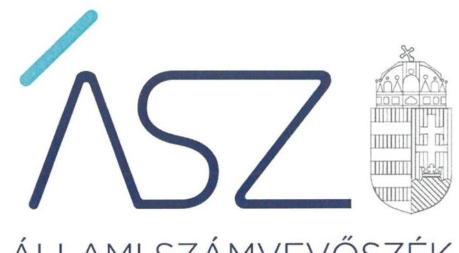
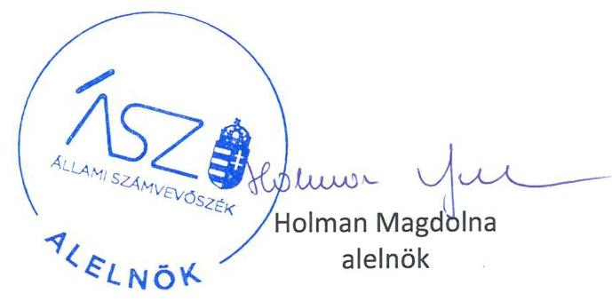

ÁLLAMI SZÁMVEVŐSZÉK

# JELENTÉS 

Pártok gazdálkodása

A költségvetési támogatásban részesülő pártok 2019-2020. évi gazdálkodása törvényességének ellenőrzése a Lehet Más a Politikánál
2021.

21119
www.asz.hu

---

ÁLLAMI SZÁMVEVŐSZÉK

# JELENTÉS 

## Pártok gazdálkodása

A költségvetési támogatásban részesülő pártok 2019-2020. évi gazdálkodása törvényességének ellenőrzése a Lehet Más a Politikánál
2021. 12. hó 28. nap

21119
www.asz.hu

---

# AZ ELLENŐRZÉST FELÜGYELTE: 

DR. NAGY IMRE felügyeleti vezető

## AZ ELLENŐRZÉST VEZETTE ÉS A VÉGREHAJTÁSÁÉRT FELELŐS:

DR. SIMON JÓZSEF ellenőrzésvezető

VARGA EDIT ellenőrzésvezető

## A PROGRAM ÖSSZEÁLLÍTÁSÁÉRT FELELŐS:

DR. KÁDÁR KRISZTA az ellenőrzési program készítéséért felelős vezető

## IKTATÓSZÁM: EL-3478-001/2021

Jelentéseink az Országgyúlés számítógépes hálózatán és az interneten a www.asz.hu címen is olvashatóak.

TÉMASZÁM: 2580

ELLENŐRZÉS-AZONOSÍTÓ SZÁM: V092303

---

# TARTALOMJEGYZÉK 

■ ÖSSZEGZÉS ..... 5
■ AZ ELLENŐRZÉS CÉLJA ..... 7
■ AZ ELLENŐRZÉS TERÜLETE ..... 8
■ AZ ELLENŐRZÉS HÁTTERE, INDOKOLTSÁGA ..... 9
■ A JELENTÉS LÉNYEGES KÉRDÉSKÖREI ..... 10
■ AZ ELLENŐRZÉS HATÓKÖRE ÉS MÓDSZEREI ..... 11
■ MEGÁLLAPÍTÁSOK ..... 13
■ JAVASLATOK ..... 15
■ MELLÉKLETEK ..... 17
I. sz. melléklet: Értelmező szótár ..... 17
■ FÜGGELÉK: ÉSZREVÉTELEK ..... 19
■ RÖVIDÍTÉSEK JEGYZÉKE ..... 21

---

.

---

# ÖSSZEGZÉS 

A Lehet Más a Politika (LMP - Magyarország Zöld Pártja) a 2019-2020. években a törvényes gazdálkodás alapvető feltételeit nem biztositotta. A 2019-2020. évi könyvvezetése és gazdálkodása során a jogszabályi előírásokat nem tartotta be, emiatt a pénzügyi kimutatásai nem voltak megalapozottak. A Lehet Más a Politika (LMP - Magyarország Zöld Pártja) gazdálkodása során 2019-ben és 2020-ban nem tett eleget az Alaptörvényben és a Párttörvényben előírt alapvető követelményeknek, gazdálkodása nem volt átlátható.

## Az ellenőrzés társadalmi indokoltsága

A pártok múködése a társadalomban meglévő érdekek és értékek demokratikus megjelenítésének és érvényesítésének alapfeltétele.

A pártok múködéséről és gazdálkodásáról szóló törvény (Párttörvény) állapítja meg a pártok gazdálkodására vonatkozó szabályokat. A törvény szerint azok a pártok, mint sajátos egyesületek nyújthatnak szervezeti kereteket a népakarat kialakításához és kinyilvánításához, a politikai életben való állampolgári részvételhez, amelyek kinyilvánítják, hogy a törvény rendelkezéseit magukra nézve kötelezőnek ismerik el.

A Párttörvény egyben a politikai élet tisztasága érdekében biztosítja a pártok részére azt a jogosultságot, hogy az állami költségvetésből támogatásban részesüljenek. Magyarország Alaptörvénye szerint a központi költségvetésből csak olyan szervezet részére nyújtható támogatás, amelynek a támogatás felhasználására irányuló tevékenysége átlátható. Ezáltal a pártok múködésének és költségvetési támogatásának alapja, hogy gazdálkodásuk törvényes és átlátható legyen.

A pártoknak évente be kell számolniuk a törvényi keretek szerinti gazdálkodásukról. Törvényi előírás alapján az Állami Számvevőszék a költségvetési támogatásban részesült pártok gazdálkodását kétévente ellenőrzi. A pártok pénzügyi beszámolása alapján az ellenőrzés visszajelzést ad arról, hogy a pártok eleget tettek-e az Alaptörvényben és a Párttörvényben a pártként való múködéshez előírt alapvető követelményeknek, gazdálkodásuk törvényes és átlátható volt-e.

## Összegző értékelés, javaslatok

A Lehet Más a Politika (LMP - Magyarország Zöld Pártja) a törvényes gazdálkodás kereteit nem alakította ki. A párt számviteli szabályozása nem biztosította a szabályszerű könyvvezetés és a megalapozott pénzügyi kimutatás elkészítésének feltételeit. A Lehet Más a Politika (LMP - Magyarország Zöld Pártja) ellenőrzési rendszere nem biztosította a pénzkezelés ellenőrzését. A párt nem készített törvény szerinti leltárt, ezáltal a pénzügyi kimutatás alapjául szolgáló könyvvezetési adatok megbízhatóságáról a könyvek üzleti év végi zárásakor nem győződött meg.

A Lehet Más a Politika (LMP - Magyarország Zöld Pártja) könyvvezetése nem volt törvényes, mivel a számviteli nyilvántartásaiba bizonylat nélkül, vagy nem a törvényi előírások szerinti bizonylatok alapján jegyzett be adatokat, így a könyvvezetés adatainak valódiságát a bizonylatok nem támasztották alá. Ezért a pénzügyi kimutatásaiban szereplő adatokat megbízható könyvvezetéssel nem támasztotta alá. Mindezek alapján a 2019. és 2020. évi pénzügyi kimutatások nem biztosították a Lehet Más a Politika (LMP - Magyarország Zöld Pártja) gazdálkodásának átláthatóságát.

Az Állami Számvevőszék a megállapítások alapján a Lehet Más a Politika (LMP - Magyarország Zöld Pártja) társelnökeinek tíz javaslatot fogalmazott meg.

---

# Következtetések 

Az Állami Számvevőszék a Lehet Más a Politika (LMP - Magyarország Zöld Pártja) gazdálkodását korábban több alkalommal ellenőrizte. A 2019-2020. évekre vonatkozó jelen ellenőrzés visszatérő hiányosságként azonosította, hogy a Lehet Más a Politika (LMP - Magyarország Zöld Pártja) számviteli szabályozása, ellenőrzési rendszerének müködtetése, könyvvezetésének törvényessége, pénzügyi kimutatásainak megalapozottsága nem felel meg a jogszabályi előírásoknak. Ezáltal a Lehet Más a Politika (LMP - Magyarország Zöld Pártja) nem biztosította a közpénzek felhasználásának elszámoltathatóságát a tagság és az állampolgárok felé.

A párt gazdálkodásában azonosított visszatérő szabálytalanságok arra mutatnak rá, hogy a Lehet Más a Politika (LMP - Magyarország Zöld Pártja) nem gondoskodott a korábbi ellenőrzések során feltárt hiányosságok megszüntetéséről, a párt törvényes és átlátható gazdálkodásának biztosításáról, annak ellenére, hogy ezt a párt az ellenőrzési megállapításokra készített intézkedési terveiben vállalta.

A gazdálkodás törvényessége és átláthatósága területén feltárt lényeges és visszatérő törvénysértések alapján felvetődhet a kérdés: eleget tesz-e a pártként való müködéshez előírt alapvető követelményeknek a Lehet Más a Politika (LMP - Magyarország Zöld Pártja)?

---

# AZ ELLENŐRZÉS CÉLJA 

AZ ELLENŐRZÉS CÉLJA, hogy az ÁSZ ${ }^{1}$ - mint az Országgyűlés legfőbb ellenőrző szerve - független és szakmailag megalapozott véleményt adjon a pártok, mint ellenőrzött szervezetek gazdálkodásának törvényességéről. Annak értékelése, hogy a közzétett pénzügyi kimutatások a törvényi előírásoknak megfeleltek-e, a könyvvezetés és gazdálkodás során betartották-e a vonatkozó jogszabályi és belső előírásokat; a párt a múködéséhez szabályszerűen igénybe vehető forrásokat használt-e fel. Az ellenőrzés célja a kockázatjelzés alapján lényegesre kijelölt ügyek szabályosságának értékelése.

---

# AZ ELLENŐRZÉS TERÜLETE 

## Lehet Más a Politika (LMP - Magyarország Zöld Pártja)

A Lehet Más a Politika ${ }^{2}$ 2009. április 1-jén létrejött olyan egyesület, amely nyilvántartott tagsággal rendelkezik, és a nyilvántartásba vételét végző bíróság előtt kinyilvánította, hogy a Párttörvény ${ }^{3}$ rendelkezéseit magára nézve kötelezőnek ismeri el a Párttörvény 1. §-a alapján.

A Lehet Más a Politika legfőbb döntéshozó szerve a Kongresszus ${ }^{4}$ volt. A Lehet Más a Politika legfőbb szervei az Országos Politikai Tanács ${ }^{5}$ és az Országos Elnökség ${ }^{6}$ voltak. A Lehet Más a Politika képviseletét az Országos Elnökség, illetve annak tagjai közül: a két társelnök, a pártigazgató, valamint az Országos Elnökség titkára látta el az Alapszabály ${ }_{1-3}{ }^{7}$ által meghatározott feladatkörökben.

A Lehet Más a Politika által készített és a Magyar Közlöny mellékletét képező, Hivatalos Értesítő 2020. évi 30. számában, illetve a 2021. évi 27. számában közzétett pénzügyi kimutatásokban a bevételek között a 2019. évben 217,9 M Ft, a 2020. évben 109,0 M Ft központi költségvetési támogatást mutatott ki. A Lehet Más a Politika a 2019. évi pénzügyi kimutatásában 243,0 M Ft bevételt, valamint 236,3 M Ft kiadást, a 2020. évi pénzügyi kimutatásában 171,9 M Ft bevételt, valamint 142,6 M Ft kiadást számolt el.

A Lehet Más a Politika gazdasági társaságot nem alapított az ellenőrzött időszakban. A Lehet Más a Politika a 2010. évben hozta létre az Ökopolisz Alapítványt, a 2013. évben a Lehetmás Kft.-t.

---

# AZ ELLENŐRZÉS HÁTTERE, INDOKOLTSÁGA 

Az Állami Számvevőszékről szóló 2011. évi LXVI. törvény 5. § (11) bekezdés a) pontja, valamint a pártok működéséről és gazdálkodásáról szóló 1989. évi XXXIII. törvény 10. § (1) bekezdése alapján a pártok gazdálkodása törvényességének ellenőrzésére az ÁSZ jogosult. Törvényi előírás alapján az ÁSZ kétévente ellenőrzi azoknak a pártoknak a gazdálkodását, amelyek rendszeres költségvetési támogatásban részesültek.

A gazdálkodás szabályszerűségének, a felhasznált közpénzek nagyságának bemutatásával a társadalom objektív képet alkothat a pártok működéséről. Az ellenőrzés megállapításai a gazdálkodás megfelelőségének bemutatásával elősegíthetik, hogy a törvényalkotók konkrét lépéseket tegyenek a pártok finanszírozására vonatkozó szabályozások megváltoztatása, átláthatóbbá, ellenőrizhetőbbé tétele irányába. Az ellenőrzés rámutat a pártok gazdálkodásával kapcsolatos jó gyakorlatokra és szabálytalanságokra. A hiányosságok, szabálytalanságok feltárása, az ennek kapcsán megfogalmazott megállapítások hozzájárulnak a törvényi rendelkezések betartásához.

---

# A JELENTÉS LÉNYEGES KÉRDÉSKÖREI 

1.     - A Lehet Más a Politika gazdálkodásának törvényessége biztosított volt-e?
2.     - A Lehet Más a Politika pénzügyi kimutatása megfelelt-e a jogszabályi előírásoknak, közzétételi kötelezettségét szabályszerűen teljesítette-e?
3.     - A Lehet Más a Politika könyvvezetése és gazdálkodása során a vonatkozó jogszabályi rendelkezéseket és belső előírásokat be-tartotta-e?

---

# AZ ELLENŐRZÉS HATÓKÖRE ÉS MÓDSZEREI 

## Az ellenőrzés típusa

Szabályszerúségi ellenőrzés

## Az ellenőrzött időszak

2019-2020. évek

## Az ellenőrzés tárgya

A párt ellenőrzése során az ellenőrzés tárgyát képezik a 2019. és a 2020. évre vonatkozó pénzügyi kimutatás elkészítésére, jóváhagyására, közzétételére, a párt könyvvezetésére, gazdálkodására, ennek keretében a számviteli szabályozás kialakítására, a bizonylati rend, bizonylati fegyelem betartására, egyéb gazdálkodási, ellenőrzési és pénzügyi-számviteli informatikai feladatok ellátására irányuló tevékenységek. Az ellenőrzés tárgya még a Párttörvény szerinti források elszámolása és felhasználása, valamint a vagyon jogszabályi előírásoknak megfelelő hasznosítása.

Az ellenőrzés kiterjed minden olyan körülményre és adatra, amely az ÁSZ jogszabályban meghatározott feladatainak teljesítéséhez, valamint a program végrehajtása folyamán felmerült újabb összefüggések feltárásához szükséges.

## Az ellenőrzött szervezet

Lehet Más a Politika (LMP - Magyarország Zöld Pártja)

## Az ellenőrzés jogalapja

Az ellenőrzés jogalapját az ÁSZ tv. 5. § (11) bekezdés a) pontja, a Párttörvény 4. § (4)-(5) bekezdései, valamint 10. § (1), (3)-(4) bekezdései képezik.

## Az ellenőrzés módszerei

Az ellenőrzést az ellenőrzési program szempontjai, az ellenőrzött időszakban hatályos jogszabályok, az ellenőrzés általános szakmai szabályai, az ellenőrzésre irányadó ÁSZ módszertanok figyelembevételével végzi az ÁSZ.

---

A gazdálkodás hibáinak kijavítására irányuló javaslatok kidolgozásakor a hatályos jogszabályok az irányadóak.

A törvényi előírásokat, valamint az ÁSZ által meghirdetett, nyilvános módszertant figyelembe véve az ellenőrzés hatóköre kiegészülhet kockázatjelzések alapján, a kockázatértékelés függvényében további lényeges ügyek szabályosságának ellenőrzésével az ellenőrzés megkezdésének időpontjáig. Jelen ellenőrzéshez kapcsolódóan nem került sor kockázatjelzésre, így további ügyek ellenőrzésére sem.

Az ellenőrzés ideje alatt az ellenőrzött párttal történő kapcsolattartást az ÁSZ SZMSZ-ének vonatkozó előírásai alapján biztosítja.

Az ellenőrzési bizonyítékként felhasználható adatforrások közé tartoznak egyrészt az ellenőrzési program részletes szempontjainál felsorolt adatforrások, másrészt minden egyéb az ellenőrzés folyamán feltárt, az ellenőrzés szempontjából információt tartalmazó dokumentum.

Az ellenőrzést az ellenőrzött szervezet által rendelkezésre bocsátott dokumentumokra, adatokra kell alapozni. A rendelkezésre bocsátott adatok, információk kontrollja az ellenőrzés keretében történik. Az ellenőrzés céljának eléréséhez szükséges bizonyítékokat a számvevő az egyes adatok közvetlen, részletes elemzésével szerzi meg, a következő ellenőrzési eljárások alkalmazásával: megfigyelés, szemrevételezés, információkérés, megerősítés, valamint elemző eljárás.

Az ÁSZ a tételes ellenőrzés mellett statisztikai alapú mintavételezést és értékelést alkalmaz. A minták kiválasztása rétegzett mintavételezéssel történik. A hozzájárulások, adományok és egyéb bevételek, valamint a személyi juttatások (működési kiadáson belül), eszközbeszerzések és a működési kiadások további tételei, politikai tevékenység kiadásai, egyéb kiadások mintatételeinek értékelése „szabályszerű", ha a minta ellenőrzésének eredménye alapján 95\%-os bizonyossággal a teljes sokaságban az átlagos hibaarány nem haladja meg a 10\%-ot, „nem szabályszerű", ha nagyobb, mint 10\%. Abban az esetben, ha a teljes sokaság tekintetében a 10\%-os hibaarányhoz való viszony megítélésének megbízhatósága nem éri el a 95\%-ot, annak elérése érdekében az értékelés további szempontokkal egészül ki, a feltárt hibák értéke is figyelembevételre kerül.

---

# 1. A Lehet Más a Politika gazdálkodásának törvényessége biztosított volt-e? 

Összegző megállapítás

A Lehet Más a Politika gazdálkodásának törvényessége a 2019. és a 2020. években nem volt biztosított.

A Párt ${ }^{8}$ az ellenőrzött időszakban rendelkezett a Számv. tv. ${ }^{9}$ által előírt számviteli szabályzatokkal. Ennek keretében rendelkezett Számviteli politiká $1-2^{10}$-val, Értékelési szabályzat ${ }^{11}$-tal, Leltározási szabályzat ${ }^{12}$-tal, Pénzkezelési szabályzat ${ }^{13}$-tal, valamint Számlarend ${ }_{1-2}{ }^{14}$-del.

Az Alapszabály ${ }_{1-3}$ a Ptk. ${ }^{15}$ előírásai szerint tartalmazta a gazdálkodással kapcsolatos folyamatokat, a kapcsolódó feladat- és hatásköröket, felelősségi viszonyokat.

A Párt a Számviteli politikában a Számv. tv. 14. § (4) bekezdésében előírt rendelkezés ellenére írásban nem rögzítette azokat a gazdálkodóra jellemző szabályokat, előírásokat, módszereket, amelyekkel meghatározza, hogy mit tekint a Párt a számviteli elszámolás, az értékelés szempontjából lényegesnek, nem lényegesnek, jelentősnek, nem jelentősnek.

A Számlarend ${ }_{1-2}$ nem tartalmazta Számv. tv. 161. § (2) bekezdés d) pontjában szereplő előírás ellenére a számlarendben foglaltakat alátámasztó bizonylati rendet, valamint a Számv. tv. 161. § (2) bekezdés a) pontjában előírtak ellenére minden alkalmazásra kijelölt számla számjelét és megnevezését.

A Számv. tv. 69. § (1) bekezdésében és a Leltározási szabályzat 2. § (1) bekezdésében foglaltak ellenére a Párt nem állított össze leltárt, amely tételesen, ellenőrizhető módon tartalmazta volna a mérleg fordulónapján meglévő valamennyi eszközét és forrását mennyiségben és értékben. A Párt a mérlegben értékkel nem szereplő eszközök esetében a Számv. tv. 69. § (3) bekezdésében szereplő előírás ellenére 5 évente történő mennyiségi leltározási kötelezettséget írt elő.

A Párt ellenőrzési rendszerét nem szabályszerűen működtette, mivel
$\longrightarrow$ a Számv. tv. 14. § (8) bekezdés előírásainak megfelelően a Pénzkezelési szabályzat tartalmazta a készpénzállomány ellenőrzésekor követendő eljárásokat és az ellenőrzés gyakoriságát, azonban a Pénzkezelési szabályzatban meghatározott szúrópróbaszerű pénztárellenőrzések elvégzését a Párt nem igazolta.
$\longrightarrow$ a Ptk. 3:26. § (4) bekezdésében és a Ptk. afr. ${ }^{16}$ 11. § (1) bekezdésében szereplő rendelkezés ellenére a Párt az első Felügyelőbizottság tagjait az Alapszabály ${ }_{1-3}$-ban nem jelölte ki.

---

# 2. A Lehet Más a Politika pénzügyi kimutatása megfelelt-e a jogszabályi előírásoknak, közzétételi kötelezettségét szabályszerűen teljesítette-e? 

## Összegző megállapítás

A Lehet Más a Politika 2019. és a 2020. évi pénzügyi kimutatása nem felelt meg a jogszabályi előírásoknak.

A Párt a 2019. évi, illetve a 2020. évi pénzügyi kimutatást a Párttörvény előírása szerinti határidőn belül, a tárgyévet követő év május 31-ig a Hivatalos Értesítőben és a saját honlapján közzétette.

A Párt a 2019. és 2020. évi pénzügyi kimutatásának adatait a Számv. tv. 4. § (1) bekezdésének előírása ellenére szabályszerű könyvvezetéssel nem támasztotta alá, mivel a 3. pontban részletezettek szerint a gazdálkodása során az egyéb hozzájárulásokat, adományokat, az egyéb bevételeket, a személyi jellegú kifizetéseket, az eszközbeszerzéseket, illetve az egyéb kiadásokat nem szabályszerűen számolta el. Ezáltal a könyvvezetése nem támasztotta alá a Párttörvény 1. számú mellékletében meghatározott pénzügyi kimutatásban rögzített adatokat.

## 3. A Lehet Más a Politika könyvvezetése és gazdálkodása során a vonatkozó jogszabályi rendelkezéseket és belső előírásokat be-tartotta-e?

## Összegző megállapítás

A Lehet Más a Politika könyvvezetése és gazdálkodása a 2019. és a 2020. évben nem volt szabályszerű.

A Párt a 2019. és 2020. évben a könyvvezetési kötelezettségét nem szabályszerűen teljesítette, mivel
az egyéb hozzájárulások, adományok és egyéb bevételek esetén a számviteli elszámolást közvetlenül alátámasztó bizonylatok a 2019. és a 2020. évben a Számv. tv. 167. § (1) bekezdés c) pontjában foglaltak ellenére nem tartalmazták az utalványozó személy aláírását, valamint a pénzeszközöket érintő gazdasági múveletek bizonylatainak adatait a Számv. tv. 165. § (3) bekezdés a) pontjában előírt határidőn belül nem rögzítette a főkönyvi nyilvántartásában;
a személyi jellegú kifizetésekhez, az eszközbeszerzésekhez, illetve az egyéb kiadásokhoz kapcsolódó bizonylatok a 2019. és a 2020. évben a Számv. tv. 167. § (1) bekezdés c) pontjában foglalt előírások ellenére nem tartalmazták az utalványozó és a rendelkezés végrehajtását igazoló személy aláírását;
a személyi kifizetések esetén a Párt a megbízási díjak és a tiszteletdíjak elszámolását a 2019. és a 2020. évben a Számv. tv. 165. § (1) bekezdésében foglalt előírások ellenére bizonylattal nem támasztotta alá;
az eszközbeszerzések esetén a Párt a 2019. és a 2020. évben a Számv. tv. 52. § (2) bekezdésben szereplő előírás ellenére az üzembe helyezést hitelt érdemlő módon nem dokumentálta.

---

# JAVASLATOK 

Az ÁSZ tv. 33. § (1) bekezdésében foglaltak értelmében az ellenőrzött szervezet vezetője köteles a jelentésben foglalt megállapításokhoz kapcsolódó intézkedési tervet összeállítani és azt a jelentés kézhezvételétől számított 30 napon belül az ÁSZ részére megküldeni. Amennyiben az ellenőrzött szervezet vezetője nem küldi meg határidőben az intézkedési tervet, vagy továbbra sem elfogadható intézkedési tervet küld, az Állami Számvevőszék elnöke az ÁSZ tv. 33. § (3) bekezdése a) és b) pontjaiban foglaltakat érvényesítheti.

## Lehet Más a Politika (LMP - Magyarország Zöld Pártja) társelnökei részére

1. Intézkedjen, hogy a számviteli politika megfeleljen a jogszabályi előírásoknak.
(1. sz. megállapítás 3. bekezdése alapján)
2. Intézkedjen, hogy a Számlarend tartalmazza a számlarendben foglaltakat alátámasztó bizonylati rendet, továbbá minden alkalmazásra kijelölt számla számjelét és megnevezését a jogszabályi előírás szerint.
(1. sz. megállapítás 4. bekezdése alapján)
3. Intézkedjen a jövőben olyan leltár összeállításáról, amely tételesen, ellenőrizhető módon tartalmazza a mérleg fordulónapján meglévő valamennyi eszközét és forrását mennyiségben és értékben jogszabályi előírás szerint.
(1. sz. megállapítás 5. bekezdése alapján)
4. Gondoskodjon a jövőben a pénzkezelési szabályzatban meghatározott pénztárellenőrzések elvégzéséről.
(1. sz. megállapítás 6. bekezdés 1. francia bekezdése alapján)
5. Intézkedjen a felügyelő bizottság tagjainak Alapszabályban történő rögzítéséről a jogszabályi előírás szerint.
(1. sz. megállapítás 6. bekezdés 2. francia bekezdése alapján)

---

6. Gondoskodjon, hogy a jövőben a számviteli elszámolást közvetlenül alátámasztó bizonylatok tartalmazzák az utalványozó személy aláirását jogszabályi előirás szerint.
(3. sz. megállapítás 1. bekezdés 1. francia bekezdése alapján)
7. Gondoskodjon, hogy a jövőben a pénzeszközöket érintő gazdasági múveletek bizonylatainak adatait törvényben elöirt határidőn belül rögzítse a fökönyvi nyilvántartásában jogszabályi előirás szerint.
(3. sz. megállapítás 1. bekezdés 1. francia bekezdése alapján)
8. Gondoskodjon, hogy a jövőben a személyi jellegü kifizetésekhez, illetve az egyéb kiadásokhoz kapcsolódó bizonylatok tartalmazzák az utalványozó és a rendelkezés végrehajtását igazoló személy aláirását jogszabályi előirás szerint.
(3. sz. megállapítás 1. bekezdés 2. francia bekezdése alapján)
9. Gondoskodjon, hogy a jövőben a személyi kifizetések esetén a megbizási dijak és a tiszteletdijak elszámolását bizonylattal támassza alá jogszabályi előirás szerint.
(3. sz. megállapítás 1. bekezdés 3. francia bekezdése alapján)
10. Gondoskodjon a jövőben az eszközbeszerzések esetén az üzembe helyezés hitelt érdemlő módon történő dokumentálásáról jogszabályi előirás szerint.
(3. sz. megállapítás 1. bekezdés 4. francia bekezdése alapján)

---

# MELLÉKLETEK 

- I. SZ. MELLÉKLET: ÉRTELMEZŐ SZÓTÁR
pénzügyi kimutatás
a párt gazdasági-vállalkozási tevékenysége
költségvetési támogatás
nem pénzbeli támogatás

A Párttörvény 9. § (1) bekezdésében meghatározott, a törvény 1. számú melléklete szerinti pénzügyi kimutatás (hatályos 2014. május 6-ától), amelyet a pártok kötelesek minden év május 31-ig a Magyar Közlönyben, valamint saját honlappal rendelkező pártok a honlapjukon is közzétenni.
A Párttörvény 6. § (1) bekezdésének megfelelően a párt a költségeinek fedezése és vagyonának gyarapítása érdekében a következő gazdasági-vállalkozási tevékenységeket folytathatja:
a) politikai céljainak és tevékenységének megismertetése érdekében kiadványokat jelentethet meg és terjeszthet, a pártot szimbolizáló jelvényeket és más ilyen célú tárgyakat árusíthat, és pártrendezvényeket szervezhet;
b) a tulajdonában álló ingatlanokat és ingókat díj ellenében hasznosíthatja és elidegenítheti.
Az államháztartás alrendszerei terhére nyújtott pénzbeli vagy nem pénzbeli juttatás, amelyet a támogató nem elsősorban ellenszolgáltatás ellenében, de konkrét program megvalósítása, vagy meghatározott időszakban a támogatott szervezet működtetése érdekében nyújt. (Civil tv. ${ }^{17}$ 2. § 15. pont)
Vagyoni értékkel rendelkező forgalomképes dolog, szellemi alkotás, illetve vagyoni értékű jog részben vagy egészében, véglegesen vagy ideiglenesen, teljesen vagy részben ingyenesen történő átruházása, vagy átengedése, illetve szolgáltatás biztosítása. (Civil tv. 2. § 25. pont)

---

.

---

# FÜGGELÉK: ÉSZREVÉTELEK 

A jelentéstervezetet a Számvevőszék 15 napos észrevételezésre megküldte az ellenőrzött szervezet vezetőjének az ÁSZ tv. 29. §* (1) bekezdése előírásának megfelelően.

A Lehet Más a Politika (LMP - Magyarország Zöld Pártja) társelnöke az ellenőrzés megállapításaira észrevételt tett. Az ÁSZ tv. 29. § (3) bekezdésével összhangban az ÁSZ a Függelékben feltünteti a jelentéstervezet megállapításaival kapcsolatban tett, figyelembe nem vett észrevételeket, és megindokolja, hogy azokat miért nem fogadta el.

[^0]
[^0]:    * 29. § (1) Az Állami Számvevőszék az ellenőrzési megállapításait megküldi az ellenőrzött szervezet vezetőjének vagy az általa megbízott személynek, és annak, akinek személyes felelősségét állapította meg.
    (2) Az ellenőrzött szervezet vezetője és a felelősként megjelölt személy az ellenőrzés megállapításaira tizenöt napon belül írásban észrevételt tehet.
    (3) Az Állami Számvevőszék az észrevételre a beérkezésétől számított harminc napon belül írásban válaszol. A figyelembe nem vett észrevételeket köteles a jelentésben feltüntetni, és megindokolni, hogy azokat miért nem fogadta el.

---

# 1. Az LMP - Magyarország Zöld Pártja társelnöke észrevételében az 1. számú, a gazdálkodás törvényességével kapcsolatos ellenőrzési megállapításokra tett észrevételeket. 

A Párt számviteli politikája megismétli a számvitelről szóló 2000. évi C. törvény (a továbbiakban: Számv. tv.) lényegesség elvére vonatkozó rendelkezését, ugyanakkor nem határozza meg, hogy mit tekint az értékelés szempontjából lényegesnek, nem lényegesnek. Emellett a Párt számviteli politikája kizárólag azt határozza meg, hogy mit tekint jelentős és nem jelentős összegű hibának, ugyanakkor nem szabályozza, hogy az értékelés szempontjából mit tekint a Párt jelentősnek és nem jelentősnek.

A Számv. tv. rendelkezése alapján a számlarendnek tartalmaznia kell a számlarendben foglaltakat alátámasztó bizonylati rendet. Az ÁSZ az adatbekérő levelében kérte a Párt számlarendjének rendelkezésre bocsátását. A Párt ellenőrzés során tett teljességi és hitelességi nyilatkozata szerint az ellenőrzés részére átadott dokumentumok, adatok a bekért adatokra, dokumentumokra vonatkozóan teljes körű információt tartalmaznak. A Párt teljességi és hitelességi nyilatkozata szerint az ellenőrzés rendelkezésére bocsátott dokumentumok alapján az ellenőrzés feltárta, hogy a Párt által az ellenőrzés rendelkezésére bocsátott számlarend nem tartalmazta a bizonylati rendet.

Az ellenőrzés a Párt által az ellenőrzés rendelkezésére bocsátott számlarend és főkönyvi kivonatok összevetése alapján feltárta, hogy a számlarend nem tartalmazta minden alkalmazásra kijelölt számla számjelét és megnevezését.

Az ellenőrzés rendelkezésére bocsátott dokumentumok nem igazolták a könyvviteli mérlegben kimutatott tárgyi eszközök, befektetett eszközök, pénzeszközök, követelések és kötelezettségek, valamint a saját tőke esetében a szabályos leltározás végrehajtását és a törvényi előírások szerinti leltár összeállítását.

A törvényi előírások és az ezekhez kapcsolódó belső szabályok betartásának igazolása a Párt felelőssége. Észrevételében a társelnök arról tájékoztatott, hogy az előírt szúrópróbaszerű pénztárellenőrzések elvégzését nem tudják igazolni.

Az első felügyelő bizottság tagjainak kijelöléséhez kapcsolódó megállapításra tett észrevételben az alapszabály tartalmának bírósági ellenőrzésével és a változás bejegyzés körülményeivel kapcsolatos felvetések a megállapítást nem érintik, a Polgári Törvénykönyvről szóló 2013. évi V. törvény szerint az első felügyelőbizottság tagjait kell a létesítő okiratban kijelölni.

Mindezek alapján az észrevételeket az Állami Számvevőszék nem vette figyelembe, az ellenőrzés megállapításainak módosítása nem volt indokolt.
2. Az LMP - Magyarország Zöld Pártja társelnöke észrevételében a 2. és 3. számú, a pénzügyi kimutatással, valamint a könyvvezetéssel és gazdálkodással kapcsolatos ellenőrzési megállapításokra tett észrevételeket.

A Számv. tv. előírása szerint a számviteli nyilvántartásokba csak bizonylat alapján szabad adatokat bejegyezni. A bizonylatnak szabályszerűnek kell lennie, ezen belül meg kell felelnie a könyvviteli elszámolást közvetlenül alátámasztó bizonylat általános alaki és tartalmi kellékeinek. Ezek közé tartozik, hogy a bizonylatnak tartalmaznia kell az utalványozó és a rendelkezés végrehajtását igazoló személy aláírását. A Számv. tv. hivatkozott rendelkezései minden bizonylatra alkalmazandóak. A bizonylatokra vonatkozó előírások betartása a törvény szerinti pénzügyi kimutatás alátámasztását biztosító szabályszerű könyvvezetés alapvető feltétele.

Az eszközök üzembe helyezéséhez kapcsolódóan a Párt ellenőrzés során tett teljességi és hitelességi nyilatkozata szerint az ellenőrzés részére átadott dokumentumok, adatok a bekért adatokra, dokumentumokra vonatkozóan teljes körű információt tartalmaznak. Az ÁSZ az ellenőrzési megállapításait a Párt teljességi és hitelességi nyilatkozata szerint az ellenőrzés rendelkezésére bocsátott dokumentumok alapján tette meg.

Mindezek alapján az észrevételeket az Állami Számvevőszék nem vette figyelembe, az ellenőrzés megállapításainak módosítása nem volt indokolt.

---

# RÖVIDÍTÉSEK JEGYZÉKE 

${ }^{1}$ ÁSZ
${ }^{2}$ Lehet Más a Politika
${ }^{3}$ Párttörvény
${ }^{4}$ Kongresszus
${ }^{5}$ Országos Politikai Tanács
${ }^{6}$ Országos Elnökség
${ }^{7}$ Alapszabálys

Alapszabálys
Alapszabálys
${ }^{8}$ Párt
${ }^{9}$ Számv. tv.
${ }^{10}$ Számviteli politika:

Számviteli politika:
${ }^{11}$ Értékelési szabályzat
${ }^{12}$ Leltározási és selejtezési szabályzat
${ }^{13}$ Pénzkezelési szabályzat:

Pénzkezelési szabályzat:
${ }^{14}$ Számlarend:
Számlarend:
${ }^{15}$ Ptk.
${ }^{16}$ Ptk. afr.
${ }^{17}$ Civil tv.

Állami Számvevőszék
Lehet Más a Politika (új neve 2020. november 19-től: LMP - Magyarország Zöld Pártja)
1989. évi XXXIII. törvény a pártok működéséről és gazdálkodásáról (hatályos 1989. október 30-ától)
A Lehet Más a Politika Kongresszusa
A Lehet Más a Politika Országos Politikai Tanácsa
A Lehet Más a Politika Országos Elnöksége
A Lehet Más a Politika Alapszabálya (hatályos: 2018. február 3-tól 2019. november 22-ig)
A Lehet Más a Politika Alapszabálya (hatályos: 2019. november 23-tól 2020. július 24-ig)
A Lehet Más a Politika Alapszabálya (hatályos: 2020. július 25-től)
Lehet Más a Politika (2020. november 19-től: LMP - Magyarország Zöld Pártja)
2000. évi C. törvény a számvitelről (hatályos 2001. január 1-jétől)

Lehet Más a Politika Számviteli politika (hatályos 2018. május 25-től 2020. június 25 -ig)
Lehet Más a Politika Számviteli politika (hatályos 2020. június 26-tól)
Lehet Más a Politika Eszközök és források értékelési szabályzata (hatályos 2018. május 25-től)
Lehet Más a Politika Eszközök és források Leltározási és selejtezési szabályzata (hatályos 2016. december 31-től)
Lehet Más a Politika Pénzkezelési szabályzata (hatályos 2016. december 31-től 2019. január 14-ig)

Lehet Más a Politika Pénzkezelési szabályzata (a 2019. január 15-i és 2020. május 8-i módosításokkal egységes szerkezetben, hatályos 2019. január 15-től)
Lehet Más a Politika Számlarend (hatályos 2018. május 25-től 2020. június 25-ig)
Lehet Más a Politika Számlarend (2020. június 26-tól)
A Polgári Törvénykönyvről szóló 2013. évi V. törvény (hatályos: 2014. március 15 -től)
2013. évi CLXXVII. törvény a Polgári Törvénykönyvről szóló 2013. évi V. törvény hatálybalépésével összefüggő átmeneti és felhatalmazó rendelkezésekről (hatályos 2014. március 15 -től)
2011. évi CLXXV. törvény az egyesülési jogról, a közhasznú jogállásról, valamint a civil szervezetek müködéséről és támogatásáról (hatályos 2011. december 22-től)

---

# ASZ 

ALLAMI SZAMVEVOSZEK
1052 Budapest, Apáczai Cs. J. u. 10. I 1364 Budapest 4. Pf. 54 TEL: +36 14849100
email: szamvevoszek@asz.hu
web: www.asz.hu | www.aszhirportal.hu