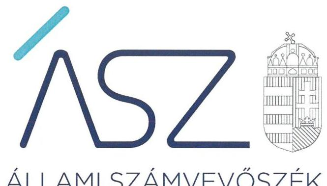

ÁLLAMI SZÁMVEVŐSZÉK

# JELENTÉS 

Pártok gazdálkodása

A költségvetési támogatásban részesülő pártok 2019-2020. évi gazdálkodása törvényességének ellenőrzése a Demokratikus Koalíciónál
2021.

21120
www.asz.hu

---

ÁLLAMI SZÁMVEVŐSZÉK

# JELENTÉS 

Pártok gazdálkodása

A költségvetési támogatásban részesülő pártok 2019-2020. évi gazdálkodása törvényességének ellenőrzése a Demokratikus Koalíciónál
2021. 12. hó 23. nap

21120
www.asz.hu

---

# AZ ELLENŐRZÉST FELÜGYELTE: 

DR. NAGY IMRE felügyeleti vezető

## AZ ELLENŐRZÉST VEZETTE ÉS A VÉGREHAJTÁSÁÉRT FELELŐS:

DR. SIMON JÓZSEF ellenőrzésvezető

VARGA EDIT ellenőrzésvezető

## A PROGRAM ÖSSZEÁLLÍTÁSÁÉRT FELELŐS:

DR. KÁDÁR KRISZTA az ellenőrzési program készítéséért felelős vezető

## IKTATÓSZÁM: EL-3477-001/2021

Jelentéseink az Országgyúlés számítógépes hálózatán és az interneten a www.asz.hu címen is olvashatóak.

TÉMASZÁM: 2580

ELLENŐRZÉS-AZONOSÍTÓ SZÁM: V092305

---

# TARTALOMJEGYZÉK 

■ ÖSSZEGZÉS ..... 5
■ AZ ELLENŐRZÉS CÉLJA ..... 7
■ AZ ELLENŐRZÉS TERÜLETE ..... 8
■ AZ ELLENŐRZÉS HÁTTERE, INDOKOLTSÁGA ..... 9
■ A JELENTÉS LÉNYEGES KÉRDÉSKÖREI ..... 10
■ AZ ELLENŐRZÉS HATÓKÖRE ÉS MÓDSZEREI ..... 11
■ MEGÁLLAPÍTÁSOK ..... 13
■ JAVASLATOK ..... 16
■ MELLÉKLETEK ..... 17
I. sz. melléklet: Értelmező szótár ..... 17
■ FÜGGELÉK: ÉSZREVÉTELEK ..... 19
■ RÖVIDÍTÉSEK JEGYZÉKE ..... 21

---

.

---

# ÖSSZEGZÉS 

A Demokratikus Koalíció a 2019-2020. években a törvényes gazdálkodás alapvető feltételeit nem biztositotta. A 2019-2020. évi könyvvezetése és gazdálkodása során a jogszabályi előírásokat nem tartotta be, emiatt a pénzügyi kimutatásai nem voltak megalapozottak. A Demokratikus Koalíció gazdálkodása során 2019-ben és 2020-ban nem tett eleget az Alaptörvényben és a Párttörvényben előírt alapvető követelményeknek, gazdálkodása nem volt átlátható.

## Az ellenőrzés társadalmi indokoltsága

A pártok múködése a társadalomban meglévő érdekek és értékek demokratikus megjelenítésének és érvényesítésének alapfeltétele.

A pártok múködéséről és gazdálkodásáról szóló törvény (Párttörvény) állapítja meg a pártok gazdálkodására vonatkozó szabályokat. A törvény szerint azok a pártok, mint sajátos egyesületek nyújthatnak szervezeti kereteket a népakarat kialakításához és kinyilvánításához, a politikai életben való állampolgári részvételhez, amelyek kinyilvánítják, hogy a törvény rendelkezéseit magukra nézve kötelezőnek ismerik el.

A Párttörvény egyben a politikai élet tisztasága érdekében biztosítja a pártok részére azt a jogosultságot, hogy az állami költségvetésből támogatásban részesüljenek. Magyarország Alaptörvénye szerint a központi költségvetésből csak olyan szervezet részére nyújtható támogatás, amelynek a támogatás felhasználására irányuló tevékenysége átlátható. Ezáltal a pártok múködésének és költségvetési támogatásának alapja, hogy gazdálkodásuk törvényes és átlátható legyen.

A pártoknak évente be kell számolniuk a törvényi keretek szerinti gazdálkodásukról. Törvényi előírás alapján az Állami Számvevőszék a költségvetési támogatásban részesült pártok gazdálkodását kétévente ellenőrzi. A pártok pénzügyi beszámolása alapján az ellenőrzés visszajelzést ad arról, hogy a pártok eleget tettek-e az Alaptörvényben és a Párttörvényben a pártként való múködéshez előírt alapvető követelményeknek, gazdálkodásuk törvényes és átlátható volt-e.

## Összegző értékelés, javaslatok

A Demokratikus Koalíció a törvényes gazdálkodás kereteit nem alakította ki. A párt ellenőrzési rendszere nem biztosította a pénzkezelés ellenőrzését és szabályosságát. A párt nem készített törvény szerinti leltárt, ezáltal a pénzügyi kimutatás alapjául szolgáló könyvvezetési adatok megbízhatóságáról a könyvek üzleti év végi zárásakor nem győződött meg.

A Demokratikus Koalíció könyvvezetése nem volt törvényes, mivel a számviteli nyilvántartásaiba nem a törvényi előírások szerinti bizonylatok alapján jegyzett be adatokat, ezért a könyvvezetés adatainak valódiságát a bizonylatok nem támasztották alá.

Emellett a Demokratikus Koalíció pénzügyi kimutatásaiban szereplő adatokat a könyvvezetés adatai nem támasztották alá. Mindezek alapján a 2019. és 2020. évi pénzügyi kimutatások nem biztosították a Demokratikus Koalíció gazdálkodásának átláthatóságát.

Az Állami Számvevőszék a megállapítások alapján a Demokratikus Koalíció elnökének hat javaslatot fogalmazott meg.

---

# Következtetések 

Az Állami Számvevőszék a Demokratikus Koalíció gazdálkodását korábban több alkalommal ellenőrizte. A 2019-2020. évekre vonatkozó jelen ellenőrzés visszatérő hiányosságként azonosította, hogy a Demokratikus Koalíció könyvvezetésének törvényessége, pénzügyi kimutatásainak megalapozottsága nem felel meg a jogszabályi elöírásoknak. Ezáltal a Demokratikus Koalíció nem biztosította a közpénzek felhasználásának elszámoltathatóságát a tagság és az állampolgárok felé.

A párt gazdálkodásában azonosított visszatérő szabálytalanságok arra mutatnak rá, hogy a Demokratikus Koalíció nem gondoskodott a korábbi ellenőrzések során feltárt hiányosságok megszüntetéséről, a párt törvényes és átlátható gazdálkodásának biztosításáról, annak ellenére, hogy ezt a párt az ellenőrzési megállapításokra készített intézkedési terveiben vállalta.

A gazdálkodás törvényessége és átláthatósága területén feltárt lényeges és visszatérő törvénysértések alapján felvetődhet a kérdés: eleget tesz-e a pártként való müködéshez előírt alapvető követelményeknek a Demokratikus Koalíció?

---

# AZ ELLENŐRZÉS CÉLJA 

AZ ELLENŐRZÉS CÉLJA, hogy az ÁSZ ${ }^{1}$ - mint az Országgyűlés legfőbb ellenőrző szerve - független és szakmailag megalapozott véleményt adjon a pártok, mint ellenőrzött szervezetek gazdálkodásának törvényességéről. Annak értékelése, hogy a közzétett pénzügyi kimutatások a törvényi előírásoknak megfeleltek-e, a könyvvezetés és gazdálkodás során betartották-e a vonatkozó jogszabályi és belső előírásokat; a párt a múködéséhez szabályszerűen igénybe vehető forrásokat használt-e fel. Az ellenőrzés célja a kockázatjelzés alapján lényegesre kijelölt ügyek szabályosságának értékelése.

---

# AZ ELLENŐRZÉS TERÜLETE 

## Demokratikus Koalíció

A Demokratikus Koalíció 2011. november 6-án létrejött olyan egyesület, amely nyilvántartott tagsággal rendelkezik és a nyilvántartásba vételét végző bíróság előtt kinyilvánította, hogy a Párttörvény ${ }^{2}$ rendelkezéseit magára nézve kötelezőnek ismeri el a Párttörvény 1. §-a előírása alapján.

Az Alapszabály ${ }_{1-2}{ }^{3}$ alapján a Demokratikus Koalíció legfőbb szerve a Kongresszus ${ }_{5}{ }^{4}$, a párt vezetésével kapcsolatos feladatokat az Elnökség ${ }_{4}{ }^{5}$ látja el. Az Elnökség mellett az Országos Tanács ${ }_{6}{ }^{6}$ tanácsadó, véleményező testületként múködik. A Felügyelő Bizottság ${ }^{7}$ feladata az alapszabály és a testületi határozatok végrehajtásának, betartásának ellenőrzése. A Demokratikus Koalíció jelenlegi elnöke a párt alakulása óta tölti be tisztségét.

A Demokratikus Koalíció által készített és a Magyar Közlöny mellékletét képező, Hivatalos Értesítő 2020. évi 30. számában, illetve a 2021. évi 27. számában közzétett pénzügyi kimutatások szerint a Demokratikus Koalíció a 2019. évben 206,7 M Ft, a 2020. évben 103,6 M Ft központi költségvetési támogatásban részesült. A Demokratikus Koalíció által közzétett 2019. évi pénzügyi kimutatásában 323,0 M Ft bevételt, valamint 342,0 M Ft kiadást számolt el. A 2020. évre vonatkozóan közzétett pénzügyi kimutatása szerint az összes bevétele 464,4 M Ft, a teljesített kiadások összege 158,2 M Ft volt.

A Demokratikus Koalíció gazdasági társaságot nem alapított az ellenőrzött időszakban. A Demokratikus Koalíció kizárólagos tulajdonosa a 2012. évben alapított DÉKÁ Rendezvény Kft.-nek, illetve a 2014. évben hozta létre az Új Köztársaságért Alapítványt.

---

# AZ ELLENŐRZÉS HÁTTERE, INDOKOLTSÁGA 

Az Állami Számvevőszékről szóló 2011. évi LXVI. törvény 5. § (11) bekezdés a) pontja, valamint a pártok múködéséről és gazdálkodásáról szóló 1989. évi XXXIII. törvény 10. § (1) bekezdése alapján a pártok gazdálkodása törvényességének ellenőrzésére az ÁSZ jogosult. Törvényi előírás alapján az ÁSZ kétévente ellenőrzi azoknak a pártoknak a gazdálkodását, amelyek rendszeres költségvetési támogatásban részesültek.

A gazdálkodás szabályszerűségének, a felhasznált közpénzek nagyságának bemutatásával a társadalom objektív képet alkothat a pártok múködéséről. Az ellenőrzés megállapításai a gazdálkodás megfelelőségének bemutatásával elősegíthetik, hogy a törvényalkotók konkrét lépéseket tegyenek a pártok finanszírozására vonatkozó szabályozások megváltoztatása, átláthatóbbá, ellenőrizhetőbbé tétele irányába. Az ellenőrzés rámutat a pártok gazdálkodásával kapcsolatos jó gyakorlatokra és szabálytalanságokra. A hiányosságok, szabálytalanságok feltárása, az ennek kapcsán megfogalmazott megállapítások hozzájárulnak a törvényi rendelkezések betartásához.

---

# A JELENTÉS LÉNYEGES KÉRDÉSKÖREI 

1.     - A Demokratikus Koalíció gazdálkodásának törvényessége biztositott volt-e?
2.     - A Demokratikus Koalíció pénzügyi kimutatása megfelelt-e a jogszabályi előírásoknak, közzétételi kötelezettségét szabályszerűen teljesítette-e?
3.     - A Demokratikus Koalíció könyvvezetése és gazdálkodása során a vonatkozó jogszabályi rendelkezéseket és belső előírásokat betartotta-e?

---

# AZ ELLENŐRZÉS HATÓKÖRE ÉS MÓDSZEREI 

## Az ellenőrzés típusa

Szabályszerúségi ellenőrzés

## Az ellenőrzött időszak

2019-2020. évek

## Az ellenőrzés tárgya

A párt ellenőrzése során az ellenőrzés tárgyát képezik a 2019. és a 2020. évre vonatkozó pénzügyi kimutatás elkészítésére, jóváhagyására, közzétételére, a párt könyvvezetésére, gazdálkodására, ennek keretében a számviteli szabályozás kialakítására, a bizonylati rend, bizonylati fegyelem betartására, egyéb gazdálkodási, ellenőrzési és pénzügyi-számviteli informatikai feladatok ellátására irányuló tevékenységek. Az ellenőrzés tárgya még a Párttörvény szerinti források elszámolása és felhasználása, valamint a vagyon jogszabályi előírásoknak megfelelő hasznosítása.

Az ellenőrzés kiterjed minden olyan körülményre és adatra, amely az ÁSZ jogszabályban meghatározott feladatainak teljesítéséhez, valamint a program végrehajtása folyamán felmerült újabb összefüggések feltárásához szükséges.

## Az ellenőrzött szervezet

Demokratikus Koalíció

## Az ellenőrzés jogalapja

Az ellenőrzés jogalapját az ÁSZ tv. 5. § (11) bekezdés a) pontja, a Párttörvény 4. § (4)-(5) bekezdései, valamint 10. § (1), (3)-(4) bekezdései képezik.

## Az ellenőrzés módszerei

Az ellenőrzést az ellenőrzési program szempontjai, az ellenőrzött időszakban hatályos jogszabályok, az ellenőrzés általános szakmai szabályai, az ellenőrzésre irányadó ÁSZ módszertanok figyelembevételével végzi az ÁSZ.

---

A gazdálkodás hibáinak kijavítására irányuló javaslatok kidolgozásakor a hatályos jogszabályok az irányadóak.

A törvényi előírásokat, valamint az ÁSZ által meghirdetett, nyilvános módszertant figyelembe véve az ellenőrzés hatóköre kiegészülhet kockázatjelzések alapján, a kockázatértékelés függvényében további lényeges ügyek szabályosságának ellenőrzésével az ellenőrzés megkezdésének időpontjáig. Jelen ellenőrzéshez kapcsolódóan nem került sor kockázatjelzésre, így további ügyek ellenőrzésére sem.

Az ellenőrzés ideje alatt az ellenőrzött párttal történő kapcsolattartást az ÁSZ SZMSZ-ének vonatkozó előírásai alapján biztosítja.

Az ellenőrzési bizonyítékként felhasználható adatforrások közé tartoznak egyrészt az ellenőrzési program részletes szempontjainál felsorolt adatforrások, másrészt minden egyéb az ellenőrzés folyamán feltárt, az ellenőrzés szempontjából információt tartalmazó dokumentum.

Az ellenőrzést az ellenőrzött szervezet által rendelkezésre bocsátott dokumentumokra, adatokra kell alapozni. A rendelkezésre bocsátott adatok, információk kontrollja az ellenőrzés keretében történik. Az ellenőrzés céljának eléréséhez szükséges bizonyítékokat a számvevő az egyes adatok közvetlen, részletes elemzésével szerzi meg, a következő ellenőrzési eljárások alkalmazásával: megfigyelés, szemrevételezés, információkérés, megerősítés, valamint elemző eljárás.

Az ÁSZ a tételes ellenőrzés mellett statisztikai alapú mintavételezést és értékelést alkalmaz. A minták kiválasztása rétegzett mintavételezéssel történik. A hozzájárulások, adományok és egyéb bevételek, valamint a személyi juttatások (működési kiadáson belül), eszközbeszerzések és a működési kiadások további tételei, politikai tevékenység kiadásai, egyéb kiadások mintatételeinek értékelése „szabályszerű", ha a minta ellenőrzésének eredménye alapján 95\%-os bizonyossággal a teljes sokaságban az átlagos hibaarány nem haladja meg a 10\%-ot, „nem szabályszerű", ha nagyobb, mint 10\%. Abban az esetben, ha a teljes sokaság tekintetében a 10\%-os hibaarányhoz való viszony megítélésének megbízhatósága nem éri el a 95\%-ot, annak elérése érdekében az értékelés további szempontokkal egészül ki, a feltárt hibák értéke is figyelembevételre kerül.

---

# 1. A Demokratikus Koalíció gazdálkodásának törvényessége biztosított volt-e? 

Összegző megállapítás

A Demokratikus Koalíció gazdálkodásának törvényessége a 2019-2020. években nem volt biztosított.

A Párt ${ }^{8}$ az ellenőrzött időszakban rendelkezett a Számv. tv. által előírt számviteli szabályzatokkal. Ennek keretében rendelkezett Számviteli politiká ${ }^{9}$-val, Értékelési szabályzat ${ }^{10}$-tal, Leltározási szabályzat ${ }^{11}$-tal, Pénzkezelési szabályzat ${ }^{12}$-tal, valamint Számlarend ${ }^{13}$-del.

Az Alapszabály ${ }_{1-2}$ a Ptk. ${ }^{14}$ előírása szerint tartalmazta a gazdálkodással kapcsolatos folyamatokat, a kapcsolódó feladat- és hatásköröket, felelősségi viszonyokat.

A Számv. tv. 69. § (1) bekezdésében és a Leltározási szabályzat 1. pontjában foglaltak ellenére a Párt nem állított össze leltárt, amely tételesen, ellenőrizhető módon tartalmazta volna a mérleg fordulónapján meglévő valamennyi eszközét és forrását mennyiségben és értékben.

A Párt ellenőrzési rendszerét nem szabályszerűen működtette, mivel

- A Párt a Számv. tv. 14. § (8) bekezdésében szereplő rendelkezés alapján a Pénzkezelési szabályzat 5.1. alpontjában határozta meg a napi készpénz záró állományának maximális értékét. E rendelkezés ellenére a 2019. év és a 2020. év december 31-én a napi készpénz záró állománya meghaladta az előírt maximális értéket.
- A Számv. tv. 14. § (8) bekezdés előírásainak megfelelően a Pénzkezelési szabályzat tartalmazta a készpénzállomány ellenőrzésekor követendő eljárásokat és az ellenőrzés gyakoriságát, azonban a Pénzkezelési szabályzatban meghatározott havi és szúrópróbaszerű pénztárellenőrzések elvégzését a Párt nem igazolta.

## 2. A Demokratikus Koalíció pénzügyi kimutatása megfelelt-e a jogszabályi előírásoknak, közzétételi kötelezettségét szabályszerűen teljesítette-e?

Összegző megállapítás

A Demokratikus Koalíció 2019. és 2020. évi pénzügyi kimutatása nem felelt meg a jogszabályi előírásoknak.

A Párt a 2019. évi, illetve a 2020. évi pénzügyi kimutatást a Párttörvény előírása szerinti határidőn belül, a tárgyévet követő év május 31-ig a Hivatalos Értesítőben közzétette.

A Párt a 2019. és 2020. évi pénzügyi kimutatásának adatait a Számv. tv. 4. § (1) bekezdésének előírása ellenére szabályszerű könyvvezetéssel nem támasztotta alá, mert a 3.1 pontban részletezettek szerint a gazdálkodása

---

során az egyéb hozzájárulásokat, adományokat és egyéb bevételeket nem szabályszerűen számolta el. Ezáltal a könyvvezetése a 2019. és a 2020. évben nem támasztotta alá a Párttörvény 1. számú mellékletében meghatározott pénzügyi kimutatásban rögzített adatokat.

A Számv. tv. 4. § (1) bekezdésében szereplő előírás ellenére a Párt 2019. és 2020. évi pénzügyi kimutatásában szerepeltetett egyéb bevételek és egyéb kiadások értékét a könyvvezetés nem támasztotta alá. A Párt a könyvvezetésében szereplő adatokhoz képest
$\longrightarrow$ a 2019. évi pénzügyi kimutatásában 1,3 M Ft egyéb bevételt, valamint 1,4 M Ft egyéb kiadást nem szerepeltetett,
$\longrightarrow$ illetve a 2020. évi pénzügyi kimutatásában 9,0 M Ft egyéb bevételt és 93,8 M Ft egyéb kiadást nem szerepeltetett.

# 3. A Demokratikus Koalíció könyvvezetése és gazdálkodása során a vonatkozó jogszabályi rendelkezéseket és belső előírásokat betartotta-e? 

Összegző megállapítás

A Demokratikus Koalíció könyvvezetése és gazdálkodása a 2019. és a 2020. évben nem volt szabályszerű, mivel a könyvvezetése nem felelt meg a jogszabályi előírásoknak az egyéb hozzájárulások, adományok és az egyéb bevételek esetén.
3.1. számú megállapítás

A Demokratikus Koalíció a 2019-2020. években az egyéb hozzájárulásokkal, adományokkal kapcsolatos elszámolási, nyilvántartási kötelezettségét nem szabályszerűen teljesítette.

A Párt a 2019. és 2020. évben a könyvvezetési kötelezettségét nem szabályszerűen teljesítette, mivel
—az egyéb hozzájárulások, adományok könyvviteli elszámolását közvetlenül alátámasztó bizonylatok a Számv. tv. 167. § (1) bekezdés c) pontjában foglaltak ellenére nem tartalmazták az utalványozó személy aláírását, illetve a Számv. tv. 167. § (1) bekezdés h) pontjában szereplő előírás ellenére nem tartalmazták az érintett könyvviteli számlákra történő hivatkozást;
az egyéb hozzájárulásokat, adományokat és egyéb bevételeket érintő gazdasági múveletek bizonylatain a Számv. tv. 167. § (1) bekezdés i) pontjában előírt rendelkezés ellenére nem szerepeltette a könyvviteli nyilvántartásokban történt rögzítés időpontját, ezáltal a Párt nem igazolta, hogy a pénzeszközöket érintő gazdasági műveletek bizonylatainak adatait a Számv. tv. 165. § (3) bekezdés a) pontjában meghatározott határidőn belül rögzítette a főkönyvi nyilvántartásában.

---

# 3.2. számú megállapítás 

A Demokratikus Koalíció a személyi jellegú kifizetések és a kapcsolódó járulékok, az eszközbeszerzések, valamint a múködési és egyéb kiadások elszámolása során a 2019. és a 2020. években a jogszabályi előírásokat betartotta.

A Párt a 2019. és a 2020. évi személyi jellegú kiadások elszámolása során a jogszabályi előírásokat betartotta. A kifizetések elszámolása a Számv. tv., a Munka tv. ${ }^{15}$, illetve az Szja tv. ${ }^{16}$ előírásai szerint történt.

Az eszközbeszerzések, valamint a múködési és egyéb kiadások elszámolása során a 2019. és a 2020. évben a Párt betartotta a Számv. tv. és a Párttörvény előírásait.

---

# JAVASLATOK 

Az ÁSZ tv. 33. § (1) bekezdésében foglaltak értelmében az ellenőrzött szervezet vezetője köteles a jelentésben foglalt megállapításokhoz kapcsolódó intézkedési tervet összeállítani és azt a jelentés kézhezvételétől számított 30 napon belül az ÁSZ részére megküldeni. Amennyiben az ellenőrzött szervezet vezetője nem küldi meg határidőben az intézkedési tervet, vagy továbbra sem elfogadható intézkedési tervet küld, az Állami Számvevőszék elnöke az ÁSZ tv. 33. § (3) bekezdése a) és b) pontjaiban foglaltakat érvényesítheti.

## Demokratikus Koalíció elnöke részére

1. Intézkedjen a jövőben olya leltár összeállításáról, amely tételesen, ellenőrizhető módon tartalmazta a mérleg fordulónapján meglévő valamennyi eszközét és forrását mennyiségben és értékben jogszabályi előirás szerint.
(1. sz. megállapítás 3. bekezdése alapján)
2. Gondoskodjon arról, hogy a napi készpénz záró állománya ne haladja meg az elöirt maximális értéket.
(1. sz. megállapítás 4. bekezdés 1. francia bekezdése alapján)
3. Gondoskodjon a jövőben a pénzkezelési szabályzatban meghatározott pénztárellenőrzések elvégzéséről.
(1. sz. megállapítás 4. bekezdés 2. francia bekezdése alapján)
4. Gondoskodjon a jövőben a pénzügyi kimutatás adatainak könyvvezetéssel történő alátámasztásáról jogszabályi előirás szerint.
(2. sz. megállapítás 2. és 3. bekezdése alapján)
5. Gondoskodjon, hogy a jövőben az egyéb hozzájárulások, adományok számviteli elszámolását közvetlenül alátámasztó bizonylatok tartalmazzák az utalványozó személy aláirását és az érintett könyvviteli számlákra történő hivatkozást jogszabályi előirás szerint.
(3.1 sz. megállapítás 1. bekezdés 1. francia bekezdése alapján)
6. Gondoskodjon, hogy a jövőben a pénzeszközöket érintő gazdasági múveletek bizonylatain szerepeltesse a könyvviteli nyilvántartásokban történt rögzités időpontját jogszabályi előirás szerint.
(3.1. sz. megállapítás 1. bekezdés 2. francia bekezdése alapján)

---

# MELLÉKLETEK 

- I. SZ. MELLÉKLET: ÉRTELMEZŐ SZÓTÁR
pénzügyi kimutatás
a párt gazdasági-vállalkozási tevékenysége
költségvetési támogatás
nem pénzbeli támogatás

A Párttörvény 9. § (1) bekezdésében meghatározott, a törvény 1. számú melléklete szerinti pénzügyi kimutatás (hatályos 2014. május 6-ától), amelyet a pártok kötelesek minden év május 31-ig a Magyar Közlönyben, valamint saját honlappal rendelkező pártok a honlapjukon is közzétenni.
A Párttörvény 6. § (1) bekezdésének megfelelően a párt a költségeinek fedezése és vagyonának gyarapítása érdekében a következő gazdasági-vállalkozási tevékenységeket folytathatja:
a) politikai céljainak és tevékenységének megismertetése érdekében kiadványokat jelentethet meg és terjeszthet, a pártot szimbolizáló jelvényeket és más ilyen célú tárgyakat árusíthat, és pártrendezvényeket szervezhet;
b) a tulajdonában álló ingatlanokat és ingókat díj ellenében hasznosíthatja és elidegenítheti.
Az államháztartás alrendszerei terhére nyújtott pénzbeli vagy nem pénzbeli juttatás, amelyet a támogató nem elsősorban ellenszolgáltatás ellenében, de konkrét program megvalósítása, vagy meghatározott időszakban a támogatott szervezet működtetése érdekében nyújt. (Civil tv. ${ }^{17}$ 2. § 15. pont)
Vagyoni értékkel rendelkező forgalomképes dolog, szellemi alkotás, illetve vagyoni értékű jog részben vagy egészében, véglegesen vagy ideiglenesen, teljesen vagy részben ingyenesen történő átruházása, vagy átengedése, illetve szolgáltatás biztosítása. (Civil tv. 2. § 25. pont)

---

.

---

# FÜGGELÉK: ÉSZREVÉTELEK 

A jelentéstervezetet a Számvevőszék 15 napos észrevételezésre megküldte az ellenőrzött szervezet vezetőjének az ÁSZ tv. 29. §* (1) bekezdése előírásának megfelelően.

A Demokratikus Koalíció az ellenőrzés megállapításaira észrevételt tett. Az ÁSZ tv. 29. § (3) bekezdésével összhangban az ÁSZ a Függelékben feltünteti a jelentéstervezet megállapításaival kapcsolatban tett, figyelembe nem vett észrevételeket, és megindokolja, hogy azokat miért nem fogadta el.

[^0]
[^0]:    * 29. § (1) Az Állami Számvevőszék az ellenőrzési megállapításait megküldi az ellenőrzött szervezet vezetőjének vagy az általa megbízott személynek, és annak, akinek személyes felelősségét állapította meg.
    (2) Az ellenőrzött szervezet vezetője és a felelősként megjelölt személy az ellenőrzés megállapításaira tizenöt napon belül írásban észrevételt tehet.
    (3) Az Állami Számvevőszék az észrevételre a beérkezésétől számított harminc napon belül írásban válaszol. A figyelembe nem vett észrevételeket köteles a jelentésben feltüntetni, és megindokolni, hogy azokat miért nem fogadta el.

---

# 1. A Demokratikus Koalíció pártigazgatója az 1. számú észrevételében a leltározással kapcsolatos ellenőrzési megállapításokra tett észrevételeket. 

A Számv. tv. rendelkezései alapján a könyvek üzleti év végi zárásához olyan leltárt kell összeállítani, amely tételesen, ellenőrizhető módon tartalmazza a Pártnak a mérleg fordulónapján meglévő eszközeit és forrásait mennyiségben és értékben.

Az észrevételben foglaltaktól eltérően a Párt 2019-ben nem állított össze olyan leltárt, amely az eszközöket mennyiségben tartalmazta volna. A 2019. évi leltárhoz kapcsolódóan az ellenőrzés rendelkezésére bocsátott dokumentumok a tárgyi eszközök tekintetében kizárólag érték adatokat rögzítettek, mennyiségi adatokat nem tartalmaztak.

Továbbá az észrevételben foglaltaktól eltérően 2020-ban nem került sor a tárgyi eszközök előírás szerinti mennyiségi felvétellel történő leltározására, mert az ehhez kapcsolódóan az ellenőrzés rendelkezésére bocsátott dokumentumok szerint a Párt nem győződött meg a tárgyi eszközök fellelhetőségéről. Emiatt a Párt 2020. évben nem állított össze olyan leltárt, amely ellenőrizhető módon tartalmazta volna a mérleg fordulónapján meglévő eszközeit.

Mindezek alapján az észrevételt az Állami Számvevőszék nem vette figyelembe, az ellenőrzés megállapításainak módosítása nem volt indokolt.

## 2. A Demokratikus Koalíció pártigazgatója a 2. számú észrevételében a készpénzállománnyal és a pénztárellenőrzéssel kapcsolatos ellenőrzési megállapításokra tett észrevételeket.

A pártigazgató tájékoztatása szerint a központi pénztárban a házipénztárban lévő záró pénzállomány valóban meghaladta az előírt maximális értéket.

Az ÁSZ az adatbekérő levelében kérte a Párttól a pénztárellenőrzésre vonatkozó megállapítást tartalmazó ellenőrzési jelentések dokumentumainak az ellenőrzés rendelkezésére bocsátását. A Párt ehhez kapcsolódóan kizárólag a 2019. és a 2020. évről szóló éves pénztárjelentéseket adta át, az előírt havi és szúrópróba pénztárellenőrzések elvégzését nem igazolta.

Mindezek alapján az észrevételt az Állami Számvevőszék nem vette figyelembe, az ellenőrzés megállapításainak módosítása nem volt indokolt.
3. A Demokratikus Koalíció pártigazgatója a 3. és 4. számú észrevételében a pénzügyi kimutatással, valamint a párt könyvvezetésével és gazdálkodásával kapcsolatos ellenőrzési megállapításokra tett észrevételeket.

A Párt által az ellenőrzés rendelkezésére bocsátott dokumentumok alapján az ellenőrzés feltárta, hogy a 2019. és 2020. évi pénzügyi kimutatások és a főkönyvi nyilvántartásában szereplő adatok az egyéb bevételek és az egyéb kiadások tekintetében nincsenek összhangban, ezáltal a Párt 2019. és 2020. évi pénzügyi kimutatásában szerepeltetett egyéb bevételek és egyéb kiadások értékét a könyvvezetés nem támasztotta alá. Az észrevételhez kapcsolódóan a Párt nem bocsátott olyan dokumentumot az ÁSZ rendelkezésére, amely a megállapítást cáfolná, és új körülményre sem hivatkozott ezzel összefüggésben.

A Számv. tv. meghatározza a könyvviteli elszámolást közvetlenül alátámasztó bizonylatok általános alaki és tartalmi kellékeit. Ezek közé tartozik, hogy a bizonylatnak tartalmaznia kell az utalványozó személy aláírását, az érintett könyvviteli számlákra történő hivatkozást és a könyvviteli nyilvántartásokban történt rögzítés időpontját. A bizonylatok tartalmára vonatkozó előírások betartása azért elengedhetetlen, mert a törvény előírása szerint a számviteli nyilvántartásokba csak szabályszerűen kiállított bizonylat alapján szabad adatokat bejegyezni. Ezért az észrevételnek a könyvvezetéshez használt elektronikus könyvelési rendszer adattartalmára történő hivatkozása a megállapítás szempontjából nem releváns.

Mindezek alapján az észrevételeket az Állami Számvevőszék nem vette figyelembe, az ellenőrzés megállapításainak módosítása nem volt indokolt.

---

# RÖVIDÍTÉSEK JEGYZÉKE 

${ }^{1}$ ÁSZ
${ }^{2}$ Párttörvény
${ }^{3}$ Alapszabály:

Alapszabály:
${ }^{4}$ Kongresszus
${ }^{5}$ Elnökség
${ }^{6}$ Országos Tanács
${ }^{7}$ Felügyelő Bizottság
${ }^{8}$ Párt
${ }^{9}$ Számviteli politika
${ }^{10}$ Értékelési szabályzat
${ }^{11}$ Leltározási szabályzat
${ }^{12}$ Pénzkezelési szabályzat
${ }^{13}$ Számlarend
${ }^{14}$ Ptk.
${ }^{15}$ Munka tv.
${ }^{16}$ Szja tv.
${ }^{17}$ Civil tv.

Állami Számvevőszék
1989. évi XXXIII. törvény a pártok működéséről és gazdálkodásáról (hatályos 1989. október 30-ától)
Demokratikus Koalíció Alapszabálya (hatályos 2017. március 4-től - 2020. március 15 -ig)
Demokratikus Koalíció Alapszabálya (hatályos 2020. március 16-tól)
Demokratikus Koalíció Kongresszusa
Demokratikus Koalíció Elnöksége
Demokratikus Koalíció Országos Tanácsa
Demokratikus Koalíció Felügyelő Bizottsága
Demokratikus Koalíció
Demokratikus Koalíció Számviteli politikája (hatályos 2018. március 1-jétől)
Demokratikus Koalíció Értékelési szabályzat (hatályos 2017. február 15-től)
Demokratikus Koalíció Leltárkezelési, leltározási és selejtezési szabályzata (hatályos 2017. február 15-től)
Demokratikus Koalíció Pénzkezelési szabályzata (hatályos 2017. január 1-jétől)
Demokratikus Koalíció Számlarendje (hatályos 2019. január 1-jétől)
A Polgári Törvénykönyvről szóló 2013. évi V. törvény (hatályos: 2014. március 15 -től)
2012. évi I. törvény a munka törvénykönyvéről (hatályos 2012. január 6-tól)
1995. évi CXVII. törvény a személyi jövedelemadóról (hatályos 1996. január 1-jétől)
2011. évi CLXXV. törvény az egyesülési jogról, a közhasznú jogállásról, valamint a civil szervezetek müködéséről és támogatásáról (hatályos 2011. december 22-től)

---

# ASZ 

ALLAMI SZAMVEVOSZEK
1052 Budapest, Apáczai Cs. J. u. 10. I 1364 Budapest 4. Pf. 54 TEL: +36 14849100
email: szamvevoszek@asz.hu
web: www.asz.hu | www.aszhirportal.hu