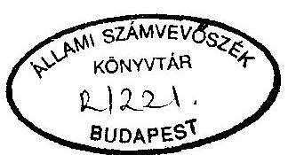
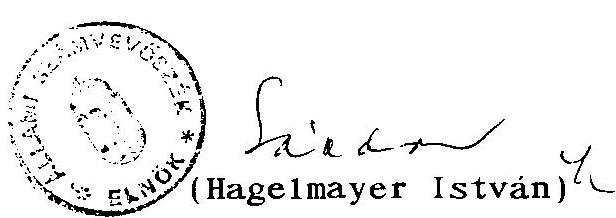
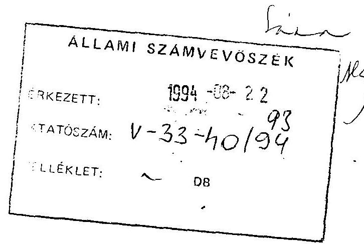
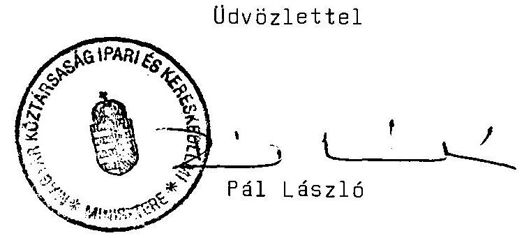
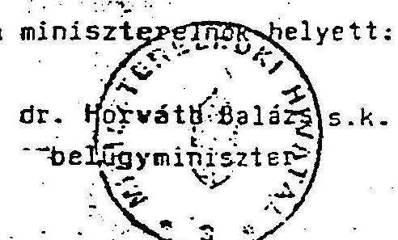
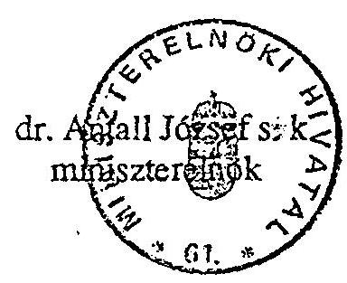

# JELENTÉS 

a szénbányászati szerkezetátalakítási program keretében megvalósult bányabezárásokra fordított költségvetési pénzeszközök felhasználásának ellenőrzéséről

---

A vizsgálatot vezette: Krucsai Balázs
osztályvezető főtanácsos

A vizsgálatot végezte: Istvánffy Lóránt számvevő tanácsos
Karsainé D. Éva számvevő
Kiss Istvánné számvevő tanácsos
Szöts Tibor
ok1.bányamérnők
küllső szakértő

---

# T A R T A L O M J E G Y Z É K 

I . BEVEZETÉS ..... 1
11. ÖSSZEFOGLALÓ MEGÁLLAPÍTÁSOK, KÖVETKEZTETÉSEK ÉS JAVASLATOK ..... 3
111. RÉSZLETES MEGÁLLAPÍTÁSOK ..... 7

1. A bezárásra ítélt bányák kiválasztásának müszaki-gazdasági megalapozottsága ..... 7
2. A bányabezárások müszaki munkái elvégzésének szabályszerűsége és eredményessége ..... 12
3. A létszámleépítés okozta szociális problémák megoldására tett humánpolitikai intézkedések törvényessége és eredményessége ..... 16
4. A bányavállalatok felszámolás alatt keletkező veszteségeinek finanszirozása ..... 19
5. A bányavállalatok vagyoni viszonyainak alakulása a felszámolási folyamat alatt ..... 20
6. A Szénbányászati Szerkezetátalakítási Központ tevékenységének értékelése ..... 22

---

# J E L E N T É S 

a szénbányászati szerkezetátalakítási program keretében megvalósult bányabezárásokra fordított költségvetési pénzeszközök felhasználásának ellenörzéséről

## I.

## B EVEZETÉS

A magyar szénbányászat müszaki-gazdasági kondíciói a 80-as évek közepétól erőteljesen romlottak, az évtized végére az ágazatban csődhelyzet alakult ki. Az 1989 évet a bányavállalatok 3,1 milliárd forint összegủ veszteséggel zárták, a zömében korábbi beruházásokból eredő adósságállományuk meghaladta a 35 milliárd forintot. A vállalati vagyon könyvszerinti értéke ezzel szemben összesen 46 Md Ft volt.

A Kormány 1990. augusztusában döntött (3329/1990. sz. határozatával) a szénbányászat szerkezet- és szervezet átalakítási programjáról (1. sz. melléklet). Az energiapolitikai koncepcióba illeszkedő program szerint a bányavállalatokat fel kell számolni, meg kell teremteni a gazdaságosan müködő szénbányászat közgazdasági és egyéb feltételeit, a gazdaságtalan bányákat pedig be kell zárni. A bányabezárások (beleértve a bányakárt és a tájrehabilitációt) és a felszámolási eljárás költségeinek vállalati

---

vagyonból nem fedezhető részét az állami költségvetés finanszírozza.

A szerkezetátalakítás központi irányítására, a bányavállalatok felszámolásának végrehajtására a Kormány létrehozta a Szénbányászati Szerkezetátalakítási Központot. (SZÉSZEK)

A vizsgálat célja annak megállapítása volt, hogy a bezárásra kijelölt bányák kiválasztása a kormányprogram követelményeivel és célkitüzéseivel összhangban történt e; a bányák bezárására fordított költségvetési pénzeszközök felhasználása mennyiben volt megalapozott, szabályos és eredményes.

A vizsgálat az 1991-93 években végrehajtott bányabezárásokkal és bezárásra ítélt bányák átmeneti müködési veszteségeinek finanszírozásával kapcsolatos, kereken 7 Md Ft összegű költségvetési kiadásokra terjedt ki.

A vizsgálat módszere a SZÉSZEK bányavállalatonként részletezett felszámolási dokumentációinak előre meghatározott szempontok szerinti feldolgozása volt. Az erre épülő vizsgálati megállapítások megalapozottságát három kiválasztott bányavállalat (Mátraaljai, Mecseki és Veszprémi) dokumentumainak tételes helyszini vizsgálatával kontroláltuk. A bányabezárásokkal összefüggő müszaki feladatok indokoltságának, elvégzése szabályszerűségének és eredményességének megítélésében külső bányamérnők szakértő volt segítségünkre. Megállapításait szakértői jelentésben foglalta össze.

A vizsgálat előkészítése, illetve a vizsgálandó terület kiválasztása érdekében 1993. IV. negyedik negyedévében a szerkezetátalakítási program végrehajtásának helyzetéről elötanulmányt készítettünk. Ebben jeleztük, hogy a szénbányászat szerkezetátalakítása - bár több mint egy éves késéssel és az eredetitől eltérő koncepcióval - a végső megvalósulás szakaszába lépett. A

---

korábban müködö 8 szénbányavállalat mindegyike felszámolás útján megszünik, a hosszabb távon is életképes bányák (43-ból 14) pedig nem önálló vállalatként müködnek tovább, hanem a széntermelésüket felhasználó villamoserőmüvekkel integrálódnak. Mindezek következtében a hazai széntermelés az 1990 évi 17,6 millió tonnáról 1993-ban 14 millió tonnára csökken, létszáma pedig 50 ezer föröl 25 - 26 ezer före mérséklődik.

Az előtanulmányban összegzett tapasztalatokat az Országgyülés és a Kormány tagjainak szükebb köréhez eljuttattuk.

# II. 

## Összefoglaló megállapítások, következtetések és javaslatok

A szénbányászat 1991. évtöl induló szerkezet- és szervezetátalakítási programja 1994-re a befejezés szakaszához érkezett. A kezdeti - a gazdaság-fejlödési tendenciák eltérő megitéléséből és a törvényszerüen jelentkező érdeke11entétekböl származó - bizonytalanságok után a reálisan megvalósítható, a problémák hosszabb távú megoldására is alkalmas koncepció 1992. év végére kiérlelődött (2. sz. melléklet). Ezt követően a végrehajtás felgyorsult.

A Kormány és a Bányászati Dolgozók Szakszervezete (BDSZ) között létrejött megállapodások alapján, a SZÉSZEK, illetve bánya-erőmü integrációért felelós minisztériumi biztos előkészitésével megszülettek a még müködő bányák további sorsára, a szükséges létszámleépités humánus végrehajtására és a szerkezetátalakítás költségeinek finanszírozására vonatkozó kormányzati döntések.

A döntéseket minden esetben az érintett irányitó, gazdálkodó és érdekképviseleti szervek széleskörü egyeztetése előzte meg.

---

A program keretében bezárásra kijelölt bányák kiválasztása a jóváhagyott elvekkel és célkitüzésekkel összhangban, mũszaki-gazdasági szempontból megalapozottan történt. A bezárásra itélt bányák egy részének átmeneti továbbmüködtetésében elsősorban a valós erömüvi szénigények és a foglalkoztatáspolitikai érdekek között létrejött kompromisszumok fejeződnek ki.

A szerkezetátalakítás és a bányabezárások ráfordításainak nagyobb részét finanszírozó költségvetési céltámogatás összegét évenként az Országgyûlés hagyta jóvá. Ezek jellemzően alacsonyabbak voltak a tervezett ūtemũ megvalósítás szükségleteinél.

A ténylegesen megvalósitott bányabezárási munkák zöme olyan bányáknál történt, amelyeknél a bányászati tevékenységet már jóval a kormányprogram elfogadása elôtt megszüntették. A már felhagyott és a program keretében bezárásra kijelölt bányáknál többnyire csak a tervezési munkálatok fejeződtek be és csak néhány, föleg külfejtéses bányát zártak be. Tényleges bezárásuk költségeinek nagyobb része (mintegy 11,7 MdFt) a következõ évtizedben jelentkezik majd.

A folyamatban lévő bányabezárások mũszaki terveinek elkészítése és jóváhagyása, a munkák elvégzése, mennyiségi és minőségi átvétele szakszerűen, a jogszabályokban elôirt követelményeknek megfelelően történt. A teljesített kifizetések (1,7 Mrd Ft) a teljesítményekkel arányosak, elszámolásuk és dokumentálásuk szabályszerű. A vizsgálat egy esetben, a Mátraaljai Szénbányavállalatnál tárt fel a költségvetési céltámogatási keret terhére indokolatlanul elszámolt kifizetést.

Az 1991-93. években elkezdett munkálatok még csak egyes részterületeken (aknabezárások, külszíni bányák tájrendezése, stb) fejeződtek be, a bányabezárások és a teljes tájrehabilitáció az ezredforduló utánig is eltarthatnak.

---

A szerkezeti és szervezeti átalakítás legnagyobb változásokat a bányászatban foglalkoztatottak helyzetében okozott. A vizsgált három év alatt több mint 23 ezer fö vált átmenetileg munkanélkül ive, vagy kénytelen volt nyugdijaztatását kérni.

A létszámleépítéssel kapcsolatos intézkedések körültekintö és gondos előkészítése, a törvényes elöírásoknak megfelelő végrehajtása eredményeként ezt a bonyolult feladatot nagyobb társadalmi feszültségek keletkezése nélkül oldották meg a végrehajtók. Ezekre a célokra összesen 2,7 Mrd Ft-ot forditottak az állami költségvetésben jóváhagyott keretböl.

A foglalkoztatáspolitikai érdekeket szemelött tartva - a Kormány döntése, alapján, de az Országgyülés jóváhagyását mellözve finanszirozták a céltámogatási keret terhére a bezárásra kijelölt, de átmenetileg továbbmüködtetett bányák veszteségeit (mintegy $1,5-1,8 \mathrm{Mrd} \mathrm{Ft}$ ) is.

A szociális problémák sikeres megoldása sem adhat mentséget azonban a Kormány határozata alapján végrehajtott, az Országgyülés jogkörét sértö költségvetési pénzátcsoportosításokra (hűségjutalom fizetése, veszteség finanszirozás a céltámogatási keretböl).

A baleseti és egészségkárosodási járadékosok jövöbeni járandóságainak finanszirozása a bányavállalatok felszámolása miatt - ha idöközben más megoldás nem születik - az államra hárul. Ennek megoldási módszere ma még kialakulatlan.

A bányavállalatok vagyoni viszonyainak alakulását jellemző föbb folyamatok arra utalnak, hogy a vállalatok felszámolása során a rendelkezésre álló vagyonból mintegy $23,7 \mathrm{MdFt}$ összegü felhalmozódott adósság és kötelezettség nem egyenlithetö ki. Ennek túlnyomó része az állami költségvetést érinti.

---

A bányavállalatok felszámolását és a bányabezárások végrehajtását irányító és szervező SZÉSZEK a kormány célkitűzéseivel és a törvényes elöírásokkal összhangban végezte munkáját. Színvonalas szakmai és sokoldalú szervező tevékenységével nagymértékben hozzájárult a szerkezetátalakítási program eredményes megvalósításához.

A vizsgálat megállapításai alapján javasolt intézkedéseket a Szénbányászati Szerkezetátalakítási Központ igazgatója idöközben végrehajtotta. A Mátraaljai Szénbányavállalat részére jogellenesen folyósított 62.154 ezer Ft költségvetési támogatást 1994. július 13-án visszafizettette, a baleseti és egészségkárosodási járadékok fizetésének rendezését szolgáló szerződés megkötését a biztosító társaságoknál kezdeményezte. További intézkedéseket nem tartunk szükségesnek.

Az Állami Számvevőszék javasolja, hogy a Kormány:

- fordítson kiemelt figyelmet a baleseti és egészségkárosodási járadékok finanszírozásának és folyósításának hosszútávra szóló intézményes megoldására,
- gondoskodjék arról, hogy a jövőben az egyes feladatok finanszírozására vonatkozó döntései a költségvetési törvénnyel összhangban legyenek és ne eredményezzenek országgyűlési hatáskör elvonást.

---

# 111. 

## Részletes megállapítások

1./ A bezárásra ítélt bányák kiválasztásának müszaki-gazdasági megalapozottsága
1.1. A kormányprogram 1991-93 évi végrehajtása során az 1990-ben meglévő 43 bánya közül a kitermelés gazdaságtalansága miatt 24 bánya bezárásról döntöttek. Emellett 5 bányában a szénkészletek kimerülése miatt kellett beszüntetni a termelést (3. sz. melléklet).

A bezárásra kerülő bányák kiválasztása a kormányprogram elveivel és célkitüzéseivel összhangban, a geológiai, terme-lés-gazdaságossági és foglalkoztatási viszonyok sokoldalú mérlegelése alapján történt. A legnagyobb bizonytalanságot ebben a mérlegelésben a világpiaci energiaárak és a hazai energiaigény hosszabb távú prognosztizálása okozta. A központilag, többnyire kormányzati szinten hozott döntésekben elsősorban az erömüvi szénigények és a foglalkoztatáspolitikai érdekek között létrejött kompromisszumok fejezōdnek ki, a költségvetési pénzeszközök kimélésének követelménye föleg a megvalósítás ütemezését befolyásolta.

A bányabezárások költségeinek finanszírozására jóváhagyott költségvetési elöirányzatok jellemzöen alacsonyabbak voltak a tervezett ütemü végrehajtás szükségleteinél. A pénzhiány a bányászati tevékenység tényleges megszüntetését és a bezárások müszaki munkáinak kivitelezését lassitotta.

---

1.2. A SZÉSZEK 1991 I. negyedévének végéig, a bányavállalatok vezetőnek bevonásával, felmérte, hogy mely bányák müködtethetők tovább önfinanszirozó módon (nyereségesen) és melyeket kell gazdaságtalanság vagy egyéb okok miatt bezárni.

A vizsgálat az 1991-re feltételezett 18 M tonna erömüvi és lakossági szénigény fokozatos, ezredfordulóig történő csökkenéséből (mintegy $10-11 \mathrm{M}$ tonnára) és a világpiaci árhoz igazodó szénárból kiindulva minösítette a bányák tevékenységét. Arra a következtetésre jutott, hogy ilyen feltételek között, a felhalmozott adósságuktól megszabaditott bányavállalatok többsége önfinanszirozóvá válik és a bányászati dolgozók létszámát (a természetes fogyáson felül) évente csak minimális mértékben kell csökkenteni.

A felmérés eredményeit és a szervezeti változásokra vonatkozó javaslatokat az Ipari és Kereskedelmi Minisztérium az érdeke1tekkel véleményeztette, majd megtárgyalta és tudomásul vette.

A javaslatról 1991 középre kiderült, hogy a világpiaci olajár csökkenése, a nemzetgazdaság villamosáram szükségleteinek és ezzel összefüggésben az erőmüvi szénigények erőteljes mérséklődése és a lakossági célokra importált szén árának jelentős csökkenése, stb miatt nem reális.
1.3. A megváltozott közgazdasági és egyéb körülményeket figyelembe véve a SZÉSZEK 1991 végére a szénbányászat szerkezetátalakítására három új alternatívát dolgozott ki. Ezek a piaci igényektól és feltételektől független, természetes visszafejlődésre (1), a lecsökkent erőmüvi szénigényekkel összhangban lévő radikális leépitésre (2), illetve az előbbi két változat kombinációjára (3) vonatkozó elgondolásokat

---

tartalmaztak. Az alternativák konkrét termelési-, létszámés költségadatait csak 1992-93 évekre munkálták ki, a következő évekre pedig a fejlődési tendenciákat jelölték meg.

A további tárgyalások és a későbbi kormánydöntések alapját képező 3. alternativa 1992-ben 3-5 bánya bezárásával, 2-4 ezer fős létszámleépítéssel és mintegy $2-2,6$ milliárd forint bányabezárási és humánpolitikai költséggel számolt. Hosszabb távú prognózisuk szerint az ezredfordulón az 1990. évi 43 bányából már csak 8-9 bánya fog működni. A termelés és a létszám leépítés konkrét ütemezését pedig a mindenkori erőművi igények és foglalkoztatáspolitikai szempontok határozzák majd meg.

A javaslat koncepciójában is eltért a Kormány korábbi, 1990. augusztusi határozatában foglaltaktól. Önfinanszirozó bányavállalatok szervezése helyett a bányák és a szénbázisra épülő erőmúvek integrációját javasolta. A javaslatot a Magyar Villamos Múvek Rt-vel (MVM) közösen kimunkált szakmai érvanyag és részletes számítások támasztották alá.

Kormányhatározatok Borsod és Mecsek esetében külön elemző anyagok készítését írták elő ( Mecseknél külföldi szakértők igénybevételével). A német és angol szakértő cégek (13-13 millió forint díjazásért) 1992 februárjára elkészült elemzéseiben ugyanarra a következtetésre jutottak, mint korábban a SZÉSZEK, hogy egy külfejtéses és egy mélyművelésű bánya kivételével a többit be kell zárni.

Az említett szakmai előkészítő anyagokra támaszkodva született a Kormány 3530/1992. sz. határozata az első 3 erő-mü-bánya integrációról (Mátraalja, Bakony, Pécs), melyet 1993-ban a borsodi és az északdunántúli integrációról hozott döntés követett.

---

1.4. A szerkezetátalakításra, bányabezárásokra vonatkozó döntéseket széleskörü egyeztetés, véleményeztetés elözte meg. A döntéselőkészítő anyagokat a szaktárcákon túlmenően megtárgyalta és véleményezte az Ipari Középszintű Érdekegyeztető Tanács, amelyben a Kormány, a munkáltatók, munkavállalók és az önkormányzatok képviselöi vettek részt. A tárgyalásokról jegyzőkönyvek készültek. A véglegesített anyagok az észrevételok többségét figyelembe vették.

A döntésekben fontos szerepe volt a Kormány és a Bányászati Dolgozók Szakszervezete között létrejött megállapodásoknak, melyek többnyire a foglalkoztatás-politikai szempontokat helyezték előtérbe. A Mecseki integrációban pl. a Vasas bánya helyett - bár az gazdasági szempontból kedvezőbb volta Komlói bányaüzem integrációba való bevitelét határozták el, mivel ez mintegy 1000-re1 több személy foglalkoztatását teszi lehetővé. A borsodi bányák veszteséges üzemei, 4-5 ezer embernek biztosítottak munkát 1993-ig több mint 2 MdFt költségvetési támogatás árán. Az Edelényi Bánya évi 300 MFt támogatás mellett 1995-ig tovább müködik. A megállapodások következménye, hogy a MVM az általa tervezett erőművi szénmennyiségen felülí kontingens átvételére kényszerült. A számítási anyagok szerint Borsodban pl. 1995-ig évi 6-7 PJ többletet kell évente átvennie.

Az érdekegyeztető program keretében meghatározták az erőművi integráció előkészítésének egyeztetési mechanizmusát. Ezzel összhangban 1992. októberében az integráció előkészítésének és végrehajtásának irányítására miniszteri biztost neveztek ki. Az érdemi döntések előkészítését a miniszteri biztos által létrehozott bizottságok végezték. Ebben a SZÉSZEK már csak közremüködött, feladatai a felszámolások végrehajtására, a bányabezárások finanszirozására és ellenőrzésére koncentrálódtak.

---

1.5. A szerkezetátalakításról hozott 3329/1990. sz. kormányhatározat szerint a bányabezárásokhoz kapcsolódóan a költségvetést és államadósságot terhelő tételek éves összegéről az ipari és kereskedelmi miniszternek kellett elöterjesztést készítenie a Kormány számára, az éves költségvetés jóváhagyását megelözöen. A minisztérium részére az éves pénzügyi igényt a SZÉSZEK állította össze. Az 1991-es évre ilyen terv még nem készült. A PM erre az évre 2,1 milliárd forintot irányzott elő, amit az Országgyűlés jóvá hagyott. A SZÉSZEK az időközben elvégzett felmérések alapján és a várható igényeknek megfelelően a céltámogatási keretet a bányavállalatok között felosztotta.

Az 1992-es évre a SZÉSZEK az előző év júniusában 4 milliárd forintos igényt terjesztett az IKM elé. A minisztérium a javaslatot továbbította a PM-nek, az a tárcán belül nem került érdemi megvitatásra. A PM javaslatára az Országgyülés 2,2 milliárd forintot hagyott jóvá bányabezárások költségeinek finanszirozására.

A pontosabb tervezést hátráltatta, hogy a Kormány a BDSZ-szel 1992 januárjában állapodott meg az 1992. évi erőművi szénátvételi kontingensben, a szén árában és a bányászokat érintő bérfejlesztésben. Ezek a tényezők a bányák gazdálkodását nagyban befolyásolták.

Az 1993. évi költségvetési támogatásigényt az 1992 októberi kormányhatározathoz készített előterjesztésbe építették be, annak feltételezésével, hogy BDSZ követelésre az előző évihez hasonlóan meghatározzák majd a szénbányászat gazdasági feltételeit. Az ágazat további eladósodásának megállítása érdekében 7,2 milliárd forintot igényeltek,

---

beleértve a bányabezárásokhoz szükséges támogatást is. A költségvetésben 2,8 milliárd forintot hagytak jóvá. Emellett a Kormány a 3530/1992. sz. határozatában a Tb-töl és az APEH-töl moratónumot kért a keletkező tartozások megfizetésére.
2. / A bányabezárások müszaki munkál elvégzésének szabályszerűsége és eredményessége.
2.1. A szerkezetátalakítási program keretében bezárásra kijelölt 24 bánya közül 1994. június végéig 14 bányánál szüntették meg a bányászati tevékenységet. A bányák tényleges bezárásának müszaki munkáit azonban ezek zöménél még nem kezdték meg, mindössze a müszaki-tervezési munkák fejezödtek be.

A ténylegesen elvégzett müszaki munkák nagyobb részt olyan bányáknál történtek, amelyeknél a bányászati tevékenységgel még a kormányprogram jóváhagyása elött (esetenként az 1950-60-as években) felhagytak, de bezárásukról nem gondoskodtak. Az 1991-93. években ilyen célra felhasznált költségvetési pénzeszközök ( $1,7 \mathrm{MdFt}$ ) $75 \%$-a tehát a korábbi évek mulasztásait vagy a pénzhiány miatt kényszerüen áthúzódó kötelezettségeit finanszirozta (4. sz. melléklet). Ennek kapcsán utalni kell arra, hogy sem a régi, sem az új bányatörvény nem ír elő időbeni korlátot a bányabezárás, illetve a tájrendezés munkálatainak befejezésére. Az e téren tapasztalt késlekedésekben - a szakmai okok mellett ez is közrejátszott.

A számítások szerint a kormányprogram keretében bezárásra ítélt, de átmenetileg tovább müködő, valamint a vizsgált időszakban termelését megszüntető bányák bezárására és humánpolitikai kötelezettségeinek teljesítésére - az NVM által átvállalat 7,5 Md Ft-os kötelezettségen kivül - a következő évtizedben mintegy 11,7

---

MdFt-otke11 fordítani. Ebből a bányavagyon hasznosítása révén mintegy 4-5 MdFt-ra finanszírozható. Az állami költségvetést így jó esetben a maradék 6-7 MdFt terheli.

A bányabezárásokkal kapcsolatos műszaki tervek elkészítése és jóváhagyása, a munkák elvégzése, folyamatos ellenőrzése, mennyiségi és minőségi átvétele a jogszabályokban előírt követelményeknek megfelelően történt. A munkák ellenértéke a teljesítményekkel arányos, elszámolása és kifizetése szabályos, megfelelően dokumentált.

A Mátraaljai Szénbányavállalat részére 1992-93-ban tájrendezésre kifizetett összesen 62.154 ezer forint költségvetési támogatás azonban ellentétes a 3329/1990. sz. Kormányhatározat 3. d. pontjának, valamint a felszámolásról szóló 1986. évi 11. tvr. 3. paragrafusának rendelkezéseivel. (A tájrendezés vállalati kötelezettség, költségeire csak saját forrás hiányában (veszteség) igényelhető költségvetési támogatás. A bányavállalat viszont ezekben az években is nyereségesen működött.)
2.2. A rekultivációs és tájrendezési terveket általában a szakmában járatos tervezö és fejlesztö szervezetek (intézet, kft, stb) készítették.

A Mátraaljai és a Veszprémi Szénbányáknál a Központi Bányászati Fejlesztési intézet, a Mecsekinél pedig a MECSEKISZÉNTERV dolgozta ki a tervet.

A vizsgált tervek összhangban vannak a bányászatról szóló 1960. évi III. törvény és végrehajtási rendelete, valamint az Általános Bányászati Biztonsági Szabályzat vonatkozó elöírásaival. Az elvégzendő feladatokat kellő gondossággal és szakszerűen határozták meg. Költségbecsléseik általában mértéktartóak, esetenként azonban az indokoltnál költségesebb megoldásokat is tartalmaznak.

---

A Mátraaljai Szénbányák FA-nál a THOREZ bányaüzem Nyugati véggödör rekultivációs tervében foglalt költségbecslésnek csak mintegy 2/3-a volt megalapozottan elfogadható.

A müszaki terveket az illetékes hatóságok (környezetvédelmi, természetvédelmi, vizügyi stb.) és az érdekelt egyéb szervezetek hozzájárulása, illetve véleményének figyelembevétele alapján a törvényes elöírásoknak megfelelően a területileg illetékes bányamüszaki felügyelöség hagyta jóvá.
2.3. Az 5-10 MFt-ot elérö tájrendezési és rekultivációs munkák elvégzésére a vállalatok (felszámoló biztosok) 1992-töl kezdődően pályázatot (többnyire zárt pályázatot) írtak ki. A pályázatok kiírása és elbírálása a törvényes elöírásoknak megfelelő volt. A vállalkozási szerződéseket az elöírt formai és tartalmi követelmények betartásával kötötték meg.

A bányavállalatok saját rezsiben végzett munkáit a túlzottan magas rezsikuIcsokkal történő elszámolások miatt a SZÉSZEK ismételt ellenőrzésnek vetette alá és a számlázásokat korrigálták.

A tervezői munkáknál a versenytárgyalást csak 1993-tól kezdték alkalmazni. Ezért több esetben is megsértették a versenytárgyalás kiírási kötelezettségről szóló 36/1988./VIII. 16/PM rendelet elöírásait.

Az ellenőrzés által szúrópróbaszerűen kiválasztott és minden tevékenység fajtára jellemző projekteknél a munkák kivitelezését a szerződésekben vállaltak szerint, szakszerűen

---

végezték. A teljesítés mennyiségét és minőségét a vállalatok müszaki ellenőrei ellenőrizték, az átadás-átvételt jegyzőkönyvben rögzítették. Az ellenértékek számlázása és kiegyenlítése e jegyzőkönyvek alapján történt. A pénzü-gyi-számviteli bizonylatolási rendet betartották. A kifizetések műszaki megalapozottságát és pénzügyi szabályosságát a SZÉSZEK is ellenőrizte és igazolta. A tételes ellenőrzés eredményeként az 1992-93. években a Nógrádi, a Mecseki és a Borsodi Szénbányavállalatoknál összesen 225 MFt értékű indokolatlanul leszámlázott igényt utasított vissza.

A jóváhagyott költségvetési keretet terhelő kifizetések pénzügyi fedezetét a SZÉSZEK a bányavállalatok egyedi igénylései alapján bocsátotta rendelkezésükre. Ezek nyilvántartása projektenként elkülönített, pontosan nyomon követhető és ellenőrizhető.
2.4. Az 1991- 93. években elkezdett bányabezárási munkák - a feladatok szűkös pénzügyi keretekkel összefüggő rangsorolása miatt is - még csak egyes részferületeken fejeződtek be. A múltbeli bányászkodás által okozott károkat mindent megelőzően rendezték. Erre a célra 114 MFt-ot fordítottak, melynek zỏmét Mecsek és Oroszlány térségében fizették ki. Mecsek térségében a talajsűllyedés okozta károk miatt mintegy 130 családi ház helyreállításához nyújtottak kártérítést.

A bányaműszaki munkák közül első helyen sorolták a mélyművelésű bányák függőleges szállító és légaknáinak tömedélelését és ezzel összefüggésben a különböző berendezések kiszerelését. A vizsgált időszakban 27-30 akna végleges bezárása történt meg. Elvégezték a felhagyott külfejtéses bányák bezárását (Nógrádban 6 db-ot), s hozzákezdtek a bányákhoz tartozó, de kommunális célokat is szolgáló elektromos és vízhálózatok szükségessé váló átépítéséhez.

---

Tájrendezésre kereken 500 MFt-ot forditottak. A rehabilitáció elsősorban a külszíni bányáknál valósult meg, a mélyművelésű bányáknál ez jóval alacsonyabb fokú. Ez utóbbiaknál az aknákon kívüli bányatelep bontása, egyes épületek esetleges hasznosítása és a táj rendezése lényegesen bonyolultabb és költségesebb feladat, megoldása az ezredfordulóig is eltarthat.

Ma még mindössze egy-két helyen (Ajka és Várpalota térségében) jutottak el addig, hogy a rekultivált területeket visszaadják a korábbi tulajdonosoknak, zömében az önkormányzatoknak.
3. / A létszámleépítés okozta szociális problémák megoldására tett humánpolitikai intézkedések törvényessége és eredményessége.
3.1. A szénbányászat szerkezeti és szervezeti átalakítása a legradikálisabb változást a foglalkoztatottak létszámában és helyzetében okozott. A szerkezeti és szervezeti átalakítás miatt a bányavállalatoknál 1991-93-ban összesen 46677 fö munkaviszonya szünt meg. Ezek több mint fele a kialakult bánya-erőművi integrációkban és a bányavállalatok felszámolása során létrejött új szervezetekben, (gazdasági társaságok, Bányavagyon Hasznosító Rt.- k, stb) elhelyezkedni nem tudott, átmenetileg munkanélkül1vé vált, vagy jórészt kényszerü nyugdijazását kérte (5. sz. melléklet).

Ez a nagyarányú létszámleépülés azonban nem a vizsgált bányabezárásokkal függ össze, hanem a széntermelés általános mérséklésének és gazdaságossága javítását célzó intézkedéseknek a következménye. A legnagyobb arányú létszámcsökkenés a borsodi, a mecseki és a veszprémi térségben következett be.

---

3.2. A bányászatban foglalkoztatottak széles körében keletkező szociális problémák megoldásával járó pénzügyi terhek túlnyomó részét - vállalati források hiányában - az állami költségvetés vállalta magára. Ezekre a célokra ( felmondási idöre járó átlagkereset, végkielégités, kényszerü nyugdijazás, stb) az 1991-93. években összesen 3,4 milliárd Ft-ot fizettek ki, s ebböl az állami költségvetés 2,7 milliárd Ft-ot finanszírozott.

A humánpolitikai kiadások jelentősebb tételei a következők voltak:

- felmondási idöre járó átlagkeresetben részesült
8.338 fö 393 MFt
- végkielégitésben részesült
5.667 fö 489 MFt
- korengedményes nyugdija-
zásban részesült
4.200 fö 228 MFt
- baleseti egészségkároso-
dási járulékban részesült
9.717 fö 599 MFt

A nyugdijazási lehetőségeket bővítette az 1992. évtől bevezetett " bányásznyugdij", ame1yet életkortól függetlenül igénybe vehettek mindazok, akiknek a földalatt teljesített müszakszáma elérte az 5.000 müszakot (Mecsekben a 4.000 -et) és 25 év bányában eltöltött munkaviszonnyal rendelkeznek. A vizsgált időszakban több mint 2.000 fő élt ezzel a lehetőségge1.
3.3. A bányászokat érintő intézkedések előkészítését, megismertetését és végrehajtását mind a Kormány, mind a szerkezetátalakítást vezénylő szervek nagy gondossággal és körültekintéssel végezték. Arra törekedtek, hogy a létszámmozgások során a szerzett jogok lehetőleg ne sérüljenek és a bányászok egzisztenciális helyzetében tömeges és feloldhatatlan feszültségek ne keletkezzenek.

---

Az előkészítés eredményességére utal többek között az is, hogy a felszámolás alatt álló bányavállalatoknál a munkaviszony megszüntetések kereken 71 \%-a közös megegyezéssel vagy munkavállalói felmondással történt.

Az intézkedések előkészítése, megismertetése és az érdekek egyeztetése ágazati, regionális és helyi szinten történt az érintettek bevonásával. A bányákban két alkalommal munkásgyűlésen, az üzemi lapokban és az üzemekben kifüggesztett tájékoztatókban pedig rendszeresen informálták a bányászokat a soron következő intézkedésekről és a dolgozok választási lehetőségeiről.

A különböző jogcímen járó juttatások megállapítása és kifizetése - a tételesen vizsgált vállalati körben - a törvényes elöírásoknak megfelelően, az érintettek szociális körülményeinek mérlegelésével, a szakszervezetek aktiv közremüködésével történt.

E kiadások finanszirozását a SZÉSZEK nem egyedi céltámogatások formájában, hanem (a veszteség finanszirozásával együtt) a vállalatok által összeállított havi likviditási tervek alapján végezte. A ténylegesen felmerült humánpolitikai célú kifizetésekről havonta utólag számoltak el a vállalatok. Az utólagos elszámolás kialakított rendszere jogszabályba nem ütközik és jól funkcionál.

A 3343/1991. számú kormányhatározat alapján a bányabezárásokra jóváhagyott költségvetési keret terhére 967 MFt összegủ hüségjutalmat fizettek ki úgy, hogy az átcsoportosításhoz nem kérték az Országgyűlés hozzájárulását. Ez ugyan törvénysértő volt, de segítette a kritikus térségekben (Mecsek, Mátraalja, Veszprém) szükséges intézkedések eredményes végrehajtását.

---

Az ismertetett humánpolitikai intézkedések és a bezárásra itélt bányák egy részének átmeneti tovább müködtetése nagy mértékben hozzájárultak ahhoz, hogy az ágazatban végbement jelentős létszámleépítés viszonylag kiegyensúlyozottan, számottevö társadalmi-politikai feszültséget okozó zavarok nélkül valósult meg.

A baleseti és egészségkárosodási járadékosok jövöbeni helyzete azonban nem látszik megnyugtatóan rendezettnek. A kötelezettség átvállalása fejében a Bányavagyon Hasznosító Rt-knek juttatott vagyon nem nyújt megfelelő készpénz fedezetet a hosszútávú (10-20 éves) járadék fizetésekre. Az érintett 3-4 ezer fơvel szemben az 1991. évi IL törvény szerint végül is az állam felelőssége áll fenn, amit célszerű lenne intézményesen rendezni.
4./ A bányavállalatok felszámolás alatt keletkező veszteségeinek finanszírozása
4.1. A felszámolási eljárásra vonatkozó 1986. évi 11 számú tvr, és a jelenleg hatályos 1991. évi IL tv. lehetővé teszi, hogy a felszámolás kezdete után a vállalat a tevékenységét ésszerủ idő alatt fokozatosan szüntesse meg. Az így keletkezett veszteség elszámolható a felszámolási költségek között. Ezt értelemszerüen alkalmazva a bányabezárásokra az ésszerü határidőn belül felhagyott termelés veszteségei beletartoznak a bányabezárás költségeibe.

A szerkezetátalakításra hozott kormánydöntések néhány esetben - a helyi foglalkoztatási gondok enyhítése céljából - a bányák ésszerü határidőt meghaladó továbbmüködéséről határoztak. Így történt a Mecseki Vasasbánya, 3 borsodi bánya és 2 veszprémi bánya esetében. A kormányhatározatok a bányák továbbmüködés miatt keletkező veszteségeinek költségvetési megtéritését írták elő.

---

A bányavállalatok 1991-93 között 2709 MFt-ot összegü veszteségtérítésben részesültek (6. sz. melléklet). Ebből a szociálpolitikai okokból történő továbbmüködés vesztesége becslések szerint 1500-1800 MFt-volt, a tényleges bányabezárásokkal összefüggö veszteség tehát 900-1200 MFt.-ra tehető.

A foglalkoztatási okokból tovább müködtetett bányák veszteségének költségvetésböl történő finanszirozása humánpolitikai szempontból indokolt volt, oldotta a szociális feszültségeket. A juttatás formája azonban ellentmond a költségvetési törvénynek, mivel az OGY hozzájárulása nélkül csoportosították át a bányabezárásra megszavazott keretet. A SZÉSZEK erre az ellentmondásra nem hívta fel a felügyeleti szerv figyelmét.

Összességében tehát a bányabezárásokra megszavazott 7,1 MdFt-ból több, mint $2,5 \mathrm{MdFt}$ ( 967 MFt hüségjutalom és 1,5 MdFt továbbmüködtetési veszteség) felhasználása nem a bányabezárásokkal függ össze (7. sz. melléklet). A vállalatok likviditási tervei és egyéb dokumentumai szúrópróbaszerủ átvizsgálása során indokolatlan, felesleges, vagy pazarló pénzfelhasználást nem állapítottuk meg.
5. / A bányavállalatok vagyoni viszonyainak alakulása a felszámolási folyamat alatt.

A vizsgálat során feldolgozott dokumentumokból szerzett információk alapján - tájékoztató jelleggel - felvázolhatók a bányavállalatok vagyoni viszonyaiban bekövetkezett változások fő irányai is.

---

5.1. A legnagyobb arányú vagyon mozgás az integráció keretében az erömüvek irányában történt. Az MVM elsősorban a müködöképes és perspektivikusan is hasznosítható vagyonrészek átvételében volt érdekelt és érdekeinek igyekezett is érvényt szerezni. A bányavállalatok integrációba került üzemei- nek eszközeit, illetve a kötelezettség-átvállalás fejében átadott vagyont értékelték. Az értékelést a két fél által megbizott bizottság végezte és könyvvizsgáló hitelesítette. A raktári készletek átértékelésének szúrópróbaszerű ellenőrzése feltünő aránytalanságot nem tapasztalt. Az ingatlanok átértékelése általában követi a tényleges használati értéket. A gazdaságosabban müködtethető vagyonrészek értékét növelték a könyvszerinti értékhez képest, a gazdaságtalanokét csökkentették.

A 6 bánya-erömü integrációba bevitt és átértékelt vagyon ellenében a hitelezők követeléseinek részbeni, vagy teljes kielégitésére, illetve elsődlegesen a felszámolási költségek fedezésére a bányavállalatok összesen 25, 7 MdFt értékủ erömüvi részvényt, illetve részjegyet kaptak. Ezen kivül az erőművek 7,35 MdFt összegű jövőbeni bányabezárási kötelezettséget vállaltak át, azonos értékủ bányavagyon átvétele ellenében. A bányabezárások költségeinek átvállalásánál a $100 \%$-os vagyoni ellentételezés véleményünk szerint helytelen volt. Vagyoni kompenzáció csak a múltbeli bányaműveléssel összefüggő bezárási költségekért járna, a jövőbeni bányászkodás ilyen jellegű költségeit az erőmű integrációnak kell viselnie. Az MVM számára kedvező megoldásból származó előnyök nagyságrendjét azonban - erre irányuló részletes vizsgálat hiányában - becsülni sem tudjuk.

A Bányavagyon Hasznositó Rt-k mintegy 5, 2 MdFt értékủ vagyont vettek át hasznosításra, a bányavállalatoknál maradt vagyon pedig mintegy 2,1 MdFt-ot tesz ki.

---

A hitelezöi követelések (ÁFI, APEH, TB, szállítók, stb) kiegyenlítésére és a jövöbeni kötelezettségek teljesítésére tehát mindösszesen 33 MdFt értékủ vagyon áll a felszámolandó bányavállalatok rendelkezésre.
5.2. A bányavállalatok vagyonának kisebb mértékủ (mintegy 2 MdFt-os) leértékelödése mellett a vállalatok adósságállománya a felszámolás ideje alatt mintegy 9,4 MdFt-al tovább növekedett és 1993. XII. 31-én elérte a 45 MdFt-ot.

A bányabezárásokkal kapcsolatos jövöbeni kötelezettségek összege 11,7 MdFt.

A felszámolás alatt álló vállalatok megmaradó vagyonából tehát összesen 56,7 MdFt összegü adósságot és kötelezettséget kellene fedezni. A kiegyenlitésnél elsőbbséget élveznek a felszámolás ideje alatt keletkezett adósságok ( $9,4 \mathrm{MdFt}$ ).

A megmaradó vagyonból ki nem elégíthető követelések kereken 23, 7 MdFt-ot képviselnek (8.sz. melléklet). Ennek túlnyomó része közvetlenül vagy áttételesen az állami költségvetést érinti.
6. / A Szénbányászati Szerkezetátalakítási Központ tevékenységének értékelése

Az Ipari és Kereskedelmi Minisztérium felügyelete alatt kis létszámmal (5-6 fő) müködő SZÉSZEK, a vizsgálat tapasztalatai szerint, szakmai tevékenységét jó szinvonalon látja el, eredményesen müködik közre a szerkezetátalakítási program megvalósításában.

---

A szerkezetátalakítással kapcsolatos kormánydöntések és megállapodások jelentős része a SZÉSZEK által, vagy közremüködésével kidolgozott javaslatok alapján jött létre.

A szénbányavállalatok felszámolási munkálatait - a vállalatok szakembereinek bevonásával - a Kormány határozataival összhangban irányítja és szervezi. Az illetékes társszervekkel együttmüködve a gyakorlatban is jól hasznosítható módon készítette elő a felszámolás során létrejövő új társaságok (gazdasági társaságok, vagyonhasznosító Rt-k, stb) szerzö-dés-tervezeteit, alapító okiratait. A bányabezárások, a bá-nyakár- és tájrendezési munkák elvégzésére munkaprogramot dolgozott ki, meghatározta az előkészités, az engedélyezés és a lebonyolítás irányelveit. Némi késedelemmel ugyan, de kialakította és ma már következetesen érvényesíti a terve-zés-kivitelezés pályáztatásának feltételeit és az ellenőrzés módszereit.

A tapasztalatok alapján útmutatót dolgozott ki a vállalatok részére a szerkezetátalakítással összefüggö humánpolitikai problémák kezelésére.

A felszámolással és a bányabezárásokkal összefüggö feladatok finanszírozását a jóváhagyott költségvetési kereteket betartva oldotta meg. A költségvetési terhek mérséklését célozták többek között a tevékeny közremüködésével létrejött szénbánya magántársaságok, amelyek révén időben széthúzódnak a bányabezárások, továbbá azok az intézkedések, hogy a kötelezettségek minél nagyobb hányadát fedezzék a bányavállalatok vagyonából. Ez utóbbit azonban - részben a vagyon értékesíthetőségének korlátai miatt - nem tudta a kívánt mértékben megvalósítani.

---

Pénzügyi és finanszirozási tevékenységük célirányos, a teljesített kifizetések ellenörzése és nyilvántartása megfelelö. Az Ipari és Kereskedelmi Minisztérium két ízben - 1991. III. negyedévében és 1993 augusztusában - végzett felügyeleti ellenőrzést a SZÉSZEK-nél. Az utóbbi megelégedéssel nyugtázta, hogy szakmai tevékenységük kezdeti hiányosságait (megbízások pályáztatásának elmaradása, a rész elszámolások feltételeinek és a teljesítmények értékelésének nem kielégítő szabályozása) felszámolták. Helyszini ellenőrzéseink ezeket a pozitív változásokat megerősítették.

Összefoglalóan megállapítható, hogy a SZÉSZEK irányítása mellett végzett bányabezárások összhangban vannak a Kormány szerkezetátalakítási programjával, illetve a szénbányászat szakmai érdekképviselete és a Kormány között kötött megállapodásokkal. A menetközben végrehajtott koncepcióváltás és a végrehajtás során jelentkező problémák megoldására irányuló intézkedések folyamatos egyeztetése végül is a régiók foglalkoztatási gondjainak enyhítését eredményezte és az integrációk létrehozása révén hozzájárult a szénbányászat életképes részének rentábilis továbbmüködéséhez.

Budapest, 1994. augusztus

Melléklet: 17 oldal

---

# MAGYAR KÖZTÁRSASÁG IPARI és KERESKEDELMI MINISZTÉRIUM 

MINISZTER
$M-461 / 8$
Dr. Hagelmayer István úr
elnök
Állami Számvevőszék

B u d a p e s t

Tisztelt Elnök Úr!

A szénbányászati szerkezetátalakítási program keretében megvalósult bányabezárásokra fordított költségvetési pénzeszközök felhasználásának ellenôrzésérôl készített elôterjesztésben foglaltakkal egyetertek. A Kormány számára készített elsõ javaslattal kapcsolatban az alábbi észrevételt teszem:

A baleseti és egészségkárosodási járadékok finanszírozásának hosszú távon intézményes megoldását jelenti, hogy a megalakult három Bányavagyon-hasznosító Részvénytársaság ezen kötelezettségeket átvállalta és az éves bányabezárási keretbôl finanszírozza.

Tekintettel arra, hogy ezen járadékok fizetése még az ezredfordulón túl is esedékes lesz és addigra a BVH Rt-k megszûnése kívánatos lenne, kezdeményezés történt a fizetés rendezését szolgáló szerzôdés megkötésére a biztosító társaságokkal.

---

A biztosítók ajánlatának kiértékelése folyamatban van. Döntési lehetôség akkor lesz, ha a költségvetésbôl az 1995-ös évre folyósítadó bányabezárási keret összege ismertté válik és eléri az általunk igényelt 2,8 Mrd Ft-ot. Ennek nagysága határozza majd meg, hogy a bezárások finanszírozása mellett marad-e akkora összeg, amely lehetővé teszi a legkedvezőbb ajánlatokat tevô biztosítóval a szerzôdés megkötését, amely számításaink szerint 1,5 Mrd Ft körüli összeget igényel.

Budapest, 1994. augusztus 16 .

---

# M E L L É K L E T E K 

a V-33-41/1993-94. sz. jelentéshez

1. sz. melléklet: A Kormány 3329/1990. sz. határozata a szénbányászat szerkezetátalakítási programjáról, javaslat a szükséges kormányzati döntésekre.
2. sz. melléklet: A Kormány 3530/1992. sz. határozata a szénbányászat szervezeti, irányítási és tulajdonosi rendszerének átalakításáról.
3. sz. melléklet: Az 1990-ben működő bányák tevékenységére vonatkozó döntések.
4. sz. melléklet: Bányabezárással kapcsolatos kifizetések az 1991-93. években.
5. sz. melléklet: A bányavállalatoktól kilépők helyzetének alakulása az 1991-93. években.
6. sz. melléklet: A felszámolás alatt álló bányavállalatok müködési veszteségeinek finanszirozása az állami költségvetésböl.
7. sz. melléklet: A szénbányászat szerkezetátalakításával kapcsolatos költségvetési ráfordítások az 1991-93. években.
8. sz. melléklet: A felszámolás alatt álló bányavállalatok kötelezettségeinek kielégítési lehetősége.

---

1.sz. melléklet
a V-33-41/1993-94. sz. jelentéshez

---

A K ORMANY

$$
3329 / 1990
$$

határozata

# a szénbányászat szerkezetátalakítási programjáról. 

Javaslat a szükséges kormányzati döntésekre

A Kormány megtárgyalta a szénbányászat szerkezetátalakítási programjáról szólo elóterjesztést, és annak alapján a következö határozatot hozza:

1. Egyetért azzal, hogy a szénbánya vállalatok szerkeze-ti- és szervezeti átalakítása kö̉pontilag irányított és koordinált program szerint valósuljon meg. E feladat végrehajtás:ra Szénbányászati Szerkezetátalakítási Központ elnevezéssel, felszámolo jogosultsággal rendelkezठ szervezetet alapít.

Felelős: ipari és kereskedelmi miniszter
pénzügyminiszter
Határidő: 1990. szeptember 30.
2. Tudomásul veszi és egyetért azzal, hogy ez a határozat

---

a 6 szénbánya vállalatra, valamint a Központi Bányászati Fejlesztési Intézetre és a Bányászati Aknamélyitő Vállalatra vonatkozik.
3. Tudomásul veszi, hogy a szénbánya vállalatok termelési szerkezetátalakításának, az energiapolitikai koncepció szerves részét képező, gazdaságosan müködő szénbányászat létrejöttének elengedhetetlen feltételeként
a) 1991. január 1-jétől a helyettesítõ szénhidrogének, ill. szénféleségek tényleges import bekerülési költségéhez közelítठ környezetvédelmi szempontokat is figyelembe vevठ, termelסi szénár rendszer kerül bevezetésére;

Felelős: ipari és kereskedelmi miniszter környezetvédelmi miniszter
Határidő: 1990. szeptember 30. (az-árrendszer kidolgozására)
b) a szénbánya vállalatok fennálló állami alapjuttatás, valamint állami kölcsön tartozásából a már elhatározott, bezárásra kerülő bányákhoz kapcsolódó 9,1 MrdFt 1991-ben az államadósság terhére leirásra kerül;

Felelős: ipari és kereskedelmi miniszter pénzügyminiszter
Határidő: 1990. december 31.
c) a gazdaságossági szempontból tovább vizsgálandó termelöegységekhez kötődő 21-22 MroFt állami alapjuttatás és a: 41 lami kölcsön sorsáról a felszámolás menetében egységentét és évenként születik döntés. A tovàbb müködő termelöegysegek' teterbíróképességét meghaladó tartozásokat a legindokoltabb esetben és mértékben államadósság terhére kell leírni, azonosan a bezárandó bányákra jutó teljes alapjutatással, illetve államkölcsönnel;
d) A bányabezárások (beleértve a bányakárz és tájrehabi-

---

litációt), vaianint a felszámolási eljárás költségeinek vagyonértékesítéseuöl nee fedezhetó hányadát a költségvetésnek kell viselnie.

A c) és d) pontban meghatározott, költségvetést és államadósságot érintő tételek éves összegéról az ipari és kereskedelmi miniszternek kell elöterjesztést készítenie a Kormány számára.

Felelős: ipari és kereskedelmi miniszter
pénzügyminiszter
környezetvédelmi miniszter
Határidő: évente, az éves költségvetés jóváhagyását mege10zően.
4. A szénbányászat válságkezelésével kapcsolatos szociá. politikai kérdéseket a Munkaügyi és Népjóléti Minisztériu dolgozza ki - az Ipari és Kereskedelmi Minisztérium, a Társadalombiztosítási Föigazgatóság bevonásával - 1 hónapon belül.

Felelős: munkaügyi miniszter
népjóléti miniszter
Határidő: 1990. szeptember 30.
5. A Kormány úgy döntött, hogy a szénbányászat szerkeictátalakítási programját és az ahhoz kapcsolódó intézkedéseket. az energiapolitikai koncepcióval együtt jóváhagyásra az Országgyülés elé terjeszti.

Határidő: 1990. szeptember
Budapest, 1990. augusztus 30.

---

2. sz. melléklet
a V-33-41/1993-94. sz. jelentéshez

---

# MAGYAR KÖZTÁRSASÁG KOR 

## A KORMÁNY $3530 / 1992$

határozata
a szénbányászat szervezeti, irányítási és tulajdonosi renuszerenek átalakításáról
1.) A Kormány egyetért azzal, hogy a szénbányászati felszámolási eljárásokban a felszámoló szervezet az illetékes megyei bíróságok elé a hitelezők kielégítésére a vagyonfelosztó mérleget az alábbi szempontok figyelembevételével terjessze elő:
1.1. A Kormány hozzájárul az állam fels fennálló adósságállomány tőkésítéséhez, ehhez az Országgyưlés hozzájárulását megkéri.
12. A Kormány hozzájárul a bányabezárások, a felszámolási eljárások lezárása előtt keletkezett, a jövőben felmerülő bányakár és tájrendezési költségek, szociális kiadások vagyonkezelő szervezeten keresztülí finanszírozásához.
1.3. A Kormány egyetért azzal, hogy a nagyobb hitelezők kielégítésére $M U H$ ! részvényekkel, üzletrészekkel, a kishitelezôké készpénzzel történjen.

Felelős: ipari és kereskedelmi miniszter
pénzügyminiszter
Határidő: folyamatos, a felszámolási eljárásokhoz igazodóan

---

Kormány egyetért azzal, hogy a felszámolási eljárásokban galakuló tehermentes bányatársaságok az alábbi szervezeti integrációban müködjenek tovább:

- Mátravidéki Hőerőmű - Mátraaljai Szénbányák;
- Bakonyi Hőerőmű - Ajkai Bányaüzem;
- Pécsi Hőerőmű - Mecseki Szénbányák (3320/1992. sz. Korm.hat.)

Balinkai Bányaüzem Oroszlányi Szénbányák - Tatabányai Bányák;

- Borsodi Szénbányák - Nógrádi Szénbányák maradó bányaüzemei

Felelős: ipari és kereskedelmi miniszter
az állami vagyon kezeléséért felelős tárca nélküli miniszter
Határidő: erőmú- bánya vertikumnál, 1992. december 31.;
térségi vállalatoknál a felszámolási eljárásokhoz igazodóan
3.) A Kormány felhatalmazza az ipari és kereskedelmi minisztert, hogy tárgyalásokat kezdeményezzen az érdekvédelmi szervezetek képviselőivel az 1992. január 9-én a Kormány és a Bányaipari Dolgozók Sztrjákbizottsága között létrejött megállapodás felülvizsgálatára, további kirívóan gazdaságtalan - bányák bezárása érdekében.

Felelős: ipari és kereskedelmi miniszter
Határidő: 1992. december 15.
4.) Figyelemmel a Borsodi Szénbányák gazdasági helyzetére, a foglalkoztatási problémákra, javaslatot kell kidolgozni a térségi bányászat visszafejlesztésének ütemére, a szükséges intézkedésekre.

Felelős: ipari és kereskedelmi miniszter munkaügyi miniszter
kömyezetvédelmi és területfejlesztési miniszter belügyminiszter

Határidő: 1993. február 28.

---

5.) A szénbányászat várható pénzügyi ellehetetlenülésének elkerülése érdekében a Kormány felkéri a Társadalombiztosítási Főigazgatóság és az APEH vezetöjét, hogy a felszámolás során - a TB-vel és APEH-el szemben - keletkező tartozások megfizetésére a felszámolási eljárások lezárásáig moratóriumot adjon a szénbánya vállalatoknak.

Felelős: pénzügyminiszter népjóléti miniszter

Határidő: folyamatos
Budapest, 1992. november 12.

---

# 3. sz. melléklet a V-33-41/1993-94. sz. jelentéshez

Az 1990-ben müködő bányák tevékenységére vonatkozó döntések

|  Vállalat neve 1990-ben | 1990-ben mük. bányák |  |  |  | 1994 júniusi állapot |  |  | term. megsz. |   |
| --- | --- | --- | --- | --- | --- | --- | --- | --- | --- |
|   | neve | mély
müv. | kül. | ossz. | integrá-
cióban | vál-
lalk. | meg-
szünt | éve | oka  |
|  Mecsek | Vasas | X |  |  |  |  |  | 1993. | ng.  |
|   | Zobák | X |  |  | X |  |  |  |   |
|   | Szászvár | X |  |  | X(2) | X |  |  |   |
|   | Külfejtés (2) |  | X(2) |  |  |  |  |  |   |
|   | Összesen: | 3 | 2 | 5 | 3 | 1 | 1 |  |   |
|  Dorog | Lencsehegy | X |  |  |  | X |  | 1992. | ng.  |
|   | Judit akna | X |  |  |  |  | X | 1991. | szk.  |
|   | Mogyorós |  | X |  |  |  | X | 1992. | ng.  |
|   | Bajna |  | X |  |  |  | X |  |   |
|   | Összesen: | 2 | 2 | 4 | - | 1 | 3 |  |   |
|  Tatabánya | Csordakút | X |  |  |  |  |  | 1991. | gy1.  |
|   | Mány I/a. | X |  |  | X |  |  |  |   |
|   | Zsigmond | X |  |  |  |  | X | 1993. | szk.  |
|   | Külfejtés |  | X |  |  |  | X | 1994. | ng.  |
|   | Összesen: | 3 | 1 | 4 | 1 | - | 3 |  |   |

Megjegyzések: ng = nem gazdaságos; szk = szénkimerülés; gy1 = gyorsított lefejtés

---

| Vállalat neve 1990-ben | 1990-ben mük. bányák |  |  |  | 1994 júniusi állapot |  |  |  | term. megsz. |  |
| :--: | :--: | :--: | :--: | :--: | :--: | :--: | :--: | :--: | :--: | :--: |
|  | neve | mély   müv. | kül.   fejt | össz. | integrá-   cióban | val-   la | meg-   szünt |  | e | oka |
| Oroszlány | XX akna | x |  |  | $x$ |  |  |  |  |  |
|  | XXI akna | $x$ |  |  |  |  |  | $x$ | 1993. | ng. |
|  | XXII akna | $x$ |  |  |  |  |  | $x$ | 1992. | ng. |
|  | Márkushegy | $x$ |  |  |  | $x$ |  |  |  |  |
|  | Külfejtés |  | $x$ |  |  | $x$ |  |  |  |  |
|  | Összesen: | 4 | 1 | 5 |  | 3 |  | 2 |  |  |
| Veszprém | Ármin | $x$ |  |  |  | $x$ |  |  |  |  |
|  | Jókai | $x$ |  |  |  | $x$ |  |  |  |  |
|  | Padrag | $x$ |  |  |  | $x$ |  |  |  |  |
|  | Balinka | $x$ |  |  |  | $x$ |  |  |  |  |
|  | Dudar | $x$ |  |  |  |  | $x$ |  |  |  |
|  | Dudari külf. |  | $x$ |  |  |  |  | $x$ | 1992. | szk. |
|  | Várpalota | $x$ |  |  |  |  | $x$ |  |  |  |
|  | Várp. külf. |  | $x$ |  |  |  |  | $x$ | 1993. | ng. |
|  | Összesen: | 6 | 2 | 8 |  | 4 | 2 | 2 |  |  |

---

|  Vállalat neve 1990-ben | 1990-ben mük. bányák |  |  |  | 1994 júni | június | állapot | term. | megsz.  |
| --- | --- | --- | --- | --- | --- | --- | --- | --- | --- |
|   | neve | mély | kül. | össz | integr. | vál | még | éve | oka  |
|   |  | műv. | fejt |  | cióban | lalk. | szünt |  |   |
|  Borsod | Lyukó | x |  |  | x |  |  |  |   |
|   | Putnok | x |  |  |  | x |  |  |   |
|   | Feketevölgy | x |  |  |  |  | x |  |   |
|   | Rudolf | x |  |  |  |  | x |  |   |
|   | Edelény | x |  |  |  |  | x |  |   |
|   | Szeles | x |  |  |  |  | x | 1991. | ng.  |
|   | külfejtés |  | x |  |  |  | x |  |   |
|   | Összesen: | 6 | 1 | 7 | 1 | 5 | 1 |  |   |
|  Nógrád | Ménkes | x |  |  |  |  |  | 1993. | ng.  |
|   | Nyírmed | x |  |  |  |  |  | 1993. | ng.  |
|   | külfejtések |  | x(6) |  |  |  | x | 1993. | ng.  |
|   | Összesen: | 2 | 6 | 8 | - | 1 | 7 |  |   |
|  Mát raa 1 ja | Visonta |  | x |  |  | x |  |  |   |
|   | Bükkábrány |  | x |  |  | x |  |  |   |
|   | Összesen: |  | 2 | 2 | 2 |  |  |  |   |
|  Összesen: |  | 26 | 17 | 43 | 14 | 10 | 19 |  |   |

---

4. sz. melléklet a V-33-41/1993-94. sz. jelentéshez

Bányabezárással kapcsolatos kifizetések az 1991-93. években

|  B án y a v á l l a l a t o k | K i f i z e t é s e k |   |
| --- | --- | --- |
|   | a szerkezetátalakítás előtt felhagyott bányáknál | szerkezetátalakítás miatt felhagyott bányáknál  |
|  Mecseki Szénbánya FA
István aknák
Széchenyi akna
András akna
Anna akna
Kossuth akna Komló
III-IV. akna | 166.468 | 93.043  |
|  Dorog Szénbánya FA
7 akna
Mogyorós
Bajna | 56.873 | 30.902  |
|  Tatabánya Szénbánya FA
Nagyegyháza
Vértesromló
XII. akna
Crordalmit
Zsigmond | 187.132 | 17.897  |
|  Oroszlányi Szénbánya FA
Égervölgy
III. akna
Pusztavám
Brennbergbánya
XX/2 akna | 94.613 |   |

---

|  B án y a v á l l a l a t o k | K í f i z e t é s e k |  |  |  |   |
| --- | --- | --- | --- | --- | --- |
|   | a szerkezetátalakítás elött felhagyott bányáknál | szerkezetátalakítás miatt felhagyott bányáknál |  |  |   |
|  Veszprémi Szénbánya FA | 49.613 |  |  |  |   |
|  Kossuth akna |  |  |  |  |   |
|  Várpalota |  |  |  |  |   |
|  Várpalotai külfejtés |  |  |  |  |   |
|  Dudari külfejtés |  |  |  |  |   |
|  Borsodi Szénbánya FA | 181.099 |  |  |  |   |
|  Farkaslyuk |  |  |  |  |   |
|  Kíráld |  |  |  |  |   |
|  Ormosbánya |  |  |  |  |   |
|  Dubicány |  |  |  |  |   |
|  Szeles |  |  |  |  |   |
|  Nógrádi Szénbánya FA | 417.809 |  |  |  |   |
|  Szorospatak |  |  |  |  |   |
|  Kányás |  |  |  |  |   |
|  Teribes |  |  |  |  |   |
|  Ménhes |  |  |  |  |   |
|  Nyírmed |  |  |  |  |   |
|  Külfejtések |  |  |  |  |   |
|  Mátralja Szénbánya FA | 115.569 |  |  |  |   |
|  Egercsehi |  |  |  |  |   |
|  Ö s s z e s e n: | 1.269.176 |  |  |  | 429.365  |
|  M í n d ö s s z e s e n: | 1.698.541 |  |  |  |   |

A felhagyott és bezárt aknák felsorolása nem teljes.

---

1. sz. melléklet a V-33-41/1993-94. sz. jelentéshez

A bányavállalatoktól kilépök helyzetének alakulása az 1991-93. években

|  A bányavállalatoknál fennálló munkaviszony meg- szünését követő események | 1991. |  | 1992. |  | 1993. |  | 1991-93. együtt |   |
| --- | --- | --- | --- | --- | --- | --- | --- | --- |
|   | fő | % | fő | % | fő | % | fő | %  |
|  1. Új munkaviszonyt létesített a.) erőművi integrációban b.) bányavállalatokból kívált szervezeteknél | - | - | - | - | 12.957 | 60,1 | 12.957 | 27,8  |
|   | 2.392 | 23,3 | 5.073 | 34,1 | 2.720 | 12,6 | 10.185 | 21,8  |
|  Ö s s z e s e n: | 2.392 | 23,3 | 5.073 | 34,1 | 15.677 | 72,7 | 23,142 | 49,6  |
|  2. Nyugdíjban vagy nyugdíjszerű ellátásban részesült | 3.186 | 31,1 | 4.410 | 27,9 | 1.826 | 8,5 | 9.152 | 19,6  |
|  3. A munkaerő piacon keresett elhelyezkedési lehetőséget | 4.682 | 45,6 | 5.647 | 38,0 | 4.054 | 18,8 | 14.383 | 30,8  |
|  M í n d ö s s z e s e n: | 10.260 | 100,0 | 14.860 | 100,0 | 21.557 | 100,0 | 46.677 | 100,0  |

---

6. sz. melléklet
a V-33-41/1993-94. sz. jelentéshez

A felszámolás alatt álló bányavállalatok müködési veszteségeinek finanszírozása az állami költségvetésböl
millió forintban

| Bányaváll. megn. | Veszteség térítés |  |  |  |
| :--: | :--: | :--: | :--: | :--: |
|  | 1991. | 1992. | 1993. | 1991-93 együtt |
| 1. Mecseki Szénb. V. | - | - | 136,8 | 136,8 |
| 2. Dorogi Szénb. V. | - | - | - | - |
| 3. Tatabányai Szénb. V. | - | - | 27,2 | 27,2 |
| 4. Oroszlányi Szénb. V. | - | - | - | - |
| 5. Veszprémi Szénb. V. | - | 359,7 | 141,3 | 501,0 |
| 6. Borsodi Szénb. V. | 385,0 | 658,4 | 1.000,2 | 2.043,6 |
| 7. Nógrádi Szénb. V. | - | - | - | - |
| 8. Mátraaljai Szénb. V. | - | - | - | - |
| ö s s z e s e n: | 385,0 | 1.018,1 | 1.305,5 | 2.708,6 |

---

1. sz. melléklet a V-33-44/1993-94. sz. jelentéshez

A szénbányászat szerkezetátalakításával kapcsolatos költségvetési ráfordítások 1991-93. években

|   | Mecsek Szénbánya FA |  |  |  | Dorog Szénbánya FA |  |  |  | Tatabánya Szénbánya FA |  |  |   |
| --- | --- | --- | --- | --- | --- | --- | --- | --- | --- | --- | --- | --- |
|   | 1991. | 1992. | 1993. | 0esz. | 1991. | 1992. | 1993. | 0esz. | 1991. | 1992. | 1993. | 0esz.  |
|  Bányabezárás | 16,7 | 85,0 | 151,2 | 252,2 | 6,1 | 21,0 | 16,8 | 43,9 | - | 21,4 | 32,6 | 54,0  |
|  Bányakbár | 13,4 | 13,0 | 15,7 | 49,1 | - | 7,8 | 2,2 | 10,0 | - | - | 0,6 | 0,6  |
|  Tájrendezés | - | - | 7,0 | 7,0 | - | 8,9 | 27,9 | 36,8 | 34,7 | 38,9 | 80,8 | 154,4  |
|  Összesen | 30,1 | 98,0 | 173,9 | 302,0 | 6,1 | 37,7 | 46,9 | 90,7 | 34,7 | 60,3 | 114,0 | 209,0  |
|  Humánpolitikai kiadások | 246,6 | 160,4 | 293,2 | 700,2 | - | - | - | - | - | - | 42,8 | 42,8  |
|  Hűségjutalom | 483,0 | - | - | 483,0 | - | - | - | - | - | - | - | -  |
|  Veszteségfinanszírozás | - | - | 136,8 | 136,8 | - | - | - | - | - | - | 27,2 | 27,2  |
|  Költségvetési támogatás |  |  |  |  |  |  |  |  |  |  |  |   |
|  Összesen | 759,7 | 258,4 | 603,9 | 1622 | 6,1 | 37,7 | 46,9 | 90,7 | 34,7 | 60,3 | 184,0 | 279,0  |

---

|   | Oroszlányi Szénbánya FA |  |  |  | Veszprémí Szénbánya FA |  |  |  | Borzodi Szénbánya FA |  |  |   |
| --- | --- | --- | --- | --- | --- | --- | --- | --- | --- | --- | --- | --- |
|   | 1991. | 1992. | 1993. | Oosz. | 1991. | 1992. | 1993. | Oosz. | 1991. | 1992. | 1993. | Oosz.  |
|  Bányabezárás | 4,2 | 4,6 | 6,8 | 15,4 | 4,5 | 16,5 | 33,3 | 54,3 | 34,7 | 15,0 | 147,1 | 196,8  |
|  Bányakbár | 1,8 | 1,5 | 29,6 | 32,9 | - | 2,2 | 3,1 | 5,3 | - | 3,1 | 2,7 | 5,8  |
|  Tájrendezés | - | 5,9 | 39,4 | 45,3 | - | 19,5 | 0,9 | 20,4 | 13,3 | 37,4 | 1,1 | 51,8  |
|  Oaszesen | 6,0 | 12,0 | 75,6 | 93,8 | 4,5 | 38,2 | 37,3 | 80,0 | 48,0 | 55,5 | 150,9 | 254,4  |
|  Humánpolitikai kiadások | - | - | - | - | - | 151,3 | 108,7 | 260,0 | 112,0 | 311,6 | 164,8 | 588,4  |
|  Húségjutalon | - | - | - | - | 355,6 | - | - | 355,6 | - | - | - | -  |
|  Veszteségfinanszírozás | - | - | - | - | - | 359,7 | 141,3 | 501,0 | 385,0 | 658,4 | 1000,2, | 2043,6  |
|  Költségvetési támogatás |  |  |  |  |  |  |  |  |  |  |  |   |
|  Oaszesen | 6,0 | 12,0 | 75,8 | 93,6 | 360,1 | 549,2 | 287,3 | 1196,6 | 545,0 | 1025,5 | 1315,9 | 2886,4  |

---

|   |  | Nógrádi | Szénbánya | FÁ |  | Mótrealjai Szénbánya | FÁ |  | Tanbányák |  |  | Osezesen |  |  |   |
| --- | --- | --- | --- | --- | --- | --- | --- | --- | --- | --- | --- | --- | --- | --- | --- |
|   | 1991. | 1992. | 1993. | Omsz. | 1991. | 1992. | 1993. | Omsz. | 1993. | Omsz. | 1991. | 1992. | 1993. | Omsz. |   |
|  Bányabezárás | 65,0 | 193,2 | 213,4 | 471,6 | 20,0 | 3,1 | 4,2 | 27,3 | - | - | 151,2 | 360,0 | 605,1 | 1116,3 |   |
|  Bányakbár | 3,1 | 1,2 | 12,8 | 17,1 | - | - | 0,01 | 0,01 | - | - | 18,3 | 26,7 | 66,8 | 113,8 |   |
|  Tájrendezés | 39,0 | 26,6 | 28,9 | 94,5 | 33,4 | 54,8 | - | 88,2 | - | - | 120,4 | 191,9 | 186,0 | 498,3 |   |
|  Osezesen | 107,1 | 221,0 | 255,1 | 583,2 | 53,4 | 57,9 | 4,2 | 115,5 | - | - | 289,9 | 560,6 | 857,9 | 1728,4 |   |
|  Bumánpolitikai kiadások | - | 28,0 | - | 28,0 | - | - | - | - | 27,1 | 27,1 | 358,6 | 651,3 | 636,6 | 1646,5 |   |
|  Bűnégjutalon | - | - | - | - | 127,7 | - | - | 127,7 | - | - | 966,3 | - | - | 966,3 |   |
|  Veszteségfinanszírozás | - | - | - | - | - | - | - | - | - | - | 385,0 | 1016,1 | 1305,5 | 2708,6 |   |
|  Költségvetési támogatás |  |  |  |  |  |  |  |  |  |  |  |  |  |  |   |
|  Osezesen | 107,1 | 249,0 | 255,1 | 611,2 | 181,1 | 57,9 | 4,2 | 243,2 | 27,1 | 27,1 | 1999,8 | 2250,0 | 2800,0 | 7049,8 |   |

---

8. sz. melléklet a V-33-41/1993-94.sz. jelentéshez

A felszámolás alatt álló bányavállalatok kötelezettségeinek klelégítési lehetösége
(1993. XII. 31-i állapot szerint)

A bányavállalatok adóságállománya ..... Md Ft
1., az ÁFI-val szemben ..... 15,6
2., az APEH-al szemben ..... 7,6
3., TB-vel szemben ..... 7,0
4., Bankokkal szemben ..... 6,7
5., Egyéb (szállitok, stb) ..... 8,1
Összesen: ..... 45,0
Bányabezárásokkal kapcsolatos
jövőbeni kötelezettségek ..... 11,7
Adósságok és kötelezettségek együtt ..... 56,7
A bányavállalatok rendelkezésére álló vagyon

- MVM részvény és üzletrészek ..... 25,7
- BVH Rt. által átvett vagyon
(eszköz+üzletrész) ..... 5,2
- Bányavállalatoknál maradt vagyon ..... 2,1
összesen: ..... 33,0
Vagyonból nem fedezhető
adósságok és kötelezettségek ..... 23,7