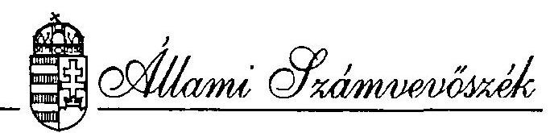
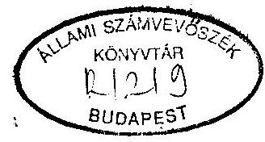
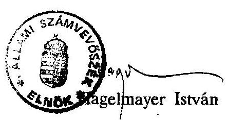
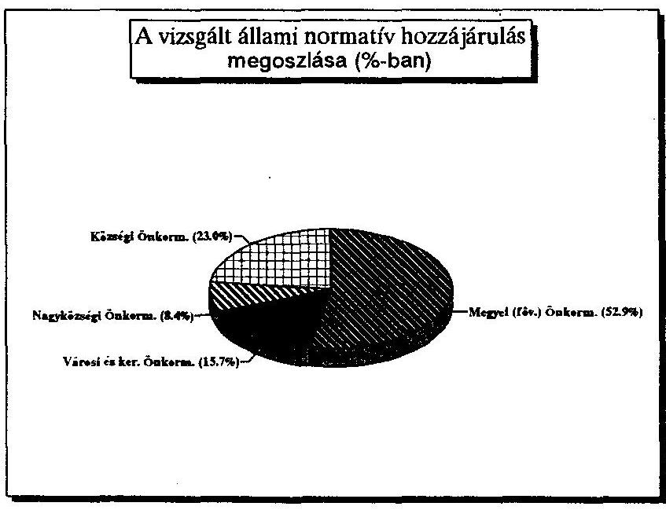
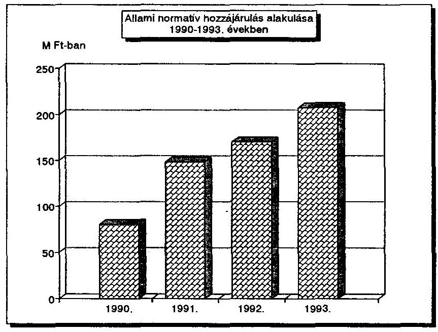
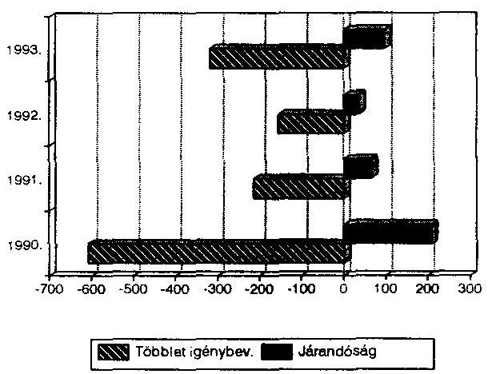
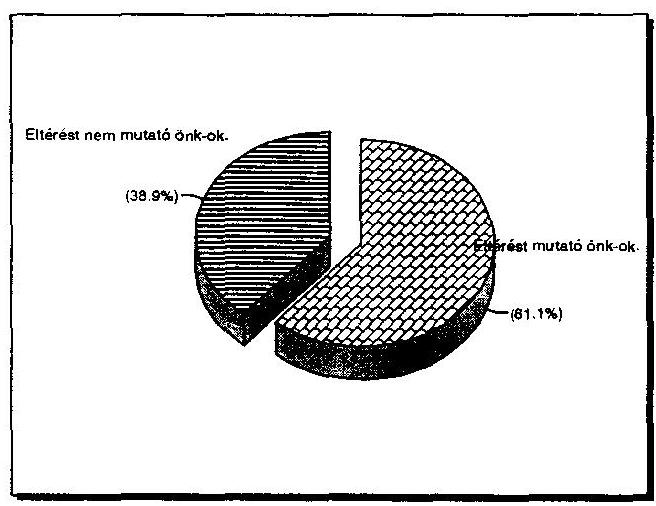
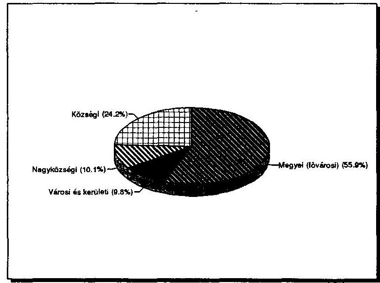
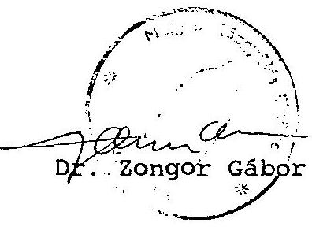

#  

## JELENTÉS

az önkormányzatok 1993. évi normatív állami hozzájárulás
igénybevételének és elszámolásának ellenőrzési
tapasztalatairól


---

# Jelentés

az önkormányzatok 1993. évi normatív állami hozzájárulás
igénybevételének és elszámolásának ellenőrzési
tapasztalatairól

Az Állami Számvevőszék az Államháztartás viteléről szóló 1992. évi XXXVIII. törvényben foglaltak alapján az 1993. évi költségvetés zárszámadásához kapcsolódóan ellenőrizte az 1992. évi LXXX. törvényben az önkormányzatoknak 1993.évre nyújtott normatív állami hozzájárulások tervezésének, igénylésének, elszámolásának törvényességét, szabályszerűségét. A vizsgálat kiterjedt a normatív állami hozzájárulási rendszer eddigi működésének átfogó értékelésére is.

A vizsgálat célja annak megállapítása volt, hogy

- a tervezés során alkalmazott normatívák összhangban voltak-e a költségvetési törvény 3. számú mellékletében foglalt előírásokkal;
- az önkormányzatoknál és intézményeiknél a tervezés alapját képező mutatószámok, adatok időben rendelkezésre álltak-e és megfelelően dokumentálták-e a tényleges helyzetet;
- szabályszerű volt-e a normatív állami hozzájárulások igénybevétele és elszámolása, túllépés esetén időben teljesítették-e visszafizetési és kamatfizetési kötelezettségüket.

A tételes helyszíni ellenőrzés az ország önkormányzatainak 45\%-ára, 1407 önkormányzatra ( 19 megyei és a fővárosi, 40 városi, 2 fővárosi kerületi, 87 nagyközségi, 1258 községi) és az önkormányzatok irányítása alá tartozó, a vizsgált mutatókkal érintett 3412 intézményre terjedt ki (lásd 2. számú melléklet).

---

Az ellenőrzésbe bevont önkormányzatok együttesen 77.895.421 E Ft normatív állami hozzájárulásban részesültek, ami az ország valamennyi önkormányzata részére a törvényben juttatott 207,8 milliárd Ft állami hozzájárulás $37,5 \%$-a.

A 77.895.421 E Ft hozzájárulás $52,9 \%$-át a megyei és fővárosi, $15,7 \%$-át a városi és kerületi, $8,4 \%$-át a nagyközségi és $23,0 \%$-át a községi önkormányzatok kapták (lásd 2/a. számú melléklet).

Az ellenőrzés nem terjedt ki 249 olyan kistelepülésre, amelynek a normatív állami hozzájárulást (együttesen 1.039.532 E Ft-ot) az ÁNH által közölt népességszám alapján kapták. Ezek elszámolását ugyanis a TÁKISZ-ok csak akkor fogadták el, ha az a helyes népességszámra alapozott. Ily módon e településeknél a tévedés kizárt.

# I.

A normatív állami hozzájárulások tervezésének, igénybevételének és elszámolásának tapasztalatai 1990-1993. között

A vizsgálatokra 1990. I. félévétől folyamatosan minden évben sor került. A vizsgálati feladatot első alkalommal a Magyar Köztársaság 1990. évi költségvetéséről szóló 1989. évi L. törvény 20. paragrafus (3) bekezdése írta elő rögzítve, hogy "a normatív támogatások igénybevételének alapjául szolgáló mutatókat, és a támogatás összegét az Állami Számvevőszék ellenőrzi." A továbbiakban egyrészt a költségvetési törvények, másrészt az 1992. évi XXXVIII. - az államháztartásról szóló - törvény előírásainak megfelelően folytatta le az Állami Számvevőszék az ellenőrzést.

A vizsgálat minden évben - kezdettől fogva - alapvetően arra irányult, hogy a szabályszerűségi kérdéseken túlmenően a helyszíni vizsgálatok tapasztalataira alapozottan jelezzük az Országgyűlésnek, illetve a rendszer működtetésében érintett tárcáknak a szabályozásban, a bizonylatolásban, az alkalmazott gyakorlatban mutatkozó hiányosságokat, problémákat.

Évről évre változott a vizsgálatba bevont önkormányzatok és intézményeik száma. Amíg 1991-ben csupán 92 önkormányzatot és a hozzájuk tartozó 718 intézményt vizsgálták számvevőink, addig 1992-ben az ellenőrzés 462 önkormányzatra és 757 intézményre, 1993-ban pedig - a korábban e témában nem vizsgált kisebb települések mindegyikét érintve - 1407 önkormányzatra és 3412 önkormányzati intézményre terjedt ki. Az ellenőrzések által érintett önkormányzatok kapták 1991-ben az ország valamennyi önkormányzatát megillető normatív állami

---

hozzájárulás $33 \%$-át - 49 milliárd Ft-ot -, 1993-ban pedig $37 \%$-át 77,9 milliárd Ft-ot.

A Minisztertanács 2015/1989. (H.T.6) Mt. számú határozata fogalmazta meg a költségvetési reform koncepcióját. A határozat előírta, hogy az új finanszírozási rendszer egyes elemeit már 1990. január 1-től be kell vezetni. Az új szabályozás célja az volt, hogy

- a korábbi kiadásorientált tervezést az akkor még működő tanácsok gazdálkodását biztonságosabb alapokra helyező forrásorientált tervezés váltsa fel,
- a korábbi igen sok szubjektív elemet tartalmazó, "alku mechanizmust" egy áttekinthető, objektív adatokra, feladatokra épülő normatív rendszerrel felváltva az elosztást igazságosabbá tegye.

Lényeges eleme volt az új szabályozásnak, hogy az induláskor 12 különböző normatíva alapján számított állami hozzájárulást a tanácsok felhasználási kötöttség nélkül közvetlenül kapták meg, tehát önállóan dönthettek arról, hogy az ily módon kapott összegeket ténylegesen milyen feladatok ellátására és milyen mértékben használják fel.

A helyi önkormányzatokról szóló 1990. évi LXV. törvény rögzítette, hogy a megszűnő tanács és szervei jogutóda a helyi önkormányzat (103. § (3) bekezdés). Ebből következően a normatív állami hozzájárulások rendszere megalakulásukat követően kiterjedt a helyi önkormányzatokra is.

Az önkormányzatok által ellátandó feladatok széles skálája, amit a helyi önkormányzatokról szóló törvény 8. §-a részletesen meghatároz, valamint az egyes feladatok belső tartalma, az önkormányzatok eltérő sajátosságai miatt jelentkező dífferenciált igényeket figyelembevéve kialakított normatívák száma fokozatosan bővült. Emiatt 1993-ban már 26 féle címen (ebből 9-hez a népességszám alapján) juthattak az önkormányzatok normatív állami hozzájáruláshoz. A normatív állami hozzájárulások jogcímeinek száma, tartalma, a kiszámítás módja, az ezekhez szükséges adatbázis mindenkor az adott évre érvényes költségvetési törvényben került meghatározásra. Az állami költségvetés azonban sem a bevezetéskor, sem az azóta bekövetkezett változások során nem vállalhatta, hogy minden feladat ellátásához a szükséges pénzeszközt teljes egészében központi forrásokból biztosítsa. A normatív alapon odaítélt állami hozzájárulások

---

súlya és szerepe az önkormányzatok finanszírozásában egyre nagyobb méretűvé vált. Az önkormányzatok részére adott központi források aránya 1993-ra 77,5\%-ra 207,5 milliárd Ft-ra növekedett.

Az 1992. évi XXXVIII. az államháztartásról szóló törvény V. fejezete részletesen taglalja a helyi önkormányzatok normatív költségvetési hozzájárulásait. Megállapítja, hogy ezek összegét, az ezekhez kapcsolódó mutatók tervezett mértékét, valamint a normatív költségvetési hozzájárulások jogcímeit és mértékeit mindenkor az adott évre vonatkozó költségvetési törvény írja elő. Az évközi pénzellátás a tervezett mutatók alapján történik. A költségvetési év végét követően a költségvetési törvény előírásai szerint az önkormányzat el kell, hogy számoljon a normatív költségvetési hozzájárulásokkal.

A kezdeti időszaktól eltérően az államháztartási törvény úgy rendelkezik, hogy a helyi önkormányzat a költségvetési törvényben meghatározott mértékű - az éves jegybanki alapkamat kétszeresét kitevő - kamatot fizet a költségvetés részére, ha az általa igénybevett normatív állami hozzájárulások együttesen legalább 5\%-kal meghaladja az őt ténylegesen megillető összeget. A jogtalanul igénybevett összeget pedig teljes egészében vissza kell fizetni.

Az új gazdálkodási modellben új forrásstruktúra kialakítására került sor, azonban az összes bevétel több mint fele továbbra is támogatás maradt, amelynek háromnegyed részét képezte a normatív módon elosztott hozzájárulás. A tanácsi forrásszabályozás kétcsatornás rendszerében azonban a saját bevételek $60 \%$-át a településenként szélsőséges nagyságrendben képződő személyi jövedelemadó tette ki. Az önkormányzatok egy részénél mutatkozó forráshiány pótlása kiegyenlítő mechanizmusok beépítését tette szükségessé. A tapasztalatok azt igazolták, hogy a személyi jövedelemadót csak részben célszerű átengedni, ugyanakkor több tényezőt (pl.: helyi adókat) kell beépíteni az önkormányzatok forrásstruktúrájába.

A normatív állami hozzájárulás intézményének bevezetésétől a jelenlegi vizsgálat időpontjáig terjedő időszakban az önkormányzatok részére juttatott állami támogatások belső struktúrájában jelentős változások következtek be. A bevezetés évében, 1990-ben a normatív állami hozzájárulás és a személyi jövedelemadó nagyságrendje közel azonos mértékű volt ( 80 , illetve 74,5 milliárd Ft). A személyi jövedelemadó önkormányzatokat megillető hányada 1991-92. években $50 \%$-ra, 1993-ban $30 \%$-ra csökkent, ennek következtében ez a forrás

---

55,4 milliárd Ft-ra mérséklődött. Ezzel szemben a normatív állami hozzájárulások együttes összege 207,8 milliárd Ft-ra (1990-hez képest 159\%-kal) nőtt és az önkormányzatok támogatási rendszerében kiemelkedő szerephez jutva az összes állami támogatás mintegy $2 / 3$-át képviselte.

Megváltozott a normatív állami hozzájárulások odaítélésének alapjául szolgáló mutatószámok köre is. Az 1990-ben 12 jogcímen adott hozzájárulás többségét finanszírozási szempontból logikusan a népesség, vagy meghatározott korcsoport létszáma alapján osztották el. Elmaradt azonban a normatív állami hozzájárulások tervezéséhez, igénybevételéhez, elszámolásához szükséges alapelvek és működési szabályok hosszabb távú, rendszerszemléletű, egységes jogszabályba foglalása.

Alapvető gondot jelentett - és jelent ma is -, hogy a normatívákra meghatározott előirányzatokat nem az előírt feladatok szakmailag indokolt költségigényéből kiindulva - mint egzakt költségmodellből - alakították ki, hanem jórészt a tervezett előirányzatok és a feladatmutatók hányadosaként kerültek kiszámításra. A normatív állami támogatások előirányzatainak meghatározása alapvetően bázisszemlélettel, az 1989. évi tervelőirányzatok szintezésével történt. Az így létrejött normatívák az elmúlt évtizedek esetenként alacsony hatékonyságú költségstruktúráját takarták, az alkumechanizmus, az ellátási különbségek hatásait tükrözték.

A korábbi - a kormányzat és a tanácsok viszonylatában kialakult - "alkumechanizmust" felváltotta a Pénzügy- és a Belügyminisztérium, valamint a szaktárcák közötti, az utóbbiak által az egyre növekvő támogatási igényüket szakmai szempontokkal "alátámasztott" alkudozása. A normatív állami hozzájárulások jogcímeinek száma 1993-ra úgy nőtt 26 -ra, hogy a mértékeik az alku eredményének megfelelően - magában hordozva a Magyar Köztársaság adott évi költségvetési helyzetéből adódó kompromisszumokat is - egyenetlenül, $0-250 \%$, ezen belül a feladatmutatóhoz kapcsolódóak $10-219 \%$ között szóródva változtak.

A tárcák által készített számítások alapvető hibája, hogy csak a múltbeli költségekre és feladatokra épültek és nem vették figyelembe az időközben bekövetkezett változásokat. Az első korszerű kísérlet a reális szakmai követelmények érvényesítésére, a helyes költséggazdálkodás befolyásolására, az állami szerepvállalás mértékének meghatározására az 1995. január 1-től hatályba lépő közoktatási törvényben fogalmazódott meg.

---

A differenciálás szakmai indokoltságának elemzése nem képezte a vizsgálat tárgyát. Túlzott mértéke alapvetően azért érthetetlen, mert a normatív állami hozzájárulásokat az önkormányzatok felhasználási kötöttség nélkül kapják, s azt vagy teljes egészében arra a feladatra használják fel, amely jogcímen kapták - és még további ráfordításokat is eszközölnek a helyi sajátosságok függvényében -, vagy a kapott összeg egy részét más célokra csoportosítják át.

A normatív állami hozzájárulás 1992 évi ellenőrzése során végzett reprezentatív felmérésünk szerint az önkormányzatok által kimutatott ráfordításoknak a normatíva összege $31 \%$-tól (óvodai ellátás) - $93,6 \%$-ig (GYIVI) terjedő sávban nyújtott fedezetet. Egy-egy normatíván belül azonban önkormányzatonként még további eltérések voltak tapasztalhatók. Így pl:
$=$ Záhonyban 842 fő általános iskolás után 30.312 E Ft-ot igényeltek, de ténylegesen csak 28602 E Ft-ot használtak fel. Ugyanakkor Bábolna 500 fő után 18 millió Ft-ot kapott, de a ráfordítás 29,9 millió Ft volt.
$=$ Alsóörsön 45 óvodás után felvett 855 E Ft-tal szemben ténylegesen 4.627 E Ft költség merült fel, azaz egy gyermek ellátására 102.822 Ft-ot fordítottak a 19.000 Ft-os normatívával szemben.
Egerben 2125 óvodai ellátotthoz 95550 E Ft-ot használtak fel a 31875 E Ft összegű hozzájárulással szemben, lényegében a kapott összeg háromszorosát.
$=$ A Baranya megyei Önkormányzat az 1411 fős GYIVI létszám után 328763 E Ft hozzájárulást kapott, s ebből csupán 123412 E Ft-ot, a kapott összeg $37,5 \%$-át használták fel a feladatellátáshoz.

A vizsgált területen tapasztalható anomáliák megkérdőjelezik a differenciálás célirányosságát, szükségességét. Felvetik az aggregált, az adott feladatcsoport megoldását a jelenleginél áttekinthetőbbé tevő, jobban szolgáló, könnyebben tervezhető normatív hozzájárulási jogcímekhez való visszatérést. Az un. kiegészítő normatív állami hozzájárulásokat, ugyanis az önkormányzatok jórésze úgy kezelte pótlólagos forráslehetőségként, hogy annak jogosságát az intézmények nyilvántartásai nem mindig támasztották alá. Az országos adatok is érzékeltetik e sajátos tendenciát.

Az óvodai ellátásban részesülő gyermekek száma 1991-93. között 378 ezer főről 380,4 ezer főre ( $0,6 \%$-kal) emelkedett. Ugyanakkor a kiegészítő jellegű nemzetiségi, etnikai, óvodai ellátás címén számításba vett gyermekek száma 18 ezer főről 31,8 ezer főre ( $76 \%$-kal) növekedett.

- Az általános iskolás korú gyermekek száma 1991-93. között 1 124,5 ezer főről 1 023,2 ezer főre ( $9 \%$-kal) csökkent. Ugyanezen időszak alatt a kiegészítő jellegű nemzetiségi, etnikai oktatás címén figyelembe vett

---

gyermekek száma 63,8 ezerről 96,4 ezerre ( $51 \%$-kal) növekedett.
Mindkét területen vitatható az igényjogosultság, mert az ellenőrzött körben az előírt dokumentációkat számos helyen egyáltalán nem, vagy nem megfelelően vezették.

Összességében az 1990-ben bevezetett szabályozás alkalmas volt arra, hogy az önkormányzati gazdálkodás feltételeinek kialakításához alapul szolgáljon. Továbbfejlesztése szükséges volt, hogy az új pénzügyi finanszírozás rendszerszemléletben működhessen, kiterjedve a tervezés, az operatív gazdálkodás és az évvégi elszámolás folyamataira is, hogy megfelelően orientálhassa az önkormányzatokat. Ez mindeddig nem történt meg és az Államháztartás viteléről szóló törvény rendelkezései sem felelnek meg teljeskörűen e követelményeknek. Az egységes eljárási szabályok hiánya miatt azonban a tervezésnél, az igénybevételnél és az elszámolásnál is értelmezési gondok merültek fel, az önkormányzatok eltérő eljárást követtek.

Az elmúlt években az éves költségvetési törvényekben meghatározottakhoz sem végrehajtási rendeletként, sem pedig kiegészítő célzattal kormányrendeletek nem készültek. A központi szervek az éves költségvetési törvényekben megfogalmazott szabályozást próbálták - az ÁSZ tapasztalatait is felhasználva - évről-évre tökéletesíteni, finomítani. Emellett, főként a kezdeti időszakban a törvényben nem, vagy nem kellő pontossággal szabályozott kérdéseket tájékoztatókkal, állásfoglalásokkal kívánták egyértelműbbé tenni. Később az Alkotmánybíróság ezt a gyakorlatot a 60/1992. (XI.17.) AB határozatával alkotmányellenesnek minősítette.

# II. <br> A vizsgálat megállapításai 

## 1. Irányító, tervező, ellenőrző munka

Az elmúlt négy évben az Állami Számvevőszék azonos tárgyú vizsgálatainak tapasztalatait, következtetéseit, a hiányosságok felszámolását és a munka színvonalának emelését célzó javaslatait tartalmazó jelentéseit minden alkalommal megküldtük az Országgyűlés illetékes bizottságainak és a rendszer további korszerűsítésében érdekelt tárcáknak, önkormányzati érdekvédelmi szervezeteknek és a köztársasági megbízottaknak.

---

Ajánlásaink, javaslataink kedvező fogadtatását igazolják, hogy az érintett tárcák azokat figyelembe véve évről-évre folyamatosan javították a költségvetési törvények normatív állami hozzájárulásra vonatkozó részeit. Számos jogcím tartalmának értelmezését egyértelműbbé tették, szigorították az igénybevétel feltételeit, szankcionálták (pl: 5\%-os büntető kamat) az elszámolásnál mutatkozó nagyarányú eltéréseket stb. Ennek keretében a Magyar Köztársaság 1994. évi költségvetéséről szóló 1993. évi CXI. törvény megalkotásakor néhány, a jelenlegi vizsgálatnál még meglévő problémát megoldottak. Így pl:

- "óvodai ellátás" jogcímét pontosították. A statisztikai létszámba nem számíthatók be az előfelvételi igény alapján nyilvántartásba vett, de a felmérés időpontjában a tényleges óvodai ellátásban még nem részesülő gyermekek;
- a "kiegészítő állami hozzájárulás a nemzetiségi, etnikai óvodai ellátáshoz" jogcím esetében kiegészíti a törvény a korábbi feltételt azzal, hogy csak a Művelődési és Közoktatási Minisztérium által jóváhagyott, megfelelően dokumentált nemzetiségi óvodai program szerint lehet a cigánygyermekek foglalkoztatása esetén a kiegészítő támogatást igényelni;
- kiegészült a "gimnáziumi és szakiskolai oktatás" feladatmutató azzal, hogy
$=$ a magántanuló után a hozzájárulás $1 / 3$-a igényelhető,
$=$ a szakmunkások 2-3 évfolyamos nappali rendszerű (5 napos) gimnáziumi érettségire felkészítő oktatásához szintén e hozzájárulás vehető igénybe;
- "a kiegészítő állami hozzájárulást a nemzetiségi etnikai vagy kéttannyelvű oktatáshoz" csak a Művelődési és Közoktatási Minisztérium által jóváhagyott nemzetiségi óraterv, tanterv - és tankönyv - alapján végzett oktatáshoz lehet igényelni;
- a "Szociális igazgatásról és szociális ellátásról" szóló 1993. évi III. törvényben foglaltakkal összhangban néhány normatív hozzájárulás jogcímének neve megváltozott (pl. Szociális otthon);
- a "fiatal korúak egészségügyi és gyógypedagógiai ellátása" - "fogyatékos gyermekek ápoló, gondozó otthoni és gyógypedagógiai intézetei ellátása" jogcímre változott és a mutatószámhoz rendelt támogatási összeggel (275 E Ft) majdnem azonos ( 274 E Ft) új normatív hozzájárulási jogcím bevezetésére került sor a "Felnőtt korú fogyatékosok, ápoló, gondozó otthoni ellátása" címszó alatt. 1994-ben bevezették a "Hajléktalanok átmeneti szállásai" ( $78.000 \mathrm{Ft} /$ férőhely) új normatívát;

---

- a kistelepülések gondjain enyhít a törvény azzal, hogy a normatív hozzájárulás $5 \%$-on felüli igénybevételének büntető kamattal történő szankcionálására csak abban az esetben kerül sor, ha az eltérés az 500 E Ft-ot meghaladja. Az 500 E Ft-os határig pedig csak a jegybanki alapkamatot kell megfizetni;
- a törvény konkrétan megfogalmazta, hogy az SOS gyermekfaluban a különleges gyermekotthonokban és más központi költségvetési szerv által fenntartott intézményben elhelyezettek után a GYIVI normatív hozzájárulás nem vehető igénybe.
(Az egyes normatívák jogcímeinek tételes változásait részletesen a Függelékben mutatjuk be.)

Az önkormányzatok munkatársainak növekvő szakmai gyakorlata, a törvények szövegeinek egyértelműbbé tétele, a "büntető szankciók" alkalmazása, az ÁSZ ellenőrzések hatása azt eredményezte, hogy összességében az elszámolások évről-évre pontosabbak lettek. Kedvező hatással volt az Országgyűlés által első ízben az 1992. évi zárszámadási törvényben hozott döntés, amelynek alapján a jogosulatlanul igénybe vett állami hozzájárulás összegét az önkormányzatoknak a költségvetésbe vissza kellett fizetniük.

Az APEH-SZTADI országos adatai szerint a költségvetésbe visszafizetendő, az önkormányzatokat saját elszámolásuk egyenlege alapján meg nem illető összeg 1990-1993. között $1707,9 \mathrm{M}$ Ft-ról $184,9 \mathrm{M}$ Ft-ra csökkent, miközben a normatív hozzájárulásként kapott támogatás 80 milliárd Ft-ról 207,8 milliárd Ft-ra nőtt.
Ugyanezt a tendenciát tükrözik az ÁSZ vizsgálatok adatai is. Amíg ugyanis 1991-ben az ellenőrzött 92 önkormányzatnál együttesen egyenlegében a részükre folyósított 48,9 milliárd Ft-os normatív állami hozzájárulásnak $0,30 \%$-át tette ki a visszafizetési kötelezettség, addig 1993-ban 1407 vizsgált (ezen belül 1258 községi) önkormányzatnál a kapott 77,8 milliárd Ft $0,28 \%$-át. (Lásd 5. számú melléklet)

A helyi önkormányzatokról szóló 1990. évi LXV. törvény 92. § (2) bekezdése előírja az önkormányzatok számára saját intézményeik pénzügyi ellenőrzését, amelybe a finanszírozásuk alapjául szolgáló adatok ellenőrzése is beletartozik. Az önkormányzatok azonban az igénylés alapját képező mutatószámok valódiságáról, a szükséges előírt bizonylatok meglétéről, vezetéséről nem győződtek meg, sem az intézményeiknél végzett felügyeleti ellenőrzések során, sem az elszámolásuk elkészítésekor.

---

Az önkormányzatok - néhány kivételtől eltekintve - a korábbi évek helytelen, az ÁSZ által minden évben kifogásolt gyakorlatot követték és nem szabályozták az igénybevétel alapját képező adatszolgáltatás nyilvántartásának módját. Mindezeknek következménye, hogy az intézményeknél végzett helyszíni ellenőrzések során szerzett tapasztalataink szerint a közölt adatok pontatlanok, hiányosak, a vonatkozó törvényi előírásoktól eltérő tartalmúak.

Az etnikai és a nemzetiségi ellátáshoz, illetve oktatáshoz kapott normatív állami hozzájárulás realitását a helyszíni vizsgálatok során csak a törvényi előírások szövegének megfelelő szemlélettel lehetett megítélni. Ahol a finanszírozás alapját képező előírt dokumentációk nem álltak rendelkezésre, ott az ellenőrzés az igénybevételt jogosulatlannak kényszerült minősíteni.

Nem megoldott pl: az etnikai (cigánytanulók) nyilvántartása. Az érintett szülők egy része nem vallja magát és gyermekét cigánynak. Ezzel összefüggnek a személyes adatok védelméről szóló, az 1992. évi LXIII. törvény 2. § (2) bek. a/ pontjában és a 3. § (1) és (2) bekezdésében foglaltak. Ezek szerint a különleges adat: a faji eredetre, a nemzeti, nemzetiségi és etnikai hovatartozásra vonatkozó személyes adatok csak akkor kezelhetők, ha ahhoz az érintett írásban hozzájárul. Ezen előírásokkal a költségvetési törvény 3. számú mellékletének etnikumra, nemzetiségre vonatkozó finanszírozást alátámasztó adatszolgáltatási előírásai ellentétben állnak. Ennek megfelelően az 1993. évi statisztikai adatszolgáltatásban az etnikum megfigyelésére már nincs is adatkérés. Ezért a nemzetiségi- etnikumspecifikus jegyek egzakt módon nem állapíthatók meg és nem ellenőrizhetők. A gondokat, az eltérő önkormányzati gyakorlatot jól érzékelteti, hogy az önkormányzatok egy része - a differenciált foglalkozás tényleges megtörténte nélkül - valamennyi cigánygyerek után igénybe vette a támogatást. Helyenként a kisegítő iskolában tanulók után is.

Az ÁSZ javaslatával összhangban álló un. "büntető kamat" bevezetésének hatása abban mérhető le, hogy az önkormányzatok óvatosabban és inkább alul terveztek. Ezt jelzi, hogy az APEH-SZTADI összesített adatai szerint az elszámolás után az önkormányzatoknak még járó hozzájárulás összege 1991-93. között folyamatosan 292,5 M Ft-ról 786,5 M Ft-ra nőtt, aránya pedig a kapott összes normatív állami hozzájáruláshoz viszonyítva az 1991. évi $0,2 \%$-kal szemben 1993-ban kétszerese $0,4 \%$ volt.
A tervezőmunka elvégzéséhez, az igények kialakításához a szakmai statisztikák által szolgáltatott adatok az eltérő időpontok ellenére is megfelelő támpontul szolgálhattak volna. Pontosságát azonban nehezítette, hogy a rendelkezésre álló lehetőségek határain belül nem volt meghatározható egyértelműen az alapfokú művészeti képzésben részt vevők köre, illetve az

---

anyanyelvet nemzetiségiként tanulók száma. Mindkét esetben elő vannak ugyan írva különböző dokumentációk, de ezek nincsenek mindenütt előírásszerűen vezetve, az órák száma és időtartama nincs összhangban az előírásokkal, viták tárgyát képezi az oktatás tartalma, jellege a tanuló fogalma (pl: óvodás korú gyermek zeneiskolában!). Esetenként előfordult az is, hogy az intézmények statisztikai adatai nem a valós helyzetet mutatták.

# 2. A hozzájárulások igénybevételének és elszámolásának helyessége 

A részletes helyszíni ellenőrzéssel érintett 1407 önkormányzat kapta a Magyar Köztársaság 1993. évi állami költségvetéséről szóló 1992. évi LXXX. törvény alapján a helyi önkormányzatok részére folyósított 207,8 milliárd Ft-os normatív állami hozzájárulás $37,5 \%$-át 77,9 milliárd Ft-ot.
Az ellenőrzött önkormányzatok közül 547-nél (39\%) volt rendben az elszámolás, 860 -nál pedig ( $61 \%$ ) különböző nagyságú eltéréseket tárt fel a vizsgálat.

Külön is említést érdemel, hogy a megyei közgyűlések önkormányzatai közül öt a törvényi előírásoknak megfelelően számolt el. Ezeknél (Bács-Kiskun, Csongrád, Fejér, Heves, Vas) az ellenőrzések során eltéréseket nem tapasztaltunk. Három megyei önkormányzatnál (Borsod-Abaúj-Zemplén, Somogy, Tolna) pótlólagos hozzájárulási jogosultságot állapítottunk meg, együttesen 3,4 M Ft értékben. Tizenegy megyei és a fővárosi önkormányzatnál a jogosulatlanul igénybe vett normatív állami hozzájárulás $123,2 \mathrm{M} \mathrm{Ft}$. A költségvetésnek visszafizetendő összeg $119,8 \mathrm{M} \mathrm{Ft}$, a vizsgált körben eltérést mutató 860 önkormányzatnál együttesen feltárt visszafizetendő összeg $57,5 \%$-a.

Továbbra is gyakori jelenség volt, hogy ugyanannál az önkormányzatnál a normatív állami hozzájárulás egyik jogcíme alapján többlet igénybevételt, a másiknál pedig a jogosnál kisebb igénybevételt tártak fel a számvevők. Ez utal a gyakorlatlanságra, a törvények nem megfelelő ismeretére és alkalmazására. A törvényi pontatlanságok és ellentmondások mellett döntően az igénylés alapjául szolgáló adatok ellenőrzésének elmulasztása vezetett az elkövetett elszámolási hibák döntő többségéhez. Ez még akkor is igaz, ha a "tévedések" nagyobb hányada több, mint $70 \%$-a a költségvetés terhére történt.

---

Az önkormányzatok a költségvetéssel szembeni elszámolásukat a beszámoló részét képező 31. sz. űrlapon a megadott határidőre (egy-két kivételtől eltekintve) a TÁKISZ-okhoz benyújtották. Az Állami Számvevőszék ezt követően végzett helyszíni ellenőrzései -, amelyekben ez évben domináltak a kisebb települések - a vizsgált körben a normatívák jogcímei alapján (ahol önkormányzatonként a plusz és mínusz eltérések nem kompenzálják egymást) 311.430,7 E Ft jogosulatlan igénybevételt és 96.980,6 E Ft önkormányzatokat megillető pótlólagos folyósítási többletet tártak fel. Ezek egyenlege 214.450,1 E Ft.
 Ft a központi költségvetést illeti.

Hasonlóan az elmúlt évekhez, most is három jogcím (gyermek- és ifjúságvédelem $61,5 \mathrm{M} \mathrm{Ft}$, óvodai ellátás 40,1 M Ft és általános iskolai oktatás $52,5 \mathrm{M} \mathrm{Ft}$ ) együttesen adja a visszafizetendő összeg csaknem $72 \%$-át. Ez döntően az előzőekben már jelzett adatszolgáltatás pontatlanságaira, az adatszolgáltatók nem kellő felkészültségére, a GYIVI-nél pedig a gondozási napok értelmezési és az oktatási normatíva elszámolásának problémáira vezethetők vissza. Kisebb mértékű járandóság mutatkozott az idősek és fogyatékosok nappali intézményeinél 340 E Ft (amely azonban 12 M Ft -ot meghaladó járandóság és közel azonos összegű visszafizetési kötelezettség különbözete). Hasonló módon 8,9 M Ft járandóság és 8,6 M Ft visszafizetési kötelezettség különbözeteként mintegy 300 E Ft összegű járandóságot tártak fel a fogyatékos gyermekek oktatásánál. Az alapfokú művészeti oktatásnál pedig 1807 E Ft az önkormányzatokat megillető többlethozzájárulás (lásd 10 sz. melléklet)
Még mindig előfordul, hogy egyes önkormányzatok a törvény szövegét félremagyarázva igyekeznek normatív állami hozzájáruláshoz jutni. A törvény szerint pl. az iskolalátogatás alól felmentett tanulók után is igényelhető a hozzájárulás. Ezt néhány helyen úgy értelmezték, hogy az általános iskolába beíratott, de iskolaéretlennek minősített gyereket "felmentettként" számolják el az iskolai statisztikában és igénylik utána az iskolai és az óvodai hozzájárulást is, holott ebben az esetben az általános iskolai oktatás normatív hozzájárulása nem jogos.

Hasonló módon jártak el több önkormányzatnál a szakközépiskolai esti és levelező oktatásban résztvevők esetében is. Itt figyelmen kívül hagyták azt a törvényi előírást, miszerint e címen normatív állami hozzájárulás csak az első szakma megszerzéséhez jár. Ettől eltérően a teljes létszám után igénybe

---

vették a hozzájárulást annak ellenére, hogy a beiskolázottak többsége már valamilyen szakmával rendelkezett.

Szabálytalan az óvodai ellátás normatívájának értelmezésében azoknak az un. "előfelvételis gyermekek"-nek a számbavétele, akik az óvodai ellátást csak a statisztikai adatszolgáltatásban megjelölt időpont után veszik igénybe. Az önkormányzatok egy része ezeket a gyermekeket úgy vette nyilvántartásba, mintha a számítás alapjául szolgáló időpontban már jelen lettek volna, s így a mérési időpontban ellátásban nem részesülő gyermekek után is igényelték a hozzájárulást. Azok az önkormányzatok viszont, amelyek nem így jártak el, az un, töredék időszakra (pl: november-december hónapra) a ténylegesen ellátott gyermekek után nem jutottak a hozzájáruláshoz. Gondot jelentett azon gyermekek számításba vétele is, akiket szüleik csupán fél napra helyeztek el az óvodába, s már ebédet sem igényeltek gyermekük számára.

Már az előző évben is kifogás tárgyát képezte, s most ismétlődött, hogy a Veszprémi Tetőfedő Szakmunkásképző Iskola Kollégiumában egyidejűleg maximum 80 fő helyezhető el. A tanulókat három csoportba osztották, s egy-egy csoport három hónapot tölt el a kollégiumban, a többi időt pedig gyakorlati oktatásként más területeken, ahol kollégiumi ellátásban nem részesülnek. A kollégium a tanulókat úgy vette számításba, mintha azok egyidejűleg, egész éven át a kollégiumban tartózkodtak volna, így a ténylegesen ellátottak létszámát megháromszorozták. (Ezt a logikát követve amennyiben minden férőhelyet betöltenek 3-3 hónapos oklusban, úgy a 80 férőhelyre éves viszonylatban 240 fő-t számolnának el!)

A Művelődési és Közoktatási Minisztérium az oktatásról szóló 1985. évi I. törvény felhatalmazása alapján több önkormányzat részére kísérleti jelleggel új oktatási formák, módszerek bevezetését engedélyezte. A helyszíni ellenőrzések során problémákat okozott, hogy az önkormányzatok egyedi tárca leiratokra hivatkozva igényelték meg ilyen esetekben a normatív állami hozzájárulásokat. A kisérletekhez szükséges központi források ugyanis nem álltak rendelkezésre. Sem az önkormányzatok, sem a minisztérium nem vállalta írásban a többletköltségek fedezetét. Az MKM szerint "a kisérletekhez kapcsolódóan nem volt szó külön költségvetési többlettámogatásról". Nem biztosítottak rá fedezetet a költségvetési törvényben sem. Az engedélyek kiadásával egyidejűleg sem kérték a költségvetési törvény szövegének egyértelmű, az általánosan elfogadott nappali rendszerű oktatás kritériumainak megfelelő módosítását. A problémát csak az 1994. évre vonatkozó költségvetési törvény rendezte.

---

A Nógrád megyei közgyűlés elnöke 1993. június 1 -én kelt levelében kérte az MKM Önkormányzati Gazdasági Főosztályát, hogy állásfoglalásával erősítse meg az önkormányzat véleményét. Eszerint a tárca által engedélyezett, a dolgozók három évfolyamos szakközépiskolai oktatásának 2 év alatti, heti 5 napos képzéséhez - annak ellenére, hogy az 1993. évi költségvetési törvényben ez nincs rögzítve - a szakközépiskolai oktatás nappali képzéséhez kapcsolódó normatív állami hozzájárulás vehető igénybe.
Az MKM illetékes főosztályának vezetője 1993. júliusában - jogszabálynak nem minősülő leiratban - közölte, hogy álláspontjuk szerint a szóban forgó szakmunkások részére szervezett nappali rendszerű szakközépiskolai érettségire felkészítő kétéves tagozathoz a szakközépiskolai oktatás nappali képzéséhez kapcsolódó normatíva illeti meg az önkormányzatot. Hasonló tartalmú levelet adott ki a BM Önkormányzati Gazdasági Főosztálya is.

A "szakmai állásfoglalások" azonban több szempontból nincsenek összhangban a költségvetési törvénnyel. Egyrészt, mert az a vonatkozó törvényi szövegben a szóban forgó állami normatív hozzájárulás jogcímeként csak a gimnáziumi és szakiskolai oktatást jelöli meg (3. számú melléklet p) és ra) pont összefüggésében), másrészt az első szakma megszerzéséhez nyújtott képzést esti, levelező oktatásnak minősítve a hozzájárulás $1 / 3$-át engedi igényelni, amennyiben az érettségire felkészítő képzés nem felel meg a 3. sz.melléklet p) pontjában rögzített feltételeknek (g) és ra) pont összefüggésében).

A minisztérium által kísérleti jelleggel engedélyezett oktatási forma a p) pont előírásainak nem felel meg, többek között azért sem, mert időtartama csupán 2 év. A nappal végzett oktatás ellenére tartalmában esti képzésről van szó. További probléma, hogy az így beiskolázottak már valamilyen szakképesítéssel rendelkeznek. A teljes összegű normatív állami hozzájárulás megadása lényegében az eddigi hozzájárulás (három év alatt évi $1 / 3$-os arány figyelembevételével) kétszeresére növelését ( 2 évre évente a teljes összeg!) jelenti azonos cél eléréséhez.

Hasonló módon járt el a MKM a fővárosi Pesti Barnabás Élelmiszeripari Szakközépiskola és Szakmunkásképző Intézet kérelmével kapcsolatban 1993. május 5-i levelével és a Veszprémi Tetőfedő Szakmunkásképző Intézet esetében 1993. május 26-i keltezésű levelével.

A Pénzügyminisztérium Önkormányzati és Területfejlesztési Főosztályának vezetője 1993. január 25 -én írt a Dombóvári 516 sz. Ipari Szakmunkásképző Intézet és Szakközépiskolának a törvény szövegétől eltérő "szakmai állásfoglalást". Ebben arra hivatkozott, hogy a törvény a jogosultságot nem kötötte az általános négyéves képzési időhöz. A már megszerzett szakmai végzettség magasabb színvonalon történő elsajátításához a 66000 Ft-os szakközépiskolai oktatáshoz kapcsolódó normatív állami hozzájárulást tartja jogosnak, annak ellenére, hogy a már említett törvényhely (ra) pont) csak a gimnáziumi normatívára utal. Ugyanezt erősíti az 1994. évre szóló költségvetési törvény 18-19. pontja is.

A Gyermek- és Ifjúságvédő Intézeteken (továbbiakban: GYIVI) keresztül ellátott állami gondoskodásban részesülők után igényelhető normatív állami

---

hozzájárulások tervezése, igénylése, felhasználása továbbra is a rendszer legproblematikusabb területe. Ezt jól érzékelteti, hogy a GYIVI-ket működtető megyei (fővárosi) önkormányzatoknál feltárt $123,2 \mathrm{M}$ Ft jogosulatlan igénybevétel $56 \%$-a, 69,1 M Ft az e témakörrel kapcsolatos helytelen gyakorlatból adódik.
A gyermek- és ifjúságvédelmi törvény megalkotásának elhúzódása miatt e területre több különböző szintű jogszabály is tartalmaz előírásokat, de ezek összefüggően nem rendezik a követendő gyakorlatot. Döntően erre vezethető vissza, hogy a GYIVI nyilvántartásában, az önkormányzatokkal és a társintézményekkel kialakított kapcsolatában, valamint az alkalmazott eljárásban az egységességre való törekvésnek még a nyomait is alig lehet fellelni.

Továbbra sem volt megoldott az egyéb forrásból támogatott SOS gyermekfaluban (Békés megyei Battonya), valamint az un. különleges gyermekotthonokban (Veszprém megye) elhelyezett gyermekek utáni hozzájárulás tervezése és igénybevétele. E problémát az 1994. évi költségvetési törvény már egyértelműen rendezte.


#### Abstract

A múlt évi vizsgálat során az Állami Számvevőszék kifogásolta a kétszeres finanszírozást, amelynek tényét a PM és a BM is elismerte. (Az SOS gyermekfalu más forrásból fedezte működési költségeit, a különleges gyermekotthonok pedig központi forrásokból jutottak támogatáshoz. Ezért egyik esetben sem járt részükre normatív állami hozzájárulás.) Az országgyűlési bizottságok ülésein (ÁSZ, Önkormányzati, Költségvetési) a PM a két megyei önkormányzat véleményének helyt adva - joghézagra való hivatkozással támogatta a megyei önkormányzatok kérését, hogy a szóban forgó összegeket ne vonják el tőlük. Tette ezt annak ellenére, hogy ezeket az összegeket nem az állami gondozottak ellátására használták fel.


A két megyei önkormányzat hasonló módon járt el 1993-ban is. Ezt az ÁSZ ismételten jogosulatlan Igénybevételnek minősítette. Elismerte ugyanakkor, hogy a tervezéskor még nem volt birtokukban az a PM-BM leírat - amelyik ugyan nem tekinthető jogszabálynak, de - amelyből 1993. májusában már tudomást szereztek arról, hogy a normatív állami hozzájárulás a szóban forgó jogcímen nem illeti meg őket. Erről a leíratról a két önkormányzat nem vett tudomást és sem év közben, sem az elszámoláskor nem fordult újabb állásfoglalásért a tárcákhoz. Az Országgyűlés előző évi döntésére hivatkozva, valamint arra, hogy a tiltást csak az 1994. évi költségvetési törvény szövege tartalmazza - vitatják a jogosulatlan igénybevétel tényét. (Megjegyezzük, hogy az 1993. évi költségvetési törvény szövegébe a tiltás technikai okokból utólag nem kerülhetett be!)

Hasonló jelenségek - ha kisebb mértékben is, de - felmerültek a közös üzemeltetésű oktatási intézményeknél is, ahol esetenként nem csak a lakóhely szerinti, hanem az intézmény székhelye szerinti önkormányzat is leigényelte az oktatási normatívát. Mindkét esetben elkerülhető lenne a kettős

---

finanszírozás, ha az oktatási normatívát csak az az önkormányzat igényelhetné le, amelyik az intézményt üzemelteti, illetve - közös üzemeltetés esetén ahol az intézmény székhelye van.

Új problémaként merült fel a 18-24 éves korosztályhoz tartozó, GYIVI-től kikerült, majd a költségvetési törvény 3. számú mellékletének f) pontja szerint "a legfeljebb 24 éves korig önmagáról gondoskodni nem tudó állami gondozott után" igényelhető normatív állami hozzájárulás elszámolásának gyakorlata. A probléma egyik része arra vezethető vissza, hogy nincs központilag egyértelműen szabályozva, hogy milyen feltételek megléte esetén tekinthető a GYIVI-ből kikerült fiatal "önmagáról gondoskodni nem tudónak". E kérdés eldöntését a GYIVI-nél foglalkoztatott szakemberekre bízták. Ebből következően az alkalmazott gyakorlat nem egységes. A probléma másik része a nyilvántartással, a gondozási napok számbavételével kapcsolatos.


#### Abstract

Az Állami Számvevőszék a törvény szövegéből kiindulva - finanszírozási szempontból a törvényben rögzített kiegészítő előírás szerinti gondozási napok száma alapján - nem fogadhatta el a Baranya Megyei Közgyűlés gyakorlatát, ahol a GYIVI nem vette vissza az egzisztenciális problémájának megoldását kérő "túlkoros fiatalt" az intézménybe. Ennek ellenére az ellátottak nyilvántartásába felvezette azokat, akik a 21/1989. (VIII.25.) SZEM rendelet alapján életkezdési támogatást kértek különböző jogcímeken (pl: lakásvásárlás, felújítás, fürdőszoba építés, bútor, egyéb tartós fogyasztási cikk beszerzés stb.). A GYIVI a kérelem alapján annak beérkezésétől (iktatásától) az úgy végleges lezárásáig gondozási napokat számolt el és jelentett be a megyei közgyűlésnek, holott tényleges ellátásról, intézeti elhelyezésről szó sem volt (110/1993. (MK.11.) MM. sz. utasítás 35. § módosított szövege!).


A megyei közgyűlés elnöke kifogással élt az Állami Számvevőszék megállapításával szemben, csatolva a
 Magyar Gyermek- és Ifjúságvédelmi Kamara véleményét is, amely szerint a szakmai felügyeletet a köztársasági megbízott gyakorolja (akinek álláspontját azonban nem kérték meg). Véleménye szerint az ÁSZ a kompetenciájába nem tartozó szakmai kérdésben foglalt állást és a költségvetési törvényben rögzített törvényi előírásokat meghaladó észrevételt tett. Az 1993. évi költségvetést érintő ÁSZ véleményt ezért megalapozatlannak tartja. Az észrevétel és a csatolt kamarai vélemény azonban még csak említést sem tesz arról, hogy az alkalmazott gyakorlat szerint leigényelt és elszámolt 29.426 E Ft-ból a GYIVI-nek miért csak 11.835 E Ft-ot utaltak tovább életkezdési támogatásra és milyen célokra használták fel a többszörösen hátrányos helyzetű állami gondoskodásban részesülő felnőtt korúak után igényelt, de részükre nem biztosított 17.591 E Ft-ot!

Bács-Kiskun és Vas megye kivételével, továbbra is tapasztalható az állami gondozottak után járó - kötelezően átadandó - oktatási normatíva kétszeres igénybevétele. Ez döntően annak következménye, hogy a GYIVI többnyire

---

hiányos nyilvántartásai alapján a megyei önkormányzat nem utalja át automatikusan az oktatási normatív hozzájárulás összegét annak az önkormányzatnak, amelynek intézményében az állami gondoskodásban részesülő gyermek jár. A megyei önkormányzatok egy része csak akkor eszközli az átutalást, ha azt az oktatási intézményt működtető önkormányzat írásban kéri. Az önkormányzatok viszont nem minden esetben tudják, hogy az intézményükben jár-e állami gondoskodásban részesülő gyermek (pl: kistelepülésen, ha a nevelőszülő - akihez a gyermeket kihelyezték - nem azon a településen lakik, amelyikben az intézmény működik). Emiatt nem mindig kérik külön a GYIVI-t működtető megyei önkormányzattól az oktatási normatív hozzájárulás összegét, hanem azt "saját jogon" a többi gyermekhez járó hozzájárulással együtt közvetlenül igénylik és kapják meg a központi költségvetéstől. A GYIVI-t üzemeltető és az oktatási intézményt működtető önkormányzatok esetenként az átutalásról megállapodnak. Ez azonban rendkívül idő- és költségigényes megoldás, különösen ha figyelembe vesszük, hogy a GYIVI-hez tartozó állami gondoskodásban részesülők jó része az adott megyén kívüli településeken jár iskolába.

Az önkormányzati elszámolások az intézmények által közölt - nem ellenőrzött - adatokra támaszkodtak, így elszámolásaik tartalmazták az intézmények által elkövetett hibákat. Pl.

- az idősek és fogyatékosok nappali, illetve szállást biztosító intézeti ellátásánál többnyire hiányoztak az előírt dokumentációk, nem volt mindenütt alapító okirat, nem vezették az előírt nyilvántartásokat. A hosszabb ideig (5-6 hónapig) eltávozottakat is szerepeltették a létszámban (pl: Gödöllő), vagy létszámadatként a férőhelyek számát közölték (pl: Rácalmás), vagy az étkezési napokat vették figyelembe (pl: Győr-Sopron-Moson megye). Előfordult olyan "megoldás" is, hogy a december 31-i tényleges létszám alapján számoltak el (pl: Szabolcs-Szatmár-Bereg megye több településén). A létesítmény-finanszírozásra való áttérés e téren, amennyiben annak alapját pl. az alapító okiratban rögzített reális férőhelyszám képezné, kiküszöbölné a nyilvántartások pontatlanságából adódó problémákat;
- az óvodai ellátásnál a felvételi és mulasztási naplók kitöltése pontatlan, hiányos volt, a létszám-mozgások időpontjait nem dokumentálták. Az előfelvételis gyermekeket is tartalmazták a statisztikai jelentések, bár a

---

gyermekek még nem jártak az óvodába. Egyes helyeken a "félnapos" gyermekeket is figyelembe vették, másutt pedig nem;

- az általános iskolákban és középiskolákban is gyakran rendszertelen, utólagos volt a tanulók nyilvántartási könyvének (törzskönyv) vezetése, pontatlanok, vagy hiányosak voltak az érkezési adatok, nem az előírások szerinti időpontokban meglévő tényleges adatokat közölték. Olyan eset is előfordult, hogy öt települést ellátó általános iskolában három éve nem vezették a nyilvántartást (Csonkahegyhát). Ez részben annak is következménye, hogy a nyilvántartások, a statisztikák vezetéséhez a központi szervek évek óta nem adtak ki útmutatót, a szakmai statisztikában közölt adatokat pedig nem ellenőrízték.

Az MKM az 1993. évi 7. számú Önkormányzati Tájékoztatóban megjelentetett "Közleményben" felhívta a figyelmet a nyilvántartások pontos vezetésére és ellenőrzésére, azonban ennek ellenére a fenti helyzet, különösen a kistelepüléseken nem változott.

Egyes esetekben az önkormányzatok nem kellő körültekintését az is jelzi, hogy a korábbi ÁSZ vizsgálat kifogásai ellenére továbbra is elkövetik ugyanazokat az elszámolási hibákat (pl: Bácsalmás város, Békés megyei Önkormányzat). Előfordult olyan eset is, hogy azokat az adatokat közölték ismét az elszámolásaikban, amelyet az ÁSZ egy hónappal korábban törvényességi vizsgálat keretében már megkifogásolt (pl: Főváros XXII.kerület).

Az ellenőrzött önkormányzatok elszámolásaikat követően - egy-két kivételtől eltekintve - a visszafizetési kötelezettségüknek eleget tettek. A vizsgált 1407 önkormányzat közül 78 -nak (5,6\%) kellett az $5 \%$-os mértéket meghaladó jogosulatlan igénybevétel miatt un. büntető kamatot fizetni, összesen $8,4 \mathrm{M} \mathrm{Ft}$ összegben, ami az országosan e címen fizetendő kamat $21,4 \%$-a(39 MFt).

---

# III. <br> Következtetések, javaslatok 

A normatív állami hozzájárulás 1993-ban - az állami támogatások belső struktúrájának megváltozása következtében - a korábbiaknál is nagyobb szerepet töltött be és döntő tényezővé vált az önkormányzatok finanszírozásában. A rendszer működése az önkormányzati pénzügyi szabályozás keretei között - a még meglévő és az előzőekben ismertetett problémák, hiányosságok ellenére hatékonyabbá vált. A hibaszázalék - az APEH-SZTADI adatai szerint - (plusz és mínusz eltérések együttesen) négy év alatt országos méretekben 3,9\%-ról $1 \%$-ra csökkent. Ez alapvetően a tervezés és elszámolás színvonalának javítására, a törvényszövegek folyamatos pontosításának, egyértelműbbé tételének, a bevezetett szankcióknak, az Állami Számvevőszék helyszíni ellenőrzéseinek hatására vezethető vissza. Érzékelhető volt az Országgyűlés múlt évi, a jogosulatlanul igénybe vett normatív állami hozzájárulások visszafizetését előíró döntésének hatása is.

A kétségtelen előrehaladás ellenére azonban a normatíva jogcímek számának és mértékének nagy szóródás melletti változtatása egyre inkább megkérdőjelezi a rendszer jelenleg alkalmazott módszereinek célszerűségét. Ezek ugyanis a Magyar Köztársaság költségvetésének adott évi helyzetétől és az érintett tárcák között az erőviszonyok alapján létrejött, nem mindig konzekvens megállapodásaitól függtek és költségoldalról nem kellően alátámasztottak.

A költségvetési törvény 3. számú melléklete finanszírozási oldalról közelítve határozta meg az egyes normatív állami hozzájárulási jogcímek tartalmát és mértékét. Annak ellenére, hogy az évek során az előírások fokozatosan egyértelműbbé váltak, a szaktárcák egyre újabb és újabb hozzájárulási igényei és a normatív hozzájárulások növekvő számú jogcímei közötti összhang nem minden esetben teremtődött meg. A szakmai statisztikai adatszolgáltatás tartalma, időpontja és a normatív állami hozzájárulás igénybevételi feltételeit rögzítő törvényi előírás követelményrendszere még ma sincs összhangban. Az önkormányzatok döntő többsége továbbra sem fordított kellő figyelmet a mutatószámok valóságtartalmának helyességére, dokumentálására, az adatok ellenőrzésére. A kisebb önkormányzatok még négy év eltelte után sem ismerik megfelelően a törvényi előírásokat, nincsenek tisztában az elszámolási módszerrel, esetenként a törvény szövegét tévesen értelmezik. Ebben szerepet játszott az is, hogy intézményesen

---

pl. oktatás keretében nem került sor az önkormányzatok ezzel a kérdéssel foglalkozó munkatársainak folyamatos felkészítésére.

Mindezek oda vezettek, hogy az önkormányzatok 1993. évi elszámolásait követő helyszíni ellenőrzéseink során normatívák szerinti részletezésben (ahol az egyes önkormányzatoknál az eltérések nem kompenzálják egymást) 311.430,7 E Ft jogosulatlan igénybevételt és 96.980,6 E Ft önkormányzatokat megillető hozzájárulást állapítottak meg számvevőink, amelynek egyenlege 214.450,1 E Ft költségvetést megillető visszafizetési kötelezettség.

Ez az összeg tartalmazza az előzőekben részletesen ismertetett azon tételeket is, amelyekkel kapcsolatos számvevőszéki álláspontokat az önkormányzatok vitatnak. Így:

- a Baranya megyei Önkormányzatnál feltárt, a 18-24 év közötti, önmagukról gondoskodni nem tudók után számított GYIVI gondozási napok helytelen számbavételét;
- a Veszprém megyei Önkormányzatnál a különleges gyermekotthonokban, a Békés megyei Önkormányzatnál az SOS gyermekfaluban elhelyezettek utáni igénybevételt, ami a központi költségvetéssel szemben kétszeres, illetve jogosulatlan igénybevételt jelent;
- a Veszprém megyei Önkormányzatnál a Tetőfedő Szakmunkás Iskola kollégiumában "elhelyezett", de ténylegesen abban az évben ott csupán 3 hónapot tartózkodók után igényelt hozzájárulást;
- az MKM által különböző címeken kísérleti jelleggel engedélyezett oktatási formák korábbi, az esti tagozatot megillető $1 / 3$-os mértékkel szembeni teljes összegű hozzájárulást, a "nappali rendszerű" kétéves oktatásra való áttérés miatt.

A Magyar Köztársaság 1994. évi költségvetéséről szóló 1993. évi XCI. törvényben korábbi ajánlásaink figyelembevételével végrehajtott módosítások megfelelően szolgálják a rendszer további működésének javítását. Ezt szolgálják az érintett tárcák, mindenekelőtt a PM és a BM az Országgyűlés ÁSZ bizottságának felkérése alapján az Állami Számvevőszékkel konzultálva kialakított elképzelései is.

Az 1993. évi zárszámadási törvényjavaslat tervezetében az 5. § (5) bekezdése előírja az önkormányzatoknak az Állami Számvevőszék vizsgálati jelentésében

---

szereplő visszafizetési kötelezettség teljesítését a (6) bekezdésben a jogorvoslati (megkifogásolási) lehetőség biztosításával együtt. A (9) bekezdésben rögzíti, hogy a kötelezettség elmulasztása esetén a tartozás összegét a törvény hatályba lépését követő 30 nap eltelte után az esedékes normatív hozzájárulás összegéből a Pénzügyminisztérium levonja.

Az 1995. évre szóló költségvetési tervezés előkészítő anyagaiban a Pénzügyminisztérium támogatta az Állami Számvevőszék azon korábbi javaslatát, hogy a gyermek- és ifjúságvédelem finanszírozását célszerűbb lenne a szaktárca fejezetében megoldani, ami viszont a vonatkozó törvényjavaslat előkészítésének is függvénye.

Az új oktatási törvény megszüntette az MKM oktatási kísérletek engedélyezésére vonatkozó jogosítványát. Az ilyen oktatásokhoz fűződő igényjogosultság megállapítását az 1994. évi költségvetési törvény rendezte.
Kérte a Pénzügyminisztérium az MKM-től a statisztikai felmérések azonos időpontra helyezését, valamint, hogy az adatszolgáltatás csak az önkormányzatokon keresztül juthasson el a központi összesítést végzőkhöz.

A zárszámadási törvénytervezet Országgyűlés általi elfogadása és az 1995. évi költségvetési tervezés keretében várhatóan megvalósuló intézkedéseken túlmenően indokoltnak tartjuk, hogy

- a pénzügyminiszter és a belügyminiszter az érintett miniszterek bevonásával
= az 1995. évre szóló költségvetési törvényjavaslatban tegye egyértelműbbé a még értelmezési vitára alapot adó normatív állami hozzájárulások jogcímeinek fogalmát és tartalmát, nyilvántartásuk módját.
= Finanszírozási szempontok érvényesítésével hozzák összhangba az önkormányzati és a költségvetési-pénzügyi információs rendszert, valamint a szakmai statisztikákat, esetleg központilag előírt egységes nyilvántartási alapdokumentumok vezetésének előírásával olymódon, hogy az adatok csak az önkormányzatokon keresztül juthassanak a központi összesítést végzőkhöz.
= Az idősek és fogyatékosok nappali ellátást biztosító intézeteinél a jelenlegi támogatási mód helyett fontolják meg a létesítmény finanszírozásra való áttérést;

---

# - a pénzügyminiszter 

$=$ a költségvetési törvény készítésekor javasolja, hogy a törvény nevesítve írja elő az önkormányzatok számára a normatív állami hozzájárulásra jogosító mutatószámok költségvetési törvényben foglaltaknak megfelelő helyességének ellenőrzését és a nem megfelelő adatszolgáltatás szankcionálását;
továbbá, hogy az önkormányzatok normatív állami hozzájárulással való elszámolásakor, a beszámoló részét képező űrlaphoz csatolják az intézményeknél a mutatószámok ellenőrzéséről készített jegyzőkönyveket;
$=$ az illetékes szaktárcák bevonásával gondoskodjon arról, hogy év közben a költségvetési törvényben foglaltakon túlmenően egyetlen tárca se adjon ki a törvény kereteit meghaladó, vagy azzal összhangban nem álló normatív állami hozzájárulási igénnyel járó állásfoglalást, szakmai véleményt;
$=$ tegyen javaslatot a költségvetési törvény megfogalmazásakor az állami gondoskodásban részesülő fiatalok oktatási normatív állami hozzájárulására vonatkozó részének módosítására oly módon, hogy ezt a hozzájárulást a kettős igénybevétel elkerülése céljából csak az oktatási intézményt működtető önkormányzat, a közös üzemeltetésű oktatási intézmények esetében pedig az intézmény székhelye szerinti önkormányzat igényelhesse;
$=$ a szaktárca közreműködésével gondoskodjon arról, hogy az etnikai kiegészítő állami hozzájárulásnál az annak alapjául szolgáló adatszolgáltatás összhangba kerüljön az adatvédelemről szóló törvénnyel, vagy a hozzájárulást
 az iskolavezetés megítélésére bízva alakítsák át úgy, hogy a felzárkóztatásban minden arra rászorulót figyelembe vehessenek.

Budapest, 1994. július
Melléklet: 1-12-ig + függelék


---

A V-1006-52/1994. számú vizsgálati jelentés
mellékletei:

1. sz. melléklet: A vizsgálatban részt vevők
2. sz. melléklet: Összesítés a vizsgált önkormányzatokról településtípusonként
2/a.sz.melléklet: A vizsgált önkormányzatok állami normatív hozzájárulása településtípusonként
3. sz. melléklet: Vizsgált önkormányzatok felsorolása és az 1993-ra tervezett állami normatív hozzájárulás értéke
4. sz. melléklet: Az 1993. évi normatív állami hozzájálás elszámolásának megyénkénti részletezése (TÁKISZ adatok alapján)
5. sz. melléklet: Az állami normatív hozzájárulás önkormányzati elszámolásának országos adatai 1990-1993. között.
5/a. sz.melléklet: Kimutatás a vizsgált önkormányzatok körében a saját elszámolásukhoz viszonyított ÁSZ vizsgálat által feltárt további eltérésekről (1990-1993. között)
6. sz. melléklet: A helyi önkormányzatok normatív állami hozzájárulásának jogcímei és összegei
7. sz. melléklet: Kimutatás a vizsgált és az elszámolási eltérést mutató önkormányzatok számának alakulásáról
8. sz. melléklet: Kimutatás az 1993. évi normatív állami hozzájárulás igénybevételénél tapasztalt eltérésekről vizsgált önkormányzatonként
8/a.sz. melléklet: Kimutatás az 1993. évi normatív hozzájárulás igénybevételénél megyénként tapasztalt eltérésekről
9. sz. melléklet: Kimutatás az 1993. évi normatív állami hozzájárulás jogcímenkénti igénybevételénél tapasztalt eltérésekről (Összesített adatok)
10.sz. melléklet: Kimutatás az önkormányzatok 1993. évi normatív állami hozzájárulás jogcímenkénti igénybevételénél tapasztalt eltérésekről (Önkormányzatonként)
10/a.sz.melléklet: Kimutatás az önkormányzatok 1993. évi normatív állami hozzájárulás jogcímenként tapasztalt eltérésekről (Megyénként)
11.sz. melléklet: Kimutatás a vizsgált önkormányzatoknál az állami normatív hozzájárulások jogcímenkénti eltéréséről településtípusonként
12.sz.melléklet: A Veszprém Megyei Önkormányzat Közgyűlésének elnöke - levele

# Függelék 

Összesen: 118 oldal

---

# A vizsgálatot vezette: 

A vizsgálat szervezésében és az összefoglaló jelentés összeállításában részt vett:

Dr. Saly Ferenc régióvezető főtanácsos
Dr. Saly Ferenc régióvezető főtanácsos
Dr. Nagy Ágnes számvevő tanácsos
Dr. Spilák Antal számvevő tanácsos

A vizsgálat koordinálásában részt vettek:

Farkas László régióvezető főtanácsos
Dr. Felleg Zsoltné régióvezető főtanácsos
Németh Péterné régióvezető főtanácsos
Dr. Sallai Antal régióvezető főtanácsos
A helyszíni vizsgálatot végezte:
Baranya megye:

Bács-Kiskun megye:

Békés megye:

Borsod-Abaúj-Zemplén megye:

Csongrád megye:

Maczekó Károly számvevő tanácsos
Dr. Nagy Ágnes számvevő tanácsos
Dr. Koronics Károlyné számvevő tanácsos
Dr. Ernst László számvevő tanácsos
Remeczki László számvevő tanácsos

Tréfás Antal számvevő tanácsos
Domján Jenő számvevő tanácsos
Nagy János számvevő tanácsos
Dr. Botta Tibor számvevő tanácsos

Kollár Lászlóné számvevő tanácsos
Baji Ferencné számvevő tanácsos
Galuska Józsefné számvevő tanácsos
Hirka Mihály számvevő

Dr. Takács András számvevő tanácsos
Dankó Géza számvevő tanácsos
Győrffi Dezső számvevő tanácsos
Hegedűs György számvevő tanácsos
Kocsis István számvevő tanácsos

Dr. Ótott Lajos számvevő tanácsos
Dr. Boda Sándor számvevő tanácsos
Csiszárné Kosik Mária számvevő tanácsos
Grünwaldné dr. Lavner Klára számvevő tan.

---

| Fejér megye: | Horváth József számvevő tanácsos Ébner Vilmosné számvevő tanácsos Huberné Kuncsík Zsuzsa számvevő Cziffra Erzsébet számvevő |
| :--: | :--: |
| Győr-Moson-Sopron megye: | Vécsey László számvevő tanácsos Berényi Magdolna számvevő tanácsos Dr. Lacó Bálintné számvevő tanácsos Kalmár István számvevő tanácsos Dr. Szeli Tibor számvevő tanácsos |
| Hajdú-Bihar megye: | Kozák György számvevő tanácsos Kóródi József számvevő tanácsos Molnár Mária számvevő Szilágyi Sándor számvevő tanácsos |
| Heves megye: | Dr. Tóth András számvevő tanácsos Hevesi Kornél számvevő Maróti Sándor számvevő tanácsos Nagy Sándorné számvevő tanácsos |
| Jász-Nagykun-Szolnok megye: | Csomán Mihály számvevő tanácsos Buczkó András számvevő tanácsos Dr. Csapó Anna számvevő tanácsos Dr. Mezei Imréné számvevő |
| Komárom-Esztergom megye: | Koltayné Szepesi Zsuzsanna számvevő tan. Ambrus Lajos számvevő Böröcz Imre számvevő Fátrainé Zsebedics Katalin számvevő tan. |
| Nógrád megye: | Bocsí Sándor számvevő tanácsos Huszár Sándorné számvevő Zeke József számvevő |
| Pest megye: | Benczik Lászlóné számvevő tanácsos Fancsali Mária számvevő Dr. Katona Béláné számvevő tanácsos Dr. Magyar György számvevő Nagy Józsefné számvevő tanácsos Dr. Spilák Antal számvevő tanácsos Dr. Telkes Imre számvevő |
| Somogy megye: | Dr. Hegedűs György számvevő tanácsos Huszti István számvevő Dr. Szigeti István számvevő Szita László számvevő tanácsos |

---

Szabolcs-Szatmár-Bereg megye: László András számvevő tanácsos
Bacskai János számvevő tanácsos
Hadházy Sándor számvevő
Kenéz Sándor számvevő tanácsos
Szücs Zoltán számvevő

Tolna megye:

Vas megye:

Veszprém megye:

Zala megye:

Főváros:

Csekei Gyula számvevő tanácsos
Kispálné Wiedemann Györgyi számvevő
Major Lászlóné számvevő
Péntek László számvevő tanácsos

Dr. Gyuk József számvevő tanácsos
Horváth János számvevő tanácsos
Kántor Ilona számvevő
Tóth Ferencné számvevő

Rénes Mária számvevő tanácsos
Komlósiné Bogár Éva számvevő
Dr. Vasváriné dr. Rózsa Anikó
számvevő tanácsos

Angyalosi Dániel számvevő tanácsos
Gerencsér Ferenc számvevő
Kócse Istvánné számvevő
Csuti Lajos számvevő

Csecserits Imréné számvevő tanácsos
Gordos László számvevő tanácsos
Müller Ildikó számvevő tanácsos

---

# Összesítés a vizsgált önkormányzatokról településtípusonként 

| Sor- <br> szám | Megnevezés | Megyei (fővárosi) | Városi és kerületi | Nagyközségi | Községi | Összesen | Vizsgált önkormányzati intézmények száma |
| :--: | :--: | :--: | :--: | :--: | :--: | :--: | :--: |
|  |  | önkormányzat |  |  |  |  |  |
| 1 | Baranya megye | 1 |  | 4 | 156 | 161 | 344 |
| 2 | Bács-Kiskun megye | 1 | 5 | 10 | 31 | 47 | 175 |
| 3 | Békés megye | 1 | 5 | 14 | 15 | 35 | 157 |
| 4 | Borsod-Abauj-Zemplén megye | 1 | 1 | 3 | 176 | 181 | 213 |
| 5 | Csongrád megye | 1 | 8 | 4 | 25 | 38 | 216 |
| 6 | Fejér megye | 1 | 2 | 3 | 32 | 38 | 106 |
| 7 | Győr-Moson-Sopron megye | 1 |  | 1 | 56 | 58 | 142 |
| 8 | Hajdú-Bihar megye | 1 | 7 | 11 | 39 | 58 | 215 |
| 9 | Heves megye | 1 | 1 | 2 | 33 | 37 | 93 |
| 10 | Komárom-Esztergom megye | 1 | 1 | 3 | 24 | 29 | 85 |
| 11 | Nógrád megye | 1 | 1 |  | 46 | 48 | 109 |
| 12 | Pest megye | 1 | 1 | 14 | 40 | 56 | 185 |
| 13 | Somogy megye | 1 | 2 | 1 | 96 | 100 | 192 |
| 14 | Szabolcs-Szatmár-Bereg megye | 1 | 1 | 4 | 32 | 38 | 91 |
| 15 | Jász-Nagykun-Szolnok megye | 1 | 5 | 10 | 35 | 51 | 195 |
| 16 | Tolna megye | 1 | 1 | 1 | 40 | 43 | 85 |
| 17 | Vas megye | 1 | 1 |  | 137 | 139 | 302 |
| 18 | Veszprém megye | 1 |  | 1 | 129 | 131 | 174 |
| 19 | Zala megye | 1 |  | 1 | 116 | 118 | 243 |
| 20 | Budapest | 1 | 2 |  |  | 3 | 90 |
|  | Országos összesen: | 20 | 42 | 87 | 1258 | 1407 | 3412 |

---

# A vizsgált önkormányzatok állami normatív hozzájárulása településtípusonként 

| Db | Megnevezés | Állami normatív <br> hozzájárulás (Ft) |
| :--: | :-- | :--: |
| 20 | Megyei (főv.) Önkorm. | 41196641690 |
| 42 | Városi és ker. Önkorm. | 12253660650 |
| 87 | Nagyközségi Önkorm. | 6549150880 |
| 1258 | Községi Önkorm. | 17895968260 |
| $\mathbf{1407}$ | Mindösszesen | $\mathbf{77895421480}$ |



---

# Vizsgált önkormányzatok felsorolása és az 1993-ra tervezett állami normatív hozzájárulás értéke

|  Sor-
szám | BM | KSH | Önkormányzat megnevezése | Állami normatív hozzájárulás (Ft)  |
| --- | --- | --- | --- | --- |
|  1 | 3 | 0113392 | Bp.V.kerület | 347705520  |
|  2 | 3 | 0110214 | Bp.XXII.kerület | 356707080  |
|  3 | 1 | 0113578 | Budapest Főváros | 22486399560  |
|  3 |  |  | Budapest összesen | 23190812160  |
|  1 | 1 | 0200000 | Baranya Megyei Önkormányzat | 914794280  |
|  2 | 5 | 0206868 | Adorjás | 4719550  |
|  3 | 5 | 0220376 | Almáskeresztúr | 3307060  |
|  4 | 5 | 0217385 | Alsómocsolád | 7276180  |
|  5 | 5 | 0227298 | Apátvarasd | 4558460  |
|  6 | 5 | 0206886 | Aranyosgadány | 4335990  |
|  7 | 5 | 0225812 | Ág | 5051810  |
|  8 | 5 | 0228583 | Ata | 4843830  |
|  9 | 5 | 0220464 | Baranyahídvég | 5258550  |
|  10 | 5 | 0224749 | Baranyajenő | 10584310  |
|  11 | 5 | 0205485 | Baranyaszentgyörgy | 5605990  |
|  12 | 5 | 0207603 | Bánfa | 5909410  |
|  13 | 5 | 0230049 | Besence | 4637520  |
|  14 | 5 | 0214119 | Bezedek | 6798710  |
|  15 | 5 | 0213310 | Bicsérd | 13930760  |
|  16 | 5 | 0205139 | Bírján | 6561410  |
|  17 | 5 | 0220899 | Boda | 6656190  |
|  18 | 5 | 0232151 | Bogád | 7708770  |
|  19 | 5 | 0221892 | Bogádmindszent | 9433960  |
|  20 | 5 | 0210694 | Bogdása | 7319040  |
|  21 | 5 | 0213116 | Boldogasszonyfa | 10393830  |
|  22 | 5 | 0206725 | Borjád | 9405250  |
|  23 | 5 | 0213365 | Botykapeterd | 7011350  |
|  24 | 5 | 0207533 | Bűrűs | 4118190  |
|  25 | 5 | 0211086 | Cún | 6122420  |
|  26 | 5 | 0219901 | Csányoszró | 14549840  |
|  27 | 5 | 0221591 | Csebény | 3373570  |
|  28 | 5 | 0213851 | Csertő | 7996410  |
|  29 | 5 | 0222576 | Csonkamindszent | 3945120  |
|  30 | 5 | 0232373 | Diósviszló | 12261490  |
|  31 | 5 | 0228617 | Drávacsehi | 5683230  |
|  32 | 5 | 0228121 | Drávacsepely | 4591550  |

---

| Sor- <br> szám | BM | KSH | Önkormányzat megnevezése | Állami normatív hozzájárulás (Ft) |
| :--: | :--: | :--: | :--: | | :--: |
| 33 | 5 | 0217419 | Drávafok | 11869630 |
| 34 | 5 | 0232391 | Drávaiványi | 5848190 |
| 35 | 5 | 0209159 | Drávakeresztúr | 4325990 |
| 36 | 5 | 0222734 | Drávapalkonya | 6613410 |
| 37 | 5 | 0212380 | Drávapiski | 3592390 |
| 38 | 5 | 0228608 | Drávaszabolcs | 13473560 |
| 39 | 5 | 0230030 | Drávaszerdahely | 4373270 |
| 40 | 5 | 0221698 | Drávasztára | 10782830 |
| 41 | 5 | 0228918 | Egerág | 13911290 |
| 42 | 5 | 0228273 | Endrőc | 10042740 |
| 43 | 5 | 0218704 | Erdősmecske | 10237460 |
| 44 | 5 | 0217835 | Fazekasboda | 5975490 |
| 45 | 5 | 0208819 | Felsőszentmárton | 21175930 |
| 46 | 5 | 0202857 | Geresdlak | 17174930 |
| 47 | 5 | 0213347 | Gerényes | 5572380 |
| 48 | 5 | 0218333 | Gilvánfa | 9900070 |
| 49 | 5 | 0233084 | Gordisa | 6210640 |
| 50 | 5 | 0209636 | Görcsönydoboka | 9359520 |
| 51 | 5 | 0228404 | Gyöngyfa | 3275300 |
| 52 | 5 | 0222664 | Gyöngyösmellék | 7610820 |
| 53 | 5 | 0230951 | Hegyhátmaróc | 3940730 |
| 54 | 5 | 0221023 | Hegyszentmárton | 9666180 |
| 55 | 5 | 0207126 | Hetvehely | 11218230 |
| 56 | 5 | 0203285 | Hirics | 6128820 |
| 57 | 5 | 0223074 | Horváthertelend | 3052070 |
| 58 | 5 | 0229948 | Ipacsfa | 3996090 |
| 59 | 5 | 0203346 | Ivándárda | 6668950 |
| 60 | 5 | 0204297 | Kacsóta | 4248940 |
| 61 | 5 | 0206965 | Katádfa | 5210220 |
| 62 | 5 | 0206415 | Kákics | 6034700 |
| 63 | 5 | 0205999 | Kárász | 5915940 |
| 64 | 5 | 0217464 | Kásád | 6311660 |
| 65 | 5 | 0210542 | Kémes | 14616480 |
| 66 | 5 | 0208572 | Kétújfalu | 12773100 |
| 67 | 5 | 0218908 | Kisasszonyfa | 5710090 |
| 68 | 5 | 0222868 | Kisbudmér | 4785780 |
| 69 | 5 | 0233905 | Kisdobsza | 7150900 |
| 70 | 5 | 0216975 | Kisherend | 4569060 |
| 71 | 5 | 0208651 | Kisszentmárton | 7595760 |
| 72 | 5 | 0212353 | Kistamási | 4984620 |
| 73 | 5 | 0210746 | Kistótfalu | 6831660 |
| 74 | 5 | 0209548 | Kisvaszar | 6831250 |
| 75 | 5 | 0224226 | Kovácshida | 5264940 |
| 76 | 5 | 0206336 | Kozármisleny | 40320690 |
| 77 | 5 | 0208110 | Kórós | 5997850 |
| 78 | 5 | 0225247 | Köblény | 4450400 |
| 79 | 5 | 0217604 | Liget | 7120780 |
| 80 | 5 | 0222974 | Lippó | 12162090 |
| 81 | 5 | 0231389 | Lothárd | 4372440 |
| 82 | 5 | 0224624 | Lovászhetény | 7176360 |

---

| Sor- <br> szám | BM | KSH | Önkormányzat megnevezése | Állami normatív hozzájárulás (Ft) |
| :--: | :--: | :--: | :--: | :--: |
| 83 | 5 | 0218865 | Lázsok | 5538040 |
| 84 | 5 | 0205412 | Magyarmecske | 7876740 |
| 85 | 5 | 0227067 | Magyarsarlós | 4068840 |
| 86 | 5 | 0222600 | Magyarszék | 18538770 |
| 87 | 5 | 0204385 | Magyartelek | 6062890 |
| 88 | 5 | 0227863 | Majs | 20975390 |
| 89 | 5 | 0229920 | Maráza | 5676660 |
| 90 | 5 | 0216443 | Markóc | 3407860 |
| 91 | 5 | 0215219 | Marócsa | 4235470 |
| 92 | 5 | 0202228 | Martonfa | 4527720 |
| 93 | 4 | 0206813 | Mágocs | 45441350 |
| 94 | 5 | 0209450 | Márfa | 4475160 |
| 95 | 5 | 0214483 | Máriakéménd | 10819430 |
| 96 | 5 | 0233756 | Máza | 18408250 |
| 97 | 5 | 0211402 | Mecsekpölöske | 5431770 |
| 98 | 5 | 0230492 | Mekényes | 8113570 |
| 99 | 5 | 0207737 | Merenye | 7550310 |
| 100 | 5 | 0229522 | Molvány | 5267540 |
| 101 | 5 | 0216027 | Monyoród | 5620600 |
| 102 | 5 | 0229540 | Mozsgó | 16055810 |
| 103 | 5 | 0203984 | Nagybudmér | 6134090 |
| 104 | 5 | 0218111 | Nagycsány | 3985080 |
| 105 | 5 | 0233899 | Nagydobsza | 12834230 |
| 106 | 5 | 0212858 | Nagyhajmás | 9380400 |
| 107 | 5 | 0210940 | Nagykozár | 12722690 |
| 108 | 5 | 0214650 | Nagynyárád | 18723380 |
| 109 | 5 | 0219877 | Nagypall | 9161180 |
| 110 | 5 | 0227164 | Nagypeterd | 10405570 |
| 111 | 5 | 0214191 | Nagyváty | 6575480 |
| 112 | 5 | 0218236 | Nemeske | 6262110 |
| 113 | 5 | 0226329 | Nyugodtszenterzsébet | 5157310 |
| 114 | 5 | 0220686 | Okorág | 5223340 |
| 115 | 5 | 0208341 | Okorvölgy | 4044990 |
| 116 | 5 | 0218661 | Ózdfalu | 5472510 |
| 117 | 5 | 0210135 | Palotabozsok | 18780290 |
| 118 | 5 | 0207010 | Páprád | 4802710 |
| 119 | 5 | 0229762 | Pettend | 4850320 |
| 120 | 5 | 0221096 | Pécsudvard | 7437910 |
| 121 | 4 | 0210825 | Pécsvárad | 106882700 |
| 122 | 5 | 0222266 | Pócsa | 4791760 |
| 123 | 5 | 0211518 | Rádfalva | 5223950 |
| 124 | 5 | 0224855 | Romonya | 6583000 |
| 125 | 5 | 0204516 | Rózsafa | 7873000 |
| 126 | 5 | 0218050 | Sámod | 5772920 |
| 127 | 5 | 0220862 | Sárok | 4449350 |
| 128 | 5 | 0233482 | Sátorhely | 10367610 |
| 129 | 5 | 0223472 | Somberek | 29841860 |
| 130 | 5 | 0231714 | Sósvertike | 5766550 |
| 131 | 5 | 0208475 | Szajk | 10912460 |
| 132 | 5 | 0209007 | Szalatnak | 10945110 |

---

| Sor-
szám | BM KSH
kódszám | Önkormányzat megnevezése | Állami normatív hozzájárulás (Ft) |
| :--: | :--: | :--: | :--: |
| 133 | 5 | 0227508 | Szágy | 5397640 |
| 134 | 5 | 0207366 | Szárász | 2924590 |
| 135 | 4 | 0233765 | Szászvár | 43672240 |
| 136 | 5 | 0205607 | Szederkény | 29639500 |
| 137 | 5 | 0216984 | Szellő | 3873940 |
| 138 | 5 | 0209308 | Szemely | 5800970 |
| 139 | 5 | 0232009 | Szentdénes | 7503350 |
| 140 | 5 | 0209803 | Szentkatalin | 4738530 |
| 141 | 5 | 0216355 | Szentlászló | 15502500 |
| 142 | 5 | 0205528 | Szörény | 3559010 |
| 143 | 5 | 0207694 | Szökéd | 6221230 |
| 144 | 5 | 0215404 | Szulimán | 6422740 |
| 145 | 5 | 0215635 | Tarrós | 3255740 |
| 146 | 5 | 0232072 | Teklafalu | 8528430 |
| 147 | 5 | 0227702 | Tékes | 5603370 |
| 148 | 5 | 0232744 | Tésenfa | 5425630 |
| 149 | 5 | 0222424 | Tormás | 8447300 |
| 150 | 5 | 0204048 | Tófű | 3317820 |
| 151 | 5 | 0226994 | Tótszentgyörgy | 5406720 |
| 152 | 5 | 0204437 | Udvar | 3660330 |
| 153 | 4 | 0228538 | Vajszló | 38013710 |
| 154 | 5 | 0208138 | Várad | 4240990 |
| 155 | 5 | 0202264 | Vásárosdombó | 18599210 |
| 156 | 5 | 0218519 | Vejti | 5627030 |
| 157 | 5 | 0224402 | Vékény | 4479750 |
| 158 | 5 | 0205892 | Vokány | 16405130 |
| 159 | 5 | 0217747 | Zádor | 8307440 |
| 160 | 5 | 0215848 | Zengővárkony | 9002720 |
| 161 | 5 | 0212201 | Zók | 5455470 |
| 161 |  |  | Baranya megye összesen | 2403665710 |
| 1 |  |  | Bács-Kiskun M. Önkormányzat | 939056990 |
| 2 | 5 | 0321944 | Akasztó | 49251340 |
| 2 | 5 | 0321748 | Apostag | 32448380 |
| 4 | 5 | 0325937 | Balotaszállás | 24304740 |
| 5 | 3 | 0310719 | Bácsalmás | 141731760 |
| 6 | 5 | 0327234 | Bácsborsod | 19342090 |
| 7 | 5 | 0303656 | Bátmonostor | 24768200 |
| 8 | 5 | 0308305 | Bocsa | 29769230 |
| 9 | 4 | 0332823 | Bugac | 45272280 |
| 10 | 5 | 0310472 | Császártöltés | 48622240 |
| 11 | 5 | 0326471 | Csátalja | 28171370 |
| 12 | 5 | 0316373 | Csávoly | 33680120 |
| 13 | 5 | 0315699 | Csikéria | 14341810 |
| 14 | 5 | 0310533 | Dávod | 34247150 |
| 15 | 4 | 0307861 | Dunapataj | 60606150 |
| 16 | 5 | 0304109 | Dusnok | 55596140 |
| 17 | 5 | 0314058 | Fülöpszállás | 36015590 |
| 18 | 5 | 0303577 | Géderlak | 17207960 |
| 19 | 5 | 0308350 | Harkakötöny | 16597440 |

---

|  Sor-
szám | BM | KSH | Önkormányzat megnevezése | Állami normatív hozzájárulás (Ft)  |
| --- | --- | --- | --- | --- |
|  20 | 4 | 0318458 | Harta | 67361300  |
|  21 | 5 | 0317923 | Jakabszállás | 37204160  |
|  22 | 3 | 0309469 | Jánoshalma | 160863140  |
|  23 | 4 | 0319789 | Kecel | 130920270  |
|  24 | 5 | 0327571 | Kelebia | 45653850  |
|  25 | 4 | 0322530 | Kerekegyháza | 83044810  |
|  26 | 3 | 0309344 | Kiskőrös | 325748300  |
|  27 | 5 | 0306044 | Kunbaja | 28910570  |
|  28 | 5 | 0329027 | Kunfehértó | 34233050  |
|  29 | 5 | 0331918 | Kunpeszér | 9815630  |
|  30 | 3 | 0328130 | Kunszentmiklós |
 177958040 |
| 31 | 4 | 0317677 | Lajosmizse | 166082200 |
| 32 | 5 | 0327809 | Mátételke | 9719560 |
| 33 | 4 | 0316018 | Mélykút | 78301960 |
| 34 | 5 | 0332540 | Nemesnádudvar | 35288230 |
| 35 | 5 | 0316939 | Orgovány | 55706000 |
| 36 | 5 | 0318218 | Soltszentimre | 21512390 |
| 37 | 4 | 0321245 | Súkósd | 55785810 |
| 38 | 4 | 0325061 | Szabadszállás | 92656280 |
| 39 | 5 | 0319530 | Szakmár | 22579510 |
| 40 | 5 | 0319947 | Szalkszentmárton | 41382220 |
| 41 | 5 | 0311794 | Szank | 37799900 |
| 42 | 5 | 0320525 | Tass | 39724220 |
| 43 | 5 | 0314544 | Tataháza | 22293990 |
| 44 | 3 | 0330623 | Tiszakécske | 210440950 |
| 45 | 4 | 0328486 | Tompa | 70235940 |
| 46 | 5 | 0308785 | Újsolt | 3449660 |
| 47 | 5 | 0333604 | Újtelek | 7657020 |
| 47 | | | Bács-Kiskun megye összesen | 3723359940 |
| 1 | 1 | 0400000 | Békés Megyei Önkormányzat | 799453520 |
| 2 | 5 | 0426189 | Békéssámson | 38791230 |
| 3 | 4 | 0402680 | Békésszentandrás | 65332840 |
| 4 | 5 | 0429610 | Biharugra | 23443600 |
| 5 | 4 | 0431334 | Csabacsűd | 28442840 |
| 6 | 5 | 0420455 | Csanádapáca | 40193580 |
| 7 | 4 | 0426709 | Csorvás | 92956180 |
| 8 | 4 | 0433190 | Doboz | 65744630 |
| 9 | 4 | 0424031 | Dombegyház | 40777600 |
| 10 | 4 | 0412256 | Füzesgyarmat | 93528860 |
| 11 | 4 | 0409511 | Gádoros | 61156860 |
| 12 | 5 | 0407393 | Gerendás | 21309850 |
| 13 | 3 | 0433455 | Gyomaendrőd | 341996640 |
| 14 | 3 | 0405032 | Gyula | 686688440 |
| 15 | 5 | 0422752 | Kaszaper | 27870050 |
| 16 | 4 | 0431574 | Kevermes | 55795830 |
| 17 | 4 | 0411615 | Körösladány | 101217090 |
| 18 | 5 | 0410764 | Körösnagyharsány | 14987160 |
| 19 | 5 | 0430164 | Körösújfalu | 13810030 |
| 20 | 5 | 0406804 | Kötegyán | 25601940 |

---

| Sor-
szám | BM | KSH | Önkormányzat megnevezése | Állami normatív hozzájárulás (Ft) |
| :--: | :--: | :--: | :--: | :--: |
| 21 | 5 | 0416045 | Kunágota | 44357300 |
| 22 | 4 | 0430128 | Medgyesegyháza | 56948500 |
| 23 | 3 | 0430322 | Mezőkovácsháza | 121282910 |
| 24 | 5 | 0404242 | Nagykamrás | 29409390 |
| 25 | 4 | 0408244 | Nagyszénás | 80753160 |
| 26 | 3 | 0423065 | Orosháza | 629752940 |
| 27 | 5 | 0405397 | Pusztaföldvár | 28609950 |
| 28 | 5 | 0425168 | Sarkadkeresztúr | 29142720 |
| 29 | 3 | 0421883 | Szeghalom | 201724300 |
| 30 | 4 | 0416434 | Tótkomlós | 114461100 |
| 31 | 5 | 0424350 | Újszalonta | 3742120 |
| 32 | 4 | 0402352 | Újkígyós | 76777810 |
| 33 | 5 | 0431228 | Végegyháza | 23560590 |
| 34 | 4 | 0429531 | Vésztő | 122767940 |
| 35 | 5 | 0406257 | Zsadány | 33595860 |
| 35 | | | Békés megye összesen | 4235985360 |
| 1 | 1 | 0500000 | Borsod-A-Z. Megyei Önkormányzat | 1747026940 |
| 2 | 5 | 0502820 | Abaújlak | 3778350 |
| 3 | 5 | 0526338 | Abaújszolnok | 4467530 |
| 4 | 5 | 0502273 | Abaújvár | 6793640 |
| 5 | 5 | 0510357 | Abód | 5518950 |
| 6 | 5 | 0509362 | Aggtelek | 11718480 |
| 7 | 5 | 0533093 | Alacska | 12660930 |
| 8 | 5 | 0520482 | Alsóberecki | 14196660 |
| 9 | 5 | 0514429 | Alsógagy | 3859310 |
| 10 | 5 | 0523223 | Alsóregmec | 5506750 |
| 11 | 5 | 0528839 | Alsószuha | 10515400 |
| 12 | 5 | 0508217 | Alsótelekes | 4201990 |
| 13 | 4 | 0514331 | Arló | 70303240 |
| 14 | 5 | 0508846 | Baskó | 5888050 |
| 15 | 5 | 0521953 | Bánréve | 23285640 |
| 16 | 5 | 0527049 | Becskeháza | 2807880 |
| 17 | 5 | 0529674 | Beret | 6299310 |
| 18 | 5 | 0526356 | Berzék | 12472480 |
| 19 | 5 | 0523737 | Bodroghalom | 23302970 |
| 20 | 5 | 0530784 | Bodrogkeresztúr | 27634240 |
| 21 | 5 | 0518944 | Bodrogkőújfalu | 13028370 |
| 22 | 5 | 0514474 | Bodrogkőváralja | 19922300 |
| 23 | 5 | 0508396 | Boldva | 46150520 |
| 24 | 5 | 0516124 | Borsodgeszt | 6783720 |
| 25 | 5 | 0527429 | Bódvalenke | 4088670 |
| 26 | 5 | 0531006 | Bózsva | 5039510 |
| 27 | 5 | 0513596 | Bükkábrány | 26576170 |
| 28 | 5 | 0519406 | Bükkmogyorósd | 5272020 |
| 29 | 5 | 0508022 | Bükkszentkereszt | 23583360 |
| 30 | 5 | 0532887 | Bükkzsérc | 17305250 |
| 31 | 5 | 0525575 | Cserépváralja | 10888490 |
| 32 | 5 | 0528459 | Csernely | 18111770 |
| 33 | 5 | 0514289 | Csokvaomány | 18608250 |

---

| Sor-
szám | BM | KSH | Önkormányzat megnevezése | Állami normatív hozzájárulás (Ft) |
| :--: | :--: | :--: | :--: | :--: |
| 34 | 5 | 0511350 | Damak | 4764470 |
| 35 | 5 | 0507719 | Dámóc | 10002410 |
| 36 | 5 | 0531954 | Debréte | 2452290 |
| 37 | 5 | 0510524 | Detek | 6352720 |
| 38 | 5 | 0506123 | Dövény | 5675110 |
| 39 | 5 | 0527669 | Dubicsány | 5996770 |
| 40 | 5 | 0505865 | Egerlövő | 9710540 |
| 41 | 5 | 0525326 | Erdőbénye | 29752340 |
| 42 | 5 | 0512557 | Fancsal | 7674630 |
| 43 | 5 | 0502741 | Fáj | 5020620 |
| 44 | 5 | 0509742 | Felsődobsza | 17502720 |
| 45 | 5 | 0529708 | Felsõgagy | 4988290 |
| 46 | 5 | 0531723 | Felsőkelecsény | 7584370 |
| 47 | 5 | 0532762 | Felsőnyárád | 19203830 |
| 48 | 5 | 0507588 | Felsőregmec | 5537720 |
| 49 | 5 | 0523533 | Felsővadász | 10790700 |
| 50 | 5 | 0525238 | Filkeháza | 4214500 |
| 51 | 5 | 0517932 | Fony | 8030880 |
| 52 | 5 | 0530483 | Forró | 45338840 |
| 53 | 5 | 0522123 | Fulókércs | 6606540 |
| 54 | 5 | 0517109 | Füzér | 12835390 |
| 55 | 5 | 0506460 | Füzérkajata | 4896130 |
| 56 | 5 | 0511378 | Füzérkomlós | 8968300 |
| 57 | 5 | 0510366 | Füzérradvány | 9084380 |
| 58 | 5 | 0505494 | Gadna | 7214750 |
| 59 | 5 | 0528732 | Gagyapáti | 2199360 |
| 60 | 5 | 0519293 | Galvács | 3717450 |
| 61 | 5 | 0510904 | Garadna | 8409190 |
| 62 | 5 | 0521564 | Girincs | 13573820 |
| 63 | 5 | 0513134 | Golop | 13759250 |
| 64 | 5 | 0509706 | Gömörszőlős | 3114770 |
| 65 | 5 | 0512706 | Háromhuta | 4314620 |
| 66 | 5 | 0506655 | Hejőbába | 26439800 |
| 67 | 5 | 0530137 | Hercegkút | 11546310 |
| 68 | 5 | 0509399 | Hernádcéce | 4656350 |
| 69 | 5 | 0521829 | Hernádkércs | 6662160 |
| 70 | 5 | 0524970 | Hernádszurdok | 6043610 |
| 71 | 5 | 0511697 | Hidasnémeti | 22816650 |
| 72 | 5 | 0521236 | Homrogd | 17069830 |
| 73 | 5 | 0508086 | Ináncs | 23381160 |
| 74 | 5 | 0520233 | Jákfalva | 6868610 |
| 75 | 5 | 0526657 | Járdánháza | 27067450 |
| 76 | 5 | 0515680 | Jósvafő | 7449710 |
| 77 | 5 | 0521218 | Karcsa | 36771630 |
| 78 | 5 | 0530508 | Karos | 9950870 |
| 79 | 5 | 0532993 | Kács | 10191180 |
| 80 | 5 | 0507764 | Kánó | 4472710 |
| 81 | 5 | 0525742 | Kány | 3818770 |
| 82 | 5 | 0513374 | Kázsmárk | 19216510 |
| 83 | 5 | 0517066 | Keresztéte | 2578870 |

---

| Sor-
szám | BM | KSH | Önkormányzat megnevezése | Állami normatív hozzájárulás (Ft) |
| --- | --- | --- | --- | --- |
| 84 | 5 | 0529249 | Kesznyéten | 27728670 |
| 85 | 5 | 0515264 | Kéked | 6434720 |
| 86 | 5 | 0532090 | Királd | 14701950 |
| 87 | 5 | 0517349 | Kiscsécs | 3890500 |
| 88 | 5 | 0528875 | Kishuta | 8725810 |
| 89 | 5 | 0503762 | Kiskinizs |
 7384370  |
|  90 | 5 | 0511448 | Kisrozvágy | 4759740  |
|  91 | 5 | 0512399 | Kistokaj | 25217600  |
|  92 | 5 | 0516559 | Komlóska | 9042740  |
|  93 | 5 | 0532498 | Kondó | 9158620  |
|  94 | 5 | 0519576 | Kovácsvágás | 11521100  |
|  95 | 5 | 0518722 | Kupa | 4908850  |
|  96 | 5 | 0520844 | Lácacséke | 11165570  |
|  97 | 5 | 0511660 | Legyesbénye | 25353800  |
|  98 | 5 | 0503531 | Léh | 9957790  |
|  99 | 5 | 0507038 | Lénárddaróc | 8202300  |
|  100 | 5 | 0528219 | Litka | 2958010  |
|  101 | 5 | 0502024 | Martonyi | 7371990  |
|  102 | 5 | 0503902 | Mád | 45017440  |
|  103 | 5 | 0511758 | Meszes | 4874330  |
|  104 | 5 | 0518379 | Mezőnagymihály | 17644530  |
|  105 | 5 | 0503443 | Mezőzombor | 38037620  |
|  106 | 5 | 0525618 | Méra | 29697090  |
|  107 | 5 | 0524253 | Mikóháza | 10240030  |
|  108 | 5 | 0510968 | Mogyoróska | 3011430  |
|  109 | 5 | 0509016 | Monaj | 5584630  |
|  110 | 5 | 0507825 | Monok | 26444280  |
|  111 | 5 | 0505582 | Nagycsécs | 15850270  |
|  112 | 5 | 0515468 | Nagyhuta | 3304570  |
|  113 | 5 | 0526505 | Nagykinizs | 7979180  |
|  114 | 5 | 0528033 | Nekézseny | 15664710  |
|  115 | 5 | 0505245 | Nemesbikk | 15180550  |
|  116 | 5 | 0527191 | Novajidrány | 28416420  |
|  117 | 5 | 0504419 | Nyésta | 3224890  |
|  118 | 5 | 0526435 | Nyíri | 10211680  |
|  119 | 5 | 0512371 | Pamlény | 3567400  |
|  120 | 5 | 0515893 | Pácin | 27881920  |
|  121 | 4 | 0512362 | Pálháza | 22731660  |
|  122 | 5 | 0524730 | Pányok | 4609570  |
|  123 | 5 | 0524420 | Pere | 9433980  |
|  124 | 5 | 0532683 | Perecse | 2854780  |
|  125 | 5 | 0521272 | Prügy | 42235910  |
|  126 | 5 | 0517048 | Pusztafalu | 5948600  |
|  127 | 3 | 0527410 | Putnok | 126247120  |
|  128 | 5 | 0529717 | Rakaca | 21875100  |
|  129 | 5 | 0516133 | Rakaszend | 6811670  |
|  130 | 5 | 0508402 | Regéc | 3387790  |
|  131 | 5 | 0509317 | Révleányvár | 13892860  |
|  132 | 4 | 0519220 | Ricse | 35606720  |
|  133 | 5 | 0527331 | Sajóecseg | 12709110  |

---

|  Sorszám | BM | KSH | Önkormányzat megnevezése | Állami normatív hozzájárulás (Ft)  |
| --- | --- | --- | --- | --- |
|  134 | 5 | 0510171 | Sajógalgóc | 4679010  |
|  135 | 5 | 0503212 | Sajóivánka | 6727800  |
|  136 | 5 | 0514313 | Sajókaza | 46708770  |
|  137 | 5 | 0526949 | Sajókeresztúr | 21787150  |
|  138 | 5 | 0515945 | Sajómercse | 4267900  |
|  139 | 5 | 0508129 | Sajóőrös | 10945670  |
|  140 | 5 | 0516638 | Sajópetri | 24055120  |
|  141 | 5 | 0523782 | Sajópüspöki | 9872610  |
|  142 | 5 | 0525380 | Selyeb | 9773010  |
|  143 | 5 | 0523755 | Semjén | 10039240  |
|  144 | 5 | 0523418 | Sima | 2264190  |
|  145 | 5 | 0531015 | Szalaszend | 20715060  |
|  146 | 5 | 0516753 | Szalonna | 24077200  |
|  147 | 5 | 0508147 | Szászfa | 5246710  |
|  148 | 5 | 0531510 | Szegilong | 5370340  |
|  149 | 5 | 0509830 | Szemere | 11191120  |
|  150 | 5 | 0527456 | Szendrőlád | 28586110  |
|  151 | 5 | 0508484 | Szentistvánbaksa | 7575520  |
|  152 | 5 | 0520871 | Szin | 16988490  |
|  153 | 5 | 0511493 | Szinpetri | 5163290  |
|  154 | 5 | 0516179 | Szögliget | 18116830  |
|  155 | 5 | 0503160 | Szuhafő | 5966300  |
|  156 | 5 | 0524606 | Szuhogy | 21713710  |
|  157 | 5 | 0503708 | Taktabáj | 13279960  |
|  158 | 5 | 0528787 | Taktakenéz | 21008230  |
|  159 | 5 | 0513763 | Telkibánya | 13201920  |
|  160 | 5 | 0503717 | Tiszadorogma | 11245760  |
|  161 | 5 | 0513976 | Tiszakarád | 46792240  |
|  162 | 5 | 0513888 | Tiszakeszi | 45823860  |
|  163 | 5 | 0530377 | Tiszatarján | 21924120  |
|  164 | 5 | 0528051 | Tolcsva | 34539400  |
|  165 | 5 | 0510375 | Tornakápolna | 2197900  |
|  166 | 5 | 0530517 | Tornaszentjakab | 5421710  |
|  167 | 5 | 0529054 | Tornyosnémeti | 13065090  |
|  168 | 5 | 0512487 | Újcsanálos | 12878570  |
|  169 | 5 | 0521810 | Varbó | 14657930  |
|  170 | 5 | 0530076 | Vatta | 15234500  |
|  171 | 5 | 0529151 | Vágáshuta | 3438150  |
|  172 | 5 | 0515149 | Vámosújfalu | 13619650  |
|  173 | 5 | 0512982 | Vilyvitány | 6560110  |
|  174 | 5 | 0505096 | Visz | 14714130  |
|  175 | 5 | 0503957 | Viszló | 3195370  |
|  176 | 5 | 0515617 | Zalkod | 7353040  |
|  177 | 5 | 0503063 | Zádorfalva | 11489510  |
|  178 | 5 | 0531608 | Zemplénagárd | 18545030  |
|  179 | 5 | 0519275 | Ziliz | 6432570  |
|  180 | 5 | 0519105 | Zubogy | 11055880  |
|  181 | 5 | 0511022 | Zsujta | 4908910  |
|  181 |  |  | Borsod-Abaúj-Zemplén megye összesen | 4286963680  |

---

| Sor-
szám | BM | KSH | Önkormányzat megnevezése | Állami normatív hozzájárulás (Ft) |
| :--: | :--: | :--: | :--: | :--: |
| 1 | 1 | 0600000 | Csongrád Megyei Önkormányzat | 838673840 |
| 2 | 5 | 0614252 | Apátfalva | 49496680 |
| 3 | 5 | 0619062 | Árpádhalom | 10213850 |
| 4 | 5 | 0610339 | Ásotthalom | 54409660 |
| 5 | 5 | 0629106 | Baks | 37424160 |
| 6 | 5 | 0623676 | Balástya | 47500440 |
| 7 | 5 | 0608192 | Bordány | 42006920 |
| 8 | 5 | 0622293 | Csanytelek | 39649140 |
| 9 | 5 | 0632285 | Csengele | 29530040 |
| 10 | 3 | 0605111 | Csongrád | 405099600 |
| 11 | 5 | 0607834 | Derekegyház | 26145080 |
| 12 | 5 | 0613383 | Domaszék | 39740390 |
| 13 | 5 | 0622646 | Felgyő | 19108700 |
| 14 | 5 | 0618999 | Ferencszállás | 8928630 |
| 15 | 5 | 0609210 | Földeák | 47672560 |
| 16 | 3 | 0608314 | Hódmezővásárhely | 1011460100 |
| 17 | 3 | 0631024 | Kistelek | 138645250 |
| 18 | 4 | 0626666 | Kiszombor | 61439040 |
| 19 | 5 | 0608253 | Klárafalva | 7278250 |
| 20 | 5 | 0605962 | Magyarcsanád | 26563820 |
| 21 | 3 | 0607357 | Makó | 481762580 |
| 22 | 5 | 0625733 | Mártély | 18978810 |
| 23 | 4 | 0621555 | Mindszent | 103719590 |
| 24 | 3 | 0604349 | Mórahalom | 70256070 |
| 25 | 4 | 0617233 | Nagymágocs | 47715000 |
| 26 | 5 | 0612797 | Ópusztaszer | 29028150 |
| 27 | 5 | 0631079 | Öttömös | 14340410 |
| 28 | 5 | 0606354 | Pusztamérges | 20030380 |
| 29 | 5 | 0628592 | Pusztaszer | 23196850 |
| 30 | 5 | 0603966 | Ruzsa | 37066700 |
| 31 | 5 | 0612007 | Szatymaz | 45814180 |
| 32 | 4 | 0632489 | Szegvár | 71134400 |
| 33 | 3 | 0614456 | Szentes | 666172260 |
| 34 | 5 | 0625900 | Tömörkény | 28091370 |
| 35 | 5 | 0621412 | Üllés | 44123250 |
| 36 | 5 | 0617765 | Zsombó | 35684110 |
| 36 |  |  | Csongrád megye összesen | 4678100260 |
| 1 | 1 | 0700000 | Fejér Megyei Önkormányzat | 942123730 |
| 2 | 5 | 0726824 | Alap | 30702470 |
| 3 | 5 | 0725283 | Alsószentiván | 11027080 |
| 4 | 5 | 0723153 | Bakonykúti | 2857840 |
| 5 | 5 | 0708581 | Baracska | 35045390 |
| 6 | 3 | | 0710481 | Bicske | 200038290 |
| 7 | 5 | 0730544 | Csabdi | 17471530 |
| 8 | 5 | 0705360 | Csákberény | 18598160 |
| 9 | 5 | 0702316 | Etyek | 59210530 |
| 10 | 5 | 0729939 | Felcsút | 22831390 |
| 11 | 5 | 0715918 | Gyúró | 17014060 |
| 12 | 5 | 0723427 | Hantos | 16201520 |

---

| Sorszám | BM | KSH | Önkormányzat megnevezése | Állami normatív hozzájárulás (Ft) |
| :--: | :--: | :--: | :--: | :--: |
| 13 | 5 | 0717738 | Igar | 18217530 |
| 14 | 5 | 0716683 | Káloz | 42198840 |
| 15 | 5 | 0727678 | Magyaralmás | 21965650 |
| 16 | 5 | 0705689 | Mezőkomárom | 16100790 |
| 17 | 5 | 0729036 | Mezőszilas | 32813810 |
| 18 | 5 | 0707001 | Nagykarácsony | 20596880 |
| 19 | 5 | 0732364 | Nagylók | 17680840 |
| 20 | 5 | 0723588 | Nagyveleg | 9510810 |
| 21 | 5 | 0721786 | Pázmánd | 30311260 |
| 22 | 5 | 0717774 | Pusztavám | 37662620 |
| 23 | 4 | 0709900 | Rácalmás | 54010800 |
| 24 | 5 | 0702015 | Ráckeresztúr | 37155850 |
| 25 | 3 | 0723694 | Sárbogárd | 190487200 |
| 26 | 5 | 0702723 | Sáregres | 11711460 |
| 27 | 5 | 0702699 | Sárkeszi | 5673380 |
| 28 | 4 | 0725140 | Sárosd | 49375400 |
| 29 | 5 | 0702893 | Söréd | 5102380 |
| 30 | 4 | 0728705 | Szabadbattyán | 57178330 |
| 31 | 5 | 0718740 | Szabadhídvég | 16448460 |
| 32 | 5 | 0719549 | Szár | 29194810 |
| 33 | 5 | 0714465 | Tabajd | 13367250 |
| 34 | 5 | 0721005 | Tordas | 20458430 |
| 35 | 5 | 0717482 | Újbarok | 4644650 |
| 36 | 5 | 0717622 | Urhida | 16663750 |
| 37 | 5 | 0703498 | Vereb | 10513290 |
| 38 | 5 | 0702750 | Vértesacsa | 27981520 |
| 38 |  |  | Fejér megye összesen | 2170147980 |
| 1 | 1 | 0800000 | Győr-Moson-Sopron M.Önkormányzat | 746448880 |
| 2 | 5 | 0833385 | Acsalag | 9382730 |
| 3 | 5 | 0815042 | Babót | 18984050 |
| 4 | 5 | 0828769 | Bágyogszovát | 22166320 |
| 5 | 5 | 0806220 | Bodonhely | 7282050 |
| 6 | 5 | 0808563 | Csapod | 8494660 |
| 7 | 5 | 0821917 | Dör | 10122670 |
| 8 | 5 | 0815237 | Egyházasfalu | 15156050 |
| 9 | 5 | 0833996 | Farád | 29335600 |
| 10 | 5 | 0833251 | Felpéc | 10785140 |
| 11 | 5 | 0811253 | Fertőboz | 4123660 |
| 12 | 4 | 0809885 | Fertőd | 47738460 |
| 13 | 5 | 0810658 | Fertőhomok | 8123930 |
| 14 | 5 | 0831440 | Fertőszéplak | 17002070 |
| 15 | 5 | 0826860 | Gyarmat | 20988230 |
| 16 | 5 | 0823843 | Gyóró | 7892730 |
| 17 | 5 | 0808721 | Győrasszonyfa | 9939960 |
| 18 | 5 | 0813198 | Győrladamér | 14863120 |
| 19 | 5 | 0815653 | Győrszemere | 44119940 |
| 20 | 5 | 0818403 | Hegykő | 17974950 |
| 21 | 5 | 0823375 | Hidegség | 5512620 |
| 22 | 5 | 0804020 | Himód | 13462690 |

---

| Sor-
szám | BM
kódszám | KSH | Önkormányzat megnevezése | Állami normatív hozzájárulás (Ft) |
| :--: | :--: | :--: | :--: | :--: |
| 23 | 5 | 0810029 | Hövej | 4571430 |
| 24 | 5 | 0806646 | Jobaháza | 7390060 |
| 25 | 5 | 0812113 | Kajárpéc | 23149290 |
| 26 | 5 | 0833695 | Kisfalud | 13495600 |
| 27 | 5 | 0819239 | Levél | 23545520 |
| 28 | 5 | 0813912 | Magyarkeresztúr | 10109400 |
| 29 | 5 | 0806770 | Markotabödöge | 7655860 |
| 30 | 5 | 0812283 | Máriakálnok | 17565570 |
| 31 | 5 | 0833677 | Mosonszentmiklós | 35492470 |
| 32 | 5 | 0828149 | Mosonszolnok | 24129820 |
| 33 | 5 | 0832939 | Nagylózs | 12054960 |
| 34 | 5 | 0829328 | Nemeskér | 5337290 |
| 35 | 5 | 0819637 | Páli | 8168410 |
| 36 | 5 | 0823481 | Pásztori | 7502860 |
| 37 | 5 | 0822831 | Petőháza | 12024890 |
| 38 | 5 | 0814687 | Pinnye | 5517580 |
| 39 | 5 | 0815273 | Rábaszentandrás | 9647180 |
| 40 | 5 | 0815422 | Rábatamási | 17453510 |
| 41 | 5 | 0833969 | Rétalap | 7701000 |
| 42 | 5 | 0830021 | Sarród | 14340930 |
| 43 | 5 | 0824208 | Sobor | 6802860 |
| 44 | 5 | 0825724 | Sopronkövesd | 19772880 |
| 45 | 5 | 0802617 | Sopronnémeti | 5475430 |
| 46 | 5 | 0811369 | Szakony | 9163100 |
| 47 | 5 | 0803887 | Szerecseny | 17020980 |
| 48 | 5 | 0819266 | Szil | 22496780 |
| 49 | 5 | 0833914 | Tarjánpuszta | 7103860 |
| 50 | 5 | 0814261 | Táp | 11469670 |
| 51 | 5 | 0804172 | Tárnokréti | 4433610 |
| 52 | 5 | 0816674 | Töltéstava | 21685250 |
| 53 | 5 | 0806239 | Vadosfa | 3347190 |
| 54 | 5 | 0802237 | Vág | 8921190 |
| 55 | 5 | 0818412 | Várbalog | 9446210 |
| 56 | 5 | 0817880 | Vásárosfalu | 3017370 |
| 57 | 5 | 0804589 | Veszkény | 12346770 |
| 58 | 5 | 0816869 | Zsebeháza | 4232060 |
| 58 |  |  | Győr-Moson-Sopron megye összesen | 1523489350 |
| 1 | 1 | 0900000 | Hajdú-Bihar Megyei Önkormányzat | 1080531280 |
| 2 | 5 | 0927641 | Álmosd | 31046610 |
| 3 | 4 | 0920011 | Bagamér | 45195160 |
| 4 | 5 | 0915167 | Bakonszeg | 19957740 |
| 5 | 3 | 0902918 | Balmazújváros | 299139590 |
| 6 | 5 | 0926693 | Báránd | 42362010 |
| 7 | 5 | 0933446 | Bedő | 8444060 |
| 8 | 5 | 0918467 | Berekböszörmény | 34974620 |
| 9 | 3 | 0919956 | Biharkeresztes | 74701360 |
| 10 | 5 | 0924828 | Biharnagybajom | 46914120 |
| 11 | 5 | 0929887 | Bihartorda | 18587080 |
| 12 | 5 | 0914137 | Bojt | 15122260 |

---

| $\begin{gathered} \text { Sor- } \\ \text { szám } \end{gathered}$ | BM | KSH | Önkormányzat megnevezése | Állami normatív hozzájárulás (Ft) |
| :--: | :--: | :--: | :--: | :--: |
| 13 | 3 | 0905573 | Derecske | 155094300 |
| 14 | 5 | 0914614 | Ebes | 63108000 |
| 15 | 4 | 0915741 | Egyek | 87112130 |
| 16 | 5 | 0925469 | Esztár | 25895130 |
| 17 | 4 | 0903258 | Földes | 66503690 |
| 18 | 5 | 0922150 | Fülöp | 33580500 |
| 19 | 5 | 0918175 | Gáborján | 17903650 |
| 20 | 5 | 0916568 | Görbeháza | 42387820 |
| 21 | 5 | 0926170 | Hajdúbagos | 30613560 |
| 22 | 3 | 0903045 | Hajdúböszörmény | 537767410 |
| 23 | 3 | 0912803 | Hajdúdorog | 122720810 |
| 24 | 5 | 0917473 | Hajdúszovát | 50584970 |
| 25 | 5 | 0929391 | Hencida | 22040270 |
| 26 | 4 | 0906266 | Hosszúpályi | 79539950 |
| 27 | 5 | 0915477 | Kismarja | 23891730 |
| 28 | 5 | 0917455 | Kokad | 12860820 |
| 29 | 5 | 0925964 | Konyár | 35923360 |
| 30 | 5 | 0908943 | Körösszegapáti | 19277780 |
| 31 | 4 | 0905768 | Létavértes | 106181820 |
| 32 | 5 | 0903683 | Magyarhomorog | 17899800 |
| 33 | 5 | 0931033 | Mezőpeterd | 9915000 |
| 34 | 5 | 0918847 | Mezősas | 13987410 |
| 35 | 5 | 0924217 | Mikepércs | 44213530 |
| 36 | 5 | 0909478 | Nagyhegyes | 37433670 |
| 37 | 5 | 0908907 | Nagykereki | 26090330 |
| 38 | 4 | 0906309 | Nagyrábé | 46213620 |
| 39 | 5 | 0914003 | Nyíracsád | 62228850 |
| 40 | 3 | 0906187 | Nyíradony | 112997990 |
| 41 | 4 | 0932294 | Nyírábrány | 61680840 |
| 42 | 5 | 0932382 | Nyírmártonfalva | 31473900 |
| 43 | 4 | 0911837 | Pocsaj | 48153860 |
| 44 | 3 | 0910162 | Püspökladány | 348979450 |
| 45 | 5 | 0926116 | Sáp | 19668340 |
| 46 | 5 | 0925007 | Sáránd | 30763260 |
| 47 | 4 | 0923940 | Sárrétudvari | 47834230 |
| 48 | 5 | 0919099 | Szentpéterszeg | 20514660 |
| 49 | 5 | 0933437 | Szerep | 24140640 |
| 50 | 5 | 0919691 | Tetétlen | 21741070 |
| 51 | 5 | 0931042 | Tépe | 31486810 |
| 52 | 5 | 0930845 | Tiszagyulaháza | 14108440 |
| 53 | 5 | 0925876 | Told | 6886360 |
| 54 | 5 | 0920419 | Újléta | 17990950 |
| 55 | 5 | 0932568 | Újszentmargita | 30813990 |
| 56 | 4 | 0908989 | Vámospércs | 77788650 |
| 57 | 5 | 0916762 | Váncsod | 23494850 |
| 58 | 4 | 0904817 | Zsáka | 33790030 |
| 58 |  | | Hajdú-Bihar megye összesen | 4512254120 |
| 1 | 1 | 1000000 | Heves Megyei Önkormányzat | 771366760 |
| 2 | 5 | 1017987 | Andornaktálya | 31446960 |

---

| Sor-
szám | BM | KSH | Önkormányzat megnevezése | Állami normatív hozzájárulás (Ft) |
| :--: | :--: | :--: | :--: | :--: |
| 3 | 5 | 1007241 | Apc | 35700190 |
| 4 | 5 | 1004400 | Bekölce | 13530170 |
| 5 | 5 | 1022354 | Boconád | 21323900 |
| 6 | 5 | 1014933 | Bodony | 11503660 |
| 7 | 5 | 1007515 | Domoszló | 31661630 |
| 8 | 5 | 1026019 | Egerbocs | 10136220 |
| 9 | 5 | 1016610 | Egercsehi | 30385590 |
| 10 | 5 | 1002981 | Egerfarmos | 10560390 |
| 11 | 5 | 1020118 | Erk | 13057210 |
| 12 | 5 | 1020747 | Feldebrő | 17371230 |
| 13 | 5 | 1016328 | Felsőtárkány | 46102770 |
| 14 | 3 | 1005236 | Gyöngyös | 853601730 |
| 15 | 5 | 1029045 | Mátraszentimre | 12451350 |
| 16 | 5 | 1031662 | Mezőtárkány | 25769450 |
| 17 | 5 | 1026879 | Nagyfüged | 25181200 |
| 18 | 5 | 1027605 | Nagytálya | 12277000 |
| 19 | 5 | 1018810 | Noszvaj | 24851670 |
| 20 | 5 | 1020215 | Parádsasvár | 7299770 |
| 21 | 5 | 1022196 | Poroszló | 51957860 |
| 22 | 4 | 1009609 | Recsk | 44866820 |
| 23 | 5 | 1007180 | Sarud | 23237430 |
| 24 | 5 | 1005643 | Szilvásvárad | 28505130 |
| 25 | 5 | 1013523 | Szúcs | 6647410 |
| 26 | 5 | 1009982 | Szücsi | 23307050 |
| 27 | 5 | 1032966 | Tarnabod | 10680650 |
| 28 | 5 | 1009052 | Tarnaszentmária | 4883500 |
| 29 | 5 | 1016160 | Tarnaszentmiklós | 14379280 |
| 30 | 5 | 1017163 | Tarnazsadány | 23810620 |
| 31 | 5 | 1012229 | Terpes | 4910510 |
| 32 | 5 | 1007083 | Tiszanána | 40946660 |
| 33 | 5 | 1027623 | Újlőrincfalva | 6313410 |
| 34 | 5 | 1014580 | Vámosgyörk | 26865990 |
| 35 | 4 | 1024147 | Verpelét | 58198400 |
| 36 | 5 | 1005759 | Vécs | 12808860 |
| 37 | 5 | 1021722 | Zagyvaszántó | 27867040 |
| 37 |  |  | Heves megye összesen | 2415765470 |
| 1 | 1 | 1100000 | Komárom-Esztergom M. Önkormányzat | 675195750 |
| 2 | 4 | 1104428 | Ács | 98968280 |
| 3 | 5 | 1124244 | Bakonybánk | 9128660 |
| 4 | 5 | 1125229 | Bakonysárkány | 15139570 |
| 5 | 5 | 1108624 | Bársonyos | 32734660 |
| 6 | 5 | 1133640 | Csém | 8104140 |
| 7 | 5 | 1118272 | Csép | 7458290 |
| 8 | 5 | 1122910 | Dág | 16375230 |
| 9 | 5 | 1124101 | Dunaszentmiklós | 7173020 |
| 10 | 5 | 1129638 | Epöl | 10876280 |
| 11 | 5 | 1110995 | Kerékteleki | 11691110 |
| 12 | 3 | 1117330 | Kisbér | 193054840 |
| 13 | 5 | 1120923 | Kisigmánd | 8836920 |

---

| Sor-
szám | BM | KSH | Önkormányzat megnevezése | Állami normatív hozzájárulás (Ft) |
| :--: | :--: | :--: | :--: | :--: |
| 14 | 5 | 1102510 | Kocs | 37981530 |
| 15 | 5 | 1125487 | Leányvár | 26501540 |
| 16 | 5 | 1122637 | Máriahalom | 11548040 |
| 17 | 5 | 1128255 | Mogyorósbánya | 13138000 |
| 18 | 4 | 1122372 | Nagyigmánd | 44817670 |
| 19 | 5 | 1120163 | Naszály | 29228560 |
| 20 | 5 | 1121874 | Piliscsév | 37435210 |
| 21 | 5 | 1131990 | Súr | 20828270 |
| 22 | 5 | 1121421 | Szomor | 19008260 |
| 23 | 5 | 1122619 | Szomód | 25828530 |
| 24 | 5 | 1130225 | Tardos | 27643890 |
| 25 | 4 | 1108758 | Tát | 81623960 |
| 26 | 5 | 1127632 | Úny | 9048830 |
| 27 | 5 | 1132586 | Vérteskethely | 8605390 |
| 28 | 5 | 1131264 | Vértesszőlős | 35051270 |
| 29 | 5 | 1129629 | Vértestolna | 8176450 |
| 29 |  |  | Komárom-Esztergom megye összesen | 1531202150 |
| 1 | 1 | 1200000 | Nógrád Megyei Önkormányzat | 641132700 |
| 2 | 5 | 1212016 | Becske | 13323290 |
| 3 | 5 | 1209034 | Berkenye | 8878540 |
| 4 | 5 | 1232911 | Bér | 8725720 |
| 5 | 5 | 1221935 | Cserháthaláp | 7469600 |
| 6 | 5 | 1207320 | Debercsény | 3596240 |
| 7 | 5 | 1212511 | Dejtár | 22512520 |
| 8 | 5 | 1206743 | Diósjenő | 39514980 |
| 9 | 5 | 1208156 | Drégelypalánk | 24418780 |
| 10 | 5 | 1217659 | Egyházasdengeleg | 9762190 |
| 11 | 5 | 1221795 | Erdőtarcsa | 9196630 |
| 12 | 5 | 1225663 | Galgaguta | 14577810 |
| 13 | 5 | 1203993 | Héhalom | 15724320 |
| 14 | 5 | 1213718 | Horpács | 3693620 |
| 15 | 5 | 1216878 | Huggag | 13022580 |
| 16 | 5 | 1226833 | Iliny | 4687290 |
| 17 | 5 | 1203328 | Ipolytarnóc | 10281410 |
| 18 | 5 | 1229319 | Ipolyvece | 11102430 |
| 19 | 5 | 1208712 | Jobbágyi | 31245010 |
| 20 | 5 | 1208642 | Kálló | 26506190 |
| 21 | 5 | 1231413 | Keszeg | 9572060 |
| 22 | 5 | 1226295 | Kisbárkány | 5855610 |
| 23 | 5 | 1233206 | Kisecset | 4578530 |
| 24 | 5 | 1213842 | Kozárd | 3934830 |
| 25 | 5 | 1230395 | Legénd | 10986470 |
| 26 | 5 | 1214641 | Márkháza | 5793280 |
| 27 | 5 | 1219372 | Mátranovák | 29023850 |
| 28 | 5 | 1224332 | Mátraszele | 12694730 |
| 29 | 5 | 1216391 | Nagybárkány | 14559300 |
| 30 | 5 | 1223986 | Nagyoroszi | 30056380 |
| 31 | 5 | 1232300 | Nógrádkövesd | 12958600 |
| 32 | 5 | 1208387 | Nógrádsáp | 18528890 |

---

| Sor-
szám | BM | KSH | Önkormányzat megnevezése | Állami normatív hozzájárulás (Ft) |
| :--: | :--: | :--: | :--: | :--: |
| 33 | 5 | 1229425 | Nőtincs | 17757040 |
| 34 | 5 | 1219318 | Ősagárd | 7434790 |
| 35 | 5 | 1205883 | Palotás | 25316330 |
| 36 | 5 | 1233880 | Patvarc | 7991350 |
| 37 | 5 | 1217862 | Pusztaberki | 2935800 |
| 38 | 3 | 1223825 | Rétság | 54143650 |
| 39 | 5 | 1224572 | Sámsonháza | 5046300 |
| 40 | 5 | 1213754 | Szanda | 11620130 |
| 41 | 5 | 1210199 | Szarvasgede | 6590550 |
| 42 | 5 | 1215325 | Szátok | 10018190 |
| 43 | 5 | 1209043 | Szente | 6295760 |
| 44 | 5 | 1223047 | Szécsénke | 6185790 |
| 45 | 5 | 1221634 | Szirák | 21230660 |
| 46 | 5 | 1218786 | Szügy | 22798230 |
| 47 | 5 | 1224174 | Tereske | 11330320 |
| 48 | 5 | 1204844 | Terény | 7026370 |
| 48 |  |  | Nógrád megye összesen | 1301635640 |
| 1 | 1 | 1300000 | Pest Megyei Önkormányzat | 1648313310 |
| 2 | 4 | 1318573 | Acsa | 25480970 |
| 3 | 5 | 1310108 | Áporka | 14932100 |
| 4 | 5 | 1325098 | Bénye | 18133660 |
| 5 | 4 | 1308891 | Biatorbágy | 94135860 |
| 6 | 4 | 1323463 | Budakalász | 98921710 |
| 7 | 4 | 1312052 | Budakeszi | 170744160 |
| 8 | 4 | 1332027 | Bugyi | 71661260 |
| 9 | 5 | 1320640 | Ceglédbercel | 62207860 |
| 10 | 5 | 1305184 | Csemő | 52668770 |
| 11 | 5 | 1318476 | Csévharaszt | 22233140 |
| 12 | 5 | 1306822 | Csobánka | 28308650 |
| 13 | 5 | 1333118 | Csomád | 10128900 |
| 14 | 5 | 1318397 | Dány | 57263220 |
| 15 | 5 | 1325362 | Dunabogdány | 45308480 |
| 16 | 5 | 1309122 | Farmos | 46263190 |
| 17 | 4 | 1332610 | Fót | 175075210 |
| 18 | 5 | 1309441 | Gomba | 35068590 |
| 19 | 3 | 1332559 | Gödöllő | 527415680 |
| 20 | 5 | 1332106 | Inárcs | 48335950 |
| 21 | 5 | 1311004 | Jászkarajenő | 47044240 |
| 22 | 5 | 1327827 | Káva | 7131800 |
| 23 | 5 | 1332771 | Kocsér | 29932660 |
| 24 | 5 | 1331361 | Kóka | 55155840 |
| 25 | 5 | 1332975 | Köröstetétlen | 14045710 |
| 26 | 5 | 1324466 | Mikebuda | 11354930 |
| 27 | 5 | 1323409 | Nagytarcsa | 34739560 |
| 28 | 4 | 1304075 | Ócsa | 129094040 |
| 29 | 5 | 1328185 | Perbál | 29924700 |
| 30 | 5 | 1304181 | Perőcsény | 7707600 |
| 31 | 5 | 1321847 | Péteri | 22187950 |
| 32 | 5 | 1304905 | Pócsmegyer | 8051760 |

---

| $\begin{gathered} \text { Sor- } \\ \text { szám } \end{gathered}$ | BM | KSH | Önkormányzat megnevezése | Állami normatív hozzájárulás (Ft) |
| :--: | :--: | :--: | :--: | :--: |
| 33 | 5 | 1321388 | Püspökhatvan | 24910600 |
| 34 | 5 | 1304303 | Püspökszilágy | 9998070 |
| 35 | 4 | 1321713 | Sződliget | 89800480 |
| 36 | 5 | 1307542 | Szentlőrínckáta | 25801170 |
| 37 | 5 | 1328653 | Szentmártonkáta | 58825190 |
| 38 | 5 | 1307870 | Szigetcsép | 34369910 |
| 39 | 4 | 1313277 | Szigethalom | 137891840 |
| 40 | 5 | 1315015 | Tápióbicske | 39088760 |
| 41 | 5 | 1317303 | Tápiógyörgye | 49115100 |
| 42 | 4 | 1331796 | Tápiószecső | 80982060 |
| 43 | 4 | 1314146 | Tápiószele | 80390510 |
| 44 | 4 | 1314571 | Tápiószentmárton | 71846220 |
| 45 | 5 | 1302769 | Tápiószőlős | 39572540 |
| 46 | 4 | 1304154 | Tárnok | 79052510 |
| 47 | 5 | 1307108 | Tinnye | 16967280 |
| 48 | 5 | 1322008 | Törtel | 64040130 |
| 49 | 4 | 1309593 | Tura | 120822190 |
| 50 | 5 | 1317808 | Újszilvás | 36599470 |
| 51 | 5 | 1328644 | Úri | 33501170 |
| 52 | 5 | 1322585 | Vasad | 20950230 |
| 53 | 5 | 1319886 | Váchartyán | 23545180 |
| 54 | 5 | 1309104 | Vácszentlászló | 24389350 |
| 55 | 5 | 1322488 | Verseg | 20063030 |
| 56 | 5 | 1322035 | Zsámbok | 31149400 |
| 56 |  |  | Pest megye összesen | 4862643850 |
| 1 | 1 | 1400000 | Somogy Megyei Önkormányzat | 1164363510 |
| 2 | 5 | 1414395 | Bakháza | 5530080 |
| 3 | 5 | 1419460 | Balatonendréd | 20799020 |
| 4 | 3 | 1407117 | Balatonföldvár | 66675940 |
| 5 | 3 | 1433862 | Balatonlelle | 83908900 |
| 6 | 5 | 1403735 | Bárdudvarnok | 16023660 |
| 7 | 5 | 1417127 | Beleg | 10031230 |
| 8 | 5 | 1406910 | Bélavár | 9496540 |
| 9 | 5 | 1413994 | Bolhás | 8268830 |
| 10 | 5 | 1417358 | Buzsák | 23848270 |
| 11 | 5 | 1408703 | Büssü | 10580300 |
| 12 | 5 | 1403799 | Csákány | 7749550 |
| 13 | 5 | 1425681 | Cserénfa | 5864850 |
| 14 | 5 | 1405971 | Csokonyavisonta | 24893100 |
| 15 | 5 | 1408040 | Csoma | 6770560 |
| 16 | 5 | 1402477 | Csombárd | 4522970 |
| 17 | 5 | 1424314 | Csököly | 23157590 |
| 18 | 5 | 1427270 | Csömend | 6202810 |
| 19 | 5 | 1431352 | Darány | 19382980 |
| 20 | 5 | 1413611 | Drávagárdony | 4235350 |
| 21 | 5 | 1415884 | Drávatamási | 7336750 |
| 22 | 5 | 1403489 | Edde | 11513700 |
| 23 | 5 | 1422026 | Fonó | 6715190 |
| 24 | 5 | 1428264 | Gadács | 4767920 |

---

| Sor-
szám | BM | KSH | Önkormányzat megnevezése | Állami normatív hozzájárulás (Ft) |
| :--: | :--: | :--: | :--: | :--: |
| 25 | 5 | 1406585 | Gálosfa | 7629280 |
| 26 | 5 | 1430571 | Gölle | 19429160 |
| 27 | 5 | 1414599 | Görgeteg | 19253650 |
| 28 | 5 | 1425830 | Hajmás | 7042950 |
| 29 | 5 | 1408837 | Háromfa | 16005740 |
| 30 | 5 | 1416726 | Hedrehely | 10933100 |
| 31 | 5 | 1424846 | Heresznye | 6771140 |
| 32 | 5 | 1409928 | Hetes | 18214380 |
| 33 | 5 | 1430775 | Hosszúvíz | 2573900 |
| 34 | 4 | 1411192 | Igal | 29615500 |
| 35 | 5 | 1426301 | Inke | 24148130 |
| 36 | 5 | 1421333 | Istvándi | 12723520 |
| 37 | 5 | 1415927 | Jákó | 11382590 |
| 38 | 5 | 1428811 | Kaposgyarmat | 4014320 |
| 39 | 5 | 1406424 | Kaposszerdahely | 11596400 |
| 40 | 5 | 1408411 | Kastélyosdombó | 6636170 |
| 41 | 5 | 1426888 | Kazsok | 6822210 |
| 42 | 5 | 1405351 | Kára | 2822830 |
| 43 | 5 | 1417446 | Keleviz | 4830080 |
| 44 | 5 | 1404598 | Kereki | 6280910 |
| 45 | 5 | 1404826 | Kisgyalán | 5324310 |
| 46 | 5 | 1416258 | Lad | 15846820 |
| 47 | 5 | 1411040 | Lakócsa | 12384370 |
| 48 | 5 | 1428291 | Lábod | 35421750 |
| 49 | 5 | 1432355 | Libickozma | 2895520 |
| 50 | 5 | 1431343 | Mosdós | 13953230 |
| 51 | 5 | 1421449 | Nagyberki | 28426790 |
| 52 | 5 | 1420598 | Nagycsepely | 7947740 |
| 53 | 5 | 1432805 | Nagykorpád | 12135270 |
| 54 | 5 | 1425520 | Nagyszakácsi | 6870100 |
| 55 | 5 | 1425511 | Nemeskisfalud | 2825140 |
| 56 | 5 | 1417561 | Nemesvid | 16528910 |
| 57 | 5 | 1410959 | Nikla | 14452870 |
| 58 | 5 | 1416823 | Ordacsehi | 11459530 |
| 59 | 5 | 1407056 | Oreglak | 26582620 |
| 60 | 5 | 1426392 | Pamuk | 5174540 |
| 61 | 5 | 1415592 | Patosfa | 5700890 |
| 62 | 5 | 1429197 | Péterhida | 3950580 |
| 63 | 5 | 1428510 | Porrogszentpál | 3134400 |
| 64 | 5 | 1428361 | Potony | 7258440 |
| 65 | 5 | 1419026 | Pusztakovácsi | 16430420 |
| 66 | 5 | 1423311 | Pusztaszemes | 6128070 |
| 67 | 5 | 1430863 | Raksi | 8369330 |
| 68 | 5 | 1405078 | Rinyabesenyő | 6292280 |
| 69 | 5 | 1426754 | Rinyaszentkirály | 8528220 |
| 70 | 5 | 1420321 | Rinyaújnép | 2785980 |
| 71 | 5 | 1414942 | Ságvár | 22020840 |
| 72 | 5 | 1431121 | Sántos | 8325350 |
| 73 | 5 | 1430580 | Somogyacsa | 5430060 |
| 74 | 5 | 1425043 | Somogybükkösd | 3543840 |

---

| $\begin{gathered} \text { Sor- } \\ \text { szám } \end{gathered}$ | BM | KSH | Önkormányzat megnevezése | Állami normatív hozzájárulás (Ft) |
| :--: | :--: | :--: | :--: | :--: |
| 75 | 5 | 1420330 | Somogygeszti | 11303560 |
| 76 | 5 | 1428963 | Somogyjád | 23326670 |
| 77 | 5 | 1427535 | Somogysimonyi | 2864700 |
| 78 | 5 | 1406600 | Somogyszentpál | 15163980 |
| 79 | 5 | 1403416 | Somogyszil | 14117520 |
| 80 | 5 | 1418546 | Somogyszob | 28503060 |
| 81 | 5 | 1404853 | Somogyudvarhely | 17662420 |
| 82 | 5 | 1421856 | Somogyvámos | 12460450 |
| 83 | 5 | 1404835 | Somogyzsitfa | 11801400 |
| 84 | 5 | 1414854 | Szabadi | 4826980 |
| 85 | 5 | 1428574 | Szabás | 9921630 |
| 86 | 5 | 1425706 | Szentbalázs | 7799790 |
| 87 | 5 | 1432841 | Szentborbás | 4181300 |
| 88 | 5 | 1405193 | Szorosad | 3445100 |
| 89 | 5 | 1415194 | Szólád | 11031380 |
| 90 | 5 | 1411101 | Szólósgyörök | 20190930 |
| 91 | 5 | 1410986 | Szulok | 11505090 |
| 92 | 5 | 1424615 | Tapsony | 16800080 |
| 93 | 5 | 1413693 | Táska | 8169470 |
| 94 | 5 | 1423968 | Teleki | 5353890 |
| 95 | 5 | 1416407 | Tótújfalu | 6346680 |
| 96 | 5 | 1409274 | Varászló | 3723400 |
| 97 | 5 | 1426781 | Várda | 8162500 |
| 98 | 5 | 1406877 | Visz | 5392210 |
| 99 | 5 | 1429780 | Vízvár | 13070010 |
| 100 | 5 | 1433057 | Zics | 7708280 |
| 100 |  |  | Somogy megye összesen | 2392326250 |
| 1 | 1 | 1500000 | Szabolcs-Sz-B. Megyei Önkormányzat | 1533518230 |
| 2 | 5 | 1509353 | Aranyosapáti | 38319700 |
| 3 | 5 | 1502990 | Bátorliget | 15121730 |
| 4 | 5 | 1502945 | Biri | 23865750 |
| 5 | 5 | 1519707 | Buj | 43918030 |
| 6 | 5 | 1526107 | Csegöld | 14120630 |
| 7 | 5 | 1518795 | Darnó | 3869370 |
| 8 | 5 | 1503647 | Döge | 30352500 |
| 9 | 5 | 1532328 | Encsencs | 39547470 |
| 10 | 5 | 1510852 | Érpatak | 30983560 |
| 11 | 5 | 1510791 | Fülesd | 10000140 |
| 12 | 5 | 1514377 | Fülpösdaróc | 6928800 |
| 13 | 5 | 1504996 | Garbolc | 3988000 |
| 14 | 5 | 1504613 | Gelénes | 13184120 |
| 15 | 5 | 1513000 | Gemzse | 16051460 |
| 16 | 5 | 1505670 | Gégény | 37842850 |
| 17 | 5 | 1528945 | Györöcske | 3452060 |
| 18 | 4 | 1513019 | Hodász | 55301430 |
| 19 | 5 | 1514359 | Kékcse | 28222040 |
| 20 | 5 | 1532869 | Kérsemjén | 8453870 |
| 21 | 5 | 1519424 | Kisar | 20719450 |
| 22 | 5 | 1508509 | Kishódos | 3172700 |

---

| Sor-
szám | BM | KSH | Önkormányzat megnevezése | Állami normatív hozzájárulás (Ft) |
| :--: | :--: | :--: | :--: | :--: |
| 23 | 4 | 1517826 | Mándok | 87008940 |
| 24 | 4 | 1507463 | Mérk | 40530880 |
| 25 | 4 | 1527155 | Nagyhalász | 94065630 |
| 26 | 5 | 1520172 | Tiszabezdéd | 35269130 |
| 27 | 5 | 1524448 | Tiszacsécse | 7022710 |
| 28 | 5 | 1506433 | Tiszadada | 45783470 |
| 29 | 5 | 1511907 | Tiszamogyorós | 11864770 |
| 30 | 5 | 1514447 | Tiszatelek | 22318570 |
| 31 | 5 | 1533747 | Tiszavid | 11193370 |
| 32 | 5 | 1527261 | Tisztaberek | 14988470 |
| 33 | 5 | 1520260 | Tivadar | 5738040 |
| 34 | 5 | 1531820 | Uszka | 7184150 |
| 35 | 5 | 1527100 | Vasmegyer | 25310670 |
| 36 | 5 | 1508934 | Vámosoroszi | 10961160 |
| 37 | 3 | 1518324 | Vásárosnamény | 236104390 |
| 38 | 5 | 1506275 | Zajta | 9719680 |
| 38 |  |  | Szabolcs-Sz-B. megye összesen | 2645997920 |
| 1 | 1 | 1600000 | Jász-Nagykun-Szolnok M. Önkormányzat | 893842380 |
| 2 | 4 | 1612441 | Abádszalók | 75979940 |
| 3 | 5 | 1634005 | Berekfürdő | 19080080 |
| 4 | 5 | 1611305 | Besenyszög | 48299330 |
| 5 | 4 | 1622938 | Cibakháza | 57156680 |
| 6 | 5 | 1605795 | Cserkeszőlő | 31951010 |
| 7 | 5 | 1613170 | Csépa | 31188490 |
| 8 | 4 | 1616647 | Fegyvernek | 107476110 |
| 9 | 5 | 1622859 | Jánoshida | 38861050 |
| 10 | 5 | 1613514 | Jászszentandrás | 37006970 |
| 11 | 5 | 1630711 | Jászalsószentgyörgy | 55678670 |
| 12 | 3 | 1622202 | Jászapáti | 136719250 |
| 13 | 5 | 1622929 | Jászágó | 11989490 |
| 14 | 5 | 1615811 | Jászboldogháza | 25665760 |
| 15 | 5 | 1623579 | Jászfelsőszentgyörgy | 26835720 |
| 16 | 4 | 1623339 | Jászfényszaru | 84174320 |
| 17 | 4 | 1622798 | Jászkisér | 90948300 |
| 18 | 5 | 1607418 | Kengyel | 56601960 |
| 19 | 5 | 1611235 | Kötelek | 36765490 |
| 20 | 3 | 1622567 | Kunhegyes | 201375600 |
| 21 | 4 | 1623171 | Kunmadaras | 97536970 |
| 22 | 3 | 1632504 | Kunszentmárton | 185869700 |
| 23 | 5 | 1626286 | Mezőhék | 7177810 |
| 24 | 3 | 1604260 | Mezőtúr | 362480910 |
| 25 | 5 | 1621689 | Nagyiván | 19053740 |
| 26 | 5 | 1615574 | Nagykörü | 34898980 |
| 27 | 5 | 1606318 | Nagyrév | 14070770 |
| 28 | 4 | 1628006 | Ocsód | 60723070 |
| 29 | 5 | 1629382 | Örményes | 19991670 |
| 30 | 5 | 1615246 | Pusztamonostor | 25047660 |
| 31 | 4 | 1614207 | Rákóczifalva | 70780180 |
| 32 | 5 | 1612423 | Rákócziújfalu | 29174570 |

---

| Sor- <br> szám | BM KSH |  | Önkormányzat megnevezése | Állami normatív hozzájárulás (Ft) |
| :--: | :--: | :--: | :--: | :--: |
|  | kódszám |  |  |  |
| 33 | 5 | 1605874 | Szajol | 53099010 |
| 34 | 5 | 1620428 | Szelevény | 18675250 |
| 35 | 5 | 1622770 | Tiszabura | 48123230 |
| 36 | 5 | 1616230 | Tiszaderzs | 22086410 |
| 37 | 4 | 1613815 | Tiszaföldvár | 203374060 |
| 38 | 3 | 1629726 | Tiszafüred | 281123640 |
| 39 | 5 | 1628699 | Tiszaigar | 15866360 |
| 40 | 5 | 1620446 | Tiszainoka | 6704190 |
| 41 | 5 | 1629346 | Tiszajenő | 23967870 |
| 42 | 5 | 1630386 | Tiszakürt | 25998860 |
| 43 | 5 | 1615787 | Tiszaőrs | 25375650 |
| 44 | 5 | 1621494 | Tiszasas | 21315820 |
| 45 | 5 | 1617695 | Tiszasüly | 30647500 |
| 46 | 5 | 1622789 | Tiszaszentimre | 43590530 |
| 47 | 5 | 1609627 | Tiszatenyő | 28243830 |
| 48 | 5 | 1614094 | Tiszaug | 14745410 |
| 49 | 5 | 1631866 | Tiszavárkony | 24535630 |
| 50 | 5 | 1609557 | Tomajmonostora | 14894460 |
| 51 | 4 | 1607490 | Tószeg | 62372280 |
| 51 |  |  | Jász-Nagykun-Szolnok megye összesen | 3959142620 |
| 1 | 1 | 1700000 | Tolna Megyei Önkormányzat | 952906850 |
| 2 | 5 | 1726125 | Aparhant | 24560610 |
| 3 | 5 | 1732735 | Attala | 10415150 |
| 4 | 5 | 1711712 | Báta | 29166680 |
| 5 | 5 | 1728662 | Belecska | 7681960 |
| 6 | 5 | 1703425 | Bogyiszló | 32677230 |
| 7 | 5 | 1714818 | Bonyhádvarasd | 7406290 |
| 8 | 5 | 1711998 | Csibrák | 9306760 |
| 9 | 5 | 1730094 | Csikóstőttős | 11865300 |
| 10 | 5 | 1729230 | Dalmand | 21299020 |
| 11 | 5 | 1711688 | Diósberény | 9518290 |
| 12 | 5 | 1719202 | Dúzs | 4991680 |
| 13 | 5 | 1717950 | Fürged | 10338470 |
| 14 | 5 | 1705731 | Gerjen | 20902870 |
| 15 | 5 | 1712326 | Györköny | 17701940 |
| 16 | 5 | 1709326 | Jágónak | 5733090 |
| 17 | 5 | 1714100 | Kajdacs | 21218850 |
| 18 | 5 | 1723296 | Kapospula | 10314750 |
| 19 | 5 | 1718962 | Kaposszekeső | 23552850 |
| 20 | 5 | 1717640 | Keszőhidegkút | 5702430 |
| 21 | 5 | 1706512 | Kismányok | 5163240 |
| 22 | 5 | 1727766 | Kisszékely | 8884550 |
| 23 | 5 | 1722433 | Kocsola | 20266420 |
| 24 | 5 | 1721184 | Koppányszántó | 7688540 |
| 25 | 5 | 1720507 | Kurd | 20472910 |
| 26 | 5 | 1714605 | Lápafő | 5014750 |
| 27 | 5 | 1724411 | Lengyel | 17430530 |
| 28 | 5 | 1729337 | Madocsa | 31782130 |
| 29 | 5 | 1706017 | Magyarkeszi | 21087520 |

---

| Sor-
szám | BM | KSH | Önkormányzat megnevezése | Állami normatív hozzájárulás (Ft) |
| :--: | :--: | :--: | :--: | :--: |
| 30 | 5 | 1730562 | Medina | 11816280 |
| 31 | 5 | 1713709 | Nagyszokoly | 16934090 |
| 32 | 5 | 1716452 | Nagyvejke | 3813860 |
| 33 | 5 | 1705661 | Ozora | 31000460 |
| 34 | 4 | 1719585 | Pincehely | 38025980 |
| 35 | 5 | 1719938 | Pusztahencse | 17337500 |
| 36 | 5 | 1715316 | Szakadát | 7125550 |
| 37 | 5 | 1704464 | Szakály | 21746560 |
| 38 | 5 | 1710083 | Szakcs | 15739270 |
| 39 | 5 | 1716814 | Szedres | 39783200 |
| 40 | 3 | 1725274 | Tolna | 201476130 |
| 41 | 5 | 1721360 | Udvari | 12636930 |
| 42 | 5 | 1706637 | Varsád | 10645520 |
| 43 | 5 | 1729124 | Várong | 5601080 |
| 43 |  |  | Tolna megye összesen | 1808734070 |
| 1 | 1 | 1800000 | Vas Megyei Önkormányzat | 670758710 |
| 2 | 5 | 1822549 | Alsószölnök | 8464070 |
| 3 | 5 | 1812317 | Andrásfa | 7029290 |
| 4 | 5 | 1817020 | Bajánsenye | 12203380 |
| 5 | 5 | 1810384 | Bejcgyertyános | 9310540 |
| 6 | 5 | 1832124 | Bérbaltavár | 12921540 |
| 7 | 5 | 1829203 | Boba | 12695830 |
| 8 | 5 | 1805023 | Bozsok | 7381960 |
| 9 | 5 | 1807296 | Bögöte | 5865880 |
| 10 | 5 | 1805476 | Bő | 10886420 |
| 11 | 5 | 1808271 | Cák | 5141840 |
| 12 | 3 | 1827094 | Celldömölk | 225540890 |
| 13 | 5 | 1809876 | Chernelházadamonya | 4680680 |
| 14 | 5 | 1803911 | Csákánydoroszló | 28566150 |
| 15 | 5 | 1819488 | Csehi | 6754140 |
| 16 | 5 | 1812724 | Csehimindszent | 9983490 |
| 17 | 5 | 1823816 | Csempeszkopács | 5564170 |
| 18 | 5 | 1809070 | Csénye | 7646200 |
| 19 | 5 | 1826064 | Csipkerek | 8560940 |
| 20 | 5 | 1822390 | Csönge | 8218400 |
| 21 | 6 | 1815990 | Daraboshegy | 3764800 |
| 22 | 5 | 1816151 | Dozmat | 3281600 |
| 23 | 5 | 1820695 | Döbörhegy | 4299520 |
| 24 | 5 | 1803036 | Döröske | 3651190 |
| 25 | 5 | 1802927 | Duka | 7759120 |
| 26 | 5 | 1830429 | Egyházashollós | 10337360 |
| 27 | 5 | 1825946 | Egyházasrádóc | 18839620 |
| 28 | 5 | 1813587 | Felsőcsatár | 10639510 |
| 29 | 5 | 1808013 | Felsőjánosfa | 4198490 |
| 30 | 5 | 1829841 | Felsőmarác | 6397040 |
| 31 | 5 | 1823287 | Felsőszölnök | 13759110 |
| 32 | 5 | 1830942 | Gcsekarát | 14945460 |
| 33 | 5 | 1826152 | Gerce | 16603230 |
| 34 | 5 | 1811156 | Gór | 4955060 |

---

| Sorszám | BM | KSH |  | Önkormányzat megnevezése | Állami normatív hozzájárulás (Ft) |
| :--: | :--: | :--: | :--: | :--: | :--: |
| 35 | 5 | 1827030 |  | Gyanógeregye | 3685170 |
| 36 | 5 | 1809724 |  | Győrvár | 12841030 |
| 37 | 5 | 1829452 |  | Halastó | 3854260 |
| 38 | 5 | 1810676 |  | |  | Halogy | 7469500 |
| 39 | 5 | 1805713 |  | Harasztifalu | 4000820 |
| 40 | 5 | 1814997 |  | Hegyháthodász | 4981780 |
| 41 | 5 | 1830216 |  | Hegyhátsál | 4732650 |
| 42 | 5 | 1821838 |  | Hegyhátszentmárton | 2999220 |
| 43 | 5 | 1808226 |  | Hegyhátszentpéter | 4797420 |
| 44 | 5 | 1812733 |  | Horvátlövő | 4900160 |
| 45 | 5 | 1816887 |  | Horvátzsidány | 15717800 |
| 46 | 5 | 1807977 |  | Ispánk | 2834000 |
| 47 | 5 | 1831680 |  | Ivánc | 11910010 |
| 48 | 5 | 1806406 |  | Jákfa | 9709270 |
| 49 | 5 | 1816911 |  | Kemeneskápolna | 2986640 |
| 50 | 5 | 1812247 |  | Kemenesmagasi | 16669610 |
| 51 | 5 | 1820996 |  | Kemenespálfa | 9073060 |
| 52 | 5 | 1820084 |  | Kemenesszentmárton | 3818440 |
| 53 | 5 | 1822716 |  | Kemestaródfa | 3856290 |
| 54 | 5 | 1802574 |  | Kenéz | 5705140 |
| 55 | 5 | 1809937 |  | Kenyeri | 17303290 |
| 56 | 5 | 1826596 |  | Kercaszomor | 5673630 |
| 57 | 5 | 1819761 |  | Kerkáskápolna | 3592440 |
| 58 | 5 | 1811147 |  | Kisrákos | 5476290 |
| 59 | 5 | 1802501 |  | Kisunyom | 5407620 |
| 60 | 5 | 1815486 |  | Kiszsidány | 3658880 |
| 61 | 5 | 1813028 |  | Kondorfa | 10395420 |
| 62 | 5 | 1805740 |  | Kőszegdoroszló | 5890490 |
| 63 | 5 | 1820109 |  | Kőszegszerdahely | 8485010 |
| 64 | 5 | 1803221 |  | Magyarlak | 13314500 |
| 65 | 5 | 1827289 |  | Magyarnádalja | 3286170 |
| 66 | 5 | 1817288 |  | Magyarszecsőd | 7700860 |
| 67 | 5 | 1825423 |  | Magyarszombatfa | 6896310 |
| 68 | 5 | 1830872 |  | Meggyeskovácsi | 5642710 |
| 69 | 5 | 1831875 |  | Mesterháza | 4273610 |
| 70 | 5 | 1815723 |  | Mesteri | 4389270 |
| 71 | 5 | 1832832 |  | Meszlen | 5461120 |
| 72 | 5 | 1830599 |  | Mikosszéplak | 8331400 |
| 73 | 5 | 1803294 |  | Molnaszecsőd | 7071900 |
| 74 | 5 | 1832920 |  | Nagykölked | 3659170 |
| 75 | 5 | 1815060 |  | Nagymizdó | 3823590 |
| 76 | 5 | 1826143 |  | Nagysimonyi | 14874070 |
| 77 | 5 | 1824837 |  | Nagytilaj | 5320530 |
| 78 | 5 | 1802042 |  | Narda | 8856160 |
| 79 | 5 | 1806716 |  | Nádasd | 21586520 |
| 80 | 5 | 1802839 |  | Nemeskocs | 4569920 |
| 81 | 5 | 1824059 |  | Nemeskolta | 6697500 |
| 82 | 5 | 1831556 |  | Nemesmedves | 2156330 |
| 83 | 5 | 1809672 |  | Nemesrempehollós | 6177340 |
| 84 | 5 | 1810843 |  | Nick | 9533290 |

---

| Sor- <br> szám | BM KSH |  | Önkormányzat megnevezése | Állami normatív hozzájárulás (Ft) |
| :--: | :--: | :--: | :--: | :--: |
|  | kódszám |  |  |  |
| 85 | 51822318 |  | Nyögér | 6460710 |
| 86 | 51819743 |  | Olaszfa | 10323060 |
| 87 | 51822044 |  | Olmód | 3047620 |
| 88 | 51832629 |  | Ostffyasszonyfa | 13803450 |
| 89 | 51807667 |  | Oszkó | 12453740 |
| 90 | 51812043 |  | Olbó | 12395230 |
| 91 | 51823108 |  | Pankasz | 10266300 |
| 92 | 51807162 |  | Pácsony | 6947880 |
| 93 | 51814067 |  | Pápóc | 7124290 |
| 94 | 51814988 |  | Pecöl | 13684760 |
| 95 | 51808882 |  | Peresznye | 9247370 |
| 96 | 51811572 |  | Petőmihályfa | 6734540 |
| 97 | 51820367 |  | Pornóapáti | 7063050 |
| 98 | 51829896 |  | Porpác | 3304660 |
| 99 | 51815671 |  | Pósfa | 5593380 |
| 100 | 51803197 |  | Rábahídvég | 17501050 |
| 101 | 51826073 |  | Rábapaty | 23358760 |
| 102 | 51817996 |  | Rábatöttös | 5006990 |
| 103 | 51807551 |  | Rádóckölked | 5290630 |
| 104 | 51828626 |  | Répceszentgyörgy | 4053250 |
| 105 | 51810597 |  | Rum | 15696820 |
| 106 | 51818883 |  | Salköveskút | 7009450 |
| 107 | 51809788 |  | Sárfimizdó | 3983660 |
| 108 | 51810278 |  | Sé | 7766490 |
| 109 | 51807171 |  | Sorkifalud | 11044790 |
| 110 | 51827960 |  | Sorkikápolna | 5178220 |
| 111 | 51829692 |  | Sorokpolány | 11541460 |
| 112 | 51822983 |  | Sótony | 11091430 |
| 113 | 51816504 |  | Szaknyér | 2866570 |
| 114 | 51820932 |  | Szakonyfalu | 7644730 |
| 115 | 51810223 |  | Szalafő | 4513110 |
| 116 | 51817729 |  | Szarvaskend | 5579660 |
| 117 | 51816212 |  | Tanakajd | 9802670 |
| 118 | 51832045 |  | Táplánszentkereszt | 28756870 |
| 119 | 51829568 |  | Telekes | 11071570 |
| 120 | 51809229 |  | Tokorcs | 4050510 |
| 121 | 51812335 |  | Tompaládony | 6370790 |
| 122 | 51829878 |  | Torony | 31767970 |
| 123 | 51821537 |  | Uraiújfalu | 16807310 |
| 124 | 51820394 |  | Vasasszonyfa | 5715410 |
| 125 | 51815334 |  | Vasegerszeg | 6691540 |
| 126 | 51820349 |  | Vashosszúfalu | 7049430 |
| 127 | 51830702 |  | Vaskeresztes | 6693210 |
| 128 | 51825982 |  | Vassurány | 12530690 |
| 129 | 51829373 |  | Vasszécsény | 17761870 |
| 130 | 51812104 |  | Vasszilvágy | 6000470 |
| 131 | 51811633 |  | Vaszentmihály | 5692590 |
| 132 | 51831051 |  | Vámoscsalád | 6691020 |
| 133 | 51809195 |  | Vásárosmiske | 6601550 |
| 134 | 51826000 |  | Velem | 6247520 |

---

| Sor- <br> szám | BM | KSH | Önkormányzat megnevezése | Állami normatív hozzájárulás (Ft) |
| :--: | :--: | :--: | :--: | :--: |
| 135 | 5 | 1818430 | Velemér | 3248390 |
| 136 | 5 | 1807940 | Viszák | 7093970 |
| 137 | 5 | 1803142 | Vönöck | 13959450 |
| 138 | 5 | 1812292 | Zsennye | 3356880 |
| 139 | 5 | 1821643 | Zsédeny | 4685270 |
| 139 |  |  | Vas megye összesen | 2053877300 |
| 1 | 1 | 1900000 | Veszprém Megyei Önkormányzat | 1044035880 |
| 2 | 5 | 1931307 | Adorjánháza | 9226590 |
| 3 | 5 | 1928370 | Apácatorna | 4136130 |
| 4 | 5 | 1904561 | Ábrahámhegy | 8985100 |
| 5 | 4 | 1922327 | Badacsonytomaj | 41860520 |
| 6 | 5 | 1903267 | Badacsonytördemic | 14946680 |
| 7 | 5 | 1923746 | Bakonybél | 25118830 |
| 8 | 5 | 1928936 | Bakonygyirót | 4323270 |
| 9 | 5 | 1907287 | Bakonykoppány | 5108610 |
| 10 | 5 | 1925991 | Bakonynána | 16886950 |
| 11 | 5 | 1930410 | Bakonyoszlop | 6401830 |
| 12 | 5 | 1906327 | Bakonypölöske | 8907980 |
| 13 | 5 | 1929902 | Bakonyság | 3872230 |
| 14 | 5 | 1923922 | Bakonyszentiván | 6421130 |
| 15 | 5 | 1926417 | Bakonyszücs | 9521800 |
| 16 | 5 | 1924129 | Bakonytamási | 13818200 |
| 17 | 5 | 1903072 | Balatoncsicsó | 3317710 |
| 18 | 5 | 1912238 | Balatonederics | 20086380 |
| 19 | 5 | 1929461 | Balatonfőkajár | 23064610 |
| 20 | 5 | 1903638 | Balatonhenye | 4362890 |
| 21 | 5 | 1933844 | Balatonrendes | 3301810 |
| 22 | 5 | 1917154 | Balatonszepezd | 8171820 |
| 23 | 5 | 1903559 | Balatonvilágos | 21166290 |
| 24 | 5 | 1915778 | Barnag | 3118230 |
| 25 | 5 | 1914173 | Bánd | 7362840 |
| 26 | 5 | 1922901 | Béb | 5070650 |
| 27 | 5 | 1904321 | Bodorfa | 3648110 |
| 28 | 5 | 1920251 | Csehbánya | 4303600 |
| 29 | 5 | 1931699 | Csetény | 30489110 |
| 30 | 5 | 1932814 | Csögle | 13360790 |
| 31 | 5 | 1917172 | Dabronc | 12916100 |
| 32 | 5 | 1928237 | Dabrony | 7404770 |
| 33 | 5 | 1910870 | Doba | 10393920 |
| 34 | 5 | 1929470 | Döbrönte | 5576130 |
| 35 | 5 | 1933871 | Egeralja | 5883800 |
| 36 | 5 | 1910445 | Egyházaskesző | 9860050 |
| 37 | 5 | 1933941 | Eplény | 5206580 |
| 38 | 5 | 1924369 | Felsőörs | 12472980 |
| 39 | 5 | 1930678 | Fenyőfő | 3833360 |
| 40 | 5 | 1912742 | Ganna | 6747900 |
| 41 | 5 | 1909292 | Gecse | 7205470 |
| 42 | 5 | 1928671 | Gyepükaján | 7213630 |
| 43 | 5 | 1909520 | Gyulakeszi | 9910620 |

---

| Sor-
szám | BM | KSH | Önkormányzat megnevezése | Állami normatív hozzájárulás (Ft) |
| :--: | :--: | :--: | :--: | :--: |
| 44 | 5 | 1915361 | Hajmáskér | 19970760 |
| 45 | 5 | 1925566 | Hárskút | 9431050 |
| 46 | 5 | 1902422 | Hegyesd | 3319720 |
| 47 | 5 | 1925803 | Hegymagas | 4034340 |
| 48 | 5 | 1915088 | Hetyefő | 2817550 |
| 49 | 5 | 1928015 | Iszkáz | 10521360 |
| 50 | 5 | 1917437 | Jásd | 14283560 |
| 51 | 5 | 1919141 | Kamond | 8836500 |
| 52 | 5 | 1914553 | Kapolcs | 7840740 |
| 53 | 5 | 1908749 | Karakószörcsök | 6604450 |
| 54 | 5 | 1914270 | Káptalanfa | 14026000 |
| 55 | 5 | 1919734 | Kemeneshőgyész | 9738870 |
| 56 | 5 | 1912478 | Kemenesszentpéter | 13489150 |
| 57 | 5 | 1925654 | Kerta | 14218540 |
| 58 | 5 | 1926037 | Kékkút | 2650130 |
| 59 | 5 | 1905421 | Királyszentistván | 4297420 |
| 60 | 5 | 1907931 | Kisapáti | 4891050 |
| 61 | 5 | 1929072 | Kisberzseny | 3349000 |
| 62 | 5 | 1923700 | Kiscsősz | 4295160 |
| 63 | 5 | 1904288 | Kispirit | 3591070 |
| 64 | 5 | 1923001 | Kisszőlős | 3972420 |
| 65 | 5 | 1923454 | Kővágóörs | 15034780 |
| 66 | 5 | 1926541 | Kup | 7928200 |
| 67 | 5 | 1904066 | Küngös | 6383410 |
| 68 | 5 | 1917570 | Lesencefalu | 4739780 |
| 69 | 5 | 1921962 | Lesenceistvánd | 19824990 |
| 70 | 5 | 1917871 | Lesencetomaj | 17850090 |
| 71 | 5 | 1904552 | Litér | 25713090 |
| 72 | 5 | 1905564 | Lovas | 5531880 |
| 73 | 5 | 1905087 | Lovászpatona | 23858300 |
| 74 | 5 | 1926374 | Magyargencs | 11307810 |
| 75 | 5 | 1920437 | Magyarpolány | 21096350 |
| 76 | 5 | 1903610 | Malomsok | 10121660 |
| 77 | 5 | 1929294 | Marcalgergelyi | 6646830 |
| 78 | 5 | 1922220 | Marcaltő | 13640570 |
| 79 | 5 | 1904987 | Megyer | 2542520 |
| 80 | 5 | 1927137 | Mencshely | 6043460 |
| 81 | 5 | 1923560 | Mezőlak | 17560770 |
| 82 | 5 | 1904668 | Mihályháza | 14719810 |
| 83 | 5 | 1922512 | Monoszló | 3238320 |
| 84 | 5 | 1923551 | Nagyacsád | 10617040 |
| 85 | 5 | 1927979 | Nagyalásony | 10842620 |
| 86 | 5 | 1910001 | Nagydém | 8428530 |
| 87 | 5 | 1921403 | Nagypirit | 7266040 |
| 88 | 5 | 1919196 | Nagyvázsony | 35077230 |
| 89 | 5 | 1905652 | Nemesgörzsöny | 12217270 |
| 90 | 5 | 1902787 | Nemesgulács | 16699240 |
| 91 | 5 | 1905555 | Nemeshany | 6657100 |
| 92 | 5 | 1902194 | Nemesvámos | 32324450 |
| 93 | 5 | 1928422 | Nemesvita | 5148020 |

---

| Sor- <br> szám | BM KSH <br> kódszám | Önkormányzat megnevezése | Állami normatív hozzá- <br> járulás (Ft) |
| :--: | :--: | :--: | :--: |
| 94 | 51914757 | Noszlop | 18284950 |
| 95 | 51926523 | Nóráp | 3949130 |
| 96 | 51916595 | Oroszi | 4358320 |
| 97 | 51923913 | Óbudavár | 2504090 |
| 98 | 51928112 | Ocs | 4089170 |
| 99 | 51924068 | Ősi | 29353430 |
| 100 | 51907348 | Papkeszi | 24989180 |
| 101 | 51919868 | Pápadereske | 4060120 |
| 102 | 51911855 | Pápakovácsi | 14608830 |
| 103 | 51931255 | Pápateszér | 25514640 |
| 104 | 51915547 | Pénzesgyőr | 6429660 |
| 105 | 51911420 | Pula | 4799360 |
| 106 | 51903948 | Raposka | 3528100 |
| 107 | 51930793 | Safföld | 2632730 |
| 108 | 51913772 | Sáska | 5303380 |
| 109 | 51925779 | Somlószőlős | 15758680 |
| 110 | 51903601 | Sóly | 4441270 |
| 111 | 51916489 | Szápár | 8812930 |
| 112 | 51907922 | Szentgál | 37673710 |
| 113 | 51911545 | Szentjakabfa | 3147220 |
| 114 | 51916267 | Szentkirályszabadja | 25912090 |
| 115 | 51916692 | Szőc | 5363090 |
| 116 | 51917039 | Tagyon | 2672260 |
| 117 | 51913125 | Takácsi | 14685250 |
| 118 | 51917321 | Taliándörögd | 12282240 |
| 119 | 51920570 | Tés | 15375640 |
| 120 | 51926648 | Vaszar | 24558750 |
| 121 | 51926204 | Várkesző | 5252690 |
| 122 | 51921430 | Veszprémfajsz | 5282370 |
| 123 | 51922691 | Veszprémvarsány | 21501290 |
| 124 | 51909502 | Vid | 4426630 |
| 125 | 51909733 | Vigántpetend | 4996400 |
| 126 | 51915705 | Vilonya | 6658200 |
| 127 | 51924651 | Vinár | 3728260 |
| 128 | 51911703 | Vöröstó | 2859520 |
| 129 | 51929993 | Zalaerdőd | 5118200 |
| 130 | 51912654 | Zalahaláp | 15707610 |
| 131 | 51933039 | Zalameggyes | 2732330 |
| 131 |  | Veszprém megye összesen | 2427612600 |
| 1 | 12000000 | Zala Megyei Önkormányzat | 706698590 |
| 2 | 52002644 | Alibánfa | 8073240 |
| 3 | 52032081 | Alsópáhok | 17982950 |
| 4 | 52018829 | Alsórajk | 7953080 |
| 5 | 52030368 | Bagod | 19758800 |
| 6 | 52015097 | Baktüttös | 6690970 |
| 7 | 52026462 | Balatonmagyaród | 11525750 |
| 8 | 52024864 | Batyk | 8421050 |
| 9 | 52008439 | Bánokszentgyörgy | 14314680 |
| 10 | 52009168 | Belezna | 16505480 |

---

| Sor- <br> szám | BM | KSH | Önkormányzat megnevezése | Állami normatív hozzájárulás (Ft) |
| :--: | :--: | :--: | :--: | :--: |
| 11 | 5 | 2012830 | Bezeréd | 4885910 |
| 12 | 5 | 2031291 | Bocska | 5858700 |
| 13 | 5 | 2010056 | Borsfa | 15037240 |
| 14 | 5 | 2021139 | Börzönce | 2845630 |
| 15 | 5 | 2020613 | Bucsuszentlászló | 13980910 |
| 16 | 5 | 2007986 | Bucsuta | 6725680 |
| 17 | 5 | 2006132 | Csapi | 21685820 |
| 18 | 5 | 2007135 | Cserszegtomaj | 20145780 |
| 19 | 5 | 2031149 | Csonkahegyhát | 7310130 |
| 20 | 5 | 2029364 | Csömödér | 13667690 |
| 21 | 5 | 2033978 | Csörnyeföld | 8815280 |
| 22 | 5 | 2032708 | Dobronhegy | 4467110 |
| 23 | 5 | 2024262 | Egeraracsa | 5187060 |
| 24 | 5 | 2011642 | Felsőpáhok | 8406860 |
| 25 | 5 | 2021476 | Felsőrajk | 12131070 |
| 26 | 5 | 2019187 | Fityeház | 13597530 |
| 27 | 5 | 2016531 | Fűzvölgy | 3449670 |
| 28 | 5 | 2008068 | Gellénháza | 28594760 |
| 29 | 5 | 2012089 | Gelse | 24003110 |
| 30 | 5 | 2009089 | Gelsesziget | 4037330 |
| 31 | 5 | 2002097 | Gutorfölde | 19008740 |
| 32 | 5 | 2010931 | Hagyárosbörönd | 6415150 |
| 33 | 5 | 2024873 | Homokkomárom | 4075150 |
| 34 | 5 | 2011208 | Hosszúvölgy | 4180080 |
| 35 | 5 | 2003188 | Iborfia | 2289310 |
| 36 | 5 | 2013921 | Iklódbördőce | 7654720 |
| 37 | 5 | 2005537 | Kallósd | 3622410 |
| 38 | 5 | 2021500 | Kálócfa | 5041160 |
| 39 | 5 | 2004473 | Kányavár | 4633350 |
| 40 | 5 | 2025353 | Kemendollár | 9083070 |
| 41 | 5 | 2031529 | Kerecseny | 4873260 |
| 42 | 5 | 2029489 | Kerkabarabás | 6796530 |
| 43 | 5 | 2009575 | Kerkaszentkirály | 6264040 |
| 44 | 5 | 2032267 | Kilimán | 4218800 |
| 45 | 5 | 2016081 | Kispáli | 4368370 |
| 46 | 5 | 2032726 | Kisrécse | 4039830 |
| 47 | 5 | 2013055 | Kissziget | 5380570 |
| 48 | 5 | 2019479 | Kustánszeg | 8069420 |
| 49 | 5 | 2003054 | Lickóvadamos | 5662580 |
| 50 | 5 | 2031981 | Márokföld | 3107400 |
| 51 | 5 | 2027526 | Miháld | 13290210 |
| 52 | 5 | 2002130 | Mihályfa | 9348170 |
| 53 | 5 | 2002662 | Milejszeg | 7671200 |
| 54 | 5 | 2004756 | Misefa | 5936230 |
| 55 | 5 | 2021014 | Molnári | 18651800 |
| 56 | 5 | 2025210 | Murakeresztúr | 37993390 |
| 57 | 5 | 2007968 | Murarátka | 5038720 |
| 58 | 5 | 2033987 | Muraszemenye | 12934260 |
| 59 | 5 | 2012760 | Nagybakónak | 9146590 |
| 60 | 5 | 2020589 | Nagykapornak | 16462860 |

---

| Sor- <br> szám | BM | KSH | Önkormányzat megnevezése | Állami normatív hozzájárulás (Ft) |
| :--: | :--: | :--: | :--: | :--: |
| 61 | 5 | 2004455 | Nagylengyel | 7237480 |
| 62 | 5 | 2014979 | Nagyrécse | 14335080 |
| 63 | 5 | 2007658 | Nemeshetés | 6739300 |
| 64 | 5 | 2019859 | Nemespátró | 6343190 |
| 65 | 5 | 2025609 | Nemessándorháza | 6058070 |
| 66 | 5 | 2008059 | Nemesszentandrás | 5201920 |
| 67 | 5 | 2025414 | Németfalu | 5857350 |
| 68 | 5 | 2025478 | Oltárc | 8045510 |
| 69 | 5 | 2020835 | | Orbányosfa | 3440810 |
| 70 | 5 | 2022497 | Ormándlak | 3788350 |
| 71 | 5 | 2025052 | Orosztony | 8972050 |
| 72 | 5 | 2004950 | Ortaháza | 4649160 |
| 73 | 5 | 2018953 | Ozmánbük | 4506780 |
| 74 | 5 | 2024776 | Padár | 4089810 |
| 75 | 5 | 2029656 | Pal | 5445460 |
| 76 | 5 | 2029160 | Páka | 24000390 |
| 77 | 5 | 2014720 | Pálfiszeg | 5048380 |
| 78 | 5 | 2005704 | Petőhenye | 6385100 |
| 79 | 5 | 2019178 | Petrikeresztúr | 8952450 |
| 80 | 5 | 2030757 | Petrivente | 8706320 |
| 81 | 5 | 2032513 | Pördefölde | 3073460 |
| 82 | 5 | 2024660 | Pötréte | 7169140 |
| 83 | 5 | 2016920 | Pusztaapáti | 2750800 |
| 84 | 5 | 2027465 | Pusztaederics | 5681110 |
| 85 | 5 | 2006530 | Pusztamagyaród | 13166490 |
| 86 | 5 | 2024138 | Rigyác | 5702140 |
| 87 | 5 | 2015556 | Sand | 8775630 |
| 88 | 5 | 2030997 | Semjénháza | 14827690 |
| 89 | 5 | 2014085 | Sénye | 2300970 |
| 90 | 5 | 2006567 | Sormás | 11976270 |
| 91 | 5 | 2002404 | Surd | 11380060 |
| 92 | 5 | 2018652 | Szentgyörgyvölgy | 9479220 |
| 93 | 5 | 2008615 | Szentliszló | 7332740 |
| 94 | 5 | 2014225 | Szentmargitfalva | 3658420 |
| 95 | 5 | 2030067 | Szentpéterfölde | 4894220 |
| 96 | 5 | 2026161 | Szijártóháza | 3081490 |
| 97 | 5 | 2017853 | Szilvágy | 5546520 |
| 98 | 5 | 2016382 | Tótszentmárton | 20454460 |
| 99 | 5 | 2025113 | Tótszerdahely | 24293110 |
| 100 | 5 | 2014322 | Vaspör | 8004880 |
| 101 | 5 | 2002529 | Várfölde | 6081820 |
| 102 | 5 | 2014182 | Várvölgy | 17337870 |
| 103 | 5 | 2032142 | Vindornyafok | 3341170 |
| 104 | 5 | 2006549 | Vindornyalak | 3081530 |
| 105 | 4 | 2012919 | Vonyarcvashegy | 35961080 |
| 106 | 5 | 2007579 | Zalabaksa | 13063580 |
| 107 | 5 | 2028495 | Zalaboldogfa | 7464530 |
| 108 | 5 | 2023834 | Zalaháshágy | 8139150 |
| 109 | 5 | 2012496 | Zalaistvánd | 7408660 |
| 110 | 5 | 2002972 | Zalasárszeg | 2655830 |

---

| Sor- <br> szám | BM KSH <br> kódszám | Önkormányzat megnevezése | Állami normatív hozzájárulás (Ft) |
| :--: | :--: | :--: | :--: |
| 111 | 52002608 | Zalaszentiván | 14515540 |
| 112 | 52018096 | Zalaszentjakab | 5159650 |
| 113 | 52013301 | Zalaszentlőrinc | 5735710 |
| 114 | 52013091 | Zalaszentmárton | 2781450 |
| 115 | 52027562 | Zalaszombatfa | 3016870 |
| 116 | 52009380 | Zalaújlak | 3548810 |
| 117 | 52017057 | Zalavég | 9366400 |
| 118 | 52003726 | Zebecke | 3678390 |
| 118 |  | Zala megye összesen | 1771705050 |
| 1407 |  | Országos összesen | 77895421480 |

---

# Az 1993. évi megállapított normatív állami hozzájárulás megyénkénti részletezése (TÁKISZ adatok alapján)

Ft-ban

|  Megnevezés | Állami normatív hozzájárulás összesen | Eltérés a jóváhagyottól |  | Egyenleg | Egyenleg össz hozzáj. (\%)  |
| --- | --- | --- | --- | --- | --- |
|   |  | Többletigénybevétel | Járandóság |  |   |
| Budapest Főváros | 35167112020 | 250696462 | $-84542194$ | 166154268 | 0.47\%  |
| Baranya megye | 9061153150 | 17431300 | $-49111420$ | $-31680120$ | $-0.35 \%$  |
| Bács-Kiskun megye | 10794465330 | 17157602 | $-53204880$ | $-36047278$ | $-0.33 \%$  |
| Békés megye | 8482725580 | 1897100 | $-86533358$ | $-84636258$ | $-1.00 \%$  |
| Borsod-Abaúj-Zemplén | 16567367400 | 39176868 | $-52821600$ | $-13644932$ | $-0.08 \%$  |
| Csongrád megye | 8620483170 | 14178850 | $-37123678$ | $-22944828$ | $-0.27 \%$  |
| Fejér megye | 8375991810 | 9252012 | $-48246490$ | $-36994478$ | $-0.44 \%$  |
| Győr-Moson-Sopron megye | 8604477640 | 2592200 | $-51425010$ | $-46632810$ | $-0.57 \%$  |
| Hajdú-Bihar megye | 11397969650 | 25669200 | $-29457950$ | $-3788750$ | $-0.03 \%$  |
| Heves megye | 8802945500 | 10511768 | $-53748440$ | $-43236672$ | $-0.64 \%$  |
| Komrom-Esztergom megye | 6314951260 | 29953050 | $-16785750$ | 13167300 | 0.21\%  |
| Nógrád megye | 4732086640 | 5151890 | $-46613850$ | $-41461960$ | $-0.88 \%$  |
| Pest megye | 16931701440 | 36893320 | $-82325160$ | $-25631840$ | $-0.15 \%$  |
| Somogy megye | 7796551660 | 97364190 | $-21281490$ | 76082700 | 0.98\%  |
| Szabolcs-Szatmár-Bereg megye | 13191801780 | 88000000 | $-47005454$ | 40994546 | 0.31\%  |
| Jász-Nagykun-Szolnok megye | 8782782120 | 9740192 | $-80994950$ | $-71254758$ | $-0.61 \%$  |
| Tolna megye | 5442019990 | 15485250 | $-36752064$ | $-21286814$ | $-0.39 \%$  |
| Vas megye | 5827850330 | 26231994 | $-12885450$ | 13348544 | 0.23\%  |
| Veszprém megye | 8105825810 | 27107332 | $-65043870$ | $-37936538$ | $-0.47 \%$  |
| Zala megye | 6781637510 | 62267186 | $-37542310$ | 24724676 | 0.36\%  |
| Országos összesen | 207781599790 | 786837568 | $-971445368$ | $-184907602$ | $-0.09 \%$  |

---

# Az állami normatív hozzájárulás önkormányzati elszámolásának országos adatai 1990-1993. között 

M Ft-ban

| Év | Normatív <br> hozzájárulás | Önkormányzati elszámolás szerint |  |  | Egyenleg <br> a normatív <br> hozzájárulás <br> \%-ában |
| :--: | :--: | :--: | :--: | :--: | :--: |
|  |  | Többlet- <br> igénybevétel | Járandóság | Egyenleg |  |
| 1990. | 80,086.8 | 2,296.0 | 798.1 | -1708 | 2.24 |
| 1991. | 148,526.5 | 1,792.4 | 292.5 | -1500 | 1.01 |
| 1992. | 170,313.9 | 1,387.2 | 606.4 | -781 | 0.46 |
| 1993. | 207,781.6 | 971.4 | 786.5 | -185 | 0.09 |



---

# Kimutatás 

a vizsgált önkormányzatok körében a saját elszámolásukhoz viszonyított
ÁSZ vizsgálat által feltárt további eltérésekről
(1990-1993. között)

| M Ft-ban |  |  |  |  |  |
| --: | --: | --: | --: | --: | --: |
| Év | Vizsgált <br> önk-ok <br> norm.hozzáj. | ÁSZ vizsgálat szerint |  |  | Egyenleg a <br> normatív hozzá- <br> járulás \%-ában |
|  |  | Többlet- <br> igénybevétel | Járandóság | Egyenleg |  |
| 1990. |  | 608.3 | 209.2 | -399.1 | - |
| 1991. | 48924 | 215.1 | 66.0 | -149.2 | -0.30 |
| 1992. | 50705 | 155.2 | 35.9 | -119.3 | -0.23 |
| 1993. | 77895 | 311.4 | 97.0 | -214.4 | -0.28 |



---

# A helyi önkormányzatok normatív állami hozzájárulásának jogcímei és összegei 

| Megnevezés | 1991. év |  | 1992. év |  | 1993. év |  | 1991. év $=100 \%$ |  |
| :--: | :--: | :--: | :--: | :--: | :--: | :--: | :--: | :--: |
|  |  |  |  |  |  |  | 1993/1991. | 1993/1992. |
| Községek általános támogatása | 2000 | E Ft | 2000 | E Ft | 2000 | E Ft | 100.00 | 100.00 |
| Település üzemeltetés | 1400 | Ft/fő | 3000 | Ft/fő | 3950 | Ft/fő | 282.14 | 131.67 |
| Gazd.társ.szemponból elm.önk. |  |  |  |  | 2200 | Ft/fő |  |  |
| Helyi közművelődési feladatok | 100 | Ft/fő | 200 | Ft/fő | 250 | Ft/fő | 250.00 | 125.00 |
| Térségi (megyei, fővárosi) feladatok | 50000 | E Ft/Önk. | 400 | Ft/fő | 490 | Ft/fő |  | 122.50 |
| Szociálpolitikai feladatok | 3100 | Ft/fő | 3500 | Ft/fő | 2200-3600 | Ft/fő |  |  |
| Üdülőhelyi feladatok (minden Ft-hoz) | 2 | Ft | 2 | Ft | 2 | Ft | 100.00 | 100.00 |
| Sportfeladatok |  |  |  |  | 50 | Ft/fő |  |  |
| Gyermek- és ifjúságvédelem | 210 | E Ft/fő | 233 | E Ft/fő | 245 | E Ft/fő | 116.67 | 105.15 |
| Szociális otthoni, intézeti ellátás | 147 | E Ft/fő | 174 | E Ft/fő | 186.40 | E Ft/fő | 126.80 | 107.13 |
| Fiatalkorúak cü-i, gyermekotthoni és óvodai intézeti ellátása | 172 | E Ft/fő | 201 | E Ft/fő | 275 | E Ft/fő | 159.88 | 136.82 |
| Általános iskolai oktatás | 30 | E Ft/fő | 36 | E Ft/fő | 41 | E Ft/fő | 136.67 | 113.89 |
| Alapfokú művészeti oktatás | 19 | E Ft/fő | 21 | E Ft/fő | 25.10 | E Ft/fő | 132.11 | 119.52 |
| Fogyatékos gyermekek oktatása | 56 | E Ft/fő | 65 | E Ft/fő | 70.70 | E Ft/fő | 126.25 | 108.77 |
| Gimnáziumi oktatás | 44 | E Ft/fő | 51 | E Ft/fő |  |  |  |  |
| Gimnáziumi és szakiskolai oktatás |  |  |  |  | 62.50 | E Ft/fő |  |  |
| Szakközépiskolai és szakiskolai oktatás | 54 | E Ft/fő | 63 | E Ft/fő |  |  |  |  |
| Szakközépiskolai oktatás |  |  |  |  | 66 | | E Ft/fő |  |  |
| Szakmunkásképzés (elméleti oktatás) | 33 | E Ft/fő | 39 | E Ft/fő | 42.10 | E Ft/fő | 127.58 | 107.95 |
| Szakmunkásképző iskolai tanműhelyi okt | 36 | E Ft/fő | 37 | E Ft/fő | 40.60 | E Ft/fő | 112.78 | 109.73 |
| Kiegészítő állami hozzájár. a nemzeti etnikai óvodai ellátáshoz | 14 | E Ft/fő | 15 | E Ft/fő | 16.50 | E Ft/fő | 117.86 | 110.00 |
| Diákotthoni ellátás | 53 | E Ft/fő | 62 | E Ft/fő | 66 | E Ft/fő | 124.53 | 106.45 |
| Óvodai ellátás | 15 | E Ft/fő | 19 | E Ft/fő | 27.50 | E Ft/fő | 183.33 | 144.74 |
| Kiegészítő áll.hozzájár.a nemzetiségi etnikai óvodai ellátáshoz | 5 | E Ft/fő | 5 | E Ft/fő | 5.50 | E Ft/fő | 110.00 | 110.00 |
| Idősek és fogy. nappali intézményi ell. | 24 | E Ft/fő | 28 | E Ft/fő | 30.85 | E Ft/fő | 128.54 | 110.18 |
| Idősek és fogy. szállást bizt. intézményi | 40 | E Ft/fő | 80 | E Ft/fő | 87 | E Ft/fő | 217.50 | 108.75 |

---

# Kimutatás 

a vizsgált és az elszámolási eltérést mutató önkormányzatok számának alakulásáról

| Sorszám | Megnevezés | Vizsgált önkormányzatok | ASZ vizsgálat során elszámolási eltérést mutató önk-ok száma | $\begin{gathered} \% \\ 3: 2 \end{gathered}$ |
| :--: | :--: | :--: | :--: | :--: |
|  | 1 | 2 | 3 | 4 |
| 1 | Baranya megye | 161 | 123 | 76.40\% |
| 2 | Bács-Kiskun megye | 47 | 37 | 78.72\% |
| 3 | Békés megye | 35 | 23 | 65.71\% |
| 4 | Borsod-Abaúj-Zemplén megye | 181 | 72 | 39.78\% |
| 5 | Csongrád megye | 36 | 24 | 66.67\% |
| 6 | Fejér megye | 38 | 18 | 47.37\% |
| 7 | Győr-Moson-Sopron megye | 58 | 39 | 67.24\% |
| 8 | Hajdú-Bihar megye | 58 | 46 | 79.31\% |
| 9 | Heves megye | 37 | 20 | 54.05\% |
| 10 | Komárom-Esztergom megye | 29 | 24 | 82.76\% |
| 11 | Nógrád megye | 48 | 36 | 75.00\% |
| 12 | Pest megye | 56 | 43 | 76.79\% |
| 13 | Somogy megye | 100 | 41 | 41.00\% |
| 14 | Szabolcs-Szatmár-Bereg megye | 38 | 17 | 44.74\% |
| 15 | Jász-Nagykun-Szolnok megye | 51 | 45 | 88.24\% |
| 16 | Tolna megye | 43 | 30 | 69.77\% |
| 17 | Vas megye | 139 | 84 | 60.43\% |
| 18 | Veszprém megye | 131 | 64 | 48.85\% |
| 19 | Zala megye | 118 | 71 | 60.17\% |
| 20 | Budapest | 3 | 3 | 100.00\% |
|  | Országos összesen | 1407 | 860 | 61.12\% |



---

# Kimutatás 

az 1993. évi normatív állami hozzájárulás igénybevételénél tapasztalt eltérésekről vizsgált önkormányzatonként

Ft-ban

| $\begin{gathered} \text { Sor- } \\ \text { szám } \end{gathered}$ | Önkormányzat megnevezése | A normatívák alapján |  | Egyenlegében |  |
| :--: | :--: | :--: | :--: | :--: | :--: |
|  |  | Visszafi- <br> zetésre <br> vonatkozó <br> javaslat | Többlet hozzájárulásra vonatkozó javaslat | Önkormányzat által visz- <br> szafizetendő | Többlet hozzájárulás illeti meg az önkor- <br> mányzatokat |
| 1 | Bp.V.kerület | 325500 | 92550 | 3160650 | 0 |
| 2 | Bp.XXII.kerület | 1810900 | 2778250 | 0 | 967350 |
| 3 | Budapest Főváros | 42196800 | 4410000 | 37786800 | 0 |
| 3 | Budapest összesen (egyenleg) | 47260900 | 7280800 | 40947450 | 967350 |
| 1 | Baranya Megyei Önkormányzat | 41269000 | 70700 | 41198300 | 0 |
| 2 | Adorjás | 41000 | 27500 | 13500 | 0 |
| 3 | Alsómocsolád | 248550 | 0 | 248550 | 0 |
| 4 | Apátvarasd | 0 | 16500 | 0 | 16500 |
| 5 | Ág | 66000 | 41000 | 25000 | 0 |
| 6 | Ata | 41000 | 27500 | 13500 | 0 |
| 7 | Baranyabódszeg | 41000 | 55000 | 0 | 14000 |
| 8 | Baranyajenő | 0 | 63000 | 0 | 63000 |
| 9 | Bánfa | 41000 | 0 | 41000 | 0 |
| 10 | Bezedek | 225500 | 41000 | 184500 | 0 |
| 11 | Bicsérd | 164000 | 55000 | 109000 | 0 |
| 12 | Birján | 27500 | 123000 | 0 | 95500 |
| 13 | Boda | 82000 | 55000 | 27000 | 0 |
| 14 | Bogád | 92550 | 251000 | 0 | 158450 |
| 15 | Bogádmindszent | 0 | 142500 | 0 | 142500 |
| 16 | Bogdása | 203500 | 55000 | 148500 | 0 |
| 17 | Boldogasszonyfa | 110000 | 0 | 110000 | 0 |
| 18 | Borjád | 145500 | 0 | 145500 | 0 |
| 19 | Bolykapeterd | 493000 | 0 | 493000 | 0 |
| 20 | Cún | 41000 | 0 | 41000 | 0 |
| 21 | Csányoszró | 199200 | 41000 | 158200 | 0 |
| 22 | Csertő | 82000 | 0 | 82000 | 0 |
| 23 | Drávoloki | 132000 | 115000 | 17000 | 0 |
| 24 | Drávolványi | 0 | 98500 | 0 | 98500 |
| 25 | Drávakeresztúr | 498500 | 0 | 498500 | 0 |
| 26 | Drávapiski | 27500 | 0 | 27500 | 0 |
| 27 | Drávasztára | 569350 | 98200 | 471150 | 0 |
| 28 | Egerág | 0 | 68500 | 0 | 68500 |
| 29 | Endrőc | 141400 | 0 | 141400 | 0 |
| 30 | Erdősmecske | 66000 | 0 | 66000 | 0 |
| 31 | Fazekasboda | 172900 | 0 | 172900 | 0 |
| 32 | Felsőszentmárton | 99000 | 119200 | 0 | 20200 |
| 33 | Gerendlak | 198000 | 0 | 198000 | 0 |
| 34 | Gerényes | 0 | 142500 | 0 | 142500 |

---

| $\begin{gathered} \text { Sor- } \\ \text { szám } \end{gathered}$ | Önkormányzat megnevezése | A normatívák alapján |  | Egyenlegében |  |
| :--: | :--: | :--: | :--: | :--: | :--: |
|  |  | Visszafi- <br> zetésre <br> vonatkozó <br> javaslat | Többlet hoz- <br> zájárulásra <br> vonatkozó <br> javaslat | Önkormányzat által visz- <br> szafizetendő | Többlet hozzájárulás illeti meg az önkor- <br> mányzatokat |
| 35 | Gilvánfa | 99000 | 172500 | 0 | 73500 |
| 36 | Görcsönydoboka | 66000 | 98500 | 0 | 32500 |
| 37 | Gyöngyösmellék | 27500 | 0 | 27500 | 0 |
| 38 | Hegyszentmárton | 0 | 60500 | 0 | 60500 |
| 39 | Hírlés | 0 | 123500 | 0 | 123500 |
| 40 | Ivándárda | 349000 | 0 | 349000 | 0 |
| 41 | Katádfa | 27500 | 0 | 27500 | 0 |
| 42 | Kákics | 0 | 96000 | 0 | 96000 |
| 43 | Kárász | 16500 | 0 | 16500 | 0 |
| 44 | Kémes | 55000 | 0 | 55000 | 0 |
| 45 | Kétújfalu | 0 | 27500 | 0 | 27500 |
| 46 | Kisasszonyfa | 0 | 66000 | 0 | 66000 |
| 47 | Kisbudmér | 38500 | 57500 | 0 | 19000 |
| 48 | Kisdobsza | 219500 | 0 | 219500 | 0 |
| 49 | Kisherend | 27500 | 0 | 27500 | 0 |
| 50 | Kisszentmárton | 82000 | 55000 | 27000 | 0 |
| 51 | Kistamási | 41000 | 27500 | 13500 | 0 |
| 52 | Kistótfalu | 127700 | 57500 | 70200 | 0 |
| 53 | Kővisszár | 129000 | 27500 | 101500 | 0 |
| 54 | Kozármisleny | 41000 | 27500 | 13500 | 0 |
| 55 | Köros | 111700 | 220000 | 0 | 108300 |
| 56 | Liget | 0 | 902000 | 0 | 902000 |
| 57 | Lippó | 600000 | 27500 | 632500 | 0 |
| 58 | Lothárd | 41000 | 0 | 41000 | 0 |
| 59 | Lovászhetény | 38500 | 139500 | 0 | 101000 |
| 60 | Magyarmecske | 41000 | 60500 | 0 | 19500 |
| 61 | Magyarszék | 2516500 | 0 | 2516500 | 0 |
| 62 | Magyartelek | 0 | 219500 | 0 | 219500 |
| 63 | Markés | 66000 | 0 | 66000 | 0 |
| 64 | Markóc | 82500 | 46500 | 36000 | 0 |
| 65 | Marócsa | 41000 | 27500 | 13500 | 0 |
| 66 | Martonfa | 121000 | 0 | 121000 | 0 |
| 67 | Mágocs | 1415650 | 0 | 1415650 | 0 |
| 68 | Márfa | 0 | 27500 | 0 | 27500 |
| 69 | Martonfa | 142500 | 0 | 142500 | 0 |
| 70 | Mecsekpölöske | 0 | 1545500 | 0 | 1545500 |
| 71 | Mekényes | 109500 | 16500 | 93000 | 0 |
| 72 | Merenye | 82000 | 0 | 82000 | 0 |
| 73 | Molvány | 55000 | 0 | 55000 | 0 |
| 74 | Monyoród | 98500 | 38500 | 60000 | 0 |
| 75 | Mórscó | 1135500 | 0 | 1135500 | 0 |
| 76 | Nagybudmér | | 44000 | 0 | 44000 | 0 |
| 77 | Nagydobsza | 317200 | 0 | 317200 | 0 |
| 78 | Nagyhajmás | 131500 | 55000 | 76500 | 0 |
| 79 | Nagykoszorú | 276450 | 696000 | 0 | 419550 |
| 80 | Nagynyárad | 461000 | 0 | 461000 | 0 |
| 81 | Nagypall | 256100 | 0 | 256100 | 0 |
| 82 | Nagypeterd | 109500 | 0 | 109500 | 0 |
| 83 | Nagyváty | 385000 | 41000 | 344000 | 0 |
| 84 | Nemeske | 41000 | 55000 | 0 | 14000 |
| 85 | Nyugodtszenterzsébet | 123000 | 27500 | 95500 | 0 |
| 86 | Őkorág | 0 | 55000 | 0 | 35000 |
| 87 | Úzdfalu | 27500 | 0 | 27500 | 0 |
| 88 | Pakszhozsok | 57500 | 33000 | 24500 | 0 |
| 89 | Páprád | 27500 | 0 | 27500 | 0 |
| 90 | Pettend | 98200 | 82000 | 16200 | 0 |
| 91 | Pécsvárad | 2055850 | 244000 | 1811850 | 0 |
| 92 | Rádfalva | 0 | 41000 | 0 | 41000 |
| 93 | Romonya | 120050 | 251000 | 0 | 130950 |
| 94 | Rózsafa | 274000 | 0 | 274000 | 0 |

---

|  Sor-
szám | Önkormányzat megnevezése | A normatívák alapján |  | Egyenlegében |   |
| --- | --- | --- | --- | --- | --- |
|   |  | Visszafi-
zetésre
vonatkozó
javaslat | Többlet hoz-
zájárulásra
vonatkozó
javaslat | Önkormányzat által visz-
szafizetendő | Többlet hozzájárulás illeti meg az önkor-
mánytatokat  |
|  95 | Sárok | 107000 | 0 | 107000 | 0  |
|  96 | Sátorhely | 123500 | 0 | 123500 | 0  |
|  97 | Somberek | 568500 | 0 | 568500 | 0  |
|  98 | Sósvertike | 0 | 98200 | 0 | 98200  |
|  99 | Szajk | 33000 | 0 | 33000 | 0  |
|  100 | Szalatnak | 33000 | 0 | 33000 | 0  |
|  101 | Szágy | 44000 | 0 | 44000 | 0  |
|  102 | Szászvár | 264000 | 33000 | 231000 | 0  |
|  103 | Szederkény | 525550 | 0 | 525550 | 0  |
|  104 | Szemely | 0 | 287000 | 0 | 287000  |
|  105 | Szentlőrinc | 164000 | 55000 | 109000 | 0  |
|  106 | Szentlászló | 57500 | 77000 | 0 | 19500  |
|  107 | Szörény | 0 | 27500 | 0 | 27500  |
|  108 | Szökéd | 41000 | 0 | 41000 | 0  |
|  109 | Szulimán | 123000 | 27500 | 95500 | 0  |
|  110 | Turrós | 27500 | 0 | 27500 | 0  |
|  111 | Teklafalu | 70700 | 55000 | 15700 | 0  |
|  112 | Tékes | 11000 | 156000 | 0 | 145000  |
|  113 | Tésenfa | 109500 | 0 | 109500 | 0  |
|  114 | Tormás | 68500 | 16500 | 52000 | 0  |
|  115 | Tőszentgyörgy | 111700 | 27500 | 84200 | 0  |
|  116 | Vajszló | 0 | 27500 | 0 | 27500  |
|  117 | Vásárosdombó | 280500 | 0 | 280500 | 0  |
|  118 | Vejti | 70700 | 55000 | 15700 | 0  |
|  119 | Vékény | 49500 | 0 | 49500 | 0  |
|  120 | Vokány | 742050 | 0 | 742050 | 0  |
|  121 | Zádor | 98200 | 0 | 98200 | 0  |
|  122 | Zengővárkony | 362000 | 27500 | 334500 | 0  |
|  123 | Zók | 0 | 68500 | 0 | 68500  |
|  123 | Baranya megye összesen (egyenleg) | 62513750 | 8493800 | 59595100 | 5575150  |
|  1 | Akasztó | 0 | 123000 | 0 | 123000  |
|  2 | Apostag | 109500 | 0 | 109500 | 0  |
|  3 | Balotaszállás | 41000 | 0 | 41000 | 0  |
|  4 | Bácsalmás | 356000 | 127700 | 228300 | 0  |
|  5 | Bácshorosd | 82500 | 0 | 82500 | 0  |
|  6 | Bátmonostor | 82000 | 0 | 82000 | 0  |
|  7 | Bócsa | 192500 | 82000 | 110500 | 0  |
|  8 | Bugac | 68500 | 0 | 68500 | 0  |
|  9 | Császártöltés | 298500 | 111200 | 187300 | 0  |
|  10 | Csátalja | 330000 | 0 | 330000 | 0  |
|  11 | Csikéria | 410500 | 33000 | 377500 | 0  |
|  12 | Dunapataj | 110000 | 0 | 110000 | 0  |
|  13 | Dusek | 297000 | 0 | 297000 | 0  |
|  14 | Fülöpszállás | 27500 | 0 | 27500 | 0  |
|  15 | Harta | 225000 | 0 | 225000 | 0  |
|  16 | Jánoshalma | 404850 | 41000 | 363850 | 0  |
|  17 | Kelebia | 1516900 | 0 | 1516900 | 0  |
|  18 | Kerekegyháza | 645300 | 0 | 645300 | 0  |
|  19 | Kiskőrös | 1556050 | 0 | 1556050 | 0  |
|  20 | Kunhaja | 68500 | 0 | 68500 | 0  |
|  21 | Kunfehértó | 165000 | 92550 | 72450 | 0  |
|  22 | Kunpeszér | 232500 | 0 | 232500 | 0  |
|  23 | Kunszentmiklós | 3068150 | 196000 | 2870150 | 0  |
|  24 | Lajosmizse | 1391950 | 70700 | 1321250 | 0  |
|  25 | Mátételke | 27500 | 0 | 27500 | 0  |
|  26 | Mélykút | 55000 | 0 | 55000 | 0  |
|  27 | Nemesnádudvar | 726000 | 0 | 726000 | 0  |
|  28 | Orgovány | 844800 | 70700 | 774100 | 0  |
|  29 | S-díszentimre | 507900 | 0 | 507900 | 0  |

---

|  Sor-
szám | Önkormányzat megnevezése | A normatívák alapján |  | Egyenlegében |   |
| --- | --- | --- | --- | --- | --- |
|   |  | Visszafizetésre vonatkozó javaslat | Többlet hozzájárulásra vonatkozó javaslat | Önkormányzat által visz-
szafizetendő | Többlet hozzájárulás illeti meg az önkormányzatokat  |
|  30 | Sükösd | 41000 | 27500 | 13500 | 0  |
|  31 | Szabadszállás | 178000 | 0 | 178000 | 0  |
|  32 | Szalkszentmárton | 301000 | 0 | 301000 | 0  |
|  33 | Szank | 274000 | 0 | 274000 | 0  |
|  34 | Tass | 165000 | 0 | 165000 | 0  |
|  35 | Tatabáza | 219500 | 0 | 219500 | 0  |
|  36 | Tiszakécske | 516500 | 457000 | 59500 | 0  |
|  37 | Tompa | 247500 | 0 | 247500 | 0  |
|  37 | Bács-Kiskun megye összesen (egyenleg) | 15783600 | 1434350 | 14472250 | 123000  |
|  1 | Békés Megyei Önkormányzat | 24687200 | 353500 | 24333700 | 0  |
|  2 | Békésszentandrás | 128000 | 0 | 128000 | 0  |
|  3 | Csanádapácza | 275000 | 0 | 275000 | 0  |
|  4 | Csorvás | 746500 | 154250 | 592250 | 0  |
|  5 | Doboz | 370200 | 0 | 370200 | 0  |
|  6 | Dombegyház | 96000 | 0 | 96000 | 0  |
|  7 | Füzesgyarmat | 55000 | 66000 | 0 | 11000  |
|  8 | Gádoros | 55000 | 92550 | 0 | 37550  |
|  9 | Gyula | 794656 | 0 | 794656 | 0  |
|  10 | Kevermes | 3160850 | 0 | 3160850 | 0  |
|  11 | Körösladány | 182400 | 0 | 182400 | 0  |
|  12 | Körösnagyharsány | 41000 | 74850 | 0 | 33850  |
|  13 | Mezőgyesegyháza | 17500 | 0 | 17500 | 0  |
|  14 | Mezőkovácsháza | 918500 | 70700 | 847800 | 0  |
|  15 | Nagyszénás | 55000 | 0 | 55000 | 0  |
|  16 | Orosháza | 548500 | 70700 | 477800 | 0  |
|  17 | Pusztaföldvár | 236250 | 0 | 236250 | 0  |
|  18 | Sarkadkeresztúr | 316000 | 0 | 316000 | 0  |
|  19 | Szeghalom | 0 | 330000 | 0 | 330000  |
|  20 | Tótkomlós | 891000 | 0 | 891000 | 0  |
|  21 | Végegyháza | 82500 | 0 | 82500 | 0  |
|  22 | Vésztő | 0 | 366850 | 0 | 366850  |
  23 | Zsadány | 147700 | 82000 | 65700 | 0 |
| 23 | Békés megye összesen (egyenleg) | 33804756 | 1661400 | 32922606 | 779250 |
| 1 | Borsod-Abaúj-Zemplén M. Önkormányzat | 504800 | 1906500 | 0 | 1401700 |
| 2 | Abaújszolnok | 68500 | 99000 | 0 | 30500 |
| 3 | Alacska | 82000 | 0 | 82000 | 0 |
| 4 | Alsóbereski | 0 | 302500 | 0 | 302500 |
| 5 | Alsóregnec | 27500 | 0 | 27500 | 0 |
| 6 | Arló | 2025700 | 89200 | 1936500 | 0 |
| 7 | Bánréve | 346500 | 41000 | 305500 | 0 |
| 8 | Bodrogkeresztúr | 55000 | 82000 | 0 | 27000 |
| 9 | Boldva | 115500 | 0 | 115500 | 0 |
| 10 | Bükkabrány | 137500 | 123400 | 14100 | 0 |
| 11 | Bükkmogyorósd | 205000 | 0 | 205000 | 0 |
| 12 | Bükkzséve | 68500 | 0 | 68500 | 0 |
| 13 | Cserepváralja | 82500 | 123400 | 0 | 40900 |
| 14 | Csernely | 226700 | 123000 | 103700 | 0 |
| 15 | Csokvaomány | 82500 | 61700 | 20800 | 0 |
| 16 | Damak | 0 | 68500 | 0 | 68500 |
| 17 | Dámóc | 133550 | 27500 | 106050 | 0 |
| 18 | Dubicsány | 5500 | 203000 | 0 | 197500 |
| 19 | Egerlövő | 55000 | 0 | 55000 | 0 |
| 20 | Erdőbénye | 181750 | 0 | 181750 | 0 |
| 21 | Felsődoboza | 92550 | 0 | 92550 | 0 |
| 22 | Felsőregmec | 55000 | 82000 | 0 | 27000 |
| 23 | Forró | 41000 | 33000 | 8000 | 0 |
| 24 | Füzérkomlós | 0 | 44000 | 0 | 44000 |
| 25 | Golop | 178000 | 0 | 178000 | 0 |

---

| Sor-
szám | Önkormányzat megnevezése | A normatívák alapján | | Egyenlegében | |
| --- | --- | --- | --- | --- | --- |
| | | Visszafi-
zetésre
vonatkozó
javaslat | Többlet hoz-
zájárulásra
vonatkozó
javaslat | Önkormányzat által visz-
szafizetendő | Többlet hozzájárulás illeti meg az önkormányzatokat |
| 26 | Hernádkérés | 0 | 82000 | 0 | 82000 |
| 27 | Inárcs | 283050 | 57500 | 225550 | 0 |
| 28 | Járdánháza | 115000 | 247500 | 0 | 132500 |
| 29 | Karcsa | 123400 | 167500 | 0 | 44100 |
| 30 | Karcs | 89200 | 46500 | 42700 | 0 |
| 31 | Királd | 0 | 68500 | 0 | 68500 |
| 32 | Komlóska | 33000 | 0 | 33000 | 0 |
| 33 | Kovácsvágás | 33000 | 27500 | 5500 | 0 |
| 34 | Lácacséke | 141400 | 195250 | 0 | 53850 |
| 35 | Lénárddaróc | 71500 | 41000 | 30500 | 0 |
| 36 | Mad | 192000 | 154250 | 37750 | 0 |
| 37 | Mezőnagymihály | 137500 | 0 | 137500 | 0 |
| 38 | Mikóháza | 123000 | 0 | 123000 | 0 |
| 39 | Monok | 303200 | 396000 | 0 | 92800 |
| 40 | Nagykinizsa | 27500 | 0 | 27500 | 0 |
| 41 | Nekézseny | 0 | 171700 | 0 | 171700 |
| 42 | Nyérta | 41000 | 55000 | 0 | 14000 |
| 43 | Nyíri | 0 | 93500 | 0 | 93500 |
| 44 | Pamlény | 0 | 27500 | 0 | 27500 |
| 45 | Pácin | 482250 | 27500 | 454750 | 0 |
| 46 | Prógy | 33000 | 0 | 33000 | 0 |
| 47 | Putnok | 3583050 | 0 | 3583850 | 0 |
| 48 | Rakaca | 61700 | 178500 | 0 | 116800 |
| 49 | Révleányvár | 58350 | 82000 | 0 | 23650 |
| 50 | Risse | 727450 | 27500 | 699950 | 0 |
| 51 | Sajócsseg | 110000 | 82000 | 28000 | 0 |
| 52 | Sajópüspöki | 71850 | 434500 | 0 | 362650 |
| 53 | Selyeb | 55000 | 517000 | 0 | 462000 |
| 54 | Semjén | 82000 | 215950 | 0 | 133950 |
| 55 | Szalaszend | 220000 | 0 | 220000 | 0 |
| 56 | Szászfa | 0 | 55000 | 0 | 55000 |
| 57 | Szegilong | 82500 | 123000 | 0 | 40500 |
| 58 | Szemere | 68500 | 214500 | 0 | 146000 |
| 59 | Szendrőlád | 123000 | 141400 | 0 | 18400 |
| 60 | Szin | 41000 | 539000 | 0 | 498000 |
| 61 | Taktabáj | 82000 | 123400 | 0 | 41400 |
| 62 | Telkibánya | 82000 | 0 | 82000 | 0 |
| 63 | Tiszakeszi | 765600 | 33000 | 732600 | 0 |
| 64 | Tiszatarján | 0 | 175000 | 0 | 175000 |
| 65 | Tolcsva | 287000 | 30850 | 256150 | 0 |
| 66 | Varbó | 151000 | 0 | 151000 | 0 |
| 67 | Vatta | 27500 | 82000 | 0 | 54500 |
| 68 | Vámosújfalu | 41000 | 55000 | 0 | 14000 |
| 69 | Vilyvitány | 55000 | 0 | 55000 | 0 |
| 70 | Viss | 270950 | 82000 | 188950 | 0 |
| 71 | Zalkód | 0 | 55000 | 0 | 55000 |
| 72 | Zemplénagárd | 92550 | 355500 | 0 | 262950 |
| 73 | Borsod-A-Z. megye összesen (egyenleg) | 14139350 | 8870500 | 10648700 | 5379850 |
| 1 | Apátfalva | 0 | 120050 | 0 | 120050 |
| 2 | Árpádhalom | 55000 | 0 | 55000 | 0 |
| 3 | Ásotthalom | 0 | 41000 | 0 | 41000 |
| 4 | Baks | 220000 | 287500 | 0 | 67500 |
| 5 | Balástya | 109500 | 330000 | 0 | 220500 |
| 6 | Bordány | 438500 | 123400 | 315100 | 0 |
| 7 | Csongrád | 578700 | 674000 | 0 | 95700 |
| 8 | Derekegyház | 0 | 27500 | 0 | 27500 |
| 9 | Domaszék | 0 | 41000 | 0 | 41000 |
| 10 | Felgyő | 82500 | 0 | 82500 | 0 |
| 11 | Földeák | 30850 | 0 | 30850 | 0 |

---

| Sor-
szám | Önkormányzat megnevezése | A normatívák alapján | | Egyenlegében | |
| --- | --- | --- | --- | --- | --- |
| | | Visszafizetésre vonatkozó javaslat | Többlet hozzájárulásra vonatkozó javaslat | Önkormányzat által visz- szafizetendő | Többlet hozzájárulás illeti meg az önkor- mányzatokat |
| 12 | Hódmezővásárhely | 4200900 | 2998800 | 1202100 | 0 |
| 13 | Kiszombor | 0 | 412500 | 0 | 412500 |
| 14 | Makó | 198000 | 2361500 | 0 | 2163500 |
| 15 | Mindszent | 212100 | 0 | 212100 | 0 |
| 16 | Öttömös | 82000 | 0 | 82000 | 0 |
| 17 | Pusztamérges | 41000 | 55000 | 0 | 14000 |
| 18 | Pusztaszer | 123000 | 0 | 123000 | 0 |
| 19 | Ruzsa | 0 | 77000 | 0 | 77000 |
| 20 | Szatymaz | 82000 | 0 | 82000 | 0 |
| 21 | Szegvár | 1245400 | 174000 | 1071400 | 0 |
| 22 | Szentes | 1748500 | 166400 | 1582100 | 0 |
| 23 | Tömörkény | 82500 | 0 | 82500 | 0 |
| 24 | Üllés | 0 | 399200 | 0 | 399200 |
| 24 | Csongrád megye összesen (egyenleg) | 9530450 | 8288850 | 4920650 | 3679050 |
| 1 | Alap | 110000 | 0 | 110000 | 0 |
| 2 | Alsószentiván | 27500 | 0 | 27500 | 0 |
| 3 | Baracska | 302500 | 0 | 302500 | 0 |
| 4 | Bicske | 140600 | 274950 | 0 | 134350 |
| 5 | Csákberény | 82500 | 0 | 82500 | 0 |
| 6 | Etyek | 471450 | 356000 | 115450 | ```
0  |
|  7 | Felesút | 27500 | 0 | 27500 | 0  |
|  8 | Káloz | 672700 | 0 | 672700 | 0  |
|  9 | Magyaralmás | 110000 | 0 | 110000 | 0  |
|  10 | Mezőszilas | 55000 | 0 | 55000 | 0  |
|  11 | Pázmánd | 0 | 27500 | 0 | 27500  |
|  12 | Rácalmás | 185100 | 96000 | 89100 | 0  |
|  13 | Sárbogárd | 87000 | 0 | 87000 | 0  |
|  14 | Sáregres | 110000 | 0 | 110000 | 0  |
|  15 | Sárend | 137500 | 0 | 137500 | 0  |
|  16 | Tordas | 110000 | 0 | 110000 | 0  |
|  17 | Vereb | 0 | 41000 | 0 | 41000  |
|  18 | Vérteszcsa | 82000 | 0 | 82000 | 0  |
|  18 | Fejér megye összesen (egyenleg) | 2711350 | 795450 | 2118750 | 202850  |
|  1 | Győr-Moson-Sopron Megyei Önkormányzat | 7093500 | 4607600 | 2285900 | 0  |
|  2 | Azaálag | 110000 | 0 | 110000 | 0  |
|  3 | Babót | 123500 | 0 | 123500 | 0  |
|  4 | Bágyogszovát | 140850 | 120000 | 12850 | 0  |
|  5 | Bodonhely | 123000 | 0 | 123000 | 0  |
|  6 | Dőr | 110000 | 0 | 110000 | 0  |
|  7 | Egyházasfalu | 27500 | 123000 | 0 | 95500  |
|  8 | Farád | 27500 | 0 | 27500 | 0  |
|  9 | Fertőd | 371000 | 30850 | 340150 | 0  |
|  10 | Fertőhomok | 0 | 41000 | 0 | 41000  |
|  11 | Győrzestenyfa | 328000 | 27500 | 300500 | 0  |
|  12 | Győrladamér | 0 | 110000 | 0 | 110000  |
|  13 | Győrszemere | 241000 | 0 | 241000 | 0  |
|  14 | Hegykő | 27500 | 30850 | 0 | 3350  |
|  15 | Himód | 30850 | 55000 | 0 | 24150  |
|  16 | Kisfalud | 0 | 27500 | 0 | 27500  |
|  17 | Levéli | 0 | 61700 | 0 | 61700  |
|  18 | Magyarkeresztúr | 0 | 92550 | 0 | 92550  |
|  19 | Markotabödöge | 82000 | 0 | 82000 | 0  |
|  20 | Máriakálnok | 0 | 110000 | 0 | 110000  |
|  21 | Mosonszentmiklós | 165000 | 61700 | 103300 | 0  |
|  22 | Mosonszolnok | 27500 | 82000 | 0 | 54500  |
|  23 | Nagykiss | 82500 | 30850 | 51650 | 0  |
|  24 | Páli | 150500 | 101550 | 48950 | 0  |
|  25 | Pásztori | 68500 | 0 | 68500 | 0  |

---

|  Sor-
szám | Önkormányzat megnevezése | A normatívák alapján |  | Egyenlegében |   |
| --- | --- | --- | --- | --- | --- |
|   |  | Visszafi-
zetésre
vonatkozó
javaslat | Többlet hoz-
zájárulásra
vonatkozó
javaslat | Önkormányzat által visz-
szatízetendő | Többlet hozzájárulás illeti meg az önkor- mányzatokat  |
|  26 | Pinnye | 0 | 27500 | 0 | 27500  |
|  27 | Rábaszentandrás | 41000 | 0 | 41000 | 0  |
|  28 | Rábatamási | 0 | 55000 | 0 | 55000  |
|  29 | Rétalap | 82000 | 137500 | 0 | 55500  |
|  30 | Söpte | 55000 | 318650 | 0 | 263650  |
|  31 | Sopronkövesd | 30850 | 0 | 30850 | 0  |
|  32 | Sopronnémeti | 41000 | 70700 | 0 | 29700  |
|  33 | Szerecseny | 0 | 82500 | 0 | 82500  |
|  34 | Szil | 70700 | 68500 | 2200 | 0  |
|  35 | Tarjánpuszta | 55000 | 0 | 55000 | 0  |
|  36 | Vadonfa | 150500 | 0 | 150500 | 0  |
|  37 | Vág | 41000 | 27500 | 13500 | 0  |
|  38 | Várbalog | 109500 | 0 | 109500 | 0  |
|  39 | Zsebeháza | 27500 | 0 | 27500 | 0  |
|  39 | Győr-Moson-Sopron megye összesen (egyenleg) | 10034250 | 6709500 | 4458850 | 1134100  |
|  1 | Hajdú-Bihar Megyei Önkormányzat | 462000 | 216500 | 245500 | 0  |
|  2 | Álmosd | 137500 | 30850 | 106650 | 0  |
|  3 | Bakonszeg | 584950 | 55000 | 529950 | 0  |
|  4 | Balmazújváros | 123100 | 75100 | 48000 | 0  |
|  5 | Berettyóújfalu | 154000 | 61700 | 92300 | 0  |
|  6 | Biharkeresztes | 92550 | 0 | 92550 | 0  |
|  7 | Biharnagybajom | 0 | 92550 | 0 | 92550  |
|  8 | Bihartorda | 282500 | 27500 | 255000 | 0  |
|  9 | Bojt | 0 | 98050 | 0 | 98050  |
|  10 | Derecske | 123500 | 30850 | 92650 | 0  |
|  11 | Ebes | 249200 | 0 | 249200 | 0  |
|  12 | Egyek | 767000 | 0 | 767000 | 0  |
|  13 | Esztár | 82500 | 30850 | 51650 | 0  |
|  14 | Földes | 164000 | 0 | 164000 | 0  |
|  15 | Fülöp | 0 | 301500 | 0 | 301500  |
|  16 | Gáborján | 70700 | 0 | 70700 | 0  |
|  17 | Körbeháza | 82000 | 70700 | 11300 | 0  |
|  18 | Hajdúbagos | 802950 | 205000 | 597950 | 0  |
|  19 | Hajdúböszörmény | 530900 | 1193900 | 0 | 663000  |
|  20 | Hajdúdorog | 621500 | 30850 | 590650 | 0  |
|  21 | Hajdúszovát | 858000 | 181750 | 676250 | 0  |
|  22 | Hosszúpályi | 0 | 70700 | 0 | 70700  |
|  23 | Komorja | 0 | 30850 | 0 | 30850  |
|  24 | Kokad | 140000 | 0 | 140000 | 0  |
|  25 | Konyár | 109500 | 61700 | 47800 | 0  |
|  26 | Létavértes | 455550 | 0 | 455550 | 0  |
|  27 | Magyarország | 55000 | 61700 | 0 | 6700  |
|  28 | Mikepércs | 0 | 27500 | 0 | 27500  |
|  29 | Mezőpeterd | 0 | 130200 | 0 | 130200  |
|  30 | Mikepércs | 5500 | 0 | 5500 | 0  |
|  31 | Nagyhegyes | 0 | 133550 | 0 | 133550  |
|  32 | Nagykereki | 209000 | 175050 | 23950 | 0  |
|  33 | Nagyrábé | 0 | 215950 | 0 | 215950  |
|  34 | Nyíracsád | 115500 | 594200 | 0 | 478700  |
|  35 | Nyíradony | 33000 | 112850 | 0 | 79850  |
|  36 | Pocsaj | 467500 | 0 | 467500 | 0  |
|  37 | Püspökladány | 40600 | 41000 | 0 | 400  |
|  38 | Sáránd | 41000 | 0 | 41000 | 0  |
|  39 | Sárrétudvari | 0 | 205000 | 0 | 205000  |
|  40 | Szerep | 61700 | 0 | 61700 | 0  |
|  41 | Téglás | 0 | 82000 | 0 | 82000  |
|  42 | Tépe | 82500 | 0 | 82500 | 0  |
|  43 | Told | 82500 | 0 | 82500 | 0  |
|  44 | Újléta | 231000 | 0 | 231000 | 0  |

---

|  Sor-
szám | Önkormányzat megnevezése | A normatívák alapján |  | Egyenlegében |   |
| --- | --- | --- | --- | --- | --- |
|   |  | Visszafizetésre vonatkozó javaslat | Többlet hozzájárulásra vonatkozó javaslat | Önkormányzat által visz- szafizetendő | Többlet hozzájárulás illeti meg az önkor- mányzatokat  |
|  45 | Vámospércs | 223900 | 616500 | 0 | 392600  |
|  46 | Zsáka | 104500 | 215950 | 0 | 111450  |
|  46 | Hajdú-Bihar megye összesen (egyenleg) | 8647100 | 5477350 | 6290300 | 3120550  |
|  1 | Andornaktálya | 301000 | 61700 | 239300 | 0  |
|  2 | Bekölce | 27500 | 41000 | 0 | 13500  |
|  3 | Boconád | 27500 | 123000 | 0 | 95300  |
|  4 | Domoszló | 629500 | 61700 | 567800 | 0  |
|  5 | Egercsehi | 181850 | 0 | 181850 | 0  |
|  6 | Egerfarmos |
``` ```
0 | 61700 | 0 | 61700  |
|  7 | Erk | 115500 | 82000 | 33500 | 0  |
|  8 | Feldebrő | 0 | 102700 | 0 | 102700  |
|  9 | Mezőtárkány | 214500 | 154250 | 60250 | 0  |
|  10 | Noszvaj | 25100 | 38500 | 0 | 13400  |
|  11 | Poroszló | 181000 | 5500 | 175500 | 0  |
|  12 | Reesk | 0 | 174550 | 0 | 174550  |
|  13 | Szilvásvárad | 0 | 27500 | 0 | 27500  |
|  14 | Szücsi | 172250 | 55000 | 117250 | 0  |
|  15 | Tarnalelesz | 164500 | 5500 | 159000 | 0  |
|  16 | Tarnazsadány | 49500 | 246800 | 0 | 197300  |
|  17 | Tiszanána | 164000 | 0 | 164000 | 0  |
|  18 | Újförincfalva | 0 | 30850 | 0 | 30850  |
|  19 | Verpelét | 180500 | 207400 | 0 | 26900  |
|  20 | Vécs | 61700 | 5500 | 56200 | 0  |
|  20 | Heves megye összesen (egyenleg) | 2495900 | 1485150 | 1754650 | 743900  |
|  1 | Komárom-Esztergom Megyei Önkormányzat | 447700 | 267600 | 180100 | 0  |
|  2 | Ács | 385700 | 0 | 385700 | 0  |
|  3 | Bakonybánk | 27500 | 0 | 27500 | 0  |
|  4 | Bakonyzárcány | 0 | 191500 | 0 | 191500  |
|  5 | Bársonyos | 178000 | 0 | 178000 | 0  |
|  6 | Csép | 27500 | 0 | 27500 | 0  |
|  7 | Dág | 287500 | 30850 | 256650 | 0  |
|  8 | Dunaszentmiklós | 0 | 55000 | 0 | 55000  |
|  9 | Epöl | 41000 | 0 | 41000 | 0  |
|  10 | Kerékteleki | 0 | 55000 | 0 | 55000  |
|  11 | Kisbér | 2574200 | 2187500 | 386700 | 0  |
|  12 | Kisigmánd | 123500 | 0 | 123500 | 0  |
|  13 | Leányvár | 82000 | 185100 | 0 | 103100  |
|  14 | Máriahalom | 137500 | 0 | 137500 | 0  |
|  15 | Mogyorósbánya | 27500 | 0 | 27500 | 0  |
|  16 | Nagyigmánd | 70700 | 0 | 70700 | 0  |
|  17 | Piliszszentlélek | 41000 | 0 | 41000 | 0  |
|  18 | Súr | 235200 | 0 | 235200 | 0  |
|  19 | Szomor | 41000 | 0 | 41000 | 0  |
|  20 | Szomód | 96000 | 0 | 96000 | 0  |
|  21 | Tarján | 148500 | 30850 | 117650 | 0  |
|  22 | Tát | 605000 | 0 | 605000 | 0  |
|  23 | Uny | 157700 | 0 | 157700 | 0  |
|  24 | Vértesszőlős | 393600 | 0 | 393600 | 0  |
|  24 | Komárom-Esztergom m. össz. (egyenleg) | 6128300 | 3003400 | 3529500 | 404600  |
|  1 | Nógrád Megyei Önkormányzat | 4700300 | 4472500 | 227800 | 0  |
|  2 | Becske | 27500 | 0 | 27500 | 0  |
|  3 | Berkenye | 66000 | 0 | 66000 | 0  |
|  4 | Bér | 308500 | 0 | 308500 | 0  |
|  5 | Dejtár | 109500 | 61700 | 47800 | 0  |
|  6 | Diósjenő | 576200 | 52850 | 523350 | 0  |
|  7 | Drégelypalánk | 96000 | 5500 | 90500 | 0  |
|  8 | Egyházasdengeleg | 233000 | 70700 | 162300 | 0  |

---

| $\begin{gathered} \text { Sor- } \\ \text { szám } \end{gathered}$ | Önkormányzat megnevezése | A normatívák alapján |  | Egyenlegében |  |
| :--: | :--: | :--: | :--: | :--: | :--: |
|  |  | Visszafizetésre vonatkozó javaslat | Többlet hozzájárulásra vonatkozó javaslat | Önkormányzat által visszafizetendő | Többlet hozzájárulás illeti meg az önkor. mányzatokat |
| 9 | Erdőtarcsa | 110000 | 0 | 110000 | 0 |
| 10 | Galgaguta | 33000 | 66000 | 0 | 33000 |
| 11 | Héhalom | 398500 | 70700 | 227500 | 0 |
| 12 | Hugyag | 104500 | 27500 | 77000 | 0 |
| 13 | Iliny | 27500 | 0 | 27500 | 0 |
| 14 | Ipolytarnóc | 27500 | 82500 | 0 | 55000 |
| 15 | Jobbágyi | 512700 | 0 | 512700 | 0 |
| 16 | Kálló | 165000 | 0 | 165000 | 0 |
| 17 | Keszeg | 0 | 82000 | 0 | 82000 |
| 18 | Kisbárkány | 178500 | 0 | 178500 | 0 |
| 19 | Legénd | 27500 | 0 | 27500 | 0 |
| 20 | Márkháza | 57500 | 0 | 57500 | 0 |
| 21 | Mátranovák | 369500 | 0 | 369500 | 0 |
| 22 | Mátraszele | 0 | 27500 | 0 | 27500 |
| 23 | Nagybárkány | 397000 | 16500 | 380500 | 0 |
| 24 | Nagyoroszi | 109500 | 0 | 109500 | 0 |
| 25 | Nógrádkövesd | 0 | 82000 | 0 | 82000 |
| 26 | Nógrádsáp | 1100700 | 0 | 1100700 | 0 |
| 27 | Nőtincs | 197000 | 0 | 197000 | 0 |
| 28 | Palotás | 0 | 92550 | 0 | 92550 |
| 29 | Patvarc | 85000 | 0 | 85000 | 0 |
| 30 | Sámsonháza | 33000 | 0 | 33000 | 0 |
| 31 | Szarvasgede | 55000 | 0 | 55000 | 0 |
| 32 | Szátok | 49500 | 0 | 49500 | 0 |
| 33 | Szécsénke | 82500 | 0 | 82500 | 0 |
| 34 | Szirák | 331500 | 0 | 331500 | 0 |
| 35 | Szügy | 247500 | 41000 | 206500 | 0 |
| 36 | Tereske | 263500 | 0 | 263500 | 0 |
| 36 | Nógrád megye összesen (egyenleg) | 11080400 | 5251500 | 6200950 | 372050 |
| 1 | Pest Megyei Önkormányzat | 1699900 | 1178000 | 521900 | 0 |
| 2 | Acsa | 82500 | 497700 | 0 | 415200 |
| 3 | Bénye | 68500 | 0 | 68500 | 0 |
| 4 | Biatorbágy | 247000 | 99000 | 148000 | 0 |
| 5 | Budakalász | 275000 | 0 | 275000 | 0 |
| 6 | Budakeszi | 834700 | 505000 | 329700 | 0 |
| 7 | Bugyi | 550400 | 328000 | 222400 | 0 |
| 8 | Ceglédbercel | 396000 | 82000 | 314000 | 0 |
| 9 | Csévharaszt | 0 | 27500 | 0 | 27500 |
| 10 | Csobánka | 186500 | 0 | 186500 | 0 |
| 11 | Csomád | 107000 | 33000 | 74000 | 0 |
| 12 | Dány | 175000 | 285700 | 0 | 110700 |
| 13 | Farmos | 0 | 123500 | 0 | 123500 |
| 14 | Fót | 165250 | 75300 | 69950 | 0 |
| 15 | Gomba | 0 | 125700 | 0 | 125700 |
| 16 | Gödöllő | 1802100 | 66000 | 1736100 | 0 |
| 17 | Inárcs | 356700 | 0 | 356700 | 0 |
| 18 | Jászkarajenő | 0 | 92550 | 0 | 92550 |
| 19 | Kóka | 27500 | 110000 | 0 | 82500 |
| 20 | Kőröstetétlen | 0 | 55000 | 0 | 55000 |
| 21 | Nagytarcsa | 404000 | 0 | 404000 | 0 |
| 22 | Ócsa | 496500 | 0 | 496500 | 0 |
| 23 | Perőcsény | 0 | 61700 | 0 | 61700 |
| 24 | Péteri | 260500 | 0 | 260500 | 0 |
| 25 | Súlysáp | 790000 | 70700 | 725300 | 0 |
| 26 | Szentlőrinckáta | 315000 | 70700 | 214300 | 0 |
| 27 | Szentmártonkáta | 1264000 | 353500 | 910500 | 0 |
| 28 | Szigetcsép | 0 | 58100 | 0 | 58100 |
| 29 | Szigethalom | 0 | 1508500 | 0 | 1508500 |
| 30 | Tápiógyörgye | 412500 | 235100 | 177400 | 0 |

---

|  Sor-
szám | Önkormányzat megnevezése | A normatívák alapján |  | Egyenlegében |   |
| --- | --- | --- | --- | --- | --- |
|   |  | Visszafizetésre vonatkozó javaslat | Többlet hozzájárulásra vonatkozó javaslat | Önkormányzat által visszafizetendő | Többlet hozzájárulás illeti meg az önkormányzatokat  |
|  31 | Tápiószecső | 0 | 722500 | 0 | 722500  |
|  32 | Tápiószele | 109500 | 82500 | 27000 | 0  |
|  33 | Tápiószentmárton | 55000 | 165000 | 0 | 110000  |
|  34 | Tápiószőlős | 205400 | 110000 | 95400 | 0  |
|  35 | Tárnok | 371000 | 92550 | 278450 | 0  |
|  36 | Törtel | 182400 | 0 |
``` | 182400 | 0 |
| 37 | Tánszentmiklós | 221700 | 0 | 221700 | 0 |
| 38 | Újszilvás | 0 | 348000 | 0 | 348000 |
| 39 | Ürő | 150500 | 0 | 150500 | 0 |
| 40 | Vasad | 247500 | 41000 | 206500 | 0 |
| 41 | Váchartván | 82500 | 205000 | 0 | 122500 |
| 42 | Visszentfászló | 55000 | 0 | 55000 | 0 |
| 43 | Zsámbok | 85850 | 0 | 85850 | 0 |
| 43 | Pest megye összesen (egyenleg) | 12688900 | 7808800 | 8844050 | 3963950 |
| 1 | Somogy Megyei Önkormányzat | 0 | 1225000 | 0 | 1225000 |
| 2 | Balatonendréd | 0 | 137500 | 0 | 137500 |
| 3 | Balatonföldvár | 0 | 82500 | 0 | 82500 |
| 4 | Balatonőszöd | 0 | 185100 | 0 | 185100 |
| 5 | Bárdudvarnok | 27500 | 0 | 27500 | 0 |
| 6 | Beleg | 0 | 41000 | 0 | 41000 |
| 7 | Bélavár | 0 | 150500 | 0 | 150500 |
| 8 | Csákány | 629000 | 0 | 629000 | 0 |
| 9 | Csököly | 0 | 150500 | 0 | 150500 |
| 10 | Darány | 164000 | 451000 | 0 | 287000 |
| 11 | Drávagárdony | 0 | 148500 | 0 | 148500 |
| 12 | Drávatamási | 0 | 148500 | 0 | 148500 |
| 13 | Gálosfa | 188000 | 55000 | 133000 | 0 |
| 14 | Gólfa | 0 | 356500 | 0 | 356500 |
| 15 | Görcsöny | 0 | 82000 | 0 | 82000 |
| 16 | Háromfa | 0 | 339350 | 0 | 339350 |
| 17 | Hedrehely | 0 | 27500 | 0 | 27500 |
| 18 | Heresznye | 0 | 41000 | 0 | 41000 |
| 19 | Hetes | 397500 | 0 | 397500 | 0 |
| 20 | Inke | 0 | 55000 | 0 | 55000 |
| 21 | Istvándi | 232500 | 781000 | 0 | 548500 |
| 22 | Jákó | 68500 | 0 | 68500 | 0 |
| 23 | Kaposzerdahely | 0 | 41000 | 0 | 41000 |
| 24 | Kastélyosdombó | 0 | 156500 | 0 | 156500 |
| 25 | Lad | 0 | 27500 | 0 | 27500 |
| 26 | Lábod | 0 | 187000 | 0 | 187000 |
| 27 | Mosdós | 55000 | 41000 | 14000 | 0 |
| 28 | Nagykorpád | 41000 | 379500 | 0 | 338500 |
| 29 | Nemesvid | 205000 | 27500 | 177500 | 0 |
| 30 | Rinyabesenyő | 0 | 77000 | 0 | 77000 |
| 31 | Rinyoszentkirály | 0 | 27500 | 0 | 27500 |
| 32 | Sántos | 0 | 41000 | 0 | 41000 |
| 33 | Somogygeszti | 0 | 260000 | 0 | 260000 |
| 34 | Somogyszil | 82000 | 0 | 82000 | 0 |
| 35 | Somogyvámos | 123000 | 0 | 123000 | 0 |
| 36 | Somogyzútfalva | 109500 | 0 | 109500 | 0 |
| 37 | Szabos | 0 | 27500 | 0 | 27500 |
| 38 | Szentbalázs | 41000 | 0 | 41000 | 0 |
| 39 | Tapsony | 328000 | 110000 | 218000 | 0 |
| 40 | Táska | 70700 | 41000 | 29700 | 0 |
| 41 | Vízvár | 0 | 27500 | 0 | 27500 |
| 41 | Somogy megye összesen (egyenleg) | 2762200 | 5928950 | 2050200 | 5216950 |
| 1 | Szabolcs-Szatmár-Bereg M.Önkormányzat | 5790200 | 1254000 | 4536200 | 0 |
| 2 | Biri | 246000 | 27500 | 218500 | 0 |

---

| $\begin{gathered} \text { Sor- } \\ \text { szám } \end{gathered}$ | Önkormányzat megnevezése | A normatívák alapján | | Egyenlegében | |
| :--: | :--: | :--: | :--: | :--: | :--: |
| | | Visszafi- <br> zetésre <br> vonatkozó <br> javaslat | Többlet hozzájárulásra vonatkozó javaslat | Önkormányzat által visz- <br> szafizetendő | Többlet hozzájárulás illeti meg az önkor- <br> mányzatokat |
| 3 | Döge | 881250 | 82500 | 798750 | 0 |
| 4 | Encsencs | 227500 | 0 | 227500 | 0 |
| 5 | Fülpösdaróc | 55000 | 41000 | 14000 | 0 |
| 6 | Garbolc | 0 | 123000 | 0 | 123000 |
| 7 | Gégényes | 0 | 55000 | 0 | 55000 |
| 8 | Hodász | 747500 | 300100 | 447400 | 0 |
| 9 | Kékcse | 433700 | 123000 | 310700 | 0 |
| 10 | Kisvárda | 250850 | 326800 | 0 | 75950 |
| 11 | Tiszabezded | 533500 | 0 | 533500 | 0 |
| 12 | Tiszacsécse | 0 | 82000 | 0 | 82000 |
| 13 | Tiszadada | 287000 | 143000 | 144000 | 0 |
| 14 | Tiszavid | 246000 | 137500 | 108500 | 0 |
| 15 | Vasmegyer | 205000 | 22000 | 183000 | 0 |
| 16 | Vásárosnamény | 294700 | 781800 | 0 | 487100 |
| 17 | Zajta | 154250 | 0 | 154250 | 0 |
| 17 | Szabolcs-Sz-B. megye összesen (egyenleg) | 10352450 | 3499200 | 7676300 | 823050 |
| 1 | Jász-Nagykun-Szolnok M. Önkormányzat | 2884900 | 2329900 | 555000 | 0 |
| 2 | Abádszalók | 0 | 397352 | 0 | 397352 |
| 3 | Besenyszög | 0 | 185100 | 0 | 185100 |
| 4 | Cibakháza | 71500 | 123400 | 0 | 51900 |
| 5 | Cserkeszőlő | 27500 | 0 | 27500 | 0 |
| 6 | Csépa | 164000 | 27500 | 136500 | 0 |
| 7 | Fegyvernek | 453500 | 224950 | 228550 | 0 |
| 8 | Jászszentandrás | 220000 | 16500 | 203500 | 0 |
| 9 | Jászladányszögy | 635850 | 41000 | 594850 | 0 |
| 10 | Jászjákóhalma | 1827750 | 0 | 1827750 | 0 |
| 11 | Jászágó | 85850 | 41000 | 44850 | 0 |
| 12 | Jászboldogháza | 82500 | 0 | 82500 | 0 |
| 13 | Jászfelsőszentgyörgy | 27500 | 57500 | 0 | 30000 |
| 14 | Jászfényszaru | 771200 | 334850 | 436350 | 0 |
| 15 | Kőtelek | 349000 | 1285150 | 0 | 336150 |
| 16 | Kunhegyes | 1421400 | 0 | 1421400 | 0 |
| 17 | Kunmadaras | 221200 | 176250 | 44950 | 0 |
| 18 | Kunszentmárton | 605000 | 282200 | 322800 | 0 |
| 19 | Mezőhék | 41000 | 0 | 41000 | 0 |
| 20 | Mezőtúr | 1888500 | 384500 | 1504000 | 0 |
| 21 | Nagykörü | 0 | 92550 | 0 | 92550 |
| 22 | Nagykörű | 564700 | 0 | 564700 | 0 |
| 23 | Öcsöd | 513000 | 0 | 513000 | 0 |
| 24 | Örményes | 191500 | 61700 | 129800 | 0 |
| 25 | Pusztamonostor | 27500 | 0 | 27500 | 0 |
| 26 | Rákóczifalva | 784250 | 0 | 784250 | 0 |
| 27 | Rákócziújfalu | 110000 | 123000 | 0 | 13000 |
| 28 | Szajol | 495000 | 0 | 495000 | 0 |
| 29 | Szolnok | 165000 | 0 | 165000 | 0 |
| 30 | Tiszabura | 30850 | 5500 | 25350 | 0 |
| 31 | Tiszaderzs | 0 | 5500 | 0 | 5500 |
| 32 | Tiszaföldvár | 860000 | 70700 | 789300 | 0 |
| 33 | Tiszafüred | 645600 | 266550 | 379050 | 0 |
| 34 | Tiszaigar | 0 | 246800 | 0 | 246800 |
| 35 | Tiszajenő | 110000 | 0 | 110000 | 0 |
| 36 | Tiszakürt | 371000 | 30850 | 340150 | 0 |
| 37 | Tiszaörs | 288100 | 0 | 288100 | 0 |
| 38 | Tiszavárkony | 142000 | 0 | 142000 | 0 |
| 39 | Tiszasüly | 263200 | 448400 | 0 | 185200 |
| 40 | Tiszaszentimre | 323900 | 164000 | 159900 | 0 |
| 41 | Tiszatenyő | 137500 | 0 | 137500 | 0 |
| 42 | Tiszaug | 61700 | 55000 | 6700 | 0 |
| 43 | Tiszavárkony | 165000 | 123400 | 41600 | 0 |

---

| $\begin{gathered} \text { Sor- } \\ \text { szám } \end{gathered}$ | Önkormányzat megnevezése | A normatívák alapján | | Egyenlegében | |
| :--: | :--: | :--: | :--: | :--: | :--: |
| | | Visszafizetésre vonatkozó javaslat | Többlet hozzájárulásra vonatkozó javaslat | Önkormányzat által visz- <br> szafizetendő | Többlet hozzájárulás illeti meg az önkormányzatokat |
| 44 | Tomajmonostora | 27500 | 0 | 27500 | 0 |
| 45 | Tószeg | 215550 | 137500 | 78050 | 0 |
| 45 | Jász-Nagykun-Szolnok m. össz. (egyenleg) | 18871000 | 7738602 | 12675950 | 1543552 |
|  |  |  |  |  |  |
| 1 | Tolna Megyei Önkormányzat | 0 | 766400 | 0 | 766400 |
| 2 | Aparhám | 0 | 123000 | 0 | 123000 |
| 3 | Attala | 55000 | 61700 | 0 | 6700 |
| 4 | Bára | 552500 | 0 | 552500 | 0 |
| 5 | Bonyhádvarasd | 60500 | 181500 | 0 | 121000 |
| 6 | Csikóstőttős | 298450 | 0 | 298450 | 0 |
| 7 | Dölnand | 96000 | 0 | 96000 | 0 |
| 8 | Diósberény | 27500 | 153200 | 0 | 125700 |
| 9 | Györköny | 82000 | 87000 | 0 | 5000 |
| 10 | Jágónak | 55000 | 0 | 55000 | 0 |
| 11 | Kajdacs | 109500 | 30850 | 78650 | 0 |
| 12 | Kapospula | 0 | 55000 | 0 | 55000 |
| 13 | Kaposszekcső | 89200 | 0 | 89200 | 0 |
| 14 | Kisszékely | 1271000 | 0 | 1271000 | 0 |
| 15 | Koppányszántó | 55000 | 0 | 55000 | 0 |
| 16 | Látrány | 27500 | 0 | 27500 | 0 |
| 17 | Lengyel | 55000 | 0 | 55000 | 0 |
| 18 | Madozsa | 110000 | 123400 | 0 | 13400 |
| 19 | Magyarkeszi | 96000 | 92550 | 3450 | 0 |
| 20 | Medina | 261000 | 0 | 261000 | 0 |
| 21 | Nagyszokoly | 110000 | 0 | 110000 | 0 |
| 22 | Ozora | 0 | 287800 | 0 | 287800 |
| 23 | Pincehely | 0 | 215950 | 0 | 215950 |
| 24 | Pusztahencse | 55000 | 0 | 55000 | 0 |
| 25 | Szakadát | 41000 | 70700 | 0 | 29700 |
| 26 | Szakcs | 0 | 27500 | 0 | 27500 |
| 27 | Szedres | 71500 | 156400 | 0 | 84900 |
| 28 | Tolna | 2589300 | 926550 | 1662750 | 0 |
| 29 | Udvari | 488000 | 0 | 488000 | 0 |
| 30 | Várong | 41000 | 0 | 41000 | 0 |
| 30 | Tolna megye összesen (egyenleg) | 6696950 | 3359500 | 5199500 | 1862050 |
|  |  |  |  |  |  |
| 1 | Alsószólnok | 0 | 41000 | 0 | 41000 |
| 2 | Andrásfa | 41000 | 30850 | 10150 | 0 |
| 3 | Bajánsenye | 0 | 68500 | 0 | 68500 |
| 4 | Bejcgyertyáncs | 27500 | 0 | 27500 | 0 |
| 4 | Bérhethovár | 123000 | 27500 | 95500 | 0 |
| 6 | Bozsok | 328000 | 110000 | 218000 | 0 |
| 7 | Bő | 0 | 17084 | 0 | 17084 |
| 8 | Cák | 479500 | 0 | 479500 | 0 |
| 9 | Celllózólk | 0 | 733100 | 0 | 733100 |
| 10 | Csákánydoroszló | 164500 | 0 | 164500 | 0 |
| 11 | Csehi | 27500 | 0 | 27500 | 0 |
| 12 | Csempeszkopács | 137500 | 41000 | 96500 | 0 |
| 13 | Csénye | 0 | 27500 | 0 | 27500 |
| 14 | Csönge | 55000 | 0 | 55000 | 0 |
| 15 | Huka | 0 | 41000 | 0 | 41000 |
| 16 | Egyházashollós | 27500 | 30850 | 0 | 3350 |
| 17 | Egyházasrádóc | 82500 | 102700 | 0 | 20200 |
| 18 | Felsőszölnök | 0 | 104000 | 0 | 104000 |
| 19 | Gersekarát | 41000 | 247500 | 0 | 206500 |
| 20 | Gécse | 123000 | 0 | 123000 | 0 |
| 21 | Góc | 0 | 19542 | 0 | 19542 |
| 22 | Győrvár | 0 | 133550 | 0 | 133550 |
| 23 | Harasztifalu | 0 | 55000 | 0 | 55000 |
| 24 | Hegyhátszentmárton | 109500 | 0 | 109500 | 0 |

---

|  Sor-
szám | Önkormányzat megnevezése | A normatívák alapján |  | Egyenlegében |   |
| --- | --- | --- | --- | --- | --- |
|   |  | Visszafizetésre vonatkozó javaslat | Többlet hozzájárulásra vonatkozó javaslat | Önkormányzat által visszafizetendő | Többlet hozzájárulás illeti meg az önkormányzatokat  |
|  25 | Horváthsidó | 27500 | 0 | 27500 | 0  |
|  26 | Horvátzsidány | 115500 | 0 | 115500 | 0  |
|  27 | Jákfa | 0 | 30850 | 0 | 30850  |
|  28 | Kemenesmagasi | 27500 | 0 | 27500 | 0  |
|  29 | Kemenespálfa | 0 | 82000 | 0 | 82000  |
|  30 | Kerele | 41000 | 0 | 41000 | 0  |
|  31 | Kenyeri | 0 | 371000 | 0 | 371000  |
|  32 | Kerkáskápolna | 41000 | 0 | 41000 | 0  |
|  33 | Kiszsidány | 82000 | 0 | 82000 | 0  |
|  34 | Kőszegdoroszló | 178500 | 0 | 178500 | 0  |
|  35 | Kőszegszerdahely | 232500 | 0 | 232500 | 0  |
|  36 | Magyarszombatfa | 0 | 41000 | 0 | 41000  |
|  37 | Meszlen | 0 | 102700 | 0 | 102700  |
|  38 | Molnaszecsőd | 41000 | 0 | 41000 | 0  |
|  39 | Nagykölked | 0 | 27500 | 0 | 27500  |
|  40 | Nagytilaj | 96000 | 0 | 96000 | 0  |
|  41 | Nick | 41000 | 600 | 40400 | 0  |
|  42 | Nyőgér | 27500 | 0 | 27500 | 0  |
|  43 | Olaszfa | 82000 | 0 | 82000 | 0  |
|  44 | Olmód | 41000 | 0 | 41000 | 0  |
|  45 | Ostffyasszonyfa | 0 | 55000 | 0 | 55000  |
|  46 | Oszkó | 137500 | 41000 | 96500 | 0  |
|  47 | Olbó | 41000 | 27500 | 13500 | 0  |
|  48 | Pankasz | 0 | 27500 | 0 | 27500  |
|  49 | Pácsony | 0 | 41000 | 0 | 41000  |
|  50 | Pápóc | 0 | 123400 | 0 | 123400  |
|  51 | Pecöl | 0 | 41000 | 0 | 41000  |
|  52 | Permise | 115500 | 0 | 115500 | 0  |
|  53 | Petőmihályfa | 41000 | 0 | 41000 | 0  |
|  54 | Pornóapáti | 186500 | 0 | 186500 | 0  |
|  55 | Pósfa | 27500 | 0 | 27500 | 0  |
|  56 | Rábahidvég | 82000 | 0 | 82000 | 0  |
|  57 | Rábapaty | 574000 | 55000 | 519000 | 0  |
|  58 | Rábabödös | 41000 | 0 | 41000 | 0  |
|  59 | Rádóckölked | 0 | 27500 | 0 | 27500  |
|  60 | Répceszentgyörgy | 68500 | 0 | 68500 | 0  |
|  61 | Rum | 96000 | 0 | 96000 | 0  |
|  62 | Salköveskút | 0 | 41000 | 0 | 41000  |
|  63 | Sárfimizdó | 0 | 27500 | 0 | 27500  |
|  64 | Sorkikápolna | 68500 | 0 | 68500 | 0  |
|  65 | Sorokpolány | 0 | 68500 | 0 | 68500  |
|  66 | Söjtör | 82500 | 0 | 82500 | 0  |
|  67 | Tanakajd | 55000 | 164000 | 0 | 109000  |
|  68 | Táplánszentkereszt | 178500 | 0 | 178500 | 0  |
|  69 | Telekes | 0 | 156500 | 0 | 156500  |
|  70 | Tompaládony | 0 | 41000 | 0 | 41000  |
|  71 | Torony | 1572200 | 41000 | 1531200 | 0  |
|  72 | Uraiújfalu | 0 | 511050 | 0 | 511050  |
|  73 | Vasasszonyfa | 41000 | 0 | 41000 | 0  |
|  74 | Vasegerszeg | 41000 | 82500 | 0 | 41500  |
|  75 | Vaskeresztes | 181000 | 0 | 181000 | 0  |
|  76 | Vassurány | 0 | 82500 | 0 | 82500  |
|  77 | Vasszécsény | 82500 | 82000 | 500 | 0  |
|  78 | Viszák | 68500 | 0 | 68500 | 0  |
|  79 | Vásárosmiske | 0 | 27500 | 0 | 27500  |
|  80 | Velem | 164000 | 87912 | 76088 | 0  |
|  81 | Viszák | 82500 | 82000 | 500 | 0  |
|  82 | Vönöck | 0 | 41000 | 0 | 41000  |
|  83 | Zsennye | 0 | 68500 | 0 | 68500  |
|  84 |
 Zsedeny | 82000 | 0 | 82000 | 0 |

---

| Sor szám | Önkormányzat megnevezése | A normatívák alapján |  | Egyenlegében | |
| --- | --- | --- | --- | --- | --- |
| | | Visszafi-
zetésre
vonatkozó
javaslat | Többlet hoz-
zájárulásra vonatkozó javaslat | Önkormányzat által visz-
szafizetendő | Többlet hozzájárulás illeti meg az önkormányzatokat |
| 84 | Vas megye összesen (egyenleg) | 6950700 | 4529688 | 6077338 | 3656326 |
| 1 | Veszprém Megyei Önkormányzat | 11591700 | 424200 | 11167500 | 0 |
| 2 | Adorjánháza | 246400 | 27500 | 218900 | 0 |
| 3 | Badacsonytördemic | 27500 | 0 | 27500 | 0 |
| 4 | Bakonykoppány | 27500 | 57500 | 0 | 30000 |
| 5 | Bakonynána | 96000 | 75300 | 20700 | 0 |
| 6 | Bakonypölöske | 82000 | 49500 | 32500 | 0 |
| 7 | Bakonyság | 205500 | 0 | 205500 | 0 |
| 8 | Bakonyszentiván | 0 | 274000 | 0 | 274000 |
| 9 | Bakonyzűcs | 89200 | 0 | 89200 | 0 |
| 10 | Bakonytamási | 82500 | 82000 | 500 | 0 |
| 11 | Balatonederics | 165000 | 0 | 165000 | 0 |
| 12 | Balatonfőkajár | 70700 | 0 | 70700 | 0 |
| 13 | Balatonvilágos | 0 | 110000 | 0 | 110000 |
| 14 | Bánd | 0 | 33000 | 0 | 33000 |
| 15 | Csetény | 55000 | 0 | 55000 | 0 |
| 16 | Csögle | 82500 | 0 | 82500 | 0 |
| 17 | Csöc | 41000 | 0 | 41000 | 0 |
| 18 | Egeralja | 68500 | 0 | 68500 | 0 |
| 19 | Egyházaskesző | 68500 | 30850 | 37650 | 0 |
| 20 | Felsőörs | 291334 | 0 | 291334 | 0 |
| 21 | Ganna | 0 | 66000 | 0 | 66000 |
| 22 | Gyepükaján | 27500 | 0 | 27500 | 0 |
| 23 | Gyulakeszi | 109500 | 0 | 109500 | 0 |
| 24 | Hajmáskér | 55000 | 41000 | 14000 | 0 |
| 25 | Iszkáz | 496850 | 0 | 496850 | 0 |
| 26 | Kamond | 27500 | 41000 | 0 | 13500 |
| 27 | Kapolcs | 27500 | 0 | 27500 | 0 |
| 28 | Kárkószórcsók | 82500 | 82000 | 500 | 0 |
| 29 | Kerta | 110000 | 41000 | 69000 | 0 |
| 30 | Kiscsősz | 82500 | 0 | 82500 | 0 |
| 31 | Kispirit | 0 | 41000 | 0 | 41000 |
| 32 | Kővágóörs | 427750 | 0 | 427750 | 0 |
| 33 | Lesenceistvánd | 82500 | 41000 | 41500 | 0 |
| 34 | Lesencetomaj | 247500 | 0 | 247500 | 0 |
| 35 | Litér | 110000 | 0 | 110000 | 0 |
| 36 | Lovas | 55000 | 0 | 55000 | 0 |
| 37 | Lovászpatona | 27500 | 0 | 27500 | 0 |
| 38 | Malomsok | 0 | 68500 | 0 | 68500 |
| 39 | Marcaltő | 0 | 55000 | 0 | 55000 |
| 40 | Mezőlak | 178000 | 0 | 178000 | 0 |
| 41 | Mihályháza | 192500 | 0 | 192500 | 0 |
| 42 | Nagyalásony | 27500 | 0 | 27500 | 0 |
| 43 | Nagypirit | 0 | 41000 | 0 | 41000 |
| 44 | Nagyvázsony | 728300 | 30850 | 697450 | 0 |
| 45 | Nemesgulács | 0 | 192500 | 0 | 192500 |
| 46 | Nemesvámos | 192500 | 82000 | 110500 | 0 |
| 47 | Noszlop | 27500 | 99000 | 0 | 71500 |
| 48 | Oroszi | 82500 | 41000 | 41500 | 0 |
| 49 | Ősi | 27500 | 0 | 27500 | 0 |
| 50 | Papkeszi | 220000 | 0 | 220000 | 0 |
| 51 | Pápakovácsi | 165000 | 0 | 165000 | 0 |
| 52 | Pápateszér | 605000 | 212500 | 392500 | 0 |
| 53 | Pula | 27500 | 0 | 27500 | 0 |
| 54 | Sáska | 0 | 27500 | 0 | 27500 |
| 55 | Somlószőlős | 82500 | 0 | 82500 | 0 |
| 56 | Szápár | 27500 | 0 | 27500 | 0 |
| 57 | Szentgál | 1750650 | 0 | 1750650 | 0 |
| 58 | Szentkirályszabadja | 82500 | 0 | 82500 | 0 |

---

| Sor-
szám | Önkormányzat megnevezése | A normativák alapján |  | Egyenlegében | |
| --- | --- | --- | --- | --- | --- |
| | | Visszafizetésre vonatkozó javaslat | Többlet hozzájárulásra vonatkozó javaslat | Önkormányzat által visz-
szafizetendő | Többlet hozzájárulás illeti meg az önkormányzatokat |
| 59 | Taliándörögd | 127500 | 0 | 137500 | 0 |
| 60 | Tés | 82000 | 82500 | 0 | 500 |
| 61 | Vaszar | 82500 | 0 | 82500 | 0 |
| 62 | Veszprémfajsz | 82000 | 0 | 82000 | 0 |
| 63 | Vigántpetend | 109500 | 0 | 109500 | 0 |
| 64 | Zalabér | 41000 | 165000 | 0 | 124000 |
| 64 | Veszprém megye összesen (egyenleg) | 20211384 | 2614200 | 18745184 | 1148000 |
| 1 | Zala Megyei Önkormányzat | 192500 | 0 | 192500 | 0 |
| 2 | Alibánfa | 0 | 27500 | 0 | 27500 |
| 3 | Alsópáhok | 41000 | 0 | 41000 | 0 |
| 4 | Alsórajk | 82000 | 27500 | 54500 | 0 |
| 5 | Baktüttös | 93500 | 0 | 93500 | 0 |
| 6 | Balatonmagyaród | 0 | 61700 | 0 | 61700 |
| 7 | Bánokszentgyörgy | 288500 | 61700 | 226800 | 0 |
| 8 | Börcsök | 27500 | 0 | 27500 | 0 |
| 9 | Bezeréd | 30850 | 0 | 30850 | 0 |
| 10 | Borsfa | 92550 | 273500 | 0 | 180950 |
| 11 | Bucsuszentlászló | 109500 | 0 | 109500 | 0 |
| 12 | Bucsuta | 27500 | 0 | 27500 | 0 |
| 13 | Csesztreg | 2394500 | 0 | 2394500 | 0 |
| 14 | Cserszegtomaj | 355500 | 22000 | 333500 | 0 |
| 15 | Csonkahegyhát | 68500 | 0 | 68500 | 0 |
| 16 | Csömödér | 199200 | 0 | 199200 | 0 |
| 17 | Dobronhegy | 68500 | 0 | 68500 | 0 |
| 18 | Felsőpáhok | 0 | 27500 | 0 | 27500 |
| 19 | Felsőrajk | 27500 | 0 | 27500 | 0 |
| 20 | Fűzvölgy | 55000 | 0 | 55000 | 0 |
| 21 | Gellénháza | 574500 | 0 | 574500 | 0 |
| 22 | Gelse | 55000 | 71850 | 0 | 16850 |
| 23 | Gutorfölde | 0 | 27500 | 0 | 27500 |
| 24 | Hagyárosbörönd | 0 | 41000 | 0 | 41000 |
| 25 | Homokkomárom | 41000 | 0 | 41000 | 0 |
| 26 | Hosszúvölgy | 96000 | 0 | 96000 | 0 |
| 27 | Iklódbördőce | 27500 | 0 | 27500 | 0 |
| 28 | Kányavár | 27500 | 0 | 27500 | 0 |
| 29 | Kerkaszentkirály | 27500 | 123000 | 0 | 95300 |
| 30 | Kisrécse | 0 | 27500 | 0 | 27500 |
| 31 | Kissziget | 27500 | 0 | 27500 | 0 |
| 32 | Lickóvadamos | 41000 | 0 | 41000 | 0 |
| 33 | Miháld | 178500 | 0 | 178500 | 0 |
| 34 | Mózfa | 123000 | 0 | 123000 | 0 |
| 35 | Molnári | 125000 | 133550 | 0 | 8550 |
| 36 | Murakeresztúr | 132000 | 552550 | 0 | 420550 |
| 37 | Nagykapornak | 0 | 109500 | 0 | 109500 |
| 38 | Nagylengyel | 82000 | 27500 | 54500 | 0
 |
|  40 | Nagyrécse | 355500 | 0 | 355500 | 0  |
|  41 | Nemeshetés | 82000 | 0 | 82000 | 0  |
|  42 | Nemessándorháza | 41000 | 0 | 41000 | 0  |
|  43 | Nemesszentandrás | 0 | 41000 | 0 | 41000  |
|  44 | Oltáre | 315500 | 123400 | 192100 | 0  |
|  45 | Orbányosfa | 0 | 41000 | 0 | 41000  |
|  46 | Ormándlak | 0 | 27500 | 0 | 27500  |
|  47 | Oroszlony | 0 | 41000 | 0 | 41000  |
|  48 | Ormánbük | 27500 | 0 | 27500 | 0  |
|  49 | Padár | 82000 | 0 | 82000 | 0  |
|  50 | Páka | 41000 | 0 | 41000 | 0  |
|  51 | Pálfiszeg | 0 | 41000 | 0 | 41000  |
|  52 | Petrivente | 328000 | 0 | 328000 | 0  |

---

|  Sor-
szám | Önkormányzat megnevezése | A normatívák alapján |  | Egyenlegében |   |
| --- | --- | --- | --- | --- | --- |
|   |  | Visszafizetésre vonatkozó javaslat | Többlet hozzájárulásra vonatkozó javaslat | Önkormányzat által visz-szafizetendő | Többlet hozzájárulás illeti meg az önkormányzatokat  |
|  53 | Pótréte | 27500 | 0 | 27500 | 0  |
|  54 | Pusztamagyaród | 297000 | 0 | 297000 | 0  |
|  55 | Sand | 0 | 27500 | 0 | 27500  |
|  56 | Semjénháza | 0 | 123400 | 0 | 123400  |
|  57 | Szentgyörgyvölgy | 0 | 68500 | 0 | 68500  |
|  58 | Szentlisztó | 123400 | 164500 | 0 | 41100  |
|  59 | Szentmargitfalva | 0 | 68500 | 0 | 68500  |
|  60 | Szentpéterfölde | 96000 | 0 | 96000 | 0  |
|  61 | Szilvágy | 0 | 27500 | 0 | 27500  |
|  62 | Töttszentmárton | 57500 | 61700 | 0 | 4200  |
|  63 | Töttszerdahely | 57500 | 92550 | 0 | 35050  |
|  64 | Várfölde | 750200 | 0 | 750200 | 0  |
|  65 | Vonszervashegy | 274000 | 0 | 274000 | 0  |
|  66 | Zalabaka | 0 | 27500 | 0 | 27500  |
|  67 | Zalaboldogfa | 0 | 27500 | 0 | 27500  |
|  68 | Zalabáshágy | 41000 | 27500 | 13500 | 0  |
|  69 | Zalaszentlőrinc | 0 | 41000 | 0 | 41000  |
|  70 | Zalavég | 30850 | 0 | 30850 | 0  |
|  71 | Zebecke | 27500 | 0 | 27500 | 0  |
|  71 | Zala megye összesen (egyenleg) | 8767050 | 2749600 | 7807000 | 1789550  |
|  860 | Országos összesen (egyenleg) | 311430740 | 96900590 | 256935278 | 42485128  |

---

# Kimutatás 

## az 1993. évi normatív állami hozzájárulás igénybevételénél megyénként tapasztalt eltérésekről

Ft-ban

| $\begin{gathered} \text { Sor- } \\ \text { szám } \end{gathered}$ | Megnevezés | A normativák alapján |  | Az önkormányzati egyenleg alapján |  | Az állami költségvetéssel szembeni kötelezettség |
| :--: | :--: | :--: | :--: | :--: | :--: | :--: |
|  |  | Visszafi- <br> zetésre <br> vonatkozó <br> javaslat | Többlet hoz- <br> zájárulás <br> vonatkozó <br> javaslat | Önkormányzat által visz- <br> szafizetendő | Többlet hozzájárulás illeti meg az önkor- <br> mányzatokat |  |
| 1 | Budapest | 47260900 | 7280800 | 40947450 | 967350 | -39980100 |
| 2 | Baranya megye | 62513750 | 8493800 | 59595100 | 5575150 | -54019950 |
| 3 | Bács-Kiskun megye | 15783600 | 1434350 | 14472250 | 123000 | -14349250 |
| 4 | Békés megye | 33804756 | 1661400 | 32922606 | 779250 | -32143356 |
| 5 | Borsod-Abaúj-Zemplén megye | 14139350 | 8870500 | 10648700 | 5379850 | -5268850 |
| 6 | Csongrád megye | 9530450 | 8288850 | 4920650 | 3679050 | -1241600 |
| 7 | Fejér megye | 2711350 | 795450 | 2118750 | 202850 | -1915900 |
| 8 | Győr-Moson-Sopron megye | 10034250 | 6709500 | 4458850 | 1134100 | -3324750 |
| 9 | Hajdú-Bihar megye | 8647100 | 5477350 | 6290300 | 3120550 | -3169750 |
| 10 | Heves megye | 2495900 | 1485150 | 1754650 | 743900 | -1010750 |
| 11 | Komárom-Esztergom megye | 6128300 | 3003400 | 3529500 | 404600 | -3124900 |
| 12 | Nógrád megye | 11080400 | 5251500 | 6200950 | 372050 | -5828900 |
| 13 | Pest megye | 12688900 | 7808800 | 8844050 | 3963950 | -4880100 |
| 14 | Somogy megye | 2762200 | 5928950 | 2050200 | 5216950 | 3166750 |
| 15 | Szabolcs-Szatmár-Bereg megye | 10352450 | 3499200 | 7676300 | 823050 | -6853250 |
| 16 | Jász-Nagykun-Szolnok megye | 18871000 | 7738602 | 12675950 | 1543552 | -11132398 |
| 17 | Tolna megye | 6696950 | 3359500 | 5199500 | 1862050 | -3337450 |
| 18 | Vas megye | 6950700 | 4529688 | 6077338 | 3656326 | -2421012 |
| 19 | Veszprém megye | 20211384 | 2614200 | 18745184 | 1148900 | -17597184 |
| 20 | Zala megye | 8767050 | 2749600 | 7807000 | 1789550 | -6017450 |
|  |  |  |  |  |  |  |
|  | Országos összesen | 311430740 | 96980590 | 256935278 | 42485128 | -214458158 |

---

# Kimutatás 

az 1993. évi normatív állami hozzájárulás jogcímenkénti igénybevételénél tapasztalt eltérésekről
(Összesített adatok)
Ft-ban

| Sor- <br> szám | Jogcím | Többlet- <br> igénybevétel | Járandóság | Egyenleg |
| :--: | :-- | --: | --: | --: |
| 1 | Üdülőhelyi feladatok | 174890 | 461990 | 287100 |
| 2 | Gyermek- és ifjúságvédelem | 69090000 | 7595000 | -61495000 |
| 3 | Szociális otthoni int.ellát. | 2982400 | 559200 | -2423200 |
| 4 | Idősek és fogy.nappali intézményei | 12185050 | 12525100 | 340050 |
| 5 | Idősek és fogy.szállásbizt.intézményei | 2349000 | 2175000 | -174000 |
| 6 | Fiatalkorúak eü-i otth.és Gyógyp.intell. | 15950000 | 1925000 | -14025000 |
| 7 | Óvodai ellátás | 51452500 | 11385000 | -40067500 |
| 8 | Kieg.nemz.etn.óvodai ellátás | 3096500 | 1364000 | -1732500 |
| 9 | Általános iskolai oktatás | 70684000 | 18245000 | -52439000 |
| 10 | Alapfokú művészetoktatás | 3940700 | 5747900 | 1807200 |
| 11 | Fogyatékos gyermekek oktatása | 8625400 | 8908200 | 282800 |
| 12 | Gimnáziumi és szakisk. oktatás | 13000000 | 7125000 | -5875000 |
| 13 | Szakközépiskolai oktatás | 20279500 | 3828000 | -16451500 |
| 14 | Szakmunkásképz.isk.elm.oktatás | 3620600 | 1010400 | -2610200 |
| 15 | Szakmunkásképzés isk. tanműh.okt. | 6577200 | 1948800 | -4628400 |
| 16 | Kieg.nemz.etn.kéttannyelvű okt. | 18975000 | 10857000 | -8118000 |
| 17 | Diákotthoni ellátás | 8448000 | 1320000 | -7128000 |
|  | Mindösszesen | 311430740 | 96980590 | -214450150 |

---

A V-1006-52/1994. sz. vizsgálati jelentés 10. sz. melléklete

# Kimutatás

az önkormányzatok 1993. évi normatív állami hozzájárulás jogcímenkénti igénybevételénél tapasztalt eltérésekről (Önkormányzatonként)

Ft-ban

|  Sor-
szám | Önkormányzat
magasínáért | Önkormányzat
névzetet | Önkormányzat
névzetet | Személy
összinté | Üzlyű
összinté | Önkormányzat
mikemény | Személy
összinté | Önkormányzat
személy | Személy
összinté | Önkormányzat
személy | Személy
összinté | Önkormányzat
személy | Személy
összinté | Önkormányzat
személy | Személy
összinté | Önkormányzat
személy | Személy
összinté | Önkormányzat
személy | Személy
összinté | Önkormányzat
személy | Személy
összinté | Önkormányzat
személy  |
| --- | --- | --- | --- | --- | --- | --- | --- | --- | --- | --- | --- | --- | --- | --- | --- | --- | --- | --- | --- | --- | --- |
|  1 |  |  |  |  |  |  |  |  |  |  |  |  |  |  |  |  |  |  |  |  |   |
|  2 |  |  |  |  |  |  |  |  |  |  |  |  |  |  |  |  |  |  |  |  |   |
|  3 |  |  |  |  |  |  |  |  |  |  |  |  |  |  |  |  |  |  |  |  |   |
|  4 |  |  |  |  |  |  |  |  |  |  |  |  |  |  |  |  |  |  |  |  |   |
|  5 |  |  |  |  |  |  |  |  |  |  |  |  |  |  |  |  |  |  |  |  |   |
|  6 |  |  |  |  |  |  |  |  |  |  |  |  |  |  |  |  |  |  |  |  |   |
|  7 |  | |  |  |  |  |  |  |  |  |  |  |  |  |  |  |  |  |  |  |   |
|  8 |  |  |  |  |  |  |  |  |  |  |  |  |  |  |  |  |  |  |  |  |   |
|  9 |  |  |  |  |  |  |  |  |  |  |  |  |  |  |  |  |  |  |  |  |   |
|  10 |  |  |  |  |  |  |  |  |  |  |  |  |  |  |  |  |  |  |  |  |   |
|  11 |  |  |  |  |  |  |  |  |  |  |  |  |  |  |  |  |  |  |  |  |   |
|  12 |  |  |  |  |  |  |  |  |  |  |  |  |  |  |  |  |  |  |  |  |   |
|  13 |  |  |  |  |  |  |  |  |  |  |  |  |  |  |  |  |  |  |  |  |   |
|  14 |  |  |  |  |  |  |  |  |  |  |  |  |  |  |  |  |  |  |  |  |   |
|  15 |  |  |  |  |  |  |  |  |  |  |  |  |  |  |  |  |  |  |  |  |   |
|  16 |  |  |  |  |  |  |  |  |  |  |  |  |  |  |  |  |  |  |  |  |   |
|  17 |  |  |  |  |  |  |  |  |  |  |  |  |  |  |  |  |  |  |  |  |   |
|  18 |  |  |  |  |  |  |  |  |  |  |  |  |  |  |  |  |  |  |  |  |   |
|  19 |  |  |  |  |  |  |  |  |  |  |  |  |  |  |  |  |  |  |  |  |   |
|  20 |  |  |  |  |  |  |  |  |  |  |  |  |  |  |  |  |  |  |  |  |   |
|  21 |  |  |  |  |  |  |  |  |  |  |  |  |  |  |  |  |  |  |  |  |   |
|  22 |  |  |  |  |  |  |  |  |  |  |  |  |  |  |  |  |  |  |  |  |   |
|  23 |  |  |  |  |  |  |  |  |  |  |  |  |  |  |  |  |  |  |  |  |   |
|  24 |  |  |  |  |  |  |  |  |  |  |  |  |  |  |  |  |  |  |  |  |   |
|  25 |  |  |  |  |  |  |  |  |  |  |  |  |  |  |  |  |  |  |  |  |   |
|  26 |  |  |  |  |  |  |  |  |  |  |  |  |  |  |  |  |  |  |  |  |   |
|  27 |  |  |  |  |  |  |  |  |  |  |  |  |  |  |  |  |  |  |  |  |   |
|  28 |  |  |  |  |  |  |  |  |  |  |  |  |  |  |  |  |  |  |  |  |   |
|  29 |  |  |  |  |  |  |  |  |  |  |  |  |  |  |  |  |  |  |  |  |   |
|  30 |  |  |  |  |  |  |  |  |  |  |  |  |  |  |  |  |  |  |  |  |   |
|  31 |  |  |  |  |  |  |  |  |  |  |  |  |  |  |  |  |  |  |  |  |   |
|  32 |  |  |  |  |  |  |  |  |  |  |  |  |  |  |  |  |  |  |  |  |   |
|  33 |  |  |  |  |  |  |  |  |  |  |  |  |  |  |  |  |  |  |  |  |   |
|  34 |  |  |  |  |  |  |  |  |  |  |  |  |  |  |  |  |  |  |  |  |   |
|  35 |  |  |  |  |  |  |  |  |  |  |  |  |  |  |  |  |  |  |  |  |   |
|  36 |  |  |  |  |  |  |  |  |  |  |  |  |  |  |  |  |  |  |  |  |   |
|  37 |  |  |  |  |  |  |  |  |  |  |  |  |  |  |  |  |  |  |  |  |   |
|  38 |  |  |  |  |  |  |  |  |  |  |  |  |  |  |  |  |  |  |  |  |   |
|  39 |  |  |  |  |  |  |  |  |  |  |  |  |  |  |  |  |  |  |  |  |   |
|  40 |  |  |  |  |  |  |  |  |  |  |  |  |  |  |  |  |  |  |  |  |   |
|  41 |  |  |  |  |  |  |  |  |  |  |  |  |  |  |  |  |  |  |  | |   |
|  42 |  |  |  |  |  |  |  |  |  |  |  |  |  |  |  |  |  |  |  |  |   |
|  43 |  |  |  |  |  |  |  |  |  |  |  |  |  |  |  |  |  |  |  |  |   |
|  44 |  |  |  |  |  |  |  |  |  |  |  |  |  |  |  |  |  |  |  |  |   |
|  45 |  |  |  |  |  |  |  |  |  |  |  |  |  |  |  |  |  |  |  |  |   |
|  46 |  |  |  |  |  |  |  |  |  |  |  |  |  |  |  |  |  |  |  |  |   |
|  47 |  |  |  |  |  |  |  |  |  |  |  |  |  |  |  |  |  |  |  |  |   |
|  48 |  |  |  |  |  |  |  |  |  |  |  |  |  |  |  |  |  |  |  |  |   |
|  49 |  |  |  |  |  |  |  |  |  |  |  |  |  |  |  |  |  |  |  |  |   |
|  50 |  |  |  |  |  |  |  |  |  |  |  |  |  |  |  |  |  |  |  |  |   |
|  51 |  |  |  |  |  |  |  |  |  |  |  |  |  |  |  |  |  |  |  |  |   |
|  52 |  |  |  |  |  |  |  |  |  |  |  |  |  |  |  |  |  |  |  |  |   |
|  53 |  |  |  |  |  |  |  |  |  |  |  |  |  |  |  |  |  |  |  |  |   |
|  54 |  |  |  |  |  |  |  |  |  |  |  |  |  |  |  |  |  |  |  |  |   |
|  55 |  |  |  |  |  |  |  |  |  |  |  |  |  |  |  |  |  |  |  |  |   |
|  56 |  |  |  |  |  |  |  |  |  |  |  |  |  |  |  |  |  |  |  |  |   |
|  57 |  |  |  |  |  |  |  |  |  |  |  |  |  |  |  |  |  |  |  |  |   |
|  58 |  |  |  |  |  |  |  |  |  |  |  |  |  |  |  |  |  |  |  |  |   |
|  59 |  |  |  |  |  |  |  |  |  |  |  |  |  |  |  |  |  |  |  |  |   |
|  60 |  |  |  |  |  |  |  |  |  |  |  |  |  |  |  |  |  |  |  |  |   |
|  61 |  |  |  |  |  |  |  |  |  |  |  |  |  |  |  |  |  |  |  |  |   |
|  62 |  |  |  |  |  |  |  |  |  |  |  |  |  |  |  |  |  |  |  |  |   |
|  63 |  |  |  |  |  |  |  |  |  |  |  |  |  |  |  |  |  |  |  |  |   |
|  64 |  |  |  |  |  |  |  |  |  |  |  |  |  |  |  |  |  |  |  |  |   |
|  65 |  |  |  |  |  |  |  |  |  |  |  |  |  |  |  |  |  |  |  |  |   |
|  66 |  |  |  |  |  |  |  |  |  |  |  |  |  |  |  |  |  |  |  |  |   |
|  67 |  |  |  |  |  |  |  |  |  |  |  |  |  |  |  |  |  |  |  |  |   |
|  68 |  |  |  |  |  |  |  |  |  |  |  |  |  |  |  |  |  |  |  |  |   |
|  69 |  |  |  |  |  |  |  |  |  |  |  |  |  |  |  |  |  |  |  |  |   |
|  70 |  |  |  |  |  |  |  |  |  |  |  |  |  |  |  |  |  |  |  |  |   |
|  71 |  |  |  |  |  |  |  |  |  |  |  |  |  |  |  |  |  |  |  |  |   |
|  72 |  |  |  |  |  |  |  |  |  |  |  |  |  |  |  |  |  |  |  |  |   |
|  73 |  |  |  |  |  |  |  |  |  |  |  |  |  |  |  |  |  |  |  |  |   |
|  74 |  |  |  |  |  |  |  |  |  |  |  |  |  |  |  |  |  |  |  |  |   |
|  75 |  |  |  |  |  |  |  |  |  |  |  |  |  |  |  |  |  |  |  |  |   |
|  76 |  |  |  |  |  |  |  |  |  |  |  |  |  |  | |  |  |  |  |  |   |
|  77 |  |  |  |  |  |  |  |  |  |  |  |  |  |  |  |  |  |  |  |  |   |
|  78 |  |  |  |  |  |  |  |  |  |  |  |  |  |  |  |  |  |  |  |  |   |
|  79 |  |  |  |  |  |  |  |  |  |  |  |  |  |  |  |  |  |  |  |  |   |
|  80 |  |  |  |  |  |  |  |  |  |  |  |  |  |  |  |  |  |  |  |  |   |
|  81 |  |  |  |  |  |  |  |  |  |  |  |  |  |  |  |  |  |  |  |  |   |
|  82 |  |  |  |  |  |  |  |  |  |  |  |  |  |  |  |  |  |  |  |  |   |
|  83 |  |  |  |  |  |  |  |  |  |  |  |  |  |  |  |  |  |  |  |  |   |
|  84 |  |  |  |  |  |  |  |  |  |  |  |  |  |  |  |  |  |  |  |  |   |
|  85 |  |  |  |  |  |  |  |  |  |  |  |  |  |  |  |  |  |  |  |  |   |
|  86 |  |  |  |  |  |  |  |  |  |  |  |  |  |  |  |  |  |  |  |  |   |
|  87 |  |  |  |  |  |  |  |  |  |  |  |  |  |  |  |  |  |  |  |  |   |
|  88 |  |  |  |  |  |  |  |  |  |  |  |  |  |  |  |  |  |  |  |  |   |
|  89 |  |  |  |  |  |  |  |  |  |  |  |  |  |  |  |  |  |  |  |  |   |
|  90 |  |  |  |  |  |  |  |  |  |  |  |  |  |  |  |  |  |  |  |  |   |
|  91 |  |  |  |  |  |  |  |  |  |  |  |  |  |  |  |  |  |  |  |  |   |
|  92 |  |  |  |  |  |  |  |  |  |  |  |  |  |  |  |  |  |  |  |  |   |
|  93 |  |  |  |  |  |  |  |  |  |  |  |  |  |  |  |  |  |  |  |  |   |
|  94 |  |  |  |  |  |  |  |  |  |  |  |  |  |  |  |  |  |  |  |  |   |
|  95 |  |  |  |  |  |  |  |  |  |  |  |  |  |  |  |  |  |  |  |  |   |
|  96 |  |  |  |  |  |  |  |  |  |  |  |  |  |  |  |  |  |  |  |  |   |
|  97 |  |  |  |  |  |  |  |  |  |  |  |  |  |  |  |  |  |  |  |  |   |
|  98 |  |  |  |  |  |  |  |  |  |  |  |  |  |  |  |  |  |  |  |  |   |
|  99 |  |  |  |  |  |  |  |  |  |  |  |  |  |  |  |  |  |  |  |  |   |
|  100 |  |  |  |  |  |  |  |  |  |  |  |  |  |  |  |  |  |  |  |  |   |
|  101 |  |  |  |  |  |  |  |  |  |  |  |  |  |  |  |  |  |  |  |  |   |
|  102 |  |  |  |  |  |  |  |  |  |  |  |  |  |  |  |  |  |  |  |  |   |
|  103 |  |  |  |  |  |  |  |  |  |  |  |  |  |  |  |  |  |  |  |  |   |
|  104 |  |  |  |  |  |  |  |  |  |  |  |  |  |  |  |  |  |  |  |  |   |
|  105 |  |  |  |  |  |  |  |  |  |  |  |  |  |  |  |  |  |  |  |  |   |
|  106 |  |  |  |  |  |  |  |  |  |  |  |  |  |  |  |  |  |  |  |  |   |
|  107 |  |  |  |  |  |  |  |  |  |  |  |  |  |  |  |  |  |  |  |  |   |
|  108 |  |  |  |  |  |  |  |  |  |  |  |  |  |  |  |  |  |  |  |  |   |
|  109 |  |  |  |  |  |  |  |  |  |  |  |  |  |  |  |  |  |  |  |  |   |
|  110 |  |  |  |  |  |  |  |  |  |  |  |  |  |  |  |  |  |  |  |  |   |
|  111 |  |  |  |  |  |  |  |  |  | |  |  |  |  |  |  |  |  |  |  |   |
| 112 |  |  |  |  |  |  |  |  |  |  |  |  |  |  |  |  |  |  |  |  |   |
| 113 |  |  |  |  |  |  |  |  |  |  |  |  |  |  |  |  |  |  |  |  |   |
| 114 |  |  |  |  |  |  |  |  |  |  |  |  |  |  |  |  |  |  |  |  |   |
| 115 |  |  |  |  |  |  |  |  |  |  |  |  |  |  |  |  |  |  |  |  |   |
| 116 |  |  |  |  |  |  |  |  |  |  |  |  |  |  |  |  |  |  |  |  |   |
| 117 |  |  |  |  |  |  |  |  |  |  |  |  |  |  |  |  |  |  |  |  |   |
| 118 |  |  |  |  |  |  |  |  |  |  |  |  |  |  |  |  |  |  |  |  |   |
| 119 |  |  |  |  |  |  |  |  |  |  |  |  |  |  |  |  |  |  |  |  |   |
| 120 |  |  |  |  |  |  |  |  |  |  |  |  |  |  |  |  |  |  |  |  |   |
| 121 |  |  |  |  |  |  |  |  |  |  |  |  |  |  |  |  |  |  |  |  |   |
| 122 |  |  |  |  |  |  |  |  |  |  |  |  |  |  |  |  |  |  |  |  |   |
| 123 |  |  |  |  |  |  |  |  |  |  |  |  |  |  |  |  |  |  |  |  |   |
| 124 |  |  |  |  |  |  |  |  |  |  |  |  |  |  |  |  |  |  |  |  |   |
| 125 |  |  |  |  |  |  |  |  |  |  |  |  |  |  |  |  |  |  |  |  |   |
| 126 |  |  |  |  |  |  |  |  |  |  |  |  |  |  |  |  |  |  |  |  |   |
| 127 |  |  |  |  |  |  |  |  |  |  |  |  |  |  |  |  |  |  |  |  |   |
| 128 |  |  |  |  |  |  |  |  |  |  |  |  |  |  |  |  |  |  |  |  |   |
| 129 |  |  |  |  |  |  |  |  |  |  |  |  |  |  |  |  |  |  |  |  |   |
| 130 |  |  |  |  |  |  |  |  |  |  |  |  |  |  |  |  |  |  |  |  |   |
| 131 |  |  |  |  |  |  |  |  |  |  |  |  |  |  |  |  |  |  |  |  |   |
| 132 |  |  |  |  |  |  |  |  |  |  |  |  |  |  |  |  |  |  |  |  |   |
| 133 |  |  |  |  |  |  |  |  |  |  |  |  |  |  |  |  |  |  |  |  |   |
| 134 |  |  |  |  |  |  |  |  |  |  |  |  |  |  |  |  |  |  |  |  |   |
| 135 |  |  |  |  |  |  |  |  |  |  |  |  |  |  |  |  |  |  |  |  |  |   |
| 136 |  |  |  |  |  |  |  |  |  |  |  |  |  |  |  |  |  |  |  |  |  |   |
| 137 |  |  |  |  |  |  |  |  |  |  |  |  |  |  |  |  |  |  |  |  |  |   |
| 138 |  |  |  |  |  |  |  |  |  |  |  |  |  |  |  |  |  |  |  |  |  |   |
| 139 |  |  |  |  |  |  |  |  |  |  |  |  |  |  |  |  |  |  |  |  |  |   |
| 140 |  |  |  |  |  |  |  |  |  |  |  |  |  |  |  |  |  |  |  |  |  |   |
| 141 |  |  |  |  |  |  |  |  |  |  |  |  |  |  |  |  |  |  |  |  |  |  |   |
| 142 |  |  |  |  |  |  |  |  |  |  |  |  |  |  |  |  |  |  |  |  |  |  |   |
| 143 |  |  |  |  |  |  |  |  |  |  |  |  |  |  |  |  |  |  |  |  |  |  |   |
| 144 |  |  |  |  |  |  |  |  |  |  |  |  |  |  |  |  |  |  |  |  |  |  |   |
| 145 |  |  |  |  |  |  |  |  |  |  |  |  |  | |  |  |  |  |  |  |  |  |   |
| 146 |  |  |  |  |  |  |  |  |  |  |  |  |  |  |  |  |  |  |  |  |  |  |   |
| 147 |  |  |  |  |  |  |  |  |  |  |  |  |  |  |  |  |  |  |  |  |  |  |   |
| 148 |  |  |  |  |  |  |  |  |  |  |  |  |  |  |  |  |  |  |  |  |  |  |   |
| 149 |  |  |  |  |  |  |  |  |  |  |  |  |  |  |  |  |  |  |  |  |  |  |  |   |
| 150 |  |  |  |  |  |  |  |  |  |  |  |  |  |  |  |  |  |  |  |  |  |  |  |  |   |
| 151 |  |  |  |  |  |  |  |  |  |  |  |  |  |  |  |  |  |  |  |  |  |  |  |  |  |   |
| 152 |  |  |  |  |  |  |  |  |  |  |  |  |  |  |  |  |  |  |  |  |  |  |  |  |  |   |
| 153 |  |  |  |  |  |  |  |  |  |  |  |  |  |  |  |  |  |  |  |  |  |  |  |  |  |   |
| 154 |  |  |  |  |  |  |  |  |  |  |  |  |  |  |  |  |  |  |  |  |  |  |  |  |  |   |
| 155 |  |  |  |  |  |  |  |  |  |  |  |  |  |  |  |  |  |  |  |  |  |  |  |  |  |   |
| 156 |  |  |  |  |  |  |  |  |  |  |  |  |  |  |  |  |  |  |  |  |  |  |  |  |  |   |
| 157 |  |  |  |  |  |  |  |  |  |  |  |  |  |  |  |  |  |  |  |  |  |  |  |  |  |  |   |
| 158 |  |  |  |  |  |  |  |  |  |  |  |  |  |  |  |  |  |  |  |  |  |  |  |  |  |  |  |   |
| 159 |  |  |  |  |  |  |  |  |  |  |  |  |  |  |  |  |  |  |  |  |  |  |  |  |  |  |  |   |
| 160 |  |  |  |  |  |  |  |  |  |  |  |  |  |  |  |  |  |  |  |  |  |  |  |  |  |  |  |   |
| 161 |  |  |  |  |  |  |  |  |  |  |  |  |  |  |  |  |  |  |  |  |  |  |  |  |  |  |  |   |
| 162 |  |  |  |  |  |  |  |  |  |  |  |  |  |  |  |  |  |  |  |  |  |  |  |  |  |  |  |   |
| 163 |  |  |  |  |  |  |  |  |  |  |  |  |  |  |  |  |  |  |  |  |  |  |  |  |  |  |  |  |   |
| 164 |  |  |  |  |  |  |  |  |  |  |  |  |  |  |  |  |  |  |  |  |  |  |  |  |  |  |  |  |   |
| 165 |  |  |  |  |  |  |  |  |  |  |  |  |  |  |  |  |  |  |  |  |  |  |  |  |  |  |  |  |   |
| 166 |  |  |  |  |  |  |  |  |  |  |  |  |  |  |  |  |  |  |  |  |  |  |  |  |  |  |  |  |  |   |
| 167 |  |  |  |  |  |  |  |  |  |  |  |  |  |  |  |  |  |  |  |  |  |  |  |  |  |  |  |  |  |   |
| 168 |  |  |  |  |  |  |  |  |  |  |  |  |  |  |  |  |  |  |  |  |  |  |  |  |  |  |  |  |  |  |   |
| 169 |  |  |  |  |  |  |  |  |  |  |  |  |  |  |  |  |  |  |  |  |  |  |  |  |  |  |  |  |  |  |  |   |
| 170 |  |  |  |  |  |  |  |  |  |  |  |  |  |  |  |  |  |  |  |  |  |  |  |  |  |  |  |  |  |  |  |   |
| 171 |  |  |  |  |  |  |  |  |  |  |  |  |  |  |  |  |  |  |  |  |  |  |  |  |  |  |  |  |  |  |  |   |
| 172 |  |  |  |  |  |  |  |  |  |  |  |  |  |  |  |  |  |  |  |  |  | |  |  |  |  |  |  |  |  |  |  |   |
|  173 |  |  |  |  |  |  |  |  |  |  |  |  |  |  |  |  |  |  |  |  |  |  |  |  |  |  |  |  |  |  |  |  |   |
|  174 |  |  |  |  |  |  |  |  |  |  |  |  |  |  |  |  |  |  |  |  |  |  |  |  |  |  |  |  |  |  |  |  |  |   |
|  175 |  |  |  |  |  |  |  |  |  |  |  |  |  |  |  |  |  |  |  |  |  |  |  |  |  |  |  |  |  |  |  |  |  |   |
|  176 |  |  |  |  |  |  |  |  |  |  |  |  |  |  |  |  |  |  |  |  |  |  |  |  |  |  |  |  |  |  |  |  |  |  |   |
|  177 |  |  |  |  |  |  |  |  |  |  |  |  |  |  |  |  |  |  |  |  |  |  |  |  |  |  |  |  |  |  |  |  |  |  |   |
|  178 |  |  |  |  |  |  |  |  |  |  |  |  |  |  |  |  |  |  |  |  |  |  |  |  |  |  |  |  |  |  |  |  |  |  |  |   |
|  178 |  |  |  |  |  |  |  |  |  |  |  |  |  |  |  |  |  |  |  |  |  |  |  |  |  |  |  |  |  |  |  |  |  |  |  |  |   |
|  179 |  |  |  |  |  |  |  |  |  |  |  |  |  |  |  |  |  |  |  |  |  |  |  |  |  |  |  |  |  |  |  |  |  |  |  |   |
|  180 |  |  |  |  |  |  |  |  |  |  |  |  |  |  |  |  |  |  |  |  |  |  |  |  |  |  |  |  |  |  |  |  |  |  |  |   |
|  181 |  |  |  |  |  |  |  |  |  |  |  |  |  |  |  |  |  |  |  |  |  |  |  |  |  |  |  |  |  |  |  |  |  |  |   |
|  182 |  |  |  |  |  |  |  |  |  |  |  |  |  |  |  |  |  |  |  |  |  |  |  |  |  |  |  |  |  |  |  |  |  |  |  |   |
|  183 |  |  |  |  |  |  |  |  |  |  |  |  |  |  |  |  |  |  |  |  |  |  |  |  |  |  |  |  |  |  |  |  |  |  |  |  |  |   |
|  184 |  |  |  |  |  |  |  |  |  |  |  |  |  |  |  |  |  |  |  |  |  |  |  |  |  |  |  |  |  |  |  |  |  |  |  |  |   |
|  185 |  |  |  |  |  |  |  |  |  |  |  |  |  |  |  |  |  |  |  |  |  |  |  |  |  |  |  |  |  |  |  |  |  |   |
| 186 |  |  |  |  |  |  |  |  |  |  |  |  |  |  |  |  |  |  |  |  |  |  |  |  |  |  |  |  |  |  |  |  |  |   |
|  187 |  |  |  |  |  |  |  |  |  |  |  |  |  |  |  |  |  |  |  |  |  |  |  |  |  |  |  |  |  |  |   |
| 188 |  |  |  |  |  |  |  |  |  |  |  |  |  |  |  |  |  |  |  |  |  |  |  |  |  |  |  |  |  |  |   |
| 189 |  |  |  |  |  |  |  |  |  |  |  |  |  |  |  |  |  |  |  |  |  |  |  |  |  |  |  |  |  |  |   |
| 190 |  |  |  |  |  |  |  |  |  |  |  |  |  |  |  |  |  |  |  |  |  |  |  |  |  |  |  |  |  |  |  |   |
| 191 |  |  |  |  |  |  |  |  |  |  |  |  |  |  |  |  |  |  |  |  |  |  |  |  |  |  |  |  |  |  |  |   |
| 192 |  |  |  |  |  |  |  |  |  |  |  |  |  |  |  |  |  |  |  |  |  |  |  |  |  |  |  |  |  |  |  |   |
| 193 |  |  |  |  |  |  |  |  |  |  |  |  |  |  |  |  |  |  |  |  |  |  |  |  |  |  |  |  |  |  |  |   |
| 194 |  |  |  |  |  |  |  |  |  |  |  |  |  |  |  |  |  |  |  |  |  |  |  |  |  |  |  |  |   |
| 195 |  |  |  |  |  |  |  |  |  |  |  |  |  |  |  |  |  |  |  |  |  |  |  |  |  |  |  |  |  |   |
| 196 |  |  |  |  |  |  |  |  |  |  |  |  |  |  |  |  |  |  |  |  |  |  |  |  |  |  |  |  |   |
| 197 |  |  |  |  |  |  |  |  |  |  |  |  |  |  |  |  |  |  |  |  |  |  |  |  |  |  |  |  |  |   |
| 198 |  |  |  |  |  |  |  |  |  |  |  |  |  |  |  |  |  |  |  |  |  |  |  |  |  |  |  |  |  |  |   |
| 198 |  |  |  |  |  |  |  |  |  |  |  |  |  |  |  |  |  |  |  |  |  |  |  |  |  |  |  |  |  |   |
| 199 |  |  |  |  |  |  |  |  |  |  |  |  |  |  |  |  |  |  |  |  |  |  |  |  |  |  |  |  |  |  |   |
| 100 |  |  |  |  |  |  |  |  |  |  |  |  |  |  |  |  |  |  |  |  |  |  |  |  |  |  |  |  |  |  |  |  |  |   |
| 1100 |  |  |  |  |  |  |  |  |  |  |  |  |  |  |  |  |  |  |  |  |  |  |  |  |  |  |  |  |  |  |  |  |  |  |  |  |  |  |  |  |  |  |  |  |  |  |  |  |  |  |  |  |  |  |  |  |  |  |  |  |  |  |  |   |   |  |   |   |    |    |    |    |      |     |    |     |    |  |   |   |     |    |    |    |   |   |   |  |  |  |  |  |  |  |  |  |  |  |  |  |   |  |    |    |    |    |    |  |   |    |    |     |     |      |      |     |     |    |  |  |  |  |   |    |    |    |    |    |   |   |   |  |  |  |  |  |  |  |  |  |   |   |    |   |    |    |    |  |    |     |    |    |    |    |    |       |     |      |    |    |  |   |   |  |  |    |    |    |    |    |    |   |   |   |   |   |  |  |  |  |  |  |  |  |  |  |   |    |   |   |    |      |    |  |   |    |     |  |    |    |    |     |   |    |    |     |  |  |  |    |   |    |      |   |   |    |    |    |    |  |  |  |    |    |    |    |      |     |       |   |      |    |   |    |      |     |    |      |    |     |    |    |    |    |   |   |    |    |    |    |     |    |     |     |    |   |   |    |    |    |    |  |    |      |     |     |      |    |      |      |      |     |    |      |    |     |      |    |     |    |      |      |      |      |    |    |    |     |     |      |      |     |      |     |      |     |     |    |     |     |      |      |    |    |    |  |    |     |      |       |      |      |   |     |      |     |      |       |     |         |      |      |    |     |    |      |     |      |     |      |    |    |     |     |      |     |       |       |    |  |     |     |     |    |        |      |       |        |     |          |     |      |         |       |        |     |      |       |        |     |         |     |      |         |     |        |      |     |       |     |     |     |     |       |      |        |        |     |         |     |         |       |        |      |        |     |          |      |         |        |      |         |      |         |        |        |        |        |         |         |         |        |         |       |         |     |         |      |           |       |           |      |           |        |         |        |         |           |         |          |       |           |      |            |      |           |           |           |         |          |      |            |          |          |      |            |            |          |          |      |          |           |         |          |        |      |            |     |            |           |      |          |         |         

---

|  |   |   |   |   |   |   |   |   |   |   |   |   |   |   |   |   |   |   |   |   |   |   |   |   |   |   |   |   |   |   |   |   |   |   |   |   |   |   |   |   |   |   |   |   |   |   |   |   |   |   |   |   |   |   |   |   |   |   |   |   |   |   |   |   |   |   |   |   |   |   |   |   |   |   |   |   |   |   |   |   |   |   |   |   |   |   |   |   |   |   |   |   |   |   |   |   |   |   |   |   |   |   |  

---

|  120
BANK |  |  |  |  |  |  |  |  |  |  |  |  |  |  |  |  |  |  |  |  |  |  |   |
| --- | --- | --- | --- | --- | --- | --- | --- | --- | --- | --- | --- | --- | --- | --- | --- | --- | --- | --- | --- | --- | --- | --- | --- |
|   |  |  |  |  |  |  |  |  |  |  |  |  |  |  |  |  |  |  |  |  |  |  |  |   |
|  121 |  |  |  |  |  |  |  |  |  |  |  |  |  |  |  |  |  |  |  |  |  |  |  |   |
|  122 |  |  |  |  |  |  |  |  |  |  |  |  |  |  |  |  |  |  |  |  |  |  |  |   | |  |  |  |  |   |
|  123 |  |  |  |  |  |  |  |  |  |  |  |  |  |  |  |  |  |  |  |  |  |  |  |   |
|  124 |  |  |  |  |  |  |  |  |  |  |  |  |  |  |  |  |  |  |  |  |  |  |  |   |
|  125 |  |  |  |  |  |  |  |  |  |  |  |  |  |  |  |  |  |  |  |  |  |  |  |   |
|  126 |  |  |  |  |  |  |  |  |  |  |  |  |  |  |  |  |  |  |  |  |  |  |  |   |
|  127 |  |  |  |  |  |  |  |  |  |  |  |  |  |  |  |  |  |  |  |  |  |  |  |   |
|  128 |  |  |  |  |  |  |  |  |  |  |  |  |  |  |  |  |  |  |  |  |  |  |  |   |
|  129 |  |  |  |  |  |  |  |  |  |  |  |  |  |  |  |  |  |  |  |  |  |  |  |   |
|  130 |  |  |  |  |  |  |  |  |  |  |  |  |  |  |  |  |  |  |  |  |  |  |  |   |
|  131 |  |  |  |  |  |  |  |  |  |  |  |  |  |  |  |  |  |  |  |  |  |  |  |   |
|  132 |  |  |  |  |  |  |  |  |  |  |  |  |  |  |  |  |  |  |  |  |  |  |  |   |
|  133 |  |  |  |  |  |  |  |  |  |  |  |  |  |  |  |  |  |  |  |  |  |  |  |   |
|  134 |  |  |  |  |  |  |  |  |  |  |  |  |  |  |  |  |  |  |  |  |  |  |  |   |
|  135 |  |  |  |  |  |  |  |  |  |  |  |  |  |  |  |  |  |  |  |  |  |  |  |   |
|  136 |  |  |  |  |  |  |  |  |  |  |  |  |  |  |  |  |  |  |  |  |  |  |  |   |
|  137 |  |  |  |  |  |  |  |  |  |  |  |  |  |  |  |  |  |  |  |  |  |  |  |   |
|  138 |  |  |  |  |  |  |  |  |  |  |  |  |  |  |  |  |  |  |  |  |  |  |  |   |
|  139 |  |  |  |  |  |  |  |  |  |  |  |  |  |  |  |  |  |  |  |  |  |  |  |   |
|  140 |  |  |  |  |  |  |  |  |  |  |  |  |  |  |  |  |  |  |  |  |  |  |  |   |
|  141 |  |  |  |  |  |  |  |  |  |  |  |  |  |  |  |  |  |  |  |  |  |  |  |   |
|  142 |  |  |  |  |  |  |  |  |  |  |  |  |  |  |  |  |  |  |  |  |  |  |  |   |
|  143 |  |  |  |  |  |  |  |  |  |  |  |  |  |  |  |  |  |  |  |  |  |  |  |   |
|  144 |  |  |  |  |  |  |  |  |  |  |  |  |  |  |  |  |  |  |  |  |  |  |  |   |
|  145 |  |  |  |  |  |  |  |  |  |  |  |  |  |  |  |  |  |  |  |  |  |  |  |   |
|  146 |  |  |  |  |  |  |  |  |  |  |  |  |  |  |  |  |  |  |  |  |  |  |  |   |
|  147 |  |  |  |  |  |  |  |  |  |  |  |  |  |  |  |  |  |  |  |  |  |  |  |   |
|  148 |  |  |  |  |  |  |  |  |  |  |  |  |  |  |  |  |  |  |  |  |  |  |  |   |
|  149 |  |  |  |  |  |  |  |  |  |  |  |  |  |  |  |  |  |  |  |  |  |  |  |   |
|  150 |  |  |  |  |  |  |  |  |  |  |  |  |  |  |  |  |  |  |  |  |  |  |  |   |
|  151 |  |  |  |  |  |  |  |  |  |  |  |  |  |  |  |  |  |  |  |  |  |  |  |   |
|  152 |  |  |  |  |  |  |  |  |  |  |  |  |  |  |  |  |  |  |  |  |  |  |  |   |
|  153 |  |  |  |  |  |  |  |  |  |  |  |  |  |  |  |  |  |  |  |  |  |  |  |   |
|  154 |  |  |  |  |  |  |  |  |  |  |  |  |  |  |  |  |  |  |  |  |  |  |  |   |
|  155 |  |  |  |  |  |  |  |  |  |  |  |  |  |  |  |  |  |  |  |  |  |  |  |   |
|  156 |  |  |  |  |  |  |  |  |  |  |  |  |  |  |  |  |  |  |  |  |  |  |  |   |
|  157 |  |  |  |  |  |  |  |  |  |  |  |  |  |  |  |  |  |  |  |  |  |  |  |   |
|  158 |  |  |  |  |  |  |  |  |  |  |  |  |  |  |  |  |  |  |  |  |  |  |  |   |
|  159 |  |  |  |  |  |  |  |  |  |  |  |  |  |  |  |  |  |  |  |  |  |  |  |   |
|  160 |  |  |  |  |  |  |  |  |  |  |  |  |  |  |  |  |  |  |  |  |  |  |  |   |
|  161 |  |  |  |  |  |  |  |  |  |  |  |  |  |  |  |  |  |  |  |  |  |  |  |   |
|  162 |  |  |  |  |  |  |  |  |  |  |  |  |  |  |  |  |  |  |  |  |  |  |  |   |
|  163 |  |  |  |  |  |  |  |  |  |  |  |  |  |  |  |  |  |  |  |  |  |  |  |   |
|  164 |  |  |  |  |  |  |  |  |  |  |  |  |  |  |  |  |  |  |  |  |  |  |  |   |
|  165 |  |  |  |  |  |  |  |  |  |  |  |  |  |  |  |  |  |  |  |  |  |  |  |   |
|  166 |  |  |  |  |  |  |  |  |  |  |  |  |  |  |  |  |  |  |  |  |  |  |  |   |
|  167 |  |  |  |  |  |  |  |  |  |  |  |  |  |  |  |  |  |  |  |  |  |  |  |   |
|  168 |  |  |  |  |  |  |  |  |  |  |  |  |  |  |  |  |  |  |  |  |  |  |  |   |
|  169 |  |  |  |  |  |  |  |  |  |  |  |  |  |  |  |  |  |  |  |  |  |  |  |   |
|  170 |  |  |  |  |  |  |  |  |  |  |  |  |  |  |  |  |  |  |  |  |  |  |  |   |
|  171 |  |  |  |  |  |  |  |  |  |  |  |  |  |  |  |  |  |  |  |  |  |  |  |   |
|  172 |  |  |  |  |  |  |  |  |  |  |  |  |  |  |  |  |  |  |  |  |  |  |  |   |
|  173 |  |  |  |  |  |  |  |  |  |  |  |  |  |  |  |  |  |  |  |  |  |  |  |   |
|  174 |  |  |  |  |  |  |  |  |  |  |  |  |  |  |  |  |  |  |  |  |  |  |  |   |
|  175 |  |  |  |  |  |  |  |  |  |  |  |  |  |  |  |  |  |  |  |  |  |  |  |   |
|  176 |  |  |  |  |  |  |  |  |  |  |  |  |  |  |  |  |  |  |  |  |  |  |  |   |
|  177 |  |  |  |  |  |  |  |  |  |  |  |  |  |  |  |  |  |  |  |  |  |  |  |   |
|  178 |  |  |  |  |  |  |  |  |  |  |  |  |  |  |  |  |  |  |  |  |  |  |  |   |
|  179 |  |  |  |  |  |  |  |  |  |  |  |  |  |  |  |  |  |  |  |  |  |  |  |   |
|  180 |  |  |  |  |  |  |  |  |  |  |  |  |  |  |  |  |  |  |  |  |  |  |  |   |
|  181 |  |  |  |  |  |  |  |  |  |  |  |  |  |  |  |  |  |  |  |  |  |  |  |   |
|  182 |  |  |  |  |  |  |  |  |  |  |  |  |  |  |  |  |  |  |  |  |  |  |  |   |
|  183 |  |  |  |  |  |  |  |  |  |  |  |  |  |  |  |  |  |  |  |  |  |  |  |   |
|  184 |  |  |  |  |  |  | 
 |  |  |  |  |  |  |  |  |  |  |  |  |  |  |  |  |   |
|  185 |  |  |  |  |  |  |  |  |  |  |  |  |  |  |  |  |  |  |  |  |  |  |  |   |
|  186 |  |  |  |  |  |  |  |  |  |  |  |  |  |  |  |  |  |  |  |  |  |  |  |   |
|  187 |  |  |  |  |  |  |  |  |  |  |  |  |  |  |  |  |  |  |  |  |  |  |  |   |
|  188 |  |  |  |  |  |  |  |  |  |  |  |  |  |  |  |  |  |  |  |  |  |  |  |   |
|  189 |  |  |  |  |  |  |  |  |  |  |  |  |  |  |  |  |  |  |  |  |  |  |  |   |
|  190 |  |  |  |  |  |  |  |  |  |  |  |  |  |  |  |  |  |  |  |  |  |  |  |   |
|  191 |  |  |  |  |  |  |  |  |  |  |  |  |  |  |  |  |  |  |  |  |  |  |  |   |
|  192 |  |  |  |  |  |  |  |  |  |  |  |  |  |  |  |  |  |  |  |  |  |  |  |   |
|  193 |  |  |  |  |  |  |  |  |  |  |  |  |  |  |  |  |  |  |  |  |  |  |  |   |
|  194 |  |  |  |  |  |  |  |  |  |  |  |  |  |  |  |  |  |  |  |  |  |  |  |   |
|  195 |  |  |  |  |  |  |  |  |  |  |  |  |  |  |  |  |  |  |  |  |  |  |  |   |
|  196 |  |  |  |  |  |  |  |  |  |  |  |  |  |  |  |  |  |  |  |  |  |  |  |   |
|  197 |  |  |  |  |  |  |  |  |  |  |  |  |  |  |  |  |  |  |  |  |  |  |  |   |
|  198 |  |  |  |  |  |  |  |  |  |  |  |  |  |  |  |  |  |  |  |  |  |  |  |   |
|  199 |  |  |  |  |  |  |  |  |  |  |  |  |  |  |  |  |  |  |  |  |  |  |  |   |
|  200 |  |  |  |  |  |  |  |  |  |  |  |  |  |  |  |  |  |  |  |  |  |  |  |   |
|  201 |  |  |  |  |  |  |  |  |  |  |  |  |  |  |  |  |  |  |  |  |  |  |  |   |
|  202 |  |  |  |  |  |  |  |  |  |  |  |  |  |  |  |  |  |  |  |  |  |  |  |   |
|  203 |  |  |  |  |  |  |  |  |  |  |  |  |  |  |  |  |  |  |  |  |  |  |  |   |
|  204 |  |  |  |  |  |  |  |  |  |  |  |  |  |  |  |  |  |  |  |  |  |  |  |   |
|  205 |  |  |  |  |  |  |  |  |  |  |  |  |  |  |  |  |  |  |  |  |  |  |  |   |
|  206 |  |  |  |  |  |  |  |  |  |  |  |  |  |  |  |  |  |  |  |  |  |  |  |   |
|  207 |  |  |  |  |  |  |  |  |  |  |  |  |  |  |  |  |  |  |  |  |  |  |  |   |
|  208 |  |  |  |  |  |  |  |  |  |  |  |  |  |  |  |  |  |  |  |  |  |  |  |   |
|  209 |  |  |  |  |  |  |  |  |  |  |  |  |  |  |  |  |  |  |  |  |  |  |  |   |
|  210 |  |  |  |  |  |  |  |  |  |  |  |  |  |  |  |  |  |  |  |  |  |  |  |   |
|  211 |  |  |  |  |  |  |  |  |  |  |  |  |  |  |  |  |  |  |  |  |  |  |  |   |
|  212 |  |  |  |  |  |  |  |  |  |  |  |  |  |  |  |  |  |  |  |  |  |  |  |   |
|  213 |  |  |  |  |  |  |  |  |  |  |  |  |  |  |  |  |  |  |  |  |  |  |  |   |
|  214 |  |  |  |  |  |  |  |  |  |  |  |  |  |  |  |  |  |  |  |  |  |  |  |   |
|  215 |  |  |  |  |  |  |  |  |  |  |  |  |  |  |  |  |  |  |  |  |  |  |  |   |
|  216 |  |  |  |  |  |  |  |  |  |  |  |  |  |  |  |  |  |  |  |  |  |  |  |   |
|  217 |  |  |  |  |  |  |  |  |  |  |  |  |  |  |  |  |  |  |  |  |  |  |  |   |
|  218 |  |  |  |  |  |  |  |  |  |  |  |  |  |  |  |  |  |  |  |  |  |  |  |   |
|  219 |  |  |  |  |  |  |  |  |  |  |  |  |  |  |  |  |  |  |  |  |  |  |  |   |
|  220 |  |  |  |  |  |  |  |  |  |  |  |  |  |  |  |  |  |  |  |  |  |  |  |   |
|  221 |  |  |  |  |  |  |  |  |  |  |  |  |  |  |  |  |  |  |  |  |  |  |  |   |
|  222 |  |  |  |  |  |  |  |  |  |  |  |  |  |  |  |  |  |  |  |  |  |  |  |   |
|  223 |  |  |  |  |  |  |  |  |  |  |  |  |  |  |  |  |  |  |  |  |  |  |  |   |
|  224 |  |  |  |  |  |  |  |  |  |  |  |  |  |  |  |  |  |  |  |  |  |  |  |   |
|  225 |  |  |  |  |  |  |  |  |  |  |  |  |  |  |  |  |  |  |  |  |  |  |  |   |
|  226 |  |  |  |  |  |  |  |  |  |  |  |  |  |  |  |  |  |  |  |  |  |  |  |   |
|  227 |  |  |  |  |  |  |  |  |  |  |  |  |  |  |  |  |  |  |  |  |  |  |  |   |
|  228 |  |  |  |  |  |  |  |  |  |  |  |  |  |  |  |  |  |  |  |  |  |  |  |   |
|  229 |  |  |  |  |  |  |  |  |  |  |  |  |  |  |  |  |  |  |  |  |  |  |  |   |
|  230 |  |  |  |  |  |  |  |  |  |  |  |  |  |  |  |  |  |  |  |  |  |  |  |   |
|  231 |  |  |  |  |  |  |  |  |  |  |  |  |  |  |  |  |  |  |  |  |  |  |  |   |
|  232 |  |  |  |  |  |  |  |  |  |  |  |  |  |  |  |  |  |  |  |  |  |  |  |   |
|  233 |  |  |  |  |  |  |  |  |  |  |  |  |  |  |  |  |  |  |  |  |  |  |  |   |
|  234 |  |  |  |  |  |  |  |  |  |  |  |  |  |  |  |  |  |  |  |  |  |  |  |   |
|  235 |  |  |  |  |  |  |  |  |  |  |  |  |  |  |  |  |  |  |  |  |  |  |  |   |
|  236 |  |  |  |  |  |  |  |  |  |  |  |  |  |  |  |  |  |  |  |  |  |  |  |   |
|  237 |  |  |  |  |  |  |  |  |  |  |  |  |  |  |  |  |  |  |  |  |  |  |  |   |
|  238 |  |  |  |  |  |  |  |  |  |  |  |  |  |  |  |  |  |  |  |  |  |  |  |   |
|  239 |  |  |  |  |  |  |  |  |  |  |  |  |  |  |  |  |  |  |  |  |  |  |  |   |
|  240 |  |  |  |  |  |  |  |  |  |  |  |  |  |  |  |  |  |  |  |  |  |  |  |   |
|  241 |  |  |  |  |  |  |  |  |  |  |  |  |  |  |  |  |  |  |  |  |  |  |  |   |
|  242 |  |  |  |  |  |  |  |  |  |  |  |  |  |  |  |  |  |  |  |  |  |  |  |   |
|  243 |  |  |  |  |  |  |  |  |  |  |  |  |  |  |  |  |  |  |  |  |  |  |  |   |
|  244 |  |  |  |  |  |  |  |  |  |  |  |  |  |  |  |  |  |  |  |  |  |  |  |  |   |
|  245 |  |  |  |  |  |  |  |  |  |  |  |  |  |  |  |  |  |  |  |  |  |  |  |  |   |
|  246 |  |  |  |  |  |  |  |  |  |  |  |  |  |  |  |  |  |  |  |  |  |  |  |  |   |
|  247 |  |  |  |  |  |  |  |  |  |  |  |  |  |  |  |  |  |  |  |  |  |  |  |  |   |
|  248 |  |  |  |  |  |  |  |  |  |  |  |  |  |  |  |  |  |  |  |  |  |  |  |  |   |
|  249 |  |  |  |  |  |  |  |  |  |  |  |  |  |  |  |  |  |  |  |  |  |  |  |  |   |
|  250 |  |  |  |  |  |  |  |  |  |  |  |  |  |  |  |  |  |  |  |  |  |  |  |  |   |
|  251 |  |  |  |  |  |  |  |  |  |  |  |  |  |  |  |  |  |  |  |  |  |  |  |  |  |   |
|  252 |  |  |  |  |  |  |  |  |  |  |  |  |  |  |  |  |  |  |  |  |  |  |  |  |  |   |
|  253 |  |  |  |  |  |  |  |  |  |  |  |  |  |  |  |  |  |  |  |  |  |  |  |  |  |   |
|  254 |  |  |  |  |  |  |  |  |  |  |  |  |  |  |  |  |  |  |  |  |  |  |  |  |  |   |
|  255 |  |  |  |  |  |  |  |  |  |  |  |  |  |  |  |  |  |  |  |  |  |  |  |  |  |  |   |
|  256 |  |  |  |  |  |  |  |  |  |  |  |  |  |  |  |  |  |  |  |  |  |  |  |  |  |  |   |
|  257 |  |  |  |  |  |  |  |  |  |  |  |  |  |  |  |  |  |  |  |  |  |  |  |  |  |  |   |
|  258 |  |  |  |  |  |  |  |  |  |  |  |  |  |  |  |  |  |  |  |  |  |  |  |  |  |  |  |   |
|  259 |  |  |  |  |  |  |  |  |  |  |  |  |  |  |  |  |  |  |  |  |  |  |  |  |  |  |  |   |
|  260 |  |  |  |  |  |  |  |  |  |  |  |  |  |  |  |  |  |  |  |  |  |  |  |  |  |  |  |   |
|  261 |  |  |  |  |  |  |  |  |  |  |  |  |  |  |  |  |  |  |  |  |  |  |  |  |  |  |  |  |   |
|  262 |  |  |  |  |  |  |  |  |  |  |  |  |  |  |  |  |  |  |  |  |  |  |  |  |  |  |  |  |   |
|  263 |  |  |  |  |  |  |  |  |  |  |  |  |  |  |  |  |  |  |  |  |  |  |  |  |  |  |  |  |   |
|  264 |  |  |  |  |  |  |  |  |  |  |  |  |  |  |  |  |  |  |  |  |  |  |  |  |  |  |  |  |   |
|  265 |  |  |  |  |  |  |  |  |  |  |  |  |  |  |  |  |  |  |  |  |  |  |  |  |  |  |  |  |   |
|  266 |  |  |  |  |  |  |  |  |  |  |  |  |  |  |  |  |  |  |  |  |  |  |  |  |  |  |  |  |   |
|  267 |  |  |  |  |  |  |  |  |  |  |  |  |  |  |  |  |  |  |  |  |  |  |  |  |  |  |  |  |  |   |
|  268 |  |  |  |  |  |  |  |  |  |  |  |  |  |  |  |  |  |  |  |  |  |  |  |  |  |  |  |  |  |   |
|  269 |  |  |  |  |  |  |  |  |  |  |  |  |  |  |  |  |  |  |  |  |  |  |  |  |  |  |  |  |  |   |
|  270 |  |  |  |  |  |  |  |  |  |  |  |  |  |  |  |  |  |  |  |  |  |  |  |  |  |  |  |  |  |  |   |
|  271 |  |  |  |  |  |  |  |  |  |  |  |  |  |  |  |  |  |  |  |  |  |  |  |  |  |  |  |  |  |  |  |   |
|  272 |  |  |  |  |  |  |  |  |  |  |  |  |  |  |  |  |  |  |  |  |  |  |  |  |  |  |  |  |  |  |  |   |
|  273 |  |  |  |  |  |  |  |  |  |  |  |  |  |  |  |  |  |  |  |  |  |  |  |  |  |  |  |  |  |  |  |  |   |
|  274 |  |  |  |  |  |  |  |  |  |  |  |  |  |  |  |  |  |  |  |  |  |  |  |  |  |  |  |  |  |  |  |  |   |
|  275 |  |  |  |  |  |  |  |  |  |  |  |  |  |  |  |  |  |  |  |  |  |  |  |  |  |  |  |  |  |  |  |  |  |   |
|  276 |  |  |  |  |  |  |  |  |  |  |  |  |  |  |  |  |  |  |  |  |  |  |  |  |  |  |  |  |  |  |  |  |  |   |
|  277 |  |  |  |  |  |  |  |  |  |  |  |  |  |  |  |  |  |  |  |  |  |  |  |  |  |  |  |  |  |  |  |  |  |  |   |
|  278 |  |  |  |  |  |  |  |  |  |  |  |  |  |  |  |  |  |  |  |  |  |  |  |  |  |  |  |  |  |  |  |  |  |  |  |   |
|  279 |  |  |  |  |  |  |  |  |  |  |  |  |  |  |  |  |  |  |  |  |  |  |  |  |  |  |  |  |  |  |  |  |  |  |  |  |   |
|  280 |  |  |  |  |  |  |  |  |  |  |  |  |  |  |  |  |  |  |  |  |  |  |  |  |  |  |  |  |  |  |  |  |  |  |  |  |  |   |
|  281 |  |  |  |  |  |  |  |  |  |  |  |  |  |  |  |  |  |  |  |  |  |  |  |  |  |  |  |  |  |  |  |  |  |  |  |  |  |   |
|  282 |  |  |  |  |  |  |  |  |  |  |  |  |  |  |  |  |  |  |  |  |  |  |  |  |  |  |  |  |  |  |  |  |  |  |  |  |  |  |   |
|  283 |  |  |  |  |  |  |  |  |  |  |  |  |  |  |  |  |  |  |  |  |  |  |  |  |  |  |  |  |  |  |  |  |  |  |  |  |  |  |   |
|  284 |  |  |  |  |  |  |  |  |  |  |  |  |  |  |  |  |  |  |  |  |  |  |  |  |  |  |  |  |  |  |  |  |  |  |  |  |  |  |   |
|  285 |  |  |  |  |  |  |  |  |  |  |  |  |  |  |  |  |  |  |  |  |  |  |  |  |  |  |  |  |  |  |  |  |  |  |  |  |  |  |  |   |
|  286 |  |  |  |  |  |  |  |  |  |  |  |  |  |  |  |  |  |  |  |  |  |  |  |  |  |  |  |  |  |  |  |  |  |  |  |  |   |
|  287 |  |  |  |  |  |  |  |  |  |  |  |  |  |  |  |  |  |  |  |  |  |  |  |  |  |  |  |  |  |  |  |  |  |  |  |   |
|  288 |  |  |  |  |  |  |  |  |  |  |  |  |  |  |  |  |  |  |  |  |  |  |  |  |  |  |  |  |  |  |  |  |   |
|  289 |  |  |  |  |  |  |  |  |  |  |  |  |  |  |  |  |  |  |  |  |  |  |  |  |  |  |  |  |  |  |  |   |
|  290 |  |  |  |  |  |  |  |  |  |  |  |  |  |  |  |  |  |  |  |  |  |  |  |  |  |  |  |  |  |  |  |  |   |
|  291 |  |  |  |  |  |  |  |  |  |  |  |  |  |  |  |  |  |  |  |  |  |  |  |  |  |  |  |  |  |  |  |  |   |
|  292 |  |  |  |  |  |  |  |  |  |  |  |  |  |  |  |  |  |  |  |  |  |  |  |  |  |  |  |  |  |  |  |   |
|  292 |  |  |  |  |  |  |  |  |  |  |  |  |  |  |  |  |  |  |  |  |  |  |  |  |  |  |  |  |  |  |  |  |   |
|  293 | |  |  |  |  |  |  |  |  |  |  |  |  |  |  |  |  |  |  |  |  |  |  |  |  |  |  |  |  |  |  |  |  |   |
|  294 |  |  |  |  |  |  |  |  |  |  |  |  |  |  |  |  |  |  |  |  |  |  |  |  |  |  |  |  |  |   |
|  295 |  |  |  |  |  |  |  |  |  |  |  |  |  |  |  |  |  |  |  |  |  |  |  |  |  |  |  |  |  |  |  |   |
|  296 |  |  |  |  |  |  |  |  |  |  |  |  |  |  |  |  |  |  |  |  |  |  |  |  |  |  |  |  |  |   |
|  296 |  |  |  |  |  |  |  |  |  |  |  |  |  |  |  |  |  |  |  |  |  |  |  |  |  |  |  |  |   |
|  297 |  |  |  |  |  |  |  |  |  |  |  |  |  |  |  |  |  |  |  |  |  |  |  |  |  |  |  |  |  |   |
|  298 |  |  |  |  |  |  |  |  |  |  |  |  |  |  |  |  |  |  |  |  |  |  |  |  |  |  |  |   |
|  299 |  |  |  |  |  |  |  |  |  |  |  |  |  |  |  |  |  |  |  |  |  |  |  |  |  |  |  |  |   |
|  210 |  |  |  |  |  |  |  |  |  |  |  |  |  |  |  |  |  |  |  |  |  |  |  |  |  |  |  |  |   |
|  211 |  |  |  |  |  |  |  |  |  |  |  |  |  |  |  |  |  |  |  |  |  |  |  |  |  |  |  |  |   |
|  212 |  |  |  |  |  |  |  |  |  |  |  |  |  |  |  |  |  |  |  |  |  |  |  |  |  |  |  |   |
|  213 |  |  |  |  |  |  |  |  |  |  |  |  |  |  |  |  |  |  |  |  |  |  |  |  |  |  |  |   |
|  213 |  |  |  |  |  |  |  |  |  |  |  |  |  |  |  |  |  |  |  |  |  |  |  |  |  |  |   |
|  214 |  |  |  |  |  |  |  |  |  |  |  |  |  |  |  |  |  |  |  |  |  |  |  |  |  |  |   |
|  215 |  |  |  |  |  |  |  |  |  |  |  |  |  |  |  |  |  |  |  |  |  |  |  |  |  |   |
|  216 |  |  |  |  |  |  |  |  |  |  |  |  |  |  |  |  |  |  |  |  |  |  |  |  |  |  |   |
|  216 |  |  |  |  |  |  |  |  |  |  |  |  |  |  |  |  |  |  |  |  |  |  |  |  |  |  |  |   |
|  217 |  |  |  |  |  |  |  |  |  |  |  |  |  |  |  |  |  |  |  |  |  |  |  |  |  |  |  |  |   |
|  218 |  |  |  |  |  |  |  |  |  |  |  |  |  |  |  |  |  |  |  |  |  |  |  |  |  |  |  |  |  |   |
|  219 |  |  |  |  |  |  |  |  |  |  |  |  |  |  |  |  |  |  |  |  |  |  |  |  |  |  |  |  |   |
|  220 |  |  |  |  |  |  |  |  |  |  |  |  |  |  |  |  |  |  |  |  |  |  |  |  |  |  |  |  |  |   |
|  222223 |  |  |  |  |  |  |  |  |  |  |  |  |  |  |  |  |  |  |  |  |  |  |  |  |  |  |  |  |  |  |  |   |
|  219 |  |  |  |  |  |  |  |  |  |  |  |  |  |  |  |  |  |  |  |  |  |  |  |  |  |  |  |  |  |  |  |  |   |
|  223 |  |  |  |  |  |  |  |  |  |  |  |  |  |  |  |  |  |  |  |  |  |  |  |  |  |  |  |  |  |  |  |  |  |  |  |  |  |  |  |  |  |  |  |  |  |  |  |  |  |  |  |  |  |  |  |  |  |  |  |  |  |  |  |  |  |  |  |  |  |  |  |  |  |  |  |  |  |  |  |  | |  |  |  |  |  |  |  |  |  |  |  |  |  |  |  |  |  |  |  |

---

|  1101 |  |  |  |  |  |  |  |  |  |  |  |  |  |  |  |  |  |  |  |  |  |  |  |   |
| --- | --- | --- | --- | --- | --- | --- | --- | --- | --- | --- | --- | --- | --- | --- | --- | --- | --- | --- | --- | --- | --- | --- | --- | --- |
|   |  |  |  |  |  |  |  |  |  |  |  |  |  |  |  |  |  |  |  |  |  |  |  |   |
|  1102 |  |  |  |  |  |  |  |  |  |  |  |  |  |  |  |  |  |  |  |  |  |  |  |   |
|   |  |  |  |  |  |  |  |  |  |  |  |  |  |  |  |  |  |  |  |  |  |  |  |   |
|  1103 |  |  |  |  |  |  |  |  |  |  |  |  |  |  |  |  |  |  |  |  |  |  |  |   |
|   |  |  |  |  |  |  |  |  |  |  |  |  |  |  |  |  |  |  |  |  |  |  |  |   |
|  1104 |  |  |  |  |  |  |  |  |  |  |  |  |  |  |  |  |  |  |  |  |  |  |  |   |
|   |  |  |  |  |  |  |  |  |  |  |  |  |  |  |  |  |  |  |  |  |  |  |  |   |
|  1105 |  |  |  |  |  |  |  |  |  |  |  |  |  |  |  |  |  |  |  |  |  |  |  |   |
|   |  |  |  |  |  |  |  |  |  |  |  |  |  |  |  |  |  |  |  |  |  |  |  |   |
|  1106 |  |  |  |  |  |  |  |  |  |  |  |  |  |  |  |  |  |  |  |  |  |  |  |   |
|   |  |  |  |  |  |  |  |  |  |  |  |  |  |  |  |  |  |  |  |  |  |  |  |   |
|  1107 |  |  |  |  |  |  |  |  |  |  |  |  |  |  |  |  |  |  |  |  |  |  |  |   |
|   |  |  |  |  |  |  |  |  |  |  |  |  |  |  |  |  |  |  |  |  |  |  |  |   |
|  1108 |  |  |  |  |  |  |  |  |  |  |  |  |  |  |  |  |  |  |  |  |  |  |  |   |
|   |  |  |  |  |  |  |  |  |  |  |  |  |  |  |  |  |  |  |  |  |  |  |  |   |
|  1109 |  |  |  |  |  |  |  |  |  |  |  |  |  |  |  |  |  |  |  |  |  |  |  |   |
|   |  |  |  |  |  |  |  |  |  |  |  |  |  |  |  |  |  |  |  |  |  |  |  |   |
|  1110 |  |  |  |  |  |  |  |  |  |  |  |  |  |  |  |  |  |  |  |  |  |  |  |   |
|   |  |  |  |  |  |  |  |  |  |  |  |  |  |  |  |  |  |  |  |  |  |  |  |   |
|  1111 |  |  |  |  |  |  |  |  |  |  |  |  |  |  |  |  |  |  |  |  |  |  |  |   |
|   |  |  |  |  |  |  |  |  |  |  |  |  |  |  |  |  |  |  |  |  |  |  |  |   |
|  1112 |  |  |  |  |  |  |  |  |  |  |  |  |  |  |  |  |  |  |  |  |  |  |  |   |
|   |  |  |  |  |  |  |  |  |  |  |  |  |  |  |  |  |  |  |  |  |  |  |  |   |
|  1113 |  |  |  |  |  |  |  |  |  |  |  |  |  |  |  |  |  |  |  |  |  |  |  |   |
|   |  |  |  |  |  |  |  |  |  |  |  |  |  |  |  |  |  |  |  |  |  |  |  |   |
|  1114 |  |  |  |  |  |  |  |  |  |  |  |  |  |  |  |  |  |  |  |  |  |  |  |   |
|   |  |  |  |  |  |  |  |  |  |  |  |  |  |  |  |  |  |  |  |  |  |  |  |   |
|  1115 |  |  |  |  |  |  |  |  |  |  |  |  |  |  |  |  |  |  |  |  |  |  |  |   |
|   | |  |  |  |  |  |  |  |  |  |  |  |  |  |  |  |  |  |  |  |  |  |  |   |
|  1116 |  |  |  |  |  |  |  |  |  |  |  |  |  |  |  |  |  |  |  |  |  |  |  |   |
|   |  |  |  |  |  |  |  |  |  |  |  |  |  |  |  |  |  |  |  |  |  |  |  |   |
|  1117 |  |  |  |  |  |  |  |  |  |  |  |  |  |  |  |  |  |  |  |  |  |  |  |   |
|   |  |  |  |  |  |  |  |  |  |  |  |  |  |  |  |  |  |  |  |  |  |  |  |   |
|  1118 |  |  |  |  |  |  |  |  |  |  |  |  |  |  |  |  |  |  |  |  |  |  |  |   |
|   |  |  |  |  |  |  |  |  |  |  |  |  |  |  |  |  |  |  |  |  |  |  |  |   |
|  1119 |  |  |  |  |  |  |  |  |  |  |  |  |  |  |  |  |  |  |  |  |  |  |  |   |
|   |  |  |  |  |  |  |  |  |  |  |  |  |  |  |  |  |  |  |  |  |  |  |  |   |
|  1120 |  |  |  |  |  |  |  |  |  |  |  |  |  |  |  |  |  |  |  |  |  |  |  |   |
|   |  |  |  |  |  |  |  |  |  |  |  |  |  |  |  |  |  |  |  |  |  |  |  |   |
|  1121 |  |  |  |  |  |  |  |  |  |  |  |  |  |  |  |  |  |  |  |  |  |  |  |   |
|   |  |  |  |  |  |  |  |  |  |  |  |  |  |  |  |  |  |  |  |  |  |  |  |   |
|  1122 |  |  |  |  |  |  |  |  |  |  |  |  |  |  |  |  |  |  |  |  |  |  |  |   |
|   |  |  |  |  |  |  |  |  |  |  |  |  |  |  |  |  |  |  |  |  |  |  |  |   |
|  1123 |  |  |  |  |  |  |  |  |  |  |  |  |  |  |  |  |  |  |  |  |  |  |  |   |
|   |  |  |  |  |  |  |  |  |  |  |  |  |  |  |  |  |  |  |  |  |  |  |  |   |
|  1124 |  |  |  |  |  |  |  |  |  |  |  |  |  |  |  |  |  |  |  |  |  |  |  |   |
|   |  |  |  |  |  |  |  |  |  |  |  |  |  |  |  |  |  |  |  |  |  |  |  |   |
|  1125 |  |  |  |  |  |  |  |  |  |  |  |  |  |  |  |  |  |  |  |  |  |  |  |   |
|   |  |  |  |  |  |  |  |  |  |  |  |  |  |  |  |  |  |  |  |  |  |  |  |   |
|  1126 |  |  |  |  |  |  |  |  |  |  |  |  |  |  |  |  |  |  |  |  |  |  |  |   |
|   |  |  |  |  |  |  |  |  |  |  |  |  |  |  |  |  |  |  |  |  |  |  |  |   |
|  1127 |  |  |  |  |  |  |  |  |  |  |  |  |  |  |  |  |  |  |  |  |  |  |  |   |
|   |  |  |  |  |  |  |  |  |  |  |  |  |  |  |  |  |  |  |  |  |  |  |  |   |
|  1128 |  |  |  |  |  |  |  |  |  |  |  |  |  |  |  |  |  |  |  |  |  |  |  |   |
|   |  |  |  |  |  |  |  |  |  |  |  |  |  |  |  |  |  |  |  |  |  |  |  |   |
|  1129 |  |  |  |  |  |  |  |  |  |  |  |  |  |  |  |  |  |  |  |  |  |  |  |   |
|   |  |  |  |  |  |  |  |  |  |  |  |  |  |  |  |  |  |  |  |  |  |  |  |   |
|  1130 |  |  |  |  |  |  |  |  |  |  |  |  |  |  |  |  |  |  |  |  |  |  |  |   |
|   |  |  |  |  |  |  |  |  |  |  |  |  |  |  |  |  |  |  |  |  | |  |  |   |
|  1131 |  |  |  |  |  |  |  |  |  |  |  |  |  |  |  |  |  |  |  |  |  |  |  |   |
|   |  |  |  |  |  |  |  |  |  |  |  |  |  |  |  |  |  |  |  |  |  |  |  |   |
|  1132 |  |  |  |  |  |  |  |  |  |  |  |  |  |  |  |  |  |  |  |  |  |  |  |   |
|   |  |  |  |  |  |  |  |  |  |  |  |  |  |  |  |  |  |  |  |  |  |  |  |   |
|  1133 |  |  |  |  |  |  |  |  |  |  |  |  |  |  |  |  |  |  |  |  |  |  |  |   |
|   |  |  |  |  |  |  |  |  |  |  |  |  |  |  |  |  |  |  |  |  |  |  |  |   |
|  1134 |  |  |  |  |  |  |  |  |  |  |  |  |  |  |  |  |  |  |  |  |  |  |  |   |
|   |  |  |  |  |  |  |  |  |  |  |  |  |  |  |  |  |  |  |  |  |  |  |  |   |
|  1135 |  |  |  |  |  |  |  |  |  |  |  |  |  |  |  |  |  |  |  |  |  |  |  |   |
|   |  |  |  |  |  |  |  |  |  |  |  |  |  |  |  |  |  |  |  |  |  |  |  |   |
|  1136 |  |  |  |  |  |  |  |  |  |  |  |  |  |  |  |  |  |  |  |  |  |  |  |   |
|   |  |  |  |  |  |  |  |  |  |  |  |  |  |  |  |  |  |  |  |  |  |  |  |   |
|  1137 |  |  |  |  |  |  |  |  |  |  |  |  |  |  |  |  |  |  |  |  |  |  |  |   |
|   |  |  |  |  |  |  |  |  |  |  |  |  |  |  |  |  |  |  |  |  |  |  |  |   |
|  1138 |  |  |  |  |  |  |  |  |  |  |  |  |  |  |  |  |  |  |  |  |  |  |  |   |
|   |  |  |  |  |  |  |  |  |  |  |  |  |  |  |  |  |  |  |  |  |  |  |  |   |
|  1139 |  |  |  |  |  |  |  |  |  |  |  |  |  |  |  |  |  |  |  |  |  |  |  |   |
|   |  |  |  |  |  |  |  |  |  |  |  |  |  |  |  |  |  |  |  |  |  |  |  |   |
|  1140 |  |  |  |  |  |  |  |  |  |  |  |  |  |  |  |  |  |  |  |  |  |  |  |   |
|   |  |  |  |  |  |  |  |  |  |  |  |  |  |  |  |  |  |  |  |  |  |  |  |   |
|  1141 |  |  |  |  |  |  |  |  |  |  |  |  |  |  |  |  |  |  |  |  |  |  |  |   |
|   |  |  |  |  |  |  |  |  |  |  |  |  |  |  |  |  |  |  |  |  |  |  |  |   |
|  1142 |  |  |  |  |  |  |  |  |  |  |  |  |  |  |  |  |  |  |  |  |  |  |  |   |
|   |  |  |  |  |  |  |  |  |  |  |  |  |  |  |  |  |  |  |  |  |  |  |  |   |
|  1143 |  |  |  |  |  |  |  |  |  |  |  |  |  |  |  |  |  |  |  |  |  |  |  |   |
|   |  |  |  |  |  |  |  |  |  |  |  |  |  |  |  |  |  |  |  |  |  |  |  |   |
|  1144 |  |  |  |  |  |  |  |  |  |  |  |  |  |  |  |  |  |  |  |  |  |  |  |   |
|   |  |  |  |  |  |  |  |  |  |  |  |  |  |  |  |  |  |  |  |  |  |  |  |   |
|  1145 |  |  |  |  |  |  |  |  |  |  |  |  |  |  |  |  |  |  |  |  |  |  |  |   |
|   |  |  |  |  |  |  |  |  |  |  |  |  |  |  |  |  |  |  |  |  |  |  |  |   |
|  1146 |  |  |  |  |  |  |  |  |  |  |  |  |  |  | | | | | | | | | | |
| | | | | | | | | | | | | | | | | | | | | | | | | |
| 1147 | | | | | | | | | | | | | | | | | | | | | | | | |
| | | | | | | | | | | | | | | | | | | | | | | | | |
| 1148 | | | | | | | | | | | | | | | | | | | | | | | | |
| | | | | | | | | | | | | | | | | | | | | | | | | |
| 1149 | | | | | | | | | | | | | | | | | | | | | | | | |
| | | | | | | | | | | | | | | | | | | | | | | | | |
| 1150 | | | | | | | | | | | | | | | | | | | | | | | | |
| | | | | | | | | | | | | | | | | | | | | | | | | |
| 1151 | | | | | | | | | | | | | | | | | | | | | | | | |
| | | | | | | | | | | | | | | | | | | | | | | | | |
| 1152 | | | | | | | | | | | | | | | | | | | | | | | | |
| | | | | | | | | | | | | | | | | | | | | | | | | |
| 1153 | | | | | | | | | | | | | | | | | | | | | | | | |
| | | | | | | | | | | | | | | | | | | | | | | | | |
| 1154 | | | | | | | | | | | | | | | | | | | | | | | | |
| | | | | | | | | | | | | | | | | | | | | | | | | |
| 1155 | | | | | | | | | | | | | | | | | | | | | | | | |
| | | | | | | | | | | | | | | | | | | | | | | | | |
| 1156 | | | | | | | | | | | | | | | | | | | | | | | | |
| | | | | | | | | | | | | | | | | | | | | | | | | |
| 1157 | | | | | | | | | | | | | | | | | | | | | | | | |
| | | | | | | | | | | | | | | | | | | | | | | | | |
| 1158 | | | | | | | | | | | | | | | | | | | | | | | | |
| | | | | | | | | | | | | | | | | | | | | | | | | |
| 1159 | | | | | | | | | | | | | | | | | | | | | | | | |
| | | | | | | | | | | | | | | | | | | | | | | | | |
| 1160 | | | | | | | | | | | | | | | | | | | | | | | | |
| | | | | | | | | | | | | | | | | | | | | | | | | | |
| 1161 | | | | | | | | | | | | | | | | | | | | | | | | |
| | | | | | | | | | |
 |  |  |  |  |  |  |  |  |  |  |  |  |  |  |  |  |   |
|  1162 |  |  |  |  |  |  |  |  |  |  |  |  |  |  |  |  |  |  |  |  |  |  |  |  |   |
|   |  |  |  |  |  |  |  |  |  |  |  |  |  |  |  |  |  |  |  |  |  |  |  |  |   |
|  1163 |  |  |  |  |  |  |  |  |  |  |  |  |  |  |  |  |  |  |  |  |  |  |  |  |   |
|   |  |  |  |  |  |  |  |  |  |  |  |  |  |  |  |  |  |  |  |  |  |  |  |  |   |
|  1164 |  |  |  |  |  |  |  |  |  |  |  |  |  |  |  |  |  |  |  |  |  |  |  |  |  |   |
|   |  |  |  |  |  |  |  |  |  |  |  |  |  |  |  |  |  |  |  |  |  |  |  |  |  |   |
|  1165 |  |  |  |  |  |  |  |  |  |  |  |  |  |  |  |  |  |  |  |  |  |  |  |  |  |   |
|   |  |  |  |  |  |  |  |  |  |  |  |  |  |  |  |  |  |  |  |  |  |  |  |  |  |   |
|  1166 |  |  |  |  |  |  |  |  |  |  |  |  |  |  |  |  |  |  |  |  |  |  |  |  |  |   |
|   |  |  |  |  |  |  |  |  |  |  |  |  |  |  |  |  |  |  |  |  |  |  |  |  |  |   |
|  1167 |  |  |  |  |  |  |  |  |  |  |  |  |  |  |  |  |  |  |  |  |  |  |  |  |  |  |   |
|   |  |  |  |  |  |  |  |  |  |  |  |  |  |  |  |  |  |  |  |  |  |  |  |  |  |  |   |
|  1168 |  |  |  |  |  |  |  |  |  |  |  |  |  |  |  |  |  |  |  |  |  |  |  |  |  |  |   |
|   |  |  |  |  |  |  |  |  |  |  |  |  |  |  |  |  |  |  |  |  |  |  |  |  |  |  |  |   |
|  1169 |  |  |  |  |  |  |  |  |  |  |  |  |  |  |  |  |  |  |  |  |  |  |  |  |  |  |  |   |
|   |  |  |  |  |  |  |  |  |  |  |  |  |  |  |  |  |  |  |  |  |  |  |  |  |  |  |  |   |
|  1170 |  |  |  |  |  |  |  |  |  |  |  |  |  |  |  |  |  |  |  |  |  |  |  |  |  |  |  |  |   |
|   |  |  |  |  |  |  |  |  |  |  |  |  |  |  |  |  |  |  |  |  |  |  |  |  |  |  |  |  |   |
|  1171 |  |  |  |  |  |  |  |  |  |  |  |  |  |  |  |  |  |  |  |  |  |  |  |  |  |  |  |  |  |   |
|   |  |  |  |  |  |  |  |  |  |  |  |  |  |  |  |  |  |  |  |  |  |  |  |  |  |  |  |  |  |   |
|  1172 |  |  |  |  |  |  |  |  |  |  |  |  |  |  |  |  |  |  |  |  |  |  |  |  |  |  |  |  |  |  |   |
|   |  |  |  |  |  |  |  |  |  |  |  |  |  |  |  |  |  |  |  |  |  |  |  |  |  |  |  |  |  |  |   |
|  1173 |  |  |  |  |  |  |  |  |  |  |  |  |  |  |  |  |  |  |  |  |  |  |  |  |  |  |  |  |  |  |  |   |
|  1174 |  |  |  |  |  |  |  |  |  |  |  |  |  |  |  |  |  |  |  |  |  |  |  |  |  |  |  |  |  |  |  |  |   |
|  1175 |  |  |  |  |  |  |  |  |  |  |  |  |  |  |  |  |  |  |  |  |  |  |  |  |  |  |  |  |  |  |  |  |  |   |
|  1176 |  |  |  |  |  |  |  |  |  |  |  |  |  |  |  |  |  |  |  |  |  |  |  |  |  |  |  |  |  |  | |  |  |   |
|  1177 |  |  |  |  |  |  |  |  |  |  |  |  |  |  |  |  |  |  |  |  |  |  |  |  |  |  |  |  |  |  |  |  |  |   |
|  1178 |  |  |  |  |  |  |  |  |  |  |  |  |  |  |  |  |  |  |  |  |  |  |  |  |  |  |  |  |  |  |  |  |  |   |
|  1179 |  |  |  |  |  |  |  |  |  |  |  |  |  |  |  |  |  |  |  |  |  |  |  |  |  |  |  |  |  |  |  |  |  |  |   |
|  1180 |  |  |  |  |  |  |  |  |  |  |  |  |  |  |  |  |  |  |  |  |  |  |  |  |  |  |  |  |  |  |  |  |  |  |   |
|  1181 |  |  |  |  |  |  |  |  |  |  |  |  |  |  |  |  |  |  |  |  |  |  |  |  |  |  |  |  |  |  |  |  |  |  |  |   |
|  1182 |  |  |  |  |  |  |  |  |  |  |  |  |  |  |  |  |  |  |  |  |  |  |  |  |  |  |  |  |  |  |  |  |  |  |  |   |
|  1183 |  |  |  |  |  |  |  |  |  |  |  |  |  |  |  |  |  |  |  |  |  |  |  |  |  |  |  |  |  |  |  |  |  |  |  |  |   |
|  1184 |  |  |  |  |  |  |  |  |  |  |  |  |  |  |  |  |  |  |  |  |  |  |  |  |  |  |  |  |  |  |  |  |  |  |  |  |  |  |   |
|  1185 |  |  |  |  |  |  |  |  |  |  |  |  |  |  |  |  |  |  |  |  |  |  |  |  |  |  |  |  |  |  |  |  |  |  |  |  |  |  |   |
|  1186 |  |  |  |  |  |  |  |  |  |  |  |  |  |  |  |  |  |  |  |  |  |  |  |  |  |  |  |  |  |  |  |  |  |  |  |  |  |  |   |
|  1187 |  |  |  |  |  |  |  |  |  |  |  |  |  |  |  |  |  |  |  |  |  |  |  |  |  |  |  |  |  |  |  |  |  |  |  |  |  |  |  |  |   |
|  1188 |  |  |  |  |  |  |  |  |  |  |  |  |  |  |  |  |  |  |  |  |  |  |  |  |  |  |  |  |  |  |  |  |  |  |  |  |  |  |  |  |  |  |   |
|  1189 |  |  |  |  |  |  |  |  |  |  |  |  |  |  |  |  |  |  |  |  |  |  |  |  |  |  |  |  |  |  |  |  |  |  |  |  |  |  |  |  |  |  |  |   |
|  1190 |  |  |  |  |  |  |  |  |  |  |  |  |  |  |  |  |  |  |  |  |  |  |  |  |  |  |  |  |  |  |  |  |  |  |  |  |  |  |  |  |  |  |  |  |   |
|  1191 |  |  |  |  |  |  |  |  |  |  |  |  |  |  |  |  |  |  |  |  |  |  |  |  |  |  |  |  |  |  |  |  |  |  |  |  |  |  |  |  |  |  |  |  |   |
|  1192 |  |  |  |  |  |  |  |  |  |  |  |  |  |  |  |  |  |  |  |  |  |  |  |  |  |  |  |  |  |  |  |  |  |  |  |  |  |  |  |  |  |  |  |  |  |  |   |
|  1193 |  |  |  |  |  |  |  |  |  |  |  |  |  |  |  |  |  |  |  |  |  |  |  |  |  |  |  |  |  |  |  |  |  |  |  |  |  |  |  |  |  |  |  |  |  |  |   |
|  1194 |  |  |  |  |  |  |  |  |  |  |  |  |  |  |  |  |  |  |  |  |  |  |  |  |  |  |  |  |  |  |  |  |  |  |  |  |  |  |  |  |  |  |  |  |  |  |  |   |
|  1195 |  |  |  |  |  |  |  |  |  |  |  |  |  |  |  |  |  |  |  |  |  |  |  |  |  |  |  |  |  |  |  |  |  |  | |  |  |  |  |  |  |  |  |   |
|  1196 |  |  |  |  |  |  |  |  |  |  |  |  |  |  |  |  |  |  |  |  |  |  |  |  |  |  |  |  |  |  |  |  |  |  |  |  |  |  |  |  |  |   |
|  1197 |  |  |  |  |  |  |  |  |  |  |  |  |  |  |  |  |  |  |  |  |  |  |  |  |  |  |  |  |  |  |  |  |  |  |  |  |  |   |
|  1198 |  |  |  |  |  |  |  |  |  |  |  |  |  |  |  |  |  |  |  |  |  |  |  |  |  |  |  |  |  |  |  |  |  |  |  |  |  |   |
|  1199 |  |  |  |  |  |  |  |  |  |  |  |  |  |  |  |  |  |  |  |  |  |  |  |  |  |  |  |  |  |  |  |  |  |  |  |   |
|  1200 |  |  |  |  |  |  |  |  |  |  |  |  |  |  |  |  |  |  |  |  |  |  |  |  |  |  |  |  |  |  |  |  |  |  |  |  |   |
|  1201 |  |  |  |  |  |  |  |  |  |  |  |  |  |  |  |  |  |  |  |  |  |  |  |  |  |  |  |  |  |  |  |  |  |  |   |
|  1202 |  |  |  |  |  |  |  |  |  |  |  |  |  |  |  |  |  |  |  |  |  |  |  |  |  |  |  |  |  |  |  |  |  |  |  |   |
|  1203 |  |  |  |  |  |  |  |  |  |  |  |  |  |  |  |  |  |  |  |  |  |  |  |  |  |  |  |  |  |  |  |  |  |  |   |
|  1204 |  |  |  |  |  |  |  |  |  |  |  |  |  |  |  |  |  |  |  |  |  |  |  |  |  |  |  |  |  |  |  |  |  |   |
|  1205 |  |  |  |  |  |  |  |  |  |  |  |  |  |  |  |  |  |  |  |  |  |  |  |  |  |  |  |  |  |  |  |  |   |
|  1206 |  |  |  |  |  |  |  |  |  |  |  |  |  |  |  |  |  |  |  |  |  |  |  |  |  |  |  |  |  |  |  |   |
|  1207 |  |  |  |  |  |  |  |  |  |  |  |  |  |  |  |  |  |  |  |  |  |  |  |  |  |  |  |  |  |  |  |  |   |
|  1208 |  |  |  |  |  |  |  |  |  |  |  |  |  |  |  |  |  |  |  |  |  |  |  |  |  |  |  |  |  |  |  |  |   |
|  1209 |  |  |  |  |  |  |  |  |  |  |  |  |  |  |  |  |  |  |  |  |  |  |  |  |  |  |  |  |   |
|  1300 |  |  |  |  |  |  |  |  |  |  |  |  |  |  |  |  |  |  |  |  |  |  |  |  |  |  |  |  |  |  |   |
|  13010 |  |  |  |  |  |  |  |  |  |  |  |  |  |  |  |  |  |  |  |  |  |  |  |  |  |  |  |  |  |  |   |
|  13020 |  |  |  |  |  |  |  |  |  |  |  |  |  |  |  |  |  |  |  |  |  |  |  |  |  |  |  |   |
|  13021 |  |  |  |  |  |  |  |  |  |  |  |  |  |  |  |  |  |  |  |  |  |  |  |  |  |  |  |  |  |  |   |
|  130303 |  |  |  |  |  |  |  |  |  |  |  |  |  |  |  |  |  |  |  |  |  |  |  |  |  |  |  |  |  |  |   |
|  130310 |  |  |  |  |  |  |  |  |  |  |  |  |  |  |  |  |  |  |  |  |  |  |  |  |  |  |  |  |   |
|  13110 |  |  |  |  |  |  |  |  |  |  |  |  |  |  |  |  |  |  |  |  |  |  |  |  |  |  |   |
|  132223 |  |  |  |  |  |  |  |  |  |  |  |  |  |  |  |  |  |  |  |  |  |  |  |  |  |  |  |  |  |  |  |  |  |  |   |
|  133333334 |  |  |  |  |  |  |  |  |  |  | |  |  |  |  |  |  |  |  |  |  |  |  |  |  |  |  |  |  |   |
|  13343435 |  |  |  |  |  |  |  |  |  |  |  |  |  |  |  |  |  |  |  |  |  |  |  |  |  |  |  |  |  |  |  |  |  |  |  |  |  |   |
|  1353544555555656576677788  |  |  |  |  |  |  |  |  |  |  |  |  |  |  |  |  |  |  |  |  |  |  |  |  |  |  |  |  |  |  |  |  |  |  |  |  |  |  |  |  |  |  |   |
|  1355667890 |  |  |  |  |  |  |  |  |  |  |  |  |  |  |  |  |  |  |  |  |  |  |  |  |  |  |  |  |  |  |  |  |  |  |  |  |  |  |  |  |  |  |  |  |  |  |  |  |  |  |  |  |  |  |  |  |  |  |  |  |  |  |  |  |  |  |  |  |  |  |  |  |  |  |  |  |  |  |  |  |  |  |  |  |  |  |  |  |  |  |  |  |  |  |  |  |  |  |  |  | 

---

|  200 |  |  |  |  |  |  |  |  |  |  |  |  |  |  |  |  |  |  |  |  |   |
| --- | --- | --- | --- | --- | --- | --- | --- | --- | --- | --- | --- | --- | --- | --- | --- | --- | --- | --- | --- | --- | --- |
|  201 |  |  |  |  |  |  |  |  |  |  |  |  |  |  |  |  |  |  |  |  |   |
|  202 |  |  |  |  |  |  |  |  |  |  |  |  |  |  |  |  |  |  |  |  |   |
|  203 |  |  |  |  |  |  |  |  |  |  |  |  |  |  |  |  |  |  |  |  |   |
|  204 |  |  |  |  |  |  |  |  |  |  |  |  |  |  |  |  |  |  |  |  |   |
|  205 |  |  |  |  |  |  |  |  |  |  |  |  |  |  |  |  |  |  |  |  |   |
|  206 |  |  |  |  |  |  |  |  |  |  |  |  |  |  |  |  |  |  |  |  |   |
|  207 |  |  |  |  |  |  |  |  |  |  |  |  |  |  |  |  |  |  |  |  |   |
|  208 |  |  |  |  |  |  |  |  |  |  |  |  |  |  |  |  |  |  |  |  |   |
|  209 |  |  |  |  |  |  |  |  |  |  |  |  |  |  |  |  |  |  |  |  |   |
|  210 |  |  |  |  |  |  |  |  |  |  |  |  |  |  |  |  |  |  |  |  |   |
|  211 |  |  |  |  |  |  |  |  |  |  |  |  |  |  |  |  |  |  |  |  |   |
|  212 |  |  |  |  |  |  |  |  |  |  |  |  |  |  |  |  |  |  |  |  |   |
|  213 |  |  |  |  |  |  |  |  |  |  |  |  |  |  |  |  |  |  |  |  |   |
|  214 |  |  |  |  |  |  |  |  |  |  |  |  |  |  |  |  |  |  |  |  |   |
|  215 |  |  |  |  |  |  |  |  |  |  |  |  |  |  |  |  |  |  |  |  |   |
|  216 |  |  |  |  |  |  |  |  |  |  |  |  |  |  |  |  |  |  |  |  |   |
|  217 |  |  |  |  |  |  |  |  |  |  |  |  |  |  |  |  |  |  |  |  |   |
|  218 |  |  |  |  |  |  |  |  |  |  |  |  |  |  |  |  |  |  |  |  |   |
|  219 |  |  |  |  |  |  |  |  |  |  |  |  |  |  |  |  |  |  |  |  |   |
|  220 |  |  |  |  |  |  |  |  |  |  |  |  |  |  |  |  |  |  |  |  |   |
|  221 |  |  |  |  |  |  |  |  |  |  |  |  |  |  |  |  |  |  |  |  |   |
|  222 |  |  |  |  |  |  |  |  |  |  |  |  |  |  |  |  |  |  |  |  |   |
|  223 |  |  |  |  |  |  |  |  |  |  |  |  |  |  |  |  |  |  |  |  |   |
|  224 |  |  |  |  |  |  |  |  |  |  |  |  |  |  |  |  | 
 |  |  |  |   |
|  225 |  |  |  |  |  |  |  |  |  |  |  |  |  |  |  |  |  |  |  |  |   |
|  226 |  |  |  |  |  |  |  |  |  |  |  |  |  |  |  |  |  |  |  |  |   |
|  227 |  |  |  |  |  |  |  |  |  |  |  |  |  |  |  |  |  |  |  |  |   |
|  228 |  |  |  |  |  |  |  |  |  |  |  |  |  |  |  |  |  |  |  |  |   |
|  229 |  |  |  |  |  |  |  |  |  |  |  |  |  |  |  |  |  |  |  |  |   |
|  230 |  |  |  |  |  |  |  |  |  |  |  |  |  |  |  |  |  |  |  |  |   |
|  231 |  |  |  |  |  |  |  |  |  |  |  |  |  |  |  |  |  |  |  |  |   |
|  232 |  |  |  |  |  |  |  |  |  |  |  |  |  |  |  |  |  |  |  |  |   |
|  233 |  |  |  |  |  |  |  |  |  |  |  |  |  |  |  |  |  |  |  |  |   |
|  234 |  |  |  |  |  |  |  |  |  |  |  |  |  |  |  |  |  |  |  |  |   |
|  235 |  |  |  |  |  |  |  |  |  |  |  |  |  |  |  |  |  |  |  |  |   |
|  236 |  |  |  |  |  |  |  |  |  |  |  |  |  |  |  |  |  |  |  |  |   |
|  237 |  |  |  |  |  |  |  |  |  |  |  |  |  |  |  |  |  |  |  |  |   |
|  238 |  |  |  |  |  |  |  |  |  |  |  |  |  |  |  |  |  |  |  |  |   |
|  239 |  |  |  |  |  |  |  |  |  |  |  |  |  |  |  |  |  |  |  |  |   |
|  240 |  |  |  |  |  |  |  |  |  |  |  |  |  |  |  |  |  |  |  |  |   |
|  241 |  |  |  |  |  |  |  |  |  |  |  |  |  |  |  |  |  |  |  |  |   |
|  242 |  |  |  |  |  |  |  |  |  |  |  |  |  |  |  |  |  |  |  |  |   |
|  243 |  |  |  |  |  |  |  |  |  |  |  |  |  |  |  |  |  |  |  |  |   |
|  244 |  |  |  |  |  |  |  |  |  |  |  |  |  |  |  |  |  |  |  |  |   |
|  245 |  |  |  |  |  |  |  |  |  |  |  |  |  |  |  |  |  |  |  |  |   |
|  246 |  |  |  |  |  |  |  |  |  |  |  |  |  |  |  |  |  |  |  |  |   |
|  247 |  |  |  |  |  |  |  |  |  |  |  |  |  |  |  |  |  |  |  |  |   |
|  248 |  |  |  |  |  |  |  |  |  |  |  |  |  |  |  |  |  |  |  |  |   |
|  249 |  |  |  |  |  |  |  |  |  |  |  |  |  |  |  |  |  |  |  |  |   |
|  250 |  |  |  |  |  |  |  |  |  |  |  |  |  |  |  |  |  |  |  |  |   |
|  251 |  |  |  |  |  |  |  |  |  |  |  |  |  |  |  |  |  |  |  |  |   |
|  252 |  |  |  |  |  |  |  |  |  |  |  |  |  |  |  |  |  |  |  |  |   |
|  253 |  |  |  |  |  |  |  |  |  |  |  |  |  |  |  |  |  |  |  |  |   |
|  254 |  |  |  |  |  |  |  |  |  |  |  |  |  |  |  |  |  |  |  |  |   |
|  255 |  |  |  |  |  |  |  |  |  |  |  |  |  |  |  |  |  |  |  |  |   |
|  256 |  |  |  |  |  |  |  |  |  |  |  |  |  |  |  |  |  |  |  |  |   |
|  257 |  |  |  |  |  |  |  |  |  |  |  |  |  |  |  |  |  |  |  |  |   |
|  258 |  |  |  |  |  |  |  |  |  |  |  |  |  |  |  |  |  |  |  |  |   |
|  259 |  |  |  |  |  |  |  |  |  |  |  |  |  |  |  |  |  |  |  |  |   |
|  260 |  |  |  |  |  |  |  |  |  |  |  |  |  |  |  |  |  |  |  |  |   |
|  261 |  |  |  |  |  |  |  |  |  |  |  |  |  |  |  |  |  |  |  |  |   |
|  262 |  |  |  |  |  |  |  |  |  |  |  |  |  |  |  |  |  |  |  |  |   |
|  263 |  |  |  |  |  |  |  |  |  |  |  |  |  |  |  |  |  |  |  |  |   |
|  264 |  |  |  |  |  |  |  |  |  |  |  |  |  |  |  |  |  |  |  |  |   |
|  265 |  |  |  |  |  |  |  |  |  |  |  |  |  |  |  |  |  |  |  |  |   |
|  266 |  |  |  |  |  |  |  |  |  |  |  |  |  |  |  |  |  |  |  |  |   |
|  267 |  |  |  |  |  |  |  |  |  |  |  |  |  |  |  |  |  |  |  |  |   |
|  268 |  |  |  |  |  |  |  |  |  |  |  |  |  |  |  |  |  |  |  |  |   |
|  269 |  |  |  |  |  |  |  |  |  |  |  |  |  |  |  |  |  |  |  |  |   |
|  270 |  |  |  |  |  |  |  |  |  |  |  |  |  |  |  |  |  |  |  |  |   |
|  271 |  |  |  |  |  |  |  |  |  |  |  |  |  |  |  |  |  |  |  |  |   |
|  272 |  |  |  |  |  |  |  |  |  |  |  |  |  |  |  |  |  |  |  |  |   |
|  273 |  |  |  |  |  |  |  |  |  |  |  |  |  |  |  |  |  |  |  |  |   |
|  274 |  |  |  |  |  |  |  |  |  |  |  |  |  |  |  |  |  |  |  |  |   |
|  275 |  |  |  |  |  |  |  |  |  |  |  |  |  |  |  |  |  |  |  |  |   |
|  276 |  |  |  |  |  |  |  |  |  |  |  |  |  |  |  |  |  |  |  |  |   |
|  277 |  |  |  |  |  |  |  |  |  |  |  |  |  |  |  |  |  |  |  |  |   |
|  278 |  |  |  |  |  |  |  |  |  |  |  |  |  |  |  |  |  |  |  |  |   |
|  279 |  |  |  |  |  |  |  |  |  |  |  |  |  |  |  |  |  |  |  |  |   |
|  280 |  |  |  |  |  |  |  |  |  |  |  |  |  |  |  |  |  |  |  |  |   |
|  281 |  |  |  |  |  |  |  |  |  |  |  |  |  |  |  |  |  |  |  |  |   |
|  282 |  |  |  |  |  |  |  |  |  |  |  |  |  |  |  |  |  |  |  |  |   |
|  283 |  |  |  |  |  |  |  |  |  |  |  |  |  |  |  |  |  |  |  |  |   |
|  284 |  |  |  |  |  |  |  |  |  |  |  |  |  |  |  |  |  |  |  |  |   |
|  285 |  |  |  |  |  |  |  |  |  |  |  |  |  |  |  |  |  |  |  |  |   |
|  286 |  |  |  |  |  |  |  |  |  |  |  |  |  |  |  |  |  |  |  |  |   |
|  287 |  |  |  |  |  |  |  |  |  |  |  |  |  |  |  |  |  |  |  |  |   |
|  288 |  |  |  |  |  |  |  |  |  |  |  |  |  |  |  |  |  |  |  |  |   |
|  289 |  |  |  |  |  |  |  |  |  |  |  |  |  |  |  |  |  |  |  |  |   |
|  290 |  |  |  |  |  |  |  |  |  |  |  |  |  |  |  |  |  |  |  |  |   |
|  291 |  |  |  |  |  |  |  |  |  |  |  |  |  |  |  |  |  |  |  |  |   |
|  292 |  |  |  |  |  |  |  |  |  |  |  |  |  |  |  |  |  |  |  |  |   |
|  293 |  |  |  |  |  |  |  |  |  |  |  |  |  |  |  |  |  |  |  |  |   |
|  294 |  |  |  |  |  |  | 
 |  |  |  |  |  |  |  |  |  |  |  |  |  |   |
|  295 |  |  |  |  |  |  |  |  |  |  |  |  |  |  |  |  |  |  |  |  |   |
|  296 |  |  |  |  |  |  |  |  |  |  |  |  |  |  |  |  |  |  |  |  |   |
|  297 |  |  |  |  |  |  |  |  |  |  |  |  |  |  |  |  |  |  |  |  |   |
|  298 |  |  |  |  |  |  |  |  |  |  |  |  |  |  |  |  |  |  |  |  |   |
|  299 |  |  |  |  |  |  |  |  |  |  |  |  |  |  |  |  |  |  |  |  |   |
|  300 |  |  |  |  |  |  |  |  |  |  |  |  |  |  |  |  |  |  |  |  |   |
|  301 |  |  |  |  |  |  |  |  |  |  |  |  |  |  |  |  |  |  |  |  |   |
|  302 |  |  |  |  |  |  |  |  |  |  |  |  |  |  |  |  |  |  |  |  |   |
|  303 |  |  |  |  |  |  |  |  |  |  |  |  |  |  |  |  |  |  |  |  |   |
|  304 |  |  |  |  |  |  |  |  |  |  |  |  |  |  |  |  |  |  |  |  |   |
|  305 |  |  |  |  |  |  |  |  |  |  |  |  |  |  |  |  |  |  |  |  |   |
|  306 |  |  |  |  |  |  |  |  |  |  |  |  |  |  |  |  |  |  |  |  |   |
|  307 |  |  |  |  |  |  |  |  |  |  |  |  |  |  |  |  |  |  |  |  |   |
|  308 |  |  |  |  |  |  |  |  |  |  |  |  |  |  |  |  |  |  |  |  |   |
|  309 |  |  |  |  |  |  |  |  |  |  |  |  |  |  |  |  |  |  |  |  |   |
|  310 |  |  |  |  |  |  |  |  |  |  |  |  |  |  |  |  |  |  |  |  |   |
|  311 |  |  |  |  |  |  |  |  |  |  |  |  |  |  |  |  |  |  |  |  |   |
|  312 |  |  |  |  |  |  |  |  |  |  |  |  |  |  |  |  |  |  |  |  |   |
|  313 |  |  |  |  |  |  |  |  |  |  |  |  |  |  |  |  |  |  |  |  |   |
|  314 |  |  |  |  |  |  |  |  |  |  |  |  |  |  |  |  |  |  |  |  |   |
|  315 |  |  |  |  |  |  |  |  |  |  |  |  |  |  |  |  |  |  |  |  |   |
|  316 |  |  |  |  |  |  |  |  |  |  |  |  |  |  |  |  |  |  |  |  |   |
|  317 |  |  |  |  |  |  |  |  |  |  |  |  |  |  |  |  |  |  |  |  |   |
|  318 |  |  |  |  |  |  |  |  |  |  |  |  |  |  |  |  |  |  |  |  |   |
|  319 |  |  |  |  |  |  |  |  |  |  |  |  |  |  |  |  |  |  |  |  |   |
|  320 |  |  |  |  |  |  |  |  |  |  |  |  |  |  |  |  |  |  |  |  |   |
|  321 |  |  |  |  |  |  |  |  |  |  |  |  |  |  |  |  |  |  |  |  |   |
|  322 |  |  |  |  |  |  |  |  |  |  |  |  |  |  |  |  |  |  |  |  |   |
|  323 |  |  |  |  |  |  |  |  |  |  |  |  |  |  |  |  |  |  |  |  |   |
|  324 |  |  |  |  |  |  |  |  |  |  |  |  |  |  |  |  |  |  |  |  |   |
|  325 |  |  |  |  |  |  |  |  |  |  |  |  |  |  |  |  |  |  |  |  |   |
|  326 |  |  |  |  |  |  |  |  |  |  |  |  |  |  |  |  |  |  |  |  |   |
|  327 |  |  |  |  |  |  |  |  |  |  |  |  |  |  |  |  |  |  |  |  |   |
|  328 |  |  |  |  |  |  |  |  |  |  |  |  |  |  |  |  |  |  |  |  |   |
|  329 |  | 
 |  |  |  |  |  |  |  |  |  |  |  |  |  |  |  |  |  |  |   |
|  330 |  |  |  |  |  |  |  |  |  |  |  |  |  |  |  |  |  |  |  |  |   |
|  331 |  |  |  |  |  |  |  |  |  |  |  |  |  |  |  |  |  |  |  |  |   |
|  332 |  |  |  |  |  |  |  |  |  |  |  |  |  |  |  |  |  |  |  |  |   |
|  333 |  |  |  |  |  |  |  |  |  |  |  |  |  |  |  |  |  |  |  |  |   |
|  334 |  |  |  |  |  |  |  |  |  |  |  |  |  |  |  |  |  |  |  |  |   |
|  335 |  |  |  |  |  |  |  |  |  |  |  |  |  |  |  |  |  |  |  |  |   |
|  336 |  |  |  |  |  |  |  |  |  |  |  |  |  |  |  |  |  |  |  |  |   |
|  337 |  |  |  |  |  |  |  |  |  |  |  |  |  |  |  |  |  |  |  |  |   |
|  338 |  |  |  |  |  |  |  |  |  |  |  |  |  |  |  |  |  |  |  |  |  |   |
|  339 |  |  |  |  |  |  |  |  |  |  |  |  |  |  |  |  |  |  |  |  |  |   |
|  340 |  |  |  |  |  |  |  |  |  |  |  |  |  |  |  |  |  |  |  |  |  |   |
|  341 |  |  |  |  |  |  |  |  |  |  |  |  |  |  |  |  |  |  |  |  |  |   |
|  342 |  |  |  |  |  |  |  |  |  |  |  |  |  |  |  |  |  |  |  |  |  |   |
|  343 |  |  |  |  |  |  |  |  |  |  |  |  |  |  |  |  |  |  |  |  |  |   |
|  344 |  |  |  |  |  |  |  |  |  |  |  |  |  |  |  |  |  |  |  |  |  |   |
|  345 |  |  |  |  |  |  |  |  |  |  |  |  |  |  |  |  |  |  |  |  |  |   |
|  346 |  |  |  |  |  |  |  |  |  |  |  |  |  |  |  |  |  |  |  |  |  |   |
|  347 |  |  |  |  |  |  |  |  |  |  |  |  |  |  |  |  |  |  |  |  |  |   |
|  348 |  |  |  |  |  |  |  |  |  |  |  |  |  |  |  |  |  |  |  |  |  |   |
|  349 |  |  |  |  |  |  |  |  |  |  |  |  |  |  |  |  |  |  |  |  |  |   |
|  350 |  |  |  |  |  |  |  |  |  |  |  |  |  |  |  |  |  |  |  |  |  |   |
|  351 |  |  |  |  |  |  |  |  |  |  |  |  |  |  |  |  |  |  |  |  |  |   |
|  352 |  |  |  |  |  |  |  |  |  |  |  |  |  |  |  |  |  |  |  |  |  |  |   |
|  353 |  |  |  |  |  |  |  |  |  |  |  |  |  |  |  |  |  |  |  |  |  |  |   |
|  354 |  |  |  |  |  |  |  |  |  |  |  |  |  |  |  |  |  |  |  |  |  |  |  |   |
|  355 |  |  |  |  |  |  |  |  |  |  |  |  |  |  |  |  |  |  |  |  |  |  |  |   |
|  356 |  |  |  |  |  |  |  |  |  |  |  |  |  |  |  |  |  |  |  |  |  |  |  |   |
|  357 |  |  |  |  |  |  |  |  |  |  |  |  |  |  |  |  |  |  |  |  |  |  |  |   |
|  358 |  |  |  |  |  |  |  |  |  |  |  |  |  |  |  |  |  |  |  |  |  |  |  |   |
|  359 |  |  |  |  |  |  |  |  |  |  |  |  |  |  |  |  |  |  |  |  |  |  |  |   |
|  360 |  |  |  |  |  |  |  |  |  |  |  |  |  |  |  |  |  |  |  |  |  |  |  |   |
|  361 |  |  |  |  |  |  |  |  |  |  |  |  |  |  |  |  |  |  |  |  |  |  |  |  |   |
|  362 | |  |  |  |  |  |  |  |  |  |  |  |  |  |  |  |  |  |  |  |  |  |  |  |  |   |
|  363 |  |  |  |  |  |  |  |  |  |  |  |  |  |  |  |  |  |  |  |  |  |  |  |  |   |
|  364 |  |  |  |  |  |  |  |  |  |  |  |  |  |  |  |  |  |  |  |  |  |  |  |  |   |
|  365 |  |  |  |  |  |  |  |  |  |  |  |  |  |  |  |  |  |  |  |  |  |  |  |  |   |
|  366 |  |  |  |  |  |  |  |  |  |  |  |  |  |  |  |  |  |  |  |  |  |  |  |  |   |
|  367 |  |  |  |  |  |  |  |  |  |  |  |  |  |  |  |  |  |  |  |  |  |  |  |  |   |
|  368 |  |  |  |  |  |  |  |  |  |  |  |  |  |  |  |  |  |  |  |  |  |  |  |  |   |
|  369 |  |  |  |  |  |  |  |  |  |  |  |  |  |  |  |  |  |  |  |  |  |  |  |  |  |   |
|  370 |  |  |  |  |  |  |  |  |  |  |  |  |  |  |  |  |  |  |  |  |  |  |  |  |  |   |
|  371 |  |  |  |  |  |  |  |  |  |  |  |  |  |  |  |  |  |  |  |  |  |  |  |  |  |  |   |
|  372 |  |  |  |  |  |  |  |  |  |  |  |  |  |  |  |  |  |  |  |  |  |  |  |  |  |  |   |
|  373 |  |  |  |  |  |  |  |  |  |  |  |  |  |  |  |  |  |  |  |  |  |  |  |  |  |  |  |   |
|  374 |  |  |  |  |  |  |  |  |  |  |  |  |  |  |  |  |  |  |  |  |  |  |  |  |  |  |  |   |
|  375 |  |  |  |  |  |  |  |  |  |  |  |  |  |  |  |  |  |  |  |  |  |  |  |  |  |  |  |  |   |
|  376 |  |  |  |  |  |  |  |  |  |  |  |  |  |  |  |  |  |  |  |  |  |  |  |  |  |  |  |  |   |
|  377 |  |  |  |  |  |  |  |  |  |  |  |  |  |  |  |  |  |  |  |  |  |  |  |  |  |  |  |  |   |
|  378 |  |  |  |  |  |  |  |  |  |  |  |  |  |  |  |  |  |  |  |  |  |  |  |  |  |  |  |  |   |
|  379 |  |  |  |  |  |  |  |  |  |  |  |  |  |  |  |  |  |  |  |  |  |  |  |  |  |  |  |  |   |
|  380 |  |  |  |  |  |  |  |  |  |  |  |  |  |  |  |  |  |  |  |  |  |  |  |  |  |  |  |  |  |   |
|  381 |  |  |  |  |  |  |  |  |  |  |  |  |  |  |  |  |  |  |  |  |  |  |  |  |  |  |  |  |  |  |   |
|  382 |  |  |  |  |  |  |  |  |  |  |  |  |  |  |  |  |  |  |  |  |  |  |  |  |  |  |  |  |  |  |   |
|  383 |  |  |  |  |  |  |  |  |  |  |  |  |  |  |  |  |  |  |  |  |  |  |  |  |  |  |  |  |  |  |   |
|  384 |  |  |  |  |  |  |  |  |  |  |  |  |  |  |  |  |  |  |  |  |  |  |  |  |  |  |  |  |  |  |   |
|  385 |  |  |  |  |  |  |  |  |  |  |  |  |  |  |  |  |  |  |  |  |  |  |  |  |  |  |  |  |  |  |  |   |
|  386 |  |  |  |  |  |  |  |  |  |  |  |  |  |  |  |  |  |  |  |  |  |  |  |  |  |  |  |  |  |  |  |   |
|  387 |  |  |  |  |  |  |  |  |  |  |  |  |  |  |  |  |  |  |  |  |  |  |  |  |  |  |  |  |  |  |  |   |
|  388 |  |  |  |  |  |  |  |  |  |  |  |  |  |  |  | 
 |  |  |  |  |  |  |  |  |  |  |  |  |  |  |   |
|  389 |  |  |  |  |  |  |  |  |  |  |  |  |  |  |  |  |  |  |  |  |  |  |  |  |  |  |  |  |   |
|  390 |  |  |  |  |  |  |  |  |  |  |  |  |  |  |  |  |  |  |  |  |  |  |  |  |  |  |  |  |   |
|  391 |  |  |  |  |  |  |  |  |  |  |  |  |  |  |  |  |  |  |  |  |  |  |  |  |  |  |   |
|  392 |  |  |  |  |  |  |  |  |  |  |  |  |  |  |  |  |  |  |  |  |  |  |  |  |  |   |
|  393 |  |  |  |  |  |  |  |  |  |  |  |  |  |  |  |  |  |  |  |  |  |  |  |  |  |   |
|  394 |  |  |  |  |  |  |  |  |  |  |  |  |  |  |  |  |  |  |  |  |  |  |  |  |   |
|  395 |  |  |  |  |  |  |  |  |  |  |  |  |  |  |  |  |  |  |  |  |  |  |  |  |  |   |
|  396 |  |  |  |  |  |  |  |  |  |  |  |  |  |  |  |  |  |  |  |  |  |  |  |  |   |
|  397 |  |  |  |  |  |  |  |  |  |  |  |  |  |  |  |  |  |  |  |  |  |  |  |  |   |
|  398 |  |  |  |  |  |  |  |  |  |  |  |  |  |  |  |  |  |  |  |  |  |  |  |   |
|  399 |  |  |  |  |  |  |  |  |  |  |  |  |  |  |  |  |  |  |  |  |  |  |  |   |
|  400 |  |  |  |  |  |  |  |  |  |  |  |  |  |  |  |  |  |  |  |  |  |  |   |
|  401 |  |  |  |  |  |  |  |  |  |  |  |  |  |  |  |  |  |  |  |  |  |  |  |   |
|  402 |  |  |  |  |  |  |  |  |  |  |  |  |  |  |  |  |  |  |  |  |  |  |   |
|  403 |  |  |  |  |  |  |  |  |  |  |  |  |  |  |  |  |  |  |  |  |   |
|  404 |  |  |  |  |  |  |  |  |  |  |  |  |  |  |  |  |  |  |  |  |   |
|  405 |  |  |  |  |  |  |  |  |  |  |  |  |  |  |  |  |  |  |  |  |   |
|  405 |  |  |  |  |  |  |  |  |  |  |  |  |  |  |  |  |  |  |   |
|  406 |  |  |  |  |  |  |  |  |  |  |  |  |  |  |  |  |  |  |  |   |
|  406 |  |  |  |  |  |  |  |  |  |  |  |  |  |  |  |  |  |  |  |   |
|  407 |  |  |  |  |  |  |  |  |  |  |  |  |  |  |  |  |  |  |   |
|  408 |  |  |  |  |  |  |  |  |  |  |  |  |  |  |  |  |  |  |  |   |
|  409 |  |  |  |  |  |  |  |  |  |  |  |  |  |  |  |  |  |  |   |
|  410 |  |  |  |  |  |  |  |  |  |  |  |  |  |  |  |  |  |  |   |
|  411 |  |  |  |  |  |  |  |  |  |  |  |  |  |  |  |  |  |  |  |   |
|  412 |  |  |  |  |  |  |  |  |  |  |  |  |  |  |  |  |  |  |  |  |  |   |
|  413 |  |  |  |  |  |  |  |  |  |  |  |  |  |  |  |  |  |  |  |  |  |  |   |
|  414 |  |  |  |  |  |  |  |  |  |  |  |  |  |  |  |  |  |  |  |  |  |  |  |  |   |
|  415 |  |  |  |  |  |  |  |  |  |  |  |  |  |  |  |  |  |  |  |  |  |  |  |  |  |   |
|  416 |  |  |  |  |  |  |  |  |  |  |  |  |  |  |  |  |  |  |  |  |  |  |  |  |  |  |  |  |  |  |  |   |
|  420 |  |  |  |  |  |  |  |  |  |  |  |  |  |  |  |  |  |  |  |  |  |  |  |  |  |  |  |  |  |  |  |  |  |  |  |  |  |  |  |  |  |  |  |  |  |  |  |  |  |  |  |  |  |  |  |  |  |  |  |  |  |   |   |    |    |    |    |    |     |     |    |                        43 |  |  |  |  |  |  |  |  |  |  |  |  |  |  |  |  |  |  |  |  |  |  |  |  |  |  |  |  |  |  |  |  |  |  |  |  |  |  |  |  |    |                                                                  44 |  |  |  |  |  |  |  |  |  |  |  |  |  |  |  |  |  |  |  |  |  |  |  |  |  |  |  |  |  |  |  |  |  |  |  |  |  |  |  |  |  |  |  |  |  |  |  |  |                                                                                                                                                                                                          

---

|  Σ
χ | Σ
χ | Σ
χ | Σ
χ | Σ
χ | Σ
χ | Σ
χ | Σ
χ | Σ
χ | Σ
χ | Σ
χ | Σ
χ | Σ
χ | Σ
χ | Σ
χ | Σ
χ | Σ
χ | Σ
χ | Σ
χ | Σ
χ | Σ
χ | Σ
χ | Σ
χ | Σ
χ | Σ
χ | Σ
χ | Σ
χ  |
| --- | --- | --- | --- | --- | --- | --- | --- | --- | --- | --- | --- | --- | --- | --- | --- | --- | --- | --- | --- | --- | --- | --- | --- | --- | --- | --- | --- | --- | --- | --- | --- | --- | --- |
|  1 | Αριθμολογο
Παρασκευών |  | 0 | 0 | 0 | 0 | 0 | 0 | 0 | 0 | 0 | 0 | 0 | 0 | 0 | 0 | 0 | 0 | 0 | 0 | 0 | 0 | 0 | 0 | 0 | 0 | 0 | 0 | 0 | 0 | 0 | 0  |
|  2 | Βάλλωσης |  | 0 | 0 | 0 | 0 | 0 | 0 | 0 | 0 | 0 | 0 | 0 | 0 | 0 | 0 | 0 | 0 | 0 | 0 | 0 | 0 | 0 | 0 | 0 | 0 | 0 | 0 | 0 | 0 | 0 | 0  |
|  3 | Βάλλωσης |  | 0 | 0 | 0 | 0 | 0 | 0 | 0 | 0 | 0 | 0 | 0 | 0 | 0 | 0 | 0 | 0 | 0 | 0 | 0 | 0 | 0 | 0 | 0 | 0 | 0 | 0 | 0 | 0 | 0 | 0  |
|  4 | Βάλλωσης |  | 0 | 0 | 0 | 0 | 0 | 0 | 0 | 0 | 0 | 0 | 0 | 0 | 0 | 0 | 0 | 0 | 0 | 0 | 0 | 0 | 0 | 0 | 0 | 0 | 0 | 0 | 0 | 0 | 0 | 0  |
|  5 | Γραμματίδια |  | 0 | 0 | 0 | 0 | 0 | 0 | 0 | 0 | 0 | 0 | 0 | 0 | 0 | 0 | 0 | 0 | 0 | 0 | 0 | 0 | 0 | 0 | 0 | 0 | 0 | 0 | 0 | 0 | 0 | 0  |
|  6 | Γραμματίδια |  | 0 | 0 | 0 | 0 | 0 | 0 | 0 | 0 | 0 | 0 | 0 | 0 | 0 | 0 | 0 | 0 | 0 | 0 | 0 | 0 | 0 | 0 | 0 | 0 | 0 | 0 | 0 | 0 | 0 | 0  |
|  7 | Γραμματίδια |  | 0 | 0 | 0 | 0 | 0 | 0 | 0 | 0 | 0 | 0 | 0 | 0 | 0 | 0 | 0 | 0 | 0 | 0 | 0 | 0 | 0 | 0 | 0 | 0 | 0 | 0 | 0 | 0 | 0 | 0  |
|  8 | Γραμματίδια |  | 0 | 0 | 0 | 0 | 0 | 0 | 0 | 0 | 0 | 0 | 0 | 0 | 0 | 0 | 0 | 0 | 0 | 0 | 0 | 0 | 0 | 0 | 0 | 0 | 0 | 0 | 0 | 0 | 0 | 0  |
|  9 | Γραμματίδια |  | 0 | 0 | 0 | 0 | 0 | 0 | 0 | 0 | 0 | 0 | 0 | 0 | 0 | 0 | 0 | 0 | 0 | 0 | 0 | 0 | 0 | 0 | 0 | 0 | 0 | 0 | 0 | 0 | 0 | 0  |
|  10 | Γραμματίδια |  | 0 | 0 | 0 | 0 | 0 | 0 | 0 | 0 | 0 | 0 | 0 | 0 | 0 | 0 | 0 | 0 | 0 | 0 | 0 | 0 | 0 | 0 | 0 | 0 | 0 | 0 | 0 | 0 | 0 | 0  |
|  11 | Γραμματίδια |  | 0 | 0 | 0 | 0 | 0 | 0 | 0 | 0 | 0 | 0 | 0 | 0 | 0 | 0 | 0 | 0 | 0 | 0 | 0 | 0 | 0 | 0 | 0 | 0 | 0 | 0 | 0 | 0 | 0 | 0  |
|  12 | Γραμματίδια |  | 0 | 0 | 0 | 0 | 0 | 0 | 0 | 0 | 0 | 0 | 0 | 0 | 0 | 0 | 0 | 0 | 0 | 0 | 0 | 0 | 0 | 0 | 0 | 0 | 0 | 0 | 0 | 0 | 0 | 0  |
|  13 | Γραμματίδια |  | 0 | 0 | 0 | 0 | 0 | 0 | 0 | 0 | 0 | 0 | 0 | 0 | 0 | 0 | 0 | 0 | 0 | 0 | 0 | 0 | 0 | ```
0 | 0 | 0 | 0 | 0 | 0 | 0 | 0 | 0  |
|  14 | Ομάς |  | -135200 |  | 0 | 0 | 0 | 0 | 0 | 0 | 0 | 0 | 0 | 0 | 0 | 0 | 0 | 0 | 0 | 0 | 0 | 0 | 0 | 0 | 0 | 0 | 0 | 0 | 0 | 0 | 0 | 0  |
|  15 | Ομάς |  | 0 | 0 | 0 | 0 | 0 | 0 | 0 | 0 | 0 | 0 | 0 | 0 | 0 | 0 | 0 | 0 | 0 | 0 | 0 | 0 | 0 | 0 | 0 | 0 | 0 | 0 | 0 | 0 | 0 | 0  |
|  16 | Ομάς |  | 0 | 0 | 0 | 0 | 0 | 0 | 0 | 0 | 0 | 0 | 0 | 0 | 0 | 0 | 0 | 0 | 0 | 0 | 0 | 0 | 0 | 0 | 0 | 0 | 0 | 0 | 0 | 0 | 0 | 0  |
|  17 | Ομάς |  | 0 | 0 | 0 | 0 | 0 | 0 | 0 | 0 | 0 | 0 | 0 | 0 | 0 | 0 | 0 | 0 | 0 | 0 | 0 | 0 | 0 | 0 | 0 | 0 | 0 | 0 | 0 | 0 | 0 | 0  |
|  18 | Ομάς |  | 0 | 0 | 0 | 0 | 0 | 0 | 0 | 0 | 0 | 0 | 0 | 0 | 0 | 0 | 0 | 0 | 0 | 0 | 0 | 0 | 0 | 0 | 0 | 0 | 0 | 0 | 0 | 0 | 0 | 0  |
|  19 | Ομάς |  | 0 | 0 | 0 | 0 | 0 | 0 | 0 | 0 | 0 | 0 | 0 | 0 | 0 | 0 | 0 | 0 | 0 | 0 | 0 | 0 | 0 | 0 | 0 | 0 | 0 | 0 | 0 | 0 | 0 | 0  |
|  20 | Ομάς |  | 0 | 0 | 0 | 0 | 0 | 0 | 0 | 0 | 0 | 0 | 0 | 0 | 0 | 0 | 0 | 0 | 0 | 0 | 0 | 0 | 0 | 0 | 0 | 0 | 0 | 0 | 0 | 0 | 0 | 0  |
|  21 | Ομάς |  | 0 | 0 | 0 | 0 | 0 | 0 | 0 | 0 | 0 | 0 | 0 | 0 | 0 | 0 | 0 | 0 | 0 | 0 | 0 | 0 | 0 | 0 | 0 | 0 | 0 | 0 | 0 | 0 | 0 | 0  |
|  22 | Ομάς |  | 0 | 0 | 0 | 0 | 0 | 0 | 0 | 0 | 0 | 0 | 0 | 0 | 0 | 0 | 0 | 0 | 0 | 0 | 0 | 0 | 0 | 0 | 0 | 0 | 0 | 0 | 0 | 0 | 0 | 0  |
|  23 | Ομάς |  | 0 | 0 | 0 | 0 | 0 | 0 | 0 | 0 | 0 | 0 | 0 | 0 | 0 | 0 | 0 | 0 | 0 | 0 | 0 | 0 | 0 | 0 | 0 | 0 | 0 | 0 | 0 | 0 | 0 | 0  |
|  24 | Ομάς |  | 0 | 0 | 0 | 0 | 0 | 0 | 0 | 0 | 0 | 0 | 0 | 0 | 0 | 0 | 0 | 0 | 0 | 0 | 0 | 0 | 0 | 0 | 0 | 0 | 0 | 0 | 0 | 0 | 0 | 0  |
|  25 | Ομάς |  | 0 | 0 | 0 | 0 | 0 | 0 | 0 | 0 | 0 | 0 | 0 | 0 | 0 | 0 | 0 | 0 | 0 | 0 | 0 | 0 | 0 | 0 | 0 | 0 | 0 | 0 | 0 | 0 | 0 | 0  |
|  26 | Ομάς |  | 0 | 0 | 0 | 0 | 0 | 0 | 0 | 0 | 0 | 0 | 0 | 0 | 0 | 0 | 0 | 0 | 0 | 0 | 0 | 0 | 0 | 0 | 0 | 0 | 0 | 0 | 0 | 0 | 0 | 0  |
|  27 | Ομάς |  | 0 | 0 | 0 | 0 | 0 | 0 | 0 | 0 | 0 | 0 | 0 | 0 | 0 | 0 | 0 | 0 | 0 | 0 | 0 | 0 | 0 | 0 | 0 | 0 | 0 | 0 | 0 | 0 | 0 | 0  |
|  28 | Ομάς |  | 0 | 0 | 0 | 0 | 0 | 0 | 0 | 0 | 0 | 0 | 0 | 0 | 0 | 0 | 0 | 0 | 0 | 0 | 0 | 0 | 0 | 0 | 0 | 0 | 0 | 0 | 0 | 0 | 0 | 0  |
|  29 | Ομάς |  | 0 | 0 | 0 | 0 | 0 | 0 | 0 | 0 | 0 | 0 | 0 | 0 | 0 | 0 | 0 | 0 | 0 | 0 | 0 | 0 | 0 | 0 | 0 | 0 | 0 | 0 | 0 | 0 | 0 | 0  |
|  30 | Ομάς |  | 0 | 0 | 0 | 0 | 0 | 0 | 0 | 0 | 0 | 0 | 0 | 0 | 0 | 0 | 0 | 0 | 0 | 0 | 0 | 0 | 0 | 0 | 0 | 0 | 0 | 0 | 0 | 0 | 0 | 0  |
|  31 | Ομάς |  | 0 | 0 | 0 | 0 | 0 | 0 | 0 | 0 | 0 | 0 | 0 | 0 | 0 | 0 | 0 | 0 | 0 | 0 | 0 | 0 | 0 | 0 | 0 | 0 | 0 | 0 | 0 | 0 | 0 | 0  |
|  32 | Ομάς |  | 0 | 0 | 0 | 0 | 0 | 0 | 0 | 0 | 0 | 0 | 0 | 0 | 0 | 0 | 0 | 0 | 0 | 0 | 0 | 0 | 0 | 0 | 0 | 0 | 0 | 0 | 0 | 0 | 0 | 0  |
|  33 | Ομάς |  | 0 | 0 | 0 | 0 | 0 | 0 | 0 | 0 | 0 | 0 | 0 | 0 | 0 | 0 | 0 | 0 | 0 | 0 | 0 | 0 | 0 | 0 | 0 | 0 | 0 | 0 | 0 | 0 | 0 | 0  |
|  34 | Ομάς |  | 0 | 0 | 0 | 0 | 0 | 0 | 0 | 0 | 0 | 0 | 0 | 0 | 0 | 0 | 0 | 0 | 0 | 0 | 0 | 0 | 0 | 0 | 0 | 0 | 0 | 0 | 0 | 0 | 0 | 0  |
|  35 | Ομάς |  | 0 | 0 | 0 | 0 | 0 | 0 | 0 | 0 | 0 | 0 | 0 | 0 | 0 | 0 | 0 | 0 | 0 | 0 | 0 | 0 | 0 | 0 | 0 | 0 | 0 | 0 | 0 | 0 | 0 | 0  |
|  36 | Ομάς |  | 0 | 0 | 0 | 0 | 0 | 0 | 0 | 0 | 0 | 0 | 0 | 0 | 0 | 0 | 0 | 0 | 0 | 0 | 0 | 0 | 0 | 0 | 0 | 0 | 0 | 0 | 0 | 0 | 0 | 0  |
|  37 | Ομάς |  | 0 | 0 | 0 | 0 | 0 | 0 | 0 | 0 | 0 | 0 | 0 | 0 | 0 | 0 | 0 | 0 | 0 | 0 | 0 | 0 | 0 | 0 | 0 | 0 | 0 | 0 | 0 | 0 | 0 | 0  |
``` ```
0 | 0 | 0 | 0 | 0 | 0 | 0 | 0 | 0 | 0 | 0 | 0 | 0 | 0 | 0 | 0 | 0 | 0 | 0 | 0 | 0 | 0 | 0 | 0 | 0  |
|  38 | Ομάς |  | 0 | 0 | 0 | 0 | 0 | 0 | 0 | 0 | 0 | 0 | 0 | 0 | 0 | 0 | 0 | 0 | 0 | 0 | 0 | 0 | 0 | 0 | 0 | 0 | 0 | 0 | 0 | 0 | 0 | 0  |
|  39 | Ομάς |  | 0 | 0 | 0 | 0 | 0 | 0 | 0 | 0 | 0 | 0 | 0 | 0 | 0 | 0 | 0 | 0 | 0 | 0 | 0 | 0 | 0 | 0 | 0 | 0 | 0 | 0 | 0 | 0 | 0 | 0  |
|  40 | Ομάς |  | 0 | 0 | 0 | 0 | 0 | 0 | 0 | 0 | 0 | 0 | 0 | 0 | 0 | 0 | 0 | 0 | 0 | 0 | 0 | 0 | 0 | 0 | 0 | 0 | 0 | 0 | 0 | 0 | 0 | 0  |
|  41 | Ομάς |  | 0 | 0 | 0 | 0 | 0 | 0 | 0 | 0 | 0 | 0 | 0 | 0 | 0 | 0 | 0 | 0 | 0 | 0 | 0 | 0 | 0 | 0 | 0 | 0 | 0 | 0 | 0 | 0 | 0 | 0  |
|  42 | Ομάς |  | 0 | 0 | 0 | 0 | 0 | 0 | 0 | 0 | 0 | 0 | 0 | 0 | 0 | 0 | 0 | 0 | 0 | 0 | 0 | 0 | 0 | 0 | 0 | 0 | 0 | 0 | 0 | 0 | 0 | 0  |
|  43 | Ομάς |  | 0 | 0 | 0 | 0 | 0 | 0 | 0 | 0 | 0 | 0 | 0 | 0 | 0 | 0 | 0 | 0 | 0 | 0 | 0 | 0 | 0 | 0 | 0 | 0 | 0 | 0 | 0 | 0 | 0 | 0  |
|  44 | Ομάς |  | 0 | 0 | 0 | 0 | 0 | 0 | 0 | 0 | 0 | 0 | 0 | 0 | 0 | 0 | 0 | 0 | 0 | 0 | 0 | 0 | 0 | 0 | 0 | 0 | 0 | 0 | 0 | 0 | 0 | 0  |
|  45 | Ομάς |  | 0 | 0 | 0 | 0 | 0 | 0 | 0 | 0 | 0 | 0 | 0 | 0 | 0 | 0 | 0 | 0 | 0 | 0 | 0 | 0 | 0 | 0 | 0 | 0 | 0 | 0 | 0 | 0 | 0 | 0  |
|  46 | Ομάς |  | 0 | 0 | 0 | 0 | 0 | 0 | 0 | 0 | 0 | 0 | 0 | 0 | 0 | 0 | 0 | 0 | 0 | 0 | 0 | 0 | 0 | 0 | 0 | 0 | 0 | 0 | 0 | 0 | 0 | 0  |
|  47 | Ομάς |  | 0 | 0 | 0 | 0 | 0 | 0 | 0 | 0 | 0 | 0 | 0 | 0 | 0 | 0 | 0 | 0 | 0 | 0 | 0 | 0 | 0 | 0 | 0 | 0 | 0 | 0 | 0 | 0 | 0 | 0  |
|  48 | Ομάς |  | 0 | 0 | 0 | 0 | 0 | 0 | 0 | 0 | 0 | 0 | 0 | 0 | 0 | 0 | 0 | 0 | 0 | 0 | 0 | 0 | 0 | 0 | 0 | 0 | 0 | 0 | 0 | 0 | 0 | 0  |
|  49 | Ομάς |  | 0 | 0 | 0 | 0 | 0 | 0 | 0 | 0 | 0 | 0 | 0 | 0 | 0 | 0 | 0 | 0 | 0 | 0 | 0 | 0 | 0 | 0 | 0 | 0 | 0 | 0 | 0 | 0 | 0 | 0  |
|  50 | Ομάς |  | 0 | 0 | 0 | 0 | 0 | 0 | 0 | 0 | 0 | 0 | 0 | 0 | 0 | 0 | 0 | 0 | 0 | 0 | 0 | 0 | 0 | 0 | 0 | 0 | 0 | 0 | 0 | 0 | 0 | 0  |
|  51 | Ομάς |  | 0 | 0 | 0 | 0 | 0 | 0 | 0 | 0 | 0 | 0 | 0 | 0 | 0 | 0 | 0 | 0 | 0 | 0 | 0 | 0 | 0 | 0 | 0 | 0 | 0 | 0 | 0 | 0 | 0 | 0  |
|  52 | Ομάς |  | 0 | 0 | 0 | 0 | 0 | 0 | 0 | 0 | 0 | 0 | 0 | 0 | 0 | 0 | 0 | 0 | 0 | 0 | 0 | 0 | 0 | 0 | 0 | 0 | 0 | 0 | 0 | 0 | 0 | 0  |
|  53 | Ομάς |  | 0 | 0 | 0 | 0 | 0 | 0 | 0 | 0 | 0 | 0 | 0 | 0 | 0 | 0 | 0 | 0 | 0 | 0 | 0 | 0 | 0 | 0 | 0 | 0 | 0 | 0 | 0 | 0 | 0 | 0  |
|  54 | Ομάς |  | 0 | 0 | 0 | 0 | 0 | 0 | 0 | 0 | 0 | 0 | 0 | 0 | 0 | 0 | 0 | 0 | 0 | 0 | 0 | 0 | 0 | 0 | 0 | 0 | 0 | 0 | 0 | 0 | 0 | 0  |
|  55 | Ομάς |  | 0 | 0 | 0 | 0 | 0 | 0 | 0 | 0 | 0 | 0 | 0 | 0 | 0 | 0 | 0 | 0 | 0 | 0 | 0 | 0 | 0 | 0 | 0 | 0 | 0 | 0 | 0 | 0 | 0 | 0  |
|  56 | Ομάς |  | 0 | 0 | 0 | 0 | 0 | 0 | 0 | 0 | 0 | 0 | 0 | 0 | 0 | 0 | 0 | 0 | 0 | 0 | 0 | 0 | 0 | 0 | 0 | 0 | 0 | 0 | 0 | 0 | 0 | 0  |
|  57 | Ομάς |  | 0 | 0 | 0 | 0 | 0 | 0 | 0 | 0 | 0 | 0 | 0 | 0 | 0 | 0 | 0 | 0 | 0 | 0 | 0 | 0 | 0 | 0 | 0 | 0 | 0 | 0 | 0 | 0 | 0 | 0  |
|  58 | Ομάς |  | 0 | 0 | 0 | 0 | 0 | 0 | 0 | 0 | 0 | 0 | 0 | 0 | 0 | 0 | 0 | 0 | 0 | 0 | 0 | 0 | 0 | 0 | 0 | 0 | 0 | 0 | 0 | 0 | 0 | 0  |
|  59 | Ομάς |  | 0 | 0 | 0 | 0 | 0 | 0 | 0 | 0 | 0 | 0 | 0 | 0 | 0 | 0 | 0 | 0 | 0 | 0 | 0 | 0 | 0 | 0 | 0 | 0 | 0 | 0 | 0 | 0 | 0 | 0  |
|  60 | Ομάς |  | 0 | 0 | 0 | 0 | 0 | 0 | 0 | 0 | 0 | 0 | 0 | 0 | 0 | 0 | 0 | 0 | 0 | 0 | 0 | 0 | 0 | 0 | 0 |
``` ```
0 | 0 | 0 | 0 | 0 | 0 | 0 |
| 61 | Ομάς | | 0 | 0 | 0 | 0 | 0 | 0 | 0 | 0 | 0 | 0 | 0 | 0 | 0 | 0 | 0 | 0 | 0 | 0 | 0 | 0 | 0 | 0 | 0 | 0 | 0 | 0 | 0 | 0 | 0 | 0 |
| 62 | Ομάς | | 0 | 0 | 0 | 0 | 0 | 0 | 0 | 0 | 0 | 0 | 0 | 0 | 0 | 0 | 0 | 0 | 0 | 0 | 0 | 0 | 0 | 0 | 0 | 0 | 0 | 0 | 0 | 0 | 0 | 0 |
| 63 | Ομάς | | 0 | 0 | 0 | 0 | 0 | 0 | 0 | 0 | 0 | 0 | 0 | 0 | 0 | 0 | 0 | 0 | 0 | 0 | 0 | 0 | 0 | 0 | 0 | 0 | 0 | 0 | 0 | 0 | 0 | 0 |
| 64 | Ομάς | | 0 | 0 | 0 | 0 | 0 | 0 | 0 | 0 | 0 | 0 | 0 | 0 | 0 | 0 | 0 | 0 | 0 | 0 | 0 | 0 | 0 | 0 | 0 | 0 | 0 | 0 | 0 | 0 | 0 | 0 | 0 |
| 65 | Ομάς | | 0 | 0 | 0 | 0 | 0 | 0 | 0 | 0 | 0 | 0 | 0 | 0 | 0 | 0 | 0 | 0 | 0 | 0 | 0 | 0 | 0 | 0 | 0 | 0 | 0 | 0 | 0 | 0 | 0 | 0 | 0 | 0 |
| 66 | Ομάς | | 0 | 0 | 0 | 0 | 0 | 0 | 0 | 0 | 0 | 0 | 0 | 0 | 0 | 0 | 0 | 0 | 0 | 0 | 0 | 0 | 0 | 0 | 0 | 0 | 0 | 0 | 0 | 0 | 0 | 0 | 0 | 0 | 0 |
| 67 | Ομάς | | 0 | 0 | 0 | 0 | 0 | 0 | 0 | 0 | 0 | 0 | 0 | 0 | 0 | 0 | 0 | 0 | 0 | 0 | 0 | 0 | 0 | 0 | 0 | 0 | 0 | 0 | 0 | 0 | 0 | 0 | 0 | 0 | 0 |
| 68 | Ομάς | | 0 | 0 | 0 | 0 | 0 | 0 | 0 | 0 | 0 | 0 | 0 | 0 | 0 | 0 | 0 | 0 | 0 | 0 | 0 | 0 | 0 | 0 | 0 | 0 | 0 | 0 | 0 | 0 | 0 | 0 | 0 | 0 | 0 |
| 69 | Ομάς | | 0 | 0 | 0 | 0 | 0 | 0 | 0 | 0 | 0 | 0 | 0 | 0 | 0 | 0 | 0 | 0 | 0 | 0 | 0 | 0 | 0 | 0 | 0 | 0 | 0 | 0 | 0 | 0 | 0 | 0 | 0 | 0 | 0 | 0 |
| 70 | Ομάς | | 0 | 0 | 0 | 0 | 0 | 0 | 0 | 0 | 0 | 0 | 0 | 0 | 0 | 0 | 0 | 0 | 0 | 0 | 0 | 0 | 0 | 0 | 0 | 0 | 0 | 0 | 0 | 0 | 0 | 0 | 0 | 0 | 0 | 0 |
| 71 | Ομάς | | 0 | 0 | 0 | 0 | 0 | 0 | 0 | 0 | 0 | 0 | 0 | 0 | 0 | 0 | 0 | 0 | 0 | 0 | 0 | 0 | 0 | 0 | 0 | 0 | 0 | 0 | 0 | 0 | 0 | 0 | 0 | 0 | 0 | 0 | 0 |
| 72 | Ομάς | | 0 | 0 | 0 | 0 | 0 | 0 | 0 | 0 | 0 | 0 | 0 | 0 | 0 | 0 | 0 | 0 | 0 | 0 | 0 | 0 | 0 | 0 | 0 | 0 | 0 | 0 | 0 | 0 | 0 | 0 | 0 | 0 | 0 | 0 | 0 | 0 |
| 73 | Ομάς | | 0 | 0 | 0 | 0 | 0 | 0 | 0 | 0 | 0 | 0 | 0 | 0 | 0 | 0 | 0 | 0 | 0 | 0 | 0 | 0 | 0 | 0 | 0 | 0 | 0 | 0 | 0 | 0 | 0 | 0 | 0 | 0 | 0 | 0 | 0 | 0 | 0 |
| 74 | Ομάς | | 0 | 0 | 0 | 0 | 0 | 0 | 0 | 0 | 0 | 0 | 0 | 0 | 0 | 0 | 0 | 0 | 0 | 0 | 0 | 0 | 0 | 0 | 0 | 0 | 0 | 0 | 0 | 0 | 0 | 0 | 0 | 0 | 0 | 0 | 0 | 0 | 0 | 0 |
| 75 | Ομάς | | 0 | 0 | 0 | 0 | 0 | 0 | 0 | 0 | 0 | 0 | 0 | 0 | 0 | 0 | 0 | 0 | 0 | 0 | 0 | 0 | 0 | 0 | 0 | 0 | 0 | 0 | 0 | 0 | 0 | 0 | 0 | 0 | 0 | 0 | 0 | 0 | 0 | 0 | 0 |
| 76 | Ομάς | | 0 | 0 | 0 | 0 | 0 | 0 | 0 | 0 | 0 | 0 | 0 | 0 | 0 | 0 | 0 | 0 | 0 | 0 | 0 | 0 | 0 | 0 | 0 | 0 | 0 | 0 | 0 | 0 | 0 | 0 | 0 | 0 | 0 | 0 | 0 | 0 | 0 | 0 | 0 |
| 77 | Ομάς | | 0 | 0 | 0 | 0 | 0 | 0 | 0 | 0 | 0 | 0 | 0 | 0 | 0 | 0 | 0 | 0 | 0 | 0 | 0 | 0 | 0 | 0 | 0 | 0 | 0 | 0 | 0 | 0 | 0 | 0 | 0 | 0 | 0 | 0 | 0 | 0 | 0 | 0 | 0 |
| 78 | Ομάς | | 0 | 0 | 0 | 0 | 0 | 0 | 0 | 0 | 0 | 0 | 0 | 0 | 0 | 0 | 0 | 0 | 0 | 0 | 0 | 0 | 0 | 0 | 0 | 0 | 0 | 0 | 0 | 0 | 0 | 0 | 0 | 0 | 0 | 0 | 0 | 0 | 0 | 0 | 0 | 0 | 0 |
| 79 | Ομάς | | 0 | 0 | 0 | 0 | 0 | 0 | 0 | 0 | 0 | 0 | 0 | 0 | 0 | 0 | 0 | 0 | 0 | 0 | 0 | 0 | 0 | 0 | 0 | 0 | 0 | 0 | 0 | 0 | 0 | 0 | 0 | 0 | 0 | 0 | 0 | 0 | 0 | 0 | 0 | 0 | 0 | 0 | 0 |
| 80 | Ομάς | | 0 | 0 | 0 | 0 | 0 | 0 | 0 | 0 | 0 | 0 | 0 | 0 | 0 | 0 | 0 | 0 | 0 | 0 | 0 | 0 | 0 | 0 | 0 | 0 | 0 | 0 | 0 |
``` ```
0 | 0 | 0 | 0 | 0 | 0 | 0 | 0 | 0 | 0 | 0 | 0 | 0 | 0 | 0 | 0 | 0 | 0 | 0 | 0 | 0 | 0 | 0 | 0 | 0 | 0  |
|  81 | Ομάς |  | 0 | 0 | 0 | 0 | 0 | 0 | 0 | 0 | 0 | 0 | 0 | 0 | 0 | 0 | 0 | 0 | 0 | 0 | 0 | 0 | 0 | 0 | 0 | 0 | 0 | 0 | 0 | 0 | 0 | 0 | 0 | 0 | 0 | 0 | 0 | 0 | 0 | 0 | 0 | 0 | 0 | 0 | 0 | 0 | 0 | 0 | 0 | 0 | 0 | 0 | 0  |
|  82 | Ομάς |  | 0 | 0 | 0 | 0 | 0 | 0 | 0 | 0 | 0 | 0 | 0 | 0 | 0 | 0 | 0 | 0 | 0 | 0 | 0 | 0 | 0 | 0 | 0 | 0 | 0 | 0 | 0 | 0 | 0 | 0 | 0 | 0 | 0 | 0 | 0 | 0 | 0 | 0 | 0 | 0 | 0 | 0 | 0 | 0 | 0 | 0 | 0 | 0 | 0 | 0 | 0 | 0 | 0 | 0  |
|  83 | Ομάς |  | 0 | 0 | 0 | 0 | 0 | 0 | 0 | 0 | 0 | 0 | 0 | 0 | 0 | 0 | 0 | 0 | 0 | 0 | 0 | 0 | 0 | 0 | 0 | 0 | 0 | 0 | 0 | 0 | 0 | 0 | 0 | 0 | 0 | 0 | 0 | 0 | 0 | 0 | 0 | 0 | 0 | 0 | 0 | 0 | 0 | 0 | 0 | 0 | 0 | 0 | 0 | 0 | 0 | 0 | 0 | 0 | 0 | 0 | 0 | 0 | 0 | 0 | 0  |
|  84 | Ομάς |  | 0 | 0 | 0 | 0 | 0 | 0 | 0 | 0 | 0 | 0 | 0 | 0 | 0 | 0 | 0 | 0 | 0 | 0 | 0 | 0 | 0 | 0 | 0 | 0 | 0 | 0 | 0 | 0 | 0 | 0 | 0 | 0 | 0 | 0 | 0 | 0 | 0 | 0 | 0 | 0 | 0 | 0 | 0 | 0 | 0 | 0 | 0 | 0 | 0 | 0 | 0 | 0 | 0 | 0 | 0 | 0 | 0 | 0 | 0 | 0 | 0 | 0 | 0 | 0 | 0 | 0 | 0

---

|  S
e
r
e
r
e
r
e
r
e
r
e
r
e
r
e
r
e
r
e
r
e
r
e
r
e
r
e
r
e
r
e
r
e
r
e
r
e
r
e
r
e
r
e
r
e
r
e
r
e
r
e
r
e
r
e
r
e
r
e
r
e
r
e
r
e
r
e
r
e
r
e
r
e
r
e
r
e
r
e
r
e
r
e
r
e
r
e
r
e
r
e
r
e
r
e
r
e
r
e
r

---

|  Sce |  |  |  |  |  |  |  |  |  |  |  |  |  |  |  |  |  |  |  |  |  |   |
| --- | --- | --- | --- | --- | --- | --- | --- | --- | --- | --- | --- | --- | --- | --- | --- | --- | --- | --- | --- | --- | --- | --- |
|  |   |   |   |   |   |   |   |   |   |   |   |   |   |   |   |   |   |   |   |   |   |   |
|  |   |   |   |   |   |   |   |   |   |   |   |   |   |   |   |   |   |   |   |   |   |   |
|  |   |   |   |   |   |   |   |   |   |   |   |   |   |   |   |   |   |   |   |   |   |   |
|  50 | Ośrodki |  |  |  |  |  |  |  |  |  |  |  |  |  |  |  |  |  |  |  |  |   |
|  51 |  |  |  |  |  |  |  |  |  |  |  |  |  |  |  |  |  |  |  |  |  |   |
|  52 | Utrzeństwo |  |  |  |  |  |  |  |  |  |  |  |  |  |  |  |  |  |  |  |  |   |
|  53 | Utrzał |  |  |  |  |  |  |  |  |  |  |  |  |  |  |  |  |  |  |  |  |   |
|  54 | Utrzał |  |  |  |  |  |  |  |  |  |  |  |  |  |  |  |  |  |  |  |  |   |
|  55 | Wartość |  |  |  |  |  |  |  |  |  |  |  |  |  |  |  |  |  |  |  |  |   |
|  56 | Utrzał |  |  |  |  |  |  |  |  |  |  |  |  |  |  |  |  |  |  |  |  |   |
|  57 | Utrzał |  |  |  |  |  |  |  |  |  |  |  |  |  |  |  |  |  |  |  |  |   |
|  58 | Wartość |  |  |  |  |  |  |  |  |  |  |  |  |  |  |  |  |  |  |  |  |   |
|  59 | Wartość |  |  |  |  |  |  |  |  |  |  |  |  |  |  |  |  |  |  |  |  |   |
|  60 | Wartość |  |  |  |  |  |  |  |  |  |  |  |  |  |  |  |  |  |  |  |  |   |
|  61 | Wartość |  |  |  |  |  |  |  |  |  |  |  |  |  |  |  |  |  |  |  |  |   |
|  62 | Wartość |  |  |  |  |  |  |  |  |  |  |  |  |  |  |  |  |  |  |  |  |   |
|  63 | Wartość |  |  |  |  |  |  |  |  |  |  |  |  |  |  |  |  |  |  |  |  |   |
|  64 | Wartość |  |  |  |  |  |  |  |  |  |  |  |  |  |  |  |  |  |  |  |  |   |
|  65 | Wartość |  |  |  |  |  |  |  |  |  |  |  |
``` |  |  |  |  |  |  |  |  |   |
|  66 | Wartość |  |  |  |  |  |  |  |  |  |  |  |  |  |  |  |  |  |  |  |  |   |
|  67 | Wartość |  |  |  |  |  |  |  |  |  |  |  |  |  |  |  |  |  |  |  |  |   |
|  68 | Wartość |  |  |  |  |  |  |  |  |  |  |  |  |  |  |  |  |  |  |  |  |   |
|  69 | Wartość |  |  |  |  |  |  |  |  |  |  |  |  |  |  |  |  |  |  |  |  |   |
|  70 | Wartość |  |  |  |  |  |  |  |  |  |  |  |  |  |  |  |  |  |  |  |  |   |
|  71 | Wartość |  |  |  |  |  |  |  |  |  |  |  |  |  |  |  |  |  |  |  |  |   |
|  72 | Wartość |  |  |  |  |  |  |  |  |  |  |  |  |  |  |  |  |  |  |  |  |   |
|  73 | Wartość |  |  |  |  |  |  |  |  |  |  |  |  |  |  |  |  |  |  |  |  |   |
|  74 | Wartość |  |  |  |  |  |  |  |  |  |  |  |  |  |  |  |  |  |  |  |  |   |
|  75 | Wartość |  |  |  |  |  |  |  |  |  |  |  |  |  |  |  |  |  |  |  |  |   |
|  76 | Wartość |  |  |  |  |  |  |  |  |  |  |  |  |  |  |  |  |  |  |  |  |   |
|  77 | Wartość |  |  |  |  |  |  |  |  |  |  |  |  |  |  |  |  |  |  |  |  |   |
|  78 | Wartość |  |  |  |  |  |  |  |  |  |  |  |  |  |  |  |  |  |  |  |  |   |
|  79 | Wartość |  |  |  |  |  |  |  |  |  |  |  |  |  |  |  |  |  |  |  |  |   |
|  80 | Wartość |  |  |  |  |  |  |  |  |  |  |  |  |  |  |  |  |  |  |  |  |   |
|  81 | Wartość |  |  |  |  |  |  |  |  |  |  |  |  |  |  |  |  |  |  |  |  |   |
|  82 | Wartość |  |  |  |  |  |  |  |  |  |  |  |  |  |  |  |  |  |  |  |  |   |
|  83 | Wartość |  |  |  |  |  |  |  |  |  |  |  |  |  |  |  |  |  |  |  |  |   |
|  84 | Wartość |  |  |  |  |  |  |  |  |  |  |  |  |  |  |  |  |  |  |  |  |   |
|  85 | Wartość |  |  |  |  |  |  |  |  |  |  |  |  |  |  |  |  |  |  |  |  |   |
|  86 | Wartość |  |  |  |  |  |  |  |  |  |  |  |  |  |  |  |  |  |  |  |  |   |
|  87 | Wartość |  |  |  |  |  |  |  |  |  |  |  |  |  |  |  |  |  |  |  |  |   |
|  88 | Wartość |  |  |  |  |  |  |  |  |  |  |  |  |  |  |  |  |  |  |  |  |   |
|  89 | Wartość |  |  |  |  |  |  |  |  |  |  |  |  |  |  |  |  |  |  |  |  |   |
|  90 | Wartość |  |  |  |  |  |  |  |  |  |  |  |  |  |  |  |  |  |  |  |  |   |
|  91 | Wartość |  |  |  |  |  |  |  |  |  |  |  |  |  |  |  |  |  |  |  |  |   |
|  92 | Wartość |  |  |  |  |  |  |  |  |  |  |  |  |  |  |  |  |  |  |  |  |   |
|  93 | Wartość |  |  |  |  |  |  |  |  |  |  |  |  |  |  |  |  |  |  |  |  |   |
|  94 | Wartość |  |  |  |  |  |  |  |  |  |  |  |  |  |  |  |  |  |  |  |  |   |
|  95 | Wartość |  |  |  |  |  |  |  |  |  |  |  |  |  |  |  |  |  |  |  |  |   |
|  96 | Wartość |  |  |  |  |  |  |  |  |  |  |  |  |  |  |  |  |  |  |  |  |   |
|  97 | Wartość |  |  |  |  |  |  |  |  |  |  |  |  |  |  |  |  |  |  |  |  |   |
|  98 | Wartość |  |  |  |  |  |  |  |  |  |  |  |  |  |  |  |  |  |  |  | |   |
|  99 | Wartość |  |  |  |  |  |  |  |  |  |  |  |  |  |  |  |  |  |  |  |  |   |
|  100 | Wartość |  |  |  |  |  |  |  |  |  |  |  |  |  |  |  |  |  |  |  |  |   |
|  101 | Wartość |  |  |  |  |  |  |  |  |  |  |  |  |  |  |  |  |  |  |  |  |   |
|  102 | Wartość |  |  |  |  |  |  |  |  |  |  |  |  |  |  |  |  |  |  |  |  |   |
|  103 | Wartość |  |  |  |  |  |  |  |  |  |  |  |  |  |  |  |  |  |  |  |  |   |
|  104 | Wartość |  |  |  |  |  |  |  |  |  |  |  |  |  |  |  |  |  |  |  |  |   |
|  105 | Wartość |  |  |  |  |  |  |  |  |  |  |  |  |  |  |  |  |  |  |  |  |   |
|  106 | Wartość |  |  |  |  |  |  |  |  |  |  |  |  |  |  |  |  |  |  |  |  |   |
|  107 | Wartość |  |  |  |  |  |  |  |  |  |  |  |  |  |  |  |  |  |  |  |  |   |
|  108 | Wartość |  |  |  |  |  |  |  |  |  |  |  |  |  |  |  |  |  |  |  |  |   |
|  109 | Wartość |  |  |  |  |  |  |  |  |  |  |  |  |  |  |  |  |  |  |  |  |   |
|  110 | Wartość |  |  |  |  |  |  |  |  |  |  |  |  |  |  |  |  |  |  |  |  |   |
|  111 | Wartość |  |  |  |  |  |  |  |  |  |  |  |  |  |  |  |  |  |  |  |  |   |
|  112 | Wartość |  |  |  |  |  |  |  |  |  |  |  |  |  |  |  |  |  |  |  |  |   |
|  113 | Wartość |  |  |  |  |  |  |  |  |  |  |  |  |  |  |  |  |  |  |  |  |   |
|  114 | Wartość |  |  |  |  |  |  |  |  |  |  |  |  |  |  |  |  |  |  |  |  |   |
|  115 | Wartość |  |  |  |  |  |  |  |  |  |  |  |  |  |  |  |  |  |  |  |  |   |
|  116 | Wartość |  |  |  |  |  |  |  |  |  |  |  |  |  |  |  |  |  |  |  |  |   |
|  117 | Wartość |  |  |  |  |  |  |  |  |  |  |  |  |  |  |  |  |  |  |  |  |   |
|  118 | Wartość |  |  |  |  |  |  |  |  |  |  |  |  |  |  |  |  |  |  |  |  |   |
|  119 | Wartość |  |  |  |  |  |  |  |  |  |  |  |  |  |  |  |  |  |  |  |  |   |
|  120 | Wartość |  |  |  |  |  |  |  |  |  |  |  |  |  |  |  |  |  |  |  |  |   |
|  121 | Wartość |  |  |  |  |  |  |  |  |  |  |  |  |  |  |  |  |  |  |  |  |   |
|  122 | Wartość |  |  |  |  |  |  |  |  |  |  |  |  |  |  |  |  |  |  |  |  |   |
|  123 | Wartość |  |  |  |  |  |  |  |  |  |  |  |  |  |  |  |  |  |  |  |  |   |
|  124 | Wartość |  |  |  |  |  |  |  |  |  |  |  |  |  |  |  |  |  |  |  |  |   |
|  125 | Wartość |  |  |  |  |  |  |  |  |  |  |  |  |  |  |  |  |  |  |  |  |   |
|  126 | Wartość |  |  |  |  |  |  |  |  |  |  |  |  |  |  |  |  |  |  |  |  |   |
|  127 | Wartość |  |  |  |  |  |  |  |  |  |  |  |  |  |  |  |  |  |  |  |  |   |
|  128 | Wartość |  |  |  |  |  |  |  |  |  |  |  |  |  |  |  |  |  |  |  |  |   |
|  129 | Wartość |  |  |  |  |  |  |  |  |  |  |  |  |  |  |  |  |  |  |  |  |   |
|  130 | Wartość |  |  |  |  |  |  |  |  |  |  |  |  |  |  |  |  |  |  |  |  |   |
|  131 | Wartość |  |  |  |  |  |  |  |  |  |  |  |  |  |  |  |  |  |  |  |  |   |
|  132 | Wartość |  |  |  |
 |  |  |  |  |  |  |  |  |  |  |  |  |  |  |  |  |   |
|  133 | Wartość |  |  |  |  |  |  |  |  |  |  |  |  |  |  |  |  |  |  |  |  |   |
|  134 | Wartość |  |  |  |  |  |  |  |  |  |  |  |  |  |  |  |  |  |  |  |  |   |
|  135 | Wartość |  |  |  |  |  |  |  |  |  |  |  |  |  |  |  |  |  |  |  |  |   |
|  136 | Wartość |  |  |  |  |  |  |  |  |  |  |  |  |  |  |  |  |  |  |  |  |   |
|  137 | Wartość |  |  |  |  |  |  |  |  |  |  |  |  |  |  |  |  |  |  |  |  |   |
|  138 | Wartość |  |  |  |  |  |  |  |  |  |  |  |  |  |  |  |  |  |  |  |  |   |
|  139 | Wartość |  |  |  |  |  |  |  |  |  |  |  |  |  |  |  |  |  |  |  |  |   |
|  140 | Wartość |  |  |  |  |  |  |  |  |  |  |  |  |  |  |  |  |  |  |  |  |   |
|  141 | Wartość |  |  |  |  |  |  |  |  |  |  |  |  |  |  |  |  |  |  |  |  |   |
|  142 | Wartość |  |  |  |  |  |  |  |  |  |  |  |  |  |  |  |  |  |  |  |  |   |
|  143 | Wartość |  |  |  |  |  |  |  |  |  |  |  |  |  |  |  |  |  |  |  |  |   |
|  144 | Wartość |  |  |  |  |  |  |  |  |  |  |  |  |  |  |  |  |  |  |  |  |   |
|  145 | Wartość |  |  |  |  |  |  |  |  |  |  |  |  |  |  |  |  |  |  |  |  |   |
|  146 | Wartość |  |  |  |  |  |  |  |  |  |  |  |  |  |  |  |  |  |  |  |  |   |
|  147 | Wartość |  |  |  |  |  |  |  |  |  |  |  |  |  |  |  |  |  |  |  |  |   |
|  148 | Wartość |  |  |  |  |  |  |  |  |  |  |  |  |  |  |  |  |  |  |  |  |   |
|  149 | Wartość |  |  |  |  |  |  |  |  |  |  |  |  |  |  |  |  |  |  |  |  |   |
|  150 | Wartość |  |  |  |  |  |  |  |  |  |  |  |  |  |  |  |  |  |  |  |  |   |
|  151 | Wartość |  |  |  |  |  |  |  |  |  |  |  |  |  |  |  |  |  |  |  |  |   |
|  152 | Wartość |  |  |  |  |  |  |  |  |  |  |  |  |  |  |  |  |  |  |  |  |   |
|  153 | Wartość |  |  |  |  |  |  |  |  |  |  |  |  |  |  |  |  |  |  |  |  |   |
|  154 | Wartość |  |  |  |  |  |  |  |  |  |  |  |  |  |  |  |  |  |  |  |  |   |
|  155 | Wartość |  |  |  |  |  |  |  |  |  |  |  |  |  |  |  |  |  |  |  |  |   |
|  156 | Wartość |  |  |  |  |  |  |  |  |  |  |  |  |  |  |  |  |  |  |  |  |   |
|  157 | Wartość |  |  |  |  |  |  |  |  |  |  |  |  |  |  |  |  |  |  |  |  |   |
|  158 | Wartość |  |  |  |  |  |  |  |  |  |  |  |  |  |  |  |  |  |  |  |  |   |
|  159 | Wartość |  |  |  |  |  |  |  |  |  |  |  |  |  |  |  |  |  |  |  |  |   |
|  160 | Wartość |  |  |  |  |  |  |  |  |  |  |  |  |  |  |  |  |  |  |  |  |   |
|  161 | Wartość |  |  |  |  |  |  |  |  |  |  |  |  |  |  |  |  |  |  |  |  |   |
|  162 | Wartość |  |  |  |  |  |  |  |  |  |  |  |  |  |  |  |  |  |  |  |  |   |
|  163 | Wartość |  |  |  |  |  |  |  |  |  |  |  |  |  |  |  |  |  |  |  |  |   |
|  164 | Wartość |  |  |  |  |  |  |  |  |  |  |  |  |  |  |  |  |  |  |  |  |   |
|  165 | Wartość |  |  |  |  |  |  |  |  |  |  |  | |  |  |  |  |  |  |  |  |   |
|  166 | Wartość |  |  |  |  |  |  |  |  |  |  |  |  |  |  |  |  |  |  |  |  |   |
|  167 | Wartość |  |  |  |  |  |  |  |  |  |  |  |  |  |  |  |  |  |  |  |  |   |
|  168 | Wartość |  |  |  |  |  |  |  |  |  |  |  |  |  |  |  |  |  |  |  |  |   |
|  169 | Wartość |  |  |  |  |  |  |  |  |  |  |  |  |  |  |  |  |  |  |  |  |   |
|  170 | Wartość |  |  |  |  |  |  |  |  |  |  |  |  |  |  |  |  |  |  |  |  |   |
|  171 | Wartość |  |  |  |  |  |  |  |  |  |  |  |  |  |  |  |  |  |  |  |  |   |
|  172 | Wartość |  |  |  |  |  |  |  |  |  |  |  |  |  |  |  |  |  |  |  |  |   |
|  173 | Wartość |  |  |  |  |  |  |  |  |  |  |  |  |  |  |  |  |  |  |  |  |   |
|  174 | Wartość |  |  |  |  |  |  |  |  |  |  |  |  |  |  |  |  |  |  |  |  |   |
|  175 | Wartość |  |  |  |  |  |  |  |  |  |  |  |  |  |  |  |  |  |  |  |  |  |   |
|  176 | Wartość |  |  |  |  |  |  |  |  |  |  |  |  |  |  |  |  |  |  |  |  |  |   |
|  177 | Wartość |  |  |  |  |  |  |  |  |  |  |  |  |  |  |  |  |  |  |  |  |  |   |
|  178 | Wartość |  |  |  |  |  |  |  |  |  |  |  |  |  |  |  |  |  |  |  |  |  |   |
|  179 | Wartość |  |  |  |  |  |  |  |  |  |  |  |  |  |  |  |  |  |  |  |  |  |   |
|  180 | Wartość |  |  |  |  |  |  |  |  |  |  |  |  |  |  |  |  |  |  |  |  |  |   |
|  181 | Wartość |  |  |  |  |  |  |  |  |  |  |  |  |  |  |  |  |  |  |  |  |  |   |
|  182 | Wartość |  |  |  |  |  |  |  |  |  |  |  |  |  |  |  |  |  |  |  |  |  |   |
|  183 | Wartość |  |  |  |  |  |  |  |  |  |  |  |  |  |  |  |  |  |  |  |  |  |   |
|  184 | Wartość |  |  |  |  |  |  |  |  |  |  |  |  |  |  |  |  |  |  |  |  |  |   |
|  185 | Wartość |  |  |  |  |  |  |  |  |  |  |  |  |  |  |  |  |  |  |  |  |  |   |
|  186 | Wartość |  |  |  |  |  |  |  |  |  |  |  |  |  |  |  |  |  |  |  |  |  |   |
|  187 | Wartość |  |  |  |  |  |  |  |  |  |  |  |  |  |  |  |  |  |  |  |  |  |  |   |
|  188 | Wartość |  |  |  |  |  |  |  |  |  |  |  |  |  |  |  |  |  |  |  |  |  |  |   |
|  189 | Wartość |  |  |  |  |  |  |  |  |  |  |  |  |  |  |  |  |  |  |  |  |  |  |  |   |
|  190 | Wartość |  |  |  |  |  |  |  |  |  |  |  |  |  |  |  |  |  |  |  |  |  |  |  |   |
|  191 | Wartość |  |  |  |  |  |  |  |  |  |  |  |  |  |  |  |  |  |  |  |  |  |  |  |   |
|  192 | Wartość |  |  |  |  |  |  |  |  |  |  |  |  |  |  |  |  |  |  |  |  |  |  |  |   |
|  193 | Wartość |  |  |  |  |  |  |  |  |  |  |  |  |  |  |  |  |  |  |  |  |  |  |  |   |
|  194 | Wartość |  |  |  |  |  |  |  |  |  |  |  |  |  |  |  |  |  |  |  |  |  |  |  |   |
|  195 | Wartość |  |  |  |  |  |  |  |  |  |  |  |  |  |  |  |  |  |  |  |  |  |  |  |   |
|  196 | Wartość |  |  |  |  |  |  |  |  |  |  |  |  |  |  |  |  |  |  |  |  |  |  |  |   |
|  197 | Wartość |  |  |  |  |  |  |  |  |  |  |  |  |  |  |  |  |  |  |  |  |  |  |  |  |   |
| 198 | Wartość |  |  |  |  |  |  |  |  |  |  |  |  |  |  |  |  |  |  |  |  |  |  |  |  |   |
| 199 | Wartość |  |  |  |  |  |  |  |  |  |  |  |  |  |  |  |  |  |  |  |  |  |  |  |  |   |
| 200 | Wartość |  |  |  |  |  |  |  |  |  |  |  |  |  |  |  |  |  |  |  |  |  |  |  |  |   |
| 201 | Wartość |  |  |  |  |  |  |  |  |  |  |  |  |  |  |  |  |  |  |  |  |  |  |  |  |   |
| 202 | Wartość |  |  |  |  |  |  |  |  |  |  |  |  |  |  |  |  |  |  |  |  |  |  |  |  |   |
| 203 | Wartość |  |  |  |  |  |  |  |  |  |  |  |  |  |  |  |  |  |  |  |  |  |  |  |  |   |
| 204 | Wartość |  |  |  |  |  |  |  |  |  |  |  |  |  |  |  |  |  |  |  |  |  |  |  |  |  |   |
| 205 | Wartość |  |  |  |  |  |  |  |  |  |  |  |  |  |  |  |  |  |  |  |  |  |  |  |  |  |   |
| 206 | Wartość |  |  |  |  |  |  |  |  |  |  |  |  |  |  |  |  |  |  |  |  |  |  |  |  |  |   |
| 207 | Wartość |  |  |  |  |  |  |  |  |  |  |  |  |  |  |  |  |  |  |  |  |  |  |  |  |  |  |   |
| 208 | Wartość |  |  |  |  |  |  |  |  |  |  |  |  |  |  |  |  |  |  |  |  |  |  |  |  |  |  |  |   |
| 209 | Wartość |  |  |  |  |  |  |  |  |  |  |  |  |  |  |  |  |  |  |  |  |  |  |  |  |  |  |  |   |
| 210 | Wartość |  |  |  |  |  |  |  |  |  |  |  |  |  |  |  |  |  |  |  |  |  |  |  |  |  |  |  |   |
| 211 | Wartość |  |  |  |  |  |  |  |  |  |  |  |  |  |  |  |  |  |  |  |  |  |  |  |  |  |  |  |   |
| 212 | Wartość |  |  |  |  |  |  |  |  |  |  |  |  |  |  |  |  |  |  |  |  |  |  |  |  |  |  |  |   |
| 213 | Wartość |  |  |  |  |  |  |  |  |  |  |  |  |  |  |  |  |  |  |  |  |  |  |  |  |  |  |  |   |
| 214 | Wartość |  |  |  |  |  |  |  |  |  |  |  |  |  |  |  |  |  |  |  |  |  |  |  |  |  |  |  |  |   |
| 215 | Wartość |  |  |  |  |  |  |  |  |  |  |  |  |  |  |  |  |  |  |  |  |  |  |  |  |  |  |  |  |  |   |
| 216 | Wartość |  |  |  |  |  |  |  |  |  |  |  |  |  |  |  |  |  |  |  |  |  |  |  |  |  |  |  |  |  |   |
| 217 | Wartość |  |  |  |  |  |  |  |  |  |  |  |  |  |  |  |  |  |  |  |  |  |  |  |  |  |  |  |  |  |   |
| 218 | Wartość |  |  |  |  |  |  |  |  |  |  |  |  |  |  |  |  |  |  |  |  |  |  |  |  |  |  |  |  |  |  |   |
| 219 | Wartość |  |  |  |  |  |  |  |  |  |  |  |  |  |  |  |  |  |  |  |  |  |  |  |  |  |  |  |  |  |  |   |
| 220 | Wartość |  |  |  |  |  |  |  |  |  |  |  |  |  |  |  |  |  |  |  |  |  |  |  |  |  |  |  |  |  |  |  |   |
| 221 | Wartość |  |  |  |  |  |  |  |  |  |  |  |  |  |  |  |  |  |  |  |  |  |  |  |  |  |  |  |  |  |  |   |
| 222 | Wartość |  |  |  |  |  |  |  |  |  |  |  |  |  |  |  |  |  |  |  |  |  |  |  |  |  |  |  |  |  |   |
| 223 | Wartość |  |  |  | |  |  |  |  |  |  |  |  |  |  |  |  |  |  |  |  |  |  |  |  |  |  |  |   |
|  224 | Wartość |  |  |  |  |  |  |  |  |  |  |  |  |  |  |  |  |  |  |  |  |  |  |  |  |  |  |   |
|  225 | Wartość |  |  |  |  |  |  |  |  |  |  |  |  |  |  |  |  |  |  |  |  |  |  |  |  |   |
|  226 | Wartość |  |  |  |  |  |  |  |  |  |  |  |  |  |  |  |  |  |  |  |  |  |  |  |   |
|  227 | Wartość |  |  |  |  |  |  |  |  |  |  |  |  |  |  |  |  |  |  |  |  |  |  |  |   |
|  228 | Wartość |  |  |  |  |  |  |  |  |  |  |  |  |  |  |  |  |  |  |  |  |  |  |   |
|  229 | Wartość |  |  |  |  |  |  |  |  |  |  |  |  |  |  |  |  |  |  |  |  |  |  |  |   |
|  230 | Wartość |  |  |  |  |  |  |  |  |  |  |  |  |  |  |  |  |  |  |  |  |  |  |   |
|  231 | Wartość |  |  |  |  |  |  |  |  |  |  |  |  |  |  |  |  |  |  |  |  |  |  |   |
|  232 | Wartość |  |  |  |  |  |  |  |  |  |  |  |  |  |  |  |  |  |  |  |  |  |  |   |
|  233 | Wartość |  |  |  |  |  |  |  |  |  |  |  |  |  |  |  |  |  |  |  |  |  |  |   |
|  234 | Wartość |  |  |  |  |  |  |  |  |  |  |  |  |  |  |  |  |  |  |  |  |  |   |
|  235 | Wartość |  |  |  |  |  |  |  |  |  |  |  |  |  |  |  |  |  |  |  |  |  |  |   |
|  236 | Wartość |  |  |  |  |  |  |  |  |  |  |  |  |  |  |  |  |  |  |  |  |   |
|  237 | Wartość |  |  |  |  |  |  |  |  |  |  |  |  |  |  |  |  |  |  |  |   |
|  238 | Wartość |  |  |  |  |  |  |  |  |  |  |  |  |  |  |  |  |  |  |  |   |
|  239 | Wartość |  |  |  |  |  |  |  |  |  |  |  |  |  |  |  |  |  |  |  |   |
|  240 | Wartość |  |  |  |  |  |  |  |  |  |  |  |  |  |  |   |
|  241 | Wartość |  |  |  |  |  |  |  |  |  |  |  |  |  |  |  |  |  |  |   |
|  242 | Wartość |  |  |  |  |  |  |  |  |  |  |  |  |  |  |  |  |   |
|  242 | Wartość |  |  |  |  |  |  |  |  |  |  |  |  |  |  |  |  |   |
|  243 | Wartość |  |  |  |  |  |  |  |  |  |  |  |  |  |  |  |  |  |   |
|  243 | Wartość |  |  |  |  |  |  |  |  |  |  |  |  |  |  |  |  |   |
|  244 | Wartość |  |  |  |  |  |  |  |  |  |  |  |  |  |   |
|  245 | Wartość |  |  |  |  |  |  |  |  |  |  |  |  |  |   |
|  245 | Wartość |  |  |  |  |  |  |  |  |  |  |  |  |   |
|  246 | Wartość |  |  |  |  |  |  |  |  |  |  |  |  |  |  |   |
|  247 | Wartość |  |  |  |  |  |  |  |  |  |  |  |  |  |  |   |
|  247 | Wartość |  |  |  |  |  |  |  |  |  |  |  |  |  |  |  |   |
|  25 | Wartość |  |  |  |  |  |  |  |  |  |  |  |  |  |  |   |
|  25 | Wartość |  |  |  |  |  |  |  |  |  |  |  |  |  |  |  |  |  |   |
|  25 | Wartość |  |  |  |  |  |  |  |  |  |  |  |  |  |  |  |  |   |
|  26 | Wartość |  |  |  |  |  |  |  |  |  |  |  |  |  |  |  |  |  |  |  |  |   |
|  26 | Wartość |  |  |  |  |  |  |  |  |  |  |  |  |  |  |  |  |  |  |  |  |   |
|  27 | Wartość |  |  |  |  |  |  |  |  |  |  |  |  |  |  |  |  |  |  |  |  |   |
|  28 | Wartość |  |  |
 | | | | | | | | | | | | | | | | | | | | | |
| 29 | Wartość | | | | | | | | | | | | | | | | | | | | | | |
| 29 | Wartość | | | | | | | | | | | | | | | | | | | | | | | |
| 210 | | | | | | | | | | | | | | | | | | | | | | | | | | | | | | | | | | | | | | | | | | | | | | | | | | | | | | | | | | | | | | | | | | | | | | | | | | | | | | | | | | | | | | | | | | | | | | | | | | | | | | | | | | | | | | | | | | | | | | | | | | | | | | | | | | | | | | | | | | | | | | | | | | | | | | | | | | | | | | | | | | | | | | | | | | | | | | | | | | | | | | | | | | | | | | | | | | | | | | | | | | | | | | | | | | | | | | | | | | | | | | | | | | | | | | | | | | | | | | | | | | | | | | | | | | | | | | | | | | | | | | | | | | | | | | | | | | | | | | | | | | | | | | | | | | | | | | | | | | | | | | | | | | | | | | | | | | | | | | | | | | | | | | | | | | | | | | | | | | | | | | | | | | | | | | | | | | | | | | | | | | | | | | | | | | | | | | | | | | | | | | | | | | | | | | | | | | | | | | | | | | | | | | | | | | | | | | | | | | | | | | | | | | | | | | | | | | | | | | | | | | | | | | | | | | | | | | | | | | | | | | | | | | | | | | | | | | | | | | | | | | | | | | | | | | | | | | | | | | | | | | | | | | | | | | | | | | | | | | | | | | | | | | | | | | | | | | | | | | | | | | | | | | | | | | | | | | | | | | | | | | | | | | | | | | | | | | | | | | | | | | | | | | | | | | | | | | | | | | | | | | | | | | | | | | | | | | | | | | | | | | | | | | | | | | | | | | | | | | | | | | | | | | | | | | | | | | | | | | | | | | | | | | | | | | | | | | | | | | | | | | | | | | | | | | | | | | | | | | | | | | | | | | | | | | | | | | | | | | | | | | | | | | | | | | | | | | | | | | | | | | | | | | | | | | | | | | | | | | | | | | | | | | | | | | | | | | | | | | | | | | | | | | | | | | | | | | | | | | | | | | | | | | | | | | | | | | | | | | | | | | | | | | | | | | | | | | | | | | | | | | | | | | | | | | | | | | | | | | | | | | | | | | | | | | | | | | | | | | | | | | | | | | | | | | | | | | | | | | | | | | | | | | | | | | | | | | | | | | | | | | | | | | | | | | | | | | | | | | | | | | | | | | | | | | | | | | | | | | | | | | | | | | | | | | | | | | | | | | | | | | | | | | | | | | | | | | | | | | | | | | | | | | | | | | | | | | | | | | | | | | | | | | | | | | | | | | | | | | | | | | | | | | | | | | | | | | | | | | | | | | | | | | | | | | | | | | | | | | | | | | | | | | | | | | | | | | | | | | | | | | | | | | | | | | | | | | | | | | | | | | | | | | | | | | | | | | | | | | | | | | | | | | | | | | | | | | | | | | | | | | | | | | | | | | | | | | | | | | | | | | | | | | | | | | | | | | | | | | | | | | | | | | | | | | | | | | | | | | | | | | | | | | | | | | | | | | | | | | | | | | | | | | | | | | | | | | | | | | | | | | | | | | | | | | | | | | | | | | | | | | | | | | | | | | | | | | | | | | | | | | | | | | | | | | | | | | | | | | | | | | | | | | | | | | | | | | | | | | | | | | | | | | | | | | | | | | | | | | | | | | | | | | | | | | | | | | | | | | | | | | | | | | | | | | | | | | | | | | | | | | | | | | | | | | | | | | | | | | | | | | | | | | | | | | | | | | | | | | | | | | | | | | | | | | | | | | | | | | | | | | | | | | | | | | | | | | | | | | | | | | | | | | | | | | | | | | | | | | | | | | | | | | | | | | | | | | | | | | | | | | | | | | | | | | | | | | | | | | | | | | | | | | | | | | | | | | | | | | | | | | | | | | | | | | | | | | | | | | | | | | | | | | | | | | | | | | | | | | | | | | | | | | | | | | | | | | | | | | | | | | | | | | | | | | | | | | | | | | | | | | | | | | | | | | | | | | | | | | | | | | | | | | | | | | | | | | | | | | | | | | | | | | | | | | | | | | | | | | | | | | | | | | | | | | | | | | | | | | | | | | | | | | | | | | | | | | | | | | | | | | | | | | | | | | | | | | | | | | | | | | | | | | | | | | | | | | | | | | | | | | | | | | | | | | | | | | | | | | | | | | | | | | | | | | | | | | | | | | | | | | | | | | | | | | | | | | | | | | | | | | | | | | | | | | | | | | | | | | | | | | | | | | | | | | | | | | | | | | | | | | | | | | | | | | | | | | | | | | | | | | | | | | | | | | | | | | | | | | | | | | | | | | | | | | | | | | | | | | | | | | | | | | | | | | | | | | | | | | | | | | | | | | | | | | | | | | | | | | | | | | | | | | | | | | | | | | | | | | | | | | | | | | | | | | | | | | | | | | | | | | | | | | | | | | | | | | | | | | | | | | | | | | | | | | | | | | | | | | | | | | | | | | | | | | | | | | | | | | | | | | | | | | | | | | | | | | | | | | | | | | | | | | | | | | | | | | | | | | | | | | | | | | | | | | | | | | | | | | | | | | | | | | | | | | | | | | | | | | | | | | | | | | | | | | | | | | | | | | | | | | | | | | | | | | | | | | | | | | | | | | | | | | | | | | | | | | | | | | | | | | | | | | | | | | | | | | | | | | | | | | | | | | | | | | | | | | | | | | | | | | | | | | | | | | | | | | | | | | | | | | | | | | | | | | | | | | | | | | | | | | | | | | | | | | | | | | | | | | | | | | | | | | | | | | | | | | | | | | | | | | | | | | | | | | | | | | | | | | | | | | | | | | | | | | | | | | | | | | | | | | | | | | | | | | | | | | | | | | | | | | | | | | | | | | | | | | | | | | | | | | | | | | | | | | | | | | | | | | | | | | | | | | | | | | | | | | | | | | | | | | | | | | | | | | | | | | | | | | | | | | | | | | | | | | | | | | | | | | | | | | | | | | | | | | | | | | | | | | | | | | | | | | | | | | | | | | | | | | | | | | | | | | | | | | | | | | | | | | | | | | | | | | | | | | | | | | | | | | | | | | | | | | | | | | | | | | | | | | | | | | | | | | | | | | | | | | | | | | | | | | | | | | | | | | | | | | | | | | | | | | | | | | | | | | | | | | | | | | | | | | | | | | | | | | | | | | | | | | | | | | | | | | | | | | | | | | | | | | | | | | | | | | | | | | | | | | | | | | | | | | | | | | | | | | | | | | | | | | | | | | | | | | | | | | | | | | | | | | | | | | | | | | | | | | | | | | | | | | | | | | | | | | | | | | | | | | | | | | | | | | | | | | | | | | | | | | | | | | | | | | | | | | | | | | | | | | | | | | | | | | | | | | | | | | | | | | | | | | | | | | | | | | | | | | | | | | | | | | | | | | | | | | | | | | | | | | | | | | | | | | | | | | | | | | | | | | | | | | | | | | | | | | | | | | | | | | | | | | | | | | | | | | | | | | | | | | | | | | | | | | | | | | | | | | | | | | | | | | | | | | | | | | | | | | | | | | | | | | | | | | | | | | | | | | | | | | | | | | | | | | | | | | | | | | | | | | | | | | | | | | | | | | | | | | | | | | | | | | | | | | | | | | | | | | | | | | | | | | | | | | | | | | | | | | | | | | | | | | | | | | | | | | | | | | | | | | | | | | | | | | | | | | | | | | | | | | | | | | | | | | | | | | | | | | | | | | | | | | | | | | | | | | | | | | | | | | | | | | | | | | | | | | | | | | | | | | | | | | | | | | | | | | | | | | | | | | | | | | | | | | | | | | | | | | | | | | | | | | | | | | | | | | | | | | | | | | | | | | | | | | | | | | | | | | | | | | | | | | | | | | | | | | | | | | | | | | | | | | | | | | | | | | | | | | | | |  |  |  |  |  |  |  |  |  |  |  |  |  |  |  |  |  |   |
| 1108 |  |  |  |  |  |  |  |  |  |  |  |  |  |  |  |  |  |  |   |
| 1109 |  |  |  |  |  |  |  |  |  |  |  |  |  |  |  |  |  |  |   |
| 1110 |  |  |  |  |  |  |  |  |  |  |  |  |  |  |  |  |  |  |   |
| 1111 |  |  |  |  |  |  |  |  |  |  |  |  |  |  |  |  |  |  |   |
| 1112 |  |  |  |  |  |  |  |  |  |  |  |  |  |  |  |  |  |  |   |
| 1113 |  |  |  |  |  |  |  |  |  |  |  |  |  |  |  |  |  |  |   |
| 1114 |  |  |  |  |  |  |  |  |  |  |  |  |  |  |  |  |  |  |   |
| 1115 |  |  |  |  |  |  |  |  |  |  |  |  |  |  |  |  |  |  |   |
| 1116 |  |  |  |  |  |  |  |  |  |  |  |  |  |  |  |  |  |  |   |
| 1117 |  |  |  |  |  |  |  |  |  |  |  |  |  |  |  |  |  |  |   |
| 1118 |  |  |  |  |  |  |  |  |  |  |  |  |  |  |  |  |  |  |   |
| 1119 |  |  |  |  |  |  |  |  |  |  |  |  |  |  |  |  |  |  |   |
| 1120 |  |  |  |  |  |  |  |  |  |  |  |  |  |  |  |  |  |  |   |
| 1121 |  |  |  |  |  |  |  |  |  |  |  |  |  |  |  |  |  |  |   |
| 1122 |  |  |  |  |  |  |  |  |  |  |  |  |  |  |  |  |  |  |   |
| 1123 |  |  |  |  |  |  |  |  |  |  |  |  |  |  |  |  |  |  |   |
| 1124 |  |  |  |  |  |  |  |  |  |  |  |  |  |  |  |  |  |  |   |
| 1125 |  |  |  |  |  |  |  |  |  |  |  |  |  |  |  |  |  |  |   |
| 1126 |  |  |  |  |  |  |  |  |  |  |  |  |  |  |  |  |  |  |   |
| 1127 |  |  |  |  |  |  |  |  |  |  |  |  |  |  |  |  |  |  |   |
| 1128 |  |  |  |  |  |  |  |  |  |  |  |  |  |  |  |  |  |  |   |
| 1129 |  |  |  |  |  |  |  |  |  |  |  |  |  |  |  |  |  |  |   |
| 1130 |  |  |  |  |  |  |  |  |  |  |  |  |  |  |  |  |  |  |   |
| 1131 |  |  |  |  |  |  |  |  |  |  |  |  |  |  |  |  |  |  |   |
| 1132 |  |  |  |  |  |  |  |  |  |  |  |  |  |  |  |  |  |  |   |
| 1133 |  |  |  |  |  |  |  |  |  |  |  |  |  |  |  |  |  |  |   |
| 1134 |  |  |  |  |  |  |  |  |  |  |  |  |  |  |  |  |  |  |   |
| 1135 |  |  |  |  |  |  |  |  |  |  |  |  |  |  |  |  |  |  |   |
| 1136 |  |  |  |  |  |  |  |  |  |  |  |  |  |  |  |  |  |  |   |
| 1137 |  |  |  |  |  |  |  |  |  |  |  |  |  |  |  |  |  |  |   |
| 1138 |  |  |  |  |  |  |  |  |  |  |  |  |  |  |  |  |  |  |   |
| 1139 |  |  |  |  |  |  |  |  |  |  |  |  |  |  |  |  |  |  |   |
| 1140 |  |  |  |  |  |  |  |  |  |  |  |  |  |  |  |  |  |  |   |
| 1141 |  |  |  |  |  |  |  |  |  |  |  |  |  |  |  |  |  |  |   |
| 1142 |  |  |  |  |  |  |  |  |  |  |  |  |  |  |  |  |  |  |   |
| 1143 |  |  |  |  |  |  |  |  |  |  |  |  |  |  |  |  |  |  |   |
| 1144 |  |  |  |  |  |  |  |  |  |  |  |  |  |  |  |  |  |  |   |
| 1145 |  |  | |  |  |  |  |  |  |  |  |  |  |  |  |  |  |  |   |
|  1146 |  |  |  |  |  |  |  |  |  |  |  |  |  |  |  |  |  |  |   |
|  1147 |  |  |  |  |  |  |  |  |  |  |  |  |  |  |  |  |  |  |   |
|  1148 |  |  |  |  |  |  |  |  |  |  |  |  |  |  |  |  |  |  |   |
|  1149 |  |  |  |  |  |  |  |  |  |  |  |  |  |  |  |  |  |  |   |
|  1150 |  |  |  |  |  |  |  |  |  |  |  |  |  |  |  |  |  |  |   |
|  1151 |  |  |  |  |  |  |  |  |  |  |  |  |  |  |  |  |  |  |   |
|  1152 |  |  |  |  |  |  |  |  |  |  |  |  |  |  |  |  |  |  |   |
|  1153 |  |  |  |  |  |  |  |  |  |  |  |  |  |  |  |  |  |  |   |
|  1154 |  |  |  |  |  |  |  |  |  |  |  |  |  |  |  |  |  |  |   |
|  1155 |  |  |  |  |  |  |  |  |  |  |  |  |  |  |  |  |  |  |   |
|  1156 |  |  |  |  |  |  |  |  |  |  |  |  |  |  |  |  |  |  |   |
|  1157 |  |  |  |  |  |  |  |  |  |  |  |  |  |  |  |  |  |  |   |
|  1158 |  |  |  |  |  |  |  |  |  |  |  |  |  |  |  |  |  |  |   |
|  1159 |  |  |  |  |  |  |  |  |  |  |  |  |  |  |  |  |  |  |   |
|  1160 |  |  |  |  |  |  |  |  |  |  |  |  |  |  |  |  |  |  |   |
|  1161 |  |  |  |  |  |  |  |  |  |  |  |  |  |  |  |  |  |  |   |
|  1162 |  |  |  |  |  |  |  |  |  |  |  |  |  |  |  |  |  |  |   |
|  1163 |  |  |  |  |  |  |  |  |  |  |  |  |  |  |  |  |  |  |   |
|  1164 |  |  |  |  |  |  |  |  |  |  |  |  |  |  |  |  |  |  |   |
|  1165 |  |  |  |  |  |  |  |  |  |  |  |  |  |  |  |  |  |  |   |
|  1166 |  |  |  |  |  |  |  |  |  |  |  |  |  |  |  |  |  |  |   |
|  1167 |  |  |  |  |  |  |  |  |  |  |  |  |  |  |  |  |  |  |   |
|  1168 |  |  |  |  |  |  |  |  |  |  |  |  |  |  |  |  |  |  |   |
|  1169 |  |  |  |  |  |  |  |  |  |  |  |  |  |  |  |  |  |  |   |
|  1170 |  |  |  |  |  |  |  |  |  |  |  |  |  |  |  |  |  |  |   |
|  1171 |  |  |  |  |  |  |  |  |  |  |  |  |  |  |  |  |  |  |   |
|  1172 |  |  |  |  |  |  |  |  |  |  |  |  |  |  |  |  |  |  |   |
|  1173 |  |  |  |  |  |  |  |  |  |  |  |  |  |  |  |  |  |  |   |
|  1174 |  |  |  |  |  |  |  |  |  |  |  |  |  |  |  |  |  |  |   |
|  1175 |  |  |  |  |  |  |  |  |  |  |  |  |  |  |  |  |  |  |   |
|  1176 |  |  |  |  |  |  |  |  |  |  |  |  |  |  |  |  |  |  |   |
|  1177 |  |  |  |  |  |  |  |  |  |  |  |  |  |  |  |  |  |  |   |
|  1178 |  |  |  |  |  |  |  |  |  |  |  |  |  |  |  |  |  |  |   |
|  1179 |  |  |  |  |  |  |  |  |  |  |  |  |  |  |  |  |  |  |   |
|  1180 |  |  |  |  |  |  |  |  |  |  |  |  |  |  |  |  |  |  |   |
|  1181 |  |  |  |  |  |  |  |  |  |  |  |  |  |  |  |  |  |  |   |
|  1182 |  |  |  |  |  |  |  |  |  |  |  |  |  |  |  |  |  |  |   |
|  1183 |  |  |  |  | |  |  |  |  |  |  |  |  |  |  |  |  |  |   |
| 1184 |  |  |  |  |  |  |  |  |  |  |  |  |  |  |  |  |  |  |   |
| 1185 |  |  |  |  |  |  |  |  |  |  |  |  |  |  |  |  |  |  |   |
| 1186 |  |  |  |  |  |  |  |  |  |  |  |  |  |  |  |  |  |  |   |
| 1187 |  |  |  |  |  |  |  |  |  |  |  |  |  |  |  |  |  |  |   |
| 1188 |  |  |  |  |  |  |  |  |  |  |  |  |  |  |  |  |  |  |   |
| 1189 |  |  |  |  |  |  |  |  |  |  |  |  |  |  |  |  |  |  |   |
| 1190 |  |  |  |  |  |  |  |  |  |  |  |  |  |  |  |  |  |  |   |
| 1191 |  |  |  |  |  |  |  |  |  |  |  |  |  |  |  |  |  |  |   |
| 1192 |  |  |  |  |  |  |  |  |  |  |  |  |  |  |  |  |  |  |   |
| 1193 |  |  |  |  |  |  |  |  |  |  |  |  |  |  |  |  |  |  |   |
| 1194 |  |  |  |  |  |  |  |  |  |  |  |  |  |  |  |  |  |  |   |
| 1195 |  |  |  |  |  |  |  |  |  |  |  |  |  |  |  |  |  |  |   |
| 1196 |  |  |  |  |  |  |  |  |  |  |  |  |  |  |  |  |  |  |   |
| 1197 |  |  |  |  |  |  |  |  |  |  |  |  |  |  |  |  |  |  |   |
| 1198 |  |  |  |  |  |  |  |  |  |  |  |  |  |  |  |  |  |  |   |
| 1199 |  |  |  |  |  |  |  |  |  |  |  |  |  |  |  |  |  |  |   |
| 1200 |  |  |  |  |  |  |  |  |  |  |  |  |  |  |  |  |  |  |   |
| 1201 |  |  |  |  |  |  |  |  |  |  |  |  |  |  |  |  |  |  |   |
| 1202 |  |  |  |  |  |  |  |  |  |  |  |  |  |  |  |  |  |  |   |
| 1203 |  |  |  |  |  |  |  |  |  |  |  |  |  |  |  |  |  |  |   |
| 1204 |  |  |  |  |  |  |  |  |  |  |  |  |  |  |  |  |  |  |   |
| 1205 |  |  |  |  |  |  |  |  |  |  |  |  |  |  |  |  |  |  |   |
| 1206 |  |  |  |  |  |  |  |  |  |  |  |  |  |  |  |  |  |  |   |
| 1207 |  |  |  |  |  |  |  |  |  |  |  |  |  |  |  |  |  |  |   |
| 1208 |  |  |  |  |  |  |  |  |  |  |  |  |  |  |  |  |  |  |   |
| 1209 |  |  |  |  |  |  |  |  |  |  |  |  |  |  |  |  |  |  |   |
| 1210 |  |  |  |  |  |  |  |  |  |  |  |  |  |  |  |  |  |  |   |
| 1211 |  |  |  |  |  |  |  |  |  |  |  |  |  |  |  |  |  |  |   |
| 1212 |  |  |  |  |  |  |  |  |  |  |  |  |  |  |  |  |  |  |   |
| 1213 |  |  |  |  |  |  |  |  |  |  |  |  |  |  |  |  |  |  |   |
| 1214 |  |  |  |  |  |  |  |  |  |  |  |  |  |  |  |  |  |  |   |
| 1215 |  |  |  |  |  |  |  |  |  |  |  |  |  |  |  |  |  |  |   |
| 1216 |  |  |  |  |  |  |  |  |  |  |  |  |  |  |  |  |  |  |   |
| 1217 |  |  |  |  |  |  |  |  |  |  |  |  |  |  |  |  |  |  |   |
| 1218 |  |  |  |  |  |  |  |  |  |  |  |  |  |  |  |  |  |  |   |
| 1219 |  |  |  |  |  |  |  |  |  |  |  |  |  |  |  |  |  |  |   |
| 1211 |  |  |  |  |  |  |  |  |  |  |  |  |  |  |  |  |  |  |   |
| 1212 |  |  |  |  |  |  |
 |  |  |  |  |  |  |  |  |  |  |  |   |
|  1213 |  |  |  |  |  |  |  |  |  |  |  |  |  |  |  |  |  |  |   |
|  1214 |  |  |  |  |  |  |  |  |  |  |  |  |  |  |  |  |  |  |   |
|  1215 |  |  |  |  |  |  |  |  |  |  |  |  |  |  |  |  |  |  |   |
|  1216 |  |  |  |  |  |  |  |  |  |  |  |  |  |  |  |  |  |  |   |
|  1217 |  |  |  |  |  |  |  |  |  |  |  |  |  |  |  |  |  |  |   |
|  1218 |  |  |  |  |  |  |  |  |  |  |  |  |  |  |  |  |  |  |   |
|  1219 |  |  |  |  |  |  |  |  |  |  |  |  |  |  |  |  |  |  |   |
|  1211 |  |  |  |  |  |  |  |  |  |  |  |  |  |  |  |  |  |  |   |
|  1212 |  |  |  |  |  |  |  |  |  |  |  |  |  |  |  |  |  |  |   |
|  1213 |  |  |  |  |  |  |  |  |  |  |  |  |  |  |  |  |  |  |   |
|  1214 |  |  |  |  |  |  |  |  |  |  |  |  |  |  |  |  |  |  |   |
|  1215 |  |  |  |  |  |  |  |  |  |  |  |  |  |  |  |  |  |  |   |
|  1216 |  |  |  |  |  |  |  |  |  |  |  |  |  |  |  |  |  |  |   |
|  1217 |  |  |  |  |  |  |  |  |  |  |  |  |  |  |  |  |  |  |   |
|  1218 |  |  |  |  |  |  |  |  |  |  |  |  |  |  |  |  |  |  |   |
|  1219 |  |  |  |  |  |  |  |  |  |  |  |  |  |  |  |  |  |  |   |
|  1219 |  |  |  |  |  |  |  |  |  |  |  |  |  |  |  |  |  |  |   |
|  1220 |  |  |  |  |  |  |  |  |  |  |  |  |  |  |  |  |  |  |   |
|  1221 |  |  |  |  |  |  |  |  |  |  |  |  |  |  |  |  |  |  |   |
|  1222 |  |  |  |  |  |  |  |  |  |  |  |  |  |  |  |  |  |  |   |
|  1223 |  |  |  |  |  |  |  |  |  |  |  |  |  |  |  |  |  |  |   |
|  1224 |  |  |  |  |  |  |  |  |  |  |  |  |  |  |  |  |  |  |   |
|  1225 |  |  |  |  |  |  |  |  |  |  |  |  |  |  |  |  |  |  |   |
|  1226 |  |  |  |  |  |  |  |  |  |  |  |  |  |  |  |  |  |  |   |
|  1227 |  |  |  |  |  |  |  |  |  |  |  |  |  |  |  |  |  |  |   |
|  1228 |  |  |  |  |  |  |  |  |  |  |  |  |  |  |  |  |  |  |  |   |
|  1229 |  |  |  |  |  |  |  |  |  |  |  |  |  |  |  |  |  |  |  |   |
|  1230 |  |  |  |  |  |  |  |  |  |  |  |  |  |  |  |  |  |  |  |   |
|  1231 |  |  |  |  |  |  |  |  |  |  |  |  |  |  |  |  |  |  |  |   |
|  1232 |  |  |  |  |  |  |  |  |  |  |  |  |  |  |  |  |  |  |  |   |
|  1233 |  |  |  |  |  |  |  |  |  |  |  |  |  |  |  |  |  |  |  |   |
|  1234 |  |  |  |  |  |  |  |  |  |  |  |  |  |  |  |  |  |  |  |   |
|  1235 |  |  |  |  |  |  |  |  |  |  |  |  |  |  |  |  |  |  |  |   |
|  1236 |  |  |  |  |  |  |  |  |  |  |  |  |  |  |  |  |  |  |  |   |
|  1237 |  |  |  |  |  |  |  |  |  |  |  |  |  |  |  |  |  |  |  |   |
|  1238 |  |  |  |  |  |  |  |  |  |  |  |  |  |  |  |  |  |  |  |   |
|  1239 |  |  |  |  |  |  |  |  |  |  |  |  |  |  |  |  |  |  | |   |
|  1240 |  |  |  |  |  |  |  |  |  |  |  |  |  |  |  |  |  |  |  |  |   |
|  1241 |  |  |  |  |  |  |  |  |  |  |  |  |  |  |  |  |  |  |  |  |   |
|  1242 |  |  |  |  |  |  |  |  |  |  |  |  |  |  |  |  |  |  |  |  |   |
|  1243 |  |  |  |  |  |  |  |  |  |  |  |  |  |  |  |  |  |  |  |  |   |
|  1244 |  |  |  |  |  |  |  |  |  |  |  |  |  |  |  |  |  |  |  |  |   |
|  1245 |  |  |  |  |  |  |  |  |  |  |  |  |  |  |  |  |  |  |  |  |   |
|  1246 |  |  |  |  |  |  |  |  |  |  |  |  |  |  |  |  |  |  |  |  |   |
|  1247 |  |  |  |  |  |  |  |  |  |  |  |  |  |  |  |  |  |  |  |  |  |   |
|  1248 |  |  |  |  |  |  |  |  |  |  |  |  |  |  |  |  |  |  |  |  |  |   |
|  1249 |  |  |  |  |  |  |  |  |  |  |  |  |  |  |  |  |  |  |  |  |  |   |
|  1250 |  |  |  |  |  |  |  |  |  |  |  |  |  |  |  |  |  |  |  |  |  |   |
|  1251 |  |  |  |  |  |  |  |  |  |  |  |  |  |  |  |  |  |  |  |  |  |   |
|  1252 |  |  |  |  |  |  |  |  |  |  |  |  |  |  |  |  |  |  |  |  |  |   |
|  1253 |  |  |  |  |  |  |  |  |  |  |  |  |  |  |  |  |  |  |  |  |  |  |   |
|  1254 |  |  |  |  |  |  |  |  |  |  |  |  |  |  |  |  |  |  |  |  |  |  |   |
|  1255 |  |  |  |  |  |  |  |  |  |  |  |  |  |  |  |  |  |  |  |  |  |  |   |
|  1256 |  |  |  |  |  |  |  |  |  |  |  |  |  |  |  |  |  |  |  |  |  |  |   |
|  1257 |  |  |  |  |  |  |  |  |  |  |  |  |  |  |  |  |  |  |  |  |  |  |   |
|  1258 |  |  |  |  |  |  |  |  |  |  |  |  |  |  |  |  |  |  |  |  |  |  |   |
|  1259 |  |  |  |  |  |  |  |  |  |  |  |  |  |  |  |  |  |  |  |  |  |  |   |
|  1260 |  |  |  |  |  |  |  |  |  |  |  |  |  |  |  |  |  |  |  |  |  |  |   |
|  1261 |  |  |  |  |  |  |  |  |  |  |  |  |  |  |  |  |  |  |  |  |  |  |   |
|  1262 |  |  |  |  |  |  |  |  |  |  |  |  |  |  |  |  |  |  |  |  |  |  |  |   |
|  1263 |  |  |  |  |  |  |  |  |  |  |  |  |  |  |  |  |  |  |  |  |  |  |  |   |
|  1264 |  |  |  |  |  |  |  |  |  |  |  |  |  |  |  |  |  |  |  |  |  |  |  |   |
|  1265 |  |  |  |  |  |  |  |  |  |  |  |  |  |  |  |  |  |  |  |  |  |  |  |  |   |
|  1266 |  |  |  |  |  |  |  |  |  |  |  |  |  |  |  |  |  |  |  |  |  |  |  |  |  |   |
|  1267 |  |  |  |  |  |  |  |  |  |  |  |  |  |  |  |  |  |  |  |  |  |  |  |  |  |   |
|  1268 |  |  |  |  |  |  |  |  |  |  |  |  |  |  |  |  |  |  |  |  |  |  |  |  |  |   |
|  1269 |  |  |  |  |  |  |  |  |  |  |  |  |  |  |  |  |  |  |  |  |  |  |  |  |  |   |
|  1270 |  |  |  |  |  |  |  |  |  |  |  |  |  |  |  |  |  |  |  |  |  |  |  |  |  |   |
|  1271 |  |  |  |  |  |  |  |  |  |  |  |  |  |  |  |  |  |  |  |  |  | |  |  |  |  |   |
|  1272 |  |  |  |  |  |  |  |  |  |  |  |  |  |  |  |  |  |  |  |  |  |  |  |  |  |  |  |   |
|  1273 |  |  |  |  |  |  |  |  |  |  |  |  |  |  |  |  |  |  |  |  |  |  |  |  |  |  |  |  |   |
|  1274 |  |  |  |  |  |  |  |  |  |  |  |  |  |  |  |  |  |  |  |  |  |  |  |  |  |  |  |  |  |   |
|  1275 |  |  |  |  |  |  |  |  |  |  |  |  |  |  |  |  |  |  |  |  |  |  |  |  |  |  |  |  |  |   |
|  1276 |  |  |  |  |  |  |  |  |  |  |  |  |  |  |  |  |  |  |  |  |  |  |  |  |  |  |  |  |  |  |   |
|  1276 |  |  |  |  |  |  |  |  |  |  |  |  |  |  |  |  |  |  |  |  |  |  |  |  |  |  |  |  |  |  |   |
|  1277 |  |  |  |  |  |  |  |  |  |  |  |  |  |  |  |  |  |  |  |  |  |  |  |  |  |  |  |  |  |  |   |
|  1278 |  |  |  |  |  |  |  |  |  |  |  |  |  |  |  |  |  |  |  |  |  |  |  |  |  |  |  |  |  |  |   |
|  1279 |  |  |  |  |  |  |  |  |  |  |  |  |  |  |  |  |  |  |  |  |  |  |  |  |  |  |  |  |  |  |   |
|  1280 |  |  |  |  |  |  |  |  |  |  |  |  |  |  |  |  |  |  |  |  |  |  |  |  |  |  |  |  |  |   |
|  1281 |  |  |  |  |  |  |  |  |  |  |  |  |  |  |  |  |  |  |  |  |  |  |  |  |  |  |  |   |
|  1282 |  |  |  |  |  |  |  |  |  |  |  |  |  |  |  |  |  |  |  |  |  |  |  |  |  |  |  |   |
|  1283 |  |  |  |  |  |  |  |  |  |  |  |  |  |  |  |  |  |  |  |  |  |  |  |  |  |   |
|  1284 |  |  |  |  |  |  |  |  |  |  |  |  |  |  |  |  |  |  |  |  |  |  |  |  |   |
|  1285 |  |  |  |  |  |  |  |  |  |  |  |  |  |  |  |  |  |  |  |  |  |  |  |  |   |
|  1286 |  |  |  |  |  |  |  |  |  |  |  |  |  |  |  |  |  |  |  |  |  |  |  |   |
|  1287 |  |  |  |  |  |  |  |  |  |  |  |  |  |  |  |  |  |  |  |  |  |  |  |   |
|  1288 |  |  |  |  |  |  |  |  |  |  |  |  |  |  |  |  |  |  |  |  |  |  |  |   |
|  1288 |  |  |  |  |  |  |  |  |  |  |  |  |  |  |  |  |  |  |  |  |  |  |  |   |
|  1289 |  |  |  |  |  |  |  |  |  |  |  |  |  |  |  |  |  |  |  |  |  |  |   |
|  1290 |  |  |  |  |  |  |  |  |  |  |  |  |  |  |  |  |  |  |  |  |  |  |   |
|  1291 |  |  |  |  |  |  |  |  |  |  |  |  |  |  |  |  |  |  |  |  |  |   |
|  1292 |  |  |  |  |  |  |  |  |  |  |  |  |  |  |  |  |  |  |  |  |  |   |
|  1292 |  |  |  |  |  |  |  |  |  |  |  |  |  |  |  |  |  |  |  |   |
|  1293 |  |  |  |  |  |  |  |  |  |  |  |  |  |  |  |  |  |  |   |
|  1293 |  |  |  |  |  |  |  |  |  |  |  |  |  |  |  |  |  |   |
|  1294 |  |  |  |  |  |  |  |  |  |  |  |  |  |  |  |  |  |  |   |
|  1295 |  |  |  |  |  |  |  |  |  |  |  |  |  |  |  |  |  |   |
|  1296 |  |  |  |  |  |  |  |  |  |  |  |  |  |  |  |  |   |
|  1297 |  |  |  | |      |      |      |      |      |      |      |      |      |      |      |      |      |      |       |
|------|------|------|------|------|------|------|------|------|------|------|------|------|------|-------|
| 1298 |      |      |      |      |      |      |      |      |      |      |      |      |      |       |       |       |       |
| 1300 |      |      |      |      |      |      |      |      |      |      |      |      |      |       |       |       |       |
| 1301 |      |      |      |      |      |      |      |      |      |      |      |      |      |       |       |       |       |
| 1302 |      |      |      |      |      |      |      |      |      |      |      |      |      |       |       |       |   |
| 1303 |      |      |      |      |      |      |      |      |      |      |      |      |      |       |       |       |   |
| 13103|      |      |      |      |      |      |      |      |      |      |      |      |      |       |       |       |   |
| 1313 |      |      |      |      |      |      |      |      |      |      |      |      |      |       |       |       |       |
| 13204|      |      |      |      |      |      |      |      |      |      |      |      |      |       |       |       |       |
| 132105|      |      |      |      |      |      |      |      |      |      |      |      |      |       |       |       |       |       |       |       |       |       |       |       |       |       |       |       |       |       |       |       |       |       |       |       |       |       |       |       |       |    |         1333335 |      |      |        133406 |      |      |      |      |      |      |      |      |      |      |      |      |      |      |      |      |      |      |      |      |      |      |      |      |      |      |      |      |    |     134107 |      |      |      |      |      |      |      |      |      |      |    |     1342109 |      |      |      |      |      |      |      |      |      |      |      |      |      |      |      |      |      |      |      |      |      |      |    1342110  |      |      |      |      |      |      |      |      |      |      |      |      |      |      |      |      |      |      |      |      |      |      |      |      |    1343536 1351110  |      |      |      |      |      |      |      |      |      |      |      |      |      |      |      |      |      |      |      |      |      |      |      |      |      |      |      |      |      |      |      |      |      |      |      |      |      |      |      |      |      |      |      |      |      |      |      |      |      |      |      |      |   13521212121213521212136 137136 1372136 137373738390 13639137392137393939393940394090 139421373939393940 13943940 13943940 13943940 13943940 13943940 13943940 13943940 13940 13940 13940 13940 13940 13940 13940 13940 13940 13940 13940 13940 13940 13940 13940 13940 13940 13940
 13940 13940 13940 13940 13940 13940 13940 13940 13940 13940 13940 13940 13940 13940 13940 13940 13940 13940 13940 13940 13940 13940 13940 13940 13940 13940 13940 13940 13940 13940 13940 13940 13940 13940 13940 13940 13940 13940 13940 13940 13940 13940 13940 13940 13940 13940 13940 13940 13940 13940 13940 13940 13940 13940 13940 13940 13940 13940 13940 13940 13940 13940 13940 13940 13940 13940 13940 13940 13940 13940 13940 13940 13940 13940 13940 13940 13940 13940 13940 13940 13940 13940 13940 13940 13940 13940 13940 13940 13940 13940 13940 13940 13940 13940 13940 13940 13940 13940 13940 13940 13940 13940 13940 13940 13940 13940 13940 13940 13940 13940 13940 13940 13940 13940 13940 13940 13940 13940 13940 13940 13940 13940 13940 13940 13940 13940 13940 13940 13940 13940 13940 13940 13940 13940 13940 13940 13940 13940 13940 13940 13940 13940 13940 13940 13940 13940 13940 13940 13940 13940 13940 13940 13940 13940 13940 13940 13940 13940 13940 13940 13940 13940 13940 13940 13940 13940 13940 13940 13940 13940 13940 13940 13940 13940 13940 13940 13940 13940 13940 13940 13940 13940 13940 13940 13940 13940 13940 13940 13940 13940 13940 13940 13940 13940 13940 13940 13940 13940 13940 13940 13940 13940 13940 13940 13940 13940 13940 13940 13940 13940 13940 13940 13940 13940 13940 13940 13940 13940 13940 13940 13940 13940 13940 13940 13940 13940 13940 13940 13940 13940 13940 13940 13940 13940 13940 13940 1

---

|  ID |  |  |  |  |  |  |  |  |  |  |  |  |  |  |  |  |  |  |  |  |  |  |  |   |
| --- | --- | --- | --- | --- | --- | --- | --- | --- | --- | --- | --- | --- | --- | --- | --- | --- | --- | --- | --- | --- | --- | --- | --- | --- |
|  1001 |  |  |  |  |  |  |  |  |  |  |  |  |  |  |  |  |  |  |  |  |  |  |  |   |
|  1002 |  |  |  |  |  |  |  |  |  |  |  |  |  |  |  |  |  |  |  |  |  |  |  |   |
|  1003 |  |  |  |  |  |  |  |  |  |  |  |  |  |  |  |  |  |  |  |  |  |  |  |   |
|  1004 |  |  |  |  |  |  |  |  |  |  |  |  |  |  |  |  |  |  |  |  |  |  |  |   |
|  1005 |  |  |  |  |  |  |  |  |  |  |  |  |  |  |  |  |  |  |  |  |  |  |  |   |
|  1006 |  |  |  |  |  |  |  |  |  |  |  |  |  |  |  |  |  |  |  |  |  |  |  |   |
|  1007 |  |  |  |  |  |  |  |  |  |  |  |  |  |  |  |  |  |  |  |  |  |  |  |   |
|  1008 |  |  |  |  |  |  |  |  |  |  |  |  |  |  |  |  |  |  |  |  |  |  |  |   |
|  1009 |  |  |  |  |  |  |  |  |  |  |  |  |  |  |  |  |  |  |  |  |  |  |  |   |
|  1010 |  |  |  |  |  |  |  |  |  |  |  |  |  |  |  |  |  |  |  |  |  |  |  |   |
|  1011 |  |  |  |  |  |  |  |  |  |  |  |  |  |  |  |  |  |  |  |  |  |  |  |   |
|  1012 |  |  |  |  |  |  |  |  |  |  |  |  |  |  |  |  |  |  |  |  |  |  |  |   |
|  1013 |  |  |  |  |  |  |  |  |  |  |  |  |  |  |  |  |  |  |  |  |  |  |  |   |
|  1014 |  |  |  |  |  |  |  |  |  |  |  |  |  |  |  |  |  |  |  |  |  |  |  |   |
|  1015 |  |  |  |  |  |  |  |  |  |  |  |  |  |  |  |  |  |  |  |  |  |  |  |   |
|  1016 |  |  |  |  |  |  |  |  |  |  |  |  |  |  |  |  |  |  |  |  |  |  |  |   |
|  1017 |  |  |  |  |  |  |  |  |  |  |  |  |  |  |  |  |  |  |  |  |  |  |  |   |
|  1018 |  |  |  |  |  |  |  |  |  |  |  |  |  |  |  |  |  |  |  |  |  |  |  |   |
|  1019 |  |  |  |  |  |  |  |  |  |  |  |  |  |  |  |  |  |  |  |  |  |  |  |   |
|  1020 |  |  |  |  |  |  |  |  |  |  |  |  |  |  |  |  |  |  |  |  |  |  |  |   |
|  1021 |  |  |  |  |  |  |  |  |  |  |  |  |  |  |  |  |  |  |  |  |  |  |  |   |
|  1022 |  |  |  |  |  |  |  |  |  |  |  |  |  |  |  |  |  |  |  |  |  |  |  |   |
|  1023 |  |  |  |  |  |  |  |  |  |  |  |  |  |  |  |  |  |  |  |  |  |  |  |   |
|  1024 |  |  |  |  |  |  |  |  |  |  |  |  |  |  |  |  |  |  |  |  |  |  |  |   |
|  1025 |  |  |  |  |  | |  |  |  |  |  |  |  |  |  |  |  |  |  |  |  |  |  |   |
|  1026 |  |  |  |  |  |  |  |  |  |  |  |  |  |  |  |  |  |  |  |  |  |  |  |   |
|  1027 |  |  |  |  |  |  |  |  |  |  |  |  |  |  |  |  |  |  |  |  |  |  |  |   |
|  1028 |  |  |  |  |  |  |  |  |  |  |  |  |  |  |  |  |  |  |  |  |  |  |  |   |
|  1029 |  |  |  |  |  |  |  |  |  |  |  |  |  |  |  |  |  |  |  |  |  |  |  |   |
|  1030 |  |  |  |  |  |  |  |  |  |  |  |  |  |  |  |  |  |  |  |  |  |  |  |   |
|  1031 |  |  |  |  |  |  |  |  |  |  |  |  |  |  |  |  |  |  |  |  |  |  |  |   |
|  1032 |  |  |  |  |  |  |  |  |  |  |  |  |  |  |  |  |  |  |  |  |  |  |  |   |
|  1033 |  |  |  |  |  |  |  |  |  |  |  |  |  |  |  |  |  |  |  |  |  |  |  |   |
|  1034 |  |  |  |  |  |  |  |  |  |  |  |  |  |  |  |  |  |  |  |  |  |  |  |   |
|  1035 |  |  |  |  |  |  |  |  |  |  |  |  |  |  |  |  |  |  |  |  |  |  |  |   |
|  1036 |  |  |  |  |  |  |  |  |  |  |  |  |  |  |  |  |  |  |  |  |  |  |  |   |
|  1037 |  |  |  |  |  |  |  |  |  |  |  |  |  |  |  |  |  |  |  |  |  |  |  |   |
|  1038 |  |  |  |  |  |  |  |  |  |  |  |  |  |  |  |  |  |  |  |  |  |  |  |   |
|  1039 |  |  |  |  |  |  |  |  |  |  |  |  |  |  |  |  |  |  |  |  |  |  |  |   |
|  1040 |  |  |  |  |  |  |  |  |  |  |  |  |  |  |  |  |  |  |  |  |  |  |  |   |
|  1041 |  |  |  |  |  |  |  |  |  |  |  |  |  |  |  |  |  |  |  |  |  |  |  |   |
|  1042 |  |  |  |  |  |  |  |  |  |  |  |  |  |  |  |  |  |  |  |  |  |  |  |   |
|  1043 |  |  |  |  |  |  |  |  |  |  |  |  |  |  |  |  |  |  |  |  |  |  |  |   |
|  1044 |  |  |  |  |  |  |  |  |  |  |  |  |  |  |  |  |  |  |  |  |  |  |  |   |
|  1045 |  |  |  |  |  |  |  |  |  |  |  |  |  |  |  |  |  |  |  |  |  |  |  |   |
|  1046 |  |  |  |  |  |  |  |  |  |  |  |  |  |  |  |  |  |  |  |  |  |  |  |   |
|  1047 |  |  |  |  |  |  |  |  |  |  |  |  |  |  |  |  |  |  |  |  |  |  |  |   |
|  1048 |  |  |  |  |  |  |  |  |  |  |  |  |  |  |  |  |  |  |  |  |  |  |  |   |
|  1049 |  |  |  |  |  |  |  |  |  |  |  |  |  |  |  |  |  |  |  |  |  |  |  |   |
|  1050 |  |  |  |  |  |  |  |  |  |  |  |  |  |  |  |  |  |  |  |  |  |  |  |   |
|  1051 |  |  |  |  |  |  |  |  |  |  |  |  |  |  |  |  |  |  |  |  |  |  |  |   |
|  1052 |  |  |  |  |  |  |  |  |  |  |  |  |  |  |  |  |  |  |  |  |  |  |  |   |
|  1053 |  |  |  |  |  |  |  |  |  |  |  |  |  |  |  |  |  |  |  |  |  |  |  |   |
|  1054 |  |  |  |  |  |  |  |  |  |  |  |  |  |  |  |  |  |  |  |  |  |  |  |   |
|  1055 |  |  |  |  |  |  |  |  |  |  |  |  |  |  |  |  |  |  |  |  |  |  |  |   |
 1056 | | | | | | | | | | | | | | | | | | | | | | | | |
| 1057 | | | | | | | | | | | | | | | | | | | | | | | | |
| 1058 | | | | | | | | | | | | | | | | | | | | | | | | |
| 1059 | | | | | | | | | | | | | | | | | | | | | | | | |
| 1060 | | | | | | | | | | | | | | | | | | | | | | | | |
| 1061 | | | | | | | | | | | | | | | | | | | | | | | | |
| 1062 | | | | | | | | | | | | | | | | | | | | | | | | |
| 1063 | | | | | | | | | | | | | | | | | | | | | | | | |
| 1064 | | | | | | | | | | | | | | | | | | | | | | | | |
| 1065 | | | | | | | | | | | | | | | | | | | | | | | | |
| 1066 | | | | | | | | | | | | | | | | | | | | | | | | |
| 1067 | | | | | | | | | | | | | | | | | | | | | | | | |
| 1068 | | | | | | | | | | | | | | | | | | | | | | | | |
| 1069 | | | | | | | | | | | | | | | | | | | | | | | | |
| 1070 | | | | | | | | | | | | | | | | | | | | | | | | |
| 1071 | | | | | | | | | | | | | | | | | | | | | | | | |
| 1072 | | | | | | | | | | | | | | | | | | | | | | | | |
| 1073 | | | | | | | | | | | | | | | | | | | | | | | | |
| 1074 | | | | | | | | | | | | | | | | | | | | | | | | |
| 1075 | | | | | | | | | | | | | | | | | | | | | | | | |
| 1076 | | | | | | | | | | | | | | | | | | | | | | | | |
| 1077 | | | | | | | | | | | | | | | | | | | | | | | | |
| 1078 | | | | | | | | | | | | | | | | | | | | | | | | |
| 1079 | | | | | | | | | | | | | | | | | | | | | | | | |
| 1080 | | | | | | | | | | | | | | | | | | | | | | | | |
| 1081 | | | | | | | | | | | | | | | | | | | | | | | | |
| 1082 | | | | | | | | | | | | | | | | | | | | | | | | |
| 1083 | | | | | | | | | | | | | | | | | | | | | | | | |
| 1084 | | | | | | | | | | | | | | | | | | | | | | | | |
| 1085 | | | | | | | | | | | | | | | | | | | | | | | | |
| 1086 | | | | | | | | | | | | | | | | | | | | | | | | | |  |  |  |   |
|  1087 |  |  |  |  |  |  |  |  |  |  |  |  |  |  |  |  |  |  |  |  |  |  |  |   |
|  1088 |  |  |  |  |  |  |  |  |  |  |  |  |  |  |  |  |  |  |  |  |  |  |  |   |
|  1089 |  |  |  |  |  |  |  |  |  |  |  |  |  |  |  |  |  |  |  |  |  |  |  |   |
|  1090 |  |  |  |  |  |  |  |  |  |  |  |  |  |  |  |  |  |  |  |  |  |  |  |   |
|  1091 |  |  |  |  |  |  |  |  |  |  |  |  |  |  |  |  |  |  |  |  |  |  |  |   |
|  1092 |  |  |  |  |  |  |  |  |  |  |  |  |  |  |  |  |  |  |  |  |  |  |  |   |
|  1093 |  |  |  |  |  |  |  |  |  |  |  |  |  |  |  |  |  |  |  |  |  |  |  |   |
|  1094 |  |  |  |  |  |  |  |  |  |  |  |  |  |  |  |  |  |  |  |  |  |  |  |   |
|  1095 |  |  |  |  |  |  |  |  |  |  |  |  |  |  |  |  |  |  |  |  |  |  |  |   |
|  1096 |  |  |  |  |  |  |  |  |  |  |  |  |  |  |  |  |  |  |  |  |  |  |  |   |
|  1097 |  |  |  |  |  |  |  |  |  |  |  |  |  |  |  |  |  |  |  |  |  |  |  |   |
|  1098 |  |  |  |  |  |  |  |  |  |  |  |  |  |  |  |  |  |  |  |  |  |  |  |   |
|  1099 |  |  |  |  |  |  |  |  |  |  |  |  |  |  |  |  |  |  |  |  |  |  |  |   |
|  1100 |  |  |  |  |  |  |  |  |  |  |  |  |  |  |  |  |  |  |  |  |  |  |  |   |
|  1101 |  |  |  |  |  |  |  |  |  |  |  |  |  |  |  |  |  |  |  |  |  |  |  |   |
|  1102 |  |  |  |  |  |  |  |  |  |  |  |  |  |  |  |  |  |  |  |  |  |  |  |   |
|  1103 |  |  |  |  |  |  |  |  |  |  |  |  |  |  |  |  |  |  |  |  |  |  |  |   |
|  1104 |  |  |  |  |  |  |  |  |  |  |  |  |  |  |  |  |  |  |  |  |  |  |  |   |
|  1105 |  |  |  |  |  |  |  |  |  |  |  |  |  |  |  |  |  |  |  |  |  |  |  |   |
|  1106 |  |  |  |  |  |  |  |  |  |  |  |  |  |  |  |  |  |  |  |  |  |  |  |   |
|  1107 |  |  |  |  |  |  |  |  |  |  |  |  |  |  |  |  |  |  |  |  |  |  |  |   |
|  1108 |  |  |  |  |  |  |  |  |  |  |  |  |  |  |  |  |  |  |  |  |  |  |  |   |
|  1109 |  |  |  |  |  |  |  |  |  |  |  |  |  |  |  |  |  |  |  |  |  |  |  |   |
|  1110 |  |  |  |  |  |  |  |  |  |  |  |  |  |  |  |  |  |  |  |  |  |  |  |   |
|  1111 |  |  |  |  |  |  |  |  |  |  |  |  |  |  |  |  |  |  |  |  |  |  |  |   |
|  1112 |  |  |  |  |  |  |  |  |  |  |  |  |  |  |  |  |  |  |  |  |  |  |  |   |
|  1113 |  |  |  |  |  |  |  |  |  |  |  |  |  |  |  |  |  |  |  |  |  |  |  |   |
|  1114 |  |  |  |  |  |  |  |  |  |  |  |  |  |  |  |  |  |  |  |  |  |  |  |   |
|  1115 |  |  |  |  |  |  |  |  |  |  |  |  |  |  |  |  |  |  |  |  |  |  |  |   |
|  1116 |  |  |  |  |  |  |  |  |  |  |  |  |  |  |  |  |  |  |  |  |  |  |  |   |
|  1117 |  |  |  |  |  |  |  |  |  |  |  |  |  | |  |  |  |  |  |  |  |  |  |   |
|  1118 |  |  |  |  |  |  |  |  |  |  |  |  |  |  |  |  |  |  |  |  |  |  |  |   |
|  1119 |  |  |  |  |  |  |  |  |  |  |  |  |  |  |  |  |  |  |  |  |  |  |  |   |
|  1120 |  |  |  |  |  |  |  |  |  |  |  |  |  |  |  |  |  |  |  |  |  |  |  |   |
|  1121 |  |  |  |  |  |  |  |  |  |  |  |  |  |  |  |  |  |  |  |  |  |  |  |  |   |
|  1122 |  |  |  |  |  |  |  |  |  |  |  |  |  |  |  |  |  |  |  |  |  |  |  |  |   |
|  1123 |  |  |  |  |  |  |  |  |  |  |  |  |  |  |  |  |  |  |  |  |  |  |  |  |  |   |
|  1124 |  |  |  |  |  |  |  |  |  |  |  |  |  |  |  |  |  |  |  |  |  |  |  |  |  |   |
|  1125 |  |  |  |  |  |  |  |  |  |  |  |  |  |  |  |  |  |  |  |  |  |  |  |  |  |   |
|  1126 |  |  |  |  |  |  |  |  |  |  |  |  |  |  |  |  |  |  |  |  |  |  |  |  |  |   |
|  1127 |  |  |  |  |  |  |  |  |  |  |  |  |  |  |  |  |  |  |  |  |  |  |  |  |  |   |
|  1128 |  |  |  |  |  |  |  |  |  |  |  |  |  |  |  |  |  |  |  |  |  |  |  |  |  |   |
|  1129 |  |  |  |  |  |  |  |  |  |  |  |  |  |  |  |  |  |  |  |  |  |  |  |  |  |   |
|  1130 |  |  |  |  |  |  |  |  |  |  |  |  |  |  |  |  |  |  |  |  |  |  |  |  |  |   |
|  1131 |  |  |  |  |  |  |  |  |  |  |  |  |  |  |  |  |  |  |  |  |  |  |  |  |  |  |   |
|  1132 |  |  |  |  |  |  |  |  |  |  |  |  |  |  |  |  |  |  |  |  |  |  |  |  |  |  |   |
|  1133 |  |  |  |  |  |  |  |  |  |  |  |  |  |  |  |  |  |  |  |  |  |  |  |  |  |  |  |   |
|  1134 |  |  |  |  |  |  |  |  |  |  |  |  |  |  |  |  |  |  |  |  |  |  |  |  |  |  |  |  |   |
|  1135 |  |  |  |  |  |  |  |  |  |  |  |  |  |  |  |  |  |  |  |  |  |  |  |  |  |  |  |  |   |
|  1136 |  |  |  |  |  |  |  |  |  |  |  |  |  |  |  |  |  |  |  |  |  |  |  |  |  |  |  |  |  |   |
|  1137 |  |  |  |  |  |  |  |  |  |  |  |  |  |  |  |  |  |  |  |  |  |  |  |  |  |  |  |  |  |   |
|  1138 |  |  |  |  |  |  |  |  |  |  |  |  |  |  |  |  |  |  |  |  |  |  |  |  |  |  |  |  |  |   |
|  1139 |  |  |  |  |  |  |  |  |  |  |  |  |  |  |  |  |  |  |  |  |  |  |  |  |  |  |  |  |  |  |   |
|  1140 |  |  |  |  |  |  |  |  |  |  |  |  |  |  |  |  |  |  |  |  |  |  |  |  |  |  |  |  |  |  |   |
|  1141 |  |  |  |  |  |  |  |  |  |  |  |  |  |  |  |  |  |  |  |  |  |  |  |  |  |  |  |  |  |  |   |
|  1142 |  |  |  |  |  |  |  |  |  |  |  |  |  |  |  |  |  |  |  |  |  |  |  |  |  |  |  |  |  |  |   |
|  1143 |  |  |  |  |  |  |  |  |  |  |  |  |  |  |  |  |  |  |  |  |  |  |  |  |  |  |  |  |  |  |  |   |
|  1144 |  |  |  |  |  |  |  |  |  |  |  |  |  |  |  |  |  |  |  | |  |  |  |  |  |  |  |  |  |  |  |   |
|  1145 |  |  |  |  |  |  |  |  |  |  |  |  |  |  |  |  |  |  |  |  |  |  |  |  |  |  |  |  |  |  |  |  |   |
|  1146 |  |  |  |  |  |  |  |  |  |  |  |  |  |  |  |  |  |  |  |  |  |  |  |  |  |  |  |  |  |  |  |  |   |
|  1147 |  |  |  |  |  |  |  |  |  |  |  |  |  |  |  |  |  |  |  |  |  |  |  |  |  |  |  |  |  |  |  |  |   |
|  1148 |  |  |  |  |  |  |  |  |  |  |  |  |  |  |  |  |  |  |  |  |  |  |  |  |  |  |  |  |  |  |  |  |   |
|  1149 |  |  |  |  |  |  |  |  |  |  |  |  |  |  |  |  |  |  |  |  |  |  |  |  |  |  |  |  |  |  |  |  |  |   |
|  1150 |  |  |  |  |  |  |  |  |  |  |  |  |  |  |  |  |  |  |  |  |  |  |  |  |  |  |  |  |  |  |  |  |  |  |   |
|  1151 |  |  |  |  |  |  |  |  |  |  |  |  |  |  |  |  |  |  |  |  |  |  |  |  |  |  |  |  |  |  |  |  |  |  |   |
|  1152 |  |  |  |  |  |  |  |  |  |  |  |  |  |  |  |  |  |  |  |  |  |  |  |  |  |  |  |  |  |  |  |  |  |  |   |
|  1153 |  |  |  |  |  |  |  |  |  |  |  |  |  |  |  |  |  |  |  |  |  |  |  |  |  |  |  |  |  |  |  |  |  |  |   |
|  1154 |  |  |  |  |  |  |  |  |  |  |  |  |  |  |  |  |  |  |  |  |  |  |  |  |  |  |  |  |  |  |  |  |  |  |  |   |
|  1155 |  |  |  |  |  |  |  |  |  |  |  |  |  |  |  |  |  |  |  |  |  |  |  |  |  |  |  |  |  |  |  |  |  |  |  |  |   |
|  1156 |  |  |  |  |  |  |  |  |  |  |  |  |  |  |  |  |  |  |  |  |  |  |  |  |  |  |  |  |  |  |  |  |  |  |  |  |  |   |
|  1157 |  |  |  |  |  |  |  |  |  |  |  |  |  |  |  |  |  |  |  |  |  |  |  |  |  |  |  |  |  |  |  |  |  |  |  |  |  |   |
|  1158 |  |  |  |  |  |  |  |  |  |  |  |  |  |  |  |  |  |  |  |  |  |  |  |  |  |  |  |  |  |  |  |  |  |  |  |  |  |  |  |   |
|  1159 |  |  |  |  |  |  |  |  |  |  |  |  |  |  |  |  |  |  |  |  |  |  |  |  |  |  |  |  |  |  |  |  |  |  |  |  |  |  |  |   |
|  1160 |  |  |  |  |  |  |  |  |  |  |  |  |  |  |  |  |  |  |  |  |  |  |  |  |  |  |  |  |  |  |  |  |  |  |  |  |  |  |  |  |   |
|  1161 |  |  |  |  |  |  |  |  |  |  |  |  |  |  |  |  |  |  |  |  |  |  |  |  |  |  |  |  |  |  |  |  |  |  |  |  |  |  |  |   |
|  1162 |  |  |  |  |  |  |  |  |  |  |  |  |  |  |  |  |  |  |  |  |  |  |  |  |  |  |  |  |  |  |  |  |  |  |  |  |  |  |   |
|  1163 |  |  |  |  |  |  |  |  |  |  |  |  |  |  |  |  |  |  |  |  |  |  |  |  |  |  |  |  |  |  |  |  |  |  |  |   |
|  1164 |  |  |  |  |  |  |  |  |  |  |  |  |  |  |  |  |  |  |  |  |  |  |  |  |  |  |  |  |  |  |  |  |  |  |   |
|  1165 |  |  |  |  |  |  |  |  |  |  |  |  |  |  |  |  |  |  |  | |  |  |  |  |  |  |  |  |  |  |  |  |   |
|  1166 |  |  |  |  |  |  |  |  |  |  |  |  |  |  |  |  |  |  |  |  |  |  |  |  |  |  |  |  |  |  |  |  |   |
|  1167 |  |  |  |  |  |  |  |  |  |  |  |  |  |  |  |  |  |  |  |  |  |  |  |  |  |  |  |  |  |  |   |
|  1168 |  |  |  |  |  |  |  |  |  |  |  |  |  |  |  |  |  |  |  |  |  |  |  |  |  |  |  |  |  |  |  |  |   |
|  1169 |  |  |  |  |  |  |  |  |  |  |  |  |  |  |  |  |  |  |  |  |  |  |  |  |  |  |  |  |  |  |  |   |
|  1170 |  |  |  |  |  |  |  |  |  |  |  |  |  |  |  |  |  |  |  |  |  |  |  |  |  |  |  |  |  |   |
|  1171 |  |  |  |  |  |  |  |  |  |  |  |  |  |  |  |  |  |  |  |  |  |  |  |  |  |  |  |  |  |  |   |
|  1172 |  |  |  |  |  |  |  |  |  |  |  |  |  |  |  |  |  |  |  |  |  |  |  |  |  |  |  |  |  |  |   |
|  1173 |  |  |  |  |  |  |  |  |  |  |  |  |  |  |  |  |  |  |  |  |  |  |  |  |  |  |  |  |   |
|  1174 |  |  |  |  |  |  |  |  |  |  |  |  |  |  |  |  |  |  |  |  |  |  |  |  |  |  |   |
|  1174 |  |  |  |  |  |  |  |  |  |  |  |  |  |  |  |  |  |  |  |  |  |  |  |  |  |  |  |  |   |
|  1175 |  |  |  |  |  |  |  |  |  |  |  |  |  |  |  |  |  |  |  |  |  |  |  |  |  |  |  |   |
|  1176 |  |  |  |  |  |  |  |  |  |  |  |  |  |  |  |  |  |  |  |  |  |  |  |  |  |  |  |  |   |
|  1177 |  |  |  |  |  |  |  |  |  |  |  |  |  |  |  |  |  |  |  |  |  |  |  |  |  |  |  |  |  |   |
|  1178 |  |  |  |  |  |  |  |  |  |  |  |  |  |  |  |  |  |  |  |  |  |  |  |  |  |  |  |   |
|  1179 |  |  |  |  |  |  |  |  |  |  |  |  |  |  |  |  |  |  |  |  |  |  |  |  |  |  |   |
|  1180 |  |  |  |  |  |  |  |  |  |  |  |  |  |  |  |  |  |  |  |  |  |  |  |  |  |   |
|  1181 |  |  |  |  |  |  |  |  |  |  |  |  |  |  |  |  |  |  |  |  |  |  |  |  |  |  |   |
|  1182 |  |  |  |  |  |  |  |  |  |  |  |  |  |  |  |  |  |  |  |  |  |  |  |  |  |  |  |  |  |  |  |   |
|  1183 |  |  |  |  |  |  |  |  |  |  |  |  |  |  |  |  |  |  |  |  |  |  |  |  |  |  |  |  |  |  |  |   |
|  1184 |  |  |  |  |  |  |  |  |  |  |  |  |  |  |  |  |  |  |  |  |  |  |  |  |  |  |  |  |  |  |  |  |   |
|  1185 |  |  |  |  |  |  |  |  |  |  |  |  |  |  |  |  |  |  |  |  |  |  |  |  |  |  |  |  |  |  |  |  |  |  |  |  |  |  |  |  |  |  |  |  |  |  |  |  |  |  |  |  |  |  |  |  |  |  |  |  |  |  |  |  |  |  |  |  |  |  |  |  |  |  |  |  |  |  |  |  |  |  |  |  |  |  |  |  |  |  |  |  |  |  |  |  |  |  |  | 

---

|  200
oldal |  |  |  |  |  |  |  |  |  |  |  |  |  |  |  |  |  |  |   |
| --- | --- | --- | --- | --- | --- | --- | --- | --- | --- | --- | --- | --- | --- | --- | --- | --- | --- | --- | --- |
|   |  |  |  |  |
 |  110 |  |  |  |  |  |  |  |  |  |  |  |  |  |  |  |  |  |  |  |  |  |  |   |
| --- | --- | --- | --- | --- | --- | --- | --- | --- | --- | --- | --- | --- | --- | --- | --- | --- | --- | --- | --- | --- | --- | --- | --- |
|  111 |  |  |  |  |  |  |  |  |  |  |  |  |  |  |  |  |  |  |  |  |  |  |   |
|  112 |  |  |  |  |  |  |  |  |  |  |  |  |  |  |  |  |  |  |  |  |  |  |   |
|  113 |  |  |  |  |  |  |  |  |  |  |  |  |  |  |  |  |  |  |  |  |  |  |   |
|  114 |  |  |  |  |  |  |  |  |  |  |  |  |  |  |  |  |  |  |  |  |  |  |   |
|  115 |  |  |  |  |  |  |  |  |  |  |  |  |  |  |  |  |  |  |  |  |  |  |   |
 |  |  |  |  |  |  |  |  |  |  |  |  |  |  |  |  |  |  |  |   |
|  116 |  |  |  |  |  |  |  |  |  |  |  |  |  |  |  |  |  |  |  |  |  |  |   |
|  117 |  |  |  |  |  |  |  |  |  |  |  |  |  |  |  |  |  |  |  |  |  |  |   |
|  118 |  |  |  |  |  |  |  |  |  |  |  |  |  |  |  |  |  |  |  |  |  |  |   |
|  119 |  |  |  |  |  |  |  |  |  |  |  |  |  |  |  |  |  |  |  |  |  |  |   |
|  120 |  |  |  |  |  |  |  |  |  |  |  |  |  |  |  |  |  |  |  |  |  |  |   |
|  121 |  |  |  |  |  |  |  |  |  |  |  |  |  |  |  |  |  |  |  |  |  |  |   |
|  122 |  |  |  |  |  |  |  |  |  |  |  |  |  |  |  |  |  |  |  |  |  |  |   |
|  123 |  |  |  |  |  |  |  |  |  |  |  |  |  |  |  |  |  |  |  |  |  |  |   |
|  124 |  |  |  |  |  |  |  |  |  |  |  |  |  |  |  |  |  |  |  |  |  |  |   |
|  125 |  |  |  |  |  |  |  |  |  |  |  |  |  |  |  |  |  |  |  |  |  |  |   |
|  126 |  |  |  |  |  |  |  |  |  |  |  |  |  |  |  |  |  |  |  |  |  |  |   |
|  127 |  |  |  |  |  |  |  |  |  |  |  |  |  |  |  |  |  |  |  |  |  |  |   |
|  128 |  |  |  |  |  |  |  |  |  |  |  |  |  |  |  |  |  |  |  |  |  |  |   |
|  129 |  |  |  |  |  |  |  |  |  |  |  |  |  |  |  |  |  |  |  |  |  |  |   |
|  130 |  |  |  |  |  |  |  |  |  |  |  |  |  |  |  |  |  |  |  |  |  |  |   |
|  131 |  |  |  |  |  |  |  |  |  |  |  |  |  |  |  |  |  |  |  |  |  |  |   |
|  132 |  |  |  |  |  |  |  |  |  |  |  |  |  |  |  |  |  |  |  |  |  |  |   |
|  133 |  |  |  |  |  |  |  |  |  |  |  |  |  |  |  |  |  |  |  |  |  |  |   |
|  134 |  |  |  |  |  |  |  |  |  |  |  |  |  |  |  |  |  |  |  |  |  |  |   |
|  135 |  |  |  |  |  |  |  |  |  |  |  |  |  |  |  |  |  |  |  |  |  |  |   |
|  136 |  |  |  |  |  |  |  |  |  |  |  |  |  |  |  |  |  |  |  |  |  |  |   |
|  137 |  |  |  |  |  |  |  |  |  |  |  |  |  |  |  |  |  |  |  |  |  |  |   |
|  138 |  |  |  |  |  |  |  |  |  |  |  |  |  |  |  |  |  |  |  |  |  |  |   |
|  139 |  |  |  |  |  |  |  |  |  |  |  |  |  |  |  |  |  |  |  |  |  |  |   |
|  140 |  |  |  |  |  |  |  |  |  |  |  |  |  |  |  |  |  |  |  |  |  |  |   |
|  141 |  |  |  |  |  |  |  |  |  |  |  |  |  |  |  |  |  |  |  |  |  |  |   |
|  142 |  |  |  |  |  |  |  |  |  |  |  |  |  |  |  |  |  |  |  |  |  |  |   |
|  143 |  |  |  |  |  |  |  |  |  |  |  |  |  |  |  |  |  |  |  |  |  |  |   |
|  144 |  |  |  |  |  |  |  |  |  |  |  |  |  |  |  |  |  |  |  |  |  |  |   |
|  145 |  |  |  |  |  |  |  |  |  |  |  |  |  |  |  |  |  |  |  |  |  |  |   |
|  146 |  |  |  |  |  |  |  |  |  |  |  |  |  |  |  |  |  |  |  |  |  |  |   |
|  147 |  |  | 
 |  |  |  |  |  |  |  |  |  |  |  |  |  |  |  |  |  |  |  |   |
|  148 |  |  |  |  |  |  |  |  |  |  |  |  |  |  |  |  |  |  |  |  |  |  |   |
|  149 |  |  |  |  |  |  |  |  |  |  |  |  |  |  |  |  |  |  |  |  |  |  |   |
|  150 |  |  |  |  |  |  |  |  |  |  |  |  |  |  |  |  |  |  |  |  |  |  |   |
|  151 |  |  |  |  |  |  |  |  |  |  |  |  |  |  |  |  |  |  |  |  |  |  |   |
|  152 |  |  |  |  |  |  |  |  |  |  |  |  |  |  |  |  |  |  |  |  |  |  |   |
|  153 |  |  |  |  |  |  |  |  |  |  |  |  |  |  |  |  |  |  |  |  |  |  |   |
|  154 |  |  |  |  |  |  |  |  |  |  |  |  |  |  |  |  |  |  |  |  |  |  |   |
|  155 |  |  |  |  |  |  |  |  |  |  |  |  |  |  |  |  |  |  |  |  |  |  |   |
|  156 |  |  |  |  |  |  |  |  |  |  |  |  |  |  |  |  |  |  |  |  |  |  |   |
|  157 |  |  |  |  |  |  |  |  |  |  |  |  |  |  |  |  |  |  |  |  |  |  |   |
|  158 |  |  |  |  |  |  |  |  |  |  |  |  |  |  |  |  |  |  |  |  |  |  |   |
|  159 |  |  |  |  |  |  |  |  |  |  |  |  |  |  |  |  |  |  |  |  |  |  |   |
|  160 |  |  |  |  |  |  |  |  |  |  |  |  |  |  |  |  |  |  |  |  |  |  |   |
|  161 |  |  |  |  |  |  |  |  |  |  |  |  |  |  |  |  |  |  |  |  |  |  |   |
|  162 |  |  |  |  |  |  |  |  |  |  |  |  |  |  |  |  |  |  |  |  |  |  |   |
|  163 |  |  |  |  |  |  |  |  |  |  |  |  |  |  |  |  |  |  |  |  |  |  |   |
|  164 |  |  |  |  |  |  |  |  |  |  |  |  |  |  |  |  |  |  |  |  |  |  |   |
|  165 |  |  |  |  |  |  |  |  |  |  |  |  |  |  |  |  |  |  |  |  |  |  |   |
|  166 |  |  |  |  |  |  |  |  |  |  |  |  |  |  |  |  |  |  |  |  |  |  |   |
|  167 |  |  |  |  |  |  |  |  |  |  |  |  |  |  |  |  |  |  |  |  |  |  |   |
|  168 |  |  |  |  |  |  |  |  |  |  |  |  |  |  |  |  |  |  |  |  |  |  |   |
|  169 |  |  |  |  |  |  |  |  |  |  |  |  |  |  |  |  |  |  |  |  |  |  |   |
|  170 |  |  |  |  |  |  |  |  |  |  |  |  |  |  |  |  |  |  |  |  |  |  |   |
|  171 |  |  |  |  |  |  |  |  |  |  |  |  |  |  |  |  |  |  |  |  |  |  |   |
|  172 |  |  |  |  |  |  |  |  |  |  |  |  |  |  |  |  |  |  |  |  |  |  |   |
|  173 |  |  |  |  |  |  |  |  |  |  |  |  |  |  |  |  |  |  |  |  |  |  |   |
|  174 |  |  |  |  |  |  |  |  |  |  |  |  |  |  |  |  |  |  |  |  |  |  |   |
|  175 |  |  |  |  |  |  |  |  |  |  |  |  |  |  |  |  |  |  |  |  |  |  |   |
|  176 |  |  |  |  |  |  |  |  |  |  |  |  |  |  |  |  |  |  |  |  |  |  |   |
|  177 |  |  |  |  |  |  |  |  |  |  |  |  |  |  |  |  |  |  |  |  |  |  |   |
|  178 |  |  |  |  |  |  |  |  |  |  |  |  |  |  |  |  |  |  |  |  |  |  |   |
|  179 |  |  |  |  |  |  |  |  |  |  |  |  |  |  |  |  |  |  |  |  |  |  |   |
|  180 |  |  |  |  |  |  |  |  |  |  |  |  |  |  |  |  |  |  |  |  |  |  |   |
|  181 |  |  |  |  |  |  |  |  |  |  |  |  |  |  |  |  |  |  |  |  |  |  |   |
|  182 |  |  |  |  |  |  |  |  |  |  |  |  |  |  |  |  |  |  |  |  |  |  |   |
|  183 |  |  |  |  |  |  |  |  |  |  |  |  |  |  |  |  |  |  |  |  |  |  |   |
|  184 |  |  |  |  |  |  |  |  |  |  |  |  |  |  |  |  |  |  |  |  |  |  |   |
|  185 |  |  |  |  |  |  |  |  |  |  |  |  |  |  |  |  |  |  |  |  |  |  |   |
|  186 |  |  |  |  |  |  |  |  |  |  |  |  |  |  |  |  |  |  |  |  |  |  |   |
|  187 |  |  |  |  |  |  |  |  |  |  |  |  |  |  |  |  |  |  |  |  |  |  |   |
|  188 |  |  |  |  |  |  |  |  |  |  |  |  |  |  |  |  |  |  |  |  |  |  |   |
|  189 |  |  |  |  |  |  |  |  |  |  |  |  |  |  |  |  |  |  |  |  |  |  |   |
|  190 |  |  |  |  |  |  |  |  |  |  |  |  |  |  |  |  |  |  |  |  |  |  |   |
|  191 |  |  |  |  |  |  |  |  |  |  |  |  |  |  |  |  |  |  |  |  |  |  |   |
|  192 |  |  |  |  |  |  |  |  |  |  |  |  |  |  |  |  |  |  |  |  |  |  |   |
|  193 |  |  |  |  |  |  |  |  |  |  |  |  |  |  |  |  |  |  |  |  |  |  |   |
|  194 |  |  |  |  |  |  |  |  |  |  |  |  |  |  |  |  |  |  |  |  |  |  |   |
|  195 |  |  |  |  |  |  |  |  |  |  |  |  |  |  |  |  |  |  |  |  |  |  |   |
|  196 |  |  |  |  |  |  |  |  |  |  |  |  |  |  |  |  |  |  |  |  |  |  |   |
|  197 |  |  |  |  |  |  |  |  |  |  |  |  |  |  |  |  |  |  |  |  |  |  |   |
|  198 |  |  |  |  |  |  |  |  |  |  |  |  |  |  |  |  |  |  |  |  |  |  |   |
|  199 |  |  |  |  |  |  |  |  |  |  |  |  |  |  |  |  |  |  |  |  |  |  |   |
|  200 |  |  |  |  |  |  |  |  |  |  |  |  |  |  |  |  |  |  |  |  |  |  |   |
|  201 |  |  |  |  |  |  |  |  |  |  |  |  |  |  |  |  |  |  |  |  |  |  |   |
|  202 |  |  |  |  |  |  |  |  |  |  |  |  |  |  |  |  |  |  |  |  |  |  |   |
|  203 |  |  |  |  |  |  |  |  |  |  |  |  |  |  |  |  |  |  |  |  |  |  |   |
|  204 |  |  |  |  |  |  |  |  |  |  |  |  |  |  |  |  |  |  |  |  |  |  |   |
|  205 |  |  |  |  |  |  |  |  |  |  |  |  |  |  |  |  |  |  |  |  |  |  |   |
|  206 |  |  |  |  |  |  |  |  |  |  |  |  |  |  |  |  |  |  |  |  |  |  |   |
|  207 |  |  |  |  |  |  |  |  |  |  |  |  |  |  |  |  |  |  |  |  |  |  |   |
|  208 |  |  |  |  |  |  |  |  |  |  |  |  |  |  |  |  |  |  |  |  |  |  |   |
|  209 |  |  |  |  |  |  |  |  |  |  |  |  |  |  |  |  |  |  |  |  |  |  |   |
|  210 |  |  |  |  |  |  |  |  |  |  |  |  |  |  |  |  |  |  |  |  |  |  |   |
|  211 |  |  | 
 |  |  |  |  |  |  |  |  |  |  |  |  |  |  |  |  |  |  |  |   |
|  212 |  |  |  |  |  |  |  |  |  |  |  |  |  |  |  |  |  |  |  |  |  |  |   |
|  213 |  |  |  |  |  |  |  |  |  |  |  |  |  |  |  |  |  |  |  |  |  |  |   |
|  214 |  |  |  |  |  |  |  |  |  |  |  |  |  |  |  |  |  |  |  |  |  |  |   |
|  215 |  |  |  |  |  |  |  |  |  |  |  |  |  |  |  |  |  |  |  |  |  |  |   |
|  216 |  |  |  |  |  |  |  |  |  |  |  |  |  |  |  |  |  |  |  |  |  |  |   |
|  217 |  |  |  |  |  |  |  |  |  |  |  |  |  |  |  |  |  |  |  |  |  |  |   |
|  218 |  |  |  |  |  |  |  |  |  |  |  |  |  |  |  |  |  |  |  |  |  |  |   |
|  219 |  |  |  |  |  |  |  |  |  |  |  |  |  |  |  |  |  |  |  |  |  |  |   |
|  220 |  |  |  |  |  |  |  |  |  |  |  |  |  |  |  |  |  |  |  |  |  |  |   |
|  221 |  |  |  |  |  |  |  |  |  |  |  |  |  |  |  |  |  |  |  |  |  |  |   |
|  222 |  |  |  |  |  |  |  |  |  |  |  |  |  |  |  |  |  |  |  |  |  |  |   |
|  223 |  |  |  |  |  |  |  |  |  |  |  |  |  |  |  |  |  |  |  |  |  |  |   |
|  224 |  |  |  |  |  |  |  |  |  |  |  |  |  |  |  |  |  |  |  |  |  |  |   |
|  225 |  |  |  |  |  |  |  |  |  |  |  |  |  |  |  |  |  |  |  |  |  |  |   |
|  226 |  |  |  |  |  |  |  |  |  |  |  |  |  |  |  |  |  |  |  |  |  |  |   |
|  227 |  |  |  |  |  |  |  |  |  |  |  |  |  |  |  |  |  |  |  |  |  |  |   |
|  228 |  |  |  |  |  |  |  |  |  |  |  |  |  |  |  |  |  |  |  |  |  |  |   |
|  229 |  |  |  |  |  |  |  |  |  |  |  |  |  |  |  |  |  |  |  |  |  |  |   |
|  230 |  |  |  |  |  |  |  |  |  |  |  |  |  |  |  |  |  |  |  |  |  |  |   |
|  231 |  |  |  |  |  |  |  |  |  |  |  |  |  |  |  |  |  |  |  |  |  |  |   |
|  232 |  |  |  |  |  |  |  |  |  |  |  |  |  |  |  |  |  |  |  |  |  |  |   |
|  233 |  |  |  |  |  |  |  |  |  |  |  |  |  |  |  |  |  |  |  |  |  |  |   |
|  234 |  |  |  |  |  |  |  |  |  |  |  |  |  |  |  |  |  |  |  |  |  |  |   |
|  235 |  |  |  |  |  |  |  |  |  |  |  |  |  |  |  |  |  |  |  |  |  |  |   |
|  236 |  |  |  |  |  |  |  |  |  |  |  |  |  |  |  |  |  |  |  |  |  |  |   |
|  237 |  |  |  |  |  |  |  |  |  |  |  |  |  |  |  |  |  |  |  |  |  |  |   |
|  238 |  |  |  |  |  |  |  |  |  |  |  |  |  |  |  |  |  |  |  |  |  |  |  |   |
|  239 |  |  |  |  |  |  |  |  |  |  |  |  |  |  |  |  |  |  |  |  |  |  |  |   |
|  240 |  |  |  |  |  |  |  |  |  |  |  |  |  |  |  |  |  |  |  |  |  |  |  |   |
|  241 |  |  |  |  |  |  |  |  |  |  |  |  |  |  |  |  |  |  |  |  |  |  |  |   |
|  242 |  |  |  |  |  |  |  |  |  |  |  |  |  |  |  |  |  |  |  |  |  |  |  |  |
| 243 | | | | | | | | | | | | | | | | | | | | | | | | |
| 244 | | | | | | | | | | | | | | | | | | | | | | | | |
| 245 | | | | | | | | | | | | | | | | | | | | | | | | | |
| 246 | | | | | | | | | | | | | | | | | | | | | | | | | |
| 247 | | | | | | | | | | | | | | | | | | | | | | | | | |
| 248 | | | | | | | | | | | | | | | | | | | | | | | | | |
| 249 | | | | | | | | | | | | | | | | | | | | | | | | | |
| 250 | | | | | | | | | | | | | | | | | | | | | | | | | |
| 251 | | | | | | | | | | | | | | | | | | | | | | | | | | |
| 252 | | | | | | | | | | | | | | | | | | | | | | | | | | |
| 253 | | | | | | | | | | | | | | | | | | | | | | | | | | |
| 254 | | | | | | | | | | | | | | | | | | | | | | | | | | | |
| 255 | | | | | | | | | | | | | | | | | | | | | | | | | | | |
| 256 | | | | | | | | | | | | | | | | | | | | | | | | | | | |
| 257 | | | | | | | | | | | | | | | | | | | | | | | | | | | | |
| 258 | | | | | | | | | | | | | | | | | | | | | | | | | | | | |
| 259 | | | | | | | | | | | | | | | | | | | | | | | | | | | | |
| 260 | | | | | | | | | | | | | | | | | | | | | | | | | | | | |
| 261 | | | | | | | | | | | | | | | | | | | | | | | | | | | | |
| 262 | | | | | | | | | | | | | | | | | | | | | | | | | | | | |
| 263 | | | | | | | | | | | | | | | | | | | | | | | | | | | | |
| 264 | | | | | | | | | | | | | | | | | | | | | | | | | | | | | |
| 265 | | | | | | | | | | | | | | | | | | | | | | | | | | | | | |
| 266 | | | | | | | | | | | | | | | | | | | | | | | | | | | | | |
| 267 | | | | | | | | | | | | | | | | | | | | | | | | | | | | | |
| 268 | | | | | | | | | | | | | | | | | | | | | | | | | | | | | | |
| 269 | | | | | | | | | | | | | | | | | | | | | | | | | | | | | | |
| 270 | | | | | | | | | | | | | | | | | | |
 |  |  |  |  |  |  |  |  |  |  |  |  |  |  |  |   |
|  271 |  |  |  |  |  |  |  |  |  |  |  |  |  |  |  |  |  |  |  |  |  |  |  |  |  |  |  |  |  |  |   |
|  272 |  |  |  |  |  |  |  |  |  |  |  |  |  |  |  |  |  |  |  |  |  |  |  |  |  |  |  |  |  |  |   |
|  273 |  |  |  |  |  |  |  |  |  |  |  |  |  |  |  |  |  |  |  |  |  |  |  |  |  |  |  |  |  |  |  |   |
|  274 |  |  |  |  |  |  |  |  |  |  |  |  |  |  |  |  |  |  |  |  |  |  |  |  |  |  |  |  |  |  |  |  |   |
|  275 |  |  |  |  |  |  |  |  |  |  |  |  |  |  |  |  |  |  |  |  |  |  |  |  |  |  |  |  |  |  |  |  |   |
|  276 |  |  |  |  |  |  |  |  |  |  |  |  |  |  |  |  |  |  |  |  |  |  |  |  |  |  |  |  |  |  |  |  |  |   |
|  277 |  |  |  |  |  |  |  |  |  |  |  |  |  |  |  |  |  |  |  |  |  |  |  |  |  |  |  |  |  |  |  |  |  |   |
|  278 |  |  |  |  |  |  |  |  |  |  |  |  |  |  |  |  |  |  |  |  |  |  |  |  |  |  |  |  |  |  |  |  |  |   |
|  279 |  |  |  |  |  |  |  |  |  |  |  |  |  |  |  |  |  |  |  |  |  |  |  |  |  |  |  |  |  |  |  |  |  |  |   |
|  280 |  |  |  |  |  |  |  |  |  |  |  |  |  |  |  |  |  |  |  |  |  |  |  |  |  |  |  |  |  |  |  |  |  |  |  |   |
|  281 |  |  |  |  |  |  |  |  |  |  |  |  |  |  |  |  |  |  |  |  |  |  |  |  |  |  |  |  |  |  |  |  |  |  |   |
|  282 |  |  |  |  |  |  |  |  |  |  |  |  |  |  |  |  |  |  |  |  |  |  |  |  |  |  |  |  |  |  |  |  |  |  |   |
|  283 |  |  |  |  |  |  |  |  |  |  |  |  |  |  |  |  |  |  |  |  |  |  |  |  |  |  |  |  |  |  |  |  |  |  |   |
|  284 |  |  |  |  |  |  |  |  |  |  |  |  |  |  |  |  |  |  |  |  |  |  |  |  |  |  |  |  |  |  |  |  |   |
|  285 |  |  |  |  |  |  |  |  |  |  |  |  |  |  |  |  |  |  |  |  |  |  |  |  |  |  |  |  |  |  |  |   |
|  286 |  |  |  |  |  |  |  |  |  |  |  |  |  |  |  |  |  |  |  |  |  |  |  |  |  |  |  |  |   |
|  287 |  |  |  |  |  |  |  |  |  |  |  |  |  |  |  |  |  |  |  |  |  |  |  |  |  |  |  |   |
|  288 |  |  |  |  |  |  |  |  |  |  |  |  |  |  |  |  |  |  |  |  |  |  |  |  |  |  |  |   |
|  289 |  |  |  |  |  |  |  |  |  |  |  |  |  |  |  |  |  |  |  |  |  |  |  |  |  |  |  |   |
|  290 |  |  |  |  |  |  |  |  |  |  |  |  |  |  |  |  |  |  |  |  |  |  |  |  |  |  |  |  |   |
|  291 |  |  |  |  |  |  |  |  |  |  |  |  |  |  |  |  |  |  |  |  |  |  |  |  |  |  |  |   |
|  292 |  |  |  |  |  |  |  |  |  |  |  |  |  |  |  |  |  |  |  |  |  |  |  |  |  |  |  |   |
|  293 |  |  |  |  |  |  |  |  |  |  |  |  |  |  |  |  |  |  |  |  |  |  |  |  |  |  |   |
|  294 |  |  |  |  |  |  |  | 
 |  |  |  |  |  |  |  |  |  |  |  |  |  |  |  |  |  |   |
|  295 |  |  |  |  |  |  |  |  |  |  |  |  |  |  |  |  |  |  |  |  |  |  |  |  |  |   |
|  296 |  |  |  |  |  |  |  |  |  |  |  |  |  |  |  |  |  |  |  |  |  |  |  |  |   |
|  296 |  |  |  |  |  |  |  |  |  |  |  |  |  |  |  |  |  |  |  |  |  |  |   |
|  297 |  |  |  |  |  |  |  |  |  |  |  |  |  |  |  |  |  |  |  |  |  |  |  |   |
|  298 |  |  |  |  |  |  |  |  |  |  |  |  |  |  |  |  |  |  |  |  |  |  |  |   |
|  299 |  |  |  |  |  |  |  |  |  |  |  |  |  |  |  |  |  |  |  |  |  |  |   |
|  29 |  |  |  |  |  |  |  |  |  |  |  |  |  |  |  |  |  |  |  |  |  |  |  |   |
|  2910 |  |  |  |  |  |  |  |  |  |  |  |  |  |  |  |  |  |  |  |  |  |  |   |
|  292 |  |  |  |  |  |  |  |  |  |  |  |  |  |  |  |  |  |  |  |  |  |  |  |   |
|  293 |  |  |  |  |  |  |  |  |  |  |  |  |  |  |  |  |  |  |  |  |  |   |
|  294 |  |  |  |  |  |  |  |  |  |  |  |  |  |  |  |  |  |  |  |  |  |  |   |
|  295 |  |  |  |  |  |  |  |  |  |  |  |  |  |  |  |  |  |  |  |  |  |  |   |
|  296 |  |  |  |  |  |  |  |  |  |  |  |  |  |  |  |  |  |  |  |  |  |  |  |   |
|  297 |  |  |  |  |  |  |  |  |  |  |  |  |  |  |  |  |  |  |  |  |  |  |  |  |  |   |
|  298 |  |  |  |  |  |  |  |  |  |  |  |  |  |  |  |  |  |  |  |  |  |  |  |  |  |   |
|  299 |  |  |  |  |  |  |  |  |  |  |  |  |  |  |  |  |  |  |  |  |  |  |  |  |  |  |   |
|  299 |  |  |  |  |  |  |  |  |  |  |  |  |  |  |  |  |  |  |  |  |  |  |  |  |   |
|  29112 |  |  |  |  |  |  |  |  |  |  |  |  |  |  |  |  |  |  |  |  |  |  |  |  |  |   |
|  2920 |  |  |  |  |  |  |  |  |  |  |  |  |  |  |  |  |  |  |  |  |  |  |  |  |  |   |
|  293 |  |  |  |  |  |  |  |  |  |  |  |  |  |  |  |  |  |  |  |  |  |  |  |  |   |
|  293 |  |  |  |  |  |  |  |  |  |  |  |  |  |  |  |  |  |  |  |  |  |  |  |  |  |  |  |  |  |  |  |  |  |  |  |  |  |  |  |  |  |  |  |  |  |  |  |  |  |  |  |  |  |  |  |  |  |  |  |  |  |  |  |  |  |  |  |  |  |  |  |  |  |  |  |  |  |  |  |  |  |  |  |  |  |  |  |  |  |  |  |  |  |  |   |  |  |  |  |  |  |  |  |  |  |  |  |  |  |  |  |  |  |  |  |  |  |  |  |  |  |  |  |  |  |  |  |  |  |  |  |  |  |  |  |  |  |  |  |  |  |  |  |  |  |  |  |  |  |  |  |  |  |  |  |  |  |  |  |  |  |  |  |  |  |  |  |  |  |  |  |  |  |  |  |  |  |  |  |  |  |  |  |  |  |  |  |  |  |  |  |  |  |  |  | 

---

|  Sd/-
Jojón | Systém/akciónt
meghansýdát | Cakát
/telyi
fizikación | Sýkító
av./fiúkáj
váskóim | Szabala
cifróvíz
vís.etát. | Odsaki
av.
fizg. | Odsaki
av.
fizg. | Tandóncúk
a
bíz. | Sváth
a
bíz. | Sváth
a
bíz. | Kivý
fizik. | Vét.
fizik. | Vét.
fizik. | Alapítok
máx. | Alapítok
máx. | Sýrinté
sýr. | Sýrinté
sýr. | Súper
fizik. | Súper
fizik. | Súper
fizik. | Súper
fizik. | Súper
fizik. | Tandón
gámp. | Tandón
gámp.  |
| --- | --- | --- | --- | --- | --- | --- | --- | --- | --- | --- | --- | --- | --- | --- | --- | --- | --- | --- | --- | --- | --- | --- |
|   |  |  |  |  |  | |  |  |  |  |  |  |  |  |  |  |  |  |  |  |  |   |
|  1 | Hajda (bina) (Kápek) (Súper/máx./t./t.) | 0 | 0 | 0 | 0 | 0 | 0 | 0 | 0 | 133000 | 0 | 0 | 0 | 45000 | 0 | 0 | 0 | 450000 | 0 | 450000 | 314000 | 164000  |
|  2 | Almaty | 0 | 0 | 0 | 35000 | 0 | 0 | -127500 | 0 | 0 | 0 | 0 | 0 | 0 | 0 | 0 | 0 | 0 | 0 | 137500 | 90000 | -150000  |
|  3 | Bagamot | 0 | 0 | 0 | 0 | 0 | 0 | 0 | 0 | 0 | 0 | 0 | 0 | 0 | 0 | 0 | 0 | 0 | 0 | 0 | 0 | 0  |
|  4 | Balochýrny | 0 | 0 | 0 | -315000 | 0 | 0 | 25000 | 0 | -350000 | 0 | 0 | 0 | 0 | 0 | 0 | 0 | 0 | 0 | 244000 | 55000 | -520000  |
|  5 | Balochýrny | 0 | 0 | 0 | 0 | 0 | 0 | 0 | 0 | 33000 | 0 | 0 | 0 | 0 | 0 | -32100 | -40000 | 40000 | 0 | 128100 | 78100 | -48000  |
|  6 | Balákos | 0 | 0 | 0 | 0 | 0 | 0 | 0 | 0 | 0 | 0 | 0 | 0 | 0 | 0 | 0 | 0 | 0 | 0 | 0 | 0 | 0  |
|  7 | Bontra | 0 | 0 | 0 | 0 | 0 | 0 | 0 | 0 | 0 | 0 | 0 | 0 | 0 | 0 | 0 | 0 | 0 | 0 | 0 | 0 | 0  |
|  8 | Bontra (Súper/máx.) | 0 | 0 | 0 | 31700 | 0 | 0 | 0 | -154000 | 0 | 0 | 0 | 0 | 0 | 0 | 0 | 0 | 0 | 0 | 154000 | 81700 | -92000  |
|  9 | Búty (Súper/máx.) | 0 | 0 | 0 | 40000 | 0 | 0 | 0 | 0 | 0 | 0 | 0 | 0 | 0 | 0 | 0 | 0 | 0 | 0 | 40000 | 0 | -40000  |
|  10 | Búty (Súper/máx.) | 0 | 0 | 0 | 60000 | 0 | 0 | 0 | 0 | 0 | 0 | 0 | 0 | 0 | 0 | 0 | 0 | 0 | 0 | 60000 | 60000 | 0  |
|  11 | Búty (Súper/máx.) | 0 | 0 | 0 | 0 | 0 | 0 | 27500 | -11000 | -122000 | 0 | 0 | 0 | 0 | 0 | 0 | 0 | -146000 | 0 | 262000 | 27500 | -286000  |
|  12 | Búti | 0 | 0 | 0 | 62000 | 0 | 0 | 0 | 5000 | 0 | 0 | 0 | 0 | 0 | 0 | 0 | 0 | 0 | 0 | 62000 | 66000 | 0  |
|  13 | Dánovská | 0 | 0 | 0 | 30000 | 0 | 0 | 0 | 0 | -41000 | 0 | 0 | 0 | 0 | 0 | 0 | 0 | 40000 | 0 | 120000 | 50000 | -80000  |
|  14 | Dům | 0 | 0 | 0 | 0 | 0 | 0 | -127500 | 0 | -21000 | 0 | -70700 | 0 | 0 | 0 | 0 | 0 | 0 | 0 | 248000 | 0 | -248000  |
|  15 | Dýjkov | 0 | 0 | 0 | 0 | -261000 | 0 | 0 | -11000 | 0 | 0 | 0 | 0 | 0 | 0 | 0 | 0 | -460000 | 0 | 187000 | 0 | -787000  |
|  16 | Dzábil | 0 | 0 | 0 | 33000 | 0 | 0 | 40000 | 0 | 0 | 0 | 0 | 0 | 0 | 0 | 0 | 0 | 0 | 0 | 62000 | 30000 | -51000  |
|  17 | Fólska | 0 | 0 | 0 | 0 | 0 | 0 | 0 | 0 | -164000 | 0 | 0 | 0 | 0 | 0 | 0 | 0 | 0 | 0 | 164000 | 0 | -164000  |
|  18 | Fólka | 0 | 0 | 0 | 0 | 0 | 0 | 137500 | 0 | 154000 | 0 | 0 | 0 | 0 | 0 | 0 | 0 | 0 | 0 | 0 | 201000 | 201000  |
|  19 | Fólkovýr | 0 | 0 | 0 | 0 | 0 | 0 | 0 | 0 | 0 | -78700 | 0 | 0 | 0 | 0 | 0 | 0 | 0 | 0 | 70700 | 0 | -78700  |
|  20 | Gáchniváka | 0 | 0 | 0 | 0 | 0 | 0 | 0 | 0 | -50000 | 0 | -78700 | 0 | 0 | 0 | 0 | 0 | 0 | 0 | 62000 | 70700 | -113000  |
|  21 | Hajdúč (Súper) | 0 | 0 | 0 | -492700 | 0 | 0 | -156000 | -22000 | 208000 | 0 | -78700 | 0 | 0 | 0 | 0 | 0 | 42000 | 0 | 802000 | 208000 | -667000  |
|  22 | Hajdúč (Súper/máx.) | 0 | 0 | 0 | 0 | 0 | 0 | 0 | 5000 | 41000 | -136500 | -141400 | 0 | -66000 | 42100 | 527600 | 577600 | -196000 | 830000 | 1160000 | 862000 | 0  |
|  23 | Hajdúč (Súper) | 0 | 0 | 0 | 33000 | 0 | 0 | 27500 | 0 | 0 | 0 | 0 | 0 | 0 | 0 | 0 | 0 | 620000 | 0 | -1321000 | 20000 | -480000  |
|  24 | Hajdúč (Súper/máx.) | 0 | 0 | 0 | 0 | -342000 | 0 | 0 | 27500 | 0 | 0 | 0 | 0 | 0 | 0 | 0 | 0 | 959000 | 0 | 859000 | 181700 | -676200  |
|  25 | Havlíčská | 0 | 0 | 0 | 0 | 0 | 0 | 0 | 0 | 0 | 0 | 0 | 0 | 0 | 0 | 0 | 0 | 0 | 0 | 0 | 0 | 0  |
|  26 | Havlíčský (t.) | 0 | 0 | 0 | 0 | 0 | 0 | 0 | 0 | 0 | 0 | 0 | 0 | 0 | 0 | 0 | 0 | 0 | 0 | 0 | 0 | 0  |
|  27 | Havlíčský | 0 | 0 | 0 | 30000 | 0 | 0 | 0 | 0 | 0 | 0 | 0 | 0 | 0 | 0 | 0 | 0 | 0 | 0 | 0 | 0 | 0  |
|  28 | Kúkaží | 0 | 0 | 0 | 0 | 0 | 0 | 0 | 0 | -65000 | -41000 | 0 | 0 | 0 | 0 | 0 | 0 | 33000 | 0 | 140000 | 0 | -140000  |
|  29 | Kivonín | 0 | 0 | 0 | 61700 | 0 | 0 | -27500 | 0 | -62000 | 0 | 0 | 0 | 0 | 0 | 0 | 0 | 0 | 0 | 109500 | 61700 | -47000  |
|  30 | Kivonín (Súper/máx.) | 0 | 0 | 0 | 0 | 0 | 0 | 0 | 0 | 0 | 0 | 0 | 0 | 0 | 0 | 0 | 0 | 0 | 0 | 0 | 0 | 0  |
|  31 | Líšín (Súper/máx.) | 0 | 0 | 0 | 42500 | 0 | 0 | -250000 | 0 | 0 | 0 | 0 | 0 | 0 | 0 | 0 | 0 | 30000 | 0 | 465000 | 0 | -465000  |
|  32 | Mítajky (Súper/máx.) | 0 | 0 | 0 | 61700 | 0 | 0 | -65000 | 0 | 0 | 0 | 0 | 0 | 0 | 0 | 0 | 0 | 0 | 0 | 55000 | 61700 | -3700  |
|  33 | Mítajky (Súper/máx.) | 0 | 0 | 0 | 0 | ```
0 | 0 | 27500 | 0 | 0 | 0 | 0 | 0 | 0 | 0 | 0 | 0 | 0 | 0 | 0 | 0 | 0  |
|  34 | Mítajky (t.) | 0 | 0 | 0 | 61700 | 0 | 0 | 27500 | 0 | 41000 | 0 | 0 | 0 | 0 | 0 | 0 | 0 | 0 | 0 | 0 | 120000 | 120000  |
|  35 | Mítajky (t.) | 0 | 0 | 0 | 0 | 0 | 0 | 0 | 0 | 0 | 0 | 0 | 0 | 0 | 0 | 0 | 0 | 0 | 0 | 0 | 0 | 0  |
|  36 | Majdán (Súper/máx.) | 0 | 0 | 0 | 0 | 0 | 0 | 0 | 0 | 0 | 0 | 0 | 0 | 0 | 0 | 0 | 0 | 0 | 0 | 0 | 0 | 0  |
|  37 | Majdán (Súper/máx.) | 0 | 0 | 0 | 62500 | 0 | 0 | 0 | 0 | 0 | 41000 | 0 | 0 | 0 | 0 | 0 | 0 | 0 | 0 | 0 | 120000 | 120000  |
|  38 | Majdán (Súper/máx.) | 0 | 0 | 0 | 62500 | 0 | 0 | 62500 | -11000 | 0 | 0 | 0 | 0 | 0 | 0 | 0 | 0 | 150000 | 0 | 209000 | 175000 | -120000  |
|  39 | Majdán (t.) | 0 | 0 | 0 | 215000 | 0 | 0 | 0 | 0 | 0 | 0 | 0 | 0 | 0 | 0 | 0 | 0 | 0 | 0 | 0 | 215000 | 215000  |
|  40 | Mahác (Súper/máx.) | 0 | 0 | 0 | 0 | 0 | 0 | 0 | 0 | 0 | 0 | 0 | 0 | 0 | 0 | 0 | 0 | 0 | 0 | 0 | 0 | 0  |
|  41 | Mahác (Súper/máx.) | 0 | 0 | 0 | 61700 | 0 | 0 | 27500 | 0 | 41000 | 0 | 0 | 0 | 0 | 0 | 0 | 0 | 0 | 0 | 0 | 0 | 0  |
|  42 | Mahác (Súper/máx.) | 0 | 0 | 0 | 0 | 0 | 0 | 0 | 0 | 0 | 0 | 0 | 0 | 0 | 0 | 0 | 0 | 0 | 0 | 0 | 0 | 0  |
|  43 | Mahác (t.) | 0 | 0 | 0 | 0 | 0 | 0 | 0 | 0 | 0 | 0 | 0 | 0 | 0 | 0 | 0 | 0 | 0 | 0 | 0 | 0 | 0  |
|  44 | Mahác (Súper/máx.) | 0 | 0 | 0 | 0 | 0 | 0 | 0 | 0 | 0 | 0 | 0 | 0 | 0 | 0 | 0 | 0 | 0 | 0 | 0 | 0 | 0  |
|  45 | Mahác (Súper/máx.) | 0 | 0 | 0 | 0 | 0 | 0 | 0 | 0 | 0 | 0 | 0 | 0 | 0 | 0 | 0 | 0 | 0 | 0 | 0 | 0 | 0  |
|  46 | Majdán (Súper/máx.) | 0 | 0 | 0 | 0 | 0 | 0 | 0 | 0 | 0 | 0 | 0 | 0 | 0 | 0 | 0 | 0 | 0 | 0 | 0 | 0 | 0  |
|  47 | Majdán (t.) | 0 | 0 | 0 | 0 | 0 | 0 | 0 | 0 | 0 | 0 | 0 | 0 | 0 | 0 | 0 | 0 | 0 | 0 | 0 | 0 | 0  |
|  48 | Majdán (t.) | 0 | 0 | 0 | 0 | 0 | 0 | 0 | 0 | -41000 | 0 | 0 | 0 | 0 | 0 | 0 | 0 | 0 | 0 | 41000 | 0 | -47000  |
|  49 | Mánik (t./t./t.) | 0 | 0 | 0 | 0 | 0 | 0 | 0 | 0 | 0 | 208000 | 0 | 0 | 0 | 0 | 0 | 0 | 0 | 0 | 0 | 208000 | 208000  |
|  50 | Mánik (t./t./t.) | 0 | 0 | 0 | 0 | 0 | 0 | 0 | 0 | 0 | 0 | 0 | 0 | 0 | 0 | 0 | 0 | 0 | 0 | 0 | 0 | 0  |
|  51 | Mánik (t.) | 0 | 0 | 0 | 161100 | 0 | 0 | 0 | 0 | 0 | 0 | 0 | 0 | 0 | 0 | 0 | 0 | 0 | 0 | 61700 | 0 | -51700  |
|  52 | Taddián | 0 | 0 | 0 | 0 | 0 | 0 | 0 | 0 | 62000 | 0 | 0 | 0 | 0 | 0 | 0 | 0 | 0 | 0 | 0 | 62000 | 62000  |
|  53 | Táza | 0 | 0 | 0 | 0 | 0 | 0 | 0 | 0 | 0 | 0 | 0 | 0 | 0 | 0 | 0 | 0 | 0 | 0 | 0 | 62000 | 0  |
|  54 | Tádag (Súper/máx.) | 0 | 0 | 0 | 0 | 0 | 0 | 0 | 0 | 0 | 0 | 0 | 0 | 0 | 0 | 0 | 0 | 0 | 0 | 0 | 0 | 0  |
|  55 | Táza | 0 | 0 | 0 | 0 | 0 | 0 | 0 | 0 | 0 | 0 | 0 | 0 | 0 | 0 | 0 | 0 | 0 | 0 | 0 | 62000 | 0  |
|  56 | Táza | 0 | 0 | 0 | 0 | 0 | 0 | 0 | 0 | 156000 | -96000 | 0 | 0 | 0 | 0 | 0 | 0 | 0 | 0 | 0 | 231000 | 0  |
|  57 | Táza (t./t./t.) | 0 | 0 | 0 | 0 | 0 | 0 | 0 | 0 | 0 | 0 | 0 | 0 | 0 | 0 | 0 | 0 | 0 | 0 | 0 | 0 | 0  |
|  58 | Táza (t./t.) | 0 | 0 | 0 | 0 | 0 | 0 | 0 | 0 | 0 | 0 | 0 | 0 | 0 | 0 | 0 | 0 | 0 | 0 | 0 | 0 | 0  |
|  59 | Táza (t./t.) | 0 | 0 | 0 | 0 | 0 | 0 | 0 | 0 | 0 | 0 | 0 | 0 | 0 | 0 | 0 | 0 | 0 | 0 | 0 | 0 | 0  |
|  60 | Táza (t./t.) | 0 | 0 | 0 | 0 | 0 | 0 | 0 | 0 | 0 | 0 | 0 | 0 | 0 | 0 | 0 | 0 | 0 | 0 | 0 | 0 | 0  |
|  61 | Táza (t./t.) | 0 | 0 | 0 | 0 | 0 | 0 | 0 | 0 | 0 | 0 | 0 | 0 | 0 | 0 | 0 | 0 | 0 | 0 | 0 | 0 | 0  |
|  62 | Táza (t./t.) | 0 | 0 | 0 | 0 | 0 | 0 | 0 | 0 | 0 | 0 | 0 | 0 | 0 | 0 | 0 | 0 | 0 | 0 | 0 | 0 | 0  |
|  63 | Táza (t./t.) | 0 | 0 | 0 | 0 | 0 | 0 | 0 | 0 | 0 | 0 | 0 | 0 | 0 | 0 | 0 | 0 | 0 | 0 | 0 | 0 | 0  |
|  64 | Táza (t./t./t.) | 0 | 0 | 0 | 0 | 0 | 0 | 0 | 0 | 0 | 0 | 0 | 0 | 0 | 0 | 0 | 0 | 0 | 0 | 0 | 0 | 0  |
|  65 | Táza (t./t.) | 0 | 0 | 0 | 0 | 0 | 0 | 0 | 0 | 0 | 0 | 0 | 0 | 0 | 0 | 0 | 0 | 0 | 0 | 0 | 0 | 0  |
``` 66 | Tázla (t./t.) | 0 | 0 | 0 | 0 | 0 | 0 | 0 | 0 | 0 | 0 | 0 | 0 | 0 | 0 | 0 | 0 | 0 | 0 | 0 | 0 | 0  |
|  67 | Tázla (t./t.) | 0 | 0 | 0 | 0 | 0 | 0 | 0 | 0 | 0 | 0 | 0 | 0 | 0 | 0 | 0 | 0 | 0 | 0 | 0 | 0 | 0  |
|  68 | Tázla (t./t.) | 0 | 0 | 0 | 0 | 0 | 0 | 0 | 0 | 0 | 0 | 0 | 0 | 0 | 0 | 0 | 0 | 0 | 0 | 0 | 0 | 0  |
|  69 | Tázla (t./t.) | 0 | 0 | 0 | 0 | 0 | 0 | 0 | 0 | 0 | 0 | 0 | 0 | 0 | 0 | 0 | 0 | 0 | 0 | 0 | 0 | 0  |
|  70 | Tázla (t./t.) | 0 | 0 | 0 | 0 | 0 | 0 | 0 | 0 | 0 | 0 | 0 | 0 | 0 | 0 | 0 | 0 | 0 | 0 | 0 | 0 | 0  |
|  71 | Tázla (t./t.) | 0 | 0 | 0 | 0 | 0 | 0 | 0 | 0 | 0 | 0 | 0 | 0 | 0 | 0 | 0 | 0 | 0 | 0 | 0 | 0 | 0  |
|  72 | Tázla (t./t.) | 0 | 0 | 0 | 0 | 0 | 0 | 0 | 0 | 0 | 0 | 0 | 0 | 0 | 0 | 0 | 0 | 0 | 0 | 0 | 0 | 0  |
|  73 | Tázla (t./t.) | 0 | 0 | 0 | 0 | 0 | 0 | 0 | 0 | 0 | 0 | 0 | 0 | 0 | 0 | 0 | 0 | 0 | 0 | 0 | 0 | 0 | 0  |
|  74 | Tázla (t./t.) | 0 | 0 | 0 | 0 | 0 | 0 | 0 | 0 | 0 | 0 | 0 | 0 | 0 | 0 | 0 | 0 | 0 | 0 | 0 | 0 | 0 | 0  |
|  75 | Tázla (t./t.) | 0 | 0 | 0 | 0 | 0 | 0 | 0 | 0 | 0 | 0 | 0 | 0 | 0 | 0 | 0 | 0 | 0 | 0 | 0 | 0 | 0 | 0  |
|  76 | Tázla (t./t.) | 0 | 0 | 0 | 0 | 0 | 0 | 0 | 0 | 0 | 0 | 0 | 0 | 0 | 0 | 0 | 0 | 0 | 0 | 0 | 0 | 0 | 0  |
|  77 | Tázla (t./t.) | 0 | 0 | 0 | 0 | 0 | 0 | 0 | 0 | 0 | 0 | 0 | 0 | 0 | 0 | 0 | 0 | 0 | 0 | 0 | 0 | 0 | 0  |
|  78 | Tázla (t./t.) | 0 | 0 | 0 | 0 | 0 | 0 | 0 | 0 | 0 | 0 | 0 | 0 | 0 | 0 | 0 | 0 | 0 | 0 | 0 | 0 | 0 | 0  |
|  79 | Tázla (t./t.) | 0 | 0 | 0 | 0 | 0 | 0 | 0 | 0 | 0 | 0 | 0 | 0 | 0 | 0 | 0 | 0 | 0 | 0 | 0 | 0 | 0 | 0  |
|  80 | Tázla (t./t.) | 0 | 0 | 0 | 0 | 0 | 0 | 0 | 0 | 0 | 0 | 0 | 0 | 0 | 0 | 0 | 0 | 0 | 0 | 0 | 0 | 0 | 0  |
|  81 | Tázla (t./t.) | 0 | 0 | 0 | 0 | 0 | 0 | 0 | 0 | 0 | 0 | 0 | 0 | 0 | 0 | 0 | 0 | 0 | 0 | 0 | 0 | 0 | 0 | 0  |
|  82 | Tázla (t./t.) | 0 | 0 | 0 | 0 | 0 | 0 | 0 | 0 | 0 | 0 | 0 | 0 | 0 | 0 | 0 | 0 | 0 | 0 | 0 | 0 | 0 | 0 | 0  |
|  83 | Tázla (t./t.) | 0 | 0 | 0 | 0 | 0 | 0 | 0 | 0 | 0 | 0 | 0 | 0 | 0 | 0 | 0 | 0 | 0 | 0 | 0 | 0 | 0 | 0 | 0 | 0  |
|  84 | Tázla (t./t.) | 0 | 0 | 0 | 0 | 0 | 0 | 0 | 0 | 0 | 0 | 0 | 0 | 0 | 0 | 0 | 0 | 0 | 0 | 0 | 0 | 0 | 0 | 0 | 0 | 0  |
|  85 | Tázla (t./t.) | 0 | 0 | 0 | 0 | 0 | 0 | 0 | 0 | 0 | 0 | 0 | 0 | 0 | 0 | 0 | 0 | 0 | 0 | 0 | 0 | 0 | 0 | 0 | 0 | 0  |
|  86 | Tázla (t./t.) | 0 | 0 | 0 | 0 | 0 | 0 | 0 | 0 | 0 | 0 | 0 | 0 | 0 | 0 | 0 | 0 | 0 | 0 | 0 | 0 | 0 | 0 | 0 | 0 | 0  |
|  87 | Tázla (t./t.) | 0 | 0 | 0 | 0 | 0 | 0 | 0 | 0 | 0 | 0 | 0 | 0 | 0 | 0 | 0 | 0 | 0 | 0 | 0 | 0 | 0 | 0 | 0 | 0 | 0  |
|  88 | Tázla (t./t.) | 0 | 0 | 0 | 0 | 0 | 0 | 0 | 0 | 0 | 0 | 0 | 0 | 0 | 0 | 0 | 0 | 0 | 0 | 0 | 0 | 0 | 0 | 0 | 0 | 0 | 0  |
|  89 | Tázla (t./t.) | 0 | 0 | 0 | 0 | 0 | 0 | 0 | 0 | 0 | 0 | 0 | 0 | 0 | 0 | 0 | 0 | 0 | 0 | 0 | 0 | 0 | 0 | 0 | 0 | 0 | 0  |
|  90 | Tázla (t./t.) | 0 | 0 | 0 | 0 | 0 | 0 | 0 | 0 | 0 | 0 | 0 | 0 | 0 | 0 | 0 | 0 | 0 | 0 | 0 | 0 | 0 | 0 | 0 | 0 | 0 | 0  |
|  91 | Tázla (t./t.) | 0 | 0 | 0 | 0 | 0 | 0 | 0 | 0 | 0 | 0 | 0 | 0 | 0 | 0 | 0 | 0 | 0 | 0 | 0 | 0 | 0 | 0 | 0 | 0 | 0 | 0  |
|  92 | Tázla (t./t.) | 0 | 0 | 0 | 0 | 0 | 0 | 0 | 0 | 0 | 0 | 0 | 0 | 0 | 0 | 0 | 0 | 0 | 0 | 0 | 0 | 0 | 0 | 0 | 0 | 0 | 0  |
|  93 | Tázla (t./t.) | 0 | 0 | 0 | 0 | 0 | 0 | 0 | 0 | 0 | 0 | 0 | 0 | 0 | 0 | 0 | 0 | 0 | 0 | 0 | 0 | 0 | 0 | 0 | 0 | 0 | 0 | 0  |
|  94 | Tázla (t./t.) | 0 | 0 | 0 | 0 | 0 | 0 | 0 | 0 | 0 | 0 | 0 | 0 | 0 | 0 | 0 | 0 | 0 | 0 | 0 | 0 | 0 | 0 | 0 | 0 | 0 | 0 | 0 | 0  |
|  95 | Tázla (t./t.) | 0 | 0 | 0 | 0 | 0 | 0 | 0 | 0 | 0 | 0 | 0 | 0 | 0 | 0 | 0 | 0 | 0 | 0 |
 ```
| 0 | 0 | 0 | 0 | 0 | 0 | 0 | 0 | 0 | 0 | 0 |
| 96 | Táza (t./t.) | 0 | 0 | 0 | 0 | 0 | 0 | 0 | 0 | 0 | 0 | 0 | 0 | 0 | 0 | 0 | 0 | 0 | 0 | 0 | 0 | 0 | 0 | 0 | 0 | 0 | 0 | 0 | 0 | 0 | 0 |
| 97 | Táza (t./t.) | 0 | 0 | 0 | 0 | 0 | 0 | 0 | 0 | 0 | 0 | 0 | 0 | 0 | 0 | 0 | 0 | 0 | 0 | 0 | 0 | 0 | 0 | 0 | 0 | 0 | 0 | 0 | 0 | 0 | 0 | 0 |
| 98 | Táza (t./t.) | 0 | 0 | 0 | 0 | 0 | 0 | 0 | 0 | 0 | 0 | 0 | 0 | 0 | 0 | 0 | 0 | 0 | 0 | 0 | 0 | 0 | 0 | 0 | 0 | 0 | 0 | 0 | 0 | 0 | 0 |

---

| 1111 | | | | | | | | | | | | | | | | | | | | | | | | | | | | | | | | | | | | | | | | | | | | | | | | | | | | | | | | | | | | | | | | | | | | | | | | | | | | | | | | | | | | | | | | | | | | | | | | | | | | | | | | |

---

| 29/12/2017 | | | | | | | | | | | | | | | | | | | |
| --- | --- | --- | --- | --- | --- | --- | --- | --- | --- | --- | --- | --- | --- | --- | --- | --- | --- | --- | --- |
| | | | | | | | | | | | | | | | | | | | |
| 11/12/2017 | | | | | | | | | | | | | | | | | | | |
| 1 | | | | | | | | | | | | | | | | | | | |
| 2 | | | | | | | | | | | | | | | | | | | |
| 3 | | | | | | | | | | | | | | | | | | | |
| 4 | | | | | | | | | | | | | | | | | | | |
| 5 | | | | | | | | | | | | | | | | | | | |
| 6 | | | | | | | | | | | | | | | | | | | |
| 7 | | | | | | | | | | | | | | | | | | | |
| 8 | | | | | | | | | | | | | | | | | | | |
| 9 | | | | | | | | | | | | | | | | | | | |
| 10 | | | | | | | | | | | | | | | | | | | |
| 11 | | | | | | | | | | | | | | | | | | | |
| 12 | | | | | | | | | | | | | | | | | | | |
| 13 | | | | | | | | | | | | | | | | | | | |
| 14 | | | | | | | | | | | | | | | | | | | |
| 15 | | | | | | | | | | | | | | | | | | | |
| 16 | | | | | | | | | | | | | | | | | | | |
| 17 | | | | | | | | | | | | | | | | | | | |
| 18 | | | | | | | | | | | | | | | | | | | |
| 19 | | | | | | | | | | | | | | | | | | | |
| 20 | | | | | | | | | | | | | | | | | | | |
| 21 | | | | | | | | | | | | | | | | | | | |
| 22 | | | | | | | | | | | | | | | | | | | |
| 23 | | | | | | | | | | | | | | | | | | | |
| 24 | | | | | | | | | | | | | | | | | | | |
``` |   |
|  25 |  |  |  |  |  |  |  |  |  |  |  |  |  |  |  |  |  |  |   |
|  26 |  |  |  |  |  |  |  |  |  |  |  |  |  |  |  |  |  |  |   |
|  27 |  |  |  |  |  |  |  |  |  |  |  |  |  |  |  |  |  |  |   |
|  28 |  |  |  |  |  |  |  |  |  |  |  |  |  |  |  |  |  |  |   |
|  29 |  |  |  |  |  |  |  |  |  |  |  |  |  |  |  |  |  |  |   |
|  30 |  |  |  |  |  |  |  |  |  |  |  |  |  |  |  |  |  |  |   |
|  31 |  |  |  |  |  |  |  |  |  |  |  |  |  |  |  |  |  |  |   |
|  32 |  |  |  |  |  |  |  |  |  |  |  |  |  |  |  |  |  |  |   |
|  33 |  |  |  |  |  |  |  |  |  |  |  |  |  |  |  |  |  |  |   |
|  34 |  |  |  |  |  |  |  |  |  |  |  |  |  |  |  |  |  |  |   |
|  35 |  |  |  |  |  |  |  |  |  |  |  |  |  |  |  |  |  |  |   |
|  36 |  |  |  |  |  |  |  |  |  |  |  |  |  |  |  |  |  |  |   |
|  37 |  |  |  |  |  |  |  |  |  |  |  |  |  |  |  |  |  |  |   |
|  38 |  |  |  |  |  |  |  |  |  |  |  |  |  |  |  |  |  |  |   |
|  39 |  |  |  |  |  |  |  |  |  |  |  |  |  |  |  |  |  |  |   |
|  40 |  |  |  |  |  |  |  |  |  |  |  |  |  |  |  |  |  |  |   |
|  41 |  |  |  |  |  |  |  |  |  |  |  |  |  |  |  |  |  |  |   |
|  42 |  |  |  |  |  |  |  |  |  |  |  |  |  |  |  |  |  |  |   |
|  43 |  |  |  |  |  |  |  |  |  |  |  |  |  |  |  |  |  |  |   |
|  44 |  |  |  |  |  |  |  |  |  |  |  |  |  |  |  |  |  |  |   |
|  45 |  |  |  |  |  |  |  |  |  |  |  |  |  |  |  |  |  |  |   |
|  46 |  |  |  |  |  |  |  |  |  |  |  |  |  |  |  |  |  |  |   |
|  47 |  |  |  |  |  |  |  |  |  |  |  |  |  |  |  |  |  |  |   |
|  48 |  |  |  |  |  |  |  |  |  |  |  |  |  |  |  |  |  |  |   |
|  49 |  |  |  |  |  |  |  |  |  |  |  |  |  |  |  |  |  |  |   |
|  50 |  |  |  |  |  |  |  |  |  |  |  |  |  |  |  |  |  |  |   |
|  51 |  |  |  |  |  |  |  |  |  |  |  |  |  |  |  |  |  |  |   |
|  52 |  |  |  |  |  |  |  |  |  |  |  |  |  |  |  |  |  |  |   |
|  53 |  |  |  |  |  |  |  |  |  |  |  |  |  |  |  |  |  |  |   |
|  54 |  |  |  |  |  |  |  |  |  |  |  |  |  |  |  |  |  |  |   |
|  55 |  |  |  |  |  |  |  |  |  |  |  |  |  |  |  |  |  |  |   |
|  56 |  |  |  |  |  |  |  |  |  |  |  |  |  |  |  |  |  |  |   |
|  57 |  |  |  |  |  |  |  |  |  |  |  |  |  |  |  |  |  |  |   |
|  58 |  |  |  |  |  |  |  |  |  |  |  |  |  |  |  |  |  |  |   |
|  59 |  |  |  |  |  |  |  |  |  |  |  |  |  |  |  |  |  |  |   |
|  60 |  |  |  |  |  |  |  |  |  |  |  |  |  |  |  |  |  |  |   |
|  61 |  |  |  |  |  |  |  |  |  |  |  |  |  |  |  |  |  |  |   |
|  62 |  |  |  |  |  |  |  |  |  |  |  |  |  |  |  |  |  |  |   | |
| 63 | | | | | | | | | | | | | | | | | | | |
| 64 | | | | | | | | | | | | | | | | | | | |
| 65 | | | | | | | | | | | | | | | | | | | |
| 66 | | | | | | | | | | | | | | | | | | | |
| 67 | | | | | | | | | | | | | | | | | | | |
| 68 | | | | | | | | | | | | | | | | | | | |
| 69 | | | | | | | | | | | | | | | | | | | |
| 70 | | | | | | | | | | | | | | | | | | | |
| 71 | | | | | | | | | | | | | | | | | | | |
| 72 | | | | | | | | | | | | | | | | | | | |
| 73 | | | | | | | | | | | | | | | | | | | |
| 74 | | | | | | | | | | | | | | | | | | | |
| 75 | | | | | | | | | | | | | | | | | | | |
| 76 | | | | | | | | | | | | | | | | | | | |
| 77 | | | | | | | | | | | | | | | | | | | |
| 78 | | | | | | | | | | | | | | | | | | | |
| 79 | | | | | | | | | | | | | | | | | | | |
| 80 | | | | | | | | | | | | | | | | | | | |
| 81 | | | | | | | | | | | | | | | | | | | |
| 82 | | | | | | | | | | | | | | | | | | | |
| 83 | | | | | | | | | | | | | | | | | | | |
| 84 | | | | | | | | | | | | | | | | | | | |
| 85 | | | | | | | | | | | | | | | | | | | |
| 86 | | | | | | | | | | | | | | | | | | | |
| 87 | | | | | | | | | | | | | | | | | | | |
| 88 | | | | | | | | | | | | | | | | | | | |
| 89 | | | | | | | | | | | | | | | | | | | |
| 90 | | | | | | | | | | | | | | | | | | | |
| 91 | | | | | | | | | | | | | | | | | | | |
| 92 | | | | | | | | | | | | | | | | | | | |
| 93 | | | | | | | | | | | | | | | | | | | |
| 94 | | | | | | | | | | | | | | | | | | | |
| 95 | | | | | | | | | | | | | | | | | | | |
| 96 | | | | | | | | | | | | | | | | | | | |
| 97 | | | | | | | | | | | | | | | | | | | |
| 98 | | | | | | | | | | | | | | | | | | | |
| 99 | | | | | | | | | | | | | | | | | | | |
| 100 | | | | | | | | | | | | | | | | | | | |
| 101 | |  |  |  |  |  |  |  |  |  |  |  |  |  |  |  |  |  |   |
|  102 |  |  |  |  |  |  |  |  |  |  |  |  |  |  |  |  |  |  |   |
|  103 |  |  |  |  |  |  |  |  |  |  |  |  |  |  |  |  |  |  |   |
|  104 |  |  |  |  |  |  |  |  |  |  |  |  |  |  |  |  |  |  |   |
|  105 |  |  |  |  |  |  |  |  |  |  |  |  |  |  |  |  |  |  |   |
|  106 |  |  |  |  |  |  |  |  |  |  |  |  |  |  |  |  |  |  |   |
|  107 |  |  |  |  |  |  |  |  |  |  |  |  |  |  |  |  |  |  |   |
|  108 |  |  |  |  |  |  |  |  |  |  |  |  |  |  |  |  |  |  |   |
|  109 |  |  |  |  |  |  |  |  |  |  |  |  |  |  |  |  |  |  |   |
|  110 |  |  |  |  |  |  |  |  |  |  |  |  |  |  |  |  |  |  |   |
|  111 |  |  |  |  |  |  |  |  |  |  |  |  |  |  |  |  |  |  |   |
|  112 |  |  |  |  |  |  |  |  |  |  |  |  |  |  |  |  |  |  |   |
|  113 |  |  |  |  |  |  |  |  |  |  |  |  |  |  |  |  |  |  |   |
|  114 |  |  |  |  |  |  |  |  |  |  |  |  |  |  |  |  |  |  |   |
|  115 |  |  |  |  |  |  |  |  |  |  |  |  |  |  |  |  |  |  |   |
|  116 |  |  |  |  |  |  |  |  |  |  |  |  |  |  |  |  |  |  |   |
|  117 |  |  |  |  |  |  |  |  |  |  |  |  |  |  |  |  |  |  |   |
|  118 |  |  |  |  |  |  |  |  |  |  |  |  |  |  |  |  |  |  |   |
|  119 |  |  |  |  |  |  |  |  |  |  |  |  |  |  |  |  |  |  |   |
|  120 |  |  |  |  |  |  |  |  |  |  |  |  |  |  |  |  |  |  |   |
|  121 |  |  |  |  |  |  |  |  |  |  |  |  |  |  |  |  |  |  |   |
|  122 |  |  |  |  |  |  |  |  |  |  |  |  |  |  |  |  |  |  |   |
|  123 |  |  |  |  |  |  |  |  |  |  |  |  |  |  |  |  |  |  |   |
|  124 |  |  |  |  |  |  |  |  |  |  |  |  |  |  |  |  |  |  |   |
|  125 |  |  |  |  |  |  |  |  |  |  |  |  |  |  |  |  |  |  |   |
|  126 |  |  |  |  |  |  |  |  |  |  |  |  |  |  |  |  |  |  |   |
|  127 |  |  |  |  |  |  |  |  |  |  |  |  |  |  |  |  |  |  |   |
|  128 |  |  |  |  |  |  |  |  |  |  |  |  |  |  |  |  |  |  |   |
|  129 |  |  |  |  |  |  |  |  |  |  |  |  |  |  |  |  |  |  |   |
|  130 |  |  |  |  |  |  |  |  |  |  |  |  |  |  |  |  |  |  |   |
|  131 |  |  |  |  |  |  |  |  |  |  |  |  |  |  |  |  |  |  |   |
|  132 |  |  |  |  |  |  |  |  |  |  |  |  |  |  |  |  |  |  |   |
|  133 |  |  |  |  |  |  |  |  |  |  |  |  |  |  |  |  |  |  |   |
|  134 |  |  |  |  |  |  |  |  |  |  |  |  |  |  |  |  |  |  |   |
|  135 |  |  |  |  |  |  |  |  |  |  |  |  |  |  |  |  |  |  |   |
|  136 |  |  |  |  |  |  |  |  |  |  |  |  |  |  |  |  |  |  |   |
|  137 |  |  |  |  |  |  |  |  |  |  |  |  |  |  |  |  |  |  |   |
|  138 |  |  |  |  |  |  |  |  |  |  |  |  |  |  |  |  |  |  |   |
|  139 |  |  | |  |  |  |  |  |  |  |  |  |  |  |  |  |  |  |   |
| 140 |  |  |  |  |  |  |  |  |  |  |  |  |  |  |  |  |  |  |   |
| 141 |  |  |  |  |  |  |  |  |  |  |  |  |  |  |  |  |  |  |   |
| 142 |  |  |  |  |  |  |  |  |  |  |  |  |  |  |  |  |  |  |   |
| 143 |  |  |  |  |  |  |  |  |  |  |  |  |  |  |  |  |  |  |   |
| 144 |  |  |  |  |  |  |  |  |  |  |  |  |  |  |  |  |  |  |   |
| 145 |  |  |  |  |  |  |  |  |  |  |  |  |  |  |  |  |  |  |   |
| 146 |  |  |  |  |  |  |  |  |  |  |  |  |  |  |  |  |  |  |   |
| 147 |  |  |  |  |  |  |  |  |  |  |  |  |  |  |  |  |  |  |   |
| 148 |  |  |  |  |  |  |  |  |  |  |  |  |  |  |  |  |  |  |   |
| 149 |  |  |  |  |  |  |  |  |  |  |  |  |  |  |  |  |  |  |   |
| 150 |  |  |  |  |  |  |  |  |  |  |  |  |  |  |  |  |  |  |  |   |
| 151 |  |  |  |  |  |  |  |  |  |  |  |  |  |  |  |  |  |  |  |   |
| 152 |  |  |  |  |  |  |  |  |  |  |  |  |  |  |  |  |  |  |  |   |
| 153 |  |  |  |  |  |  |  |  |  |  |  |  |  |  |  |  |  |  |  |   |
| 154 |  |  |  |  |  |  |  |  |  |  |  |  |  |  |  |  |  |  |  |   |
| 155 |  |  |  |  |  |  |  |  |  |  |  |  |  |  |  |  |  |  |  |   |
| 156 |  |  |  |  |  |  |  |  |  |  |  |  |  |  |  |  |  |  |  |   |
| 157 |  |  |  |  |  |  |  |  |  |  |  |  |  |  |  |  |  |  |  |   |
| 158 |  |  |  |  |  |  |  |  |  |  |  |  |  |  |  |  |  |  |  |   |
| 159 |  |  |  |  |  |  |  |  |  |  |  |  |  |  |  |  |  |  |  |   |
| 160 |  |  |  |  |  |  |  |  |  |  |  |  |  |  |  |  |  |  |  |   |
| 161 |  |  |  |  |  |  |  |  |  |  |  |  |  |  |  |  |  |  |  |   |
| 162 |  |  |  |  |  |  |  |  |  |  |  |  |  |  |  |  |  |  |  |   |
| 163 |  |  |  |  |  |  |  |  |  |  |  |  |  |  |  |  |  |  |  |   |
| 164 |  |  |  |  |  |  |  |  |  |  |  |  |  |  |  |  |  |  |  |  |   |
| 165 |  |  |  |  |  |  |  |  |  |  |  |  |  |  |  |  |  |  |  |  |   |
| 166 |  |  |  |  |  |  |  |  |  |  |  |  |  |  |  |  |  |  |  |  |   |
| 167 |  |  |  |  |  |  |  |  |  |  |  |  |  |  |  |  |  |  |  |  |   |
| 168 |  |  |  |  |  |  |  |  |  |  |  |  |  |  |  |  |  |  |  |  |   |
| 169 |  |  |  |  |  |  |  |  |  |  |  |  |  |  |  |  |  |  |  |  |   |
| 170 |  |  |  |  |  |  |  |  |  |  |  |  |  |  |  |  |  |  |  |  |  |   |
| 171 |  |  |  |  |  |  |  |  |  |  |  |  |  |  |  |  |  |  |  |  |  |   |
| 172 |  |  |  |  |  |  |  |  |  |  |  |  |  |  |  |  |  |  |  |  |  |   |
| 173 |  |  |  |  |  |  |  |  |  |  |  |  |  |  |  |  |  |  |  |  |  |   |
| 174 |  |  |  |  |  |  |  |  |  |  |  |  |  |  |  |  |  |  |  |  |  |   |
| 175 |  |  |  |  |  | |  |  |  |  |  |  |  |  |  |  |  |  |  |  |  |   |
|  176 |  |  |  |  |  |  |  |  |  |  |  |  |  |  |  |  |  |  |  |  |  |   |
|  177 |  |  |  |  |  |  |  |  |  |  |  |  |  |  |  |  |  |  |  |  |  |  |   |
|  178 |  |  |  |  |  |  |  |  |  |  |  |  |  |  |  |  |  |  |  |  |  |  |   |
|  179 |  |  |  |  |  |  |  |  |  |  |  |  |  |  |  |  |  |  |  |  |  |  |   |
|  180 |  |  |  |  |  |  |  |  |  |  |  |  |  |  |  |  |  |  |  |  |  |  |   |
|  181 |  |  |  |  |  |  |  |  |  |  |  |  |  |  |  |  |  |  |  |  |  |  |   |
|  182 |  |  |  |  |  |  |  |  |  |  |  |  |  |  |  |  |  |  |  |  |  |  |  |   |
|  183 |  |  |  |  |  |  |  |  |  |  |  |  |  |  |  |  |  |  |  |  |  |  |  |   |
|  184 |  |  |  |  |  |  |  |  |  |  |  |  |  |  |  |  |  |  |  |  |  |  |  |   |
|  185 |  |  |  |  |  |  |  |  |  |  |  |  |  |  |  |  |  |  |  |  |  |  |  |   |
|  186 |  |  |  |  |  |  |  |  |  |  |  |  |  |  |  |  |  |  |  |  |  |  |  |  |   |
|  187 |  |  |  |  |  |  |  |  |  |  |  |  |  |  |  |  |  |  |  |  |  |  |  |  |   |
|  188 |  |  |  |  |  |  |  |  |  |  |  |  |  |  |  |  |  |  |  |  |  |  |  |  |   |
|  189 |  |  |  |  |  |  |  |  |  |  |  |  |  |  |  |  |  |  |  |  |  |  |  |  |  |   |
|  190 |  |  |  |  |  |  |  |  |  |  |  |  |  |  |  |  |  |  |  |  |  |  |  |  |  |   |
|  191 |  |  |  |  |  |  |  |  |  |  |  |  |  |  |  |  |  |  |  |  |  |  |  |  |  |   |
|  192 |  |  |  |  |  |  |  |  |  |  |  |  |  |  |  |  |  |  |  |  |  |  |  |  |  |  |   |
|  193 |  |  |  |  |  |  |  |  |  |  |  |  |  |  |  |  |  |  |  |  |  |  |  |  |  |  |   |
|  194 |  |  |  |  |  |  |  |  |  |  |  |  |  |  |  |  |  |  |  |  |  |  |  |  |  |  |   |
|  195 |  |  |  |  |  |  |  |  |  |  |  |  |  |  |  |  |  |  |  |  |  |  |  |  |  |  |  |   |
|  196 |  |  |  |  |  |  |  |  |  |  |  |  |  |  |  |  |  |  |  |  |  |  |  |  |  |  |  |   |
|  197 |  |  |  |  |  |  |  |  |  |  |  |  |  |  |  |  |  |  |  |  |  |  |  |  |  |  |  |  |   |
|  198 |  |  |  |  |  |  |  |  |  |  |  |  |  |  |  |  |  |  |  |  |  |  |  |  |  |  |  |  |  |   |
|  199 |  |  |  |  |  |  |  |  |  |  |  |  |  |  |  |  |  |  |  |  |  |  |  |  |  |  |  |  |  |   |
|  200 |  |  |  |  |  |  |  |  |  |  |  |  |  |  |  |  |  |  |  |  |  |  |  |  |  |  |  |  |  |  |   |
|  201 |  |  |  |  |  |  |  |  |  |  |  |  |  |  |  |  |  |  |  |  |  |  |  |  |  |  |  |  |  |   |
|  202 |  |  |  |  |  |  |  |  |  |  |  |  |  |  |  |  |  |  |  |  |  |  |  |  |  |  |  |  |  |  |   |
|  203 |  |  |  |  |  |  |  |  |  |  |  |  |  |  |  |  |  |  |  |  |  |  |  | |  |  |  |  |  |   |
|  204 |  |  |  |  |  |  |  |  |  |  |  |  |  |  |  |  |  |  |  |  |  |  |  |  |  |  |  |  |  |   |
|  205 |  |  |  |  |  |  |  |  |  |  |  |  |  |  |  |  |  |  |  |  |  |  |  |  |  |  |  |  |   |
|  206 |  |  |  |  |  |  |  |  |  |  |  |  |  |  |  |  |  |  |  |  |  |  |  |  |  |  |   |
|  207 |  |  |  |  |  |  |  |  |  |  |  |  |  |  |  |  |  |  |  |  |  |  |  |  |  |  |   |
|  208 |  |  |  |  |  |  |  |  |  |  |  |  |  |  |  |  |  |  |  |  |  |  |  |   |
|  209 |  |  |  |  |  |  |  |  |  |  |  |  |  |  |  |  |  |  |  |  |  |  |   |
|  210 |  |  |  |  |  |  |  |  |  |  |  |  |  |  |  |  |  |  |  |  |  |  |  |   |
|  211 |  |  |  |  |  |  |  |  |  |  |  |  |  |  |  |  |  |  |  |  |  |  |   |
|  212 |  |  |  |  |  |  |  |  |  |  |  |  |  |  |  |  |  |  |  |  |  |  |   |
|  212 |  |  |  |  |  |  |  |  |  |  |  |  |  |  |  |  |  |  |  |  |  |   |
|  213 |  |  |  |  |  |  |  |  |  |  |  |  |  |  |  |  |  |  |  |  |  |   |
|  213 |  |  |  |  |  |  |  |  |  |  |  |  |  |  |  |  |  |  |  |  |  |  |   |
|  214 |  |  |  |  |  |  |  |  |  |  |  |  |  |  |  |  |  |  |  |  |  |  |   |
|  215 |  |  |  |  |  |  |  |  |  |  |  |  |  |  |  |  |  |  |  |  |  |   |
|  215 |  |  |  |  |  |  |  |  |  |  |  |  |  |  |  |  |  |  |  |  |   |
|  216 |  |  |  |  |  |  |  |  |  |  |  |  |  |  |  |  |  |  |  |   |
|  216 |  |  |  |  |  |  |  |  |  |  |  |  |  |  |  |  |  |  |   |
|  217 |  |  |  |  |  |  |  |  |  |  |  |  |  |  |  |  |   |
|  218 |  |  |  |  |  |  |  |  |  |  |  |  |  |  |  |  |  |   |
|  218 |  |  |  |  |  |  |  |  |  |  |  |  |  |  |  |  |  |   |
|  219 |  |  |  |  |  |  |  |  |  |  |  |  |  |  |  |   |
|  220 |  |  |  |  |  |  |  |  |  |  |  |  |  |  |  |  |  |   |
|  219 |  |  |  |  |  |  |  |  |  |  |  |  |  |  |  |  |   |
|  222 |  |  |  |  |  |  |  |  |  |  |  |  |  |  |  |  |  |   |
|  230 |  |  |  |  |  |  |  |  |  |  |  |  |  |  |  |  |   |
|  230 |  |  |  |  |  |  |  |  |  |  |  |  |  |  |  |  |   |
|  232 |  |  |  |  |  |  |  |  |  |  |  |  |  |  |  |  |   |
|  240 |  |  |  |  |  |  |  |  |  |  |  |  |  |  |  |  |  |   |
|  250 |  |  |  |  |  |  |  |  |  |  |  |  |  |  |  |  |  |  |  |   |
|  26 |  |  |  |  |  |  |  |  |  |  |  |  |  |  |  |  |  |  |  |  |   |
|  27 |  |  |  |  |  |  |  |  |  |  |  |  |  |  |  |  |  |  |  |  |  |  |  |  |  |  |  |  |  |  |  |  |  |  |  |  |  |  |  |  |  |  |   |   |     |                 10 |  |  |  |  |          111 |  |      12 |  |   131 |  |   132 |  |  |  |  |  |  |  |  |  |  |  |  |  |  |  |  |  |  |  |  |
 |  |  |  |  |  | 13333 |  |  | 13333 |  |  | 1340 |  |  |  |  | 1342 |  |  | 1343 |  |  |  |  |  |  |  |  |  |  |  |  |  |  |  |  |  |  | 13444 |  |  | 13544 |  |  | 135444 |  |  | 13545 |  | 13545 |  |  |  |  |  |  |  |  |  |  |  |  |  |  |  |  |  | 13545 |  |  | 13645 |  |  | 13645 |  |  | 13646 |  |  | 13646 |  |  | 13646 |  |  |  |  |  |  |  |  |  |  |  |  |  |  |  |  |  |  |  |  |  |  |  |  |  | 13747 |  | 13747 | 13747 | 13747 | 1380 |  |  |  |  |  |  |  |  |  |  |  |  |  |  |  |  |  |  |  |  |  |  |  |  |  |  | 1380 |  | 1380 | 1380 | 138 1380 |  | 1381381381381382 |  |  |  |  |  |  |  |  |  |  |  |  |  |  |  |  |  |  |  |  |  |  |  |  |  | 139482 | 139483 | 139483 |  |  | 139483 | 139483 |  |  | 139483 | 139483 | 139483 | 139483 | 139483 | 139484 |  |  |  |  |  |  |  |  |  |  |  |  |  |  |  |  |  |  |  |  |  |  |  |  |  |  |  | 1395484 | 1395484 | 1395485 | 1395485 | 139584 | 139584 | 139585 | 139585 | 139585 | 139585 | 139585 | 1396485 | 1396485 | 1396585 | 1396585 | 1396585 | 1396585 | 1396585 | 1396586 | 1396586 | 1397586 | 1397586 | 1397586 | 1397586 | 1397586 | 1397586 | 13975875 | 139875875 | 139875875 | 139875875 | 139875875 | 1398875875 | 1398875875 | 1398875 | 1398875 | 1398875 | 1398875 | 1398875 | 1398875 | 1398875 | 1398875 | 1398875 | 1398875 | 1398875 | 1398875 | 1398875 | 1398875 | 1398875 | 1398875 | 1398875 | 1398875 | 1398875 | 1398875 | 1398875 | 1398875 | 1398875 | 1398875 | 1398875 | 1398875 | 1398875 | 1398875 | 1398875 | 1398875 | 1398875 | 1398875 | 1398875 | 1398875 | 1398875 | 1398875 | 1398875 | 1398875 | 1398875 | 1398875 | 1398875 | 1398875 | 1398875 | 1398875 | 1398875 | 1398875 | 1398875 | 1398875 | 1398875 | 1398875 | 1398875 | 1398875 | 1398875 | 1398875 | 1398875 | 1398875 | 1398875 | 1398875 | 1398875 | 1398875 | 1398875 | 1398875 | 1398875 | 1398875 | 1398875 | 1398875 | 1398875 | 1398875 | 1398875 | 1398875 | 1398875 | 1398875 | 1398875 | 1398875 | 1398875 | 1398875 | 1398875 | 1398875 | 1398875 | 1398875 | 1398875 | 1398875 | 1398875 | 1398875 | 1398875 | 1398875 | 1398875 | 1398875 | 1398875 | 1398875 | 1398875 | 1398875 | 1398875 | 1398875 | 1398875 | 1398875 | 1398875 | 1398875 | 1398875 | 1398875 | 1398875 | 1398875 | 1398875 | 1398875 | 1398875 | 1398875 | 1398875 | 1398875 | 1398875 | 1398875 | 1398875 | 1398875 | 1398875 | 1398875 | 139

---

|  110 |  |  |  |  |  |  |  |  |  |  |  |  |  |  |  |  |  |  |  |  |  |  |   |
| --- | --- | --- | --- | --- | --- | --- | --- | --- | --- | --- | --- | --- | --- | --- | --- | --- | --- | --- | --- | --- | --- | --- | --- |
| 111 |  |  |  |  |  |  |  |  |  |  |  |  |  |  |  |  |  |  |  |  |  |  |   |
| 112 |  |  |  |  |  |  |  |  |  |  |  |  |  |  |  |  |  |  |  |  |  |  |   |
| 113 |  |  |  |  |  |  |  |  |  |  |  |  |  |  |  |  |  |  |  |  |  |  |   |
| 114 |  |  |  |  |  |  |  |  |  |  |  |  |  |  |  |  |  |  |  |  |  |  |   |
| 115 |  |  |  |  |  |  |  |  |  |  |  |  |  |  |  |  |  |  |  |  |  |  |   |
| 116 |  |  |  |  |  |  |  |  |  |  |  |  |  |  |  |  |  |  |  |  |  |  |   |
| 117 |  |  |  |  |  |  |  |  |  |  |  |  |  |  |  |  |  |  |  |  |  |  |   |
| 118 |  |  |  |  |  |  |  |  |  |  |  |  |  |  |  |  |  |  |  |  |  |  |   |
| 119 |  |  |  |  |  |  |  |  |  |  |  |  |  |  |  |  |  |  |  |  |  |  |   |
| 120 |  |  |  |  |  |  |  |  |  |  |  |  |  |  |  |  |  |  |  |  |  |  |   |
| 121 |  |  |  |  |  |  |  |  |  |  |  |  |  |  |  |  |  |  |  |  |  |  |   |
| 122 |  |  |  |  |  |  |  |  |  |  |  |  |  |  |  |  |  |  |  |  |  |  |   |
| 123 |  |  |  |  |  |  |  |  |  |  |  |  |  |  |  |  |  |  |  |  |  |  |   |
| 124 |  |  |  |  |  |  |  |  |  |  |  |  |  |  |  |  |  |  |  |  |  |  |   |
| 125 |  |  |  |  |  |  |  |  |  |  |  |  |  |  |  |  |  |  |  |  |  |  |   |
| 126 |  |  |  |  |  |  |  |
 |  |  |  |  |  |  |  |  |  |  |  |  |  |  |   |
|  127
128 |  |  |  |  |  |  |  |  |  |  |  |  |  |  |  |  |  |  |  |  |  |  |   |
|  128
129 |  |  |  |  |  |  |  |  |  |  |  |  |  |  |  |  |  |  |  |  |  |  |   |
|  129
130 |  |  |  |  |  |  |  |  |  |  |  |  |  |  |  |  |  |  |  |  |  |  |   |
|  130
131 |  |  |  |  |  |  |  |  |  |  |  |  |  |  |  |  |  |  |  |  |  |  |   |
|  131
132 |  |  |  |  |  |  |  |  |  |  |  |  |  |  |  |  |  |  |  |  |  |  |   |
|  132
133 |  |  |  |  |  |  |  |  |  |  |  |  |  |  |  |  |  |  |  |  |  |  |   |
|  133
134 |  |  |  |  |  |  |  |  |  |  |  |  |  |  |  |  |  |  |  |  |  |  |   |
|  134
135 |  |  |  |  |  |  |  |  |  |  |  |  |  |  |  |  |  |  |  |  |  |  |   |
|  135
136 |  |  |  |  |  |  |  |  |  |  |  |  |  |  |  |  |  |  |  |  |  |  |   |
|  136
137 |  |  |  |  |  |  |  |  |  |  |  |  |  |  |  |  |  |  |  |  |  |  |   |
|  137
138 |  |  |  |  |  |  |  |  |  |  |  |  |  |  |  |  |  |  |  |  |  |  |   |
|  138
139 |  |  |  |  |  |  |  |  |  |  |  |  |  |  |  |  |  |  |  |  |  |  |   |
|  139
140 |  |  |  |  |  |  |  |  |  |  |  |  |  |  |  |  |  |  |  |  |  |  |   |
|  140
141 |  |  |  |  |  |  |  |  |  |  |  |  |  |  |  |  |  |  |  |  |  |  |   |
|  141
142 |  |  |  |  |  |  |  |  |  |  |  |  |  |  |  |  |  |  |  |  |  |  |   |
|  142
143 |  |  |  |  |  |  |  |  |  |  |  |  |  |  |  |  |  |  |  |  |  |  |   |
|  143
144 |  |  |  |  |  |  |  |  |  |  |  |  |  |  |  |  |  |  |  |  |  |  |   |
|  144
145 |  |  |  |  |  |  |  |  |  |  |  |  |  |  |  |  |  |  |  |  |  |  |   |
|  145
146 |  |  |  |  |  |  |  |  |  |  |  |  |  |  |  |  |  |  |  |  |  |  |   |
|  146
147 |  |  |  |  |  |  |  |  |  |  |  |  |  |  |  |  |  |  |  |  |  |  |   |
|  147
148 |  |  |  |  |  |  |  |  |  |  |  |  |  |  |  |  |  |  |  |  |  |  |   |
|  148
149 |  |  |  |  |  |  |  |  |  |  |  |  |  |  |  |  |  |  |  |  |  |  |   |
|  149
150 |  |  |  |  |  |  |  |  |  |  |  |  |  |  |  |  |  |  |  |  |  |  |   |
|  150
151 |  |  |  |  |  |  |  |  |  |  |  |  |  |  |  |  |  |  |  |  |  |  |   |
|  151
152 |  |  |  |  |  |  |  |  |  |  |  |  |  |  |  |  |  |  |  |  |  |  |   |
|  152
153 |  |  |  |  |  |  |  |  |  |  |  |  |  |  |  |  |  |  |  |  |  |  |   |
|  153
154 |  |  |  |  |  |  |  |  |  |  |  |  |  |  |  |  |  |  |  |  |  |  |   |
|  154
155 |  |  |  |  |  |  |  |  |  |  |  |  |  |  |  |  |  |  |  |  |  |  |   |
|  155
156 |  |  |  |  |  |  |  |  |  |  |  |  |  |  |  |  |  |  |  |  |  |  |   |
|  156
157 |  |  |  |  |  |  |  |  |  |  |  |  |  |  |  |  |  |  |  |  |  |  |   |
|  157
158 |  |  |  |  |  |  |  |  |  |  |  |  |  |  |  |  |  |  |  |  |  |  |   |
|  158
159 |  |  |  |  |  |  |  |  |  |  |  |  |  |  |  |  |  |  |  |  |  |  |   |
|  159
160 |  |  |  |  |  |  |  |  |  |  |  |  |  |  |  |  |  |  |  |  |  |  |   | | | | | | | | | | | | | | | | |
| 159
151 | | | | | | | | | | | | | | | | | | | | | | | |
| 151
152 | | | | | | | | | | | | | | | | | | | | | | | |
| 152
153 | | | | | | | | | | | | | | | | | | | | | | | |
| 153
154 | | | | | | | | | | | | | | | | | | | | | | | |
| 154
155 | | | | | | | | | | | | | | | | | | | | | | | |
| 155
156 | | | | | | | | | | | | | | | | | | | | | | | |
| 156
157 | | | | | | | | | | | | | | | | | | | | | | | |
| 157
158 | | | | | | | | | | | | | | | | | | | | | | | |
| 158
159 | | | | | | | | | | | | | | | | | | | | | | | |
| 159
151 | | | | | | | | | | | | | | | | | | | | | | | |
| 151
152 | | | | | | | | | | | | | | | | | | | | | | | |
| 152
153 | | | | | | | | | | | | | | | | | | | | | | | |
| 153
154 | | | | | | | | | | | | | | | | | | | | | | | |
| 154
155 | | | | | | | | | | | | | | | | | | | | | | | |
| 155
156 | | | | | | | | | | | | | | | | | | | | | | | |
| 156
157 | | | | | | | | | | | | | | | | | | | | | | | |
| 157
158 | | | | | | | | | | | | | | | | | | | | | | | |
| 158
159 | | | | | | | | | | | | | | | | | | | | | | | |
| 159
151 | | | | | | | | | | | | | | | | | | | | | | | |
| 159
152 | | | | | | | | | | | | | | | | | | | | | | | |
| 152
153 | | | | | | | | | | | | | | | | | | | | | | | |
| 153
154 | | | | | | | | | | | | | | | | | | | | | | | |
| 153
155 | | | | | | | | | | | | | | | | | | | | | | | |
| 155
156 | | | | | | | | | | | | | | | | | | | | | | | |
| 156
157 | | | | | | | | | | | | | | | | | | | | | | | |
| 157
158 | | | | | | | | | | | | | | | | | | | | | | | |
| 158
159 | | | | | | | | | | | | | | | | | | | | | | | |
| 159
151 | | | | | | | | | | | | | | | | | | | | | | | |
| 159
152 | | | | | | | | | | | | | | | | | | | | | | | |
| 159
153 | | | | | | | | | | | | | | | | | | | | | | | |
| 153
154 | | | | | | | | | | | | | | | | | | | | | | | |
| 153
155 | | | | | | | | | | | | | |
 | | | | | | | | | | | | | | | |
| 155
156 | | | | | | | | | | | | | | | | | | | | | | |
| 156
157 | | | | | | | | | | | | | | | | | | | | | | |
| 157
158 | | | | | | | | | | | | | | | | | | | | | | |
| 158
159 | | | | | | | | | | | | | | | | | | | | | | |
| 159
151 | | | | | | | | | | | | | | | | | | | | | | |
| 159
152 | | | | | | | | | | | | | | | | | | | | | | |
| 159
153 | | | | | | | | | | | | | | | | | | | | | | |
| 153
154 | | | | | | | | | | | | | | | | | | | | | | |
| 153
155 | | | | | | | | | | | | | | | | | | | | | | |
| 153
156 | | | | | | | | | | | | | | | | | | | | | | |
| 153
157 | | | | | | | | | | | | | | | | | | | | | | |
| 153
158 | | | | | | | | | | | | | | | | | | | | | | |
| 153
159 | | | | | | | | | | | | | | | | | | | | | | |
| 153
151 | | | | | | | | | | | | | | | | | | | | | | |
| 153
152 | | | | | | | | | | | | | | | | | | | | | | |
| 153
153 | | | | | | | | | | | | | | | | | | | | | | |
| 153
154 | | | | | | | | | | | | | | | | | | | | | | |
| 153
155 | | | | | | | | | | | | | | | | | | | | | | |
| 153
156 | | | | | | | | | | | | | | | | | | | | | | |
| 153
157 | | | | | | | | | | | | | | | | | | | | | | |
| 153
158 | | | | | | | | | | | | | | | | | | | | | | |
| 153
159 | | | | | | | | | | | | | | | | | | | | | | |
| 153
151 | | | | | | | | | | | | | | | | | | | | | | |
| 153
152 | | | | | | | | | | | | | | | | | | | | | | |
| 153
153 | | | | | | | | | | | | | | | | | | | | | | |
| 153
154 | | | | | | | | | | | | | | | | | | | | | | |
| 153
155 | | | | | | | | | | | | | | | | | | | | | | |
| 153
156 | | | | | | | | | | | | | | | | | | | | | | |
| 153
157 | | | | | | | | | | | | | | | | | | | | | | |
| 153
158 | | | | | | | | | | | | | | | | | | | | | | |
| 153
159 | | | | | | | | | | | | | | | | | | | | | | |
| 153
151 | | | | | | | | | | | | | | | | | | | | | | | |  |  |  |  |  |  |  |  |  |  |  |  |  |  |   |
|  153
152 |  |  |  |  |  |  |  |  |  |  |  |  |  |  |  |  |  |  |  |  |  |  |   |
|  153
153 |  |  |  |  |  |  |  |  |  |  |  |  |  |  |  |  |  |  |  |  |  |  |   |
|  153
154 |  |  |  |  |  |  |  |  |  |  |  |  |  |  |  |  |  |  |  |  |  |  |   |
|  153
155 |  |  |  |  |  |  |  |  |  |  |  |  |  |  |  |  |  |  |  |  |  |  |   |
|  153
156 |  |  |  |  |  |  |  |  |  |  |  |  |  |  |  |  |  |  |  |  |  |  |   |
|  153
157 |  |  |  |  |  |  |  |  |  |  |  |  |  |  |  |  |  |  |  |  |  |  |   |
|  153
158 |  |  |  |  |  |  |  |  |  |  |  |  |  |  |  |  |  |  |  |  |  |  |   |
|  153
159 |  |  |  |  |  |  |  |  |  |  |  |  |  |  |  |  |  |  |  |  |  |  |   |
|  153
151 |  |  |  |  |  |  |  |  |  |  |  |  |  |  |  |  |  |  |  |  |  |  |   |
|  153
152 |  |  |  |  |  |  |  |  |  |  |  |  |  |  |  |  |  |  |  |  |  |  |   |
|  153
153 |  |  |  |  |  |  |  |  |  |  |  |  |  |  |  |  |  |  |  |  |  |  |   |
|  153
154 |  |  |  |  |  |  |  |  |  |  |  |  |  |  |  |  |  |  |  |  |  |  |   |
|  153
155 |  |  |  |  |  |  |  |  |  |  |  |  |  |  |  |  |  |  |  |  |  |  |   |
|  153
156 |  |  |  |  |  |  |  |  |  |  |  |  |  |  |  |  |  |  |  |  |  |  |   |
|  153
157 |  |  |  |  |  |  |  |  |  |  |  |  |  |  |  |  |  |  |  |  |  |  |   |
|  153
158 |  |  |  |  |  |  |  |  |  |  |  |  |  |  |  |  |  |  |  |  |  |  |   |
|  153
159 |  |  |  |  |  |  |  |  |  |  |  |  |  |  |  |  |  |  |  |  |  |  |   |
|  153
151 |  |  |  |  |  |  |  |  |  |  |  |  |  |  |  |  |  |  |  |  |  |  |   |
|  153
152 |  |  |  |  |  |  |  |  |  |  |  |  |  |  |  |  |  |  |  |  |  |  |  |   |
|  153
153 |  |  |  |  |  |  |  |  |  |  |  |  |  |  |  |  |  |  |  |  |  |  |  |   |
|  153
154 |  |  |  |  |  |  |  |  |  |  |  |  |  |  |  |  |  |  |  |  |  |  |  |   |
|  153
155 |  |  |  |  |  |  |  |  |  |  |  |  |  |  |  |  |  |  |  |  |  |  |  |   |
|  153
156 |  |  |  |  |  |  |  |  |  |  |  |  |  |  |  |  |  |  |  |  |  |  |  |  |   |
|  153
157 |  |  |  |  |  |  |  |  |  |  |  |  |  |  |  |  |  |  |  |  |  |  |  |  |   |
|  153
158 |  |  |  |  |  |  |  |  |  |  |  |  |  |  |  |  |  |  |  |  |  |  |  |  |   |
|  153
159 |  |  |  |  |  |  |  |  |  |  |  |  |  |  |  |  |  |  |  |  |  |  |  |  |  |   |
|  153
151 |  |  |  |  |  |  |  |  |  |  |  |  |  |  |  |  |  |  |  |  |  |  |  |  |  |   |
|  153
152 |  |  |  |  |  |  |  |  |  |  |  |  |  |  |  |  |  |  |  |  |  |  |  |  |  |   |
|  153
153 |  |  |  |  |  |  |  |  |  |  |  |  |  |  |  |  |  |  |  |  |  |  |  |  |  |   |
|  153
154 |  |  |  |  |  |  |  |  |  |  |  |  |  |  |  |  |  |  |  |  |  |  |  |  |  |   |
|  153
155 |  |  |  |  |  |  |  |  |  |  |  |  |  | |  |  |  |  |  |  |  |  |  |  |  |  |  |  |  |  |  |   |
|  153
156 |  |  |  |  |  |  |  |  |  |  |  |  |  |  |  |  |  |  |  |  |  |  |  |  |  |  |   |
|  153
157 |  |  |  |  |  |  |  |  |  |  |  |  |  |  |  |  |  |  |  |  |  |  |  |  |  |  |   |
|  153
158 |  |  |  |  |  |  |  |  |  |  |  |  |  |  |  |  |  |  |  |  |  |  |  |  |  |  |   |
|  153
159 |  |  |  |  |  |  |  |  |  |  |  |  |  |  |  |  |  |  |  |  |  |  |  |  |  |  |  |   |
|  153
151 |  |  |  |  |  |  |  |  |  |  |  |  |  |  |  |  |  |  |  |  |  |  |  |  |  |  |  |   |
|  153
152 |  |  |  |  |  |  |  |  |  |  |  |  |  |  |  |  |  |  |  |  |  |  |  |  |  |  |  |   |
|  153
153 |  |  |  |  |  |  |  |  |  |  |  |  |  |  |  |  |  |  |  |  |  |  |  |  |  |  |  |  |   |
|  153
154 |  |  |  |  |  |  |  |  |  |  |  |  |  |  |  |  |  |  |  |  |  |  |  |  |  |  |  |  |   |
|  153
155 |  |  |  |  |  |  |  |  |  |  |  |  |  |  |  |  |  |  |  |  |  |  |  |  |  |  |  |  |  |   |
|  153
156 |  |  |  |  |  |  |  |  |  |  |  |  |  |  |  |  |  |  |  |  |  |  |  |  |  |  |  |  |  |   |
|  153
157 |  |  |  |  |  |  |  |  |  |  |  |  |  |  |  |  |  |  |  |  |  |  |  |  |  |  |  |  |  |  |   |
|  153
158 |  |  |  |  |  |  |  |  |  |  |  |  |  |  |  |  |  |  |  |  |  |  |  |  |  |  |  |  |  |  |   |
|  153
159 |  |  |  |  |  |  |  |  |  |  |  |  |  |  |  |  |  |  |  |  |  |  |  |  |  |  |  |  |  |  |   |
|  153
151 |  |  |  |  |  |  |  |  |  |  |  |  |  |  |  |  |  |  |  |  |  |  |  |  |  |  |  |  |  |  |  |   |
|  153
152 |  |  |  |  |  |  |  |  |  |  |  |  |  |  |  |  |  |  |  |  |  |  |  |  |  |  |  |  |  |  |  |   |
|  153
153 |  |  |  |  |  |  |  |  |  |  |  |  |  |  |  |  |  |  |  |  |  |  |  |  |  |  |  |  |  |  |  |   |
|  153
154 |  |  |  |  |  |  |  |  |  |  |  |  |  |  |  |  |  |  |  |  |  |  |  |  |  |  |  |  |  |  |  |   |
|  153
155 |  |  |  |  |  |  |  |  |  |  |  |  |  |  |  |  |  |  |  |  |  |  |  |  |  |  |  |  |  |  |  |  |   |
|  153
156 |  |  |  |  |  |  |  |  |  |  |  |  |  |  |  |  |  |  |  |  |  |  |  |  |  |  |  |  |  |  |  |  |   |
|  153
157 |  |  |  |  |  |  |  |  |  |  |  |  |  |  |  |  |  |  |  |  |  |  |  |  |  |  |  |  |  |  |  |  |   |
|  153
158 |  |  |  |  |  |  |  |  |  |  |  |  |  |  |  |  |  |  |  |  |  |  |  |  |  |  |  |  |  |  |   |
|  153
159 |  |  |  |  |  |  |  |  |  |  |  |  |  |  |  |  |  |  |  |  |  |  |  |  |  |  |  |  |   |
|  153
151 |  |  |  |  |  |  |  |  |  |  |  |  |  |  |  |  |  |  |  |  |  |  |  |  |  |  |  |  |   |
|  153
152 |  |  |  |  |  |  |  |  |  |  |  |  |  |  |  |  |  |  |  |  |  |  |  |  |  |   |
|  153
153 |  |  |  |  |  |  |  |  |  |  |  |  |  | |  |  |  |  |  |  |  |  |  |  |  |   |
| 153 |  |  |  |  |  |  |  |  |  |  |  |  |  |  |  |  |  |  |  |  |  |  |  |   |
| 154 |  |  |  |  |  |  |  |  |  |  |  |  |  |  |  |  |  |  |  |  |  |  |  |   |
| 155 |  |  |  |  |  |  |  |  |  |  |  |  |  |  |  |  |  |  |  |  |  |  |  |   |
| 156 |  |  |  |  |  |  |  |  |  |  |  |  |  |  |  |  |  |  |  |  |  |  |  |   |
| 157 |  |  |  |  |  |  |  |  |  |  |  |  |  |  |  |  |  |  |  |  |  |  |  |   |
| 158 |  |  |  |  |  |  |  |  |  |  |  |  |  |  |  |  |  |  |  |  |  |  |  |   |
| 159 |  |  |  |  |  |  |  |  |  |  |  |  |  |  |  |  |  |  |  |  |  |  |   |
| 151 |  |  |  |  |  |  |  |  |  |  |  |  |  |  |  |  |  |  |  |  |  |  |  |   |
| 152 |  |  |  |  |  |  |  |  |  |  |  |  |  |  |  |  |  |  |  |  |  |  |   |
| 153 |  |  |  |  |  |  |  |  |  |  |  |  |  |  |  |  |  |  |  |  |   |
| 153 |  |  |  |  |  |  |  |  |  |  |  |  |  |  |  |  |  |  |  |  |  |   |
| 154 |  |  |  |  |  |  |  |  |  |  |  |  |  |  |  |  |  |  |  |  |  |   |
| 155 |  |  |  |  |  |  |  |  |  |  |  |  |  |  |  |  |  |  |  |  |   |
| 155 |  |  |  |  |  |  |  |  |  |  |  |  |  |  |  |  |  |  |  |  |  |   |
| 155 |  |  |  |  |  |  |  |  |  |  |  |  |  |  |  |  |  |  |  |   |
| 156 |  |  |  |  |  |  |  |  |  |  |  |  |  |  |  |  |  |  |   |
| 156 |  |  |  |  |  |  |  |  |  |  |  |  |  |  |  |  |  |  |  |  |   |
| 157 |  |  |  |  |  |  |  |  |  |  |  |  |  |  |  |  |  |  |  |   |
| 158 |  |  |  |  |  |  |  |  |  |  |  |  |  |  |  |  |  |  |  |   |
| 159 |  |  |  |  |  |  |  |  |  |  |  |  |  |  |  |  |  |  |  |  |   |
| 159 |  |  |  |  |  |  |  |  |  |  |  |  |  |  |  |  |  |  |  |  |  |  |   |
| 160 |  |  |  |  |  |  |  |  |  |  |  |  |  |  |  |  |  |  |  |  |  |  |  |  |  |   |
| 161 |  |  |  |  |  |  |  |  |  |  |  |  |  |  |  |  |  |  |  |  |  |  |  |  |  |   |
| 162 |  |  |  |  |  |  |  |  |  |  |  |  |  |  |  |  |  |  |  |  |  |  |  |  |  |  |  |   |
| 162 |  |  |  |  |  |  |  |  |  |  |  |  |  |  |  |  |  |  |  |  |  |  |  |  |  |  |  |   |
| 163 |  |  |  |  |  |  |  |  |  |  |  |  |  |  |  |  |  |  |  |  |  |  |  |  |  |  |  |  |   |
| 164 |  |  |  |  |  |  |  |  |  |  |  |  |  |  |  |  |  |  |  |  |  |  |  |  |  |  |  |  |  |  |  |   |
| 170 |  |  |  |  |  |  |  |  |  |  |  |  |  |  |  |  |  |  |  |  |  |  |  |  |  |  |  |  |  |  |   |
| 171 |  |  |  |  |  |  |  |  |  |  |  |  |  |  |  |  |  |  |  |  |  |  |  |  |  |  |  |  |  |  |  |  |  |  |  |  |  |  |  |  |  |  |  |  |  |  |  |  |  |  |  |  |  |  |  |  |  |   |   |   |      |            |  |  |  |  |  |  |  |     |      |  |  |  |  |  |                |  |  |  |  |  |  |  |  |  |  |  |  |  |  |  |  |  |  |  |  |  |  |  |  |               |  |  |  |  |  |  |  |  |  |  |  |  |  |  |  |  |  |  |              |  |  |  |  |  |  |  |  |  |  |  |  |  |  |  |  |  |  |  |  |  |  |  |  |               |  |  |  |  |  |  |  |  |  |  |  |  |  |  |  |  |  |  |  |  |  |  |  |  |  |  |  |  |  |  |  |  |  |  |  |  |  |  |  |  |  |  |  |  |  |  |  |  |  |  |  |  |  |  |  |  |  |  |  |  |  |  |  |  |  |  |  |  |  |  |  |  |  |  |  |  |  |  |  |  |  |  |  |  |  |  |  |  |  |  |  |  |  |  |  |  |  |  |  | 

---

|  11 |  |  |  |  |  |  |  |  |  |  |  |  |  |  |  |  |  |  |  |   |
| --- | --- | --- | --- | --- | --- | --- | --- | --- | --- | --- | --- | --- | --- | --- | --- | --- | --- | --- | --- | --- |
|  12 |  |  |  |  |  |  |  |  |  |  |  |  |  |  |  |  |  |  |  |   |
|  13 |  |  |  |  |  |  |  |  |  |  |  |  |  |  |  |  |  |  |  |   |
|  14 |  |  |  |  |  |  |  |  |  |  |  |  |  |  |  |  |  |  |  |   |
|  15 |  |  |  |  |  |  |  |  |  |  |  |  |  |  |  |  |  |  |  |   |
|  16 |  |  |  |  |  |  |  |  |  |  |  |  |  |  |  |  |  |  |  |   |
|  17 |  |  |  |  |  |  |  |  |  |  |  |  |  |  |  |  |  |  |  |   |
|  18 |  |  |  |  |  |  |  |  |  |  |  |  |  |  |  |  |  |  |  |   |
|  19 |  |  |  |  |  |  |  |  |  |  |  |  |  |  |  |  |  |  |  |   |
|  20 |  |  |  |  |  |  |  |  |  |  |  |  |  |  |  |  |  |  |  |   |
|  21 |  |  |  |  |  |  |  |  |  |  |  |  |  |  |  |  |  |  |  |   |
|  22 |  |  |  |  |  |  |  |  |  |  |  |  |  |  |  |  |  |  |  |   |
|  23 |  |  |  |  |  |  |  |  |  |  |  |  |  |  |  |  |  |  |  |   |
|  24 |  |  |  |  |  |  |  |  |  |  |  |  |  |  |  |  |  |  |  |   |
|  25 |  |  |  |  |  |  |  |  |  |  |  |  |  |  |  |  |  |  |  |   |
|  26 |  |  |  |  |  |  |  |  |  |  |  |  |  |  |  |  |  |  |  |   |
|  27 |  |  |  |  |  |  |  |  |  |  |  |  |  |  |  |  |  |  |  |   |
|  28 |  |  |  |  |  |  |  |  |  |  |  |  |  |  |  |  |  |  |  |   |
|  29 |  |  |  |  |  |  |  |  |  |  |  |  |  |  |  |  |  |  |  |   |
|  30 |  |  |  |  |  |  |  |  |  |  |  |  |  |  |  |  |  |  |  |   |
|  31 |  |  |  |  |  |  |  |  |  |  |  |  |  |  |  |  |  |  |  |   |
|  32 |  |  |  |  |  |  |  |  |  |  |  |  |  |  |  |  |  |  |  |   |
|  33 |  |  |  |  |  |  |  |  |  |  |  |  |  |  |  |  |  |  |  |   |
|  34 |  |  |  |  |  |  |  |  |  |  |  |  |  |  |  |  |  |  |  |   |
|  35 |  |  |  |  |  |  |  |  |  |  |  |  |  |  |  |  |  |  |  |   |
|  36 |  |  |  |  | 
 |  |  |  |  |  |  |  |  |  |  |  |  |  |  |   |
|  37 |  |  |  |  |  |  |  |  |  |  |  |  |  |  |  |  |  |  |  |   |
|  38 |  |  |  |  |  |  |  |  |  |  |  |  |  |  |  |  |  |  |  |   |
|  39 |  |  |  |  |  |  |  |  |  |  |  |  |  |  |  |  |  |  |  |   |
|  40 |  |  |  |  |  |  |  |  |  |  |  |  |  |  |  |  |  |  |  |   |
|  41 |  |  |  |  |  |  |  |  |  |  |  |  |  |  |  |  |  |  |  |   |
|  42 |  |  |  |  |  |  |  |  |  |  |  |  |  |  |  |  |  |  |  |   |
|  43 |  |  |  |  |  |  |  |  |  |  |  |  |  |  |  |  |  |  |  |   |
|  44 |  |  |  |  |  |  |  |  |  |  |  |  |  |  |  |  |  |  |  |   |
|  45 |  |  |  |  |  |  |  |  |  |  |  |  |  |  |  |  |  |  |  |   |
|  46 |  |  |  |  |  |  |  |  |  |  |  |  |  |  |  |  |  |  |  |   |
|  47 |  |  |  |  |  |  |  |  |  |  |  |  |  |  |  |  |  |  |  |   |
|  48 |  |  |  |  |  |  |  |  |  |  |  |  |  |  |  |  |  |  |  |   |
|  49 |  |  |  |  |  |  |  |  |  |  |  |  |  |  |  |  |  |  |  |   |
|  50 |  |  |  |  |  |  |  |  |  |  |  |  |  |  |  |  |  |  |  |   |
|  51 |  |  |  |  |  |  |  |  |  |  |  |  |  |  |  |  |  |  |  |   |
|  52 |  |  |  |  |  |  |  |  |  |  |  |  |  |  |  |  |  |  |  |   |
|  53 |  |  |  |  |  |  |  |  |  |  |  |  |  |  |  |  |  |  |  |   |
|  54 |  |  |  |  |  |  |  |  |  |  |  |  |  |  |  |  |  |  |  |   |
|  55 |  |  |  |  |  |  |  |  |  |  |  |  |  |  |  |  |  |  |  |   |
|  56 |  |  |  |  |  |  |  |  |  |  |  |  |  |  |  |  |  |  |  |   |
|  57 |  |  |  |  |  |  |  |  |  |  |  |  |  |  |  |  |  |  |  |   |
|  58 |  |  |  |  |  |  |  |  |  |  |  |  |  |  |  |  |  |  |  |   |
|  59 |  |  |  |  |  |  |  |  |  |  |  |  |  |  |  |  |  |  |  |   |
|  60 |  |  |  |  |  |  |  |  |  |  |  |  |  |  |  |  |  |  |  |   |
|  61 |  |  |  |  |  |  |  |  |  |  |  |  |  |  |  |  |  |  |  |   |
|  62 |  |  |  |  |  |  |  |  |  |  |  |  |  |  |  |  |  |  |  |   |
|  63 |  |  |  |  |  |  |  |  |  |  |  |  |  |  |  |  |  |  |  |   |
|  64 |  |  |  |  |  |  |  |  |  |  |  |  |  |  |  |  |  |  |  |   |
|  65 |  |  |  |  |  |  |  |  |  |  |  |  |  |  |  |  |  |  |  |   |
|  66 |  |  |  |  |  |  |  |  |  |  |  |  |  |  |  |  |  |  |  |   |
|  67 |  |  |  |  |  |  |  |  |  |  |  |  |  |  |  |  |  |  |  |   |
|  68 |  |  |  |  |  |  |  |  |  |  |  |  |  |  |  |  |  |  |  |   |
|  69 |  |  |  |  |  |  |  |  |  |  |  |  |  |  |  |  |  |  |  |   |
|  70 |  |  |  |  |  |  |  |  |  |  |  |  |  |  |  |  |  |  |  |   |
|  71 |  |  |  |  |  |  |  |  |  |  |  |  |  |  |  |  |  |  |  |   |
|  72 |  |  |  |  |  |  |  |  |  |  |  |  |  |  |  |  |  |  |  |   |
| 73 |  |  |  |  |  |  |  |  |  |  |  |  |  |  |  |  |  |  |  |   |
| 74 |  |  |  |  |  |  |  |  |  |  |  |  |  |  |  |  |  |  |  |   |
| 75 |  |  |  |  |  |  |  |  |  |  |  |  |  |  |  |  |  |  |  |   |
| 76 |  |  |  |  |  |  |  |  |  |  |  |  |  |  |  |  |  |  |  |   |
| 77 |  |  |  |  |  |  |  |  |  |  |  |  |  |  |  |  |  |  |  |   |
| 78 |  |  |  |  |  |  |  |  |  |  |  |  |  |  |  |  |  |  |  |   |
| 79 |  |  |  |  |  |  |  |  |  |  |  |  |  |  |  |  |  |  |  |   |
| 80 |  |  |  |  |  |  |  |  |  |  |  |  |  |  |  |  |  |  |  |   |
| 81 |  |  |  |  |  |  |  |  |  |  |  |  |  |  |  |  |  |  |  |   |
| 82 |  |  |  |  |  |  |  |  |  |  |  |  |  |  |  |  |  |  |  |   |
| 83 |  |  |  |  |  |  |  |  |  |  |  |  |  |  |  |  |  |  |  |   |
| 84 |  |  |  |  |  |  |  |  |  |  |  |  |  |  |  |  |  |  |  |   |
| 85 |  |  |  |  |  |  |  |  |  |  |  |  |  |  |  |  |  |  |  |   |
| 86 |  |  |  |  |  |  |  |  |  |  |  |  |  |  |  |  |  |  |  |   |
| 87 |  |  |  |  |  |  |  |  |  |  |  |  |  |  |  |  |  |  |  |   |
| 88 |  |  |  |  |  |  |  |  |  |  |  |  |  |  |  |  |  |  |  |   |
| 89 |  |  |  |  |  |  |  |  |  |  |  |  |  |  |  |  |  |  |  |   |
| 90 |  |  |  |  |  |  |  |  |  |  |  |  |  |  |  |  |  |  |  |   |
| 91 |  |  |  |  |  |  |  |  |  |  |  |  |  |  |  |  |  |  |  |   |
| 92 |  |  |  |  |  |  |  |  |  |  |  |  |  |  |  |  |  |  |  |   |
| 93 |  |  |  |  |  |  |  |  |  |  |  |  |  |  |  |  |  |  |  |   |
| 94 |  |  |  |  |  |  |  |  |  |  |  |  |  |  |  |  |  |  |  |   |
| 95 |  |  |  |  |  |  |  |  |  |  |  |  |  |  |  |  |  |  |  |   |
| 96 |  |  |  |  |  |  |  |  |  |  |  |  |  |  |  |  |  |  |  |   |
| 97 |  |  |  |  |  |  |  |  |  |  |  |  |  |  |  |  |  |  |  |   |
| 98 |  |  |  |  |  |  |  |  |  |  |  |  |  |  |  |  |  |  |  |   |
| 99 |  |  |  |  |  |  |  |  |  |  |  |  |  |  |  |  |  |  |  |   |
| 100 |  |  |  |  |  |  |  |  |  |  |  |  |  |  |  |  |  |  |  |   |
| 101 |  |  |  |  |  |  |  |  |  |  |  |  |  |  |  |  |  |  |  |   |
| 102 |  |  |  |  |  |  |  |  |  |  |  |  |  |  |  |  |  |  |  |   |
| 103 |  |  |  |  |  |  |  |  |  |  |  |  |  |  |  |  |  |  |  |   |
| 104 |  |  |  |  |  |  |  |  |  |  |  |  |  |  |  |  |  |  |  |   |
| 105 |  |  |  |  |  |  |  |  |  |  |  |  |  |  |  |  |  |  |  |   |
| 106 |  |  |  |  |  |  |  |  |  |  |  |  |  |  |  |  |  |  |  |   |
| 107 |  |  |  |  |  |  |  |  |  |  |  |  |  |  |  |  |  |  |  |   |
| 108 |  |  |  |  |  |  |  |  |  |  |  |  |  |  |  |  |  |  |  |   |
 |  109 |  |  |  |  |  |  |  |  |  |  |  |  |  |  |  |  |  |  |  |   |
|  110 |  |  |  |  |  |  |  |  |  |  |  |  |  |  |  |  |  |  |  |   |
|  111 |  |  |  |  |  |  |  |  |  |  |  |  |  |  |  |  |  |  |  |   |
|  112 |  |  |  |  |  |  |  |  |  |  |  |  |  |  |  |  |  |  |  |   |
|  113 |  |  |  |  |  |  |  |  |  |  |  |  |  |  |  |  |  |  |  |   |
|  114 |  |  |  |  |  |  |  |  |  |  |  |  |  |  |  |  |  |  |  |   |
|  115 |  |  |  |  |  |  |  |  |  |  |  |  |  |  |  |  |  |  |  |   |
|  116 |  |  |  |  |  |  |  |  |  |  |  |  |  |  |  |  |  |  |  |   |
|  117 |  |  |  |  |  |  |  |  |  |  |  |  |  |  |  |  |  |  |  |   |
|  118 |  |  |  |  |  |  |  |  |  |  |  |  |  |  |  |  |  |  |  |   |
|  119 |  |  |  |  |  |  |  |  |  |  |  |  |  |  |  |  |  |  |  |   |
|  120 |  |  |  |  |  |  |  |  |  |  |  |  |  |  |  |  |  |  |  |   |
|  121 |  |  |  |  |  |  |  |  |  |  |  |  |  |  |  |  |  |  |  |   |
|  122 |  |  |  |  |  |  |  |  |  |  |  |  |  |  |  |  |  |  |  |   |
|  123 |  |  |  |  |  |  |  |  |  |  |  |  |  |  |  |  |  |  |  |   |
|  124 |  |  |  |  |  |  |  |  |  |  |  |  |  |  |  |  |  |  |  |   |
|  125 |  |  |  |  |  |  |  |  |  |  |  |  |  |  |  |  |  |  |  |   |
|  126 |  |  |  |  |  |  |  |  |  |  |  |  |  |  |  |  |  |  |  |   |
|  127 |  |  |  |  |  |  |  |  |  |  |  |  |  |  |  |  |  |  |  |   |
|  128 |  |  |  |  |  |  |  |  |  |  |  |  |  |  |  |  |  |  |  |   |
|  129 |  |  |  |  |  |  |  |  |  |  |  |  |  |  |  |  |  |  |  |   |
|  130 |  |  |  |  |  |  |  |  |  |  |  |  |  |  |  |  |  |  |  |   |
|  131 |  |  |  |  |  |  |  |  |  |  |  |  |  |  |  |  |  |  |  |   |
|  132 |  |  |  |  |  |  |  |  |  |  |  |  |  |  |  |  |  |  |  |   |
|  133 |  |  |  |  |  |  |  |  |  |  |  |  |  |  |  |  |  |  |  |   |
|  134 |  |  |  |  |  |  |  |  |  |  |  |  |  |  |  |  |  |  |  |   |
|  135 |  |  |  |  |  |  |  |  |  |  |  |  |  |  |  |  |  |  |  |   |
|  136 |  |  |  |  |  |  |  |  |  |  |  |  |  |  |  |  |  |  |  |   |
|  137 |  |  |  |  |  |  |  |  |  |  |  |  |  |  |  |  |  |  |  |   |
|  138 |  |  |  |  |  |  |  |  |  |  |  |  |  |  |  |  |  |  |  |   |
|  139 |  |  |  |  |  |  |  |  |  |  |  |  |  |  |  |  |  |  |  |   |
|  140 |  |  |  |  |  |  |  |  |  |  |  |  |  |  |  |  |  |  |  |   |
|  141 |  |  |  |  |  |  |  |  |  |  |  |  |  |  |  |  |  |  |  |   |
|  142 |  |  |  |  |  |  |  |  |  |  |  |  |  |  |  |  |  |  |  |   |
|  143 |  |  |  |  |  |  |  |  |  |  |  |  |  |  |  |  |  |  |  |   |
|  144 |  |  |  |  |  |  |  |  |  |  |  |  |  |  |  |  |  |  |  |   |
|  145 |  |  |  |  |  |  |  |  |  |  |  |
 |  |  |  |  |  |  |  |  |  |  |  |  |   |
|  146 |  |  |  |  |  |  |  |  |  |  |  |  |  |  |  |  |  |  |  |   |
|  147 |  |  |  |  |  |  |  |  |  |  |  |  |  |  |  |  |  |  |  |   |
|  148 |  |  |  |  |  |  |  |  |  |  |  |  |  |  |  |  |  |  |  |   |
|  149 |  |  |  |  |  |  |  |  |  |  |  |  |  |  |  |  |  |  |  |   |
|  150 |  |  |  |  |  |  |  |  |  |  |  |  |  |  |  |  |  |  |  |   |
|  151 |  |  |  |  |  |  |  |  |  |  |  |  |  |  |  |  |  |  |  |   |
|  152 |  |  |  |  |  |  |  |  |  |  |  |  |  |  |  |  |  |  |  |   |
|  153 |  |  |  |  |  |  |  |  |  |  |  |  |  |  |  |  |  |  |  |   |
|  154 |  |  |  |  |  |  |  |  |  |  |  |  |  |  |  |  |  |  |  |   |
|  155 |  |  |  |  |  |  |  |  |  |  |  |  |  |  |  |  |  |  |  |   |
|  156 |  |  |  |  |  |  |  |  |  |  |  |  |  |  |  |  |  |  |  |   |
|  157 |  |  |  |  |  |  |  |  |  |  |  |  |  |  |  |  |  |  |  |  |   |
|  158 |  |  |  |  |  |  |  |  |  |  |  |  |  |  |  |  |  |  |  |  |   |
|  159 |  |  |  |  |  |  |  |  |  |  |  |  |  |  |  |  |  |  |  |  |   |
|  160 |  |  |  |  |  |  |  |  |  |  |  |  |  |  |  |  |  |  |  |  |   |
|  161 |  |  |  |  |  |  |  |  |  |  |  |  |  |  |  |  |  |  |  |  |   |
|  162 |  |  |  |  |  |  |  |  |  |  |  |  |  |  |  |  |  |  |  |  |   |
|  163 |  |  |  |  |  |  |  |  |  |  |  |  |  |  |  |  |  |  |  |  |   |
|  164 |  |  |  |  |  |  |  |  |  |  |  |  |  |  |  |  |  |  |  |  |   |
|  165 |  |  |  |  |  |  |  |  |  |  |  |  |  |  |  |  |  |  |  |  |   |
|  166 |  |  |  |  |  |  |  |  |  |  |  |  |  |  |  |  |  |  |  |  |   |
|  167 |  |  |  |  |  |  |  |  |  |  |  |  |  |  |  |  |  |  |  |  |   |
|  168 |  |  |  |  |  |  |  |  |  |  |  |  |  |  |  |  |  |  |  |  |   |
|  169 |  |  |  |  |  |  |  |  |  |  |  |  |  |  |  |  |  |  |  |  |   |
|  170 |  |  |  |  |  |  |  |  |  |  |  |  |  |  |  |  |  |  |  |  |   |
|  171 |  |  |  |  |  |  |  |  |  |  |  |  |  |  |  |  |  |  |  |  |  |   |
|  172 |  |  |  |  |  |  |  |  |  |  |  |  |  |  |  |  |  |  |  |  |  |   |
|  173 |  |  |  |  |  |  |  |  |  |  |  |  |  |  |  |  |  |  |  |  |  |   |
|  174 |  |  |  |  |  |  |  |  |  |  |  |  |  |  |  |  |  |  |  |  |  |   |
|  175 |  |  |  |  |  |  |  |  |  |  |  |  |  |  |  |  |  |  |  |  |  |  |   |
|  176 |  |  |  |  |  |  |  |  |  |  |  |  |  |  |  |  |  |  |  |  |  |  |   |
|  177 |  |  |  |  |  |  |  |  |  |  |  |  |  |  |  |  |  |  |  |  |  |  |   |
|  178 |  |  |  |  |  |  |  |  |  |  |  |  |  |  |  |  |  |  |  |  |  |  |   |
|  179 |  |  |  |  |  |  |  |  |  |  |  |  |  |  |  |  |  |  |  |  |  |  |  |   | 180 | | | | | | | | | | | | | | | | | | | | | | | | |
| 181 | | | | | | | | | | | | | | | | | | | | | | | | |
| 182 | | | | | | | | | | | | | | | | | | | | | | | | |
| 183 | | | | | | | | | | | | | | | | | | | | | | | | |
| 184 | | | | | | | | | | | | | | | | | | | | | | | | |
| 185 | | | | | | | | | | | | | | | | | | | | | | | | |
| 186 | | | | | | | | | | | | | | | | | | | | | | | | |
| 187 | | | | | | | | | | | | | | | | | | | | | | | | | |
| 188 | | | | | | | | | | | | | | | | | | | | | | | | | |
| 189 | | | | | | | | | | | | | | | | | | | | | | | | | |
| 190 | | | | | | | | | | | | | | | | | | | | | | | | | |
| 191 | | | | | | | | | | | | | | | | | | | | | | | | | | |
| 192 | | | | | | | | | | | | | | | | | | | | | | | | | | |
| 193 | | | | | | | | | | | | | | | | | | | | | | | | | | | |
| 194 | | | | | | | | | | | | | | | | | | | | | | | | | | | |
| 195 | | | | | | | | | | | | | | | | | | | | | | | | | | | |
| 196 | | | | | | | | | | | | | | | | | | | | | | | | | | | |
| 197 | | | | | | | | | | | | | | | | | | | | | | | | | | | | |
| 198 | | | | | | | | | | | | | | | | | | | | | | | | | | | | |
| 199 | | | | | | | | | | | | | | | | | | | | | | | | | | | | | |
| 200 | | | | | | | | | | | | | | | | | | | | | | | | | | | | | |
| 201 | | | | | | | | | | | | | | | | | | | | | | | | | | | | | | |
| 202 | | | | | | | | | | | | | | | | | | | | | | | | | | | | | | | |
| 203 | | | | | | | | | | | | | | | | | | | | | | | | | | | | | | | |
| 204 | | | | | | | | | | | | | | | | | | | | | | | | | | | | | | | |
| 205 | | | | | | | | | | | | | | | | | | | | | | | | | | | | | | | | |
| 206 | | | | | | | | | | | | | | | | | | | | | | | | | | | | | | | | |
| 207 | | | | | | | | | | | | | | | | | | | | | | | | | | | | | |
 |  |  |  |  |  |  |  |  |  |  |  |  |  |  |  |   |
|  208 |  |  |  |  |  |  |  |  |  |  |  |  |  |  |  |  |  |  |  |  |  |  |  |  |  |  |  |  |  |  |  |   |
|  209 |  |  |  |  |  |  |  |  |  |  |  |  |  |  |  |  |  |  |  |  |  |  |  |  |  |  |  |  |  |  |   |
|  210 |  |  |  |  |  |  |  |  |  |  |  |  |  |  |  |  |  |  |  |  |  |  |  |  |  |  |  |   |
|  211 |  |  |  |  |  |  |  |  |  |  |  |  |  |  |  |  |  |  |  |  |  |  |  |  |  |  |  |   |
|  212 |  |  |  |  |  |  |  |  |  |  |  |  |  |  |  |  |  |  |  |  |  |  |  |  |  |   |
|  213 |  |  |  |  |  |  |  |  |  |  |  |  |  |  |  |  |  |  |  |  |  |  |  |  |  |   |
|  214 |  |  |  |  |  |  |  |  |  |  |  |  |  |  |  |  |  |  |  |  |  |  |  |  |  |   |
|  215 |  |  |  |  |  |  |  |  |  |  |  |  |  |  |  |  |  |  |  |  |  |  |  |  |  |   |
|  216 |  |  |  |  |  |  |  |  |  |  |  |  |  |  |  |  |  |  |  |  |  |  |  |  |  |   |
|  216 |  |  |  |  |  |  |  |  |  |  |  |  |  |  |  |  |  |  |  |  |  |  |  |  |  |   |
|  217 |  |  |  |  |  |  |  |  |  |  |  |  |  |  |  |  |  |  |  |  |  |  |  |  |   |
|  218 |  |  |  |  |  |  |  |  |  |  |  |  |  |  |  |  |  |  |  |  |  |  |  |  |   |
|  219 |  |  |  |  |  |  |  |  |  |  |  |  |  |  |  |  |  |  |  |  |  |  |  |   |
|  220 |  |  |  |  |  |  |  |  |  |  |  |  |  |  |  |  |  |  |  |  |  |  |  |   |
|  2100 |  |  |  |  |  |  |  |  |  |  |  |  |  |  |  |  |  |  |  |  |  |  |   |
|  211 |  |  |  |  |  |  |  |  |  |  |  |  |  |  |  |  |  |  |  |  |  |   |
|  212 |  |  |  |  |  |  |  |  |  |  |  |  |  |  |  |  |  |  |  |  |  |  |   |
|  213 |  |  |  |  |  |  |  |  |  |  |  |  |  |  |  |  |  |  |  |  |  |  |   |
|  214 |  |  |  |  |  |  |  |  |  |  |  |  |  |  |  |  |  |  |  |  |   |
|  215 |  |  |  |  |  |  |  |  |  |  |  |  |  |  |  |  |  |  |  |  |  |   |
|  216 |  |  |  |  |  |  |  |  |  |  |  |  |  |  |  |  |  |  |  |  |   |
|  217 |  |  |  |  |  |  |  |  |  |  |  |  |  |  |  |  |  |  |  |  |   |
|  218 |  |  |  |  |  |  |  |  |  |  |  |  |  |  |  |  |  |  |  |  |   |
|  219 |  |  |  |  |  |  |  |  |  |  |  |  |  |  |  |  |  |  |  |   |
|  222 |  |  |  |  |  |  |  |  |  |  |  |  |  |  |  |  |  |  |  |   |
|  223 |  |  |  |  |  |  |  |  |  |  |  |  |  |  |  |  |  |  |  |   |
|  2101 |  |  |  |  |  |  |  |  |  |  |  |  |  |  |  |  |  |  |  |  |   |
|  211 |  |  |  |  |  |  |  |  |  |  |  |  |  |  |  |  |  |  |  |  |  |   |
|  212 |  |  |  |  |  |  |  |  |  |  |  |  |  |  |  |  |  |  |  |  |  |  |  |  |   |
|  213 |  |  |  |  |  |  |  |  |  |  |  |  |  |  |  |  |  |  |  |  |  |  |  |  |  |  |  |  |  |  |  |  |  |  |  |  |  |  |  |  |  |  |  |  |  |  |  |  |   |   |    |    |     |                   222 |  |  |  |  |  |  |  |  |  |                            23 |  |  |  |  |  |  |  |  |  |  |  |  |  |  |  |  |  |  |  |  |  |  |  |  |  |  |  |  |  |  |  |                                                                  24 |  |  |  |  |  |  |  |  |  |  |  |  |  |  |  |  |  |  |  |  |  |  |  |  |  |  |  |  |  |  |  |  |  |                                                                                                                                                                                                                            

---

|  0311
E-2011 |  |  |  |  |  |  |  |  |  |  |  |  |  |  |  |  |  |  |  |  |  |   |
| --- | --- | --- | --- | --- | --- | --- | --- | --- | --- | --- | --- | --- | --- | --- | --- | --- | --- | --- | --- | --- | --- | --- |
|   |  |  |  |  |  |  |  |  |  |  |  |  |  |  |  |  |  |  |  |  |  |   |
|   |  |  |  |  |  |  |  |  |  |  |  |  |  |  |  |  |  |  |  |  |  |   |
|   |  |  |  |  |  |  |  |  |  |  |  |  |  |  |  |  |  |  |  |  |  |   |
|   |  |  |  |  |  |  |  |  |  |  |  |  |  |  |  |  |  |  |  |  |  |   |
|   |  |  |  |  |  |  |  |  |  |  |  |  |  |  |  |  |  |  |  |  |  |   |
|   |  |  |  |  |  |  |  |  |  |  |  |  |  |  |  |  |  |  |  |  |  |   |
|   |  |  |  |  |  |  |  |  |  |  |  |  |  |  |  |  |  |  |  |  |  |   |
|   |  |  |  |  |  |  |  |  |  |  |  |  |  |  |  |  |  |  |  |  |  |   |
|   |  |  |  |  |  |  |  |  |  |  |  |  |  |  |  |  |  |  |  |  |  |   |
|   |  |  |  |  |  |  |  |  |  |  |  |  |  |  |  |  |  |  |  |  |  |   |
|   |  |  |  |  |  |  |  |  |  |  |  |  |  |  |  |  |  |  |  |  |  |   |
|   |  |  |  |  |  |  |  |  |  |  |  |  |  |  |  |  |  |  |  |  |  |   |
|   |  |  |  |  |  |  |  |  |  |  |  |  |  |  |  |  |  |  |  |  |  |   |
|   |  |  |  |  |  |  |  |  |  |  |  |  |  |  |  |  |  |  |  |  |  |   |
|   |  |  |  |  |  |  |  |  |  |  |  |  |  |  |  |  |  |  |  |  |  |   |
|   |  |  |  |  |  |  |  |  |  |  |  |  |  |  |  |  |  |  |  |  |  |   |
|   |  |  |  |  |  |  |  |  |  |  |  |  |  |  |  |  |  |  |  |  |  |   |
|   |  |  |  |  |  |  |  |  |  |  |  |  |  |  |  |  |  |  |  |  |  |   |
|   |  |  |  |  |  |  |  |  |  |  |  |  |  |  |  |  |  |  |  |  |  |   |
|   |  |  |  |  |  |  |  |  |  |  |  |  |  |  |  |  |  |  |  |  |  |   | |  |  |  |  |  |  |  |  |  |  |  |  |  |  |  |  |  |  |  |  |  |   |
|   |  |  |  |  |  |  |  |  |  |  |  |  |  |  |  |  |  |  |  |  |  |   |
|   |  |  |  |  |  |  |  |  |  |  |  |  |  |  |  |  |  |  |  |  |  |   |
|   |  |  |  |  |  |  |  |  |  |  |  |  |  |  |  |  |  |  |  |  |  |   |
|   |  |  |  |  |  |  |  |  |  |  |  |  |  |  |  |  |  |  |  |  |  |   |
|   |  |  |  |  |  |  |  |  |  |  |  |  |  |  |  |  |  |  |  |  |  |   |
|   |  |  |  |  |  |  |  |  |  |  |  |  |  |  |  |  |  |  |  |  |  |   |
|   |  |  |  |  |  |  |  |  |  |  |  |  |  |  |  |  |  |  |  |  |  |   |
|   |  |  |  |  |  |  |  |  |  |  |  |  |  |  |  |  |  |  |  |  |  |   |
|   |  |  |  |  |  |  |  |  |  |  |  |  |  |  |  |  |  |  |  |  |  |   |
|   |  |  |  |  |  |  |  |  |  |  |  |  |  |  |  |  |  |  |  |  |  |   |
|   |

---

|  |   |   |   |   |   |   |   |   |   |   |   |   |   |   |   |   |   |   |   |   |   |   |   |
| --- | --- | --- | --- | --- | --- | --- | --- | --- | --- | --- | --- | --- | --- | --- | --- | --- | --- | --- | --- | --- | --- | --- | --- |
| 2011-2012 |  |  |  |  |  |  |  |  |  |  |  |  |  |  |  |  |  |  |  |  |  |  |   |
|  |   |   |   |   |   |   |   |   |   |   |   |   |   |   |   |   |   |   |   |   |   |   |   |
| 2011-2012 |  |  |  |  |  |  |  |  |  |  |  |  |  |  |  |  |  |  |  |  |  |  |   |
|  |   |   |   |   |   |   |   |   |   |   |   |   |   |   |   |   |   |   |   |   |   |   |   |
| 2011-2012 |  |  |  |  |  |  |  |  |  |  |  |  |  |  |  |  |  |  |  |  |  |  |   |
| 2011-2012 |  |  |  |  |  |  |  |  |  |  |  |  |  |  |  |  |  |  |  |  |  |  |   |
| 2011-2012 |  |  |  |  |  |  |  |  |  |  |  |  |  |  |  |  |  |  |  |  |  |  |   |
| 2011-2012 |  |  |  |  |  |  |  |  |  |  |  |  |  |  |  |  |  |  |  |  |  |  |   |
| 2011-2012 |  |  |  |  |  |  |  |  |  |  |  |  |  |  |  |  |  |  |  |  |  |  |   |
| 2011-2012 |  |  |  |  |  |  |  |  |  |  |  |  |  |  |  |  |  |  |  |  |  |  |   |
| 2011-2012 |  |  |  |  |  |  |  |  |  |  |  |  |  |  |  |  |  |  |  |  |  |  |   |
| 2011-2012 |  |  |  |  |  |  |  |  |  |  |  |  |  |  |  |  |  |  |  |  |  |  |   |
| 2011-2012 |  |  |  |  |  |  |  |  |  |  |  |  |  |  |  |  |  |  |  |  |  |  |   |
| 2011-2012 |  |  |  |  |  |  |  |  |  |  |  |  |  |  |  |  |  |  |  |  |  |  |   |
| 2011-2012 |  |  |  |  |  |  |  |  |  |  |  |  |  |  |  |  |  |  |  |  |  |  |   |
| 2011-2012 |  |  |  |  |  |  |  |  |  |  |  |  |  |  |  |  |  |  |  |  |  |  |   |
| 2011-2012 |  |  |  |  |  |  |  |  |  |  |  |  |  |  |  |  |  |  |  |  |  |  |   |
| 2011-2012 |  |  |  |  |  |  |  |  |  |  |  |  |  |  |  |  |  |  |  |  |  |  |   |
| 2011-2012 |  |  | 
 |  |  |  |  |  |  |  |  |  |  |  |  |  |  |  |  |  |  |  |   |
|  2011-2012 |  |  |  |  |  |  |  |  |  |  |  |  |  |  |  |  |  |  |  |  |  |  |   |
|  2011-2012 |  |  |  |  |  |  |  |  |  |  |  |  |  |  |  |  |  |  |  |  |  |  |   |
|  2011-2012 |  |  |  |  |  |  |  |  |  |  |  |  |  |  |  |  |  |  |  |  |  |  |   |
|  2011-2012 |  |  |  |  |  |  |  |  |  |  |  |  |  |  |  |  |  |  |  |  |  |  |   |
|  2011-2012 |  |  |  |  |  |  |  |  |  |  |  |  |  |  |  |  |  |  |  |  |  |  |   |
|  2011-2012 |  |  |  |  |  |  |  |  |  |  |  |  |  |  |  |  |  |  |  |  |  |  |   |
|  2011-2012 |  |  |  |  |  |  |  |  |  |  |  |  |  |  |  |  |  |  |  |  |  |  |   |
|  2011-2012 |  |  |  |  |  |  |  |  |  |  |  |  |  |  |  |  |  |  |  |  |  |  |   |
|  2011-2012 |  |  |  |  |  |  |  |  |  |  |  |  |  |  |  |  |  |  |  |  |  |  |   |
|  2011-2012 |  |  |  |  |  |  |  |  |  |  |  |  |  |  |  |  |  |  |  |  |  |  |   |
|  2011-2012 |  |  |  |  |  |  |  |  |  |  |  |  |  |  |  |  |  |  |  |  |  |  |   |
|  2011-2012 |  |  |  |  |  |  |  |  |  |  |  |  |  |  |  |  |  |  |  |  |  |  |   |
|  2011-2012 |  |  |  |  |  |  |  |  |  |  |  |  |  |  |  |  |  |  |  |  |  |  |   |
|  2011-2012 |  |  |  |  |  |  |  |  |  |  |  |  |  |  |  |  |  |  |  |  |  |  |   |
|  2011-2012 |  |  |  |  |  |  |  |  |  |  |  |  |  |  |  |  |  |  |  |  |  |  |   |
|  2011-2012 |  |  |  |  |  |  |  |  |  |  |  |  |  |  |  |  |  |  |  |  |  |  |   |
|

---

|  1111 |  |  |  |  |  |  |  |  |  |  |  |  |  |  |  |  |  |  |  |  |  |  |   |
| --- | --- | --- | --- | --- | --- | --- | --- | --- | --- | --- | --- | --- | --- | --- | --- | --- | --- | --- | --- | --- | --- | --- | --- |
|  1112 |  |  |  |  |  |  |  |  |  |  |  |  |  |  |  |  |  |  |  |  |  |  |   |
|  1113 |  |  |  |  |  |  |  |  |  |  |  |  |  |  |  |  |  |  |  |  |  |  |   |
|  1114 |  |  |  |  |  |  |  |  |  |  |  |  |  |  |  |  |  |  |  |  |  |  |   |
|  1115 |  |  |  |  |  |  |  |  |  |  |  |  |  |  |  |  |  |  |  |  |  |  |   |
|  1116 |  |  |  |  |  |  |  |  |  |  |  |  |  |  |  |  |  |  |  |  |  |  |   |
|  1117 |  |  |  |  |  |  |  |  |  |  |  |  |  |  |  |  |  |  |  |  |  |  |   |
|  1118 |  |  |  |  |  |  |  |  |  |  |  |  |  |  |  |  |  |  |  |  |  |  |   |
|  1119 |  |  |  |  |  |  |  |  |  |  |  |  |  |  |  |  |  |  |  |  |  |  |   |
|  1120 |  |  |  |  |  |  |  |  |  |  |  |  |  |  |  |  |  |  |  |  |  |  |   |
|  1121 |  |  |  |  |  |  |  |  |  |  |  |  |  |  |  |  |  |  |  |  |  |  |   |
|  1122 |  |  |  |  |  |  |  |  |  |  |  |  |  |  |  |  |  |  |  |  |  |  |   |
|  1123 |  |  |  |  |  |  |  |  |  |  |  |  |  |  |  |  |  |  |  |  |  |  |   |
|  1124 |  |  |  |  |  |  |  |  |  |  |  |  |  |  |  |  |  |  |  |  |  |  |   |
|  1125 |  |  | 
 |  |  |  |  |  |  |  |  |  |  |  |  |  |  |  |  |  |  |  |   |
|  1126 |  |  |  |  |  |  |  |  |  |  |  |  |  |  |  |  |  |  |  |  |  |  |   |
|  1127 |  |  |  |  |  |  |  |  |  |  |  |  |  |  |  |  |  |  |  |  |  |  |   |
|  1128 |  |  |  |  |  |  |  |  |  |  |  |  |  |  |  |  |  |  |  |  |  |  |   |
|  1129 |  |  |  |  |  |  |  |  |  |  |  |  |  |  |  |  |  |  |  |  |  |  |   |
|  1130 |  |  |  |  |  |  |  |  |  |  |  |  |  |  |  |  |  |  |  |  |  |  |   |
|  1131 |  |  |  |  |  |  |  |  |  |  |  |  |  |  |  |  |  |  |  |  |  |  |   |
|  1132 |  |  |  |  |  |  |  |  |  |  |  |  |  |  |  |  |  |  |  |  |  |  |   |
|  1133 |  |  |  |  |  |  |  |  |  |  |  |  |  |  |  |  |  |  |  |  |  |  |   |
|  1134 |  |  |  |  |  |  |  |  |  |  |  |  |  |  |  |  |  |  |  |  |  |  |   |
|  1135 |  |  |  |  |  |  |  |  |  |  |  |  |  |  |  |  |  |  |  |  |  |  |   |
|  1136 |  |  |  |  |  |  |  |  |  |  |  |  |  |  |  |  |  |  |  |  |  |  |   |
|  1137 |  |  |  |  |  |  |  |  |  |  |  |  |  |  |  |  |  |  |  |  |  |  |   |
|  1138 |  |  |  |  |  |  |  |  |  |  |  |  |  |  |  |  |  |  |  |  |  |  |   |
|  1139 |  |  |  |  |  |  |  |  |  |  |  |  |  |  |  |  |  |  |  |  |  |  |   |
|  1140 |  |  |  |  |  |  |  |  |  |  |  |  |  |  |  |  |  |  |  |  |  |  |   |
|  1141 |  |  |  |  |  |  |  |  |  |  |  |  |  |  |  |  |  |  |  |  |  |  |   |
|  1142 |  |  |  |  |  |  |  |  |  |  |  |  |  |  |  |  |  |  |  |  |  |  |   |
|  1143 |  |  |  |  |  |  |  |  |  |  |  |  |  |  |  |  |  |  |  |  |  |  |   |
|  1144 |  |  |  |  |  |  |  |  |  |  |  |  |  |  |  |  |  |  |  |  |  |  |   |
|  1145 |  |  |  |  |  |  |  |  |  |  |  |  |  |  |  |  |  |  |  |  |  |  |   |
|  1146 |  |  |  |  |  |  |  |  |  |  |  |  |  |  |  |  |  |  |  |  |  |  |   |
|  1147 |  |  |  |  |  |  |  |  |  |  |  |  |  |  |  |  |  |  |  |  |  |  |   |
|  1148 |  |  |  |  |  |  |  |  |  |  |  |  |  |  |  |  |  |  |  |  |  |  |   |
|  1149 |  |  |  |  |  |  |  |  |  |  |  |  |  |  |  |  |  |  |  |  |  |  |   |
|  1150 |  |  |  |  |  |  |  |  |  |  |  |  |  |  |  |  |  |  |  |  |  |  |   |
|  1151 |  |  |  |  |  |  |  |  |  |  |  |  |  |  |  |  |  |  |  |  |  |  |   |
|  1152 |  |  |  |  |  |  |  |  |  |  |  |  |  |  |  |  |  |  |  |  |  |  |   |
|  1153 |  |  |  |  |  |  |  |  |  |  |  |  |  |  |  |  |  |  |  |  |  |  |   |
|  1154 |  |  |  |  |  |  |  |  |  |  |  |  |  |  |  |  |  |  |  |  |  |  |   |
|  1155 |  |  |  |  |  |  |  |  |  |  |  |  |  |  |  |  |  |  |  |  |  |  |   |
|  1156 |  |  |  |  |  |  |  |  |  |  |  |  |  |  |  |  |  |  |  |  |  |  |   |
|  1157 |  |  | 
 |  |  |  |  |  |  |  |  |  |  |  |  |  |  |  |  |  |  |  |   |
|  1158 |  |  |  |  |  |  |  |  |  |  |  |  |  |  |  |  |  |  |  |  |  |  |   |
|  1159 |  |  |  |  |  |  |  |  |  |  |  |  |  |  |  |  |  |  |  |  |  |  |   |
|  1160 |  |  |  |  |  |  |  |  |  |  |  |  |  |  |  |  |  |  |  |  |  |  |   |
|  1161 |  |  |  |  |  |  |  |  |  |  |  |  |  |  |  |  |  |  |  |  |  |  |   |
|  1162 |  |  |  |  |  |  |  |  |  |  |  |  |  |  |  |  |  |  |  |  |  |  |   |
|  1163 |  |  |  |  |  |  |  |  |  |  |  |  |  |  |  |  |  |  |  |  |  |  |   |
|  1164 |  |  |  |  |  |  |  |  |  |  |  |  |  |  |  |  |  |  |  |  |  |  |   |
|  1165 |  |  |  |  |  |  |  |  |  |  |  |  |  |  |  |  |  |  |  |  |  |  |   |
|  1166 |  |  |  |  |  |  |  |  |  |  |  |  |  |  |  |  |  |  |  |  |  |  |   |
|  1167 |  |  |  |  |  |  |  |  |  |  |  |  |  |  |  |  |  |  |  |  |  |  |   |
|  1168 |  |  |  |  |  |  |  |  |  |  |  |  |  |  |  |  |  |  |  |  |  |  |   |
|  1169 |  |  |  |  |  |  |  |  |  |  |  |  |  |  |  |  |  |  |  |  |  |  |   |
|  1170 |  |  |  |  |  |  |  |  |  |  |  |  |  |  |  |  |  |  |  |  |  |  |   |
|  1171 |  |  |  |  |  |  |  |  |  |  |  |  |  |  |  |  |  |  |  |  |  |  |   |
|  1172 |  |  |  |  |  |  |  |  |  |  |  |  |  |  |  |  |  |  |  |  |  |  |   |
|  1173 |  |  |  |  |  |  |  |  |  |  |  |  |  |  |  |  |  |  |  |  |  |  |   |
|  1174 |  |  |  |  |  |  |  |  |  |  |  |  |  |  |  |  |  |  |  |  |  |  |   |
|  1175 |  |  |  |  |  |  |  |  |  |  |  |  |  |  |  |  |  |  |  |  |  |  |   |
|  1176 |  |  |  |  |  |  |  |  |  |  |  |  |  |  |  |  |  |  |  |  |  |  |   |
|  1177 |  |  |  |  |  |  |  |  |  |  |  |  |  |  |  |  |  |  |  |  |  |  |   |
|  1178 |  |  |  |  |  |  |  |  |  |  |  |  |  |  |  |  |  |  |  |  |  |  |   |
|  1179 |  |  |  |  |  |  |  |  |  |  |  |  |  |  |  |  |  |  |  |  |  |  |   |
|  1180 |  |  |  |  |  |  |  |  |  |  |  |  |  |  |  |  |  |  |  |  |  |  |   |
|  1181 |  |  |  |  |  |  |  |  |  |  |  |  |  |  |  |  |  |  |  |  |  |  |   |
|  1182 |  |  |  |  |  |  |  |  |  |  |  |  |  |  |  |  |  |  |  |  |  |  |   |
|  1183 |  |  |  |  |  |  |  |  |  |  |  |  |  |  |  |  |  |  |  |  |  |  |   |
|  1184 |  |  |  |  |  |  |  |  |  |  |  |  |  |  |  |  |  |  |  |  |  |  |   |
|  1185 |  |  |  |  |  |  |  |  |  |  |  |  |  |  |  |  |  |  |  |  |  |  |   |
|  1186 |  |  |  |  |  |  |  |  |  |  |  |  |  |  |  |  |  |  |  |  |  |  |   |
|  1187 |  |  |  |  |  |  |  |  |  |  |  |  |  |  |  |  |  |  |  |  |  |  |   |
|  1188 |  |  |  |  |  |  |  |  |  |  |  |  |  |  |  |  |  |  |  |  |  |  |   |
|  1189 |  |  | 
 |  |  |  |  |  |  |  |  |  |  |  |  |  |  |  |  |  |  |  |   |
|  1190 |  |  |  |  |  |  |  |  |  |  |  |  |  |  |  |  |  |  |  |  |  |  |   |
|  1191 |  |  |  |  |  |  |  |  |  |  |  |  |  |  |  |  |  |  |  |  |  |  |   |
|  1192 |  |  |  |  |  |  |  |  |  |  |  |  |  |  |  |  |  |  |  |  |  |  |   |
|  1193 |  |  |  |  |  |  |  |  |  |  |  |  |  |  |  |  |  |  |  |  |  |  |   |
|  1194 |  |  |  |  |  |  |  |  |  |  |  |  |  |  |  |  |  |  |  |  |  |  |   |
|  1195 |  |  |  |  |  |  |  |  |  |  |  |  |  |  |  |  |  |  |  |  |  |  |   |
|  1196 |  |  |  |  |  |  |  |  |  |  |  |  |  |  |  |  |  |  |  |  |  |  |   |
|  1197 |  |  |  |  |  |  |  |  |  |  |  |  |  |  |  |  |  |  |  |  |  |  |   |
|  1198 |  |  |  |  |  |  |  |  |  |  |  |  |  |  |  |  |  |  |  |  |  |  |   |
|  1199 |  |  |  |  |  |  |  |  |  |  |  |  |  |  |  |  |  |  |  |  |  |  |   |
|  1200 |  |  |  |  |  |  |  |  |  |  |  |  |  |  |  |  |  |  |  |  |  |  |   |
|  1201 |  |  |  |  |  |  |  |  |  |  |  |  |  |  |  |  |  |  |  |  |  |  |   |
|  1202 |  |  |  |  |  |  |  |  |  |  |  |  |  |  |  |  |  |  |  |  |  |  |   |
|  1203 |  |  |  |  |  |  |  |  |  |  |  |  |  |  |  |  |  |  |  |  |  |  |   |
|  1204 |  |  |  |  |  |  |  |  |  |  |  |  |  |  |  |  |  |  |  |  |  |  |   |
|  1205 |  |  |  |  |  |  |  |  |  |  |  |  |  |  |  |  |  |  |  |  |  |  |   |
|  1206 |  |  |  |  |  |  |  |  |  |  |  |  |  |  |  |  |  |  |  |  |  |  |   |
|  1207 |  |  |  |  |  |  |  |  |  |  |  |  |  |  |  |  |  |  |  |  |  |  |   |
|  1208 |  |  |  |  |  |  |  |  |  |  |  |  |  |  |  |  |  |  |  |  |  |  |   |
|  1209 |  |  |  |  |  |  |  |  |  |  |  |  |  |  |  |  |  |  |  |  |  |  |   |
|  1210 |  |  |  |  |  |  |  |  |  |  |  |  |  |  |  |  |  |  |  |  |  |  |   |
|  1211 |  |  |  |  |  |  |  |  |  |  |  |  |  |  |  |  |  |  |  |  |  |  |   |
|  1212 |  |  |  |  |  |  |  |  |  |  |  |  |  |  |  |  |  |  |  |  |  |  |   |
|  1213 |  |  |  |  |  |  |  |  |  |  |  |  |  |  |  |  |  |  |  |  |  |  |   |
|  1214 |  |  |  |  |  |  |  |  |  |  |  |  |  |  |  |  |  |  |  |  |  |  |   |
|  1215 |  |  |  |  |  |  |  |  |  |  |  |  |  |  |  |  |  |  |  |  |  |  |   |
|  1216 |  |  |  |  |  |  |  |  |  |  |  |  |  |  |  |  |  |  |  |  |  |  |   |
|  1217 |  |  |  |  |  |  |  |  |  |  |  |  |  |  |  |  |  |  |  |  |  |  |   |
|  1218 |  |  |  |  |  |  |  |  |  |  |  |  |  |  |  |  |  |  |  |  |  |  |   |
|  1219 |  |  |  |  |  |  |  |  |  |  |  |  |  |  |  |  |  |  |  |  |  |  |   |
|  1220 |  |  |  |  |  |  |  |  |  |  |  |  |  |  |  |  |  |  |  |  |  |  |   |
|  1221 |  |  | 
 |  |  |  |  |  |  |  |  |  |  |  |  |  |  |  |  |  |  |  |   |
|  1222 |  |  |  |  |  |  |  |  |  |  |  |  |  |  |  |  |  |  |  |  |  |  |   |
|  1223 |  |  |  |  |  |  |  |  |  |  |  |  |  |  |  |  |  |  |  |  |  |  |   |
|  1224 |  |  |  |  |  |  |  |  |  |  |  |  |  |  |  |  |  |  |  |  |  |  |   |
|  1225 |  |  |  |  |  |  |  |  |  |  |  |  |  |  |  |  |  |  |  |  |  |  |   |
|  1226 |  |  |  |  |  |  |  |  |  |  |  |  |  |  |  |  |  |  |  |  |  |  |   |
|  1227 |  |  |  |  |  |  |  |  |  |  |  |  |  |  |  |  |  |  |  |  |  |  |   |
|  1228 |  |  |  |  |  |  |  |  |  |  |  |  |  |  |  |  |  |  |  |  |  |  |   |
|  1229 |  |  |  |  |  |  |  |  |  |  |  |  |  |  |  |  |  |  |  |  |  |  |   |
|  1230 |  |  |  |  |  |  |  |  |  |  |  |  |  |  |  |  |  |  |  |  |  |  |   |
|  1231 |  |  |  |  |  |  |  |  |  |  |  |  |  |  |  |  |  |  |  |  |  |  |   |
|  1232 |  |  |  |  |  |  |  |  |  |  |  |  |  |  |  |  |  |  |  |  |  |  |   |
|  1233 |  |  |  |  |  |  |  |  |  |  |  |  |  |  |  |  |  |  |  |  |  |  |   |
|  1234 |  |  |  |  |  |  |  |  |  |  |  |  |  |  |  |  |  |  |  |  |  |  |   |
|  1235 |  |  |  |  |  |  |  |  |  |  |  |  |  |  |  |  |  |  |  |  |  |  |   |
|  1236 |  |  |  |  |  |  |  |  |  |  |  |  |  |  |  |  |  |  |  |  |  |  |  |   |
|  1237 |  |  |  |  |  |  |  |  |  |  |  |  |  |  |  |  |  |  |  |  |  |  |  |   |
|  1238 |  |  |  |  |  |  |  |  |  |  |  |  |  |  |  |  |  |  |  |  |  |  |  |   |
|  1239 |  |  |  |  |  |  |  |  |  |  |  |  |  |  |  |  |  |  |  |  |  |  |  |   |
|  1240 |  |  |  |  |  |  |  |  |  |  |  |  |  |  |  |  |  |  |  |  |  |  |  |   |
|  1241 |  |  |  |  |  |  |  |  |  |  |  |  |  |  |  |  |  |  |  |  |  |  |  |   |
|  1242 |  |  |  |  |  |  |  |  |  |  |  |  |  |  |  |  |  |  |  |  |  |  |  |   |
|  1243 |  |  |  |  |  |  |  |  |  |  |  |  |  |  |  |  |  |  |  |  |  |  |  |  |   |
|  1244 |  |  |  |  |  |  |  |  |  |  |  |  |  |  |  |  |  |  |  |  |  |  |  |  |   |
|  1245 |  |  |  |  |  |  |  |  |  |  |  |  |  |  |  |  |  |  |  |  |  |  |  |  |   |
|  1246 |  |  |  |  |  |  |  |  |  |  |  |  |  |  |  |  |  |  |  |  |  |  |  |  |   |
|  1247 |  |  |  |  |  |  |  |  |  |  |  |  |  |  |  |  |  |  |  |  |  |  |  |  |   |
|  1248 |  |  |  |  |  |  |  |  |  |  |  |  |  |  |  |  |  |  |  |  |  |  |  |  |   |
|  1249 |  |  |  |  |  |  |  |  |  |  |  |  |  |  |  |  |  |  |  |  |  |  |  |  |  |   |
|  1250 |  |  |  |  |  |  |  |  |  |  |  |  |  |  |  |  |  |  |  |  |  |  |  |  |  |   |
|  1251 |  |  |  |  |  |  |  |  |  |  |  |  |  |  |  |  |  |  |  |  |  |  |  |  |  |   |
|  1252 |  |  |  |  |  |  |  |  |  |  |  |  |  |  |  |  |  |  |  |  |  |  |  |  |  |   | |  |  |  |  |  |  |  |  |  |  |  |  |  |  |  |  |  |  |  |  |  |  |  |  |  |  |   |
|  1253 |  |  |  |  |  |  |  |  |  |  |  |  |  |  |  |  |  |  |  |  |  |  |  |  |  |  |   |
|  1254 |  |  |  |  |  |  |  |  |  |  |  |  |  |  |  |  |  |  |  |  |  |  |  |  |  |  |  |   |
|  1255 |  |  |  |  |  |  |  |  |  |  |  |  |  |  |  |  |  |  |  |  |  |  |  |  |  |  |  |   |
|  1256 |  |  |  |  |  |  |  |  |  |  |  |  |  |  |  |  |  |  |  |  |  |  |  |  |  |  |  |  |   |
|  1257 |  |  |  |  |  |  |  |  |  |  |  |  |  |  |  |  |  |  |  |  |  |  |  |  |  |  |  |  |   |
|  1258 |  |  |  |  |  |  |  |  |  |  |  |  |  |  |  |  |  |  |  |  |  |  |  |  |  |  |  |  |   |
|  1259 |  |  |  |  |  |  |  |  |  |  |  |  |  |  |  |  |  |  |  |  |  |  |  |  |  |  |  |  |   |
|  1260 |  |  |  |  |  |  |  |  |  |  |  |  |  |  |  |  |  |  |  |  |  |  |  |  |  |  |  |  |   |
|  1261 |  |  |  |  |  |  |  |  |  |  |  |  |  |  |  |  |  |  |  |  |  |  |  |  |  |  |  |  |   |
|  1262 |  |  |  |  |  |  |  |  |  |  |  |  |  |  |  |  |  |  |  |  |  |  |  |  |  |  |  |  |  |   |
|  1263 |  |  |  |  |  |  |  |  |  |  |  |  |  |  |  |  |  |  |  |  |  |  |  |  |  |  |  |  |  |   |
|  1264 |  |  |  |  |  |  |  |  |  |  |  |  |  |  |  |  |  |  |  |  |  |  |  |  |  |  |  |  |  |   |
|  1265 |  |  |  |  |  |  |  |  |  |  |  |  |  |  |  |  |  |  |  |  |  |  |  |  |  |  |  |  |  |   |
|  1266 |  |  |  |  |  |  |  |  |  |  |  |  |  |  |  |  |  |  |  |  |  |  |  |  |  |  |  |  |  |  |   |
|  1267 |  |  |  |  |  |  |  |  |  |  |  |  |  |  |  |  |  |  |  |  |  |  |  |  |  |  |  |  |  |  |  |   |
|  1268 |  |  |  |  |  |  |  |  |  |  |  |  |  |  |  |  |  |  |  |  |  |  |  |  |  |  |  |  |  |  |  |   |
|  1269 |  |  |  |  |  |  |  |  |  |  |  |  |  |  |  |  |  |  |  |  |  |  |  |  |  |  |  |  |  |  |  |   |
|  1270 |  |  |  |  |  |  |  |  |  |  |  |  |  |  |  |  |  |  |  |  |  |  |  |  |  |  |  |  |  |  |  |  |   |
|  1271 |  |  |  |  |  |  |  |  |  |  |  |  |  |  |  |  |  |  |  |  |  |  |  |  |  |  |  |  |  |  |  |  |  |   |
|  1272 |  |  |  |  |  |  |  |  |  |  |  |  |  |  |  |  |  |  |  |  |  |  |  |  |  |  |  |  |  |  |  |  |  |  |   |
|  1273 |  |  |  |  |  |  |  |  |  |  |  |  |  |  |  |  |  |  |  |  |  |  |  |  |  |  |  |  |  |  |  |  |  |  |   |
|  1274 |  |  |  |  |  |  |  |  |  |  |  |  |  |  |  |  |  |  |  |  |  |  |  |  |  |  |  |  |  |  |  |  |  |  |  |   |
|  1275 |  |  |  |  |  |  |  |  |  |  |  |  |  |  |  |  |  |  |  |  |  |  |  |  |  |  |  |  |  |  |  |  |  |  |  |   |
|  1276 |  |  |  |  |  |  |  |  |  |  |  | 
 |  |  |  |  |  |  |  |  |  |  |  |  |  |  |  |  |  |  |  |  |  |  |  |  |   |
|  1277 |  |  |  |  |  |  |  |  |  |  |  |  |  |  |  |  |  |  |  |  |  |  |  |  |  |  |  |  |  |  |  |  |  |  |  |  |  |   |
|  1278 |  |  |  |  |  |  |  |  |  |  |  |  |  |  |  |  |  |  |  |  |  |  |  |  |  |  |  |  |  |  |  |  |  |  |  |  |  |   |
|  1279 |  |  |  |  |  |  |  |  |  |  |  |  |  |  |  |  |  |  |  |  |  |  |  |  |  |  |  |  |  |  |  |  |  |  |  |  |   |
|  1280 |  |  |  |  |  |  |  |  |  |  |  |  |  |  |  |  |  |  |  |  |  |  |  |  |  |  |  |  |  |  |  |  |  |  |  |  |   |
|  1281 |  |  |  |  |  |  |  |  |  |  |  |  |  |  |  |  |  |  |  |  |  |  |  |  |  |  |  |  |  |  |  |  |   |
|  1282 |  |  |  |  |  |  |  |  |  |  |  |  |  |  |  |  |  |  |  |  |  |  |  |  |  |  |  |  |  |  |  |  |   |
|  1283 |  |  |  |  |  |  |  |  |  |  |  |  |  |  |  |  |  |  |  |  |  |  |  |  |  |  |  |  |  |   |
|  1284 |  |  |  |  |  |  |  |  |  |  |  |  |  |  |  |  |  |  |  |  |  |  |  |  |  |  |  |  |  |   |
|  1285 |  |  |  |  |  |  |  |  |  |  |  |  |  |  |  |  |  |  |  |  |  |  |  |  |  |  |  |  |   |
|  1286 |  |  |  |  |  |  |  |  |  |  |  |  |  |  |  |  |  |  |  |  |  |  |  |  |  |  |  |  |   |
|  1287 |  |  |  |  |  |  |  |  |  |  |  |  |  |  |  |  |  |  |  |  |  |  |  |  |  |  |  |   |
|  1288 |  |  |  |  |  |  |  |  |  |  |  |  |  |  |  |  |  |  |  |  |  |  |  |  |  |  |  |   |
|  1289 |  |  |  |  |  |  |  |  |  |  |  |  |  |  |  |  |  |  |  |  |  |  |  |  |  |  |  |   |
|  1290 |  |  |  |  |  |  |  |  |  |  |  |  |  |  |  |  |  |  |  |  |  |  |  |  |  |  |   |
|  1291 |  |  |  |  |  |  |  |  |  |  |  |  |  |  |  |  |  |  |  |  |  |  |  |  |  |  |  |   |
|  1292 |  |  |  |  |  |  |  |  |  |  |  |  |  |  |  |  |  |  |  |  |  |  |  |  |  |  |   |
|  1293 |  |  |  |  |  |  |  |  |  |  |  |  |  |  |  |  |  |  |  |  |  |  |  |   |
|  1294 |  |  |  |  |  |  |  |  |  |  |  |  |  |  |  |  |  |  |  |  |  |  |  |  |   |
|  1295 |  |  |  |  |  |  |  |  |  |  |  |  |  |  |  |  |  |  |  |  |  |  |  |  |   |
|  1296 |  |  |  |  |  |  |  |  |  |  |  |  |  |  |  |  |  |  |  |  |  |   |
|  1296 |  |  |  |  |  |  |  |  |  |  |  |  |  |  |  |  |  |  |  |  |  |  |   |
|  1297 |  |  |  |  |  |  |  |  |  |  |  |  |  |  |  |  |  |  |  |  |  |   |
|  1298 |  |  |  |  |  |  |  |  |  |  |  |  |  |  |  |  |  |  |  |  |  |  |   |
|  1300 |  |  |  |  |  |  |  |  |  |  |  |  |  |  |  |  |  |  |  |  |   |
|  1301 |  |  |  |  |  |  |  |  |  |  |  |  |  |  |  |  |  |  |  |  |  |   |
|  1302 |  |  |  |  |  |  |  |  |  |  |  |  |  |  |  |  |  |  |  |  |   |
| --- | --- | --- | --- | --- |
|  13031 |  |  |  |  |  |  |  |  |  |  |  |  |  |  |  |  |  |  |  |  |  |   |
|  131032 |  |  |  |  |  |  |  |  |  |  |  |  |  |  |  |  |  |  |  |  |  |   |
|  13203332 |  |  |  |  |  |  |  |  |  |  |  |  |  |  |  |  |  |  |  |  |  |   |
|  13333334 |  |  |  |  |  |  |  |  |  |  |  |  |  |  |  |  |  |  |  |  |  |   |
|  133434 |  |  |  |  |  |  |  |  |  |  |  |  |  |  |  |  |  |  |  |  |  |   |
|  13435 |  |  |  |  |  |  |  |  |  |  |  |  |  |  |  |  |  |  |  |  |  |   |
|  13444 |  |  |  |  |  |  |  |  |  |  |  |  |  |  |  |  |  |  |  |  |  |  |  |   |
|  1345 |  |  |  |  |  |  |  |  |  |  |  |  |  |  |  |  |  |  |  |  |  |  |  |   |
|  1345 |  |  |  |  |  |  |  |  |  |  |  |  |  |  |  |  |  |  |  |  |  |  |  |   |
|  1346 |  |  |  |  |  |  |  |  |  |  |  |  |  |  |  |  |  |  |  |  |  |  |  |  |   |
|  1355 |  |  |  |  |  |  |  |  |  |  |  |  |  |  |  |  |  |  |  |  |  |  |   |
|  1356 |  |  |  |  |  |  |  |  |  |  |  |  |  |  |  |  |  |  |  |  |  |  |   |
|  1360 |  |  |  |  |  |  |  |  |  |  |  |  |  |  |  |  |  |  |  |  |  |  |  |   |
|  136136203637 |  |  |  |  |  |  |  |  |  |  |  |  |  |  |  |  |  |  |  |  |  |  |  |  |  |  |  |  |  |  |  |  |   |
|  137380 |  |  |  |  |  |  |  |  |  |  |  |  |  |  |  |  |  |  |  |  |  |  |  |  |  |  |  |  |  |  |  |  |  |  |  |  |  |  |  |  |  |  |  |  |  |  |  |  |  |  |  |  |  |  |  |  |  |  |  |  |  |  |  |  |  |  |  |  |  |  |  |  |  |  |  |  |  |  |  |  |  |  |   |  |  |  |  |  |  |  |  |  |  |  |  |  |  |  |  |  |  |  |  |  |  |  |  |  |  |  |  |  |  |  |  |  |  |  |  |  |  |  |  |  |  |  |  |  |  |  |  |  |  |  |  |  |  |  |  |  |  |  |  |  |  |  |  |  |  |  |  |  |  |  |  |  |  |  |  |  |  |  |  |  |  |  |  |  |  |  |  |  |  |  |  |  |  |  |  |  |  |  | 

---

|  S. No. | ORIENTATION |  |  |  |  |  |  |  |  |  |  |  |  |  |  |  |  |  |  |  |  |  |   |
| --- | --- | --- | --- | --- | --- | --- | --- | --- | --- | --- | --- | --- | --- | --- | --- | --- | --- | --- | --- | --- | --- | --- | --- |
|  Date |  |  |  |  |  |  |  |  |  |  |  |  |  |  |  |  |  |  |  |  |  |  |   |
|  Date |  |  |  |  |  |  |  |  |  |  |  |  |  |  |  |  |  |  |  |  |  |  |   |
|  1 |  |  |  |  |  |  |  |  |  |  |  |  |  |  |  |  |  |  |  |  |  |  |   |
|  2 |  |  |  |  |  |  |  |  |  |  |  |  |  |  |  |  |  |  |  |  |  |  |   |
|  3 |  |  |  |  |  |  |  |  |  |  |  |  |  |  |  |  |  |  |  |  |  |  |   |
|  4 |  |  |  |  |  |  |  |  |  |  |  |  |  |  |  |  |  |  |  |  |  |  |   |
|  5 |  |  |  |  |  |  |  |  |  |  |  |  |  |  |  |  |  |  |  |  |  |  |   |
|  6 |  |  |  |  |  |  |  |  |  |  |  |  |  |  |  |  |  |  |  |  |  |  |   |
 7 | | | | | | | | | | | | | | | | | | | | | | | |
| 8 | | | | | | | | | | | | | | | | | | | | | | | |
| 9 | | | | | | | | | | | | | | | | | | | | | | | |
| 10 | | | | | | | | | | | | | | | | | | | | | | | |
| 11 | | | | | | | | | | | | | | | | | | | | | | | |
| 12 | | | | | | | | | | | | | | | | | | | | | | | |
| 13 | | | | | | | | | | | | | | | | | | | | | | | |
| 14 | | | | | | | | | | | | | | | | | | | | | | | |
| 15 | | | | | | | | | | | | | | | | | | | | | | | |
| 16 | | | | | | | | | | | | | | | | | | | | | | | |
| 17 | | | | | | | | | | | | | | | | | | | | | | | |
| 18 | | | | | | | | | | | | | | | | | | | | | | | |
| 19 | | | | | | | | | | | | | | | | | | | | | | | |
| 20 | | | | | | | | | | | | | | | | | | | | | | | |
| 21 | | | | | | | | | | | | | | | | | | | | | | | |
| 22 | | | | | | | | | | | | | | | | | | | | | | | |
| 23 | | | | | | | | | | | | | | | | | | | | | | | |
| 24 | | | | | | | | | | | | | | | | | | | | | | | |
| 25 | | | | | | | | | | | | | | | | | | | | | | | |
| 26 | | | | | | | | | | | | | | | | | | | | | | | |
| 27 | | | | | | | | | | | | | | | | | | | | | | | |
| 28 | | | | | | | | | | | | | | | | | | | | | | | |
| 29 | | | | | | | | | | | | | | | | | | | | | | | |
| 30 | | | | | | | | | | | | | | | | | | | | | | | |
| 31 | | | | | | | | | | | | | | | | | | | | | | | |
| 32 | | | | | | | | | | | | | | | | | | | | | | | |
| 33 | | | | | | | | | | | | | | | | | | | | | | | |
| 34 | | | | | | | | | | | | | | | | | | | | | | | |
| 35 | | | | | | | | | | | | | | | | | | | | | | | |
| 36 | | | | | | | | | | | | | | | | | | | | | | | |
| 37 | | | | | | | | | | | | | | | | | | | | | | | |
| 38 | | | | | | | | | | | | | | | | | | | | | | | |
 39 |  |  |  |  |  |  |  |  |  |  |  |  |  |  |  |  |  |  |  |  |  |  |   |
|  40 |  |  |  |  |  |  |  |  |  |  |  |  |  |  |  |  |  |  |  |  |  |  |   |
|  41 |  |  |  |  |  |  |  |  |  |  |  |  |  |  |  |  |  |  |  |  |  |  |   |
|  42 |  |  |  |  |  |  |  |  |  |  |  |  |  |  |  |  |  |  |  |  |  |  |   |
|  43 |  |  |  |  |  |  |  |  |  |  |  |  |  |  |  |  |  |  |  |  |  |  |   |
|  44 |  |  |  |  |  |  |  |  |  |  |  |  |  |  |  |  |  |  |  |  |  |  |   |
|  45 |  |  |  |  |  |  |  |  |  |  |  |  |  |  |  |  |  |  |  |  |  |  |   |
|  46 |  |  |  |  |  |  |  |  |  |  |  |  |  |  |  |  |  |  |  |  |  |  |   |
|  47 |  |  |  |  |  |  |  |  |  |  |  |  |  |  |  |  |  |  |  |  |  |  |   |
|  48 |  |  |  |  |  |  |  |  |  |  |  |  |  |  |  |  |  |  |  |  |  |  |   |
|  49 |  |  |  |  |  |  |  |  |  |  |  |  |  |  |  |  |  |  |  |  |  |  |   |
|  50 |  |  |  |  |  |  |  |  |  |  |  |  |  |  |  |  |  |  |  |  |  |  |   |
|  51 |  |  |  |  |  |  |  |  |  |  |  |  |  |  |  |  |  |  |  |  |  |  |   |
|  52 |  |  |  |  |  |  |  |  |  |  |  |  |  |  |  |  |  |  |  |  |  |  |   |
|  53 |  |  |  |  |  |  |  |  |  |  |  |  |  |  |  |  |  |  |  |  |  |  |   |
|  54 |  |  |  |  |  |  |  |  |  |  |  |  |  |  |  |  |  |  |  |  |  |  |   |
|  55 |  |  |  |  |  |  |  |  |  |  |  |  |  |  |  |  |  |  |  |  |  |  |   |
|  56 |  |  |  |  |  |  |  |  |  |  |  |  |  |  |  |  |  |  |  |  |  |  |   |
|  57 |  |  |  |  |  |  |  |  |  |  |  |  |  |  |  |  |  |  |  |  |  |  |   |
|  58 |  |  |  |  |  |  |  |  |  |  |  |  |  |  |  |  |  |  |  |  |  |  |   |
|  59 |  |  |  |  |  |  |  |  |  |  |  |  |  |  |  |  |  |  |  |  |  |  |   |
|  60 |  |  |  |  |  |  |  |  |  |  |  |  |  |  |  |  |  |  |  |  |  |  |   |
|  61 |  |  |  |  |  |  |  |  |  |  |  |  |  |  |  |  |  |  |  |  |  |  |   |
|  62 |  |  |  |  |  |  |  |  |  |  |  |  |  |  |  |  |  |  |  |  |  |  |   |
|  63 |  |  |  |  |  |  |  |  |  |  |  |  |  |  |  |  |  |  |  |  |  |  |   |
|  64 |  |  |  |  |  |  |  |  |  |  |  |  |  |  |  |  |  |  |  |  |  |  |   |
|  65 |  |  |  |  |  |  |  |  |  |  |  |  |  |  |  |  |  |  |  |  |  |  |   |
|  66 |  |  |  |  |  |  |  |  |  |  |  |  |  |  |  |  |  |  |  |  |  |  |   |
|  67 |  |  |  |  |  |  |  |  |  |  |  |  |  |  |  |  |  |  |  |  |  |  |   |
|  68 |  |  |  |  |  |  |  |  |  |  |  |  |  |  |  |  |  |  |  |  |  |  |   |
|  69 |  |  |  |  |  |  |  |  |  |  |  |  |  |  |  |  |  |  |  |  |  |  |   |
|  70 |  |  |  |  |  |  |  |  |  |  |  |  |  |  |  |  |  |  |  |  |  |  |   |
 71 |  |  |  |  |  |  |  |  |  |  |  |  |  |  |  |  |  |  |  |  |  |  |   |
| 72 |  |  |  |  |  |  |  |  |  |  |  |  |  |  |  |  |  |  |  |  |  |  |   |
| 73 |  |  |  |  |  |  |  |  |  |  |  |  |  |  |  |  |  |  |  |  |  |  |   |
| 74 |  |  |  |  |  |  |  |  |  |  |  |  |  |  |  |  |  |  |  |  |  |  |   |
| 75 |  |  |  |  |  |  |  |  |  |  |  |  |  |  |  |  |  |  |  |  |  |  |   |
| 76 |  |  |  |  |  |  |  |  |  |  |  |  |  |  |  |  |  |  |  |  |  |  |   |
| 77 |  |  |  |  |  |  |  |  |  |  |  |  |  |  |  |  |  |  |  |  |  |  |   |
| 78 |  |  |  |  |  |  |  |  |  |  |  |  |  |  |  |  |  |  |  |  |  |  |   |
| 79 |  |  |  |  |  |  |  |  |  |  |  |  |  |  |  |  |  |  |  |  |  |  |   |
| 80 |  |  |  |  |  |  |  |  |  |  |  |  |  |  |  |  |  |  |  |  |  |  |   |
| 81 |  |  |  |  |  |  |  |  |  |  |  |  |  |  |  |  |  |  |  |  |  |  |   |
| 82 |  |  |  |  |  |  |  |  |  |  |  |  |  |  |  |  |  |  |  |  |  |  |   |
| 83 |  |  |  |  |  |  |  |  |  |  |  |  |  |  |  |  |  |  |  |  |  |  |   |
| 84 |  |  |  |  |  |  |  |  |  |  |  |  |  |  |  |  |  |  |  |  |  |  |   |
| 85 |  |  |  |  |  |  |  |  |  |  |  |  |  |  |  |  |  |  |  |  |  |  |   |
| 86 |  |  |  |  |  |  |  |  |  |  |  |  |  |  |  |  |  |  |  |  |  |  |   |
| 87 |  |  |  |  |  |  |  |  |  |  |  |  |  |  |  |  |  |  |  |  |  |  |   |
| 88 |  |  |  |  |  |  |  |  |  |  |  |  |  |  |  |  |  |  |  |  |  |  |   |
| 89 |  |  |  |  |  |  |  |  |  |  |  |  |  |  |  |  |  |  |  |  |  |  |   |
| 90 |  |  |  |  |  |  |  |  |  |  |  |  |  |  |  |  |  |  |  |  |  |  |   |
| 91 |  |  |  |  |  |  |  |  |  |  |  |  |  |  |  |  |  |  |  |  |  |  |   |
| 92 |  |  |  |  |  |  |  |  |  |  |  |  |  |  |  |  |  |  |  |  |  |  |   |
| 93 |  |  |  |  |  |  |  |  |  |  |  |  |  |  |  |  |  |  |  |  |  |  |   |
| 94 |  |  |  |  |  |  |  |  |  |  |  |  |  |  |  |  |  |  |  |  |  |  |   |
| 95 |  |  |  |  |  |  |  |  |  |  |  |  |  |  |  |  |  |  |  |  |  |  |   |
| 96 |  |  |  |  |  |  |  |  |  |  |  |  |  |  |  |  |  |  |  |  |  |  |   |
| 97 |  |  |  |  |  |  |  |  |  |  |  |  |  |  |  |  |  |  |  |  |  |  |   |
| 98 |  |  |  |  |  |  |  |  |  |  |  |  |  |  |  |  |  |  |  |  |  |  |   |
| 99 |  |  |  |  |  |  |  |  |  |  |  |  |  |  |  |  |  |  |  |  |  |  |   |
| 100 |  |  |  |  |  |  |  |  |  |  |  |  |  |  |  |  |  |  |  |  |  |  |   |
| 101 |  |  |  |  |  |  |  |  |  |  |  |  |  |  |  |  |  |  |  |  |  |  |   |
| 102 |  |  |  |  |  |  |  |  |  |  |  |  |  |  |  |  |  |  |  |  |  |  |   |
  103 |  |  |  |  |  |  |  |  |  |  |  |  |  |  |  |  |  |  |  |  |  |  |   |
|  104 |  |  |  |  |  |  |  |  |  |  |  |  |  |  |  |  |  |  |  |  |  |  |   |
|  105 |  |  |  |  |  |  |  |  |  |  |  |  |  |  |  |  |  |  |  |  |  |  |   |
|  106 |  |  |  |  |  |  |  |  |  |  |  |  |  |  |  |  |  |  |  |  |  |  |   |
|  107 |  |  |  |  |  |  |  |  |  |  |  |  |  |  |  |  |  |  |  |  |  |  |   |
|  108 |  |  |  |  |  |  |  |  |  |  |  |  |  |  |  |  |  |  |  |  |  |  |   |
|  109 |  |  |  |  |  |  |  |  |  |  |  |  |  |  |  |  |  |  |  |  |  |  |   |
|  110 |  |  |  |  |  |  |  |  |  |  |  |  |  |  |  |  |  |  |  |  |  |  |   |
|  111 |  |  |  |  |  |  |  |  |  |  |  |  |  |  |  |  |  |  |  |  |  |  |   |
|  112 |  |  |  |  |  |  |  |  |  |  |  |  |  |  |  |  |  |  |  |  |  |  |   |
|  113 |  |  |  |  |  |  |  |  |  |  |  |  |  |  |  |  |  |  |  |  |  |  |   |
|  114 |  |  |  |  |  |  |  |  |  |  |  |  |  |  |  |  |  |  |  |  |  |  |   |
|  115 |  |  |  |  |  |  |  |  |  |  |  |  |  |  |  |  |  |  |  |  |  |  |   |
|  116 |  |  |  |  |  |  |  |  |  |  |  |  |  |  |  |  |  |  |  |  |  |  |   |
|  117 |  |  |  |  |  |  |  |  |  |  |  |  |  |  |  |  |  |  |  |  |  |  |   |
|  118 |  |  |  |  |  |  |  |  |  |  |  |  |  |  |  |  |  |  |  |  |  |  |   |
|  119 |  |  |  |  |  |  |  |  |  |  |  |  |  |  |  |  |  |  |  |  |  |  |   |
|  120 |  |  |  |  |  |  |  |  |  |  |  |  |  |  |  |  |  |  |  |  |  |  |   |
|  121 |  |  |  |  |  |  |  |  |  |  |  |  |  |  |  |  |  |  |  |  |  |  |   |
|  122 |  |  |  |  |  |  |  |  |  |  |  |  |  |  |  |  |  |  |  |  |  |  |   |
|  123 |  |  |  |  |  |  |  |  |  |  |  |  |  |  |  |  |  |  |  |  |  |  |   |
|  124 |  |  |  |  |  |  |  |  |  |  |  |  |  |  |  |  |  |  |  |  |  |  |   |
|  125 |  |  |  |  |  |  |  |  |  |  |  |  |  |  |  |  |  |  |  |  |  |  |   |
|  126 |  |  |  |  |  |  |  |  |  |  |  |  |  |  |  |  |  |  |  |  |  |  |   |
|  127 |  |  |  |  |  |  |  |  |  |  |  |  |  |  |  |  |  |  |  |  |  |  |  |   |
|  128 |  |  |  |  |  |  |  |  |  |  |  |  |  |  |  |  |  |  |  |  |  |  |  |   |
|  129 |  |  |  |  |  |  |  |  |  |  |  |  |  |  |  |  |  |  |  |  |  |  |  |   |
|  130 |  |  |  |  |  |  |  |  |  |  |  |  |  |  |  |  |  |  |  |  |  |  |  |   |
|  131 |  |  |  |  |  |  |  |  |  |  |  |  |  |  |  |  |  |  |  |  |  |  |  |   |
|  132 |  |  |  |  |  |  |  |  |  |  |  |  |  |  |  |  |  |  |  |  |  |  |  |  |   |
|  133 |  |  |  |  |  |  |  |  |  |  |  |  |  |  |  |  |  |  |  |  |  |  |  |  |   |
|  134 |  |  |  |  |  |  |  |  |  |  |  |  |  |  | 
 |  |  |  |  |  |  |  |  |  |   |
|  135 |  |  |  |  |  |  |  |  |  |  |  |  |  |  |  |  |  |  |  |  |  |  |  |  |   |
|  136 |  |  |  |  |  |  |  |  |  |  |  |  |  |  |  |  |  |  |  |  |  |  |  |  |   |
|  137 |  |  |  |  |  |  |  |  |  |  |  |  |  |  |  |  |  |  |  |  |  |  |  |  |   |
|  138 |  |  |  |  |  |  |  |  |  |  |  |  |  |  |  |  |  |  |  |  |  |  |  |  |  |   |
|  139 |  |  |  |  |  |  |  |  |  |  |  |  |  |  |  |  |  |  |  |  |  |  |  |  |  |   |
|  140 |  |  |  |  |  |  |  |  |  |  |  |  |  |  |  |  |  |  |  |  |  |  |  |  |  |   |
|  141 |  |  |  |  |  |  |  |  |  |  |  |  |  |  |  |  |  |  |  |  |  |  |  |  |  |  |   |
|  142 |  |  |  |  |  |  |  |  |  |  |  |  |  |  |  |  |  |  |  |  |  |  |  |  |  |  |   |
|  143 |  |  |  |  |  |  |  |  |  |  |  |  |  |  |  |  |  |  |  |  |  |  |  |  |  |  |   |
|  144 |  |  |  |  |  |  |  |  |  |  |  |  |  |  |  |  |  |  |  |  |  |  |  |  |  |  |  |   |
|  145 |  |  |  |  |  |  |  |  |  |  |  |  |  |  |  |  |  |  |  |  |  |  |  |  |  |  |  |   |
|  146 |  |  |  |  |  |  |  |  |  |  |  |  |  |  |  |  |  |  |  |  |  |  |  |  |  |  |  |   |
|  147 |  |  |  |  |  |  |  |  |  |  |  |  |  |  |  |  |  |  |  |  |  |  |  |  |  |  |  |  |   |
|  148 |  |  |  |  |  |  |  |  |  |  |  |  |  |  |  |  |  |  |  |  |  |  |  |  |  |  |  |  |   |
|  149 |  |  |  |  |  |  |  |  |  |  |  |  |  |  |  |  |  |  |  |  |  |  |  |  |  |  |  |  |   |
|  150 |  |  |  |  |  |  |  |  |  |  |  |  |  |  |  |  |  |  |  |  |  |  |  |  |  |  |  |  |   |
|  151 |  |  |  |  |  |  |  |  |  |  |  |  |  |  |  |  |  |  |  |  |  |  |  |  |  |  |  |  |   |
|  152 |  |  |  |  |  |  |  |  |  |  |  |  |  |  |  |  |  |  |  |  |  |  |  |  |  |  |  |  |   |
|  153 |  |  |  |  |  |  |  |  |  |  |  |  |  |  |  |  |  |  |  |  |  |  |  |  |  |  |  |  |  |   |
|  154 |  |  |  |  |  |  |  |  |  |  |  |  |  |  |  |  |  |  |  |  |  |  |  |  |  |  |  |  |  |   |
|  155 |  |  |  |  |  |  |  |  |  |  |  |  |  |  |  |  |  |  |  |  |  |  |  |  |  |  |  |  |  |   |
|  156 |  |  |  |  |  |  |  |  |  |  |  |  |  |  |  |  |  |  |  |  |  |  |  |  |  |  |  |  |  |   |
|  157 |  |  |  |  |  |  |  |  |  |  |  |  |  |  |  |  |  |  |  |  |  |  |  |  |  |  |  |  |  |  |   |
|  158 |  |  |  |  |  |  |  |  |  |  |  |  |  |  |  |  |  |  |  |  |  |  |  |  |  |  |  |  |  |  |   |
|  159 |  |  |  |  |  |  |  |  |  |  |  |  |  |  |  |  |  |  |  |  |  |  |  |  |  |  |  |  |  |  |  |   |
|  160 |  |  |  |  |  |  |  |  |  |  |  |  |  |  |  |  |  |  |  |  |  |  |  |  |  |  |  |  |  |  |  |  |
| 161 | | | | | | | | | | | | | | | | | | | | | | | | | | | | | | | | |
| 162 | | | | | | | | | | | | | | | | | | | | | | | | | | | | | | | | |
| 163 | | | | | | | | | | | | | | | | | | | | | | | | | | | | | | | | | |
| 164 | | | | | | | | | | | | | | | | | | | | | | | | | | | | | | | | | |
| 165 | | | | | | | | | | | | | | | | | | | | | | | | | | | | | | | | | | |
| 166 | | | | | | | | | | | | | | | | | | | | | | | | | | | | | | | | | | |
| 167 | | | | | | | | | | | | | | | | | | | | | | | | | | | | | | | | | | | |
| 168 | | | | | | | | | | | | | | | | | | | | | | | | | | | | | | | | | | | |
| 169 | | | | | | | | | | | | | | | | | | | | | | | | | | | | | | | | | | | | |
| 170 | | | | | | | | | | | | | | | | | | | | | | | | | | | | | | | | | | | | | |
| 171 | | | | | | | | | | | | | | | | | | | | | | | | | | | | | | | | | | | | | |
| 172 | | | | | | | | | | | | | | | | | | | | | | | | | | | | | | | | | | | | |
| 173 | | | | | | | | | | | | | | | | | | | | | | | | | | | | | | | | | | |
| 174 | | | | | | | | | | | | | | | | | | | | | | | | | | | | | | | | | | |
| 175 | | | | | | | | | | | | | | | | | | | | | | | | | | | | | | | | | |
| 176 | | | | | | | | | | | | | | | | | | | | | | | | | | | | | | | | |
| 177 | | | | | | | | | | | | | | | | | | | | | | | | | | | | | | | | | |
| 178 | | | | | | | | | | | | | | | | | | | | | | | | | | | | | | | | |
| 179 | | | | | | | | | | | | | | | | | | | | | | | | | | | | | | | | |
| 180 | | | | | | | | | | | | | | | | | | | | | | | | | | | | | | | | |
| 181 | | | | | | | | | | | | | | | | | | | | | | | | | | | | | | | | |
| 182 | | | | | | | | | | | | | | | | | | | | | | | | | | | | | | | |
| 183 | | | | | | | | | | | | | | | | | | | | | | | | | | | | | | | |
| 184 | | | | | | | | | | | | | | | | | | | | | | | | | | | | | | | | |  |  |  |  |  |  |  |  |  |  |  |  |  |  |  |   |
|  185 |  |  |  |  |  |  |  |  |  |  |  |  |  |  |  |  |  |  |  |  |  |  |  |  |   |
|  186 |  |  |  |  |  |  |  |  |  |  |  |  |  |  |  |  |  |  |  |  |  |  |  |  |   |
|  187 |  |  |  |  |  |  |  |  |  |  |  |  |  |  |  |  |  |  |  |  |  |  |  |  |  |   |
|  188 |  |  |  |  |  |  |  |  |  |  |  |  |  |  |  |  |  |  |  |  |  |  |  |   |
|  189 |  |  |  |  |  |  |  |  |  |  |  |  |  |  |  |  |  |  |  |  |  |  |  |  |   |
|  190 |  |  |  |  |  |  |  |  |  |  |  |  |  |  |  |  |  |  |  |  |  |  |  |   |
|  191 |  |  |  |  |  |  |  |  |  |  |  |  |  |  |  |  |  |  |  |  |  |  |  |  |   |
|  200 |  |  |  |  |  |  |  |  |  |  |  |  |  |  |  |  |  |  |  |  |  |  |  |   |
|  201 |  |  |  |  |  |  |  |  |  |  |  |  |  |  |  |  |  |  |  |  |  |  |  |  |   |
|  301 |  |  |  |  |  |  |  |  |  |  |  |  |  |  |  |  |  |  |  |  |  |  |  |  |   |
|  31 |  |  |  |  |  |  |  |  |  |  |  |  |  |  |  |  |  |  |  |  |  |  |  |   |
|  402 |  |  |  |  |  |  |  |  |  |  |  |  |  |  |  |  |  |  |  |  |  |  |  |  |  |  |  |  |   |
|  51 |  |  |  |  |  |  |  |  |  |  |  |  |  |  |  |  |  |  |  |  |  |  |  |  |  |  |  |  |  |   |
|  62 |  |  |  |  |  |  |  |  |  |  |  |  |  |  |  |  |  |  |  |  |  |  |  |  |  |  |  |  |  |  |  |  |  |   |
|  732 |  |  |  |  |  |  |  |  |  |  |  |  |  |  |  |  |  |  |  |  |  |  |  |  |  |  |  |  |  |  |  |  |  |  |  |  |  |  |  |  |  |  |  |  |  |  |  |  |  |  |  |  |  |  |  |  |  |  |  |  |  |  |  |  |  |  |  |  |  |  |  |  |  |  |  |  |  |  |  |  |  |  |  |  |  |  |  |  |  |  |  |  |  |  |  |  |  |  |  |  |  | 

---

|  110 |  |  |  |  |  |  |  |  |  |  |  |  |  |  |  |  |  |  |  |   |
| --- | --- | --- | --- | --- | --- | --- | --- | --- | --- | --- | --- | --- | --- | --- | --- | --- | --- | --- | --- | --- |
|  111 |  |  |  |  |  |  |  |  |  |  |  |  |  |  |  |  |  |  |  |   |
|  112 |  |  |  |  |  |  |  |  |  |  |  |  |  |  |  |  |  |  |  |   |
|  113 |  |  |  |  |  |  |  |  |  |  |  |  |  |  |  |  |  |  |  |   |
|  114 |  |  |  |  |  |  |  |  |  |  |  |  |  |  |  |  |  |  |  |   |
|  115 |  |  |  |  |  |  |  |  |  |  |  |  |  |  |  |  |  |  |  |   |
|  116 |  |  |  |  |  |  |  |  |  |  |  |  |  |  |  |  |  |  |  |   |
|  117 |  |  |  |  |  |  |  |  |  |  |  |  |  |  |  |  |  |  |  |   |
|  118 |  |  |  |  |  |  |  |  |  |  |  |  |  |  |  |  |  |  |  |   |
|  119 |  |  |  |  |  |  |  |  |  |  |  |  |  |  |  |  |  |  |  |   |
|  120 |  |  |  |  |  |  |  |  |  |  |  |  |  |  |  |  |  |  |  |   |
|  121 |  |  |  |  |  |  |  |  |  |  |  |  |  |  |  |  |  |  |  |   |
|  122 | 
 |  |  |  |  |  |  |  |  |  |  |  |  |  |  |  |  |  |  |   |
|  123 |  |  |  |  |  |  |  |  |  |  |  |  |  |  |  |  |  |  |  |   |
|  124 |  |  |  |  |  |  |  |  |  |  |  |  |  |  |  |  |  |  |  |   |
|  125 |  |  |  |  |  |  |  |  |  |  |  |  |  |  |  |  |  |  |  |   |
|  126 |  |  |  |  |  |  |  |  |  |  |  |  |  |  |  |  |  |  |  |   |
|  127 |  |  |  |  |  |  |  |  |  |  |  |  |  |  |  |  |  |  |  |   |
|  128 |  |  |  |  |  |  |  |  |  |  |  |  |  |  |  |  |  |  |  |   |
|  129 |  |  |  |  |  |  |  |  |  |  |  |  |  |  |  |  |  |  |  |   |
|  130 |  |  |  |  |  |  |  |  |  |  |  |  |  |  |  |  |  |  |  |   |
|  131 |  |  |  |  |  |  |  |  |  |  |  |  |  |  |  |  |  |  |  |   |
|  132 |  |  |  |  |  |  |  |  |  |  |  |  |  |  |  |  |  |  |  |   |
|  133 |  |  |  |  |  |  |  |  |  |  |  |  |  |  |  |  |  |  |  |   |
|  134 |  |  |  |  |  |  |  |  |  |  |  |  |  |  |  |  |  |  |  |   |
|  135 |  |  |  |  |  |  |  |  |  |  |  |  |  |  |  |  |  |  |  |   |
|  136 |  |  |  |  |  |  |  |  |  |  |  |  |  |  |  |  |  |  |  |   |
|  137 |  |  |  |  |  |  |  |  |  |  |  |  |  |  |  |  |  |  |  |   |
|  138 |  |  |  |  |  |  |  |  |  |  |  |  |  |  |  |  |  |  |  |   |
|  139 |  |  |  |  |  |  |  |  |  |  |  |  |  |  |  |  |  |  |  |   |
|  140 |  |  |  |  |  |  |  |  |  |  |  |  |  |  |  |  |  |  |  |   |
|  141 |  |  |  |  |  |  |  |  |  |  |  |  |  |  |  |  |  |  |  |   |
|  142 |  |  |  |  |  |  |  |  |  |  |  |  |  |  |  |  |  |  |  |   |
|  143 |  |  |  |  |  |  |  |  |  |  |  |  |  |  |  |  |  |  |  |   |
|  144 |  |  |  |  |  |  |  |  |  |  |  |  |  |  |  |  |  |  |  |   |
|  145 |  |  |  |  |  |  |  |  |  |  |  |  |  |  |  |  |  |  |  |   |
|  146 |  |  |  |  |  |  |  |  |  |  |  |  |  |  |  |  |  |  |  |   |
|  147 |  |  |  |  |  |  |  |  |  |  |  |  |  |  |  |  |  |  |  |   |
|  148 |  |  |  |  |  |  |  |  |  |  |  |  |  |  |  |  |  |  |  |   |
|  149 |  |  |  |  |  |  |  |  |  |  |  |  |  |  |  |  |  |  |  |   |
|  150 |  |  |  |  |  |  |  |  |  |  |  |  |  |  |  |  |  |  |  |   |
|  151 |  |  |  |  |  |  |  |  |  |  |  |  |  |  |  |  |  |  |  |   |
|  152 |  |  |  |  |  |  |  |  |  |  |  |  |  |  |  |  |  |  |  |   |
|  153 |  |  |  |  |  |  |  |  |  |  |  |  |  |  |  |  |  |  |  |   |
|  154 |  |  |  |  |  |  |  |  |  |  |  |  |  |  |  |  |  |  |  |   |
|  155 |  |  |  |  |  |  |  |  |  |  |  |  |  |  |  |  |  |  |  |   |
|  156 |  |  |  |  |  |  |  |  |  |  |  |  |  |  |  |  |  |  |  |   |
|  157 |  |  |  |  |  |  |  |  |  |  |  |  |  |  |  |  |  |  |  |   |
|  158 |  |  |  |  |  |  |  |  |  |  |  |  |  |  |  |  |  |  |  |   |
|  159 |  |  |  |  |  |  |  |  |  |  |  |  |  |  |  |  |  |  |  |   |
|  160 |  |  |  |  |  |  |  |  |  |  |  |  |  |  |  |  |  |  |  |   |
|  161 |  |  |  |  |  |  |  |  |  |  |  |  |  |  |  |  |  |  |  |   |
|  162 |  |  |  |  |  |  |  |  |  |  |  |  |  |  |  |  |  |  |  |   |
|  163 |  |  |  |  |  |  |  |  |  |  |  |  |  |  |  |  |  |  |  |   |
|  164 |  |  |  |  |  |  |  |  |  |  |  |  |  |  |  |  |  |  |  |   |
|  165 |  |  |  |  |  |  |  |  |  |  |  |  |  |  |  |  |  |  |  |   |
|  166 |  |  |  |  |  |  |  |  |  |  |  |  |  |  |  |  |  |  |  |   |
|  167 |  |  |  |  |  |  |  |  |  |  |  |  |  |  |  |  |  |  |  |   |
|  168 |  |  |  |  |  |  |  |  |  |  |  |  |  |  |  |  |  |  |  |   |
|  169 |  |  |  |  |  |  |  |  |  |  |  |  |  |  |  |  |  |  |  |   |
|  170 |  |  |  |  |  |  |  |  |  |  |  |  |  |  |  |  |  |  |  |   |
|  171 |  |  |  |  |  |  |  |  |  |  |  |  |  |  |  |  |  |  |  |   |
|  172 |  |  |  |  |  |  |  |  |  |  |  |  |  |  |  |  |  |  |  |   |
|  173 |  |  |  |  |  |  |  |  |  |  |  |  |  |  |  |  |  |  |  |   |
|  174 |  |  |  |  |  |  |  |  |  |  |  |  |  |  |  |  |  |  |  |   |
|  175 |  |  |  |  |  |  |  |  |  |  |  |  |  |  |  |  |  |  |  |   |
|  176 |  |  |  |  |  |  |  |  |  |  |  |  |  |  |  |  |  |  |  |   |
|  177 |  |  |  |  |  |  |  |  |  |  |  |  |  |  |  |  |  |  |  |   |
|  178 |  |  |  |  |  |  |  |  |  |  |  |  |  |  |  |  |  |  |  |   |
|  179 |  |  |  |  |  |  |  |  |  |  |  |  |  |  |  |  |  |  |  |   |
|  180 |  |  |  |  |  |  |  |  |  |  |  |  |  |  |  |  |  |  |  |   |
|  181 |  |  |  |  |  |  |  |  |  |  |  |  |  |  |  |  |  |  |  |   |
|  182 |  |  |  |  |  |  |  |  |  |  |  |  |  |  |  |  |  |  |  |   |
|  183 |  |  |  |  |  |  |  |  |  |  |  |  |  |  |  |  |  |  |  |   |
|  184 |  |  |  |  |  |  |  |  |  |  |  |  |  |  |  |  |  |  |  |   |
|  185 |  |  |  |  |  |  |  |  |  |  |  |  |  |  |  |  |  |  |  |   |
|  186 |  |  |  |  |  |  |  |  |  |  |  |  |  |  |  |  |  |  |  |   |
|  187 |  |  |  |  |  |  |  |  |  |  |  |  |  |  |  |  |  |  |  |   |
|  188 |  |  |  |  |  |  |  |  |  |  |  |  |  |  |  |  |  |  |  |   |
|  189 |  |  |  |  |  |  |  |  |  |  |  |  |  |  |  |  |  |  |  |   |
|  190 |  |  |  |  |  |  |  |  |  |  |  |  |  |  |  |  |  |  |  |   |
|  191 |  |  |  |  |  |  |  |  |  |  |  |  |  |  |  |  |  |  |  |   |
|  192 |  |  |  |  |  |  |  |  |  |  |  |  |  |  |  |  |  |  |  |   |
|  193 |  |  |  |  |  |  |  |  |  |  |  |  |  |  |  |  |  |  |  |   |
|  194 |  |  |  |  |  |  |  |  |  |  |  |  |  |  |  |  | 
 |  |  |   |
|  195 |  |  |  |  |  |  |  |  |  |  |  |  |  |  |  |  |  |  |  |   |
|  196 |  |  |  |  |  |  |  |  |  |  |  |  |  |  |  |  |  |  |  |   |
|  197 |  |  |  |  |  |  |  |  |  |  |  |  |  |  |  |  |  |  |  |   |
|  198 |  |  |  |  |  |  |  |  |  |  |  |  |  |  |  |  |  |  |  |   |
|  199 |  |  |  |  |  |  |  |  |  |  |  |  |  |  |  |  |  |  |  |   |
|  200 |  |  |  |  |  |  |  |  |  |  |  |  |  |  |  |  |  |  |  |   |
|  201 |  |  |  |  |  |  |  |  |  |  |  |  |  |  |  |  |  |  |  |   |
|  202 |  |  |  |  |  |  |  |  |  |  |  |  |  |  |  |  |  |  |  |   |
|  203 |  |  |  |  |  |  |  |  |  |  |  |  |  |  |  |  |  |  |  |   |
|  204 |  |  |  |  |  |  |  |  |  |  |  |  |  |  |  |  |  |  |  |   |
|  205 |  |  |  |  |  |  |  |  |  |  |  |  |  |  |  |  |  |  |  |   |
|  206 |  |  |  |  |  |  |  |  |  |  |  |  |  |  |  |  |  |  |  |   |
|  207 |  |  |  |  |  |  |  |  |  |  |  |  |  |  |  |  |  |  |  |   |
|  208 |  |  |  |  |  |  |  |  |  |  |  |  |  |  |  |  |  |  |  |   |
|  209 |  |  |  |  |  |  |  |  |  |  |  |  |  |  |  |  |  |  |  |   |
|  210 |  |  |  |  |  |  |  |  |  |  |  |  |  |  |  |  |  |  |  |   |
|  211 |  |  |  |  |  |  |  |  |  |  |  |  |  |  |  |  |  |  |  |   |
|  212 |  |  |  |  |  |  |  |  |  |  |  |  |  |  |  |  |  |  |  |   |
|  213 |  |  |  |  |  |  |  |  |  |  |  |  |  |  |  |  |  |  |  |   |
|  214 |  |  |  |  |  |  |  |  |  |  |  |  |  |  |  |  |  |  |  |   |
|  215 |  |  |  |  |  |  |  |  |  |  |  |  |  |  |  |  |  |  |  |   |
|  216 |  |  |  |  |  |  |  |  |  |  |  |  |  |  |  |  |  |  |  |   |
|  217 |  |  |  |  |  |  |  |  |  |  |  |  |  |  |  |  |  |  |  |   |
|  218 |  |  |  |  |  |  |  |  |  |  |  |  |  |  |  |  |  |  |  |   |
|  219 |  |  |  |  |  |  |  |  |  |  |  |  |  |  |  |  |  |  |  |   |
|  220 |  |  |  |  |  |  |  |  |  |  |  |  |  |  |  |  |  |  |  |   |
|  221 |  |  |  |  |  |  |  |  |  |  |  |  |  |  |  |  |  |  |  |   |
|  222 |  |  |  |  |  |  |  |  |  |  |  |  |  |  |  |  |  |  |  |   |
|  223 |  |  |  |  |  |  |  |  |  |  |  |  |  |  |  |  |  |  |  |   |
|  224 |  |  |  |  |  |  |  |  |  |  |  |  |  |  |  |  |  |  |  |   |
|  225 |  |  |  |  |  |  |  |  |  |  |  |  |  |  |  |  |  |  |  |   |
|  226 |  |  |  |  |  |  |  |  |  |  |  |  |  |  |  |  |  |  |  |   |
|  227 |  |  |  |  |  |  |  |  |  |  |  |  |  |  |  |  |  |  |  |   |
|  228 |  |  |  |  |  |  |  |  |  |  |  |  |  |  |  |  |  |  |  |   |
|  229 |  |  |  |  |  |  |  |  |  |  |  |  |  |  |  |  |  |  |  |   |
|  230 |  |  |  |  |  |  |  |  |  |  |  |  |  |  |  |  |  |  |  |   |
|  231 |  |  | 
 |  |  |  |  |  |  |  |  |  |  |  |  |  |  |  |  |   |
|  232 |  |  |  |  |  |  |  |  |  |  |  |  |  |  |  |  |  |  |  |   |
|  233 |  |  |  |  |  |  |  |  |  |  |  |  |  |  |  |  |  |  |  |   |
|  234 |  |  |  |  |  |  |  |  |  |  |  |  |  |  |  |  |  |  |  |   |
|  235 |  |  |  |  |  |  |  |  |  |  |  |  |  |  |  |  |  |  |  |   |
|  236 |  |  |  |  |  |  |  |  |  |  |  |  |  |  |  |  |  |  |  |   |
|  237 |  |  |  |  |  |  |  |  |  |  |  |  |  |  |  |  |  |  |  |   |
|  238 |  |  |  |  |  |  |  |  |  |  |  |  |  |  |  |  |  |  |  |   |
|  239 |  |  |  |  |  |  |  |  |  |  |  |  |  |  |  |  |  |  |  |   |
|  240 |  |  |  |  |  |  |  |  |  |  |  |  |  |  |  |  |  |  |  |   |
|  241 |  |  |  |  |  |  |  |  |  |  |  |  |  |  |  |  |  |  |  |   |
|  242 |  |  |  |  |  |  |  |  |  |  |  |  |  |  |  |  |  |  |  |   |
|  243 |  |  |  |  |  |  |  |  |  |  |  |  |  |  |  |  |  |  |  |   |
|  244 |  |  |  |  |  |  |  |  |  |  |  |  |  |  |  |  |  |  |  |   |
|  245 |  |  |  |  |  |  |  |  |  |  |  |  |  |  |  |  |  |  |  |   |
|  246 |  |  |  |  |  |  |  |  |  |  |  |  |  |  |  |  |  |  |  |   |
|  247 |  |  |  |  |  |  |  |  |  |  |  |  |  |  |  |  |  |  |  |   |
|  248 |  |  |  |  |  |  |  |  |  |  |  |  |  |  |  |  |  |  |  |   |
|  249 |  |  |  |  |  |  |  |  |  |  |  |  |  |  |  |  |  |  |  |   |
|  250 |  |  |  |  |  |  |  |  |  |  |  |  |  |  |  |  |  |  |  |   |
|  251 |  |  |  |  |  |  |  |  |  |  |  |  |  |  |  |  |  |  |  |   |
|  252 |  |  |  |  |  |  |  |  |  |  |  |  |  |  |  |  |  |  |  |   |
|  253 |  |  |  |  |  |  |  |  |  |  |  |  |  |  |  |  |  |  |  |   |
|  254 |  |  |  |  |  |  |  |  |  |  |  |  |  |  |  |  |  |  |  |   |
|  255 |  |  |  |  |  |  |  |  |  |  |  |  |  |  |  |  |  |  |  |   |
|  256 |  |  |  |  |  |  |  |  |  |  |  |  |  |  |  |  |  |  |  |   |
|  257 |  |  |  |  |  |  |  |  |  |  |  |  |  |  |  |  |  |  |  |  |   |
|  258 |  |  |  |  |  |  |  |  |  |  |  |  |  |  |  |  |  |  |  |  |   |
|  259 |  |  |  |  |  |  |  |  |  |  |  |  |  |  |  |  |  |  |  |  |   |
|  260 |  |  |  |  |  |  |  |  |  |  |  |  |  |  |  |  |  |  |  |  |   |
|  261 |  |  |  |  |  |  |  |  |  |  |  |  |  |  |  |  |  |  |  |  |   |
|  262 |  |  |  |  |  |  |  |  |  |  |  |  |  |  |  |  |  |  |  |  |   |
|  263 |  |  |  |  |  |  |  |  |  |  |  |  |  |  |  |  |  |  |  |  |   |
|  264 |  |  |  |  |  |  |  |  |  |  |  |  |  |  |  |  |  |  |  |  |   |
|  265 |  |  |  |  |  |  |  |  |  |  |  |  |  |  |  |  |  |  |  |  |   |
|  266 |  |  |  |  |  |  |  |  |  |  |  |  |  |  |  |  |  |  |  |  |   |
|  267 |  |  |  |  |  |  |  |  |  |  |  |  |  |  |  |  |  |  |  |  |  |   |
|  268 |  |  |  |  |  |  |  |  |  |  |  |  |  |  |  |  |  |  |  |  |  |   |
|  269 |  |  |  |  |  |  |  |  |  |  |  |  |  |  |  |  |  |  |  |  |  |   |
|  270 |  |  |  |  |  |  |  |  |  |  |  |  |  |  |  |  |  |  |  |  |  |   |
|  271 |  |  |  |  |  |  |  |  |  |  |  |  |  |  |  |  |  |  |  |  |  |  |   |
|  272 |  |  |  |  |  |  |  |  |  |  |  |  |  |  |  |  |  |  |  |  |  |  |   |
|  273 |  |  |  |  |  |  |  |  |  |  |  |  |  |  |  |  |  |  |  |  |  |  |   |
|  274 |  |  |  |  |  |  |  |  |  |  |  |  |  |  |  |  |  |  |  |  |  |  |   |
|  275 |  |  |  |  |  |  |  |  |  |  |  |  |  |  |  |  |  |  |  |  |  |  |   |
|  276 |  |  |  |  |  |  |  |  |  |  |  |  |  |  |  |  |  |  |  |  |  |  |  |   |
|  277 |  |  |  |  |  |  |  |  |  |  |  |  |  |  |  |  |  |  |  |  |  |  |  |   |
|  278 |  |  |  |  |  |  |  |  |  |  |  |  |  |  |  |  |  |  |  |  |  |  |  |   |
|  279 |  |  |  |  |  |  |  |  |  |  |  |  |  |  |  |  |  |  |  |  |  |  |  |   |
|  280 |  |  |  |  |  |  |  |  |  |  |  |  |  |  |  |  |  |  |  |  |  |  |  |   |
|  281 |  |  |  |  |  |  |  |  |  |  |  |  |  |  |  |  |  |  |  |  |  |  |  |  |   |
|  282 |  |  |  |  |  |  |  |  |  |  |  |  |  |  |  |  |  |  |  |  |  |  |  |  |   |
|  283 |  |  |  |  |  |  |  |  |  |  |  |  |  |  |  |  |  |  |  |  |  |  |  |  |   |
|  284 |  |  |  |  |  |  |  |  |  |  |  |  |  |  |  |  |  |  |  |  |  |  |  |  |   |
|  285 |  |  |  |  |  |  |  |  |  |  |  |  |  |  |  |  |  |  |  |  |  |  |  |  |   |
|  286 |  |  |  |  |  |  |  |  |  |  |  |  |  |  |  |  |  |  |  |  |  |  |  |  |  |   |
|  287 |  |  |  |  |  |  |  |  |  |  |  |  |  |  |  |  |  |  |  |  |  |  |  |  |  |   |
|  288 |  |  |  |  |  |  |  |  |  |  |  |  |  |  |  |  |  |  |  |  |  |  |  |  |  |   |
|  289 |  |  |  |  |  |  |  |  |  |  |  |  |  |  |  |  |  |  |  |  |  |  |  |  |  |   |
|  290 |  |  |  |  |  |  |  |  |  |  |  |  |  |  |  |  |  |  |  |  |  |  |  |  |  |  |   |
|  291 |  |  |  |  |  |  |  |  |  |  |  |  |  |  |  |  |  |  |  |  |  |  |  |  |  |  |   |
|  292 |  |  |  |  |  |  |  |  |  |  |  |  |  |  |  |  |  |  |  |  |  |  |  |  |  |  |   |
|  293 |  |  |  |  |  |  |  |  |  |  |  |  |  |  |  |  |  |  |  |  |  |  |  |  |  |  |  |   |
|  294 |  |  |  |  |  |  |  |  |  |  |  |  |  |  |  |  |  |  |  |  |  |  |  |  |  |  |  |   |
|  295 |  |  |  |  |  |  |  |  |  |  |  |  |  |  |  |  |  |  |  |  |  |  |  |  |  |  |  |  |   |
|  296 |  |  |  |  |  |  |  |  |  |  |  |  |  |  |  |  |  |  |  |  |  |  |  |  |  |  |  |  |   |
|  297 |  |  |  |  |  |  |  |  |  |  |  |  |  |  |  |  |  |  |  |  |  |  |  |  |  |  |  |  |  |   |
|  298 |  |  |  |  |  |  |  |  |  |  |  |  |  |  |  |  |  |  |  |  |  |  |  |  |  |  |  |  |  |   |
|  299 |  |  |  |  |  |  |  |  |  |  |  |  |  |  |  |  |  |  |  |  |  |  |  |  |  |  |  |  |  |   |
|  300 |  |  |  |  |  |  |  |  |  |  |  |  |  |  |  |  |  |  |  |  |  |  |  |  |  |  |  |  |  |   |
|  301 |  |  |  |  |  |  |  |  |  |  |  |  |  |  |  |  |  |  |  |  |  |  |  |  |  |  |  |  |  |  |   |
|  302 |  |  |  |  |  |  |  |  |  |  |  |  |  |  |  |  |  |  |  |  |  |  |  |  |  |  |  |  |  |  |   |
|  303 |  |  |  |  |  |  |  |  |  |  |  |  |  |  |  |  |  |  |  |  |  |  |  |  |  |  |  |  |  |   |
|  304 |  |  |  |  |  |  |  |  |  |  |  |  |  |  |  |  |  |  |  |  |  |  |  |  |  |  |  |  |  |   |
|  305 |  |  |  |  |  |  |  |  |  |  |  |  |  |  |  |  |  |  |  |  |  |  |  |  |  |  |  |  |  |  |   |
|  306 |  |  |  |  |  |  |  |  |  |  |  |  |  |  |  |  |  |  |  |  |  |  |  |  |  |  |  |  |  |   |
|  307 |  |  |  |  |  |  |  |  |  |  |  |  |  |  |  |  |  |  |  |  |  |  |  |  |  |  |  |   |
|  308 |  |  |  |  |  |  |  |  |  |  |  |  |  |  |  |  |  |  |  |  |  |  |  |  |  |  |   |
|  309 |  |  |  |  |  |  |  |  |  |  |  |  |  |  |  |  |  |  |  |  |  |  |  |   |
|  310 |  |  |  |  |  |  |  |  |  |  |  |  |  |  |  |  |  |  |  |  |  |  |  |   |
|  311 |  |  |  |  |  |  |  |  |  |  |  |  |  |  |  |  |  |  |  |  |  |  |  |   |
|  312 |  |  |  |  |  |  |  |  |  |  |  |  |  |  |  |  |  |  |  |  |  |  |  |   |
|  313 |  |  |  |  |  |  |  |  |  |  |  |  |  |  |  |  |  |  |  |  |  |  |  |   |
|  314 |  |  |  |  |  |  |  |  |  |  |  |  |  |  |  |  |  |  |  |  |  |  |   |
|  315 |  |  |  |  |  |  |  |  |  |  |  |  |  |  |  |  |  |  |  |  |  |  |  |   |
|  316 |  |  |  |  |  |  |  |  |  |  |  |  |  |  |  |  |  |  |  |  |  |  |   |
|  317 |  |  |  |  |  |  |  |  |  |  |  |  |  |  |  |  |  |  |  |  |  |  |   |
|  318 |  |  |  |  |  |  |  |  |  |  |  |  |  |  |  |  |  |  |  |  |   |
|  319 |  |  |  |  |  |  |  |  |  |  |  |  |  |  |  |  |  |  |  |  |  |   |
|  320 |  |  |  |  |  |  |  |  |  |  |  |  |  |  |  |  |  |  |  |  |   |
|  321 |  |  |  |  |  |  |  |  |  |  |  |  |  |  |  |  |  |  |  |   |
|  322 |  |  |  |  |  |  |  |  |  |  |  |  |  |  |  |  |  |  |   |
|  323 |  |  |  |  |  |  |  |  |  |  |  |  |  |  |  |  |  |  |  |   |
|  324 |  |  |  |  |  |  |  |  |  |  |  |  |  |  |  |  |  |  |   |
|  325 |  |  |  |  |  |  |  |  |  |  |  |  |  |  |  |  |  |  |   |
|  324 |  |  |  |  |  |  |  |  |  |  |  |  |  |  |  |  |  |  |   |
|  325 |  |  |  |  |  |  |  |  |  |  |  |  |  |  |  |  |  |   |
|  325 |  |  |  |  |  |  |  |  |  |  |  |  |  |  |  |  |  |  |   |
|  326 |  |  |  |  |  |  |  |  |  |  |  |  |  |  |  |  |   |
|  326 |  |  |  |  |  |  |  |  |  |  |  |  |  |  |  |  |   |
|  327 |  |  |  |  |  |  |  |  |  |  |  |  |  |  |  |  |   |
|  328 |  |  |  |  |  |  |  |  |  |  |  |  |  |  |  |   |
|  333 |  |  |  |  |  |  |  |  |  |  |  |  |  |  |  |  |   |
|  329 |  |  |  |  |  |  |  |  |  |  |  |  |  |  |  |  |   |
|  334 |  |  |  |  |  |  |  |  |  |  |  |  |  |  |  |  |   |
|  340 |  |  |  |  |  |  |  |  |  |  |  |  |  |  |  |  |  |  |  |   |
|  335 |  |  |  |  |  |  |  |  |  |  |  |  |  |  |  |  |  |  |  |  |   |
|  341 |  |  |  |  |  |  |  |  |  |  |  |  |  |  |  |  |  |  |  |  |  |  |   |
|  342 |  |  |  |  |  |  |  |  |  |  |  |  |  |  |  |  |  |  |  |  |  |  |  |  |  |  |  |  |  |  |  |  |  |  |  |  |  |  |  |  |   |    |           35 |  |               36 |  |           36 |  |     37 |  |  |  |  |  |  |  |  |  |  |  |  |  |  |  |  |  |  |  |  |  |  |  |  |  |    |           38 |  |            38 |  |          39 |  |  |  |  |  |  |  |  |  |  |  |  |  |  |  |  |  |  |  |  |  |  |  |  |  |  |                 39 |  |              39 |  |    39 |  |  |  |  |  |  |  |  |  |  |  |  |  |  |  |  |  |  |  |  |  |  |  |  |                 310 |  |               3110 |  |  |  |  |  |  |  |  |  |  |  |  |  |  |  |  |  |  |  |  |  |  |  |  |  |  |  |  |  |  |  |  |                     324 |  |  |                  324 |  |  |  |  |  |  |  |  |  |  |  |  |  |  |  |  |  |  |  |  |  |  |  |  |  |  |  |  |  |  |  |  |  |  |  |  |                  334 |  |  |                                 335 |  |  |  |  |  |  |  |  |  |  |  |  |  |  |  |  |  |  |  |  |  |  |  |  |  |  |  |  |  |  |  |  |  |  |  |  |  |                                              35 |  |  |  |  |  |  |  |  |  |  |  |  |  |  |  |  |  |  |  |  |  |  |  |  |  |  |  |  |  |  |  |  |  |  |  |                                                    36 |  |  |  |  |  |  |  |  |  |  |  |  |  |  |  |  |  |  |  |  |  |  |  |  |  |  |  |  |  |  |  |  |  |  |                                                               37 |  |  |  |  |  |  |
 |  |  |  |  |  |  |  |  |  |  |  |  |  |  |  |  |  |  |  |  |  |  |  |                                                                                                                                                                                                         

---

|  11 |  |  |  |  |  |  |  |  |  |  |  |  |  |  |  |  |  |  |  |   |
| --- | --- | --- | --- | --- | --- | --- | --- | --- | --- | --- | --- | --- | --- | --- | --- | --- | --- | --- | --- | --- |
|  12 |  |  |  |  |  |  |  |  |  |  |  |  |  |  |  |  |  |  |  |   |
|  13 |  |  |  |  |  |  |  |  |  |  |  |  |  |  |  |  |  |  |  |   |
|  14 |  |  |  |  |  |  |  |  |  |  |  |  |  |  |  |  |  |  |  |   |
|  15 |  |  |  |  |  |  |  |  |  |  |  |  |  |  |  |  |  |  |  |   |
|  16 |  |  |  |  |  |  |  |  |  |  |  |  |  |  |  |  |  |  |  |   |
|  17 |  |  |  |  |  |  |  |  |  |  |  |  |  |  |  |  |  |  |  |   |
|  18 |  |  |  |  |  |  |  |  |  |  |  |  |  |  |  |  |  |  |  |   |
|  19 |  |  |  |  |  |  |  |  |  |  |  |  |  |  |  |  |  |  |  |   |
|  20 |  |  |  |  |  |  |  |  |  |  |  |  |  |  |  |  |  |  |  |   |
|  21 |  |  |  |  |  |  |  |  |  |  |  |  |  |  |  |  |  |  |  |   |
|  22 |  |  |  |  |  |  |  |  |  |  |  |  |  |  |  |  |  |  |  |   |
|  23 |  |  |  |  |  |  |  |  |  |  |  |  |  |  |  |  |  |  |  |   |
|  24 |  |  |  |  |  |  |  |  |  |  |  |  |  |  |  |  |  |  |  |   |
|  25 |  |  |  |  |  |  |  |  |  |  |  |  |  |  |  |  |  |  |  |   |
|  26 |  |  |  |  |  |  |  |  |  |  |  |  |  |  |  |  |  |  |  |   |
|  27 |  |  |  |  |  |  |  |  |  |  |  |  |  |  |  |  |  |  |  |   |
|  28 |  |  |  |  |  |  |  |  |  |  |  |  |  |  |  |  |  |  |  |   |
|  29 |  |  |  |  |  |  |  |  |  |  |  |  |  |  |  |  |  |  |  |   |
|  30 |  |  |  |  |  |  |  |  |  |  |  |  |  |  |  |  |  |  |  |   |
|  31 |  |  |  |  |  |  |  |  |  |  |  |  |  |  |  |  |  |  |  |   |
|  32 |  |  |  |  |  |  |  |  |  |  |  |  |  |  |  |  |  |  |  |   |
|  33 |  |  |  |  |  |  |  |  |  |  |  |  |  |  |  |  |  |  |  |   |
|  34 |  |  |  |  |  |  |  |  |  |  |  |  |  |  |  |  |  |  |  |   |
|  35 |  |  |  |  |  |  |  |  |  |  |  |  |  |  |  |  |  |  |  |   |
|  36 |  |  |  |  |  |  |  |  |  |  |  |  |  |  |  |  |  |  |  |   |
|  37 |  |  |  |  |  |  |  |  |  |  |  |  |  |  |  |  |  |  |  |   |
|  38 |  |  |  |  |  |  |  |  |  |  |  |  |  |  |  |  |  |  |  |   |
|  39 |  |  |  |  |  |  |  |  |  |  |  |  |  |  |  |  |  |  |  |   |
|  40 |  |  |  |  |  |  |  |  |  |  |  |  |  |  |  | |  |  |  |   |
|  41 |  |  |  |  |  |  |  |  |  |  |  |  |  |  |  |  |  |  |  |   |
|  42 |  |  |  |  |  |  |  |  |  |  |  |  |  |  |  |  |  |  |  |   |
|  43 |  |  |  |  |  |  |  |  |  |  |  |  |  |  |  |  |  |  |  |   |
|  44 |  |  |  |  |  |  |  |  |  |  |  |  |  |  |  |  |  |  |  |   |
|  45 |  |  |  |  |  |  |  |  |  |  |  |  |  |  |  |  |  |  |  |   |
|  46 |  |  |  |  |  |  |  |  |  |  |  |  |  |  |  |  |  |  |  |   |
|  47 |  |  |  |  |  |  |  |  |  |  |  |  |  |  |  |  |  |  |  |   |
|  48 |  |  |  |  |  |  |  |  |  |  |  |  |  |  |  |  |  |  |  |   |
|  49 |  |  |  |  |  |  |  |  |  |  |  |  |  |  |  |  |  |  |  |   |
|  50 |  |  |  |  |  |  |  |  |  |  |  |  |  |  |  |  |  |  |  |   |
|  51 |  |  |  |  |  |  |  |  |  |  |  |  |  |  |  |  |  |  |  |   |
|  52 |  |  |  |  |  |  |  |  |  |  |  |  |  |  |  |  |  |  |  |   |
|  53 |  |  |  |  |  |  |  |  |  |  |  |  |  |  |  |  |  |  |  |   |
|  54 |  |  |  |  |  |  |  |  |  |  |  |  |  |  |  |  |  |  |  |   |
|  55 |  |  |  |  |  |  |  |  |  |  |  |  |  |  |  |  |  |  |  |   |
|  56 |  |  |  |  |  |  |  |  |  |  |  |  |  |  |  |  |  |  |  |   |
|  57 |  |  |  |  |  |  |  |  |  |  |  |  |  |  |  |  |  |  |  |   |
|  58 |  |  |  |  |  |  |  |  |  |  |  |  |  |  |  |  |  |  |  |   |
|  59 |  |  |  |  |  |  |  |  |  |  |  |  |  |  |  |  |  |  |  |   |
|  60 |  |  |  |  |  |  |  |  |  |  |  |  |  |  |  |  |  |  |  |   |
|  61 |  |  |  |  |  |  |  |  |  |  |  |  |  |  |  |  |  |  |  |   |
|  62 |  |  |  |  |  |  |  |  |  |  |  |  |  |  |  |  |  |  |  |   |
|  63 |  |  |  |  |  |  |  |  |  |  |  |  |  |  |  |  |  |  |  |   |
|  64 |  |  |  |  |  |  |  |  |  |  |  |  |  |  |  |  |  |  |  |   |
|  65 |  |  |  |  |  |  |  |  |  |  |  |  |  |  |  |  |  |  |  |   |
|  66 |  |  |  |  |  |  |  |  |  |  |  |  |  |  |  |  |  |  |  |   |
|  67 |  |  |  |  |  |  |  |  |  |  |  |  |  |  |  |  |  |  |  |   |
|  68 |  |  |  |  |  |  |  |  |  |  |  |  |  |  |  |  |  |  |  |   |
|  69 |  |  |  |  |  |  |  |  |  |  |  |  |  |  |  |  |  |  |  |   |
|  70 |  |  |  |  |  |  |  |  |  |  |  |  |  |  |  |  |  |  |  |   |
|  71 |  |  |  |  |  |  |  |  |  |  |  |  |  |  |  |  |  |  |  |   |
|  72 |  |  |  |  |  |  |  |  |  |  |  |  |  |  |  |  |  |  |  |   |
|  73 |  |  |  |  |  |  |  |  |  |  |  |  |  |  |  |  |  |  |  |   |
|  74 |  |  |  |  |  |  |  |  |  |  |  |  |  |  |  |  |  |  |  |   |
|  75 |  |  |  |  |  |  |  |  |  |  |  |  |  |  |  |  |  |  |  |   |
|  76 |  |  |  |  |  |  |  |  |  |  |  |  |  |  |  |  |  |  |  |   |
|  77 |  | |  |  |  |  |  |  |  |  |  |  |  |  |  |  |  |  |  |   |
| 78 |  |  |  |  |  |  |  |  |  |  |  |  |  |  |  |  |  |  |  |   |
| 79 |  |  |  |  |  |  |  |  |  |  |  |  |  |  |  |  |  |  |  |   |
| 80 |  |  |  |  |  |  |  |  |  |  |  |  |  |  |  |  |  |  |  |   |
| 81 |  |  |  |  |  |  |  |  |  |  |  |  |  |  |  |  |  |  |  |   |
| 82 |  |  |  |  |  |  |  |  |  |  |  |  |  |  |  |  |  |  |  |   |
| 83 |  |  |  |  |  |  |  |  |  |  |  |  |  |  |  |  |  |  |  |   |
| 84 |  |  |  |  |  |  |  |  |  |  |  |  |  |  |  |  |  |  |  |   |
| 85 |  |  |  |  |  |  |  |  |  |  |  |  |  |  |  |  |  |  |  |   |
| 86 |  |  |  |  |  |  |  |  |  |  |  |  |  |  |  |  |  |  |  |   |
| 87 |  |  |  |  |  |  |  |  |  |  |  |  |  |  |  |  |  |  |  |   |
| 88 |  |  |  |  |  |  |  |  |  |  |  |  |  |  |  |  |  |  |  |   |
| 89 |  |  |  |  |  |  |  |  |  |  |  |  |  |  |  |  |  |  |  |   |
| 90 |  |  |  |  |  |  |  |  |  |  |  |  |  |  |  |  |  |  |  |   |
| 91 |  |  |  |  |  |  |  |  |  |  |  |  |  |  |  |  |  |  |  |   |
| 92 |  |  |  |  |  |  |  |  |  |  |  |  |  |  |  |  |  |  |  |   |
| 93 |  |  |  |  |  |  |  |  |  |  |  |  |  |  |  |  |  |  |  |   |
| 94 |  |  |  |  |  |  |  |  |  |  |  |  |  |  |  |  |  |  |  |   |
| 95 |  |  |  |  |  |  |  |  |  |  |  |  |  |  |  |  |  |  |  |   |
| 96 |  |  |  |  |  |  |  |  |  |  |  |  |  |  |  |  |  |  |  |   |
| 97 |  |  |  |  |  |  |  |  |  |  |  |  |  |  |  |  |  |  |  |   |
| 98 |  |  |  |  |  |  |  |  |  |  |  |  |  |  |  |  |  |  |  |   |
| 99 |  |  |  |  |  |  |  |  |  |  |  |  |  |  |  |  |  |  |  |   |
| 100 |  |  |  |  |  |  |  |  |  |  |  |  |  |  |  |  |  |  |  |   |
| 101 |  |  |  |  |  |  |  |  |  |  |  |  |  |  |  |  |  |  |  |   |
| 102 |  |  |  |  |  |  |  |  |  |  |  |  |  |  |  |  |  |  |  |   |
| 103 |  |  |  |  |  |  |  |  |  |  |  |  |  |  |  |  |  |  |  |   |
| 104 |  |  |  |  |  |  |  |  |  |  |  |  |  |  |  |  |  |  |  |   |
| 105 |  |  |  |  |  |  |  |  |  |  |  |  |  |  |  |  |  |  |  |   |
| 106 |  |  |  |  |  |  |  |  |  |  |  |  |  |  |  |  |  |  |  |   |
| 107 |  |  |  |  |  |  |  |  |  |  |  |  |  |  |  |  |  |  |  |   |
| 108 |  |  |  |  |  |  |  |  |  |  |  |  |  |  |  |  |  |  |  |   |
| 109 |  |  |  |  |  |  |  |  |  |  |  |  |  |  |  |  |  |  |  |   |
| 110 |  |  |  |  |  |  |  |  |  |  |  |  |  |  |  |  |  |  |  |   |
| 111 |  |  |  |  |  |  |  |  |  |  |  |  |  |  |  |  |  |  |  |   |
| 112 |  |  |  |  |  |  |  |  |  |  |  |  |  |  |  |  |  |  |  |   |
| 113 |  |  |  |  |  |  |  |  |  | |  |  |  |  |  |  |  |  |  |   |
|  114 |  |  |  |  |  |  |  |  |  |  |  |  |  |  |  |  |  |  |  |   |
|  115 |  |  |  |  |  |  |  |  |  |  |  |  |  |  |  |  |  |  |  |   |
|  116 |  |  |  |  |  |  |  |  |  |  |  |  |  |  |  |  |  |  |  |   |
|  117 |  |  |  |  |  |  |  |  |  |  |  |  |  |  |  |  |  |  |  |   |
|  118 |  |  |  |  |  |  |  |  |  |  |  |  |  |  |  |  |  |  |  |   |
|  119 |  |  |  |  |  |  |  |  |  |  |  |  |  |  |  |  |  |  |  |   |
|  120 |  |  |  |  |  |  |  |  |  |  |  |  |  |  |  |  |  |  |  |   |
|  121 |  |  |  |  |  |  |  |  |  |  |  |  |  |  |  |  |  |  |  |   |
|  122 |  |  |  |  |  |  |  |  |  |  |  |  |  |  |  |  |  |  |  |   |
|  123 |  |  |  |  |  |  |  |  |  |  |  |  |  |  |  |  |  |  |  |   |
|  124 |  |  |  |  |  |  |  |  |  |  |  |  |  |  |  |  |  |  |  |   |
|  125 |  |  |  |  |  |  |  |  |  |  |  |  |  |  |  |  |  |  |  |   |
|  126 |  |  |  |  |  |  |  |  |  |  |  |  |  |  |  |  |  |  |  |   |
|  127 |  |  |  |  |  |  |  |  |  |  |  |  |  |  |  |  |  |  |  |   |
|  128 |  |  |  |  |  |  |  |  |  |  |  |  |  |  |  |  |  |  |  |   |
|  129 |  |  |  |  |  |  |  |  |  |  |  |  |  |  |  |  |  |  |  |   |
|  130 |  |  |  |  |  |  |  |  |  |  |  |  |  |  |  |  |  |  |  |   |
|  131 |  |  |  |  |  |  |  |  |  |  |  |  |  |  |  |  |  |  |  |   |
|  132 |  |  |  |  |  |  |  |  |  |  |  |  |  |  |  |  |  |  |  |   |
|  133 |  |  |  |  |  |  |  |  |  |  |  |  |  |  |  |  |  |  |  |   |
|  134 |  |  |  |  |  |  |  |  |  |  |  |  |  |  |  |  |  |  |  |   |
|  135 |  |  |  |  |  |  |  |  |  |  |  |  |  |  |  |  |  |  |  |   |
|  136 |  |  |  |  |  |  |  |  |  |  |  |  |  |  |  |  |  |  |  |   |
|  137 |  |  |  |  |  |  |  |  |  |  |  |  |  |  |  |  |  |  |  |   |
|  138 |  |  |  |  |  |  |  |  |  |  |  |  |  |  |  |  |  |  |  |   |
|  139 |  |  |  |  |  |  |  |  |  |  |  |  |  |  |  |  |  |  |  |   |
|  140 |  |  |  |  |  |  |  |  |  |  |  |  |  |  |  |  |  |  |  |   |
|  141 |  |  |  |  |  |  |  |  |  |  |  |  |  |  |  |  |  |  |  |   |
|  142 |  |  |  |  |  |  |  |  |  |  |  |  |  |  |  |  |  |  |  |   |
|  143 |  |  |  |  |  |  |  |  |  |  |  |  |  |  |  |  |  |  |  |   |
|  144 |  |  |  |  |  |  |  |  |  |  |  |  |  |  |  |  |  |  |  |   |
|  145 |  |  |  |  |  |  |  |  |  |  |  |  |  |  |  |  |  |  |  |   |
|  146 |  |  |  |  |  |  |  |  |  |  |  |  |  |  |  |  |  |  |  |   |
|  147 |  |  |  |  |  |  |  |  |  |  |  |  |  |  |  |  |  |  |  |   |
|  148 |  |  |  |  |  |  |  |  |  |  |  |  |  |  |  |  |  |  |  |   |
|  149 |  |  |  |  |  |  |  |  |  |  |  |  |  |  |  |  |  | |  |   |
|  150 |  |  |  |  |  |  |  |  |  |  |  |  |  |  |  |  |  |  |  |   |
|  151 |  |  |  |  |  |  |  |  |  |  |  |  |  |  |  |  |  |  |  |   |
|  152 |  |  |  |  |  |  |  |  |  |  |  |  |  |  |  |  |  |  |  |   |
|  153 |  |  |  |  |  |  |  |  |  |  |  |  |  |  |  |  |  |  |  |   |
|  154 |  |  |  |  |  |  |  |  |  |  |  |  |  |  |  |  |  |  |  |   |
|  155 |  |  |  |  |  |  |  |  |  |  |  |  |  |  |  |  |  |  |  |   |
|  156 |  |  |  |  |  |  |  |  |  |  |  |  |  |  |  |  |  |  |  |   |
|  157 |  |  |  |  |  |  |  |  |  |  |  |  |  |  |  |  |  |  |  |   |
|  158 |  |  |  |  |  |  |  |  |  |  |  |  |  |  |  |  |  |  |  |   |
|  159 |  |  |  |  |  |  |  |  |  |  |  |  |  |  |  |  |  |  |  |  |   |
|  160 |  |  |  |  |  |  |  |  |  |  |  |  |  |  |  |  |  |  |  |  |   |
|  161 |  |  |  |  |  |  |  |  |  |  |  |  |  |  |  |  |  |  |  |  |   |
|  162 |  |  |  |  |  |  |  |  |  |  |  |  |  |  |  |  |  |  |  |  |   |
|  163 |  |  |  |  |  |  |  |  |  |  |  |  |  |  |  |  |  |  |  |  |   |
|  164 |  |  |  |  |  |  |  |  |  |  |  |  |  |  |  |  |  |  |  |  |   |
|  165 |  |  |  |  |  |  |  |  |  |  |  |  |  |  |  |  |  |  |  |  |   |
|  166 |  |  |  |  |  |  |  |  |  |  |  |  |  |  |  |  |  |  |  |  |   |
|  167 |  |  |  |  |  |  |  |  |  |  |  |  |  |  |  |  |  |  |  |  |   |
|  168 |  |  |  |  |  |  |  |  |  |  |  |  |  |  |  |  |  |  |  |  |   |
|  169 |  |  |  |  |  |  |  |  |  |  |  |  |  |  |  |  |  |  |  |  |   |
|  170 |  |  |  |  |  |  |  |  |  |  |  |  |  |  |  |  |  |  |  |  |   |
|  171 |  |  |  |  |  |  |  |  |  |  |  |  |  |  |  |  |  |  |  |  |   |
|  172 |  |  |  |  |  |  |  |  |  |  |  |  |  |  |  |  |  |  |  |  |   |
|  173 |  |  |  |  |  |  |  |  |  |  |  |  |  |  |  |  |  |  |  |  |  |   |
|  174 |  |  |  |  |  |  |  |  |  |  |  |  |  |  |  |  |  |  |  |  |  |   |
|  175 |  |  |  |  |  |  |  |  |  |  |  |  |  |  |  |  |  |  |  |  |  |   |
|  176 |  |  |  |  |  |  |  |  |  |  |  |  |  |  |  |  |  |  |  |  |  |  |   |
|  177 |  |  |  |  |  |  |  |  |  |  |  |  |  |  |  |  |  |  |  |  |  |  |   |
|  178 |  |  |  |  |  |  |  |  |  |  |  |  |  |  |  |  |  |  |  |  |  |  |   |
|  179 |  |  |  |  |  |  |  |  |  |  |  |  |  |  |  |  |  |  |  |  |  |  |   |
|  180 |  |  |  |  |  |  |  |  |  |  |  |  |  |  |  |  |  |  |  |  |  |  |   |
|  181 |  |  |  |  |  |  |  |  |  |  |  |  |  |  |  |  |  |  |  |  |  |  |   |
|  182 |  |  |  |  |  |  |  |  |  |  |  |  |  |  |  |  |  |  |  |  |  |  |   |
|  183 |  |  |  |  |  |  |  |  |  |  |  |  |  |  |  |  |  |  |  |  |  |  |   |
|  184 |  |  |  | |  |  |  |  |  |  |  |  |  |  |  |  |  |  |  |  |  |  |   |
|  185 |  |  |  |  |  |  |  |  |  |  |  |  |  |  |  |  |  |  |  |  |  |  |  |   |
|  186 |  |  |  |  |  |  |  |  |  |  |  |  |  |  |  |  |  |  |  |  |  |  |  |   |
|  187 |  |  |  |  |  |  |  |  |  |  |  |  |  |  |  |  |  |  |  |  |  |  |  |   |
|  188 |  |  |  |  |  |  |  |  |  |  |  |  |  |  |  |  |  |  |  |  |  |  |  |   |
|  189 |  |  |  |  |  |  |  |  |  |  |  |  |  |  |  |  |  |  |  |  |  |  |  |   |
|  190 |  |  |  |  |  |  |  |  |  |  |  |  |  |  |  |  |  |  |  |  |  |  |  |   |
|  191 |  |  |  |  |  |  |  |  |  |  |  |  |  |  |  |  |  |  |  |  |  |  |  |  |   |
|  192 |  |  |  |  |  |  |  |  |  |  |  |  |  |  |  |  |  |  |  |  |  |  |  |  |   |
|  193 |  |  |  |  |  |  |  |  |  |  |  |  |  |  |  |  |  |  |  |  |  |  |  |  |   |
|  194 |  |  |  |  |  |  |  |  |  |  |  |  |  |  |  |  |  |  |  |  |  |  |  |  |  |   |
|  195 |  |  |  |  |  |  |  |  |  |  |  |  |  |  |  |  |  |  |  |  |  |  |  |  |  |   |
|  196 |  |  |  |  |  |  |  |  |  |  |  |  |  |  |  |  |  |  |  |  |  |  |  |  |  |   |
|  197 |  |  |  |  |  |  |  |  |  |  |  |  |  |  |  |  |  |  |  |  |  |  |  |  |  |   |
|  198 |  |  |  |  |  |  |  |  |  |  |  |  |  |  |  |  |  |  |  |  |  |  |  |  |  |   |
|  199 |  |  |  |  |  |  |  |  |  |  |  |  |  |  |  |  |  |  |  |  |  |  |  |  |  |  |   |
|  200 |  |  |  |  |  |  |  |  |  |  |  |  |  |  |  |  |  |  |  |  |  |  |  |  |  |  |   |
|  201 |  |  |  |  |  |  |  |  |  |  |  |  |  |  |  |  |  |  |  |  |  |  |  |  |  |  |  |   |
|  202 |  |  |  |  |  |  |  |  |  |  |  |  |  |  |  |  |  |  |  |  |  |  |  |  |  |  |  |   |
|  203 |  |  |  |  |  |  |  |  |  |  |  |  |  |  |  |  |  |  |  |  |  |  |  |  |  |  |  |  |   |
|  204 |  |  |  |  |  |  |  |  |  |  |  |  |  |  |  |  |  |  |  |  |  |  |  |  |  |  |  |  |   |
|  205 |  |  |  |  |  |  |  |  |  |  |  |  |  |  |  |  |  |  |  |  |  |  |  |  |  |  |  |  |   |
|  206 |  |  |  |  |  |  |  |  |  |  |  |  |  |  |  |  |  |  |  |  |  |  |  |  |  |  |  |  |   |
|  207 |  |  |  |  |  |  |  |  |  |  |  |  |  |  |  |  |  |  |  |  |  |  |  |  |  |  |  |  |  |   |
|  208 |  |  |  |  |  |  |  |  |  |  |  |  |  |  |  |  |  |  |  |  |  |  |  |  |  |  |  |  |  |   |
|  209 |  |  |  |  |  |  |  |  |  |  |  |  |  |  |  |  |  |  |  |  |  |  |  |  |  |  |  |  |  |   |
|  210 |  |  |  |  |  |  |  |  |  |  |  |  |  |  |  |  |  |  |  |  |  |  |  |  |  |  |  |  |   |
|  211 |  |  |  |  |  |  |  |  |  |  |  |  |  |  |  |  |  |  |  |  |  |  |  |  |  |  |   |
|  212 |  |  |  | | | | | | | | | | | | | | | | | | | | | | | | |
| 213 | | | | | | | | | | | | | | | | | | | | | | | | |
| 214 | | | | | | | | | | | | | | | | | | | | | | | |
| 215 | | | | | | | | | | | | | | | | | | | | | | | | |
| 216 | | | | | | | | | | | | | | | | | | | | | | | |
| 217 | | | | | | | | | | | | | | | | | | | | | | | |
| 218 | | | | | | | | | | | | | | | | | | | | | | | |
| 219 | | | | | | | | | | | | | | | | | | | | | | | |
| 220 | | | | | | | | | | | | | | | | | | | | | | | |
| 2110 | | | | | | | | | | | | | | | | | | | | | | | |
| 2111 | | | | | | | | | | | | | | | | | | | | | | | |
| 212 | | | | | | | | | | | | | | | | | | | | | | | |
| 213 | | | | | | | | | | | | | | | | | | | | | | |
| 214 | | | | | | | | | | | | | | | | | | | | | |
| 215 | | | | | | | | | | | | | | | | | | | | |
| 216 | | | | | | | | | | | | | | | | | | | | | |
| 217 | | | | | | | | | | | | | | | | | | | | |
| 218 | | | | | | | | | | | | | | | | | | | | |
| 219 | | | | | | | | | | | | | | | | | | | | |
| 220 | | | | | | | | | | | | | | | | | | | | |
| 210 | | | | | | | | | | | | | | | | | | | |
| 2112 | | | | | | | | | | | | | | | | | | | | |
| 213 | | | | | | | | | | | | | | | | | | | |
| 214 | | | | | | | | | | | | | | | | | | | |
| 215 | | | | | | | | | | | | | | | | | | | |
| 215 | | | | | | | | | | | | | | | | | | | |
| 216 | | | | | | | | | | | | | | | | | | | |
| 217 | | | | | | | | | | | | | | | | | | | |
| 218 | | | | | | | | | | | | | | | | | | | |
| 219 | | | | | | | | | | | | | | | | | | | |
| 219 | | | | | | | | | | | | | | | | | | | | |
| 2220 | | | | | | | | | | | | | | | | | | | | |
| 2113 | | | | | | | | | | | | | | | | | | | | | |
| 214 | | | | | | | | | | | | | | | | | | | | | | | | | | | | | | | | | | | | | | | | | | | | | | | | | | | |
                   215 |  |  |  |  |  |  |  |  |  |  |  |  |  |  |  |  |  |  |  |  |  |  |  |  |                                                 |    |  |  |  |  |  |  |  |  |  |  |  |  |  |  |  |  |  |  |  |  |  |  |  |  |  |  |  |                                                                                                                                                                                                           

---

|  120 |  |  |  |  |  |  |  |  |  |  |  |  |  |  |  |  |  |  |  |  |  |  |   |
| --- | --- | --- | --- | --- | --- | --- | --- | --- | --- | --- | --- | --- | --- | --- | --- | --- | --- | --- | --- | --- | --- | --- | --- |
|  |   |   |   |   |   |   |   |   |   |   |   |   |   |   |   |   |   |   |   |   |   |   |   |
|  121 |  |  |  |  |  |  |  |  |  |  |  |  |  |  |  |  |  |  |  |  |  |  |   |
|  122 |  |  |  |  |  |  |  |  |  |  |  |  |  |  |  |  |  |  |  |  |  |  |   |
|  123 |  |  |  |  |  |  |  |  |  |  |  |  |  |  |  |  |  |  |  |  |  |  |   |
|  124 |  |  |  |  |  |  |  |  |  |  |  |  |  |  |  |  |  |  |  |  |  |  |   |
|  125 |  |  |  |  |  |  |  |  |  |  |  |  |  |  |  |  |  |  |  |  |  |  |   |
|  126 |  |  |  |  |  |  |  |  |  |  |  |  |  |  |  |  |  |  |  |  |  |  |   |
|  127 |  |  |  |  |  |  |  |  |  |  |  |  |  |  |  |  |  |  |  |  |  |  |   |
|  128 |  |  |  |  |  |  |  |  |  |  |  |  |  |  |  |  |  |  |  |  |  |  |   |
|  129 |  |  |  |  |  |  |  |  |  |  |  |  |  |  |  |  |  |  |  |  |  |  |   |
|  130 |  |  |  |  |  |  |  |  |  |  |  |  |  |  |  |  |  |  |  |  |  |  |   |
|  131 |  |  |  |  |  |  |  |  |  |  |  |  |  |  |  |  |  |  |  |  |  |  |   |
|  132 |  |  |  |  |  |  |  |  |  |  |  |  |  |  |  |  |  |  |  |  |  |  |   |
|  133 |  |  |  |  |  |  |  |  |  |  |  |  |  |  |  |  |  |  |  |  |  |  |   |
|  134 |  |  |  |  |  |  |  |  |  |  |  |  |  |  |  |  |  |  |  |  |  |  |   |
|  135 |  |  |  |  |  |  |  |  |  |  |  |  |  |  |  |  |  |  |  |  |  |  |   |
|  136 |  |  |  |  |  |  |  |  |  |  |  |  |  |  |  |  |  |  |  |  |  |  |   |
|  137 |  |  |  |  |  |  |  |  |  |  |  |  |  |  |  |  |  |  |  |  |  |  |   |
|  138 |  |  |  |  |  |  |  |  |  |  |  |  |  |  |  |  |  |  |  |  |  |  |   |
|  139 |  |  |  |  |  |  |  |  |  |  |  |  |  |  |  |  |  |  |  |  |  |  |   |
|  140 |  |  |  |  |  |  |  |  |  |  |  |  |  |  |  |  |  |  |  |  |  |  |   |
|  141 |  |  |  |  |  |  |  |  |  |  |  |  |  |  |  |  |  |  |  |  |  |  |   |
|  142 | | | | | | | | | | | | | | | | | | | | | | | | |
| 143 | | | | | | | | | | | | | | | | | | | | | | |
| 144 | | | | | | | | | | | | | | | | | | | | | | |
| 145 | | | | | | | | | | | | | | | | | | | | | | |
| 146 | | | | | | | | | | | | | | | | | | | | | | |
| 147 | | | | | | | | | | | | | | | | | | | | | | |
| 148 | | | | | | | | | | | | | | | | | | | | | | |
| 149 | | | | | | | | | | | | | | | | | | | | | | |
| 150 | | | | | | | | | | | | | | | | | | | | | | |
| 151 | | | | | | | | | | | | | | | | | | | | | | |
| 152 | | | | | | | | | | | | | | | | | | | | | | |
| 153 | | | | | | | | | | | | | | | | | | | | | | |
| 154 | | | | | | | | | | | | | | | | | | | | | | |
| 155 | | | | | | | | | | | | | | | | | | | | | | |
| 156 | | | | | | | | | | | | | | | | | | | | | | |
| 157 | | | | | | | | | | | | | | | | | | | | | | |
| 158 | | | | | | | | | | | | | | | | | | | | | | |
| 159 | | | | | | | | | | | | | | | | | | | | | | |
| 160 | | | | | | | | | | | | | | | | | | | | | | |
| 161 | | | | | | | | | | | | | | | | | | | | | | |
| 162 | | | | | | | | | | | | | | | | | | | | | | |
| 163 | | | | | | | | | | | | | | | | | | | | | | |
| 164 | | | | | | | | | | | | | | | | | | | | | | |
| 165 | | | | | | | | | | | | | | | | | | | | | | |
| 166 | | | | | | | | | | | | | | | | | | | | | | |
| 167 | | | | | | | | | | | | | | | | | | | | | | |
| 168 | | | | | | | | | | | | | | | | | | | | | | |
| 169 | | | | | | | | | | | | | | | | | | | | | | |
| 170 | | | | | | | | | | | | | | | | | | | | | | |
| 171 | | | | | | | | | | | | | | | | | | | | | | |
| 172 | | | | | | | | | | | | | | | | | | | | | | |
| 173 | | | | | | | | | | | | | | | | | | | | | | |
| 174 | | | | | | | | | | | | | | | | | | | | | | | | |
| 175 | | | | | | | | | | | | | | | | | | | | | | |
| 176 | | | | | | | | | | | | | | | | | | | | | | |
| 177 | | | | | | | | | | | | | | | | | | | | | | |
| 178 | | | | | | | | | | | | | | | | | | | | | | |
| 179 | | | | | | | | | | | | | | | | | | | | | | |
| 180 | | | | | | | | | | | | | | | | | | | | | | |
| 181 | | | | | | | | | | | | | | | | | | | | | | |
| 182 | | | | | | | | | | | | | | | | | | | | | | |
| 183 | | | | | | | | | | | | | | | | | | | | | | |
| 184 | | | | | | | | | | | | | | | | | | | | | | |
| 185 | | | | | | | | | | | | | | | | | | | | | | |
| 186 | | | | | | | | | | | | | | | | | | | | | | |
| 187 | | | | | | | | | | | | | | | | | | | | | | |
| 188 | | | | | | | | | | | | | | | | | | | | | | |
| 189 | | | | | | | | | | | | | | | | | | | | | | |
| 190 | | | | | | | | | | | | | | | | | | | | | | |
| 191 | | | | | | | | | | | | | | | | | | | | | | |
| 192 | | | | | | | | | | | | | | | | | | | | | | |
| 193 | | | | | | | | | | | | | | | | | | | | | | |
| 194 | | | | | | | | | | | | | | | | | | | | | | |
| 195 | | | | | | | | | | | | | | | | | | | | | | |
| 196 | | | | | | | | | | | | | | | | | | | | | | |
| 197 | | | | | | | | | | | | | | | | | | | | | | |
| 198 | | | | | | | | | | | | | | | | | | | | | | |
| 199 | | | | | | | | | | | | | | | | | | | | | | |
| 200 | | | | | | | | | | | | | | | | | | | | | | |
| 201 | | | | | | | | | | | | | | | | | | | | | | |
| 202 | | | | | | | | | | | | | | | | | | | | | | |
| 203 | | | | | | | | | | | | | | | | | | | | | | |
| 204 | | | | | | | | | | | | | | | | | | | | | | |
| 205 | | | | | | | | | | | | | | | | | | | | | | |
| 206 | | | | | | | | | | | | | | | | | | | | | | | | |
| 207 | | | | | | | | | | | | | | | | | | | | | | |
| 208 | | | | | | | | | | | | | | | | | | | | | | |
| 209 | | | | | | | | | | | | | | | | | | | | | | |
| 210 | | | | | | | | | | | | | | | | | | | | | | |
| 211 | | | | | | | | | | | | | | | | | | | | | | |
| 212 | | | | | | | | | | | | | | | | | | | | | | |
| 213 | | | | | | | | | | | | | | | | | | | | | | |
| 214 | | | | | | | | | | | | | | | | | | | | | | |
| 215 | | | | | | | | | | | | | | | | | | | | | | |
| 216 | | | | | | | | | | | | | | | | | | | | | | |
| 217 | | | | | | | | | | | | | | | | | | | | | | |
| 218 | | | | | | | | | | | | | | | | | | | | | | |
| 219 | | | | | | | | | | | | | | | | | | | | | | |
| 220 | | | | | | | | | | | | | | | | | | | | | | |
| 221 | | | | | | | | | | | | | | | | | | | | | | |
| 222 | | | | | | | | | | | | | | | | | | | | | | |
| 223 | | | | | | | | | | | | | | | | | | | | | | |
| 224 | | | | | | | | | | | | | | | | | | | | | | |
| 225 | | | | | | | | | | | | | | | | | | | | | | |
| 226 | | | | | | | | | | | | | | | | | | | | | | |
| 227 | | | | | | | | | | | | | | | | | | | | | | |
| 228 | | | | | | | | | | | | | | | | | | | | | | |
| 229 | | | | | | | | | | | | | | | | | | | | | | |
| 230 | | | | | | | | | | | | | | | | | | | | | | |
| 231 | | | | | | | | | | | | | | | | | | | | | | |
| 232 | | | | | | | | | | | | | | | | | | | | | | |
| 233 | | | | | | | | | | | | | | | | | | | | | | |
| 234 | | | | | | | | | | | | | | | | | | | | | | |
| 235 | | | | | | | | | | | | | | | | | | | | | | |
| 236 | | | | | | | | | | | | | | | | | | | | | | |
| 237 | | | | | | | | | | | | | | | | | | | | | | |
| 238 | |  |  |  |  |  |  |  |  |  |  |  |  |  |  |  |  |  |  |  |  |  |   |
|  239 |  |  |  |  |  |  |  |  |  |  |  |  |  |  |  |  |  |  |  |  |  |  |   |
|  240 |  |  |  |  |  |  |  |  |  |  |  |  |  |  |  |  |  |  |  |  |  |  |   |
|  241 |  |  |  |  |  |  |  |  |  |  |  |  |  |  |  |  |  |  |  |  |  |  |   |
|  242 |  |  |  |  |  |  |  |  |  |  |  |  |  |  |  |  |  |  |  |  |  |  |   |
|  243 |  |  |  |  |  |  |  |  |  |  |  |  |  |  |  |  |  |  |  |  |  |  |   |
|  244 |  |  |  |  |  |  |  |  |  |  |  |  |  |  |  |  |  |  |  |  |  |  |   |
|  245 |  |  |  |  |  |  |  |  |  |  |  |  |  |  |  |  |  |  |  |  |  |  |   |
|  246 |  |  |  |  |  |  |  |  |  |  |  |  |  |  |  |  |  |  |  |  |  |  |   |
|  247 |  |  |  |  |  |  |  |  |  |  |  |  |  |  |  |  |  |  |  |  |  |  |  |   |
|  248 |  |  |  |  |  |  |  |  |  |  |  |  |  |  |  |  |  |  |  |  |  |  |  |   |
|  249 |  |  |  |  |  |  |  |  |  |  |  |  |  |  |  |  |  |  |  |  |  |  |  |   |
|  250 |  |  |  |  |  |  |  |  |  |  |  |  |  |  |  |  |  |  |  |  |  |  |  |   |
|  251 |  |  |  |  |  |  |  |  |  |  |  |  |  |  |  |  |  |  |  |  |  |  |  |   |
|  252 |  |  |  |  |  |  |  |  |  |  |  |  |  |  |  |  |  |  |  |  |  |  |  |   |
|  253 |  |  |  |  |  |  |  |  |  |  |  |  |  |  |  |  |  |  |  |  |  |  |  |   |
|  254 |  |  |  |  |  |  |  |  |  |  |  |  |  |  |  |  |  |  |  |  |  |  |  |  |   |
|  255 |  |  |  |  |  |  |  |  |  |  |  |  |  |  |  |  |  |  |  |  |  |  |  |  |   |
|  256 |  |  |  |  |  |  |  |  |  |  |  |  |  |  |  |  |  |  |  |  |  |  |  |  |   |
|  257 |  |  |  |  |  |  |  |  |  |  |  |  |  |  |  |  |  |  |  |  |  |  |  |  |   |
|  258 |  |  |  |  |  |  |  |  |  |  |  |  |  |  |  |  |  |  |  |  |  |  |  |  |   |
|  259 |  |  |  |  |  |  |  |  |  |  |  |  |  |  |  |  |  |  |  |  |  |  |  |  |   |
|  260 |  |  |  |  |  |  |  |  |  |  |  |  |  |  |  |  |  |  |  |  |  |  |  |  |  |   |
|  261 |  |  |  |  |  |  |  |  |  |  |  |  |  |  |  |  |  |  |  |  |  |  |  |  |  |   |
|  262 |  |  |  |  |  |  |  |  |  |  |  |  |  |  |  |  |  |  |  |  |  |  |  |  |  |   |
|  263 |  |  |  |  |  |  |  |  |  |  |  |  |  |  |  |  |  |  |  |  |  |  |  |  |  |  |   |
|  264 |  |  |  |  |  |  |  |  |  |  |  |  |  |  |  |  |  |  |  |  |  |  |  |  |  |  |   |
|  265 |  |  |  |  |  |  |  |  |  |  |  |  |  |  |  |  |  |  |  |  |  |  |  |  |  |  |   |
|  266 |  |  |  |  |  |  |  |  |  |  |  |  |  |  |  |  |  |  |  |  |  |  |  |  |  |  |   |
|  267 |  |  |  |  |  |  |  |  |  |  |  |  |  |  |  |  |  |  |  |  |  |  |  |  |  |  |  |   |
|  268 |  | |  |  |  |  |  |  |  |  |  |  |  |  |  |  |  |  |  |  |  |  |  |  |  |  |  |   |
|  269 |  |  |  |  |  |  |  |  |  |  |  |  |  |  |  |  |  |  |  |  |  |  |  |  |  |  |  |   |
|  270 |  |  |  |  |  |  |  |  |  |  |  |  |  |  |  |  |  |  |  |  |  |  |  |  |  |  |  |   |
|  271 |  |  |  |  |  |  |  |  |  |  |  |  |  |  |  |  |  |  |  |  |  |  |  |  |  |  |  |   |
|  272 |  |  |  |  |  |  |  |  |  |  |  |  |  |  |  |  |  |  |  |  |  |  |  |  |  |  |  |   |
|  273 |  |  |  |  |  |  |  |  |  |  |  |  |  |  |  |  |  |  |  |  |  |  |  |  |  |  |  |  |   |
|  274 |  |  |  |  |  |  |  |  |  |  |  |  |  |  |  |  |  |  |  |  |  |  |  |  |  |  |  |  |   |
|  275 |  |  |  |  |  |  |  |  |  |  |  |  |  |  |  |  |  |  |  |  |  |  |  |  |  |  |  |  |   |
|  276 |  |  |  |  |  |  |  |  |  |  |  |  |  |  |  |  |  |  |  |  |  |  |  |  |  |  |  |  |   |
|  277 |  |  |  |  |  |  |  |  |  |  |  |  |  |  |  |  |  |  |  |  |  |  |  |  |  |  |  |  |  |   |
|  278 |  |  |  |  |  |  |  |  |  |  |  |  |  |  |  |  |  |  |  |  |  |  |  |  |  |  |  |  |  |   |
|  279 |  |  |  |  |  |  |  |  |  |  |  |  |  |  |  |  |  |  |  |  |  |  |  |  |  |  |  |  |  |  |   |
|  280 |  |  |  |  |  |  |  |  |  |  |  |  |  |  |  |  |  |  |  |  |  |  |  |  |  |  |  |  |  |  |   |
|  281 |  |  |  |  |  |  |  |  |  |  |  |  |  |  |  |  |  |  |  |  |  |  |  |  |  |  |  |  |  |  |   |
|  282 |  |  |  |  |  |  |  |  |  |  |  |  |  |  |  |  |  |  |  |  |  |  |  |  |  |  |  |  |  |  |   |
|  283 |  |  |  |  |  |  |  |  |  |  |  |  |  |  |  |  |  |  |  |  |  |  |  |  |  |  |  |  |  |  |  |   |
|  284 |  |  |  |  |  |  |  |  |  |  |  |  |  |  |  |  |  |  |  |  |  |  |  |  |  |  |  |  |  |  |  |   |
|  285 |  |  |  |  |  |  |  |  |  |  |  |  |  |  |  |  |  |  |  |  |  |  |  |  |  |  |  |  |  |  |  |  |   |
|  286 |  |  |  |  |  |  |  |  |  |  |  |  |  |  |  |  |  |  |  |  |  |  |  |  |  |  |  |  |  |  |  |  |   |
|  287 |  |  |  |  |  |  |  |  |  |  |  |  |  |  |  |  |  |  |  |  |  |  |  |  |  |  |  |  |  |  |  |  |  |   |
|  288 |  |  |  |  |  |  |  |  |  |  |  |  |  |  |  |  |  |  |  |  |  |  |  |  |  |  |  |  |  |  |  |  |  |   |
|  289 |  |  |  |  |  |  |  |  |  |  |  |  |  |  |  |  |  |  |  |  |  |  |  |  |  |  |  |  |  |  |  |  |  |  |   |
|  290 |  |  |  |  |  |  |  |  |  |  |  |  |  |  |  |  |  |  |  |  |  |  |  |  |  |  |  |  |  |  |  |  |  |  |   |
|  291 |  |  |  |  |  |  |  |  |  |  |  |  |  |  |  |  |  |  |  |  |  |  |  |  |  |  |  |  |  |  |  |  |  |   |
|  292 |  |  |  |  |  |  |  |  |  |  |  | | | | | | | | | | | | | | | | | | | | | | | |
| 293 | | | | | | | | | | | | | | | | | | | | | | | | | | | | | | | | |
| 294 | | | | | | | | | | | | | | | | | | | | | | | | | | | | | | | |
| 295 | | | | | | | | | | | | | | | | | | | | | | | | | | | | | | |
| 296 | | | | | | | | | | | | | | | | | | | | | | | | | | | | | |
| 297 | | | | | | | | | | | | | | | | | | | | | | | | | | | | | |
| 298 | | | | | | | | | | | | | | | | | | | | | | | | | | | | |
| 299 | | | | | | | | | | | | | | | | | | | | | | | | | | | | |
| 299 | | | | | | | | | | | | | | | | | | | | | | | | | | | | |
| 300 | | | | | | | | | | | | | | | | | | | | | | | | | | | | | |
| 301 | | | | | | | | | | | | | | | | | | | | | | | | | | | | |
| 302 | | | | | | | | | | | | | | | | | | | | | | | | | | | |
| 303 | | | | | | | | | | | | | | | | | | | | | | | | | | | | |
| 304 | | | | | | | | | | | | | | | | | | | | | | | | | | | |
| 305 | | | | | | | | | | | | | | | | | | | | | | | | | |
| 305 | | | | | | | | | | | | | | | | | | | | | | | | | |
| 306 | | | | | | | | | | | | | | | | | | | | | | | | | |
| 306 | | | | | | | | | | | | | | | | | | | | | | | |
| 307 | | | | | | | | | | | | | | | | | | | | | | | |
| 308 | | | | | | | | | | | | | | | | | | | | | | | |
| 309 | | | | | | | | | | | | | | | | | | | | | | | |
| 310 | | | | | | | | | | | | | | | | | | | | | | |
| 311 | | | | | | | | | | | | | | | | | | | | | |
| 312 | | | | | | | | | | | | | | | | | | | | | |
| 313 | | | | | | | | | | | | | | | | | | | | | | | |
| 313 | | | | | | | | | | | | | | | | | | | | | | | |
| 314 | | | | | | | | | | | | | | | | | | | | | | | | |
| 314 | | | | | | | | | | | | | | | | | | | | | | | | |
| 315 | | | | | | | | | | | | | | | | | | | | | | | | | |
| 315 | | | | | | | | | | |  |  |  |  |  |  |  |  |  |  |  |  |  |  |   |
| --- | --- | --- | --- | --- | --- | --- | --- | --- | --- | --- | --- | --- | --- | --- |
|  316 |  |  |  |  |  |  |  |  |  |  |  |  |  |  |  |  |  |  |  |  |  |  |  |  |   |
|  316 |  |  |  |  |  |  |  |  |  |  |  |  |  |  |  |  |  |  |  |  |  |  |  |  |   |
|  317 |  |  |  |  |  |  |  |  |  |  |  |  |  |  |  |  |  |  |  |  |  |  |  |  |  |   |
|  318 |  |  |  |  |  |  |  |  |  |  |  |  |  |  |  |  |  |  |  |  |  |  |  |  |  |  |  |  |  |  |  |  |  |  |  |  |  |  |  |  |  |  |  |  |  |  |  |  |  |  |  |  |  |  |  |  |  |  |  |  |  |  |  |   |   |    |   |   |   |    |   |    |  |  |  |  |  |  |  |  |  |  |  |   |    |     |    |    |  |  |  |  |  |  |  |  |  |  |  |  |  |  |  |  |  |  |  |  |  |  |  |  |  |  |  |  |  |  |  |  |  |  |  |  |  |  |  |  |  |  |  |  |    |    |    |  |  |  |  |  |  |  |  |  |  |  |  |  |  |  |  |  |  |  |  |  |  |  |  |  |  |  |  |  |  |  |  |  |  |  |  |  |  |  |  |  |  |  |  |  |  |  |  |  |  |  |  |  |  |  |  |  |  |  |  |  |  |  |  |  |  |  |  |  |  |  |  |  |  |  |  |  |  |  |  |  |  |  |  |  |  |  |  |  |  |  |  |  |  |  |  |  |  |  | 

---

|  121 |  |  |  |  |  |  |  |  |  |  |  |  |  |  |  |  |  |  |   |
| --- | --- | --- | --- | --- | --- | --- | --- | --- | --- | --- | --- | --- | --- | --- | --- | --- | --- | --- | --- |
|   |  |  |  |  |  |  |  |  |  |  |  |  |  |  |  |  |  |  |   |
|  122 |  |  |  |  |  |  |  |  |  |  |  |  |  |  |  |  |  |  |   |
|  123 |  |  |  |  |  |  |  |  |  |  |  |  |  |  |  |  |  |  |   |
|  124 |  |  |  |  |  |  |  |  |  |  |  |  |  |  |  |  |  |  |   |
|  125 |  |  |  |  |  |  |  |  |  |  |  |  |  |  |  |  |  |  |   |
|  126 |  |  |  |  |  |  |  |  |  |  |  |  |  |  |  |  |  |  |   |
|  127 |  |  |  |  |  |  |  |  |  |  |  |  |  |  |  |  |  |  |   |
|  128 |  |  |  |  |  |  |  |  |  |  |  |  |  |  |  |  |  |  |   |
|  129 |  |  |  |  |  |  |  |  |  |  |  |  |  |  |  |  |  |  |   |
|  130 |  |  |  |  |  |  |  |  |  |  |  |  |  |  |  |  |  |  |   |
|  131 |  |  |  |  |  |  |  |  |  |  |  |  |  |  |  |  |  |  |   |
|  132 |  |  |  |  |  |  |  |  |  |  |  |  |  |  |  |  |  |  |   |
|  133 |  |  |  |  |  |  |  |  |  |  |  |  |  |  |  |  |  |  |   |
|  134 |  |  |  |  |  |  |  |  |  |  |  |  |  |  |  |  |  |  |   |
|  135 |  |  |  |  |  |  |  |  |  |  |  |  |  |  |  |  |  |  |   |
|  136 |  |  |  |  |  |  |  |  |  |  |  |  |  |  |  |  |  |  |   |
|  137 |  |  |  |  |  |  |  |  |  |  |  |  |  |  |  |  |  |  |   |
|  138 |  |  |  |  |  |  |  |  |  |  |  |  |  |  |  |  |  |  |   |
|  139 |  |  |  |  |  |  |  |  |  |  |  |  |  |  |  |  |  |  |   |
|  140 |  |  |  |  |  |  |  |  |  |  | |  |  |  |  |  |  |  |   |
|  141 |  |  |  |  |  |  |  |  |  |  |  |  |  |  |  |  |  |  |   |
|  142 |  |  |  |  |  |  |  |  |  |  |  |  |  |  |  |  |  |  |   |
|  143 |  |  |  |  |  |  |  |  |  |  |  |  |  |  |  |  |  |  |   |
|  144 |  |  |  |  |  |  |  |  |  |  |  |  |  |  |  |  |  |  |   |
|  145 |  |  |  |  |  |  |  |  |  |  |  |  |  |  |  |  |  |  |   |
|  146 |  |  |  |  |  |  |  |  |  |  |  |  |  |  |  |  |  |  |   |
|  147 |  |  |  |  |  |  |  |  |  |  |  |  |  |  |  |  |  |  |   |
|  148 |  |  |  |  |  |  |  |  |  |  |  |  |  |  |  |  |  |  |   |
|  149 |  |  |  |  |  |  |  |  |  |  |  |  |  |  |  |  |  |  |   |
|  150 |  |  |  |  |  |  |  |  |  |  |  |  |  |  |  |  |  |  |   |
|  151 |  |  |  |  |  |  |  |  |  |  |  |  |  |  |  |  |  |  |   |
|  152 |  |  |  |  |  |  |  |  |  |  |  |  |  |  |  |  |  |  |   |
|  153 |  |  |  |  |  |  |  |  |  |  |  |  |  |  |  |  |  |  |   |
|  154 |  |  |  |  |  |  |  |  |  |  |  |  |  |  |  |  |  |  |   |
|  155 |  |  |  |  |  |  |  |  |  |  |  |  |  |  |  |  |  |  |   |
|  156 |  |  |  |  |  |  |  |  |  |  |  |  |  |  |  |  |  |  |   |
|  157 |  |  |  |  |  |  |  |  |  |  |  |  |  |  |  |  |  |  |   |
|  158 |  |  |  |  |  |  |  |  |  |  |  |  |  |  |  |  |  |  |   |
|  159 |  |  |  |  |  |  |  |  |  |  |  |  |  |  |  |  |  |  |   |
|  160 |  |  |  |  |  |  |  |  |  |  |  |  |  |  |  |  |  |  |   |
|  161 |  |  |  |  |  |  |  |  |  |  |  |  |  |  |  |  |  |  |   |
|  162 |  |  |  |  |  |  |  |  |  |  |  |  |  |  |  |  |  |  |   |
|  163 |  |  |  |  |  |  |  |  |  |  |  |  |  |  |  |  |  |  |   |
|  164 |  |  |  |  |  |  |  |  |  |  |  |  |  |  |  |  |  |  |   |
|  165 |  |  |  |  |  |  |  |  |  |  |  |  |  |  |  |  |  |  |   |
|  166 |  |  |  |  |  |  |  |  |  |  |  |  |  |  |  |  |  |  |   |
|  167 |  |  |  |  |  |  |  |  |  |  |  |  |  |  |  |  |  |  |   |
|  168 |  |  |  |  |  |  |  |  |  |  |  |  |  |  |  |  |  |  |   |
|  169 |  |  |  |  |  |  |  |  |  |  |  |  |  |  |  |  |  |  |   |
|  170 |  |  |  |  |  |  |  |  |  |  |  |  |  |  |  |  |  |  |   |
|  171 |  |  |  |  |  |  |  |  |  |  |  |  |  |  |  |  |  |  |   |
|  172 |  |  |  |  |  |  |  |  |  |  |  |  |  |  |  |  |  |  |   |
|  173 |  |  |  |  |  |  |  |  |  |  |  |  |  |  |  |  |  |  |   |
|  174 |  |  |  |  |  |  |  |  |  |  |  |  |  |  |  |  |  |  |   |
|  175 |  |  |  |  |  |  |  |  |  |  |  |  |  |  |  |  |  |  |   |
|  176 |  |  |  |  |  |  |  |  |  |  |  |  |  |  |  |  |  |  |   |
|  177 |  |  |  |  |  |  |  |  |  |  |  |  |  |  |  |  |  |  |   |
|  178 |  |  |  |  |  |  |  |  |  |  |  |  | |  |  |  |  |  |   |
|  179 |  |  |  |  |  |  |  |  |  |  |  |  |  |  |  |  |  |  |   |
|  180 |  |  |  |  |  |  |  |  |  |  |  |  |  |  |  |  |  |  |   |
|  181 |  |  |  |  |  |  |  |  |  |  |  |  |  |  |  |  |  |  |   |
|  182 |  |  |  |  |  |  |  |  |  |  |  |  |  |  |  |  |  |  |   |
|  183 |  |  |  |  |  |  |  |  |  |  |  |  |  |  |  |  |  |  |   |
|  184 |  |  |  |  |  |  |  |  |  |  |  |  |  |  |  |  |  |  |   |
|  185 |  |  |  |  |  |  |  |  |  |  |  |  |  |  |  |  |  |  |   |
|  186 |  |  |  |  |  |  |  |  |  |  |  |  |  |  |  |  |  |  |   |
|  187 |  |  |  |  |  |  |  |  |  |  |  |  |  |  |  |  |  |  |   |
|  188 |  |  |  |  |  |  |  |  |  |  |  |  |  |  |  |  |  |  |   |
|  189 |  |  |  |  |  |  |  |  |  |  |  |  |  |  |  |  |  |  |   |
|  190 |  |  |  |  |  |  |  |  |  |  |  |  |  |  |  |  |  |  |   |
|  191 |  |  |  |  |  |  |  |  |  |  |  |  |  |  |  |  |  |  |   |
|  192 |  |  |  |  |  |  |  |  |  |  |  |  |  |  |  |  |  |  |   |
|  193 |  |  |  |  |  |  |  |  |  |  |  |  |  |  |  |  |  |  |   |
|  194 |  |  |  |  |  |  |  |  |  |  |  |  |  |  |  |  |  |  |   |
|  195 |  |  |  |  |  |  |  |  |  |  |  |  |  |  |  |  |  |  |   |
|  196 |  |  |  |  |  |  |  |  |  |  |  |  |  |  |  |  |  |  |   |
|  197 |  |  |  |  |  |  |  |  |  |  |  |  |  |  |  |  |  |  |   |
|  198 |  |  |  |  |  |  |  |  |  |  |  |  |  |  |  |  |  |  |   |
|  199 |  |  |  |  |  |  |  |  |  |  |  |  |  |  |  |  |  |  |   |
|  200 |  |  |  |  |  |  |  |  |  |  |  |  |  |  |  |  |  |  |   |
|  201 |  |  |  |  |  |  |  |  |  |  |  |  |  |  |  |  |  |  |   |
|  202 |  |  |  |  |  |  |  |  |  |  |  |  |  |  |  |  |  |  |   |
|  203 |  |  |  |  |  |  |  |  |  |  |  |  |  |  |  |  |  |  |   |
|  204 |  |  |  |  |  |  |  |  |  |  |  |  |  |  |  |  |  |  |   |
|  205 |  |  |  |  |  |  |  |  |  |  |  |  |  |  |  |  |  |  |   |
|  206 |  |  |  |  |  |  |  |  |  |  |  |  |  |  |  |  |  |  |   |
|  207 |  |  |  |  |  |  |  |  |  |  |  |  |  |  |  |  |  |  |   |
|  208 |  |  |  |  |  |  |  |  |  |  |  |  |  |  |  |  |  |  |   |
|  209 |  |  |  |  |  |  |  |  |  |  |  |  |  |  |  |  |  |  |   |
|  210 |  |  |  |  |  |  |  |  |  |  |  |  |  |  |  |  |  |  |   |
|  211 |  |  |  |  |  |  |  |  |  |  |  |  |  |  |  |  |  |  |   |
|  212 |  |  |  |  |  |  |  |  |  |  |  |  |  |  |  |  |  |  |   |
|  213 |  |  |  |  |  |  |  |  |  |  |  |  |  |  |  |  |  |  |   |
|  214 |  |  |  |  |  |  |  |  |  |  |  |  |  |  |  |  |  |  |   |
|  215 |  |  |  |  |  |  |  |  |  |  |  |  |  |  |  |  |  |  |   |
|  216 |  |  |  |  |  |  |  |  |  |  |  |  |  |  | |  |  |  |   |
|  217 |  |  |  |  |  |  |  |  |  |  |  |  |  |  |  |  |  |  |   |
|  218 |  |  |  |  |  |  |  |  |  |  |  |  |  |  |  |  |  |  |   |
|  219 |  |  |  |  |  |  |  |  |  |  |  |  |  |  |  |  |  |  |   |
|  220 |  |  |  |  |  |  |  |  |  |  |  |  |  |  |  |  |  |  |   |
|  221 |  |  |  |  |  |  |  |  |  |  |  |  |  |  |  |  |  |  |   |
|  222 |  |  |  |  |  |  |  |  |  |  |  |  |  |  |  |  |  |  |   |
|  223 |  |  |  |  |  |  |  |  |  |  |  |  |  |  |  |  |  |  |   |
|  224 |  |  |  |  |  |  |  |  |  |  |  |  |  |  |  |  |  |  |   |
|  225 |  |  |  |  |  |  |  |  |  |  |  |  |  |  |  |  |  |  |   |
|  226 |  |  |  |  |  |  |  |  |  |  |  |  |  |  |  |  |  |  |   |
|  227 |  |  |  |  |  |  |  |  |  |  |  |  |  |  |  |  |  |  |   |
|  228 |  |  |  |  |  |  |  |  |  |  |  |  |  |  |  |  |  |  |   |
|  229 |  |  |  |  |  |  |  |  |  |  |  |  |  |  |  |  |  |  |   |
|  230 |  |  |  |  |  |  |  |  |  |  |  |  |  |  |  |  |  |  |   |
|  231 |  |  |  |  |  |  |  |  |  |  |  |  |  |  |  |  |  |  |   |
|  232 |  |  |  |  |  |  |  |  |  |  |  |  |  |  |  |  |  |  |   |
|  233 |  |  |  |  |  |  |  |  |  |  |  |  |  |  |  |  |  |  |   |
|  234 |  |  |  |  |  |  |  |  |  |  |  |  |  |  |  |  |  |  |   |
|  235 |  |  |  |  |  |  |  |  |  |  |  |  |  |  |  |  |  |  |   |
|  236 |  |  |  |  |  |  |  |  |  |  |  |  |  |  |  |  |  |  |   |
|  237 |  |  |  |  |  |  |  |  |  |  |  |  |  |  |  |  |  |  |   |
|  238 |  |  |  |  |  |  |  |  |  |  |  |  |  |  |  |  |  |  |   |
|  239 |  |  |  |  |  |  |  |  |  |  |  |  |  |  |  |  |  |  |   |
|  240 |  |  |  |  |  |  |  |  |  |  |  |  |  |  |  |  |  |  |   |
|  241 |  |  |  |  |  |  |  |  |  |  |  |  |  |  |  |  |  |  |   |
|  242 |  |  |  |  |  |  |  |  |  |  |  |  |  |  |  |  |  |  |   |
|  243 |  |  |  |  |  |  |  |  |  |  |  |  |  |  |  |  |  |  |   |
|  244 |  |  |  |  |  |  |  |  |  |  |  |  |  |  |  |  |  |  |   |
|  245 |  |  |  |  |  |  |  |  |  |  |  |  |  |  |  |  |  |  |   |
|  246 |  |  |  |  |  |  |  |  |  |  |  |  |  |  |  |  |  |  |   |
|  247 |  |  |  |  |  |  |  |  |  |  |  |  |  |  |  |  |  |  |   |
|  248 |  |  |  |  |  |  |  |  |  |  |  |  |  |  |  |  |  |  |   |
|  249 |  |  |  |  |  |  |  |  |  |  |  |  |  |  |  |  |  |  |   |
|  250 |  |  |  |  |  |  |  |  |  |  |  |  |  |  |  |  |  |  |   |
|  251 |  |  |  |  |  |  |  |  |  |  |  |  |  |  |  |  |  |  |   |
|  252 |  |  |  |  |  |  |  |  |  |  |  |  |  |  |  |  |  |  |   |
|  253 |  |  |  |  |  |  |  |  |  |  |  |  |  |  |  |  |  |  |   |
|  254 |  |  |  |  |  |  |  |  |  |  |  |  |  |  |  |  | |  |   |
|  255 |  |  |  |  |  |  |  |  |  |  |  |  |  |  |  |  |  |  |   |
|  256 |  |  |  |  |  |  |  |  |  |  |  |  |  |  |  |  |  |  |   |
|  257 |  |  |  |  |  |  |  |  |  |  |  |  |  |  |  |  |  |  |   |
|  258 |  |  |  |  |  |  |  |  |  |  |  |  |  |  |  |  |  |  |   |
|  259 |  |  |  |  |  |  |  |  |  |  |  |  |  |  |  |  |  |  |   |
|  260 |  |  |  |  |  |  |  |  |  |  |  |  |  |  |  |  |  |  |   |
|  261 |  |  |  |  |  |  |  |  |  |  |  |  |  |  |  |  |  |  |   |
|  262 |  |  |  |  |  |  |  |  |  |  |  |  |  |  |  |  |  |  |   |
|  263 |  |  |  |  |  |  |  |  |  |  |  |  |  |  |  |  |  |  |   |
|  264 |  |  |  |  |  |  |  |  |  |  |  |  |  |  |  |  |  |  |   |
|  265 |  |  |  |  |  |  |  |  |  |  |  |  |  |  |  |  |  |  |   |
|  266 |  |  |  |  |  |  |  |  |  |  |  |  |  |  |  |  |  |  |   |
|  267 |  |  |  |  |  |  |  |  |  |  |  |  |  |  |  |  |  |  |   |
|  268 |  |  |  |  |  |  |  |  |  |  |  |  |  |  |  |  |  |  |   |
|  269 |  |  |  |  |  |  |  |  |  |  |  |  |  |  |  |  |  |  |   |
|  270 |  |  |  |  |  |  |  |  |  |  |  |  |  |  |  |  |  |  |  |   |
|  271 |  |  |  |  |  |  |  |  |  |  |  |  |  |  |  |  |  |  |  |   |
|  272 |  |  |  |  |  |  |  |  |  |  |  |  |  |  |  |  |  |  |  |   |
|  273 |  |  |  |  |  |  |  |  |  |  |  |  |  |  |  |  |  |  |  |  |   |
|  274 |  |  |  |  |  |  |  |  |  |  |  |  |  |  |  |  |  |  |  |  |   |
|  275 |  |  |  |  |  |  |  |  |  |  |  |  |  |  |  |  |  |  |  |  |   |
|  276 |  |  |  |  |  |  |  |  |  |  |  |  |  |  |  |  |  |  |  |  |   |
|  277 |  |  |  |  |  |  |  |  |  |  |  |  |  |  |  |  |  |  |  |  |   |
|  278 |  |  |  |  |  |  |  |  |  |  |  |  |  |  |  |  |  |  |  |  |   |
|  279 |  |  |  |  |  |  |  |  |  |  |  |  |  |  |  |  |  |  |  |  |  |   |
|  280 |  |  |  |  |  |  |  |  |  |  |  |  |  |  |  |  |  |  |  |  |  |   |
|  281 |  |  |  |  |  |  |  |  |  |  |  |  |  |  |  |  |  |  |  |  |  |   |
|  282 |  |  |  |  |  |  |  |  |  |  |  |  |  |  |  |  |  |  |  |  |  |   |
|  283 |  |  |  |  |  |  |  |  |  |  |  |  |  |  |  |  |  |  |  |  |  |   |
|  284 |  |  |  |  |  |  |  |  |  |  |  |  |  |  |  |  |  |  |  |  |  |   |
|  285 |  |  |  |  |  |  |  |  |  |  |  |  |  |  |  |  |  |  |  |  |  |  |   |
|  286 |  |  |  |  |  |  |  |  |  |  |  |  |  |  |  |  |  |  |  |  |  |  |   |
|  287 |  |  |  |  |  |  |  |  |  |  |  |  |  |  |  |  |  |  |  |  |  |  |   |
|  288 |  |  |  |  |  |  |  |  |  |  |  |  |  |  |  |  |  |  |  |  |  |  |  |   |
|  289 |  |  |  |  |  |  |  |  |  |  |  |  |  |  |  |  |  |  |  |  |  |  |  |   |
|  290 |  |  |  |  |  | |  |  |  |  |  |  |  |  |  |  |  |  |  |  |  |  |  |   |
|  291 |  |  |  |  |  |  |  |  |  |  |  |  |  |  |  |  |  |  |  |  |  |  |  |   |
|  292 |  |  |  |  |  |  |  |  |  |  |  |  |  |  |  |  |  |  |  |  |  |  |  |   |
|  293 |  |  |  |  |  |  |  |  |  |  |  |  |  |  |  |  |  |  |  |  |  |  |  |  |   |
|  294 |  |  |  |  |  |  |  |  |  |  |  |  |  |  |  |  |  |  |  |  |  |  |  |  |   |
|  295 |  |  |  |  |  |  |  |  |  |  |  |  |  |  |  |  |  |  |  |  |  |  |  |  |   |
|  296 |  |  |  |  |  |  |  |  |  |  |  |  |  |  |  |  |  |  |  |  |  |  |  |  |   |
|  297 |  |  |  |  |  |  |  |  |  |  |  |  |  |  |  |  |  |  |  |  |  |  |  |  |   |
|  298 |  |  |  |  |  |  |  |  |  |  |  |  |  |  |  |  |  |  |  |  |  |  |  |  |   |
|  299 |  |  |  |  |  |  |  |  |  |  |  |  |  |  |  |  |  |  |  |  |  |  |  |  |   |
|  300 |  |  |  |  |  |  |  |  |  |  |  |  |  |  |  |  |  |  |  |  |  |  |  |  |  |   |
|  301 |  |  |  |  |  |  |  |  |  |  |  |  |  |  |  |  |  |  |  |  |  |  |  |  |  |   |
|  302 |  |  |  |  |  |  |  |  |  |  |  |  |  |  |  |  |  |  |  |  |  |  |  |  |  |   |
|  303 |  |  |  |  |  |  |  |  |  |  |  |  |  |  |  |  |  |  |  |  |  |  |  |  |  |   |
|  304 |  |  |  |  |  |  |  |  |  |  |  |  |  |  |  |  |  |  |  |  |  |  |  |  |  |  |   |
|  305 |  |  |  |  |  |  |  |  |  |  |  |  |  |  |  |  |  |  |  |  |  |  |  |  |  |  |   |
|  306 |  |  |  |  |  |  |  |  |  |  |  |  |  |  |  |  |  |  |  |  |  |  |  |  |  |  |  |   |
|  307 |  |  |  |  |  |  |  |  |  |  |  |  |  |  |  |  |  |  |  |  |  |  |  |  |  |  |  |  |   |
|  308 |  |  |  |  |  |  |  |  |  |  |  |  |  |  |  |  |  |  |  |  |  |  |  |  |  |  |  |  |   |
|  309 |  |  |  |  |  |  |  |  |  |  |  |  |  |  |  |  |  |  |  |  |  |  |  |  |  |  |  |  |   |
|  310 |  |  |  |  |  |  |  |  |  |  |  |  |  |  |  |  |  |  |  |  |  |  |  |  |  |  |  |  |  |   |
|  311 |  |  |  |  |  |  |  |  |  |  |  |  |  |  |  |  |  |  |  |  |  |  |  |  |  |  |  |  |  |   |
|  312 |  |  |  |  |  |  |  |  |  |  |  |  |  |  |  |  |  |  |  |  |  |  |  |  |  |  |  |  |  |  |   |
|  313 |  |  |  |  |  |  |  |  |  |  |  |  |  |  |  |  |  |  |  |  |  |  |  |  |  |  |  |  |  |  |  |   |
|  314 |  |  |  |  |  |  |  |  |  |  |  |  |  |  |  |  |  |  |  |  |  |  |  |  |  |  |  |  |  |  |  |  |   |
|  315 |  |  |  |  |  |  |  |  |  |  |  |  |  |  |  |  |  |  |  |  |  |  |  |  |  |  |  |  |  |  |  |  |  |   |
|  316 |  |  |  |  |  |  |  |  |  |  |  |  |  |  |  |  |  |  |  |  |  |  |  |  |  |  |  |  |  |  |  |  |  |   |
|  317 |  |  |  |  |  |  |  | |  |  |  |  |  |  |  |  |  |  |  |  |  |  |  |  |  |  |  |  |  |  |  |  |  |  |   |
|  318 |  |  |  |  |  |  |  |  |  |  |  |  |  |  |  |  |  |  |  |  |  |  |  |  |  |  |  |  |  |  |  |  |  |  |  |  |   |
|  319 |  |  |  |  |  |  |  |  |  |  |  |  |  |  |  |  |  |  |  |  |  |  |  |  |  |  |  |  |  |  |  |  |  |  |   |
|  320 |  |  |  |  |  |  |  |  |  |  |  |  |  |  |  |  |  |  |  |  |  |  |  |  |  |  |  |  |  |  |  |  |  |  |  |   |
|  321 |  |  |  |  |  |  |  |  |  |  |  |  |  |  |  |  |  |  |  |  |  |  |  |  |  |  |  |  |  |  |  |  |   |
|  322 |  |  |  |  |  |  |  |  |  |  |  |  |  |  |  |  |  |  |  |  |  |  |  |  |  |  |  |  |  |  |  |   |
|  323 |  |  |  |  |  |  |  |  |  |  |  |  |  |  |  |  |  |  |  |  |  |  |  |  |  |  |  |  |  |   |
|  324 |  |  |  |  |  |  |  |  |  |  |  |  |  |  |  |  |  |  |  |  |  |  |  |  |  |  |  |  |  |   |
|  325 |  |  |  |  |  |  |  |  |  |  |  |  |  |  |  |  |  |  |  |  |  |  |  |  |  |  |  |  |  |   |
|  326 |  |  |  |  |  |  |  |  |  |  |  |  |  |  |  |  |  |  |  |  |  |  |  |  |  |  |  |  |   |
|  327 |  |  |  |  |  |  |  |  |  |  |  |  |  |  |  |  |  |  |  |  |  |  |  |  |  |  |  |  |  |   |
|  328 |  |  |  |  |  |  |  |  |  |  |  |  |  |  |  |  |  |  |  |  |  |  |  |  |  |  |  |  |  |   |
|  329 |  |  |  |  |  |  |  |  |  |  |  |  |  |  |  |  |  |  |  |  |  |  |  |  |  |  |  |  |   |
|  330 |  |  |  |  |  |  |  |  |  |  |  |  |  |  |  |  |  |  |  |  |  |  |  |  |  |  |   |
|  331 |  |  |  |  |  |  |  |  |  |  |  |  |  |  |  |  |  |  |  |  |  |  |  |  |  |  |   |
|  332 |  |  |  |  |  |  |  |  |  |  |  |  |  |  |  |  |  |  |  |  |  |  |  |  |  |  |   |
|  333 |  |  |  |  |  |  |  |  |  |  |  |  |  |  |  |  |  |  |  |  |  |  |  |  |   |
|  334 |  |  |  |  |  |  |  |  |  |  |  |  |  |  |  |  |  |  |  |  |  |  |  |   |
|  334 |  |  |  |  |  |  |  |  |  |  |  |  |  |  |  |  |  |  |  |  |  |  |  |  |  |   |
|  335 |  |  |  |  |  |  |  |  |  |  |  |  |  |  |  |  |  |  |  |  |  |  |  |   |
|  335 |  |  |  |  |  |  |  |  |  |  |  |  |  |  |  |  |  |  |  |  |  |  |  |  |  |   |
|  336 |  |  |  |  |  |  |  |  |  |  |  |  |  |  |  |  |  |  |  |  |  |  |  |   |
|  336 |  |  |  |  |  |  |  |  |  |  |  |  |  |  |  |  |  |  |  |  |  |  |   |
|  337 |  |  |  |  |  |  |  |  |  |  |  |  |  |  |  |  |  |  |  |  |  |  |   |
|  338 |  |  |  |  |  |  |  |  |  |  |  |  |  |  |  |  |  |  |  |  |  |  |  |  |  |   |
|  339 |  |  |  |  |  |  |  |  |  |  |  |  |  |  |  |  |  |  |  |  |  |  |  |  |  |   |
|  40 |  |  |  |  |  |  |  |  |  |  |  |
 |  |  |  |  |  |  |  |  |  |  |  |  |  |  |  |  |  |  |  |  |  |  |  |  |  |  |  |  |  |  |  |  |  |  |  |  |  |  |  |  |  |  |  |  |  |  |  |   |   |    |    |    |    |    |    |     |    |     |      |     |     |  |  |  |  |  |  |  |  |  |  |  |  |  |  |  |  |  |  |  |  |  |  |  |  |   |  |  |  |    |     |     |         |  |  |  |  |  |  |  |  |  |  |  |    |          |  |  |  |  |  |  |  |  |  |  |  |    |  |  |  |  |  |  |  |  |  |  |  |  |  |  |  |  |  |  |  |  |  |  |  |  |  |  |  |  |  |  |  |  |    |            |  |  |  |  |  |  |  |  |  |  |  |  |  |  |  |  |  |  |  |  |  |  |  |  |  |  |  |  |  |  |  |  |  |  |  |  |  |  |  |  |  |  |  |  |  |  |  |  |  |  |  |  |  |  |  |  |  |  |  |  |  |  |  |  |  |  |  |  |  |  |  |  |  |  |  |  |  |  |  |  |  |  |  |  |  |  |  |  |  |  |  |  |  |  |  |  |  |  |  | 

---

|  507 | THEOPERSON |  |  |  |  |  |  |  |  |  |  |  |  |  |  |  |  |  |  |   |
| --- | --- | --- | --- | --- | --- | --- | --- | --- | --- | --- | --- | --- | --- | --- | --- | --- | --- | --- | --- | --- |
|  1-1 |  |  |  |  |  |  |  |  |  |  |  |  |  |  |  |  |  |  |  |   |
|   |  |  |  |  |  |  |  |  |  |  |  |  |  |  |  |  |  |  |  |   |
|   |  |  |  |  |  |  |  |  |  |  |  |  |  |  |  |  |  |  |  |   |
|   |  |  |  |  |  |  |  |  |  |  |  |  |  |  |  |  |  |  |  |   |
|   |  |  |  |  |  |  |  |  |  |  |  |  |  |  |  |  |  |  |  |   |
|   |  |  |  |  |  |  |  |  |  |  |  |  |  |  |  |  |  |  |  |   |
|   |  |  |  |  |  |  |  |  |  |  |  |  |  |  |  |  |  |  |  |   |
|   |  |  |  |  |  |  |  |  |  |  |  |  |  |  |  |  |  |  |  |   |
|   |  |  |  |  |  |  |  |  |  |  |  |  |  |  |  |  |  |  |  |   |
|   |  |  |  |  |  |  |  |  |  |  |  |  |  |  |  |  |  |  |  |   |
|   |  |  |  |  |  |  |  |  |  |  |  |  |  |  |  |  |  |  |  |   |
|   |  |  |  |  |  |  |  |  |  |  |  |  |  |  |  |  |  |  |  |   |
|   |  |  |  |  |  |  |  |  |  |  |  |  |  |  |  |  |  |  |  |   |
|   |  |  |  |  |  |  |  |  |  |  |  |  |  |  |  |  |  |  |  |   |
|   |  |  |  |  |  |  |  |  |  |  |  |  |  |  |  |  |  |  |  |   |
|   |  |  |  |  |  |  |  |  |  |  |  |  |  |  |  |  |  |  |  |   |
|   |  |  |  |  |  |  |  |  |  |  |  |  |  |  |  |  |  |  |  |   |
|   |  |  |  |  |  |  |  |  |  |  |  |  |  |  |  |  |  |  |  |   |
|   |  |  |  |  |  |  |  |  |  |  |  |  |  |  |  |  |  |  |  |   |
|   |  |  |  |  |  |  |  |  |  |  |  |  |  |  |  |  |  |  |  |   |
|   |  |  |  |  |  |  |  |  |  |  |  |  |  |  |  |  |  |  |  |   |
|   |  |  |  |  |  | | | | | | | | | | | | | | | |
| | | | | | | | | | | | | | | | | | | | | |
| | | | | | | | | | | | | | | | | | | | | |
| | | | | | | | | | | | | | | | | | | | | |
| | | | | | | | | | | | | | | | | | | | | |
| | | | | | | | | | | | | | | | | | | | | |
| | | | | | | | | | | | | | | | | | | | | |
| | | | | | | | | | | | | | | | | | | | | |
| | | | | | | | | | | | | | | | | | | | | |
| | | | | | | |
 |  |  |  |  |  |  |  |  |  |  |  |   |
|   |  |  |  |  |  |  |  |  |  |  |  |  |  |  |  |  |  |  |  |   |
|   |

---

|  SOP
MUN
F
W
PRO
T
A
D
O
M
A
D
O
M
A
D
O
M
A
D
O
M
A
D
O
M
A
D
O
M
A
D
O
M
A
D
O
M
A
D
O
M
A
D
O
M
A
D
O
M
A
D
O
M
A
D
O
M
A
D
O
M
A
D
O
M
A
D
O
M
A
D
O
M
A
D
O
M
A
D
O
M
A
D
O
M
A
D
O
M
A
D
O
M
A
D
O
M
A
D
O
M
A
D
O
M
A
D
O
M
A
D
O
M
A
D
O
M
A
D
O
M
A
D
O
M
A
D
O
M
A
D
O
M
A
D
O
M
A
D
O
M
A
D
O
M
A
D
O
M
A
D
O
M
A
D
O
M
A
D
O
M
A
D
O
M
A
D
O
M
A
D
O
M
A
D
O
M
A
D
O
M
A
D
O
M
A
D
O
M
A
D
O
M
A
D
O
M
A
D
O
M
A
D
O
M
A
D
O
M
A
D
O
M
A
D
O
M
A
D
O
M
A
D
O
M
A
D
O
M
A
D
O
M
A
D
O
M
A
D
O
M
A
D
O
M
A
D
O
M
A
D
O
M
A
D
O
M
A
D
O
M
A
D
O
M
A
D
O
M
A
D
O
M
A
D
O
M
A
D
O
M
A
D
O
M
A
D
O
M
A
D
O
M
A
D
O
M
A
D
O
M
A
D
O
M
A
D
O
M
A
D
O
M
A
D
O
M
A
D
O
M
A
D
O
M
A
D
O
M
A
D
O
M
A
D
O
M
A
D
O
M
A
D
O
M
A
D
O
M
A
D
O
M
A
D
O
M
A
D
O
M
A
D
O
M
A
D
O
M
A
D
O
M
A
D
O
M
A
D
O
M
A
D
O
M
A
D
O
M
A
D
O
M
A
D
O
M
A
D
O
M
A
D
O
M
A
D
O
M
A
D
O
M
A
D
O
M
A
D
O
M
A
D
O
M
A
D
O
M
A
D
O
M
A
D
O
M
A
D
O
M
A
D
O
M
A
D
O
M
A
D
O
M
A
D
O
M
A
D
O
M
A
D
O
M
A
D
O
M
A
D
O
M
A
D
O
M
A
D
O
M
A
D
O
M
A
D
O
M
A
D
O
M
A
D
O
M
A
D
O
M
A
D
O
M
A
D
O
M
A
D
O
M
A
D
O
M
A
D
O
M
A
D
O
M
A
D
O
M
A
D
O
M
A
D
O
M
A
D
O
M
A
D
O
M
A
D
O
M
A
D
O
M
A
D
O
M
A
D
O
M
A
D
O
M
A
D
O
M
A
D
O
M
A
D
O
M
A
D
O
M
A
D
O
M
A
D
O
M
A
D
O
M
A
D
O
M
A
D
O
M
A
D
O
M
A
D
O
M
A
D
O
M
A
D
O
M
A
D
O
M
A
D
O
M
A
D
O
M
A
D
O
M
A
D
O
M
A
D
O
M
A
D
O
M
A
D
O
M
A
D
O
M
A
D
O
M
A
D
O
M
A
D
O
M
A
D
O
M
A
D
O
M
A
D
O
M
A
D
O
M
A
D
O
M
A
D
O
M
A
D
O
M
A
D
O
M
A
D
O
M
A
D
O
M
A
D
O
M
A
D
O
M
A
D
O
M
A
D
O
M
A
D
O
M
A
D
O
M
A
D
O
M
A
D
O
M
A
D
O
M
A
D
O
M
A
D
O
M
A
D
O
M
A
D
O
M
A
D
O
M
A
D
O
M
A
D
O
M
A
D
O
M
A
D
O
M
A
D
O
M
A
D
O
M
A
D
O
M
A
D
O
M
A
D
O
M
A
D
O
M
A
D
O
M
A
D
O
M
A
D
O
M
A
D
O
M
A
D
O
M
A
D
O
M
A
D
O
M
A
D
O
M
A
D
O
M
A
D
O
M
A
D
O
M
A
D
O
M
A
D
O
M
A
D
O
M
A
D
O
M
A
D
O
M
A
D
O
M
A
D
O
M
A
D
O
M
A
D
O
M
A
D
O
M
A
D
O
M
A
D
O
M
A
D
O
M
A
D
O
M
A
D
O
M
A
D
O
M
A
D
O
M
A
D
O
M
A
D
O
M
A
D
O
M
A
D
O
M
A
D
O
M
A
D
O
M
A
D
O
M
A
D
O
M
A
D
O
M
A
D
O
M
A
D
O
M
A
D
O
M
A
D
O
M
A
D
O
M
A
D
O
M
A
D
O
M
A
D
O
M
A
D
O
M
A
D
O
M
A
D
O
M
A
D
O
M
A
D
O
M
A
D
O
M
A
D
O
M
A
D
O
M
A
D
O
M
A
D
O
M
A
D
O
M
A
D
O
M
A
D
O
M
A
D
O
M
A
D
O
M
A
D
O
M
A
D
O
M
A
D
O
M
A
D
O
M
A
D
O
M
A
D
O
M
A
D
O
M
A
D
O
M
A
D
O
M
A
D
O
M
A
D
O
M
A
D
O
M
A
D
O
M
A
D
O
M
A
D
O
M
A
D
O
M
A
D
O
M
A
D
O
M
A
D
O
M
A
D
O
M
A
D
O
M
A
D
O
M
A
D
O
M
A
D
O
M
A
D
O
M
A
D
O
M
A
D
O
M
A
D
O
M
A
D
O
M
A
D
O
M
A
D
O
M
A
D
O
M
A
D
O
M
A
D
O
M
A
D
O
M
A
D
O
M
A
D
O
M
A
D
O
M
A
D
O
M
A
D
O
M
A
D
O
M
A
D
O
M
A
D
O
M
A
D
O
M
A
D
O
M
A
D
O
M
A
D
O
M
A
D
O
M
A
D
O
M
A
D
O
M
A
D
O
M
A
D
O
M
A
D
O
M
A
D
O
M
A
D
O
M
A
D
O
M
A
D
O
M
A
D
O
M
A
D
O
M
A
D
O
M
A
D
O
M
A
D
O
M
A
D
O
M
A
D
O
M
A
D
O
M
A
D
O
M
A
D
O
M
A
D
O
M
A
D
O
M
A
D
O
M
A
D
O
M
A
D
O
M
A
D
O
M
A
D
O
M
A
D
O
M
A
D
O
M
A
D
O
M
A
D
O
M
A
D
O
M
A
D
O
M
A
D
O
M
A
D
O
M
A
D
O
M
A
D
O
M
A
D
O
M
A
D
O
M
A
D
O
M
A
D
O
M
A
D
O
M
A
D
O
M
A
D
O
M
A
D
O
M
A
D
O
M
A
D
O
M
A
D
O
M
A
D
O
M
A
D
O
M
A
D
O
M
A
D
O
M
A
D
O
M
A
D
O
M
A
D
O
M
A
D
O
M
A
D
O
M
A
D
O
M
A
D
O
M
A
D
O
M
A
D
O
M
A
D
O
M
A
D
O
M
A
D
O
M
A
D
O
M
A
D
O
M
A
D
O
M
A
D
O
M
A
D
O
M
A
D
O
M
A
D
O
M
A
D
O
M
A
D
O
M
A
D
O
M
A

---

|  100 |  |  |  |  |  |  |  |  |  |  | 
 |  |  |  |  |  |  |  |  |  |   |
| --- | --- | --- | --- | --- | --- | --- | --- | --- | --- | --- | --- | --- | --- | --- | --- | --- | --- | --- | --- | --- | --- |
| 101 |  |  |  |  |  |  |  |  |  |  |  |  |  |  |  |  |  |  |  |  |   |
| 102 |  |  |  |  |  |  |  |  |  |  |  |  |  |  |  |  |  |  |  |  |   |
| 103 |  |  |  |  |  |  |  |  |  |  |  |  |  |  |  |  |  |  |  |  |   |
| 104 |  |  |  |  |  |  |  |  |  |  |  |  |  |  |  |  |  |  |  |  |   |
| 105 |  |  |  |  |  |  |  |  |  |  |  |  |  |  |  |  |  |  |  |  |   |
| 106 |  |  |  |  |  |  |  |  |  |  |  |  |  |  |  |  |  |  |  |  |   |
| 107 |  |  |  |  |  |  |  |  |  |  |  |  |  |  |  |  |  |  |  |  |   |
| 108 |  |  |  |  |  |  |  |  |  |  |  |  |  |  |  |  |  |  |  |  |   |
| 109 |  |  |  |  |  |  |  |  |  |  |  |  |  |  |  |  |  |  |  |  |   |
| 110 |  |  |  |  |  |  |  |  |  |  |  |  |  |  |  |  |  |  |  |  |   |
| 111 |  |  |  |  |  |  |  |  |  |  |  |  |  |  |  |  |  |  |  |  |   |
| 112 |  |  |  |  |  |  |  |  |  |  |  |  |  |  |  |  |  |  |  |  |   |
| 113 |  |  |  |  |  |  |  |  |  |  |  |  |  |  |  |  |  |  |  |  |   |
| 114 |  |  |  |  |  |  |  |  |  |  |  |  |  |  |  |  |  |  |  |  |   |
| 115 |  |  |  |  |  |  |  |  |  |  |  |  |  |  |  |  |  |  |  |  |   |
| 116 |  |  |  |  |  |  |  |  |  |  |  |  |  |  |  |  |  |  |  |  |   |
| 117 |  |  |  |  |  |  |  |  |  |  |  |  |  |  |  |  |  |  |  |  |   |
| 118 |  |  |  |  |  |  |  |  |  |  |  |  |  |  |  |  |  |  |  |  |   |
| 119 |  |  |  |  |  |  |  |  |  |  |  |  |  |  |  |  |  |  |  |  |   |
| 120 |  |  |  |  |  |  |  |  |  |  |  |  |  |  |  |  |  |  |  |  |   |
| 121 |  |  |  |  |  |  |  |  |  |  |  |  |  |  |  |  |  |  |  |  |   |
| 122 |  |  |  |  |  |  |  |  |  |  |  |  |  |  |  |  |  |  |  |  |   |
| 123 |  |  |  |  |  |  |  |  |  |  |  |  |  |  |  |  |  |  |  |  |   |
| 124 |  |  |  |  |  |  |  |  |  |  |  |  |  |  |  |  |  |  |  |  |   |
| 125 |  |  |  |  |  |  |  |  |  |  |  |  |  |  |  |  |  |  |  |  |   |
| 126 |  |  |  |  |  |  |  |  |  |  |  |  |  |  |  |  |  |  |  |  |   |
| 127 |  |  |  |  |  |  |  |  |  |  |  |  |  |  |  |  |  |  |  |  |   |
| 128 |  |  |  |  |  |  |  |  |  |  |  |  |  |  |  |  |  |  |  |  |   |
| 129 |  |  |  |  |  |  |  |  |  |  |  |  |  |  |  |  |  |  |  |  |   |
| 130 |  |  |  |  |  |  |  |  |  |  |  |  |  |  |  |  |  |  |  |  |   |
| 131 |  |  |  |  |  |  |  |  |  |  |  |  |  |  |  |  |  |  |  |  |   |
| 132 |  |  |  |  |  |  |  |  |  |  |  |  |  |  |  |  |  |  |  |  |   |
| 133 |  |  |  |  |  |  |  |  |  |  |  |  |  |  |  |  |  |  |  |  |   |
| 134 |  |  |  |  |  |  |  |  |  |  |  |  |  |  |  |  |  |  |  |  |   | |  |  |  |  |  |  |  |  |  |  |  |  |  |   |
|  135 |  |  |  |  |  |  |  |  |  |  |  |  |  |  |  |  |  |  |  |  |   |
|  136 |  |  |  |  |  |  |  |  |  |  |  |  |  |  |  |  |  |  |  |  |   |
|  137 |  |  |  |  |  |  |  |  |  |  |  |  |  |  |  |  |  |  |  |  |   |
|  138 |  |  |  |  |  |  |  |  |  |  |  |  |  |  |  |  |  |  |  |  |   |
|  139 |  |  |  |  |  |  |  |  |  |  |  |  |  |  |  |  |  |  |  |  |   |
|  140 |  |  |  |  |  |  |  |  |  |  |  |  |  |  |  |  |  |  |  |  |   |
|  141 |  |  |  |  |  |  |  |  |  |  |  |  |  |  |  |  |  |  |  |  |   |
|  142 |  |  |  |  |  |  |  |  |  |  |  |  |  |  |  |  |  |  |  |  |   |
|  143 |  |  |  |  |  |  |  |  |  |  |  |  |  |  |  |  |  |  |  |  |   |
|  144 |  |  |  |  |  |  |  |  |  |  |  |  |  |  |  |  |  |  |  |  |   |
|  145 |  |  |  |  |  |  |  |  |  |  |  |  |  |  |  |  |  |  |  |  |   |
|  146 |  |  |  |  |  |  |  |  |  |  |  |  |  |  |  |  |  |  |  |  |   |
|  147 |  |  |  |  |  |  |  |  |  |  |  |  |  |  |  |  |  |  |  |  |   |
|  148 |  |  |  |  |  |  |  |  |  |  |  |  |  |  |  |  |  |  |  |  |   |
|  149 |  |  |  |  |  |  |  |  |  |  |  |  |  |  |  |  |  |  |  |  |   |
|  150 |  |  |  |  |  |  |  |  |  |  |  |  |  |  |  |  |  |  |  |  |   |
|  151 |  |  |  |  |  |  |  |  |  |  |  |  |  |  |  |  |  |  |  |  |   |
|  152 |  |  |  |  |  |  |  |  |  |  |  |  |  |  |  |  |  |  |  |  |   |
|  153 |  |  |  |  |  |  |  |  |  |  |  |  |  |  |  |  |  |  |  |  |   |
|  154 |  |  |  |  |  |  |  |  |  |  |  |  |  |  |  |  |  |  |  |  |   |
|  155 |  |  |  |  |  |  |  |  |  |  |  |  |  |  |  |  |  |  |  |  |   |
|  156 |  |  |  |  |  |  |  |  |  |  |  |  |  |  |  |  |  |  |  |  |   |
|  157 |  |  |  |  |  |  |  |  |  |  |  |  |  |  |  |  |  |  |  |  |   |
|  158 |  |  |  |  |  |  |  |  |  |  |  |  |  |  |  |  |  |  |  |  |   |
|  159 |  |  |  |  |  |  |  |  |  |  |  |  |  |  |  |  |  |  |  |  |   |
|  160 |  |  |  |  |  |  |  |  |  |  |  |  |  |  |  |  |  |  |  |  |   |
|  161 |  |  |  |  |  |  |  |  |  |  |  |  |  |  |  |  |  |  |  |  |   |
|  162 |  |  |  |  |  |  |  |  |  |  |  |  |  |  |  |  |  |  |  |  |   |
|  163 |  |  |  |  |  |  |  |  |  |  |  |  |  |  |  |  |  |  |  |  |   |
|  164 |  |  |  |  |  |  |  |  |  |  |  |  |  |  |  |  |  |  |  |  |   |
|  165 |  |  |  |  |  |  |  |  |  |  |  |  |  |  |  |  |  |  |  |  |   |
|  166 |  |  |  |  |  |  |  |  |  |  |  |  |  |  |  |  |  |  |  |  |   |
|  167 |  |  |  |  |  |  |  |  |  |  |  |  |  |  |  |  |  |  |  |  |   |
|  168 |  |  |  |  |  |  |  |  |  |  |  |  |  |  |  |  |  |  |  |  |   |
|  169 |  | 
 |  |  |  |  |  |  |  |  |  |  |  |  |  |  |  |  |  |  |   |
|  170 |  |  |  |  |  |  |  |  |  |  |  |  |  |  |  |  |  |  |  |  |   |
|  171 |  |  |  |  |  |  |  |  |  |  |  |  |  |  |  |  |  |  |  |  |   |
|  172 |  |  |  |  |  |  |  |  |  |  |  |  |  |  |  |  |  |  |  |  |   |
|  173 |  |  |  |  |  |  |  |  |  |  |  |  |  |  |  |  |  |  |  |  |   |
|  174 |  |  |  |  |  |  |  |  |  |  |  |  |  |  |  |  |  |  |  |  |   |
|  175 |  |  |  |  |  |  |  |  |  |  |  |  |  |  |  |  |  |  |  |  |   |
|  176 |  |  |  |  |  |  |  |  |  |  |  |  |  |  |  |  |  |  |  |  |   |
|  177 |  |  |  |  |  |  |  |  |  |  |  |  |  |  |  |  |  |  |  |  |   |
|  178 |  |  |  |  |  |  |  |  |  |  |  |  |  |  |  |  |  |  |  |  |   |
|  179 |  |  |  |  |  |  |  |  |  |  |  |  |  |  |  |  |  |  |  |  |   |
|  180 |  |  |  |  |  |  |  |  |  |  |  |  |  |  |  |  |  |  |  |  |   |
|  181 |  |  |  |  |  |  |  |  |  |  |  |  |  |  |  |  |  |  |  |  |   |
|  182 |  |  |  |  |  |  |  |  |  |  |  |  |  |  |  |  |  |  |  |  |   |
|  183 |  |  |  |  |  |  |  |  |  |  |  |  |  |  |  |  |  |  |  |  |   |
|  184 |  |  |  |  |  |  |  |  |  |  |  |  |  |  |  |  |  |  |  |  |   |
|  185 |  |  |  |  |  |  |  |  |  |  |  |  |  |  |  |  |  |  |  |  |   |
|  186 |  |  |  |  |  |  |  |  |  |  |  |  |  |  |  |  |  |  |  |  |   |
|  187 |  |  |  |  |  |  |  |  |  |  |  |  |  |  |  |  |  |  |  |  |   |
|  188 |  |  |  |  |  |  |  |  |  |  |  |  |  |  |  |  |  |  |  |  |   |
|  189 |  |  |  |  |  |  |  |  |  |  |  |  |  |  |  |  |  |  |  |  |   |
|  190 |  |  |  |  |  |  |  |  |  |  |  |  |  |  |  |  |  |  |  |  |   |
|  191 |  |  |  |  |  |  |  |  |  |  |  |  |  |  |  |  |  |  |  |  |   |
|  192 |  |  |  |  |  |  |  |  |  |  |  |  |  |  |  |  |  |  |  |  |   |
|  193 |  |  |  |  |  |  |  |  |  |  |  |  |  |  |  |  |  |  |  |  |   |
|  194 |  |  |  |  |  |  |  |  |  |  |  |  |  |  |  |  |  |  |  |  |   |
|  195 |  |  |  |  |  |  |  |  |  |  |  |  |  |  |  |  |  |  |  |  |   |
|  196 |  |  |  |  |  |  |  |  |  |  |  |  |  |  |  |  |  |  |  |  |   |
|  197 |  |  |  |  |  |  |  |  |  |  |  |  |  |  |  |  |  |  |  |  |   |
|  198 |  |  |  |  |  |  |  |  |  |  |  |  |  |  |  |  |  |  |  |  |   |
|  199 |  |  |  |  |  |  |  |  |  |  |  |  |  |  |  |  |  |  |  |  |   |
|  200 |  |  |  |  |  |  |  |  |  |  |  |  |  |  |  |  |  |  |  |  |   |
|  201 |  |  |  |  |  |  |  |  |  |  |  |  |  |  |  |  |  |  |  |  |   |
|  202 |  |  |  |  |  |  |  |  |  |  |  |  |  |  |  |  |  |  |  |  |   |
|  203 |  |  |  |  |  |  |  |  |  |  |  |  |  |  |  |  |  |  |  | 
 |   |
|  204 |  |  |  |  |  |  |  |  |  |  |  |  |  |  |  |  |  |  |  |  |   |
|  205 |  |  |  |  |  |  |  |  |  |  |  |  |  |  |  |  |  |  |  |  |   |
|  206 |  |  |  |  |  |  |  |  |  |  |  |  |  |  |  |  |  |  |  |  |   |
|  207 |  |  |  |  |  |  |  |  |  |  |  |  |  |  |  |  |  |  |  |  |   |
|  208 |  |  |  |  |  |  |  |  |  |  |  |  |  |  |  |  |  |  |  |  |   |
|  209 |  |  |  |  |  |  |  |  |  |  |  |  |  |  |  |  |  |  |  |  |   |
|  210 |  |  |  |  |  |  |  |  |  |  |  |  |  |  |  |  |  |  |  |  |   |
|  211 |  |  |  |  |  |  |  |  |  |  |  |  |  |  |  |  |  |  |  |  |   |
|  212 |  |  |  |  |  |  |  |  |  |  |  |  |  |  |  |  |  |  |  |  |   |
|  213 |  |  |  |  |  |  |  |  |  |  |  |  |  |  |  |  |  |  |  |  |   |
|  214 |  |  |  |  |  |  |  |  |  |  |  |  |  |  |  |  |  |  |  |  |   |
|  215 |  |  |  |  |  |  |  |  |  |  |  |  |  |  |  |  |  |  |  |  |   |
|  216 |  |  |  |  |  |  |  |  |  |  |  |  |  |  |  |  |  |  |  |  |   |
|  217 |  |  |  |  |  |  |  |  |  |  |  |  |  |  |  |  |  |  |  |  |   |
|  218 |  |  |  |  |  |  |  |  |  |  |  |  |  |  |  |  |  |  |  |  |   |
|  219 |  |  |  |  |  |  |  |  |  |  |  |  |  |  |  |  |  |  |  |  |   |
|  220 |  |  |  |  |  |  |  |  |  |  |  |  |  |  |  |  |  |  |  |  |   |
|  221 |  |  |  |  |  |  |  |  |  |  |  |  |  |  |  |  |  |  |  |  |   |
|  222 |  |  |  |  |  |  |  |  |  |  |  |  |  |  |  |  |  |  |  |  |   |
|  223 |  |  |  |  |  |  |  |  |  |  |  |  |  |  |  |  |  |  |  |  |   |
|  224 |  |  |  |  |  |  |  |  |  |  |  |  |  |  |  |  |  |  |  |  |   |
|  225 |  |  |  |  |  |  |  |  |  |  |  |  |  |  |  |  |  |  |  |  |   |
|  226 |  |  |  |  |  |  |  |  |  |  |  |  |  |  |  |  |  |  |  |  |   |
|  227 |  |  |  |  |  |  |  |  |  |  |  |  |  |  |  |  |  |  |  |  |   |
|  228 |  |  |  |  |  |  |  |  |  |  |  |  |  |  |  |  |  |  |  |  |   |
|  229 |  |  |  |  |  |  |  |  |  |  |  |  |  |  |  |  |  |  |  |  |   |
|  230 |  |  |  |  |  |  |  |  |  |  |  |  |  |  |  |  |  |  |  |  |   |
|  231 |  |  |  |  |  |  |  |  |  |  |  |  |  |  |  |  |  |  |  |  |   |
|  232 |  |  |  |  |  |  |  |  |  |  |  |  |  |  |  |  |  |  |  |  |   |
|  233 |  |  |  |  |  |  |  |  |  |  |  |  |  |  |  |  |  |  |  |  |   |
|  234 |  |  |  |  |  |  |  |  |  |  |  |  |  |  |  |  |  |  |  |  |   |
|  235 |  |  |  |  |  |  |  |  |  |  |  |  |  |  |  |  |  |  |  |  |   |
|  236 |  |  |  |  |  |  |  |  |  |  |  |  |  |  |  |  |  |  |  |  |   |
|  237 |  |  |  |  |  |  |  |  |  |  |  |  |  |  |  |  |  |  |  |  |   |
|  238 |  |  |  |  |  |  |  |  |  |  |  |  |  |  |  |  |  |  |  |  |   | |  |  |  |  |  |   |
| 239 |  |  |  |  |  |  |  |  |  |  |  |  |  |  |  |  |  |  |  |  |   |
| 240 |  |  |  |  |  |  |  |  |  |  |  |  |  |  |  |  |  |  |  |  |   |
| 241 |  |  |  |  |  |  |  |  |  |  |  |  |  |  |  |  |  |  |  |  |   |
| 242 |  |  |  |  |  |  |  |  |  |  |  |  |  |  |  |  |  |  |  |  |   |
| 243 |  |  |  |  |  |  |  |  |  |  |  |  |  |  |  |  |  |  |  |  |   |
| 244 |  |  |  |  |  |  |  |  |  |  |  |  |  |  |  |  |  |  |  |  |   |
| 245 |  |  |  |  |  |  |  |  |  |  |  |  |  |  |  |  |  |  |  |  |   |
| 246 |  |  |  |  |  |  |  |  |  |  |  |  |  |  |  |  |  |  |  |  |  |   |
| 247 |  |  |  |  |  |  |  |  |  |  |  |  |  |  |  |  |  |  |  |  |  |   |
| 248 |  |  |  |  |  |  |  |  |  |  |  |  |  |  |  |  |  |  |  |  |  |   |
| 249 |  |  |  |  |  |  |  |  |  |  |  |  |  |  |  |  |  |  |  |  |  |   |
| 250 |  |  |  |  |  |  |  |  |  |  |  |  |  |  |  |  |  |  |  |  |  |   |
| 251 |  |  |  |  |  |  |  |  |  |  |  |  |  |  |  |  |  |  |  |  |  |   |
| 252 |  |  |  |  |  |  |  |  |  |  |  |  |  |  |  |  |  |  |  |  |  |   |
| 253 |  |  |  |  |  |  |  |  |  |  |  |  |  |  |  |  |  |  |  |  |  |   |
| 254 |  |  |  |  |  |  |  |  |  |  |  |  |  |  |  |  |  |  |  |  |  |  |   |
| 255 |  |  |  |  |  |  |  |  |  |  |  |  |  |  |  |  |  |  |  |  |  |  |   |
| 256 |  |  |  |  |  |  |  |  |  |  |  |  |  |  |  |  |  |  |  |  |  |  |   |
| 257 |  |  |  |  |  |  |  |  |  |  |  |  |  |  |  |  |  |  |  |  |  |  |   |
| 258 |  |  |  |  |  |  |  |  |  |  |  |  |  |  |  |  |  |  |  |  |  |  |   |
| 259 |  |  |  |  |  |  |  |  |  |  |  |  |  |  |  |  |  |  |  |  |  |  |  |   |
| 260 |  |  |  |  |  |  |  |  |  |  |  |  |  |  |  |  |  |  |  |  |  |  |  |   |
| 261 |  |  |  |  |  |  |  |  |  |  |  |  |  |  |  |  |  |  |  |  |  |  |  |   |
| 262 |  |  |  |  |  |  |  |  |  |  |  |  |  |  |  |  |  |  |  |  |  |  |  |   |
| 263 |  |  |  |  |  |  |  |  |  |  |  |  |  |  |  |  |  |  |  |  |  |  |  |   |
| 264 |  |  |  |  |  |  |  |  |  |  |  |  |  |  |  |  |  |  |  |  |  |  |  |   |
| 265 |  |  |  |  |  |  |  |  |  |  |  |  |  |  |  |  |  |  |  |  |  |  |  |   |
| 266 |  |  |  |  |  |  |  |  |  |  |  |  |  |  |  |  |  |  |  |  |  |  |  |   |
| 267 |  |  |  |  |  |  |  |  |  |  |  |  |  |  |  |  |  |  |  |  |  |  |  |   |
| 268 |  |  |  |  |  |  |  |  |  |  |  |  |  |  |  |  |  |  |  |  |  |  |  |  |   |
| 269 |  |  |  |  |  |  |  |  |  |  |  |  |  |  |  |  |  |  |  |  |  |  |  |  |   |
| 270 |  |  |  |  |  |  |  |  |  |  |  |  |  |  |  |  |  |  |  |  |  |  |  |  |   |
  271 |  |  |  |  |  |  |  |  |  |  |  |  |  |  |  |  |  |  |  |  |  |  |  |  |   |
|  272 |  |  |  |  |  |  |  |  |  |  |  |  |  |  |  |  |  |  |  |  |  |  |  |  |  |   |
|  273 |  |  |  |  |  |  |  |  |  |  |  |  |  |  |  |  |  |  |  |  |  |  |  |  |  |   |
|  274 |  |  |  |  |  |  |  |  |  |  |  |  |  |  |  |  |  |  |  |  |  |  |  |  |  |  |   |
|  275 |  |  |  |  |  |  |  |  |  |  |  |  |  |  |  |  |  |  |  |  |  |  |  |  |  |  |   |
|  276 |  |  |  |  |  |  |  |  |  |  |  |  |  |  |  |  |  |  |  |  |  |  |  |  |  |  |   |
|  277 |  |  |  |  |  |  |  |  |  |  |  |  |  |  |  |  |  |  |  |  |  |  |  |  |  |  |   |
|  278 |  |  |  |  |  |  |  |  |  |  |  |  |  |  |  |  |  |  |  |  |  |  |  |  |  |  |  |   |
|  279 |  |  |  |  |  |  |  |  |  |  |  |  |  |  |  |  |  |  |  |  |  |  |  |  |  |  |  |   |
|  280 |  |  |  |  |  |  |  |  |  |  |  |  |  |  |  |  |  |  |  |  |  |  |  |  |  |  |  |   |
|  281 |  |  |  |  |  |  |  |  |  |  |  |  |  |  |  |  |  |  |  |  |  |  |  |  |  |  |  |  |   |
|  282 |  |  |  |  |  |  |  |  |  |  |  |  |  |  |  |  |  |  |  |  |  |  |  |  |  |  |  |  |   |
|  283 |  |  |  |  |  |  |  |  |  |  |  |  |  |  |  |  |  |  |  |  |  |  |  |  |  |  |  |  |  |   |
|  284 |  |  |  |  |  |  |  |  |  |  |  |  |  |  |  |  |  |  |  |  |  |  |  |  |  |  |  |  |  |   |
|  285 |  |  |  |  |  |  |  |  |  |  |  |  |  |  |  |  |  |  |  |  |  |  |  |  |  |  |  |  |  |  |   |
|  286 |  |  |  |  |  |  |  |  |  |  |  |  |  |  |  |  |  |  |  |  |  |  |  |  |  |  |  |  |  |  |   |
|  287 |  |  |  |  |  |  |  |  |  |  |  |  |  |  |  |  |  |  |  |  |  |  |  |  |  |  |  |  |  |   |
|  288 |  |  |  |  |  |  |  |  |  |  |  |  |  |  |  |  |  |  |  |  |  |  |  |  |  |  |  |  |  |   |
|  289 |  |  |  |  |  |  |  |  |  |  |  |  |  |  |  |  |  |  |  |  |  |  |  |  |  |  |  |  |  |   |
|  290 |  |  |  |  |  |  |  |  |  |  |  |  |  |  |  |  |  |  |  |  |  |  |  |  |  |  |  |  |  |   |
|  291 |  |  |  |  |  |  |  |  |  |  |  |  |  |  |  |  |  |  |  |  |  |  |  |  |  |  |  |   |
|  292 |  |  |  |  |  |  |  |  |  |  |  |  |  |  |  |  |  |  |  |  |  |  |  |  |  |  |   |
|  293 |  |  |  |  |  |  |  |  |  |  |  |  |  |  |  |  |  |  |  |  |  |  |  |   |
|  294 |  |  |  |  |  |  |  |  |  |  |  |  |  |  |  |  |  |  |  |  |  |  |  |   |
|  295 |  |  |  |  |  |  |  |  |  |  |  |  |  |  |  |  |  |  |  |  |  |  |  |  |   |
|  296 |  |  |  |  |  |  |  |  |  |  |  |  |  |  |  |  |  |  |  |  |  |  |  |   |
|  296 |  |  |  |  |  |  |  |  |  |  |  |  |  |  |  |  |  |  |  |  |  |  |  |   |
|  297 | |  |  |  |  |  |  |  |  |  |  |  |  |  |  |  |  |  |  |  |  |  |  |   |
|  298 |  |  |  |  |  |  |  |  |  |  |  |  |  |  |  |  |  |  |  |  |  |  |   |
|  299 |  |  |  |  |  |  |  |  |  |  |  |  |  |  |  |  |  |  |  |  |  |  |   |
|  299 |  |  |  |  |  |  |  |  |  |  |  |  |  |  |  |  |  |  |  |  |  |  |   |
|  300 |  |  |  |  |  |  |  |  |  |  |  |  |  |  |  |  |  |  |  |  |  |   |
|  301 |  |  |  |  |  |  |  |  |  |  |  |  |  |  |  |  |  |  |  |  |  |  |   |
|  302 |  |  |  |  |  |  |  |  |  |  |  |  |  |  |  |  |  |  |  |  |  |   |
|  303 |  |  |  |  |  |  |  |  |  |  |  |  |  |  |  |  |  |  |  |  |   |
|  303 |  |  |  |  |  |  |  |  |  |  |  |  |  |  |  |  |  |  |  |  |   |
|  304 |  |  |  |  |  |  |  |  |  |  |  |  |  |  |  |  |  |  |  |  |  |   |
|  305 |  |  |  |  |  |  |  |  |  |  |  |  |  |  |  |  |  |  |  |   |
|  305 |  |  |  |  |  |  |  |  |  |  |  |  |  |  |  |  |  |  |  |   |
|  306 |  |  |  |  |  |  |  |  |  |  |  |  |  |  |  |  |  |  |  |  |   |
|  306 |  |  |  |  |  |  |  |  |  |  |  |  |  |  |  |  |  |  |  |   |
|  307 |  |  |  |  |  |  |  |  |  |  |  |  |  |  |  |  |  |  |   |
|  308 |  |  |  |  |  |  |  |  |  |  |  |  |  |  |  |  |  |  |  |   |
|  309 |  |  |  |  |  |  |  |  |  |  |  |  |  |  |  |  |  |  |   |
|  310 |  |  |  |  |  |  |  |  |  |  |  |  |  |  |  |  |  |  |  |   |
|  311 |  |  |  |  |  |  |  |  |  |  |  |  |  |  |  |  |  |  |  |  |   |
|  312 |  |  |  |  |  |  |  |  |  |  |  |  |  |  |  |  |  |  |  |  |  |   |
|  313 |  |  |  |  |  |  |  |  |  |  |  |  |  |  |  |  |  |  |  |  |  |  |  |  |  |  |  |  |  |  |  |  |  |  |  |  |  |  |   |    |    |     |           131 |    14 |   15 | 16 17 | 18 | 19 | 110 12 | 132 | 14 | 15 | 16 | 17 | 18 | 19 | 12 | 133 | 14 | 15 | 16 | 17 | 18 | 19 | 133 | 14 | 15 | 16 | 17 | 18 | 19 | 133 | 15 | 16 | 17 | 18 | 19 | 134 | 15 | 16 | 17 | 18 | 19 | 134 | 15 | 16 | 17 | 18 | 19 | 135 | 19 | 19 | 135 | 19 | 19 | 135 | 19 | 19 | 135 | 19 | 19 | 136 | 19 | 19 | 136 | 19 | 136 | 19 | 19 | 137 | 19 | 19 | 19 | 19 | 19 | 19 | 19 | 19 | 19 | 19 | 19 | 19 | 19 | 19 | 19 | 19 | 19 | 19 | 19 | 19 | 19 | 19 | 19 | 19 | 19 | 19 | 19 | 19 | 19 | 19 | 19 | 19 | 19 | 19 | 19 | 19 | 19 | 19 | 19 | 19 | 19 | 19 | 19 | 19 | 19 | 19 | 19 | 19 | 19 | 19 | 1

---

|  100
MÁX |  |  |  |  |  |  |  |  |  |  |  |  |  |  |  |  |  |  |  |   |
| --- | --- | --- | --- | --- | --- | --- | --- | --- | --- | --- | --- | --- | --- | --- | --- | --- | --- | --- | --- | --- |
|  MÁX |  |  |  |  |  |  |  |  |  |  |  |  |  |  |  |  |  |  |  |   |
|  MÁX |  |  |  |  |  |  |  |  |  |  |  |  |  |  |  |  |  |  |  |   |
|  MÁX |  |  |  |  |  |  |  |  |  |  |  |  |  |  |  |  |  |  |  |   |
|  MÁX |  |  |  |  |  |  |  |  |  |  |  |  |  |  |  |  |  |  |  |   |
|  80 |  |  |  |  |  |  |  |  |  |  |  |  |  |  |  |  |  |  |  |   |
|  80 |  |  |  |  |  |  |  |
 |  |  |  |  |  |  |  |  |  |  |  |   |
|  80 |  |  |  |  |  |  |  |  |  |  |  |  |  |  |  |  |  |  |  |   |
|  80 |  |  |  |  |  |  |  |  |  |  |  |  |  |  |  |  |  |  |  |   |
|  80 |  |  |  |  |  |  |  |  |  |  |  |  |  |  |  |  |  |  |  |   |
|  80 |  |  |  |  |  |  |  |  |  |  |  |  |  |  |  |  |  |  |  |   |
|  80 |  |  |  |  |  |  |  |  |  |  |  |  |  |  |  |  |  |  |  |   |
|  80 |  |  |  |  |  |  |  |  |  |  |  |  |  |  |  |  |  |  |  |   |
|  80 |  |  |  |  |  |  |  |  |  |  |  |  |  |  |  |  |  |  |  |   |
|  80 |  |  |  |  |  |  |  |  |  |  |  |  |  |  |  |  |  |  |  |   |
|  80 |  |  |  |  |  |  |  |  |  |  |  |  |  |  |  |  |  |  |  |   |
|  80 |  |  |  |  |  |  |  |  |  |  |  |  |  |  |  |  |  |  |  |   |
|  80 |  |  |  |  |  |  |  |  |  |  |  |  |  |  |  |  |  |  |  |   |
|  80 |  |  |  |  |  |  |  |  |  |  |  |  |  |  |  |  |  |  |  |   |
|  80 |  |  |  |  |  |  |  |  |  |  |  |  |  |  |  |  |  |  |  |   |
|  80 |  |  |  |  |  |  |  |  |  |  |  |  |  |  |  |  |  |  |  |   |
|  80 |  |  |  |  |  |  |  |  |  |  |  |  |  |  |  |  |  |  |  |   |
|  80 |  |  |  |  |  |  |  |  |  |  |  |  |  |  |  |  |  |  |  |   |
|  80 |  |  |  |  |  |  |  |  |  |  |  |  |  |  |  |  |  |  |  |   |
|  80 |  |  |  |  |  |  |  |  |  |  |  |  |  |  |  |  |  |  |  |   |
|  80 |  |  |  |  |  |  |  |  |  |  |  |  |  |  |  |  |  |  |  |   |
|  80 |  |  |  |  |  |  |  |  |  |  |  |  |  |  |  |  |  |  |  |   |
|  80 |  |  |  |  |  |  |  |  |  |  |  |  |  |  |  |  |  |  |  |   |
|  80 |  |  |  |  |  |  |  |  |  |  |  |  |  |  |  |  |  |  |  |   |
|  80 |  |  |  |  |  |  |  |  |  |  |  |  |  |  |  |  |  |  |  |   |
|  80 |  |  |  |  |  |  |  |  |  |  |  |  |  |  |  |  |  |  |  |   |
|  80 |  |  |  |  |  |  |  |  |  |  |  |  |  |  |  |  |  |  |  |   |
|  80 |  |  |  |  |  |  |  |  |  |  |  |  |  |  |  |  |  |  |  |   |
|  80 |  |  |  |  |  |  |  |  |  |  |  |  |  |  |  |  |  |  |  |   |
|  80 |  |  |  |  |  |  |  |  |  |  |  |  |  |  |  |  |  |  |  |   |
|  80 |  |  |  |  |  |  |  |  |  |  |  |  |  |  |  |  |  |  |  |   |
| 

---

|  1000 |  |  |  |  |  |  |  |  |  |  |  |  |  |  |  |  |   |
| --- | --- | --- | --- | --- | --- | --- | --- | --- | --- | --- | --- | --- | --- | --- | --- | --- | --- |
|  1000 |  |  |  |  |  |  |  |  |  |  |  |  |  |  |  |  |   |
|  1000 |  |  |  |  |  |  |  |  |  |  |  |  |  |  |  |  |   |
|  1000 |  |  |  |  |  |  |  |  |  |  |  |  |  |  |  |  |   |
|  1000 |  |  |  |  |  |  |  |  |  |  |  |  |  |  |  |  |   |
|  1000 |  |  |  |  |  |  |  |  |  |  |  |  |  |  |  |  |   |
|  1000 |  |  |  |  |  |  |  |  |  |  |  |  |  |  |  |  |   |
|  1000 |  |  |  |  |  |  |  |  |  |  |  |  |  |  |  |  |   |
|  1000 |  |  |  |  |  |  |  |  |  |  |  |  |  |  |  |  |   |
|  1000 |  |  |  |  |  |  |  |  |  |  |  |  |  |  |  |  |   |
|  1000 |  |  |  |  |  |  |  |  |  |  |  |  |  |  |  |  |   |
|  1000 |  |  |  |  |  |  |  |  |  |  |  |  |  |  |  |  |   |
|  1000 |  |  |  |  |  |  |  |  |  |  |  |  |  |  |  |  |   |
|  1000 |  |  |  |  |  |  |  |  |  |  |  |  |  |  |  |  |   |
|  1000 |  |  |  |  |  |  |  |  |  |  |  |  |  |  |  |  |   |
|  1000 |  |  |  |  |  |  |  |  |  |  |  |  |  |  |  |  |   |
|  1000 |  |  |  |  |  |  |  |  |  |  |  |  |  |  |  |  |   |
|  1000 |  |  |  |  |  |  |  |  |  |  |  |  |  |  |  |  |   |
|  1000 |  |  |  |  |  |  |  |  |  |  |  |  |  |  |  |  |   |
|  1000 |  |  |  |  |  |  |  |  |  |  |  |  |  |  |  |  |   |
|  1000 |  |  |  |  |  |  |  |  |  |  |  |  |  |  |  |  |   |
|  1000 |  |  |  |  |  |  |  |  |  |  |  |  |  |  |  |  |   |
|  1000 |  |  |  |  |  |  |  |  |  |  |  |  |  |  |  |  |   |
|  1000 |  |  |  |  |  |  |  |  |  |  |  |  |  |  |  |  |   |
|  1000 |  |  |  |  |  |  |  |  |  |  |  |  |  |  |  |  |   |
|  1000 |  |  |  |  |  |  |  |  |  |  |  |  |  |  |  |  |   |
|  1000 |  |  |  |  |  |  |  |  |  |  |  |  |  |  |  |  |   |
|  1000 |  |  |  |  |  |  |  |  |  |  |  |  |  |  |  |  |   |
|  1000 |  |  |  |  |  |  |  |  |  |  |  |  |  |  |  |  |   |
|  1000 |  |  |  |  |  |  |  |  |  |  |  |  |  |  |  |  |   |
|  1000 |  |  |  |  |  |  |  |  |  |  |  |  |  |  |  |  |   |
|  1000 |  |  |  |  |  |  |  |  |  |  |  |  |  |  |  |  |   |
|  

---

## Kimetszés

|  Sorszám | Mégis |  |  |  |  |  |  |  |  |  |  |  |  |  |  |  |  |  |  |  |  |  |  |  |   |
| --- | --- | --- | --- | --- | --- | --- | --- | --- | --- | --- | --- | --- | --- | --- | --- | --- | --- | --- | --- | --- | --- | --- | --- | --- | --- |
|   |  |  |  |  |  |  |  |  |  |  |  |  |  |  |  |  |  |  |  |  |  |  |  |  |   |
|   |  |  |  |  |  |  |  |  |  |  |  |  |  |  |  |  |  |  |  |  |  |  |  |  |   |
|   |  |  |  |  |  |  |  |  |  |  |  |  |  |  |  |  |  |  |  |  |  |  |  |  |   |
|   |  |  |  |  |  |  |  |  |  |  |  |  |  |  |  |  |  |  |  |  |  |  |  |  |   |
|   |  |  |  |  |  |  |  |  |  |  |  |  |  |  |  |  |  |  |  |  |  |  |  |  |   |
|   |  |  |  |  |  |  |  |  |  |  |  |  |  |  |  |  |  |  |  |  |  |  |  |  |   |
|   |  |  |  |  |  |  |  |  |  |  |  |  |  |  |  |  |  |  |  |  |  |  |  |  |   |
|   |  |  |  |  |  |  |  |  |  |  |  |  |  |  |  |  |  |  |  |  |  |  |  |  |   |
|   |  |  |  |  |  |  |  |  |  |  |  |  |  |  |  |  |  |  |  |  |  |  |  |  |   |
|   |  |  |  |  |  |  |  |  |  |  |  |  |  |  |  |  |  |  |  |  |  |  |  | |   |
|   |  |  |  |  |  |  |  |  |  |  |  |  |  |  |  |  |  |  |  |  |  |  |  |  |   |
|   |  |  |  |  |  |  |  |  |  |  |  |  |  |  |  |  |  |  |  |  |  |  |  |  |   |
|   |  |  |  |  |  |  |  |  |  |  |  |  |  |  |  |  |  |  |  |  |  |  |  |  |   |
|   |  |  |  |  |  |  |  |  |  |  |  |  |  |  |  |  |  |  |  |  |  |  |  |  |   |
|   |  |  |  |  |  |  |  |  |  |  |  |  |  |  |  |  |  |  |  |  |  |  |  |  |   |
|   |  |  |  |  |  |  |  |  |  |  |  |  |  |  |  |  |  |  |  |  |  |  |  |  |   |
|   |  |  |  |  |  |  |  |  |  |  |  |  |  |  |  |  |  |  |  |  |  |  |  |  |   |
|   |  |  |  |  |  |  |  |  |  |  |  |  |  |  |  |  |  |  |  |  |  |  |  |  |   |
|   |  |  |  |  |  |  |  |  |  |  |  |  |  |  |  |  |  |  |  |  |  |  |  |  |   |
|   |  |  |  |  |  |  |  |  |  |  |  |  |  |  |  |  |  |  |  |  |  |  |  |  |   |
|   |  |  |  |  |  |  |  |  |  |  |  |  |  |  |  |  |  |  |  |  |  |  |  |  |   |
|   |  |  |  |  |  |  |  |  |  |  |  |  |  |  |  |  |  |  |  |  |  |  |  |  |   |
|   |  |  |  |  |  |  |  |  |  |  |  |  |  |  |  |  |  |  |  |  |  |  |  |  |   |
|   |  |  |  |  |  |  |  |  |  |  |  |  |  |  |  |  |  |  |  |  |  |  |  |  |   |
|   |  |  |  |  |  |  |  |  |  |  |  |  |  |  |  |  |  |  |  |  |  |  |  |  |   |
|   |  |  |  |  |  |  |  |  |  |  |  |  |  |  |  |  |  |  |  |  |  |  |  |  |   |
|   |  |  |  |  |  |  |  |  |  |  |  |  |  |  |  |  |  |  |  |  |  |  |  |  |   |
|   |  |  |  |  |  |  |  |  |  |  |  |  |  |  |  |  |  |  |  |  |  |  |  |  |   |
|   |  |  |  |  |  |  |  |  |  |  |  |  |  |  |  |  |  |  |  |  |  |  |  |  |   |
|   |  |  |  |  |  |  |  |  |  |  |  |  |  |  |  |  |  |  |  |  |  |  |  |  |   |
|   |  |  |  |  |  |  |  |  |  |  |  |  |  |  |  |  |  |  |  |  |  |  |  |  |   |
|   |

---

# Kimutatás 

a vizsgált önkormányzatoknál az állami normatív hozzájárulások jogcímenkénti eltéréséről településtípusonként

Ft-ban

| Sor- <br> szám | Jogcím | Megyei <br> (fővárosi) | Városi és <br> kerületi | Nagy- <br> községi | Községi | Országos <br> összesen |
| :--: | :--: | :--: | :--: | :--: | :--: | :--: |
|  |  | önkormányzat |  |  |  |  |
| 1 | Ödülőhelyi feladatok | 0 | $-133256$ | 397352 | 23004 | 287100 |
| 2 | Gyermek- és ifjúságvédelem | $-61495000$ | 0 | 0 | 0 | $-61495000$ |
| 3 | Szociális otthoni int.ellát. | $-2236800$ | 0 | 0 | $-186400$ | $-2423200$ |
| 4 | Idősek és fogy.nappali intézményei | 0 | $-185100$ | $-338650$ | 863800 | 340050 |
| 5 | Idősek és fogy.szállásbizt.intézmény | 174000 | $-87000$ | $-957000$ | 696000 | $-174000$ |
| 6 | Fiatalkorúak eü-i otth.és gyógyp.int. | $-14025000$ | 0 | 0 | 0 | $-14025000$ |
| 7 | Óvodai ellátás | $-742500$ | $-8250000$ | $-9185000$ | $-21890000$ | $-40067500$ |
| 8 | Kieg.nemz.etn.óvodai ellátás | 181500 | $-693000$ | $-346500$ | $-874500$ | $-1732500$ |
| 9 | Általános iskolai oktatás | $-20131000$ | $-4592000$ | $-5535000$ | $-22181000$ | $-52439000$ |
| 10 | Alapfokú művészetoktatás | 0 | 2861400 | 251000 | $-1305200$ | 1807200 |
| 11 | Fogyatékos gyermekek oktatása | 4454100 | $-2474500$ | $-565600$ | $-1131200$ | 282800 |
| 12 | Gimnáziumi és szakisk. oktatás | $-1250000$ | $-4187500$ | $-312500$ | $-125000$ | $-5875000$ |
| 13 | Szakközépiskolai oktatás | $-15774000$ | $-726000$ | 48500 | 0 | $-16451500$ |
| 14 | Szakmunkásképz.isk.elm.oktatás | $-1768200$ | $-631500$ | $-210500$ | 0 | $-2610200$ |
| 15 | Szakmunkásképzés isk. tanműh.okt. | $-4750200$ | 121800 | 0 | 0 | $-4628400$ |
| 16 | Kieg.nemz.etn.kéttannyelvű okt. | $-627000$ | $-1188000$ | $-1419000$ | $-4884000$ | $-8118000$ |
| 17 | Diákotthoni ellátás | $-1848000$ | $-792000$ | $-3498000$ | $-990000$ | $-7128000$ |
|  | Eltérés iránya - | 143520500 | 38978556 | 31417150 | 97514534 | 311430740 |
|  | Eltérés iránya + | 23682400 | 18021900 | 9746252 | 45530038 | 96980590 |
|  | Egyenleg | $-119838188$ | $-20956656$ | $-21678898$ | $-51984496$ | $-214458158$ |



---

A V-1006-52/1994.sz.vizsgálati jelentés
Szám: 9-6/1994.
12. számú melléklete

# Állami Számvevőszék <br> Dr. Saly Ferenc főtanácsos úr részére 

Budapest
Apáczai Csere János u. 10.

Tisztelt Saly Úr!

A Veszprém Megyei Önkormányzat 1993. évi normatív állami támogatás ellenőrzésének jegyzőkönyvére észrevételt tettünk, melyre válaszát megköszönöm.

Tájékoztatom, hogy a jegyzőkönyv alapján - az intézmények pontatlan adatszolgáltatásából eredő - jogos többletigénybevétel összegét, 1.622.500 Ft-ot a központi költségvetésbe visszautaltuk.

Az észrevételeink elutasítását tartalmazó levélben felsorakoztatott megállapításokkal és érvekkel egyetérteni nem tudunk, továbbra is fenntartjuk a 9-5/1994. szám alatt már felterjesztett észrevételeinket, kiegészítve azt az
 alábbiakkal:

A gyermek- és ifjúságvédelmi normatívával kapcsolatos elszámolásunk nem ellentétes az 1993. évi költségvetési törvényben megfogalmazottakkal, hiszen a törvény melléklete a kivételek között nem nevesíti a különleges gyermekotthont.
Az elszámolásnál kizárólag a törvény rendelkezéseit vettük figyelembe, hiszen az Alkotmánybíróság határozata értelmében a minisztériumi állásfoglalás nem jogszabály erejű.
Megjegyzem még, hogy a levelükben hivatkozott Pénzügyminisztériumi állásfoglalás olyan kitételt nem tartalmazott, miszerint "1994. évben nem lehet normatív hozzájárulást tervezni," csupán arra tért ki, hogy "a probléma kezelésére az 1992. évi zárszámadási törvény, valamint az 1993. évi pótköltségvetés keretében tesznek a Parlamentnek javaslatot."
Mivel az 1993. évi pótköltségvetésben az említett probléma rendezése nem történt meg, így a joghézag továbbra is fennmaradt.

---

Mivel a konkrét tényállásban az előző évhez képest változás nem volt, ezért feleslegesnek ítéltük meg újabb állásfoglalás kérését a Pénzügyminisztériumtól, tekintettel a már hivatkozott alkotmánybírósági határozatra is.

A Veszprémi Általános Iskola és Diákotthonban kifogásolt tanulónyilvántartás hiánya nem indokolhatja a tényleges gondozási napok megcsorbítását, hiszen más adatokból is megállapítható a költségvetési törvényben előírt gondozási napok száma.

Nem értünk egyet levelének a Tetőfedő Szakmunkásképző Intézet Kollégiumával kapcsolatos reagálásával sem.

A hivatkozott művelődési és közoktatási minisztériumi állásfoglalásból csak a ránk nézve hátrányos részt említi, a lényeges és pozitív megállapítást figyelmen kívül hagyja.
Ez a következőket tartalmazza: " E sajátosságok miatt a tanulók nem egyidőben tartózkodnak a kollégiumban, de ezen időszak alatt is vannak a fenntartónak kötelezettségei, s az állandó költségek is fennállnak. A normatív állami támogatás igénybevétele a kollégiumban elhelyezett összes tanuló figyelembevételével történhet..."

Kérem indokaink újbóli mérlegelését és szíves figyelembevételét.

Amennyiben eredeti álláspontjukat fenntartják, úgy jelentésüket észrevételünk csatolásával szíveskedjenek az Országgyűlés elé terjeszteni.

Veszprém, 1994. június 2.
Tisztelettel:


---

# FÜGGELÉK 

Az állami normatív hozzájárulás szabályozásának és működésének tapasztalatai.
Az Állami Számvevőszék megállapításainak és javaslatainak
hasznosulása.
1990-1994. években.

---

# I. 

Vizsgálati megállapítások, javaslatok és hasznosításuk.
Éves vizsgálatainkban többször rámutattunk: alapvető problémát okoz, hogy az adatok gyűjtésére, nyilvántartására és főleg ellenőrzésére az önkormányzatok nem fordítottak megfelelő figyelmet. Konkrét jogszabályi előírások hiányában nem alakult ki a normatív állami hozzájárulások jogszerű igénybevételének megalapozásához szükséges egységes mutatószámrendszer. A különböző tartalmú és elszámolási technikájú normatívák igénybe vételének alapjául az intézményeknél ágazati-szakmai szempontok szerint vezetett nyilvántartások szolgáltak. Célszerűnek tartottuk, hogy a jövőben külön jogszabály egyértelműen határozza meg a kötelezően vezetendő nyilvántartások rendszerét és az elszámolásban közvetlenül, vagy közvetetten érintettek adatszolgáltatási kötelezettségét. Javasoltuk az elszámolás mutatószámai, a költségvetési terv és beszámoló feladatmutatói, valamint a szakmai statisztikák összhangjának megteremtését, melynek hiánya még ma is jelentős mértékben hozzájárul a nagyszámú eltérésekhez.

Az elszámolás módszerét és formáját tekintve 1990-ben és 1991-ben kifogásoltuk, hogy nem történt meg az elszámolás rendszer szemléletű kialakítása. Nem volt tisztázott, hogy mikor, hogyan kell elszámolniuk az önkormányzatoknak, milyen felelősség és kötelezettség terheli az állami költségvetésből jogtalanul igénybe vett pénzeszközök miatt az önkormányzatot, illetve milyen feltétellel igényelheti az önkormányzat az elszámolás után még járó összegeket.
Alapvető problémát okozott, hogy a költségvetési törvény 26. §. (1) bekezdése csak azt tartalmazta, hogy a törvény a kihirdetése napján lép hatályba és végrehajtásáról a Minisztertanács a pénzügyminiszter útján gondoskodik, de elmulasztották meghatározni, hogy a pénzügyminiszter végrehajtási rendelete mire terjedjen ki. (Pl. a tervezés folyamatára, alapvető dokumentumaira, a normatívák és a mutatószámok értelmezésére, feladatváltozás esetén a korrekció lehetőségére, elszámolás, a visszatérítés és a költségvetéssel szemben támasztott igény rendezésének módjára, az önkormányzatok egymás közötti elszámolásának kötelezettségére.)
A pénzügyminiszteri rendelet szabályozási körébe tartozó rendelkezések helyett belügyminisztériumi és pénzügyminisztériumi együttes tájékoztatást adtak ki, így jogszabálynak nem minősülő jogi iránymutatás formájában rendelkeztek az elszámolásról. A költségvetési törvény vonatkozó rendelkezései és a BM-PM

---

tájékoztató együtt sem volt képes az elszámoláshoz és az ellenőrzéshez elengedhetetlenül szükséges korrekt szabályozásra. A tájékoztató ugyan megkísérelte a joghézagok, a félreérthető megfogalmazások pontosítását, azonban az rendkívül kevés eredménnyel járhatott. Az elszámoláshoz kiadott tájékoztató ellentmondásos volt, több támogatási jogcím tartalmát utólag szűkítette.

A jogalkotási törvény értelmében nem csak azzal volt probléma, hogy a "tájékoztató" nem bírt kötelező erővel, hanem az nem tartalmazhatott volna a magasabb szintű jogszabállyal ellentétes rendelkezést.

Javasoltuk, hogy a normatívákkal kapcsolatos információk épüljenek be a költségvetési, illetve a beszámoló nyomtatványgarnitúrákba és a többlet igénybevételhez fűződjön szankció.

Jelentős előrelépést jelentett a szabályozásban, hogy 1992. évtől mind a költségvetési törvény, mind pedig az államháztartási törvény rendelkezett az 5\%-os mértéket meghaladó többletigénybevétel után kamatfizetési kötelezettségről, azonban annak kiszámítási módjára vonatkozóan nem voltak jogszabályi előírások. A két törvény sem volt teljesen szinkronban egymással, mely ellentmondást a központi szervek által kiadott útmutató nem tudott egyértelműen feloldani. A szabályozásokból adódó problémák miatt, továbbá mivel az 1990-ben és 1991-ben az Állami Számvevőszék által feltárt jogosulatlanul igénybe vett hozzájárulások nem kerültek elvonásra, nem jellemezte fegyelmezettség az önkormányzatokat a jogosulatlanul igénybe vett normatív állami hozzájárulások után számítandó büntetőkamat fizetési kötelezettség teljesítése vonatkozásában, de előfordult, hogy a többlet igénybevétele, visszafizetése vonatkozásában sem. Javasoltuk, hogy az Országgyűlés kötelezze az önkormányzatokat és a Kormányt, hogy a számvevőszéki megállapításokkal korrigáltan intézkedjenek a konkrét pénzügyi elszámolások meghatározott időn belüli teljesítésére. Célszerűnek tartottuk, hogy az elszámolás adatainak köre bővüljön. Pl. az önkormányzat konkrétan mely intézmények ellátottjait vette figyelembe, az intézményeket melyik szervek tartják fenn, az elszámoláskor az önkormányzat milyen korrekciós tényezőket hogyan vett figyelembe. A büntetőkamat bevezetésére tekintettel indokoltnak tartottuk, hogy évente legalább egy alkalommal adjanak lehetőséget a tervezett mutatók módosítására és azzal összefüggésben kerüljön sor az alkalmazandó szankció alkalmazására.

A kamatfizetési szankció nem egyformán érintette az önkormányzatokat, ugyanis azok a kistelepülések, amelyeknél a népességszám alapján járó normatív állami

---

hozzájáruláson kívül csak 1-3 további, ún. feladathoz kötődő jogcím alapján vettek igénybe normatív állami hozzájárulást hátrányos helyzetbe kerültek a nagyobb önkormányzatokkal szemben.

A nagyobb önkormányzatoknál a jogcímek nagyobb száma miatt a plusz-mínusz eltérések kiegyenlítették egymást és gyakran mentestültek a kamatfizetési kötelezettség alól.
Javasoltuk, hogy az 1-3 feladatmutatóhoz kötött normatív állami hozzájárulással rendelkező kisebb önkormányzatoknál az 5\%-os mértéket meghaladó igénybevétel után az éves átlagos jegybanki alapkamat kerüljön bevezetésre. Az 1994. évi költségvetési törvényben a fizetendő kamat mértékét " 500 E Ft-ot meg nem haladó eltérés esetén" a költségvetési évben érvényes éves átlagos jegybanki alapkamat összegében határozták meg.

Az évente végzett vizsgálatok tapasztalatai alapján rámutattunk, hogy több normatívánál is gondot okozott a gondozási napok szerinti számbavétel. A gyermek- és ifjúságvédelem és a gyógypedagógiai intézeti ellátásnál alapvető - évente ismétlődően - problémát jelentett, hogy a normatív állami hozzájárulások igénybevételéhez előírt "gondozási nap" mutató nem képezi sem a pénzügyi információs rendszer, sem a szakmai statisztika részét, ugyanakkor ezen intézményekre tekintettel a gondozási nap fogalma és számítási módszere nem került szabályozásra, és még az 1992. évi költségvetési törvény is csak a "szociális otthoni intézeti" gondozási napra vonatkozóan tartalmazott előírásokat.
A gondozási nap fogalmának és számítási módszerének teljeskörű konkrét szabályozásának hiányosságaiból adódóan számos probléma merült és merül fel jelenleg is. Különösen a "gyermek- és ifjúságvédelem" normatívánál tapasztaltuk, hogy a számbavétel rendkívül sok problémával terhelt, a szabályozás nem teszi lehetővé a jogszerű intézkedések biztosítását, a kettős finanszírozás kiszűrését, a rendelkezésre álló pénzeszközök racionális felhasználását. Az éves költségvetési törvényi szabályozások alapvetően hiányosak voltak, ugyanis nemcsak a gyermek- és ifjúságvédelemre vonatkozó gondozási nap fogalmát nem szabályozták, de hiányoztak a létszámnyilvántartásokra, a szökésben lévő gyermekek napjai duplázódásának kiszűrésére és a tartós szabadságon lévő számbavételének módjára vonatkozó szabályok is. Gondot okozott, hogy a költségvetési törvények nem tartalmaztak egyértelmű kizáró rendelkezéseket a nem önkormányzati intézményekben nyújtott ellátások finanszírozására (pl. SOS gyermekfalu, alapítványi fenntartású intézmények), továbbá a különleges gyermekotthonokra

---

vonatkozóan sem tett kizáró rendelkezést annak ellenére, hogy azok a nevelő-intézetek jogutód intézményei.

A "gyermek- és ifjúságvédelem" normatívára vonatkozó szabályozás alapján rendkívül bonyolulttá, indokolatlanul nehézkessé és a korábbiaknál költségesebbé vált a gyermek és ifjúságvédelem finanszírozása. Jelentős mértékben hozzájárult, hogy az 1992. évi költségvetési törvény szabályai szerint a GYIVI-t fenntartó önkormányzat külön igénybe veheti az ellátottak alap- és középfokú oktatásához kapcsolódó normatív hozzájárulásokat. E szabály alkalmazása gyakorlatilag átláthatatlanná és ellenőrizhetetlenné tette az igénybevétel jogosságának megítélését. Korábban is kifogásoltuk, hogy nem egyértelmű a szabályozás abban a tekintetben, hogy a GYIVI-t fenntartó önkormányzat konkrétan milyen ellátási formákért köteles térítést fizetni. Az 1992-tól érvényes szabályok belépésével további feszültség forrása, hogy a különböző ellátást biztosító önkormányzatok nem tudnak megállapodni a normatív állami hozzájárulást közvetlenül leigénylő önkormányzatokkal.

Gondot okoz, hogy az oktatási intézmények nyilvántartásaiból nem azonosíthatók a nevelőszülőkhöz kihelyezett állami gondozottak.
Az évente jelentkező, sőt növekvő szabályozásbeli problémák miatt 1993-ban javasoltuk, hogy a gyermek- és ifjúságvédelem finanszírozását célszerűbb lenne a Népjóléti Minisztérium hatáskörében rendezni.

# II. 

A normatívákra vonatkozó szabályozások változása, problémái normativánként.

Elemezve évente a normatívák jellemzőit és azok változását igazolható, hogy a normatív állami hozzájárulások rendszere az elmúlt négy évben - minden kormányzati jobbító szándék ellenére - minden évben és még ma is számos ellentmondással terhes, a vonatkozó szabályozás ma is több helyen pontatlan és hiányos.
A) Minden évben legkevesebb gond a népességszámhoz kötött ún. globális normatív állami hozzájárulásokkal volt.
a) A normatív állami hozzájárulások rendszerének bevezetésekor 1990-ben még minden település 2000 E Ft-ra volt jogosult "települések általános támo-

---

gatása" jogcímen, melyet 1991-tól úgy változtattak meg, hogy csak a községek kaptak évente 2000 E Ft normatív állami hozzájárulást. E normatíva változatlanul egységesen ma is megilleti a községeket "községek általános támogatása" jogcímen.
b) "Általános támogatás korcsoportonként" jogcímen az összes népességre 1170 Ft/fő összeget, a 3-13 éves korúakra $4180 \mathrm{Ft} /$ fő összeget és a 60 éven felüliekre $3230 \mathrm{Ft} /$ fő összeget biztosítottak 1990-ben. Már 1991-ben megváltoztatták a támogatási jogcímeket és összegeket, az állandó népességre biztosítottak 2000 Ft/fő és az inaktív népességre ("a 0-17 évesek), továbbá a 60 és a 60 éven felüli" (állandó népességre) $3100 \mathrm{Ft} /$ fő normatív állami hozzájárulást. Az 1993. évi szabályozásban már kifejezetten a megnövekedett szociálpolitikai feladatokra tekintettel biztosították az állandó népességhez kötődően $2634 \mathrm{Ft} /$ fő az inaktív lakosságra $3500 \mathrm{Ft} /$ fő összeget.

Mind 1993-ban, mind 1994-ben már kifejezetten a szociálpolitikai feladatokra tekintettel, de bonyolult számítások alapján állapították meg 1993-ban $2200-3600 \mathrm{Ft} /$ fő és 1994-ben $2500-4700 \mathrm{Ft} /$ fő normatív állami hozzájárulást.

1990-ben még "külterületi támogatás" jogcímen is biztosítottak $800 \mathrm{Ft} /$ fő normatív hozzájárulást, melyet későbbi években megszüntettek, helyette más jogcímeket léptettek be, illetve más jogcímekbe olvasztották be az adott állami hozzájárulást.

A népességszámhoz kötődő normatíváknál 1990-ben gondot okozott, hogy a tervezés és az elszámolás nem a költségvetési törvényben meghatározott létszámadatok alapján történt, hanem az utólag eltérő szabályozást tartalmazó belügyminisztériumi leirat alapján.
A Belügyminisztérium által kiadott "Tájékoztató" megkísérelte a törvényi hiányosságok, félreérthető megfogalmazások pontosítását, de azontúl, hogy jogosulatlan volt a jogszabályértelmezésre, továbbra is ellentmondásokat tartalmazott, több jogcím tartalmát szűkítette.
c) Az önkormányzatok kötelező feladataira tekintettel vezették be 1991-ben a "kommunális (közvilágítás, temetőfenntartás, útfenntartás, lakásgazdálkodási tevékenység)" normatívát $1400 \mathrm{Ft} /$ fő összegben, melyet 1992-ben "település üzemeltetés" normatívára változtattak, megjelölve azt is, hogy az az 1991. január 1-i állandó népesség száma alapján a települések kommunális,

---

út- hidfenntartási és ezek felújítási feladataihoz, valamint a település üzemeltetés során jelentkező egyéb kiadásokhoz vehető igénybe.

A "településüzemeltetés" normatíva összegét 1992-ben 3000 Ft/fő, 1993-ban 3050 Ft/fő és 1994-ben 3820 Ft/fő összegben állapították meg. További differenciálást vezettek be 1993. évben azzal, hogy a gazdasági-társadalmi szempontból elmaradott települések támogatására $2200 \mathrm{Ft} /$ fő normatív állami hozzájárulást is biztosítottak.

A gazdasági-társadalmi szempontból elmaradott települések támogatását szolgáló normatív állami hozzájárulást tovább differenciálták 1994-ben, így az összege is $1200-2300 \mathrm{Ft}$-ra változott attól függően, hogy a hátrányos helyzetű település melyik kategóriához lett besorolva.
d) A "lakásgazdálkodási tevékenység" normatíva 1992-ben lett önálló tétel, $5000 \mathrm{Ft} /$ fő összeget vehettek igénybe az 1992. január 1-én a települési önkormányzat illetékességi területén fennálló, eredetileg kamatmentes, vagy évi $3,5 \%$-ot meg nem haladó kamat mellett nyújtott, az 1990. évi CIV.tv. 64-68. § alapján 1991. január 1-én megemelt kamatozású kölcsöntartozás után kölcsönszámlánként, a pénzintézeti adatszolgáltatás szerint. A települések 20-30 éves korcsoportjába (11 éves időszak) tartozó állandó népesség utáni további $3380 \mathrm{Ft} /$ fő normatív összeget is igénybe vehettek az önkormányzatok. A lakáskamattámogatás már 1993. évtől megszűnt, míg a fiatalok lakáshoz jutásának támogatásához 1993-ban $4680 \mathrm{Ft} /$ fő és 1994-ben 4680 $\mathrm{Ft} /$ fő normatív állami hozzájárulást biztosítottak.
e) Népességszámhoz kötődő normatív állami hozzájárulás a közművelődési feladatokra 1991-ben $100 \mathrm{Ft} /$ fő, 1992-ben $200 \mathrm{Ft} /$ fő, továbbá 1993-ban és 1994-ben 250-250 Ft/fő összegben került megállapításra.
f) A sportfeladatokhoz 1993-ban és 1994-ben is $50-50 \mathrm{Ft} /$ fő normatív állami hozzájárulást biztosítottak.
g) A térségi feladatokhoz biztosított normatív állami hozzájárulások talán ma is az egyik legproblémásabbak és legvitatottabbak a normatív finanszírozási rendszeren belül, elsősorban az összegük miatt. A "területi szakigazgatási tevékenységre" 1990-ben még $1000 \mathrm{Ft} /$ fő összeget biztosítottak, melyet 1991-ben felváltott a "megyei és fővárosi önkormányzatok támogatása", mely

---

50000 E Ft összeget biztosított önkormányzatonként. Tulajdonképpen 1992-ben visszaállították a "térségi megyei, fővárosi feladatok" címszó alatt az 1990-ben alkalmazott normatívát, azonban lényegesen mintegy $60 \%$-kal csökkentve annak összegét. Az 1993. és 1994. évi szabályozás is mindössze 490-490 Ft/fő összegben állapította meg a térségi feladatokhoz biztosított normatív állami hozzájárulást.
B) Lényegesen összetettebb problémák jelentkeztek a feladatokhoz kötött normatív állami hozzájárulásoknál.
a) A "színházak" kapcsán felmerülő feladatokhoz 1990-ben egységesen 230 Ft/néző normatív állami hozzájárulást biztosítottak, melyet 1991-ben úgy változtattak meg, hogy a vidéki színházak nézőire $450 \mathrm{Ft} /$ fő, a fővárosi színházak nézőire $300 \mathrm{Ft} /$ fő normatív összeget állapítottak meg. Rendkívül sok probléma eredt a hiányos és nem egyértelmű szabályozásból, ugyanis nem szabályozták egyértelműen a jogosultság megítéléséhez nélkülözhetetlen fogalmakat, pl. kőszínházak, nyári színházak, szabadtéri- és tájelőadások fogalmát. A tájelőadásokra vonatkozóan a szabályozás nem egyértelmű volta miatt kétszeres elszámolás is előfordult, mivel az előadást szolgáltató és az azt igénybe vevő színház önkormányzata is elszámolta a normatív állami hozzájárulást ugyanazon nézőkre. Egyes önkormányzatok a színházak külföldi vendégszereplése után is igényelték a támogatást. Gondot okozott, hogy a támogatási jogcím megfogalmazásánál "néző" és "fizetőnéző" is szerepelt, ugyanakkor nem határozta meg a jogszabály, hogy melyiket és hogyan lehet számításba venni, milyen dokumentumok képezik az alapját az igényjogosultságnak.
A sok gond miatt 1992-től a színházi feladatok támogatása kikerült a normatív állami hozzájárulások rendszeréből, átkerült a központosított előirányzatok körébe, közvetlen minisztériumi finanszírozásba.
b) Az "üdülőhelyi támogatás" normatíva még 1990-ben bevezetésre került, és azóta mindössze annyi változáson ment át, hogy míg korábban a beszedett gyógy- és üdülőhelyi díj minden Ft-jához biztosítottak 2 Ft normatív állami hozzájárulást, a jogszabály módosítás következtében 1992-től a gyógy- és üdülőhelyi díj helyébe lépő idegenforgalmi adó minden Ft-jához igényelhető 2 Ft normatív állami hozzájárulás. A jogosultság konkrétabb szabályozása

---

érdekében 1992-től bekerült és azóta is élő az a rendelkezés, hogy az ingatlanra kivetett adó nem vehető figyelembe.
c) A "gyermek és ifjúságvédelem" normatíva és az ahhoz kapcsolódó előírások ma is a legnehezebben tekinthetők át, a jogosultság nehezen megítélhető, ellenőrzése komplikált, vagy megoldhatatlan. A bonyolult, többszörös egyeztetéseket feltételező szabályozás alapján nehezen szűrhető ki a dupla és a jogosulatlan igénybevétel.
A legtöbb gond abból adódik, hogy a gyermek- és ifjúságvédő intézetek (GYIVI) nem vezetnek gondozási nap nyilvántartást, a minisztérium által elrendelt statisztikai nyilvántartásokat vezetik az állami gondoskodásban részesülőkről attól függetlenül, hogy azok hol vannak elhelyezve. Az intézmények - mivel finanszírozásuk is bázis szemlélettel történik - nem érdekeltek a pontos, a normatív állami hozzájárulások igénybevételéhez és elszámolásához is alkalmas gondozási napokkal történő számbavételben. Gondot okoz az is, hogy az ellátásban résztvevő intézmények jogszabályi előírások hiányában nem kötelesek az elszámoláshoz a gyermek- és ifjúságvédő intézetek számára adatot szolgáltatni.

Az 1993. évtől ugyan a gondozási nap fogalmi köre és számításának módja egyértelműbb lett, azonban továbbra sincs központi szabályozás az intézményekbe történő felvétel és elbocsátás napjainak a figyelembevételére, a duplázódás kiszűrése érdekében.

Az egyértelmű elszámolási kötelezettség szabályozásának hiányában az oktatási vagy diákotthoni ellátást biztosító önkormányzatok is igénybe vették a normatív állami hozzájárulást.

A szabályozásba 1992-ben került be az a rendelkezés, hogy a GYIVI-t fenntartó önkormányzatok külön igénybe vehetik az alap- és középfokú oktatáshoz kapcsolódó normatív állami hozzájárulásokat. Így viszonylag könnyebb egy helyen átlátni a gyermek- és ifjúságvédelem körét és az ahhoz kapcsolódó ellátásokat. Ez azonban túlságosan bonyolulttá és áttekinthetetlenné, nehézkessé, a korábbiaknál költségesebbé tette az állami gondoskodásban részesülők finanszírozását. A költségvetési törvény - miközben felhasználási kötöttség nélkül adta az önkormányzatoknak a normatív állami hozzájárulást - ennél a jogcímnél tételesen előírta, hogy az oktatási és az óvodai feladatokkal kapcsolatos intézményi ellátás esetén a GYIVI-t fenntartó

---

önkormányzat át kell, hogy adja a feladatot ellátó önkormányzatnak a költségvetési törvényben az adott feladathoz biztosított normatív állami hozzájárulásnak megfelelő összeget. E szabály tehát sérti a forrásszabályozás alapelvét, törést szenved a szabályozás alapfilozófiája. Sérti a települési önkormányzatok érdekeit is, hogy az őket jogosan megillető összeghez csak közvetetten - a megyei önkormányzat átutalásától függően - időbeni késedelemmel juthatnak.
Új elemként került a szabályozásba, hogy az önkormányzatok egymás közötti megállapodására bízta a törvény az átutalások és az egyeztetések rendjét és az elszámolás rendezését, azonban a gyakorlati végrehajtáshoz semmiféle segítséget, támpontot nem adott a jogszabályi rendelkezés. Az állami gondozásban részesülők oktatási feladatait nem kizárólag az egy megyén belül megtalálható önkormányzatok látják el, így velük a kapcsolatfelvétel is bonyolultabb és költségesebb, ezért a megyei önkormányzatok egy része inkább "lemondott" a megyén kívül ellátott állami gondozottak oktatási normatíváiról.

Még 1990-ben felvetődött, hogy a csecsemőotthonokban elhelyezett - csak utólag állami gondoskodásba vett - ellátottakra, továbbá a 18. életévüket betöltött, az állami gondoskodásból kikerült, majd a GYIVI-be és a nevelőotthonokba visszafogadott ellátottakra, továbbá a nagykorúvá vált fogyatékos állami gondoskodásban részesültekre - míg a szociális otthonban elhelyezést nem nyernek - célszerű lenne a normatív állami hozzájárulást továbbra is biztosítani. Az 1992. évtől érvényes szabályozások erre tekintettel lehetővé tették a normatív állami hozzájárulás igénybevételét. Pontatlanul került azonban az éves költségvetési törvényekben szabályozásra, hogy a nagykorúvá vált állami gondoskodásban részesülőkre milyen feltételek mellett jogosultak az önkormányzatok a normatív állami hozzájárulásra. A jogszabályi rendelkezés a "legfeljebb 24 éves korig a magáról gondoskodni nem tudó állami gondozott után" biztosítja a normatív állami hozzájárulást, anélkül, hogy egyértelműsítette volna, vagy feltételekhez kötötte volna, hogy ki tekinthető magáról gondoskodni nem tudónak. Célszerű lett volna előírni az intézeti kötelékbe való tényleges felvételt és ott-tartózkodást. Az önkormányzatok körében tapasztalható olyan álláspont is, hogy valamennyi volt állami gondozott önmagáról gondoskodni nem tudónak számítható, ha a GYIVI-vel a kapcsolatot bármilyen formában felvette, még akkor is, ha segélyért, tanácsokért vagy bármilyen segítségért fordul a volt intézetéhez. A 21/1989.

---

(VII.25.) SZEM rendelet alapján biztosítható életkezdési támogatás igaz ugyan, hogy az állami gondozottak önállósodását, társadalmi beilleszkedését hivatott elősegíteni, de elhibázott egy támogatási kérelem alapján valakit magáról gondoskodni nem tudó személlyé nyilvánítani.
A gyermek- és ifjúságvédelemre biztosított normatív állami hozzájárulás összege 1993-ig évente növekedett. (1990-ben 198 E Ft/ellátott, 1991-ben 210 E Ft/ellátott, 1992-ben 233 E Ft/ellátott, 1993-ban 245 E Ft/ellátott volt.) Ez évben az 1993. évi összegben változatlanul 245 E Ft/ellátott összegben állapították meg a normatív állami hozzájárulások összegét.
d) A "fiatalkorúak egészségügyi gyermekotthoni és gyógypedagógiai intézeti ellátása" normatíva gyakorlatilag csak az összegében változott.
Az 1990. évi 140 E Ft/fő, 1991-ben 172 E Ft/fő, 1992-ben 201 E Ft/fő és 1993-1994-ben 275 E Ft/fő volt.
A jogcím változtatására csak 1994-ben került sor a szociális igazgatásról és szociális ellátásokról szóló 1993. évi III. törvény rendelkezéseivel összhangban.
e) A "szociális intézeti ellátás" normatíva mellett - melynek összege 115000 Ft/fő volt, 1990-ben még "szakosított szociális intézeti ellátás" normatíva is megállapításra került $127000 \mathrm{Ft} /$ fő összeggel, 1991-től azonban csak egységesen "szociális otthoni, intézeti ellátás", normatívát állapítottak meg 1992-ben 174000 Ft/fő, 1993-ban 186400 Ft/fő összegben. Az 1994. évtől azonban ismét kétfelé bontották a szociális otthoni, intézeti normatívát és a szociális törvényben előírt intézményi struktúrához igazodóan átalakították a szociális intézményi normatívák rendszerét is. "Ápoló, gondozó otthoni és rehabilitációs intézményi ellátás" normatívát hoztak létre és "felnőttkorú fogyatékosok ápoló, gondozó otthoni ellátása" került be a szabályozásba új normatívaként.

Az 1992. és 1993. évi költségvetési törvények előírták, hogy azok az intézmények vehetik igénybe a normatív állami hozzájárulást, amelyek alapító okirat (működési engedély) alapján szociális otthonnak, intézetnek minősülő intézményt tartanak fenn és azok működése során betartják az intézménytípusra vonatkozó hatályos szabályokat. Az ezen előírásoknak meg nem felelő, de szállást biztosító intézmények ellátottjai után az idősek és fogyatékosok szállást biztosító intézményi ellátására megállapított normatív állami hozzá-

---

járulás vehető igénybe. A normatív hozzájárulás jogosultsága alapjának szabályozásába így ágazati-szakmai működtetési kérdések is szerepet kaptak, mely több vonatkozásban is problémákat vetett fel. Pl. Hogyan kell megítélni azokat az eseteket, amikor az intézménynek nincs alapító okirata, de egyéb vonatkozásban szociális otthoni tevékenységet folytat, van alapító okirata, de az nem szabályos, vagy a szakmai követelményeknek az intézmény tevékenysége csak meghatározott ideig, vagy csak részben felel meg? Hol a határ, amelynek be nem tartása miatt már másik intézménytípusra megállapított normatív állami hozzájárulás vehető csak figyelembe?
Az alapító okirat vagy a működési engedélyben foglaltak a mérvadók, vagy mindkettő? A működés
 vizsgálata milyen időszakot kell, hogy átfogjon?

A kérdések egy része továbbra is nyitott maradt az 1994. évi költségvetési törvényi szabályozást követően is, bár az előírások annyiban módosultak, hogy a jogosultságnál most már az játszik döntő szerepet, hogy az adott típusú intézeti tevékenység szerepel-e az intézmény alapító okiratában (működési engedélyében).
f) Az "idősek és fogyatékosok napközi otthoni ellátása" normatív állami hozzájárulást 1991-től vezették be és 1993-ban pontosították az előírásokat azzal, hogy az alapító okiratban vagy a szervezeti és működési szabályzatban meghatározott éves nyitvatartási napok számát lehet figyelembe venni. 1994-ben kibővültek a rendelkezések azzal, hogy a taglétszámban nem vehetők figyelembe csak az étkezésben részesülők száma és a 30. napnál hosszabb ideig távol maradó ellátottakat törölni kell a tagnyilvántartásból. A feladatmutató címe 1993-ban "Idősek és fogyatékosok nappali intézményei", 1994-ben "Nappali szociális intézményi ellátására változott". A normatíva összege: 1991-ben $24000 \mathrm{Ft} /$ fő, 1992-ben $28000 \mathrm{Ft} /$ fő, 1993-ban és 1994-ben $30850 \mathrm{Ft} /$ fő.
g) Az "idősek és fogyatékosok szállást biztosító intézeti ellátása" normatíva 1991-ben került bevezetésre, mely évente csak az összegében változott egészen 1994-ig. Ez évtől azonban jelentősen változott a normatíva tartalma, ugyanis most már nem csak az időskorúak szállást biztosító intézményei tartoznak az igényjogosultságot eredményező intézmények közé, hanem a gyermekek és a fogyatékosok szállást biztosító intézményei is. Új vonás, hogy a törvény az átmeneti elhelyezésre teszi a hangsúlyt, azonban egyúttal

---

szabályozza azt is, hogy milyen ellátást nyújtó intézmények vehetők számításba.
A normatíva összege 1991-ben $40000 \mathrm{Ft} /$ fő, 1992-ben $80000 \mathrm{Ft} /$ fő, 1993-ban $87000 \mathrm{Ft} /$ fő, és 1994-ben is $87000 \mathrm{Ft} /$ fő.
Új normatívaként vezették be 1994-től a "hajléktalanok átmeneti szállásai" normatívát, mely korábban közvetlen minisztériumi finanszírozásban volt. A normatív állami hozzájárulás összege $78000 \mathrm{Ft} /$ férőhely. A jogosultság meghatározásakor feltételként írták elő a 2/1992. (I.6.) NM sz. rendeletben előírtaknak megfelelő működtetést.
h) Az "óvodai ellátás" 1991-től önálló normatíva, melynek számbavételére 1991-ben és 1992-ben azt írták elő, hogy az adott évi oktatási statisztikákkal megegyező létszám 8/12-ed és 4/12-es része. Gondot okozott, hogy a statisztika nem a megadott időpontra készült, ezért 1993-tól módosították az időpontot.

A statisztikai időponthoz kötött létszám többirányú problémákat is felvetett. Ugyanis a statisztikai létszámban több fő úgy kerül feltüntetésre, hogy az ténylegesen ellátásban nem részesül. A jogosultság megszövegezése erre tekintettel 1994-től módosult, mikortól ugyanis egyértelműen előírták, hogy a statisztikai létszámba az előfelvételi ígérvény alapján nyilvántartásba vett, de a felmérés időpontjában a tényleges óvodai ellátást még nem igénylő gyermekek nem számíthatók be. Az ellátásban részesültek és így a statisztikai létszám megalapozása érdekében 1993-tól a szabályozásba bekerült az is, hogy a statisztika tanügyigazgatási alapokmánya az óvodai felvételi és mulasztási napló. A normatíva összege 1991-ben 15000 Ft/fő, 1992-ben 19000 Ft/fő, 1993-ban és 1994-ben is $17500 \mathrm{Ft} /$ fő.
i) A "nemzetiségi, etnikai óvodai ellátás" a kiegészítő normatíva 1991-től került bevezetésre. Az ellátottak számának meghatározására 1992-től előírtak azonban nem alkalmazhatók, ugyanis a statisztikában erre vonatkozó adat nem szerepel. Problémákat vet fel, hogy nem szabályozták körültekintően, hogy hogyan kell dokumentálni a cigánytanulókkal való differenciált egyéni vagy csoportos foglalkozást. Az 1993-tól érvényes szabályok ugyan előírták, hogy azt a foglalkoztatási naplóban kell dokumentálni, azonban még mindig nem kellően konkrét a szabályozás, ugyanis a dokumentáltsághoz szükséges adatok, azok részletezettsége nem állapíthatók meg és továbbra is megmaradt

---

előírásként a statisztikai időpontokhoz kötött számbavétel is, pedig a kettő logikailag kizárja egymást. A normatíva: 1991-ben és 1992-ben $5000 \mathrm{Ft} /$ fő, 1993-ban és 1994-ben $5500 \mathrm{Ft} /$ fő.
j) Az "általános iskolai oktatás" normatíva 1991-től került bevezetésre. Gondot okozott, hogy statisztikai időponthoz kötődő létszámszámítást írtak elő az éves költségvetési törvények, ugyanakkor azonban a jogosultságot úgy szabályozták, hogy a normatív állami hozzájárulás csak az oktatásban részt vevő tanulókra jár.

A statisztika és a jogosultság megalapozásához 1993-tól írták elő, hogy a statisztika tanügyigazgatási alapokmánya a törzslap és a tanuló nyilvántartó könyv.

Zavart okozott az önkormányzatok egy részénél, hogy az országhatárokhoz közel fekvő települések iskoláiba befogadtak ideiglenes tartózkodási engedéllyel rendelkező "menekült" gyermekeket is. Erre vonatkozóan az éves költségvetési törvények ugyan nem tartalmaztak kizáró rendelkezéseket, de mivel a menekültekkel felmerülő önkormányzati kiadások megtérítésére a Menekültügyi Hivataltól közvetlenül lehet igényelni pénzeszközöket - dupla finanszírozás elkerülése érdekében - az önkormányzatok egy része nem vette figyelembe a menekült gyermekek létszámát.
Helyesebb lett volna mind a felmentett, mind a menekültekre vonatkozóan külön kizáró feltételeket a költségvetési törvénybe beiktatni.

A normatíva összege: 1991-ben $30000 \mathrm{Ft} /$ fő, 1992-ben $36000 \mathrm{Ft} /$ fő, 1993-ban és 1994-ben $41000 \mathrm{Ft} /$ fő volt.
k) A "nemzetiségi, etnikai, kéttannyelvű oktatás" kiegészítő normatíva hozzájárulás 1991-től került bevezetésre. A jogosultság megfogalmazásából következően 1992-ben és 1993-ban a kéttannyelvű oktatáshoz feltételként a Művelődési és Közoktatási Minisztérium jóváhagyása kellett, míg a nemzeti oktatáshoz a nemzetiségi óraterv, tanterv és tankönyv alapján történő oktatást jelölték meg. A szabályozás 1994-től úgy változott meg, hogy mind a nemzetiségi, mind a kéttannyelvű oktatáshoz, sőt a cigánytanulók differenciált egyéni vagy csoportos felzárkóztatását, a korcsoportok, illetve az évfolyamok követelményeinek megfelelő eredményes továbbhaladást tanórai foglalkozá-

---

sokon biztosító, ún. etnikai oktatáshoz is feltételként szabták meg a minisztériumi jóváhagyást.

Minden évben gondot okozott, hogy milyen módon kell dokumentálni az etnikai oktatást, ezért 1993-tól bekerült a szabályok közé, hogy a foglalkoztatási naplóban kell a dokumentálást elvégezni, azonban annak módszerére és adattartamára vonatkozóan továbbra sincsenek előírások.
A normatíva összege: 1991-ben 14000 Ft/fő, 1992-ben 15000 Ft/fő, 1993-ban és 1994-ben $16500 \mathrm{Ft} /$ fő.
l) Az "általános iskolai fogyatékos gyermekek oktatása" 1991-től szerepel önálló normatívaként. A jogosultság körének pontosabb meghatározhatósága érdekében 1993-ban bekerült a szabályozásba, hogy a szakértői bizottság szakvéleménye alapján megállapított fogyatékosság alapján jár a normatív állami hozzájárulás összege. Az 1994. évtől ugyan a jogosultság más módon került megfogalmazásra, mint a korábbi években, de érdemi változtatásokra nem került sor.
A normatíva összege: 1991-ben 56000 Ft/fő, 1992-ben 65000 Ft/fő, 1993-ban és 1994-ben $70700 \mathrm{Ft} /$ fő.
m) Az "alsófokú zenei képzés" normatíva 1991-ben került bevezetésre 19000 Ft/fő összegben, és csak az önálló zeneiskolában zeneoktatásban részesültek voltak figyelembe vehetők a normatív állami hozzájárulás igénybe vétele szempontjából. A normatíva jelentősen megváltozott 1992-től, még az elnevezése is "alapfokú művészeti oktatás" normatívára változott. A jogosultság meghatározása szakmai szempontú megközelítésben történt, amiből sok probléma adódik a normatív állami hozzájárulás igénybevételének jogosságának megítélésekor. Most már a kihelyezett tagozatokon oktatottak is figyelembe vehetők, viszont annak megítélése, hogy az intézmény zeneiskolai működési elvek, nevelési-oktatási tervek szerint működik-e mivel abszolút szakmai kérdés - rendkívül nehéz. Kizáró feltételként mindössze azt tartalmazzák a szabályozások, hogy nem igényelhető a normatív állami hozzájárulás a zene és művészeti tagozatos általános iskolai tanulók után, de azt nem hogy a feltételek hiányos teljesítése is maga után vonja-e a jogosultságból való kizárást. Hiányzik a szabályozásokból, hogy mi tekinthető alapfokú művészeti oktatásnak.

---

A normatíva összege: 1992-ben $21000 \mathrm{Ft} /$ fő, 1993-ban és 1994-ben 25100 $\mathrm{Ft} /$ fő.
n) A "középfokú oktatás" normatíva 1990-ben valamennyi középfokú oktatást végző intézmény ellátottjaira kiterjedt, az összege $39000 \mathrm{Ft} /$ fő volt. Az 1991-től elfogadott költségvetési törvényekben azonban már négy részre bontották, bár évente változott azok összege és tartalmi leírása is. A "gimnáziumi oktatás" 1991-ben és 1992-ben még önálló normatíva volt, 1993-tól azonban a szakiskolai oktatással együtt állapították meg. A normatíva tartalmi leírása igazodott a változó oktatási formákhoz. A jogosultság megállapításánál gondot okoz, hogy az oktatottak számának meghatározását az oktatási statisztikával egyező létszám alapján írták elő, ugyanakkor a statisztikából nem állapítható meg egyértelműen, hogy első humán-szakmai, illetve első szakiskolai végzettséggel hány tanuló rendelkezik. A statisztikai számbavétel megalapozásához került be 1993-tól a költségvetési törvényekbe, hogy mely dokumentumok tekinthetők a statisztikák tanügyigazgatási alapokmányának, az azokkal való egyezőségét azonban nem írták elő.
A normatíva összege: 1990-ben $39000 \mathrm{Ft} /$ fő, 1991-ben $44000 \mathrm{Ft} /$ fő, 1992-ben $51000 \mathrm{Ft} /$ fő, 1993-ban és 1994-ben $62500 \mathrm{Ft} /$ fő.
o) A "szakközépiskolai oktatás" normatíva 1991-ben és 1992-ben a szakközépiskolai és a szakiskolai oktatásra volt igénybe vehető, 1993-tól viszont a szakiskolai oktatást a gimnáziumi normatívához integrálták.

Szigorító rendelkezést fogadtak el 1992-től, melyben előírták, hogy csak az első szakmai képzésben és előkészítő képzésben oktatottak vehetők figyelembe, de erre vonatkozóan a statisztika nem tartalmaz adatot, így a meghatározott időponthoz kötődő statisztikával egyező létszám megállapítására vonatkozó előírás sem tartható be. Gondot okoz, hogy a gyors-gépíró szakiskolák statisztikája november 1-i és augusztus 1-i időpontot is tartalmaz, esetükben tehát a költségvetési törvényekben szeptember 15-i meghatározott időponthoz kötött létszám megállapítása nem egyezik a statisztikai mérés időpontjával.

A normatíva tartalmi leírása az új oktatási formákra és az új oktatási törvény előírásaira tekintettel évente némileg módosult. Új szabályként épült be 1994-től a magántanulók figyelembe vételére vonatkozó szabályozás.

---

A normatíva összege: 1991-ben 54000 Ft/fő, 1992-ben 63000 Ft/fő, 1993-ban és 1994-ben $66000 \mathrm{Ft} /$ fő.
p) A "szakmunkásképzés" elméleti oktatás normatíva 1991-től került bevezetésre. Minden évben alapfeltételként fogadták el, hogy a normatív állami hozzájárulás csak az első szakma megszerzését biztosító szakmunkásiskolai képzésben vehető igénybe, azonban erre vonatkozóan a statisztika nem tartalmaz adatot, tehát a statisztikai időponthoz kötődő számbavétel sem alkalmazható. A költségvetési törvényekbe 1993-tól bekerült, hogy milyen dokumentumokat kell a statisztika tanügyigazgatási alapokmányainak tekinteni, így azok segíthetik a megfelelő számbavételt. Az 1993. évi szabályozásban új szabályként épült be, hogy az állami hozzájárulás szempontjából a szakmunkások részére szervezett érettségire felkészítő képzés (amennyiben nem felel meg a képzési idő a gimnáziumi- és szakiskolai oktatásra megállapított normatívánál meghatározott ifjúsági képzésnek), esti képzésnek minősül, amelyhez az állami hozzájárulás 1/3-a igényelhető. Az 1994-ben érvényes szabályokban - a gimnáziumi és szakiskolai normatíva változására tekintettel - e rendelkezés már nem szerepel.

A normatíva összege: 1991-ben 33.000 Ft/fő, 1992-ben 39.000 Ft/fő, 1993-ban $42.100 \mathrm{Ft} /$ fő.
q) A "szakmunkásképző iskolai tanműhely oktatás" normatíva 1991-től önálló és azóta a normatíva tartalma gyakorlatilag nem változott.
A normatíva összege: 1991-ben 36000 Ft/fő, 1992-ben 37000 Ft/fő, 1993-ban és 1994-ben $40600 \mathrm{Ft} /$ fő.
r) A "diákotthoni ellátás" normatíva 1990-ben került bevezetésre, és azóta évente gyakorlatilag változatlan tartalommal szabályozták az éves költségvetési törvények.
Gondot okozott, hogy a diákotthonokat fenntartó önkormányzatok a létszámba az állami gondoskodásban részesülőket nem számíthatták be, ugyanakkor a gyermek- és ifjúságvédelem normatívájának konkrét feladattartamának meghatározása hiányában nem szabályozták azt sem, hogy az állami gondoskodásban részesülőkre a diákotthoni ellátásért a GYIVI-t fenntartó önkormányzat milyen térítést köteles fizetni.
Az önkormányzatok közötti megosztásra történő utalás nem helyettesíthette

---

az egyértelmű törvényi kötelezést, melyet mindkét normatívánál egyértelműen elő kellett volna írni.

A normatíva összege: 1991-ben $53.000 \mathrm{Ft} /$ fő, 1992-ben $62.000 \mathrm{Ft} /$ fő és 1993-ban $66.000 \mathrm{Ft} /$ fő.

# III. <br> Az elszámolási kötelezettség szabályozásának változása, problémái. 

A normatív állami hozzájárulások folyósítása tervezett mutatók alapján történt és az év lezárását követően kellett a tényleges adatok alapján, a költségvetési beszámolóval egyidőben elszámolni. Ha az év közben folyósított normatív állami hozzájárulás nem érte el a tényleges adatok alapján igénybe vehető összeget, a különbözetet kiegészítésként megkapták az önkormányzatok, ellenkező esetben pedig az állami költségvetésbe azt be kellett fizetniük.
Alapvető probléma, hogy a költségvetési beszámoló garnitúrák űrlapjai nem voltak, és jelenleg sem alkalmasak a tervezési és az elszámolási adatok valódiságának igazolására, mivel az elszámolás adattartamának összevontsága és tartalmi hiányosságai miatt nem fogadható el csak a helyszíni ellenőrzések egyik támpontjaként, eszközeként.

Ma is fennálló probléma, hogy nincs összhang a pénzügyi információs rendszer keretében alkalmazott mutatószámok, a statisztika és a normatív állami hozzájárulás rendszerében kialakított mutatók között.

Az önkormányzatok közvetlenül nem rendelkeznek a normatív állami hozzájárulások tervezéséhez, igénybevételéhez és elszámolásához szükséges alapadatokkal, azokat az intézményeiktől kérték be. (néhol telefonon)
A különböző tartalmú és elszámolási technikájú normatívák számának növekedése mellett bizonytalanságot okozott, hogy az elszámolásban érintett szervek kötelezettségét a jogszabályok nem egyértelműen rendezték.
Az 1991. évi igénybevétel és elszámolásra való jogosultság szabályozására a kormányzati szervek csak utólag, az 1992. évi költségvetési törvényben tettek intézkedéseket.

Bizonytalanságot okozott az elszámolásnál, hogy a költségvetési törvény 3. sz. melléklete szerint az 1992. évre megalkotott szabályok közül egyesek "figyelembe

---

vehetők az 1991. évi hozzájárulások elszámolásánál is", illetve "alkalmazandó" szöveggel egyaránt megfogalmazásra kerültek. Az utóbbi lényegében kötelező előírást jelentett, míg az előbbi csak lehetőséget. A költségvetési törvény hatályba lépését követően különböző időpontokban módosításokra került sor, ami miatt szintén nőtt a tévedések lehetősége. Összességében tehát más-más szabályok voltak érvényesek a tervezésre, az igénybe vételre és az elszámolásra.
Nem került sor törvényi szinten annak szabályozására, hogy milyen felelősség, illetve kötelezettség terheli az állami költségvetésből jogtalanul igénybe vett pénzeszközök miatt az önkormányzatokat, illetve milyen feltételek mellett és mikor kapják meg az elszámolás után még nekik járó összeget.

Jelentős változás volt, hogy ÁSZ javaslatára 1992-ben az indokoltnál nagyobb mértékben igénybevett normatív állami hozzájárulásokkal kapcsolatban mind a költségvetési törvény, mind pedig az év közben hatályba lépő államháztartási törvény szabályozta a visszafizetési kötelezettséget, sőt az 5\%-kal nagyobb mértékű igénybevételhez büntető szankciót is fűzött. Mind az önkormányzat, mind az állami költségvetés kamatfizetési kötelezettsége új elemként került be a szabályozásba, mely egyrészt azt szolgálja, hogy az önkormányzatok csak a valós mértékig igényeljék a normatív állami hozzájárulásokat, másrészt viszont biztosítékot nyújt az önkormányzatoknak, hogy a központi költségvetés az őket megillető normatív hozzájárulást a szabályoknak megfelelő mértékben folyósítsa. A törvényi rendelkezések nem szabályozták azonban a kamatszámítás módszerét. A Pénzügyminisztérium kiadott ugyan egy útmutatót, azonban abban nem teremtett összhangot a törvények vonatkozó rendelkezéseivel.

Az önkormányzatok 1992-ben már "lehetőséget kaptak év közben is a tervezési hibák korrigálása céljából normatív állami hozzájárulásokról való lemondásra. Továbbra is gondot okozott azonban az elszámolás eljárási rendjére és a büntető kamat számítási módjára vonatkozó jogszabályi előírások hiánya.
Az 1993. évi költségvetési törvény egyértelműsítette, hogy a normatív állami hozzájárulásoknál a túllépés kiszámításához a feladathoz kötött normatív állami hozzájárulások együttes összegét kell figyelembe venni.
Az államháztartási törvény végrehajtására kiadott 140/1993. (X.12.) Korm.sz. rendelet 36. §. (2) bekezdése felhatalmazta a pénzügyminisztert, hogy a kamat összegének számítási módszerét közzé tegye.

---

Az 1994. évi költségvetési törvény a kamatfizetési kötelezettségre vonatkozó szabályozás hátrányos jogkövetkezményein úgy próbál segíteni, hogy az 500 ezer Ft-ot meg nem haladó eltérésre csak a költségvetési évben érvényes éves átlagos jegybanki alapkamatot írja elő szankcióként, egyébként annak kétszerese a mérvadó. Egyértelműen bekerült a szabályozásba az is, hogy az a helyi önkormányzat, amely visszafizetési, illetőleg kamatfizetési kötelezettségének a külön jogszabályban meghatározott határidőre nem tesz eleget, további - az éves átlagos jegybanki alapkamat kétszeres mértékének megfelelő - kamatot köteles fizetni mindaddig a napig, amíg fizetési kötelezettségének nem tesz eleget.
Nincs kidolgozva meghatározott eljárási rend az Állami Számvevőszék által megállapított eltérések figyelembevételére és pénzügyi elszámolására. Nem segítette a hibák kiküszöbölését, hogy az 1990-ben és 1991-ben feltárt jogosulatlan igénybevételt az Országgyűlés nem vonatta el az önkormányzatoktól, így az ellenőrzések preventív jellege sem érvényesülhetett.

# IV. 

A normatív állami hozzájárulások rendszerének hatása az önkormányzati feladatellátásra.

Ma már egyértelmű mindenki számára, hogy a rendszer működése számos problémát hozott felszínre, a hatása nem egyformán érvényesül minden településre. A működést zavaró jelenségek, és azok negatív hatásai eltérő módon jelennek meg a községekben, a kisvárosokban, a nagyvárosokban és a megyékben.

A normatív állami hozzájárulások összegei 1993-ig ugyan évente szerény mértékben növekedtek, de 1994-től már csak a szintentartás tapasztalható egy-egy normatívánál. Az elmúlt években a működési kiadások szerkezetében jelentős változások történtek. Miközben rendkívüli mértékben növekedtek a dologi kiadások köréből az ún. üzemeltetésre fordított költségek (pl. energia-, víz, egyéb közüzemi szolgáltatások díjai), az intézmények költségvetési támogatásában erőteljesen nőttek a bérek és azok járulékaira fordítandó összegek, aminek egyenes következménye lett, hogy az intézmények többségénél az ellátásában színvonalbeli romlás következett be.

A feladatok kötelező jellege miatt az önkormányzatok egy része alacsony kihasználtság mellett is működtet intézményt, még akkor is, ha saját forrásaiból aránytalanul magas kiegészítést kell biztosítania a normatív állami hozzájárulásból kapott összeghez.

---

Az 1992. évi állami normatív hozzájárulás vizsgálata során bemutattuk, hogy tulajdonképpen a normatív állami hozzájárulás összegét eltérő mértékben, de csaknem mindenhol ki kell egészíteni ahhoz, hogy az intézmények működése zavartalanul megvalósuljon. Az elmúlt években az intézményfinanszírozás tekintetében nem sikerült az ellentmondásokat megszüntetni, legfeljebb azok hatásának tompítására tapasztalhatók törekvések. Több helyen vezették be kísérleti jelleggel az intézményfinanszírozásban is a helyi sajátosságok figyelembe vételével a normatívizmust, azzal is ösztönözve az intézményeket a takarékosabb gazdálkodásra.
A normatív elosztási rendszeren belül neuralgikus pont a körzeti és a térségi feladatok ellátásához szükséges pénzügyi fedezet biztosítása. Kétségtelenül az ilyen feladatokat ellátó intézmények önkormányzatai az elmúlt években hátrányba kerültek.
A közös tulajdonú és közös fenntartású intézmények esetében gondot okoz, hogy az önkormányzatok a normatív állami hozzájárulásokat saját ellátottjaikra közvetlenül igényelhetik, ami elszámolás-, és ellenőrzéstechnikai szempontból vet fel problémákat, míg a tényleges kiadások és a normatív állami hozzájárulások közötti különbözet megosztását a jogszabályok az önkormányzatok megállapodására bízták. A gyakorlatban az ilyen pénzügyi terhek megosztása nagyon sok vitát, érdekellentétet eredményezett. A megyék és a nagyobb városok, városkörzetek esetében gyakran előfordult, hogy az erre irányuló tárgyalások nem vezettek eredményre. Úgy tűnik, hogy megoldást csak az ellátási kötelezettség és felelősség ismételt bevezetése, a településtípusokhoz kötődő konkrétabb kötelező feladatellátás szabályozása hozhatna e téren.

Az önkormányzatok közül a megyei önkormányzatok kerültek a pénzügyi finanszírozási és az önkormányzati törvényi szabályozás sajátosságaí miatt nehéz helyzetbe. A megyei önkormányzatok pénzügyi finanszírozásában egyre nagyobb gondot okoz az intézmények működtetéséhez szükséges fedezet megteremtése, hiszen a települési önkormányzatok a "legdrágább" intézményektől igyekeztek megszabadulni, és a leghatékonyabban működtethető intézményekre tartottak igényt.

Az államháztartási reformfolyamatok körében a normatív állami hozzájárulások rendszere - minden hibája ellenére - alapvetően beváltotta a hozzá fűzött reményeket, a legfőbb célkitűzéseket sikerült megvalósítani.

---

A forrásszabályozásnak és a normatív elosztási módszernek úgy tűnik, ma nincs elfogadható alternatívája, tehát a szabályozásban tapasztalható hiányosságok és ellentmondások megszüntetését célszerű közeli reális célként kitűzni.

Alapvető strukturális problémának tekinthető az állami és az önkormányzati felelősség és munkamegosztás tartalmi tisztázatlansága, az egyes feladatok finanszírozásában, azok technikájában és módszerében jelentkező inkonzisztencia. Teljes állami finanszírozásra törekedni még az ún. kötelező feladatok esetében sem volna célszerű, mert egyrészt az ország gazdasági helyzete azt nem engedi meg, másrészt viszont nem ösztönözné a finanszírozás a takarékos megoldásokra. A közoktatásról szóló törvényben már bekerült egy rendelkezés, mely szerint az oktatásban dolgozók bérét az állami költségvetésből kell biztosítani, azonban erre tekintettel egy átfogó felülvizsgálat és az államháztartási reformok terén az újabb lépések még nem történtek meg. Mielőbb indokolt szinkront teremteni a nagy ellátó rendszerek működtetésében megvalósítandó reformtörekvésekkel.

A forrásszabályozási rendszer és azon belül a normatív finanszírozás rendszere is az elmúlt években jelentős mértékben átrendezte a települések gazdasági erőviszonyait. Legkedvezőbb helyzetbe azok a települések kerültek, ahol nem volt és jelenleg sincs semmilyen alapellátást biztosító oktatási intézmény, viszont differenciáltan kedvezőtlen helyzetbe kerültek a többi körzeti-térségi feladatokat ellátó intézményekkel rendelkező települések.

Úgy tűnik, hogy megoldást csak az ellátási kötelezettség és felelősség ismételt bevezetése jelenthetne településtípusokhoz kötődő konkrétabb kötelező feladatellátás szabályozásával.

Budapest, 1994. július
